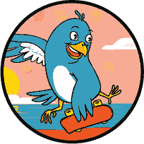
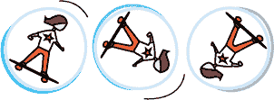
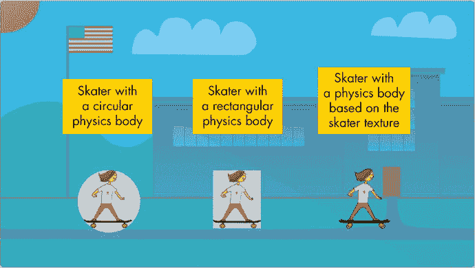
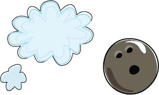
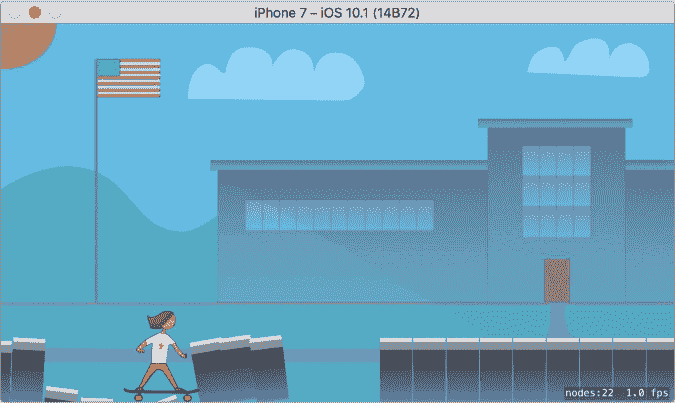
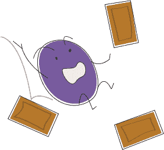
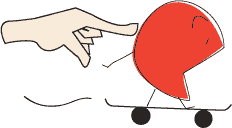

## 第十六章：## 使用 SpriteKit 物理引擎



在这一章中，我们将在我们的滑板游戏中使用 SpriteKit 的物理引擎。*物理引擎*处理游戏中的物理动作，比如重力如何作用、物体的速度、物体如何相互弹跳等等，这样你就可以用更少的代码做出更复杂的游戏。在编码游戏时，你需要定义游戏元素（滑冰者、砖块、宝石）应该如何表现，然后物理引擎会负责将它们移动起来。

例如，我们不需要改变滑冰者的速度，当她跳跃时，我们只需告诉计算机她有多重，然后施加一个向上的力。这会告诉物理引擎推滑冰者向上，并让重力将她拉回来。我们不需要做其他任何事情。物理引擎会在她跳跃时自动处理她的速度和位置，并确保她的轮子在着陆时与人行道上的砖块碰撞。

但首先，物理引擎需要你告诉它一些关于游戏*物理世界*的事情。例如，如果你的游戏发生在外太空，你需要告诉它没有重力。对于发生在地球上的游戏，你需要告诉它使用向下的重力。你还需要为每个精灵或节点定义*物理体*。这帮助计算机根据物体的重量、是否受重力影响以及其反弹性，来判断每个物体应该如何表现。一旦你完成了这些设置，精灵将会自动移动，并在你运行游戏时像现实世界中的物体一样表现。

现在你理解了物理引擎的作用，我们来看看它的实际应用。我们将设置我们的物理世界，为精灵创建物理体，施加力量，并检查碰撞。

### 设置物理世界

每个 SKScene 都有一个名为 physicsWorld 的 SKPhysicsWorld 属性。我们可以在这里设置应用于这个场景中所有物体的全局属性，比如重力。在 GameScene 类的 didMove(to:)方法顶部添加以下代码：

*GameScene.swift*

```
override func didMove(to view: SKView) {

    physicsWorld
 .gravity
 = CGVector
 (dx: 0.0
 , dy: -6.0
 )

    anchorPoint = CGPoint.zero

    --
 *snip* 
 --

}

```

这使用一个 CGVector 来设置世界的重力，CGVector 是一种数据类型，包含 x 和 y 值。它就像一个 CGPoint，区别在于这些值代表的是一个向量的分量，而不是一个点的坐标。*向量*是结合了速度和方向的量，方向由水平方向（x）和垂直方向（y）分量决定。换句话说，当我们设置 x 和 y 值时，我们实际上是在设置 x 方向上的速度和 y 方向上的速度，这两者结合起来形成一个向量。在我们的游戏中，我们设置了 x 值为 0.0，y 值为-6.0。这意味着水平方向没有重力，垂直方向有适度的重力。地球上的正常重力 y 值为-9.8，所以我们的-6.0 值应该会让世界变得更加轻盈和卡通化。如果我们希望重力把所有物体向上拉，可以为重力设置一个正的 y 值。

另一个我们可以设置的 physicsWorld 属性是`speed`，它告诉物理引擎一切应该运行的速度。默认值是 1.0，这意味着一切以正常速度运行。将速度设置为 2.0 会使整个物理模拟速度加倍。这项属性对于游戏中的特殊效果非常有用，比如慢动作或快进。在《滑板学校》游戏中，我们将保持默认速度。

### 物理体

当你将一个精灵（比如你的滑冰者）添加到场景中时，计算机知道这个精灵应该是什么样子，但仅此而已。它不知道这个精灵是轻的还是重的，是粗糙的还是光滑的，也不知道它是否应该从其他物体上弹起。SpriteKit 有一个名为 SKPhysicsBody 的类，我们通过它给精灵添加物理体。

#### 为物理体赋予形状

所有的精灵都是矩形的。例如，一张棒球的图像文件是一个矩形图像，中间画着一个棒球。当你使用这张棒球图像创建精灵时，计算机并不知道它是圆形的，除非你告诉它这个信息。如果你想让这个精灵像一个真正的棒球一样反弹，你需要给精灵添加一个*圆形*物理体。

在你为精灵应用物理体之前，你需要使用 SKPhysicsBody 类创建一个物理体。以下示例代码展示了创建物理体的三种不同方式：

```
➊
 let
 ballBody = SKPhysicsBody
 (circleOfRadius: 30.0
 )

➋
 let
 boxBody = SKPhysicsBody
 (rectangleOf: box
 .size
 )

➌
 let
 skaterBody = SKPhysicsBody
 (texture: skaterTexture, size: skater
 .size)
```

第一个示例创建了一个半径为 30.0 点的圆形物理体 ➊ 。这对于一个球来说非常合适。第二个示例为一个盒子形状的精灵创建了一个矩形物理体 ➋ 。如果你已经创建了一个精灵，你可以直接使用该精灵的大小作为物理体的大小。在这个例子中，我们使用了一个假设的盒子精灵来设置其大小。

最终示例通过提供一个*纹理* ➌ 来创建一个物理体，这是游戏开发中常用的图像格式。你创建的每一个 SKSpriteNode 都有一个属性`texture`，可以用来访问精灵的纹理，无论创建精灵时使用的是哪种文件类型（如 PNG、JPEG 等）。当你使用精灵的纹理来创建其物理体时，SpriteKit 会自动检查纹理，并通过寻找图像的边缘并忽略图像的透明部分来创建一个大致符合图像实际形状的物理体。在这个例子中，我们使用了纹理`skaterTexture`，它是在代码中之前定义的（你将在“为滑冰精灵添加物理体”一章的第 244 页中学习如何访问精灵的纹理；暂时不用担心这个）。纹理并不定义物理体的大小，因此我们还设置了物理体的大小为滑冰精灵的大小。

精灵的纹理就是在屏幕上显示的内容，而物理体定义了该精灵的行为方式。两者不需要完全一致。你可以为滑冰者精灵使用一个圆形物理体，这样精灵看起来像一个滑冰者，但会像球一样滚动。虽然这会很有趣，但通常最好是创建一个与精灵外观最为匹配的物理体。



图 16-1 展示了应用了不同物理体的滑冰者精灵。图中显示的物理体为灰色，但你在屏幕上实际上是看不到它们的。它们完全是透明的，仅供计算机判断该精灵应如何表现。



*图 16-1：应用于*滑冰者*精灵的各种物理体*

拥有圆形物理体的滑冰者会像球一样滚动。拥有矩形物理体的滑冰者则会像盒子一样运动。而第三种滑冰者，其物理体基于实际纹理，会表现得更像我们期望的现实世界滑冰者。如果她的手尖碰到某物，看起来就像是确实发生了这种情况。

#### 设置物理体属性

你为物理体设置属性，以便向计算机描述它们。云朵的质量非常小，这意味着它很轻，不会受到重力的影响。保龄球则会很重，具有较大的质量，肯定会受到重力的影响。表 16-1 列出了一些常见的物理体属性。



**表 16-1：** SKPhysicsBody 的常见属性

| **属性** | **描述** |
| --- | --- |
| mass | 定义物体的重量。你可以使用任何有效的 CGFloat 值。实际使用的值并不重要，只要在整个应用中保持一致即可。 |
| friction | 定义表面的粗糙程度。例如，冰面摩擦力较小，接触的物体会继续滑动。值的范围是从 0.0 到 1.0。 |
| restitution | 定义物体的弹性。它在物体碰撞时使用。值的范围从 0.0 到 1.0，较高的值意味着更有弹性。 |
| affectedByGravity | 定义该物体是否会受到重力影响。 |
| allowsRotation | 定义是否允许物体旋转。 |

让我们看看如何使用这些属性。由于我们实际上不会在游戏中使用这些示例，你无需输入这些代码。以下是一些示例：

```
  let
 bowlingBall = SKPhysicsBody
 (circleOfRadius: 10.0
 )

➊
 bowlingBall.mass
 = 100.0

➋
 bowlingBall.friction
 = 0.3

➌
 bowlingBall.restitution
 = 0.1

➍
 bowlingBall.affectedByGravity
 = true

➎
 bowlingBall.allowsRotation
 = true

  let
 basketball = SKPhysicsBody
 (circleOfRadius: 10.0
 )

  basketball.mass
 = 12.0

  basketball.friction
 = 0.5

  basketball.restitution
 = 0.7

  basketball.affectedByGravity
 = true

  basketball.allowsRotation
 = true

  let
 iceCube = SKPhysicsBody
 (rectangleOf: CGSize
 (width: 1.0
 , height: 1.0
 ))

  iceCube.mass
 = 7.0

  iceCube.friction
 = 0.1

  iceCube.restitution
 = 0.2

  iceCube.affectedByGravity
 = true

  iceCube.allowsRotation
 = false

  let
 cloud = SKPhysicsBody
 (texture: cloudTexture, size: cloudSize)

  cloud.mass
 = 1.0

  cloud.friction
 = 0.0

  cloud.restitution
 = 0.0

➏
 cloud.affectedByGravity
 = false

  cloud.allowsRotation
 = false

```

在这些示例中，保龄球很重 ➊，摩擦力小 ➋，并且恢复力（弹性）低 ➌。篮球的代码与之相同，但其值设置为轻便、具有中等摩擦力，并且非常弹性。冰块轻便，摩擦力小，弹性差。而云朵非常轻，没有摩擦力，也没有弹性。除了云朵 ➏（因为我们不希望它掉到地球上）外，所有物理体都设置为受重力影响 ➍。此外，保龄球和篮球的物理体设置为允许物体旋转 ➎，而冰块和云朵则不允许。

在为游戏精灵设置物理体时，需要通过反复试验来找到正确的值，使你的物体表现得如你所愿。

#### 给滑冰者精灵添加物理体

之前，我们讨论了给物理体分配形状的各种方式。对于我们的滑冰者精灵，我们将使用精灵的纹理，使物理体的形状与我们的滑冰者完全相同。切换到 *Skater.swift* 文件，并向 Skater 类中添加以下方法：

*Skater.swift*

```
class Skater: SKSpriteNode {

    --
 *snip* 
 --

    var isOnGround = true

    func
 setupPhysicsBody() {

     ➊
 if
 let
 skaterTexture = texture
 {

        ➋
 physicsBody
 = SKPhysicsBody
 (texture: skaterTexture, size: size
 )

        ➌
 physicsBody
 ?.isDynamic
 = true

        ➍
 physicsBody
 ?.density
 = 6.0

        ➎
 physicsBody
 ?.allowsRotation
 = true

        ➏
 physicsBody
 ?.angularDamping
 = 1.0

       }

    }

}

```

为了根据滑冰者精灵的纹理创建物理体，我们首先需要检查纹理是否存在，因为纹理是 `SKSpriteNode` 的一个可选属性。➊ 处的代码解包了纹理为 `skaterTexture`。➋ 处的代码将滑冰者的物理体设置为使用滑冰者精灵的纹理和大小创建的一个新的 `SKPhysicsBody`。

接下来，我们设置物理体的一些属性，以便使其表现出我们想要的行为。将物理体的 `isDynamic` 属性设置为 true ➌ 表示我们希望这个对象能被物理引擎移动。有时你可能希望一个对象参与物理模拟，以便了解它何时与其他物体接触，但又不希望它受到物理引擎的力、重力或碰撞的影响。此时，你应该将 `isDynamic` 设置为 false。

在 ➍ 处，我们将滑冰者精灵物理体的密度属性设置为 6.0。密度是指某物体在其体积下的重度。保龄球的密度远高于排球——换句话说，它们大小相同，但保龄球要重得多。设置密度可以告诉物理引擎，当这个物体与其他物体碰撞或受到力作用时，它应该如何表现。如果保龄球与其他物体碰撞，它更有可能将另一个物体推开，而排球则不太可能，因为保龄球的密度较高。

将 `allowsRotation` 属性设置为 true ➎ 告诉物理引擎，这个物理体可能会旋转或旋转。如果我们不希望滑冰者翻倒，我们可以将其设置为 false。

最后，我们设置了 angularDamping 值 ➏。*角阻尼*是物理体抵抗旋转的程度。较低的值使物体可以更自由地旋转，而较高的值则意味着物体不容易翻倒。现在我们将 angularDamping 设置为 1.0，但稍后我们可能会发现滑板翻倒得太容易或不容易，我们可能会回来修改这个值。

现在我们在 Skater 类中有了设置滑板精灵物理体的方法，我们只需要在创建滑板后调用这个方法。切换回*GameScene.swift*，并在 didMove(to:)方法中添加这一行：

*GameScene.swift*

```
override func didMove(to view: SKView) {

    --
 *snip* 
 --

    addChild(background)

    // Set up the skater and add her to the scene

    skater
 .setupPhysicsBody
 ()

    resetSkater()

```

由于我们的滑板精灵是作为 GameScene 类的一个属性创建的，它将在 didMove(to:)方法调用时已经存在，因此这是设置滑板物理体的好时机。

接下来，我们将为人行道砖块设置物理体，这样滑板就可以与它们发生碰撞了。

#### 为砖块添加物理体

我们需要在砖块创建的位置添加物理体。在 spawnBrick(_:)方法中，将以下内容添加到方法的末尾，但在最后一行`return brick`之前：

*GameScene.swift*

```
func spawnBrick(atPosition position: CGPoint) -> SKSpriteNode {

    --
 *snip* 
 --

    bricks.append(brick)

    // Set up the brick's physics body

  ➊
 let
 center = brick.centerRect
 .origin

  ➋
 brick.physicsBody
 = SKPhysicsBody
 (rectangleOf: brick.size
 , center: center)

  ➌
 brick.physicsBody
 ?.affectedByGravity
 = false

    // Return this new brick to the caller

```

对于砖块，我们希望指定物理体为简单的矩形。因此，我们需要知道砖块的大小和中心点，以便放置矩形物理体。➊这一行找到了新创建的砖块的中心点。➋这一行通过指定与砖块同样大小的矩形并将其放置在砖块的中心来创建并赋值给砖块精灵的物理体。现在，这个物理体已经设置好，直接附加在砖块精灵上。➌这一行告诉砖块精灵的物理体不受重力影响。我们不希望人行道穿透屏幕底部。

### 接触和碰撞

计算机需要知道你的物理体中哪些应该*相互碰撞*。例如，我们希望滑板与人行道砖块发生碰撞，这样她就不会穿过它们。然而，有些物体不应该发生碰撞。稍后我们将添加滑板收集的宝石。我们*不*希望她与宝石发生反弹，因此我们会告诉计算机，滑板和宝石之间没有碰撞。然而，我们希望知道滑板是否接触到宝石。这就是所谓的*接触*。当任何两个物体发生接触时，会调用一个特殊的 SpriteKit 方法来通知我们，这样我们可以处理它。当滑板与宝石接触时，我们希望移除宝石，这样看起来就像她收集了它。

#### 处理接触和碰撞

现在我们已经设置了世界的重力，并且给一些精灵添加了物理体，尝试运行游戏看看会发生什么。注意观察应用启动时的情况，否则你可能会错过。你应该看到类似图 16-2 的效果，但滑板会很快消失。



*图 16-2：她看起来对发生的事情感到有些过于高兴。*

这里发生了什么？滑冰者和砖块现在都是物理模拟的一部分，所以滑冰者因重力而摔倒，我们把砖块向左移动，它们撞上了她。为了修复这个问题，我们需要告诉 SpriteKit 哪些物体应该互相碰撞，哪些不应该。为了做到这一点，我们需要一种方式来将每个物体分类为滑冰者、砖块或宝石（我们直到稍后才会添加宝石，但现在我们会为它们创建一个类别）。

在*GameScene.swift*中，在文件顶部的导入语句后、GameScene 类定义之前，添加以下结构体：

*GameScene.swift*

```
import SpriteKit

/// This struct holds various physics categories, so we can define

/// which object types collide or have contact with each other

struct
 PhysicsCategory {

    static
 let
 skater: UInt32
 = 0x1
 << 0

    static
 let
 brick: UInt32
 = 0x1
 << 1

    static
 let
 gem: UInt32
 = 0x1
 << 2

}

class GameScene: SKScene {

```

这个 PhysicsCategory 结构体定义了物理体可以属于的几种不同类别。值必须是 UInt32 类型，SpriteKit 用于物理类别的特殊无符号 32 位整数类型。*无符号*意味着整数没有正负号。无符号整数必须始终为零或正数，不能为负数。32 位整数是一种可以存储非常大数字的整数类型。整数可以指定为 8 位、16 位、32 位或 64 位。在 Swift 中，通常不需要指定整数使用多少位，因为 Swift 类型 Int 会自动处理这一点。但是由于 SpriteKit 的物理类别专门需要 UInt32 类型，我们需要指定这个类型，否则在稍后将这些物理类别分配给物理体时会出错。

我们使用位掩码（0x1 << 0 ）来分配这些 PhysicsCategory 值。此时不需要理解位掩码是什么。只要知道每个物理类别需要一个唯一的位掩码数字，区分它与其他类别即可。你添加的每个新类别的值应该在<<后的数字比前一个大 1——但所有值都必须小于 32。现在我们定义了这个结构体后，我们可以将每个物理体放入适当的类别。

对于砖块，在 spawnBrick(atPosition:)方法中，在设置 affectedByGravity 属性的那行代码后面添加以下代码：

```
func spawnBrick(atPosition position: CGPoint) -> SKSpriteNode {

    --
 *snip* 
 --

    brick.physicsBody?.affectedByGravity = false

 ➊
 brick.physicsBody
 ?.categoryBitMask
 = PhysicsCategory
 .brick

  ➋
 brick.physicsBody
 ?.collisionBitMask
 = 0

    // Return this new brick to the caller

```

➊ 这一行将物理体的 categoryBitMask 设置为我们创建的砖块类别。这告诉 SpriteKit 这个物体属于哪种类型。接下来，我们将物理体的 collisionBitMask 设置为 0 ➋。将物理体的一个位掩码设置为 0 表示它不应分配给该位掩码属性的任何类别。所以将 collisionBitMask 设置为 0 告诉 SpriteKit 砖块不应与任何物体发生碰撞。在 SpriteKit 中，当一个物理体与另一个物理体碰撞并弹开时，我们称之为碰撞。当我们希望某物体与其他物理体发生碰撞时，我们定义 collisionBitMask。但由于我们不希望砖块与任何东西发生碰撞，包括滑冰者，所以我们不希望它们与任何物体碰撞。它们应该保持原地不动。collisionBitMask 只是告诉 SpriteKit 当前物体在碰撞时的行为方式。它并不告诉 *其他* 物体在碰撞到砖块时该如何表现——这取决于其他物体的物理体。

对于滑冰者，打开 *Skater.swift*，并在方法的末尾在 setupPhysicsBody() 内添加以下代码：

*Skater.swift*

```
func setupPhysicsBody() {

    --
 *snip* 
 --

         physicsBody?.angularDamping = 1.0

     ➊
 physicsBody
 ?.categoryBitMask
 = PhysicsCategory
 .skater

     ➋
 physicsBody
 ?.collisionBitMask
 = PhysicsCategory
 .brick

     ➌
 physicsBody
 ?.contactTestBitMask
 = PhysicsCategory
 .brick
 |

           PhysicsCategory
 .gem

    }

}

```

首先，我们将滑冰者的类别设置为我们创建的滑冰者物理类别 ➊。接下来，我们将碰撞位掩码设置为砖块类别 ➋。这告诉 SpriteKit，我们希望滑冰者受到与砖块碰撞的影响——她应该从砖块上弹开。



最后，我们将 contactTestBitMask 设置为砖块和宝石类别 ➌。这告诉 SpriteKit，我们希望在滑冰者接触或触碰到这两种类型的物体时得到通知。竖线（|），也就是管道字符，是指定多个位掩码值的方法。由于我们使用位掩码定义了 PhysicsCategory 结构体，因此我们可以使用这个管道字符来分隔值，从而为任何物理类别属性设置一个或多个值。我们可以在这里通过管道符连接任意多的类别。设置 contactTestBitMask 不会影响物体在物理模拟中的表现，它只是意味着当这些物体接触时我们会收到通知。我们希望知道滑冰者何时接触到砖块，因为这告诉我们她是否站在地面上。我们还希望知道她何时接触到宝石，这样她就能收集宝石并获得积分。

如果你现在运行项目，应该会看到滑冰者沿着砖块的顶部滑行。如果你仔细观察，还会看到她因为物理引擎的作用而下沉到砖块的缝隙里。如果你让滑冰者跳跃多次，甚至可能让她摔倒。

#### 响应接触

现在我们已经设置了物理体的类别，并为滑冰者的物理体设置了接触位掩码，我们可以让物理引擎告诉我们何时滑冰者接触到砖块。我们将利用这些信息来判断滑冰者精灵是否在地面上。如果她接触到任何砖块对象，那么她就在地面上。物理引擎通过一个叫做 SKPhysicsContactDelegate 的协议向我们报告接触情况。让我们让我们的 GameScene 类实现这个协议。

首先，在 *GameScene.swift* 中，通过输入逗号并随后输入协议名来将协议添加到类定义中，像这样：

*GameScene.swift*

```
class GameScene: SKScene
 , SKPhysicsContactDelegate
 {

```

接下来，我们需要将我们的 GameScene 设置为物理世界的接触代理。这意味着我们的 GameScene 类将是接触报告的地方。在 didMove(to:) 方法内部，在已有的设置物理世界重力的代码下方添加这一行：

```
override func didMove(to view: SKView) {

    physicsWorld.gravity = CGVector(dx: 0.0, dy: -6.0)

    physicsWorld
 .contactDelegate
 = self

    anchorPoint = CGPoint.zero

```

最后，我们需要添加一个方法，每当两个物理体接触时，它就会被调用。SKPhysicsContactDelegate 定义了一个叫做 `didBegin(_:)` 的方法来实现这一功能。将这个方法添加到 *GameScene.swift* 中 GameScene 类的底部：

```
  func handleTap(tapGesture: UITapGestureRecognizer) {

    --
 *snip* 
 --

  }

  // MARK:- SKPhysicsContactDelegate Methods

➊
 func
 didBegin(_
 contact: SKPhysicsContact
 ) {

     // Check if the contact is between the skater and a brick

  ➋
 if
 contact.bodyA
 .categoryBitMask
 == PhysicsCategory
 .skater
 && 

        contact.bodyB
 .categoryBitMask
 == PhysicsCategory
 .brick
 {

      ➌
 skater
 .isOnGround
 = true

    }

}
```

你可能已经注意到，当你开始输入 `func didBegin ➊` 时，Xcode 的自动补全会建议你这个方法声明。Xcode 期待你添加这个方法，因为你已经将 SKPhysicsContactDelegate 协议添加到类定义中。传递给这个方法的接触对象有两个物理体作为属性，分别叫做 bodyA 和 bodyB。通过检查这些物体的类别 ➋ ，我们可以判断这个接触是否发生在滑冰者和砖块之间。如果是这样，在 ➌ 处，我们将滑冰者精灵的 `isOnGround` 属性设置为 `true`，因为我们知道滑冰者已经在地面上了。我们将在第十七章添加处理宝石接触的代码。

### 应用力到物理体

为了让物体移动，我们可以给它们施加力。之前，我们用施加向上力让滑冰者跳跃作为例子，但力可以施加在任何方向。可以把力看作是一个看不见的手推着游戏中的某个物体。力也可以是 *连续的* 或 *冲击力*。连续力是指持续对某物体施加力，就像火箭的推力一样。冲击力是一次性施加到物体上的瞬时力，比如踢足球。我们可以使用两种不同的函数在物理体上施加向上力：`applyForce(_:)` 用于连续力，`applyImpulse(_:)` 用于冲击力。



在实现物理引擎之前，我们通过在玩家点击屏幕时为滑冰者设置速度来处理跳跃。但现在我们有了物理体，我们希望通过施加一次性力量来让她跳跃。为了让滑冰者跳跃，我们将通过调用 `applyImpulse(_:)` 来施加冲击力。

移除 `handleTap(_:)` 方法中已有的代码，并添加以下代码，以便整个方法看起来像这样：

*GameScene.swift*

```
func handleTap(tapGesture: UITapGestureRecognizer) {

    // Make the skater jump if player taps while she is on the ground

    if
 skater
 .isOnGround
 {

     ➊
 skater
 .physicsBody
 ?.applyImpulse
 (CGVector
 (dx: 0.0
 , dy: 260.0
 ))

    }

}

```

现在，我们对滑板运动员精灵的物理体施加了一个冲击力 ➊。当你对物理体施加力时，必须提供一个 `CGVector` 来确定力在 x 轴（`dx`）和 y 轴（`dy`）方向上的推动力度。我们希望这个跳跃向上，因此只给它一个正的 y 值。通过反复试验，我们已经找到一个有效的值——260.0，作为第二个参数。你可以尝试其他值，看看它们如何影响跳跃。事实上，现在就运行游戏并测试一下吧！

请注意，我们在这个 `handleTap(_:)` 方法中不再设置 `skater.isOnGround = false`。现在我们使用物理引擎让滑板运动员跳跃，施加一个向上的力并不一定意味着她会离开地面。例如，如果她头顶上方有砖块阻挡她跳起来呢？即使施加了向上的力，她也不会离开地面。因此，在对滑板运动员精灵施加向上的力后，直接设置 `skater.isOnGround = false` 并不总是正确的做法。相反，我们会在 `updateSkater()` 方法中检查她的速度，以确定她是否在地面上。我们将在 “结束游戏” 中更新这个方法，具体内容见 第 254 页。

### 开始和结束游戏

现在我们已经在游戏中启用了 SpriteKit 物理引擎，我们可以利用它来判断游戏何时结束。例如，当滑板运动员摔倒时，游戏应该结束。但在结束游戏之前，我们需要一种方式来开始新的一局。目前，当你运行应用程序时，游戏会开始，因为我们放入 `didMove(to:)` 函数中的代码会被调用。但我们还没有办法让游戏结束并重新开始。我们需要安排代码，使得 `didMove(to:)` 中完成的工作是我们希望仅执行一次的内容（例如，将滑板运动员精灵添加到场景中）。此外，我们还需要创建一个 `startGame()` 方法，执行每次游戏开始时应做的工作（例如，将滑板运动员精灵移到起始位置）。

#### 开始游戏

在这款游戏中，滑板运动员会随着游戏进行而越来越快。但是当游戏重新开始时，她需要恢复到较慢的起始速度。所以，我们需要做的第一件事是创建一个类属性来存储她的起始速度。在 `GameScene` 类的顶部附近，在我们声明 `scrollSpeed` 类属性的地方，添加以下代码：

*GameScene.swift*

```
var scrollSpeed: CGFloat = 5.0

let
 startingScrollSpeed: CGFloat
 = 5.0

// A constant for gravity, or how fast objects will fall to Earth

```

现在，当我们增加 `scrollSpeed` 时，我们总是能知道游戏重新开始时应该设置的起始速度。

接下来，在现有的 `resetSkater()` 方法后，添加以下新的方法：

```
func resetSkater() {

    --
 *snip* 
 --

}

func
 startGame() {

    // When a new game is started, reset to starting conditions

  ➊
 resetSkater
 ()

  ➋
 scrollSpeed
 = startingScrollSpeed

  ➌
 lastUpdateTime
 = nil

  ➍
 for
 brick in
 bricks
 {

        brick.removeFromParent()

    }

  ➎
 bricks
 .removeAll
 (keepingCapacity: true
 )

}
```

这个方法的任务是重置游戏，让一切恢复到新游戏开始时的状态。首先，我们调用方法来重置滑板角色 ➊ 。这将把她移回起始位置。接着，我们重置一些类变量。scrollSpeed 设置为初始速度 ➋ ，lastUpdateTime 设置回 nil ➌ 。

最后，我们需要将所有砖块精灵从场景中移除。在游戏结束时，砖块可能会散布到各个地方（特别是在稍后我们添加更高的砖块，滑板角色需要跳跃才能触及它们时），因此最好将它们全部移除，并让 updateBricks(withScrollAmount:) 方法负责在正确的位置重新添加它们。在 ➍ 处，我们遍历 bricks 数组中的所有砖块精灵，并通过调用 removeFromParent() 将每个砖块从场景中移除。然后，我们需要将砖块精灵从 bricks 数组中移除。最简单的方法是调用 bricks 数组的 removeAll(_:) 方法 ➎。

现在我们已经有了 startGame() 方法，当场景第一次出现时，我们需要调用它。在 didMove(to:) 方法的末尾添加以下行：

```
override func didMove(to view: SKView) {

    --
 *snip* 
 --

    view.addGestureRecognizer(tapGesture)

    startGame
 ()

}

```

由于 startGame() 方法现在调用了 resetSkater()，我们不再需要在 didMove(to:) 中调用它。请从 didMove(to:) 方法中删除以下一行。

```

     // Set up the skater and add her to the scene

    skater.setupPhysicsBody()

    resetSkater() // ← Remove this line of code

    addChild(skater)

```

你的 didMove(to:) 方法现在应该是这样的：

```
override
 func
 didMove(to view: SKView
 ) {

    physicsWorld
 .gravity
 = CGVector
 (dx: 0.0
 , dy: -6.0
 )

    physicsWorld
 .contactDelegate
 = self

    anchorPoint
 = CGPoint
 .zero

    let
 background = SKSpriteNode
 (imageNamed: "background"
 )

    let
 xMid = frame
 .midX

    let
 yMid = frame
 .midY

    background.position
 = CGPoint
 (x: xMid, y: yMid)

    addChild
 (background)

    // Set up the skater and add her to the scene

    skater
 .setupPhysicsBody
 ()

    addChild
 (skater
 )

    // Add a tap gesture recognizer to know when the user tapped the screen

    let
 tapMethod = #selector
 (GameScene
 .handleTap
 (tapGesture:))

    let
 tapGesture = UITapGestureRecognizer
 (target: self
 , action: tapMethod)

    view.addGestureRecognizer(t
 apGesture)

    startGame
 ()

}
```

启动新游戏时，我们需要处理的最后一件事是重置滑板精灵的某些额外属性，这些属性可能已经因为物理模拟发生了变化。将以下代码添加到 resetSkater() 方法的末尾：

```
func resetSkater() {

    --
 *snip* 
 --

    skater.minimumY = skaterY

  ➊
 skater
 .zRotation
 = 0.0

  ➋
 skater
 .physicsBody
 ?.velocity
 = CGVector
 (dx: 0.0
 , dy: 0.0
 )

  ➌
 skater
 .physicsBody
 ?.angularVelocity
 = 0.0

}

```

➊ 这一行将滑板角色的 zRotation 重置为 0.0。zRotation 是表示精灵旋转角度的属性，它表示精灵旋转到右侧或左侧的程度。将其设置为 0.0 将使滑板角色站直，以防她倾斜倒下。➋ 这一行将她的物理体的速度（velocity）设置为 0.0。如果她正在跳跃或下落，这将使她再次静止。➌ 这一行将她的角速度（angularVelocity）重置为 0.0。将精灵的 zRotation 设置为 0.0 可以让她看起来是站直的，但物理体可能依然在旋转，所以我们也需要将其角速度归零。

#### 结束游戏

如果现在运行游戏，且不让滑板角色跳跃，你应该会看到她只是倾斜并沿着地面滑行，或者掉进洞里，但不会发生其他事情。让我们添加一些代码来检测她是否倾斜，并在她倾斜时结束游戏。将以下方法添加到现有的 startGame() 方法后面：

*GameScene.swift*

```
func
 gameOver() {

    startGame
 ()

}
```

游戏结束后，我们现在可以调用 gameOver() 方法，它将开始一个新游戏。接下来，替换 updateSkater() 方法的全部内容，使其看起来像以下代码：

```
func
 updateSkater() {

    // Determine if the skater is currently on the ground

  ➊
 if
 let
 velocityY = skater
 .physicsBody
 ?.velocity
 .dy
 {

     ➋
 if
 velocityY < -100.0
 || velocityY > 100.0
 {

         skater
 .isOnGround
 = false

       }

    }

    // Check if the game should end

  ➌
 let
 isOffScreen = skater
 .position
 .y
 < 0.0
 || skater
 .position
 .x
 < 0.0

  ➍
 let
 maxRotation = CGFloat
 (GLKMathDegreesToRadians
 (85.0
 ))

  ➎
 let
 isTippedOver = skater
 .zRotation
 > maxRotation || 

        skater
 .zRotation
 < -maxRotation

  ➏
 if
 isOffScreen || isTippedOver {

        gameOver
 ()

    }

}
```

updateSkater() 方法需要做两件事。首先，它需要检查滑板角色是否在跳跃，因为她在空中时不能跳跃。其次，它需要检查她是否已经倾斜或被推到屏幕外。如果是这样，游戏应该结束。

要检查滑冰者是否在地面上，我们需要检查她的 y 速度。为了使用 y 速度，我们需要解包它，这一步在 ➊ 处完成。当滑冰者跳跃或掉落时，她的物理体将具有较大的速度——如果她跳跃，则速度为正；如果她掉落，则速度为负。在这两种情况下，她都不应再进行跳跃。因此，➋ 处的代码检查她的物理体的 y 速度是否小于 -100.0 或大于 100.0。如果是，滑冰者精灵的 isOnGround 属性将被设为 false。

如果滑冰者从屏幕底部掉落，她的 y 位置将小于零；如果她被推到屏幕的左侧，她的 x 位置将小于零。➌ 处的代码会在这两种情况中任一为真时，将一个名为 isOffScreen 的布尔值设为 true。

要判断滑冰者是否翻倒，我们需要检查她精灵的 zRotation。如果它大于 85 度或小于 -85 度，我们就认为她翻倒了，因为在 90 度时她会平躺在侧面。使用 85 度作为检查值而不是 90 度，为她可能没有完全翻倒但已经倾斜到无法站起来的情况提供了一些缓冲。zRotation 属性以 *弧度* 测量，这是另一种测量角度的方式。由于角度以度数为单位更容易理解，我们使用一个数学函数来创建一个等于 85 度的最大旋转常量 ➍ 。➎ 处的代码会将一个名为 isTippedOver 的布尔值设为 true，如果滑冰者的旋转大于 85 度或小于 -85 度。

现在我们有了这些表示游戏结束条件的布尔值变量，我们只需要检查其中一个是否为真 ➏ ，如果是，就调用 gameOver() 函数。就这样！现在每一帧更新时，我们都会检查滑冰者是否离开了屏幕或翻倒，如果是，游戏就结束。目前，结束游戏会自动开始一局新游戏。在 第十八章 中，我们将添加一个简单的“游戏结束”界面，玩家需要点击屏幕才能开始新的一局。

### 你学到了什么

在本章中，你学习了如何使用 SpriteKit 的物理引擎来为游戏开发做一些繁重的工作。你通过为精灵设置物理体，定义每个精灵在物理模拟中的行为，完成了这项工作。你学会了如何让精灵之间发生碰撞，如何检测两个精灵之间的接触，以及如何对精灵施加力使其移动。最后，你学会了如何通过为每个过程创建单独的方法，干净地开始和结束游戏。

## 使用 SpriteKit 物理引擎


在本章中，我们将在滑板游戏中使用 SpriteKit 的物理引擎。*物理引擎* 处理游戏中的物理行为，例如重力如何作用、物体的速度、物体如何相互碰撞等，这样你就可以用更少的代码制作更复杂的游戏。在编写游戏代码时，你定义游戏元素（滑板手、砖块、宝石）的行为，然后物理引擎会处理一切物体的移动。

例如，当滑板手跳跃时，我们不会直接改变她的速度，而是告诉计算机她的体重，并施加一个向上的力。这告诉物理引擎推动滑板手向上，同时让重力将她拉回地面。我们不需要做任何其他操作。物理引擎会在她跳跃时自动改变她的速度和位置，并确保她的轮子在她落地时与人行道砖块发生碰撞。

但是首先，物理引擎需要你提供一些关于游戏 *物理世界* 的信息。例如，如果你的游戏发生在外太空，你需要告诉它没有重力。对于地球上的游戏，你则需要告诉它使用向下的重力。你还需要为世界中的每个精灵或节点定义 *物理体*。这有助于计算机根据物体的重量、是否受重力影响以及其反弹性来确定每个物体的行为。一旦完成这些设置，精灵将在你运行游戏时自动移动，并像现实世界中的物体一样表现。

现在你已经理解了物理引擎的作用，接下来让我们看看它是如何运作的。我们将设置物理世界，为精灵创建物理体，应用力，并检查碰撞。

### 设置物理世界

每个 SKScene 都有一个名为 physicsWorld 的 SKPhysicsWorld 属性。这是我们设置适用于该场景中所有内容的全局属性的地方，例如重力。在 GameScene 类的 didMove(to:) 方法顶部添加以下代码行：

*GameScene.swift*

```
override func didMove(to view: SKView) {

    physicsWorld
 .gravity
 = CGVector
 (dx: 0.0
 , dy: -6.0
 )

    anchorPoint = CGPoint.zero

    --
 *snip* 
 --

}

```

这段代码使用 CGVector 设置世界的重力，CGVector 是一种数据类型，它包含 x 和 y 值。它就像 CGPoint，只不过这些值表示的是向量的分量，而不是点的坐标。*向量* 是结合了方向的速度，由水平 (x) 和垂直 (y) 分量决定。换句话说，当我们设置 x 和 y 值时，我们就是在设置 x 方向和 y 方向上的速度，这些速度再组合起来形成一个向量。在我们的游戏中，我们设置了 x 值为 0.0，y 值为 -6.0。这意味着水平没有重力，垂直方向上有适度的重力。正常的地球重力的 y 值为 -9.8，所以我们的 -6.0 值会使得这个世界显得更轻盈、像卡通世界一样。如果我们希望重力将所有物体拉向上方，我们可以设置一个正的 y 值。

另一个我们可以设置的 physicsWorld 属性是 speed，它告诉物理引擎一切应以多快的速度运行。默认值是 1.0，这意味着一切以正常速度运行。将 speed 设置为 2.0 会使整个物理模拟运行得更快，速度是正常的两倍。这个属性对于游戏中的特殊效果很有用，例如慢动作或快进。对于《滑板学校》，我们将保持 speed 为默认值。

### 物理体

当你将一个精灵（比如你的滑板精灵）添加到场景中时，计算机知道这个精灵应该是什么样子，但仅此而已。它不知道这个精灵是轻的还是重的，是粗糙的还是光滑的，也不知道它是否应该与其他物体发生碰撞。SpriteKit 有一个叫做 SKPhysicsBody 的类，我们将它添加到精灵中，以赋予精灵物理体。

#### 赋予物理体形状

所有精灵都是矩形的。例如，棒球的图像文件实际上是一个矩形图像，棒球被绘制在中间。当你使用这个棒球图像创建精灵时，计算机并不知道它是圆形的，除非你告诉它。如果你希望这个精灵像真正的棒球一样弹跳，你需要为精灵添加一个*圆形*物理体。

在你能够为精灵应用物理体之前，你需要使用 SKPhysicsBody 类创建一个物理体。这个示例代码展示了创建物理体的三种不同方式：

```
➊
 let
 ballBody = SKPhysicsBody
 (circleOfRadius: 30.0
 )

➋
 let
 boxBody = SKPhysicsBody
 (rectangleOf: box
 .size
 )

➌
 let
 skaterBody = SKPhysicsBody
 (texture: skaterTexture, size: skater
 .size)
```

第一个例子创建了一个半径为 30.0 点的圆形物理体 ➊ 。这对于一个球体来说是完美的。第二个例子为一个盒子形状的精灵创建了一个矩形物理体 ➋ 。如果你已经创建了一个精灵，可以直接使用精灵的大小来设置物理体的大小。在这个例子中，我们有一个假设的盒子精灵，用它来设置物理体的大小。

最终示例通过提供*纹理* ➌ 来创建一个物理体，这是一种在游戏开发中常用的图像格式。每个你创建的 SKSpriteNode 都有一个属性 texture，你可以用它来访问精灵的纹理，无论创建精灵时使用的是哪种文件类型（PNG、JPEG 等）。当你使用精灵的纹理来创建物理体时，SpriteKit 会自动检查纹理并创建一个物理体，通过找到图像的边缘并忽略图像的透明部分，来近似图像的实际形状。在这个例子中，我们使用的是纹理 skaterTexture，这是我们在代码中之前定义的（你将在《为滑板精灵添加物理体》中学习如何访问精灵的纹理，在第 244 页中；现在不用担心）。纹理并不会定义物理体的大小，因此我们还将物理体的大小设置为滑板精灵的大小。

精灵的纹理是显示在屏幕上的内容，而物理体则定义了该精灵的行为方式。两者不需要完全对齐。你可以为滑冰者精灵使用圆形物理体，这样精灵看起来像滑冰者，但会像球一样滚动。虽然看起来很有趣，但通常最好创建一个与精灵外观最匹配的物理体。


图 16-1 显示了应用了不同物理体的滑冰者精灵。图中显示的物理体为灰色，但实际上你在屏幕上是看不见它们的。它们是完全不可见的，只是计算机用来确定精灵应该如何行为的工具。


*图 16-1：应用于* 滑冰者 *精灵的各种物理体*

使用圆形物理体的滑冰者会像球一样滚动。使用矩形物理体的滑冰者会像盒子一样运动。而第三种情况，使用与实际纹理相匹配的物理体，则会表现得更像我们预期的真实世界中的滑冰者。如果她的手指尖碰到某物，画面看起来就像确实发生了那样。

#### 设置物理体的属性

你在物理体上设置属性，以便向计算机描述它们。例如，一朵云的质量非常低，意味着它很轻，不会受到重力的影响。而一个保龄球则会很重，质量高，肯定会受到重力的影响。表 16-1 列出了物理体的一些常见属性。


**表 16-1：SKPhysicsBody 的常见属性**

| **属性** | **描述** |
| --- | --- |
| mass | 定义物体的重量。你可以使用任何有效的 CGFloat 值。实际使用的数值并不重要，只要在应用程序中保持一致即可。 |
| friction | 定义表面的粗糙度。例如，冰面摩擦力较低，接触其上的物体会继续滑动。值的范围是从 0.0 到 1.0。 |
| restitution | 定义物体的反弹性。它在物体相互碰撞时使用。值的范围是从 0.0 到 1.0，值越大表示反弹性越强。 |
| affectedByGravity | 定义这个物体是否应该受重力影响。 |
| allowsRotation | 定义是否允许物体旋转。 |

让我们来看一下如何使用这些属性。由于我们不会在游戏中实际使用这些例子，你不需要输入这些代码。以下是一些示例：

```
  let
 bowlingBall = SKPhysicsBody
 (circleOfRadius: 10.0
 )

➊
 bowlingBall.mass
 = 100.0

➋
 bowlingBall.friction
 = 0.3

➌
 bowlingBall.restitution
 = 0.1

➍
 bowlingBall.affectedByGravity
 = true

➎
 bowlingBall.allowsRotation
 = true

  let
 basketball = SKPhysicsBody
 (circleOfRadius: 10.0
 )

  basketball.mass
 = 12.0

  basketball.friction
 = 0.5

  basketball.restitution
 = 0.7

  basketball.affectedByGravity
 = true

  basketball.allowsRotation
 = true

  let
 iceCube = SKPhysicsBody
 (rectangleOf: CGSize
 (width: 1.0
 , height: 1.0
 ))

  iceCube.mass
 = 7.0

  iceCube.friction
 = 0.1

  iceCube.restitution
 = 0.2

  iceCube.affectedByGravity
 = true

  iceCube.allowsRotation
 = false

  let
 cloud = SKPhysicsBody
 (texture: cloudTexture, size: cloudSize)

  cloud.mass
 = 1.0

  cloud.friction
 = 0.0

  cloud.restitution
 = 0.0

➏
 cloud.affectedByGravity
 = false

  cloud.allowsRotation
 = false

```

在这些示例中，保龄球很重 ➊，摩擦力低 ➋，恢复系数（弹性）低 ➌。篮球的代码与此相同，但其值设置为轻便、摩擦力适中且非常有弹性。冰块轻，摩擦力低且不太弹性。云朵非常轻，没有摩擦力，也没有弹性。所有物理体都设置为受重力影响 ➍，除了云朵 ➏（因为我们不希望它掉到地球上）。另外，保龄球和篮球的物理体设置为允许物体旋转 ➎，而冰块和云朵则不允许。

当你为游戏精灵设置物理体时，通常需要经过一些反复试验才能找到合适的值，使物体的表现符合你的预期。

#### 为滑冰者精灵赋予物理体

之前，我们讨论了为物理体分配形状的各种方法。对于我们的滑冰者精灵，我们将使用精灵的纹理，以便物理体的形状与滑冰者完全相同。切换到*Skater.swift*文件，并在 Skater 类中添加以下方法：

*Skater.swift*

```
class Skater: SKSpriteNode {

    --
 *snip* 
 --

    var isOnGround = true

    func
 setupPhysicsBody() {

     ➊
 if
 let
 skaterTexture = texture
 {

        ➋
 physicsBody
 = SKPhysicsBody
 (texture: skaterTexture, size: size
 )

        ➌
 physicsBody
 ?.isDynamic
 = true

        ➍
 physicsBody
 ?.density
 = 6.0

        ➎
 physicsBody
 ?.allowsRotation
 = true

        ➏
 physicsBody
 ?.angularDamping
 = 1.0

       }

    }

}

```

为了基于滑冰者精灵的纹理创建物理体，我们首先需要检查纹理是否存在，因为纹理是 SKSpriteNode 的一个可选属性。第➊行将纹理解包为 skaterTexture。第➋行将滑冰者的物理体设置为使用滑冰者精灵的纹理和大小创建的新 SKPhysicsBody。

接下来，我们设置物理体的一些属性，以使其表现符合我们的要求。将物体的 isDynamic 属性设置为 true ➌ 表示我们希望这个物体能被物理引擎移动。有时你可能希望某个物体参与物理模拟，以便知道它何时与其他物体接触，但又不希望它被物理引擎的力量、重力或碰撞所移动。在这种情况下，你可以将 isDynamic 设置为 false。

在第➍行，我们将滑冰者精灵的物理体的密度属性设置为 6.0。密度是物体在其体积下的重量。保龄球的密度远大于排球——换句话说，它的体积相同，但更重。设置密度可以告诉物理引擎，当物体与其他物体碰撞或施加力量时，它应该如何表现。如果保龄球撞到另一个物体，它比排球更有可能将另一个物体推开，因为保龄球的密度更高。

将 allowsRotation 属性设置为 true ➎ 告诉物理引擎这个物体可能会旋转或旋转。如果我们不希望滑冰者倾倒，我们可以将其设置为 false。

最后，我们设置了一个 angularDamping 值 ➏。*角阻尼*是物理体抵抗旋转的程度。较低的值使物体更容易旋转，而较高的值则意味着物体不太可能倾倒。现在我们将 angularDamping 设置为 1.0，但稍后我们可能会发现滑冰者倾倒得太容易或不容易，我们可能会回来调整这个值。

现在我们在 Skater 类中有一个方法来设置滑冰者精灵的物理体，我们只需要在滑冰者创建后调用这个方法。切换回*GameScene.swift*并在 didMove(to:)方法内添加这一行：

*GameScene.swift*

```
override func didMove(to view: SKView) {

    --
 *snip* 
 --

    addChild(background)

    // Set up the skater and add her to the scene

    skater
 .setupPhysicsBody
 ()

    resetSkater()

```

由于我们的滑冰者精灵是作为 GameScene 类的一个属性创建的，因此当 didMove(to:)方法在场景中被调用时，它已经存在，所以这是设置滑冰者物理体的好位置。

接下来，我们将为人行道砖块设置物理体，以便滑冰者能够与它们碰撞。

#### 向砖块添加物理体

我们需要在砖块创建时添加物理体。在 spawnBrick(_:)方法内部，在方法的最后一行返回 brick 之前，添加如下内容：

*GameScene.swift*

```
func spawnBrick(atPosition position: CGPoint) -> SKSpriteNode {

    --
 *snip* 
 --

    bricks.append(brick)

    // Set up the brick's physics body

  ➊
 let
 center = brick.centerRect
 .origin

  ➋
 brick.physicsBody
 = SKPhysicsBody
 (rectangleOf: brick.size
 , center: center)

  ➌
 brick.physicsBody
 ?.affectedByGravity
 = false

    // Return this new brick to the caller

```

对于砖块，我们希望将物理体指定为一个简单的矩形。因此，我们需要知道大小和中心点来放置矩形体。➊处的代码找到了新创建的砖块的中心点。➋处的代码通过指定与砖块相同大小的矩形并将其放置在砖块的中心，来创建并赋予砖块精灵物理体。现在这个物理体已经设置好，它就直接附加在砖块精灵的顶部。➌处的代码告诉砖块精灵的物理体它不应受重力影响。我们不希望人行道掉到屏幕底部。

### 接触与碰撞

计算机需要了解的下一个内容是哪些物理体应该*碰撞*。例如，我们希望滑冰者与人行道砖块发生碰撞，这样她就不会穿过它们。然而，有些物体不应该发生碰撞。稍后我们将添加滑冰者可以收集的宝石。我们*不*希望她从宝石上弹开，因此我们会告诉计算机，滑冰者与宝石之间没有碰撞。然而，我们仍然需要知道滑冰者何时接触到宝石。这称为*接触*。当任意两个物体发生接触时，SpriteKit 会调用一个特殊的方法来通知我们，这样我们就能处理它。当滑冰者接触到宝石时，我们希望移除宝石，这样看起来就像她收集了它。

#### 处理接触与碰撞

现在我们已经设置了世界的重力并为一些精灵添加了物理体，尝试运行游戏看看会发生什么。注意在应用程序刚启动时，否则你会错过。你应该会看到类似图 16-2 的画面，但滑冰者很快就会消失。


*图 16-2：她看起来对发生的事情感到有点过于高兴。*

这里发生了什么？现在滑冰者和砖块都已成为物理模拟的一部分，所以滑冰者由于重力下落，我们将砖块向左移动，因此它们撞到了她。要解决这个问题，我们需要告诉 SpriteKit 哪些物体应该相互碰撞，哪些不应该。为了做到这一点，我们需要一种方式将每个物体分类为滑冰者、砖块或宝石（虽然我们稍后才会添加宝石，但现在我们可以为它们创建一个类别）。

在*GameScene.swift*中，在文件顶部的 import 语句之后、GameScene 类定义之前，添加以下结构：

*GameScene.swift*

```
import SpriteKit

/// This struct holds various physics categories, so we can define

/// which object types collide or have contact with each other

struct
 PhysicsCategory {

    static
 let
 skater: UInt32
 = 0x1
 << 0

    static
 let
 brick: UInt32
 = 0x1
 << 1

    static
 let
 gem: UInt32
 = 0x1
 << 2

}

class GameScene: SKScene {

```

这个 PhysicsCategory 结构定义了几个物理体可以属于的不同类别。值必须是 UInt32 类型，这是 SpriteKit 用于物理类别的特殊无符号 32 位整数类型。*无符号*意味着整数没有正负符号。无符号整数必须始终是零或正数，绝不能为负数。32 位整数是一种能够表示非常大的数字的整数类型。整数可以是 8 位、16 位、32 位或 64 位。在 Swift 中，我们通常不需要指定整数使用多少位，因为 Swift 的 Int 类型会自动处理这个问题。但由于 SpriteKit 物理类别特别要求使用 UInt32 类型，我们需要指定该类型，否则在稍后将这些物理类别分配给物理体时会报错。

我们使用位掩码（0x1 << 0）来分配这些 PhysicsCategory 值。此时并不需要理解位掩码是什么。只要知道每个物理类别需要一个独特的位掩码数字来区分它与其他类别即可。你添加的每个新类别应在<<后面的值比前一个大 1——但所有值必须小于 32。现在我们已经定义了这个结构，我们可以将每个物理体放入适当的类别中。

对于砖块，在 spawnBrick(atPosition:)方法中，紧接着设置 affectedByGravity 属性的代码行之后，添加以下代码：

```
func spawnBrick(atPosition position: CGPoint) -> SKSpriteNode {

    --
 *snip* 
 --

    brick.physicsBody?.affectedByGravity = false

 ➊
 brick.physicsBody
 ?.categoryBitMask
 = PhysicsCategory
 .brick

  ➋
 brick.physicsBody
 ?.collisionBitMask
 = 0

    // Return this new brick to the caller

```

➊ 这一行将物理体的 categoryBitMask 设置为我们创建的砖块类别，这告诉 SpriteKit 这个物体是什么类型。接着，我们将物理体的 collisionBitMask 设置为 0 ➋。将物理体的某个位掩码设置为 0 意味着它不应被分配到任何类别中。因此，将 collisionBitMask 设置为 0 告诉 SpriteKit 砖块不应该与任何物体发生碰撞。 在 SpriteKit 中，当一个物理体碰到并从另一个物理体上反弹时，这叫做碰撞。当我们希望某物与其他物理体碰撞时，我们定义 collisionBitMask。但是，因为我们不希望砖块与任何物体发生碰撞，包括滑冰者，所以我们不希望它们与任何物体碰撞。它们应该保持在原地。collisionBitMask 只告诉 SpriteKit 当前物体在碰撞时应该如何行为，它并不告诉 *其他* 物体碰到砖块时应该如何反应——那是其他物体的物理体的责任。

对于滑冰者，打开 *Skater.swift* 文件，并在方法末尾的 setupPhysicsBody() 中添加以下代码：

*Skater.swift*

```
func setupPhysicsBody() {

    --
 *snip* 
 --

         physicsBody?.angularDamping = 1.0

     ➊
 physicsBody
 ?.categoryBitMask
 = PhysicsCategory
 .skater

     ➋
 physicsBody
 ?.collisionBitMask
 = PhysicsCategory
 .brick

     ➌
 physicsBody
 ?.contactTestBitMask
 = PhysicsCategory
 .brick
 |

           PhysicsCategory
 .gem

    }

}

```

首先，我们将滑冰者的类别设置为我们创建的滑冰者物理类别 ➊。接着，我们将 collisionBitMask 设置为砖块类别 ➋。这告诉 SpriteKit 我们希望滑冰者与砖块发生碰撞时受到影响——她应该从砖块上反弹。


最后，我们将 contactTestBitMask 设置为砖块和宝石两种类别 ➌。这告诉 SpriteKit 我们希望在滑冰者与这两种物体接触或碰撞时收到通知。竖线（|）或管道符号是一种为属性指定多个位掩码值的方式。由于我们使用位掩码定义了 PhysicsCategory 结构体，我们可以通过这种管道符号分隔符为任何物理类别属性设置一个或多个值。我们可以用管道符将多个不同的类别连接在一起。设置 contactTestBitMask 不会影响物体在物理模拟中的行为，它只是意味着当这些物体接触时我们会收到通知。我们希望知道滑冰者是否碰到砖块，因为这能告诉我们她是否在地面上。我们还希望知道她是否碰到宝石，这样她就可以收集宝石并获得积分。

如果你现在运行这个项目，你应该能看到滑冰者在砖块的顶部滑行。如果你仔细观察，还能看到她会掉进砖块之间的缝隙里，这要归功于物理引擎。如果你让滑冰者跳跃多次，你甚至能让她摔倒。

#### 响应接触

现在我们已经设置了物理体的类别，并为滑板车的物理体设置了接触位掩码，我们可以让物理引擎在滑板车接触砖块时通知我们。我们将利用这个信息来判断滑板车精灵是否在地面上。如果她接触到了任何砖块对象，那么她就在地面上。物理引擎通过一个名为 SKPhysicsContactDelegate 的协议向我们报告接触情况。让我们让 GameScene 类实现这个协议。

首先，在 *GameScene.swift* 中，通过输入逗号和协议名称来将协议添加到类定义中，如下所示：

*GameScene.swift*

```
class GameScene: SKScene
 , SKPhysicsContactDelegate
 {

```

接下来，我们需要将我们的 GameScene 设置为物理世界的联系人代理。这意味着我们的 GameScene 类将是报告接触的地方。在 didMove(to:) 方法内，在我们设置物理世界重力的现有代码下面添加这一行：

```
override func didMove(to view: SKView) {

    physicsWorld.gravity = CGVector(dx: 0.0, dy: -6.0)

    physicsWorld
 .contactDelegate
 = self

    anchorPoint = CGPoint.zero

```

最后，我们需要添加一个方法，当两个物理体互相接触时，该方法会被调用。SKPhysicsContactDelegate 定义了一个名为 didBegin(_:) 的方法来实现这一点。在 *GameScene.swift* 中，添加这个方法到 GameScene 类的底部：

```
  func handleTap(tapGesture: UITapGestureRecognizer) {

    --
 *snip* 
 --

  }

  // MARK:- SKPhysicsContactDelegate Methods

➊
 func
 didBegin(_
 contact: SKPhysicsContact
 ) {

     // Check if the contact is between the skater and a brick

  ➋
 if
 contact.bodyA
 .categoryBitMask
 == PhysicsCategory
 .skater
 && 

        contact.bodyB
 .categoryBitMask
 == PhysicsCategory
 .brick
 {

      ➌
 skater
 .isOnGround
 = true

    }

}
```

你可能已经注意到，当你开始输入 func didBegin ➊ 时，Xcode 自动补全会建议这个方法声明。Xcode 期望你添加这个方法，因为你已经将 SKPhysicsContactDelegate 协议添加到了类定义中。传递给这个方法的接触对象包含两个物理体，分别是 bodyA 和 bodyB 。通过检查物理体的类别 ➋ ，我们可以判断这个接触是否发生在滑板车和砖块之间。如果是这样，在 ➌ 我们将滑板车精灵的 isOnGround 属性设置为 true，因为我们知道滑板车在地面上。我们将在第十七章 中添加处理宝石接触的代码。

### 向物理体施加力

为了让物体移动，我们可以对它们施加力。之前，我们使用了给滑板车施加向上的力使她跳跃的例子，但力可以向任何方向施加。可以把力看作是游戏中一只看不见的手在推动某个物体。力还可以作为 *连续* 力或 *冲击* 力施加。连续力是指不断推动物体的力，比如火箭的推力。冲击力是一种瞬时施加到物体上的一次性力，比如踢足球。我们可以使用两种不同的函数来对物理体施加向上的力：applyForce(_:) 用于连续力，applyImpulse(_:) 用于冲击力。


在实现物理引擎之前，我们通过在玩家点击屏幕时为滑板车设置速度来处理跳跃。但现在我们有了物理体，我们希望通过施加一次性力来让她跳跃。为了让滑板车跳跃，我们将通过调用 applyImpulse(_:) 来施加一个冲击力。

从 handleTap(_:) 方法中删除现有代码，并添加以下代码，使得整个方法如下所示：

*GameScene.swift*

```
func handleTap(tapGesture: UITapGestureRecognizer) {

    // Make the skater jump if player taps while she is on the ground

    if
 skater
 .isOnGround
 {

     ➊
 skater
 .physicsBody
 ?.applyImpulse
 (CGVector
 (dx: 0.0
 , dy: 260.0
 ))

    }

}

```

现在，我们对滑冰者精灵的物理体施加了一个冲击力 ➊。当你对物理体施加力时，必须提供一个 CGVector 来确定这个力在 x 方向（dx）和 y 方向（dy）上的推动量。我们希望这个跳跃是向上的，因此只给它一个正的 y 值。通过反复试验，我们已经找到了一个有效的值——260.0，即第二个参数。你可以尝试其他值，看看它们如何影响跳跃。实际上，现在就运行游戏并测试一下吧！

请注意，在这个 handleTap(_:)方法中，我们不再设置 skater.isOnGround = false。现在我们使用物理引擎让滑冰者跳跃，施加向上的力并不意味着她一定会离开地面。例如，如果她头顶上方有砖块挡住她的跳跃呢？即使施加了向上的力，她也不会离开地面。出于这个原因，在对滑冰者精灵施加向上的力后，并不总是正确地将 skater.isOnGround 设置为 false。相反，我们将在 updateSkater()方法中检查她的速度，以确定她是否仍在地面上。我们将在“结束游戏”部分的第 254 页中更新这个方法。

### 开始和结束游戏

现在我们已经在游戏中启用了 SpriteKit 物理引擎，可以用它来确定游戏何时结束。例如，当滑冰者翻倒时，游戏应该结束。但在结束游戏之前，我们需要一个方法来开始新的一局。目前，当你运行应用程序时，游戏会开始，因为我们在 didMove(to:)函数中编写的代码会被调用。但我们没有办法让游戏结束并重新开始。我们需要重新安排代码，使得在 didMove(to:)中完成的工作是我们只希望执行一次的内容（比如将滑冰者精灵添加到场景中）。另外，我们还需要创建一个 startGame()方法，执行每次游戏开始时应该做的工作（例如将滑冰者精灵移动到起始位置）。

#### 开始游戏

在这个游戏中，滑冰者会随着游戏的进行越来越快。但当游戏重新开始时，她需要恢复到较慢的初始速度。所以我们需要做的第一件事是创建一个类属性来存储她的初始速度。在 GameScene 类的顶部，紧挨着我们声明 scrollSpeed 类属性的那一行，添加如下代码：

*GameScene.swift*

```
var scrollSpeed: CGFloat = 5.0

let
 startingScrollSpeed: CGFloat
 = 5.0

// A constant for gravity, or how fast objects will fall to Earth

```

现在，当我们增加 scrollSpeed 时，我们总是知道当游戏重新开始时初始速度应该是多少。

接下来，在现有的 resetSkater()方法后，添加以下新的方法：

```
func resetSkater() {

    --
 *snip* 
 --

}

func
 startGame() {

    // When a new game is started, reset to starting conditions

  ➊
 resetSkater
 ()

  ➋
 scrollSpeed
 = startingScrollSpeed

  ➌
 lastUpdateTime
 = nil

  ➍
 for
 brick in
 bricks
 {

        brick.removeFromParent()

    }

  ➎
 bricks
 .removeAll
 (keepingCapacity: true
 )

}
```

这个方法的任务是重置游戏，让一切恢复到新游戏开始时的状态。首先，我们调用方法重置滑行者 ➊。这将把她移回起始位置。接着，我们重置一些类变量。scrollSpeed 被设置为起始速度 ➋，lastUpdateTime 被重置为 nil ➌。

最后，我们需要从场景中移除所有的砖块精灵。在游戏结束时，砖块可能会散落在各个地方（特别是在后续添加了需要滑行者跳跃才能触及的较高砖块时），所以最好直接将它们全部移除，然后让 updateBricks(withScrollAmount:) 方法负责将它们放回正确的位置。在 ➍ 处，我们遍历 bricks 数组中的所有砖块精灵，并通过调用 removeFromParent() 方法将它们从场景中移除。接着，我们必须从 bricks 数组中移除这些砖块精灵。最简单的方法是调用 bricks 数组的 removeAll(_:) 方法 ➎。

既然我们有了 startGame() 方法，我们需要在场景首次出现时调用它。请在 didMove(to:) 方法的末尾添加以下行：

```
override func didMove(to view: SKView) {

    --
 *snip* 
 --

    view.addGestureRecognizer(tapGesture)

    startGame
 ()

}

```

由于 startGame() 方法现在调用了 resetSkater()，我们不再需要在 didMove(to:) 中调用它。请从 didMove(to:) 方法中移除以下行。

```

     // Set up the skater and add her to the scene

    skater.setupPhysicsBody()

    resetSkater() // ← Remove this line of code

    addChild(skater)

```

你的 didMove(to:) 方法现在应该看起来像这样：

```
override
 func
 didMove(to view: SKView
 ) {

    physicsWorld
 .gravity
 = CGVector
 (dx: 0.0
 , dy: -6.0
 )

    physicsWorld
 .contactDelegate
 = self

    anchorPoint
 = CGPoint
 .zero

    let
 background = SKSpriteNode
 (imageNamed: "background"
 )

    let
 xMid = frame
 .midX

    let
 yMid = frame
 .midY

    background.position
 = CGPoint
 (x: xMid, y: yMid)

    addChild
 (background)

    // Set up the skater and add her to the scene

    skater
 .setupPhysicsBody
 ()

    addChild
 (skater
 )

    // Add a tap gesture recognizer to know when the user tapped the screen

    let
 tapMethod = #selector
 (GameScene
 .handleTap
 (tapGesture:))

    let
 tapGesture = UITapGestureRecognizer
 (target: self
 , action: tapMethod)

    view.addGestureRecognizer(t
 apGesture)

    startGame
 ()

}
```

当开始新游戏时，我们需要处理的最后一件事是重置滑行者精灵的一些额外属性，这些属性可能因为物理模拟而发生了变化。在你的 resetSkater() 方法的末尾添加以下代码：

```
func resetSkater() {

    --
 *snip* 
 --

    skater.minimumY = skaterY

  ➊
 skater
 .zRotation
 = 0.0

  ➋
 skater
 .physicsBody
 ?.velocity
 = CGVector
 (dx: 0.0
 , dy: 0.0
 )

  ➌
 skater
 .physicsBody
 ?.angularVelocity
 = 0.0

}

```

➊ 处的代码将滑行者精灵的 zRotation 重置为 0.0。zRotation 表示精灵向右或向左旋转的角度。将其设置为 0.0 将使滑行者直立，以防她倾斜。➋ 处的代码将她的物理体的速度设置为 0.0。如果她正在跳跃或下落，这将使她重新停下来。➌ 处的代码将她的 angularVelocity（旋转速度）重置为 0.0。设置精灵的 zRotation 为 0.0 让她看起来直立，但物理体可能仍然在旋转，所以我们也需要将其清零。

#### 结束游戏

如果你现在运行游戏，并且完全不让滑行者跳跃，你应该会看到她只是倾斜并滑动，或者掉进了一个洞里，除此之外没有其他动作。让我们添加一些代码来检测她是否倾斜，并在她倾斜时结束游戏。将以下方法添加到现有的 startGame() 方法之后：

*GameScene.swift*

```
func
 gameOver() {

    startGame
 ()

}
```

当游戏结束时，我们现在可以调用 gameOver() 方法，它将启动一个新游戏。接下来，替换整个 updateSkater() 方法的内容，使其看起来像下面的代码：

```
func
 updateSkater() {

    // Determine if the skater is currently on the ground

  ➊
 if
 let
 velocityY = skater
 .physicsBody
 ?.velocity
 .dy
 {

     ➋
 if
 velocityY < -100.0
 || velocityY > 100.0
 {

         skater
 .isOnGround
 = false

       }

    }

    // Check if the game should end

  ➌
 let
 isOffScreen = skater
 .position
 .y
 < 0.0
 || skater
 .position
 .x
 < 0.0

  ➍
 let
 maxRotation = CGFloat
 (GLKMathDegreesToRadians
 (85.0
 ))

  ➎
 let
 isTippedOver = skater
 .zRotation
 > maxRotation || 

        skater
 .zRotation
 < -maxRotation

  ➏
 if
 isOffScreen || isTippedOver {

        gameOver
 ()

    }

}
```

updateSkater() 方法需要做两件事。首先，它需要检查滑行者是否正在跳跃，因为她不能在空中跳跃。其次，它需要查看她是否已经倾斜或被推离了屏幕。如果是这样，那么游戏应该结束。

要检查滑冰者是否在地面上，我们将检查她的 y 速度。为了使用 y 速度，我们需要解包它，这在 ➊ 处完成。当滑冰者跳跃或下落时，她的物理体将具有较大的速度——如果她正在向上跳跃，速度是正的；如果她在下落，速度是负的。在这两种情况下，她都不应该再进行跳跃。因此，➋ 这一行检查她的物理体的 y 速度是否小于 -100.0 或大于 100.0。如果是，滑冰者精灵的 isOnGround 属性将被设置为 false。

如果滑冰者掉出屏幕底部，她的 y 位置会小于零；如果她被推离屏幕左侧，她的 x 位置会小于零。在 ➌ 这一行中，如果满足其中任何一个条件，就会设置一个名为 isOffScreen 的布尔值为真。

为了确定滑冰者是否翻倒，我们需要检查她的精灵的 zRotation。如果它大于 85 度或小于 -85 度，我们就认为她已经翻倒了，因为她在 90 度时会平躺在一侧。使用 85 度作为检查值，而不是 90 度，可以给她一个小的缓冲，以防她还没完全翻倒，但已经倾斜得足够多，以至于无法再站起来。zRotation 属性以 *弧度* 为单位度量，这是另一种测量角度的方法。由于用度数来考虑角度更容易，所以我们使用一个数学函数来创建一个等于 85 度的最大旋转常量（弧度值） ➍。在 ➎ 这一行中，如果滑冰者的旋转大于 85 度或小于 -85 度，则会将一个名为 isTippedOver 的布尔值设置为真。

现在我们有了这些表示游戏结束条件的布尔变量，我们只需检查它们中的任何一个是否为真 ➏，如果是的话，就调用 gameOver() 函数。就这样！现在每一帧更新时，我们都会检查滑冰者是否离开了屏幕或翻倒，如果她确实如此，游戏就会结束。现在，结束游戏会自动开始一局新游戏。在第十八章中，我们会添加一个简单的“游戏结束”屏幕，玩家需要点击以开始新游戏。

### 你学到了什么

在这一章中，你学会了如何使用 SpriteKit 的物理引擎来完成一些游戏开发中的重工作。你通过为精灵设置物理体，定义了每个精灵在物理模拟中的行为方式。你学会了如何让精灵彼此碰撞，如何检测两个精灵之间的接触，以及如何施加力使精灵移动。最后，你学会了如何通过为每个过程创建单独的方法来干净利落地开始和停止游戏。


在本章中，我们将在滑板游戏中使用 SpriteKit 的物理引擎。*物理引擎*处理游戏中的物理动作，例如重力如何作用、物体的速度、物体之间如何反弹等，这样你就可以用更少的代码制作更复杂的游戏。在编码游戏时，你需要定义游戏元素（如滑板手、砖块、宝石）应如何表现，然后物理引擎会负责将一切移动。

例如，我们不会在滑板手跳跃时改变她的速度，而是简单地告诉计算机她有多重，然后施加一个向上的力。这告诉物理引擎推滑板手向上，并让重力将她拉回来。我们无需做其他任何事情。物理引擎会负责在滑板手跳跃时改变她的速度和位置，并确保她的轮子在她落地时与人行道上的砖块发生碰撞。

但首先，物理引擎需要你告诉它一些关于游戏*物理世界*的信息。例如，如果你的游戏发生在外太空，你需要告诉它没有重力。对于地球上的游戏，你需要告诉它使用向下的重力。你还需要为你世界中的每个精灵或节点定义*物理体*。这有助于计算机根据物体的重量、是否受重力影响以及它的反弹性来确定每个物体应如何表现。完成这些后，当你运行游戏时，精灵会自动移动并表现得像现实世界中的物体一样。

现在你已经了解了物理引擎的作用，接下来我们来看看它是如何运作的。我们将设置物理世界，为我们的精灵创建物理体，施加力，并检查碰撞。

### 设置物理世界

每个 SKScene 都有一个名为 physicsWorld 的 SKPhysicsWorld 属性。这是我们设置适用于该场景中所有事物的全局属性的地方，比如重力。在 GameScene 类的 didMove(to:)方法顶部添加以下代码：

*GameScene.swift*

```
override func didMove(to view: SKView) {

    physicsWorld
 .gravity
 = CGVector
 (dx: 0.0
 , dy: -6.0
 )

    anchorPoint = CGPoint.zero

    --
 *snip* 
 --

}

```

这行代码使用 CGVector 设置世界的重力，CGVector 是一种包含 x 和 y 值的数据类型。它就像 CGPoint，只不过这些值表示一个向量的分量，而不是一个点的坐标。*向量*是结合了方向的速度，由水平（x）和垂直（y）分量决定。换句话说，当我们设置 x 和 y 值时，我们在设置 x 方向的速度和 y 方向的速度，然后将它们结合成一个向量。在我们的游戏中，我们设置 x 值为 0.0，y 值为-6.0。这意味着在水平方向上没有重力，而在垂直方向上有适中的重力。地球上的正常重力 y 值是-9.8，所以我们的-6.0 值应该会使游戏世界更加轻松和卡通化。如果我们希望重力把一切拉向上方，我们可以为重力设置一个正的 y 值。

我们可以设置的另一个 physicsWorld 属性是 speed，它告诉物理引擎所有事物应该以多快的速度运行。默认值是 1.0，意味着所有内容都以正常速度运行。将速度设置为 2.0 会使整个物理模拟的运行速度加倍。这个属性对于游戏中的特效非常有用，比如慢动作或快进。对于《Schoolhouse Skateboarder》，我们将速度保持在默认值。

### 物理体

当你将一个精灵（比如滑板手）添加到场景中时，计算机知道这个精灵应该是什么样子，但仅此而已。它不知道精灵是轻的还是重的，是粗糙的还是光滑的，也不知道它是否应该与其他物体发生碰撞。SpriteKit 有一个叫做 SKPhysicsBody 的类，我们将它添加到精灵上，以赋予精灵物理体。

#### 给物理体赋形状

所有精灵都是矩形。例如，一张棒球的图像文件是一个矩形图像，中间绘制了棒球。当你使用这张棒球图像创建精灵时，计算机不会知道它是圆形的，除非你告诉它。如果你希望这个精灵像真正的棒球一样弹跳，你需要为精灵添加一个*圆形*的物理体。

在你可以将物理体应用于精灵之前，需要使用 SKPhysicsBody 类创建一个物理体。以下示例代码展示了三种不同的创建物理体的方法：

```
➊
 let
 ballBody = SKPhysicsBody
 (circleOfRadius: 30.0
 )

➋
 let
 boxBody = SKPhysicsBody
 (rectangleOf: box
 .size
 )

➌
 let
 skaterBody = SKPhysicsBody
 (texture: skaterTexture, size: skater
 .size)
```

第一个示例创建了一个半径为 30.0 点的圆形物理体 ➊ 。这对于一个球体来说是完美的。第二个示例为一个方形精灵创建了一个矩形物理体 ➋ 。如果你已经创建了一个精灵，可以直接使用精灵的尺寸作为物理体的尺寸。在这个例子中，我们有一个假设的方形精灵，用来设置尺寸。

最后一个示例通过提供*纹理* ➌ 来创建一个物理体，纹理是游戏开发中常用的图像格式。每个你创建的 SKSpriteNode 都有一个属性 texture，可以用来访问精灵的纹理，无论是使用哪种文件类型创建精灵（PNG、JPEG 等）。当你使用精灵的纹理来创建它的物理体时，SpriteKit 会自动检查纹理并创建一个近似于图像实际形状的物理体，方法是找到图像的任何边缘并忽略透明部分。在这个例子中，我们使用了纹理 skaterTexture，这个纹理我们之前在代码中定义过（你将会在"为滑板精灵添加物理体"中学习如何访问精灵的纹理，参见第 244 页；暂时不必担心）。纹理并不定义物理体的大小，因此我们还设置了物理体的大小与滑板精灵的大小相同。

精灵的纹理是显示在屏幕上的，而物理体定义了该精灵的行为方式。二者不需要完全对齐。你可以为滑冰选手精灵使用一个圆形的物理体，虽然精灵看起来像滑冰选手，但它会像球一样滚动。虽然这样看起来很有趣，但通常最好创建一个与精灵外观最匹配的物理体。


图 16-1 展示了一个滑冰选手精灵，应用了不同的物理体。图中以灰色表示物理体，但在屏幕上你是看不见它们的。它们完全不可见，仅供计算机判断该精灵的行为方式。


*图 16-1：应用于* 滑冰选手 *精灵的各种物理体*

拥有圆形物理体的滑冰选手会像球一样滚动。拥有矩形物理体的精灵会像盒子一样移动。第三种情况下，基于实际纹理的物理体则会表现得更像我们对现实世界滑冰选手的预期。如果她的手尖碰到某物，看起来就像真的发生了那样。

#### 物理体属性设置

你在物理体上设置属性，以便计算机理解它们的特性。比如云的质量非常低，意味着它很轻，不会受到重力影响。而保龄球则很重，具有较大的质量，必定会受到重力的影响。表 16-1 列出了物理体的一些常见属性。


**表 16-1：** SKPhysicsBody 的常见属性

| **属性** | **描述** |
| --- | --- |
| mass | 定义物体的重量。你可以使用任何有效的 CGFloat 值。实际使用的数值并不重要，只要你在应用中保持一致。 |
| friction | 定义表面的粗糙程度。例如，冰面摩擦力低，物体接触后容易继续滑动。值范围从 0.0 到 1.0。 |
| restitution | 定义物体的弹性。它用于描述物体相互碰撞时的行为。值范围从 0.0 到 1.0，数值越大表示物体弹性越强。 |
| affectedByGravity | 定义该物体是否受重力影响。 |
| allowsRotation | 定义是否允许物体旋转。 |

让我们看看如何使用这些属性。由于这些示例并不会实际用于我们的游戏，因此你无需输入这些代码。以下是一些示例：

```
  let
 bowlingBall = SKPhysicsBody
 (circleOfRadius: 10.0
 )

➊
 bowlingBall.mass
 = 100.0

➋
 bowlingBall.friction
 = 0.3

➌
 bowlingBall.restitution
 = 0.1

➍
 bowlingBall.affectedByGravity
 = true

➎
 bowlingBall.allowsRotation
 = true

  let
 basketball = SKPhysicsBody
 (circleOfRadius: 10.0
 )

  basketball.mass
 = 12.0

  basketball.friction
 = 0.5

  basketball.restitution
 = 0.7

  basketball.affectedByGravity
 = true

  basketball.allowsRotation
 = true

  let
 iceCube = SKPhysicsBody
 (rectangleOf: CGSize
 (width: 1.0
 , height: 1.0
 ))

  iceCube.mass
 = 7.0

  iceCube.friction
 = 0.1

  iceCube.restitution
 = 0.2

  iceCube.affectedByGravity
 = true

  iceCube.allowsRotation
 = false

  let
 cloud = SKPhysicsBody
 (texture: cloudTexture, size: cloudSize)

  cloud.mass
 = 1.0

  cloud.friction
 = 0.0

  cloud.restitution
 = 0.0

➏
 cloud.affectedByGravity
 = false

  cloud.allowsRotation
 = false

```

在这些示例中，保龄球是重的 ➊，摩擦力小 ➋，且恢复力（弹性）低 ➌。篮球的代码是相同的，但它的值设置得使得它很轻，具有适中的摩擦力，并且非常有弹性。冰块轻，摩擦力小，弹性不强。云朵非常轻，没有摩擦力，也没有弹性。所有的物理体都设置为受重力影响 ➍，除了云朵 ➏（因为我们不希望它掉到地球上）。此外，保龄球和篮球的物理体被设置为允许物体旋转 ➎，而冰块和云朵则不允许旋转。

在为游戏精灵设置物理体时，可能需要通过反复试验来找到合适的值，使你的物体按照你想要的方式表现。

#### 为滑冰者精灵设置物理体

之前，我们讨论了为物理体分配形状的各种方式。对于我们的滑冰者精灵，我们将使用精灵的纹理，使物理体的形状与滑冰者完全相同。切换到*Skater.swift*文件，并在 Skater 类中添加以下方法：

*Skater.swift*

```
class Skater: SKSpriteNode {

    --
 *snip* 
 --

    var isOnGround = true

    func
 setupPhysicsBody() {

     ➊
 if
 let
 skaterTexture = texture
 {

        ➋
 physicsBody
 = SKPhysicsBody
 (texture: skaterTexture, size: size
 )

        ➌
 physicsBody
 ?.isDynamic
 = true

        ➍
 physicsBody
 ?.density
 = 6.0

        ➎
 physicsBody
 ?.allowsRotation
 = true

        ➏
 physicsBody
 ?.angularDamping
 = 1.0

       }

    }

}

```

为了创建一个基于滑冰者精灵纹理的物理体，我们首先需要检查纹理是否存在，因为纹理是`SKSpriteNode`的一个可选属性。➊处的代码将纹理解包为 skaterTexture。➋处的代码将滑冰者的物理体设置为使用滑冰者精灵的纹理和尺寸创建的新`SKPhysicsBody`。

接下来，我们设置物理体的一些属性，以使其按照我们想要的方式进行运动。将物理体的 isDynamic 属性设置为 true ➌ 表示我们希望这个物体被物理引擎移动。有时你可能希望一个物体成为物理模拟的一部分，以便了解它何时与其他物体接触，但你不希望这个物体被物理引擎的力量、重力或碰撞所移动。在这种情况下，你应该将 isDynamic 设置为 false。

在➊处，我们将滑冰者精灵的物理体的密度属性设置为 6.0。密度是物体在其大小下的重量。保龄球的密度比排球大——换句话说，它的体积相同，但要重得多。设置密度告诉物理引擎这个物体在与其他物体碰撞或受到外力作用时应该如何表现。如果保龄球与另一个物体碰撞，由于保龄球的高密度，它更可能把另一个物体推开，而不像排球那样容易。

将 allowsRotation 属性设置为 true ➎ 告诉物理引擎该物理体可能会旋转或翻转。如果我们希望滑冰者永远不会翻倒，我们可以将其设置为 false。

最后，我们设置了 angularDamping 值 ➏ 。*角阻尼*是物理体抵抗旋转的程度。较低的值允许物体更自由地旋转，而较高的值则意味着物体更不容易翻倒。现在我们将 angularDamping 设置为 1.0，但以后我们可能会发现滑板人物翻倒得太容易或不够容易，届时我们可能会回来调整这个值。

现在我们已经在 Skater 类中有了一个方法来设置滑板人物的物理体，我们只需要在滑板人物创建后调用这个方法。切换回*GameScene.swift*，并在 didMove(to:)方法内部添加这一行：

*GameScene.swift*

```
override func didMove(to view: SKView) {

    --
 *snip* 
 --

    addChild(background)

    // Set up the skater and add her to the scene

    skater
 .setupPhysicsBody
 ()

    resetSkater()

```

由于我们的滑板人物是作为 GameScene 类的一个属性创建的，它在调用 didMove(to:)方法时已经存在，因此这是设置滑板人物物理体的一个好地方。

接下来，我们也会为人行道砖块设置物理体，这样滑板人物就可以与它们碰撞了。

#### 为砖块添加物理体

我们需要在砖块创建时为其添加物理体。在 spawnBrick(_:)方法内部，在方法的最后一行（返回 brick 之前）添加以下代码：

*GameScene.swift*

```
func spawnBrick(atPosition position: CGPoint) -> SKSpriteNode {

    --
 *snip* 
 --

    bricks.append(brick)

    // Set up the brick's physics body

  ➊
 let
 center = brick.centerRect
 .origin

  ➋
 brick.physicsBody
 = SKPhysicsBody
 (rectangleOf: brick.size
 , center: center)

  ➌
 brick.physicsBody
 ?.affectedByGravity
 = false

    // Return this new brick to the caller

```

对于砖块，我们希望将物理体指定为一个简单的矩形。因此，我们需要知道砖块的大小和中心点，以便将矩形物理体放置在正确的位置。➊这一行找到新创建的砖块的中心点。➋这一行通过指定与砖块大小相同的矩形，并将其放置在砖块的中心，来创建并赋值砖块精灵的物理体。现在物理体已经设置好，它直接附加在砖块精灵上。➌这一行告诉砖块精灵的物理体，它不应该受到重力的影响。我们不希望人行道掉到屏幕底部。

### 接触和碰撞

接下来，计算机需要知道哪些物理体应该相互*碰撞*。例如，我们希望滑板人物与人行道砖块发生碰撞，这样她就不会穿过它们。不过，有些物体不应该发生碰撞。稍后我们会为滑板人物添加可以收集的宝石。我们*不*希望她从宝石上反弹，因此我们会告诉计算机滑板人物与宝石之间没有碰撞。然而，我们还是希望知道滑板人物何时接触到宝石。这被称为*接触*。当任何两个物体接触时，SpriteKit 会调用一个特殊的方法来通知我们，以便我们进行处理。当滑板人物与宝石发生接触时，我们希望移除宝石，这样看起来就像她收集了它。

#### 处理接触和碰撞

现在我们已经设置了世界的重力，并为一些精灵赋予了物理体，试着运行游戏看看会发生什么。注意在应用程序刚启动时仔细观察，否则你会错过。你应该会看到类似于图 16-2 的画面，但滑板人物会很快消失。


*图 16-2：她看起来对于发生的事情有点太高兴了。*

这里发生了什么？滑冰者和砖块现在都是物理模拟的一部分，因此滑冰者因重力而下落，我们正在把砖块向左移动，所以它们碰到了她。为了解决这个问题，我们需要告诉 SpriteKit 哪些物体应该相互碰撞，哪些不应该。为此，我们需要一种方法来将每个物体分类为滑冰者、砖块或宝石（宝石我们稍后才会添加，但现在我们会为它们创建一个类别）。

在*GameScene.swift*中，在导入语句之后、GameScene 类定义之前，添加以下结构体。

*GameScene.swift*

```
import SpriteKit

/// This struct holds various physics categories, so we can define

/// which object types collide or have contact with each other

struct
 PhysicsCategory {

    static
 let
 skater: UInt32
 = 0x1
 << 0

    static
 let
 brick: UInt32
 = 0x1
 << 1

    static
 let
 gem: UInt32
 = 0x1
 << 2

}

class GameScene: SKScene {

```

这个 PhysicsCategory 结构体定义了几个物理体可以所属的不同类别。值必须是 UInt32 类型，这是 SpriteKit 用于物理类别的特殊无符号 32 位整数类型。*无符号*意味着整数没有正负号。无符号整数必须始终为零或正数，不能为负数。32 位整数是一种可以存储非常大数字的整数类型。整数可以被指定为 8 位、16 位、32 位或 64 位。在 Swift 中，我们通常不需要指定整数使用多少位，因为 Swift 的 Int 类型会自动处理。但由于 SpriteKit 的物理类别特别要求使用 UInt32 类型，所以我们需要指定这个类型，否则当我们将这些物理类别分配给物理体时，会出现错误。

我们使用位掩码（0x1 << 0）来分配这些 PhysicsCategory 值。目前不需要理解位掩码是什么。只要知道每个物理类别需要一个唯一的位掩码编号，以将其与其他类别区分开来就足够了。你添加的每个新类别应该在<<后面的值比前一个大 1——但所有值必须小于 32。现在我们已经定义了这个结构体，我们可以将每个物理体放入相应的类别中。

对于砖块，在 spawnBrick(atPosition:)方法中添加以下代码，紧接着设置 affectedByGravity 属性的代码行之后：

```
func spawnBrick(atPosition position: CGPoint) -> SKSpriteNode {

    --
 *snip* 
 --

    brick.physicsBody?.affectedByGravity = false

 ➊
 brick.physicsBody
 ?.categoryBitMask
 = PhysicsCategory
 .brick

  ➋
 brick.physicsBody
 ?.collisionBitMask
 = 0

    // Return this new brick to the caller

```

➊ 处的代码将物理体的 categoryBitMask 设置为我们创建的砖块类别。这告诉 SpriteKit 这个物体属于什么类型。接下来，我们将物理体的 collisionBitMask 设置为 0 ➋ 。将物理体的某个 bitmask 设置为 0，意味着它不应被分配给该 bitmask 属性的任何类别。因此，将 collisionBitMask 设置为 0 告诉 SpriteKit 砖块不应与任何物体发生碰撞。在 SpriteKit 中，当物理体撞击并从另一个物理体反弹时，这叫做碰撞。当我们希望某物体与其他物理体发生碰撞时，我们定义 collisionBitMask。但由于我们不希望砖块与任何物体发生碰撞，包括滑冰者，我们不希望它们与任何物体碰撞。它们应该保持在原地。collisionBitMask 仅告诉 SpriteKit 当前物体在碰撞时应该如何表现。它并没有告诉*其他*物体在撞击砖块时应该如何表现——那是其他物体的物理体的责任。

对于滑冰者，打开 *Skater.swift*，并在方法的结尾处的 setupPhysicsBody() 中添加以下代码：

*Skater.swift*

```
func setupPhysicsBody() {

    --
 *snip* 
 --

         physicsBody?.angularDamping = 1.0

     ➊
 physicsBody
 ?.categoryBitMask
 = PhysicsCategory
 .skater

     ➋
 physicsBody
 ?.collisionBitMask
 = PhysicsCategory
 .brick

     ➌
 physicsBody
 ?.contactTestBitMask
 = PhysicsCategory
 .brick
 |

           PhysicsCategory
 .gem

    }

}

```

首先，我们将滑冰者的类别设置为我们创建的滑冰者物理类别 ➊ 。接下来，我们将 collisionBitMask 设置为砖块类别 ➋ 。这告诉 SpriteKit 我们希望滑冰者与砖块发生碰撞时受到影响——她应该从砖块上弹开。


最后，我们将 contactTestBitMask 设置为砖块和宝石类别 ➌ 。这告诉 SpriteKit 当滑冰者与这些物体接触或碰触时，我们希望得到通知。竖线（|），或管道符号，是指定属性的多个 bitmask 值的一种方式。由于我们使用 bitmask 定义了 PhysicsCategory 结构体，因此我们可以为任何物理类别属性设置一个或多个值，并使用管道符号分隔这些值。我们可以在这里用管道符号连接任意多个不同的类别。设置 contactTestBitMask 并不会影响物体在物理模拟中的表现。它仅意味着我们会在这些物体接触时收到通知。我们希望知道滑冰者何时接触到砖块，因为这告诉我们她是否在地面上。我们还希望知道她何时接触到宝石，以便她可以收集宝石并获得积分。

如果你现在运行这个项目，你应该能看到滑冰者沿着砖块的顶部滑行。如果你仔细观察，还能看到她进入了砖块之间的缝隙，这得益于物理引擎。如果你让滑冰者跳跃多次，你甚至可能让她翻倒。

#### 响应碰撞

现在我们已经设置了物理体的类别，并为溜冰者的物理体设置了接触位掩码，我们可以让物理引擎告诉我们何时溜冰者接触到砖块。我们将利用这些信息来判断溜冰者精灵是否在地面上。如果她接触到任何砖块对象，那她就在地面上。物理引擎通过一个名为 SKPhysicsContactDelegate 的协议向我们报告接触事件。让我们让 GameScene 类实现这个协议。

首先，在 *GameScene.swift* 中，通过输入逗号并紧跟协议名称，将协议添加到类定义中，像这样：

*GameScene.swift*

```
class GameScene: SKScene
 , SKPhysicsContactDelegate
 {

```

接下来，我们需要将我们的 GameScene 设置为物理世界的接触代理。这意味着我们的 GameScene 类将负责报告接触事件。在 didMove(to:) 方法中，在已有的设置物理世界重力的代码下面添加这一行：

```
override func didMove(to view: SKView) {

    physicsWorld.gravity = CGVector(dx: 0.0, dy: -6.0)

    physicsWorld
 .contactDelegate
 = self

    anchorPoint = CGPoint.zero

```

最后，我们需要添加一个方法，每当两个物理体发生接触时，这个方法会被调用。SKPhysicsContactDelegate 定义了一个名为 didBegin(_:) 的方法来处理此事。将这个方法添加到 *GameScene.swift* 中的 GameScene 类底部：

```
  func handleTap(tapGesture: UITapGestureRecognizer) {

    --
 *snip* 
 --

  }

  // MARK:- SKPhysicsContactDelegate Methods

➊
 func
 didBegin(_
 contact: SKPhysicsContact
 ) {

     // Check if the contact is between the skater and a brick

  ➋
 if
 contact.bodyA
 .categoryBitMask
 == PhysicsCategory
 .skater
 && 

        contact.bodyB
 .categoryBitMask
 == PhysicsCategory
 .brick
 {

      ➌
 skater
 .isOnGround
 = true

    }

}
```

你可能已经注意到，当你开始输入 func didBegin ➊ 时，Xcode 自动补全建议了这个方法声明。由于你已经在类定义中添加了 SKPhysicsContactDelegate 协议，Xcode 预计你会添加这个方法。传递到这个方法中的 contact 对象有两个物理体属性，分别是 bodyA 和 bodyB。通过检查这些物体的类别 ➋ ，我们可以测试这个接触是否发生在溜冰者和砖块之间。如果是这样，➌ 我们将溜冰者精灵的 isOnGround 属性设置为 true，因为我们知道溜冰者在地面上。我们将在第十七章中添加处理宝石接触的代码。

### 施加力到物理体上

为了让物体移动，我们可以对它们施加力。之前，我们用施加向上力来让溜冰者跳跃作为例子，但力可以施加到任何方向。可以将力看作是游戏中一只看不见的手在推着某个物体。力也可以是*连续*的力或*冲击*力。连续力是持续作用的力，就像火箭的推力。冲击力是瞬间施加到物体上的一次性力，例如踢足球。我们可以使用两个不同的函数来对物理体施加向上的力：applyForce(_:) 用于连续力，applyImpulse(_:) 用于冲击力。


在实现物理引擎之前，我们通过在玩家点击屏幕时为溜冰者设置速度来处理跳跃。但现在我们有了物理体，我们希望通过施加一次性力来让她跳跃。为了让溜冰者跳跃，我们将通过调用 applyImpulse(_:) 来施加冲击力。

删除 handleTap(_:) 方法中现有的代码，并添加以下代码，使整个方法看起来像这样：

*GameScene.swift*

```
func handleTap(tapGesture: UITapGestureRecognizer) {

    // Make the skater jump if player taps while she is on the ground

    if
 skater
 .isOnGround
 {

     ➊
 skater
 .physicsBody
 ?.applyImpulse
 (CGVector
 (dx: 0.0
 , dy: 260.0
 ))

    }

}

```

现在，我们对滑冰者精灵的物理体应用一个冲击力➊。 当你对物理体施加力时，你需要提供一个 CGVector 来确定该力在 x 方向（dx）和 y 方向（dy）上分别推送多少。我们希望这个跳跃是向上跳跃，所以我们只给它一个正的 y 值。通过反复试验，我们已经找到了一个有效的数值——260.0，这是第二个参数。你可以尝试其他值，看看它们如何影响跳跃。事实上，现在就运行游戏并测试一下！

注意，我们不再在这个 handleTap(_:)方法中设置 skater.isOnGround = false。现在我们使用物理引擎让滑冰者跳跃，施加向上的力并不一定意味着她会离开地面。例如，如果她头顶上有砖块挡住了她跳跃的路径呢？即使施加了向上的力，她也不会离开地面。因此，在对滑冰者精灵施加向上的力后，直接设置 skater.isOnGround = false 并不总是正确的。相反，我们将在 updateSkater()方法中检查她的速度来判断她是否在地面上。我们将在《结束游戏》中更新该方法，参见第 254 页。

### 开始和结束游戏

现在我们已经在游戏中启用了 SpriteKit 物理引擎，我们可以利用它来判断游戏何时结束。例如，当滑冰者摔倒时，游戏应该结束。但在结束游戏之前，我们需要一种方法来启动新游戏。目前，当你运行应用时，游戏会自动开始，因为我们在 didMove(to:)函数中写的代码会被调用。但我们没有办法让游戏结束并重新开始。我们需要调整代码，使得 didMove(to:)中执行的工作是只希望执行一次的（比如将滑冰者精灵添加到场景中）。此外，我们还需要创建一个 startGame()方法，处理每次游戏开始时应该做的工作（比如将滑冰者精灵移动到她的起始位置）。

#### 开始游戏

在这个游戏中，滑冰者会随着游戏的进行而加速。但当游戏重新开始时，她需要回到较慢的起始速度。所以，我们需要做的第一件事是创建一个类属性来存储她的起始速度。在你的 GameScene 类的顶部，紧接着我们声明 scrollSpeed 类属性的那一行，添加如下代码：

*GameScene.swift*

```
var scrollSpeed: CGFloat = 5.0

let
 startingScrollSpeed: CGFloat
 = 5.0

// A constant for gravity, or how fast objects will fall to Earth

```

现在，随着我们增加 scrollSpeed，我们将始终知道当游戏重新开始时，起始速度应该是多少。

接下来，在现有的 resetSkater()方法后面，添加以下新方法：

```
func resetSkater() {

    --
 *snip* 
 --

}

func
 startGame() {

    // When a new game is started, reset to starting conditions

  ➊
 resetSkater
 ()

  ➋
 scrollSpeed
 = startingScrollSpeed

  ➌
 lastUpdateTime
 = nil

  ➍
 for
 brick in
 bricks
 {

        brick.removeFromParent()

    }

  ➎
 bricks
 .removeAll
 (keepingCapacity: true
 )

}
```

这个方法的作用是重置游戏，使得一切回到新游戏开始时的状态。首先，我们调用方法重置滑冰者 ➊ 。这将把她移回起始位置。接着，我们重置一些类变量。scrollSpeed 被设置为初始速度 ➋ ，而 lastUpdateTime 被重置为 nil ➌ 。

最后，我们需要移除场景中的所有砖块精灵。在游戏结束时，砖块可能会散布到各处（特别是当我们稍后添加更高的砖块，滑冰者需要跳跃才能到达时），所以最好是将它们全部移除，让 updateBricks(withScrollAmount:) 方法在适当的位置重新添加它们。在 ➍ 处，我们遍历砖块数组中的所有砖块精灵，并通过调用 removeFromParent() 从场景中移除每个砖块。然后，我们必须从砖块数组中移除这些砖块精灵。最简单的方法是调用 bricks 数组的 removeAll(_:) ➎ 。

既然我们有了 startGame() 方法，我们需要在场景首次出现时调用它。将以下代码添加到 didMove(to:) 方法的末尾：

```
override func didMove(to view: SKView) {

    --
 *snip* 
 --

    view.addGestureRecognizer(tapGesture)

    startGame
 ()

}

```

由于 startGame() 方法现在调用了 resetSkater()，我们不再需要在 didMove(to:) 中调用它。从 didMove(to:) 方法中删除以下代码行。

```

     // Set up the skater and add her to the scene

    skater.setupPhysicsBody()

    resetSkater() // ← Remove this line of code

    addChild(skater)

```

你的 didMove(to:) 方法现在应该如下所示：

```
override
 func
 didMove(to view: SKView
 ) {

    physicsWorld
 .gravity
 = CGVector
 (dx: 0.0
 , dy: -6.0
 )

    physicsWorld
 .contactDelegate
 = self

    anchorPoint
 = CGPoint
 .zero

    let
 background = SKSpriteNode
 (imageNamed: "background"
 )

    let
 xMid = frame
 .midX

    let
 yMid = frame
 .midY

    background.position
 = CGPoint
 (x: xMid, y: yMid)

    addChild
 (background)

    // Set up the skater and add her to the scene

    skater
 .setupPhysicsBody
 ()

    addChild
 (skater
 )

    // Add a tap gesture recognizer to know when the user tapped the screen

    let
 tapMethod = #selector
 (GameScene
 .handleTap
 (tapGesture:))

    let
 tapGesture = UITapGestureRecognizer
 (target: self
 , action: tapMethod)

    view.addGestureRecognizer(t
 apGesture)

    startGame
 ()

}
```

启动新游戏时需要处理的最后一件事是重置滑冰者精灵的某些额外属性，这些属性可能已由于物理模拟而发生变化。将以下代码添加到 resetSkater() 方法的末尾：

```
func resetSkater() {

    --
 *snip* 
 --

    skater.minimumY = skaterY

  ➊
 skater
 .zRotation
 = 0.0

  ➋
 skater
 .physicsBody
 ?.velocity
 = CGVector
 (dx: 0.0
 , dy: 0.0
 )

  ➌
 skater
 .physicsBody
 ?.angularVelocity
 = 0.0

}

```

➊ 处的代码将滑冰者精灵的 zRotation 重置为 0.0 。zRotation 是精灵旋转的角度，表示精灵朝向右或左的程度。将其设置为 0.0 会让滑冰者站直，以防她倾倒。➋ 处的代码将她的物理身体的速度设置为 0.0 。如果她正在跳跃或下落，这将使她停止移动。➌ 处的代码将她的 angularVelocity（旋转速度）重置为 0.0 。将精灵的 zRotation 设置为 0.0 使她看起来直立，但物理身体可能仍在旋转，因此我们还需要将其旋转速度归零。

#### 结束游戏

如果你现在运行游戏，并且不让滑冰者跳跃，你应该会看到她只是倾倒然后滑行，或者掉进一个洞里，其他什么也不会发生。让我们添加一些代码来检测她是否倾倒，并在她倾倒时结束游戏。将以下方法添加到现有的 startGame() 方法之后：

*GameScene.swift*

```
func
 gameOver() {

    startGame
 ()

}
```

当游戏结束时，我们现在可以调用 gameOver() 方法，它将开始一局新游戏。接下来，将整个 updateSkater() 方法的内容替换为以下代码：

```
func
 updateSkater() {

    // Determine if the skater is currently on the ground

  ➊
 if
 let
 velocityY = skater
 .physicsBody
 ?.velocity
 .dy
 {

     ➋
 if
 velocityY < -100.0
 || velocityY > 100.0
 {

         skater
 .isOnGround
 = false

       }

    }

    // Check if the game should end

  ➌
 let
 isOffScreen = skater
 .position
 .y
 < 0.0
 || skater
 .position
 .x
 < 0.0

  ➍
 let
 maxRotation = CGFloat
 (GLKMathDegreesToRadians
 (85.0
 ))

  ➎
 let
 isTippedOver = skater
 .zRotation
 > maxRotation || 

        skater
 .zRotation
 < -maxRotation

  ➏
 if
 isOffScreen || isTippedOver {

        gameOver
 ()

    }

}
```

updateSkater() 方法需要做两件事。首先，它需要检查滑冰者是否在跳跃，因为她在空中时不能再次跳跃。其次，它需要检查她是否倾倒或被推出了屏幕。如果是这样，游戏就应该结束。

要检查滑冰者是否在地面上，我们将检查她的 y 速度。为了使用 y 速度，我们需要解包它，这在 ➊ 处完成。当滑冰者跳跃或下落时，她的物理体会有较大的速度——如果她向上跳跃，则速度为正；如果她下落，则速度为负。在这两种情况下，她都不应该再跳跃。所以 ➋ 这一行检查她的物理体的 y 速度是否小于 -100.0 或大于 100.0。如果是的话，滑冰者精灵的 isOnGround 属性将被设置为 false。

如果滑冰者掉出了屏幕底部，她的 y 位置将小于零；如果她被推离屏幕的左侧，她的 x 位置将小于零。➌ 这一行会在这两种情况中的任意一种成立时，将名为 isOffScreen 的布尔值设置为 true。

要判断滑冰者是否翻倒，我们需要检查她的精灵的 zRotation。如果它大于 85 度或小于 -85 度，我们就认为她已经翻倒，因为在 90 度时她会平躺在一侧。使用 85 度作为判断标准，而不是 90 度，能给她一点缓冲时间，以防她还没有完全翻倒，但已经翻得足够多，无法再站起来。zRotation 属性是用 *弧度* 来衡量的，弧度是另一种测量角度的方式。由于使用度数来思考角度更为简单，我们通过数学函数创建一个名为 maxRotation 的常量，表示 85 度的弧度值 ➍。➎ 这一行会在滑冰者的旋转角度大于 85 度或小于 -85 度时，将名为 isTippedOver 的布尔值设置为 true。

现在我们有了这些表示游戏结束条件的布尔变量，我们只需要检查它们是否为 true ➏，如果是的话，就调用 gameOver() 函数。就这样！现在每一帧更新时，我们会检查滑冰者是否已经离开了屏幕或翻倒，如果是的话，游戏就结束。现在，结束游戏会自动开始一局新游戏。在第十八章中，我们将添加一个简单的“游戏结束”屏幕，玩家需要点击才能开始新的一局。

### 你学到了什么

在本章中，你学会了如何使用 SpriteKit 的物理引擎来做一些游戏开发中的重工作。你通过为精灵设置物理体，定义每个精灵在物理模拟中的行为来实现这一点。你学会了如何让精灵之间发生碰撞，如何检测两个精灵之间的接触，以及如何对精灵施加力使其移动。最后，你学会了如何通过为每个过程创建独立的方法来干净地开始和结束游戏。

在本章中，我们将在滑板游戏中使用 SpriteKit 的物理引擎。*物理引擎* 处理游戏中的物理动作，比如重力的作用、物体的速度、物体如何相互反弹等等，这样你就能用更少的代码制作更复杂的游戏。当你编写游戏时，你定义游戏元素（滑板者、砖块、宝石）的行为，然后物理引擎会负责处理这些元素的运动。

例如，除了在滑板者跳跃时改变她的速度外，我们还可以简单地告诉计算机她有多重，然后施加一个向上的力。这告诉物理引擎将滑板者推向上方，同时让重力把她拉回下来。我们不需要做其他任何事。物理引擎会处理滑板者在跳跃过程中速度和位置的变化，并确保她在落地时，她的轮子会与人行道砖块发生碰撞。

但首先，物理引擎需要你告诉它一些关于游戏*物理世界* 的信息。例如，如果你的游戏发生在外太空，你需要告诉它没有重力。如果是地球上的游戏，你则告诉它使用向下的重力。你还需要为每个精灵或节点定义*物理体*。这有助于计算机根据物体的重量、是否受重力影响及其弹性来确定每个物体的行为。一旦你完成了这些，精灵们在你运行游戏时会像现实世界中的物体一样自动移动和表现。

现在你了解了物理引擎的作用，我们来看它的实际应用。我们将设置物理世界，为我们的精灵创建物理体，施加力并检查碰撞。

### 设置物理世界

每个 SKScene 都有一个名为 physicsWorld 的 SKPhysicsWorld 属性。在这里，我们设置适用于场景中所有事物的全局属性，比如重力。在 GameScene 类的 didMove(to:) 方法顶部添加以下代码：

*GameScene.swift*

```
override func didMove(to view: SKView) {

    physicsWorld
 .gravity
 = CGVector
 (dx: 0.0
 , dy: -6.0
 )

    anchorPoint = CGPoint.zero

    --
 *snip* 
 --

}

```

这段代码通过一个 CGVector 来设置世界的重力，CGVector 是一个数据类型，包含 x 和 y 值。它和 CGPoint 类似，只不过这些值表示的是一个向量的分量，而不是一个点的坐标。*向量* 是结合了速度和方向的量，方向由水平（x）和垂直（y）分量决定。换句话说，当我们设置 x 和 y 值时，实际上是在设置 x 方向和 y 方向的速度，然后这两个速度会组合成一个向量。在我们的游戏中，我们设置了 x 值为 0.0，y 值为 -6.0。这意味着水平方向上没有重力，而垂直方向上有适度的重力。正常地球重力的 y 值是 -9.8，所以我们设置的 -6.0 会让世界看起来更轻松、更卡通化。如果我们希望重力把一切往上拉，可以为重力设置一个正的 y 值。

另一个我们可以设置的 physicsWorld 属性是 speed，它告诉物理引擎一切应该运行得多快。默认值是 1.0，这意味着一切按正常速度运行。将速度设置为 2.0 会让整个物理模拟运行得比正常速度快两倍。这个属性对于游戏中的特殊效果（例如慢动作或快进）非常有用。在《Schoolhouse Skateboarder》中，我们将保持默认的速度值。

### 物理体

当你将一个精灵（例如滑板手）添加到场景时，计算机会知道该精灵应该是什么样子，但就只有这些信息。它并不知道精灵是轻的还是重的，是粗糙的还是光滑的，也不知道它是否应该与其他物体发生碰撞。SpriteKit 有一个名为 SKPhysicsBody 的类，我们可以将它添加到精灵上，以便给精灵赋予物理体。

#### 赋予物理体形状

所有精灵都是矩形的。例如，一张棒球的图像文件，实际上是一个矩形图像，图像中央画着一个棒球。当你使用那张棒球图像创建一个精灵时，计算机无法知道它是圆形的，除非你告诉它这一点。如果你希望那个精灵像真实的棒球一样弹跳，你需要给精灵添加一个*圆形*物理体。

在你能够将物理体应用到精灵之前，你需要使用 SKPhysicsBody 类创建一个物理体。下面的示例代码展示了三种不同的创建物理体的方式：

```
➊
 let
 ballBody = SKPhysicsBody
 (circleOfRadius: 30.0
 )

➋
 let
 boxBody = SKPhysicsBody
 (rectangleOf: box
 .size
 )

➌
 let
 skaterBody = SKPhysicsBody
 (texture: skaterTexture, size: skater
 .size)
```

第一个示例创建了一个半径为 30.0 点的圆形物理体➊。这对于一个球来说是完美的。第二个示例为一个方形精灵创建了一个矩形物理体➋。如果你已经创建了一个精灵，你可以直接使用精灵的尺寸来作为物理体的尺寸。在这个例子中，我们使用了一个假设的方形精灵来设置其尺寸。

最后一个示例通过提供*纹理*➌来创建一个物理体，纹理是一种在游戏开发中常用的图像格式。每个你创建的 SKSpriteNode 都有一个属性 texture，允许你访问精灵的纹理，无论用于创建精灵的文件类型是什么（PNG、JPEG 等）。当你使用精灵的纹理来创建其物理体时，SpriteKit 会自动检查纹理，并通过找到任何边缘并忽略图像的透明部分来创建一个大致符合图像实际形状的物理体。在这个例子中，我们使用了纹理 skaterTexture，它应该在代码的前面部分已定义（你将在“为滑板手精灵添加物理体”一节的第 244 页中学习如何访问精灵的纹理；暂时不需要担心这一点）。纹理并不定义物理体的大小，所以我们还将物理体的大小设置为滑板手精灵的大小。

精灵的纹理是显示在屏幕上的内容，而物理体定义了该精灵的行为方式。这两者不需要完全对齐。你可以为滑冰者精灵使用一个圆形物理体，这样精灵看起来像滑冰者，但它会像球一样滚动。虽然这看起来很有趣，但通常最好创建一个与精灵外观最接近的物理体。


图 16-1 显示了应用不同物理体的滑冰者精灵。图中以灰色显示物理体，但你在屏幕上看不到它们。它们完全不可见，仅由计算机用于确定精灵的行为方式。


*图 16-1：应用于滑冰者精灵的各种物理体*

使用圆形物理体的滑冰者精灵会像球一样滚动。使用矩形物理体的则会像盒子一样运动。第三种情况，基于实际纹理的物理体，会更像我们预期中的真实世界滑冰者行为。如果她的手指尖碰到某物，看起来就像真的发生了那样。

#### 物理体属性设置

你可以为物理体设置属性，以便向计算机描述它们。例如，云的质量非常小，意味着它轻且不会受重力影响。而保龄球球则很重，质量大，并且肯定会受重力影响。表 16-1 列出了物理体的一些常见属性。


**表 16-1：** SKPhysicsBody 的常见属性

| **属性** | **描述** |
| --- | --- |
| mass | 定义物体的重量。你可以使用任何有效的 CGFloat 值。实际使用的数值并不重要，只要在整个应用中保持一致即可。 |
| friction | 定义表面的粗糙程度。例如，冰面摩擦力较低，接触的物体会持续滑动。数值范围从 0.0 到 1.0。 |
| restitution | 定义物体的反弹性。它用于物体相互碰撞时。数值范围从 0.0 到 1.0，数值越高反弹性越强。 |
| affectedByGravity | 定义该物体是否会受重力影响。 |
| allowsRotation | 定义物体是否允许旋转。 |

让我们看看如何使用这些属性。由于我们不会在游戏中实际使用这些示例，因此你无需输入这些代码。以下是一些示例：

```
  let
 bowlingBall = SKPhysicsBody
 (circleOfRadius: 10.0
 )

➊
 bowlingBall.mass
 = 100.0

➋
 bowlingBall.friction
 = 0.3

➌
 bowlingBall.restitution
 = 0.1

➍
 bowlingBall.affectedByGravity
 = true

➎
 bowlingBall.allowsRotation
 = true

  let
 basketball = SKPhysicsBody
 (circleOfRadius: 10.0
 )

  basketball.mass
 = 12.0

  basketball.friction
 = 0.5

  basketball.restitution
 = 0.7

  basketball.affectedByGravity
 = true

  basketball.allowsRotation
 = true

  let
 iceCube = SKPhysicsBody
 (rectangleOf: CGSize
 (width: 1.0
 , height: 1.0
 ))

  iceCube.mass
 = 7.0

  iceCube.friction
 = 0.1

  iceCube.restitution
 = 0.2

  iceCube.affectedByGravity
 = true

  iceCube.allowsRotation
 = false

  let
 cloud = SKPhysicsBody
 (texture: cloudTexture, size: cloudSize)

  cloud.mass
 = 1.0

  cloud.friction
 = 0.0

  cloud.restitution
 = 0.0

➏
 cloud.affectedByGravity
 = false

  cloud.allowsRotation
 = false

```

在这些例子中，保龄球重 ➊ ，摩擦力小 ➋ ，恢复力（弹性）低 ➌ 。篮球的代码是一样的，但它的值设置为轻、摩擦力适中且弹性强。冰块轻、摩擦力小且弹性差。云朵非常轻、没有摩擦力，且没有弹性。所有物理体都设置为受重力影响 ➍，除了云朵 ➏ （因为我们不希望它掉到地球上）。另外，保龄球和篮球的物理体允许物体旋转 ➎ ，而冰块和云朵则不允许。

在为游戏精灵设置物理体时，你可能需要通过反复试验来找到正确的值，使物体按照你想要的方式表现。

#### 为滑冰者精灵添加物理体

之前，我们讨论了为物理体分配形状的各种方法。对于我们的滑冰者精灵，我们将使用精灵的纹理，这样物理体的形状就与我们的滑冰者完全一致。切换到*Skater.swift*文件，并将以下方法添加到 Skater 类中：

*Skater.swift*

```
class Skater: SKSpriteNode {

    --
 *snip* 
 --

    var isOnGround = true

    func
 setupPhysicsBody() {

     ➊
 if
 let
 skaterTexture = texture
 {

        ➋
 physicsBody
 = SKPhysicsBody
 (texture: skaterTexture, size: size
 )

        ➌
 physicsBody
 ?.isDynamic
 = true

        ➍
 physicsBody
 ?.density
 = 6.0

        ➎
 physicsBody
 ?.allowsRotation
 = true

        ➏
 physicsBody
 ?.angularDamping
 = 1.0

       }

    }

}

```

为了根据滑冰者精灵的纹理创建物理体，我们首先需要检查纹理是否存在，因为纹理是 SKSpriteNode 的一个可选属性。 ➊ 这一行解包纹理为 skaterTexture。 ➋ 这一行将滑冰者的物理体设置为一个新的 SKPhysicsBody，使用滑冰者精灵的纹理和尺寸创建。

接下来，我们设置物理体的一些属性，以便让它按照我们想要的方式表现。将物理体的 isDynamic 属性设置为 true ➌表示我们希望物体由物理引擎来移动。有时，你可能希望一个物体参与物理模拟，这样你就可以知道它何时接触到其他物体，但又不希望物体受到物理引擎的力、重力或碰撞的影响。在这种情况下，你应该将 isDynamic 设置为 false。

在 ➍ ，我们将滑冰者精灵的物理体的密度属性设置为 6.0。密度是指物体的重量与体积的比值。保龄球比排球密度大——换句话说，它们体积相同，但保龄球要重得多。设置密度会告诉物理引擎，当该物体与其他物体碰撞或受到力的作用时，它应该如何表现。如果保龄球碰到其他物体，由于保龄球的密度较高，它更可能将其他物体推开，而排球则不太可能。

将 allowsRotation 属性设置为 true ➎，告诉物理引擎这个物理体可能会旋转或翻转。如果我们希望滑冰者永远不会翻倒，可以将此值设置为 false。

最后，我们设置了一个 angularDamping 值 ➏ 。*角阻尼*是物理体抗拒旋转的程度。较低的值允许物体更自由地旋转，而较高的值则意味着物体不太容易翻倒。现在我们将 angularDamping 设置为 1.0 ，但稍后我们可能会发现滑板精灵太容易翻倒或不容易翻倒，我们可能会返回来调整这个值。

现在我们在 Skater 类中有了设置滑板精灵物理体的方法，我们只需在创建滑板精灵后调用这个方法。切换回 *GameScene.swift* 并在 didMove(to:) 方法内部添加这一行代码：

*GameScene.swift*

```
override func didMove(to view: SKView) {

    --
 *snip* 
 --

    addChild(background)

    // Set up the skater and add her to the scene

    skater
 .setupPhysicsBody
 ()

    resetSkater()

```

由于我们的滑板精灵是作为 GameScene 类的一个属性创建的，所以当 didMove(to:) 被调用时，滑板精灵已经存在，因此这是设置滑板精灵物理体的一个好位置。

接下来，我们还将为人行道砖块设置物理体，这样滑板精灵就可以与它们碰撞。

#### 为砖块添加物理体

我们需要在砖块创建的位置添加物理体。在 spawnBrick(_:) 方法内部，在方法的末尾但在最后一行 return brick 之前添加以下代码：

*GameScene.swift*

```
func spawnBrick(atPosition position: CGPoint) -> SKSpriteNode {

    --
 *snip* 
 --

    bricks.append(brick)

    // Set up the brick's physics body

  ➊
 let
 center = brick.centerRect
 .origin

  ➋
 brick.physicsBody
 = SKPhysicsBody
 (rectangleOf: brick.size
 , center: center)

  ➌
 brick.physicsBody
 ?.affectedByGravity
 = false

    // Return this new brick to the caller

```

对于砖块，我们希望将物理体指定为一个简单的矩形。因此，我们需要知道砖块的大小和中心点，以便放置矩形物理体。➊ 处的代码找到了新创建的砖块的中心点。➋ 处的代码通过指定与砖块大小相同的矩形，并将其放置在砖块的中心，来创建并分配砖块精灵的物理体。现在这个物理体已经设置好，它直接附加在砖块精灵上。➌ 处的代码告诉砖块精灵的物理体它不应该受到重力的影响。我们不希望人行道掉落到屏幕底部。

### 接触和碰撞

计算机需要了解的下一个关于物理体的事项是哪些物体应该与其他物体*碰撞*。例如，我们希望滑板精灵与人行道砖块发生碰撞，这样她就不会穿过它们。然而，一些物体不应该碰撞。稍后我们将为滑板精灵添加宝石，让她去收集。我们*不*希望她从宝石上反弹，因此我们会告诉计算机滑板精灵和宝石之间没有碰撞。然而，我们仍然想知道滑板精灵是否接触到了宝石。这被称为*接触*。当任意两个物体接触时，会调用一个特殊的 SpriteKit 方法来通知我们，这样我们可以处理它。当滑板精灵接触到宝石时，我们将希望移除宝石，以便看起来她收集了它。

#### 处理接触和碰撞

现在我们已经设置了世界的重力并为一些精灵赋予了物理体，试着运行游戏看看会发生什么。当应用程序首次启动时请特别留意，否则你会错过它。你应该会看到类似于图 16-2 的画面，但滑板精灵会很快消失。


*图 16-2：她看起来对发生的事情感到过于高兴。*

这里发生了什么？滑冰者和砖块现在都是物理模拟的一部分，所以滑冰者因重力下落，而我们正在把砖块向左移动，它们撞上了她。为了修复这个问题，我们需要告诉 SpriteKit 哪些物体应该相互碰撞，哪些不应该。为了做到这一点，我们需要有一种方法来分类每个物体为滑冰者、砖块或宝石（我们稍后才会添加宝石，但现在我们会为它们创建一个类别）。

在*GameScene.swift*文件中，在导入语句之后、GameScene 类定义之前，添加以下结构体：

*GameScene.swift*

```
import SpriteKit

/// This struct holds various physics categories, so we can define

/// which object types collide or have contact with each other

struct
 PhysicsCategory {

    static
 let
 skater: UInt32
 = 0x1
 << 0

    static
 let
 brick: UInt32
 = 0x1
 << 1

    static
 let
 gem: UInt32
 = 0x1
 << 2

}

class GameScene: SKScene {

```

这个 PhysicsCategory 结构体定义了几个不同的类别，物理体可以属于这些类别。值必须是 UInt32 类型，这是 SpriteKit 用于物理类别的 32 位无符号整数类型。*无符号*意味着整数没有正负符号。无符号整数只能是零或正数，不能为负数。32 位整数是一种可以存储非常大数字的整数类型。整数可以指定为 8 位、16 位、32 位或 64 位。在 Swift 中，通常我们不需要指定整数使用多少位，因为 Swift 的 Int 类型会自动处理这个问题。但由于 SpriteKit 的物理类别需要指定为 UInt32 类型，所以我们必须指定这个类型，否则在稍后将这些物理类别分配给物理体时会发生错误。

我们使用位掩码（0x1 << 0）为这些 PhysicsCategory 值分配值。此时不需要理解位掩码是什么。只需要知道每个物理类别需要一个独特的位掩码数字，用来区分它与其他类别。你添加的每个新类别应该在<<之后的值比上一个值大 1——但所有值必须小于 32。现在我们已经定义了这个结构体，我们可以将每个物理体放入适当的类别中。

对于砖块，在 spawnBrick(atPosition:)方法中，代码行设置 affectedByGravity 属性之后，添加以下代码：

```
func spawnBrick(atPosition position: CGPoint) -> SKSpriteNode {

    --
 *snip* 
 --

    brick.physicsBody?.affectedByGravity = false

 ➊
 brick.physicsBody
 ?.categoryBitMask
 = PhysicsCategory
 .brick

  ➋
 brick.physicsBody
 ?.collisionBitMask
 = 0

    // Return this new brick to the caller

```

➊这一行将物理体的 categoryBitMask 设置为我们创建的砖块类别。这告诉 SpriteKit 这个物体属于什么类型。接下来，我们将物理体的 collisionBitMask 设置为 0 ➋。将物理体的 bitmask 设置为 0 意味着它不应该分配给该 bitmask 属性的任何类别。因此，将 collisionBitMask 设置为 0 告诉 SpriteKit 砖块不应该与任何物体发生碰撞。在 SpriteKit 中，当一个物理体与另一个物理体碰撞并反弹时，这被称为碰撞。当我们希望某个物体与其他物理体碰撞时，我们会定义 collisionBitMask。但由于我们不希望砖块与任何物体发生碰撞，包括滑冰者，我们不希望它们与任何物体碰撞。它们应该保持原位。collisionBitMask 仅告诉 SpriteKit 当前物体在碰撞时的行为，它并不告诉*其他*物体在碰撞砖块时该如何反应——那是由其他物体的物理体决定的。

对于滑冰者，打开*Skater.swift*并在 setupPhysicsBody()方法的末尾添加以下代码：

*Skater.swift*

```
func setupPhysicsBody() {

    --
 *snip* 
 --

         physicsBody?.angularDamping = 1.0

     ➊
 physicsBody
 ?.categoryBitMask
 = PhysicsCategory
 .skater

     ➋
 physicsBody
 ?.collisionBitMask
 = PhysicsCategory
 .brick

     ➌
 physicsBody
 ?.contactTestBitMask
 = PhysicsCategory
 .brick
 |

           PhysicsCategory
 .gem

    }

}

```

首先，我们将滑冰者的类别设置为我们创建的滑冰者物理类别 ➊。接下来，我们将 collisionBitMask 设置为砖块类别 ➋。这告诉 SpriteKit 我们希望滑冰者受到与砖块的碰撞影响——她应该从砖块上弹开。


最后，我们将 contactTestBitMask 设置为砖块和宝石类别 ➌。这告诉 SpriteKit 我们想知道滑冰者何时接触或触碰到这两种类型的物体。竖线（|），也称为管道字符，是指定多个 bitmask 值的一种方式。由于我们使用 bitmask 定义了 PhysicsCategory 结构体，因此可以使用这个管道字符来分隔值，为任何物理类别属性设置一个或多个值。我们可以在这里通过管道符连接任意数量的不同类别。设置 contactTestBitMask 不会影响物体在物理模拟中的行为，它仅意味着我们会在这些物体触碰时收到通知。我们想知道滑冰者是否触碰到砖块，因为这可以告诉我们她是否在地面上。我们还想知道她是否触碰到宝石，以便她可以收集宝石并获得积分。

如果现在运行项目，你应该能看到滑冰者沿着砖块顶部滑行。如果你仔细观察，还应该能看到她会滑进砖块的缝隙，这要归功于物理引擎。如果你让滑冰者多次跳跃，甚至可能能看到她摔倒。

#### 响应接触

现在我们已经设置了物理体的类别，并为滑冰者的物理体设置了接触位掩码，我们可以让物理引擎告诉我们滑冰者何时接触到砖块。我们将使用这些信息来判断滑冰者精灵是否在地面上。如果她接触到了任何砖块对象，那么她就在地面上。物理引擎通过一个名为 SKPhysicsContactDelegate 的协议向我们报告接触。让我们让我们的 GameScene 类实现这个协议。

首先，在*GameScene.swift*中，通过输入逗号后跟协议名称来将协议添加到类定义中，像这样：

*GameScene.swift*

```
class GameScene: SKScene
 , SKPhysicsContactDelegate
 {

```

接下来，我们需要将我们的 GameScene 设置为物理世界的接触代理。这意味着接触事件将会报告给我们的 GameScene 类。在 didMove(to:)方法中，在设置物理世界重力的现有行下面添加这一行：

```
override func didMove(to view: SKView) {

    physicsWorld.gravity = CGVector(dx: 0.0, dy: -6.0)

    physicsWorld
 .contactDelegate
 = self

    anchorPoint = CGPoint.zero

```

最后，我们需要添加一个方法，每当两个物理体接触时都会被调用。SKPhysicsContactDelegate 定义了一个名为 didBegin(_:)的方法来完成这个操作。将这个方法添加到*GameScene.swift*文件中，位于 GameScene 类的底部：

```
  func handleTap(tapGesture: UITapGestureRecognizer) {

    --
 *snip* 
 --

  }

  // MARK:- SKPhysicsContactDelegate Methods

➊
 func
 didBegin(_
 contact: SKPhysicsContact
 ) {

     // Check if the contact is between the skater and a brick

  ➋
 if
 contact.bodyA
 .categoryBitMask
 == PhysicsCategory
 .skater
 && 

        contact.bodyB
 .categoryBitMask
 == PhysicsCategory
 .brick
 {

      ➌
 skater
 .isOnGround
 = true

    }

}
```

你可能已经注意到，当你开始输入`func didBegin ➊`时，Xcode 自动补全会建议这个方法声明。由于你将 SKPhysicsContactDelegate 协议添加到了类定义中，Xcode 预计你会添加这个方法。传递到这个方法的接触对象有两个物理体作为属性，分别叫做 bodyA 和 bodyB。通过检查这些物理体的类别 ➋ ，我们可以测试这个接触是否发生在滑冰者和砖块之间。如果是这样，在 ➌ 处我们将滑冰者精灵的 isOnGround 属性设置为 true，因为我们知道滑冰者已经在地面上。我们将在第十七章中添加处理宝石接触的代码。

### 对物理体施加力

为了让物体移动，我们可以对它们施加力。之前，我们通过施加向上的力让滑冰者跳跃，但力可以施加到任何方向。可以把力看作是一个看不见的手推动着我们游戏中的某个物体。力也可以作为*持续性*力或*冲力*施加。持续性力是指持续不断地对物体施加力，比如火箭的推力。冲力是一次性施加到物体上的瞬时力，例如踢足球。我们可以对物理体使用两种不同的函数来施加向上的力：applyForce(_:)用于持续性力，applyImpulse(_:)用于冲力。


在实现物理引擎之前，我们通过在玩家点击屏幕时给滑冰者设置一个速度来处理跳跃。但现在我们有了物理体，我们想通过施加一次性力来让她跳跃。为了让我们的滑冰者跳跃，我们将通过调用 applyImpulse(_:)来施加冲力。

移除 handleTap(_:)方法中现有的代码，并添加以下代码，使整个方法看起来像这样：

*GameScene.swift*

```
func handleTap(tapGesture: UITapGestureRecognizer) {

    // Make the skater jump if player taps while she is on the ground

    if
 skater
 .isOnGround
 {

     ➊
 skater
 .physicsBody
 ?.applyImpulse
 (CGVector
 (dx: 0.0
 , dy: 260.0
 ))

    }

}

```

现在，我们对滑冰者精灵的物理体应用了一个冲击力 ➊ 。当你对物理体施加力时，必须提供一个 CGVector 来确定力在 x 方向（dx）和 y 方向（dy）上分别推力的大小。我们希望这次跳跃是垂直向上的，因此只给它一个正的 y 值。通过反复试验，我们已经找到一个有效的值——260.0，作为第二个参数。你可以尝试其他值，看看它们对跳跃的影响。事实上，现在就运行游戏，测试一下吧！

注意，我们不再在 handleTap(_:) 方法中设置 skater.isOnGround = false。现在，我们使用物理引擎让滑冰者跳跃，施加向上的力并不意味着她一定会离开地面。例如，如果她头顶上方有砖块阻挡她跳跃，即使施加了向上的力，她也不会离开地面。因此，在对滑冰者精灵施加向上的力后，设置 skater.isOnGround = false 并不总是正确的。相反，我们将在 updateSkater() 方法中检查她的速度来判断她是否在地面上。我们将在 “结束游戏” 中更新该方法，位于 第 254 页。

### 开始与结束游戏

现在我们已经在游戏中成功实现了 SpriteKit 物理引擎，可以利用它来判断游戏是否结束。例如，当滑冰者摔倒时，游戏应该结束。但在结束游戏之前，我们需要一种方法来启动新游戏。目前，当你运行应用时，游戏会自动开始，因为我们放入 didMove(to:) 函数的代码被调用。但我们没有办法让游戏结束并重新开始。我们需要重新安排代码，使得 didMove(to:) 中的工作只执行一次（例如将滑冰者精灵添加到场景中）。此外，我们还需要创建一个 startGame() 方法，执行每次游戏开始时应该做的工作（例如将滑冰者精灵移到她的起始位置）。

#### 开始游戏

在这个游戏中，滑冰者会随着游戏的进行而越来越快。但当游戏重新开始时，她需要回到较慢的初始速度。所以我们需要做的第一件事是创建一个类属性来存储她的初始速度。在 GameScene 类的顶部，紧接着我们声明 scrollSpeed 类属性的那一行，添加以下代码：

*GameScene.swift*

```
var scrollSpeed: CGFloat = 5.0

let
 startingScrollSpeed: CGFloat
 = 5.0

// A constant for gravity, or how fast objects will fall to Earth

```

现在随着 scrollSpeed 的增加，我们将始终知道游戏重新开始时应该设置的初始速度。

接下来，在现有的 resetSkater() 方法之后，添加以下新的方法：

```
func resetSkater() {

    --
 *snip* 
 --

}

func
 startGame() {

    // When a new game is started, reset to starting conditions

  ➊
 resetSkater
 ()

  ➋
 scrollSpeed
 = startingScrollSpeed

  ➌
 lastUpdateTime
 = nil

  ➍
 for
 brick in
 bricks
 {

        brick.removeFromParent()

    }

  ➎
 bricks
 .removeAll
 (keepingCapacity: true
 )

}
```

这个方法的作用是重置游戏，让一切恢复到新游戏开始时的状态。首先，我们调用重置滑板者的方法 ➊。这将把她移动到起始位置。然后我们重置几个类变量。`scrollSpeed` 被设置为初始速度 ➋，`lastUpdateTime` 被重置为 `nil` ➌。

最后，我们需要从场景中移除所有砖块精灵。在游戏结束时，砖块可能会散布到各处（尤其是当我们后面添加更高的砖块，滑板者需要跳跃才能到达时），因此最好将它们全部移除，并让 `updateBricks(withScrollAmount:)` 方法在适当的位置重新添加它们。在 ➍ 处，我们循环遍历 `bricks` 数组中的所有砖块精灵，并通过调用 `removeFromParent()` 从场景中移除每一个。然后，我们需要从 `bricks` 数组中删除这些砖块精灵。最简单的方法是调用 `removeAll(_:)` 方法来清空 `bricks` 数组 ➎。

现在我们有了一个 `startGame()` 方法，我们需要在场景首次出现时调用它。将以下行添加到 `didMove(to:)` 方法的末尾：

```
override func didMove(to view: SKView) {

    --
 *snip* 
 --

    view.addGestureRecognizer(tapGesture)

    startGame
 ()

}

```

由于 `startGame()` 方法现在调用了 `resetSkater()`，我们不再需要在 `didMove(to:)` 中调用它。请从 `didMove(to:)` 方法中移除以下行：

```

     // Set up the skater and add her to the scene

    skater.setupPhysicsBody()

    resetSkater() // ← Remove this line of code

    addChild(skater)

```

你的 `didMove(to:)` 方法现在应该像这样：

```
override
 func
 didMove(to view: SKView
 ) {

    physicsWorld
 .gravity
 = CGVector
 (dx: 0.0
 , dy: -6.0
 )

    physicsWorld
 .contactDelegate
 = self

    anchorPoint
 = CGPoint
 .zero

    let
 background = SKSpriteNode
 (imageNamed: "background"
 )

    let
 xMid = frame
 .midX

    let
 yMid = frame
 .midY

    background.position
 = CGPoint
 (x: xMid, y: yMid)

    addChild
 (background)

    // Set up the skater and add her to the scene

    skater
 .setupPhysicsBody
 ()

    addChild
 (skater
 )

    // Add a tap gesture recognizer to know when the user tapped the screen

    let
 tapMethod = #selector
 (GameScene
 .handleTap
 (tapGesture:))

    let
 tapGesture = UITapGestureRecognizer
 (target: self
 , action: tapMethod)

    view.addGestureRecognizer(t
 apGesture)

    startGame
 ()

}
```

启动新游戏时，我们需要处理的最后一件事是重置滑板者精灵的某些额外属性，这些属性可能因为物理模拟而发生变化。将以下代码添加到 `resetSkater()` 方法的末尾：

```
func resetSkater() {

    --
 *snip* 
 --

    skater.minimumY = skaterY

  ➊
 skater
 .zRotation
 = 0.0

  ➋
 skater
 .physicsBody
 ?.velocity
 = CGVector
 (dx: 0.0
 , dy: 0.0
 )

  ➌
 skater
 .physicsBody
 ?.angularVelocity
 = 0.0

}

```

➊ 处的代码将滑板者精灵的 `zRotation` 重置为 0.0。`zRotation` 是精灵向右或向左旋转的角度。将其设置为 0.0 会使滑板者直立起来，以防她倾斜。➋ 处的代码将她的物理体速度设置为 0.0。如果她正在跳跃或下落，这将使她再次静止。➌ 处的代码将她的 `angularVelocity`（旋转速度）重置为 0.0。虽然将精灵的 `zRotation` 设置为 0.0 可以让她看起来直立，但物理体可能仍然在旋转，因此我们也需要将其旋转速度归零。

#### 结束游戏

如果你现在运行游戏并且没有让滑板者跳跃，你应该会看到她只是倾斜然后沿着那样滑动，或者掉进一个洞里，但没有其他的事情发生。让我们添加一些代码来检测她是否倾斜，并在她倾斜时结束游戏。将以下方法添加到现有的 `startGame()` 方法之后：

*GameScene.swift*

```
func
 gameOver() {

    startGame
 ()

}
```

当游戏结束时，我们可以现在调用 `gameOver()` 方法，它将开始一个新游戏。接下来，替换整个 `updateSkater()` 方法的内容，使其看起来像下面的代码：

```
func
 updateSkater() {

    // Determine if the skater is currently on the ground

  ➊
 if
 let
 velocityY = skater
 .physicsBody
 ?.velocity
 .dy
 {

     ➋
 if
 velocityY < -100.0
 || velocityY > 100.0
 {

         skater
 .isOnGround
 = false

       }

    }

    // Check if the game should end

  ➌
 let
 isOffScreen = skater
 .position
 .y
 < 0.0
 || skater
 .position
 .x
 < 0.0

  ➍
 let
 maxRotation = CGFloat
 (GLKMathDegreesToRadians
 (85.0
 ))

  ➎
 let
 isTippedOver = skater
 .zRotation
 > maxRotation || 

        skater
 .zRotation
 < -maxRotation

  ➏
 if
 isOffScreen || isTippedOver {

        gameOver
 ()

    }

}
```

`updateSkater()` 方法需要做两件事。首先，它需要检查滑板者是否在跳跃，因为她不能在空中时再次跳跃。其次，它需要查看她是否已经倾斜或被推出了屏幕。如果是这样，那么游戏应该结束。

要检查滑冰者是否在地面上，我们需要检查她的 y 速度。为了使用 y 速度，我们需要解包它，我们在 ➊ 处进行了解包。当滑冰者跳跃或下落时，她的物理体会有一个很大的速度——如果她在跳跃，速度为正；如果她在下落，速度为负。在这两种情况下，她都不应该再次跳跃。所以第 ➋ 行会检查她的物理体的 y 速度是否小于 -100.0 或大于 100.0。如果是这样，滑冰者精灵的 isOnGround 属性将被设置为 false。

如果滑冰者掉出屏幕底部，她的 y 位置会小于零；如果她被推到屏幕左侧，她的 x 位置会小于零。第 ➌ 行会设置一个名为 isOffScreen 的布尔值，如果满足这些条件中的任何一个，它会被设置为 true。

要确定滑冰者是否摔倒，我们需要检查她的精灵的 zRotation。如果它大于 85 度或小于 -85 度，我们就认为她摔倒了，因为在 90 度时她会平躺在一侧。使用 85 度而不是 90 度作为检查值，是为了留出一些缓冲，以防她还没有完全摔倒，但已经倾斜到一定程度，以至于无法再站起来。zRotation 属性以 *弧度* 为单位度量，这是一种测量角度的方式。由于用度数思考角度更容易，我们使用一个数学函数创建一个最大旋转常量，它的弧度值等于 85 度 ➍。第 ➎ 行会设置一个名为 isTippedOver 的布尔值，如果滑冰者的旋转角度大于 85 度或小于 -85 度，就将其设置为 true。

现在我们有了这些布尔变量来表示游戏结束的条件，我们只需检查其中任何一个是否为真 ➏，如果是，则调用 gameOver() 函数。就这样！现在，每一帧更新时，我们都会检查滑冰者是否离开了屏幕或摔倒，如果摔倒了，游戏就会结束。目前，结束游戏将自动开始一场新游戏。在 第十八章 中，我们将添加一个简单的“游戏结束”屏幕，玩家需要点击以开始新的一局。

### 你学到了什么

在本章中，你学习了如何使用 SpriteKit 的物理引擎来处理游戏开发中的一些重载工作。你通过为精灵设置物理体，定义了每个精灵在物理模拟中的行为方式。你学习了如何使精灵相互碰撞，如何检测两个精灵之间的接触，以及如何对精灵施加力使其移动。最后，你学习了如何通过为每个过程创建单独的方法，干净地开始和结束游戏。

例如，我们不会在滑冰者跳跃时改变她的速度，而是简单地告诉计算机她有多重，然后施加一个向上的力。这告诉物理引擎推动滑冰者向上，并让重力将她拉回到地面。我们不需要做其他任何事情。物理引擎会在滑冰者跳跃时自动调整她的速度和位置，并确保她在落地时与人行道砖块发生碰撞。

但首先，物理引擎需要你告诉它一些关于游戏的*物理世界*的信息。例如，如果你的游戏发生在外太空，你就需要告诉它没有重力。如果是在地球上的游戏，你就需要告诉它使用向下的重力。你还需要为世界中的每个精灵或节点定义*物理体*。这有助于计算机根据物体的重量、是否受重力影响以及它的弹性来判断每个物体应如何行为。一旦完成这些设置，精灵在运行游戏时会自动像现实世界中的物体一样运动和表现。

现在你已经理解了物理引擎的工作原理，让我们来看看它如何运作。我们将设置物理世界，为精灵创建物理体，施加力，并检查碰撞。

### 设置物理世界

每个 SKScene 都有一个名为 physicsWorld 的 SKPhysicsWorld 属性。这里是我们设置适用于场景中所有事物的全局属性的地方，比如重力。将以下代码添加到 GameScene 类的 didMove(to:) 方法的顶部：

*GameScene.swift*

```
override func didMove(to view: SKView) {

    physicsWorld
 .gravity
 = CGVector
 (dx: 0.0
 , dy: -6.0
 )

    anchorPoint = CGPoint.zero

    --
 *snip* 
 --

}

```

这使用 CGVector 设置世界的重力，CGVector 是一种数据类型，它包含 x 和 y 值。它就像一个 CGPoint ，只是这些值表示的是向量的分量，而不是一个点的坐标。*向量*是结合了速度和方向的量，通过水平方向（x）和垂直方向（y）的分量来确定。换句话说，当我们设置 x 和 y 值时，我们在设置 x 方向和 y 方向的速度，这些速度随后会组合成一个向量。在我们的游戏中，我们设置了 x 值为 0.0 和 y 值为 -6.0 。这意味着水平方向没有重力，而垂直方向有适度的重力。正常的地球重力的 y 值是 -9.8 ，所以我们的 -6.0 值应该能营造一个更轻松、卡通风格的世界。如果我们希望重力将一切向上拉，我们可以为重力设置一个正的 y 值。

我们可以设置的另一个 physicsWorld 属性是 speed ，它告诉物理引擎一切应该运行的速度。默认值为 1.0 ，意味着一切以正常速度运行。设置为 2.0 会让整个物理模拟的速度加倍。这项属性对于游戏中的特效非常有用，例如慢动作或快进。对于 Schoolhouse Skateboarder，我们将保持默认值。

### 物理体

当你将精灵（比如滑冰精灵）添加到场景中时，计算机会知道这个精灵应该是什么样子，但仅此而已。它并不知道精灵是轻的还是重的，粗糙还是光滑的，是否应该与其他物体发生反弹。SpriteKit 提供了一个名为 SKPhysicsBody 的类，我们将其添加到精灵中，赋予它物理体。

#### 为物理体赋形状

所有精灵都是矩形的。例如，一个棒球的图像文件是一个矩形图像，里面画着一个棒球。当你使用这个棒球图像创建一个精灵时，计算机不会知道它是圆形的，除非你明确告诉它。如果你想让这个精灵像真正的棒球一样反弹，你需要为精灵添加一个*圆形*的物理体。

在你将物理体应用到精灵之前，需要使用 SKPhysicsBody 类来创建一个物理体。以下示例代码展示了三种创建物理体的不同方式：

```
➊
 let
 ballBody = SKPhysicsBody
 (circleOfRadius: 30.0
 )

➋
 let
 boxBody = SKPhysicsBody
 (rectangleOf: box
 .size
 )

➌
 let
 skaterBody = SKPhysicsBody
 (texture: skaterTexture, size: skater
 .size)
```

第一个示例创建了一个半径为 30.0 点的圆形物理体 ➊ 。这对于一个球来说是完美的。第二个示例为一个盒子形状的精灵创建了一个矩形物理体 ➋ 。如果你已经创建了一个精灵，你可以直接使用精灵的大小作为物理体的大小。在这个例子中，我们使用了一个假设的盒子精灵来设置大小。

最后的示例通过提供*纹理* ➌ 来创建一个物理体，纹理是游戏开发中常用的图像格式。你创建的每个 SKSpriteNode 都有一个纹理属性，可以用来访问精灵的纹理，无论创建精灵时使用了哪种文件类型（PNG、JPEG 等）。当你使用精灵的纹理来创建其物理体时，SpriteKit 会自动检查纹理，并通过寻找图像的边缘并忽略透明部分，创建一个近似图像实际形状的物理体。在这个例子中，我们使用了之前在代码中定义过的纹理 skaterTexture （稍后你会在 “为滑冰精灵添加物理体” 和 第 244 页 中学习如何访问精灵的纹理，暂时不用担心这个）。纹理并不定义物理体的大小，所以我们还设置了物理体的大小为滑冰精灵的大小。

精灵的纹理是显示在屏幕上的内容，而物理体则定义了该精灵的行为方式。两者不需要完全对齐。你可以为滑冰精灵使用一个圆形的物理体，这样精灵看起来像滑冰者，但会像球一样滚动。虽然看到这样的效果会很有趣，但通常最好创建一个与精灵外观最接近的物理体。


图 16-1 展示了一个滑冰者精灵，应用了不同的物理体。图中显示了物理体为灰色，但你在屏幕上并不会看到它们。它们是完全不可见的，仅由计算机用于确定该精灵的行为方式。


*图 16-1：应用于滑冰者精灵的各种物理体*

圆形物理体的滑冰者会像球一样滚动。矩形物理体的滑冰者则会像盒子一样运动。第三个，基于实际纹理的物理体，会表现得更像我们期望的真实滑冰者。如果她的手尖碰到某物，看起来就像是那样发生的。

#### 设置物理体的属性

你为物理体设置属性是为了向计算机描述它们。云的质量非常低，意味着它轻便且不会受到重力影响。保龄球很重，质量高，肯定会受到重力影响。表 16-1 列出了一些常见的物理体属性。


**表 16-1：SKPhysicsBody 的常见属性**

| **属性** | **描述** |
| --- | --- |
| mass | 定义物体的重量。你可以为此使用任何有效的 CGFloat 值。实际使用的数值并不重要，只要在整个应用中保持一致即可。 |
| friction | 定义物体表面的粗糙程度。例如，冰面摩擦力低，接触到它的物体会持续滑动。值的范围是 0.0 到 1.0。 |
| restitution | 定义了物体的弹性。当物体发生碰撞时，会用到它。值的范围是 0.0 到 1.0，值越大弹性越强。 |
| affectedByGravity | 定义该物体是否应受到重力影响。 |
| allowsRotation | 定义物体是否允许旋转。 |

让我们看看如何使用这些属性。由于我们不会在游戏中实际使用这些示例，你无需输入这些代码。以下是一些示例：

```
  let
 bowlingBall = SKPhysicsBody
 (circleOfRadius: 10.0
 )

➊
 bowlingBall.mass
 = 100.0

➋
 bowlingBall.friction
 = 0.3

➌
 bowlingBall.restitution
 = 0.1

➍
 bowlingBall.affectedByGravity
 = true

➎
 bowlingBall.allowsRotation
 = true

  let
 basketball = SKPhysicsBody
 (circleOfRadius: 10.0
 )

  basketball.mass
 = 12.0

  basketball.friction
 = 0.5

  basketball.restitution
 = 0.7

  basketball.affectedByGravity
 = true

  basketball.allowsRotation
 = true

  let
 iceCube = SKPhysicsBody
 (rectangleOf: CGSize
 (width: 1.0
 , height: 1.0
 ))

  iceCube.mass
 = 7.0

  iceCube.friction
 = 0.1

  iceCube.restitution
 = 0.2

  iceCube.affectedByGravity
 = true

  iceCube.allowsRotation
 = false

  let
 cloud = SKPhysicsBody
 (texture: cloudTexture, size: cloudSize)

  cloud.mass
 = 1.0

  cloud.friction
 = 0.0

  cloud.restitution
 = 0.0

➏
 cloud.affectedByGravity
 = false

  cloud.allowsRotation
 = false

```

在这些示例中，保龄球很重 ➊，摩擦力低 ➋，恢复力（弹性）低 ➌。篮球的代码相同，但其值被设置为轻便，摩擦力适中，并且非常弹性。冰块轻，摩擦力低，弹性不强。云非常轻，没有摩擦力，也没有弹性。所有物理体都设置为受重力影响 ➍，除了云 ➏（因为我们不希望它掉到地球上）。另外，保龄球和篮球的物理体被设置为允许物体旋转 ➎，而冰块和云则不允许。

当你为游戏精灵设置物理体时，需要通过反复试验来找到正确的数值，使物体表现得符合你的预期。

#### 为滑冰者精灵添加物理体

之前，我们讨论了将形状赋给物理体的各种方式。对于我们的滑冰者精灵，我们将使用精灵的纹理，这样物理体的形状就与我们的滑冰者完全相同。切换到 *Skater.swift* 文件，并向 Skater 类添加以下方法：

*Skater.swift*

```
class Skater: SKSpriteNode {

    --
 *snip* 
 --

    var isOnGround = true

    func
 setupPhysicsBody() {

     ➊
 if
 let
 skaterTexture = texture
 {

        ➋
 physicsBody
 = SKPhysicsBody
 (texture: skaterTexture, size: size
 )

        ➌
 physicsBody
 ?.isDynamic
 = true

        ➍
 physicsBody
 ?.density
 = 6.0

        ➎
 physicsBody
 ?.allowsRotation
 = true

        ➏
 physicsBody
 ?.angularDamping
 = 1.0

       }

    }

}

```

为了根据滑冰者精灵的纹理创建物理体，我们首先需要检查纹理是否存在，因为纹理是 SKSpriteNode 的一个可选属性。➊ 处的代码解包纹理为 skaterTexture。➋ 处的代码将滑冰者的 physicsBody 设置为使用精灵纹理和大小创建的新的 SKPhysicsBody。

接下来，我们设置一些物理体的属性，以使其按我们希望的方式行为。将物体的 isDynamic 属性设置为 true ➌ 表示我们希望物体被物理引擎移动。有时你可能希望一个物体成为物理模拟的一部分，以便知道它何时与其他物体接触，但又不希望它受到物理引擎的力量、重力或碰撞的影响。在这种情况下，你会将 isDynamic 设置为 false。

在 ➍ 处，我们将滑冰者精灵的物理体的密度属性设置为 6.0 。密度是物体单位体积的质量。保龄球比排球密度高——换句话说，它们大小相同，但保龄球更重。设置密度告诉物理引擎当物体与其他物体碰撞或施加力量时应该如何表现。如果保龄球撞到另一个物体，它更有可能将另一个物体推开，而排球则不太可能，因为保龄球的密度较高。

将 allowsRotation 属性设置为 true ➎ 告诉物理引擎该物理体可以旋转或旋转。如果我们希望滑冰者永远不会翻倒，我们可以将其设置为 false。

最后，我们设置一个 angularDamping 值 ➏ 。*角阻尼*是物理体对旋转的抗拒程度。较低的值使物体更自由地旋转，而较高的值则意味着物体不容易翻倒。现在我们将 angularDamping 设置为 1.0，但稍后我们可能会发现滑冰者翻倒得太容易或不容易翻倒，我们可能会回来调整这个值。

现在，我们在 Skater 类中有了一个方法来设置滑冰者精灵的物理体，我们只需在滑冰者创建后调用这个方法。切换回 *GameScene.swift* 并在 didMove(to:) 方法内部添加这一行：

*GameScene.swift*

```
override func didMove(to view: SKView) {

    --
 *snip* 
 --

    addChild(background)

    // Set up the skater and add her to the scene

    skater
 .setupPhysicsBody
 ()

    resetSkater()

```

由于我们的滑冰者精灵是作为 GameScene 类的一个属性创建的，因此在调用场景的 didMove(to:) 方法时，它已经存在，所以这是设置滑冰者物理体的好时机。

接下来，我们也将为人行道砖块设置物理体，以便滑冰者能够与它们碰撞。

#### 为砖块添加物理体

我们需要在砖块创建的位置添加物理体。在 spawnBrick(_:) 方法内，在方法的最后一行 return brick 之前添加以下代码：

*GameScene.swift*

```
func spawnBrick(atPosition position: CGPoint) -> SKSpriteNode {

    --
 *snip* 
 --

    bricks.append(brick)

    // Set up the brick's physics body

  ➊
 let
 center = brick.centerRect
 .origin

  ➋
 brick.physicsBody
 = SKPhysicsBody
 (rectangleOf: brick.size
 , center: center)

  ➌
 brick.physicsBody
 ?.affectedByGravity
 = false

    // Return this new brick to the caller

```

对于砖块，我们希望指定物理体为一个简单的矩形。因此，我们需要知道尺寸和中心点来放置矩形物理体。➊ 这一行找到新创建的砖块的中心点。➋ 这一行通过指定一个与砖块相同大小的矩形并将其放置在砖块的中心，来创建并分配砖块精灵的物理体。现在这个物理体已经设置好，它直接附加在砖块精灵上。➌ 这一行告诉砖块精灵的物理体，它不应该受重力影响。我们不希望人行道从屏幕底部掉落。

### 接触和碰撞

计算机接下来需要知道的是哪些物理体应该相互*碰撞*。例如，我们希望滑冰者与人行道砖块发生碰撞，这样她就不会穿过它们。然而，有些物体不应该发生碰撞。稍后我们会为滑冰者添加一些宝石供她收集。我们*不*希望她从宝石上弹开，所以我们会告诉计算机滑冰者和宝石之间没有碰撞。不过，我们确实需要知道滑冰者何时接触到宝石。这被称为*接触*。当任意两个物体发生接触时，SpriteKit 会调用一个特殊的方法通知我们，以便我们进行处理。当滑冰者接触到宝石时，我们希望将宝石移除，这样看起来就像她收集了宝石。

#### 处理接触和碰撞

现在我们已经设置了世界的重力并为一些精灵添加了物理体，尝试运行游戏看看会发生什么。启动应用时要特别注意，否则你可能会错过。你应该会看到类似图 16-2 的画面，但滑冰者会迅速消失。


*图 16-2：她看起来对发生的事情有些过于高兴。*

这里发生了什么？滑冰者和砖块现在都是物理模拟的一部分，因此滑冰者因重力而下落，而我们将砖块向左移动，它们与她发生了碰撞。为了解决这个问题，我们需要告诉 SpriteKit 哪些物体应该碰撞，哪些不应该。为了做到这一点，我们需要一种方法来将每个物体分类为滑冰者、砖块或宝石（虽然我们稍后才会添加宝石，但我们现在可以为它们创建一个类别）。

在 *GameScene.swift* 文件的顶部，import 语句之后、GameScene 类定义之前，添加以下结构体：

*GameScene.swift*

```
import SpriteKit

/// This struct holds various physics categories, so we can define

/// which object types collide or have contact with each other

struct
 PhysicsCategory {

    static
 let
 skater: UInt32
 = 0x1
 << 0

    static
 let
 brick: UInt32
 = 0x1
 << 1

    static
 let
 gem: UInt32
 = 0x1
 << 2

}

class GameScene: SKScene {

```

这个 PhysicsCategory 结构体定义了几个不同的类别，物理体可以归属于这些类别。值必须是 `UInt32` 类型，这是 SpriteKit 用于物理类别的特殊无符号 32 位整数类型。*无符号*意味着该整数没有正负符号。无符号整数只能为零或正数，不能为负数。32 位整数是一个可以表示非常大数字的整数类型。整数可以指定为 8 位、16 位、32 位或 64 位。在 Swift 中，我们通常不需要指定整数使用多少位，因为 Swift 的 `Int` 类型会自动处理这一点。但是由于 SpriteKit 物理类别特别要求使用 `UInt32`，因此我们需要指定该类型，否则在将物理类别分配给物理体时会出错。

我们使用位掩码（0x1 << 0）来分配这些 PhysicsCategory 值。目前理解位掩码是什么并不是必须的。只需知道每个物理类别都需要一个独特的位掩码号码，以便与其他类别区分开来即可。每添加一个新类别，<< 后的值应该比前一个大 1——但所有的值必须小于 32。现在我们已经定义了这个结构体，我们可以将每个物理体放入相应的类别中。

对于砖块，在 `spawnBrick(atPosition:)` 方法中添加以下代码，紧接在设置 `affectedByGravity` 属性的那一行代码之后：

```
func spawnBrick(atPosition position: CGPoint) -> SKSpriteNode {

    --
 *snip* 
 --

    brick.physicsBody?.affectedByGravity = false

 ➊
 brick.physicsBody
 ?.categoryBitMask
 = PhysicsCategory
 .brick

  ➋
 brick.physicsBody
 ?.collisionBitMask
 = 0

    // Return this new brick to the caller

```

➊ 处的代码将物理体的 `categoryBitMask` 设置为我们创建的砖块类别。这告诉 SpriteKit 这个物理体是什么类型的对象。接下来，我们将物理体的 `collisionBitMask` 设置为 0 ➋。将物理体的一个位掩码设置为 0 意味着该属性不会分配给任何类别。所以将 `collisionBitMask` 设置为 0 告诉 SpriteKit 砖块不应与任何东西发生碰撞。在 SpriteKit 中，当物理体与另一个物理体碰撞并反弹时，这称为碰撞。当我们希望某个物体与其他物理体发生碰撞时，我们定义 `collisionBitMask`。但是由于我们不希望砖块与任何物体发生碰撞，包括滑板者，因此我们不希望它们与任何东西发生碰撞。它们应该保持原位。`collisionBitMask` 只告诉 SpriteKit 当前物体在碰撞时应如何表现。它不会告诉 *其他* 物体在碰到砖块时应如何表现——那是其他物体物理体的责任。

对于滑板者，打开 *Skater.swift*，并在 `setupPhysicsBody()` 方法的末尾添加以下代码：

*Skater.swift*

```
func setupPhysicsBody() {

    --
 *snip* 
 --

         physicsBody?.angularDamping = 1.0

     ➊
 physicsBody
 ?.categoryBitMask
 = PhysicsCategory
 .skater

     ➋
 physicsBody
 ?.collisionBitMask
 = PhysicsCategory
 .brick

     ➌
 physicsBody
 ?.contactTestBitMask
 = PhysicsCategory
 .brick
 |

           PhysicsCategory
 .gem

    }

}

```

首先，我们将滑板者的类别设置为我们创建的滑板者物理类别 ➊。接下来，我们将 `collisionBitMask` 设置为砖块类别 ➋。这告诉 SpriteKit 我们希望滑板者与砖块发生碰撞——她应该从砖块上弹开。


最后，我们将 contactTestBitMask 设置为砖块和宝石类别 ➌ 。这告诉 SpriteKit，我们希望知道滑行者是否接触或触摸到这两种类型的物体。竖线（|）或管道符号是指定多个位掩码值的一种方式。由于我们使用位掩码定义了 PhysicsCategory 结构体，因此我们可以使用管道符号分隔值，设置一个或多个物理类别的属性。我们可以根据需要使用管道符将多个不同的类别连接在一起。设置 contactTestBitMask 并不会影响物体在物理仿真中的行为，它仅仅意味着当这些物体接触时我们会收到通知。我们希望知道滑行者何时接触到砖块，因为这能告诉我们她是否站在地面上。我们还希望知道她何时接触到宝石，这样她就可以收集宝石并获得积分。

如果现在运行项目，你应该能看到滑行者在砖块上滑行。如果仔细观察，你应该还会看到她会下沉到砖块之间的缝隙中，这得益于物理引擎。如果你让滑行者跳跃几次，甚至可能会看到她倾斜倒下。

#### 响应接触

现在，我们已经设置了物理体的类别，并为滑行者的物理体设置了接触位掩码，我们可以让物理引擎告诉我们滑行者何时接触到砖块。我们将利用这一信息来判断滑行者精灵是否在地面上。如果她接触到任何砖块物体，那么她就在地面上。物理引擎通过一个名为 SKPhysicsContactDelegate 的协议向我们报告接触事件。让我们让 GameScene 类实现这个协议。

首先，在 *GameScene.swift* 中，通过在类定义后输入逗号和协议名称，来添加协议，如下所示：

*GameScene.swift*

```
class GameScene: SKScene
 , SKPhysicsContactDelegate
 {

```

接下来，我们需要将 GameScene 设置为物理世界的接触代理。这意味着我们的 GameScene 类将会接收所有的接触报告。在 didMove(to:) 方法中，在设置物理世界重力的现有代码行下方添加这一行：

```
override func didMove(to view: SKView) {

    physicsWorld.gravity = CGVector(dx: 0.0, dy: -6.0)

    physicsWorld
 .contactDelegate
 = self

    anchorPoint = CGPoint.zero

```

最后，我们需要添加一个方法，这个方法会在两个物理体接触时被调用。SKPhysicsContactDelegate 定义了一个名为 didBegin(_:) 的方法来实现这一点。将这个方法添加到 *GameScene.swift* 中，放在 GameScene 类的底部：

```
  func handleTap(tapGesture: UITapGestureRecognizer) {

    --
 *snip* 
 --

  }

  // MARK:- SKPhysicsContactDelegate Methods

➊
 func
 didBegin(_
 contact: SKPhysicsContact
 ) {

     // Check if the contact is between the skater and a brick

  ➋
 if
 contact.bodyA
 .categoryBitMask
 == PhysicsCategory
 .skater
 && 

        contact.bodyB
 .categoryBitMask
 == PhysicsCategory
 .brick
 {

      ➌
 skater
 .isOnGround
 = true

    }

}
```

你可能已经注意到，当你开始输入 `func didBegin` ➊ 时，Xcode 自动补全会建议这个方法声明。Xcode 期望你添加这个方法，因为你在类定义中添加了 SKPhysicsContactDelegate 协议。传递到这个方法中的 contact 对象有两个物理体属性，分别叫做 bodyA 和 bodyB。通过检查这些物体的类别 ➋ ，我们可以测试这个接触是否发生在滑冰者和砖块之间。如果是这样，在 ➌ 我们将滑冰者精灵的 isOnGround 属性设置为 true，因为我们知道滑冰者在地面上。我们将在第十七章中添加处理宝石接触的代码。

### 对物理体施加力量

为了让物体移动，我们可以对它们施加力量。之前，我们用施加向上的力量让滑冰者跳跃的例子，但力量可以朝任何方向施加。可以将力量看作是一个看不见的手推着游戏中的某个物体。力量还可以是*连续的*力量或*冲击力*。连续的力量是指一直推着某个物体，比如火箭的推力。冲击力是瞬时施加在物体上的一次性力量，比如踢足球。我们可以在物理体上使用两个不同的函数来施加向上的力量：applyForce(_:) 用于连续的力量，applyImpulse(_:) 用于冲击力。


在实现物理引擎之前，我们通过在玩家点击屏幕时给滑冰者设置一个速度来处理跳跃。但现在我们有了物理体，我们想通过施加一次性力量来使她跳跃。为了让我们的滑冰者跳跃，我们将通过调用 applyImpulse(_:) 来施加一个冲击力。

删除 handleTap(_:) 方法中的现有代码，并添加以下代码，使得整个方法看起来如下：

*GameScene.swift*

```
func handleTap(tapGesture: UITapGestureRecognizer) {

    // Make the skater jump if player taps while she is on the ground

    if
 skater
 .isOnGround
 {

     ➊
 skater
 .physicsBody
 ?.applyImpulse
 (CGVector
 (dx: 0.0
 , dy: 260.0
 ))

    }

}

```

现在，我们对滑冰者精灵的物理体施加了一个冲击力 ➊ 。当你对物理体施加力量时，你需要提供一个 CGVector 来确定这个力量在 x 方向 (dx) 和 y 方向 (dy) 上的推动程度。我们希望这次跳跃是向上的，所以只给它一个正的 y 值。通过反复试验，我们已经找到了一个有效的值——260.0，作为第二个参数。你可以尝试其他值，看看它们如何影响跳跃。实际上，现在就运行游戏并测试一下吧！

注意，我们在这个 handleTap(_:) 方法中不再设置 skater.isOnGround = false。现在我们使用物理引擎让滑冰者跳跃，施加向上的力并不一定意味着她会离开地面。例如，如果她头顶上方有砖块阻挡她跳跃，即使施加了向上的力，她也不会离开地面。因此，在给滑冰者精灵施加向上力后，直接设置 skater.isOnGround = false 并不总是正确的。相反，我们将在 updateSkater() 方法中检查她的速度，以判断她是否在地面上。我们将在 “结束游戏” 中的 第 254 页 更新该方法。

### 开始和结束游戏

现在，既然我们已经在游戏中启用了 SpriteKit 物理引擎，我们可以使用它来判断游戏是否结束。例如，当滑冰者翻倒时，游戏应该结束。但在我们结束游戏之前，我们需要一种方法来开始新的一局。目前，当你运行应用程序时，游戏会自动开始，因为我们在 didMove(to:) 函数中写的代码会被调用。但我们还没有办法让游戏结束并重新开始。我们需要整理代码，确保 didMove(to:) 中的工作只执行一次（比如将滑冰者精灵添加到场景中）。此外，我们还需要创建一个 startGame() 方法，用于处理每一局游戏开始时需要做的工作（例如，将滑冰者精灵移到她的起始位置）。

#### 开始游戏

在这个游戏中，滑冰者随着游戏的进行会越来越快。但是当游戏重新开始时，她需要回到较慢的起始速度。因此，我们需要做的第一件事是创建一个类属性来存储她的起始速度。在你的 GameScene 类的顶部，紧挨着我们声明 scrollSpeed 类属性的那一行，添加以下代码：

*GameScene.swift*

```
var scrollSpeed: CGFloat = 5.0

let
 startingScrollSpeed: CGFloat
 = 5.0

// A constant for gravity, or how fast objects will fall to Earth

```

现在，随着我们增加 scrollSpeed，我们将始终知道游戏重新开始时起始速度应该是多少。

接下来，在现有的 resetSkater() 方法之后，添加以下新的方法：

```
func resetSkater() {

    --
 *snip* 
 --

}

func
 startGame() {

    // When a new game is started, reset to starting conditions

  ➊
 resetSkater
 ()

  ➋
 scrollSpeed
 = startingScrollSpeed

  ➌
 lastUpdateTime
 = nil

  ➍
 for
 brick in
 bricks
 {

        brick.removeFromParent()

    }

  ➎
 bricks
 .removeAll
 (keepingCapacity: true
 )

}
```

这个方法的任务是重置游戏，让一切恢复到新游戏开始时应该有的状态。首先，我们调用方法来重置滑冰者 ➊ 。这会将她移回起始位置。然后我们重置几个类变量。scrollSpeed 被设置为起始速度 ➋ ，lastUpdateTime 被重置为 nil ➌ 。

最后，我们需要从场景中移除所有的砖块精灵。在游戏结束时，砖块可能会散落一地（尤其是在我们稍后添加更高的砖块，滑板手需要跳跃才能达到它们时），因此最好将它们全部移除，并让 updateBricks(withScrollAmount:)方法负责将它们重新添加到正确的位置。➎处，我们遍历 bricks 数组中的所有砖块精灵，并通过调用 removeFromParent()将每个精灵从场景中移除。然后，我们必须将这些砖块精灵从 bricks 数组中移除。最简单的方法是调用 bricks 数组的 removeAll(_:)方法。

现在我们有了 startGame()方法，我们需要在场景首次出现时调用它。将以下代码添加到 didMove(to:)方法的末尾：

```
override func didMove(to view: SKView) {

    --
 *snip* 
 --

    view.addGestureRecognizer(tapGesture)

    startGame
 ()

}

```

由于 startGame()方法现在调用了 resetSkater()，我们不再需要在 didMove(to:)中调用它。请从 didMove(to:)方法中移除以下这一行。

```

     // Set up the skater and add her to the scene

    skater.setupPhysicsBody()

    resetSkater() // ← Remove this line of code

    addChild(skater)

```

你的 didMove(to:)方法现在应该是这样的：

```
override
 func
 didMove(to view: SKView
 ) {

    physicsWorld
 .gravity
 = CGVector
 (dx: 0.0
 , dy: -6.0
 )

    physicsWorld
 .contactDelegate
 = self

    anchorPoint
 = CGPoint
 .zero

    let
 background = SKSpriteNode
 (imageNamed: "background"
 )

    let
 xMid = frame
 .midX

    let
 yMid = frame
 .midY

    background.position
 = CGPoint
 (x: xMid, y: yMid)

    addChild
 (background)

    // Set up the skater and add her to the scene

    skater
 .setupPhysicsBody
 ()

    addChild
 (skater
 )

    // Add a tap gesture recognizer to know when the user tapped the screen

    let
 tapMethod = #selector
 (GameScene
 .handleTap
 (tapGesture:))

    let
 tapGesture = UITapGestureRecognizer
 (target: self
 , action: tapMethod)

    view.addGestureRecognizer(t
 apGesture)

    startGame
 ()

}
```

在开始新游戏时，我们需要处理的最后一件事是重置滑板手精灵的一些额外属性，这些属性可能因物理模拟而发生了变化。将以下代码添加到你的 resetSkater()方法的末尾：

```
func resetSkater() {

    --
 *snip* 
 --

    skater.minimumY = skaterY

  ➊
 skater
 .zRotation
 = 0.0

  ➋
 skater
 .physicsBody
 ?.velocity
 = CGVector
 (dx: 0.0
 , dy: 0.0
 )

  ➌
 skater
 .physicsBody
 ?.angularVelocity
 = 0.0

}

```

➊处的这一行将滑板手精灵的 zRotation 重置为 0.0。zRotation 表示精灵向右或向左旋转的角度。将其设置为 0.0 将确保滑板手站得笔直，以防她已经摔倒。➋处的这一行将她的物理体速度设置为 0.0。如果她正在跳跃或下落，这将使她再次停下来。➌处的这一行将她的角速度（angularVelocity）重置为 0.0。将精灵的 zRotation 设置为 0.0 可以让她看起来站得笔直，但物理体可能仍在旋转，因此我们需要将其角速度也清零。

#### 结束游戏

如果你现在运行游戏，并且不让滑板手跳跃，你应该会看到她只是摔倒，然后像这样滑动或掉进了洞里，但什么也不会发生。让我们添加一些代码来检测她是否摔倒，并在她摔倒时结束游戏。在现有的 startGame()方法后面添加以下方法：

*GameScene.swift*

```
func
 gameOver() {

    startGame
 ()

}
```

当游戏结束时，我们现在可以调用 gameOver()方法，它将开始一个新游戏。接下来，将整个 updateSkater()方法的内容替换为以下代码：

```
func
 updateSkater() {

    // Determine if the skater is currently on the ground

  ➊
 if
 let
 velocityY = skater
 .physicsBody
 ?.velocity
 .dy
 {

     ➋
 if
 velocityY < -100.0
 || velocityY > 100.0
 {

         skater
 .isOnGround
 = false

       }

    }

    // Check if the game should end

  ➌
 let
 isOffScreen = skater
 .position
 .y
 < 0.0
 || skater
 .position
 .x
 < 0.0

  ➍
 let
 maxRotation = CGFloat
 (GLKMathDegreesToRadians
 (85.0
 ))

  ➎
 let
 isTippedOver = skater
 .zRotation
 > maxRotation || 

        skater
 .zRotation
 < -maxRotation

  ➏
 if
 isOffScreen || isTippedOver {

        gameOver
 ()

    }

}
```

updateSkater()方法需要做两件事。首先，它需要检查滑板手是否在跳跃，因为她不能在空中时再次跳跃。其次，它需要检查她是否已经摔倒或被推下了屏幕。如果是这样，游戏应该结束。

为了检查滑冰者是否在地面上，我们将检查她的 y 速度。为了使用 y 速度，我们需要解包它，这个操作在 ➊ 处完成。当滑冰者跳跃或下落时，她的物理体会有一个较大的速度——如果她在向上跳跃，速度为正；如果她在下落，速度为负。无论是哪种情况，她都不应该再跳跃。因此，➋ 处的代码检查她的物理体的 y 速度是否小于 -100.0 或大于 100.0。如果是，滑冰者精灵的 isOnGround 属性将被设置为 false。

如果滑冰者掉出屏幕底部，她的 y 位置将小于零；如果她被推到屏幕的左侧，她的 x 位置将小于零。➌ 处的代码将一个名为 isOffScreen 的布尔值设置为 true，前提是满足以上任一条件。

为了判断滑冰者是否翻倒，我们需要检查她的精灵的 zRotation。如果它大于 85 度或小于 -85 度，我们就认为她翻倒了，因为她在 90 度时会完全平躺。使用 85 度而不是 90 度作为检查值，提供了一个小缓冲区，以防她没有完全翻倒，但已经倾斜得足够远，以至于不能再站起来。zRotation 属性的单位是 *弧度*，这是一种测量角度的方式。由于用度数思考角度更为直观，我们使用一个数学函数来创建一个与 85 度等价的最大旋转常量（单位：弧度） ➍。➎ 处的代码将一个名为 isTippedOver 的布尔值设置为 true，如果滑冰者的旋转角度大于 85 度或小于 -85 度。

现在我们有了表示游戏结束条件的这些布尔变量，我们只需检查其中一个是否为 true ➏，如果是，就调用 gameOver() 函数。就这样！现在每一帧更新时，我们都会检查滑冰者是否已经离开屏幕或翻倒，如果她有，游戏将结束。现在，结束游戏会自动开始新游戏。在第十八章中，我们将添加一个简单的“游戏结束”屏幕，玩家需要点击开始新游戏。

### 你学到的内容

在本章中，你学习了如何使用 SpriteKit 的物理引擎来处理游戏开发中的一些繁重任务。你通过为精灵设置物理体来定义每个精灵在物理模拟中的行为。你学习了如何让精灵相互碰撞，如何检测两个精灵之间的接触，以及如何施加力使精灵移动。最后，你学习了如何通过为每个过程创建单独的方法来干净利落地启动和停止游戏。

但首先，物理引擎需要你告诉它一些关于游戏的*物理世界*的信息。例如，如果你的游戏发生在外太空，你需要告诉它没有重力。对于地球上的游戏，你则需要告诉它使用向下的重力。你还需要为世界中的每个精灵或节点定义*物理体*。这帮助计算机根据每个物体的重量、是否受重力影响以及它的弹性来决定它应该如何表现。一旦你完成了这些设置，精灵将自动移动并在游戏运行时像现实世界中的物体一样表现。

现在你已经理解了物理引擎的工作原理，我们来看看它是如何运作的。我们将设置物理世界，创建精灵的物理体，施加力，并检测碰撞。

### 设置物理世界

每个 SKScene 都带有一个名为 physicsWorld 的 SKPhysicsWorld 属性。这里是我们设置适用于场景中所有对象的全局属性的地方，比如重力。在 GameScene 类的 didMove(to:) 方法顶部添加以下代码：

*GameScene.swift*

```
override func didMove(to view: SKView) {

    physicsWorld
 .gravity
 = CGVector
 (dx: 0.0
 , dy: -6.0
 )

    anchorPoint = CGPoint.zero

    --
 *snip* 
 --

}

```

这段代码使用 CGVector 来设置世界的重力，CGVector 是一种数据类型，它包含 x 和 y 两个值。它和 CGPoint 很像，不同的是这些值代表的是向量的组成部分，而不是点的坐标。*向量*是一个结合了速度和方向的量，它由水平（x）和垂直（y）两个分量来决定。换句话说，当我们设置 x 和 y 值时，我们是在设置 x 方向的速度和 y 方向的速度，然后这两者合起来形成一个向量。在我们的游戏中，我们设置了 x 值为 0.0 和 y 值为 -6.0。这意味着水平方向上没有重力，而在垂直方向上有中等强度的重力。正常的地球重力的 y 值是 -9.8，所以我们的 -6.0 值应该让这个世界显得更加轻松、卡通化。如果我们想让重力向上拉动一切，可以设置一个正的 y 值来改变重力方向。

我们可以设置的另一个 physicsWorld 属性是 speed，它告诉物理引擎一切应该运行的速度。默认值是 1.0，意味着一切都按正常速度运行。设置为 2.0 会使整个物理模拟运行速度加倍。这个属性在游戏中的特殊效果中很有用，比如慢动作或快进。对于《Schoolhouse Skateboarder》，我们将保持默认值不变。

### 物理体

当你将一个精灵（比如你的滑板者）添加到场景中时，计算机知道这个精灵应该是什么样子，但仅此而已。它并不知道精灵是轻是重，粗糙还是光滑，也不知道它是否应该与其他物体发生弹跳。SpriteKit 中有一个叫做 SKPhysicsBody 的类，我们将它添加到精灵上，为精灵赋予物理属性。

#### 为物理体赋予形状

所有精灵都是矩形的。例如，棒球的图像文件就是一个矩形图像，中间画有一个棒球。当你用这个棒球图像创建精灵时，计算机不会知道它是圆形的，除非你告诉它这个信息。如果你想让这个精灵像真实的棒球一样反弹，你需要为精灵添加一个*圆形*的物理体。

在你为精灵应用物理体之前，你需要使用 SKPhysicsBody 类来创建一个物理体。这个示例代码展示了三种创建物理体的不同方式：

```
➊
 let
 ballBody = SKPhysicsBody
 (circleOfRadius: 30.0
 )

➋
 let
 boxBody = SKPhysicsBody
 (rectangleOf: box
 .size
 )

➌
 let
 skaterBody = SKPhysicsBody
 (texture: skaterTexture, size: skater
 .size)
```

第一个示例创建了一个半径为 30.0 点的圆形物理体 ➊ 。这非常适合用来表示一个球。第二个示例为一个盒子形状的精灵创建了一个矩形物理体 ➋ 。如果你已经创建了一个精灵，你可以直接使用精灵的大小作为物理体的大小。在这个例子中，我们使用了一个假设的盒子精灵来设置物理体的大小。

最后的示例通过提供*纹理* ➌ 来创建物理体，纹理是一种在游戏开发中常用的图像格式。你创建的每个 SKSpriteNode 都有一个属性`texture`，可以用来访问精灵的纹理，无论创建精灵时使用了哪种文件类型（PNG、JPEG 等）。当你使用精灵的纹理来创建物理体时，SpriteKit 会自动检查纹理，并通过寻找任何边缘并忽略图像的透明部分来创建一个近似于图像实际形状的物理体。在这种情况下，我们使用的是之前在代码中定义的纹理`skaterTexture`（你将在“为滑冰者精灵添加物理体”第 244 页中学习如何访问精灵的纹理；现在不必担心）。纹理并不定义物理体的大小，因此我们还将物理体的大小设置为滑冰者精灵的大小。

精灵的纹理是显示在屏幕上的内容，而物理体则定义了精灵的行为方式。这两者不需要完全对齐。你可以为滑冰者精灵使用一个圆形物理体，这样精灵看起来像滑冰者，但它会像球一样滚动。虽然看到这种情景会很有趣，但通常最好创建一个与精灵外观最接近的物理体。


图 16-1 展示了一个应用了不同物理体的滑冰者精灵。图中显示了灰色的物理体，但实际上你在屏幕上是看不见它们的。它们完全是不可见的，仅供计算机使用，以确定该精灵应该如何表现。


*图 16-1：应用于*滑冰者*精灵的各种物理体*

具有圆形物理体的滑冰者会像球一样滚动。具有矩形物理体的滑冰者则像一个盒子。第三种，基于实际纹理的物理体，则表现得更像我们期望的现实世界中的滑冰者。如果她的手指尖碰到什么东西，看起来就像真的发生了那样。

#### 设置物理体的属性

你为物理体设置属性，以便将其描述给计算机。比如云的质量非常小，意味着它很轻，不会受到重力影响。保龄球球很重，质量大，肯定会受到重力影响。表 16-1 列出了物理体的一些常见属性。


**表 16-1：** SKPhysicsBody 的常见属性

| **属性** | **描述** |
| --- | --- |
| mass | 定义物体的质量。你可以为此使用任何有效的 CGFloat 值。实际使用的值并不重要，只要在应用程序中保持一致即可。 |
| friction | 定义物体表面的粗糙程度。例如，冰面摩擦力小，接触的物体会继续滑动。值的范围从 0.0 到 1.0。 |
| restitution | 定义物体的弹性。当物体发生碰撞时使用该属性。值的范围从 0.0 到 1.0，数值越高表示弹性越强。 |
| affectedByGravity | 定义该物体是否会受到重力的影响。 |
| allowsRotation | 定义物体是否允许旋转。 |

让我们看看如何使用这些属性。由于我们不会在游戏中实际使用这些示例，因此不需要输入这些代码。以下是一些示例：

```
  let
 bowlingBall = SKPhysicsBody
 (circleOfRadius: 10.0
 )

➊
 bowlingBall.mass
 = 100.0

➋
 bowlingBall.friction
 = 0.3

➌
 bowlingBall.restitution
 = 0.1

➍
 bowlingBall.affectedByGravity
 = true

➎
 bowlingBall.allowsRotation
 = true

  let
 basketball = SKPhysicsBody
 (circleOfRadius: 10.0
 )

  basketball.mass
 = 12.0

  basketball.friction
 = 0.5

  basketball.restitution
 = 0.7

  basketball.affectedByGravity
 = true

  basketball.allowsRotation
 = true

  let
 iceCube = SKPhysicsBody
 (rectangleOf: CGSize
 (width: 1.0
 , height: 1.0
 ))

  iceCube.mass
 = 7.0

  iceCube.friction
 = 0.1

  iceCube.restitution
 = 0.2

  iceCube.affectedByGravity
 = true

  iceCube.allowsRotation
 = false

  let
 cloud = SKPhysicsBody
 (texture: cloudTexture, size: cloudSize)

  cloud.mass
 = 1.0

  cloud.friction
 = 0.0

  cloud.restitution
 = 0.0

➏
 cloud.affectedByGravity
 = false

  cloud.allowsRotation
 = false

```

在这些示例中，保龄球很重 ➊ ，摩擦力小 ➋ ，弹性（反弹性）低 ➌ 。篮球的代码相同，但其数值设置为轻，具有中等摩擦力，并且非常有弹性。冰块很轻，摩擦力小，弹性差。而云非常轻，没有摩擦力，也没有弹性。所有物理体都设置为受重力影响 ➍ ，除了云 ➏ （因为我们不希望它掉到地球上）。此外，保龄球和篮球的物理体设置为允许物体旋转 ➎ ，而冰块和云则没有。

当你为游戏精灵设置物理体时，需要经过一定的试验和调整，才能找到使物体按你希望的方式表现的正确数值。

#### 为滑冰者精灵添加物理体

之前，我们讨论了为物理体分配形状的不同方法。对于我们的滑冰者精灵，我们将使用精灵的纹理，使得物理体的形状与滑冰者完全一致。切换到 *Skater.swift* 文件，并将以下方法添加到 Skater 类中：

*Skater.swift*

```
class Skater: SKSpriteNode {

    --
 *snip* 
 --

    var isOnGround = true

    func
 setupPhysicsBody() {

     ➊
 if
 let
 skaterTexture = texture
 {

        ➋
 physicsBody
 = SKPhysicsBody
 (texture: skaterTexture, size: size
 )

        ➌
 physicsBody
 ?.isDynamic
 = true

        ➍
 physicsBody
 ?.density
 = 6.0

        ➎
 physicsBody
 ?.allowsRotation
 = true

        ➏
 physicsBody
 ?.angularDamping
 = 1.0

       }

    }

}

```

为了根据滑冰者精灵的纹理创建物理体，我们首先需要检查纹理是否存在，因为纹理是 SKSpriteNode 的可选属性。第 ➊ 行将纹理解包为 skaterTexture。第 ➋ 行将滑冰者的 physicsBody 设置为一个新的 SKPhysicsBody，该物理体使用滑冰者精灵的纹理和大小创建。

接下来，我们设置物理体的一些属性，以使其按我们希望的方式表现。将物理体的 isDynamic 属性设置为 true ➌ 表示我们希望物体受到物理引擎的控制。有时你希望一个物体参与物理模拟，以便在它与其他物体接触时知道，但你不希望物体受到物理引擎的力、重力或碰撞的影响。在这种情况下，你会将 isDynamic 设置为 false。

在 ➍ 处，我们将滑冰者精灵物理体的密度属性设置为 6.0。密度是物体的大小和重量的比值。保龄球的密度远高于排球——换句话说，它们大小相同，但保龄球要重得多。设置密度告诉物理引擎当该物体与其他物体碰撞或受到外力作用时，它应该如何表现。如果保龄球与另一个物体碰撞，由于保龄球的高密度，它更可能将另一个物体推开，而排球则不太可能。

设置 allowsRotation 属性为 true ➎ 告诉物理引擎这个物理体可能会旋转或翻转。如果我们希望滑冰者永远不会倾斜，我们可以将其设置为 false。

最后，我们设置了一个 angularDamping 值 ➏。*角阻尼* 是物理体抵抗旋转的程度。较低的值允许物体更自由地旋转，而较高的值则意味着物体更不容易倾斜。现在我们将 angularDamping 设置为 1.0，但稍后我们可能会发现滑冰者容易倾斜或不容易倾斜，我们可能会回来修改这个值。

现在我们在 Skater 类中有了一个方法来设置滑冰者精灵的物理体，我们只需要在创建滑冰者之后调用这个方法。返回到 *GameScene.swift* 并在 didMove(to:) 方法中添加这一行：

*GameScene.swift*

```
override func didMove(to view: SKView) {

    --
 *snip* 
 --

    addChild(background)

    // Set up the skater and add her to the scene

    skater
 .setupPhysicsBody
 ()

    resetSkater()

```

由于我们的滑冰者精灵是作为 GameScene 类的属性创建的，因此在调用 didMove(to:) 时它已经存在，所以这是设置滑冰者物理体的好位置。

接下来，我们也将为人行道砖块设置物理体，这样滑冰者就能与它们碰撞。

#### 为砖块添加物理体

我们需要在砖块创建的位置添加物理体。在 spawnBrick(_:) 方法中，将以下内容添加到方法的末尾，但在最后一行 return brick 之前：

*GameScene.swift*

```
func spawnBrick(atPosition position: CGPoint) -> SKSpriteNode {

    --
 *snip* 
 --

    bricks.append(brick)

    // Set up the brick's physics body

  ➊
 let
 center = brick.centerRect
 .origin

  ➋
 brick.physicsBody
 = SKPhysicsBody
 (rectangleOf: brick.size
 , center: center)

  ➌
 brick.physicsBody
 ?.affectedByGravity
 = false

    // Return this new brick to the caller

```

对于砖块，我们希望将物理体指定为一个简单的矩形。因此，我们需要知道砖块的大小和中心点以放置矩形物理体。在➊行找到新建砖块的中心点。➋行创建并分配砖块精灵的物理体，指定与砖块相同大小的矩形，并将其放置在砖块的中心。现在，这个物理体已经设置，它直接附加在砖块精灵的上面。➌行告诉砖块精灵的物理体，它不应受到重力影响。我们不希望人行道从屏幕底部掉下来。

### 碰撞与接触

计算机接下来需要知道的是哪些物理体应该相互*碰撞*。例如，我们希望滑冰者与人行道砖块发生碰撞，这样她就不会穿过它们。然而，一些物体不应该发生碰撞。稍后我们会为滑冰者添加宝石供她收集。我们*不*希望她从宝石上反弹，因此我们会告诉计算机滑冰者与宝石之间没有碰撞。但我们仍然希望知道当滑冰者碰到宝石时。这就叫做*接触*。当两个物体发生接触时，SpriteKit 会调用一个特殊方法来告诉我们，以便我们可以进行处理。当滑冰者与宝石接触时，我们会想要移除宝石，以便看起来像她收集了它。

#### 处理碰撞与接触

现在我们已经设置了世界的重力并为一些精灵赋予了物理体，尝试运行游戏并查看发生了什么。在应用启动时要特别注意，否则你会错过。你应该看到类似于图 16-2 的画面，但滑冰者会很快消失。


*图 16-2：她看起来似乎对发生的事情感到过于高兴。*

这里发生了什么？滑冰者和砖块现在都是物理仿真的一部分，因此滑冰者因重力下落，而我们将砖块向左移动，使它们与滑冰者发生碰撞。为了解决这个问题，我们需要告诉 SpriteKit 哪些物体应该相互碰撞，哪些不应该。为了做到这一点，我们需要为每个物体分类，例如滑冰者、砖块或宝石（虽然我们稍后才会添加宝石，但现在我们会为它们创建一个分类）。

在 *GameScene.swift* 中，在导入语句之后、GameScene 类定义之前添加以下结构体：

*GameScene.swift*

```
import SpriteKit

/// This struct holds various physics categories, so we can define

/// which object types collide or have contact with each other

struct
 PhysicsCategory {

    static
 let
 skater: UInt32
 = 0x1
 << 0

    static
 let
 brick: UInt32
 = 0x1
 << 1

    static
 let
 gem: UInt32
 = 0x1
 << 2

}

class GameScene: SKScene {

```

这个 PhysicsCategory 结构体定义了几个不同的类别，物理体可以属于这些类别。值必须是 UInt32 类型，这是 SpriteKit 用于物理类别的特殊无符号 32 位整数类型。*无符号*意味着整数没有正负符号。无符号整数只能是零或正数，不能是负数。32 位整数是一种可以容纳非常大的数字的整数类型。整数可以指定为 8 位、16 位、32 位或 64 位。在 Swift 中，我们通常不需要指定整数使用多少位，因为 Swift 类型 Int 会自动处理。但由于 SpriteKit 物理类别特别要求使用 UInt32，因此我们需要指定该类型，否则当我们将这些物理类别分配给物理体时会出现错误。

我们使用位掩码 (0x1 << 0) 来分配这些 PhysicsCategory 值。在此时不需要理解位掩码是什么。只需要知道每个物理类别都需要一个唯一的位掩码编号，用以区分其他类别。每添加一个新的类别，它的 << 后的值应该比前一个值大 1——但所有值必须小于 32。现在我们已经定义了这个结构体，我们可以将每个物理体放入相应的类别中。

对于砖块，在 spawnBrick(atPosition:) 方法中添加以下代码，紧接着设置 affectedByGravity 属性的代码行之后：

```
func spawnBrick(atPosition position: CGPoint) -> SKSpriteNode {

    --
 *snip* 
 --

    brick.physicsBody?.affectedByGravity = false

 ➊
 brick.physicsBody
 ?.categoryBitMask
 = PhysicsCategory
 .brick

  ➋
 brick.physicsBody
 ?.collisionBitMask
 = 0

    // Return this new brick to the caller

```

➊ 这一行将物理体的 categoryBitMask 设置为我们创建的砖块类别。这告诉 SpriteKit 该物体是什么类型。接下来，我们将物理体的 collisionBitMask 设置为 0 ➋。将物理体的某个 bitmask 设置为 0 意味着该属性不应分配给任何类别。因此，将 collisionBitMask 设置为 0 告诉 SpriteKit 砖块不应与任何物体发生碰撞。在 SpriteKit 中，当物理体与另一个物理体碰撞并弹开时，称之为碰撞。当我们希望某个物体与其他物理体发生碰撞时，我们会定义 collisionBitMask。但由于我们不希望砖块与任何东西发生碰撞，包括滑冰者，我们不希望它们与任何东西发生碰撞。它们应该保持原位。collisionBitMask 只是告诉 SpriteKit 当前物体在碰撞时应该如何表现，并不会告诉*其他*物体在撞到砖块时应该如何表现——这取决于其他物体的物理体。

对于滑冰者，打开 *Skater.swift* 文件并在 setupPhysicsBody() 方法的末尾添加以下代码：

*Skater.swift*

```
func setupPhysicsBody() {

    --
 *snip* 
 --

         physicsBody?.angularDamping = 1.0

     ➊
 physicsBody
 ?.categoryBitMask
 = PhysicsCategory
 .skater

     ➋
 physicsBody
 ?.collisionBitMask
 = PhysicsCategory
 .brick

     ➌
 physicsBody
 ?.contactTestBitMask
 = PhysicsCategory
 .brick
 |

           PhysicsCategory
 .gem

    }

}

```

首先，我们将滑冰者的类别设置为我们创建的滑冰者物理类别 ➊。接下来，我们将 collisionBitMask 设置为砖块类别 ➋。这告诉 SpriteKit 我们希望滑冰者受到与砖块碰撞的影响——她应该从砖块上弹开。


最后，我们将 contactTestBitMask 设置为砖块和宝石类别 ➌ 。这告诉 SpriteKit 我们希望知道滑冰者是否接触了这两种类型的物体。竖线（|），或管道符号，是指定多个位掩码值的一种方式。由于我们使用位掩码定义了 PhysicsCategory 结构体，因此我们可以为任何物理类别属性设置一个或多个值，通过管道符号将这些值分隔开。在这里，我们可以使用管道符号连接任意数量的类别。设置 contactTestBitMask 不会影响物体在物理模拟中的行为。它仅仅意味着当这些物体发生接触时，我们会收到通知。我们希望知道滑冰者何时接触砖块，因为这告诉我们她是否在地面上。我们还希望知道她何时接触宝石，这样她就可以收集宝石并获得相应的分数。

如果你现在运行项目，你应该能看到滑冰者在砖块的顶部滑行。如果你仔细观察，你应该还能看到她会进入砖块之间的缝隙，这要归功于物理引擎。如果你让滑冰者跳跃多次，你甚至可以让她摔倒。

#### 响应接触事件

现在我们已经设置了物理体的类别，并为滑冰者的物理体设置了接触位掩码，我们可以让物理引擎告诉我们滑冰者何时接触到砖块。我们将利用这些信息来判断滑冰者的角色精灵是否在地面上。如果她接触到了任何砖块物体，那么她就在地面上。物理引擎通过一个叫做 SKPhysicsContactDelegate 的协议向我们报告接触事件。让我们让 GameScene 类实现这个协议。

首先，在*GameScene.swift*中，通过输入逗号后跟协议名称来将协议添加到类定义中，像这样：

*GameScene.swift*

```
class GameScene: SKScene
 , SKPhysicsContactDelegate
 {

```

接下来，我们必须将我们的 GameScene 设置为物理世界的接触代理。这意味着接触事件将会在我们的 GameScene 类中报告。在 didMove(to:)方法中，在我们设置物理世界重力的现有代码下面，添加这一行：

```
override func didMove(to view: SKView) {

    physicsWorld.gravity = CGVector(dx: 0.0, dy: -6.0)

    physicsWorld
 .contactDelegate
 = self

    anchorPoint = CGPoint.zero

```

最后，我们需要添加一个方法，该方法将在两个物理体接触时被调用。SKPhysicsContactDelegate 定义了一个名为 didBegin(_:)的方法来处理这个事件。将这个方法添加到*GameScene.swift*中的 GameScene 类底部：

```
  func handleTap(tapGesture: UITapGestureRecognizer) {

    --
 *snip* 
 --

  }

  // MARK:- SKPhysicsContactDelegate Methods

➊
 func
 didBegin(_
 contact: SKPhysicsContact
 ) {

     // Check if the contact is between the skater and a brick

  ➋
 if
 contact.bodyA
 .categoryBitMask
 == PhysicsCategory
 .skater
 && 

        contact.bodyB
 .categoryBitMask
 == PhysicsCategory
 .brick
 {

      ➌
 skater
 .isOnGround
 = true

    }

}
```

你可能注意到，当你开始输入 func didBegin ➊时，Xcode 自动补全建议了这个方法声明。由于你已将 SKPhysicsContactDelegate 协议添加到类定义中，Xcode 期待你添加这个方法。传递给该方法的接触对象具有两个物理体属性，分别为 bodyA 和 bodyB。通过检查这些物体的类别 ➋ ，我们可以测试这个接触是否发生在滑冰者和砖块之间。如果是这样，在 ➌ 我们将滑冰者精灵的 isOnGround 属性设置为 true，因为我们知道滑冰者在地面上。我们将在第十七章中添加代码来处理宝石接触。

### 对物理体施加力

为了让物体四处移动，我们可以对它们施加力。早些时候，我们通过施加一个向上的力让滑冰者跳跃，但力可以施加在任何方向。可以把力想象成在我们的游戏中推动某物的看不见的手。力还可以作为*持续性*力或*冲击*力施加。持续性力是一直推着某物的力，就像火箭的推力。冲击力则是一次性瞬时施加到物体上的力，就像踢足球。我们可以使用两种不同的函数对物理体施加向上的力：applyForce(_:)用于持续性力，applyImpulse(_:)用于冲击力。


在实现物理引擎之前，我们通过设置滑冰者的速度来处理跳跃，当玩家点击屏幕时。现在有了物理体后，我们想通过施加一次性力让她跳跃。为了让滑冰者跳跃，我们将通过调用 applyImpulse(_:)来施加冲击力。

从 handleTap(_:)方法中移除现有的代码，然后添加以下代码，使整个方法看起来像这样：

*GameScene.swift*

```
func handleTap(tapGesture: UITapGestureRecognizer) {

    // Make the skater jump if player taps while she is on the ground

    if
 skater
 .isOnGround
 {

     ➊
 skater
 .physicsBody
 ?.applyImpulse
 (CGVector
 (dx: 0.0
 , dy: 260.0
 ))

    }

}

```

现在，我们对滑冰者精灵的物理体施加一个冲击力 ➊。给物理体施加力时，必须提供一个 CGVector 来确定力在 x 方向（dx）和 y 方向（dy）的推动程度。我们希望这个跳跃是垂直向上的，所以只给它一个正的 y 值。通过反复试验，我们已经找到了一个有效的值——260.0，即第二个参数。你可以尝试其他值，看看它们如何影响跳跃。实际上，现在就运行游戏并测试一下吧！

注意，我们不再在这个 `handleTap(_:)` 方法中设置 `skater.isOnGround = false`。现在我们使用物理引擎让滑冰者跳跃，施加向上的力量不一定意味着她会离开地面。例如，如果她头顶上方有砖块挡住她的跳跃，即使施加了向上的力量，她也不会离开地面。因此，在施加向上的力量后，直接设置 `skater.isOnGround = false` 并不总是正确的。相反，我们将在 `updateSkater()` 方法中检查她的速度，以判断她是否在地面上。我们将在 “结束游戏” 中更新这个方法，具体见 第 254 页。

### 开始和结束游戏

现在我们已经在游戏中启用了 SpriteKit 物理引擎，可以利用它来判断游戏是否结束。例如，当滑冰者翻倒时，游戏应该结束。但是在结束游戏之前，我们需要一种方式来开始一个新游戏。目前，当你运行应用程序时，游戏会自动开始，因为我们在 `didMove(to:)` 函数中编写的代码会被调用。但是，我们还没有办法让游戏结束并重新开始。我们需要安排代码，使得 `didMove(to:)` 中执行的工作是我们希望只执行一次的内容（比如将滑冰者精灵添加到场景中）。此外，我们还需要创建一个 `startGame()` 方法，来执行每次游戏开始时需要做的工作（例如将滑冰者精灵移动到她的起始位置）。

#### 开始游戏

在这个游戏中，随着游戏进行，滑冰者的速度会越来越快。但当游戏重新开始时，她需要回到较慢的起始速度。所以我们需要做的第一件事是创建一个类属性来存储她的起始速度。在你的 `GameScene` 类的顶部，靠近我们声明 `scrollSpeed` 类属性的那一行，添加以下代码：

*GameScene.swift*

```
var scrollSpeed: CGFloat = 5.0

let
 startingScrollSpeed: CGFloat
 = 5.0

// A constant for gravity, or how fast objects will fall to Earth

```

现在随着我们增加 `scrollSpeed`，我们总是能知道当游戏重新开始时起始速度应该是多少。

接下来，在现有的 `resetSkater()` 方法之后，添加以下新方法：

```
func resetSkater() {

    --
 *snip* 
 --

}

func
 startGame() {

    // When a new game is started, reset to starting conditions

  ➊
 resetSkater
 ()

  ➋
 scrollSpeed
 = startingScrollSpeed

  ➌
 lastUpdateTime
 = nil

  ➍
 for
 brick in
 bricks
 {

        brick.removeFromParent()

    }

  ➎
 bricks
 .removeAll
 (keepingCapacity: true
 )

}
```

这个方法的任务是重置游戏，使一切恢复到新游戏开始时应该有的状态。首先，我们调用方法来重置滑冰者 ➊ 。这将把她移回起始位置。然后我们重置几个类变量。`scrollSpeed` 被设置为起始速度 ➋ ，而 `lastUpdateTime` 被重置为 `nil` ➌ 。

最后，我们需要从场景中移除所有砖块精灵。在游戏结束时，砖块可能会散落一地（特别是当我们添加更高的砖块让滑冰者跳跃时），因此最好是直接将它们全部移除，让 `updateBricks(withScrollAmount:)` 方法负责在正确的位置重新添加它们。在 ➍ 处，我们遍历 `bricks` 数组中的所有砖块精灵，并通过调用 `removeFromParent()` 从场景中移除每一个。然后我们还需要从 `bricks` 数组中移除这些砖块精灵。最简单的方法是对 `bricks` 数组调用 `removeAll(_:)` ➎。

现在我们有了一个 `startGame()` 方法，我们需要在场景首次出现时调用它。在 `didMove(to:)` 方法的末尾添加以下代码：

```
override func didMove(to view: SKView) {

    --
 *snip* 
 --

    view.addGestureRecognizer(tapGesture)

    startGame
 ()

}

```

由于 `startGame()` 方法现在会调用 `resetSkater()`，因此我们不再需要在 `didMove(to:)` 中调用它。请从 `didMove(to:)` 方法中移除以下行。

```

     // Set up the skater and add her to the scene

    skater.setupPhysicsBody()

    resetSkater() // ← Remove this line of code

    addChild(skater)

```

你的 `didMove(to:)` 方法现在应该如下所示：

```
override
 func
 didMove(to view: SKView
 ) {

    physicsWorld
 .gravity
 = CGVector
 (dx: 0.0
 , dy: -6.0
 )

    physicsWorld
 .contactDelegate
 = self

    anchorPoint
 = CGPoint
 .zero

    let
 background = SKSpriteNode
 (imageNamed: "background"
 )

    let
 xMid = frame
 .midX

    let
 yMid = frame
 .midY

    background.position
 = CGPoint
 (x: xMid, y: yMid)

    addChild
 (background)

    // Set up the skater and add her to the scene

    skater
 .setupPhysicsBody
 ()

    addChild
 (skater
 )

    // Add a tap gesture recognizer to know when the user tapped the screen

    let
 tapMethod = #selector
 (GameScene
 .handleTap
 (tapGesture:))

    let
 tapGesture = UITapGestureRecognizer
 (target: self
 , action: tapMethod)

    view.addGestureRecognizer(t
 apGesture)

    startGame
 ()

}
```

启动新游戏时，我们需要做的最后一件事是重置滑冰者精灵的一些额外属性，这些属性可能由于物理模拟而发生了变化。将以下代码添加到 `resetSkater()` 方法的末尾：

```
func resetSkater() {

    --
 *snip* 
 --

    skater.minimumY = skaterY

  ➊
 skater
 .zRotation
 = 0.0

  ➋
 skater
 .physicsBody
 ?.velocity
 = CGVector
 (dx: 0.0
 , dy: 0.0
 )

  ➌
 skater
 .physicsBody
 ?.angularVelocity
 = 0.0

}

```

➊ 处的代码将滑冰者精灵的 zRotation 重置为 0.0。zRotation 表示精灵的旋转角度，旋转到右侧或左侧的程度。将其设置为 0.0 会让滑冰者站直，以防她翻倒。➋ 处的代码将她的物理身体的速度设置为 0.0。如果她正在跳跃或下落，这会让她再次停下来。➌ 处的代码将她的 angularVelocity（角速度）重置为 0.0。设置精灵的 zRotation 为 0.0 可以让她看起来站直，但物理身体可能仍在旋转，所以我们需要将角速度也归零。

#### 结束游戏

如果你现在运行游戏，且没有让滑冰者跳跃，你应该会看到她翻倒后滑行，或者掉进洞里，但不会发生其他事情。我们来添加一些代码，以便在她翻倒时检测并结束游戏。在现有的 `startGame()` 方法后面添加以下方法：

*GameScene.swift*

```
func
 gameOver() {

    startGame
 ()

}
```

当游戏结束时，我们现在可以调用 `gameOver()` 方法，它将启动一个新游戏。接下来，将整个 `updateSkater()` 方法的内容替换为以下代码：

```
func
 updateSkater() {

    // Determine if the skater is currently on the ground

  ➊
 if
 let
 velocityY = skater
 .physicsBody
 ?.velocity
 .dy
 {

     ➋
 if
 velocityY < -100.0
 || velocityY > 100.0
 {

         skater
 .isOnGround
 = false

       }

    }

    // Check if the game should end

  ➌
 let
 isOffScreen = skater
 .position
 .y
 < 0.0
 || skater
 .position
 .x
 < 0.0

  ➍
 let
 maxRotation = CGFloat
 (GLKMathDegreesToRadians
 (85.0
 ))

  ➎
 let
 isTippedOver = skater
 .zRotation
 > maxRotation || 

        skater
 .zRotation
 < -maxRotation

  ➏
 if
 isOffScreen || isTippedOver {

        gameOver
 ()

    }

}
```

`updateSkater()` 方法需要完成两件事情。首先，它需要检查滑冰者是否正在跳跃，因为她在空中时不能再跳跃。其次，它需要检查她是否翻倒或被推出了屏幕。如果是这样，游戏应该结束。

要检查滑冰者是否在地面上，我们将检查她的 y 速度。为了使用 y 速度，我们需要解包它，这在➊处完成。当滑冰者跳跃或下落时，她的物理体会有一个较大的速度——如果她向上跳跃，速度是正数；如果她下落，速度是负数。无论是哪种情况，都不应该允许她再次跳跃。所以在➋处的代码会检查她的物理体的 y 速度是否小于-100.0 或大于 100.0。如果是，滑冰者精灵的 isOnGround 属性将被设置为 false。

如果滑冰者掉出屏幕底部，她的 y 坐标将小于零；如果她被推到屏幕的左侧，她的 x 坐标将小于零。在➌处的代码会将布尔值 isOffScreen 设置为 true，如果其中一个条件为真。

要判断滑冰者是否翻倒，我们需要检查她的精灵的 zRotation。如果它大于 85 度或小于-85 度，我们就认为她翻倒了，因为她在 90 度时会平躺在一侧。使用 85 度作为检查标准，而不是 90 度，可以提供一个缓冲区，以防她还没有完全翻倒，但已经翻得足够远，无法再站起来。zRotation 属性是以*弧度*为单位的，这是另一种测量角度的方式。由于用度数来思考角度更容易，所以我们使用一个数学函数来创建一个等于 85 度的最大旋转常量，单位是弧度➍。在➎处的代码会将一个布尔值 isTippedOver 设置为 true，如果滑冰者的旋转角度大于 85 度或小于-85 度。

现在我们有了这些表示游戏结束条件的布尔变量，我们只需检查其中一个是否为真➏，如果是，我们就调用 gameOver()函数。就是这样！现在每一帧更新时，我们会检查滑冰者是否已经离开屏幕或翻倒，如果是，游戏就会结束。目前，结束游戏会自动开始一个新游戏。在第十八章中，我们将添加一个简单的“游戏结束”画面，玩家需要点击才能开始新游戏。

### 你学到了什么

在这一章中，你学习了如何使用 SpriteKit 的物理引擎为游戏开发做一些繁重的工作。你通过为精灵设置物理体来定义每个精灵在物理模拟中应该如何表现。你学会了如何让精灵相互碰撞，如何检测两个精灵之间的接触，以及如何对精灵施加力让它移动。最后，你学会了通过为每个过程创建单独的方法来干净利落地启动和停止游戏。

现在你理解了物理引擎的作用，让我们看看它如何在实际中运作。我们将设置物理世界，为我们的精灵创建物理体，施加力并检查碰撞。

### 设置物理世界

每个 SKScene 都有一个名为 physicsWorld 的 SKPhysicsWorld 属性。这是我们设置应用于场景中所有事物的全局属性的地方，比如重力。在 GameScene 类中的 didMove(to:)方法的顶部添加以下一行代码：

*GameScene.swift*

```
override func didMove(to view: SKView) {

    physicsWorld
 .gravity
 = CGVector
 (dx: 0.0
 , dy: -6.0
 )

    anchorPoint = CGPoint.zero

    --
 *snip* 
 --

}

```

这使用一个 CGVector 来设置世界的重力，它是一个包含 x 和 y 值的数据类型。它与 CGPoint 类似，不同之处在于这些值代表一个向量的组成部分，而不是点的坐标。*向量*是结合了方向和速度的量，通过水平（x）和垂直（y）分量来确定。换句话说，当我们设置 x 和 y 值时，我们在设置 x 方向和 y 方向上的速度，这些速度会结合成一个向量。在我们的游戏中，我们设置了 x 值为 0.0，y 值为-6.0。这意味着在水平方向上没有重力，在垂直方向上有适中的重力。正常的地球重力 y 值为-9.8，因此我们的-6.0 值应该使得世界显得更加轻松和卡通。如果我们希望重力将一切吸向上方，可以设置一个正的 y 值。

我们可以设置的另一个 physicsWorld 属性是 speed，它告诉物理引擎一切应该以多快的速度运行。默认值是 1.0，意味着一切以正常速度运行。设置 speed 为 2.0 会让整个物理模拟速度加倍。这个属性对于游戏中的特效非常有用，例如慢动作或快进。在《Schoolhouse Skateboarder》中，我们将速度保持为默认值。

### 物理体

当你将一个精灵（比如滑板手）添加到场景中时，计算机会知道该精灵应该是什么样子的，但仅此而已。它不知道精灵是轻还是重，粗糙还是光滑，也不知道它是否应该与其他物体发生碰撞。SpriteKit 有一个名为 SKPhysicsBody 的类，我们将其添加到精灵上，以赋予它物理体。

#### 赋予物理体形状

所有精灵都是矩形的。例如，一张棒球的图像是一个矩形图像，中间画着棒球。当你使用这张棒球图像创建一个精灵时，计算机不会知道它是圆形的，除非你告诉它这个信息。如果你希望这个精灵像真实的棒球一样反弹，你需要为精灵添加一个*圆形*物理体。

在你将物理体应用于精灵之前，你需要使用 SKPhysicsBody 类创建一个物理体。以下示例代码展示了三种创建物理体的方法：

```
➊
 let
 ballBody = SKPhysicsBody
 (circleOfRadius: 30.0
 )

➋
 let
 boxBody = SKPhysicsBody
 (rectangleOf: box
 .size
 )

➌
 let
 skaterBody = SKPhysicsBody
 (texture: skaterTexture, size: skater
 .size)
```

第一个示例创建了一个半径为 30.0 点的圆形物理体➊。这对于一个球形物体来说非常合适。第二个示例为一个方形精灵创建了一个矩形物理体➋。如果你已经创建了一个精灵，你可以直接使用该精灵的大小来设置物理体的大小。在这种情况下，我们假设有一个方形精灵来设置大小。

最后的示例通过提供一个*纹理* ➌ 来创建物理体，纹理是一种在游戏开发中常用的图像格式。你创建的每个 SKSpriteNode 都有一个名为 texture 的属性，可以用来访问精灵的纹理，无论创建精灵时使用了哪种文件类型（PNG、JPEG 等）。当你使用精灵的纹理来创建其物理体时，SpriteKit 会自动检查纹理，并通过找到图像的边缘并忽略透明部分，创建一个近似于图像实际形状的物理体。在这个例子中，我们使用的是纹理 skaterTexture，它是在代码的早期定义的（你将在《为溜冰者精灵添加物理体》一节中学习如何访问精灵的纹理，见第 244 页；暂时不用担心这个问题）。纹理并不定义物理体的大小，因此我们还将物理体的大小设置为溜冰者精灵的大小。

精灵的纹理是显示在屏幕上的内容，而物理体定义了该精灵的行为方式。这两者不需要完全对齐。你可以为溜冰者精灵使用一个圆形物理体，而精灵看起来像溜冰者，但它会像球一样滚动。虽然看起来很有趣，但通常最好创建一个与精灵外观最匹配的物理体。


图 16-1 展示了应用了不同物理体的溜冰者精灵。图中显示的物理体是灰色的，但你在屏幕上实际上是看不见它们的。它们是完全透明的，仅供计算机使用，以决定该精灵的行为方式。


*图 16-1：应用于*溜冰者*精灵的各种物理体*

拥有圆形物理体的溜冰者会像球一样滚动。拥有矩形物理体的则会像盒子一样运动。而第三种，基于实际纹理的物理体，会表现得更像我们期望的真实世界中溜冰者的行为。如果她的手尖碰到某物，看起来就像真的是那样发生的。

#### 设置物理体的属性

你为物理体设置属性是为了将其描述给计算机。云朵会有非常低的质量，这意味着它很轻，不会受到重力的影响。保龄球则会很重，质量很大，肯定会受到重力的影响。表 16-1 列出了物理体的一些常见属性。


**表 16-1：SKPhysicsBody 的常见属性**

| **属性** | **描述** |
| --- | --- |
| mass | 定义物体的重量。你可以为此使用任何有效的 CGFloat 值。实际使用的数值并不重要，只要你在应用中保持一致即可。 |
| friction | 定义物体表面的粗糙程度。例如，冰面摩擦力小，接触到它的物体会持续滑动。值的范围从 0.0 到 1.0。 |
| restitution | 定义物体的弹性。它在物体相互碰撞时使用。值的范围从 0.0 到 1.0，较高的值表示物体更具弹性。 |
| affectedByGravity | 定义此物体是否应受到重力影响。 |
| allowsRotation | 定义是否允许物体旋转。 |

让我们看看如何使用这些属性。由于我们实际上不会在游戏中使用这些示例，你不需要输入这段代码。这里有一些示例：

```
  let
 bowlingBall = SKPhysicsBody
 (circleOfRadius: 10.0
 )

➊
 bowlingBall.mass
 = 100.0

➋
 bowlingBall.friction
 = 0.3

➌
 bowlingBall.restitution
 = 0.1

➍
 bowlingBall.affectedByGravity
 = true

➎
 bowlingBall.allowsRotation
 = true

  let
 basketball = SKPhysicsBody
 (circleOfRadius: 10.0
 )

  basketball.mass
 = 12.0

  basketball.friction
 = 0.5

  basketball.restitution
 = 0.7

  basketball.affectedByGravity
 = true

  basketball.allowsRotation
 = true

  let
 iceCube = SKPhysicsBody
 (rectangleOf: CGSize
 (width: 1.0
 , height: 1.0
 ))

  iceCube.mass
 = 7.0

  iceCube.friction
 = 0.1

  iceCube.restitution
 = 0.2

  iceCube.affectedByGravity
 = true

  iceCube.allowsRotation
 = false

  let
 cloud = SKPhysicsBody
 (texture: cloudTexture, size: cloudSize)

  cloud.mass
 = 1.0

  cloud.friction
 = 0.0

  cloud.restitution
 = 0.0

➏
 cloud.affectedByGravity
 = false

  cloud.allowsRotation
 = false

```

在这些示例中，保龄球很重 ➊，摩擦力低 ➋，并且弹性差（反弹性低） ➌。篮球的代码相同，但它的值被设置为轻，摩擦力适中，且非常有弹性。冰块很轻，摩擦力低，且不太有弹性。云朵非常轻，摩擦力为零，且没有弹性。除了云朵 ➏（因为我们不希望它落到地球上）外，所有的物理体都设置为受重力影响 ➍。此外，保龄球和篮球的物理体被设置为允许物体旋转 ➎，而冰块和云朵则不允许。

在为游戏精灵设置物理体时，你将需要一些反复试验，以找到使物体按预期行为表现的合适值。

#### 为滑冰者精灵添加物理体

之前，我们讨论了为物理体分配形状的各种方法。对于我们的滑冰者精灵，我们将使用精灵的纹理，这样物理体的形状就与我们的滑冰者完全相同。切换到 *Skater.swift* 文件，并向 Skater 类添加以下方法：

*Skater.swift*

```
class Skater: SKSpriteNode {

    --
 *snip* 
 --

    var isOnGround = true

    func
 setupPhysicsBody() {

     ➊
 if
 let
 skaterTexture = texture
 {

        ➋
 physicsBody
 = SKPhysicsBody
 (texture: skaterTexture, size: size
 )

        ➌
 physicsBody
 ?.isDynamic
 = true

        ➍
 physicsBody
 ?.density
 = 6.0

        ➎
 physicsBody
 ?.allowsRotation
 = true

        ➏
 physicsBody
 ?.angularDamping
 = 1.0

       }

    }

}

```

为了根据滑冰者精灵的纹理创建物理体，我们首先需要检查纹理是否存在，因为纹理是 SKSpriteNode 的一个可选属性。➊ 这一行解包了纹理为 skaterTexture。➋ 这一行将滑冰者的 physicsBody 设置为使用滑冰者精灵的纹理和大小创建的新 SKPhysicsBody。

接下来，我们设置物理体的一些属性，以便让它按照我们希望的方式表现。将物理体的 isDynamic 属性设置为 true ➌ 表示我们希望物体由物理引擎来移动。有时候，你希望物体成为物理模拟的一部分，这样你就能知道它什么时候与其他物体接触，但你不希望物体被物理引擎的力、重力或碰撞所移动。在这种情况下，你可以将 isDynamic 设置为 false。

在 ➍ ，我们将滑板运动员精灵物理体的密度属性设置为 6.0。密度是指物体在其大小下的重量。一个保龄球的密度远高于排球——换句话说，虽然它们的大小相同，但保龄球更重。设置密度可以告诉物理引擎这个物体在与其他物体碰撞或受到力的作用时应该如何表现。如果一个保龄球碰到另一个物体，它比排球更可能将另一个物体推开，因为保龄球的密度更高。

将`allowsRotation`属性设置为`true` ➎ ，这告诉物理引擎这个物理体可能会旋转或翻转。如果我们希望滑板运动员永远不会翻倒，我们可以将其设置为`false`。

最后，我们设置了一个`angularDamping`值 ➏ 。*角阻尼*是物理体抗拒旋转的程度。较低的值允许物体更自由地旋转，而较高的值则意味着物体更不容易翻倒。现在我们将`angularDamping`设置为 1.0，但稍后我们可能会发现滑板运动员翻倒得太容易或不够容易，然后我们可能会回来调整这个值。

现在我们在`Skater`类中有了设置滑板运动员精灵物理体的方法，我们只需要在滑板运动员创建之后调用这个方法。切换回*GameScene.swift*并在`didMove(to:)`方法中添加这一行：

*GameScene.swift*

```
override func didMove(to view: SKView) {

    --
 *snip* 
 --

    addChild(background)

    // Set up the skater and add her to the scene

    skater
 .setupPhysicsBody
 ()

    resetSkater()

```

由于我们的滑板运动员精灵是作为`GameScene`类的一个属性创建的，因此当在场景中调用`didMove(to:)`时，它已经存在，所以这是设置滑板运动员物理体的好位置。

接下来，我们还将为人行道砖块设置物理体，这样滑板运动员就能与它们发生碰撞。

#### 为砖块添加物理体

我们需要在砖块创建的位置添加物理体。在`spawnBrick(_:)`方法中，添加以下内容到方法的末尾，但在最后一行`return brick`之前：

*GameScene.swift*

```
func spawnBrick(atPosition position: CGPoint) -> SKSpriteNode {

    --
 *snip* 
 --

    bricks.append(brick)

    // Set up the brick's physics body

  ➊
 let
 center = brick.centerRect
 .origin

  ➋
 brick.physicsBody
 = SKPhysicsBody
 (rectangleOf: brick.size
 , center: center)

  ➌
 brick.physicsBody
 ?.affectedByGravity
 = false

    // Return this new brick to the caller

```

对于砖块，我们希望将物理体指定为简单的矩形。因此，我们需要知道砖块的大小和中心点来放置矩形物理体。在 ➊ 这一行中，找到了新创建的砖块的中心点。在 ➋ 这一行中，通过指定与砖块大小相同的矩形并将其放置在砖块的中心，创建并分配了砖块精灵的物理体。现在这个物理体已经设置，它直接附加在砖块精灵的顶部。第 ➌ 行告诉砖块精灵的物理体，它不应受重力影响。我们不希望人行道砖块掉到屏幕底部。

### 接触与碰撞

接下来，计算机需要了解关于你的物理体的事情，那就是哪些物体应该与其他物体*碰撞*。例如，我们希望滑冰者与人行道上的砖块碰撞，这样她就不会穿过它们。然而，有些物体不应该碰撞。稍后我们会为滑冰者添加宝石供她收集。我们*不*希望她从宝石上反弹，所以我们会告诉计算机滑冰者与宝石之间没有碰撞。尽管如此，我们还是希望知道滑冰者何时接触到宝石。这叫做*接触*。当任意两个物体接触时，会调用一个特殊的 SpriteKit 方法来通知我们，这样我们就可以处理它。当滑冰者与宝石接触时，我们希望将宝石移除，这样看起来就像她已经收集了它。

#### 处理碰撞与接触

现在我们已经设置了世界的重力，并为一些精灵分配了物理体，试着运行游戏并观察发生了什么。特别注意应用程序第一次启动时，否则你可能错过它。你应该看到类似 图 16-2 的画面，但滑冰者会很快消失。


*图 16-2：她看起来比发生的事情开心得多。*

这里发生了什么？滑冰者和砖块现在都是物理模拟的一部分，所以滑冰者因重力而下落，我们将砖块向左移动，它们与她发生了碰撞。为了修复这个问题，我们需要告诉 SpriteKit 哪些物体应该相互碰撞，哪些不应该。为了做到这一点，我们需要一种方式来将每个物体分类为滑冰者、砖块或宝石（我们暂时不会添加宝石，但现在我们会为它们创建一个分类）。

在 *GameScene.swift* 中，在文件顶部的 import 语句后、GameScene 类定义前添加以下结构体：

*GameScene.swift*

```
import SpriteKit

/// This struct holds various physics categories, so we can define

/// which object types collide or have contact with each other

struct
 PhysicsCategory {

    static
 let
 skater: UInt32
 = 0x1
 << 0

    static
 let
 brick: UInt32
 = 0x1
 << 1

    static
 let
 gem: UInt32
 = 0x1
 << 2

}

class GameScene: SKScene {

```

这个 PhysicsCategory 结构体定义了几个不同的类别，物理体可以属于这些类别。这些值必须是 UInt32 类型，这是 SpriteKit 用于物理类别的特殊无符号 32 位整数类型。*无符号*意味着该整数没有正负符号。无符号整数必须始终为零或正数，永远不为负数。32 位整数是一种可以表示非常大数字的整数类型。整数可以指定为 8 位、16 位、32 位或 64 位。在 Swift 中，我们通常不需要指定整数使用多少位，因为 Swift 的 Int 类型会自动处理这个问题。但由于 SpriteKit 物理类别特别要求使用 UInt32 类型，因此我们需要指定这个类型，否则在将这些物理类别分配给物理体时会出现错误。

我们使用 bitmask（0x1 << 0）为这些 PhysicsCategory 值分配值。此时不需要理解 bitmask 是什么。知道每个物理类别需要一个唯一的 bitmask 值来区分它与其他类别就足够了。你添加的每个新类别，其值应该比前一个类别高 1——但所有的值必须小于 32。现在我们定义了这个结构体，我们可以将每个物理体放入适当的类别中。

对于砖块，在`spawnBrick(atPosition:)`方法中添加以下代码，紧跟在设置 affectedByGravity 属性的那行代码后面：

```
func spawnBrick(atPosition position: CGPoint) -> SKSpriteNode {

    --
 *snip* 
 --

    brick.physicsBody?.affectedByGravity = false

 ➊
 brick.physicsBody
 ?.categoryBitMask
 = PhysicsCategory
 .brick

  ➋
 brick.physicsBody
 ?.collisionBitMask
 = 0

    // Return this new brick to the caller

```

第➊行代码将物理体的 categoryBitMask 设置为我们创建的砖块类别。这告诉 SpriteKit 该物体属于哪种类型。接下来，我们将物理体的 collisionBitMask 设置为 0➋。将物理体的某个 bitmask 设置为 0 意味着它不应分配给该 bitmask 属性的任何类别。所以将 collisionBitMask 设置为 0 告诉 SpriteKit 砖块不应与任何物体发生碰撞。在 SpriteKit 中，当一个物理体与另一个物理体碰撞并反弹时，这叫做碰撞。当我们希望某个物体与其他物理体发生碰撞时，我们会定义 collisionBitMask。但由于我们不希望砖块与任何物体发生碰撞，包括滑板者，我们不希望它们与任何物体碰撞。它们应该保持在原地。collisionBitMask 告诉 SpriteKit 当前物体在碰撞时应如何表现。它并不告诉*其他*物体在撞击砖块时该如何表现——那取决于其他物体的物理体。

对于滑板者，打开*Skater.swift*并在 setupPhysicsBody()方法的末尾添加以下代码：

*Skater.swift*

```
func setupPhysicsBody() {

    --
 *snip* 
 --

         physicsBody?.angularDamping = 1.0

     ➊
 physicsBody
 ?.categoryBitMask
 = PhysicsCategory
 .skater

     ➋
 physicsBody
 ?.collisionBitMask
 = PhysicsCategory
 .brick

     ➌
 physicsBody
 ?.contactTestBitMask
 = PhysicsCategory
 .brick
 |

           PhysicsCategory
 .gem

    }

}

```

首先，我们将滑板者的类别设置为我们创建的滑板者物理类别➊。接着，我们将 collisionBitMask 设置为砖块类别➋。这告诉 SpriteKit 我们希望滑板者在与砖块碰撞时受影响——她应该从砖块上反弹。


最后，我们将 contactTestBitMask 设置为砖块和宝石类别➌。这告诉 SpriteKit，我们希望知道滑冰者是否接触到这两种类型的物体中的任何一个。竖线（|），也就是管道符号，是一种为属性指定多个位掩码值的方式。由于我们使用位掩码定义了 PhysicsCategory 结构体，我们可以使用管道符号来分隔这些值，从而为任何物理类别属性设置一个或多个值。我们可以在这里用管道符号将尽可能多的不同类别串联在一起。设置 contactTestBitMask 不会影响物体在物理模拟中的行为，它仅仅意味着当这些物体发生接触时我们会收到通知。我们希望知道滑冰者是否接触到砖块，因为这能告诉我们她是否在地面上。我们还希望知道她是否接触到宝石，以便她能收集宝石并获得积分。

如果现在运行项目，你应该看到滑冰者沿着砖块的顶部滑行。如果你仔细观察，你应该还会看到她会掉入砖块之间的空隙，这要归功于物理引擎。如果你让滑冰者跳跃几次，甚至可能让她翻倒。

#### 响应接触

现在我们已经设置了物理体的类别，并为滑冰者的物理体设置了接触掩码，我们可以让物理引擎在滑冰者接触到砖块时通知我们。我们将使用这些信息来判断滑冰者是否在地面上。如果她接触到了任何砖块对象，那么她就处于地面上。物理引擎通过一个名为 SKPhysicsContactDelegate 的协议向我们报告接触信息。让我们让我们的 GameScene 类实现这个协议。

首先，在*GameScene.swift*中，通过在类定义后面输入逗号并跟上协议名称来添加协议，如下所示：

*GameScene.swift*

```
class GameScene: SKScene
 , SKPhysicsContactDelegate
 {

```

接下来，我们必须将 GameScene 设置为物理世界的接触代理。这意味着我们将收到所有接触信息的报告来自我们的 GameScene 类。在 didMove(to:)方法内部，在设置物理世界重力的现有行下方添加这一行：

```
override func didMove(to view: SKView) {

    physicsWorld.gravity = CGVector(dx: 0.0, dy: -6.0)

    physicsWorld
 .contactDelegate
 = self

    anchorPoint = CGPoint.zero

```

最后，我们必须添加一个方法，该方法将在两个物理体发生接触时被调用。SKPhysicsContactDelegate 定义了一个名为 didBegin(_:)的方法来实现这一点。将这个方法添加到*GameScene.swift*文件中，在 GameScene 类的底部：

```
  func handleTap(tapGesture: UITapGestureRecognizer) {

    --
 *snip* 
 --

  }

  // MARK:- SKPhysicsContactDelegate Methods

➊
 func
 didBegin(_
 contact: SKPhysicsContact
 ) {

     // Check if the contact is between the skater and a brick

  ➋
 if
 contact.bodyA
 .categoryBitMask
 == PhysicsCategory
 .skater
 && 

        contact.bodyB
 .categoryBitMask
 == PhysicsCategory
 .brick
 {

      ➌
 skater
 .isOnGround
 = true

    }

}
```

你可能已经注意到，当你开始输入 func didBegin ➊ 时，Xcode 自动补全建议了这个方法声明。Xcode 期望你添加这个方法，因为你已将 SKPhysicsContactDelegate 协议添加到类定义中。传递给这个方法的接触对象有两个物理体作为属性，分别叫做 bodyA 和 bodyB。通过检查物体的类别 ➋ ，我们可以测试这个接触是否发生在滑冰者和砖块之间。如果是这样，在 ➌ 我们将滑冰者精灵的 isOnGround 属性设置为 true，因为我们知道滑冰者已经在地面上了。我们将在第十七章中添加处理宝石接触的代码。

### 对物理物体施加力

为了让物体运动，我们可以对它们施加力。之前，我们用给滑冰者施加向上的力让她跳跃为例，但力可以在任何方向上施加。把力想象成游戏中看不见的手推着某个物体。力也可以作为*连续*力或*冲击*力施加。连续力是指持续不断地对某物体施加的力，比如火箭的推力。冲击力是一种瞬时施加在物体上的力，比如踢足球。我们可以使用两个不同的函数来对物理体施加向上的力：applyForce(_:) 用于连续力，applyImpulse(_:) 用于冲击力。


在实现物理引擎之前，我们通过在玩家点击屏幕时为滑冰者设置速度来处理跳跃。但现在我们有了物理体，我们希望通过施加一次性力来让她跳跃。为了让滑冰者跳跃，我们将通过调用 applyImpulse(_:) 来施加一个冲击力。

移除 handleTap(_:) 方法中现有的代码，并添加以下代码，使得整个方法看起来像这样：

*GameScene.swift*

```
func handleTap(tapGesture: UITapGestureRecognizer) {

    // Make the skater jump if player taps while she is on the ground

    if
 skater
 .isOnGround
 {

     ➊
 skater
 .physicsBody
 ?.applyImpulse
 (CGVector
 (dx: 0.0
 , dy: 260.0
 ))

    }

}

```

现在，我们对滑冰者精灵的物理体施加冲击力 ➊ 。当你对物理体施加力时，你必须提供一个 CGVector 来确定力在 x 方向（dx）和 y 方向（dy）上推动的大小。我们希望这次跳跃直上，因此只给它一个正的 y 值。通过反复试验，我们已经找到了一个有效的值——260.0，这是第二个参数。你可以尝试其他值，看看它们如何影响跳跃。事实上，现在就运行游戏并测试一下吧！

请注意，我们在 `handleTap(_:)` 方法中不再设置 `skater.isOnGround = false`。现在我们使用物理引擎让滑冰者跳跃，施加向上的力并不意味着她一定会离开地面。例如，如果她头顶上方有砖块挡住了她的跳跃路径，即使施加了向上的力，她也不会离开地面。因此，施加向上的力后直接设置 `skater.isOnGround = false` 并不总是正确的。相反，我们将在 `updateSkater()` 方法中检查她的速度，以确定她是否在地面上。我们将在 “结束游戏” 中更新该方法，第 254 页。

### 开始和结束游戏

现在我们的游戏中已经有了 SpriteKit 物理引擎，我们可以用它来判断游戏是否结束。例如，当滑冰者摔倒时，游戏应该结束。但在结束游戏之前，我们需要一个方法来开始新的一局。目前，当你运行应用时，游戏会开始，因为我们放入 `didMove(to:)` 函数中的代码会被调用。但我们没有办法让游戏结束并重新开始。我们需要调整代码，使得在 `didMove(to:)` 中执行的工作只是我们希望只执行一次的内容（比如将滑冰者精灵添加到场景中）。另外，我们还需要创建一个 `startGame()` 方法，执行每次游戏开始时应做的工作（比如将滑冰者精灵移动到她的起始位置）。

#### 开始游戏

在这个游戏中，随着游戏的进行，滑冰者的速度会越来越快。但当游戏重新开始时，她需要回到较慢的起始速度。所以我们首先需要做的是创建一个类属性来存储她的起始速度。在你的 `GameScene` 类的顶部，靠近我们声明 `scrollSpeed` 类属性的那一行，添加以下代码：

*GameScene.swift*

```
var scrollSpeed: CGFloat = 5.0

let
 startingScrollSpeed: CGFloat
 = 5.0

// A constant for gravity, or how fast objects will fall to Earth

```

现在，当我们增加 `scrollSpeed` 时，我们会始终知道游戏重新开始时，滑冰者的起始速度应该是多少。

接下来，在现有的 `resetSkater()` 方法之后，添加以下新方法：

```
func resetSkater() {

    --
 *snip* 
 --

}

func
 startGame() {

    // When a new game is started, reset to starting conditions

  ➊
 resetSkater
 ()

  ➋
 scrollSpeed
 = startingScrollSpeed

  ➌
 lastUpdateTime
 = nil

  ➍
 for
 brick in
 bricks
 {

        brick.removeFromParent()

    }

  ➎
 bricks
 .removeAll
 (keepingCapacity: true
 )

}
```

这个方法的任务是重置游戏，使一切恢复到新游戏开始时的状态。首先，我们调用方法来重置滑冰者 ➊。这将把她移回起始位置。然后我们重置一些类变量。`scrollSpeed` 被设置为起始速度 ➋，`lastUpdateTime` 被重置为 `nil` ➌。

最后，我们需要从场景中移除所有砖块精灵。在游戏结束时，砖块可能会散布在各个地方（尤其是当我们之后添加滑冰者需要跳跃才能到达的更高砖块时），所以最好将它们全部移除，并让 `updateBricks(withScrollAmount:)` 方法负责将它们放回正确的位置。在 ➍ 处，我们遍历 `bricks` 数组中的所有砖块精灵，并通过调用 `removeFromParent()` 将每个砖块从场景中移除。然后我们必须从 `bricks` 数组中删除这些砖块精灵。最简单的方法是调用 `removeAll(_:)` 来删除 `bricks` 数组中的所有元素 ➎。

现在我们有了一个 `startGame()` 方法，我们需要在场景第一次出现时调用它。将以下代码添加到 `didMove(to:)` 方法的末尾：

```
override func didMove(to view: SKView) {

    --
 *snip* 
 --

    view.addGestureRecognizer(tapGesture)

    startGame
 ()

}

```

由于 `startGame()` 方法现在调用了 `resetSkater()`，我们不再需要在 `didMove(to:)` 中调用它。请从 `didMove(to:)` 方法中删除以下一行：

```

     // Set up the skater and add her to the scene

    skater.setupPhysicsBody()

    resetSkater() // ← Remove this line of code

    addChild(skater)

```

你的 `didMove(to:)` 方法现在应该如下所示：

```
override
 func
 didMove(to view: SKView
 ) {

    physicsWorld
 .gravity
 = CGVector
 (dx: 0.0
 , dy: -6.0
 )

    physicsWorld
 .contactDelegate
 = self

    anchorPoint
 = CGPoint
 .zero

    let
 background = SKSpriteNode
 (imageNamed: "background"
 )

    let
 xMid = frame
 .midX

    let
 yMid = frame
 .midY

    background.position
 = CGPoint
 (x: xMid, y: yMid)

    addChild
 (background)

    // Set up the skater and add her to the scene

    skater
 .setupPhysicsBody
 ()

    addChild
 (skater
 )

    // Add a tap gesture recognizer to know when the user tapped the screen

    let
 tapMethod = #selector
 (GameScene
 .handleTap
 (tapGesture:))

    let
 tapGesture = UITapGestureRecognizer
 (target: self
 , action: tapMethod)

    view.addGestureRecognizer(t
 apGesture)

    startGame
 ()

}
```

在开始新游戏时，我们需要处理的最后一件事是重置滑冰者精灵的一些额外属性，这些属性可能因为物理模拟而发生了变化。将以下代码添加到 `resetSkater()` 方法的末尾：

```
func resetSkater() {

    --
 *snip* 
 --

    skater.minimumY = skaterY

  ➊
 skater
 .zRotation
 = 0.0

  ➋
 skater
 .physicsBody
 ?.velocity
 = CGVector
 (dx: 0.0
 , dy: 0.0
 )

  ➌
 skater
 .physicsBody
 ?.angularVelocity
 = 0.0

}

```

➊ 这一行将滑冰者精灵的 `zRotation` 重置为 0.0。`zRotation` 表示精灵旋转到右边或左边的角度。将其设置为 0.0 将使滑冰者站直，以防她已经倾斜。➋ 这一行将她的物理体的速度设置为 0.0。如果她正在跳跃或下落，这将使她静止。➌ 这一行将她的 `angularVelocity`（角速度）重置为 0.0。将精灵的 `zRotation` 设置为 0.0 使她看起来直立，但物理体可能仍在旋转，因此我们还需要将其角速度清零。

#### 结束游戏

如果你现在运行游戏并且不让滑冰者跳跃，你会看到她只是倾斜然后滑行，或者掉进一个洞里，但没有其他动作。我们来添加一些代码来检测她是否倾斜，并在她倾斜时结束游戏。将以下方法添加到现有的 `startGame()` 方法后面：

*GameScene.swift*

```
func
 gameOver() {

    startGame
 ()

}
```

当游戏结束时，我们现在可以调用 `gameOver()` 方法，它将开始一个新游戏。接下来，替换整个 `updateSkater()` 方法的内容，代码如下：

```
func
 updateSkater() {

    // Determine if the skater is currently on the ground

  ➊
 if
 let
 velocityY = skater
 .physicsBody
 ?.velocity
 .dy
 {

     ➋
 if
 velocityY < -100.0
 || velocityY > 100.0
 {

         skater
 .isOnGround
 = false

       }

    }

    // Check if the game should end

  ➌
 let
 isOffScreen = skater
 .position
 .y
 < 0.0
 || skater
 .position
 .x
 < 0.0

  ➍
 let
 maxRotation = CGFloat
 (GLKMathDegreesToRadians
 (85.0
 ))

  ➎
 let
 isTippedOver = skater
 .zRotation
 > maxRotation || 

        skater
 .zRotation
 < -maxRotation

  ➏
 if
 isOffScreen || isTippedOver {

        gameOver
 ()

    }

}
```

`updateSkater()` 方法需要做两件事。首先，它需要检查滑冰者是否正在跳跃，因为她在空中时不能再次跳跃。其次，它需要检查她是否已经倾斜或被推离屏幕。如果是这样，游戏应该结束。

要检查滑冰者是否在地面上，我们将检查她的 y 速度。为了使用 y 速度，我们需要解包它，这在 ➊ 处完成。当滑冰者跳跃或下落时，她的物理体将具有较大的速度——如果她正在跳跃，速度为正，如果她在下落，速度为负。在任何情况下，她都不应允许再次跳跃。因此，➋ 处的代码检查她的物理体的 y 速度是否小于 -100.0 或大于 100.0。如果是，滑冰者精灵的 isOnGround 属性将被设置为 false。

如果滑冰者掉出屏幕底部，她的 y 位置将小于零；如果她被推到屏幕的左边，她的 x 位置将小于零。➌ 处的代码将一个名为 isOffScreen 的布尔值设置为 true，前提是这两个条件中的任何一个为真。

为了判断滑冰者是否翻倒，我们需要检查她的精灵的 zRotation。如果它大于 85 度或小于 -85 度，我们就认为她翻倒了，因为她会在 90 度时平躺在一侧。使用 85 度而不是 90 度作为检查值，可以在她还没有完全翻倒但已经翻得足够远以至于无法站起来时提供一个缓冲区。zRotation 属性是以 *弧度* 为单位度量的，这是一种测量角度的方式。由于用度数来思考角度更容易，我们使用一个数学函数创建一个名为 maxRotation 的常量，它表示的弧度值等于 85 度 ➍。➎ 处的代码将名为 isTippedOver 的布尔值设置为 true，如果滑冰者的旋转角度大于 85 度或小于 -85 度。

现在我们有了这些表示游戏结束条件的布尔变量，我们只需检查其中一个是否为真 ➏ ，如果是，我们就调用 gameOver() 函数。就是这么简单！现在，每次更新帧时，我们都会检查滑冰者是否离开了屏幕或翻倒，如果她翻倒，游戏就会结束。现在，结束游戏将自动开始新游戏。在第十八章中，我们将添加一个简单的“游戏结束”画面，玩家需要点击以开始新游戏。

### 你学到了什么

在本章中，你学会了如何使用 SpriteKit 的物理引擎来为游戏开发做一些繁重的工作。你通过为精灵设置物理体来定义每个精灵在物理模拟中的行为。你学会了如何让精灵之间发生碰撞，如何检测两个精灵之间的接触，以及如何对精灵施加力使其移动。最后，你学会了如何通过为每个过程创建单独的方法来干净地启动和停止游戏。

### 设置物理世界

每个 SKScene 都有一个名为 physicsWorld 的 SKPhysicsWorld 属性。这是我们设置应用于该场景中所有内容的全局属性的地方，例如重力。在 GameScene 类的 didMove(to:) 方法顶部添加以下代码：

*GameScene.swift*

```
override func didMove(to view: SKView) {

    physicsWorld
 .gravity
 = CGVector
 (dx: 0.0
 , dy: -6.0
 )

    anchorPoint = CGPoint.zero

    --
 *snip* 
 --

}

```

这通过使用 CGVector 来设置世界的重力，CGVector 是一种数据类型，包含 x 和 y 值。它与 CGPoint 类似，只不过这些值表示的是向量的分量，而不是点的坐标。*向量*是由水平方向（x）和垂直方向（y）分量决定的速度和方向的结合。换句话说，当我们设置 x 和 y 值时，我们在设置 x 方向的速度和 y 方向的速度，这两者再组合成一个向量。在我们的游戏中，我们将 x 值设置为 0.0，y 值设置为-6.0。这意味着水平方向没有重力，垂直方向有适中的重力。正常地球重力的 y 值是-9.8，所以我们的-6.0 值应该会让这个世界显得更轻松、更卡通。如果我们希望重力把一切都往上拉，我们可以将 y 值设置为正值。

我们可以设置的另一个 physicsWorld 属性是 speed，它告诉物理引擎一切应以多快的速度运行。默认值是 1.0，这意味着一切按正常速度运行。将 speed 设置为 2.0 会使整个物理模拟的运行速度加倍。这个属性可以在游戏中特效中很有用，比如慢动作或快进。对于《滑板学校》，我们将保持 speed 的默认值。

### 物理身体

当你将一个精灵（比如你的滑板选手）添加到场景中时，计算机知道该精灵应该是什么样子的，但仅此而已。它不知道精灵是轻的还是重的，粗糙的还是光滑的，也不知道它是否应该从其他物体上弹跳。SpriteKit 有一个名为 SKPhysicsBody 的类，我们将其添加到精灵中，以赋予它物理身体。

#### 为物理身体赋予形状

所有的精灵都是矩形的。例如，一张棒球的图像文件，是一个矩形图像，中间画着棒球。当你使用这个棒球图像创建一个精灵时，计算机不会知道它是圆形的，除非你告诉它这个信息。如果你希望这个精灵像真实的棒球一样弹跳，你需要为精灵添加一个*圆形*物理身体。

在你将物理身体应用到一个精灵之前，你需要使用 SKPhysicsBody 类创建一个物理身体。这个示例代码展示了三种创建物理身体的不同方式：

```
➊
 let
 ballBody = SKPhysicsBody
 (circleOfRadius: 30.0
 )

➋
 let
 boxBody = SKPhysicsBody
 (rectangleOf: box
 .size
 )

➌
 let
 skaterBody = SKPhysicsBody
 (texture: skaterTexture, size: skater
 .size)
```

第一个示例创建了一个半径为 30.0 点的圆形物理身体➊。这对于一个球体来说是完美的。第二个示例为一个盒子形状的精灵创建了一个矩形物理身体➋。如果你已经创建了一个精灵，你可以直接使用该精灵的大小作为物理身体的大小。在这个例子中，我们使用一个假设的盒子精灵来设置大小。

最后的示例通过提供*纹理* ➌ 创建物理体，纹理是游戏开发中常用的图像格式。你创建的每个 SKSpriteNode 都有一个名为 texture 的属性，你可以用它来访问精灵的纹理，无论创建精灵时使用的是哪种文件类型（PNG、JPEG 等）。当你使用精灵的纹理来创建物理体时，SpriteKit 会自动检查纹理并创建一个近似图像实际形状的物理体，通过查找任何边缘并忽略图像的透明部分。在这个例子中，我们使用了纹理 skaterTexture，它是在代码中早些时候定义的（你将在“为滑冰者精灵添加物理体”一节中学习如何访问精灵的纹理；现在先不必担心它）。纹理并不定义物理体的大小，因此我们还将物理体的大小设置为滑冰者精灵的大小。

精灵的纹理是显示在屏幕上的内容，而物理体定义了该精灵的行为方式。这两者不必完全对齐。你可以为滑冰者精灵使用一个圆形物理体，这样精灵看起来像滑冰者，但会像球一样滚动。虽然这样看起来很有趣，但通常最好创建一个与精灵外观最匹配的物理体。


图 16-1 显示了应用不同物理体的滑冰者精灵。图中物理体是灰色的，但你实际上不会在屏幕上看到它们。它们是完全不可见的，只用于计算机确定精灵应该如何表现。


*图 16-1：应用于滑冰者*精灵的各种物理体*

使用圆形物理体的滑冰者会像球一样滚动。使用矩形物理体的则像盒子一样表现。而第三种，基于实际纹理的物理体，会像我们期望的那样表现，类似于真实世界中的滑冰者。如果她的手尖碰到某物，看起来就像确实发生了那样。

#### 设置物理体的属性

你为物理体设置属性，以便向计算机描述它们。一个云朵的质量非常低，这意味着它很轻，不会受到重力的影响。一个保龄球则会很重，具有较高的质量，并且肯定会受到重力的影响。表 16-1 列出了物理体的一些常见属性。


**表 16-1：** SKPhysicsBody 的常见属性

| **属性** | **描述** |
| --- | --- |
| 质量 | 定义物体的重量。你可以使用任何有效的 CGFloat 值。实际使用的值并不重要，只要在整个应用程序中保持一致即可。 |
| friction | 定义表面的粗糙程度。例如，冰面摩擦力小，接触其上的物体会持续滑动。取值范围从 0.0 到 1.0 。 |
| restitution | 定义物体的弹性。当物体相互碰撞时使用。取值范围从 0.0 到 1.0 ，数值越高，弹性越大。 |
| affectedByGravity | 定义物体是否受重力影响。 |
| allowsRotation | 定义是否允许物体旋转。 |

让我们看看如何使用这些属性。由于我们不会在游戏中实际使用这些示例，您无需输入此代码。以下是一些示例：

```
  let
 bowlingBall = SKPhysicsBody
 (circleOfRadius: 10.0
 )

➊
 bowlingBall.mass
 = 100.0

➋
 bowlingBall.friction
 = 0.3

➌
 bowlingBall.restitution
 = 0.1

➍
 bowlingBall.affectedByGravity
 = true

➎
 bowlingBall.allowsRotation
 = true

  let
 basketball = SKPhysicsBody
 (circleOfRadius: 10.0
 )

  basketball.mass
 = 12.0

  basketball.friction
 = 0.5

  basketball.restitution
 = 0.7

  basketball.affectedByGravity
 = true

  basketball.allowsRotation
 = true

  let
 iceCube = SKPhysicsBody
 (rectangleOf: CGSize
 (width: 1.0
 , height: 1.0
 ))

  iceCube.mass
 = 7.0

  iceCube.friction
 = 0.1

  iceCube.restitution
 = 0.2

  iceCube.affectedByGravity
 = true

  iceCube.allowsRotation
 = false

  let
 cloud = SKPhysicsBody
 (texture: cloudTexture, size: cloudSize)

  cloud.mass
 = 1.0

  cloud.friction
 = 0.0

  cloud.restitution
 = 0.0

➏
 cloud.affectedByGravity
 = false

  cloud.allowsRotation
 = false

```

在这些示例中，保龄球很重 ➊ ，摩擦力小 ➋ ，弹性（反弹性）低 ➌ 。篮球的代码相同，但其值设置为较轻，摩擦力适中，并且弹性很强。冰块轻，摩擦力小，弹性差。而云朵非常轻，没有摩擦力，也没有弹性。除了云朵 ➏ 之外，所有物理体都设置为受重力影响 ➍ （因为我们不希望它掉到地球上）。此外，保龄球和篮球的物理体设置为允许物体旋转 ➎ ，而冰块和云朵则不允许。

当你为游戏精灵设置物理体时，需要通过反复尝试来找到适当的数值，使物体按照你希望的方式表现。

#### 为滑冰者精灵添加物理体

之前，我们讨论了给物理体分配形状的不同方式。对于我们的滑冰者精灵，我们将使用精灵的纹理，以便物理体的形状完全与滑冰者匹配。切换到 *Skater.swift* 文件并向 Skater 类添加以下方法：

*Skater.swift*

```
class Skater: SKSpriteNode {

    --
 *snip* 
 --

    var isOnGround = true

    func
 setupPhysicsBody() {

     ➊
 if
 let
 skaterTexture = texture
 {

        ➋
 physicsBody
 = SKPhysicsBody
 (texture: skaterTexture, size: size
 )

        ➌
 physicsBody
 ?.isDynamic
 = true

        ➍
 physicsBody
 ?.density
 = 6.0

        ➎
 physicsBody
 ?.allowsRotation
 = true

        ➏
 physicsBody
 ?.angularDamping
 = 1.0

       }

    }

}

```

为了根据滑冰者精灵的纹理创建物理体，我们首先需要检查纹理是否存在，因为纹理是 SKSpriteNode 的可选属性。➊ 这一行将纹理解包为 skaterTexture。➋ 这一行将滑冰者的 physicsBody 设置为一个新的 SKPhysicsBody，该物理体使用滑冰者精灵的纹理和大小创建。

接下来，我们设置物理体的一些属性，以使其按我们想要的方式表现。将物体的 isDynamic 属性设置为 true ➌ 表示我们希望这个物体被物理引擎移动。有时候，你可能希望物体参与物理模拟，以便你可以知道它何时接触到其他物体，但你不希望物体受到物理引擎的力量、重力或碰撞的影响。在这种情况下，你可以将 isDynamic 设置为 false 。

在 ➍ 处，我们将滑冰人物精灵物理体的密度属性设置为 6.0。密度是指某物的重量与其体积的比例。保龄球的密度远高于排球——换句话说，它们的大小相同，但保龄球要重得多。设置密度告诉物理引擎当该物体与其他物体碰撞或受到外力作用时，它应如何表现。如果保龄球与其他物体碰撞，由于其较高的密度，它更可能将其他物体推开，而排球则不太可能。

将 allowsRotation 属性设置为 true ➎ 告诉物理引擎该物理体可能会旋转或翻转。如果我们希望滑冰人物永远不会翻倒，我们可以将其设置为 false。

最后，我们设置了一个 angularDamping 值 ➏。*角阻尼*是物理体抵抗旋转的程度。较低的值允许物体更自由地旋转，而较高的值则意味着物体不容易翻倒。现在我们将 angularDamping 设置为 1.0，但以后我们可能会发现滑冰人物容易翻倒或不容易翻倒，这时我们可能会回来调整这个值。

现在我们已经在 Skater 类中有了设置滑冰人物精灵物理体的方法，我们只需要在创建滑冰人物后调用该方法。切换回 *GameScene.swift* 并在 didMove(to:) 方法内部添加以下行：

*GameScene.swift*

```
override func didMove(to view: SKView) {

    --
 *snip* 
 --

    addChild(background)

    // Set up the skater and add her to the scene

    skater
 .setupPhysicsBody
 ()

    resetSkater()

```

由于我们的滑冰人物精灵是作为 GameScene 类的一个属性创建的，所以在调用 didMove(to:) 方法时它已经存在，因此这是设置滑冰人物物理体的一个好地方。

接下来，我们将为人行道砖块设置物理体，以便滑冰人物能够与它们碰撞。

#### 为砖块添加物理体

我们需要在砖块创建的地方添加物理体。在 spawnBrick(_:) 方法内部，在方法的最后一行 return brick 之前添加以下内容：

*GameScene.swift*

```
func spawnBrick(atPosition position: CGPoint) -> SKSpriteNode {

    --
 *snip* 
 --

    bricks.append(brick)

    // Set up the brick's physics body

  ➊
 let
 center = brick.centerRect
 .origin

  ➋
 brick.physicsBody
 = SKPhysicsBody
 (rectangleOf: brick.size
 , center: center)

  ➌
 brick.physicsBody
 ?.affectedByGravity
 = false

    // Return this new brick to the caller

```

对于砖块，我们希望将物理体指定为一个简单的矩形。因此，我们需要知道砖块的大小和中心点来放置这个矩形物理体。➊ 处的代码找到新创建的砖块的中心点。➋ 处的代码通过指定一个与砖块大小相同并将其放置在砖块中心的矩形来创建并分配砖块精灵的物理体。现在这个物理体已经设置，它直接附加在砖块精灵的上方。➌ 处的代码告诉砖块精灵的物理体它不应受重力影响。我们不希望人行道掉到屏幕底部。

### 碰撞和接触

接下来，计算机需要知道哪些物理体应该*发生碰撞*。例如，我们希望滑冰者与人行道砖块发生碰撞，这样她就不会穿过它们。然而，有些物体不应该发生碰撞。稍后我们会为滑冰者添加宝石来收集。我们*不*希望她碰到宝石时弹开，因此我们会告诉计算机，滑冰者和宝石之间不应该发生碰撞。然而，我们还是想知道滑冰者什么时候碰到宝石。这就叫做*接触*。当任意两个物体发生接触时，会调用一个特殊的 SpriteKit 方法来通知我们，以便我们进行处理。当滑冰者与宝石接触时，我们希望移除宝石，这样看起来她就收集了它。

#### 处理碰撞与接触

现在我们已经设置了世界的重力并为一些精灵添加了物理体，试着运行游戏看看会发生什么。启动应用时要特别注意，否则你可能错过了。你应该会看到类似图 16-2 的画面，但滑冰者会很快消失。


*图 16-2：她看起来对于发生的事情有些过于高兴了。*

这里发生了什么？滑冰者和砖块现在都是物理模拟的一部分，因此滑冰者因为重力而下落，而我们正在将砖块向左移动，它们就撞上了她。要解决这个问题，我们需要告诉 SpriteKit 哪些物体应该发生碰撞，哪些不应该。为了做到这一点，我们需要给每个物体分类，标记它是滑冰者、砖块还是宝石（宝石我们稍后才会添加，但现在我们可以先为它们创建一个分类）。

在*GameScene.swift*文件中，在导入语句之后、GameScene 类定义之前添加以下结构体：

*GameScene.swift*

```
import SpriteKit

/// This struct holds various physics categories, so we can define

/// which object types collide or have contact with each other

struct
 PhysicsCategory {

    static
 let
 skater: UInt32
 = 0x1
 << 0

    static
 let
 brick: UInt32
 = 0x1
 << 1

    static
 let
 gem: UInt32
 = 0x1
 << 2

}

class GameScene: SKScene {

```

这个 PhysicsCategory 结构体定义了几个不同的分类，用来表示物理体所属的类别。它的值必须是 UInt32 类型，这是 SpriteKit 用于物理分类的 32 位无符号整数类型。*无符号*意味着这个整数没有正负符号。无符号整数只能是零或正数，不能是负数。32 位整数是一种可以表示非常大的数字的整数类型。整数可以被指定为 8 位、16 位、32 位或 64 位。在 Swift 中，我们通常不需要指定整数使用多少位，因为 Swift 的 Int 类型会自动处理。但由于 SpriteKit 的物理分类需要一个 UInt32 类型，我们必须显式指定该类型，否则在稍后将这些物理分类分配给物理体时会出现错误。

我们使用位掩码（0x1 << 0）来分配这些 PhysicsCategory 值。此时并不需要理解位掩码是什么。只需要知道，每个物理类别都需要一个独特的位掩码号码，以便将其与其他类别区分开来。你添加的每个新类别应该在<<之后有一个比前一个类别高 1 的值——但是所有的值必须小于 32。现在我们已经定义了这个结构体，我们可以将每个物理体放入相应的类别中。

对于砖块，在 spawnBrick(atPosition:)方法中添加以下代码，紧接着设置 affectedByGravity 属性的那一行代码之后：

```
func spawnBrick(atPosition position: CGPoint) -> SKSpriteNode {

    --
 *snip* 
 --

    brick.physicsBody?.affectedByGravity = false

 ➊
 brick.physicsBody
 ?.categoryBitMask
 = PhysicsCategory
 .brick

  ➋
 brick.physicsBody
 ?.collisionBitMask
 = 0

    // Return this new brick to the caller

```

➊那一行代码将物理体的 categoryBitMask 设置为我们创建的砖块类别。这告诉 SpriteKit 这个物体是什么类型。接下来，我们将物理体的 collisionBitMask 设置为 0 ➋。将物理体的一个位掩码设置为 0 意味着它不应分配到任何类别。因此，将 collisionBitMask 设置为 0 告诉 SpriteKit 砖块不应该与任何物体发生碰撞。在 SpriteKit 中，当一个物理体与另一个物理体碰撞并反弹时，称为碰撞。当我们希望某物与其他物理体碰撞时，我们定义 collisionBitMask。但是因为我们不希望砖块与任何物体（包括滑冰者）发生反弹，所以我们不希望它们与任何东西发生碰撞。它们应该保持原位。collisionBitMask 仅告诉 SpriteKit 当前物体在碰撞中的行为方式。它不会告诉*其他*物体在碰到砖块时该如何表现——这取决于其他物体的物理体。

对于滑冰者，打开*Skater.swift*并在 setupPhysicsBody()方法的末尾添加以下代码：

*Skater.swift*

```
func setupPhysicsBody() {

    --
 *snip* 
 --

         physicsBody?.angularDamping = 1.0

     ➊
 physicsBody
 ?.categoryBitMask
 = PhysicsCategory
 .skater

     ➋
 physicsBody
 ?.collisionBitMask
 = PhysicsCategory
 .brick

     ➌
 physicsBody
 ?.contactTestBitMask
 = PhysicsCategory
 .brick
 |

           PhysicsCategory
 .gem

    }

}

```

首先，我们将滑冰者的类别设置为我们创建的滑冰者物理类别 ➊。接下来，我们将 collisionBitMask 设置为砖块类别 ➋。这告诉 SpriteKit 我们希望滑冰者与砖块发生碰撞——她应该从砖块上反弹。


最后，我们将 contactTestBitMask 设置为砖块和宝石类别 ➌ 。这告诉 SpriteKit 我们希望在滑冰者与这两种类型的对象接触时收到通知。竖线（|）或管道符号是指定多个位掩码值的一种方式。由于我们使用位掩码定义了 PhysicsCategory 结构体，我们可以为任何物理类别属性设置一个或多个值，通过管道符号将这些值分开。我们可以根据需要将多个不同的类别连接起来。设置 contactTestBitMask 不会影响物体在物理仿真中的行为，它只是意味着当这些物体接触时我们会收到通知。我们希望知道滑冰者何时接触到砖块，因为这能告诉我们她是否在地面上。我们还希望知道她何时接触到宝石，这样她就能收集宝石并获得积分。

如果你现在运行项目，你应该能看到滑冰者沿着砖块顶部滑行。如果你仔细观察，还可以看到她会进入砖块之间的缝隙，这得益于物理引擎。如果你让滑冰者跳跃多次，你甚至可能看到她会倾斜摔倒。

#### 响应接触

现在我们已经设置了物理体的类别，并为滑冰者的物理体设置了接触位掩码，我们可以通过物理引擎得知滑冰者是否接触到了砖块。我们将使用这个信息来判断滑冰者精灵是否在地面上。如果她接触到任何砖块物体，那么她就在地面上。物理引擎通过一个名为 SKPhysicsContactDelegate 的协议向我们报告接触事件。让我们让 GameScene 类实现这个协议。

首先，在*GameScene.swift*中，通过输入逗号后接协议名，将协议添加到类定义中，如下所示：

*GameScene.swift*

```
class GameScene: SKScene
 , SKPhysicsContactDelegate
 {

```

接下来，我们必须将 GameScene 设置为物理世界的接触代理。这意味着我们的 GameScene 类将接收接触事件报告。在 didMove(to:)方法中，在设置物理世界重力的现有代码下方，添加这一行：

```
override func didMove(to view: SKView) {

    physicsWorld.gravity = CGVector(dx: 0.0, dy: -6.0)

    physicsWorld
 .contactDelegate
 = self

    anchorPoint = CGPoint.zero

```

最后，我们必须添加一个方法，当两个物理体接触时会被调用。SKPhysicsContactDelegate 定义了一个名为 didBegin(_:)的方法来完成这个操作。在*GameScene.swift*的 GameScene 类底部添加此方法：

```
  func handleTap(tapGesture: UITapGestureRecognizer) {

    --
 *snip* 
 --

  }

  // MARK:- SKPhysicsContactDelegate Methods

➊
 func
 didBegin(_
 contact: SKPhysicsContact
 ) {

     // Check if the contact is between the skater and a brick

  ➋
 if
 contact.bodyA
 .categoryBitMask
 == PhysicsCategory
 .skater
 && 

        contact.bodyB
 .categoryBitMask
 == PhysicsCategory
 .brick
 {

      ➌
 skater
 .isOnGround
 = true

    }

}
```

你可能已经注意到，当你开始输入 func didBegin ➊ 时，Xcode 自动补全会建议这个方法声明。Xcode 期望你添加这个方法，因为你已经将 SKPhysicsContactDelegate 协议添加到类定义中。传递到这个方法的接触对象有两个物理体属性，分别是 bodyA 和 bodyB。通过检查物体的类别➋，我们可以测试这个接触是否发生在滑冰者和砖块之间。如果是这样，在➌我们将滑冰者精灵的 isOnGround 属性设置为 true，因为我们知道滑冰者已经在地面上。我们将在第十七章中添加代码来处理宝石接触。

### 对物理体施加力

为了让物体移动，我们可以施加力。之前，我们用给滑冰者施加向上的力让她跳跃作为例子，但力可以施加到任何方向。可以把力看作是在游戏中看不见的手推着某个物体。力也可以作为*持续性*的力或*冲击*力施加。持续性力是指不断推动某个物体的力，比如火箭的推力。冲击力是一种瞬间施加到物体上的一次性力，比如踢足球。我们可以使用两个不同的函数来对物理体施加向上的力：对于持续性力使用 applyForce(_:)，对于冲击力使用 applyImpulse(_:)。


在实现物理引擎之前，我们通过在玩家点击屏幕时为滑冰者设置速度来处理跳跃。但现在我们有了物理体，我们想通过施加一次性力来让她跳跃。为了让滑冰者跳跃，我们将通过调用 applyImpulse(_:)来施加冲击力。

删除 handleTap(_:)方法中现有的代码，并添加以下代码，使得整个方法看起来像这样：

*GameScene.swift*

```
func handleTap(tapGesture: UITapGestureRecognizer) {

    // Make the skater jump if player taps while she is on the ground

    if
 skater
 .isOnGround
 {

     ➊
 skater
 .physicsBody
 ?.applyImpulse
 (CGVector
 (dx: 0.0
 , dy: 260.0
 ))

    }

}

```

现在，我们对滑冰者精灵的物理体施加了冲击力➊。向物理体施加力时，你必须提供一个 CGVector 来确定该力在 x 方向（dx）上推动的程度和在 y 方向（dy）上推动的程度。我们希望这个跳跃是直上直下的，因此只给它一个正的 y 值。经过反复试验，我们已经找到了一个有效的值——260.0，即第二个参数。你可以尝试其他值，看看它们如何影响跳跃。事实上，现在就运行游戏并测试一下吧！

请注意，我们现在不再在这个 handleTap(_:)方法中设置 skater.isOnGround = false 了。既然我们使用物理引擎让滑冰者跳跃，施加向上的力并不意味着她一定会离开地面。例如，如果她头顶上方有砖块阻挡了她的跳跃，即使施加了向上的力，她也不会离开地面。因此，在施加向上力后，设置 skater.isOnGround = false 并不总是正确的。相反，我们将在 updateSkater()方法中检查她的速度，以确定她是否在地面上。我们将在"结束游戏"中更新该方法，具体见第 254 页。

### 开始和结束游戏

现在我们已经在游戏中启用了 SpriteKit 物理引擎，我们可以利用它来判断游戏何时结束。例如，当滑冰者摔倒时，游戏应该结束。但是在我们结束游戏之前，我们需要一种方式来启动一个新游戏。目前，当你运行应用程序时，游戏会开始，因为我们放入 didMove(to:)函数中的代码会被调用。但是我们没有办法让游戏结束并重新开始。我们需要安排代码，使得 didMove(to:)中的工作只做一次（比如将滑冰者精灵添加到场景中）。此外，我们还需要创建一个 startGame()方法，这个方法会在每个游戏开始时执行相应的工作（比如将滑冰者精灵移动到她的起始位置）。

#### 开始游戏

在这个游戏中，滑冰者会随着游戏的进行越来越快。但是，当游戏重新开始时，她需要回到较慢的起始速度。因此，首先我们需要做的是创建一个类属性来存储她的起始速度。在你的 GameScene 类的顶部，紧接着我们声明 scrollSpeed 类属性的那一行，添加以下代码：

*GameScene.swift*

```
var scrollSpeed: CGFloat = 5.0

let
 startingScrollSpeed: CGFloat
 = 5.0

// A constant for gravity, or how fast objects will fall to Earth

```

现在，随着我们增加 scrollSpeed，我们总是可以知道游戏重新开始时应该设置的初始速度。

接下来，在现有的 resetSkater()方法之后，添加以下新的方法：

```
func resetSkater() {

    --
 *snip* 
 --

}

func
 startGame() {

    // When a new game is started, reset to starting conditions

  ➊
 resetSkater
 ()

  ➋
 scrollSpeed
 = startingScrollSpeed

  ➌
 lastUpdateTime
 = nil

  ➍
 for
 brick in
 bricks
 {

        brick.removeFromParent()

    }

  ➎
 bricks
 .removeAll
 (keepingCapacity: true
 )

}
```

这个方法的工作是重置游戏，使一切恢复到新游戏开始时的状态。首先，我们调用方法来重置滑冰者 ➊。这会将她移回起始位置。然后，我们重置几个类变量。将 scrollSpeed 设置为起始速度 ➋，将 lastUpdateTime 重置为 nil ➌。

最后，我们需要从场景中移除所有砖块精灵。在游戏结束时，砖块可能会散落在各处（特别是在稍后我们添加需要跳跃才能到达的高砖块时），所以最好是直接将它们全部移除，并让`updateBricks(withScrollAmount:)`方法负责将它们重新放回正确的位置。在 ➍ 处，我们遍历`bricks`数组中的所有砖块精灵，并通过调用`removeFromParent()`将每个精灵从场景中移除。接着，我们必须从`bricks`数组中移除这些砖块精灵。最简单的方式是对`bricks`数组调用`removeAll(_:)` ➎。

现在我们有了`startGame()`方法，我们需要在场景首次出现时调用它。在`didMove(to:)`方法的末尾添加以下一行：

```
override func didMove(to view: SKView) {

    --
 *snip* 
 --

    view.addGestureRecognizer(tapGesture)

    startGame
 ()

}

```

由于`startGame()`方法现在调用了`resetSkater()`，我们不再需要在`didMove(to:)`中调用它。请从`didMove(to:)`方法中删除以下这一行。

```

     // Set up the skater and add her to the scene

    skater.setupPhysicsBody()

    resetSkater() // ← Remove this line of code

    addChild(skater)

```

你的`didMove(to:)`方法现在应该如下所示：

```
override
 func
 didMove(to view: SKView
 ) {

    physicsWorld
 .gravity
 = CGVector
 (dx: 0.0
 , dy: -6.0
 )

    physicsWorld
 .contactDelegate
 = self

    anchorPoint
 = CGPoint
 .zero

    let
 background = SKSpriteNode
 (imageNamed: "background"
 )

    let
 xMid = frame
 .midX

    let
 yMid = frame
 .midY

    background.position
 = CGPoint
 (x: xMid, y: yMid)

    addChild
 (background)

    // Set up the skater and add her to the scene

    skater
 .setupPhysicsBody
 ()

    addChild
 (skater
 )

    // Add a tap gesture recognizer to know when the user tapped the screen

    let
 tapMethod = #selector
 (GameScene
 .handleTap
 (tapGesture:))

    let
 tapGesture = UITapGestureRecognizer
 (target: self
 , action: tapMethod)

    view.addGestureRecognizer(t
 apGesture)

    startGame
 ()

}
```

启动新游戏时，我们需要做的最后一件事是重置一些可能因物理模拟而发生变化的滑冰精灵的额外属性。将以下代码添加到`resetSkater()`方法的末尾：

```
func resetSkater() {

    --
 *snip* 
 --

    skater.minimumY = skaterY

  ➊
 skater
 .zRotation
 = 0.0

  ➋
 skater
 .physicsBody
 ?.velocity
 = CGVector
 (dx: 0.0
 , dy: 0.0
 )

  ➌
 skater
 .physicsBody
 ?.angularVelocity
 = 0.0

}

```

在 ➊ 处的代码将滑冰精灵的`zRotation`重置为 0.0。`zRotation`是精灵向右或向左旋转的角度。将其设置为 0.0 会使滑冰精灵站立起来，以防她翻倒。 ➋ 处的代码将她的物理体速度设置为 0.0。如果她正在跳跃或下落，这会使她再次静止。 ➌ 处的代码将她的`angularVelocity`（即旋转速度）重置为 0.0。将精灵的`zRotation`设置为 0.0 使她看起来站立起来，但物理体可能仍在旋转，因此我们还需要将其旋转速度归零。

#### 结束游戏

如果你现在运行游戏，并且不让滑冰精灵跳跃，你应该会看到她只是翻倒，然后沿着这样滑动或者掉进一个洞里，但没有其他事情发生。让我们添加一些代码来检测她是否翻倒，并在她翻倒时结束游戏。在现有的`startGame()`方法之后添加以下方法：

*GameScene.swift*

```
func
 gameOver() {

    startGame
 ()

}
```

当游戏结束时，我们现在可以调用`gameOver()`方法，它将启动一个新游戏。接下来，替换`updateSkater()`方法的全部内容，使其如下所示：

```
func
 updateSkater() {

    // Determine if the skater is currently on the ground

  ➊
 if
 let
 velocityY = skater
 .physicsBody
 ?.velocity
 .dy
 {

     ➋
 if
 velocityY < -100.0
 || velocityY > 100.0
 {

         skater
 .isOnGround
 = false

       }

    }

    // Check if the game should end

  ➌
 let
 isOffScreen = skater
 .position
 .y
 < 0.0
 || skater
 .position
 .x
 < 0.0

  ➍
 let
 maxRotation = CGFloat
 (GLKMathDegreesToRadians
 (85.0
 ))

  ➎
 let
 isTippedOver = skater
 .zRotation
 > maxRotation || 

        skater
 .zRotation
 < -maxRotation

  ➏
 if
 isOffScreen || isTippedOver {

        gameOver
 ()

    }

}
```

`updateSkater()`方法需要做两件事。首先，它需要检查滑冰精灵是否正在跳跃，因为她在空中时不能再跳跃。其次，它需要检查她是否翻倒或被推离屏幕。如果是这样，游戏就应该结束。

为了检查滑冰者是否在地面上，我们将检查她的 y 速度。为了使用 y 速度，我们需要解包它，这在 ➊ 处完成。当滑冰者跳跃或下落时，她的物理体将具有较大的速度——如果她跳起来，速度为正；如果她下落，速度为负。在这两种情况下，她都不应该再跳跃。因此，➋ 这一行代码会检查她的物理体的 y 速度是否小于 -100.0 或大于 100.0。如果是，滑冰者精灵的 isOnGround 属性会被设置为 false。

如果滑冰者从屏幕底部掉下，她的 y 坐标会小于零；如果她被推离屏幕左侧，她的 x 坐标会小于零。➌ 这一行代码会将一个名为 isOffScreen 的布尔值设置为 true，如果这两种情况中的任何一种为 true。

为了判断滑冰者是否翻倒，我们需要检查她的精灵的 zRotation。如果它大于 85 度或小于 -85 度，我们就认为她已经翻倒，因为在 90 度时她会平躺在一侧。使用 85 度作为检查值，而不是 90 度，给了她一点缓冲时间，以防她还没有完全翻倒，但已经倾斜到足够无法重新站起来的位置。zRotation 属性是用 *弧度* 测量的，弧度是另一种测量角度的方式。由于角度用度数来思考更为直观，我们使用一个数学函数来创建一个等于 85 度的最大旋转常量（➍）。➎ 这一行代码会将一个名为 isTippedOver 的布尔值设置为 true，如果滑冰者的旋转角度大于 85 度或小于 -85 度。

现在我们有了这些布尔变量来表示游戏结束的条件，我们只需要检查这两个条件中是否有一个为 true（➏），如果是，就调用 gameOver() 函数。就这么简单！现在每次更新时，我们都会检查滑冰者是否已经离开屏幕或者翻倒，如果是，游戏就会结束。目前，结束游戏会自动开始一局新游戏。在 第十八章 中，我们会添加一个简单的“游戏结束”界面，玩家需要点击开始新游戏。

### 你学到了什么

在本章中，你学习了如何使用 SpriteKit 的物理引擎来帮助完成游戏开发中的一些繁重工作。你通过为精灵设置物理体来定义每个精灵在物理模拟中的行为。你学习了如何使精灵互相碰撞，如何检测两个精灵之间的接触，以及如何施加力来让精灵移动。最后，你学习了如何通过为每个过程创建单独的方法来干净地启动和停止游戏。

每个 SKScene 都有一个名为 physicsWorld 的 SKPhysicsWorld 属性。这是我们设置适用于整个场景的全局属性的地方，比如重力。将以下代码行添加到 GameScene 类的 didMove(to:) 方法的顶部：

*GameScene.swift*

```
override func didMove(to view: SKView) {

    physicsWorld
 .gravity
 = CGVector
 (dx: 0.0
 , dy: -6.0
 )

    anchorPoint = CGPoint.zero

    --
 *snip* 
 --

}

```

这使用一个 CGVector 来设置世界的重力，CGVector 是一种包含 x 和 y 值的数据类型。它与 CGPoint 类似，不同之处在于这些值表示的是一个向量的分量，而不是一个点的坐标。*向量*是速度和方向的结合，方向由水平方向（x）和垂直方向（y）分量确定。换句话说，当我们设置 x 和 y 值时，我们在设置水平方向和垂直方向上的速度，这些速度随后结合成一个向量。在我们的游戏中，我们设置了 x 值为 0.0 和 y 值为 -6.0。这意味着水平方向没有重力，垂直方向有适度的重力。地球的正常重力 y 值为 -9.8，因此我们的 -6.0 值应该会让世界显得更轻盈、卡通化。如果我们想让重力将一切拉向上方，我们可以为重力设置一个正的 y 值。

我们可以设置的另一个 physicsWorld 属性是 speed，它告诉物理引擎应该以多快的速度运行。默认值为 1.0，这意味着一切以正常速度运行。设置 speed 为 2.0 会让整个物理模拟速度加倍。这个属性对于游戏中的特效很有用，比如慢动作或快进。对于《Schoolhouse Skateboarder》游戏，我们将保持默认的速度值。

### 物理体

当你将一个精灵（例如滑板手）添加到场景时，计算机会知道这个精灵应该是什么样子，但仅此而已。它并不知道这个精灵是轻的还是重的，是粗糙的还是光滑的，也不知道它是否应该与其他物体发生反弹。SpriteKit 有一个叫做 SKPhysicsBody 的类，我们将其添加到精灵上，以赋予精灵物理属性。

#### 赋予物理体形状

所有精灵都是矩形的。例如，一张棒球的图像文件实际上是一张矩形的图片，中间绘制了一个棒球。当你使用那张棒球图像创建精灵时，计算机不会知道它是圆形的，除非你告诉它。如果你希望这个精灵像一个真正的棒球一样反弹，你需要给精灵添加一个*圆形*物理体。

在你可以将物理体应用于精灵之前，你需要使用 SKPhysicsBody 类创建一个物理体。以下示例代码展示了三种不同的创建物理体的方法：

```
➊
 let
 ballBody = SKPhysicsBody
 (circleOfRadius: 30.0
 )

➋
 let
 boxBody = SKPhysicsBody
 (rectangleOf: box
 .size
 )

➌
 let
 skaterBody = SKPhysicsBody
 (texture: skaterTexture, size: skater
 .size)
```

第一个示例创建了一个半径为 30.0 点的圆形物理体 ➊ 。这对于一个球体来说是完美的。第二个示例为一个盒子形状的精灵创建了一个矩形物理体 ➋ 。如果你已经创建了一个精灵，你可以直接使用精灵的大小作为物理体的大小。在这种情况下，我们有一个假设的盒子精灵，我们用它来设置大小。

最后的示例通过提供一个*纹理* ➌来创建物理体，纹理是游戏开发中常用的图像格式。你创建的每个 SKSpriteNode 都有一个名为 texture 的属性，可以用来访问精灵的纹理，无论创建精灵时使用了什么文件类型（PNG、JPEG 等）。当你使用精灵的纹理来创建其物理体时，SpriteKit 会自动检查该纹理，并通过寻找任何边缘并忽略纹理中透明的部分，创建一个大致匹配图像实际形状的物理体。在这种情况下，我们使用的是纹理 skaterTexture，它会在代码中提前定义（你将学会如何在《为滑冰者精灵设置物理体》一节中访问精灵的纹理，见第 244 页；现在不用担心它）。纹理并不定义物理体的大小，因此我们还设置了物理体的大小为滑冰者精灵的大小。

精灵的纹理是屏幕上显示的内容，而物理体定义了该精灵的行为方式。二者不需要完全匹配。你可以为滑冰者精灵使用一个圆形的物理体，精灵看起来像滑冰者，但会像球一样滚动。虽然看到这种效果可能会很有趣，但通常最好创建一个物理体，它最接近精灵的外观。


图 16-1 展示了应用不同物理体的滑冰者精灵。图中显示了灰色的物理体，但在屏幕上你实际上看不见它们。它们是完全不可见的，仅供计算机用来确定该精灵的行为方式。


*图 16-1：应用于*滑冰者*精灵的各种物理体*

使用圆形物理体的滑冰者将像球一样滚动。使用矩形物理体的滑冰者则会像盒子一样运动。而第三个物理体，基于实际纹理创建的物理体，将更像我们期望的现实世界滑冰者的行为。如果她的手尖碰到某个物体，看起来就像真的是这样发生的。

#### 设置物理体属性

你可以设置物理体的属性，以便将它们描述给计算机。云朵的质量非常小，意味着它轻且不受重力影响。保龄球则很重，质量很大，肯定会受到重力影响。表 16-1 列出了物理体的一些常见属性。


**表 16-1：** SKPhysicsBody 的常见属性

| **属性** | **描述** |
| --- | --- |
| 质量 | 定义物体的重。你可以为此使用任何有效的 CGFloat 值。实际使用的数值并不重要，只要你在整个应用中保持一致。 |
| friction | 定义表面的粗糙程度。例如，冰面摩擦力小，接触的物体会继续滑动。值的范围是从 0.0 到 1.0。 |
| restitution | 定义物体的弹性。当物体相互碰撞时使用。值的范围是从 0.0 到 1.0，较高的值表示更具弹性。 |
| affectedByGravity | 定义此对象是否应该受重力影响。 |
| allowsRotation | 定义是否允许物体旋转。 |

让我们看看如何使用这些属性。由于我们不会实际使用这些示例进行游戏，因此你不需要输入此代码。以下是一些示例：

```
  let
 bowlingBall = SKPhysicsBody
 (circleOfRadius: 10.0
 )

➊
 bowlingBall.mass
 = 100.0

➋
 bowlingBall.friction
 = 0.3

➌
 bowlingBall.restitution
 = 0.1

➍
 bowlingBall.affectedByGravity
 = true

➎
 bowlingBall.allowsRotation
 = true

  let
 basketball = SKPhysicsBody
 (circleOfRadius: 10.0
 )

  basketball.mass
 = 12.0

  basketball.friction
 = 0.5

  basketball.restitution
 = 0.7

  basketball.affectedByGravity
 = true

  basketball.allowsRotation
 = true

  let
 iceCube = SKPhysicsBody
 (rectangleOf: CGSize
 (width: 1.0
 , height: 1.0
 ))

  iceCube.mass
 = 7.0

  iceCube.friction
 = 0.1

  iceCube.restitution
 = 0.2

  iceCube.affectedByGravity
 = true

  iceCube.allowsRotation
 = false

  let
 cloud = SKPhysicsBody
 (texture: cloudTexture, size: cloudSize)

  cloud.mass
 = 1.0

  cloud.friction
 = 0.0

  cloud.restitution
 = 0.0

➏
 cloud.affectedByGravity
 = false

  cloud.allowsRotation
 = false

```

在这些示例中，保龄球很重 ➊，摩擦力很小 ➋，且具有低恢复力（弹性） ➌。篮球的代码相同，但其值被设置为轻，摩擦力适中，且弹性很强。冰块轻，摩擦力小，弹性差。云朵非常轻，没有摩擦力，且没有弹性。所有的物理体都设置为受重力影响 ➍，除了云朵 ➏（因为我们不希望它掉到地球上）。此外，保龄球和篮球的物理体设置为允许物体旋转 ➎，而冰块和云朵则不允许。

在为游戏精灵设置物理体时，你需要通过一些尝试和错误来找到合适的值，使得对象的行为符合你的期望。

#### 给滑板精灵添加物理体

之前，我们讨论了为物理体分配形状的不同方式。对于我们的滑板精灵，我们将使用精灵的纹理，这样物理体的形状就与滑板精灵完全一致。切换到*Skater.swift*文件，并将以下方法添加到 Skater 类中：

*Skater.swift*

```
class Skater: SKSpriteNode {

    --
 *snip* 
 --

    var isOnGround = true

    func
 setupPhysicsBody() {

     ➊
 if
 let
 skaterTexture = texture
 {

        ➋
 physicsBody
 = SKPhysicsBody
 (texture: skaterTexture, size: size
 )

        ➌
 physicsBody
 ?.isDynamic
 = true

        ➍
 physicsBody
 ?.density
 = 6.0

        ➎
 physicsBody
 ?.allowsRotation
 = true

        ➏
 physicsBody
 ?.angularDamping
 = 1.0

       }

    }

}

```

为了根据滑板精灵的纹理创建物理体，我们首先需要检查纹理是否存在，因为纹理是 SKSpriteNode 的一个可选属性。第 ➊ 行解包了纹理为 skaterTexture。第 ➋ 行将滑板精灵的物理体设置为一个新的 SKPhysicsBody，该物理体是根据滑板精灵的纹理和大小创建的。

接下来，我们设置物理体的一些属性，以使其按我们想要的方式表现。将物理体的 isDynamic 属性设置为 true ➌表示我们希望此对象由物理引擎进行移动。有时候你希望物体参与物理仿真，这样你就能知道它何时与其他物体接触，但又不希望物体被物理引擎的力、重力或碰撞所移动。在这种情况下，你可以将 isDynamic 设置为 false。

在 ➍ 这一行，我们将滑行者精灵物理体的密度属性设置为 6.0。密度是物体相对于其大小的重力。比如保龄球比排球密度大——也就是说，体积相同，但保龄球更重。设置密度告诉物理引擎这个物体在与其他物体碰撞或受到力的作用时应该如何表现。如果保龄球撞到另一个物体，它更可能把那个物体推开，而排球则不太可能，因为保龄球的密度更高。

将 allowsRotation 属性设置为 true ➎ 告诉物理引擎，这个物理体可能会旋转。如果我们希望滑行者永远不会翻倒，可以将其设置为 false。

最后，我们设置了一个 angularDamping 值 ➏。*角阻尼*是物体抵抗旋转的程度。较低的值允许物体更自由地旋转，而较高的值则意味着物体不太容易翻倒。现在我们将 angularDamping 设置为 1.0，但稍后我们可能会发现滑行者翻倒得太容易或者不容易翻倒，我们可以回来调整这个值。

既然我们已经为 Skater 类添加了一个方法来设置滑行者精灵的物理体，我们只需在创建滑行者后调用该方法即可。切换回 *GameScene.swift* 并在 didMove(to:) 方法内添加以下代码：

*GameScene.swift*

```
override func didMove(to view: SKView) {

    --
 *snip* 
 --

    addChild(background)

    // Set up the skater and add her to the scene

    skater
 .setupPhysicsBody
 ()

    resetSkater()

```

由于我们的滑行者精灵是作为 GameScene 类的一个属性创建的，因此当场景调用 didMove(to:) 时，滑行者精灵已经存在了，因此这是设置滑行者物理体的好地方。

接下来，我们也为人行道上的砖块设置物理体，这样滑行者就能与它们碰撞了。

#### 为砖块添加物理体

我们需要为砖块创建它们的物理体。在 spawnBrick(_:) 方法内，在方法的最后一行 return brick 之前，添加以下代码：

*GameScene.swift*

```
func spawnBrick(atPosition position: CGPoint) -> SKSpriteNode {

    --
 *snip* 
 --

    bricks.append(brick)

    // Set up the brick's physics body

  ➊
 let
 center = brick.centerRect
 .origin

  ➋
 brick.physicsBody
 = SKPhysicsBody
 (rectangleOf: brick.size
 , center: center)

  ➌
 brick.physicsBody
 ?.affectedByGravity
 = false

    // Return this new brick to the caller

```

对于砖块，我们希望指定物理体为一个简单的矩形。因此，我们需要知道砖块的大小和中心点，以便将矩形体放置在砖块的中心。➊ 这一行代码找到新创建的砖块的中心点。➋ 这一行代码创建并分配砖块精灵的物理体，方法是指定与砖块相同大小的矩形，并将其放置在砖块的中心。现在这个物理体已经设置好了，并直接附加在砖块精灵的上方。➌ 这一行代码告诉砖块精灵的物理体，它不受重力影响。我们不希望人行道砖块掉到屏幕底部。

### 接触与碰撞

计算机接下来需要知道的是，哪些物理体应该*碰撞*。例如，我们希望滑冰者与人行道砖块发生碰撞，这样她就不会穿过它们。然而，有些物体不应该碰撞。稍后我们将为滑冰者添加宝石供她收集。我们*不*希望她与宝石发生碰撞，所以我们会告诉计算机滑冰者和宝石之间没有碰撞。但我们仍然希望知道滑冰者何时接触到宝石。这就是所谓的*接触*。当两个物体发生接触时，SpriteKit 会调用一个特殊的方法来通知我们，以便我们可以处理它。当滑冰者与宝石接触时，我们希望移除宝石，这样看起来就像她收集了它。

#### 处理接触和碰撞

现在我们已经设置了世界的重力并为一些精灵添加了物理体，试着运行游戏看看会发生什么。第一次启动应用时要特别注意，否则你可能会错过。你应该会看到类似于图 16-2 的画面，但滑冰者很快就会消失。


*图 16-2：她看起来对发生的事情有点太高兴了。*

这里发生了什么？滑冰者和砖块现在都是物理模拟的一部分，因此滑冰者由于重力下落，而我们把砖块向左移动，所以它们与滑冰者发生了碰撞。为了解决这个问题，我们需要告诉 SpriteKit 哪些物体应该相互碰撞，哪些不应该。为了做到这一点，我们需要一种方法来将每个物体分类为滑冰者、砖块或宝石（虽然我们稍后才会添加宝石，但我们现在就为它们创建一个类别）。

在 *GameScene.swift* 中，在导入语句之后、GameScene 类定义之前，添加以下结构体：

*GameScene.swift*

```
import SpriteKit

/// This struct holds various physics categories, so we can define

/// which object types collide or have contact with each other

struct
 PhysicsCategory {

    static
 let
 skater: UInt32
 = 0x1
 << 0

    static
 let
 brick: UInt32
 = 0x1
 << 1

    static
 let
 gem: UInt32
 = 0x1
 << 2

}

class GameScene: SKScene {

```

这个 PhysicsCategory 结构体定义了几个不同的类别，物理体可以属于这些类别。值必须是 UInt32 类型，这是 SpriteKit 用于物理类别的特殊无符号 32 位整数类型。*无符号*意味着整数没有正负符号。无符号整数必须始终为零或正数，不能为负数。32 位整数是一种可以表示非常大数字的整数类型。整数可以指定为 8 位、16 位、32 位或 64 位。在 Swift 中，我们通常不需要指定整数使用多少位，因为 Swift 的 Int 类型会自动处理。但由于 SpriteKit 的物理类别特别要求使用 UInt32 类型，我们需要指定这一类型，否则在将这些物理类别分配给物理体时会出现错误。

我们使用 bitmask（0x1 << 0）来分配这些 PhysicsCategory 值。此时无需理解 bitmask 是什么。只需要知道，每个物理类别需要一个唯一的 bitmask 值来区分它与其他类别。每添加一个新类别，<<之后的值应该比前一个值大 1——但所有的值必须小于 32。现在我们定义了这个结构体，我们可以将每个物理体放入相应的类别中。

对于砖块，在 spawnBrick(atPosition:)方法中添加以下代码，紧接在设置 affectedByGravity 属性的那行代码之后：

```
func spawnBrick(atPosition position: CGPoint) -> SKSpriteNode {

    --
 *snip* 
 --

    brick.physicsBody?.affectedByGravity = false

 ➊
 brick.physicsBody
 ?.categoryBitMask
 = PhysicsCategory
 .brick

  ➋
 brick.physicsBody
 ?.collisionBitMask
 = 0

    // Return this new brick to the caller

```

➊这一行将物理体的 categoryBitMask 设置为我们创建的砖块类别。这告诉 SpriteKit 这个物体的类型。接下来，我们将物理体的 collisionBitMask 设置为 0 ➋。将物理体的其中一个 bitmask 设置为 0 意味着它不应分配到该 bitmask 属性的任何类别。所以将 collisionBitMask 设置为 0 告诉 SpriteKit 砖块不应与任何物体发生碰撞。在 SpriteKit 中，当一个物理体碰到并反弹开另一个物理体时，称之为碰撞。当我们希望某个物体与其他物理体发生碰撞时，我们定义 collisionBitMask。但是由于我们不希望砖块与任何东西发生碰撞，包括滑冰者，我们不希望它们与任何东西碰撞。它们应该保持在原地。collisionBitMask 只告诉 SpriteKit 当前物体在碰撞时应该如何表现。它并不告诉*其他*物体在与砖块碰撞时应该如何表现——那是由其他物体的物理体决定的。

对于滑冰者，打开*Skater.swift*并在 setupPhysicsBody()方法的末尾添加以下代码。

*Skater.swift*

```
func setupPhysicsBody() {

    --
 *snip* 
 --

         physicsBody?.angularDamping = 1.0

     ➊
 physicsBody
 ?.categoryBitMask
 = PhysicsCategory
 .skater

     ➋
 physicsBody
 ?.collisionBitMask
 = PhysicsCategory
 .brick

     ➌
 physicsBody
 ?.contactTestBitMask
 = PhysicsCategory
 .brick
 |

           PhysicsCategory
 .gem

    }

}

```

首先，我们将滑冰者的类别设置为我们创建的滑冰者物理类别 ➊。接下来，我们将 collisionBitMask 设置为砖块类别 ➋。这告诉 SpriteKit 我们希望滑冰者受砖块碰撞的影响——她应该从砖块上反弹开。


最后，我们将 contactTestBitMask 设置为砖块和宝石的类别 ➌ 。这告诉 SpriteKit，我们希望知道滑冰者是否接触到这两种类型的物体中的任意一个。竖线（|），或管道符号，是一种指定多个位掩码值的方式。由于我们使用位掩码定义了 PhysicsCategory 结构体，我们可以使用这个管道符号将一个或多个值设置为任何物理类别属性的值。我们可以在这里通过管道连接任意多个不同的类别。设置 contactTestBitMask 不会影响物体在物理仿真中的行为。它仅仅意味着当这些物体接触时我们会收到通知。我们希望知道滑冰者是否接触到砖块，因为这能告诉我们她是否在地面上。我们还希望知道她是否接触到宝石，以便她可以收集宝石并获得积分。

如果你现在运行项目，你应该能看到滑冰者沿着砖块顶部滑行。如果你仔细观察，你还会发现她会掉进砖块的缝隙里，这要归功于物理引擎。如果你让滑冰者跳跃几次，你甚至可能看到她翻倒。

#### 响应接触

现在我们已经设置了物理体的类别，并为滑冰者的物理体设置了接触位掩码，我们可以让物理引擎在滑冰者碰到砖块时通知我们。我们将利用这些信息来判断滑冰者是否在地面上。如果她接触到任何砖块物体，那她就是在地面上。物理引擎通过一个名为 SKPhysicsContactDelegate 的协议向我们报告接触情况。让我们让 GameScene 类实现这个协议。

首先，在*GameScene.swift*中，通过输入一个逗号，后跟协议名，将协议添加到类定义中，像这样：

*GameScene.swift*

```
class GameScene: SKScene
 , SKPhysicsContactDelegate
 {

```

接下来，我们需要将 GameScene 设置为物理世界的接触代理。这意味着接触事件将会在我们的 GameScene 类中报告。在 didMove(to:)方法中，将这一行添加到我们设置物理世界重力的现有行下方：

```
override func didMove(to view: SKView) {

    physicsWorld.gravity = CGVector(dx: 0.0, dy: -6.0)

    physicsWorld
 .contactDelegate
 = self

    anchorPoint = CGPoint.zero

```

最后，我们需要添加一个方法，每当两个物理体发生接触时，这个方法就会被调用。SKPhysicsContactDelegate 定义了一个名为 didBegin(_:)的方法来实现这一点。将这个方法添加到*GameScene.swift*文件的 GameScene 类的底部：

```
  func handleTap(tapGesture: UITapGestureRecognizer) {

    --
 *snip* 
 --

  }

  // MARK:- SKPhysicsContactDelegate Methods

➊
 func
 didBegin(_
 contact: SKPhysicsContact
 ) {

     // Check if the contact is between the skater and a brick

  ➋
 if
 contact.bodyA
 .categoryBitMask
 == PhysicsCategory
 .skater
 && 

        contact.bodyB
 .categoryBitMask
 == PhysicsCategory
 .brick
 {

      ➌
 skater
 .isOnGround
 = true

    }

}
```

你可能已经注意到，当你开始输入 func didBegin ➊时，Xcode 的自动补全建议了这个方法声明。Xcode 期望你添加这个方法，因为你已经在类定义中添加了 SKPhysicsContactDelegate 协议。传递到此方法的 contact 对象有两个物理体作为属性，分别是 bodyA 和 bodyB。通过检查这些物理体的类别 ➋，我们可以判断这个接触是否发生在滑冰者和砖块之间。如果是的话，在 ➌ 处，我们将滑冰者精灵的 isOnGround 属性设置为 true，因为我们知道滑冰者已经着地了。我们将在第十七章中添加处理宝石接触的代码。

### 对物理体应用力量

为了让物体移动，我们可以对它们施加力量。之前，我们用施加一个向上的力量让滑冰者跳跃的例子，但力量可以朝任何方向施加。把力量想象成一个看不见的手在推动我们游戏中的物体。力量还可以作为*持续*的力量或作为*冲击*来施加。持续的力量是指持续推动某物的力量，比如火箭的推力。冲击力则是瞬时施加到物体上的一次性力量，比如踢足球。我们可以使用两种不同的函数在物理体上施加向上的力量：applyForce(_:)用于持续的力量，applyImpulse(_:)用于冲击力。


在实现物理引擎之前，我们通过在玩家点击屏幕时为滑冰者设置一个速度来处理跳跃。但是现在我们有了物理体，我们希望通过施加一次性力量来让她跳跃。为了让我们的滑冰者跳跃，我们将通过调用 applyImpulse(_:)来施加冲击力。

删除 handleTap(_:)方法中的现有代码，并添加以下代码，使得整个方法看起来像这样：

*GameScene.swift*

```
func handleTap(tapGesture: UITapGestureRecognizer) {

    // Make the skater jump if player taps while she is on the ground

    if
 skater
 .isOnGround
 {

     ➊
 skater
 .physicsBody
 ?.applyImpulse
 (CGVector
 (dx: 0.0
 , dy: 260.0
 ))

    }

}

```

现在，我们对滑冰者精灵的物理体应用一个冲击力 ➊。 当你对一个物理体施加力量时，必须提供一个 CGVector 来确定这个力量在 x 方向（dx）和 y 方向（dy）上推力的大小。我们希望这次跳跃是垂直向上的，所以只给它一个正的 y 值。通过反复试验，我们已经找到了一个有效的数值——260.0，即第二个参数。你可以尝试其他的数值，看看它们对跳跃的影响。实际上，现在就运行游戏并进行测试吧！

注意到我们在这个 handleTap(_:)方法中不再设置 skater.isOnGround = false。现在我们使用物理引擎让滑冰者跳跃，施加向上的力并不一定意味着她会离开地面。例如，如果她头顶上有砖块挡住了她跳跃的空间呢？即使施加了向上的力，她也不会离开地面。因此，在对滑冰者精灵施加向上的力后，直接设置 skater.isOnGround = false 并不总是正确的做法。相反，我们将在 updateSkater()方法中检查她的速度，来判断她是否仍然在地面上。我们将在“结束游戏”一节的第 254 页更新该方法。

### 开始与结束游戏

既然我们已经在游戏中启用了 SpriteKit 物理引擎，我们可以利用它来判断游戏何时结束。例如，当滑冰者摔倒时，游戏应该结束。但在结束游戏之前，我们需要一种方式来开始一局新游戏。目前，当你运行应用时，游戏会自动开始，因为我们在 didMove(to:)函数中写的代码会被调用。但我们没有方法来结束游戏并重新开始。我们需要安排代码，让 didMove(to:)中的工作只做一次（比如将滑冰者精灵添加到场景中）。此外，我们还需要创建一个 startGame()方法，处理每局游戏开始时应该做的工作（例如将滑冰者精灵移动到起始位置）。

#### 开始游戏

在这个游戏中，随着游戏的进行，滑冰者的速度会越来越快。但当游戏重新开始时，她需要恢复到较慢的起始速度。因此，我们首先需要做的是创建一个类属性来存储她的起始速度。在 GameScene 类的顶部，紧接着声明 scrollSpeed 类属性的那一行，添加以下代码：

*GameScene.swift*

```
var scrollSpeed: CGFloat = 5.0

let
 startingScrollSpeed: CGFloat
 = 5.0

// A constant for gravity, or how fast objects will fall to Earth

```

现在，当我们增加 scrollSpeed 时，我们将始终知道游戏重新开始时起始速度应该是多少。

接下来，在现有的 resetSkater()方法后，添加以下新的方法：

```
func resetSkater() {

    --
 *snip* 
 --

}

func
 startGame() {

    // When a new game is started, reset to starting conditions

  ➊
 resetSkater
 ()

  ➋
 scrollSpeed
 = startingScrollSpeed

  ➌
 lastUpdateTime
 = nil

  ➍
 for
 brick in
 bricks
 {

        brick.removeFromParent()

    }

  ➎
 bricks
 .removeAll
 (keepingCapacity: true
 )

}
```

这个方法的任务是重置游戏，使所有内容恢复到新游戏开始时应该有的状态。首先，我们调用重置滑冰者的方法 ➊ 。这会将她移动到起始位置。然后我们重置几个类变量。scrollSpeed 被设置为起始速度 ➋ ，而 lastUpdateTime 被重置为 nil ➌ 。

最后，我们需要从场景中移除所有的砖块精灵。在游戏结束时，砖块可能会散落到各个地方（尤其是当我们稍后添加更高的砖块时，滑行者需要跳跃才能到达），因此最好的做法是将它们全部移除，并让`updateBricks(withScrollAmount:)`方法负责在正确的位置重新添加它们。在➍，我们遍历`bricks`数组中的所有砖块精灵，并通过调用`removeFromParent()`将每个精灵从场景中移除。然后，我们需要从`bricks`数组中移除这些砖块精灵。最简单的做法是调用`removeAll(_:)`来清空`bricks`数组 ➎。

现在我们有了一个`startGame()`方法，我们需要在场景首次出现时调用它。在`didMove(to:)`方法的末尾添加以下一行代码：

```
override func didMove(to view: SKView) {

    --
 *snip* 
 --

    view.addGestureRecognizer(tapGesture)

    startGame
 ()

}

```

由于`startGame()`方法现在调用了`resetSkater()`，我们不再需要在`didMove(to:)`方法中调用它。从`didMove(to:)`方法中移除以下一行代码。

```

     // Set up the skater and add her to the scene

    skater.setupPhysicsBody()

    resetSkater() // ← Remove this line of code

    addChild(skater)

```

现在，您的`didMove(to:)`方法应该如下所示：

```
override
 func
 didMove(to view: SKView
 ) {

    physicsWorld
 .gravity
 = CGVector
 (dx: 0.0
 , dy: -6.0
 )

    physicsWorld
 .contactDelegate
 = self

    anchorPoint
 = CGPoint
 .zero

    let
 background = SKSpriteNode
 (imageNamed: "background"
 )

    let
 xMid = frame
 .midX

    let
 yMid = frame
 .midY

    background.position
 = CGPoint
 (x: xMid, y: yMid)

    addChild
 (background)

    // Set up the skater and add her to the scene

    skater
 .setupPhysicsBody
 ()

    addChild
 (skater
 )

    // Add a tap gesture recognizer to know when the user tapped the screen

    let
 tapMethod = #selector
 (GameScene
 .handleTap
 (tapGesture:))

    let
 tapGesture = UITapGestureRecognizer
 (target: self
 , action: tapMethod)

    view.addGestureRecognizer(t
 apGesture)

    startGame
 ()

}
```

当我们开始新游戏时，最后需要处理的事情是重置一些可能因为物理模拟而发生变化的滑行者精灵的额外属性。将以下代码添加到`resetSkater()`方法的末尾：

```
func resetSkater() {

    --
 *snip* 
 --

    skater.minimumY = skaterY

  ➊
 skater
 .zRotation
 = 0.0

  ➋
 skater
 .physicsBody
 ?.velocity
 = CGVector
 (dx: 0.0
 , dy: 0.0
 )

  ➌
 skater
 .physicsBody
 ?.angularVelocity
 = 0.0

}

```

在➊的那一行代码将滑行者精灵的`zRotation`重置为 0.0。`zRotation`是精灵旋转的角度，设置为 0.0 将使滑行者直立，以防她倒下。➋的那一行代码将她的物理体的速度设置为 0.0。如果她正在跳跃或下落，这会使她重新站立。➌的那一行代码将她的角速度（即旋转速度）重置为 0.0。将精灵的`zRotation`设置为 0.0 可以使她看起来直立，但物理体可能仍然在旋转，所以我们也需要将其清零。

#### 结束游戏

如果现在运行游戏并且不让滑行者跳跃，您应该会看到她只是翻倒然后沿着那样滑行或掉进了洞里，但没有发生其他事情。让我们添加一些代码来检测她是否翻倒，并在她翻倒时结束游戏。将以下方法添加到现有的`startGame()`方法之后：

*GameScene.swift*

```
func
 gameOver() {

    startGame
 ()

}
```

游戏结束时，我们现在可以调用`gameOver()`方法，它将启动一场新游戏。接下来，将`updateSkater()`方法的完整内容替换为以下代码：

```
func
 updateSkater() {

    // Determine if the skater is currently on the ground

  ➊
 if
 let
 velocityY = skater
 .physicsBody
 ?.velocity
 .dy
 {

     ➋
 if
 velocityY < -100.0
 || velocityY > 100.0
 {

         skater
 .isOnGround
 = false

       }

    }

    // Check if the game should end

  ➌
 let
 isOffScreen = skater
 .position
 .y
 < 0.0
 || skater
 .position
 .x
 < 0.0

  ➍
 let
 maxRotation = CGFloat
 (GLKMathDegreesToRadians
 (85.0
 ))

  ➎
 let
 isTippedOver = skater
 .zRotation
 > maxRotation || 

        skater
 .zRotation
 < -maxRotation

  ➏
 if
 isOffScreen || isTippedOver {

        gameOver
 ()

    }

}
```

`updateSkater()`方法需要做两件事。首先，它需要检查滑行者是否在跳跃，因为她在空中时不能再次跳跃。其次，它需要检查她是否翻倒或被推离屏幕。如果是这样，游戏就结束了。

要检查滑冰者是否在地面上，我们将检查她的 y 速度。为了使用 y 速度，我们需要解包它，这一步在 ➊ 完成。当滑冰者跳跃或下落时，她的物理体会有很大的速度——如果她在向上跳跃，速度是正的；如果她在下落，速度是负的。在这两种情况下，都不应该允许她再次跳跃。因此， ➋ 这一行检查她的物理体的 y 速度是否小于 -100.0 或大于 100.0。如果是，滑冰者精灵的 isOnGround 属性将被设置为 false。

如果滑冰者从屏幕底部掉落，她的 y 坐标将小于零；如果她被推离屏幕左侧，她的 x 坐标将小于零。在 ➌ 这一行，如果满足上述任一条件，就会将一个名为 isOffScreen 的布尔值设置为 true。

为了判断滑冰者是否翻倒，我们需要检查她精灵的 zRotation。如果它大于 85 度或小于 -85 度，我们就可以认为她已经翻倒，因为她在 90 度时会平躺在一侧。使用 85 度作为检查值，而不是 90 度，可以提供一些缓冲，以防她还没有完全翻倒，但已经翻得足够远，无法再站起来。zRotation 属性是以 *弧度* 为单位测量的，弧度是另一种角度测量方式。由于角度以度数更容易理解，我们使用一个数学函数来创建一个等于 85 度的最大旋转常量，单位为弧度 ➍。在 ➎ 这一行，如果滑冰者的旋转大于 85 度或小于 -85 度，就会将一个名为 isTippedOver 的布尔值设置为 true。

现在我们已经有了这些布尔变量来表示游戏结束的条件，我们只需检查其中一个是否为 true ➏，如果是，就调用 gameOver() 函数。就是这样！现在每一帧更新时，我们都会检查滑冰者是否已经离开屏幕或翻倒，如果是，游戏就会结束。现在，结束游戏会自动开始新游戏。在 第十八章 中，我们将添加一个简单的“游戏结束”屏幕，玩家需要点击以开始新游戏。

### 你学到了什么

在本章中，你学习了如何使用 SpriteKit 的物理引擎来完成游戏开发中的一些繁重任务。你通过为精灵设置物理体，定义每个精灵在物理模拟中的行为方式。你学习了如何让精灵相互碰撞，如何检测两个精灵之间的接触，以及如何施加力量让精灵移动。最后，你学习了如何通过为每个过程创建独立的方法，来干净利落地启动和停止游戏。

*GameScene.swift*

```
override func didMove(to view: SKView) {

    physicsWorld
 .gravity
 = CGVector
 (dx: 0.0
 , dy: -6.0
 )

    anchorPoint = CGPoint.zero

    --
 *snip* 
 --

}

```

这段代码使用 CGVector 设置了世界的重力，它是一个包含 x 和 y 值的数据类型。它就像一个 CGPoint ，只是这些值代表的是向量的分量，而不是点的坐标。*向量*是速度和方向的组合，由水平（x）和垂直（y）分量决定。换句话说，当我们设置 x 和 y 值时，我们就是在设置 x 方向和 y 方向上的速度，这些速度然后结合起来形成一个向量。在我们的游戏中，我们设置了 x 值为 0.0 和 y 值为 -6.0 。这意味着水平方向上没有重力，而垂直方向上有适度的重力。正常地球重力的 y 值是 -9.8 ，所以我们的 -6.0 值会创造一个较轻的、卡通风格的世界。如果我们希望重力将一切向上拉，我们可以设置一个正的 y 值。

我们可以设置的另一个 physicsWorld 属性是速度（speed），它告诉物理引擎一切应该运行的速度。默认值为 1.0 ，意味着一切都以正常速度运行。将速度设置为 2.0 会使整个物理模拟速度加倍。这一属性对于你的游戏中的特殊效果非常有用，比如慢动作或快进。对于《滑板学校》，我们将保持默认的速度值。

### 物理体

当你向场景中添加一个精灵（比如你的滑板运动员）时，计算机知道该精灵应该是什么样子，但仅此而已。它并不知道精灵是轻还是重，粗糙还是光滑，也不知道它是否应该与其他物体发生反弹。SpriteKit 有一个叫做 SKPhysicsBody 的类，我们将其添加到精灵上，赋予它物理属性。

#### 赋予物理体形状

所有的精灵都是矩形的。例如，一张棒球的图片其实是一个矩形图像，中间绘制了一个棒球。当你使用这张棒球图片创建一个精灵时，计算机并不会知道它是圆形的，除非你告诉它这一点。如果你希望这个精灵像真正的棒球一样弹跳，就需要为它添加一个*圆形*的物理体。

在你将物理体应用于精灵之前，你需要使用 SKPhysicsBody 类创建一个物理体。这个示例代码展示了三种不同的创建物理体的方式：

```
➊
 let
 ballBody = SKPhysicsBody
 (circleOfRadius: 30.0
 )

➋
 let
 boxBody = SKPhysicsBody
 (rectangleOf: box
 .size
 )

➌
 let
 skaterBody = SKPhysicsBody
 (texture: skaterTexture, size: skater
 .size)
```

第一个示例创建了一个半径为 30.0 点的圆形物理体➊ 。这非常适合一个球体。第二个示例为一个方形精灵创建了一个矩形物理体➋ 。如果你已经创建了一个精灵，你可以直接使用该精灵的大小作为物理体的大小。在这个例子中，我们假设有一个盒子形状的精灵，我们用它来设置物理体的大小。

最终示例通过提供一个*纹理* ➌ 来创建物理体，纹理是一种在游戏开发中常用的图像格式。你创建的每一个 SKSpriteNode 都有一个属性——纹理（texture），你可以通过这个属性访问精灵的纹理，无论创建精灵时使用的是哪种文件类型（PNG、JPEG 等）。当你使用精灵的纹理来创建物理体时，SpriteKit 会自动检查纹理，并通过查找任何边缘并忽略图像的透明部分，来创建一个近似图像实际形状的物理体。在这个例子中，我们使用了纹理 skaterTexture，之前的代码中应该已经定义了它（你将会在“为滑冰者精灵设置物理体”的第 244 页中学习如何访问精灵的纹理；暂时不需要担心这个）。纹理并不定义物理体的大小，所以我们也设置了物理体的大小为滑冰者精灵的大小。

精灵的纹理是显示在屏幕上的内容，而物理体则定义了该精灵的行为方式。两者不需要完全匹配。你可以为滑冰者精灵使用一个圆形的物理体，这样精灵看起来像一个滑冰者，但会像球一样滚动。虽然看到这种场面很有趣，但通常最好创建一个与精灵外观最接近的物理体。


图 16-1 展示了一个具有不同物理体的滑冰者精灵。图中显示的物理体是灰色的，但你实际上不会在屏幕上看到它们。它们是完全不可见的，仅供计算机用于确定该精灵的行为方式。


*图 16-1：应用于滑冰者精灵的各种物理体*

拥有圆形物理体的滑冰者会像球一样滚动。拥有矩形物理体的会像盒子一样行为。而第三种，基于实际纹理的物理体，则会更像我们预期的真实世界中滑冰者的行为。如果她的手尖碰到某物，看起来就像正是这样发生的。

#### 设置物理体的属性

你在物理体上设置属性，以便将其描述给计算机。云朵的质量会非常低，这意味着它很轻，不会受到重力影响。而保龄球则会很重，质量很大，肯定会受到重力影响。表 16-1 列出了一些常见的物理体属性。


**表 16-1：** 常见的 SKPhysicsBody 属性

| **属性** | **描述** |
| --- | --- |
| 质量 | 定义物体的重量。你可以为此使用任何有效的 CGFloat 值。实际使用的值并不重要，只要你在整个应用中保持一致即可。 |
| friction | 定义表面粗糙程度。例如，冰面摩擦力小，接触它的物体会继续滑动。值的范围是从 0.0 到 1.0。 |
| restitution | 定义物体的弹性。当物体相互碰撞时使用该值。值的范围是从 0.0 到 1.0，值越大表示弹性越强。 |
| affectedByGravity | 定义该物体是否受重力影响。 |
| allowsRotation | 定义是否允许物体旋转。 |

让我们看看如何使用这些属性。由于我们不会实际在游戏中使用这些示例，所以你不需要输入这些代码。以下是一些示例：

```
  let
 bowlingBall = SKPhysicsBody
 (circleOfRadius: 10.0
 )

➊
 bowlingBall.mass
 = 100.0

➋
 bowlingBall.friction
 = 0.3

➌
 bowlingBall.restitution
 = 0.1

➍
 bowlingBall.affectedByGravity
 = true

➎
 bowlingBall.allowsRotation
 = true

  let
 basketball = SKPhysicsBody
 (circleOfRadius: 10.0
 )

  basketball.mass
 = 12.0

  basketball.friction
 = 0.5

  basketball.restitution
 = 0.7

  basketball.affectedByGravity
 = true

  basketball.allowsRotation
 = true

  let
 iceCube = SKPhysicsBody
 (rectangleOf: CGSize
 (width: 1.0
 , height: 1.0
 ))

  iceCube.mass
 = 7.0

  iceCube.friction
 = 0.1

  iceCube.restitution
 = 0.2

  iceCube.affectedByGravity
 = true

  iceCube.allowsRotation
 = false

  let
 cloud = SKPhysicsBody
 (texture: cloudTexture, size: cloudSize)

  cloud.mass
 = 1.0

  cloud.friction
 = 0.0

  cloud.restitution
 = 0.0

➏
 cloud.affectedByGravity
 = false

  cloud.allowsRotation
 = false

```

在这些示例中，保龄球很重 ➊，摩擦力小 ➋，弹性（反弹性）低 ➌。篮球的代码相同，但它的值被设置为轻，摩擦力适中，且反弹性强。冰块轻，摩擦力小，弹性差。而云朵非常轻，没有摩擦力，也没有弹性。所有物理体都设置为受重力影响 ➍，除了云朵 ➏（因为我们不希望它掉到地球上）。此外，保龄球和篮球的物理体设置为允许物体旋转 ➎，而冰块和云朵则不允许旋转。

当你为游戏精灵设置物理体时，需要通过不断的尝试和错误来找到合适的值，使得物体按你想要的方式表现。

#### 为滑冰者精灵设置物理体

之前，我们讨论了给物理体分配形状的不同方式。对于我们的滑冰者精灵，我们将使用精灵的纹理，以便物理体的形状与滑冰者完全一致。切换到 *Skater.swift* 文件，并向 Skater 类添加以下方法：

*Skater.swift*

```
class Skater: SKSpriteNode {

    --
 *snip* 
 --

    var isOnGround = true

    func
 setupPhysicsBody() {

     ➊
 if
 let
 skaterTexture = texture
 {

        ➋
 physicsBody
 = SKPhysicsBody
 (texture: skaterTexture, size: size
 )

        ➌
 physicsBody
 ?.isDynamic
 = true

        ➍
 physicsBody
 ?.density
 = 6.0

        ➎
 physicsBody
 ?.allowsRotation
 = true

        ➏
 physicsBody
 ?.angularDamping
 = 1.0

       }

    }

}

```

为了基于滑冰者精灵的纹理创建物理体，我们首先需要检查纹理是否存在，因为纹理是 SKSpriteNode 的一个可选属性。➊ 处的代码解包了纹理为 skaterTexture。➋ 处的代码将滑冰者的 physicsBody 设置为一个新的 SKPhysicsBody，该物理体是使用滑冰者精灵的纹理和大小创建的。

接下来，我们设置物理体的一些属性，以使其按我们希望的方式表现。将物体的 isDynamic 属性设置为 true ➌ 表示我们希望该物体受到物理引擎的控制。有时你希望物体成为物理模拟的一部分，以便知道它何时接触到其他物体，但不希望物体被物理引擎的力量、重力或碰撞移动。在这种情况下，你可以将 isDynamic 设置为 false。

在➌处，我们将滑板车手精灵物理体的密度属性设置为 6.0。密度是指物体的重与其体积之比。例如保龄球比排球密度大——换句话说，它们大小相同，但保龄球更重。设置密度告诉物理引擎，这个物体在碰到其他物体或受到外力作用时应该如何表现。如果保龄球碰到其他物体，它更可能把对方推开，而不是排球，因为保龄球的密度较高。

将 allowsRotation 属性设置为 true ➎告诉物理引擎，这个物理体可能会旋转或翻转。如果我们希望滑板车手永远不翻倒，我们可以将其设置为 false。

最后，我们设置了一个 angularDamping 值 ➏。*角阻尼*是物理体抗拒旋转的程度。较低的值允许物体更加自由地旋转，而较高的值则意味着物体不容易翻倒。目前我们将 angularDamping 设置为 1.0，但稍后我们可能会发现滑板车手翻倒得太容易或不容易，我们可以回来修改这个值。

现在我们已经在 Skater 类中有了一个方法来设置滑板车手精灵的物理体，我们只需要在滑板车手创建之后调用这个方法。切换回*GameScene.swift*，并在 didMove(to:)方法内添加这一行：

*GameScene.swift*

```
override func didMove(to view: SKView) {

    --
 *snip* 
 --

    addChild(background)

    // Set up the skater and add her to the scene

    skater
 .setupPhysicsBody
 ()

    resetSkater()

```

由于我们的滑板车手精灵是作为 GameScene 类的一个属性创建的，它在调用 didMove(to:)时就已经存在，所以这是一个设置滑板车手物理体的好位置。

接下来，我们也为人行道砖块设置物理体，这样滑板车手就能碰到它们了。

#### 为砖块添加物理体

我们需要在创建砖块的地方为它们添加物理体。在 spawnBrick(_:)方法内，将以下内容添加到方法的末尾，但在最后一行 return brick 之前：

*GameScene.swift*

```
func spawnBrick(atPosition position: CGPoint) -> SKSpriteNode {

    --
 *snip* 
 --

    bricks.append(brick)

    // Set up the brick's physics body

  ➊
 let
 center = brick.centerRect
 .origin

  ➋
 brick.physicsBody
 = SKPhysicsBody
 (rectangleOf: brick.size
 , center: center)

  ➌
 brick.physicsBody
 ?.affectedByGravity
 = false

    // Return this new brick to the caller

```

对于砖块，我们希望将物理体指定为一个简单的矩形。因此，我们需要知道尺寸和中心点来放置矩形物理体。➊这一行找出了新创建的砖块的中心点。➋这一行通过指定与砖块相同大小的矩形并将其放置在砖块的中心，来创建并分配砖块精灵的物理体。现在，这个物理体已经设置完毕，它直接附加在砖块精灵上。➌这一行告诉砖块精灵的物理体，它不应该受到重力的影响。我们不希望人行道砖块掉到屏幕底部。

### 接触和碰撞

计算机接下来需要知道的是哪些物理体应该*碰撞*。例如，我们希望滑冰者与人行道砖块碰撞，这样她就不会穿过它们。然而，有些物体不应该碰撞。稍后我们会为滑冰者添加宝石供她收集。我们*不*希望她碰到宝石时反弹，因此我们会告诉计算机滑冰者和宝石之间没有碰撞。但我们仍然希望在滑冰者触碰到宝石时知道。这个过程被称为*接触*。当任何两个物体发生接触时，SpriteKit 会调用一个特殊的方法来通知我们，以便我们进行处理。当滑冰者与宝石接触时，我们希望移除宝石，显示她已经收集了它。

#### 处理接触和碰撞

现在我们已经设置了世界的重力，并且为一些精灵添加了物理属性，试着运行游戏看看会发生什么。启动应用时要特别留意，否则你可能会错过。你应该能看到类似于图 16-2 的场景，但滑冰者会很快消失。


*图 16-2：她看起来对发生的事情有点过于开心了。*

这里发生了什么？滑冰者和砖块现在都参与了物理模拟，因此滑冰者会因重力而下落，而我们将砖块向左移动，所以它们会与滑冰者碰撞。为了解决这个问题，我们需要告诉 SpriteKit 哪些物体应该互相碰撞，哪些不应该。为了做到这一点，我们需要一种方法来分类每个物体为滑冰者、砖块或宝石（我们稍后才会添加宝石，但现在会为它们创建一个类别）。

在*GameScene.swift*中，在导入语句之后但在 GameScene 类定义之前，添加以下结构体：

*GameScene.swift*

```
import SpriteKit

/// This struct holds various physics categories, so we can define

/// which object types collide or have contact with each other

struct
 PhysicsCategory {

    static
 let
 skater: UInt32
 = 0x1
 << 0

    static
 let
 brick: UInt32
 = 0x1
 << 1

    static
 let
 gem: UInt32
 = 0x1
 << 2

}

class GameScene: SKScene {

```

这个 PhysicsCategory 结构体定义了几个不同的类别，物理体可以属于这些类别。值必须是 UInt32 类型，即 SpriteKit 用于物理类别的特殊无符号 32 位整数类型。*无符号*意味着该整数没有正负符号。无符号整数只能是零或正数，不能为负数。32 位整数是一种可以表示非常大数字的整数类型。整数可以指定为 8 位、16 位、32 位或 64 位。在 Swift 中，我们通常不需要指定整数使用多少位，因为 Swift 的 Int 类型会自动处理这个问题。但由于 SpriteKit 物理类别特别要求使用 UInt32 类型，因此我们需要指定这一类型，否则在稍后为物理体分配这些物理类别时会报错。

我们通过 bitmask（0x1 << 0）来分配这些 PhysicsCategory 值。此时不需要理解什么是 bitmask。只需要知道每个物理类别需要一个唯一的 bitmask 数字，用来区分其他类别。每次添加新类别时，<< 后的值应该比之前的值大 1，但所有的值必须小于 32。现在我们已经定义了这个结构体，我们可以将每个物理体放入适当的类别中。

对于砖块，在 spawnBrick(atPosition:) 方法中，在设置 affectedByGravity 属性的代码行之后添加以下代码：

```
func spawnBrick(atPosition position: CGPoint) -> SKSpriteNode {

    --
 *snip* 
 --

    brick.physicsBody?.affectedByGravity = false

 ➊
 brick.physicsBody
 ?.categoryBitMask
 = PhysicsCategory
 .brick

  ➋
 brick.physicsBody
 ?.collisionBitMask
 = 0

    // Return this new brick to the caller

```

➊ 这一行将物理体的 categoryBitMask 设置为我们创建的砖块类别。这告诉 SpriteKit 这个物体属于哪种类型。接下来，我们将物理体的 collisionBitMask 设置为 0 ➋。将物理体的一个 bitmask 设置为 0 表示它不应该分配到该 bitmask 属性的任何类别。所以将 collisionBitMask 设置为 0 告诉 SpriteKit 砖块不应该与任何物体发生碰撞。在 SpriteKit 中，当一个物理体撞击并弹开另一个物理体时，我们称之为碰撞。当我们希望某物与其他物理体发生碰撞时，我们定义 collisionBitMask。但是因为我们不希望砖块与任何物体（包括滑冰者）发生碰撞，我们不希望它们与任何物体碰撞。它们应该保持原位。collisionBitMask 只告诉 SpriteKit 当前物体如何处理碰撞。它并没有告诉*其他*物体在撞到砖块时该如何处理——这取决于其他物体的物理体。

对于滑冰者，打开 *Skater.swift*，并在 setupPhysicsBody() 方法的末尾添加以下代码：

*Skater.swift*

```
func setupPhysicsBody() {

    --
 *snip* 
 --

         physicsBody?.angularDamping = 1.0

     ➊
 physicsBody
 ?.categoryBitMask
 = PhysicsCategory
 .skater

     ➋
 physicsBody
 ?.collisionBitMask
 = PhysicsCategory
 .brick

     ➌
 physicsBody
 ?.contactTestBitMask
 = PhysicsCategory
 .brick
 |

           PhysicsCategory
 .gem

    }

}

```

首先，我们将滑冰者的类别设置为我们创建的滑冰者物理类别 ➊。接下来，我们将 collisionBitMask 设置为砖块类别 ➋。这告诉 SpriteKit 我们希望滑冰者与砖块发生碰撞——她应该从砖块上弹开。


最后，我们将 contactTestBitMask 设置为同时包含砖块和宝石类别 ➌。这样做告诉 SpriteKit 我们希望在滑冰者接触到这两种类型的物体时得到通知。竖线（|），也叫管道字符，是指定多个位掩码值的方法。由于我们通过位掩码定义了 PhysicsCategory 结构体，我们可以使用这个管道符号分隔符设置一个或多个物理类别属性的值。我们可以在这里通过管道符号连接任意多个不同的类别。设置 contactTestBitMask 不会影响物体在物理模拟中的行为。它仅仅意味着我们会在这些物体碰撞时得到通知。我们想知道滑冰者是否接触到砖块，因为这告诉我们她是否在地面上。我们还想知道她是否接触到宝石，以便她能收集宝石并获得积分。

如果你现在运行项目，你应该能看到滑冰者沿着砖块的顶部滑行。如果仔细观察，你还会看到她滑入砖块之间的缝隙，这要归功于物理引擎。如果你让滑冰者跳跃多次，你甚至可以让她翻倒。

#### 响应碰撞

现在我们已经设置了物理体的类别，并为滑冰者的物理体设置了接触位掩码，我们可以让物理引擎告诉我们滑冰者何时接触到砖块。我们将利用这些信息来判断滑冰者精灵是否在地面上。如果她接触到任何砖块物体，那她就处于地面上。物理引擎通过一个叫做 SKPhysicsContactDelegate 的协议向我们报告碰撞。让我们让 GameScene 类实现这个协议。

首先，在*GameScene.swift*中，通过输入逗号并紧跟着协议名称，将协议添加到类定义中，如下所示：

*GameScene.swift*

```
class GameScene: SKScene
 , SKPhysicsContactDelegate
 {

```

接下来，我们需要将我们的 GameScene 设置为物理世界的接触代理。这意味着我们的 GameScene 类将接收所有碰撞报告。在 didMove(to:)方法内部，在已有的设置物理世界重力的代码行下方，添加这一行：

```
override func didMove(to view: SKView) {

    physicsWorld.gravity = CGVector(dx: 0.0, dy: -6.0)

    physicsWorld
 .contactDelegate
 = self

    anchorPoint = CGPoint.zero

```

最后，我们需要添加一个方法，该方法会在两个物理体接触时被调用。SKPhysicsContactDelegate 定义了一个叫做 didBegin(_:)的方法来处理这个问题。在*GameScene.swift*中，在 GameScene 类的底部添加这个方法：

```
  func handleTap(tapGesture: UITapGestureRecognizer) {

    --
 *snip* 
 --

  }

  // MARK:- SKPhysicsContactDelegate Methods

➊
 func
 didBegin(_
 contact: SKPhysicsContact
 ) {

     // Check if the contact is between the skater and a brick

  ➋
 if
 contact.bodyA
 .categoryBitMask
 == PhysicsCategory
 .skater
 && 

        contact.bodyB
 .categoryBitMask
 == PhysicsCategory
 .brick
 {

      ➌
 skater
 .isOnGround
 = true

    }

}
```

你可能注意到，当你开始输入`func didBegin ➊`时，Xcode 的自动补全会建议这个方法声明。Xcode 期望你添加这个方法，因为你已经在类定义中添加了`SKPhysicsContactDelegate`协议。传递给这个方法的接触对象有两个物理体属性，分别叫做`bodyA`和`bodyB`。通过检查这些物理体的类别 ➋ ，我们可以判断这个接触是否发生在滑冰者和砖块之间。如果是这样，在 ➌ 时我们将滑冰者精灵的`isOnGround`属性设置为`true`，因为我们知道滑冰者在地面上。我们将在第十七章中添加代码来处理宝石接触。

### 对物理体施加力量

为了让物体移动，我们可以对它们施加力量。之前，我们举了一个施加向上力量使滑冰者跳跃的例子，但力量可以朝任何方向施加。可以把力量想象成一个看不见的手在推动我们游戏中的某个物体。力量还可以作为*连续*力量或*冲击*施加。连续力量是指不断推动某物的力量，就像火箭的推进力一样。冲击力是指瞬间施加在物体上的一次性力量，比如踢足球。我们可以在物理体上使用两种不同的函数来施加向上的力量：`applyForce(_:)`用于连续力量，`applyImpulse(_:)`用于冲击力。


在实现物理引擎之前，我们通过在玩家点击屏幕时为滑冰者设置速度来处理跳跃。但现在我们有了物理体，我们希望通过施加一次性力量来使她跳跃。为了让滑冰者跳跃，我们将通过调用`applyImpulse(_:)`来施加冲击力。

从`handleTap(_:)`方法中移除现有代码，并添加以下代码，使得整个方法看起来像这样：

*GameScene.swift*

```
func handleTap(tapGesture: UITapGestureRecognizer) {

    // Make the skater jump if player taps while she is on the ground

    if
 skater
 .isOnGround
 {

     ➊
 skater
 .physicsBody
 ?.applyImpulse
 (CGVector
 (dx: 0.0
 , dy: 260.0
 ))

    }

}

```

现在，我们对滑冰者精灵的物理体施加冲击力 ➊ 。当你对物理体施加力量时，你必须提供一个`CGVector`来确定该力量在 x 方向（dx）和 y 方向（dy）的推动量。我们希望这个跳跃是直接向上的，因此只给它一个正的 y 值。通过反复试验，我们已经找到一个有效的数值——260.0，作为第二个参数。你可以尝试其他数值，看看它们如何影响跳跃。实际上，现在就运行游戏并测试一下吧！

请注意，我们在这个 handleTap(_:) 方法中不再设置 skater.isOnGround = false。现在我们使用物理引擎让滑冰者跳跃，施加向上的力并不一定意味着她会离开地面。例如，如果她头顶上方有砖块挡住了她的跳跃，即使施加了向上的力，她也不会离开地面。因此，在对滑冰者精灵施加向上的力后，直接设置 skater.isOnGround = false 并不总是正确的做法。相反，我们将在 updateSkater() 方法中检查她的速度，以判断她是否仍然在地面上。我们将在 “结束游戏” 中的 第 254 页 更新该方法。

### 开始和结束游戏

现在，我们已经在游戏中启用了 SpriteKit 物理引擎，我们可以用它来判断游戏是否结束。例如，当滑冰者摔倒时，游戏应该结束。但在结束游戏之前，我们需要一个方法来开始一个新游戏。目前，当你运行应用程序时，游戏会启动，因为我们在 didMove(to:) 函数中编写的代码被调用。但我们没有办法让游戏结束并重新开始。我们需要重新安排代码，使得 didMove(to:) 中完成的工作仅在游戏开始时执行一次（例如将滑冰者精灵添加到场景中）。此外，我们还需要创建一个 startGame() 方法，来执行每个新游戏开始时需要做的工作（例如将滑冰者精灵移动到起始位置）。

#### 开始游戏

在这个游戏中，滑冰者会随着游戏的进行而越来越快。但当游戏重新开始时，她需要回到她较慢的起始速度。所以我们需要做的第一件事是创建一个类属性来存储她的起始速度。在 GameScene 类的顶部，在我们声明 scrollSpeed 类属性的那一行附近，添加以下代码：

*GameScene.swift*

```
var scrollSpeed: CGFloat = 5.0

let
 startingScrollSpeed: CGFloat
 = 5.0

// A constant for gravity, or how fast objects will fall to Earth

```

现在，当我们增加 scrollSpeed 时，我们将始终知道游戏重新开始时的起始速度应该是多少。

接下来，在现有的 resetSkater() 方法后面，添加以下新方法：

```
func resetSkater() {

    --
 *snip* 
 --

}

func
 startGame() {

    // When a new game is started, reset to starting conditions

  ➊
 resetSkater
 ()

  ➋
 scrollSpeed
 = startingScrollSpeed

  ➌
 lastUpdateTime
 = nil

  ➍
 for
 brick in
 bricks
 {

        brick.removeFromParent()

    }

  ➎
 bricks
 .removeAll
 (keepingCapacity: true
 )

}
```

这个方法的任务是重置游戏，使得一切回到新游戏开始时的状态。首先，我们调用重置滑冰者的方法 ➊ 。这将把她移动到起始位置。然后，我们重置一些类变量。scrollSpeed 被设置为起始速度 ➋ ，并且 lastUpdateTime 被重置为 nil ➌ 。

最后，我们需要从场景中移除所有的砖块精灵。在一局游戏结束时，砖块可能散布在四处（尤其是当我们添加更高的砖块，滑冰者需要跳跃才能够到时），因此最好将它们全部移除，然后让 updateBricks(withScrollAmount:) 方法在合适的位置重新添加它们。在 ➍ 处，我们遍历砖块数组中的所有砖块精灵，并通过调用 removeFromParent() 从场景中移除每一个。然后，我们必须从砖块数组中移除这些砖块精灵。最简单的方法是调用 bricks 数组的 removeAll(_:) 方法 ➎。

现在我们有了一个 startGame() 方法，我们需要在场景首次出现时调用它。请在 didMove(to:) 方法的末尾添加以下行：

```
override func didMove(to view: SKView) {

    --
 *snip* 
 --

    view.addGestureRecognizer(tapGesture)

    startGame
 ()

}

```

由于 startGame() 方法现在调用了 resetSkater()，我们不再需要在 didMove(to:) 方法中调用它。请从 didMove(to:) 方法中删除以下行。

```

     // Set up the skater and add her to the scene

    skater.setupPhysicsBody()

    resetSkater() // ← Remove this line of code

    addChild(skater)

```

你的 didMove(to:) 方法现在应该如下所示：

```
override
 func
 didMove(to view: SKView
 ) {

    physicsWorld
 .gravity
 = CGVector
 (dx: 0.0
 , dy: -6.0
 )

    physicsWorld
 .contactDelegate
 = self

    anchorPoint
 = CGPoint
 .zero

    let
 background = SKSpriteNode
 (imageNamed: "background"
 )

    let
 xMid = frame
 .midX

    let
 yMid = frame
 .midY

    background.position
 = CGPoint
 (x: xMid, y: yMid)

    addChild
 (background)

    // Set up the skater and add her to the scene

    skater
 .setupPhysicsBody
 ()

    addChild
 (skater
 )

    // Add a tap gesture recognizer to know when the user tapped the screen

    let
 tapMethod = #selector
 (GameScene
 .handleTap
 (tapGesture:))

    let
 tapGesture = UITapGestureRecognizer
 (target: self
 , action: tapMethod)

    view.addGestureRecognizer(t
 apGesture)

    startGame
 ()

}
```

我们在开始新游戏时需要处理的最后一件事是重置滑冰者精灵的一些额外属性，这些属性可能因物理模拟而发生了变化。请在你的 resetSkater() 方法末尾添加以下代码：

```
func resetSkater() {

    --
 *snip* 
 --

    skater.minimumY = skaterY

  ➊
 skater
 .zRotation
 = 0.0

  ➋
 skater
 .physicsBody
 ?.velocity
 = CGVector
 (dx: 0.0
 , dy: 0.0
 )

  ➌
 skater
 .physicsBody
 ?.angularVelocity
 = 0.0

}

```

➊ 处的代码将滑冰者精灵的 zRotation 设置回 0.0。zRotation 表示精灵的旋转角度，设置为 0.0 将使滑冰者直立，避免她翻倒。➋ 处的代码将她物理身体的速度设置为 0.0。如果她正在跳跃或下落，这将使她重新停下来。➌ 处的代码将她的 angularVelocity（角速度）设置回 0.0。将精灵的 zRotation 设置为 0.0 使她看起来直立是一个方面，但物理身体可能仍在旋转，所以我们也需要将角速度归零。

#### 结束游戏

如果你现在运行游戏，且没有让滑冰者跳跃，你会发现她只是倾斜，然后沿着路径滑行，或者掉进一个洞里，但没有其他动作。我们来添加一些代码来检测她是否翻倒，并在她翻倒时结束游戏。请在现有的 startGame() 方法后面添加以下方法：

*GameScene.swift*

```
func
 gameOver() {

    startGame
 ()

}
```

当游戏结束时，我们现在可以调用 gameOver() 方法，它将启动一局新游戏。接下来，替换 updateSkater() 方法的全部内容，使其如下所示：

```
func
 updateSkater() {

    // Determine if the skater is currently on the ground

  ➊
 if
 let
 velocityY = skater
 .physicsBody
 ?.velocity
 .dy
 {

     ➋
 if
 velocityY < -100.0
 || velocityY > 100.0
 {

         skater
 .isOnGround
 = false

       }

    }

    // Check if the game should end

  ➌
 let
 isOffScreen = skater
 .position
 .y
 < 0.0
 || skater
 .position
 .x
 < 0.0

  ➍
 let
 maxRotation = CGFloat
 (GLKMathDegreesToRadians
 (85.0
 ))

  ➎
 let
 isTippedOver = skater
 .zRotation
 > maxRotation || 

        skater
 .zRotation
 < -maxRotation

  ➏
 if
 isOffScreen || isTippedOver {

        gameOver
 ()

    }

}
```

updateSkater() 方法需要做两件事。首先，它需要检查滑冰者是否正在跳跃，因为她在空中时不能再次跳跃。其次，它需要检查她是否翻倒或被推出了屏幕。如果是这样，游戏应该结束。

为了检查滑冰者是否在地面上，我们将检查她的 y 轴速度。为了使用 y 轴速度，我们需要对其进行展开，这将在➊处完成。当滑冰者跳跃或下落时，她的物理体将有一个较大的速度——如果她在向上跳跃，则为正值；如果她在下落，则为负值。在任何情况下，都不应该允许她再次跳跃。因此，在➋处的代码检查她的物理体的 y 轴速度是否小于-100.0 或大于 100.0。如果是，滑冰者精灵的 isOnGround 属性将被设置为 false。

如果滑冰者掉出屏幕底部，她的 y 坐标将小于零；如果她被推到屏幕的左侧，她的 x 坐标将小于零。在➌处的代码会检查这两个条件之一是否为真，如果是，它会将一个名为 isOffScreen 的布尔值设置为 true。

要判断滑冰者是否翻倒，我们需要检查她精灵的 zRotation。如果它大于 85 度或小于-85 度，我们将认为她已经翻倒，因为她在 90 度时会平躺。使用 85 度而不是 90 度作为检查值，可以为她未完全翻倒但已经倾斜到无法站立的情况提供一点缓冲。zRotation 属性是以*弧度*为单位的，这是另一种测量角度的方式。由于以度数思考角度更为直观，我们使用一个数学函数创建一个名为 maxRotation 的常量，将 85 度转换为弧度➍。在➎处的代码将一个名为 isTippedOver 的布尔值设置为 true，如果滑冰者的旋转大于 85 度或小于-85 度。

现在，我们有了这些表示游戏结束条件的布尔变量，我们只需检查其中任何一个是否为真➏，如果是，则调用 gameOver()函数。就这样！现在每一帧更新时，我们将检查滑冰者是否已经离开屏幕或翻倒，如果是，游戏就会结束。目前，结束游戏后会自动开始一个新游戏。在第十八章中，我们将添加一个简单的“游戏结束”画面，玩家需要点击开始新游戏。

### 你学到了什么

在本章中，你学习了如何使用 SpriteKit 的物理引擎来完成一些游戏开发中的繁重工作。你通过为精灵设置物理体，定义每个精灵在物理模拟中的行为，完成了这一点。你学习了如何让精灵相互碰撞，如何检测两个精灵之间的接触，以及如何施加力量使精灵移动。最后，你学习了如何通过为每个过程创建单独的方法来干净地开始和停止游戏。

```
override func didMove(to view: SKView) {

    physicsWorld
 .gravity
 = CGVector
 (dx: 0.0
 , dy: -6.0
 )

    anchorPoint = CGPoint.zero

    --
 *snip* 
 --

}

```

这使用一个 CGVector 设置世界的重力，CGVector 是一种数据类型，它包含 x 和 y 值。它与 CGPoint 类似，只不过这些值代表的是一个向量的分量，而不是一个点的坐标。*向量*是一个结合了速度和方向的量，通过水平（x）和垂直（y）分量来决定。换句话说，当我们设置 x 和 y 值时，我们实际上是在设置 x 方向和 y 方向的速度，然后将它们合并成一个向量。在我们的游戏中，我们设置了 x 值为 0.0 和 y 值为 -6.0。这意味着水平方向上没有重力，而垂直方向上有适中的重力。地球的正常重力的 y 值是 -9.8，所以我们设置的 -6.0 会让世界看起来更加轻松、卡通化。如果我们希望重力把一切向上拉，我们可以设置一个正的 y 值。

我们可以设置的另一个 physicsWorld 属性是速度，它告诉物理引擎一切应该以多快的速度运行。默认值是 1.0，意味着一切以正常速度运行。设置速度为 2.0 会让整个物理模拟运行得更快，速度是原来的两倍。这个属性对于游戏中的特效很有用，比如慢动作或快速播放。在《滑板学校》中，我们将保持默认的速度值。

### 物理学中的物体

当你将一个精灵（比如滑板手）添加到场景中时，计算机会知道这个精灵应该是什么样子的，但仅此而已。它并不知道这个精灵是轻的还是重的，是粗糙的还是平滑的，或者它是否应该与其他物体发生反弹。SpriteKit 有一个名为 SKPhysicsBody 的类，我们将其添加到精灵上，以赋予它物理特性。

#### 为物理体赋予形状

所有的精灵都是矩形的。例如，一张棒球的图像文件实际上是一个矩形图像，棒球绘制在中间。当你使用这张棒球图像创建一个精灵时，计算机不会知道它是圆形的，除非你告诉它。如果你希望这个精灵像真实的棒球一样反弹，你需要为精灵添加一个*圆形*的物理体。

在你为精灵应用物理体之前，你需要使用 SKPhysicsBody 类创建一个物理体。这个示例代码展示了三种不同的创建物理体的方法：

```
➊
 let
 ballBody = SKPhysicsBody
 (circleOfRadius: 30.0
 )

➋
 let
 boxBody = SKPhysicsBody
 (rectangleOf: box
 .size
 )

➌
 let
 skaterBody = SKPhysicsBody
 (texture: skaterTexture, size: skater
 .size)
```

第一个示例创建了一个半径为 30.0 点的圆形物理体 ➊。这个对于一个球体来说是完美的。第二个示例为一个箱子形状的精灵创建了一个矩形物理体 ➋。如果你已经创建了一个精灵，你可以直接使用精灵的大小来设置物理体的大小。在这个例子中，我们有一个假设的盒子精灵，使用它来设置大小。

最后的示例通过提供*纹理* ➌ 来创建物理体，纹理是游戏开发中常用的图像格式。你创建的每个 SKSpriteNode 都有一个属性 texture，你可以使用这个属性来访问精灵的纹理，无论创建精灵时使用的是什么文件类型（PNG、JPEG 等）。当你使用精灵的纹理来创建物理体时，SpriteKit 会自动检查纹理并创建一个近似图像实际形状的物理体，通过寻找图像的边缘并忽略图像中透明的部分。在这个例子中，我们使用的是纹理 skaterTexture，这个纹理我们会在代码中早些时候定义（你将在 “为滑冰精灵添加物理体” （第 244 页）中学习如何访问精灵的纹理；现在不用担心它）。纹理并不定义物理体的大小，所以我们还将物理体的大小设置为滑冰精灵的大小。

精灵的纹理是显示在屏幕上的，而物理体则定义了精灵的行为方式。这两者不需要完全一致。你可以为滑冰精灵使用一个圆形的物理体，精灵看起来像滑冰者，但会像球一样滚动。虽然这看起来很有趣，但通常最好创建一个与精灵外观最接近的物理体。


图 16-1 显示了应用了不同物理体的滑冰精灵。图中显示的物理体是灰色的，但你实际上在屏幕上看不见它们。它们完全不可见，仅由计算机使用来确定精灵应该如何表现。


*图 16-1：应用于*滑冰者*精灵的各种物理体*

带有圆形物理体的滑冰者会像球一样滚动。带有矩形物理体的滑冰者则会像盒子一样运动。而第三种基于实际纹理的物理体，会表现得更像我们期望的现实世界滑冰者的表现。如果她的手指尖碰到某物，看起来就像她确实碰到了那样。

#### 物理体的属性设置

你在物理体上设置属性，以便向计算机描述它们。比如，一朵云的质量会非常低，意味着它很轻，不会受到重力影响。一个保龄球则会很重，质量很大，并且肯定会受到重力影响。表 16-1 列出了一些常见的物理体属性。


**表 16-1：** SKPhysicsBody 的常见属性

| **属性** | **描述** |
| --- | --- |
| mass | 定义物体的重量。你可以使用任何有效的 CGFloat 值。实际使用的数值并不重要，只要你在整个应用中保持一致即可。 |
| friction | 定义表面的粗糙程度。例如，冰面摩擦力小，接触它的物体会保持滑动。值范围从 0.0 到 1.0。 |
| restitution | 定义物体的反弹性。用于物体相互碰撞时。值范围从 0.0 到 1.0，值越高表示反弹性越强。 |
| affectedByGravity | 定义该物体是否受重力影响。 |
| allowsRotation | 定义是否允许物体旋转。 |

让我们看看如何使用这些属性。由于我们不会实际使用这些示例来制作游戏，所以你不需要输入这些代码。以下是一些示例：

```
  let
 bowlingBall = SKPhysicsBody
 (circleOfRadius: 10.0
 )

➊
 bowlingBall.mass
 = 100.0

➋
 bowlingBall.friction
 = 0.3

➌
 bowlingBall.restitution
 = 0.1

➍
 bowlingBall.affectedByGravity
 = true

➎
 bowlingBall.allowsRotation
 = true

  let
 basketball = SKPhysicsBody
 (circleOfRadius: 10.0
 )

  basketball.mass
 = 12.0

  basketball.friction
 = 0.5

  basketball.restitution
 = 0.7

  basketball.affectedByGravity
 = true

  basketball.allowsRotation
 = true

  let
 iceCube = SKPhysicsBody
 (rectangleOf: CGSize
 (width: 1.0
 , height: 1.0
 ))

  iceCube.mass
 = 7.0

  iceCube.friction
 = 0.1

  iceCube.restitution
 = 0.2

  iceCube.affectedByGravity
 = true

  iceCube.allowsRotation
 = false

  let
 cloud = SKPhysicsBody
 (texture: cloudTexture, size: cloudSize)

  cloud.mass
 = 1.0

  cloud.friction
 = 0.0

  cloud.restitution
 = 0.0

➏
 cloud.affectedByGravity
 = false

  cloud.allowsRotation
 = false

```

在这些示例中，保龄球很重 ➊ ，摩擦力小 ➋ ，反弹性（弹性）低 ➌ 。篮球的代码相同，但其值设置为轻便，摩擦力适中，并且反弹性很强。冰块轻，摩擦力小，反弹性差。而云非常轻，没有摩擦力，也没有反弹性。所有物理体都设置为受重力影响 ➍ ，除了云 ➏ （因为我们不希望它掉到地球上）。此外，保龄球和篮球的物理体设置为允许物体旋转 ➎ ，而冰块和云则不允许。

当你为游戏中的精灵设置物理体时，你需要进行一些试验和调整，才能找到使物体按预期表现的正确值。

#### 为滑冰者精灵添加物理体

之前，我们讨论了将形状分配给物理体的各种方式。对于我们的滑冰者精灵，我们将使用精灵的纹理，以便物理体的形状与滑冰者完全相同。切换到*Skater.swift*文件，并在 Skater 类中添加以下方法：

*Skater.swift*

```
class Skater: SKSpriteNode {

    --
 *snip* 
 --

    var isOnGround = true

    func
 setupPhysicsBody() {

     ➊
 if
 let
 skaterTexture = texture
 {

        ➋
 physicsBody
 = SKPhysicsBody
 (texture: skaterTexture, size: size
 )

        ➌
 physicsBody
 ?.isDynamic
 = true

        ➍
 physicsBody
 ?.density
 = 6.0

        ➎
 physicsBody
 ?.allowsRotation
 = true

        ➏
 physicsBody
 ?.angularDamping
 = 1.0

       }

    }

}

```

为了基于滑冰者精灵的纹理创建物理体，我们首先需要检查纹理是否存在，因为纹理是 SKSpriteNode 的一个可选属性。第➊行解包纹理为 skaterTexture。第➋行将滑冰者的物理体设置为使用滑冰者精灵的纹理和大小创建的新的 SKPhysicsBody。

接下来，我们设置物理体的一些属性，以便让它按照我们希望的方式表现。将物理体的 isDynamic 属性设置为 true ➌ 表示我们希望该对象由物理引擎移动。有时候，你可能希望物体成为物理模拟的一部分，以便知道它何时与其他物体接触，但不希望物体被物理引擎的力量、重力或碰撞移动。在这种情况下，你应该将 isDynamic 设置为 false。

在第➍行，我们将滑板车精灵物理体的密度属性设置为 6.0 。密度是指物体大小对应的重量。保龄球的密度远大于排球——换句话说，它们的体积相同，但保龄球要重得多。设置密度值可以告诉物理引擎，当这个物体与其他物体碰撞或受到力的作用时，它应该如何表现。如果保龄球碰到其他物体，它更可能将其他物体推开，而排球则不太可能，因为保龄球的密度较高。

将 allowsRotation 属性设置为 true ➎，告诉物理引擎这个物理体可能会旋转或翻转。如果我们希望滑板车永远不翻倒，我们可以将这个值设置为 false。

最后，我们设置了一个 angularDamping 值 ➏ 。*角阻尼*是物理体抵抗旋转的程度。较低的值允许物体更自由地旋转，而较高的值则意味着物体不太容易翻倒。现在我们将 angularDamping 设置为 1.0，但稍后我们可能会发现滑板车容易翻倒或不容易翻倒，我们可能会返回并更改这个值。

现在，我们已经在 Skater 类中有了一个方法来设置滑板车精灵的物理体，我们只需要在创建滑板车之后调用这个方法。切换回*GameScene.swift*并在 didMove(to:)方法内部添加这一行：

*GameScene.swift*

```
override func didMove(to view: SKView) {

    --
 *snip* 
 --

    addChild(background)

    // Set up the skater and add her to the scene

    skater
 .setupPhysicsBody
 ()

    resetSkater()

```

由于我们的滑板车精灵是作为 GameScene 类的一个属性创建的，它在 didMove(to:)方法被调用时已经存在，因此这是设置滑板车物理体的一个好位置。

接下来，我们将为人行道砖块设置物理体，以便滑板车能够与它们碰撞。

#### 为砖块添加物理体

我们需要在砖块创建时为它们添加物理体。在 spawnBrick(_:)方法中，将以下内容添加到方法的末尾，但在最后一行 return brick 之前：

*GameScene.swift*

```
func spawnBrick(atPosition position: CGPoint) -> SKSpriteNode {

    --
 *snip* 
 --

    bricks.append(brick)

    // Set up the brick's physics body

  ➊
 let
 center = brick.centerRect
 .origin

  ➋
 brick.physicsBody
 = SKPhysicsBody
 (rectangleOf: brick.size
 , center: center)

  ➌
 brick.physicsBody
 ?.affectedByGravity
 = false

    // Return this new brick to the caller

```

对于砖块，我们希望将物理体指定为一个简单的矩形。因此，我们需要知道砖块的大小和中心点来放置矩形物理体。第➊行找到新创建的砖块的中心点。第➋行通过指定与砖块大小相同的矩形并将其放置在砖块的中心，来创建并分配砖块精灵的物理体。现在，这个物理体已经设置好，并直接附加在砖块精灵上。第➌行告诉砖块精灵的物理体，它不应该受到重力的影响。我们不希望人行道掉到屏幕底部。

### 接触与碰撞

计算机接下来需要知道的是哪些物理体应该彼此*碰撞*。例如，我们希望滑冰者与人行道砖块发生碰撞，这样她就不会穿过它们。然而，有些物体不应该碰撞。稍后我们会为滑冰者添加一些宝石供她收集。我们*不*希望她从宝石上弹开，所以我们会告诉计算机滑冰者和宝石之间没有碰撞。我们仍然希望知道滑冰者何时触碰到宝石，这被称为*接触*。当两个物体发生接触时，会调用一个特别的 SpriteKit 方法来通知我们，以便我们进行处理。当滑冰者与宝石发生接触时，我们会想要移除宝石，这样看起来就像她收集了它。

#### 处理接触和碰撞

现在我们已经设置了世界的重力，并给一些精灵添加了物理体，尝试运行游戏看看会发生什么。请在应用程序启动时仔细观察，否则你会错过它。你应该会看到类似于图 16-2 的内容，但滑冰者会很快消失。


*图 16-2：她看起来对发生的事情感到有点过于高兴。*

这里发生了什么？滑冰者和砖块现在都是物理模拟的一部分，所以滑冰者因重力下落，而我们将砖块向左移动，使它们撞到她。为了解决这个问题，我们需要告诉 SpriteKit 哪些物体应该发生碰撞，哪些不应该。为了做到这一点，我们需要一种方法来将每个物体分类为滑冰者、砖块或宝石（我们稍后才会添加宝石，但现在我们先为它们创建一个类别）。

在*GameScene.swift*中，在文件顶部的导入语句后面，但在 GameScene 类定义之前，添加以下结构体：

*GameScene.swift*

```
import SpriteKit

/// This struct holds various physics categories, so we can define

/// which object types collide or have contact with each other

struct
 PhysicsCategory {

    static
 let
 skater: UInt32
 = 0x1
 << 0

    static
 let
 brick: UInt32
 = 0x1
 << 1

    static
 let
 gem: UInt32
 = 0x1
 << 2

}

class GameScene: SKScene {

```

这个 PhysicsCategory 结构体定义了几个不同的类别，物理体可以属于这些类别。这些值必须是 UInt32 类型，这是 SpriteKit 用于物理类别的特殊无符号 32 位整数类型。*无符号*意味着整数没有正负符号。无符号整数必须始终是零或正数，永远不能是负数。32 位整数是一种可以保存非常大数值的整数类型。整数可以指定为 8 位、16 位、32 位或 64 位。在 Swift 中，通常不需要指定整数使用多少位，因为 Swift 的 Int 类型会自动处理。但由于 SpriteKit 的物理类别特别要求使用 UInt32 类型，我们需要指定这种类型，否则在稍后将这些物理类别分配给物理体时会出错。

我们使用位掩码 (0x1 << 0 ) 来分配这些 PhysicsCategory 值。目前不需要理解位掩码是什么。只需要知道，每个物理类别需要一个唯一的位掩码数字，用以将其与其他类别区分开来。你添加的每个新类别应该在 << 后面有一个比前一个高 1 的值，但所有的值必须小于 32。现在我们已经定义了这个结构体，我们可以将每个物理体放入适当的类别中。

对于砖块，在 spawnBrick(atPosition:) 方法中添加以下代码，紧接着设置 affectedByGravity 属性的代码行之后：

```
func spawnBrick(atPosition position: CGPoint) -> SKSpriteNode {

    --
 *snip* 
 --

    brick.physicsBody?.affectedByGravity = false

 ➊
 brick.physicsBody
 ?.categoryBitMask
 = PhysicsCategory
 .brick

  ➋
 brick.physicsBody
 ?.collisionBitMask
 = 0

    // Return this new brick to the caller

```

➊ 这一行将物理体的 categoryBitMask 设置为我们创建的砖块类别。这告诉 SpriteKit 这个物理体是什么类型的对象。接下来，我们将物理体的 collisionBitMask 设置为 0 ➋ 。将物理体的一个位掩码设置为 0 意味着它不应该被分配到该位掩码属性的任何类别中。所以将 collisionBitMask 设置为 0 告诉 SpriteKit 砖块不应该与任何物体发生碰撞。在 SpriteKit 中，当一个物理体与另一个物理体碰撞并反弹时，称为碰撞。当我们希望某物体与其他物理体发生碰撞时，我们定义 collisionBitMask。但由于我们不希望砖块与任何东西发生碰撞，包括滑冰者，我们不希望它们与任何东西碰撞。它们应该保持原位。collisionBitMask 只告诉 SpriteKit 当前对象在碰撞时应如何表现。它并没有告诉*其他*对象在碰到砖块时应该如何表现——那由其他对象的物理体来决定。

对于滑冰者，打开 *Skater.swift* 并在 setupPhysicsBody() 方法的末尾添加以下代码：

*Skater.swift*

```
func setupPhysicsBody() {

    --
 *snip* 
 --

         physicsBody?.angularDamping = 1.0

     ➊
 physicsBody
 ?.categoryBitMask
 = PhysicsCategory
 .skater

     ➋
 physicsBody
 ?.collisionBitMask
 = PhysicsCategory
 .brick

     ➌
 physicsBody
 ?.contactTestBitMask
 = PhysicsCategory
 .brick
 |

           PhysicsCategory
 .gem

    }

}

```

首先，我们将滑冰者的类别设置为我们创建的滑冰者物理类别 ➊ 。接下来，我们将 collisionBitMask 设置为砖块类别 ➋ 。这告诉 SpriteKit 我们希望滑冰者受到与砖块发生碰撞的影响——她应该从砖块上反弹。


最后，我们将 contactTestBitMask 设置为砖块和宝石类别 ➌ 。这告诉 SpriteKit 我们希望知道滑冰者何时接触或触碰这两种类型的对象。竖线（|），也就是管道符，是指定多个位掩码值的方法。由于我们使用位掩码定义了 PhysicsCategory 结构体，因此我们可以通过这个管道符将一个或多个值设置给任何物理类别属性。我们可以在这里用管道符连接任意多个不同的类别。设置 contactTestBitMask 不会影响物体在物理模拟中的行为，它只是意味着当这些物体接触时，我们会收到通知。我们希望知道滑冰者何时接触砖块，因为这能告诉我们她是否在地面上。我们还希望知道她何时接触宝石，这样她就能收集宝石并获得积分。

如果你现在运行项目，你应该会看到滑冰者在砖块顶部滑行。如果你仔细观察，还会看到她滑入了砖块之间的空隙，这要归功于物理引擎。如果你让滑冰者跳跃几次，你甚至可能让她摔倒。

#### 响应碰撞

现在我们已经设置了物理体的类别，并为滑冰者的物理体设置了接触位掩码，我们可以让物理引擎在滑冰者接触到砖块时通知我们。我们将利用这些信息来判断滑冰者是否在地面上。如果她碰到任何砖块对象，那么她就在地面上。物理引擎通过一个叫做 SKPhysicsContactDelegate 的协议向我们报告接触事件。让我们让我们的 GameScene 类实现这个协议。

首先，在 *GameScene.swift* 中，通过在类定义后加逗号并紧跟协议名称来添加协议，像这样：

*GameScene.swift*

```
class GameScene: SKScene
 , SKPhysicsContactDelegate
 {

```

接下来，我们需要将 GameScene 设置为物理世界的接触代理。这意味着物理接触事件将报告给我们的 GameScene 类。在 didMove(to:) 方法中，在设置物理世界重力的现有行下面，添加这一行：

```
override func didMove(to view: SKView) {

    physicsWorld.gravity = CGVector(dx: 0.0, dy: -6.0)

    physicsWorld
 .contactDelegate
 = self

    anchorPoint = CGPoint.zero

```

最后，我们需要添加一个方法，当两个物理体相互接触时，系统会调用这个方法。SKPhysicsContactDelegate 定义了一个名为 didBegin(_:) 的方法来实现这一点。在 *GameScene.swift* 中，将此方法添加到 GameScene 类的底部：

```
  func handleTap(tapGesture: UITapGestureRecognizer) {

    --
 *snip* 
 --

  }

  // MARK:- SKPhysicsContactDelegate Methods

➊
 func
 didBegin(_
 contact: SKPhysicsContact
 ) {

     // Check if the contact is between the skater and a brick

  ➋
 if
 contact.bodyA
 .categoryBitMask
 == PhysicsCategory
 .skater
 && 

        contact.bodyB
 .categoryBitMask
 == PhysicsCategory
 .brick
 {

      ➌
 skater
 .isOnGround
 = true

    }

}
```

你可能已经注意到，当你开始输入`func didBegin` ➊时，Xcode 自动完成功能会建议这个方法声明。Xcode 预计你会添加这个方法，因为你已经将`SKPhysicsContactDelegate`协议添加到了类定义中。传递给这个方法的接触对象有两个物理体作为属性，分别是`bodyA`和`bodyB`。通过检查这些物理体的类别 ➋，我们可以判断接触是否发生在滑冰者和砖块之间。如果是这样，在 ➌ 处我们将滑冰者精灵的`isOnGround`属性设为`true`，因为我们知道滑冰者已经着陆。我们将在第十七章中添加处理宝石接触的代码。

### 施加力到物理体

为了让物体移动，我们可以对它们施加力。早些时候，我们使用了给滑冰者施加向上的力来使她跳跃的例子，但力可以朝任何方向施加。把力想象成在我们游戏中一个看不见的手推动某个物体。力也可以作为*持续性*的力或*冲击*力来施加。持续性力是指持续作用于某物的力，比如火箭的推力。冲击力是一种瞬时施加的力，比如踢足球。有两个不同的函数可以用来在物理体上施加向上的力：`applyForce(_:)`用于持续性力，`applyImpulse(_:)`用于冲击力。


在实现物理引擎之前，我们通过在玩家点击屏幕时设置滑冰者的速度来处理跳跃。但是现在我们有了物理体，我们想通过施加一次性力来让她跳跃。为了让滑冰者跳跃，我们将通过调用`applyImpulse(_:)`来施加一个冲击力。

从`handleTap(_:)`方法中删除现有代码，并添加以下代码，使得整个方法看起来像这样：

*GameScene.swift*

```
func handleTap(tapGesture: UITapGestureRecognizer) {

    // Make the skater jump if player taps while she is on the ground

    if
 skater
 .isOnGround
 {

     ➊
 skater
 .physicsBody
 ?.applyImpulse
 (CGVector
 (dx: 0.0
 , dy: 260.0
 ))

    }

}

```

现在，我们对滑冰者精灵的物理体施加一个冲击力 ➊。当你对物理体施加力时，你需要提供一个 CGVector，以确定该力在 x 方向（dx）和 y 方向（dy）上推动的程度。我们希望这次跳跃能直接向上，所以只给它一个正的 y 值。通过反复试验，我们已经找到了一个有效的值——260.0，作为第二个参数。你可以尝试其他值，看看它们如何影响跳跃。实际上，现在就运行游戏并测试一下吧！

注意，在这个 handleTap(_:)方法中，我们不再设置 skater.isOnGround = false。现在我们使用物理引擎来让滑板运动员跳跃，施加向上的力并不一定意味着她会离开地面。例如，如果她头顶上方有砖块阻挡她跳起来呢？即使施加了向上的力，她也不会离开地面。因此，在施加向上的力后，直接设置 skater.isOnGround = false 并不总是正确的。相反，我们将在 updateSkater()方法中检查她的速度来判断她是否在地面上。我们将在"结束游戏"中更新这个方法，见第 254 页。

### 开始和结束游戏

现在，我们已经在游戏中启用了 SpriteKit 物理引擎，可以利用它来确定游戏何时结束。例如，当滑板运动员摔倒时，游戏应该结束。但在结束游戏之前，我们需要一种方法来开始新游戏。目前，当你运行应用时，游戏会开始，因为我们放入 didMove(to:)函数中的代码被调用。但是我们还没有办法让游戏结束并重新开始。我们需要重新安排代码，使得 didMove(to:)中完成的工作仅在游戏开始时执行一次（例如将滑板运动员精灵添加到场景中）。此外，我们还需要创建一个 startGame()方法，用来执行每次游戏开始时应该做的工作（例如将滑板运动员精灵移动到她的起始位置）。

#### 开始游戏

在这个游戏中，滑板运动员会随着游戏进行变得越来越快。但当游戏重新开始时，她需要恢复到她较慢的起始速度。因此，我们需要做的第一件事是创建一个类属性来存储她的起始速度。在你的 GameScene 类顶部，紧接着我们声明 scrollSpeed 类属性的那一行，添加以下代码：

*GameScene.swift*

```
var scrollSpeed: CGFloat = 5.0

let
 startingScrollSpeed: CGFloat
 = 5.0

// A constant for gravity, or how fast objects will fall to Earth

```

现在，随着 scrollSpeed 的增加，我们将始终知道游戏重新开始时应该设置的起始速度。

接下来，在现有的 resetSkater()方法后，添加以下新方法：

```
func resetSkater() {

    --
 *snip* 
 --

}

func
 startGame() {

    // When a new game is started, reset to starting conditions

  ➊
 resetSkater
 ()

  ➋
 scrollSpeed
 = startingScrollSpeed

  ➌
 lastUpdateTime
 = nil

  ➍
 for
 brick in
 bricks
 {

        brick.removeFromParent()

    }

  ➎
 bricks
 .removeAll
 (keepingCapacity: true
 )

}
```

这个方法的任务是重置游戏，使一切恢复到新游戏开始时应该有的状态。首先，我们调用方法重置滑板运动员➊。这将把她移回起始位置。然后我们重置几个类变量。scrollSpeed 被设置为起始速度➋，而 lastUpdateTime 被重置为 nil➌。

最后，我们需要从场景中移除所有砖块精灵。在游戏结束时，砖块可能散落在各处（尤其是当我们以后添加更高的砖块，滑冰者需要跳跃才能到达时），所以最好将它们全部移除，并让 updateBricks(withScrollAmount:)方法处理将它们放回正确的位置。在➍处，我们遍历所有在 bricks 数组中的砖块精灵，并通过调用 removeFromParent()将每个砖块从场景中移除。然后，我们需要从 bricks 数组中移除这些砖块精灵。最简单的方法是调用 bricks 数组的 removeAll(_:)方法 ➎。

现在我们有了 startGame()方法，我们需要在场景首次出现时调用它。在 didMove(to:)方法的末尾添加以下行：

```
override func didMove(to view: SKView) {

    --
 *snip* 
 --

    view.addGestureRecognizer(tapGesture)

    startGame
 ()

}

```

由于 startGame()方法现在调用了 resetSkater()，我们不再需要在 didMove(to:)中调用它。从 didMove(to:)方法中删除以下行。

```

     // Set up the skater and add her to the scene

    skater.setupPhysicsBody()

    resetSkater() // ← Remove this line of code

    addChild(skater)

```

你的 didMove(to:)方法现在应该像这样：

```
override
 func
 didMove(to view: SKView
 ) {

    physicsWorld
 .gravity
 = CGVector
 (dx: 0.0
 , dy: -6.0
 )

    physicsWorld
 .contactDelegate
 = self

    anchorPoint
 = CGPoint
 .zero

    let
 background = SKSpriteNode
 (imageNamed: "background"
 )

    let
 xMid = frame
 .midX

    let
 yMid = frame
 .midY

    background.position
 = CGPoint
 (x: xMid, y: yMid)

    addChild
 (background)

    // Set up the skater and add her to the scene

    skater
 .setupPhysicsBody
 ()

    addChild
 (skater
 )

    // Add a tap gesture recognizer to know when the user tapped the screen

    let
 tapMethod = #selector
 (GameScene
 .handleTap
 (tapGesture:))

    let
 tapGesture = UITapGestureRecognizer
 (target: self
 , action: tapMethod)

    view.addGestureRecognizer(t
 apGesture)

    startGame
 ()

}
```

启动新游戏时，我们需要处理的最后一件事是重置滑冰者精灵的一些额外属性，这些属性可能已经因为物理模拟而发生了变化。将以下代码添加到 resetSkater()方法的末尾：

```
func resetSkater() {

    --
 *snip* 
 --

    skater.minimumY = skaterY

  ➊
 skater
 .zRotation
 = 0.0

  ➋
 skater
 .physicsBody
 ?.velocity
 = CGVector
 (dx: 0.0
 , dy: 0.0
 )

  ➌
 skater
 .physicsBody
 ?.angularVelocity
 = 0.0

}

```

➊处的代码将滑冰者精灵的 zRotation 重置为 0.0。zRotation 是精灵向右或向左旋转的角度。将其设置为 0.0 将使滑冰者直立，如果她已经倾斜了。➋处的代码将她的物理身体的速度设置为 0.0。如果她正在跳跃或下落，这将使她再次静止。➌处的代码将她的 angularVelocity（旋转速度）重置为 0.0。将精灵的 zRotation 设置为 0.0 可以使她看起来像是直立的，但物理身体可能仍在旋转，因此我们也需要将其归零。

#### 结束游戏

如果你现在运行游戏，且不让滑冰者跳跃，你应该会看到她只是倾斜并沿着这样滑行，或者掉进一个洞里，但没有其他事情发生。让我们添加一些代码来检测她是否倾斜，并在她倾斜时结束游戏。在现有的 startGame()方法之后，添加以下方法：

*GameScene.swift*

```
func
 gameOver() {

    startGame
 ()

}
```

当游戏结束时，我们现在可以调用 gameOver()方法，它将启动一个新游戏。接下来，将 updateSkater()方法的全部内容替换为以下代码：

```
func
 updateSkater() {

    // Determine if the skater is currently on the ground

  ➊
 if
 let
 velocityY = skater
 .physicsBody
 ?.velocity
 .dy
 {

     ➋
 if
 velocityY < -100.0
 || velocityY > 100.0
 {

         skater
 .isOnGround
 = false

       }

    }

    // Check if the game should end

  ➌
 let
 isOffScreen = skater
 .position
 .y
 < 0.0
 || skater
 .position
 .x
 < 0.0

  ➍
 let
 maxRotation = CGFloat
 (GLKMathDegreesToRadians
 (85.0
 ))

  ➎
 let
 isTippedOver = skater
 .zRotation
 > maxRotation || 

        skater
 .zRotation
 < -maxRotation

  ➏
 if
 isOffScreen || isTippedOver {

        gameOver
 ()

    }

}
```

updateSkater()方法需要做两件事。首先，它需要检查滑冰者是否正在跳跃，因为她已经在空中时无法再跳跃。其次，它需要查看她是否倾斜或被推出了屏幕。如果是这样，游戏应该结束。

为了检查滑冰者是否在地面上，我们将检查她的 y 速度。为了使用 y 速度，我们需要解包它，这一步是在 ➊ 完成的。当滑冰者跳跃或下落时，她的物理体将有较大的速度——如果她是跳起的，速度为正；如果她下落，速度为负。在这两种情况下，她都不应再次跳跃。因此，➋ 这一行检查她的物理体的 y 速度是否小于 -100.0 或大于 100.0。如果是，滑冰者精灵的 isOnGround 属性将被设置为 false。

如果滑冰者掉出屏幕底部，她的 y 坐标将小于零；如果她被推到屏幕左侧，她的 x 坐标将小于零。➌ 这一行会在这两个条件中有一个为真时，将一个名为 isOffScreen 的布尔值设置为 true。

要判断滑冰者是否翻倒，我们需要检查她的精灵的 zRotation。如果它大于 85 度或小于 -85 度，我们就认为她翻倒了，因为她在 90 度时会平躺在一侧。使用 85 度而不是 90 度作为检查值，给了她一个缓冲区，以防她还没有完全翻倒，但已经翻得足够远，以至于不能再站起来。zRotation 属性是以 *弧度* 为单位来测量的，弧度是另一种衡量角度的方式。因为在思考角度时使用度数更容易，所以我们用数学函数来创建一个 maxRotation 常量，它等于 85 度的弧度值 ➍ 。➎ 这一行将一个名为 isTippedOver 的布尔值设置为 true，前提是滑冰者的旋转角度大于 85 度或小于 -85 度。

现在我们已经有了这些表示游戏结束条件的布尔变量，我们只需要检查是否有任一条件为真 ➏ ，如果是的话，就调用 gameOver() 函数。就是这么简单！现在每一帧更新时，我们会检查滑冰者是否离开屏幕或翻倒，如果她发生了这些情况，游戏就会结束。目前，结束游戏将自动开始新的一局。在第十八章中，我们会添加一个简单的“游戏结束”画面，玩家需要点击才能开始新游戏。

### 你学到的内容

在本章中，你学习了如何使用 SpriteKit 的物理引擎来处理游戏开发中的一些繁重工作。你通过为精灵设置物理体来定义每个精灵在物理模拟中的行为。你学会了如何让精灵彼此碰撞，如何检测两个精灵之间的接触，以及如何对精灵施加力使其移动。最后，你学会了如何通过为每个过程创建独立的方法，来干净地开始和停止游戏。

这使用 CGVector 设置了世界的重力，CGVector 是一个包含 x 和 y 值的数据类型。它就像一个 CGPoint，只是这些值代表一个向量的分量而不是一个点的坐标。*向量*是速度和方向的组合，由水平（x）和垂直（y）分量确定。换句话说，当我们设置 x 和 y 值时，我们正在设置 x 方向的速度和 y 方向的速度，然后将它们组合成一个向量。在我们的游戏中，我们设置了一个 x 值为 0.0 和一个 y 值为-6.0。这意味着水平方向没有重力，而向下方向有适度的重力。正常的地球重力的 y 值为-9.8，所以我们的值为-6.0 应该会产生一个较轻、卡通风格的世界。如果我们希望重力将所有东西向上拉，我们可以为重力设置一个正值的 y 值。

我们可以设置的另一个 physicsWorld 属性是 speed，它告诉物理引擎一切应该以多快的速度运行。默认值为 1.0，这意味着一切都以正常速度运行。设置速度为 2.0 会使整个物理模拟运行速度加倍。这个属性对于游戏中的特殊效果非常有用，比如慢动作或快进。对于《学校滑板手》，我们将保持速度为默认值。

### 物理体

当您将一个精灵（比如你的滑板手）添加到场景中时，计算机知道该精灵应该是什么样子，但仅此而已。它不知道精灵是轻还是重，粗糙还是光滑，以及它是否应该与其他对象弹开。SpriteKit 有一个名为 SKPhysicsBody 的类，我们将其添加到精灵中以赋予它们物理体。

#### 给物理体赋形状

所有精灵都是矩形的。例如，一个棒球的图像文件是一个带有棒球绘制在中间的矩形图像。当您使用那个棒球图像创建一个精灵时，除非告诉计算机这些信息，否则它不会知道它是圆的。如果您希望该精灵像真正的棒球一样弹来弹去，您需要为精灵添加一个*圆形*物理体。

在将物理体应用于精灵之前，您需要使用 SKPhysicsBody 类创建一个物理体。这个示例代码展示了创建物理体的三种不同方式：

```
➊
 let
 ballBody = SKPhysicsBody
 (circleOfRadius: 30.0
 )

➋
 let
 boxBody = SKPhysicsBody
 (rectangleOf: box
 .size
 )

➌
 let
 skaterBody = SKPhysicsBody
 (texture: skaterTexture, size: skater
 .size)
```

第一个示例创建了一个半径为 30.0 点的圆形物理体 ➊ 。这对于一个球来说是完美的。第二个示例创建了一个矩形体，用于盒状精灵 ➋ 。如果你已经创建了一个精灵，你可以直接使用精灵的大小来设置物理体的大小。在这种情况下，我们有一个假想的盒状精灵用来设置大小。

最后的例子通过提供 *纹理* ➌ 创建一个物理体，纹理是游戏开发中常用的图像格式。你创建的每个 SKSpriteNode 都有一个属性 texture，你可以用它来访问精灵的纹理，不管用什么文件格式（如 PNG、JPEG 等）创建了精灵。当你使用精灵的纹理来创建它的物理体时，SpriteKit 会自动检查纹理，并通过寻找图像的边缘并忽略透明部分来创建一个大致符合图像实际形状的物理体。在这个例子中，我们使用了纹理 skaterTexture，这是我们之前在代码中定义的（你将在 “为滑冰者精灵设置物理体”（第 244 页）中学习如何访问精灵的纹理；现在不用担心这些）。纹理并不定义物理体的大小，因此我们还设置了物理体的大小与滑冰者精灵的大小一致。

精灵的纹理是显示在屏幕上的内容，而物理体定义了该精灵的行为方式。两者不需要完全匹配。你可以为一个滑冰者精灵使用圆形物理体，这样精灵看起来像滑冰者，但会像球一样滚动。虽然看到这种情形可能很有趣，但通常最好创建一个与精灵外观最为匹配的物理体。


图 16-1 显示了应用不同物理体的滑冰者精灵。图中显示的物理体为灰色，但你在屏幕上实际上是看不见它们的。它们是完全不可见的，仅由计算机用于决定该精灵应该如何表现。


*图 16-1：应用于滑冰者精灵的不同物理体*

使用圆形物理体的滑冰者会像球一样滚动。使用矩形物理体的滑冰者会像盒子一样移动。而第三种，基于实际纹理创建的物理体，会表现得更像我们期望的现实世界中的滑冰者。如果她的手指尖碰到什么东西，看起来就像真的发生了这种情况一样。

#### 设置物理体的属性

你为物理体设置属性是为了将它们描述给计算机。一个云朵会有非常低的质量，这意味着它很轻，不会受到重力的影响。一个保龄球会很重，质量很大，肯定会受到重力的影响。表格 16-1 列出了物理体的一些常见属性。


**表格 16-1：** SKPhysicsBody 的常见属性

| **属性** | **描述** |
| --- | --- |
| mass | 定义物体的重量。你可以使用任何有效的 CGFloat 值。实际使用的值并不重要，只要你在应用中保持一致即可。 |
| friction | 定义表面的粗糙程度。例如，冰面摩擦力低，物体接触它时会继续滑动。值的范围从 0.0 到 1.0。 |
| restitution | 定义物体的弹性。当物体相互碰撞时使用此属性。值的范围从 0.0 到 1.0，较高的值表示更具弹性。 |
| affectedByGravity | 定义此物体是否受重力影响。 |
| allowsRotation | 定义是否允许物体旋转。 |

让我们看看如何使用这些属性。由于我们实际上不会在游戏中使用这些示例，因此你无需输入这些代码。以下是一些示例：

```
  let
 bowlingBall = SKPhysicsBody
 (circleOfRadius: 10.0
 )

➊
 bowlingBall.mass
 = 100.0

➋
 bowlingBall.friction
 = 0.3

➌
 bowlingBall.restitution
 = 0.1

➍
 bowlingBall.affectedByGravity
 = true

➎
 bowlingBall.allowsRotation
 = true

  let
 basketball = SKPhysicsBody
 (circleOfRadius: 10.0
 )

  basketball.mass
 = 12.0

  basketball.friction
 = 0.5

  basketball.restitution
 = 0.7

  basketball.affectedByGravity
 = true

  basketball.allowsRotation
 = true

  let
 iceCube = SKPhysicsBody
 (rectangleOf: CGSize
 (width: 1.0
 , height: 1.0
 ))

  iceCube.mass
 = 7.0

  iceCube.friction
 = 0.1

  iceCube.restitution
 = 0.2

  iceCube.affectedByGravity
 = true

  iceCube.allowsRotation
 = false

  let
 cloud = SKPhysicsBody
 (texture: cloudTexture, size: cloudSize)

  cloud.mass
 = 1.0

  cloud.friction
 = 0.0

  cloud.restitution
 = 0.0

➏
 cloud.affectedByGravity
 = false

  cloud.allowsRotation
 = false

```

在这些示例中，保龄球球很重 ➊，摩擦力低 ➋，弹性（反弹性）低 ➌。篮球的代码相同，但它的值设置为轻，摩擦力适中，并且非常有弹性。冰块很轻，摩擦力低，弹性差。而云朵非常轻，没有摩擦力，也没有弹性。所有物理体都设置为受重力影响 ➍，除了云朵 ➏（因为我们不希望它掉到地球上）。此外，保龄球和篮球的物理体被设置为允许物体旋转 ➎，而冰块和云朵则不允许。

当你为游戏精灵设置物理体时，通常需要通过一些试验和错误来找到合适的值，以使物体按你想要的方式行为。

#### 为滑冰者精灵添加物理体

之前，我们讨论了为物理体分配形状的各种方法。对于我们的滑冰者精灵，我们将使用精灵的纹理，这样物理体的形状就会与滑冰者完全一致。切换到*Skater.swift*文件，并在 Skater 类中添加以下方法：

*Skater.swift*

```
class Skater: SKSpriteNode {

    --
 *snip* 
 --

    var isOnGround = true

    func
 setupPhysicsBody() {

     ➊
 if
 let
 skaterTexture = texture
 {

        ➋
 physicsBody
 = SKPhysicsBody
 (texture: skaterTexture, size: size
 )

        ➌
 physicsBody
 ?.isDynamic
 = true

        ➍
 physicsBody
 ?.density
 = 6.0

        ➎
 physicsBody
 ?.allowsRotation
 = true

        ➏
 physicsBody
 ?.angularDamping
 = 1.0

       }

    }

}

```

为了基于滑冰者精灵的纹理创建物理体，我们首先需要检查纹理是否存在，因为纹理是 SKSpriteNode 的一个可选属性。➊处的代码将纹理解包为 skaterTexture。➋处的代码将滑冰者的物理体设置为一个新的 SKPhysicsBody，该物理体使用滑冰者精灵的纹理和大小创建。

接下来，我们设置物理体的一些属性，以使其按预期行为。将物理体的 isDynamic 属性设置为 true ➌表示我们希望该物体被物理引擎移动。有时，你希望物体成为物理仿真的一部分，以便知道它何时与其他物体接触，但又不希望物体被物理引擎的力、重力或碰撞所移动。在这种情况下，你应该将 isDynamic 设置为 false。

在 ➍ 处，我们将滑板者精灵的物理体的密度属性设置为 6.0。密度是指物体单位体积的质量。保龄球的密度比排球大——换句话说，它们的大小相同，但保龄球更重。设置密度告诉物理引擎物体在与其他物体碰撞或受到力的作用时应该如何表现。如果保龄球与另一个物体碰撞，它更可能将其他物体推开，而排球就没有那么大可能，因为保龄球的密度更高。

将 allowsRotation 属性设置为 true ➎，告诉物理引擎这个物理体可以旋转或旋转。如果我们不希望滑板者翻倒，我们可以将此值设置为 false。

最后，我们设置了一个 angularDamping 值 ➏。*角阻尼*表示物理体抵抗旋转的程度。较低的值允许物体更自由地旋转，而较高的值意味着物体更不容易翻倒。现在我们将 angularDamping 设置为 1.0，但稍后我们可能会发现滑板者翻倒得太容易或不容易翻倒，然后我们可能会回来调整这个值。

现在，我们在 Skater 类中有了一个方法来设置滑板者精灵的物理体，我们只需要在滑板者创建后调用这个方法。切换回*GameScene.swift*并在 didMove(to:)方法中添加这行代码：

*GameScene.swift*

```
override func didMove(to view: SKView) {

    --
 *snip* 
 --

    addChild(background)

    // Set up the skater and add her to the scene

    skater
 .setupPhysicsBody
 ()

    resetSkater()

```

由于我们的滑板者精灵是作为 GameScene 类的一个属性创建的，它将在 didMove(to:)方法被调用时已经存在，因此这是设置滑板者物理体的一个好位置。

接下来，我们将为人行道上的砖块设置物理体，这样滑板者就可以与它们发生碰撞。

#### 为砖块添加物理体

我们需要在砖块被创建的地方为其添加物理体。在 spawnBrick(_:)方法内部，将以下代码添加到方法的末尾，但在最后一行`return brick`之前：

*GameScene.swift*

```
func spawnBrick(atPosition position: CGPoint) -> SKSpriteNode {

    --
 *snip* 
 --

    bricks.append(brick)

    // Set up the brick's physics body

  ➊
 let
 center = brick.centerRect
 .origin

  ➋
 brick.physicsBody
 = SKPhysicsBody
 (rectangleOf: brick.size
 , center: center)

  ➌
 brick.physicsBody
 ?.affectedByGravity
 = false

    // Return this new brick to the caller

```

对于砖块，我们希望将物理体指定为一个简单的矩形。因此，我们需要知道砖块的大小和中心点来放置矩形物理体。➊行代码找到新创建的砖块的中心点。➋行代码通过指定与砖块大小相同的矩形并将其放置在砖块的中心来创建并分配砖块精灵的物理体。现在这个物理体已经设置，它被直接附加到砖块精灵上。➌行代码告诉砖块精灵的物理体它不受重力的影响。我们不希望人行道掉到屏幕底部。

### 接触与碰撞

计算机接下来需要知道的是哪些物理体应该*相互碰撞*。例如，我们希望溜冰者与人行道砖块碰撞，这样她就不会穿过它们。不过，有些物体不应该碰撞。稍后我们会为溜冰者添加宝石供她收集。我们*不*希望她从宝石上反弹，因此我们会告诉计算机溜冰者与宝石之间没有碰撞。不过，当溜冰者接触到宝石时，我们还是需要知道。这被称为*接触*。当任何两个物体发生接触时，SpriteKit 会调用一个特殊的方法通知我们，以便我们进行处理。当溜冰者接触到宝石时，我们希望将宝石移除，看起来像是她收集了它。

#### 处理接触和碰撞

现在我们已经设置了世界的重力，并为一些精灵添加了物理体，试着运行游戏看看会发生什么。注意观察当应用程序第一次启动时，否则你可能会错过它。你应该看到类似于图 16-2 的画面，但溜冰者会很快消失。


*图 16-2：她看起来有点太高兴了，和发生的事情不太相符。*

这里发生了什么？溜冰者和砖块现在都参与了物理模拟，因此溜冰者因重力而下落，而我们把砖块向左移动，所以它们会碰到她。为了解决这个问题，我们需要告诉 SpriteKit 哪些物体应该相互碰撞，哪些不应该。为了做到这一点，我们需要一种方法来将每个物体分类为溜冰者、砖块或宝石（虽然我们稍后才会添加宝石，但现在我们会为它们创建一个类别）。

在*GameScene.swift*中，在导入语句之后但在 GameScene 类定义之前，添加以下结构体：

*GameScene.swift*

```
import SpriteKit

/// This struct holds various physics categories, so we can define

/// which object types collide or have contact with each other

struct
 PhysicsCategory {

    static
 let
 skater: UInt32
 = 0x1
 << 0

    static
 let
 brick: UInt32
 = 0x1
 << 1

    static
 let
 gem: UInt32
 = 0x1
 << 2

}

class GameScene: SKScene {

```

这个 PhysicsCategory 结构体定义了物理体可以属于的几种不同类别。这些值必须是 UInt32 类型，这是 SpriteKit 用于物理类别的一种特殊类型的无符号 32 位整数。*无符号*意味着整数没有正负号。无符号整数必须始终为零或正数，绝不能为负数。32 位整数是一种可以存储非常大数字的整数类型。整数可以指定为 8 位、16 位、32 位或 64 位。在 Swift 中，我们通常不需要指定整数使用多少位，因为 Swift 的 Int 类型会自动处理。但是，由于 SpriteKit 物理类别特别要求使用 UInt32 类型，因此我们需要指定这一类型，否则当我们将这些物理类别分配给物理体时会出错。

我们使用 bitmask（0x1 << 0）分配这些 PhysicsCategory 值。此时不需要理解 bitmask 是什么。只需要知道每个物理类别需要一个独特的 bitmask 编号，以便与其他类别区分开来。你添加的每个新类别的值应比前一个值大 1——但所有值必须小于 32。现在我们已经定义了这个 struct，我们可以将每个物理体放入适当的类别中。

对于砖块，在 spawnBrick(atPosition:)方法中添加以下代码，紧接着设置 affectedByGravity 属性的代码行之后：

```
func spawnBrick(atPosition position: CGPoint) -> SKSpriteNode {

    --
 *snip* 
 --

    brick.physicsBody?.affectedByGravity = false

 ➊
 brick.physicsBody
 ?.categoryBitMask
 = PhysicsCategory
 .brick

  ➋
 brick.physicsBody
 ?.collisionBitMask
 = 0

    // Return this new brick to the caller

```

➊行将物理体的 categoryBitMask 设置为我们创建的砖块类别。这告诉 SpriteKit 该物体是什么类型。接下来，我们将物理体的 collisionBitMask 设置为 0 ➋。将物理体的 bitmask 之一设置为 0 表示该 bitmask 属性不应分配任何类别。因此，将 collisionBitMask 设置为 0 告诉 SpriteKit 砖块不应该与任何物体发生碰撞。在 SpriteKit 中，当一个物理体与另一个物理体碰撞并反弹时，这称为碰撞。当我们希望某物与其他物理体碰撞时，我们定义 collisionBitMask。但是由于我们不希望砖块与任何物体，包括滑冰者发生碰撞，所以我们不希望它们与任何物体发生碰撞。它们应该保持原地。collisionBitMask 只告诉 SpriteKit 当前物体在碰撞时应该如何表现。它不告诉*其他*物体在碰撞砖块时应该如何表现——这取决于其他物体的物理体。

对于滑冰者，打开*Skater.swift*并在 setupPhysicsBody()方法的末尾添加以下代码：

*Skater.swift*

```
func setupPhysicsBody() {

    --
 *snip* 
 --

         physicsBody?.angularDamping = 1.0

     ➊
 physicsBody
 ?.categoryBitMask
 = PhysicsCategory
 .skater

     ➋
 physicsBody
 ?.collisionBitMask
 = PhysicsCategory
 .brick

     ➌
 physicsBody
 ?.contactTestBitMask
 = PhysicsCategory
 .brick
 |

           PhysicsCategory
 .gem

    }

}

```

首先，我们将滑冰者的类别设置为我们创建的滑冰者物理类别 ➊。接下来，我们将 collisionBitMask 设置为砖块类别 ➋。这告诉 SpriteKit 我们希望滑冰者与砖块发生碰撞——她应该从砖块上反弹。


最后，我们将 contactTestBitMask 设置为砖块和宝石类别 ➌ 。这告诉 SpriteKit 我们希望在滑冰者接触或触摸这两种类型的物体时收到通知。竖线（|），或管道符号，是指定多个位掩码值的一种方式。由于我们使用位掩码定义了 PhysicsCategory 结构体，因此我们可以通过该管道符号将一个或多个值设置为任何物理类别属性，并用管道符号分隔这些值。我们可以将多个不同的类别通过管道符号连接在一起。设置 contactTestBitMask 不会影响物体在物理模拟中的行为，它仅仅意味着当这些物体接触时，我们会收到通知。我们想知道滑冰者是否接触到砖块，因为这可以告诉我们她是否在地面上。我们还希望知道她是否接触到宝石，这样她就能收集宝石并获得积分。

如果你现在运行项目，你应该会看到滑冰者在砖块顶部滑行。如果你仔细观察，你应该还会看到她会掉进砖块之间的空隙，这是物理引擎的效果。如果你让滑冰者跳跃多次，你甚至可能能让她摔倒。

#### 响应接触

现在我们已经设置了物理体的类别，并为滑冰者的物理体设置了接触位掩码，我们可以让物理引擎告诉我们滑冰者何时接触到砖块。我们将利用这些信息来判断滑冰者精灵是否在地面上。如果她接触到任何砖块物体，那么她就位于地面上。物理引擎通过一个叫做 SKPhysicsContactDelegate 的协议向我们报告接触情况。让我们让 GameScene 类实现这个协议。

首先，在*GameScene.swift*中，通过输入一个逗号后跟协议名称，将该协议添加到类定义中，如下所示：

*GameScene.swift*

```
class GameScene: SKScene
 , SKPhysicsContactDelegate
 {

```

接下来，我们必须将我们的 GameScene 设置为物理世界的接触代理。这意味着物理世界中的接触将会报告给我们的 GameScene 类。在 didMove(to:)方法内部，在我们设置物理世界重力的现有行下方添加这一行：

```
override func didMove(to view: SKView) {

    physicsWorld.gravity = CGVector(dx: 0.0, dy: -6.0)

    physicsWorld
 .contactDelegate
 = self

    anchorPoint = CGPoint.zero

```

最后，我们必须添加一个方法，这个方法将在两个物理体相互接触时被调用。SKPhysicsContactDelegate 定义了一个叫做 didBegin(_:)的方法来完成这件事。将这个方法添加到*GameScene.swift*文件中 GameScene 类的底部：

```
  func handleTap(tapGesture: UITapGestureRecognizer) {

    --
 *snip* 
 --

  }

  // MARK:- SKPhysicsContactDelegate Methods

➊
 func
 didBegin(_
 contact: SKPhysicsContact
 ) {

     // Check if the contact is between the skater and a brick

  ➋
 if
 contact.bodyA
 .categoryBitMask
 == PhysicsCategory
 .skater
 && 

        contact.bodyB
 .categoryBitMask
 == PhysicsCategory
 .brick
 {

      ➌
 skater
 .isOnGround
 = true

    }

}
```

你可能已经注意到，当你开始输入`func didBegin ➊`时，Xcode 自动完成会建议这个方法声明。Xcode 期待你添加这个方法，因为你在类定义中添加了 SKPhysicsContactDelegate 协议。传递到这个方法中的接触对象有两个物理体属性，分别是 bodyA 和 bodyB。通过检查这些物理体的类别 ➋，我们可以测试这个接触是否发生在滑冰者和砖块之间。如果是这样，在 ➌ 处我们将滑冰者精灵的 isOnGround 属性设置为 true，因为我们知道滑冰者在地面上。我们将在第十七章中添加处理宝石接触的代码。

### 对物理体施加力

为了让物体移动，我们可以对它们施加力。之前，我们用对滑冰者施加向上的力来让她跳跃作为例子，但力可以施加在任何方向上。可以将力看作是一个看不见的手在推动游戏中的物体。力还可以作为*持续性*力或*冲量*力施加。持续性力是指持续不断地推动物体的力，比如火箭的推进力。冲量力是指一次性地瞬间施加到物体上的力，比如踢足球。我们可以使用两种不同的函数对物理体施加向上的力：applyForce(_:) 用于持续力，applyImpulse(_:) 用于冲量力。


在实现物理引擎之前，我们通过在玩家点击屏幕时设置滑冰者的速度来处理跳跃。但现在我们有了物理体，我们希望通过施加一次性力来让她跳跃。为了让滑冰者跳跃，我们将通过调用 applyImpulse(_:) 来施加一个冲量。

从 handleTap(_:) 方法中删除现有的代码，并添加以下代码，使得整个方法看起来像这样：

*GameScene.swift*

```
func handleTap(tapGesture: UITapGestureRecognizer) {

    // Make the skater jump if player taps while she is on the ground

    if
 skater
 .isOnGround
 {

     ➊
 skater
 .physicsBody
 ?.applyImpulse
 (CGVector
 (dx: 0.0
 , dy: 260.0
 ))

    }

}

```

现在，我们对滑冰者精灵的物理体施加一个冲量力 ➊。当你对物理体施加力时，你必须提供一个 CGVector 来确定该力在 x 方向（dx）和 y 方向（dy）上的推动力。我们希望这个跳跃是直接向上的，因此我们只给它一个正的 y 值。通过反复试验，我们已经找到了一个有效的值—260.0，即第二个参数。你可以尝试其他值，看看它们如何影响跳跃。实际上，现在就运行游戏并进行测试吧！

注意，我们在这个 `handleTap(_:)` 方法中不再设置 `skater.isOnGround = false`。现在我们使用物理引擎让滑冰者跳跃，施加向上的力并不一定意味着她会离开地面。例如，如果她头顶上方有砖块阻挡了她的跳跃，尽管施加了向上的力，她也不会离开地面。因此，在施加向上的力后，直接设置 `skater.isOnGround = false` 并不总是正确的。相反，我们将在 `updateSkater()` 方法中检查她的速度来判断她是否在地面上。我们将在 “结束游戏” 的 第 254 页 更新这个方法。

### 开始和结束游戏

现在我们在游戏中使用了 SpriteKit 物理引擎，可以用它来判断游戏是否结束。例如，当滑冰者倾倒时，游戏应该结束。但在我们结束游戏之前，我们需要一种方式来开始新游戏。目前，当你运行应用时，游戏会开始，因为我们在 `didMove(to:)` 函数中写的代码会被调用。但我们没有办法结束游戏并重新开始。我们需要安排代码，使得 `didMove(to:)` 中的工作只执行一次（比如将滑冰者精灵添加到场景中）。另外，我们还需要创建一个 `startGame()` 方法，执行每次开始游戏时应该做的工作（例如将滑冰者精灵移到她的起始位置）。

#### 开始游戏

在这个游戏中，滑冰者随着游戏的进行会越来越快。但当游戏重新开始时，她需要回到较慢的起始速度。所以我们需要做的第一件事是创建一个类属性来存储她的起始速度。在你的 `GameScene` 类的顶部，紧接着我们声明 `scrollSpeed` 类属性的那一行，添加以下代码：

*GameScene.swift*

```
var scrollSpeed: CGFloat = 5.0

let
 startingScrollSpeed: CGFloat
 = 5.0

// A constant for gravity, or how fast objects will fall to Earth

```

现在，随着我们增加 `scrollSpeed`，我们将始终知道当游戏重新开始时，起始速度应该是多少。

接下来，在现有的 `resetSkater()` 方法之后，添加以下新的方法：

```
func resetSkater() {

    --
 *snip* 
 --

}

func
 startGame() {

    // When a new game is started, reset to starting conditions

  ➊
 resetSkater
 ()

  ➋
 scrollSpeed
 = startingScrollSpeed

  ➌
 lastUpdateTime
 = nil

  ➍
 for
 brick in
 bricks
 {

        brick.removeFromParent()

    }

  ➎
 bricks
 .removeAll
 (keepingCapacity: true
 )

}
```

这个方法的任务是重置游戏，使一切恢复到新游戏开始时的状态。首先，我们调用重置滑冰者的方法 ➊。这将把她移回到起始位置。然后，我们重置一些类变量。`scrollSpeed` 被设置为起始速度 ➋，`lastUpdateTime` 被设置回 `nil` ➌。

最后，我们需要从场景中移除所有砖块精灵。在游戏结束时，砖块可能会乱七八糟（尤其是在我们之后添加更高的砖块，滑板者需要跳跃才能到达），所以最好将它们全部移除，然后让 updateBricks(withScrollAmount:)方法负责在正确的位置重新添加它们。在➎，我们遍历砖块数组中的所有砖块精灵，通过调用 removeFromParent()将它们从场景中移除。然后我们需要从砖块数组中移除这些砖块精灵。最简单的方法是调用 removeAll(_:)来清空砖块数组。

现在我们有了一个 startGame()方法，我们需要在场景第一次出现时调用它。将以下一行代码添加到 didMove(to:)方法的末尾：

```
override func didMove(to view: SKView) {

    --
 *snip* 
 --

    view.addGestureRecognizer(tapGesture)

    startGame
 ()

}

```

由于 startGame()方法现在调用了 resetSkater()，我们不再需要在 didMove(to:)方法中调用它。从 didMove(to:)方法中删除以下一行代码。

```

     // Set up the skater and add her to the scene

    skater.setupPhysicsBody()

    resetSkater() // ← Remove this line of code

    addChild(skater)

```

你的 didMove(to:)方法现在应该是这样的：

```
override
 func
 didMove(to view: SKView
 ) {

    physicsWorld
 .gravity
 = CGVector
 (dx: 0.0
 , dy: -6.0
 )

    physicsWorld
 .contactDelegate
 = self

    anchorPoint
 = CGPoint
 .zero

    let
 background = SKSpriteNode
 (imageNamed: "background"
 )

    let
 xMid = frame
 .midX

    let
 yMid = frame
 .midY

    background.position
 = CGPoint
 (x: xMid, y: yMid)

    addChild
 (background)

    // Set up the skater and add her to the scene

    skater
 .setupPhysicsBody
 ()

    addChild
 (skater
 )

    // Add a tap gesture recognizer to know when the user tapped the screen

    let
 tapMethod = #selector
 (GameScene
 .handleTap
 (tapGesture:))

    let
 tapGesture = UITapGestureRecognizer
 (target: self
 , action: tapMethod)

    view.addGestureRecognizer(t
 apGesture)

    startGame
 ()

}
```

当我们开始一个新游戏时，最后需要处理的是重置滑板者精灵的某些额外属性，这些属性可能因为物理模拟而发生了变化。将以下代码添加到你的 resetSkater()方法的末尾：

```
func resetSkater() {

    --
 *snip* 
 --

    skater.minimumY = skaterY

  ➊
 skater
 .zRotation
 = 0.0

  ➋
 skater
 .physicsBody
 ?.velocity
 = CGVector
 (dx: 0.0
 , dy: 0.0
 )

  ➌
 skater
 .physicsBody
 ?.angularVelocity
 = 0.0

}

```

➊这一行将滑板者精灵的 zRotation 重置为 0.0。zRotation 表示精灵向右或向左旋转的角度。将其设置为 0.0 会让滑板者站直，防止她倒下。➋这一行将她的物理身体的速度设置为 0.0。如果她正在跳跃或下落，这会让她重新停下来。➌这一行将她的 angularVelocity（角速度）重置为 0.0。将精灵的 zRotation 设置为 0.0 是为了让她看起来站直，但物理身体可能仍在旋转，因此我们还需要将角速度清零。

#### 结束游戏

如果你现在运行游戏且完全不让滑板者跳跃，你应该会看到她只是倾斜倒下，然后像那样滑动或掉进一个洞里，但不会发生其他事情。让我们添加一些代码来检测她是否倒下，并在她倒下时结束游戏。将以下方法添加到现有的 startGame()方法之后：

*GameScene.swift*

```
func
 gameOver() {

    startGame
 ()

}
```

当游戏结束时，我们现在可以调用 gameOver()方法，它将开始一个新游戏。接下来，替换 updateSkater()方法的全部内容，使其如下所示：

```
func
 updateSkater() {

    // Determine if the skater is currently on the ground

  ➊
 if
 let
 velocityY = skater
 .physicsBody
 ?.velocity
 .dy
 {

     ➋
 if
 velocityY < -100.0
 || velocityY > 100.0
 {

         skater
 .isOnGround
 = false

       }

    }

    // Check if the game should end

  ➌
 let
 isOffScreen = skater
 .position
 .y
 < 0.0
 || skater
 .position
 .x
 < 0.0

  ➍
 let
 maxRotation = CGFloat
 (GLKMathDegreesToRadians
 (85.0
 ))

  ➎
 let
 isTippedOver = skater
 .zRotation
 > maxRotation || 

        skater
 .zRotation
 < -maxRotation

  ➏
 if
 isOffScreen || isTippedOver {

        gameOver
 ()

    }

}
```

updateSkater()方法需要做两件事。首先，它需要检查滑板者是否在跳跃，因为她在空中时无法再次跳跃。其次，它需要检查她是否已经倾斜倒下或被推离屏幕。如果是这样，游戏应该结束。

要检查滑冰者是否在地面上，我们将检查她的 y 速度。为了使用 y 速度，我们需要解包它，这一步我们在 ➊ 完成。当滑冰者跳跃或下落时，她的物理体将具有较大的速度——如果她在向上跳跃，速度是正值；如果她在下落，速度是负值。无论哪种情况，都不应该允许她再次跳跃。所以 ➋ 这一行检查她的物理体的 y 速度是否小于 -100.0 或大于 100.0。如果是，滑冰者精灵的 `isOnGround` 属性将被设置为 false。

如果滑冰者掉出屏幕底部，她的 y 坐标会小于零；如果她被推到屏幕左侧，她的 x 坐标会小于零。 ➌ 这一行如果满足这两个条件中的任何一个，就会将一个名为 `isOffScreen` 的布尔值设置为 true。

要判断滑冰者是否翻倒，我们需要检查她的精灵的 `zRotation`。如果它大于 85 度或小于 -85 度，我们就认为她已经翻倒，因为她在 90 度时应该是完全侧躺的。使用 85 度作为检查值，而不是 90 度，可以给她一些缓冲，防止她还没完全翻倒但已经翻得足够多，无法重新站起来。`zRotation` 属性是以 *弧度* 为单位测量的，弧度是另一种测量角度的方式。由于角度通常以度数来表示，因此我们使用一个数学函数来创建一个与 85 度相等的最大旋转常量（以弧度表示） ➍。 ➎ 这一行如果滑冰者的旋转角度大于 85 度或小于 -85 度，就会将名为 `isTippedOver` 的布尔值设置为 true。

现在我们已经有了这些布尔变量来表示游戏结束的条件，我们只需要检查其中一个是否为真 ➏ ，如果是这样，就调用 `gameOver()` 函数。就这么简单！现在每一帧更新时，我们都会检查滑冰者是否已经离开屏幕或翻倒，如果她有，就结束游戏。目前，结束游戏会自动开始新的一局。在第十八章中，我们将添加一个简单的“游戏结束”界面，玩家需要点击以开始新的一局。

### 你学到了什么

在本章中，你学习了如何使用 SpriteKit 的物理引擎来处理游戏开发中的一些繁重任务。你通过为精灵设置物理体来定义每个精灵在物理模拟中的行为。你学习了如何让精灵相互碰撞，如何检测两个精灵之间的接触，以及如何对精灵施加一个力使其移动。最后，你学习了如何通过为每个过程创建独立的方法，来干净地启动和停止游戏。

我们可以设置的另一个 physicsWorld 属性是 speed，它告诉物理引擎一切应该运行的速度。默认值是 1.0，意味着一切以正常速度运行。将速度设置为 2.0 将使整个物理仿真运行得快两倍。这个属性对于游戏中的特效非常有用，比如慢动作或快进。对于《滑板学校》来说，我们将保持默认速度值。

### 物理体

当你将一个精灵（如你的滑冰者）添加到场景中时，计算机知道该精灵应该是什么样子，但仅此而已。它并不知道精灵是轻还是重、粗糙还是光滑，也不知道它是否应该从其他物体上反弹。SpriteKit 有一个叫做 SKPhysicsBody 的类，我们将它添加到精灵上，赋予它物理体。

#### 为物理体赋形

所有精灵都是矩形的。例如，一张棒球的图像文件是一个矩形图像，中间画着一个棒球。当你使用那个棒球图像创建精灵时，计算机不会知道它是圆形的，除非你告诉它这个信息。如果你希望这个精灵像真正的棒球一样弹跳，你需要为精灵添加一个*圆形*物理体。

在你能够为精灵应用物理体之前，你需要使用 SKPhysicsBody 类创建一个物理体。这个示例代码展示了三种不同的创建物理体的方法：

```
➊
 let
 ballBody = SKPhysicsBody
 (circleOfRadius: 30.0
 )

➋
 let
 boxBody = SKPhysicsBody
 (rectangleOf: box
 .size
 )

➌
 let
 skaterBody = SKPhysicsBody
 (texture: skaterTexture, size: skater
 .size)
```

第一个示例创建了一个半径为 30.0 点的圆形物理体 ➊ 。这对于一个球来说非常合适。第二个示例为一个盒子形状的精灵创建了一个矩形物理体 ➋ 。如果你已经创建了一个精灵，你可以直接使用该精灵的大小作为物理体的大小。在这个例子中，我们使用了一个假设的盒子精灵来设置大小。

最后的示例通过提供一个*纹理* ➌ 来创建物理体，这是一个在游戏开发中常用的图像格式。你创建的每个 SKSpriteNode 都有一个属性，texture，你可以使用它来访问精灵的纹理，无论创建精灵时使用了哪种文件类型（PNG、JPEG 等）。当你使用精灵的纹理来创建其物理体时，SpriteKit 会自动检查纹理并通过查找任何边缘并忽略图像中的透明部分，创建一个近似图像实际形状的物理体。在这个例子中，我们使用的是纹理 skaterTexture，它是在代码中稍早定义的（你将在“给滑冰精灵添加物理体”第 244 页中学习如何访问精灵的纹理；现在不用担心这些）。纹理并不定义物理体的大小，因此我们还将物理体的大小设置为滑冰精灵的大小。

精灵的纹理是显示在屏幕上的，而物理体定义了该精灵的行为方式。两者不需要完全匹配。你可以为滑冰者精灵使用一个圆形的物理体，这样精灵看起来像滑冰者，但会像球一样滚动。虽然这样看起来很有趣，但通常最好创建一个与精灵外观最接近的物理体。


图 16-1 展示了一个带有不同物理体的滑冰者精灵。图中显示的是物理体的灰色表示，但实际上你不会在屏幕上看到它们。它们是完全不可见的，仅由计算机用于确定该精灵的行为方式。


*图 16-1：应用于滑冰者* 精灵 *的各种物理体*

带有圆形物理体的滑冰者会像球一样滚动。带有矩形物理体的则像箱子一样运动。而第三种，基于实际纹理的物理体，会更像我们期望的现实世界滑冰者的表现。如果她的手尖碰到某物，看起来就像真的是这样发生的。

#### 物理体属性设置

你设置物理体的属性是为了向计算机描述它们。比如，一个云朵会有非常低的质量，意味着它很轻，不会受到重力影响。而一个保龄球则会很重，质量高，肯定会受到重力影响。表 16-1 列出了一些常见的物理体属性。


**表 16-1：** SKPhysicsBody 的常见属性

| **属性** | **描述** |
| --- | --- |
| mass | 定义物体的重量。你可以使用任何有效的 CGFloat 值。实际使用的值并不重要，只要在整个应用中保持一致即可。 |
| friction | 定义表面有多粗糙。例如，冰面摩擦力较小，物体接触后会继续滑动。值的范围是从 0.0 到 1.0。 |
| restitution | 定义物体的弹性。它用于物体相互碰撞时。值的范围是从 0.0 到 1.0，值越高意味着物体的反弹性越强。 |
| affectedByGravity | 定义此物体是否受重力影响。 |
| allowsRotation | 定义物体是否允许旋转。 |

让我们看看如何使用这些属性。由于我们不会在游戏中实际使用这些示例，你不需要输入这些代码。以下是一些示例：

```
  let
 bowlingBall = SKPhysicsBody
 (circleOfRadius: 10.0
 )

➊
 bowlingBall.mass
 = 100.0

➋
 bowlingBall.friction
 = 0.3

➌
 bowlingBall.restitution
 = 0.1

➍
 bowlingBall.affectedByGravity
 = true

➎
 bowlingBall.allowsRotation
 = true

  let
 basketball = SKPhysicsBody
 (circleOfRadius: 10.0
 )

  basketball.mass
 = 12.0

  basketball.friction
 = 0.5

  basketball.restitution
 = 0.7

  basketball.affectedByGravity
 = true

  basketball.allowsRotation
 = true

  let
 iceCube = SKPhysicsBody
 (rectangleOf: CGSize
 (width: 1.0
 , height: 1.0
 ))

  iceCube.mass
 = 7.0

  iceCube.friction
 = 0.1

  iceCube.restitution
 = 0.2

  iceCube.affectedByGravity
 = true

  iceCube.allowsRotation
 = false

  let
 cloud = SKPhysicsBody
 (texture: cloudTexture, size: cloudSize)

  cloud.mass
 = 1.0

  cloud.friction
 = 0.0

  cloud.restitution
 = 0.0

➏
 cloud.affectedByGravity
 = false

  cloud.allowsRotation
 = false

```

在这些示例中，保龄球很重 ➊，摩擦力低 ➋，反弹力（弹性）低 ➌。篮球的代码相同，但它的值被设置为轻、摩擦力适中且非常有弹性。冰块很轻，摩擦力低，弹性也不强。云朵非常轻，没有摩擦力，也没有弹性。所有的物理体都设置为受重力影响 ➍，除了云朵 ➏（因为我们不希望它落到地球上）。此外，保龄球和篮球的物理体设置为允许物体旋转 ➎，而冰块和云朵则不允许。

当你为游戏精灵设置物理体时，需要进行一些反复试验，才能找到合适的数值，使得你的物体按预期的方式表现。

#### 为滑冰者精灵赋予物理体

之前，我们讨论了为物理体分配形状的各种方式。对于我们的滑冰者精灵，我们将使用精灵的纹理，这样物理体的形状就会与我们的滑冰者完全相同。切换到*Skater.swift*文件，并将以下方法添加到 Skater 类中：

*Skater.swift*

```
class Skater: SKSpriteNode {

    --
 *snip* 
 --

    var isOnGround = true

    func
 setupPhysicsBody() {

     ➊
 if
 let
 skaterTexture = texture
 {

        ➋
 physicsBody
 = SKPhysicsBody
 (texture: skaterTexture, size: size
 )

        ➌
 physicsBody
 ?.isDynamic
 = true

        ➍
 physicsBody
 ?.density
 = 6.0

        ➎
 physicsBody
 ?.allowsRotation
 = true

        ➏
 physicsBody
 ?.angularDamping
 = 1.0

       }

    }

}

```

为了基于滑冰者精灵的纹理创建一个物理体，我们首先需要检查纹理是否存在，因为纹理是`SKSpriteNode`的一个可选属性。➊ 这一行解包了纹理并命名为 skaterTexture。➋ 这一行将滑冰者的物理体设置为使用滑冰者精灵的纹理和大小创建的新`SKPhysicsBody`。

接下来，我们设置物理体的一些属性，以使其按预期方式表现。将物理体的`isDynamic`属性设置为 true ➌ 表示我们希望这个物体被物理引擎移动。有时，你希望一个物体参与物理模拟，以便能够知道它何时与其他物体接触，但又不希望它被物理引擎的力量、重力或碰撞所移动。在这种情况下，你应该将`isDynamic`设置为 false。

在 ➍ 处，我们将滑冰者精灵的物理体的密度属性设置为 6.0。密度是指物体的重量与其体积的比值。保龄球的密度远高于排球——换句话说，它们的大小相同，但保龄球要重得多。设置密度可以告诉物理引擎在物体与其他物体碰撞或受到外力时，它应如何表现。如果保龄球碰到另一个物体，它比排球更可能将另一个物体推开，因为保龄球的密度更高。

将`allowsRotation`属性设置为 true ➎ 告诉物理引擎该物理体可以旋转或旋转。如果我们希望滑冰者永远不翻倒，可以将其设置为 false。

最后，我们设置了一个 angularDamping 值 ➏ 。*角阻尼*是物理体抵抗旋转的程度。较低的值允许物体更自由地旋转，而较高的值则意味着物体更不容易翻倒。现在我们将 angularDamping 设置为 1.0，但以后我们可能会发现滑冰者太容易翻倒或不容易翻倒，我们可能会回来调整这个值。

现在我们已经在 Skater 类中有了一个方法来设置滑冰者精灵的物理体，我们只需要在滑冰者创建后调用这个方法。返回到*GameScene.swift*，并在 didMove(to:)方法中添加这一行：

*GameScene.swift*

```
override func didMove(to view: SKView) {

    --
 *snip* 
 --

    addChild(background)

    // Set up the skater and add her to the scene

    skater
 .setupPhysicsBody
 ()

    resetSkater()

```

由于我们的滑冰者精灵是作为 GameScene 类的一个属性创建的，所以当 didMove(to:)在场景中被调用时，它已经存在，因此这是设置滑冰者物理体的好地方。

接下来，我们将为人行道砖块设置物理体，这样滑冰者就能与它们发生碰撞。

#### 为砖块添加物理体

我们需要在砖块创建时为它们添加物理体。在 spawnBrick(_:)方法中，在方法的最后一行 return brick 之前添加以下内容：

*GameScene.swift*

```
func spawnBrick(atPosition position: CGPoint) -> SKSpriteNode {

    --
 *snip* 
 --

    bricks.append(brick)

    // Set up the brick's physics body

  ➊
 let
 center = brick.centerRect
 .origin

  ➋
 brick.physicsBody
 = SKPhysicsBody
 (rectangleOf: brick.size
 , center: center)

  ➌
 brick.physicsBody
 ?.affectedByGravity
 = false

    // Return this new brick to the caller

```

对于砖块，我们希望将物理体指定为一个简单的矩形。因此，我们需要知道矩形的大小和中心点来放置该物理体。➊ 这一行找到了新创建的砖块的中心点。➋ 这一行通过指定与砖块大小相同的矩形并将其放置在砖块的中心来创建并分配砖块精灵的物理体。现在物理体已经设置，它直接附加在砖块精灵的顶部。➌ 这一行告诉砖块精灵的物理体，它不应该受到重力的影响。我们不希望人行道会掉到屏幕底部。

### 接触与碰撞

计算机接下来需要知道的是哪些物理体应该*碰撞*。例如，我们希望滑冰者与人行道砖块发生碰撞，这样她就不会穿过它们。不过，一些物体不应该发生碰撞。稍后我们将添加滑冰者收集的宝石。我们*不*希望她从宝石上弹开，因此我们会告诉计算机滑冰者与宝石之间没有碰撞。但我们确实希望知道滑冰者何时碰到宝石。这就是所谓的*接触*。当任意两个物体接触时，会调用一个特殊的 SpriteKit 方法来通知我们，以便我们进行处理。当滑冰者接触到宝石时，我们会将宝石移除，看起来就像她收集了宝石一样。

#### 处理接触与碰撞

现在我们已经设置了世界的重力并为一些精灵分配了物理体，尝试运行游戏，看看会发生什么。启动应用时要特别留意，否则你可能会错过。你应该看到类似图 16-2 的画面，但滑冰者会很快消失。


*图 16-2：她看起来对于发生的事情似乎过于开心了。*

这里发生了什么？滑冰者和砖块现在都是物理模拟的一部分，因此滑冰者会因为重力而掉落，我们将砖块向左移动，所以它们会碰到她。为了修复这个问题，我们需要告诉 SpriteKit 哪些物体应该相互碰撞，哪些不应该。为了做到这一点，我们需要一种方法将每个物体分类为滑冰者、砖块或宝石（我们稍后才会添加宝石，但现在我们会为它们创建一个类别）。

在 *GameScene.swift* 中，在文件顶部的 import 语句后、GameScene 类定义之前，添加以下结构：

*GameScene.swift*

```
import SpriteKit

/// This struct holds various physics categories, so we can define

/// which object types collide or have contact with each other

struct
 PhysicsCategory {

    static
 let
 skater: UInt32
 = 0x1
 << 0

    static
 let
 brick: UInt32
 = 0x1
 << 1

    static
 let
 gem: UInt32
 = 0x1
 << 2

}

class GameScene: SKScene {

```

这个 PhysicsCategory 结构定义了几种物理体可以属于的不同类别。值必须是 UInt32 类型，这是 SpriteKit 用于物理类别的特殊无符号 32 位整数类型。*无符号*意味着整数没有正负号。无符号整数只能是零或正数，不能是负数。32 位整数是一种可以存储非常大的数值的整数类型。整数可以指定为 8 位、16 位、32 位或 64 位。在 Swift 中，通常不需要指定整数使用多少位，因为 Swift 类型 Int 会自动处理。但是，由于 SpriteKit 的物理类别特别要求使用 UInt32 类型，我们需要明确指定这个类型，否则在稍后将这些物理类别分配给物理体时会出错。

我们使用位掩码（0x1 << 0 ）来分配这些 PhysicsCategory 的值。在这个阶段，理解位掩码是什么并不是必须的。只要知道每个物理类别都需要一个唯一的位掩码值，以便与其他类别区分开来就足够了。每新增一个类别，<< 后面的值应比前一个值大 1——但所有值必须小于 32。现在我们已经定义了这个结构，可以将每个物理体放入适当的类别中。

对于砖块，在 spawnBrick(atPosition:) 方法中添加以下代码，紧跟着设置 affectedByGravity 属性的那行代码之后：

```
func spawnBrick(atPosition position: CGPoint) -> SKSpriteNode {

    --
 *snip* 
 --

    brick.physicsBody?.affectedByGravity = false

 ➊
 brick.physicsBody
 ?.categoryBitMask
 = PhysicsCategory
 .brick

  ➋
 brick.physicsBody
 ?.collisionBitMask
 = 0

    // Return this new brick to the caller

```

➊处的代码将物理体的 categoryBitMask 设置为我们创建的砖块类别。这告诉 SpriteKit 该物体是什么类型的物体。接下来，我们将物理体的 collisionBitMask 设置为 0 ➋。将物理体的某个位掩码设置为 0 表示它不应该被分配到该位掩码属性的任何类别。因此，将 collisionBitMask 设置为 0 告诉 SpriteKit 砖块不应该与任何物体发生碰撞。在 SpriteKit 中，当一个物理体与另一个物理体碰撞并反弹时，这被称为碰撞。当我们希望某个物体与其他物理体发生碰撞时，我们定义 collisionBitMask。但是因为我们不希望砖块与任何物体发生碰撞，包括滑冰者，所以我们不希望它们与任何物体发生碰撞。它们应该保持在原地。collisionBitMask 只告诉 SpriteKit 当前物体在碰撞时的行为方式。它并没有告诉*其他*物体在碰到砖块时应该如何反应——那取决于其他物体的物理体。

对于滑冰者，打开*Skater.swift*并在 setupPhysicsBody()方法的末尾添加以下代码：

*Skater.swift*

```
func setupPhysicsBody() {

    --
 *snip* 
 --

         physicsBody?.angularDamping = 1.0

     ➊
 physicsBody
 ?.categoryBitMask
 = PhysicsCategory
 .skater

     ➋
 physicsBody
 ?.collisionBitMask
 = PhysicsCategory
 .brick

     ➌
 physicsBody
 ?.contactTestBitMask
 = PhysicsCategory
 .brick
 |

           PhysicsCategory
 .gem

    }

}

```

首先，我们将滑冰者的类别设置为我们创建的滑冰者物理类别 ➊。接下来，我们将 collisionBitMask 设置为砖块类别 ➋。这告诉 SpriteKit 我们希望滑冰者受到与砖块碰撞的影响——她应该从砖块上反弹。


最后，我们将 contactTestBitMask 设置为砖块和宝石类别 ➌。这告诉 SpriteKit 我们希望知道滑冰者是否接触或触碰到这些类型的物体。竖线（|），或管道字符，是指定多个位掩码值的一种方式。由于我们使用位掩码定义了 PhysicsCategory 结构体，所以我们可以为任何物理类别属性设置一个或多个值，使用管道字符分隔这些值。在这里，我们可以用管道符连接任意数量的不同类别。设置 contactTestBitMask 不会影响物体在物理模拟中的行为，它仅意味着当这些物体接触时，我们会收到通知。我们想知道滑冰者是否触碰到砖块，因为这可以告诉我们她是否在地面上。我们还想知道她是否触碰到宝石，这样她就可以收集宝石并获得积分。

如果你现在运行项目，你应该能看到滑冰者在砖块顶部滑行。如果你仔细观察，你应该也能看到她会进入砖块之间的缝隙，这是得益于物理引擎。如果你让滑冰者跳跃几次，你甚至可能会让她翻倒。

#### 响应接触

现在我们已经设置了物理体的类别，并为滑冰者的物理体设置了接触位掩码，我们可以让物理引擎告诉我们滑冰者何时接触到砖块。我们将利用这个信息来判断滑冰者精灵是否在地面上。如果她接触到任何砖块物体，那她就应该在地面上。物理引擎通过一个叫做 SKPhysicsContactDelegate 的协议向我们报告接触事件。让我们让 GameScene 类实现这个协议。

首先，在*GameScene.swift*中，通过输入一个逗号并紧接着输入协议名，将协议添加到类定义中，像这样：

*GameScene.swift*

```
class GameScene: SKScene
 , SKPhysicsContactDelegate
 {

```

接下来，我们必须将我们的 GameScene 设置为物理世界的接触代理。这意味着我们的 GameScene 类将接收接触报告。在 didMove(to:)方法内部，在设置物理世界重力的现有代码下方添加这一行：

```
override func didMove(to view: SKView) {

    physicsWorld.gravity = CGVector(dx: 0.0, dy: -6.0)

    physicsWorld
 .contactDelegate
 = self

    anchorPoint = CGPoint.zero

```

最后，我们必须添加一个方法，该方法将在两个物理体接触时被调用。SKPhysicsContactDelegate 定义了一个名为 didBegin(_:)的方法来实现这一点。在*GameScene.swift*的 GameScene 类底部添加这个方法：

```
  func handleTap(tapGesture: UITapGestureRecognizer) {

    --
 *snip* 
 --

  }

  // MARK:- SKPhysicsContactDelegate Methods

➊
 func
 didBegin(_
 contact: SKPhysicsContact
 ) {

     // Check if the contact is between the skater and a brick

  ➋
 if
 contact.bodyA
 .categoryBitMask
 == PhysicsCategory
 .skater
 && 

        contact.bodyB
 .categoryBitMask
 == PhysicsCategory
 .brick
 {

      ➌
 skater
 .isOnGround
 = true

    }

}
```

你可能已经注意到，当你开始输入 func didBegin ➊时，Xcode 自动补全会建议这个方法声明。由于你在类定义中添加了 SKPhysicsContactDelegate 协议，Xcode 预计你会添加这个方法。传递给这个方法的接触对象有两个物理体属性，分别叫做 bodyA 和 bodyB。通过检查物体的类别➋，我们可以测试这个接触是否发生在滑冰者和砖块之间。如果是这样，在➌我们将滑冰者精灵的 isOnGround 属性设置为 true，因为我们知道滑冰者在地面上。我们将在第十七章中添加代码来处理宝石接触。

### 向物理体施加力

为了让物体移动，我们可以对它们施加力。之前，我们使用了施加向上力使滑冰者跳跃的例子，但力可以作用于任何方向。可以将力看作是游戏中一个看不见的手推动某物。力还可以以*连续*力或*冲击力*的形式施加。连续力是持续作用于物体的力，比如火箭的推力。冲击力是一种瞬间作用于物体的力，比如踢足球。我们可以在物理体上使用两种不同的函数来施加向上的力：applyForce(_:)用于连续力，applyImpulse(_:)用于冲击力。


在实现物理引擎之前，我们通过在玩家点击屏幕时为滑冰者设置速度来处理跳跃。但现在我们有了物理体，我们希望通过施加一次性力来让她跳跃。为了让滑冰者跳跃，我们将通过调用 applyImpulse(_:)方法来施加冲击力。

删除 handleTap(_:)方法中的现有代码，并添加以下代码，使整个方法看起来像这样：

*GameScene.swift*

```
func handleTap(tapGesture: UITapGestureRecognizer) {

    // Make the skater jump if player taps while she is on the ground

    if
 skater
 .isOnGround
 {

     ➊
 skater
 .physicsBody
 ?.applyImpulse
 (CGVector
 (dx: 0.0
 , dy: 260.0
 ))

    }

}

```

现在，我们对滑冰者精灵的物理体施加一个冲击力 ➊。当你对物理体施加力时，必须提供一个 CGVector 来确定该力在 x 方向（dx）和 y 方向（dy）的推动程度。我们希望这个跳跃是直接向上的，所以只给它一个正的 y 值。通过反复试验，我们已经找到一个有效的值——260.0，作为第二个参数。你可以尝试其他值，看看它们如何影响跳跃。事实上，现在就运行游戏，测试一下吧！

请注意，我们不再在这个 handleTap(_:)方法中设置 skater.isOnGround = false。现在我们使用物理引擎让滑冰者跳跃，施加向上的力并不一定意味着她会离开地面。例如，如果她头顶上有砖块阻挡她跳起来呢？即使施加了向上的力，她也不会离开地面。因此，在对滑冰者精灵施加向上的力后，设置 skater.isOnGround = false 并不总是正确的。相反，我们将在 updateSkater()方法中检查她的速度，以判断她是否在地面上。我们将在“结束游戏”一节中更新这个方法，参见第 254 页。

### 开始和结束游戏

既然我们已经在游戏中启用了 SpriteKit 物理引擎，我们可以用它来判断游戏何时结束。例如，当滑冰者翻倒时，游戏应该结束。但在我们结束游戏之前，我们需要一个启动新游戏的方法。目前，当你运行应用时，游戏会开始，因为我们在 didMove(to:)函数中写入的代码被调用。但是我们没有办法让游戏结束并重新开始。我们需要安排代码，使得 didMove(to:)中的工作是我们希望只执行一次的（例如将滑冰者精灵添加到场景中）。此外，我们还需要创建一个 startGame()方法，用于执行每次游戏开始时应该做的工作（例如将滑冰者精灵移动到她的起始位置）。

#### 开始游戏

在这个游戏中，滑冰者随着游戏的进行会越来越快。但是当游戏重新开始时，她需要回到她较慢的起始速度。所以我们需要做的第一件事是创建一个类属性来存储她的起始速度。在你的 GameScene 类的顶部，靠近我们声明 scrollSpeed 类属性的那一行，添加以下这一行：

*GameScene.swift*

```
var scrollSpeed: CGFloat = 5.0

let
 startingScrollSpeed: CGFloat
 = 5.0

// A constant for gravity, or how fast objects will fall to Earth

```

现在，当我们增加 scrollSpeed 时，我们始终知道在游戏重新开始时应该设置的初始速度。

接下来，在现有的 resetSkater()方法之后，添加以下新的方法：

```
func resetSkater() {

    --
 *snip* 
 --

}

func
 startGame() {

    // When a new game is started, reset to starting conditions

  ➊
 resetSkater
 ()

  ➋
 scrollSpeed
 = startingScrollSpeed

  ➌
 lastUpdateTime
 = nil

  ➍
 for
 brick in
 bricks
 {

        brick.removeFromParent()

    }

  ➎
 bricks
 .removeAll
 (keepingCapacity: true
 )

}
```

这个方法的作用是重置游戏，使一切恢复到新游戏开始时应该有的状态。首先，我们调用方法重置滑冰者 ➊ 。这会将她移回到起始位置。接着，我们重置一些类变量。scrollSpeed 被设置为起始速度 ➋ ，lastUpdateTime 被设置为 nil ➌ 。

最后，我们需要从场景中移除所有的砖块精灵。在一局游戏结束时，砖块可能散落在各处（尤其是当我们后续添加更高的砖块，滑冰者需要跳跃才能到达时），所以最好是将它们全部移除，然后让 updateBricks(withScrollAmount:) 方法负责在正确的位置重新添加它们。在 ➍ 处，我们遍历砖块数组中的所有砖块精灵，通过调用 removeFromParent() 方法将每一个从场景中移除。然后，我们需要从砖块数组中删除这些砖块精灵。最简单的方法是调用 bricks 数组的 removeAll(_:) 方法 ➎ 。

现在我们有了 startGame() 方法，我们需要在场景第一次出现时调用它。在 didMove(to:) 方法的末尾添加以下一行：

```
override func didMove(to view: SKView) {

    --
 *snip* 
 --

    view.addGestureRecognizer(tapGesture)

    startGame
 ()

}

```

由于 startGame() 方法现在调用了 resetSkater() ，我们不再需要在 didMove(to:) 中调用它。将以下一行从 didMove(to:) 方法中删除。

```

     // Set up the skater and add her to the scene

    skater.setupPhysicsBody()

    resetSkater() // ← Remove this line of code

    addChild(skater)

```

你的 didMove(to:) 方法现在应该像这样：

```
override
 func
 didMove(to view: SKView
 ) {

    physicsWorld
 .gravity
 = CGVector
 (dx: 0.0
 , dy: -6.0
 )

    physicsWorld
 .contactDelegate
 = self

    anchorPoint
 = CGPoint
 .zero

    let
 background = SKSpriteNode
 (imageNamed: "background"
 )

    let
 xMid = frame
 .midX

    let
 yMid = frame
 .midY

    background.position
 = CGPoint
 (x: xMid, y: yMid)

    addChild
 (background)

    // Set up the skater and add her to the scene

    skater
 .setupPhysicsBody
 ()

    addChild
 (skater
 )

    // Add a tap gesture recognizer to know when the user tapped the screen

    let
 tapMethod = #selector
 (GameScene
 .handleTap
 (tapGesture:))

    let
 tapGesture = UITapGestureRecognizer
 (target: self
 , action: tapMethod)

    view.addGestureRecognizer(t
 apGesture)

    startGame
 ()

}
```

启动新游戏时我们需要处理的最后一件事是重置滑冰者精灵的一些额外属性，这些属性可能因为物理仿真而发生了变化。在 resetSkater() 方法的末尾添加以下代码：

```
func resetSkater() {

    --
 *snip* 
 --

    skater.minimumY = skaterY

  ➊
 skater
 .zRotation
 = 0.0

  ➋
 skater
 .physicsBody
 ?.velocity
 = CGVector
 (dx: 0.0
 , dy: 0.0
 )

  ➌
 skater
 .physicsBody
 ?.angularVelocity
 = 0.0

}

```

➊ 处的代码将滑冰者精灵的 zRotation 重置为 0.0 。zRotation 是精灵向右或向左旋转的角度。将其设置为 0.0 会使滑冰者站直，以防她翻倒。➋ 处的代码将她的物理身体的速度设置为 0.0 。如果她正在跳跃或下落，这会让她再次静止。➌ 处的代码将她的角速度（angularVelocity）重置为 0.0 。将精灵的 zRotation 设置为 0.0 使她看起来站直，但物理身体可能仍在旋转，所以我们需要将角速度也清零。

#### 结束游戏

如果你现在运行游戏，并且完全不让滑冰者跳跃，你应该看到她只是翻倒了，然后就滑行着，或者掉进了一个洞里，但没有其他的事情发生。让我们添加一些代码来检测她是否翻倒，并在她翻倒时结束游戏。在现有的 startGame() 方法后面添加以下方法：

*GameScene.swift*

```
func
 gameOver() {

    startGame
 ()

}
```

当游戏结束时，我们可以现在调用 gameOver() 方法，它会开始一局新游戏。接下来，将 updateSkater() 方法的整个内容替换为以下代码：

```
func
 updateSkater() {

    // Determine if the skater is currently on the ground

  ➊
 if
 let
 velocityY = skater
 .physicsBody
 ?.velocity
 .dy
 {

     ➋
 if
 velocityY < -100.0
 || velocityY > 100.0
 {

         skater
 .isOnGround
 = false

       }

    }

    // Check if the game should end

  ➌
 let
 isOffScreen = skater
 .position
 .y
 < 0.0
 || skater
 .position
 .x
 < 0.0

  ➍
 let
 maxRotation = CGFloat
 (GLKMathDegreesToRadians
 (85.0
 ))

  ➎
 let
 isTippedOver = skater
 .zRotation
 > maxRotation || 

        skater
 .zRotation
 < -maxRotation

  ➏
 if
 isOffScreen || isTippedOver {

        gameOver
 ()

    }

}
```

updateSkater() 方法需要做两件事。首先，它需要检查滑冰者是否在跳跃，因为她在空中时不能再次跳跃。其次，它需要检查她是否翻倒或被推出了屏幕。如果是，那么游戏应该结束。

为了检查滑冰者是否在地面上，我们将检查她的 y 轴速度。为了使用 y 轴速度，我们需要解开它，这一步在 ➊ 处进行。当滑冰者跳跃或下落时，她的物理身体会有较大的速度——如果她在向上跳跃，速度为正；如果她在下落，速度为负。无论哪种情况，都不应该允许她再次跳跃。因此，➋ 处的代码检查她的物理身体的 y 轴速度是否小于-100.0 或大于 100.0。如果是这样，滑冰者精灵的 isOnGround 属性会被设置为 false。

如果滑冰者掉出屏幕底部，她的 y 轴位置会小于零；如果她被推到屏幕的左侧，她的 x 轴位置会小于零。➌ 处的代码会将一个名为 isOffScreen 的布尔值设置为 true，如果满足这两个条件之一。

要判断滑冰者是否翻倒，我们需要检查她的精灵的 zRotation。如果它大于 85 度或小于-85 度，我们就认为她翻倒了，因为她在 90 度时会是平躺在侧面。使用 85 度作为检查标准而不是 90 度，可以提供一个小的缓冲，以防她还没有完全翻倒，但已经翻得足够多，无法站起来。zRotation 属性的度量单位是*弧度*，弧度是另一种度量角度的方式。由于使用度数来考虑角度更为容易，我们使用一个数学函数来创建一个 maxRotation 常量，它的值是 85 度转换为弧度后的结果 ➍ 。➎ 处的代码会将一个名为 isTippedOver 的布尔值设置为 true，如果滑冰者的旋转角度大于 85 度或小于-85 度。

现在我们有了这些表示游戏结束条件的布尔变量，我们只需检查它们是否为真 ➏ ，如果是这样，我们调用 gameOver()函数。就这么简单！现在每一帧更新时，我们都会检查滑冰者是否离开了屏幕或翻倒，如果她是，游戏就结束了。目前，结束游戏会自动开始一个新游戏。在第十八章中，我们将添加一个简单的“游戏结束”画面，玩家需要点击开始新游戏。

### 你学到了什么

在这一章中，你学会了如何使用 SpriteKit 的物理引擎来为游戏开发做一些重型工作。你通过为精灵设置物理身体，定义每个精灵在物理模拟中的行为。你学会了如何让精灵相互碰撞，如何检测两个精灵之间的接触，以及如何施加一个力来让精灵移动。最后，你学会了如何通过为每个过程创建独立的方法，干净地开始和结束游戏。

### 物理身体

当你将一个精灵（像你的滑冰者）添加到场景中时，计算机会知道这个精灵应该是什么样子的，但仅此而已。它不知道精灵是轻的还是重的，是粗糙的还是光滑的，也不知道它是否应该与其他物体发生反弹。SpriteKit 有一个名为 SKPhysicsBody 的类，我们将它添加到精灵上，以赋予它们物理身体。

#### 赋予物理身体形状

所有精灵都是矩形的。例如，一个棒球的图像文件，就是一个矩形的图像，棒球绘制在中间。当你使用那个棒球图像创建一个精灵时，计算机不会知道它是圆形的，除非你告诉它这个信息。如果你希望这个精灵像真实的棒球一样反弹，你需要给它添加一个*circular*物理体。

在你可以将物理体应用于精灵之前，你需要使用 SKPhysicsBody 类来创建它。这个示例代码展示了三种创建物理体的不同方式：

```
➊
 let
 ballBody = SKPhysicsBody
 (circleOfRadius: 30.0
 )

➋
 let
 boxBody = SKPhysicsBody
 (rectangleOf: box
 .size
 )

➌
 let
 skaterBody = SKPhysicsBody
 (texture: skaterTexture, size: skater
 .size)
```

第一个示例创建了一个半径为 30.0 点的圆形物理体 ➊ 。这非常适合用作球体。第二个示例为一个盒子形状的精灵创建了一个矩形物理体 ➋ 。如果你已经创建了一个精灵，你可以直接使用精灵的尺寸来设置物理体的尺寸。在这个例子中，我们有一个假设的盒子精灵，用来设置物理体的大小。

最后的示例通过提供一个*texture* ➌ 来创建物理体，纹理是游戏开发中常用的图像格式。你创建的每个 SKSpriteNode 都有一个属性，texture，可以用来访问精灵的纹理，无论创建精灵时使用的文件类型是什么（如 PNG、JPEG 等）。当你使用精灵的纹理来创建物理体时，SpriteKit 会自动检查纹理，并通过找到图像的边缘并忽略透明部分来创建一个近似图像实际形状的物理体。在这个例子中，我们使用了纹理 skaterTexture，这是我们在代码中早些时候定义的（你将在“为滑冰者精灵添加物理体”一节中学习如何访问精灵的纹理，见第 244 页；目前不用担心）。纹理并不定义物理体的大小，所以我们也将物理体的大小设置为滑冰者精灵的大小。

精灵的纹理是显示在屏幕上的内容，而物理体则定义了精灵的行为方式。两者不需要完全对齐。你可以为一个滑冰者精灵使用一个圆形物理体，这样精灵看起来像滑冰者，但会像球一样滚动。虽然看到这个场景可能很有趣，但通常最好创建一个最接近精灵外观的物理体。


图 16-1 显示了一个滑冰者精灵，应用了不同的物理体。图中显示的物理体是灰色的，但你在屏幕上实际上看不见它们。它们是完全不可见的，只是用来让计算机确定精灵的行为方式。


*图 16-1：应用于*滑冰者*精灵的各种物理体*

带有圆形物理体的滑冰精灵会像球一样滚动。带有矩形物理体的精灵则表现得像一个盒子。而第三个，基于实际纹理的物理体，会表现得更像我们预期中的现实世界滑冰者。如果她的手指尖碰到某物，看起来就像真的是这样发生的。

#### 设置物理体的属性

你为物理体设置属性，以便向计算机描述它们。例如，云的质量很小，意味着它很轻，不受重力影响。保龄球则很重，质量大，肯定会受到重力影响。表 16-1 列出了物理体的一些常见属性。


**表 16-1：** SKPhysicsBody 的常见属性

| **属性** | **描述** |
| --- | --- |
| mass | 定义物体的重量。你可以使用任何有效的 CGFloat 值。实际使用的数值并不重要，只要在应用中保持一致即可。 |
| friction | 定义表面的粗糙程度。例如，冰面的摩擦力很小，接触的物体会保持滑动。数值范围从 0.0 到 1.0。 |
| restitution | 定义物体的弹性。当物体发生碰撞时使用此属性。数值范围从 0.0 到 1.0，较高的值表示更具弹性。 |
| affectedByGravity | 定义该物体是否会受到重力影响。 |
| allowsRotation | 定义是否允许物体旋转。 |

让我们看看如何使用这些属性。由于我们实际上不会在游戏中使用这些示例，你不需要输入这些代码。以下是一些示例：

```
  let
 bowlingBall = SKPhysicsBody
 (circleOfRadius: 10.0
 )

➊
 bowlingBall.mass
 = 100.0

➋
 bowlingBall.friction
 = 0.3

➌
 bowlingBall.restitution
 = 0.1

➍
 bowlingBall.affectedByGravity
 = true

➎
 bowlingBall.allowsRotation
 = true

  let
 basketball = SKPhysicsBody
 (circleOfRadius: 10.0
 )

  basketball.mass
 = 12.0

  basketball.friction
 = 0.5

  basketball.restitution
 = 0.7

  basketball.affectedByGravity
 = true

  basketball.allowsRotation
 = true

  let
 iceCube = SKPhysicsBody
 (rectangleOf: CGSize
 (width: 1.0
 , height: 1.0
 ))

  iceCube.mass
 = 7.0

  iceCube.friction
 = 0.1

  iceCube.restitution
 = 0.2

  iceCube.affectedByGravity
 = true

  iceCube.allowsRotation
 = false

  let
 cloud = SKPhysicsBody
 (texture: cloudTexture, size: cloudSize)

  cloud.mass
 = 1.0

  cloud.friction
 = 0.0

  cloud.restitution
 = 0.0

➏
 cloud.affectedByGravity
 = false

  cloud.allowsRotation
 = false

```

在这些示例中，保龄球很重 ➊，摩擦力很小 ➋，并且弹性很低 ➌。篮球的代码相同，但它的数值设置使其较轻，摩擦力适中，弹性很强。冰块较轻，摩擦力小，弹性差。而云则非常轻，没有摩擦力，也没有弹性。除了云 ➏（因为我们不希望它掉到地球上）外，所有的物理体都会受到重力影响 ➍。此外，保龄球和篮球的物理体设置为允许物体旋转 ➎，而冰块和云则不允许。

当你为游戏精灵设置物理体时，需要通过不断试验来找到合适的数值，以使得你的物体按预期的方式运动。

#### 为滑冰精灵添加物理体

之前，我们讨论了将形状分配给物理体的各种方式。对于我们的滑冰精灵，我们将使用精灵的纹理，使物理体的形状与我们的滑冰者完全一致。切换到 *Skater.swift* 文件，并将以下方法添加到 Skater 类中：

*Skater.swift*

```
class Skater: SKSpriteNode {

    --
 *snip* 
 --

    var isOnGround = true

    func
 setupPhysicsBody() {

     ➊
 if
 let
 skaterTexture = texture
 {

        ➋
 physicsBody
 = SKPhysicsBody
 (texture: skaterTexture, size: size
 )

        ➌
 physicsBody
 ?.isDynamic
 = true

        ➍
 physicsBody
 ?.density
 = 6.0

        ➎
 physicsBody
 ?.allowsRotation
 = true

        ➏
 physicsBody
 ?.angularDamping
 = 1.0

       }

    }

}

```

为了基于滑冰者精灵的纹理创建物理体，我们首先需要检查纹理是否存在，因为纹理是 SKSpriteNode 的一个可选属性。➊ 处的代码解包了纹理为 skaterTexture。➋ 处的代码将滑冰者的 physicsBody 设置为一个使用滑冰者精灵的纹理和大小创建的新的 SKPhysicsBody。

接下来，我们设置物理体的一些属性，以便让它按我们希望的方式表现。将物理体的 isDynamic 属性设置为 true ➌ 表示我们希望这个物体受到物理引擎的控制。 有时你可能希望一个物体成为物理模拟的一部分，这样你可以知道它何时与其他物体接触，但你不希望物体被物理引擎的力量、重力或碰撞移动。 在这种情况下，你可以将 isDynamic 设置为 false。

在 ➍ 处，我们将滑冰者精灵的物理体的密度属性设置为 6.0。密度是物体根据大小的重量。保龄球比排球密度大——换句话说，体积相同但保龄球要重得多。设置密度可以告诉物理引擎，在与其他物体碰撞或施加力时，物体应该如何表现。如果保龄球与另一个物体碰撞，它更可能将另一个物体推开，而不像排球那样，因为保龄球的密度较高。

将 allowsRotation 属性设置为 true ➎ 告诉物理引擎这个物理体可能会旋转或自转。如果我们希望滑冰者永远不会翻倒，可以将其设置为 false。

最后，我们设置了一个 angularDamping 值 ➏。*角阻尼*是物理体抵抗旋转的程度。较低的值允许物体更自由地旋转，而较高的值则意味着物体不太可能翻倒。现在我们将 angularDamping 设置为 1.0，但以后我们可能会发现滑冰者太容易翻倒或不容易翻倒，届时我们可能会回来修改这个值。

现在，我们在 Skater 类中有了一个方法来设置滑冰者精灵的物理体，我们只需要在创建滑冰者之后调用这个方法。切换回 *GameScene.swift* 并在 didMove(to:) 方法中添加以下一行：

*GameScene.swift*

```
override func didMove(to view: SKView) {

    --
 *snip* 
 --

    addChild(background)

    // Set up the skater and add her to the scene

    skater
 .setupPhysicsBody
 ()

    resetSkater()

```

由于我们的滑冰者精灵是作为 GameScene 类的一个属性创建的，因此在调用 scene 的 didMove(to:) 方法时，它已经存在，所以这是设置滑冰者物理体的好时机。

接下来，我们也将为人行道砖块设置物理体，这样滑冰者就可以与它们碰撞。

#### 为砖块添加物理体

我们需要在砖块创建的位置为其添加物理体。在 spawnBrick(_:) 方法中，将以下内容添加到方法的最后一行之前，但在最后一行 return brick 之前：

*GameScene.swift*

```
func spawnBrick(atPosition position: CGPoint) -> SKSpriteNode {

    --
 *snip* 
 --

    bricks.append(brick)

    // Set up the brick's physics body

  ➊
 let
 center = brick.centerRect
 .origin

  ➋
 brick.physicsBody
 = SKPhysicsBody
 (rectangleOf: brick.size
 , center: center)

  ➌
 brick.physicsBody
 ?.affectedByGravity
 = false

    // Return this new brick to the caller

```

对于砖块，我们希望将物理体指定为一个简单的矩形。因此，我们需要知道砖块的大小和中心点，以便放置矩形物理体。➊ 这一行找到了新创建的砖块的中心点。➋ 这一行通过指定与砖块相同大小的矩形并将其放置在砖块的中心，创建并分配了砖块精灵的物理体。现在这个物理体已经设置好了，并直接附加在砖块精灵上。➌ 这一行告诉砖块精灵的物理体，它不应该受到重力的影响。我们不希望人行道穿过屏幕底部。

### 接触与碰撞

计算机需要了解的下一件事是，哪些物体应该*碰撞*。例如，我们希望滑冰者和人行道上的砖块碰撞，这样她就不会穿过它们。然而，有些物体不应该发生碰撞。稍后我们会为滑冰者添加可以收集的宝石。我们*不希望*她碰到宝石后反弹，因此我们会告诉计算机，滑冰者和宝石之间没有碰撞。我们当然还是需要知道滑冰者什么时候接触到宝石。这就叫做*接触*。当两个物体发生接触时，会调用一个特别的 SpriteKit 方法来通知我们，以便我们处理。当滑冰者接触到宝石时，我们希望移除宝石，这样看起来就像她已经收集了它。

#### 处理接触与碰撞

现在我们已经设置了世界的重力，并为一些精灵指定了物理体，试着运行游戏看看会发生什么。注意观察应用程序刚启动时的情况，不然你可能会错过。你应该会看到类似于图 16-2 的画面，不过滑冰者会很快消失。


*图 16-2：她看起来对发生的事情有点过于开心了。*

这里发生了什么？滑冰者和砖块现在都是物理模拟的一部分，因此滑冰者会因为重力而摔倒，而我们将砖块向左移动，因此它们会撞到她。为了修复这个问题，我们需要告诉 SpriteKit 哪些物体应该相互碰撞，哪些不应该。为了做到这一点，我们需要一种方法来将每个物体分类为滑冰者、砖块或宝石（我们稍后才会添加宝石，但现在我们先为它们创建一个分类）。

在*GameScene.swift* 中，在导入语句之后但在 GameScene 类定义之前，添加以下结构体：

*GameScene.swift*

```
import SpriteKit

/// This struct holds various physics categories, so we can define

/// which object types collide or have contact with each other

struct
 PhysicsCategory {

    static
 let
 skater: UInt32
 = 0x1
 << 0

    static
 let
 brick: UInt32
 = 0x1
 << 1

    static
 let
 gem: UInt32
 = 0x1
 << 2

}

class GameScene: SKScene {

```

这个 PhysicsCategory 结构体定义了几个不同的类别，物理体可以属于这些类别。这些值必须是 UInt32 类型，即 SpriteKit 用于物理类别的特殊无符号 32 位整数类型。*无符号*意味着该整数没有正负号。无符号整数必须始终是零或正数，绝不为负数。32 位整数是一种可以容纳非常大数字的整数类型。整数可以被指定为 8 位、16 位、32 位或 64 位。在 Swift 中，我们通常不需要指定整数使用多少位，因为 Swift 类型 Int 会自动处理这一问题。但由于 SpriteKit 物理类别明确要求使用 UInt32 类型，我们需要指定该类型，否则在将物理类别分配给物理体时会报错。

我们使用位掩码（0x1 << 0）来分配这些 PhysicsCategory 值。目前不需要理解位掩码是什么。只需要知道每个物理类别都需要一个独特的位掩码编号，用以区分它与其他类别。每添加一个新类别，其<<后的值应该比前一个类别大 1，但所有的值必须小于 32。现在我们已经定义了这个结构体，我们可以将每个物理体放入相应的类别中。

对于砖块，在 spawnBrick(atPosition:)方法中添加以下代码，紧接在设置 affectedByGravity 属性的代码行之后：

```
func spawnBrick(atPosition position: CGPoint) -> SKSpriteNode {

    --
 *snip* 
 --

    brick.physicsBody?.affectedByGravity = false

 ➊
 brick.physicsBody
 ?.categoryBitMask
 = PhysicsCategory
 .brick

  ➋
 brick.physicsBody
 ?.collisionBitMask
 = 0

    // Return this new brick to the caller

```

➊这一行将物理体的 categoryBitMask 设置为我们创建的砖块类别。这告诉 SpriteKit 这个物体属于什么类型。接下来，我们将物理体的 collisionBitMask 设置为 0 ➋。将物理体的某个位掩码设置为 0 意味着它不应被分配到任何类别。因此，将 collisionBitMask 设置为 0 告诉 SpriteKit 砖块不应该与任何物体发生碰撞。在 SpriteKit 中，当一个物理体与另一个物理体碰撞并弹开时，称为碰撞。当我们希望某物体与其他物理体碰撞时，我们定义 collisionBitMask。但由于我们不希望砖块与任何物体碰撞，包括滑冰者，所以我们不希望它们与任何物体发生碰撞。它们应该保持原地不动。collisionBitMask 仅告诉 SpriteKit 当前物体在碰撞时应如何表现。它并没有告诉*其他*物体与砖块碰撞时应如何表现——这取决于其他物体的物理体。

对于滑冰者，打开*Skater.swift*并在 setupPhysicsBody()方法的末尾添加以下代码：

*Skater.swift*

```
func setupPhysicsBody() {

    --
 *snip* 
 --

         physicsBody?.angularDamping = 1.0

     ➊
 physicsBody
 ?.categoryBitMask
 = PhysicsCategory
 .skater

     ➋
 physicsBody
 ?.collisionBitMask
 = PhysicsCategory
 .brick

     ➌
 physicsBody
 ?.contactTestBitMask
 = PhysicsCategory
 .brick
 |

           PhysicsCategory
 .gem

    }

}

```

首先，我们将滑冰者的类别设置为我们创建的滑冰者物理类别 ➊。接下来，我们将 collisionBitMask 设置为砖块类别 ➋。这告诉 SpriteKit 我们希望滑冰者与砖块发生碰撞——她应该从砖块上反弹。


最后，我们将 contactTestBitMask 设置为砖块和宝石类别 ➌ 。这告诉 SpriteKit 我们想知道滑冰者何时接触到这些类型的物体。竖线（|）或者管道符号，是指定多个位掩码值的一种方式。由于我们使用位掩码定义了 PhysicsCategory 结构体，我们可以使用管道符号将多个值设置为任何物理类别的属性。我们可以根据需要将多个不同的类别通过管道连接起来。设置 contactTestBitMask 不会影响物体在物理模拟中的表现，它只是意味着当这些物体发生接触时，我们会被通知。我们想知道滑冰者是否碰到砖块，因为这可以告诉我们她是否在地面上。我们还想知道她何时触碰到宝石，这样她就可以收集宝石并获得积分。

如果你现在运行项目，你应该能看到滑冰者沿着砖块的顶部滑行。如果仔细观察，你还会看到她由于物理引擎的作用，偶尔会掉进砖块的缝隙中。如果你让滑冰者跳跃多次，你甚至可以让她摔倒。

#### 响应接触

现在我们已经设置了物理体的类别，并为滑冰者的物理体设置了接触位掩码，我们可以让物理引擎在滑冰者碰到砖块时通知我们。我们将使用这些信息来判断滑冰者是否在地面上。如果她触碰到任何砖块对象，那么她就处于地面上。物理引擎通过一个名为 SKPhysicsContactDelegate 的协议向我们报告接触情况。让我们让 GameScene 类实现这个协议。

首先，在*GameScene.swift*中，在类定义后面添加协议，通过输入逗号并跟上协议名称，如下所示：

*GameScene.swift*

```
class GameScene: SKScene
 , SKPhysicsContactDelegate
 {

```

接下来，我们需要将 GameScene 设置为物理世界的接触代理。这意味着物理世界中的接触将报告到我们的 GameScene 类。在 didMove(to:)方法内部，在我们设置物理世界重力的现有行下方，添加这一行：

```
override func didMove(to view: SKView) {

    physicsWorld.gravity = CGVector(dx: 0.0, dy: -6.0)

    physicsWorld
 .contactDelegate
 = self

    anchorPoint = CGPoint.zero

```

最后，我们需要添加一个方法，当两个物理体发生接触时，该方法会被调用。SKPhysicsContactDelegate 定义了一个名为 didBegin(_:)的方法来实现这一功能。将这个方法添加到*GameScene.swift*文件中，位于 GameScene 类的底部：

```
  func handleTap(tapGesture: UITapGestureRecognizer) {

    --
 *snip* 
 --

  }

  // MARK:- SKPhysicsContactDelegate Methods

➊
 func
 didBegin(_
 contact: SKPhysicsContact
 ) {

     // Check if the contact is between the skater and a brick

  ➋
 if
 contact.bodyA
 .categoryBitMask
 == PhysicsCategory
 .skater
 && 

        contact.bodyB
 .categoryBitMask
 == PhysicsCategory
 .brick
 {

      ➌
 skater
 .isOnGround
 = true

    }

}
```

你可能已经注意到，当你开始输入`func didBegin` ➊ 时，Xcode 的自动完成会建议这个方法声明。Xcode 期待你添加这个方法，因为你已经在类定义中添加了`SKPhysicsContactDelegate`协议。传递给这个方法的接触对象有两个物理体作为属性，分别是`bodyA`和`bodyB`。通过检查这些物理体的类别 ➋，我们可以测试这个接触是否发生在滑冰者和砖块之间。如果是的话，在 ➌ 我们将滑冰者精灵的`isOnGround`属性设置为`true`，因为我们知道滑冰者已经着地。我们将在第十七章中添加代码来处理宝石接触。

### 应用力到物理体

为了让物体移动，我们可以对它们施加力。之前，我们使用了施加向上力来让滑冰者跳跃的例子，但力可以施加在任何方向。可以把力想象成在游戏中推物体的看不见的手。力也可以作为*持续性*的力或者*冲击*施加。持续性力是指持续推动某物的力，比如火箭的推力。冲击力是一种瞬间施加到物体上的一次性力，比如踢足球。我们可以在物理体上使用两种不同的函数来施加向上的力：`applyForce(_:)`用于持续性力，`applyImpulse(_:)`用于冲击力。


在实现物理引擎之前，我们通过在玩家点击屏幕时设置滑冰者的速度来处理跳跃。但现在我们有了物理体，我们想通过施加一次性力来让她跳跃。为了让滑冰者跳跃，我们将通过调用`applyImpulse(_:)`来施加冲击力。

删除`handleTap(_:)`方法中的现有代码，并添加以下代码，使得整个方法看起来像这样：

*GameScene.swift*

```
func handleTap(tapGesture: UITapGestureRecognizer) {

    // Make the skater jump if player taps while she is on the ground

    if
 skater
 .isOnGround
 {

     ➊
 skater
 .physicsBody
 ?.applyImpulse
 (CGVector
 (dx: 0.0
 , dy: 260.0
 ))

    }

}

```

现在，我们对滑冰者精灵的物理体施加了冲击力 ➊。当你对物理体施加力时，你需要提供一个 CGVector 来确定力在 x 方向（dx）和 y 方向（dy）的分量。我们希望这个跳跃是垂直向上的，因此只给 y 值一个正数。通过反复试验，我们已经找到了一个有效的值——260.0，作为第二个参数。你可以尝试其他值，看看它们如何影响跳跃。实际上，现在就运行游戏并测试一下吧！

注意，现在我们不再在 `handleTap(_:)` 方法中设置 `skater.isOnGround = false`。既然我们使用物理引擎来让滑冰者跳跃，施加向上的力并不一定意味着她会离开地面。例如，如果她头顶上有砖块挡住了她的跳跃路径，即使施加了向上的力，她也不会离开地面。因此，在施加向上的力后，直接设置 `skater.isOnGround = false` 并不总是正确的。相反，我们将在 `updateSkater()` 方法中检查她的速度，以确定她是否还在地面上。我们将在 “结束游戏” 中更新该方法，详情请见 第 254 页。

### 开始和结束游戏

现在我们已经在游戏中启用了 SpriteKit 物理引擎，我们可以使用它来判断游戏何时结束。例如，当滑冰者摔倒时，游戏应该结束。但是，在结束游戏之前，我们需要一种方式来开始新的一局游戏。目前，当你运行应用时，游戏会开始，因为我们放入 `didMove(to:)` 函数中的代码会被调用。但我们没有办法让游戏结束并重新开始。我们需要重新安排我们的代码，使得 `didMove(to:)` 中的工作只会执行一次（例如，添加滑冰者精灵到场景中）。另外，我们还需要创建一个 `startGame()` 方法，来处理每局游戏开始时需要做的事情（例如，把滑冰者精灵移到她的起始位置）。

#### 开始游戏

在这个游戏中，随着游戏的进行，滑冰者会越来越快。但当游戏重新开始时，她需要恢复到较慢的起始速度。所以我们需要做的第一件事是创建一个类属性来存储她的起始速度。在你的 `GameScene` 类的顶部，紧挨着声明 `scrollSpeed` 类属性的那行代码，添加以下内容：

*GameScene.swift*

```
var scrollSpeed: CGFloat = 5.0

let
 startingScrollSpeed: CGFloat
 = 5.0

// A constant for gravity, or how fast objects will fall to Earth

```

现在，随着 `scrollSpeed` 的增加，我们会始终知道游戏重新开始时应该设置的起始速度。

接下来，在现有的 `resetSkater()` 方法后，添加以下新方法：

```
func resetSkater() {

    --
 *snip* 
 --

}

func
 startGame() {

    // When a new game is started, reset to starting conditions

  ➊
 resetSkater
 ()

  ➋
 scrollSpeed
 = startingScrollSpeed

  ➌
 lastUpdateTime
 = nil

  ➍
 for
 brick in
 bricks
 {

        brick.removeFromParent()

    }

  ➎
 bricks
 .removeAll
 (keepingCapacity: true
 )

}
```

这个方法的任务是重置游戏，将一切恢复到新游戏开始时的状态。首先，我们调用方法来重置滑冰者 ➊。这将把她移回到起始位置。然后我们重置一些类变量。`scrollSpeed` 被设置为起始速度 ➋，而 `lastUpdateTime` 被重置为 `nil` ➌。

最后，我们需要从场景中移除所有砖块精灵。在游戏结束时，砖块可能会散落到四处（特别是在我们添加更高的砖块，滑板者需要跳跃才能到达时），所以最好将它们全部移除，然后让`updateBricks(withScrollAmount:)`方法负责在正确的位置重新添加它们。在 ➍ 处，我们遍历`bricks`数组中的所有砖块精灵，并通过调用`removeFromParent()`将每个砖块从场景中移除。然后我们需要从`bricks`数组中移除这些砖块精灵。最简单的方法是调用`removeAll(_:)`方法，删除整个数组中的元素 ➎。

现在我们有了`startGame()`方法，我们需要在场景首次出现时调用它。在`didMove(to:)`方法的末尾添加以下代码：

```
override func didMove(to view: SKView) {

    --
 *snip* 
 --

    view.addGestureRecognizer(tapGesture)

    startGame
 ()

}

```

由于`startGame()`方法现在调用了`resetSkater()`，我们不再需要在`didMove(to:)`中调用它。从`didMove(to:)`方法中移除以下行：

```

     // Set up the skater and add her to the scene

    skater.setupPhysicsBody()

    resetSkater() // ← Remove this line of code

    addChild(skater)

```

你的`didMove(to:)`方法现在应该像这样：

```
override
 func
 didMove(to view: SKView
 ) {

    physicsWorld
 .gravity
 = CGVector
 (dx: 0.0
 , dy: -6.0
 )

    physicsWorld
 .contactDelegate
 = self

    anchorPoint
 = CGPoint
 .zero

    let
 background = SKSpriteNode
 (imageNamed: "background"
 )

    let
 xMid = frame
 .midX

    let
 yMid = frame
 .midY

    background.position
 = CGPoint
 (x: xMid, y: yMid)

    addChild
 (background)

    // Set up the skater and add her to the scene

    skater
 .setupPhysicsBody
 ()

    addChild
 (skater
 )

    // Add a tap gesture recognizer to know when the user tapped the screen

    let
 tapMethod = #selector
 (GameScene
 .handleTap
 (tapGesture:))

    let
 tapGesture = UITapGestureRecognizer
 (target: self
 , action: tapMethod)

    view.addGestureRecognizer(t
 apGesture)

    startGame
 ()

}
```

启动新游戏时，我们需要处理的最后一件事是重置滑板者精灵的一些额外属性，这些属性可能由于物理模拟而发生了变化。将以下代码添加到`resetSkater()`方法的末尾：

```
func resetSkater() {

    --
 *snip* 
 --

    skater.minimumY = skaterY

  ➊
 skater
 .zRotation
 = 0.0

  ➋
 skater
 .physicsBody
 ?.velocity
 = CGVector
 (dx: 0.0
 , dy: 0.0
 )

  ➌
 skater
 .physicsBody
 ?.angularVelocity
 = 0.0

}

```

➊ 处的代码将滑板者精灵的`zRotation`重置为 0.0。`zRotation`表示精灵向右或向左旋转的角度。将其设置为 0.0 将确保滑板者站得笔直，以防她倾斜。➋ 处的代码将她的物理身体的速度设置为 0.0。如果她正在跳跃或下落，这将使她静止不动。➌ 处的代码将她的`angularVelocity`（即旋转速度）重置为 0.0。将精灵的`zRotation`设置为 0.0 可以让她看起来站得直，但物理身体可能仍在旋转，所以我们还需要将其旋转速度清零。

#### 结束游戏

如果你现在运行游戏并且没有让滑板者跳跃，你会看到她只是倾斜然后沿着那个姿势滑行，或者掉进洞里，但没有其他反应。让我们添加一些代码来检测她是否倾斜并在她倾斜时结束游戏。在现有的`startGame()`方法后面添加以下方法：

*GameScene.swift*

```
func
 gameOver() {

    startGame
 ()

}
```

当游戏结束时，我们现在可以调用`gameOver()`方法，它将启动一个新游戏。接下来，替换`updateSkater()`方法的全部内容，使其如下所示：

```
func
 updateSkater() {

    // Determine if the skater is currently on the ground

  ➊
 if
 let
 velocityY = skater
 .physicsBody
 ?.velocity
 .dy
 {

     ➋
 if
 velocityY < -100.0
 || velocityY > 100.0
 {

         skater
 .isOnGround
 = false

       }

    }

    // Check if the game should end

  ➌
 let
 isOffScreen = skater
 .position
 .y
 < 0.0
 || skater
 .position
 .x
 < 0.0

  ➍
 let
 maxRotation = CGFloat
 (GLKMathDegreesToRadians
 (85.0
 ))

  ➎
 let
 isTippedOver = skater
 .zRotation
 > maxRotation || 

        skater
 .zRotation
 < -maxRotation

  ➏
 if
 isOffScreen || isTippedOver {

        gameOver
 ()

    }

}
```

`updateSkater()`方法需要做两件事。首先，它需要检查滑板者是否正在跳跃，因为她在空中时不能再次跳跃。其次，它需要检查她是否已经倾斜或被推出屏幕。如果是这样，游戏应该结束。

为了检查滑冰者是否在地面上，我们将检查她的 y 速度。为了使用 y 速度，我们需要解开它，这一步在 ➊ 处完成。当滑冰者跳跃或下落时，她的物理体会有一个很大的速度——如果她正在向上跳跃，速度是正值；如果她正在下落，速度是负值。在这两种情况下，都不允许她再次跳跃。因此，➋ 处的代码会检查她的物理体的 y 速度是否小于 -100.0 或大于 100.0。如果是，滑冰者精灵的 isOnGround 属性会被设置为 false。

如果滑冰者掉出屏幕底部，她的 y 坐标会小于零；如果她被推到屏幕左侧，她的 x 坐标会小于零。➌ 处的代码会在这两种情况之一为真时将名为 isOffScreen 的 Bool 设置为 true。

为了判断滑冰者是否翻倒，我们需要检查她精灵的 zRotation。如果它大于 85 度或小于 -85 度，我们就认为她翻倒了，因为她在 90 度时会平躺在一侧。使用 85 度作为检查的标准而不是 90 度，可以在她没有完全翻倒，但已经翻得足够远到无法重新站起来时提供一些缓冲。zRotation 属性的单位是 *弧度*，这是一种测量角度的方式。由于使用度数来思考角度更直观，我们使用一个数学函数来创建一个 maxRotation 常量，该常量的弧度值等于 85 度 ➍ 。➎ 处的代码会在滑冰者的旋转角度大于 85 度或小于 -85 度时将名为 isTippedOver 的 Bool 设置为 true。

现在我们已经有了这些 Bool 变量来表示游戏结束的条件，我们只需要检查其中一个是否为 true ➏ ，如果是，就调用 gameOver() 函数。就是这样！现在每次更新帧时，我们会检查滑冰者是否已离开屏幕或翻倒，如果她发生了这些情况，游戏就会结束。目前，结束游戏会自动开始一个新游戏。在 第十八章 中，我们会添加一个简单的“游戏结束”屏幕，玩家需要点击以开始新游戏。

### 你学到了什么

在本章中，你学习了如何使用 SpriteKit 的物理引擎来完成游戏开发中的一些繁重工作。你通过为精灵设置物理体来定义每个精灵在物理模拟中的行为。你学习了如何让精灵相互碰撞，如何检测两个精灵之间的接触，以及如何施加一个力来让精灵移动。最后，你学习了如何通过为每个过程创建独立的方法来清晰地启动和停止游戏。

当你将一个精灵（如你的滑冰者）添加到场景中时，计算机会知道该精灵应该是什么样子，但仅此而已。它不知道这个精灵是轻还是重，是粗糙还是光滑，是否应该与其他物体发生弹跳。SpriteKit 有一个名为 SKPhysicsBody 的类，我们将其添加到精灵中，以为它们赋予物理体。

#### 为物理体赋形

所有精灵都是矩形的。例如，一张棒球的图像文件实际上是一个矩形图像，棒球画在中间。当你使用这张棒球图像创建精灵时，计算机并不会知道它是圆形的，除非你告诉它这个信息。如果你想让这个精灵像真实的棒球一样弹跳，你需要为精灵添加一个*圆形*物理体。

在你能为精灵应用物理体之前，你需要使用 SKPhysicsBody 类创建一个物理体。以下示例代码展示了创建物理体的三种不同方法：

```
➊
 let
 ballBody = SKPhysicsBody
 (circleOfRadius: 30.0
 )

➋
 let
 boxBody = SKPhysicsBody
 (rectangleOf: box
 .size
 )

➌
 let
 skaterBody = SKPhysicsBody
 (texture: skaterTexture, size: skater
 .size)
```

第一个示例创建了一个半径为 30.0 点的圆形物理体 ➊ 。这对于球体来说是完美的。第二个示例为一个方形精灵创建了一个矩形物理体 ➋ 。如果你已经创建了一个精灵，你可以直接使用精灵的大小作为物理体的大小。在这个例子中，我们使用了一个假设的方块精灵来设置大小。

最后一个示例通过提供一个*纹理* ➌ 来创建物理体，纹理是游戏开发中常用的图像格式。你创建的每个 SKSpriteNode 都有一个属性——纹理，允许你访问精灵的纹理，无论创建精灵时使用的是哪种文件格式（如 PNG、JPEG 等）。当你使用精灵的纹理来创建其物理体时，SpriteKit 会自动检查纹理，并通过找到图像的边缘并忽略透明部分，来创建一个近似图像实际形状的物理体。在这个例子中，我们使用了纹理 skaterTexture ，它会在代码的前面部分定义（你将会在 “给滑冰者精灵添加物理体” 这一节中学习如何访问精灵的纹理，具体请参考第 244 页；现在不必担心）。纹理不会定义物理体的大小，因此我们还将物理体的大小设置为滑冰者精灵的大小。

精灵的纹理是在屏幕上显示的内容，而物理体则定义了该精灵如何表现。这两者不一定需要完全对齐。你可以为滑冰者精灵使用一个圆形物理体，这样精灵看起来像是一个滑冰者，但它会像球一样滚动。虽然看到这一点会很有趣，但通常最好是创建一个与精灵外观最匹配的物理体。


图 16-1 显示了一个滑冰者精灵，应用了不同的物理体。图中物理体以灰色显示，但你在屏幕上实际上看不到它们。它们是完全不可见的，只是计算机用来确定该精灵应该如何表现的。


*图 16-1：应用于* 滑冰者 *精灵的各种物理体*

具有圆形物理体的滑冰者会像球一样滚动。具有矩形物理体的滑冰者则表现得像一个盒子。而第三种，基于实际纹理的物理体，会表现得更像我们期望的现实世界中的滑冰者。如果她的手尖碰到某物，看起来就像真的是那样发生了。

#### 设置物理体的属性

你在物理体上设置属性是为了向计算机描述这些物体。云的质量非常小，意味着它很轻，不会受重力影响。保龄球很重，质量大，肯定会受重力影响。表 16-1 列出了物理体的一些常见属性。


**表 16-1：** SKPhysicsBody 的常见属性

| **属性** | **描述** |
| --- | --- |
| mass | 定义物体的重量。你可以使用任何有效的 CGFloat 值。实际使用的值并不重要，只要在应用中保持一致。 |
| friction | 定义表面粗糙度。例如，冰面摩擦力小，物体接触后会继续滑动。值范围从 0.0 到 1.0。 |
| restitution | 定义物体的弹性。在物体碰撞时使用。值范围从 0.0 到 1.0，值越大表示弹性越强。 |
| affectedByGravity | 定义该物体是否受重力影响。 |
| allowsRotation | 定义是否允许物体旋转。 |

让我们看看如何使用这些属性。由于我们不会在游戏中实际使用这些示例，因此你不需要输入这些代码。以下是一些示例：

```
  let
 bowlingBall = SKPhysicsBody
 (circleOfRadius: 10.0
 )

➊
 bowlingBall.mass
 = 100.0

➋
 bowlingBall.friction
 = 0.3

➌
 bowlingBall.restitution
 = 0.1

➍
 bowlingBall.affectedByGravity
 = true

➎
 bowlingBall.allowsRotation
 = true

  let
 basketball = SKPhysicsBody
 (circleOfRadius: 10.0
 )

  basketball.mass
 = 12.0

  basketball.friction
 = 0.5

  basketball.restitution
 = 0.7

  basketball.affectedByGravity
 = true

  basketball.allowsRotation
 = true

  let
 iceCube = SKPhysicsBody
 (rectangleOf: CGSize
 (width: 1.0
 , height: 1.0
 ))

  iceCube.mass
 = 7.0

  iceCube.friction
 = 0.1

  iceCube.restitution
 = 0.2

  iceCube.affectedByGravity
 = true

  iceCube.allowsRotation
 = false

  let
 cloud = SKPhysicsBody
 (texture: cloudTexture, size: cloudSize)

  cloud.mass
 = 1.0

  cloud.friction
 = 0.0

  cloud.restitution
 = 0.0

➏
 cloud.affectedByGravity
 = false

  cloud.allowsRotation
 = false

```

在这些示例中，保龄球很重 ➊ ，摩擦力小 ➋ ，并且弹性低 ➌ 。篮球的代码与保龄球相同，但其属性设置为轻、具有中等摩擦力，并且非常有弹性。冰块轻、摩擦力低，并且弹性差。而云非常轻，没有摩擦力，也没有弹性。所有的物理体都设置为受重力影响 ➍，除了云 ➏（因为我们不希望它掉到地面）。此外，保龄球和篮球的物理体设置为允许物体旋转 ➎ ，而冰块和云则没有。

当你为游戏精灵设置物理体时，通常需要通过一些反复尝试，才能找到使物体按照你期望的方式行为的正确值。

#### 给滑冰者精灵添加物理体

之前，我们讨论了为物理体分配形状的各种方法。对于我们的滑冰者精灵，我们将使用精灵的纹理，这样物理体的形状就与滑冰者完全一致。切换到*Skater.swift*文件，并向 Skater 类中添加以下方法：

*Skater.swift*

```
class Skater: SKSpriteNode {

    --
 *snip* 
 --

    var isOnGround = true

    func
 setupPhysicsBody() {

     ➊
 if
 let
 skaterTexture = texture
 {

        ➋
 physicsBody
 = SKPhysicsBody
 (texture: skaterTexture, size: size
 )

        ➌
 physicsBody
 ?.isDynamic
 = true

        ➍
 physicsBody
 ?.density
 = 6.0

        ➎
 physicsBody
 ?.allowsRotation
 = true

        ➏
 physicsBody
 ?.angularDamping
 = 1.0

       }

    }

}

```

为了基于滑行者精灵的纹理创建物理体，我们首先需要检查纹理是否存在，因为纹理是 SKSpriteNode 的一个可选属性。➊ 这一行将纹理解包为 skaterTexture。➋ 这一行将滑行者的 physicsBody 设置为一个新的 SKPhysicsBody，该物理体是基于滑行者精灵的纹理和大小创建的。

接下来，我们设置物理体的一些属性，使它按照我们想要的方式表现。将物理体的 isDynamic 属性设置为 true ➌ 表示我们希望这个物体能被物理引擎移动。有时你希望一个物体成为物理模拟的一部分，以便你知道它何时接触到其他物体，但又不希望它被物理引擎的力、重力或碰撞移动。在这种情况下，你应该将 isDynamic 设置为 false。

在 ➍ 处，我们将滑行者精灵的物理体密度属性设置为 6.0 。密度是指物体的大小与重量的比例。保龄球的密度远高于排球——换句话说，它们大小相同，但保龄球更重。设置密度可以告诉物理引擎，当该物体与其他物体碰撞或受到外力时，应该如何表现。如果一个保龄球撞到另一个物体，它更有可能将那个物体推出去，而排球则不太可能，因为保龄球的密度较高。

将 allowsRotation 属性设置为 true ➎ 告诉物理引擎这个物理体可能会旋转或翻转。如果我们希望滑行者永远不倾覆，可以将其设置为 false。

最后，我们设置了一个 angularDamping 值 ➏ 。*角阻尼*是物理体对旋转的抵抗力。较低的值允许物体更自由地旋转，而较高的值意味着物体不容易倾覆。现在我们将 angularDamping 设置为 1.0，但以后我们可能会发现滑行者倾覆得太容易或不容易，我们可能会回来调整这个值。

现在我们已经在滑行者类中有了一个方法来设置滑行者精灵的物理体，我们只需在滑行者创建后调用这个方法。返回到 *GameScene.swift*，并在 didMove(to:) 方法内添加以下这一行：

*GameScene.swift*

```
override func didMove(to view: SKView) {

    --
 *snip* 
 --

    addChild(background)

    // Set up the skater and add her to the scene

    skater
 .setupPhysicsBody
 ()

    resetSkater()

```

由于我们的滑行者精灵是在 GameScene 类中作为一个属性创建的，它在 didMove(to:) 方法调用时已经存在，所以这是设置滑行者物理体的一个好地方。

接下来，我们还将为人行道上的砖块设置物理体，这样滑行者就能与它们碰撞。

#### 为砖块添加物理体

我们需要在创建砖块的地方为其添加物理体。在 spawnBrick(_:) 方法内，将以下代码添加到方法的末尾，但在最后一行 `return brick` 之前：

*GameScene.swift*

```
func spawnBrick(atPosition position: CGPoint) -> SKSpriteNode {

    --
 *snip* 
 --

    bricks.append(brick)

    // Set up the brick's physics body

  ➊
 let
 center = brick.centerRect
 .origin

  ➋
 brick.physicsBody
 = SKPhysicsBody
 (rectangleOf: brick.size
 , center: center)

  ➌
 brick.physicsBody
 ?.affectedByGravity
 = false

    // Return this new brick to the caller

```

对于砖块，我们希望将物理体指定为一个简单的矩形。因此，我们需要知道砖块的大小和中心点，以便放置矩形物理体。➊行代码找到新创建砖块的中心点。➋行代码通过指定一个与砖块大小相同的矩形并将其放置在砖块的中心来创建并分配砖块精灵的物理体。现在这个物理体已设置，它直接附加在砖块精灵上。➌行代码告诉砖块精灵的物理体它不应该受到重力影响。我们不希望人行道穿过屏幕底部。

### 接触与碰撞

计算机接下来需要知道的关于物理体的信息是哪些物体应该彼此*碰撞*。例如，我们希望滑冰者与人行道上的砖块发生碰撞，这样她就不会穿过它们。然而，有些物体不应该碰撞。稍后我们会为滑冰者添加宝石，供她收集。我们*不*希望她从宝石上反弹，所以我们会告诉计算机，滑冰者和宝石之间不发生碰撞。不过，我们还是希望知道滑冰者是否接触到宝石。这就叫做*接触*。当任何两个物体接触时，SpriteKit 会调用一个特殊的方法通知我们，以便我们可以处理它。当滑冰者接触到宝石时，我们希望将宝石移除，这样看起来就像她收集了宝石。

#### 处理接触与碰撞

现在我们已经设置了世界的重力，并为一些精灵赋予了物理体，尝试运行游戏看看会发生什么。注意观察应用程序刚启动时的情况，否则你可能错过了。你应该会看到类似图 16-2 的效果，但滑冰者会很快消失。


*图 16-2：她看起来似乎对发生的事情有些太高兴了。*

这里发生了什么？现在，滑冰者和砖块都是物理模拟的一部分，因此滑冰者会因重力而摔倒，而我们正在将砖块向左移动，导致它们与她碰撞。为了解决这个问题，我们需要告诉 SpriteKit 哪些物体应该互相碰撞，哪些不应该。为了做到这一点，我们需要一种方法来将每个物体分类为滑冰者、砖块或宝石（虽然我们稍后才会加入宝石，但现在我们会为它们创建一个分类）。

在*GameScene.swift*文件中，在导入语句后但在 GameScene 类定义之前添加以下结构体：

*GameScene.swift*

```
import SpriteKit

/// This struct holds various physics categories, so we can define

/// which object types collide or have contact with each other

struct
 PhysicsCategory {

    static
 let
 skater: UInt32
 = 0x1
 << 0

    static
 let
 brick: UInt32
 = 0x1
 << 1

    static
 let
 gem: UInt32
 = 0x1
 << 2

}

class GameScene: SKScene {

```

这个 PhysicsCategory 结构体定义了物理体可以属于的几种不同类别。值必须是 UInt32 类型，这是 SpriteKit 用于物理类别的特殊类型无符号 32 位整数。*无符号*意味着整数没有正负号。无符号整数必须始终是零或正数，不能为负数。32 位整数是一种可以存储非常大数字的整数类型。整数可以指定为 8 位、16 位、32 位或 64 位。在 Swift 中，通常我们不需要指定使用多少位数来表示整数，因为 Swift 的类型 Int 会自动处理。但由于 SpriteKit 的物理类别特别要求使用 UInt32 类型，因此我们需要指定此类型，否则在稍后将物理类别分配给物理体时会出现错误。

我们通过位掩码(0x1 << 0 )来分配这些 PhysicsCategory 值。此时无需理解位掩码是什么。只需要知道每个物理类别需要一个唯一的位掩码编号，以便将其与其他类别区分开。每添加一个新类别，它的值应为<<操作符后的值比前一个大 1，但所有值必须小于 32。现在我们已经定义了这个结构体，我们可以将每个物理体放入适当的类别中。

对于砖块，在 spawnBrick(atPosition:)方法内的代码行之后，添加以下代码，以设置 affectedByGravity 属性：

```
func spawnBrick(atPosition position: CGPoint) -> SKSpriteNode {

    --
 *snip* 
 --

    brick.physicsBody?.affectedByGravity = false

 ➊
 brick.physicsBody
 ?.categoryBitMask
 = PhysicsCategory
 .brick

  ➋
 brick.physicsBody
 ?.collisionBitMask
 = 0

    // Return this new brick to the caller

```

➊行将物理体的 categoryBitMask 设置为我们创建的砖块类别。这告诉 SpriteKit 这个物体的类型。接下来，我们将物理体的 collisionBitMask 设置为 0➋。将物理体的位掩码之一设置为 0 意味着它不应分配给任何类别的该位掩码属性。因此，将 collisionBitMask 设置为 0 告诉 SpriteKit 砖块不应与任何物体发生碰撞。 在 SpriteKit 中，当物理体与另一个物理体碰撞并弹开时，这称为碰撞。当我们希望某个物体与其他物理体碰撞时，我们定义 collisionBitMask。但由于我们不希望砖块与任何物体发生碰撞，包括滑冰者，因此我们不希望它们与任何物体发生碰撞。它们应该保持原位。collisionBitMask 仅告诉 SpriteKit 当前物体在碰撞时应如何行为。它并不告诉*其他*物体当它们与砖块发生碰撞时应该如何行为——这取决于其他物体的物理体。

对于滑冰者，打开*Skater.swift*并在 setupPhysicsBody()方法的末尾添加以下代码：

*Skater.swift*

```
func setupPhysicsBody() {

    --
 *snip* 
 --

         physicsBody?.angularDamping = 1.0

     ➊
 physicsBody
 ?.categoryBitMask
 = PhysicsCategory
 .skater

     ➋
 physicsBody
 ?.collisionBitMask
 = PhysicsCategory
 .brick

     ➌
 physicsBody
 ?.contactTestBitMask
 = PhysicsCategory
 .brick
 |

           PhysicsCategory
 .gem

    }

}

```

首先，我们将滑冰者的类别设置为我们创建的滑冰者物理类别➊。接下来，我们将 collisionBitMask 设置为砖块类别➋。这告诉 SpriteKit，我们希望滑冰者与砖块发生碰撞——她应该从砖块上弹开。


最后，我们将 contactTestBitMask 设置为砖块和宝石的类别 ➌ 。这告诉 SpriteKit，当滑冰者接触到这两种类型的物体时，我们希望得到通知。竖线（|）或管道符号是指定多个位掩码值的方法。由于我们使用位掩码定义了 PhysicsCategory 结构体，我们可以为任何物理类别属性设置一个或多个值，通过使用管道符号来分隔这些值。我们可以在这里通过管道符号将任意多个不同的类别连接在一起。设置 contactTestBitMask 不会影响物体在物理模拟中的行为，它只是意味着我们会在这些物体接触时收到通知。我们希望知道滑冰者是否接触到砖块，因为这能告诉我们她是否在地面上。我们还希望知道她是否接触到宝石，这样她就可以收集宝石并获得积分。

如果你现在运行项目，你应该会看到滑冰者沿着砖块的顶部滑行。如果你仔细观察，你应该还能看到她会沉入砖块之间的缝隙，这都要感谢物理引擎。如果你让滑冰者跳跃几次，你甚至能看到她可能会翻倒。

#### 响应接触

现在我们已经设置了物理体的类别，并为滑冰者的物理体设置了接触位掩码，我们可以让物理引擎在滑冰者接触到砖块时通知我们。我们将使用这些信息来判断滑冰者的精灵是否在地面上。如果她接触到了任何砖块对象，那么她就在地面上。物理引擎通过名为 SKPhysicsContactDelegate 的协议向我们报告接触信息。让我们让我们的 GameScene 类实现这个协议。

首先，在 *GameScene.swift* 文件中，通过输入逗号并跟上协议名称，将协议添加到类定义中，像这样：

*GameScene.swift*

```
class GameScene: SKScene
 , SKPhysicsContactDelegate
 {

```

接下来，我们需要将我们的 GameScene 设置为物理世界的接触代理。这意味着我们的 GameScene 类是接触信息将被报告的地方。在 didMove(to:) 方法中，在我们设置物理世界重力的现有行下方添加这一行：

```
override func didMove(to view: SKView) {

    physicsWorld.gravity = CGVector(dx: 0.0, dy: -6.0)

    physicsWorld
 .contactDelegate
 = self

    anchorPoint = CGPoint.zero

```

最后，我们需要添加一个方法，只有当两个物理体相互接触时才会调用。SKPhysicsContactDelegate 定义了一个名为 didBegin(_:) 的方法来实现这一点。将这个方法添加到 *GameScene.swift* 文件中，位于 GameScene 类的底部：

```
  func handleTap(tapGesture: UITapGestureRecognizer) {

    --
 *snip* 
 --

  }

  // MARK:- SKPhysicsContactDelegate Methods

➊
 func
 didBegin(_
 contact: SKPhysicsContact
 ) {

     // Check if the contact is between the skater and a brick

  ➋
 if
 contact.bodyA
 .categoryBitMask
 == PhysicsCategory
 .skater
 && 

        contact.bodyB
 .categoryBitMask
 == PhysicsCategory
 .brick
 {

      ➌
 skater
 .isOnGround
 = true

    }

}
```

你可能注意到，当你开始输入 func didBegin ➊ 时，Xcode 自动完成功能会建议这个方法声明。Xcode 期待你添加这个方法，因为你在类定义中添加了 SKPhysicsContactDelegate 协议。传入这个方法的接触对象有两个物理体属性，分别是 bodyA 和 bodyB。通过检查这些物理体的类别 ➋，我们可以判断这个接触是否发生在滑冰者和砖块之间。如果是的话，在 ➌ 我们会将滑冰者精灵的 isOnGround 属性设置为 true，因为我们知道滑冰者已经在地面上了。我们将在第十七章 中添加代码来处理宝石的接触。

### 对物理体施加力

为了让物体移动，我们可以对它们施加力。之前，我们用将一个向上的力施加给滑冰者让她跳跃作为例子，但力可以施加在任何方向上。可以把力想象成一个看不见的手在推动我们游戏中的物体。力也可以作为*持续*力或*冲击*力施加。持续力是指一直在推动物体的力，比如火箭的推力。冲击力是瞬间施加在物体上的一次性力，比如踢一个足球。我们可以使用两种不同的函数对物理体施加向上的力：applyForce(_:) 用于持续力，applyImpulse(_:) 用于冲击力。


在实现物理引擎之前，我们通过设置滑冰者的速度来处理跳跃，当玩家点击屏幕时。然而现在我们有了物理体，我们希望通过施加一次性力来让她跳跃。为了让滑冰者跳跃，我们将通过调用 applyImpulse(_:) 来施加一个冲击力。

删除 handleTap(_:) 方法中的现有代码，添加以下代码，使得整个方法如下所示：

*GameScene.swift*

```
func handleTap(tapGesture: UITapGestureRecognizer) {

    // Make the skater jump if player taps while she is on the ground

    if
 skater
 .isOnGround
 {

     ➊
 skater
 .physicsBody
 ?.applyImpulse
 (CGVector
 (dx: 0.0
 , dy: 260.0
 ))

    }

}

```

现在，我们对滑冰者精灵的物理体施加一个冲击力 ➊。应用力到物理体时，必须提供一个 CGVector，来确定力在 x 方向（dx）和 y 方向（dy）的推动量。我们希望这个跳跃是直上的，所以只给它一个正的 y 值。通过反复试验，我们已经找到了一个有效的值——260.0，第二个参数。你可以尝试其他的值，看看它们如何影响跳跃。实际上，现在就运行游戏并进行测试吧！

注意，我们现在不再在 handleTap(_:) 方法中设置 skater.isOnGround = false 了。既然我们正在使用物理引擎让滑冰者跳跃，施加向上的力量并不意味着她一定会离开地面。例如，如果她头顶上方有砖块挡住了她的跳跃路径呢？即使施加了向上的力量，她也不会离开地面。因此，在对滑冰者精灵施加向上的力量之后，设置 skater.isOnGround = false 并不总是正确的。相反，我们将在 updateSkater() 方法中检查她的速度，以判断她是否在地面上。我们将在 “结束游戏” 中更新这个方法，位于 第 254 页。

### 开始与结束游戏

现在我们的游戏中已经有了 SpriteKit 物理引擎，我们可以利用它来判断游戏何时结束。例如，当滑冰者跌倒时，游戏应该结束。但在结束游戏之前，我们需要一种方法来开始新的一局。目前，当你运行应用时，游戏会开始，因为我们在 didMove(to:) 函数中写的代码会被调用。但我们没有办法让游戏结束并重新开始。我们需要安排代码，使得 didMove(to:) 中的工作是我们只希望执行一次的事情（比如将滑冰者精灵添加到场景中）。另外，我们还需要创建一个 startGame() 方法，用来做每局游戏开始时应该做的工作（比如将滑冰者精灵移到她的起始位置）。

#### 开始游戏

在这个游戏中，随着游戏的进行，滑冰者的速度会越来越快。但是，当游戏重新开始时，她需要回到较慢的起始速度。因此，我们需要做的第一件事是创建一个类属性来存储她的起始速度。在你的 GameScene 类的顶部，紧接着我们声明 scrollSpeed 类属性的那一行，添加以下代码：

*GameScene.swift*

```
var scrollSpeed: CGFloat = 5.0

let
 startingScrollSpeed: CGFloat
 = 5.0

// A constant for gravity, or how fast objects will fall to Earth

```

现在，当我们增加 scrollSpeed 时，我们将始终知道游戏重新开始时的起始速度应该是多少。

接下来，在现有的 resetSkater() 方法之后，添加以下新方法：

```
func resetSkater() {

    --
 *snip* 
 --

}

func
 startGame() {

    // When a new game is started, reset to starting conditions

  ➊
 resetSkater
 ()

  ➋
 scrollSpeed
 = startingScrollSpeed

  ➌
 lastUpdateTime
 = nil

  ➍
 for
 brick in
 bricks
 {

        brick.removeFromParent()

    }

  ➎
 bricks
 .removeAll
 (keepingCapacity: true
 )

}
```

这个方法的作用是重置游戏，使一切恢复到新游戏开始时的状态。首先，我们调用该方法重置滑冰者 ➊ 。这将把她移回到起始位置。然后，我们重置几个类变量。scrollSpeed 设置为起始速度 ➋ ，lastUpdateTime 被重置为 nil ➌ 。

最后，我们需要从场景中删除所有的砖块精灵。在游戏结束时，砖块可能会散落到各个地方（特别是在我们后来添加需要滑板者跳跃才能到达的更高砖块时），所以最好是把它们都移除，并让 updateBricks(withScrollAmount:) 方法负责将它们添加回正确的位置。在 ➍ 处，我们遍历 bricks 数组中的所有砖块精灵，并通过调用 removeFromParent() 将每个砖块从场景中移除。然后我们需要从 bricks 数组中删除这些砖块精灵。最简单的方法是调用 bricks 数组的 removeAll(_:) ➎。

现在我们有了 startGame() 方法，我们需要在场景首次出现时调用它。将以下代码行添加到 didMove(to:) 方法的末尾：

```
override func didMove(to view: SKView) {

    --
 *snip* 
 --

    view.addGestureRecognizer(tapGesture)

    startGame
 ()

}

```

由于现在 startGame() 方法调用了 resetSkater()，我们不再需要在 didMove(to:) 中调用它。请从 didMove(to:) 方法中删除以下代码行。

```

     // Set up the skater and add her to the scene

    skater.setupPhysicsBody()

    resetSkater() // ← Remove this line of code

    addChild(skater)

```

你的 didMove(to:) 方法现在应该如下所示：

```
override
 func
 didMove(to view: SKView
 ) {

    physicsWorld
 .gravity
 = CGVector
 (dx: 0.0
 , dy: -6.0
 )

    physicsWorld
 .contactDelegate
 = self

    anchorPoint
 = CGPoint
 .zero

    let
 background = SKSpriteNode
 (imageNamed: "background"
 )

    let
 xMid = frame
 .midX

    let
 yMid = frame
 .midY

    background.position
 = CGPoint
 (x: xMid, y: yMid)

    addChild
 (background)

    // Set up the skater and add her to the scene

    skater
 .setupPhysicsBody
 ()

    addChild
 (skater
 )

    // Add a tap gesture recognizer to know when the user tapped the screen

    let
 tapMethod = #selector
 (GameScene
 .handleTap
 (tapGesture:))

    let
 tapGesture = UITapGestureRecognizer
 (target: self
 , action: tapMethod)

    view.addGestureRecognizer(t
 apGesture)

    startGame
 ()

}
```

在开始新游戏时，我们需要处理的最后一件事是重置滑板者精灵的一些额外属性，这些属性可能已经因为物理模拟而发生了变化。将以下代码添加到 resetSkater() 方法的末尾：

```
func resetSkater() {

    --
 *snip* 
 --

    skater.minimumY = skaterY

  ➊
 skater
 .zRotation
 = 0.0

  ➋
 skater
 .physicsBody
 ?.velocity
 = CGVector
 (dx: 0.0
 , dy: 0.0
 )

  ➌
 skater
 .physicsBody
 ?.angularVelocity
 = 0.0

}

```

➊ 处的代码将滑板者精灵的 zRotation 重置为 0.0。zRotation 表示精灵向右或向左旋转的角度。将其设置为 0.0 将使滑板者直立，以防她倾斜。➋ 处的代码将她的物理体积的速度设置为 0.0。如果她正在跳跃或下落，这将使她重新静止。➌ 处的代码将她的 angularVelocity（旋转速度）重置为 0.0。将精灵的 zRotation 设置为 0.0 使她看起来直立，但物理体积可能仍在旋转，因此我们还需要将其旋转速度归零。

#### 结束游戏

如果你现在运行游戏，并且完全不让滑板者跳跃，你应该会看到她只是倾斜然后滑动，或者掉进一个洞里，但不会发生其他事情。我们来添加一些代码来检测她是否倾斜，并在她倾斜时结束游戏。在现有的 startGame() 方法后添加以下方法：

*GameScene.swift*

```
func
 gameOver() {

    startGame
 ()

}
```

当游戏结束时，我们现在可以调用 gameOver() 方法，它将开始一个新游戏。接下来，替换 updateSkater() 方法的整个内容，使其如下所示：

```
func
 updateSkater() {

    // Determine if the skater is currently on the ground

  ➊
 if
 let
 velocityY = skater
 .physicsBody
 ?.velocity
 .dy
 {

     ➋
 if
 velocityY < -100.0
 || velocityY > 100.0
 {

         skater
 .isOnGround
 = false

       }

    }

    // Check if the game should end

  ➌
 let
 isOffScreen = skater
 .position
 .y
 < 0.0
 || skater
 .position
 .x
 < 0.0

  ➍
 let
 maxRotation = CGFloat
 (GLKMathDegreesToRadians
 (85.0
 ))

  ➎
 let
 isTippedOver = skater
 .zRotation
 > maxRotation || 

        skater
 .zRotation
 < -maxRotation

  ➏
 if
 isOffScreen || isTippedOver {

        gameOver
 ()

    }

}
```

updateSkater() 方法需要做两件事。首先，它需要检查滑板者是否在跳跃，因为她在空中时不能再次跳跃。其次，它需要检查她是否已经倾斜或被推出了屏幕。如果是这样，游戏应该结束。

为了检查滑冰者是否在地面上，我们将检查她的 y 轴速度。为了使用 y 轴速度，我们需要对其进行解包，这将在 ➊ 处完成。当滑冰者正在跳跃或下落时，她的物理体积会有很大的速度——如果她在跳跃，它将是正值；如果她在下落，它将是负值。在这两种情况下，她都不应允许再次跳跃。因此，位于 ➋ 处的代码检查她的物理体积的 y 轴速度是否小于 -100.0 或大于 100.0。如果是，滑冰者精灵的 isOnGround 属性将被设置为 false。

如果滑冰者从屏幕底部掉落，她的 y 坐标将小于零；如果她被推到屏幕的左侧，她的 x 坐标将小于零。位于 ➌ 处的代码会在这两种条件为真时将一个名为 isOffScreen 的 Bool 设置为 true。

为了判断滑冰者是否翻倒，我们需要检查她的精灵的 zRotation。如果它大于 85 度或小于 -85 度，我们就认为她已经翻倒，因为她在 90 度时会平躺在一侧。使用 85 度作为检查值而不是 90 度，可以在她尚未完全翻倒但已经翻得足够远以至于无法恢复的情况下提供一个缓冲。zRotation 属性是以 *弧度* 为单位测量的，弧度是另一种衡量角度的方式。由于使用度数来思考角度更为简单，我们使用数学函数来创建一个名为 maxRotation 的常量，它是弧度值，等于 85 度 ➍。位于 ➎ 处的代码会在滑冰者的旋转大于 85 度或小于 -85 度时，将名为 isTippedOver 的 Bool 设置为 true。

现在我们已经有了这些 Bool 变量来表示游戏结束的条件，我们只需要检查其中一个是否为真 ➏ ，如果是，则调用 gameOver() 函数。就这样！现在每次更新时，我们将检查滑冰者是否已离开屏幕或翻倒，如果是，游戏将结束。现在，结束游戏将自动开始一个新游戏。在第十八章 中，我们将添加一个简单的“游戏结束”屏幕，玩家需要点击才能开始新游戏。

### 你学到了什么

在这一章中，你学会了如何使用 SpriteKit 的物理引擎来进行一些游戏开发中的繁重工作。你通过为精灵设置物理体积来定义每个精灵在物理模拟中应如何表现。你学会了如何让精灵相互碰撞，如何检测两个精灵之间的接触，以及如何对精灵施加力使其移动。最后，你学会了如何通过为每个过程创建独立的方法，干净地启动和停止游戏。

#### 为物理体积赋形状

所有精灵都是矩形的。例如，一张棒球的图像文件就是一个矩形图像，里面画着一个棒球。当你使用那张棒球图像创建一个精灵时，计算机无法知道它是圆形的，除非你告诉它这个信息。如果你希望这个精灵像真正的棒球一样反弹，就需要给精灵添加一个*圆形*的物理体。

在你将物理体应用于精灵之前，首先需要使用 SKPhysicsBody 类创建一个物理体。这个示例代码展示了三种不同的创建物理体的方法：

```
➊
 let
 ballBody = SKPhysicsBody
 (circleOfRadius: 30.0
 )

➋
 let
 boxBody = SKPhysicsBody
 (rectangleOf: box
 .size
 )

➌
 let
 skaterBody = SKPhysicsBody
 (texture: skaterTexture, size: skater
 .size)
```

第一个示例创建了一个半径为 30.0 点的圆形物理体 ➊。这对于一个球来说是完美的。第二个示例为一个方形精灵创建了一个矩形物理体 ➋。如果你已经创建了一个精灵，可以直接使用精灵的大小作为物理体的大小。在这种情况下，我们有一个假设的方形精灵，用来设置物理体的大小。

最后的示例通过提供*纹理* ➌ 创建了一个物理体，纹理是游戏开发中常用的图像格式。每个你创建的 SKSpriteNode 都有一个属性 texture，你可以用它来访问精灵的纹理，无论创建精灵时使用了哪种文件类型（如 PNG、JPEG 等）。当你使用精灵的纹理来创建物理体时，SpriteKit 会自动检查纹理，并通过查找任何边缘并忽略图像的透明部分来创建一个大致符合图像实际形状的物理体。在这个例子中，我们使用的是纹理 skaterTexture，之前在代码中已经定义过（你将在 “为滑冰精灵添加物理体” 一节中学习如何访问精灵的纹理，见第 244 页；暂时不必担心）。纹理并不定义物理体的大小，所以我们还将物理体的大小设置为滑冰精灵的大小。

精灵的纹理是显示在屏幕上的内容，而物理体则定义了该精灵的行为。这两者不必完全一致。你可以为滑冰精灵使用一个圆形的物理体，而这个精灵看起来像滑冰者，但会像球一样滚动。虽然看到这种情况会很有趣，但通常最好创建一个与精灵外观最接近的物理体。


图 16-1 展示了一个滑冰精灵，应用了不同的物理体。图中显示的是灰色的物理体，但你在屏幕上实际上是看不到它们的。它们是完全不可见的，仅供计算机使用，以确定精灵应如何表现。


*图 16-1：应用于* 滑冰者 *精灵的各种物理体*

带有圆形物理体的滑冰者会像球一样滚动。带有矩形物理体的滑冰者会像盒子一样运动。而第三个，基于实际纹理的物理体，会表现得更像我们期待中的现实世界滑冰者。如果她的手尖碰到某物，看起来就像真的发生了那样。

#### 设置物理体属性

你为物理体设置属性，是为了向计算机描述它们。云的质量很低，意味着它很轻，不会受重力影响。保龄球很重，质量高，肯定会受重力影响。表 16-1 列出了物理体的一些常见属性。


**表 16-1:** SKPhysicsBody 的常见属性

| **属性** | **描述** |
| --- | --- |
| 质量 | 定义物体的重量。你可以为此使用任何有效的 CGFloat 值。只要你在应用中保持一致，实际使用的数值并不重要。 |
| 摩擦力 | 定义表面的粗糙程度。例如，冰的摩擦力较低，物体接触冰面时会继续滑动。值的范围从 0.0 到 1.0。 |
| 反弹性 | 定义物体的反弹性。当物体发生碰撞时使用。值的范围从 0.0 到 1.0，较高的值表示物体更有弹性。 |
| 受重力影响 | 定义物体是否应该受重力影响。 |
| 允许旋转 | 定义物体是否允许旋转。 |

让我们看看如何使用这些属性。由于我们实际不会在游戏中使用这些示例，你无需输入此代码。以下是一些示例：

```
  let
 bowlingBall = SKPhysicsBody
 (circleOfRadius: 10.0
 )

➊
 bowlingBall.mass
 = 100.0

➋
 bowlingBall.friction
 = 0.3

➌
 bowlingBall.restitution
 = 0.1

➍
 bowlingBall.affectedByGravity
 = true

➎
 bowlingBall.allowsRotation
 = true

  let
 basketball = SKPhysicsBody
 (circleOfRadius: 10.0
 )

  basketball.mass
 = 12.0

  basketball.friction
 = 0.5

  basketball.restitution
 = 0.7

  basketball.affectedByGravity
 = true

  basketball.allowsRotation
 = true

  let
 iceCube = SKPhysicsBody
 (rectangleOf: CGSize
 (width: 1.0
 , height: 1.0
 ))

  iceCube.mass
 = 7.0

  iceCube.friction
 = 0.1

  iceCube.restitution
 = 0.2

  iceCube.affectedByGravity
 = true

  iceCube.allowsRotation
 = false

  let
 cloud = SKPhysicsBody
 (texture: cloudTexture, size: cloudSize)

  cloud.mass
 = 1.0

  cloud.friction
 = 0.0

  cloud.restitution
 = 0.0

➏
 cloud.affectedByGravity
 = false

  cloud.allowsRotation
 = false

```

在这些示例中，保龄球很重 ➊，摩擦力低 ➋，且恢复力（反弹性）低 ➌。篮球的代码相同，但其值设置为轻便，摩擦力适中，并且非常有弹性。冰块轻，摩擦力低，且反弹性差。云很轻，没有摩擦力，也没有反弹性。除了云 ➏（因为我们不希望它掉到地球上）之外，所有的物理体都设置为受重力影响 ➍。此外，保龄球和篮球的物理体允许物体旋转 ➎，而冰块和云则不允许。

在为游戏精灵设置物理体时，你需要通过一些反复试验，找到合适的数值，使得物体的行为符合你的预期。

#### 为滑冰者精灵设置物理体

之前，我们讨论了将形状赋予物理体的各种方法。对于我们的滑冰者精灵，我们将使用精灵的纹理，使得物理体的形状与滑冰者完全一致。切换到 *Skater.swift* 文件，并在 Skater 类中添加以下方法：

*Skater.swift*

```
class Skater: SKSpriteNode {

    --
 *snip* 
 --

    var isOnGround = true

    func
 setupPhysicsBody() {

     ➊
 if
 let
 skaterTexture = texture
 {

        ➋
 physicsBody
 = SKPhysicsBody
 (texture: skaterTexture, size: size
 )

        ➌
 physicsBody
 ?.isDynamic
 = true

        ➍
 physicsBody
 ?.density
 = 6.0

        ➎
 physicsBody
 ?.allowsRotation
 = true

        ➏
 physicsBody
 ?.angularDamping
 = 1.0

       }

    }

}

```

为了基于滑冰者精灵的纹理创建一个物理体，我们首先需要检查纹理是否存在，因为纹理是 SKSpriteNode 的一个可选属性。➊ 这一行将纹理解包为 skaterTexture。➋ 这一行将滑冰者的物理体设置为使用滑冰者精灵的纹理和大小创建的新 SKPhysicsBody。

接下来，我们设置一些物理体的属性，使其表现得符合我们的预期。将物理体的 isDynamic 属性设置为 true ➌ 表示我们希望物体由物理引擎来移动。有时你希望物体参与物理模拟，以便知道它何时与某个物体接触，但你不希望物体被物理引擎的力、重力或碰撞所推动。在这种情况下，你可以将 isDynamic 设置为 false。

在 ➍ 这一行，我们将滑冰者精灵物理体的密度属性设置为 6.0。密度是物体对于其大小的重量。保龄球的密度比排球大——换句话说，它的大小一样，但要重得多。设置密度是为了告诉物理引擎，当该物体与其他物体碰撞或施加力时，它应该如何表现。如果保龄球与其他物体碰撞，它更可能将另一个物体推开，而不像排球那样，因为保龄球的密度较高。

将 allowsRotation 属性设置为 true ➎ 告诉物理引擎该物理体可能会旋转或旋转。如果我们不希望滑冰者翻倒，我们可以将其设置为 false。

最后，我们设置了一个 angularDamping 值 ➏ 。*角阻尼*是物理体抵抗旋转的程度。较低的值允许物体更自由地旋转，而较高的值意味着物体更不容易翻倒。现在我们将 angularDamping 设置为 1.0，但以后我们可能会发现滑冰者翻倒得太容易或不容易，我们可能会回来修改这个值。

现在我们已经在 Skater 类中有了一个设置滑冰者精灵物理体的方法，我们只需要在创建滑冰者后调用这个方法。切换回*GameScene.swift*并在 didMove(to:)方法中添加这一行：

*GameScene.swift*

```
override func didMove(to view: SKView) {

    --
 *snip* 
 --

    addChild(background)

    // Set up the skater and add her to the scene

    skater
 .setupPhysicsBody
 ()

    resetSkater()

```

由于我们的滑冰者精灵是作为 GameScene 类的一个属性创建的，它在 didMove(to:)方法被调用时已经存在，因此这是设置滑冰者物理体的一个合适位置。

接下来，我们将为人行道砖块设置物理体，以便滑冰者能够与它们碰撞。

#### 为砖块添加物理体

我们需要在砖块创建的位置添加物理体。在 spawnBrick(_:)方法中，在方法的最后一行 return brick 之前添加以下内容：

*GameScene.swift*

```
func spawnBrick(atPosition position: CGPoint) -> SKSpriteNode {

    --
 *snip* 
 --

    bricks.append(brick)

    // Set up the brick's physics body

  ➊
 let
 center = brick.centerRect
 .origin

  ➋
 brick.physicsBody
 = SKPhysicsBody
 (rectangleOf: brick.size
 , center: center)

  ➌
 brick.physicsBody
 ?.affectedByGravity
 = false

    // Return this new brick to the caller

```

对于砖块，我们需要指定物理体为一个简单的矩形。因此，我们需要知道大小和中心点来放置矩形物理体。➊处的代码找到了新建砖块的中心点。➋处的代码通过指定一个与砖块相同大小的矩形并将其放置在砖块的中心来创建并分配砖块精灵的物理体。现在，这个物理体已经设置好，直接附加在砖块精灵的上方。➌处的代码告诉砖块精灵的物理体，它不应受到重力影响。我们不希望人行道掉落到屏幕底部。

### 接触和碰撞

计算机接下来需要知道的是哪些物理体应该*碰撞*。例如，我们希望滑冰者与人行道砖块发生碰撞，这样她就不会穿过它们。然而，某些物体不应该发生碰撞。稍后我们会添加滑冰者要收集的宝石。我们*不*希望她与宝石发生反弹碰撞，因此我们会告诉计算机滑冰者和宝石之间没有碰撞。我们当然希望知道滑冰者接触宝石的时刻，这就叫做*接触*。当两个物体接触时，SpriteKit 会调用一个特殊的方法通知我们，这样我们就能处理它。当滑冰者接触宝石时，我们希望移除宝石，这样看起来她就收集到了它。

#### 处理碰撞和接触

现在我们已经设置了世界的重力并给一些精灵分配了物理体，尝试运行游戏并看看会发生什么。注意在应用刚启动时观察，否则你可能会错过。你应该会看到类似图 16-2 的场景，但滑冰者会很快消失。


*图 16-2：她看起来对发生的事情有点太高兴了。*

这里发生了什么？滑冰者和砖块现在都是物理模拟的一部分，因此滑冰者因重力而下落，而我们正在将砖块向左移动，所以它们撞到了她。为了解决这个问题，我们需要告诉 SpriteKit 哪些物体应该发生碰撞，哪些不应该。为了做到这一点，我们需要一种方法来将每个物体分类为滑冰者、砖块或宝石（虽然我们稍后才会添加宝石，但现在我们会为它们创建一个类别）。

在*GameScene.swift*中，在导入语句后但在 GameScene 类定义之前，添加以下结构体：

*GameScene.swift*

```
import SpriteKit

/// This struct holds various physics categories, so we can define

/// which object types collide or have contact with each other

struct
 PhysicsCategory {

    static
 let
 skater: UInt32
 = 0x1
 << 0

    static
 let
 brick: UInt32
 = 0x1
 << 1

    static
 let
 gem: UInt32
 = 0x1
 << 2

}

class GameScene: SKScene {

```

这个 PhysicsCategory 结构定义了几个不同的类别，物理体可以属于这些类别。值必须是 UInt32 类型，这是 SpriteKit 用于物理类别的一种特殊的无符号 32 位整数类型。*无符号*意味着该整数没有正负号。无符号整数只能是零或正数，不能是负数。32 位整数是一种可以存储非常大数值的整数类型。整数可以指定为 8 位、16 位、32 位或 64 位。在 Swift 中，通常我们不需要指定整数使用多少位，因为 Swift 的 Int 类型会自动处理。但是，由于 SpriteKit 的物理类别特别要求使用 UInt32 类型，因此我们需要指定该类型，否则在将这些物理类别分配给物理体时会出错。

我们使用位掩码(0x1 << 0)来分配这些 PhysicsCategory 值。在此阶段，不必理解位掩码是什么。只需要知道每个物理类别都需要一个独特的位掩码编号，以便将它与其他类别区分开来。每次新增类别时，<<后面的值应该比前一个值大 1，但所有值必须小于 32。现在我们已经定义了这个结构体，我们可以将每个物理体放入适当的类别中。

对于砖块，在 spawnBrick(atPosition:)方法中添加以下代码，紧跟在设置 affectedByGravity 属性的那行代码后面：

```
func spawnBrick(atPosition position: CGPoint) -> SKSpriteNode {

    --
 *snip* 
 --

    brick.physicsBody?.affectedByGravity = false

 ➊
 brick.physicsBody
 ?.categoryBitMask
 = PhysicsCategory
 .brick

  ➋
 brick.physicsBody
 ?.collisionBitMask
 = 0

    // Return this new brick to the caller

```

第➊行将物理体的 categoryBitMask 设置为我们创建的砖块类别。这告诉 SpriteKit 这个物体是什么类型。接下来，我们将物理体的 collisionBitMask 设置为 0➋。将物理体的某个 bitmask 设置为 0 意味着它不应分配给该 bitmask 属性的任何类别。因此，将 collisionBitMask 设置为 0 告诉 SpriteKit 砖块不应与任何物体发生碰撞。在 SpriteKit 中，当一个物理体与另一个物理体碰撞并反弹时，这称为碰撞。当我们希望某物体与其他物理体发生碰撞时，我们定义 collisionBitMask。但是，由于我们不希望砖块与任何物体发生碰撞，包括滑冰者，所以我们不希望它们与任何物体碰撞。它们应该保持原地不动。collisionBitMask 只告诉 SpriteKit 当前物体在碰撞时应如何表现。它并不告诉*其他*物体在撞到砖块时应如何表现——那是由其他物体的物理体来决定的。

对于滑冰者，打开*Skater.swift*并在 setupPhysicsBody()方法的末尾添加以下代码：

*Skater.swift*

```
func setupPhysicsBody() {

    --
 *snip* 
 --

         physicsBody?.angularDamping = 1.0

     ➊
 physicsBody
 ?.categoryBitMask
 = PhysicsCategory
 .skater

     ➋
 physicsBody
 ?.collisionBitMask
 = PhysicsCategory
 .brick

     ➌
 physicsBody
 ?.contactTestBitMask
 = PhysicsCategory
 .brick
 |

           PhysicsCategory
 .gem

    }

}

```

首先，我们将滑冰者的类别设置为我们创建的滑冰者物理类别➊。接着，我们将 collisionBitMask 设置为砖块类别➋。这告诉 SpriteKit 我们希望滑冰者在与砖块发生碰撞时受到影响——她应该从砖块上反弹。


最后，我们将 contactTestBitMask 设置为砖块和宝石这两个类别➌。这告诉 SpriteKit 我们希望在滑冰者接触或触碰到这些物体时得到通知。竖线（|），也叫管道符号，是指定多个位掩码值的一种方式。由于我们使用位掩码定义了 PhysicsCategory 结构体，因此可以使用竖线符号为任何物理类别属性设置一个或多个值。我们可以在这里通过竖线连接任意多个不同的类别。设置 contactTestBitMask 并不会影响物体在物理模拟中的行为。它只是意味着我们将在这些物体接触时收到通知。我们希望知道滑冰者是否接触到砖块，因为这能告诉我们她是否在地面上。我们也希望知道她何时接触到宝石，以便她可以收集宝石并获得相应的积分。

如果你现在运行项目，你应该能看到滑冰者沿着砖块的顶部滑行。如果仔细观察，你还会发现她会掉入砖块的缝隙中，这要归功于物理引擎。如果你让滑冰者跳跃多次，你甚至可能让她摔倒。

#### 响应接触

现在我们已经设置了物理体的类别，并为滑冰者的物理体设置了接触位掩码，我们可以让物理引擎在滑冰者接触到砖块时通知我们。我们将使用这些信息来判断滑冰者的精灵是否在地面上。如果她接触到任何砖块物体，那么她就处于地面上。物理引擎通过一个名为 SKPhysicsContactDelegate 的协议向我们报告接触情况。让我们让我们的 GameScene 类实现这个协议。

首先，在*GameScene.swift*中，在类定义中通过输入逗号后跟协议名来添加该协议，如下所示：

*GameScene.swift*

```
class GameScene: SKScene
 , SKPhysicsContactDelegate
 {

```

接下来，我们需要将我们的 GameScene 设置为物理世界的接触代理。这意味着物理接触将被报告到我们的 GameScene 类中。在 didMove(to:)方法中，在我们设置物理世界重力的现有行下面添加这一行：

```
override func didMove(to view: SKView) {

    physicsWorld.gravity = CGVector(dx: 0.0, dy: -6.0)

    physicsWorld
 .contactDelegate
 = self

    anchorPoint = CGPoint.zero

```

最后，我们必须添加一个方法，当两个物理体发生接触时，这个方法将被调用。SKPhysicsContactDelegate 定义了一个名为 didBegin(_:)的方法来完成这个操作。在*GameScene.swift*中，将此方法添加到 GameScene 类的底部：

```
  func handleTap(tapGesture: UITapGestureRecognizer) {

    --
 *snip* 
 --

  }

  // MARK:- SKPhysicsContactDelegate Methods

➊
 func
 didBegin(_
 contact: SKPhysicsContact
 ) {

     // Check if the contact is between the skater and a brick

  ➋
 if
 contact.bodyA
 .categoryBitMask
 == PhysicsCategory
 .skater
 && 

        contact.bodyB
 .categoryBitMask
 == PhysicsCategory
 .brick
 {

      ➌
 skater
 .isOnGround
 = true

    }

}
```

你可能已经注意到，当你开始输入 func didBegin ➊ 时，Xcode 的自动补全会建议这个方法声明。Xcode 期待你添加这个方法，因为你在类定义中添加了 SKPhysicsContactDelegate 协议。传递给这个方法的接触对象有两个物理体属性，分别叫做 bodyA 和 bodyB。通过检查这些物体的类别 ➋，我们可以判断接触是否发生在滑冰者和砖块之间。如果是这样，在 ➌ 处我们将滑冰者精灵的 isOnGround 属性设置为 true，因为我们知道滑冰者在地面上。我们会在第十七章中添加处理宝石接触的代码。

### 对物理体施加力

要让物体移动，我们可以施加力。之前，我们使用了给滑冰者施加向上的力来让她跳跃的例子，但力可以施加在任何方向。把力看作是游戏中无形的手推动某物。力也可以作为*持续*力或*冲击*力施加。持续力是指持续施加在物体上的力，像火箭的推力。冲击力是一种瞬间施加在物体上的一次性力量，例如踢足球。我们可以对物理体使用两种不同的函数来施加向上的力：applyForce(_:) 用于持续力，applyImpulse(_:) 用于冲击力。


在实现物理引擎之前，我们通过在玩家点击屏幕时给滑冰者设置速度来处理跳跃。但现在我们有了物理体，我们希望通过施加一次性力量来让她跳跃。为了让滑冰者跳跃，我们将通过调用 applyImpulse(_:) 来施加一个冲击力。

删除 handleTap(_:) 方法中的现有代码，并添加以下代码，使整个方法如下所示：

*GameScene.swift*

```
func handleTap(tapGesture: UITapGestureRecognizer) {

    // Make the skater jump if player taps while she is on the ground

    if
 skater
 .isOnGround
 {

     ➊
 skater
 .physicsBody
 ?.applyImpulse
 (CGVector
 (dx: 0.0
 , dy: 260.0
 ))

    }

}

```

现在，我们对滑冰者精灵的物理体施加了一个冲击力 ➊。当你对物理体施加力时，你必须提供一个 CGVector 来确定力在 x 方向（dx）和 y 方向（dy）的分量。我们希望跳跃是垂直向上的，所以只给它一个正的 y 值。经过试验，我们已经找到了一个有效的值——260.0，即第二个参数。你可以尝试其他值，看看它们如何影响跳跃。事实上，现在就运行游戏，试试看！

请注意，我们不再在这个 handleTap(_:) 方法中设置 skater.isOnGround = false。现在我们使用物理引擎让滑冰者跳跃，施加向上的力并不一定意味着她会离开地面。例如，如果她头顶上有砖块挡住了她的跳跃，即使施加了向上的力，她也不会离开地面。因此，施加向上的力后不总是正确地将 skater.isOnGround 设置为 false。相反，我们将通过在 updateSkater() 方法中检查她的速度来判断她是否在地面上。我们将在 “结束游戏” 中更新该方法，第 254 页。

### 开始和结束游戏

现在我们已经在游戏中启用了 SpriteKit 物理引擎，我们可以用它来判断游戏是否结束。例如，当滑冰者翻倒时，游戏应该结束。但是在我们结束游戏之前，需要有一种方式来开始新游戏。目前，当你运行应用时，游戏开始是因为我们放入 didMove(to:) 函数中的代码被调用了。但我们没有办法让游戏结束并重新开始。我们需要调整代码，使得 didMove(to:) 中的工作只做一次（例如添加滑冰者精灵到场景）。此外，我们还需要创建一个 startGame() 方法，来处理每次开始游戏时应做的工作（例如将滑冰者精灵移到起始位置）。

#### 开始游戏

在这个游戏中，滑冰者会随着游戏的进行而越来越快。但是当游戏重新开始时，她需要回到较慢的起始速度。所以我们首先需要做的是创建一个类属性来存储她的起始速度。在你的 GameScene 类的顶部，紧接着我们声明 scrollSpeed 类属性的那一行，添加以下代码：

*GameScene.swift*

```
var scrollSpeed: CGFloat = 5.0

let
 startingScrollSpeed: CGFloat
 = 5.0

// A constant for gravity, or how fast objects will fall to Earth

```

现在，随着我们增加 scrollSpeed，我们将始终知道游戏重新开始时应该使用的起始速度。

接下来，在现有的 resetSkater() 方法之后，添加以下新方法：

```
func resetSkater() {

    --
 *snip* 
 --

}

func
 startGame() {

    // When a new game is started, reset to starting conditions

  ➊
 resetSkater
 ()

  ➋
 scrollSpeed
 = startingScrollSpeed

  ➌
 lastUpdateTime
 = nil

  ➍
 for
 brick in
 bricks
 {

        brick.removeFromParent()

    }

  ➎
 bricks
 .removeAll
 (keepingCapacity: true
 )

}
```

这个方法的作用是重置游戏，使一切回到新游戏开始时应该有的状态。首先，我们调用方法来重置滑冰者 ➊。这会将她移回到起始位置。然后我们重置一些类变量。scrollSpeed 被设置为起始速度 ➋，lastUpdateTime 被重置为 nil ➌。

最后，我们需要从场景中移除所有砖块精灵。在游戏结束时，砖块可能散布在各处（尤其是当我们之后添加更高的砖块，滑冰者需要跳跃才能触及时），所以最好是将它们全部移除，然后让 updateBricks(withScrollAmount:) 方法负责在正确的位置重新添加它们。在 ➍，我们遍历 bricks 数组中的所有砖块精灵，并通过调用 removeFromParent() 将它们从场景中移除。然后，我们需要从 bricks 数组中删除这些砖块精灵。最简单的方法是调用 bricks 数组的 removeAll(_:) ➎。

现在我们有了一个 startGame() 方法，我们需要在场景首次出现时调用它。将以下一行添加到 didMove(to:) 方法的末尾：

```
override func didMove(to view: SKView) {

    --
 *snip* 
 --

    view.addGestureRecognizer(tapGesture)

    startGame
 ()

}

```

由于 startGame() 方法现在调用了 resetSkater()，我们不再需要在 didMove(to:) 方法中调用它。将 didMove(to:) 方法中的以下一行删除。

```

     // Set up the skater and add her to the scene

    skater.setupPhysicsBody()

    resetSkater() // ← Remove this line of code

    addChild(skater)

```

现在你的 didMove(to:) 方法应该是这样的：

```
override
 func
 didMove(to view: SKView
 ) {

    physicsWorld
 .gravity
 = CGVector
 (dx: 0.0
 , dy: -6.0
 )

    physicsWorld
 .contactDelegate
 = self

    anchorPoint
 = CGPoint
 .zero

    let
 background = SKSpriteNode
 (imageNamed: "background"
 )

    let
 xMid = frame
 .midX

    let
 yMid = frame
 .midY

    background.position
 = CGPoint
 (x: xMid, y: yMid)

    addChild
 (background)

    // Set up the skater and add her to the scene

    skater
 .setupPhysicsBody
 ()

    addChild
 (skater
 )

    // Add a tap gesture recognizer to know when the user tapped the screen

    let
 tapMethod = #selector
 (GameScene
 .handleTap
 (tapGesture:))

    let
 tapGesture = UITapGestureRecognizer
 (target: self
 , action: tapMethod)

    view.addGestureRecognizer(t
 apGesture)

    startGame
 ()

}
```

当开始新游戏时，我们需要处理的最后一件事是重置一些滑冰者精灵的额外属性，这些属性可能因为物理模拟而发生了变化。将以下代码添加到 resetSkater() 方法的末尾：

```
func resetSkater() {

    --
 *snip* 
 --

    skater.minimumY = skaterY

  ➊
 skater
 .zRotation
 = 0.0

  ➋
 skater
 .physicsBody
 ?.velocity
 = CGVector
 (dx: 0.0
 , dy: 0.0
 )

  ➌
 skater
 .physicsBody
 ?.angularVelocity
 = 0.0

}

```

➊ 这一行将滑冰者精灵的 zRotation 设置回 0.0。zRotation 表示精灵旋转的角度，控制它向右或向左旋转的程度。将其设置为 0.0 将确保滑冰者站得笔直，以防她翻倒。➋ 这一行将她的物理身体的速度设置为 0.0。如果她正在跳跃或下落，这将使她停下来。➌ 这一行将她的角速度（angularVelocity，即旋转速度）重置为 0.0。将精灵的 zRotation 设置为 0.0 使她看起来站直了，但物理身体可能仍然在旋转，所以我们也需要将其旋转速度清零。

#### 结束游戏

如果你现在运行游戏并且不让滑冰者跳跃，你会发现她会翻倒然后像那样滑动，或者掉进一个洞里，但没有发生其他事情。让我们添加一些代码来检测她是否翻倒，并在她翻倒时结束游戏。将以下方法添加到现有的 startGame() 方法之后：

*GameScene.swift*

```
func
 gameOver() {

    startGame
 ()

}
```

当游戏结束时，我们可以调用 gameOver() 方法，它将开始一局新游戏。接下来，替换 updateSkater() 方法的所有内容，使其看起来像以下代码：

```
func
 updateSkater() {

    // Determine if the skater is currently on the ground

  ➊
 if
 let
 velocityY = skater
 .physicsBody
 ?.velocity
 .dy
 {

     ➋
 if
 velocityY < -100.0
 || velocityY > 100.0
 {

         skater
 .isOnGround
 = false

       }

    }

    // Check if the game should end

  ➌
 let
 isOffScreen = skater
 .position
 .y
 < 0.0
 || skater
 .position
 .x
 < 0.0

  ➍
 let
 maxRotation = CGFloat
 (GLKMathDegreesToRadians
 (85.0
 ))

  ➎
 let
 isTippedOver = skater
 .zRotation
 > maxRotation || 

        skater
 .zRotation
 < -maxRotation

  ➏
 if
 isOffScreen || isTippedOver {

        gameOver
 ()

    }

}
```

updateSkater() 方法需要做两件事。首先，它需要检查滑冰者是否正在跳跃，因为她不能在空中时再次跳跃。其次，它需要检查她是否翻倒或被推离了屏幕。如果是这样，那么游戏应该结束。

为了检查滑冰者是否在地面上，我们将检查她的 y 速度。为了使用 y 速度，我们需要解包它，这在 ➊ 中完成。当滑冰者跳跃或下落时，她的物理体将有一个较大的速度——如果她在跳跃，速度为正值；如果她在下落，速度为负值。在这两种情况下，她都不应再次跳跃。因此，➋ 这一行检查她的物理体的 y 速度是否小于 -100.0 或大于 100.0。如果是，则将滑冰者精灵的 isOnGround 属性设置为 false。

如果滑冰者掉出屏幕底部，她的 y 位置会小于零；如果她被推到屏幕的左侧，她的 x 位置会小于零。在 ➌ 这一行，如果其中任何一个条件成立，则将名为 isOffScreen 的布尔值设置为 true。

为了判断滑冰者是否翻倒，我们需要检查她的精灵的 zRotation。如果它大于 85 度或小于 -85 度，我们就说她翻倒了，因为在 90 度时她会平躺在一侧。使用 85 度作为检查值而不是 90 度，提供了一个缓冲区，以防她没有完全翻倒，但已经翻得足够多，以至于无法重新站起来。zRotation 属性是以 *弧度* 为单位的，弧度是另一种度量角度的方式。由于用度数来思考角度更容易，我们使用一个数学函数来创建一个最大旋转常量，该常量的弧度值等于 85 度 ➍。在 ➎ 这一行，如果滑冰者的旋转大于 85 度或小于 -85 度，则设置名为 isTippedOver 的布尔值为 true。

现在我们有了这些表示游戏结束条件的布尔变量，我们只需检查它们是否为真 ➏，如果是，则调用 gameOver() 函数。就这样！现在每一帧更新时，我们都会检查滑冰者是否已经离开屏幕或翻倒，如果是，她就会结束游戏。现在，结束游戏会自动开始新游戏。在 第十八章 中，我们将添加一个简单的“游戏结束”屏幕，玩家需要点击才能开始新游戏。

### 你学到了什么

在这一章中，你学会了如何使用 SpriteKit 的物理引擎来帮助进行游戏开发。你通过为精灵设置物理体来定义每个精灵在物理模拟中应如何表现。你学会了如何让精灵彼此碰撞，如何检测两个精灵之间的接触，以及如何对精灵施加力使其移动。最后，你学会了如何通过为每个过程创建单独的方法，干净地开始和停止游戏。

所有精灵都是矩形的。例如，一张棒球的图像文件是一个矩形图像，中间绘制了一个棒球。当你使用该棒球图像创建一个精灵时，计算机并不知道它是圆形的，除非你告诉它这一点。如果你希望该精灵像真实的棒球一样弹跳，你需要为精灵添加一个 *圆形* 物理体。

在你能为精灵应用物理体之前，需要使用 SKPhysicsBody 类创建一个物理体。以下示例代码展示了创建物理体的三种不同方法：

```
➊
 let
 ballBody = SKPhysicsBody
 (circleOfRadius: 30.0
 )

➋
 let
 boxBody = SKPhysicsBody
 (rectangleOf: box
 .size
 )

➌
 let
 skaterBody = SKPhysicsBody
 (texture: skaterTexture, size: skater
 .size)
```

第一个示例创建了一个半径为 30.0 点的圆形物理体➊。这对于一个球体来说非常完美。第二个示例创建了一个矩形物理体，用于一个盒子形状的精灵➋。如果你已经创建了一个精灵，你可以直接使用该精灵的大小作为物理体的大小。在这个例子中，我们使用了一个假设的盒子精灵来设置物理体的大小。

最后的示例通过提供一个*纹理*➌来创建物理体，纹理是游戏开发中常用的一种图像格式。每个你创建的 SKSpriteNode 都有一个属性 texture，你可以通过它来访问精灵的纹理，无论该精灵是使用什么文件格式（如 PNG、JPEG 等）创建的。当你使用精灵的纹理来创建物理体时，SpriteKit 会自动检查纹理并创建一个物理体，通过查找任何边缘并忽略图像中的透明部分来近似图像的实际形状。在这个例子中，我们使用了纹理 skaterTexture，该纹理我们会在代码中提前定义（你将在“为滑冰精灵添加物理体”一节学习如何访问精灵的纹理，参见第 244 页；现在不用担心）。纹理并不定义物理体的大小，因此我们还设置了物理体的大小与滑冰精灵的大小相同。

精灵的纹理是显示在屏幕上的内容，而物理体定义了该精灵的行为方式。这两者不需要完全一致。你可以为一个滑冰精灵使用一个圆形的物理体，虽然精灵看起来像个滑冰者，但它会像球一样滚动。虽然看到这种情况可能会很有趣，但通常最好创建一个与精灵外观最为接近的物理体。


图 16-1 展示了不同物理体应用于滑冰精灵的效果。图中显示的物理体为灰色，但你在屏幕上实际上看不到它们。它们是完全不可见的，仅供计算机判断该精灵如何表现。


*图 16-1：应用于滑冰精灵的各种物理体*

带有圆形物理体的滑冰精灵会像球一样滚动。带有矩形物理体的则会表现得像一个盒子。第三个，基于实际纹理的物理体，则会表现得更像我们期待中的现实世界滑冰者的行为。如果她的手尖碰到某物，看起来就像确实发生了这样的事情。

#### 设置物理体的属性

你在物理体上设置属性，以便向计算机描述它们。云的质量非常低，意味着它很轻，不会受到重力影响。保龄球则很重，质量很大，肯定会受到重力影响。Table 16-1 列出了物理体的一些常见属性。


**Table 16-1:** SKPhysicsBody 的常见属性

| **Property** | **Description** |
| --- | --- |
| mass | 定义物体的重量。你可以为此使用任何有效的 CGFloat 值。实际使用的数值并不重要，只要你在应用中保持一致即可。 |
| friction | 定义表面的粗糙程度。例如，冰面摩擦力低，接触其上的物体会继续滑动。数值范围从 0.0 到 1.0 。 |
| restitution | 定义物体的弹性。当物体相互碰撞时使用。数值范围从 0.0 到 1.0 ，数值越高表示物体越具有弹性。 |
| affectedByGravity | 定义该物体是否应该受到重力影响。 |
| allowsRotation | 定义是否允许某个物体旋转。 |

让我们看看如何使用这些属性。由于我们不会实际在游戏中使用这些示例，你不需要输入这段代码。以下是一些示例：

```
  let
 bowlingBall = SKPhysicsBody
 (circleOfRadius: 10.0
 )

➊
 bowlingBall.mass
 = 100.0

➋
 bowlingBall.friction
 = 0.3

➌
 bowlingBall.restitution
 = 0.1

➍
 bowlingBall.affectedByGravity
 = true

➎
 bowlingBall.allowsRotation
 = true

  let
 basketball = SKPhysicsBody
 (circleOfRadius: 10.0
 )

  basketball.mass
 = 12.0

  basketball.friction
 = 0.5

  basketball.restitution
 = 0.7

  basketball.affectedByGravity
 = true

  basketball.allowsRotation
 = true

  let
 iceCube = SKPhysicsBody
 (rectangleOf: CGSize
 (width: 1.0
 , height: 1.0
 ))

  iceCube.mass
 = 7.0

  iceCube.friction
 = 0.1

  iceCube.restitution
 = 0.2

  iceCube.affectedByGravity
 = true

  iceCube.allowsRotation
 = false

  let
 cloud = SKPhysicsBody
 (texture: cloudTexture, size: cloudSize)

  cloud.mass
 = 1.0

  cloud.friction
 = 0.0

  cloud.restitution
 = 0.0

➏
 cloud.affectedByGravity
 = false

  cloud.allowsRotation
 = false

```

在这些示例中，保龄球非常重 ➊ ，摩擦力低 ➋ ，并且弹性（反弹性）低 ➌ 。篮球的代码相同，但其数值设置为轻，摩擦力适中，并且非常弹性。冰块很轻，摩擦力低，且弹性差。而云非常轻，没有摩擦力，且没有弹性。除了云 ➏ （因为我们不希望它掉到地球上）之外，所有物理体都被设置为受重力影响 ➍ 。此外，保龄球和篮球的物理体被设置为允许物体旋转 ➎ ，而冰块和云则没有。

当你为游戏精灵设置物理体时，可能需要通过多次尝试和错误，才能找到使物体按你希望的方式行为的正确值。

#### 为滑冰者精灵添加物理体

之前，我们讨论了如何为物理体分配形状。对于我们的滑冰者精灵，我们将使用精灵的纹理，以使物理体的形状与滑冰者完全一致。切换到*Skater.swift*文件，并在 Skater 类中添加以下方法：

*Skater.swift*

```
class Skater: SKSpriteNode {

    --
 *snip* 
 --

    var isOnGround = true

    func
 setupPhysicsBody() {

     ➊
 if
 let
 skaterTexture = texture
 {

        ➋
 physicsBody
 = SKPhysicsBody
 (texture: skaterTexture, size: size
 )

        ➌
 physicsBody
 ?.isDynamic
 = true

        ➍
 physicsBody
 ?.density
 = 6.0

        ➎
 physicsBody
 ?.allowsRotation
 = true

        ➏
 physicsBody
 ?.angularDamping
 = 1.0

       }

    }

}

```

为了基于滑冰者精灵的纹理创建物理体，我们首先需要检查纹理是否存在，因为纹理是 SKSpriteNode 的可选属性。➊处的代码解包了纹理为 skaterTexture。➋处的代码将滑冰者的物理体设置为一个新的 SKPhysicsBody，使用滑冰者精灵的纹理和大小创建。

接下来，我们设置一些物理体的属性，以使其按我们希望的方式表现。将物体的 isDynamic 属性设置为 true ➌ 表示我们希望这个物体被物理引擎移动。有时，你希望物体成为物理模拟的一部分，以便在物体与其他物体接触时能被检测到，但又不希望物体被物理引擎的力量、重力或碰撞所移动。在这种情况下，你会将 isDynamic 设置为 false 。

在 ➍ 处，我们将滑板手精灵的物理体的密度属性设置为 6.0 。密度是指物体相对于其体积的重。保龄球的密度远高于排球——换句话说，它们的体积相同，但保龄球要重得多。设置密度可以告诉物理引擎，当物体与其他物体碰撞或施加外力时，物体应该如何表现。如果保龄球撞到另一个物体，由于它的高密度，它更可能将另一个物体推开，而不是排球。

将 allowsRotation 属性设置为 true ➎ 告诉物理引擎，这个物理体可能会旋转或旋转。如果我们希望滑板手永远不会倾斜，我们可以将此设置为 false 。

最后，我们设置一个 angularDamping 值 ➏ 。*角阻尼*是物理体抵抗旋转的程度。较低的值允许物体更自由地旋转，而较高的值意味着物体更不容易倾斜。现在我们将 angularDamping 设置为 1.0 ，但稍后我们可能会发现滑板手太容易倾斜或不容易倾斜，我们可能会回头修改这个值。

现在我们在 Skater 类中有了一个方法来设置滑板手精灵的物理体，我们只需在滑板手创建之后调用这个方法。切换回 *GameScene.swift* 并在 didMove(to:) 方法内添加这一行：

*GameScene.swift*

```
override func didMove(to view: SKView) {

    --
 *snip* 
 --

    addChild(background)

    // Set up the skater and add her to the scene

    skater
 .setupPhysicsBody
 ()

    resetSkater()

```

由于我们的滑板手精灵作为 GameScene 类的一个属性被创建，当在场景上调用 didMove(to:) 时，它已经存在，所以这是设置滑板手物理体的好位置。

接下来，我们还将为人行道上的砖块设置物理体，这样滑板手就能够与它们碰撞。

#### 将物理体添加到砖块

我们需要在砖块创建时为它们添加物理体。在 spawnBrick(_:) 方法内，将以下内容添加到方法的末尾，但在最后一行 return brick 之前：

*GameScene.swift*

```
func spawnBrick(atPosition position: CGPoint) -> SKSpriteNode {

    --
 *snip* 
 --

    bricks.append(brick)

    // Set up the brick's physics body

  ➊
 let
 center = brick.centerRect
 .origin

  ➋
 brick.physicsBody
 = SKPhysicsBody
 (rectangleOf: brick.size
 , center: center)

  ➌
 brick.physicsBody
 ?.affectedByGravity
 = false

    // Return this new brick to the caller

```

对于砖块，我们希望将物理体指定为一个简单的矩形。因此，我们需要知道矩形的大小和中心点来放置这个矩形体。➊处的代码找到新建砖块的中心点。➋处的代码通过指定一个与砖块大小相同的矩形，并将其放置在砖块的中心来创建并分配砖块精灵的物理体。现在，这个物理体已经设置好，它直接附加在砖块精灵的顶部。➌处的代码告诉砖块精灵的物理体，它不应受到重力的影响。我们不希望人行道掉到屏幕底部。

### 接触与碰撞

计算机接下来需要知道的是，哪些物理体应该互相*碰撞*。例如，我们希望滑冰者与人行道砖块发生碰撞，这样她就不会穿过它们。然而，有些物体不应该发生碰撞。稍后我们会为滑冰者添加宝石供她收集。我们*不*希望她与宝石发生反弹，所以我们会告诉计算机滑冰者和宝石之间没有碰撞。尽管如此，我们仍然希望知道当滑冰者触碰到宝石时发生了什么。这被称为*接触*。当任何两个物体发生接触时，SpriteKit 会调用一个特殊的方法来通知我们，以便我们处理。当滑冰者与宝石接触时，我们希望移除宝石，这样就看起来像是她收集了它。

#### 处理接触和碰撞

现在我们已经设置了世界的重力，并为一些精灵赋予了物理体，尝试运行游戏并查看会发生什么。仔细观察当应用程序首次启动时，否则你可能会错过。你应该看到类似于图 16-2 的画面，但滑冰者会很快消失。


*图 16-2：她看起来对发生的事情似乎太高兴了。*

这里发生了什么？滑冰者和砖块现在都成为了物理模拟的一部分，因此滑冰者由于重力而下落，我们正在将砖块向左移动，它们就撞到了她。为了修复这个问题，我们需要告诉 SpriteKit 哪些物体应该相互碰撞，哪些不应该。为此，我们需要一种方法来将每个物体分类为滑冰者、砖块或宝石（我们稍后会添加宝石，但现在就先为它们创建一个类别）。

在*GameScene.swift*中，在导入语句后、GameScene 类定义之前，添加以下结构体：

*GameScene.swift*

```
import SpriteKit

/// This struct holds various physics categories, so we can define

/// which object types collide or have contact with each other

struct
 PhysicsCategory {

    static
 let
 skater: UInt32
 = 0x1
 << 0

    static
 let
 brick: UInt32
 = 0x1
 << 1

    static
 let
 gem: UInt32
 = 0x1
 << 2

}

class GameScene: SKScene {

```

这个 PhysicsCategory 结构体定义了几个不同的类别，物理体可以属于这些类别。值必须是 UInt32 类型，这是 SpriteKit 用于物理类别的特殊无符号 32 位整数类型。*无符号*意味着该整数没有正负符号。无符号整数必须始终是零或正数，不能是负数。32 位整数是一种可以容纳非常大数字的整数类型。整数可以指定为 8 位、16 位、32 位或 64 位。在 Swift 中，通常我们不需要指定整数使用多少位，因为 Swift 的 Int 类型会自动处理这一点。但由于 SpriteKit 物理类别专门要求使用 UInt32 类型，因此我们需要指定这个类型，否则在稍后将这些物理类别分配给物理体时会出错。

我们使用位掩码(0x1 << 0)来分配这些 PhysicsCategory 值。此时不需要理解位掩码是什么。只需知道每个物理类别需要一个唯一的位掩码编号来区分它与其他类别。你添加的每个新类别的位掩码值应该比前一个大 1，但所有的值必须小于 32。现在我们已经定义了这个结构体，我们可以将每个物理体放入相应的类别中。

对于砖块，在 spawnBrick(atPosition:)方法中添加以下代码，紧接着设置 affectedByGravity 属性的代码行之后：

```
func spawnBrick(atPosition position: CGPoint) -> SKSpriteNode {

    --
 *snip* 
 --

    brick.physicsBody?.affectedByGravity = false

 ➊
 brick.physicsBody
 ?.categoryBitMask
 = PhysicsCategory
 .brick

  ➋
 brick.physicsBody
 ?.collisionBitMask
 = 0

    // Return this new brick to the caller

```

第➊行将物理体的 categoryBitMask 设置为我们创建的砖块类别。这告诉 SpriteKit 该物体属于哪种类型。接下来，我们将物理体的 collisionBitMask 设置为 0 ➋。将物理体的某个 bitmask 设置为 0 意味着它不应该被分配给该 bitmask 属性的任何类别。所以将 collisionBitMask 设置为 0 告诉 SpriteKit 砖块不应与任何物体发生碰撞。 在 SpriteKit 中，当一个物理体撞击并从另一个物理体反弹时，这叫做碰撞。当我们希望某个物体与其他物理体碰撞时，我们定义 collisionBitMask。但由于我们不希望砖块与任何物体发生反弹，包括滑冰者，我们不希望它们与任何物体碰撞。它们应该保持在原地。collisionBitMask 只告诉 SpriteKit 当前物体在碰撞中的行为，它不会告诉*其他*物体在撞击砖块时的行为——这由其他物体的物理体来决定。

对于滑冰者，打开*Skater.swift*，并在 setupPhysicsBody()方法的末尾添加以下代码：

*Skater.swift*

```
func setupPhysicsBody() {

    --
 *snip* 
 --

         physicsBody?.angularDamping = 1.0

     ➊
 physicsBody
 ?.categoryBitMask
 = PhysicsCategory
 .skater

     ➋
 physicsBody
 ?.collisionBitMask
 = PhysicsCategory
 .brick

     ➌
 physicsBody
 ?.contactTestBitMask
 = PhysicsCategory
 .brick
 |

           PhysicsCategory
 .gem

    }

}

```

首先，我们将滑冰者的类别设置为我们创建的滑冰者物理类别 ➊。接着，我们将 collisionBitMask 设置为砖块类别 ➋。这告诉 SpriteKit，我们希望滑冰者与砖块发生碰撞—她应该从砖块上反弹。


最后，我们将 contactTestBitMask 设置为砖块和宝石类别 ➌。这告诉 SpriteKit，我们希望知道滑冰者是否与这两种类型的物体发生了接触或碰撞。竖线（|），也叫管道符，是一种指定多个位掩码值的方式。由于我们使用位掩码定义了 PhysicsCategory 结构体，我们可以使用这个管道符将一个或多个值分配给任何物理类别属性。我们可以通过管道符连接尽可能多的类别。设置 contactTestBitMask 不会影响物体在物理模拟中的行为，它只是意味着当这些物体发生接触时，我们会收到通知。我们希望知道滑冰者是否碰到砖块，因为这可以告诉我们她是否站在地面上。我们还希望知道她是否触碰到宝石，这样她就能收集宝石并获得积分。

如果你现在运行项目，你应该能看到滑冰者沿着砖块的顶部滑行。如果你仔细观察，你应该还会看到她会进入砖块之间的缝隙，这要归功于物理引擎。如果你让滑冰者跳跃多次，甚至可能让她摔倒。

#### 响应接触

现在我们已经设置了物理体的类别，并为滑冰者的物理体设置了接触位掩码，我们可以让物理引擎告诉我们滑冰者何时触碰到砖块。我们将利用这些信息来判断滑冰者的精灵是否在地面上。如果她碰到了任何砖块物体，那么她就站在地面上。物理引擎通过一个名为 SKPhysicsContactDelegate 的协议向我们报告接触事件。让我们让我们的 GameScene 类实现这个协议。

首先，在*GameScene.swift*中，在类定义中添加协议，方法是输入一个逗号，然后输入协议名称，如下所示：

*GameScene.swift*

```
class GameScene: SKScene
 , SKPhysicsContactDelegate
 {

```

接下来，我们需要将我们的 GameScene 设置为物理世界的接触代理。这意味着我们的 GameScene 类将是接触事件报告的地方。在 didMove(to:)方法中，在设置物理世界重力的现有行下方添加以下代码：

```
override func didMove(to view: SKView) {

    physicsWorld.gravity = CGVector(dx: 0.0, dy: -6.0)

    physicsWorld
 .contactDelegate
 = self

    anchorPoint = CGPoint.zero

```

最后，我们需要添加一个方法，当两个物理体发生接触时，它将被调用。SKPhysicsContactDelegate 定义了一个叫做 didBegin(_:)的方法来完成这一点。在*GameScene.swift*中，在 GameScene 类的底部添加此方法：

```
  func handleTap(tapGesture: UITapGestureRecognizer) {

    --
 *snip* 
 --

  }

  // MARK:- SKPhysicsContactDelegate Methods

➊
 func
 didBegin(_
 contact: SKPhysicsContact
 ) {

     // Check if the contact is between the skater and a brick

  ➋
 if
 contact.bodyA
 .categoryBitMask
 == PhysicsCategory
 .skater
 && 

        contact.bodyB
 .categoryBitMask
 == PhysicsCategory
 .brick
 {

      ➌
 skater
 .isOnGround
 = true

    }

}
```

你可能已经注意到，当你开始输入 `func didBegin` ➊ 时，Xcode 自动完成建议了这个方法声明。由于你在类定义中添加了 SKPhysicsContactDelegate 协议，Xcode 期待你添加这个方法。传入这个方法的接触对象有两个物理体属性，分别是 `bodyA` 和 `bodyB`。通过检查物理体的类别 ➋，我们可以判断这个接触是否发生在滑冰者和砖块之间。如果是这样，在 ➌ 处我们将滑冰者精灵的 `isOnGround` 属性设置为 `true`，因为我们知道滑冰者在地面上。我们将在第十七章中添加处理宝石接触的代码。

### 对物理体施加力

为了让物体移动，我们可以对它们施加力。之前，我们使用了施加向上力让滑冰者跳跃的例子，但力可以施加到任何方向。可以把力看作是游戏中一个看不见的手推着某个物体。力也可以作为*持续*力或*冲击力*施加。持续力是一直作用于物体的力，就像火箭的推力。冲击力是一次性施加的瞬时力，就像踢足球一样。我们可以在物理体上使用两种不同的函数来施加向上的力：`applyForce(_:)` 用于持续力，`applyImpulse(_:)` 用于冲击力。


在实现物理引擎之前，我们通过在玩家点击屏幕时为滑冰者设置速度来处理跳跃。但现在我们有了物理体，我们希望通过施加一次性力来让她跳跃。为了让滑冰者跳跃，我们将通过调用 `applyImpulse(_:)` 来施加冲击力。

移除 `handleTap(_:)` 方法中的现有代码，并添加以下代码，使整个方法看起来像这样：

*GameScene.swift*

```
func handleTap(tapGesture: UITapGestureRecognizer) {

    // Make the skater jump if player taps while she is on the ground

    if
 skater
 .isOnGround
 {

     ➊
 skater
 .physicsBody
 ?.applyImpulse
 (CGVector
 (dx: 0.0
 , dy: 260.0
 ))

    }

}

```

现在，我们对滑冰者精灵的物理体施加冲击力 ➊。对物理体施加力时，需要提供一个 CGVector 来确定力在 x 方向（dx）和 y 方向（dy）的推动程度。我们希望跳跃是直上向上的，因此只给它一个正的 y 值。经过反复试验，我们已经找到了一个有效的值——260.0，作为第二个参数。你可以尝试其他值，看看它们对跳跃的影响。实际上，运行游戏并测试一下吧！

请注意，我们不再在这个 handleTap(_:) 方法中设置 skater.isOnGround = false 。现在我们使用物理引擎让滑板女选手跳跃，施加向上的力并不一定意味着她会离开地面。例如，如果她头顶上方有砖块挡住她的跳跃，尽管施加了向上的力，她仍然不会离开地面。因此，在施加向上力后，设置 skater.isOnGround = false 并不总是正确的。相反，我们将在 updateSkater() 方法中检查她的速度来判断她是否在地面上。我们将在 “结束游戏” 中更新该方法，位于 第 254 页 。

### 开始和结束游戏

现在我们的游戏中已经有了 SpriteKit 物理引擎，我们可以用它来判断游戏是否结束。例如，当滑板女选手翻倒时，游戏应该结束。但在结束游戏之前，我们需要一种方式来启动新游戏。目前，当你运行应用时，游戏会开始，因为我们放入 didMove(to:) 函数中的代码会被调用。但我们没有办法让游戏结束并重新开始。我们需要安排我们的代码，使得 didMove(to:) 中的工作只执行一次（比如将滑板女选手精灵添加到场景中）。同时，我们还需要创建一个 startGame() 方法，用来处理每次游戏开始时应该做的事情（例如将滑板女选手精灵移到她的起始位置）。

#### 开始游戏

在这个游戏中，随着游戏的进行，滑板女选手的速度会越来越快。但当游戏重新开始时，她需要回到较慢的起始速度。因此，我们需要做的第一件事是创建一个类属性来存储她的起始速度。在你的 GameScene 类的顶部，紧接着声明 scrollSpeed 类属性的那一行，添加以下代码：

*GameScene.swift*

```
var scrollSpeed: CGFloat = 5.0

let
 startingScrollSpeed: CGFloat
 = 5.0

// A constant for gravity, or how fast objects will fall to Earth

```

现在，当我们增加 scrollSpeed 时，我们将始终知道游戏重新开始时的起始速度应该是多少。

接下来，在现有的 resetSkater() 方法之后，添加以下新方法：

```
func resetSkater() {

    --
 *snip* 
 --

}

func
 startGame() {

    // When a new game is started, reset to starting conditions

  ➊
 resetSkater
 ()

  ➋
 scrollSpeed
 = startingScrollSpeed

  ➌
 lastUpdateTime
 = nil

  ➍
 for
 brick in
 bricks
 {

        brick.removeFromParent()

    }

  ➎
 bricks
 .removeAll
 (keepingCapacity: true
 )

}
```

这个方法的作用是重置游戏，使一切恢复到新游戏开始时应该有的状态。首先，我们调用该方法来重置滑板女选手 ➊ 。这将把她移动回起始位置。然后我们重置一些类变量。scrollSpeed 设置为起始速度 ➋ ，lastUpdateTime 设置回 nil ➌ 。

最后，我们需要从场景中删除所有砖块精灵。在游戏结束时，砖块可能会散落一地（尤其是在稍后添加更高的砖块时，滑冰者需要跳跃才能到达），所以最好的做法是删除所有砖块，并让`updateBricks(withScrollAmount:)`方法负责在正确的位置重新添加它们。在➎处，我们遍历`bricks`数组中的所有砖块精灵，通过调用`removeFromParent()`将每个砖块从场景中移除。然后，我们必须从`bricks`数组中删除这些砖块精灵。最简单的做法是调用`removeAll(_:)`来移除`bricks`数组中的所有元素。

既然我们有了`startGame()`方法，我们需要在场景首次出现时调用它。将以下代码行添加到`didMove(to:)`方法的末尾：

```
override func didMove(to view: SKView) {

    --
 *snip* 
 --

    view.addGestureRecognizer(tapGesture)

    startGame
 ()

}

```

由于`startGame()`方法现在调用了`resetSkater()`，我们不再需要在`didMove(to:)`中调用它。请从`didMove(to:)`方法中删除以下代码行。

```

     // Set up the skater and add her to the scene

    skater.setupPhysicsBody()

    resetSkater() // ← Remove this line of code

    addChild(skater)

```

你的`didMove(to:)`方法现在应该如下所示：

```
override
 func
 didMove(to view: SKView
 ) {

    physicsWorld
 .gravity
 = CGVector
 (dx: 0.0
 , dy: -6.0
 )

    physicsWorld
 .contactDelegate
 = self

    anchorPoint
 = CGPoint
 .zero

    let
 background = SKSpriteNode
 (imageNamed: "background"
 )

    let
 xMid = frame
 .midX

    let
 yMid = frame
 .midY

    background.position
 = CGPoint
 (x: xMid, y: yMid)

    addChild
 (background)

    // Set up the skater and add her to the scene

    skater
 .setupPhysicsBody
 ()

    addChild
 (skater
 )

    // Add a tap gesture recognizer to know when the user tapped the screen

    let
 tapMethod = #selector
 (GameScene
 .handleTap
 (tapGesture:))

    let
 tapGesture = UITapGestureRecognizer
 (target: self
 , action: tapMethod)

    view.addGestureRecognizer(t
 apGesture)

    startGame
 ()

}
```

开始新游戏时，我们需要处理的最后一件事是重置滑冰者精灵的一些额外属性，这些属性可能由于物理模拟而发生了变化。在`resetSkater()`方法的末尾添加以下代码：

```
func resetSkater() {

    --
 *snip* 
 --

    skater.minimumY = skaterY

  ➊
 skater
 .zRotation
 = 0.0

  ➋
 skater
 .physicsBody
 ?.velocity
 = CGVector
 (dx: 0.0
 , dy: 0.0
 )

  ➌
 skater
 .physicsBody
 ?.angularVelocity
 = 0.0

}

```

➊处的代码将滑冰者精灵的`zRotation`重置为 0.0。`zRotation`是精灵向右或向左旋转的角度。将其设置为 0.0 将使滑冰者站直，以防她已经倾斜。➋处的代码将她的物理体的速度设置为 0.0。如果她正在跳跃或下落，这将使她再次停下来。➌处的代码将她的`angularVelocity`（旋转速度）重置为 0.0。将精灵的`zRotation`设置为 0.0 让她看起来站直了，但物理体可能仍在旋转，因此我们需要将其旋转速度也清零。

#### 结束游戏

如果现在运行游戏并且完全不让滑冰者跳跃，你应该看到她只是倾斜然后滑动，或者掉进一个洞里，但不会发生其他事情。让我们添加一些代码来检测她是否倾斜，并在她倾斜时结束游戏。在现有的`startGame()`方法后添加以下方法：

*GameScene.swift*

```
func
 gameOver() {

    startGame
 ()

}
```

当游戏结束时，我们可以调用`gameOver()`方法，它将开始一个新游戏。接下来，将整个`updateSkater()`方法的内容替换为以下代码：

```
func
 updateSkater() {

    // Determine if the skater is currently on the ground

  ➊
 if
 let
 velocityY = skater
 .physicsBody
 ?.velocity
 .dy
 {

     ➋
 if
 velocityY < -100.0
 || velocityY > 100.0
 {

         skater
 .isOnGround
 = false

       }

    }

    // Check if the game should end

  ➌
 let
 isOffScreen = skater
 .position
 .y
 < 0.0
 || skater
 .position
 .x
 < 0.0

  ➍
 let
 maxRotation = CGFloat
 (GLKMathDegreesToRadians
 (85.0
 ))

  ➎
 let
 isTippedOver = skater
 .zRotation
 > maxRotation || 

        skater
 .zRotation
 < -maxRotation

  ➏
 if
 isOffScreen || isTippedOver {

        gameOver
 ()

    }

}
```

`updateSkater()`方法需要做两件事。首先，它需要检查滑冰者是否在跳跃，因为她在空中时不能再跳跃。其次，它需要查看她是否已经倾斜或被推出了屏幕。如果是这样，游戏应该结束。

为了检查滑冰者是否在地面上，我们将检查她的 y 速度。为了使用 y 速度，我们需要对其进行展开，这一步在 ➊ 处完成。当滑冰者正在跳跃或下落时，她的物理体将具有较大的速度——如果她跳起来，速度为正；如果她下落，速度为负。在这两种情况下，她都不应被允许再次跳跃。因此，在 ➋ 处的代码检查她的物理体的 y 速度是否小于 -100.0 或大于 100.0。如果是这样，滑冰者精灵的 isOnGround 属性将被设置为 false。

如果滑冰者掉出屏幕的底部，她的 y 坐标将小于零；如果她被推到屏幕的左侧，她的 x 坐标将小于零。在 ➌ 处的代码检查，如果这两种情况中的任何一种为真，就会将名为 isOffScreen 的布尔值设置为 true。

要判断滑冰者是否翻倒，我们需要检查她精灵的 zRotation。如果它大于 85 度或小于 -85 度，我们就认为她翻倒了，因为她在 90 度时会侧躺。使用 85 度作为检查值而不是 90 度，可以稍微留出一个缓冲区，以防她没有完全翻倒，但已经翻得足够远，以至于无法重新站起来。zRotation 属性是以 *弧度* 为单位测量的，弧度是另一种测量角度的方式。由于以度数来思考角度更容易，我们使用数学函数创建一个 maxRotation 常量，该常量的弧度值等于 85 度 ➍。在 ➎ 处的代码将设置一个名为 isTippedOver 的布尔值，如果滑冰者的旋转角度大于 85 度或小于 -85 度，则该布尔值为 true。

现在，我们已经有了这些表示游戏结束条件的布尔变量，我们只需检查其中一个是否为真 ➏，如果是的话，就调用 gameOver() 函数。就是这样！现在每一帧更新时，我们都会检查滑冰者是否已经离开屏幕或翻倒，如果她是，游戏就会结束。目前，结束游戏将自动开始一个新游戏。在第十八章中，我们将添加一个简单的“游戏结束”界面，玩家需要点击才能开始新游戏。

### 你学到了什么

在这一章中，你学会了如何使用 SpriteKit 的物理引擎来进行一些繁重的工作，以便进行游戏开发。你通过为精灵设置物理体，定义了每个精灵在物理模拟中的行为。你学会了如何让精灵相互碰撞，如何检测两个精灵之间的接触，以及如何施加一个力使精灵移动。最后，你学会了如何通过为每个过程创建单独的方法，干净地开始和停止游戏。

在你将物理体应用到精灵之前，你需要使用 SKPhysicsBody 类创建一个物理体。这个示例代码展示了三种不同创建物理体的方法：

```
➊
 let
 ballBody = SKPhysicsBody
 (circleOfRadius: 30.0
 )

➋
 let
 boxBody = SKPhysicsBody
 (rectangleOf: box
 .size
 )

➌
 let
 skaterBody = SKPhysicsBody
 (texture: skaterTexture, size: skater
 .size)
```

第一个示例创建了一个半径为 30.0 点的圆形物理体 ➊。这个物理体非常适合做一个球体。第二个示例创建了一个矩形物理体，适用于盒子形状的精灵 ➋。如果你已经创建了一个精灵，你可以直接使用该精灵的大小作为物理体的大小。在这种情况下，我们有一个假设的盒子精灵，用它来设置物理体的大小。

最后的示例通过提供一个 *纹理* ➌ 创建了一个物理体，这是游戏开发中常用的图像格式。你创建的每一个 SKSpriteNode 都有一个属性 texture，你可以用它来访问精灵的纹理，无论是用什么文件类型创建的精灵（PNG、JPEG 等）。当你使用精灵的纹理来创建它的物理体时，SpriteKit 会自动检查纹理并创建一个大致与图像实际形状相匹配的物理体，方法是寻找图像的边缘并忽略图像中的透明部分。在这个例子中，我们使用了纹理 skaterTexture，这个纹理我们会在代码中提前定义（你将在“给滑冰精灵设置物理体”章节中学习如何访问精灵的纹理，见第 244 页；暂时不必担心）。纹理并不会定义物理体的大小，因此我们还将物理体的大小设置为滑冰精灵的大小。

精灵的纹理是显示在屏幕上的内容，而物理体则定义了该精灵的行为方式。这两者不需要完全匹配。你可以为一个滑冰精灵使用圆形物理体，精灵看起来像滑冰者，但却会像球一样滚动。虽然这看起来很有趣，但通常最好是创建一个与精灵外观最接近的物理体。


图 16-1 显示了一个滑冰精灵应用了不同物理体的情况。图中显示了灰色的物理体，但你实际上在屏幕上看不到它们。它们完全是透明的，仅仅被计算机用来决定该精灵应该如何表现。


*图 16-1：应用不同物理体的* 滑冰 *精灵*

带有圆形物理体的滑冰者会像球一样滚动。带有矩形物理体的会像盒子一样运动。而第三个，基于实际纹理的物理体，会表现得更像我们期待的现实世界中的滑冰者。如果她的手尖碰到了什么东西，看起来就像真的发生了那样。

#### 设置物理体的属性

你在物理体上设置属性，以便向计算机描述它们。一个云朵的质量会非常低，意味着它很轻，不会受重力影响。一个保龄球则会非常重，质量很高，并且会明显受重力影响。表 16-1 列出了物理体的一些常见属性。


**表 16-1：** SKPhysicsBody 的常见属性

| **属性** | **描述** |
| --- | --- |
| mass | 定义物体的质量。你可以为此使用任何有效的 CGFloat 值。实际使用的值并不重要，只要在应用中保持一致即可。 |
| friction | 定义表面有多粗糙。例如，冰的摩擦力很低，接触它的物体往往会继续滑动。值的范围是 0.0 到 1.0。 |
| restitution | 定义物体的弹性。用于物体之间的碰撞。值的范围是 0.0 到 1.0，较高的值意味着更有弹性。 |
| affectedByGravity | 定义该物体是否受重力影响。 |
| allowsRotation | 定义是否允许物体旋转。 |

让我们看看如何使用这些属性。由于我们不会实际使用这些示例进行游戏，因此你不需要输入这段代码。以下是一些示例：

```
  let
 bowlingBall = SKPhysicsBody
 (circleOfRadius: 10.0
 )

➊
 bowlingBall.mass
 = 100.0

➋
 bowlingBall.friction
 = 0.3

➌
 bowlingBall.restitution
 = 0.1

➍
 bowlingBall.affectedByGravity
 = true

➎
 bowlingBall.allowsRotation
 = true

  let
 basketball = SKPhysicsBody
 (circleOfRadius: 10.0
 )

  basketball.mass
 = 12.0

  basketball.friction
 = 0.5

  basketball.restitution
 = 0.7

  basketball.affectedByGravity
 = true

  basketball.allowsRotation
 = true

  let
 iceCube = SKPhysicsBody
 (rectangleOf: CGSize
 (width: 1.0
 , height: 1.0
 ))

  iceCube.mass
 = 7.0

  iceCube.friction
 = 0.1

  iceCube.restitution
 = 0.2

  iceCube.affectedByGravity
 = true

  iceCube.allowsRotation
 = false

  let
 cloud = SKPhysicsBody
 (texture: cloudTexture, size: cloudSize)

  cloud.mass
 = 1.0

  cloud.friction
 = 0.0

  cloud.restitution
 = 0.0

➏
 cloud.affectedByGravity
 = false

  cloud.allowsRotation
 = false

```

在这些示例中，保龄球很重➊，摩擦力低➋，并且回弹性（弹性）低➌。篮球的代码相同，但它的值设置为轻，摩擦力适中，并且非常有弹性。冰块轻，摩擦力低，回弹性不强。云非常轻，没有摩擦力，也没有弹性。所有的物理体都设置为受重力影响 ➍，除了云 ➏（因为我们不希望它落到地球上）。此外，保龄球和篮球的物理体设置为允许物体旋转 ➎，而冰块和云则没有。

当你为游戏精灵设置物理体时，需要经过一些试验和错误才能找到正确的值，使物体按你希望的方式表现。

#### 为滑冰者精灵添加物理体

之前，我们讨论了将形状分配给物理体的各种方式。对于我们的滑冰者精灵，我们将使用精灵的纹理，使得物理体的形状与我们的滑冰者完全相同。切换到*Skater.swift*文件，并将以下方法添加到 Skater 类中：

*Skater.swift*

```
class Skater: SKSpriteNode {

    --
 *snip* 
 --

    var isOnGround = true

    func
 setupPhysicsBody() {

     ➊
 if
 let
 skaterTexture = texture
 {

        ➋
 physicsBody
 = SKPhysicsBody
 (texture: skaterTexture, size: size
 )

        ➌
 physicsBody
 ?.isDynamic
 = true

        ➍
 physicsBody
 ?.density
 = 6.0

        ➎
 physicsBody
 ?.allowsRotation
 = true

        ➏
 physicsBody
 ?.angularDamping
 = 1.0

       }

    }

}

```

为了基于滑冰者精灵的纹理创建物理体，我们首先需要检查纹理是否存在，因为纹理是 SKSpriteNode 的一个可选属性。➊处的代码解包了纹理为 skaterTexture。➋处的代码将滑冰者的物理体设置为使用滑冰者精灵的纹理和尺寸创建的新 SKPhysicsBody。

接下来，我们设置物理体的一些属性，以使其按我们希望的方式表现。将物体的 isDynamic 属性设置为 true ➌表示我们希望这个物体被物理引擎移动。有时，你希望物体成为物理仿真的一部分，以便在它与其他物体接触时能知道，但你不希望物体被物理引擎的力、重力或碰撞所移动。在这种情况下，你可以将 isDynamic 设置为 false。

在 ➍ 处，我们将滑冰者精灵的物理体的密度属性设置为 6.0。密度是指物体在其体积下的重量。保龄球比排球的密度大——换句话说，它们的体积相同，但保龄球更重。设置密度值可以告诉物理引擎物体在碰撞其他物体或受到外力作用时应该如何表现。如果保龄球碰到另一个物体，它比排球更可能将另一个物体推开，因为保龄球的密度较高。

设置 allowsRotation 属性为 true ➎ 告诉物理引擎这个物理体可以旋转或翻转。如果我们希望滑冰者永远不会翻倒，我们可以将其设置为 false。

最后，我们设置了一个 angularDamping 值 ➏ 。*角阻尼*是物理体抵抗旋转的程度。较低的值允许物体更自由地旋转，而较高的值意味着物体不太可能翻倒。现在我们将 angularDamping 设置为 1.0，但稍后我们可能会发现滑冰者容易翻倒或不容易翻倒，因此我们可能会返回并调整这个值。

现在，我们已经在 Skater 类中有了一个设置滑冰者精灵物理体的方法，我们只需要在创建滑冰者之后调用这个方法。切换回*GameScene.swift*，并在 didMove(to:)方法中添加这一行：

*GameScene.swift*

```
override func didMove(to view: SKView) {

    --
 *snip* 
 --

    addChild(background)

    // Set up the skater and add her to the scene

    skater
 .setupPhysicsBody
 ()

    resetSkater()

```

由于我们的滑冰者精灵是作为 GameScene 类的一个属性创建的，它将在 didMove(to:)方法调用时已经存在，因此这是设置滑冰者物理体的好时机。

接下来，我们还需要为人行道砖块设置物理体，这样滑冰者才能与它们发生碰撞。

#### 为砖块添加物理体

我们需要在创建砖块的位置添加物理体。在 spawnBrick(_:)方法内部，将以下内容添加到方法的末尾，但要在最后一行`return brick`之前：

*GameScene.swift*

```
func spawnBrick(atPosition position: CGPoint) -> SKSpriteNode {

    --
 *snip* 
 --

    bricks.append(brick)

    // Set up the brick's physics body

  ➊
 let
 center = brick.centerRect
 .origin

  ➋
 brick.physicsBody
 = SKPhysicsBody
 (rectangleOf: brick.size
 , center: center)

  ➌
 brick.physicsBody
 ?.affectedByGravity
 = false

    // Return this new brick to the caller

```

对于砖块，我们希望将物理体指定为一个简单的矩形。因此，我们需要知道砖块的大小和中心点，以便放置这个矩形物理体。 ➊ 处的代码找到新创建砖块的中心点。 ➋ 处的代码通过指定与砖块相同大小的矩形，并将其放置在砖块的中心，来创建并分配砖块精灵的物理体。现在，这个物理体已经设置，它直接附加在砖块精灵上。 ➌ 处的代码告诉砖块精灵的物理体它不应受重力影响。我们不希望人行道砖块从屏幕底部掉落。

### 接触与碰撞

计算机接下来需要知道的是哪些物理体应该相互*碰撞*。例如，我们希望滑冰者与人行道砖块发生碰撞，这样她就不会穿过它们。然而，有些物体不应该碰撞。稍后我们会添加滑冰者要收集的宝石。我们*不*希望她从宝石上弹开，因此我们将告诉计算机滑冰者和宝石没有碰撞。我们仍然想知道滑冰者何时接触到宝石。这就叫做*接触*。当两个物体发生接触时，会调用一个特殊的 SpriteKit 方法来通知我们，以便我们进行处理。当滑冰者与宝石发生接触时，我们希望移除宝石，这样就像她收集了它一样。

#### 处理接触和碰撞

现在我们已经设置了世界的重力并为一些精灵赋予了物理体，尝试运行游戏看看会发生什么。启动应用程序时要特别注意，否则你可能会错过它。你应该会看到类似于图 16-2 的场景，但滑冰者会很快消失。


*图 16-2：她对发生的事情看起来有点太开心了。*

这里发生了什么？滑冰者和砖块现在都是物理模拟的一部分，因此滑冰者因为重力下落，我们将砖块向左移动，结果它们撞到了她。为了解决这个问题，我们需要告诉 SpriteKit 哪些物体应该相互碰撞，哪些不应该。为了做到这一点，我们需要一种方法将每个物体分类为滑冰者、砖块或宝石（虽然我们稍后才会添加宝石，但现在我们会为它们创建一个类别）。

在 *GameScene.swift* 中，在导入语句之后但在 `GameScene` 类定义之前，添加以下结构体：

*GameScene.swift*

```
import SpriteKit

/// This struct holds various physics categories, so we can define

/// which object types collide or have contact with each other

struct
 PhysicsCategory {

    static
 let
 skater: UInt32
 = 0x1
 << 0

    static
 let
 brick: UInt32
 = 0x1
 << 1

    static
 let
 gem: UInt32
 = 0x1
 << 2

}

class GameScene: SKScene {

```

这个 `PhysicsCategory` 结构体定义了物理体可以属于的几种不同类别。值必须是 `UInt32` 类型，这是 SpriteKit 用于物理类别的一个特殊无符号 32 位整数类型。*无符号* 意味着该整数没有正负符号，无符号整数只能是零或正数，永远不会是负数。32 位整数是一种可以容纳非常大数字的整数类型。整数可以指定为 8 位、16 位、32 位或 64 位。在 Swift 中，我们通常不需要指定使用多少位数来表示整数，因为 Swift 类型 `Int` 会自动处理这一点。但由于 SpriteKit 物理类别明确要求使用 `UInt32`，所以我们需要指定这个类型，否则在将物理类别分配给物理体时会出现错误。

我们使用位掩码（0x1 << 0）来分配这些 PhysicsCategory 值。此时不需要理解什么是位掩码。只需要知道每个物理类别需要一个唯一的位掩码数字，以区分它与其他类别。每添加一个新类别，<<后面的值应比前一个高 1——但所有值都必须小于 32。现在我们已经定义了这个结构体，我们可以将每个物理体放入适当的类别中。

对于砖块，在 spawnBrick(atPosition:)方法中添加以下代码，紧接在设置 affectedByGravity 属性的代码行之后：

```
func spawnBrick(atPosition position: CGPoint) -> SKSpriteNode {

    --
 *snip* 
 --

    brick.physicsBody?.affectedByGravity = false

 ➊
 brick.physicsBody
 ?.categoryBitMask
 = PhysicsCategory
 .brick

  ➋
 brick.physicsBody
 ?.collisionBitMask
 = 0

    // Return this new brick to the caller

```

第➊行将物理体的 categoryBitMask 设置为我们创建的砖块类别。这告诉 SpriteKit 这个物理体是哪种类型的对象。接下来，我们将物理体的 collisionBitMask 设置为 0 ➋。将物理体的某个 bitmask 设置为 0 表示该属性不应分配给任何类别。所以，将 collisionBitMask 设置为 0 告诉 SpriteKit 砖块不应与任何东西发生碰撞。在 SpriteKit 中，当一个物理体与另一个物理体碰撞并反弹时，这称为碰撞。当我们希望某个物体与其他物理体发生碰撞时，我们定义 collisionBitMask。但因为我们不希望砖块与任何东西碰撞，包括滑板者，所以我们不希望它们与任何东西碰撞。它们应该保持原位。collisionBitMask 只告诉 SpriteKit 当前物体在碰撞时的行为。它并不告诉*其他*物体在碰到砖块时应该如何反应——那是由其他物体的物理体决定的。

对于滑板者，打开*Skater.swift*，并在 setupPhysicsBody()方法的末尾添加以下代码：

*Skater.swift*

```
func setupPhysicsBody() {

    --
 *snip* 
 --

         physicsBody?.angularDamping = 1.0

     ➊
 physicsBody
 ?.categoryBitMask
 = PhysicsCategory
 .skater

     ➋
 physicsBody
 ?.collisionBitMask
 = PhysicsCategory
 .brick

     ➌
 physicsBody
 ?.contactTestBitMask
 = PhysicsCategory
 .brick
 |

           PhysicsCategory
 .gem

    }

}

```

首先，我们将滑板者的类别设置为我们创建的滑板者物理类别 ➊。接下来，我们将 collisionBitMask 设置为砖块类别 ➋。这告诉 SpriteKit 我们希望滑板者与砖块发生碰撞——她应该从砖块上反弹。


最后，我们将 contactTestBitMask 设置为砖块和宝石两种类别 ➌ 。这告诉 SpriteKit，我们希望在溜冰者接触到这两种物体时得到通知。竖线（|），或称管道符，是指定多个位掩码值的一种方式。由于我们通过位掩码定义了 PhysicsCategory 结构体，我们可以使用管道符来为任何物理类别属性设置一个或多个值，值之间用管道符分隔。我们可以在这里用管道符连接任意多个类别。设置 contactTestBitMask 不会影响物体在物理模拟中的行为，它仅仅意味着我们会在这些物体接触时得到通知。我们想知道溜冰者是否接触到砖块，因为这可以告诉我们她是否在地面上。我们还想知道她是否接触到宝石，这样她就可以收集宝石并获得积分。

如果你现在运行项目，你应该能看到溜冰者沿着砖块的顶部滑行。如果你仔细观察，还会发现她会掉进砖块之间的缝隙里，这要感谢物理引擎。如果你让溜冰者跳跃多次，甚至可能会让她摔倒。

#### 响应接触

现在我们已经设置了物理体的类别，并为溜冰者的物理体设置了接触位掩码，我们可以让物理引擎告诉我们当溜冰者接触到砖块时。我们将利用这个信息来判断溜冰者是否在地面上。如果她接触到任何砖块物体，那么她就在地面上。物理引擎通过一个名为 SKPhysicsContactDelegate 的协议向我们报告接触情况。让我们让 GameScene 类实现这个协议。

首先，在*GameScene.swift* 中，通过输入逗号后跟协议名，将协议添加到类定义中，如下所示：

*GameScene.swift*

```
class GameScene: SKScene
 , SKPhysicsContactDelegate
 {

```

接下来，我们必须将我们的 GameScene 设置为物理世界的接触代理。这意味着接触信息将报告给我们的 GameScene 类。在 didMove(to:)方法内部，在我们设置物理世界重力的现有行下方添加这一行：

```
override func didMove(to view: SKView) {

    physicsWorld.gravity = CGVector(dx: 0.0, dy: -6.0)

    physicsWorld
 .contactDelegate
 = self

    anchorPoint = CGPoint.zero

```

最后，我们必须添加一个方法，每当两个物理体相互接触时，该方法会被调用。SKPhysicsContactDelegate 定义了一个名为 didBegin(_:)的方法来处理这个问题。将此方法添加到*GameScene.swift*中，在 GameScene 类的底部：

```
  func handleTap(tapGesture: UITapGestureRecognizer) {

    --
 *snip* 
 --

  }

  // MARK:- SKPhysicsContactDelegate Methods

➊
 func
 didBegin(_
 contact: SKPhysicsContact
 ) {

     // Check if the contact is between the skater and a brick

  ➋
 if
 contact.bodyA
 .categoryBitMask
 == PhysicsCategory
 .skater
 && 

        contact.bodyB
 .categoryBitMask
 == PhysicsCategory
 .brick
 {

      ➌
 skater
 .isOnGround
 = true

    }

}
```

你可能注意到，当你开始输入`func didBegin ➊`时，Xcode 的自动完成功能会建议你使用这个方法声明。Xcode 期待你添加这个方法，因为你已经在类定义中添加了`SKPhysicsContactDelegate`协议。传递给这个方法的接触对象有两个物理体属性，分别是`bodyA`和`bodyB`。通过检查这些物理体的类别 ➋ ，我们可以测试这个接触是否发生在滑冰者和砖块之间。如果是这样，在 ➌ 我们将滑冰者精灵的`isOnGround`属性设置为`true`，因为我们知道滑冰者在地面上。我们将在第十七章中添加处理宝石接触的代码。

### 对物理体施加力

为了让物体移动，我们可以对它们施加力。之前，我们用给滑冰者施加向上的力让她跳跃作为例子，但力可以朝任何方向施加。可以把力想象成游戏中一个看不见的手在推动某物。力也可以作为*持续*的力或*冲击*力施加。持续力是不断施加在某物上的力，就像火箭的推力。冲击力是一种瞬间施加在物体上的一次性力，比如踢足球。我们可以使用两个不同的函数来对物理体施加向上的力：`applyForce(_:)`用于持续力，`applyImpulse(_:)`用于冲击力。


在实现物理引擎之前，我们通过玩家点击屏幕时为滑冰者设置速度来处理跳跃。但是现在我们有了物理体，我们想通过施加一次性力来让她跳跃。为了让滑冰者跳跃，我们将通过调用`applyImpulse(_:)`来施加冲击力。

删除`handleTap(_:)`方法中现有的代码，然后添加以下代码，使得整个方法如下所示：

*GameScene.swift*

```
func handleTap(tapGesture: UITapGestureRecognizer) {

    // Make the skater jump if player taps while she is on the ground

    if
 skater
 .isOnGround
 {

     ➊
 skater
 .physicsBody
 ?.applyImpulse
 (CGVector
 (dx: 0.0
 , dy: 260.0
 ))

    }

}

```

现在，我们对滑冰者精灵的物理体施加冲击力 ➊ 。当你对物理体施加力时，你需要提供一个`CGVector`来确定这个力在 x 方向（dx）和 y 方向（dy）上施加的量。我们希望这个跳跃是直上直下的，所以我们只给它一个正的 y 值。通过反复试验，我们已经找到了一个有效的值——260.0，作为第二个参数。你可以尝试其他值，看看它们如何影响跳跃。事实上，现在就运行游戏并测试一下吧！

请注意，我们不再在这个 handleTap(_:)方法中设置 skater.isOnGround = false。现在我们使用物理引擎让滑冰者跳跃，施加向上的力并不一定意味着她会离开地面。例如，如果她头顶上方有砖块阻挡她跳跃呢？尽管施加了向上的力，但她仍然不会离开地面。因此，在施加向上的力后，直接将 skater.isOnGround = false 并不总是正确的做法。相反，我们将在 updateSkater()方法中检查她的速度，以判断她是否在地面上。我们将在“结束游戏”一节的第 254 页更新这个方法。

### 开始和结束游戏

现在，既然我们已经在游戏中启用了 SpriteKit 物理引擎，我们可以利用它来判断游戏是否结束。例如，当滑冰者摔倒时，游戏应该结束。但在结束游戏之前，我们需要一种方法来开始新的一局。目前，当你运行应用程序时，游戏会开始，因为我们在 didMove(to:)函数中编写的代码会被调用。但我们没有办法让游戏结束并重新开始。我们需要安排我们的代码，使得 didMove(to:)中的工作只执行一次（例如，将滑冰者精灵添加到场景中）。同时，我们还需要创建一个 startGame()方法，用来处理每局游戏开始时应该做的工作（例如，将滑冰者精灵移动到她的起始位置）。

#### 开始游戏

在这个游戏中，滑冰者随着游戏进行会变得越来越快。但当游戏重新开始时，她需要回到较慢的起始速度。因此，我们需要做的第一件事是创建一个类属性来存储她的起始速度。在你的 GameScene 类的顶部，靠近声明 scrollSpeed 类属性的那一行，添加以下代码：

*GameScene.swift*

```
var scrollSpeed: CGFloat = 5.0

let
 startingScrollSpeed: CGFloat
 = 5.0

// A constant for gravity, or how fast objects will fall to Earth

```

现在，当我们增加 scrollSpeed 时，我们将始终知道游戏重新开始时应该使用的起始速度。

接下来，在现有的 resetSkater()方法之后，添加以下新的方法：

```
func resetSkater() {

    --
 *snip* 
 --

}

func
 startGame() {

    // When a new game is started, reset to starting conditions

  ➊
 resetSkater
 ()

  ➋
 scrollSpeed
 = startingScrollSpeed

  ➌
 lastUpdateTime
 = nil

  ➍
 for
 brick in
 bricks
 {

        brick.removeFromParent()

    }

  ➎
 bricks
 .removeAll
 (keepingCapacity: true
 )

}
```

这个方法的任务是重置游戏，使一切恢复到新游戏开始时的状态。首先，我们调用重置滑冰者的方法 ➊ 。这将把她移回起始位置。然后我们重置一些类变量。scrollSpeed 被设置为起始速度 ➋ ，lastUpdateTime 被重置为 nil ➌ 。

最后，我们需要从场景中移除所有的砖块精灵。在游戏结束时，砖块可能会散落一地（特别是在稍后我们添加更高的砖块，滑冰者需要跳跃才能到达时），所以最好直接将它们全部移除，并让 updateBricks(withScrollAmount:)方法负责将它们重新添加到正确的位置。➔，我们遍历 bricks 数组中的所有砖块精灵，并通过调用 removeFromParent()将每个砖块从场景中移除。然后我们需要将砖块精灵从 bricks 数组中移除。最简单的方法是调用 bricks 数组的 removeAll(_:)方法➎。

现在我们已经有了一个 startGame()方法，我们需要在场景首次出现时调用它。将以下代码添加到 didMove(to:)方法的末尾：

```
override func didMove(to view: SKView) {

    --
 *snip* 
 --

    view.addGestureRecognizer(tapGesture)

    startGame
 ()

}

```

由于 startGame()方法现在调用了 resetSkater()，我们不再需要在 didMove(to:)方法中调用它。将以下代码从 didMove(to:)方法中删除。

```

     // Set up the skater and add her to the scene

    skater.setupPhysicsBody()

    resetSkater() // ← Remove this line of code

    addChild(skater)

```

你的 didMove(to:)方法现在应该是这样的：

```
override
 func
 didMove(to view: SKView
 ) {

    physicsWorld
 .gravity
 = CGVector
 (dx: 0.0
 , dy: -6.0
 )

    physicsWorld
 .contactDelegate
 = self

    anchorPoint
 = CGPoint
 .zero

    let
 background = SKSpriteNode
 (imageNamed: "background"
 )

    let
 xMid = frame
 .midX

    let
 yMid = frame
 .midY

    background.position
 = CGPoint
 (x: xMid, y: yMid)

    addChild
 (background)

    // Set up the skater and add her to the scene

    skater
 .setupPhysicsBody
 ()

    addChild
 (skater
 )

    // Add a tap gesture recognizer to know when the user tapped the screen

    let
 tapMethod = #selector
 (GameScene
 .handleTap
 (tapGesture:))

    let
 tapGesture = UITapGestureRecognizer
 (target: self
 , action: tapMethod)

    view.addGestureRecognizer(t
 apGesture)

    startGame
 ()

}
```

当开始新游戏时，我们需要处理的最后一件事是重置滑冰者精灵的一些额外属性，这些属性可能已经因为物理模拟而发生了变化。将以下代码添加到 resetSkater()方法的末尾：

```
func resetSkater() {

    --
 *snip* 
 --

    skater.minimumY = skaterY

  ➊
 skater
 .zRotation
 = 0.0

  ➋
 skater
 .physicsBody
 ?.velocity
 = CGVector
 (dx: 0.0
 , dy: 0.0
 )

  ➌
 skater
 .physicsBody
 ?.angularVelocity
 = 0.0

}

```

➊ 这一行将滑冰者精灵的 zRotation 重置为 0.0。zRotation 表示精灵向右或向左旋转的角度。将其设置为 0.0 将使滑冰者直立，以防她倾斜。➋ 这一行将她的物理身体的速度设置为 0.0。如果她正在跳跃或下落，这将使她再次停下来。➌ 这一行将她的 angularVelocity（角速度）重置为 0.0。设置精灵的 zRotation 为 0.0 可以让她看起来像是站直了，但物理身体可能仍在旋转，所以我们需要将其也归零。

#### 结束游戏

如果你现在运行游戏，并且没有让滑冰者跳跃，你应该会看到她只是倾斜，然后像那样滑动或掉进一个洞里，但没有其他的动作。让我们添加一些代码来检测她是否倾斜，并在她倾斜时结束游戏。将以下方法添加到现有的 startGame()方法之后：

*GameScene.swift*

```
func
 gameOver() {

    startGame
 ()

}
```

当游戏结束时，我们现在可以调用 gameOver()方法，它将开始一个新游戏。接下来，替换整个 updateSkater()方法的内容，使其看起来像以下代码：

```
func
 updateSkater() {

    // Determine if the skater is currently on the ground

  ➊
 if
 let
 velocityY = skater
 .physicsBody
 ?.velocity
 .dy
 {

     ➋
 if
 velocityY < -100.0
 || velocityY > 100.0
 {

         skater
 .isOnGround
 = false

       }

    }

    // Check if the game should end

  ➌
 let
 isOffScreen = skater
 .position
 .y
 < 0.0
 || skater
 .position
 .x
 < 0.0

  ➍
 let
 maxRotation = CGFloat
 (GLKMathDegreesToRadians
 (85.0
 ))

  ➎
 let
 isTippedOver = skater
 .zRotation
 > maxRotation || 

        skater
 .zRotation
 < -maxRotation

  ➏
 if
 isOffScreen || isTippedOver {

        gameOver
 ()

    }

}
```

updateSkater()方法需要做两件事。首先，它需要检查滑冰者是否正在跳跃，因为她不能在空中时再跳跃。其次，它需要检查她是否已经倾斜或被推出了屏幕。如果是这样，游戏应该结束。

为了检查滑冰者是否在地面上，我们将检查她的 y 轴速度。为了使用 y 轴速度，我们需要解包它，这一点我们在➊处完成。当滑冰者跳跃或下落时，她的物理体速度会很大——如果她跳起来，速度是正数；如果她下落，速度是负数。在任何情况下，她都不应该再次跳跃。所以➋处的代码检查她的物理体的 y 轴速度是否小于-100.0 或大于 100.0。如果是，那么滑冰者精灵的 isOnGround 属性被设置为 false。

如果滑冰者掉出屏幕底部，她的 y 坐标会小于零；如果她被推离屏幕左侧，她的 x 坐标会小于零。➌处的代码会将一个名为 isOffScreen 的布尔值设置为 true，前提是满足这两个条件中的任何一个。

为了判断滑冰者是否翻倒，我们需要检查她精灵的 zRotation 属性。如果它大于 85 度或小于-85 度，我们就认为她翻倒了，因为当她侧躺时，角度会是 90 度。用 85 度作为检查标准，而不是 90 度，提供了一个缓冲区，以防她还没有完全翻倒，但已经翻倒得足够多，以至于无法再站起来。zRotation 属性的单位是*弧度*，弧度是另一种测量角度的方式。由于用度数来思考角度更为直观，我们使用一个数学函数将最大旋转常量转化为与 85 度相等的弧度值➍。➎处的代码会将一个名为 isTippedOver 的布尔值设置为 true，前提是滑冰者的旋转角度大于 85 度或小于-85 度。

现在我们有了这些表示游戏结束条件的布尔变量，我们只需检查其中任何一个是否为 true➏，如果是，就调用 gameOver()函数。就这样！现在每一帧更新时，我们都会检查滑冰者是否离开了屏幕或翻倒，如果她满足其中之一，游戏就会结束。目前，结束游戏会自动启动一个新游戏。在第十八章中，我们会添加一个简单的“游戏结束”界面，玩家需要点击才能开始新游戏。

### 你学到了什么

在本章中，你学习了如何使用 SpriteKit 的物理引擎来完成一些游戏开发的繁重工作。你通过为精灵设置物理体，定义每个精灵在物理模拟中的行为，来实现这一点。你学会了如何让精灵相互碰撞，如何检测两个精灵之间的接触，以及如何施加力让精灵移动。最后，你学会了通过为每个过程创建单独的方法来干净地启动和停止游戏。

```
➊
 let
 ballBody = SKPhysicsBody
 (circleOfRadius: 30.0
 )

➋
 let
 boxBody = SKPhysicsBody
 (rectangleOf: box
 .size
 )

➌
 let
 skaterBody = SKPhysicsBody
 (texture: skaterTexture, size: skater
 .size)
```

第一个示例创建了一个半径为 30.0 点的圆形物理体➊。这个物理体非常适合用来表示一个球。第二个示例为一个方形精灵创建了一个矩形物理体➋。假如你已经创建了一个精灵，你可以直接使用精灵的大小来设置物理体的大小。在这个例子中，我们有一个假设的方形精灵，用它来设置物理体的大小。

最后的例子通过提供一个*纹理* ➌ 来创建一个物理体，纹理是游戏开发中常用的图像格式。你创建的每个 SKSpriteNode 都有一个名为 texture 的属性，你可以用它来访问精灵的纹理，无论创建精灵时使用了哪种文件格式（PNG、JPEG 等）。当你使用精灵的纹理来创建其物理体时，SpriteKit 会自动检查纹理，并通过寻找任何边缘并忽略图像中透明的部分来创建一个近似图像实际形状的物理体。在这个例子中，我们使用了纹理 skaterTexture，我们会在代码中先前定义它（你将会在“为滑冰精灵添加物理体”这一节的第 244 页学习如何访问精灵的纹理；现在先不用担心它）。纹理并不定义物理体的大小，因此我们还将物理体的大小设置为滑冰精灵的大小。

精灵的纹理是在屏幕上显示的内容，而物理体定义了该精灵的行为方式。这两者不需要完全对齐。你可以为滑冰精灵使用圆形物理体，这样精灵看起来像个滑冰者，但它会像个球一样滚动。虽然这样看起来很搞笑，但通常最好创建一个与精灵外观最匹配的物理体。


图 16-1 展示了一个滑冰精灵，应用了不同的物理体。图中以灰色显示物理体，但你实际上并不会在屏幕上看到它们。它们是完全不可见的，只由计算机用来确定精灵应该如何表现。


*图 16-1：应用于滑冰精灵的各种物理体*

带有圆形物理体的滑冰精灵会像球一样滚动。带有矩形物理体的滑冰精灵会表现得像个盒子。而第三种，基于实际纹理的物理体，会表现得更像我们预期的真实世界中的滑冰者。如果她的手尖碰到某物，看起来就像她真的做到了这一点。

#### 设置物理体的属性

你为物理体设置属性，以便将它们描述给计算机。一个云会有非常低的质量，这意味着它很轻，不会受重力影响。一个保龄球则很重，质量很大，肯定会受到重力的影响。表 16-1 列出了一些常见的物理体属性。


**表 16-1：** SKPhysicsBody 的常见属性

| **属性** | **描述** |
| --- | --- |
| mass | 定义物体的重量。你可以为此使用任何有效的 CGFloat 值。实际使用的值并不重要，只要你在整个应用中保持一致即可。 |
| friction | 定义表面的粗糙程度。例如，冰面摩擦力小，接触它的物体会倾向于继续滑动。值的范围是从 0.0 到 1.0 。 |
| restitution | 定义物体的弹性。它用于物体之间发生碰撞时。值的范围从 0.0 到 1.0 ，值越高表示弹性越大。 |
| affectedByGravity | 定义该物体是否应受重力影响。 |
| allowsRotation | 定义是否允许物体旋转。 |

让我们看看如何使用这些属性。由于我们不会在游戏中实际使用这些示例，您不需要输入这些代码。这里有一些示例：

```
  let
 bowlingBall = SKPhysicsBody
 (circleOfRadius: 10.0
 )

➊
 bowlingBall.mass
 = 100.0

➋
 bowlingBall.friction
 = 0.3

➌
 bowlingBall.restitution
 = 0.1

➍
 bowlingBall.affectedByGravity
 = true

➎
 bowlingBall.allowsRotation
 = true

  let
 basketball = SKPhysicsBody
 (circleOfRadius: 10.0
 )

  basketball.mass
 = 12.0

  basketball.friction
 = 0.5

  basketball.restitution
 = 0.7

  basketball.affectedByGravity
 = true

  basketball.allowsRotation
 = true

  let
 iceCube = SKPhysicsBody
 (rectangleOf: CGSize
 (width: 1.0
 , height: 1.0
 ))

  iceCube.mass
 = 7.0

  iceCube.friction
 = 0.1

  iceCube.restitution
 = 0.2

  iceCube.affectedByGravity
 = true

  iceCube.allowsRotation
 = false

  let
 cloud = SKPhysicsBody
 (texture: cloudTexture, size: cloudSize)

  cloud.mass
 = 1.0

  cloud.friction
 = 0.0

  cloud.restitution
 = 0.0

➏
 cloud.affectedByGravity
 = false

  cloud.allowsRotation
 = false

```

在这些示例中，保龄球是重的 ➊ ，摩擦力小 ➋ ，并且具有较低的恢复力（弹性） ➌ 。篮球的代码是一样的，但其值设置为轻便、具有适中的摩擦力，并且非常有弹性。冰块轻便，摩擦力小，弹性差。而云朵非常轻，摩擦力为零，且没有弹性。所有物理体都设置为受重力影响 ➍ ，除了云朵 ➏ （因为我们不希望它掉到地球上）。此外，保龄球和篮球的物理体设置为允许物体旋转 ➎ ，而冰块和云朵则不允许。

在为游戏精灵设置物理体时，可能需要通过反复试验来找到正确的值，使物体按照你希望的方式表现。

#### 为滑冰者精灵赋予物理体

之前，我们讨论了为物理体分配形状的各种方法。对于我们的滑冰者精灵，我们将使用精灵的纹理，使物理体的形状与我们的滑冰者完全一致。切换到 *Skater.swift* 文件，并在 Skater 类中添加以下方法：

*Skater.swift*

```
class Skater: SKSpriteNode {

    --
 *snip* 
 --

    var isOnGround = true

    func
 setupPhysicsBody() {

     ➊
 if
 let
 skaterTexture = texture
 {

        ➋
 physicsBody
 = SKPhysicsBody
 (texture: skaterTexture, size: size
 )

        ➌
 physicsBody
 ?.isDynamic
 = true

        ➍
 physicsBody
 ?.density
 = 6.0

        ➎
 physicsBody
 ?.allowsRotation
 = true

        ➏
 physicsBody
 ?.angularDamping
 = 1.0

       }

    }

}

```

为了根据滑冰者精灵的纹理创建物理体，我们首先需要检查纹理是否存在，因为纹理是 SKSpriteNode 的一个可选属性。➊ 这一行将纹理解包为 skaterTexture。➋ 这一行将滑冰者的物理体设置为使用滑冰者精灵的纹理和大小创建的新 SKPhysicsBody。

接下来，我们设置一些物理体的属性，以使其按我们希望的方式表现。将物体的 isDynamic 属性设置为 true ➌ 表示我们希望该物体被物理引擎移动。有时你希望一个物体参与物理仿真，以便知道它何时与其他物体接触，但又不希望物理引擎的力、重力或碰撞使物体发生移动。在这种情况下，你可以将 isDynamic 设置为 false。

在 ➍ 处，我们将滑板车手精灵的物理体的密度属性设置为 6.0。密度是物体在其大小下的重度。保龄球比排球的密度大——换句话说，它们的体积相同，但保龄球要重得多。设置密度告诉物理引擎当物体与其他物体碰撞或受到力作用时，应该如何表现。如果保龄球与另一个物体碰撞，它更有可能将另一个物体推开，而排球则不太可能这样做，因为保龄球的密度更大。

将 allowsRotation 属性设置为 true ➎告诉物理引擎，该物理体可以旋转或旋转。如果我们希望滑板车手永远不会倾覆，我们可以将其设置为 false。

最后，我们设置了一个 angularDamping 值➏。*角阻尼*是物理体抗拒旋转的程度。较低的值允许物体更自由地旋转，而较高的值则意味着物体更不容易倾覆。目前我们将 angularDamping 设置为 1.0，但之后我们可能会发现滑板车手倾覆得太容易或不够容易，届时我们可能会回来调整这个值。

现在我们已经在 Skater 类中创建了一个方法来设置滑板车手精灵的物理体，我们只需要在滑板车手创建后调用这个方法。切换回*GameScene.swift*，并在 didMove(to:)方法内部添加以下这一行：

*GameScene.swift*

```
override func didMove(to view: SKView) {

    --
 *snip* 
 --

    addChild(background)

    // Set up the skater and add her to the scene

    skater
 .setupPhysicsBody
 ()

    resetSkater()

```

由于我们的滑板车手精灵是在 GameScene 类中作为一个属性创建的，它将在 didMove(to:)方法调用时已经存在，所以这里是设置滑板车手物理体的好时机。

接下来，我们将为人行道上的砖块设置物理体，这样滑板车手就可以与它们发生碰撞。

#### 为砖块添加物理体

我们需要在创建砖块的地方为其添加物理体。在 spawnBrick(_:)方法中，将以下内容添加到方法的末尾，但在最后一行`return brick`之前：

*GameScene.swift*

```
func spawnBrick(atPosition position: CGPoint) -> SKSpriteNode {

    --
 *snip* 
 --

    bricks.append(brick)

    // Set up the brick's physics body

  ➊
 let
 center = brick.centerRect
 .origin

  ➋
 brick.physicsBody
 = SKPhysicsBody
 (rectangleOf: brick.size
 , center: center)

  ➌
 brick.physicsBody
 ?.affectedByGravity
 = false

    // Return this new brick to the caller

```

对于砖块，我们希望指定物理体为一个简单的矩形。因此，我们需要知道矩形的大小和中心点，以便放置该矩形物理体。➊处的代码找到了新创建砖块的中心点。➋处的代码创建并分配了砖块精灵的物理体，通过指定一个与砖块相同大小的矩形并将其放置在砖块的中心。现在，物理体已设置，它直接附加在砖块精灵上。➌处的代码告诉砖块精灵的物理体，它不应该受到重力的影响。我们不希望人行道从屏幕底部掉下去。

### 接触与碰撞

计算机需要知道你的物理体之间应该哪些会互相*碰撞*。例如，我们希望溜冰者与人行道砖块碰撞，这样她就不会穿过它们。不过，有些物体不应该碰撞。稍后我们会为溜冰者添加宝石供她收集。我们*不*希望她从宝石上弹开，因此我们会告诉计算机溜冰者和宝石之间没有碰撞。我们还是想知道溜冰者什么时候接触到宝石。这叫做*接触*。当两个物体接触时，会调用一个特别的 SpriteKit 方法通知我们，以便我们处理它。当溜冰者接触到宝石时，我们会希望把宝石移除，这样看起来就像她收集了宝石。

#### 处理碰撞和接触

现在我们已经设置了世界的重力，并为一些精灵赋予了物理体，试着运行游戏看看会发生什么。注意观察应用程序第一次启动时的情况，否则你可能错过了。你应该看到类似图 16-2 的画面，但溜冰者会很快消失。


*图 16-2：她看起来对发生的事情有点太开心了。*

这里发生了什么？溜冰者和砖块现在都属于物理模拟的一部分，因此溜冰者因重力而下落，我们将砖块向左移动，因此它们与她发生了碰撞。为了解决这个问题，我们需要告诉 SpriteKit 哪些物体应该发生碰撞，哪些不应该。为了做到这一点，我们需要一种方式来分类每个物体是溜冰者、砖块还是宝石（我们稍后才会添加宝石，但现在会为它们创建一个类别）。

在*GameScene.swift*中，在导入语句之后但在 GameScene 类定义之前添加以下结构体：

*GameScene.swift*

```
import SpriteKit

/// This struct holds various physics categories, so we can define

/// which object types collide or have contact with each other

struct
 PhysicsCategory {

    static
 let
 skater: UInt32
 = 0x1
 << 0

    static
 let
 brick: UInt32
 = 0x1
 << 1

    static
 let
 gem: UInt32
 = 0x1
 << 2

}

class GameScene: SKScene {

```

这个 PhysicsCategory 结构体定义了几种物理体可以属于的不同类别。值必须是 UInt32 类型，这是 SpriteKit 用于物理类别的特殊无符号 32 位整数类型。*无符号*意味着整数没有正负符号。无符号整数只能是零或正数，不能是负数。32 位整数是一种可以存储非常大数字的整数类型。整数可以指定为 8 位、16 位、32 位或 64 位。在 Swift 中，通常我们不需要指定使用多少位来表示整数，因为 Swift 的 Int 类型会自动处理这个问题。但由于 SpriteKit 物理类别特别要求使用 UInt32 类型，我们需要明确指定这种类型，否则在稍后将这些物理类别分配给物理体时会出错。

我们使用位掩码 (0x1 << 0) 来分配这些 PhysicsCategory 值。此时不必理解位掩码是什么，知道每个物理类别需要一个唯一的位掩码编号来区分其他类别就足够了。每添加一个新类别，其 << 后的值应该比前一个值大 1，但所有值必须小于 32。现在我们定义了这个结构体，就可以将每个物理体放入相应的类别中。

对于砖块，在 spawnBrick(atPosition:) 方法中，添加以下代码，紧接在设置 affectedByGravity 属性的那一行代码之后：

```
func spawnBrick(atPosition position: CGPoint) -> SKSpriteNode {

    --
 *snip* 
 --

    brick.physicsBody?.affectedByGravity = false

 ➊
 brick.physicsBody
 ?.categoryBitMask
 = PhysicsCategory
 .brick

  ➋
 brick.physicsBody
 ?.collisionBitMask
 = 0

    // Return this new brick to the caller

```

➊ 这一行将物理体的 categoryBitMask 设置为我们创建的砖块类别。这告诉 SpriteKit 这个物体是什么类型。接下来，我们将物理体的 collisionBitMask 设置为 0 ➋。将物理体的一个位掩码设置为 0 意味着它不应该分配到任何类别。因此，将 collisionBitMask 设置为 0 告诉 SpriteKit 砖块不应与任何物体发生碰撞。在 SpriteKit 中，当一个物理体撞击并从另一个物理体弹开时，称为碰撞。当我们希望某物体与其他物理体发生碰撞时，我们定义 collisionBitMask。但由于我们不希望砖块与任何物体发生碰撞，包括滑冰者，因此我们不希望它们与任何物体发生碰撞。它们应该保持原地不动。collisionBitMask 只告诉 SpriteKit 当前物体在碰撞时应该如何表现。它并不告诉*其他*物体在撞击砖块时应该如何表现——这取决于其他物体的物理体。

对于滑冰者，打开 *Skater.swift* 并在 setupPhysicsBody() 方法的末尾添加以下代码：

*Skater.swift*

```
func setupPhysicsBody() {

    --
 *snip* 
 --

         physicsBody?.angularDamping = 1.0

     ➊
 physicsBody
 ?.categoryBitMask
 = PhysicsCategory
 .skater

     ➋
 physicsBody
 ?.collisionBitMask
 = PhysicsCategory
 .brick

     ➌
 physicsBody
 ?.contactTestBitMask
 = PhysicsCategory
 .brick
 |

           PhysicsCategory
 .gem

    }

}

```

首先，我们将滑冰者的类别设置为我们创建的滑冰者物理类别 ➊。接下来，我们将 collisionBitMask 设置为砖块类别 ➋。这告诉 SpriteKit，我们希望滑冰者受到与砖块碰撞的影响——她应该从砖块上弹开。


最后，我们将 contactTestBitMask 设置为同时包含砖块和宝石类别 ➌。这告诉 SpriteKit，当滑冰者接触或触碰这两种类型的物体时，我们希望知道。竖线（|）或管道符号是一种为属性指定多个位掩码值的方式。由于我们使用位掩码定义了 PhysicsCategory 结构体，因此可以使用管道符号将一个或多个值设置为任何物理类别的属性。我们可以在这里用管道符号串联任意数量的不同类别。设置 contactTestBitMask 不会影响物体在物理模拟中的行为，它只是意味着当这些物体接触时，我们会收到通知。我们希望知道滑冰者是否接触到砖块，因为这可以告诉我们她是否在地面上。我们也希望知道她是否接触到宝石，这样她就可以收集宝石并获得积分。

如果你现在运行项目，你应该会看到滑冰者在砖块上方滑行。如果你仔细观察，你还应该会看到她会滑入砖块之间的缝隙，这要感谢物理引擎。如果你让滑冰者跳跃多次，你甚至可能能让她翻倒。

#### 响应接触

现在我们已经设置了物理体的类别，并为滑冰者的物理体设置了接触位掩码，我们可以让物理引擎告诉我们滑冰者是否接触到砖块。我们将利用这些信息来判断滑冰者的精灵是否在地面上。如果她接触到任何砖块物体，那么她就处于地面上。物理引擎通过一个名为 SKPhysicsContactDelegate 的协议向我们报告接触情况。让我们让我们的 GameScene 类实现这个协议。

首先，在*GameScene.swift*中，通过在类定义后输入逗号和协议名称来添加协议，像这样：

*GameScene.swift*

```
class GameScene: SKScene
 , SKPhysicsContactDelegate
 {

```

接下来，我们需要将我们的 GameScene 设置为物理世界的接触代理。这意味着我们的 GameScene 类将接收接触报告。在 didMove(to:)方法内，在我们设置物理世界重力的现有代码下面添加这一行：

```
override func didMove(to view: SKView) {

    physicsWorld.gravity = CGVector(dx: 0.0, dy: -6.0)

    physicsWorld
 .contactDelegate
 = self

    anchorPoint = CGPoint.zero

```

最后，我们需要添加一个方法，每当两个物理体发生接触时，这个方法就会被调用。SKPhysicsContactDelegate 定义了一个名为 didBegin(_:)的方法来实现这一点。在*GameScene.swift*中，在 GameScene 类的底部添加这个方法：

```
  func handleTap(tapGesture: UITapGestureRecognizer) {

    --
 *snip* 
 --

  }

  // MARK:- SKPhysicsContactDelegate Methods

➊
 func
 didBegin(_
 contact: SKPhysicsContact
 ) {

     // Check if the contact is between the skater and a brick

  ➋
 if
 contact.bodyA
 .categoryBitMask
 == PhysicsCategory
 .skater
 && 

        contact.bodyB
 .categoryBitMask
 == PhysicsCategory
 .brick
 {

      ➌
 skater
 .isOnGround
 = true

    }

}
```

你可能已经注意到，当你开始输入 func didBegin ➊时，Xcode 自动完成建议了这个方法声明。Xcode 期待你添加这个方法，因为你在类定义中添加了 SKPhysicsContactDelegate 协议。传递给这个方法的 contact 对象有两个物理体属性，分别是 bodyA 和 bodyB。通过检查这些物体的类别➋，我们可以测试这个接触是否发生在滑冰者和砖块之间。如果是这样，在➌我们将滑冰者精灵的 isOnGround 属性设置为 true，因为我们知道滑冰者在地面上。我们将在第十七章添加处理宝石接触的代码。

### 对物理体施加力

为了让物体移动，我们可以对它们施加力。早些时候，我们用了施加向上的力让滑冰者跳跃的例子，但力可以施加在任何方向。把力想象成在我们游戏中无形的手推动某物。力还可以作为*连续*力或*冲击力*施加。连续力是指持续推动某物的力，就像火箭的推力一样。冲击力则是一次性施加到物体上的瞬时力，就像踢足球一样。我们可以使用两种不同的函数来对物理体施加向上的力：applyForce(_:)用于连续力，applyImpulse(_:)用于冲击力。


在实现物理引擎之前，我们通过在玩家点击屏幕时给滑冰者设置速度来处理跳跃。但现在我们有了物理体，我们想通过施加一次性力来让她跳跃。为了让滑冰者跳跃，我们将通过调用 applyImpulse(_:)来施加一个冲击力。

从 handleTap(_:)方法中删除现有代码，并添加以下代码，使得整个方法看起来像这样：

*GameScene.swift*

```
func handleTap(tapGesture: UITapGestureRecognizer) {

    // Make the skater jump if player taps while she is on the ground

    if
 skater
 .isOnGround
 {

     ➊
 skater
 .physicsBody
 ?.applyImpulse
 (CGVector
 (dx: 0.0
 , dy: 260.0
 ))

    }

}

```

现在，我们对滑冰者精灵的物理体施加一个冲击力➊。当你对物理体施加力时，必须提供一个 CGVector 来确定该力在 x 方向（dx）和 y 方向（dy）上分别推动多少。我们希望这个跳跃是直接向上的，所以我们只给它一个正的 y 值。通过反复试验，我们已经找到了一个有效的值——260.0，作为第二个参数。你可以尝试其他值，看看它们如何影响跳跃。事实上，快跑游戏并进行测试吧！

注意，我们不再在这个 `handleTap(_:)` 方法中设置 `skater.isOnGround = false`。现在，我们使用物理引擎让滑板运动员跳跃，施加向上的力并不意味着她一定会离开地面。例如，如果她头顶上方有砖块阻挡她跳跃呢？即使施加了向上的力，她也不会离开地面。因此，施加向上的力后，直接设置 `skater.isOnGround = false` 并不总是正确的。相反，我们将在 `updateSkater()` 方法中检查她的速度，以确定她是否在地面上。我们将在 “结束游戏” 中对该方法进行更新，在 第 254 页。

### 开始与结束游戏

现在，我们的 SpriteKit 物理引擎在游戏中已经工作正常，我们可以利用它来判断游戏何时结束。例如，当滑板运动员倾斜倒下时，游戏应该结束。但在结束游戏之前，我们需要一种方法来启动新游戏。目前，当你运行应用时，游戏会启动，因为我们在 `didMove(to:)` 函数中写入的代码被调用。但我们没有办法让游戏结束并重新开始。我们需要重新组织代码，使 `didMove(to:)` 中的工作仅执行一次（比如将滑板运动员精灵添加到场景中）。此外，我们还需要创建一个 `startGame()` 方法，执行每次游戏开始时应该完成的工作（比如将滑板运动员精灵移到起始位置）。

#### 开始游戏

在这个游戏中，滑板运动员会随着游戏的进行而越来越快。但当游戏重新开始时，她需要回到较慢的起始速度。所以我们需要做的第一件事是创建一个类属性来存储她的起始速度。在你的 `GameScene` 类的顶部，紧接着我们声明 `scrollSpeed` 类属性的那一行，添加如下代码：

*GameScene.swift*

```
var scrollSpeed: CGFloat = 5.0

let
 startingScrollSpeed: CGFloat
 = 5.0

// A constant for gravity, or how fast objects will fall to Earth

```

现在，随着我们增加 `scrollSpeed`，我们将始终知道游戏重新开始时应该设置的起始速度。

接下来，在现有的 `resetSkater()` 方法之后，添加以下新的方法：

```
func resetSkater() {

    --
 *snip* 
 --

}

func
 startGame() {

    // When a new game is started, reset to starting conditions

  ➊
 resetSkater
 ()

  ➋
 scrollSpeed
 = startingScrollSpeed

  ➌
 lastUpdateTime
 = nil

  ➍
 for
 brick in
 bricks
 {

        brick.removeFromParent()

    }

  ➎
 bricks
 .removeAll
 (keepingCapacity: true
 )

}
```

这个方法的工作是重置游戏，使一切恢复到新游戏开始时的状态。首先，我们调用重置滑板运动员的方法 ➊ 。这将把她移回起始位置。接着我们重置一些类变量。`scrollSpeed` 被设置为起始速度 ➋ ，`lastUpdateTime` 被重置为 `nil` ➌ 。

最后，我们需要将所有砖块精灵从场景中移除。在游戏结束时，砖块可能会四处散落（尤其是当我们后面添加更高的砖块，滑冰者需要跳跃才能到达时），所以最好把它们全部移除，并让`updateBricks(withScrollAmount:)`方法处理将它们恢复到正确的位置。在 ➍ ，我们遍历`bricks`数组中的所有砖块精灵，并通过调用`removeFromParent()`将每个砖块从场景中移除。然后，我们必须从`bricks`数组中删除这些砖块精灵。最简单的方法是调用`removeAll(_:)`来清空`bricks`数组 ➎。

现在我们有了`startGame()`方法，我们需要在场景首次出现时调用它。将以下一行代码添加到`didMove(to:)`方法的末尾：

```
override func didMove(to view: SKView) {

    --
 *snip* 
 --

    view.addGestureRecognizer(tapGesture)

    startGame
 ()

}

```

由于`startGame()`方法现在调用了`resetSkater()`，我们不再需要在`didMove(to:)`中调用它。请从`didMove(to:)`方法中删除以下一行：

```

     // Set up the skater and add her to the scene

    skater.setupPhysicsBody()

    resetSkater() // ← Remove this line of code

    addChild(skater)

```

现在你的`didMove(to:)`方法应该像这样：

```
override
 func
 didMove(to view: SKView
 ) {

    physicsWorld
 .gravity
 = CGVector
 (dx: 0.0
 , dy: -6.0
 )

    physicsWorld
 .contactDelegate
 = self

    anchorPoint
 = CGPoint
 .zero

    let
 background = SKSpriteNode
 (imageNamed: "background"
 )

    let
 xMid = frame
 .midX

    let
 yMid = frame
 .midY

    background.position
 = CGPoint
 (x: xMid, y: yMid)

    addChild
 (background)

    // Set up the skater and add her to the scene

    skater
 .setupPhysicsBody
 ()

    addChild
 (skater
 )

    // Add a tap gesture recognizer to know when the user tapped the screen

    let
 tapMethod = #selector
 (GameScene
 .handleTap
 (tapGesture:))

    let
 tapGesture = UITapGestureRecognizer
 (target: self
 , action: tapMethod)

    view.addGestureRecognizer(t
 apGesture)

    startGame
 ()

}
```

当开始一个新游戏时，我们需要处理的最后一件事是重置一些可能因物理模拟而改变的滑冰角色精灵的额外属性。将以下代码添加到`resetSkater()`方法的末尾：

```
func resetSkater() {

    --
 *snip* 
 --

    skater.minimumY = skaterY

  ➊
 skater
 .zRotation
 = 0.0

  ➋
 skater
 .physicsBody
 ?.velocity
 = CGVector
 (dx: 0.0
 , dy: 0.0
 )

  ➌
 skater
 .physicsBody
 ?.angularVelocity
 = 0.0

}

```

➊ 这一行将滑冰角色精灵的`zRotation`重置为 0.0。`zRotation`表示精灵向右或向左旋转的角度。将其设置为 0.0 将使滑冰者恢复直立，以防她倒下。➋ 这一行将她的物理体速度设置为 0.0。如果她正在跳跃或下落，这将使她再次静止。➌ 这一行将她的`angularVelocity`（旋转速度）重置为 0.0。将精灵的`zRotation`设置为 0.0 可以使她看起来直立，但物理体可能仍在旋转，因此我们也需要将其归零。

#### 结束游戏

如果你现在运行游戏，并且不让滑冰者跳跃，你应该会看到她只是翻倒了，然后像那样滑动或掉进了一个洞，但不会发生其他事情。让我们添加一些代码来检测她是否翻倒，并在她翻倒时结束游戏。在现有的`startGame()`方法后面添加以下方法：

*GameScene.swift*

```
func
 gameOver() {

    startGame
 ()

}
```

当游戏结束时，我们现在可以调用`gameOver()`方法，它会开始一个新游戏。接下来，将整个`updateSkater()`方法的内容替换为以下代码：

```
func
 updateSkater() {

    // Determine if the skater is currently on the ground

  ➊
 if
 let
 velocityY = skater
 .physicsBody
 ?.velocity
 .dy
 {

     ➋
 if
 velocityY < -100.0
 || velocityY > 100.0
 {

         skater
 .isOnGround
 = false

       }

    }

    // Check if the game should end

  ➌
 let
 isOffScreen = skater
 .position
 .y
 < 0.0
 || skater
 .position
 .x
 < 0.0

  ➍
 let
 maxRotation = CGFloat
 (GLKMathDegreesToRadians
 (85.0
 ))

  ➎
 let
 isTippedOver = skater
 .zRotation
 > maxRotation || 

        skater
 .zRotation
 < -maxRotation

  ➏
 if
 isOffScreen || isTippedOver {

        gameOver
 ()

    }

}
```

`updateSkater()`方法需要做两件事。首先，它需要检查滑冰者是否在跳跃，因为她不能在空中时再跳跃。其次，它需要检查她是否已经翻倒或被推出了屏幕。如果是这样，游戏应该结束。

为了检查滑冰者是否在地面上，我们将检查她的 y 速度。为了使用 y 速度，我们需要解包它，这在 ➊ 处进行。当滑冰者跳跃或下落时，她的物理体将具有较大的速度——如果她跳跃向上，速度是正值；如果她下落，速度是负值。无论哪种情况，她都不应该再跳跃。因此，在 ➋ 处的代码行会检查她的物理体的 y 速度是否小于 -100.0 或大于 100.0 。如果是，滑冰者精灵的 isOnGround 属性将被设置为 false。

如果滑冰者掉出屏幕底部，她的 y 坐标将小于零；如果她被推到屏幕的左侧，她的 x 坐标将小于零。➌ 处的代码行会在这两种情况中任意一种为真时，将名为 isOffScreen 的布尔值设置为 true。

为了判断滑冰者是否摔倒，我们需要检查她精灵的 zRotation 。如果它大于 85 度或小于 -85 度，我们就认为她摔倒了，因为她在 90 度时会平躺。选择 85 度而不是 90 度作为检查值，提供了一个缓冲区，以防她还没有完全摔倒，但已经倾斜得足够大，无法再站起来。zRotation 属性以 *弧度* 为单位，弧度是另一种测量角度的方式。由于角度以度数表示更容易理解，我们使用一个数学函数创建一个名为 maxRotation 的常量，该常量的弧度值等于 85 度 ➍ 。在 ➎ 处的代码行，如果滑冰者的旋转角度大于 85 度或小于 -85 度，则将一个名为 isTippedOver 的布尔值设置为 true。

现在我们有了这些布尔变量来表示游戏结束的条件，我们只需检查其中任何一个是否为真 ➏ ，如果是，我们就调用 gameOver() 函数。就这样！现在每一帧更新时，我们都会检查滑冰者是否离开了屏幕或摔倒，如果她摔倒了，游戏将结束。现在，结束游戏将自动开始一个新游戏。在第十八章中，我们将添加一个简单的“游戏结束”界面，玩家必须点击才能开始新游戏。

### 您学到的内容

在本章中，您学习了如何使用 SpriteKit 的物理引擎来为游戏开发提供一些重载支持。您通过为精灵设置物理体来定义每个精灵在物理模拟中的行为。您学习了如何让精灵彼此碰撞，如何检测两个精灵之间的接触，以及如何施加一个力来使精灵移动。最后，您学习了如何通过为每个过程创建独立的方法来干净地启动和停止游戏。

第一个示例创建了一个半径为 30.0 点的圆形物理体 ➊ 。这对于一个球体来说是完美的。第二个示例为一个盒子形状的精灵创建了一个矩形物理体 ➋ 。如果您已经创建了一个精灵，可以直接使用精灵的大小作为物理体的大小。在这种情况下，我们有一个假设的盒子精灵，用它来设置大小。

最后的例子通过提供一个*纹理* ➌ 创建了一个物理体，纹理是一种在游戏开发中常用的图像格式。你创建的每个 SKSpriteNode 都有一个纹理属性，可以用来访问精灵的纹理，无论是使用什么文件格式创建的精灵（PNG、JPEG 等）。当你使用精灵的纹理来创建物理体时，SpriteKit 会自动检查该纹理，并通过找到任何边缘并忽略图像的透明部分来创建一个近似于图像实际形状的物理体。在这种情况下，我们使用的是纹理 skaterTexture，它之前已经在代码中定义过（你将在 “为滑冰者精灵设置物理体”中学习如何访问精灵的纹理，参见第 244 页；暂时不需要担心）。纹理并不定义物理体的大小，因此我们还设置了物理体的大小为滑冰者精灵的大小。

精灵的纹理是显示在屏幕上的内容，而物理体则定义了该精灵的行为。两者不必完全对齐。你可以为滑冰者精灵使用一个圆形物理体，这样精灵看起来像滑冰者，但会像球一样滚动。虽然这样看起来很搞笑，但通常最好创建一个与精灵外观最接近的物理体。


图 16-1 显示了一个滑冰者精灵，应用了不同的物理体。图中显示的是灰色的物理体，但你实际上在屏幕上看不到它们。它们是完全透明的，计算机仅仅用来决定精灵应该如何表现。


*图 16-1：应用于*滑冰者*精灵的各种物理体*

带有圆形物理体的滑冰者会像球一样滚动。带有矩形物理体的滑冰者会表现得像一个盒子。而第三种情况，基于实际纹理的物理体，会像我们预期的那样，表现得更像现实世界中的滑冰者。如果她的手指尖碰到某个物体，看起来就像真的是发生了这种情况。

#### 设置物理体的属性

你需要在物理体上设置属性，以便将其描述给计算机。一个云朵的质量非常低，这意味着它很轻，不会受到重力的影响。一个保龄球则很重，质量高，肯定会受到重力的影响。表 16-1 列出了物理体的一些常见属性。


**表 16-1：** SKPhysicsBody 的常见属性

| **属性** | **描述** |
| --- | --- |
| mass | 定义物体的重量。你可以使用任何有效的 CGFloat 值。实际使用的数值并不重要，只要在你的应用中保持一致即可。 |
| friction | 定义表面的粗糙程度。例如，冰面摩擦力低，接触到它的物体会倾向于继续滑动。数值范围从 0.0 到 1.0。 |
| restitution | 定义物体的弹性。它在物体相互碰撞时使用。数值范围从 0.0 到 1.0，值越大表示弹性越强。 |
| affectedByGravity | 定义该物体是否受重力影响。 |
| allowsRotation | 定义是否允许物体旋转。 |

让我们看看如何使用这些属性。由于我们不会在游戏中实际使用这些示例，因此你不需要输入这些代码。以下是一些示例：

```
  let
 bowlingBall = SKPhysicsBody
 (circleOfRadius: 10.0
 )

➊
 bowlingBall.mass
 = 100.0

➋
 bowlingBall.friction
 = 0.3

➌
 bowlingBall.restitution
 = 0.1

➍
 bowlingBall.affectedByGravity
 = true

➎
 bowlingBall.allowsRotation
 = true

  let
 basketball = SKPhysicsBody
 (circleOfRadius: 10.0
 )

  basketball.mass
 = 12.0

  basketball.friction
 = 0.5

  basketball.restitution
 = 0.7

  basketball.affectedByGravity
 = true

  basketball.allowsRotation
 = true

  let
 iceCube = SKPhysicsBody
 (rectangleOf: CGSize
 (width: 1.0
 , height: 1.0
 ))

  iceCube.mass
 = 7.0

  iceCube.friction
 = 0.1

  iceCube.restitution
 = 0.2

  iceCube.affectedByGravity
 = true

  iceCube.allowsRotation
 = false

  let
 cloud = SKPhysicsBody
 (texture: cloudTexture, size: cloudSize)

  cloud.mass
 = 1.0

  cloud.friction
 = 0.0

  cloud.restitution
 = 0.0

➏
 cloud.affectedByGravity
 = false

  cloud.allowsRotation
 = false

```

在这些示例中，保龄球很重 ➊ ，摩擦力低 ➋ ，并且反弹性（弹性）低 ➌ 。篮球的代码相同，但其值被设置为轻，摩擦力适中，且弹性很高。冰块轻，摩擦力低，且弹性较差。云朵非常轻，无摩擦力，且没有弹性。所有物理体都设置为受重力影响 ➍ ，除了云朵 ➏（因为我们不希望它落到地面）。另外，保龄球和篮球的物理体被设置为允许物体旋转 ➎ ，而冰块和云朵则不允许。

在为游戏精灵设置物理体时，可能需要通过反复试验来找到正确的值，以使物体按预期行为进行运动。

#### 为滑冰者精灵添加物理体

之前我们讨论了多种为物理体分配形状的方法。对于我们的滑冰者精灵，我们将使用精灵的纹理，使物理体的形状与滑冰者完全一致。切换到*Skater.swift*文件，并在 Skater 类中添加以下方法：

*Skater.swift*

```
class Skater: SKSpriteNode {

    --
 *snip* 
 --

    var isOnGround = true

    func
 setupPhysicsBody() {

     ➊
 if
 let
 skaterTexture = texture
 {

        ➋
 physicsBody
 = SKPhysicsBody
 (texture: skaterTexture, size: size
 )

        ➌
 physicsBody
 ?.isDynamic
 = true

        ➍
 physicsBody
 ?.density
 = 6.0

        ➎
 physicsBody
 ?.allowsRotation
 = true

        ➏
 physicsBody
 ?.angularDamping
 = 1.0

       }

    }

}

```

为了基于滑冰者精灵的纹理创建物理体，我们首先需要检查纹理是否存在，因为纹理是 SKSpriteNode 的一个可选属性。➊行代码解包纹理为 skaterTexture。➋行代码将滑冰者的物理体设置为一个新的 SKPhysicsBody，该物理体是基于滑冰者精灵的纹理和尺寸创建的。

接下来，我们设置物理体的一些属性，以使其按照我们想要的方式进行运动。将物理体的 isDynamic 属性设置为 true ➌ 表示我们希望该物体受到物理引擎的控制。有时候，你希望一个物体参与物理模拟，以便知道它何时与其他物体发生接触，但你不希望它被物理引擎的力、重力或碰撞所移动。在这种情况下，你需要将 isDynamic 设置为 false。

在 ➍ ，我们将滑冰者精灵的物理体的密度属性设置为 6.0。密度是指物体相对于其体积的重量。一个保龄球比排球密度大——换句话说，它们大小相同，但保龄球更重。设置密度可以告诉物理引擎当这个物体与其他物体发生碰撞或受到外力作用时应该如何反应。如果一个保龄球碰到另一个物体，它比排球更可能将另一个物体推开，因为保龄球的密度较高。

将 allowsRotation 属性设置为 true ➎ 告诉物理引擎，这个物理体可能会旋转或翻转。如果我们不希望滑冰者翻倒，可以将其设置为 false。

最后，我们设置了一个 angularDamping 值 ➏ 。*角阻尼*是指物理体抵抗旋转的程度。较低的值允许物体更自由地旋转，而较高的值则意味着物体更不容易翻倒。现在我们将 angularDamping 设置为 1.0，但以后可能会发现滑冰者容易翻倒或者不容易翻倒，我们可能会回来调整这个值。

现在我们已经在 Skater 类中有了一个方法来设置滑冰者精灵的物理体，我们只需要在滑冰者创建后调用此方法。返回到 *GameScene.swift*，并在 didMove(to:) 方法中添加这一行：

*GameScene.swift*

```
override func didMove(to view: SKView) {

    --
 *snip* 
 --

    addChild(background)

    // Set up the skater and add her to the scene

    skater
 .setupPhysicsBody
 ()

    resetSkater()

```

由于我们的滑冰者精灵是作为 GameScene 类的一个属性创建的，所以当 didMove(to:) 方法被调用时，它已经存在，因此这是设置滑冰者物理体的好地方。

接下来，我们也会为人行道上的砖块设置物理体，这样滑冰者就能与它们碰撞。

#### 向砖块添加物理体

我们需要在砖块创建的地方添加物理体。在 spawnBrick(_:) 方法中，在方法的最后一行（return brick）之前添加以下代码：

*GameScene.swift*

```
func spawnBrick(atPosition position: CGPoint) -> SKSpriteNode {

    --
 *snip* 
 --

    bricks.append(brick)

    // Set up the brick's physics body

  ➊
 let
 center = brick.centerRect
 .origin

  ➋
 brick.physicsBody
 = SKPhysicsBody
 (rectangleOf: brick.size
 , center: center)

  ➌
 brick.physicsBody
 ?.affectedByGravity
 = false

    // Return this new brick to the caller

```

对于砖块，我们希望将物理体指定为一个简单的矩形。因此，我们需要知道砖块的大小和中心点，以便放置这个矩形物理体。➊ 这一行代码找到新创建的砖块的中心点。➋ 这一行代码通过指定一个与砖块同样大小的矩形并将其放置在砖块的中心来创建并分配砖块精灵的物理体。现在物理体已经设置完成，它直接附加在砖块精灵上。➌ 这一行代码告诉砖块精灵的物理体，它不应该受到重力的影响。我们不希望人行道掉到屏幕底部。

### 接触与碰撞

计算机接下来需要知道的是哪些物体应该*发生碰撞*。例如，我们希望滑冰者与人行道上的砖块发生碰撞，这样她就不会穿过它们。然而，一些物体不应该发生碰撞。稍后我们会为滑冰者添加宝石供她收集。我们*不*希望她碰到宝石时会反弹，因此我们会告诉计算机滑冰者与宝石之间没有碰撞。不过，我们希望知道滑冰者是否接触到了宝石。这叫做*接触*。当任何两个物体相互接触时，会调用一个特殊的 SpriteKit 方法来通知我们，这样我们就可以处理它。当滑冰者接触到宝石时，我们会将宝石移除，这样看起来就像她收集了它。

#### 处理接触和碰撞

现在我们已经设置好了世界的重力并为一些精灵赋予了物理体，试着运行游戏看看会发生什么。注意观察应用程序启动时的情景，否则你会错过它。你应该会看到类似图 16-2 的画面，但滑冰者会很快消失。


*图 16-2：她看起来对发生的事情显得有些太高兴了。*

这里发生了什么？滑冰者和砖块现在都成为了物理模拟的一部分，因此滑冰者会因重力而掉落，我们将砖块向左移动，它们就撞上了她。为了修复这个问题，我们需要告诉 SpriteKit 哪些物体应该发生碰撞，哪些则不应该。为了做到这一点，我们需要为每个物体分类，分为滑冰者、砖块或宝石（我们稍后才会添加宝石，但现在先为它们创建一个分类）。

在 *GameScene.swift* 中，在文件顶部的导入语句之后、GameScene 类定义之前添加以下结构体：

*GameScene.swift*

```
import SpriteKit

/// This struct holds various physics categories, so we can define

/// which object types collide or have contact with each other

struct
 PhysicsCategory {

    static
 let
 skater: UInt32
 = 0x1
 << 0

    static
 let
 brick: UInt32
 = 0x1
 << 1

    static
 let
 gem: UInt32
 = 0x1
 << 2

}

class GameScene: SKScene {

```

这个 PhysicsCategory 结构体定义了物理体可以属于的几种不同类别。值必须是 UInt32 类型，这是 SpriteKit 用于物理类别的特殊 32 位无符号整数类型。*无符号*意味着整数没有正负符号。无符号整数必须始终为零或正数，绝不能为负数。32 位整数是一种能够存储非常大数值的整数类型。整数可以指定为 8 位、16 位、32 位或 64 位。在 Swift 中，我们通常不需要指定整数使用多少位，因为 Swift 类型 Int 会自动处理。但由于 SpriteKit 物理类别特别需要 UInt32 类型，所以我们必须指定这种类型，否则在将这些物理类别分配给物理体时会发生错误。

我们使用位掩码(0x1 << 0)来分配这些 PhysicsCategory 值。此时理解位掩码是什么并不是必须的。只需要知道每个物理类别需要一个独特的位掩码数字，用来区分它与其他类别。每添加一个新类别，它的值应该比前一个大 1，但所有值必须小于 32。现在我们已经定义了这个结构体，我们可以将每个物理体放入适当的类别中。

对于砖块，在 spawnBrick(atPosition:)方法中添加以下代码，紧接着设置 affectedByGravity 属性的那行代码之后：

```
func spawnBrick(atPosition position: CGPoint) -> SKSpriteNode {

    --
 *snip* 
 --

    brick.physicsBody?.affectedByGravity = false

 ➊
 brick.physicsBody
 ?.categoryBitMask
 = PhysicsCategory
 .brick

  ➋
 brick.physicsBody
 ?.collisionBitMask
 = 0

    // Return this new brick to the caller

```

➊处的代码将物理体的 categoryBitMask 设置为我们创建的砖块类别。这告诉 SpriteKit 这个物体是什么类型。接下来，我们将物理体的 collisionBitMask 设置为 0 ➋。将物理体的一个 bitmask 设置为 0 意味着它不应该被分配到任何类别。所以，将 collisionBitMask 设置为 0 告诉 SpriteKit 砖块不应该与任何物体发生碰撞。在 SpriteKit 中，当一个物理体撞击并从另一个物理体弹开时，这叫做碰撞。当我们希望某个物体与其他物理体发生碰撞时，我们会定义 collisionBitMask。但由于我们不希望砖块与任何物体，包括滑板车，发生碰撞，因此我们不希望它们与任何物体发生碰撞。它们应该保持原位。collisionBitMask 只告诉 SpriteKit 当前物体在碰撞时应该如何表现。它并不告诉*其他*物体它们在撞击砖块时应该如何表现——这取决于其他物体的物理体。

对于滑板车，打开*Skater.swift*并在 setupPhysicsBody()方法的末尾添加以下代码：

*Skater.swift*

```
func setupPhysicsBody() {

    --
 *snip* 
 --

         physicsBody?.angularDamping = 1.0

     ➊
 physicsBody
 ?.categoryBitMask
 = PhysicsCategory
 .skater

     ➋
 physicsBody
 ?.collisionBitMask
 = PhysicsCategory
 .brick

     ➌
 physicsBody
 ?.contactTestBitMask
 = PhysicsCategory
 .brick
 |

           PhysicsCategory
 .gem

    }

}

```

首先，我们将滑板车的类别设置为我们创建的滑板车物理类别 ➊。接下来，我们将 collisionBitMask 设置为砖块类别 ➋。这告诉 SpriteKit 我们希望滑板车受到与砖块碰撞的影响——她应该从砖块上弹开。


最后，我们将 contactTestBitMask 设置为砖块和宝石类别 ➌。这告诉 SpriteKit，当滑冰者接触或触摸这两种类型的物体时，我们希望获得通知。竖线（|）或管道符号是一种为属性指定多个位掩码值的方法。由于我们使用位掩码定义了 PhysicsCategory 结构体，我们可以为任何物理类别属性设置一个或多个值，使用管道符号分隔这些值。我们可以将任意数量的不同类别通过管道符号串联在一起。设置 contactTestBitMask 不会影响物体在物理模拟中的行为，它仅意味着当这些物体接触时我们会收到通知。我们希望知道滑冰者是否接触到了砖块，因为这能告诉我们她是否在地面上。我们还希望知道她是否触碰到了宝石，以便她能收集宝石并获得积分。

如果现在运行项目，你应该看到滑冰者在砖块上方滑行。如果你仔细观察，你还会看到她会掉进砖块之间的缝隙中，这要归功于物理引擎。如果你让滑冰者跳跃几次，你甚至可能让她翻倒。

#### 响应接触

现在我们已经设置了物理体的类别，并为滑冰者的物理体设置了接触位掩码，我们可以让物理引擎告诉我们滑冰者何时接触到砖块。我们将利用这些信息来判断滑冰者精灵是否在地面上。如果她接触到了任何砖块物体，那么她就在地面上。物理引擎通过一个名为 SKPhysicsContactDelegate 的协议向我们报告接触事件。让我们让 GameScene 类实现这个协议。

首先，在*GameScene.swift*中，通过输入逗号后跟协议名称来将协议添加到类定义中，像这样：

*GameScene.swift*

```
class GameScene: SKScene
 , SKPhysicsContactDelegate
 {

```

接下来，我们必须将我们的 GameScene 设置为物理世界的接触代理。这意味着我们的 GameScene 类将是接收接触报告的地方。在 didMove(to:)方法内，在我们设置物理世界重力的现有行下面添加这一行：

```
override func didMove(to view: SKView) {

    physicsWorld.gravity = CGVector(dx: 0.0, dy: -6.0)

    physicsWorld
 .contactDelegate
 = self

    anchorPoint = CGPoint.zero

```

最后，我们需要添加一个方法，当两个物理体接触时，这个方法会被调用。SKPhysicsContactDelegate 定义了一个名为 didBegin(_:)的方法来处理这个事件。将此方法添加到*GameScene.swift*中 GameScene 类的底部：

```
  func handleTap(tapGesture: UITapGestureRecognizer) {

    --
 *snip* 
 --

  }

  // MARK:- SKPhysicsContactDelegate Methods

➊
 func
 didBegin(_
 contact: SKPhysicsContact
 ) {

     // Check if the contact is between the skater and a brick

  ➋
 if
 contact.bodyA
 .categoryBitMask
 == PhysicsCategory
 .skater
 && 

        contact.bodyB
 .categoryBitMask
 == PhysicsCategory
 .brick
 {

      ➌
 skater
 .isOnGround
 = true

    }

}
```

你可能已经注意到，当你开始输入 func didBegin ➊ 时，Xcode 自动补全建议了这个方法声明。由于你在类定义中添加了 SKPhysicsContactDelegate 协议，Xcode 预计你会添加这个方法。传递到这个方法中的接触对象有两个物理体作为属性，分别是 bodyA 和 bodyB。通过检查这些物体的类别 ➋ ，我们可以测试这个接触是否发生在滑冰者和砖块之间。如果是，在 ➌ 处我们将滑冰者精灵的 isOnGround 属性设为 true，因为我们知道滑冰者已经在地面上。我们会在第十七章中添加处理宝石接触的代码。

### 对物理体施加力

要让物体移动，我们可以对它们施加力。之前，我们使用了一个例子，通过施加向上的力让滑冰者跳跃，但力可以施加到任何方向。可以把力看作是我们游戏中看不见的手在推动某物。力也可以作为*持续性*的力或*冲量*施加。持续性力是不断推动某物的力，就像火箭的推力一样。冲量则是瞬间施加到物体上的一次性力，例如踢足球。我们可以在物理体上使用两种不同的函数来施加向上的力：applyForce(_:) 用于持续性力，applyImpulse(_:) 用于冲量。


在实现物理引擎之前，我们通过设置滑冰者的速度来处理跳跃，当玩家点击屏幕时。现在，我们有了物理体，我们希望通过施加一次性力让她跳跃。为了让滑冰者跳跃，我们将通过调用 applyImpulse(_:) 来施加一个冲量。

移除 handleTap(_:) 方法中已有的代码，并添加以下代码，使得整个方法看起来像这样：

*GameScene.swift*

```
func handleTap(tapGesture: UITapGestureRecognizer) {

    // Make the skater jump if player taps while she is on the ground

    if
 skater
 .isOnGround
 {

     ➊
 skater
 .physicsBody
 ?.applyImpulse
 (CGVector
 (dx: 0.0
 , dy: 260.0
 ))

    }

}

```

现在，我们对滑冰者精灵的物理体施加一个冲量力 ➊。当你对物理体施加力时，你需要提供一个 CGVector 来确定该力在 x 方向 (dx) 和 y 方向 (dy) 上推动了多少。我们希望这次跳跃是垂直向上的，所以我们只给它一个正的 y 值。通过试验，我们已经找到了一个有效的值——260.0，这是第二个参数。你可以尝试其他值，看看它们如何影响跳跃。实际上，现在就运行游戏并测试一下吧！

注意，我们不再在这个 handleTap(_:) 方法中设置 skater.isOnGround = false。现在我们使用物理引擎让滑板者跳跃，施加向上的力并不一定意味着她会离开地面。例如，如果她头顶上方有砖块挡住了她的跳跃路径呢？即使施加了向上的力，她也不会离开地面。因此，在对滑板者精灵施加向上力后，直接设置 skater.isOnGround = false 并不总是正确的。相反，我们将在 updateSkater() 方法中检查她的速度，以确定她是否在地面上。我们将在“结束游戏”中更新这个方法，详见 第 254 页。

### 开始与结束游戏

现在我们已经在游戏中使用了 SpriteKit 物理引擎，我们可以利用它来判断游戏何时结束。例如，当滑板者摔倒时，游戏应该结束。但在结束游戏之前，我们需要一个方法来启动新游戏。目前，当你运行应用程序时，游戏会开始，因为我们在 didMove(to:) 函数中写入的代码会被调用。但我们没有方法来结束游戏并重新开始。我们需要调整代码，确保 didMove(to:) 中的工作只执行一次（比如将滑板者精灵添加到场景中）。此外，我们还需要创建一个 startGame() 方法，来处理每次游戏开始时应执行的工作（比如将滑板者精灵移到她的起始位置）。

#### 开始游戏

在这个游戏中，滑板者会随着游戏的进行越来越快。但当游戏重新开始时，她需要回到她的较慢起始速度。所以我们需要做的第一件事是创建一个类属性来存储她的起始速度。在 GameScene 类的顶部，在我们声明 scrollSpeed 类属性的旁边，添加以下代码：

*GameScene.swift*

```
var scrollSpeed: CGFloat = 5.0

let
 startingScrollSpeed: CGFloat
 = 5.0

// A constant for gravity, or how fast objects will fall to Earth

```

现在，随着我们增加 scrollSpeed ，我们将始终知道游戏重新开始时起始速度应该是多少。

接下来，在现有的 resetSkater() 方法后，添加以下新的方法：

```
func resetSkater() {

    --
 *snip* 
 --

}

func
 startGame() {

    // When a new game is started, reset to starting conditions

  ➊
 resetSkater
 ()

  ➋
 scrollSpeed
 = startingScrollSpeed

  ➌
 lastUpdateTime
 = nil

  ➍
 for
 brick in
 bricks
 {

        brick.removeFromParent()

    }

  ➎
 bricks
 .removeAll
 (keepingCapacity: true
 )

}
```

这个方法的作用是重置游戏，使一切恢复到新游戏开始时的状态。首先，我们调用方法来重置滑板者 ➊ 。这将把她移动回起始位置。然后，我们重置一些类变量。scrollSpeed 被设置为起始速度 ➋ ，lastUpdateTime 被重置为 nil ➌ 。

最后，我们需要从场景中移除所有的砖块精灵。在游戏结束时，砖块可能会散落一地（尤其是当我们添加更高的砖块时，滑冰者需要跳跃才能到达），所以最好将它们全部移除，并让 updateBricks(withScrollAmount:)方法负责在正确的位置重新添加它们。在➍处，我们遍历 bricks 数组中的所有砖块精灵，并通过调用 removeFromParent()将每个精灵从场景中移除。然后，我们需要从 bricks 数组中移除砖块精灵。最简单的方法是调用 bricks 数组上的 removeAll(_:) ➎。

现在我们有了 startGame()方法，当场景首次出现时，我们需要调用它。将以下代码行添加到 didMove(to:)方法的末尾：

```
override func didMove(to view: SKView) {

    --
 *snip* 
 --

    view.addGestureRecognizer(tapGesture)

    startGame
 ()

}

```

由于 startGame()方法现在调用了 resetSkater()，我们不再需要在 didMove(to:)方法中调用它。请从 didMove(to:)方法中删除以下行：

```

     // Set up the skater and add her to the scene

    skater.setupPhysicsBody()

    resetSkater() // ← Remove this line of code

    addChild(skater)

```

你的 didMove(to:)方法现在应该是这样的：

```
override
 func
 didMove(to view: SKView
 ) {

    physicsWorld
 .gravity
 = CGVector
 (dx: 0.0
 , dy: -6.0
 )

    physicsWorld
 .contactDelegate
 = self

    anchorPoint
 = CGPoint
 .zero

    let
 background = SKSpriteNode
 (imageNamed: "background"
 )

    let
 xMid = frame
 .midX

    let
 yMid = frame
 .midY

    background.position
 = CGPoint
 (x: xMid, y: yMid)

    addChild
 (background)

    // Set up the skater and add her to the scene

    skater
 .setupPhysicsBody
 ()

    addChild
 (skater
 )

    // Add a tap gesture recognizer to know when the user tapped the screen

    let
 tapMethod = #selector
 (GameScene
 .handleTap
 (tapGesture:))

    let
 tapGesture = UITapGestureRecognizer
 (target: self
 , action: tapMethod)

    view.addGestureRecognizer(t
 apGesture)

    startGame
 ()

}
```

当我们开始一个新游戏时，最后需要处理的事情是重置滑冰者精灵的一些额外属性，这些属性可能因为物理模拟而发生变化。将以下代码添加到你的 resetSkater()方法的末尾：

```
func resetSkater() {

    --
 *snip* 
 --

    skater.minimumY = skaterY

  ➊
 skater
 .zRotation
 = 0.0

  ➋
 skater
 .physicsBody
 ?.velocity
 = CGVector
 (dx: 0.0
 , dy: 0.0
 )

  ➌
 skater
 .physicsBody
 ?.angularVelocity
 = 0.0

}

```

➊处的代码将滑冰者精灵的 zRotation 重置为 0.0。zRotation 表示精灵旋转的角度，正值表示向右旋转，负值表示向左旋转。将其设置为 0.0 会使滑冰者恢复直立状态，以防她倾倒。➋处的代码将她的物理身体的速度设置为 0.0。如果她正在跳跃或下落，这将使她停下来。➌处的代码将她的 angularVelocity（旋转速度）重置为 0.0。将精灵的 zRotation 设置为 0.0 让她看起来直立，但物理身体可能仍在旋转，因此我们还需要将其归零。

#### 结束游戏

如果你现在运行游戏，并且不让滑冰者跳跃，你应该会看到她只是倾倒并沿着地面滑行，或者掉进一个洞里，但没有其他动作。让我们添加一些代码来检测她是否倾倒，并在她倾倒时结束游戏。将以下方法添加到现有的 startGame()方法之后：

*GameScene.swift*

```
func
 gameOver() {

    startGame
 ()

}
```

当游戏结束时，我们现在可以调用 gameOver()方法，它会开始一个新游戏。接下来，替换掉 updateSkater()方法的所有内容，使其看起来像以下代码：

```
func
 updateSkater() {

    // Determine if the skater is currently on the ground

  ➊
 if
 let
 velocityY = skater
 .physicsBody
 ?.velocity
 .dy
 {

     ➋
 if
 velocityY < -100.0
 || velocityY > 100.0
 {

         skater
 .isOnGround
 = false

       }

    }

    // Check if the game should end

  ➌
 let
 isOffScreen = skater
 .position
 .y
 < 0.0
 || skater
 .position
 .x
 < 0.0

  ➍
 let
 maxRotation = CGFloat
 (GLKMathDegreesToRadians
 (85.0
 ))

  ➎
 let
 isTippedOver = skater
 .zRotation
 > maxRotation || 

        skater
 .zRotation
 < -maxRotation

  ➏
 if
 isOffScreen || isTippedOver {

        gameOver
 ()

    }

}
```

updateSkater()方法需要做两件事。首先，它需要检查滑冰者是否正在跳跃，因为她不能在空中时再次跳跃。其次，它需要检查她是否已经倾倒或被推出了屏幕。如果是这样，那么游戏应该结束。

为了检查滑冰者是否在地面上，我们将检查她的 y 速度。为了使用 y 速度，我们需要解包它，这个操作发生在➊处。当滑冰者跳跃或下落时，她的物理体会有较大的速度——如果她向上跳跃，速度是正数；如果她向下落，速度是负数。无论哪种情况，都不应该允许她再次跳跃。所以在➋处的代码会检查她的物理体 y 速度是否小于-100.0 或大于 100.0。如果是这样，滑冰者精灵的 isOnGround 属性会被设置为 false。

如果滑冰者掉到屏幕下方，她的 y 坐标会小于零；如果她被推到屏幕左侧，她的 x 坐标会小于零。在➌处的代码会设置一个布尔值 isOffScreen，如果这两种情况之一为真，则为 true。

为了判断滑冰者是否翻倒，我们需要检查她的精灵的 zRotation。如果它大于 85 度或小于-85 度，我们就认为她已经翻倒，因为她在 90 度时是平躺的。使用 85 度作为判断标准而不是 90 度，给了我们一些缓冲，以防她还没有完全翻倒，但已经翻得足够远，无法再站起来。zRotation 属性以*弧度*为单位，这是另一种测量角度的方式。因为用度数思考角度更容易，所以我们使用数学函数创建一个 maxRotation 常量，将 85 度转换为弧度 ➍。在➎处的代码会检查，如果滑冰者的旋转角度大于 85 度或小于-85 度，布尔值 isTippedOver 会被设置为 true。

现在我们有了这些表示游戏结束条件的布尔变量，我们只需检查它们是否为真 ➏，如果是，就调用 gameOver()函数。就这样！现在每一帧更新时，我们会检查滑冰者是否已经离开屏幕或翻倒，如果是，她就会结束游戏。此时，游戏结束后会自动开始新的一局。在第十八章中，我们将添加一个简单的“游戏结束”屏幕，玩家需要点击才能开始新游戏。

### 你学到了什么

在本章中，你学习了如何使用 SpriteKit 的物理引擎来做一些繁重的工作，帮助游戏开发。你通过为精灵设置物理体，定义了每个精灵在物理模拟中应如何表现。你学会了如何让精灵之间发生碰撞，如何检测两个精灵之间的接触，以及如何对精灵施加力使其移动。最后，你学会了如何通过创建独立的方法来干净利落地开始和停止游戏。

最后的示例通过提供*纹理* ➌ 来创建一个物理体，纹理是一种在游戏开发中常用的图像格式。你创建的每个 SKSpriteNode 都有一个属性，texture，你可以用它来访问精灵的纹理，无论创建精灵时使用的是哪种文件类型（PNG、JPEG 等）。当你使用精灵的纹理来创建物理体时，SpriteKit 会自动检查纹理并创建一个物理体，模拟图像的实际形状，方法是找到所有边缘并忽略图像的透明部分。在这个例子中，我们使用了纹理 skaterTexture，这个纹理我们会在代码中之前定义（你将在“为滑冰精灵添加物理体”的第 244 页中学习如何访问精灵的纹理；现在不用担心这些）。纹理并不定义物理体的大小，所以我们还将物理体的大小设置为滑冰精灵的大小。

精灵的纹理是在屏幕上显示的内容，而物理体定义了精灵的行为方式。两者不必完全对齐。你可以为滑冰精灵使用圆形物理体，而该精灵看起来像滑冰者，但却会像球一样滚动。虽然看到这样的情景很有趣，但通常最好创建一个与精灵外观最为匹配的物理体。


图 16-1 展示了应用不同物理体的滑冰精灵。图中显示了灰色的物理体，但你在屏幕上是看不见它们的。它们是完全不可见的，仅由计算机用来确定精灵应该如何行为。


*图 16-1：应用于滑冰精灵的各种物理体*

带有圆形物理体的滑冰者会像球一样滚动。带有矩形物理体的滑冰者则表现得像一个盒子。而第三个，基于实际纹理的物理体，表现得更像我们期望的现实世界中的滑冰者。如果她的手指尖碰到什么东西，看起来就像那真的是发生了。

#### 物理体属性设置

你为物理体设置属性，以便向计算机描述它们。例如，云的质量非常低，这意味着它很轻，不会受到重力的影响。保龄球则非常重，质量很大，肯定会受到重力的影响。表 16-1 列出了物理体的一些常见属性。


**表 16-1：SKPhysicsBody 的常见属性**

| **属性** | **描述** |
| --- | --- |
| 质量 | 定义物体的重。你可以为此使用任何有效的 CGFloat 值。实际使用的数值并不重要，只要你在整个应用程序中保持一致。 |
| friction | 定义表面的粗糙度。例如，冰面摩擦力小，接触它的物体会继续滑动。数值范围从 0.0 到 1.0 。 |
| restitution | 定义物体的弹性。当物体发生碰撞时会使用该属性。数值范围从 0.0 到 1.0 ，数值越高，弹性越强。 |
| affectedByGravity | 定义该物体是否应该受重力影响。 |
| allowsRotation | 定义是否允许物体旋转。 |

让我们来看一下如何使用这些属性。由于我们实际上不会在游戏中使用这些示例，你不需要输入这段代码。以下是一些示例：

```
  let
 bowlingBall = SKPhysicsBody
 (circleOfRadius: 10.0
 )

➊
 bowlingBall.mass
 = 100.0

➋
 bowlingBall.friction
 = 0.3

➌
 bowlingBall.restitution
 = 0.1

➍
 bowlingBall.affectedByGravity
 = true

➎
 bowlingBall.allowsRotation
 = true

  let
 basketball = SKPhysicsBody
 (circleOfRadius: 10.0
 )

  basketball.mass
 = 12.0

  basketball.friction
 = 0.5

  basketball.restitution
 = 0.7

  basketball.affectedByGravity
 = true

  basketball.allowsRotation
 = true

  let
 iceCube = SKPhysicsBody
 (rectangleOf: CGSize
 (width: 1.0
 , height: 1.0
 ))

  iceCube.mass
 = 7.0

  iceCube.friction
 = 0.1

  iceCube.restitution
 = 0.2

  iceCube.affectedByGravity
 = true

  iceCube.allowsRotation
 = false

  let
 cloud = SKPhysicsBody
 (texture: cloudTexture, size: cloudSize)

  cloud.mass
 = 1.0

  cloud.friction
 = 0.0

  cloud.restitution
 = 0.0

➏
 cloud.affectedByGravity
 = false

  cloud.allowsRotation
 = false

```

在这些示例中，保龄球很重 ➊ ，摩擦力很小 ➋ ，并且反弹性（弹性）较低 ➌ 。篮球的代码相同，但其数值设置使其变得轻便，具有适中的摩擦力，且非常弹跳。冰块轻便，摩擦力较小，且弹性不强。云朵非常轻，没有摩擦力，也没有弹性。所有物理体都设置为受重力影响 ➍ ，除了云朵 ➏ （因为我们不希望它掉到地球上）。此外，保龄球和篮球的物理体都设置为允许物体旋转 ➎ ，而冰块和云朵则没有。

当你为游戏精灵设置物理体时，需要通过多次试验和错误才能找到正确的数值，使得物体表现得符合你的预期。

#### 为滑冰者精灵创建物理体

之前我们讨论过为物理体分配形状的不同方式。对于我们的滑冰者精灵，我们将使用精灵的纹理，这样物理体的形状就和滑冰者完全一样。切换到 *Skater.swift* 文件，并在 Skater 类中添加以下方法：

*Skater.swift*

```
class Skater: SKSpriteNode {

    --
 *snip* 
 --

    var isOnGround = true

    func
 setupPhysicsBody() {

     ➊
 if
 let
 skaterTexture = texture
 {

        ➋
 physicsBody
 = SKPhysicsBody
 (texture: skaterTexture, size: size
 )

        ➌
 physicsBody
 ?.isDynamic
 = true

        ➍
 physicsBody
 ?.density
 = 6.0

        ➎
 physicsBody
 ?.allowsRotation
 = true

        ➏
 physicsBody
 ?.angularDamping
 = 1.0

       }

    }

}

```

为了根据滑冰者精灵的纹理创建物理体，我们首先需要检查纹理是否存在，因为纹理是 SKSpriteNode 的一个可选属性。第 ➊ 行解包纹理为 skaterTexture。第 ➋ 行将滑冰者的 physicsBody 设置为使用精灵的纹理和大小创建的新 SKPhysicsBody。

接下来，我们设置物理体的一些属性，使它表现得如我们所期望的那样。将物理体的 isDynamic 属性设置为 true ➌ 表示我们希望物体能够被物理引擎移动。有时，你可能希望物体成为物理模拟的一部分，以便知道它何时与其他物体接触，但又不希望物体受到物理引擎的力量、重力或碰撞的影响。在这种情况下，你可以将 isDynamic 设置为 false 。

在 ➍ 处，我们将滑冰者精灵的物理体的密度属性设置为 6.0。密度是指物体在其大小下的重力。保龄球比排球更密集——换句话说，它们大小相同，但保龄球要重得多。设置密度告诉物理引擎当该物体与其他物体碰撞或受力时应如何表现。如果保龄球碰到其他物体，它更可能把其他物体推开，而排球则不太可能，因为保龄球的密度更高。

设置 allowsRotation 属性为 true➎告诉物理引擎该物理体可能会旋转或旋转。如果我们不希望滑冰者倾覆，可以将此值设置为 false。

最后，我们设置了一个 angularDamping 值➏。*角阻尼*是物理体抵抗旋转的程度。较低的值允许物体更自由地旋转，而较高的值意味着物体不容易倾覆。现在我们将 angularDamping 设置为 1.0，但稍后我们可能会发现滑冰者倾覆得太容易或不容易倾覆，我们可能会回来更改这个值。

现在，我们在 Skater 类上有一个方法来设置滑冰者精灵的物理体，我们只需要在创建滑冰者之后调用此方法。切换回*GameScene.swift*并在 didMove(to:)方法内部添加这一行：

*GameScene.swift*

```
override func didMove(to view: SKView) {

    --
 *snip* 
 --

    addChild(background)

    // Set up the skater and add her to the scene

    skater
 .setupPhysicsBody
 ()

    resetSkater()

```

由于我们的滑冰者精灵是作为 GameScene 类的一个属性创建的，它会在调用 didMove(to:)方法时自动存在，所以这是设置滑冰者物理体的好地方。

接下来，我们将为人行道砖块设置物理体，以便滑冰者能够与它们发生碰撞。

#### 为砖块添加物理体

我们需要为砖块添加物理体，添加位置是在砖块创建的地方。在 spawnBrick(_:)方法中，在最后一行 return brick 之前，向方法末尾添加以下内容：

*GameScene.swift*

```
func spawnBrick(atPosition position: CGPoint) -> SKSpriteNode {

    --
 *snip* 
 --

    bricks.append(brick)

    // Set up the brick's physics body

  ➊
 let
 center = brick.centerRect
 .origin

  ➋
 brick.physicsBody
 = SKPhysicsBody
 (rectangleOf: brick.size
 , center: center)

  ➌
 brick.physicsBody
 ?.affectedByGravity
 = false

    // Return this new brick to the caller

```

对于砖块，我们希望指定物理体为简单的矩形。因此，我们需要知道砖块的大小和中心点，以便放置矩形体。在 ➊ 这一行中，找到了新创建的砖块的中心点。 ➋ 这一行通过指定与砖块相同大小的矩形并将其放置在砖块的中心来创建并分配砖块精灵的物理体。现在物理体已设置，它直接附加到砖块精灵上。 ➌ 这一行告诉砖块精灵的物理体，它不应受重力影响。我们不希望人行道砖块掉到屏幕底部。

### 接触与碰撞

接下来计算机需要知道的是哪些物理体应该*碰撞*。例如，我们希望滑冰者与人行道上的砖块碰撞，这样她就不会穿过它们。然而，有些物体不应该发生碰撞。稍后我们将添加宝石，供滑冰者收集。我们*不*希望她从宝石上反弹，因此我们会告诉计算机滑冰者与宝石之间没有碰撞。但我们仍然希望知道当滑冰者触碰到宝石时。这被称为*接触*。当任何两个物体接触时，SpriteKit 会调用一个特殊的方法来通知我们，这样我们就能处理它。当滑冰者与宝石接触时，我们希望移除宝石，这样看起来就像她收集了它。

#### 处理接触和碰撞

现在我们已经设置好了世界的重力，并且给一些精灵分配了物理体，试着运行游戏看看会发生什么。启动应用时要特别留意，否则你会错过一些细节。你应该能看到类似于图 16-2 的场景，但滑冰者会很快消失。


*图 16-2：她看起来对发生的事情感到过于开心。*

这里发生了什么？滑冰者和砖块现在都是物理模拟的一部分，因此滑冰者由于重力而掉落，而我们将砖块向左移动，所以它们会碰到她。为了修复这个问题，我们需要告诉 SpriteKit 哪些物体应该相互碰撞，哪些不应该碰撞。为此，我们需要一种方法来分类每个物体是滑冰者、砖块还是宝石（我们稍后才会添加宝石，但现在我们就为它们创建一个类别）。

在*GameScene.swift*文件中，在 import 语句后、GameScene 类定义前，添加以下结构体：

*GameScene.swift*

```
import SpriteKit

/// This struct holds various physics categories, so we can define

/// which object types collide or have contact with each other

struct
 PhysicsCategory {

    static
 let
 skater: UInt32
 = 0x1
 << 0

    static
 let
 brick: UInt32
 = 0x1
 << 1

    static
 let
 gem: UInt32
 = 0x1
 << 2

}

class GameScene: SKScene {

```

这个 PhysicsCategory 结构体定义了几个物理体可以所属的不同类别。其值必须是 UInt32 类型，这是 SpriteKit 用来表示物理类别的特殊无符号 32 位整数类型。*无符号*意味着这个整数没有正负符号。无符号整数只能是零或正数，不能为负数。32 位整数是一种可以存储非常大的数字的整数类型。整数可以指定为 8 位、16 位、32 位或 64 位。在 Swift 中，通常我们不需要指定整数使用多少位，因为 Swift 的 Int 类型会自动处理这个问题。但由于 SpriteKit 的物理类别明确要求使用 UInt32 类型，我们需要指定这个类型，否则在稍后将这些物理类别分配给物理体时会报错。

我们使用 bitmask（0x1 << 0）来分配这些 PhysicsCategory 值。目前不需要理解 bitmask 是什么。只需知道每个物理类别需要一个独特的 bitmask 值来区分它与其他类别。每次添加新类别时，<<后的值应比前一个值大 1——但所有值必须小于 32。现在我们定义了这个结构体，我们可以将每个物理体放入适当的类别中。

对于砖块，在 spawnBrick(atPosition:)方法中，在设置 affectedByGravity 属性的代码行之后添加以下代码：

```
func spawnBrick(atPosition position: CGPoint) -> SKSpriteNode {

    --
 *snip* 
 --

    brick.physicsBody?.affectedByGravity = false

 ➊
 brick.physicsBody
 ?.categoryBitMask
 = PhysicsCategory
 .brick

  ➋
 brick.physicsBody
 ?.collisionBitMask
 = 0

    // Return this new brick to the caller

```

➊行将物理体的 categoryBitMask 设置为我们创建的砖块类别。这告诉 SpriteKit 该物体属于什么类型。接下来，我们将物理体的 collisionBitMask 设置为 0 ➋。将物理体的一个 bitmask 设置为 0 意味着它不应被分配到该 bitmask 属性的任何类别。因此，将 collisionBitMask 设置为 0 告诉 SpriteKit 砖块不应该与任何物体发生碰撞。在 SpriteKit 中，当物理体与另一个物理体发生碰撞并反弹时，这称为碰撞。当我们希望某个物体与其他物理体发生碰撞时，我们定义 collisionBitMask。但是由于我们不希望砖块与任何物体发生反弹，包括滑冰者，因此我们不希望它们与任何物体发生碰撞。它们应该保持原位。collisionBitMask 仅告诉 SpriteKit 当前物体在碰撞中的行为。它并不告诉*其他*物体在撞到砖块时应如何表现——那是其他物体物理体的事。

对于滑冰者，打开*Skater.swift*并在 setupPhysicsBody()方法的末尾添加以下代码：

*Skater.swift*

```
func setupPhysicsBody() {

    --
 *snip* 
 --

         physicsBody?.angularDamping = 1.0

     ➊
 physicsBody
 ?.categoryBitMask
 = PhysicsCategory
 .skater

     ➋
 physicsBody
 ?.collisionBitMask
 = PhysicsCategory
 .brick

     ➌
 physicsBody
 ?.contactTestBitMask
 = PhysicsCategory
 .brick
 |

           PhysicsCategory
 .gem

    }

}

```

首先，我们将滑冰者的类别设置为我们创建的滑冰者物理类别 ➊。接下来，我们将 collisionBitMask 设置为砖块类别 ➋。这告诉 SpriteKit 我们希望滑冰者受到砖块碰撞的影响——她应该从砖块上反弹。


最后，我们将 contactTestBitMask 设置为砖块和宝石类别 ➌ 。这告诉 SpriteKit 我们希望知道滑冰者何时接触到这些类型的物体。竖线（|），或称管道符号，是指定多个位掩码值的方法。由于我们使用位掩码定义了 PhysicsCategory 结构体，我们可以为任何物理类别属性设置一个或多个值，并使用管道符号将它们分隔开。我们可以在这里根据需要使用管道符号连接多个不同的类别。设置 contactTestBitMask 不会影响物体在物理仿真中的行为。它只是意味着当这些物体接触时，我们会收到通知。我们希望知道滑冰者何时接触到砖块，因为这能告诉我们她是否在地面上。我们还希望知道她何时接触到宝石，以便她可以收集宝石并获得积分。

如果你现在运行项目，你应该能看到滑冰者在砖块上方滑行。如果仔细观察，你还会发现她会因为物理引擎的作用而沉入砖块之间的缝隙。如果你让滑冰者跳跃多次，你甚至可能会让她翻倒。

#### 响应接触

现在我们已经设置了物理体的类别，并为滑冰者的物理体设置了接触位掩码，我们可以让物理引擎告诉我们滑冰者何时接触到砖块。我们将利用这些信息来判断滑冰者精灵是否在地面上。如果她接触到任何砖块对象，那她就在地面上。物理引擎通过一个名为 SKPhysicsContactDelegate 的协议向我们报告接触情况。让我们让 GameScene 类实现这个协议。

首先，在*GameScene.swift*中，在类定义中添加协议，方法是输入一个逗号并跟上协议名称，如下所示：

*GameScene.swift*

```
class GameScene: SKScene
 , SKPhysicsContactDelegate
 {

```

接下来，我们必须将 GameScene 设置为物理世界的接触代理。这意味着物理接触将会报告给我们的 GameScene 类。在 didMove(to:)方法中，在设置物理世界重力的现有行下面，添加这一行：

```
override func didMove(to view: SKView) {

    physicsWorld.gravity = CGVector(dx: 0.0, dy: -6.0)

    physicsWorld
 .contactDelegate
 = self

    anchorPoint = CGPoint.zero

```

最后，我们必须添加一个方法，当两个物理体发生接触时，这个方法会被调用。SKPhysicsContactDelegate 定义了一个名为 didBegin(_:)的方法来完成这个操作。在*GameScene.swift*中，添加这个方法到 GameScene 类的底部：

```
  func handleTap(tapGesture: UITapGestureRecognizer) {

    --
 *snip* 
 --

  }

  // MARK:- SKPhysicsContactDelegate Methods

➊
 func
 didBegin(_
 contact: SKPhysicsContact
 ) {

     // Check if the contact is between the skater and a brick

  ➋
 if
 contact.bodyA
 .categoryBitMask
 == PhysicsCategory
 .skater
 && 

        contact.bodyB
 .categoryBitMask
 == PhysicsCategory
 .brick
 {

      ➌
 skater
 .isOnGround
 = true

    }

}
```

你可能注意到，当你开始输入 func didBegin ➊时，Xcode 自动完成功能会建议这个方法声明。Xcode 期望你添加这个方法，因为你已经将 SKPhysicsContactDelegate 协议添加到类定义中。传递给这个方法的接触对象有两个物理体属性，分别是 bodyA 和 bodyB。通过检查这些物理体的类别➋，我们可以测试这个接触是否发生在滑冰者和砖块之间。如果是这样，在➌我们将滑冰者精灵的 isOnGround 属性设置为 true，因为我们知道滑冰者在地面上。我们将在第十七章中添加代码来处理宝石接触。

### 施加力到物理体

为了让物体移动，我们可以对它们施加力。之前，我们使用了对滑冰者施加向上的力来让她跳跃的例子，但力可以施加到任何方向。可以把力想象成是我们游戏中一只看不见的手在推动某物。力也可以以*持续性*力或*冲击力*的形式施加。持续性力是指一直对物体施加的力，就像火箭的推进力。而冲击力则是瞬间对物体施加的一次性力，比如踢足球。我们可以在物理体上使用两个不同的函数来施加向上的力：applyForce(_:)用于持续性力，applyImpulse(_:)用于冲击力。


在实现物理引擎之前，我们通过在玩家点击屏幕时为滑冰者设置速度来处理跳跃。但现在我们已经有了物理体，我们希望通过施加一次性力来让她跳跃。为了让滑冰者跳跃，我们将通过调用 applyImpulse(_:)来施加冲击力。

删除 handleTap(_:)方法中的现有代码，并添加以下代码，使得整个方法如下所示：

*GameScene.swift*

```
func handleTap(tapGesture: UITapGestureRecognizer) {

    // Make the skater jump if player taps while she is on the ground

    if
 skater
 .isOnGround
 {

     ➊
 skater
 .physicsBody
 ?.applyImpulse
 (CGVector
 (dx: 0.0
 , dy: 260.0
 ))

    }

}

```

现在，我们对滑冰者精灵的物理体施加冲击力➊。当你对物理体施加力时，必须提供一个 CGVector 来确定该力在 x 方向（dx）和 y 方向（dy）上的推动量。我们希望这个跳跃是垂直向上的，因此只给它一个正的 y 值。通过反复试验，我们已经找到了一个有效的数值——260.0，即第二个参数。你可以尝试其他数值，看看它们如何影响跳跃。事实上，现在就运行游戏并测试一下吧！

注意，我们在这个 handleTap(_:)方法中不再设置 skater.isOnGround = false。现在我们使用物理引擎让滑冰者跳跃，施加向上的力并不一定意味着她会离开地面。例如，如果她头顶上方有砖块阻挡她的跳跃呢？即使施加了向上的力，她也不会离开地面。因此，在对滑冰者精灵施加向上的力后，直接设置 skater.isOnGround = false 并不总是正确的。相反，我们将在 updateSkater()方法中检查她的速度来判断她是否在地面上。我们将在“结束游戏”中更新该方法，详见第 254 页。

### 开始与结束游戏

现在我们已经在游戏中启用了 SpriteKit 物理引擎，可以用它来判断游戏何时结束。例如，当滑冰者摔倒时，游戏应该结束。但在结束游戏之前，我们需要一种方式来开始新游戏。目前，当你运行应用时，游戏是因为我们在 didMove(to:)函数中放入的代码而开始的。但我们没有办法结束游戏并重新开始。我们需要安排代码，使得 didMove(to:)中完成的工作是我们希望只执行一次的内容（例如将滑冰者精灵添加到场景中）。同时，我们还需要创建一个 startGame()方法，执行每次游戏开始时需要完成的工作（例如将滑冰者精灵移动到起始位置）。

#### 开始游戏

在这个游戏中，随着游戏的进行，滑冰者会变得越来越快。但当游戏重新开始时，她需要回到较慢的起始速度。所以我们需要做的第一件事是创建一个类属性来存储她的起始速度。在 GameScene 类的顶部，紧接着我们声明 scrollSpeed 类属性的那一行，添加以下代码：

*GameScene.swift*

```
var scrollSpeed: CGFloat = 5.0

let
 startingScrollSpeed: CGFloat
 = 5.0

// A constant for gravity, or how fast objects will fall to Earth

```

现在，随着我们增加 scrollSpeed，我们将始终知道游戏重新开始时起始速度应该是多少。

接下来，在现有的 resetSkater()方法后，添加以下新的方法：

```
func resetSkater() {

    --
 *snip* 
 --

}

func
 startGame() {

    // When a new game is started, reset to starting conditions

  ➊
 resetSkater
 ()

  ➋
 scrollSpeed
 = startingScrollSpeed

  ➌
 lastUpdateTime
 = nil

  ➍
 for
 brick in
 bricks
 {

        brick.removeFromParent()

    }

  ➎
 bricks
 .removeAll
 (keepingCapacity: true
 )

}
```

这个方法的任务是重置游戏，让一切恢复到新游戏开始时的状态。首先，我们调用方法来重置滑冰者 ➊ 。这将把她移动回起始位置。然后我们重置一些类变量。scrollSpeed 被设置为起始速度 ➋ ，lastUpdateTime 被设置回 nil ➌ 。

最后，我们需要从场景中删除所有的砖块精灵。在游戏结束时，砖块可能散落在各处（尤其是在稍后添加更高的砖块，滑冰者需要跳跃才能到达时），所以最好将它们全部删除，让 updateBricks(withScrollAmount:) 方法在适当的位置重新添加它们。在 ➍ 处，我们遍历 bricks 数组中的所有砖块精灵，通过调用 removeFromParent() 从场景中删除它们。然后，我们必须从 bricks 数组中删除这些砖块精灵。最简单的方法是调用 bricks 数组的 removeAll(_:) ➎。

既然我们有了 startGame() 方法，我们需要在场景首次出现时调用它。将以下一行代码添加到 didMove(to:) 方法的末尾：

```
override func didMove(to view: SKView) {

    --
 *snip* 
 --

    view.addGestureRecognizer(tapGesture)

    startGame
 ()

}

```

由于 startGame() 方法现在调用了 resetSkater()，我们不再需要在 didMove(to:) 中调用它。请从 didMove(to:) 方法中删除以下一行代码。

```

     // Set up the skater and add her to the scene

    skater.setupPhysicsBody()

    resetSkater() // ← Remove this line of code

    addChild(skater)

```

你的 didMove(to:) 方法现在应该像这样：

```
override
 func
 didMove(to view: SKView
 ) {

    physicsWorld
 .gravity
 = CGVector
 (dx: 0.0
 , dy: -6.0
 )

    physicsWorld
 .contactDelegate
 = self

    anchorPoint
 = CGPoint
 .zero

    let
 background = SKSpriteNode
 (imageNamed: "background"
 )

    let
 xMid = frame
 .midX

    let
 yMid = frame
 .midY

    background.position
 = CGPoint
 (x: xMid, y: yMid)

    addChild
 (background)

    // Set up the skater and add her to the scene

    skater
 .setupPhysicsBody
 ()

    addChild
 (skater
 )

    // Add a tap gesture recognizer to know when the user tapped the screen

    let
 tapMethod = #selector
 (GameScene
 .handleTap
 (tapGesture:))

    let
 tapGesture = UITapGestureRecognizer
 (target: self
 , action: tapMethod)

    view.addGestureRecognizer(t
 apGesture)

    startGame
 ()

}
```

当开始一个新游戏时，我们需要处理的最后一件事是重置一些可能因为物理模拟而发生变化的滑冰者精灵的额外属性。将以下代码添加到 resetSkater() 方法的末尾：

```
func resetSkater() {

    --
 *snip* 
 --

    skater.minimumY = skaterY

  ➊
 skater
 .zRotation
 = 0.0

  ➋
 skater
 .physicsBody
 ?.velocity
 = CGVector
 (dx: 0.0
 , dy: 0.0
 )

  ➌
 skater
 .physicsBody
 ?.angularVelocity
 = 0.0

}

```

➊ 处的代码将滑冰者精灵的 zRotation 重置为 0.0。zRotation 表示精灵旋转的角度，设置为 0.0 会使滑冰者直立，如果她翻倒了。➋ 处的代码将她的物理身体的速度设置为 0.0。如果她正在跳跃或下落，这将使她停止移动。➌ 处的代码将她的 angularVelocity（角速度）重置为 0.0。设置精灵的 zRotation 为 0.0 让她看起来是直立的，但物理身体可能仍在旋转，所以我们需要将其角速度也归零。

#### 结束游戏

如果你现在运行游戏且不让滑冰者跳跃，你应该看到她只会翻倒，然后像这样滑动，或者掉进一个洞里，但不会发生其他事情。我们来添加一些代码，检测她是否翻倒，并在她翻倒时结束游戏。将以下方法添加到现有的 startGame() 方法后：

*GameScene.swift*

```
func
 gameOver() {

    startGame
 ()

}
```

当游戏结束时，我们现在可以调用 gameOver() 方法，它会启动一个新游戏。接下来，替换整个 updateSkater() 方法的内容，使其看起来像下面的代码：

```
func
 updateSkater() {

    // Determine if the skater is currently on the ground

  ➊
 if
 let
 velocityY = skater
 .physicsBody
 ?.velocity
 .dy
 {

     ➋
 if
 velocityY < -100.0
 || velocityY > 100.0
 {

         skater
 .isOnGround
 = false

       }

    }

    // Check if the game should end

  ➌
 let
 isOffScreen = skater
 .position
 .y
 < 0.0
 || skater
 .position
 .x
 < 0.0

  ➍
 let
 maxRotation = CGFloat
 (GLKMathDegreesToRadians
 (85.0
 ))

  ➎
 let
 isTippedOver = skater
 .zRotation
 > maxRotation || 

        skater
 .zRotation
 < -maxRotation

  ➏
 if
 isOffScreen || isTippedOver {

        gameOver
 ()

    }

}
```

updateSkater() 方法需要做两件事。首先，它需要检查滑冰者是否正在跳跃，因为她不能在空中时再次跳跃。其次，它需要检查她是否翻倒或被推出屏幕。如果是这样，游戏应该结束。

要检查滑冰者是否在地面上，我们将检查她的 y 轴速度。为了使用 y 轴速度，我们需要对其进行展开，这一步在➊处完成。当滑冰者跳跃或下落时，她的物理体会有一个较大的速度——如果她向上跳跃，速度是正的，如果她下落，速度是负的。在这两种情况下，她都不应该再次跳跃。因此，在➋处的这一行代码检查她的物理体的 y 轴速度是否小于-100.0 或大于 100.0。如果是这样，滑冰者精灵的 isOnGround 属性将被设置为 false。

如果滑冰者掉出屏幕底部，她的 y 坐标将小于零，如果她被推到屏幕的左侧，她的 x 坐标将小于零。在➌处的这一行代码会检查这两个条件之一是否为真，如果是，就将名为 isOffScreen 的布尔值设置为 true。

要确定滑冰者是否翻倒，我们需要检查她的精灵的 zRotation。如果它大于 85 度或小于-85 度，我们就认为她翻倒了，因为她在 90 度时会平躺在侧面。选择 85 度而不是 90 度作为检查值，可以为她没有完全翻倒但已经翻得足够远以至于无法站起来的情况提供一个缓冲。zRotation 属性以*弧度*为单位进行测量，这是测量角度的另一种方式。由于以度数来思考角度更容易，我们使用数学函数创建一个名为 maxRotation 的常量，将 85 度转换为弧度 ➍。在➎处的这一行代码，如果滑冰者的旋转角度大于 85 度或小于-85 度，则会将名为 isTippedOver 的布尔值设置为 true。

现在我们有了表示游戏结束条件的这些布尔变量，我们只需检查是否有任意一个为真 ➏，如果是这样，我们就调用 gameOver()函数。就这样！现在每一帧更新时，我们将检查滑冰者是否偏离屏幕或翻倒，如果是，她就会结束游戏。目前，结束游戏将自动开始一局新游戏。在第十八章中，我们将添加一个简单的“游戏结束”画面，玩家需要点击才能开始新游戏。

### 你学到了什么

在本章中，你学会了如何使用 SpriteKit 的物理引擎来完成游戏开发中的一些繁重工作。你通过为精灵设置物理体，定义每个精灵在物理模拟中应如何表现，完成了这一过程。你学会了如何让精灵之间发生碰撞，如何检测两个精灵之间的接触，以及如何对精灵施加一个力使其运动。最后，你学会了通过为每个过程创建独立的方法，干净地开始和停止游戏。

一个精灵的纹理是显示在屏幕上的内容，而物理体则定义了该精灵的行为方式。两者不需要完全匹配。你可以为一个滑冰精灵使用圆形物理体，尽管那个精灵看起来像滑冰者，但它会像球一样滚动。虽然看到这种情况会很有趣，但通常最好创建一个与精灵外观最接近的物理体。


图 16-1 展示了应用不同物理体的滑冰精灵。图中显示的物理体为灰色，但你在屏幕上不会看到它们。它们完全不可见，只是计算机用来确定精灵应该如何行为的工具。


*图 16-1：应用于滑冰者精灵的各种物理体*

那个带有圆形物理体的滑冰精灵会像球一样滚动。带有矩形物理体的会像盒子一样运动。而第三个，基于实际纹理的物理体，会更像我们预期的现实世界中的滑冰者的行为。如果她的手尖撞到什么东西，看起来就像真的发生了那样。

#### 设置物理体的属性

你在物理体上设置属性是为了向计算机描述它们。一个云的质量会非常低，这意味着它很轻，不会受到重力影响。一个保龄球的质量很高，会受到重力影响。表 16-1 列出了一些常见的物理体属性。


**表 16-1：** 常见的 SKPhysicsBody 属性

| **属性** | **描述** |
| --- | --- |
| mass | 定义物体的重量。你可以为此使用任何有效的 CGFloat 值。实际使用的值并不重要，只要你在整个应用中保持一致即可。 |
| friction | 定义表面的粗糙程度。例如，冰面摩擦力低，物体与其接触时会保持滑动。值的范围是 0.0 到 1.0。 |
| restitution | 定义物体的弹性。在物体发生碰撞时使用。值的范围是 0.0 到 1.0，值越高表示弹性越强。 |
| affectedByGravity | 定义该对象是否应受到重力影响。 |
| allowsRotation | 定义是否允许物体旋转。 |

让我们来看看如何使用这些属性。由于我们不会在游戏中实际使用这些例子，你不需要输入这些代码。以下是一些示例：

```
  let
 bowlingBall = SKPhysicsBody
 (circleOfRadius: 10.0
 )

➊
 bowlingBall.mass
 = 100.0

➋
 bowlingBall.friction
 = 0.3

➌
 bowlingBall.restitution
 = 0.1

➍
 bowlingBall.affectedByGravity
 = true

➎
 bowlingBall.allowsRotation
 = true

  let
 basketball = SKPhysicsBody
 (circleOfRadius: 10.0
 )

  basketball.mass
 = 12.0

  basketball.friction
 = 0.5

  basketball.restitution
 = 0.7

  basketball.affectedByGravity
 = true

  basketball.allowsRotation
 = true

  let
 iceCube = SKPhysicsBody
 (rectangleOf: CGSize
 (width: 1.0
 , height: 1.0
 ))

  iceCube.mass
 = 7.0

  iceCube.friction
 = 0.1

  iceCube.restitution
 = 0.2

  iceCube.affectedByGravity
 = true

  iceCube.allowsRotation
 = false

  let
 cloud = SKPhysicsBody
 (texture: cloudTexture, size: cloudSize)

  cloud.mass
 = 1.0

  cloud.friction
 = 0.0

  cloud.restitution
 = 0.0

➏
 cloud.affectedByGravity
 = false

  cloud.allowsRotation
 = false

```

在这些示例中，保龄球很重 ➊，摩擦力低 ➋，且恢复力（弹性）低 ➌。篮球的代码相同，但其值设置为轻便，摩擦力适中，且弹性很强。冰块轻，摩擦力低，弹性差。云朵非常轻，没有摩擦力，也没有弹性。除了云朵 ➏（因为我们不希望它掉到地球上），所有物理体都设置为受重力影响 ➍。此外，保龄球和篮球的物理体被设置为允许物体旋转 ➎，而冰块和云朵则不允许。

当你为游戏精灵设置物理体时，找到合适的值以使物体按你想要的方式表现，可能需要经过一些试错过程。

#### 为滑冰者精灵添加物理体

之前，我们讨论了为物理体分配形状的不同方式。对于我们的滑冰者精灵，我们将使用精灵的纹理，使物理体的形状与滑冰者完全一致。切换到*Skater.swift*文件，并在 Skater 类中添加以下方法：

*Skater.swift*

```
class Skater: SKSpriteNode {

    --
 *snip* 
 --

    var isOnGround = true

    func
 setupPhysicsBody() {

     ➊
 if
 let
 skaterTexture = texture
 {

        ➋
 physicsBody
 = SKPhysicsBody
 (texture: skaterTexture, size: size
 )

        ➌
 physicsBody
 ?.isDynamic
 = true

        ➍
 physicsBody
 ?.density
 = 6.0

        ➎
 physicsBody
 ?.allowsRotation
 = true

        ➏
 physicsBody
 ?.angularDamping
 = 1.0

       }

    }

}

```

为了基于滑冰者精灵的纹理创建物理体，我们首先需要检查纹理是否存在，因为纹理是 SKSpriteNode 的可选属性。➊处的代码解包了纹理为 skaterTexture。➋处的代码将滑冰者的物理体设置为使用滑冰者精灵的纹理和大小创建的新的 SKPhysicsBody。

接下来，我们设置物理体的一些属性，使其按我们希望的方式表现。将物理体的 isDynamic 属性设置为 true ➌，表示我们希望该物体由物理引擎移动。有时你希望物体成为物理仿真的一部分，以便知道它何时与其他物体接触，但又不希望该物体受到物理引擎的力量、重力或碰撞的影响。在这种情况下，你会将 isDynamic 设置为 false。

在 ➍ 处，我们将滑冰者精灵物理体的密度属性设置为 6.0。密度是指某物体在其体积下的重量。保龄球比排球密度大——换句话说，它们体积相同，但保龄球更重。设置密度是告诉物理引擎该物体在碰撞或受力时应该如何表现。如果保龄球碰到另一个物体，它比排球更有可能把另一个物体推开，因为保龄球的密度更大。

将 allowsRotation 属性设置为 true ➎，告诉物理引擎该物理体可以旋转或旋转。如果我们希望滑冰者永远不倾斜，我们可以将其设置为 false。

最后，我们设置一个 angularDamping 值 ➏ 。*角阻尼*是物理体抗旋转的程度。较低的值允许物体更自由地旋转，而较高的值则意味着物体不容易倾倒。现在我们将 angularDamping 设置为 1.0，但以后我们可能会发现滑板车手容易或不容易翻倒，届时我们可以回来修改这个值。

现在，Skater 类中已经有了一个方法来设置滑板车手精灵的物理体，我们只需要在创建滑板车手之后调用这个方法。切换回 *GameScene.swift*，并在 didMove(to:) 方法内添加这一行：

*GameScene.swift*

```
override func didMove(to view: SKView) {

    --
 *snip* 
 --

    addChild(background)

    // Set up the skater and add her to the scene

    skater
 .setupPhysicsBody
 ()

    resetSkater()

```

由于我们的滑板车手精灵是作为 GameScene 类的一个属性创建的，所以当 didMove(to:) 方法在场景中被调用时，它已经存在了，因此这是设置滑板车手物理体的好时机。

接下来，我们也需要为人行道上的砖块设置物理体，这样滑板车手才能与它们碰撞。

#### 为砖块添加物理体

我们需要为砖块所在的位置添加物理体。在 spawnBrick(_:) 方法内部，将以下代码添加到方法的末尾，但在最后一行 return brick 之前：

*GameScene.swift*

```
func spawnBrick(atPosition position: CGPoint) -> SKSpriteNode {

    --
 *snip* 
 --

    bricks.append(brick)

    // Set up the brick's physics body

  ➊
 let
 center = brick.centerRect
 .origin

  ➋
 brick.physicsBody
 = SKPhysicsBody
 (rectangleOf: brick.size
 , center: center)

  ➌
 brick.physicsBody
 ?.affectedByGravity
 = false

    // Return this new brick to the caller

```

对于砖块，我们希望指定物理体为一个简单的矩形。因此，我们需要知道砖块的大小和中心点来放置矩形物理体。➊ 这一行代码找到新创建的砖块的中心点。➋ 这一行代码通过指定一个与砖块大小相同的矩形并将其放置在砖块的中心来创建并分配砖块精灵的物理体。现在，这个物理体已经设置好，并直接附加在砖块精灵上。➌ 这一行代码告诉砖块精灵的物理体，它不受重力影响。我们不希望人行道从屏幕底部掉下来。

### 接触与碰撞

计算机需要知道的下一件事是，哪些物理体应该相互*碰撞*。例如，我们希望滑板车手与人行道砖块碰撞，这样她就不会穿过它们。但有些物体不应该发生碰撞。稍后我们会为滑板车手添加可以收集的宝石。我们*不*希望她与宝石发生碰撞，因此我们将告诉计算机滑板车手和宝石之间没有碰撞。然而，我们还是希望知道滑板车手何时接触到宝石。这叫做*接触*。当两个物体接触时，会调用一个特殊的 SpriteKit 方法通知我们，这样我们可以进行处理。当滑板车手接触到宝石时，我们希望移除宝石，看起来就像她收集了它一样。

#### 处理接触与碰撞

现在我们已经设置了世界的重力，并为一些精灵赋予了物理体，试着运行游戏看看会发生什么。请注意，当应用程序首次启动时，密切关注，否则你可能会错过。你应该看到类似图 16-2 的内容，但滑板车手会很快消失。


*图 16-2：她看起来有点太开心了，和发生的事情不太匹配。*

这里发生了什么？现在滑冰者和砖块都已经成为物理模拟的一部分，所以滑冰者因重力而摔倒，而我们将砖块向左移动，所以它们撞到了她。为了解决这个问题，我们需要告诉 SpriteKit 哪些物体应该相互碰撞，哪些不应该。为了做到这一点，我们需要为每个物体分类，分为滑冰者、砖块或宝石（我们稍后才会添加宝石，但现在先为它们创建一个类别）。

在*GameScene.swift*中，在导入语句之后、GameScene 类定义之前，添加以下结构体：

*GameScene.swift*

```
import SpriteKit

/// This struct holds various physics categories, so we can define

/// which object types collide or have contact with each other

struct
 PhysicsCategory {

    static
 let
 skater: UInt32
 = 0x1
 << 0

    static
 let
 brick: UInt32
 = 0x1
 << 1

    static
 let
 gem: UInt32
 = 0x1
 << 2

}

class GameScene: SKScene {

```

这个 PhysicsCategory 结构体定义了几个不同的类别，物理体可以属于这些类别。值必须是 UInt32 类型，这是 SpriteKit 用于物理类别的特殊无符号 32 位整数类型。*无符号*意味着整数没有正负号。无符号整数必须始终为零或正数，永远不会是负数。32 位整数是一种可以表示非常大数字的整数类型。整数可以指定为 8 位、16 位、32 位或 64 位。在 Swift 中，我们通常不需要指定使用多少位来表示整数，因为 Swift 的 Int 类型会自动处理这一点。但由于 SpriteKit 物理类别特别需要一个 UInt32 类型，我们需要明确指定这个类型，否则在稍后将这些物理类别分配给物理体时会出现错误。

我们通过位掩码（0x1 << 0）来分配这些 PhysicsCategory 值。此时不必理解位掩码是什么。只需知道每个物理类别需要一个独特的位掩码编号，将它与其他类别区分开来就足够了。每添加一个新的类别，<< 后面的值应该比上一个值大 1——但所有的值必须小于 32。现在我们已经定义了这个结构体，可以将每个物理体放入相应的类别中。

对于砖块，在 spawnBrick(atPosition:) 方法中，在设置 affectedByGravity 属性的代码行之后，添加以下代码：

```
func spawnBrick(atPosition position: CGPoint) -> SKSpriteNode {

    --
 *snip* 
 --

    brick.physicsBody?.affectedByGravity = false

 ➊
 brick.physicsBody
 ?.categoryBitMask
 = PhysicsCategory
 .brick

  ➋
 brick.physicsBody
 ?.collisionBitMask
 = 0

    // Return this new brick to the caller

```

➊ 这一行将物理体的 categoryBitMask 设置为我们创建的砖块类别。这告诉 SpriteKit 该物体属于哪种类型。接下来，我们将物理体的 collisionBitMask 设置为 0 ➋。将物理体的其中一个 bitmask 设置为 0，意味着该属性不会被分配到任何类别。因此，将 collisionBitMask 设置为 0 告诉 SpriteKit 砖块不应该与任何物体发生碰撞。在 SpriteKit 中，当物理体碰撞并弹开另一个物理体时，称为碰撞。当我们希望某个物体与其他物理体发生碰撞时，我们会定义 collisionBitMask。但由于我们不希望砖块与任何物体发生碰撞，包括滑冰者，因此我们不希望它们与任何物体碰撞。它们应该保持原地不动。collisionBitMask 仅告诉 SpriteKit 当前物体在碰撞时应如何表现，并不会告诉 *其他* 物体在撞击砖块时应该如何表现——那是其他物体物理体的责任。

对于滑冰者，打开 *Skater.swift* 并在 setupPhysicsBody() 方法的末尾添加以下代码：

*Skater.swift*

```
func setupPhysicsBody() {

    --
 *snip* 
 --

         physicsBody?.angularDamping = 1.0

     ➊
 physicsBody
 ?.categoryBitMask
 = PhysicsCategory
 .skater

     ➋
 physicsBody
 ?.collisionBitMask
 = PhysicsCategory
 .brick

     ➌
 physicsBody
 ?.contactTestBitMask
 = PhysicsCategory
 .brick
 |

           PhysicsCategory
 .gem

    }

}

```

首先，我们将滑冰者的类别设置为我们创建的滑冰者物理类别 ➊。接下来，我们将 collisionBitMask 设置为砖块类别 ➋。这告诉 SpriteKit 我们希望滑冰者与砖块发生碰撞——她应该从砖块上弹开。


最后，我们将 contactTestBitMask 设置为砖块和宝石类别 ➌。这告诉 SpriteKit 我们希望知道滑冰者是否接触了这两种物体中的任何一个。竖线（|），或管道符号，是指定多个 bitmask 值的方式。由于我们使用 bitmask 定义了 PhysicsCategory 结构体，因此可以使用竖线字符分隔值来为任何物理类别属性设置一个或多个值。我们可以在这里使用管道符将尽可能多的类别串联在一起。设置 contactTestBitMask 不会影响物体在物理仿真中的行为，它只是意味着我们会在这些物体接触时收到通知。我们希望知道滑冰者何时接触到砖块，因为这告诉我们她是否在地面上。我们还希望知道她何时接触到宝石，以便她能收集宝石并获得相应的积分。

如果现在运行项目，你应该能看到滑冰者在砖块的顶部滑行。如果仔细观察，你还应该能看到她会滑进砖块之间的空隙，这得益于物理引擎。如果你让滑冰者跳跃几次，你甚至可以让她摔倒。

#### 响应接触

现在我们已经设置了物理体的类别，并为滑冰者的物理体设置了接触位掩码，我们可以让物理引擎在滑冰者触碰到砖块时通知我们。我们将利用这一信息来判断滑冰者的精灵是否在地面上。如果她触碰到任何砖块物体，那么她就在地面上。物理引擎通过名为 SKPhysicsContactDelegate 的协议向我们报告接触信息。让我们让 GameScene 类实现这个协议。

首先，在 *GameScene.swift* 中，通过输入逗号和协议名称来将协议添加到类定义中，如下所示：

*GameScene.swift*

```
class GameScene: SKScene
 , SKPhysicsContactDelegate
 {

```

接下来，我们需要将 GameScene 设置为物理世界的接触代理。这意味着物理世界中的接触事件将报告到我们的 GameScene 类。在 didMove(to:) 方法中，在设置物理世界重力的现有代码下方，添加这一行：

```
override func didMove(to view: SKView) {

    physicsWorld.gravity = CGVector(dx: 0.0, dy: -6.0)

    physicsWorld
 .contactDelegate
 = self

    anchorPoint = CGPoint.zero

```

最后，我们需要添加一个方法，当两个物理体相互接触时会被调用。SKPhysicsContactDelegate 定义了一个名为 didBegin(_:) 的方法来实现这一点。将此方法添加到 *GameScene.swift* 中，位于 GameScene 类的底部：

```
  func handleTap(tapGesture: UITapGestureRecognizer) {

    --
 *snip* 
 --

  }

  // MARK:- SKPhysicsContactDelegate Methods

➊
 func
 didBegin(_
 contact: SKPhysicsContact
 ) {

     // Check if the contact is between the skater and a brick

  ➋
 if
 contact.bodyA
 .categoryBitMask
 == PhysicsCategory
 .skater
 && 

        contact.bodyB
 .categoryBitMask
 == PhysicsCategory
 .brick
 {

      ➌
 skater
 .isOnGround
 = true

    }

}
```

你可能已经注意到，当你开始输入 func didBegin ➊ 时，Xcode 的自动补全会建议这个方法声明。Xcode 期望你添加这个方法，因为你已经将 SKPhysicsContactDelegate 协议添加到了类定义中。传递给这个方法的接触对象有两个物理体属性，分别是 bodyA 和 bodyB 。通过检查这些物体的类别 ➋ ，我们可以判断这次接触是否发生在滑冰者和砖块之间。如果是，那么在 ➌ 处我们将滑冰者精灵的 isOnGround 属性设置为 true，因为我们知道滑冰者已经在地面上。我们将在第十七章 中添加处理宝石接触的代码。

### 对物理体施加力

为了让物体移动，我们可以施加力。之前，我们通过给滑冰者施加向上的力量来让她跳跃，但力量可以施加在任何方向。可以把力量想象成游戏中一只看不见的手在推某物。力量也可以是 *持续* 施加的力，或者是 *冲击* 力。持续的力是指一直对某物施加的力，就像火箭的推力。冲击力是一种瞬间施加的单次力，比如踢一个足球。我们可以使用两个不同的函数来对物理体施加向上的力量：applyForce(_:) 用于持续力，applyImpulse(_:) 用于冲击力。


在实现物理引擎之前，我们通过在玩家点击屏幕时设置滑冰者的速度来处理跳跃。但是现在我们有了物理体，我们希望通过施加一次性力量来让她跳跃。为了让我们的滑冰者跳跃，我们将通过调用 applyImpulse(_:) 来施加冲击力。

删除 handleTap(_:) 方法中现有的代码，并添加以下代码，使整个方法看起来如下所示：

*GameScene.swift*

```
func handleTap(tapGesture: UITapGestureRecognizer) {

    // Make the skater jump if player taps while she is on the ground

    if
 skater
 .isOnGround
 {

     ➊
 skater
 .physicsBody
 ?.applyImpulse
 (CGVector
 (dx: 0.0
 , dy: 260.0
 ))

    }

}

```

现在，我们对滑冰者精灵的物理体施加了一个冲量力 ➊ 。当你对物理体施加力时，必须提供一个 CGVector 来确定该力在 x 方向（dx）和 y 方向（dy）上的作用力大小。我们希望这个跳跃是垂直向上的，所以我们只给它一个正的 y 值。通过反复试验，我们已经找到一个有效的值——260.0，即第二个参数。你可以尝试其他的值，看看它们如何影响跳跃效果。实际上，现在就运行游戏并测试一下吧！

注意，我们不再在这个 handleTap(_:) 方法中设置 skater.isOnGround = false。现在我们使用物理引擎来让滑冰者跳跃，施加向上的力并不一定意味着她会离开地面。例如，如果她头顶上方有砖块挡住了她的跳跃，即使施加了向上的力，她也不会离开地面。因此，施加向上的力后并不总是正确地将 skater.isOnGround 设置为 false。相反，我们将通过在 updateSkater() 方法中检查她的速度来判断她是否在地面上。我们将在 “结束游戏” 章节的 第 254 页 更新该方法。

### 开始和结束游戏

现在我们在游戏中已经使用了 SpriteKit 物理引擎，我们可以用它来判断游戏何时结束。例如，当滑冰者摔倒时，游戏应该结束。但在结束游戏之前，我们需要一种方式来开始新一局游戏。目前，当你运行应用时，游戏会因为我们在 didMove(to:) 函数中写的代码而启动。但我们还没有办法让游戏结束并重新开始。我们需要安排代码，使得 didMove(to:) 中完成的工作只是我们希望只执行一次的内容（例如将滑冰者精灵添加到场景中）。同时，我们需要创建一个 startGame() 方法，执行每局游戏开始时应该完成的工作（例如将滑冰者精灵移动到起始位置）。

#### 开始游戏

在这个游戏中，滑冰者随着游戏的进行速度会越来越快。但当游戏重新开始时，她需要回到原本较慢的起始速度。所以，我们需要做的第一件事是创建一个类属性来存储她的起始速度。在你的 GameScene 类的顶部，紧接着我们声明 scrollSpeed 类属性的那一行，添加以下代码：

*GameScene.swift*

```
var scrollSpeed: CGFloat = 5.0

let
 startingScrollSpeed: CGFloat
 = 5.0

// A constant for gravity, or how fast objects will fall to Earth

```

现在，当我们增加 scrollSpeed 时，我们将始终知道当游戏重新开始时应该使用的起始速度。

接下来，在现有的 resetSkater() 方法后，添加以下新的方法：

```
func resetSkater() {

    --
 *snip* 
 --

}

func
 startGame() {

    // When a new game is started, reset to starting conditions

  ➊
 resetSkater
 ()

  ➋
 scrollSpeed
 = startingScrollSpeed

  ➌
 lastUpdateTime
 = nil

  ➍
 for
 brick in
 bricks
 {

        brick.removeFromParent()

    }

  ➎
 bricks
 .removeAll
 (keepingCapacity: true
 )

}
```

这个方法的作用是重置游戏，使一切恢复到新游戏开始时的状态。首先，我们调用方法重置滑冰者 ➊。这将把她移回起始位置。然后我们重置一些类变量。scrollSpeed 被设置为起始速度 ➋，lastUpdateTime 被重置为 nil ➌。

最后，我们需要从场景中移除所有的砖块精灵。在游戏结束时，砖块可能散落在各个地方（尤其是当我们添加更高的砖块，滑冰者需要跳跃才能到达时），所以最好将它们全部移除，让 updateBricks(withScrollAmount:) 方法负责在正确的位置重新添加它们。在 ➍，我们遍历所有砖块精灵，并通过调用 removeFromParent() 将它们从场景中移除。然后我们必须从砖块数组中删除这些砖块精灵。最简单的方法是调用 bricks 数组的 removeAll(_:) ➎。

现在我们有了 startGame() 方法，我们需要在场景首次出现时调用它。将以下行添加到 didMove(to:) 方法的末尾：

```
override func didMove(to view: SKView) {

    --
 *snip* 
 --

    view.addGestureRecognizer(tapGesture)

    startGame
 ()

}

```

由于 startGame() 方法现在调用了 resetSkater()，我们不再需要在 didMove(to:) 中调用它。从 didMove(to:) 方法中移除以下一行。

```

     // Set up the skater and add her to the scene

    skater.setupPhysicsBody()

    resetSkater() // ← Remove this line of code

    addChild(skater)

```

现在你的 didMove(to:) 方法应该是这样的：

```
override
 func
 didMove(to view: SKView
 ) {

    physicsWorld
 .gravity
 = CGVector
 (dx: 0.0
 , dy: -6.0
 )

    physicsWorld
 .contactDelegate
 = self

    anchorPoint
 = CGPoint
 .zero

    let
 background = SKSpriteNode
 (imageNamed: "background"
 )

    let
 xMid = frame
 .midX

    let
 yMid = frame
 .midY

    background.position
 = CGPoint
 (x: xMid, y: yMid)

    addChild
 (background)

    // Set up the skater and add her to the scene

    skater
 .setupPhysicsBody
 ()

    addChild
 (skater
 )

    // Add a tap gesture recognizer to know when the user tapped the screen

    let
 tapMethod = #selector
 (GameScene
 .handleTap
 (tapGesture:))

    let
 tapGesture = UITapGestureRecognizer
 (target: self
 , action: tapMethod)

    view.addGestureRecognizer(t
 apGesture)

    startGame
 ()

}
```

启动新游戏时，我们需要处理的最后一件事是重置一些可能因为物理模拟而改变的滑冰者精灵的额外属性。在你的 resetSkater() 方法末尾添加以下代码：

```
func resetSkater() {

    --
 *snip* 
 --

    skater.minimumY = skaterY

  ➊
 skater
 .zRotation
 = 0.0

  ➋
 skater
 .physicsBody
 ?.velocity
 = CGVector
 (dx: 0.0
 , dy: 0.0
 )

  ➌
 skater
 .physicsBody
 ?.angularVelocity
 = 0.0

}

```

➊ 这一行将滑冰者精灵的 zRotation 设置为 0.0。zRotation 表示精灵向右或向左旋转的角度。将其设置为 0.0 会使滑冰者直立，以防她倾斜倒下。➋ 这一行将她物理身体的速度设置为 0.0。如果她正在跳跃或下落，这将使她再次停下。➌ 这一行将她的角速度（angularVelocity）重置为 0.0。将精灵的 zRotation 设置为 0.0 可以让她看起来直立，但物理身体可能仍在旋转，因此我们也需要将其归零。

#### 结束游戏

如果你现在运行游戏，且不让滑冰者跳跃，你应该会看到她只是倾斜然后滑行，或者掉进一个洞里，但不会发生其他事情。让我们添加一些代码来检测她是否倾斜，并在她倾斜时结束游戏。在现有的 startGame() 方法后面添加以下方法：

*GameScene.swift*

```
func
 gameOver() {

    startGame
 ()

}
```

当游戏结束时，我们可以现在调用 gameOver() 方法，它将启动一个新游戏。接下来，将整个 updateSkater() 方法的内容替换成以下代码：

```
func
 updateSkater() {

    // Determine if the skater is currently on the ground

  ➊
 if
 let
 velocityY = skater
 .physicsBody
 ?.velocity
 .dy
 {

     ➋
 if
 velocityY < -100.0
 || velocityY > 100.0
 {

         skater
 .isOnGround
 = false

       }

    }

    // Check if the game should end

  ➌
 let
 isOffScreen = skater
 .position
 .y
 < 0.0
 || skater
 .position
 .x
 < 0.0

  ➍
 let
 maxRotation = CGFloat
 (GLKMathDegreesToRadians
 (85.0
 ))

  ➎
 let
 isTippedOver = skater
 .zRotation
 > maxRotation || 

        skater
 .zRotation
 < -maxRotation

  ➏
 if
 isOffScreen || isTippedOver {

        gameOver
 ()

    }

}
```

updateSkater() 方法需要做两件事。首先，它需要检查滑冰者是否正在跳跃，因为她在空中时无法再次跳跃。其次，它需要检查她是否倾斜或被推出屏幕。如果是这样，游戏应该结束。

为了检查滑冰者是否在地面上，我们将检查她的 y 速度。为了使用 y 速度，我们需要将其解开，这一步在 ➊ 完成。当滑冰者跳跃或下落时，她的物理体积将有一个较大的速度——如果她在跳跃，这个速度是正数；如果她在下落，这个速度是负数。在这两种情况下，她都不应该再次跳跃。因此，第 ➋ 行检查她的物理体积的 y 速度是否小于 -100.0 或大于 100.0。如果是，滑冰者精灵的 isOnGround 属性将被设置为 false。

如果滑冰者从屏幕底部掉下去，她的 y 坐标将小于零；如果她被推到屏幕的左侧，她的 x 坐标将小于零。第 ➌ 行设置了一个名为 isOffScreen 的布尔值，如果这两种情况中的任何一种成立，该值将为 true。

为了判断滑冰者是否翻倒，我们需要检查她的精灵的 zRotation。如果它大于 85 度或小于 -85 度，我们就认为她翻倒了，因为当她的 zRotation 为 90 度时，她会平躺在一侧。使用 85 度而不是 90 度作为检查标准，给了我们一些缓冲，以防她还没有完全翻倒，但已经翻得足够远，无法重新站起来。zRotation 属性的单位是 *弧度*，弧度是另一种衡量角度的方式。由于使用度数来思考角度更容易，我们使用一个数学函数创建一个与 85 度等值的 maxRotation 常量（以弧度为单位）➍。第 ➎ 行设置了一个名为 isTippedOver 的布尔值，如果滑冰者的旋转角度大于 85 度或小于 -85 度，则该值为 true。

现在我们有了这些布尔变量来表示游戏结束的条件，我们只需要检查这两个条件中的任意一个是否为真 ➏，如果是，就调用 gameOver() 函数。就这么简单！现在每一帧更新时，我们都会检查滑冰者是否已经离开屏幕或翻倒，如果是，游戏就会结束。此时，结束游戏将自动开始新的一局。在 第十八章 中，我们将添加一个简单的“游戏结束”屏幕，玩家需要点击开始新游戏。

### 你学到的内容

在这一章中，你学会了如何使用 SpriteKit 的物理引擎来进行一些游戏开发中的重型计算。你通过为精灵设置物理体积，定义了每个精灵在物理模拟中的行为。你学会了如何让精灵彼此碰撞，如何检测两个精灵之间的接触，以及如何施加力使精灵移动。最后，你学会了如何通过为每个过程创建独立的方法，干净地开始和停止你的游戏。


图 16-1 显示了一个应用了不同物理体积的滑冰者精灵。图中显示的物理体积是灰色的，但你在屏幕上实际上是看不见它们的。它们完全是不可见的，只是计算机用来确定精灵应该如何行为的。


*图 16-1：应用于滑冰者*精灵*的各种物理体*

拥有圆形物理体的滑冰者像球一样滚动。拥有矩形物理体的滑冰者则像箱子一样运动。而第三个滑冰者，基于实际纹理的物理体，会表现得更像我们期望的现实世界中的滑冰者。如果她的手尖碰到某个物体，看起来就像那样发生了。

#### 设置物理体的属性

您在物理体上设置属性，以便将它们描述给计算机。比如一朵云的质量非常低，意味着它很轻，不会受到重力的影响。而保龄球则很重，质量大，肯定会受到重力的影响。表 16-1 列出了物理体的一些常见属性。


**表 16-1：** SKPhysicsBody 的常见属性

| **属性** | **描述** |
| --- | --- |
| mass | 定义物体的重量。您可以为此使用任何有效的 CGFloat 值。实际使用的数值并不重要，只要在整个应用中保持一致即可。 |
| friction | 定义表面的粗糙度。例如，冰面摩擦力低，接触它的物体会继续滑动。数值范围为 0.0 到 1.0 。 |
| restitution | 定义物体的弹性。在物体相撞时使用。数值范围为 0.0 到 1.0 ，数值越高，弹性越大。 |
| affectedByGravity | 定义该物体是否受重力影响。 |
| allowsRotation | 定义是否允许物体旋转。 |

让我们看看如何使用这些属性。由于我们实际上不会在游戏中使用这些示例，您不需要输入这段代码。以下是一些示例：

```
  let
 bowlingBall = SKPhysicsBody
 (circleOfRadius: 10.0
 )

➊
 bowlingBall.mass
 = 100.0

➋
 bowlingBall.friction
 = 0.3

➌
 bowlingBall.restitution
 = 0.1

➍
 bowlingBall.affectedByGravity
 = true

➎
 bowlingBall.allowsRotation
 = true

  let
 basketball = SKPhysicsBody
 (circleOfRadius: 10.0
 )

  basketball.mass
 = 12.0

  basketball.friction
 = 0.5

  basketball.restitution
 = 0.7

  basketball.affectedByGravity
 = true

  basketball.allowsRotation
 = true

  let
 iceCube = SKPhysicsBody
 (rectangleOf: CGSize
 (width: 1.0
 , height: 1.0
 ))

  iceCube.mass
 = 7.0

  iceCube.friction
 = 0.1

  iceCube.restitution
 = 0.2

  iceCube.affectedByGravity
 = true

  iceCube.allowsRotation
 = false

  let
 cloud = SKPhysicsBody
 (texture: cloudTexture, size: cloudSize)

  cloud.mass
 = 1.0

  cloud.friction
 = 0.0

  cloud.restitution
 = 0.0

➏
 cloud.affectedByGravity
 = false

  cloud.allowsRotation
 = false

```

在这些示例中，保龄球很重 ➊ ，摩擦力低 ➋ ，恢复力（弹性）低 ➌ 。篮球的代码相同，但其数值设置使它变轻，摩擦力适中，并且非常有弹性。冰块很轻，摩擦力低，弹性差。而云非常轻，没有摩擦，也没有弹性。除云外，所有物理体都设置为受重力影响 ➍ （因为我们不希望它掉到地球上）。另外，保龄球和篮球的物理体设置为允许物体旋转 ➎ ，而冰块和云则不允许。

当您为游戏中的精灵设置物理体时，需要通过反复试验来找到适当的数值，以使物体的行为符合您的预期。

#### 为滑冰者精灵设置物理体

之前，我们讨论了为物理体分配形状的各种方式。对于我们的滑冰者精灵，我们将使用精灵的纹理，以便物理体的形状与滑冰者完全一致。切换到*Skater.swift*文件，并向 Skater 类中添加以下方法：

*Skater.swift*

```
class Skater: SKSpriteNode {

    --
 *snip* 
 --

    var isOnGround = true

    func
 setupPhysicsBody() {

     ➊
 if
 let
 skaterTexture = texture
 {

        ➋
 physicsBody
 = SKPhysicsBody
 (texture: skaterTexture, size: size
 )

        ➌
 physicsBody
 ?.isDynamic
 = true

        ➍
 physicsBody
 ?.density
 = 6.0

        ➎
 physicsBody
 ?.allowsRotation
 = true

        ➏
 physicsBody
 ?.angularDamping
 = 1.0

       }

    }

}

```

为了基于滑冰者精灵的纹理创建物理体，我们首先需要确认纹理是否存在，因为纹理是 SKSpriteNode 的一个可选属性。第 ➊ 行解包了纹理为 skaterTexture。第 ➋ 行将滑冰者的物理体设置为一个使用滑冰者精灵的纹理和大小创建的新 SKPhysicsBody。

接下来，我们将设置物理体的一些属性，以便让它按我们期望的方式行为。将物体的 isDynamic 属性设置为 true ➌ 表示我们希望这个物体能被物理引擎移动。有时候，你希望一个物体参与物理模拟，以便在它与其他物体接触时能够感知到，但又不希望它被物理引擎的力量、重力或碰撞所驱动。如果是这种情况，你可以将 isDynamic 设置为 false。

在 ➍ 处，我们将滑冰者精灵的物理体的密度属性设置为 6.0。密度是指物体单位体积的重量。比如保龄球比排球更密集——换句话说，它们大小相同，但保龄球要重得多。设置密度值告诉物理引擎，当该物体与其他物体碰撞或受到外力作用时，应该如何表现。如果一个保龄球与另一个物体碰撞，它更有可能把那个物体推开，而排球则不太可能，因为保龄球的密度较高。

将 allowsRotation 属性设置为 true ➎ 告诉物理引擎该物理体可能会旋转或翻转。如果我们希望滑冰者永远不会翻倒，我们可以将其设置为 false。

最后，我们设置了一个 angularDamping 值 ➏。*角阻尼*是物理体抵抗旋转的程度。较低的值允许物体更自由地旋转，而较高的值则意味着物体不太容易翻倒。现在我们将 angularDamping 设置为 1.0，但稍后我们可能会发现滑冰者翻倒得太容易或不够容易，这时我们可能会回来调整该值。

现在我们已经在 Skater 类中创建了设置滑冰者精灵物理体的方法，我们只需在滑冰者创建后调用该方法即可。切换回 *GameScene.swift*，并在 didMove(to:) 方法中添加这一行：

*GameScene.swift*

```
override func didMove(to view: SKView) {

    --
 *snip* 
 --

    addChild(background)

    // Set up the skater and add her to the scene

    skater
 .setupPhysicsBody
 ()

    resetSkater()

```

由于我们的滑冰者精灵是作为 GameScene 类的一个属性创建的，它将在 didMove(to:) 方法被调用时已经存在，因此这是设置滑冰者物理体的一个好位置。

接下来，我们将为人行道砖块也设置物理体，这样滑冰者就能与它们发生碰撞。

#### 将物理体添加到砖块中

我们需要在砖块创建的位置添加物理体。在 spawnBrick(_:) 方法内部，在方法末尾（但在最后一行 return brick 之前）添加以下代码：

*GameScene.swift*

```
func spawnBrick(atPosition position: CGPoint) -> SKSpriteNode {

    --
 *snip* 
 --

    bricks.append(brick)

    // Set up the brick's physics body

  ➊
 let
 center = brick.centerRect
 .origin

  ➋
 brick.physicsBody
 = SKPhysicsBody
 (rectangleOf: brick.size
 , center: center)

  ➌
 brick.physicsBody
 ?.affectedByGravity
 = false

    // Return this new brick to the caller

```

对于砖块，我们需要将物理体指定为一个简单的矩形。因此，我们需要知道尺寸和中心点，以便将矩形体放置在正确的位置。➊ 这一行代码找到了新创建的砖块的中心点。➋ 这一行代码通过指定一个与砖块同样大小的矩形来创建并分配砖块精灵的物理体，并将其放置在砖块的中心位置。现在，物理体已经设置完成，它直接附加在砖块精灵的顶部。➌ 这一行代码告诉砖块精灵的物理体它不应该受重力影响。我们不希望人行道穿过屏幕底部。

### 联系人和碰撞

计算机接下来需要知道的是哪些物理体应该*碰撞*。例如，我们希望滑板者与人行道上的砖块发生碰撞，这样她就不会穿过它们。然而，有些物体不应该发生碰撞。稍后我们会为滑板者添加可以收集的宝石。我们*不*希望她从宝石上反弹开来，因此我们会告诉计算机滑板者和宝石之间没有碰撞。不过，我们还是希望知道滑板者何时接触到宝石。这就叫做*接触*。当任意两个物体发生接触时，SpriteKit 会调用一个特殊的方法通知我们，以便我们进行处理。当滑板者接触到宝石时，我们希望移除宝石，这样看起来就像她收集了它。

#### 处理接触和碰撞

现在我们已经设置了世界的重力并给一些精灵分配了物理体，试着运行游戏看看会发生什么。当应用程序首次启动时要特别留意，否则你可能会错过。你应该看到类似于图 16-2 的内容，但滑板者会很快消失。


*图 16-2：她看起来对发生的事情感到有些过于高兴。*

这里发生了什么？滑板者和砖块现在都是物理模拟的一部分，因此滑板者会因为重力下落，而我们把砖块向左移动，所以它们与她发生了碰撞。为了解决这个问题，我们需要告诉 SpriteKit 哪些物体应该发生碰撞，哪些不应该。为了做到这一点，我们需要为每个物体分类，判断它是滑板者、砖块还是宝石（我们稍后才会添加宝石，但现在先为它们创建一个类别）。

在 *GameScene.swift* 中，在导入语句之后、GameScene 类定义之前，添加以下结构体：

*GameScene.swift*

```
import SpriteKit

/// This struct holds various physics categories, so we can define

/// which object types collide or have contact with each other

struct
 PhysicsCategory {

    static
 let
 skater: UInt32
 = 0x1
 << 0

    static
 let
 brick: UInt32
 = 0x1
 << 1

    static
 let
 gem: UInt32
 = 0x1
 << 2

}

class GameScene: SKScene {

```

这个 PhysicsCategory 结构体定义了几种物理体可以所属的不同类别。这些值必须是 UInt32 类型，这是 SpriteKit 用于物理类别的一个特殊的无符号 32 位整数类型。*无符号*意味着整数没有正负号。无符号整数必须始终为零或正数，永远不能为负数。32 位整数是一种可以保存非常大数值的整数类型。整数可以指定为 8 位、16 位、32 位或 64 位。在 Swift 中，我们通常不需要指定使用多少位来表示一个整数，因为 Swift 的 Int 类型会自动处理这一点。但是，由于 SpriteKit 物理类别特定要求使用 UInt32 类型，我们需要明确指定该类型，否则在将物理类别分配给物理体时会报错。

我们使用位掩码（0x1 << 0）来分配这些 PhysicsCategory 值。此时不需要理解位掩码是什么。只需知道每个物理类别需要一个独特的位掩码编号，用来将其与其他类别区分开。你添加的每个新类别应当在<<之后有一个比之前大 1 的值，但所有的值必须小于 32。现在我们已经定义了这个结构体，我们可以将每个物理体放入适当的类别中。

对于砖块，在 spawnBrick(atPosition:)方法中添加以下代码，紧接着设置 affectedByGravity 属性的代码行：

```
func spawnBrick(atPosition position: CGPoint) -> SKSpriteNode {

    --
 *snip* 
 --

    brick.physicsBody?.affectedByGravity = false

 ➊
 brick.physicsBody
 ?.categoryBitMask
 = PhysicsCategory
 .brick

  ➋
 brick.physicsBody
 ?.collisionBitMask
 = 0

    // Return this new brick to the caller

```

➊处的代码将物理体的 categoryBitMask 设置为我们创建的砖块类别。这告诉 SpriteKit 该物体属于哪一类型。接下来，我们将物理体的 collisionBitMask 设置为 0 ➋。将物理体的位掩码设置为 0 意味着它不应该被分配到该位掩码属性的任何类别中。因此，将 collisionBitMask 设置为 0 告诉 SpriteKit 砖块不应与任何物体发生碰撞。在 SpriteKit 中，当一个物理体与另一个物理体碰撞并反弹时，这称为碰撞。当我们希望某物体与其他物理体碰撞时，我们定义 collisionBitMask。然而，由于我们不希望砖块与任何物体，包括滑冰者发生反弹，我们不希望它们与任何物体发生碰撞。它们应该保持在原地。collisionBitMask 仅告诉 SpriteKit 当前物体在碰撞中的行为。它并不告诉*其他*物体在碰到砖块时该如何反应——那是由其他物体的物理体决定的。

对于滑冰者，打开*Skater.swift*并在 setupPhysicsBody()方法的末尾添加以下代码：

*Skater.swift*

```
func setupPhysicsBody() {

    --
 *snip* 
 --

         physicsBody?.angularDamping = 1.0

     ➊
 physicsBody
 ?.categoryBitMask
 = PhysicsCategory
 .skater

     ➋
 physicsBody
 ?.collisionBitMask
 = PhysicsCategory
 .brick

     ➌
 physicsBody
 ?.contactTestBitMask
 = PhysicsCategory
 .brick
 |

           PhysicsCategory
 .gem

    }

}

```

首先，我们将滑冰者的类别设置为我们创建的滑冰者物理类别 ➊。接下来，我们将 collisionBitMask 设置为砖块类别 ➋。这告诉 SpriteKit，我们希望滑冰者与砖块发生碰撞——她应该从砖块上弹开。


最后，我们将 contactTestBitMask 设置为砖块和宝石类别 ➌ 。这告诉 SpriteKit，我们希望在滑行者与这些对象之一发生接触或碰触时得到通知。竖线（|）或管道字符是指定多个位掩码值的一种方式。由于我们使用位掩码定义了 PhysicsCategory 结构体，我们可以通过管道字符来分隔多个值，从而为任何物理类别属性设置一个或多个值。我们可以通过管道将任意多个不同类别连接在一起。设置 contactTestBitMask 不会影响物体在物理模拟中的表现，它仅意味着当这些物体发生碰触时，我们会收到通知。我们希望知道滑行者是否碰到砖块，因为这可以告诉我们她是否在地面上。我们还希望知道她是否碰到宝石，这样她就可以收集宝石并获得积分。

如果你现在运行项目，你应该会看到滑行者沿着砖块的顶部滑行。如果你仔细观察，还应该能看到她因物理引擎的作用，滑行者会掉进砖块之间的缝隙。如果你让滑行者跳跃几次，你甚至能看到她摔倒。

#### 响应接触

现在我们已经设置了物理体的类别，并为滑行者的物理体设置了接触位掩码，我们可以让物理引擎告诉我们滑行者何时触碰到砖块。我们将利用这些信息来判断滑行者精灵是否在地面上。如果她接触到任何砖块物体，那么她就在地面上。物理引擎通过名为 SKPhysicsContactDelegate 的协议向我们报告接触事件。让我们让 GameScene 类实现这个协议。

首先，在 *GameScene.swift* 中，在类定义里添加协议，通过输入一个逗号后跟协议名，如下所示：

*GameScene.swift*

```
class GameScene: SKScene
 , SKPhysicsContactDelegate
 {

```

接下来，我们需要将我们的 GameScene 设置为物理世界的接触代理。这意味着我们的 GameScene 类将会接收到接触事件。在 didMove(to:) 方法内，在设置物理世界重力的现有行下方添加这一行：

```
override func didMove(to view: SKView) {

    physicsWorld.gravity = CGVector(dx: 0.0, dy: -6.0)

    physicsWorld
 .contactDelegate
 = self

    anchorPoint = CGPoint.zero

```

最后，我们需要添加一个方法，该方法将在两个物理体发生接触时被调用。SKPhysicsContactDelegate 定义了一个名为 didBegin(_:) 的方法来处理这个问题。在 *GameScene.swift* 中，在 GameScene 类的底部添加此方法：

```
  func handleTap(tapGesture: UITapGestureRecognizer) {

    --
 *snip* 
 --

  }

  // MARK:- SKPhysicsContactDelegate Methods

➊
 func
 didBegin(_
 contact: SKPhysicsContact
 ) {

     // Check if the contact is between the skater and a brick

  ➋
 if
 contact.bodyA
 .categoryBitMask
 == PhysicsCategory
 .skater
 && 

        contact.bodyB
 .categoryBitMask
 == PhysicsCategory
 .brick
 {

      ➌
 skater
 .isOnGround
 = true

    }

}
```

你可能已经注意到，当你开始输入 func didBegin ➊ 时，Xcode 自动完成建议了这个方法声明。由于你已经将 SKPhysicsContactDelegate 协议添加到类定义中，Xcode 期待你添加这个方法。传递给这个方法的接触对象有两个物理体属性，分别是 bodyA 和 bodyB。通过检查这些物体的类别 ➋ ，我们可以测试这个接触是否发生在滑冰者和砖块之间。如果是这样，在 ➌ 处我们将滑冰者精灵的 isOnGround 属性设置为 true，因为我们知道滑冰者在地面上。我们将在第十七章中添加处理宝石接触的代码。

### 对物理体施加力

要让物体移动，我们可以对它们施加力。之前，我们使用了对滑冰者施加向上力使她跳跃的例子，但力可以施加在任何方向。可以将力看作是我们游戏中一个看不见的手在推动某物。力还可以是*连续性*的力或*冲击力*。连续性力是指一直推动某物的力，比如火箭的推力。冲击力是瞬间施加到物体上的一次性力，比如踢足球。我们可以对物理体使用两种不同的函数来施加向上的力：applyForce(_:) 用于连续力，applyImpulse(_:) 用于冲击力。


在实现物理引擎之前，我们通过在玩家点击屏幕时为滑冰者设置速度来处理跳跃。但现在我们有了物理体，我们希望通过施加一次性力来让她跳跃。为了让我们的滑冰者跳跃，我们将通过调用 applyImpulse(_:) 来施加冲击力。

删除 handleTap(_:) 方法中的现有代码，然后添加以下代码，使整个方法如下所示：

*GameScene.swift*

```
func handleTap(tapGesture: UITapGestureRecognizer) {

    // Make the skater jump if player taps while she is on the ground

    if
 skater
 .isOnGround
 {

     ➊
 skater
 .physicsBody
 ?.applyImpulse
 (CGVector
 (dx: 0.0
 , dy: 260.0
 ))

    }

}

```

现在，我们对滑冰者精灵的物理体施加了一个冲击力 ➊。 当你对物理体施加力时，必须提供一个 CGVector 来确定该力在 x 方向（dx）和 y 方向（dy）上的推动力大小。我们希望这个跳跃是直线上升的，所以我们只给它一个正的 y 值。经过反复试验，我们已经找到了一个有效的值——260.0，这是第二个参数。你可以尝试其他值，看看它们如何影响跳跃。实际上，现在运行游戏并进行测试吧！

请注意，我们不再在这个 handleTap(_:) 方法中设置 skater.isOnGround = false。现在我们使用物理引擎让滑冰者跳跃，施加向上的力并不一定意味着她会离开地面。例如，如果她头顶上方有砖块挡住了她的跳跃，即使施加了向上的力，她也无法离开地面。因此，在对滑冰者精灵施加向上的力后，直接设置 skater.isOnGround = false 并不总是正确的。相反，我们将在 updateSkater() 方法中检查她的速度，以判断她是否在地面上。我们将在 “结束游戏” 章节中的 第 254 页 更新该方法。

### 开始与结束游戏

既然我们已经在游戏中启用了 SpriteKit 物理引擎，我们就可以利用它来判断游戏是否结束。例如，当滑冰者摔倒时，游戏应该结束。但在我们结束游戏之前，需要一种方法来开始一个新游戏。目前，当你运行应用时，游戏会因为我们放入 didMove(to:) 函数的代码而自动开始。但我们没有方法让游戏结束并重新开始。我们需要调整代码，使得 didMove(to:) 中完成的工作只是我们希望仅执行一次的操作（比如将滑冰者精灵添加到场景中）。同时，我们还需要创建一个 startGame() 方法，来完成每次游戏开始时应该做的工作（比如将滑冰者精灵移动到起始位置）。

#### 开始游戏

在这个游戏中，滑冰者会随着游戏的进行越来越快。但当游戏重新开始时，她需要回到她较慢的起始速度。所以我们需要做的第一件事是创建一个类属性来存储她的起始速度。在 GameScene 类的顶部，紧挨着我们声明 scrollSpeed 类属性的那一行，添加以下代码：

*GameScene.swift*

```
var scrollSpeed: CGFloat = 5.0

let
 startingScrollSpeed: CGFloat
 = 5.0

// A constant for gravity, or how fast objects will fall to Earth

```

现在，当我们增加 scrollSpeed 时，我们将始终知道游戏重新开始时的起始速度应该是多少。

接下来，在现有的 resetSkater() 方法之后，添加以下新的方法：

```
func resetSkater() {

    --
 *snip* 
 --

}

func
 startGame() {

    // When a new game is started, reset to starting conditions

  ➊
 resetSkater
 ()

  ➋
 scrollSpeed
 = startingScrollSpeed

  ➌
 lastUpdateTime
 = nil

  ➍
 for
 brick in
 bricks
 {

        brick.removeFromParent()

    }

  ➎
 bricks
 .removeAll
 (keepingCapacity: true
 )

}
```

该方法的作用是重置游戏，使一切恢复到新游戏开始时的状态。首先，我们调用方法重置滑冰者 ➊。这将把她移动回起始位置。然后我们重置几个类变量。scrollSpeed 被设置为起始速度 ➋，lastUpdateTime 被重置为 nil ➌。

最后，我们需要从场景中移除所有砖块精灵。在游戏结束时，砖块可能散落一地（特别是当我们后续添加需要跳跃才能到达的高砖块时），所以最好直接移除所有砖块，并让 updateBricks(withScrollAmount:)方法在正确的位置重新添加它们。在 ➍ 处，我们循环遍历 bricks 数组中的所有砖块精灵，通过调用 removeFromParent()将每个砖块从场景中移除。然后我们必须从 bricks 数组中移除这些砖块精灵。最简单的方法是调用 bricks 数组上的 removeAll(_:) ➎。

现在我们有了一个 startGame()方法，我们需要在场景第一次出现时调用它。将以下代码行添加到 didMove(to:)方法的末尾：

```
override func didMove(to view: SKView) {

    --
 *snip* 
 --

    view.addGestureRecognizer(tapGesture)

    startGame
 ()

}

```

由于 startGame()方法现在调用了 resetSkater()，我们不再需要在 didMove(to:)方法中调用它。请从 didMove(to:)方法中删除以下代码行：

```

     // Set up the skater and add her to the scene

    skater.setupPhysicsBody()

    resetSkater() // ← Remove this line of code

    addChild(skater)

```

你的 didMove(to:)方法现在应该是这样的：

```
override
 func
 didMove(to view: SKView
 ) {

    physicsWorld
 .gravity
 = CGVector
 (dx: 0.0
 , dy: -6.0
 )

    physicsWorld
 .contactDelegate
 = self

    anchorPoint
 = CGPoint
 .zero

    let
 background = SKSpriteNode
 (imageNamed: "background"
 )

    let
 xMid = frame
 .midX

    let
 yMid = frame
 .midY

    background.position
 = CGPoint
 (x: xMid, y: yMid)

    addChild
 (background)

    // Set up the skater and add her to the scene

    skater
 .setupPhysicsBody
 ()

    addChild
 (skater
 )

    // Add a tap gesture recognizer to know when the user tapped the screen

    let
 tapMethod = #selector
 (GameScene
 .handleTap
 (tapGesture:))

    let
 tapGesture = UITapGestureRecognizer
 (target: self
 , action: tapMethod)

    view.addGestureRecognizer(t
 apGesture)

    startGame
 ()

}
```

我们开始新游戏时需要处理的最后一件事是重置滑板车精灵的某些额外属性，这些属性可能因为物理模拟而发生变化。将以下代码添加到 resetSkater()方法的末尾：

```
func resetSkater() {

    --
 *snip* 
 --

    skater.minimumY = skaterY

  ➊
 skater
 .zRotation
 = 0.0

  ➋
 skater
 .physicsBody
 ?.velocity
 = CGVector
 (dx: 0.0
 , dy: 0.0
 )

  ➌
 skater
 .physicsBody
 ?.angularVelocity
 = 0.0

}

```

➊处的代码将滑板车精灵的 zRotation 重置为 0.0。zRotation 表示精灵旋转到右或左的角度。将其设置为 0.0 将使滑板车直立，如果她倾斜了就能恢复正常。➋处的代码将她的物理身体速度设置为 0.0。如果她正在跳跃或下落，这会使她重新停下来。➌处的代码将她的 angularVelocity（旋转速度）重置为 0.0。将精灵的 zRotation 设置为 0.0 使她看起来直立，但物理身体可能仍然在旋转，所以我们也需要将其重置为 0。

#### 结束游戏

如果现在运行游戏，并且不让滑板车跳跃，你应该会看到她只是倾斜然后沿着这样滑动，或者掉进洞里，但没有其他反应。让我们添加一些代码来检测她是否倾斜，并在她倾斜时结束游戏。将以下方法添加到现有的 startGame()方法之后：

*GameScene.swift*

```
func
 gameOver() {

    startGame
 ()

}
```

当游戏结束时，我们可以现在调用 gameOver()方法，它将启动一个新游戏。接下来，将整个 updateSkater()方法的内容替换成以下代码：

```
func
 updateSkater() {

    // Determine if the skater is currently on the ground

  ➊
 if
 let
 velocityY = skater
 .physicsBody
 ?.velocity
 .dy
 {

     ➋
 if
 velocityY < -100.0
 || velocityY > 100.0
 {

         skater
 .isOnGround
 = false

       }

    }

    // Check if the game should end

  ➌
 let
 isOffScreen = skater
 .position
 .y
 < 0.0
 || skater
 .position
 .x
 < 0.0

  ➍
 let
 maxRotation = CGFloat
 (GLKMathDegreesToRadians
 (85.0
 ))

  ➎
 let
 isTippedOver = skater
 .zRotation
 > maxRotation || 

        skater
 .zRotation
 < -maxRotation

  ➏
 if
 isOffScreen || isTippedOver {

        gameOver
 ()

    }

}
```

updateSkater()方法需要做两件事。首先，它需要检查滑板车是否在跳跃，因为她在空中时不能再跳跃。其次，它需要检查她是否已经倾斜或被推出了屏幕。如果是这样，游戏就应该结束。

为了检查滑冰者是否在地面上，我们将检查她的 y 速度。为了使用 y 速度，我们需要解包它，这一步在➊处完成。当滑冰者跳跃或下落时，她的物理体将有一个较大的速度——如果她在向上跳跃，速度为正；如果她在下落，速度为负。无论哪种情况，都不允许她再次跳跃。所以在➋的那一行会检查她的物理体的 y 速度是否小于-100.0 或大于 100.0。如果是，滑冰者精灵的 isOnGround 属性将被设置为 false。

如果滑冰者掉到屏幕底部，她的 y 位置将小于零；如果她被推到屏幕左侧，她的 x 位置将小于零。在➌的那一行，如果这两个条件中的任何一个成立，就将名为 isOffScreen 的布尔值设置为 true。

为了判断滑冰者是否摔倒，我们需要检查她的精灵的 zRotation。如果它大于 85 度或小于-85 度，我们就认为她摔倒了，因为她在 90 度时会平躺在一侧。使用 85 度作为检查标准，而不是 90 度，可以提供一个缓冲区，以防她还没有完全摔倒，但已经摔得够远，以至于她无法重新站起来。zRotation 属性是以*弧度*为单位测量的，弧度是另一种测量角度的方式。由于用度数来思考角度更容易，我们使用一个数学函数创建一个等于 85 度的最大旋转常量，单位为弧度➍。在➎的那一行，如果滑冰者的旋转大于 85 度或小于-85 度，就将一个名为 isTippedOver 的布尔值设置为 true。

现在我们有了这些表示游戏结束条件的布尔变量，我们只需检查其中任何一个是否为 true ➏，如果是，则调用 gameOver()函数。就是这样！现在每次更新帧时，我们都会检查滑冰者是否已经离开屏幕或摔倒，如果是，游戏就会结束。此时，结束游戏将自动开始一个新游戏。在第十八章中，我们将添加一个简单的“游戏结束”屏幕，玩家需要点击才能开始新的一局。

### 你学到了什么

在本章中，你学习了如何使用 SpriteKit 的物理引擎来进行一些游戏开发中的繁重工作。你通过为精灵设置物理体，定义了每个精灵在物理模拟中应如何表现。你学习了如何让精灵彼此碰撞，如何检测两个精灵之间的接触，以及如何对精灵施加力量让它移动。最后，你学习了如何通过为每个过程创建独立的方法，干净利落地启动和停止游戏。

图 16-1 展示了一个应用了不同物理体的滑冰者精灵。图中用灰色显示了物理体，但你在屏幕上实际上看不到它们。它们完全是不可见的，仅用于计算机判断该精灵应该如何表现。


*图 16-1：应用于滑冰者精灵的各种物理体*

具有圆形物理体的滑冰者将像球一样滚动。具有矩形物理体的滑冰者将表现得像一个盒子。而第三个，基于实际纹理的物理体，将表现得更像我们期望的现实世界中的滑冰者。如果她的手尖碰到某物，看起来就像那就是发生的事情。

#### 设置物理体的属性

你为物理体设置属性是为了将它们描述给计算机。云朵的质量非常低，意味着它很轻，不会受重力影响。保龄球很重，质量很大，肯定会受到重力影响。表 16-1 列出了物理体的一些常见属性。


**表 16-1：** 常见的 SKPhysicsBody 属性

| **属性** | **描述** |
| --- | --- |
| mass | 定义物体的重量。你可以为此使用任何有效的 CGFloat 值。实际使用的数值并不重要，只要在整个应用程序中保持一致。 |
| friction | 定义表面的粗糙程度。例如，冰的摩擦力低，接触它的物体会持续滑动。数值范围从 0.0 到 1.0。 |
| restitution | 定义物体的弹性。它在物体相撞时使用。数值范围从 0.0 到 1.0，较高的数值表示更具弹性。 |
| affectedByGravity | 定义该物体是否受重力影响。 |
| allowsRotation | 定义是否允许物体旋转。 |

让我们看看如何使用这些属性。由于我们不会在游戏中实际使用这些示例，因此你无需输入这些代码。这里是一些示例：

```
  let
 bowlingBall = SKPhysicsBody
 (circleOfRadius: 10.0
 )

➊
 bowlingBall.mass
 = 100.0

➋
 bowlingBall.friction
 = 0.3

➌
 bowlingBall.restitution
 = 0.1

➍
 bowlingBall.affectedByGravity
 = true

➎
 bowlingBall.allowsRotation
 = true

  let
 basketball = SKPhysicsBody
 (circleOfRadius: 10.0
 )

  basketball.mass
 = 12.0

  basketball.friction
 = 0.5

  basketball.restitution
 = 0.7

  basketball.affectedByGravity
 = true

  basketball.allowsRotation
 = true

  let
 iceCube = SKPhysicsBody
 (rectangleOf: CGSize
 (width: 1.0
 , height: 1.0
 ))

  iceCube.mass
 = 7.0

  iceCube.friction
 = 0.1

  iceCube.restitution
 = 0.2

  iceCube.affectedByGravity
 = true

  iceCube.allowsRotation
 = false

  let
 cloud = SKPhysicsBody
 (texture: cloudTexture, size: cloudSize)

  cloud.mass
 = 1.0

  cloud.friction
 = 0.0

  cloud.restitution
 = 0.0

➏
 cloud.affectedByGravity
 = false

  cloud.allowsRotation
 = false

```

在这些示例中，保龄球球很重 ➊，摩擦力低 ➋，反弹性（弹性）低 ➌。篮球的代码相同，但它的数值设置使得它轻，摩擦力适中，并且非常弹性。冰块很轻，摩擦力低，并且不太弹性。而云朵非常轻，没有摩擦力，也没有弹性。所有物理体都设置为受重力影响 ➍，除了云朵 ➏（因为我们不希望它掉到地球上）。此外，保龄球和篮球的物理体被设置为允许物体旋转 ➎，而冰块和云朵则没有。

当你为游戏精灵设置物理体时，需要经过一些反复试验，才能找到使物体按你希望的方式行为的正确数值。

#### 给滑冰者精灵添加物理体

之前，我们讨论了多种将形状分配给物理体的方法。对于我们的滑冰者精灵，我们将使用精灵的纹理，以便物理体的形状与滑冰者完全一致。切换到 *Skater.swift* 文件，并向 Skater 类中添加以下方法：

*Skater.swift*

```
class Skater: SKSpriteNode {

    --
 *snip* 
 --

    var isOnGround = true

    func
 setupPhysicsBody() {

     ➊
 if
 let
 skaterTexture = texture
 {

        ➋
 physicsBody
 = SKPhysicsBody
 (texture: skaterTexture, size: size
 )

        ➌
 physicsBody
 ?.isDynamic
 = true

        ➍
 physicsBody
 ?.density
 = 6.0

        ➎
 physicsBody
 ?.allowsRotation
 = true

        ➏
 physicsBody
 ?.angularDamping
 = 1.0

       }

    }

}

```

为了基于滑冰者精灵的纹理创建物理体，我们首先需要检查纹理是否存在，因为纹理是 `SKSpriteNode` 的一个可选属性。➊ 这一行将纹理解包为 `skaterTexture`。➋ 这一行将滑冰者的物理体设置为使用滑冰者精灵的纹理和尺寸创建的新 `SKPhysicsBody`。

接下来，我们设置物理体的一些属性，以使其按我们希望的方式表现。将物理体的 `isDynamic` 属性设置为 true ➌ 表示我们希望物体被物理引擎移动。有时候你希望物体成为物理模拟的一部分，以便知道它何时与其他物体接触，但又不希望物体被物理引擎的力、重力或碰撞移动。在这种情况下，你会将 `isDynamic` 设置为 false。

在 ➍ 处，我们将滑冰者精灵物理体的 `density` 属性设置为 6.0。密度是指物体在其体积内的质量。比如说保龄球的密度远高于排球——换句话说，保龄球和排球大小相同，但保龄球要重得多。设置密度可以告诉物理引擎，当这个物体与其他物体碰撞或受到力作用时，它应该如何表现。如果保龄球撞到其他物体，它更有可能将其他物体推开，而排球就不太可能，因为保龄球的密度较大。

将 `allowsRotation` 属性设置为 true ➎ 告诉物理引擎，这个物理体可能会旋转或翻转。如果我们希望滑冰者永远不会翻倒，可以将其设置为 false。

最后，我们设置了一个 `angularDamping` 值 ➏。*角阻尼*是物理体对旋转的抵抗程度。较低的值允许物体更自由地旋转，而较高的值则意味着物体更不容易倾倒。现在我们将 `angularDamping` 设置为 1.0，但稍后我们可能会发现滑冰者容易倾倒或不容易倾倒，我们可能会回来修改这个值。

现在，我们在 `Skater` 类上有了一个设置滑冰者精灵物理体的方法，我们只需要在滑冰者创建后调用这个方法。切换回 *GameScene.swift*，并在 `didMove(to:)` 方法中添加以下这一行：

*GameScene.swift*

```
override func didMove(to view: SKView) {

    --
 *snip* 
 --

    addChild(background)

    // Set up the skater and add her to the scene

    skater
 .setupPhysicsBody
 ()

    resetSkater()

```

由于我们的滑冰者精灵是作为 `GameScene` 类的一个属性创建的，所以当 `didMove(to:)` 方法在场景上被调用时，它已经存在，因此这是设置滑冰者物理体的一个好地方。

接下来，我们也为人行道上的砖块设置物理体，这样滑冰者就能够与它们发生碰撞。

#### 向砖块添加物理体

我们需要在砖块被创建的地方为它们添加物理体。在 `spawnBrick(_:)` 方法中，将以下代码添加到方法的末尾，但在最后一行 `return brick` 之前。

*GameScene.swift*

```
func spawnBrick(atPosition position: CGPoint) -> SKSpriteNode {

    --
 *snip* 
 --

    bricks.append(brick)

    // Set up the brick's physics body

  ➊
 let
 center = brick.centerRect
 .origin

  ➋
 brick.physicsBody
 = SKPhysicsBody
 (rectangleOf: brick.size
 , center: center)

  ➌
 brick.physicsBody
 ?.affectedByGravity
 = false

    // Return this new brick to the caller

```

对于砖块，我们希望将物理体指定为简单的矩形。因此，我们需要知道砖块的大小和中心点来放置矩形物体。➊这一行找到新创建砖块的中心点。➋这一行通过指定与砖块相同大小的矩形并将其放置在砖块的中心来创建并分配砖块精灵的物理体。现在，这个物理体已设置并直接附加在砖块精灵上。➌这一行告诉砖块精灵的物理体它不应该受到重力的影响。我们不希望人行道从屏幕底部掉下去。

### 接触和碰撞

计算机接下来需要知道的关于你的物理体的信息是哪些物体应该相互*碰撞*。例如，我们希望溜冰者与人行道砖块发生碰撞，这样她就不会穿过它们。然而，一些物体不应该发生碰撞。稍后我们会为溜冰者添加宝石收集功能。我们*不*希望她从宝石上弹开，所以我们会告诉计算机溜冰者和宝石之间没有碰撞。我们还是希望知道溜冰者何时接触到宝石，这叫做*接触*。当任意两个物体发生接触时，会调用一个特殊的 SpriteKit 方法来通知我们，以便我们处理它。当溜冰者与宝石接触时，我们希望将宝石移除，这样看起来她就像是收集了它。

#### 处理接触和碰撞

现在我们已经设置了世界的重力，并且给一些精灵添加了物理体，试着运行游戏看看会发生什么。在应用程序首次启动时要特别注意，否则你会错过它。你应该看到类似于图 16-2 的内容，但溜冰者会很快消失。


*图 16-2：她看起来对发生的事情太高兴了。*

这里发生了什么？溜冰者和砖块现在都是物理模拟的一部分，因此溜冰者会因为重力而下落，我们把砖块向左移动，因此它们与她发生碰撞。要解决这个问题，我们需要告诉 SpriteKit 哪些物体应该发生碰撞，哪些不应该。为了做到这一点，我们需要一种方式来将每个物体分类为溜冰者、砖块或宝石（我们稍后才会添加宝石，但现在我们会为它们创建一个类别）。

在*GameScene.swift*中，在文件顶部导入语句之后、GameScene 类定义之前，添加以下结构：

*GameScene.swift*

```
import SpriteKit

/// This struct holds various physics categories, so we can define

/// which object types collide or have contact with each other

struct
 PhysicsCategory {

    static
 let
 skater: UInt32
 = 0x1
 << 0

    static
 let
 brick: UInt32
 = 0x1
 << 1

    static
 let
 gem: UInt32
 = 0x1
 << 2

}

class GameScene: SKScene {

```

这个 PhysicsCategory 结构体定义了几个不同的物理体所属的类别。值必须是 UInt32 类型，即 SpriteKit 用于物理类别的 32 位无符号整数类型。*无符号*意味着整数没有正负号。无符号整数只能是零或正数，不能是负数。32 位整数是能够存储非常大的数字的一种整数类型。整数可以是 8 位、16 位、32 位或 64 位。在 Swift 中，我们通常不需要指定整数使用多少位，因为 Swift 的 Int 类型会自动处理。但由于 SpriteKit 的物理类别特别要求使用 UInt32 类型，我们需要指定这种类型，否则在稍后将物理类别分配给物理体时会出错。

我们使用 bitmask（0x1 << 0 ）来分配这些 PhysicsCategory 值。目前不需要理解 bitmask 是什么。只要知道每个物理类别需要一个独特的 bitmask 编号，以便将其与其他类别区分开来就够了。每新增一个类别，<<后的值应该比前一个值大 1——但所有值必须小于 32。现在我们已经定义了这个结构体，我们可以将每个物理体放入适当的类别。

对于砖块，在 spawnBrick(atPosition:)方法中添加以下代码，紧接着设置 affectedByGravity 属性的代码行之后：

```
func spawnBrick(atPosition position: CGPoint) -> SKSpriteNode {

    --
 *snip* 
 --

    brick.physicsBody?.affectedByGravity = false

 ➊
 brick.physicsBody
 ?.categoryBitMask
 = PhysicsCategory
 .brick

  ➋
 brick.physicsBody
 ?.collisionBitMask
 = 0

    // Return this new brick to the caller

```

➊这一行将物理体的 categoryBitMask 设置为我们创建的砖块类别。这告诉 SpriteKit 这个物体属于哪种类型。接下来，我们将物理体的 collisionBitMask 设置为 0 ➋。将物理体的一个 bitmask 设置为 0 意味着它不应分配给该 bitmask 属性的任何类别。所以，将 collisionBitMask 设置为 0 告诉 SpriteKit 砖块不应该与任何东西发生碰撞。在 SpriteKit 中，当物理体与另一个物理体碰撞并反弹时，这称为碰撞。当我们希望某物体与其他物理体发生碰撞时，我们定义 collisionBitMask。但由于我们不希望砖块与任何东西发生碰撞，包括滑冰者，我们希望它们不要与任何东西发生碰撞。它们应该保持在原地。collisionBitMask 只告诉 SpriteKit 当前物体在碰撞时的行为。它不告诉*其他*物体在撞击砖块时该如何行为——这取决于其他物体的物理体。

对于滑冰者，打开*Skater.swift*并在 setupPhysicsBody()方法的末尾添加以下代码：

*Skater.swift*

```
func setupPhysicsBody() {

    --
 *snip* 
 --

         physicsBody?.angularDamping = 1.0

     ➊
 physicsBody
 ?.categoryBitMask
 = PhysicsCategory
 .skater

     ➋
 physicsBody
 ?.collisionBitMask
 = PhysicsCategory
 .brick

     ➌
 physicsBody
 ?.contactTestBitMask
 = PhysicsCategory
 .brick
 |

           PhysicsCategory
 .gem

    }

}

```

首先，我们将滑冰者的类别设置为我们创建的滑冰者物理类别 ➊。接下来，我们将 collisionBitMask 设置为砖块类别 ➋。这告诉 SpriteKit 我们希望滑冰者受到砖块碰撞的影响——她应该从砖块上反弹。


最后，我们将 contactTestBitMask 设置为砖块和宝石类别 ➌ 。这告诉 SpriteKit，我们希望知道滑冰者何时接触或触碰这两种类型的物体。竖线（|），或称管道符号，是一种指定多个位掩码值的方式。由于我们使用位掩码定义了 PhysicsCategory 结构体，我们可以为任何物理类别属性设置一个或多个值，并用管道符号分隔这些值。我们可以根据需要将多个不同的类别使用管道符号连接在一起。设置 contactTestBitMask 并不会影响物体在物理仿真中的行为，它仅仅意味着我们会在这些物体发生接触时收到通知。我们希望知道滑冰者何时触碰到砖块，因为这能告诉我们她是否在地面上。我们也希望知道她何时触碰到宝石，以便她可以收集宝石并获得相应的分数。

如果你现在运行项目，你应该能看到滑冰者在砖块的顶部滑行。如果你仔细观察，你还会看到她会跌入砖块之间的缝隙，这要归功于物理引擎。如果你让滑冰者跳跃多次，你甚至可能让她翻倒。

#### 响应接触

现在我们已经设置了物理体的类别，并为滑冰者的物理体设置了接触位掩码，我们可以让物理引擎告诉我们滑冰者何时接触到砖块。我们将利用这些信息来判断滑冰者角色是否在地面上。如果她触碰到了任何砖块物体，那她就在地面上。物理引擎通过一个名为 SKPhysicsContactDelegate 的协议将接触信息报告给我们。让我们使我们的 GameScene 类实现这个协议。

首先，在 *GameScene.swift* 中，通过输入逗号并跟上协议名称，向类定义中添加协议，如下所示：

*GameScene.swift*

```
class GameScene: SKScene
 , SKPhysicsContactDelegate
 {

```

接下来，我们需要将我们的 GameScene 设置为物理世界的接触代理。这意味着我们的 GameScene 类是接触信息将被报告的地方。在 didMove(to:) 方法中，在设置物理世界重力的现有行下面添加这一行：

```
override func didMove(to view: SKView) {

    physicsWorld.gravity = CGVector(dx: 0.0, dy: -6.0)

    physicsWorld
 .contactDelegate
 = self

    anchorPoint = CGPoint.zero

```

最后，我们需要添加一个方法，当两个物理体发生接触时，该方法会被调用。SKPhysicsContactDelegate 定义了一个名为 didBegin(_:) 的方法来处理这个过程。在 *GameScene.swift* 中的 GameScene 类底部添加这个方法：

```
  func handleTap(tapGesture: UITapGestureRecognizer) {

    --
 *snip* 
 --

  }

  // MARK:- SKPhysicsContactDelegate Methods

➊
 func
 didBegin(_
 contact: SKPhysicsContact
 ) {

     // Check if the contact is between the skater and a brick

  ➋
 if
 contact.bodyA
 .categoryBitMask
 == PhysicsCategory
 .skater
 && 

        contact.bodyB
 .categoryBitMask
 == PhysicsCategory
 .brick
 {

      ➌
 skater
 .isOnGround
 = true

    }

}
```

你可能已经注意到，当你开始输入 func didBegin ➊时，Xcode 自动补全会建议这个方法声明。Xcode 期望你添加这个方法，因为你已经将 SKPhysicsContactDelegate 协议添加到类定义中。传递给该方法的接触对象具有两个名为 bodyA 和 bodyB 的物理体属性。通过检查这些物理体的类别 ➋，我们可以测试这个接触是否发生在滑冰者和砖块之间。如果是这样，在 ➌ 处我们将滑冰者精灵的 isOnGround 属性设置为 true，因为我们知道滑冰者已经落地。我们将在第十七章中添加处理宝石接触的代码。

### 施加力到物理体上

为了让物体移动，我们可以对它们施加力。之前，我们用施加向上的力让滑冰者跳跃作为例子，但力可以施加到任何方向。可以把力想象成一个看不见的手推着我们游戏中的物体。力也可以作为*连续*力或*冲击力*施加。连续力是指持续对物体施加的力，比如火箭的推力。而冲击力是一种瞬时施加到物体上的一次性力，比如踢足球。我们可以在物理体上使用两种不同的函数来施加向上的力：applyForce(_:)用于连续力，applyImpulse(_:)用于冲击力。


在实现物理引擎之前，我们通过在玩家点击屏幕时为滑冰者设置速度来处理跳跃。但现在我们有了物理体，我们希望通过施加一次性力来让她跳跃。为了让滑冰者跳跃，我们将通过调用 applyImpulse(_:)来施加冲击力。

删除 handleTap(_:)方法中现有的代码，并添加以下代码，使得整个方法如下所示：

*GameScene.swift*

```
func handleTap(tapGesture: UITapGestureRecognizer) {

    // Make the skater jump if player taps while she is on the ground

    if
 skater
 .isOnGround
 {

     ➊
 skater
 .physicsBody
 ?.applyImpulse
 (CGVector
 (dx: 0.0
 , dy: 260.0
 ))

    }

}

```

现在，我们将冲击力施加到滑冰者精灵的物理体上 ➊。当你对物理体施加力时，你需要提供一个 CGVector 来确定力在 x 方向（dx）和 y 方向（dy）上的推力。我们希望这次跳跃直线上升，因此只给 y 值赋正数。通过反复试验，我们已经找到了一个有效的值——260.0，作为第二个参数。你可以尝试其他值，看看它们对跳跃的影响。实际上，现在就运行游戏并测试一下吧！

请注意，我们不再在 handleTap(_:)方法中设置 skater.isOnGround = false。既然我们已经使用物理引擎让滑冰者跳跃，施加向上的力并不一定意味着她会离开地面。例如，如果她头顶上方有砖块挡住了她跳起来的路径呢？即便施加了向上的力，她也不会离开地面。因此，在施加向上的力后，简单地将 skater.isOnGround = false 并不总是正确的。相反，我们将在 updateSkater()方法中检查她的速度来判断她是否在地面上。我们将在《结束游戏》中对该方法进行更新，参见第 254 页。

### 开始和结束游戏

现在我们已经在游戏中启用了 SpriteKit 物理引擎，可以利用它来判断游戏何时结束。例如，当滑冰者摔倒时，游戏应该结束。但在结束游戏之前，我们需要一种方法来开始新的一局。目前，当你运行应用时，游戏会自动开始，因为我们放入 didMove(to:)函数中的代码会被调用。但是我们没有方法来结束游戏并重新开始。我们需要调整代码，使得 didMove(to:)中执行的工作只发生一次（比如将滑冰者精灵添加到场景中）。另外，我们还需要创建一个 startGame()方法，来执行每局游戏开始时应该完成的工作（比如将滑冰者精灵移动到她的起始位置）。

#### 开始游戏

在这个游戏中，滑冰者会随着游戏的进行越来越快。但当游戏重新开始时，她需要回到她的较慢起始速度。所以我们需要做的第一件事是创建一个类属性来存储她的起始速度。在 GameScene 类的顶部，紧接着我们声明 scrollSpeed 类属性的那一行，添加如下代码：

*GameScene.swift*

```
var scrollSpeed: CGFloat = 5.0

let
 startingScrollSpeed: CGFloat
 = 5.0

// A constant for gravity, or how fast objects will fall to Earth

```

现在随着我们增加 scrollSpeed，我们总是能知道游戏重新开始时的起始速度应该是多少。

接下来，在现有的 resetSkater()方法之后，添加以下新方法：

```
func resetSkater() {

    --
 *snip* 
 --

}

func
 startGame() {

    // When a new game is started, reset to starting conditions

  ➊
 resetSkater
 ()

  ➋
 scrollSpeed
 = startingScrollSpeed

  ➌
 lastUpdateTime
 = nil

  ➍
 for
 brick in
 bricks
 {

        brick.removeFromParent()

    }

  ➎
 bricks
 .removeAll
 (keepingCapacity: true
 )

}
```

这个方法的作用是重置游戏，使得一切恢复到新游戏开始时的状态。首先，我们调用方法来重置滑冰者 ➊ 。这将把她移回起始位置。然后我们重置一些类变量。scrollSpeed 被设置为起始速度 ➋ ，lastUpdateTime 被重新设置为 nil ➌ 。

最后，我们需要从场景中移除所有砖块精灵。在游戏结束时，砖块可能四处散落（尤其是在稍后我们添加更高的砖块时，滑冰者需要跳跃才能到达），因此最好将它们全部移除，让 updateBricks(withScrollAmount:) 方法处理它们在正确位置的重新添加。在 ➍ 处，我们遍历 bricks 数组中的所有砖块精灵，通过调用 removeFromParent() 将每个砖块从场景中移除。然后，我们必须从 bricks 数组中移除这些砖块精灵。最简单的方法是调用 bricks 数组上的 removeAll(_:) ➎。

既然我们已经有了 startGame() 方法，我们需要在场景首次出现时调用它。请将以下一行代码添加到 didMove(to:) 方法的末尾：

```
override func didMove(to view: SKView) {

    --
 *snip* 
 --

    view.addGestureRecognizer(tapGesture)

    startGame
 ()

}

```

由于 startGame() 方法现在调用了 resetSkater()，我们不再需要在 didMove(to:) 中调用它。请从 didMove(to:) 方法中删除以下一行。

```

     // Set up the skater and add her to the scene

    skater.setupPhysicsBody()

    resetSkater() // ← Remove this line of code

    addChild(skater)

```

现在你的 didMove(to:) 方法应该是这样的：

```
override
 func
 didMove(to view: SKView
 ) {

    physicsWorld
 .gravity
 = CGVector
 (dx: 0.0
 , dy: -6.0
 )

    physicsWorld
 .contactDelegate
 = self

    anchorPoint
 = CGPoint
 .zero

    let
 background = SKSpriteNode
 (imageNamed: "background"
 )

    let
 xMid = frame
 .midX

    let
 yMid = frame
 .midY

    background.position
 = CGPoint
 (x: xMid, y: yMid)

    addChild
 (background)

    // Set up the skater and add her to the scene

    skater
 .setupPhysicsBody
 ()

    addChild
 (skater
 )

    // Add a tap gesture recognizer to know when the user tapped the screen

    let
 tapMethod = #selector
 (GameScene
 .handleTap
 (tapGesture:))

    let
 tapGesture = UITapGestureRecognizer
 (target: self
 , action: tapMethod)

    view.addGestureRecognizer(t
 apGesture)

    startGame
 ()

}
```

我们在开始新游戏时需要处理的最后一件事是重置滑冰者精灵的某些额外属性，这些属性可能因为物理模拟而发生了变化。将以下代码添加到 resetSkater() 方法的末尾：

```
func resetSkater() {

    --
 *snip* 
 --

    skater.minimumY = skaterY

  ➊
 skater
 .zRotation
 = 0.0

  ➋
 skater
 .physicsBody
 ?.velocity
 = CGVector
 (dx: 0.0
 , dy: 0.0
 )

  ➌
 skater
 .physicsBody
 ?.angularVelocity
 = 0.0

}

```

➊ 这一行将滑冰者精灵的 zRotation 设置回 0.0。zRotation 是精灵向左或向右旋转的角度，设置为 0.0 会让滑冰者站直，以防她摔倒。➋ 这一行将她物理体的速度设置为 0.0。如果她正在跳跃或下落，这将使她再次静止。➌ 这一行将她的 angularVelocity（角速度）设置回 0.0。虽然将精灵的 zRotation 设置为 0.0 会让她看起来站直，但物理体可能仍在旋转，因此我们也需要将其清零。

#### 结束游戏

如果你现在运行游戏并且不让滑冰者跳跃，你应该会看到她只是摔倒然后滑行，或者掉进洞里，但没有发生其他事情。让我们添加一些代码来检测她是否摔倒，并在摔倒时结束游戏。在现有的 startGame() 方法后添加以下方法：

*GameScene.swift*

```
func
 gameOver() {

    startGame
 ()

}
```

当游戏结束时，我们现在可以调用 gameOver() 方法，它将开始一个新游戏。接下来，将 updateSkater() 方法的所有内容替换为以下代码：

```
func
 updateSkater() {

    // Determine if the skater is currently on the ground

  ➊
 if
 let
 velocityY = skater
 .physicsBody
 ?.velocity
 .dy
 {

     ➋
 if
 velocityY < -100.0
 || velocityY > 100.0
 {

         skater
 .isOnGround
 = false

       }

    }

    // Check if the game should end

  ➌
 let
 isOffScreen = skater
 .position
 .y
 < 0.0
 || skater
 .position
 .x
 < 0.0

  ➍
 let
 maxRotation = CGFloat
 (GLKMathDegreesToRadians
 (85.0
 ))

  ➎
 let
 isTippedOver = skater
 .zRotation
 > maxRotation || 

        skater
 .zRotation
 < -maxRotation

  ➏
 if
 isOffScreen || isTippedOver {

        gameOver
 ()

    }

}
```

updateSkater() 方法需要做两件事。首先，它需要检查滑冰者是否正在跳跃，因为她在空中时不能再跳跃。其次，它需要检查她是否已经摔倒或被推离了屏幕。如果是这样，那么游戏应该结束。

要检查滑冰者是否在地面上，我们将检查她的 y 轴速度。为了使用 y 轴速度，我们需要解包它，这在 ➊ 中完成。当滑冰者跳跃或下落时，她的物理体速度会很大——如果她正在向上跳跃，速度为正；如果她正在下落，速度为负。在任何一种情况下，她都不应再次跳跃。因此， ➋ 这一行会检查她的物理体的 y 轴速度是否小于 -100.0 或大于 100.0。如果是，滑冰者精灵的 isOnGround 属性将被设置为 false。

如果滑冰者掉出屏幕底部，她的 y 坐标将小于零；如果她被推到屏幕左侧，她的 x 坐标将小于零。 ➌ 这一行会在这些条件为真时，将一个名为 isOffScreen 的 Bool 设置为 true。

要判断滑冰者是否翻倒，我们需要检查她精灵的 zRotation。如果它大于 85 度或小于 -85 度，我们就认为她翻倒了，因为她在 90 度时会平躺在一侧。选择 85 度而不是 90 度作为检查值可以提供一些缓冲，以防她还没有完全翻倒，但已经翻倒得足够远，无法重新站起来。zRotation 属性是以 *弧度* 为单位测量的，弧度是另一种角度测量方式。由于角度用度数来思考更为直观，我们使用一个数学函数创建一个名为 maxRotation 的常量，表示等于 85 度的弧度值 ➍ 。在 ➎ 这一行，如果滑冰者的旋转大于 85 度或小于 -85 度，则会将一个名为 isTippedOver 的 Bool 设置为 true。

现在我们有了这些 Bool 变量来表示游戏结束的条件，我们只需检查其中任何一个是否为真 ➏ ，如果是，就调用 gameOver() 函数。就是这样！现在每一帧更新时，我们将检查滑冰者是否已离开屏幕或翻倒，如果她翻倒了，游戏就结束了。目前，结束游戏将自动开始新游戏。在第十八章中，我们将添加一个简单的“游戏结束”屏幕，玩家需要点击才能开始新游戏。

### 你学到了什么

在本章中，你学习了如何使用 SpriteKit 的物理引擎来完成一些游戏开发中的重任。你通过为精灵设置物理体来定义每个精灵在物理仿真中的行为方式。你学习了如何让精灵相互碰撞，如何检测两个精灵之间的接触，以及如何对精灵施加力量使其移动。最后，你学会了如何通过为每个过程创建独立的方法来干净地启动和停止游戏。


*图 16-1：应用于滑冰者*精灵*的各种物理体*

具有圆形物理体的滑冰者像球一样滚动。具有矩形物理体的则像盒子一样行为。而第三种，基于实际纹理的物理体，将表现得更像我们预期的真实世界中的滑冰者。如果她的手尖碰到某物，看起来就像是发生了那样的事情。

#### 设置物理体的属性

你为物理体设置属性，是为了向计算机描述它们。云朵的质量非常低，意味着它很轻，不会受到重力影响。保龄球非常重，质量高，肯定会受到重力影响。表格 16-1 列出了物理体的一些常见属性。


**表格 16-1：** 常见的 SKPhysicsBody 属性

| **Property** | **Description** |
| --- | --- |
| mass | 定义物体的重量。你可以为此使用任何有效的 CGFloat 值。实际使用的值并不重要，只要在应用中保持一致即可。 |
| friction | 定义表面有多粗糙。例如，冰的摩擦力低，接触它的物体会一直滑动。值的范围是 0.0 到 1.0 。 |
| restitution | 定义物体的弹性。在物体相互碰撞时使用。值的范围是 0.0 到 1.0 ，较高的值表示更强的弹性。 |
| affectedByGravity | 定义该物体是否应受到重力影响。 |
| allowsRotation | 定义物体是否允许旋转。 |

让我们看看如何使用这些属性。由于我们不会在游戏中实际使用这些示例，因此你不需要输入这些代码。以下是一些示例：

```
  let
 bowlingBall = SKPhysicsBody
 (circleOfRadius: 10.0
 )

➊
 bowlingBall.mass
 = 100.0

➋
 bowlingBall.friction
 = 0.3

➌
 bowlingBall.restitution
 = 0.1

➍
 bowlingBall.affectedByGravity
 = true

➎
 bowlingBall.allowsRotation
 = true

  let
 basketball = SKPhysicsBody
 (circleOfRadius: 10.0
 )

  basketball.mass
 = 12.0

  basketball.friction
 = 0.5

  basketball.restitution
 = 0.7

  basketball.affectedByGravity
 = true

  basketball.allowsRotation
 = true

  let
 iceCube = SKPhysicsBody
 (rectangleOf: CGSize
 (width: 1.0
 , height: 1.0
 ))

  iceCube.mass
 = 7.0

  iceCube.friction
 = 0.1

  iceCube.restitution
 = 0.2

  iceCube.affectedByGravity
 = true

  iceCube.allowsRotation
 = false

  let
 cloud = SKPhysicsBody
 (texture: cloudTexture, size: cloudSize)

  cloud.mass
 = 1.0

  cloud.friction
 = 0.0

  cloud.restitution
 = 0.0

➏
 cloud.affectedByGravity
 = false

  cloud.allowsRotation
 = false

```

在这些示例中，保龄球球非常重 ➊ ，摩擦力低 ➋ ，恢复力（弹性）低 ➌ 。篮球的代码是一样的，但它的值设置使得它很轻，摩擦力适中，且弹性很强。冰块轻，摩擦力低，弹性不强。云朵非常轻，没有摩擦力，且没有弹性。所有物理体都设置为受到重力影响 ➍ ，除了云朵 ➏ （因为我们不希望它掉到地球上）。此外，保龄球和篮球的物理体设置为允许物体旋转 ➎ ，而冰块和云朵则不允许。

当你为游戏精灵设置物理体时，可能需要经过一些试错过程，才能找到使物体按预期行为运行的正确值。

#### 为滑冰者精灵设置物理体

之前，我们讨论了为物理体分配形状的各种方法。对于我们的滑冰者精灵，我们将使用精灵的纹理，以使物理体的形状与我们的滑冰者完全相同。切换到 *Skater.swift* 文件，并向 Skater 类添加以下方法：

*Skater.swift*

```
class Skater: SKSpriteNode {

    --
 *snip* 
 --

    var isOnGround = true

    func
 setupPhysicsBody() {

     ➊
 if
 let
 skaterTexture = texture
 {

        ➋
 physicsBody
 = SKPhysicsBody
 (texture: skaterTexture, size: size
 )

        ➌
 physicsBody
 ?.isDynamic
 = true

        ➍
 physicsBody
 ?.density
 = 6.0

        ➎
 physicsBody
 ?.allowsRotation
 = true

        ➏
 physicsBody
 ?.angularDamping
 = 1.0

       }

    }

}

```

为了基于滑冰者精灵的纹理创建物理体，我们首先需要检查纹理是否存在，因为纹理是 SKSpriteNode 的一个可选属性。➊处的代码解包纹理为 skaterTexture。➋处的代码将滑冰者的 physicsBody 设置为使用滑冰者精灵的纹理和大小创建的新 SKPhysicsBody。

接下来，我们设置一些物理体的属性，以便让它按照我们希望的方式进行运动。将物理体的 isDynamic 属性设置为 true ➌表示我们希望物体由物理引擎进行移动。有时，你希望物体参与物理模拟，这样你就能知道它何时与其他物体接触，但又不希望物体被物理引擎的力、重力或碰撞所影响。在这种情况下，你可以将 isDynamic 设置为 false。

在 ➍ 处，我们将滑冰者精灵物理体的密度属性设置为 6.0。密度是物体在其体积下的重量。保龄球的密度远大于排球——换句话说，它们的体积相同，但保龄球更重。设置密度告诉物理引擎在物体与其他物体碰撞或施加力时，应该如何处理这个物体。如果保龄球与另一个物体碰撞，它更可能将那个物体推开，而排球则不太可能，因为保龄球的密度较高。

将 allowsRotation 属性设置为 true ➎告诉物理引擎，这个物理体可能会旋转或旋转。如果我们不希望滑冰者翻倒，可以将其设置为 false。

最后，我们设置一个 angularDamping 值 ➏。*角阻尼*是物理体抵抗旋转的程度。较低的值允许物体更自由地旋转，而较高的值则意味着物体更不容易翻倒。现在我们将 angularDamping 设置为 1.0，但稍后我们可能会发现滑冰者翻倒得太容易或不容易，我们可能会回过头来更改这个值。

现在，我们已经在 Skater 类中有了一个设置滑冰者精灵物理体的方法，我们只需要在滑冰者创建后调用这个方法。切换回*GameScene.swift*，并在 didMove(to:)方法中添加这一行：

*GameScene.swift*

```
override func didMove(to view: SKView) {

    --
 *snip* 
 --

    addChild(background)

    // Set up the skater and add her to the scene

    skater
 .setupPhysicsBody
 ()

    resetSkater()

```

由于我们的滑冰者精灵是作为 GameScene 类的一个属性创建的，因此当 didMove(to:)方法在场景中被调用时，它已经存在，所以这是设置滑冰者物理体的一个好位置。

接下来，我们也将为人行道上的砖块设置物理体，以便滑冰者能够与它们碰撞。

#### 为砖块添加物理体

我们需要在创建砖块的位置为它们添加物理体。在 spawnBrick(_:)方法中，在方法的最后一行 return brick 之前添加以下内容：

*GameScene.swift*

```
func spawnBrick(atPosition position: CGPoint) -> SKSpriteNode {

    --
 *snip* 
 --

    bricks.append(brick)

    // Set up the brick's physics body

  ➊
 let
 center = brick.centerRect
 .origin

  ➋
 brick.physicsBody
 = SKPhysicsBody
 (rectangleOf: brick.size
 , center: center)

  ➌
 brick.physicsBody
 ?.affectedByGravity
 = false

    // Return this new brick to the caller

```

对于砖块，我们希望将物理体指定为一个简单的矩形。因此，我们需要知道砖块的大小和中心点来放置这个矩形物理体。➊这一行找到新创建的砖块的中心点。➋这一行通过指定一个与砖块大小相同的矩形并将其放置在砖块的中心来创建并赋予砖块精灵物理体。现在，物理体已设置，它直接附加在砖块精灵上。➌这一行告诉砖块精灵的物理体它不应该受重力影响。我们不希望人行道穿过屏幕底部掉下来。

### 接触与碰撞

计算机需要了解你的物理体的下一个信息是哪些物体应该与彼此*碰撞*。例如，我们希望滑板者与人行道上的砖块发生碰撞，这样她就不会穿过它们。然而，有些物体不应该发生碰撞。稍后我们会为滑板者添加宝石供她收集。我们*不*希望她从宝石上反弹，所以我们会告诉计算机滑板者和宝石之间没有碰撞。不过，我们希望知道滑板者何时接触到宝石。这被称为*接触*。当任何两个物体发生接触时，SpriteKit 会调用一个特殊的方法来通知我们，这样我们就可以进行处理。当滑板者接触到宝石时，我们会想要移除宝石，这样看起来就像她收集了它。

#### 处理接触与碰撞

现在我们已经设置了世界的重力并为一些精灵指定了物理体，试着运行游戏看看会发生什么。启动应用时请特别注意，不然你可能会错过。你应该能看到类似图 16-2 的内容，但滑板者会很快消失。


*图 16-2：她看起来似乎对正在发生的事情感到过于高兴。*

发生了什么？滑板者和砖块现在都是物理模拟的一部分，所以滑板者因重力掉下来，而我们将砖块向左移动，因此它们撞上了她。为了修复这个问题，我们需要告诉 SpriteKit 哪些物体应该发生碰撞，哪些不应该。为了做到这一点，我们需要为每个物体分类，如滑板者、砖块或宝石（我们稍后才会添加宝石，但现在会为它们创建一个类别）。

在*GameScene.swift*中，在导入语句之后但在 GameScene 类定义之前，添加以下结构体：

*GameScene.swift*

```
import SpriteKit

/// This struct holds various physics categories, so we can define

/// which object types collide or have contact with each other

struct
 PhysicsCategory {

    static
 let
 skater: UInt32
 = 0x1
 << 0

    static
 let
 brick: UInt32
 = 0x1
 << 1

    static
 let
 gem: UInt32
 = 0x1
 << 2

}

class GameScene: SKScene {

```

这个 `PhysicsCategory` 结构体定义了几个不同的类别，物理体可以属于这些类别。其值必须是 `UInt32` 类型，这是 SpriteKit 用于物理类别的特殊类型的无符号 32 位整数。*无符号*意味着该整数没有正负符号。无符号整数必须始终为零或正数，不能为负数。32 位整数是一种能够表示非常大数字的整数类型。整数可以指定为 8 位、16 位、32 位或 64 位。在 Swift 中，我们通常不需要指定整数使用多少位，因为 Swift 类型 `Int` 会自动处理这一点。但由于 SpriteKit 物理类别明确要求使用 `UInt32`，因此我们需要指定这个类型，否则在将这些物理类别分配给物理体时会出现错误。

我们使用位掩码（`0x1 << 0`）来分配这些 `PhysicsCategory` 值。此时不需要理解位掩码是什么。只需知道每个物理类别需要一个唯一的位掩码数字，用以区分其他类别。每次添加新类别时，位移符号（<<）后面的值应该比上一个类别大 1——但所有的值必须小于 32。现在我们已经定义了这个结构体，我们可以将每个物理体放入相应的类别中。

对于砖块，在 `spawnBrick(atPosition:)` 方法内添加以下代码，紧接着设置 `affectedByGravity` 属性的代码行：

```
func spawnBrick(atPosition position: CGPoint) -> SKSpriteNode {

    --
 *snip* 
 --

    brick.physicsBody?.affectedByGravity = false

 ➊
 brick.physicsBody
 ?.categoryBitMask
 = PhysicsCategory
 .brick

  ➋
 brick.physicsBody
 ?.collisionBitMask
 = 0

    // Return this new brick to the caller

```

➊ 处的代码行将物理体的 `categoryBitMask` 设置为我们创建的砖块类别。这告诉 SpriteKit 该物理体是什么类型的对象。接下来，我们将物理体的 `collisionBitMask` 设置为 0 ➋。将物理体的某个位掩码设置为 0 表示它不应分配到任何类别。因此，将 `collisionBitMask` 设置为 0 告诉 SpriteKit 砖块不应与任何物体发生碰撞。在 SpriteKit 中，当一个物理体与另一个物理体碰撞并反弹时，这被称为碰撞。当我们希望某物体与其他物理体发生碰撞时，我们定义 `collisionBitMask`。但是，由于我们不希望砖块与任何物体发生反弹，包括滑冰者，我们不希望它们与任何物体发生碰撞。它们应该保持原位。`collisionBitMask` 只告诉 SpriteKit 当前物体在碰撞时应如何表现。它并不告诉 *其他* 物体在碰撞到砖块时应该如何表现——这是其他物体的物理体来决定的。

对于滑冰者，打开 *Skater.swift*，并在方法的末尾 `setupPhysicsBody()` 内添加以下代码：

*Skater.swift*

```
func setupPhysicsBody() {

    --
 *snip* 
 --

         physicsBody?.angularDamping = 1.0

     ➊
 physicsBody
 ?.categoryBitMask
 = PhysicsCategory
 .skater

     ➋
 physicsBody
 ?.collisionBitMask
 = PhysicsCategory
 .brick

     ➌
 physicsBody
 ?.contactTestBitMask
 = PhysicsCategory
 .brick
 |

           PhysicsCategory
 .gem

    }

}

```

首先，我们将滑冰者的类别设置为我们创建的滑冰者物理类别 ➊。接下来，我们将 `collisionBitMask` 设置为砖块类别 ➋。这告诉 SpriteKit 我们希望滑冰者受到砖块碰撞的影响——她应该从砖块上弹开。


最后，我们将 contactTestBitMask 设置为砖块和宝石类别 ➌。这告诉 SpriteKit 我们希望知道滑冰者是否接触到这两种类型的物体之一。竖线（|），或称为管道符，是指定多个位掩码值的一种方式。由于我们使用位掩码定义了 PhysicsCategory 结构体，我们可以通过此管道符为任何物理类别属性设置一个或多个值。我们可以在这里通过管道符将任意多个不同的类别串联在一起。设置 contactTestBitMask 不会影响物体在物理模拟中的行为，它仅意味着当这些物体接触时，我们将会收到通知。我们希望知道滑冰者是否接触到砖块，因为这能告诉我们她是否在地面上。我们也希望知道她是否接触到宝石，以便她能收集宝石并获得相应的分数。

如果此时运行项目，你应该能看到滑冰者在砖块顶部滑行。如果仔细观察，你还会看到她会掉入砖块之间的缝隙，这要归功于物理引擎。如果你让滑冰者跳跃多次，你甚至可能让她摔倒。

#### 响应接触

现在我们已经设置了物理体的类别，并为滑冰者的物理体设置了接触位掩码，我们可以让物理引擎告诉我们滑冰者是否接触到砖块。我们将使用这些信息来判断滑冰者精灵是否在地面上。如果她接触到任何砖块物体，那么她就位于地面上。物理引擎通过一个名为 SKPhysicsContactDelegate 的协议向我们报告接触信息。让我们让我们的 GameScene 类实现这个协议。

首先，在 *GameScene.swift* 文件中，在类定义中添加协议，通过输入一个逗号和协议名称，如下所示：

*GameScene.swift*

```
class GameScene: SKScene
 , SKPhysicsContactDelegate
 {

```

接下来，我们需要将我们的 GameScene 设置为物理世界的接触代理。这意味着我们的 GameScene 类将负责报告接触。在 didMove(to:) 方法中，在设置物理世界重力的现有行下方添加这一行：

```
override func didMove(to view: SKView) {

    physicsWorld.gravity = CGVector(dx: 0.0, dy: -6.0)

    physicsWorld
 .contactDelegate
 = self

    anchorPoint = CGPoint.zero

```

最后，我们必须添加一个方法，该方法将在两个物理体接触时被调用。SKPhysicsContactDelegate 定义了一个名为 didBegin(_:) 的方法来完成此操作。在 *GameScene.swift* 文件中，将此方法添加到 GameScene 类的底部：

```
  func handleTap(tapGesture: UITapGestureRecognizer) {

    --
 *snip* 
 --

  }

  // MARK:- SKPhysicsContactDelegate Methods

➊
 func
 didBegin(_
 contact: SKPhysicsContact
 ) {

     // Check if the contact is between the skater and a brick

  ➋
 if
 contact.bodyA
 .categoryBitMask
 == PhysicsCategory
 .skater
 && 

        contact.bodyB
 .categoryBitMask
 == PhysicsCategory
 .brick
 {

      ➌
 skater
 .isOnGround
 = true

    }

}
```

你可能已经注意到，当你开始输入`func didBegin` ➊ 时，Xcode 自动完成建议了这个方法声明。由于你已将 SKPhysicsContactDelegate 协议添加到类定义中，Xcode 期望你添加这个方法。传递到这个方法中的接触对象有两个物理体属性，分别是`bodyA`和`bodyB`。通过检查这些物理体的类别 ➋，我们可以判断这个接触是否发生在滑冰者和砖块之间。如果是，在 ➌ 我们将滑冰者角色的`isOnGround`属性设置为 true，因为我们知道滑冰者在地面上。我们将在第十七章中添加代码来处理宝石接触。

### 对物理体施加力

为了让物体移动，我们可以对它们施加力。之前，我们使用了对滑冰者施加向上的力来使她跳跃的例子，但力可以施加在任何方向。可以将力看作是一个看不见的手在推游戏中的某个物体。力还可以作为*持续性*的力或*冲击力*施加。持续性力是指持续推动某物的力，例如火箭的推进力。冲击力是一种瞬时施加在物体上的一次性力，就像踢足球一样。我们可以在物理体上使用两种不同的函数来施加向上的力：`applyForce(_:)`用于持续性力，`applyImpulse(_:)`用于冲击力。


在实现物理引擎之前，我们通过在玩家点击屏幕时设置滑冰者的速度来处理跳跃。但是现在我们有了物理体，我们希望通过施加一次性力来让她跳跃。为了让滑冰者跳跃，我们将通过调用 applyImpulse(_:)方法来施加冲击力。

从`handleTap(_:)`方法中删除现有代码，并添加以下代码，使整个方法看起来像这样：

*GameScene.swift*

```
func handleTap(tapGesture: UITapGestureRecognizer) {

    // Make the skater jump if player taps while she is on the ground

    if
 skater
 .isOnGround
 {

     ➊
 skater
 .physicsBody
 ?.applyImpulse
 (CGVector
 (dx: 0.0
 , dy: 260.0
 ))

    }

}

```

现在，我们对滑冰者角色的物理体施加一个冲击力 ➊。当你对物理体施加一个力时，必须提供一个 CGVector 来确定该力在 x 方向（dx）和 y 方向（dy）上的分量。我们希望这个跳跃是垂直向上的，因此只给它一个正的 y 值。通过反复试验，我们已经找到一个有效的数值——260.0，即第二个参数。你可以尝试其他数值，看看它们如何影响跳跃。实际上，现在就运行游戏并测试一下吧！

请注意，我们不再在这个 handleTap(_:) 方法中设置 skater.isOnGround = false。现在我们使用物理引擎让滑冰者跳跃，施加向上的力并不意味着她一定会离开地面。例如，如果她头顶上方有砖块阻挡她跳跃，即使施加了向上的力，她也不会离开地面。因此，在施加向上的力后，直接设置 skater.isOnGround = false 并不总是正确的。相反，我们将在 updateSkater() 方法中检查她的速度，以确定她是否在地面上。我们将在 “结束游戏” 中更新该方法，第 254 页。

### 开始和结束游戏

现在，我们已经在游戏中启用了 SpriteKit 物理引擎，我们可以用它来判断游戏何时结束。例如，当滑冰者摔倒时，游戏应该结束。但在结束游戏之前，我们需要有一种方法来开始新的一局。目前，当你运行应用时，游戏会开始，因为我们在 didMove(to:) 函数中写的代码被调用了。但我们没有办法让游戏结束并重新开始。我们需要调整我们的代码，使得 didMove(to:) 中的工作仅执行一次（例如，将滑冰者精灵添加到场景中）。另外，我们需要创建一个 startGame() 方法，来处理每局游戏开始时应该做的工作（例如，把滑冰者精灵移到她的起始位置）。

#### 开始游戏

在这个游戏中，随着游戏的进行，滑冰者会越来越快。但是当游戏重新开始时，她需要回到她的较慢起始速度。因此，首先我们需要做的是创建一个类属性来存储她的起始速度。在你的 GameScene 类的顶部，紧接着我们声明 scrollSpeed 类属性的那一行，添加以下代码：

*GameScene.swift*

```
var scrollSpeed: CGFloat = 5.0

let
 startingScrollSpeed: CGFloat
 = 5.0

// A constant for gravity, or how fast objects will fall to Earth

```

现在，当我们增加 scrollSpeed 时，我们总能知道当游戏重新开始时，起始速度应该是多少。

接下来，在现有的 resetSkater() 方法后，添加以下新方法：

```
func resetSkater() {

    --
 *snip* 
 --

}

func
 startGame() {

    // When a new game is started, reset to starting conditions

  ➊
 resetSkater
 ()

  ➋
 scrollSpeed
 = startingScrollSpeed

  ➌
 lastUpdateTime
 = nil

  ➍
 for
 brick in
 bricks
 {

        brick.removeFromParent()

    }

  ➎
 bricks
 .removeAll
 (keepingCapacity: true
 )

}
```

这个方法的作用是重置游戏，使一切恢复到新游戏开始时的状态。首先，我们调用重置滑冰者的方法 ➊ 。这会将她移动回起始位置。然后我们重置一些类变量。scrollSpeed 被设置为起始速度 ➋ ，lastUpdateTime 被重置为 nil ➌ 。

最后，我们需要从场景中移除所有砖块精灵。在游戏结束时，砖块可能会四处散落（特别是当我们后来添加更高的砖块，滑冰者需要跳跃才能到达时），所以最好的做法是将它们全部移除，然后让 updateBricks(withScrollAmount:) 方法负责在正确的位置将它们重新添加回去。在 ➍ 处，我们循环遍历 bricks 数组中的所有砖块精灵，并通过调用 removeFromParent() 将每一个从场景中移除。然后，我们必须从 bricks 数组中移除这些砖块精灵。最简单的方法是调用 bricks 数组的 removeAll(_:) ➎。

现在我们有了一个 startGame() 方法，我们需要在场景首次出现时调用它。将以下代码添加到 didMove(to:) 方法的末尾：

```
override func didMove(to view: SKView) {

    --
 *snip* 
 --

    view.addGestureRecognizer(tapGesture)

    startGame
 ()

}

```

由于 startGame() 方法现在调用了 resetSkater()，我们不再需要在 didMove(to:) 中调用它。将以下代码从 didMove(to:) 方法中删除。

```

     // Set up the skater and add her to the scene

    skater.setupPhysicsBody()

    resetSkater() // ← Remove this line of code

    addChild(skater)

```

你的 didMove(to:) 方法现在应该是这样的：

```
override
 func
 didMove(to view: SKView
 ) {

    physicsWorld
 .gravity
 = CGVector
 (dx: 0.0
 , dy: -6.0
 )

    physicsWorld
 .contactDelegate
 = self

    anchorPoint
 = CGPoint
 .zero

    let
 background = SKSpriteNode
 (imageNamed: "background"
 )

    let
 xMid = frame
 .midX

    let
 yMid = frame
 .midY

    background.position
 = CGPoint
 (x: xMid, y: yMid)

    addChild
 (background)

    // Set up the skater and add her to the scene

    skater
 .setupPhysicsBody
 ()

    addChild
 (skater
 )

    // Add a tap gesture recognizer to know when the user tapped the screen

    let
 tapMethod = #selector
 (GameScene
 .handleTap
 (tapGesture:))

    let
 tapGesture = UITapGestureRecognizer
 (target: self
 , action: tapMethod)

    view.addGestureRecognizer(t
 apGesture)

    startGame
 ()

}
```

当开始新游戏时，我们需要处理的最后一件事是重置滑冰者精灵的一些额外属性，这些属性可能因为物理模拟而发生了变化。将以下代码添加到 resetSkater() 方法的末尾：

```
func resetSkater() {

    --
 *snip* 
 --

    skater.minimumY = skaterY

  ➊
 skater
 .zRotation
 = 0.0

  ➋
 skater
 .physicsBody
 ?.velocity
 = CGVector
 (dx: 0.0
 , dy: 0.0
 )

  ➌
 skater
 .physicsBody
 ?.angularVelocity
 = 0.0

}

```

➊ 处的代码将滑冰者精灵的 zRotation 设置回 0.0。zRotation 是指精灵旋转的角度，表示精灵向右或向左旋转的程度。将其设置为 0.0 将使滑冰者恢复站立姿势，以防她已经翻倒。➋ 处的代码将她的物理体的速度设置为 0.0。如果她正在跳跃或下落，这将使她停下来。➌ 处的代码将她的 angularVelocity（角速度）设置回 0.0。将精灵的 zRotation 设置为 0.0 使她看起来是直立的，但物理体仍可能在旋转，因此我们还需要将角速度归零。

#### 结束游戏

如果你现在运行游戏，并且不让滑冰者跳跃，你应该会看到她只是翻倒了，然后像那样滑动，或者掉进一个洞里，但没有其他事情发生。让我们添加一些代码来检测她是否翻倒，并在她翻倒时结束游戏。将以下方法添加到现有的 startGame() 方法之后：

*GameScene.swift*

```
func
 gameOver() {

    startGame
 ()

}
```

当游戏结束时，我们现在可以调用 gameOver() 方法，它将启动一个新游戏。接下来，替换 updateSkater() 方法的全部内容，使其看起来像以下代码：

```
func
 updateSkater() {

    // Determine if the skater is currently on the ground

  ➊
 if
 let
 velocityY = skater
 .physicsBody
 ?.velocity
 .dy
 {

     ➋
 if
 velocityY < -100.0
 || velocityY > 100.0
 {

         skater
 .isOnGround
 = false

       }

    }

    // Check if the game should end

  ➌
 let
 isOffScreen = skater
 .position
 .y
 < 0.0
 || skater
 .position
 .x
 < 0.0

  ➍
 let
 maxRotation = CGFloat
 (GLKMathDegreesToRadians
 (85.0
 ))

  ➎
 let
 isTippedOver = skater
 .zRotation
 > maxRotation || 

        skater
 .zRotation
 < -maxRotation

  ➏
 if
 isOffScreen || isTippedOver {

        gameOver
 ()

    }

}
```

updateSkater() 方法需要做两件事。首先，它需要检查滑冰者是否正在跳跃，因为她不能在空中时跳跃。其次，它需要查看她是否已经翻倒或被推离屏幕。如果是这样，那么游戏应该结束。

为了检查滑冰者是否在地面上，我们将检查她的 y 轴速度。为了使用 y 轴速度，我们需要先解包它，这一步在➊处完成。当滑冰者正在跳跃或下落时，她的物理身体会有一个较大的速度——如果她在跳跃，上升时该速度为正，如果她在下落，速度为负。无论哪种情况，都不允许她再次跳跃。所以，➋处的代码检查她的物理身体的 y 轴速度是否小于-100.0 或大于 100.0。如果是，那么滑冰者精灵的 isOnGround 属性将被设置为 false。

如果滑冰者跌出屏幕底部，她的 y 坐标将小于零；如果她被推到屏幕左侧，她的 x 坐标将小于零。➌处的代码会将一个布尔值 isOffScreen 设置为 true，前提是满足这些条件之一。

要判断滑冰者是否翻倒，我们需要检查她精灵的 zRotation。如果它大于 85 度或小于-85 度，我们就认为她已经翻倒了，因为在 90 度时她将平躺在一侧。使用 85 度作为检查值而不是 90 度，可以提供一个缓冲，以防她尚未完全翻倒，但已经翻得足够远，以至于无法再站起来。zRotation 属性是以*弧度*为单位的，这是另一种衡量角度的方式。由于用度数来考虑角度更直观，我们使用一个数学函数创建一个 maxRotation 常量，该常量在弧度中等于 85 度 ➍。➎处的代码会将一个布尔值 isTippedOver 设置为 true，如果滑冰者的旋转角度大于 85 度或小于-85 度。

现在我们有了这些布尔变量来表示游戏结束的条件，我们只需检查其中一个是否为真➏，如果是，我们就调用 gameOver()函数。就这样！现在每一帧更新时，我们将检查滑冰者是否已经离开屏幕或者翻倒，若她已经离开屏幕或翻倒，游戏将结束。现在，结束游戏将自动开始新的一局。在第十八章中，我们将添加一个简单的“游戏结束”屏幕，玩家必须点击才能开始新的一局。

### 你学到了什么

在本章中，你学会了如何使用 SpriteKit 的物理引擎来为游戏开发提供一些重载支持。你通过为精灵设置物理体，定义每个精灵在物理模拟中的行为，完成了这一过程。你学会了如何让精灵之间发生碰撞，如何检测两个精灵之间的接触，以及如何施加力量让精灵移动。最后，你学会了如何通过为每个过程编写独立的方法，干净地启动和停止游戏。

*图 16-1：应用于滑冰者精灵的各种物理体*

具有圆形物理体的滑冰者会像球一样滚动。具有矩形物理体的滑冰者会像箱子一样移动。而第三个滑冰者，使用基于实际纹理的物理体，则更像我们期望的现实世界中的滑冰者。如果她的手指尖碰到某个物体，看起来就像真的是那样发生的。

#### 设置物理体属性

你为物理体设置属性，以便将它们描述给计算机。例如，云朵的质量非常低，意味着它很轻，不会受到重力的影响。保龄球则很重，具有较高的质量，肯定会受到重力的影响。表 16-1 列出了物理体的一些常见属性。


**表 16-1：** SKPhysicsBody 常见属性

| **属性** | **描述** |
| --- | --- |
| 质量 | 定义物体的重量。你可以为此使用任何有效的 CGFloat 值。实际使用的值并不重要，只要在你的应用中保持一致即可。 |
| 摩擦力 | 定义了表面的粗糙程度。例如，冰面摩擦力较低，接触冰面的物体会持续滑动。值的范围从 0.0 到 1.0。 |
| 反弹系数 | 定义物体的反弹性。它在物体碰撞时使用。值的范围从 0.0 到 1.0，较高的值意味着物体更具弹性。 |
| 受重力影响 | 定义该物体是否应该受重力影响。 |
| 允许旋转 | 定义物体是否应该允许旋转。 |

让我们看看如何使用这些属性。由于我们不会实际在游戏中使用这些例子，你无需输入这些代码。以下是一些示例：

```
  let
 bowlingBall = SKPhysicsBody
 (circleOfRadius: 10.0
 )

➊
 bowlingBall.mass
 = 100.0

➋
 bowlingBall.friction
 = 0.3

➌
 bowlingBall.restitution
 = 0.1

➍
 bowlingBall.affectedByGravity
 = true

➎
 bowlingBall.allowsRotation
 = true

  let
 basketball = SKPhysicsBody
 (circleOfRadius: 10.0
 )

  basketball.mass
 = 12.0

  basketball.friction
 = 0.5

  basketball.restitution
 = 0.7

  basketball.affectedByGravity
 = true

  basketball.allowsRotation
 = true

  let
 iceCube = SKPhysicsBody
 (rectangleOf: CGSize
 (width: 1.0
 , height: 1.0
 ))

  iceCube.mass
 = 7.0

  iceCube.friction
 = 0.1

  iceCube.restitution
 = 0.2

  iceCube.affectedByGravity
 = true

  iceCube.allowsRotation
 = false

  let
 cloud = SKPhysicsBody
 (texture: cloudTexture, size: cloudSize)

  cloud.mass
 = 1.0

  cloud.friction
 = 0.0

  cloud.restitution
 = 0.0

➏
 cloud.affectedByGravity
 = false

  cloud.allowsRotation
 = false

```

在这些例子中，保龄球很重 ➊，摩擦力低 ➋，反弹系数（弹性）低 ➌。篮球的代码与此相同，但它的值被设置得很轻，具有中等的摩擦力，而且非常弹性。冰块很轻，摩擦力低，而且弹性差。而云朵非常轻，没有摩擦力，也没有弹性。除了云朵 ➏（因为我们不希望它掉到地球上），所有物理体都设置为受重力影响 ➍。此外，保龄球和篮球的物理体设置为允许物体旋转 ➎，而冰块和云朵则没有。

在为游戏精灵设置物理体时，需要通过一些反复尝试才能找到让物体按你想要的方式行为的合适值。

#### 为滑冰者精灵赋予物理体

之前，我们讨论了为物理体分配形状的各种方式。对于我们的滑冰者精灵，我们将使用精灵的纹理，使物理体的形状与滑冰者完全相同。切换到 *Skater.swift* 文件，并将以下方法添加到 Skater 类中：

*Skater.swift*

```
class Skater: SKSpriteNode {

    --
 *snip* 
 --

    var isOnGround = true

    func
 setupPhysicsBody() {

     ➊
 if
 let
 skaterTexture = texture
 {

        ➋
 physicsBody
 = SKPhysicsBody
 (texture: skaterTexture, size: size
 )

        ➌
 physicsBody
 ?.isDynamic
 = true

        ➍
 physicsBody
 ?.density
 = 6.0

        ➎
 physicsBody
 ?.allowsRotation
 = true

        ➏
 physicsBody
 ?.angularDamping
 = 1.0

       }

    }

}

```

为了根据滑冰者精灵的纹理创建物理体，我们首先需要检查纹理是否存在，因为纹理是 SKSpriteNode 的一个可选属性。➊这一行解包纹理为 skaterTexture。➋这一行将滑冰者的物理体设置为使用滑冰者精灵的纹理和尺寸创建的一个新的 SKPhysicsBody。

接下来，我们设置物理体的某些属性，以便使它按照我们希望的方式行为。将物理体的 isDynamic 属性设置为 true ➌，表示我们希望物体由物理引擎移动。有时你希望一个物体成为物理模拟的一部分，以便知道它何时与其他物体接触，但不希望物体受到物理引擎的力量、重力或碰撞的影响。在这种情况下，你应该将 isDynamic 设置为 false。

在➔中，我们将滑冰者精灵物理体的密度属性设置为 6.0。密度是物体的重量与其体积的比值。一个保龄球的密度远大于一个排球——换句话说，它的体积一样大，但更重。设置密度是告诉物理引擎这个物体在与其他物体碰撞或受力时应该如何表现。如果一个保龄球碰到另一个物体，它更可能将另一个物体推开，而排球则不太可能，因为保龄球的密度更高。

将 allowsRotation 属性设置为 true ➎，告诉物理引擎该物理体可能会旋转或翻转。如果我们希望滑冰者永远不会翻倒，可以将其设置为 false。

最后，我们设置了一个 angularDamping 值 ➏。*角阻尼*是物理体对旋转的抵抗程度。较低的值允许物体更自由地旋转，而较高的值意味着物体更不容易翻倒。现在我们将 angularDamping 设置为 1.0，但以后我们可能会发现滑冰者翻倒得太容易或不容易，我们可能会回来调整这个值。

现在我们已经有了在 Skater 类中设置滑冰者精灵物理体的方法，我们只需要在滑冰者创建后调用这个方法。切换回*GameScene.swift*，并在 didMove(to:)方法中添加这一行：

*GameScene.swift*

```
override func didMove(to view: SKView) {

    --
 *snip* 
 --

    addChild(background)

    // Set up the skater and add her to the scene

    skater
 .setupPhysicsBody
 ()

    resetSkater()

```

由于我们的滑冰者精灵是作为 GameScene 类的一个属性创建的，因此在调用 didMove(to:)方法时它已经存在，所以在这里设置滑冰者的物理体是一个不错的选择。

接下来，我们将为人行道上的砖块设置物理体，使滑冰者能够与其碰撞。

#### 为砖块添加物理体

我们需要在砖块创建的地方添加物理体。在 spawnBrick(_:)方法内，将以下内容添加到方法的末尾，但在最后一行 return brick 之前：

*GameScene.swift*

```
func spawnBrick(atPosition position: CGPoint) -> SKSpriteNode {

    --
 *snip* 
 --

    bricks.append(brick)

    // Set up the brick's physics body

  ➊
 let
 center = brick.centerRect
 .origin

  ➋
 brick.physicsBody
 = SKPhysicsBody
 (rectangleOf: brick.size
 , center: center)

  ➌
 brick.physicsBody
 ?.affectedByGravity
 = false

    // Return this new brick to the caller

```

对于砖块，我们希望将物理体指定为一个简单的矩形。因此，我们需要知道尺寸和中心点，以便放置矩形物理体。➊ 这一行代码找到新创建的砖块的中心点。➋ 这一行代码通过指定一个与砖块大小相同的矩形，并将其放置在砖块的中心，创建并分配了砖块精灵的物理体。现在，这个物理体已经设置好，并直接附加在砖块精灵上。➌ 这一行代码告诉砖块精灵的物理体，它不应受到重力的影响。我们不希望人行道穿过屏幕底部。

### 接触与碰撞

接下来，计算机需要知道哪些物理体应该互相*碰撞*。例如，我们希望滑冰者与人行道砖块发生碰撞，这样她就不会穿过它们。不过，有些物体不应该发生碰撞。稍后我们会为滑冰者添加可收集的宝石。我们*不*希望她从宝石上弹开，所以我们会告诉计算机，滑冰者和宝石之间没有碰撞。但是我们仍然希望知道滑冰者是否触碰到宝石，这被称为*接触*。当两个物体发生接触时，SpriteKit 会调用一个特殊的方法来通知我们，这样我们就可以处理它。当滑冰者与宝石接触时，我们会移除宝石，这样就像她收集了宝石一样。

#### 处理碰撞与接触

现在我们已经设置了世界的重力，并且给一些精灵添加了物理体，尝试运行游戏并查看发生了什么。注意观察应用程序刚启动时的情况，否则你可能错过它。你应该看到类似图 16-2 的画面，但滑冰者会很快消失。


*图 16-2：她看起来对发生的事情似乎太过高兴了。*

这里发生了什么？滑冰者和砖块现在都是物理模拟的一部分，所以滑冰者因重力而下落，而我们正在将砖块向左移动，所以它们撞到了她。要解决这个问题，我们需要告诉 SpriteKit 哪些物体应该互相碰撞，哪些不应该。为了做到这一点，我们需要一种方法来将每个物体分类为滑冰者、砖块或宝石（虽然我们稍后才会添加宝石，但现在就为它们创建一个分类）。

在 *GameScene.swift* 中，在导入语句后但在 GameScene 类定义之前，添加以下结构体：

*GameScene.swift*

```
import SpriteKit

/// This struct holds various physics categories, so we can define

/// which object types collide or have contact with each other

struct
 PhysicsCategory {

    static
 let
 skater: UInt32
 = 0x1
 << 0

    static
 let
 brick: UInt32
 = 0x1
 << 1

    static
 let
 gem: UInt32
 = 0x1
 << 2

}

class GameScene: SKScene {

```

这个`PhysicsCategory`结构定义了几个不同的类别，物理体可以属于这些类别。值必须是`UInt32`类型，这是 SpriteKit 用于物理类别的一个特殊的无符号 32 位整数类型。*无符号*意味着该整数没有正负号。无符号整数必须始终为零或正数，不能为负数。32 位整数是一种可以存储非常大的数字的整数类型。整数可以指定为 8 位、16 位、32 位或 64 位。在 Swift 中，通常我们不需要指定使用多少位来表示整数，因为 Swift 类型`Int`会自动处理这个问题。但由于 SpriteKit 的物理类别特别需要`UInt32`类型，因此我们需要指定这个类型，否则在将物理类别分配给物理体时会出错。

我们使用位掩码（`0x1 << 0`）分配这些`PhysicsCategory`值。此时并不需要理解位掩码是什么。只需知道每个物理类别需要一个唯一的位掩码号码来将其与其他类别区分开即可。每添加一个新类别，`<<`后的值应该比前一个值大 1——但所有值必须小于 32。现在我们已经定义了这个结构，可以将每个物理体放入适当的类别中。

对于砖块，在`spawnBrick(atPosition:)`方法中添加以下代码，紧接着设置`affectedByGravity`属性的代码行之后：

```
func spawnBrick(atPosition position: CGPoint) -> SKSpriteNode {

    --
 *snip* 
 --

    brick.physicsBody?.affectedByGravity = false

 ➊
 brick.physicsBody
 ?.categoryBitMask
 = PhysicsCategory
 .brick

  ➋
 brick.physicsBody
 ?.collisionBitMask
 = 0

    // Return this new brick to the caller

```

➊处的代码将物理体的`categoryBitMask`设置为我们创建的砖块类别。这告诉 SpriteKit 这个物体的类型是什么。接下来，我们将物理体的`collisionBitMask`设置为 0 ➋。将物理体的一个`bitmask`设置为 0 表示它不应该分配给该`bitmask`属性的任何类别。所以将`collisionBitMask`设置为 0 告诉 SpriteKit 砖块不应该与任何东西发生碰撞。在 SpriteKit 中，当一个物理体与另一个物理体碰撞并反弹时，这叫做碰撞。当我们希望某个物体与其他物理体碰撞时，我们定义`collisionBitMask`。但由于我们不希望砖块与任何东西发生碰撞，包括滑板者，我们不希望它们与任何东西碰撞。它们应该保持原位。`collisionBitMask`只告诉 SpriteKit 当前物体在碰撞中的行为。它并不告诉*其他*物体在与砖块碰撞时应该如何反应——那是其他物体的物理体决定的。

对于滑板者，打开*Skater.swift*并在`setupPhysicsBody()`方法的末尾添加以下代码：

*Skater.swift*

```
func setupPhysicsBody() {

    --
 *snip* 
 --

         physicsBody?.angularDamping = 1.0

     ➊
 physicsBody
 ?.categoryBitMask
 = PhysicsCategory
 .skater

     ➋
 physicsBody
 ?.collisionBitMask
 = PhysicsCategory
 .brick

     ➌
 physicsBody
 ?.contactTestBitMask
 = PhysicsCategory
 .brick
 |

           PhysicsCategory
 .gem

    }

}

```

首先，我们将滑板者的类别设置为我们创建的滑板者物理类别 ➊。接下来，我们将`collisionBitMask`设置为砖块类别 ➋。这告诉 SpriteKit 我们希望滑板者受到与砖块碰撞的影响——她应该从砖块上反弹。


最后，我们将`contactTestBitMask`设置为砖块和宝石类别 ➌ 。这告诉 SpriteKit，当滑冰者接触或触摸这些类型的物体时，我们希望能够知道。竖线（|），或管道符号，是指定多个位掩码值的一种方式。由于我们使用位掩码定义了 PhysicsCategory 结构体，我们可以通过这个管道符号将多个值分配给任何物理类别属性，用管道符号分隔这些值。我们可以在这里根据需要使用管道连接多个不同的类别。设置`contactTestBitMask`并不会影响物体在物理仿真中的行为。它只是意味着当这些物体接触时，我们会收到通知。我们希望知道当滑冰者触碰到砖块时，因为这告诉我们她是否站在地面上。我们还希望知道她触碰到宝石时，这样她就可以收集宝石并获得积分。

如果你现在运行项目，你应该能看到滑冰者沿着砖块顶部滑行。如果仔细观察，你还会看到她会进入砖块之间的缝隙，这都要归功于物理引擎。如果你让滑冰者跳跃几次，你甚至可能能让她摔倒。

#### 响应接触

现在我们已经设置了物理体的类别，并为滑冰者的物理体设置了接触位掩码，我们可以让物理引擎告诉我们滑冰者何时触碰到砖块。我们将利用这些信息来判断滑冰者的精灵是否站在地面上。如果她触碰到任何砖块物体，那么她就站在地面上。物理引擎通过一个叫做`SKPhysicsContactDelegate`的协议向我们报告接触事件。让我们让`GameScene`类实现这个协议。

首先，在*GameScene.swift* 中，通过输入一个逗号并跟上协议名称来将协议添加到类定义中，如下所示：

*GameScene.swift*

```
class GameScene: SKScene
 , SKPhysicsContactDelegate
 {

```

接下来，我们必须将我们的`GameScene`设置为物理世界的接触代理。这意味着接触事件将在我们的`GameScene`类中报告。在`didMove(to:)`方法内部，在设置物理世界重力的现有行下方添加这一行代码：

```
override func didMove(to view: SKView) {

    physicsWorld.gravity = CGVector(dx: 0.0, dy: -6.0)

    physicsWorld
 .contactDelegate
 = self

    anchorPoint = CGPoint.zero

```

最后，我们需要添加一个方法，该方法将在两个物理体相互接触时被调用。`SKPhysicsContactDelegate`定义了一个叫做`didBegin(_:)`的方法来实现这一功能。将此方法添加到*GameScene.swift* 的`GameScene`类底部：

```
  func handleTap(tapGesture: UITapGestureRecognizer) {

    --
 *snip* 
 --

  }

  // MARK:- SKPhysicsContactDelegate Methods

➊
 func
 didBegin(_
 contact: SKPhysicsContact
 ) {

     // Check if the contact is between the skater and a brick

  ➋
 if
 contact.bodyA
 .categoryBitMask
 == PhysicsCategory
 .skater
 && 

        contact.bodyB
 .categoryBitMask
 == PhysicsCategory
 .brick
 {

      ➌
 skater
 .isOnGround
 = true

    }

}
```

你可能已经注意到，当你开始输入 `func didBegin` ➊ 时，Xcode 的自动完成会建议这个方法声明。Xcode 期望你添加这个方法，因为你已经将 `SKPhysicsContactDelegate` 协议添加到类定义中。传递给这个方法的接触对象有两个物理体属性，分别叫做 `bodyA` 和 `bodyB` 。通过检查物体的类别 ➋ ，我们可以测试这次接触是否发生在滑冰者和砖块之间。如果是这样，在 ➌ 我们将滑冰者精灵的 `isOnGround` 属性设置为 `true` ，因为我们知道滑冰者已经在地面上。我们将在第十七章中添加处理宝石接触的代码。

### 施加力到物理体

要让物体移动，我们可以向它们施加力。之前，我们举了一个将向上力应用于滑冰者使她跳跃的例子，但力可以施加在任何方向上。可以把力想象成一种看不见的手推动着我们游戏中的某个物体。力也可以是*连续的*力，或者是*冲击力*。连续力是指持续作用于物体的力，就像火箭的推进力。而冲击力是一次性立即施加在物体上的力，比如踢一个足球。我们可以在物理体上使用两种不同的函数来施加向上的力：`applyForce(_:)` 用于连续力，`applyImpulse(_:)` 用于冲击力。


在实现物理引擎之前，我们通过在玩家点击屏幕时为滑冰者设置速度来处理跳跃。但现在我们有了物理体，我们希望通过施加一次性力来使她跳跃。为了让我们的滑冰者跳跃，我们将通过调用 `applyImpulse(_:)` 来施加冲击力。

移除 `handleTap(_:)` 方法中现有的代码，并添加以下代码，使整个方法看起来像这样：

*GameScene.swift*

```
func handleTap(tapGesture: UITapGestureRecognizer) {

    // Make the skater jump if player taps while she is on the ground

    if
 skater
 .isOnGround
 {

     ➊
 skater
 .physicsBody
 ?.applyImpulse
 (CGVector
 (dx: 0.0
 , dy: 260.0
 ))

    }

}

```

现在，我们将一个冲击力应用于滑冰者精灵的物理体 ➊ 。当你将一个力应用于物理体时，必须提供一个 CGVector 来确定该力在 x 方向（dx）和 y 方向（dy）上分别推动多少。我们希望这个跳跃是垂直向上的，所以我们只给它一个正的 y 值。通过反复试验，我们已经找到一个有效的数值——260.0 ，这是第二个参数。你可以尝试其他数值，看看它们如何影响跳跃。事实上，现在就运行游戏并测试一下吧！

请注意，我们不再在这个`handleTap(_:)`方法中设置`skater.isOnGround = false`。现在我们使用物理引擎让滑冰者跳跃，施加向上的力并不一定意味着她会离开地面。例如，如果她头顶上方有砖块阻挡了她的跳跃，尽管施加了向上的力，她也不会离开地面。由于这个原因，在施加向上的力之后，直接将`skater.isOnGround = false`并不总是正确的。相反，我们将在`updateSkater()`方法中检查她的速度，以判断她是否在地面上。我们将在“结束游戏”一节中，位于第 254 页，更新这个方法。

### 开始和结束游戏

现在我们已经在游戏中启用了 SpriteKit 物理引擎，我们可以利用它来判断游戏何时结束。例如，当滑冰者摔倒时，游戏应该结束。但在结束游戏之前，我们需要一种方法来开始一场新游戏。目前，当你运行应用时，游戏会开始，因为我们在`didMove(to:)`方法中写的代码会被调用。但我们还没有办法结束游戏并重新开始。我们需要调整代码，使得`didMove(to:)`中完成的工作仅在游戏开始时执行一次（比如将滑冰者精灵添加到场景中）。此外，我们还需要创建一个`startGame()`方法，来执行每次游戏开始时需要做的工作（比如将滑冰者精灵移动到起始位置）。

#### 开始游戏

在这个游戏中，随着游戏进行，滑冰者的速度会越来越快。但当游戏重新开始时，她需要回到较慢的起始速度。所以我们首先需要做的是创建一个类属性，用来存储她的起始速度。在你的`GameScene`类的顶部，靠近我们声明`scrollSpeed`类属性的那一行，添加以下代码：

*GameScene.swift*

```
var scrollSpeed: CGFloat = 5.0

let
 startingScrollSpeed: CGFloat
 = 5.0

// A constant for gravity, or how fast objects will fall to Earth

```

现在，当我们增加`scrollSpeed`时，我们总是能知道游戏重新开始时滑冰者的起始速度应该是多少。

接下来，在现有的`resetSkater()`方法后，添加以下新方法：

```
func resetSkater() {

    --
 *snip* 
 --

}

func
 startGame() {

    // When a new game is started, reset to starting conditions

  ➊
 resetSkater
 ()

  ➋
 scrollSpeed
 = startingScrollSpeed

  ➌
 lastUpdateTime
 = nil

  ➍
 for
 brick in
 bricks
 {

        brick.removeFromParent()

    }

  ➎
 bricks
 .removeAll
 (keepingCapacity: true
 )

}
```

这个方法的任务是重置游戏，使一切恢复到新游戏开始时的状态。首先，我们调用方法来重置滑冰者 ➊ 。这将把她移回起始位置。然后，我们重置一些类变量。`scrollSpeed`被设置为起始速度 ➋ ，`lastUpdateTime`被设置回`nil` ➌ 。

最后，我们需要从场景中移除所有砖块精灵。在游戏结束时，砖块可能散落在四处（特别是当我们后来添加更高的砖块，滑冰者需要跳跃才能到达时），所以最好将它们全部移除，然后让 updateBricks(withScrollAmount:)方法负责在正确的位置重新添加它们。在➊处，我们遍历所有砖块数组中的砖块精灵，并通过调用 removeFromParent()将每个砖块从场景中移除。然后，我们需要从砖块数组中移除砖块精灵。最简单的方法是调用 removeAll(_:)方法来清空砖块数组➋。

现在我们有了 startGame()方法，我们需要在场景首次出现时调用它。请将以下代码行添加到 didMove(to:)方法的末尾：

```
override func didMove(to view: SKView) {

    --
 *snip* 
 --

    view.addGestureRecognizer(tapGesture)

    startGame
 ()

}

```

由于现在 startGame()方法调用了 resetSkater()，我们不再需要在 didMove(to:)中调用它。请从 didMove(to:)方法中删除以下代码行。

```

     // Set up the skater and add her to the scene

    skater.setupPhysicsBody()

    resetSkater() // ← Remove this line of code

    addChild(skater)

```

你的 didMove(to:)方法现在应该像这样：

```
override
 func
 didMove(to view: SKView
 ) {

    physicsWorld
 .gravity
 = CGVector
 (dx: 0.0
 , dy: -6.0
 )

    physicsWorld
 .contactDelegate
 = self

    anchorPoint
 = CGPoint
 .zero

    let
 background = SKSpriteNode
 (imageNamed: "background"
 )

    let
 xMid = frame
 .midX

    let
 yMid = frame
 .midY

    background.position
 = CGPoint
 (x: xMid, y: yMid)

    addChild
 (background)

    // Set up the skater and add her to the scene

    skater
 .setupPhysicsBody
 ()

    addChild
 (skater
 )

    // Add a tap gesture recognizer to know when the user tapped the screen

    let
 tapMethod = #selector
 (GameScene
 .handleTap
 (tapGesture:))

    let
 tapGesture = UITapGestureRecognizer
 (target: self
 , action: tapMethod)

    view.addGestureRecognizer(t
 apGesture)

    startGame
 ()

}
```

我们在开始新游戏时需要处理的最后一件事是重置滑冰者精灵的一些额外属性，这些属性可能因为物理模拟而发生了变化。请将以下代码添加到 resetSkater()方法的末尾：

```
func resetSkater() {

    --
 *snip* 
 --

    skater.minimumY = skaterY

  ➊
 skater
 .zRotation
 = 0.0

  ➋
 skater
 .physicsBody
 ?.velocity
 = CGVector
 (dx: 0.0
 , dy: 0.0
 )

  ➌
 skater
 .physicsBody
 ?.angularVelocity
 = 0.0

}

```

➊处的代码将滑冰者精灵的 zRotation 重置为 0.0。zRotation 表示精灵的旋转角度，即旋转到右侧或左侧的角度。将其设置为 0.0 将使滑冰者站直，以防她倒下。➋处的代码将她的物理身体的速度设置为 0.0。如果她正在跳跃或下落，这将使她停下来。➌处的代码将她的角速度（angularVelocity）或旋转速度重置为 0.0。将精灵的 zRotation 设置为 0.0，使她看起来像是站直了，但物理身体可能仍在旋转，因此我们也需要将其归零。

#### 结束游戏

如果你现在运行游戏，并且没有让滑冰者跳跃，你应该看到她只是摔倒然后像那样滑行，或者掉进洞里，但没有其他事情发生。让我们添加一些代码来检测她是否摔倒，并在她摔倒时结束游戏。请在现有的 startGame()方法之后添加以下方法：

*GameScene.swift*

```
func
 gameOver() {

    startGame
 ()

}
```

当游戏结束时，我们现在可以调用 gameOver()方法，它将开始一个新游戏。接下来，替换 updateSkater()方法的整个内容，使其看起来像以下代码：

```
func
 updateSkater() {

    // Determine if the skater is currently on the ground

  ➊
 if
 let
 velocityY = skater
 .physicsBody
 ?.velocity
 .dy
 {

     ➋
 if
 velocityY < -100.0
 || velocityY > 100.0
 {

         skater
 .isOnGround
 = false

       }

    }

    // Check if the game should end

  ➌
 let
 isOffScreen = skater
 .position
 .y
 < 0.0
 || skater
 .position
 .x
 < 0.0

  ➍
 let
 maxRotation = CGFloat
 (GLKMathDegreesToRadians
 (85.0
 ))

  ➎
 let
 isTippedOver = skater
 .zRotation
 > maxRotation || 

        skater
 .zRotation
 < -maxRotation

  ➏
 if
 isOffScreen || isTippedOver {

        gameOver
 ()

    }

}
```

updateSkater()方法需要做两件事。首先，它需要检查滑冰者是否正在跳跃，因为她在空中时不能再次跳跃。其次，它需要检查她是否已经摔倒或被推出了屏幕。如果是这样，游戏应该结束。

为了检查溜冰者是否在地面上，我们将检查她的 y 速度。为了使用 y 速度，我们需要解包它，这在➊处完成。当溜冰者跳跃或下落时，她的物理体将具有较大的速度——如果她在向上跳跃，速度为正；如果她在下落，速度为负。在任何情况下，她都不应该再次跳跃。所以➋处的代码会检查她的物理体的 y 速度是否小于-100.0 或大于 100.0。如果是，溜冰者精灵的 isOnGround 属性会被设为 false。

如果溜冰者掉出屏幕底部，她的 y 坐标将小于零；如果她被推到屏幕左边，她的 x 坐标将小于零。➌处的代码会在这两种情况成立时，将一个名为 isOffScreen 的布尔值设为 true。

要判断溜冰者是否翻倒，我们需要检查她精灵的 zRotation。如果 zRotation 大于 85 度或小于-85 度，我们认为她已经翻倒了，因为在 90 度时她会平躺在一侧。使用 85 度作为判断标准而不是 90 度，能给她一点缓冲空间，以防她还没有完全翻倒，但已经翻倒到足够的角度，以至于无法重新站起来。zRotation 属性是以*弧度*为单位的，弧度是另一种度量角度的方式。因为角度以度为单位更易于理解，所以我们使用数学函数创建一个 maxRotation 常量，它等于 85 度的弧度值 ➍。➎处的代码会在溜冰者的旋转角度大于 85 度或小于-85 度时，将一个名为 isTippedOver 的布尔值设为 true。

现在我们有了这些布尔变量来表示游戏结束的条件，我们只需检查其中一个是否为真 ➏，如果是，就调用 gameOver()函数。就这样！现在每次更新帧时，我们都会检查溜冰者是否已经离开屏幕或翻倒，如果是，游戏就会结束。目前，游戏结束后会自动开始一个新游戏。在第十八章中，我们将添加一个简单的“游戏结束”屏幕，玩家需要点击才能开始新游戏。

### 你学到了什么

在本章中，你学会了如何使用 SpriteKit 的物理引擎来为游戏开发做一些繁重的工作。你通过为精灵设置物理体，定义了每个精灵在物理模拟中的行为。你学会了如何让精灵相互碰撞，如何检测两个精灵之间的接触，以及如何施加一个力来使精灵移动。最后，你学会了如何通过为每个过程创建独立的方法来干净地启动和停止游戏。

带有圆形物理体的溜冰者会像球一样滚动。带有矩形物理体的溜冰者则像一个盒子一样行为。而第三种，基于实际纹理的物理体，会更像我们期望的现实世界中的溜冰者。如果她的手尖碰到什么东西，看起来就像真的发生了那样。

#### 设置物理体的属性

你设置物理体的属性是为了向计算机描述它们。云的质量非常低，意味着它轻便，不会受到重力影响。保龄球很重，质量很高，肯定会受到重力的影响。表 16-1 列出了物理体的一些常见属性。


**表 16-1：** SKPhysicsBody 的常见属性

| **属性** | **描述** |
| --- | --- |
| mass | 定义物体的质量。你可以使用任何有效的 CGFloat 值。实际使用的数值并不重要，只要你在整个应用中保持一致。 |
| friction | 定义表面的粗糙度。例如，冰面摩擦力较小，接触它的物体会持续滑动。取值范围是 0.0 到 1.0。 |
| restitution | 定义物体的反弹性。当物体发生碰撞时使用。取值范围是 0.0 到 1.0，值越高反弹性越强。 |
| affectedByGravity | 定义这个对象是否应该受到重力的影响。 |
| allowsRotation | 定义是否允许某个物体旋转。 |

让我们看看如何使用这些属性。由于我们不会实际在游戏中使用这些示例，你不需要输入这段代码。以下是一些示例：

```
  let
 bowlingBall = SKPhysicsBody
 (circleOfRadius: 10.0
 )

➊
 bowlingBall.mass
 = 100.0

➋
 bowlingBall.friction
 = 0.3

➌
 bowlingBall.restitution
 = 0.1

➍
 bowlingBall.affectedByGravity
 = true

➎
 bowlingBall.allowsRotation
 = true

  let
 basketball = SKPhysicsBody
 (circleOfRadius: 10.0
 )

  basketball.mass
 = 12.0

  basketball.friction
 = 0.5

  basketball.restitution
 = 0.7

  basketball.affectedByGravity
 = true

  basketball.allowsRotation
 = true

  let
 iceCube = SKPhysicsBody
 (rectangleOf: CGSize
 (width: 1.0
 , height: 1.0
 ))

  iceCube.mass
 = 7.0

  iceCube.friction
 = 0.1

  iceCube.restitution
 = 0.2

  iceCube.affectedByGravity
 = true

  iceCube.allowsRotation
 = false

  let
 cloud = SKPhysicsBody
 (texture: cloudTexture, size: cloudSize)

  cloud.mass
 = 1.0

  cloud.friction
 = 0.0

  cloud.restitution
 = 0.0

➏
 cloud.affectedByGravity
 = false

  cloud.allowsRotation
 = false

```

在这些示例中，保龄球球很重➊，摩擦力小➋，反弹性低➌。篮球的代码相同，但其数值设置为轻便，具有中等摩擦力，并且反弹性很强。冰块轻，摩擦力小，反弹性差。而云很轻，没有摩擦力，也没有反弹性。除了云之外，所有物理体都设置为受重力影响 ➍（因为我们不希望它掉到地球上）。此外，保龄球和篮球的物理体设置为允许物体旋转 ➎，而冰块和云则没有。

当你为游戏精灵设置物理体时，需要通过一些试验和错误来找到合适的数值，以使你的物体行为符合预期。

#### 给滑冰者精灵添加物理体

之前，我们讨论了为物理体分配形状的各种方式。对于我们的滑冰者精灵，我们将使用精灵的纹理，使物理体的形状完全与滑冰者相同。切换到*Skater.swift*文件，并向 Skater 类添加以下方法：

*Skater.swift*

```
class Skater: SKSpriteNode {

    --
 *snip* 
 --

    var isOnGround = true

    func
 setupPhysicsBody() {

     ➊
 if
 let
 skaterTexture = texture
 {

        ➋
 physicsBody
 = SKPhysicsBody
 (texture: skaterTexture, size: size
 )

        ➌
 physicsBody
 ?.isDynamic
 = true

        ➍
 physicsBody
 ?.density
 = 6.0

        ➎
 physicsBody
 ?.allowsRotation
 = true

        ➏
 physicsBody
 ?.angularDamping
 = 1.0

       }

    }

}

```

为了基于滑冰者精灵的纹理创建一个物理体，我们首先需要检查纹理是否存在，因为纹理是 SKSpriteNode 的一个可选属性。➊ 这一行将纹理解包为 skaterTexture。➋ 这一行将滑冰者的物理体设置为使用滑冰者精灵的纹理和大小创建的一个新的 SKPhysicsBody。

接下来，我们设置物理身体的一些属性，以使它按我们希望的方式表现。将物理身体的 isDynamic 属性设置为 true ➌ 表示我们希望这个物体被物理引擎移动。有时你希望一个物体参与物理仿真，以便知道它何时与其他物体接触，但又不希望物体被物理引擎的力、重力或碰撞所移动。在这种情况下，你可以将 isDynamic 设置为 false。

在 ➍ 处，我们将滑冰运动员精灵的物理身体的密度属性设置为 6.0 。密度是物体相对于其体积的重量。比如保龄球比排球的密度要高——换句话说，保龄球和排球大小一样，但保龄球要重得多。设置密度值告诉物理引擎这个物体在与其他物体碰撞或受到外力作用时应该如何表现。如果保龄球碰到另一个物体，它比排球更有可能把另一个物体推开，因为保龄球的密度更大。

将 allowsRotation 属性设置为 true ➎ 告诉物理引擎这个物理身体可能会旋转或翻转。如果我们希望滑冰运动员永远不会翻倒，可以将其设置为 false。

最后，我们设置一个 angularDamping 值 ➏ 。*角阻尼* 是物理身体抵抗旋转的程度。较低的值允许物体更自由地旋转，而较高的值则意味着物体不太可能翻倒。现在我们将 angularDamping 设置为 1.0 ，但稍后我们可能会发现滑冰运动员翻倒得太容易或不容易，我们可能会回来调整这个值。

现在我们在 Skater 类中有了一个方法来设置滑冰运动员精灵的物理身体，我们只需要在创建滑冰运动员后调用这个方法。切换回 *GameScene.swift* 文件，并在 didMove(to:) 方法中添加这一行代码：

*GameScene.swift*

```
override func didMove(to view: SKView) {

    --
 *snip* 
 --

    addChild(background)

    // Set up the skater and add her to the scene

    skater
 .setupPhysicsBody
 ()

    resetSkater()

```

由于我们的滑冰运动员精灵是作为 GameScene 类的一个属性创建的，因此在调用场景的 didMove(to:) 方法时，它已经存在，所以这是设置滑冰运动员物理身体的好时机。

接下来，我们将为人行道上的砖块也设置物理身体，以便滑冰运动员能够撞到它们。

#### 为砖块添加物理身体

我们需要在砖块创建的地方添加物理身体。在 spawnBrick(_:) 方法内部，在方法的最后一行 return brick 之前，添加以下代码：

*GameScene.swift*

```
func spawnBrick(atPosition position: CGPoint) -> SKSpriteNode {

    --
 *snip* 
 --

    bricks.append(brick)

    // Set up the brick's physics body

  ➊
 let
 center = brick.centerRect
 .origin

  ➋
 brick.physicsBody
 = SKPhysicsBody
 (rectangleOf: brick.size
 , center: center)

  ➌
 brick.physicsBody
 ?.affectedByGravity
 = false

    // Return this new brick to the caller

```

对于砖块，我们希望将物理体指定为一个简单的矩形。因此，我们需要知道大小和中心点来放置矩形物体。➊行找到新创建的砖块的中心点。➋行通过指定与砖块相同大小的矩形并将其放置在砖块的中心位置，创建并分配砖块精灵的物理体。现在物理体已经设置完成，它直接附加在砖块精灵上。➌行告诉砖块精灵的物理体它不应该受到重力的影响。我们不希望人行道穿过屏幕底部。

### 接触与碰撞

接下来，计算机需要知道哪些物理体应该互相*碰撞*。例如，我们希望滑板者与人行道砖块发生碰撞，这样她就不会穿过它们。然而，有些物体不应该发生碰撞。稍后我们会为滑板者添加一些宝石供她收集。我们*不希望*她从宝石上反弹，所以我们会告诉计算机滑板者和宝石之间没有碰撞。我们还是希望知道滑板者何时接触到宝石。这被称为*接触*。当任何两个物体发生接触时，会调用一个特殊的 SpriteKit 方法，通知我们以便我们进行处理。当滑板者接触到宝石时，我们会希望删除宝石，这样看起来就像她收集了它。

#### 处理接触与碰撞

现在我们已经设置好了世界的重力，并且为一些精灵分配了物理体，试着运行游戏，看看会发生什么。在应用程序首次启动时要特别注意，否则你会错过这一过程。你应该看到类似于图 16-2 的画面，但滑板者会很快消失。


*图 16-2：她看起来对发生的事情有些过于高兴了。*

这里发生了什么？滑板者和砖块现在都是物理仿真的一部分，所以滑板者因重力下落，而我们正在向左移动砖块，所以它们会碰到她。为了解决这个问题，我们需要告诉 SpriteKit 哪些物体应该相互碰撞，哪些不应该。为了做到这一点，我们需要一种方法来分类每个物体是滑板者、砖块还是宝石（我们稍后会添加宝石，但现在我们会为它们创建一个类别）。

在*GameScene.swift*中，在文件的顶部添加以下结构体，在导入语句之后但在 GameScene 类定义之前：

*GameScene.swift*

```
import SpriteKit

/// This struct holds various physics categories, so we can define

/// which object types collide or have contact with each other

struct
 PhysicsCategory {

    static
 let
 skater: UInt32
 = 0x1
 << 0

    static
 let
 brick: UInt32
 = 0x1
 << 1

    static
 let
 gem: UInt32
 = 0x1
 << 2

}

class GameScene: SKScene {

```

这个 PhysicsCategory 结构体定义了几个物理体可以所属的不同类别。这些值必须是 UInt32 类型，这是 SpriteKit 用于物理类别的特殊无符号 32 位整数类型。*无符号*意味着该整数没有正负符号。无符号整数只能是零或正数，不能是负数。32 位整数是一种可以容纳非常大数字的整数类型。整数可以指定为 8 位、16 位、32 位或 64 位。在 Swift 中，我们通常不需要指定整数使用多少位，因为 Swift 的 Int 类型会自动处理这个问题。但由于 SpriteKit 的物理类别特别要求使用 UInt32 类型，我们需要指定该类型，否则在将这些物理类别分配给物理体时会发生错误。

我们使用 bitmask（0x1 << 0）来分配这些 PhysicsCategory 值。此时理解 bitmask 是什么并不是必须的。只要知道每个物理类别需要一个唯一的 bitmask 数字，以区别于其他类别就足够了。每新增一个类别，它的值应该比前一个类别的值大 1，但所有的值必须小于 32。现在我们已经定义了这个结构体，我们可以将每个物理体放入适当的类别中。

对于砖块，在 spawnBrick(atPosition:)方法中添加以下代码，紧跟在设置 affectedByGravity 属性的代码行之后：

```
func spawnBrick(atPosition position: CGPoint) -> SKSpriteNode {

    --
 *snip* 
 --

    brick.physicsBody?.affectedByGravity = false

 ➊
 brick.physicsBody
 ?.categoryBitMask
 = PhysicsCategory
 .brick

  ➋
 brick.physicsBody
 ?.collisionBitMask
 = 0

    // Return this new brick to the caller

```

➊处的代码将物理体的 categoryBitMask 设置为我们创建的砖块类别。这告诉 SpriteKit 该物体属于哪种类型。接下来，我们将物理体的 collisionBitMask 设置为 0 ➋。将物理体的一个 bitmask 设置为 0 表示它不应分配到任何类别。所以将 collisionBitMask 设置为 0 意味着砖块不应该与任何东西发生碰撞。在 SpriteKit 中，当一个物理体碰撞并反弹时，这叫做碰撞。当我们希望某个物体与其他物理体发生碰撞时，我们会定义 collisionBitMask。但由于我们不希望砖块与任何物体，包括滑冰者，发生碰撞，它们应该保持原地不动。collisionBitMask 只告诉 SpriteKit 当前物体如何在碰撞时表现。它并不告诉*其他*物体在碰到砖块时该如何表现——那是其他物体的物理体所决定的。

对于滑冰者，打开*Skater.swift*并在 setupPhysicsBody()方法的末尾添加以下代码：

*Skater.swift*

```
func setupPhysicsBody() {

    --
 *snip* 
 --

         physicsBody?.angularDamping = 1.0

     ➊
 physicsBody
 ?.categoryBitMask
 = PhysicsCategory
 .skater

     ➋
 physicsBody
 ?.collisionBitMask
 = PhysicsCategory
 .brick

     ➌
 physicsBody
 ?.contactTestBitMask
 = PhysicsCategory
 .brick
 |

           PhysicsCategory
 .gem

    }

}

```

首先，我们将滑冰者的类别设置为我们创建的滑冰者物理类别 ➊。接下来，我们将 collisionBitMask 设置为砖块类别 ➋。这告诉 SpriteKit 我们希望滑冰者与砖块发生碰撞——她应该从砖块上反弹。


最后，我们将 contactTestBitMask 设置为砖块和宝石类别 ➌ 。这告诉 SpriteKit，我们希望在滑行者接触或触摸这两种类型的物体时得到通知。竖线（|），也叫管道符号，是指定多个位掩码值的一种方式。由于我们使用位掩码定义了 PhysicsCategory 结构体，因此可以使用此管道符号来为任何物理类别属性设置一个或多个值，用竖线分隔这些值。我们可以根据需要使用竖线连接任意数量的不同类别。设置 contactTestBitMask 并不会影响物体在物理模拟中的行为，它仅仅意味着当这些物体接触时我们会收到通知。我们希望知道滑行者何时触碰到砖块，因为这能告诉我们她是否在地面上。我们也希望知道她何时触碰到宝石，这样她就可以收集宝石并获得积分。

如果你现在运行项目，你应该能看到滑行者沿着砖块顶部滑行。如果你仔细观察，你应该还会看到她会因为物理引擎的作用而滑入砖块之间的空隙。如果你让滑行者跳跃几次，甚至可能会让她摔倒。

#### 响应接触

现在我们已经设置了物理体的类别，并为滑行者的物理体设置了接触位掩码，我们可以让物理引擎告诉我们滑行者何时触碰到砖块。我们将利用这些信息来判断滑行者是否在地面上。如果她接触到任何砖块物体，那她就是在地面上。物理引擎通过一个名为 SKPhysicsContactDelegate 的协议向我们报告接触事件。让我们让 GameScene 类实现这个协议。

首先，在 *GameScene.swift* 中，通过输入逗号后跟协议名称，像这样将协议添加到类定义中：

*GameScene.swift*

```
class GameScene: SKScene
 , SKPhysicsContactDelegate
 {

```

接下来，我们需要将我们的 GameScene 设置为物理世界的接触代理。这意味着我们的 GameScene 类将负责报告接触事件。在 didMove(to:) 方法中，在现有的设置物理世界重力的代码行下方，添加这一行：

```
override func didMove(to view: SKView) {

    physicsWorld.gravity = CGVector(dx: 0.0, dy: -6.0)

    physicsWorld
 .contactDelegate
 = self

    anchorPoint = CGPoint.zero

```

最后，我们需要添加一个方法，当两个物理体接触时，它将被调用。SKPhysicsContactDelegate 定义了一个名为 didBegin(_:) 的方法来实现这一点。将此方法添加到 *GameScene.swift* 文件中，在 GameScene 类的底部：

```
  func handleTap(tapGesture: UITapGestureRecognizer) {

    --
 *snip* 
 --

  }

  // MARK:- SKPhysicsContactDelegate Methods

➊
 func
 didBegin(_
 contact: SKPhysicsContact
 ) {

     // Check if the contact is between the skater and a brick

  ➋
 if
 contact.bodyA
 .categoryBitMask
 == PhysicsCategory
 .skater
 && 

        contact.bodyB
 .categoryBitMask
 == PhysicsCategory
 .brick
 {

      ➌
 skater
 .isOnGround
 = true

    }

}
```

你可能已经注意到，当你开始输入 func didBegin ➊时，Xcode 自动完成功能会建议这个方法声明。Xcode 预计你会添加这个方法，因为你在类定义中添加了 SKPhysicsContactDelegate 协议。传递给此方法的接触对象有两个物理体作为属性，分别是 bodyA 和 bodyB。通过检查这些物理体的类别 ➋，我们可以测试这个接触是否发生在滑冰者和砖块之间。如果是这样，在 ➌ 我们将滑冰者精灵的 isOnGround 属性设置为 true，因为我们知道滑冰者在地面上。我们将在第十七章中添加处理宝石接触的代码。

### 施加力到物理体

为了让物体移动，我们可以对它们施加力。之前，我们用施加向上的力让滑冰者跳跃的例子来说明，但力可以施加在任何方向上。可以把力想象成一个看不见的手推着游戏中的某个物体。力还可以作为*持续*的力或*冲击*力施加。持续力是指一直作用在物体上的力，比如火箭的推力。冲击力是一次性瞬时作用于物体的力，比如踢足球。我们可以在物理体上使用两种不同的函数来施加向上的力：applyForce(_:) 用于持续力，applyImpulse(_:) 用于冲击力。


在实现物理引擎之前，我们通过在玩家点击屏幕时为滑冰者设置速度来处理跳跃。但现在我们有了物理体，我们希望通过施加一次性力来让她跳跃。为了让滑冰者跳跃，我们将通过调用 applyImpulse(_:)来施加冲击力。

从 handleTap(_:)方法中移除现有代码，然后添加以下代码，使整个方法如下所示：

*GameScene.swift*

```
func handleTap(tapGesture: UITapGestureRecognizer) {

    // Make the skater jump if player taps while she is on the ground

    if
 skater
 .isOnGround
 {

     ➊
 skater
 .physicsBody
 ?.applyImpulse
 (CGVector
 (dx: 0.0
 , dy: 260.0
 ))

    }

}

```

现在，我们对滑冰者精灵的物理体施加冲击力 ➊。当你对物理体施加力时，必须提供一个 CGVector 来确定力在 x 方向（dx）和 y 方向（dy）的推动量。我们希望这个跳跃是直上直下的，所以只给它一个正的 y 值。通过反复试验，我们已经找到了一个有效的值——260.0，作为第二个参数。你可以尝试其他值，看看它们对跳跃的影响。实际上，现在就运行游戏，试试看吧！

注意，在此 `handleTap(_:)` 方法中，我们不再设置 `skater.isOnGround = false`。现在我们使用物理引擎让滑冰者跳跃，施加向上的力并不一定意味着她会离开地面。例如，如果她头顶上方有砖块阻挡她跳跃，即使施加了向上的力，她也不会离开地面。因此，在对滑冰者精灵施加向上的力后，始终将 `skater.isOnGround = false` 并不总是正确的。相反，我们将通过更新 `updateSkater()` 方法来检查她的速度，从而判断她是否在地面上。我们将在 “结束游戏” 中更新该方法，位于 第 254 页。

### 开始与结束游戏

既然我们已经在游戏中启用了 SpriteKit 物理引擎，我们可以利用它来判断游戏何时结束。例如，当滑冰者摔倒时，游戏应该结束。但在结束游戏之前，我们需要一种方法来开始新游戏。目前，当你运行应用时，游戏会启动，因为我们在 `didMove(to:)` 函数中放入的代码被调用。但是我们没有方法让游戏结束并重新开始。我们需要调整代码，以便 `didMove(to:)` 中完成的工作是我们只希望执行一次的内容（例如将滑冰者精灵添加到场景中）。此外，我们还需要创建一个 `startGame()` 方法，执行每场游戏开始时应该做的工作（例如将滑冰者精灵移动到她的起始位置）。

#### 开始游戏

在这个游戏中，滑冰者会随着游戏的进行而越来越快。但是，当游戏重新开始时，她需要回到较慢的起始速度。因此，我们需要做的第一件事是创建一个类属性来存储她的起始速度。在 `GameScene` 类的顶部，紧接着我们声明 `scrollSpeed` 类属性的那一行，添加以下代码：

*GameScene.swift*

```
var scrollSpeed: CGFloat = 5.0

let
 startingScrollSpeed: CGFloat
 = 5.0

// A constant for gravity, or how fast objects will fall to Earth

```

现在，随着我们增加 `scrollSpeed`，我们将始终知道游戏重新开始时应该设置的起始速度。

接下来，在现有的 `resetSkater()` 方法后，添加以下新方法：

```
func resetSkater() {

    --
 *snip* 
 --

}

func
 startGame() {

    // When a new game is started, reset to starting conditions

  ➊
 resetSkater
 ()

  ➋
 scrollSpeed
 = startingScrollSpeed

  ➌
 lastUpdateTime
 = nil

  ➍
 for
 brick in
 bricks
 {

        brick.removeFromParent()

    }

  ➎
 bricks
 .removeAll
 (keepingCapacity: true
 )

}
```

这个方法的任务是重置游戏，让一切恢复到新游戏开始时的状态。首先，我们调用重置滑冰者的方法 ➊。这将把她移动回起始位置。然后，我们重置几个类变量。`scrollSpeed` 被设置为起始速度 ➋，`lastUpdateTime` 被重置为 `nil` ➌。

最后，我们需要从场景中移除所有的砖块精灵。在游戏结束时，砖块可能散落一地（尤其是当我们添加更高的砖块，滑板者需要跳跃才能到达时），因此最好是将它们全部移除，并让`updateBricks(withScrollAmount:)`方法负责在正确的位置重新添加它们。在 ➍ 处，我们遍历`bricks`数组中的所有砖块精灵，并通过调用`removeFromParent()`将每个砖块从场景中移除。接着，我们需要从`bricks`数组中移除这些砖块精灵。最简单的方法是对`bricks`数组调用`removeAll(_:)` ➎。

既然我们有了`startGame()`方法，现在我们需要在场景首次出现时调用它。将以下代码添加到`didMove(to:)`方法的末尾：

```
override func didMove(to view: SKView) {

    --
 *snip* 
 --

    view.addGestureRecognizer(tapGesture)

    startGame
 ()

}

```

由于`startGame()`方法现在调用了`resetSkater()`，我们不再需要在`didMove(to:)`中调用它。将以下代码从`didMove(to:)`方法中删除：

```

     // Set up the skater and add her to the scene

    skater.setupPhysicsBody()

    resetSkater() // ← Remove this line of code

    addChild(skater)

```

你的`didMove(to:)`方法现在应该是这样：

```
override
 func
 didMove(to view: SKView
 ) {

    physicsWorld
 .gravity
 = CGVector
 (dx: 0.0
 , dy: -6.0
 )

    physicsWorld
 .contactDelegate
 = self

    anchorPoint
 = CGPoint
 .zero

    let
 background = SKSpriteNode
 (imageNamed: "background"
 )

    let
 xMid = frame
 .midX

    let
 yMid = frame
 .midY

    background.position
 = CGPoint
 (x: xMid, y: yMid)

    addChild
 (background)

    // Set up the skater and add her to the scene

    skater
 .setupPhysicsBody
 ()

    addChild
 (skater
 )

    // Add a tap gesture recognizer to know when the user tapped the screen

    let
 tapMethod = #selector
 (GameScene
 .handleTap
 (tapGesture:))

    let
 tapGesture = UITapGestureRecognizer
 (target: self
 , action: tapMethod)

    view.addGestureRecognizer(t
 apGesture)

    startGame
 ()

}
```

在开始新游戏时，最后需要处理的事情是重置滑板者精灵的一些额外属性，这些属性可能因为物理模拟而发生了变化。将以下代码添加到`resetSkater()`方法的末尾：

```
func resetSkater() {

    --
 *snip* 
 --

    skater.minimumY = skaterY

  ➊
 skater
 .zRotation
 = 0.0

  ➋
 skater
 .physicsBody
 ?.velocity
 = CGVector
 (dx: 0.0
 , dy: 0.0
 )

  ➌
 skater
 .physicsBody
 ?.angularVelocity
 = 0.0

}

```

➊ 处的代码将滑板者精灵的`zRotation`设置回`0.0`。`zRotation`表示精灵向右或向左旋转的角度。将其设置为`0.0`将使滑板者站直，以防她倒下。➋ 处的代码将她物理体的速度设置为`0.0`。如果她正在跳跃或下落，这将使她重新停住。➌ 处的代码将她的`angularVelocity`（角速度）设置回`0.0`。将精灵的`zRotation`设置为`0.0`使她看起来站直，但物理体可能仍然在旋转，所以我们也需要将其归零。

#### 结束游戏

如果你现在运行游戏，并且完全不让滑板者跳跃，你应该会看到她只是倾斜然后沿着地面滑动，或者掉进一个洞里，但没有其他动作。让我们添加一些代码来检测她是否倾斜，并在她倾斜时结束游戏。将以下方法添加到现有的`startGame()`方法后：

*GameScene.swift*

```
func
 gameOver() {

    startGame
 ()

}
```

当游戏结束时，我们可以调用`gameOver()`方法，它将开始新的一局游戏。接下来，替换`updateSkater()`方法的全部内容，使其看起来像下面的代码：

```
func
 updateSkater() {

    // Determine if the skater is currently on the ground

  ➊
 if
 let
 velocityY = skater
 .physicsBody
 ?.velocity
 .dy
 {

     ➋
 if
 velocityY < -100.0
 || velocityY > 100.0
 {

         skater
 .isOnGround
 = false

       }

    }

    // Check if the game should end

  ➌
 let
 isOffScreen = skater
 .position
 .y
 < 0.0
 || skater
 .position
 .x
 < 0.0

  ➍
 let
 maxRotation = CGFloat
 (GLKMathDegreesToRadians
 (85.0
 ))

  ➎
 let
 isTippedOver = skater
 .zRotation
 > maxRotation || 

        skater
 .zRotation
 < -maxRotation

  ➏
 if
 isOffScreen || isTippedOver {

        gameOver
 ()

    }

}
```

`updateSkater()`方法需要完成两件事。首先，它需要检查滑板者是否正在跳跃，因为她在空中时不能再次跳跃。其次，它需要检查她是否倒下或被推离屏幕。如果是这样，那么游戏应该结束。

为了检查滑冰者是否在地面上，我们将检查她的 y 速度。为了使用 y 速度，我们需要解包它，这是在 ➊ 处完成的。当滑冰者跳跃或下落时，她的物理体将具有较大的速度——如果她向上跳跃，速度为正；如果她下落，速度为负。在这两种情况下，她都不应允许再次跳跃。因此，➋ 处的代码检查她的物理体的 y 速度是否小于 -100.0 或大于 100.0。如果是，滑冰者精灵的 isOnGround 属性将被设置为 false。

如果滑冰者掉出屏幕底部，她的 y 坐标会小于零；如果她被推到屏幕的左侧，她的 x 坐标会小于零。➌ 处的代码将布尔值 isOffScreen 设置为 true，如果满足这两个条件中的任何一个。

要判断滑冰者是否摔倒，我们需要检查她精灵的 zRotation。如果它大于 85 度或小于 -85 度，我们就认为她摔倒了，因为在 90 度时她应该是平躺的。使用 85 度而不是 90 度作为检查值，可以在她没有完全摔倒但已经摔得足够远、无法再站起来时提供一个缓冲。zRotation 属性是用 *弧度* 来衡量的，弧度是衡量角度的另一种方式。由于在度数上思考角度更容易，我们使用一个数学函数来创建一个等于 85 度的最大旋转常量（以弧度表示） ➍。➎ 处的代码会将一个名为 isTippedOver 的布尔值设置为 true，如果滑冰者的旋转大于 85 度或小于 -85 度。

现在我们有了这些表示游戏结束条件的布尔变量，我们只需要检查其中一个是否为真 ➏，如果是，我们就调用 gameOver() 函数。就是这么简单！现在每一帧更新时，我们都会检查滑冰者是否已偏离屏幕或摔倒，如果是，游戏就会结束。现在，结束游戏后会自动开始新的一局。在第十八章中，我们将添加一个简单的“游戏结束”屏幕，玩家需要点击才能开始新游戏。

### 你学到了什么

在本章中，你学会了如何使用 SpriteKit 的物理引擎来完成游戏开发中的一些繁重任务。你通过为精灵设置物理体，定义每个精灵在物理模拟中应如何表现来完成这些任务。你学会了如何使精灵之间发生碰撞，如何检测两个精灵之间的接触，以及如何给精灵施加力量让它移动。最后，你学会了如何通过为每个过程创建单独的方法来干净地开始和停止游戏。

#### 设置物理体的属性

你设置了物理体的属性，以便向计算机描述它们。云的质量非常低，这意味着它轻盈且不会受到重力影响。保龄球则非常重，质量高，肯定会受到重力影响。表 16-1 列出了一些物理体的常见属性。


**表格 16-1：** SKPhysicsBody 的常见属性

| **属性** | **描述** |
| --- | --- |
| mass | 定义物体的重量。你可以使用任何有效的 CGFloat 值。实际使用的数值并不重要，只要你在整个应用中保持一致。 |
| friction | 定义表面的粗糙度。例如，冰面摩擦力小，接触它的物体会继续滑动。数值范围从 0.0 到 1.0。 |
| restitution | 定义物体的弹性。当物体相互碰撞时使用。数值范围从 0.0 到 1.0，较高的值表示物体更有弹性。 |
| affectedByGravity | 定义这个物体是否应该受到重力影响。 |
| allowsRotation | 定义物体是否允许旋转。 |

让我们看看如何使用这些属性。由于我们不会在游戏中实际使用这些示例，你不需要输入这些代码。这里有一些示例：

```
  let
 bowlingBall = SKPhysicsBody
 (circleOfRadius: 10.0
 )

➊
 bowlingBall.mass
 = 100.0

➋
 bowlingBall.friction
 = 0.3

➌
 bowlingBall.restitution
 = 0.1

➍
 bowlingBall.affectedByGravity
 = true

➎
 bowlingBall.allowsRotation
 = true

  let
 basketball = SKPhysicsBody
 (circleOfRadius: 10.0
 )

  basketball.mass
 = 12.0

  basketball.friction
 = 0.5

  basketball.restitution
 = 0.7

  basketball.affectedByGravity
 = true

  basketball.allowsRotation
 = true

  let
 iceCube = SKPhysicsBody
 (rectangleOf: CGSize
 (width: 1.0
 , height: 1.0
 ))

  iceCube.mass
 = 7.0

  iceCube.friction
 = 0.1

  iceCube.restitution
 = 0.2

  iceCube.affectedByGravity
 = true

  iceCube.allowsRotation
 = false

  let
 cloud = SKPhysicsBody
 (texture: cloudTexture, size: cloudSize)

  cloud.mass
 = 1.0

  cloud.friction
 = 0.0

  cloud.restitution
 = 0.0

➏
 cloud.affectedByGravity
 = false

  cloud.allowsRotation
 = false

```

在这些示例中，保龄球很重 ➊ ，摩擦力小 ➋ ，反弹力（弹性）低 ➌ 。篮球的代码是相同的，但它的数值设置使得它轻，摩擦力适中，而且非常有弹性。冰块很轻，摩擦力小，弹性不强。而云朵非常轻，没有摩擦力，也没有弹性。除了云朵 ➏ （因为我们不希望它掉到地球上）外，所有的物理体都设置为受重力影响 ➍ 。另外，保龄球和篮球的物理体设置为允许物体旋转 ➎ ，而冰块和云朵则不允许。

当你为游戏精灵设置物理体时，需要通过反复试验来找到合适的数值，使得你的物体按你希望的方式表现。

#### 给滑冰者精灵添加物理体

之前，我们讨论了为物理体分配形状的各种方式。对于我们的滑冰者精灵，我们将使用精灵的纹理，这样物理体的形状就与我们的滑冰者完全相同。切换到*Skater.swift*文件，并在 Skater 类中添加以下方法：

*Skater.swift*

```
class Skater: SKSpriteNode {

    --
 *snip* 
 --

    var isOnGround = true

    func
 setupPhysicsBody() {

     ➊
 if
 let
 skaterTexture = texture
 {

        ➋
 physicsBody
 = SKPhysicsBody
 (texture: skaterTexture, size: size
 )

        ➌
 physicsBody
 ?.isDynamic
 = true

        ➍
 physicsBody
 ?.density
 = 6.0

        ➎
 physicsBody
 ?.allowsRotation
 = true

        ➏
 physicsBody
 ?.angularDamping
 = 1.0

       }

    }

}

```

为了基于滑冰者精灵的纹理创建物理体，我们首先需要检查纹理是否存在，因为纹理是 SKSpriteNode 的一个可选属性。➊行解包纹理为 skaterTexture。➋行将滑冰者的物理体设置为使用滑冰者精灵的纹理和大小创建的新 SKPhysicsBody。

接下来，我们设置物理体的一些属性，以便让它按照我们希望的方式表现。将物理体的 isDynamic 属性设置为 true ➌ 表示我们希望这个物体能被物理引擎移动。有时，你希望一个物体成为物理模拟的一部分，以便可以知道它何时与其他物体接触，但又不希望物体被物理引擎的力量、重力或碰撞所移动。在这种情况下，你应该将 isDynamic 设置为 false。

在 ➍ 这一行，我们将滑冰者精灵物理体的密度属性设置为 6.0。密度是指物体在其大小下的重量。比如保龄球比排球更密集——换句话说，它们的体积相同，但保龄球更重。设置密度可以告诉物理引擎，当物体碰到其他物体或施加外力时，它应该如何表现。如果一个保龄球碰到另一个物体，它更可能把对方推开，而排球则不太可能，因为保龄球的密度更高。

将 allowsRotation 属性设置为 true ➎，告诉物理引擎这个物理体可能会旋转或旋转。如果我们希望滑冰者永远不会翻倒，我们可以将这个值设置为 false。

最后，我们设置了一个角阻尼值 ➏。*角阻尼*是物理体如何抵抗旋转的程度。较低的值允许物体更自由地旋转，而较高的值则意味着物体不容易翻倒。目前我们将角阻尼设置为 1.0，但稍后我们可能会发现滑冰者翻倒得太容易或不容易，届时我们可能会回来修改这个值。

现在我们已经在 Skater 类中有了一个方法来设置滑冰者精灵的物理体，我们只需要在创建滑冰者后调用这个方法。切换回*GameScene.swift*并在 didMove(to:) 方法中添加这一行：

*GameScene.swift*

```
override func didMove(to view: SKView) {

    --
 *snip* 
 --

    addChild(background)

    // Set up the skater and add her to the scene

    skater
 .setupPhysicsBody
 ()

    resetSkater()

```

由于我们的滑冰者精灵是作为 GameScene 类的一个属性创建的，它在 didMove(to:) 方法被调用时已经存在，所以这是设置滑冰者物理体的合适位置。

接下来，我们也将为人行道上的砖块设置物理体，这样滑冰者就能碰到它们。

#### 为砖块添加物理体

我们需要在砖块创建的位置添加物理体。在 spawnBrick(_:) 方法中，添加以下代码，放在方法的末尾，但在最后一行 return brick 之前：

*GameScene.swift*

```
func spawnBrick(atPosition position: CGPoint) -> SKSpriteNode {

    --
 *snip* 
 --

    bricks.append(brick)

    // Set up the brick's physics body

  ➊
 let
 center = brick.centerRect
 .origin

  ➋
 brick.physicsBody
 = SKPhysicsBody
 (rectangleOf: brick.size
 , center: center)

  ➌
 brick.physicsBody
 ?.affectedByGravity
 = false

    // Return this new brick to the caller

```

对于砖块，我们希望将物理体设置为一个简单的矩形。因此，我们需要知道砖块的大小和中心点，以便将矩形物理体放置到正确的位置。➊ 这一行找到了新创建的砖块的中心点。➋ 这一行通过指定与砖块大小相同的矩形并将其放置在砖块的中心，创建并分配了砖块精灵的物理体。现在，物理体已经设置完毕，它直接附加在砖块精灵上。➌ 这一行告诉砖块精灵的物理体，它不应该受到重力的影响。我们不希望人行道砖块掉到屏幕底部。

### 接触和碰撞

接下来，计算机需要知道哪些物理体应该相互*碰撞*。例如，我们希望滑冰者与人行道上的砖块发生碰撞，这样她就不会穿过它们。不过，有些物体不应该碰撞。稍后我们会为滑冰者添加宝石供她收集。我们*不*希望她与宝石发生碰撞，因此我们会告诉计算机滑冰者和宝石之间没有碰撞。然而，我们仍然需要知道滑冰者接触到宝石时的情况。这被称为*接触*。当任何两个物体发生接触时，会调用一个特别的 SpriteKit 方法通知我们，以便我们处理它。当滑冰者与宝石发生接触时，我们希望移除宝石，这样就看起来像她收集了它。

#### 处理接触和碰撞

现在，我们已经设置了世界的重力，并为一些精灵赋予了物理体，尝试运行游戏看看会发生什么。注意观察应用程序启动时的情况，否则你会错过。你应该看到类似图 16-2 的画面，不过滑冰者会很快消失。


*图 16-2：她看起来对发生的事情有点太高兴了。*

这里发生了什么？滑冰者和砖块现在都是物理仿真的一部分，因此滑冰者会因重力而下落，而我们正在把砖块向左移动，使它们与滑冰者碰撞。为了解决这个问题，我们需要告诉 SpriteKit 哪些物体应该相互碰撞，哪些不应该。为了做到这一点，我们需要一种方法将每个物体分类为滑冰者、砖块或宝石（我们稍后才会添加宝石，但现在我们会为它们创建一个分类）。

在*GameScene.swift*中，在文件顶部的`import`语句后、`GameScene`类定义之前添加以下结构体：

*GameScene.swift*

```
import SpriteKit

/// This struct holds various physics categories, so we can define

/// which object types collide or have contact with each other

struct
 PhysicsCategory {

    static
 let
 skater: UInt32
 = 0x1
 << 0

    static
 let
 brick: UInt32
 = 0x1
 << 1

    static
 let
 gem: UInt32
 = 0x1
 << 2

}

class GameScene: SKScene {

```

这个 PhysicsCategory 结构体定义了几种不同的分类，物理体可以属于其中之一。这些值必须是 UInt32 类型，这是 SpriteKit 为物理分类使用的一种特殊的无符号 32 位整数类型。*无符号*意味着整数没有正负符号。无符号整数必须始终是零或正数，不能是负数。32 位整数是一种可以表示非常大数字的整数类型。整数可以是 8 位、16 位、32 位或 64 位的。在 Swift 中，我们通常不需要指定整数的位数，因为 Swift 的 Int 类型会自动处理这一点。但由于 SpriteKit 的物理分类特别要求使用 UInt32 类型，因此我们需要指定这个类型，否则在稍后将这些物理分类分配给物理体时会出错。

我们使用一个位掩码（0x1 << 0）为这些物理类别分配值。此时不需要了解位掩码是什么。只需要知道每个物理类别都需要一个唯一的位掩码数字来区分其他类别。每添加一个新类别，其 << 后的值应比前一个大 1，但所有值必须小于 32。现在我们已经定义了这个结构体，我们可以将每个物理体放入适当的类别中。

对于砖块，在 spawnBrick(atPosition:) 方法中添加以下代码，紧接着设置 affectedByGravity 属性的那一行代码后：

```
func spawnBrick(atPosition position: CGPoint) -> SKSpriteNode {

    --
 *snip* 
 --

    brick.physicsBody?.affectedByGravity = false

 ➊
 brick.physicsBody
 ?.categoryBitMask
 = PhysicsCategory
 .brick

  ➋
 brick.physicsBody
 ?.collisionBitMask
 = 0

    // Return this new brick to the caller

```

➊ 处的代码将物理体的 categoryBitMask 设置为我们创建的砖块类别。这告诉 SpriteKit 这个物体属于哪种类型。接下来，我们将物理体的 collisionBitMask 设置为 0 ➋。将物理体的某个 bitmask 设置为 0 意味着它不应该被分配到任何类别。因此，将 collisionBitMask 设置为 0 告诉 SpriteKit 砖块不应与任何物体发生碰撞。在 SpriteKit 中，当一个物理体与另一个物理体碰撞并反弹时，这叫做碰撞。当我们希望某物与其他物理体发生碰撞时，我们定义 collisionBitMask。但是，因为我们不希望砖块与任何物体发生碰撞，包括滑冰者，所以我们不希望它们与任何物体碰撞。它们应该保持原地不动。collisionBitMask 只告诉 SpriteKit 当前物体在碰撞时应如何表现。它不告诉 *其他* 物体与砖块发生碰撞时应如何表现——这取决于其他物体的物理体。

对于滑冰者，打开 *Skater.swift* 并在方法的末尾的 setupPhysicsBody() 中添加以下代码：

*Skater.swift*

```
func setupPhysicsBody() {

    --
 *snip* 
 --

         physicsBody?.angularDamping = 1.0

     ➊
 physicsBody
 ?.categoryBitMask
 = PhysicsCategory
 .skater

     ➋
 physicsBody
 ?.collisionBitMask
 = PhysicsCategory
 .brick

     ➌
 physicsBody
 ?.contactTestBitMask
 = PhysicsCategory
 .brick
 |

           PhysicsCategory
 .gem

    }

}

```

首先，我们将滑冰者的类别设置为我们创建的滑冰者物理类别 ➊。接下来，我们将 collisionBitMask 设置为砖块类别 ➋。这告诉 SpriteKit 我们希望滑冰者受到砖块的碰撞影响——她应该从砖块上反弹。


最后，我们将 contactTestBitMask 设置为同时包含砖块和宝石类别 ➌。这告诉 SpriteKit 我们希望在滑板手接触或触碰到这两种类型的物体时得到通知。竖线（|）或管道符号是一种指定多个位掩码值的方法。由于我们使用位掩码定义了 PhysicsCategory 结构体，因此可以通过竖线符号将一个或多个值设置为任何物理类别属性。我们可以在这里用管道符号连接任意多个不同的类别。设置 contactTestBitMask 不会影响物体在物理模拟中的行为，它仅仅意味着当这些物体发生接触时，我们会收到通知。我们希望知道滑板手何时接触到砖块，因为这能告诉我们她是否在地面上。我们还希望知道她何时触碰到宝石，以便她能收集宝石并获得积分。

如果你现在运行项目，你应该能看到滑板手在砖块上滑行。如果你仔细观察，还应该能看到她会掉入砖块之间的缝隙，这要归功于物理引擎。如果你让滑板手跳跃多次，你甚至可能让她摔倒。

#### 响应接触

既然我们已经设置了物理体的类别，并为滑板手的物理体设置了接触位掩码，那么我们就可以让物理引擎告诉我们滑板手何时接触到砖块。我们将利用这一信息来判断滑板手的精灵是否在地面上。如果她接触到任何砖块物体，那么她就处于地面上。物理引擎通过一个名为 SKPhysicsContactDelegate 的协议向我们报告接触事件。让我们让 GameScene 类实现这个协议。

首先，在 *GameScene.swift* 中，通过输入逗号后跟协议名称来将协议添加到类定义中，像这样：

*GameScene.swift*

```
class GameScene: SKScene
 , SKPhysicsContactDelegate
 {

```

接下来，我们需要将我们的 GameScene 设置为物理世界的接触代理。这意味着我们的 GameScene 类将会报告接触事件。在 didMove(to:) 方法内，在设置物理世界重力的现有行下方添加这一行：

```
override func didMove(to view: SKView) {

    physicsWorld.gravity = CGVector(dx: 0.0, dy: -6.0)

    physicsWorld
 .contactDelegate
 = self

    anchorPoint = CGPoint.zero

```

最后，我们需要添加一个方法，每当两个物理体发生接触时，该方法就会被调用。SKPhysicsContactDelegate 定义了一个名为 didBegin(_:) 的方法来处理这个事件。在 *GameScene.swift* 中的 GameScene 类底部添加这个方法：

```
  func handleTap(tapGesture: UITapGestureRecognizer) {

    --
 *snip* 
 --

  }

  // MARK:- SKPhysicsContactDelegate Methods

➊
 func
 didBegin(_
 contact: SKPhysicsContact
 ) {

     // Check if the contact is between the skater and a brick

  ➋
 if
 contact.bodyA
 .categoryBitMask
 == PhysicsCategory
 .skater
 && 

        contact.bodyB
 .categoryBitMask
 == PhysicsCategory
 .brick
 {

      ➌
 skater
 .isOnGround
 = true

    }

}
```

你可能注意到，当你开始输入 func didBegin ➊ 时，Xcode 自动完成功能会建议这个方法声明。由于你在类定义中添加了 SKPhysicsContactDelegate 协议，Xcode 期待你添加这个方法。传递到这个方法中的接触对象有两个物理体属性，分别是 bodyA 和 bodyB。通过检查物体的类别 ➋，我们可以测试这个接触是否发生在滑冰者和砖块之间。如果是这样，在 ➌，我们将滑冰者精灵的 isOnGround 属性设置为 true，因为我们知道滑冰者已经在地面上。我们将在第十七章 中添加处理宝石接触的代码。

### 应用力到物理体

为了让物体移动，我们可以对它们施加力。之前，我们用将一个向上的力施加到滑冰者身上来让她跳跃的例子，但力可以施加到任何方向。可以将力看作是游戏中一个看不见的手在推动某个物体。力也可以作为*持续*的力或*冲击*力施加。持续力是指不断施加在物体上的力，比如火箭的推力。冲击力是一次性瞬时施加在物体上的力，例如踢足球。我们可以使用两种不同的函数来对物理体施加向上的力：applyForce(_:) 用于持续力，applyImpulse(_:) 用于冲击力。


在实现物理引擎之前，我们通过设置滑冰者的速度来处理跳跃，当玩家点击屏幕时触发。但现在我们有了物理体，我们希望通过施加一次性力让她跳跃。为了让滑冰者跳跃，我们将通过调用 applyImpulse(_:) 来施加冲击力。

删除 handleTap(_:) 方法中现有的代码，并添加以下代码，使得整个方法看起来如下：

*GameScene.swift*

```
func handleTap(tapGesture: UITapGestureRecognizer) {

    // Make the skater jump if player taps while she is on the ground

    if
 skater
 .isOnGround
 {

     ➊
 skater
 .physicsBody
 ?.applyImpulse
 (CGVector
 (dx: 0.0
 , dy: 260.0
 ))

    }

}

```

现在，我们对滑冰者精灵的物理体施加冲击力 ➊。向物理体施加力时，必须提供一个 CGVector 来确定该力在 x 方向（dx）和 y 方向（dy）上的作用力大小。我们希望这次跳跃是向上的，所以我们只给它一个正的 y 值。通过反复试验，我们已经找到了一个有效的值——260.0，作为第二个参数。你可以尝试其他值，看看它们如何影响跳跃。事实上，现在就运行游戏，测试一下吧！

请注意，我们在这个 handleTap(_:)方法中不再设置 skater.isOnGround = false。既然我们使用物理引擎来让滑冰者跳跃，施加向上的力并不一定意味着她会离开地面。例如，如果她头顶上方有砖块挡住了她的跳跃，尽管施加了向上的力，她依然无法离开地面。因此，在对滑冰者精灵施加向上的力之后，设置 skater.isOnGround = false 并不总是正确的做法。相反，我们将在 updateSkater()方法中检查她的速度，以判断她是否在地面上。我们将在“结束游戏”中更新该方法，见第 254 页。

### 开始与结束游戏

现在我们已经在游戏中启用了 SpriteKit 物理引擎，我们可以利用它来判断游戏何时结束。例如，当滑冰者摔倒时，游戏应该结束。但在结束游戏之前，我们需要一种方式来开始新游戏。目前，当你运行应用时，游戏会开始，因为我们放入 didMove(to:)函数中的代码被调用了。但我们没有办法让游戏结束并重新开始。我们需要安排代码，让 didMove(to:)中的工作只执行一次（例如将滑冰者精灵添加到场景中）。此外，我们还需要创建一个 startGame()方法来处理每次游戏开始时应该做的工作（例如将滑冰者精灵移到起始位置）。

#### 开始游戏

在这个游戏中，随着游戏进行，滑冰者的速度会越来越快。但每当游戏重新开始时，她需要回到较慢的起始速度。因此，我们首先需要做的是创建一个类属性来存储她的起始速度。在你的 GameScene 类的顶部，紧挨着我们声明 scrollSpeed 类属性的那一行，添加以下代码：

*GameScene.swift*

```
var scrollSpeed: CGFloat = 5.0

let
 startingScrollSpeed: CGFloat
 = 5.0

// A constant for gravity, or how fast objects will fall to Earth

```

现在，随着我们增加 scrollSpeed，我们将始终知道游戏重新开始时的起始速度应该是多少。

接下来，在现有的 resetSkater()方法后，添加以下新的方法：

```
func resetSkater() {

    --
 *snip* 
 --

}

func
 startGame() {

    // When a new game is started, reset to starting conditions

  ➊
 resetSkater
 ()

  ➋
 scrollSpeed
 = startingScrollSpeed

  ➌
 lastUpdateTime
 = nil

  ➍
 for
 brick in
 bricks
 {

        brick.removeFromParent()

    }

  ➎
 bricks
 .removeAll
 (keepingCapacity: true
 )

}
```

这个方法的作用是重置游戏，使一切恢复到新游戏开始时的状态。首先，我们调用方法来重置滑冰者 ➊。这会将她移回起始位置。然后我们重置一些类变量。scrollSpeed 被设置为起始速度 ➋，lastUpdateTime 被重置为 nil ➌。

最后，我们需要从场景中移除所有的砖块精灵。在游戏结束时，砖块可能散布在各个地方（特别是在我们稍后添加更高的砖块，滑板运动员需要跳跃才能到达时），所以最好直接移除它们，并让 updateBricks(withScrollAmount:)方法在合适的位置将它们重新添加回去。在➍处，我们遍历 bricks 数组中的所有砖块精灵，并通过调用 removeFromParent()将每一个从场景中移除。然后我们必须从 bricks 数组中删除这些砖块精灵。最简单的方法是调用 bricks 数组的 removeAll(_:)方法 ➎。

现在我们有了 startGame()方法，我们需要在场景首次出现时调用它。请在 didMove(to:)方法的末尾添加以下一行：

```
override func didMove(to view: SKView) {

    --
 *snip* 
 --

    view.addGestureRecognizer(tapGesture)

    startGame
 ()

}

```

由于 startGame()方法现在调用了 resetSkater()，我们不再需要在 didMove(to:)中调用它。请从 didMove(to:)方法中删除以下这一行。

```

     // Set up the skater and add her to the scene

    skater.setupPhysicsBody()

    resetSkater() // ← Remove this line of code

    addChild(skater)

```

你的 didMove(to:)方法现在应该像这样：

```
override
 func
 didMove(to view: SKView
 ) {

    physicsWorld
 .gravity
 = CGVector
 (dx: 0.0
 , dy: -6.0
 )

    physicsWorld
 .contactDelegate
 = self

    anchorPoint
 = CGPoint
 .zero

    let
 background = SKSpriteNode
 (imageNamed: "background"
 )

    let
 xMid = frame
 .midX

    let
 yMid = frame
 .midY

    background.position
 = CGPoint
 (x: xMid, y: yMid)

    addChild
 (background)

    // Set up the skater and add her to the scene

    skater
 .setupPhysicsBody
 ()

    addChild
 (skater
 )

    // Add a tap gesture recognizer to know when the user tapped the screen

    let
 tapMethod = #selector
 (GameScene
 .handleTap
 (tapGesture:))

    let
 tapGesture = UITapGestureRecognizer
 (target: self
 , action: tapMethod)

    view.addGestureRecognizer(t
 apGesture)

    startGame
 ()

}
```

我们在开始一个新游戏时需要处理的最后一件事是重置滑板运动员精灵的一些额外属性，这些属性可能因为物理模拟而发生了变化。在你的 resetSkater()方法末尾添加以下代码：

```
func resetSkater() {

    --
 *snip* 
 --

    skater.minimumY = skaterY

  ➊
 skater
 .zRotation
 = 0.0

  ➋
 skater
 .physicsBody
 ?.velocity
 = CGVector
 (dx: 0.0
 , dy: 0.0
 )

  ➌
 skater
 .physicsBody
 ?.angularVelocity
 = 0.0

}

```

➊处的这一行将滑板运动员精灵的 zRotation 重置为 0.0。zRotation 表示精灵旋转到右侧或左侧的角度。将其设置为 0.0 将使滑板运动员在倾斜的情况下重新站直。➋处的这一行将她的物理身体的速度设置为 0.0。如果她正在跳跃或下落，这将使她重新静止。➌处的这一行将她的 angularVelocity（旋转速度）重置为 0.0。将精灵的 zRotation 设置为 0.0 使她看起来站直，但物理身体可能仍然在旋转，所以我们需要将其清零。

#### 结束游戏

如果你现在运行游戏，并且不让滑板运动员跳跃，你应该会看到她只是倾斜然后滑动过去，或者掉进一个洞里，但不会发生其他事情。让我们添加一些代码来检测她是否倾斜，并在她倾斜时结束游戏。在现有的 startGame()方法后面添加以下方法：

*GameScene.swift*

```
func
 gameOver() {

    startGame
 ()

}
```

当游戏结束时，我们现在可以调用 gameOver()方法，它将开始一个新游戏。接下来，替换掉整个 updateSkater()方法的内容，使其看起来像下面的代码：

```
func
 updateSkater() {

    // Determine if the skater is currently on the ground

  ➊
 if
 let
 velocityY = skater
 .physicsBody
 ?.velocity
 .dy
 {

     ➋
 if
 velocityY < -100.0
 || velocityY > 100.0
 {

         skater
 .isOnGround
 = false

       }

    }

    // Check if the game should end

  ➌
 let
 isOffScreen = skater
 .position
 .y
 < 0.0
 || skater
 .position
 .x
 < 0.0

  ➍
 let
 maxRotation = CGFloat
 (GLKMathDegreesToRadians
 (85.0
 ))

  ➎
 let
 isTippedOver = skater
 .zRotation
 > maxRotation || 

        skater
 .zRotation
 < -maxRotation

  ➏
 if
 isOffScreen || isTippedOver {

        gameOver
 ()

    }

}
```

updateSkater()方法需要做两件事。首先，它需要检查滑板运动员是否正在跳跃，因为她在空中时不能再跳跃。其次，它需要查看她是否已经倾斜或者被推出了屏幕。如果是这样，游戏就应该结束。

为了检查滑冰者是否在地面上，我们将检查她的 y 速度。为了使用 y 速度，我们需要对其进行解包，这在➊处完成。当滑冰者跳跃或下落时，她的物理体积会有一个很大的速度——如果她向上跳跃，速度是正数；如果她下落，速度是负数。在这两种情况下，她都不应该再次跳跃。因此，➋处的代码检查她的物理体积的 y 速度是否小于-100.0 或大于 100.0。如果满足条件，滑冰者精灵的 isOnGround 属性将被设置为 false。

如果滑冰者掉出屏幕底部，她的 y 坐标将小于零；如果她被推到屏幕左侧，她的 x 坐标将小于零。➌处的代码会在这两种情况成立时将一个名为 isOffScreen 的布尔值设置为 true。

为了判断滑冰者是否翻倒，我们需要检查她的精灵的 z 旋转角度。如果它大于 85 度或小于-85 度，我们就认为她翻倒了，因为她在 90 度时会平躺在一侧。使用 85 度作为检查值而不是 90 度，可以提供一个缓冲区，以防她还没有完全翻倒，但已经翻得足够远，以至于无法重新站起来。z 旋转属性的单位是*弧度*，这是一种测量角度的方式。由于用度数来考虑角度更为直观，我们使用数学函数来创建一个最大旋转常数，该常数的弧度值等于 85 度 ➍。➎处的代码会在滑冰者的旋转角度大于 85 度或小于-85 度时将布尔值 isTippedOver 设置为 true。

现在我们有了这些布尔变量来表示游戏结束的条件，我们只需要检查是否有任何一个条件成立➏，如果成立，则调用 gameOver()函数。就这样！现在在每一帧更新时，我们会检查滑冰者是否已离开屏幕或翻倒，如果她已经离开，游戏将结束。现在，结束游戏将自动开始新一局游戏。在第十八章中，我们将添加一个简单的“游戏结束”屏幕，玩家需要点击才能开始新游戏。

### 你学到了什么

在本章中，你学会了如何使用 SpriteKit 的物理引擎来处理游戏开发中的一些繁重工作。你通过为精灵设置物理体来定义每个精灵在物理模拟中的行为。你学会了如何让精灵互相碰撞，如何检测两个精灵之间的接触，以及如何施加一个力使精灵移动。最后，你学会了通过为每个过程创建独立的方法来干净地启动和停止游戏。

你在物理体上设置属性，以便将它们描述给计算机。云的质量非常小，意味着它很轻，不会受到重力的影响。保龄球则很重，质量很大，肯定会受到重力的影响。表 16-1 列出了物理体的一些常见属性。


**表 16-1：** SKPhysicsBody 的常见属性

| **属性** | **描述** |
| --- | --- |
| mass | 定义物体的重量。你可以使用任何有效的 CGFloat 值。实际使用的数值并不重要，只要在整个应用中保持一致。 |
| friction | 定义表面粗糙度。例如，冰的摩擦力小，接触到它的物体会继续滑动。数值范围从 0.0 到 1.0。 |
| restitution | 定义物体的弹性。当物体相互碰撞时会使用到这个属性。数值范围从 0.0 到 1.0，数值越大表示弹性越强。 |
| affectedByGravity | 定义该物体是否应受重力影响。 |
| allowsRotation | 定义是否允许物体旋转。 |

让我们看看如何使用这些属性。由于我们不会实际在游戏中使用这些示例，所以你不需要输入这段代码。以下是一些示例：

```
  let
 bowlingBall = SKPhysicsBody
 (circleOfRadius: 10.0
 )

➊
 bowlingBall.mass
 = 100.0

➋
 bowlingBall.friction
 = 0.3

➌
 bowlingBall.restitution
 = 0.1

➍
 bowlingBall.affectedByGravity
 = true

➎
 bowlingBall.allowsRotation
 = true

  let
 basketball = SKPhysicsBody
 (circleOfRadius: 10.0
 )

  basketball.mass
 = 12.0

  basketball.friction
 = 0.5

  basketball.restitution
 = 0.7

  basketball.affectedByGravity
 = true

  basketball.allowsRotation
 = true

  let
 iceCube = SKPhysicsBody
 (rectangleOf: CGSize
 (width: 1.0
 , height: 1.0
 ))

  iceCube.mass
 = 7.0

  iceCube.friction
 = 0.1

  iceCube.restitution
 = 0.2

  iceCube.affectedByGravity
 = true

  iceCube.allowsRotation
 = false

  let
 cloud = SKPhysicsBody
 (texture: cloudTexture, size: cloudSize)

  cloud.mass
 = 1.0

  cloud.friction
 = 0.0

  cloud.restitution
 = 0.0

➏
 cloud.affectedByGravity
 = false

  cloud.allowsRotation
 = false

```

在这些示例中，保龄球球非常重 ➊ ，摩擦力小 ➋ ，弹性差（反弹性差） ➌ 。篮球的代码是一样的，但其数值被设置得比较轻，摩擦力适中，并且弹性很好。冰块很轻，摩擦力小，弹性差。而云朵非常轻，没有摩擦力，也没有弹性。除了云朵 ➏ （因为我们不希望它掉到地球上）外，所有物理体都设置为受重力影响 ➍ 。此外，保龄球和篮球的物理体被设置为允许物体旋转 ➎ ，而冰块和云朵则不允许。

在为你的游戏精灵设置物理体时，需要通过反复尝试来找到合适的值，使得物体按你希望的方式表现。

#### 给滑板者精灵设置物理体

之前，我们讨论了给物理体分配形状的各种方式。对于我们的滑板者精灵，我们将使用精灵的纹理，以便物理体的形状与滑板者完全一致。切换到*Skater.swift*文件，并在 Skater 类中添加以下方法：

*Skater.swift*

```
class Skater: SKSpriteNode {

    --
 *snip* 
 --

    var isOnGround = true

    func
 setupPhysicsBody() {

     ➊
 if
 let
 skaterTexture = texture
 {

        ➋
 physicsBody
 = SKPhysicsBody
 (texture: skaterTexture, size: size
 )

        ➌
 physicsBody
 ?.isDynamic
 = true

        ➍
 physicsBody
 ?.density
 = 6.0

        ➎
 physicsBody
 ?.allowsRotation
 = true

        ➏
 physicsBody
 ?.angularDamping
 = 1.0

       }

    }

}

```

为了根据滑板者精灵的纹理创建物理体，我们首先需要检查纹理是否存在，因为纹理是 SKSpriteNode 的可选属性。➊ 处的代码解包了纹理为 skaterTexture。➋ 处的代码将滑板者的物理体设置为使用滑板者精灵的纹理和大小创建的新 SKPhysicsBody。

接下来，我们设置物理体的一些属性，以便让它按我们想要的方式表现。将物体的 isDynamic 属性设置为 true ➌ 表示我们希望这个对象由物理引擎移动。有时你希望一个对象成为物理模拟的一部分，这样你就可以知道它何时与其他物体接触，但你不希望物体被物理引擎的力、重力或碰撞移动。在这种情况下，你可以将 isDynamic 设置为 false。

在 ➍ 处，我们将滑板车手精灵的物理体的密度属性设置为 6.0。密度是指物体的质量与体积的比值。保龄球的密度比排球大——换句话说，它们大小相同，但保龄球更重。设置密度告诉物理引擎当物体与其他物体碰撞或受到外力作用时应该如何表现。如果保龄球与其他物体碰撞，它更可能将其他物体推开，而排球则不太可能，因为保龄球的密度较高。

将`allowsRotation`属性设置为 true ➎，告诉物理引擎这个物理体可以旋转或翻转。如果我们希望滑板车手永远不会翻倒，可以将其设置为 false。

最后，我们设置了一个`angularDamping`值 ➏。*角阻尼*是物理体对旋转的抗拒程度。较低的值允许物体更自由地旋转，而较高的值则意味着物体不太可能翻倒。目前我们将`angularDamping`设置为 1.0，但稍后我们可能会发现滑板车手翻倒得太容易或不容易，因此可能会回来调整这个值。

现在我们已经在滑板车手类中添加了设置滑板车手精灵物理体的方法，接下来只需要在滑板车手创建后调用该方法。返回到*GameScene.swift*，并在`didMove(to:)`方法内部添加这一行代码：

*GameScene.swift*

```
override func didMove(to view: SKView) {

    --
 *snip* 
 --

    addChild(background)

    // Set up the skater and add her to the scene

    skater
 .setupPhysicsBody
 ()

    resetSkater()

```

由于我们的滑板车手精灵作为 GameScene 类的一个属性创建，它会在`didMove(to:)`方法被调用时已经存在，因此这是设置滑板车手物理体的好位置。

接下来，我们也为人行道砖块设置物理体，这样滑板车手就可以与它们碰撞。

#### 为砖块添加物理体

我们需要在砖块创建的地方为它们添加物理体。在`spawnBrick(_:)`方法内，将以下代码添加到方法的末尾，但在最后一行`return brick`之前：

*GameScene.swift*

```
func spawnBrick(atPosition position: CGPoint) -> SKSpriteNode {

    --
 *snip* 
 --

    bricks.append(brick)

    // Set up the brick's physics body

  ➊
 let
 center = brick.centerRect
 .origin

  ➋
 brick.physicsBody
 = SKPhysicsBody
 (rectangleOf: brick.size
 , center: center)

  ➌
 brick.physicsBody
 ?.affectedByGravity
 = false

    // Return this new brick to the caller

```

对于砖块，我们想要指定物理体为一个简单的矩形。因此，我们需要知道尺寸和中心点来放置这个矩形物理体。➊ 处的代码找到新创建砖块的中心点。➋ 处的代码通过指定与砖块相同大小的矩形并将其放置在砖块的中心，创建并分配砖块精灵的物理体。现在，这个物理体已设置并直接附加在砖块精灵上。➌ 处的代码告诉砖块精灵的物理体它不应该受到重力的影响。我们不希望人行道砖块掉到底部。

### 接触与碰撞

计算机接下来需要知道的是哪些物理体应该*碰撞*。例如，我们希望滑冰者与人行道砖块发生碰撞，这样她就不会穿过它们。然而，某些物体不应发生碰撞。稍后我们将添加宝石供滑冰者收集。我们*不*希望她从宝石上反弹，所以我们将告诉计算机滑冰者与宝石之间没有碰撞。不过，我们希望知道滑冰者何时接触到宝石。这被称为*接触*。当两个物体接触时，会调用一个特殊的 SpriteKit 方法通知我们，以便我们进行处理。当滑冰者与宝石接触时，我们希望移除宝石，这样看起来就像她已经收集了它。

#### 处理接触和碰撞

现在我们已经设置好了世界的重力，并为一些精灵赋予了物理体，试着运行游戏看看会发生什么。请在应用程序启动时特别留意，否则你可能会错过它。你应该会看到类似图 16-2 的画面，但滑冰者会很快消失。


*图 16-2：她看起来对发生的事情有点过于高兴。*

这里发生了什么？滑冰者和砖块现在都是物理模拟的一部分，因此滑冰者因重力下落，我们将砖块向左移动，所以它们撞到了她。为了解决这个问题，我们需要告诉 SpriteKit 哪些物体应该相互碰撞，哪些不应该。为此，我们需要一种方法来分类每个物体为滑冰者、砖块或宝石（我们直到稍后才会添加宝石，但现在就创建一个类别）。 

在*GameScene.swift*中，在导入语句之后但在 GameScene 类定义之前添加以下结构体：

*GameScene.swift*

```
import SpriteKit

/// This struct holds various physics categories, so we can define

/// which object types collide or have contact with each other

struct
 PhysicsCategory {

    static
 let
 skater: UInt32
 = 0x1
 << 0

    static
 let
 brick: UInt32
 = 0x1
 << 1

    static
 let
 gem: UInt32
 = 0x1
 << 2

}

class GameScene: SKScene {

```

这个 PhysicsCategory 结构体定义了几个不同的类别，物理体可以属于这些类别。值必须是 UInt32 类型，这是 SpriteKit 用于物理类别的特殊 32 位无符号整数类型。*无符号*意味着整数没有正负符号。无符号整数只能是零或正数，永远不能是负数。32 位整数是一种可以容纳非常大数字的整数类型。整数可以指定为 8 位、16 位、32 位或 64 位。在 Swift 中，通常不需要指定整数使用多少位，因为 Swift 的 Int 类型自动处理这一点。但由于 SpriteKit 物理类别特别要求使用 UInt32 类型，所以我们需要指定该类型，否则在稍后将这些物理类别分配给物理体时会出错。

我们使用位掩码(0x1 << 0)来分配这些 PhysicsCategory 值。目前不需要理解位掩码是什么，知道每个物理类别需要一个独特的位掩码数字，能够将其与其他类别区分开就足够了。每增加一个新类别，<<后的数字应该比前一个大 1——但所有数字都必须小于 32。现在我们已经定义了这个结构体，我们可以将每个物理体放入适当的类别中。

对于砖块，在 spawnBrick(atPosition:)方法中添加以下代码，紧接在设置 affectedByGravity 属性的代码行之后：

```
func spawnBrick(atPosition position: CGPoint) -> SKSpriteNode {

    --
 *snip* 
 --

    brick.physicsBody?.affectedByGravity = false

 ➊
 brick.physicsBody
 ?.categoryBitMask
 = PhysicsCategory
 .brick

  ➋
 brick.physicsBody
 ?.collisionBitMask
 = 0

    // Return this new brick to the caller

```

➊处的代码将物理体的 categoryBitMask 设置为我们创建的砖块类别。这告诉 SpriteKit 这个物体属于哪一类型。接着，我们将物理体的 collisionBitMask 设置为 0 ➋。将物理体的某个 bitmask 设置为 0 表示它不应被分配到该 bitmask 属性的任何类别。因此，将 collisionBitMask 设置为 0 告诉 SpriteKit 砖块不应与任何物体发生碰撞。在 SpriteKit 中，当一个物理体与另一个物理体碰撞并反弹时，这称为碰撞。当我们希望某物体与其他物理体发生碰撞时，我们定义 collisionBitMask。但由于我们不希望砖块与任何物体碰撞，包括滑冰者，所以我们不希望它们与任何东西发生碰撞。它们应该保持原位。collisionBitMask 只是告诉 SpriteKit 当前物体在碰撞中的行为方式，它并不告诉*其他*物体在碰撞到砖块时应该如何表现——那取决于其他物体的物理体。

对于滑冰者，打开*Skater.swift*并在 setupPhysicsBody()方法的末尾添加以下代码：

*Skater.swift*

```
func setupPhysicsBody() {

    --
 *snip* 
 --

         physicsBody?.angularDamping = 1.0

     ➊
 physicsBody
 ?.categoryBitMask
 = PhysicsCategory
 .skater

     ➋
 physicsBody
 ?.collisionBitMask
 = PhysicsCategory
 .brick

     ➌
 physicsBody
 ?.contactTestBitMask
 = PhysicsCategory
 .brick
 |

           PhysicsCategory
 .gem

    }

}

```

首先，我们将滑冰者的类别设置为我们创建的滑冰者物理类别 ➊。接着，我们将 collisionBitMask 设置为砖块类别 ➋。这告诉 SpriteKit 我们希望滑冰者与砖块发生碰撞——她应该从砖块上反弹。


最后，我们将 contactTestBitMask 设置为砖块和宝石类别 ➌ 。这告诉 SpriteKit，当滑冰者接触或触摸这两种类型的对象时，我们希望收到通知。竖线（|），即管道符，是指定多个位掩码值的一种方式。由于我们使用位掩码定义了 PhysicsCategory 结构体，我们可以通过这个管道符将多个值分配给任何物理类别属性。我们可以在这里用管道符连接任意多个类别。设置 contactTestBitMask 并不会影响物体在物理仿真中的行为，它只是意味着当这些物体接触时，我们会被通知。我们想知道滑冰者何时触碰到砖块，因为这能告诉我们她是否在地面上。我们还想知道她何时触碰到宝石，这样她就能收集宝石并获得积分。

如果你现在运行项目，你应该能看到滑冰者在砖块顶部滑行。如果你仔细观察，你还会发现她会滑入砖块之间的缝隙，这得益于物理引擎。如果你让滑冰者跳跃多次，你甚至可能让她翻倒。

#### 响应接触

现在我们已经设置了物理体的类别，并为滑冰者的物理体设置了接触位掩码，我们可以让物理引擎告诉我们滑冰者何时触碰到砖块。我们将利用这些信息来判断滑冰者精灵是否在地面上。如果她触碰到任何砖块对象，那就意味着她在地面上。物理引擎通过一个叫做 SKPhysicsContactDelegate 的协议向我们报告接触情况。让我们让 GameScene 类实现这个协议。

首先，在 *GameScene.swift* 中，通过输入逗号并紧跟协议名称来将协议添加到类定义中，如下所示：

*GameScene.swift*

```
class GameScene: SKScene
 , SKPhysicsContactDelegate
 {

```

接下来，我们必须将 GameScene 设置为物理世界的接触代理。这意味着我们的 GameScene 类是接收接触报告的地方。在 didMove(to:) 方法内部，将这一行添加到现有设置物理世界重力的行下方：

```
override func didMove(to view: SKView) {

    physicsWorld.gravity = CGVector(dx: 0.0, dy: -6.0)

    physicsWorld
 .contactDelegate
 = self

    anchorPoint = CGPoint.zero

```

最后，我们需要添加一个方法，当两个物理体发生接触时，该方法会被调用。SKPhysicsContactDelegate 定义了一个叫做 didBegin(_:) 的方法来处理这个问题。将此方法添加到 *GameScene.swift* 的 GameScene 类底部：

```
  func handleTap(tapGesture: UITapGestureRecognizer) {

    --
 *snip* 
 --

  }

  // MARK:- SKPhysicsContactDelegate Methods

➊
 func
 didBegin(_
 contact: SKPhysicsContact
 ) {

     // Check if the contact is between the skater and a brick

  ➋
 if
 contact.bodyA
 .categoryBitMask
 == PhysicsCategory
 .skater
 && 

        contact.bodyB
 .categoryBitMask
 == PhysicsCategory
 .brick
 {

      ➌
 skater
 .isOnGround
 = true

    }

}
```

你可能已经注意到，当你开始输入 func didBegin ➊ 时，Xcode 自动补全建议了这个方法声明。Xcode 预计你会添加这个方法，因为你在类定义中添加了 SKPhysicsContactDelegate 协议。传递给这个方法的接触对象有两个物理体作为属性，分别叫做 bodyA 和 bodyB。通过检查物体的类别 ➋，我们可以测试这个接触是否发生在滑冰者和砖块之间。如果是这样，在 ➌ 我们将滑冰者精灵的 isOnGround 属性设置为 true，因为我们知道滑冰者已经在地面上了。我们将在第十七章中添加处理宝石接触的代码。

### 应用力到物理物体

为了让物体移动，我们可以对它们施加力。之前，我们使用了一个例子，向上施加力使滑冰者跳跃，但力可以施加到任何方向。把力想象成是一个看不见的手在推动我们游戏中的某个物体。力还可以作为 *连续* 力或 *冲击* 力施加。连续力是不断推动某物的力，比如火箭的推力。冲击力是瞬间施加到物体上的一次性力，比如踢足球。有两个不同的函数可以用来对物理体施加向上的力：applyForce(_:) 用于连续力，applyImpulse(_:) 用于冲击力。


在实现物理引擎之前，我们通过在玩家点击屏幕时为滑冰者设置速度来处理跳跃。但现在我们有了物理体，我们希望通过施加一次性力来让她跳跃。为了让滑冰者跳跃，我们将通过调用 applyImpulse(_:) 来施加一个冲击力。

删除 handleTap(_:) 方法中的现有代码，并添加以下代码，使得整个方法看起来像这样：

*GameScene.swift*

```
func handleTap(tapGesture: UITapGestureRecognizer) {

    // Make the skater jump if player taps while she is on the ground

    if
 skater
 .isOnGround
 {

     ➊
 skater
 .physicsBody
 ?.applyImpulse
 (CGVector
 (dx: 0.0
 , dy: 260.0
 ))

    }

}

```

现在，我们对滑冰者精灵的物理体应用一个冲击力 ➊。当你对物理体施加力时，必须提供一个 CGVector 来确定该力在 x 方向（dx）和 y 方向（dy）上分别推动多少。我们希望这个跳跃是直接向上的，所以只给它一个正的 y 值。通过反复试验，我们已经找到了一个有效的数值——260.0，第二个参数。你可以尝试其他值，看看它们如何影响跳跃。事实上，现在就运行游戏并测试一下吧！

请注意，我们不再在 `handleTap(_:)` 方法中设置 `skater.isOnGround = false`。现在我们使用物理引擎让滑板车手跳跃，施加向上的力并不一定意味着她会离开地面。例如，如果她头顶上有砖块阻挡她跳跃呢？即使施加了向上的力，她也不会离开地面。因此，在对滑板车手精灵施加向上力后，直接设置 `skater.isOnGround = false` 并不总是正确的。相反，我们将在 `updateSkater()` 方法中检查她的速度，以确定她是否仍在地面上。我们将在 “结束游戏” 中更新这个方法，见 第 254 页。

### 开始和结束游戏

现在我们已经在游戏中启用了 SpriteKit 物理引擎，可以用它来判断游戏是否结束。例如，当滑板车手摔倒时，游戏应该结束。但在结束游戏之前，我们需要一种方法来开始新游戏。目前，当你运行应用时，游戏会开始，因为我们在 `didMove(to:)` 方法中写的代码会被调用。但是我们没有方法来结束游戏并重新开始。我们需要调整代码，使得 `didMove(to:)` 中的工作仅执行一次（例如将滑板车手精灵添加到场景中）。另外，我们需要创建一个 `startGame()` 方法，执行每次游戏开始时应该做的工作（例如将滑板车手精灵移到起始位置）。

#### 开始游戏

在这款游戏中，随着游戏的进行，滑板车手会越来越快。但是当游戏重新开始时，她需要回到较慢的起始速度。所以我们需要做的第一件事是创建一个类属性来存储她的起始速度。在 `GameScene` 类的顶部，紧挨着我们声明 `scrollSpeed` 类属性的那一行，添加以下内容：

*GameScene.swift*

```
var scrollSpeed: CGFloat = 5.0

let
 startingScrollSpeed: CGFloat
 = 5.0

// A constant for gravity, or how fast objects will fall to Earth

```

现在，当我们增加 `scrollSpeed` 时，我们总是能知道游戏重新开始时的起始速度应该是多少。

接下来，在现有的 `resetSkater()` 方法后面，添加以下新方法：

```
func resetSkater() {

    --
 *snip* 
 --

}

func
 startGame() {

    // When a new game is started, reset to starting conditions

  ➊
 resetSkater
 ()

  ➋
 scrollSpeed
 = startingScrollSpeed

  ➌
 lastUpdateTime
 = nil

  ➍
 for
 brick in
 bricks
 {

        brick.removeFromParent()

    }

  ➎
 bricks
 .removeAll
 (keepingCapacity: true
 )

}
```

这个方法的任务是重置游戏，使一切恢复到新游戏开始时的状态。首先，我们调用重置滑板车手的方法 ➊ ，这会将她移回到起始位置。然后，我们重置一些类变量。`scrollSpeed` 被设置为起始速度 ➋ ，而 `lastUpdateTime` 被重置为 `nil` ➌ 。

最后，我们需要从场景中移除所有砖块精灵。在游戏结束时，砖块可能会散落在各处（尤其是当我们添加更高的砖块，滑冰者需要跳跃才能到达时），所以最好将它们全部移除，然后让 updateBricks(withScrollAmount:)方法负责将它们添加回正确的位置。在➍处，我们遍历 bricks 数组中的所有砖块精灵，并通过调用 removeFromParent()将每一个从场景中移除。然后我们需要从 bricks 数组中移除这些砖块精灵。最简单的方法是调用 bricks 数组的 removeAll(_:) ➎。

现在我们有了 startGame()方法，我们需要在场景第一次出现时调用它。将以下代码行添加到 didMove(to:)方法的末尾：

```
override func didMove(to view: SKView) {

    --
 *snip* 
 --

    view.addGestureRecognizer(tapGesture)

    startGame
 ()

}

```

由于 startGame()方法现在调用了 resetSkater()，我们不再需要在 didMove(to:)中调用它。将以下代码行从 didMove(to:)方法中删除。

```

     // Set up the skater and add her to the scene

    skater.setupPhysicsBody()

    resetSkater() // ← Remove this line of code

    addChild(skater)

```

现在，您的 didMove(to:)方法应该是这样的：

```
override
 func
 didMove(to view: SKView
 ) {

    physicsWorld
 .gravity
 = CGVector
 (dx: 0.0
 , dy: -6.0
 )

    physicsWorld
 .contactDelegate
 = self

    anchorPoint
 = CGPoint
 .zero

    let
 background = SKSpriteNode
 (imageNamed: "background"
 )

    let
 xMid = frame
 .midX

    let
 yMid = frame
 .midY

    background.position
 = CGPoint
 (x: xMid, y: yMid)

    addChild
 (background)

    // Set up the skater and add her to the scene

    skater
 .setupPhysicsBody
 ()

    addChild
 (skater
 )

    // Add a tap gesture recognizer to know when the user tapped the screen

    let
 tapMethod = #selector
 (GameScene
 .handleTap
 (tapGesture:))

    let
 tapGesture = UITapGestureRecognizer
 (target: self
 , action: tapMethod)

    view.addGestureRecognizer(t
 apGesture)

    startGame
 ()

}
```

我们在开始一个新游戏时需要处理的最后一件事是重置滑冰者精灵的一些额外属性，这些属性可能因为物理模拟而发生了变化。将以下代码添加到 resetSkater()方法的末尾：

```
func resetSkater() {

    --
 *snip* 
 --

    skater.minimumY = skaterY

  ➊
 skater
 .zRotation
 = 0.0

  ➋
 skater
 .physicsBody
 ?.velocity
 = CGVector
 (dx: 0.0
 , dy: 0.0
 )

  ➌
 skater
 .physicsBody
 ?.angularVelocity
 = 0.0

}

```

➊处的代码将滑冰者精灵的 zRotation 重置为 0.0。zRotation 表示精灵旋转到右或左的角度。将其设置为 0.0 将使滑冰者站直，以防她摔倒。➋处的代码将她的物理身体的速度设置为 0.0。如果她正在跳跃或下落，这会让她再次静止。➌处的代码将她的 angularVelocity（角速度，或旋转速度）重置为 0.0。将精灵的 zRotation 设置为 0.0 是让她看起来站直，但物理身体可能仍在旋转，所以我们还需要将其清零。

#### 结束游戏

如果现在运行游戏，并且不让滑冰者跳跃，您应该会看到她只是摔倒，然后滑行，或者掉进一个洞里，但没有其他的事情发生。我们来添加一些代码，检测她是否摔倒，并在她摔倒时结束游戏。将以下方法添加到现有的 startGame()方法之后：

*GameScene.swift*

```
func
 gameOver() {

    startGame
 ()

}
```

当游戏结束时，我们可以现在调用 gameOver()方法，它会启动一个新游戏。接下来，替换掉 updateSkater()方法的全部内容，使其看起来像下面的代码：

```
func
 updateSkater() {

    // Determine if the skater is currently on the ground

  ➊
 if
 let
 velocityY = skater
 .physicsBody
 ?.velocity
 .dy
 {

     ➋
 if
 velocityY < -100.0
 || velocityY > 100.0
 {

         skater
 .isOnGround
 = false

       }

    }

    // Check if the game should end

  ➌
 let
 isOffScreen = skater
 .position
 .y
 < 0.0
 || skater
 .position
 .x
 < 0.0

  ➍
 let
 maxRotation = CGFloat
 (GLKMathDegreesToRadians
 (85.0
 ))

  ➎
 let
 isTippedOver = skater
 .zRotation
 > maxRotation || 

        skater
 .zRotation
 < -maxRotation

  ➏
 if
 isOffScreen || isTippedOver {

        gameOver
 ()

    }

}
```

updateSkater()方法需要做两件事。首先，它需要检查滑冰者是否在跳跃，因为她在空中时不能再跳跃。其次，它需要检查她是否摔倒或被推离屏幕。如果是这样，游戏应该结束。

为了检查滑冰者是否站在地面上，我们将检查她的 y 速度。为了使用 y 速度，我们需要解包它，这一操作在①处进行。当滑冰者跳跃或下落时，她的物理体将具有较大的速度——如果她向上跳跃，速度为正；如果她向下掉落，速度为负。在这两种情况下，她都不应该被允许再次跳跃。因此，② 处的代码检查她的物理体的 y 速度是否小于-100.0 或大于 100.0。如果满足条件，滑冰者精灵的 isOnGround 属性将被设置为 false。

如果滑冰者跌出屏幕底部，她的 y 位置将小于零；如果她被推离屏幕左侧，她的 x 位置将小于零。③ 处的代码会在这些条件满足时将名为 isOffScreen 的布尔值设为 true。

为了判断滑冰者是否翻倒，我们需要检查她的精灵的 zRotation。如果它大于 85 度或小于-85 度，我们就认为她翻倒了，因为她在 90 度时会平躺。使用 85 度作为检查值，而不是 90 度，给了我们一些缓冲，以防她还没有完全翻倒，但已经倾斜到无法再站起来。zRotation 属性的度量单位是*弧度*，弧度是另一种角度的度量方式。由于以度数思考角度更为直观，我们使用数学函数创建一个名为 maxRotation 的常量，该常量的弧度值等于 85 度 ➋。⑤ 处的代码会在滑冰者的旋转角度大于 85 度或小于-85 度时，将名为 isTippedOver 的布尔值设为 true。

现在我们有了表示游戏结束条件的布尔变量，我们只需检查是否有任何一个为 true ⑥，若是，则调用 gameOver() 函数。就这么简单！现在每帧更新时，我们会检查滑冰者是否已经离开屏幕或翻倒，如果是，游戏将结束。目前，游戏结束会自动开始新的一局。在第十八章中，我们会添加一个简单的“游戏结束”画面，玩家需要点击才能开始新的一局游戏。

### 你学到了什么

在本章中，你学会了如何使用 SpriteKit 的物理引擎来进行一些游戏开发中的重型工作。你通过为精灵设置物理体来定义每个精灵在物理模拟中的行为。你学会了如何让精灵相互碰撞，如何检测两个精灵之间的接触，以及如何对精灵施加力量使其移动。最后，你学会了如何通过为每个过程创建单独的方法，干净地开始和停止游戏。


**表 16-1：** SKPhysicsBody 的常见属性

| **属性** | **描述** |
| --- | --- |
| mass | 定义物体的质量。你可以为此使用任何有效的 CGFloat 值。实际使用的值并不重要，只要你在整个应用中保持一致即可。 |
| friction | 定义表面的粗糙程度。例如，冰面摩擦力较小，接触到冰面的物体会倾向于滑动。数值范围从 0.0 到 1.0。 |
| restitution | 定义物体的弹性。当物体发生碰撞时使用该属性。数值范围从 0.0 到 1.0，数值越高，物体弹性越强。 |
| affectedByGravity | 定义该物体是否受重力影响。 |
| allowsRotation | 定义是否允许物体旋转。 |

让我们看看如何使用这些属性。由于我们不会在游戏中实际使用这些示例，你不需要输入这些代码。以下是一些示例：

```
  let
 bowlingBall = SKPhysicsBody
 (circleOfRadius: 10.0
 )

➊
 bowlingBall.mass
 = 100.0

➋
 bowlingBall.friction
 = 0.3

➌
 bowlingBall.restitution
 = 0.1

➍
 bowlingBall.affectedByGravity
 = true

➎
 bowlingBall.allowsRotation
 = true

  let
 basketball = SKPhysicsBody
 (circleOfRadius: 10.0
 )

  basketball.mass
 = 12.0

  basketball.friction
 = 0.5

  basketball.restitution
 = 0.7

  basketball.affectedByGravity
 = true

  basketball.allowsRotation
 = true

  let
 iceCube = SKPhysicsBody
 (rectangleOf: CGSize
 (width: 1.0
 , height: 1.0
 ))

  iceCube.mass
 = 7.0

  iceCube.friction
 = 0.1

  iceCube.restitution
 = 0.2

  iceCube.affectedByGravity
 = true

  iceCube.allowsRotation
 = false

  let
 cloud = SKPhysicsBody
 (texture: cloudTexture, size: cloudSize)

  cloud.mass
 = 1.0

  cloud.friction
 = 0.0

  cloud.restitution
 = 0.0

➏
 cloud.affectedByGravity
 = false

  cloud.allowsRotation
 = false

```

在这些示例中，保龄球很重 ➊，摩擦力低 ➋，并且弹性较差（弹性较低） ➌。篮球的代码相同，但它的属性值设置为轻、摩擦力适中且弹性很强。冰块轻、摩擦力小且弹性差。而云朵非常轻、没有摩擦力，也没有弹性。所有物理体都被设置为受重力影响 ➍，除了云朵 ➏（因为我们不希望它掉到地球上）。此外，保龄球和篮球的物理体被设置为允许旋转 ➎，而冰块和云朵则不允许旋转。

在为你的游戏精灵设置物理体时，你需要通过反复试验来找到合适的数值，使物体行为符合你的预期。

#### 为滑冰者精灵添加物理体

之前，我们讨论了为物理体分配形状的不同方式。对于我们的滑冰者精灵，我们将使用精灵的纹理，使得物理体的形状与滑冰者完全一致。切换到*Skater.swift*文件，并向 Skater 类中添加以下方法：

*Skater.swift*

```
class Skater: SKSpriteNode {

    --
 *snip* 
 --

    var isOnGround = true

    func
 setupPhysicsBody() {

     ➊
 if
 let
 skaterTexture = texture
 {

        ➋
 physicsBody
 = SKPhysicsBody
 (texture: skaterTexture, size: size
 )

        ➌
 physicsBody
 ?.isDynamic
 = true

        ➍
 physicsBody
 ?.density
 = 6.0

        ➎
 physicsBody
 ?.allowsRotation
 = true

        ➏
 physicsBody
 ?.angularDamping
 = 1.0

       }

    }

}

```

为了基于滑冰者精灵的纹理创建物理体，我们首先需要检查纹理是否存在，因为纹理是 SKSpriteNode 的一个可选属性。在➊处，代码将纹理解包为 skaterTexture。➋处的代码将滑冰者的 physicsBody 设置为一个新的 SKPhysicsBody，该物理体是根据滑冰者精灵的纹理和尺寸创建的。

接下来，我们设置物理体的一些属性，以便让它按照我们希望的方式行为。将物理体的 isDynamic 属性设置为 true ➌，表示我们希望该物体受到物理引擎的控制并能移动。有时你希望物体成为物理模拟的一部分，以便在物体接触到其他物体时能够检测到，但又不希望物体受到物理引擎的力、重力或碰撞的影响。在这种情况下，你应该将 isDynamic 设置为 false。

在 ➍ 处，我们将滑板车精灵物理体的 density 属性设置为 6.0。Density 是物体在其体积中的重力密度。保龄球比排球密度大——换句话说，它们大小相同，但保龄球要重得多。设置密度告诉物理引擎当物体与其他物体碰撞或受到外力时，它应该如何表现。如果保龄球与其他物体碰撞，它更可能将其他物体推开，而排球则不太可能，因为保龄球的密度更高。

将 allowsRotation 属性设置为 true ➎，告诉物理引擎该物理体可能会旋转或翻转。如果我们希望滑板车永远不会翻倒，可以将其设置为 false。

最后，我们设置了一个 angularDamping 值 ➏。*角阻尼*是物理体对旋转的抗拒程度。较低的值允许物体更自由地旋转，而较高的值则意味着物体不太容易翻倒。现在我们将 angularDamping 设置为 1.0，但稍后我们可能会发现滑板车翻倒得太容易或不容易，我们可能会回来调整这个值。

现在我们已经在 Skater 类中有了一个方法来设置滑板车精灵的物理体，我们只需要在创建滑板车之后调用这个方法。切换回*GameScene.swift*并在 didMove(to:)方法中添加这一行：

*GameScene.swift*

```
override func didMove(to view: SKView) {

    --
 *snip* 
 --

    addChild(background)

    // Set up the skater and add her to the scene

    skater
 .setupPhysicsBody
 ()

    resetSkater()

```

由于我们的滑板车精灵是作为 GameScene 类的一个属性创建的，它在 didMove(to:)方法调用时已经存在，因此这里是设置滑板车物理体的一个好地方。

接下来，我们也为人行道上的砖块设置物理体，以便滑板车可以与它们发生碰撞。

#### 为砖块添加物理体

我们需要在砖块创建的地方添加物理体。在 spawnBrick(_:)方法中，在方法的最后一行`return brick`之前，添加以下内容：

*GameScene.swift*

```
func spawnBrick(atPosition position: CGPoint) -> SKSpriteNode {

    --
 *snip* 
 --

    bricks.append(brick)

    // Set up the brick's physics body

  ➊
 let
 center = brick.centerRect
 .origin

  ➋
 brick.physicsBody
 = SKPhysicsBody
 (rectangleOf: brick.size
 , center: center)

  ➌
 brick.physicsBody
 ?.affectedByGravity
 = false

    // Return this new brick to the caller

```

对于砖块，我们希望将物理体指定为一个简单的矩形。因此，我们需要知道大小和中心点，以便放置矩形物理体。➊处的代码找到新创建的砖块的中心点。➋处的代码通过指定一个与砖块大小相同的矩形并将其放置在砖块的中心，创建并分配砖块精灵的物理体。现在，这个物理体已经设置好，并直接附加在砖块精灵上。➌处的代码告诉砖块精灵的物理体它不应该受到重力的影响。我们不希望人行道掉到屏幕的底部。

### 接触与碰撞

接下来，计算机需要知道你的物理体哪些应该相互*碰撞*。例如，我们希望滑冰者与人行道上的砖块发生碰撞，这样她就不会穿过它们。然而，有些物体不应该发生碰撞。稍后我们会为滑冰者添加宝石供她收集。我们*不*希望她从宝石上反弹，因此我们会告诉计算机滑冰者和宝石之间没有碰撞。然而，我们还是希望知道滑冰者是否触碰到了宝石。这被称为*接触*。当任意两个物体接触时，SpriteKit 会调用一个特殊的方法通知我们，这样我们就可以处理它。当滑冰者与宝石接触时，我们希望移除宝石，看起来就像她收集了宝石一样。

#### 处理接触和碰撞

现在我们已经设置好了世界的重力并为一些精灵分配了物理体，尝试运行游戏，看看会发生什么。当应用程序首次启动时要特别注意，不然你可能会错过。你应该看到类似 图 16-2 的画面，但滑冰者会很快消失。


*图 16-2：她看起来似乎对发生的事情有些太开心了。*

这里发生了什么？滑冰者和砖块现在都是物理模拟的一部分，因此滑冰者由于重力下落，我们将砖块向左移动，它们与滑冰者碰撞。为了修复这个问题，我们需要告诉 SpriteKit 哪些物体应该相互碰撞，哪些不应该。为了做到这一点，我们需要一种方法将每个物体分类为滑冰者、砖块或宝石（我们不会马上添加宝石，但现在会为它们创建一个类别）。

在 *GameScene.swift* 中，在文件的顶部导入语句之后，但在 `GameScene` 类定义之前，添加以下结构体：

*GameScene.swift*

```
import SpriteKit

/// This struct holds various physics categories, so we can define

/// which object types collide or have contact with each other

struct
 PhysicsCategory {

    static
 let
 skater: UInt32
 = 0x1
 << 0

    static
 let
 brick: UInt32
 = 0x1
 << 1

    static
 let
 gem: UInt32
 = 0x1
 << 2

}

class GameScene: SKScene {

```

这个 `PhysicsCategory` 结构体定义了几个物理类别，物理体可以属于其中一个类别。值必须是 `UInt32` 类型，这是 SpriteKit 用于物理类别的 32 位无符号整数类型。*无符号*意味着该整数没有正负号。无符号整数必须始终为零或正数，不能为负数。32 位整数是一种可以表示非常大的数字的整数类型。整数可以指定为 8 位、16 位、32 位或 64 位。在 Swift 中，我们通常不需要指定整数使用多少位，因为 Swift 类型 `Int` 会自动处理这个问题。但是，由于 SpriteKit 物理类别特别要求使用 `UInt32`，我们需要明确指定这个类型，否则在将这些物理类别分配给物理体时会出现错误。

我们使用位掩码（0x1 << 0）来分配这些 PhysicsCategory 值。目前不需要理解位掩码是什么。只需知道每个物理类别需要一个唯一的位掩码编号来与其他类别区分开来。每次添加新类别时，<< 后的值应该比前一个大 1——但所有值必须小于 32。现在我们已经定义了这个结构体，可以将每个物理体放入相应的类别中。

对于砖块，在 spawnBrick(atPosition:) 方法内添加以下代码，就在设置 affectedByGravity 属性的代码行之后：

```
func spawnBrick(atPosition position: CGPoint) -> SKSpriteNode {

    --
 *snip* 
 --

    brick.physicsBody?.affectedByGravity = false

 ➊
 brick.physicsBody
 ?.categoryBitMask
 = PhysicsCategory
 .brick

  ➋
 brick.physicsBody
 ?.collisionBitMask
 = 0

    // Return this new brick to the caller

```

➊ 这一行将物理体的 categoryBitMask 设置为我们创建的砖块类别。这告诉 SpriteKit 这个物体属于哪一类型。接下来，我们将物理体的 collisionBitMask 设置为 0 ➋。将物理体的一个 bitmask 设置为 0 意味着它不应该被分配给任何类别。因此，将 collisionBitMask 设置为 0 告诉 SpriteKit 砖块不应该与任何物体发生碰撞。在 SpriteKit 中，当一个物理体与另一个物理体发生碰撞并反弹时，这称为碰撞。当我们希望某个物体与其他物理体发生碰撞时，我们定义 collisionBitMask。但由于我们不希望砖块与任何物体发生反弹碰撞，包括滑冰者，所以我们不希望它们与任何东西发生碰撞。它们应该保持原位。collisionBitMask 仅告诉 SpriteKit 当前物体在碰撞时应如何行为。它不会告诉*其他*物体在碰撞砖块时应该如何行为——这取决于其他物体的物理体。

对于滑冰者，打开 *Skater.swift* 并在 setupPhysicsBody() 方法的末尾添加以下代码：

*Skater.swift*

```
func setupPhysicsBody() {

    --
 *snip* 
 --

         physicsBody?.angularDamping = 1.0

     ➊
 physicsBody
 ?.categoryBitMask
 = PhysicsCategory
 .skater

     ➋
 physicsBody
 ?.collisionBitMask
 = PhysicsCategory
 .brick

     ➌
 physicsBody
 ?.contactTestBitMask
 = PhysicsCategory
 .brick
 |

           PhysicsCategory
 .gem

    }

}

```

首先，我们将滑冰者的类别设置为我们创建的滑冰者物理类别 ➊。接下来，我们将 collisionBitMask 设置为砖块类别 ➋。这告诉 SpriteKit 我们希望滑冰者受到与砖块碰撞的影响——她应该从砖块上反弹。


最后，我们将 contactTestBitMask 设置为砖块和宝石类别的组合 ➌。这告诉 SpriteKit 我们希望在滑板者接触或触摸这两种类型的物体时得到通知。竖线（|），即管道符号，是指定多个位掩码值的一种方式。由于我们使用位掩码定义了 PhysicsCategory 结构体，因此我们可以为任何物理类别属性设置一个或多个值，并通过管道符号分隔这些值。我们可以通过管道符号将多个不同的类别连接起来。设置 contactTestBitMask 不会影响物体在物理模拟中的表现，它只是意味着我们将在这些物体接触时收到通知。我们希望知道滑板者何时接触到砖块，因为这可以告诉我们她是否在地面上。我们还希望知道她何时接触到宝石，这样她就可以收集宝石并获得积分。

如果现在运行项目，你应该能看到滑板者沿着砖块的顶部滑行。如果你仔细观察，你还应该能看到她会下沉到砖块的缝隙中，这要归功于物理引擎。如果你让滑板者跳跃几次，甚至可能会让她翻倒。

#### 响应接触事件

现在我们已经设置了物理体的类别，并为滑板者的物理体设置了接触位掩码，我们可以让物理引擎告诉我们滑板者何时触碰到砖块。我们将使用这些信息来判断滑板者精灵是否在地面上。如果她接触到任何砖块对象，那么她就在地面上。物理引擎通过一个名为 SKPhysicsContactDelegate 的协议将接触事件报告给我们。让我们让我们的 GameScene 类实现这个协议。

首先，在*GameScene.swift*中，通过输入逗号和协议名称，将协议添加到类定义中，如下所示：

*GameScene.swift*

```
class GameScene: SKScene
 , SKPhysicsContactDelegate
 {

```

接下来，我们必须将 GameScene 设置为物理世界的接触代理。这意味着我们的 GameScene 类将是接触事件报告的地方。在 didMove(to:)方法中，在我们设置物理世界重力的现有行下方，添加这一行：

```
override func didMove(to view: SKView) {

    physicsWorld.gravity = CGVector(dx: 0.0, dy: -6.0)

    physicsWorld
 .contactDelegate
 = self

    anchorPoint = CGPoint.zero

```

最后，我们必须添加一个方法，每当两个物理体发生接触时，该方法会被调用。SKPhysicsContactDelegate 定义了一个名为 didBegin(_:)的方法来执行此操作。将该方法添加到*GameScene.swift*文件中，位于 GameScene 类的底部：

```
  func handleTap(tapGesture: UITapGestureRecognizer) {

    --
 *snip* 
 --

  }

  // MARK:- SKPhysicsContactDelegate Methods

➊
 func
 didBegin(_
 contact: SKPhysicsContact
 ) {

     // Check if the contact is between the skater and a brick

  ➋
 if
 contact.bodyA
 .categoryBitMask
 == PhysicsCategory
 .skater
 && 

        contact.bodyB
 .categoryBitMask
 == PhysicsCategory
 .brick
 {

      ➌
 skater
 .isOnGround
 = true

    }

}
```

你可能已经注意到，当你开始输入 func didBegin ➊时，Xcode 自动补全会建议这个方法声明。Xcode 期望你添加这个方法，因为你已经将 SKPhysicsContactDelegate 协议添加到了类定义中。传递给这个方法的接触对象有两个物理体属性，分别是 bodyA 和 bodyB。通过检查这些物理体的类别 ➋ ，我们可以判断这个接触是否发生在滑冰者和砖块之间。如果是这样，在 ➌ 我们将滑冰者精灵的 isOnGround 属性设置为 true，因为我们知道滑冰者已经在地面上了。我们将在第十七章中添加处理宝石接触的代码。

### 对物理体施加力量

为了让物体移动，我们可以对它们施加力量。之前，我们使用了施加向上力量使滑冰者跳跃的例子，但力量可以施加到任何方向。可以把力看作是一个看不见的手在推动游戏中的某个物体。力量也可以是*持续性的*，也可以是*冲击性*的。持续性力是指不断推动某物的力，就像火箭的推力。而冲击力是一次性施加的力，瞬间作用于物体，比如踢足球。我们可以使用两个不同的函数在物理体上施加向上的力：applyForce(_:)用于持续力，applyImpulse(_:)用于冲击力。


在实现物理引擎之前，我们通过在玩家点击屏幕时设置滑冰者的速度来处理跳跃。但是现在我们有了物理体，我们希望通过施加一次性力来让她跳跃。为了让我们的滑冰者跳跃，我们将通过调用 applyImpulse(_:)来施加一个冲击力。

从 handleTap(_:)方法中删除现有代码，然后添加以下代码，使整个方法看起来像这样：

*GameScene.swift*

```
func handleTap(tapGesture: UITapGestureRecognizer) {

    // Make the skater jump if player taps while she is on the ground

    if
 skater
 .isOnGround
 {

     ➊
 skater
 .physicsBody
 ?.applyImpulse
 (CGVector
 (dx: 0.0
 , dy: 260.0
 ))

    }

}

```

现在，我们对滑冰者精灵的物理体应用了一个冲击力 ➊。当你对物理体施加力时，必须提供一个 CGVector 来确定该力在 x 方向（dx）和 y 方向（dy）上的作用大小。我们希望这个跳跃是垂直向上的，所以只给它一个正的 y 值。经过反复试验，我们已经找到了一个有效的值——260.0，作为第二个参数。你可以尝试其他值，看看它们如何影响跳跃。实际上，现在就运行游戏并测试一下吧！

请注意，我们不再在这个 `handleTap(_:)` 方法中设置 `skater.isOnGround = false`。现在我们使用物理引擎来使滑冰者跳跃，施加向上的力量并不一定意味着她会离开地面。例如，如果她头顶上方有砖块阻挡她的跳跃，虽然施加了向上的力量，但她仍然无法离开地面。因此，施加向上力量后，直接设置 `skater.isOnGround = false` 并不总是正确的。相反，我们将在 `updateSkater()` 方法中检查她的速度来判断她是否在地面上。我们将在 “结束游戏” 中更新该方法，参见 第 254 页。

### 开始和结束游戏

现在，我们的游戏已经实现了 SpriteKit 物理引擎，我们可以利用它来判断游戏何时结束。例如，当滑冰者摔倒时，游戏应该结束。但在结束游戏之前，我们需要一种方式来开始新游戏。目前，当你运行应用时，游戏会自动开始，因为我们在 `didMove(to:)` 函数中放置的代码会被调用。但我们没有办法让游戏结束并重新开始。我们需要调整代码，使得 `didMove(to:)` 中执行的工作仅发生一次（比如将滑冰者精灵添加到场景中）。此外，我们还需要创建一个 `startGame()` 方法来执行每次游戏开始时需要完成的工作（例如，将滑冰者精灵移动到她的起始位置）。

#### 开始游戏

在这个游戏中，随着时间的推移，滑冰者会越来越快。但当游戏重新开始时，她需要恢复到较慢的起始速度。因此，我们需要做的第一件事是创建一个类属性来存储她的起始速度。在 `GameScene` 类的顶部，靠近我们声明 `scrollSpeed` 类属性的那一行，添加以下内容：

*GameScene.swift*

```
var scrollSpeed: CGFloat = 5.0

let
 startingScrollSpeed: CGFloat
 = 5.0

// A constant for gravity, or how fast objects will fall to Earth

```

现在，随着我们增加 `scrollSpeed`，我们将始终知道当游戏重新开始时，起始速度应该是多少。

接下来，在现有的 `resetSkater()` 方法之后，添加以下新方法：

```
func resetSkater() {

    --
 *snip* 
 --

}

func
 startGame() {

    // When a new game is started, reset to starting conditions

  ➊
 resetSkater
 ()

  ➋
 scrollSpeed
 = startingScrollSpeed

  ➌
 lastUpdateTime
 = nil

  ➍
 for
 brick in
 bricks
 {

        brick.removeFromParent()

    }

  ➎
 bricks
 .removeAll
 (keepingCapacity: true
 )

}
```

这个方法的作用是重置游戏，使一切恢复到新游戏开始时应该有的状态。首先，我们调用重置滑冰者的方法 ➊。这会将她移回起始位置。然后，我们重置一些类变量。`scrollSpeed` 被设置为起始速度 ➋，`lastUpdateTime` 被设置回 `nil` ➌。

最后，我们需要从场景中移除所有砖块精灵。在游戏结束时，砖块可能会散落一地（尤其是在以后我们添加更高的砖块，滑行者需要跳跃才能到达时），因此最好将它们全部移除，并让 `updateBricks(withScrollAmount:)` 方法负责将它们放回正确的位置。在 ➍ 处，我们遍历 `bricks` 数组中的所有砖块精灵，并通过调用 `removeFromParent()` 将每个砖块从场景中移除。然后，我们必须从 `bricks` 数组中删除这些砖块精灵。最简单的方法是对 `bricks` 数组调用 `removeAll(_:)` ➎。

既然我们已经有了 `startGame()` 方法，当场景首次出现时，我们需要调用它。在 `didMove(to:)` 方法的末尾添加以下代码行：

```
override func didMove(to view: SKView) {

    --
 *snip* 
 --

    view.addGestureRecognizer(tapGesture)

    startGame
 ()

}

```

由于 `startGame()` 方法现在调用了 `resetSkater()`，我们不再需要在 `didMove(to:)` 中调用它。请从 `didMove(to:)` 方法中删除以下代码行。

```

     // Set up the skater and add her to the scene

    skater.setupPhysicsBody()

    resetSkater() // ← Remove this line of code

    addChild(skater)

```

你的 `didMove(to:)` 方法现在应该如下所示：

```
override
 func
 didMove(to view: SKView
 ) {

    physicsWorld
 .gravity
 = CGVector
 (dx: 0.0
 , dy: -6.0
 )

    physicsWorld
 .contactDelegate
 = self

    anchorPoint
 = CGPoint
 .zero

    let
 background = SKSpriteNode
 (imageNamed: "background"
 )

    let
 xMid = frame
 .midX

    let
 yMid = frame
 .midY

    background.position
 = CGPoint
 (x: xMid, y: yMid)

    addChild
 (background)

    // Set up the skater and add her to the scene

    skater
 .setupPhysicsBody
 ()

    addChild
 (skater
 )

    // Add a tap gesture recognizer to know when the user tapped the screen

    let
 tapMethod = #selector
 (GameScene
 .handleTap
 (tapGesture:))

    let
 tapGesture = UITapGestureRecognizer
 (target: self
 , action: tapMethod)

    view.addGestureRecognizer(t
 apGesture)

    startGame
 ()

}
```

在开始新游戏时，我们需要处理的最后一件事是重置滑行者精灵的一些额外属性，这些属性可能因为物理仿真而发生了变化。在你的 `resetSkater()` 方法末尾添加以下代码：

```
func resetSkater() {

    --
 *snip* 
 --

    skater.minimumY = skaterY

  ➊
 skater
 .zRotation
 = 0.0

  ➋
 skater
 .physicsBody
 ?.velocity
 = CGVector
 (dx: 0.0
 , dy: 0.0
 )

  ➌
 skater
 .physicsBody
 ?.angularVelocity
 = 0.0

}

```

➊ 处的代码将滑行者精灵的 `zRotation` 设置回 0.0。`zRotation` 是精灵向右或向左旋转的角度。将其设置为 0.0 将使滑行者站直，以防她翻倒。➋ 处的代码将她物理体的速度设置为 0.0。如果她正在跳跃或下落，这将使她再次静止。➌ 处的代码将她的 `angularVelocity`（角速度）设置回 0.0。将精灵的 `zRotation` 设置为 0.0 可以使她看起来站直，但物理体可能仍在旋转，所以我们还需要将其归零。

#### 结束游戏

如果你现在运行游戏并且不让滑行者跳跃，你应该会看到她只是翻倒了，然后就这样滑行或者掉进了洞里，但没有发生其他事情。让我们添加一些代码来检测她是否翻倒，并在她翻倒时结束游戏。在现有的 `startGame()` 方法后面添加以下方法：

*GameScene.swift*

```
func
 gameOver() {

    startGame
 ()

}
```

当游戏结束时，我们可以调用 `gameOver()` 方法，它将启动一场新游戏。接下来，替换 `updateSkater()` 方法的全部内容，使其看起来像下面的代码：

```
func
 updateSkater() {

    // Determine if the skater is currently on the ground

  ➊
 if
 let
 velocityY = skater
 .physicsBody
 ?.velocity
 .dy
 {

     ➋
 if
 velocityY < -100.0
 || velocityY > 100.0
 {

         skater
 .isOnGround
 = false

       }

    }

    // Check if the game should end

  ➌
 let
 isOffScreen = skater
 .position
 .y
 < 0.0
 || skater
 .position
 .x
 < 0.0

  ➍
 let
 maxRotation = CGFloat
 (GLKMathDegreesToRadians
 (85.0
 ))

  ➎
 let
 isTippedOver = skater
 .zRotation
 > maxRotation || 

        skater
 .zRotation
 < -maxRotation

  ➏
 if
 isOffScreen || isTippedOver {

        gameOver
 ()

    }

}
```

`updateSkater()` 方法需要做两件事。首先，它需要检查滑行者是否在跳跃，因为她在空中时不能再跳跃。其次，它需要检查她是否已经翻倒或被推出了屏幕。如果是这样，游戏应该结束。

为了检查滑冰者是否在地面上，我们将检查她的 y 速度。为了使用 y 速度，我们需要解包它，我们在 ➊ 处完成了解包。当滑冰者跳跃或下落时，她的物理体会有一个较大的速度——如果她跳跃，速度是正值，如果她下落，速度是负值。在这两种情况下，她都不应该被允许再次跳跃。因此，➋ 处的代码会检查她的物理体的 y 速度是否小于 -100.0 或大于 100.0。如果是，滑冰者精灵的 isOnGround 属性将被设置为 false。

如果滑冰者跌出屏幕底部，她的 y 位置将小于零；如果她被推到屏幕左侧，她的 x 位置将小于零。➌ 处的代码行会在这两种情况成立时，将名为 isOffScreen 的布尔值设置为 true。

为了判断滑冰者是否翻倒，我们需要检查她的精灵的 zRotation。如果它大于 85 度或小于 -85 度，我们会认为她已经翻倒，因为她在 90 度时会平躺在一侧。使用 85 度而不是 90 度作为检查值，为的是留出一点余地，以防她没有完全翻倒，但已经翻得足够远，以至于无法重新站起来。zRotation 属性是用 *弧度* 测量的，弧度是另一种衡量角度的方式。由于用度数思考角度更为直观，我们使用数学函数创建一个名为 maxRotation 的常量，它表示 85 度对应的弧度值 ➍。➎ 处的代码行会在滑冰者的旋转角度大于 85 度或小于 -85 度时，将名为 isTippedOver 的布尔值设置为 true。

现在，我们已经有了这些表示游戏结束条件的布尔变量，我们只需检查其中任何一个是否为 true ➏，如果是，则调用 gameOver() 函数。就这么简单！现在，在每一帧更新时，我们会检查滑冰者是否已脱离屏幕或是否翻倒，如果是，游戏就结束了。目前，结束游戏会自动开始一个新游戏。在 第十八章 中，我们将添加一个简单的“游戏结束”屏幕，玩家需要点击才能开始新游戏。

### 你学到了什么

在本章中，你学习了如何使用 SpriteKit 的物理引擎来完成一些游戏开发中的重工作。你通过为精灵设置物理体，定义每个精灵在物理模拟中应如何表现。你学习了如何让精灵相互碰撞，如何检测两个精灵之间的接触，以及如何对精灵施加力量使其移动。最后，你学会了通过为每个过程创建独立的方法来干净地开始和结束游戏。

**表 16-1：** SKPhysicsBody 的常见属性

| **属性** | **描述** |
| --- | --- |
| mass | 定义物体的质量。你可以使用任何有效的 CGFloat 值。只要在整个应用中保持一致，实际使用的数值并不重要。 |
| friction | 定义表面的粗糙程度。例如，冰面摩擦力低，接触它的物体会持续滑动。值的范围是 0.0 到 1.0。 |
| restitution | 定义物体的弹性。它用于物体之间的碰撞。值的范围是从 0.0 到 1.0，值越大，弹性越强。 |
| affectedByGravity | 定义该物体是否受重力影响。 |
| allowsRotation | 定义是否允许某物旋转。 |

让我们看看如何使用这些属性。由于我们实际上不会在游戏中使用这些示例，因此你不需要输入这些代码。以下是一些示例：

```
  let
 bowlingBall = SKPhysicsBody
 (circleOfRadius: 10.0
 )

➊
 bowlingBall.mass
 = 100.0

➋
 bowlingBall.friction
 = 0.3

➌
 bowlingBall.restitution
 = 0.1

➍
 bowlingBall.affectedByGravity
 = true

➎
 bowlingBall.allowsRotation
 = true

  let
 basketball = SKPhysicsBody
 (circleOfRadius: 10.0
 )

  basketball.mass
 = 12.0

  basketball.friction
 = 0.5

  basketball.restitution
 = 0.7

  basketball.affectedByGravity
 = true

  basketball.allowsRotation
 = true

  let
 iceCube = SKPhysicsBody
 (rectangleOf: CGSize
 (width: 1.0
 , height: 1.0
 ))

  iceCube.mass
 = 7.0

  iceCube.friction
 = 0.1

  iceCube.restitution
 = 0.2

  iceCube.affectedByGravity
 = true

  iceCube.allowsRotation
 = false

  let
 cloud = SKPhysicsBody
 (texture: cloudTexture, size: cloudSize)

  cloud.mass
 = 1.0

  cloud.friction
 = 0.0

  cloud.restitution
 = 0.0

➏
 cloud.affectedByGravity
 = false

  cloud.allowsRotation
 = false

```

在这些示例中，保龄球很重 ➊ ，摩擦力低 ➋ ，弹性（反弹性）低 ➌ 。篮球的代码相同，但它的数值设置使得它轻，摩擦力适中，且反弹性很强。冰块很轻，摩擦力低，弹性差。而云朵非常轻，没有摩擦力，也没有弹性。除云朵 ➏ 外，所有物理体都设置为受重力影响 ➍ （因为我们不希望云朵掉到地球上）。此外，保龄球和篮球的物理体都设置为允许物体旋转 ➎ ，而冰块和云朵则不允许。

在为游戏精灵设置物理体时，可能需要通过一些反复试验来找到使物体按你希望的方式表现的正确值。

#### 为滑冰者精灵设置物理体

之前，我们讨论了为物理体分配形状的不同方法。对于我们的滑冰者精灵，我们将使用精灵的纹理，以便物理体的形状与滑冰者完全一致。切换到*Skater.swift*文件，并将以下方法添加到 Skater 类中：

*Skater.swift*

```
class Skater: SKSpriteNode {

    --
 *snip* 
 --

    var isOnGround = true

    func
 setupPhysicsBody() {

     ➊
 if
 let
 skaterTexture = texture
 {

        ➋
 physicsBody
 = SKPhysicsBody
 (texture: skaterTexture, size: size
 )

        ➌
 physicsBody
 ?.isDynamic
 = true

        ➍
 physicsBody
 ?.density
 = 6.0

        ➎
 physicsBody
 ?.allowsRotation
 = true

        ➏
 physicsBody
 ?.angularDamping
 = 1.0

       }

    }

}

```

为了基于滑冰者精灵的纹理创建物理体，我们首先需要检查纹理是否存在，因为纹理是 SKSpriteNode 的可选属性。➊ 处的代码解包了纹理作为 skaterTexture。➋ 处的代码将滑冰者的物理体设置为使用滑冰者精灵的纹理和大小创建的新 SKPhysicsBody。

接下来，我们设置物理体的一些属性，以使其按我们希望的方式表现。将物体的 isDynamic 属性设置为 true ➌ 表示我们希望这个物体被物理引擎移动。有时你希望物体成为物理模拟的一部分，这样你就可以知道它何时接触到其他物体，但你不希望物体被物理引擎的力量、重力或碰撞所移动。在这种情况下，你需要将 isDynamic 设置为 false。

在 ➍ 处，我们将滑板手精灵的物理体的密度属性设置为 6.0。密度是物体在其体积下的重量。保龄球比排球密度高——换句话说，它们的体积相同，但保龄球更重。设置密度会告诉物理引擎，当物体与其他物体碰撞或施加力时，应该如何表现。如果一个保龄球撞到另一个物体，它更有可能把另一个物体推开，而排球则不太可能，因为保龄球的密度更高。

将 allowsRotation 属性设置为 true ➎ 告诉物理引擎，这个物理体可能会旋转或转动。如果我们不希望滑板手翻倒，可以将其设置为 false。

最后，我们设置了一个 angularDamping 值 ➏ 。*角阻尼*是物理体抵抗旋转的程度。较低的值允许物体更自由地旋转，而较高的值则意味着物体不太可能翻倒。现在我们将 angularDamping 设置为 1.0，但稍后我们可能会发现滑板手翻倒太容易或不够容易，这时我们可能会回来调整这个值。

现在，在 Skater 类中，我们已经有了设置滑板手精灵物理体的方法，只需在创建滑板手之后调用该方法即可。切换回*GameScene.swift*并在 didMove(to:)方法内部添加以下这一行：

*GameScene.swift*

```
override func didMove(to view: SKView) {

    --
 *snip* 
 --

    addChild(background)

    // Set up the skater and add her to the scene

    skater
 .setupPhysicsBody
 ()

    resetSkater()

```

由于我们的滑板手精灵是作为 GameScene 类的一个属性创建的，它在 didMove(to:)方法调用时已经存在，因此这是设置滑板手物理体的一个好位置。

接下来，我们将为人行道上的砖块设置物理体，以便滑板手能够与它们碰撞。

#### 为砖块添加物理体

我们需要在砖块创建时为它们添加物理体。在 spawnBrick(_:)方法内，在方法的最后一行 return brick 之前，添加以下内容：

*GameScene.swift*

```
func spawnBrick(atPosition position: CGPoint) -> SKSpriteNode {

    --
 *snip* 
 --

    bricks.append(brick)

    // Set up the brick's physics body

  ➊
 let
 center = brick.centerRect
 .origin

  ➋
 brick.physicsBody
 = SKPhysicsBody
 (rectangleOf: brick.size
 , center: center)

  ➌
 brick.physicsBody
 ?.affectedByGravity
 = false

    // Return this new brick to the caller

```

对于砖块，我们希望指定物理体为一个简单的矩形。因此，我们需要知道砖块的大小和中心点来放置矩形物理体。➊处的代码找到了新创建砖块的中心点。➋处的代码创建并分配了砖块精灵的物理体，方法是指定一个与砖块大小相同的矩形，并将其放置在砖块的中心。现在这个物理体已经设置好了，它直接附加在砖块精灵上。➌处的代码告诉砖块精灵的物理体，它不应该受到重力的影响。我们不希望人行道掉落到屏幕底部。

### 接触与碰撞

计算机接下来需要知道的是哪些物体应该*碰撞*。例如，我们希望滑冰者能和人行道上的砖块发生碰撞，这样她就不会穿过它们。然而，有些物体不应该碰撞。稍后我们会为滑冰者添加宝石供她收集。我们*不*希望她从宝石上反弹，所以我们将告诉计算机滑冰者和宝石之间没有碰撞。我们还是希望知道滑冰者何时接触到宝石，这叫做*接触*。当任何两个物体发生接触时，会调用一个特殊的 SpriteKit 方法通知我们，这样我们就可以处理它。当滑冰者接触到宝石时，我们将移除宝石，使其看起来像是她收集了它。

#### 处理接触和碰撞

现在我们已经设置了世界的重力，并为一些精灵添加了物理属性，尝试运行游戏看看会发生什么。启动应用时要特别注意，否则你会错过。你应该会看到类似图 16-2 的场景，但滑冰者会很快消失。


*图 16-2：她看起来有点太高兴了，和实际发生的情况不符。*

这里发生了什么？滑冰者和砖块现在都属于物理仿真的一部分，所以滑冰者会因为重力而下落，而我们正在将砖块向左移动，所以它们会碰到她。为了解决这个问题，我们需要告诉 SpriteKit 哪些物体应该相互碰撞，哪些不应该。为了做到这一点，我们需要一种方法来将每个物体分类为滑冰者、砖块或宝石（虽然宝石稍后才会添加，但我们现在就为它们创建一个类别）。

在*GameScene.swift*中，在导入语句之后但在 GameScene 类定义之前，添加以下结构体：

*GameScene.swift*

```
import SpriteKit

/// This struct holds various physics categories, so we can define

/// which object types collide or have contact with each other

struct
 PhysicsCategory {

    static
 let
 skater: UInt32
 = 0x1
 << 0

    static
 let
 brick: UInt32
 = 0x1
 << 1

    static
 let
 gem: UInt32
 = 0x1
 << 2

}

class GameScene: SKScene {

```

这个 PhysicsCategory 结构体定义了几种不同的物理类别，物理体可以属于这些类别。值必须是 UInt32 类型，这是 SpriteKit 用于物理类别的特殊无符号 32 位整数类型。*无符号*意味着整数没有正负符号，无符号整数必须始终是零或正数，永远不能是负数。32 位整数是一种可以存储非常大数字的整数类型。整数可以指定为 8 位、16 位、32 位或 64 位。在 Swift 中，我们通常不需要指定整数使用多少位，因为 Swift 的 Int 类型会自动处理。但是，由于 SpriteKit 的物理类别特别要求使用 UInt32，我们需要明确指定这个类型，否则在将这些物理类别分配给物理体时会出现错误。

我们使用 bitmask（0x1 << 0 ）为这些 PhysicsCategory 值分配值。目前不需要理解什么是 bitmask。只要知道每个物理类别都需要一个唯一的 bitmask 数字来区分它与其他类别的区别就足够了。每添加一个新类别，<< 后的值应比前一个值高 1——但所有值必须小于 32。现在我们已经定义了这个 struct ，我们可以将每个物理体放入相应的类别中。

对于砖块，在 spawnBrick(atPosition:) 方法中，在设置 affectedByGravity 属性的代码行之后添加以下代码：

```
func spawnBrick(atPosition position: CGPoint) -> SKSpriteNode {

    --
 *snip* 
 --

    brick.physicsBody?.affectedByGravity = false

 ➊
 brick.physicsBody
 ?.categoryBitMask
 = PhysicsCategory
 .brick

  ➋
 brick.physicsBody
 ?.collisionBitMask
 = 0

    // Return this new brick to the caller

```

➊ 这一行将物理体的 categoryBitMask 设置为我们创建的砖块类别。这告诉 SpriteKit 这个物体是什么类型。接下来，我们将物理体的 collisionBitMask 设置为 0 ➋。将物理体的一个 bitmask 设置为 0 表示它不应被分配到该 bitmask 属性的任何类别。所以将 collisionBitMask 设置为 0 告诉 SpriteKit 砖块不应该与任何东西发生碰撞。在 SpriteKit 中，当一个物理体碰撞并从另一个物理体上反弹时，称为碰撞。当我们希望某个物体与其他物理体发生碰撞时，我们定义 collisionBitMask。但由于我们不希望砖块与任何东西发生反弹，包括滑冰者，我们不希望它们与任何物体碰撞。它们应该保持原地不动。collisionBitMask 只是告诉 SpriteKit 当前物体在碰撞时应如何表现。它并不告诉*其他*物体在碰撞砖块时应如何表现——那取决于其他物体的物理体。

对于滑冰者，打开 *Skater.swift*，并在 setupPhysicsBody() 方法的末尾添加以下代码：

*Skater.swift*

```
func setupPhysicsBody() {

    --
 *snip* 
 --

         physicsBody?.angularDamping = 1.0

     ➊
 physicsBody
 ?.categoryBitMask
 = PhysicsCategory
 .skater

     ➋
 physicsBody
 ?.collisionBitMask
 = PhysicsCategory
 .brick

     ➌
 physicsBody
 ?.contactTestBitMask
 = PhysicsCategory
 .brick
 |

           PhysicsCategory
 .gem

    }

}

```

首先，我们将滑冰者的类别设置为我们创建的滑冰者物理类别 ➊。接着，我们将 collisionBitMask 设置为砖块类别 ➋。这告诉 SpriteKit，我们希望滑冰者受砖块碰撞的影响——她应该从砖块上反弹。


最后，我们将 contactTestBitMask 设置为砖块和宝石类别 ➌ 。这告诉 SpriteKit 我们希望在滑冰者接触或触碰到这两种物体时收到通知。竖线（|）或者管道符号是一种为属性指定多个位掩码值的方法。由于我们使用位掩码定义了 PhysicsCategory 结构体，我们可以为任何物理类别属性设置一个或多个值，使用管道符号分隔这些值。我们可以根据需要在这里通过管道连接任意多个类别。设置 contactTestBitMask 并不会影响物体在物理模拟中的行为，它只是意味着当这些物体接触时我们会收到通知。我们希望知道滑冰者是否接触到砖块，因为这可以告诉我们她是否站在地面上。我们还希望知道她是否接触到宝石，以便她可以收集宝石并获得积分。

如果你现在运行这个项目，你应该能看到滑冰者在砖块顶部滑行。如果你仔细观察，你还会发现她会进入砖块之间的缝隙，这是物理引擎的功劳。如果你让滑冰者跳跃多次，你甚至可能让她摔倒。

#### 响应接触

现在我们已经设置了物理体的类别，并为滑冰者的物理体设置了接触位掩码，我们可以让物理引擎告诉我们滑冰者何时接触到砖块。我们将利用这些信息来判断滑冰者的精灵是否站在地面上。如果她接触到任何砖块物体，那么她就在地面上。物理引擎通过一个名为 SKPhysicsContactDelegate 的协议向我们报告接触情况。让我们让我们的 GameScene 类实现这个协议。

首先，在*GameScene.swift*中，向类定义中添加协议，通过在类名后面输入逗号并添加协议名，如下所示：

*GameScene.swift*

```
class GameScene: SKScene
 , SKPhysicsContactDelegate
 {

```

接下来，我们必须将 GameScene 设置为物理世界的接触代理。这意味着我们的 GameScene 类将是接收接触报告的地方。在 didMove(to:)方法内，在现有的设置物理世界重力的行下方添加这一行：

```
override func didMove(to view: SKView) {

    physicsWorld.gravity = CGVector(dx: 0.0, dy: -6.0)

    physicsWorld
 .contactDelegate
 = self

    anchorPoint = CGPoint.zero

```

最后，我们需要添加一个方法，当两个物理体发生接触时，这个方法会被调用。SKPhysicsContactDelegate 定义了一个名为 didBegin(_:)的方法来处理这个问题。在*GameScene.swift*中，在 GameScene 类的底部添加这个方法：

```
  func handleTap(tapGesture: UITapGestureRecognizer) {

    --
 *snip* 
 --

  }

  // MARK:- SKPhysicsContactDelegate Methods

➊
 func
 didBegin(_
 contact: SKPhysicsContact
 ) {

     // Check if the contact is between the skater and a brick

  ➋
 if
 contact.bodyA
 .categoryBitMask
 == PhysicsCategory
 .skater
 && 

        contact.bodyB
 .categoryBitMask
 == PhysicsCategory
 .brick
 {

      ➌
 skater
 .isOnGround
 = true

    }

}
```

你可能已经注意到，当你开始输入`func didBegin ➊`时，Xcode 的自动补全建议了这个方法声明。Xcode 期望你添加这个方法，因为你已经在类定义中添加了`SKPhysicsContactDelegate`协议。传递到这个方法中的接触对象有两个物理体作为属性，分别是`bodyA`和`bodyB`。通过检查这些物理体的类别 ➋ ，我们可以测试这个接触是否发生在滑冰者和砖块之间。如果是这样，在 ➌ 我们将滑冰者精灵的`isOnGround`属性设置为`true`，因为我们知道滑冰者已经着地。我们将在第十七章中添加处理宝石接触的代码。

### 对物理体施加力

为了让物体在游戏中移动，我们可以对它们施加力。之前，我们举了一个例子，说明如何对滑冰者施加向上的力让她跳跃，但力可以施加到任何方向。可以把力想象成是一个看不见的手推着游戏中的某个物体。力也可以以*持续*的方式施加，或者作为一个*冲力*。持续力是指一直对物体施加的力，比如火箭的推力。冲力则是一次性瞬间施加到物体上的力，比如踢足球。我们可以使用两个不同的函数来对物理体施加向上的力：`applyForce(_:)`用于持续力，`applyImpulse(_:)`用于冲力。


在实现物理引擎之前，我们通过在玩家点击屏幕时设置滑冰者的速度来处理跳跃。但现在我们有了物理体，我们想通过施加一次性力来让她跳跃。为了让我们的滑冰者跳跃，我们将通过调用`applyImpulse(_:)`来施加冲力。

删除`handleTap(_:)`方法中现有的代码，然后添加以下代码，使得整个方法看起来像这样：

*GameScene.swift*

```
func handleTap(tapGesture: UITapGestureRecognizer) {

    // Make the skater jump if player taps while she is on the ground

    if
 skater
 .isOnGround
 {

     ➊
 skater
 .physicsBody
 ?.applyImpulse
 (CGVector
 (dx: 0.0
 , dy: 260.0
 ))

    }

}

```

现在，我们对滑冰者精灵的物理体施加一个冲力 ➊ 。当你对物理体施加一个力时，你必须提供一个`CGVector`来确定该力在 x 方向（`dx`）和 y 方向（`dy`）上的推力大小。我们希望这次跳跃是垂直向上的，因此我们只给 y 方向提供一个正值。通过反复试验，我们已经找到了一个有效的数值——260.0，作为第二个参数。你可以尝试其他数值，看看它们如何影响跳跃。事实上，现在就运行游戏并进行测试吧！

注意，我们不再在这个 `handleTap(_:)` 方法中设置 `skater.isOnGround = false`。现在我们使用物理引擎来让滑冰者跳跃，施加向上的力并不一定意味着她会离开地面。例如，如果她头顶上有砖块挡住她的跳跃路径呢？即使施加了向上的力，她也不会离开地面。由于这个原因，施加向上的力后，直接设置 `skater.isOnGround = false` 并不总是正确的。相反，我们将在 `updateSkater()` 方法中检查她的速度，来判断她是否在地面上。我们将在“结束游戏”中更新这个方法，见第 254 页。

### 游戏开始与结束

现在我们已经在游戏中启用了 SpriteKit 物理引擎，我们可以用它来判断游戏何时结束。例如，当滑冰者摔倒时，游戏应该结束。但在结束游戏之前，我们需要一种方式来开始新的一局。目前，当你运行应用时，游戏会自动开始，因为我们放在 `didMove(to:)` 函数中的代码会被调用。但我们没有办法让游戏结束并重新开始。我们需要重新安排代码，使得 `didMove(to:)` 中的工作仅执行一次（比如将滑冰者精灵添加到场景中）。同时，我们需要创建一个 `startGame()` 方法，执行每局游戏开始时应该做的工作（比如将滑冰者精灵移到她的起始位置）。

#### 游戏开始

在这个游戏中，滑冰者会随着游戏的进行而越来越快。但当游戏重新开始时，她需要回到她较慢的起始速度。因此，首先我们需要做的是创建一个类属性来存储她的起始速度。在你的 `GameScene` 类的顶部，靠近我们声明 `scrollSpeed` 类属性的那一行，添加以下代码：

*GameScene.swift*

```
var scrollSpeed: CGFloat = 5.0

let
 startingScrollSpeed: CGFloat
 = 5.0

// A constant for gravity, or how fast objects will fall to Earth

```

现在，随着我们增加 `scrollSpeed`，我们将始终知道游戏重新开始时应该设置的起始速度。

接下来，在现有的 `resetSkater()` 方法之后，添加以下新方法：

```
func resetSkater() {

    --
 *snip* 
 --

}

func
 startGame() {

    // When a new game is started, reset to starting conditions

  ➊
 resetSkater
 ()

  ➋
 scrollSpeed
 = startingScrollSpeed

  ➌
 lastUpdateTime
 = nil

  ➍
 for
 brick in
 bricks
 {

        brick.removeFromParent()

    }

  ➎
 bricks
 .removeAll
 (keepingCapacity: true
 )

}
```

这个方法的任务是重置游戏，使一切恢复到新游戏开始时的状态。首先，我们调用方法来重置滑冰者 ➊ 。这将把她移回起始位置。然后，我们重置一些类变量。`scrollSpeed` 被设置为起始速度 ➋ ，而 `lastUpdateTime` 被重置为 `nil` ➌ 。

最后，我们需要从场景中移除所有砖块精灵。在游戏结束时，砖块可能会散落一地（特别是当我们后续添加更高的砖块，滑冰者需要跳跃才能到达时），所以最好将它们全部移除，让 updateBricks(withScrollAmount:) 方法负责在合适的位置重新添加它们。在 ➍ 这一行，我们循环遍历所有砖块精灵，并通过调用 removeFromParent() 将每一个从场景中移除。然后我们需要从砖块数组中移除这些砖块精灵。最简单的方法是调用 bricks 数组上的 removeAll(_:) ➎。

现在我们有了 startGame() 方法，我们需要在场景首次出现时调用它。将以下一行代码添加到 didMove(to:) 方法的末尾：

```
override func didMove(to view: SKView) {

    --
 *snip* 
 --

    view.addGestureRecognizer(tapGesture)

    startGame
 ()

}

```

由于 startGame() 方法现在调用了 resetSkater() ，我们不再需要在 didMove(to:) 方法中调用它。请从 didMove(to:) 方法中删除以下一行。

```

     // Set up the skater and add her to the scene

    skater.setupPhysicsBody()

    resetSkater() // ← Remove this line of code

    addChild(skater)

```

你的 didMove(to:) 方法现在应该是这样的：

```
override
 func
 didMove(to view: SKView
 ) {

    physicsWorld
 .gravity
 = CGVector
 (dx: 0.0
 , dy: -6.0
 )

    physicsWorld
 .contactDelegate
 = self

    anchorPoint
 = CGPoint
 .zero

    let
 background = SKSpriteNode
 (imageNamed: "background"
 )

    let
 xMid = frame
 .midX

    let
 yMid = frame
 .midY

    background.position
 = CGPoint
 (x: xMid, y: yMid)

    addChild
 (background)

    // Set up the skater and add her to the scene

    skater
 .setupPhysicsBody
 ()

    addChild
 (skater
 )

    // Add a tap gesture recognizer to know when the user tapped the screen

    let
 tapMethod = #selector
 (GameScene
 .handleTap
 (tapGesture:))

    let
 tapGesture = UITapGestureRecognizer
 (target: self
 , action: tapMethod)

    view.addGestureRecognizer(t
 apGesture)

    startGame
 ()

}
```

启动新游戏时，我们需要处理的最后一件事是重置滑冰者精灵的某些额外属性，这些属性可能由于物理仿真而发生了变化。将以下代码添加到你的 resetSkater() 方法的末尾：

```
func resetSkater() {

    --
 *snip* 
 --

    skater.minimumY = skaterY

  ➊
 skater
 .zRotation
 = 0.0

  ➋
 skater
 .physicsBody
 ?.velocity
 = CGVector
 (dx: 0.0
 , dy: 0.0
 )

  ➌
 skater
 .physicsBody
 ?.angularVelocity
 = 0.0

}

```

➊ 这一行将滑冰者精灵的 zRotation 重置为 0.0 。zRotation 是表示精灵向右或向左旋转的角度。将其设置为 0.0 会使滑冰者站得笔直，以防她摔倒。➋ 这一行将她的物理身体的速度设置为 0.0 。如果她正在跳跃或下落，这将使她重新静止。➌ 这一行将她的 angularVelocity（角速度）重置为 0.0 。将精灵的 zRotation 设置为 0.0 让她看起来站得直，但物理身体可能仍在旋转，所以我们需要将其也重置为 0。

#### 结束游戏

如果你现在运行游戏并且不让滑冰者跳跃，你应该会看到她只是摔倒然后滑行，或者掉进一个洞里，其他什么也不会发生。让我们添加一些代码来检测她是否摔倒，并在摔倒时结束游戏。将以下方法添加到现有的 startGame() 方法后：

*GameScene.swift*

```
func
 gameOver() {

    startGame
 ()

}
```

游戏结束时，我们可以现在调用 gameOver() 方法，它将开始一场新游戏。接下来，将整个 updateSkater() 方法的内容替换为如下代码：

```
func
 updateSkater() {

    // Determine if the skater is currently on the ground

  ➊
 if
 let
 velocityY = skater
 .physicsBody
 ?.velocity
 .dy
 {

     ➋
 if
 velocityY < -100.0
 || velocityY > 100.0
 {

         skater
 .isOnGround
 = false

       }

    }

    // Check if the game should end

  ➌
 let
 isOffScreen = skater
 .position
 .y
 < 0.0
 || skater
 .position
 .x
 < 0.0

  ➍
 let
 maxRotation = CGFloat
 (GLKMathDegreesToRadians
 (85.0
 ))

  ➎
 let
 isTippedOver = skater
 .zRotation
 > maxRotation || 

        skater
 .zRotation
 < -maxRotation

  ➏
 if
 isOffScreen || isTippedOver {

        gameOver
 ()

    }

}
```

updateSkater() 方法需要做两件事。首先，它需要检查滑冰者是否在跳跃，因为她不能在空中跳跃。其次，它需要检查她是否摔倒或被推出了屏幕。如果是这样，游戏应该结束。

要检查滑冰者是否在地面上，我们需要检查她的 y 速度。为了使用 y 速度，我们需要解包它，这一步在➊处完成。当滑冰者跳跃或下落时，她的物理体积会有较大的速度——如果她在向上跳跃，速度为正；如果她在下落，速度为负。在这两种情况下，她都不应允许再次跳跃。所以在➋处的代码会检查她的物理体的 y 速度是否小于-100.0 或者大于 100.0。如果是，滑冰者精灵的 isOnGround 属性会被设置为 false。

如果滑冰者从屏幕底部掉下去，她的 y 坐标将小于零；如果她被推出屏幕左侧，她的 x 坐标将小于零。在➌处的代码会将一个名为 isOffScreen 的布尔值设置为 true，如果以上任一条件成立的话。

要判断滑冰者是否摔倒，我们需要检查她的精灵的 zRotation。如果它大于 85 度或小于-85 度，我们就认为她摔倒了，因为她在 90 度时会平躺在一侧。使用 85 度作为检查值，而不是 90 度，是为了留有一点缓冲，以防她没有完全摔倒，但已经倒得足够多，以至于无法重新站起来。zRotation 属性以*弧度*为单位，弧度是另一种测量角度的方式。由于用度数来思考角度更容易，我们使用一个数学函数创建一个 maxRotation 常量，表示 85 度的弧度值 ➍。在➎处的代码会将布尔值 isTippedOver 设置为 true，如果滑冰者的旋转角度大于 85 度或小于-85 度。

现在我们有了这些表示游戏结束条件的布尔变量，我们只需要检查其中是否有一个为 true ➏，如果是，就调用 gameOver()函数。就是这么简单！现在每一帧更新时，我们都会检查滑冰者是否已经脱离屏幕或者摔倒，如果她已经脱离屏幕，游戏就会结束。目前，结束游戏会自动启动一个新游戏。在第十八章中，我们会添加一个简单的“游戏结束”界面，玩家需要点击才能开始新一局游戏。

### 你学到了什么

在本章中，你学会了如何使用 SpriteKit 的物理引擎来处理游戏开发中的一些重负。你通过为精灵设置物理体，定义了每个精灵在物理仿真中应该如何表现。你学会了如何让精灵相互碰撞，如何检测两个精灵之间的接触，以及如何给精灵施加力量让它移动。最后，你学会了如何通过为每个过程创建独立的方法来干净利落地启动和停止游戏。

| **属性** | **描述** |
| --- | --- |
| mass | 定义了物体的重量。你可以使用任何有效的 CGFloat 值。实际使用的数值并不重要，只要在应用中保持一致即可。 |
| friction | 定义了表面的粗糙度。例如，冰面摩擦力较小，接触它的物体会继续滑动。值的范围是从 0.0 到 1.0。 |
| restitution | 定义对象的反弹性。它在物体发生碰撞时使用。取值范围从 0.0 到 1.0，数值越高，反弹性越强。 |
| affectedByGravity | 定义该对象是否应该受到重力影响。 |
| allowsRotation | 定义是否允许物体旋转。 |

让我们看看如何使用这些属性。由于我们实际不会在游戏中使用这些示例，你无需输入这些代码。以下是一些示例：

```
  let
 bowlingBall = SKPhysicsBody
 (circleOfRadius: 10.0
 )

➊
 bowlingBall.mass
 = 100.0

➋
 bowlingBall.friction
 = 0.3

➌
 bowlingBall.restitution
 = 0.1

➍
 bowlingBall.affectedByGravity
 = true

➎
 bowlingBall.allowsRotation
 = true

  let
 basketball = SKPhysicsBody
 (circleOfRadius: 10.0
 )

  basketball.mass
 = 12.0

  basketball.friction
 = 0.5

  basketball.restitution
 = 0.7

  basketball.affectedByGravity
 = true

  basketball.allowsRotation
 = true

  let
 iceCube = SKPhysicsBody
 (rectangleOf: CGSize
 (width: 1.0
 , height: 1.0
 ))

  iceCube.mass
 = 7.0

  iceCube.friction
 = 0.1

  iceCube.restitution
 = 0.2

  iceCube.affectedByGravity
 = true

  iceCube.allowsRotation
 = false

  let
 cloud = SKPhysicsBody
 (texture: cloudTexture, size: cloudSize)

  cloud.mass
 = 1.0

  cloud.friction
 = 0.0

  cloud.restitution
 = 0.0

➏
 cloud.affectedByGravity
 = false

  cloud.allowsRotation
 = false

```

在这些示例中，保龄球很重 ➊，摩擦力低 ➋，反弹性低（反弹性） ➌。篮球的代码是相同的，但其值被设置为使其轻盈，具有适度的摩擦力，并且非常有弹性。冰块轻，摩擦力低，反弹性差。云朵非常轻，没有摩擦力，也没有反弹性。所有物理体都设置为受重力影响 ➍，除了云朵 ➏（因为我们不希望它掉到地球上）。此外，保龄球和篮球的物理体都被设置为允许物体旋转 ➎，而冰块和云朵则没有。

在为游戏精灵设置物理体时，需要通过一些反复试验来找到使物体按预期行为的正确值。

#### 为滑冰者精灵添加物理体

之前，我们讨论了将形状分配给物理体的各种方法。对于我们的滑冰者精灵，我们将使用精灵的纹理，使得物理体的形状完全符合我们的滑冰者。切换到*Skater.swift*文件，并向 Skater 类中添加以下方法：

*Skater.swift*

```
class Skater: SKSpriteNode {

    --
 *snip* 
 --

    var isOnGround = true

    func
 setupPhysicsBody() {

     ➊
 if
 let
 skaterTexture = texture
 {

        ➋
 physicsBody
 = SKPhysicsBody
 (texture: skaterTexture, size: size
 )

        ➌
 physicsBody
 ?.isDynamic
 = true

        ➍
 physicsBody
 ?.density
 = 6.0

        ➎
 physicsBody
 ?.allowsRotation
 = true

        ➏
 physicsBody
 ?.angularDamping
 = 1.0

       }

    }

}

```

为了基于滑冰者精灵的纹理创建物理体，我们首先需要检查纹理是否存在，因为纹理是 SKSpriteNode 的一个可选属性。➊处的代码将纹理解包为 skaterTexture。➋处的代码将滑冰者的物理体设置为使用滑冰者精灵的纹理和大小创建的一个新的 SKPhysicsBody。

接下来，我们设置一些物理体的属性，使其行为符合我们的需求。将物理体的 isDynamic 属性设置为 true ➌表示我们希望该物体由物理引擎来移动。有时，你希望一个物体成为物理模拟的一部分，以便知道它何时与其他物体接触，但又不希望该物体受到物理引擎的力量、重力或碰撞的影响。在这种情况下，你可以将 isDynamic 设置为 false。

在➍行，我们将滑冰者精灵物理体的密度属性设置为 6.0。密度是物体的重量与其体积的比值。保龄球的密度远高于排球——换句话说，它的体积相同，但更重。设置密度是告诉物理引擎这个物体在碰撞其他物体或施加力时的行为。如果保龄球碰到另一个物体，由于其较高的密度，它更可能将另一个物体推出，而排球则不太可能。

将 allowsRotation 属性设置为 true ➎告诉物理引擎该物理体可以旋转或旋转。如果我们不希望滑冰者倾覆，可以将其设置为 false。

最后，我们设置了一个 angularDamping 值 ➏。*角阻尼*是物理体抵抗旋转的程度。较低的值允许物体更加自由地旋转，而较高的值则意味着物体更不容易倾覆。目前我们将 angularDamping 设置为 1.0，但以后可能会发现滑冰者容易倾覆或不容易倾覆，我们可能会回来更改这个值。

现在我们已经在 Skater 类中有了设置滑冰者精灵物理体的方法，我们只需要在创建滑冰者之后调用该方法。切换回*GameScene.swift*并在 didMove(to:)方法内添加这一行：

*GameScene.swift*

```
override func didMove(to view: SKView) {

    --
 *snip* 
 --

    addChild(background)

    // Set up the skater and add her to the scene

    skater
 .setupPhysicsBody
 ()

    resetSkater()

```

由于我们的滑冰者精灵是作为 GameScene 类的一个属性创建的，它将在 didMove(to:)方法调用时已经存在，因此这是设置滑冰者物理体的好地方。

接下来，我们将为人行道砖块设置物理体，这样滑冰者就能与它们发生碰撞。

#### 为砖块添加物理体

我们需要在砖块创建的位置添加物理体。在 spawnBrick(_:)方法内，在方法的最后一行（即 return brick 之前）添加以下内容：

*GameScene.swift*

```
func spawnBrick(atPosition position: CGPoint) -> SKSpriteNode {

    --
 *snip* 
 --

    bricks.append(brick)

    // Set up the brick's physics body

  ➊
 let
 center = brick.centerRect
 .origin

  ➋
 brick.physicsBody
 = SKPhysicsBody
 (rectangleOf: brick.size
 , center: center)

  ➌
 brick.physicsBody
 ?.affectedByGravity
 = false

    // Return this new brick to the caller

```

对于砖块，我们希望指定物理体为简单的矩形。因此，我们需要知道砖块的大小和中心点来放置矩形物理体。➊行找到新创建的砖块的中心点。➋行通过指定一个与砖块相同大小的矩形并将其放置在砖块的中心来创建并分配砖块精灵的物理体。现在，物理体已经设置，它直接附加在砖块精灵上。➌行告诉砖块精灵的物理体它不应受重力影响。我们不希望人行道穿过屏幕底部。

### 接触与碰撞

计算机接下来需要知道的是哪些物理体应该相互*碰撞*。例如，我们希望滑冰者与人行道上的砖块发生碰撞，这样她就不会穿过它们。不过，有些物体不应该碰撞。稍后我们会为滑冰者添加宝石来收集。我们*不*希望她从宝石上反弹，所以我们会告诉计算机滑冰者与宝石之间没有碰撞。然而，我们还是希望知道滑冰者触碰到宝石的时候。这被称为*接触*。当任意两个物体发生接触时，会调用一个特殊的 SpriteKit 方法来通知我们，这样我们就可以处理它。当滑冰者与宝石接触时，我们希望移除宝石，这样就看起来像她已经收集了它。

#### 处理接触和碰撞

现在我们已经设置了世界的重力，并且为一些精灵添加了物理体，尝试运行游戏看看会发生什么。应用程序刚开始时要特别注意，不然你会错过。你应该会看到类似 图 16-2 的效果，但滑冰者会很快消失。


*图 16-2：她看起来对发生的事情有点过于高兴。*

这里发生了什么？现在滑冰者和砖块都成为物理模拟的一部分，所以滑冰者因为重力而下落，我们将砖块向左移动，使它们撞到她。为了解决这个问题，我们需要告诉 SpriteKit 哪些物体应该相互碰撞，哪些不应该。为了做到这一点，我们需要一种方法来分类每个物体是滑冰者、砖块还是宝石（我们不会马上添加宝石，但现在我们会为它们创建一个类别）。

在 *GameScene.swift* 中，在导入语句后、GameScene 类定义之前，添加以下结构体：

*GameScene.swift*

```
import SpriteKit

/// This struct holds various physics categories, so we can define

/// which object types collide or have contact with each other

struct
 PhysicsCategory {

    static
 let
 skater: UInt32
 = 0x1
 << 0

    static
 let
 brick: UInt32
 = 0x1
 << 1

    static
 let
 gem: UInt32
 = 0x1
 << 2

}

class GameScene: SKScene {

```

这个 PhysicsCategory 结构体定义了几个不同的类别，物理体可以属于这些类别。值必须是类型为 UInt32 的无符号 32 位整数，SpriteKit 用这种类型的整数来表示物理类别。*无符号* 意味着整数没有正负号。无符号整数必须始终是零或正数，绝不能是负数。32 位整数是一种可以存储非常大的数字的整数类型。整数可以指定为 8 位、16 位、32 位或 64 位。在 Swift 中，通常我们不需要指定整数使用多少位，因为 Swift 类型 Int 会自动处理。但是，由于 SpriteKit 物理类别特别要求使用 UInt32，我们需要指定这个类型，否则在将这些物理类别分配给物理体时会出错。

我们使用位掩码（0x1 << 0）为这些 PhysicsCategory 值赋值。此时并不需要理解位掩码是什么。只需要知道，每个物理类别都需要一个独特的位掩码数字来将其与其他类别区分开。你添加的每个新类别，其<<后面的值应比前一个值大 1——但所有值必须小于 32。现在我们已经定义了这个结构体，我们可以将每个物理体放入相应的类别中。

对于砖块，在`spawnBrick(atPosition:)`方法中添加以下代码，紧接在设置 affectedByGravity 属性的代码行之后：

```
func spawnBrick(atPosition position: CGPoint) -> SKSpriteNode {

    --
 *snip* 
 --

    brick.physicsBody?.affectedByGravity = false

 ➊
 brick.physicsBody
 ?.categoryBitMask
 = PhysicsCategory
 .brick

  ➋
 brick.physicsBody
 ?.collisionBitMask
 = 0

    // Return this new brick to the caller

```

➊处的代码将物理体的 categoryBitMask 设置为我们创建的砖块类别。这告诉 SpriteKit 这个物体是什么类型。接下来，我们将物理体的 collisionBitMask 设置为 0 ➋。将物理体的一个位掩码设置为 0 意味着它不应被分配到任何类别中。因此，将 collisionBitMask 设置为 0 告诉 SpriteKit 砖块不应与任何物体发生碰撞。在 SpriteKit 中，当一个物理体撞击并从另一个物理体上反弹时，这叫做碰撞。当我们希望某物体与其他物理体发生碰撞时，我们定义 collisionBitMask。但由于我们不希望砖块与任何物体发生碰撞，包括滑冰者，我们不希望它们与任何物体发生碰撞。它们应该保持原地不动。collisionBitMask 只告诉 SpriteKit 当前物体在碰撞时的行为，它并不告诉*其他*物体在撞击砖块时该如何表现——那是由其他物体的物理体来决定的。

对于滑冰者，打开*Skater.swift*并在 setupPhysicsBody()方法的末尾添加以下代码：

*Skater.swift*

```
func setupPhysicsBody() {

    --
 *snip* 
 --

         physicsBody?.angularDamping = 1.0

     ➊
 physicsBody
 ?.categoryBitMask
 = PhysicsCategory
 .skater

     ➋
 physicsBody
 ?.collisionBitMask
 = PhysicsCategory
 .brick

     ➌
 physicsBody
 ?.contactTestBitMask
 = PhysicsCategory
 .brick
 |

           PhysicsCategory
 .gem

    }

}

```

首先，我们将滑冰者的类别设置为我们创建的滑冰者物理类别➊。接下来，我们将 collisionBitMask 设置为砖块类别➋。这告诉 SpriteKit 我们希望滑冰者与砖块发生碰撞——她应该从砖块上弹开。


最后，我们将`contactTestBitMask`设置为砖块和宝石类别 ➌ 。这告诉 SpriteKit，我们希望知道滑冰者何时接触或触摸这两种类型的物体。竖线（|），也称为管道符号，是指定多个位掩码值的一种方式。由于我们使用位掩码定义了`PhysicsCategory`结构体，因此可以使用这个管道符号为任何物理类别属性设置一个或多个值。我们可以通过管道将任意多个类别连接在一起。设置`contactTestBitMask`不会影响物体在物理模拟中的行为，它只是意味着当这些物体相碰时，我们会收到通知。我们想知道滑冰者是否触碰到砖块，因为这能告诉我们她是否在地面上。我们还希望知道她是否触碰到宝石，这样她就能收集宝石并获得积分。

如果你现在运行这个项目，你应该能看到滑冰者沿着砖块的顶部滑行。如果你仔细观察，你还会看到她会下沉到砖块之间的缝隙中，这要归功于物理引擎。如果你让滑冰者跳跃多次，甚至可能让她翻倒。

#### 响应接触

现在我们已经设置了物理体的类别，并为滑冰者的物理体设置了接触位掩码，我们可以让物理引擎告诉我们滑冰者何时触碰到砖块。我们将利用这些信息来判断滑冰者的精灵是否在地面上。如果她触碰到任何砖块物体，那么她就处于地面上。物理引擎通过一个名为`SKPhysicsContactDelegate`的协议向我们报告接触事件。让我们让`GameScene`类实现这个协议。

首先，在*GameScene.swift*中，在类定义部分添加协议，方法是输入一个逗号并跟上协议名，像这样：

*GameScene.swift*

```
class GameScene: SKScene
 , SKPhysicsContactDelegate
 {

```

接下来，我们必须将`GameScene`设置为物理世界的接触代理。这意味着物理世界的接触事件将会报告到我们的`GameScene`类。在`didMove(to:)`方法内部，在已有的设置物理世界重力的代码行下方，添加这一行：

```
override func didMove(to view: SKView) {

    physicsWorld.gravity = CGVector(dx: 0.0, dy: -6.0)

    physicsWorld
 .contactDelegate
 = self

    anchorPoint = CGPoint.zero

```

最后，我们必须添加一个方法，当两个物理体接触时，这个方法会被调用。`SKPhysicsContactDelegate`定义了一个名为`didBegin(_:)`的方法来处理这个问题。将此方法添加到*GameScene.swift*中`GameScene`类的底部：

```
  func handleTap(tapGesture: UITapGestureRecognizer) {

    --
 *snip* 
 --

  }

  // MARK:- SKPhysicsContactDelegate Methods

➊
 func
 didBegin(_
 contact: SKPhysicsContact
 ) {

     // Check if the contact is between the skater and a brick

  ➋
 if
 contact.bodyA
 .categoryBitMask
 == PhysicsCategory
 .skater
 && 

        contact.bodyB
 .categoryBitMask
 == PhysicsCategory
 .brick
 {

      ➌
 skater
 .isOnGround
 = true

    }

}
```

你可能已经注意到，当你开始输入`func didBegin ➊`时，Xcode 自动补全会建议你这个方法声明。Xcode 期望你添加这个方法，因为你已经将 SKPhysicsContactDelegate 协议添加到类定义中。传递给这个方法的 contact 对象有两个物理体作为属性，分别叫做 bodyA 和 bodyB。通过检查物理体的类别 ➋ ，我们可以测试这个接触是否发生在滑冰者和砖块之间。如果是这样，在 ➌ 处我们将滑冰者精灵的 isOnGround 属性设置为 true，因为我们知道滑冰者在地面上。我们将在第十七章添加代码来处理宝石的接触。

### 对物理体施加力量

为了让物体移动，我们可以对它们施加力量。之前，我们用施加向上的力量让滑冰者跳跃作为例子，但力量可以施加在任何方向上。可以把力量想象成游戏中一只看不见的手在推动某样东西。力量也可以作为*持续*的力量或*冲量*来施加。持续力量是指持续推动某物的力量，比如火箭的推力。冲量是瞬间施加给物体的单次力量，比如踢足球。我们可以在物理体上使用两种不同的函数来施加向上的力量：applyForce(_:) 用于持续力量，applyImpulse(_:) 用于冲量。


在实现物理引擎之前，我们通过在玩家点击屏幕时为滑冰者设置速度来处理跳跃。但现在我们有了物理体，我们希望通过施加一次性力量来使她跳跃。为了让滑冰者跳跃，我们将通过调用 applyImpulse(_:) 来施加冲量。

删除 handleTap(_:) 方法中现有的代码，并添加以下代码，使得整个方法看起来像这样：

*GameScene.swift*

```
func handleTap(tapGesture: UITapGestureRecognizer) {

    // Make the skater jump if player taps while she is on the ground

    if
 skater
 .isOnGround
 {

     ➊
 skater
 .physicsBody
 ?.applyImpulse
 (CGVector
 (dx: 0.0
 , dy: 260.0
 ))

    }

}

```

现在，我们将冲量施加到滑冰者精灵的物理体 ➊ 。当你对物理体施加力量时，你必须提供一个 CGVector 来确定该力量在 x 方向（dx）和 y 方向（dy）上的推力。我们希望这次跳跃向上，因此只给它一个正的 y 值。通过反复试验，我们已经找到了一个有效的值——260.0，这是第二个参数。你可以尝试其他值，看看它们如何影响跳跃。事实上，现在就运行游戏并测试一下吧！

请注意，我们不再在这个 handleTap(_:)方法中设置 skater.isOnGround = false。现在我们使用物理引擎来让滑冰者跳跃，施加向上的力并不一定意味着她会离开地面。例如，如果她头顶上有砖块挡住了她的跳跃，即使施加了向上的力，她也不会离开地面。因此，在对滑冰者精灵施加向上的力后，直接将 skater.isOnGround = false 并不总是正确的。相反，我们将在 updateSkater()方法中检查她的速度，以判断她是否在地面上。我们将在"结束游戏"中更新该方法，参考第 254 页。

### 开始和结束游戏

现在，我们的 SpriteKit 物理引擎在游戏中正常工作，我们可以利用它来判断游戏是否结束。例如，当滑冰者翻倒时，游戏应该结束。但在结束游戏之前，我们需要一种方式来开始新游戏。目前，当你运行应用时，游戏会开始，因为我们放入 didMove(to:)函数的代码会被调用。但是我们还没有办法让游戏结束并重新开始。我们需要重新安排代码，使得 didMove(to:)中的工作仅执行一次（比如将滑冰者精灵添加到场景中）。另外，我们还需要创建一个 startGame()方法，来完成每次游戏开始时应该做的工作（比如将滑冰者精灵移动到起始位置）。

#### 开始游戏

在这个游戏中，滑冰者会随着游戏的进行越来越快。但当游戏重新开始时，她需要回到她较慢的起始速度。因此，我们需要做的第一件事是创建一个类属性来存储她的起始速度。在你的 GameScene 类的顶部，紧接着声明 scrollSpeed 类属性的那一行，添加以下代码：

*GameScene.swift*

```
var scrollSpeed: CGFloat = 5.0

let
 startingScrollSpeed: CGFloat
 = 5.0

// A constant for gravity, or how fast objects will fall to Earth

```

现在，随着我们增加 scrollSpeed，我们将始终知道当游戏重新开始时，起始速度应该是多少。

接下来，在现有的 resetSkater()方法之后，添加以下新方法：

```
func resetSkater() {

    --
 *snip* 
 --

}

func
 startGame() {

    // When a new game is started, reset to starting conditions

  ➊
 resetSkater
 ()

  ➋
 scrollSpeed
 = startingScrollSpeed

  ➌
 lastUpdateTime
 = nil

  ➍
 for
 brick in
 bricks
 {

        brick.removeFromParent()

    }

  ➎
 bricks
 .removeAll
 (keepingCapacity: true
 )

}
```

这个方法的作用是重置游戏，使得一切恢复到新游戏开始时的状态。首先，我们调用方法来重置滑冰者 ➊ 。这将使她回到起始位置。然后我们重置一些类变量。scrollSpeed 被设置为起始速度 ➋ ，lastUpdateTime 被重置为 nil ➌ 。

最后，我们需要从场景中移除所有砖块精灵。在游戏结束时，砖块可能散布在各个地方（尤其是当我们添加更高的砖块，滑冰者需要跳跃才能到达时），所以最好将它们全部移除，让 updateBricks(withScrollAmount:)方法在正确的位置重新添加它们。在➎，我们遍历 bricks 数组中的所有砖块精灵，并通过调用 removeFromParent()从场景中移除它们。然后，我们需要从 bricks 数组中移除这些砖块精灵。最简单的方法是调用 removeAll(_:)来清空 bricks 数组。

现在我们有了 startGame()方法，我们需要在场景第一次出现时调用它。请在 didMove(to:)方法的末尾添加以下行：

```
override func didMove(to view: SKView) {

    --
 *snip* 
 --

    view.addGestureRecognizer(tapGesture)

    startGame
 ()

}

```

由于 startGame()方法现在调用了 resetSkater()，我们不再需要在 didMove(to:)方法中调用它。请从 didMove(to:)方法中删除以下行。

```

     // Set up the skater and add her to the scene

    skater.setupPhysicsBody()

    resetSkater() // ← Remove this line of code

    addChild(skater)

```

你的 didMove(to:)方法现在应该是这样的：

```
override
 func
 didMove(to view: SKView
 ) {

    physicsWorld
 .gravity
 = CGVector
 (dx: 0.0
 , dy: -6.0
 )

    physicsWorld
 .contactDelegate
 = self

    anchorPoint
 = CGPoint
 .zero

    let
 background = SKSpriteNode
 (imageNamed: "background"
 )

    let
 xMid = frame
 .midX

    let
 yMid = frame
 .midY

    background.position
 = CGPoint
 (x: xMid, y: yMid)

    addChild
 (background)

    // Set up the skater and add her to the scene

    skater
 .setupPhysicsBody
 ()

    addChild
 (skater
 )

    // Add a tap gesture recognizer to know when the user tapped the screen

    let
 tapMethod = #selector
 (GameScene
 .handleTap
 (tapGesture:))

    let
 tapGesture = UITapGestureRecognizer
 (target: self
 , action: tapMethod)

    view.addGestureRecognizer(t
 apGesture)

    startGame
 ()

}
```

我们在开始新游戏时需要处理的最后一件事是重置滑冰者精灵的一些额外属性，这些属性可能因为物理模拟而发生了变化。在你的 resetSkater()方法的末尾添加以下代码：

```
func resetSkater() {

    --
 *snip* 
 --

    skater.minimumY = skaterY

  ➊
 skater
 .zRotation
 = 0.0

  ➋
 skater
 .physicsBody
 ?.velocity
 = CGVector
 (dx: 0.0
 , dy: 0.0
 )

  ➌
 skater
 .physicsBody
 ?.angularVelocity
 = 0.0

}

```

➊这一行将滑冰者精灵的 zRotation 重置为 0.0。zRotation 是精灵旋转到右或左的角度。将其设置为 0.0 将使滑冰者站直，以防她倾斜。➋这一行将她的物理体速度设置为 0.0。如果她正在跳跃或下落，这会让她再次静止。➌这一行将她的 angularVelocity，即旋转速度，重置为 0.0。将精灵的 zRotation 设置为 0.0 使她看起来站直，但物理体可能仍在旋转，所以我们也需要将其归零。

#### 结束游戏

如果你现在运行游戏，并且完全不让滑冰者跳跃，你应该会看到她只是倾斜然后滑动，或者掉进一个洞里，但没有其他任何事情发生。我们来添加一些代码来检测她是否倾斜，并在她倾斜时结束游戏。在现有的 startGame()方法之后添加以下方法：

*GameScene.swift*

```
func
 gameOver() {

    startGame
 ()

}
```

当游戏结束时，我们现在可以调用 gameOver()方法，它将开始一个新游戏。接下来，替换整个 updateSkater()方法的内容，使其看起来像下面的代码：

```
func
 updateSkater() {

    // Determine if the skater is currently on the ground

  ➊
 if
 let
 velocityY = skater
 .physicsBody
 ?.velocity
 .dy
 {

     ➋
 if
 velocityY < -100.0
 || velocityY > 100.0
 {

         skater
 .isOnGround
 = false

       }

    }

    // Check if the game should end

  ➌
 let
 isOffScreen = skater
 .position
 .y
 < 0.0
 || skater
 .position
 .x
 < 0.0

  ➍
 let
 maxRotation = CGFloat
 (GLKMathDegreesToRadians
 (85.0
 ))

  ➎
 let
 isTippedOver = skater
 .zRotation
 > maxRotation || 

        skater
 .zRotation
 < -maxRotation

  ➏
 if
 isOffScreen || isTippedOver {

        gameOver
 ()

    }

}
```

updateSkater()方法需要做两件事。首先，它需要检查滑冰者是否正在跳跃，因为她在空中时不能再跳跃。其次，它需要检查她是否倾斜或被推出了屏幕。如果是这样，游戏就应该结束。

为了检查滑冰者是否在地面上，我们将检查她的 y 速度。为了使用 y 速度，我们需要解开它，这一步在 ➊ 处完成。当滑冰者正在跳跃或下落时，她的物理体积会有一个较大的速度——如果她在向上跳跃，速度为正；如果她在下落，速度为负。在任何情况下，她都不应该再次跳跃。因此，➋ 处的代码检查她的物理体积的 y 速度是否小于 -100.0 或大于 100.0。如果是这样，滑冰者精灵的 isOnGround 属性将被设置为 false。

如果滑冰者掉出屏幕底部，她的 y 坐标将小于零；如果她被推到屏幕的左侧，她的 x 坐标将小于零。➌ 处的代码在这些条件中的任何一个为真时，将设置一个名为 isOffScreen 的布尔值为 true。

要判断滑冰者是否翻倒，我们需要检查她的精灵的 zRotation。如果它大于 85 度或小于 -85 度，我们就认为她已经翻倒，因为她在 90 度时会完全侧躺。使用 85 度作为检查值，而不是 90 度，是为了在她还没有完全翻倒但已经倾斜得足够大，无法再站起来时，留有一些余地。zRotation 属性是以 *弧度* 为单位测量的，弧度是测量角度的另一种方式。由于用度数来思考角度更容易，我们使用一个数学函数来创建一个与 85 度等价的弧度值 maxRotation 常量 ➍。➎ 处的代码在滑冰者的旋转角度大于 85 度或小于 -85 度时，将布尔值 isTippedOver 设置为 true。

现在我们有了这些表示游戏结束条件的布尔变量，我们只需要检查其中一个是否为真 ➏，如果是，就调用 gameOver() 函数。就这样！现在每一帧更新时，我们会检查滑冰者是否已经脱离了屏幕或翻倒，如果是的话，游戏就结束了。现在，结束游戏会自动开始新的一局。在 第十八章 中，我们会添加一个简单的“游戏结束”屏幕，玩家需要点击才能开始新的一局。

### 你学到了什么

在这一章中，你学习了如何使用 SpriteKit 的物理引擎来做一些游戏开发中的繁重工作。你通过为精灵设置物理体积来定义每个精灵在物理模拟中的行为。你学会了如何让精灵相互碰撞，如何检测两个精灵之间的接触，以及如何对精灵施加力让它运动。最后，你学会了如何通过为每个过程创建独立的方法，干净地启动和停止游戏。

让我们看看如何使用这些属性。由于我们不会在游戏中实际使用这些示例，因此你无需输入这些代码。以下是一些示例：

```
  let
 bowlingBall = SKPhysicsBody
 (circleOfRadius: 10.0
 )

➊
 bowlingBall.mass
 = 100.0

➋
 bowlingBall.friction
 = 0.3

➌
 bowlingBall.restitution
 = 0.1

➍
 bowlingBall.affectedByGravity
 = true

➎
 bowlingBall.allowsRotation
 = true

  let
 basketball = SKPhysicsBody
 (circleOfRadius: 10.0
 )

  basketball.mass
 = 12.0

  basketball.friction
 = 0.5

  basketball.restitution
 = 0.7

  basketball.affectedByGravity
 = true

  basketball.allowsRotation
 = true

  let
 iceCube = SKPhysicsBody
 (rectangleOf: CGSize
 (width: 1.0
 , height: 1.0
 ))

  iceCube.mass
 = 7.0

  iceCube.friction
 = 0.1

  iceCube.restitution
 = 0.2

  iceCube.affectedByGravity
 = true

  iceCube.allowsRotation
 = false

  let
 cloud = SKPhysicsBody
 (texture: cloudTexture, size: cloudSize)

  cloud.mass
 = 1.0

  cloud.friction
 = 0.0

  cloud.restitution
 = 0.0

➏
 cloud.affectedByGravity
 = false

  cloud.allowsRotation
 = false

```

在这些示例中，保龄球很重 ➊ ，摩擦力小 ➋ ，回弹性（弹性）低 ➌ 。篮球的代码与此相同，但它的值设置为轻、摩擦力适中并且非常弹跳。冰块轻，摩擦力小，弹性差。云很轻，没有摩擦，也没有回弹性。所有的物理体都设置为受重力影响 ➍，除了云 ➏（因为我们不希望它落到地球上）。此外，保龄球和篮球的物理体被设置为允许物体旋转 ➎ ，而冰块和云则不允许旋转。

在为游戏精灵设置物理体时，通常需要一些反复试验，才能找到使物体按预期行为表现的合适值。

#### 为滑冰者精灵添加物理体

之前，我们谈到了将形状分配给物理体的各种方法。对于我们的滑冰者精灵，我们将使用精灵的纹理，这样物理体的形状将与滑冰者完全一致。切换到 *Skater.swift* 文件，并向 `Skater` 类添加以下方法：

*Skater.swift*

```
class Skater: SKSpriteNode {

    --
 *snip* 
 --

    var isOnGround = true

    func
 setupPhysicsBody() {

     ➊
 if
 let
 skaterTexture = texture
 {

        ➋
 physicsBody
 = SKPhysicsBody
 (texture: skaterTexture, size: size
 )

        ➌
 physicsBody
 ?.isDynamic
 = true

        ➍
 physicsBody
 ?.density
 = 6.0

        ➎
 physicsBody
 ?.allowsRotation
 = true

        ➏
 physicsBody
 ?.angularDamping
 = 1.0

       }

    }

}

```

为了基于滑冰者精灵的纹理创建物理体，我们首先需要确认纹理存在，因为纹理是 `SKSpriteNode` 的可选属性。第 ➊ 行解包纹理为 `skaterTexture`。第 ➋ 行将滑冰者的物理体设置为一个新的 `SKPhysicsBody`，该物理体是使用滑冰者精灵的纹理和大小创建的。

接下来，我们设置物理体的一些属性，使其按我们想要的方式表现。将物理体的 `isDynamic` 属性设置为 `true` ➌ 表示我们希望这个物体由物理引擎移动。有时你可能希望一个物体参与物理模拟，这样你就能知道它何时与其他物体接触，但你又不希望它被物理引擎的力、重力或碰撞所影响。在这种情况下，你可以将 `isDynamic` 设置为 `false`。

在 ➍ 处，我们将滑冰者精灵的物理体密度属性设置为 6.0 。密度表示某物的重量与其体积的比值。保龄球的密度比排球大——换句话说，它们的体积相同，但保龄球更重。设置密度会告诉物理引擎，当这个物体与其他物体碰撞或施加力时，它应该如何表现。如果保龄球碰到另一个物体，它更有可能将对方推出去，而排球则不太可能，因为保龄球的密度较高。

将 `allowsRotation` 属性设置为 `true` ➎ 告诉物理引擎，这个物理体可能会旋转或旋转。如果我们希望滑冰者永远不会翻倒，可以将其设置为 `false`。

最后，我们设置了一个 angularDamping 值➏。*角阻尼*是物理体抵抗旋转的程度。较低的值允许物体更自由地旋转，而较高的值则意味着物体不容易翻倒。现在，我们将 angularDamping 设置为 1.0，但稍后我们可能会发现滑板手翻倒得太容易或不容易翻倒，我们可能会回来更改这个值。

现在我们在 Skater 类中有了一个设置滑板手精灵物理体的方法，我们只需要在滑板手创建后调用这个方法。切换回*GameScene.swift*并在 didMove(to:)方法中添加以下这一行：

*GameScene.swift*

```
override func didMove(to view: SKView) {

    --
 *snip* 
 --

    addChild(background)

    // Set up the skater and add her to the scene

    skater
 .setupPhysicsBody
 ()

    resetSkater()

```

由于我们的滑板手精灵是作为 GameScene 类的属性创建的，它将在调用 didMove(to:)时已经存在，因此这是设置滑板手物理体的好时机。

接下来，我们还需要为人行道上的砖块设置物理体，这样滑板手才能与它们碰撞。

#### 为砖块添加物理体

我们需要为创建砖块的地方添加物理体。在 spawnBrick(_:)方法内部，在最后一行 return brick 之前添加以下内容：

*GameScene.swift*

```
func spawnBrick(atPosition position: CGPoint) -> SKSpriteNode {

    --
 *snip* 
 --

    bricks.append(brick)

    // Set up the brick's physics body

  ➊
 let
 center = brick.centerRect
 .origin

  ➋
 brick.physicsBody
 = SKPhysicsBody
 (rectangleOf: brick.size
 , center: center)

  ➌
 brick.physicsBody
 ?.affectedByGravity
 = false

    // Return this new brick to the caller

```

对于砖块，我们希望将物理体指定为一个简单的矩形。因此，我们需要知道砖块的大小和中心点，以便放置矩形物理体。➊这一行找到了新创建的砖块的中心点。➋这一行通过指定与砖块大小相同的矩形并将其放置在砖块的中心来创建并分配砖块精灵的物理体。现在，物理体已经设置好，它直接附加在砖块精灵上。➌这一行告诉砖块精灵的物理体，它不应该受到重力的影响。我们不希望人行道穿过屏幕底部。

### 接触和碰撞

计算机需要知道的下一件事是哪些物理体应该彼此*碰撞*。例如，我们希望滑板手与人行道砖块碰撞，这样她就不会穿过它们。然而，有些物体不应该碰撞。稍后我们将为滑板手添加宝石供她收集。我们*不*希望她从宝石上反弹，因此我们会告诉计算机，滑板手和宝石之间没有碰撞。我们还是需要知道滑板手是否接触到宝石。这被称为*接触*。当任意两个物体发生接触时，会调用一个特殊的 SpriteKit 方法来通知我们，以便我们处理。当滑板手与宝石发生接触时，我们希望移除宝石，看起来就像她收集了它一样。

#### 处理接触和碰撞

现在我们已经设置了世界的重力并为一些精灵赋予了物理体，试着运行游戏看看会发生什么。启动时请特别留意，否则你可能错过。你应该看到类似图 16-2 的画面，但滑板手会很快消失。


*图 16-2：她看起来对于发生的事情有点太高兴了。*

这里发生了什么？滑冰者和砖块现在都成为物理模拟的一部分，因此滑冰者因重力下落，我们正在将砖块向左移动，所以它们撞到了她。为了解决这个问题，我们需要告诉 SpriteKit 哪些物体应该相互碰撞，哪些物体不应该。为了做到这一点，我们需要一种方法将每个物体分类为滑冰者、砖块或宝石（我们直到稍后才会添加宝石，但我们现在会为它们创建一个类别）。

在*GameScene.swift*文件中，在导入语句之后但在 GameScene 类定义之前，添加以下结构体：

*GameScene.swift*

```
import SpriteKit

/// This struct holds various physics categories, so we can define

/// which object types collide or have contact with each other

struct
 PhysicsCategory {

    static
 let
 skater: UInt32
 = 0x1
 << 0

    static
 let
 brick: UInt32
 = 0x1
 << 1

    static
 let
 gem: UInt32
 = 0x1
 << 2

}

class GameScene: SKScene {

```

这个 PhysicsCategory 结构体定义了几个不同的类别，物理体可以属于其中的一个。值必须是 UInt32 类型，这是 SpriteKit 用于物理类别的特殊无符号 32 位整数类型。*无符号*意味着整数没有正负符号。无符号整数必须始终是零或正数，不能为负数。32 位整数是一种可以表示非常大数字的整数类型。整数可以指定为 8 位、16 位、32 位或 64 位。在 Swift 中，我们通常不需要指定整数使用多少位，因为 Swift 类型 Int 会自动处理这一点。但是由于 SpriteKit 物理类别特别需要 UInt32 类型，我们需要指定这一类型，否则当我们将这些物理类别分配给物理体时会出现错误。

我们使用位掩码（0x1 << 0）来分配这些 PhysicsCategory 的值。在这一点上，不需要理解位掩码是什么。只需要知道每个物理类别需要一个独特的位掩码数字，以将其与其他类别区分开来。每增加一个新类别，<<之后的值应该比前一个值大 1，但所有值都必须小于 32。现在我们已经定义了这个结构体，我们可以将每个物理体放入适当的类别中。

对于砖块，在 spawnBrick(atPosition:)方法内添加以下代码，紧接在设置 affectedByGravity 属性的代码行之后：

```
func spawnBrick(atPosition position: CGPoint) -> SKSpriteNode {

    --
 *snip* 
 --

    brick.physicsBody?.affectedByGravity = false

 ➊
 brick.physicsBody
 ?.categoryBitMask
 = PhysicsCategory
 .brick

  ➋
 brick.physicsBody
 ?.collisionBitMask
 = 0

    // Return this new brick to the caller

```

➊ 这一行将物理体的 categoryBitMask 设置为我们创建的砖块类别。这告诉 SpriteKit 该物体属于哪种类型。接下来，我们将物理体的 collisionBitMask 设置为 0 ➋ 。将物理体的位掩码设置为 0 意味着该位掩码属性不应分配任何类别。因此，将 collisionBitMask 设置为 0 告诉 SpriteKit 砖块不应与任何物体发生碰撞。在 SpriteKit 中，当一个物理体碰撞并反弹到另一个物理体时，这称为碰撞。当我们希望某物体与其他物理体发生碰撞时，我们定义 collisionBitMask。但是，由于我们不希望砖块与任何物体（包括滑冰者）发生反弹碰撞，我们不希望它们与任何物体发生碰撞。它们应该保持原位。collisionBitMask 仅告诉 SpriteKit 当前物体在碰撞中的行为。它并不告诉*其他*物体如何在与砖块碰撞时表现——那是其他物体物理体的职责。

对于滑冰者，打开*Skater.swift*，并在 setupPhysicsBody()方法的末尾添加以下代码：

*Skater.swift*

```
func setupPhysicsBody() {

    --
 *snip* 
 --

         physicsBody?.angularDamping = 1.0

     ➊
 physicsBody
 ?.categoryBitMask
 = PhysicsCategory
 .skater

     ➋
 physicsBody
 ?.collisionBitMask
 = PhysicsCategory
 .brick

     ➌
 physicsBody
 ?.contactTestBitMask
 = PhysicsCategory
 .brick
 |

           PhysicsCategory
 .gem

    }

}

```

首先，我们将滑冰者的类别设置为我们创建的滑冰者物理类别 ➊ 。接下来，我们将 collisionBitMask 设置为砖块类别 ➋ 。这告诉 SpriteKit 我们希望滑冰者与砖块发生碰撞时受到影响——她应该从砖块上反弹。


最后，我们将 contactTestBitMask 设置为砖块和宝石类别 ➌ 。这告诉 SpriteKit 我们希望在滑冰者与这两种类型的物体发生接触或触碰时得到通知。竖线（|），或管道符号，是指定多个位掩码值的方式。由于我们使用位掩码定义了 PhysicsCategory 结构体，我们可以使用竖线符号将一个或多个值设置为任何物理类别的属性。我们可以在这里使用管道符号串联任意多个不同的类别。设置 contactTestBitMask 不会影响物体在物理仿真中的行为，它只是意味着我们将在这些物体接触时得到通知。我们希望知道滑冰者何时碰到砖块，因为这告诉我们她是否在地面上。我们还希望知道她何时触碰宝石，这样她就可以收集宝石并获得积分。

如果你现在运行项目，你应该看到滑冰者在砖块的顶部滑行。如果你仔细观察，你还应该看到她会进入砖块之间的缝隙，这要归功于物理引擎。如果你让滑冰者多跳几次，甚至可以让她摔倒。

#### 响应接触

现在，我们已经设置了物理体的类别，并为滑冰者的物理体设置了接触位掩码，我们可以让物理引擎告诉我们滑冰者何时碰到砖块。我们将利用这些信息来判断滑冰者精灵是否在地面上。如果她接触到了任何砖块对象，那么她就处于地面上。物理引擎通过一个名为 SKPhysicsContactDelegate 的协议将接触事件报告给我们。让我们让 GameScene 类实现这个协议。

首先，在*GameScene.swift*中，通过输入逗号并接着输入协议名称来将协议添加到类定义中，像这样：

*GameScene.swift*

```
class GameScene: SKScene
 , SKPhysicsContactDelegate
 {

```

接下来，我们需要将 GameScene 设置为物理世界的接触代理。这意味着我们的 GameScene 类将负责接收接触事件报告。在 didMove(to:)方法中，在设置物理世界重力的现有代码下面，添加这一行代码：

```
override func didMove(to view: SKView) {

    physicsWorld.gravity = CGVector(dx: 0.0, dy: -6.0)

    physicsWorld
 .contactDelegate
 = self

    anchorPoint = CGPoint.zero

```

最后，我们需要添加一个方法，当两个物理体发生接触时，该方法会被调用。SKPhysicsContactDelegate 定义了一个名为 didBegin(_:)的方法来实现这个功能。将这个方法添加到*GameScene.swift*文件中的 GameScene 类底部：

```
  func handleTap(tapGesture: UITapGestureRecognizer) {

    --
 *snip* 
 --

  }

  // MARK:- SKPhysicsContactDelegate Methods

➊
 func
 didBegin(_
 contact: SKPhysicsContact
 ) {

     // Check if the contact is between the skater and a brick

  ➋
 if
 contact.bodyA
 .categoryBitMask
 == PhysicsCategory
 .skater
 && 

        contact.bodyB
 .categoryBitMask
 == PhysicsCategory
 .brick
 {

      ➌
 skater
 .isOnGround
 = true

    }

}
```

你可能注意到，当你开始输入`func didBegin ➊`时，Xcode 的自动补全会建议这个方法声明。Xcode 期望你添加这个方法，因为你在类定义中添加了 SKPhysicsContactDelegate 协议。传递给这个方法的 contact 对象有两个物理体作为属性，分别是 bodyA 和 bodyB。通过检查物理体的类别➋，我们可以测试这次接触是否发生在滑冰者和砖块之间。如果是这样，➌我们会将滑冰者精灵的 isOnGround 属性设置为 true，因为我们知道滑冰者在地面上。我们将在第十七章中添加代码来处理宝石接触事件。

### 对物理体应用力

为了让物体移动，我们可以对它们施加力。之前，我们通过给滑冰者施加向上的力来让她跳跃，但力可以朝任何方向施加。可以把力想象成一种看不见的手在推动游戏中的某物。力也可以是*持续*的力或*冲击*力。持续力是指持续不断地推某物，比如火箭的推力。冲击力是一种瞬间作用于物体的力，比如踢足球。我们可以使用两个不同的函数在物理体上施加向上的力：applyForce(_:)用于持续力，applyImpulse(_:)用于冲击力。


在实现物理引擎之前，我们通过设置滑冰者的速度来处理跳跃，当玩家点击屏幕时。但现在我们有了物理体，我们希望通过施加一次性力来让她跳跃。为了让滑冰者跳跃，我们将通过调用 applyImpulse(_:)来施加冲击力。

删除 handleTap(_:)方法中的现有代码，并添加以下代码，使整个方法看起来像这样：

*GameScene.swift*

```
func handleTap(tapGesture: UITapGestureRecognizer) {

    // Make the skater jump if player taps while she is on the ground

    if
 skater
 .isOnGround
 {

     ➊
 skater
 .physicsBody
 ?.applyImpulse
 (CGVector
 (dx: 0.0
 , dy: 260.0
 ))

    }

}

```

现在，我们对滑冰者精灵的物理体施加了一个冲力 ➊。应用一个力到物理体时，必须提供一个 CGVector 来确定该力在 x 方向（dx）和 y 方向（dy）上的推力大小。我们希望这个跳跃是垂直向上的，因此只给它一个正的 y 值。经过试验，我们已经找到一个有效的值——260.0，作为第二个参数。你可以尝试其他的值，看看它们如何影响跳跃。事实上，现在就运行游戏并测试一下吧！

请注意，在这个 handleTap(_:) 方法中，我们不再设置 skater.isOnGround = false。现在，由于我们使用物理引擎让滑冰者跳跃，施加一个向上的力并不意味着她一定会离开地面。例如，假设她头顶上方有砖块挡住了她跳跃的路径，即使施加了向上的力，她也不会离开地面。因此，施加向上力后不总是正确设置 skater.isOnGround = false。相反，我们将在 updateSkater() 方法中检查她的速度，以判断她是否在地面上。我们将在 “结束游戏” 中更新该方法，详见 第 254 页。

### 开始与结束游戏

现在我们的 SpriteKit 物理引擎已经在游戏中工作，我们可以用它来判断游戏是否结束。例如，当滑冰者摔倒时，游戏应该结束。但在结束游戏之前，我们需要一种方法来开始新游戏。目前，当你运行应用时，游戏会启动，因为我们在 didMove(to:) 函数中放入的代码被调用了。但我们还没有方法让游戏结束并重新开始。我们需要安排代码，使得在 didMove(to:) 中完成的工作是我们希望仅执行一次的操作（比如将滑冰者精灵添加到场景中）。此外，我们还需要创建一个 startGame() 方法，来处理每次开始游戏时应该做的工作（例如将滑冰者精灵移动到她的起始位置）。

#### 开始游戏

在这个游戏中，随着游戏的进行，滑冰者会越来越快。但当游戏重新开始时，她需要恢复到她的较慢起始速度。因此，我们需要做的第一件事是创建一个类属性来存储她的起始速度。在你的 GameScene 类的顶部，紧接着声明 scrollSpeed 类属性的那一行，添加以下代码：

*GameScene.swift*

```
var scrollSpeed: CGFloat = 5.0

let
 startingScrollSpeed: CGFloat
 = 5.0

// A constant for gravity, or how fast objects will fall to Earth

```

现在，当我们增加 scrollSpeed 时，我们将始终知道游戏重新开始时应该设置的起始速度。

接下来，在现有的 resetSkater() 方法后，添加以下新的方法：

```
func resetSkater() {

    --
 *snip* 
 --

}

func
 startGame() {

    // When a new game is started, reset to starting conditions

  ➊
 resetSkater
 ()

  ➋
 scrollSpeed
 = startingScrollSpeed

  ➌
 lastUpdateTime
 = nil

  ➍
 for
 brick in
 bricks
 {

        brick.removeFromParent()

    }

  ➎
 bricks
 .removeAll
 (keepingCapacity: true
 )

}
```

这个方法的任务是重置游戏，使一切恢复到新游戏开始时应该有的状态。首先，我们调用方法来重置滑冰者 ➊ 。这会将她移回起始位置。然后我们重置一些类变量。`scrollSpeed` 被设置为起始速度 ➋ ，`lastUpdateTime` 被重置为 `nil` ➌ 。

最后，我们需要从场景中移除所有的砖块精灵。在游戏结束时，砖块可能会到处都是（尤其是当我们以后添加更高的砖块，滑冰者需要跳跃才能到达时），因此最好将它们全部移除，并让 `updateBricks(withScrollAmount:)` 方法负责在正确的位置重新添加它们。在 ➍ 处，我们遍历 `bricks` 数组中的所有砖块精灵，并通过调用 `removeFromParent()` 将每一个从场景中移除。然后我们需要从 `bricks` 数组中移除这些砖块精灵。最简单的方法是调用 `removeAll(_:)` 来清空 `bricks` 数组 ➎ 。

现在我们有了 `startGame()` 方法，我们需要在场景首次出现时调用它。将以下代码添加到 `didMove(to:)` 方法的末尾：

```
override func didMove(to view: SKView) {

    --
 *snip* 
 --

    view.addGestureRecognizer(tapGesture)

    startGame
 ()

}

```

由于 `startGame()` 方法现在调用了 `resetSkater()` ，我们不再需要在 `didMove(to:)` 中调用它。从 `didMove(to:)` 方法中移除以下这行代码。

```

     // Set up the skater and add her to the scene

    skater.setupPhysicsBody()

    resetSkater() // ← Remove this line of code

    addChild(skater)

```

你的 `didMove(to:)` 方法现在应该如下所示：

```
override
 func
 didMove(to view: SKView
 ) {

    physicsWorld
 .gravity
 = CGVector
 (dx: 0.0
 , dy: -6.0
 )

    physicsWorld
 .contactDelegate
 = self

    anchorPoint
 = CGPoint
 .zero

    let
 background = SKSpriteNode
 (imageNamed: "background"
 )

    let
 xMid = frame
 .midX

    let
 yMid = frame
 .midY

    background.position
 = CGPoint
 (x: xMid, y: yMid)

    addChild
 (background)

    // Set up the skater and add her to the scene

    skater
 .setupPhysicsBody
 ()

    addChild
 (skater
 )

    // Add a tap gesture recognizer to know when the user tapped the screen

    let
 tapMethod = #selector
 (GameScene
 .handleTap
 (tapGesture:))

    let
 tapGesture = UITapGestureRecognizer
 (target: self
 , action: tapMethod)

    view.addGestureRecognizer(t
 apGesture)

    startGame
 ()

}
```

在开始新游戏时，我们需要处理的最后一件事是重置滑冰者精灵的额外属性，这些属性可能因为物理模拟而发生了变化。将以下代码添加到你的 `resetSkater()` 方法的末尾：

```
func resetSkater() {

    --
 *snip* 
 --

    skater.minimumY = skaterY

  ➊
 skater
 .zRotation
 = 0.0

  ➋
 skater
 .physicsBody
 ?.velocity
 = CGVector
 (dx: 0.0
 , dy: 0.0
 )

  ➌
 skater
 .physicsBody
 ?.angularVelocity
 = 0.0

}

```

➊ 处的那一行将滑冰者精灵的 `zRotation` 设置回 0.0 。`zRotation` 是精灵向右或向左旋转的角度。将其设置为 0.0 将使滑冰者站直，以防她翻倒。➋ 处的那一行将她的物理身体的速度设置为 0.0 。如果她正在跳跃或下落，这将使她再次停下来。➌ 处的那一行将她的角速度（`angularVelocity`），即旋转速度，设置回 0.0 。将精灵的 `zRotation` 设置为 0.0 可以让她看起来站得笔直，但物理身体可能仍在旋转，因此我们也需要将它归零。

#### 结束游戏

如果你现在运行游戏，并且不让滑冰者跳跃，你应该会看到她只是翻倒，然后像这样滑动或者掉进一个洞里，但没有其他事情发生。让我们添加一些代码来检测她是否翻倒，并在她翻倒时结束游戏。在现有的 `startGame()` 方法后面添加以下方法：

*GameScene.swift*

```
func
 gameOver() {

    startGame
 ()

}
```

当游戏结束时，我们可以现在调用 `gameOver()` 方法，它将开始一个新游戏。接下来，替换 `updateSkater()` 方法的全部内容，使其看起来像以下代码：

```
func
 updateSkater() {

    // Determine if the skater is currently on the ground

  ➊
 if
 let
 velocityY = skater
 .physicsBody
 ?.velocity
 .dy
 {

     ➋
 if
 velocityY < -100.0
 || velocityY > 100.0
 {

         skater
 .isOnGround
 = false

       }

    }

    // Check if the game should end

  ➌
 let
 isOffScreen = skater
 .position
 .y
 < 0.0
 || skater
 .position
 .x
 < 0.0

  ➍
 let
 maxRotation = CGFloat
 (GLKMathDegreesToRadians
 (85.0
 ))

  ➎
 let
 isTippedOver = skater
 .zRotation
 > maxRotation || 

        skater
 .zRotation
 < -maxRotation

  ➏
 if
 isOffScreen || isTippedOver {

        gameOver
 ()

    }

}
```

`updateSkater()` 方法需要完成两件事情。首先，它需要检查滑冰者是否在跳跃，因为她不能在已经在空中的时候再跳跃。其次，它需要检查她是否已经翻倒或者被推离屏幕。如果是这样，那么游戏应该结束。

为了检查滑冰者是否在地面上，我们将检查她的 y 速度。为了使用 y 速度，我们需要解包它，我们在①行做了这一步。当滑冰者跳跃或下落时，她的物理体速度会很大——如果她向上跳跃，速度为正；如果她向下落，速度为负。无论哪种情况，她都不应再次跳跃。因此，②行检查她的物理体的 y 速度是否小于-100.0 或大于 100.0。如果是，滑冰者精灵的 isOnGround 属性将被设为 false。

如果滑冰者掉出屏幕底部，她的 y 位置将小于零；如果她被推到屏幕左侧，她的 x 位置将小于零。在③行，如果这两个条件中的任何一个成立，都会将一个名为 isOffScreen 的布尔值设为 true。

为了判断滑冰者是否翻倒，我们需要检查她的精灵的 zRotation。如果它大于 85 度或小于-85 度，我们就认为她翻倒了，因为在 90 度时她会完全横躺在地面上。使用 85 度作为检查值，而不是 90 度，提供了一个缓冲区，以防她还没有完全翻倒，但已经翻得足够远，无法再站起来。zRotation 属性是以*弧度*为单位的，弧度是另一种测量角度的方式。由于用度数来思考角度更容易，我们使用数学函数创建了一个名为 maxRotation 的常量，它的弧度值等于 85 度 ④。⑤行将一个名为 isTippedOver 的布尔值设为 true，如果滑冰者的旋转角度大于 85 度或小于-85 度。

现在，我们有了这些布尔变量来表示游戏结束的条件，我们只需检查是否有任何一个条件为 true ⑥，若是，我们就调用 gameOver()函数。就这样！现在在每个更新帧中，我们都会检查滑冰者是否已经离开屏幕或翻倒，如果是，游戏将结束。现在，结束游戏会自动开始一个新游戏。在第十八章中，我们将添加一个简单的“游戏结束”画面，玩家需要点击才能开始新游戏。

### 你学到了什么

在本章中，你学习了如何使用 SpriteKit 的物理引擎来进行一些游戏开发中的繁重工作。你通过为精灵设置物理体，定义了每个精灵在物理模拟中的行为。你学习了如何让精灵相互碰撞，如何检测两个精灵之间的接触，以及如何施加力使精灵移动。最后，你学习了如何通过为每个过程创建独立的方法来干净地启动和停止游戏。

```
  let
 bowlingBall = SKPhysicsBody
 (circleOfRadius: 10.0
 )

➊
 bowlingBall.mass
 = 100.0

➋
 bowlingBall.friction
 = 0.3

➌
 bowlingBall.restitution
 = 0.1

➍
 bowlingBall.affectedByGravity
 = true

➎
 bowlingBall.allowsRotation
 = true

  let
 basketball = SKPhysicsBody
 (circleOfRadius: 10.0
 )

  basketball.mass
 = 12.0

  basketball.friction
 = 0.5

  basketball.restitution
 = 0.7

  basketball.affectedByGravity
 = true

  basketball.allowsRotation
 = true

  let
 iceCube = SKPhysicsBody
 (rectangleOf: CGSize
 (width: 1.0
 , height: 1.0
 ))

  iceCube.mass
 = 7.0

  iceCube.friction
 = 0.1

  iceCube.restitution
 = 0.2

  iceCube.affectedByGravity
 = true

  iceCube.allowsRotation
 = false

  let
 cloud = SKPhysicsBody
 (texture: cloudTexture, size: cloudSize)

  cloud.mass
 = 1.0

  cloud.friction
 = 0.0

  cloud.restitution
 = 0.0

➏
 cloud.affectedByGravity
 = false

  cloud.allowsRotation
 = false

```

在这些示例中，保龄球很重➊，摩擦力小➋，并且反弹性（弹性）较低➌。篮球的代码相同，但其数值被设置为轻便、摩擦力适中且非常有弹性。冰块轻便，摩擦力小且弹性差。云朵非常轻，几乎没有摩擦力，也没有弹性。所有的物理体都设置为受重力影响➍，除了云朵➏（因为我们不希望它掉到地球上）。此外，保龄球和篮球的物理体设置为允许物体旋转➎，而冰块和云朵则不允许。

当你为游戏角色设置物理体时，需要经过一些试验和错误，才能找到使物体按你想要的方式运动的正确数值。

#### 为滑冰者精灵设置物理体

之前，我们讨论了为物理体分配形状的各种方法。对于我们的滑冰者精灵，我们将使用精灵的纹理，使得物理体的形状完全与滑冰者相符。切换到*Skater.swift*文件，并将以下方法添加到 Skater 类中：

*Skater.swift*

```
class Skater: SKSpriteNode {

    --
 *snip* 
 --

    var isOnGround = true

    func
 setupPhysicsBody() {

     ➊
 if
 let
 skaterTexture = texture
 {

        ➋
 physicsBody
 = SKPhysicsBody
 (texture: skaterTexture, size: size
 )

        ➌
 physicsBody
 ?.isDynamic
 = true

        ➍
 physicsBody
 ?.density
 = 6.0

        ➎
 physicsBody
 ?.allowsRotation
 = true

        ➏
 physicsBody
 ?.angularDamping
 = 1.0

       }

    }

}

```

为了基于滑冰者精灵的纹理创建物理体，我们首先需要检查纹理是否存在，因为纹理是 SKSpriteNode 的一个可选属性。➊这一行将纹理解包为 skaterTexture。➋这一行将滑冰者的物理体设置为使用滑冰者精灵的纹理和大小创建的新 SKPhysicsBody。

接下来，我们设置物理体的一些属性，以便使其按我们希望的方式表现。将物体的 isDynamic 属性设置为 true➌表示我们希望这个物体被物理引擎移动。有时候，你可能希望一个物体参与物理模拟，以便知道它何时与其他物体接触，但又不希望物体被物理引擎的力、重力或碰撞移动。在这种情况下，你可以将 isDynamic 设置为 false。

在➍，我们将滑冰者精灵物理体的密度属性设置为 6.0。密度是指物体在单位体积内的质量。例如，保龄球比排球密度大——换句话说，它们体积相同，但保龄球更重。设置密度可以告诉物理引擎这个物体在碰到其他物体或施加力时应该如何表现。如果保龄球撞到另一个物体，它比排球更有可能将对方推开，因为保龄球的密度较高。

将 allowsRotation 属性设置为 true➎，表示物理引擎可以旋转或旋转这个物理体。如果我们不希望滑冰者翻倒，可以将此属性设置为 false。

最后，我们设置了一个 angularDamping 值➏。*角阻尼*是物理体抵抗旋转的程度。较低的值允许物体更自由地旋转，而较高的值则意味着物体不太可能倾倒。现在我们将 angularDamping 设置为 1.0，但稍后我们可能会发现滑板者容易或不容易倾倒，我们可能会回来调整这个值。

现在我们已经在 Skater 类中有了一个方法来设置滑板者精灵的物理体，我们只需在创建滑板者后调用这个方法。切换回*GameScene.swift*并在 didMove(to:)方法内部添加以下行：

*GameScene.swift*

```
override func didMove(to view: SKView) {

    --
 *snip* 
 --

    addChild(background)

    // Set up the skater and add her to the scene

    skater
 .setupPhysicsBody
 ()

    resetSkater()

```

由于我们的滑板者精灵是作为 GameScene 类的一个属性创建的，它在调用场景中的 didMove(to:)时已经存在，因此这是设置滑板者物理体的好位置。

接下来，我们将为人行道砖块设置物理体，这样滑板者就能够撞到它们。

#### 为砖块添加物理体

我们需要为砖块在它们创建的位置添加物理体。在 spawnBrick(_:)方法中，在方法的最后一行`return brick`之前添加以下内容：

*GameScene.swift*

```
func spawnBrick(atPosition position: CGPoint) -> SKSpriteNode {

    --
 *snip* 
 --

    bricks.append(brick)

    // Set up the brick's physics body

  ➊
 let
 center = brick.centerRect
 .origin

  ➋
 brick.physicsBody
 = SKPhysicsBody
 (rectangleOf: brick.size
 , center: center)

  ➌
 brick.physicsBody
 ?.affectedByGravity
 = false

    // Return this new brick to the caller

```

对于砖块，我们想指定物理体为一个简单的矩形。因此，我们需要知道大小和中心点来放置矩形体。➊行代码找到了新创建的砖块的中心点。➋行代码通过指定与砖块相同大小的矩形，并将其放置在砖块的中心，创建并分配了砖块精灵的物理体。现在这个物理体已经设置好，它直接附加在砖块精灵上。➌行代码告诉砖块精灵的物理体，它不应受到重力的影响。我们不希望人行道从屏幕底部掉下去。

### 接触和碰撞

计算机需要了解有关物理体的下一个问题是哪些物理体应该彼此*碰撞*。例如，我们希望滑板者与人行道砖块发生碰撞，这样她就不会穿过它们。然而，有些物体不应该碰撞。稍后我们会添加滑板者要收集的宝石。我们*不*希望她碰到宝石时反弹，因此我们将告诉计算机滑板者与宝石之间没有碰撞。我们仍然需要知道滑板者何时触碰到宝石。这被称为*接触*。当两个物体接触时，会调用一个特殊的 SpriteKit 方法，通知我们以便处理。当滑板者与宝石接触时，我们希望将宝石移除，这样就看起来像她收集了宝石。

#### 处理接触和碰撞

现在我们已经设置了世界的重力并给一些精灵分配了物理体，试着运行游戏看看会发生什么。注意观察应用首次启动时，否则你可能会错过。你应该看到类似图 16-2 的内容，但滑板者会很快消失。


*图 16-2：她看起来对发生的事情显得有些过于高兴。*

这里发生了什么？滑冰者和砖块现在都成为了物理模拟的一部分，因此滑冰者因重力下落，而我们将砖块移动到左边，使它们碰到了她。为了修复这个问题，我们需要告诉 SpriteKit 哪些物体应该发生碰撞，哪些不应该。为此，我们需要一种方法将每个物体分类为滑冰者、砖块或宝石（虽然我们稍后才会添加宝石，但现在就创建它们的类别）。

在 *GameScene.swift* 中，在导入语句后但在 GameScene 类定义之前，添加以下结构体：

*GameScene.swift*

```
import SpriteKit

/// This struct holds various physics categories, so we can define

/// which object types collide or have contact with each other

struct
 PhysicsCategory {

    static
 let
 skater: UInt32
 = 0x1
 << 0

    static
 let
 brick: UInt32
 = 0x1
 << 1

    static
 let
 gem: UInt32
 = 0x1
 << 2

}

class GameScene: SKScene {

```

这个 PhysicsCategory 结构体定义了物理体可以属于的几种不同类别。值必须是 UInt32 类型，这是 SpriteKit 用于物理类别的特定无符号 32 位整数类型。*无符号*意味着该整数没有正负符号。无符号整数必须始终为零或正数，不能为负数。32 位整数是一种可以存储非常大的数字的整数类型。整数可以指定为 8 位、16 位、32 位或 64 位。在 Swift 中，通常我们不需要指定整数使用多少位，因为 Swift 类型 Int 会自动处理。但是，由于 SpriteKit 物理类别明确要求使用 UInt32 类型，我们需要指定这种类型，否则在稍后为物理体分配这些物理类别时会出现错误。

我们使用位掩码 (0x1 << 0) 来分配这些 PhysicsCategory 值。此时不需要理解位掩码是什么。只需要知道每个物理类别需要一个唯一的位掩码编号来区分其他类别。你添加的每个新类别应该有一个比前一个值大 1 的值——但是所有的值必须小于 32。现在我们已经定义了这个结构体，我们可以将每个物理体放入相应的类别中。

对于砖块，在 spawnBrick(atPosition:) 方法中添加以下代码，紧接着设置 affectedByGravity 属性的那一行代码：

```
func spawnBrick(atPosition position: CGPoint) -> SKSpriteNode {

    --
 *snip* 
 --

    brick.physicsBody?.affectedByGravity = false

 ➊
 brick.physicsBody
 ?.categoryBitMask
 = PhysicsCategory
 .brick

  ➋
 brick.physicsBody
 ?.collisionBitMask
 = 0

    // Return this new brick to the caller

```

➊ 处的代码将物理体的 categoryBitMask 设置为我们创建的砖块类别。这告诉 SpriteKit 这个物体属于什么类型。接下来，我们将物理体的 collisionBitMask 设置为 0 ➋ 。将物理体的某个位掩码设置为 0 意味着它不应分配给任何类别。因此，将 collisionBitMask 设置为 0 告诉 SpriteKit 砖块不应该与任何物体发生碰撞。在 SpriteKit 中，当一个物理体撞击并从另一个物理体上反弹时，称为碰撞。当我们希望某个物体与其他物理体发生碰撞时，我们定义 collisionBitMask。但是，因为我们不希望砖块与任何物体（包括滑冰者）发生反弹，所以我们不希望它们与任何物体发生碰撞。它们应该保持原地不动。collisionBitMask 只是告诉 SpriteKit 当前物体在碰撞时的行为。它并不告诉 *其他* 物体在撞击砖块时应该如何行为——那是由其他物体的物理体来决定的。

对于滑冰者，打开 *Skater.swift* 并在 `setupPhysicsBody()` 方法的末尾添加以下代码：

*Skater.swift*

```
func setupPhysicsBody() {

    --
 *snip* 
 --

         physicsBody?.angularDamping = 1.0

     ➊
 physicsBody
 ?.categoryBitMask
 = PhysicsCategory
 .skater

     ➋
 physicsBody
 ?.collisionBitMask
 = PhysicsCategory
 .brick

     ➌
 physicsBody
 ?.contactTestBitMask
 = PhysicsCategory
 .brick
 |

           PhysicsCategory
 .gem

    }

}

```

首先，我们将滑冰者的类别设置为我们创建的滑冰者物理类别 ➊ 。接下来，我们将 collisionBitMask 设置为砖块类别 ➋ 。这告诉 SpriteKit 我们希望滑冰者与砖块发生碰撞——她应该从砖块上反弹。


最后，我们将 contactTestBitMask 设置为砖块和宝石类别 ➌ 。这告诉 SpriteKit 当滑冰者接触或触碰这些物体时，我们需要知道。竖线（|），也叫管道符，是指定多个位掩码值的方式。由于我们使用位掩码定义了 PhysicsCategory 结构体，因此可以使用管道符将一个或多个值设置给任何物理类别属性。在这里，我们可以使用管道符连接任意数量的类别。设置 contactTestBitMask 不会影响物体在物理模拟中的行为。它只是意味着我们会在这些物体接触时收到通知。我们希望知道滑冰者是否触碰了砖块，因为这可以告诉我们她是否在地面上。我们还希望知道她是否触碰了宝石，这样她就可以收集宝石并获得积分。

如果你现在运行这个项目，你应该会看到滑冰者在砖块的顶部滑行。如果你仔细观察，你还会看到她会滑入砖块之间的缝隙，这要归功于物理引擎。如果你让滑冰者跳跃多次，你甚至可能让她翻倒。

#### 响应接触

现在我们已经设置了物理体的类别，并为滑冰者的物理体设置了接触位掩码，我们可以让物理引擎告诉我们滑冰者何时触碰到砖块。我们将使用这些信息来判断滑冰者精灵是否在地面上。如果她触碰到任何砖块物体，那么她就在地面上。物理引擎通过一个名为 SKPhysicsContactDelegate 的协议将接触事件报告给我们。让我们让 GameScene 类实现这个协议。

首先，在 *GameScene.swift* 中，通过输入逗号后跟协议名称来将协议添加到类定义中，如下所示：

*GameScene.swift*

```
class GameScene: SKScene
 , SKPhysicsContactDelegate
 {

```

接下来，我们需要将 GameScene 设置为物理世界的接触代理。这意味着我们的 GameScene 类将是接触事件报告的地方。在 `didMove(to:)` 方法内部，在现有设置物理世界重力的代码下面添加以下这一行：

```
override func didMove(to view: SKView) {

    physicsWorld.gravity = CGVector(dx: 0.0, dy: -6.0)

    physicsWorld
 .contactDelegate
 = self

    anchorPoint = CGPoint.zero

```

最后，我们需要添加一个方法，每当两个物理物体发生接触时就会调用。SKPhysicsContactDelegate 定义了一个名为 `didBegin(_:)` 的方法来实现这一功能。在 *GameScene.swift* 中，在 GameScene 类的底部添加这个方法：

```
  func handleTap(tapGesture: UITapGestureRecognizer) {

    --
 *snip* 
 --

  }

  // MARK:- SKPhysicsContactDelegate Methods

➊
 func
 didBegin(_
 contact: SKPhysicsContact
 ) {

     // Check if the contact is between the skater and a brick

  ➋
 if
 contact.bodyA
 .categoryBitMask
 == PhysicsCategory
 .skater
 && 

        contact.bodyB
 .categoryBitMask
 == PhysicsCategory
 .brick
 {

      ➌
 skater
 .isOnGround
 = true

    }

}
```

你可能已经注意到，当你开始输入 `func didBegin ➊` 时，Xcode 自动完成功能会建议这个方法声明。由于你在类定义中添加了 SKPhysicsContactDelegate 协议，Xcode 期望你添加这个方法。传递到此方法中的接触对象有两个物理体属性，分别称为 bodyA 和 bodyB。通过检查这些物体的类别 ➋ ，我们可以测试这个接触是否发生在滑冰者和砖块之间。如果是，在 ➌ 处我们将滑冰者精灵的 isOnGround 属性设置为 true，因为我们知道滑冰者在地面上。我们将在第十七章中添加处理宝石接触的代码。

### 对物理物体施加力

为了让物体移动，我们可以对它们施加力。之前，我们用了给滑冰者施加向上的力让她跳跃的例子，但力可以朝任何方向施加。可以把力想象成一个看不见的手推着我们游戏中的某个物体。力也可以是*持续的*力或*冲击力*。持续的力是一直推动某物的力，就像火箭的推进力一样。冲击力是一次性瞬间施加到物体上的力，比如踢足球。我们可以使用两种不同的函数来对物理体施加向上的力：`applyForce(_:)` 用于持续的力，`applyImpulse(_:)` 用于冲击力。


在实现物理引擎之前，我们通过设置滑冰者的速度来处理跳跃，当玩家点击屏幕时触发。但是现在我们有了物理体，我们想通过施加一次性力来让她跳跃。为了让我们的滑冰者跳跃，我们将通过调用 `applyImpulse(_:)` 来施加一个冲击力。

移除 `handleTap(_:)` 方法中的现有代码，并添加以下代码，使得整个方法看起来像这样：

*GameScene.swift*

```
func handleTap(tapGesture: UITapGestureRecognizer) {

    // Make the skater jump if player taps while she is on the ground

    if
 skater
 .isOnGround
 {

     ➊
 skater
 .physicsBody
 ?.applyImpulse
 (CGVector
 (dx: 0.0
 , dy: 260.0
 ))

    }

}

```

现在，我们将一个冲击力应用到滑冰者精灵的物理体 ➊ 。当你对一个物理体应用力时，你必须提供一个 CGVector 来确定这个力在 x 方向（dx）和 y 方向（dy）上的推力。我们希望这个跳跃向上进行，所以只给它一个正的 y 值。通过反复试验，我们已经找到了一个有效的值——260.0，第二个参数。你可以尝试其他值，看看它们如何影响跳跃。事实上，现在就运行游戏并测试一下吧！

注意，我们在这个 handleTap(_:)方法中不再设置 skater.isOnGround = false 了。现在我们使用物理引擎让滑冰者跳跃，施加向上的力不一定意味着她会离开地面。例如，如果她头顶上有砖块挡住她跳起来的路径怎么办？即使施加了向上的力，她也不会离开地面。因此，在施加向上的力后，直接设置 skater.isOnGround = false 并不总是正确的。相反，我们将会在 updateSkater()方法中检查她的速度，来判断她是否在地面上。我们将在“结束游戏”一节的第 254 页中更新该方法。

### 开始与结束游戏

现在我们已经在游戏中启用了 SpriteKit 物理引擎，我们可以利用它来判断游戏何时结束。例如，当滑冰者摔倒时，游戏应该结束。但在结束游戏之前，我们需要一个方法来开始新游戏。目前，当你运行应用时，游戏会开始，因为我们在 didMove(to:)函数中写的代码会被调用。但我们没有办法让游戏结束并重新开始。我们需要重新安排代码，使得在 didMove(to:)中完成的工作仅仅是我们希望发生一次的事情（例如将滑冰者精灵添加到场景中）。另外，我们还需要创建一个 startGame()方法，来完成每次游戏开始时需要做的工作（例如将滑冰者精灵移到她的起始位置）。

#### 开始游戏

在这个游戏中，滑冰者会随着游戏的进行越来越快。但当游戏重新开始时，她需要回到较慢的起始速度。所以我们需要做的第一件事是创建一个类属性来存储她的起始速度。在 GameScene 类的顶部，靠近我们声明 scrollSpeed 类属性的那一行，添加以下代码：

*GameScene.swift*

```
var scrollSpeed: CGFloat = 5.0

let
 startingScrollSpeed: CGFloat
 = 5.0

// A constant for gravity, or how fast objects will fall to Earth

```

现在，随着我们增加 scrollSpeed，我们总是能知道游戏重新开始时的起始速度应该是多少。

接下来，在现有的 resetSkater()方法之后，添加以下新方法：

```
func resetSkater() {

    --
 *snip* 
 --

}

func
 startGame() {

    // When a new game is started, reset to starting conditions

  ➊
 resetSkater
 ()

  ➋
 scrollSpeed
 = startingScrollSpeed

  ➌
 lastUpdateTime
 = nil

  ➍
 for
 brick in
 bricks
 {

        brick.removeFromParent()

    }

  ➎
 bricks
 .removeAll
 (keepingCapacity: true
 )

}
```

该方法的任务是重置游戏，将一切恢复到新游戏开始时的状态。首先，我们调用方法来重置滑冰者 ➊。这将把她移动到起始位置。然后我们重置几个类变量。scrollSpeed 设置为起始速度 ➋，lastUpdateTime 重置为 nil ➌。

最后，我们需要从场景中移除所有的砖块精灵。在游戏结束时，砖块可能会散落在各处（尤其是在稍后添加了更高的砖块，滑冰者需要跳跃才能到达时），所以最好将它们全部移除，并让 updateBricks(withScrollAmount:) 方法负责将它们添加回正确的位置。在 ➍ 处，我们循环遍历所有砖块精灵的数组，并通过调用 removeFromParent() 将每一个砖块从场景中移除。然后我们还需要从砖块数组中删除这些砖块精灵。最简单的方法是调用 bricks 数组上的 removeAll(_:) 方法 ➎。

现在我们有了 startGame() 方法，我们需要在场景首次出现时调用它。将以下代码行添加到 didMove(to:) 方法的末尾：

```
override func didMove(to view: SKView) {

    --
 *snip* 
 --

    view.addGestureRecognizer(tapGesture)

    startGame
 ()

}

```

由于 startGame() 方法现在调用了 resetSkater()，我们不再需要在 didMove(to:) 方法中调用它。请从 didMove(to:) 方法中删除以下代码行。

```

     // Set up the skater and add her to the scene

    skater.setupPhysicsBody()

    resetSkater() // ← Remove this line of code

    addChild(skater)

```

你的 didMove(to:) 方法现在应该如下所示：

```
override
 func
 didMove(to view: SKView
 ) {

    physicsWorld
 .gravity
 = CGVector
 (dx: 0.0
 , dy: -6.0
 )

    physicsWorld
 .contactDelegate
 = self

    anchorPoint
 = CGPoint
 .zero

    let
 background = SKSpriteNode
 (imageNamed: "background"
 )

    let
 xMid = frame
 .midX

    let
 yMid = frame
 .midY

    background.position
 = CGPoint
 (x: xMid, y: yMid)

    addChild
 (background)

    // Set up the skater and add her to the scene

    skater
 .setupPhysicsBody
 ()

    addChild
 (skater
 )

    // Add a tap gesture recognizer to know when the user tapped the screen

    let
 tapMethod = #selector
 (GameScene
 .handleTap
 (tapGesture:))

    let
 tapGesture = UITapGestureRecognizer
 (target: self
 , action: tapMethod)

    view.addGestureRecognizer(t
 apGesture)

    startGame
 ()

}
```

当开始新游戏时，我们需要处理的最后一件事是重置滑冰者精灵的一些额外属性，这些属性可能已经因为物理模拟而发生了变化。将以下代码添加到你的 resetSkater() 方法的末尾：

```
func resetSkater() {

    --
 *snip* 
 --

    skater.minimumY = skaterY

  ➊
 skater
 .zRotation
 = 0.0

  ➋
 skater
 .physicsBody
 ?.velocity
 = CGVector
 (dx: 0.0
 , dy: 0.0
 )

  ➌
 skater
 .physicsBody
 ?.angularVelocity
 = 0.0

}

```

➊ 这一行将滑冰者精灵的 zRotation 重置为 0.0。zRotation 表示精灵旋转的角度，即向右或向左旋转的程度。将其设置为 0.0 会确保滑冰者站直，以防她倾倒。➋ 这一行将她的物理体速度设置为 0.0。如果她正在跳跃或下落，这将使她再次静止。➌ 这一行将她的 angularVelocity（角速度，即旋转速度）重置为 0.0。设置精灵的 zRotation 为 0.0 使她看起来像是站直了，但物理体可能仍在旋转，因此我们还需要将其角速度归零。

#### 结束游戏

如果现在运行游戏，并且没有让滑冰者跳跃，你应该会看到她只会倾斜，然后沿着这样滑动，或者掉进一个洞里，但不会发生其他任何事情。让我们添加一些代码来检测她是否倾斜，并在她倾斜时结束游戏。将以下方法添加到现有的 startGame() 方法后：

*GameScene.swift*

```
func
 gameOver() {

    startGame
 ()

}
```

当游戏结束时，我们现在可以调用 gameOver() 方法，它会开始一个新游戏。接下来，替换 updateSkater() 方法的所有内容，使其如下所示：

```
func
 updateSkater() {

    // Determine if the skater is currently on the ground

  ➊
 if
 let
 velocityY = skater
 .physicsBody
 ?.velocity
 .dy
 {

     ➋
 if
 velocityY < -100.0
 || velocityY > 100.0
 {

         skater
 .isOnGround
 = false

       }

    }

    // Check if the game should end

  ➌
 let
 isOffScreen = skater
 .position
 .y
 < 0.0
 || skater
 .position
 .x
 < 0.0

  ➍
 let
 maxRotation = CGFloat
 (GLKMathDegreesToRadians
 (85.0
 ))

  ➎
 let
 isTippedOver = skater
 .zRotation
 > maxRotation || 

        skater
 .zRotation
 < -maxRotation

  ➏
 if
 isOffScreen || isTippedOver {

        gameOver
 ()

    }

}
```

updateSkater() 方法需要完成两件事。首先，它需要检查滑冰者是否在跳跃，因为她在空中时不能再次跳跃。其次，它需要检查她是否已经倾斜或被推出屏幕外。如果是这样，游戏应该结束。

为了检查滑冰者是否在地面上，我们将检查她的 y 速度。为了使用 y 速度，我们需要解包它，这一步在➊处进行。当滑冰者跳跃或下落时，她的物理体会有很大的速度——如果她正在向上跳跃，速度是正的；如果她在下落，速度是负的。在这两种情况下，她都不应再次跳跃。因此，在➋处的这一行会检查她的物理体的 y 速度是否小于-100.0 或大于 100.0。如果是，滑冰者精灵的 isOnGround 属性将被设置为 false。

如果滑冰者掉出了屏幕底部，她的 y 坐标会小于零；如果她被推到屏幕的左侧，她的 x 坐标会小于零。在➌处的这一行会将一个布尔值 isOffScreen 设为真，如果这两个条件中的任何一个成立。

为了判断滑冰者是否翻倒，我们需要检查她的精灵的 zRotation。如果它大于 85 度或小于-85 度，我们就认为她翻倒了，因为她在 90 度时会完全侧躺。使用 85 度作为检查值而不是 90 度，给出了一个缓冲区，以防她没有完全翻倒，但已经翻得足够多，无法再站起来。zRotation 属性是以*弧度*为单位来衡量角度的，这是一种测量角度的方式。由于以度数来思考角度更直观，我们使用一个数学函数来创建一个 maxRotation 常量，该常量以弧度为单位，等于 85 度➍。在➎处的这一行会将一个布尔值 isTippedOver 设为真，前提是滑冰者的旋转大于 85 度或小于-85 度。

现在我们有了表示游戏结束条件的布尔变量，我们只需检查其中一个是否为真➏，如果是，就调用 gameOver()函数。就这么简单！现在每一帧更新时，我们会检查滑冰者是否已经离开屏幕或翻倒，如果她翻倒了，游戏就结束。目前，结束游戏会自动开始新的一局。在第十八章中，我们将添加一个简单的“游戏结束”界面，玩家需要点击才能开始新的一局。

### 你学到了什么

在这一章中，你学会了如何使用 SpriteKit 的物理引擎来完成游戏开发中的一些繁重任务。你通过为精灵设置物理体来定义每个精灵在物理模拟中的行为。你学会了如何让精灵相互碰撞，如何检测两个精灵之间的接触，以及如何施加一个力让精灵移动。最后，你学会了如何通过为每个过程创建独立的方法来清晰地开始和结束游戏。

在这些示例中，保龄球非常重 ➊ ，摩擦力小 ➋ ，并且恢复性（弹性）很低 ➌ 。篮球的代码是一样的，但其值被设置为轻、具有中等摩擦力，并且非常弹性。冰块很轻，摩擦力小，弹性差。而云朵非常轻，没有摩擦力，也没有弹性。除了云朵 ➏ （因为我们不希望它掉到地球上），所有的物理体都设置为受重力影响 ➍ 。另外，保龄球和篮球的物理体被设置为允许物体旋转 ➎ ，而冰块和云朵则不允许。

在为游戏精灵设置物理体时，可能需要通过一些反复试验来找到合适的数值，以使物体按照我们想要的方式表现。

#### 为滑冰者精灵添加物理体

之前，我们讨论了将形状赋予物理体的各种方法。对于我们的滑冰者精灵，我们将使用精灵的纹理，使得物理体的形状与我们的滑冰者完全相同。切换到 *Skater.swift* 文件，并向 Skater 类中添加以下方法：

*Skater.swift*

```
class Skater: SKSpriteNode {

    --
 *snip* 
 --

    var isOnGround = true

    func
 setupPhysicsBody() {

     ➊
 if
 let
 skaterTexture = texture
 {

        ➋
 physicsBody
 = SKPhysicsBody
 (texture: skaterTexture, size: size
 )

        ➌
 physicsBody
 ?.isDynamic
 = true

        ➍
 physicsBody
 ?.density
 = 6.0

        ➎
 physicsBody
 ?.allowsRotation
 = true

        ➏
 physicsBody
 ?.angularDamping
 = 1.0

       }

    }

}

```

为了基于滑冰者精灵的纹理创建物理体，我们首先需要检查纹理是否存在，因为纹理是 SKSpriteNode 的一个可选属性。➊ 处的代码解包了纹理为 `skaterTexture`。➋ 处的代码将滑冰者的物理体设置为一个新的 SKPhysicsBody，该物理体是基于滑冰者精灵的纹理和大小创建的。

接下来，我们设置一些物理体的属性，以便让它按照我们想要的方式表现。将物理体的 `isDynamic` 属性设置为 true ➌ 表示我们希望这个物体由物理引擎来移动。有时候，你可能希望一个物体成为物理仿真的一部分，以便知道它何时与其他物体接触，但又不希望物理引擎的力、重力或碰撞将物体移动。这种情况下，你可以将 `isDynamic` 设置为 false。

在 ➍ ，我们将滑冰者精灵物理体的密度属性设置为 6.0 。密度是指物体在大小上的重量。保龄球的密度比排球大——换句话说，它们的体积相同，但保龄球要重得多。设置密度可以告诉物理引擎这个物体在与其他物体碰撞或受力时应该如何表现。如果保龄球碰到另一个物体，它更可能将另一个物体推开，而不像排球那样轻，因为保龄球的密度很高。

将 `allowsRotation` 属性设置为 true ➎ 告诉物理引擎，这个物理体可能会旋转或翻转。如果我们希望滑冰者永远不翻倒，我们可以将其设置为 false。

最后，我们设置了一个 angularDamping 值 ➏ 。*角阻尼*是物理体抵抗旋转的程度。较低的值允许物体更加自由地旋转，而较高的值则意味着物体不容易翻倒。现在我们将 angularDamping 设置为 1.0，但稍后我们可能会发现滑冰者容易翻倒或不容易翻倒，我们可能会回来调整这个值。

现在我们在 Skater 类中有一个方法来设置滑冰者精灵的物理体，我们只需要在滑冰者创建后调用这个方法。切换回*GameScene.swift*并在 didMove(to:)方法中添加以下这一行：

*GameScene.swift*

```
override func didMove(to view: SKView) {

    --
 *snip* 
 --

    addChild(background)

    // Set up the skater and add her to the scene

    skater
 .setupPhysicsBody
 ()

    resetSkater()

```

由于我们的滑冰者精灵是作为 GameScene 类的一个属性创建的，当 didMove(to:)方法被调用时它已经存在，所以这是设置滑冰者物理体的好地方。

接下来，我们将为人行道砖块设置物理体，以便滑冰者可以撞到它们。

#### 为砖块添加物理体

我们需要为创建的砖块添加物理体。在 spawnBrick(_:)方法内，在方法的最后一行 return brick 之前，添加以下代码：

*GameScene.swift*

```
func spawnBrick(atPosition position: CGPoint) -> SKSpriteNode {

    --
 *snip* 
 --

    bricks.append(brick)

    // Set up the brick's physics body

  ➊
 let
 center = brick.centerRect
 .origin

  ➋
 brick.physicsBody
 = SKPhysicsBody
 (rectangleOf: brick.size
 , center: center)

  ➌
 brick.physicsBody
 ?.affectedByGravity
 = false

    // Return this new brick to the caller

```

对于砖块，我们希望将物理体指定为一个简单的矩形。因此，我们需要知道砖块的大小和中心点以放置矩形物理体。➊这一行找到新创建的砖块的中心点。➋这一行通过指定与砖块大小相同的矩形并将其放置在砖块的中心，来创建并赋予砖块精灵一个物理体。现在这个物理体已设置，它直接附加在砖块精灵的上面。➌这一行告诉砖块精灵的物理体，它不应受重力影响。我们不希望人行道穿过屏幕底部。

### 接触与碰撞

接下来，计算机需要知道哪些物理体应该*碰撞*。例如，我们希望滑冰者与人行道砖块碰撞，这样她就不会穿过它们。然而，有些物体不应该碰撞。稍后我们将为滑冰者添加宝石以便她收集。我们*不*希望她与宝石发生碰撞，所以我们会告诉计算机滑冰者与宝石之间没有碰撞。我们仍然想知道滑冰者接触到宝石时的情况。这被称为*接触*。当任何两个物体接触时，会调用一个特殊的 SpriteKit 方法来通知我们，以便我们进行处理。当滑冰者接触到宝石时，我们希望移除宝石，这样看起来就像她收集了它。

#### 处理接触与碰撞

现在我们已经设置了世界的重力并为一些精灵指定了物理体，尝试运行游戏看看会发生什么。注意在应用程序启动时要特别留意，否则你会错过这个过程。你应该看到类似于图 16-2 的画面，但滑冰者很快就会消失。


*图 16-2：她看起来对发生的事情有点过于高兴了。*

这里发生了什么？滑冰者和砖块现在都成为物理模拟的一部分，因此滑冰者因重力而跌倒，而我们正在将砖块向左移动，结果它们撞到了她。为了解决这个问题，我们需要告诉 SpriteKit 哪些物体应该发生碰撞，哪些不应该。为此，我们需要一种方式来将每个物体分类为滑冰者、砖块或宝石（宝石我们稍后才会添加，但现在我们先为它们创建一个分类）。

在 *GameScene.swift* 中，在文件顶部的导入语句后但在 GameScene 类定义之前，添加以下结构体：

*GameScene.swift*

```
import SpriteKit

/// This struct holds various physics categories, so we can define

/// which object types collide or have contact with each other

struct
 PhysicsCategory {

    static
 let
 skater: UInt32
 = 0x1
 << 0

    static
 let
 brick: UInt32
 = 0x1
 << 1

    static
 let
 gem: UInt32
 = 0x1
 << 2

}

class GameScene: SKScene {

```

这个 PhysicsCategory 结构体定义了几个物理体可以属于的不同类别。值必须是类型为 UInt32 的，UInt32 是 SpriteKit 用于物理类别的特殊无符号 32 位整数类型。*无符号*意味着该整数没有正负符号。无符号整数必须始终是零或正数，永远不能是负数。32 位整数是一种可以容纳非常大的数字的整数类型。整数可以指定为 8 位、16 位、32 位或 64 位。在 Swift 中，我们通常不需要指定整数使用多少位，因为 Swift 类型 Int 会自动处理。但由于 SpriteKit 物理类别特别要求使用 UInt32，我们需要指定这种类型，否则在将这些物理类别分配给物理体时会报错。

我们使用位掩码（0x1 << 0 ）来分配这些 PhysicsCategory 值。此时不需要理解位掩码是什么，了解每个物理分类需要一个唯一的位掩码编号来区分其他分类就足够了。你添加的每个新分类应该有一个 << 后的值，比上一个分类的值大 1——但所有值都必须小于 32。现在我们定义了这个结构体，我们可以将每个物理体放入相应的分类中。

对于砖块，在 spawnBrick(atPosition:) 方法中添加以下代码，紧接着设置 affectedByGravity 属性的代码行之后：

```
func spawnBrick(atPosition position: CGPoint) -> SKSpriteNode {

    --
 *snip* 
 --

    brick.physicsBody?.affectedByGravity = false

 ➊
 brick.physicsBody
 ?.categoryBitMask
 = PhysicsCategory
 .brick

  ➋
 brick.physicsBody
 ?.collisionBitMask
 = 0

    // Return this new brick to the caller

```

➊ 处的代码将物理体的 categoryBitMask 设置为我们创建的砖块类别。这告诉 SpriteKit 这个物体的类型是什么。接下来，我们将物理体的 collisionBitMask 设置为 0 ➋。将物理体的一个 bitmask 设置为 0 表示它不应分配给该 bitmask 属性的任何类别。因此，将 collisionBitMask 设置为 0 告诉 SpriteKit 砖块不应该与任何物体发生碰撞。在 SpriteKit 中，当一个物理体撞击并反弹到另一个物理体时，这被称为碰撞。当我们希望某物体与其他物理体发生碰撞时，我们会定义 collisionBitMask。但由于我们不希望砖块与任何东西发生碰撞，包括滑冰者，我们不希望它们与任何物体碰撞。它们应该保持原位。collisionBitMask 仅告诉 SpriteKit 当前物体在碰撞时的行为。它并不告诉*其他*物体在撞到砖块时应该如何表现——那是由其他物体的物理体决定的。

对于滑冰者，打开 *Skater.swift* 并在 setupPhysicsBody() 方法的末尾添加以下代码：

*Skater.swift*

```
func setupPhysicsBody() {

    --
 *snip* 
 --

         physicsBody?.angularDamping = 1.0

     ➊
 physicsBody
 ?.categoryBitMask
 = PhysicsCategory
 .skater

     ➋
 physicsBody
 ?.collisionBitMask
 = PhysicsCategory
 .brick

     ➌
 physicsBody
 ?.contactTestBitMask
 = PhysicsCategory
 .brick
 |

           PhysicsCategory
 .gem

    }

}

```

首先，我们将滑冰者的类别设置为我们创建的滑冰者物理类别 ➊。接下来，我们将 collisionBitMask 设置为砖块类别 ➋。这告诉 SpriteKit 我们希望滑冰者与砖块发生碰撞——她应该从砖块上弹开。


最后，我们将 contactTestBitMask 设置为砖块和宝石类别 ➌。这告诉 SpriteKit 当滑冰者接触到这两种类型的物体时，我们希望收到通知。竖线（|），或管道符号，是指定多个 bitmask 值的一种方式。由于我们使用 bitmask 定义了 PhysicsCategory 结构体，我们可以使用管道符号将一个或多个值设置为任何物理类别属性。我们可以通过管道符号将尽可能多的不同类别连接在一起。设置 contactTestBitMask 不会影响物体在物理模拟中的表现。它只是意味着当这些物体接触时，我们会收到通知。我们希望知道滑冰者是否接触到砖块，因为这告诉我们她是否在地面上。我们还希望知道她是否接触到宝石，这样她就可以收集宝石并获得积分。

如果你现在运行项目，应该可以看到滑冰者沿着砖块的顶部滑行。如果你仔细观察，还可以看到她滑入砖块之间的缝隙，这是得益于物理引擎。如果你让滑冰者跳跃多次，甚至可能看到她翻倒。

#### 响应碰撞

现在我们已经设置了物理体的类别，并为滑冰者的物理体设置了接触位掩码，我们可以让物理引擎告诉我们滑冰者何时触碰到砖块。我们将使用这个信息来判断滑冰者精灵是否在地面上。如果她接触到任何砖块物体，那么她就在地面上。物理引擎通过一个名为 SKPhysicsContactDelegate 的协议向我们报告接触情况。让我们让 GameScene 类实现这个协议。

首先，在 *GameScene.swift* 中，通过输入逗号后跟协议名称，像这样将协议添加到类定义中：

*GameScene.swift*

```
class GameScene: SKScene
 , SKPhysicsContactDelegate
 {

```

接下来，我们需要将我们的 GameScene 设置为物理世界的接触代理。这意味着我们的 GameScene 类将负责报告接触情况。在 didMove(to:) 方法内部，在设置物理世界重力的现有代码下面添加以下这一行：

```
override func didMove(to view: SKView) {

    physicsWorld.gravity = CGVector(dx: 0.0, dy: -6.0)

    physicsWorld
 .contactDelegate
 = self

    anchorPoint = CGPoint.zero

```

最后，我们需要添加一个方法，这个方法将在两个物理体发生接触时被调用。SKPhysicsContactDelegate 定义了一个名为 didBegin(_:) 的方法来实现这一点。将这个方法添加到 *GameScene.swift* 文件中，位于 GameScene 类的底部：

```
  func handleTap(tapGesture: UITapGestureRecognizer) {

    --
 *snip* 
 --

  }

  // MARK:- SKPhysicsContactDelegate Methods

➊
 func
 didBegin(_
 contact: SKPhysicsContact
 ) {

     // Check if the contact is between the skater and a brick

  ➋
 if
 contact.bodyA
 .categoryBitMask
 == PhysicsCategory
 .skater
 && 

        contact.bodyB
 .categoryBitMask
 == PhysicsCategory
 .brick
 {

      ➌
 skater
 .isOnGround
 = true

    }

}
```

你可能注意到，当你开始输入 func didBegin ➊ 时，Xcode 自动补全会建议这个方法声明。Xcode 期待你添加这个方法，因为你已经将 SKPhysicsContactDelegate 协议添加到类定义中。传递给这个方法的接触对象有两个物理体作为属性，分别是 bodyA 和 bodyB。通过检查这些物理体的类别 ➋ ，我们可以测试这个接触是否发生在滑冰者和砖块之间。如果是，那么在 ➌ 处我们将滑冰者精灵的 isOnGround 属性设置为 true，因为我们知道滑冰者在地面上。我们会在 第十七章 中添加处理宝石接触的代码。

### 对物理体施加力量

为了让物体运动，我们可以施加力量。之前，我们用向上的力让滑冰者跳跃的例子，但力可以施加在任何方向。可以把力看作是游戏中一只看不见的手推动某物。力也可以作为*持续*的力或*冲击*力施加。持续力是指持续不断地推动某物，比如火箭的推力。冲击力则是一次性的瞬时作用力，比如踢足球。我们可以在物理体上使用两种不同的函数来施加向上的力：applyForce(_:) 用于持续力，applyImpulse(_:) 用于冲击力。


在实现物理引擎之前，我们通过在玩家点击屏幕时为滑冰者设置速度来处理跳跃。但现在我们有了物理体，我们希望通过施加一次性力量来让她跳跃。为了让滑冰者跳跃，我们将通过调用 applyImpulse(_:) 来施加冲击力。

从 handleTap(_:) 方法中删除现有的代码，并添加以下代码，使整个方法看起来像这样：

*GameScene.swift*

```
func handleTap(tapGesture: UITapGestureRecognizer) {

    // Make the skater jump if player taps while she is on the ground

    if
 skater
 .isOnGround
 {

     ➊
 skater
 .physicsBody
 ?.applyImpulse
 (CGVector
 (dx: 0.0
 , dy: 260.0
 ))

    }

}

```

现在，我们对滑冰者精灵的物理体施加一个冲力 ➊。当你对物理体施加力时，你必须提供一个 CGVector，以确定力在 x 方向（dx）和 y 方向（dy）上的推动量。我们希望这个跳跃是垂直向上的，因此只给它一个正的 y 值。通过反复试验，我们已经找到了一个有效的值——260.0，即第二个参数。你可以尝试其他值，看看它们如何影响跳跃。事实上，现在就运行游戏并测试一下吧！

注意，我们在这个 handleTap(_:)方法中不再设置 skater.isOnGround = false。现在，我们使用物理引擎让滑冰者跳跃，施加向上的力并不意味着她就一定会离开地面。例如，如果她头顶上方有砖块阻挡她跳跃，即使施加了向上的力，她也不会离开地面。因此，在施加向上的力后，直接设置 skater.isOnGround = false 并不总是正确的。相反，我们将在 updateSkater()方法中检查她的速度，以确定她是否在地面上。我们将在“结束游戏”一节的第 254 页中更新该方法。

### 开始和结束游戏

现在我们已经在游戏中启用了 SpriteKit 物理引擎，我们可以用它来确定游戏何时结束。例如，当滑冰者翻倒时，游戏应该结束。但是在结束游戏之前，我们需要一种方式来开始一个新游戏。目前，当你运行应用程序时，游戏会自动开始，因为我们在 didMove(to:)函数中写的代码会被调用。但是我们没有办法让游戏结束并重新开始。我们需要调整代码，使 didMove(to:)中完成的工作是我们希望仅执行一次的内容（比如将滑冰者精灵添加到场景中）。此外，我们还需要创建一个 startGame()方法，执行每次游戏开始时需要完成的工作（比如将滑冰者精灵移动到她的起始位置）。

#### 开始游戏

在这个游戏中，随着游戏的进行，滑冰者会越来越快。但是当游戏重新开始时，她需要恢复到较慢的初始速度。因此，首先需要做的是创建一个类属性来存储她的初始速度。在你的 GameScene 类的顶部，靠近我们声明 scrollSpeed 类属性的那一行，添加以下行：

*GameScene.swift*

```
var scrollSpeed: CGFloat = 5.0

let
 startingScrollSpeed: CGFloat
 = 5.0

// A constant for gravity, or how fast objects will fall to Earth

```

现在，当我们增加 scrollSpeed 时，我们将始终知道游戏重新开始时的初始速度应该是多少。

接下来，在现有的 resetSkater()方法之后，添加以下新的方法：

```
func resetSkater() {

    --
 *snip* 
 --

}

func
 startGame() {

    // When a new game is started, reset to starting conditions

  ➊
 resetSkater
 ()

  ➋
 scrollSpeed
 = startingScrollSpeed

  ➌
 lastUpdateTime
 = nil

  ➍
 for
 brick in
 bricks
 {

        brick.removeFromParent()

    }

  ➎
 bricks
 .removeAll
 (keepingCapacity: true
 )

}
```

这个方法的任务是重置游戏，以便一切恢复到新游戏开始时的状态。首先，我们调用方法来重置滑板玩家 ➊。这会将她移动到起始位置。然后我们重置一些类变量。`scrollSpeed`设置为初始速度 ➋，`lastUpdateTime`设置回`nil` ➌。

最后，我们需要从场景中移除所有的砖块精灵。在游戏结束时，砖块可能会乱七八糟地分布（尤其是在我们添加了玩家需要跳跃到的高砖块后），所以最好将它们全部移除，并让`updateBricks(withScrollAmount:)`方法负责在正确的位置将它们重新添加。 ➹处，我们循环遍历所有砖块精灵数组，并通过调用`removeFromParent()`将每个精灵从场景中移除。然后我们需要从砖块数组中移除这些砖块精灵。最简单的方法是调用`removeAll(_:)`来清空砖块数组 ➎。

现在我们有了`startGame()`方法，我们需要在场景首次出现时调用它。将以下代码添加到`didMove(to:)`方法的末尾：

```
override func didMove(to view: SKView) {

    --
 *snip* 
 --

    view.addGestureRecognizer(tapGesture)

    startGame
 ()

}

```

由于`startGame()`方法现在调用了`resetSkater()`，我们不再需要在`didMove(to:)`方法中单独调用它。将以下代码从`didMove(to:)`方法中移除：

```

     // Set up the skater and add her to the scene

    skater.setupPhysicsBody()

    resetSkater() // ← Remove this line of code

    addChild(skater)

```

你的`didMove(to:)`方法现在应该是这样的：

```
override
 func
 didMove(to view: SKView
 ) {

    physicsWorld
 .gravity
 = CGVector
 (dx: 0.0
 , dy: -6.0
 )

    physicsWorld
 .contactDelegate
 = self

    anchorPoint
 = CGPoint
 .zero

    let
 background = SKSpriteNode
 (imageNamed: "background"
 )

    let
 xMid = frame
 .midX

    let
 yMid = frame
 .midY

    background.position
 = CGPoint
 (x: xMid, y: yMid)

    addChild
 (background)

    // Set up the skater and add her to the scene

    skater
 .setupPhysicsBody
 ()

    addChild
 (skater
 )

    // Add a tap gesture recognizer to know when the user tapped the screen

    let
 tapMethod = #selector
 (GameScene
 .handleTap
 (tapGesture:))

    let
 tapGesture = UITapGestureRecognizer
 (target: self
 , action: tapMethod)

    view.addGestureRecognizer(t
 apGesture)

    startGame
 ()

}
```

当我们开始一个新游戏时，最后需要处理的是重置滑板玩家精灵的一些额外属性，这些属性可能因为物理模拟而发生了变化。将以下代码添加到你的`resetSkater()`方法的末尾：

```
func resetSkater() {

    --
 *snip* 
 --

    skater.minimumY = skaterY

  ➊
 skater
 .zRotation
 = 0.0

  ➋
 skater
 .physicsBody
 ?.velocity
 = CGVector
 (dx: 0.0
 , dy: 0.0
 )

  ➌
 skater
 .physicsBody
 ?.angularVelocity
 = 0.0

}

```

➊行将滑板玩家精灵的 zRotation 重置为 0.0。zRotation 表示精灵旋转的角度，正值表示向右旋转，负值表示向左旋转。将其设置为 0.0 会使滑板玩家站直，以防她倒下。➋行将她的物理身体的速度设置为 0.0。如果她正在跳跃或下落，这将使她重新静止。➌行将她的角速度（angularVelocity）重置为 0.0。将精灵的 zRotation 设置为 0.0 以使她看起来站直是一个方面，但物理身体可能仍在旋转，因此我们需要将其角速度也清零。

#### 结束游戏

如果你现在运行游戏且不让滑板玩家跳跃，你会看到她只是倾斜后滑动或掉进洞里，其他没有任何反应。我们来添加一些代码，检测她是否倾斜，并在她倾斜时结束游戏。在现有的`startGame()`方法后添加以下方法：

*GameScene.swift*

```
func
 gameOver() {

    startGame
 ()

}
```

游戏结束时，我们现在可以调用`gameOver()`方法，它将启动一个新游戏。接下来，替换整个`updateSkater()`方法的内容，使其看起来像以下代码：

```
func
 updateSkater() {

    // Determine if the skater is currently on the ground

  ➊
 if
 let
 velocityY = skater
 .physicsBody
 ?.velocity
 .dy
 {

     ➋
 if
 velocityY < -100.0
 || velocityY > 100.0
 {

         skater
 .isOnGround
 = false

       }

    }

    // Check if the game should end

  ➌
 let
 isOffScreen = skater
 .position
 .y
 < 0.0
 || skater
 .position
 .x
 < 0.0

  ➍
 let
 maxRotation = CGFloat
 (GLKMathDegreesToRadians
 (85.0
 ))

  ➎
 let
 isTippedOver = skater
 .zRotation
 > maxRotation || 

        skater
 .zRotation
 < -maxRotation

  ➏
 if
 isOffScreen || isTippedOver {

        gameOver
 ()

    }

}
```

`updateSkater()`方法需要做两件事。首先，它需要检查滑板玩家是否在跳跃，因为她在空中时不能再次跳跃。其次，它需要检查她是否已经倾斜或被推离了屏幕。如果是的话，游戏应该结束。

为了检查滑冰者是否在地面上，我们将检查她的 y 速度。为了使用 y 速度，我们需要解包它，这在 ➊ 处完成。当滑冰者在跳跃或下落时，她的物理体会有一个较大的速度——如果她在向上跳跃，速度为正；如果她在下落，速度为负。在这两种情况下，她都不应允许再次跳跃。所以 ➋ 这一行检查她的物理体的 y 速度是否小于 -100.0 或大于 100.0。如果是，滑冰者精灵的 isOnGround 属性将被设置为 false。

如果滑冰者掉出了屏幕底部，她的 y 位置将小于零；如果她被推到屏幕左侧，她的 x 位置将小于零。➌ 这一行将一个名为 isOffScreen 的布尔值设置为 true，如果这两个条件中的任意一个为真。

为了判断滑冰者是否翻倒，我们需要检查她精灵的 zRotation。如果它大于 85 度或小于 -85 度，我们就认为她已经翻倒，因为她在 90 度时会完全平躺。使用 85 度作为检查值而不是 90 度，为的是在她还没完全翻倒但已经足够倾斜，无法重新站起来的情况下，留有一些缓冲。zRotation 属性的单位是 *弧度*，它是另一种测量角度的方式。由于用度数来思考角度更直观，我们使用数学函数创建一个常量 maxRotation，以弧度表示的 85 度 ➍。➎ 这一行将一个名为 isTippedOver 的布尔值设置为 true，如果滑冰者的旋转角度大于 85 度或小于 -85 度。

现在我们有了表示游戏结束条件的布尔变量，我们只需检查其中是否有一个为真 ➏，如果是，就调用 gameOver() 函数。就这样！现在，每一帧更新时，我们都会检查滑冰者是否已经离开屏幕或翻倒，如果是，游戏就结束了。现在，结束游戏将自动开始一局新游戏。在 第十八章，我们将添加一个简单的“游戏结束”画面，玩家需要点击开始新的一局。

### 你学到了什么

在本章中，你学习了如何使用 SpriteKit 的物理引擎来处理游戏开发中的一些繁重工作。你通过为精灵设置物理体，定义了每个精灵在物理模拟中的表现方式。你学会了如何让精灵相互碰撞，如何检测两个精灵之间的接触，以及如何施加一个力使精灵移动。最后，你学习了如何通过为每个过程创建独立的方法，干净地开始和停止你的游戏。

当你为游戏精灵设置物理体时，需要通过不断的尝试和调整，找到正确的数值，使物体的表现符合预期。

#### 为滑冰者精灵添加物理体

之前，我们讨论了多种为物理体分配形状的方法。对于我们的滑板角色，我们将使用角色的纹理，以便物理体的形状与我们的滑板角色完全一致。切换到 *Skater.swift* 文件，并将以下方法添加到 Skater 类中：

*Skater.swift*

```
class Skater: SKSpriteNode {

    --
 *snip* 
 --

    var isOnGround = true

    func
 setupPhysicsBody() {

     ➊
 if
 let
 skaterTexture = texture
 {

        ➋
 physicsBody
 = SKPhysicsBody
 (texture: skaterTexture, size: size
 )

        ➌
 physicsBody
 ?.isDynamic
 = true

        ➍
 physicsBody
 ?.density
 = 6.0

        ➎
 physicsBody
 ?.allowsRotation
 = true

        ➏
 physicsBody
 ?.angularDamping
 = 1.0

       }

    }

}

```

为了基于滑板角色的纹理创建物理体，我们首先需要检查纹理是否存在，因为纹理是 SKSpriteNode 的一个可选属性。➊ 处的代码解包了纹理为 skaterTexture。➋ 处的代码将滑板角色的物理体设置为使用角色纹理和尺寸创建的一个新的 SKPhysicsBody。

接下来，我们设置物理体的一些属性，以便让它按照我们想要的方式进行运动。将物理体的 isDynamic 属性设置为 true ➌ 表示我们希望这个物体能被物理引擎移动。有时你可能希望一个物体成为物理模拟的一部分，以便知道它何时接触到其他物体，但又不希望它被物理引擎的力量、重力或碰撞所移动。在这种情况下，你应该将 isDynamic 设置为 false。

在 ➍ 处，我们将滑板角色物理体的密度属性设置为 6.0。密度是指物体的重量与体积的比值。保龄球的密度远高于排球——换句话说，保龄球和排球体积差不多，但保龄球更重。设置密度属性告诉物理引擎当物体与其他物体碰撞或受到力的作用时，它应该如何表现。如果保龄球碰到其他物体，它更可能将对方推开，而排球则不太可能，因为保龄球的密度较高。

将 allowsRotation 属性设置为 true ➎ 告诉物理引擎该物理体可能会旋转或翻转。如果我们不希望滑板角色翻倒，我们可以将其设置为 false。

最后，我们设置了一个 angularDamping 值 ➏。*角阻尼*是物理体抵抗旋转的能力。较低的值允许物体更自由地旋转，而较高的值则意味着物体更不容易翻倒。现在我们将 angularDamping 设置为 1.0，但以后我们可能会发现滑板角色翻倒得太容易或不容易，我们可能会回来调整这个值。

现在我们已经在 Skater 类中设置了一个方法来设置滑板角色物理体，我们只需要在滑板角色创建后调用此方法即可。返回到 *GameScene.swift* 并在 didMove(to:) 方法内添加以下代码：

*GameScene.swift*

```
override func didMove(to view: SKView) {

    --
 *snip* 
 --

    addChild(background)

    // Set up the skater and add her to the scene

    skater
 .setupPhysicsBody
 ()

    resetSkater()

```

由于我们的滑板角色是作为 GameScene 类的一个属性创建的，因此在调用 didMove(to:) 方法时它已经存在，所以这是设置滑板角色物理体的一个好地方。

接下来，我们还需要为人行道上的砖块设置物理体，以便滑板角色能够与它们发生碰撞。

#### 将物理体添加到砖块

我们需要在创建砖块的地方为它们添加物理体。在 spawnBrick(_:)方法中，在方法的末尾（但在最后一行 return brick 之前）添加以下内容：

*GameScene.swift*

```
func spawnBrick(atPosition position: CGPoint) -> SKSpriteNode {

    --
 *snip* 
 --

    bricks.append(brick)

    // Set up the brick's physics body

  ➊
 let
 center = brick.centerRect
 .origin

  ➋
 brick.physicsBody
 = SKPhysicsBody
 (rectangleOf: brick.size
 , center: center)

  ➌
 brick.physicsBody
 ?.affectedByGravity
 = false

    // Return this new brick to the caller

```

对于砖块，我们需要将物理体指定为一个简单的矩形。因此，我们需要知道矩形的大小和中心点来放置物理体。在➊处的代码找到新创建砖块的中心点。在➋处的代码通过指定一个与砖块同样大小的矩形并将其放置在砖块的中心来创建并赋予砖块精灵物理体。现在，这个物理体已经设置，它直接附加在砖块精灵的顶部。➌处的代码告诉砖块精灵的物理体，它不应受到重力的影响。我们不希望人行道穿过屏幕底部。

### 接触和碰撞

计算机接下来需要知道你的物理体之间哪些应该*碰撞*。例如，我们希望滑板手与人行道砖块发生碰撞，这样她就不会穿过它们。然而，有些物体不应该碰撞。稍后我们会为滑板手添加可以收集的宝石。我们*不*希望她弹开宝石，所以我们会告诉计算机，滑板手与宝石之间没有碰撞。但是，我们仍然希望知道滑板手何时触碰到宝石。这叫做*接触*。当任何两个物体发生接触时，会调用一个特殊的 SpriteKit 方法通知我们，以便我们可以处理它。当滑板手与宝石接触时，我们希望移除宝石，这样看起来就像她收集了它。

#### 处理接触和碰撞

现在我们已经设置了世界的重力并为一些精灵添加了物理体，试着运行游戏并查看发生了什么。注意观察应用程序启动时的表现，否则你会错过它。你应该看到类似于图 16-2 的画面，但滑板手很快就会消失。


*图 16-2：她看起来对发生的事情有些太高兴了。*

这里发生了什么？滑板手和砖块现在都是物理模拟的一部分，因此滑板手会因为重力而下落，而我们正在向左移动砖块，所以它们会撞到她。为了解决这个问题，我们需要告诉 SpriteKit 哪些物体应该相互碰撞，哪些不应该。为了做到这一点，我们需要一种方法来将每个物体分类为滑板手、砖块或宝石（我们稍后才会添加宝石，但现在我们先为它们创建一个类别）。

在*GameScene.swift*中，在导入语句后但在 GameScene 类定义之前添加以下结构：

*GameScene.swift*

```
import SpriteKit

/// This struct holds various physics categories, so we can define

/// which object types collide or have contact with each other

struct
 PhysicsCategory {

    static
 let
 skater: UInt32
 = 0x1
 << 0

    static
 let
 brick: UInt32
 = 0x1
 << 1

    static
 let
 gem: UInt32
 = 0x1
 << 2

}

class GameScene: SKScene {

```

这个 PhysicsCategory 结构体定义了几个物理体可以属于的不同类别。值必须是 UInt32 类型，这是 SpriteKit 用于物理类别的特殊无符号 32 位整数类型。*无符号* 意味着整数没有正负符号。无符号整数必须始终为零或正数，不能是负数。32 位整数是一种能够存储非常大数字的整数类型。整数可以指定为 8 位、16 位、32 位或 64 位。在 Swift 中，我们通常不需要指定整数使用多少位，因为 Swift 类型 Int 会自动处理这一点。但由于 SpriteKit 的物理类别需要一个 UInt32 类型，我们需要指定这种类型，否则当我们将这些物理类别分配给物理体时会出现错误。

我们使用位掩码（0x1 << 0）分配这些 PhysicsCategory 值。此时不需要理解位掩码是什么。只需要知道，每个物理类别需要一个独特的位掩码数字，以将其与其他类别区分开。你添加的每个新类别的值应该在 << 后比前一个大 1，但所有值都必须小于 32。现在我们已经定义了这个结构体，我们可以将每个物理体放入相应的类别中。

对于砖块，在 spawnBrick(atPosition:) 方法中添加以下代码，紧接着设置 affectedByGravity 属性的代码行之后。

```
func spawnBrick(atPosition position: CGPoint) -> SKSpriteNode {

    --
 *snip* 
 --

    brick.physicsBody?.affectedByGravity = false

 ➊
 brick.physicsBody
 ?.categoryBitMask
 = PhysicsCategory
 .brick

  ➋
 brick.physicsBody
 ?.collisionBitMask
 = 0

    // Return this new brick to the caller

```

➊ 这一行将物理体的 categoryBitMask 设置为我们创建的砖块类别。这告诉 SpriteKit 这个物体属于什么类型。接下来，我们将物理体的 collisionBitMask 设置为 0 ➋。将物理体的某个 bitmask 设置为 0 意味着它不应该被分配到该 bitmask 属性的任何类别。所以，将 collisionBitMask 设置为 0 告诉 SpriteKit 砖块不应该与任何物体发生碰撞。在 SpriteKit 中，当物理体与另一个物理体碰撞并反弹时，这被称为碰撞。当我们希望某个物体与其他物理体发生碰撞时，我们定义 collisionBitMask。但由于我们不希望砖块与任何物体发生反弹，包括滑冰者，我们不希望它们与任何物体发生碰撞。它们应该保持原位。collisionBitMask 仅告诉 SpriteKit 当前物体在碰撞时应该如何表现。它不会告诉 *其他* 物体与砖块碰撞时应该如何表现——那是由其他物体的物理体决定的。

对于滑冰者，打开 *Skater.swift* 文件，并在方法的末尾的 setupPhysicsBody() 中添加以下代码：

*Skater.swift*

```
func setupPhysicsBody() {

    --
 *snip* 
 --

         physicsBody?.angularDamping = 1.0

     ➊
 physicsBody
 ?.categoryBitMask
 = PhysicsCategory
 .skater

     ➋
 physicsBody
 ?.collisionBitMask
 = PhysicsCategory
 .brick

     ➌
 physicsBody
 ?.contactTestBitMask
 = PhysicsCategory
 .brick
 |

           PhysicsCategory
 .gem

    }

}

```

首先，我们将滑冰者的类别设置为我们创建的滑冰者物理类别 ➊。接下来，我们将 collisionBitMask 设置为砖块类别 ➋。这告诉 SpriteKit 我们希望滑冰者受到与砖块的碰撞影响——她应该从砖块上反弹。


最后，我们将 contactTestBitMask 设置为砖块和宝石类别 ➌。这告诉 SpriteKit 我们希望在滑冰者接触或触碰这两种类型的物体时得到通知。竖线（|），也叫管道符，是一种为属性指定多个位掩码值的方法。由于我们使用位掩码定义了 PhysicsCategory 结构体，因此可以通过竖线字符来分隔值，为任何物理类别属性设置一个或多个值。我们可以在这里通过竖线连接任意多个不同的类别。设置 contactTestBitMask 不会影响物体在物理仿真中的表现，它只是意味着我们会在这些物体接触时收到通知。我们希望知道滑冰者何时接触到砖块，因为这能告诉我们她是否在地面上。我们还希望知道她何时触碰到宝石，这样她就可以收集宝石并为此获得积分。

如果你现在运行项目，应该可以看到滑冰者在砖块的顶部滑行。如果仔细观察，你应该还能看到她因为物理引擎的作用，滑入了砖块之间的缝隙。如果你让滑冰者跳跃几次，你甚至能让她倾斜倒下。

#### 响应接触

现在我们已经设置了物理体的类别，并为滑冰者的物理体设置了接触位掩码，我们可以让物理引擎告诉我们滑冰者何时接触到砖块。我们将利用这个信息来判断滑冰者精灵是否在地面上。如果她接触到任何砖块物体，那她就在地面上。物理引擎通过一个名为 SKPhysicsContactDelegate 的协议向我们报告接触事件。让我们让 GameScene 类实现这个协议。

首先，在*GameScene.swift*中，通过在类定义后输入一个逗号，接着输入协议名称来添加协议，如下所示：

*GameScene.swift*

```
class GameScene: SKScene
 , SKPhysicsContactDelegate
 {

```

接下来，我们需要将 GameScene 设置为物理世界的接触代理。这意味着我们的 GameScene 类将是接收接触报告的地方。在 didMove(to:)方法内，在设置物理世界重力的现有行下方添加这一行：

```
override func didMove(to view: SKView) {

    physicsWorld.gravity = CGVector(dx: 0.0, dy: -6.0)

    physicsWorld
 .contactDelegate
 = self

    anchorPoint = CGPoint.zero

```

最后，我们需要添加一个方法，当两个物理体接触时会被调用。SKPhysicsContactDelegate 定义了一个名为 didBegin(_:)的方法来实现这一点。在*GameScene.swift*的 GameScene 类底部添加这个方法：

```
  func handleTap(tapGesture: UITapGestureRecognizer) {

    --
 *snip* 
 --

  }

  // MARK:- SKPhysicsContactDelegate Methods

➊
 func
 didBegin(_
 contact: SKPhysicsContact
 ) {

     // Check if the contact is between the skater and a brick

  ➋
 if
 contact.bodyA
 .categoryBitMask
 == PhysicsCategory
 .skater
 && 

        contact.bodyB
 .categoryBitMask
 == PhysicsCategory
 .brick
 {

      ➌
 skater
 .isOnGround
 = true

    }

}
```

你可能已经注意到，当你开始输入 `func didBegin ➊` 时，Xcode 自动完成会建议你这个方法声明。Xcode 期待你添加这个方法，因为你在类定义中添加了 `SKPhysicsContactDelegate` 协议。传递给这个方法的接触对象有两个物理体作为属性，分别是 `bodyA` 和 `bodyB`。通过检查这些物理体的类别 ➋ ，我们可以测试这个接触是否发生在滑冰者和砖块之间。如果是这样，在 ➌ 我们将滑冰者精灵的 `isOnGround` 属性设置为 `true`，因为我们知道滑冰者在地面上。我们将在第十七章中添加处理宝石接触的代码。

### 施加力到物理体

为了让物体移动，我们可以对它们施加力。之前，我们用施加向上的力让滑冰者跳跃作为例子，但力可以朝任何方向施加。把力想象成是游戏中看不见的手在推动某个物体。力也可以作为*连续*的力或*冲击*力施加。连续力是持续对物体施加推动力的力，就像火箭的推进力。冲击力是一次性瞬间施加到物体上的力，比如踢足球。我们可以使用两个不同的函数来对物理体施加向上的力：`applyForce(_:)` 用于连续力，`applyImpulse(_:)` 用于冲击力。


在实现物理引擎之前，我们通过在玩家点击屏幕时为滑冰者设置速度来处理跳跃。但现在我们有了物理体，我们想通过施加一次性力来让她跳跃。为了让滑冰者跳跃，我们将通过调用 `applyImpulse(_:)` 来施加冲击力。

从 `handleTap(_:)` 方法中移除现有代码，并添加以下代码，使得整个方法看起来像这样：

*GameScene.swift*

```
func handleTap(tapGesture: UITapGestureRecognizer) {

    // Make the skater jump if player taps while she is on the ground

    if
 skater
 .isOnGround
 {

     ➊
 skater
 .physicsBody
 ?.applyImpulse
 (CGVector
 (dx: 0.0
 , dy: 260.0
 ))

    }

}

```

现在，我们将冲击力施加到滑冰者精灵的物理体上 ➊ 。当你对物理体施加力时，你必须提供一个 `CGVector` 来确定该力在 x 方向（dx）和 y 方向（dy）上推动的程度。我们希望这次跳跃是垂直向上的，所以只给它一个正的 y 值。经过反复试验，我们已经找到了一个有效的值——260.0，作为第二个参数。你可以尝试其他值，看看它们如何影响跳跃。事实上，现在就运行游戏并进行测试吧！

请注意，我们不再在这个 handleTap(_:)方法中设置 skater.isOnGround = false。现在我们使用物理引擎让滑冰者跳跃，施加向上的力不一定意味着她会离开地面。例如，如果她头顶上方有砖块阻挡她跳起来呢？即使施加了向上的力，她也不会离开地面。由于这个原因，在对滑冰者精灵施加向上力后，直接设置 skater.isOnGround = false 并不总是正确的。相反，我们将在 updateSkater()方法中检查她的速度，以判断她是否在地面上。我们将在《结束游戏》一节中，位于第 254 页，更新该方法。

### 开始和结束游戏

现在我们已经在游戏中启用了 SpriteKit 物理引擎，可以用它来判断游戏何时结束。例如，当滑冰者摔倒时，游戏应该结束。但在结束游戏之前，我们需要一种方法来开始新的一局游戏。目前，当你运行应用时，游戏会开始，因为我们放入 didMove(to:)函数的代码会被调用。但我们还没有方法来结束游戏并重新开始。我们需要调整代码，使得 didMove(to:)中执行的工作仅发生一次（比如将滑冰者精灵添加到场景中）。同时，我们还需要创建一个 startGame()方法，用于执行每局游戏开始时应该做的工作（例如将滑冰者精灵移动到她的起始位置）。

#### 开始游戏

在这个游戏中，滑冰者随着游戏进行会越来越快。但当游戏重新开始时，她需要回到较慢的起始速度。所以我们需要做的第一件事是创建一个类属性来存储她的起始速度。在你的 GameScene 类顶部，靠近声明 scrollSpeed 类属性的行，添加以下行：

*GameScene.swift*

```
var scrollSpeed: CGFloat = 5.0

let
 startingScrollSpeed: CGFloat
 = 5.0

// A constant for gravity, or how fast objects will fall to Earth

```

现在，当我们增加 scrollSpeed 时，我们将始终知道游戏重新开始时的起始速度应该是多少。

接下来，在现有的 resetSkater()方法后，添加以下新方法：

```
func resetSkater() {

    --
 *snip* 
 --

}

func
 startGame() {

    // When a new game is started, reset to starting conditions

  ➊
 resetSkater
 ()

  ➋
 scrollSpeed
 = startingScrollSpeed

  ➌
 lastUpdateTime
 = nil

  ➍
 for
 brick in
 bricks
 {

        brick.removeFromParent()

    }

  ➎
 bricks
 .removeAll
 (keepingCapacity: true
 )

}
```

这个方法的任务是重置游戏，使得一切恢复到新游戏开始时的状态。首先，我们调用方法来重置滑冰者 ➊ 。这将把她移回起始位置。然后我们重置一些类变量。scrollSpeed 被设置为起始速度 ➋ ，lastUpdateTime 被重置为 nil ➌ 。

最后，我们需要从场景中移除所有砖块精灵。在游戏结束时，砖块可能散布在各处（特别是当我们添加更高的砖块，滑冰者需要跳跃才能到达时），因此最好将它们全部移除，并让 updateBricks(withScrollAmount:)方法处理将它们放回正确的位置。在➎处，我们遍历所有砖块数组中的砖块精灵，通过调用 removeFromParent()将每个砖块从场景中移除。然后，我们需要从砖块数组中移除这些砖块精灵。最简单的方法是调用砖块数组的 removeAll(_:)方法➎。

既然我们有了一个 startGame()方法，我们需要在场景首次出现时调用它。将以下代码添加到 didMove(to:)方法的末尾：

```
override func didMove(to view: SKView) {

    --
 *snip* 
 --

    view.addGestureRecognizer(tapGesture)

    startGame
 ()

}

```

由于 startGame()方法现在调用了 resetSkater()，我们不再需要在 didMove(to:)中调用它。将以下一行代码从 didMove(to:)方法中删除：

```

     // Set up the skater and add her to the scene

    skater.setupPhysicsBody()

    resetSkater() // ← Remove this line of code

    addChild(skater)

```

你的 didMove(to:)方法现在应该如下所示：

```
override
 func
 didMove(to view: SKView
 ) {

    physicsWorld
 .gravity
 = CGVector
 (dx: 0.0
 , dy: -6.0
 )

    physicsWorld
 .contactDelegate
 = self

    anchorPoint
 = CGPoint
 .zero

    let
 background = SKSpriteNode
 (imageNamed: "background"
 )

    let
 xMid = frame
 .midX

    let
 yMid = frame
 .midY

    background.position
 = CGPoint
 (x: xMid, y: yMid)

    addChild
 (background)

    // Set up the skater and add her to the scene

    skater
 .setupPhysicsBody
 ()

    addChild
 (skater
 )

    // Add a tap gesture recognizer to know when the user tapped the screen

    let
 tapMethod = #selector
 (GameScene
 .handleTap
 (tapGesture:))

    let
 tapGesture = UITapGestureRecognizer
 (target: self
 , action: tapMethod)

    view.addGestureRecognizer(t
 apGesture)

    startGame
 ()

}
```

启动新游戏时需要处理的最后一件事是重置滑冰者精灵的一些额外属性，这些属性可能因为物理模拟而发生了变化。将以下代码添加到 resetSkater()方法的末尾：

```
func resetSkater() {

    --
 *snip* 
 --

    skater.minimumY = skaterY

  ➊
 skater
 .zRotation
 = 0.0

  ➋
 skater
 .physicsBody
 ?.velocity
 = CGVector
 (dx: 0.0
 , dy: 0.0
 )

  ➌
 skater
 .physicsBody
 ?.angularVelocity
 = 0.0

}

```

➊处的代码将滑冰者精灵的 zRotation 重置为 0.0。zRotation 表示精灵旋转到右侧或左侧的角度。将其设置为 0.0 会使滑冰者在翻倒后站直。➋处的代码将她的物理体的速度设置为 0.0。如果她在跳跃或下落，这将使她停下来。➌处的代码将她的 angularVelocity（旋转速度）设置为 0.0。将精灵的 zRotation 设置为 0.0 使她看起来站直了，但物理体可能仍在旋转，所以我们也需要将其清零。

#### 结束游戏

如果你现在运行游戏，并且不让滑冰者跳跃，你应该会看到她只是翻倒，然后像那样滑行或掉进一个洞里，但没有发生其他事情。让我们添加一些代码来检测她是否翻倒，并在她翻倒时结束游戏。将以下方法添加到现有的 startGame()方法之后：

*GameScene.swift*

```
func
 gameOver() {

    startGame
 ()

}
```

当游戏结束时，我们现在可以调用 gameOver()方法，它将开始一场新游戏。接下来，替换 updateSkater()方法的全部内容，使其如下所示：

```
func
 updateSkater() {

    // Determine if the skater is currently on the ground

  ➊
 if
 let
 velocityY = skater
 .physicsBody
 ?.velocity
 .dy
 {

     ➋
 if
 velocityY < -100.0
 || velocityY > 100.0
 {

         skater
 .isOnGround
 = false

       }

    }

    // Check if the game should end

  ➌
 let
 isOffScreen = skater
 .position
 .y
 < 0.0
 || skater
 .position
 .x
 < 0.0

  ➍
 let
 maxRotation = CGFloat
 (GLKMathDegreesToRadians
 (85.0
 ))

  ➎
 let
 isTippedOver = skater
 .zRotation
 > maxRotation || 

        skater
 .zRotation
 < -maxRotation

  ➏
 if
 isOffScreen || isTippedOver {

        gameOver
 ()

    }

}
```

updateSkater()方法需要完成两件事。首先，它需要检查滑冰者是否正在跳跃，因为她在空中时不能再次跳跃。其次，它需要检查她是否翻倒或被推到屏幕外。如果是这样，游戏就应该结束。

为了检查滑冰者是否站在地面上，我们将检查她的 y 速度。为了使用 y 速度，我们需要解包它，这在 ➊ 处完成。当滑冰者跳跃或下落时，她的物理身体会有较大的速度——如果她正在向上跳跃，速度是正值；如果她在下落，速度是负值。在这两种情况下，她都不应该被允许再次跳跃。因此，➋ 处的代码检查她的物理身体的 y 速度是否小于 -100.0 或大于 100.0。如果是，那么滑冰者精灵的 isOnGround 属性将被设置为 false。

如果滑冰者掉出了屏幕底部，她的 y 位置将小于零；如果她被推出了屏幕左侧，她的 x 位置将小于零。➌ 处的代码如果满足这些条件中的任何一个，就将布尔值 isOffScreen 设置为 true。

为了判断滑冰者是否翻倒，我们需要检查她精灵的 zRotation。如果它大于 85 度或小于 -85 度，我们就认为她翻倒了，因为她在 90 度时会完全侧躺。使用 85 度而不是 90 度作为检查标准是为了提供一点缓冲，以防她还没有完全翻倒，但已经翻得足够远，以至于无法恢复站立。zRotation 属性是以 *弧度* 为单位测量的，弧度是另一种衡量角度的方式。由于在思考角度时度数更直观，我们使用一个数学函数来创建一个等于 85 度的最大旋转常量，该常量是以弧度为单位的 ➍。➎ 处的代码如果滑冰者的旋转大于 85 度或小于 -85 度，就将布尔值 isTippedOver 设置为 true。

现在我们有了表示游戏结束条件的这些布尔变量，我们只需检查其中一个是否为真 ➏，如果是的话，就调用 gameOver() 函数。就是这么简单！现在，每帧更新时我们会检查滑冰者是否已经离开屏幕或翻倒，如果她翻倒了，游戏就会结束。现在，结束游戏会自动开始新的一局。在第十八章中，我们会添加一个简单的“游戏结束”界面，玩家需要点击以开始新游戏。

### 你学到了什么

在这一章中，你学会了如何使用 SpriteKit 的物理引擎为游戏开发做一些繁重的工作。你通过为精灵设置物理身体，定义了每个精灵在物理模拟中应该如何表现。你学会了如何使精灵彼此碰撞，如何检测两个精灵之间的接触，以及如何对精灵施加力使其移动。最后，你学会了如何通过为每个过程创建单独的方法，干净利落地启动和停止游戏。

#### 赋予滑冰者精灵物理身体

之前，我们讨论了如何将不同的形状赋给物理身体。对于我们的滑冰者精灵，我们将使用精灵的纹理，使物理身体的形状与滑冰者的形状完全一致。切换到 *Skater.swift* 文件，并向 Skater 类中添加以下方法：

*Skater.swift*

```
class Skater: SKSpriteNode {

    --
 *snip* 
 --

    var isOnGround = true

    func
 setupPhysicsBody() {

     ➊
 if
 let
 skaterTexture = texture
 {

        ➋
 physicsBody
 = SKPhysicsBody
 (texture: skaterTexture, size: size
 )

        ➌
 physicsBody
 ?.isDynamic
 = true

        ➍
 physicsBody
 ?.density
 = 6.0

        ➎
 physicsBody
 ?.allowsRotation
 = true

        ➏
 physicsBody
 ?.angularDamping
 = 1.0

       }

    }

}

```

为了基于滑板手精灵的纹理创建一个物理体，我们首先需要检查纹理是否存在，因为纹理是 SKSpriteNode 的可选属性。➊处的代码解包了纹理作为 skaterTexture。➋处的代码将滑板手的物理体设置为一个新的 SKPhysicsBody，该物理体是使用滑板手精灵的纹理和大小创建的。

接下来，我们设置一些物理体的属性，以使其表现出我们希望的方式。将物理体的 isDynamic 属性设置为 true ➌表示我们希望该物体被物理引擎移动。有时你希望物体成为物理模拟的一部分，以便知道它何时与其他物体接触，但又不希望物体被物理引擎的力量、重力或碰撞移动。在这种情况下，你应该将 isDynamic 设置为 false。

在 ➍ 处，我们将滑板手精灵的物理体的密度属性设置为 6.0。密度是物体相对于其体积的重度。例如，保龄球的密度比排球大——换句话说，它们的体积相同，但保龄球要重得多。设置密度告诉物理引擎，当物体与其他物体碰撞或受到外力作用时，它应该如何表现。如果保龄球与另一个物体碰撞，由于保龄球的高密度，它更有可能把另一个物体推开，而排球则不太可能。

将 allowsRotation 属性设置为 true ➎告诉物理引擎这个物理体可能会旋转或旋转。如果我们希望滑板手永远不会倾覆，我们可以将其设置为 false。

最后，我们设置一个 angularDamping 值 ➏。*角阻尼*是物理体抵抗旋转的程度。较低的值使物体能更自由地旋转，而较高的值则意味着物体不容易倾覆。现在我们将 angularDamping 设置为 1.0，但稍后我们可能会发现滑板手容易倾覆或不容易倾覆，我们可能会回来修改这个值。

现在，我们在 Skater 类中有了一个方法来设置滑板手精灵的物理体，我们只需要在创建滑板手之后调用这个方法。切换回*GameScene.swift*并在 didMove(to:)方法中添加这一行：

*GameScene.swift*

```
override func didMove(to view: SKView) {

    --
 *snip* 
 --

    addChild(background)

    // Set up the skater and add her to the scene

    skater
 .setupPhysicsBody
 ()

    resetSkater()

```

由于我们的滑板手精灵是作为 GameScene 类的一个属性创建的，它在调用 didMove(to:)时已经存在，因此这是设置滑板手物理体的好地方。

接下来，我们将为人行道上的砖块设置物理体，以便滑板手能够与它们碰撞。

#### 为砖块添加物理体

我们需要在创建砖块的地方为它们添加物理体。在 spawnBrick(_:)方法中，在方法的最后一行 return brick 之前，添加以下内容：

*GameScene.swift*

```
func spawnBrick(atPosition position: CGPoint) -> SKSpriteNode {

    --
 *snip* 
 --

    bricks.append(brick)

    // Set up the brick's physics body

  ➊
 let
 center = brick.centerRect
 .origin

  ➋
 brick.physicsBody
 = SKPhysicsBody
 (rectangleOf: brick.size
 , center: center)

  ➌
 brick.physicsBody
 ?.affectedByGravity
 = false

    // Return this new brick to the caller

```

对于砖块，我们希望将物理体设置为一个简单的矩形。因此，我们需要知道砖块的大小和中心点来放置矩形物理体。➊ 这一行找到新创建的砖块的中心点。➋ 这一行通过指定与砖块大小相同的矩形并将其放置在砖块的中心来创建并分配砖块精灵的物理体。现在物理体已经设置好了，它直接附加在砖块精灵上。➌ 这一行告诉砖块精灵的物理体，它不应受重力影响。我们不希望人行道穿过屏幕底部。

### 接触与碰撞

计算机接下来需要知道的是哪些物理体应该*碰撞*。例如，我们希望滑板者与人行道砖块发生碰撞，这样她就不会穿过它们。然而，有些物体不应该发生碰撞。稍后我们会为滑板者添加宝石供她收集。我们*不*希望她碰到宝石时会反弹，所以我们会告诉计算机滑板者与宝石之间没有碰撞。然而，我们仍然想知道滑板者是否接触到了宝石。这被称为*接触*。当任何两个物体发生接触时，SpriteKit 会调用一个特殊的方法让我们知道，以便我们可以处理它。当滑板者接触到宝石时，我们希望将宝石移除，这样看起来她就像收集了宝石。

#### 处理接触与碰撞

现在我们已经设置了世界的重力并为一些精灵分配了物理体，试着运行游戏看看会发生什么。仔细观察应用程序启动时的情况，否则你可能会错过它。你应该看到像图 16-2 这样的场景，但滑板者会很快消失。


*图 16-2：她看起来对发生的事情有点过于高兴。*

这里发生了什么？滑板者和砖块现在都成为物理模拟的一部分，因此滑板者会因为重力而掉落，而我们正在将砖块向左移动，因此它们会碰到她。为了解决这个问题，我们需要告诉 SpriteKit 哪些物体应该相互碰撞，哪些不应该。为了做到这一点，我们需要一种方法将每个物体分类为滑板者、砖块或宝石（我们稍后才会添加宝石，但现在我们会为它们创建一个类别）。

在*GameScene.swift*中，在导入语句后但在 GameScene 类定义之前，添加以下结构体：

*GameScene.swift*

```
import SpriteKit

/// This struct holds various physics categories, so we can define

/// which object types collide or have contact with each other

struct
 PhysicsCategory {

    static
 let
 skater: UInt32
 = 0x1
 << 0

    static
 let
 brick: UInt32
 = 0x1
 << 1

    static
 let
 gem: UInt32
 = 0x1
 << 2

}

class GameScene: SKScene {

```

这个 PhysicsCategory 结构体定义了几个物理体可以所属的不同类别。值必须是 UInt32 类型，这是 SpriteKit 用于物理类别的特殊 32 位无符号整数类型。*无符号*意味着整数没有正负符号。无符号整数只能是零或正数，不能是负数。32 位整数是一种可以存储非常大数字的整数类型。整数可以指定为 8 位、16 位、32 位或 64 位。在 Swift 中，通常我们不需要指定整数使用多少位，因为 Swift 类型 Int 会自动处理这一点。但由于 SpriteKit 的物理类别特别要求使用 UInt32 类型，我们需要指定这个类型，否则在将物理类别分配给物理体时会出现错误。

我们使用位掩码（0x1 << 0）为这些 PhysicsCategory 值赋值。此时不需要理解位掩码的具体含义，知道每个物理类别都需要一个独特的位掩码值来区分其他类别就足够了。每新增一个类别，<<后的值应该比前一个值大 1，但所有值必须小于 32。现在我们已经定义了这个结构体，可以将每个物理体分配到相应的类别中。

对于砖块，在 spawnBrick(atPosition:)方法中添加以下代码，紧接着设置 affectedByGravity 属性的代码行之后：

```
func spawnBrick(atPosition position: CGPoint) -> SKSpriteNode {

    --
 *snip* 
 --

    brick.physicsBody?.affectedByGravity = false

 ➊
 brick.physicsBody
 ?.categoryBitMask
 = PhysicsCategory
 .brick

  ➋
 brick.physicsBody
 ?.collisionBitMask
 = 0

    // Return this new brick to the caller

```

➊处的代码将物理体的 categoryBitMask 设置为我们创建的砖块类别。这告诉 SpriteKit 这个物体的类型。接下来，我们将物理体的 collisionBitMask 设置为 0 ➋。将某个物理体的位掩码设置为 0 意味着它不应该被分配到该位掩码属性的任何类别中。因此，将 collisionBitMask 设置为 0 告诉 SpriteKit 砖块不应该与任何物体发生碰撞。在 SpriteKit 中，当一个物理体撞击并反弹到另一个物理体时，这叫做碰撞。当我们希望某物体与其他物理体发生碰撞时，我们定义 collisionBitMask。但由于我们不希望砖块与任何物体碰撞，包括滑冰者，我们不希望它们发生碰撞。它们应该保持原地不动。collisionBitMask 仅告诉 SpriteKit 当前物体在碰撞时的行为方式。它并不告诉*其他*物体在撞击砖块时的行为——这取决于其他物体的物理体。

对于滑冰者，打开*Skater.swift*并在 setupPhysicsBody()方法的末尾添加以下代码：

*Skater.swift*

```
func setupPhysicsBody() {

    --
 *snip* 
 --

         physicsBody?.angularDamping = 1.0

     ➊
 physicsBody
 ?.categoryBitMask
 = PhysicsCategory
 .skater

     ➋
 physicsBody
 ?.collisionBitMask
 = PhysicsCategory
 .brick

     ➌
 physicsBody
 ?.contactTestBitMask
 = PhysicsCategory
 .brick
 |

           PhysicsCategory
 .gem

    }

}

```

首先，我们将滑冰者的类别设置为我们创建的滑冰者物理类别 ➊。接下来，我们将 collisionBitMask 设置为砖块类别 ➋。这告诉 SpriteKit 我们希望滑冰者在与砖块碰撞时受到影响——她应该从砖块上反弹。


最后，我们将 contactTestBitMask 设置为砖块和宝石类别 ➌。这告诉 SpriteKit，当滑冰者接触或触摸这两种类型的对象时，我们希望得到通知。竖线（|），也称为管道字符，是指定多个位掩码值的方法。由于我们使用位掩码定义了 PhysicsCategory 结构，因此可以使用竖线字符将一个或多个值设置为任何物理类别属性。我们可以在这里用管道符号连接任意多个类别。设置 contactTestBitMask 不会影响物体在物理模拟中的行为，它仅仅意味着当这些物体发生碰撞时，我们会收到通知。我们想知道滑冰者是否触碰到砖块，因为这能告诉我们她是否在地面上。我们还想知道她是否触碰到宝石，以便她能收集宝石并获得积分。

如果现在运行项目，你应该能看到滑冰者在砖块顶部滑行。如果你仔细观察，你还应该能看到她会因为物理引擎的作用，掉入砖块的缝隙中。如果你让滑冰者跳跃多次，你甚至可能看到她会翻倒。

#### 响应碰撞

现在，我们已经为物理体设置了类别，并为滑冰者的物理体设置了接触位掩码，我们可以让物理引擎告诉我们滑冰者何时触碰到砖块。我们将利用这一信息来判断滑冰者的精灵是否在地面上。如果她触碰到任何砖块对象，那么她就位于地面上。物理引擎通过一个叫做 SKPhysicsContactDelegate 的协议向我们报告碰撞。让我们让 GameScene 类实现这个协议。

首先，在*GameScene.swift*文件中，通过在类定义后加逗号和协议名称，像这样添加协议：

*GameScene.swift*

```
class GameScene: SKScene
 , SKPhysicsContactDelegate
 {

```

接下来，我们必须将 GameScene 设置为物理世界的接触代理。这意味着我们的 GameScene 类将接收碰撞报告。在 didMove(to:)方法中，在现有设置物理世界重力的代码下面，添加以下代码：

```
override func didMove(to view: SKView) {

    physicsWorld.gravity = CGVector(dx: 0.0, dy: -6.0)

    physicsWorld
 .contactDelegate
 = self

    anchorPoint = CGPoint.zero

```

最后，我们需要添加一个方法，每当两个物理体发生碰撞时，它会被调用。SKPhysicsContactDelegate 定义了一个叫做 didBegin(_:)的方法来处理这个问题。在*GameScene.swift*文件中，在 GameScene 类的底部添加这个方法：

```
  func handleTap(tapGesture: UITapGestureRecognizer) {

    --
 *snip* 
 --

  }

  // MARK:- SKPhysicsContactDelegate Methods

➊
 func
 didBegin(_
 contact: SKPhysicsContact
 ) {

     // Check if the contact is between the skater and a brick

  ➋
 if
 contact.bodyA
 .categoryBitMask
 == PhysicsCategory
 .skater
 && 

        contact.bodyB
 .categoryBitMask
 == PhysicsCategory
 .brick
 {

      ➌
 skater
 .isOnGround
 = true

    }

}
```

你可能已经注意到，当你开始输入`func didBegin`➊时，Xcode 的自动完成功能会建议这个方法声明。由于你已经将 SKPhysicsContactDelegate 协议添加到类定义中，Xcode 预计你会添加这个方法。传递到此方法中的接触对象有两个物理体属性，分别叫做 bodyA 和 bodyB。通过检查这些物体的类别➋，我们可以测试这个接触是否发生在滑冰者和砖块之间。如果是这样，在➌我们将滑冰者角色的 isOnGround 属性设置为 true，因为我们知道滑冰者已经在地面上。我们将在第十七章中添加处理宝石接触的代码。

### 施加力到物理体

为了让物体移动，我们可以对它们施加力。之前，我们使用了施加向上的力使滑冰者跳跃的例子，但力可以施加在任何方向。可以把力想象成在我们的游戏中看不见的手在推动某个物体。力也可以作为*持续*力或*冲击*力施加。持续力是指持续对某物体施加的力，比如火箭的推力。冲击力是瞬间施加在物体上的一次性力量，比如踢足球。我们可以使用两个不同的函数在物理体上施加向上的力：applyForce(_:) 用于持续力，applyImpulse(_:) 用于冲击力。


在实现物理引擎之前，我们通过在玩家点击屏幕时设置滑冰者的速度来处理跳跃。但现在我们有了物理体，我们希望通过施加一次性力来使她跳跃。为了让滑冰者跳跃，我们将通过调用 applyImpulse(_:)来施加冲击力。

移除`handleTap(_:)`方法中的现有代码，并添加以下代码，使得整个方法看起来像这样：

*GameScene.swift*

```
func handleTap(tapGesture: UITapGestureRecognizer) {

    // Make the skater jump if player taps while she is on the ground

    if
 skater
 .isOnGround
 {

     ➊
 skater
 .physicsBody
 ?.applyImpulse
 (CGVector
 (dx: 0.0
 , dy: 260.0
 ))

    }

}

```

现在，我们对滑冰者角色的物理体施加一个冲击力➊。当你对物理体施加力时，你必须提供一个 CGVector 来确定该力在 x 方向（dx）和 y 方向（dy）上的推力大小。我们希望这个跳跃是垂直向上的，因此我们只给它一个正的 y 值。通过反复试验，我们已经找到了一个有效的值——260.0，作为第二个参数。你可以尝试其他值，看看它们如何影响跳跃。事实上，现在就运行游戏并测试一下吧！

注意，在这个 handleTap(_:)方法中我们不再设置 skater.isOnGround = false。由于我们现在使用物理引擎让滑冰者跳跃，施加向上的力并不一定意味着她会离开地面。例如，假设她头顶上方有砖块挡住了她跳起来的路？即使施加了向上的力，她也无法离开地面。基于这个原因，在对滑冰者精灵施加向上力后，并不总是正确设置 skater.isOnGround = false。相反，我们将在 updateSkater()方法中检查她的速度，来判断她是否在地面上。我们将在《结束游戏》一节中更新这个方法，具体内容参见第 254 页。

### 开始和结束游戏

现在我们已经在游戏中实现了 SpriteKit 物理引擎，可以利用它来判断游戏是否结束。例如，当滑冰者摔倒时，游戏应该结束。但是，在结束游戏之前，我们需要一种方法来开始一场新游戏。目前，当你运行应用时，游戏会启动，因为我们在 didMove(to:)函数中写的代码会被调用。但我们没有办法让游戏结束并重新开始。我们需要重新安排代码，使得 didMove(to:)中完成的工作是我们只想做一次的内容（例如将滑冰者精灵添加到场景中）。此外，我们还需要创建一个 startGame()方法，执行每场游戏开始时需要做的工作（比如将滑冰者精灵移动到起始位置）。

#### 开始游戏

在这款游戏中，滑冰者会随着游戏的进行而变得越来越快。但是，当游戏重新开始时，她需要回到较慢的起始速度。所以我们需要做的第一件事是创建一个类属性来存储她的起始速度。在你的 GameScene 类的顶部，在我们声明 scrollSpeed 类属性的地方，添加以下代码：

*GameScene.swift*

```
var scrollSpeed: CGFloat = 5.0

let
 startingScrollSpeed: CGFloat
 = 5.0

// A constant for gravity, or how fast objects will fall to Earth

```

现在，当我们增加 scrollSpeed 时，我们总能知道当游戏重新开始时起始速度应该是多少。

接下来，在现有的 resetSkater()方法后，添加以下新方法：

```
func resetSkater() {

    --
 *snip* 
 --

}

func
 startGame() {

    // When a new game is started, reset to starting conditions

  ➊
 resetSkater
 ()

  ➋
 scrollSpeed
 = startingScrollSpeed

  ➌
 lastUpdateTime
 = nil

  ➍
 for
 brick in
 bricks
 {

        brick.removeFromParent()

    }

  ➎
 bricks
 .removeAll
 (keepingCapacity: true
 )

}
```

这个方法的工作是重置游戏，使一切恢复到新游戏开始时的状态。首先，我们调用方法来重置滑冰者 ➊。这将把她移动到起始位置。然后我们重置几个类变量。scrollSpeed 被设置为起始速度 ➋，而 lastUpdateTime 则被重置为 nil ➌。

最后，我们需要将所有的砖块精灵从场景中移除。在游戏结束时，砖块可能散布在各个地方（尤其是当我们添加了更高的砖块，滑板选手需要跳跃才能到达时），所以最好将它们全部移除，并让 updateBricks(withScrollAmount:)方法负责在正确的位置重新添加它们。在➍处，我们遍历 bricks 数组中的所有砖块精灵，并通过调用 removeFromParent()将每个精灵从场景中移除。然后，我们需要从 bricks 数组中移除这些砖块精灵。最简单的方式是调用 bricks 数组的 removeAll(_:)方法 ➎。

现在我们有了 startGame()方法，当场景首次出现时，我们需要调用它。将以下代码行添加到 didMove(to:)方法的末尾：

```
override func didMove(to view: SKView) {

    --
 *snip* 
 --

    view.addGestureRecognizer(tapGesture)

    startGame
 ()

}

```

由于 startGame()方法现在调用了 resetSkater()，我们不再需要在 didMove(to:)中调用它。请从 didMove(to:)方法中删除以下代码行。

```

     // Set up the skater and add her to the scene

    skater.setupPhysicsBody()

    resetSkater() // ← Remove this line of code

    addChild(skater)

```

你的 didMove(to:)方法现在应该是这样的：

```
override
 func
 didMove(to view: SKView
 ) {

    physicsWorld
 .gravity
 = CGVector
 (dx: 0.0
 , dy: -6.0
 )

    physicsWorld
 .contactDelegate
 = self

    anchorPoint
 = CGPoint
 .zero

    let
 background = SKSpriteNode
 (imageNamed: "background"
 )

    let
 xMid = frame
 .midX

    let
 yMid = frame
 .midY

    background.position
 = CGPoint
 (x: xMid, y: yMid)

    addChild
 (background)

    // Set up the skater and add her to the scene

    skater
 .setupPhysicsBody
 ()

    addChild
 (skater
 )

    // Add a tap gesture recognizer to know when the user tapped the screen

    let
 tapMethod = #selector
 (GameScene
 .handleTap
 (tapGesture:))

    let
 tapGesture = UITapGestureRecognizer
 (target: self
 , action: tapMethod)

    view.addGestureRecognizer(t
 apGesture)

    startGame
 ()

}
```

启动新游戏时，我们需要处理的最后一件事是重置一些可能因为物理模拟而发生变化的滑板选手精灵的额外属性。将以下代码添加到 resetSkater()方法的末尾：

```
func resetSkater() {

    --
 *snip* 
 --

    skater.minimumY = skaterY

  ➊
 skater
 .zRotation
 = 0.0

  ➋
 skater
 .physicsBody
 ?.velocity
 = CGVector
 (dx: 0.0
 , dy: 0.0
 )

  ➌
 skater
 .physicsBody
 ?.angularVelocity
 = 0.0

}

```

➊处的代码将滑板选手精灵的 zRotation 重置为 0.0。zRotation 表示精灵向右或向左旋转的角度。将其设置为 0.0 会使滑板选手站直，以防她倒下。➋处的代码将她的物理体积速度设置为 0.0。如果她正在跳跃或下落，这将使她再次静止。➌处的代码将她的 angularVelocity（角速度）重置为 0.0。将精灵的 zRotation 设置为 0.0 使她看起来站直了，但物理体可能仍在旋转，因此我们也需要将其归零。

#### 结束游戏

如果你现在运行游戏并且不让滑板选手跳跃，你应该看到她只是翻倒了，然后像这样滑动或者掉进了洞里，但没有其他事情发生。让我们添加一些代码来检测她是否翻倒，并在她翻倒时结束游戏。将以下方法添加到现有的 startGame()方法之后：

*GameScene.swift*

```
func
 gameOver() {

    startGame
 ()

}
```

当游戏结束时，我们可以现在调用 gameOver()方法，它将开始一个新游戏。接下来，将 updateSkater()方法的整个内容替换为以下代码：

```
func
 updateSkater() {

    // Determine if the skater is currently on the ground

  ➊
 if
 let
 velocityY = skater
 .physicsBody
 ?.velocity
 .dy
 {

     ➋
 if
 velocityY < -100.0
 || velocityY > 100.0
 {

         skater
 .isOnGround
 = false

       }

    }

    // Check if the game should end

  ➌
 let
 isOffScreen = skater
 .position
 .y
 < 0.0
 || skater
 .position
 .x
 < 0.0

  ➍
 let
 maxRotation = CGFloat
 (GLKMathDegreesToRadians
 (85.0
 ))

  ➎
 let
 isTippedOver = skater
 .zRotation
 > maxRotation || 

        skater
 .zRotation
 < -maxRotation

  ➏
 if
 isOffScreen || isTippedOver {

        gameOver
 ()

    }

}
```

updateSkater()方法需要做两件事。首先，它需要检查滑板选手是否正在跳跃，因为她在空中时无法再次跳跃。其次，它需要检查她是否翻倒或被推下了屏幕。如果是这样，游戏就应该结束。

为了检查滑冰者是否在地面上，我们将检查她的 y 速度。为了使用 y 速度，我们需要先解包它，这一步在 ➊ 中完成。当滑冰者跳跃或下落时，她的物理体将具有较大的速度——如果她跳起来，它是正值，如果她下落，它是负值。无论哪种情况，她都不应该再次跳跃。因此，第 ➋ 行检查她的物理体的 y 速度是否小于 -100.0 或大于 100.0。如果是，这时滑冰者精灵的 isOnGround 属性将被设置为 false。

如果滑冰者掉出了屏幕底部，她的 y 位置将小于零，如果她被推到屏幕左侧，她的 x 位置将小于零。第 ➌ 行设置了一个名为 isOffScreen 的布尔值，当这两种情况中的任意一种为真时，它将被设置为 true。

要判断滑冰者是否倾斜，我们需要检查她的精灵的 zRotation 。如果它大于 85 度或小于 -85 度，我们就说她已经倾斜，因为在 90 度时她会完全躺在一侧。使用 85 度作为检查值，而不是 90 度，可以提供一点缓冲，以防她没有完全倾斜，但已经倾斜得足够远，以至于无法重新站起来。zRotation 属性是以 *弧度* 测量的，弧度是测量角度的另一种方式。由于角度通常以度数表示更为直观，我们使用一个数学函数来创建一个等于 85 度的最大旋转常量（以弧度表示）➍。第 ➎ 行设置了一个名为 isTippedOver 的布尔值，当滑冰者的旋转大于 85 度或小于 -85 度时，它会被设置为 true。

现在我们有了这些布尔变量来表示游戏结束的条件，我们只需检查是否有任一条件为真 ➏，如果是，就调用 gameOver() 函数。就是这么简单！现在，每次更新帧时，我们都会检查滑冰者是否已经离开屏幕或倾斜，如果她有，游戏将结束。现在，结束游戏会自动启动一个新游戏。在 第十八章 中，我们将添加一个简单的“游戏结束”画面，玩家需要点击开始新游戏。

### 你学到的内容

在本章中，你学会了如何使用 SpriteKit 的物理引擎来处理游戏开发中的一些繁重工作。你通过为精灵设置物理体来定义每个精灵在物理模拟中的行为。你学会了如何让精灵相互碰撞，如何检测两个精灵之间的接触，以及如何施加一个力让精灵移动。最后，你学会了如何通过为每个过程创建独立的方法来干净利落地开始和结束游戏。

之前我们讨论了如何通过各种方式为物理体分配形状。对于我们的滑冰者精灵，我们将使用精灵的纹理，使得物理体的形状与滑冰者完全一致。切换到 *Skater.swift* 文件，并将以下方法添加到 Skater 类中：

*Skater.swift*

```
class Skater: SKSpriteNode {

    --
 *snip* 
 --

    var isOnGround = true

    func
 setupPhysicsBody() {

     ➊
 if
 let
 skaterTexture = texture
 {

        ➋
 physicsBody
 = SKPhysicsBody
 (texture: skaterTexture, size: size
 )

        ➌
 physicsBody
 ?.isDynamic
 = true

        ➍
 physicsBody
 ?.density
 = 6.0

        ➎
 physicsBody
 ?.allowsRotation
 = true

        ➏
 physicsBody
 ?.angularDamping
 = 1.0

       }

    }

}

```

为了根据滑冰者精灵的纹理创建一个物理体，我们首先需要检查纹理是否存在，因为纹理是 SKSpriteNode 的一个可选属性。➊处的代码将纹理解包为 skaterTexture。➋处的代码将滑冰者的物理体设置为使用滑冰者精灵的纹理和大小创建的新 SKPhysicsBody。

接下来，我们设置物理体的一些属性，使其按我们希望的方式表现。将物理体的 isDynamic 属性设置为 true ➌表示我们希望这个物体由物理引擎控制移动。有时候你希望一个物体参与物理模拟，这样你可以知道它何时与其他物体接触，但你不希望物体被物理引擎的力、重力或碰撞移动。在这种情况下，你应该将 isDynamic 设置为 false。

在➍处，我们将滑冰者精灵物理体的密度属性设置为 6.0。密度是物体单位体积的质量。保龄球比排球密度大——换句话说，它们的体积相同，但保龄球要重得多。设置密度告诉物理引擎当物体与其他物体碰撞或施加力时该如何表现。如果保龄球碰到另一个物体，它比排球更有可能将另一个物体推开，因为保龄球的密度较高。

将 allowsRotation 属性设置为 true ➎，告诉物理引擎该物理体可能会旋转或翻转。如果我们希望滑冰者永远不翻倒，可以将其设置为 false。

最后，我们设置 angularDamping 值 ➏。*角阻尼*是物理体抵抗旋转的程度。较低的值允许物体更自由地旋转，而较高的值意味着物体不太可能翻倒。现在我们将 angularDamping 设置为 1.0，但之后我们可能会发现滑冰者容易翻倒或不容易翻倒，届时我们可能会回来调整这个值。

既然我们在 Skater 类中已经有了一个方法来设置滑冰者精灵的物理体，我们只需要在创建滑冰者后调用这个方法。返回到*GameScene.swift*，并在 didMove(to:)方法内部添加这一行：

*GameScene.swift*

```
override func didMove(to view: SKView) {

    --
 *snip* 
 --

    addChild(background)

    // Set up the skater and add her to the scene

    skater
 .setupPhysicsBody
 ()

    resetSkater()

```

由于我们的滑冰者精灵是作为 GameScene 类的一个属性创建的，它将在 didMove(to:)方法调用时已经存在，因此这是设置滑冰者物理体的一个合适位置。

接下来，我们还将为人行道上的砖块设置物理体，这样滑冰者就能够与它们发生碰撞。

#### 为砖块添加物理体

我们需要在砖块被创建时为它们添加物理体。在 spawnBrick(_:)方法内部，在方法的最后一行 return brick 之前，添加以下代码：

*GameScene.swift*

```
func spawnBrick(atPosition position: CGPoint) -> SKSpriteNode {

    --
 *snip* 
 --

    bricks.append(brick)

    // Set up the brick's physics body

  ➊
 let
 center = brick.centerRect
 .origin

  ➋
 brick.physicsBody
 = SKPhysicsBody
 (rectangleOf: brick.size
 , center: center)

  ➌
 brick.physicsBody
 ?.affectedByGravity
 = false

    // Return this new brick to the caller

```

对于砖块，我们希望指定物理体为一个简单的矩形。因此，我们需要知道尺寸和中心点来放置矩形体。➊这一行找到了新创建的砖块的中心点。➋这一行通过指定与砖块大小相同的矩形，并将其放置在砖块的中心，来创建并赋予砖块精灵物理体。现在，这个物理体已经设置，它直接附加在砖块精灵的顶部。➌这一行告诉砖块精灵的物理体它不应该受重力影响。我们不希望人行道掉到底部屏幕外。

### 接触与碰撞

接下来，计算机需要知道你的物理体中哪些应该*碰撞*。例如，我们希望滑冰者与人行道上的砖块发生碰撞，这样她就不会穿过它们。然而，有些物体不应该碰撞。稍后我们会为滑冰者添加宝石供她收集。我们*不*希望她从宝石上反弹，因此我们会告诉计算机滑冰者和宝石之间没有碰撞。不过，我们希望知道滑冰者何时触碰到宝石。这就叫做*接触*。当任何两个物体发生接触时，SpriteKit 会调用一个特殊的方法来通知我们，以便我们处理它。当滑冰者接触到宝石时，我们会想要移除这个宝石，这样就像她收集了它一样。

#### 处理接触与碰撞

现在我们已经设置了世界的重力，并给一些精灵赋予了物理体，试着运行游戏看看会发生什么。注意游戏刚开始时，如果不留心可能会错过。你应该会看到类似图 16-2 的画面，但滑冰者很快就会消失。


*图 16-2：她看起来对于发生的事情有些过于高兴。*

这里发生了什么？滑冰者和砖块现在都是物理模拟的一部分，因此滑冰者会因重力而摔倒，我们将砖块向左移动，它们撞到了她。为了解决这个问题，我们需要告诉 SpriteKit 哪些物体应该相互碰撞，哪些不应该。为了做到这一点，我们需要一种方法来将每个物体分类为滑冰者、砖块或宝石（我们不会立即添加宝石，但现在我们会为它们创建一个类别）。

在*GameScene.swift*中，在导入语句之后但在 GameScene 类定义之前，添加以下结构：

*GameScene.swift*

```
import SpriteKit

/// This struct holds various physics categories, so we can define

/// which object types collide or have contact with each other

struct
 PhysicsCategory {

    static
 let
 skater: UInt32
 = 0x1
 << 0

    static
 let
 brick: UInt32
 = 0x1
 << 1

    static
 let
 gem: UInt32
 = 0x1
 << 2

}

class GameScene: SKScene {

```

这个 `PhysicsCategory` 结构体定义了物理体可以属于的几种不同类别。值必须是 `UInt32` 类型，这是 SpriteKit 用于物理类别的特殊无符号 32 位整数类型。*无符号*意味着整数没有正负号。无符号整数必须始终是零或正数，永远不能是负数。32 位整数是一种可以存储非常大数字的整数类型。整数可以指定为 8 位、16 位、32 位或 64 位。在 Swift 中，我们通常不需要指定使用多少位数来表示整数，因为 Swift 的 `Int` 类型会自动处理这一点。但由于 SpriteKit 物理类别特定要求 `UInt32` 类型，我们需要指定这一类型，否则在将这些物理类别分配给物理体时会出现错误。

我们使用位掩码（`0x1 << 0`）来分配这些 `PhysicsCategory` 值。此时并不需要理解什么是位掩码。只需要知道每个物理类别需要一个唯一的位掩码编号，以区分它与其他类别。每次添加新类别时，位掩码中的数字应该比上一个大 1——但所有的值必须小于 32。现在我们已经定义了这个结构体，我们可以将每个物理体放入相应的类别中。

对于砖块，请在 `spawnBrick(atPosition:)` 方法中添加以下代码，紧接着设置 `affectedByGravity` 属性的代码行之后：

```
func spawnBrick(atPosition position: CGPoint) -> SKSpriteNode {

    --
 *snip* 
 --

    brick.physicsBody?.affectedByGravity = false

 ➊
 brick.physicsBody
 ?.categoryBitMask
 = PhysicsCategory
 .brick

  ➋
 brick.physicsBody
 ?.collisionBitMask
 = 0

    // Return this new brick to the caller

```

第 ➊ 行将物理体的 `categoryBitMask` 设置为我们创建的砖块类别。这告诉 SpriteKit 这个物体属于什么类型。接下来，我们将物理体的 `collisionBitMask` 设置为 0 ➋。将物理体的一个位掩码设置为 0，意味着它不应被分配到任何类别。将 `collisionBitMask` 设置为 0 告诉 SpriteKit 砖块不应与任何物体发生碰撞。在 SpriteKit 中，当一个物理体与另一个物理体碰撞并反弹时，这叫做碰撞。当我们希望某物体与其他物理体发生碰撞时，我们定义 `collisionBitMask`。但由于我们不希望砖块与任何物体发生碰撞，包括滑冰者，我们不希望它们与任何物体发生碰撞。它们应该保持在原地。`collisionBitMask` 只告诉 SpriteKit 当前物体在碰撞时的行为。它并不告诉 *其他* 物体在碰撞到砖块时应该如何反应——这取决于其他物体的物理体。

对于滑冰者，打开 *Skater.swift* 文件，并在 `setupPhysicsBody()` 方法的末尾添加以下代码：

*Skater.swift*

```
func setupPhysicsBody() {

    --
 *snip* 
 --

         physicsBody?.angularDamping = 1.0

     ➊
 physicsBody
 ?.categoryBitMask
 = PhysicsCategory
 .skater

     ➋
 physicsBody
 ?.collisionBitMask
 = PhysicsCategory
 .brick

     ➌
 physicsBody
 ?.contactTestBitMask
 = PhysicsCategory
 .brick
 |

           PhysicsCategory
 .gem

    }

}

```

首先，我们将滑冰者的类别设置为我们创建的滑冰者物理类别 ➊。接下来，我们将 `collisionBitMask` 设置为砖块类别 ➋。这告诉 SpriteKit 我们希望滑冰者受到与砖块碰撞的影响——她应该从砖块上反弹。


最后，我们将 contactTestBitMask 设置为砖块和宝石类别 ➌ 。这告诉 SpriteKit 当滑冰者接触或触碰到这两种类型的对象时，我们会收到通知。竖线（|）或管道符号是一种指定多个位掩码值的方法。由于我们使用位掩码定义了 PhysicsCategory 结构体，我们可以使用管道符号将多个值分隔开，为任何物理类别属性设置一个或多个值。我们可以在这里使用管道符号将尽可能多的不同类别连接在一起。设置 contactTestBitMask 不会影响物体在物理仿真中的行为，它只是意味着当这些物体接触时，我们会收到通知。我们希望知道滑冰者是否接触到砖块，因为这能告诉我们她是否站在地面上。我们还希望知道她是否接触到宝石，这样她就可以收集宝石并获得积分。

如果你现在运行项目，你应该能看到滑冰者沿着砖块顶部滑行。如果你仔细观察，还可以看到她会随着物理引擎的作用滑入砖缝。如果你让滑冰者跳跃几次，你甚至可能让她翻倒。

#### 响应联系人

现在我们已经设置了物理体的类别，并为滑冰者的物理体设置了接触位掩码，我们可以让物理引擎在滑冰者接触到砖块时告诉我们。我们将利用这些信息来判断滑冰者精灵是否站在地面上。如果她接触到任何砖块对象，那就意味着她在地面上。物理引擎通过一个名为 SKPhysicsContactDelegate 的协议向我们报告接触情况。让我们让我们的 GameScene 类实现这个协议。

首先，在 *GameScene.swift* 中，通过在类定义后加上逗号和协议名称来添加协议，像这样：

*GameScene.swift*

```
class GameScene: SKScene
 , SKPhysicsContactDelegate
 {

```

接下来，我们需要将我们的 GameScene 设置为物理世界的接触代理。这意味着我们的 GameScene 类将接收所有接触报告。在 didMove(to:) 方法中，在设置物理世界重力的现有行下方添加这一行：

```
override func didMove(to view: SKView) {

    physicsWorld.gravity = CGVector(dx: 0.0, dy: -6.0)

    physicsWorld
 .contactDelegate
 = self

    anchorPoint = CGPoint.zero

```

最后，我们需要添加一个方法，该方法将在两个物理体接触时被调用。SKPhysicsContactDelegate 定义了一个名为 didBegin(_:) 的方法来实现这一功能。请在 *GameScene.swift* 中的 GameScene 类底部添加此方法：

```
  func handleTap(tapGesture: UITapGestureRecognizer) {

    --
 *snip* 
 --

  }

  // MARK:- SKPhysicsContactDelegate Methods

➊
 func
 didBegin(_
 contact: SKPhysicsContact
 ) {

     // Check if the contact is between the skater and a brick

  ➋
 if
 contact.bodyA
 .categoryBitMask
 == PhysicsCategory
 .skater
 && 

        contact.bodyB
 .categoryBitMask
 == PhysicsCategory
 .brick
 {

      ➌
 skater
 .isOnGround
 = true

    }

}
```

你可能已经注意到，当你开始输入`func didBegin ➊`时，Xcode 自动补全会建议这个方法声明。Xcode 期待你添加这个方法，因为你已经将 SKPhysicsContactDelegate 协议添加到了类定义中。传递给这个方法的接触对象有两个物理体属性，分别叫做 `bodyA` 和 `bodyB`。通过检查这些物理体的类别 ➋，我们可以测试这个接触是否发生在滑冰者和砖块之间。如果是，在 ➌ 我们将滑冰者精灵的 `isOnGround` 属性设置为 `true`，因为我们知道滑冰者在地面上。我们将在第十七章中添加代码来处理宝石接触。

### 对物理体施加力

为了让物体移动，我们可以对它们施加力。之前，我们用向上施加力让滑冰者跳跃的例子，但力可以施加在任何方向。可以把力想象成一个看不见的手在推动游戏中的某个物体。力也可以作为*持续性*的力或*冲击力*施加。持续性力是指持续不断地推动物体的力，比如火箭的推力。冲击力是指瞬间施加到物体上的一次性力，比如踢足球。我们可以使用两个不同的函数来对物理体施加向上的力：`applyForce(_:)` 用于持续性力，`applyImpulse(_:)` 用于冲击力。


在实现物理引擎之前，我们通过在玩家点击屏幕时给滑冰者设置一个速度来处理跳跃。但现在我们有了物理体，我们希望通过施加一次性力来让她跳跃。为了让滑冰者跳跃，我们将通过调用 `applyImpulse(_:)` 来施加冲击力。

删除 `handleTap(_:)` 方法中的现有代码，并添加以下代码，使整个方法看起来像这样：

*GameScene.swift*

```
func handleTap(tapGesture: UITapGestureRecognizer) {

    // Make the skater jump if player taps while she is on the ground

    if
 skater
 .isOnGround
 {

     ➊
 skater
 .physicsBody
 ?.applyImpulse
 (CGVector
 (dx: 0.0
 , dy: 260.0
 ))

    }

}

```

现在，我们对滑冰者精灵的物理体施加一个冲击力 ➊。当你对物理体施加力时，必须提供一个 `CGVector` 来确定该力在 x 方向（dx）和 y 方向（dy）上的推力大小。我们希望这次跳跃是向上跳的，因此只给它一个正的 y 值。通过反复试验，我们已经找到一个有效的值——260.0，作为第二个参数。你可以尝试其他值，看看它们如何影响跳跃。事实上，现在就运行游戏并测试一下吧！

请注意，我们不再在这个 `handleTap(_:)` 方法中设置 `skater.isOnGround = false`。既然我们现在使用物理引擎来让滑冰者跳跃，施加向上的力量并不一定意味着她会离开地面。例如，如果她头顶上有砖块阻挡她跳起来呢？即使施加了向上的力量，她也不会离开地面。因此，在对滑冰者精灵施加向上的力量后，直接设置 `skater.isOnGround = false` 并不总是正确的。相反，我们将在 `updateSkater()` 方法中检查她的速度，以确定她是否在地面上。我们将在 “结束游戏” 中的 第 254 页 更新该方法。

### 游戏的开始与结束

现在，我们已经在游戏中启用了 SpriteKit 物理引擎，我们可以利用它来判断游戏何时结束。例如，当滑冰者翻倒时，游戏应该结束。但是在结束游戏之前，我们需要一个方法来开始新游戏。目前，当你运行应用程序时，游戏会开始，因为我们在 `didMove(to:)` 函数中写的代码会被调用。但是我们没有办法结束游戏并重新开始。我们需要安排代码，让 `didMove(to:)` 中的工作仅仅是那些我们希望只发生一次的事情（比如将滑冰者精灵添加到场景中）。此外，我们还需要创建一个 `startGame()` 方法，来完成每次游戏开始时应该做的工作（比如将滑冰者精灵移到起始位置）。

#### 开始游戏

在这个游戏中，随着游戏的进行，滑冰者的速度会越来越快。但是当游戏重新开始时，她需要回到较慢的起始速度。因此，我们首先需要做的是创建一个类属性来存储她的起始速度。在 `GameScene` 类的顶部，紧接着我们声明 `scrollSpeed` 类属性的那一行，添加以下代码：

*GameScene.swift*

```
var scrollSpeed: CGFloat = 5.0

let
 startingScrollSpeed: CGFloat
 = 5.0

// A constant for gravity, or how fast objects will fall to Earth

```

现在，随着我们增加 `scrollSpeed`，我们将始终知道游戏重新开始时的起始速度应该是多少。

接下来，在现有的 `resetSkater()` 方法后，添加以下新方法：

```
func resetSkater() {

    --
 *snip* 
 --

}

func
 startGame() {

    // When a new game is started, reset to starting conditions

  ➊
 resetSkater
 ()

  ➋
 scrollSpeed
 = startingScrollSpeed

  ➌
 lastUpdateTime
 = nil

  ➍
 for
 brick in
 bricks
 {

        brick.removeFromParent()

    }

  ➎
 bricks
 .removeAll
 (keepingCapacity: true
 )

}
```

这个方法的作用是重置游戏，让一切恢复到新游戏开始时的状态。首先，我们调用重置滑冰者的方法 ➊。这将把她移回到起始位置。然后，我们重置一些类变量。`scrollSpeed` 被设置为起始速度 ➋，而 `lastUpdateTime` 被设置回 `nil` ➌。

最后，我们需要从场景中移除所有的砖块精灵。在游戏结束时，砖块可能散落在各处（特别是当我们添加更高的砖块，让滑冰者需要跳跃才能到达时），所以最好将它们全部移除，然后让 updateBricks(withScrollAmount:) 方法负责将它们重新添加到正确的位置。在 ➍ 这一行，我们遍历所有在砖块数组中的砖块精灵，并通过调用 removeFromParent() 从场景中移除它们。然后，我们必须从砖块数组中移除这些砖块精灵。最简单的做法是调用 removeAll(_:) 方法来清空砖块数组 ➎。

现在我们有了 startGame() 方法，当场景首次出现时，我们需要调用它。将以下这一行添加到 didMove(to:) 方法的末尾：

```
override func didMove(to view: SKView) {

    --
 *snip* 
 --

    view.addGestureRecognizer(tapGesture)

    startGame
 ()

}

```

由于 startGame() 方法现在调用了 resetSkater()，我们不再需要在 didMove(to:) 中调用它。请从 didMove(to:) 方法中删除以下这一行。

```

     // Set up the skater and add her to the scene

    skater.setupPhysicsBody()

    resetSkater() // ← Remove this line of code

    addChild(skater)

```

你的 didMove(to:) 方法现在应该是这样的：

```
override
 func
 didMove(to view: SKView
 ) {

    physicsWorld
 .gravity
 = CGVector
 (dx: 0.0
 , dy: -6.0
 )

    physicsWorld
 .contactDelegate
 = self

    anchorPoint
 = CGPoint
 .zero

    let
 background = SKSpriteNode
 (imageNamed: "background"
 )

    let
 xMid = frame
 .midX

    let
 yMid = frame
 .midY

    background.position
 = CGPoint
 (x: xMid, y: yMid)

    addChild
 (background)

    // Set up the skater and add her to the scene

    skater
 .setupPhysicsBody
 ()

    addChild
 (skater
 )

    // Add a tap gesture recognizer to know when the user tapped the screen

    let
 tapMethod = #selector
 (GameScene
 .handleTap
 (tapGesture:))

    let
 tapGesture = UITapGestureRecognizer
 (target: self
 , action: tapMethod)

    view.addGestureRecognizer(t
 apGesture)

    startGame
 ()

}
```

在开始新游戏时，我们需要处理的最后一件事是重置滑冰者精灵的某些额外属性，这些属性可能由于物理模拟而发生了变化。将以下代码添加到你的 resetSkater() 方法的末尾：

```
func resetSkater() {

    --
 *snip* 
 --

    skater.minimumY = skaterY

  ➊
 skater
 .zRotation
 = 0.0

  ➋
 skater
 .physicsBody
 ?.velocity
 = CGVector
 (dx: 0.0
 , dy: 0.0
 )

  ➌
 skater
 .physicsBody
 ?.angularVelocity
 = 0.0

}

```

➊ 这一行将滑冰者精灵的 zRotation 重置为 0.0。zRotation 表示精灵旋转的角度，向右或向左的旋转。将其设置为 0.0 会让滑冰者站直，以防她倾斜。➋ 这一行将她物理身体的速度设置为 0.0。如果她正在跳跃或下落，这会让她再次静止。➌ 这一行将她的角速度（angularVelocity），即旋转速度，重置为 0.0。将精灵的 zRotation 设置为 0.0 可以让她看起来是站直的，但物理身体可能仍在旋转，因此我们还需要将其归零。

#### 结束游戏

如果现在运行游戏，并且不让滑冰者跳跃，你应该会看到她只是倾斜，然后像那样滑动或掉进洞里，其他什么也不会发生。我们来添加一些代码，检测她是否倾斜，并在她倾斜时结束游戏。将以下方法添加到现有的 startGame() 方法之后：

*GameScene.swift*

```
func
 gameOver() {

    startGame
 ()

}
```

当游戏结束时，我们现在可以调用 gameOver() 方法，它将启动新游戏。接下来，将 updateSkater() 方法的完整内容替换为以下代码：

```
func
 updateSkater() {

    // Determine if the skater is currently on the ground

  ➊
 if
 let
 velocityY = skater
 .physicsBody
 ?.velocity
 .dy
 {

     ➋
 if
 velocityY < -100.0
 || velocityY > 100.0
 {

         skater
 .isOnGround
 = false

       }

    }

    // Check if the game should end

  ➌
 let
 isOffScreen = skater
 .position
 .y
 < 0.0
 || skater
 .position
 .x
 < 0.0

  ➍
 let
 maxRotation = CGFloat
 (GLKMathDegreesToRadians
 (85.0
 ))

  ➎
 let
 isTippedOver = skater
 .zRotation
 > maxRotation || 

        skater
 .zRotation
 < -maxRotation

  ➏
 if
 isOffScreen || isTippedOver {

        gameOver
 ()

    }

}
```

updateSkater() 方法需要做两件事。首先，它需要检查滑冰者是否正在跳跃，因为她不能在空中时再次跳跃。其次，它需要检查她是否倾斜或被推出了屏幕。如果是这样，游戏应该结束。

为了检查滑冰者是否在地面上，我们将检查她的 y 轴速度。为了使用 y 轴速度，我们需要解包它，这一步在 ➊ 处完成。当滑冰者在跳跃或下落时，她的物理身体会有较大的速度——如果她正在向上跳跃，速度为正；如果她正在下落，速度为负。在这两种情况下，都不应该允许她再次跳跃。因此，➋ 处的代码检查她的物理身体的 y 轴速度是否小于 -100.0 或大于 100.0。如果是这样，滑冰者精灵的 isOnGround 属性将被设置为 false。

如果滑冰者掉出屏幕底部，她的 y 位置将小于零；如果她被推到屏幕左侧，她的 x 位置将小于零。➌ 处的代码会在这两种情况之一为真时，将一个名为 isOffScreen 的布尔值设置为 true。

为了判断滑冰者是否翻倒，我们需要检查她的精灵的 zRotation。如果 zRotation 大于 85 度或小于 -85 度，我们就认为她翻倒了，因为在 90 度时她会平躺在侧面。使用 85 度作为检查值，而不是 90 度，可以为她没有完全翻倒但已经足够倾斜以至于无法站起来提供一点缓冲。zRotation 属性的单位是 *弧度*，它是另一种测量角度的方式。由于以度数来思考角度更容易，我们使用一个数学函数来创建一个与 85 度等值的 maxRotation 常量，单位为弧度 ➍。➎ 处的代码会在滑冰者的旋转大于 85 度或小于 -85 度时将一个名为 isTippedOver 的布尔值设置为 true。

现在我们有了这些表示游戏结束条件的布尔变量，我们只需要检查其中一个是否为真 ➏，如果是，就调用 gameOver() 函数。就是这么简单！现在每一帧更新时，我们都会检查滑冰者是否掉出了屏幕或翻倒，如果是，游戏就结束了。目前，结束游戏将自动开始一局新游戏。在 第十八章 中，我们将添加一个简单的“游戏结束”屏幕，玩家需要点击屏幕才能开始新游戏。

### 你学到了什么

在这一章中，你学习了如何使用 SpriteKit 的物理引擎来为游戏开发完成一些繁重的工作。你通过为精灵设置物理体来实现这一点，从而定义了每个精灵在物理仿真中的行为方式。你学会了如何让精灵之间发生碰撞，如何检测两个精灵之间的接触，以及如何给精灵施加一个力让它移动。最后，你学会了如何通过为每个过程创建独立的方法来干净地启动和停止你的游戏。

*Skater.swift*

```
class Skater: SKSpriteNode {

    --
 *snip* 
 --

    var isOnGround = true

    func
 setupPhysicsBody() {

     ➊
 if
 let
 skaterTexture = texture
 {

        ➋
 physicsBody
 = SKPhysicsBody
 (texture: skaterTexture, size: size
 )

        ➌
 physicsBody
 ?.isDynamic
 = true

        ➍
 physicsBody
 ?.density
 = 6.0

        ➎
 physicsBody
 ?.allowsRotation
 = true

        ➏
 physicsBody
 ?.angularDamping
 = 1.0

       }

    }

}

```

为了根据滑冰者精灵的纹理创建一个物理身体，我们首先需要检查纹理是否存在，因为纹理是 SKSpriteNode 的一个可选属性。➊ 处的代码将纹理解包为 skaterTexture。➋ 处的代码将滑冰者的 physicsBody 设置为一个新的 SKPhysicsBody，该物理体使用滑冰者精灵的纹理和大小创建。

接下来，我们设置一些物理体的属性，以便它能够按照我们想要的方式表现。将物体的 isDynamic 属性设置为 true ➌ 表示我们希望这个物体由物理引擎移动。有时你希望物体参与物理模拟，以便知道它何时接触到其他物体，但你不希望它被物理引擎的力、重力或碰撞所移动。在这种情况下，你可以将 isDynamic 设置为 false。

在 ➍ ，我们将滑板精灵的物理体的密度属性设置为 6.0。密度是指物体的重量与其体积的关系。保龄球的密度比排球高——换句话说，它们的体积相同，但保龄球更重。设置密度值可以告诉物理引擎当这个物体与其他物体碰撞或施加力时应该如何反应。如果保龄球碰到另一个物体，它比排球更可能将另一个物体推开，因为保龄球的密度较高。

将 allowsRotation 属性设置为 true ➎ 告诉物理引擎这个物理体可能会旋转或翻转。如果我们希望滑板车手永远不会翻倒，可以将其设置为 false。

最后，我们设置一个 angularDamping 值 ➏ 。*角阻尼*是物理体抵抗旋转的能力。较低的值允许物体更自由地旋转，而较高的值意味着物体更不容易翻倒。现在我们将 angularDamping 设置为 1.0，但稍后我们可能会发现滑板车手翻倒得太容易或不容易，我们可能会回来修改这个值。

现在，我们在 Skater 类中已经有了一个设置滑板车手精灵物理体的方法，我们只需要在创建滑板车手后调用这个方法。切换回 *GameScene.swift* 并在 didMove(to:) 方法中添加这一行：

*GameScene.swift*

```
override func didMove(to view: SKView) {

    --
 *snip* 
 --

    addChild(background)

    // Set up the skater and add her to the scene

    skater
 .setupPhysicsBody
 ()

    resetSkater()

```

由于我们的滑板精灵是作为 GameScene 类的一个属性创建的，它将在调用 didMove(to:) 方法时已经存在，因此这是设置滑板车手物理体的一个好位置。

接下来，我们将为人行道上的砖块也设置物理体，这样滑板车手就能与它们发生碰撞。

#### 为砖块添加物理体

我们需要在砖块创建时为其添加物理体。在 spawnBrick(_:) 方法中，在方法的最后一行 return brick 之前，添加以下内容：

*GameScene.swift*

```
func spawnBrick(atPosition position: CGPoint) -> SKSpriteNode {

    --
 *snip* 
 --

    bricks.append(brick)

    // Set up the brick's physics body

  ➊
 let
 center = brick.centerRect
 .origin

  ➋
 brick.physicsBody
 = SKPhysicsBody
 (rectangleOf: brick.size
 , center: center)

  ➌
 brick.physicsBody
 ?.affectedByGravity
 = false

    // Return this new brick to the caller

```

对于砖块，我们希望指定物理体为一个简单的矩形。因此，我们需要知道砖块的大小和中心点，以便将矩形物体放置在适当的位置。➊ 处的代码找到了新创建的砖块的中心点。➋ 处的代码通过指定与砖块相同大小的矩形并将其放置在砖块的中心，来创建并赋值砖块精灵的物理体。现在，物理体已经设置，它直接附加在砖块精灵的顶部。➌ 处的代码告诉砖块精灵的物理体不受重力影响。我们不希望人行道穿过屏幕底部。

### 接触和碰撞

接下来，计算机需要知道哪些物理体应该与其他物体*碰撞*。例如，我们希望滑板手与人行道砖块碰撞，以免她穿过它们。然而，有些物体不应该碰撞。稍后我们将为滑板手添加宝石以收集。我们*不*希望她碰到宝石时弹开，因此我们将告诉计算机滑板手和宝石之间没有碰撞。不过，我们还是需要知道滑板手接触到宝石时的情况。这被称为*接触*。当任意两个物体发生接触时，会调用一个特殊的 SpriteKit 方法通知我们，这样我们可以进行处理。当滑板手与宝石接触时，我们希望移除宝石，让它看起来像她收集了它。

#### 处理接触和碰撞

现在我们已经设置了世界的重力，并给一些精灵赋予了物理体，尝试运行游戏，看看会发生什么。在应用启动时要特别注意，不然你可能会错过它。你应该看到类似于图 16-2 的内容，不过滑板手会很快消失。


*图 16-2：她看起来有点太高兴了，和正在发生的事情不太相符。*

这里发生了什么？滑板手和砖块现在都成为物理模拟的一部分，因此滑板手会因重力下落，而我们正在将砖块向左移动，使它们与她发生碰撞。为了修复这个问题，我们需要告诉 SpriteKit 哪些物体应该互相碰撞，哪些不应该。为了做到这一点，我们需要一种方法来将每个物体分类为滑板手、砖块或宝石（我们稍后才会添加宝石，但现在我们会为它们创建一个类别）。

在 *GameScene.swift* 文件中，在导入语句之后、GameScene 类定义之前添加以下结构：

*GameScene.swift*

```
import SpriteKit

/// This struct holds various physics categories, so we can define

/// which object types collide or have contact with each other

struct
 PhysicsCategory {

    static
 let
 skater: UInt32
 = 0x1
 << 0

    static
 let
 brick: UInt32
 = 0x1
 << 1

    static
 let
 gem: UInt32
 = 0x1
 << 2

}

class GameScene: SKScene {

```

这个 PhysicsCategory 结构定义了物理体可能属于的几种不同类别。值必须是 UInt32 类型，这是 SpriteKit 为物理类别使用的一种特殊的无符号 32 位整数类型。*无符号*意味着该整数没有正负符号。无符号整数必须始终为零或正数，不能为负数。32 位整数是一种可以容纳非常大数字的整数类型。整数可以指定为 8 位、16 位、32 位或 64 位。在 Swift 中，我们通常不需要指定使用多少位来表示一个整数，因为 Swift 的 Int 类型会自动处理这个问题。但是由于 SpriteKit 的物理类别明确要求使用 UInt32 类型，因此我们需要指定这种类型，否则在将物理类别分配给物理体时会出现错误。

我们使用 bitmask (0x1 << 0) 来分配这些 PhysicsCategory 值。在这一点上并不需要理解 bitmask 是什么。只需知道每个物理类别需要一个独特的 bitmask 数字，用于区分它与其他类别。每增加一个新类别，<<后面的值应该比之前的值大 1——但所有的值必须小于 32。现在我们已经定义了这个结构，我们可以将每个物理体放入适当的类别中。

对于砖块，请在 spawnBrick(atPosition:)方法中添加以下代码，紧接着设置 affectedByGravity 属性的代码行：

```
func spawnBrick(atPosition position: CGPoint) -> SKSpriteNode {

    --
 *snip* 
 --

    brick.physicsBody?.affectedByGravity = false

 ➊
 brick.physicsBody
 ?.categoryBitMask
 = PhysicsCategory
 .brick

  ➋
 brick.physicsBody
 ?.collisionBitMask
 = 0

    // Return this new brick to the caller

```

➊处的代码将物理体的 categoryBitMask 设置为我们创建的砖块类别。这告诉 SpriteKit 这个物体是什么类型。接下来，我们将物理体的 collisionBitMask 设置为 0➋。将物理体的某个 bitmask 设置为 0 意味着该属性不应分配任何类别。所以，将 collisionBitMask 设置为 0 告诉 SpriteKit 砖块不应与任何物体碰撞。在 SpriteKit 中，当一个物理体碰撞并从另一个物理体上反弹时，这称为碰撞。当我们希望某物与其他物理体发生碰撞时，我们定义 collisionBitMask。但由于我们不希望砖块与任何物体碰撞，包括滑冰者，因此我们不希望它们与任何东西发生碰撞。它们应该保持原地不动。collisionBitMask 仅告诉 SpriteKit 当前物体在碰撞时应该如何表现。它并不告诉*其他*物体在与砖块碰撞时应该如何表现——这是其他物体的物理体决定的。

对于滑冰者，打开*Skater.swift*，并在 setupPhysicsBody()方法的末尾添加以下代码：

*Skater.swift*

```
func setupPhysicsBody() {

    --
 *snip* 
 --

         physicsBody?.angularDamping = 1.0

     ➊
 physicsBody
 ?.categoryBitMask
 = PhysicsCategory
 .skater

     ➋
 physicsBody
 ?.collisionBitMask
 = PhysicsCategory
 .brick

     ➌
 physicsBody
 ?.contactTestBitMask
 = PhysicsCategory
 .brick
 |

           PhysicsCategory
 .gem

    }

}

```

首先，我们将滑冰者的类别设置为我们创建的滑冰者物理类别➊。接下来，我们将 collisionBitMask 设置为砖块类别➋。这告诉 SpriteKit 我们希望滑冰者受到与砖块碰撞的影响——她应该从砖块上反弹。


最后，我们将 contactTestBitMask 设置为砖块和宝石两种类别 ➌ 。这告诉 SpriteKit，当滑冰者接触到这两种物体中的任何一种时，我们希望能收到通知。竖线符号（|），也叫管道符，是指定多个位掩码值的一种方式。由于我们使用位掩码定义了 PhysicsCategory 结构体，我们可以使用这个管道符号来为任何物理类别属性设置一个或多个值，并通过管道符来分隔这些值。我们可以根据需要使用管道连接多个不同的类别。设置 contactTestBitMask 不会影响物体在物理模拟中的行为，它仅仅意味着当这些物体发生接触时，我们会收到通知。我们希望知道滑冰者何时触碰到砖块，因为这能告诉我们她是否在地面上。我们也希望知道她何时触碰到宝石，这样她就可以收集宝石并获得积分。

如果你现在运行项目，你应该能看到滑冰者沿着砖块的顶部滑行。如果你仔细观察，你还应该能看到她会进入砖块之间的缝隙，这得益于物理引擎。如果你让滑冰者跳跃几次，你甚至可能能让她摔倒。

#### 响应接触

现在我们已经设置了物理体的类别，并为滑冰者的物理体设置了接触位掩码，我们可以让物理引擎告诉我们滑冰者何时触碰到砖块。我们将利用这些信息来判断滑冰者精灵是否在地面上。如果她触碰到任何砖块物体，那么她就在地面上。物理引擎通过一个叫做 SKPhysicsContactDelegate 的协议向我们报告接触信息。让我们让 GameScene 类实现这个协议。

首先，在 *GameScene.swift* 中，在类定义后面添加协议，通过输入一个逗号并跟上协议名称，如下所示：

*GameScene.swift*

```
class GameScene: SKScene
 , SKPhysicsContactDelegate
 {

```

接下来，我们需要将我们的 GameScene 设置为物理世界的接触代理。这意味着我们的 GameScene 类是接触信息将被报告的地方。在 `didMove(to:)` 方法内，在我们设置物理世界重力的现有行下面添加这一行：

```
override func didMove(to view: SKView) {

    physicsWorld.gravity = CGVector(dx: 0.0, dy: -6.0)

    physicsWorld
 .contactDelegate
 = self

    anchorPoint = CGPoint.zero

```

最后，我们需要添加一个方法，当两个物理体发生接触时，这个方法会被调用。SKPhysicsContactDelegate 定义了一个叫做 didBegin(_:) 的方法来实现这一点。在 *GameScene.swift* 中的 GameScene 类底部添加这个方法：

```
  func handleTap(tapGesture: UITapGestureRecognizer) {

    --
 *snip* 
 --

  }

  // MARK:- SKPhysicsContactDelegate Methods

➊
 func
 didBegin(_
 contact: SKPhysicsContact
 ) {

     // Check if the contact is between the skater and a brick

  ➋
 if
 contact.bodyA
 .categoryBitMask
 == PhysicsCategory
 .skater
 && 

        contact.bodyB
 .categoryBitMask
 == PhysicsCategory
 .brick
 {

      ➌
 skater
 .isOnGround
 = true

    }

}
```

你可能已经注意到，当你开始输入`func didBegin ➊`时，Xcode 自动补全会建议这个方法声明。由于你在类定义中添加了`SKPhysicsContactDelegate`协议，Xcode 期望你添加这个方法。传递给这个方法的接触对象有两个物理体，分别是属性`bodyA`和`bodyB`。通过检查这些物理体的类别 ➋，我们可以判断这个接触是否发生在滑冰者和砖块之间。如果是这样，在 ➌ 处我们将滑冰者精灵的`isOnGround`属性设置为`true`，因为我们知道滑冰者在地面上。我们将在第十七章中添加处理宝石接触的代码。

### 施加力到物理体

为了让物体移动，我们可以施加力。之前，我们用施加一个向上的力来让滑冰者跳跃作为例子，但力可以施加在任何方向。把力想象成一只看不见的手在推动我们游戏中的某个物体。力也可以作为*持续性*的力或*冲击*力来施加。持续性力是不断推动物体的力，就像火箭的推进力。而冲击力是一次性的力，瞬间施加到物体上，例如踢一个足球。我们可以使用两个不同的函数来对物理体施加向上的力：`applyForce(_:)`用于持续力，`applyImpulse(_:)`用于冲击力。


在实现物理引擎之前，我们通过在玩家点击屏幕时给滑冰者设置一个速度来处理跳跃。但现在我们有了物理体，我们想通过施加一次性力来让她跳跃。为了让我们的滑冰者跳跃，我们将通过调用`applyImpulse(_:)`来施加冲击力。

移除`handleTap(_:)`方法中现有的代码，并添加以下代码，使得整个方法看起来像这样：

*GameScene.swift*

```
func handleTap(tapGesture: UITapGestureRecognizer) {

    // Make the skater jump if player taps while she is on the ground

    if
 skater
 .isOnGround
 {

     ➊
 skater
 .physicsBody
 ?.applyImpulse
 (CGVector
 (dx: 0.0
 , dy: 260.0
 ))

    }

}

```

现在，我们对滑冰者精灵的物理体施加冲击力 ➊。当你对物理体施加力时，你需要提供一个`CGVector`来确定该力在 x 方向（`dx`）和 y 方向（`dy`）上推动的大小。我们希望这个跳跃是垂直向上的，所以我们只给它一个正的 y 值。通过反复试验，我们已经找到一个有效的数值——260.0，作为第二个参数。你可以尝试其他数值，看看它们如何影响跳跃。实际上，现在就运行游戏并测试一下吧！

请注意，我们不再在这个 handleTap(_:)方法中设置 skater.isOnGround = false。现在我们使用物理引擎让滑冰者跳跃，施加向上的力量并不一定意味着她会离开地面。例如，如果她头顶上方有砖块挡住她的跳跃，即使施加了向上的力量，她也无法离开地面。因此，在施加向上的力量后，直接设置 skater.isOnGround = false 并不总是正确的。相反，我们将在 updateSkater()方法中检查她的速度，以判断她是否在地面上。我们将在“结束游戏”中更新该方法，见第 254 页。

### 开始和结束游戏

现在我们已经在游戏中启用了 SpriteKit 物理引擎，我们可以用它来判断游戏何时结束。例如，当滑冰者摔倒时，游戏应该结束。但是在结束游戏之前，我们需要一种方法来开始新游戏。目前，当你运行应用程序时，游戏会自动开始，因为我们在 didMove(to:)函数中写的代码被调用了。但我们还没有办法让游戏结束并重新开始。我们需要重新安排代码，使得 didMove(to:)中的工作只执行一次（比如将滑冰者精灵添加到场景中）。此外，我们还需要创建一个 startGame()方法，用来做每次游戏开始时应该执行的工作（比如把滑冰者精灵移到起始位置）。

#### 开始游戏

在这个游戏中，滑冰者会随着游戏的进行越来越快。但是当游戏重新开始时，她需要回到较慢的起始速度。因此，我们首先需要做的事情是创建一个类属性来存储她的起始速度。在 GameScene 类的顶部，靠近我们声明 scrollSpeed 类属性的地方，添加以下代码：

*GameScene.swift*

```
var scrollSpeed: CGFloat = 5.0

let
 startingScrollSpeed: CGFloat
 = 5.0

// A constant for gravity, or how fast objects will fall to Earth

```

现在，当我们增加 scrollSpeed 时，我们总是能知道游戏重新开始时应该设定的起始速度。

接下来，在现有的 resetSkater()方法后，添加以下新的方法：

```
func resetSkater() {

    --
 *snip* 
 --

}

func
 startGame() {

    // When a new game is started, reset to starting conditions

  ➊
 resetSkater
 ()

  ➋
 scrollSpeed
 = startingScrollSpeed

  ➌
 lastUpdateTime
 = nil

  ➍
 for
 brick in
 bricks
 {

        brick.removeFromParent()

    }

  ➎
 bricks
 .removeAll
 (keepingCapacity: true
 )

}
```

这个方法的作用是重置游戏，让一切恢复到新游戏开始时的状态。首先，我们调用方法来重置滑冰者➊。这会将她移动到起始位置。然后我们重置一些类变量。scrollSpeed 被设置为起始速度➋，lastUpdateTime 被设置为 nil➌。

最后，我们需要从场景中移除所有砖块精灵。在游戏结束时，砖块可能会散落在各个地方（尤其是当我们之后添加更高的砖块，让滑板人物需要跳跃才能到达时），所以最好将它们全部移除，并让 updateBricks(withScrollAmount:)方法在正确的位置重新添加它们。在 ➍ 处，我们遍历所有在 bricks 数组中的砖块精灵，并通过调用 removeFromParent()将每个精灵从场景中移除。然后，我们必须从 bricks 数组中移除这些砖块精灵。最简单的方法是调用 removeAll(_:)方法来清空数组 ➎。

现在我们已经有了一个 startGame()方法，我们需要在场景第一次出现时调用它。将以下代码添加到 didMove(to:)方法的末尾：

```
override func didMove(to view: SKView) {

    --
 *snip* 
 --

    view.addGestureRecognizer(tapGesture)

    startGame
 ()

}

```

由于 startGame()方法现在调用了 resetSkater()，我们不再需要在 didMove(to:)方法中调用它。将以下代码行从 didMove(to:)方法中移除。

```

     // Set up the skater and add her to the scene

    skater.setupPhysicsBody()

    resetSkater() // ← Remove this line of code

    addChild(skater)

```

你的 didMove(to:)方法现在应该是这样的：

```
override
 func
 didMove(to view: SKView
 ) {

    physicsWorld
 .gravity
 = CGVector
 (dx: 0.0
 , dy: -6.0
 )

    physicsWorld
 .contactDelegate
 = self

    anchorPoint
 = CGPoint
 .zero

    let
 background = SKSpriteNode
 (imageNamed: "background"
 )

    let
 xMid = frame
 .midX

    let
 yMid = frame
 .midY

    background.position
 = CGPoint
 (x: xMid, y: yMid)

    addChild
 (background)

    // Set up the skater and add her to the scene

    skater
 .setupPhysicsBody
 ()

    addChild
 (skater
 )

    // Add a tap gesture recognizer to know when the user tapped the screen

    let
 tapMethod = #selector
 (GameScene
 .handleTap
 (tapGesture:))

    let
 tapGesture = UITapGestureRecognizer
 (target: self
 , action: tapMethod)

    view.addGestureRecognizer(t
 apGesture)

    startGame
 ()

}
```

当我们开始一个新游戏时，最后需要处理的事情是重置一些可能因为物理模拟而发生变化的滑板人物的额外属性。将以下代码添加到你的 resetSkater()方法的末尾：

```
func resetSkater() {

    --
 *snip* 
 --

    skater.minimumY = skaterY

  ➊
 skater
 .zRotation
 = 0.0

  ➋
 skater
 .physicsBody
 ?.velocity
 = CGVector
 (dx: 0.0
 , dy: 0.0
 )

  ➌
 skater
 .physicsBody
 ?.angularVelocity
 = 0.0

}

```

➊ 处的代码将滑板人物的 zRotation 重置为 0.0。zRotation 是精灵旋转到右侧或左侧的角度。将其设置为 0.0 会使滑板人物重新站立起来，以防她翻倒。➋ 处的代码将她的物理身体的速度设置为 0.0。如果她正在跳跃或下落，这将使她停下来。➌ 处的代码将她的 angularVelocity（旋转速度）重置为 0.0。将精灵的 zRotation 设置为 0.0，使她看起来像是站直了，但物理身体可能仍然在旋转，所以我们也需要将其归零。

#### 结束游戏

如果你现在运行游戏，并且没有让滑板人物跳跃，你应该会看到她只是翻倒然后滑动，或者掉进一个洞里，但不会发生其他任何事情。让我们添加一些代码来检测她是否翻倒，并在她翻倒时结束游戏。将以下方法添加到现有的 startGame()方法之后：

*GameScene.swift*

```
func
 gameOver() {

    startGame
 ()

}
```

当游戏结束时，我们现在可以调用 gameOver()方法，它将开始一个新游戏。接下来，替换整个 updateSkater()方法的内容，使其看起来像以下代码：

```
func
 updateSkater() {

    // Determine if the skater is currently on the ground

  ➊
 if
 let
 velocityY = skater
 .physicsBody
 ?.velocity
 .dy
 {

     ➋
 if
 velocityY < -100.0
 || velocityY > 100.0
 {

         skater
 .isOnGround
 = false

       }

    }

    // Check if the game should end

  ➌
 let
 isOffScreen = skater
 .position
 .y
 < 0.0
 || skater
 .position
 .x
 < 0.0

  ➍
 let
 maxRotation = CGFloat
 (GLKMathDegreesToRadians
 (85.0
 ))

  ➎
 let
 isTippedOver = skater
 .zRotation
 > maxRotation || 

        skater
 .zRotation
 < -maxRotation

  ➏
 if
 isOffScreen || isTippedOver {

        gameOver
 ()

    }

}
```

updateSkater()方法需要做两件事。首先，它需要检查滑板人物是否正在跳跃，因为她在空中时不能再跳跃。其次，它需要检查她是否翻倒或被推出了屏幕。如果是这样，游戏就应该结束。

为了检查滑冰者是否在地面上，我们将检查她的 y 速度。为了使用 y 速度，我们需要解包它，这在➊处完成。当滑冰者跳跃或下落时，她的物理体会有一个较大的速度——如果她跳起来，速度是正值；如果她下落，速度是负值。在这两种情况下，她都不应该被允许再次跳跃。因此，➋处的代码检查她的物理体的 y 速度是否小于-100.0 或大于 100.0。如果是，则滑冰者精灵的 isOnGround 属性将被设置为 false。

如果滑冰者掉出屏幕底部，她的 y 位置将小于零；如果她被推到屏幕左侧，她的 x 位置将小于零。➌处的代码将布尔值 isOffScreen 设置为 true，如果这两个条件中的任何一个为真。

为了判断滑冰者是否翻倒，我们需要检查她精灵的 zRotation 属性。如果它大于 85 度或小于-85 度，我们就认为她翻倒了，因为在 90 度时她将完全平躺。使用 85 度作为检查值，而不是 90 度，可以稍微留有缓冲，以防她还没有完全翻倒，但已经翻得足够远，以至于无法重新站起来。zRotation 属性是以*radians*（弧度）为单位的，这是一种测量角度的方式。由于在度数上思考角度更容易，因此我们使用数学函数创建一个等于 85 度的最大旋转常量（以弧度表示）➍。➎处的代码将一个布尔值 isTippedOver 设置为 true，如果滑冰者的旋转大于 85 度或小于-85 度。

现在我们已经有了这些表示游戏结束条件的布尔变量，我们只需检查其中任何一个是否为真➏，如果是，就调用 gameOver()函数。就是这样！现在每一帧更新时，我们都会检查滑冰者是否已经离开屏幕或翻倒，如果她已经离开，游戏就会结束。目前，结束游戏会自动开始一个新游戏。在第十八章中，我们将添加一个简单的“游戏结束”界面，玩家必须点击才能开始新游戏。

### 你学到了什么

在本章中，你学会了如何使用 SpriteKit 的物理引擎来做一些繁重的工作，以帮助游戏开发。你通过为精灵设置物理体来定义每个精灵在物理模拟中的行为。你学会了如何让精灵相互碰撞，如何检测两个精灵之间的接触，以及如何对精灵施加一个力使其移动。最后，你学会了如何通过为每个过程创建单独的方法来干净利落地启动和停止游戏。

```
class Skater: SKSpriteNode {

    --
 *snip* 
 --

    var isOnGround = true

    func
 setupPhysicsBody() {

     ➊
 if
 let
 skaterTexture = texture
 {

        ➋
 physicsBody
 = SKPhysicsBody
 (texture: skaterTexture, size: size
 )

        ➌
 physicsBody
 ?.isDynamic
 = true

        ➍
 physicsBody
 ?.density
 = 6.0

        ➎
 physicsBody
 ?.allowsRotation
 = true

        ➏
 physicsBody
 ?.angularDamping
 = 1.0

       }

    }

}

```

为了根据滑冰者精灵的纹理创建物理体，我们首先需要检查纹理是否存在，因为纹理是 SKSpriteNode 的一个可选属性。➊处的代码解包了纹理，并将其命名为 skaterTexture。➋处的代码将滑冰者的物理体设置为一个新的 SKPhysicsBody，该物理体使用滑冰者精灵的纹理和大小创建。

接下来，我们设置物理体的一些属性，以便它按照我们希望的方式表现。将物理体的 isDynamic 属性设置为 true ➌ 表示我们希望这个物体由物理引擎来移动。有时你可能希望一个物体成为物理模拟的一部分，这样你就可以知道它什么时候接触到其他物体，但你不希望物理引擎的力、重力或碰撞将物体推来推去。在这种情况下，你可以将 isDynamic 设置为 false。

在 ➍ 处，我们将滑冰者精灵的物理体的密度属性设置为 6.0。密度是指物体在其体积下的重量。保龄球的密度远大于排球——换句话说，它们的大小相同，但保龄球要重得多。设置密度告诉物理引擎当这个物体与其他物体碰撞或受力时应如何表现。如果一个保龄球碰到另一个物体，它比排球更可能将对方推开，因为保龄球的密度较高。

将 allowsRotation 属性设置为 true ➎ 告诉物理引擎该物理体可以旋转或旋转。如果我们希望滑冰者永远不翻倒，可以将此属性设置为 false。

最后，我们设置了一个角阻尼值 ➏。*角阻尼*是指物理体在旋转时的阻力。较低的值让物体可以更自由地旋转，而较高的值则意味着物体不太可能翻倒。现在我们将角阻尼设置为 1.0，但以后我们可能会发现滑冰者翻倒得太容易或不容易，我们可能会回过头来调整这个值。

现在我们已经在滑冰者类中设置了一个方法来设置滑冰者精灵的物理体，我们只需要在创建滑冰者后调用这个方法。切换回 *GameScene.swift* 文件，并在 didMove(to:) 方法中添加以下行：

*GameScene.swift*

```
override func didMove(to view: SKView) {

    --
 *snip* 
 --

    addChild(background)

    // Set up the skater and add her to the scene

    skater
 .setupPhysicsBody
 ()

    resetSkater()

```

由于我们的滑冰者精灵是作为 GameScene 类的一个属性创建的，因此当 didMove(to:) 方法在场景中被调用时，滑冰者已经存在，所以这里是设置滑冰者物理体的好位置。

接下来，我们也要为人行道砖块设置物理体，以便滑冰者能够与它们发生碰撞。

#### 为砖块添加物理体

我们需要为砖块所在的位置添加物理体。在 spawnBrick(_:) 方法中，将以下内容添加到方法的最后一行之前，但在 return brick 之前：

*GameScene.swift*

```
func spawnBrick(atPosition position: CGPoint) -> SKSpriteNode {

    --
 *snip* 
 --

    bricks.append(brick)

    // Set up the brick's physics body

  ➊
 let
 center = brick.centerRect
 .origin

  ➋
 brick.physicsBody
 = SKPhysicsBody
 (rectangleOf: brick.size
 , center: center)

  ➌
 brick.physicsBody
 ?.affectedByGravity
 = false

    // Return this new brick to the caller

```

对于砖块，我们想要将物理体指定为简单的矩形。因此，我们需要知道大小和中心点，以便放置矩形物理体。➊行代码找到新创建的砖块的中心点。➋行代码通过指定与砖块相同大小的矩形并将其放置在砖块的中心，创建并赋值给砖块精灵的物理体。现在这个物理体已经设置完成，它直接附加在砖块精灵上。➌行代码告诉砖块精灵的物理体它不应该受重力影响。我们不希望人行道掉到屏幕底部。

### 接触和碰撞

计算机接下来需要了解的是哪些物理体应该彼此*碰撞*。例如，我们希望溜冰者能与人行道砖块发生碰撞，这样她就不会穿过它们。然而，一些物体不应该发生碰撞。稍后我们会为溜冰者添加可以收集的宝石。我们*不*希望她从宝石上反弹，因此我们会告诉计算机溜冰者和宝石之间不发生碰撞。不过，我们还是希望知道溜冰者何时接触到宝石。这被称为*接触*。当任何两个物体发生接触时，SpriteKit 会调用一个特殊的方法通知我们，这样我们就可以进行处理。当溜冰者与宝石接触时，我们希望移除宝石，这样看起来像是她收集了宝石。

#### 处理接触和碰撞

现在我们已经设置好了世界的重力，并为一些精灵赋予了物理体，尝试运行游戏看看会发生什么。启动应用时要特别注意，否则你可能会错过。你应该看到类似图 16-2 的场景，但溜冰者会迅速消失。


*图 16-2：她看起来对于发生的事情似乎有些过于高兴。*

这里发生了什么？溜冰者和砖块现在都成为物理模拟的一部分，所以溜冰者因重力而下落，而我们将砖块向左移动，因此它们碰到了她。为了解决这个问题，我们需要告诉 SpriteKit 哪些物体应该发生碰撞，哪些不应该。为了做到这一点，我们需要为每个物体分类，如溜冰者、砖块或宝石（虽然我们直到稍后才会添加宝石，但现在就为它们创建一个分类）。

在*GameScene.swift*中，在文件的顶部导入语句之后、GameScene 类定义之前，添加以下结构体：

*GameScene.swift*

```
import SpriteKit

/// This struct holds various physics categories, so we can define

/// which object types collide or have contact with each other

struct
 PhysicsCategory {

    static
 let
 skater: UInt32
 = 0x1
 << 0

    static
 let
 brick: UInt32
 = 0x1
 << 1

    static
 let
 gem: UInt32
 = 0x1
 << 2

}

class GameScene: SKScene {

```

这个 PhysicsCategory 结构体定义了几个物理体可以所属的不同类别。这些值必须是 UInt32 类型，这是 SpriteKit 用于物理类别的特殊无符号 32 位整数类型。*无符号*意味着整数没有正负符号。无符号整数必须始终为零或正数，永不为负数。32 位整数是一种可以存储非常大数字的整数类型。整数可以指定为 8 位、16 位、32 位或 64 位。在 Swift 中，我们通常不需要指定整数使用多少位，因为 Swift 的 Int 类型会自动处理这一点。但由于 SpriteKit 物理类别明确要求使用 UInt32 类型，我们需要指定这种类型，否则当我们将这些物理类别分配给物理体时，会出现错误。

我们使用位掩码（0x1 << 0）为这些 PhysicsCategory 值分配值。此时无需理解位掩码是什么。只需知道每个物理类别需要一个唯一的位掩码编号，以便将其与其他类别区分开来即可。每添加一个新类别，应该在<<后的值比前一个大 1，但所有值必须小于 32。现在我们已经定义了这个结构体，我们可以将每个物理体放入相应的类别中。

对于砖块，在 spawnBrick(atPosition:)方法中添加以下代码，紧接着设置 affectedByGravity 属性的代码：

```
func spawnBrick(atPosition position: CGPoint) -> SKSpriteNode {

    --
 *snip* 
 --

    brick.physicsBody?.affectedByGravity = false

 ➊
 brick.physicsBody
 ?.categoryBitMask
 = PhysicsCategory
 .brick

  ➋
 brick.physicsBody
 ?.collisionBitMask
 = 0

    // Return this new brick to the caller

```

➊行将物理体的 categoryBitMask 设置为我们创建的砖块类别。这告诉 SpriteKit 该物体属于什么类型。接着，我们将物理体的 collisionBitMask 设置为 0➋。将物理体的位掩码设置为 0 意味着它不应被分配到任何类别。因此，将 collisionBitMask 设置为 0 告诉 SpriteKit 砖块不应与任何物体发生碰撞。在 SpriteKit 中，当物理体与另一个物理体发生碰撞并弹开时，我们称之为碰撞。当我们希望某个物体与其他物理体发生碰撞时，我们定义 collisionBitMask。但由于我们不希望砖块与任何物体发生碰撞，包括滑冰者，我们不希望它们与任何物体发生碰撞。它们应该保持原位。collisionBitMask 只告诉 SpriteKit 当前物体在碰撞时应如何表现。它并不告诉*其他*物体在撞到砖块时应如何表现——那由其他物体的物理体决定。

对于滑冰者，打开*Skater.swift*并在 setupPhysicsBody()方法的末尾添加以下代码：

*Skater.swift*

```
func setupPhysicsBody() {

    --
 *snip* 
 --

         physicsBody?.angularDamping = 1.0

     ➊
 physicsBody
 ?.categoryBitMask
 = PhysicsCategory
 .skater

     ➋
 physicsBody
 ?.collisionBitMask
 = PhysicsCategory
 .brick

     ➌
 physicsBody
 ?.contactTestBitMask
 = PhysicsCategory
 .brick
 |

           PhysicsCategory
 .gem

    }

}

```

首先，我们将滑冰者的类别设置为我们创建的滑冰者物理类别➊。接着，我们将 collisionBitMask 设置为砖块类别➋。这告诉 SpriteKit 我们希望滑冰者受到与砖块碰撞的影响——她应该从砖块上弹开。


最后，我们将 contactTestBitMask 设置为砖块和宝石类别 ➌。这告诉 SpriteKit 我们希望知道滑冰者何时接触到这些类型的物体。竖线（|），或管道字符，是指定多个掩码值的一种方式。由于我们使用位掩码定义了 PhysicsCategory 结构，我们可以为任何物理类别属性设置一个或多个值，并使用竖线字符来分隔这些值。在这里，我们可以使用管道字符将任意多个不同的类别连接在一起。设置 contactTestBitMask 不会影响物体在物理仿真中的行为，它只是意味着当这些物体发生接触时，我们会收到通知。我们希望知道滑冰者何时接触到砖块，因为这可以告诉我们她是否在地面上。我们还希望知道她何时接触到宝石，这样她就能收集宝石并获得积分。

如果你现在运行项目，你应该能看到滑冰者沿着砖块的顶部滑行。如果你仔细观察，还会发现她会滑入砖块之间的缝隙，这是得益于物理引擎的作用。如果你让滑冰者跳跃几次，甚至可能会让她翻倒。

#### 响应接触事件

现在我们已经设置了物理体的类别，并为滑冰者的物理体设置了接触掩码，我们可以让物理引擎告诉我们滑冰者何时接触到砖块。我们将使用这些信息来判断滑冰者的精灵是否在地面上。如果她触碰到任何砖块物体，那么她就处于地面上。物理引擎通过一个名为 SKPhysicsContactDelegate 的协议将接触事件报告给我们。让我们让我们的 GameScene 类实现这个协议。

首先，在*GameScene.swift*文件中，通过在类定义后输入一个逗号和协议名，像这样添加协议：

*GameScene.swift*

```
class GameScene: SKScene
 , SKPhysicsContactDelegate
 {

```

接下来，我们需要将 GameScene 设置为物理世界的接触代理。这意味着我们的 GameScene 类将会接收到接触事件。在 didMove(to:)方法内，在设置物理世界重力的现有代码行下方添加这一行：

```
override func didMove(to view: SKView) {

    physicsWorld.gravity = CGVector(dx: 0.0, dy: -6.0)

    physicsWorld
 .contactDelegate
 = self

    anchorPoint = CGPoint.zero

```

最后，我们需要添加一个方法，当两个物理体相互接触时会调用这个方法。SKPhysicsContactDelegate 定义了一个名为 didBegin(_:)的方法来实现这一功能。在*GameScene.swift*文件中，在 GameScene 类的底部添加这个方法：

```
  func handleTap(tapGesture: UITapGestureRecognizer) {

    --
 *snip* 
 --

  }

  // MARK:- SKPhysicsContactDelegate Methods

➊
 func
 didBegin(_
 contact: SKPhysicsContact
 ) {

     // Check if the contact is between the skater and a brick

  ➋
 if
 contact.bodyA
 .categoryBitMask
 == PhysicsCategory
 .skater
 && 

        contact.bodyB
 .categoryBitMask
 == PhysicsCategory
 .brick
 {

      ➌
 skater
 .isOnGround
 = true

    }

}
```

你可能已经注意到，当你开始输入 func didBegin ➊ 时，Xcode 自动补全会建议这个方法声明。由于你在类定义中添加了 SKPhysicsContactDelegate 协议，Xcode 预计你会添加这个方法。传入此方法的 contact 对象有两个物理体属性，分别叫做 bodyA 和 bodyB。通过检查这些物体的类别➋，我们可以测试这个接触是否发生在滑冰者和砖块之间。如果是这样，在➌我们将滑冰者精灵的 isOnGround 属性设置为 true，因为我们知道滑冰者在地面上。我们将在第十七章中添加处理宝石接触的代码。

### 对物理体施加力

为了让物体移动，我们可以对它们施加力。之前，我们使用了施加向上的力让滑冰者跳跃的例子，但力可以施加在任何方向。可以将力看作是一个看不见的手在推动游戏中的某物。力还可以作为*连续*力或*冲击*力来施加。连续力是指持续对某物施加的力，就像火箭的推力。冲击力是一次性瞬间施加到物体上的力，就像踢足球。我们可以在物理体上使用两种不同的函数来施加向上的力：applyForce(_:)用于连续力，applyImpulse(_:)用于冲击力。


在实现物理引擎之前，我们通过在玩家点击屏幕时为滑冰者设置一个速度来处理跳跃。但现在我们已经有了物理体，我们希望通过施加一次性力来让她跳跃。为了让我们的滑冰者跳跃，我们将通过调用 applyImpulse(_:)来施加一个冲击力。

从 handleTap(_:)方法中移除现有代码，然后添加以下代码，使得整个方法如下所示：

*GameScene.swift*

```
func handleTap(tapGesture: UITapGestureRecognizer) {

    // Make the skater jump if player taps while she is on the ground

    if
 skater
 .isOnGround
 {

     ➊
 skater
 .physicsBody
 ?.applyImpulse
 (CGVector
 (dx: 0.0
 , dy: 260.0
 ))

    }

}

```

现在，我们对滑冰者精灵的物理体施加了冲击力➊。当你对物理体施加力时，你需要提供一个 CGVector 来确定该力在 x 方向（dx）和 y 方向（dy）上的推动力度。我们希望这个跳跃是直上直下的，所以我们只给它一个正的 y 值。通过反复试验，我们已经找到了一个有效的值——260.0，作为第二个参数。你可以尝试其他值，看看它们如何影响跳跃。实际上，现在就运行游戏并测试一下吧！

请注意，在这个 handleTap(_:) 方法中，我们不再设置 skater.isOnGround = false。由于我们现在使用物理引擎来让滑板者跳跃，施加向上的力并不一定意味着她会离开地面。例如，如果她头顶上有砖块阻挡她跳跃呢？即使施加了向上的力，她也不会离开地面。因此，在施加向上的力之后，设置 skater.isOnGround = false 并不总是正确的。相反，我们将在 updateSkater() 方法中检查她的速度，来判断她是否在地面上。我们将在 “结束游戏” 中更新该方法，在 第 254 页。

### 开始和结束游戏

现在，游戏中已经启用了 SpriteKit 物理引擎，我们可以利用它来判断游戏是否结束。例如，当滑板者倾斜时，游戏应该结束。但在结束游戏之前，我们需要一种方法来开始新的一局。目前，当你运行应用时，游戏会开始，因为我们在 didMove(to:) 函数中放入的代码被调用了。但我们没有方法让游戏结束并重新开始。我们需要调整代码，使得 didMove(to:) 中的工作仅执行一次（例如将滑板者精灵添加到场景中）。同时，我们还需要创建一个 startGame() 方法，执行每次开始游戏时应做的工作（例如将滑板者精灵移到起始位置）。

#### 开始游戏

在这个游戏中，随着游戏的进行，滑板者的速度会越来越快。但当游戏重新开始时，她需要回到较慢的起始速度。因此，我们需要做的第一件事是创建一个类属性来存储她的起始速度。在 GameScene 类的顶部，紧接着我们声明 scrollSpeed 类属性的那一行，添加以下代码：

*GameScene.swift*

```
var scrollSpeed: CGFloat = 5.0

let
 startingScrollSpeed: CGFloat
 = 5.0

// A constant for gravity, or how fast objects will fall to Earth

```

现在，当我们增加 scrollSpeed 时，我们始终知道当游戏重新开始时起始速度应该是多少。

接下来，在现有的 resetSkater() 方法后，添加以下新的方法：

```
func resetSkater() {

    --
 *snip* 
 --

}

func
 startGame() {

    // When a new game is started, reset to starting conditions

  ➊
 resetSkater
 ()

  ➋
 scrollSpeed
 = startingScrollSpeed

  ➌
 lastUpdateTime
 = nil

  ➍
 for
 brick in
 bricks
 {

        brick.removeFromParent()

    }

  ➎
 bricks
 .removeAll
 (keepingCapacity: true
 )

}
```

这个方法的作用是重置游戏，使一切恢复到新游戏开始时的状态。首先，我们调用该方法来重置滑板者 ➊ 。这将把她移回到起始位置。然后我们重置一些类变量。scrollSpeed 被设置为起始速度 ➋ ，而 lastUpdateTime 被重置为 nil ➌ 。

最后，我们需要从场景中移除所有的砖块精灵。在游戏结束时，砖块可能散布在各处（尤其是在我们后来添加了需要跳跃到达的更高砖块时），因此最好直接移除它们，并让 updateBricks(withScrollAmount:) 方法负责将它们放回到正确的位置。在 ➍ 处，我们遍历砖块数组中的所有砖块精灵，并通过调用 removeFromParent() 将每个砖块从场景中移除。然后，我们必须从砖块数组中移除这些砖块精灵。最简单的做法是调用 bricks 数组上的 removeAll(_:) 方法 ➎ 。

现在我们有了一个 startGame() 方法，我们需要在场景首次出现时调用它。将以下代码行添加到 didMove(to:) 方法的末尾：

```
override func didMove(to view: SKView) {

    --
 *snip* 
 --

    view.addGestureRecognizer(tapGesture)

    startGame
 ()

}

```

由于现在 startGame() 方法调用了 resetSkater() ，我们不再需要在 didMove(to:) 中调用它。请从 didMove(to:) 方法中删除以下代码行。

```

     // Set up the skater and add her to the scene

    skater.setupPhysicsBody()

    resetSkater() // ← Remove this line of code

    addChild(skater)

```

你的 didMove(to:) 方法现在应该像这样：

```
override
 func
 didMove(to view: SKView
 ) {

    physicsWorld
 .gravity
 = CGVector
 (dx: 0.0
 , dy: -6.0
 )

    physicsWorld
 .contactDelegate
 = self

    anchorPoint
 = CGPoint
 .zero

    let
 background = SKSpriteNode
 (imageNamed: "background"
 )

    let
 xMid = frame
 .midX

    let
 yMid = frame
 .midY

    background.position
 = CGPoint
 (x: xMid, y: yMid)

    addChild
 (background)

    // Set up the skater and add her to the scene

    skater
 .setupPhysicsBody
 ()

    addChild
 (skater
 )

    // Add a tap gesture recognizer to know when the user tapped the screen

    let
 tapMethod = #selector
 (GameScene
 .handleTap
 (tapGesture:))

    let
 tapGesture = UITapGestureRecognizer
 (target: self
 , action: tapMethod)

    view.addGestureRecognizer(t
 apGesture)

    startGame
 ()

}
```

启动新游戏时需要处理的最后一件事是重置滑冰者精灵的一些额外属性，这些属性可能因为物理模拟而发生了变化。将以下代码添加到你的 resetSkater() 方法末尾：

```
func resetSkater() {

    --
 *snip* 
 --

    skater.minimumY = skaterY

  ➊
 skater
 .zRotation
 = 0.0

  ➋
 skater
 .physicsBody
 ?.velocity
 = CGVector
 (dx: 0.0
 , dy: 0.0
 )

  ➌
 skater
 .physicsBody
 ?.angularVelocity
 = 0.0

}

```

➊ 处的代码将滑冰者精灵的 zRotation 设置回 0.0 。zRotation 表示精灵向右或向左旋转的角度。将其设置为 0.0 将使滑冰者站直，以防她已经倒下。➋ 处的代码将她的物理体积速度设置为 0.0 。如果她正在跳跃或下落，这将使她再次停下来。➌ 处的代码将她的 angularVelocity （旋转速度）设置回 0.0 。将精灵的 zRotation 设置为 0.0 使她看起来站直了，但物理体可能仍在旋转，因此我们也需要将其归零。

#### 结束游戏

如果你现在运行游戏，并且不让滑冰者跳跃，你应该会看到她只是倒下，然后滑动过去或者掉进一个洞里，但没有其他任何事情发生。让我们添加一些代码来检测她是否倒下，并在她倒下时结束游戏。将以下方法添加到现有的 startGame() 方法后：

*GameScene.swift*

```
func
 gameOver() {

    startGame
 ()

}
```

当游戏结束时，我们现在可以调用 gameOver() 方法，它将开始一个新游戏。接下来，替换整个 updateSkater() 方法的内容，使其看起来像以下代码：

```
func
 updateSkater() {

    // Determine if the skater is currently on the ground

  ➊
 if
 let
 velocityY = skater
 .physicsBody
 ?.velocity
 .dy
 {

     ➋
 if
 velocityY < -100.0
 || velocityY > 100.0
 {

         skater
 .isOnGround
 = false

       }

    }

    // Check if the game should end

  ➌
 let
 isOffScreen = skater
 .position
 .y
 < 0.0
 || skater
 .position
 .x
 < 0.0

  ➍
 let
 maxRotation = CGFloat
 (GLKMathDegreesToRadians
 (85.0
 ))

  ➎
 let
 isTippedOver = skater
 .zRotation
 > maxRotation || 

        skater
 .zRotation
 < -maxRotation

  ➏
 if
 isOffScreen || isTippedOver {

        gameOver
 ()

    }

}
```

updateSkater() 方法需要做两件事。首先，它需要检查滑冰者是否正在跳跃，因为她在空中时无法再次跳跃。其次，它需要检查她是否已经倒下或被推出了屏幕。如果是这样，游戏应该结束。

要检查滑冰者是否在地面上，我们将检查她的 y 轴速度。为了使用 y 轴速度，我们需要解包它，这在第 ➊ 行完成。当滑冰者跳跃或下落时，她的物理体将有一个较大的速度——如果她跳起来，速度为正；如果她下落，速度为负。在任何情况下，她都不应该再次跳跃。所以第 ➋ 行检查她的物理体的 y 轴速度是否小于 -100.0 或大于 100.0。如果是，滑冰者精灵的 isOnGround 属性将被设置为 false。

如果滑冰者掉到屏幕底部，她的 y 坐标会小于零；如果她被推离屏幕左侧，她的 x 坐标会小于零。第 ➌ 行设置了一个布尔值叫做 isOffScreen，如果这两个条件中的任何一个为真，则该值为 true。

为了判断滑冰者是否翻倒，我们需要检查她的精灵的 zRotation。如果它大于 85 度或小于 -85 度，我们就认为她翻倒了，因为她在 90 度时会平躺在一侧。使用 85 度作为检查值而不是 90 度，可以给她留下一些缓冲，防止她没有完全翻倒，但已经翻得足够远，无法再站起来。zRotation 属性是以 *弧度* 为单位来测量的，这是另一种测量角度的方式。由于用度数来思考角度更容易，我们使用一个数学函数创建一个等于 85 度的 maxRotation 常量，以弧度表示 ➍。第 ➎ 行设置了一个布尔值叫做 isTippedOver，如果滑冰者的旋转角度大于 85 度或小于 -85 度，则该值为 true。

现在我们有了表示游戏结束条件的布尔变量，我们只需检查其中任何一个是否为真 ➏ ，如果是的话，就调用 gameOver() 函数。就是这样！现在每一帧更新时，我们都会检查滑冰者是否已经离开屏幕或翻倒，如果是，游戏将结束。现在，结束游戏会自动开始一个新游戏。在第十八章中，我们将添加一个简单的“游戏结束”画面，玩家需要点击才能开始新游戏。

### 你学到了什么

在这一章中，你学会了如何使用 SpriteKit 的物理引擎来进行一些游戏开发中的繁重工作。你通过为精灵设置物理体，定义每个精灵在物理模拟中的行为来完成这项工作。你学会了如何让精灵之间发生碰撞，如何检测两个精灵之间的接触，以及如何给精灵施加力让它移动。最后，你学会了如何通过为每个过程创建单独的方法来干净地开始和停止你的游戏。

为了基于滑冰者精灵的纹理创建物理体，我们首先需要检查纹理是否存在，因为纹理是 SKSpriteNode 的一个可选属性。第 ➊ 行解包了纹理为 skaterTexture。第 ➋ 行将滑冰者的物理体设置为一个新创建的 SKPhysicsBody，该物理体使用滑冰者精灵的纹理和大小。

接下来，我们设置物理体的一些属性，以使其按我们希望的方式表现。将物体的 isDynamic 属性设置为 true ➌，表示我们希望该物体由物理引擎移动。有时你希望一个物体成为物理模拟的一部分，以便你知道它何时与其他物体接触，但你不希望物体受到物理引擎的力、重力或碰撞的影响。在这种情况下，你可以将 isDynamic 设置为 false。

在 ➍ 处，我们将滑冰者精灵的物理体的密度属性设置为 6.0。密度是指物体在其体积下的重量。保龄球的密度比排球高——换句话说，它的体积相同，但更重。设置密度告诉物理引擎该物体在与其他物体碰撞或受到外力作用时应该如何表现。如果保龄球与其他物体碰撞，它更有可能将其他物体推开，而不是排球，因为保龄球的密度较高。

将 allowsRotation 属性设置为 true ➎，告诉物理引擎该物理体可能会旋转或旋转。如果我们希望滑冰者永远不会翻倒，可以将此值设置为 false。

最后，我们设置了一个 angularDamping 值 ➏。*角阻尼*是物理体抵抗旋转的程度。较低的值允许物体更自由地旋转，而较高的值意味着物体不太可能翻倒。现在我们将 angularDamping 设置为 1.0，但稍后我们可能会发现滑冰者翻倒得太容易或不容易翻倒，我们可能会回来修改这个值。

现在，我们在 Skater 类中有了一个方法来设置滑冰者精灵的物理体，我们只需在滑冰者创建后调用此方法。切换回*GameScene.swift*，并在 didMove(to:)方法内部添加以下行：

*GameScene.swift*

```
override func didMove(to view: SKView) {

    --
 *snip* 
 --

    addChild(background)

    // Set up the skater and add her to the scene

    skater
 .setupPhysicsBody
 ()

    resetSkater()

```

由于我们的滑冰者精灵是作为 GameScene 类的一个属性创建的，因此在调用 didMove(to:)时它已经存在，所以这是设置滑冰者物理体的好地方。

接下来，我们也为人行道砖块设置物理体，以便滑冰者能够与它们碰撞。

#### 为砖块添加物理体

我们需要在砖块创建的地方添加物理体。在 spawnBrick(_:)方法内部，将以下内容添加到方法的末尾，但在最后一行`return brick`之前：

*GameScene.swift*

```
func spawnBrick(atPosition position: CGPoint) -> SKSpriteNode {

    --
 *snip* 
 --

    bricks.append(brick)

    // Set up the brick's physics body

  ➊
 let
 center = brick.centerRect
 .origin

  ➋
 brick.physicsBody
 = SKPhysicsBody
 (rectangleOf: brick.size
 , center: center)

  ➌
 brick.physicsBody
 ?.affectedByGravity
 = false

    // Return this new brick to the caller

```

对于砖块，我们希望将物理体指定为一个简单的矩形。因此，我们需要知道尺寸和中心点，以便放置矩形物理体。➊行代码找到了新创建的砖块的中心点。➋行代码通过指定一个与砖块大小相同的矩形并将其放置在砖块的中心来创建并分配砖块精灵的物理体。现在物理体已经设置好了，它直接附加在砖块精灵的顶部。➌行代码告诉砖块精灵的物理体，它不应受到重力的影响。我们不希望人行道从屏幕底部掉下去。

### 接触与碰撞

接下来，计算机需要知道哪些物理体应该互相*碰撞*。例如，我们希望滑冰者与人行道砖块发生碰撞，这样她就不会穿过它们。然而，有些物体不应该发生碰撞。稍后我们会添加一些宝石供滑冰者收集。我们*不*希望她从宝石上弹开，所以我们会告诉计算机滑冰者与宝石之间没有碰撞。我们仍然需要知道滑冰者何时触碰到宝石。这被称为*接触*。当任意两个物体发生接触时，SpriteKit 会调用一个特殊的方法来通知我们，以便我们处理。当滑冰者与宝石接触时，我们会想要移除宝石，以便看起来像她已经收集了它。

#### 处理接触与碰撞

现在我们已经设置了世界的重力并为一些精灵添加了物理体，尝试运行游戏看看会发生什么。启动应用程序时请特别留意，否则你可能会错过。你应该看到类似图 16-2 的画面，但滑冰者会很快消失。


*图 16-2：她看起来似乎对正在发生的事情感到有点太高兴了。*

这里发生了什么？滑冰者和砖块现在都成为物理模拟的一部分，所以滑冰者会因为重力而下落，而我们把砖块向左移动，结果它们撞到了她。为了解决这个问题，我们需要告诉 SpriteKit 哪些物体应该发生碰撞，哪些物体不应该发生碰撞。为了做到这一点，我们需要一种方法来对每个物体进行分类，区分它是滑冰者、砖块还是宝石（虽然我们稍后才会添加宝石，但现在我们会为它们创建一个分类）。

在*GameScene.swift*文件中，在导入语句之后、GameScene 类定义之前，添加以下结构体：

*GameScene.swift*

```
import SpriteKit

/// This struct holds various physics categories, so we can define

/// which object types collide or have contact with each other

struct
 PhysicsCategory {

    static
 let
 skater: UInt32
 = 0x1
 << 0

    static
 let
 brick: UInt32
 = 0x1
 << 1

    static
 let
 gem: UInt32
 = 0x1
 << 2

}

class GameScene: SKScene {

```

这个`PhysicsCategory`结构体定义了几种物理体所属的不同类别。值必须是`UInt32`类型，这是 SpriteKit 用于物理类别的特殊无符号 32 位整数类型。*无符号*意味着该整数没有正负号。无符号整数必须始终为零或正数，不能为负数。32 位整数是一种可以容纳非常大数字的整数类型。整数可以被指定为 8 位、16 位、32 位或 64 位。在 Swift 中，我们通常不需要指定整数使用多少位，因为 Swift 类型`Int`会自动处理这个问题。但由于 SpriteKit 的物理类别特别要求使用`UInt32`类型，我们需要指定这种类型，否则当我们将这些物理类别分配给物理体时，会报错。

我们使用位掩码(0x1 << 0)分配这些`PhysicsCategory`值。目前不需要理解位掩码是什么。只需要知道每个物理类别需要一个唯一的位掩码编号，以区分它与其他类别。每添加一个新的类别，位移符号<<后面的值应比前一个值大 1，但所有值必须小于 32。现在我们已经定义了这个结构体，可以将每个物理体放入适当的类别中。

对于砖块，在`spawnBrick(atPosition:)`方法中添加以下代码，紧跟在设置`affectedByGravity`属性的代码行之后：

```
func spawnBrick(atPosition position: CGPoint) -> SKSpriteNode {

    --
 *snip* 
 --

    brick.physicsBody?.affectedByGravity = false

 ➊
 brick.physicsBody
 ?.categoryBitMask
 = PhysicsCategory
 .brick

  ➋
 brick.physicsBody
 ?.collisionBitMask
 = 0

    // Return this new brick to the caller

```

➊处的代码将物理体的`categoryBitMask`设置为我们创建的砖块类别。这告诉 SpriteKit 这个物体是什么类型。接下来，我们将物理体的`collisionBitMask`设置为 0 ➋。将物理体的一个位掩码设置为 0 意味着该属性不应分配给任何类别。因此，将`collisionBitMask`设置为 0 告诉 SpriteKit 砖块不应与任何物体发生碰撞。在 SpriteKit 中，当一个物理体与另一个物理体发生碰撞并反弹时，这被称为碰撞。当我们希望某个物体与其他物理体碰撞时，我们定义`collisionBitMask`。但由于我们不希望砖块与任何物体发生碰撞，包括滑冰者，我们不希望它们与任何物体发生碰撞。它们应该保持原位。`collisionBitMask`只告诉 SpriteKit 当前物体在碰撞时的行为。它不会告诉*其他*物体在碰撞砖块时应该如何表现——这取决于其他物体的物理体。

对于滑冰者，打开*Skater.swift*并在`setupPhysicsBody()`方法的末尾添加以下代码：

*Skater.swift*

```
func setupPhysicsBody() {

    --
 *snip* 
 --

         physicsBody?.angularDamping = 1.0

     ➊
 physicsBody
 ?.categoryBitMask
 = PhysicsCategory
 .skater

     ➋
 physicsBody
 ?.collisionBitMask
 = PhysicsCategory
 .brick

     ➌
 physicsBody
 ?.contactTestBitMask
 = PhysicsCategory
 .brick
 |

           PhysicsCategory
 .gem

    }

}

```

首先，我们将滑冰者的类别设置为我们创建的滑冰者物理类别 ➊。接下来，我们将`collisionBitMask`设置为砖块类别 ➋。这告诉 SpriteKit 我们希望滑冰者与砖块发生碰撞——她应该从砖块上反弹。


最后，我们将 contactTestBitMask 设置为砖块和宝石这两个类别 ➌ 。这告诉 SpriteKit，我们希望知道滑冰者何时接触到这两种类型的对象。竖线符号 (|)，或称为管道符号，是一种为属性指定多个位掩码值的方法。由于我们通过位掩码定义了 PhysicsCategory 结构体，我们可以使用这个管道符号来分隔值，为任何物理类别属性设置一个或多个值。我们可以在这里使用管道符号将尽可能多的不同类别连接起来。设置 contactTestBitMask 并不会影响物体在物理模拟中的行为，它只是意味着当这些物体发生接触时，我们会收到通知。我们希望知道滑冰者何时接触到砖块，因为这能告诉我们她是否在地面上。我们也希望知道她何时接触到宝石，这样她就能收集宝石并获得相应的积分。

如果你现在运行这个项目，你应该看到滑冰者在砖块的顶部滑行。如果你仔细观察，你还应该看到她会掉入砖块之间的缝隙，这是得益于物理引擎的效果。如果你让滑冰者跳跃多次，你甚至可能让她翻倒。

#### 响应接触

现在我们已经设置了物理体的类别，并且为滑冰者的物理体设置了接触位掩码，我们可以让物理引擎在滑冰者接触到砖块时通知我们。我们将利用这些信息来判断滑冰者的精灵是否在地面上。如果她接触到任何砖块对象，那么她就是在地面上。物理引擎通过一个叫做 SKPhysicsContactDelegate 的协议向我们报告接触情况。让我们让我们的 GameScene 类实现这个协议。

首先，在 *GameScene.swift* 中，在类定义后添加协议，通过在类名后输入一个逗号和协议名，像这样：

*GameScene.swift*

```
class GameScene: SKScene
 , SKPhysicsContactDelegate
 {

```

接下来，我们需要将我们的 GameScene 设置为物理世界的接触代理。这意味着我们的 GameScene 类将是接收接触报告的地方。在 didMove(to:) 方法中，在我们设置物理世界重力的现有代码下面添加这一行：

```
override func didMove(to view: SKView) {

    physicsWorld.gravity = CGVector(dx: 0.0, dy: -6.0)

    physicsWorld
 .contactDelegate
 = self

    anchorPoint = CGPoint.zero

```

最后，我们需要添加一个方法，当两个物理体发生接触时，这个方法会被调用。SKPhysicsContactDelegate 定义了一个叫做 didBegin(_:) 的方法来实现这一点。将这个方法添加到 *GameScene.swift* 文件中，放在 GameScene 类的底部：

```
  func handleTap(tapGesture: UITapGestureRecognizer) {

    --
 *snip* 
 --

  }

  // MARK:- SKPhysicsContactDelegate Methods

➊
 func
 didBegin(_
 contact: SKPhysicsContact
 ) {

     // Check if the contact is between the skater and a brick

  ➋
 if
 contact.bodyA
 .categoryBitMask
 == PhysicsCategory
 .skater
 && 

        contact.bodyB
 .categoryBitMask
 == PhysicsCategory
 .brick
 {

      ➌
 skater
 .isOnGround
 = true

    }

}
```

你可能已经注意到，当你开始输入 func didBegin ➊ 时，Xcode 自动完成会建议这个方法声明。由于你在类定义中添加了 SKPhysicsContactDelegate 协议，Xcode 期望你添加这个方法。传递给这个方法的接触对象有两个物理体属性，分别叫做 bodyA 和 bodyB 。通过检查这些物理体的类别 ➋ ，我们可以测试这个接触是否发生在滑冰者和砖块之间。如果是这样，在 ➌ 我们将滑冰者精灵的 isOnGround 属性设置为 true，因为我们知道滑冰者已经在地面上。我们将在第十七章添加处理宝石接触的代码。

### 对物理体施加力

为了使物体移动，我们可以对它们施加力。之前，我们用对滑冰者施加向上的力使她跳跃的例子来说明，但力可以施加在任何方向。可以把力看作是游戏中看不见的手推着某个物体。力也可以作为*持续性*力或*冲击*力施加。持续性力是指持续不断地推某个物体，比如火箭的推力。冲击力是一次性瞬间施加的力，比如踢足球。我们可以对物理体使用两种不同的函数来施加向上的力：applyForce(_:) 用于持续性力，applyImpulse(_:) 用于冲击力。


在实现物理引擎之前，我们通过在玩家点击屏幕时为滑冰者设置速度来处理跳跃。但现在我们有了物理体，我们希望通过施加一次性力来让她跳跃。为了让滑冰者跳跃，我们将通过调用 applyImpulse(_:) 来施加冲击力。

移除 handleTap(_:) 方法中的现有代码，并添加以下代码，使整个方法看起来像这样：

*GameScene.swift*

```
func handleTap(tapGesture: UITapGestureRecognizer) {

    // Make the skater jump if player taps while she is on the ground

    if
 skater
 .isOnGround
 {

     ➊
 skater
 .physicsBody
 ?.applyImpulse
 (CGVector
 (dx: 0.0
 , dy: 260.0
 ))

    }

}

```

现在，我们对滑冰者精灵的物理体施加一个冲击力 ➊ 。当你对物理体施加力时，你需要提供一个 CGVector 来确定这个力在 x 方向（dx）和 y 方向（dy）上的推动程度。我们希望这个跳跃是向上的，因此只给它一个正的 y 值。通过反复试验，我们已经找到了一个有效的值——260.0，即第二个参数。你可以尝试其他值，看看它们如何影响跳跃。事实上，现在就运行游戏并进行测试吧！

请注意，在这个 `handleTap(_:)` 方法中，我们不再设置 `skater.isOnGround = false`。现在我们使用物理引擎让滑冰者跳跃，施加向上的力并不一定意味着她会离开地面。例如，如果她头顶上方有砖块阻挡她的跳跃，即使施加了向上的力，她也不会离开地面。因此，施加向上的力后，设定 `skater.isOnGround = false` 并不总是正确的做法。相反，我们将在 `updateSkater()` 方法中检查她的速度，以确定她是否在地面上。我们将在 “结束游戏” 中更新该方法，具体见 第 254 页。

### 开始和结束游戏

现在我们已经在游戏中启用了 SpriteKit 物理引擎，我们可以使用它来确定何时结束游戏。例如，当滑冰者翻倒时，游戏应该结束。但在结束游戏之前，我们需要一种方法来开始新游戏。目前，当你运行应用时，游戏会自动开始，因为我们放入 `didMove(to:)` 函数中的代码会被调用。但我们没有方法让游戏结束并重新开始。我们需要重新安排代码，使得 `didMove(to:)` 中的工作只执行一次（例如，将滑冰者精灵添加到场景中）。同时，我们还需要创建一个 `startGame()` 方法，执行每次游戏开始时应该完成的工作（例如，将滑冰者精灵移到她的起始位置）。

#### 开始游戏

在这款游戏中，滑冰者会随着游戏的进行而越来越快。但当游戏重新开始时，她需要回到较慢的起始速度。所以我们首先需要创建一个类属性来存储她的起始速度。在你的 `GameScene` 类的顶部，紧接着我们声明 `scrollSpeed` 类属性的那一行，添加如下代码：

*GameScene.swift*

```
var scrollSpeed: CGFloat = 5.0

let
 startingScrollSpeed: CGFloat
 = 5.0

// A constant for gravity, or how fast objects will fall to Earth

```

现在，随着我们增加 `scrollSpeed`，我们将始终知道游戏重新开始时应该设置的起始速度。

接下来，在现有的 `resetSkater()` 方法后，添加以下新的方法：

```
func resetSkater() {

    --
 *snip* 
 --

}

func
 startGame() {

    // When a new game is started, reset to starting conditions

  ➊
 resetSkater
 ()

  ➋
 scrollSpeed
 = startingScrollSpeed

  ➌
 lastUpdateTime
 = nil

  ➍
 for
 brick in
 bricks
 {

        brick.removeFromParent()

    }

  ➎
 bricks
 .removeAll
 (keepingCapacity: true
 )

}
```

这个方法的任务是重置游戏，让一切恢复到新游戏开始时的状态。首先，我们调用重置滑冰者的方法 ➊。这将把她移回到起始位置。然后，我们重置一些类变量。`scrollSpeed` 被设置为起始速度 ➋，`lastUpdateTime` 被重置为 `nil` ➌。

最后，我们需要从场景中移除所有砖块精灵。在游戏结束时，砖块可能会散落一地（尤其是在稍后我们添加需要跳跃才能触及的更高砖块时），所以最好的方法是将它们全部移除，并让 updateBricks(withScrollAmount:) 方法负责将它们放回正确的位置。在 ➍ ，我们遍历所有砖块精灵，并通过调用 removeFromParent() 从场景中移除每个精灵。然后我们必须从砖块数组中移除这些砖块精灵。最简单的方法是调用 bricks 数组的 removeAll(_:) 方法 ➎ 。

现在我们已经有了 startGame() 方法，我们需要在场景首次出现时调用它。在 didMove(to:) 方法的末尾添加以下行：

```
override func didMove(to view: SKView) {

    --
 *snip* 
 --

    view.addGestureRecognizer(tapGesture)

    startGame
 ()

}

```

由于 startGame() 方法现在调用了 resetSkater() ，我们不再需要在 didMove(to:) 中调用它。请从 didMove(to:) 方法中移除以下行。

```

     // Set up the skater and add her to the scene

    skater.setupPhysicsBody()

    resetSkater() // ← Remove this line of code

    addChild(skater)

```

你的 didMove(to:) 方法现在应该如下所示：

```
override
 func
 didMove(to view: SKView
 ) {

    physicsWorld
 .gravity
 = CGVector
 (dx: 0.0
 , dy: -6.0
 )

    physicsWorld
 .contactDelegate
 = self

    anchorPoint
 = CGPoint
 .zero

    let
 background = SKSpriteNode
 (imageNamed: "background"
 )

    let
 xMid = frame
 .midX

    let
 yMid = frame
 .midY

    background.position
 = CGPoint
 (x: xMid, y: yMid)

    addChild
 (background)

    // Set up the skater and add her to the scene

    skater
 .setupPhysicsBody
 ()

    addChild
 (skater
 )

    // Add a tap gesture recognizer to know when the user tapped the screen

    let
 tapMethod = #selector
 (GameScene
 .handleTap
 (tapGesture:))

    let
 tapGesture = UITapGestureRecognizer
 (target: self
 , action: tapMethod)

    view.addGestureRecognizer(t
 apGesture)

    startGame
 ()

}
```

启动新游戏时，我们需要处理的最后一件事是重置滑板运动员精灵的一些额外属性，这些属性可能因为物理仿真而发生了变化。将以下代码添加到 resetSkater() 方法的末尾：

```
func resetSkater() {

    --
 *snip* 
 --

    skater.minimumY = skaterY

  ➊
 skater
 .zRotation
 = 0.0

  ➋
 skater
 .physicsBody
 ?.velocity
 = CGVector
 (dx: 0.0
 , dy: 0.0
 )

  ➌
 skater
 .physicsBody
 ?.angularVelocity
 = 0.0

}

```

➊ 这一行将滑板运动员精灵的 zRotation 重置为 0.0 。zRotation 表示精灵被旋转到右侧或左侧的角度。将其设置为 0.0 会让滑板运动员站直，以防她已经倾倒。➋ 这一行将她的物理体的速度设置为 0.0 。如果她正在跳跃或下落，这将使她再次静止。➌ 这一行将她的 angularVelocity （角速度）重置为 0.0 。设置精灵的 zRotation 为 0.0 可以让她看起来站直，但物理体可能仍在旋转，所以我们需要将其也清零。

#### 结束游戏

如果现在运行游戏而不让滑板运动员跳跃，你应该看到她只是倾倒，然后沿着这样滑动，或者掉进了一个洞里，但不会发生其他任何事情。让我们添加一些代码来检测她是否倾倒，并在她倾倒时结束游戏。添加以下方法到现有的 startGame() 方法之后：

*GameScene.swift*

```
func
 gameOver() {

    startGame
 ()

}
```

游戏结束时，我们可以现在调用 gameOver() 方法，它会启动一个新游戏。接下来，替换掉 updateSkater() 方法的全部内容，使其看起来像以下代码：

```
func
 updateSkater() {

    // Determine if the skater is currently on the ground

  ➊
 if
 let
 velocityY = skater
 .physicsBody
 ?.velocity
 .dy
 {

     ➋
 if
 velocityY < -100.0
 || velocityY > 100.0
 {

         skater
 .isOnGround
 = false

       }

    }

    // Check if the game should end

  ➌
 let
 isOffScreen = skater
 .position
 .y
 < 0.0
 || skater
 .position
 .x
 < 0.0

  ➍
 let
 maxRotation = CGFloat
 (GLKMathDegreesToRadians
 (85.0
 ))

  ➎
 let
 isTippedOver = skater
 .zRotation
 > maxRotation || 

        skater
 .zRotation
 < -maxRotation

  ➏
 if
 isOffScreen || isTippedOver {

        gameOver
 ()

    }

}
```

updateSkater() 方法需要做两件事。首先，它需要检查滑板运动员是否在跳跃，因为她在空中时不能再次跳跃。其次，它需要检查她是否倾倒或被推下屏幕。如果是这样，游戏应该结束。

要检查滑冰者是否在地面上，我们将检查她的 y 速度。为了使用 y 速度，我们需要解包它，这一步在 ➊ 处完成。当滑冰者跳跃或下落时，她的物理体速度会很大——如果她在向上跳跃，速度是正值；如果她在下落，速度是负值。在这两种情况下，她都不应允许再次跳跃。因此，➋ 处的代码会检查她的物理体的 y 速度是否小于 -100.0 或大于 100.0 。如果是，滑冰者精灵的 isOnGround 属性将被设为 false。

如果滑冰者从屏幕底部掉下，她的 y 位置将小于零；如果她被推到屏幕左侧，她的 x 位置将小于零。➌ 处的代码会将一个名为 isOffScreen 的布尔值设为 true，前提是这两个条件中的任何一个为真。

要判断滑冰者是否翻倒，我们需要检查她精灵的 zRotation。如果它大于 85 度或小于 -85 度，我们就认为她翻倒了，因为她在 90 度时会平躺在一侧。使用 85 度作为检查标准而不是 90 度，可以为她没有完全翻倒但已经翻到足够倾斜而无法重新站起来的情况提供一个缓冲。zRotation 属性是以 *弧度* 为单位的，弧度是另一种测量角度的方式。由于用度数思考角度更为直观，我们使用一个数学函数来创建一个名为 maxRotation 的常量，它在弧度中的值等于 85 度 ➍ 。➎ 处的代码会将一个名为 isTippedOver 的布尔值设为 true，如果滑冰者的旋转角度大于 85 度或小于 -85 度。

现在我们有了这些表示游戏结束条件的布尔变量，我们只需要检查这两者中的任何一个是否为真 ➏ ，如果是，我们就调用 gameOver() 函数。就这样！现在每一帧更新时，我们都会检查滑冰者是否已经离开了屏幕或翻倒，如果是，她就会结束游戏。目前，结束游戏将自动开始一个新游戏。在 第十八章 中，我们将添加一个简单的“游戏结束”屏幕，玩家需要点击才能开始新游戏。

### 你学到了什么

在这一章节中，你学会了如何使用 SpriteKit 的物理引擎来进行一些游戏开发中的重担工作。你通过为精灵设置物理体来定义每个精灵在物理模拟中应该如何表现。你学会了如何让精灵相互碰撞，如何检测两个精灵之间的接触，以及如何施加一个力来使精灵移动。最后，你学会了如何通过为每个过程创建独立的方法来干净地启动和停止游戏。

接下来，我们设置物理体的一些属性，以使其表现出我们希望的方式。将物理体的 isDynamic 属性设置为 true ➌表示我们希望该物体由物理引擎移动。有时，你希望物体成为物理模拟的一部分，以便知道它何时与其他物体接触，但又不希望它被物理引擎的力、重力或碰撞所移动。此时，你可以将 isDynamic 设置为 false。

在 ➍ 处，我们将滑板选手精灵的物理体的密度属性设置为 6.0。密度是物体相对于其大小的重量。保龄球的密度比排球高——换句话说，它们的体积相同，但保龄球要重得多。设置密度可以告诉物理引擎当物体与其他物体碰撞或受到外力作用时应如何表现。如果保龄球与其他物体碰撞，由于保龄球的高密度，它更有可能把其他物体推开，而不是排球。

将 allowsRotation 属性设置为 true ➎告诉物理引擎该物理体可以旋转或旋转。如果我们希望滑板选手永远不翻倒，我们可以将其设置为 false。

最后，我们设置了一个 angularDamping 值 ➏ 。*角阻尼*是物理体抗拒旋转的程度。较低的值使物体能够更自由地旋转，而较高的值则意味着物体更不容易翻倒。目前我们将 angularDamping 设置为 1.0，但稍后我们可能会发现滑板选手翻倒得太容易或不容易翻倒，我们可能会回来调整这个值。

现在，我们在 Skater 类中有了一个方法来设置滑板选手精灵的物理体，我们只需要在滑板选手创建后调用这个方法。返回到*GameScene.swift*并在 didMove(to:)方法内添加这一行：

*GameScene.swift*

```
override func didMove(to view: SKView) {

    --
 *snip* 
 --

    addChild(background)

    // Set up the skater and add her to the scene

    skater
 .setupPhysicsBody
 ()

    resetSkater()

```

由于我们的滑板选手精灵是作为 GameScene 类的属性创建的，它将在 didMove(to:)方法调用时已经存在，因此这是设置滑板选手物理体的好位置。

接下来，我们还要为人行道上的砖块设置物理体，这样滑板选手就能与它们发生碰撞。

#### 为砖块添加物理体

我们需要在砖块创建的位置添加物理体。在 spawnBrick(_:)方法中，将以下内容添加到方法的最后一行之前，但在 return brick 之前：

*GameScene.swift*

```
func spawnBrick(atPosition position: CGPoint) -> SKSpriteNode {

    --
 *snip* 
 --

    bricks.append(brick)

    // Set up the brick's physics body

  ➊
 let
 center = brick.centerRect
 .origin

  ➋
 brick.physicsBody
 = SKPhysicsBody
 (rectangleOf: brick.size
 , center: center)

  ➌
 brick.physicsBody
 ?.affectedByGravity
 = false

    // Return this new brick to the caller

```

对于砖块，我们希望将物理体指定为简单的矩形。因此，我们需要知道矩形的大小和中心点，以便放置矩形物理体。➊这一行找到了新创建砖块的中心点。➋这一行创建并指定了砖块精灵的物理体，通过指定一个与砖块大小相同的矩形，并将其放置在砖块的中心。现在这个物理体已经设置好，它直接附加在砖块精灵上。➌这一行告诉砖块精灵的物理体，它不应受重力影响。我们不希望人行道掉到屏幕底部。

### 接触和碰撞

计算机接下来需要知道你的物理体哪些应该*碰撞*。例如，我们希望滑冰者与人行道砖碰撞，这样她就不会穿过它们。但有些物体不应该碰撞。稍后我们会为滑冰者添加宝石供她收集。我们*不*希望她从宝石上弹开，因此我们会告诉计算机，滑冰者和宝石之间没有碰撞。我们仍然想知道滑冰者何时触碰到宝石，这称为*接触*。当任何两个物体发生接触时，SpriteKit 会调用一个特殊方法来通知我们，以便我们处理。滑冰者与宝石接触时，我们希望将宝石移除，这样看起来就像她收集了它。

#### 处理接触和碰撞

现在我们已经设置了世界的重力并给一些精灵分配了物理体，试着运行游戏看看会发生什么。启动应用时要特别注意，否则你会错过。你应该看到类似图 16-2 的内容，但滑冰者会很快消失。


*图 16-2：她看起来对于发生的事情似乎太高兴了。*

这里发生了什么？滑冰者和砖块现在都是物理模拟的一部分，所以滑冰者会因为重力而下落，我们正在向左移动砖块，因此它们会碰到她。为了解决这个问题，我们需要告诉 SpriteKit 哪些物体应该相互碰撞，哪些不应该。为了做到这一点，我们需要一种方法来将每个物体分类为滑冰者、砖块或宝石（尽管我们稍后才会添加宝石，但我们现在就创建一个分类）。

在*GameScene.swift*中，在导入语句后但在 GameScene 类定义之前，添加以下结构体：

*GameScene.swift*

```
import SpriteKit

/// This struct holds various physics categories, so we can define

/// which object types collide or have contact with each other

struct
 PhysicsCategory {

    static
 let
 skater: UInt32
 = 0x1
 << 0

    static
 let
 brick: UInt32
 = 0x1
 << 1

    static
 let
 gem: UInt32
 = 0x1
 << 2

}

class GameScene: SKScene {

```

这个 PhysicsCategory 结构定义了几个不同的物理体类别。值必须是 UInt32 类型，即 SpriteKit 用于物理类别的特殊 32 位无符号整数类型。*无符号*意味着该整数没有正负符号。无符号整数必须始终为零或正数，不能为负数。32 位整数是一种可以容纳非常大数字的整数类型。整数可以指定为 8 位、16 位、32 位或 64 位。在 Swift 中，我们通常不需要指定整数使用多少位，因为 Swift 的 Int 类型会自动处理这个问题。但由于 SpriteKit 物理类别特别要求 UInt32 类型，我们需要指定该类型，否则在后续将这些物理类别分配给物理体时会出现错误。

我们使用 bitmask（0x1 << 0）来分配这些 PhysicsCategory 值。此时不必理解 bitmask 是什么。只需要知道每个物理类别需要一个独特的 bitmask 编号，以区别于其他类别。每增加一个新类别，其值应该比前一个值大 1，但所有值必须小于 32。现在我们定义了这个 struct 后，我们可以将每个物理体放入适当的类别。

对于砖块，在 spawnBrick(atPosition:)方法中添加以下代码，紧跟在设置 affectedByGravity 属性的代码行之后：

```
func spawnBrick(atPosition position: CGPoint) -> SKSpriteNode {

    --
 *snip* 
 --

    brick.physicsBody?.affectedByGravity = false

 ➊
 brick.physicsBody
 ?.categoryBitMask
 = PhysicsCategory
 .brick

  ➋
 brick.physicsBody
 ?.collisionBitMask
 = 0

    // Return this new brick to the caller

```

➊这一行将物理体的 categoryBitMask 设置为我们创建的砖块类别。这告诉 SpriteKit 这个物体是什么类型。接下来，我们将物理体的 collisionBitMask 设置为 0 ➋。将物理体的一个 bitmask 设置为 0 意味着它不应分配给该 bitmask 属性的任何类别。所以，将 collisionBitMask 设置为 0 告诉 SpriteKit 砖块不应与任何物体发生碰撞。 在 SpriteKit 中，当物理体撞击并反弹另一个物理体时，这被称为碰撞。当我们希望某个物体与其他物理体发生碰撞时，我们定义 collisionBitMask。但由于我们不希望砖块与任何物体发生碰撞，包括滑冰者，因此我们不希望它们与任何物体碰撞。它们应该保持原位。collisionBitMask 只告诉 SpriteKit 当前物体在碰撞中的行为。它并不告诉*其他*物体当碰撞到砖块时应该怎么做——那取决于其他物体的物理体。

对于滑冰者，打开*Skater.swift*，并在 setupPhysicsBody()方法的末尾添加以下代码：

*Skater.swift*

```
func setupPhysicsBody() {

    --
 *snip* 
 --

         physicsBody?.angularDamping = 1.0

     ➊
 physicsBody
 ?.categoryBitMask
 = PhysicsCategory
 .skater

     ➋
 physicsBody
 ?.collisionBitMask
 = PhysicsCategory
 .brick

     ➌
 physicsBody
 ?.contactTestBitMask
 = PhysicsCategory
 .brick
 |

           PhysicsCategory
 .gem

    }

}

```

首先，我们将滑冰者的类别设置为我们创建的滑冰者物理类别 ➊。接下来，我们将 collisionBitMask 设置为砖块类别 ➋。这告诉 SpriteKit，我们希望滑冰者受到与砖块碰撞的影响——她应该从砖块上反弹。


最后，我们将 contactTestBitMask 设置为砖块和宝石类别 ➌。这告诉 SpriteKit，当滑冰者与这些类型的对象发生接触时，我们会收到通知。竖线（|）或管道符号是指定多个位掩码值的方式。由于我们使用位掩码定义了 PhysicsCategory 结构体，我们可以使用管道符号来分隔值，从而为任何物理类别属性设置一个或多个值。我们可以根据需要将多个不同的类别通过管道符号连接起来。设置 contactTestBitMask 并不会影响对象在物理模拟中的行为。它仅仅意味着当这些对象发生接触时，我们会被通知。我们希望在滑冰者触碰到砖块时得到通知，因为这可以告诉我们她是否在地面上。我们还希望知道她是否触碰到宝石，以便她能收集宝石并获得积分。

如果你现在运行项目，你应该能看到滑冰者在砖块上方滑行。如果你仔细观察，你还会发现她会沉入砖块之间的缝隙中，这要归功于物理引擎。如果你让滑冰者跳跃几次，你甚至可能会让她翻倒。

#### 响应接触事件

现在，我们已经设置了物理体的类别，并为滑冰者的物理体设置了接触位掩码，我们可以让物理引擎在滑冰者触碰到砖块时通知我们。我们将利用这些信息来判断滑冰者是否在地面上。如果她接触到任何砖块对象，那么她就处于地面上。物理引擎通过一个名为 SKPhysicsContactDelegate 的协议向我们报告接触事件。让我们让 GameScene 类实现这个协议。

首先，在 *GameScene.swift* 中，通过输入一个逗号并随后输入协议名称，将协议添加到类定义中，像这样：

*GameScene.swift*

```
class GameScene: SKScene
 , SKPhysicsContactDelegate
 {

```

接下来，我们需要将我们的 GameScene 设置为物理世界的接触代理。这意味着我们的 GameScene 类将会接收到接触事件报告。在 didMove(to:) 方法中，在我们设置物理世界重力的现有代码下方添加这一行：

```
override func didMove(to view: SKView) {

    physicsWorld.gravity = CGVector(dx: 0.0, dy: -6.0)

    physicsWorld
 .contactDelegate
 = self

    anchorPoint = CGPoint.zero

```

最后，我们需要添加一个方法，该方法会在两个物理体发生接触时被调用。SKPhysicsContactDelegate 定义了一个名为 didBegin(_:) 的方法来完成这项工作。将这个方法添加到 *GameScene.swift* 文件中，位于 GameScene 类的底部：

```
  func handleTap(tapGesture: UITapGestureRecognizer) {

    --
 *snip* 
 --

  }

  // MARK:- SKPhysicsContactDelegate Methods

➊
 func
 didBegin(_
 contact: SKPhysicsContact
 ) {

     // Check if the contact is between the skater and a brick

  ➋
 if
 contact.bodyA
 .categoryBitMask
 == PhysicsCategory
 .skater
 && 

        contact.bodyB
 .categoryBitMask
 == PhysicsCategory
 .brick
 {

      ➌
 skater
 .isOnGround
 = true

    }

}
```

你可能已经注意到，当你开始输入 func didBegin ➊ 时，Xcode 自动补全建议了这个方法声明。Xcode 期望你添加这个方法，因为你已经在类定义中添加了 SKPhysicsContactDelegate 协议。传递到这个方法中的 contact 对象有两个物理体属性，分别叫做 bodyA 和 bodyB 。通过检查物体的类别 ➋ ，我们可以测试这个接触是否发生在滑冰者和砖块之间。如果是，在 ➌ 处我们将滑冰者精灵的 isOnGround 属性设置为 true，因为我们知道滑冰者已经在地面上。我们将在第十七章 中添加处理宝石接触的代码。

### 施加力到物理物体

为了让物体运动，我们可以对它们施加力。之前，我们用施加向上的力让滑冰者跳跃为例，但力可以施加在任何方向。可以将力看作是我们游戏中一个看不见的手推着某物。力也可以作为*持续性的*力或*冲击力*施加。持续性力是指不断推着某物的力，比如火箭的推力。冲击力则是瞬时施加在物体上的一次性力，比如踢足球。我们可以使用两种不同的函数来对物理物体施加向上的力：applyForce(_:) 用于持续性力，applyImpulse(_:) 用于冲击力。


在实现物理引擎之前，我们通过在玩家点击屏幕时给滑冰者设置速度来处理跳跃。但现在我们有了物理体，我们希望通过施加一次性力来让她跳跃。为了让滑冰者跳跃，我们将通过调用 applyImpulse(_:) 来施加一个冲击力。

删除 handleTap(_:) 方法中的现有代码，并添加以下代码，使得整个方法看起来像这样：

*GameScene.swift*

```
func handleTap(tapGesture: UITapGestureRecognizer) {

    // Make the skater jump if player taps while she is on the ground

    if
 skater
 .isOnGround
 {

     ➊
 skater
 .physicsBody
 ?.applyImpulse
 (CGVector
 (dx: 0.0
 , dy: 260.0
 ))

    }

}

```

现在，我们对滑冰者精灵的物理体施加一个冲击力 ➊ 。当你对物理体施加力时，你需要提供一个 CGVector 来确定该力在 x 方向（dx）和 y 方向（dy）上的推动程度。我们希望这次跳跃是直上的，所以只给它一个正的 y 值。通过反复试验，我们已经找到了一个有效的值——260.0，即第二个参数。你可以尝试其他值，看看它们如何影响跳跃。实际上，现在就运行游戏并测试一下吧！

注意，我们不再在这个 handleTap(_:)方法中设置 skater.isOnGround = false。既然我们已经使用物理引擎来让滑冰者跳跃，施加向上的力不一定意味着她会离开地面。例如，如果她头顶上方有砖块挡住了她跳跃的空间呢？即使施加了向上的力，她也不会离开地面。出于这个原因，在对滑冰者精灵施加向上的力后，设置 skater.isOnGround = false 并不总是正确的。相反，我们将在 updateSkater()方法中检查她的速度，以确定她是否在地面上。我们将在“结束游戏”章节的第 254 页中更新该方法。

### 开始与结束游戏

现在，我们的 SpriteKit 物理引擎已经在游戏中工作了，我们可以利用它来判断游戏何时结束。例如，当滑冰者摔倒时，游戏应该结束。但在结束游戏之前，我们需要一种方法来开始一场新游戏。目前，当你运行应用时，游戏会开始，因为我们放入 didMove(to:)函数中的代码会被调用。但我们没有一种方法来结束游戏并重新开始。我们需要安排我们的代码，使得 didMove(to:)中做的工作仅发生一次（比如将滑冰者精灵添加到场景中）。此外，我们还需要创建一个 startGame()方法，来处理每个游戏开始时应该做的工作（例如将滑冰者精灵移动到她的起始位置）。

#### 开始游戏

在这个游戏中，随着游戏的进行，滑冰者的速度会越来越快。但当游戏重新开始时，她需要回到她的较慢起始速度。所以我们需要做的第一件事是创建一个类属性来存储她的起始速度。在你的 GameScene 类的顶部，紧挨着我们声明 scrollSpeed 类属性的那一行，添加以下代码：

*GameScene.swift*

```
var scrollSpeed: CGFloat = 5.0

let
 startingScrollSpeed: CGFloat
 = 5.0

// A constant for gravity, or how fast objects will fall to Earth

```

现在，当我们增加 scrollSpeed 时，我们将始终知道当游戏重新开始时，起始速度应该是多少。

接下来，在现有的 resetSkater()方法之后，添加以下新方法：

```
func resetSkater() {

    --
 *snip* 
 --

}

func
 startGame() {

    // When a new game is started, reset to starting conditions

  ➊
 resetSkater
 ()

  ➋
 scrollSpeed
 = startingScrollSpeed

  ➌
 lastUpdateTime
 = nil

  ➍
 for
 brick in
 bricks
 {

        brick.removeFromParent()

    }

  ➎
 bricks
 .removeAll
 (keepingCapacity: true
 )

}
```

这个方法的作用是重置游戏，使一切恢复到新游戏开始时应有的状态。首先，我们调用方法来重置滑冰者 ➊ 。这将把她移动到起始位置。然后，我们重置几个类变量。scrollSpeed 被设置为起始速度 ➋ ，lastUpdateTime 被重置为 nil ➌ 。

最后，我们需要从场景中删除所有砖块精灵。在游戏结束时，砖块可能散落在各处（尤其是当我们添加更高的砖块，滑冰者需要跳跃才能触及时），所以最好将它们全部删除，并让 `updateBricks(withScrollAmount:)` 方法处理将它们放回正确的位置。在 ➍ 处，我们遍历 `bricks` 数组中的所有砖块精灵，并通过调用 `removeFromParent()` 将每一个从场景中移除。然后我们必须从 `bricks` 数组中删除这些砖块精灵。最简单的方式是对 `bricks` 数组调用 `removeAll(_:)` ➎。

现在我们已经有了一个 `startGame()` 方法，我们需要在场景首次出现时调用它。将以下代码添加到 `didMove(to:)` 方法的末尾：

```
override func didMove(to view: SKView) {

    --
 *snip* 
 --

    view.addGestureRecognizer(tapGesture)

    startGame
 ()

}

```

由于 `startGame()` 方法现在调用了 `resetSkater()`，我们不再需要在 `didMove(to:)` 中调用它。将以下这一行从 `didMove(to:)` 方法中删除。

```

     // Set up the skater and add her to the scene

    skater.setupPhysicsBody()

    resetSkater() // ← Remove this line of code

    addChild(skater)

```

现在你的 `didMove(to:)` 方法应该如下所示：

```
override
 func
 didMove(to view: SKView
 ) {

    physicsWorld
 .gravity
 = CGVector
 (dx: 0.0
 , dy: -6.0
 )

    physicsWorld
 .contactDelegate
 = self

    anchorPoint
 = CGPoint
 .zero

    let
 background = SKSpriteNode
 (imageNamed: "background"
 )

    let
 xMid = frame
 .midX

    let
 yMid = frame
 .midY

    background.position
 = CGPoint
 (x: xMid, y: yMid)

    addChild
 (background)

    // Set up the skater and add her to the scene

    skater
 .setupPhysicsBody
 ()

    addChild
 (skater
 )

    // Add a tap gesture recognizer to know when the user tapped the screen

    let
 tapMethod = #selector
 (GameScene
 .handleTap
 (tapGesture:))

    let
 tapGesture = UITapGestureRecognizer
 (target: self
 , action: tapMethod)

    view.addGestureRecognizer(t
 apGesture)

    startGame
 ()

}
```

在开始新游戏时，我们需要做的最后一件事是重置一些因为物理模拟而可能发生变化的滑冰者精灵的附加属性。将以下代码添加到 `resetSkater()` 方法的末尾：

```
func resetSkater() {

    --
 *snip* 
 --

    skater.minimumY = skaterY

  ➊
 skater
 .zRotation
 = 0.0

  ➋
 skater
 .physicsBody
 ?.velocity
 = CGVector
 (dx: 0.0
 , dy: 0.0
 )

  ➌
 skater
 .physicsBody
 ?.angularVelocity
 = 0.0

}

```

➊ 处的代码将滑冰者精灵的 `zRotation` 重置为 0.0。`zRotation` 表示精灵向左或向右旋转的角度。将其设置为 0.0 可以确保滑冰者站直，如果她倾斜了，就会恢复直立。➋ 处的代码将她的物理身体的速度设置为 0.0。如果她正在跳跃或下落，这将使她停下来。➌ 处的代码将她的 `angularVelocity`（旋转速度）重置为 0.0。将精灵的 `zRotation` 设置为 0.0，使她看起来站直是其中的一部分，但物理身体仍然可能在旋转，因此我们也需要将其归零。

#### 结束游戏

如果你现在运行游戏且完全不让滑冰者跳跃，你应该会看到她只是倾斜后滑动，或者掉进一个洞里，但没有其他任何事情发生。我们来添加一些代码，检测她是否倾斜，并在她倾斜时结束游戏。在现有的 `startGame()` 方法之后添加以下方法：

*GameScene.swift*

```
func
 gameOver() {

    startGame
 ()

}
```

当游戏结束时，我们可以现在调用 `gameOver()` 方法，它将启动一个新游戏。接下来，替换整个 `updateSkater()` 方法的内容，使其看起来像下面的代码：

```
func
 updateSkater() {

    // Determine if the skater is currently on the ground

  ➊
 if
 let
 velocityY = skater
 .physicsBody
 ?.velocity
 .dy
 {

     ➋
 if
 velocityY < -100.0
 || velocityY > 100.0
 {

         skater
 .isOnGround
 = false

       }

    }

    // Check if the game should end

  ➌
 let
 isOffScreen = skater
 .position
 .y
 < 0.0
 || skater
 .position
 .x
 < 0.0

  ➍
 let
 maxRotation = CGFloat
 (GLKMathDegreesToRadians
 (85.0
 ))

  ➎
 let
 isTippedOver = skater
 .zRotation
 > maxRotation || 

        skater
 .zRotation
 < -maxRotation

  ➏
 if
 isOffScreen || isTippedOver {

        gameOver
 ()

    }

}
```

`updateSkater()` 方法需要做两件事。首先，它需要检查滑冰者是否正在跳跃，因为她不能在空中时再次跳跃。其次，它需要检查她是否已经倾斜或者被推离屏幕。如果是的话，那么游戏应该结束。

为了检查滑冰者是否在地面上，我们将检查她的 y 速度。为了使用 y 速度，我们需要解开它，这是在➊处完成的。当滑冰者跳跃或下落时，她的物理体积将具有较大的速度——如果她在跳跃，速度为正；如果她在下落，速度为负。在任何一种情况下，都不应该允许她再次跳跃。因此，➋处的代码检查她的物理体积的 y 速度是否小于-100.0 或大于 100.0。如果是这样，滑冰者精灵的 isOnGround 属性将被设置为 false。

如果滑冰者掉出屏幕底部，她的 y 位置将小于零；如果她被推到屏幕左侧，她的 x 位置将小于零。➌处的代码将一个名为 isOffScreen 的布尔值设置为 true，如果满足这些条件之一。

为了判断滑冰者是否翻倒，我们需要检查她的精灵的 zRotation。如果它大于 85 度或小于-85 度，我们将认为她已经翻倒，因为她在 90 度时会平躺在一侧。使用 85 度作为检查值而不是 90 度可以提供一点缓冲，以防她还没有完全翻倒，但已经翻得足够远，以至于无法重新站起来。zRotation 属性是以*radian（弧度）*为单位的，弧度是另一种测量角度的方式。由于用度数来思考角度更容易，我们使用一个数学函数创建一个名为 maxRotation 的常量，它将 85 度转换为弧度 ➍。➎处的代码将一个名为 isTippedOver 的布尔值设置为 true，前提是滑冰者的旋转大于 85 度或小于-85 度。

现在，我们有了这些表示游戏结束条件的布尔变量，我们只需要检查其中任何一个是否为真 ➏，如果是这样，我们调用 gameOver()函数。就这样！现在，每次更新帧时，我们都会检查滑冰者是否掉出了屏幕或翻倒，若她翻倒了或掉出了屏幕，游戏就结束。目前，结束游戏会自动开始一局新游戏。在第十八章中，我们将添加一个简单的“游戏结束”屏幕，玩家需要点击以开始新游戏。

### 你学到了什么

在本章中，你学会了如何使用 SpriteKit 的物理引擎来承担游戏开发中的一些重负。你通过为精灵设置物理体积来定义每个精灵在物理仿真中的行为，学会了如何让精灵相互碰撞，如何检测两个精灵之间的接触，以及如何对精灵施加力使其移动。最后，你学会了如何通过为每个过程创建单独的方法来干净地启动和停止游戏。

在 ➍ 处，我们将滑板角色精灵物理体的`density`属性设置为 6.0。密度是物体相对于其大小的重量。保龄球的密度远大于排球——换句话说，保龄球和排球的体积相同，但保龄球更重。设置密度告诉物理引擎当这个物体与其他物体碰撞或受到外力时，它应该如何表现。如果保龄球撞到另一个物体，由于保龄球的高密度，它更有可能将另一个物体推开，而排球则不太可能。

将`allowsRotation`属性设置为`true` ➎ 告诉物理引擎该物理体可能旋转或旋转。如果我们不希望滑板角色倾倒，我们可以将其设置为`false`。

最后，我们设置了`angularDamping`值 ➏。**角阻尼**是物理体抵抗旋转的程度。较低的值允许物体更自由地旋转，而较高的值则意味着物体更不容易倾倒。现在我们将`angularDamping`设置为 1.0，但以后我们可能会发现滑板角色容易或不容易倾倒，因此可能会回来调整这个值。

现在，我们在 Skater 类中有了一个方法来设置滑板角色精灵的物理体，我们只需要在滑板角色创建后调用这个方法。切换回*GameScene.swift*，并在`didMove(to:)`方法内添加这一行代码：

*GameScene.swift*

```
override func didMove(to view: SKView) {

    --
 *snip* 
 --

    addChild(background)

    // Set up the skater and add her to the scene

    skater
 .setupPhysicsBody
 ()

    resetSkater()

```

由于我们的滑板角色精灵是作为 GameScene 类的一个属性创建的，所以当`didMove(to:)`方法在场景中被调用时，它已经存在，因此这是设置滑板角色物理体的好地方。

接下来，我们也会为人行道砖块设置物理体，这样滑板角色就能与它们碰撞。

#### 为砖块添加物理体

我们需要在砖块创建时为它们添加物理体。在`spawnBrick(_:)`方法内部，在最后一行`return brick`之前添加以下代码：

*GameScene.swift*

```
func spawnBrick(atPosition position: CGPoint) -> SKSpriteNode {

    --
 *snip* 
 --

    bricks.append(brick)

    // Set up the brick's physics body

  ➊
 let
 center = brick.centerRect
 .origin

  ➋
 brick.physicsBody
 = SKPhysicsBody
 (rectangleOf: brick.size
 , center: center)

  ➌
 brick.physicsBody
 ?.affectedByGravity
 = false

    // Return this new brick to the caller

```

对于砖块，我们希望将物理体指定为一个简单的矩形。因此，我们需要知道砖块的大小和中心点，以便放置矩形物理体。➊处的代码找到了新创建的砖块的中心点。➋处的代码通过指定一个与砖块大小相同的矩形并将其放置在砖块的中心，来创建并分配砖块精灵的物理体。现在，这个物理体已设置，并直接附加在砖块精灵上。➌处的代码告诉砖块精灵的物理体，它不应受到重力的影响。我们不希望人行道穿过屏幕底部。

### 碰撞与接触

计算机接下来需要知道的是，哪些物理体应该*碰撞*。例如，我们希望滑冰者与人行道上的砖块发生碰撞，这样她就不会穿过它们。不过，有些物体不应该发生碰撞。稍后我们将添加宝石供滑冰者收集。我们*不*希望她从宝石上反弹，所以我们会告诉计算机滑冰者和宝石之间没有碰撞。但是我们希望知道滑冰者何时触碰到宝石。这就是所谓的*接触*。当任何两个物体发生接触时，会调用 SpriteKit 的一个特殊方法来通知我们，以便我们可以处理它。当滑冰者与宝石发生接触时，我们会移除宝石，表现出她已经收集了宝石。

#### 处理接触和碰撞

现在我们已经设置了世界的重力，并为一些精灵分配了物理体，尝试运行游戏并看看会发生什么。注意，在应用首次启动时要特别留意，否则你会错过一些细节。你应该会看到类似于图 16-2 的场景，但滑冰者会很快消失。


*图 16-2：她看起来有点太高兴了，尽管发生的事情并不那么愉快。*

这里发生了什么？滑冰者和砖块现在都成为了物理模拟的一部分，因此滑冰者因重力而下落，而我们正在把砖块向左移动，它们与滑冰者发生碰撞。为了解决这个问题，我们需要告诉 SpriteKit 哪些物体应该发生碰撞，哪些不应该。为了做到这一点，我们需要为每个物体分类，标明它是滑冰者、砖块还是宝石（我们会在稍后添加宝石，但现在先为它们创建一个分类）。

在*GameScene.swift*中，在导入语句之后但在 GameScene 类定义之前，添加以下结构体：

*GameScene.swift*

```
import SpriteKit

/// This struct holds various physics categories, so we can define

/// which object types collide or have contact with each other

struct
 PhysicsCategory {

    static
 let
 skater: UInt32
 = 0x1
 << 0

    static
 let
 brick: UInt32
 = 0x1
 << 1

    static
 let
 gem: UInt32
 = 0x1
 << 2

}

class GameScene: SKScene {

```

这个 PhysicsCategory 结构体定义了几种不同的类别，物理体可以属于这些类别。值必须是 UInt32 类型，这是 SpriteKit 用于物理类别的特殊 32 位无符号整数类型。*无符号*意味着该整数没有正负符号，无符号整数只能是零或正数，绝不可以是负数。32 位整数是一种能够存储非常大的数字的整数类型。整数可以是 8 位、16 位、32 位或 64 位。在 Swift 中，通常我们不需要指定整数使用多少位数，因为 Swift 的 Int 类型会自动处理这个问题。但由于 SpriteKit 的物理类别特别要求使用 UInt32 类型，因此我们需要指定这个类型，否则在后续将物理类别分配给物理体时会报错。

我们通过位掩码(0x1 << 0)来分配这些 PhysicsCategory 值。目前无需理解位掩码是什么。只需知道每个物理类别需要一个独特的位掩码数字来区分它与其他类别。你添加的每个新类别的值应该比前一个类别大 1——但所有值必须小于 32。现在我们已经定义了这个结构体，我们可以将每个物理体放入适当的类别中。

对于砖块，在 spawnBrick(atPosition:)方法中，在设置 affectedByGravity 属性的代码行之后添加以下代码：

```
func spawnBrick(atPosition position: CGPoint) -> SKSpriteNode {

    --
 *snip* 
 --

    brick.physicsBody?.affectedByGravity = false

 ➊
 brick.physicsBody
 ?.categoryBitMask
 = PhysicsCategory
 .brick

  ➋
 brick.physicsBody
 ?.collisionBitMask
 = 0

    // Return this new brick to the caller

```

➊处的代码将物理体的 categoryBitMask 设置为我们创建的砖块类别。这告诉 SpriteKit 该物理体属于哪种类型。接下来，我们将物理体的 collisionBitMask 设置为 0 ➋。将物理体的其中一个位掩码设置为 0 表示该物理体不应该被分配到任何类别。所以将 collisionBitMask 设置为 0 告诉 SpriteKit 砖块不应与任何物体发生碰撞。 在 SpriteKit 中，当一个物理体与另一个物理体碰撞并反弹时，称之为碰撞。当我们希望某物与其他物理体发生碰撞时，我们定义 collisionBitMask。但由于我们不希望砖块与任何物体发生反弹，包括滑冰者，因此我们不希望它们与任何物体发生碰撞。它们应该保持原位。collisionBitMask 只告诉 SpriteKit 当前物体在碰撞时应如何表现。它不会告诉*其他*物体在撞击砖块时应如何表现——那取决于其他物体的物理体。

对于滑冰者，打开*Skater.swift*并在 setupPhysicsBody()方法的末尾添加以下代码：

*Skater.swift*

```
func setupPhysicsBody() {

    --
 *snip* 
 --

         physicsBody?.angularDamping = 1.0

     ➊
 physicsBody
 ?.categoryBitMask
 = PhysicsCategory
 .skater

     ➋
 physicsBody
 ?.collisionBitMask
 = PhysicsCategory
 .brick

     ➌
 physicsBody
 ?.contactTestBitMask
 = PhysicsCategory
 .brick
 |

           PhysicsCategory
 .gem

    }

}

```

首先，我们将滑冰者的类别设置为我们创建的滑冰者物理类别 ➊。接下来，我们将 collisionBitMask 设置为砖块类别 ➋。这告诉 SpriteKit 我们希望滑冰者受到与砖块的碰撞影响——她应该从砖块上反弹。


最后，我们将 contactTestBitMask 设置为砖块和宝石类别 ➌ 。这告诉 SpriteKit，我们希望知道滑冰者何时接触或触碰到这两种类型的对象。竖线（|），也叫管道符号，是指定多个位掩码值的一种方式。由于我们使用位掩码定义了 PhysicsCategory 结构体，我们可以使用管道符号来分隔值，为任何物理类别属性设置一个或多个值。我们可以在这里使用管道符号连接任意数量的不同类别。设置 contactTestBitMask 不会影响物体在物理模拟中的行为，它仅仅意味着当这些物体发生接触时，我们会收到通知。我们想知道滑冰者何时接触到砖块，因为这可以告诉我们她是否在地面上。我们还想知道她何时接触到宝石，这样她就可以收集宝石并获得相应的积分。

如果现在运行项目，你应该会看到滑冰者在砖块的顶部滑行。如果仔细观察，你还会看到她会滑入砖块的缝隙，这是得益于物理引擎。如果你让滑冰者跳跃多次，你甚至可能让她摔倒。

#### 响应接触

现在我们已经设置了物理体的类别，并为滑冰者的物理体设置了接触位掩码，我们可以让物理引擎告诉我们滑冰者何时接触到砖块。我们将利用这一信息来判断滑冰者的精灵是否在地面上。如果她接触到任何砖块对象，那么她就处于地面上。物理引擎通过一个名为 SKPhysicsContactDelegate 的协议向我们报告接触。让我们让 GameScene 类实现这个协议。

首先，在 *GameScene.swift* 中，通过输入逗号并随后输入协议名称，来将协议添加到类定义中，像这样：

*GameScene.swift*

```
class GameScene: SKScene
 , SKPhysicsContactDelegate
 {

```

接下来，我们必须将 GameScene 设置为物理世界的接触代理。这意味着我们的 GameScene 类是报告接触的地方。在 didMove(to:) 方法内，在我们设置物理世界重力的现有行下方添加这一行：

```
override func didMove(to view: SKView) {

    physicsWorld.gravity = CGVector(dx: 0.0, dy: -6.0)

    physicsWorld
 .contactDelegate
 = self

    anchorPoint = CGPoint.zero

```

最后，我们必须添加一个方法，当两个物理体相互接触时，该方法会被调用。SKPhysicsContactDelegate 定义了一个名为 didBegin(_:) 的方法来实现这一点。在 *GameScene.swift* 中的 GameScene 类底部添加这个方法：

```
  func handleTap(tapGesture: UITapGestureRecognizer) {

    --
 *snip* 
 --

  }

  // MARK:- SKPhysicsContactDelegate Methods

➊
 func
 didBegin(_
 contact: SKPhysicsContact
 ) {

     // Check if the contact is between the skater and a brick

  ➋
 if
 contact.bodyA
 .categoryBitMask
 == PhysicsCategory
 .skater
 && 

        contact.bodyB
 .categoryBitMask
 == PhysicsCategory
 .brick
 {

      ➌
 skater
 .isOnGround
 = true

    }

}
```

你可能已经注意到，当你开始输入 `func didBegin ➊` 时，Xcode 的自动完成功能会建议你这个方法声明。Xcode 期望你添加这个方法，因为你已经在类定义中添加了 `SKPhysicsContactDelegate` 协议。传递到这个方法中的接触对象有两个物理体属性，分别叫做 `bodyA` 和 `bodyB`。通过检查这些物理体的类别 ➋，我们可以测试这个接触是否发生在滑冰者和砖块之间。如果是这样，在 ➌ 的位置，我们将滑冰者精灵的 `isOnGround` 属性设置为 `true`，因为我们知道滑冰者处于地面上。我们将在第十七章中添加处理宝石接触的代码。

### 施加力到物理体

为了让物体移动，我们可以对它们施加力。之前，我们通过施加向上的力让滑冰者跳跃，但力可以朝任何方向施加。可以把力看作是一个看不见的手推动游戏中的物体。力还可以作为*持续性*力或*冲击*力施加。持续性力是不断推动物体的力，就像火箭的推进力。冲击力是一次性施加到物体上的力，类似于踢足球。我们可以使用两种不同的函数来对物理体施加向上的力：`applyForce(_:)` 用于持续性力，`applyImpulse(_:)` 用于冲击力。


在实现物理引擎之前，我们通过在玩家点击屏幕时为滑冰者设置速度来处理跳跃。但现在我们有了物理体，我们希望通过施加一次性力来让她跳跃。为了让滑冰者跳跃，我们将通过调用 `applyImpulse(_:)` 来施加冲击力。

从 `handleTap(_:)` 方法中移除现有的代码，并添加以下代码，使得整个方法如下所示：

*GameScene.swift*

```
func handleTap(tapGesture: UITapGestureRecognizer) {

    // Make the skater jump if player taps while she is on the ground

    if
 skater
 .isOnGround
 {

     ➊
 skater
 .physicsBody
 ?.applyImpulse
 (CGVector
 (dx: 0.0
 , dy: 260.0
 ))

    }

}

```

现在，我们对滑冰者精灵的物理体施加冲击力 ➊。当你对物理体施加力时，你必须提供一个 `CGVector` 来确定该力在 x 方向（dx）和 y 方向（dy）的推动量。我们希望这次跳跃是向上进行的，因此我们只给它一个正的 y 值。通过反复试验，我们已经找到了一个有效的数值——260.0，作为第二个参数。你可以尝试其他数值，看看它们如何影响跳跃。事实上，现在就运行游戏并测试一下吧！

请注意，我们在这个 handleTap(_:)方法中不再设置 skater.isOnGround = false。现在，我们使用物理引擎让滑冰者跳跃，施加向上的力量并不一定意味着她会离开地面。例如，如果她头顶上方有砖块阻挡她跳跃，即使施加了向上的力量，她也不会离开地面。因此，在对滑冰者精灵施加向上的力量后，直接设置 skater.isOnGround = false 并不总是正确的做法。相反，我们将在 updateSkater()方法中检查她的速度来判断她是否在地面上。我们将在“结束游戏”一节中更新该方法，参见第 254 页。

### 开始和结束游戏

现在我们已经在游戏中启用了 SpriteKit 物理引擎，我们可以利用它来判断游戏何时结束。例如，当滑冰者翻倒时，游戏应该结束。但在结束游戏之前，我们需要一种方式来开始新的一局游戏。目前，当你运行应用时，游戏会自动开始，因为我们在 didMove(to:)函数中编写的代码会被调用。但我们没有办法让游戏结束并重新开始。我们需要重新安排代码，使得 didMove(to:)中执行的工作只发生一次（例如将滑冰者精灵添加到场景中）。此外，我们还需要创建一个 startGame()方法，处理每局游戏开始时应该做的工作（比如将滑冰者精灵移动到她的起始位置）。

#### 开始游戏

在这款游戏中，随着游戏的进行，滑冰者会越来越快。但当游戏重新开始时，她需要回到较慢的起始速度。因此，我们需要做的第一件事是创建一个类属性，用来存储她的起始速度。在 GameScene 类的顶部，紧挨着我们声明 scrollSpeed 类属性的那一行，添加以下代码：

*GameScene.swift*

```
var scrollSpeed: CGFloat = 5.0

let
 startingScrollSpeed: CGFloat
 = 5.0

// A constant for gravity, or how fast objects will fall to Earth

```

现在，当我们增加 scrollSpeed 时，我们将始终知道在游戏重新开始时应该设置的起始速度。

接下来，在现有的 resetSkater()方法之后，添加以下新方法：

```
func resetSkater() {

    --
 *snip* 
 --

}

func
 startGame() {

    // When a new game is started, reset to starting conditions

  ➊
 resetSkater
 ()

  ➋
 scrollSpeed
 = startingScrollSpeed

  ➌
 lastUpdateTime
 = nil

  ➍
 for
 brick in
 bricks
 {

        brick.removeFromParent()

    }

  ➎
 bricks
 .removeAll
 (keepingCapacity: true
 )

}
```

这个方法的任务是重置游戏，使一切回到新游戏开始时应该有的状态。首先，我们调用重置滑冰者的方法 ➊，这会将她移回起始位置。然后，我们重置几个类变量。scrollSpeed 被设置为起始速度 ➋，lastUpdateTime 被重置为 nil ➌。

最后，我们需要从场景中移除所有的砖块精灵。在游戏结束时，砖块可能散落在各处（尤其是在我们以后添加需要跳跃才能到达的更高砖块时），所以最好直接移除它们，并让 `updateBricks(withScrollAmount:)` 方法在适当的位置重新添加它们。在 ➍ 处，我们遍历 `bricks` 数组中的所有砖块精灵，并通过调用 `removeFromParent()` 将每一个从场景中移除。然后，我们必须从 `bricks` 数组中移除这些砖块精灵。最简单的方法是调用 `removeAll(_:)` 来清空 `bricks` 数组 ➎。

现在我们有了 `startGame()` 方法，我们需要在场景第一次出现时调用它。请将以下一行代码添加到 `didMove(to:)` 方法的末尾：

```
override func didMove(to view: SKView) {

    --
 *snip* 
 --

    view.addGestureRecognizer(tapGesture)

    startGame
 ()

}

```

由于 `startGame()` 方法现在调用了 `resetSkater()`，我们不再需要在 `didMove(to:)` 中调用它。请从 `didMove(to:)` 方法中移除以下一行代码。

```

     // Set up the skater and add her to the scene

    skater.setupPhysicsBody()

    resetSkater() // ← Remove this line of code

    addChild(skater)

```

你的 `didMove(to:)` 方法现在应该如下所示：

```
override
 func
 didMove(to view: SKView
 ) {

    physicsWorld
 .gravity
 = CGVector
 (dx: 0.0
 , dy: -6.0
 )

    physicsWorld
 .contactDelegate
 = self

    anchorPoint
 = CGPoint
 .zero

    let
 background = SKSpriteNode
 (imageNamed: "background"
 )

    let
 xMid = frame
 .midX

    let
 yMid = frame
 .midY

    background.position
 = CGPoint
 (x: xMid, y: yMid)

    addChild
 (background)

    // Set up the skater and add her to the scene

    skater
 .setupPhysicsBody
 ()

    addChild
 (skater
 )

    // Add a tap gesture recognizer to know when the user tapped the screen

    let
 tapMethod = #selector
 (GameScene
 .handleTap
 (tapGesture:))

    let
 tapGesture = UITapGestureRecognizer
 (target: self
 , action: tapMethod)

    view.addGestureRecognizer(t
 apGesture)

    startGame
 ()

}
```

启动新游戏时，我们需要处理的最后一件事是重置滑冰者精灵的一些额外属性，这些属性可能因为物理模拟而发生了变化。将以下代码添加到 `resetSkater()` 方法的末尾：

```
func resetSkater() {

    --
 *snip* 
 --

    skater.minimumY = skaterY

  ➊
 skater
 .zRotation
 = 0.0

  ➋
 skater
 .physicsBody
 ?.velocity
 = CGVector
 (dx: 0.0
 , dy: 0.0
 )

  ➌
 skater
 .physicsBody
 ?.angularVelocity
 = 0.0

}

```

➊ 处的代码将滑冰者精灵的 `zRotation` 设置回 0.0。`zRotation` 是精灵旋转的角度，表示精灵向右或向左的旋转角度。将其设置为 0.0 会让滑冰者站直，以防她翻倒。➋ 处的代码将她的物理体积的速度设置为 0.0。如果她正在跳跃或下落，这将使她再次静止。➌ 处的代码将她的 `angularVelocity`（旋转速度）设置回 0.0。将精灵的 `zRotation` 设置为 0.0 使她看起来站直，但物理体积可能仍在旋转，因此我们也需要将其旋转速度清零。

#### 结束游戏

如果你现在运行游戏，并且没有让滑冰者跳跃，你应该会看到她只是翻倒了，然后就像那样滑动或掉进了一个洞里，但没有发生其他事情。让我们添加一些代码来检测她是否翻倒，并在她翻倒时结束游戏。在现有的 `startGame()` 方法后添加以下方法：

*GameScene.swift*

```
func
 gameOver() {

    startGame
 ()

}
```

当游戏结束时，我们现在可以调用 `gameOver()` 方法，它将开始一个新游戏。接下来，将 `updateSkater()` 方法的全部内容替换为以下代码：

```
func
 updateSkater() {

    // Determine if the skater is currently on the ground

  ➊
 if
 let
 velocityY = skater
 .physicsBody
 ?.velocity
 .dy
 {

     ➋
 if
 velocityY < -100.0
 || velocityY > 100.0
 {

         skater
 .isOnGround
 = false

       }

    }

    // Check if the game should end

  ➌
 let
 isOffScreen = skater
 .position
 .y
 < 0.0
 || skater
 .position
 .x
 < 0.0

  ➍
 let
 maxRotation = CGFloat
 (GLKMathDegreesToRadians
 (85.0
 ))

  ➎
 let
 isTippedOver = skater
 .zRotation
 > maxRotation || 

        skater
 .zRotation
 < -maxRotation

  ➏
 if
 isOffScreen || isTippedOver {

        gameOver
 ()

    }

}
```

`updateSkater()` 方法需要做两件事。首先，它需要检查滑冰者是否在跳跃，因为她在空中时不能再跳跃。其次，它需要检查她是否翻倒或被推出了屏幕。如果是这样，游戏应该结束。

为了检查滑冰者是否在地面上，我们将检查她的 y 速度。为了使用 y 速度，我们需要解包它，这个过程在➊处进行。当滑冰者跳跃或下落时，她的物理体积会有很大的速度——如果她跳起来，速度是正值；如果她下落，速度是负值。在任何一种情况下，都不应该允许她再次跳跃。所以，➋处的代码检查她的物理体积的 y 速度是否小于-100.0 或大于 100.0。如果是，滑冰者精灵的 isOnGround 属性将被设置为 false。

如果滑冰者掉出屏幕底部，她的 y 坐标会小于零；如果她被推到屏幕左侧，她的 x 坐标会小于零。➌处的代码会检查这两个条件，如果其中一个为真，则会将一个名为 isOffScreen 的布尔值设置为 true。

为了判断滑冰者是否翻倒，我们需要检查她的精灵的 zRotation。如果它大于 85 度或小于-85 度，我们就认为她翻倒了，因为她会在 90 度时平躺在一侧。使用 85 度作为检查值，而不是 90 度，能提供一个小缓冲区，以防她还没有完全翻倒，但已经翻得足够远，以至于不能再站起来。zRotation 属性是以*弧度*为单位的，弧度是另一种测量角度的方式。由于用度数来思考角度更容易，我们使用一个数学函数来创建一个等于 85 度的 maxRotation 常量（以弧度为单位）➍。➎处的代码会检查滑冰者的旋转是否大于 85 度或小于-85 度，如果是，将 isTippedOver 设置为 true。

现在我们有了这些表示游戏结束条件的布尔变量，我们只需检查其中任何一个是否为真 ➏，如果是，就调用 gameOver()函数。就这样！现在每一帧更新时，我们都会检查滑冰者是否掉出屏幕或翻倒，如果是，游戏就会结束。目前，结束游戏将自动开始一个新游戏。在第十八章中，我们将添加一个简单的“游戏结束”屏幕，玩家必须点击才能开始新游戏。

### 你学到了什么

在本章中，你学会了如何使用 SpriteKit 的物理引擎来做一些游戏开发的重活。你通过为精灵设置物理体积来定义每个精灵在物理模拟中的行为。你学会了如何让精灵互相碰撞，如何检测两个精灵之间的接触，以及如何给精灵施加一个力来让它移动。最后，你学会了如何通过为每个过程创建独立的方法来干净利落地开始和停止游戏。

将 allowsRotation 属性设置为 true ➎，告诉物理引擎这个物理体积可以旋转或翻转。如果我们希望滑冰者永远不会翻倒，可以将其设置为 false。

最后，我们设置一个 angularDamping 值 ➏ 。*角阻尼*是物理体抵抗旋转的程度。较低的值允许物体更自由地旋转，而较高的值则意味着物体不容易倾覆。现在我们将 angularDamping 设置为 1.0，但稍后我们可能会发现滑板玩家容易翻倒或不容易翻倒，我们可能会回来修改这个值。

现在我们在 Skater 类中有了一个方法来设置滑板玩家精灵的物理体，我们只需在滑板玩家创建后调用这个方法。切换回 *GameScene.swift* 并在 didMove(to:) 方法内部添加这一行：

*GameScene.swift*

```
override func didMove(to view: SKView) {

    --
 *snip* 
 --

    addChild(background)

    // Set up the skater and add her to the scene

    skater
 .setupPhysicsBody
 ()

    resetSkater()

```

由于我们的滑板玩家精灵是作为 GameScene 类的一个属性创建的，它将在 didMove(to:) 被调用时已经存在，因此这是设置滑板玩家物理体的好地方。

接下来，我们将为人行道砖块设置物理体，以便滑板玩家可以与它们碰撞。

#### 为砖块添加物理体

我们需要为砖块添加物理体，这些砖块是在它们创建时就需要的。在 spawnBrick(_:) 方法内部，在方法的最后一行返回 brick 之前，添加以下内容：

*GameScene.swift*

```
func spawnBrick(atPosition position: CGPoint) -> SKSpriteNode {

    --
 *snip* 
 --

    bricks.append(brick)

    // Set up the brick's physics body

  ➊
 let
 center = brick.centerRect
 .origin

  ➋
 brick.physicsBody
 = SKPhysicsBody
 (rectangleOf: brick.size
 , center: center)

  ➌
 brick.physicsBody
 ?.affectedByGravity
 = false

    // Return this new brick to the caller

```

对于砖块，我们希望将物理体指定为一个简单的矩形。因此，我们需要知道砖块的大小和中心点，以便放置矩形物体。➊ 处的代码找到新创建的砖块的中心点。➋ 处的代码通过指定与砖块大小相同的矩形并将其放置在砖块的中心来创建并分配砖块精灵的物理体。现在物理体已经设置好，它直接附加在砖块精灵上。➌ 处的代码告诉砖块精灵的物理体，它不应受重力影响。我们不希望人行道穿过屏幕底部掉落。

### 接触和碰撞

计算机需要了解关于你的物理体的下一件事是哪些物体应该相互*碰撞*。例如，我们希望滑板玩家与人行道砖块碰撞，这样她就不会穿过它们。然而，一些物体不应该发生碰撞。稍后我们将为滑板玩家添加宝石供她收集。我们*不*希望她从宝石上弹开，因此我们会告诉计算机滑板玩家和宝石之间没有碰撞。我们仍然希望知道滑板玩家是否触碰到宝石，这就是所谓的*接触*。当两个物体发生接触时，SpriteKit 会调用一个特殊的方法来通知我们，以便我们可以处理它。当滑板玩家与宝石接触时，我们将移除宝石，看起来就像她已经收集了它。

#### 处理接触和碰撞

现在我们已经设置了世界的重力并为一些精灵赋予了物理体，尝试运行游戏并看看发生了什么。注意在应用程序刚开始时，仔细观察，不然你可能会错过。你应该看到类似于 图 16-2 的内容，但滑板玩家会很快消失。


*图 16-2：她看起来对正在发生的事情显得有点过于开心。*

这里发生了什么？滑冰者和砖块现在都成为了物理模拟的一部分，所以滑冰者由于重力下落，而我们把砖块移到左边，它们就撞到了她。为了解决这个问题，我们需要告诉 SpriteKit 哪些物体应该互相碰撞，哪些不应该。为了做到这一点，我们需要为每个物体分类，如滑冰者、砖块或宝石（我们稍后才会添加宝石，但现在我们会为它们创建一个类别）。

在 *GameScene.swift* 文件中，在导入语句之后、GameScene 类定义之前添加以下结构体：

*GameScene.swift*

```
import SpriteKit

/// This struct holds various physics categories, so we can define

/// which object types collide or have contact with each other

struct
 PhysicsCategory {

    static
 let
 skater: UInt32
 = 0x1
 << 0

    static
 let
 brick: UInt32
 = 0x1
 << 1

    static
 let
 gem: UInt32
 = 0x1
 << 2

}

class GameScene: SKScene {

```

这个 PhysicsCategory 结构体定义了几个物理体可以属于的不同类别。值必须是 UInt32 类型，这是 SpriteKit 用于物理类别的特殊无符号 32 位整数类型。*无符号*意味着整数没有正负符号。无符号整数只能是零或正数，不能是负数。32 位整数是一种能够表示非常大数字的整数类型。整数可以指定为 8 位、16 位、32 位或 64 位。在 Swift 中，我们通常不需要指定整数使用多少位，因为 Swift 的 Int 类型会自动处理这一点。但由于 SpriteKit 的物理类别特别要求使用 UInt32 类型，因此我们需要指定该类型，否则在将这些物理类别分配给物理体时会出现错误。

我们使用位掩码（0x1 << 0）来分配这些 PhysicsCategory 值。目前不需要理解位掩码是什么，知道每个物理类别需要一个唯一的位掩码编号来区分它与其他类别就足够了。每新增一个类别，其 << 后的值应该比前一个大 1，但所有值必须小于 32。现在我们已经定义了这个结构体，我们可以将每个物理体放入相应的类别中。

对于砖块，在 spawnBrick(atPosition:)方法内部的代码行设置 affectedByGravity 属性之后，添加以下代码：

```
func spawnBrick(atPosition position: CGPoint) -> SKSpriteNode {

    --
 *snip* 
 --

    brick.physicsBody?.affectedByGravity = false

 ➊
 brick.physicsBody
 ?.categoryBitMask
 = PhysicsCategory
 .brick

  ➋
 brick.physicsBody
 ?.collisionBitMask
 = 0

    // Return this new brick to the caller

```

➊ 处的代码将物理体的 categoryBitMask 设置为我们创建的砖块类别。这告诉 SpriteKit 这个物理体是什么类型的物体。接下来，我们将物理体的 collisionBitMask 设置为 0 ➋。将物理体的某个 bitmask 设置为 0，意味着它不应该分配给该 bitmask 属性的任何类别。所以，将 collisionBitMask 设置为 0 就是告诉 SpriteKit 砖块不应该与任何物体发生碰撞。在 SpriteKit 中，当一个物理体碰撞并反弹时，我们称之为碰撞。当我们希望某物体与其他物理体发生碰撞时，我们定义 collisionBitMask。但是因为我们不希望砖块与任何物体碰撞，包括滑冰者，我们不希望它们与任何物体发生碰撞。它们应该保持在原地。collisionBitMask 仅告诉 SpriteKit 当前物体在碰撞时的行为。它并没有告诉*其他*物体在与砖块碰撞时应该怎么做——那是其他物体物理体的职责。

对于滑冰者，打开 *Skater.swift* 文件，并在方法的末尾的 setupPhysicsBody() 中添加以下代码：

*Skater.swift*

```
func setupPhysicsBody() {

    --
 *snip* 
 --

         physicsBody?.angularDamping = 1.0

     ➊
 physicsBody
 ?.categoryBitMask
 = PhysicsCategory
 .skater

     ➋
 physicsBody
 ?.collisionBitMask
 = PhysicsCategory
 .brick

     ➌
 physicsBody
 ?.contactTestBitMask
 = PhysicsCategory
 .brick
 |

           PhysicsCategory
 .gem

    }

}

```

首先，我们将滑冰者的类别设置为我们创建的滑冰者物理类别 ➊。接下来，我们将 collisionBitMask 设置为砖块类别 ➋。这告诉 SpriteKit 我们希望滑冰者受到与砖块碰撞的影响——她应该从砖块上反弹。


最后，我们将 contactTestBitMask 设置为砖块和宝石类别 ➌。这告诉 SpriteKit 我们希望知道滑冰者何时接触或触碰到这两种类型的物体。竖线（|），也就是管道符号，是指定多个 bitmask 值的一种方式。由于我们使用 bitmask 定义了 PhysicsCategory 结构体，因此我们可以使用这个管道符号来分隔值，为任何物理类别属性设置一个或多个值。我们可以根据需要使用管道符号将多个不同的类别串联在一起。设置 contactTestBitMask 不会影响物体在物理模拟中的行为，它仅仅意味着当这些物体接触时，我们会收到通知。我们希望知道滑冰者何时触碰到砖块，因为这能告诉我们她是否在地面上。我们还希望知道她何时触碰到宝石，以便她能够收集宝石并获得相应的积分。

如果你现在运行项目，你应该能看到滑冰者在砖块的顶部滑行。如果你仔细观察，你还会看到她会下沉到砖块之间的缝隙里，这要归功于物理引擎。如果你让滑冰者跳跃多次，你甚至可能能让她翻倒。

#### 响应碰撞

现在我们已经设置了物理体的类别，并为滑冰者的物理体设置了接触位掩码，我们可以让物理引擎告诉我们滑冰者是否接触到砖块。我们将利用这个信息来判断滑冰者的精灵是否在地面上。如果她接触到了任何砖块物体，那么她就处于地面上。物理引擎通过名为 SKPhysicsContactDelegate 的协议向我们报告接触信息。让我们让我们的 GameScene 类实现这个协议。

首先，在*GameScene.swift*中，通过输入逗号后跟协议名称来将协议添加到类定义中，如下所示：

*GameScene.swift*

```
class GameScene: SKScene
 , SKPhysicsContactDelegate
 {

```

接下来，我们需要将我们的 GameScene 设置为物理世界的接触代理。这意味着我们的 GameScene 类将会接收接触报告。在 didMove(to:)方法内部，在设置物理世界重力的现有行下方添加这一行：

```
override func didMove(to view: SKView) {

    physicsWorld.gravity = CGVector(dx: 0.0, dy: -6.0)

    physicsWorld
 .contactDelegate
 = self

    anchorPoint = CGPoint.zero

```

最后，我们必须添加一个方法，当两个物理体发生接触时，这个方法将被调用。SKPhysicsContactDelegate 定义了一个名为 didBegin(_:)的方法来实现这个功能。在*GameScene.swift*中，添加这个方法到 GameScene 类的底部：

```
  func handleTap(tapGesture: UITapGestureRecognizer) {

    --
 *snip* 
 --

  }

  // MARK:- SKPhysicsContactDelegate Methods

➊
 func
 didBegin(_
 contact: SKPhysicsContact
 ) {

     // Check if the contact is between the skater and a brick

  ➋
 if
 contact.bodyA
 .categoryBitMask
 == PhysicsCategory
 .skater
 && 

        contact.bodyB
 .categoryBitMask
 == PhysicsCategory
 .brick
 {

      ➌
 skater
 .isOnGround
 = true

    }

}
```

你可能已经注意到，当你开始输入 func didBegin ➊时，Xcode 自动补全会建议这个方法声明。Xcode 期望你添加这个方法，因为你已经将 SKPhysicsContactDelegate 协议添加到类定义中。传递给此方法的接触对象有两个物理体属性，分别称为 bodyA 和 bodyB。通过检查这些物理体的类别 ➋，我们可以测试这个接触是否发生在滑冰者和砖块之间。如果是这样，在 ➌ 时，我们将滑冰者精灵的 isOnGround 属性设置为 true，因为我们知道滑冰者在地面上。我们将在第十七章中添加处理宝石接触的代码。

### 对物理体施加力

为了让物体移动，我们可以施加力给它们。之前，我们通过施加一个向上的力来让滑冰者跳跃，但力可以施加在任何方向。可以将力想象成在我们的游戏中看不见的手推物体。力还可以以*连续*的方式施加，也可以作为*冲击力*。连续力是一直推物体的力，比如火箭的推力。冲击力是瞬间施加到物体上的一次性力，比如踢足球。我们可以使用两个不同的函数来施加向上的力：applyForce(_:)用于连续力，applyImpulse(_:)用于冲击力。


在实现物理引擎之前，我们通过在玩家点击屏幕时设置滑冰者的速度来处理跳跃。但现在我们有了物理体，我们希望通过施加一次性力来让她跳跃。为了让滑冰者跳跃，我们将通过调用 applyImpulse(_:)来施加一个冲击力。

从 handleTap(_:)方法中移除现有的代码，然后添加以下代码，使整个方法看起来像这样：

*GameScene.swift*

```
func handleTap(tapGesture: UITapGestureRecognizer) {

    // Make the skater jump if player taps while she is on the ground

    if
 skater
 .isOnGround
 {

     ➊
 skater
 .physicsBody
 ?.applyImpulse
 (CGVector
 (dx: 0.0
 , dy: 260.0
 ))

    }

}

```

现在，我们对滑冰者的物理体施加一个冲量力 ➊ 。当你对物理体施加力时，你需要提供一个 CGVector 来确定该力在 x 方向（dx）和 y 方向（dy）上的推动量。我们希望这个跳跃是直上跳的，因此我们只给它一个正的 y 值。通过反复试验，我们已经找到一个有效的值——260.0，这是第二个参数。你可以尝试其他的值，看看它们如何影响跳跃。实际上，现在就运行游戏，测试一下吧！

请注意，我们在这个 handleTap(_:)方法中不再设置 skater.isOnGround = false 了。既然我们现在使用物理引擎让滑冰者跳跃，施加一个向上的力并不一定意味着她会离开地面。例如，如果她头顶上有砖块挡住了她的跳跃，即使施加了向上的力，她也不会离开地面。因此，在施加向上的力之后，直接设置 skater.isOnGround = false 并不总是正确的做法。相反，我们将在 updateSkater()方法中检查她的速度，以确定她是否仍在地面上。我们将在“结束游戏”中更新这个方法，第 254 页。

### 开始和结束游戏

既然我们已经在游戏中使用了 SpriteKit 物理引擎，我们可以利用它来判断游戏何时结束。例如，当滑冰者翻倒时，游戏应该结束。但在结束游戏之前，我们需要一种方法来开始新的一局。目前，当你运行应用时，游戏会自动开始，因为我们放在 didMove(to:)函数中的代码被调用了。但我们没有办法让游戏结束并重新开始。我们需要安排我们的代码，让 didMove(to:)中的工作只发生一次（例如将滑冰者精灵添加到场景中）。同时，我们还需要创建一个 startGame()方法，用于执行每局游戏开始时需要完成的工作（例如将滑冰者精灵移动到起始位置）。

#### 开始游戏

在这个游戏中，滑冰者会随着游戏的进行越来越快。但是当游戏重新开始时，她需要回到较慢的起始速度。因此，我们需要做的第一件事是创建一个类属性来存储她的起始速度。在 GameScene 类的顶部，靠近我们声明 scrollSpeed 类属性的地方，添加以下这一行：

*GameScene.swift*

```
var scrollSpeed: CGFloat = 5.0

let
 startingScrollSpeed: CGFloat
 = 5.0

// A constant for gravity, or how fast objects will fall to Earth

```

现在，随着我们增加 scrollSpeed，我们将始终知道每当游戏重新开始时，起始速度应该是多少。

接下来，在现有的 resetSkater()方法后，添加以下新的方法：

```
func resetSkater() {

    --
 *snip* 
 --

}

func
 startGame() {

    // When a new game is started, reset to starting conditions

  ➊
 resetSkater
 ()

  ➋
 scrollSpeed
 = startingScrollSpeed

  ➌
 lastUpdateTime
 = nil

  ➍
 for
 brick in
 bricks
 {

        brick.removeFromParent()

    }

  ➎
 bricks
 .removeAll
 (keepingCapacity: true
 )

}
```

这个方法的作用是重置游戏，使一切恢复到新游戏开始时的状态。首先，我们调用方法重置滑冰者 ➊ 。这将把她移回起始位置。然后，我们重置一些类变量。scrollSpeed 被设置为起始速度 ➋ ，lastUpdateTime 被重置为 nil ➌ 。

最后，我们需要从场景中移除所有砖块精灵。在游戏结束时，砖块可能散落在各处（尤其是当我们添加更高的砖块，滑冰者需要跳跃才能到达时），所以最好将它们全部移除，让 updateBricks(withScrollAmount:) 方法负责将它们重新放回正确的位置。在 ➍ 处，我们遍历所有砖块精灵，并通过调用 removeFromParent() 将每个砖块从场景中移除。然后，我们必须从砖块数组中移除砖块精灵。最简单的方法是对砖块数组调用 removeAll(_:) ➎ 。

现在我们有了 startGame() 方法，我们需要在场景首次出现时调用它。将以下行添加到 didMove(to:) 方法的末尾：

```
override func didMove(to view: SKView) {

    --
 *snip* 
 --

    view.addGestureRecognizer(tapGesture)

    startGame
 ()

}

```

由于 startGame() 方法现在调用了 resetSkater() ，我们不再需要在 didMove(to:) 中调用它。将以下行从 didMove(to:) 方法中移除。

```

     // Set up the skater and add her to the scene

    skater.setupPhysicsBody()

    resetSkater() // ← Remove this line of code

    addChild(skater)

```

你的 didMove(to:) 方法现在应该是这样的：

```
override
 func
 didMove(to view: SKView
 ) {

    physicsWorld
 .gravity
 = CGVector
 (dx: 0.0
 , dy: -6.0
 )

    physicsWorld
 .contactDelegate
 = self

    anchorPoint
 = CGPoint
 .zero

    let
 background = SKSpriteNode
 (imageNamed: "background"
 )

    let
 xMid = frame
 .midX

    let
 yMid = frame
 .midY

    background.position
 = CGPoint
 (x: xMid, y: yMid)

    addChild
 (background)

    // Set up the skater and add her to the scene

    skater
 .setupPhysicsBody
 ()

    addChild
 (skater
 )

    // Add a tap gesture recognizer to know when the user tapped the screen

    let
 tapMethod = #selector
 (GameScene
 .handleTap
 (tapGesture:))

    let
 tapGesture = UITapGestureRecognizer
 (target: self
 , action: tapMethod)

    view.addGestureRecognizer(t
 apGesture)

    startGame
 ()

}
```

启动新游戏时需要处理的最后一件事是重置滑冰者精灵的一些额外属性，这些属性可能由于物理模拟而发生了变化。将以下代码添加到你的 resetSkater() 方法的末尾：

```
func resetSkater() {

    --
 *snip* 
 --

    skater.minimumY = skaterY

  ➊
 skater
 .zRotation
 = 0.0

  ➋
 skater
 .physicsBody
 ?.velocity
 = CGVector
 (dx: 0.0
 , dy: 0.0
 )

  ➌
 skater
 .physicsBody
 ?.angularVelocity
 = 0.0

}

```

➊ 这一行将滑冰者精灵的 zRotation 重置为 0.0 。zRotation 是精灵向右或向左旋转的角度。将其设置为 0.0 会让滑冰者站直，以防她倾斜。➋ 这一行将她的物理体的速度设置为 0.0 。如果她正在跳跃或下落，这将使她停下来。➌ 这一行将她的 angularVelocity （角速度）重置为 0.0 。将精灵的 zRotation 设置为 0.0 可以让她看起来站直，但物理体仍可能在旋转，所以我们也需要将其归零。

#### 结束游戏

如果你现在运行游戏，且不让滑冰者跳跃，你应该会看到她只是倾斜然后沿着这个姿势滑行，或者掉进一个洞里，但没有其他事情发生。我们来添加一些代码，检测她是否倾斜，并在她倾斜时结束游戏。将以下方法添加到现有的 startGame() 方法之后：

*GameScene.swift*

```
func
 gameOver() {

    startGame
 ()

}
```

当游戏结束时，我们可以现在调用 gameOver() 方法，它将启动一个新游戏。接下来，将整个 updateSkater() 方法的内容替换为如下代码：

```
func
 updateSkater() {

    // Determine if the skater is currently on the ground

  ➊
 if
 let
 velocityY = skater
 .physicsBody
 ?.velocity
 .dy
 {

     ➋
 if
 velocityY < -100.0
 || velocityY > 100.0
 {

         skater
 .isOnGround
 = false

       }

    }

    // Check if the game should end

  ➌
 let
 isOffScreen = skater
 .position
 .y
 < 0.0
 || skater
 .position
 .x
 < 0.0

  ➍
 let
 maxRotation = CGFloat
 (GLKMathDegreesToRadians
 (85.0
 ))

  ➎
 let
 isTippedOver = skater
 .zRotation
 > maxRotation || 

        skater
 .zRotation
 < -maxRotation

  ➏
 if
 isOffScreen || isTippedOver {

        gameOver
 ()

    }

}
```

updateSkater() 方法需要做两件事。首先，它需要检查滑冰者是否正在跳跃，因为她在空中时不能再次跳跃。其次，它需要检查她是否已经倾斜或者被推出了屏幕。如果是这样，游戏应该结束。

要检查滑冰者是否在地面上，我们将检查她的 y 速度。为了使用 y 速度，我们需要解包它，这在 ➊ 处完成。当滑冰者跳跃或下落时，她的物理体积将具有较大的速度——如果她正在向上跳跃，速度为正；如果她正在下落，速度为负。在这两种情况下，她都不应该允许再次跳跃。所以在 ➋ 处的代码检查她的物理体的 y 速度是否小于 -100.0 或大于 100.0。如果是，滑冰者精灵的 isOnGround 属性将被设置为 false。

如果滑冰者掉出了屏幕底部，她的 y 位置将小于零；如果她被推到屏幕的左边，她的 x 位置将小于零。在 ➌ 处的代码会检查，如果这两种情况中的任何一种成立，就将布尔值 isOffScreen 设置为 true。

为了判断滑冰者是否翻倒，我们需要检查她精灵的 zRotation。如果它大于 85 度或小于 -85 度，我们就说她已经翻倒，因为她在 90 度时会平躺在一侧。使用 85 度作为检查值，而不是 90 度，可以给她一些缓冲，以防她还没有完全翻倒，但已经倾斜得足够远，以至于无法再站起来。zRotation 属性是以 *弧度* 为单位的，这是另一种度量角度的方式。由于用度数来思考角度更容易，我们使用数学函数来创建一个最大旋转常量，该常量的弧度值等于 85 度 ➍。在 ➎ 处的代码会检查，如果滑冰者的旋转大于 85 度或小于 -85 度，则将布尔值 isTippedOver 设置为 true。

现在我们已经有了这些表示游戏结束条件的布尔变量，我们只需要检查其中一个是否为真 ➏ ，如果是，我们就调用 gameOver() 函数。就这样！现在每一帧更新时，我们都会检查滑冰者是否已经离开屏幕或翻倒，如果她已经这样做，游戏就会结束。现在，结束游戏会自动开始一局新游戏。在第十八章中，我们会添加一个简单的“游戏结束”界面，玩家需要点击才能开始新游戏。

### 你学到的内容

在本章中，你学习了如何使用 SpriteKit 的物理引擎来帮助游戏开发。你通过为精灵设置物理体，定义每个精灵在物理模拟中的行为。你学习了如何让精灵互相碰撞，如何检测两个精灵之间的接触，以及如何对精灵施加力量使其移动。最后，你学会了如何通过为每个过程创建单独的方法，干净地启动和停止游戏。

最后，我们设置了一个 angularDamping 值 ➏。*角阻尼*是物理体抵抗旋转的程度。较低的值允许物体更自由地旋转，而较高的值则意味着物体不太容易倾覆。现在我们将 angularDamping 设置为 1.0，但之后我们可能会发现滑冰者倾倒得太容易或不容易，我们可以回来调整这个值。

现在我们已经在 Skater 类中设置了一个方法来配置滑冰者精灵的物理体，我们只需要在滑冰者创建之后调用这个方法。切换回*GameScene.swift*，并在 didMove(to:)方法内部添加这一行：

*GameScene.swift*

```
override func didMove(to view: SKView) {

    --
 *snip* 
 --

    addChild(background)

    // Set up the skater and add her to the scene

    skater
 .setupPhysicsBody
 ()

    resetSkater()

```

由于我们的滑冰者精灵是作为 GameScene 类的一个属性创建的，它在调用 didMove(to:)时已经存在，因此这是设置滑冰者物理体的好时机。

接下来，我们还将为人行道砖块设置物理体，这样滑冰者就能与它们发生碰撞。

#### 为砖块添加物理体

我们需要在砖块创建的地方为砖块添加物理体。在 spawnBrick(_:)方法中，在方法的最后一行 return brick 之前，添加以下代码：

*GameScene.swift*

```
func spawnBrick(atPosition position: CGPoint) -> SKSpriteNode {

    --
 *snip* 
 --

    bricks.append(brick)

    // Set up the brick's physics body

  ➊
 let
 center = brick.centerRect
 .origin

  ➋
 brick.physicsBody
 = SKPhysicsBody
 (rectangleOf: brick.size
 , center: center)

  ➌
 brick.physicsBody
 ?.affectedByGravity
 = false

    // Return this new brick to the caller

```

对于砖块，我们希望将物理体指定为简单的矩形。因此，我们需要知道大小和中心点来放置矩形物体。➊这一行找到了新创建的砖块的中心点。➋这一行通过指定与砖块大小相同的矩形并将其放置在砖块的中心，创建并分配了砖块精灵的物理体。现在这个物理体已经设置好，它直接附加在砖块精灵上。➌这一行告诉砖块精灵的物理体它不应该受到重力影响。我们不希望人行道掉到屏幕底部。

### 接触与碰撞

计算机需要了解的下一件事是哪些物理体应该*碰撞*。例如，我们希望滑冰者与人行道砖块发生碰撞，这样她就不会穿过它们。然而，一些物体不应该碰撞。稍后我们将为滑冰者添加可以收集的宝石。我们*不*希望她从宝石上弹开，因此我们会告诉计算机，滑冰者和宝石之间没有碰撞。然而，我们确实想知道滑冰者是否接触到宝石。这就是*接触*。当两个物体相互接触时，会调用一个特殊的 SpriteKit 方法，让我们知道，以便我们进行处理。当滑冰者与宝石接触时，我们希望移除宝石，这样看起来就像她收集了它。

#### 处理接触与碰撞

现在我们已经设置好了世界的重力，并给一些精灵添加了物理体，试着运行游戏看看会发生什么。启动应用程序时要特别注意，否则你可能会错过它。你应该会看到类似图 16-2 的画面，但滑冰者会很快消失。


*图 16-2：她看起来对发生的事情有点过于高兴。*

这里发生了什么？滑冰者和砖块现在都成为了物理模拟的一部分，因此滑冰者会因重力而下落，我们将砖块移向左侧，使它们与她发生碰撞。为了解决这个问题，我们需要告诉 SpriteKit 哪些物体应该互相碰撞，哪些不应该。为此，我们需要一种方法将每个物体分类为滑冰者、砖块或宝石（虽然我们暂时不会添加宝石，但现在就为它们创建一个类别）。

在*GameScene.swift*中，在文件顶部的导入语句后、GameScene 类定义之前，添加以下结构体：

*GameScene.swift*

```
import SpriteKit

/// This struct holds various physics categories, so we can define

/// which object types collide or have contact with each other

struct
 PhysicsCategory {

    static
 let
 skater: UInt32
 = 0x1
 << 0

    static
 let
 brick: UInt32
 = 0x1
 << 1

    static
 let
 gem: UInt32
 = 0x1
 << 2

}

class GameScene: SKScene {

```

这个 PhysicsCategory 结构体定义了几个物理体可以归属的不同类别。值必须是 UInt32 类型，这是 SpriteKit 为物理类别使用的特殊无符号 32 位整数类型。*无符号*意味着整数没有正负符号。无符号整数必须始终是零或正数，不能是负数。32 位整数是一种可以存储非常大数字的整数类型。整数可以是 8 位、16 位、32 位或 64 位。在 Swift 中，通常我们不需要指定使用多少位来表示整数，因为 Swift 的 Int 类型会自动处理。但由于 SpriteKit 物理类别特定要求使用 UInt32 类型，我们需要明确指定该类型，否则在稍后将这些物理类别分配给物理体时会出现错误。

我们使用位掩码（0x1 << 0）来分配这些 PhysicsCategory 值。此时不必理解位掩码是什么，了解每个物理类别需要一个唯一的位掩码数字，用于区分它与其他类别即可。每次新增一个类别时，<< 后面的值应该比前一个值大 1，但所有值必须小于 32。现在我们已经定义了这个结构体，我们可以将每个物理体放入相应的类别中。

对于砖块，在 spawnBrick(atPosition:)方法中，刚设置完 affectedByGravity 属性的代码行后，添加以下代码：

```
func spawnBrick(atPosition position: CGPoint) -> SKSpriteNode {

    --
 *snip* 
 --

    brick.physicsBody?.affectedByGravity = false

 ➊
 brick.physicsBody
 ?.categoryBitMask
 = PhysicsCategory
 .brick

  ➋
 brick.physicsBody
 ?.collisionBitMask
 = 0

    // Return this new brick to the caller

```

➊ 处的代码将物理体的 categoryBitMask 设置为我们创建的砖块类别。这告诉 SpriteKit 这个物体属于哪种类型。接下来，我们将物理体的 collisionBitMask 设置为 0 ➋ 。将物理体的一个位掩码设置为 0 表示该位掩码属性不应分配任何类别。所以，将 collisionBitMask 设置为 0 告诉 SpriteKit 砖块不应与任何物体发生碰撞——它们应该从砖块上反弹。物理引擎中，物体碰撞并反弹时，称为碰撞。我们希望某个物体与其他物体发生碰撞时，我们会定义 collisionBitMask 。但是由于我们不希望砖块与任何东西发生碰撞，包括滑冰者，所以我们不希望它们与任何物体碰撞。它们应该保持原位。collisionBitMask 仅告诉 SpriteKit 当前物体在碰撞时应该如何表现。它并没有告诉 *其他* 物体在碰撞砖块时该如何表现——这由其他物体的物理体来决定。

对于滑冰者，打开 *Skater.swift*，并在方法的末尾的 setupPhysicsBody() 中添加以下代码：

*Skater.swift*

```
func setupPhysicsBody() {

    --
 *snip* 
 --

         physicsBody?.angularDamping = 1.0

     ➊
 physicsBody
 ?.categoryBitMask
 = PhysicsCategory
 .skater

     ➋
 physicsBody
 ?.collisionBitMask
 = PhysicsCategory
 .brick

     ➌
 physicsBody
 ?.contactTestBitMask
 = PhysicsCategory
 .brick
 |

           PhysicsCategory
 .gem

    }

}

```

首先，我们将滑冰者的类别设置为我们创建的滑冰者物理类别 ➊ 。接下来，我们将 collisionBitMask 设置为砖块类别 ➋ 。这告诉 SpriteKit，我们希望滑冰者受到与砖块的碰撞影响——她应该从砖块上反弹。


最后，我们将 contactTestBitMask 设置为砖块和宝石类别 ➌ 。这告诉 SpriteKit，当滑冰者接触或触碰这些类型的物体时，我们希望收到通知。竖线（|）或管道字符是一种为属性指定多个位掩码值的方法。由于我们使用位掩码定义了 PhysicsCategory 结构体，我们可以为任何物理类别属性设置一个或多个值，并使用这个管道字符来分隔这些值。在这里，我们可以通过管道字符将多个不同的类别连接起来。设置 contactTestBitMask 不会影响物体在物理模拟中的行为，它仅意味着当这些物体接触时，我们会被通知。我们希望知道滑冰者是否接触到砖块，因为这能告诉我们她是否在地面上。我们也希望知道她是否接触到宝石，以便她能收集宝石并获得积分。

如果你现在运行这个项目，你应该会看到滑冰者沿着砖块顶部滑行。如果你仔细观察，你还会看到她会沉入砖块的缝隙中，这多亏了物理引擎。如果你让滑冰者跳几次，你甚至可能会让她翻倒。

#### 响应接触

现在我们已经设置了物理体的类别，并为滑冰者的物理体设置了接触位掩码，我们可以让物理引擎告诉我们滑冰者何时接触到砖块。我们将使用这些信息来判断滑冰者是否在地面上。如果她接触到任何砖块对象，那么她就在地面上。物理引擎通过一个名为 SKPhysicsContactDelegate 的协议向我们报告接触事件。让我们让 GameScene 类实现这个协议。

首先，在 *GameScene.swift* 中，通过输入逗号后跟协议名称，将协议添加到类定义中，如下所示：

*GameScene.swift*

```
class GameScene: SKScene
 , SKPhysicsContactDelegate
 {

```

接下来，我们需要将 GameScene 设置为物理世界的接触代理。这意味着我们的 GameScene 类将会接收接触报告。在 didMove(to:) 方法内部，在设置物理世界重力的现有代码下面添加这一行：

```
override func didMove(to view: SKView) {

    physicsWorld.gravity = CGVector(dx: 0.0, dy: -6.0)

    physicsWorld
 .contactDelegate
 = self

    anchorPoint = CGPoint.zero

```

最后，我们必须添加一个方法，当两个物理体相互接触时会被调用。SKPhysicsContactDelegate 定义了一个名为 didBegin(_:) 的方法来处理这一事件。在 *GameScene.swift* 中的 GameScene 类底部添加这个方法：

```
  func handleTap(tapGesture: UITapGestureRecognizer) {

    --
 *snip* 
 --

  }

  // MARK:- SKPhysicsContactDelegate Methods

➊
 func
 didBegin(_
 contact: SKPhysicsContact
 ) {

     // Check if the contact is between the skater and a brick

  ➋
 if
 contact.bodyA
 .categoryBitMask
 == PhysicsCategory
 .skater
 && 

        contact.bodyB
 .categoryBitMask
 == PhysicsCategory
 .brick
 {

      ➌
 skater
 .isOnGround
 = true

    }

}
```

你可能注意到，当你开始输入 func didBegin ➊ 时，Xcode 自动补全建议了这个方法声明。由于你已将 SKPhysicsContactDelegate 协议添加到类定义中，Xcode 预计你会添加这个方法。传递给这个方法的接触对象具有两个物理体作为属性，分别叫做 bodyA 和 bodyB。通过检查这些物理体的类别 ➋，我们可以判断这个接触是否发生在滑冰者和砖块之间。如果是，那么在 ➌ 处我们将滑冰者精灵的 isOnGround 属性设置为 true，因为我们知道滑冰者在地面上。我们将在第十七章 中添加处理宝石接触的代码。

### 施加力到物理体

为了让物体移动，我们可以施加力到它们上面。之前，我们使用了为滑冰者施加向上的力来让她跳跃的例子，但力可以施加在任何方向上。把力看作是我们游戏中看不见的手推动某物。力还可以作为 *连续* 力或 *冲量* 来施加。连续力是持续推动某物的力，比如火箭的推力。冲量是瞬间施加在物体上的一次性力，就像踢足球。我们可以使用两个不同的函数来施加向上的力：applyForce(_:) 用于连续力，applyImpulse(_:) 用于冲量。


在实现物理引擎之前，我们通过在玩家点击屏幕时为滑冰者设置一个速度来处理跳跃。但现在我们有了物理体，我们希望通过施加一次性力来让她跳跃。为了让滑冰者跳跃，我们将通过调用 `applyImpulse(_:)` 来施加一个冲量。

删除 handleTap(_:) 方法中现有的代码，并添加以下代码，使整个方法看起来如下所示：

*GameScene.swift*

```
func handleTap(tapGesture: UITapGestureRecognizer) {

    // Make the skater jump if player taps while she is on the ground

    if
 skater
 .isOnGround
 {

     ➊
 skater
 .physicsBody
 ?.applyImpulse
 (CGVector
 (dx: 0.0
 , dy: 260.0
 ))

    }

}

```

现在，我们对滑冰者精灵的物理体应用一个冲量力 ➊ 。当你对物理体施加力时，你需要提供一个 CGVector 来确定该力在 x 方向（dx）和 y 方向（dy）的推动量。我们希望这个跳跃是向上跳的，所以只给它一个正的 y 值。通过反复试验，我们已经找到了一个有效的值——260.0，作为第二个参数。你可以尝试其他值，看看它们如何影响跳跃。事实上，现在就运行游戏并进行测试吧！

注意，我们不再在这个 handleTap(_:) 方法中设置 skater.isOnGround = false。现在我们使用物理引擎让滑冰者跳跃，施加向上的力并不一定意味着她会离开地面。例如，如果她头顶上方有砖块阻挡了她的跳跃，即使施加了向上的力，她也不会离开地面。因此，在施加向上的力后，直接设置 skater.isOnGround = false 并不总是正确的。相反，我们将在 updateSkater() 方法中检查她的速度来判断她是否在地面上。我们将在 “结束游戏” 中更新该方法，详见 第 254 页。

### 开始和结束游戏

既然我们已经在游戏中启用了 SpriteKit 物理引擎，我们可以利用它来判断游戏何时结束。例如，当滑冰者摔倒时，游戏应该结束。但在结束游戏之前，我们需要一种方式来开始新游戏。目前，当你运行应用时，游戏会启动，因为我们在 didMove(to:) 函数中写的代码会被调用。但我们没有办法让游戏结束并重新开始。我们需要整理我们的代码，使得 didMove(to:) 中执行的工作是所有只需要执行一次的操作（比如将滑冰者精灵添加到场景中）。此外，我们还需要创建一个 startGame() 方法，执行每次游戏开始时需要做的工作（例如，将滑冰者精灵移到起始位置）。

#### 开始游戏

在这个游戏中，滑冰者随着游戏的进行会越来越快。但当游戏重新开始时，她需要回到较慢的起始速度。所以我们首先需要做的是创建一个类属性来存储她的起始速度。在 GameScene 类的顶部，靠近我们声明 scrollSpeed 类属性的那一行，添加以下一行：

*GameScene.swift*

```
var scrollSpeed: CGFloat = 5.0

let
 startingScrollSpeed: CGFloat
 = 5.0

// A constant for gravity, or how fast objects will fall to Earth

```

现在，当我们增加 scrollSpeed 时，我们始终能知道游戏重新开始时应该使用的起始速度。

接下来，在现有的 resetSkater() 方法之后，添加以下新方法：

```
func resetSkater() {

    --
 *snip* 
 --

}

func
 startGame() {

    // When a new game is started, reset to starting conditions

  ➊
 resetSkater
 ()

  ➋
 scrollSpeed
 = startingScrollSpeed

  ➌
 lastUpdateTime
 = nil

  ➍
 for
 brick in
 bricks
 {

        brick.removeFromParent()

    }

  ➎
 bricks
 .removeAll
 (keepingCapacity: true
 )

}
```

这个方法的任务是重置游戏，使一切恢复到新游戏开始时的状态。首先，我们调用方法来重置滑板者 ➊ 。这会将她移动回起始位置。然后，我们重置一些类变量。scrollSpeed 被设置为初始速度 ➋ ，lastUpdateTime 被设置回 nil ➌ 。

最后，我们需要从场景中移除所有的砖块精灵。在游戏结束时，砖块可能会散落一地（特别是当我们添加更高的砖块，滑板者需要跳跃才能到达时），因此最好将它们全部移除，并让 updateBricks(withScrollAmount:) 方法负责在正确的位置将它们重新添加。 在 ➍ 处，我们遍历所有砖块精灵的数组，并通过调用 removeFromParent() 方法将每一个从场景中移除。然后，我们还需要从砖块数组中移除这些精灵。最简单的方法是调用砖块数组的 removeAll(_:) 方法 ➎。

现在我们有了 startGame() 方法，我们需要在场景第一次出现时调用它。将以下一行代码添加到 didMove(to:) 方法的末尾：

```
override func didMove(to view: SKView) {

    --
 *snip* 
 --

    view.addGestureRecognizer(tapGesture)

    startGame
 ()

}

```

由于 startGame() 方法现在调用了 resetSkater()，我们不再需要在 didMove(to:) 中调用它。从 didMove(to:) 方法中删除以下一行。

```

     // Set up the skater and add her to the scene

    skater.setupPhysicsBody()

    resetSkater() // ← Remove this line of code

    addChild(skater)

```

你的 didMove(to:) 方法现在应该如下所示：

```
override
 func
 didMove(to view: SKView
 ) {

    physicsWorld
 .gravity
 = CGVector
 (dx: 0.0
 , dy: -6.0
 )

    physicsWorld
 .contactDelegate
 = self

    anchorPoint
 = CGPoint
 .zero

    let
 background = SKSpriteNode
 (imageNamed: "background"
 )

    let
 xMid = frame
 .midX

    let
 yMid = frame
 .midY

    background.position
 = CGPoint
 (x: xMid, y: yMid)

    addChild
 (background)

    // Set up the skater and add her to the scene

    skater
 .setupPhysicsBody
 ()

    addChild
 (skater
 )

    // Add a tap gesture recognizer to know when the user tapped the screen

    let
 tapMethod = #selector
 (GameScene
 .handleTap
 (tapGesture:))

    let
 tapGesture = UITapGestureRecognizer
 (target: self
 , action: tapMethod)

    view.addGestureRecognizer(t
 apGesture)

    startGame
 ()

}
```

我们在开始新游戏时需要处理的最后一件事是重置滑板者精灵的一些额外属性，这些属性可能因为物理模拟而发生了变化。将以下代码添加到 resetSkater() 方法的末尾：

```
func resetSkater() {

    --
 *snip* 
 --

    skater.minimumY = skaterY

  ➊
 skater
 .zRotation
 = 0.0

  ➋
 skater
 .physicsBody
 ?.velocity
 = CGVector
 (dx: 0.0
 , dy: 0.0
 )

  ➌
 skater
 .physicsBody
 ?.angularVelocity
 = 0.0

}

```

➊ 处的代码将滑板者精灵的 zRotation 设置回 0.0 。zRotation 表示精灵旋转的角度（向右或向左）。将其设置为 0.0 会使滑板者直立，以防她已经倾斜。 ➋ 处的代码将她的物理身体的速度设置为 0.0 。如果她之前在跳跃或下落，这将使她停止移动。 ➌ 处的代码将她的 angularVelocity（旋转速度）重置为 0.0 。虽然将精灵的 zRotation 设置为 0.0 可以使她看起来直立，但物理身体可能仍在旋转，因此我们也需要将其归零。

#### 结束游戏

如果现在运行游戏，并且完全不让滑板者跳跃，你应该会看到她只是倾斜了一下，然后滑动着，或者掉进了一个洞里，但没有发生其他任何事情。让我们添加一些代码来检测她是否倾斜并在她倾斜时结束游戏。在现有的 startGame() 方法之后，添加以下方法：

*GameScene.swift*

```
func
 gameOver() {

    startGame
 ()

}
```

当游戏结束时，我们现在可以调用 gameOver() 方法，它将开始一个新游戏。接下来，将 updateSkater() 方法的全部内容替换为如下代码：

```
func
 updateSkater() {

    // Determine if the skater is currently on the ground

  ➊
 if
 let
 velocityY = skater
 .physicsBody
 ?.velocity
 .dy
 {

     ➋
 if
 velocityY < -100.0
 || velocityY > 100.0
 {

         skater
 .isOnGround
 = false

       }

    }

    // Check if the game should end

  ➌
 let
 isOffScreen = skater
 .position
 .y
 < 0.0
 || skater
 .position
 .x
 < 0.0

  ➍
 let
 maxRotation = CGFloat
 (GLKMathDegreesToRadians
 (85.0
 ))

  ➎
 let
 isTippedOver = skater
 .zRotation
 > maxRotation || 

        skater
 .zRotation
 < -maxRotation

  ➏
 if
 isOffScreen || isTippedOver {

        gameOver
 ()

    }

}
```

updateSkater() 方法需要做两件事。首先，它需要检查滑板者是否正在跳跃，因为她不能在空中时再跳跃。其次，它需要检查她是否已经倾斜或被推离了屏幕。如果是这样，那么游戏应该结束。

为了检查滑冰者是否在地面上，我们将检查她的 y 速度。为了使用 y 速度，我们需要解包它，我们在➊处执行了解包。当滑冰者跳跃或下落时，她的物理体将具有很大的速度——如果她在跳跃，速度为正；如果她在下落，速度为负。在这两种情况下，她都不应该再次跳跃。因此，➋处的代码会检查她的物理体的 y 速度是否小于-100.0 或大于 100.0。如果是这样，滑冰者精灵的 isOnGround 属性将被设置为 false。

如果滑冰者掉出屏幕底部，她的 y 坐标将小于零；如果她被推到屏幕左侧，她的 x 坐标将小于零。如果这两个条件中的任何一个成立，➌处的代码会将一个名为 isOffScreen 的布尔值设置为 true。

为了判断滑冰者是否翻倒，我们需要检查她精灵的 zRotation。如果它大于 85 度或小于-85 度，我们就认为她已经翻倒，因为她会在 90 度时完全侧躺。使用 85 度作为检查值，而不是 90 度，给了我们一个缓冲区，以防她还没有完全翻倒，但已经翻倒得足够远，以至于无法重新站起来。zRotation 属性是以*弧度*为单位的，弧度是另一种测量角度的方式。由于使用度数来思考角度更容易，我们使用一个数学函数来创建一个等于 85 度的最大旋转常量，以弧度表示 ➍。➎处的代码会将一个名为 isTippedOver 的布尔值设置为 true，如果滑冰者的旋转角度大于 85 度或小于-85 度。

现在我们有了这些布尔变量来表示游戏结束的条件，我们只需要检查其中一个是否为 true ➏，如果是的话，我们就调用 gameOver()函数。就这样！现在每次更新帧时，我们都会检查滑冰者是否已经离开屏幕或翻倒，如果是，她的游戏就会结束。现在，结束游戏将自动开始一个新游戏。在第十八章中，我们将添加一个简单的“游戏结束”屏幕，玩家需要点击屏幕才能开始新游戏。

### 你学到了什么

在这一章中，你学习了如何使用 SpriteKit 的物理引擎来完成一些游戏开发中的繁重工作。你通过为精灵设置物理体来定义每个精灵在物理模拟中的行为。你学习了如何使精灵相互碰撞，如何检测两个精灵之间的接触，以及如何对精灵施加力以使其移动。最后，你学习了如何通过为每个过程制作单独的方法来干净地启动和停止游戏。

现在我们已经在 Skater 类中有了一个方法来设置滑冰者精灵的物理体，我们只需要在创建滑冰者后调用这个方法。返回到*GameScene.swift*并在 didMove(to:)方法中添加这一行：

*GameScene.swift*

```
override func didMove(to view: SKView) {

    --
 *snip* 
 --

    addChild(background)

    // Set up the skater and add her to the scene

    skater
 .setupPhysicsBody
 ()

    resetSkater()

```

由于我们的滑板选手精灵是作为 GameScene 类的一个属性创建的，所以它将在 didMove(to:)方法调用时已经存在，因此这是设置滑板选手物理体的好时机。

接下来，我们将为人行道砖块设置物理体，这样滑板选手就能与它们碰撞。

#### 为砖块添加物理体

我们需要在砖块创建的位置添加物理体。在 spawnBrick(_:)方法中，将以下代码添加到方法的末尾，但在最后一行`return brick`之前：

*GameScene.swift*

```
func spawnBrick(atPosition position: CGPoint) -> SKSpriteNode {

    --
 *snip* 
 --

    bricks.append(brick)

    // Set up the brick's physics body

  ➊
 let
 center = brick.centerRect
 .origin

  ➋
 brick.physicsBody
 = SKPhysicsBody
 (rectangleOf: brick.size
 , center: center)

  ➌
 brick.physicsBody
 ?.affectedByGravity
 = false

    // Return this new brick to the caller

```

对于砖块，我们希望将物理体指定为一个简单的矩形。因此，我们需要知道砖块的大小和中心点，以便将矩形物理体放置到正确的位置。➊处的代码找到新创建的砖块的中心点。➋处的代码通过指定一个与砖块相同大小的矩形并将其放置在砖块的中心位置，来创建并分配砖块精灵的物理体。现在，物理体已经设置，它直接附加在砖块精灵上。➌处的代码告诉砖块精灵的物理体，它不应该受重力影响。我们不希望人行道穿过屏幕底部。

### 接触和碰撞

接下来，计算机需要知道哪些物理体应该*相互碰撞*。例如，我们希望滑板选手与人行道上的砖块发生碰撞，这样她就不会穿过它们。然而，有些对象不应该碰撞。稍后我们会为滑板选手添加宝石供她收集。我们*不*希望她从宝石上反弹，因此我们将告诉计算机滑板选手和宝石之间没有碰撞。但我们希望知道当滑板选手触碰到宝石时发生了什么。这被称为*接触*。当两个物体发生接触时，会调用一个特殊的 SpriteKit 方法来通知我们，这样我们就可以处理它。当滑板选手与宝石接触时，我们希望移除宝石，以便看起来像是她收集了它。

#### 处理接触和碰撞

现在我们已经设置好了世界的重力，并给一些精灵添加了物理体，试着运行游戏看看会发生什么。仔细观察应用程序第一次启动时的情况，否则你可能会错过它。你应该会看到类似图 16-2 的场景，但滑板选手很快就会消失。


*图 16-2：她看起来似乎对发生的事情太过高兴。*

这里发生了什么？滑板选手和砖块现在都是物理模拟的一部分，因此滑板选手会因为重力而下落，而我们正在将砖块向左移动，因此它们会碰到她。为了解决这个问题，我们需要告诉 SpriteKit 哪些对象应该相互碰撞，哪些不应该。为此，我们需要一种方法来将每个对象分类为滑板选手、砖块或宝石（我们暂时不会添加宝石，但现在会为它们创建一个类别）。

在*GameScene.swift*中，在文件顶部的 import 语句之后、GameScene 类定义之前添加以下结构体：

*GameScene.swift*

```
import SpriteKit

/// This struct holds various physics categories, so we can define

/// which object types collide or have contact with each other

struct
 PhysicsCategory {

    static
 let
 skater: UInt32
 = 0x1
 << 0

    static
 let
 brick: UInt32
 = 0x1
 << 1

    static
 let
 gem: UInt32
 = 0x1
 << 2

}

class GameScene: SKScene {

```

这个 PhysicsCategory struct 定义了几个不同的类别，物理体可以属于这些类别。值必须是 UInt32 类型，这是 SpriteKit 用于物理类别的特殊无符号 32 位整数类型。*无符号*意味着整数没有正负符号。无符号整数必须始终是零或正数，绝不能是负数。32 位整数是一种能够存储非常大数字的整数类型。整数可以指定为 8 位、16 位、32 位或 64 位。在 Swift 中，我们通常不需要指定使用多少位来表示整数，因为 Swift 类型 Int 会自动处理。但是由于 SpriteKit 的物理类别特别要求使用 UInt32 类型，因此我们需要指定此类型，否则在将这些物理类别分配给物理体时会出现错误。

我们使用 bitmask (0x1 << 0 )来分配这些 PhysicsCategory 值。此时无需理解 bitmask 是什么。只需知道每个物理类别都需要一个独特的 bitmask 数字来区分它与其他类别。你添加的每个新类别应该在<<之后有一个比上一个大 1 的值——但所有的值都必须小于 32。现在我们定义了这个 struct，我们可以将每个物理体放入相应的类别中。

对于砖块，在 spawnBrick(atPosition:)方法内的设置 affectedByGravity 属性的代码行之后，添加以下代码：

```
func spawnBrick(atPosition position: CGPoint) -> SKSpriteNode {

    --
 *snip* 
 --

    brick.physicsBody?.affectedByGravity = false

 ➊
 brick.physicsBody
 ?.categoryBitMask
 = PhysicsCategory
 .brick

  ➋
 brick.physicsBody
 ?.collisionBitMask
 = 0

    // Return this new brick to the caller

```

➊这一行将物理体的 categoryBitMask 设置为我们创建的砖块类别。这告诉 SpriteKit 该物体属于什么类型。接下来，我们将物理体的 collisionBitMask 设置为 0 ➋。将物理体的一个 bitmask 设置为 0 表示该物体不应被分配任何类别的 bitmask 属性。因此，将 collisionBitMask 设置为 0 告诉 SpriteKit 砖块不应与任何物体发生碰撞。 在 SpriteKit 中，当一个物理体碰撞并从另一个物理体上反弹时，这称为碰撞。当我们希望某个物体与其他物理体发生碰撞时，我们定义 collisionBitMask。但是由于我们不希望砖块与任何物体发生反弹，包括滑冰者，我们不希望它们与任何物体碰撞。它们应该保持在原地。collisionBitMask 仅告诉 SpriteKit 当前物体在碰撞中的行为方式。它不会告诉*其他*物体在撞击砖块时如何表现——这由其他物体的物理体来决定。

对于滑冰者，打开*Skater.swift*并在方法的末尾的 setupPhysicsBody()中添加以下代码：

*Skater.swift*

```
func setupPhysicsBody() {

    --
 *snip* 
 --

         physicsBody?.angularDamping = 1.0

     ➊
 physicsBody
 ?.categoryBitMask
 = PhysicsCategory
 .skater

     ➋
 physicsBody
 ?.collisionBitMask
 = PhysicsCategory
 .brick

     ➌
 physicsBody
 ?.contactTestBitMask
 = PhysicsCategory
 .brick
 |

           PhysicsCategory
 .gem

    }

}

```

首先，我们将滑冰者的类别设置为我们创建的滑冰者物理类别 ➊。接下来，我们将 collisionBitMask 设置为砖块类别 ➋。这告诉 SpriteKit 我们希望滑冰者受到与砖块碰撞的影响——她应该从砖块上反弹。


最后，我们将 contactTestBitMask 设置为砖块和宝石类别 ➌ 。这告诉 SpriteKit 我们希望知道滑冰者何时接触或触摸这两种类型的物体。竖线（|）或管道字符是一种为属性指定多个位掩码值的方式。由于我们使用位掩码定义了 PhysicsCategory 结构，因此可以通过使用这个管道字符分隔多个值来为任何物理类别属性设置一个或多个值。我们可以在这里用管道连接任意多个不同的类别。设置 contactTestBitMask 不会影响物体在物理模拟中的行为，它仅意味着当这些物体接触时我们会收到通知。我们希望知道滑冰者何时触碰到砖块，因为这能告诉我们她是否在地面上。我们还希望知道她何时触碰到宝石，这样她就可以收集宝石并获得积分。

如果你现在运行项目，你应该会看到滑冰者在砖块顶部滑行。如果仔细观察，你还会看到她会陷入砖块之间的空隙，这要归功于物理引擎。如果你让滑冰者跳跃多次，你甚至可能能让她摔倒。

#### 响应接触

现在我们已经设置了物理体的类别，并为滑冰者的物理体设置了接触位掩码，我们可以让物理引擎告诉我们滑冰者何时接触到砖块。我们将利用这一信息来判断滑冰者的精灵是否在地面上。如果她接触到任何砖块物体，那么她就在地面上。物理引擎通过一个叫做 SKPhysicsContactDelegate 的协议向我们报告接触事件。让我们让 GameScene 类实现这个协议。

首先，在*GameScene.swift*中，通过输入逗号后跟协议名称，将协议添加到类定义中，像这样：

*GameScene.swift*

```
class GameScene: SKScene
 , SKPhysicsContactDelegate
 {

```

接下来，我们必须将我们的 GameScene 设置为物理世界的接触代理。这意味着我们的 GameScene 类是报告接触的地方。在 didMove(to:)方法中，将这一行代码添加到设置物理世界重力的现有行下方：

```
override func didMove(to view: SKView) {

    physicsWorld.gravity = CGVector(dx: 0.0, dy: -6.0)

    physicsWorld
 .contactDelegate
 = self

    anchorPoint = CGPoint.zero

```

最后，我们必须添加一个方法，该方法会在两个物理体发生接触时被调用。SKPhysicsContactDelegate 定义了一个名为 didBegin(_:)的方法来实现这个功能。将这个方法添加到*GameScene.swift*中 GameScene 类的底部：

```
  func handleTap(tapGesture: UITapGestureRecognizer) {

    --
 *snip* 
 --

  }

  // MARK:- SKPhysicsContactDelegate Methods

➊
 func
 didBegin(_
 contact: SKPhysicsContact
 ) {

     // Check if the contact is between the skater and a brick

  ➋
 if
 contact.bodyA
 .categoryBitMask
 == PhysicsCategory
 .skater
 && 

        contact.bodyB
 .categoryBitMask
 == PhysicsCategory
 .brick
 {

      ➌
 skater
 .isOnGround
 = true

    }

}
```

你可能注意到，当你开始输入 func didBegin ➊ 时，Xcode 自动补全建议了这个方法声明。Xcode 期望你添加这个方法，因为你已经在类定义中添加了 SKPhysicsContactDelegate 协议。传递到这个方法中的接触对象有两个物理体作为属性，分别叫做 bodyA 和 bodyB。通过检查这些物体的类别 ➋ ，我们可以测试这个接触是否发生在滑冰者和砖块之间。如果是这样的话，在 ➌ 处，我们将滑冰者精灵的 isOnGround 属性设置为 true，因为我们知道滑冰者在地面上。我们将在第十七章中添加处理宝石接触的代码。

### 对物理体施加力

为了让物体移动，我们可以对其施加力。之前，我们使用了对滑冰者施加向上的力使她跳跃的例子，但力可以施加在任何方向。可以将力看作是游戏中看不见的手推着某个物体。力也可以作为*持续性*的力或*冲击力*来施加。持续性力是不断施加在物体上的力，比如火箭的推进力。冲击力则是瞬时施加在物体上的一次性力，比如踢一个足球。我们可以在物理体上使用两种不同的函数来施加向上的力：对于持续性力使用 applyForce(_:)，对于冲击力使用 applyImpulse(_:)。


在实现物理引擎之前，我们通过在玩家点击屏幕时为滑冰者设置速度来处理跳跃。但现在我们有了物理体，我们希望通过施加一次性力来让她跳跃。为了让滑冰者跳跃，我们将通过调用 applyImpulse(_:)来施加冲击力。

从 handleTap(_:)方法中移除现有的代码，并添加以下代码，使整个方法如下所示：

*GameScene.swift*

```
func handleTap(tapGesture: UITapGestureRecognizer) {

    // Make the skater jump if player taps while she is on the ground

    if
 skater
 .isOnGround
 {

     ➊
 skater
 .physicsBody
 ?.applyImpulse
 (CGVector
 (dx: 0.0
 , dy: 260.0
 ))

    }

}

```

现在，我们对滑冰者精灵的物理体施加了冲击力 ➊ 。当你对物理体施加力时，必须提供一个 CGVector 来确定该力在 x 方向（dx）和 y 方向（dy）上的推动程度。我们希望这次跳跃是垂直向上的，因此只给它一个正的 y 值。通过反复试验，我们已经找到了一个有效的值——260.0，即第二个参数。你可以尝试其他值，看看它们如何影响跳跃效果。实际上，现在运行游戏并测试一下吧！

请注意，我们在这个 handleTap(_:)方法中不再设置 skater.isOnGround = false。现在我们使用物理引擎让滑冰者跳跃，施加向上的力并不一定意味着她会离开地面。例如，如果她头顶上方有砖块挡住了她的跳跃路径呢？即使施加了向上的力，她也不会离开地面。因此，在施加向上力后，将 skater.isOnGround = false 并不总是正确的做法。相反，我们将在 updateSkater()方法中检查她的速度，以判断她是否在地面上。我们将在“结束游戏”中更新该方法，见第 254 页。

### 开始和结束游戏

现在我们已经在游戏中使用了 SpriteKit 物理引擎，我们可以用它来判断游戏何时结束。例如，当滑冰者翻倒时，游戏应该结束。但在结束游戏之前，我们需要一种方法来开始一个新游戏。目前，当你运行应用程序时，游戏会因为我们在 didMove(to:)函数中写的代码而开始。但我们没有办法让游戏结束并重新开始。我们需要调整代码，使得 didMove(to:)中完成的工作仅在第一次执行时发生（比如将滑冰者精灵添加到场景中）。同时，我们需要创建一个 startGame()方法，执行每次游戏开始时应该做的工作（比如将滑冰者精灵移到她的起始位置）。

#### 开始游戏

在这个游戏中，滑冰者会随着游戏的进行而越来越快。但是当游戏重新开始时，她需要恢复到较慢的起始速度。因此，我们需要做的第一件事是创建一个类属性来存储她的起始速度。在你的 GameScene 类的顶部，紧接着我们声明 scrollSpeed 类属性的那一行，添加以下代码：

*GameScene.swift*

```
var scrollSpeed: CGFloat = 5.0

let
 startingScrollSpeed: CGFloat
 = 5.0

// A constant for gravity, or how fast objects will fall to Earth

```

现在，随着 scrollSpeed 的增加，我们将始终知道游戏重新开始时应该是什么起始速度。

接下来，在现有的 resetSkater()方法之后，添加以下新方法：

```
func resetSkater() {

    --
 *snip* 
 --

}

func
 startGame() {

    // When a new game is started, reset to starting conditions

  ➊
 resetSkater
 ()

  ➋
 scrollSpeed
 = startingScrollSpeed

  ➌
 lastUpdateTime
 = nil

  ➍
 for
 brick in
 bricks
 {

        brick.removeFromParent()

    }

  ➎
 bricks
 .removeAll
 (keepingCapacity: true
 )

}
```

这个方法的任务是重置游戏，以便一切恢复到新游戏开始时应该有的状态。首先，我们调用重置滑冰者的方法 ➊ 。这将把她移回起始位置。然后，我们重置几个类变量。scrollSpeed 被设置为起始速度 ➋ ，lastUpdateTime 被设置为 nil ➌ 。

最后，我们需要从场景中移除所有砖块精灵。在游戏结束时，砖块可能会散落一地（尤其是在我们稍后添加更高的砖块，滑行者需要跳跃才能到达时），所以最好将它们全部移除，然后让 updateBricks(withScrollAmount:) 方法负责将它们正确地重新添加到场景中。在 ➍ ，我们遍历砖块数组中的所有砖块精灵，并通过调用 removeFromParent() 将它们从场景中移除。然后，我们必须从砖块数组中移除这些砖块精灵。最简单的方法是调用砖块数组上的 removeAll(_:) ➎ 。

现在我们有了一个 startGame() 方法，我们需要在场景首次出现时调用它。在 didMove(to:) 方法的末尾添加以下行：

```
override func didMove(to view: SKView) {

    --
 *snip* 
 --

    view.addGestureRecognizer(tapGesture)

    startGame
 ()

}

```

由于 startGame() 方法现在调用了 resetSkater() ，我们不再需要在 didMove(to:) 中调用它。请从 didMove(to:) 方法中移除以下行。

```

     // Set up the skater and add her to the scene

    skater.setupPhysicsBody()

    resetSkater() // ← Remove this line of code

    addChild(skater)

```

你的 didMove(to:) 方法现在应该像这样：

```
override
 func
 didMove(to view: SKView
 ) {

    physicsWorld
 .gravity
 = CGVector
 (dx: 0.0
 , dy: -6.0
 )

    physicsWorld
 .contactDelegate
 = self

    anchorPoint
 = CGPoint
 .zero

    let
 background = SKSpriteNode
 (imageNamed: "background"
 )

    let
 xMid = frame
 .midX

    let
 yMid = frame
 .midY

    background.position
 = CGPoint
 (x: xMid, y: yMid)

    addChild
 (background)

    // Set up the skater and add her to the scene

    skater
 .setupPhysicsBody
 ()

    addChild
 (skater
 )

    // Add a tap gesture recognizer to know when the user tapped the screen

    let
 tapMethod = #selector
 (GameScene
 .handleTap
 (tapGesture:))

    let
 tapGesture = UITapGestureRecognizer
 (target: self
 , action: tapMethod)

    view.addGestureRecognizer(t
 apGesture)

    startGame
 ()

}
```

当开始一个新游戏时，我们需要做的最后一件事是重置滑行者精灵的一些额外属性，这些属性可能已经因为物理模拟发生了变化。在 resetSkater() 方法的末尾添加以下代码：

```
func resetSkater() {

    --
 *snip* 
 --

    skater.minimumY = skaterY

  ➊
 skater
 .zRotation
 = 0.0

  ➋
 skater
 .physicsBody
 ?.velocity
 = CGVector
 (dx: 0.0
 , dy: 0.0
 )

  ➌
 skater
 .physicsBody
 ?.angularVelocity
 = 0.0

}

```

➊ 处的那行代码将滑行者精灵的 zRotation 重置为 0.0 。zRotation 表示精灵旋转的角度，值为正表示旋转到右边，值为负表示旋转到左边。将其设置为 0.0 将使滑行者站直，以防她倾斜。➋ 处的那行代码将她的物理体速度设置为 0.0 。如果她正在跳跃或下落，这将使她再次静止。➌ 处的那行代码将她的 angularVelocity（角速度）重置为 0.0 。将精灵的 zRotation 设置为 0.0 是为了让她看起来站直，但物理体可能仍在旋转，所以我们还需要将它清零。

#### 结束游戏

如果你现在运行游戏，并且不让滑行者跳跃，你应该会看到她只是倾斜了一下，然后像那样滑行或者掉进了一个洞，但没有发生其他任何事情。让我们添加一些代码来检测她是否倾斜，并在她倾斜时结束游戏。请在现有的 startGame() 方法之后添加以下方法：

*GameScene.swift*

```
func
 gameOver() {

    startGame
 ()

}
```

当游戏结束时，我们可以调用 gameOver() 方法，它将启动一个新游戏。接下来，替换 updateSkater() 方法的整个内容，使其像以下代码一样：

```
func
 updateSkater() {

    // Determine if the skater is currently on the ground

  ➊
 if
 let
 velocityY = skater
 .physicsBody
 ?.velocity
 .dy
 {

     ➋
 if
 velocityY < -100.0
 || velocityY > 100.0
 {

         skater
 .isOnGround
 = false

       }

    }

    // Check if the game should end

  ➌
 let
 isOffScreen = skater
 .position
 .y
 < 0.0
 || skater
 .position
 .x
 < 0.0

  ➍
 let
 maxRotation = CGFloat
 (GLKMathDegreesToRadians
 (85.0
 ))

  ➎
 let
 isTippedOver = skater
 .zRotation
 > maxRotation || 

        skater
 .zRotation
 < -maxRotation

  ➏
 if
 isOffScreen || isTippedOver {

        gameOver
 ()

    }

}
```

updateSkater() 方法需要做两件事。首先，它需要检查滑行者是否正在跳跃，因为她在空中时不能再次跳跃。其次，它需要检查她是否已经倾斜或被推离了屏幕。如果是这样，那么游戏应该结束。

为了检查滑板选手是否在地面上，我们将检查她的 y 速度。为了使用 y 速度，我们需要解包它，这一步在 ➊ 完成。当滑板选手跳跃或下落时，她的物理体将有很大的速度——如果她向上跳跃，速度是正数；如果她下落，速度是负数。在这两种情况下，她都不应该再次跳跃。所以，位于 ➋ 的那行代码会检查她的物理体的 y 速度是否小于 -100.0 或大于 100.0。如果是，滑板选手的 isOnGround 属性将被设置为 false。

如果滑板选手掉出屏幕底部，她的 y 坐标将小于零；如果她被推到屏幕左侧，她的 x 坐标将小于零。位于 ➌ 的那行代码会在这些条件为真时，将名为 isOffScreen 的 Bool 变量设置为 true。

为了判断滑板选手是否翻倒，我们需要检查她的精灵的 zRotation。如果它大于 85 度或小于 -85 度，我们就认为她翻倒了，因为她在 90 度时会完全平躺。使用 85 度作为检查标准而不是 90 度，是为了给她稍微留个余地，以防她没有完全翻倒，但已经翻得足够远，无法再站起来。zRotation 属性以 *弧度* 为单位进行测量，弧度是另一种衡量角度的方式。由于我们习惯用度数来思考角度，因此我们使用数学函数创建一个名为 maxRotation 的常量，它表示 85 度的弧度值 ➍。位于 ➎ 的那行代码会在滑板选手的旋转大于 85 度或小于 -85 度时，将名为 isTippedOver 的 Bool 变量设置为 true。

现在，我们有了表示游戏结束条件的 Bool 变量，我们只需要检查其中一个是否为真 ➏ ，如果是，我们就调用 gameOver() 函数。就是这样！现在，每帧更新时，我们会检查滑板选手是否已经离开屏幕或翻倒，如果她翻倒了，游戏就会结束。现在，结束游戏会自动开始一个新游戏。在第十八章中，我们将添加一个简单的“游戏结束”画面，玩家需要点击才能开始新游戏。

### 你学到的内容

在本章中，你学会了如何使用 SpriteKit 的物理引擎来为游戏开发减轻一些工作量。你通过为精灵设置物理体来定义每个精灵在物理模拟中应如何表现。你学会了如何让精灵互相碰撞，如何检测两个精灵之间的接触，以及如何对精灵施加力使其移动。最后，你学会了如何通过为每个过程创建独立的方法，干净地开始和停止游戏。

*GameScene.swift*

```
override func didMove(to view: SKView) {

    --
 *snip* 
 --

    addChild(background)

    // Set up the skater and add her to the scene

    skater
 .setupPhysicsBody
 ()

    resetSkater()

```

由于我们的滑板选手精灵是作为 GameScene 类的一个属性创建的，因此在 didMove(to:) 被调用时，它已经存在，所以这是设置滑板选手物理体的好时机。

接下来，我们将为人行道上的砖块设置物理体，这样滑板选手就能与它们发生碰撞。

#### 为砖块添加物理体

我们需要在砖块创建的地方添加物理体。在 spawnBrick(_:)方法内，在方法的最后一行（return brick）之前添加以下内容：

*GameScene.swift*

```
func spawnBrick(atPosition position: CGPoint) -> SKSpriteNode {

    --
 *snip* 
 --

    bricks.append(brick)

    // Set up the brick's physics body

  ➊
 let
 center = brick.centerRect
 .origin

  ➋
 brick.physicsBody
 = SKPhysicsBody
 (rectangleOf: brick.size
 , center: center)

  ➌
 brick.physicsBody
 ?.affectedByGravity
 = false

    // Return this new brick to the caller

```

对于砖块，我们想要指定一个简单的矩形物理体。因此，我们需要知道大小和中心点以放置矩形物理体。➊这一行找到了新创建的砖块的中心点。➋这一行通过指定一个与砖块大小相同的矩形并将其放置在砖块的中心，来创建并分配砖块精灵的物理体。现在，这个物理体已经设置好，它直接附加在砖块精灵上。➌这一行告诉砖块精灵的物理体，它不应该受到重力的影响。我们不希望人行道穿过屏幕底部。

### 接触和碰撞

计算机接下来需要知道的是，哪些物理体应该彼此*碰撞*。例如，我们希望滑冰者与人行道上的砖块发生碰撞，这样她就不会穿过它们。不过，有些物体不应该发生碰撞。稍后我们会为滑冰者添加宝石供她收集。我们*不*希望她从宝石上弹开，所以我们会告诉计算机滑冰者和宝石之间没有碰撞。不过，我们仍然希望知道滑冰者何时碰到宝石。这被称为*接触*。当任何两个物体发生接触时，SpriteKit 会调用一个特殊的方法来通知我们，以便我们进行处理。当滑冰者接触到宝石时，我们会想要移除宝石，这样看起来就像她收集了它。

#### 处理碰撞和接触

现在我们已经设置了世界的重力并给一些精灵添加了物理体，尝试运行游戏并看看会发生什么。启动应用程序时要特别留意，否则你可能会错过。你应该看到类似于图 16-2 的内容，但滑冰者会很快消失。


*图 16-2：她看起来对发生的事情有点过于开心了。*

这里发生了什么？滑冰者和砖块现在都成为了物理模拟的一部分，因此滑冰者由于重力而摔倒，而我们把砖块向左移动，因此它们碰到了她。为了解决这个问题，我们需要告诉 SpriteKit 哪些物体应该发生碰撞，哪些不应该发生。为了做到这一点，我们需要一种方法来将每个物体分类为滑冰者、砖块或宝石（我们稍后才会添加宝石，但现在我们会为它们创建一个类别）。

在*GameScene.swift*中，在文件顶部的导入语句之后、GameScene 类定义之前添加以下结构体：

*GameScene.swift*

```
import SpriteKit

/// This struct holds various physics categories, so we can define

/// which object types collide or have contact with each other

struct
 PhysicsCategory {

    static
 let
 skater: UInt32
 = 0x1
 << 0

    static
 let
 brick: UInt32
 = 0x1
 << 1

    static
 let
 gem: UInt32
 = 0x1
 << 2

}

class GameScene: SKScene {

```

这个 PhysicsCategory 结构体定义了几个物理体可以属于的不同类别。值必须是 UInt32 类型，这是 SpriteKit 为物理类别使用的特定类型的无符号 32 位整数。*无符号*意味着该整数没有正负符号。无符号整数必须始终为零或正数，绝不能是负数。32 位整数是一种可以存储非常大的数的整数类型。整数可以指定为 8 位、16 位、32 位或 64 位。在 Swift 中，我们通常不需要指定整数使用多少位，因为 Swift 类型 Int 自动处理这一点。但是，由于 SpriteKit 物理类别特别要求使用 UInt32 类型，我们需要指定这种类型，否则在将这些物理类别分配给物理体时会出现错误。

我们通过位掩码(0x1 << 0 )来分配这些 PhysicsCategory 值。目前不需要理解位掩码是什么。只需要知道每个物理类别需要一个独特的位掩码数字，以区分其他类别。你添加的每个新类别的值应该在<<后是比前一个高 1 的数字——但是所有值必须小于 32。现在我们已经定义了这个结构体，我们可以将每个物理体放入相应的类别中。

对于砖块，请在 spawnBrick(atPosition:)方法中添加以下代码，紧接着设置 affectedByGravity 属性的那行代码之后：

```
func spawnBrick(atPosition position: CGPoint) -> SKSpriteNode {

    --
 *snip* 
 --

    brick.physicsBody?.affectedByGravity = false

 ➊
 brick.physicsBody
 ?.categoryBitMask
 = PhysicsCategory
 .brick

  ➋
 brick.physicsBody
 ?.collisionBitMask
 = 0

    // Return this new brick to the caller

```

➊处的代码行将物理体的 categoryBitMask 设置为我们创建的砖块类别。这告诉 SpriteKit 这个物体是什么类型。接下来，我们将物理体的 collisionBitMask 设置为 0➋。将物理体的其中一个位掩码设置为 0 意味着它不应被分配到任何类别。因此，将 collisionBitMask 设置为 0 告诉 SpriteKit 砖块不应该与任何东西发生碰撞。 在 SpriteKit 中，当一个物理体撞击并反弹时，这叫做碰撞。当我们希望某个物体与其他物理体发生碰撞时，我们定义 collisionBitMask。但由于我们不希望砖块与任何东西碰撞，包括滑冰者，我们不希望它们与任何物体发生碰撞。它们应该保持原地不动。collisionBitMask 仅告诉 SpriteKit 当前物体在碰撞时的行为。它并没有告诉*其他*物体在与砖块发生碰撞时应该怎么做——这取决于其他物体的物理体。

对于滑冰者，打开*Skater.swift*，并在 setupPhysicsBody()方法的末尾添加以下代码：

*Skater.swift*

```
func setupPhysicsBody() {

    --
 *snip* 
 --

         physicsBody?.angularDamping = 1.0

     ➊
 physicsBody
 ?.categoryBitMask
 = PhysicsCategory
 .skater

     ➋
 physicsBody
 ?.collisionBitMask
 = PhysicsCategory
 .brick

     ➌
 physicsBody
 ?.contactTestBitMask
 = PhysicsCategory
 .brick
 |

           PhysicsCategory
 .gem

    }

}

```

首先，我们将滑冰者的类别设置为我们创建的滑冰者物理类别➊。接下来，我们将 collisionBitMask 设置为砖块类别➋。这告诉 SpriteKit 我们希望滑冰者受到与砖块的碰撞影响——她应该从砖块上反弹。


最后，我们将 contactTestBitMask 设置为砖块和宝石的类别 ➌ 。这告诉 SpriteKit 当滑冰者接触到这些类型的物体时，我们会收到通知。竖线（|），或者叫管道符，是一种为属性指定多个掩码值的方法。由于我们使用掩码定义了 PhysicsCategory 结构体，我们可以为任何物理类别属性设置一个或多个值，通过竖线分隔这些值。我们可以在这里用竖线连接任意多个不同的类别。设置 contactTestBitMask 并不会影响物体在物理模拟中的行为。它仅仅意味着当这些物体接触时，我们会收到通知。我们希望知道滑冰者是否接触到砖块，因为这能告诉我们她是否在地面上。我们还希望知道她是否接触到宝石，这样她就可以收集宝石并获得积分。

如果现在运行项目，你应该会看到滑冰者沿着砖块顶部滑行。如果仔细观察，你还会看到她会陷入砖块之间的缝隙，这得益于物理引擎。如果你让滑冰者跳跃多次，你甚至可以让她摔倒。

#### 响应接触

现在我们已经设置了物理体的类别，并且为滑冰者的物理体设置了接触掩码，我们可以让物理引擎在滑冰者接触到砖块时通知我们。我们将利用这些信息来判断滑冰者的精灵是否在地面上。如果她接触到任何砖块物体，那么她就在地面上。物理引擎通过一个叫做 SKPhysicsContactDelegate 的协议向我们报告接触事件。让我们让我们的 GameScene 类实现这个协议。

首先，在 *GameScene.swift* 中，通过在类定义后加一个逗号和协议名，来为类添加协议，如下所示：

*GameScene.swift*

```
class GameScene: SKScene
 , SKPhysicsContactDelegate
 {

```

接下来，我们需要将我们的 GameScene 设置为物理世界的接触代理。这意味着我们的 GameScene 类将会报告接触事件。在 didMove(to:) 方法中，在我们设置物理世界重力的现有行下面添加这一行：

```
override func didMove(to view: SKView) {

    physicsWorld.gravity = CGVector(dx: 0.0, dy: -6.0)

    physicsWorld
 .contactDelegate
 = self

    anchorPoint = CGPoint.zero

```

最后，我们需要添加一个方法，当两个物理体互相接触时，这个方法会被调用。SKPhysicsContactDelegate 定义了一个叫做 didBegin(_:) 的方法来完成这一任务。在 *GameScene.swift* 中的 GameScene 类底部添加这个方法：

```
  func handleTap(tapGesture: UITapGestureRecognizer) {

    --
 *snip* 
 --

  }

  // MARK:- SKPhysicsContactDelegate Methods

➊
 func
 didBegin(_
 contact: SKPhysicsContact
 ) {

     // Check if the contact is between the skater and a brick

  ➋
 if
 contact.bodyA
 .categoryBitMask
 == PhysicsCategory
 .skater
 && 

        contact.bodyB
 .categoryBitMask
 == PhysicsCategory
 .brick
 {

      ➌
 skater
 .isOnGround
 = true

    }

}
```

你可能已经注意到，当你开始输入 func didBegin ➊ 时，Xcode 的自动完成功能会建议你添加这个方法声明。由于你在类定义中添加了 SKPhysicsContactDelegate 协议，Xcode 期望你添加这个方法。传递给这个方法的 contact 对象有两个物理体作为属性，分别是 bodyA 和 bodyB。通过检查物体的类别 ➋ ，我们可以测试这个接触是否发生在滑冰者和砖块之间。如果是的话，在 ➌ 处我们将滑冰者精灵的 isOnGround 属性设置为 true，因为我们知道滑冰者在地面上。我们将在第十七章中添加处理宝石接触的代码。

### 对物理体施加力

为了让物体移动，我们可以对其施加力。之前，我们使用了一个向上的力来让滑冰者跳跃的例子，但力可以施加在任何方向。把力想象成在我们游戏中推物体的看不见的手。力也可以作为*持续性*的力或者作为*冲击力*来施加。持续性力是不断推动物体的力量，就像火箭的推力。冲击力则是瞬间施加到物体上的一次性力，比如踢一个足球。我们可以在物理体上使用两个不同的函数来施加向上的力：applyForce(_:) 用于持续性力，applyImpulse(_:) 用于冲击力。


在实现物理引擎之前，我们通过在玩家点击屏幕时为滑冰者设置速度来处理跳跃。但现在我们有了物理体，我们希望通过施加一次性力来让她跳跃。为了让我们的滑冰者跳跃，我们将通过调用 applyImpulse(_:)来施加一个冲击力。

移除 handleTap(_:)方法中的现有代码，并添加以下代码，使得整个方法如下所示：

*GameScene.swift*

```
func handleTap(tapGesture: UITapGestureRecognizer) {

    // Make the skater jump if player taps while she is on the ground

    if
 skater
 .isOnGround
 {

     ➊
 skater
 .physicsBody
 ?.applyImpulse
 (CGVector
 (dx: 0.0
 , dy: 260.0
 ))

    }

}

```

现在，我们将一个冲击力应用到滑冰者精灵的物理体 ➊ 。当你对物理体施加一个力时，你需要提供一个 CGVector 来确定这个力在 x 方向（dx）和 y 方向（dy）上分别推动多少。我们希望这个跳跃是垂直向上的，所以我们只给它一个正的 y 值。通过反复试验，我们已经找到了一个有效的值——260.0，这是第二个参数。你可以尝试其他值，看看它们对跳跃的影响。事实上，马上运行游戏并测试一下吧！

注意，我们在这个 handleTap(_:) 方法中不再设置 skater.isOnGround = false。现在我们使用物理引擎来让滑冰者跳跃，施加向上的力并不一定意味着她会离开地面。例如，如果她头顶上方有砖块，阻止她跳起来呢？即使施加了向上的力，她也不会离开地面。因此，在施加向上的力后，直接将 skater.isOnGround 设置为 false 并不总是正确的。相反，我们将在 updateSkater() 方法中检查她的速度，以确定她是否在地面上。我们将在 “结束游戏” 中更新该方法，详见 第 254 页。

### 游戏开始与结束

现在，既然我们已经在游戏中实现了 SpriteKit 物理引擎，我们可以用它来判断游戏何时结束。例如，当滑冰者摔倒时，游戏应该结束。但在结束游戏之前，我们需要一种方法来开始新的一局。目前，当你运行应用时，游戏会开始，因为我们在 didMove(to:) 函数中放入的代码被调用了。但我们没有方法来结束游戏并重新开始。我们需要安排我们的代码，使得 didMove(to:) 中的工作只做一次（比如将滑冰者精灵添加到场景中）。另外，我们还需要创建一个 startGame() 方法，执行每次游戏开始时需要做的工作（比如将滑冰者精灵移到她的起始位置）。

#### 游戏开始

在这个游戏中，滑冰者会随着游戏的进行越来越快。但每次游戏重新开始时，她需要恢复到较慢的起始速度。所以我们需要做的第一件事是创建一个类属性来存储她的起始速度。在你的 GameScene 类的顶部，在我们声明 scrollSpeed 类属性的那一行，添加以下代码：

*GameScene.swift*

```
var scrollSpeed: CGFloat = 5.0

let
 startingScrollSpeed: CGFloat
 = 5.0

// A constant for gravity, or how fast objects will fall to Earth

```

现在，当我们增加 scrollSpeed 时，我们将始终知道每次游戏重新开始时应该设置的起始速度。

接下来，在现有的 resetSkater() 方法后，添加以下新的方法：

```
func resetSkater() {

    --
 *snip* 
 --

}

func
 startGame() {

    // When a new game is started, reset to starting conditions

  ➊
 resetSkater
 ()

  ➋
 scrollSpeed
 = startingScrollSpeed

  ➌
 lastUpdateTime
 = nil

  ➍
 for
 brick in
 bricks
 {

        brick.removeFromParent()

    }

  ➎
 bricks
 .removeAll
 (keepingCapacity: true
 )

}
```

这个方法的任务是重置游戏，使一切恢复到新游戏开始时的状态。首先，我们调用重置滑冰者的方法 ➊ 。这将把她移回起始位置。然后，我们重置一些类变量。scrollSpeed 被设置为起始速度 ➋ ，lastUpdateTime 被重置为 nil ➌ 。

最后，我们需要从场景中移除所有的砖块精灵。在游戏结束时，砖块可能会散落在各个位置（尤其是在后面添加了更高的砖块，滑行者需要跳跃才能到达时），因此最好的做法是直接移除所有砖块，并让`updateBricks(withScrollAmount:)`方法负责在正确的位置重新添加它们。 在➍处，我们遍历`bricks`数组中的所有砖块精灵，通过调用`removeFromParent()`将每一个从场景中移除。接着我们需要从`bricks`数组中移除这些砖块精灵。最简单的方式是调用`bricks`数组上的`removeAll(_:)` ➎。

现在我们有了`startGame()`方法，需要在场景首次出现时调用它。请在`didMove(to:)`方法的末尾添加以下这一行：

```
override func didMove(to view: SKView) {

    --
 *snip* 
 --

    view.addGestureRecognizer(tapGesture)

    startGame
 ()

}

```

由于现在`startGame()`方法调用了`resetSkater()`，我们不再需要在`didMove(to:)`中调用它。请从`didMove(to:)`方法中删除以下这一行。

```

     // Set up the skater and add her to the scene

    skater.setupPhysicsBody()

    resetSkater() // ← Remove this line of code

    addChild(skater)

```

现在你的`didMove(to:)`方法应该如下所示：

```
override
 func
 didMove(to view: SKView
 ) {

    physicsWorld
 .gravity
 = CGVector
 (dx: 0.0
 , dy: -6.0
 )

    physicsWorld
 .contactDelegate
 = self

    anchorPoint
 = CGPoint
 .zero

    let
 background = SKSpriteNode
 (imageNamed: "background"
 )

    let
 xMid = frame
 .midX

    let
 yMid = frame
 .midY

    background.position
 = CGPoint
 (x: xMid, y: yMid)

    addChild
 (background)

    // Set up the skater and add her to the scene

    skater
 .setupPhysicsBody
 ()

    addChild
 (skater
 )

    // Add a tap gesture recognizer to know when the user tapped the screen

    let
 tapMethod = #selector
 (GameScene
 .handleTap
 (tapGesture:))

    let
 tapGesture = UITapGestureRecognizer
 (target: self
 , action: tapMethod)

    view.addGestureRecognizer(t
 apGesture)

    startGame
 ()

}
```

启动新游戏时，我们需要处理的最后一件事是重置滑行者精灵的一些额外属性，这些属性可能由于物理模拟而发生了变化。请在你的`resetSkater()`方法末尾添加以下代码：

```
func resetSkater() {

    --
 *snip* 
 --

    skater.minimumY = skaterY

  ➊
 skater
 .zRotation
 = 0.0

  ➋
 skater
 .physicsBody
 ?.velocity
 = CGVector
 (dx: 0.0
 , dy: 0.0
 )

  ➌
 skater
 .physicsBody
 ?.angularVelocity
 = 0.0

}

```

在➊处的代码将滑行者精灵的`zRotation`设置回 0.0。`zRotation`表示精灵旋转的角度，正值表示向右旋转，负值表示向左旋转。将其设置为 0.0 会使滑行者站直，以防她已经倾斜了。➋处的代码将她的物理体积速度设置为 0.0。如果她正在跳跃或下落，这将使她停下来。➌处的代码将她的`angularVelocity`（旋转速度）重置为 0.0。将精灵的`zRotation`设置为 0.0，使她看起来站直是一个方面，但物理体积仍可能在旋转，因此我们还需要将其旋转速度归零。

#### 结束游戏

如果你现在运行游戏，并且没有让滑行者跳跃，你应该会看到她只是倾斜并滑行，或者掉进一个洞里，但没有其他反应。让我们添加一些代码来检测她是否倾斜并在倾斜时结束游戏。请在现有的`startGame()`方法后面添加以下方法：

*GameScene.swift*

```
func
 gameOver() {

    startGame
 ()

}
```

当游戏结束时，我们可以现在调用`gameOver()`方法，它将开始新的一局游戏。接下来，替换`updateSkater()`方法的整个内容，使其如下所示：

```
func
 updateSkater() {

    // Determine if the skater is currently on the ground

  ➊
 if
 let
 velocityY = skater
 .physicsBody
 ?.velocity
 .dy
 {

     ➋
 if
 velocityY < -100.0
 || velocityY > 100.0
 {

         skater
 .isOnGround
 = false

       }

    }

    // Check if the game should end

  ➌
 let
 isOffScreen = skater
 .position
 .y
 < 0.0
 || skater
 .position
 .x
 < 0.0

  ➍
 let
 maxRotation = CGFloat
 (GLKMathDegreesToRadians
 (85.0
 ))

  ➎
 let
 isTippedOver = skater
 .zRotation
 > maxRotation || 

        skater
 .zRotation
 < -maxRotation

  ➏
 if
 isOffScreen || isTippedOver {

        gameOver
 ()

    }

}
```

`updateSkater()`方法需要做两件事。首先，它需要检查滑行者是否正在跳跃，因为她不能在空中再次跳跃。其次，它需要查看她是否已经倾斜或被推到屏幕外。如果是这样，游戏应该结束。

为了检查滑冰者是否在地面上，我们将检查她的 y 轴速度。为了使用 y 轴速度，我们需要解包它，我们在➊处进行了解包。当滑冰者跳跃或下落时，她的物理体将具有较大的速度——如果她跳起来，速度是正值；如果她下落，速度是负值。无论哪种情况，都不应允许她再次跳跃。因此，➋处的代码会检查她的物理体的 y 轴速度是否小于-100.0 或大于 100.0。如果满足条件，滑冰者精灵的 isOnGround 属性会被设置为 false。

如果滑冰者掉到屏幕底部，她的 y 坐标将小于零；如果她被推到屏幕左侧，她的 x 坐标将小于零。➌处的代码会在满足这些条件之一时，将布尔值 isOffScreen 设置为 true。

要判断滑冰者是否翻倒，我们需要检查她的精灵的 zRotation 属性。如果它大于 85 度或小于-85 度，我们就认为她翻倒了，因为在 90 度时她会完全侧卧。使用 85 度作为检查值，而不是 90 度，可以为她没有完全翻倒但已经翻得足够远且无法重新站起来提供一些缓冲。zRotation 属性是用*弧度*来衡量的，这是衡量角度的另一种方式。由于用度数来考虑角度更直观，我们使用一个数学函数来创建一个名为 maxRotation 的常量，将 85 度转换为弧度➍。➎处的代码会在滑冰者的旋转角度大于 85 度或小于-85 度时，将布尔值 isTippedOver 设置为 true。

现在，我们有了表示游戏结束条件的这些布尔变量，我们只需检查它们是否为真➏，如果是，我们就调用 gameOver()函数。就这样！现在每一帧更新时，我们会检查滑冰者是否离开了屏幕或翻倒，如果是，游戏就会结束。现在，结束游戏会自动开始新的一局。在第十八章中，我们将添加一个简单的“游戏结束”画面，玩家需要点击屏幕来开始新游戏。

### 你学到了什么

在这一章中，你学习了如何使用 SpriteKit 的物理引擎来完成一些游戏开发中的重活。你通过为精灵设置物理体来定义每个精灵在物理模拟中的行为。你学会了如何让精灵相互碰撞，如何检测两个精灵之间的接触，以及如何对精灵施加力使其移动。最后，你学会了如何通过为每个过程创建独立的方法来干净利落地开始和停止游戏。

```
override func didMove(to view: SKView) {

    --
 *snip* 
 --

    addChild(background)

    // Set up the skater and add her to the scene

    skater
 .setupPhysicsBody
 ()

    resetSkater()

```

由于我们的滑冰者精灵是作为 GameScene 类的一个属性创建的，它在 didMove(to:)方法被调用时已经存在，因此这是设置滑冰者物理体的好位置。

接下来，我们还将为人行道砖块设置物理体，以便滑冰者能够与它们碰撞。

#### 将物理体添加到砖块

我们需要为砖块添加物理体，并且要在创建它们的地方添加。在 spawnBrick(_:)方法内，将以下内容添加到方法的末尾，但要在最后一行 `return brick` 之前：

*GameScene.swift*

```
func spawnBrick(atPosition position: CGPoint) -> SKSpriteNode {

    --
 *snip* 
 --

    bricks.append(brick)

    // Set up the brick's physics body

  ➊
 let
 center = brick.centerRect
 .origin

  ➋
 brick.physicsBody
 = SKPhysicsBody
 (rectangleOf: brick.size
 , center: center)

  ➌
 brick.physicsBody
 ?.affectedByGravity
 = false

    // Return this new brick to the caller

```

对于砖块，我们希望将物理体设置为一个简单的矩形。因此，我们需要知道砖块的大小和中心点，以便将矩形物理体放置到正确的位置。➊处的代码找到新创建的砖块的中心点。➋处的代码通过指定一个与砖块相同大小的矩形并将其放置在砖块的中心，创建并分配砖块精灵的物理体。现在物理体已经设置好，它就直接附加在砖块精灵的顶部。➌处的代码告诉砖块精灵的物理体它不应受重力影响。我们不希望人行道穿过屏幕底部。

### 接触和碰撞

计算机接下来需要知道关于你的物理体的事情是哪些物体应该互相*碰撞*。例如，我们希望滑板人与人行道砖块发生碰撞，这样她就不会穿过它们。然而，一些物体不应该碰撞。稍后我们会添加供滑板人收集的宝石。我们*不*希望她从宝石上反弹，所以我们将告诉计算机滑板人和宝石不发生碰撞。然而，我们仍然希望知道当滑板人与宝石接触时的情况。这被称为*接触*。当任何两个物体相互接触时，SpriteKit 会调用一个特殊的方法来通知我们，以便我们进行处理。当滑板人与宝石接触时，我们希望移除宝石，这样看起来就像她收集了它。

#### 处理接触和碰撞

现在我们已经设置了世界的重力，并且为一些精灵赋予了物理体，尝试运行游戏，看看会发生什么。当应用程序第一次启动时要特别注意，否则你可能会错过。你应该看到类似于图 16-2 的画面，但滑板人很快就会消失。


*图 16-2：她看起来似乎对发生的事情太开心了。*

这是怎么回事呢？滑板人和砖块现在都已成为物理模拟的一部分，因此滑板人因重力而下落，而我们正在将砖块向左移动，所以它们与滑板人碰撞了。为了修复这个问题，我们需要告诉 SpriteKit 哪些物体应该互相碰撞，哪些不应该。为此，我们需要一种方式来将每个物体分类为滑板人、砖块或宝石（我们稍后会添加宝石，但现在就为它们创建一个类别）。

在*GameScene.swift*中，在导入语句之后但在 GameScene 类定义之前，添加以下结构体：

*GameScene.swift*

```
import SpriteKit

/// This struct holds various physics categories, so we can define

/// which object types collide or have contact with each other

struct
 PhysicsCategory {

    static
 let
 skater: UInt32
 = 0x1
 << 0

    static
 let
 brick: UInt32
 = 0x1
 << 1

    static
 let
 gem: UInt32
 = 0x1
 << 2

}

class GameScene: SKScene {

```

这个 PhysicsCategory struct 定义了几个不同的类别，物理体可以属于这些类别。这些值必须是 UInt32 类型，SpriteKit 用来表示物理类别的特殊 32 位无符号整数类型。*无符号*意味着整数没有正负号，无符号整数必须始终为零或正数，不能为负数。32 位整数是一种可以存储非常大数字的整数类型。整数可以是 8 位、16 位、32 位或 64 位。在 Swift 中，我们通常不需要指定整数使用多少位，因为 Swift 类型 Int 会自动处理这个问题。但由于 SpriteKit 的物理类别特别要求使用 UInt32 类型，我们需要指定这个类型，否则在将这些物理类别分配给物理体时会出现错误。

我们使用 bitmask（0x1 << 0）来分配这些 PhysicsCategory 值。此时不需要理解什么是 bitmask。知道每个物理类别需要一个独特的 bitmask 数字来区分其他类别就足够了。你添加的每个新类别的值应该比上一个值大 1，但所有值都必须小于 32。现在我们已经定义了这个 struct，可以将每个物理体放入相应的类别中。

对于砖块，在 spawnBrick(atPosition:) 方法中添加以下代码，紧接在设置 affectedByGravity 属性的代码行之后：

```
func spawnBrick(atPosition position: CGPoint) -> SKSpriteNode {

    --
 *snip* 
 --

    brick.physicsBody?.affectedByGravity = false

 ➊
 brick.physicsBody
 ?.categoryBitMask
 = PhysicsCategory
 .brick

  ➋
 brick.physicsBody
 ?.collisionBitMask
 = 0

    // Return this new brick to the caller

```

➊ 这一行将物理体的 categoryBitMask 设置为我们创建的砖块类别。这告诉 SpriteKit 这个物体的类型是什么。接下来，我们将物理体的 collisionBitMask 设置为 0 ➋。将物理体的一个 bitmask 设置为 0 意味着它不应被分配到该 bitmask 属性的任何类别。因此，将 collisionBitMask 设置为 0 告诉 SpriteKit 砖块不应与任何物体发生碰撞。在 SpriteKit 中，当物理体与另一个物理体碰撞并反弹时，称之为碰撞。当我们希望某个物体与其他物理体发生碰撞时，我们定义 collisionBitMask。但是，因为我们不希望砖块与任何物体发生碰撞，包括滑冰者，所以我们不希望它们与任何物体发生碰撞。它们应该保持原位。collisionBitMask 仅告诉 SpriteKit 当前物体在碰撞时应如何表现。它不会告诉*其他*物体在碰到砖块时应如何表现——那由其他物体的物理体决定。

对于滑冰者，打开 *Skater.swift* 文件，并在 setupPhysicsBody() 方法的末尾添加以下代码：

*Skater.swift*

```
func setupPhysicsBody() {

    --
 *snip* 
 --

         physicsBody?.angularDamping = 1.0

     ➊
 physicsBody
 ?.categoryBitMask
 = PhysicsCategory
 .skater

     ➋
 physicsBody
 ?.collisionBitMask
 = PhysicsCategory
 .brick

     ➌
 physicsBody
 ?.contactTestBitMask
 = PhysicsCategory
 .brick
 |

           PhysicsCategory
 .gem

    }

}

```

首先，我们将滑冰者的类别设置为我们创建的滑冰者物理类别 ➊。接下来，我们将 collisionBitMask 设置为砖块类别 ➋。这告诉 SpriteKit，我们希望滑冰者受到与砖块碰撞的影响——她应该从砖块上反弹。


最后，我们将 contactTestBitMask 设置为砖块和宝石的类别 ➌。这告诉 SpriteKit，当滑冰者接触到这两种类型的物体时，我们会收到通知。竖线（|），也称为管道符号，是指定多个位掩码值的方式。由于我们使用位掩码定义了 PhysicsCategory 结构体，因此我们可以通过管道符号来分隔值，为任何物理类别属性设置一个或多个值。我们可以将任意数量的不同类别使用管道符号连接在一起。设置 contactTestBitMask 不会影响物体在物理仿真中的行为。它仅表示当这些物体接触时，我们会收到通知。我们希望知道滑冰者何时接触到砖块，因为这告诉我们她是否站在地面上。我们还希望知道她何时接触到宝石，以便她可以收集宝石并获得积分。

如果现在运行项目，你应该会看到滑冰者在砖块顶部滑行。如果你仔细观察，你会发现她还会滑入砖块的缝隙中，这要归功于物理引擎。如果你让滑冰者跳跃多次，你甚至能让她摔倒。

#### 响应碰撞

现在我们已经设置了物理体的类别，并为滑冰者的物理体设置了接触位掩码，我们可以让物理引擎告诉我们滑冰者何时接触到砖块。我们将利用这些信息来判断滑冰者是否站在地面上。如果她接触到任何砖块物体，那么她就站在地面上。物理引擎通过一个名为 SKPhysicsContactDelegate 的协议向我们报告接触事件。让我们让 GameScene 类实现这个协议。

首先，在 *GameScene.swift* 中，通过在类定义后添加逗号和协议名，来将协议添加到类中，像这样：

*GameScene.swift*

```
class GameScene: SKScene
 , SKPhysicsContactDelegate
 {

```

接下来，我们需要将 GameScene 设置为物理世界的接触代理。这意味着我们的 GameScene 类将是报告接触事件的地方。在 didMove(to:) 方法中，在设置物理世界重力的现有代码行下方添加这一行：

```
override func didMove(to view: SKView) {

    physicsWorld.gravity = CGVector(dx: 0.0, dy: -6.0)

    physicsWorld
 .contactDelegate
 = self

    anchorPoint = CGPoint.zero

```

最后，我们需要添加一个方法，该方法会在两个物理体发生碰撞时被调用。SKPhysicsContactDelegate 定义了一个名为 didBegin(_:) 的方法来实现这一点。将这个方法添加到 *GameScene.swift* 文件的 GameScene 类底部：

```
  func handleTap(tapGesture: UITapGestureRecognizer) {

    --
 *snip* 
 --

  }

  // MARK:- SKPhysicsContactDelegate Methods

➊
 func
 didBegin(_
 contact: SKPhysicsContact
 ) {

     // Check if the contact is between the skater and a brick

  ➋
 if
 contact.bodyA
 .categoryBitMask
 == PhysicsCategory
 .skater
 && 

        contact.bodyB
 .categoryBitMask
 == PhysicsCategory
 .brick
 {

      ➌
 skater
 .isOnGround
 = true

    }

}
```

你可能已经注意到，当你开始输入`func didBegin ➊`时，Xcode 的自动补全会建议这个方法声明。Xcode 期望你添加这个方法，因为你已将 `SKPhysicsContactDelegate` 协议添加到类定义中。传递给该方法的接触对象有两个物理体属性，分别是 `bodyA` 和 `bodyB`。通过检查这些物体的类别 ➋，我们可以判断这次接触是否发生在滑冰者和砖块之间。如果是的话，在 ➌ 我们将滑冰者精灵的 `isOnGround` 属性设置为 `true`，因为我们知道滑冰者在地面上。我们将在第十七章中添加处理宝石接触的代码。

### 施加力到物理体

要让物体移动，我们可以对它们施加力。之前，我们用施加向上力使滑冰者跳跃的例子，但力可以施加到任何方向。可以把力看作是游戏中一个看不见的手，推着某个物体。力还可以作为*连续*力或*冲量*施加。连续力是持续不断推某物的力，比如火箭的推力。冲量是一次性施加并立即作用于物体的力，就像踢足球。我们可以对物理体使用两种不同的函数来施加向上的力：`applyForce(_:)` 用于连续力，`applyImpulse(_:)` 用于冲量。


在实现物理引擎之前，我们通过在玩家点击屏幕时设置滑冰者的速度来处理跳跃。但现在我们有了物理体，我们想通过施加一次性力来使她跳跃。为了让滑冰者跳跃，我们将通过调用 `applyImpulse(_:)` 来施加冲量。

删除 `handleTap(_:)` 方法中现有的代码，并添加以下代码，使整个方法看起来像这样：

*GameScene.swift*

```
func handleTap(tapGesture: UITapGestureRecognizer) {

    // Make the skater jump if player taps while she is on the ground

    if
 skater
 .isOnGround
 {

     ➊
 skater
 .physicsBody
 ?.applyImpulse
 (CGVector
 (dx: 0.0
 , dy: 260.0
 ))

    }

}

```

现在，我们对滑冰者精灵的物理体施加了一个冲量力 ➊。每当你对物理体施加力时，你必须提供一个 `CGVector` 来确定该力在 x 方向（dx）和 y 方向（dy）上的推动量。我们希望这次跳跃是垂直向上的，因此我们只给它一个正的 y 值。通过反复试验，我们已经找到了一个有效的值——260.0，这是第二个参数。你可以尝试其他值，看看它们如何影响跳跃。事实上，现在就运行游戏并测试一下吧！

注意，我们在这个 handleTap(_:) 方法中不再设置 skater.isOnGround = false。现在我们使用物理引擎来让滑板女孩跳跃，施加向上的力并不意味着她一定会离开地面。例如，如果她头顶上有砖块挡住了她的跳跃路径呢？即使施加了向上的力，她也不会离开地面。因此，在给滑板女孩施加向上的力之后，直接设置 skater.isOnGround = false 并不总是正确的。相反，我们将在 updateSkater() 方法中检查她的速度来判断她是否离开地面。我们会在“结束游戏”一节中更新这个方法，参见第 254 页。

### 开始和结束游戏

现在我们已经在游戏中启用了 SpriteKit 物理引擎，我们可以利用它来判断游戏是否结束。例如，当滑板女孩翻倒时，游戏应该结束。但在我们结束游戏之前，我们需要一种方式来开始新游戏。目前，当你运行应用时，游戏会自动开始，因为我们在 didMove(to:) 函数中放入的代码会被调用。但我们没有办法让游戏结束并重新开始。我们需要重新安排代码，以确保 didMove(to:) 中的工作仅执行一次（比如将滑板女孩精灵添加到场景中）。另外，我们还需要创建一个 startGame() 方法，用来处理每次游戏开始时应该做的工作（例如将滑板女孩精灵移动到她的起始位置）。

#### 开始游戏

在这个游戏中，滑板女孩会随着游戏进行越来越快。但是当游戏重新开始时，她需要回到较慢的起始速度。所以我们需要做的第一件事是创建一个类属性来存储她的起始速度。在 GameScene 类的顶部，紧接着我们声明 scrollSpeed 类属性的那一行，添加以下内容：

*GameScene.swift*

```
var scrollSpeed: CGFloat = 5.0

let
 startingScrollSpeed: CGFloat
 = 5.0

// A constant for gravity, or how fast objects will fall to Earth

```

现在，当我们增加 scrollSpeed 时，我们总是知道游戏重新开始时应该是什么起始速度。

接下来，在现有的 resetSkater() 方法后，添加以下新方法：

```
func resetSkater() {

    --
 *snip* 
 --

}

func
 startGame() {

    // When a new game is started, reset to starting conditions

  ➊
 resetSkater
 ()

  ➋
 scrollSpeed
 = startingScrollSpeed

  ➌
 lastUpdateTime
 = nil

  ➍
 for
 brick in
 bricks
 {

        brick.removeFromParent()

    }

  ➎
 bricks
 .removeAll
 (keepingCapacity: true
 )

}
```

这个方法的作用是重置游戏，使一切恢复到新游戏开始时的状态。首先，我们调用方法重置滑板女孩 ➊ 。这将把她移回起始位置。接着，我们重置一些类变量。scrollSpeed 被设置为起始速度 ➋ ，lastUpdateTime 被重置为 nil ➌ 。

最后，我们需要从场景中移除所有砖块精灵。在游戏结束时，砖块可能散落在四处（特别是当我们添加更高的砖块，滑板者需要跳跃才能到达时），所以最好将它们全部移除，并让`updateBricks(withScrollAmount:)`方法负责将它们按正确的位置重新添加回来。在 ➍ 处，我们遍历所有的砖块精灵并从场景中移除每一个，调用`removeFromParent()`。然后我们需要从砖块数组中移除这些砖块精灵。最简单的方法是对砖块数组调用`removeAll(_:)` ➎。

现在我们有了一个`startGame()`方法，当场景首次出现时，我们需要调用它。在`didMove(to:)`方法的末尾添加以下代码：

```
override func didMove(to view: SKView) {

    --
 *snip* 
 --

    view.addGestureRecognizer(tapGesture)

    startGame
 ()

}

```

由于`startGame()`方法现在调用了`resetSkater()`，我们不再需要在`didMove(to:)`中调用它。从`didMove(to:)`方法中删除以下代码：

```

     // Set up the skater and add her to the scene

    skater.setupPhysicsBody()

    resetSkater() // ← Remove this line of code

    addChild(skater)

```

你的`didMove(to:)`方法现在应该是这样的：

```
override
 func
 didMove(to view: SKView
 ) {

    physicsWorld
 .gravity
 = CGVector
 (dx: 0.0
 , dy: -6.0
 )

    physicsWorld
 .contactDelegate
 = self

    anchorPoint
 = CGPoint
 .zero

    let
 background = SKSpriteNode
 (imageNamed: "background"
 )

    let
 xMid = frame
 .midX

    let
 yMid = frame
 .midY

    background.position
 = CGPoint
 (x: xMid, y: yMid)

    addChild
 (background)

    // Set up the skater and add her to the scene

    skater
 .setupPhysicsBody
 ()

    addChild
 (skater
 )

    // Add a tap gesture recognizer to know when the user tapped the screen

    let
 tapMethod = #selector
 (GameScene
 .handleTap
 (tapGesture:))

    let
 tapGesture = UITapGestureRecognizer
 (target: self
 , action: tapMethod)

    view.addGestureRecognizer(t
 apGesture)

    startGame
 ()

}
```

在开始新游戏时，我们需要处理的最后一件事是重置滑板者精灵的一些额外属性，这些属性可能因物理模拟而发生变化。在`resetSkater()`方法的末尾添加以下代码：

```
func resetSkater() {

    --
 *snip* 
 --

    skater.minimumY = skaterY

  ➊
 skater
 .zRotation
 = 0.0

  ➋
 skater
 .physicsBody
 ?.velocity
 = CGVector
 (dx: 0.0
 , dy: 0.0
 )

  ➌
 skater
 .physicsBody
 ?.angularVelocity
 = 0.0

}

```

在 ➊ 处的代码将滑板者精灵的`zRotation`设置回 0.0。`zRotation`表示精灵向右或向左旋转的角度。将其设置为 0.0 可以让滑板者站直，以防她摔倒。在 ➋ 处的代码将她的物理体速度设置为 0.0。如果她正在跳跃或下落，这将使她静止下来。在 ➌ 处的代码将她的角速度`angularVelocity`设置回 0.0。设置精灵的`zRotation`为 0.0，使她看起来站直，但物理体可能仍在旋转，因此我们需要将其角速度归零。

#### 结束游戏

如果你现在运行游戏，并且没有让滑板者跳跃，你会看到她只是摔倒了，然后沿着那个方向滑行，或者掉进了一个洞里，但没有其他事情发生。让我们添加一些代码来检测她是否摔倒，并在她摔倒时结束游戏。在现有的`startGame()`方法后添加以下方法：

*GameScene.swift*

```
func
 gameOver() {

    startGame
 ()

}
```

当游戏结束时，我们现在可以调用`gameOver()`方法，它会开始一个新游戏。接下来，将整个`updateSkater()`方法的内容替换为以下代码：

```
func
 updateSkater() {

    // Determine if the skater is currently on the ground

  ➊
 if
 let
 velocityY = skater
 .physicsBody
 ?.velocity
 .dy
 {

     ➋
 if
 velocityY < -100.0
 || velocityY > 100.0
 {

         skater
 .isOnGround
 = false

       }

    }

    // Check if the game should end

  ➌
 let
 isOffScreen = skater
 .position
 .y
 < 0.0
 || skater
 .position
 .x
 < 0.0

  ➍
 let
 maxRotation = CGFloat
 (GLKMathDegreesToRadians
 (85.0
 ))

  ➎
 let
 isTippedOver = skater
 .zRotation
 > maxRotation || 

        skater
 .zRotation
 < -maxRotation

  ➏
 if
 isOffScreen || isTippedOver {

        gameOver
 ()

    }

}
```

`updateSkater()`方法需要做两件事。首先，它需要检查滑板者是否在跳跃，因为她不能在空中时再跳跃。其次，它需要检查她是否摔倒或被推出了屏幕。如果是这样，游戏应该结束。

为了检查滑冰者是否在地面上，我们将检查她的 y 速度。为了使用 y 速度，我们需要解包它，这一步在➊处完成。当滑冰者跳跃或下落时，她的物理身体将有一个较大的速度——如果她跳跃，速度是正数，如果她下落，速度是负数。在这两种情况下，她都不应该被允许再次跳跃。因此，➋处的代码检查她的物理身体的 y 速度是否小于-100.0 或大于 100.0。如果是的话，滑冰者精灵的 isOnGround 属性将被设置为 false。

如果滑冰者掉出屏幕底部，她的 y 位置将小于零；如果她被推到屏幕左侧，她的 x 位置将小于零。➌处的代码会检查这两种情况中的任意一种，如果为真，则将一个名为 isOffScreen 的 Bool 值设置为 true。

为了判断滑冰者是否翻倒，我们需要检查她的精灵的 zRotation。如果它大于 85 度或小于-85 度，我们就认为她翻倒了，因为她在 90 度时会平躺在一侧。使用 85 度作为检查值而不是 90 度，可以稍微给她一些缓冲，以防她没有完全翻倒，但已经倾斜得足够多，无法再站起来。zRotation 属性的度量单位是*radian（弧度）*，这是一种测量角度的方式。由于用度数来考虑角度更容易，我们使用一个数学函数创建一个名为 maxRotation 的常量，该常量在弧度中等于 85 度 ➍。如果滑冰者的旋转角度大于 85 度或小于-85 度，➎处的代码会将一个名为 isTippedOver 的 Bool 值设置为 true。

现在我们有了这些代表游戏结束条件的 Bool 变量，我们只需检查其中一个是否为 true ➏ ，如果是的话，就调用 gameOver()函数。就这样！现在每一帧更新时，我们都会检查滑冰者是否已经离开屏幕或翻倒，如果是的话，游戏就会结束。现在，结束游戏会自动开始一个新游戏。在第十八章中，我们将添加一个简单的“游戏结束”屏幕，玩家需要点击以开始新游戏。

### 你学到了什么

在本章中，你学习了如何使用 SpriteKit 的物理引擎来完成一些游戏开发中的重活。你通过为精灵设置物理身体来定义每个精灵在物理模拟中的行为。你学会了如何让精灵彼此碰撞，如何检测两个精灵之间的接触，以及如何施加力使精灵移动。最后，你学习了如何通过为每个过程创建单独的方法来干净地开始和停止游戏。

由于我们的滑冰者精灵是作为 GameScene 类的一个属性创建的，所以当调用场景的 didMove(to:)方法时，它已经存在，因此这是设置滑冰者物理身体的一个好位置。

接下来，我们还将为人行道砖块设置物理身体，这样滑冰者就能够与它们发生碰撞。

#### 为砖块添加物理身体

我们需要在砖块创建的位置添加物理体。在 spawnBrick(_:)方法内部，在方法的最后一行`return brick`之前，添加以下代码：

*GameScene.swift*

```
func spawnBrick(atPosition position: CGPoint) -> SKSpriteNode {

    --
 *snip* 
 --

    bricks.append(brick)

    // Set up the brick's physics body

  ➊
 let
 center = brick.centerRect
 .origin

  ➋
 brick.physicsBody
 = SKPhysicsBody
 (rectangleOf: brick.size
 , center: center)

  ➌
 brick.physicsBody
 ?.affectedByGravity
 = false

    // Return this new brick to the caller

```

对于砖块，我们希望将物理体指定为一个简单的矩形。因此，我们需要知道尺寸和中心点以放置这个矩形物理体。➊处的代码找到了新创建的砖块的中心点。➋处的代码创建并分配了砖块精灵的物理体，指定一个与砖块大小相同的矩形，并将其放置在砖块的中心。现在这个物理体已经设置好，它直接附加在砖块精灵上。➌处的代码告诉砖块精灵的物理体，它不应受重力影响。我们不希望人行道砖块掉到屏幕底部。

### 接触与碰撞

接下来，计算机需要知道关于物理体的哪些信息：哪些物体应该*碰撞*。例如，我们希望滑冰者与人行道砖块发生碰撞，这样她就不会穿过它们。然而，有些物体不应该碰撞。稍后我们会为滑冰者添加宝石。我们*不*希望她与宝石发生碰撞，所以我们会告诉计算机，滑冰者和宝石之间没有碰撞。但是我们仍然需要知道滑冰者是否接触到宝石。这被称为*接触*。当两个物体发生接触时，会调用 SpriteKit 的一个特殊方法来通知我们，以便我们处理。当滑冰者与宝石接触时，我们会希望移除宝石，使它看起来像她收集了宝石。

#### 处理接触与碰撞

现在我们已经设置了世界的重力，并且为一些精灵添加了物理体，尝试运行游戏，看看会发生什么。注意看应用程序首次启动时的情况，否则你可能会错过。你应该会看到类似图 16-2 的画面，不过滑冰者会很快消失。


*图 16-2：她看起来对发生的事情似乎太开心了。*

这里发生了什么？滑冰者和砖块现在都已经是物理模拟的一部分，因此滑冰者因为重力而摔倒，我们正在将砖块向左移动，所以它们会撞到她。为了解决这个问题，我们需要告诉 SpriteKit 哪些物体应该发生碰撞，哪些不应该发生。为了做到这一点，我们需要一种方法来分类每个物体是滑冰者、砖块还是宝石（虽然我们稍后才会添加宝石，但现在我们会为它们创建一个类别）。

在*GameScene.swift* 中，在导入语句之后但在 GameScene 类定义之前，添加以下结构体：

*GameScene.swift*

```
import SpriteKit

/// This struct holds various physics categories, so we can define

/// which object types collide or have contact with each other

struct
 PhysicsCategory {

    static
 let
 skater: UInt32
 = 0x1
 << 0

    static
 let
 brick: UInt32
 = 0x1
 << 1

    static
 let
 gem: UInt32
 = 0x1
 << 2

}

class GameScene: SKScene {

```

这个 PhysicsCategory 结构体定义了几个不同的类别，物理体可以属于这些类别。这些值必须是 UInt32 类型，这是 SpriteKit 为物理类别使用的 32 位无符号整数类型。*无符号*意味着整数没有正负符号。无符号整数必须始终是零或正数，绝不能是负数。32 位整数是一种可以表示非常大数字的整数类型。整数可以指定为 8 位、16 位、32 位或 64 位。在 Swift 中，通常不需要指定整数使用多少位，因为 Swift 类型 Int 会自动处理这一点。但由于 SpriteKit 的物理类别特别要求使用 UInt32 类型，我们需要指定这种类型，否则当我们将这些物理类别分配给物理体时会出现错误。

我们使用位掩码（0x1 << 0 ）来分配这些 PhysicsCategory 值。此时不必理解位掩码是什么。只需知道每个物理类别需要一个唯一的位掩码数字，以区分它与其他类别。每添加一个新类别，<< 后的值应比前一个值大 1——但所有值都必须小于 32。现在我们已经定义了这个结构体，我们可以将每个物理体放入适当的类别。

对于砖块，在 spawnBrick(atPosition:)方法内添加以下代码，紧接在设置 affectedByGravity 属性的那一行代码之后：

```
func spawnBrick(atPosition position: CGPoint) -> SKSpriteNode {

    --
 *snip* 
 --

    brick.physicsBody?.affectedByGravity = false

 ➊
 brick.physicsBody
 ?.categoryBitMask
 = PhysicsCategory
 .brick

  ➋
 brick.physicsBody
 ?.collisionBitMask
 = 0

    // Return this new brick to the caller

```

➊处的代码将物理体的 categoryBitMask 设置为我们创建的砖块类别。这告诉 SpriteKit 这个物理体是哪种类型。接下来，我们将物理体的 collisionBitMask 设置为 0➋。将物理体的一个位掩码设置为 0 意味着它不应分配到该位掩码属性的任何类别。因此，将 collisionBitMask 设置为 0 告诉 SpriteKit 砖块不应该与任何物体碰撞。在 SpriteKit 中，当一个物理体与另一个物理体碰撞并反弹时，称为碰撞。当我们希望某物与其他物理体发生碰撞时，我们定义 collisionBitMask。但由于我们不希望砖块与任何东西发生碰撞，包括滑板角色，我们不希望它们与任何东西碰撞。它们应该保持原位。collisionBitMask 仅告诉 SpriteKit 当前物体在碰撞中的行为方式。它并不告诉*其他*物体在撞击砖块时应该如何行为——那是其他物体物理体的责任。

对于滑板角色，打开*Skater.swift*，并在 setupPhysicsBody()方法的末尾添加以下代码：

*Skater.swift*

```
func setupPhysicsBody() {

    --
 *snip* 
 --

         physicsBody?.angularDamping = 1.0

     ➊
 physicsBody
 ?.categoryBitMask
 = PhysicsCategory
 .skater

     ➋
 physicsBody
 ?.collisionBitMask
 = PhysicsCategory
 .brick

     ➌
 physicsBody
 ?.contactTestBitMask
 = PhysicsCategory
 .brick
 |

           PhysicsCategory
 .gem

    }

}

```

首先，我们将滑板角色的类别设置为我们创建的滑板物理类别➊。接下来，我们将 collisionBitMask 设置为砖块类别➋。这告诉 SpriteKit 我们希望滑板角色受到与砖块碰撞的影响——她应该从砖块上反弹。


最后，我们将 `contactTestBitMask` 设置为砖块和宝石类别 ➌ 。这告诉 SpriteKit 我们希望知道滑冰者是否接触到或触摸到这两种类型的物体。竖线（|），也称为管道字符，是指定多个位掩码值的一种方式。由于我们使用位掩码定义了 `PhysicsCategory` 结构体，因此可以通过使用管道字符分隔值，为任何物理类别属性设置一个或多个值。我们可以根据需要将多个不同类别的值串联起来。设置 `contactTestBitMask` 不会影响物体在物理模拟中的行为，它只是意味着我们会在这些物体接触时得到通知。我们希望知道滑冰者何时接触到砖块，因为这可以告诉我们她是否在地面上。我们还希望知道她何时触碰到宝石，这样她就可以收集宝石并获得积分。

如果你现在运行项目，应该会看到滑冰者沿着砖块顶部滑行。如果你仔细观察，你应该还会看到她会滑入砖块之间的空隙，这都要归功于物理引擎。如果你让滑冰者跳跃几次，甚至可以让她摔倒。

#### 响应接触事件

现在我们已经设置了物理体的类别，并为滑冰者的物理体设置了接触位掩码，我们可以让物理引擎在滑冰者接触到砖块时通知我们。我们将利用这一信息来判断滑冰者的精灵是否在地面上。如果她接触到任何砖块物体，那么她就处于地面上。物理引擎通过名为 `SKPhysicsContactDelegate` 的协议将接触事件报告给我们。让我们让 `GameScene` 类实现这个协议。

首先，在 *GameScene.swift* 文件中，通过输入一个逗号后接协议名称来将协议添加到类定义中，像这样：

*GameScene.swift*

```
class GameScene: SKScene
 , SKPhysicsContactDelegate
 {

```

接下来，我们需要将 `GameScene` 设置为物理世界的接触代理。这意味着接触事件将会报告到我们的 `GameScene` 类。在 `didMove(to:)` 方法内部，在设置物理世界重力的现有代码行下方，添加这一行代码：

```
override func didMove(to view: SKView) {

    physicsWorld.gravity = CGVector(dx: 0.0, dy: -6.0)

    physicsWorld
 .contactDelegate
 = self

    anchorPoint = CGPoint.zero

```

最后，我们必须添加一个方法，当两个物理体相互接触时会被调用。`SKPhysicsContactDelegate` 定义了一个名为 `didBegin(_:)` 的方法来实现这个功能。在 *GameScene.swift* 文件中，将此方法添加到 GameScene 类的底部：

```
  func handleTap(tapGesture: UITapGestureRecognizer) {

    --
 *snip* 
 --

  }

  // MARK:- SKPhysicsContactDelegate Methods

➊
 func
 didBegin(_
 contact: SKPhysicsContact
 ) {

     // Check if the contact is between the skater and a brick

  ➋
 if
 contact.bodyA
 .categoryBitMask
 == PhysicsCategory
 .skater
 && 

        contact.bodyB
 .categoryBitMask
 == PhysicsCategory
 .brick
 {

      ➌
 skater
 .isOnGround
 = true

    }

}
```

你可能已经注意到，当你开始输入 `func didBegin` ➊ 时，Xcode 自动补全会建议这个方法声明。由于你在类定义中添加了 `SKPhysicsContactDelegate` 协议，Xcode 预计你会添加这个方法。传递给这个方法的接触对象有两个物理体属性，分别是 `bodyA` 和 `bodyB`。通过检查物理体的类别 ➋ ，我们可以测试这个接触是否发生在滑冰者和砖块之间。如果是的话，在 ➌ 处我们将滑冰者精灵的 `isOnGround` 属性设置为 `true`，因为我们知道滑冰者在地面上。我们将在第十七章中添加处理宝石接触的代码。

### 对物理体施加力

为了让物体移动，我们可以对它们施加力。之前，我们使用了施加向上力来让滑冰者跳跃的例子，但力可以施加在任何方向。可以把力看作是一个看不见的手在推动游戏中的物体。力还可以作为*持续*力或*冲击*力来施加。持续力是指不断推动某物的力，就像火箭的推力。冲击力则是一种瞬时施加的力，例如踢足球。我们可以使用两个不同的函数来对物理体施加向上的力：`applyForce(_:)` 用于持续力，`applyImpulse(_:)` 用于冲击力。


在实现物理引擎之前，我们通过在玩家点击屏幕时为滑冰者设置一个速度来处理跳跃。但现在我们有了物理体，我们希望通过施加一次性力来让她跳跃。为了让我们的滑冰者跳跃，我们将通过调用 `applyImpulse(_:)` 来施加冲击力。

移除 `handleTap(_:)` 方法中现有的代码，并添加以下代码，使得整个方法看起来像这样：

*GameScene.swift*

```
func handleTap(tapGesture: UITapGestureRecognizer) {

    // Make the skater jump if player taps while she is on the ground

    if
 skater
 .isOnGround
 {

     ➊
 skater
 .physicsBody
 ?.applyImpulse
 (CGVector
 (dx: 0.0
 , dy: 260.0
 ))

    }

}

```

现在，我们对滑冰者精灵的物理体施加冲击力 ➊ 。当你对物理体施加力时，需要提供一个 `CGVector` 来确定该力在 x 方向（dx）和 y 方向（dy）上推动的大小。我们希望这个跳跃是直线上升的，所以只给它一个正的 y 值。通过反复试验，我们已经找到了一个有效的值——260.0，这是第二个参数。你可以尝试其他值，看看它们如何影响跳跃。实际上，现在就运行游戏并进行测试吧！

请注意，我们不再在这个`handleTap(_:)`方法中设置`skater.isOnGround = false`了。现在我们使用物理引擎让滑冰者跳跃，施加向上的力量并不一定意味着她会离开地面。例如，如果她头顶上有砖块挡住了她的跳跃，即使施加了向上的力量，她也不会离开地面。因此，在施加向上的力量后，设置`skater.isOnGround = false`并不总是正确的做法。相反，我们将通过在`updateSkater()`方法中检查她的速度来判断她是否在地面上。我们将在“结束游戏”中对该方法进行更新，参见第 254 页。

### 开始和结束游戏

现在我们已经在游戏中启用了 SpriteKit 物理引擎，可以用它来判断游戏何时结束。例如，当滑冰者倾斜时，游戏应该结束。但在结束游戏之前，我们需要一种方法来开始一个新游戏。目前，当你运行应用时，游戏会启动，因为我们在`didMove(to:)`函数中写的代码被调用了。但我们没有办法让游戏结束并重新开始。我们需要调整代码，确保`didMove(to:)`中的工作只在游戏开始时执行一次（比如将滑冰者精灵添加到场景中）。此外，我们还需要创建一个`startGame()`方法，执行游戏开始时应做的工作（比如将滑冰者精灵移动到她的起始位置）。

#### 开始游戏

在这款游戏中，随着游戏的进行，滑冰者会越来越快。但当游戏重新开始时，她需要回到她较慢的起始速度。所以我们首先需要做的就是创建一个类属性来存储她的起始速度。在`GameScene`类的顶部，靠近我们声明`scrollSpeed`类属性的那一行，添加如下代码：

*GameScene.swift*

```
var scrollSpeed: CGFloat = 5.0

let
 startingScrollSpeed: CGFloat
 = 5.0

// A constant for gravity, or how fast objects will fall to Earth

```

现在，当我们增加`scrollSpeed`时，我们总是能知道当游戏重新开始时起始速度应该是多少。

接下来，在现有的`resetSkater()`方法之后，添加以下新方法：

```
func resetSkater() {

    --
 *snip* 
 --

}

func
 startGame() {

    // When a new game is started, reset to starting conditions

  ➊
 resetSkater
 ()

  ➋
 scrollSpeed
 = startingScrollSpeed

  ➌
 lastUpdateTime
 = nil

  ➍
 for
 brick in
 bricks
 {

        brick.removeFromParent()

    }

  ➎
 bricks
 .removeAll
 (keepingCapacity: true
 )

}
```

这个方法的任务是重置游戏，使一切恢复到新游戏开始时的状态。首先，我们调用方法来重置滑冰者 ➊。这将把她移回起始位置。然后我们重置一些类变量。`scrollSpeed`被设置为起始速度 ➋，而`lastUpdateTime`被重置为`nil` ➌。

最后，我们需要从场景中移除所有的砖块精灵。在游戏结束时，砖块可能会散落到各处（尤其是在稍后我们添加了更高的砖块，滑行者需要跳跃才能达到时），因此最好直接移除它们，然后让 `updateBricks(withScrollAmount:)` 方法负责在合适的位置重新添加它们。➹ 这一行我们遍历了所有砖块精灵数组中的元素，并通过调用 `removeFromParent()` 从场景中移除每一个砖块。然后我们需要从砖块数组中移除这些砖块精灵。最简单的方式是调用 `removeAll(_:)` 方法在➎ 处处理。

现在我们有了 `startGame()` 方法，我们需要在场景首次出现时调用它。将以下一行代码添加到 `didMove(to:)` 方法的末尾：

```
override func didMove(to view: SKView) {

    --
 *snip* 
 --

    view.addGestureRecognizer(tapGesture)

    startGame
 ()

}

```

由于 `startGame()` 方法现在调用了 `resetSkater()`，我们不再需要在 `didMove(to:)` 中调用它。将 `didMove(to:)` 方法中的以下行删除。

```

     // Set up the skater and add her to the scene

    skater.setupPhysicsBody()

    resetSkater() // ← Remove this line of code

    addChild(skater)

```

你的 `didMove(to:)` 方法现在应该像这样：

```
override
 func
 didMove(to view: SKView
 ) {

    physicsWorld
 .gravity
 = CGVector
 (dx: 0.0
 , dy: -6.0
 )

    physicsWorld
 .contactDelegate
 = self

    anchorPoint
 = CGPoint
 .zero

    let
 background = SKSpriteNode
 (imageNamed: "background"
 )

    let
 xMid = frame
 .midX

    let
 yMid = frame
 .midY

    background.position
 = CGPoint
 (x: xMid, y: yMid)

    addChild
 (background)

    // Set up the skater and add her to the scene

    skater
 .setupPhysicsBody
 ()

    addChild
 (skater
 )

    // Add a tap gesture recognizer to know when the user tapped the screen

    let
 tapMethod = #selector
 (GameScene
 .handleTap
 (tapGesture:))

    let
 tapGesture = UITapGestureRecognizer
 (target: self
 , action: tapMethod)

    view.addGestureRecognizer(t
 apGesture)

    startGame
 ()

}
```

在开始新游戏时，我们需要处理的最后一件事是重置滑行者精灵的一些额外属性，这些属性可能由于物理模拟而发生了变化。将以下代码添加到 `resetSkater()` 方法的末尾：

```
func resetSkater() {

    --
 *snip* 
 --

    skater.minimumY = skaterY

  ➊
 skater
 .zRotation
 = 0.0

  ➋
 skater
 .physicsBody
 ?.velocity
 = CGVector
 (dx: 0.0
 , dy: 0.0
 )

  ➌
 skater
 .physicsBody
 ?.angularVelocity
 = 0.0

}

```

➊ 这一行将滑行者精灵的 zRotation 设置回 0.0。zRotation 表示精灵旋转的角度，向右或向左旋转的程度。将其设置为 0.0 将确保滑行者站直，如果她倾斜的话。➋ 这一行将她的物理身体的速度设置为 0.0。如果她正在跳跃或下落，这将使她再次静止。➌ 这一行将她的角速度（angularVelocity），即旋转速度，设置回 0.0。将精灵的 zRotation 设置为 0.0 让她看起来站直是一个方面，但物理身体可能仍在旋转，所以我们也需要将其归零。

#### 结束游戏

如果你现在运行游戏，并且完全不让滑行者跳跃，你应该会看到她只是倾斜了然后像那样滑行或者掉进一个洞里，但没有其他任何变化。让我们添加一些代码来检测她是否倾斜，并在她倾斜时结束游戏。将以下方法添加到现有的 `startGame()` 方法之后：

*GameScene.swift*

```
func
 gameOver() {

    startGame
 ()

}
```

当游戏结束时，我们现在可以调用 `gameOver()` 方法，它将启动新的一局。接下来，替换整个 `updateSkater()` 方法的内容，像以下代码一样：

```
func
 updateSkater() {

    // Determine if the skater is currently on the ground

  ➊
 if
 let
 velocityY = skater
 .physicsBody
 ?.velocity
 .dy
 {

     ➋
 if
 velocityY < -100.0
 || velocityY > 100.0
 {

         skater
 .isOnGround
 = false

       }

    }

    // Check if the game should end

  ➌
 let
 isOffScreen = skater
 .position
 .y
 < 0.0
 || skater
 .position
 .x
 < 0.0

  ➍
 let
 maxRotation = CGFloat
 (GLKMathDegreesToRadians
 (85.0
 ))

  ➎
 let
 isTippedOver = skater
 .zRotation
 > maxRotation || 

        skater
 .zRotation
 < -maxRotation

  ➏
 if
 isOffScreen || isTippedOver {

        gameOver
 ()

    }

}
```

`updateSkater()` 方法需要做两件事。首先，它需要检查滑行者是否正在跳跃，因为她在空中时不能再次跳跃。其次，它需要查看她是否倾斜或被推离了屏幕。如果是，那么游戏应该结束。

为了检查滑冰者是否在地面上，我们将检查她的 y 轴速度。为了使用 y 轴速度，我们需要解包它，这在 ➊ 处进行。当滑冰者跳跃或下落时，她的物理体速度会很大——如果她正在跳跃，速度是正的；如果她正在下落，速度是负的。在这两种情况下，她都不应该再次跳跃。所以 ➋ 处的代码检查她的物理体的 y 轴速度是否小于 -100.0 或大于 100.0。如果是，滑冰者精灵的 isOnGround 属性会被设置为 false。

如果滑冰者掉出屏幕底部，她的 y 坐标将小于零；如果她被推到屏幕的左侧，她的 x 坐标将小于零。➌ 处的代码会在这两个条件为真时，将布尔值 isOffScreen 设置为 true。

为了判断滑冰者是否翻倒，我们需要检查她的精灵的 zRotation。如果它大于 85 度或小于 -85 度，我们就认为她翻倒了，因为她在 90 度时会平躺在一侧。使用 85 度作为检查标准，而不是 90 度，给了她一定的缓冲空间，以防她还没完全翻倒，但已经翻得足够远，无法再站起来。zRotation 属性是以 *弧度* 测量的，弧度是另一种测量角度的方式。由于以度数思考角度更为直观，我们使用一个数学函数来创建一个等于 85 度的最大旋转常量，单位为弧度 ➍。在 ➎ 处的代码，如果滑冰者的旋转角度大于 85 度或小于 -85 度，就将布尔值 isTippedOver 设置为 true。

现在，我们有了这些表示游戏结束条件的布尔变量，我们只需检查它们是否为真 ➏ ，如果是，我们就调用 gameOver() 函数。就是这么简单！现在，每一帧更新时，我们会检查滑冰者是否已经离开屏幕或翻倒，如果是，游戏就结束了。目前，结束游戏会自动开始一个新游戏。在第十八章中，我们将添加一个简单的“游戏结束”界面，玩家需要点击以开始新游戏。

### 你学到了什么

在这一章中，你学习了如何使用 SpriteKit 的物理引擎为游戏开发做一些繁重的工作。你通过为精灵设置物理体来定义每个精灵在物理模拟中的行为方式。你学会了如何让精灵相互碰撞，如何检测两个精灵之间的接触，以及如何对精灵施加力以让它移动。最后，你学习了如何通过为每个过程创建单独的方法，干净地开始和停止游戏。

接下来，我们还将为人行道的砖块设置物理体，这样滑冰者就可以与它们碰撞。

#### 向砖块添加物理体

我们需要在砖块创建的地方添加物理体。在 spawnBrick(_:) 方法中，将以下内容添加到方法的末尾，但在最后一行 return brick 之前。

*GameScene.swift*

```
func spawnBrick(atPosition position: CGPoint) -> SKSpriteNode {

    --
 *snip* 
 --

    bricks.append(brick)

    // Set up the brick's physics body

  ➊
 let
 center = brick.centerRect
 .origin

  ➋
 brick.physicsBody
 = SKPhysicsBody
 (rectangleOf: brick.size
 , center: center)

  ➌
 brick.physicsBody
 ?.affectedByGravity
 = false

    // Return this new brick to the caller

```

对于砖块，我们希望将物理体指定为一个简单的矩形。因此，我们需要知道尺寸和中心点，以便将矩形物理体放置到合适的位置。第➊行找出了新创建的砖块的中心点。第➋行通过指定一个与砖块大小相同的矩形，并将其放置在砖块的中心，来创建并分配砖块精灵的物理体。现在，物理体已经设置完毕，它被直接附加在砖块精灵的顶部。第➌行告诉砖块精灵的物理体，它不应该受到重力的影响。我们不希望人行道穿过屏幕的底部。

### 接触和碰撞

计算机需要知道的下一件事是哪些物理体应该*碰撞*。例如，我们希望滑板者与人行道砖块碰撞，以便她不会穿过它们。然而，有些物体不应该碰撞。稍后我们会为滑板者添加可收集的宝石。我们*不*希望她从宝石上反弹，所以我们会告诉计算机滑板者和宝石之间没有碰撞。不过，我们仍然希望知道滑板者接触到宝石的时刻。这就是所谓的*接触*。当两个物体发生接触时，会调用一个特殊的 SpriteKit 方法，通知我们可以处理它。当滑板者与宝石接触时，我们会希望移除宝石，这样看起来就像她已经收集了它。

#### 处理接触和碰撞

现在我们已经设置了世界的重力，并给一些精灵分配了物理体，试着运行游戏看看会发生什么。启动应用程序时请特别注意，否则你可能会错过。你应该看到类似于图 16-2 的画面，但滑板者很快就会消失。


*图 16-2：她看起来对发生的事情感到有些过于高兴。*

这里发生了什么？滑板者和砖块现在都成为了物理模拟的一部分，因此滑板者会因为重力而下落，而我们正在把砖块向左移动，所以它们撞到了她。要解决这个问题，我们需要告诉 SpriteKit 哪些物体应该相互碰撞，哪些不应该。为此，我们需要一种方法来将每个物体分类为滑板者、砖块或宝石（我们稍后会添加宝石，但现在就为它们创建一个类别）。

在 *GameScene.swift* 中，在导入语句之后但在 GameScene 类定义之前，添加以下结构体：

*GameScene.swift*

```
import SpriteKit

/// This struct holds various physics categories, so we can define

/// which object types collide or have contact with each other

struct
 PhysicsCategory {

    static
 let
 skater: UInt32
 = 0x1
 << 0

    static
 let
 brick: UInt32
 = 0x1
 << 1

    static
 let
 gem: UInt32
 = 0x1
 << 2

}

class GameScene: SKScene {

```

这个 `PhysicsCategory` 结构体定义了物理体可以属于的几种不同类别。值必须是 `UInt32` 类型，这是 SpriteKit 用于物理类别的一种特殊的无符号 32 位整数类型。*无符号*意味着该整数没有正负符号。无符号整数只能是零或正数，不能是负数。32 位整数是一种可以表示非常大的数字的整数类型。整数可以指定为 8 位、16 位、32 位或 64 位。在 Swift 中，我们通常不需要指定整数使用多少位，因为 Swift 的 `Int` 类型会自动处理。但是，由于 SpriteKit 物理类别特别需要 `UInt32`，我们需要指定这种类型，否则当我们将这些物理类别分配给物理体时会出错。

我们使用 bitmask (0x1 << 0 ) 来分配这些 `PhysicsCategory` 值。此时无需理解 bitmask 是什么。只需知道每个物理类别需要一个唯一的 bitmask 数字，以便将其与其他类别区分开来。每新增一个类别，其后面的 << 值应该比前一个大 1，但所有的值都必须小于 32。现在我们已经定义了这个结构体，可以将每个物理体放入适当的类别中。

对于砖块，在 `spawnBrick(atPosition:)` 方法内添加以下代码，紧接着设置 `affectedByGravity` 属性的那行代码之后：

```
func spawnBrick(atPosition position: CGPoint) -> SKSpriteNode {

    --
 *snip* 
 --

    brick.physicsBody?.affectedByGravity = false

 ➊
 brick.physicsBody
 ?.categoryBitMask
 = PhysicsCategory
 .brick

  ➋
 brick.physicsBody
 ?.collisionBitMask
 = 0

    // Return this new brick to the caller

```

➊ 这一行代码将物理体的 `categoryBitMask` 设置为我们创建的砖块类别。这告诉 SpriteKit 这个物理体是什么类型的对象。接下来，我们将物理体的 `collisionBitMask` 设置为 0 ➋。将物理体的某个 bitmask 设置为 0 意味着它不应该被分配到该 bitmask 属性的任何类别。因此，将 `collisionBitMask` 设置为 0 告诉 SpriteKit 砖块不应与任何东西发生碰撞。在 SpriteKit 中，当一个物理体与另一个物理体碰撞并反弹时，这叫做碰撞。当我们希望某个物体与其他物理体发生碰撞时，我们定义 `collisionBitMask`。但是由于我们不希望砖块与任何东西发生反弹，包括滑冰者，我们不希望它们与任何物体碰撞。它们应该保持在原地。`collisionBitMask` 仅告诉 SpriteKit 当前物体在碰撞时应该如何表现。它并没有告诉 *其他* 物体在与砖块碰撞时应该如何表现——那是由其他物体的物理体来决定的。

对于滑冰者，打开 *Skater.swift* 并在 `setupPhysicsBody()` 方法的末尾添加以下代码：

*Skater.swift*

```
func setupPhysicsBody() {

    --
 *snip* 
 --

         physicsBody?.angularDamping = 1.0

     ➊
 physicsBody
 ?.categoryBitMask
 = PhysicsCategory
 .skater

     ➋
 physicsBody
 ?.collisionBitMask
 = PhysicsCategory
 .brick

     ➌
 physicsBody
 ?.contactTestBitMask
 = PhysicsCategory
 .brick
 |

           PhysicsCategory
 .gem

    }

}

```

首先，我们将滑冰者的类别设置为我们创建的滑冰者物理类别 ➊。接着，我们将 `collisionBitMask` 设置为砖块类别 ➋。这告诉 SpriteKit 我们希望滑冰者与砖块发生碰撞——她应该从砖块上反弹。


最后，我们将 contactTestBitMask 设置为砖块和宝石类别 ➌ 。这告诉 SpriteKit，我们希望在滑冰者接触或触摸这些类型的物体时收到通知。竖线（|）或管道符号是一种指定多个位掩码值的方式。由于我们使用位掩码定义了 PhysicsCategory 结构体，我们可以使用这个管道符号将一个或多个值分配给任何物理类别属性。我们可以在这里使用管道连接任意多个类别。设置 contactTestBitMask 并不会影响物体在物理模拟中的行为。它只是意味着当这些物体接触时，我们会收到通知。我们希望知道滑冰者何时触碰到砖块，因为这能告诉我们她是否站在地面上。我们还希望知道她何时触碰到宝石，以便她可以收集宝石并获得积分。

如果你现在运行这个项目，你应该能看到滑冰者在砖块的顶部滑行。如果你仔细观察，你还应该能看到她因物理引擎的作用，滑入砖块之间的空隙。如果你让滑冰者跳跃多次，你甚至可以让她摔倒。

#### 响应碰撞

现在我们已经设置了物理体的类别，并为滑冰者的物理体设置了接触位掩码，我们可以让物理引擎告诉我们滑冰者何时接触到砖块。我们将利用这些信息判断滑冰者精灵是否在地面上。如果她触摸到任何砖块物体，那么她就站在地面上。物理引擎通过名为 SKPhysicsContactDelegate 的协议向我们报告碰撞事件。让我们让 GameScene 类实现这个协议。

首先，在 *GameScene.swift* 中，通过输入逗号后跟协议名称来将协议添加到类定义中，像这样：

*GameScene.swift*

```
class GameScene: SKScene
 , SKPhysicsContactDelegate
 {

```

接下来，我们必须将我们的 GameScene 设置为物理世界的碰撞代理。这意味着我们的 GameScene 类将负责报告碰撞事件。在 didMove(to:) 方法内部，在设置物理世界重力的现有代码行下面，添加这一行：

```
override func didMove(to view: SKView) {

    physicsWorld.gravity = CGVector(dx: 0.0, dy: -6.0)

    physicsWorld
 .contactDelegate
 = self

    anchorPoint = CGPoint.zero

```

最后，我们需要添加一个方法，每当两个物理体发生接触时，就会调用这个方法。SKPhysicsContactDelegate 定义了一个名为 didBegin(_:) 的方法来处理这个问题。将这个方法添加到 *GameScene.swift* 中，放在 GameScene 类的底部：

```
  func handleTap(tapGesture: UITapGestureRecognizer) {

    --
 *snip* 
 --

  }

  // MARK:- SKPhysicsContactDelegate Methods

➊
 func
 didBegin(_
 contact: SKPhysicsContact
 ) {

     // Check if the contact is between the skater and a brick

  ➋
 if
 contact.bodyA
 .categoryBitMask
 == PhysicsCategory
 .skater
 && 

        contact.bodyB
 .categoryBitMask
 == PhysicsCategory
 .brick
 {

      ➌
 skater
 .isOnGround
 = true

    }

}
```

你可能已经注意到，当你开始输入 func didBegin ➊时，Xcode 自动完成建议了这个方法声明。Xcode 期望你添加这个方法，因为你已经在类定义中添加了 SKPhysicsContactDelegate 协议。传递给这个方法的接触对象有两个物理体作为属性，分别叫做 bodyA 和 bodyB。通过检查物体的类别 ➋ ，我们可以测试这个接触是否发生在滑冰者和砖块之间。如果是这样， 在 ➌ 我们将滑冰者精灵的 isOnGround 属性设置为 true，因为我们知道滑冰者已经在地面上。我们将在第十七章中添加处理宝石接触的代码。

### 对物理体施加力

为了让物体移动，我们可以对它们施加力。之前，我们通过给滑冰者施加向上的力来使她跳跃，但力可以施加到任何方向。可以把力想象成在游戏中无形的手推着某个物体。力也可以作为*连续*的力或*冲击*力施加。连续力是持续不断推动某物体的力，就像火箭的推力。冲击力是一次性施加的瞬时力，比如踢足球。我们可以使用两个不同的函数来对物理体施加向上的力：applyForce(_:)用于连续力，applyImpulse(_:)用于冲击力。


在实现物理引擎之前，我们通过在玩家点击屏幕时设置滑冰者的速度来处理跳跃。但现在我们有了物理体，我们希望通过施加一次性力来让她跳跃。为了让滑冰者跳跃，我们将通过调用 applyImpulse(_:)来施加冲击力。

从 handleTap(_:)方法中移除现有的代码，并添加以下代码，使得整个方法看起来像这样：

*GameScene.swift*

```
func handleTap(tapGesture: UITapGestureRecognizer) {

    // Make the skater jump if player taps while she is on the ground

    if
 skater
 .isOnGround
 {

     ➊
 skater
 .physicsBody
 ?.applyImpulse
 (CGVector
 (dx: 0.0
 , dy: 260.0
 ))

    }

}

```

现在，我们对滑冰者精灵的物理体施加一个冲击力 ➊。当你对一个物理体施加力时，必须提供一个 CGVector 来确定该力在 x 方向（dx）和 y 方向（dy）的推动量。我们希望这个跳跃是垂直向上的，所以我们只给它一个正的 y 值。通过反复试验，我们已经找到了一个有效的值——260.0，第二个参数。你可以尝试其他值，看看它们对跳跃的影响。事实上，现在就运行游戏并测试一下吧！

请注意，我们不再在此 handleTap(_:) 方法中设置 skater.isOnGround = false。现在我们使用物理引擎让滑板车手跳跃，施加向上的力并不一定意味着她会离开地面。例如，如果她头顶上方有砖块挡住了她的跳跃，即使施加了向上的力，她也不会离开地面。正因为如此，在施加向上的力后，设置 skater.isOnGround = false 并不总是正确的。相反，我们将在 updateSkater() 方法中检查她的速度来确定她是否在地面上。我们将在“结束游戏”一节中更新该方法，位于第 254 页。

### 开始和结束游戏

现在我们已经在游戏中启用了 SpriteKit 物理引擎，可以用它来判断游戏是否结束。例如，当滑板车手倾斜摔倒时，游戏应该结束。但在结束游戏之前，我们需要一种方式来开始新游戏。目前，当你运行应用时，游戏会自动开始，因为我们在 didMove(to:) 函数中编写的代码会被调用。但我们没有办法让游戏结束并重新开始。我们需要安排代码，使得 didMove(to:) 中完成的工作只会执行一次（例如将滑板车手精灵添加到场景中）。此外，我们还需要创建一个 startGame() 方法来执行每个游戏开始时应做的工作（例如将滑板车手精灵移动到起始位置）。

#### 开始游戏

在这个游戏中，滑板车手会随着游戏的进行越来越快。但当游戏重新开始时，她需要回到较慢的起始速度。所以我们需要做的第一件事是创建一个类属性来存储她的起始速度。在你的 GameScene 类的顶部，在我们声明 scrollSpeed 类属性的那一行附近，添加以下代码：

*GameScene.swift*

```
var scrollSpeed: CGFloat = 5.0

let
 startingScrollSpeed: CGFloat
 = 5.0

// A constant for gravity, or how fast objects will fall to Earth

```

现在，随着我们增加 scrollSpeed ，我们将始终知道游戏重新开始时的起始速度应是多少。

接下来，在现有的 resetSkater() 方法后，添加以下新的方法：

```
func resetSkater() {

    --
 *snip* 
 --

}

func
 startGame() {

    // When a new game is started, reset to starting conditions

  ➊
 resetSkater
 ()

  ➋
 scrollSpeed
 = startingScrollSpeed

  ➌
 lastUpdateTime
 = nil

  ➍
 for
 brick in
 bricks
 {

        brick.removeFromParent()

    }

  ➎
 bricks
 .removeAll
 (keepingCapacity: true
 )

}
```

该方法的作用是重置游戏，使一切恢复到新游戏开始时应有的状态。首先，我们调用该方法重置滑板车手 ➊ 。这将使她回到起始位置。然后，我们重置一些类变量。scrollSpeed 设置为起始速度 ➋ ，lastUpdateTime 被重置为 nil ➌ 。

最后，我们需要从场景中移除所有的砖块精灵。在游戏结束时，砖块可能会散布在各个地方（尤其是当我们添加更高的砖块，滑板运动员需要跳跃才能到达时），因此最好直接移除它们，然后让`updateBricks(withScrollAmount:)`方法负责在正确的位置重新添加它们。在➍处，我们遍历所有砖块精灵的数组，并通过调用`removeFromParent()`将每一个从场景中移除。接着，我们需要从砖块数组中移除这些砖块精灵。最简单的方法是对砖块数组调用`removeAll(_:)` ➎。

既然我们有了`startGame()`方法，我们需要在场景首次出现时调用它。将以下行添加到`didMove(to:)`方法的末尾：

```
override func didMove(to view: SKView) {

    --
 *snip* 
 --

    view.addGestureRecognizer(tapGesture)

    startGame
 ()

}

```

由于`startGame()`方法现在调用了`resetSkater()`，我们不再需要在`didMove(to:)`中调用它。从`didMove(to:)`方法中移除以下行。

```

     // Set up the skater and add her to the scene

    skater.setupPhysicsBody()

    resetSkater() // ← Remove this line of code

    addChild(skater)

```

你的`didMove(to:)`方法现在应该是这样的：

```
override
 func
 didMove(to view: SKView
 ) {

    physicsWorld
 .gravity
 = CGVector
 (dx: 0.0
 , dy: -6.0
 )

    physicsWorld
 .contactDelegate
 = self

    anchorPoint
 = CGPoint
 .zero

    let
 background = SKSpriteNode
 (imageNamed: "background"
 )

    let
 xMid = frame
 .midX

    let
 yMid = frame
 .midY

    background.position
 = CGPoint
 (x: xMid, y: yMid)

    addChild
 (background)

    // Set up the skater and add her to the scene

    skater
 .setupPhysicsBody
 ()

    addChild
 (skater
 )

    // Add a tap gesture recognizer to know when the user tapped the screen

    let
 tapMethod = #selector
 (GameScene
 .handleTap
 (tapGesture:))

    let
 tapGesture = UITapGestureRecognizer
 (target: self
 , action: tapMethod)

    view.addGestureRecognizer(t
 apGesture)

    startGame
 ()

}
```

在开始新游戏时，我们需要处理的最后一件事是重置滑板运动员精灵的一些额外属性，这些属性可能由于物理模拟而发生了变化。将以下代码添加到`resetSkater()`方法的末尾：

```
func resetSkater() {

    --
 *snip* 
 --

    skater.minimumY = skaterY

  ➊
 skater
 .zRotation
 = 0.0

  ➋
 skater
 .physicsBody
 ?.velocity
 = CGVector
 (dx: 0.0
 , dy: 0.0
 )

  ➌
 skater
 .physicsBody
 ?.angularVelocity
 = 0.0

}

```

➊行代码将滑板运动员精灵的`zRotation`重置为 0.0。`zRotation`是精灵向右或向左旋转的角度。将其设置为 0.0 会让滑板运动员站得笔直，以防她已经倾斜。➋行代码将她的物理体速度设置为 0.0。如果她正在跳跃或下落，这会使她重新静止。➌行代码将她的`angularVelocity`（旋转速度）重置为 0.0。将精灵的`zRotation`设置为 0.0，使她看起来像是站得直直的，但物理体仍然可能在旋转，所以我们需要把旋转速度也清零。

#### 结束游戏

如果你现在运行游戏，并且完全不让滑板运动员跳跃，你应该会看到她只是倾斜一下，然后滑行过去，或者掉进一个洞里，其他什么也不会发生。让我们添加一些代码来检测她是否已经倾斜，并在她倾斜时结束游戏。在现有的`startGame()`方法之后，添加以下方法：

*GameScene.swift*

```
func
 gameOver() {

    startGame
 ()

}
```

当游戏结束时，我们现在可以调用`gameOver()`方法，它将开始一局新游戏。接下来，替换掉整个`updateSkater()`方法的内容，改成如下代码：

```
func
 updateSkater() {

    // Determine if the skater is currently on the ground

  ➊
 if
 let
 velocityY = skater
 .physicsBody
 ?.velocity
 .dy
 {

     ➋
 if
 velocityY < -100.0
 || velocityY > 100.0
 {

         skater
 .isOnGround
 = false

       }

    }

    // Check if the game should end

  ➌
 let
 isOffScreen = skater
 .position
 .y
 < 0.0
 || skater
 .position
 .x
 < 0.0

  ➍
 let
 maxRotation = CGFloat
 (GLKMathDegreesToRadians
 (85.0
 ))

  ➎
 let
 isTippedOver = skater
 .zRotation
 > maxRotation || 

        skater
 .zRotation
 < -maxRotation

  ➏
 if
 isOffScreen || isTippedOver {

        gameOver
 ()

    }

}
```

`updateSkater()`方法需要做两件事。首先，它需要检查滑板运动员是否在跳跃，因为她在空中时不能再跳跃。其次，它需要检查她是否已经倾斜或者被推下了屏幕。如果是这样，游戏应该结束。

要检查滑冰者是否在地面上，我们将检查她的 y 速度。为了使用 y 速度，我们需要解包它，这在第➊行完成。当滑冰者在跳跃或下落时，她的物理体将具有较大的速度——如果她在向上跳跃，速度为正值；如果她在下落，速度为负值。在这两种情况下，她都不应允许再次跳跃。因此，第➋行检查她的物理体的 y 速度是否小于-100.0 或大于 100.0。如果是这样，滑冰者精灵的 isOnGround 属性将被设为 false。

如果滑冰者从屏幕底部掉下来，她的 y 位置将小于零，如果她被推到屏幕左侧，她的 x 位置将小于零。如果这两种情况中的任何一种为真，第➌行会将一个名为 isOffScreen 的布尔值设为 true。

要判断滑冰者是否翻倒，我们需要检查她的精灵的 zRotation。如果它大于 85 度或小于-85 度，我们就认为她已经翻倒，因为她在 90 度时会完全平躺。使用 85 度作为检查值而不是 90 度，给了她一定的缓冲，以防她还没有完全翻倒，但已经翻倒得足够远，以至于无法重新站起来。zRotation 属性以*弧度*为单位，这是一种测量角度的方式。由于用度数来考虑角度更直观，我们使用一个数学函数来创建一个最大旋转常量，该常量以弧度表示，并且等于 85 度 ➍。第➎行将一个名为 isTippedOver 的布尔值设为 true，如果滑冰者的旋转大于 85 度或小于-85 度。

现在我们有了这些布尔变量表示游戏结束的条件，我们只需要检查是否有任何一个为真 ➏，如果是这样，我们就调用 gameOver()函数。就是这样！现在每次更新帧时，我们都会检查滑冰者是否离开了屏幕或翻倒，如果她有，那么游戏就会结束。目前，结束游戏会自动开始一局新游戏。在第十八章中，我们将添加一个简单的“游戏结束”画面，玩家需要点击以开始新游戏。

### 你学到的内容

在本章中，你学习了如何使用 SpriteKit 的物理引擎为游戏开发提供支持。你通过为精灵设置物理体来定义每个精灵在物理模拟中的行为。你学习了如何让精灵之间发生碰撞，如何检测两个精灵之间的接触，以及如何对精灵施加力让它移动。最后，你学会了如何通过为每个过程创建独立的方法，来干净地启动和停止游戏。

#### 为砖块添加物理体

我们需要在砖块创建时为它们添加物理体。在 spawnBrick(_:)方法内部，将以下内容添加到方法的末尾，但在最后一行`return brick`之前：

*GameScene.swift*

```
func spawnBrick(atPosition position: CGPoint) -> SKSpriteNode {

    --
 *snip* 
 --

    bricks.append(brick)

    // Set up the brick's physics body

  ➊
 let
 center = brick.centerRect
 .origin

  ➋
 brick.physicsBody
 = SKPhysicsBody
 (rectangleOf: brick.size
 , center: center)

  ➌
 brick.physicsBody
 ?.affectedByGravity
 = false

    // Return this new brick to the caller

```

对于砖块，我们希望将物理体指定为一个简单的矩形。因此，我们需要知道砖块的大小和中心点来放置矩形物理体。➊这一行找到了新创建的砖块的中心点。➋这一行通过指定一个与砖块大小相同的矩形并将其放置在砖块的中心来创建并分配砖块精灵的物理体。现在，这个物理体已经设置好了，它直接附加在砖块精灵的上方。➌这一行告诉砖块精灵的物理体，它不应受重力的影响。我们不希望人行道穿过屏幕底部。

### 碰撞与接触

接下来，计算机需要知道哪些物理体应该相互*碰撞*。例如，我们希望滑冰者与人行道砖块发生碰撞，这样她就不会穿过它们。不过，也有一些物体不应发生碰撞。稍后我们会为滑冰者添加宝石供她收集。我们*不*希望她碰到宝石后反弹，所以我们会告诉计算机滑冰者与宝石不发生碰撞。然而，我们仍然需要知道当滑冰者碰到宝石时的情况。这被称为*接触*。当任何两个物体接触时，会调用一个特殊的 SpriteKit 方法来通知我们，以便我们处理它。当滑冰者与宝石发生接触时，我们会希望移除宝石，这样看起来就像她收集了它一样。

#### 处理碰撞与接触

现在我们已经设置了世界的重力并为一些精灵赋予了物理体，尝试运行游戏并看看会发生什么。启动应用程序时要特别注意，否则你可能会错过。你应该能看到类似图 16-2 的画面，但滑冰者会很快消失。


*图 16-2：她看起来对发生的事情似乎太高兴了。*

这里发生了什么？滑冰者和砖块现在都成为了物理模拟的一部分，因此滑冰者由于重力而下落，而我们将砖块向左移动，它们便与滑冰者发生了碰撞。为了修复这个问题，我们需要告诉 SpriteKit 哪些物体应该发生碰撞，哪些不应该发生。为了做到这一点，我们需要为每个物体分类，例如滑冰者、砖块或宝石（我们稍后才会添加宝石，但现在我们会为它们创建一个类别）。

在 *GameScene.swift* 中，在导入语句之后、GameScene 类定义之前，添加以下结构体：

*GameScene.swift*

```
import SpriteKit

/// This struct holds various physics categories, so we can define

/// which object types collide or have contact with each other

struct
 PhysicsCategory {

    static
 let
 skater: UInt32
 = 0x1
 << 0

    static
 let
 brick: UInt32
 = 0x1
 << 1

    static
 let
 gem: UInt32
 = 0x1
 << 2

}

class GameScene: SKScene {

```

这个 PhysicsCategory 结构体定义了几个物理体可以属于的不同类别。这些值必须是 UInt32 类型，即 SpriteKit 用于物理类别的特殊无符号 32 位整数类型。*无符号*意味着该整数没有正负符号。无符号整数必须始终为零或正数，永远不能为负数。32 位整数是一种可以存储非常大的数字的整数类型。整数可以指定为 8 位、16 位、32 位或 64 位。在 Swift 中，我们通常不需要指定整数使用多少位，因为 Swift 类型 Int 自动处理这个问题。但是由于 SpriteKit 的物理类别特别需要 UInt32 类型，我们必须指定这个类型，否则在将这些物理类别分配给物理体时会出现错误。

我们使用位掩码（0x1 << 0）为这些 PhysicsCategory 值赋值。在这个阶段并不需要理解位掩码是什么。只需要知道，每个物理类别需要一个唯一的位掩码编号，以区分它与其他类别。每个你添加的新类别应该有一个值，在<<之后的值比上一个值大 1——但所有的值必须小于 32。现在我们已经定义了这个结构体，我们可以将每个物理体放入适当的类别中。

对于砖块，在 spawnBrick(atPosition:)方法中添加以下代码，紧接在设置 affectedByGravity 属性的代码行之后：

```
func spawnBrick(atPosition position: CGPoint) -> SKSpriteNode {

    --
 *snip* 
 --

    brick.physicsBody?.affectedByGravity = false

 ➊
 brick.physicsBody
 ?.categoryBitMask
 = PhysicsCategory
 .brick

  ➋
 brick.physicsBody
 ?.collisionBitMask
 = 0

    // Return this new brick to the caller

```

➊这一行将物理体的 categoryBitMask 设置为我们创建的砖块类别。这告诉 SpriteKit 这个物体属于哪一类。接下来，我们将物理体的 collisionBitMask 设置为 0 ➋。将物理体的某个位掩码设置为 0 意味着它不应分配到任何类别的该位掩码属性。因此，将 collisionBitMask 设置为 0 告诉 SpriteKit 砖块不应与任何物体发生碰撞。在 SpriteKit 中，当一个物理体与另一个物理体碰撞并反弹时，这称为碰撞。当我们希望某个物体与其他物理体碰撞时，我们定义 collisionBitMask。但是由于我们不希望砖块与任何物体发生碰撞，包括滑冰者，我们不希望它们与任何物体发生碰撞。它们应该保持原地不动。collisionBitMask 仅告诉 SpriteKit 当前物体在碰撞时的行为。它并不告诉*其他*物体与砖块碰撞时的行为——这取决于其他物体的物理体。

对于滑冰者，打开*Skater.swift*，并在 setupPhysicsBody()方法的末尾添加以下代码：

*Skater.swift*

```
func setupPhysicsBody() {

    --
 *snip* 
 --

         physicsBody?.angularDamping = 1.0

     ➊
 physicsBody
 ?.categoryBitMask
 = PhysicsCategory
 .skater

     ➋
 physicsBody
 ?.collisionBitMask
 = PhysicsCategory
 .brick

     ➌
 physicsBody
 ?.contactTestBitMask
 = PhysicsCategory
 .brick
 |

           PhysicsCategory
 .gem

    }

}

```

首先，我们将滑冰者的类别设置为我们创建的滑冰者物理类别 ➊。接下来，我们将 collisionBitMask 设置为砖块类别 ➋。这告诉 SpriteKit 我们希望滑冰者受到与砖块碰撞的影响——她应该从砖块上反弹。


最后，我们将 contactTestBitMask 设置为砖块和宝石类别的组合 ➌ 。这告诉 SpriteKit，我们希望在滑冰者接触或触碰到这两种类型的物体时得到通知。竖线（|），也叫管道符，是指定多个位掩码值的一种方式。由于我们使用位掩码定义了 PhysicsCategory 结构体，所以我们可以通过管道符来为任何物理类别属性设置一个或多个值。我们可以使用管道符将任意数量的不同类别串联在一起。设置 contactTestBitMask 不会影响物体在物理模拟中的行为。它只是意味着我们会在这些物体接触时得到通知。我们想知道当滑冰者接触到砖块时，因为这可以告诉我们她是否在地面上。我们也希望知道她何时接触到宝石，以便她能够收集宝石并获得积分。

如果你现在运行项目，你应该能看到滑冰者沿着砖块的顶部滑行。如果你仔细观察，你应该还能看到她进入了砖块之间的缝隙，这要归功于物理引擎。如果你让滑冰者跳跃几次，你甚至能让她翻倒。

#### 响应接触

现在我们已经设置了物理体的类别，并为滑冰者的物理体设置了接触位掩码，我们可以让物理引擎告诉我们滑冰者何时接触到砖块。我们将使用这些信息来判断滑冰者的精灵是否在地面上。如果她接触到任何砖块物体，那么她就在地面上。物理引擎通过名为 SKPhysicsContactDelegate 的协议将接触事件报告给我们。让我们让 GameScene 类实现这个协议。

首先，在 *GameScene.swift* 中，通过在类定义后面输入逗号并跟上协议名称，来添加这个协议，例如：

*GameScene.swift*

```
class GameScene: SKScene
 , SKPhysicsContactDelegate
 {

```

接下来，我们必须将 GameScene 设置为物理世界的接触代理。这意味着我们的 GameScene 类将是接收接触事件报告的地方。在 didMove(to:) 方法中，在设置物理世界重力的现有代码行下方添加这一行：

```
override func didMove(to view: SKView) {

    physicsWorld.gravity = CGVector(dx: 0.0, dy: -6.0)

    physicsWorld
 .contactDelegate
 = self

    anchorPoint = CGPoint.zero

```

最后，我们必须添加一个方法，该方法会在两个物理体发生接触时被调用。SKPhysicsContactDelegate 定义了一个名为 didBegin(_:) 的方法来处理此事。在 *GameScene.swift* 中，将此方法添加到 GameScene 类的底部：

```
  func handleTap(tapGesture: UITapGestureRecognizer) {

    --
 *snip* 
 --

  }

  // MARK:- SKPhysicsContactDelegate Methods

➊
 func
 didBegin(_
 contact: SKPhysicsContact
 ) {

     // Check if the contact is between the skater and a brick

  ➋
 if
 contact.bodyA
 .categoryBitMask
 == PhysicsCategory
 .skater
 && 

        contact.bodyB
 .categoryBitMask
 == PhysicsCategory
 .brick
 {

      ➌
 skater
 .isOnGround
 = true

    }

}
```

你可能已经注意到，当你开始输入 func didBegin ➊时，Xcode 自动补全会建议这个方法声明。Xcode 期望你添加这个方法，因为你已经将 SKPhysicsContactDelegate 协议添加到类定义中。传递到这个方法中的 contact 对象有两个物理体属性，分别是 bodyA 和 bodyB。通过检查物理体的类别 ➋ ，我们可以测试这个接触是否发生在滑冰者和砖块之间。如果是这样，在 ➌ 处，我们将滑冰者精灵的 isOnGround 属性设置为 true，因为我们知道滑冰者在地面上。我们将在第十七章中添加处理宝石接触的代码。

### 对物理体施加力量

为了让物体移动，我们可以对它们施加力量。之前，我们使用了施加向上力量使滑冰者跳跃的例子，但力量可以在任何方向上施加。可以将力量看作是一个看不见的手推着游戏中的某个物体。力量也可以作为*连续性*力量或*冲击*来施加。连续性力量是指持续推某个物体的力量，比如火箭的推力。冲击力是一次性施加的即时力量，例如踢一个足球。我们可以使用两个不同的函数来对物理体施加向上的力量：applyForce(_:)用于连续性力量，applyImpulse(_:)用于冲击力。


在实现物理引擎之前，我们通过在玩家点击屏幕时为滑冰者设置一个速度来处理跳跃。但现在我们有了物理体，我们希望通过施加一次性力量让她跳跃。为了让滑冰者跳跃，我们将通过调用 applyImpulse(_:)来施加冲击力。

删除 handleTap(_:)方法中的现有代码，然后添加以下代码，使得整个方法看起来像这样：

*GameScene.swift*

```
func handleTap(tapGesture: UITapGestureRecognizer) {

    // Make the skater jump if player taps while she is on the ground

    if
 skater
 .isOnGround
 {

     ➊
 skater
 .physicsBody
 ?.applyImpulse
 (CGVector
 (dx: 0.0
 , dy: 260.0
 ))

    }

}

```

现在，我们将冲击力应用到滑冰者精灵的物理体上 ➊。当你对物理体施加力量时，你需要提供一个 CGVector 来确定该力量在 x 方向（dx）和 y 方向（dy）上推动的程度。我们希望这个跳跃直线上升，因此只给它一个正的 y 值。通过反复试验，我们已经找到了一个有效的值——260.0，即第二个参数。你可以尝试其他值，看看它们如何影响跳跃。实际上，现在运行游戏并进行测试吧！

注意，我们不再在这个 handleTap(_:) 方法中设置 skater.isOnGround = false。现在，我们使用物理引擎让滑冰者跳跃，施加向上的力并不一定意味着她会离开地面。例如，如果她头顶上有砖块阻挡她跳起来呢？即使施加了向上的力，她也不会离开地面。由于这个原因，施加向上的力后再设置 skater.isOnGround = false 并不总是正确的。相反，我们将检查她的速度，在 updateSkater() 方法中判断她是否在地面上。我们将在 “结束游戏” 中更新该方法，见 第 254 页。

### 开始与结束游戏

现在我们在游戏中已经启用了 SpriteKit 物理引擎，我们可以利用它来判断游戏何时结束。例如，当滑冰者翻倒时，游戏应该结束。但在结束游戏之前，我们需要一种方法来开始一个新游戏。目前，当你运行应用程序时，游戏会开始，因为我们在 didMove(to:) 函数中放入的代码被调用。但我们没有办法使游戏结束并重新开始。我们需要重新组织代码，使 didMove(to:) 中的工作仅在游戏开始时执行一次（例如，将滑冰者精灵添加到场景中）。此外，我们还需要创建一个 startGame() 方法，执行每次游戏开始时应该做的工作（例如，将滑冰者精灵移到起始位置）。

#### 开始游戏

在这个游戏中，随着游戏的进行，滑冰者会越来越快。但当游戏重新开始时，她需要回到较慢的起始速度。所以我们需要做的第一件事是创建一个类属性来存储她的起始速度。在 GameScene 类的顶部，紧挨着我们声明 scrollSpeed 类属性的那一行，添加以下代码：

*GameScene.swift*

```
var scrollSpeed: CGFloat = 5.0

let
 startingScrollSpeed: CGFloat
 = 5.0

// A constant for gravity, or how fast objects will fall to Earth

```

现在，随着我们增加 scrollSpeed ，我们将始终知道游戏重新开始时应该是什么速度。

接下来，在现有的 resetSkater() 方法之后，添加以下新方法：

```
func resetSkater() {

    --
 *snip* 
 --

}

func
 startGame() {

    // When a new game is started, reset to starting conditions

  ➊
 resetSkater
 ()

  ➋
 scrollSpeed
 = startingScrollSpeed

  ➌
 lastUpdateTime
 = nil

  ➍
 for
 brick in
 bricks
 {

        brick.removeFromParent()

    }

  ➎
 bricks
 .removeAll
 (keepingCapacity: true
 )

}
```

这个方法的作用是重置游戏，使一切恢复到新游戏开始时应该有的状态。首先，我们调用方法来重置滑冰者 ➊ 。这将把她移回起始位置。然后我们重置一些类变量。scrollSpeed 设置为起始速度 ➋ ，lastUpdateTime 被重置为 nil ➌ 。

最后，我们需要从场景中移除所有砖块精灵。在游戏结束时，砖块可能会散落一地（特别是在稍后我们添加了更高的砖块，滑冰者需要跳跃才能到达时），因此最好直接移除它们，并让 updateBricks(withScrollAmount:)方法负责将它们添加回正确的位置。在➍，我们遍历 bricks 数组中的所有砖块精灵，并通过调用 removeFromParent()将每个精灵从场景中移除。然后，我们需要从 bricks 数组中移除这些砖块精灵。最简单的方式是调用 bricks 数组的 removeAll(_:)方法➎。

现在我们已经有了 startGame()方法，我们需要在场景首次出现时调用它。将以下一行代码添加到 didMove(to:)方法的末尾：

```
override func didMove(to view: SKView) {

    --
 *snip* 
 --

    view.addGestureRecognizer(tapGesture)

    startGame
 ()

}

```

由于 startGame()方法现在调用了 resetSkater()，我们不再需要在 didMove(to:)方法中调用它。将以下一行代码从 didMove(to:)方法中移除。

```

     // Set up the skater and add her to the scene

    skater.setupPhysicsBody()

    resetSkater() // ← Remove this line of code

    addChild(skater)

```

你的 didMove(to:)方法现在应该像这样：

```
override
 func
 didMove(to view: SKView
 ) {

    physicsWorld
 .gravity
 = CGVector
 (dx: 0.0
 , dy: -6.0
 )

    physicsWorld
 .contactDelegate
 = self

    anchorPoint
 = CGPoint
 .zero

    let
 background = SKSpriteNode
 (imageNamed: "background"
 )

    let
 xMid = frame
 .midX

    let
 yMid = frame
 .midY

    background.position
 = CGPoint
 (x: xMid, y: yMid)

    addChild
 (background)

    // Set up the skater and add her to the scene

    skater
 .setupPhysicsBody
 ()

    addChild
 (skater
 )

    // Add a tap gesture recognizer to know when the user tapped the screen

    let
 tapMethod = #selector
 (GameScene
 .handleTap
 (tapGesture:))

    let
 tapGesture = UITapGestureRecognizer
 (target: self
 , action: tapMethod)

    view.addGestureRecognizer(t
 apGesture)

    startGame
 ()

}
```

当开始一场新游戏时，最后需要处理的是重置滑冰者精灵的一些额外属性，这些属性可能因为物理模拟而发生了变化。将以下代码添加到 resetSkater()方法的末尾：

```
func resetSkater() {

    --
 *snip* 
 --

    skater.minimumY = skaterY

  ➊
 skater
 .zRotation
 = 0.0

  ➋
 skater
 .physicsBody
 ?.velocity
 = CGVector
 (dx: 0.0
 , dy: 0.0
 )

  ➌
 skater
 .physicsBody
 ?.angularVelocity
 = 0.0

}

```

在➊这一行，设置滑冰者精灵的 zRotation 回到 0.0。zRotation 是精灵旋转的角度，表示她向右或向左旋转的程度。将其设置为 0.0 将使滑冰者站直，以防她倾斜。➋这一行将她的物理身体速度设置为 0.0。如果她正在跳跃或掉落，这将使她再次停下来。➌这一行将她的角速度（angularVelocity）设置回 0.0。将精灵的 zRotation 设置为 0.0 可以让她看起来站直，但物理身体可能仍在旋转，因此我们也需要将其归零。

#### 结束游戏

如果你现在运行游戏，并且完全不让滑冰者跳跃，你应该会看到她只是倾斜然后滑动，或者掉进一个洞里，但没有其他的事情发生。让我们添加一些代码来检测她是否倾斜，并在她倾斜时结束游戏。将以下方法添加到现有的 startGame()方法之后：

*GameScene.swift*

```
func
 gameOver() {

    startGame
 ()

}
```

当游戏结束时，我们现在可以调用 gameOver()方法，它会开始一场新游戏。接下来，替换 updateSkater()方法的全部内容，使其如下所示：

```
func
 updateSkater() {

    // Determine if the skater is currently on the ground

  ➊
 if
 let
 velocityY = skater
 .physicsBody
 ?.velocity
 .dy
 {

     ➋
 if
 velocityY < -100.0
 || velocityY > 100.0
 {

         skater
 .isOnGround
 = false

       }

    }

    // Check if the game should end

  ➌
 let
 isOffScreen = skater
 .position
 .y
 < 0.0
 || skater
 .position
 .x
 < 0.0

  ➍
 let
 maxRotation = CGFloat
 (GLKMathDegreesToRadians
 (85.0
 ))

  ➎
 let
 isTippedOver = skater
 .zRotation
 > maxRotation || 

        skater
 .zRotation
 < -maxRotation

  ➏
 if
 isOffScreen || isTippedOver {

        gameOver
 ()

    }

}
```

updateSkater()方法需要做两件事。首先，它需要检查滑冰者是否正在跳跃，因为她在空中时不能再次跳跃。其次，它需要检查她是否已经倾斜或者被推出了屏幕。如果是这样，游戏应该结束。

为了检查滑冰者是否在地面上，我们将检查她的 y 速度。为了使用 y 速度，我们需要解包它，这一步在➊处完成。当滑冰者跳跃或下落时，她的物理体会有一个较大的速度——如果她向上跳跃，则速度为正，如果她下落，则速度为负。在这两种情况下，都不应该允许她再次跳跃。所以➋处的代码会检查她的物理体的 y 速度是否小于-100.0 或大于 100.0。如果是这样，滑冰者精灵的 isOnGround 属性将被设置为 false。

如果滑冰者从屏幕底部掉下，她的 y 坐标将小于零；如果她被推离屏幕左侧，她的 x 坐标将小于零。➌处的代码会在这两种情况中有任何一种为真时，将一个布尔值 isOffScreen 设置为 true。

要判断滑冰者是否翻倒，我们需要检查她精灵的 zRotation。如果它大于 85 度或小于-85 度，我们就认为她翻倒了，因为她在 90 度时会平躺。使用 85 度作为检查值而不是 90 度，给出了一个缓冲区，以防她还没有完全翻倒，但已经翻得足够远，以至于无法重新站起来。zRotation 属性是以*弧度*为单位的，弧度是测量角度的另一种方式。因为角度通常以度数来表示，所以我们使用一个数学函数来创建一个与 85 度相等的最大旋转常量，单位为弧度 ➍。➎处的代码会在滑冰者的旋转角度大于 85 度或小于-85 度时，将布尔值 isTippedOver 设置为 true。

现在我们有了这些代表游戏结束条件的布尔变量，我们只需检查其中任何一个是否为 true ➏，如果是，则调用 gameOver()函数。就这样！现在每一帧更新时，我们都会检查滑冰者是否离开了屏幕或翻倒，如果她离开了，游戏就会结束。现在，结束游戏会自动开始一个新游戏。在第十八章中，我们会添加一个简单的“游戏结束”画面，玩家需要点击才能开始新游戏。

### 你学到的内容

在本章中，你学习了如何使用 SpriteKit 的物理引擎为游戏开发提供一些支持。你通过为精灵设置物理体，定义每个精灵在物理模拟中应该如何表现。你学会了如何让精灵互相碰撞，如何检测两个精灵之间的接触，以及如何对精灵施加一个力使其移动。最后，你学习了如何通过为每个过程制作单独的方法，干净地开始和停止游戏。

我们需要在砖块创建的地方为其添加物理体。在`spawnBrick(_:)`方法中，在方法的最后一行`return brick`之前，添加以下代码：

*GameScene.swift*

```
func spawnBrick(atPosition position: CGPoint) -> SKSpriteNode {

    --
 *snip* 
 --

    bricks.append(brick)

    // Set up the brick's physics body

  ➊
 let
 center = brick.centerRect
 .origin

  ➋
 brick.physicsBody
 = SKPhysicsBody
 (rectangleOf: brick.size
 , center: center)

  ➌
 brick.physicsBody
 ?.affectedByGravity
 = false

    // Return this new brick to the caller

```

对于砖块，我们希望将物理体指定为一个简单的矩形。因此，我们需要知道大小和中心点，以便放置矩形体。➊行代码找到了新创建的砖块的中心点。➋行代码通过指定与砖块相同大小的矩形，并将其放置在砖块的中心，创建并分配了砖块精灵的物理体。现在，这个物理体已经设置好，它直接附加在砖块精灵的上方。➌行代码告诉砖块精灵的物理体它不应该受到重力的影响。我们不希望人行道掉到屏幕底部。

### 接触与碰撞

接下来，计算机需要知道关于物理体的信息，哪些物体应该彼此*碰撞*。例如，我们希望滑冰者与人行道砖块碰撞，这样她就不会穿过它们。然而，有些物体不应该碰撞。稍后我们会添加滑冰者要收集的宝石。我们*不*希望她从宝石上反弹，所以我们会告诉计算机滑冰者和宝石没有碰撞。我们仍然希望知道滑冰者何时接触到宝石。这被称为*接触*。当任何两个物体接触时，会调用一个特殊的 SpriteKit 方法来通知我们，以便我们处理它。当滑冰者与宝石接触时，我们希望移除宝石，这样看起来就像她收集了它。

#### 处理接触与碰撞

现在我们已经设置了世界的重力，并为一些精灵指定了物理体，尝试运行游戏，看看会发生什么。注意应用程序第一次启动时的表现，否则你可能会错过。你应该看到类似于图 16-2 的效果，不过滑冰者会很快消失。


*图 16-2：她看起来对发生的事情似乎太高兴了。*

这里发生了什么？滑冰者和砖块现在都成为了物理模拟的一部分，因此滑冰者因重力而下落，而我们将砖块向左移动，它们便与她碰撞。为了解决这个问题，我们需要告诉 SpriteKit 哪些物体应该碰撞，哪些不应该。为了做到这一点，我们需要一种方法来对每个物体进行分类，如滑冰者、砖块或宝石（我们稍后才会添加宝石，但现在我们会为它们创建一个类别）。

在*GameScene.swift*中，添加以下结构体，在文件的顶部导入语句之后，但在 GameScene 类定义之前：

*GameScene.swift*

```
import SpriteKit

/// This struct holds various physics categories, so we can define

/// which object types collide or have contact with each other

struct
 PhysicsCategory {

    static
 let
 skater: UInt32
 = 0x1
 << 0

    static
 let
 brick: UInt32
 = 0x1
 << 1

    static
 let
 gem: UInt32
 = 0x1
 << 2

}

class GameScene: SKScene {

```

这个 PhysicsCategory 结构体定义了物理体可以属于的几种不同类别。值必须是 UInt32 类型，这是 SpriteKit 用于物理类别的特殊无符号 32 位整数类型。*无符号*意味着整数没有正负符号。无符号整数必须始终为零或正数，不能为负数。32 位整数是一种可以存储非常大的数字的整数类型。整数可以是 8 位、16 位、32 位或 64 位。在 Swift 中，通常我们不需要指定整数使用多少位，因为 Swift 的 Int 类型会自动处理。但是由于 SpriteKit 的物理类别特定要求使用 UInt32 类型，因此我们需要明确指定这个类型，否则在将这些物理类别分配给物理体时会出现错误。

我们使用 bitmask（0x1 << 0）来分配这些 PhysicsCategory 值。此时不需要理解 bitmask 是什么。只要知道每个物理类别需要一个唯一的 bitmask 值，来区分它与其他类别即可。每添加一个新类别，它的值应在<<后的数字比前一个大 1——但所有的值都必须小于 32。现在我们已经定义了这个结构体，我们可以将每个物理体放入适当的类别中。

对于砖块，在 spawnBrick(atPosition:)方法中添加以下代码，紧接着设置 affectedByGravity 属性的那行代码之后：

```
func spawnBrick(atPosition position: CGPoint) -> SKSpriteNode {

    --
 *snip* 
 --

    brick.physicsBody?.affectedByGravity = false

 ➊
 brick.physicsBody
 ?.categoryBitMask
 = PhysicsCategory
 .brick

  ➋
 brick.physicsBody
 ?.collisionBitMask
 = 0

    // Return this new brick to the caller

```

➊ 这一行将物理体的 categoryBitMask 设置为我们创建的砖块类别。这告诉 SpriteKit 这个物理体是什么类型的对象。接下来，我们将物理体的 collisionBitMask 设置为 0 ➋。将物理体的某个 bitmask 设置为 0 意味着它不应该分配给任何类别的 bitmask 属性。因此，将 collisionBitMask 设置为 0 告诉 SpriteKit 砖块不应与任何东西发生碰撞。在 SpriteKit 中，当一个物理体撞击并反弹到另一个物理体时，这被称为碰撞。当我们希望某个物体与其他物理体发生碰撞时，我们定义 collisionBitMask。但由于我们不希望砖块与任何东西发生碰撞，包括滑冰者，我们不希望它们与任何物体发生碰撞。它们应该保持原位。collisionBitMask 只告诉 SpriteKit 当前物体在碰撞时应该如何表现。它并不告诉*其他*物体在撞击砖块时应该如何表现——这取决于其他物体的物理体。

对于滑冰者，打开*Skater.swift*，并在 setupPhysicsBody()方法的末尾添加以下代码：

*Skater.swift*

```
func setupPhysicsBody() {

    --
 *snip* 
 --

         physicsBody?.angularDamping = 1.0

     ➊
 physicsBody
 ?.categoryBitMask
 = PhysicsCategory
 .skater

     ➋
 physicsBody
 ?.collisionBitMask
 = PhysicsCategory
 .brick

     ➌
 physicsBody
 ?.contactTestBitMask
 = PhysicsCategory
 .brick
 |

           PhysicsCategory
 .gem

    }

}

```

首先，我们将滑冰者的类别设置为我们创建的滑冰者物理类别 ➊。接下来，我们将 collisionBitMask 设置为砖块类别 ➋。这告诉 SpriteKit 我们希望滑冰者与砖块发生碰撞——她应该从砖块上反弹。


最后，我们将 contactTestBitMask 设置为砖块和宝石类别 ➌ 。这告诉 SpriteKit，我们希望知道滑冰者何时接触到这两种类型的对象。竖线（|），或称管道字符，是指定多个位掩码值的方式。由于我们使用位掩码定义了 PhysicsCategory 结构体，我们可以为任何物理类别属性设置一个或多个值，通过管道符号将这些值分开。我们可以根据需要用管道符号将多个不同的类别组合在一起。设置 contactTestBitMask 并不会影响对象在物理仿真中的行为，它仅仅意味着当这些对象发生接触时，我们会收到通知。我们希望知道滑冰者何时接触到砖块，因为这能告诉我们她是否在地面上。我们也希望知道她何时接触到宝石，以便她能收集宝石并获得积分。

如果你现在运行项目，你应该能看到滑冰者在砖块上方滑行。如果你仔细观察，你会看到她会滑入砖块之间的缝隙，这得益于物理引擎。如果你让滑冰者多跳几次，你甚至能让她翻倒。

#### 响应接触事件

现在我们已经设置了物理体的类别，并为滑冰者的物理体设置了接触位掩码，我们可以让物理引擎告诉我们滑冰者何时接触到砖块。我们将利用这些信息来判断滑冰者的精灵是否在地面上。如果她接触到了任何砖块对象，那么她就在地面上。物理引擎通过一个叫做 SKPhysicsContactDelegate 的协议将接触事件报告给我们。让我们让 GameScene 类实现这个协议。

首先，在*GameScene.swift*文件中，通过输入逗号并紧接着协议名称，像这样将协议添加到类定义中：

*GameScene.swift*

```
class GameScene: SKScene
 , SKPhysicsContactDelegate
 {

```

接下来，我们需要将我们的 GameScene 设置为物理世界的接触代理。这意味着接触事件将会报告到我们的 GameScene 类。在 didMove(to:)方法中，在我们设置物理世界重力的现有行下方添加这一行：

```
override func didMove(to view: SKView) {

    physicsWorld.gravity = CGVector(dx: 0.0, dy: -6.0)

    physicsWorld
 .contactDelegate
 = self

    anchorPoint = CGPoint.zero

```

最后，我们需要添加一个方法，当两个物理体相互接触时，该方法会被调用。SKPhysicsContactDelegate 定义了一个叫做 didBegin(_:)的方法来实现这一功能。将这个方法添加到*GameScene.swift*文件中，放在 GameScene 类的底部：

```
  func handleTap(tapGesture: UITapGestureRecognizer) {

    --
 *snip* 
 --

  }

  // MARK:- SKPhysicsContactDelegate Methods

➊
 func
 didBegin(_
 contact: SKPhysicsContact
 ) {

     // Check if the contact is between the skater and a brick

  ➋
 if
 contact.bodyA
 .categoryBitMask
 == PhysicsCategory
 .skater
 && 

        contact.bodyB
 .categoryBitMask
 == PhysicsCategory
 .brick
 {

      ➌
 skater
 .isOnGround
 = true

    }

}
```

你可能注意到，当你开始输入 func didBegin ➊时，Xcode 的自动补全功能会建议这个方法声明。Xcode 期望你添加这个方法，因为你已经将 SKPhysicsContactDelegate 协议添加到类定义中。传入这个方法的 contact 对象有两个物理体属性，分别是 bodyA 和 bodyB。通过检查这些物理体的类别 ➋ ，我们可以测试这个接触是否发生在滑冰者和砖块之间。如果是这样，在 ➌ 我们将滑冰者精灵的 isOnGround 属性设置为 true，因为我们知道滑冰者在地面上。我们会在第十七章中添加代码来处理宝石的接触。

### 对物理体施加力

为了让物体移动，我们可以对它们施加力。之前，我们用给滑冰者施加向上的力来让她跳跃作为例子，但力可以施加在任何方向。可以将力想象成是我们游戏中一个看不见的手推动着某物。力还可以以*连续*力或*冲击*的形式施加。连续力是持续不断推动某物的力，比如火箭的推力。冲击力则是一种瞬时施加到物体上的一次性力，比如踢一个足球。我们可以对物理体使用两种不同的函数来施加向上的力：applyForce(_:)用于连续力，applyImpulse(_:)用于冲击力。


在实现物理引擎之前，我们通过在玩家点击屏幕时给滑冰者设置速度来处理跳跃。但现在我们有了物理体，我们希望通过施加一次性力来让她跳跃。为了让滑冰者跳跃，我们将通过调用 applyImpulse(_:)来施加冲击力。

删除 handleTap(_:)方法中的现有代码，并添加以下代码，使得整个方法看起来像这样：

*GameScene.swift*

```
func handleTap(tapGesture: UITapGestureRecognizer) {

    // Make the skater jump if player taps while she is on the ground

    if
 skater
 .isOnGround
 {

     ➊
 skater
 .physicsBody
 ?.applyImpulse
 (CGVector
 (dx: 0.0
 , dy: 260.0
 ))

    }

}

```

现在，我们对滑冰者精灵的物理体施加一个冲击力 ➊。当你对物理体施加力时，你需要提供一个 CGVector 来确定该力在 x 方向（dx）和 y 方向（dy）上的推力大小。我们希望这个跳跃是直上直下的，所以只给它一个正的 y 值。通过反复试验，我们已经找到了一个有效的值——260.0，作为第二个参数。你可以尝试其他值，看看它们如何影响跳跃。事实上，现在就运行游戏并测试一下吧！

请注意，我们在这个`handleTap(_:)`方法中不再设置 skater.isOnGround = false。现在，我们使用物理引擎让滑冰者跳跃，施加向上的力并不一定意味着她会离开地面。例如，如果她头顶上方有砖块阻挡她跳跃的空间呢？即使施加了向上的力，她也不会离开地面。因此，在施加向上的力之后，设置 skater.isOnGround = false 并不总是正确的。相反，我们将在`updateSkater()`方法中检查她的速度，来判断她是否在地面上。我们将在“结束游戏”部分进行该方法的更新，更新内容可以在第 254 页找到。

### 开始和结束游戏

现在，游戏中已经有了 SpriteKit 物理引擎，我们可以用它来判断游戏是否结束。例如，当滑冰者翻倒时，游戏应该结束。但在结束游戏之前，我们需要有一种方式来开始一个新游戏。目前，当你运行应用程序时，游戏会启动，因为我们在`didMove(to:)`函数中写的代码被调用。但我们没有办法结束游戏并重新开始。我们需要安排我们的代码，使得在`didMove(to:)`中完成的工作是我们只希望执行一次的内容（例如将滑冰者精灵添加到场景中）。此外，我们还需要创建一个`startGame()`方法，来完成每次游戏开始时需要做的工作（比如将滑冰者精灵移动到她的起始位置）。

#### 开始游戏

在这个游戏中，随着游戏进行，滑冰者的速度会越来越快。但当游戏重新开始时，她需要回到较慢的起始速度。所以，我们需要做的第一件事是创建一个类属性来存储她的起始速度。在你的 GameScene 类的顶部，在我们声明 scrollSpeed 类属性的那一行旁边，添加以下代码：

*GameScene.swift*

```
var scrollSpeed: CGFloat = 5.0

let
 startingScrollSpeed: CGFloat
 = 5.0

// A constant for gravity, or how fast objects will fall to Earth

```

现在，当我们增加`scrollSpeed`时，我们将始终知道游戏重新开始时应该设置的起始速度。

接下来，在现有的`resetSkater()`方法后，添加以下新的方法：

```
func resetSkater() {

    --
 *snip* 
 --

}

func
 startGame() {

    // When a new game is started, reset to starting conditions

  ➊
 resetSkater
 ()

  ➋
 scrollSpeed
 = startingScrollSpeed

  ➌
 lastUpdateTime
 = nil

  ➍
 for
 brick in
 bricks
 {

        brick.removeFromParent()

    }

  ➎
 bricks
 .removeAll
 (keepingCapacity: true
 )

}
```

这个方法的任务是重置游戏，让一切恢复到新游戏开始时应该有的状态。首先，我们调用方法来重置滑冰者 ➊。这将把她移动到起始位置。然后我们重置一些类变量。将 scrollSpeed 设置为起始速度 ➋，并将 lastUpdateTime 重置为 nil ➌。

最后，我们需要从场景中移除所有砖块精灵。在游戏结束时，砖块可能散落在四处（尤其是当我们后续添加较高的砖块，滑冰者需要跳跃才能触及时），因此最好将它们全部移除，并让 `updateBricks(withScrollAmount:)` 方法负责在合适的位置将它们重新添加回去。在 ➍ 处，我们遍历 `bricks` 数组中的所有砖块精灵，并通过调用 `removeFromParent()` 将每一个砖块从场景中移除。然后，我们需要从 `bricks` 数组中移除这些砖块精灵。最简单的方法是调用 `removeAll(_:)` 来移除整个数组中的所有元素 ➎ 。

现在我们有了 `startGame()` 方法，我们需要在场景首次出现时调用它。将以下行添加到 `didMove(to:)` 方法的末尾：

```
override func didMove(to view: SKView) {

    --
 *snip* 
 --

    view.addGestureRecognizer(tapGesture)

    startGame
 ()

}

```

由于 `startGame()` 方法现在调用了 `resetSkater()` ，我们不再需要在 `didMove(to:)` 中调用它。请从 `didMove(to:)` 方法中删除以下行。

```

     // Set up the skater and add her to the scene

    skater.setupPhysicsBody()

    resetSkater() // ← Remove this line of code

    addChild(skater)

```

你的 `didMove(to:)` 方法现在应该是这样的：

```
override
 func
 didMove(to view: SKView
 ) {

    physicsWorld
 .gravity
 = CGVector
 (dx: 0.0
 , dy: -6.0
 )

    physicsWorld
 .contactDelegate
 = self

    anchorPoint
 = CGPoint
 .zero

    let
 background = SKSpriteNode
 (imageNamed: "background"
 )

    let
 xMid = frame
 .midX

    let
 yMid = frame
 .midY

    background.position
 = CGPoint
 (x: xMid, y: yMid)

    addChild
 (background)

    // Set up the skater and add her to the scene

    skater
 .setupPhysicsBody
 ()

    addChild
 (skater
 )

    // Add a tap gesture recognizer to know when the user tapped the screen

    let
 tapMethod = #selector
 (GameScene
 .handleTap
 (tapGesture:))

    let
 tapGesture = UITapGestureRecognizer
 (target: self
 , action: tapMethod)

    view.addGestureRecognizer(t
 apGesture)

    startGame
 ()

}
```

启动新游戏时，我们需要处理的最后一件事是重置一些滑冰者精灵的额外属性，这些属性可能由于物理模拟而发生变化。将以下代码添加到 `resetSkater()` 方法的末尾：

```
func resetSkater() {

    --
 *snip* 
 --

    skater.minimumY = skaterY

  ➊
 skater
 .zRotation
 = 0.0

  ➋
 skater
 .physicsBody
 ?.velocity
 = CGVector
 (dx: 0.0
 , dy: 0.0
 )

  ➌
 skater
 .physicsBody
 ?.angularVelocity
 = 0.0

}

```

➊ 处的代码将滑冰者精灵的 zRotation 设置回 0.0 。zRotation 表示精灵旋转的角度，即向右或向左旋转的程度。将其设置为 0.0 将使滑冰者站直，以防她翻倒。➋ 处的代码将她的物理身体的速度设置为 0.0 。如果她正在跳跃或下落，这将使她停下来。➌ 处的代码将她的 angularVelocity（角速度，即旋转速度）设置回 0.0 。虽然将精灵的 zRotation 设置为 0.0 使她看起来直立，但物理身体仍然可能在旋转，所以我们也需要将其清零。

#### 结束游戏

如果你现在运行游戏，且完全不让滑冰者跳跃，你应该会看到她只是翻倒，然后像这样滑动或掉进一个洞里，但不会有其他的事情发生。我们来添加一些代码，检测她是否翻倒，并在翻倒时结束游戏。将以下方法添加到现有的 `startGame()` 方法之后：

*GameScene.swift*

```
func
 gameOver() {

    startGame
 ()

}
```

当游戏结束时，我们现在可以调用 `gameOver()` 方法，它将开始一个新游戏。接下来，替换 `updateSkater()` 方法中的整个内容，使其看起来像以下代码：

```
func
 updateSkater() {

    // Determine if the skater is currently on the ground

  ➊
 if
 let
 velocityY = skater
 .physicsBody
 ?.velocity
 .dy
 {

     ➋
 if
 velocityY < -100.0
 || velocityY > 100.0
 {

         skater
 .isOnGround
 = false

       }

    }

    // Check if the game should end

  ➌
 let
 isOffScreen = skater
 .position
 .y
 < 0.0
 || skater
 .position
 .x
 < 0.0

  ➍
 let
 maxRotation = CGFloat
 (GLKMathDegreesToRadians
 (85.0
 ))

  ➎
 let
 isTippedOver = skater
 .zRotation
 > maxRotation || 

        skater
 .zRotation
 < -maxRotation

  ➏
 if
 isOffScreen || isTippedOver {

        gameOver
 ()

    }

}
```

`updateSkater()` 方法需要做两件事。首先，它需要检查滑冰者是否在跳跃，因为她在空中时无法再跳跃。其次，它需要查看她是否已经翻倒或被推离了屏幕。如果是这样，游戏就应该结束。

为了检查滑冰者是否在地面上，我们将检查她的 y 速度。为了使用 y 速度，我们需要解包它，这在➊处完成。当滑冰者跳跃或下落时，她的物理体积会有很大的速度——如果她在跳跃，速度是正值；如果她在下落，速度是负值。在任何情况下，她都不应该再次跳跃。所以，➋这一行检查她的物理体的 y 速度是否小于-100.0 或大于 100.0。如果满足条件，滑冰者精灵的 isOnGround 属性将被设置为 false。

如果滑冰者从屏幕底部掉下来，她的 y 坐标会小于零；如果她被推到屏幕左侧，她的 x 坐标会小于零。➌ 这一行会在这两种情况满足时，将名为 isOffScreen 的布尔值设置为 true。

为了判断滑冰者是否翻倒，我们需要检查她的精灵的 zRotation。如果它大于 85 度或小于-85 度，我们就认为她已经翻倒，因为她在 90 度时会平躺。使用 85 度作为检查标准而不是 90 度，提供了一个缓冲，以防她还没完全翻倒，但已经翻得足够远，以至于无法再站起来。zRotation 属性是以*radians*（弧度）为单位测量的，这是一种测量角度的方式。由于角度用度数思考更容易，我们使用一个数学函数来创建一个名为 maxRotation 的常量，该常量的弧度值等于 85 度 ➍。➎这一行会在滑冰者的旋转角度大于 85 度或小于-85 度时，将名为 isTippedOver 的布尔值设置为 true。

现在我们有了这些代表游戏结束条件的布尔值变量，我们只需检查其中任何一个是否为真 ➏，如果为真，我们调用 gameOver()函数。就这样！现在每一帧更新时，我们都会检查滑冰者是否已离开屏幕或翻倒，如果是，她就会结束游戏。现在，结束游戏会自动开始一个新游戏。在第十八章中，我们将添加一个简单的“游戏结束”屏幕，玩家需要点击才能开始新游戏。

### 你学到了什么

在本章中，你学习了如何使用 SpriteKit 的物理引擎来为游戏开发分担一些重任。你通过为精灵设置物理体，定义每个精灵在物理模拟中的行为。你学会了如何让精灵相互碰撞，如何检测两个精灵之间的接触，以及如何施加一个力使精灵移动。最后，你学会了如何通过为每个过程创建单独的方法，干净地开始和停止游戏。

*GameScene.swift*

```
func spawnBrick(atPosition position: CGPoint) -> SKSpriteNode {

    --
 *snip* 
 --

    bricks.append(brick)

    // Set up the brick's physics body

  ➊
 let
 center = brick.centerRect
 .origin

  ➋
 brick.physicsBody
 = SKPhysicsBody
 (rectangleOf: brick.size
 , center: center)

  ➌
 brick.physicsBody
 ?.affectedByGravity
 = false

    // Return this new brick to the caller

```

对于砖块，我们希望指定物理体为一个简单的矩形。因此，我们需要知道矩形的大小和中心点来放置物理体。➊行找出了新创建的砖块的中心点。➋行创建并分配了砖块精灵的物理体，通过指定一个与砖块大小相同的矩形，并将其放置在砖块的中心。现在，物理体已设置，它直接附加在砖块精灵的顶部。➌行告诉砖块精灵的物理体，它不应受重力影响。我们不希望人行道掉到屏幕底部。

### 接触和碰撞

计算机接下来需要知道的是哪些物理体应该*发生碰撞*。例如，我们希望滑冰者与人行道砖块发生碰撞，这样她就不会穿过它们。然而，有些物体不应该发生碰撞。稍后我们会为滑冰者添加宝石供她收集。我们*不*希望她与宝石发生反弹碰撞，因此我们会告诉计算机滑冰者和宝石之间没有碰撞。然而，我们仍然希望知道滑冰者何时接触到宝石。这叫做*接触*。当任意两个物体发生接触时，会调用一个特殊的 SpriteKit 方法来通知我们，这样我们就能处理它。当滑冰者与宝石接触时，我们希望移除宝石，看起来就像她收集了它一样。

#### 处理接触和碰撞

现在我们已经设置了世界的重力并为一些精灵添加了物理体，试着运行游戏看看发生了什么。注意当应用程序刚启动时，仔细观察，否则你可能错过。你应该看到像图 16-2 这样的场景，但滑冰者会很快消失。


*图 16-2：她看起来有点过于高兴，似乎和正在发生的事情不太匹配。*

这里发生了什么？滑冰者和砖块现在都是物理模拟的一部分，所以滑冰者因重力掉落，我们将砖块向左移动，它们与滑冰者发生碰撞。为了解决这个问题，我们需要告诉 SpriteKit 哪些物体应该发生碰撞，哪些不应该。为了做到这一点，我们需要一种方法将每个物体分类为滑冰者、砖块或宝石（宝石我们稍后再添加，但现在我们会为它们创建一个分类）。

在*GameScene.swift*中，在导入语句之后、GameScene 类定义之前添加以下结构体：

*GameScene.swift*

```
import SpriteKit

/// This struct holds various physics categories, so we can define

/// which object types collide or have contact with each other

struct
 PhysicsCategory {

    static
 let
 skater: UInt32
 = 0x1
 << 0

    static
 let
 brick: UInt32
 = 0x1
 << 1

    static
 let
 gem: UInt32
 = 0x1
 << 2

}

class GameScene: SKScene {

```

这个 PhysicsCategory 结构体定义了物理体可以属于的几种不同类别。其值必须是 UInt32 类型，这是 SpriteKit 用于物理类别的特殊无符号 32 位整数类型。*无符号*意味着整数没有正负符号。无符号整数只能是零或正数，不能是负数。32 位整数是一种能够存储非常大数字的整数类型。整数可以指定为 8 位、16 位、32 位或 64 位。在 Swift 中，我们通常不需要指定整数使用多少位，因为 Swift 类型 Int 会自动处理这一点。但由于 SpriteKit 物理类别特别要求使用 UInt32 类型，我们需要指定此类型，否则在将这些物理类别分配给物理体时会报错。

我们使用位掩码（0x1 << 0 ）来分配这些 PhysicsCategory 值。此时不需要理解位掩码的具体含义。只需知道每个物理类别需要一个唯一的位掩码编号，以便与其他类别区分开来。每添加一个新类别，其<<后面的值应该比前一个值大 1——但所有值都必须小于 32。现在我们定义了这个结构体，就可以将每个物理体放入适当的类别中了。

对于砖块，在 spawnBrick(atPosition:)方法内添加以下代码，紧接着设置 affectedByGravity 属性的代码行后面：

```
func spawnBrick(atPosition position: CGPoint) -> SKSpriteNode {

    --
 *snip* 
 --

    brick.physicsBody?.affectedByGravity = false

 ➊
 brick.physicsBody
 ?.categoryBitMask
 = PhysicsCategory
 .brick

  ➋
 brick.physicsBody
 ?.collisionBitMask
 = 0

    // Return this new brick to the caller

```

➊处的代码将物理体的 categoryBitMask 设置为我们创建的砖块类别。这告诉 SpriteKit 这个物体属于哪种类型。接下来，我们将物理体的 collisionBitMask 设置为 0 ➋。将物理体的某个 bitmask 设置为 0 意味着它不应分配给该 bitmask 属性的任何类别。所以将 collisionBitMask 设置为 0 告诉 SpriteKit 砖块不应与任何物体发生碰撞。在 SpriteKit 中，当物理体碰撞并从另一个物理体上弹开时，这叫做碰撞。当我们希望某物体与其他物理体碰撞时，我们定义 collisionBitMask。但由于我们不希望砖块与任何物体发生碰撞，包括滑冰者，因此我们不希望它们与任何物体碰撞。它们应该保持原地不动。collisionBitMask 只告诉 SpriteKit 当前物体在碰撞时的行为。它并不告诉*其他*物体在碰撞砖块时的行为——这由其他物体的物理体决定。

对于滑冰者，打开*Skater.swift*，并在 setupPhysicsBody()方法的末尾添加以下代码：

*Skater.swift*

```
func setupPhysicsBody() {

    --
 *snip* 
 --

         physicsBody?.angularDamping = 1.0

     ➊
 physicsBody
 ?.categoryBitMask
 = PhysicsCategory
 .skater

     ➋
 physicsBody
 ?.collisionBitMask
 = PhysicsCategory
 .brick

     ➌
 physicsBody
 ?.contactTestBitMask
 = PhysicsCategory
 .brick
 |

           PhysicsCategory
 .gem

    }

}

```

首先，我们将滑冰者的类别设置为我们创建的滑冰者物理类别 ➊。接下来，我们将 collisionBitMask 设置为砖块类别 ➋。这告诉 SpriteKit 我们希望滑冰者受到与砖块碰撞的影响——她应该从砖块上弹开。


最后，我们将 contactTestBitMask 设置为砖块和宝石类别 ➌ 。这告诉 SpriteKit，当滑行者接触或触摸这些类型的物体时，我们希望能够收到通知。竖线（|）或管道符号是一种为属性指定多个位掩码值的方式。由于我们使用位掩码定义了 PhysicsCategory 结构体，我们可以使用这个管道符号将一个或多个值设置给任何物理类别属性。我们可以使用管道将多个不同的类别连接在一起。设置 contactTestBitMask 并不会影响物体在物理模拟中的行为，它仅表示当这些物体接触时，我们会收到通知。我们希望知道滑行者是否接触到砖块，因为这能告诉我们她是否在地面上。我们还希望知道她是否接触到宝石，以便她能收集宝石并获得积分。

如果你现在运行项目，你应该看到滑行者沿着砖块的顶部滑行。如果仔细观察，你应该还能看到她滑入砖块的缝隙，得益于物理引擎。如果你让滑行者跳跃多次，你甚至可能看到她翻倒。

#### 响应接触事件

现在，我们已经设置了物理体的类别，并为滑行者的物理体设置了接触位掩码，我们可以让物理引擎告诉我们滑行者何时接触到砖块。我们将利用这些信息来判断滑行者精灵是否在地面上。如果她接触到任何砖块物体，那么她就在地面上。物理引擎通过一个名为 SKPhysicsContactDelegate 的协议向我们报告接触事件。让我们让 GameScene 类实现这个协议。

首先，在 *GameScene.swift* 中，通过在类定义后输入逗号和协议名称，添加协议，如下所示：

*GameScene.swift*

```
class GameScene: SKScene
 , SKPhysicsContactDelegate
 {

```

接下来，我们需要将 GameScene 设置为物理世界的接触代理。这意味着我们的 GameScene 类将报告接触事件。在 didMove(to:) 方法内部，在设置物理世界重力的现有行下方添加这一行：

```
override func didMove(to view: SKView) {

    physicsWorld.gravity = CGVector(dx: 0.0, dy: -6.0)

    physicsWorld
 .contactDelegate
 = self

    anchorPoint = CGPoint.zero

```

最后，我们需要添加一个方法，当两个物理体接触时，它会被调用。SKPhysicsContactDelegate 定义了一个名为 didBegin(_:) 的方法来实现这一点。将此方法添加到 *GameScene.swift* 中 GameScene 类的底部：

```
  func handleTap(tapGesture: UITapGestureRecognizer) {

    --
 *snip* 
 --

  }

  // MARK:- SKPhysicsContactDelegate Methods

➊
 func
 didBegin(_
 contact: SKPhysicsContact
 ) {

     // Check if the contact is between the skater and a brick

  ➋
 if
 contact.bodyA
 .categoryBitMask
 == PhysicsCategory
 .skater
 && 

        contact.bodyB
 .categoryBitMask
 == PhysicsCategory
 .brick
 {

      ➌
 skater
 .isOnGround
 = true

    }

}
```

你可能已经注意到，当你开始输入`func didBegin ➊`时，Xcode 自动完成功能会建议这个方法声明。Xcode 期望你添加这个方法，因为你已经在类定义中添加了`SKPhysicsContactDelegate`协议。传递给这个方法的接触对象有两个物理体作为属性，分别叫做`bodyA`和`bodyB`。通过检查物体的类别 ➋ ，我们可以测试这个接触是否发生在滑冰者和砖块之间。如果是这样，在 ➌ 处我们将滑冰者精灵的`isOnGround`属性设置为`true`，因为我们知道滑冰者在地面上。我们将在第十七章中添加代码来处理宝石接触。

### 对物理体施加力

为了让物体移动，我们可以对它们施加力。之前，我们用将向上的力施加到滑冰者身上的例子来让她跳跃，但力可以施加在任何方向。可以把力看作是我们游戏中一个看不见的手在推某个物体。力也可以作为*连续*的力或作为*冲击力*来施加。连续力是一直推着某物的力，就像火箭的推力一样。冲击力是一种瞬间施加到物体上的一次性力量，比如踢足球。我们可以在物理体上使用两种不同的函数来施加向上的力：`applyForce(_:)`用于连续力，`applyImpulse(_:)`用于冲击力。


在实现物理引擎之前，我们通过在玩家点击屏幕时给滑冰者设置一个速度来处理跳跃。但现在我们有了物理体，我们希望通过施加一次性力量让她跳跃。为了让我们的滑冰者跳跃，我们将通过调用`applyImpulse(_:)`来施加一个冲击力。

从`handleTap(_:)`方法中移除现有的代码，并添加以下代码，使得整个方法如下所示：

*GameScene.swift*

```
func handleTap(tapGesture: UITapGestureRecognizer) {

    // Make the skater jump if player taps while she is on the ground

    if
 skater
 .isOnGround
 {

     ➊
 skater
 .physicsBody
 ?.applyImpulse
 (CGVector
 (dx: 0.0
 , dy: 260.0
 ))

    }

}

```

现在，我们对滑冰者精灵的物理体施加一个冲击力 ➊ 。当你对物理体施加力时，你必须提供一个`CGVector`来确定这个力在 x 方向（`dx`）和 y 方向（`dy`）上的推动量。我们希望这个跳跃是直上直下的，所以我们只给它一个正的 y 值。通过反复试验，我们已经找到一个有效的值——260.0，即第二个参数。你可以尝试其他值，看看它们如何影响跳跃。实际上，赶快运行游戏并进行测试吧！

请注意，在这个 handleTap(_:) 方法中，我们不再设置 skater.isOnGround = false。现在我们使用物理引擎让滑冰者跳跃，施加向上的力并不一定意味着她会离开地面。例如，如果她头顶上方有砖块挡住她的跳跃，即使施加了向上的力，她也不会离开地面。出于这个原因，在施加向上的力之后，直接设置 skater.isOnGround = false 并不总是正确的。相反，我们将在 updateSkater() 方法中检查她的速度，来判断她是否在地面上。我们将在 “结束游戏” 这一章节中更新这个方法，具体内容请参见 第 254 页。

### 开始和结束游戏

现在我们的游戏中已经启用了 SpriteKit 物理引擎，我们可以利用它来判断游戏何时结束。例如，当滑冰者摔倒时，游戏应该结束。但在结束游戏之前，我们需要一种方法来开始新游戏。目前，当你运行应用时，游戏会开始，因为我们在 didMove(to:) 函数中编写的代码会被调用。但是我们还没有办法让游戏结束并重新开始。我们需要安排代码，使得 didMove(to:) 中执行的工作仅在开始时进行一次（例如将滑冰者精灵添加到场景中）。同时，我们还需要创建一个 startGame() 方法，用来执行每次游戏开始时需要完成的工作（例如将滑冰者精灵移动到她的起始位置）。

#### 开始游戏

在这个游戏中，随着游戏进行，滑冰者的速度会越来越快。但当游戏重新开始时，她需要回到较慢的起始速度。所以我们需要做的第一件事是创建一个类属性来存储她的起始速度。在 GameScene 类的顶部，紧接着我们声明 scrollSpeed 类属性的那一行，添加如下代码：

*GameScene.swift*

```
var scrollSpeed: CGFloat = 5.0

let
 startingScrollSpeed: CGFloat
 = 5.0

// A constant for gravity, or how fast objects will fall to Earth

```

现在，随着我们增加 scrollSpeed，我们将始终知道游戏重新开始时应该是什么速度。

接下来，在现有的 resetSkater() 方法后，添加以下新方法：

```
func resetSkater() {

    --
 *snip* 
 --

}

func
 startGame() {

    // When a new game is started, reset to starting conditions

  ➊
 resetSkater
 ()

  ➋
 scrollSpeed
 = startingScrollSpeed

  ➌
 lastUpdateTime
 = nil

  ➍
 for
 brick in
 bricks
 {

        brick.removeFromParent()

    }

  ➎
 bricks
 .removeAll
 (keepingCapacity: true
 )

}
```

这个方法的任务是重置游戏，使所有内容回到新游戏开始时的状态。首先，我们调用方法重置滑冰者 ➊。这将把她移动回起始位置。然后我们重置一些类变量。scrollSpeed 被设置为起始速度 ➋，lastUpdateTime 被重置为 nil ➌。

最后，我们需要从场景中移除所有砖块精灵。在游戏结束时，砖块可能会散布到各处（特别是在我们之后添加了滑冰者需要跳跃到达的更高砖块时），所以最好是直接将它们移除，并让 updateBricks(withScrollAmount:)方法处理在正确的位置重新添加它们。在➍处，我们遍历 bricks 数组中的所有砖块精灵，通过调用 removeFromParent()将每个精灵从场景中移除。然后，我们必须从 bricks 数组中移除这些砖块精灵。最简单的方法是调用 bricks 数组上的 removeAll(_:) ➎。

现在我们已经有了一个 startGame()方法，我们需要在场景首次出现时调用它。将以下代码添加到 didMove(to:)方法的末尾：

```
override func didMove(to view: SKView) {

    --
 *snip* 
 --

    view.addGestureRecognizer(tapGesture)

    startGame
 ()

}

```

由于 startGame()方法现在调用了 resetSkater()，我们不再需要在 didMove(to:)中调用它。请从 didMove(to:)方法中移除以下行：

```

     // Set up the skater and add her to the scene

    skater.setupPhysicsBody()

    resetSkater() // ← Remove this line of code

    addChild(skater)

```

你的 didMove(to:)方法现在应该如下所示：

```
override
 func
 didMove(to view: SKView
 ) {

    physicsWorld
 .gravity
 = CGVector
 (dx: 0.0
 , dy: -6.0
 )

    physicsWorld
 .contactDelegate
 = self

    anchorPoint
 = CGPoint
 .zero

    let
 background = SKSpriteNode
 (imageNamed: "background"
 )

    let
 xMid = frame
 .midX

    let
 yMid = frame
 .midY

    background.position
 = CGPoint
 (x: xMid, y: yMid)

    addChild
 (background)

    // Set up the skater and add her to the scene

    skater
 .setupPhysicsBody
 ()

    addChild
 (skater
 )

    // Add a tap gesture recognizer to know when the user tapped the screen

    let
 tapMethod = #selector
 (GameScene
 .handleTap
 (tapGesture:))

    let
 tapGesture = UITapGestureRecognizer
 (target: self
 , action: tapMethod)

    view.addGestureRecognizer(t
 apGesture)

    startGame
 ()

}
```

当开始新游戏时，我们需要处理的最后一件事是重置滑冰者精灵的某些额外属性，这些属性可能因为物理模拟而发生了变化。将以下代码添加到 resetSkater()方法的末尾：

```
func resetSkater() {

    --
 *snip* 
 --

    skater.minimumY = skaterY

  ➊
 skater
 .zRotation
 = 0.0

  ➋
 skater
 .physicsBody
 ?.velocity
 = CGVector
 (dx: 0.0
 , dy: 0.0
 )

  ➌
 skater
 .physicsBody
 ?.angularVelocity
 = 0.0

}

```

➊处的代码将滑冰者精灵的 zRotation 重置为 0.0。zRotation 表示精灵旋转的角度。将其设置为 0.0 会使滑冰者直立，以防她摔倒。➋处的代码将她物理身体的速度设置为 0.0。如果她正在跳跃或下落，这将使她停下来。➌处的代码将她的 angularVelocity（旋转速度）重置为 0.0。设置精灵的 zRotation 为 0.0，使她看起来像是直立的，但物理身体可能仍在旋转，所以我们需要将旋转速度也归零。

#### 结束游戏

如果你现在运行游戏，并且完全不让滑冰者跳跃，你应该会看到她只是摔倒然后滑行，或者掉进洞里，但不会发生其他事情。让我们添加一些代码来检测她是否摔倒，并在她摔倒时结束游戏。在现有的 startGame()方法后面添加以下方法：

*GameScene.swift*

```
func
 gameOver() {

    startGame
 ()

}
```

当游戏结束时，我们现在可以调用 gameOver()方法，它将启动一个新游戏。接下来，替换 updateSkater()方法的全部内容，使其如下所示：

```
func
 updateSkater() {

    // Determine if the skater is currently on the ground

  ➊
 if
 let
 velocityY = skater
 .physicsBody
 ?.velocity
 .dy
 {

     ➋
 if
 velocityY < -100.0
 || velocityY > 100.0
 {

         skater
 .isOnGround
 = false

       }

    }

    // Check if the game should end

  ➌
 let
 isOffScreen = skater
 .position
 .y
 < 0.0
 || skater
 .position
 .x
 < 0.0

  ➍
 let
 maxRotation = CGFloat
 (GLKMathDegreesToRadians
 (85.0
 ))

  ➎
 let
 isTippedOver = skater
 .zRotation
 > maxRotation || 

        skater
 .zRotation
 < -maxRotation

  ➏
 if
 isOffScreen || isTippedOver {

        gameOver
 ()

    }

}
```

updateSkater()方法需要做两件事。首先，它需要检查滑冰者是否在跳跃，因为她不能在空中时再次跳跃。其次，它需要检查她是否摔倒或被推出了屏幕。如果是的话，游戏应该结束。

为了检查滑冰者是否在地面上，我们将检查她的 y 速度。为了使用 y 速度，我们需要解包它，这在第 ➊ 行完成。当滑冰者跳跃或下落时，她的物理体将有一个较大的速度——如果她向上跳跃，速度为正；如果她向下掉落，速度为负。在这两种情况下，她都不应该再次跳跃。所以第 ➋ 行检查她的物理体的 y 速度是否小于 -100.0 或大于 100.0。如果是，滑冰者精灵的 isOnGround 属性将被设置为 false。

如果滑冰者从屏幕底部掉下去，她的 y 坐标将小于零，如果她被推到屏幕左侧，她的 x 坐标将小于零。第 ➌ 行设置了一个布尔值变量 isOffScreen，当这两种情况中的任何一种为真时，将其设置为 true。

为了判断滑冰者是否翻倒，我们需要检查她的精灵的 zRotation 属性。如果它大于 85 度或小于 -85 度，我们就说她翻倒了，因为她在 90 度时会完全侧卧。使用 85 度作为检查值而不是 90 度，可以提供一点缓冲，以防她还没有完全翻倒，但已经翻得足够远，以至于她无法再站起来。zRotation 属性是以 *弧度* 为单位测量的，弧度是另一种测量角度的方式。由于用度数思考角度更容易，我们使用一个数学函数来创建一个等于 85 度的最大旋转常量（以弧度为单位） ➍。第 ➎ 行设置了一个布尔值变量 isTippedOver，当滑冰者的旋转大于 85 度或小于 -85 度时，将其设置为 true。

现在我们已经有了这些表示游戏结束条件的布尔变量，我们只需检查其中任何一个是否为真 ➏，如果是的话，就调用 gameOver() 函数。就这么简单！现在，在每一帧更新时，我们都会检查滑冰者是否已经离开屏幕或翻倒，如果她是的话，游戏就会结束。现在，结束游戏将自动开始一个新游戏。在第十八章中，我们将添加一个简单的“游戏结束”屏幕，玩家需要点击以开始新游戏。

### 你学到了什么

在本章中，你学习了如何使用 SpriteKit 的物理引擎来为游戏开发做一些繁重的工作。你通过为精灵设置物理体来定义每个精灵在物理模拟中的行为。你学习了如何让精灵彼此碰撞，如何检测两个精灵之间的接触，以及如何对精灵施加力使其移动。最后，你学会了如何通过为每个过程创建单独的方法来干净利落地开始和停止游戏。

```
func spawnBrick(atPosition position: CGPoint) -> SKSpriteNode {

    --
 *snip* 
 --

    bricks.append(brick)

    // Set up the brick's physics body

  ➊
 let
 center = brick.centerRect
 .origin

  ➋
 brick.physicsBody
 = SKPhysicsBody
 (rectangleOf: brick.size
 , center: center)

  ➌
 brick.physicsBody
 ?.affectedByGravity
 = false

    // Return this new brick to the caller

```

对于砖块，我们希望将物理体指定为一个简单的矩形。因此，我们需要知道尺寸和中心点，以便放置矩形物理体。➊行代码找到新创建的砖块的中心点。➋行代码通过指定与砖块相同大小的矩形，并将其放置在砖块的中心，来创建并赋值砖块精灵的物理体。现在这个物理体已经设置好了，并且直接附加到砖块精灵上。➌行代码告诉砖块精灵的物理体，它不应受到重力的影响。我们不希望人行道穿过屏幕底部。

### 联系方式和碰撞

计算机接下来需要知道关于物理体的信息，即哪些物体应该*碰撞*。例如，我们希望滑冰者与人行道砖块碰撞，这样她就不会穿过它们。然而，有些物体不应该碰撞。稍后我们会为滑冰者添加宝石供她收集。我们*不*希望她从宝石上反弹，所以我们会告诉计算机滑冰者和宝石没有碰撞。我们仍然希望知道滑冰者何时接触到宝石。这就叫做*接触*。当任何两个物体接触时，会调用一个特殊的 SpriteKit 方法，通知我们，这样我们就能处理它。当滑冰者接触到宝石时，我们希望将宝石移除，这样看起来就像她收集了它。

#### 处理接触和碰撞

现在我们已经设置了世界的重力，并为一些精灵添加了物理体，试着运行游戏，看看会发生什么。注意观察应用程序刚启动时，否则你可能会错过它。你应该看到类似图 16-2 的内容，但滑冰者会迅速消失。


*图 16-2：她看起来似乎对发生的事情感到有点太高兴了。*

这里发生了什么？滑冰者和砖块现在都是物理仿真的一部分，因此滑冰者由于重力而下落，而且我们正在将砖块向左移动，所以它们会碰到她。为了解决这个问题，我们需要告诉 SpriteKit 哪些物体应该相互碰撞，哪些不应该。为了做到这一点，我们需要一种方式来分类每个物体，标识它是滑冰者、砖块还是宝石（我们直到稍后才会添加宝石，但现在会为它们创建一个类别）。

在*GameScene.swift*中，在文件的顶部添加以下结构体，紧跟着 import 语句，但在 GameScene 类定义之前：

*GameScene.swift*

```
import SpriteKit

/// This struct holds various physics categories, so we can define

/// which object types collide or have contact with each other

struct
 PhysicsCategory {

    static
 let
 skater: UInt32
 = 0x1
 << 0

    static
 let
 brick: UInt32
 = 0x1
 << 1

    static
 let
 gem: UInt32
 = 0x1
 << 2

}

class GameScene: SKScene {

```

这个`PhysicsCategory`结构体定义了物理体可以属于的几种不同类别。值必须是`UInt32`类型，这是 SpriteKit 为物理类别使用的一种特殊的无符号 32 位整数类型。*无符号*意味着该整数没有正负号。无符号整数必须始终为零或正数，绝不为负数。32 位整数是一种能够容纳非常大数字的整数类型。整数可以是 8 位、16 位、32 位或 64 位。在 Swift 中，通常我们不需要指定整数使用多少位，因为 Swift 类型`Int`会自动处理这个问题。但由于 SpriteKit 物理类别特别要求使用`UInt32`类型，因此我们需要指定这种类型，否则在将这些物理类别分配给物理体时会出现错误。

我们使用位掩码(0x1 << 0 )为这些`PhysicsCategory`值赋值。在这一点上不必理解什么是位掩码，了解每个物理类别需要一个唯一的位掩码编号以区分其他类别就足够了。每个新添加的类别在`<<`后面的值应该比前一个类别大 1——但所有的值必须小于 32。现在我们已经定义了这个结构体，我们可以将每个物理体放入相应的类别中。

对于砖块，在`spawnBrick(atPosition:)`方法中添加以下代码，紧接在设置`affectedByGravity`属性的代码行之后：

```
func spawnBrick(atPosition position: CGPoint) -> SKSpriteNode {

    --
 *snip* 
 --

    brick.physicsBody?.affectedByGravity = false

 ➊
 brick.physicsBody
 ?.categoryBitMask
 = PhysicsCategory
 .brick

  ➋
 brick.physicsBody
 ?.collisionBitMask
 = 0

    // Return this new brick to the caller

```

➊这一行将物理体的`categoryBitMask`设置为我们创建的砖块类别。这告诉 SpriteKit 该物体属于什么类型。接下来，我们将物理体的`collisionBitMask`设置为 0 ➋。将物理体的一个位掩码设置为 0 表示该物体不应被分配到任何类别。因此，将`collisionBitMask`设置为 0 告诉 SpriteKit 砖块不应该与任何物体发生碰撞。在 SpriteKit 中，当一个物理体碰撞并弹开另一个物理体时，这叫做碰撞。当我们希望某个物体与其他物理体发生碰撞时，我们会定义`collisionBitMask`。但是由于我们不希望砖块与任何物体，包括滑冰者发生碰撞，所以我们不希望它们与任何物体碰撞。它们应该保持原地不动。`collisionBitMask`仅告诉 SpriteKit 当前物体在碰撞时应该如何表现。它并不告诉*其他*物体当它们与砖块碰撞时应该如何表现——那取决于其他物体的物理体。

对于滑冰者，打开*Skater.swift*并在`setupPhysicsBody()`方法的末尾添加以下代码：

*Skater.swift*

```
func setupPhysicsBody() {

    --
 *snip* 
 --

         physicsBody?.angularDamping = 1.0

     ➊
 physicsBody
 ?.categoryBitMask
 = PhysicsCategory
 .skater

     ➋
 physicsBody
 ?.collisionBitMask
 = PhysicsCategory
 .brick

     ➌
 physicsBody
 ?.contactTestBitMask
 = PhysicsCategory
 .brick
 |

           PhysicsCategory
 .gem

    }

}

```

首先，我们将滑冰者的类别设置为我们创建的滑冰者物理类别 ➊。接着，我们将`collisionBitMask`设置为砖块类别 ➋。这告诉 SpriteKit 我们希望滑冰者会受到与砖块的碰撞影响——她应该从砖块上弹开。


最后，我们将 contactTestBitMask 设置为砖块和宝石类别的组合➌。这告诉 SpriteKit，我们希望在滑冰者接触或触摸到这两种类型的物体时收到通知。竖线（|），或者称为管道符号，是一种为属性指定多个位掩码值的方式。由于我们使用位掩码定义了 PhysicsCategory 结构体，因此可以使用竖线分隔符设置一个或多个物理类别属性的值。我们可以在这里用竖线串联任意多个不同的类别。设置 contactTestBitMask 并不会影响物体在物理仿真中的行为，它仅仅意味着当这些物体发生接触时我们会收到通知。我们希望知道滑冰者何时接触到砖块，因为这能告诉我们她是否在地面上。我们还希望知道她何时接触到宝石，这样她就能收集宝石并获得积分。

如果你现在运行这个项目，你应该会看到滑冰者在砖块的顶部滑行。如果你仔细观察，你还应该能看到她会滑入砖块之间的缝隙，这要归功于物理引擎。如果你让滑冰者跳跃几次，你甚至可能让她摔倒。

#### 响应接触

现在我们已经设置了物理体的类别，并为滑冰者的物理体设置了接触位掩码，我们可以让物理引擎在滑冰者接触到砖块时通知我们。我们将使用这些信息来判断滑冰者是否在地面上。如果她接触到了任何砖块物体，那么她就在地面上。物理引擎通过一个叫做 SKPhysicsContactDelegate 的协议向我们报告接触情况。接下来，我们让我们的 GameScene 类实现这个协议。

首先，在*GameScene.swift*中，通过输入一个逗号并紧接着协议名称，将协议添加到类定义中，像这样：

*GameScene.swift*

```
class GameScene: SKScene
 , SKPhysicsContactDelegate
 {

```

接下来，我们需要将 GameScene 设置为物理世界的接触代理。这意味着我们的 GameScene 类将是接触报告的接收者。在 didMove(to:)方法中，在已有的设置物理世界重力的代码行下面，添加这一行：

```
override func didMove(to view: SKView) {

    physicsWorld.gravity = CGVector(dx: 0.0, dy: -6.0)

    physicsWorld
 .contactDelegate
 = self

    anchorPoint = CGPoint.zero

```

最后，我们需要添加一个方法，当两个物理体相互接触时，这个方法会被调用。SKPhysicsContactDelegate 定义了一个叫做 didBegin(_:)的方法来实现这一功能。在*GameScene.swift*中，在 GameScene 类的底部添加这个方法：

```
  func handleTap(tapGesture: UITapGestureRecognizer) {

    --
 *snip* 
 --

  }

  // MARK:- SKPhysicsContactDelegate Methods

➊
 func
 didBegin(_
 contact: SKPhysicsContact
 ) {

     // Check if the contact is between the skater and a brick

  ➋
 if
 contact.bodyA
 .categoryBitMask
 == PhysicsCategory
 .skater
 && 

        contact.bodyB
 .categoryBitMask
 == PhysicsCategory
 .brick
 {

      ➌
 skater
 .isOnGround
 = true

    }

}
```

你可能已经注意到，当你开始输入 `func didBegin ➊` 时，Xcode 的自动补全会建议你使用这个方法声明。Xcode 期望你添加这个方法，因为你已经将 SKPhysicsContactDelegate 协议添加到类定义中。传递给这个方法的 contact 对象有两个物理体属性，分别叫做 bodyA 和 bodyB。通过检查这些物体的类别 ➋，我们可以测试这个接触是否发生在滑冰者和砖块之间。如果是的话，在 ➌，我们将滑冰者精灵的 isOnGround 属性设置为 true，因为我们知道滑冰者在地面上。我们将在第十七章中添加处理宝石接触的代码。

### 对物理体施加力

为了让物体移动，我们可以对它们施加力。之前，我们使用了对滑冰者施加向上的力来让她跳跃的例子，但力可以施加在任何方向上。可以把力看作是在游戏中推动物体的无形之手。力还可以作为*持续*力或*冲击*力施加。持续力是一直对物体施加推动的力，比如火箭的推力。冲击力则是一种瞬间施加到物体上的一次性力量，例如踢足球。我们可以使用两个不同的函数来对物理体施加向上的力：applyForce(_:) 用于持续力，applyImpulse(_:) 用于冲击力。


在实现物理引擎之前，我们通过在玩家点击屏幕时给滑冰者设置速度来处理跳跃。但现在我们有了物理体，我们希望通过施加一次性力来让她跳跃。为了让滑冰者跳跃，我们将通过调用 applyImpulse(_:) 来施加冲击力。

删除 handleTap(_:) 方法中的现有代码，然后添加以下代码，使得整个方法看起来像这样：

*GameScene.swift*

```
func handleTap(tapGesture: UITapGestureRecognizer) {

    // Make the skater jump if player taps while she is on the ground

    if
 skater
 .isOnGround
 {

     ➊
 skater
 .physicsBody
 ?.applyImpulse
 (CGVector
 (dx: 0.0
 , dy: 260.0
 ))

    }

}

```

现在，我们对滑冰者精灵的物理体施加一个冲击力 ➊。给物理体施加力时，你需要提供一个 CGVector 来确定力在 x 方向（dx）和 y 方向（dy）上的推动量。我们希望这个跳跃是直上直下的，因此只给它一个正的 y 值。经过试验，我们已经找到了一个有效的值——260.0，这是第二个参数。你可以尝试其他值，看看它们如何影响跳跃。事实上，现在就运行游戏并测试一下吧！

请注意，我们不再在这个 handleTap(_:) 方法中设置 skater.isOnGround = false 了。现在我们使用物理引擎让滑冰者跳跃，施加向上的力并不一定意味着她会离开地面。例如，如果她头顶上方有砖块阻挡她跳起来呢？即使施加了向上的力，她也不会离开地面。因此，在施加向上的力后，将 skater.isOnGround = false 并不总是正确的。相反，我们将在 updateSkater() 方法中检查她的速度来判断她是否在地面上。我们将在 “结束游戏” 中更新这个方法，见 第 254 页。

### 开始和结束游戏

现在我们在游戏中已经启用了 SpriteKit 物理引擎，可以用它来判断游戏何时结束。例如，当滑冰者摔倒时，游戏应该结束。但是在结束游戏之前，我们需要一种方式来开始新游戏。目前，当你运行应用时，游戏会自动开始，因为我们在 didMove(to:) 函数中放置的代码会被调用。但是我们没有办法让游戏结束并重新开始。我们需要重新安排代码，使得 didMove(to:) 中的工作是我们希望只执行一次的部分（比如将滑冰者精灵添加到场景中）。另外，我们还需要创建一个 startGame() 方法，执行每次游戏开始时应该做的工作（比如将滑冰者精灵移动到起始位置）。

#### 开始游戏

在这个游戏中，滑冰者会随着游戏的进行越来越快。但是当游戏重新开始时，她需要回到她的较慢起始速度。所以我们需要做的第一件事是创建一个类属性来存储她的起始速度。在你的 GameScene 类的顶部，紧接着我们声明 scrollSpeed 类属性的那一行，添加以下代码：

*GameScene.swift*

```
var scrollSpeed: CGFloat = 5.0

let
 startingScrollSpeed: CGFloat
 = 5.0

// A constant for gravity, or how fast objects will fall to Earth

```

现在，随着我们增加 scrollSpeed，我们总是能知道游戏重新开始时应该设置的起始速度是多少。

接下来，在现有的 resetSkater() 方法后，添加以下新的方法：

```
func resetSkater() {

    --
 *snip* 
 --

}

func
 startGame() {

    // When a new game is started, reset to starting conditions

  ➊
 resetSkater
 ()

  ➋
 scrollSpeed
 = startingScrollSpeed

  ➌
 lastUpdateTime
 = nil

  ➍
 for
 brick in
 bricks
 {

        brick.removeFromParent()

    }

  ➎
 bricks
 .removeAll
 (keepingCapacity: true
 )

}
```

这个方法的任务是重置游戏，使一切恢复到新游戏开始时的状态。首先，我们调用方法来重置滑冰者 ➊ 。这会将她移回起始位置。然后我们重置一些类变量。scrollSpeed 被设置为起始速度 ➋ ，lastUpdateTime 被重置为 nil ➌ 。

最后，我们需要从场景中移除所有的砖块精灵。在游戏结束时，砖块可能会散落一地（尤其是当我们之后添加更高的砖块，滑雪者需要跳跃才能到达时），所以最好的方法是将它们全部移除，并让 `updateBricks(withScrollAmount:)` 方法处理它们在正确位置的重新添加。在 ➍ 处，我们遍历 `bricks` 数组中的所有砖块精灵，并通过调用 `removeFromParent()` 将每个砖块从场景中移除。然后，我们需要将这些砖块从 `bricks` 数组中移除。最简单的方法是调用 `removeAll(_:)` 来清空 `bricks` 数组 ➎。

既然我们有了 `startGame()` 方法，那么我们需要在场景首次出现时调用它。将以下代码添加到 `didMove(to:)` 方法的末尾：

```
override func didMove(to view: SKView) {

    --
 *snip* 
 --

    view.addGestureRecognizer(tapGesture)

    startGame
 ()

}

```

由于 `startGame()` 方法现在调用了 `resetSkater()`，我们不再需要在 `didMove(to:)` 中调用它。将以下代码从 `didMove(to:)` 方法中移除。

```

     // Set up the skater and add her to the scene

    skater.setupPhysicsBody()

    resetSkater() // ← Remove this line of code

    addChild(skater)

```

你的 `didMove(to:)` 方法现在应该是这样的：

```
override
 func
 didMove(to view: SKView
 ) {

    physicsWorld
 .gravity
 = CGVector
 (dx: 0.0
 , dy: -6.0
 )

    physicsWorld
 .contactDelegate
 = self

    anchorPoint
 = CGPoint
 .zero

    let
 background = SKSpriteNode
 (imageNamed: "background"
 )

    let
 xMid = frame
 .midX

    let
 yMid = frame
 .midY

    background.position
 = CGPoint
 (x: xMid, y: yMid)

    addChild
 (background)

    // Set up the skater and add her to the scene

    skater
 .setupPhysicsBody
 ()

    addChild
 (skater
 )

    // Add a tap gesture recognizer to know when the user tapped the screen

    let
 tapMethod = #selector
 (GameScene
 .handleTap
 (tapGesture:))

    let
 tapGesture = UITapGestureRecognizer
 (target: self
 , action: tapMethod)

    view.addGestureRecognizer(t
 apGesture)

    startGame
 ()

}
```

开始新游戏时我们需要处理的最后一件事是重置滑雪者精灵的一些额外属性，这些属性可能因为物理模拟而发生了变化。将以下代码添加到 `resetSkater()` 方法的末尾：

```
func resetSkater() {

    --
 *snip* 
 --

    skater.minimumY = skaterY

  ➊
 skater
 .zRotation
 = 0.0

  ➋
 skater
 .physicsBody
 ?.velocity
 = CGVector
 (dx: 0.0
 , dy: 0.0
 )

  ➌
 skater
 .physicsBody
 ?.angularVelocity
 = 0.0

}

```

➊ 这一行将滑雪者精灵的 `zRotation` 重置为 0.0。`zRotation` 是指精灵向右或向左旋转的角度。将其设置为 0.0 会使滑雪者重新站直，以防她摔倒。➋ 这一行将她物理身体的速度设置为 0.0。如果她正在跳跃或下落，这将使她停下来。➌ 这一行将她的角速度（`angularVelocity`）重置为 0.0。将精灵的 `zRotation` 设置为 0.0 可以让她看起来是直立的，但物理身体可能仍然在旋转，因此我们也需要将其归零。

#### 结束游戏

如果你现在运行游戏并且不让滑雪者跳跃，你应该会看到她只是摔倒，然后像那样滑行，或者掉进一个洞里，其他什么也不会发生。我们来添加一些代码来检测她是否摔倒，并在摔倒时结束游戏。将以下方法添加到现有的 `startGame()` 方法之后：

*GameScene.swift*

```
func
 gameOver() {

    startGame
 ()

}
```

当游戏结束时，我们现在可以调用 `gameOver()` 方法，它将开始一个新游戏。接下来，将 `updateSkater()` 方法的全部内容替换为以下代码：

```
func
 updateSkater() {

    // Determine if the skater is currently on the ground

  ➊
 if
 let
 velocityY = skater
 .physicsBody
 ?.velocity
 .dy
 {

     ➋
 if
 velocityY < -100.0
 || velocityY > 100.0
 {

         skater
 .isOnGround
 = false

       }

    }

    // Check if the game should end

  ➌
 let
 isOffScreen = skater
 .position
 .y
 < 0.0
 || skater
 .position
 .x
 < 0.0

  ➍
 let
 maxRotation = CGFloat
 (GLKMathDegreesToRadians
 (85.0
 ))

  ➎
 let
 isTippedOver = skater
 .zRotation
 > maxRotation || 

        skater
 .zRotation
 < -maxRotation

  ➏
 if
 isOffScreen || isTippedOver {

        gameOver
 ()

    }

}
```

`updateSkater()` 方法需要做两件事。首先，它需要检查滑雪者是否正在跳跃，因为她在空中时不能再次跳跃。其次，它需要检查她是否摔倒或被推出了屏幕。如果是的话，游戏应该结束。

为了检查滑冰者是否在地面上，我们将检查她的 y 速度。为了使用 y 速度，我们需要解包它，这一步在 ➊ 完成。当滑冰者正在跳跃或下落时，她的物理体积将有一个较大的速度——如果她正在跳跃，速度为正；如果她正在下落，速度为负。在任何情况下，她都不应再次跳跃。因此，➋ 这一行检查她的物理体的 y 速度是否小于 -100.0 或大于 100.0。如果是，滑冰者精灵的 isOnGround 属性将被设置为 false。

如果滑冰者掉出屏幕底部，她的 y 坐标将小于零；如果她被推出屏幕的左侧，她的 x 坐标将小于零。在 ➌ 这一行，如果任一条件为真，将会把一个名为 isOffScreen 的布尔值设置为 true。

为了判断滑冰者是否翻倒，我们需要检查她的精灵的 zRotation。如果它大于 85 度或小于 -85 度，我们就认为她已经翻倒，因为当她的 zRotation 为 90 度时，她将完全侧躺。使用 85 度作为检查值，而不是 90 度，为了给她没有完全翻倒但已经倾斜足够无法重新站起来的情况留出一点缓冲。zRotation 属性的单位是 *弧度*，这是另一种测量角度的方式。由于用度数表示角度更容易理解，我们使用一个数学函数来创建一个名为 maxRotation 的常量，它的值等于 85 度的弧度 ➍。在 ➎ 这一行，如果滑冰者的旋转大于 85 度或小于 -85 度，就会将一个名为 isTippedOver 的布尔值设置为 true。

现在我们有了这些表示游戏结束条件的布尔变量，我们只需检查其中任意一个是否为真 ➏，如果是，就调用 gameOver() 函数。就这样！现在每一帧更新时，我们会检查滑冰者是否离开屏幕或翻倒，如果是，游戏就会结束。目前，结束游戏会自动开始一个新游戏。在 第十八章 中，我们将添加一个简单的“游戏结束”画面，玩家需要点击才能开始新游戏。

### 你学到了什么

在这一章中，你学习了如何使用 SpriteKit 的物理引擎来处理一些游戏开发中的繁重任务。你通过为精灵设置物理体来定义每个精灵在物理仿真中的行为。你学会了如何让精灵之间发生碰撞，如何检测两个精灵之间的接触，以及如何施加一个力使精灵移动。最后，你学会了如何通过为每个过程制作独立的方法，来干净地开始和停止游戏。

对于砖块，我们希望将物理体指定为简单的矩形。因此，我们需要知道矩形的大小和中心点来放置物理体。➊行代码找到新创建的砖块的中心点。➋行代码通过指定一个与砖块大小相同的矩形并将其放置在砖块的中心位置，来创建并分配砖块精灵的物理体。现在，这个物理体已设置好，并直接附加在砖块精灵上。➌行代码告诉砖块精灵的物理体它不应受重力影响。我们不希望人行道掉到屏幕底部。

### 接触和碰撞

计算机接下来需要了解的是，哪些物理体应该互相*碰撞*。例如，我们希望滑冰者与人行道上的砖块发生碰撞，这样她就不会穿过它们。然而，有些物体不应该碰撞。稍后我们会为滑冰者添加宝石供她收集。我们*不*希望她从宝石上反弹，所以我们会告诉计算机滑冰者和宝石之间没有碰撞。我们还是希望知道滑冰者何时接触到宝石。这被称为*接触*。当任何两个物体发生接触时，会调用一个特殊的 SpriteKit 方法来通知我们，以便我们可以处理它。当滑冰者与宝石发生接触时，我们希望将宝石移除，这样就看起来像她收集了它。

#### 处理接触和碰撞

现在我们已经设置了世界的重力，并为一些精灵分配了物理体，试着运行游戏看看会发生什么。注意观察应用程序启动时的情况，否则你可能会错过。你应该会看到类似图 16-2 的画面，但滑冰者会很快消失。


*图 16-2：她看起来对于发生的事情太高兴了。*

这里发生了什么？滑冰者和砖块现在都属于物理模拟的一部分，因此滑冰者由于重力而下落，我们将砖块向左移动，所以它们会与她碰撞。为了解决这个问题，我们需要告诉 SpriteKit 哪些物体应该互相碰撞，哪些不应该。为了做到这一点，我们需要一种方法将每个物体分类为滑冰者、砖块或宝石（我们稍后才会添加宝石，但现在我们先为它们创建一个类别）。

在*GameScene.swift*中，在导入语句之后但在 GameScene 类定义之前，添加以下结构体：

*GameScene.swift*

```
import SpriteKit

/// This struct holds various physics categories, so we can define

/// which object types collide or have contact with each other

struct
 PhysicsCategory {

    static
 let
 skater: UInt32
 = 0x1
 << 0

    static
 let
 brick: UInt32
 = 0x1
 << 1

    static
 let
 gem: UInt32
 = 0x1
 << 2

}

class GameScene: SKScene {

```

这个 PhysicsCategory struct 定义了几种不同的类别，物理体可以属于这些类别。这些值必须是 UInt32 类型，即 SpriteKit 用于物理类别的特殊无符号 32 位整数类型。*无符号*意味着整数没有正负符号。无符号整数必须始终为零或正数，绝不为负数。32 位整数是一种可以存储非常大数字的整数类型。整数可以是 8 位、16 位、32 位或 64 位。在 Swift 中，通常我们不需要指定使用多少位数的整数，因为 Swift 的 Int 类型自动处理这个问题。但由于 SpriteKit 物理类别专门要求使用 UInt32，因此我们需要指定这种类型，否则在将这些物理类别分配给物理体时会出现错误。

我们使用位掩码（0x1 << 0）来分配这些 PhysicsCategory 值。目前无需理解位掩码是什么。只需知道每个物理类别需要一个独特的位掩码数字，以将其与其他类别区分开来。每个新添加的类别，其<<后面的值应比前一个大 1——但所有的值必须小于 32。现在我们已经定义了这个 struct，我们可以将每个物理体放入适当的类别中。

对于砖块，在 spawnBrick(atPosition:)方法中添加以下代码，紧接着设置 affectedByGravity 属性的代码行：

```
func spawnBrick(atPosition position: CGPoint) -> SKSpriteNode {

    --
 *snip* 
 --

    brick.physicsBody?.affectedByGravity = false

 ➊
 brick.physicsBody
 ?.categoryBitMask
 = PhysicsCategory
 .brick

  ➋
 brick.physicsBody
 ?.collisionBitMask
 = 0

    // Return this new brick to the caller

```

➊的代码将物理体的 categoryBitMask 设置为我们创建的砖块类别。这告诉 SpriteKit 这个物体的类型是什么。接下来，我们将物理体的 collisionBitMask 设置为 0 ➋。将物理体的位掩码之一设置为 0 意味着它不应分配到任何类别中。因此，将 collisionBitMask 设置为 0 告诉 SpriteKit 砖块不应与任何物体发生碰撞。在 SpriteKit 中，当一个物理体与另一个物理体碰撞并弹开时，这叫做碰撞。当我们希望某物体与其他物理体发生碰撞时，我们定义 collisionBitMask。但由于我们不希望砖块与任何物体发生碰撞，包括滑冰者，我们不希望它们与任何物体碰撞。它们应该保持原位。collisionBitMask 只告诉 SpriteKit 当前物体在碰撞中的行为，它并不告诉*其他*物体与砖块碰撞时的行为——那取决于其他物体的物理体。

对于滑冰者，打开*Skater.swift*并在 setupPhysicsBody()方法的末尾添加以下代码：

*Skater.swift*

```
func setupPhysicsBody() {

    --
 *snip* 
 --

         physicsBody?.angularDamping = 1.0

     ➊
 physicsBody
 ?.categoryBitMask
 = PhysicsCategory
 .skater

     ➋
 physicsBody
 ?.collisionBitMask
 = PhysicsCategory
 .brick

     ➌
 physicsBody
 ?.contactTestBitMask
 = PhysicsCategory
 .brick
 |

           PhysicsCategory
 .gem

    }

}

```

首先，我们将滑冰者的类别设置为我们创建的滑冰者物理类别 ➊。接下来，我们将 collisionBitMask 设置为砖块类别 ➋。这告诉 SpriteKit 我们希望滑冰者受到砖块碰撞的影响——她应该从砖块上弹开。


最后，我们将 contactTestBitMask 设置为砖块和宝石类别 ➌ 。这告诉 SpriteKit 当滑冰者接触到这两种类型的对象时，我们希望能收到通知。竖线（|），也叫管道符，是指定多个位掩码值的一种方式。由于我们使用位掩码定义了 PhysicsCategory 结构体，我们可以为任何物理类别属性设置一个或多个值，使用管道符来分隔这些值。我们可以在这里使用管道符串联尽可能多的类别。设置 contactTestBitMask 不会影响对象在物理模拟中的行为，它只是意味着当这些对象发生接触时我们会收到通知。我们希望知道滑冰者何时接触到砖块，因为这能告诉我们她是否在地面上。我们还希望知道她何时接触到宝石，这样她就可以收集宝石并获得相应的分数。

如果你现在运行这个项目，你应该会看到滑冰者在砖块的顶部滑行。如果你仔细观察，你还会发现她会沉入砖块之间的空隙，这都得益于物理引擎。如果你让滑冰者跳跃几次，甚至可能让她摔倒。

#### 响应接触

现在我们已经设置了物理体的类别，并为滑冰者的物理体设置了接触位掩码，我们可以让物理引擎在滑冰者接触到砖块时通知我们。我们将利用这一信息来判断滑冰者是否在地面上。如果她接触到任何砖块对象，那么她就位于地面上。物理引擎通过一个名为 SKPhysicsContactDelegate 的协议来向我们报告接触情况。让我们让我们的 GameScene 类实现这个协议。

首先，在 *GameScene.swift* 中，通过在类定义后面加一个逗号并输入协议名来添加协议，像这样：

*GameScene.swift*

```
class GameScene: SKScene
 , SKPhysicsContactDelegate
 {

```

接下来，我们需要将我们的 GameScene 设置为物理世界的接触代理。这意味着我们的 GameScene 类是接收接触报告的地方。在 didMove(to:) 方法中，找到设置物理世界重力的现有代码行，并在其下方添加这一行：

```
override func didMove(to view: SKView) {

    physicsWorld.gravity = CGVector(dx: 0.0, dy: -6.0)

    physicsWorld
 .contactDelegate
 = self

    anchorPoint = CGPoint.zero

```

最后，我们需要添加一个方法，当两个物理体相互接触时，这个方法会被调用。SKPhysicsContactDelegate 定义了一个名为 didBegin(_:) 的方法来实现这一功能。将这个方法添加到 *GameScene.swift* 中，放在 GameScene 类的底部：

```
  func handleTap(tapGesture: UITapGestureRecognizer) {

    --
 *snip* 
 --

  }

  // MARK:- SKPhysicsContactDelegate Methods

➊
 func
 didBegin(_
 contact: SKPhysicsContact
 ) {

     // Check if the contact is between the skater and a brick

  ➋
 if
 contact.bodyA
 .categoryBitMask
 == PhysicsCategory
 .skater
 && 

        contact.bodyB
 .categoryBitMask
 == PhysicsCategory
 .brick
 {

      ➌
 skater
 .isOnGround
 = true

    }

}
```

你可能注意到，当你开始输入`func didBegin ➊`时，Xcode 自动补全会建议这个方法声明。由于你在类定义中添加了 SKPhysicsContactDelegate 协议，Xcode 预计你会添加这个方法。传递给这个方法的接触对象有两个物理体属性，分别是`bodyA`和`bodyB`。通过检查物体的类别 ➋ ，我们可以测试这个接触是否发生在滑冰者和砖块之间。如果是这样，在 ➌ 时，我们将滑冰者精灵的`isOnGround`属性设置为`true`，因为我们知道滑冰者在地面上。我们将在第十七章中添加代码来处理宝石接触。

### 对物理体施加力量

要使物体移动，我们可以对其施加力量。之前，我们用施加向上的力使滑冰者跳跃为例，但力量可以施加到任何方向。把力量想象成在我们的游戏中推物体的无形之手。力量还可以作为*持续的*力量或*冲击*施加。持续的力量是指持续推动物体的力量，例如火箭的推力。冲击力是一次性施加在物体上的瞬间力量，比如踢足球。我们可以使用两种不同的函数来对物理体施加向上的力：applyForce(_:)用于持续力，applyImpulse(_:)用于冲击力。


在实现物理引擎之前，我们通过设置滑冰者的速度来处理跳跃，当玩家点击屏幕时就会发生跳跃。但现在我们有了物理体，我们希望通过施加一次性力量来让她跳跃。为了让滑冰者跳跃，我们将通过调用`applyImpulse(_:)`来施加冲击力。

删除`handleTap(_:)`方法中的现有代码，并添加以下代码，使整个方法如下所示：

*GameScene.swift*

```
func handleTap(tapGesture: UITapGestureRecognizer) {

    // Make the skater jump if player taps while she is on the ground

    if
 skater
 .isOnGround
 {

     ➊
 skater
 .physicsBody
 ?.applyImpulse
 (CGVector
 (dx: 0.0
 , dy: 260.0
 ))

    }

}

```

现在，我们对滑冰者精灵的物理体施加冲击力 ➊ 。当你对物理体施加力量时，必须提供一个`CGVector`来确定该力量在 x 方向（dx）和 y 方向（dy）上的推力。我们希望这个跳跃是向上跳的，因此只给它一个正的 y 值。通过反复试验，我们已经找到了一个有效的值——260.0，即第二个参数。你可以尝试其他值，看看它们如何影响跳跃。实际上，现在就运行游戏并测试一下吧！

注意，我们不再在这个 handleTap(_:) 方法中设置 skater.isOnGround = false。既然我们使用物理引擎让滑冰者跳跃，施加向上的力并不一定意味着她会离开地面。例如，如果她头顶上有砖块阻碍她跳跃呢？即使施加了向上的力，她也不会离开地面。因此，在给滑冰者精灵施加向上的力后，设置 skater.isOnGround = false 并不总是正确的。相反，我们将在 updateSkater() 方法中检查她的速度来判断她是否在地面上。我们将在 “结束游戏” 这一节的 第 254 页 中更新这个方法。

### 开始和结束游戏

既然我们已经在游戏中启用了 SpriteKit 物理引擎，就可以利用它来判断游戏何时结束。例如，当滑冰者摔倒时，游戏应该结束。但在结束游戏之前，我们需要一种方法来启动新的一局。目前，当你运行应用时，游戏会自动开始，因为我们在 didMove(to:) 函数中放入的代码会被调用。但我们还没有办法让游戏结束并重新开始。我们需要调整代码，确保 didMove(to:) 中的工作是我们希望只执行一次的内容（比如将滑冰者精灵添加到场景中）。此外，我们还需要创建一个 startGame() 方法，执行每局游戏开始时需要做的工作（比如将滑冰者精灵移到她的起始位置）。

#### 开始游戏

在这个游戏中，随着游戏的进行，滑冰者会越来越快。但每当游戏重新开始时，她需要回到较慢的起始速度。因此，我们需要做的第一件事是创建一个类属性，用来存储她的起始速度。在你的 GameScene 类的顶部，靠近我们声明 scrollSpeed 类属性的地方，添加以下一行：

*GameScene.swift*

```
var scrollSpeed: CGFloat = 5.0

let
 startingScrollSpeed: CGFloat
 = 5.0

// A constant for gravity, or how fast objects will fall to Earth

```

现在，随着我们增加 scrollSpeed ，我们将始终知道游戏重新开始时应该设置什么样的起始速度。

接下来，在现有的 resetSkater() 方法后，添加以下新的方法：

```
func resetSkater() {

    --
 *snip* 
 --

}

func
 startGame() {

    // When a new game is started, reset to starting conditions

  ➊
 resetSkater
 ()

  ➋
 scrollSpeed
 = startingScrollSpeed

  ➌
 lastUpdateTime
 = nil

  ➍
 for
 brick in
 bricks
 {

        brick.removeFromParent()

    }

  ➎
 bricks
 .removeAll
 (keepingCapacity: true
 )

}
```

这个方法的任务是重置游戏，使一切恢复到新游戏开始时的状态。首先，我们调用方法重置滑冰者 ➊ 。这会将她移动到起始位置。然后，我们重置一些类变量。scrollSpeed 被设置为起始速度 ➋ ，lastUpdateTime 被重置为 nil ➌ 。

最后，我们需要从场景中移除所有的砖块精灵。在游戏结束时，砖块可能散落一地（特别是当我们以后加入需要滑冰者跳跃才能达到的更高砖块时），因此最好将它们全部移除，然后让 `updateBricks(withScrollAmount:)` 方法负责在正确的位置重新添加它们。在 ➍ ，我们遍历 `bricks` 数组中的所有砖块精灵，并通过调用 `removeFromParent()` 将每个精灵从场景中移除。接着，我们必须从 `bricks` 数组中移除这些砖块精灵。最简单的方法是调用 `removeAll(_:)` 来清空 `bricks` 数组 ➎ 。

现在我们有了 `startGame()` 方法，我们需要在场景第一次出现时调用它。将以下行添加到 `didMove(to:)` 方法的末尾：

```
override func didMove(to view: SKView) {

    --
 *snip* 
 --

    view.addGestureRecognizer(tapGesture)

    startGame
 ()

}

```

由于 `startGame()` 方法现在会调用 `resetSkater()` ，因此我们不再需要在 `didMove(to:)` 中调用它。请从 `didMove(to:)` 方法中移除以下一行。

```

     // Set up the skater and add her to the scene

    skater.setupPhysicsBody()

    resetSkater() // ← Remove this line of code

    addChild(skater)

```

你的 `didMove(to:)` 方法现在应该如下所示：

```
override
 func
 didMove(to view: SKView
 ) {

    physicsWorld
 .gravity
 = CGVector
 (dx: 0.0
 , dy: -6.0
 )

    physicsWorld
 .contactDelegate
 = self

    anchorPoint
 = CGPoint
 .zero

    let
 background = SKSpriteNode
 (imageNamed: "background"
 )

    let
 xMid = frame
 .midX

    let
 yMid = frame
 .midY

    background.position
 = CGPoint
 (x: xMid, y: yMid)

    addChild
 (background)

    // Set up the skater and add her to the scene

    skater
 .setupPhysicsBody
 ()

    addChild
 (skater
 )

    // Add a tap gesture recognizer to know when the user tapped the screen

    let
 tapMethod = #selector
 (GameScene
 .handleTap
 (tapGesture:))

    let
 tapGesture = UITapGestureRecognizer
 (target: self
 , action: tapMethod)

    view.addGestureRecognizer(t
 apGesture)

    startGame
 ()

}
```

启动新游戏时需要处理的最后一件事是重置滑冰者精灵的一些额外属性，这些属性可能因为物理模拟而发生变化。将以下代码添加到 `resetSkater()` 方法的末尾：

```
func resetSkater() {

    --
 *snip* 
 --

    skater.minimumY = skaterY

  ➊
 skater
 .zRotation
 = 0.0

  ➋
 skater
 .physicsBody
 ?.velocity
 = CGVector
 (dx: 0.0
 , dy: 0.0
 )

  ➌
 skater
 .physicsBody
 ?.angularVelocity
 = 0.0

}

```

➊ 处的代码将滑冰者精灵的 `zRotation` 设置回 0.0 。`zRotation` 是精灵向右或向左旋转的角度。将其设置为 0.0 会让滑冰者站直，以防她翻倒。➋ 处的代码将她的物理体的速度设置为 0.0 。如果她正在跳跃或下落，这将使她停下来。➌ 处的代码将她的 `angularVelocity` （旋转速度）设置回 0.0 。将精灵的 `zRotation` 设置为 0.0 是为了让她看起来站直，但物理体可能仍在旋转，因此我们需要将其旋转速度清零。

#### 结束游戏

如果你现在运行游戏并且完全不让滑冰者跳跃，你应该会看到她只是翻倒，然后像那样滑行或掉进一个洞里，但不会发生其他事情。让我们添加一些代码来检测她是否翻倒，并在她翻倒时结束游戏。将以下方法添加到现有的 `startGame()` 方法之后：

*GameScene.swift*

```
func
 gameOver() {

    startGame
 ()

}
```

当游戏结束时，我们现在可以调用 `gameOver()` 方法，它将开始一局新游戏。接下来，替换 `updateSkater()` 方法的全部内容，使其如下所示：

```
func
 updateSkater() {

    // Determine if the skater is currently on the ground

  ➊
 if
 let
 velocityY = skater
 .physicsBody
 ?.velocity
 .dy
 {

     ➋
 if
 velocityY < -100.0
 || velocityY > 100.0
 {

         skater
 .isOnGround
 = false

       }

    }

    // Check if the game should end

  ➌
 let
 isOffScreen = skater
 .position
 .y
 < 0.0
 || skater
 .position
 .x
 < 0.0

  ➍
 let
 maxRotation = CGFloat
 (GLKMathDegreesToRadians
 (85.0
 ))

  ➎
 let
 isTippedOver = skater
 .zRotation
 > maxRotation || 

        skater
 .zRotation
 < -maxRotation

  ➏
 if
 isOffScreen || isTippedOver {

        gameOver
 ()

    }

}
```

`updateSkater()` 方法需要做两件事。首先，它需要检查滑冰者是否正在跳跃，因为她在空中时不能再次跳跃。其次，它需要查看她是否翻倒或被推离屏幕。如果是这样，游戏就应该结束。

为了检查滑冰者是否在地面上，我们将检查她的 y 速度。为了使用 y 速度，我们需要解包它，这在 ➊ 中完成。当滑冰者跳跃或下落时，她的物理体将具有较大的速度——如果她向上跳跃，速度为正；如果她下落，速度为负。在这两种情况下，她都不应该再次跳跃。因此，➋ 处的代码会检查她的物理体的 y 速度是否小于 -100.0 或大于 100.0。如果是，滑冰者精灵的 isOnGround 属性将被设置为 false。

如果滑冰者掉出了屏幕的底部，她的 y 位置将小于零；如果她被推到了屏幕的左侧，她的 x 位置将小于零。➌ 处的代码会在这两个条件之一为真时，将一个名为 isOffScreen 的布尔值设为 true。

为了判断滑冰者是否翻倒，我们需要检查她的精灵的 zRotation。如果它大于 85 度或小于 -85 度，我们就认为她翻倒了，因为她在 90 度时会平躺在一侧。使用 85 度作为检查值，而不是 90 度，可以给出一点缓冲，以防她没有完全翻倒，但已经翻倒到无法站起来的位置。zRotation 属性是用 *弧度* 来度量的，弧度是另一种度量角度的方式。由于用度数来考虑角度更容易，我们使用数学函数创建一个名为 maxRotation 的常量，该常量在弧度中等于 85 度 ➍ 。➎ 处的代码会在滑冰者的旋转角度大于 85 度或小于 -85 度时，将一个名为 isTippedOver 的布尔值设为 true。

现在我们有了表示游戏结束条件的这些布尔变量，我们只需检查其中一个是否为真 ➏ ，如果是，我们就调用 gameOver() 函数。就这样！现在每一帧更新时，我们都会检查滑冰者是否已离开屏幕或翻倒，如果她有，游戏将结束。现在，结束游戏会自动开始一局新游戏。在第十八章中，我们将添加一个简单的“游戏结束”屏幕，玩家需要点击才能开始新游戏。

### 你学到了什么

在这一章中，你学会了如何使用 SpriteKit 的物理引擎来进行游戏开发中的一些繁重工作。你通过为精灵设置物理体，定义每个精灵在物理模拟中的行为，完成了这项工作。你学会了如何让精灵相互碰撞，如何检测两个精灵之间的接触，以及如何对精灵施加力量使其移动。最后，你学会了如何通过为每个过程创建独立的方法来干净地开始和结束游戏。

### 接触与碰撞

接下来，计算机需要知道哪些物理体应该*碰撞*。例如，我们希望滑冰者与人行道上的砖块发生碰撞，这样她就不会穿过它们。然而，一些物体不应该发生碰撞。稍后我们会添加供滑冰者收集的宝石。我们*不*希望她与宝石发生反弹碰撞，所以我们会告诉计算机滑冰者和宝石之间没有碰撞。然而，我们希望知道滑冰者何时接触到宝石。这被称为*接触*。当任何两个物体发生接触时，会调用 SpriteKit 的一个特殊方法通知我们，以便我们进行处理。当滑冰者与宝石接触时，我们将希望移除宝石，以便看起来她已经收集了它。

#### 处理接触和碰撞

现在我们已经设置了世界的重力，并为一些精灵赋予了物理体，尝试运行游戏，看看会发生什么。注意在应用程序启动时仔细观察，否则你会错过。你应该看到类似图 16-2 的画面，不过滑冰者会很快消失。


*图 16-2：她看起来对发生的事情有点太高兴了。*

这里发生了什么？滑冰者和砖块现在都是物理模拟的一部分，所以滑冰者由于重力而摔倒，我们将砖块向左移动，导致它们与滑冰者发生碰撞。为了解决这个问题，我们需要告诉 SpriteKit 哪些物体应该发生碰撞，哪些不应该。为了做到这一点，我们需要为每个物体分类，区分它是滑冰者、砖块还是宝石（虽然我们稍后才会加入宝石，但现在我们先为它们创建一个类别）。

在*GameScene.swift*文件中，在 import 语句之后、GameScene 类定义之前添加以下结构体：

*GameScene.swift*

```
import SpriteKit

/// This struct holds various physics categories, so we can define

/// which object types collide or have contact with each other

struct
 PhysicsCategory {

    static
 let
 skater: UInt32
 = 0x1
 << 0

    static
 let
 brick: UInt32
 = 0x1
 << 1

    static
 let
 gem: UInt32
 = 0x1
 << 2

}

class GameScene: SKScene {

```

这个 PhysicsCategory 结构体定义了几个不同的类别，物理体可以属于这些类别。这些值必须是 UInt32 类型，这是 SpriteKit 用于物理类别的特殊无符号 32 位整数类型。*无符号*意味着该整数没有正负符号。无符号整数只能是零或正数，不能为负数。32 位整数是一种可以存储非常大数字的整数类型。整数可以指定为 8 位、16 位、32 位或 64 位。在 Swift 中，通常不需要指定整数的位数，因为 Swift 类型 Int 会自动处理这个问题。但由于 SpriteKit 物理类别特定要求使用 UInt32 类型，因此我们需要明确指定此类型，否则在稍后将这些物理类别分配给物理体时会出错。

我们使用 bitmask (0x1 << 0) 来分配这些 PhysicsCategory 值。此时不必理解什么是 bitmask，知道每个物理类别需要一个唯一的 bitmask 数字来区分其他类别就足够了。每增加一个新类别，它的值应该比上一个类别大 1，但所有值都必须小于 32。现在我们已经定义了这个结构体，可以将每个物理体放入相应的类别中。

对于砖块，在 spawnBrick(atPosition:) 方法中添加以下代码，紧接着设置 affectedByGravity 属性的代码行：

```
func spawnBrick(atPosition position: CGPoint) -> SKSpriteNode {

    --
 *snip* 
 --

    brick.physicsBody?.affectedByGravity = false

 ➊
 brick.physicsBody
 ?.categoryBitMask
 = PhysicsCategory
 .brick

  ➋
 brick.physicsBody
 ?.collisionBitMask
 = 0

    // Return this new brick to the caller

```

➊ 这一行将物理体的 categoryBitMask 设置为我们创建的砖块类别。这告诉 SpriteKit 这个物体属于哪一类。接下来，我们将物理体的 collisionBitMask 设置为 0 ➋。将物理体的某个 bitmask 设置为 0 意味着它不应该被分配给该 bitmask 属性的任何类别。所以将 collisionBitMask 设置为 0 告诉 SpriteKit 砖块不应该与任何物体发生碰撞。在 SpriteKit 中，当一个物理体撞击并反弹到另一个物理体时，这称为碰撞。当我们希望某物体与其他物理体发生碰撞时，我们定义 collisionBitMask。但由于我们不希望砖块与任何物体（包括滑冰者）发生反弹碰撞，我们不希望它们与任何东西碰撞。它们应该保持原地不动。collisionBitMask 只是告诉 SpriteKit 当前物体如何处理碰撞，它并没有告诉*其他*物体与砖块碰撞时该如何反应——那是其他物体物理体的责任。

对于滑冰者，打开 *Skater.swift* 文件，并在 setupPhysicsBody() 方法的末尾添加以下代码：

*Skater.swift*

```
func setupPhysicsBody() {

    --
 *snip* 
 --

         physicsBody?.angularDamping = 1.0

     ➊
 physicsBody
 ?.categoryBitMask
 = PhysicsCategory
 .skater

     ➋
 physicsBody
 ?.collisionBitMask
 = PhysicsCategory
 .brick

     ➌
 physicsBody
 ?.contactTestBitMask
 = PhysicsCategory
 .brick
 |

           PhysicsCategory
 .gem

    }

}

```

首先，我们将滑冰者的类别设置为我们创建的滑冰者物理类别 ➊。接下来，我们将 collisionBitMask 设置为砖块类别 ➋。这告诉 SpriteKit 我们希望滑冰者与砖块发生碰撞——她应该从砖块上反弹。


最后，我们将 contactTestBitMask 设置为砖块和宝石类别 ➌ 。这告诉 SpriteKit 我们希望知道滑冰者是否接触了这两种类型的对象中的任何一个。竖线（|）或管道字符是指定多个位掩码值的一种方式。由于我们使用位掩码定义了 PhysicsCategory 结构体，我们可以使用管道字符分隔值，为任何物理类别属性设置一个或多个值。我们可以在这里使用管道字符连接任意数量的类别。设置 contactTestBitMask 不会影响物体在物理模拟中的行为。它仅仅意味着当这些物体发生接触时，我们会收到通知。我们希望知道滑冰者何时接触到砖块，因为这能告诉我们她是否在地面上。我们也希望知道她何时接触到宝石，以便她可以收集宝石并获得积分。

如果你现在运行这个项目，你应该能看到滑冰者在砖块顶部滑行。如果你仔细观察，你还应该能看到她会因物理引擎的作用，滑入砖块之间的缝隙。如果你让滑冰者跳跃多次，你甚至可以让她翻倒。

#### 响应接触事件

现在我们已经设置了物理体的类别，并为滑冰者的物理体设置了接触位掩码，我们可以让物理引擎告诉我们滑冰者何时接触到砖块。我们将使用这些信息来判断滑冰者的精灵是否在地面上。如果她接触到任何砖块对象，那她就在地面上。物理引擎通过一个名为 SKPhysicsContactDelegate 的协议向我们报告接触信息。让我们让我们的 GameScene 类实现这个协议。

首先，在*GameScene.swift*中，通过在类定义后加一个逗号并输入协议名称来添加协议，像这样：

*GameScene.swift*

```
class GameScene: SKScene
 , SKPhysicsContactDelegate
 {

```

接下来，我们需要将我们的 GameScene 设置为物理世界的接触代理。这意味着我们的 GameScene 类将负责接收接触报告。在 didMove(to:)方法内部，在设置物理世界重力的现有代码行下方添加这一行：

```
override func didMove(to view: SKView) {

    physicsWorld.gravity = CGVector(dx: 0.0, dy: -6.0)

    physicsWorld
 .contactDelegate
 = self

    anchorPoint = CGPoint.zero

```

最后，我们需要添加一个方法，当两个物理体发生接触时，这个方法会被调用。SKPhysicsContactDelegate 定义了一个叫做 didBegin(_:)的方法来实现这一功能。将这个方法添加到*GameScene.swift*的 GameScene 类底部：

```
  func handleTap(tapGesture: UITapGestureRecognizer) {

    --
 *snip* 
 --

  }

  // MARK:- SKPhysicsContactDelegate Methods

➊
 func
 didBegin(_
 contact: SKPhysicsContact
 ) {

     // Check if the contact is between the skater and a brick

  ➋
 if
 contact.bodyA
 .categoryBitMask
 == PhysicsCategory
 .skater
 && 

        contact.bodyB
 .categoryBitMask
 == PhysicsCategory
 .brick
 {

      ➌
 skater
 .isOnGround
 = true

    }

}
```

你可能已经注意到，当你开始输入`func didBegin ➊`时，Xcode 自动补全会建议这个方法声明。由于你在类定义中添加了`SKPhysicsContactDelegate`协议，Xcode 期望你添加这个方法。传递给这个方法的接触对象有两个物理体属性，分别是`bodyA`和`bodyB`。通过检查物理体的类别 ➋，我们可以测试这个接触是否发生在滑冰者和砖块之间。如果是的话，在 ➌ 我们将滑冰者精灵的`isOnGround`属性设置为`true`，因为我们知道滑冰者在地面上。我们将在第十七章中添加处理宝石接触的代码。

### 向物理体施加力

为了让物体四处移动，我们可以对它们施加力。之前，我们使用施加向上力使滑冰者跳跃的例子，但力可以施加到任何方向。把力想象成一个看不见的手在推动我们游戏中的某个物体。力也可以作为*持续性*的力或*冲击力*来施加。持续性力是指持续推动物体的力，例如火箭的推力。冲击力是一种瞬间施加到物体上的一次性力，比如踢足球。我们可以在物理体上使用两种不同的函数来施加向上的力：`applyForce(_:)`用于持续力，`applyImpulse(_:)`用于冲击力。


在实现物理引擎之前，我们通过在玩家点击屏幕时为滑冰者设置速度来处理跳跃。但现在我们有了物理体，我们希望通过施加一次性力来让她跳跃。为了让滑冰者跳跃，我们将通过调用`applyImpulse(_:)`来施加冲击力。

移除`handleTap(_:)`方法中的现有代码，并添加以下代码，使整个方法如下所示：

*GameScene.swift*

```
func handleTap(tapGesture: UITapGestureRecognizer) {

    // Make the skater jump if player taps while she is on the ground

    if
 skater
 .isOnGround
 {

     ➊
 skater
 .physicsBody
 ?.applyImpulse
 (CGVector
 (dx: 0.0
 , dy: 260.0
 ))

    }

}

```

现在，我们对滑冰者精灵的物理体施加冲击力 ➊。 当你对物理体施加力时，必须提供一个`CGVector`来确定该力在 x 方向（dx）和 y 方向（dy）的推动量。我们希望这次跳跃是直接向上的，因此我们只给它一个正的 y 值。通过反复试验，我们已经找到了一个有效的值——260.0，作为第二个参数。你可以尝试其他值，看看它们如何影响跳跃。实际上，现在就运行游戏并进行测试吧！

注意，我们不再在这个 handleTap(_:) 方法中设置 skater.isOnGround = false。现在，由于我们使用物理引擎让滑冰者跳跃，施加向上的力不一定意味着她会离开地面。例如，如果她头顶上有砖块阻挡，阻止她跳起来呢？即使施加了向上的力，她也不会离开地面。因此，在施加向上的力后，直接设置 skater.isOnGround = false 并不总是正确的。相反，我们将通过在 updateSkater() 方法中检查她的速度来判断她是否在地面上。我们将在 “结束游戏” 中更新该方法，见 第 254 页。

### 开始和结束游戏

现在我们在游戏中已经启用了 SpriteKit 物理引擎，可以利用它来判断游戏是否结束。例如，当滑冰者摔倒时，游戏应该结束。但在结束游戏之前，我们需要一个方法来开始新的一局。目前，当你运行应用时，游戏会开始，因为我们在 didMove(to:) 函数中放置的代码会被调用。但我们没有办法让游戏结束并重新开始。我们需要调整代码，使得在 didMove(to:) 中执行的工作是我们希望只执行一次的（比如将滑冰者精灵添加到场景中）。另外，我们还需要创建一个 startGame() 方法，处理每局游戏开始时应做的工作（例如将滑冰者精灵移动到起始位置）。

#### 开始游戏

在这个游戏中，滑冰者随着游戏的进行会越来越快。但当游戏重新开始时，她需要回到原来的较慢起始速度。因此，我们需要做的第一件事是创建一个类属性来存储她的起始速度。在你的 GameScene 类的顶部，靠近我们声明 scrollSpeed 类属性的那一行，添加以下代码：

*GameScene.swift*

```
var scrollSpeed: CGFloat = 5.0

let
 startingScrollSpeed: CGFloat
 = 5.0

// A constant for gravity, or how fast objects will fall to Earth

```

现在，当我们增加 scrollSpeed 时，我们将始终知道游戏重新开始时应该是多少起始速度。

接下来，在现有的 resetSkater() 方法后，添加以下新的方法：

```
func resetSkater() {

    --
 *snip* 
 --

}

func
 startGame() {

    // When a new game is started, reset to starting conditions

  ➊
 resetSkater
 ()

  ➋
 scrollSpeed
 = startingScrollSpeed

  ➌
 lastUpdateTime
 = nil

  ➍
 for
 brick in
 bricks
 {

        brick.removeFromParent()

    }

  ➎
 bricks
 .removeAll
 (keepingCapacity: true
 )

}
```

这个方法的任务是重置游戏，使一切回到新游戏开始时应该有的状态。首先，我们调用重置滑冰者的方法 ➊ 。这将把她移动回起始位置。接着，我们重置一些类变量。scrollSpeed 被设置为起始速度 ➋ ，lastUpdateTime 被重置为 nil ➌ 。

最后，我们需要从场景中移除所有砖块精灵。在游戏结束时，砖块可能会散落到各处（特别是在我们以后添加更高的砖块，滑冰者需要跳跃到达时），因此最好将它们全部移除，并让 updateBricks(withScrollAmount:)方法负责在正确的位置重新添加它们。在➔，我们遍历所有的砖块精灵，并通过调用 removeFromParent()将每一个从场景中移除。然后，我们必须从砖块数组中移除这些砖块精灵。最简单的方法是调用 bricks 数组的 removeAll(_:)方法➎。

现在我们有了 startGame()方法，我们需要在场景首次出现时调用它。将以下代码行添加到 didMove(to:)方法的末尾：

```
override func didMove(to view: SKView) {

    --
 *snip* 
 --

    view.addGestureRecognizer(tapGesture)

    startGame
 ()

}

```

由于 startGame()方法现在调用了 resetSkater()，我们不再需要在 didMove(to:)中调用它。请从 didMove(to:)方法中移除以下行：

```

     // Set up the skater and add her to the scene

    skater.setupPhysicsBody()

    resetSkater() // ← Remove this line of code

    addChild(skater)

```

你的 didMove(to:)方法现在应该是这样的：

```
override
 func
 didMove(to view: SKView
 ) {

    physicsWorld
 .gravity
 = CGVector
 (dx: 0.0
 , dy: -6.0
 )

    physicsWorld
 .contactDelegate
 = self

    anchorPoint
 = CGPoint
 .zero

    let
 background = SKSpriteNode
 (imageNamed: "background"
 )

    let
 xMid = frame
 .midX

    let
 yMid = frame
 .midY

    background.position
 = CGPoint
 (x: xMid, y: yMid)

    addChild
 (background)

    // Set up the skater and add her to the scene

    skater
 .setupPhysicsBody
 ()

    addChild
 (skater
 )

    // Add a tap gesture recognizer to know when the user tapped the screen

    let
 tapMethod = #selector
 (GameScene
 .handleTap
 (tapGesture:))

    let
 tapGesture = UITapGestureRecognizer
 (target: self
 , action: tapMethod)

    view.addGestureRecognizer(t
 apGesture)

    startGame
 ()

}
```

当开始一个新游戏时，我们需要处理的最后一件事是重置滑冰者精灵的其他一些属性，这些属性可能因为物理模拟而发生了变化。将以下代码添加到 resetSkater()方法的末尾：

```
func resetSkater() {

    --
 *snip* 
 --

    skater.minimumY = skaterY

  ➊
 skater
 .zRotation
 = 0.0

  ➋
 skater
 .physicsBody
 ?.velocity
 = CGVector
 (dx: 0.0
 , dy: 0.0
 )

  ➌
 skater
 .physicsBody
 ?.angularVelocity
 = 0.0

}

```

➊这一行将滑冰者精灵的 zRotation 重置为 0.0。zRotation 是精灵旋转到右侧或左侧的角度。将其设置为 0.0 会让滑冰者站直，以防她倾斜。➋这一行将她的物理身体速度设置为 0.0。如果她正在跳跃或下落，这将使她停下来。➌这一行将她的 angularVelocity（角速度）重置为 0.0。设置精灵的 zRotation 为 0.0 使她看起来站直，但物理身体可能仍在旋转，所以我们还需要将其清零。

#### 结束游戏

如果你现在运行游戏并且完全不让滑冰者跳跃，你应该看到她只是倾斜然后像那样滑动，或者掉进一个洞里，但不会发生其他任何事情。让我们添加一些代码来检测她是否倾斜，并在她倾斜时结束游戏。将以下方法添加到现有的 startGame()方法之后：

*GameScene.swift*

```
func
 gameOver() {

    startGame
 ()

}
```

当游戏结束时，我们现在可以调用 gameOver()方法，它将开始一个新游戏。接下来，替换整个 updateSkater()方法的内容，使其看起来像以下代码：

```
func
 updateSkater() {

    // Determine if the skater is currently on the ground

  ➊
 if
 let
 velocityY = skater
 .physicsBody
 ?.velocity
 .dy
 {

     ➋
 if
 velocityY < -100.0
 || velocityY > 100.0
 {

         skater
 .isOnGround
 = false

       }

    }

    // Check if the game should end

  ➌
 let
 isOffScreen = skater
 .position
 .y
 < 0.0
 || skater
 .position
 .x
 < 0.0

  ➍
 let
 maxRotation = CGFloat
 (GLKMathDegreesToRadians
 (85.0
 ))

  ➎
 let
 isTippedOver = skater
 .zRotation
 > maxRotation || 

        skater
 .zRotation
 < -maxRotation

  ➏
 if
 isOffScreen || isTippedOver {

        gameOver
 ()

    }

}
```

updateSkater()方法需要做两件事。首先，它需要检查滑冰者是否正在跳跃，因为她不能在空中时再次跳跃。其次，它需要检查她是否倾斜或被推出了屏幕。如果是这样，那么游戏应该结束。

要检查滑冰者是否在地面上，我们将检查她的 y 速度。为了使用 y 速度，我们需要解包它，这在➊处完成。当滑冰者跳跃或下落时，她的物理体将具有较大的速度——如果她向上跳跃，速度是正的；如果她下落，速度是负的。在任何一种情况下，她都不应该再次跳跃。因此，第➋行会检查她的物理体的 y 速度是否小于-100.0 或大于 100.0。如果是，滑冰者精灵的 isOnGround 属性将被设置为 false。

如果滑冰者掉出屏幕底部，她的 y 位置会小于零；如果她被推到屏幕的左侧，她的 x 位置会小于零。第➌行会在满足这两个条件之一时，将一个名为 isOffScreen 的布尔值设置为 true。

为了判断滑冰者是否摔倒，我们需要检查她的精灵的 zRotation 属性。如果它大于 85 度或小于-85 度，我们就认为她摔倒了，因为她在 90 度时会平躺在一侧。使用 85 度作为检查值而不是 90 度可以提供一个缓冲，以防她还没有完全摔倒，但已经摔得够远，以至于无法站起来。zRotation 属性的单位是*弧度*，这是一种衡量角度的方式。由于用度数来思考角度更容易，所以我们使用一个数学函数来创建一个 maxRotation 常量，将 85 度转换为弧度 ➍ 。第➎行会在滑冰者的旋转角度大于 85 度或小于-85 度时，将一个名为 isTippedOver 的布尔值设置为 true。

现在我们有了表示游戏结束条件的布尔变量，我们只需检查这两个变量中是否有一个为真 ➏ ，如果是，我们就调用 gameOver()函数。就是这么简单！现在每一帧更新时，我们会检查滑冰者是否离开了屏幕或摔倒，如果是，她就会结束游戏。现在，结束游戏会自动开始一个新游戏。在第十八章中，我们会添加一个简单的“游戏结束”界面，玩家需要点击屏幕以开始新游戏。

### 你学到了什么

在这一章中，你学会了如何使用 SpriteKit 的物理引擎来完成一些游戏开发的繁重工作。你通过为精灵设置物理体来定义每个精灵在物理模拟中的行为。你学会了如何让精灵相互碰撞，如何检测两个精灵之间的接触，以及如何对精灵施加力量使其移动。最后，你学会了如何通过为每个过程创建独立的方法来干净地启动和停止游戏。

计算机接下来需要知道你的物理对象之间哪些应该相互*碰撞*。例如，我们希望滑冰者与人行道上的砖块发生碰撞，这样她就不会穿过它们。然而，有些物体不应该碰撞。稍后我们会为滑冰者添加一些宝石供她收集。我们*不*希望她从宝石上弹开，因此我们会告诉计算机滑冰者和宝石之间没有碰撞。我们仍然希望知道滑冰者何时接触到宝石。这被称为*接触*。当两个物体发生接触时，SpriteKit 会调用一个特殊的方法来通知我们，这样我们就可以处理它。当滑冰者与宝石发生接触时，我们希望移除宝石，这样看起来就像她收集了它。

#### 处理接触和碰撞

现在我们已经设置好了世界的重力并给一些精灵赋予了物理体，尝试运行游戏看看会发生什么。当应用程序刚启动时请特别注意，否则你可能会错过。你应该看到类似于图 16-2 的内容，但滑冰者会很快消失。


*图 16-2：她看起来似乎对发生的事情太开心了。*

这里发生了什么？滑冰者和砖块现在都属于物理模拟的一部分，所以滑冰者因重力下落，我们正在把砖块向左移动，因此它们撞到了她。为了修复这个问题，我们需要告诉 SpriteKit 哪些物体应该发生碰撞，哪些不应该发生碰撞。为了做到这一点，我们需要一种方法来将每个物体分类为滑冰者、砖块或宝石（虽然我们稍后才会添加宝石，但我们现在会为它们创建一个类别）。

在 *GameScene.swift* 中，在文件顶部的导入语句之后，但在 GameScene 类定义之前，添加以下结构体：

*GameScene.swift*

```
import SpriteKit

/// This struct holds various physics categories, so we can define

/// which object types collide or have contact with each other

struct
 PhysicsCategory {

    static
 let
 skater: UInt32
 = 0x1
 << 0

    static
 let
 brick: UInt32
 = 0x1
 << 1

    static
 let
 gem: UInt32
 = 0x1
 << 2

}

class GameScene: SKScene {

```

这个 PhysicsCategory 结构体定义了物理体可以属于的几种不同类别。其值必须是 UInt32 类型，这是 SpriteKit 用于物理类别的特殊无符号 32 位整数类型。*无符号*意味着整数没有正负符号。无符号整数必须始终是零或正数，绝不能是负数。32 位整数是一种可以存储非常大数字的整数类型。整数可以指定为 8 位、16 位、32 位或 64 位。在 Swift 中，我们通常不需要指定整数使用多少位，因为 Swift 的 Int 类型会自动处理这一点。但是，由于 SpriteKit 的物理类别明确要求使用 UInt32 类型，我们需要指定这种类型，否则在将物理类别分配给物理体时会报错。

我们使用位掩码（0x1 << 0）为这些物理类别赋值。此时无需了解位掩码是什么。只需要知道，每个物理类别需要一个唯一的位掩码值，以便将其与其他类别区分开来。你添加的每个新类别，<< 后的值应比前一个类别的值大 1——但所有值必须小于 32。现在我们已经定义了这个结构体，可以将每个物理体放入相应的类别中。

对于砖块，在 spawnBrick(atPosition:) 方法中添加以下代码，紧跟着设置 affectedByGravity 属性的那一行代码：

```
func spawnBrick(atPosition position: CGPoint) -> SKSpriteNode {

    --
 *snip* 
 --

    brick.physicsBody?.affectedByGravity = false

 ➊
 brick.physicsBody
 ?.categoryBitMask
 = PhysicsCategory
 .brick

  ➋
 brick.physicsBody
 ?.collisionBitMask
 = 0

    // Return this new brick to the caller

```

➊ 这一行将物理体的 categoryBitMask 设置为我们创建的砖块类别。这告诉 SpriteKit 该物体属于什么类型。接下来，我们将物理体的 collisionBitMask 设置为 0 ➋。将物理体的一个位掩码设置为 0 表示该属性不应分配给任何类别。因此，将 collisionBitMask 设置为 0 告诉 SpriteKit 砖块不应与任何物体发生碰撞。 在 SpriteKit 中，当一个物理体与另一个物理体碰撞并弹开时，这叫做碰撞。当我们希望某个物体与其他物理体发生碰撞时，我们定义 collisionBitMask。但由于我们不希望砖块与任何物体，包括滑冰者，发生碰撞，它们应该保持原地不动。collisionBitMask 仅告诉 SpriteKit 当前物体在碰撞时应如何表现。它并不告诉*其他*物体在与砖块碰撞时应如何表现——那由其他物体的物理体决定。

对于滑冰者，打开 *Skater.swift* 并在 setupPhysicsBody() 方法的末尾添加以下代码：

*Skater.swift*

```
func setupPhysicsBody() {

    --
 *snip* 
 --

         physicsBody?.angularDamping = 1.0

     ➊
 physicsBody
 ?.categoryBitMask
 = PhysicsCategory
 .skater

     ➋
 physicsBody
 ?.collisionBitMask
 = PhysicsCategory
 .brick

     ➌
 physicsBody
 ?.contactTestBitMask
 = PhysicsCategory
 .brick
 |

           PhysicsCategory
 .gem

    }

}

```

首先，我们将滑冰者的类别设置为我们创建的滑冰者物理类别 ➊。接下来，我们将 collisionBitMask 设置为砖块类别 ➋。这告诉 SpriteKit 我们希望滑冰者受到与砖块碰撞的影响——她应该从砖块上弹起。


最后，我们将 contactTestBitMask 设置为砖块和宝石类别 ➌ 。这告诉 SpriteKit 我们希望知道滑行者是否与这两种类型的物体发生接触或触碰。竖线（|）或管道符号，是指定多个位掩码值的一种方式。由于我们使用位掩码定义了 PhysicsCategory 结构体，我们可以为任何物理类别属性设置一个或多个值，并使用管道符号来分隔这些值。我们可以通过管道符号将任意多个不同的类别连接在一起。设置 contactTestBitMask 不会影响物体在物理仿真中的行为，它仅意味着当这些物体接触时我们会收到通知。我们希望知道滑行者是否触碰到砖块，因为这能告诉我们她是否在地面上。我们还希望知道她是否触碰到宝石，这样她就能收集宝石并获得积分。

如果你现在运行这个项目，你应该会看到滑行者在砖块的顶部滑行。如果你仔细观察，你还会看到她因为物理引擎的作用，滑行时会掉入砖块之间的缝隙。如果你让滑行者跳跃几次，甚至可能会让她翻倒。

#### 响应接触

现在我们已经设置了物理体的类别，并为滑行者的物理体设置了接触位掩码，我们可以让物理引擎告诉我们滑行者是否触碰到砖块。我们将利用这个信息来判断滑行者精灵是否在地面上。如果她触碰到任何砖块物体，那么她就在地面上。物理引擎通过一个名为 SKPhysicsContactDelegate 的协议向我们报告接触信息。让我们让 GameScene 类实现这个协议。

首先，在 *GameScene.swift* 中，通过在类定义后加上逗号和协议名称，像这样添加协议：

*GameScene.swift*

```
class GameScene: SKScene
 , SKPhysicsContactDelegate
 {

```

接下来，我们需要将 GameScene 设置为物理世界的接触代理。这意味着物理接触会在我们的 GameScene 类中报告。在 didMove(to:) 方法中，在设置物理世界重力的现有行下方添加这一行：

```
override func didMove(to view: SKView) {

    physicsWorld.gravity = CGVector(dx: 0.0, dy: -6.0)

    physicsWorld
 .contactDelegate
 = self

    anchorPoint = CGPoint.zero

```

最后，我们需要添加一个方法，当两个物理体接触时会被调用。SKPhysicsContactDelegate 定义了一个名为 didBegin(_:) 的方法来实现这一点。将这个方法添加到 *GameScene.swift* 文件中，位于 GameScene 类的底部：

```
  func handleTap(tapGesture: UITapGestureRecognizer) {

    --
 *snip* 
 --

  }

  // MARK:- SKPhysicsContactDelegate Methods

➊
 func
 didBegin(_
 contact: SKPhysicsContact
 ) {

     // Check if the contact is between the skater and a brick

  ➋
 if
 contact.bodyA
 .categoryBitMask
 == PhysicsCategory
 .skater
 && 

        contact.bodyB
 .categoryBitMask
 == PhysicsCategory
 .brick
 {

      ➌
 skater
 .isOnGround
 = true

    }

}
```

你可能已经注意到，当你开始输入`func didBegin ➊`时，Xcode 自动补全建议了这个方法声明。Xcode 期望你添加这个方法，因为你已经将 SKPhysicsContactDelegate 协议添加到类定义中。传递到这个方法中的接触对象有两个物理体属性，分别叫做 bodyA 和 bodyB。通过检查这些物体的类别 ➋，我们可以测试这个接触是否发生在滑冰者和砖块之间。如果是这样，在 ➌ 处我们将滑冰者精灵的 isOnGround 属性设置为 true，因为我们知道滑冰者在地面上。我们将在第十七章中添加代码来处理宝石接触。

### 施加力到物理物体

为了让物体移动，我们可以对它们施加力。之前，我们通过给滑冰者施加一个向上的力来让她跳跃，但力可以在任何方向上施加。可以把力想象成我们游戏中的一只看不见的手推着某个物体。力也可以是*连续*的力，或者是*冲击*力。连续力是指持续不断推着某物的力，就像火箭的推进力。冲击力是瞬间施加到物体上的一次性力，比如踢一个足球。我们可以使用两种不同的函数来对物理体施加向上的力：applyForce(_:) 用于连续力，applyImpulse(_:) 用于冲击力。


在实现物理引擎之前，我们通过在玩家点击屏幕时给滑冰者设置速度来处理跳跃。但现在我们有了物理体，我们希望通过施加一次性力来让她跳跃。为了让滑冰者跳跃，我们将通过调用 applyImpulse(_:) 来施加冲击力。

移除 handleTap(_:) 方法中现有的代码，并添加以下代码，使得整个方法看起来如下：

*GameScene.swift*

```
func handleTap(tapGesture: UITapGestureRecognizer) {

    // Make the skater jump if player taps while she is on the ground

    if
 skater
 .isOnGround
 {

     ➊
 skater
 .physicsBody
 ?.applyImpulse
 (CGVector
 (dx: 0.0
 , dy: 260.0
 ))

    }

}

```

现在，我们对滑冰者精灵的物理体施加了一个冲击力 ➊。当你对物理体施加力时，你必须提供一个 CGVector 来确定该力在 x 方向（dx）和 y 方向（dy）上推的程度。我们希望这个跳跃是直上的，所以我们只给它一个正的 y 值。通过反复试验，我们已经找到一个有效的值—260.0，作为第二个参数。你可以尝试其他值，看看它们如何影响跳跃。事实上，运行游戏并测试一下吧！

请注意，我们不再在这个 handleTap(_:) 方法中设置 skater.isOnGround = false。现在我们使用物理引擎让滑雪者跳跃，施加向上的力量并不一定意味着她会离开地面。例如，如果她头顶上方有砖块挡住她跳起来的路径呢？即使施加了向上的力量，她也不会离开地面。由于这个原因，在施加向上力量后，直接设置 skater.isOnGround = false 并不总是正确的。相反，我们将在 updateSkater() 方法中检查她的速度，以确定她是否在地面上。我们将在 “结束游戏” 中更新该方法，详见 第 254 页。

### 开始与结束游戏

现在我们已经在游戏中启用了 SpriteKit 物理引擎，我们可以利用它来判断游戏是否结束。例如，当滑雪者摔倒时，游戏应该结束。但在结束游戏之前，我们需要一种方式来开始一个新游戏。目前，当你运行应用时，游戏会开始，因为我们在 didMove(to:) 函数中写的代码会被调用。但我们还没有一种方法来结束游戏并重新开始。我们需要重新安排代码，使得 didMove(to:) 中的工作仅执行一次（例如将滑雪者精灵添加到场景中）。同时，我们还需要创建一个 startGame() 方法，用于执行每个游戏开始时应该做的工作（例如将滑雪者精灵移动到她的起始位置）。

#### 开始游戏

在这个游戏中，滑雪者随着游戏的进行会变得越来越快。但当游戏重新开始时，她需要回到她较慢的起始速度。因此，我们首先需要做的是创建一个类属性来存储她的起始速度。在 GameScene 类的顶部，紧接着我们声明 scrollSpeed 类属性的那一行，添加以下代码：

*GameScene.swift*

```
var scrollSpeed: CGFloat = 5.0

let
 startingScrollSpeed: CGFloat
 = 5.0

// A constant for gravity, or how fast objects will fall to Earth

```

现在，随着我们增加 scrollSpeed，我们将始终知道游戏重新开始时应该设置的初始速度。

接下来，在现有的 resetSkater() 方法后，添加以下新方法：

```
func resetSkater() {

    --
 *snip* 
 --

}

func
 startGame() {

    // When a new game is started, reset to starting conditions

  ➊
 resetSkater
 ()

  ➋
 scrollSpeed
 = startingScrollSpeed

  ➌
 lastUpdateTime
 = nil

  ➍
 for
 brick in
 bricks
 {

        brick.removeFromParent()

    }

  ➎
 bricks
 .removeAll
 (keepingCapacity: true
 )

}
```

这个方法的作用是重置游戏，使一切恢复到新游戏开始时的状态。首先，我们调用方法重置滑雪者 ➊ 。这将把她移回起始位置。然后我们重置一些类变量。scrollSpeed 被设置为初始速度 ➋ ，lastUpdateTime 被重置为 nil ➌ 。

最后，我们需要从场景中移除所有砖块精灵。在游戏结束时，砖块可能会散落一地（特别是当我们以后添加更高的砖块，滑板车需要跳跃才能够到达时），因此最好将它们全部移除，并让 updateBricks(withScrollAmount:)方法在合适的位置将它们重新添加进来。在➍处，我们遍历 bricks 数组中的所有砖块精灵，并通过调用 removeFromParent()将每个砖块从场景中移除。然后，我们需要从 bricks 数组中移除这些砖块精灵。最简单的做法是调用 removeAll(_:)方法来清空 bricks 数组➎。

既然我们有了 startGame()方法，那么我们需要在场景首次出现时调用它。将以下代码添加到 didMove(to:)方法的末尾：

```
override func didMove(to view: SKView) {

    --
 *snip* 
 --

    view.addGestureRecognizer(tapGesture)

    startGame
 ()

}

```

由于 startGame()方法现在调用了 resetSkater()，我们不再需要在 didMove(to:)中调用它。请从 didMove(to:)方法中删除以下这一行：

```

     // Set up the skater and add her to the scene

    skater.setupPhysicsBody()

    resetSkater() // ← Remove this line of code

    addChild(skater)

```

你的 didMove(to:)方法现在应该如下所示：

```
override
 func
 didMove(to view: SKView
 ) {

    physicsWorld
 .gravity
 = CGVector
 (dx: 0.0
 , dy: -6.0
 )

    physicsWorld
 .contactDelegate
 = self

    anchorPoint
 = CGPoint
 .zero

    let
 background = SKSpriteNode
 (imageNamed: "background"
 )

    let
 xMid = frame
 .midX

    let
 yMid = frame
 .midY

    background.position
 = CGPoint
 (x: xMid, y: yMid)

    addChild
 (background)

    // Set up the skater and add her to the scene

    skater
 .setupPhysicsBody
 ()

    addChild
 (skater
 )

    // Add a tap gesture recognizer to know when the user tapped the screen

    let
 tapMethod = #selector
 (GameScene
 .handleTap
 (tapGesture:))

    let
 tapGesture = UITapGestureRecognizer
 (target: self
 , action: tapMethod)

    view.addGestureRecognizer(t
 apGesture)

    startGame
 ()

}
```

当我们开始一个新游戏时，最后需要处理的是重置滑板车精灵的一些额外属性，这些属性可能因为物理模拟而发生变化。将以下代码添加到你的 resetSkater()方法的末尾：

```
func resetSkater() {

    --
 *snip* 
 --

    skater.minimumY = skaterY

  ➊
 skater
 .zRotation
 = 0.0

  ➋
 skater
 .physicsBody
 ?.velocity
 = CGVector
 (dx: 0.0
 , dy: 0.0
 )

  ➌
 skater
 .physicsBody
 ?.angularVelocity
 = 0.0

}

```

➊这一行将滑板车精灵的 zRotation 重置为 0.0。zRotation 是精灵向右或向左旋转的角度。将其设置为 0.0 将使滑板车站立起来，以防她翻倒。➋这一行将她的物理体的速度设置为 0.0。如果她正在跳跃或下落，这将使她静止不动。➌这一行将她的 angularVelocity（旋转速度）重置为 0.0。将精灵的 zRotation 设置为 0.0 可以让她看起来像是站直了，但物理体仍然可能在旋转，因此我们需要将其也重置为 0.0。

#### 结束游戏

如果你现在运行游戏，并且没有让滑板车跳跃，你应该看到她只是翻倒，然后沿着那样滑行或掉进洞里，其他什么也不会发生。我们来添加一些代码，检测她是否翻倒，并在她翻倒时结束游戏。将以下方法添加到现有的 startGame()方法后面：

*GameScene.swift*

```
func
 gameOver() {

    startGame
 ()

}
```

当游戏结束时，我们现在可以调用 gameOver()方法，它将开始一场新游戏。接下来，替换 updateSkater()方法的所有内容，使其如下所示：

```
func
 updateSkater() {

    // Determine if the skater is currently on the ground

  ➊
 if
 let
 velocityY = skater
 .physicsBody
 ?.velocity
 .dy
 {

     ➋
 if
 velocityY < -100.0
 || velocityY > 100.0
 {

         skater
 .isOnGround
 = false

       }

    }

    // Check if the game should end

  ➌
 let
 isOffScreen = skater
 .position
 .y
 < 0.0
 || skater
 .position
 .x
 < 0.0

  ➍
 let
 maxRotation = CGFloat
 (GLKMathDegreesToRadians
 (85.0
 ))

  ➎
 let
 isTippedOver = skater
 .zRotation
 > maxRotation || 

        skater
 .zRotation
 < -maxRotation

  ➏
 if
 isOffScreen || isTippedOver {

        gameOver
 ()

    }

}
```

updateSkater()方法需要做两件事。首先，它需要检查滑板车是否在跳跃，因为她在空中时不能再次跳跃。其次，它需要检查她是否已经翻倒或被推离屏幕。如果是这样，那么游戏应该结束。

为了检查滑冰者是否在地面上，我们将检查她的 y 速度。为了使用 y 速度，我们需要解包它，这一点在 ➊ 处完成。当滑冰者跳跃或下落时，她的物理体将具有较大的速度——如果她正在向上跳跃，速度为正；如果她正在下落，速度为负。无论是哪种情况，她都不应该再次跳跃。因此， ➋ 这一行检查她的物理体的 y 速度是否小于 -100.0 或大于 100.0。如果是，滑冰者精灵的 isOnGround 属性将被设置为 false。

如果滑冰者掉出了屏幕底部，她的 y 位置将小于零；如果她被推到屏幕的左边，她的 x 位置将小于零。在 ➌ 这一行，如果其中任何一个条件成立，就会将一个名为 isOffScreen 的布尔值设置为 true。

为了判断滑冰者是否翻倒，我们需要检查她精灵的 zRotation。如果它大于 85 度或小于 -85 度，我们就认为她翻倒了，因为她在 90 度时会平躺在一侧。使用 85 度作为检查值，而不是 90 度，给了我们一点缓冲，以防她还没有完全翻倒，但已经翻得足够远，无法再站起来。zRotation 属性的单位是 *弧度*，它是测量角度的另一种方式。由于以度数来思考角度更容易，我们使用一个数学函数创建一个名为 maxRotation 的常量，该常量的弧度值等于 85 度 ➍。在 ➎ 这一行，如果滑冰者的旋转角度大于 85 度或小于 -85 度，就会将布尔值 isTippedOver 设置为 true。

现在我们已经有了这些表示游戏结束条件的布尔变量，我们只需检查其中是否有一个为 true ➏，如果是，我们就调用 gameOver() 函数。就这样！现在每一帧更新时，我们会检查滑冰者是否离开了屏幕或翻倒，如果是，游戏就会结束。目前，结束游戏将自动开始新的一局。在第十八章中，我们将添加一个简单的“游戏结束”画面，玩家需要点击才能开始新的一局。

### 你学到了什么

在这一章中，你学习了如何使用 SpriteKit 的物理引擎来做一些游戏开发中的繁重工作。你通过为精灵设置物理体来定义每个精灵在物理仿真中的行为。你学会了如何让精灵相互碰撞，如何检测两个精灵之间的接触，以及如何对精灵施加力来让它移动。最后，你学习了如何通过为每个过程创建独立的方法，干净利落地开始和结束游戏。

#### 处理接触与碰撞

现在我们已经设置了世界的重力并为一些精灵提供了物理体，试着运行游戏，看看会发生什么。注意看应用程序启动时，否则你会错过它。你应该会看到类似于图 16-2 的画面，但滑冰者会很快消失。


*图 16-2：她看起来对正在发生的事情显得有点过于高兴了。*

这里发生了什么？滑冰者和砖块现在都成为了物理模拟的一部分，因此滑冰者由于重力而下落，我们将砖块向左移动，所以它们撞到了她。为了解决这个问题，我们需要告诉 SpriteKit 哪些物体应该相互碰撞，哪些不应该。为了做到这一点，我们需要一种方法来将每个物体分类为滑冰者、砖块或宝石（虽然我们稍后才会添加宝石，但现在我们会为它们创建一个类别）。

在 *GameScene.swift* 中，在导入语句之后但在 `GameScene` 类定义之前，添加以下结构体：

*GameScene.swift*

```
import SpriteKit

/// This struct holds various physics categories, so we can define

/// which object types collide or have contact with each other

struct
 PhysicsCategory {

    static
 let
 skater: UInt32
 = 0x1
 << 0

    static
 let
 brick: UInt32
 = 0x1
 << 1

    static
 let
 gem: UInt32
 = 0x1
 << 2

}

class GameScene: SKScene {

```

这个 `PhysicsCategory` 结构体定义了物理体可以属于的几种不同类别。值必须是 `UInt32` 类型，这是 SpriteKit 用于物理类别的特殊无符号 32 位整数类型。*无符号*意味着该整数没有正负符号。无符号整数只能是零或正数，不能是负数。32 位整数是一种可以表示非常大数字的整数类型。整数可以指定为 8 位、16 位、32 位或 64 位。在 Swift 中，我们通常不需要指定整数使用多少位，因为 Swift 类型 `Int` 会自动处理这一点。但由于 SpriteKit 物理类别特别要求使用 `UInt32` 类型，我们需要指定这个类型，否则当我们将这些物理类别分配给物理体时会出现错误。

我们使用位掩码 (0x1 << 0) 来分配这些 `PhysicsCategory` 值。目前不需要理解什么是位掩码。只需要知道的是，每个物理类别需要一个独特的位掩码数字来将其与其他类别区分开来。每添加一个新类别，`<<` 后面的值应该比前一个值高 1——但是所有值必须小于 32。现在我们已经定义了这个结构体，我们可以将每个物理体放入适当的类别中。

对于砖块，在 `spawnBrick(atPosition:)` 方法中添加以下代码，紧接着设置 `affectedByGravity` 属性的那行代码之后：

```
func spawnBrick(atPosition position: CGPoint) -> SKSpriteNode {

    --
 *snip* 
 --

    brick.physicsBody?.affectedByGravity = false

 ➊
 brick.physicsBody
 ?.categoryBitMask
 = PhysicsCategory
 .brick

  ➋
 brick.physicsBody
 ?.collisionBitMask
 = 0

    // Return this new brick to the caller

```

➊ 这一行将物理体的 categoryBitMask 设置为我们创建的砖块类别。这告诉 SpriteKit 这个物体属于什么类型。接下来，我们将物理体的 collisionBitMask 设置为 0 ➋ 。将物理体的 bitmask 之一设置为 0 意味着它不应该被分配到该 bitmask 属性的任何类别。所以，将 collisionBitMask 设置为 0 告诉 SpriteKit，砖块不应该与任何物体发生碰撞。在 SpriteKit 中，当一个物理体与另一个物理体碰撞并弹开时，这叫做碰撞。当我们希望某个物体与其他物理体发生碰撞时，我们定义 collisionBitMask。但由于我们不希望砖块与任何物体发生碰撞，包括滑冰者，我们不希望它们与任何物体碰撞。它们应该保持原位。collisionBitMask 只告诉 SpriteKit 当前物体在碰撞时应该如何表现。它并不告诉*其他*物体它们在碰撞砖块时应该如何表现——那是由其他物体的物理体决定的。

对于滑冰者，打开*Skater.swift*并在 setupPhysicsBody()方法的末尾添加以下代码：

*Skater.swift*

```
func setupPhysicsBody() {

    --
 *snip* 
 --

         physicsBody?.angularDamping = 1.0

     ➊
 physicsBody
 ?.categoryBitMask
 = PhysicsCategory
 .skater

     ➋
 physicsBody
 ?.collisionBitMask
 = PhysicsCategory
 .brick

     ➌
 physicsBody
 ?.contactTestBitMask
 = PhysicsCategory
 .brick
 |

           PhysicsCategory
 .gem

    }

}

```

首先，我们将滑冰者的类别设置为我们创建的滑冰者物理类别 ➊ 。接着，我们将 collisionBitMask 设置为砖块类别 ➋ 。这告诉 SpriteKit，我们希望滑冰者受到与砖块碰撞的影响——她应该从砖块上弹开。


最后，我们将 contactTestBitMask 设置为砖块和宝石类别 ➌ 。这告诉 SpriteKit，我们希望知道滑冰者是否与这两种类型的物体发生接触或碰撞。竖线（|），或者管道符号，是指定多个 bitmask 值的一种方式。由于我们使用 bitmask 定义了 PhysicsCategory 结构体，我们可以使用管道符号将多个值分开，设置任何物理类别的属性。我们可以在这里使用管道符号串联任意多个类别。设置 contactTestBitMask 并不会影响物体在物理仿真中的表现，它只是意味着当这些物体接触时我们会得到通知。我们希望知道滑冰者何时碰到砖块，因为这能告诉我们她是否在地面上。我们也希望知道她何时碰到宝石，这样她就能收集宝石并获得积分。

如果你现在运行项目，你应该能看到滑冰者在砖块顶部滑行。如果你仔细观察，你还会发现她会滑入砖块之间的缝隙，这得益于物理引擎。如果你让滑冰者跳跃多次，你甚至可能让她翻倒。

#### 响应碰撞

现在我们已经设置了物理体的类别，并为滑冰者的物理体设置了接触位掩码，我们可以让物理引擎在滑冰者接触到砖块时告诉我们。我们将利用这些信息来判断滑冰者精灵是否在地面上。如果她接触到了任何砖块物体，那么她就在地面上。物理引擎通过一个名为 SKPhysicsContactDelegate 的协议向我们报告接触事件。让我们让 GameScene 类实现这个协议。

首先，在 *GameScene.swift* 中，通过在类定义后加上一个逗号，再加上协议名称来添加协议，像这样：

*GameScene.swift*

```
class GameScene: SKScene
 , SKPhysicsContactDelegate
 {

```

接下来，我们需要将我们的 GameScene 设置为物理世界的联系人代理。这意味着我们的 GameScene 类是报告接触事件的地方。在 didMove(to:) 方法内，在我们设置物理世界重力的现有代码行下方添加这一行：

```
override func didMove(to view: SKView) {

    physicsWorld.gravity = CGVector(dx: 0.0, dy: -6.0)

    physicsWorld
 .contactDelegate
 = self

    anchorPoint = CGPoint.zero

```

最后，我们必须添加一个方法，每当两个物理体相互接触时就会被调用。SKPhysicsContactDelegate 定义了一个名为 didBegin(_:) 的方法来完成这个操作。在 *GameScene.swift* 中的 GameScene 类底部添加此方法：

```
  func handleTap(tapGesture: UITapGestureRecognizer) {

    --
 *snip* 
 --

  }

  // MARK:- SKPhysicsContactDelegate Methods

➊
 func
 didBegin(_
 contact: SKPhysicsContact
 ) {

     // Check if the contact is between the skater and a brick

  ➋
 if
 contact.bodyA
 .categoryBitMask
 == PhysicsCategory
 .skater
 && 

        contact.bodyB
 .categoryBitMask
 == PhysicsCategory
 .brick
 {

      ➌
 skater
 .isOnGround
 = true

    }

}
```

你可能已经注意到，当你开始输入 func didBegin ➊ 时，Xcode 自动补全会建议这个方法声明。由于你已将 SKPhysicsContactDelegate 协议添加到类定义中，Xcode 期待你添加这个方法。传递到该方法中的接触对象具有两个物理体属性，分别叫做 bodyA 和 bodyB。通过检查这些物体的类别 ➋ ，我们可以测试这个接触是否发生在滑冰者和砖块之间。如果是，在 ➌ 处，我们将滑冰者精灵的 isOnGround 属性设置为 true，因为我们知道滑冰者已经在地面上了。我们将在第十七章中添加处理宝石接触的代码。

### 对物理体施加力

为了让物体移动，我们可以对其施加力。之前，我们通过给滑冰者施加向上的力来让她跳跃，但力可以朝任何方向施加。把力想象成一个看不见的手推动游戏中的物体。力也可以作为 *连续* 力或 *冲击* 力来施加。连续力是一直施加在物体上的力量，比如火箭的推力。冲击力是一种瞬间施加到物体上的一次性力量，比如踢足球。我们可以使用两个不同的函数在物理体上施加向上的力：applyForce(_:) 用于连续力，applyImpulse(_:) 用于冲击力。


在实现物理引擎之前，我们通过当玩家点击屏幕时设置滑冰者的速度来处理跳跃。但现在我们有了物理体，我们希望通过施加一次性力量让她跳跃。为了让滑冰者跳跃，我们将通过调用 applyImpulse(_:) 来施加冲击力。

移除 handleTap(_:) 方法中现有的代码，并添加以下代码，使得整个方法看起来像这样：

*GameScene.swift*

```
func handleTap(tapGesture: UITapGestureRecognizer) {

    // Make the skater jump if player taps while she is on the ground

    if
 skater
 .isOnGround
 {

     ➊
 skater
 .physicsBody
 ?.applyImpulse
 (CGVector
 (dx: 0.0
 , dy: 260.0
 ))

    }

}

```

现在，我们对滑冰者精灵的物理体施加了一个冲击力 ➊。当你对物理体施加一个力时，必须提供一个 CGVector，来确定这个力在 x 方向（dx）和 y 方向（dy）上的推力大小。我们希望这个跳跃是垂直向上的，因此只给它一个正的 y 值。通过反复试验，我们已经找到了一个有效的值——260.0，作为第二个参数。你可以尝试其他值，看看它们对跳跃的影响。实际上，现在就运行游戏，试试看！

注意，我们不再在这个 handleTap(_:)方法中设置 skater.isOnGround = false。既然我们正在使用物理引擎让滑冰者跳跃，施加一个向上的力并不一定意味着她会离开地面。例如，如果她头顶上有砖块挡住她的跳跃路径呢？即使施加了向上的力，她也不会离开地面。由于这个原因，在给滑冰者精灵施加向上的力后，直接设置 skater.isOnGround = false 并不总是正确的做法。相反，我们将通过在 updateSkater()方法中检查她的速度来判断她是否在地面上。我们将在《结束游戏》一节中更新该方法，参见第 254 页。

### 开始和结束游戏

现在我们已经在游戏中实现了 SpriteKit 物理引擎，可以用它来判断游戏何时结束。例如，当滑冰者翻倒时，游戏应该结束。但在结束游戏之前，我们需要一种方式来开始一个新游戏。目前，当你运行应用时，游戏会开始，因为我们在 didMove(to:)函数中写入的代码会被调用。但我们还没有办法结束游戏并重新开始。我们需要整理代码，确保 didMove(to:)中做的工作是我们希望只执行一次的部分（例如，将滑冰者精灵添加到场景中）。另外，我们需要创建一个 startGame()方法，来执行每次游戏开始时需要做的工作（例如，把滑冰者精灵移到起始位置）。

#### 开始游戏

在这个游戏中，随着游戏的进行，滑冰者会越来越快。但当游戏重新开始时，她需要回到较慢的起始速度。所以我们需要做的第一件事是创建一个类属性来存储她的起始速度。在 GameScene 类的顶部，紧接着我们声明 scrollSpeed 类属性的那一行，添加以下代码：

*GameScene.swift*

```
var scrollSpeed: CGFloat = 5.0

let
 startingScrollSpeed: CGFloat
 = 5.0

// A constant for gravity, or how fast objects will fall to Earth

```

现在，随着 scrollSpeed 的增加，我们总是能知道每次游戏重新开始时应该设置的起始速度。

接下来，在现有的 resetSkater()方法后，添加以下新的方法：

```
func resetSkater() {

    --
 *snip* 
 --

}

func
 startGame() {

    // When a new game is started, reset to starting conditions

  ➊
 resetSkater
 ()

  ➋
 scrollSpeed
 = startingScrollSpeed

  ➌
 lastUpdateTime
 = nil

  ➍
 for
 brick in
 bricks
 {

        brick.removeFromParent()

    }

  ➎
 bricks
 .removeAll
 (keepingCapacity: true
 )

}
```

这个方法的作用是重置游戏，让一切恢复到新游戏开始时的状态。首先，我们调用方法来重置滑冰者 ➊。这会将她移回起始位置。然后，我们重置一些类变量。`scrollSpeed`被设置为起始速度 ➋，`lastUpdateTime`被重置为`nil` ➌。

最后，我们需要从场景中移除所有砖块精灵。在游戏结束时，砖块可能会乱七八糟地分布（尤其是后面我们添加更高的砖块，滑冰者需要跳跃才能到达），所以最好将它们全部移除，并让`updateBricks(withScrollAmount:)`方法负责将它们放回正确的位置。 ➊处，我们循环遍历`bricks`数组中的所有砖块精灵，并通过调用`removeFromParent()`将它们从场景中移除。然后，我们需要从`bricks`数组中移除这些砖块精灵。最简单的方法是调用`removeAll(_:)`方法 ➋。

既然我们已经有了`startGame()`方法，我们需要在场景首次出现时调用它。将以下代码添加到`didMove(to:)`方法的末尾：

```
override func didMove(to view: SKView) {

    --
 *snip* 
 --

    view.addGestureRecognizer(tapGesture)

    startGame
 ()

}

```

由于现在`startGame()`方法调用了`resetSkater()`，我们不再需要在`didMove(to:)`中调用它。从`didMove(to:)`方法中删除以下这一行。

```

     // Set up the skater and add her to the scene

    skater.setupPhysicsBody()

    resetSkater() // ← Remove this line of code

    addChild(skater)

```

现在，您的`didMove(to:)`方法应该像这样：

```
override
 func
 didMove(to view: SKView
 ) {

    physicsWorld
 .gravity
 = CGVector
 (dx: 0.0
 , dy: -6.0
 )

    physicsWorld
 .contactDelegate
 = self

    anchorPoint
 = CGPoint
 .zero

    let
 background = SKSpriteNode
 (imageNamed: "background"
 )

    let
 xMid = frame
 .midX

    let
 yMid = frame
 .midY

    background.position
 = CGPoint
 (x: xMid, y: yMid)

    addChild
 (background)

    // Set up the skater and add her to the scene

    skater
 .setupPhysicsBody
 ()

    addChild
 (skater
 )

    // Add a tap gesture recognizer to know when the user tapped the screen

    let
 tapMethod = #selector
 (GameScene
 .handleTap
 (tapGesture:))

    let
 tapGesture = UITapGestureRecognizer
 (target: self
 , action: tapMethod)

    view.addGestureRecognizer(t
 apGesture)

    startGame
 ()

}
```

启动新游戏时，我们需要处理的最后一件事是重置一些滑冰者精灵的额外属性，这些属性可能由于物理模拟而发生了变化。将以下代码添加到`resetSkater()`方法的末尾：

```
func resetSkater() {

    --
 *snip* 
 --

    skater.minimumY = skaterY

  ➊
 skater
 .zRotation
 = 0.0

  ➋
 skater
 .physicsBody
 ?.velocity
 = CGVector
 (dx: 0.0
 , dy: 0.0
 )

  ➌
 skater
 .physicsBody
 ?.angularVelocity
 = 0.0

}

```

➊处的代码将滑冰者精灵的`zRotation`设置回 0.0。`zRotation`表示精灵向右或向左旋转的角度。将其设置为 0.0 会让滑冰者站直，以防她翻倒。➋处的代码将她物理体的速度设置为 0.0。如果她正在跳跃或下落，这将使她停下来。➌处的代码将她的`angularVelocity`（角速度）设置回 0.0。将精灵的`zRotation`设置为 0.0 可以让她看起来站直，但物理体可能仍在旋转，所以我们需要将其清零。

#### 结束游戏

如果你现在运行游戏并且不让滑冰者跳跃，你应该会看到她只是翻倒了，然后像这样滑行或掉进一个洞里，但没有其他的事情发生。让我们添加一些代码来检测她是否翻倒，并在她翻倒时结束游戏。将以下方法添加到现有的`startGame()`方法之后：

*GameScene.swift*

```
func
 gameOver() {

    startGame
 ()

}
```

当游戏结束时，我们可以调用`gameOver()`方法，它会开始一个新游戏。接下来，将整个`updateSkater()`方法的内容替换为以下代码：

```
func
 updateSkater() {

    // Determine if the skater is currently on the ground

  ➊
 if
 let
 velocityY = skater
 .physicsBody
 ?.velocity
 .dy
 {

     ➋
 if
 velocityY < -100.0
 || velocityY > 100.0
 {

         skater
 .isOnGround
 = false

       }

    }

    // Check if the game should end

  ➌
 let
 isOffScreen = skater
 .position
 .y
 < 0.0
 || skater
 .position
 .x
 < 0.0

  ➍
 let
 maxRotation = CGFloat
 (GLKMathDegreesToRadians
 (85.0
 ))

  ➎
 let
 isTippedOver = skater
 .zRotation
 > maxRotation || 

        skater
 .zRotation
 < -maxRotation

  ➏
 if
 isOffScreen || isTippedOver {

        gameOver
 ()

    }

}
```

`updateSkater()`方法需要做两件事。首先，它需要检查滑冰者是否正在跳跃，因为她在空中时不能再跳跃。其次，它需要检查她是否翻倒或被推出了屏幕。如果是这样，那么游戏应该结束。

为了检查滑冰者是否在地面上，我们将检查她的 y 速度。为了使用 y 速度，我们需要解包它，这是在 ➊ 处完成的。当滑冰者跳跃或下落时，她的物理体会有较大的速度——如果她在向上跳跃，速度为正；如果她在下落，速度为负。无论哪种情况，都不允许她再次跳跃。因此，➋ 处的代码会检查她的物理体的 y 速度是否小于 -100.0 或大于 100.0。如果是，滑冰者精灵的 isOnGround 属性会被设置为 false。

如果滑冰者掉出屏幕底部，她的 y 位置将小于零；如果她被推到屏幕的左侧，她的 x 位置将小于零。➌ 处的代码会在这两种情况之一为真时，将布尔值 isOffScreen 设置为 true。

要判断滑冰者是否翻倒，我们需要检查她的精灵的 zRotation。如果它大于 85 度或小于 -85 度，我们就认为她已经翻倒，因为她在 90 度时会平躺在一侧。使用 85 度作为检查值而不是 90 度，给了我们一个小的缓冲区，以防她还没完全翻倒，但已经翻得足够远，以至于无法再站起来。zRotation 属性是用 *弧度* 来衡量的，这是一种测量角度的方式。由于用度数来思考角度更为直观，我们使用一个数学函数来创建一个与 85 度相等的最大旋转常量，单位是弧度 ➍。➎ 处的代码会在滑冰者的旋转角度大于 85 度或小于 -85 度时，将布尔值 isTippedOver 设置为 true。

现在我们有了表示游戏结束条件的布尔变量，我们只需检查其中一个是否为真 ➏ ，如果是，就调用 gameOver() 函数。就这么简单！现在每一帧更新时，我们会检查滑冰者是否已经离开屏幕或翻倒，如果她有，游戏就会结束。目前，结束游戏会自动开始一个新游戏。在第十八章中，我们将添加一个简单的“游戏结束”屏幕，玩家需要点击才能开始新的一局游戏。

### 你学到了什么

在这一章中，你学习了如何使用 SpriteKit 的物理引擎来处理一些游戏开发中的繁重工作。你通过为精灵设置物理体来定义每个精灵在物理模拟中的行为。你学习了如何让精灵之间发生碰撞，如何检测两个精灵之间的接触，以及如何施加一个力让精灵移动。最后，你学会了通过为每个过程创建单独的方法来干净地启动和停止游戏。

现在我们已经设置了世界的重力，并且为一些精灵赋予了物理体，试着运行游戏看看会发生什么。启动应用时要特别注意，否则你会错过它。你应该看到类似于图 16-2 的画面，不过滑冰者会很快消失。


*图 16-2：她看起来有点过于开心，和发生的事情不太相符。*

这里发生了什么？滑冰者和砖块现在都是物理模拟的一部分，所以滑冰者因重力而下落，我们将砖块向左移动，因此它们与她碰撞。为了解决这个问题，我们需要告诉 SpriteKit 哪些物体应该相互碰撞，哪些不应该。为了做到这一点，我们需要一种方法将每个物体分类为滑冰者、砖块或宝石（宝石我们稍后才会添加，但我们现在会为它们创建一个类别）。

在 *GameScene.swift* 中，在 import 语句之后但在 GameScene 类定义之前，添加以下结构体：

*GameScene.swift*

```
import SpriteKit

/// This struct holds various physics categories, so we can define

/// which object types collide or have contact with each other

struct
 PhysicsCategory {

    static
 let
 skater: UInt32
 = 0x1
 << 0

    static
 let
 brick: UInt32
 = 0x1
 << 1

    static
 let
 gem: UInt32
 = 0x1
 << 2

}

class GameScene: SKScene {

```

这个 PhysicsCategory 结构体定义了几个不同的类别，物理体可以属于这些类别。值必须是类型为 UInt32 的，UInt32 是 SpriteKit 用于物理类别的特殊 32 位无符号整数类型。*无符号*意味着整数没有正负符号。无符号整数必须始终是零或正数，不能是负数。32 位整数是一种可以容纳非常大的数字的整数类型。整数可以指定为 8 位、16 位、32 位或 64 位。在 Swift 中，通常不需要指定整数使用多少位，因为 Swift 类型 Int 会自动处理。但由于 SpriteKit 物理类别特别要求使用 UInt32，我们需要指定这个类型，否则在将这些物理类别分配给物理体时会报错。

我们使用位掩码 (0x1 << 0 ) 来分配这些 PhysicsCategory 值。此时不必理解位掩码是什么，知道每个物理类别需要一个唯一的位掩码数字来区分其他类别即可。你添加的每个新类别，<< 后的值应该比前一个高 1，但所有值必须小于 32。现在我们已经定义了这个结构体，可以将每个物理体放入相应的类别中。

对于砖块，在 spawnBrick(atPosition:) 方法中添加以下代码，紧接着设置 affectedByGravity 属性的那一行代码：

```
func spawnBrick(atPosition position: CGPoint) -> SKSpriteNode {

    --
 *snip* 
 --

    brick.physicsBody?.affectedByGravity = false

 ➊
 brick.physicsBody
 ?.categoryBitMask
 = PhysicsCategory
 .brick

  ➋
 brick.physicsBody
 ?.collisionBitMask
 = 0

    // Return this new brick to the caller

```

第➊行将物理体的 categoryBitMask 设置为我们创建的砖块类别。这告诉 SpriteKit 该物体属于哪种类型。接下来，我们将物理体的 collisionBitMask 设置为 0➋。将物理体的某个 bitmask 设置为 0 意味着它不应该被分配到该 bitmask 属性的任何类别。因此，将 collisionBitMask 设置为 0 告诉 SpriteKit 砖块不应该与任何物体发生碰撞。在 SpriteKit 中，当一个物理体与另一个物理体碰撞并反弹时，这叫做碰撞。当我们希望某个物体与其他物理体发生碰撞时，我们定义 collisionBitMask。但由于我们不希望砖块与任何东西发生碰撞，包括滑冰者，我们不希望它们与任何物体发生碰撞。它们应该保持原位。collisionBitMask 仅告诉 SpriteKit 当前物体在碰撞时应该如何表现。它并不告诉*其他*物体在碰到砖块时应该如何表现——这由其他物体的物理体决定。

对于滑冰者，打开*Skater.swift*并在 setupPhysicsBody()方法的末尾添加以下代码：

*Skater.swift*

```
func setupPhysicsBody() {

    --
 *snip* 
 --

         physicsBody?.angularDamping = 1.0

     ➊
 physicsBody
 ?.categoryBitMask
 = PhysicsCategory
 .skater

     ➋
 physicsBody
 ?.collisionBitMask
 = PhysicsCategory
 .brick

     ➌
 physicsBody
 ?.contactTestBitMask
 = PhysicsCategory
 .brick
 |

           PhysicsCategory
 .gem

    }

}

```

首先，我们将滑冰者的类别设置为我们创建的滑冰者物理类别➊。接下来，我们将 collisionBitMask 设置为砖块类别➋。这告诉 SpriteKit 我们希望滑冰者与砖块发生碰撞——她应该从砖块上反弹。


最后，我们将 contactTestBitMask 设置为砖块和宝石类别➌。这告诉 SpriteKit 我们希望知道滑冰者是否接触了这两种物体中的任何一种。竖线（|），也称为管道字符，是指定多个 bitmask 值的一种方式。由于我们使用 bitmask 定义了 PhysicsCategory 结构体，我们可以使用管道字符分隔值，为任何物理类别属性设置一个或多个值。我们可以在这里使用管道字符将任意多个不同的类别连接在一起。设置 contactTestBitMask 不会影响物体在物理模拟中的表现。它只是意味着当这些物体接触时，我们会收到通知。我们希望知道滑冰者是否碰到砖块，因为这能告诉我们她是否站在地面上。我们也希望知道她是否触碰到宝石，这样她就可以收集宝石并获得积分。

如果你现在运行这个项目，你应该会看到滑冰者在砖块顶部滑行。如果你仔细观察，你还会看到她会沉入砖块之间的缝隙，这是得益于物理引擎。如果你让滑冰者跳跃几次，你甚至可能让她摔倒。

#### 响应碰撞

现在我们已经设置了物理体的类别，并为滑冰者的物理体设置了接触位掩码，我们可以让物理引擎告诉我们何时滑冰者触碰到砖块。我们将利用这些信息来判断滑冰者精灵是否在地面上。如果她触碰到任何砖块对象，那么她就在地面上。物理引擎通过一个名为 SKPhysicsContactDelegate 的协议向我们报告接触事件。让我们让我们的 GameScene 类实现这个协议。

首先，在*GameScene.swift*中，通过输入逗号后跟协议名称来将协议添加到类定义中，像这样：

*GameScene.swift*

```
class GameScene: SKScene
 , SKPhysicsContactDelegate
 {

```

接下来，我们必须将我们的 GameScene 设置为物理世界的接触代理。这意味着我们的 GameScene 类将接收接触报告。在 didMove(to:)方法内部，在我们设置物理世界重力的现有行下方添加以下代码：

```
override func didMove(to view: SKView) {

    physicsWorld.gravity = CGVector(dx: 0.0, dy: -6.0)

    physicsWorld
 .contactDelegate
 = self

    anchorPoint = CGPoint.zero

```

最后，我们必须添加一个方法，这个方法将在两个物理体相互接触时被调用。SKPhysicsContactDelegate 定义了一个名为 didBegin(_:)的方法来处理这个问题。将此方法添加到*GameScene.swift*的 GameScene 类底部：

```
  func handleTap(tapGesture: UITapGestureRecognizer) {

    --
 *snip* 
 --

  }

  // MARK:- SKPhysicsContactDelegate Methods

➊
 func
 didBegin(_
 contact: SKPhysicsContact
 ) {

     // Check if the contact is between the skater and a brick

  ➋
 if
 contact.bodyA
 .categoryBitMask
 == PhysicsCategory
 .skater
 && 

        contact.bodyB
 .categoryBitMask
 == PhysicsCategory
 .brick
 {

      ➌
 skater
 .isOnGround
 = true

    }

}
```

你可能注意到，当你开始输入 func didBegin ➊时，Xcode 自动补全建议了这个方法声明。由于你已将 SKPhysicsContactDelegate 协议添加到类定义中，Xcode 期望你添加这个方法。传递到此方法的 contact 对象有两个物理体属性，分别是 bodyA 和 bodyB。通过检查物体的类别 ➋ ，我们可以测试接触是否发生在滑冰者和砖块之间。如果是这样，在 ➌ 时，我们将滑冰者精灵的 isOnGround 属性设置为 true，因为我们知道滑冰者在地面上。我们将在第十七章中添加处理宝石接触的代码。

### 应用力到物理体

为了让物体移动，我们可以施加力。之前，我们使用过一个例子，通过施加向上的力让滑冰者跳跃，但力可以在任何方向上施加。可以将力想象成一个看不见的手在推我们游戏中的某个物体。力也可以作为*持续*的力或*冲击*来施加。持续力是指持续不断地推动某物的力，就像火箭的推力。而冲击力是瞬时施加到物体上的一次性力，比如踢足球。我们可以使用两个不同的函数来在物理体上施加向上的力：applyForce(_:)用于持续力，applyImpulse(_:)用于冲击力。


在实现物理引擎之前，我们通过在玩家点击屏幕时设置滑冰者的速度来处理跳跃。但现在我们有了物理体，我们想通过施加一次性力来让她跳跃。为了让滑冰者跳跃，我们将通过调用 applyImpulse(_:)来施加冲击力。

删除 handleTap(_:)方法中的现有代码，并添加以下代码，使整个方法看起来像这样：

*GameScene.swift*

```
func handleTap(tapGesture: UITapGestureRecognizer) {

    // Make the skater jump if player taps while she is on the ground

    if
 skater
 .isOnGround
 {

     ➊
 skater
 .physicsBody
 ?.applyImpulse
 (CGVector
 (dx: 0.0
 , dy: 260.0
 ))

    }

}

```

现在，我们给滑冰者精灵的物理体施加一个冲击力 ➊。对物理体施加力时，你必须提供一个 `CGVector` 来确定该力在 x 方向（dx）和 y 方向（dy）上的推力大小。我们希望这次跳跃是直接向上的，所以我们只给它一个正的 y 值。通过反复试验，我们已经找到一个有效的值——260.0，即第二个参数。你可以尝试其他值，看看它们如何影响跳跃。实际上，现在就运行游戏并进行测试吧！

请注意，在这个 `handleTap(_:)` 方法中，我们不再设置 skater.isOnGround = false。现在我们使用物理引擎让滑冰者跳跃，施加向上的力并不一定意味着她会离开地面。例如，如果她头顶上方有砖块阻碍她向上跳跃呢？尽管施加了向上的力，她仍然不会离开地面。由于这个原因，在对滑冰者精灵施加向上的力后，设置 skater.isOnGround = false 并不总是正确的。相反，我们将在 `updateSkater()` 方法中检查她的速度，以判断她是否在地面上。我们将在 “结束游戏” 章节中，第 254 页 更新该方法。

### 开始和结束游戏

现在我们已经在游戏中启用了 SpriteKit 物理引擎，我们可以利用它来确定游戏何时结束。例如，当滑冰者翻倒时，游戏应该结束。但在结束游戏之前，我们需要一种方式来开始新游戏。目前，当你运行应用时，游戏会开始，因为我们在 `didMove(to:)` 函数中放入的代码被调用了。但我们没有办法让游戏结束并重新开始。我们需要安排我们的代码，使得 `didMove(to:)` 中执行的工作仅发生一次（比如将滑冰者精灵添加到场景中）。此外，我们还需要创建一个 `startGame()` 方法，用来执行每次游戏开始时应该做的工作（比如将滑冰者精灵移到她的起始位置）。

#### 开始游戏

在这个游戏中，滑冰者会随着游戏的进行而越来越快。但当游戏重新开始时，她需要回到较慢的起始速度。所以我们需要做的第一件事是创建一个类属性来存储她的起始速度。在你的 `GameScene` 类的顶部，紧接着声明 `scrollSpeed` 类属性的那一行，添加以下代码：

*GameScene.swift*

```
var scrollSpeed: CGFloat = 5.0

let
 startingScrollSpeed: CGFloat
 = 5.0

// A constant for gravity, or how fast objects will fall to Earth

```

现在，随着我们增加 `scrollSpeed`，我们将始终知道当游戏重新开始时，起始速度应该是多少。

接下来，在现有的 `resetSkater()` 方法之后，添加以下新的方法：

```
func resetSkater() {

    --
 *snip* 
 --

}

func
 startGame() {

    // When a new game is started, reset to starting conditions

  ➊
 resetSkater
 ()

  ➋
 scrollSpeed
 = startingScrollSpeed

  ➌
 lastUpdateTime
 = nil

  ➍
 for
 brick in
 bricks
 {

        brick.removeFromParent()

    }

  ➎
 bricks
 .removeAll
 (keepingCapacity: true
 )

}
```

这个方法的作用是重置游戏，让一切回到新游戏开始时的状态。首先，我们调用方法重置滑板角色 ➊ 。这将把她移回起始位置。然后我们重置一些类变量。scrollSpeed 设置为起始速度 ➋ ，lastUpdateTime 设置回 nil ➌ 。

最后，我们需要将所有砖块精灵从场景中移除。在游戏结束时，砖块可能散落一地（特别是当我们稍后添加更高的砖块，滑板角色需要跳跃才能到达时），因此最好将它们全部移除，让 updateBricks(withScrollAmount:)方法负责在正确的位置重新添加它们。在 ➍ ，我们循环遍历 bricks 数组中的所有砖块精灵，通过调用 removeFromParent()将它们从场景中移除。然后，我们需要从 bricks 数组中移除这些砖块精灵。最简单的方法是调用 bricks 数组的 removeAll(_:) ➎ 方法。

既然我们已经有了一个 startGame()方法，那么我们需要在场景首次出现时调用它。将以下代码添加到 didMove(to:)方法的末尾：

```
override func didMove(to view: SKView) {

    --
 *snip* 
 --

    view.addGestureRecognizer(tapGesture)

    startGame
 ()

}

```

由于 startGame()方法现在已经调用了 resetSkater()，我们不再需要在 didMove(to:)方法中调用它。从 didMove(to:)方法中删除以下行。

```

     // Set up the skater and add her to the scene

    skater.setupPhysicsBody()

    resetSkater() // ← Remove this line of code

    addChild(skater)

```

你的 didMove(to:)方法现在应该像这样：

```
override
 func
 didMove(to view: SKView
 ) {

    physicsWorld
 .gravity
 = CGVector
 (dx: 0.0
 , dy: -6.0
 )

    physicsWorld
 .contactDelegate
 = self

    anchorPoint
 = CGPoint
 .zero

    let
 background = SKSpriteNode
 (imageNamed: "background"
 )

    let
 xMid = frame
 .midX

    let
 yMid = frame
 .midY

    background.position
 = CGPoint
 (x: xMid, y: yMid)

    addChild
 (background)

    // Set up the skater and add her to the scene

    skater
 .setupPhysicsBody
 ()

    addChild
 (skater
 )

    // Add a tap gesture recognizer to know when the user tapped the screen

    let
 tapMethod = #selector
 (GameScene
 .handleTap
 (tapGesture:))

    let
 tapGesture = UITapGestureRecognizer
 (target: self
 , action: tapMethod)

    view.addGestureRecognizer(t
 apGesture)

    startGame
 ()

}
```

当我们开始一个新游戏时，最后需要处理的事情是重置滑板角色精灵的一些额外属性，这些属性可能因为物理模拟而发生了变化。将以下代码添加到你的 resetSkater()方法的末尾：

```
func resetSkater() {

    --
 *snip* 
 --

    skater.minimumY = skaterY

  ➊
 skater
 .zRotation
 = 0.0

  ➋
 skater
 .physicsBody
 ?.velocity
 = CGVector
 (dx: 0.0
 , dy: 0.0
 )

  ➌
 skater
 .physicsBody
 ?.angularVelocity
 = 0.0

}

```

➊ 处的那一行将滑板角色精灵的 zRotation 重置为 0.0。zRotation 是精灵向右或向左旋转的角度。将其设置为 0.0 将使滑板角色直立，以防她翻倒。➋ 处的那一行将她物理体的速度设置为 0.0。如果她正在跳跃或下落，这将使她停下来。➌ 处的那一行将她的 angularVelocity（旋转速度）重置为 0.0。将精灵的 zRotation 设置为 0.0 可以让她看起来站直，但物理体可能仍然在旋转，因此我们也需要将其归零。

#### 结束游戏

如果你现在运行游戏，并且完全不让滑板角色跳跃，你应该会看到她只是翻倒，然后像那样滑动或者掉进一个洞里，但不会发生其他任何事情。让我们添加一些代码来检测她是否翻倒，并在她翻倒时结束游戏。在现有的 startGame()方法后添加以下方法：

*GameScene.swift*

```
func
 gameOver() {

    startGame
 ()

}
```

当游戏结束时，我们可以调用 gameOver()方法，它将开始一场新游戏。接下来，替换 updateSkater()方法的整个内容，使其看起来像下面的代码：

```
func
 updateSkater() {

    // Determine if the skater is currently on the ground

  ➊
 if
 let
 velocityY = skater
 .physicsBody
 ?.velocity
 .dy
 {

     ➋
 if
 velocityY < -100.0
 || velocityY > 100.0
 {

         skater
 .isOnGround
 = false

       }

    }

    // Check if the game should end

  ➌
 let
 isOffScreen = skater
 .position
 .y
 < 0.0
 || skater
 .position
 .x
 < 0.0

  ➍
 let
 maxRotation = CGFloat
 (GLKMathDegreesToRadians
 (85.0
 ))

  ➎
 let
 isTippedOver = skater
 .zRotation
 > maxRotation || 

        skater
 .zRotation
 < -maxRotation

  ➏
 if
 isOffScreen || isTippedOver {

        gameOver
 ()

    }

}
```

updateSkater()方法需要做两件事。首先，它需要检查滑板角色是否在跳跃，因为她在空中时不能再跳跃。其次，它需要查看她是否翻倒或被推出屏幕。如果是这样，那么游戏应该结束。

为了检查滑冰者是否在地面上，我们将检查她的 y 速度。为了使用 y 速度，我们需要解包它，这是我们在 ➊ 行做的。当滑冰者跳跃或下落时，她的物理体会有一个较大的速度——如果她在跳跃，速度为正；如果她在下落，速度为负。在这两种情况下，她都不应该再跳跃。因此，第 ➋ 行检查她的物理体的 y 速度是否小于 -100.0 或大于 100.0。如果是，滑冰者精灵的 isOnGround 属性将被设置为 false。

如果滑冰者从屏幕底部掉下，她的 y 坐标会小于零；如果她被推到屏幕的左边，她的 x 坐标会小于零。第 ➌ 行设置了一个名为 isOffScreen 的布尔值，如果这两个条件中的任何一个为真，它会被设置为 true。

要判断滑冰者是否翻倒，我们需要检查她的精灵的 zRotation 属性。如果它大于 85 度或小于 -85 度，我们就可以说她已经翻倒了，因为在 90 度时她会平躺在地面上。使用 85 度而不是 90 度作为检查值，是为了给她稍微留一点缓冲空间，以防她还没有完全翻倒，但已经翻倒得足够远，以至于无法再站起来。zRotation 属性的单位是 *弧度*，它是另一种衡量角度的方式。由于角度用度数来表示更容易理解，我们使用一个数学函数来创建一个等于 85 度的弧度最大旋转常量 ➍。第 ➎ 行设置了一个名为 isTippedOver 的布尔值，如果滑冰者的旋转角度大于 85 度或小于 -85 度，它会被设置为 true。

现在我们有了这些布尔变量来表示游戏结束的条件，我们只需检查其中一个是否为真 ➏，如果是，就调用 gameOver() 函数。就这样！现在每一帧更新时，我们都会检查滑冰者是否已离开屏幕或翻倒，如果是，游戏就会结束。现在，结束游戏会自动开始一个新游戏。在 第十八章 中，我们将添加一个简单的“游戏结束”屏幕，玩家需要点击才能开始新游戏。

### 你学到了什么

在本章中，你学会了如何使用 SpriteKit 的物理引擎来做一些游戏开发中的重负工作。你通过为精灵设置物理体来定义每个精灵在物理仿真中的行为。你学会了如何让精灵相互碰撞，如何检测两个精灵之间的接触，以及如何施加一个力来使精灵移动。最后，你学会了如何通过为每个过程创建单独的方法来干净地启动和停止游戏。


*图 16-2：她看起来对发生的事情显得有些过于高兴。*

这里发生了什么？滑冰者和砖块现在都成了物理模拟的一部分，因此滑冰者会因重力而下落，我们将砖块向左移动，结果它们撞到了她。为了修复这个问题，我们需要告诉 SpriteKit 哪些物体应该相互碰撞，哪些则不应碰撞。为了做到这一点，我们需要为每个物体分类，区分它是滑冰者、砖块还是宝石（我们暂时不会添加宝石，但现在会为它们创建一个类别）。

在 *GameScene.swift* 文件中，在导入语句之后但在 GameScene 类定义之前，添加以下结构体：

*GameScene.swift*

```
import SpriteKit

/// This struct holds various physics categories, so we can define

/// which object types collide or have contact with each other

struct
 PhysicsCategory {

    static
 let
 skater: UInt32
 = 0x1
 << 0

    static
 let
 brick: UInt32
 = 0x1
 << 1

    static
 let
 gem: UInt32
 = 0x1
 << 2

}

class GameScene: SKScene {

```

这个 PhysicsCategory 结构体定义了几种不同的类别，物理体可以属于其中的任何一个。值必须是 UInt32 类型，这是 SpriteKit 用于物理类别的特定无符号 32 位整数类型。*无符号*意味着整数没有正负符号。无符号整数只能是零或正数，不能为负数。32 位整数是一种可以存储非常大数字的整数类型。整数可以是 8 位、16 位、32 位或 64 位。在 Swift 中，我们通常不需要指定整数的位数，因为 Swift 类型 Int 会自动处理这一点。但由于 SpriteKit 的物理类别特别要求使用 UInt32 类型，因此我们需要明确指定该类型，否则在将这些物理类别分配给物理体时会出错。

我们通过位掩码 (0x1 << 0) 来分配这些 PhysicsCategory 的值。此时不需要理解位掩码是什么。了解每个物理类别都需要一个唯一的位掩码值来将其与其他类别区分开就足够了。每添加一个新类别，其值应该比前一个类别的值大 1，但是所有值都必须小于 32。现在我们定义了这个结构体后，我们可以将每个物理体放入相应的类别中。

对于砖块，在 spawnBrick(atPosition:) 方法中添加以下代码，紧接着设置 affectedByGravity 属性的代码行之后：

```
func spawnBrick(atPosition position: CGPoint) -> SKSpriteNode {

    --
 *snip* 
 --

    brick.physicsBody?.affectedByGravity = false

 ➊
 brick.physicsBody
 ?.categoryBitMask
 = PhysicsCategory
 .brick

  ➋
 brick.physicsBody
 ?.collisionBitMask
 = 0

    // Return this new brick to the caller

```

➊这一行将物理体的 categoryBitMask 设置为我们创建的砖块类别。这告诉 SpriteKit 这个物体是什么类型。接下来，我们将物理体的 collisionBitMask 设置为 0 ➋。将物理体的某个 bitmask 属性设置为 0 意味着它不应该被分配到该 bitmask 属性的任何类别。因此，将 collisionBitMask 设置为 0 告诉 SpriteKit 砖块不应该与任何东西发生碰撞。在 SpriteKit 中，当一个物理体撞击并反弹到另一个物理体时，这叫做碰撞。当我们希望某个物体与其他物理体发生碰撞时，我们定义 collisionBitMask。但由于我们不希望砖块与任何物体发生碰撞，包括滑冰者，我们不希望它们与任何东西发生碰撞。它们应该保持原位。collisionBitMask 只是告诉 SpriteKit 当前物体在碰撞时的行为。它并不告诉*其他*物体与砖块碰撞时应该怎么做——那取决于其他物体的物理体。

对于滑冰者，打开*Skater.swift*并在 setupPhysicsBody()方法的末尾添加以下代码：

*Skater.swift*

```
func setupPhysicsBody() {

    --
 *snip* 
 --

         physicsBody?.angularDamping = 1.0

     ➊
 physicsBody
 ?.categoryBitMask
 = PhysicsCategory
 .skater

     ➋
 physicsBody
 ?.collisionBitMask
 = PhysicsCategory
 .brick

     ➌
 physicsBody
 ?.contactTestBitMask
 = PhysicsCategory
 .brick
 |

           PhysicsCategory
 .gem

    }

}

```

首先，我们将滑冰者的类别设置为我们创建的滑冰者物理类别 ➊。接下来，我们将 collisionBitMask 设置为砖块类别 ➋。这告诉 SpriteKit 我们希望滑冰者与砖块发生碰撞——她应该从砖块上反弹。


最后，我们将 contactTestBitMask 设置为砖块和宝石这两个类别 ➌。这告诉 SpriteKit 我们希望在滑冰者接触或触碰到这两种物体中的任何一种时得到通知。竖线（|），或者称为管道符，是指定一个属性的多个 bitmask 值的方法。由于我们使用 bitmask 定义了 PhysicsCategory 结构体，我们可以使用竖线符号来分隔多个物理类别的值，设置一个或多个物理类别的属性。我们可以在这里用竖线连接任意数量的不同类别。设置 contactTestBitMask 不会影响物体在物理模拟中的行为。它只是意味着当这些物体触碰时，我们会收到通知。我们希望知道滑冰者何时触碰到砖块，因为这能告诉我们她是否在地面上。我们也希望知道她何时触碰到宝石，这样她就可以收集宝石并获得积分。

如果你现在运行这个项目，你应该能看到滑冰者沿着砖块的顶部滑行。如果你仔细观察，你还会看到她会进入砖块之间的缝隙，这得益于物理引擎。如果你让滑冰者跳跃多次，你甚至可以让她摔倒。

#### 响应接触

现在我们已经设置了物理体的类别，并为滑冰者的物理体设置了接触位掩码，我们可以让物理引擎在滑冰者接触砖块时通知我们。我们将利用这一信息来判断滑冰者精灵是否在地面上。如果她接触到了任何砖块物体，那么她就在地面上。物理引擎通过一个名为 SKPhysicsContactDelegate 的协议将接触事件报告给我们。让我们让 GameScene 类实现这个协议。

首先，在*GameScene.swift*中，通过输入逗号后跟协议名称来将协议添加到类定义中，像这样：

*GameScene.swift*

```
class GameScene: SKScene
 , SKPhysicsContactDelegate
 {

```

接下来，我们需要将我们的 GameScene 设置为物理世界的接触代理。这意味着我们的 GameScene 类将是接触事件的报告地点。在 didMove(to:)方法内，在设置物理世界重力的现有代码行下方添加这一行：

```
override func didMove(to view: SKView) {

    physicsWorld.gravity = CGVector(dx: 0.0, dy: -6.0)

    physicsWorld
 .contactDelegate
 = self

    anchorPoint = CGPoint.zero

```

最后，我们需要添加一个方法，当两个物理体接触时会被调用。SKPhysicsContactDelegate 定义了一个名为 didBegin(_:)的方法来实现这一功能。将此方法添加到*GameScene.swift*文件中，在 GameScene 类的底部：

```
  func handleTap(tapGesture: UITapGestureRecognizer) {

    --
 *snip* 
 --

  }

  // MARK:- SKPhysicsContactDelegate Methods

➊
 func
 didBegin(_
 contact: SKPhysicsContact
 ) {

     // Check if the contact is between the skater and a brick

  ➋
 if
 contact.bodyA
 .categoryBitMask
 == PhysicsCategory
 .skater
 && 

        contact.bodyB
 .categoryBitMask
 == PhysicsCategory
 .brick
 {

      ➌
 skater
 .isOnGround
 = true

    }

}
```

你可能已经注意到，当你开始输入 func didBegin ➊时，Xcode 的自动完成功能会建议你这个方法声明。由于你已经将 SKPhysicsContactDelegate 协议添加到类定义中，Xcode 期望你添加这个方法。传递给这个方法的接触对象有两个物理体属性，分别是 bodyA 和 bodyB。通过检查这些物理体的类别 ➋，我们可以判断这个接触是否发生在滑冰者和砖块之间。如果是这样，在➌处，我们将滑冰者精灵的 isOnGround 属性设置为 true，因为我们知道滑冰者在地面上。我们将在第十七章中添加处理宝石接触的代码。

### 对物理体施加力

为了让物体移动，我们可以对它们施加力。之前，我们通过给滑冰者施加一个向上的力让她跳跃，但力可以施加在任何方向。可以把力想象成在我们游戏中的一只看不见的手推动着某物。力也可以作为*连续*力或*冲击*力来施加。连续力是一种持续施加的力，比如火箭的推力。冲击力是一种瞬时施加的力，例如踢足球。我们可以使用两种不同的函数来对物理体施加向上的力：applyForce(_:)用于连续力，applyImpulse(_:)用于冲击力。


在实现物理引擎之前，我们通过在玩家点击屏幕时为滑冰者设置速度来处理跳跃。但现在我们有了物理体，我们希望通过施加一次性力来让她跳跃。为了让滑冰者跳跃，我们将通过调用 applyImpulse(_:)来施加冲击力。

删除 handleTap(_:)方法中的现有代码，并添加以下代码，使得整个方法看起来像这样：

*GameScene.swift*

```
func handleTap(tapGesture: UITapGestureRecognizer) {

    // Make the skater jump if player taps while she is on the ground

    if
 skater
 .isOnGround
 {

     ➊
 skater
 .physicsBody
 ?.applyImpulse
 (CGVector
 (dx: 0.0
 , dy: 260.0
 ))

    }

}

```

现在，我们对滑板选手精灵的物理体应用了一个冲击力 ➊ 。当你对一个物理体应用力时，必须提供一个 CGVector 来确定力在 x 方向（dx）和 y 方向（dy）上的分量。我们希望这个跳跃向上，所以只给它一个正的 y 值。通过反复试验，我们已经找到了一个有效的值——260.0，即第二个参数。你可以尝试其他值，看看它们如何影响跳跃。事实上，现在就运行游戏并进行测试吧！

注意，在这个 `handleTap(_:)` 方法中，我们不再设置 `skater.isOnGround = false`。现在我们使用物理引擎来让滑板选手跳跃，应用向上的力并不一定意味着她会离开地面。例如，如果她头顶上有砖块挡住了她跳跃的路，即使施加了向上的力，她也不会离开地面。因此，在对滑板选手精灵应用向上力之后，直接将 `skater.isOnGround = false` 设置为 `false` 并不总是正确的。相反，我们将在 `updateSkater()` 方法中检查她的速度，来判断她是否仍在地面上。我们将在 “结束游戏” 章节中更新该方法，参见 第 254 页。

### 开始和结束游戏

现在我们已经在游戏中启用了 SpriteKit 物理引擎，我们可以用它来判断何时游戏结束。例如，当滑板选手摔倒时，游戏应该结束。但是在结束游戏之前，我们需要一种方式来启动新游戏。目前，当你运行应用时，游戏会开始，因为我们放在 `didMove(to:)` 函数中的代码会被调用。但是我们还没有办法让游戏结束并重新开始。我们需要重新安排代码，使得在 `didMove(to:)` 中完成的工作只会发生一次（比如将滑板选手精灵添加到场景中）。另外，我们还需要创建一个 `startGame()` 方法，来执行每个游戏开始时应做的工作（例如将滑板选手精灵移到她的起始位置）。

#### 开始游戏

在这个游戏中，随着游戏的进行，滑板选手会越来越快。但是当游戏重新开始时，她需要回到较慢的起始速度。所以我们需要做的第一件事是创建一个类属性来存储她的起始速度。在你的 `GameScene` 类的顶部，靠近我们声明 `scrollSpeed` 类属性的那一行，添加以下内容：

*GameScene.swift*

```
var scrollSpeed: CGFloat = 5.0

let
 startingScrollSpeed: CGFloat
 = 5.0

// A constant for gravity, or how fast objects will fall to Earth

```

现在，当我们增加 `scrollSpeed` 时，我们将始终知道游戏重新开始时应该设置的起始速度。

接下来，在现有的 `resetSkater()` 方法之后，添加以下新方法：

```
func resetSkater() {

    --
 *snip* 
 --

}

func
 startGame() {

    // When a new game is started, reset to starting conditions

  ➊
 resetSkater
 ()

  ➋
 scrollSpeed
 = startingScrollSpeed

  ➌
 lastUpdateTime
 = nil

  ➍
 for
 brick in
 bricks
 {

        brick.removeFromParent()

    }

  ➎
 bricks
 .removeAll
 (keepingCapacity: true
 )

}
```

这个方法的工作是重置游戏，让一切恢复到新游戏开始时应该有的状态。首先，我们调用方法来重置滑行者➊。这将把她移动回起始位置。然后我们重置一些类变量。scrollSpeed 设置为起始速度➋，lastUpdateTime 设置回 nil➌。

最后，我们需要从场景中移除所有砖块精灵。在游戏结束时，砖块可能会散布在各处（尤其是在我们后面添加了滑行者需要跳跃才能到达的更高砖块时），所以最好是将它们全部移除，并让 updateBricks(withScrollAmount:)方法负责将它们放回正确的位置。在 ➍ 处，我们遍历所有砖块数组中的砖块精灵，并通过调用 removeFromParent()将它们从场景中移除。然后我们必须从砖块数组中移除这些砖块精灵。最简单的方法是调用砖块数组的 removeAll(_:) ➎。

现在我们有了 startGame()方法，我们需要在场景首次出现时调用它。将以下行添加到 didMove(to:)方法的末尾：

```
override func didMove(to view: SKView) {

    --
 *snip* 
 --

    view.addGestureRecognizer(tapGesture)

    startGame
 ()

}

```

由于 startGame()方法现在调用了 resetSkater()，我们不再需要在 didMove(to:)中调用它。从 didMove(to:)方法中删除以下行。

```

     // Set up the skater and add her to the scene

    skater.setupPhysicsBody()

    resetSkater() // ← Remove this line of code

    addChild(skater)

```

你的 didMove(to:)方法现在应该像这样：

```
override
 func
 didMove(to view: SKView
 ) {

    physicsWorld
 .gravity
 = CGVector
 (dx: 0.0
 , dy: -6.0
 )

    physicsWorld
 .contactDelegate
 = self

    anchorPoint
 = CGPoint
 .zero

    let
 background = SKSpriteNode
 (imageNamed: "background"
 )

    let
 xMid = frame
 .midX

    let
 yMid = frame
 .midY

    background.position
 = CGPoint
 (x: xMid, y: yMid)

    addChild
 (background)

    // Set up the skater and add her to the scene

    skater
 .setupPhysicsBody
 ()

    addChild
 (skater
 )

    // Add a tap gesture recognizer to know when the user tapped the screen

    let
 tapMethod = #selector
 (GameScene
 .handleTap
 (tapGesture:))

    let
 tapGesture = UITapGestureRecognizer
 (target: self
 , action: tapMethod)

    view.addGestureRecognizer(t
 apGesture)

    startGame
 ()

}
```

当开始一个新游戏时，我们需要做的最后一件事是重置滑行者精灵的一些额外属性，这些属性可能由于物理模拟而发生了变化。将以下代码添加到你的 resetSkater()方法的末尾：

```
func resetSkater() {

    --
 *snip* 
 --

    skater.minimumY = skaterY

  ➊
 skater
 .zRotation
 = 0.0

  ➋
 skater
 .physicsBody
 ?.velocity
 = CGVector
 (dx: 0.0
 , dy: 0.0
 )

  ➌
 skater
 .physicsBody
 ?.angularVelocity
 = 0.0

}

```

➊处的这一行将滑行者精灵的 zRotation 设置回 0.0。zRotation 表示精灵旋转的角度，无论是右旋还是左旋。将其设置为 0.0 将使滑行者恢复站立的姿势，以防她翻倒。➋处的这一行将她物理体的速度设置为 0.0。如果她正在跳跃或下落，这将使她重新静止。➌处的这一行将她的 angularVelocity（旋转速度）重置为 0.0。将精灵的 zRotation 设置为 0.0，使她看起来直立是一回事，但物理体可能仍在旋转，因此我们也需要将其归零。

#### 结束游戏

如果你现在运行游戏并且不让滑行者跳跃，你应该看到她只是翻倒了，然后就像这样滑行，或者掉进一个洞里，但没有发生其他事情。让我们添加一些代码来检测她是否翻倒，并在她翻倒时结束游戏。将以下方法添加到现有的 startGame()方法后面：

*GameScene.swift*

```
func
 gameOver() {

    startGame
 ()

}
```

当游戏结束时，我们现在可以调用 gameOver()方法，它将开始一个新游戏。接下来，替换 updateSkater()方法的所有内容，使其看起来像以下代码：

```
func
 updateSkater() {

    // Determine if the skater is currently on the ground

  ➊
 if
 let
 velocityY = skater
 .physicsBody
 ?.velocity
 .dy
 {

     ➋
 if
 velocityY < -100.0
 || velocityY > 100.0
 {

         skater
 .isOnGround
 = false

       }

    }

    // Check if the game should end

  ➌
 let
 isOffScreen = skater
 .position
 .y
 < 0.0
 || skater
 .position
 .x
 < 0.0

  ➍
 let
 maxRotation = CGFloat
 (GLKMathDegreesToRadians
 (85.0
 ))

  ➎
 let
 isTippedOver = skater
 .zRotation
 > maxRotation || 

        skater
 .zRotation
 < -maxRotation

  ➏
 if
 isOffScreen || isTippedOver {

        gameOver
 ()

    }

}
```

updateSkater()方法需要做两件事。首先，它需要检查滑行者是否正在跳跃，因为她在空中时不能再次跳跃。其次，它需要检查她是否翻倒或被推离了屏幕。如果是，那么游戏应该结束。

为了检查滑冰者是否在地面上，我们将检查她的 y 速度。为了使用 y 速度，我们需要解包它，这个操作在 ➊ 处完成。当滑冰者跳跃或下落时，她的物理体将具有较大的速度——如果她在跳跃，速度将是正值；如果她在下落，速度将是负值。在任何情况下，她都不应该再跳跃。因此，位于 ➋ 的代码会检查她的物理体的 y 速度是否小于 -100.0 或大于 100.0。如果是，滑冰者精灵的 isOnGround 属性将被设置为 false。

如果滑冰者掉出了屏幕底部，她的 y 坐标将小于零；如果她被推到屏幕左侧，她的 x 坐标将小于零。位于 ➌ 的代码会检查是否有这些条件成立，如果成立，就将一个名为 isOffScreen 的布尔值设置为 true。

为了判断滑冰者是否倾斜，我们需要检查她的精灵的 zRotation。如果它大于 85 度或小于 -85 度，我们就认为她已经倾斜，因为她在 90 度时将是平躺的。使用 85 度作为判断标准，而不是 90 度，提供了一个缓冲区，以防她还没有完全倾斜，但已经倾斜到足以无法恢复的程度。zRotation 属性是以 *弧度* 为单位的，弧度是另一种度量角度的方式。由于以度数来思考角度更容易，因此我们使用数学函数创建了一个名为 maxRotation 的常量，其弧度值等于 85 度 ➍。位于 ➎ 的代码会检查滑冰者的旋转角度是否大于 85 度或小于 -85 度，如果是，将一个名为 isTippedOver 的布尔值设置为 true。

现在我们有了这些布尔变量来表示游戏结束的条件，我们只需检查是否有任何一个条件为真 ➏，如果是，就调用 gameOver() 函数。就这样！现在每次更新帧时，我们都会检查滑冰者是否已经离开屏幕或倾斜，如果是，游戏就结束了。现在，结束游戏将自动开始一个新游戏。在 第十八章 中，我们将添加一个简单的“游戏结束”界面，玩家需要点击才能开始新游戏。

### 你学到了什么

在本章中，你学会了如何使用 SpriteKit 的物理引擎来处理游戏开发中的一些繁重工作。你通过为精灵设置物理体，定义每个精灵在物理模拟中的行为。你学会了如何让精灵之间发生碰撞，如何检测两个精灵之间的接触，以及如何对精灵施加力量使其移动。最后，你学会了如何通过为每个过程创建单独的方法来干净地启动和停止游戏。

*图 16-2：她看起来对于发生的事情显得有点过于高兴。*

这里发生了什么？滑冰者和砖块现在都成为了物理模拟的一部分，因此滑冰者会由于重力而摔倒，而我们将砖块向左移动，它们就撞到了滑冰者。为了解决这个问题，我们需要告诉 SpriteKit 哪些物体应该相互碰撞，哪些则不应该。为了做到这一点，我们需要为每个物体分类，确定它是滑冰者、砖块还是宝石（宝石我们稍后再添加，但现在我们可以为它们创建一个分类）。

在*GameScene.swift*中，在导入语句后但在 GameScene 类定义之前，添加以下结构体：

*GameScene.swift*

```
import SpriteKit

/// This struct holds various physics categories, so we can define

/// which object types collide or have contact with each other

struct
 PhysicsCategory {

    static
 let
 skater: UInt32
 = 0x1
 << 0

    static
 let
 brick: UInt32
 = 0x1
 << 1

    static
 let
 gem: UInt32
 = 0x1
 << 2

}

class GameScene: SKScene {

```

这个 PhysicsCategory 结构体定义了几个不同的类别，物理体可以属于这些类别。这些值必须是 UInt32 类型，SpriteKit 用于物理类别的特殊无符号 32 位整数类型。*无符号*意味着该整数没有正负符号。无符号整数必须始终为零或正数，不能为负数。32 位整数是一种可以表示非常大数字的整数类型。整数可以指定为 8 位、16 位、32 位或 64 位。在 Swift 中，我们通常不需要指定整数使用多少位，因为 Swift 的 Int 类型会自动处理。但由于 SpriteKit 的物理类别特别要求使用 UInt32 类型，我们需要指定这种类型，否则在将物理类别分配给物理体时会出错。

我们使用位掩码（0x1 << 0）来分配这些 PhysicsCategory 值。此时理解位掩码是什么并不是必需的。只需要知道每个物理类别都需要一个唯一的位掩码编号，以将其与其他类别区分开。每次添加新类别时，<<后面的值应该比上一个大 1，但所有值必须小于 32。现在我们已经定义了这个结构体，我们可以将每个物理体放入相应的类别中。

对于砖块，在 spawnBrick(atPosition:)方法中添加以下代码，紧接着设置 affectedByGravity 属性的那行代码后面：

```
func spawnBrick(atPosition position: CGPoint) -> SKSpriteNode {

    --
 *snip* 
 --

    brick.physicsBody?.affectedByGravity = false

 ➊
 brick.physicsBody
 ?.categoryBitMask
 = PhysicsCategory
 .brick

  ➋
 brick.physicsBody
 ?.collisionBitMask
 = 0

    // Return this new brick to the caller

```

➊ 这一行将物理体的 categoryBitMask 设置为我们创建的砖块类别。这告诉 SpriteKit 这个物理体是什么类型的对象。接下来，我们将物理体的 collisionBitMask 设置为 0 ➋ 。将物理体的一个 bitmask 设置为 0 意味着它不应该分配给该 bitmask 属性的任何类别。所以将 collisionBitMask 设置为 0 告诉 SpriteKit 砖块不应该与任何东西发生碰撞。在 SpriteKit 中，当一个物理体与另一个物理体碰撞并反弹时，这被称为碰撞。当我们希望某个物体与其他物理体发生碰撞时，我们会定义 collisionBitMask。但由于我们不希望砖块与任何物体发生碰撞，包括滑冰者，我们不希望它们与任何东西碰撞。它们应该保持原位。collisionBitMask 只告诉 SpriteKit 当前物体在碰撞时应如何表现。它并不告诉*其他*物体当碰到砖块时应该如何表现——那是其他物体的物理体决定的。

对于滑冰者，打开 *Skater.swift* 并在 setupPhysicsBody() 方法的末尾添加以下代码：

*Skater.swift*

```
func setupPhysicsBody() {

    --
 *snip* 
 --

         physicsBody?.angularDamping = 1.0

     ➊
 physicsBody
 ?.categoryBitMask
 = PhysicsCategory
 .skater

     ➋
 physicsBody
 ?.collisionBitMask
 = PhysicsCategory
 .brick

     ➌
 physicsBody
 ?.contactTestBitMask
 = PhysicsCategory
 .brick
 |

           PhysicsCategory
 .gem

    }

}

```

首先，我们将滑冰者的类别设置为我们创建的滑冰者物理类别 ➊ 。接下来，我们将 collisionBitMask 设置为砖块类别 ➋ 。这告诉 SpriteKit 我们希望滑冰者受到砖块碰撞的影响——她应该从砖块上弹开。


最后，我们将 contactTestBitMask 设置为砖块和宝石类别 ➌ 。这告诉 SpriteKit 我们希望在滑冰者接触到这两种类型的物体时得到通知。竖线（|）或管道字符是一种为属性指定多个 bitmask 值的方法。由于我们使用 bitmask 定义了 PhysicsCategory 结构体，因此可以通过这个管道字符来分隔值，为任何物理类别属性设置一个或多个值。我们可以在这里通过管道字符连接任意数量的不同类别。设置 contactTestBitMask 不会影响物体在物理模拟中的行为。它仅仅意味着我们会在这些物体发生接触时得到通知。我们希望知道滑冰者何时碰到砖块，因为这能告诉我们她是否在地面上。我们还希望知道她何时碰到宝石，这样她就可以收集宝石并获得积分。

如果现在运行该项目，你应该会看到滑冰者在砖块的顶部滑行。如果你仔细观察，你应该也能看到她因物理引擎的作用而掉入砖块之间的缝隙。如果你让滑冰者跳跃多次，你甚至可能会让她翻倒。

#### 响应接触

现在，我们已经设置了物理体的类别，并为滑冰者的物理体设置了接触位掩码，我们可以让物理引擎告诉我们滑冰者何时接触到砖块。我们将利用这些信息来判断滑冰者精灵是否在地面上。如果她接触到任何砖块对象，那么她就在地面上。物理引擎通过名为 SKPhysicsContactDelegate 的协议将接触信息报告给我们。让我们让 GameScene 类实现这个协议。

首先，在 *GameScene.swift* 中，通过在类定义中输入逗号后接协议名称来添加协议，像这样：

*GameScene.swift*

```
class GameScene: SKScene
 , SKPhysicsContactDelegate
 {

```

接下来，我们必须将 GameScene 设置为物理世界的接触代理。这意味着我们的 GameScene 类将负责接收接触报告。在 `didMove(to:)` 方法中，在设置物理世界重力的现有代码下面添加这一行：

```
override func didMove(to view: SKView) {

    physicsWorld.gravity = CGVector(dx: 0.0, dy: -6.0)

    physicsWorld
 .contactDelegate
 = self

    anchorPoint = CGPoint.zero

```

最后，我们必须添加一个方法，当两个物理体发生接触时会被调用。SKPhysicsContactDelegate 定义了一个名为 didBegin(_:) 的方法来处理这个问题。将这个方法添加到 *GameScene.swift* 中，位于 GameScene 类的底部：

```
  func handleTap(tapGesture: UITapGestureRecognizer) {

    --
 *snip* 
 --

  }

  // MARK:- SKPhysicsContactDelegate Methods

➊
 func
 didBegin(_
 contact: SKPhysicsContact
 ) {

     // Check if the contact is between the skater and a brick

  ➋
 if
 contact.bodyA
 .categoryBitMask
 == PhysicsCategory
 .skater
 && 

        contact.bodyB
 .categoryBitMask
 == PhysicsCategory
 .brick
 {

      ➌
 skater
 .isOnGround
 = true

    }

}
```

你可能注意到，当你开始输入 `func didBegin ➊` 时，Xcode 的自动补全会建议你这个方法声明。由于你已经将 SKPhysicsContactDelegate 协议添加到类定义中，Xcode 期待你添加这个方法。传递到这个方法中的 contact 对象包含了两个物理体属性，分别是 bodyA 和 bodyB。通过检查这些物理体的类别 ➋，我们可以测试这次接触是否发生在滑冰者和砖块之间。如果是，那么在 ➌ 我们将滑冰者精灵的 isOnGround 属性设置为 true，因为我们知道滑冰者站在地面上。我们将在第十七章中添加处理宝石接触的代码。

### 对物理体施加力量

为了让物体移动，我们可以施加力量。之前，我们用施加向上力让滑冰者跳跃作为例子，但力量可以朝任何方向施加。可以把力量想象成在我们的游戏中推动物体的无形之手。力量还可以分为*持续性*力量和*冲击力*。持续性力量是指不断施加在物体上的力量，比如火箭的推力。冲击力是指瞬间施加在物体上的一次性力量，比如踢一个足球。我们可以使用两个不同的函数来对物理体施加向上的力：applyForce(_:) 用于持续性力量，applyImpulse(_:) 用于冲击力。


在实现物理引擎之前，我们通过在玩家点击屏幕时设置滑冰者的速度来处理跳跃。但现在我们有了物理体，我们希望通过施加一次性力量让她跳跃。为了让滑冰者跳跃，我们将通过调用 applyImpulse(_:) 来施加冲击力。

从 `handleTap(_:)` 方法中移除现有的代码，并添加以下代码，使得整个方法看起来像这样：

*GameScene.swift*

```
func handleTap(tapGesture: UITapGestureRecognizer) {

    // Make the skater jump if player taps while she is on the ground

    if
 skater
 .isOnGround
 {

     ➊
 skater
 .physicsBody
 ?.applyImpulse
 (CGVector
 (dx: 0.0
 , dy: 260.0
 ))

    }

}

```

现在，我们对滑冰者精灵的物理体应用了一个冲击力 ➊。当你对物理体施加一个力时，你必须提供一个 CGVector 来确定该力在 x 方向（dx）和 y 方向（dy）上分别推动多少。我们希望这个跳跃是直接向上的，所以我们只给它一个正的 y 值。通过反复试验，我们已经找到了一个有效的值——260.0，作为第二个参数。你可以尝试其他的值，看看它们如何影响跳跃。实际上，现在就运行游戏并测试一下吧！

请注意，我们在这个 handleTap(_:)方法中不再设置 skater.isOnGround = false 了。现在我们使用物理引擎让滑冰者跳跃，施加向上的力并不一定意味着她会离开地面。例如，如果她头顶上方有砖块阻挡她跳起来呢？即使施加了向上的力，她也不会离开地面。因此，在对滑冰者精灵施加向上的力后，设置 skater.isOnGround = false 并不总是正确的。相反，我们将在 updateSkater()方法中检查她的速度来判断她是否在地面上。我们将在“结束游戏”部分的第 254 页更新这个方法。

### 开始和结束游戏

现在，我们的游戏中已经启用了 SpriteKit 物理引擎，我们可以利用它来判断游戏何时结束。例如，当滑冰者翻倒时，游戏应该结束。但在结束游戏之前，我们需要一种方式来开始新游戏。目前，当你运行应用时，游戏会启动，因为我们放在 didMove(to:)函数中的代码被调用了。但是我们没有办法让游戏结束并重新开始。我们需要安排代码，使得 didMove(to:)中做的工作仅发生一次（例如，将滑冰者精灵添加到场景中）。同时，我们还需要创建一个 startGame()方法来执行每次游戏开始时应该做的工作（例如，把滑冰者精灵移动到她的起始位置）。

#### 开始游戏

在这个游戏中，滑冰者随着游戏进行会越来越快。但当游戏重新开始时，她需要回到较慢的起始速度。所以我们首先需要做的是创建一个类属性来存储她的起始速度。在你的 GameScene 类的顶部，靠近我们声明 scrollSpeed 类属性的那一行，添加以下代码：

*GameScene.swift*

```
var scrollSpeed: CGFloat = 5.0

let
 startingScrollSpeed: CGFloat
 = 5.0

// A constant for gravity, or how fast objects will fall to Earth

```

现在，随着我们增加 scrollSpeed，我们将始终知道当游戏重新开始时，起始速度应该是多少。

接下来，在现有的 resetSkater()方法之后，添加以下新的方法：

```
func resetSkater() {

    --
 *snip* 
 --

}

func
 startGame() {

    // When a new game is started, reset to starting conditions

  ➊
 resetSkater
 ()

  ➋
 scrollSpeed
 = startingScrollSpeed

  ➌
 lastUpdateTime
 = nil

  ➍
 for
 brick in
 bricks
 {

        brick.removeFromParent()

    }

  ➎
 bricks
 .removeAll
 (keepingCapacity: true
 )

}
```

这个方法的任务是重置游戏，使一切恢复到新游戏开始时的状态。首先，我们调用方法来重置滑冰者➊。这会将她移回到起始位置。然后，我们重置一些类变量。scrollSpeed 被设置为起始速度➋，lastUpdateTime 被重置为 nil➌。

最后，我们需要从场景中移除所有砖块精灵。在游戏结束时，砖块可能会四处乱飞（特别是当我们稍后添加更高的砖块，滑冰者需要跳跃才能到达时），所以最好将它们全部移除，并让 updateBricks(withScrollAmount:)方法负责在正确的位置重新添加它们。在 ➍ 处，我们遍历 bricks 数组中的所有砖块精灵，通过调用 removeFromParent()将每个砖块从场景中移除。然后，我们需要从 bricks 数组中移除这些砖块精灵。最简单的方法是调用 removeAll(_:)来清空 bricks 数组➎。

既然我们有了一个 startGame()方法，当场景首次出现时，我们需要调用它。在 didMove(to:)方法的末尾添加以下代码：

```
override func didMove(to view: SKView) {

    --
 *snip* 
 --

    view.addGestureRecognizer(tapGesture)

    startGame
 ()

}

```

由于 startGame()方法现在调用了 resetSkater()，我们不再需要在 didMove(to:)中调用它。将 didMove(to:)方法中的以下代码删除。

```

     // Set up the skater and add her to the scene

    skater.setupPhysicsBody()

    resetSkater() // ← Remove this line of code

    addChild(skater)

```

现在你的 didMove(to:)方法应该如下所示：

```
override
 func
 didMove(to view: SKView
 ) {

    physicsWorld
 .gravity
 = CGVector
 (dx: 0.0
 , dy: -6.0
 )

    physicsWorld
 .contactDelegate
 = self

    anchorPoint
 = CGPoint
 .zero

    let
 background = SKSpriteNode
 (imageNamed: "background"
 )

    let
 xMid = frame
 .midX

    let
 yMid = frame
 .midY

    background.position
 = CGPoint
 (x: xMid, y: yMid)

    addChild
 (background)

    // Set up the skater and add her to the scene

    skater
 .setupPhysicsBody
 ()

    addChild
 (skater
 )

    // Add a tap gesture recognizer to know when the user tapped the screen

    let
 tapMethod = #selector
 (GameScene
 .handleTap
 (tapGesture:))

    let
 tapGesture = UITapGestureRecognizer
 (target: self
 , action: tapMethod)

    view.addGestureRecognizer(t
 apGesture)

    startGame
 ()

}
```

我们开始新游戏时需要处理的最后一件事是重置滑冰者精灵的一些额外属性，这些属性可能因为物理模拟而发生了变化。在 resetSkater()方法的末尾添加以下代码：

```
func resetSkater() {

    --
 *snip* 
 --

    skater.minimumY = skaterY

  ➊
 skater
 .zRotation
 = 0.0

  ➋
 skater
 .physicsBody
 ?.velocity
 = CGVector
 (dx: 0.0
 , dy: 0.0
 )

  ➌
 skater
 .physicsBody
 ?.angularVelocity
 = 0.0

}

```

➊处的代码将滑冰者精灵的 zRotation 重置为 0.0。zRotation 是精灵旋转的角度，向右或向左的旋转。将其设置为 0.0 将使滑冰者站直，以防她翻倒。➋处的代码将她物理身体的速度设置为 0.0。如果她正在跳跃或下落，这将使她再次停住。➌处的代码将她的 angularVelocity（角速度）重置为 0.0。将精灵的 zRotation 设置为 0.0 以使她看起来站直，但物理身体仍可能在旋转，因此我们也需要将其角速度清零。

#### 结束游戏

如果现在运行游戏，并且滑冰者完全不跳跃，你应该看到她只是翻倒了，然后像那样滑行或掉进一个洞里，但没有其他任何事情发生。让我们添加一些代码来检测她是否翻倒，并在她翻倒时结束游戏。将以下方法添加到现有的 startGame()方法之后：

*GameScene.swift*

```
func
 gameOver() {

    startGame
 ()

}
```

当游戏结束时，我们现在可以调用 gameOver()方法，它会启动一个新游戏。接下来，替换整个 updateSkater()方法的内容，使其看起来像下面的代码：

```
func
 updateSkater() {

    // Determine if the skater is currently on the ground

  ➊
 if
 let
 velocityY = skater
 .physicsBody
 ?.velocity
 .dy
 {

     ➋
 if
 velocityY < -100.0
 || velocityY > 100.0
 {

         skater
 .isOnGround
 = false

       }

    }

    // Check if the game should end

  ➌
 let
 isOffScreen = skater
 .position
 .y
 < 0.0
 || skater
 .position
 .x
 < 0.0

  ➍
 let
 maxRotation = CGFloat
 (GLKMathDegreesToRadians
 (85.0
 ))

  ➎
 let
 isTippedOver = skater
 .zRotation
 > maxRotation || 

        skater
 .zRotation
 < -maxRotation

  ➏
 if
 isOffScreen || isTippedOver {

        gameOver
 ()

    }

}
```

updateSkater()方法需要做两件事。首先，它需要检查滑冰者是否在跳跃，因为她在空中时不能再跳跃。其次，它需要检查她是否翻倒或被推离了屏幕。如果是这样，游戏应该结束。

为了检查滑冰者是否在地面上，我们将检查她的 y 速度。为了使用 y 速度，我们需要解包它，我们在第➊行进行了解包。当滑冰者正在跳跃或下落时，她的物理体积将有一个较大的速度——如果她在向上跳跃，速度是正数；如果她在下落，速度是负数。在这两种情况下，她都不应该被允许再次跳跃。因此，第➋行检查她的物理体积的 y 速度是否小于-100.0 或大于 100.0。如果是这样，滑冰者精灵的 isOnGround 属性将被设置为 false。

如果滑冰者跌出屏幕底部，她的 y 坐标将小于零；如果她被推到屏幕的左侧，她的 x 坐标将小于零。第➌行设置了一个布尔值变量 isOffScreen，如果这两个条件中的任何一个为真，它将被设置为 true。

为了判断滑冰者是否翻倒，我们需要检查她的精灵的 zRotation。如果它大于 85 度或小于-85 度，我们就认为她翻倒了，因为她会在 90 度时侧躺。使用 85 度作为检查值而不是 90 度，可以为她没有完全翻倒但已经翻得足够多，以至于无法再站起来，提供一个缓冲。zRotation 属性是以*radians*（弧度）为单位测量的，这是一种测量角度的方式。由于用度数来思考角度更容易，我们使用一个数学函数来创建一个最大旋转常量 maxRotation，这个常量的弧度值等于 85 度 ➍。第➎行设置了一个布尔值变量 isTippedOver，如果滑冰者的旋转角度大于 85 度或小于-85 度，它将被设置为 true。

现在，我们有了这些表示游戏结束条件的布尔变量，我们只需检查其中任何一个是否为真 ➏，如果是，我们调用 gameOver()函数。就这样！现在每一帧更新时，我们将检查滑冰者是否离开了屏幕或翻倒，如果是，游戏将结束。现在，结束游戏将自动开始一场新游戏。在第十八章中，我们将添加一个简单的“游戏结束”屏幕，玩家需要点击以开始新游戏。

### 你学到了什么

在本章中，你学会了如何使用 SpriteKit 的物理引擎来为游戏开发做一些繁重的工作。你通过为精灵设置物理体积，定义了每个精灵在物理模拟中的行为。你学会了如何让精灵相互碰撞，如何检测两个精灵之间的接触，以及如何对精灵施加力来使其移动。最后，你学会了如何通过为每个过程创建单独的方法来干净地开始和结束你的游戏。

这里发生了什么？滑冰者和砖块现在都成为了物理模拟的一部分，因此滑冰者会因重力下落，而我们正在将砖块向左移动，它们与她发生碰撞。为了解决这个问题，我们需要告诉 SpriteKit 哪些物体应该互相碰撞，哪些不应该。为了做到这一点，我们需要一种方法来将每个物体分类为滑冰者、砖块或宝石（我们直到稍后才会添加宝石，但现在会为它们创建一个类别）。

在*GameScene.swift*中，在导入语句之后但在 GameScene 类定义之前添加以下结构体：

*GameScene.swift*

```
import SpriteKit

/// This struct holds various physics categories, so we can define

/// which object types collide or have contact with each other

struct
 PhysicsCategory {

    static
 let
 skater: UInt32
 = 0x1
 << 0

    static
 let
 brick: UInt32
 = 0x1
 << 1

    static
 let
 gem: UInt32
 = 0x1
 << 2

}

class GameScene: SKScene {

```

这个 PhysicsCategory 结构体定义了几个物理体可以属于的不同类别。值必须是 UInt32 类型，这是 SpriteKit 为物理类别使用的特殊 32 位无符号整数类型。*无符号*意味着整数没有正负号。无符号整数只能为零或正数，不能为负数。32 位整数是一种可以表示非常大数字的整数类型。整数可以指定为 8 位、16 位、32 位或 64 位。在 Swift 中，我们通常不需要指定整数使用多少位，因为 Swift 的 Int 类型会自动处理。但是，由于 SpriteKit 的物理类别特别要求使用 UInt32 类型，因此我们需要指定这个类型，否则在将这些物理类别分配给物理体时会出错。

我们使用位掩码（0x1 << 0）来分配这些 PhysicsCategory 值。目前不需要理解什么是位掩码，知道每个物理类别需要一个唯一的位掩码值以区分其他类别就足够了。每新增一个类别，位掩码的值应该比前一个大 1，但所有值都必须小于 32。现在我们已经定义了这个结构体，我们可以将每个物理体放入适当的类别中。

对于砖块，在 spawnBrick(atPosition:)方法中添加以下代码，紧接着设置 affectedByGravity 属性的那行代码之后：

```
func spawnBrick(atPosition position: CGPoint) -> SKSpriteNode {

    --
 *snip* 
 --

    brick.physicsBody?.affectedByGravity = false

 ➊
 brick.physicsBody
 ?.categoryBitMask
 = PhysicsCategory
 .brick

  ➋
 brick.physicsBody
 ?.collisionBitMask
 = 0

    // Return this new brick to the caller

```

➊行将物理体的 categoryBitMask 设置为我们创建的砖块类别。这告诉 SpriteKit 该物体属于什么类型。接下来，我们将物理体的 collisionBitMask 设置为 0 ➋。将物理体的一个 bitmask 设置为 0 意味着它不应该被分配到该 bitmask 属性的任何类别。所以将 collisionBitMask 设置为 0 告诉 SpriteKit 砖块不应该与任何物体发生碰撞。在 SpriteKit 中，当物理体与另一个物理体发生碰撞并反弹时，这就叫做碰撞。当我们希望某个物体与其他物理体发生碰撞时，我们定义 collisionBitMask。但因为我们不希望砖块与任何物体（包括滑冰者）发生碰撞，所以我们不希望它们与任何物体发生碰撞。它们应该保持原位。collisionBitMask 仅告诉 SpriteKit 当前物体如何与碰撞交互。它不告诉*其他*物体在碰撞砖块时该如何表现——那由其他物体的物理体来决定。

对于滑冰者，打开*Skater.swift*并在 setupPhysicsBody()方法的末尾添加以下代码：

*Skater.swift*

```
func setupPhysicsBody() {

    --
 *snip* 
 --

         physicsBody?.angularDamping = 1.0

     ➊
 physicsBody
 ?.categoryBitMask
 = PhysicsCategory
 .skater

     ➋
 physicsBody
 ?.collisionBitMask
 = PhysicsCategory
 .brick

     ➌
 physicsBody
 ?.contactTestBitMask
 = PhysicsCategory
 .brick
 |

           PhysicsCategory
 .gem

    }

}

```

首先，我们将滑冰者的类别设置为我们创建的滑冰者物理类别 ➊。接下来，我们将 collisionBitMask 设置为砖块类别 ➋。这告诉 SpriteKit 我们希望滑冰者受到与砖块的碰撞影响——她应该从砖块上反弹。


最后，我们将 contactTestBitMask 设置为砖块和宝石类别 ➌。 这告诉 SpriteKit 我们希望知道滑冰者是否接触到或触碰到这两种类型的物体。竖线（|），也叫管道符，是指定一个属性多个 bitmask 值的一种方式。由于我们使用 bitmask 定义了 PhysicsCategory 结构体，我们可以为任何物理类别属性设置一个或多个值，并使用管道符来分隔这些值。我们可以在这里使用管道符连接任意多个不同的类别。设置 contactTestBitMask 不会影响物体在物理模拟中的表现，它仅仅意味着当这些物体发生接触时，我们会收到通知。我们希望知道滑冰者是否触碰到砖块，因为这告诉我们她是否在地面上。我们还希望知道她是否触碰到宝石，以便她能收集宝石并获得积分。

如果你现在运行项目，你应该能看到滑冰者沿着砖块的顶部滑行。如果仔细观察，你还会看到她会跌入砖块之间的缝隙，这要归功于物理引擎。如果你让滑冰者跳跃多次，甚至可能让她翻倒。

#### 响应接触

现在我们已经设置了物理体的分类，并为滑冰者的物理体设置了接触位掩码，我们可以让物理引擎告诉我们滑冰者何时接触到砖块。我们将使用这些信息来判断滑冰者的精灵是否在地面上。如果她接触到任何砖块物体，那么她就是在地面上。物理引擎通过一个叫做 SKPhysicsContactDelegate 的协议向我们报告接触情况。让我们让 GameScene 类实现这个协议。

首先，在*GameScene.swift*中，通过输入逗号后跟协议名称来将协议添加到类定义中，如下所示：

*GameScene.swift*

```
class GameScene: SKScene
 , SKPhysicsContactDelegate
 {

```

接下来，我们必须将 GameScene 设置为物理世界的接触代理。这意味着物理引擎将向我们的 GameScene 类报告接触事件。在 didMove(to:)方法内部，在我们设置物理世界重力的现有行下方添加以下行：

```
override func didMove(to view: SKView) {

    physicsWorld.gravity = CGVector(dx: 0.0, dy: -6.0)

    physicsWorld
 .contactDelegate
 = self

    anchorPoint = CGPoint.zero

```

最后，我们需要添加一个方法，当两个物理体接触时，这个方法会被调用。SKPhysicsContactDelegate 定义了一个叫做 didBegin(_:)的方法来实现这一点。将这个方法添加到*GameScene.swift*文件的 GameScene 类底部：

```
  func handleTap(tapGesture: UITapGestureRecognizer) {

    --
 *snip* 
 --

  }

  // MARK:- SKPhysicsContactDelegate Methods

➊
 func
 didBegin(_
 contact: SKPhysicsContact
 ) {

     // Check if the contact is between the skater and a brick

  ➋
 if
 contact.bodyA
 .categoryBitMask
 == PhysicsCategory
 .skater
 && 

        contact.bodyB
 .categoryBitMask
 == PhysicsCategory
 .brick
 {

      ➌
 skater
 .isOnGround
 = true

    }

}
```

你可能注意到，当你开始输入 func didBegin ➊时，Xcode 的自动补全会建议这个方法声明。由于你已经将 SKPhysicsContactDelegate 协议添加到类定义中，Xcode 期望你添加这个方法。传递给这个方法的接触对象有两个物理体属性，分别是 bodyA 和 bodyB。通过检查物体的分类 ➋ ，我们可以测试这个接触是否发生在滑冰者和砖块之间。如果是这样，在 ➌ 处我们将滑冰者精灵的 isOnGround 属性设置为 true，因为我们知道滑冰者在地面上。我们将在第十七章中添加代码来处理宝石接触。

### 对物理体应用力

为了让物体移动，我们可以对它们施加力。之前，我们使用了施加向上力的例子让滑冰者跳跃，但力可以应用在任何方向。可以将力看作是推动游戏中某物的看不见的手。力也可以作为*持续*的力或*冲击*力来施加。持续力是指不断推动某物的力，例如火箭的推力。冲击力是一种瞬间施加在物体上的一次性力，例如踢足球。我们可以在物理体上使用两种不同的函数来施加向上的力：applyForce(_:)用于持续力，applyImpulse(_:)用于冲击力。


在实现物理引擎之前，我们通过在玩家点击屏幕时为滑冰者设置一个速度来处理跳跃。但现在我们有了物理体，我们希望通过应用一次性力来让她跳跃。为了让我们的滑冰者跳跃，我们将通过调用 applyImpulse(_:)来施加一个冲击力。

移除 handleTap(_:)方法中的现有代码，并添加以下代码，这样整个方法看起来就像这样：

*GameScene.swift*

```
func handleTap(tapGesture: UITapGestureRecognizer) {

    // Make the skater jump if player taps while she is on the ground

    if
 skater
 .isOnGround
 {

     ➊
 skater
 .physicsBody
 ?.applyImpulse
 (CGVector
 (dx: 0.0
 , dy: 260.0
 ))

    }

}

```

现在，我们对滑冰者的物理身体施加了一个冲击力 ➊ 。当你对物理身体施加力时，你必须提供一个 CGVector 来确定力在 x 方向（dx）和 y 方向（dy）上的推动量。我们希望这个跳跃是垂直向上的，所以只给它一个正的 y 值。通过反复试验，我们已经找到了一个有效的值——260.0，作为第二个参数。你可以尝试其他值，看看它们如何影响跳跃。事实上，马上运行游戏并进行测试吧！

注意，在这个 handleTap(_:)方法中，我们不再设置 skater.isOnGround = false 了。现在我们使用物理引擎来让滑冰者跳跃，施加一个向上的力并不意味着她一定会离开地面。例如，如果她头顶上方有砖块阻挡她跳跃呢？即使施加了向上的力，她也无法离开地面。因此，施加向上力后，设置 skater.isOnGround = false 并不总是正确的。相反，我们将在 updateSkater()方法中检查她的速度来判断她是否在地面上。我们将在《结束游戏》的第 254 页中更新该方法。

### 开始与结束游戏

现在我们在游戏中使用了 SpriteKit 物理引擎，我们可以利用它来判断游戏是否结束。例如，当滑冰者摔倒时，游戏应该结束。但在我们结束游戏之前，我们需要一种方法来开始新游戏。目前，当你运行应用时，游戏会自动开始，因为我们放在 didMove(to:)函数中的代码被调用了。但是我们还没有方法来结束游戏并重新开始。我们需要安排代码，让 didMove(to:)中完成的工作只执行一次（比如将滑冰者精灵添加到场景中）。同时，我们还需要创建一个 startGame()方法，执行每场游戏开始时应该做的工作（比如将滑冰者精灵移到她的起始位置）。

#### 开始游戏

在这个游戏中，随着游戏的进行，滑冰者的速度会越来越快。但是当游戏重新开始时，她需要回到较慢的起始速度。所以我们需要做的第一件事是创建一个类属性来存储她的起始速度。在你的 GameScene 类的顶部，紧挨着我们声明 scrollSpeed 类属性的那一行，添加以下代码：

*GameScene.swift*

```
var scrollSpeed: CGFloat = 5.0

let
 startingScrollSpeed: CGFloat
 = 5.0

// A constant for gravity, or how fast objects will fall to Earth

```

现在，随着 scrollSpeed 的增加，我们将始终知道游戏重新开始时起始速度应该是多少。

接下来，在现有的 resetSkater()方法之后，添加以下新的方法：

```
func resetSkater() {

    --
 *snip* 
 --

}

func
 startGame() {

    // When a new game is started, reset to starting conditions

  ➊
 resetSkater
 ()

  ➋
 scrollSpeed
 = startingScrollSpeed

  ➌
 lastUpdateTime
 = nil

  ➍
 for
 brick in
 bricks
 {

        brick.removeFromParent()

    }

  ➎
 bricks
 .removeAll
 (keepingCapacity: true
 )

}
```

这个方法的任务是重置游戏，将一切恢复到新游戏开始时的状态。首先，我们调用重置滑冰者的方法 ➊。这将把她移回起始位置。然后我们重置一些类变量。scrollSpeed 被设置为起始速度 ➋，lastUpdateTime 被重置为 nil ➌。

最后，我们需要从场景中移除所有砖块精灵。在游戏结束时，砖块可能会散落到各处（特别是在稍后我们添加更高的砖块，滑冰者需要跳跃才能到达时），所以最好将它们全部移除，并让 updateBricks(withScrollAmount:)方法负责将它们放回正确的位置。在 ➍ 处，我们遍历 bricks 数组中的所有砖块精灵，并通过调用 removeFromParent()将它们从场景中移除。然后，我们还需要从 bricks 数组中移除这些砖块精灵。最简单的方法是对 bricks 数组调用 removeAll(_:) ➎。

现在我们有了 startGame()方法，我们需要在场景首次出现时调用它。请将以下代码行添加到 didMove(to:)方法的末尾：

```
override func didMove(to view: SKView) {

    --
 *snip* 
 --

    view.addGestureRecognizer(tapGesture)

    startGame
 ()

}

```

由于现在 startGame()方法调用了 resetSkater()，我们不再需要在 didMove(to:)方法中调用它。请从 didMove(to:)方法中删除以下这一行。

```

     // Set up the skater and add her to the scene

    skater.setupPhysicsBody()

    resetSkater() // ← Remove this line of code

    addChild(skater)

```

你的 didMove(to:)方法现在应该是这样的：

```
override
 func
 didMove(to view: SKView
 ) {

    physicsWorld
 .gravity
 = CGVector
 (dx: 0.0
 , dy: -6.0
 )

    physicsWorld
 .contactDelegate
 = self

    anchorPoint
 = CGPoint
 .zero

    let
 background = SKSpriteNode
 (imageNamed: "background"
 )

    let
 xMid = frame
 .midX

    let
 yMid = frame
 .midY

    background.position
 = CGPoint
 (x: xMid, y: yMid)

    addChild
 (background)

    // Set up the skater and add her to the scene

    skater
 .setupPhysicsBody
 ()

    addChild
 (skater
 )

    // Add a tap gesture recognizer to know when the user tapped the screen

    let
 tapMethod = #selector
 (GameScene
 .handleTap
 (tapGesture:))

    let
 tapGesture = UITapGestureRecognizer
 (target: self
 , action: tapMethod)

    view.addGestureRecognizer(t
 apGesture)

    startGame
 ()

}
```

启动新游戏时，我们需要处理的最后一件事是重置一些滑冰者精灵的额外属性，这些属性可能因为物理模拟而发生了变化。请在 resetSkater()方法的末尾添加以下代码：

```
func resetSkater() {

    --
 *snip* 
 --

    skater.minimumY = skaterY

  ➊
 skater
 .zRotation
 = 0.0

  ➋
 skater
 .physicsBody
 ?.velocity
 = CGVector
 (dx: 0.0
 , dy: 0.0
 )

  ➌
 skater
 .physicsBody
 ?.angularVelocity
 = 0.0

}

```

➊ 处的代码将滑冰者精灵的 zRotation 重置为 0.0。zRotation 表示精灵向左或向右旋转的角度。将其设置为 0.0 会让滑冰者直立，防止她倾斜倒下。➋ 处的代码将她的物理身体的速度设置为 0.0。如果她正在跳跃或下落，这将使她重新静止。➌ 处的代码将她的 angularVelocity（即旋转速度）重置为 0.0。虽然将精灵的 zRotation 设置为 0.0 可以使她看起来直立，但物理身体可能仍在旋转，因此我们需要将其旋转速度清零。

#### 结束游戏

如果你现在运行游戏，并且完全不让滑冰者跳跃，你应该会看到她只是倾斜倒下，然后像这样滑动，或者掉进一个洞里，但没有其他事情发生。我们来添加一些代码，检测她是否倾斜，并在她倒下时结束游戏。请在现有的 startGame()方法后面添加以下方法：

*GameScene.swift*

```
func
 gameOver() {

    startGame
 ()

}
```

当游戏结束时，我们现在可以调用 gameOver()方法，它将开始一局新游戏。接下来，将整个 updateSkater()方法的内容替换为以下代码：

```
func
 updateSkater() {

    // Determine if the skater is currently on the ground

  ➊
 if
 let
 velocityY = skater
 .physicsBody
 ?.velocity
 .dy
 {

     ➋
 if
 velocityY < -100.0
 || velocityY > 100.0
 {

         skater
 .isOnGround
 = false

       }

    }

    // Check if the game should end

  ➌
 let
 isOffScreen = skater
 .position
 .y
 < 0.0
 || skater
 .position
 .x
 < 0.0

  ➍
 let
 maxRotation = CGFloat
 (GLKMathDegreesToRadians
 (85.0
 ))

  ➎
 let
 isTippedOver = skater
 .zRotation
 > maxRotation || 

        skater
 .zRotation
 < -maxRotation

  ➏
 if
 isOffScreen || isTippedOver {

        gameOver
 ()

    }

}
```

updateSkater()方法需要做两件事。首先，它需要检查滑冰者是否在跳跃，因为她不能在空中时再跳跃。其次，它需要检查她是否倾斜或被推出屏幕。如果是这样，游戏应该结束。

要检查滑冰者是否在地面上，我们需要检查她的 y 轴速度。为了使用 y 轴速度，我们需要解包它，这在 ➊ 处进行。当滑冰者跳跃或下落时，她的物理体会有很大的速度——如果她在跳跃，速度为正；如果她在下落，速度为负。无论哪种情况，她都不应该再次跳跃。所以 ➋ 处的代码检查她的物理体的 y 轴速度是否小于 -100.0 或大于 100.0。如果是，滑冰者精灵的 isOnGround 属性将被设置为 false。

如果滑冰者掉出了屏幕的底部，她的 y 坐标将小于零；如果她被推离了屏幕的左侧，她的 x 坐标将小于零。➌ 处的代码会将一个名为 isOffScreen 的布尔值设置为 true，如果满足以上任何一个条件。

为了判断滑冰者是否摔倒，我们需要检查她的精灵的 zRotation。如果它大于 85 度或小于 -85 度，我们就认为她摔倒了，因为她在 90 度时会完全平躺。使用 85 度作为检查值，而不是 90 度，是为了留出一点缓冲，以防她还没有完全摔倒，但已经倾斜到足以无法站起来的位置。zRotation 属性是用 *弧度* 测量的，弧度是测量角度的另一种方式。由于以度数来思考角度更直观，我们使用一个数学函数来创建一个等于 85 度的最大旋转常量，单位是弧度 ➍。➎ 处的代码会将一个名为 isTippedOver 的布尔值设置为 true，如果滑冰者的旋转角度大于 85 度或小于 -85 度。

现在我们有了这些表示游戏结束条件的布尔变量，我们只需检查这两个条件中的任何一个是否为 true ➏，如果是，则调用 gameOver() 函数。就这样！现在每一帧更新时，我们都会检查滑冰者是否掉出了屏幕或摔倒，如果是，则游戏结束。此时，游戏结束将自动开始一局新游戏。在第十八章中，我们将添加一个简单的“游戏结束”画面，玩家需要点击才能开始新游戏。

### 你学到了什么

在这一章中，你学会了如何使用 SpriteKit 的物理引擎来做一些游戏开发中的繁重工作。你通过为精灵设置物理体，定义每个精灵在物理模拟中的行为，完成了这一任务。你学会了如何让精灵之间发生碰撞，如何检测两个精灵之间的接触，以及如何向精灵施加力量让它移动。最后，你学会了如何通过为每个过程创建独立的方法来干净地启动和停止游戏。

在 *GameScene.swift* 中，在导入语句后但在 GameScene 类定义之前，添加以下结构体：

*GameScene.swift*

```
import SpriteKit

/// This struct holds various physics categories, so we can define

/// which object types collide or have contact with each other

struct
 PhysicsCategory {

    static
 let
 skater: UInt32
 = 0x1
 << 0

    static
 let
 brick: UInt32
 = 0x1
 << 1

    static
 let
 gem: UInt32
 = 0x1
 << 2

}

class GameScene: SKScene {

```

这个 PhysicsCategory 结构体定义了几个物理体可以属于的不同类别。值必须是 UInt32 类型，这是 SpriteKit 用于物理类别的一种特殊的无符号 32 位整数类型。*无符号*意味着整数没有正负号。无符号整数必须始终是零或正数，永远不能是负数。32 位整数是一种可以存储非常大数字的整数类型。整数可以被指定为 8 位、16 位、32 位或 64 位。在 Swift 中，我们通常不需要指定使用多少位来表示一个整数，因为 Swift 的 Int 类型会自动处理。但由于 SpriteKit 物理类别特别要求使用 UInt32 类型，所以我们需要指定这个类型，否则在将这些物理类别分配给物理体时会出现错误。

我们使用位掩码（0x1 << 0）来分配这些物理类别值。此时并不需要理解位掩码是什么，了解每个物理类别都需要一个唯一的位掩码编号，且该编号能将其与其他类别区分开来就足够了。每次新增类别时，应该将<<后的值设置为比前一个值大 1，但所有值必须小于 32。现在我们已经定义了这个结构体，可以将每个物理体放入相应的类别中。

对于砖块，在 spawnBrick(atPosition:)方法内部添加以下代码，紧接着设置 affectedByGravity 属性的代码行：

```
func spawnBrick(atPosition position: CGPoint) -> SKSpriteNode {

    --
 *snip* 
 --

    brick.physicsBody?.affectedByGravity = false

 ➊
 brick.physicsBody
 ?.categoryBitMask
 = PhysicsCategory
 .brick

  ➋
 brick.physicsBody
 ?.collisionBitMask
 = 0

    // Return this new brick to the caller

```

➊ 这一行将物理体的 categoryBitMask 设置为我们创建的砖块类别。这告诉 SpriteKit 这个物体属于哪种类型。接着，我们将物理体的 collisionBitMask 设置为 0 ➋ 。将物理体的一个位掩码设置为 0 意味着它不应分配给该位掩码属性的任何类别。所以将 collisionBitMask 设置为 0 告诉 SpriteKit 砖块不应与任何物体发生碰撞。在 SpriteKit 中，当一个物理体碰撞并弹开另一个物理体时，这被称为碰撞。当我们希望某个物体与其他物理体发生碰撞时，我们定义 collisionBitMask。但由于我们不希望砖块与任何物体发生碰撞，包括滑冰者，因此我们不希望它们与任何物体碰撞。它们应该保持原位。collisionBitMask 仅告诉 SpriteKit 当前物体在碰撞时应如何表现。它并不告诉*其他*物体当它们碰撞到砖块时该如何表现——那是由其他物体的物理体决定的。

对于滑冰者，打开*Skater.swift*并在 setupPhysicsBody()方法的末尾添加以下代码：

*Skater.swift*

```
func setupPhysicsBody() {

    --
 *snip* 
 --

         physicsBody?.angularDamping = 1.0

     ➊
 physicsBody
 ?.categoryBitMask
 = PhysicsCategory
 .skater

     ➋
 physicsBody
 ?.collisionBitMask
 = PhysicsCategory
 .brick

     ➌
 physicsBody
 ?.contactTestBitMask
 = PhysicsCategory
 .brick
 |

           PhysicsCategory
 .gem

    }

}

```

首先，我们将滑冰者的类别设置为我们创建的滑冰者物理类别 ➊ 。接着，我们将 collisionBitMask 设置为砖块类别 ➋ 。这告诉 SpriteKit 我们希望滑冰者在与砖块碰撞时受到影响——她应该从砖块上弹开。


最后，我们将 contactTestBitMask 设置为砖块和宝石类别 ➌ 。这告诉 SpriteKit 我们想知道滑冰者是否接触到这些类型的物体。竖线（|）或管道符号，是指定多个位掩码值的方式。由于我们使用位掩码定义了 PhysicsCategory 结构体，我们可以为任何物理类别属性设置一个或多个值，并用管道符号将它们分隔开来。在这里，我们可以将任意多个不同的类别通过管道符号连接起来。设置 contactTestBitMask 不会影响物体在物理模拟中的行为。它仅仅意味着当这些物体接触时我们会收到通知。我们希望知道滑冰者是否接触到砖块，因为这可以告诉我们她是否在地面上。我们还希望知道她是否接触到宝石，这样她就可以收集宝石并获得积分。

如果你现在运行项目，你应该能看到滑冰者在砖块的顶部滑行。如果仔细观察，你还应该能看到她会掉进砖块之间的缝隙中，这要归功于物理引擎。如果你让滑冰者跳跃多次，你甚至可能让她翻倒。

#### 响应接触

现在我们已经设置了物理体的类别，并为滑冰者的物理体设置了接触位掩码，我们可以让物理引擎在滑冰者接触砖块时通知我们。我们将利用这些信息来判断滑冰者是否在地面上。如果她接触到任何砖块物体，那么她就在地面上。物理引擎通过一个名为 SKPhysicsContactDelegate 的协议向我们报告接触情况。我们来让我们的 GameScene 类实现这个协议。

首先，在*GameScene.swift*中，通过在类定义后输入逗号和协议名称来添加协议，像这样：

*GameScene.swift*

```
class GameScene: SKScene
 , SKPhysicsContactDelegate
 {

```

接下来，我们需要将我们的 GameScene 设置为物理世界的接触代理。这意味着我们的 GameScene 类将是接触报告的地方。在 didMove(to:)方法中，在我们设置物理世界重力的现有行下方添加这一行：

```
override func didMove(to view: SKView) {

    physicsWorld.gravity = CGVector(dx: 0.0, dy: -6.0)

    physicsWorld
 .contactDelegate
 = self

    anchorPoint = CGPoint.zero

```

最后，我们需要添加一个方法，这个方法会在两个物理体发生接触时被调用。SKPhysicsContactDelegate 定义了一个名为 didBegin(_:)的方法来实现这个功能。在*GameScene.swift*的 GameScene 类底部添加这个方法：

```
  func handleTap(tapGesture: UITapGestureRecognizer) {

    --
 *snip* 
 --

  }

  // MARK:- SKPhysicsContactDelegate Methods

➊
 func
 didBegin(_
 contact: SKPhysicsContact
 ) {

     // Check if the contact is between the skater and a brick

  ➋
 if
 contact.bodyA
 .categoryBitMask
 == PhysicsCategory
 .skater
 && 

        contact.bodyB
 .categoryBitMask
 == PhysicsCategory
 .brick
 {

      ➌
 skater
 .isOnGround
 = true

    }

}
```

你可能已经注意到，当你开始输入 func didBegin ➊时，Xcode 自动补全会建议这个方法声明。Xcode 期望你添加这个方法，因为你已经在类定义中添加了 SKPhysicsContactDelegate 协议。传递给此方法的 contact 对象有两个物理体属性，分别称为 bodyA 和 bodyB。通过检查物理体的类别 ➋ ，我们可以测试这个接触是否发生在滑冰者和砖块之间。如果是这样，在 ➌ 处，我们将滑冰者精灵的 isOnGround 属性设置为 true，因为我们知道滑冰者已经在地面上。我们将在第十七章中添加代码来处理宝石接触。

### 对物理体施加力

为了让物体移动，我们可以对它们施加力。之前，我们使用了给滑冰者施加向上力使她跳跃的例子，但力可以在任何方向上施加。可以把力想象成游戏中一个看不见的手在推某个物体。力也可以作为*连续的*力或*冲量*来施加。连续力是指不断推动某物的力，比如火箭的推力。冲量是指瞬时施加到物体上的一次性力量，例如踢一个足球。我们可以在物理体上使用两个不同的函数来施加向上的力：applyForce(_:)用于连续力，applyImpulse(_:)用于冲量。


在实现物理引擎之前，我们通过在玩家点击屏幕时设置滑冰者的速度来处理跳跃。但现在我们有了物理体，我们希望通过施加一次性力量来让她跳跃。为了让滑冰者跳跃，我们将通过调用 applyImpulse(_:)来施加一个冲量。

从 handleTap(_:)方法中删除现有代码，并添加以下代码，以便整个方法看起来像这样：

*GameScene.swift*

```
func handleTap(tapGesture: UITapGestureRecognizer) {

    // Make the skater jump if player taps while she is on the ground

    if
 skater
 .isOnGround
 {

     ➊
 skater
 .physicsBody
 ?.applyImpulse
 (CGVector
 (dx: 0.0
 , dy: 260.0
 ))

    }

}

```

现在，我们对滑冰者精灵的物理体施加一个冲量 ➊ 。当你对物理体施加力时，你必须提供一个 CGVector 来确定这个力在 x 方向（dx）和 y 方向（dy）上的推动力大小。我们希望这次跳跃是向上进行的，因此我们只给它一个正的 y 值。通过反复试验，我们已经找到了一个有效的值——260.0，这是第二个参数。你可以尝试其他值，看看它们如何影响跳跃。实际上，现在就运行游戏并测试一下吧！

注意，在这个 handleTap(_:) 方法中，我们不再设置 skater.isOnGround = false。现在我们使用物理引擎来让滑板者跳跃，施加向上的力并不一定意味着她会离开地面。例如，如果她头顶上方有砖块挡住她的跳跃，尽管施加了向上的力，但她仍然不会离开地面。因此，在施加向上的力后，直接设置 skater.isOnGround = false 并不总是正确的。相反，我们将在 updateSkater() 方法中检查她的速度来判断她是否在地面上。我们将在 “结束游戏” 中更新该方法，详见 第 254 页。

### 开始和结束游戏

现在我们已经在游戏中启用了 SpriteKit 物理引擎，可以用它来判断游戏何时结束。例如，当滑板者摔倒时，游戏应该结束。但在结束游戏之前，我们需要一种启动新游戏的方式。目前，当你运行应用时，游戏会启动，因为我们放入 didMove(to:) 函数中的代码被调用。但是我们没有办法结束游戏并重新开始。我们需要安排我们的代码，使 didMove(to:) 中的工作只执行一次（例如，将滑板者精灵添加到场景中）。另外，我们还需要创建一个 startGame() 方法，用于执行每次游戏开始时需要做的工作（例如，将滑板者精灵移动到她的起始位置）。

#### 开始游戏

在这个游戏中，随着游戏的进行，滑板者会越来越快。但是当游戏重新开始时，她需要回到较慢的起始速度。所以我们需要做的第一件事是创建一个类属性来存储她的起始速度。在 GameScene 类的顶部，紧挨着我们声明 scrollSpeed 类属性的那一行，添加以下代码：

*GameScene.swift*

```
var scrollSpeed: CGFloat = 5.0

let
 startingScrollSpeed: CGFloat
 = 5.0

// A constant for gravity, or how fast objects will fall to Earth

```

现在，随着我们增加 scrollSpeed ，我们将始终知道游戏重新开始时的起始速度应该是多少。

接下来，在现有的 resetSkater() 方法后面，添加以下新方法：

```
func resetSkater() {

    --
 *snip* 
 --

}

func
 startGame() {

    // When a new game is started, reset to starting conditions

  ➊
 resetSkater
 ()

  ➋
 scrollSpeed
 = startingScrollSpeed

  ➌
 lastUpdateTime
 = nil

  ➍
 for
 brick in
 bricks
 {

        brick.removeFromParent()

    }

  ➎
 bricks
 .removeAll
 (keepingCapacity: true
 )

}
```

这个方法的作用是重置游戏，使一切恢复到新游戏开始时的状态。首先，我们调用方法来重置滑板者 ➊ 。这会将她移动回起始位置。然后，我们重置几个类变量。scrollSpeed 被设置为起始速度 ➋ ，而 lastUpdateTime 被重置为 nil ➌ 。

最后，我们需要从场景中移除所有砖块精灵。在游戏结束时，砖块可能散布在各个地方（特别是当我们后来添加更高的砖块，滑冰者需要跳跃才能到达时），所以最好是将它们全部移除，并让`updateBricks(withScrollAmount:)`方法负责将它们添加回正确的位置。在➍处，我们遍历`bricks`数组中的所有砖块精灵，并通过调用`removeFromParent()`将它们从场景中移除。然后我们必须从`bricks`数组中移除这些砖块精灵。最简单的方法是调用`removeAll(_:)`方法来清空`bricks`数组➎。

现在我们有了`startGame()`方法，当场景首次出现时，我们需要调用它。请将以下行添加到`didMove(to:)`方法的末尾：

```
override func didMove(to view: SKView) {

    --
 *snip* 
 --

    view.addGestureRecognizer(tapGesture)

    startGame
 ()

}

```

由于现在`startGame()`方法调用了`resetSkater()`，我们不再需要在`didMove(to:)`中调用它。请从`didMove(to:)`方法中删除以下行。

```

     // Set up the skater and add her to the scene

    skater.setupPhysicsBody()

    resetSkater() // ← Remove this line of code

    addChild(skater)

```

你的`didMove(to:)`方法现在应该是这样的：

```
override
 func
 didMove(to view: SKView
 ) {

    physicsWorld
 .gravity
 = CGVector
 (dx: 0.0
 , dy: -6.0
 )

    physicsWorld
 .contactDelegate
 = self

    anchorPoint
 = CGPoint
 .zero

    let
 background = SKSpriteNode
 (imageNamed: "background"
 )

    let
 xMid = frame
 .midX

    let
 yMid = frame
 .midY

    background.position
 = CGPoint
 (x: xMid, y: yMid)

    addChild
 (background)

    // Set up the skater and add her to the scene

    skater
 .setupPhysicsBody
 ()

    addChild
 (skater
 )

    // Add a tap gesture recognizer to know when the user tapped the screen

    let
 tapMethod = #selector
 (GameScene
 .handleTap
 (tapGesture:))

    let
 tapGesture = UITapGestureRecognizer
 (target: self
 , action: tapMethod)

    view.addGestureRecognizer(t
 apGesture)

    startGame
 ()

}
```

我们在开始新游戏时需要处理的最后一件事是重置滑冰者精灵的一些额外属性，这些属性可能因为物理模拟而发生变化。在`resetSkater()`方法的末尾添加以下代码：

```
func resetSkater() {

    --
 *snip* 
 --

    skater.minimumY = skaterY

  ➊
 skater
 .zRotation
 = 0.0

  ➋
 skater
 .physicsBody
 ?.velocity
 = CGVector
 (dx: 0.0
 , dy: 0.0
 )

  ➌
 skater
 .physicsBody
 ?.angularVelocity
 = 0.0

}

```

➊这一行将滑冰者精灵的`zRotation`重置为 0.0。`zRotation`表示精灵向左或向右旋转的角度。将其设置为 0.0 会让滑冰者站直，以防她翻倒。➋这一行将她的物理体速度设置为 0.0。如果她正在跳跃或下落，这会让她再次停下来。➌这一行将她的角速度`angularVelocity`，即旋转速度，重置为 0.0。将精灵的`zRotation`设置为 0.0 可以让她看起来站得笔直，但物理体可能仍在旋转，因此我们也需要将其清零。

#### 结束游戏

如果你现在运行游戏，且不让滑冰者跳跃，你应该会看到她只是翻倒，然后像这样滑行或掉进洞里，但什么都不会发生。让我们添加一些代码来检测她是否翻倒，并在她翻倒时结束游戏。在现有的`startGame()`方法后面添加以下方法：

*GameScene.swift*

```
func
 gameOver() {

    startGame
 ()

}
```

当游戏结束时，我们现在可以调用`gameOver()`方法，它会开始一个新游戏。接下来，将整个`updateSkater()`方法的内容替换为以下代码：

```
func
 updateSkater() {

    // Determine if the skater is currently on the ground

  ➊
 if
 let
 velocityY = skater
 .physicsBody
 ?.velocity
 .dy
 {

     ➋
 if
 velocityY < -100.0
 || velocityY > 100.0
 {

         skater
 .isOnGround
 = false

       }

    }

    // Check if the game should end

  ➌
 let
 isOffScreen = skater
 .position
 .y
 < 0.0
 || skater
 .position
 .x
 < 0.0

  ➍
 let
 maxRotation = CGFloat
 (GLKMathDegreesToRadians
 (85.0
 ))

  ➎
 let
 isTippedOver = skater
 .zRotation
 > maxRotation || 

        skater
 .zRotation
 < -maxRotation

  ➏
 if
 isOffScreen || isTippedOver {

        gameOver
 ()

    }

}
```

`updateSkater()`方法需要做两件事。首先，它需要检查滑冰者是否正在跳跃，因为她在空中时不能再跳跃。其次，它需要检查她是否翻倒或被推离了屏幕。如果是这样，那么游戏应该结束。

要检查滑冰者是否在地面上，我们将检查她的 y 速度。为了使用 y 速度，我们需要解包它，我们在➊处完成了解包。当滑冰者跳跃或下落时，她的物理体将具有较大的速度——如果她向上跳跃，速度为正；如果她下落，速度为负。无论哪种情况，她都不应再允许跳跃。因此，在➋这一行会检查她的物理体的 y 速度是否小于-100.0 或大于 100.0。如果是，滑冰者精灵的 isOnGround 属性将被设置为 false。

如果滑冰者掉出了屏幕底部，她的 y 坐标会小于零；如果她被推到屏幕的左侧，她的 x 坐标会小于零。在➌这一行，如果这两种情况之一为真，就会将名为 isOffScreen 的布尔值设为 true。

要判断滑冰者是否翻倒，我们需要检查她的精灵的 zRotation。如果它大于 85 度或小于-85 度，我们就认为她已经翻倒，因为她在 90 度时会平躺。使用 85 度而不是 90 度作为检查值，给了一个缓冲区，以防她还没有完全翻倒，但已经翻倒得足够远，以至于无法再站起来。zRotation 属性是以*radians*（弧度）为单位测量的，这是另一种测量角度的方式。由于用度数来思考角度更容易，我们使用一个数学函数来创建一个名为 maxRotation 的常量，以弧度表示，等于 85 度➍。在➎这一行，如果滑冰者的旋转角度大于 85 度或小于-85 度，就会将名为 isTippedOver 的布尔值设为 true。

现在我们有了这些布尔变量来表示游戏结束的条件，我们只需要检查它们是否为真 ➏，如果为真，就调用 gameOver()函数。就是这么简单！现在每一帧更新时，我们都会检查滑冰者是否超出了屏幕或翻倒，如果是的话，游戏就会结束。现在，结束游戏将自动开始一局新游戏。在第十八章中，我们将添加一个简单的“游戏结束”屏幕，玩家需要点击屏幕以开始新的一局。

### 你学到了什么

在本章中，你学会了如何使用 SpriteKit 的物理引擎来承担一些游戏开发中的重担。你通过为精灵设置物理体，定义每个精灵在物理模拟中的行为，完成了这一任务。你学会了如何让精灵相互碰撞，如何检测两个精灵之间的接触，以及如何施加一个力来让精灵移动。最后，你学会了如何通过为每个过程创建单独的方法，干净地开始和停止游戏。

*GameScene.swift*

```
import SpriteKit

/// This struct holds various physics categories, so we can define

/// which object types collide or have contact with each other

struct
 PhysicsCategory {

    static
 let
 skater: UInt32
 = 0x1
 << 0

    static
 let
 brick: UInt32
 = 0x1
 << 1

    static
 let
 gem: UInt32
 = 0x1
 << 2

}

class GameScene: SKScene {

```

这个 PhysicsCategory 结构体定义了几种不同的物理类别，物理体可以属于这些类别。值必须是 UInt32 类型，这是 SpriteKit 用于物理类别的特殊无符号 32 位整数类型。*无符号*意味着该整数没有正负号。无符号整数必须始终为零或正数，不能为负数。32 位整数是一种可以容纳非常大的数字的整数类型。整数可以是 8 位、16 位、32 位或 64 位。在 Swift 中，我们通常不需要指定整数使用多少位，因为 Swift 的 Int 类型会自动处理。但由于 SpriteKit 的物理类别特别要求使用 UInt32 类型，我们需要指定这个类型，否则在将这些物理类别分配给物理体时会报错。

我们使用 bitmask (0x1 << 0 ) 来分配这些 PhysicsCategory 值。在这一点上，理解 bitmask 并不是必需的。只需要知道每个物理类别需要一个唯一的 bitmask 值，以将其与其他类别区分开来。你添加的每个新类别，其<<后面的值应比前一个值大 1，但所有值必须小于 32。现在我们已经定义了这个结构体，我们可以将每个物理体放入适当的类别中。

对于砖块，在 spawnBrick(atPosition:)方法中，紧接着设置 affectedByGravity 属性的代码行之后添加以下代码：

```
func spawnBrick(atPosition position: CGPoint) -> SKSpriteNode {

    --
 *snip* 
 --

    brick.physicsBody?.affectedByGravity = false

 ➊
 brick.physicsBody
 ?.categoryBitMask
 = PhysicsCategory
 .brick

  ➋
 brick.physicsBody
 ?.collisionBitMask
 = 0

    // Return this new brick to the caller

```

➊处的代码将物理体的 categoryBitMask 设置为我们创建的砖块类别。这告诉 SpriteKit 该物理体属于哪种类型。接下来，我们将物理体的 collisionBitMask 设置为 0 ➋。将物理体的一个 bitmask 设置为 0 意味着它不应被分配到该 bitmask 属性的任何类别。所以将 collisionBitMask 设置为 0 意味着告诉 SpriteKit 砖块不应与任何东西发生碰撞。在 SpriteKit 中，当一个物理体与另一个物理体碰撞并反弹时，这叫做碰撞。当我们希望某物与其他物理体发生碰撞时，我们会定义 collisionBitMask。但因为我们不希望砖块与任何物体碰撞，包括滑冰者，我们不希望它们与任何东西发生碰撞。它们应该保持在原地。collisionBitMask 只是告诉 SpriteKit 当前物体在碰撞时应如何表现。它并没有告诉*其他*物体在碰撞到砖块时应如何表现——那是由其他物体的物理体决定的。

对于滑冰者，打开*Skater.swift*并在 setupPhysicsBody()方法的末尾添加以下代码：

*Skater.swift*

```
func setupPhysicsBody() {

    --
 *snip* 
 --

         physicsBody?.angularDamping = 1.0

     ➊
 physicsBody
 ?.categoryBitMask
 = PhysicsCategory
 .skater

     ➋
 physicsBody
 ?.collisionBitMask
 = PhysicsCategory
 .brick

     ➌
 physicsBody
 ?.contactTestBitMask
 = PhysicsCategory
 .brick
 |

           PhysicsCategory
 .gem

    }

}

```

首先，我们将滑冰者的类别设置为我们创建的滑冰者物理类别 ➊。接下来，我们将 collisionBitMask 设置为砖块类别 ➋。这告诉 SpriteKit 我们希望滑冰者会受到与砖块碰撞的影响——她应该从砖块上反弹。


最后，我们将 contactTestBitMask 设置为同时包含砖块和宝石类别 ➌。这告诉 SpriteKit，当滑冰者与这些物体之一接触或触摸时，我们想要获得通知。竖线（|）或管道符号是一种为属性指定多个位掩码值的方法。由于我们使用位掩码定义了 PhysicsCategory 结构体，我们可以使用管道符号将一个或多个值设置到任何物理类别属性中。我们可以根据需要将任意数量的类别通过管道符号串联在一起。设置 contactTestBitMask 不会影响物体在物理模拟中的行为，它只是意味着当这些物体接触时，我们会收到通知。我们想知道滑冰者何时触摸到砖块，因为这能告诉我们她是否在地面上。我们还希望知道她何时触摸到宝石，这样她就可以收集宝石并获得积分。

如果你现在运行项目，你应该会看到滑冰者在砖块的顶部滑行。如果你仔细观察，你还会看到她会滑入砖块的缝隙，这要归功于物理引擎。如果你让滑冰者跳跃多次，你甚至能让她翻倒。

#### 响应接触

既然我们已经设置了物理体的类别，并为滑冰者的物理体设置了接触位掩码，我们可以让物理引擎告诉我们滑冰者何时接触到砖块。我们将利用这个信息来判断滑冰者是否在地面上。如果她接触到任何砖块物体，那么她就在地面上。物理引擎通过一个名为 SKPhysicsContactDelegate 的协议向我们报告接触情况。让我们让 GameScene 类实现这个协议。

首先，在 *GameScene.swift* 中，通过输入逗号和协议名称来将协议添加到类定义中，像这样：

*GameScene.swift*

```
class GameScene: SKScene
 , SKPhysicsContactDelegate
 {

```

接下来，我们需要将我们的 GameScene 设置为物理世界的接触代理。这意味着接触情况会在 GameScene 类中报告。在 didMove(to:) 方法中，在设置物理世界重力的现有代码下方添加以下代码：

```
override func didMove(to view: SKView) {

    physicsWorld.gravity = CGVector(dx: 0.0, dy: -6.0)

    physicsWorld
 .contactDelegate
 = self

    anchorPoint = CGPoint.zero

```

最后，我们需要添加一个方法，每当两个物理体相互接触时就会被调用。SKPhysicsContactDelegate 定义了一个名为 didBegin(_:) 的方法来实现这一点。将这个方法添加到 *GameScene.swift* 文件的 GameScene 类底部：

```
  func handleTap(tapGesture: UITapGestureRecognizer) {

    --
 *snip* 
 --

  }

  // MARK:- SKPhysicsContactDelegate Methods

➊
 func
 didBegin(_
 contact: SKPhysicsContact
 ) {

     // Check if the contact is between the skater and a brick

  ➋
 if
 contact.bodyA
 .categoryBitMask
 == PhysicsCategory
 .skater
 && 

        contact.bodyB
 .categoryBitMask
 == PhysicsCategory
 .brick
 {

      ➌
 skater
 .isOnGround
 = true

    }

}
```

你可能注意到，当你开始输入 `func didBegin ➊` 时，Xcode 自动补全会建议这个方法声明。Xcode 期望你添加这个方法，因为你已经将 SKPhysicsContactDelegate 协议添加到了类定义中。传递到这个方法中的接触对象有两个物理体属性，分别叫做 bodyA 和 bodyB。通过检查这些物理体的类别 ➋，我们可以测试这个接触是否发生在滑冰者和砖块之间。如果是这样，在 ➌ 的位置，我们将滑冰者精灵的 `isOnGround` 属性设置为 true，因为我们知道滑冰者在地面上。我们将在第十七章中添加处理宝石接触的代码。

### 为物理体应用力

为了让物体移动，我们可以给它们施加力。之前，我们用给滑冰者施加向上的力让她跳跃作为示例，但力可以施加到任何方向。可以将力看作是我们游戏中一个看不见的手推动某个物体。力还可以作为*持续性*力或*冲击*力进行施加。持续性力是持续不断推动物体的力，就像火箭的推进力。冲击力则是一种瞬间施加到物体上的一次性力，比如踢足球。我们可以使用两个不同的函数来为物理体施加向上的力：`applyForce(_:)` 用于持续力，`applyImpulse(_:)` 用于冲击力。


在实现物理引擎之前，我们是通过设置滑冰者的速度来处理跳跃的，当玩家点击屏幕时。但现在我们有了物理体，我们希望通过施加一次性力来让她跳跃。为了让我们的滑冰者跳跃，我们将通过调用 `applyImpulse(_:)` 来施加冲击力。

删除 `handleTap(_:)` 方法中现有的代码，然后添加以下代码，使整个方法看起来像这样：

*GameScene.swift*

```
func handleTap(tapGesture: UITapGestureRecognizer) {

    // Make the skater jump if player taps while she is on the ground

    if
 skater
 .isOnGround
 {

     ➊
 skater
 .physicsBody
 ?.applyImpulse
 (CGVector
 (dx: 0.0
 , dy: 260.0
 ))

    }

}

```

现在，我们对滑冰者精灵的物理体施加冲击力 ➊。当你对物理体施加力时，必须提供一个 CGVector 来确定力在 x 方向 (dx) 和 y 方向 (dy) 上的推动量。我们希望这次跳跃是垂直向上的，因此只给它一个正的 y 值。通过反复试验，我们已经找到了一个有效的值——260.0，即第二个参数。你可以尝试其他值，看看它们如何影响跳跃。事实上，现在就运行游戏，测试一下吧！

请注意，我们不再在这个 handleTap(_:) 方法中设置 skater.isOnGround = false。现在我们使用物理引擎让滑板选手跳跃，施加向上的力量不一定意味着她会离开地面。例如，如果她头顶上方有砖块挡住了她的跳跃呢？即使施加了向上的力量，她也不会离开地面。因此，在施加向上的力量后，始终将 skater.isOnGround = false 并不总是正确的。相反，我们将在 updateSkater() 方法中检查她的速度，以确定她是否在地面上。我们将在 “结束游戏” 章节的 第 254 页 更新这个方法。

### 开始和结束游戏

现在我们已经在游戏中启用了 SpriteKit 物理引擎，我们可以利用它来判断游戏何时结束。例如，当滑板选手摔倒时，游戏应该结束。但在结束游戏之前，我们需要一种方法来开始新游戏。目前，当你运行应用程序时，游戏会启动，因为我们在 didMove(to:) 函数中写入的代码被调用了。但我们没有方法来结束游戏并重新开始。我们需要调整代码，使得在 didMove(to:) 中执行的工作仅是我们希望仅发生一次的操作（例如将滑板选手精灵添加到场景中）。此外，我们还需要创建一个 startGame() 方法，执行每次游戏开始时应该做的工作（例如将滑板选手精灵移到她的起始位置）。

#### 开始游戏

在这个游戏中，滑板选手会随着游戏的进行而越来越快。但是当游戏重新开始时，她需要回到较慢的起始速度。因此，首先我们需要做的是创建一个类属性来存储她的起始速度。在 GameScene 类的顶部，靠近我们声明 scrollSpeed 类属性的地方，添加以下行：

*GameScene.swift*

```
var scrollSpeed: CGFloat = 5.0

let
 startingScrollSpeed: CGFloat
 = 5.0

// A constant for gravity, or how fast objects will fall to Earth

```

现在，当我们增加 scrollSpeed 时，我们将始终知道游戏重新开始时起始速度应该是多少。

接下来，在现有的 resetSkater() 方法之后，添加以下新的方法：

```
func resetSkater() {

    --
 *snip* 
 --

}

func
 startGame() {

    // When a new game is started, reset to starting conditions

  ➊
 resetSkater
 ()

  ➋
 scrollSpeed
 = startingScrollSpeed

  ➌
 lastUpdateTime
 = nil

  ➍
 for
 brick in
 bricks
 {

        brick.removeFromParent()

    }

  ➎
 bricks
 .removeAll
 (keepingCapacity: true
 )

}
```

这个方法的作用是重置游戏，使一切回到新游戏开始时的状态。首先，我们调用方法重置滑板选手 ➊ 。这将把她移动回起始位置。然后我们重置一些类变量。scrollSpeed 设置为起始速度 ➋ ，lastUpdateTime 重置为 nil ➌ 。

最后，我们需要从场景中移除所有砖块精灵。在游戏结束时，砖块可能散落一地（特别是当我们后来添加更高的砖块，滑板者需要跳跃才能到达时），所以最好将它们全部移除，然后让 updateBricks(withScrollAmount:)方法负责在正确的位置重新添加它们。在 ➍ 时，我们遍历砖块数组中的所有砖块精灵，并通过调用 removeFromParent()将每一个从场景中移除。然后我们必须从砖块数组中移除这些砖块精灵。最简单的方法是调用 bricks 数组的 removeAll(_:) ➎。

现在我们有了 startGame()方法，我们需要在场景第一次出现时调用它。将以下这一行添加到 didMove(to:)方法的末尾：

```
override func didMove(to view: SKView) {

    --
 *snip* 
 --

    view.addGestureRecognizer(tapGesture)

    startGame
 ()

}

```

由于 startGame()方法现在调用了 resetSkater()，我们不再需要在 didMove(to:)中调用它。将以下这一行从 didMove(to:)方法中移除。

```

     // Set up the skater and add her to the scene

    skater.setupPhysicsBody()

    resetSkater() // ← Remove this line of code

    addChild(skater)

```

你的 didMove(to:)方法现在应该像这样：

```
override
 func
 didMove(to view: SKView
 ) {

    physicsWorld
 .gravity
 = CGVector
 (dx: 0.0
 , dy: -6.0
 )

    physicsWorld
 .contactDelegate
 = self

    anchorPoint
 = CGPoint
 .zero

    let
 background = SKSpriteNode
 (imageNamed: "background"
 )

    let
 xMid = frame
 .midX

    let
 yMid = frame
 .midY

    background.position
 = CGPoint
 (x: xMid, y: yMid)

    addChild
 (background)

    // Set up the skater and add her to the scene

    skater
 .setupPhysicsBody
 ()

    addChild
 (skater
 )

    // Add a tap gesture recognizer to know when the user tapped the screen

    let
 tapMethod = #selector
 (GameScene
 .handleTap
 (tapGesture:))

    let
 tapGesture = UITapGestureRecognizer
 (target: self
 , action: tapMethod)

    view.addGestureRecognizer(t
 apGesture)

    startGame
 ()

}
```

在开始一个新游戏时，我们需要处理的最后一件事是重置滑板者精灵的一些额外属性，这些属性可能因为物理模拟而发生了变化。将以下代码添加到你的 resetSkater()方法的末尾：

```
func resetSkater() {

    --
 *snip* 
 --

    skater.minimumY = skaterY

  ➊
 skater
 .zRotation
 = 0.0

  ➋
 skater
 .physicsBody
 ?.velocity
 = CGVector
 (dx: 0.0
 , dy: 0.0
 )

  ➌
 skater
 .physicsBody
 ?.angularVelocity
 = 0.0

}

```

➊ 这一行将滑板者精灵的 zRotation 重置为 0.0。zRotation 是精灵旋转的角度，表示精灵朝右或朝左旋转的程度。将其设置为 0.0 会让滑板者站直，如果她翻倒了，这样就能站起来。➋ 这一行将她物理体的速度设置为 0.0。如果她正在跳跃或下落，这会让她停下来。➌ 这一行将她的 angularVelocity（角速度）重置为 0.0。将精灵的 zRotation 设置为 0.0 是让她看起来站直，但物理体可能仍在旋转，所以我们还需要将角速度清零。

#### 结束游戏

如果你现在运行游戏，并且不让滑板者跳跃，你应该会看到她只是翻倒了，然后就像那样滑动或者掉进一个洞里，其他什么也不会发生。让我们添加一些代码来检测她是否翻倒，并在她翻倒时结束游戏。将以下方法添加到现有的 startGame()方法之后：

*GameScene.swift*

```
func
 gameOver() {

    startGame
 ()

}
```

当游戏结束时，我们现在可以调用 gameOver()方法，它将开始一个新游戏。接下来，替换掉 updateSkater()方法的全部内容，代码应如下所示：

```
func
 updateSkater() {

    // Determine if the skater is currently on the ground

  ➊
 if
 let
 velocityY = skater
 .physicsBody
 ?.velocity
 .dy
 {

     ➋
 if
 velocityY < -100.0
 || velocityY > 100.0
 {

         skater
 .isOnGround
 = false

       }

    }

    // Check if the game should end

  ➌
 let
 isOffScreen = skater
 .position
 .y
 < 0.0
 || skater
 .position
 .x
 < 0.0

  ➍
 let
 maxRotation = CGFloat
 (GLKMathDegreesToRadians
 (85.0
 ))

  ➎
 let
 isTippedOver = skater
 .zRotation
 > maxRotation || 

        skater
 .zRotation
 < -maxRotation

  ➏
 if
 isOffScreen || isTippedOver {

        gameOver
 ()

    }

}
```

updateSkater()方法需要做两件事。首先，它需要检查滑板者是否正在跳跃，因为她在空中时不能再跳跃。其次，它需要检查她是否翻倒或被推出了屏幕。如果是这样，游戏应该结束。

为了检查滑冰者是否在地面上，我们将检查她的 y 速度。为了使用 y 速度，我们需要解包它，这在 ➊ 处进行。当滑冰者跳跃或下落时，她的物理体会有很大的速度——如果她在跳跃，速度为正；如果她在下落，速度为负。在任何情况下，她都不应该再次跳跃。因此，➋ 处的代码检查她的物理体的 y 速度是否小于-100.0 或大于 100.0。如果是，滑冰者精灵的 isOnGround 属性将被设置为 false。

如果滑冰者从屏幕底部掉落，她的 y 位置将小于零，如果她被推到屏幕左侧，她的 x 位置将小于零。➌ 处的代码将一个布尔值变量 isOffScreen 设置为 true，如果这些条件中的任何一个为真。

为了判断滑冰者是否翻倒，我们需要检查她的精灵的 zRotation。如果它大于 85 度或小于-85 度，我们就认为她已经翻倒，因为她在 90 度时会完全横躺。使用 85 度而不是 90 度作为检查值，为的是给出一个缓冲区，以防她还没有完全翻倒，但已经翻得足够远，无法再站起来。zRotation 属性是以 *弧度* 为单位测量的，弧度是测量角度的另一种方式。由于角度更容易用度数来思考，我们使用数学函数来创建一个与 85 度相等的最大旋转常量（以弧度表示） ➍。➎ 处的代码会将一个布尔值变量 isTippedOver 设置为 true，如果滑冰者的旋转角度大于 85 度或小于-85 度。

现在我们有了这些表示游戏结束条件的布尔变量，我们只需要检查这两个条件中的任何一个是否为真 ➏，如果是，我们就调用 gameOver() 函数。就这样！现在每一帧更新时，我们会检查滑冰者是否已经离开屏幕或者翻倒，如果是，游戏就会结束。现在，结束游戏后会自动开始一个新游戏。在 第十八章 中，我们将添加一个简单的“游戏结束”画面，玩家需要点击才能开始新游戏。

### 你学到了什么

在本章中，你学会了如何使用 SpriteKit 的物理引擎来进行一些游戏开发中的重负载任务。你通过为精灵设置物理体来定义每个精灵在物理模拟中的行为。你学会了如何让精灵相互碰撞，如何检测两个精灵之间的接触，以及如何施加力量让精灵移动。最后，你学会了如何通过为每个过程创建单独的方法来干净利落地启动和停止游戏。

```
import SpriteKit

/// This struct holds various physics categories, so we can define

/// which object types collide or have contact with each other

struct
 PhysicsCategory {

    static
 let
 skater: UInt32
 = 0x1
 << 0

    static
 let
 brick: UInt32
 = 0x1
 << 1

    static
 let
 gem: UInt32
 = 0x1
 << 2

}

class GameScene: SKScene {

```

这个 PhysicsCategory 结构体定义了几个不同的类别，物理体可以属于其中的一个。这些值必须是 UInt32 类型，UInt32 是 SpriteKit 用于物理类别的特殊无符号 32 位整数类型。*无符号*意味着整数没有正负符号。无符号整数只能是零或正数，绝不能是负数。32 位整数是能存储非常大数字的一种整数类型。整数可以指定为 8 位、16 位、32 位或 64 位。在 Swift 中，通常我们不需要指定整数使用多少位，因为 Swift 的 Int 类型会自动处理这一点。但由于 SpriteKit 的物理类别特别要求使用 UInt32 类型，我们需要指定这一类型，否则在将这些物理类别分配给物理体时会报错。

我们使用位掩码(0x1 << 0 )来分配这些 PhysicsCategory 值。目前不需要理解位掩码是什么。只需要知道，每个物理类别需要一个唯一的位掩码值，用以区分它与其他类别。每次添加新类别时，<<后面的值应该比上一个大 1——但所有的值必须小于 32。现在我们定义了这个结构体，可以将每个物理体放入适当的类别中。

对于砖块，在 spawnBrick(atPosition:)方法内添加以下代码，紧接着设置 affectedByGravity 属性的那行代码：

```
func spawnBrick(atPosition position: CGPoint) -> SKSpriteNode {

    --
 *snip* 
 --

    brick.physicsBody?.affectedByGravity = false

 ➊
 brick.physicsBody
 ?.categoryBitMask
 = PhysicsCategory
 .brick

  ➋
 brick.physicsBody
 ?.collisionBitMask
 = 0

    // Return this new brick to the caller

```

➊这一行将物理体的 categoryBitMask 设置为我们创建的砖块类别。这告诉 SpriteKit 这个物体属于什么类型。接下来，我们将物理体的 collisionBitMask 设置为 0 ➋。将物理体的某个 bitmask 设置为 0，意味着它不应该被分配到任何类别。因此，将 collisionBitMask 设置为 0 告诉 SpriteKit 砖块不应该与任何物体发生碰撞。在 SpriteKit 中，当一个物理体撞击并反弹到另一个物理体时，称之为碰撞。当我们希望某个物体与其他物理体发生碰撞时，我们定义 collisionBitMask。但由于我们不希望砖块与任何物体，包括滑冰者发生碰撞，我们不希望它们发生碰撞。它们应该保持在原地。collisionBitMask 只是告诉 SpriteKit 当前物体在碰撞时应如何表现。它并不告诉*其他*物体在撞击砖块时应该如何表现——那是其他物体物理体的职责。

对于滑冰者，打开*Skater.swift*并在 setupPhysicsBody()方法的末尾添加以下代码：

*Skater.swift*

```
func setupPhysicsBody() {

    --
 *snip* 
 --

         physicsBody?.angularDamping = 1.0

     ➊
 physicsBody
 ?.categoryBitMask
 = PhysicsCategory
 .skater

     ➋
 physicsBody
 ?.collisionBitMask
 = PhysicsCategory
 .brick

     ➌
 physicsBody
 ?.contactTestBitMask
 = PhysicsCategory
 .brick
 |

           PhysicsCategory
 .gem

    }

}

```

首先，我们将滑冰者的类别设置为我们创建的滑冰者物理类别 ➊。接下来，我们将 collisionBitMask 设置为砖块类别 ➋。这告诉 SpriteKit，我们希望滑冰者与砖块发生碰撞——她应该从砖块上反弹。


最后，我们将 contactTestBitMask 设置为砖块和宝石类别 ➌ 。这告诉 SpriteKit 我们希望知道滑冰者是否接触到这两种类型的物体。竖线（|），也就是管道符号，是指定多个位掩码值的方式。由于我们使用位掩码定义了 PhysicsCategory 结构体，我们可以通过管道符号分隔多个值，为任何物理类别属性设置一个或多个值。我们可以用管道符号将任意多个不同的类别串联在一起。设置 contactTestBitMask 不会影响物体在物理仿真中的行为，它仅仅意味着当这些物体接触时，我们会收到通知。我们希望知道滑冰者是否接触到砖块，因为这可以告诉我们她是否在地面上。我们还希望知道她是否接触到宝石，这样她就能收集宝石并获得积分。

如果你现在运行项目，你应该能看到滑冰者在砖块的顶部滑行。如果你仔细观察，还会发现她会滑入砖块的缝隙中，这得益于物理引擎。如果你让滑冰者跳跃多次，你甚至可以让她摔倒。

#### 响应接触

现在我们已经设置了物理体的类别，并为滑冰者的物理体设置了接触位掩码，我们可以让物理引擎在滑冰者接触到砖块时通知我们。我们将使用这些信息来判断滑冰者精灵是否在地面上。如果她接触到任何砖块物体，那么她就在地面上。物理引擎通过一个名为 SKPhysicsContactDelegate 的协议向我们报告接触情况。让我们让 GameScene 类实现这个协议。

首先，在*GameScene.swift*中，通过在类定义后添加一个逗号并接着输入协议名称来添加协议，如下所示：

*GameScene.swift*

```
class GameScene: SKScene
 , SKPhysicsContactDelegate
 {

```

接下来，我们必须将 GameScene 设置为物理世界的接触代理。这意味着接触报告将在我们的 GameScene 类中处理。在 didMove(to:)方法中，在设置物理世界重力的现有代码行下面添加这一行：

```
override func didMove(to view: SKView) {

    physicsWorld.gravity = CGVector(dx: 0.0, dy: -6.0)

    physicsWorld
 .contactDelegate
 = self

    anchorPoint = CGPoint.zero

```

最后，我们需要添加一个方法，每当两个物理体发生接触时，该方法将被调用。SKPhysicsContactDelegate 定义了一个名为 didBegin(_:)的方法来完成这一操作。将此方法添加到*GameScene.swift*中，放在 GameScene 类的底部：

```
  func handleTap(tapGesture: UITapGestureRecognizer) {

    --
 *snip* 
 --

  }

  // MARK:- SKPhysicsContactDelegate Methods

➊
 func
 didBegin(_
 contact: SKPhysicsContact
 ) {

     // Check if the contact is between the skater and a brick

  ➋
 if
 contact.bodyA
 .categoryBitMask
 == PhysicsCategory
 .skater
 && 

        contact.bodyB
 .categoryBitMask
 == PhysicsCategory
 .brick
 {

      ➌
 skater
 .isOnGround
 = true

    }

}
```

你可能已经注意到，当你开始输入 `func didBegin` ➊ 时，Xcode 自动补全会建议这个方法声明。由于你在类定义中添加了 `SKPhysicsContactDelegate` 协议，Xcode 期望你添加这个方法。传递给这个方法的接触对象有两个物理体属性，分别是 `bodyA` 和 `bodyB`。通过检查这些物体的类别➋，我们可以测试这个接触是否发生在滑冰者和砖块之间。如果是的话，在 ➌ 处，我们将滑冰者精灵的 `isOnGround` 属性设置为 `true`，因为我们知道滑冰者已经着地。我们将在第十七章 中添加处理宝石接触的代码。

### 对物理体施加力

为了让物体移动，我们可以对其施加力。之前，我们使用了对滑冰者施加向上的力使她跳跃的例子，但力可以施加在任何方向。把力想象成我们游戏中一个看不见的手在推动某物。力还可以作为*连续*力或*冲击*力来施加。连续力是持续不断地推动某物的力，比如火箭的推力。冲击力是一次性施加到物体上的瞬时力，比如踢足球。我们可以使用两个不同的函数来对物理体施加向上的力：`applyForce(_:)` 用于连续力，`applyImpulse(_:)` 用于冲击力。


在实现物理引擎之前，我们通过在玩家点击屏幕时设置滑冰者的速度来处理跳跃。但现在我们有了物理体，我们想通过施加一次性力来让她跳跃。为了让我们的滑冰者跳跃，我们将通过调用 `applyImpulse(_:)` 来施加冲击力。

从 `handleTap(_:)` 方法中移除现有代码，并添加以下代码，使得整个方法如下所示：

*GameScene.swift*

```
func handleTap(tapGesture: UITapGestureRecognizer) {

    // Make the skater jump if player taps while she is on the ground

    if
 skater
 .isOnGround
 {

     ➊
 skater
 .physicsBody
 ?.applyImpulse
 (CGVector
 (dx: 0.0
 , dy: 260.0
 ))

    }

}

```

现在，我们对滑冰者精灵的物理体施加一个冲击力➊。向物理体施加力时，你必须提供一个 `CGVector` 来确定力在 x 方向（dx）和 y 方向（dy）上的推动量。我们希望这个跳跃是垂直向上的，所以只给它一个正的 y 值。通过反复试验，我们已经找到了一个有效的值——260.0，这是第二个参数。你可以尝试其他值，看看它们如何影响跳跃。实际上，赶紧运行游戏并测试一下吧！

注意，我们不再在这个 handleTap(_:) 方法中设置 skater.isOnGround = false。既然我们使用物理引擎来让滑冰者跳跃，施加向上的力并不一定意味着她会离开地面。例如，如果她头顶上方有砖块阻挡她跳跃呢？即使施加了向上的力，她也不会离开地面。因此，在给滑冰者精灵施加向上力后，始终将 skater.isOnGround = false 设为 false 是不对的。相反，我们将在 updateSkater() 方法中检查她的速度来判断她是否在地面上。我们将在 “结束游戏” 中的 第 254 页 更新该方法。

### 开始和结束游戏

现在我们已经在游戏中启用了 SpriteKit 物理引擎，我们可以利用它来判断游戏是否结束。例如，当滑冰者摔倒时，游戏应该结束。但在我们结束游戏之前，我们需要一种方法来启动新游戏。目前，当你运行应用程序时，游戏会开始，因为我们放入 didMove(to:) 函数中的代码会被调用。但我们没有办法让游戏结束并重新开始。我们需要调整代码，使得 didMove(to:) 中的工作只执行一次（比如将滑冰者精灵添加到场景中）。另外，我们还需要创建一个 startGame() 方法，用来执行每次游戏开始时需要做的事情（例如将滑冰者精灵移到起始位置）。

#### 开始游戏

在这个游戏中，随着游戏的进行，滑冰者会越来越快。但当游戏重新开始时，她需要回到较慢的起始速度。所以我们需要做的第一件事是创建一个类属性来存储她的起始速度。在你的 GameScene 类的顶部，紧挨着声明 scrollSpeed 类属性的那一行，添加以下代码：

*GameScene.swift*

```
var scrollSpeed: CGFloat = 5.0

let
 startingScrollSpeed: CGFloat
 = 5.0

// A constant for gravity, or how fast objects will fall to Earth

```

现在，当我们增加 scrollSpeed 时，我们将始终知道游戏重新开始时的起始速度应该是多少。

接下来，在现有的 resetSkater() 方法之后，添加以下新方法：

```
func resetSkater() {

    --
 *snip* 
 --

}

func
 startGame() {

    // When a new game is started, reset to starting conditions

  ➊
 resetSkater
 ()

  ➋
 scrollSpeed
 = startingScrollSpeed

  ➌
 lastUpdateTime
 = nil

  ➍
 for
 brick in
 bricks
 {

        brick.removeFromParent()

    }

  ➎
 bricks
 .removeAll
 (keepingCapacity: true
 )

}
```

这个方法的任务是重置游戏，将一切恢复到新游戏开始时的状态。首先，我们调用方法来重置滑冰者 ➊ 。这将把她移动回起始位置。然后我们重置一些类变量。将 scrollSpeed 设置为起始速度 ➋ ，并将 lastUpdateTime 重置为 nil ➌ 。

最后，我们需要从场景中移除所有砖块精灵。在游戏结束时，砖块可能会散布在四处（尤其是在我们后来添加更高的砖块时，滑冰者需要跳跃才能到达），所以最好将它们全部移除，并让 updateBricks(withScrollAmount:)方法负责在正确的位置重新添加它们。在➊，我们遍历所有的砖块精灵，并通过调用 removeFromParent()将每一个从场景中移除。然后，我们需要从砖块数组中移除这些砖块精灵。最简单的方法是对砖块数组调用 removeAll(_:) ➋。

现在我们有了 startGame()方法，我们需要在场景首次出现时调用它。将以下代码添加到 didMove(to:)方法的末尾：

```
override func didMove(to view: SKView) {

    --
 *snip* 
 --

    view.addGestureRecognizer(tapGesture)

    startGame
 ()

}

```

由于 startGame()方法现在调用了 resetSkater()，我们不再需要在 didMove(to:)中调用它。将以下代码从 didMove(to:)方法中移除。

```

     // Set up the skater and add her to the scene

    skater.setupPhysicsBody()

    resetSkater() // ← Remove this line of code

    addChild(skater)

```

你的 didMove(to:)方法现在应该像这样：

```
override
 func
 didMove(to view: SKView
 ) {

    physicsWorld
 .gravity
 = CGVector
 (dx: 0.0
 , dy: -6.0
 )

    physicsWorld
 .contactDelegate
 = self

    anchorPoint
 = CGPoint
 .zero

    let
 background = SKSpriteNode
 (imageNamed: "background"
 )

    let
 xMid = frame
 .midX

    let
 yMid = frame
 .midY

    background.position
 = CGPoint
 (x: xMid, y: yMid)

    addChild
 (background)

    // Set up the skater and add her to the scene

    skater
 .setupPhysicsBody
 ()

    addChild
 (skater
 )

    // Add a tap gesture recognizer to know when the user tapped the screen

    let
 tapMethod = #selector
 (GameScene
 .handleTap
 (tapGesture:))

    let
 tapGesture = UITapGestureRecognizer
 (target: self
 , action: tapMethod)

    view.addGestureRecognizer(t
 apGesture)

    startGame
 ()

}
```

启动新游戏时，我们需要处理的最后一件事是重置滑冰者精灵的一些额外属性，这些属性可能由于物理模拟发生了变化。在 resetSkater()方法的末尾添加以下代码：

```
func resetSkater() {

    --
 *snip* 
 --

    skater.minimumY = skaterY

  ➊
 skater
 .zRotation
 = 0.0

  ➋
 skater
 .physicsBody
 ?.velocity
 = CGVector
 (dx: 0.0
 , dy: 0.0
 )

  ➌
 skater
 .physicsBody
 ?.angularVelocity
 = 0.0

}

```

➊ 这一行将滑冰者精灵的 zRotation 重置为 0.0。zRotation 表示精灵旋转的角度，朝右或朝左。将其设置为 0.0 可以使滑冰者重新站直，以防她倾斜。➋ 这一行将她的物理体速度设置为 0.0。如果她正在跳跃或下落，这将使她再次停下。➌ 这一行将她的角速度（angularVelocity）或旋转速度重置为 0.0。将精灵的 zRotation 设置为 0.0 可以让她看起来站直，但物理体可能仍在旋转，所以我们也需要将其归零。

#### 结束游戏

如果你现在运行游戏，并且不让滑冰者跳跃，你应该会看到她只是倾斜并滑行，或者掉进一个洞里，但不会发生其他事情。让我们添加一些代码来检测她是否倾斜，并在她倾斜时结束游戏。将以下方法添加到现有的 startGame()方法之后：

*GameScene.swift*

```
func
 gameOver() {

    startGame
 ()

}
```

当游戏结束时，我们可以现在调用 gameOver()方法，它将开始一个新游戏。接下来，替换整个 updateSkater()方法的内容，代码应如下所示：

```
func
 updateSkater() {

    // Determine if the skater is currently on the ground

  ➊
 if
 let
 velocityY = skater
 .physicsBody
 ?.velocity
 .dy
 {

     ➋
 if
 velocityY < -100.0
 || velocityY > 100.0
 {

         skater
 .isOnGround
 = false

       }

    }

    // Check if the game should end

  ➌
 let
 isOffScreen = skater
 .position
 .y
 < 0.0
 || skater
 .position
 .x
 < 0.0

  ➍
 let
 maxRotation = CGFloat
 (GLKMathDegreesToRadians
 (85.0
 ))

  ➎
 let
 isTippedOver = skater
 .zRotation
 > maxRotation || 

        skater
 .zRotation
 < -maxRotation

  ➏
 if
 isOffScreen || isTippedOver {

        gameOver
 ()

    }

}
```

updateSkater()方法需要做两件事。首先，它需要检查滑冰者是否在跳跃，因为她在空中时不能再次跳跃。其次，它需要检查她是否倾斜或被推出了屏幕。如果是，那么游戏应该结束。

为了检查滑冰者是否在地面上，我们需要检查她的 y 速度。为了使用 y 速度，我们需要解包它，这一操作在 ➊ 处完成。当滑冰者正在跳跃或下落时，她的物理体将有一个很大的速度——如果她在向上跳跃，速度为正；如果她在下落，速度为负。无论哪种情况，她都不应该再次跳跃。所以，➋ 这一行检查她的物理体的 y 速度是否小于 -100.0 或大于 100.0 。如果是，滑冰者精灵的 isOnGround 属性将被设置为 false。

如果滑冰者掉出屏幕底部，她的 y 位置将小于零；如果她被推到屏幕的左侧，她的 x 位置将小于零。➌ 这一行设置了一个名为 isOffScreen 的布尔值，当这些条件中的任意一个为真时，它将被设置为 true。

为了判断滑冰者是否翻倒，我们需要检查她的精灵的 zRotation 属性。如果它大于 85 度或小于 -85 度，我们就认为她翻倒了，因为在 90 度时她应该是平躺在侧面。使用 85 度作为判断标准，而不是 90 度，可以给她留出一点缓冲，以防她还没有完全翻倒，但已经翻得足够远，无法再站起来。zRotation 属性是以 *弧度* 为单位测量的，弧度是另一种测量角度的方式。由于用度数来思考角度更容易，我们使用一个数学函数来创建一个最大旋转常量，它的值等于 85 度的弧度 ➍ 。➎ 这一行设置了一个名为 isTippedOver 的布尔值，当滑冰者的旋转角度大于 85 度或小于 -85 度时，它将被设置为 true。

现在，我们有了表示游戏结束条件的布尔变量，我们只需检查其中一个是否为真 ➏ ，如果为真，我们就调用 gameOver() 函数。就这样！现在每个更新帧我们都会检查滑冰者是否已经离开屏幕或翻倒，如果她发生了这些情况，游戏就会结束。现在，结束游戏将自动开始新的一局。在第十八章中，我们会添加一个简单的“游戏结束”屏幕，玩家需要点击屏幕才能开始新的一局。

### 你学到了什么

在这一章中，你学习了如何使用 SpriteKit 的物理引擎来处理一些游戏开发中的繁重工作。你通过为精灵设置物理体，定义每个精灵在物理仿真中应如何表现。你学习了如何让精灵相互碰撞，如何检测两个精灵之间的接触，以及如何对精灵施加力量使其移动。最后，你学会了通过为每个过程制作独立的方法来干净利落地开始和结束游戏。

这个 PhysicsCategory 结构体定义了物理体可以所属的几种不同类别。值必须是 UInt32 类型，这是 SpriteKit 用于物理类别的 32 位无符号整数类型。*无符号*意味着该整数没有正负号。无符号整数必须始终是零或正数，绝不能是负数。32 位整数是一种可以存储非常大数值的整数类型。整数可以指定为 8 位、16 位、32 位或 64 位。在 Swift 中，我们通常不需要指定整数使用多少位，因为 Swift 类型 Int 会自动处理。但由于 SpriteKit 物理类别特定要求使用 UInt32 类型，因此我们需要显式指定该类型，否则在稍后将物理类别分配给物理体时会出错。

我们使用位掩码（0x1 << 0）为这些 PhysicsCategory 值分配值。此时无需了解位掩码的具体概念，只需知道每个物理类别需要一个独特的位掩码数字来区分它与其他类别。你添加的每个新类别应该在<<之后的值比前一个高 1——但所有的值必须小于 32。现在我们已经定义了这个结构体，我们可以将每个物理体分配到适当的类别中。

对于砖块，在 spawnBrick(atPosition:)方法中，紧接着设置 affectedByGravity 属性的代码行后，添加以下代码：

```
func spawnBrick(atPosition position: CGPoint) -> SKSpriteNode {

    --
 *snip* 
 --

    brick.physicsBody?.affectedByGravity = false

 ➊
 brick.physicsBody
 ?.categoryBitMask
 = PhysicsCategory
 .brick

  ➋
 brick.physicsBody
 ?.collisionBitMask
 = 0

    // Return this new brick to the caller

```

➊这一行将物理体的 categoryBitMask 设置为我们创建的砖块类别。这告诉 SpriteKit 该物体属于哪种类型。接下来，我们将物理体的 collisionBitMask 设置为 0 ➋。将物理体的某个位掩码设置为 0 意味着它不应被分配到该位掩码属性的任何类别中。因此，将 collisionBitMask 设置为 0 告诉 SpriteKit 砖块不应与任何物体发生碰撞。在 SpriteKit 中，当一个物理体与另一个物理体碰撞并反弹时，这称为碰撞。当我们希望某个物体与其他物理体发生碰撞时，我们会定义 collisionBitMask。但由于我们不希望砖块与任何物体发生反弹，包括滑板者，我们不希望它们与任何物体发生碰撞。它们应该保持原地不动。collisionBitMask 仅告诉 SpriteKit 当前物体在碰撞时应该如何表现。它并不告诉*其他*物体在与砖块碰撞时应该如何表现——这由其他物体的物理体决定。

对于滑板者，打开*Skater.swift*并在 setupPhysicsBody()方法的末尾添加以下代码：

*Skater.swift*

```
func setupPhysicsBody() {

    --
 *snip* 
 --

         physicsBody?.angularDamping = 1.0

     ➊
 physicsBody
 ?.categoryBitMask
 = PhysicsCategory
 .skater

     ➋
 physicsBody
 ?.collisionBitMask
 = PhysicsCategory
 .brick

     ➌
 physicsBody
 ?.contactTestBitMask
 = PhysicsCategory
 .brick
 |

           PhysicsCategory
 .gem

    }

}

```

首先，我们将滑板者的类别设置为我们创建的滑板者物理类别 ➊。接着，我们将 collisionBitMask 设置为砖块类别 ➋。这告诉 SpriteKit 我们希望滑板者与砖块发生碰撞——她应该从砖块上反弹。


最后，我们将 contactTestBitMask 设置为砖块和宝石类别 ➌ 。这告诉 SpriteKit 当滑冰者接触到这两种类型的物体时，我们会收到通知。竖线（|），或管道符，是指定多个位掩码值的一种方式。由于我们使用位掩码定义了 PhysicsCategory 结构体，我们可以为任何物理类别属性设置一个或多个值，通过竖线字符分隔这些值。我们可以根据需要将任意多个不同的类别通过竖线连接在一起。设置 contactTestBitMask 并不会影响物体在物理模拟中的行为，它只是意味着当这些物体发生接触时我们会收到通知。我们希望知道滑冰者何时接触到砖块，因为这可以告诉我们她是否在地面上。我们也希望知道她何时接触到宝石，这样她就可以收集宝石并获得积分。

如果你现在运行项目，你应该会看到滑冰者沿着砖块的顶部滑行。如果你仔细观察，你应该还能看到她滑进砖块之间的缝隙，这得益于物理引擎。如果你让滑冰者跳跃几次，甚至可能会让她翻倒。

#### 响应接触事件

现在我们已经设置了物理体的类别，并为滑冰者的物理体设置了接触位掩码，我们可以让物理引擎在滑冰者碰到砖块时通知我们。我们将使用这个信息来判断滑冰者的精灵是否在地面上。如果她接触到了任何砖块对象，那么她就在地面上。物理引擎通过一个叫做 SKPhysicsContactDelegate 的协议向我们报告接触事件。让我们让我们的 GameScene 类实现这个协议。

首先，在 *GameScene.swift* 中，通过在类定义后加上逗号和协议名称，像这样添加协议：

*GameScene.swift*

```
class GameScene: SKScene
 , SKPhysicsContactDelegate
 {

```

接下来，我们需要将我们的 GameScene 设置为物理世界的接触代理。这意味着我们的 GameScene 类是接收接触报告的地方。在 didMove(to:) 方法中，在设置物理世界重力的现有代码行下方，添加以下这一行：

```
override func didMove(to view: SKView) {

    physicsWorld.gravity = CGVector(dx: 0.0, dy: -6.0)

    physicsWorld
 .contactDelegate
 = self

    anchorPoint = CGPoint.zero

```

最后，我们需要添加一个方法，当两个物理体相互接触时，这个方法会被调用。SKPhysicsContactDelegate 定义了一个叫做 didBegin(_:) 的方法来实现这一点。在 *GameScene.swift* 中，在 GameScene 类的底部添加这个方法：

```
  func handleTap(tapGesture: UITapGestureRecognizer) {

    --
 *snip* 
 --

  }

  // MARK:- SKPhysicsContactDelegate Methods

➊
 func
 didBegin(_
 contact: SKPhysicsContact
 ) {

     // Check if the contact is between the skater and a brick

  ➋
 if
 contact.bodyA
 .categoryBitMask
 == PhysicsCategory
 .skater
 && 

        contact.bodyB
 .categoryBitMask
 == PhysicsCategory
 .brick
 {

      ➌
 skater
 .isOnGround
 = true

    }

}
```

你可能已经注意到，当你开始输入`func didBegin` ➊ 时，Xcode 自动补全会建议你使用这个方法声明。由于你在类定义中添加了`SKPhysicsContactDelegate`协议，Xcode 期望你添加这个方法。传递给这个方法的接触对象有两个物理体属性，分别叫做`bodyA`和`bodyB`。通过检查这些物理体的类别 ➋ ，我们可以判断这个接触是否发生在滑冰者和砖块之间。如果是这样，在 ➌ 我们将滑冰者精灵的`isOnGround`属性设置为`true`，因为我们知道滑冰者已经站在地面上。我们将在第十七章中添加处理宝石接触的代码。

### 对物理体施加力

为了让物体移动，我们可以对它们施加力。之前，我们用对滑冰者施加向上的力来让她跳跃作为例子，但力可以作用于任何方向。可以把力看作是游戏中一只看不见的手在推动某物。力也可以作为*持续性*的力或作为*冲击*力施加。持续性力是指不断作用于物体的力，就像火箭的推力一样。冲击力是指一次性瞬间施加到物体上的力，比如踢足球。我们可以在物理体上使用两个不同的函数来施加向上的力：`applyForce(_:)`用于持续性力，而`applyImpulse(_:)`用于冲击力。


在实现物理引擎之前，我们通过在玩家点击屏幕时为滑冰者设置速度来处理跳跃。但现在我们有了物理体，我们希望通过施加一次性力来使她跳跃。为了让我们的滑冰者跳跃，我们将通过调用`applyImpulse(_:)`来施加冲击力。

从`handleTap(_:)`方法中删除现有的代码，并添加以下代码，使得整个方法看起来像这样：

*GameScene.swift*

```
func handleTap(tapGesture: UITapGestureRecognizer) {

    // Make the skater jump if player taps while she is on the ground

    if
 skater
 .isOnGround
 {

     ➊
 skater
 .physicsBody
 ?.applyImpulse
 (CGVector
 (dx: 0.0
 , dy: 260.0
 ))

    }

}

```

现在，我们对滑冰者精灵的物理体施加一个冲击力 ➊ 。当你对物理体施加力时，必须提供一个`CGVector`来确定这个力在 x 方向（`dx`）和 y 方向（`dy`）上推力的大小。我们希望这个跳跃是垂直向上的，因此我们只给它一个正的 y 值。通过反复试验，我们已经找到了一个有效的值——260.0，即第二个参数。你可以尝试其他值，看看它们如何影响跳跃。事实上，现在就运行游戏并测试一下吧！

注意，我们不再在这个 handleTap(_:)方法中设置 skater.isOnGround = false 了。现在，由于我们使用物理引擎来让滑板者跳跃，施加向上的力并不意味着她就一定会离开地面。例如，如果她头顶上有砖块阻挡她跳跃，即使施加了向上的力，她也无法离开地面。因此，在施加向上的力后，设置 skater.isOnGround = false 并不总是正确的。相反，我们将在 updateSkater()方法中检查她的速度，来判断她是否在地面上。我们将在“结束游戏”部分的第 254 页更新该方法。

### 游戏的开始与结束

现在我们的游戏中已经有了 SpriteKit 物理引擎，我们可以用它来判断游戏何时结束。例如，当滑板者摔倒时，游戏应该结束。但在我们结束游戏之前，我们需要一个方法来开始新的一局。目前，当你运行应用时，游戏会自动开始，因为我们在 didMove(to:)函数中编写的代码会被调用。但我们没有办法让游戏结束并重新开始。我们需要调整代码，使得 didMove(to:)中执行的工作仅在游戏开始时进行一次（比如将滑板者的精灵添加到场景中）。另外，我们还需要创建一个 startGame()方法来执行每局游戏开始时应该做的工作（比如将滑板者精灵移动到起始位置）。

#### 游戏开始

在这个游戏中，滑板者会随着游戏的进行越来越快。但当游戏重新开始时，她需要回到较慢的起始速度。所以我们需要做的第一件事是创建一个类属性来存储她的起始速度。在你的 GameScene 类的顶部，紧接着我们声明 scrollSpeed 类属性的那一行，添加以下内容：

*GameScene.swift*

```
var scrollSpeed: CGFloat = 5.0

let
 startingScrollSpeed: CGFloat
 = 5.0

// A constant for gravity, or how fast objects will fall to Earth

```

现在，当我们增加 scrollSpeed 时，我们将始终知道游戏重新开始时应该设置的起始速度。

接下来，在现有的 resetSkater()方法后，添加以下新的方法：

```
func resetSkater() {

    --
 *snip* 
 --

}

func
 startGame() {

    // When a new game is started, reset to starting conditions

  ➊
 resetSkater
 ()

  ➋
 scrollSpeed
 = startingScrollSpeed

  ➌
 lastUpdateTime
 = nil

  ➍
 for
 brick in
 bricks
 {

        brick.removeFromParent()

    }

  ➎
 bricks
 .removeAll
 (keepingCapacity: true
 )

}
```

这个方法的任务是重置游戏，使得所有内容恢复到新游戏开始时的状态。首先，我们调用方法来重置滑板者 ➊ 。这会将她移回起始位置。然后，我们重置一些类变量。scrollSpeed 被设置为起始速度 ➋ ，lastUpdateTime 被设置回 nil ➌ 。

最后，我们需要从场景中移除所有的砖块精灵。在游戏结束时，砖块可能散落一地（特别是当我们添加更高的砖块，滑行者需要跳跃才能到达时），所以最好将它们全部移除，并让 updateBricks(withScrollAmount:)方法负责将它们放回正确的位置。在➍，我们遍历 bricks 数组中的所有砖块精灵，并通过调用 removeFromParent()将它们从场景中移除。然后，我们必须从 bricks 数组中移除这些砖块精灵。最简单的方法是调用 bricks 数组的 removeAll(_:) ➎。

现在我们有了一个 startGame()方法，我们需要在场景首次出现时调用它。在 didMove(to:)方法的末尾添加以下行：

```
override func didMove(to view: SKView) {

    --
 *snip* 
 --

    view.addGestureRecognizer(tapGesture)

    startGame
 ()

}

```

由于 startGame()方法现在调用了 resetSkater()，我们不再需要在 didMove(to:)中调用它。从 didMove(to:)方法中移除以下行。

```

     // Set up the skater and add her to the scene

    skater.setupPhysicsBody()

    resetSkater() // ← Remove this line of code

    addChild(skater)

```

你的 didMove(to:)方法现在应该是这样的：

```
override
 func
 didMove(to view: SKView
 ) {

    physicsWorld
 .gravity
 = CGVector
 (dx: 0.0
 , dy: -6.0
 )

    physicsWorld
 .contactDelegate
 = self

    anchorPoint
 = CGPoint
 .zero

    let
 background = SKSpriteNode
 (imageNamed: "background"
 )

    let
 xMid = frame
 .midX

    let
 yMid = frame
 .midY

    background.position
 = CGPoint
 (x: xMid, y: yMid)

    addChild
 (background)

    // Set up the skater and add her to the scene

    skater
 .setupPhysicsBody
 ()

    addChild
 (skater
 )

    // Add a tap gesture recognizer to know when the user tapped the screen

    let
 tapMethod = #selector
 (GameScene
 .handleTap
 (tapGesture:))

    let
 tapGesture = UITapGestureRecognizer
 (target: self
 , action: tapMethod)

    view.addGestureRecognizer(t
 apGesture)

    startGame
 ()

}
```

启动新游戏时，我们需要做的最后一件事是重置滑行者精灵的一些额外属性，这些属性可能因物理模拟而发生了变化。在你的 resetSkater()方法的末尾添加以下代码：

```
func resetSkater() {

    --
 *snip* 
 --

    skater.minimumY = skaterY

  ➊
 skater
 .zRotation
 = 0.0

  ➋
 skater
 .physicsBody
 ?.velocity
 = CGVector
 (dx: 0.0
 , dy: 0.0
 )

  ➌
 skater
 .physicsBody
 ?.angularVelocity
 = 0.0

}

```

在➊行中，将滑行者精灵的 zRotation 重置为 0.0。zRotation 是精灵向右或向左旋转的角度。将其设置为 0.0 将使滑行者站直，以防她倾斜。➋行将她的物理体积速度设置为 0.0。如果她正在跳跃或下落，这将使她再次静止。➌行将她的 angularVelocity（旋转速度）重置为 0.0。将精灵的 zRotation 设置为 0.0 让她看起来站直，但物理体积可能仍然在旋转，因此我们需要将其归零。

#### 结束游戏

如果你现在运行游戏，并且不让滑行者跳跃，你应该会看到她只是倾斜然后滑动，或者掉进洞里，但没有其他事情发生。让我们添加一些代码来检测她是否倾斜，并在她倾斜时结束游戏。在现有的 startGame()方法后面添加以下方法：

*GameScene.swift*

```
func
 gameOver() {

    startGame
 ()

}
```

当游戏结束时，我们现在可以调用 gameOver()方法，它将开始一场新游戏。接下来，替换 updateSkater()方法的全部内容，使其如下所示：

```
func
 updateSkater() {

    // Determine if the skater is currently on the ground

  ➊
 if
 let
 velocityY = skater
 .physicsBody
 ?.velocity
 .dy
 {

     ➋
 if
 velocityY < -100.0
 || velocityY > 100.0
 {

         skater
 .isOnGround
 = false

       }

    }

    // Check if the game should end

  ➌
 let
 isOffScreen = skater
 .position
 .y
 < 0.0
 || skater
 .position
 .x
 < 0.0

  ➍
 let
 maxRotation = CGFloat
 (GLKMathDegreesToRadians
 (85.0
 ))

  ➎
 let
 isTippedOver = skater
 .zRotation
 > maxRotation || 

        skater
 .zRotation
 < -maxRotation

  ➏
 if
 isOffScreen || isTippedOver {

        gameOver
 ()

    }

}
```

updateSkater()方法需要做两件事。首先，它需要检查滑行者是否正在跳跃，因为她在空中时不能再次跳跃。其次，它需要检查她是否倾斜或被推离了屏幕。如果是这样，那么游戏应该结束。

要检查滑冰者是否在地面上，我们需要查看她的 y 轴速度。为了使用 y 轴速度，我们需要解包它，这一点在➊行完成。当滑冰者跳跃或下落时，她的物理体将有较大的速度——如果她向上跳跃，速度为正；如果她下落，速度为负。在任何情况下，她都不应允许再次跳跃。所以➋行检查她的物理体的 y 轴速度是否小于-100.0 或大于 100.0。如果是这样，滑冰者精灵的 isOnGround 属性将被设置为 false。

如果滑冰者跌出屏幕底部，她的 y 坐标将小于零，如果她被推到屏幕左侧，她的 x 坐标将小于零。➌行设置了一个布尔值变量 isOffScreen，如果满足这两个条件中的任何一个，它的值将被设为 true。

要判断滑冰者是否翻倒，我们需要检查她的精灵的 zRotation 属性。如果它大于 85 度或小于-85 度，我们就认为她翻倒了，因为她在 90 度时会平躺。使用 85 度作为检查值而不是 90 度，给了我们一个缓冲区，以防她没有完全翻倒，但已经翻得足够远，无法重新站起来。zRotation 属性的单位是*radians*（弧度），这是一种测量角度的方式。由于用度数表示角度更容易理解，我们使用数学函数创建一个 maxRotation 常量，其弧度值等于 85 度 ➍。➎行设置了一个布尔值变量 isTippedOver，如果滑冰者的旋转角度大于 85 度或小于-85 度，它将被设为 true。

现在我们有了这些布尔变量来表示游戏结束的条件，我们只需检查这两个变量中是否有一个为真➏，如果是这样，我们调用 gameOver()函数。就这样！现在每一帧更新时，我们都会检查滑冰者是否已经离开屏幕或翻倒，如果她已经翻倒，游戏将结束。现在，结束游戏会自动开始一个新游戏。在第十八章中，我们将添加一个简单的“游戏结束”屏幕，玩家需要点击才能开始新游戏。

### 你学到了什么

在本章中，你学习了如何使用 SpriteKit 的物理引擎来处理游戏开发中的一些繁重工作。你通过为精灵设置物理体来定义每个精灵在物理模拟中的行为。你学习了如何使精灵相互碰撞，如何检测两个精灵之间的接触，以及如何施加一个力使精灵移动。最后，你学会了如何通过为每个过程创建单独的方法来干净利落地开始和停止游戏。

我们使用位掩码（0x1 << 0）来分配这些 PhysicsCategory 值。此时不需要理解位掩码是什么，了解每个物理类别需要一个独特的位掩码值，能将其与其他类别区分开来即可。每增加一个新类别，<< 后面的值应比前一个值大 1，但所有值必须小于 32。现在我们已经定义了这个结构体，我们可以将每个物理体放入相应的类别中。

对于砖块，在 spawnBrick(atPosition:) 方法中添加以下代码，紧接着设置 affectedByGravity 属性的代码行：

```
func spawnBrick(atPosition position: CGPoint) -> SKSpriteNode {

    --
 *snip* 
 --

    brick.physicsBody?.affectedByGravity = false

 ➊
 brick.physicsBody
 ?.categoryBitMask
 = PhysicsCategory
 .brick

  ➋
 brick.physicsBody
 ?.collisionBitMask
 = 0

    // Return this new brick to the caller

```

➊ 处的代码将物理体的 categoryBitMask 设置为我们创建的砖块类别。这告诉 SpriteKit 这个物理体属于什么类型。接下来，我们将物理体的 collisionBitMask 设置为 0 ➋。将物理体的一个位掩码设置为 0 意味着它不应该分配到任何类别中。所以，将 collisionBitMask 设置为 0 告诉 SpriteKit 砖块不应与任何东西发生碰撞。在 SpriteKit 中，当一个物理体撞击并从另一个物理体上弹开时，我们称之为碰撞。当我们希望某个物体与其他物理体发生碰撞时，我们定义 collisionBitMask。但由于我们不希望砖块与任何东西碰撞，包括滑冰者，我们不希望它们与任何东西发生碰撞。它们应该保持原位。collisionBitMask 仅告诉 SpriteKit 当前物体在碰撞时应如何表现。它不会告诉*其他*物体在碰撞砖块时应该如何表现——这取决于其他物体的物理体。

对于滑冰者，打开 *Skater.swift*，并在 setupPhysicsBody() 方法的末尾添加以下代码：

*Skater.swift*

```
func setupPhysicsBody() {

    --
 *snip* 
 --

         physicsBody?.angularDamping = 1.0

     ➊
 physicsBody
 ?.categoryBitMask
 = PhysicsCategory
 .skater

     ➋
 physicsBody
 ?.collisionBitMask
 = PhysicsCategory
 .brick

     ➌
 physicsBody
 ?.contactTestBitMask
 = PhysicsCategory
 .brick
 |

           PhysicsCategory
 .gem

    }

}

```

首先，我们将滑冰者的类别设置为我们创建的滑冰者物理类别 ➊。接着，我们将 collisionBitMask 设置为砖块类别 ➋。这告诉 SpriteKit 我们希望滑冰者会受到与砖块碰撞的影响——她应该从砖块上弹开。


最后，我们将 contactTestBitMask 设置为砖块和宝石类别 ➌ 。这告诉 SpriteKit，我们希望在滑冰者接触或触摸这两种物体时收到通知。竖线（|）或管道符号是一种指定多个位掩码值的方式。由于我们使用位掩码定义了 PhysicsCategory 结构体，我们可以使用这个管道符号分隔值来为任何物理类别属性设置一个或多个值。我们可以根据需要将多个不同的类别通过管道符连接在一起。设置 contactTestBitMask 并不会影响物体在物理模拟中的行为，它只是意味着当这些物体接触时我们会收到通知。我们希望知道滑冰者何时接触到砖块，因为这可以告诉我们她是否在地面上。我们还希望知道她何时接触到宝石，以便她可以收集宝石并获得积分。

如果你现在运行项目，你应该会看到滑冰者沿着砖块的顶部滑行。如果你仔细观察，你还应该能看到她滑入砖块的缝隙，这要归功于物理引擎。如果你让滑冰者跳跃多次，甚至可能让她摔倒。

#### 响应接触事件

现在我们已经设置了物理体的类别，并为滑冰者的物理体设置了接触位掩码，我们可以通过物理引擎来告诉我们滑冰者何时接触到砖块。我们将利用这一信息来判断滑冰者是否在地面上。如果她接触到任何砖块物体，那么她就在地面上。物理引擎通过一个名为 SKPhysicsContactDelegate 的协议向我们报告接触事件。让我们让 GameScene 类实现这个协议。

首先，在 *GameScene.swift* 中，通过在类定义后添加逗号和协议名称来添加该协议，如下所示：

*GameScene.swift*

```
class GameScene: SKScene
 , SKPhysicsContactDelegate
 {

```

接下来，我们需要将 GameScene 设置为物理世界的接触代理。这意味着 GameScene 类是接收接触报告的地方。在 didMove(to:) 方法内部，在设置物理世界重力的现有行下方添加这一行：

```
override func didMove(to view: SKView) {

    physicsWorld.gravity = CGVector(dx: 0.0, dy: -6.0)

    physicsWorld
 .contactDelegate
 = self

    anchorPoint = CGPoint.zero

```

最后，我们需要添加一个方法，当两个物理体相互接触时该方法会被调用。SKPhysicsContactDelegate 定义了一个名为 didBegin(_:) 的方法来实现这一功能。将此方法添加到 *GameScene.swift* 文件中 GameScene 类的底部：

```
  func handleTap(tapGesture: UITapGestureRecognizer) {

    --
 *snip* 
 --

  }

  // MARK:- SKPhysicsContactDelegate Methods

➊
 func
 didBegin(_
 contact: SKPhysicsContact
 ) {

     // Check if the contact is between the skater and a brick

  ➋
 if
 contact.bodyA
 .categoryBitMask
 == PhysicsCategory
 .skater
 && 

        contact.bodyB
 .categoryBitMask
 == PhysicsCategory
 .brick
 {

      ➌
 skater
 .isOnGround
 = true

    }

}
```

你可能已经注意到，当你开始输入 `func didBegin ➊` 时，Xcode 自动完成功能建议了这个方法声明。Xcode 期望你添加这个方法，因为你已经在类定义中添加了 `SKPhysicsContactDelegate` 协议。传递给这个方法的接触对象有两个物理体作为属性，分别叫做 `bodyA` 和 `bodyB`。通过检查物理体的类别 ➋，我们可以测试这次接触是否发生在滑冰者和砖块之间。如果是，那么在 ➌ 我们将滑冰者精灵的 `isOnGround` 属性设置为 `true`，因为我们知道滑冰者在地面上。我们将在第十七章中添加处理宝石接触的代码。

### 对物理体施加力

为了让物体移动，我们可以对它们施加力。之前，我们使用了给滑冰者施加一个向上的力的例子来让她跳跃，但力可以向任何方向施加。可以把力想象成一个看不见的手在推动我们游戏中的某个物体。力也可以以*持续*的方式施加，或者作为*冲击*施加。持续力是一直推某个物体的力，比如火箭的推力。而冲击力是一个一次性施加到物体上的力，例如踢足球。我们可以使用两个不同的函数在物理体上施加向上的力：`applyForce(_:)` 用于持续力，`applyImpulse(_:)` 用于冲击力。


在实现物理引擎之前，我们通过在玩家点击屏幕时给滑冰者设置一个速度来处理跳跃。但现在我们有了物理体，我们希望通过施加一次性力来让她跳跃。为了让滑冰者跳跃，我们将通过调用 `applyImpulse(_:)` 来施加一个冲击力。

从 `handleTap(_:)` 方法中移除现有的代码，并添加以下代码，使得整个方法看起来像这样：

*GameScene.swift*

```
func handleTap(tapGesture: UITapGestureRecognizer) {

    // Make the skater jump if player taps while she is on the ground

    if
 skater
 .isOnGround
 {

     ➊
 skater
 .physicsBody
 ?.applyImpulse
 (CGVector
 (dx: 0.0
 , dy: 260.0
 ))

    }

}

```

现在，我们对滑冰者精灵的物理体施加冲击力 ➊ 。当你对物理体施加力时，你必须提供一个 `CGVector` 来确定该力在 x 方向（dx）和 y 方向（dy）上推动的力度。我们希望这次跳跃是直上的，因此只给它一个正的 y 值。通过反复试验，我们已经找到了一个有效的值——260.0，作为第二个参数。你可以尝试其他值，看看它们如何影响跳跃。实际上，现在就运行游戏并测试一下吧！

请注意，我们不再在这个`handleTap(_:)`方法中设置`skater.isOnGround = false`了。现在我们使用物理引擎让滑冰者跳跃，施加向上的力并不一定意味着她会离开地面。例如，如果她头顶上方有砖块阻挡她跳跃呢？即使施加了向上的力，她也不会离开地面。正因为如此，在施加向上的力后，设置`skater.isOnGround = false`并不总是正确的。相反，我们将在`updateSkater()`方法中检查她的速度，来判断她是否在地面上。我们将在“结束游戏”一节中更新该方法，见第 254 页。

### 开始和结束游戏

现在我们已经在游戏中启用了 SpriteKit 物理引擎，我们可以用它来判断游戏何时结束。例如，当滑冰者摔倒时，游戏应该结束。但是在结束游戏之前，我们需要一种方法来开始一个新游戏。目前，当你运行应用程序时，游戏开始是因为我们在`didMove(to:)`函数中编写的代码被调用了。但我们没有方法来结束游戏并重新开始。我们需要安排代码，使得`didMove(to:)`中执行的工作只是我们希望只发生一次的事情（比如将滑冰者精灵添加到场景中）。另外，我们还需要创建一个`startGame()`方法，执行每次游戏开始时应做的工作（比如将滑冰者精灵移到起始位置）。

#### 开始游戏

在这个游戏中，随着游戏的进行，滑冰者会越来越快。但是，当游戏重新开始时，她需要回到较慢的起始速度。所以我们需要做的第一件事是创建一个类属性来存储她的起始速度。在你的`GameScene`类的顶部，靠近我们声明`scrollSpeed`类属性的那一行，添加以下代码：

*GameScene.swift*

```
var scrollSpeed: CGFloat = 5.0

let
 startingScrollSpeed: CGFloat
 = 5.0

// A constant for gravity, or how fast objects will fall to Earth

```

现在，当我们增加`scrollSpeed`时，我们将始终知道游戏重新开始时应该设置的初始速度。

接下来，在现有的`resetSkater()`方法之后，添加以下新的方法：

```
func resetSkater() {

    --
 *snip* 
 --

}

func
 startGame() {

    // When a new game is started, reset to starting conditions

  ➊
 resetSkater
 ()

  ➋
 scrollSpeed
 = startingScrollSpeed

  ➌
 lastUpdateTime
 = nil

  ➍
 for
 brick in
 bricks
 {

        brick.removeFromParent()

    }

  ➎
 bricks
 .removeAll
 (keepingCapacity: true
 )

}
```

这个方法的任务是重置游戏，使一切恢复到新游戏开始时应该有的状态。首先，我们调用方法重置滑冰者 ➊ 。这将把她移回起始位置。然后我们重置一些类变量。`scrollSpeed`被设置为起始速度 ➋ ，`lastUpdateTime`被重置为`nil` ➌ 。

最后，我们需要从场景中移除所有的砖块精灵。在游戏结束时，砖块可能会散落一地（尤其是当我们之后添加更高的砖块，滑板者需要跳跃才能够到时），所以最好将它们全部移除，并让 updateBricks(withScrollAmount:)方法负责将它们重新放回合适的位置。在➍处，我们遍历 bricks 数组中的所有砖块精灵，并通过调用 removeFromParent()将它们从场景中移除。然后，我们需要从 bricks 数组中移除这些砖块精灵。最简单的方法是调用 removeAll(_:)方法来清空 bricks 数组➎。

现在我们有了一个 startGame()方法，当场景首次出现时，我们需要调用它。将以下代码添加到 didMove(to:)方法的末尾：

```
override func didMove(to view: SKView) {

    --
 *snip* 
 --

    view.addGestureRecognizer(tapGesture)

    startGame
 ()

}

```

由于 startGame()方法现在已经调用了 resetSkater()，我们不再需要在 didMove(to:)中调用它。从 didMove(to:)方法中删除以下代码。

```

     // Set up the skater and add her to the scene

    skater.setupPhysicsBody()

    resetSkater() // ← Remove this line of code

    addChild(skater)

```

你的 didMove(to:)方法现在应该是这样的：

```
override
 func
 didMove(to view: SKView
 ) {

    physicsWorld
 .gravity
 = CGVector
 (dx: 0.0
 , dy: -6.0
 )

    physicsWorld
 .contactDelegate
 = self

    anchorPoint
 = CGPoint
 .zero

    let
 background = SKSpriteNode
 (imageNamed: "background"
 )

    let
 xMid = frame
 .midX

    let
 yMid = frame
 .midY

    background.position
 = CGPoint
 (x: xMid, y: yMid)

    addChild
 (background)

    // Set up the skater and add her to the scene

    skater
 .setupPhysicsBody
 ()

    addChild
 (skater
 )

    // Add a tap gesture recognizer to know when the user tapped the screen

    let
 tapMethod = #selector
 (GameScene
 .handleTap
 (tapGesture:))

    let
 tapGesture = UITapGestureRecognizer
 (target: self
 , action: tapMethod)

    view.addGestureRecognizer(t
 apGesture)

    startGame
 ()

}
```

我们在开始新游戏时需要处理的最后一件事是重置滑板者精灵的一些额外属性，这些属性可能已经因为物理模拟而发生了变化。将以下代码添加到 resetSkater()方法的末尾：

```
func resetSkater() {

    --
 *snip* 
 --

    skater.minimumY = skaterY

  ➊
 skater
 .zRotation
 = 0.0

  ➋
 skater
 .physicsBody
 ?.velocity
 = CGVector
 (dx: 0.0
 , dy: 0.0
 )

  ➌
 skater
 .physicsBody
 ?.angularVelocity
 = 0.0

}

```

在➊处的代码将滑板者精灵的 zRotation 重置为 0.0。zRotation 表示精灵旋转到右或左的角度。将其设置为 0.0 将使滑板者站直，以防她翻倒。在➋处的代码将她的物理身体的速度设置为 0.0。如果她正在跳跃或下落，这会使她再次停止。在➌处的代码将她的 angularVelocity（角速度，即旋转速度）重置为 0.0。将精灵的 zRotation 设置为 0.0 是为了让她看起来站直，但物理身体可能仍在旋转，因此我们还需要将其角速度归零。

#### 结束游戏

如果你现在运行游戏，且不让滑板者跳跃，你应该会看到她只是翻倒，然后像那样滑行，或者掉进了一个洞里，但不会发生其他事情。让我们添加一些代码来检测她是否翻倒，并在她翻倒时结束游戏。将以下方法添加到现有的 startGame()方法后：

*GameScene.swift*

```
func
 gameOver() {

    startGame
 ()

}
```

当游戏结束时，我们现在可以调用 gameOver()方法，它将开始一个新游戏。接下来，替换整个 updateSkater()方法的内容，使其看起来像下面的代码：

```
func
 updateSkater() {

    // Determine if the skater is currently on the ground

  ➊
 if
 let
 velocityY = skater
 .physicsBody
 ?.velocity
 .dy
 {

     ➋
 if
 velocityY < -100.0
 || velocityY > 100.0
 {

         skater
 .isOnGround
 = false

       }

    }

    // Check if the game should end

  ➌
 let
 isOffScreen = skater
 .position
 .y
 < 0.0
 || skater
 .position
 .x
 < 0.0

  ➍
 let
 maxRotation = CGFloat
 (GLKMathDegreesToRadians
 (85.0
 ))

  ➎
 let
 isTippedOver = skater
 .zRotation
 > maxRotation || 

        skater
 .zRotation
 < -maxRotation

  ➏
 if
 isOffScreen || isTippedOver {

        gameOver
 ()

    }

}
```

updateSkater()方法需要做两件事。首先，它需要检查滑板者是否正在跳跃，因为她在空中时不能再次跳跃。其次，它需要检查她是否翻倒或被推下了屏幕。如果是这样，那么游戏应该结束。

为了检查滑冰者是否在地面上，我们将检查她的 y 速度。为了使用 y 速度，我们需要对其进行展开，这一步在➊处完成。当滑冰者跳跃或下落时，她的物理身体将会有一个很大的速度——如果她向上跳跃，则为正值；如果她下落，则为负值。在这两种情况下，她都不应该再跳跃。因此，➋处的代码检查她的物理身体的 y 速度是否小于-100.0 或大于 100.0。如果是，则将滑冰者精灵的 isOnGround 属性设置为 false。

如果滑冰者从屏幕底部掉下，她的 y 位置将小于零；如果她被推到屏幕的左侧，她的 x 位置将小于零。➌处的代码会将名为 isOffScreen 的 Bool 值设置为 true，如果这些条件中的任何一个为真。

要判断滑冰者是否翻倒，我们需要检查她的精灵的 zRotation。如果 zRotation 大于 85 度或小于-85 度，我们就认为她已经翻倒，因为她在 90 度时会平躺在侧面。使用 85 度作为检查标准，而不是 90 度，可以提供一点缓冲，以防她还没有完全翻倒，但已经翻得足够多，无法再站起来。zRotation 属性是以*radians*（弧度）为单位进行度量的，这是另一种测量角度的方式。由于用度数思考角度更容易，我们使用数学函数来创建一个 maxRotation 常量，以弧度表示，等于 85 度 ➍。➎处的代码会将一个名为 isTippedOver 的 Bool 值设置为 true，前提是滑冰者的旋转角度大于 85 度或小于-85 度。

现在我们有了表示游戏结束条件的这些 Bool 变量，我们只需检查其中一个是否为真➏，如果是，则调用 gameOver()函数。就这样！现在，每一帧更新时，我们都会检查滑冰者是否已经离开屏幕或翻倒，如果是，她就会结束游戏。目前，结束游戏将自动开始新游戏。在第十八章中，我们将添加一个简单的“游戏结束”画面，玩家需要点击屏幕才能开始新游戏。

### 你学到了什么

在本章中，你学习了如何使用 SpriteKit 的物理引擎来为游戏开发做一些繁重的工作。你通过为精灵设置物理体，定义每个精灵在物理模拟中应如何表现。你学会了如何让精灵彼此碰撞，如何检测两个精灵之间的接触，以及如何给精灵施加力使其移动。最后，你学会了如何通过为每个过程创建独立的方法，干净地启动和停止游戏。

对于砖块，在 spawnBrick(atPosition:)方法中，添加以下代码，就在设置 affectedByGravity 属性的代码行之后：

```
func spawnBrick(atPosition position: CGPoint) -> SKSpriteNode {

    --
 *snip* 
 --

    brick.physicsBody?.affectedByGravity = false

 ➊
 brick.physicsBody
 ?.categoryBitMask
 = PhysicsCategory
 .brick

  ➋
 brick.physicsBody
 ?.collisionBitMask
 = 0

    // Return this new brick to the caller

```

在➊这一行，我们将物理体的 categoryBitMask 设置为我们创建的砖块类别。这告诉 SpriteKit 该物体属于什么类型。接下来，我们将物理体的 collisionBitMask 设置为 0 ➋ 。将物理体的某个位掩码设置为 0 表示该位掩码属性不应分配给任何类别。因此，将 collisionBitMask 设置为 0 告诉 SpriteKit 砖块不应该与任何物体发生碰撞。在 SpriteKit 中，当物理体与另一个物理体碰撞并弹开时，这被称为碰撞。当我们希望某物体与其他物理体碰撞时，我们会定义 collisionBitMask。但由于我们不希望砖块与任何物体发生碰撞，包括滑冰者，所以我们不希望它们与任何物体发生碰撞。它们应该保持原位。collisionBitMask 只是告诉 SpriteKit 当前物体在碰撞时应该如何表现，并不会告诉*其他*物体碰撞砖块时应该如何表现——那取决于其他物体的物理体。

对于滑冰者，打开*Skater.swift*，并将以下代码添加到 setupPhysicsBody()方法的末尾：

*Skater.swift*

```
func setupPhysicsBody() {

    --
 *snip* 
 --

         physicsBody?.angularDamping = 1.0

     ➊
 physicsBody
 ?.categoryBitMask
 = PhysicsCategory
 .skater

     ➋
 physicsBody
 ?.collisionBitMask
 = PhysicsCategory
 .brick

     ➌
 physicsBody
 ?.contactTestBitMask
 = PhysicsCategory
 .brick
 |

           PhysicsCategory
 .gem

    }

}

```

首先，我们将滑冰者的类别设置为我们创建的滑冰者物理类别 ➊ 。接下来，我们将 collisionBitMask 设置为砖块类别 ➋ 。这告诉 SpriteKit 我们希望滑冰者与砖块发生碰撞——她应该从砖块上弹开。


最后，我们将 contactTestBitMask 设置为砖块和宝石的类别 ➌ 。这告诉 SpriteKit，当滑冰者接触到这两种类型的物体时，我们需要收到通知。竖线（|），即管道符号，是指定属性的多个位掩码值的一种方式。由于我们使用位掩码定义了 PhysicsCategory 结构体，因此可以使用管道符号将多个值分开，从而为任何物理类别属性设置一个或多个值。我们可以根据需要将多个不同的类别连接在一起。设置 contactTestBitMask 不会影响物体在物理模拟中的行为，它只是意味着当这些物体接触时，我们会收到通知。我们希望知道滑冰者是否接触到砖块，因为这能告诉我们她是否在地面上。我们还希望知道她是否接触到宝石，以便她能够收集宝石并获得积分。

如果你现在运行项目，你应该会看到滑冰者沿着砖块顶部滑行。如果你仔细观察，你还应该会看到她会进入砖块之间的缝隙，这要归功于物理引擎。如果你让滑冰者跳跃多次，你甚至可以让她摔倒。

#### 响应接触

现在我们已经设置了物理体的类别，并为滑冰者的物理体设置了接触位掩码，我们可以让物理引擎告诉我们滑冰者何时接触到砖块。我们将利用这个信息来判断滑冰者精灵是否在地面上。如果她接触到任何砖块物体，那么她就位于地面上。物理引擎通过一个名为 SKPhysicsContactDelegate 的协议将接触报告给我们。让我们让 GameScene 类实现这个协议。

首先，在*GameScene.swift*中，通过输入逗号并跟上协议名称来将协议添加到类定义中，像这样：

*GameScene.swift*

```
class GameScene: SKScene
 , SKPhysicsContactDelegate
 {

```

接下来，我们必须将 GameScene 设置为物理世界的接触代理。这意味着我们的 GameScene 类将是报告接触的地方。在 didMove(to:)方法内部，在设置物理世界重力的现有行下面，添加这一行：

```
override func didMove(to view: SKView) {

    physicsWorld.gravity = CGVector(dx: 0.0, dy: -6.0)

    physicsWorld
 .contactDelegate
 = self

    anchorPoint = CGPoint.zero

```

最后，我们必须添加一个方法，该方法会在两个物理体发生接触时被调用。SKPhysicsContactDelegate 定义了一个名为 didBegin(_:)的方法来实现这一功能。将此方法添加到*GameScene.swift*文件中 GameScene 类的底部：

```
  func handleTap(tapGesture: UITapGestureRecognizer) {

    --
 *snip* 
 --

  }

  // MARK:- SKPhysicsContactDelegate Methods

➊
 func
 didBegin(_
 contact: SKPhysicsContact
 ) {

     // Check if the contact is between the skater and a brick

  ➋
 if
 contact.bodyA
 .categoryBitMask
 == PhysicsCategory
 .skater
 && 

        contact.bodyB
 .categoryBitMask
 == PhysicsCategory
 .brick
 {

      ➌
 skater
 .isOnGround
 = true

    }

}
```

你可能注意到，当你开始输入 func didBegin ➊时，Xcode 自动完成功能建议了这个方法声明。Xcode 期望你添加这个方法，因为你已经将 SKPhysicsContactDelegate 协议添加到类定义中。传递到此方法中的接触对象有两个物理体作为属性，分别称为 bodyA 和 bodyB。通过检查物体的类别 ➋，我们可以测试这个接触是否发生在滑冰者和砖块之间。如果是这样，在➌处我们将滑冰者精灵的 isOnGround 属性设置为 true，因为我们知道滑冰者在地面上。我们将在第十七章中添加处理宝石接触的代码。

### 施加力到物理体

为了让物体移动，我们可以施加力。在之前的示例中，我们给滑冰者施加了一个向上的力让她跳跃，但力可以施加在任何方向。可以把力看作是游戏中一个看不见的手在推动某物。力也可以是*持续性*的，或者是*冲击*的。持续性力是指持续推动某物的力，比如火箭的推力。冲击力是一次性施加的瞬时力，比如踢足球。我们可以使用两个不同的函数在物理体上施加向上的力：applyForce(_:)用于持续力，applyImpulse(_:)用于冲击力。


在实现物理引擎之前，我们是通过在玩家点击屏幕时为滑冰者设置速度来处理跳跃的。但现在我们有了物理体，我们希望通过施加一次性力来让她跳跃。为了让滑冰者跳跃，我们将通过调用 applyImpulse(_:)来施加冲击力。

从 handleTap(_:)方法中移除现有代码，并添加以下代码，使得整个方法看起来像这样：

*GameScene.swift*

```
func handleTap(tapGesture: UITapGestureRecognizer) {

    // Make the skater jump if player taps while she is on the ground

    if
 skater
 .isOnGround
 {

     ➊
 skater
 .physicsBody
 ?.applyImpulse
 (CGVector
 (dx: 0.0
 , dy: 260.0
 ))

    }

}

```

现在，我们给滑冰者精灵的物理体应用一个冲力 ➊。当你向物理体施加一个力时，你必须提供一个 `CGVector` 来确定该力在 x 方向（dx）和 y 方向（dy）上的推动量。我们希望这次跳跃是垂直向上的，所以只给它一个正的 y 值。通过反复试验，我们已经找到了一个有效的数值——260.0，这是第二个参数。你可以尝试其他数值，看看它们如何影响跳跃。实际上，现在就运行游戏并测试一下吧！

注意，我们不再在这个 `handleTap(_:)` 方法中设置 `skater.isOnGround = false`。现在我们使用物理引擎来使滑冰者跳跃，施加一个向上的力并不意味着她一定会离开地面。例如，如果她头顶上方有砖块阻挡她跳起来呢？即使施加了向上的力，她也不会离开地面。基于这个原因，在施加向上的力后，设置 `skater.isOnGround = false` 并不总是正确的。相反，我们将在 `updateSkater()` 方法中检查她的速度来判断她是否在地面上。我们将在 “结束游戏” 中更新这个方法，具体在 第 254 页。

### 开始与结束游戏

现在我们已经在游戏中启用了 SpriteKit 物理引擎，我们可以用它来判断游戏是否结束。例如，当滑冰者摔倒时，游戏应该结束。但是在结束游戏之前，我们需要一个方法来开始一个新游戏。目前，当你运行应用时，游戏会开始，因为我们在 `didMove(to:)` 函数中写的代码会被调用。但我们没有办法让游戏结束并重新开始。我们需要安排我们的代码，让 `didMove(to:)` 中的工作只执行一次（比如将滑冰者精灵添加到场景中）。另外，我们需要创建一个 `startGame()` 方法，用来执行每次游戏开始时应该做的工作（比如将滑冰者精灵移到她的起始位置）。

#### 开始游戏

在这个游戏中，滑冰者会随着游戏的进行越来越快。但是当游戏重新开始时，她需要回到原来的较慢起始速度。所以我们需要做的第一件事是创建一个类属性来存储她的起始速度。在 GameScene 类的顶部，在我们声明 `scrollSpeed` 类属性的那一行旁边，添加以下这一行：

*GameScene.swift*

```
var scrollSpeed: CGFloat = 5.0

let
 startingScrollSpeed: CGFloat
 = 5.0

// A constant for gravity, or how fast objects will fall to Earth

```

现在，随着 `scrollSpeed` 的增加，我们将始终知道当游戏重新开始时，起始速度应该是多少。

接下来，在现有的 `resetSkater()` 方法之后，添加以下新方法：

```
func resetSkater() {

    --
 *snip* 
 --

}

func
 startGame() {

    // When a new game is started, reset to starting conditions

  ➊
 resetSkater
 ()

  ➋
 scrollSpeed
 = startingScrollSpeed

  ➌
 lastUpdateTime
 = nil

  ➍
 for
 brick in
 bricks
 {

        brick.removeFromParent()

    }

  ➎
 bricks
 .removeAll
 (keepingCapacity: true
 )

}
```

这个方法的作用是重置游戏，使一切恢复到新游戏开始时的状态。首先，我们调用方法来重置滑冰者➊。这将把她移回起始位置。然后我们重置一些类变量。scrollSpeed 被设置为起始速度➋，lastUpdateTime 被重置为 nil➌。

最后，我们需要从场景中移除所有砖块精灵。在游戏结束时，砖块可能会散落一地（特别是当我们后来添加更高的砖块时，滑冰者需要跳跃才能到达），所以最好是将它们全部移除，并让 updateBricks(withScrollAmount:)方法负责将它们正确地重新添加回来。在➔处，我们遍历 bricks 数组中的所有砖块精灵，并通过调用 removeFromParent()将每个精灵从场景中移除。然后，我们必须从 bricks 数组中移除这些砖块精灵。最简单的方法是调用 removeAll(_:)来清空 bricks 数组➎。

现在我们有了一个 startGame()方法，我们需要在场景第一次出现时调用它。将以下代码添加到 didMove(to:)方法的末尾：

```
override func didMove(to view: SKView) {

    --
 *snip* 
 --

    view.addGestureRecognizer(tapGesture)

    startGame
 ()

}

```

由于 startGame()方法现在调用了 resetSkater()，我们不再需要在 didMove(to:)中调用它。从 didMove(to:)方法中移除以下行。

```

     // Set up the skater and add her to the scene

    skater.setupPhysicsBody()

    resetSkater() // ← Remove this line of code

    addChild(skater)

```

你的 didMove(to:)方法现在应该是这样的：

```
override
 func
 didMove(to view: SKView
 ) {

    physicsWorld
 .gravity
 = CGVector
 (dx: 0.0
 , dy: -6.0
 )

    physicsWorld
 .contactDelegate
 = self

    anchorPoint
 = CGPoint
 .zero

    let
 background = SKSpriteNode
 (imageNamed: "background"
 )

    let
 xMid = frame
 .midX

    let
 yMid = frame
 .midY

    background.position
 = CGPoint
 (x: xMid, y: yMid)

    addChild
 (background)

    // Set up the skater and add her to the scene

    skater
 .setupPhysicsBody
 ()

    addChild
 (skater
 )

    // Add a tap gesture recognizer to know when the user tapped the screen

    let
 tapMethod = #selector
 (GameScene
 .handleTap
 (tapGesture:))

    let
 tapGesture = UITapGestureRecognizer
 (target: self
 , action: tapMethod)

    view.addGestureRecognizer(t
 apGesture)

    startGame
 ()

}
```

启动新游戏时，我们需要处理的最后一件事是重置滑冰者精灵的一些额外属性，这些属性可能由于物理模拟而发生了变化。将以下代码添加到 resetSkater()方法的末尾：

```
func resetSkater() {

    --
 *snip* 
 --

    skater.minimumY = skaterY

  ➊
 skater
 .zRotation
 = 0.0

  ➋
 skater
 .physicsBody
 ?.velocity
 = CGVector
 (dx: 0.0
 , dy: 0.0
 )

  ➌
 skater
 .physicsBody
 ?.angularVelocity
 = 0.0

}

```

➊处的代码将滑冰者精灵的 zRotation 重置为 0.0。zRotation 表示精灵向右或向左旋转的角度。将其设置为 0.0 将使滑冰者直立，以防她倾斜。➋处的代码将她的物理身体速度设置为 0.0。如果她正在跳跃或下落，这将使她停下来。➌处的代码将她的 angularVelocity（角速度）重置为 0.0。将精灵的 zRotation 设置为 0.0 使她看起来是直立的，但物理身体可能仍在旋转，因此我们需要将其清零。

#### 结束游戏

如果你现在运行游戏，并且不让滑冰者跳跃，你应该会看到她只是倾斜，然后像那样滑动或掉进一个洞里，但没有其他的事情发生。让我们添加一些代码来检测她是否倾斜，并在她倾斜时结束游戏。将以下方法添加到现有的 startGame()方法之后：

*GameScene.swift*

```
func
 gameOver() {

    startGame
 ()

}
```

当游戏结束时，我们可以现在调用 gameOver()方法，它将开始一个新游戏。接下来，将 updateSkater()方法的全部内容替换为以下代码：

```
func
 updateSkater() {

    // Determine if the skater is currently on the ground

  ➊
 if
 let
 velocityY = skater
 .physicsBody
 ?.velocity
 .dy
 {

     ➋
 if
 velocityY < -100.0
 || velocityY > 100.0
 {

         skater
 .isOnGround
 = false

       }

    }

    // Check if the game should end

  ➌
 let
 isOffScreen = skater
 .position
 .y
 < 0.0
 || skater
 .position
 .x
 < 0.0

  ➍
 let
 maxRotation = CGFloat
 (GLKMathDegreesToRadians
 (85.0
 ))

  ➎
 let
 isTippedOver = skater
 .zRotation
 > maxRotation || 

        skater
 .zRotation
 < -maxRotation

  ➏
 if
 isOffScreen || isTippedOver {

        gameOver
 ()

    }

}
```

updateSkater()方法需要做两件事。首先，它需要检查滑冰者是否正在跳跃，因为她在空中时不能再跳跃。其次，它需要检查她是否倾斜或被推离了屏幕。如果是这样，那么游戏应该结束。

为了检查滑冰者是否在地面上，我们将检查她的 y 速度。为了使用 y 速度，我们需要解包它，这在 ➊ 处完成。当滑冰者跳跃或下落时，她的物理体将有一个较大的速度——如果她向上跳跃，速度为正；如果她下落，速度为负。无论哪种情况，都不允许她再次跳跃。所以 ➋ 处的代码会检查她的物理体的 y 速度是否小于 -100.0 或大于 100.0。如果是，滑冰者精灵的 isOnGround 属性会被设置为 false。

如果滑冰者跌落到屏幕底部，她的 y 位置会小于零；如果她被推到屏幕左侧，她的 x 位置会小于零。➌ 处的代码将一个名为 isOffScreen 的布尔值设置为 true，前提是满足以上任一条件。

要判断滑冰者是否翻倒，我们需要检查她的精灵的 zRotation。如果它大于 85 度或小于 -85 度，我们就认为她已经翻倒，因为她在 90 度时会完全躺平。使用 85 度作为检查值，而不是 90 度，可以给她一些缓冲时间，以防她还没完全翻倒，但已经翻得足够远，以至于无法再站起来。zRotation 属性是用 *弧度* 测量的，弧度是另一种角度度量方式。由于使用度数来思考角度更直观，我们通过数学函数创建了一个 maxRotation 常量，表示与 85 度相等的弧度值 ➍。➎ 处的代码会将一个名为 isTippedOver 的布尔值设置为 true，如果滑冰者的旋转角度大于 85 度或小于 -85 度。

现在我们有了这些表示游戏结束条件的布尔变量，我们只需检查它们是否为 true ➏，如果是，就调用 gameOver() 函数。就是这么简单！现在每个更新帧我们都会检查滑冰者是否已经离开屏幕或翻倒，如果她离开了，游戏就会结束。现在，结束游戏会自动开始一个新游戏。在第十八章，我们将添加一个简单的“游戏结束”屏幕，玩家需要点击才能开始新游戏。

### 你学到了什么

在本章中，你学习了如何使用 SpriteKit 的物理引擎来处理游戏开发中的一些重负担。你通过为精灵设置物理体，定义每个精灵在物理模拟中的行为。你学习了如何让精灵之间发生碰撞，如何检测两个精灵之间的接触，以及如何对精灵施加力使其移动。最后，你学习了如何通过创建独立的方法来干净地启动和停止游戏。

```
func spawnBrick(atPosition position: CGPoint) -> SKSpriteNode {

    --
 *snip* 
 --

    brick.physicsBody?.affectedByGravity = false

 ➊
 brick.physicsBody
 ?.categoryBitMask
 = PhysicsCategory
 .brick

  ➋
 brick.physicsBody
 ?.collisionBitMask
 = 0

    // Return this new brick to the caller

```

➊ 处的代码将物理体的 categoryBitMask 设置为我们创建的砖块类别。这告诉 SpriteKit 这个物理体属于什么类型。接下来，我们将物理体的 collisionBitMask 设置为 0 ➋ 。将物理体的某个 bitmask 设置为 0 表示该属性不应分配给任何类别。所以将 collisionBitMask 设置为 0 告诉 SpriteKit 砖块不应与任何物体发生碰撞——它们应该保持原位。在 SpriteKit 中，当一个物理体撞击并反弹到另一个物理体时，我们称之为碰撞。当我们希望某物体与其他物理体发生碰撞时，我们定义 collisionBitMask 。但由于我们不希望砖块与任何物体碰撞，包括滑冰者，我们不希望它们与任何东西发生碰撞。它们应该保持静止。collisionBitMask 只告诉 SpriteKit 当前物体在碰撞时的行为，而不会影响 *其他* 物体如何与砖块发生碰撞——这由其他物体的物理体决定。

对于滑冰者，打开 *Skater.swift*，并在 setupPhysicsBody() 方法的末尾添加以下代码：

*Skater.swift*

```
func setupPhysicsBody() {

    --
 *snip* 
 --

         physicsBody?.angularDamping = 1.0

     ➊
 physicsBody
 ?.categoryBitMask
 = PhysicsCategory
 .skater

     ➋
 physicsBody
 ?.collisionBitMask
 = PhysicsCategory
 .brick

     ➌
 physicsBody
 ?.contactTestBitMask
 = PhysicsCategory
 .brick
 |

           PhysicsCategory
 .gem

    }

}

```

首先，我们将滑冰者的类别设置为我们创建的滑冰者物理类别 ➊ 。接下来，我们将 collisionBitMask 设置为砖块类别 ➋ 。这告诉 SpriteKit，我们希望滑冰者受到与砖块碰撞的影响——她应该从砖块上反弹。


最后，我们将 contactTestBitMask 设置为砖块和宝石类别 ➌ 。这告诉 SpriteKit 我们希望在滑冰者接触或触碰这两种类型的物体时得到通知。竖线（|），也叫管道字符，是指定多个 bitmask 值的方式。由于我们使用 bitmask 定义了 PhysicsCategory 结构体，我们可以通过管道符号分隔的方式为任何物理类别属性设置一个或多个值。我们可以根据需要在这里用管道符串联多个类别。设置 contactTestBitMask 不会影响物体在物理模拟中的行为，它只是意味着当这些物体接触时，我们会收到通知。我们希望知道滑冰者何时接触到砖块，因为这告诉我们她是否在地面上。我们也希望知道她何时接触到宝石，这样她就能收集宝石并获得相应的积分。

如果你现在运行项目，你应该能看到滑冰者沿着砖块顶部滑行。如果你仔细观察，还会发现她会滑入砖块之间的缝隙，这要归功于物理引擎。如果你让滑冰者跳跃多次，你甚至可能能让她摔倒。

#### 响应碰撞

现在我们已经设置了物理体的类别，并为滑冰者的物理体设置了接触掩码，我们可以让物理引擎告诉我们滑冰者何时接触到砖块。我们将利用这些信息来判断滑冰者是否站在地面上。如果她接触到任何砖块对象，那么她就是站在地面上的。物理引擎通过一个名为 SKPhysicsContactDelegate 的协议向我们报告接触信息。接下来，让我们让 GameScene 类实现这个协议。

首先，在*GameScene.swift*中，通过在类定义后添加逗号和协议名来将协议添加到类定义中，像这样：

*GameScene.swift*

```
class GameScene: SKScene
 , SKPhysicsContactDelegate
 {

```

接下来，我们必须将 GameScene 设置为物理世界的接触代理。这意味着我们的 GameScene 类将是接收到接触报告的地方。在 didMove(to:)方法中，在我们设置物理世界重力的现有行下方添加这一行：

```
override func didMove(to view: SKView) {

    physicsWorld.gravity = CGVector(dx: 0.0, dy: -6.0)

    physicsWorld
 .contactDelegate
 = self

    anchorPoint = CGPoint.zero

```

最后，我们必须添加一个方法，当两个物理体相互接触时会被调用。SKPhysicsContactDelegate 定义了一个叫做 didBegin(_:)的方法来实现这一点。将这个方法添加到*GameScene.swift*文件中，在 GameScene 类的底部：

```
  func handleTap(tapGesture: UITapGestureRecognizer) {

    --
 *snip* 
 --

  }

  // MARK:- SKPhysicsContactDelegate Methods

➊
 func
 didBegin(_
 contact: SKPhysicsContact
 ) {

     // Check if the contact is between the skater and a brick

  ➋
 if
 contact.bodyA
 .categoryBitMask
 == PhysicsCategory
 .skater
 && 

        contact.bodyB
 .categoryBitMask
 == PhysicsCategory
 .brick
 {

      ➌
 skater
 .isOnGround
 = true

    }

}
```

你可能已经注意到，当你开始输入 func didBegin ➊ 时，Xcode 的自动完成功能会建议你使用这个方法声明。由于你已经将 SKPhysicsContactDelegate 协议添加到类定义中，Xcode 期望你添加这个方法。传递给该方法的接触对象有两个物理体作为属性，分别叫做 bodyA 和 bodyB。通过检查物理体的类别 ➋ ，我们可以测试这个接触是否发生在滑冰者和砖块之间。如果是这样，在 ➌ 我们将滑冰者精灵的 isOnGround 属性设置为 true，因为我们知道滑冰者站在地面上。我们将在第十七章中添加处理宝石接触的代码。

### 向物理体施加力

为了让物体移动，我们可以施加力。之前，我们通过向滑冰者施加向上的力量使她跳跃，但力量可以施加在任何方向。可以把力量想象成一个看不见的手推着游戏中的某个物体。力量也可以以*持续*的方式施加，或者作为*冲击*力施加。持续的力量就像火箭的推力，一直推动某个物体。冲击力则是瞬间施加在物体上的一次性力量，比如踢足球。我们可以使用两种不同的函数来施加向上的力量：applyForce(_:)用于持续力，applyImpulse(_:)用于冲击力。


在实现物理引擎之前，我们通过在玩家点击屏幕时为滑冰者设置速度来处理跳跃。但现在我们有了物理体，我们希望通过施加一次性力量来让她跳跃。为了让滑冰者跳跃，我们将通过调用 applyImpulse(_:)施加一个冲击力。

删除 handleTap(_:)方法中的现有代码，然后添加以下代码，这样整个方法就像这样：

*GameScene.swift*

```
func handleTap(tapGesture: UITapGestureRecognizer) {

    // Make the skater jump if player taps while she is on the ground

    if
 skater
 .isOnGround
 {

     ➊
 skater
 .physicsBody
 ?.applyImpulse
 (CGVector
 (dx: 0.0
 , dy: 260.0
 ))

    }

}

```

现在，我们对滑冰者精灵的物理体施加一个冲击力 ➊。当你对物理体施加力时，必须提供一个 `CGVector` 来确定该力在 x 方向（dx）和 y 方向（dy）上的推力大小。我们希望这个跳跃是垂直向上的，因此只给它一个正的 y 值。通过反复试验，我们已经找到一个有效的值——260.0，作为第二个参数。你可以尝试其他值，看看它们如何影响跳跃。实际上，现在就运行游戏并测试一下吧！

请注意，我们不再在这个 `handleTap(_:)` 方法中设置 `skater.isOnGround = false`。由于我们现在使用物理引擎让滑冰者跳跃，施加一个向上的力并不一定意味着她会离开地面。例如，如果她头顶上方有砖块挡住了她的跳跃，即使施加了向上的力，她也不会离开地面。因此，在给滑冰者精灵施加向上的力后，并不总是正确设置 `skater.isOnGround = false`。相反，我们将在 `updateSkater()` 方法中检查她的速度来判断她是否在地面上。我们将在 “结束游戏” 中更新这个方法，第 254 页。

### 开始和结束游戏

既然我们已经在游戏中启用了 SpriteKit 物理引擎，我们就可以利用它来判断游戏是否结束。例如，当滑冰者翻倒时，游戏应该结束。但在结束游戏之前，我们需要一种方法来开始新游戏。目前，当你运行应用时，游戏会开始，因为我们在 `didMove(to:)` 函数中写的代码会被调用。但我们没有方法来让游戏结束并重新开始。我们需要重新安排我们的代码，使得在 `didMove(to:)` 中完成的工作是我们希望只做一次的内容（例如将滑冰者精灵添加到场景中）。此外，我们还需要创建一个 `startGame()` 方法，用来执行每次开始游戏时应该做的工作（例如将滑冰者精灵移到她的起始位置）。

#### 开始游戏

在这个游戏中，滑冰者会随着游戏的进行而越来越快。但当游戏重新开始时，她需要恢复到她较慢的起始速度。所以，我们首先需要做的是创建一个类属性来存储她的起始速度。在你的 `GameScene` 类的顶部，靠近我们声明 `scrollSpeed` 类属性的那一行，添加以下代码：

*GameScene.swift*

```
var scrollSpeed: CGFloat = 5.0

let
 startingScrollSpeed: CGFloat
 = 5.0

// A constant for gravity, or how fast objects will fall to Earth

```

现在，当我们增加 `scrollSpeed` 时，我们将始终知道游戏重新开始时的起始速度应该是多少。

接下来，在现有的 `resetSkater()` 方法后，添加以下新的方法：

```
func resetSkater() {

    --
 *snip* 
 --

}

func
 startGame() {

    // When a new game is started, reset to starting conditions

  ➊
 resetSkater
 ()

  ➋
 scrollSpeed
 = startingScrollSpeed

  ➌
 lastUpdateTime
 = nil

  ➍
 for
 brick in
 bricks
 {

        brick.removeFromParent()

    }

  ➎
 bricks
 .removeAll
 (keepingCapacity: true
 )

}
```

这个方法的作用是重置游戏，使一切恢复到新游戏开始时的状态。首先，我们调用重置滑冰者的方法➊。这将把她移回起始位置。然后，我们重置一些类变量。scrollSpeed 被设置为起始速度➋，lastUpdateTime 被重置为 nil➌。

最后，我们需要从场景中移除所有的砖块精灵。在游戏结束时，砖块可能会散落一地（特别是在稍后我们添加更高的砖块，滑冰者需要跳跃才能到达时），因此最好将它们全部移除，并让 updateBricks(withScrollAmount:)方法负责将它们重新放回正确的位置。在➔处，我们遍历 bricks 数组中的所有砖块精灵，并通过调用 removeFromParent()从场景中移除每一个。然后我们必须从 bricks 数组中移除这些砖块精灵。最简单的方法是调用 bricks 数组的 removeAll(_:)方法➎。

现在我们有了一个 startGame()方法，我们需要在场景首次出现时调用它。将以下代码添加到 didMove(to:)方法的末尾：

```
override func didMove(to view: SKView) {

    --
 *snip* 
 --

    view.addGestureRecognizer(tapGesture)

    startGame
 ()

}

```

由于 startGame()方法现在调用了 resetSkater()，我们不再需要在 didMove(to:)中调用它。请从 didMove(to:)方法中移除以下代码。

```

     // Set up the skater and add her to the scene

    skater.setupPhysicsBody()

    resetSkater() // ← Remove this line of code

    addChild(skater)

```

你的 didMove(to:)方法现在应该像这样：

```
override
 func
 didMove(to view: SKView
 ) {

    physicsWorld
 .gravity
 = CGVector
 (dx: 0.0
 , dy: -6.0
 )

    physicsWorld
 .contactDelegate
 = self

    anchorPoint
 = CGPoint
 .zero

    let
 background = SKSpriteNode
 (imageNamed: "background"
 )

    let
 xMid = frame
 .midX

    let
 yMid = frame
 .midY

    background.position
 = CGPoint
 (x: xMid, y: yMid)

    addChild
 (background)

    // Set up the skater and add her to the scene

    skater
 .setupPhysicsBody
 ()

    addChild
 (skater
 )

    // Add a tap gesture recognizer to know when the user tapped the screen

    let
 tapMethod = #selector
 (GameScene
 .handleTap
 (tapGesture:))

    let
 tapGesture = UITapGestureRecognizer
 (target: self
 , action: tapMethod)

    view.addGestureRecognizer(t
 apGesture)

    startGame
 ()

}
```

启动新游戏时我们需要处理的最后一件事是重置滑冰者精灵的一些额外属性，这些属性可能因为物理模拟而发生了变化。将以下代码添加到 resetSkater()方法的末尾：

```
func resetSkater() {

    --
 *snip* 
 --

    skater.minimumY = skaterY

  ➊
 skater
 .zRotation
 = 0.0

  ➋
 skater
 .physicsBody
 ?.velocity
 = CGVector
 (dx: 0.0
 , dy: 0.0
 )

  ➌
 skater
 .physicsBody
 ?.angularVelocity
 = 0.0

}

```

➊处的代码将滑冰者精灵的 zRotation 重置为 0.0。zRotation 表示精灵旋转的角度，设置为 0.0 会让滑冰者直立起来，以防她摔倒。➋处的代码将她的物理体速度设置为 0.0。如果她之前在跳跃或下落，这将让她静止下来。➌处的代码将她的 angularVelocity（旋转速度）重置为 0.0。将精灵的 zRotation 设置为 0.0 使她看起来直立，但物理体可能仍在旋转，因此我们也需要将其旋转速度归零。

#### 结束游戏

如果你现在运行游戏，并且不让滑冰者跳跃，你应该会看到她只是摔倒，然后像那样滑动或掉进一个洞里，但不会发生其他任何事情。我们来添加一些代码来检测她是否摔倒，并在她摔倒时结束游戏。将以下方法添加到现有的 startGame()方法后：

*GameScene.swift*

```
func
 gameOver() {

    startGame
 ()

}
```

当游戏结束时，我们现在可以调用 gameOver()方法，它将启动一个新游戏。接下来，替换 updateSkater()方法的全部内容，使其看起来像下面的代码：

```
func
 updateSkater() {

    // Determine if the skater is currently on the ground

  ➊
 if
 let
 velocityY = skater
 .physicsBody
 ?.velocity
 .dy
 {

     ➋
 if
 velocityY < -100.0
 || velocityY > 100.0
 {

         skater
 .isOnGround
 = false

       }

    }

    // Check if the game should end

  ➌
 let
 isOffScreen = skater
 .position
 .y
 < 0.0
 || skater
 .position
 .x
 < 0.0

  ➍
 let
 maxRotation = CGFloat
 (GLKMathDegreesToRadians
 (85.0
 ))

  ➎
 let
 isTippedOver = skater
 .zRotation
 > maxRotation || 

        skater
 .zRotation
 < -maxRotation

  ➏
 if
 isOffScreen || isTippedOver {

        gameOver
 ()

    }

}
```

updateSkater()方法需要做两件事。首先，它需要检查滑冰者是否正在跳跃，因为她在空中时不能再跳跃。其次，它需要查看她是否已经摔倒或被推出屏幕。如果是这样，那么游戏应该结束。

为了检查滑冰者是否在地面上，我们将检查她的 y 轴速度。为了使用 y 轴速度，我们需要将其展开，这个过程我们在 ➊ 处进行。当滑冰者跳跃或下落时，她的物理身体会有较大的速度——如果她在向上跳跃，速度为正；如果她在下落，速度为负。无论哪种情况，她都不应该再次跳跃。因此，在 ➋ 处的代码检查她的物理身体的 y 轴速度是否小于 -100.0 或大于 100.0。如果是这样，滑冰者精灵的 isOnGround 属性将被设置为 false。

如果滑冰者掉出屏幕底部，她的 y 轴位置将小于零；如果她被推离屏幕左侧，她的 x 轴位置将小于零。在 ➌ 处的代码会在这两种情况之一成立时，将一个名为 isOffScreen 的布尔值设置为 true。

为了判断滑冰者是否翻倒，我们需要检查她精灵的 z 轴旋转角度。如果它大于 85 度或小于 -85 度，我们将认为她已经翻倒，因为她在 90 度时会平躺在地面上。使用 85 度作为检查值，而不是 90 度，是为了给她一点缓冲空间，以防她还没有完全翻倒，但已经翻得足够远，以至于无法再站起来。zRotation 属性是以 *弧度* 为单位来衡量的，弧度是另一种测量角度的方式。由于用度数来思考角度更容易，因此我们使用数学函数创建一个名为 maxRotation 的常量，将 85 度转换为弧度 ➍。在 ➎ 处的代码会在滑冰者的旋转角度大于 85 度或小于 -85 度时，将一个名为 isTippedOver 的布尔值设置为 true。

现在，我们已经有了这些表示游戏结束条件的布尔变量，我们只需要检查其中任何一个是否为 true ➏，如果是，就调用 gameOver() 函数。就是这么简单！现在在每一帧更新中，我们会检查滑冰者是否已经离开屏幕或翻倒，如果是的话，游戏就会结束。目前，结束游戏会自动开始一局新游戏。在第十八章中，我们将添加一个简单的“游戏结束”界面，玩家需要点击才能开始新游戏。

### 你学到了什么

在这一章中，你学会了如何使用 SpriteKit 的物理引擎来帮助游戏开发。你通过为精灵设置物理身体，定义每个精灵在物理模拟中的行为。你学会了如何让精灵彼此碰撞，如何检测两个精灵之间的接触，以及如何对精灵施加力以使其移动。最后，你学会了如何通过为每个过程创建单独的方法来干净地启动和停止游戏。

➊ 这一行将物理体的 categoryBitMask 设置为我们创建的砖块类别。这告诉 SpriteKit 这个物体属于什么类型。接下来，我们将物理体的 collisionBitMask 设置为 0 ➋ 。将物理体的其中一个 bitmask 设置为 0，意味着它不应该分配给该 bitmask 属性的任何类别。因此，将 collisionBitMask 设置为 0 告诉 SpriteKit 砖块不应该与任何物体发生碰撞。在 SpriteKit 中，当一个物理体与另一个物理体碰撞并反弹时，这被称为碰撞。当我们希望某物体与其他物理体发生碰撞时，我们会定义 collisionBitMask。但由于我们不希望砖块与任何物体发生碰撞，包括滑冰者，所以我们不希望它们与任何物体发生碰撞。它们应该保持原位。collisionBitMask 只告诉 SpriteKit 当前物体在碰撞中的表现方式，并不告诉 *其他* 物体在撞击砖块时应如何表现——这取决于其他物体的物理体。

对于滑冰者，打开 *Skater.swift* 并在方法末尾的 setupPhysicsBody() 中添加以下代码：

*Skater.swift*

```
func setupPhysicsBody() {

    --
 *snip* 
 --

         physicsBody?.angularDamping = 1.0

     ➊
 physicsBody
 ?.categoryBitMask
 = PhysicsCategory
 .skater

     ➋
 physicsBody
 ?.collisionBitMask
 = PhysicsCategory
 .brick

     ➌
 physicsBody
 ?.contactTestBitMask
 = PhysicsCategory
 .brick
 |

           PhysicsCategory
 .gem

    }

}

```

首先，我们将滑冰者的类别设置为我们创建的滑冰者物理类别 ➊ 。接下来，我们将 collisionBitMask 设置为砖块类别 ➋ 。这告诉 SpriteKit 我们希望滑冰者与砖块发生碰撞时受到影响——她应该从砖块上反弹。


最后，我们将 contactTestBitMask 设置为砖块和宝石两种类别 ➌ 。这告诉 SpriteKit 我们希望在滑冰者接触或触摸这两种类型的物体时收到通知。竖线（|）或管道符号是一种为属性指定多个 bitmask 值的方式。由于我们使用 bitmask 定义了 PhysicsCategory 结构体，我们可以为任何物理类别属性设置一个或多个值，使用竖线符号将值分隔开。我们可以在这里使用竖线拼接任意数量的不同类别。设置 contactTestBitMask 不会影响物体在物理模拟中的表现。它仅意味着我们将在物体触碰时收到通知。我们希望知道滑冰者何时触碰到砖块，因为这能告诉我们她是否在地面上。我们还希望知道她何时触碰到宝石，以便她可以收集宝石并获得积分。

如果现在运行项目，你应该能看到滑冰者沿着砖块的顶部滑行。如果你仔细观察，还应该能看到她会下沉到砖块之间的缝隙里，这是得益于物理引擎。如果你让滑冰者跳跃几次，甚至可以让她倾斜倒下。

#### 响应联系

现在我们已经设置了物理体的类别，并为滑冰者的物理体设置了接触位掩码，我们可以让物理引擎在滑冰者接触砖块时通知我们。我们将利用这些信息来判断滑冰者精灵是否在地面上。如果她接触到任何砖块物体，那么她就在地面上。物理引擎通过一个名为 SKPhysicsContactDelegate 的协议向我们报告接触。让我们让 GameScene 类实现这个协议。

首先，在 *GameScene.swift* 中，通过输入逗号后跟协议名称，将协议添加到类定义中，如下所示：

*GameScene.swift*

```
class GameScene: SKScene
 , SKPhysicsContactDelegate
 {

```

接下来，我们需要将 GameScene 设置为物理世界的接触代理。这意味着 GameScene 类将是报告接触的地方。在 didMove(to:) 方法中，在设置物理世界重力的现有代码行下方添加这一行：

```
override func didMove(to view: SKView) {

    physicsWorld.gravity = CGVector(dx: 0.0, dy: -6.0)

    physicsWorld
 .contactDelegate
 = self

    anchorPoint = CGPoint.zero

```

最后，我们需要添加一个方法，该方法将在两个物理体接触时被调用。SKPhysicsContactDelegate 定义了一个名为 didBegin(_:) 的方法来实现这一功能。将此方法添加到 *GameScene.swift* 中 GameScene 类的底部：

```
  func handleTap(tapGesture: UITapGestureRecognizer) {

    --
 *snip* 
 --

  }

  // MARK:- SKPhysicsContactDelegate Methods

➊
 func
 didBegin(_
 contact: SKPhysicsContact
 ) {

     // Check if the contact is between the skater and a brick

  ➋
 if
 contact.bodyA
 .categoryBitMask
 == PhysicsCategory
 .skater
 && 

        contact.bodyB
 .categoryBitMask
 == PhysicsCategory
 .brick
 {

      ➌
 skater
 .isOnGround
 = true

    }

}
```

你可能注意到，当你开始输入 func didBegin ➊ 时，Xcode 自动补全会建议这个方法声明。由于你已将 SKPhysicsContactDelegate 协议添加到类定义中，Xcode 期望你添加这个方法。传递到此方法中的接触对象有两个物理体属性，分别是 bodyA 和 bodyB。通过检查物体的类别 ➋，我们可以判断这个接触是否发生在滑冰者和砖块之间。如果是，在 ➌ 处，我们将滑冰者精灵的 isOnGround 属性设置为 true，因为我们知道滑冰者在地面上。我们将在第十七章中添加代码来处理宝石接触。

### 对物理体施加力

为了让物体移动，我们可以施加力。之前，我们通过给滑冰者施加向上的力让她跳跃，但力可以施加在任何方向。可以把力想象成一个看不见的手在推游戏中的物体。力也可以作为 *连续* 力或 *冲击* 力来施加。连续力是不断推物体的力，比如火箭的推进力。冲击力是一种瞬间施加到物体上的一次性力，比如踢足球。我们可以使用两个不同的函数在物理体上施加向上的力：applyForce(_:) 用于连续力，applyImpulse(_:) 用于冲击力。


在实现物理引擎之前，我们通过在滑冰者上设置速度来处理跳跃，当玩家点击屏幕时。然而，现在我们有了物理体，我们希望通过施加一次性力来让她跳跃。为了让滑冰者跳跃，我们将通过调用 applyImpulse(_:) 来施加冲击力。

从 handleTap(_:) 方法中删除现有代码，并添加以下代码，使整个方法看起来如下所示：

*GameScene.swift*

```
func handleTap(tapGesture: UITapGestureRecognizer) {

    // Make the skater jump if player taps while she is on the ground

    if
 skater
 .isOnGround
 {

     ➊
 skater
 .physicsBody
 ?.applyImpulse
 (CGVector
 (dx: 0.0
 , dy: 260.0
 ))

    }

}

```

现在，我们向滑板运动员精灵的物理体施加了一个冲击力➊。当你对物理体施加力时，必须提供一个 CGVector 来确定该力在 x 轴（dx）和 y 轴（dy）方向上的推力大小。我们希望跳跃直接向上，因此我们只给它一个正的 y 值。通过反复试验，我们已经找到了一个有效的值——260.0，作为第二个参数。你可以尝试其他值，看看它们如何影响跳跃。实际上，现在运行游戏并测试一下吧！

请注意，在这个`handleTap(_:)`方法中，我们不再设置 skater.isOnGround = false。现在我们使用物理引擎让滑板运动员跳跃，施加向上的力并不一定意味着她会离开地面。例如，如果她头顶上方有砖块阻挡了她跳跃的空间，即使施加了向上的力，她也不会离开地面。因此，在施加向上的力后，直接设置 skater.isOnGround = false 并不总是正确的。相反，我们将在`updateSkater()`方法中检查她的速度来判断她是否在地面上。我们将在《结束游戏》中更新该方法，第 254 页。

### 开始和结束游戏

现在我们已经在游戏中启用了 SpriteKit 物理引擎，可以用它来确定游戏何时结束。例如，当滑板运动员翻倒时，游戏应该结束。但在结束游戏之前，我们需要一种方法来开始新游戏。目前，当你运行应用时，游戏会自动开始，因为我们在`didMove(to:)`函数中写入的代码会被调用。但我们没有方法来结束游戏并重新开始。我们需要整理代码，让`didMove(to:)`中做的工作仅执行一次（比如将滑板运动员精灵添加到场景中）。此外，我们还需要创建一个`startGame()`方法，用于执行每次游戏开始时需要完成的工作（比如将滑板运动员精灵移动到起始位置）。

#### 开始游戏

在这个游戏中，滑板运动员会随着游戏的进行而加速。但当游戏重新开始时，她需要回到较慢的起始速度。因此，我们需要做的第一件事是创建一个类属性来存储她的起始速度。在`GameScene`类的顶部，在我们声明`scrollSpeed`类属性的旁边，添加以下行：

*GameScene.swift*

```
var scrollSpeed: CGFloat = 5.0

let
 startingScrollSpeed: CGFloat
 = 5.0

// A constant for gravity, or how fast objects will fall to Earth

```

现在，当我们增加`scrollSpeed`时，我们将始终知道游戏重新开始时的起始速度应该是多少。

接下来，在现有的`resetSkater()`方法之后，添加以下新方法：

```
func resetSkater() {

    --
 *snip* 
 --

}

func
 startGame() {

    // When a new game is started, reset to starting conditions

  ➊
 resetSkater
 ()

  ➋
 scrollSpeed
 = startingScrollSpeed

  ➌
 lastUpdateTime
 = nil

  ➍
 for
 brick in
 bricks
 {

        brick.removeFromParent()

    }

  ➎
 bricks
 .removeAll
 (keepingCapacity: true
 )

}
```

这个方法的作用是重置游戏，使一切恢复到新游戏开始时的状态。首先，我们调用方法来重置滑板选手 ➊。这会将她移回起始位置。然后我们重置一些类变量。scrollSpeed 被设置为起始速度 ➋，lastUpdateTime 被设置回 nil ➌。

最后，我们需要从场景中移除所有的砖块精灵。游戏结束时，砖块可能会散落在各处（特别是当我们添加更高的砖块时，滑板选手需要跳跃才能到达），因此最好的方法是将它们全部移除，并让 updateBricks(withScrollAmount:) 方法负责将它们添加回正确的位置。在 ➍ 处，我们遍历 bricks 数组中的所有砖块精灵，并通过调用 removeFromParent() 将每个砖块从场景中移除。然后我们必须从 bricks 数组中移除砖块精灵。最简单的方法是在 bricks 数组上调用 removeAll(_:) ➎。

现在我们有了一个 startGame() 方法，我们需要在场景首次出现时调用它。在 didMove(to:) 方法的末尾添加以下行：

```
override func didMove(to view: SKView) {

    --
 *snip* 
 --

    view.addGestureRecognizer(tapGesture)

    startGame
 ()

}

```

由于 startGame() 方法现在调用 resetSkater()，我们不再需要在 didMove(to:) 中调用它。从 didMove(to:) 方法中移除以下行。

```

     // Set up the skater and add her to the scene

    skater.setupPhysicsBody()

    resetSkater() // ← Remove this line of code

    addChild(skater)

```

现在你的 didMove(to:) 方法应该是这样的：

```
override
 func
 didMove(to view: SKView
 ) {

    physicsWorld
 .gravity
 = CGVector
 (dx: 0.0
 , dy: -6.0
 )

    physicsWorld
 .contactDelegate
 = self

    anchorPoint
 = CGPoint
 .zero

    let
 background = SKSpriteNode
 (imageNamed: "background"
 )

    let
 xMid = frame
 .midX

    let
 yMid = frame
 .midY

    background.position
 = CGPoint
 (x: xMid, y: yMid)

    addChild
 (background)

    // Set up the skater and add her to the scene

    skater
 .setupPhysicsBody
 ()

    addChild
 (skater
 )

    // Add a tap gesture recognizer to know when the user tapped the screen

    let
 tapMethod = #selector
 (GameScene
 .handleTap
 (tapGesture:))

    let
 tapGesture = UITapGestureRecognizer
 (target: self
 , action: tapMethod)

    view.addGestureRecognizer(t
 apGesture)

    startGame
 ()

}
```

当启动新游戏时，我们还需要重置滑板选手精灵的一些额外属性，这些属性可能因为物理模拟而改变。将以下代码添加到 resetSkater() 方法的末尾：

```
func resetSkater() {

    --
 *snip* 
 --

    skater.minimumY = skaterY

  ➊
 skater
 .zRotation
 = 0.0

  ➋
 skater
 .physicsBody
 ?.velocity
 = CGVector
 (dx: 0.0
 , dy: 0.0
 )

  ➌
 skater
 .physicsBody
 ?.angularVelocity
 = 0.0

}

```

➊ 处的行将滑板选手精灵的 zRotation 设置回 0.0。zRotation 表示精灵向右或向左旋转的角度。将其设置为 0.0 将使滑板选手站直，以防她倾斜。➋ 处的行将她的物理体的速度设置为 0.0。如果她正在跳跃或下落，这将使她再次静止。➌ 处的行将她的 angularVelocity，或者旋转速度，设置回 0.0。将精灵的 zRotation 设置为 0.0，使她看起来站直，但物理体可能仍在旋转，因此我们需要将其归零。

#### 结束游戏

如果你现在运行游戏并且不让滑板选手跳跃，你会看到她会倾斜然后像那样滑动或者掉进洞里，但不会发生其他事情。让我们添加一些代码来检测她是否倾斜，并在她倾斜时结束游戏。在现有的 startGame() 方法之后添加以下方法：

*GameScene.swift*

```
func
 gameOver() {

    startGame
 ()

}
```

当游戏结束时，我们现在可以调用 gameOver() 方法，它会开始一个新游戏。接下来，将 updateSkater() 方法的整个内容替换为以下代码：

```
func
 updateSkater() {

    // Determine if the skater is currently on the ground

  ➊
 if
 let
 velocityY = skater
 .physicsBody
 ?.velocity
 .dy
 {

     ➋
 if
 velocityY < -100.0
 || velocityY > 100.0
 {

         skater
 .isOnGround
 = false

       }

    }

    // Check if the game should end

  ➌
 let
 isOffScreen = skater
 .position
 .y
 < 0.0
 || skater
 .position
 .x
 < 0.0

  ➍
 let
 maxRotation = CGFloat
 (GLKMathDegreesToRadians
 (85.0
 ))

  ➎
 let
 isTippedOver = skater
 .zRotation
 > maxRotation || 

        skater
 .zRotation
 < -maxRotation

  ➏
 if
 isOffScreen || isTippedOver {

        gameOver
 ()

    }

}
```

updateSkater() 方法需要执行两项任务。首先，它需要检查滑板选手是否在跳跃，因为她在空中时无法再次跳跃。其次，它需要查看她是否倾斜或被推出屏幕。如果是这样，游戏应该结束。

为了检查滑冰者是否在地面上，我们将检查她的 y 速度。为了使用 y 速度，我们需要解包它，这一步在➊处完成。当滑冰者跳跃或下落时，她的物理体将具有较大的速度——如果她在跳跃，速度为正；如果她在下落，速度为负。无论哪种情况，她都不应再被允许跳跃。因此，第➋行代码检查她的物理体的 y 速度是否小于-100.0 或大于 100.0。如果是，滑冰者精灵的 isOnGround 属性将被设为 false。

如果滑冰者掉出了屏幕底部，她的 y 位置将小于零；如果她被推到屏幕左侧，她的 x 位置将小于零。第➌行代码如果其中任一条件成立，就会将一个名为 isOffScreen 的布尔值设为 true。

为了判断滑冰者是否倾倒，我们需要检查她精灵的 zRotation。如果它大于 85 度或小于-85 度，我们就认为她已经倾倒，因为她在 90 度时会平躺在一侧。使用 85 度而不是 90 度作为检查值可以提供一个缓冲，以防她尚未完全倾斜，但已经倾斜得足够多，无法重新站起来。zRotation 属性的单位是*弧度*，这是一种衡量角度的方式。由于用度数来思考角度更容易，我们使用一个数学函数来创建一个最大旋转常量，该常量的弧度值等于 85 度 ➍。第➎行代码如果滑冰者的旋转角度大于 85 度或小于-85 度，则会将一个名为 isTippedOver 的布尔值设为 true。

现在我们有了这些表示游戏结束条件的布尔变量，我们只需检查是否有任何一个条件为真 ➏，如果是，我们就调用 gameOver()函数。就是这样！现在，每帧更新时，我们都会检查滑冰者是否已经离开屏幕或倾倒，如果是，游戏将结束。目前，结束游戏会自动开始一个新游戏。在第十八章中，我们将添加一个简单的“游戏结束”屏幕，玩家需要点击才能开始新游戏。

### 你学到了什么

在本章中，你学会了如何使用 SpriteKit 的物理引擎来完成一些游戏开发中的重任务。你通过为精灵设置物理体来定义每个精灵在物理仿真中的行为。你学会了如何让精灵互相碰撞，如何检测两个精灵之间的接触，以及如何对精灵施加一个力使其移动。最后，你学会了如何通过为每个过程创建单独的方法来干净利落地开始和停止游戏。

对于滑冰者，打开*Skater.swift*并在 setupPhysicsBody()方法的末尾添加以下代码：

*Skater.swift*

```
func setupPhysicsBody() {

    --
 *snip* 
 --

         physicsBody?.angularDamping = 1.0

     ➊
 physicsBody
 ?.categoryBitMask
 = PhysicsCategory
 .skater

     ➋
 physicsBody
 ?.collisionBitMask
 = PhysicsCategory
 .brick

     ➌
 physicsBody
 ?.contactTestBitMask
 = PhysicsCategory
 .brick
 |

           PhysicsCategory
 .gem

    }

}

```

首先，我们将滑冰者的类别设置为我们创建的滑冰者物理类别 ➊。接着，我们将 collisionBitMask 设置为砖块类别 ➋。这告诉 SpriteKit，我们希望滑冰者受到砖块碰撞的影响——她应该从砖块上反弹。


最后，我们将 contactTestBitMask 设置为砖块和宝石类别 ➌。这告诉 SpriteKit，我们希望知道滑冰者是否接触了这两种类型的对象。竖线（|），也叫管道符号，是指定多个位掩码值的一种方式。由于我们使用位掩码定义了 PhysicsCategory 结构体，我们可以为任何物理类别属性设置一个或多个值，通过管道符号分隔这些值。我们可以用管道符号连接任意数量的不同类别。在此设置 contactTestBitMask 不会影响物体在物理模拟中的行为，它仅表示当这些物体发生接触时，我们会收到通知。我们希望知道滑冰者是否接触了砖块，因为这可以告诉我们她是否在地面上。我们还希望知道她何时接触宝石，这样她就可以收集宝石并获得积分。

如果你现在运行这个项目，你应该能看到滑冰者沿着砖块的顶部滑行。如果你仔细观察，还会发现她会因为物理引擎的作用，滑入砖块之间的缝隙。如果你让滑冰者跳跃多次，你甚至能让她摔倒。

#### 响应接触

现在我们已经设置了物理体的类别，并为滑冰者的物理体设置了接触位掩码，我们可以让物理引擎告诉我们滑冰者何时接触到砖块。我们将利用这些信息来判断滑冰者是否在地面上。如果她接触到任何砖块对象，那么她就位于地面上。物理引擎通过一个名为 SKPhysicsContactDelegate 的协议向我们报告接触事件。接下来，让我们让 GameScene 类实现这个协议。

首先，在*GameScene.swift*中，通过在类定义后添加逗号和协议名称来添加协议，如下所示：

*GameScene.swift*

```
class GameScene: SKScene
 , SKPhysicsContactDelegate
 {

```

接下来，我们必须将 GameScene 设置为物理世界的接触代理。这意味着接触事件将会报告到我们的 GameScene 类。在 didMove(to:)方法中，在设置物理世界重力的现有行下面添加这一行：

```
override func didMove(to view: SKView) {

    physicsWorld.gravity = CGVector(dx: 0.0, dy: -6.0)

    physicsWorld
 .contactDelegate
 = self

    anchorPoint = CGPoint.zero

```

最后，我们必须添加一个方法，当两个物理体相互接触时，该方法会被调用。SKPhysicsContactDelegate 定义了一个名为 didBegin(_:)的方法来完成这项工作。在*GameScene.swift*中，将此方法添加到 GameScene 类的底部：

```
  func handleTap(tapGesture: UITapGestureRecognizer) {

    --
 *snip* 
 --

  }

  // MARK:- SKPhysicsContactDelegate Methods

➊
 func
 didBegin(_
 contact: SKPhysicsContact
 ) {

     // Check if the contact is between the skater and a brick

  ➋
 if
 contact.bodyA
 .categoryBitMask
 == PhysicsCategory
 .skater
 && 

        contact.bodyB
 .categoryBitMask
 == PhysicsCategory
 .brick
 {

      ➌
 skater
 .isOnGround
 = true

    }

}
```

你可能注意到，当你开始输入 func didBegin ➊ 时，Xcode 自动补全建议了这个方法声明。由于你已经将 SKPhysicsContactDelegate 协议添加到类定义中，Xcode 期望你添加这个方法。传递给这个方法的 contact 对象有两个物理体属性，分别叫做 bodyA 和 bodyB。通过检查这些物体的类别 ➋，我们可以测试这个接触是否发生在溜冰者和砖块之间。如果是这样，在 ➌ 处我们将溜冰者精灵的 isOnGround 属性设置为 true，因为我们知道溜冰者已经着地。我们将在第十七章中添加处理宝石接触的代码。

### 施加力到物理体

为了让物体移动，我们可以对它们施加力。之前，我们通过给溜冰者施加向上的力来让她跳跃，但力可以应用在任何方向。可以把力看作是游戏中一个看不见的手在推动某物。力也可以作为*连续*的力或*冲击力*来应用。连续力是指持续不断地推动某物，比如火箭的推力。而冲击力是一次性瞬时施加的力，比如踢足球。我们可以在物理体上使用两个不同的函数来施加向上的力：applyForce(_:) 用于连续力，applyImpulse(_:) 用于冲击力。


在实现物理引擎之前，我们通过在玩家点击屏幕时为溜冰者设置速度来处理跳跃。但现在我们有了物理体，我们想通过施加一次性力来让她跳跃。为了让我们的溜冰者跳跃，我们将通过调用 applyImpulse(_:) 来施加一个冲击力。

移除 handleTap(_:) 方法中的现有代码，并添加以下代码，使整个方法看起来像这样：

*GameScene.swift*

```
func handleTap(tapGesture: UITapGestureRecognizer) {

    // Make the skater jump if player taps while she is on the ground

    if
 skater
 .isOnGround
 {

     ➊
 skater
 .physicsBody
 ?.applyImpulse
 (CGVector
 (dx: 0.0
 , dy: 260.0
 ))

    }

}

```

现在，我们对溜冰者精灵的物理体施加一个冲击力 ➊。当你对物理体施加力时，必须提供一个 CGVector 来确定该力在 x 方向（dx）和 y 方向（dy）的推力大小。我们希望这个跳跃是垂直向上的，因此只给它一个正的 y 值。通过反复试验，我们已经找到了一个有效的值——260.0，作为第二个参数。你可以尝试其他值，看看它们如何影响跳跃。实际上，现在就运行游戏并测试一下吧！

注意，我们在这个 handleTap(_:) 方法中不再设置 skater.isOnGround = false。现在我们使用物理引擎来让滑冰者跳跃，施加向上的力并不一定意味着她会离开地面。例如，如果她头顶上有砖块挡住她的跳跃呢？即使施加了向上的力，她也不会离开地面。因此，在给滑冰者精灵施加向上力后，设置 skater.isOnGround = false 并不总是正确的。相反，我们将在 updateSkater() 方法中检查她的速度，以判断她是否在地面上。我们将在 “结束游戏” 的 第 254 页 中更新这个方法。

### 开始和结束游戏

现在我们已经在游戏中启用了 SpriteKit 物理引擎，我们可以利用它来判断游戏是否结束。例如，当滑冰者摔倒时，游戏应该结束。但在结束游戏之前，我们需要一种方式来开始新的一局。目前，当你运行应用时，游戏会因为我们在 didMove(to:) 函数中编写的代码被调用而开始。但我们没有方法来结束游戏并重新开始。我们需要安排代码，使 didMove(to:) 中的工作只执行一次（比如将滑冰者精灵添加到场景中）。此外，我们还需要创建一个 startGame() 方法，执行每次游戏开始时应该做的工作（例如，将滑冰者精灵移动到她的起始位置）。

#### 开始游戏

在这个游戏中，滑冰者随着游戏的进行会越来越快。但是当游戏重新开始时，她需要恢复到较慢的初始速度。因此，首先我们需要创建一个类属性来存储她的初始速度。在 GameScene 类的顶部，在我们声明 scrollSpeed 类属性的那一行旁边，添加以下内容：

*GameScene.swift*

```
var scrollSpeed: CGFloat = 5.0

let
 startingScrollSpeed: CGFloat
 = 5.0

// A constant for gravity, or how fast objects will fall to Earth

```

现在，随着我们增加 scrollSpeed ，我们将始终知道当游戏重新开始时初始速度应该是多少。

接下来，在现有的 resetSkater() 方法之后，添加以下新的方法：

```
func resetSkater() {

    --
 *snip* 
 --

}

func
 startGame() {

    // When a new game is started, reset to starting conditions

  ➊
 resetSkater
 ()

  ➋
 scrollSpeed
 = startingScrollSpeed

  ➌
 lastUpdateTime
 = nil

  ➍
 for
 brick in
 bricks
 {

        brick.removeFromParent()

    }

  ➎
 bricks
 .removeAll
 (keepingCapacity: true
 )

}
```

这个方法的作用是重置游戏，使一切恢复到新游戏开始时的状态。首先，我们调用方法来重置滑冰者 ➊ 。这将把她移回起始位置。然后，我们重置一些类变量。scrollSpeed 设置为初始速度 ➋ ，而 lastUpdateTime 被重置为 nil ➌ 。

最后，我们需要从场景中删除所有砖块精灵。在游戏结束时，砖块可能会散落在各个地方（尤其是当我们以后添加更高的砖块，滑冰者需要跳跃才能到达时），所以最好把它们全部删除，然后让 `updateBricks(withScrollAmount:)` 方法处理在正确的位置重新添加它们。在 ➍ 处，我们遍历 `bricks` 数组中的所有砖块精灵，并通过调用 `removeFromParent()` 将它们从场景中移除。然后我们必须从 `bricks` 数组中移除这些砖块精灵。最简单的方法是调用 `removeAll(_:)` 来清空 `bricks` 数组 ➎ 。

现在我们有了 `startGame()` 方法，我们需要在场景首次出现时调用它。将以下一行添加到 `didMove(to:)` 方法的末尾：

```
override func didMove(to view: SKView) {

    --
 *snip* 
 --

    view.addGestureRecognizer(tapGesture)

    startGame
 ()

}

```

由于 `startGame()` 方法现在调用了 `resetSkater()`，我们不再需要在 `didMove(to:)` 中调用它。从 `didMove(to:)` 方法中删除以下一行：

```

     // Set up the skater and add her to the scene

    skater.setupPhysicsBody()

    resetSkater() // ← Remove this line of code

    addChild(skater)

```

你的 `didMove(to:)` 方法现在应该如下所示：

```
override
 func
 didMove(to view: SKView
 ) {

    physicsWorld
 .gravity
 = CGVector
 (dx: 0.0
 , dy: -6.0
 )

    physicsWorld
 .contactDelegate
 = self

    anchorPoint
 = CGPoint
 .zero

    let
 background = SKSpriteNode
 (imageNamed: "background"
 )

    let
 xMid = frame
 .midX

    let
 yMid = frame
 .midY

    background.position
 = CGPoint
 (x: xMid, y: yMid)

    addChild
 (background)

    // Set up the skater and add her to the scene

    skater
 .setupPhysicsBody
 ()

    addChild
 (skater
 )

    // Add a tap gesture recognizer to know when the user tapped the screen

    let
 tapMethod = #selector
 (GameScene
 .handleTap
 (tapGesture:))

    let
 tapGesture = UITapGestureRecognizer
 (target: self
 , action: tapMethod)

    view.addGestureRecognizer(t
 apGesture)

    startGame
 ()

}
```

启动新游戏时，我们需要处理的最后一件事是重置滑冰者精灵的一些额外属性，这些属性可能已经因为物理模拟而发生了变化。在 `resetSkater()` 方法的末尾添加以下代码：

```
func resetSkater() {

    --
 *snip* 
 --

    skater.minimumY = skaterY

  ➊
 skater
 .zRotation
 = 0.0

  ➋
 skater
 .physicsBody
 ?.velocity
 = CGVector
 (dx: 0.0
 , dy: 0.0
 )

  ➌
 skater
 .physicsBody
 ?.angularVelocity
 = 0.0

}

```

➊ 处的代码将滑冰者精灵的 `zRotation` 重置为 0.0。`zRotation` 是精灵旋转到右侧或左侧的角度。将其设置为 0.0 会使滑冰者站直，以防她翻倒。➋ 处的代码将她的物理身体的速度设为 0.0。如果她正在跳跃或下落，这将使她重新静止。➌ 处的代码将她的 `angularVelocity`（旋转速度）重置为 0.0。将精灵的 `zRotation` 设置为 0.0 使她看起来像是站直了，但物理身体可能仍在旋转，因此我们也需要将其清零。

#### 结束游戏

如果你现在运行游戏，并且不让滑冰者跳跃，你应该会看到她只是翻倒，然后像这样滑行或掉进洞里，但什么都不会发生。让我们添加一些代码来检测她是否翻倒，并在她翻倒时结束游戏。在现有的 `startGame()` 方法后面添加以下方法：

*GameScene.swift*

```
func
 gameOver() {

    startGame
 ()

}
```

当游戏结束时，我们现在可以调用 `gameOver()` 方法，它将开始一局新游戏。接下来，替换 `updateSkater()` 方法的所有内容，使其如下所示：

```
func
 updateSkater() {

    // Determine if the skater is currently on the ground

  ➊
 if
 let
 velocityY = skater
 .physicsBody
 ?.velocity
 .dy
 {

     ➋
 if
 velocityY < -100.0
 || velocityY > 100.0
 {

         skater
 .isOnGround
 = false

       }

    }

    // Check if the game should end

  ➌
 let
 isOffScreen = skater
 .position
 .y
 < 0.0
 || skater
 .position
 .x
 < 0.0

  ➍
 let
 maxRotation = CGFloat
 (GLKMathDegreesToRadians
 (85.0
 ))

  ➎
 let
 isTippedOver = skater
 .zRotation
 > maxRotation || 

        skater
 .zRotation
 < -maxRotation

  ➏
 if
 isOffScreen || isTippedOver {

        gameOver
 ()

    }

}
```

`updateSkater()` 方法需要做两件事。首先，它需要检查滑冰者是否正在跳跃，因为她在空中时不能再跳跃。其次，它需要检查她是否翻倒或被推出了屏幕。如果是这样，游戏应该结束。

为了检查滑冰者是否在地面上，我们将检查她的 y 轴速度。为了使用 y 轴速度，我们需要解包它，这在第 ➊ 行完成。当滑冰者跳跃或下落时，她的物理体会有一个较大的速度——如果她在跳跃，速度是正数；如果她在下落，速度是负数。在这两种情况下，她都不应该再次跳跃。所以第 ➋ 行会检查她的物理体的 y 轴速度是否小于 -100.0 或大于 100.0。如果是，滑冰者精灵的 isOnGround 属性会被设置为 false。

如果滑冰者从屏幕底部掉下，她的 y 坐标将小于零；如果她被推到屏幕左侧，她的 x 坐标将小于零。第 ➌ 行会在这两种情况之一为真时，将一个名为 isOffScreen 的布尔值设置为 true。

为了判断滑冰者是否翻倒，我们需要检查她的精灵的 zRotation。如果它大于 85 度或小于 -85 度，我们就认为她已经翻倒，因为她在 90 度时会平躺在一侧。使用 85 度作为检查值，而不是 90 度，是为了留出一点缓冲区，以防她还没完全翻倒，但已经翻得够远，无法再站起来。zRotation 属性的单位是 *弧度*，这是测量角度的另一种方式。由于用度数来考虑角度更为直观，我们使用一个数学函数创建一个名为 maxRotation 的常量，它表示 85 度对应的弧度 ➍ 。第 ➎ 行会在滑冰者的旋转角度大于 85 度或小于 -85 度时，将一个名为 isTippedOver 的布尔值设置为 true。

现在我们有了这些表示游戏结束条件的布尔变量，我们只需要检查其中一个是否为真 ➏ ，如果是，就调用 gameOver() 函数。就这么简单！现在，在每一帧更新时，我们都会检查滑冰者是否已经离开屏幕或翻倒，如果是，游戏就结束。现在，结束游戏将自动开始新游戏。在第十八章中，我们将添加一个简单的“游戏结束”屏幕，玩家需要点击屏幕才能开始新游戏。

### 你学到的内容

在本章中，你学习了如何使用 SpriteKit 的物理引擎来完成游戏开发中的一些重任务。你通过为精灵设置物理体，定义了每个精灵在物理模拟中的行为。你学习了如何让精灵彼此碰撞，如何检测两个精灵之间的接触，以及如何施加一个力使精灵移动。最后，你学习了如何通过为每个过程创建独立的方法，干净利落地启动和停止游戏。

*Skater.swift*

```
func setupPhysicsBody() {

    --
 *snip* 
 --

         physicsBody?.angularDamping = 1.0

     ➊
 physicsBody
 ?.categoryBitMask
 = PhysicsCategory
 .skater

     ➋
 physicsBody
 ?.collisionBitMask
 = PhysicsCategory
 .brick

     ➌
 physicsBody
 ?.contactTestBitMask
 = PhysicsCategory
 .brick
 |

           PhysicsCategory
 .gem

    }

}

```

首先，我们将滑冰者的类别设置为我们创建的滑冰者物理类别 ➊ 。接着，我们将 collisionBitMask 设置为砖块类别 ➋ 。这告诉 SpriteKit 我们希望滑冰者与砖块发生碰撞——她应该从砖块上反弹。


最后，我们将 contactTestBitMask 设置为砖块和宝石类别 ➌ 。这告诉 SpriteKit 我们希望在滑冰者接触或触摸这两种类型的物体时得到通知。竖线（|）或管道符号是一种为属性指定多个位掩码值的方式。由于我们通过位掩码定义了 PhysicsCategory 结构体，我们可以使用管道符号将一个或多个值分配给任何物理类别属性。我们可以使用管道将任意多个类别组合在一起。设置 contactTestBitMask 不会影响物体在物理仿真中的行为，它只是意味着当这些物体发生接触时，我们会得到通知。我们想知道滑冰者何时接触到砖块，因为这可以告诉我们她是否在地面上。我们也想知道她何时接触到宝石，这样她就可以收集宝石并获得积分。

如果你现在运行项目，你应该会看到滑冰者沿着砖块顶部滑行。如果你仔细观察，你还应该能看到她会因为物理引擎的作用而滑入砖块之间的空隙。如果你让滑冰者跳跃多次，你甚至可能能让她翻倒。

#### 响应接触

现在我们已经设置了物理体的类别，并为滑冰者的物理体设置了接触位掩码，我们可以让物理引擎告诉我们滑冰者何时碰到砖块。我们将使用这些信息来判断滑冰者是否在地面上。如果她碰到了任何砖块物体，那么她就在地面上。物理引擎通过一个名为 SKPhysicsContactDelegate 的协议向我们报告接触事件。让我们让我们的 GameScene 类实现这个协议。

首先，在*GameScene.swift*中，通过输入逗号并跟上协议名称，将协议添加到类定义中，如下所示：

*GameScene.swift*

```
class GameScene: SKScene
 , SKPhysicsContactDelegate
 {

```

接下来，我们必须将我们的 GameScene 设置为物理世界的接触代理。这意味着我们的 GameScene 类将会接收到接触事件的报告。在 didMove(to:)方法内，在我们设置物理世界重力的现有行下面添加这一行：

```
override func didMove(to view: SKView) {

    physicsWorld.gravity = CGVector(dx: 0.0, dy: -6.0)

    physicsWorld
 .contactDelegate
 = self

    anchorPoint = CGPoint.zero

```

最后，我们必须添加一个方法，当两个物理体接触时，这个方法会被调用。SKPhysicsContactDelegate 定义了一个名为 didBegin(_:)的方法来完成这个操作。在*GameScene.swift*中，将这个方法添加到 GameScene 类的底部：

```
  func handleTap(tapGesture: UITapGestureRecognizer) {

    --
 *snip* 
 --

  }

  // MARK:- SKPhysicsContactDelegate Methods

➊
 func
 didBegin(_
 contact: SKPhysicsContact
 ) {

     // Check if the contact is between the skater and a brick

  ➋
 if
 contact.bodyA
 .categoryBitMask
 == PhysicsCategory
 .skater
 && 

        contact.bodyB
 .categoryBitMask
 == PhysicsCategory
 .brick
 {

      ➌
 skater
 .isOnGround
 = true

    }

}
```

你可能已经注意到，当你开始输入 func didBegin ➊ 时，Xcode 自动完成建议了这个方法声明。Xcode 预计你会添加这个方法，因为你已经将 SKPhysicsContactDelegate 协议添加到了类定义中。传入这个方法的 contact 对象有两个物理体作为属性，分别叫做 bodyA 和 bodyB。通过检查这些物理体的类别 ➋ ，我们可以测试这个接触是否发生在滑冰者和砖块之间。如果是这样，在 ➌ 我们将滑冰者精灵的 isOnGround 属性设置为 true，因为我们知道滑冰者处于地面上。我们将在第十七章中添加代码来处理宝石的接触。

### 向物理体施加力

为了让物体移动，我们可以对它们施加力。早些时候，我们用施加向上的力来让滑冰者跳跃作为例子，但力可以在任何方向上施加。可以把力看作是一个看不见的手在推动我们游戏中的物体。力还可以是*连续*的，也可以是*冲击*。连续力是持续对某物体施加的力，就像火箭的推力。而冲击力是一次性瞬时施加的力，就像踢足球一样。我们可以在物理体上使用两种不同的函数来施加向上的力：applyForce(_:)用于连续力，applyImpulse(_:)用于冲击力。


在实现物理引擎之前，我们通过设置滑冰者的速度来处理跳跃，当玩家点击屏幕时。但是现在我们有了物理体，我们想通过施加一次性力来让她跳跃。为了让我们的滑冰者跳跃，我们将通过调用 applyImpulse(_:)来施加冲击力。

移除 handleTap(_:)方法中现有的代码，并添加以下代码，使得整个方法看起来如下：

*GameScene.swift*

```
func handleTap(tapGesture: UITapGestureRecognizer) {

    // Make the skater jump if player taps while she is on the ground

    if
 skater
 .isOnGround
 {

     ➊
 skater
 .physicsBody
 ?.applyImpulse
 (CGVector
 (dx: 0.0
 , dy: 260.0
 ))

    }

}

```

现在，我们将冲击力应用到滑冰者精灵的物理体 ➊ 。当你对物理体施加力时，需要提供一个 CGVector 来确定该力在 x 方向（dx）和 y 方向（dy）上的推力大小。我们希望这个跳跃是向上进行的，因此只给它一个正的 y 值。通过反复试验，我们已经找到一个有效的值——260.0，作为第二个参数。你可以尝试其他值，看看它们如何影响跳跃。事实上，现在就运行游戏并测试一下吧！

注意，我们不再在这个 `handleTap(_:)` 方法中设置 `skater.isOnGround = false`。现在，既然我们在使用物理引擎让滑冰者跳跃，施加向上的力并不一定意味着她会离开地面。例如，如果她头顶上方有砖块挡住了她的跳跃，即使施加了向上的力，她也不会离开地面。因此，在施加向上的力后，简单地设置 `skater.isOnGround = false` 并不总是正确的。相反，我们将在 `updateSkater()` 方法中检查她的速度，以判断她是否在地面上。我们将在 “结束游戏” 的 第 254 页 更新该方法。

### 开始与结束游戏

既然我们已经在游戏中启用了 SpriteKit 物理引擎，我们就可以利用它来判断游戏是否结束。例如，当滑冰者翻倒时，游戏应该结束。但在结束游戏之前，我们需要一种方法来启动新游戏。目前，当你运行应用时，游戏会启动，因为我们在 `didMove(to:)` 函数中编写的代码会被调用。但我们没有一种方式来结束游戏并重新开始。我们需要重新组织代码，使 `didMove(to:)` 中执行的工作成为我们只希望执行一次的操作（比如将滑冰者精灵添加到场景中）。另外，我们还需要创建一个 `startGame()` 方法，执行每个新游戏开始时需要做的工作（例如将滑冰者精灵移到她的起始位置）。

#### 开始游戏

在这个游戏中，随着游戏进行，滑冰者的速度会越来越快。但当游戏重新开始时，她需要恢复到较慢的起始速度。因此，首先需要做的事是创建一个类属性来存储她的起始速度。在 `GameScene` 类的顶部，紧接着我们声明 `scrollSpeed` 类属性的那一行，添加以下内容：

*GameScene.swift*

```
var scrollSpeed: CGFloat = 5.0

let
 startingScrollSpeed: CGFloat
 = 5.0

// A constant for gravity, or how fast objects will fall to Earth

```

现在，当我们增加 `scrollSpeed` 时，我们总能知道游戏重新开始时应该设置什么样的起始速度。

接下来，在现有的 `resetSkater()` 方法之后，添加以下新方法：

```
func resetSkater() {

    --
 *snip* 
 --

}

func
 startGame() {

    // When a new game is started, reset to starting conditions

  ➊
 resetSkater
 ()

  ➋
 scrollSpeed
 = startingScrollSpeed

  ➌
 lastUpdateTime
 = nil

  ➍
 for
 brick in
 bricks
 {

        brick.removeFromParent()

    }

  ➎
 bricks
 .removeAll
 (keepingCapacity: true
 )

}
```

这个方法的作用是重置游戏，让一切恢复到新游戏开始时的状态。首先，我们调用重置滑冰者位置的方法 ➊。这将把她移回到起始位置。然后，我们重置几个类变量。`scrollSpeed` 被设置为起始速度 ➋，`lastUpdateTime` 被重置为 `nil` ➌。

最后，我们需要从场景中移除所有的砖块精灵。在游戏结束时，砖块可能散落在各处（尤其是以后我们添加更高的砖块，滑冰者需要跳跃才能到达时），所以最好将它们全部移除，然后让 updateBricks(withScrollAmount:)方法负责在正确的位置重新添加它们。在➍处，我们遍历 bricks 数组中的所有砖块精灵，通过调用 removeFromParent()将每个精灵从场景中移除。然后我们需要从 bricks 数组中移除这些砖块精灵。最简单的方法是调用 removeAll(_:)来移除 bricks 数组中的所有元素➎。

现在我们已经有了一个 startGame()方法，我们需要在场景首次出现时调用它。请将以下代码添加到 didMove(to:)方法的末尾：

```
override func didMove(to view: SKView) {

    --
 *snip* 
 --

    view.addGestureRecognizer(tapGesture)

    startGame
 ()

}

```

由于 startGame()方法现在调用了 resetSkater()，我们不再需要在 didMove(to:)中调用它。请从 didMove(to:)方法中移除以下行。

```

     // Set up the skater and add her to the scene

    skater.setupPhysicsBody()

    resetSkater() // ← Remove this line of code

    addChild(skater)

```

你的 didMove(to:)方法现在应该是这样的：

```
override
 func
 didMove(to view: SKView
 ) {

    physicsWorld
 .gravity
 = CGVector
 (dx: 0.0
 , dy: -6.0
 )

    physicsWorld
 .contactDelegate
 = self

    anchorPoint
 = CGPoint
 .zero

    let
 background = SKSpriteNode
 (imageNamed: "background"
 )

    let
 xMid = frame
 .midX

    let
 yMid = frame
 .midY

    background.position
 = CGPoint
 (x: xMid, y: yMid)

    addChild
 (background)

    // Set up the skater and add her to the scene

    skater
 .setupPhysicsBody
 ()

    addChild
 (skater
 )

    // Add a tap gesture recognizer to know when the user tapped the screen

    let
 tapMethod = #selector
 (GameScene
 .handleTap
 (tapGesture:))

    let
 tapGesture = UITapGestureRecognizer
 (target: self
 , action: tapMethod)

    view.addGestureRecognizer(t
 apGesture)

    startGame
 ()

}
```

当开始新游戏时，我们最后需要处理的一件事是重置滑冰者精灵的其他属性，这些属性可能因为物理模拟而发生了变化。请将以下代码添加到 resetSkater()方法的末尾：

```
func resetSkater() {

    --
 *snip* 
 --

    skater.minimumY = skaterY

  ➊
 skater
 .zRotation
 = 0.0

  ➋
 skater
 .physicsBody
 ?.velocity
 = CGVector
 (dx: 0.0
 , dy: 0.0
 )

  ➌
 skater
 .physicsBody
 ?.angularVelocity
 = 0.0

}

```

➊这一行将滑冰者精灵的 zRotation 重置为 0.0。zRotation 表示精灵向右或向左旋转的角度。将其设置为 0.0 将使滑冰者直立，以防她倾斜。➋这一行将她的物理身体的速度设置为 0.0。如果她正在跳跃或下落，这将使她停下来。➌这一行将她的角速度（angularVelocity）重置为 0.0。将精灵的 zRotation 设置为 0.0 是为了让她看起来直立，但物理身体可能仍在旋转，所以我们还需要将其角速度归零。

#### 结束游戏

如果你现在运行游戏，并且完全不让滑冰者跳跃，你应该会看到她只是倾斜，然后像那样滑动或掉进一个洞里，但不会发生其他事情。让我们添加一些代码来检测她是否倾斜，并在她倾斜时结束游戏。请在现有的 startGame()方法之后添加以下方法：

*GameScene.swift*

```
func
 gameOver() {

    startGame
 ()

}
```

当游戏结束时，我们现在可以调用 gameOver()方法，它将启动一个新游戏。接下来，将整个 updateSkater()方法的内容替换为以下代码：

```
func
 updateSkater() {

    // Determine if the skater is currently on the ground

  ➊
 if
 let
 velocityY = skater
 .physicsBody
 ?.velocity
 .dy
 {

     ➋
 if
 velocityY < -100.0
 || velocityY > 100.0
 {

         skater
 .isOnGround
 = false

       }

    }

    // Check if the game should end

  ➌
 let
 isOffScreen = skater
 .position
 .y
 < 0.0
 || skater
 .position
 .x
 < 0.0

  ➍
 let
 maxRotation = CGFloat
 (GLKMathDegreesToRadians
 (85.0
 ))

  ➎
 let
 isTippedOver = skater
 .zRotation
 > maxRotation || 

        skater
 .zRotation
 < -maxRotation

  ➏
 if
 isOffScreen || isTippedOver {

        gameOver
 ()

    }

}
```

updateSkater()方法需要做两件事。首先，它需要检查滑冰者是否正在跳跃，因为她在空中时无法再次跳跃。其次，它需要检查她是否已经倾斜或被推出了屏幕。如果是这样，游戏应该结束。

为了检查滑冰者是否在地面上，我们将检查她的 y 轴速度。为了使用 y 轴速度，我们需要解开它，这一步在 ➊ 处进行。当滑冰者跳跃或下落时，她的物理身体将拥有较大的速度——如果她正在向上跳跃，速度为正；如果她正在下落，速度为负。在这两种情况下，她都不应该再次跳跃。所以在 ➋ 处的代码检查她的物理身体的 y 轴速度是否小于 -100.0 或大于 100.0。如果是的话，滑冰者精灵的 isOnGround 属性将被设置为 false。

如果滑冰者掉出屏幕底部，她的 y 位置将小于零；如果她被推到屏幕的左侧，她的 x 位置将小于零。在 ➌ 处的代码会检查这两个条件，如果其中任何一个为真，就会把一个布尔值 isOffScreen 设置为 true。

为了判断滑冰者是否翻倒，我们需要检查她精灵的 z 轴旋转角度。如果它大于 85 度或小于 -85 度，我们就认为她翻倒了，因为她会在 90 度时平躺。选择 85 度作为检查值而不是 90 度，给了我们一个缓冲区，以防她没有完全翻倒，但已经翻得足够远以至于无法再站起来。zRotation 属性的单位是 *弧度*，它是另一种测量角度的方式。由于用度数思考角度更直观，我们使用数学函数创建一个常量 maxRotation，它的弧度值等于 85 度 ➍。在 ➎ 处的代码会检查滑冰者的旋转角度是否大于 85 度或小于 -85 度，如果是，就将布尔值 isTippedOver 设置为 true。

现在我们有了这些布尔变量来表示游戏结束的条件，我们只需要检查其中任何一个是否为真 ➏，如果是，就调用 gameOver() 函数。就这样！现在每一帧更新时，我们会检查滑冰者是否离开屏幕或翻倒，如果是，游戏就会结束。此时，结束游戏会自动开始一局新游戏。在 第十八章 中，我们会添加一个简单的“游戏结束”画面，玩家需要点击屏幕才能开始新的一局。

### 你学到了什么

在本章中，你学会了如何使用 SpriteKit 的物理引擎来完成游戏开发中的一些重任务。你通过为精灵设置物理身体，定义了每个精灵在物理模拟中的行为。你学会了如何让精灵相互碰撞，如何检测两个精灵之间的接触，以及如何施加力量使精灵移动。最后，你学会了如何通过为每个过程创建独立的方法来干净利落地启动和停止游戏。

```
func setupPhysicsBody() {

    --
 *snip* 
 --

         physicsBody?.angularDamping = 1.0

     ➊
 physicsBody
 ?.categoryBitMask
 = PhysicsCategory
 .skater

     ➋
 physicsBody
 ?.collisionBitMask
 = PhysicsCategory
 .brick

     ➌
 physicsBody
 ?.contactTestBitMask
 = PhysicsCategory
 .brick
 |

           PhysicsCategory
 .gem

    }

}

```

首先，我们将滑冰者的类别设置为我们创建的滑冰者物理类别 ➊。接着，我们将碰撞掩码设置为砖块类别 ➋。这告诉 SpriteKit 我们希望滑冰者受到与砖块碰撞的影响——她应该从砖块上弹开。


最后，我们将 contactTestBitMask 设置为砖块和宝石类别 ➌ 。这告诉 SpriteKit，我们希望在滑行者接触到这两种类型的物体时获得通知。竖线符号（|），或称管道符，是一种为属性指定多个位掩码值的方法。由于我们使用位掩码定义了 PhysicsCategory 结构体，我们可以使用这个管道符来分隔值，为任何物理类别属性设置一个或多个值。我们可以在这里通过管道符将多个不同的类别组合在一起。设置 contactTestBitMask 不会影响物体在物理模拟中的行为。它仅仅意味着当这些物体发生接触时，我们会被通知。我们希望知道滑行者何时接触到砖块，因为这能告诉我们她是否在地面上。我们还希望知道她何时接触到宝石，这样她就可以收集宝石并获得积分。

如果你现在运行项目，你应该能看到滑行者在砖块的顶部滑行。如果你仔细观察，你还会看到她会掉进砖块之间的缝隙里，这得益于物理引擎。如果你让滑行者跳跃几次，你甚至可以让她翻倒。

#### 响应接触

现在我们已经设置了物理体的类别，并为滑行者的物理体设置了接触位掩码，我们可以让物理引擎在滑行者接触到砖块时通知我们。我们将利用这个信息来判断滑行者是否在地面上。如果她触碰到任何砖块对象，那么她就处于地面上。物理引擎通过一个名为 SKPhysicsContactDelegate 的协议向我们报告接触情况。让我们让我们的 GameScene 类实现这个协议。

首先，在 *GameScene.swift* 中，通过在类定义后面输入逗号并加上协议名称，来添加这个协议，像这样：

*GameScene.swift*

```
class GameScene: SKScene
 , SKPhysicsContactDelegate
 {

```

接下来，我们需要将 GameScene 设置为物理世界的接触代理。这意味着物理世界的接触事件将会报告给我们的 GameScene 类。在 didMove(to:) 方法中，将这一行添加到设置物理世界重力的现有代码下方：

```
override func didMove(to view: SKView) {

    physicsWorld.gravity = CGVector(dx: 0.0, dy: -6.0)

    physicsWorld
 .contactDelegate
 = self

    anchorPoint = CGPoint.zero

```

最后，我们需要添加一个方法，当两个物理体接触时会被调用。SKPhysicsContactDelegate 定义了一个名为 didBegin(_:) 的方法来实现这一点。将这个方法添加到 *GameScene.swift* 文件中，放在 GameScene 类的底部：

```
  func handleTap(tapGesture: UITapGestureRecognizer) {

    --
 *snip* 
 --

  }

  // MARK:- SKPhysicsContactDelegate Methods

➊
 func
 didBegin(_
 contact: SKPhysicsContact
 ) {

     // Check if the contact is between the skater and a brick

  ➋
 if
 contact.bodyA
 .categoryBitMask
 == PhysicsCategory
 .skater
 && 

        contact.bodyB
 .categoryBitMask
 == PhysicsCategory
 .brick
 {

      ➌
 skater
 .isOnGround
 = true

    }

}
```

你可能注意到，当你开始输入 func didBegin ➊ 时，Xcode 自动补全会建议这个方法声明。Xcode 期待你添加这个方法，因为你已将 SKPhysicsContactDelegate 协议添加到了类定义中。传递给这个方法的接触对象有两个物理体属性，分别叫做 bodyA 和 bodyB。通过检查物体的类别 ➋，我们可以测试这个接触是否发生在滑冰者和砖块之间。如果是这样，在 ➌ 我们将滑冰者精灵的 isOnGround 属性设置为 true，因为我们知道滑冰者在地面上。我们将在第十七章中添加处理宝石接触的代码。

### 对物理物体施加力

为了让物体移动，我们可以对它们施加力。之前，我们用施加向上力使滑冰者跳跃作为例子，但力可以朝任何方向施加。把力想象成一只看不见的手在推动游戏中的某物。力还可以作为*连续*力或*冲击力*施加。连续力是持续作用于某物的力，就像火箭的推力。而冲击力是一种瞬间施加的单次力，例如踢足球。我们可以在物理体上使用两种不同的函数来施加向上的力：applyForce(_:)用于连续力，applyImpulse(_:)用于冲击力。


在实现物理引擎之前，我们通过在玩家点击屏幕时设置滑冰者的速度来处理跳跃。但现在我们有了物理体，我们希望通过施加一次性力来让她跳跃。为了让滑冰者跳跃，我们将通过调用 applyImpulse(_:)来施加冲击力。

从 handleTap(_:)方法中删除现有代码，并添加以下代码，以使整个方法看起来像这样：

*GameScene.swift*

```
func handleTap(tapGesture: UITapGestureRecognizer) {

    // Make the skater jump if player taps while she is on the ground

    if
 skater
 .isOnGround
 {

     ➊
 skater
 .physicsBody
 ?.applyImpulse
 (CGVector
 (dx: 0.0
 , dy: 260.0
 ))

    }

}

```

现在，我们对滑冰者精灵的物理体施加一个冲击力 ➊。当你对物理体施加一个力时，你需要提供一个 CGVector 来确定这个力在 x 方向（dx）和 y 方向（dy）上的推动量。我们希望这个跳跃是垂直向上的，因此只给它一个正的 y 值。通过反复试验，我们已经找到了一个有效的值——260.0，作为第二个参数。你可以尝试其他值，看看它们对跳跃的影响。实际上，现在就运行游戏并测试一下吧！

请注意，我们不再在 handleTap(_:)方法中设置 skater.isOnGround = false 了。现在我们使用物理引擎来让滑冰者跳跃，施加一个向上的力并不一定意味着她会离开地面。例如，如果她头顶上方有砖块挡住了她跳起来的路径呢？即使施加了向上的力，她也不会离开地面。正因为如此，施加向上力后直接设置 skater.isOnGround = false 并不总是正确的。相反，我们将在 updateSkater()方法中检查她的速度，来判断她是否在地面上。我们将在“结束游戏”一节中更新该方法，具体见第 254 页。

### 开始和结束游戏

现在我们已经在游戏中启用了 SpriteKit 物理引擎，我们可以利用它来判断游戏何时结束。例如，当滑冰者摔倒时，游戏应该结束。但在结束游戏之前，我们需要一种方法来启动新的一局。当前，当你运行应用时，游戏会开始，因为我们在 didMove(to:)函数中写的代码被调用了。但是我们没有办法让游戏结束并重新开始。我们需要重新安排代码，让 didMove(to:)中的工作只做一次（比如将滑冰者精灵添加到场景中）。同时，我们需要创建一个 startGame()方法，做每局游戏开始时应该做的工作（比如将滑冰者精灵移动到起始位置）。

#### 开始游戏

在这个游戏中，随着游戏进行，滑冰者的速度会越来越快。但当游戏重新开始时，她需要回到她较慢的起始速度。所以我们需要做的第一件事是创建一个类属性来存储她的起始速度。在你的 GameScene 类的顶部，紧接着我们声明 scrollSpeed 类属性的那一行，添加以下代码：

*GameScene.swift*

```
var scrollSpeed: CGFloat = 5.0

let
 startingScrollSpeed: CGFloat
 = 5.0

// A constant for gravity, or how fast objects will fall to Earth

```

现在，当我们增加 scrollSpeed 时，我们总是知道游戏重新开始时应该设定的起始速度。

然后，在现有的 resetSkater()方法之后，添加以下新的方法：

```
func resetSkater() {

    --
 *snip* 
 --

}

func
 startGame() {

    // When a new game is started, reset to starting conditions

  ➊
 resetSkater
 ()

  ➋
 scrollSpeed
 = startingScrollSpeed

  ➌
 lastUpdateTime
 = nil

  ➍
 for
 brick in
 bricks
 {

        brick.removeFromParent()

    }

  ➎
 bricks
 .removeAll
 (keepingCapacity: true
 )

}
```

这个方法的任务是重置游戏，将一切恢复到新游戏开始时的状态。首先，我们调用方法重置滑冰者 ➊ 。这会将她移动回起始位置。接着，我们重置几个类变量。scrollSpeed 被设置为起始速度 ➋ ，lastUpdateTime 被重置为 nil ➌ 。

最后，我们需要从场景中移除所有的砖块精灵。在游戏结束时，砖块可能会散落在各个地方（特别是当我们添加更高的砖块，滑板者需要跳跃才能到达时），所以最好将它们全部移除，并让`updateBricks(withScrollAmount:)`方法负责将它们重新放回到正确的位置。在 ➍ ，我们遍历`bricks`数组中的所有砖块精灵，并通过调用`removeFromParent()`将每个砖块从场景中移除。然后，我们必须从`bricks`数组中移除这些砖块精灵。最简单的做法是调用`removeAll(_:)`来清空`bricks`数组 ➎。

现在我们有了`startGame()`方法，我们需要在场景首次出现时调用它。将以下代码添加到`didMove(to:)`方法的末尾：

```
override func didMove(to view: SKView) {

    --
 *snip* 
 --

    view.addGestureRecognizer(tapGesture)

    startGame
 ()

}

```

由于`startGame()`方法现在调用了`resetSkater()`，我们不再需要在`didMove(to:)`中调用它。请从`didMove(to:)`方法中删除以下这一行。

```

     // Set up the skater and add her to the scene

    skater.setupPhysicsBody()

    resetSkater() // ← Remove this line of code

    addChild(skater)

```

你的`didMove(to:)`方法现在应该是这样：

```
override
 func
 didMove(to view: SKView
 ) {

    physicsWorld
 .gravity
 = CGVector
 (dx: 0.0
 , dy: -6.0
 )

    physicsWorld
 .contactDelegate
 = self

    anchorPoint
 = CGPoint
 .zero

    let
 background = SKSpriteNode
 (imageNamed: "background"
 )

    let
 xMid = frame
 .midX

    let
 yMid = frame
 .midY

    background.position
 = CGPoint
 (x: xMid, y: yMid)

    addChild
 (background)

    // Set up the skater and add her to the scene

    skater
 .setupPhysicsBody
 ()

    addChild
 (skater
 )

    // Add a tap gesture recognizer to know when the user tapped the screen

    let
 tapMethod = #selector
 (GameScene
 .handleTap
 (tapGesture:))

    let
 tapGesture = UITapGestureRecognizer
 (target: self
 , action: tapMethod)

    view.addGestureRecognizer(t
 apGesture)

    startGame
 ()

}
```

启动新游戏时，我们需要处理的最后一件事是重置滑板者精灵的一些额外属性，这些属性可能因为物理模拟发生了变化。将以下代码添加到`resetSkater()`方法的末尾：

```
func resetSkater() {

    --
 *snip* 
 --

    skater.minimumY = skaterY

  ➊
 skater
 .zRotation
 = 0.0

  ➋
 skater
 .physicsBody
 ?.velocity
 = CGVector
 (dx: 0.0
 , dy: 0.0
 )

  ➌
 skater
 .physicsBody
 ?.angularVelocity
 = 0.0

}

```

➊ 这一行将滑板者精灵的`zRotation`重置为 0.0 。`zRotation`表示精灵向左或向右旋转的角度。将其设置为 0.0 会让滑板者站直，防止她摔倒。➋ 这一行将她的物理身体的速度设置为 0.0。如果她之前在跳跃或下落，这将使她重新静止。➌ 这一行将她的`angularVelocity`（角速度）重置为 0.0。将精灵的`zRotation`设置为 0.0，可以让她看起来像是站直了，但物理身体可能还在旋转，所以我们也需要将角速度归零。

#### 结束游戏

如果你现在运行游戏，且完全不让滑板者跳跃，你应该会看到她只是摔倒，然后像那样滑动，或者掉进一个洞里，但什么也不会发生。让我们添加一些代码来检测她是否摔倒，并在她摔倒时结束游戏。在现有的`startGame()`方法后添加以下方法：

*GameScene.swift*

```
func
 gameOver() {

    startGame
 ()

}
```

当游戏结束时，我们现在可以调用`gameOver()`方法，它将开始一个新游戏。接下来，替换整个`updateSkater()`方法的内容，改成以下代码：

```
func
 updateSkater() {

    // Determine if the skater is currently on the ground

  ➊
 if
 let
 velocityY = skater
 .physicsBody
 ?.velocity
 .dy
 {

     ➋
 if
 velocityY < -100.0
 || velocityY > 100.0
 {

         skater
 .isOnGround
 = false

       }

    }

    // Check if the game should end

  ➌
 let
 isOffScreen = skater
 .position
 .y
 < 0.0
 || skater
 .position
 .x
 < 0.0

  ➍
 let
 maxRotation = CGFloat
 (GLKMathDegreesToRadians
 (85.0
 ))

  ➎
 let
 isTippedOver = skater
 .zRotation
 > maxRotation || 

        skater
 .zRotation
 < -maxRotation

  ➏
 if
 isOffScreen || isTippedOver {

        gameOver
 ()

    }

}
```

`updateSkater()`方法需要做两件事。首先，它需要检查滑板者是否正在跳跃，因为她不能在空中时再次跳跃。其次，它需要检查她是否摔倒或被推离了屏幕。如果是这样，游戏应该结束。

为了检查滑冰者是否在地面上，我们将检查她的 y 速度。为了使用 y 速度，我们需要解包它，我们在 ➊ 处进行了操作。当滑冰者跳跃或下落时，她的物理体将有一个较大的速度——如果她向上跳跃，则速度为正，如果她下落，则速度为负。在这两种情况下，她都不应该再跳跃。所以第➋行检查她的物理体的 y 速度是否小于-100.0 或大于 100.0。如果是的话，滑冰者精灵的 isOnGround 属性将被设置为 false。

如果滑冰者跌出屏幕底部，她的 y 坐标将小于零；如果她被推到屏幕的左侧，她的 x 坐标将小于零。第➌行设置一个名为 isOffScreen 的布尔值，如果满足其中任何一个条件，则该值为 true。

为了判断滑冰者是否翻倒，我们需要检查她的精灵的 zRotation。如果它大于 85 度或小于-85 度，我们就认为她已经翻倒了，因为她在 90 度时会平躺在一侧。使用 85 度作为检查值，而不是 90 度，给出了一个缓冲区，以防她没有完全翻倒，但已经翻到足以无法站起来。zRotation 属性是以*弧度*为单位的，这是另一种测量角度的方式。由于角度通常更容易用度数表示，我们使用数学函数创建一个最大旋转常量，该常量的弧度值等于 85 度 ➍ 。第➎行设置一个名为 isTippedOver 的布尔值，如果滑冰者的旋转大于 85 度或小于-85 度，则该值为 true。

现在，我们已经有了这些布尔变量来表示游戏结束的条件，我们只需检查是否有任何一个条件成立 ➏ ，如果是这样，我们就调用 gameOver()函数。就这样！现在，每帧更新时，我们将检查滑冰者是否已经离开屏幕或翻倒，如果是的话，游戏将结束。现在，结束游戏将自动开始新的一局。在第十八章中，我们将添加一个简单的“游戏结束”界面，玩家需要点击才能开始新游戏。

### 你学到了什么

在本章中，你学会了如何使用 SpriteKit 的物理引擎来完成游戏开发中的一些重担。你通过为精灵设置物理体来定义每个精灵在物理模拟中的行为。你学会了如何让精灵相互碰撞，如何检测两个精灵之间的接触，以及如何施加力来使精灵移动。最后，你学会了如何通过为每个过程创建单独的方法，干净地启动和停止游戏。

首先，我们将滑冰者的类别设置为我们创建的滑冰者物理类别 ➊ 。接下来，我们将碰撞位掩码设置为砖块类别 ➋ 。这告诉 SpriteKit 我们希望滑冰者受到与砖块碰撞的影响——她应该从砖块上弹开。


最后，我们将 contactTestBitMask 设置为砖块和宝石类别 ➌ 。这告诉 SpriteKit，当滑板手接触或碰触其中任何一种对象时，我们希望收到通知。竖线符号（|），或称为管道符号，是指定多个位掩码值的方式。由于我们通过位掩码定义了 PhysicsCategory 结构体，因此可以使用此管道符号分隔多个值，为任何物理类别属性设置一个或多个值。我们可以在这里使用管道连接任意数量的不同类别。设置 contactTestBitMask 并不会影响物体在物理模拟中的行为，它仅仅意味着当这些物体发生接触时我们会被通知。我们希望知道滑板手是否接触到砖块，因为这可以告诉我们她是否站在地面上。我们也希望知道她是否接触到宝石，以便她能收集宝石并获得积分。

如果此时运行项目，你应该能看到滑板手沿着砖块顶部滑行。如果你仔细观察，你应该还会看到她滑入砖块之间的缝隙，这是由于物理引擎的作用。如果你让滑板手跳跃多次，你甚至可能看到她摔倒。

#### 响应接触

现在，我们已经设置了物理体的类别，并为滑板手的物理体设置了接触位掩码，我们可以让物理引擎告诉我们滑板手何时接触到砖块。我们将利用这些信息来判断滑板手精灵是否站在地面上。如果她接触到了任何砖块对象，那么她就在地面上。物理引擎通过一个名为 SKPhysicsContactDelegate 的协议向我们报告接触事件。让我们让我们的 GameScene 类实现这个协议。

首先，在 *GameScene.swift* 中，通过输入逗号并随后输入协议名称，将协议添加到类定义中，像这样：

*GameScene.swift*

```
class GameScene: SKScene
 , SKPhysicsContactDelegate
 {

```

接下来，我们需要将我们的 GameScene 设置为物理世界的接触代理。这意味着我们的 GameScene 类将报告接触事件。在 `didMove(to:)` 方法内部，在设置物理世界重力的现有行下面添加以下这一行：

```
override func didMove(to view: SKView) {

    physicsWorld.gravity = CGVector(dx: 0.0, dy: -6.0)

    physicsWorld
 .contactDelegate
 = self

    anchorPoint = CGPoint.zero

```

最后，我们需要添加一个方法，当两个物理体接触时会被调用。SKPhysicsContactDelegate 定义了一个名为 didBegin(_:) 的方法来完成这一操作。将这个方法添加到 *GameScene.swift* 的 GameScene 类的底部：

```
  func handleTap(tapGesture: UITapGestureRecognizer) {

    --
 *snip* 
 --

  }

  // MARK:- SKPhysicsContactDelegate Methods

➊
 func
 didBegin(_
 contact: SKPhysicsContact
 ) {

     // Check if the contact is between the skater and a brick

  ➋
 if
 contact.bodyA
 .categoryBitMask
 == PhysicsCategory
 .skater
 && 

        contact.bodyB
 .categoryBitMask
 == PhysicsCategory
 .brick
 {

      ➌
 skater
 .isOnGround
 = true

    }

}
```

你可能已经注意到，当你开始输入 func didBegin ➊时，Xcode 的自动补全会建议你添加这个方法声明。Xcode 期待你添加这个方法，因为你已经将 SKPhysicsContactDelegate 协议添加到了类定义中。传递到这个方法中的接触对象有两个物理体属性，分别叫做 bodyA 和 bodyB。通过检查这些物体的类别 ➋，我们可以测试这个接触是否发生在滑冰者和砖块之间。如果是这样，在 ➌ 我们将滑冰者精灵的 isOnGround 属性设置为 true，因为我们知道滑冰者在地面上。我们将在第十七章中添加处理宝石接触的代码。

### 对物理体施加力

为了让物体移动，我们可以对它们施加力。之前，我们用施加向上的力来让滑冰者跳跃的例子，但力可以施加到任何方向。可以把力看作是一个看不见的手推动着我们游戏中的物体。力还可以作为*持续性*力或*冲击力*来施加。持续性力是指一直对某物体施加力，就像火箭的推进力。而冲击力则是瞬间施加到物体上的一次性力，比如踢一个足球。我们可以使用两个不同的函数来对物理体施加向上的力：applyForce(_:)用于持续性力，applyImpulse(_:)用于冲击力。


在实现物理引擎之前，我们通过在玩家点击屏幕时为滑冰者设置速度来处理跳跃。但现在我们有了物理体，我们希望通过施加一次性力来让她跳跃。为了让滑冰者跳跃，我们将通过调用 applyImpulse(_:)来施加冲击力。

从 handleTap(_:)方法中移除现有的代码，并添加以下代码，使得整个方法看起来像这样：

*GameScene.swift*

```
func handleTap(tapGesture: UITapGestureRecognizer) {

    // Make the skater jump if player taps while she is on the ground

    if
 skater
 .isOnGround
 {

     ➊
 skater
 .physicsBody
 ?.applyImpulse
 (CGVector
 (dx: 0.0
 , dy: 260.0
 ))

    }

}

```

现在，我们对滑冰者精灵的物理体施加一个冲击力 ➊。当你对物理体施加一个力时，你需要提供一个 CGVector 来确定该力在 x 方向（dx）和 y 方向（dy）上的作用大小。我们希望这次跳跃是垂直向上的，所以我们只给它一个正的 y 值。通过反复试验，我们已经找到了一个有效的值——260.0，这是第二个参数。你可以尝试其他值，看看它们对跳跃的影响。实际上，现在就运行游戏并测试一下吧！

注意，现在我们不再在这个 handleTap(_:)方法中设置 skater.isOnGround = false 了。既然我们使用物理引擎让滑板手跳跃，施加向上的力并不一定意味着她会离开地面。例如，如果她头顶上方有砖块挡住了她的跳跃路径呢？即使施加了向上的力，她也不会离开地面。因此，在施加向上的力后，设置 skater.isOnGround = false 并不总是正确的。相反，我们将检查她在 updateSkater()方法中的速度，以确定她是否在地面上。我们将在“结束游戏”中更新该方法，位于第 254 页。

### 开始和结束游戏

现在我们已经在游戏中使用了 SpriteKit 物理引擎，我们可以用它来确定游戏何时结束。例如，当滑板手摔倒时，游戏应该结束。但在结束游戏之前，我们需要一种方式来开始新游戏。目前，当你运行应用时，游戏会自动开始，因为我们在 didMove(to:)函数中写的代码会被调用。但我们还没有办法让游戏结束并重新开始。我们需要安排代码，让 didMove(to:)中的工作只执行一次（比如将滑板手精灵添加到场景中）。同时，我们还需要创建一个 startGame()方法，执行每次游戏开始时应该做的工作（比如将滑板手精灵移动到她的起始位置）。

#### 开始游戏

在这个游戏中，滑板手随着游戏的进行会越来越快。但是当游戏重新开始时，她需要回到较慢的起始速度。因此，我们需要做的第一件事是创建一个类属性来存储她的起始速度。在 GameScene 类的顶部，在我们声明 scrollSpeed 类属性的那一行，添加以下代码：

*GameScene.swift*

```
var scrollSpeed: CGFloat = 5.0

let
 startingScrollSpeed: CGFloat
 = 5.0

// A constant for gravity, or how fast objects will fall to Earth

```

现在，当我们增加 scrollSpeed 时，我们总是知道在游戏重新开始时，起始速度应该是多少。

接下来，在现有的 resetSkater()方法后，添加以下新的方法：

```
func resetSkater() {

    --
 *snip* 
 --

}

func
 startGame() {

    // When a new game is started, reset to starting conditions

  ➊
 resetSkater
 ()

  ➋
 scrollSpeed
 = startingScrollSpeed

  ➌
 lastUpdateTime
 = nil

  ➍
 for
 brick in
 bricks
 {

        brick.removeFromParent()

    }

  ➎
 bricks
 .removeAll
 (keepingCapacity: true
 )

}
```

这个方法的任务是重置游戏，让一切恢复到新游戏开始时应该有的状态。首先，我们调用方法来重置滑板手 ➊ 。这会将她移动回起始位置。然后我们重置一些类变量。scrollSpeed 被设置为起始速度 ➋ ，lastUpdateTime 被重置为 nil ➌ 。

最后，我们需要从场景中移除所有的砖块精灵。在游戏结束时，砖块可能会散布在各处（特别是当我们后来加入更高的砖块时，滑板人物需要跳跃才能达到），所以最好将它们全部移除，并让 updateBricks(withScrollAmount:)方法在正确的位置重新添加它们。在 ➍ 处，我们遍历 bricks 数组中的所有砖块精灵，并通过调用 removeFromParent()将它们从场景中移除。然后，我们需要从 bricks 数组中移除这些砖块精灵。最简单的方法是调用 bricks 数组上的 removeAll(_:) ➎。

现在我们有了 startGame()方法，我们需要在场景第一次出现时调用它。在 didMove(to:)方法的末尾添加以下代码：

```
override func didMove(to view: SKView) {

    --
 *snip* 
 --

    view.addGestureRecognizer(tapGesture)

    startGame
 ()

}

```

由于 startGame()方法现在调用了 resetSkater()，我们不再需要在 didMove(to:)中调用它。将 didMove(to:)方法中的以下代码删除。

```

     // Set up the skater and add her to the scene

    skater.setupPhysicsBody()

    resetSkater() // ← Remove this line of code

    addChild(skater)

```

你的 didMove(to:)方法现在应该如下所示：

```
override
 func
 didMove(to view: SKView
 ) {

    physicsWorld
 .gravity
 = CGVector
 (dx: 0.0
 , dy: -6.0
 )

    physicsWorld
 .contactDelegate
 = self

    anchorPoint
 = CGPoint
 .zero

    let
 background = SKSpriteNode
 (imageNamed: "background"
 )

    let
 xMid = frame
 .midX

    let
 yMid = frame
 .midY

    background.position
 = CGPoint
 (x: xMid, y: yMid)

    addChild
 (background)

    // Set up the skater and add her to the scene

    skater
 .setupPhysicsBody
 ()

    addChild
 (skater
 )

    // Add a tap gesture recognizer to know when the user tapped the screen

    let
 tapMethod = #selector
 (GameScene
 .handleTap
 (tapGesture:))

    let
 tapGesture = UITapGestureRecognizer
 (target: self
 , action: tapMethod)

    view.addGestureRecognizer(t
 apGesture)

    startGame
 ()

}
```

启动新游戏时，我们需要处理的最后一件事是重置滑板人物精灵的一些额外属性，这些属性可能由于物理模拟而发生变化。将以下代码添加到你的 resetSkater()方法的末尾：

```
func resetSkater() {

    --
 *snip* 
 --

    skater.minimumY = skaterY

  ➊
 skater
 .zRotation
 = 0.0

  ➋
 skater
 .physicsBody
 ?.velocity
 = CGVector
 (dx: 0.0
 , dy: 0.0
 )

  ➌
 skater
 .physicsBody
 ?.angularVelocity
 = 0.0

}

```

➊处的代码将滑板人物精灵的 zRotation 重置为 0.0。zRotation 表示精灵旋转到右侧或左侧的角度。将其设置为 0.0 将使滑板人物站直，以防她倾斜。➋处的代码将她的物理体积速度设置为 0.0。如果她正在跳跃或下落，这将使她停下。➌处的代码将她的角速度（即旋转速度）重置为 0.0。设置精灵的 zRotation 为 0.0 让她看起来是直立的，但物理体积可能仍在旋转，因此我们需要将其清零。

#### 结束游戏

如果你现在运行游戏，并且完全不让滑板人物跳跃，你应该会看到她只是倾斜了然后像那样滑动，或者掉进了一个洞里，但没有发生其他事情。接下来我们添加一些代码来检测她是否倾斜，并在她倾斜时结束游戏。将以下方法添加到现有的 startGame()方法之后：

*GameScene.swift*

```
func
 gameOver() {

    startGame
 ()

}
```

当游戏结束时，我们可以调用 gameOver()方法，它将开始一个新游戏。接下来，替换整个 updateSkater()方法的内容，使其如下所示：

```
func
 updateSkater() {

    // Determine if the skater is currently on the ground

  ➊
 if
 let
 velocityY = skater
 .physicsBody
 ?.velocity
 .dy
 {

     ➋
 if
 velocityY < -100.0
 || velocityY > 100.0
 {

         skater
 .isOnGround
 = false

       }

    }

    // Check if the game should end

  ➌
 let
 isOffScreen = skater
 .position
 .y
 < 0.0
 || skater
 .position
 .x
 < 0.0

  ➍
 let
 maxRotation = CGFloat
 (GLKMathDegreesToRadians
 (85.0
 ))

  ➎
 let
 isTippedOver = skater
 .zRotation
 > maxRotation || 

        skater
 .zRotation
 < -maxRotation

  ➏
 if
 isOffScreen || isTippedOver {

        gameOver
 ()

    }

}
```

updateSkater()方法需要做两件事。首先，它需要检查滑板人物是否在跳跃，因为她在空中时不能再次跳跃。其次，它需要检查她是否倾斜或被推离了屏幕。如果是的话，游戏应该结束。

要检查滑冰者是否在地面上，我们将检查她的 y 轴速度。为了使用 y 轴速度，我们需要解包它，这一步在➊处完成。当滑冰者跳跃或下落时，她的物理身体会有很大的速度——如果她向上跳跃，速度是正值；如果她向下掉落，速度是负值。在任何情况下，她都不应该再次跳跃。所以，第➋行会检查她的物理身体的 y 轴速度是否小于-100.0 或大于 100.0。如果是，滑冰者精灵的 isOnGround 属性将被设置为 false。

如果滑冰者从屏幕底部掉落，她的 y 坐标会小于零；如果她被推到屏幕左侧，她的 x 坐标会小于零。第➌行会将一个名为 isOffScreen 的布尔值设置为 true，前提是这两个条件中的任意一个成立。

要确定滑冰者是否翻倒，我们需要检查她的精灵的 zRotation。如果大于 85 度或小于-85 度，我们就认为她翻倒了，因为在 90 度时她应该平躺在一侧。使用 85 度而不是 90 度作为检查值，可以给她留一些缓冲，防止她还没有完全翻倒，但已经翻得足够多，以至于无法再站起来。zRotation 属性的单位是*弧度*，它是测量角度的另一种方式。由于用度数来思考角度更容易，我们使用一个数学函数来创建一个最大旋转常量，单位为弧度，等于 85 度➍。第➎行会将一个名为 isTippedOver 的布尔值设置为 true，前提是滑冰者的旋转大于 85 度或小于-85 度。

现在，我们有了这些表示游戏结束条件的布尔变量，我们只需检查其中一个是否为 true ➏，如果是，我们就调用 gameOver()函数。就是这么简单！现在每一帧更新时，我们都会检查滑冰者是否已经离开屏幕或翻倒，游戏会在她翻倒时结束。现在，结束游戏会自动开始一局新游戏。在第十八章中，我们将添加一个简单的“游戏结束”界面，玩家需要点击才能开始新的一局。

### 你学到了什么

在这一章中，你学习了如何使用 SpriteKit 的物理引擎来完成一些繁重的工作以进行游戏开发。你通过为精灵设置物理身体，定义每个精灵在物理模拟中的行为，来完成这一点。你学会了如何让精灵之间发生碰撞，如何检测两个精灵之间的接触，以及如何对精灵施加一个力让它移动。最后，你学会了如何通过为每个过程创建独立的方法，来干净地开始和停止游戏。


最后，我们将 contactTestBitMask 设置为砖块和宝石类别的组合 ➌ 。这告诉 SpriteKit，当滑冰者接触或触碰这两种类型的物体时，我们想知道。竖线（|），也叫管道符号，是指定多个位掩码值的一种方式。由于我们使用位掩码定义了 PhysicsCategory 结构体，因此可以为任何物理类别属性设置一个或多个值，并使用管道符号分隔这些值。在这里，我们可以使用管道符号将多个不同的类别连接起来。设置 contactTestBitMask 并不会影响物体在物理模拟中的行为，它仅仅意味着当这些物体接触时，我们会收到通知。我们希望知道滑冰者何时触碰到砖块，因为这能告诉我们她是否在地面上。我们还希望知道她何时触碰到宝石，这样她就能收集宝石并获得积分。

如果现在运行项目，你应该能看到滑冰者沿着砖块顶部滑行。如果仔细观察，你应该还会看到她因物理引擎的作用，滑入了砖块之间的缝隙。如果你让滑冰者多次跳跃，甚至可能让她摔倒。

#### 响应接触

现在我们已经设置了物理体的类别，并为滑冰者的物理体设置了接触位掩码，我们可以通过物理引擎告诉我们滑冰者何时触碰到砖块。我们将利用这些信息来判断滑冰者的精灵是否在地面上。如果她触碰到了任何砖块物体，那么她就在地面上。物理引擎通过一个名为 SKPhysicsContactDelegate 的协议向我们报告接触情况。让我们让 GameScene 类实现这个协议。

首先，在*GameScene.swift*中，在类定义处通过输入逗号并接着输入协议名称来添加协议，如下所示：

*GameScene.swift*

```
class GameScene: SKScene
 , SKPhysicsContactDelegate
 {

```

接下来，我们必须将 GameScene 设置为物理世界的接触代理。这意味着我们的 GameScene 类将报告接触情况。在 didMove(to:)方法内，在设置物理世界重力的现有行下面添加这一行：

```
override func didMove(to view: SKView) {

    physicsWorld.gravity = CGVector(dx: 0.0, dy: -6.0)

    physicsWorld
 .contactDelegate
 = self

    anchorPoint = CGPoint.zero

```

最后，我们需要添加一个方法，该方法将在两个物理体相互接触时被调用。SKPhysicsContactDelegate 定义了一个名为 didBegin(_:)的方法来完成这个任务。将这个方法添加到*GameScene.swift*中，位于 GameScene 类的底部：

```
  func handleTap(tapGesture: UITapGestureRecognizer) {

    --
 *snip* 
 --

  }

  // MARK:- SKPhysicsContactDelegate Methods

➊
 func
 didBegin(_
 contact: SKPhysicsContact
 ) {

     // Check if the contact is between the skater and a brick

  ➋
 if
 contact.bodyA
 .categoryBitMask
 == PhysicsCategory
 .skater
 && 

        contact.bodyB
 .categoryBitMask
 == PhysicsCategory
 .brick
 {

      ➌
 skater
 .isOnGround
 = true

    }

}
```

你可能已经注意到，当你开始输入 func didBegin ➊时，Xcode 自动完成会建议这个方法声明。Xcode 期望你添加这个方法，因为你已经在类定义中添加了 SKPhysicsContactDelegate 协议。传递给这个方法的 contact 对象有两个物理体作为属性，分别是 bodyA 和 bodyB。通过检查这些物理体的类别 ➋，我们可以测试这个接触是否发生在滑冰者和砖块之间。如果是这样，在➌处我们将滑冰者精灵的 isOnGround 属性设置为 true，因为我们知道滑冰者在地面上。我们将在第十七章中添加处理宝石接触的代码。

### 对物理体施加力

为了让物体移动，我们可以对它们施加力。之前，我们用施加向上力让滑冰者跳跃为例，但力可以施加在任何方向。可以把力看作是游戏中某物被一只看不见的手推动。力也可以作为*持续性*的力或*冲量*来施加。持续性力是一种持续推动某物的力，就像火箭的推力。冲量是一种瞬间施加于物体的单次力，例如踢足球。我们可以使用两个不同的函数来对物理体施加向上的力：applyForce(_:)用于持续性力，applyImpulse(_:)用于冲量。


在实现物理引擎之前，我们通过在玩家点击屏幕时为滑冰者设置一个速度来处理跳跃。但现在我们有了物理体，我们希望通过施加一次性力来让她跳跃。为了让滑冰者跳跃，我们将通过调用 applyImpulse(_:)来施加一个冲量。

从 handleTap(_:)方法中移除现有的代码，并添加以下代码，使得整个方法看起来像这样：

*GameScene.swift*

```
func handleTap(tapGesture: UITapGestureRecognizer) {

    // Make the skater jump if player taps while she is on the ground

    if
 skater
 .isOnGround
 {

     ➊
 skater
 .physicsBody
 ?.applyImpulse
 (CGVector
 (dx: 0.0
 , dy: 260.0
 ))

    }

}

```

现在，我们对滑冰者精灵的物理体施加一个冲量力 ➊。对物理体施加力时，你必须提供一个 CGVector 来确定这个力在 x 方向（dx）和 y 方向（dy）上的推动量。我们希望这个跳跃是直上向上的，因此只给它一个正的 y 值。通过反复试验，我们已经找到了一个有效的值——260.0，作为第二个参数。你可以尝试其他值，看看它们如何影响跳跃。实际上，现在运行游戏并测试一下吧！

请注意，我们在这个 handleTap(_:)方法中不再设置 skater.isOnGround = false。现在我们使用物理引擎让滑板手跳跃，施加向上的力并不一定意味着她会离开地面。例如，如果她头顶上有砖块挡住了她跳跃的空间，虽然施加了向上的力，她仍然无法离开地面。因此，在施加向上的力之后，设置 skater.isOnGround = false 并不总是正确的。相反，我们将在 updateSkater()方法中检查她的速度，以判断她是否仍然在地面上。我们将在“结束游戏”部分和第 254 页更新这个方法。

### 开始和结束游戏

现在我们已经在游戏中启用了 SpriteKit 物理引擎，可以用它来判断游戏是否结束。例如，当滑板手摔倒时，游戏应该结束。但在结束游戏之前，我们需要一种方法来开始新游戏。目前，当你运行应用时，游戏会启动，因为我们在 didMove(to:)函数中放置的代码会被调用。但我们没有办法结束游戏并重新开始。我们需要安排代码，使得 didMove(to:)中完成的工作是我们只希望执行一次的内容（比如将滑板手精灵添加到场景中）。另外，我们还需要创建一个 startGame()方法来处理每次开始新游戏时需要做的工作（比如将滑板手精灵移到她的起始位置）。

#### 开始游戏

在这个游戏中，滑板手会随着游戏的进行越来越快。但当游戏重新开始时，她需要回到较慢的起始速度。所以我们需要做的第一件事是创建一个类属性来存储她的起始速度。在你的 GameScene 类的顶部，紧挨着声明 scrollSpeed 类属性的那一行，添加以下代码：

*GameScene.swift*

```
var scrollSpeed: CGFloat = 5.0

let
 startingScrollSpeed: CGFloat
 = 5.0

// A constant for gravity, or how fast objects will fall to Earth

```

现在，随着我们增加 scrollSpeed，我们将始终知道游戏重新开始时的起始速度应该是多少。

接下来，在现有的 resetSkater()方法之后，添加以下新的方法：

```
func resetSkater() {

    --
 *snip* 
 --

}

func
 startGame() {

    // When a new game is started, reset to starting conditions

  ➊
 resetSkater
 ()

  ➋
 scrollSpeed
 = startingScrollSpeed

  ➌
 lastUpdateTime
 = nil

  ➍
 for
 brick in
 bricks
 {

        brick.removeFromParent()

    }

  ➎
 bricks
 .removeAll
 (keepingCapacity: true
 )

}
```

这个方法的工作是重置游戏，使所有内容恢复到新游戏开始时的状态。首先，我们调用方法重置滑板手➊。这将把她移回到起始位置。然后我们重置一些类变量。scrollSpeed 被设置为起始速度➋，lastUpdateTime 被重置为 nil➌。

最后，我们需要从场景中移除所有的砖块精灵。在游戏结束时，砖块可能会散落一地（尤其是当我们后来添加了需要跳跃才能达到的高砖块时），所以最好把它们全部移除，让 updateBricks(withScrollAmount:) 方法负责在正确的位置重新添加它们。在 ➍ 处，我们遍历所有砖块数组中的砖块精灵，并通过调用 removeFromParent() 从场景中移除它们。然后，我们需要从砖块数组中移除这些砖块精灵。最简单的方式是调用 bricks 数组上的 removeAll(_:) ➎。

现在我们有了 startGame() 方法，我们需要在场景第一次出现时调用它。将以下一行添加到 didMove(to:) 方法的末尾：

```
override func didMove(to view: SKView) {

    --
 *snip* 
 --

    view.addGestureRecognizer(tapGesture)

    startGame
 ()

}

```

由于现在 startGame() 方法调用了 resetSkater()，我们不再需要在 didMove(to:) 中调用它。请从 didMove(to:) 方法中删除以下一行。

```

     // Set up the skater and add her to the scene

    skater.setupPhysicsBody()

    resetSkater() // ← Remove this line of code

    addChild(skater)

```

你的 didMove(to:) 方法现在应该如下所示：

```
override
 func
 didMove(to view: SKView
 ) {

    physicsWorld
 .gravity
 = CGVector
 (dx: 0.0
 , dy: -6.0
 )

    physicsWorld
 .contactDelegate
 = self

    anchorPoint
 = CGPoint
 .zero

    let
 background = SKSpriteNode
 (imageNamed: "background"
 )

    let
 xMid = frame
 .midX

    let
 yMid = frame
 .midY

    background.position
 = CGPoint
 (x: xMid, y: yMid)

    addChild
 (background)

    // Set up the skater and add her to the scene

    skater
 .setupPhysicsBody
 ()

    addChild
 (skater
 )

    // Add a tap gesture recognizer to know when the user tapped the screen

    let
 tapMethod = #selector
 (GameScene
 .handleTap
 (tapGesture:))

    let
 tapGesture = UITapGestureRecognizer
 (target: self
 , action: tapMethod)

    view.addGestureRecognizer(t
 apGesture)

    startGame
 ()

}
```

启动新游戏时需要处理的最后一件事是重置滑板精灵的一些额外属性，这些属性可能因为物理模拟而发生了变化。将以下代码添加到 resetSkater() 方法的末尾：

```
func resetSkater() {

    --
 *snip* 
 --

    skater.minimumY = skaterY

  ➊
 skater
 .zRotation
 = 0.0

  ➋
 skater
 .physicsBody
 ?.velocity
 = CGVector
 (dx: 0.0
 , dy: 0.0
 )

  ➌
 skater
 .physicsBody
 ?.angularVelocity
 = 0.0

}

```

➊ 处的代码将滑板精灵的 zRotation 设置回 0.0。zRotation 表示精灵旋转的角度，设置为 0.0 会让滑板精灵直立，以防她已经倒下。➋ 处的代码将她的物理体的速度设置为 0.0。如果她正在跳跃或下落，这将使她再次静止。➌ 处的代码将她的 angularVelocity（即旋转速度）设置回 0.0。设置精灵的 zRotation 为 0.0 使她看起来直立，但物理体可能仍然在旋转，因此我们也需要将其清零。

#### 结束游戏

如果你现在运行游戏，并且完全不让滑板精灵跳跃，你应该看到她只是倒下然后滑动，或者掉进一个洞里，但没有其他事情发生。让我们添加一些代码来检测她是否倒下，并在她倒下时结束游戏。将以下方法添加到现有的 startGame() 方法之后：

*GameScene.swift*

```
func
 gameOver() {

    startGame
 ()

}
```

当游戏结束时，我们现在可以调用 gameOver() 方法，它将开始一个新游戏。接下来，替换整个 updateSkater() 方法的内容，使其看起来像以下代码：

```
func
 updateSkater() {

    // Determine if the skater is currently on the ground

  ➊
 if
 let
 velocityY = skater
 .physicsBody
 ?.velocity
 .dy
 {

     ➋
 if
 velocityY < -100.0
 || velocityY > 100.0
 {

         skater
 .isOnGround
 = false

       }

    }

    // Check if the game should end

  ➌
 let
 isOffScreen = skater
 .position
 .y
 < 0.0
 || skater
 .position
 .x
 < 0.0

  ➍
 let
 maxRotation = CGFloat
 (GLKMathDegreesToRadians
 (85.0
 ))

  ➎
 let
 isTippedOver = skater
 .zRotation
 > maxRotation || 

        skater
 .zRotation
 < -maxRotation

  ➏
 if
 isOffScreen || isTippedOver {

        gameOver
 ()

    }

}
```

updateSkater() 方法需要做两件事。首先，它需要检查滑板精灵是否正在跳跃，因为如果她已经在空中，就不能再跳跃。其次，它需要查看她是否倒下或被推离屏幕。如果是这样，游戏应该结束。

为了检查滑冰者是否在地面上，我们将检查她的 y 速度。为了使用 y 速度，我们需要解包它，这一步在 ➊ 处完成。当滑冰者跳跃或下落时，她的物理体积会有一个较大的速度——如果她在向上跳跃，速度是正的，如果她在下落，速度是负的。在这两种情况下，她都不应该再次跳跃。所以 ➋ 处的代码会检查她的物理体积的 y 速度是否小于 -100.0 或大于 100.0。如果是，滑冰者精灵的 isOnGround 属性将被设置为 false。

如果滑冰者掉出屏幕底部，她的 y 坐标将小于零，如果她被推到屏幕左侧，她的 x 坐标将小于零。➌ 处的代码会在这两种情况成立时，将一个名为 isOffScreen 的布尔值设置为 true。

要判断滑冰者是否翻倒，我们需要检查她的精灵的 zRotation。如果它大于 85 度或小于 -85 度，我们就认为她已经翻倒，因为她在 90 度时会完全躺平。使用 85 度而不是 90 度作为检查标准，给了她一定的缓冲，以防她还没完全翻倒，但已经翻得足够多，不能再站起来。zRotation 属性是以 *弧度* 为单位测量的，弧度是另一种测量角度的方式。由于用度数来思考角度更容易，我们使用数学函数来创建一个名为 maxRotation 的常量，该常量的弧度值等于 85 度 ➍ 。➎ 处的代码会在滑冰者的旋转角度大于 85 度或小于 -85 度时，将名为 isTippedOver 的布尔值设置为 true。

现在我们已经有了这些布尔变量来表示游戏结束的条件，我们只需要检查其中一个是否为真 ➏ ，如果是的话，就调用 gameOver() 函数。就是这样！现在每一帧更新时，我们都会检查滑冰者是否已经离开屏幕或者翻倒，如果是的话，游戏就会结束。现在，结束游戏将自动开始一个新游戏。在第十八章中，我们将添加一个简单的“游戏结束”屏幕，玩家需要点击才能开始新游戏。

### 你学到了什么

在这一章中，你学会了如何使用 SpriteKit 的物理引擎来处理游戏开发中的一些重负担。你通过为精灵设置物理体积来定义每个精灵在物理模拟中的行为。你学会了如何让精灵之间发生碰撞，如何检测两个精灵之间的接触，以及如何对精灵施加力使其移动。最后，你学会了如何通过为每个过程创建单独的方法来干净地启动和停止游戏。

最后，我们将 `contactTestBitMask` 设置为砖块和宝石类别 ➌ 。这告诉 SpriteKit，我们希望在滑冰者与这两种类型的物体接触时收到通知。竖线（|）或管道符号是指定多个位掩码值的方式。由于我们使用位掩码定义了 PhysicsCategory 结构体，我们可以使用管道符号将一个或多个值设置为任何物理类别属性。我们可以根据需要将多个不同的类别通过管道符号连接在一起。设置 `contactTestBitMask` 并不会影响物体在物理仿真中的行为，它只是意味着我们会在这些物体发生接触时得到通知。我们希望知道滑冰者是否碰到砖块，因为这告诉我们她是否在地面上。我们还希望知道她是否碰到宝石，以便她可以收集宝石并获得积分。

如果你现在运行项目，你应该能看到滑冰者沿着砖块顶部滑行。如果你仔细观察，你还应该看到她会因为物理引擎的作用而下沉到砖块的缝隙中。如果你让滑冰者跳跃几次，甚至可能让她翻倒。

#### 响应接触

现在我们已经设置了物理体的类别，并为滑冰者的物理体设置了接触位掩码，我们可以让物理引擎告诉我们滑冰者何时触碰到砖块。我们将利用这些信息来判断滑冰者精灵是否在地面上。如果她碰到任何砖块物体，那么她就在地面上。物理引擎通过名为 `SKPhysicsContactDelegate` 的协议将接触事件报告给我们。让我们让我们的 GameScene 类实现这个协议。

首先，在 *GameScene.swift* 中，通过输入一个逗号并紧接着协议名称来将协议添加到类定义中，像这样：

*GameScene.swift*

```
class GameScene: SKScene
 , SKPhysicsContactDelegate
 {

```

接下来，我们需要将我们的 GameScene 设置为物理世界的接触代理。这意味着我们的 GameScene 类将会报告接触事件。在 `didMove(to:)` 方法内，在我们设置物理世界重力的现有代码下面添加这一行：

```
override func didMove(to view: SKView) {

    physicsWorld.gravity = CGVector(dx: 0.0, dy: -6.0)

    physicsWorld
 .contactDelegate
 = self

    anchorPoint = CGPoint.zero

```

最后，我们需要添加一个方法，每当两个物理体发生接触时，该方法将被调用。`SKPhysicsContactDelegate` 定义了一个名为 `didBegin(_:)` 的方法来实现这一功能。在 *GameScene.swift* 中，在 GameScene 类的底部添加这个方法：

```
  func handleTap(tapGesture: UITapGestureRecognizer) {

    --
 *snip* 
 --

  }

  // MARK:- SKPhysicsContactDelegate Methods

➊
 func
 didBegin(_
 contact: SKPhysicsContact
 ) {

     // Check if the contact is between the skater and a brick

  ➋
 if
 contact.bodyA
 .categoryBitMask
 == PhysicsCategory
 .skater
 && 

        contact.bodyB
 .categoryBitMask
 == PhysicsCategory
 .brick
 {

      ➌
 skater
 .isOnGround
 = true

    }

}
```

你可能已经注意到，当你开始输入 `func didBegin ➊` 时，Xcode 的自动补全会建议你添加这个方法声明。Xcode 预计你会添加这个方法，因为你已经在类定义中添加了 SKPhysicsContactDelegate 协议。传递给这个方法的 contact 对象有两个物理体作为属性，分别叫做 bodyA 和 bodyB。通过检查物体的类别 ➋ ，我们可以测试这个接触是否发生在溜冰者和砖块之间。如果是这样，在 ➌ 我们将溜冰者精灵的 isOnGround 属性设置为 true，因为我们知道溜冰者在地面上。我们将在第十七章中添加代码来处理宝石接触。

### 施加力到物理体

为了让物体移动，我们可以对它们施加力。之前，我们通过给溜冰者施加向上的力使她跳跃，但力可以施加在任何方向。把力看作是游戏中一只看不见的手推着某物。力也可以是*连续*的力或*冲量*。连续力是持续作用于某物的力，比如火箭的推力。冲量是瞬时作用于物体的单次力，比如踢足球。我们可以在物理体上使用两个不同的函数来施加向上的力：applyForce(_:) 用于连续力，applyImpulse(_:) 用于冲量。


在实现物理引擎之前，我们通过在玩家点击屏幕时设置溜冰者的速度来处理跳跃。但现在有了物理体，我们想通过施加一个一次性力来让她跳跃。为了让溜冰者跳跃，我们将通过调用 applyImpulse(_:) 来施加冲量。

从 handleTap(_:) 方法中移除现有的代码，并添加以下代码，使整个方法看起来像这样：

*GameScene.swift*

```
func handleTap(tapGesture: UITapGestureRecognizer) {

    // Make the skater jump if player taps while she is on the ground

    if
 skater
 .isOnGround
 {

     ➊
 skater
 .physicsBody
 ?.applyImpulse
 (CGVector
 (dx: 0.0
 , dy: 260.0
 ))

    }

}

```

现在，我们将冲量力施加到溜冰者精灵的物理体 ➊ 。当你对物理体施加力时，必须提供一个 CGVector 来确定力在 x 方向（dx）和 y 方向（dy）的作用大小。我们希望这个跳跃是垂直向上的，所以我们只给它一个正的 y 值。通过反复试验，我们已经找到了一个有效的值——260.0，即第二个参数。你可以尝试其他值，看看它们如何影响跳跃。事实上，现在就运行游戏并测试一下吧！

请注意，我们在这个 handleTap(_:) 方法中不再设置 skater.isOnGround = false。现在我们使用物理引擎让滑冰者跳跃，施加向上的力并不一定意味着她会离开地面。例如，如果她头顶上方有砖块阻挡她跳跃，即使施加了向上的力，她也不会离开地面。因此，在施加向上的力后，将 skater.isOnGround 设置为 false 并不总是正确的。相反，我们将在 updateSkater() 方法中检查她的速度，以判断她是否仍在地面上。我们将在“结束游戏”一节中更新这个方法，具体内容见第 254 页。

### 开始和结束游戏

现在我们已经在游戏中启用了 SpriteKit 物理引擎，我们可以利用它来判断游戏何时结束。例如，当滑冰者摔倒时，游戏应该结束。但在我们结束游戏之前，我们需要一种方式来开始新游戏。目前，当你运行应用时，游戏会自动开始，因为我们放入 didMove(to:) 函数中的代码会被调用。但我们没有一种方式来结束游戏并重新开始。我们需要重新安排代码，使得 didMove(to:) 中的工作只会执行一次（比如将滑冰者精灵添加到场景中）。此外，我们还需要创建一个 startGame() 方法，用于在每局游戏开始时执行的工作（比如将滑冰者精灵移动到她的起始位置）。

#### 开始游戏

在这个游戏中，随着游戏进行，滑冰者的速度会越来越快。但当游戏重新开始时，她需要回到较慢的起始速度。因此，我们需要做的第一件事是创建一个类属性来存储她的起始速度。在你的 GameScene 类的顶部，靠近我们声明 scrollSpeed 类属性的那一行，添加以下代码：

*GameScene.swift*

```
var scrollSpeed: CGFloat = 5.0

let
 startingScrollSpeed: CGFloat
 = 5.0

// A constant for gravity, or how fast objects will fall to Earth

```

现在，随着我们增加 scrollSpeed ，我们将始终知道当游戏重新开始时，起始速度应该是多少。

接下来，在现有的 resetSkater() 方法后，添加以下新方法：

```
func resetSkater() {

    --
 *snip* 
 --

}

func
 startGame() {

    // When a new game is started, reset to starting conditions

  ➊
 resetSkater
 ()

  ➋
 scrollSpeed
 = startingScrollSpeed

  ➌
 lastUpdateTime
 = nil

  ➍
 for
 brick in
 bricks
 {

        brick.removeFromParent()

    }

  ➎
 bricks
 .removeAll
 (keepingCapacity: true
 )

}
```

这个方法的作用是重置游戏，使一切恢复到新游戏开始时应该有的状态。首先，我们调用方法来重置滑冰者 ➊ 。这将把她移动回起始位置。然后，我们重置一些类变量。scrollSpeed 设置为起始速度 ➋ ，lastUpdateTime 被重置为 nil ➌ 。

最后，我们需要从场景中移除所有的砖块精灵。在游戏结束时，砖块可能会散落一地（尤其是当我们添加需要跳跃到达的高砖块时），所以最好直接移除它们，并让 updateBricks(withScrollAmount:)方法负责在正确的位置重新添加它们。在 ➍ 处，我们遍历砖块数组中的所有砖块精灵，通过调用 removeFromParent()将每一个从场景中移除。然后，我们需要从砖块数组中移除这些砖块精灵。最简单的做法是对砖块数组调用 removeAll(_:) ➎。

现在我们有了一个 startGame()方法，我们需要在场景首次出现时调用它。在 didMove(to:)方法的末尾添加以下代码：

```
override func didMove(to view: SKView) {

    --
 *snip* 
 --

    view.addGestureRecognizer(tapGesture)

    startGame
 ()

}

```

由于 startGame()方法现在调用了 resetSkater()，我们不再需要在 didMove(to:)中调用它。请从 didMove(to:)方法中移除以下代码。

```

     // Set up the skater and add her to the scene

    skater.setupPhysicsBody()

    resetSkater() // ← Remove this line of code

    addChild(skater)

```

你现在的 didMove(to:)方法应该是这样的：

```
override
 func
 didMove(to view: SKView
 ) {

    physicsWorld
 .gravity
 = CGVector
 (dx: 0.0
 , dy: -6.0
 )

    physicsWorld
 .contactDelegate
 = self

    anchorPoint
 = CGPoint
 .zero

    let
 background = SKSpriteNode
 (imageNamed: "background"
 )

    let
 xMid = frame
 .midX

    let
 yMid = frame
 .midY

    background.position
 = CGPoint
 (x: xMid, y: yMid)

    addChild
 (background)

    // Set up the skater and add her to the scene

    skater
 .setupPhysicsBody
 ()

    addChild
 (skater
 )

    // Add a tap gesture recognizer to know when the user tapped the screen

    let
 tapMethod = #selector
 (GameScene
 .handleTap
 (tapGesture:))

    let
 tapGesture = UITapGestureRecognizer
 (target: self
 , action: tapMethod)

    view.addGestureRecognizer(t
 apGesture)

    startGame
 ()

}
```

启动新游戏时，我们需要处理的最后一件事是重置滑板者精灵的某些附加属性，这些属性可能由于物理模拟而发生了变化。请在 resetSkater()方法的末尾添加以下代码：

```
func resetSkater() {

    --
 *snip* 
 --

    skater.minimumY = skaterY

  ➊
 skater
 .zRotation
 = 0.0

  ➋
 skater
 .physicsBody
 ?.velocity
 = CGVector
 (dx: 0.0
 , dy: 0.0
 )

  ➌
 skater
 .physicsBody
 ?.angularVelocity
 = 0.0

}

```

➊ 处的代码将滑板者精灵的 zRotation 重置为 0.0。zRotation 是精灵旋转到右或左的角度。将其设置为 0.0 将使滑板者站直，如果她翻倒了。➋ 处的代码将她的物理身体的速度设置为 0.0。如果她之前在跳跃或下落，这将使她再次静止。➌ 处的代码将她的 angularVelocity（即旋转速度）重置为 0.0。虽然将精灵的 zRotation 设置为 0.0 可以让她看起来站直，但物理身体仍然可能在旋转，所以我们也需要将其归零。

#### 结束游戏

如果你现在运行游戏，并且完全不让滑板者跳跃，你应该会看到她只是翻倒了，然后像那样滑动，或者掉进了一个洞里，但没有其他事情发生。让我们添加一些代码来检测她是否翻倒，并在她翻倒时结束游戏。请在现有的 startGame()方法后面添加以下方法：

*GameScene.swift*

```
func
 gameOver() {

    startGame
 ()

}
```

当游戏结束时，我们现在可以调用 gameOver()方法，它将开始一个新游戏。接下来，替换 updateSkater()方法的全部内容，使其如下所示：

```
func
 updateSkater() {

    // Determine if the skater is currently on the ground

  ➊
 if
 let
 velocityY = skater
 .physicsBody
 ?.velocity
 .dy
 {

     ➋
 if
 velocityY < -100.0
 || velocityY > 100.0
 {

         skater
 .isOnGround
 = false

       }

    }

    // Check if the game should end

  ➌
 let
 isOffScreen = skater
 .position
 .y
 < 0.0
 || skater
 .position
 .x
 < 0.0

  ➍
 let
 maxRotation = CGFloat
 (GLKMathDegreesToRadians
 (85.0
 ))

  ➎
 let
 isTippedOver = skater
 .zRotation
 > maxRotation || 

        skater
 .zRotation
 < -maxRotation

  ➏
 if
 isOffScreen || isTippedOver {

        gameOver
 ()

    }

}
```

updateSkater()方法需要做两件事。首先，它需要检查滑板者是否正在跳跃，因为她在空中时不能跳跃。其次，它需要检查她是否翻倒或被推离了屏幕。如果是的话，游戏应该结束。

要检查滑冰者是否在地面上，我们将检查她的 y 速度。为了使用 y 速度，我们需要解包它，这在➊处完成。当滑冰者跳跃或下落时，她的物理体速度会很大——如果她跳起来，速度是正值；如果她下落，速度是负值。在这两种情况下，她都不应该再跳跃。所以第➋行检查她的物理体 y 速度是否小于-100.0 或大于 100.0。如果是，滑冰者精灵的 isOnGround 属性会被设置为 false。

如果滑冰者从屏幕底部掉下去，她的 y 位置会小于零；如果她被推到屏幕的左侧，她的 x 位置会小于零。第➌行会设置一个 Bool 变量 isOffScreen，当满足上述条件之一时，该变量被设置为 true。

要判断滑冰者是否翻倒，我们需要检查她的精灵的 zRotation。如果大于 85 度或小于-85 度，我们就认为她翻倒了，因为她在 90 度时会平躺在一侧。使用 85 度作为检查值而不是 90 度，给了我们一个缓冲区，以防她还没有完全翻倒，但已经倾斜得足够厉害，以至于她无法再站起来。zRotation 属性的单位是*弧度*，弧度是另一种度量角度的方式。由于用度数思考角度更容易，我们使用数学函数创建了一个最大旋转常量，以弧度表示，等于 85 度 ➍。第➎行会设置一个 Bool 变量 isTippedOver，当滑冰者的旋转角度大于 85 度或小于-85 度时，该变量被设置为 true。

现在，我们有了表示游戏结束条件的 Bool 变量，我们只需检查其中一个是否为真➏ ，如果是，就调用 gameOver()函数。就这样！现在，每一帧更新时，我们都会检查滑冰者是否已经离开屏幕或翻倒，如果她翻倒了，游戏就会结束。目前，结束游戏会自动开始一个新游戏。在第十八章中，我们将添加一个简单的“游戏结束”画面，玩家需要点击才能开始新游戏。

### 你学到了什么

在本章中，你学习了如何使用 SpriteKit 的物理引擎来完成一些游戏开发中的重负。你通过为精灵设置物理体来定义每个精灵在物理模拟中的行为。你学习了如何让精灵彼此碰撞，如何检测两个精灵之间的接触，以及如何施加力让精灵移动。最后，你学会了通过为每个过程创建独立的方法来干净地开始和停止游戏。

如果你现在运行项目，你应该能看到滑冰者沿着砖块顶部滑行。如果你仔细观察，还能看到她会沉入砖缝中，这要归功于物理引擎。如果你让滑冰者跳跃多次，甚至可能会看到她翻倒。

#### 回应联系

既然我们已经设置了物理体的类别，并为滑冰者的物理体设置了接触位掩码，我们可以让物理引擎在滑冰者触碰到砖块时通知我们。我们将使用这个信息来判断滑冰者精灵是否在地面上。如果她触碰到了任何砖块物体，那么她就在地面上。物理引擎通过名为 SKPhysicsContactDelegate 的协议向我们报告接触事件。让我们让 GameScene 类实现这个协议。

首先，在 *GameScene.swift* 文件中，通过输入一个逗号并跟上协议名称，将协议添加到类定义中，如下所示：

*GameScene.swift*

```
class GameScene: SKScene
 , SKPhysicsContactDelegate
 {

```

接下来，我们需要将我们的 GameScene 设置为物理世界的接触代理。这意味着我们的 GameScene 类将是接触事件被报告的地方。在 didMove(to:) 方法中，在设置物理世界重力的现有代码行下方添加以下代码：

```
override func didMove(to view: SKView) {

    physicsWorld.gravity = CGVector(dx: 0.0, dy: -6.0)

    physicsWorld
 .contactDelegate
 = self

    anchorPoint = CGPoint.zero

```

最后，我们需要添加一个方法，当两个物理体接触时会被调用。SKPhysicsContactDelegate 定义了一个名为 didBegin(_:) 的方法来实现这一功能。将此方法添加到 *GameScene.swift* 文件中 GameScene 类的底部：

```
  func handleTap(tapGesture: UITapGestureRecognizer) {

    --
 *snip* 
 --

  }

  // MARK:- SKPhysicsContactDelegate Methods

➊
 func
 didBegin(_
 contact: SKPhysicsContact
 ) {

     // Check if the contact is between the skater and a brick

  ➋
 if
 contact.bodyA
 .categoryBitMask
 == PhysicsCategory
 .skater
 && 

        contact.bodyB
 .categoryBitMask
 == PhysicsCategory
 .brick
 {

      ➌
 skater
 .isOnGround
 = true

    }

}
```

你可能已经注意到，当你开始输入 func didBegin ➊ 时，Xcode 自动补全会建议这个方法声明。由于你已经将 SKPhysicsContactDelegate 协议添加到类定义中，Xcode 期待你添加此方法。传入此方法的 contact 对象具有两个物理体属性，分别为 bodyA 和 bodyB。通过检查这些物体的类别 ➋ ，我们可以测试这个接触是否发生在滑冰者和砖块之间。如果是这样，在 ➌ 我们将滑冰者精灵的 isOnGround 属性设置为 true，因为我们知道滑冰者已经落地。我们将在第十七章 中添加处理宝石接触的代码。

### 对物理体施加力

为了让物体移动，我们可以对它们施加力。之前，我们用给滑冰者施加向上的力来让她跳跃，但力可以施加在任何方向。把力想象成一个看不见的手推动我们游戏中的物体。力也可以作为 *持续* 力或者 *冲击* 力来施加。持续力是指一直对物体施加的力，比如火箭的推力。冲击力是一次性、瞬间施加的力，例如踢足球。我们可以对物理体使用两种不同的函数来施加向上的力：applyForce(_:) 用于持续力，applyImpulse(_:) 用于冲击力。


在实现物理引擎之前，我们通过在玩家点击屏幕时为滑冰者设置速度来处理跳跃。但现在我们有了物理体，我们希望通过施加一次性力来让她跳跃。为了让我们的滑冰者跳跃，我们将通过调用 applyImpulse(_:) 来施加一个冲击力。

从 handleTap(_:) 方法中移除现有的代码，并添加以下代码，使得整个方法看起来如下：

*GameScene.swift*

```
func handleTap(tapGesture: UITapGestureRecognizer) {

    // Make the skater jump if player taps while she is on the ground

    if
 skater
 .isOnGround
 {

     ➊
 skater
 .physicsBody
 ?.applyImpulse
 (CGVector
 (dx: 0.0
 , dy: 260.0
 ))

    }

}

```

现在，我们对滑冰者精灵的物理体应用一个冲量力 ➊ 。当你对物理体应用一个力时，你需要提供一个 `CGVector` 来确定该力在 x 方向（dx）和 y 方向（dy）的推动力度。我们希望跳跃是垂直向上的，所以只给它一个正的 y 值。通过反复试验，我们已经找到了一个有效的值——260.0，作为第二个参数。你可以尝试其他值，看看它们如何影响跳跃。事实上，现在就运行游戏，试试看吧！

请注意，在这个 `handleTap(_:)` 方法中，我们不再设置 `skater.isOnGround = false`。现在，我们使用物理引擎让滑冰者跳跃，应用向上的力并不一定意味着她会离开地面。例如，如果她头顶上方有砖块挡住了她的跳跃路劲，即使施加了向上的力，她也不会离开地面。正因为如此，在对滑冰者精灵施加向上的力之后，设置 `skater.isOnGround = false` 并不总是正确的。相反，我们将在 `updateSkater()` 方法中检查她的速度，以判断她是否在地面上。我们将在 “结束游戏” 中的 第 254 页 更新该方法。

### 开始和结束游戏

现在我们的游戏中已经有了 SpriteKit 物理引擎，我们可以利用它来判断游戏何时结束。例如，当滑冰者摔倒时，游戏应该结束。但在我们结束游戏之前，需要一种方法来启动新的一局。目前，当你运行应用时，游戏会开始，因为我们放入 `didMove(to:)` 函数中的代码会被调用。但我们没有办法让游戏结束并重新开始。我们需要调整代码，使得 `didMove(to:)` 中的工作是我们只希望执行一次的操作（比如将滑冰者精灵添加到场景中）。另外，我们还需要创建一个 `startGame()` 方法，来执行每次游戏开始时应该做的工作（例如将滑冰者精灵移到起始位置）。

#### 开始游戏

在这个游戏中，随着游戏的进行，滑冰者的速度会越来越快。但是当游戏重新开始时，她需要回到较慢的起始速度。所以我们需要做的第一件事是创建一个类属性来存储她的起始速度。在你的 `GameScene` 类的顶部，靠近我们声明 `scrollSpeed` 类属性的那一行，添加以下代码：

*GameScene.swift*

```
var scrollSpeed: CGFloat = 5.0

let
 startingScrollSpeed: CGFloat
 = 5.0

// A constant for gravity, or how fast objects will fall to Earth

```

现在，随着我们增加 `scrollSpeed`，我们将始终知道游戏重新开始时的起始速度应该是多少。

接下来，在现有的 `resetSkater()` 方法之后，添加以下新方法：

```
func resetSkater() {

    --
 *snip* 
 --

}

func
 startGame() {

    // When a new game is started, reset to starting conditions

  ➊
 resetSkater
 ()

  ➋
 scrollSpeed
 = startingScrollSpeed

  ➌
 lastUpdateTime
 = nil

  ➍
 for
 brick in
 bricks
 {

        brick.removeFromParent()

    }

  ➎
 bricks
 .removeAll
 (keepingCapacity: true
 )

}
```

这个方法的作用是重置游戏，使所有内容恢复到新游戏开始时的状态。首先，我们调用方法来重置滑板者 ➊。这会将她移回起始位置。接着，我们重置一些类的变量。`scrollSpeed` 被设置为起始速度 ➋，`lastUpdateTime` 被重置为 `nil` ➌。

最后，我们需要从场景中移除所有的砖块精灵。在游戏结束时，砖块可能会散落一地（特别是当我们之后添加更高的砖块，滑板者需要跳跃才能到达时），所以最好的做法是将它们全部移除，并让 `updateBricks(withScrollAmount:)` 方法负责将砖块正确地重新添加回场景。在 ➍ 处，我们遍历 `bricks` 数组中的所有砖块精灵，并通过调用 `removeFromParent()` 将每个砖块从场景中移除。然后，我们必须从 `bricks` 数组中移除这些砖块精灵。最简单的方法是调用 `bricks` 数组的 `removeAll(_:)` ➎。

既然我们已经有了 `startGame()` 方法，我们需要在场景首次出现时调用它。请在 `didMove(to:)` 方法的末尾添加以下一行：

```
override func didMove(to view: SKView) {

    --
 *snip* 
 --

    view.addGestureRecognizer(tapGesture)

    startGame
 ()

}

```

由于 `startGame()` 方法现在调用了 `resetSkater()`，我们不再需要在 `didMove(to:)` 方法中调用它。请从 `didMove(to:)` 方法中删除以下行。

```

     // Set up the skater and add her to the scene

    skater.setupPhysicsBody()

    resetSkater() // ← Remove this line of code

    addChild(skater)

```

你的 `didMove(to:)` 方法现在应该是这样的：

```
override
 func
 didMove(to view: SKView
 ) {

    physicsWorld
 .gravity
 = CGVector
 (dx: 0.0
 , dy: -6.0
 )

    physicsWorld
 .contactDelegate
 = self

    anchorPoint
 = CGPoint
 .zero

    let
 background = SKSpriteNode
 (imageNamed: "background"
 )

    let
 xMid = frame
 .midX

    let
 yMid = frame
 .midY

    background.position
 = CGPoint
 (x: xMid, y: yMid)

    addChild
 (background)

    // Set up the skater and add her to the scene

    skater
 .setupPhysicsBody
 ()

    addChild
 (skater
 )

    // Add a tap gesture recognizer to know when the user tapped the screen

    let
 tapMethod = #selector
 (GameScene
 .handleTap
 (tapGesture:))

    let
 tapGesture = UITapGestureRecognizer
 (target: self
 , action: tapMethod)

    view.addGestureRecognizer(t
 apGesture)

    startGame
 ()

}
```

在开始新游戏时，我们需要处理的最后一件事是重置一些滑板者精灵的额外属性，这些属性可能由于物理模拟而发生了变化。请将以下代码添加到 `resetSkater()` 方法的末尾：

```
func resetSkater() {

    --
 *snip* 
 --

    skater.minimumY = skaterY

  ➊
 skater
 .zRotation
 = 0.0

  ➋
 skater
 .physicsBody
 ?.velocity
 = CGVector
 (dx: 0.0
 , dy: 0.0
 )

  ➌
 skater
 .physicsBody
 ?.angularVelocity
 = 0.0

}

```

➊ 处的代码将滑板者精灵的 `zRotation` 重置为 0.0。`zRotation` 表示精灵旋转到右侧或左侧的角度。将其设置为 0.0 将使滑板者站直，以防她翻倒。➋ 处的代码将她的物理身体的速度设置为 0.0。如果她正在跳跃或下落，这将使她再次停止。➌ 处的代码将她的 `angularVelocity`（角速度）重置为 0.0。将精灵的 `zRotation` 设置为 0.0 使她看起来站直了，但物理身体可能仍在旋转，所以我们也需要将其清零。

#### 结束游戏

如果你现在运行游戏，并且不让滑板者跳跃，你应该会看到她只是翻倒然后滑动过去，或者掉进一个洞里，但没有其他任何事情发生。让我们添加一些代码来检测她是否翻倒，并在她翻倒时结束游戏。请在现有的 `startGame()` 方法后面添加以下方法：

*GameScene.swift*

```
func
 gameOver() {

    startGame
 ()

}
```

当游戏结束时，我们现在可以调用 `gameOver()` 方法，它会启动一个新游戏。接下来，替换整个 `updateSkater()` 方法的内容，使其看起来像以下代码：

```
func
 updateSkater() {

    // Determine if the skater is currently on the ground

  ➊
 if
 let
 velocityY = skater
 .physicsBody
 ?.velocity
 .dy
 {

     ➋
 if
 velocityY < -100.0
 || velocityY > 100.0
 {

         skater
 .isOnGround
 = false

       }

    }

    // Check if the game should end

  ➌
 let
 isOffScreen = skater
 .position
 .y
 < 0.0
 || skater
 .position
 .x
 < 0.0

  ➍
 let
 maxRotation = CGFloat
 (GLKMathDegreesToRadians
 (85.0
 ))

  ➎
 let
 isTippedOver = skater
 .zRotation
 > maxRotation || 

        skater
 .zRotation
 < -maxRotation

  ➏
 if
 isOffScreen || isTippedOver {

        gameOver
 ()

    }

}
```

`updateSkater()` 方法需要做两件事。首先，它需要检查滑板者是否在跳跃，因为她在空中时不能再跳跃。其次，它需要检查她是否翻倒或被推出了屏幕。如果是这样，游戏就应该结束。

为了检查滑冰者是否在地面上，我们将检查她的 y 轴速度。为了使用 y 轴速度，我们需要解开它，解开操作在 ➊ 完成。当滑冰者跳跃或下落时，她的物理体积将具有较大的速度——如果她向上跳跃，速度为正；如果她下落，速度为负。在任何情况下，她都不应该再次跳跃。因此，在 ➋ 这一行，我们检查她的物理体的 y 轴速度是否小于 -100.0 或大于 100.0。如果是，滑冰者精灵的 isOnGround 属性将被设置为 false。

如果滑冰者掉出屏幕底部，她的 y 轴位置将小于零；如果她被推到屏幕左侧，她的 x 轴位置将小于零。在 ➌ 这一行，如果其中任何一个条件为真，就会将名为 isOffScreen 的布尔值设为 true。

为了判断滑冰者是否翻倒，我们需要检查她精灵的 zRotation。如果它大于 85 度或小于 -85 度，我们就认为她已经翻倒，因为她在 90 度时会完全躺平。使用 85 度而不是 90 度作为检查值，给出了一个缓冲区，以防她还没有完全翻倒，但已经翻得足够远，以至于无法再站起来。zRotation 属性的单位是 *弧度*，这是一种衡量角度的方式。由于使用度数更容易理解角度，我们使用数学函数创建一个等于 85 度的最大旋转常量 ➍（以弧度为单位）。在 ➎ 这一行，如果滑冰者的旋转大于 85 度或小于 -85 度，就会将一个名为 isTippedOver 的布尔值设为 true。

现在我们有了这些表示游戏结束条件的布尔变量，我们只需检查是否有任何一个为真 ➏，如果是，就调用 gameOver() 函数。就这样！现在每次更新时，我们都会检查滑冰者是否已经离开屏幕或翻倒，如果是，游戏将结束。现在，结束游戏将自动开始一个新游戏。在 第十八章 中，我们将添加一个简单的“游戏结束”屏幕，玩家需要点击才能开始新的一局。

### 你学到了什么

在这一章中，你学会了如何使用 SpriteKit 的物理引擎为游戏开发提供一些重型支持。你通过为精灵设置物理体，定义每个精灵在物理模拟中的行为。你学会了如何让精灵相互碰撞，如何检测两个精灵之间的接触，以及如何对精灵施加力使其移动。最后，你学会了如何通过为每个过程创建单独的方法来干净地启动和停止游戏。

#### 响应联系人

现在我们已经设置了物理体的类别，并为滑冰者的物理体设置了接触位掩码，我们可以让物理引擎告诉我们滑冰者何时接触到砖块。我们将利用这些信息来判断滑冰者精灵是否在地面上。如果她接触到任何砖块物体，那么她就在地面上。物理引擎通过一个名为 SKPhysicsContactDelegate 的协议向我们报告接触情况。让我们让 GameScene 类实现这个协议。

首先，在 *GameScene.swift* 中，通过在类定义中输入逗号后跟协议名称来添加协议，如下所示：

*GameScene.swift*

```
class GameScene: SKScene
 , SKPhysicsContactDelegate
 {

```

接下来，我们需要将我们的 GameScene 设置为物理世界的接触代理。这意味着我们的 GameScene 类是接收接触报告的地方。在 didMove(to:) 方法内部，在我们设置物理世界重力的现有行下面添加这一行：

```
override func didMove(to view: SKView) {

    physicsWorld.gravity = CGVector(dx: 0.0, dy: -6.0)

    physicsWorld
 .contactDelegate
 = self

    anchorPoint = CGPoint.zero

```

最后，我们需要添加一个方法，该方法将在两个物理体相互接触时被调用。SKPhysicsContactDelegate 定义了一个名为 didBegin(_:) 的方法来实现这一点。在 *GameScene.swift* 中的 GameScene 类底部添加此方法：

```
  func handleTap(tapGesture: UITapGestureRecognizer) {

    --
 *snip* 
 --

  }

  // MARK:- SKPhysicsContactDelegate Methods

➊
 func
 didBegin(_
 contact: SKPhysicsContact
 ) {

     // Check if the contact is between the skater and a brick

  ➋
 if
 contact.bodyA
 .categoryBitMask
 == PhysicsCategory
 .skater
 && 

        contact.bodyB
 .categoryBitMask
 == PhysicsCategory
 .brick
 {

      ➌
 skater
 .isOnGround
 = true

    }

}
```

你可能已经注意到，当你开始输入 func didBegin ➊ 时，Xcode 的自动完成功能会建议这个方法声明。Xcode 期望你添加这个方法，因为你在类定义中添加了 SKPhysicsContactDelegate 协议。传递给此方法的 contact 对象有两个物理体属性，分别是 bodyA 和 bodyB。通过检查物理体的类别 ➋ ，我们可以测试这个接触是否发生在滑冰者和砖块之间。如果是这样，在 ➌ 我们将滑冰者精灵的 isOnGround 属性设置为 true，因为我们知道滑冰者在地面上。我们将在第十七章 中添加代码来处理宝石接触。

### 施加力到物理体

为了让物体移动，我们可以对它们施加力。之前，我们使用了施加向上力让滑冰者跳跃的例子，但力可以朝任何方向施加。可以把力想象成在我们的游戏中有一只看不见的手推着某个物体。力也可以以*持续的*方式施加，或者作为*冲击力*。持续的力是指持续推向某物的力，比如火箭的推力。而冲击力是指一次性施加到物体上的瞬时力，比如踢足球。我们可以对物理体使用两种不同的函数来施加向上的力：applyForce(_:) 用于持续力，applyImpulse(_:) 用于冲击力。


在实现物理引擎之前，我们通过在玩家点击屏幕时给滑冰者设置一个速度来处理跳跃。但现在我们有了物理体，我们希望通过施加一次性力来使她跳跃。为了让滑冰者跳跃，我们将通过调用 applyImpulse(_:) 来施加一个冲击力。

从 handleTap(_:) 方法中移除现有代码，并添加以下代码，使得整个方法看起来像这样：

*GameScene.swift*

```
func handleTap(tapGesture: UITapGestureRecognizer) {

    // Make the skater jump if player taps while she is on the ground

    if
 skater
 .isOnGround
 {

     ➊
 skater
 .physicsBody
 ?.applyImpulse
 (CGVector
 (dx: 0.0
 , dy: 260.0
 ))

    }

}

```

现在，我们对滑冰者精灵的物理体施加了一个冲击力 ➊。当你对物理体施加力时，必须提供一个 `CGVector` 来确定该力在 x 方向（`dx`）和 y 方向（`dy`）的推力大小。我们希望跳跃直接向上，因此只给它一个正的 y 值。经过反复试验，我们已经找到了一个有效的值——260.0，作为第二个参数。你可以尝试其他值，看看它们如何影响跳跃。事实上，现在就运行游戏并测试一下吧！

注意，在这个 `handleTap(_:)` 方法中，我们不再设置 `skater.isOnGround = false`。现在我们使用物理引擎让滑冰者跳跃，施加向上的力并不一定意味着她会离开地面。例如，如果她头顶上方有砖块挡住了她的跳跃，即使施加了向上的力，她也不会离开地面。因此，在施加向上的力后，设置 `skater.isOnGround = false` 并不总是正确的。相反，我们将在 `updateSkater()` 方法中检查她的速度，以判断她是否仍在地面上。我们将在 “结束游戏” 的 第 254 页 中更新该方法。

### 开始和结束游戏

现在，我们已经在游戏中启用了 SpriteKit 物理引擎，可以利用它来判断游戏是否结束。例如，当滑冰者翻倒时，游戏应该结束。但在结束游戏之前，我们需要一种方法来重新开始游戏。目前，当你运行应用时，游戏会因为我们在 `didMove(to:)` 函数中写的代码而开始。但我们没有方法让游戏结束并重新开始。我们需要重新组织代码，使得在 `didMove(to:)` 中完成的工作是我们希望只执行一次的任务（比如将滑冰者精灵添加到场景中）。同时，我们还需要创建一个 `startGame()` 方法，来处理每次游戏开始时应该执行的工作（例如将滑冰者精灵移动到起始位置）。

#### 开始游戏

在这个游戏中，随着游戏的进行，滑冰者的速度会越来越快。但当游戏重新开始时，她需要恢复到较慢的起始速度。因此，我们首先需要做的是创建一个类属性来存储她的起始速度。在 `GameScene` 类的顶部，紧挨着我们声明 `scrollSpeed` 类属性的那一行，添加以下代码：

*GameScene.swift*

```
var scrollSpeed: CGFloat = 5.0

let
 startingScrollSpeed: CGFloat
 = 5.0

// A constant for gravity, or how fast objects will fall to Earth

```

现在，当我们增加 `scrollSpeed` 时，我们将始终知道当游戏重新开始时，起始速度应该是多少。

接下来，在现有的 `resetSkater()` 方法之后，添加以下新方法：

```
func resetSkater() {

    --
 *snip* 
 --

}

func
 startGame() {

    // When a new game is started, reset to starting conditions

  ➊
 resetSkater
 ()

  ➋
 scrollSpeed
 = startingScrollSpeed

  ➌
 lastUpdateTime
 = nil

  ➍
 for
 brick in
 bricks
 {

        brick.removeFromParent()

    }

  ➎
 bricks
 .removeAll
 (keepingCapacity: true
 )

}
```

这个方法的任务是重置游戏，使一切回到新游戏开始时的状态。首先，我们调用方法重置滑冰者 ➊ 。这会将她移回到起始位置。然后我们重置一些类变量。scrollSpeed 设置为起始速度 ➋ ，而 lastUpdateTime 重置为 nil ➌ 。

最后，我们需要从场景中移除所有的砖块精灵。在游戏结束时，砖块可能会散布到各处（尤其是当我们后面添加更高的砖块，滑冰者需要跳跃才能到达时），因此最好是把它们全部移除，并让 updateBricks(withScrollAmount:) 方法负责在正确的位置重新添加它们。在 ➍ 处，我们遍历 bricks 数组中的所有砖块精灵，并通过调用 removeFromParent() 将每个砖块从场景中移除。然后我们需要从 bricks 数组中删除这些砖块精灵。最简单的方法是对 bricks 数组调用 removeAll(_:) ➎。

现在我们有了 startGame() 方法，我们需要在场景首次出现时调用它。请在 didMove(to:) 方法的末尾添加以下行：

```
override func didMove(to view: SKView) {

    --
 *snip* 
 --

    view.addGestureRecognizer(tapGesture)

    startGame
 ()

}

```

由于 startGame() 方法现在调用了 resetSkater() ，我们不再需要在 didMove(to:) 中调用它。请从 didMove(to:) 方法中删除以下行：

```

     // Set up the skater and add her to the scene

    skater.setupPhysicsBody()

    resetSkater() // ← Remove this line of code

    addChild(skater)

```

现在你的 didMove(to:) 方法应该像这样：

```
override
 func
 didMove(to view: SKView
 ) {

    physicsWorld
 .gravity
 = CGVector
 (dx: 0.0
 , dy: -6.0
 )

    physicsWorld
 .contactDelegate
 = self

    anchorPoint
 = CGPoint
 .zero

    let
 background = SKSpriteNode
 (imageNamed: "background"
 )

    let
 xMid = frame
 .midX

    let
 yMid = frame
 .midY

    background.position
 = CGPoint
 (x: xMid, y: yMid)

    addChild
 (background)

    // Set up the skater and add her to the scene

    skater
 .setupPhysicsBody
 ()

    addChild
 (skater
 )

    // Add a tap gesture recognizer to know when the user tapped the screen

    let
 tapMethod = #selector
 (GameScene
 .handleTap
 (tapGesture:))

    let
 tapGesture = UITapGestureRecognizer
 (target: self
 , action: tapMethod)

    view.addGestureRecognizer(t
 apGesture)

    startGame
 ()

}
```

在开始新游戏时，我们还需要处理最后一个事项，即重置滑冰者精灵的其他属性，这些属性可能由于物理模拟发生了变化。将以下代码添加到 resetSkater() 方法的末尾：

```
func resetSkater() {

    --
 *snip* 
 --

    skater.minimumY = skaterY

  ➊
 skater
 .zRotation
 = 0.0

  ➋
 skater
 .physicsBody
 ?.velocity
 = CGVector
 (dx: 0.0
 , dy: 0.0
 )

  ➌
 skater
 .physicsBody
 ?.angularVelocity
 = 0.0

}

```

➊ 处的代码将滑冰者精灵的 zRotation 重置为 0.0。zRotation 是指精灵旋转的角度，设置为 0.0 将使滑冰者直立，以防她已经摔倒。➋ 处的代码将她物理体的速度设置为 0.0。如果她正在跳跃或下落，这将使她再次站立不动。➌ 处的代码将她的 angularVelocity（旋转速度）重置为 0.0。设置精灵的 zRotation 为 0.0 使她看起来直立，但物理体可能仍在旋转，所以我们还需要将它的旋转速度清零。

#### 结束游戏

如果你现在运行游戏，并且不让滑冰者跳跃，你应该看到她只是摔倒，然后像那样滑动或掉进一个洞里，但没有其他事情发生。让我们添加一些代码来检测她是否摔倒，并在她摔倒时结束游戏。在现有的 startGame() 方法后添加以下方法：

*GameScene.swift*

```
func
 gameOver() {

    startGame
 ()

}
```

当游戏结束时，我们现在可以调用 gameOver() 方法，它将开始一局新游戏。接下来，替换掉整个 updateSkater() 方法的内容，使其看起来像以下代码：

```
func
 updateSkater() {

    // Determine if the skater is currently on the ground

  ➊
 if
 let
 velocityY = skater
 .physicsBody
 ?.velocity
 .dy
 {

     ➋
 if
 velocityY < -100.0
 || velocityY > 100.0
 {

         skater
 .isOnGround
 = false

       }

    }

    // Check if the game should end

  ➌
 let
 isOffScreen = skater
 .position
 .y
 < 0.0
 || skater
 .position
 .x
 < 0.0

  ➍
 let
 maxRotation = CGFloat
 (GLKMathDegreesToRadians
 (85.0
 ))

  ➎
 let
 isTippedOver = skater
 .zRotation
 > maxRotation || 

        skater
 .zRotation
 < -maxRotation

  ➏
 if
 isOffScreen || isTippedOver {

        gameOver
 ()

    }

}
```

updateSkater() 方法需要做两件事。首先，它需要检查滑冰者是否在跳跃，因为她在空中时不能再跳跃。其次，它需要检查她是否已经摔倒或被推离屏幕。如果是的话，游戏应该结束。

要检查滑冰者是否在地面上，我们将检查她的 y 速度。为了使用 y 速度，我们需要先解包它，我们在 ➊ 处完成了解包。当滑冰者跳跃或下落时，她的物理体速度会很大——如果她跳起来，速度为正；如果她下落，速度为负。在这两种情况下，她都不应该再次跳跃。所以 ➋ 处的代码行会检查她的物理体的 y 速度是否小于 -100.0 或大于 100.0。如果是，滑冰者精灵的 isOnGround 属性将被设置为 false。

如果滑冰者从屏幕底部掉下来，她的 y 位置将小于零；如果她被推到屏幕左侧，她的 x 位置将小于零。在 ➌ 处的代码行，如果这两种情况之一为真，就会将名为 isOffScreen 的布尔值设为 true。

为了判断滑冰者是否翻倒，我们需要检查她的精灵的 zRotation。如果它大于 85 度或小于 -85 度，我们就认为她已经翻倒，因为她在 90 度时会完全横躺在地。使用 85 度而不是 90 度作为检查标准可以为她是否完全翻倒提供一些缓冲，以防她还没有完全翻倒，但已经翻得足够远，无法重新站起来。zRotation 属性是以 *弧度* 测量的，弧度是另一种测量角度的方式。由于使用度数来思考角度更为简单，我们使用数学函数创建一个等于 85 度的最大旋转常量（以弧度表示） ➍ 。在 ➎ 处的代码行，如果滑冰者的旋转角度大于 85 度或小于 -85 度，就将名为 isTippedOver 的布尔值设为 true。

现在我们有了这些布尔变量来表示游戏结束的条件，我们只需要检查其中一个是否为真 ➏ ，如果是，我们就调用 gameOver() 函数。就这么简单！现在在每一帧更新时，我们会检查滑冰者是否已经离开屏幕或翻倒，如果是，游戏就会结束。目前，结束游戏会自动开始一个新游戏。在第十八章中，我们将添加一个简单的“游戏结束”屏幕，玩家需要点击才能开始新游戏。

### 你学到了什么

在这一章中，你学习了如何使用 SpriteKit 的物理引擎来处理游戏开发中的一些繁重工作。你通过为精灵设置物理体来定义每个精灵在物理模拟中的行为。你学习了如何让精灵之间发生碰撞，如何检测两个精灵之间的接触，以及如何施加力量使精灵移动。最后，你学习了如何通过为每个过程创建独立的方法来干净地开始和结束游戏。

现在，我们已经设置了物理体的类别，并为滑冰者的物理体设置了接触位掩码，我们可以让物理引擎在滑冰者碰到砖块时通知我们。我们将使用这些信息来判断滑冰者精灵是否在地面上。如果她触碰到任何砖块对象，那她就在地面上。物理引擎通过一个名为 SKPhysicsContactDelegate 的协议向我们报告接触情况。让我们让我们的 GameScene 类实现这个协议。

首先，在 *GameScene.swift* 中，通过在类定义后输入逗号并紧跟协议名来添加协议，像这样：

*GameScene.swift*

```
class GameScene: SKScene
 , SKPhysicsContactDelegate
 {

```

接下来，我们需要将我们的 GameScene 设置为物理世界的接触代理。这意味着我们的 GameScene 类将是报告接触事件的地方。在 didMove(to:) 方法中，在我们设置物理世界重力的现有代码下方添加以下这一行：

```
override func didMove(to view: SKView) {

    physicsWorld.gravity = CGVector(dx: 0.0, dy: -6.0)

    physicsWorld
 .contactDelegate
 = self

    anchorPoint = CGPoint.zero

```

最后，我们需要添加一个方法，当两个物理体相互接触时会被调用。SKPhysicsContactDelegate 定义了一个名为 didBegin(_:) 的方法来实现这一点。将此方法添加到 *GameScene.swift* 文件中，在 GameScene 类的底部：

```
  func handleTap(tapGesture: UITapGestureRecognizer) {

    --
 *snip* 
 --

  }

  // MARK:- SKPhysicsContactDelegate Methods

➊
 func
 didBegin(_
 contact: SKPhysicsContact
 ) {

     // Check if the contact is between the skater and a brick

  ➋
 if
 contact.bodyA
 .categoryBitMask
 == PhysicsCategory
 .skater
 && 

        contact.bodyB
 .categoryBitMask
 == PhysicsCategory
 .brick
 {

      ➌
 skater
 .isOnGround
 = true

    }

}
```

你可能注意到，当你开始输入 func didBegin ➊ 时，Xcode 自动补全会建议这个方法声明。Xcode 期待你添加这个方法，因为你已将 SKPhysicsContactDelegate 协议添加到类定义中。传递给此方法的接触对象有两个物理体属性，分别称为 bodyA 和 bodyB。通过检查这些物理体的类别 ➋ ，我们可以判断这次接触是否发生在滑冰者和砖块之间。如果是这样，在 ➌ 我们将滑冰者精灵的 isOnGround 属性设置为 true，因为我们知道滑冰者已经在地面上。我们将在第十七章中添加处理宝石接触的代码。

### 对物理体施加力

为了让物体移动，我们可以对它们施加力。之前，我们用为滑冰者施加向上的力来让她跳跃作为示例，但力可以朝任何方向施加。可以将力看作是游戏中推着物体的看不见的手。力也可以作为*连续力*或*冲击力*施加。连续力是不断推着物体的力，比如火箭的推力。冲击力是瞬间施加的单次力，比如踢足球。我们可以使用两种不同的函数来对物理体施加向上的力：applyForce(_:) 用于连续力，applyImpulse(_:) 用于冲击力。


在实现物理引擎之前，我们通过在玩家点击屏幕时为滑冰者设置速度来处理跳跃。但现在我们有了物理体，我们希望通过施加一次性力来让她跳跃。为了让滑冰者跳跃，我们将通过调用 applyImpulse(_:) 来施加一个冲击力。

删除 handleTap(_:) 方法中现有的代码，并添加以下代码，使得整个方法看起来像这样：

*GameScene.swift*

```
func handleTap(tapGesture: UITapGestureRecognizer) {

    // Make the skater jump if player taps while she is on the ground

    if
 skater
 .isOnGround
 {

     ➊
 skater
 .physicsBody
 ?.applyImpulse
 (CGVector
 (dx: 0.0
 , dy: 260.0
 ))

    }

}

```

现在，我们对滑板者精灵的物理体施加一个冲力➊。当你对物理体施加一个力时，你必须提供一个 CGVector 来确定该力在 x 方向（dx）和 y 方向（dy）的推动量。我们希望这个跳跃直线上升，所以我们只给它一个正的 y 值。通过反复试验，我们已经找到了一个有效的值——260.0，即第二个参数。你可以尝试其他值，看看它们如何影响跳跃。事实上，现在就运行游戏并测试一下吧！

请注意，我们不再在这个 handleTap(_:)方法中设置 skater.isOnGround = false。现在，我们使用物理引擎来让滑板者跳跃，施加向上的力并不一定意味着她会离开地面。例如，如果她头顶上有砖块阻挡她的跳跃呢？即使施加了向上的力，她也不会离开地面。因此，在对滑板者精灵施加向上的力后，设置 skater.isOnGround = false 并不总是正确的。相反，我们将在 updateSkater()方法中检查她的速度来判断她是否在地面上。我们将在“结束游戏”一节中更新该方法，见第 254 页。

### 开始和结束游戏

既然我们已经在游戏中使用了 SpriteKit 物理引擎，就可以用它来判断游戏何时结束。例如，当滑板者摔倒时，游戏应该结束。但在结束游戏之前，我们需要一个方法来开始新的一局。目前，当你运行应用程序时，游戏会开始，因为我们在 didMove(to:)函数中写的代码会被调用。但我们没有办法让游戏结束并重新开始。我们需要重新安排代码，让 didMove(to:)中的工作仅在游戏开始时执行一次（比如将滑板者精灵添加到场景中）。此外，我们还需要创建一个 startGame()方法，执行每一局游戏开始时应该完成的工作（比如将滑板者精灵移动到她的起始位置）。

#### 开始游戏

在这款游戏中，滑板者会随着游戏的进行越来越快。但当游戏重新开始时，她需要回到较慢的初始速度。所以我们需要做的第一件事是创建一个类属性来存储她的初始速度。在你的 GameScene 类的顶部，紧接着我们声明 scrollSpeed 类属性的那一行，添加以下代码：

*GameScene.swift*

```
var scrollSpeed: CGFloat = 5.0

let
 startingScrollSpeed: CGFloat
 = 5.0

// A constant for gravity, or how fast objects will fall to Earth

```

现在，当我们增加 scrollSpeed 时，我们将始终知道游戏重新开始时应该设置的初始速度。

接下来，在现有的 resetSkater()方法之后，添加以下新的方法：

```
func resetSkater() {

    --
 *snip* 
 --

}

func
 startGame() {

    // When a new game is started, reset to starting conditions

  ➊
 resetSkater
 ()

  ➋
 scrollSpeed
 = startingScrollSpeed

  ➌
 lastUpdateTime
 = nil

  ➍
 for
 brick in
 bricks
 {

        brick.removeFromParent()

    }

  ➎
 bricks
 .removeAll
 (keepingCapacity: true
 )

}
```

这个方法的任务是重置游戏，让一切恢复到新游戏开始时的状态。首先，我们调用方法来重置滑冰者➊，这将把她移回起始位置。然后我们重置几个类变量。scrollSpeed 设置为起始速度➋，lastUpdateTime 设置回 nil➌。

最后，我们需要从场景中移除所有砖块精灵。在游戏结束时，砖块可能散落在各处（特别是当我们添加更高的砖块，让滑冰者跳跃时），所以最好将它们全部移除，并让 updateBricks(withScrollAmount:)方法负责将它们重新添加到正确的位置。在 ➍ 处，我们遍历所有砖块精灵并通过调用 removeFromParent()将它们从场景中移除。然后我们必须从砖块数组中移除这些砖块精灵。最简单的方法是调用 removeAll(_:)来移除砖块数组中的所有元素➎。

现在我们有了一个 startGame()方法，我们需要在场景首次出现时调用它。在 didMove(to:)方法的末尾添加以下一行代码：

```
override func didMove(to view: SKView) {

    --
 *snip* 
 --

    view.addGestureRecognizer(tapGesture)

    startGame
 ()

}

```

由于 startGame()方法现在调用了 resetSkater()，我们不再需要在 didMove(to:)中调用它。从 didMove(to:)方法中删除以下一行代码。

```

     // Set up the skater and add her to the scene

    skater.setupPhysicsBody()

    resetSkater() // ← Remove this line of code

    addChild(skater)

```

你的 didMove(to:)方法现在应该像这样：

```
override
 func
 didMove(to view: SKView
 ) {

    physicsWorld
 .gravity
 = CGVector
 (dx: 0.0
 , dy: -6.0
 )

    physicsWorld
 .contactDelegate
 = self

    anchorPoint
 = CGPoint
 .zero

    let
 background = SKSpriteNode
 (imageNamed: "background"
 )

    let
 xMid = frame
 .midX

    let
 yMid = frame
 .midY

    background.position
 = CGPoint
 (x: xMid, y: yMid)

    addChild
 (background)

    // Set up the skater and add her to the scene

    skater
 .setupPhysicsBody
 ()

    addChild
 (skater
 )

    // Add a tap gesture recognizer to know when the user tapped the screen

    let
 tapMethod = #selector
 (GameScene
 .handleTap
 (tapGesture:))

    let
 tapGesture = UITapGestureRecognizer
 (target: self
 , action: tapMethod)

    view.addGestureRecognizer(t
 apGesture)

    startGame
 ()

}
```

启动新游戏时需要注意的最后一件事是重置滑冰者精灵的一些额外属性，这些属性可能因物理模拟而发生了变化。在 resetSkater()方法的末尾添加以下代码：

```
func resetSkater() {

    --
 *snip* 
 --

    skater.minimumY = skaterY

  ➊
 skater
 .zRotation
 = 0.0

  ➋
 skater
 .physicsBody
 ?.velocity
 = CGVector
 (dx: 0.0
 , dy: 0.0
 )

  ➌
 skater
 .physicsBody
 ?.angularVelocity
 = 0.0

}

```

➊处的那一行将滑冰者精灵的 zRotation 重置为 0.0。zRotation 表示精灵向右或向左旋转的角度。将其设置为 0.0 会使滑冰者站直，以防她倾斜。➋处的那一行将她物理体的速度设置为 0.0。如果她正在跳跃或下落，这将使她静止。➌处的那一行将她的 angularVelocity（旋转速度）设置回 0.0。虽然设置精灵的 zRotation 为 0.0 使她看起来是直立的，但物理体可能仍在旋转，因此我们也需要将其归零。

#### 结束游戏

如果你现在运行游戏，并且完全不让滑冰者跳跃，你应该会看到她只是倾斜然后滑动，或者掉进一个洞里，但不会发生其他事情。我们来添加一些代码，检测她是否倾斜，并在她倾斜时结束游戏。在现有的 startGame()方法后添加以下方法：

*GameScene.swift*

```
func
 gameOver() {

    startGame
 ()

}
```

当游戏结束时，我们现在可以调用 gameOver()方法，它将开始一个新游戏。接下来，替换 updateSkater()方法的整个内容，使其看起来像以下代码：

```
func
 updateSkater() {

    // Determine if the skater is currently on the ground

  ➊
 if
 let
 velocityY = skater
 .physicsBody
 ?.velocity
 .dy
 {

     ➋
 if
 velocityY < -100.0
 || velocityY > 100.0
 {

         skater
 .isOnGround
 = false

       }

    }

    // Check if the game should end

  ➌
 let
 isOffScreen = skater
 .position
 .y
 < 0.0
 || skater
 .position
 .x
 < 0.0

  ➍
 let
 maxRotation = CGFloat
 (GLKMathDegreesToRadians
 (85.0
 ))

  ➎
 let
 isTippedOver = skater
 .zRotation
 > maxRotation || 

        skater
 .zRotation
 < -maxRotation

  ➏
 if
 isOffScreen || isTippedOver {

        gameOver
 ()

    }

}
```

updateSkater()方法需要做两件事。首先，它需要检查滑冰者是否正在跳跃，因为她不能在空中时再跳跃。其次，它需要检查她是否倾斜或被推离了屏幕。如果是，那么游戏应该结束。

为了检查滑冰者是否在地面上，我们将检查她的 y 速度。为了使用 y 速度，我们需要对其进行解包，这一步在 ➊ 处进行。当滑冰者跳跃或下落时，她的物理体积会有一个较大的速度——如果她向上跳跃，速度为正；如果她下落，速度为负。在这两种情况下，都不应允许她再次跳跃。因此，➋ 处的代码检查她的物理体积的 y 速度是否小于 -100.0 或大于 100.0。如果是，滑冰者精灵的 isOnGround 属性会被设置为 false。

如果滑冰者掉出了屏幕的底部，她的 y 坐标会小于零；如果她被推到屏幕的左侧，她的 x 坐标会小于零。➌ 处的代码会在满足这些条件之一时，将一个名为 isOffScreen 的布尔值设置为 true。

要判断滑冰者是否翻倒，我们需要检查她的精灵的 zRotation。如果它大于 85 度或小于 -85 度，我们就认为她翻倒了，因为在 90 度时她应该是完全平躺的。选择 85 度作为检查值而不是 90 度，提供了一个缓冲区，以防她还没有完全翻倒，但已经翻得足够多，以至于无法再站起来。zRotation 属性是用 *弧度* 测量的，弧度是另一种测量角度的方式。由于角度以度为单位更容易理解，我们使用一个数学函数来创建一个名为 maxRotation 的常量，它的弧度值等于 85 度 ➍。➎ 处的代码会在滑冰者的旋转角度大于 85 度或小于 -85 度时，将名为 isTippedOver 的布尔值设置为 true。

现在我们有了这些布尔变量来表示游戏结束的条件，我们只需要检查其中一个是否为 true ➏，如果是，就调用 gameOver() 函数。就是这么简单！现在，每次更新帧时，我们都会检查滑冰者是否已经离开屏幕或翻倒，如果她是，游戏将结束。目前，结束游戏会自动开始新游戏。在 第十八章 中，我们将添加一个简单的“游戏结束”画面，玩家需要点击屏幕来开始新游戏。

### 你学到了什么

在本章中，你学会了如何使用 SpriteKit 的物理引擎来完成游戏开发中的一些繁重工作。你通过为精灵设置物理体积，定义了每个精灵在物理模拟中应如何表现。你学会了如何让精灵相互碰撞，如何检测两个精灵之间的接触，以及如何施加力使精灵移动。最后，你学会了如何通过为每个过程制作单独的方法，干净地开始和结束你的游戏。

首先，在 *GameScene.swift* 中，通过输入一个逗号后跟协议名称，将协议添加到类定义中，像这样：

*GameScene.swift*

```
class GameScene: SKScene
 , SKPhysicsContactDelegate
 {

```

接下来，我们需要将我们的 GameScene 设置为物理世界的接触代理。这意味着我们的 GameScene 类将报告所有的接触事件。在 didMove(to:) 方法中，将这一行代码添加到我们设置物理世界重力的现有代码下面：

```
override func didMove(to view: SKView) {

    physicsWorld.gravity = CGVector(dx: 0.0, dy: -6.0)

    physicsWorld
 .contactDelegate
 = self

    anchorPoint = CGPoint.zero

```

最后，我们需要添加一个方法，当两个物理体发生接触时会被调用。SKPhysicsContactDelegate 定义了一个名为 didBegin(_:) 的方法来实现这一点。将这个方法添加到 *GameScene.swift* 文件中的 GameScene 类的底部：

```
  func handleTap(tapGesture: UITapGestureRecognizer) {

    --
 *snip* 
 --

  }

  // MARK:- SKPhysicsContactDelegate Methods

➊
 func
 didBegin(_
 contact: SKPhysicsContact
 ) {

     // Check if the contact is between the skater and a brick

  ➋
 if
 contact.bodyA
 .categoryBitMask
 == PhysicsCategory
 .skater
 && 

        contact.bodyB
 .categoryBitMask
 == PhysicsCategory
 .brick
 {

      ➌
 skater
 .isOnGround
 = true

    }

}
```

你可能注意到，当你开始输入 func didBegin ➊ 时，Xcode 的自动补全会建议你使用这个方法声明。Xcode 期望你添加这个方法，因为你已经将 SKPhysicsContactDelegate 协议添加到类定义中了。传递给这个方法的接触对象有两个物理体属性，分别叫做 bodyA 和 bodyB。通过检查物体的类别 ➋ ，我们可以判断这个接触是否发生在滑冰者和砖块之间。如果是这样，在 ➌ 处，我们将滑冰者精灵的 isOnGround 属性设置为 true，因为我们知道滑冰者在地面上。我们将在第十七章中添加处理宝石接触的代码。

### 对物理体应用力

为了让物体移动，我们可以对它们施加力。之前，我们使用了对滑冰者施加向上的力使她跳跃的例子，但力可以朝任何方向施加。可以把力看作是在游戏中推动物体的无形之手。力还可以作为*持续的*力或*冲击力*施加。持续的力是一直推动物体的力量，比如火箭的推力。冲击力则是瞬间施加在物体上的一次性力量，比如踢足球。我们可以使用两种不同的函数来对物理体施加向上的力：applyForce(_:) 用于持续的力，applyImpulse(_:) 用于冲击力。


在实现物理引擎之前，我们是通过在玩家点击屏幕时设置滑冰者的速度来处理跳跃的。但现在我们有了物理体，我们希望通过施加一次性力量让她跳跃。为了让我们的滑冰者跳跃，我们将通过调用 applyImpulse(_:) 来施加冲击力。

移除 handleTap(_:) 方法中现有的代码，并添加以下代码，使得整个方法看起来像这样：

*GameScene.swift*

```
func handleTap(tapGesture: UITapGestureRecognizer) {

    // Make the skater jump if player taps while she is on the ground

    if
 skater
 .isOnGround
 {

     ➊
 skater
 .physicsBody
 ?.applyImpulse
 (CGVector
 (dx: 0.0
 , dy: 260.0
 ))

    }

}

```

现在，我们对滑冰者精灵的物理体施加一个冲击力 ➊ 。当你对物理体施加力时，你必须提供一个 CGVector 来确定该力在 x 方向（dx）和 y 方向（dy）上分别推动了多少。我们希望这个跳跃是直线上升的，所以我们只给它一个正的 y 值。经过反复试验，我们已经找到了一个有效的值——260.0，作为第二个参数。你可以尝试其他值，看看它们如何影响跳跃。事实上，现在就运行游戏并测试一下吧！

注意，我们不再在这个 handleTap(_:)方法中设置 skater.isOnGround = false。现在我们使用物理引擎来让滑板选手跳跃，施加向上的力不一定意味着她会离开地面。例如，如果她头顶上方有砖块阻挡她跳起来呢？即使施加了向上的力，她也不会离开地面。因此，在对滑板选手精灵施加向上力后，设置 skater.isOnGround = false 并不总是正确的。相反，我们将在 updateSkater()方法中检查她的速度，以确定她是否在地面上。我们将在“结束游戏”部分对该方法进行更新，见第 254 页。

### 开始和结束游戏

现在我们已经在游戏中启用了 SpriteKit 物理引擎，我们可以使用它来判断游戏是否结束。例如，当滑板选手摔倒时，游戏应该结束。但是在结束游戏之前，我们需要一种方式来启动新游戏。目前，当你运行应用时，游戏会开始，因为我们放在 didMove(to:)函数中的代码会被调用。但我们还没有一种方法来结束游戏并重新开始。我们需要安排代码，让 didMove(to:)中的工作只执行一次（例如将滑板选手精灵添加到场景中）。同时，我们还需要创建一个 startGame()方法，执行每个游戏开始时应该做的工作（例如将滑板选手精灵移动到起始位置）。

#### 开始游戏

在这个游戏中，滑板选手会随着游戏的进行越来越快。但当游戏重新开始时，她需要回到较慢的起始速度。所以我们首先需要做的是创建一个类属性来存储她的起始速度。在 GameScene 类的顶部，紧接着我们声明 scrollSpeed 类属性的那一行，添加以下代码：

*GameScene.swift*

```
var scrollSpeed: CGFloat = 5.0

let
 startingScrollSpeed: CGFloat
 = 5.0

// A constant for gravity, or how fast objects will fall to Earth

```

现在，随着我们增加 scrollSpeed，我们将始终知道在游戏重新开始时应该是什么起始速度。

接下来，在现有的 resetSkater()方法之后，添加以下新方法：

```
func resetSkater() {

    --
 *snip* 
 --

}

func
 startGame() {

    // When a new game is started, reset to starting conditions

  ➊
 resetSkater
 ()

  ➋
 scrollSpeed
 = startingScrollSpeed

  ➌
 lastUpdateTime
 = nil

  ➍
 for
 brick in
 bricks
 {

        brick.removeFromParent()

    }

  ➎
 bricks
 .removeAll
 (keepingCapacity: true
 )

}
```

这个方法的作用是重置游戏，使一切恢复到新游戏开始时应有的状态。首先，我们调用方法重置滑板选手 ➊ 。这将把她移回起始位置。然后，我们重置一些类变量。scrollSpeed 被设置为起始速度 ➋ ，lastUpdateTime 被重置为 nil ➌ 。

最后，我们需要将场景中的所有砖块精灵移除。在游戏结束时，砖块可能散落在四处（尤其是当我们添加更高的砖块，滑板者需要跳跃才能到达时），所以最好是将它们全部移除，并让`updateBricks(withScrollAmount:)`方法负责在正确的位置重新添加它们。在 ➍ 处，我们遍历砖块数组中的所有砖块精灵，并通过调用`removeFromParent()`将每个砖块从场景中移除。然后，我们必须从砖块数组中移除这些砖块精灵。最简单的方法是调用砖块数组上的`removeAll(_:)` ➎。

现在我们有了`startGame()`方法，我们需要在场景首次出现时调用它。将以下代码添加到`didMove(to:)`方法的末尾：

```
override func didMove(to view: SKView) {

    --
 *snip* 
 --

    view.addGestureRecognizer(tapGesture)

    startGame
 ()

}

```

由于`startGame()`方法现在调用了`resetSkater()`，我们不再需要在`didMove(to:)`中调用它。将以下代码从`didMove(to:)`方法中移除：

```

     // Set up the skater and add her to the scene

    skater.setupPhysicsBody()

    resetSkater() // ← Remove this line of code

    addChild(skater)

```

你的`didMove(to:)`方法现在应该是这样的：

```
override
 func
 didMove(to view: SKView
 ) {

    physicsWorld
 .gravity
 = CGVector
 (dx: 0.0
 , dy: -6.0
 )

    physicsWorld
 .contactDelegate
 = self

    anchorPoint
 = CGPoint
 .zero

    let
 background = SKSpriteNode
 (imageNamed: "background"
 )

    let
 xMid = frame
 .midX

    let
 yMid = frame
 .midY

    background.position
 = CGPoint
 (x: xMid, y: yMid)

    addChild
 (background)

    // Set up the skater and add her to the scene

    skater
 .setupPhysicsBody
 ()

    addChild
 (skater
 )

    // Add a tap gesture recognizer to know when the user tapped the screen

    let
 tapMethod = #selector
 (GameScene
 .handleTap
 (tapGesture:))

    let
 tapGesture = UITapGestureRecognizer
 (target: self
 , action: tapMethod)

    view.addGestureRecognizer(t
 apGesture)

    startGame
 ()

}
```

启动新游戏时，我们需要处理的最后一件事是重置滑板者精灵的一些额外属性，这些属性可能因物理模拟而发生变化。将以下代码添加到`resetSkater()`方法的末尾：

```
func resetSkater() {

    --
 *snip* 
 --

    skater.minimumY = skaterY

  ➊
 skater
 .zRotation
 = 0.0

  ➋
 skater
 .physicsBody
 ?.velocity
 = CGVector
 (dx: 0.0
 , dy: 0.0
 )

  ➌
 skater
 .physicsBody
 ?.angularVelocity
 = 0.0

}

```

在 ➊ 处的代码将滑板者精灵的`zRotation`重置为 0.0。`zRotation`表示精灵旋转的角度，正负值表示向右或向左旋转。将其设置为 0.0 会让滑板者重新站直，以防她翻倒。在 ➋ 处的代码将她物理体的速度设置为 0.0。如果她正在跳跃或下落，这样做会让她停下来。在 ➌ 处的代码将她的`angularVelocity`（角速度，或旋转速度）重置为 0.0。将精灵的`zRotation`设置为 0.0 使她看起来站直，但物理体可能仍在旋转，所以我们也需要将其角速度归零。

#### 结束游戏

如果你现在运行游戏，并且不让滑板者跳跃，你应该会看到她只是翻倒然后沿着地面滑动，或者掉进一个洞里，但不会发生其他事情。让我们添加一些代码来检测她是否翻倒，并在她翻倒时结束游戏。将以下方法添加到现有的`startGame()`方法之后：

*GameScene.swift*

```
func
 gameOver() {

    startGame
 ()

}
```

当游戏结束时，我们现在可以调用`gameOver()`方法，它将开始一个新游戏。接下来，将整个`updateSkater()`方法的内容替换为以下代码：

```
func
 updateSkater() {

    // Determine if the skater is currently on the ground

  ➊
 if
 let
 velocityY = skater
 .physicsBody
 ?.velocity
 .dy
 {

     ➋
 if
 velocityY < -100.0
 || velocityY > 100.0
 {

         skater
 .isOnGround
 = false

       }

    }

    // Check if the game should end

  ➌
 let
 isOffScreen = skater
 .position
 .y
 < 0.0
 || skater
 .position
 .x
 < 0.0

  ➍
 let
 maxRotation = CGFloat
 (GLKMathDegreesToRadians
 (85.0
 ))

  ➎
 let
 isTippedOver = skater
 .zRotation
 > maxRotation || 

        skater
 .zRotation
 < -maxRotation

  ➏
 if
 isOffScreen || isTippedOver {

        gameOver
 ()

    }

}
```

`updateSkater()`方法需要做两件事。首先，它需要检查滑板者是否在跳跃，因为她在空中时不能跳跃。其次，它需要检查她是否已经翻倒或被推出了屏幕。如果是的话，游戏应该结束。

为了检查滑冰者是否在地面上，我们将检查她的 y 速度。为了使用 y 速度，我们需要解包它，这一步在 ➊ 处进行。当滑冰者跳跃或下落时，她的物理体速度会很大——如果她向上跳跃，速度是正值；如果她下落，速度是负值。在这两种情况下，她都不应该再次跳跃。因此，➋ 处的代码检查她的物理体的 y 速度是否小于 -100.0 或大于 100.0。如果是这样，滑冰者精灵的 isOnGround 属性将被设置为 false。

如果滑冰者掉到屏幕底部，她的 y 坐标将小于零；如果她被推到屏幕左侧，她的 x 坐标将小于零。➌ 处的代码会将一个布尔值变量 isOffScreen 设置为 true ，当这些条件之一为真时。

要判断滑冰者是否翻倒，我们需要检查她的精灵的 zRotation 属性。如果它大于 85 度或小于 -85 度，我们就认为她翻倒了，因为在 90 度时她会平躺在侧面。使用 85 度作为检查值，而不是 90 度，可以给她一些缓冲，以防她还没有完全翻倒，但已经翻得足够远，无法再站起来。zRotation 属性是以 *弧度* 为单位测量的，弧度是另一种测量角度的方式。因为用度数来考虑角度更容易，我们使用一个数学函数来创建一个最大旋转常量，它的弧度值等于 85 度 ➍ 。➎ 处的代码会将一个布尔值变量 isTippedOver 设置为 true ，如果滑冰者的旋转大于 85 度或小于 -85 度。

现在我们已经有了这些表示游戏结束条件的布尔变量，我们只需要检查其中一个是否为真 ➏ ，如果是的话，就调用 gameOver() 函数。就这样！现在每一帧更新时，我们都会检查滑冰者是否已经离开屏幕或翻倒，如果是的话，游戏将结束。现在，结束游戏会自动开始一局新游戏。在第十八章中，我们将添加一个简单的“游戏结束”界面，玩家需要点击才能开始新的一局。

### 您学到了什么

在本章中，您学习了如何使用 SpriteKit 的物理引擎来处理游戏开发中的一些繁重任务。您通过为精灵设置物理体来定义每个精灵在物理模拟中的行为。您学会了如何让精灵彼此碰撞，如何检测两个精灵之间的接触，以及如何施加力量让精灵移动。最后，您学会了如何通过为每个过程创建独立的方法来干净地开始和结束游戏。

*GameScene.swift*

```
class GameScene: SKScene
 , SKPhysicsContactDelegate
 {

```

接下来，我们需要将我们的 GameScene 设置为物理世界的联系人代理。这意味着 GameScene 类将报告所有的接触。在 didMove(to:) 方法中，在设置物理世界重力的现有代码行下方添加这一行：

```
override func didMove(to view: SKView) {

    physicsWorld.gravity = CGVector(dx: 0.0, dy: -6.0)

    physicsWorld
 .contactDelegate
 = self

    anchorPoint = CGPoint.zero

```

最后，我们需要添加一个方法，每当两个物理体发生接触时就会被调用。SKPhysicsContactDelegate 定义了一个名为 didBegin(_:) 的方法来实现这一点。将这个方法添加到 *GameScene.swift* 文件中，位于 GameScene 类的底部：

```
  func handleTap(tapGesture: UITapGestureRecognizer) {

    --
 *snip* 
 --

  }

  // MARK:- SKPhysicsContactDelegate Methods

➊
 func
 didBegin(_
 contact: SKPhysicsContact
 ) {

     // Check if the contact is between the skater and a brick

  ➋
 if
 contact.bodyA
 .categoryBitMask
 == PhysicsCategory
 .skater
 && 

        contact.bodyB
 .categoryBitMask
 == PhysicsCategory
 .brick
 {

      ➌
 skater
 .isOnGround
 = true

    }

}
```

你可能已经注意到，当你开始输入 `func didBegin` ➊ 时，Xcode 的自动补全建议了这个方法声明。由于你在类定义中添加了 SKPhysicsContactDelegate 协议，Xcode 期望你添加这个方法。传入这个方法的 contact 对象有两个物理体属性，分别叫做 bodyA 和 bodyB。通过检查物体的类别 ➋，我们可以测试这个接触是否发生在溜冰者和砖块之间。如果是的话，在 ➌ 我们将溜冰者精灵的 isOnGround 属性设置为 true，因为我们知道溜冰者在地面上。我们将在 第十七章 中添加代码来处理宝石接触。

### 应用力到物理体上

为了让物体移动，我们可以对它们施加力。之前，我们使用了给溜冰者施加向上力使她跳跃的例子，但力可以向任何方向施加。可以把力看作是一个看不见的手推着我们游戏中的某个物体。力也可以作为*持续*力或*冲击*力施加。持续力是指持续推着某物的力，就像火箭的推力。冲击力是瞬时施加的单次力，比如踢足球时的力。我们可以使用两种不同的函数来对物理体施加向上的力：applyForce(_:) 用于持续力，applyImpulse(_:) 用于冲击力。


在实现物理引擎之前，我们通过在玩家点击屏幕时为溜冰者设置速度来处理跳跃。但是现在我们有了物理体，我们想通过施加一个瞬时力来让她跳跃。为了让溜冰者跳跃，我们将通过调用 applyImpulse(_:) 来施加冲击力。

移除 handleTap(_:) 方法中现有的代码，并添加以下代码，使整个方法看起来像这样：

*GameScene.swift*

```
func handleTap(tapGesture: UITapGestureRecognizer) {

    // Make the skater jump if player taps while she is on the ground

    if
 skater
 .isOnGround
 {

     ➊
 skater
 .physicsBody
 ?.applyImpulse
 (CGVector
 (dx: 0.0
 , dy: 260.0
 ))

    }

}

```

现在，我们对溜冰者精灵的物理体施加一个冲击力 ➊。当你对物理体施加力时，你必须提供一个 CGVector 来确定力在 x 方向（dx）和 y 方向（dy）上推动的量。我们希望这次跳跃是直接向上的，所以我们只给它一个正的 y 值。通过反复试验，我们已经找到了一个有效的值——260.0，作为第二个参数。你可以尝试其他的值，看看它们如何影响跳跃效果。事实上，赶快运行游戏并测试一下吧！

注意，在这个 handleTap(_:)方法中，我们不再设置 skater.isOnGround = false。现在我们使用物理引擎让滑冰者跳跃，施加向上的力并不一定意味着她会离开地面。例如，如果她头顶上有砖块挡住她跳跃的空间呢？即使施加了向上的力，她也不会离开地面。出于这个原因，在施加向上的力后，直接设置 skater.isOnGround = false 并不总是正确的。相反，我们将在 updateSkater()方法中检查她的速度来确定她是否在地面上。我们将在“结束游戏”的第 254 页中更新该方法。

### 开始和结束游戏

既然我们已经在游戏中启用了 SpriteKit 物理引擎，我们可以用它来判断游戏何时结束。例如，当滑冰者摔倒时，游戏应该结束。但在我们结束游戏之前，我们需要一个启动新游戏的方法。目前，当你运行应用时，游戏会因为我们在 didMove(to:)函数中写的代码被调用而开始。但是我们没有办法让游戏结束并重新开始。我们需要安排我们的代码，使得 didMove(to:)中完成的工作只是我们希望仅执行一次的内容（比如将滑冰者精灵添加到场景中）。另外，我们还需要创建一个 startGame()方法，用于执行每次游戏开始时应该做的工作（比如把滑冰者精灵移动到起始位置）。

#### 开始游戏

在这个游戏中，滑冰者会随着游戏的进行速度越来越快。但是当游戏重新开始时，她需要回到较慢的起始速度。所以我们首先需要做的是创建一个类属性来存储她的起始速度。在你的 GameScene 类的顶部，在我们声明 scrollSpeed 类属性的那一行，添加以下代码：

*GameScene.swift*

```
var scrollSpeed: CGFloat = 5.0

let
 startingScrollSpeed: CGFloat
 = 5.0

// A constant for gravity, or how fast objects will fall to Earth

```

现在，当我们增加 scrollSpeed 时，我们总能知道当游戏重新开始时起始速度应该是多少。

接下来，在现有的 resetSkater()方法后，添加以下新方法：

```
func resetSkater() {

    --
 *snip* 
 --

}

func
 startGame() {

    // When a new game is started, reset to starting conditions

  ➊
 resetSkater
 ()

  ➋
 scrollSpeed
 = startingScrollSpeed

  ➌
 lastUpdateTime
 = nil

  ➍
 for
 brick in
 bricks
 {

        brick.removeFromParent()

    }

  ➎
 bricks
 .removeAll
 (keepingCapacity: true
 )

}
```

这个方法的工作是重置游戏，让一切恢复到新游戏开始时的状态。首先，我们调用重置滑冰者的方法➊。这将把她移动回起始位置。然后，我们重置一些类变量。scrollSpeed 被设置为起始速度➋，lastUpdateTime 被重置为 nil➌。

最后，我们需要从场景中移除所有的砖块精灵。在游戏结束时，砖块可能会散落在各个地方（尤其是当我们添加更高的砖块，滑冰者需要跳跃才能到达时），因此最好将它们全部移除，并让 updateBricks(withScrollAmount:) 方法负责将它们放回正确的位置。在 ➍ 处，我们遍历所有的砖块精灵，并通过调用 removeFromParent() 将每一个从场景中移除。然后我们需要将砖块精灵从砖块数组中移除。最简单的做法是调用 bricks 数组的 removeAll(_:) ➎ 方法。

既然我们已经有了 startGame() 方法，我们需要在场景首次出现时调用它。将以下行添加到 didMove(to:) 方法的末尾：

```
override func didMove(to view: SKView) {

    --
 *snip* 
 --

    view.addGestureRecognizer(tapGesture)

    startGame
 ()

}

```

由于 startGame() 方法现在调用了 resetSkater() ，我们不再需要在 didMove(to:) 方法中调用它。请从 didMove(to:) 方法中移除以下行。

```

     // Set up the skater and add her to the scene

    skater.setupPhysicsBody()

    resetSkater() // ← Remove this line of code

    addChild(skater)

```

你的 didMove(to:) 方法现在应该像这样：

```
override
 func
 didMove(to view: SKView
 ) {

    physicsWorld
 .gravity
 = CGVector
 (dx: 0.0
 , dy: -6.0
 )

    physicsWorld
 .contactDelegate
 = self

    anchorPoint
 = CGPoint
 .zero

    let
 background = SKSpriteNode
 (imageNamed: "background"
 )

    let
 xMid = frame
 .midX

    let
 yMid = frame
 .midY

    background.position
 = CGPoint
 (x: xMid, y: yMid)

    addChild
 (background)

    // Set up the skater and add her to the scene

    skater
 .setupPhysicsBody
 ()

    addChild
 (skater
 )

    // Add a tap gesture recognizer to know when the user tapped the screen

    let
 tapMethod = #selector
 (GameScene
 .handleTap
 (tapGesture:))

    let
 tapGesture = UITapGestureRecognizer
 (target: self
 , action: tapMethod)

    view.addGestureRecognizer(t
 apGesture)

    startGame
 ()

}
```

在开始新游戏时，我们需要处理的最后一件事是重置滑冰者精灵的某些额外属性，这些属性可能因为物理模拟而发生了变化。将以下代码添加到 resetSkater() 方法的末尾：

```
func resetSkater() {

    --
 *snip* 
 --

    skater.minimumY = skaterY

  ➊
 skater
 .zRotation
 = 0.0

  ➋
 skater
 .physicsBody
 ?.velocity
 = CGVector
 (dx: 0.0
 , dy: 0.0
 )

  ➌
 skater
 .physicsBody
 ?.angularVelocity
 = 0.0

}

```

➊ 处的这一行将滑冰者精灵的 zRotation 设置回 0.0 。zRotation 是精灵旋转到右侧或左侧的角度。将其设置为 0.0 会让滑冰者直立起来，以防她摔倒。➋ 处的这一行将她的物理身体的速度设置为 0.0 。如果她正在跳跃或下落，这将使她重新静止。➌ 处的这一行将她的角速度（angularVelocity）设置回 0.0 。将精灵的 zRotation 设置为 0.0 使她看起来是直立的，但物理身体可能仍在旋转，因此我们还需要将其归零。

#### 结束游戏

如果你现在运行游戏并且不让滑冰者跳跃，你应该会看到她只是摔倒，然后像那样滑行，或者掉进一个洞里，但不会发生其他事情。让我们添加一些代码来检测她是否摔倒，并在她摔倒时结束游戏。在现有的 startGame() 方法之后添加以下方法：

*GameScene.swift*

```
func
 gameOver() {

    startGame
 ()

}
```

当游戏结束时，我们现在可以调用 gameOver() 方法，它会开始一场新游戏。接下来，替换整个 updateSkater() 方法的内容，使其如下所示：

```
func
 updateSkater() {

    // Determine if the skater is currently on the ground

  ➊
 if
 let
 velocityY = skater
 .physicsBody
 ?.velocity
 .dy
 {

     ➋
 if
 velocityY < -100.0
 || velocityY > 100.0
 {

         skater
 .isOnGround
 = false

       }

    }

    // Check if the game should end

  ➌
 let
 isOffScreen = skater
 .position
 .y
 < 0.0
 || skater
 .position
 .x
 < 0.0

  ➍
 let
 maxRotation = CGFloat
 (GLKMathDegreesToRadians
 (85.0
 ))

  ➎
 let
 isTippedOver = skater
 .zRotation
 > maxRotation || 

        skater
 .zRotation
 < -maxRotation

  ➏
 if
 isOffScreen || isTippedOver {

        gameOver
 ()

    }

}
```

updateSkater() 方法需要做两件事。首先，它需要检查滑冰者是否在跳跃，因为她在空中时不能再跳跃。其次，它需要检查她是否摔倒或被推离了屏幕。如果是这样，那么游戏应该结束。

要检查滑冰者是否在地面上，我们将检查她的 y 速度。为了使用 y 速度，我们需要解包它，这一点在 ➊ 处完成。当滑冰者跳跃或下落时，她的物理体将有一个较大的速度——如果她在向上跳跃，速度为正；如果她在下落，速度为负。在任何一种情况下，她都不应该再跳跃。因此，➋ 处的代码会检查她的物理体的 y 速度是否小于 -100.0 或大于 100.0。如果是，滑冰者精灵的 isOnGround 属性将被设置为 false。

如果滑冰者跌出屏幕底部，她的 y 位置将小于零；如果她被推到屏幕的左边，她的 x 位置将小于零。➌ 处的代码会在这两种条件成立时，将一个名为 isOffScreen 的布尔值设置为 true。

要判断滑冰者是否翻倒，我们需要检查她精灵的 zRotation。如果它大于 85 度或小于 -85 度，我们就认为她翻倒了，因为在 90 度时，她会平躺在侧面。使用 85 度作为检查值而不是 90 度，给了一个缓冲区，以防她还没完全翻倒，但已经翻得足够多，以至于她无法再站起来。zRotation 属性是以 *弧度* 为单位的，弧度是另一种度量角度的方式。由于用度数来思考角度更为方便，我们使用一个数学函数来创建一个名为 maxRotation 的常量，表示等于 85 度的弧度值 ➍ 。➎ 处的代码会在滑冰者的旋转角度大于 85 度或小于 -85 度时，将名为 isTippedOver 的布尔值设置为 true。

现在我们有了这些布尔变量来表示游戏结束的条件，我们只需要检查其中任何一个是否为 true ➏ ，如果是，我们就调用 gameOver() 函数。就这样！现在每一帧更新时，我们会检查滑冰者是否已经离开屏幕或翻倒，如果是，游戏将结束。目前，结束游戏将自动开始新一轮游戏。在第十八章中，我们将添加一个简单的“游戏结束”界面，玩家需要点击才能开始新游戏。

### 你学到了什么

在这一章中，你学会了如何使用 SpriteKit 的物理引擎来完成一些游戏开发中的繁重工作。你通过为精灵设置物理体，定义了每个精灵在物理模拟中的行为方式。你学会了如何让精灵互相碰撞，如何检测两个精灵之间的接触，以及如何施加力量让精灵移动。最后，你学会了通过为每个过程制作独立的方法，干净地开始和停止游戏。

```
class GameScene: SKScene
 , SKPhysicsContactDelegate
 {

```

接下来，我们需要将我们的 GameScene 设置为物理世界的接触代理。这意味着我们的 GameScene 类将处理接触报告。在 didMove(to:) 方法中，在设置物理世界重力的代码行下方添加这一行：

```
override func didMove(to view: SKView) {

    physicsWorld.gravity = CGVector(dx: 0.0, dy: -6.0)

    physicsWorld
 .contactDelegate
 = self

    anchorPoint = CGPoint.zero

```

最后，我们需要添加一个方法，每当两个物理体接触时都会调用。SKPhysicsContactDelegate 定义了一个叫做 didBegin(_:) 的方法来处理这个情况。在 *GameScene.swift* 中的 GameScene 类底部添加这个方法：

```
  func handleTap(tapGesture: UITapGestureRecognizer) {

    --
 *snip* 
 --

  }

  // MARK:- SKPhysicsContactDelegate Methods

➊
 func
 didBegin(_
 contact: SKPhysicsContact
 ) {

     // Check if the contact is between the skater and a brick

  ➋
 if
 contact.bodyA
 .categoryBitMask
 == PhysicsCategory
 .skater
 && 

        contact.bodyB
 .categoryBitMask
 == PhysicsCategory
 .brick
 {

      ➌
 skater
 .isOnGround
 = true

    }

}
```

你可能注意到，当你开始输入 func didBegin ➊ 时，Xcode 的自动完成功能会建议这个方法声明。Xcode 期望你添加这个方法，因为你已经将 SKPhysicsContactDelegate 协议添加到了类定义中。传递到这个方法中的接触对象有两个物理体属性，分别是 bodyA 和 bodyB。通过检查这些物理体的类别 ➋，我们可以测试这次接触是否发生在滑冰者和砖块之间。如果是，在 ➌ 处我们将滑冰者精灵的 isOnGround 属性设置为 true，因为我们知道滑冰者已经着地。我们将在第十七章中添加代码来处理宝石接触。

### 向物理体施加力

为了让物体移动，我们可以施加力在它们上面。之前，我们使用了给滑冰者施加向上的力让她跳跃的例子，但力可以施加在任何方向。把力看作是我们游戏中看不见的手推着某物。力也可以是*持续*的力或*冲击*力。持续的力是指持续作用于物体的力，比如火箭的推进力。冲击力是一次性、瞬时施加到物体上的力，比如踢足球。我们可以使用两个不同的函数来在物理体上施加向上的力：applyForce(_:) 用于持续力，applyImpulse(_:) 用于冲击力。


在实现物理引擎之前，我们通过在玩家点击屏幕时为滑冰者设置速度来处理跳跃。但现在我们有了物理体，我们希望通过施加一次性力让她跳跃。为了让滑冰者跳跃，我们将通过调用 applyImpulse(_:) 来施加冲击力。

移除 handleTap(_:) 方法中现有的代码，并添加以下代码，使得整个方法看起来像这样：

*GameScene.swift*

```
func handleTap(tapGesture: UITapGestureRecognizer) {

    // Make the skater jump if player taps while she is on the ground

    if
 skater
 .isOnGround
 {

     ➊
 skater
 .physicsBody
 ?.applyImpulse
 (CGVector
 (dx: 0.0
 , dy: 260.0
 ))

    }

}

```

现在，我们对滑冰者精灵的物理体施加冲击力 ➊。当你对物理体施加力时，必须提供一个 CGVector 来确定力在 x 方向（dx）和 y 方向（dy）上的推动量。我们希望这次跳跃是垂直向上的，因此只给它一个正的 y 值。通过反复试验，我们已经找到了一个有效的值——260.0，作为第二个参数。你可以尝试其他值，看看它们如何影响跳跃。实际上，现在运行游戏并测试一下吧！

注意，在这个 `handleTap(_:)` 方法中，我们不再设置 `skater.isOnGround = false`。由于我们现在使用物理引擎让滑板选手跳跃，施加向上的力不一定意味着她会离开地面。例如，如果她头顶上方有砖块阻挡，阻止她跳起来呢？即使施加了向上的力，她也不会离开地面。因此，在给滑板选手施加向上的力后，设置 `skater.isOnGround = false` 并不总是正确的。相反，我们将在 `updateSkater()` 方法中检查她的速度，以确定她是否在地面上。我们将在 “结束游戏” 一节的 第 254 页 更新该方法。

### 开始和结束游戏

现在我们已经在游戏中使用了 SpriteKit 物理引擎，可以利用它来确定游戏何时结束。例如，当滑板选手翻倒时，游戏应该结束。但在结束游戏之前，我们需要一个方法来开始新游戏。目前，当你运行应用程序时，游戏会开始，因为我们在 `didMove(to:)` 函数中放入的代码会被调用。但我们没有办法让游戏结束并重新开始。我们需要安排代码，使得 `didMove(to:)` 中的工作是我们只希望执行一次的操作（比如将滑板选手精灵添加到场景中）。同时，我们还需要创建一个 `startGame()` 方法来处理每次游戏开始时应该做的工作（比如将滑板选手精灵移到起始位置）。

#### 开始游戏

在这个游戏中，随着游戏的进行，滑板选手会越来越快。但当游戏重新开始时，她需要恢复到较慢的起始速度。因此，我们需要做的第一件事是创建一个类属性来存储她的起始速度。在 `GameScene` 类的顶部，在我们声明 `scrollSpeed` 类属性的旁边，添加以下代码：

*GameScene.swift*

```
var scrollSpeed: CGFloat = 5.0

let
 startingScrollSpeed: CGFloat
 = 5.0

// A constant for gravity, or how fast objects will fall to Earth

```

现在，当我们增加 `scrollSpeed` 时，我们总是能知道游戏重新开始时起始速度应该是多少。

接下来，在现有的 `resetSkater()` 方法后面，添加以下新方法：

```
func resetSkater() {

    --
 *snip* 
 --

}

func
 startGame() {

    // When a new game is started, reset to starting conditions

  ➊
 resetSkater
 ()

  ➋
 scrollSpeed
 = startingScrollSpeed

  ➌
 lastUpdateTime
 = nil

  ➍
 for
 brick in
 bricks
 {

        brick.removeFromParent()

    }

  ➎
 bricks
 .removeAll
 (keepingCapacity: true
 )

}
```

这个方法的工作是重置游戏，使一切恢复到新游戏开始时的状态。首先，我们调用方法来重置滑板选手 ➊ 。这会将她移回起始位置。然后我们重置几个类变量。`scrollSpeed` 被设置为起始速度 ➋ ，`lastUpdateTime` 被重置为 `nil` ➌ 。

最后，我们需要从场景中移除所有的砖块精灵。在游戏结束时，砖块可能会散落在各个地方（特别是当我们稍后添加更高的砖块，滑冰者需要跳跃才能到达时），所以最好将它们全部移除，并让 updateBricks(withScrollAmount:) 方法负责将它们放回到正确的位置。➔ 处，我们遍历所有在 bricks 数组中的砖块精灵，通过调用 removeFromParent() 来将每一个从场景中移除。然后我们必须从 bricks 数组中移除这些砖块精灵。最简单的方法是对 bricks 数组调用 removeAll(_:) ➎ 。

现在我们有了 startGame() 方法，我们需要在场景首次出现时调用它。将以下代码添加到 didMove(to:) 方法的末尾：

```
override func didMove(to view: SKView) {

    --
 *snip* 
 --

    view.addGestureRecognizer(tapGesture)

    startGame
 ()

}

```

由于 startGame() 方法现在调用了 resetSkater() ，我们不再需要在 didMove(to:) 中调用它。将以下这一行从 didMove(to:) 方法中删除：

```

     // Set up the skater and add her to the scene

    skater.setupPhysicsBody()

    resetSkater() // ← Remove this line of code

    addChild(skater)

```

你的 didMove(to:) 方法现在应该像这样：

```
override
 func
 didMove(to view: SKView
 ) {

    physicsWorld
 .gravity
 = CGVector
 (dx: 0.0
 , dy: -6.0
 )

    physicsWorld
 .contactDelegate
 = self

    anchorPoint
 = CGPoint
 .zero

    let
 background = SKSpriteNode
 (imageNamed: "background"
 )

    let
 xMid = frame
 .midX

    let
 yMid = frame
 .midY

    background.position
 = CGPoint
 (x: xMid, y: yMid)

    addChild
 (background)

    // Set up the skater and add her to the scene

    skater
 .setupPhysicsBody
 ()

    addChild
 (skater
 )

    // Add a tap gesture recognizer to know when the user tapped the screen

    let
 tapMethod = #selector
 (GameScene
 .handleTap
 (tapGesture:))

    let
 tapGesture = UITapGestureRecognizer
 (target: self
 , action: tapMethod)

    view.addGestureRecognizer(t
 apGesture)

    startGame
 ()

}
```

我们在开始新游戏时需要处理的最后一件事是重置滑冰者精灵的一些额外属性，这些属性可能因物理模拟而发生变化。将以下代码添加到 resetSkater() 方法的末尾：

```
func resetSkater() {

    --
 *snip* 
 --

    skater.minimumY = skaterY

  ➊
 skater
 .zRotation
 = 0.0

  ➋
 skater
 .physicsBody
 ?.velocity
 = CGVector
 (dx: 0.0
 , dy: 0.0
 )

  ➌
 skater
 .physicsBody
 ?.angularVelocity
 = 0.0

}

```

➊ 这一行将滑冰者精灵的 zRotation 重置为 0.0 。zRotation 表示精灵旋转的角度，向右或向左旋转。将其设置为 0.0 会使滑冰者站得笔直，以防她摔倒。➋ 这一行将她的物理身体速度设置为 0.0 。如果她正在跳跃或下落，这将使她停下来。➌ 这一行将她的 angularVelocity （角速度）重置为 0.0 。将精灵的 zRotation 设置为 0.0 可以让她看起来是直立的，但物理身体可能仍在旋转，因此我们需要将其归零。

#### 结束游戏

如果你现在运行游戏，并且不让滑冰者跳跃，你应该会看到她只是摔倒，然后就滑着滑，或者掉进了一个洞里，但没有其他任何变化。让我们添加一些代码来检测她是否摔倒，并在摔倒时结束游戏。将以下方法添加到现有的 startGame() 方法后面：

*GameScene.swift*

```
func
 gameOver() {

    startGame
 ()

}
```

当游戏结束时，我们现在可以调用 gameOver() 方法，它将开始新游戏。接下来，将整个 updateSkater() 方法的内容替换为以下代码：

```
func
 updateSkater() {

    // Determine if the skater is currently on the ground

  ➊
 if
 let
 velocityY = skater
 .physicsBody
 ?.velocity
 .dy
 {

     ➋
 if
 velocityY < -100.0
 || velocityY > 100.0
 {

         skater
 .isOnGround
 = false

       }

    }

    // Check if the game should end

  ➌
 let
 isOffScreen = skater
 .position
 .y
 < 0.0
 || skater
 .position
 .x
 < 0.0

  ➍
 let
 maxRotation = CGFloat
 (GLKMathDegreesToRadians
 (85.0
 ))

  ➎
 let
 isTippedOver = skater
 .zRotation
 > maxRotation || 

        skater
 .zRotation
 < -maxRotation

  ➏
 if
 isOffScreen || isTippedOver {

        gameOver
 ()

    }

}
```

updateSkater() 方法需要做两件事。首先，它需要检查滑冰者是否在跳跃，因为她不能在空中时再跳跃。其次，它需要查看她是否摔倒或被推出了屏幕。如果是这样，游戏就应该结束。

为了检查滑冰者是否在地面上，我们将检查她的 y 速度。为了使用 y 速度，我们需要解包它，这一步在 ➊ 进行。当滑冰者跳跃或下落时，她的物理体积会有很大的速度——如果她在向上跳跃，速度为正；如果她在向下落，速度为负。在这两种情况下，她都不应该再跳跃。因此，在 ➋ 这一行代码检查她的物理体积的 y 速度是否小于 -100.0 或大于 100.0。如果是这样，滑冰者的精灵的 isOnGround 属性将被设置为 false。

如果滑冰者掉出屏幕底部，她的 y 坐标将小于零；如果她被推到屏幕的左边，她的 x 坐标将小于零。 在 ➌ 这一行代码中，如果满足这两个条件之一，布尔值 isOffScreen 将被设置为 true。

为了判断滑冰者是否翻倒，我们需要检查她的精灵的 zRotation 属性。如果它大于 85 度或小于 -85 度，我们就认为她翻倒了，因为她在 90 度时会完全平躺。使用 85 度作为判断标准，而不是 90 度，可以提供一些缓冲，以防她还没有完全翻倒，但已经翻倒得足够多，以至于无法再站起来。zRotation 属性是用 *弧度* 测量的，弧度是另一种测量角度的方式。由于用度数来思考角度更容易，我们使用一个数学函数来创建一个名为 maxRotation 的常量，它的弧度值等于 85 度 ➍。在 ➎ 这一行，如果滑冰者的旋转角度大于 85 度或小于 -85 度，布尔值 isTippedOver 将被设置为 true。

现在我们有了表示游戏结束条件的这些布尔变量，我们只需检查其中任何一个是否为真 ➏，如果是，就调用 gameOver() 函数。就这样！现在每一帧更新时，我们会检查滑冰者是否离开屏幕或翻倒，如果是，游戏就会结束。现在，结束游戏会自动开始一个新游戏。在 第十八章 中，我们将添加一个简单的“游戏结束”屏幕，玩家需要点击屏幕才能开始新游戏。

### 你学到了什么

在本章中，你学习了如何使用 SpriteKit 的物理引擎来处理游戏开发中的一些重负荷任务。你通过为精灵设置物理体积来定义每个精灵在物理模拟中的行为。你学习了如何让精灵相互碰撞，如何检测两个精灵之间的接触，以及如何向精灵施加力量使其移动。最后，你学习了如何通过为每个过程创建独立的方法来干净利落地启动和停止游戏。

接下来，我们需要将我们的 GameScene 设置为物理世界的接触代理。这意味着我们的 GameScene 类将负责报告接触事件。在 didMove(to:) 方法中，在设置物理世界重力的现有代码行下方添加以下这一行：

```
override func didMove(to view: SKView) {

    physicsWorld.gravity = CGVector(dx: 0.0, dy: -6.0)

    physicsWorld
 .contactDelegate
 = self

    anchorPoint = CGPoint.zero

```

最后，我们必须添加一个方法，每当两个物理体发生接触时就会调用。SKPhysicsContactDelegate 定义了一个名为 didBegin(_:) 的方法来完成这项工作。将此方法添加到 *GameScene.swift* 文件中 GameScene 类的底部：

```
  func handleTap(tapGesture: UITapGestureRecognizer) {

    --
 *snip* 
 --

  }

  // MARK:- SKPhysicsContactDelegate Methods

➊
 func
 didBegin(_
 contact: SKPhysicsContact
 ) {

     // Check if the contact is between the skater and a brick

  ➋
 if
 contact.bodyA
 .categoryBitMask
 == PhysicsCategory
 .skater
 && 

        contact.bodyB
 .categoryBitMask
 == PhysicsCategory
 .brick
 {

      ➌
 skater
 .isOnGround
 = true

    }

}
```

你可能注意到，当你开始输入 func didBegin ➊ 时，Xcode 自动补全会建议这个方法声明。由于你在类定义中添加了 SKPhysicsContactDelegate 协议，Xcode 期望你添加这个方法。传入此方法的 contact 对象有两个物理体属性，分别叫做 bodyA 和 bodyB。通过检查物体的类别 ➋ ，我们可以测试这个接触是否发生在滑冰者和砖块之间。如果是这样，在 ➌ 我们将滑冰者精灵的 isOnGround 属性设置为 true，因为我们知道滑冰者在地面上。我们将在第十七章中添加处理宝石接触的代码。

### 施加力到物理体

为了让物体移动，我们可以对其施加力。之前，我们用施加向上力让滑冰者跳跃的例子，但力可以朝任何方向施加。可以把力看作是游戏中推动物体的无形之手。力还可以作为*连续*力或*冲击力*来施加。连续力是指持续不断地推动某物的力，比如火箭的推力。冲击力是一种瞬间施加的单次力，比如踢足球。我们可以在物理体上使用两种不同的函数来施加向上的力：applyForce(_:) 用于连续力，applyImpulse(_:) 用于冲击力。


在实现物理引擎之前，我们通过在玩家点击屏幕时给滑冰者设置速度来处理跳跃。但现在我们有了物理体，我们想通过施加一次性力来让她跳跃。为了让滑冰者跳跃，我们将通过调用 applyImpulse(_:) 来施加冲击力。

移除 handleTap(_:) 方法中的现有代码，然后添加以下代码，使整个方法看起来像这样：

*GameScene.swift*

```
func handleTap(tapGesture: UITapGestureRecognizer) {

    // Make the skater jump if player taps while she is on the ground

    if
 skater
 .isOnGround
 {

     ➊
 skater
 .physicsBody
 ?.applyImpulse
 (CGVector
 (dx: 0.0
 , dy: 260.0
 ))

    }

}

```

现在，我们将冲击力施加到滑冰者精灵的物理体 ➊ 上。当你对物理体施加力时，必须提供一个 CGVector 来确定该力在 x 方向（dx）和 y 方向（dy）上的作用大小。我们希望这次跳跃垂直向上，因此我们只给它一个正的 y 值。通过反复试验，我们已经找到了一个有效的值——260.0，作为第二个参数。你可以尝试其他值，看看它们如何影响跳跃。事实上，现在就运行游戏并测试一下吧！

请注意，我们在这个 handleTap(_:)方法中不再设置 skater.isOnGround = false。现在我们使用物理引擎让滑冰者跳跃，施加向上的力并不意味着她一定会离开地面。例如，如果她头顶上有砖块挡住她的跳跃，即使施加了向上的力，她也不会离开地面。因此，在给滑冰者精灵施加向上力后，直接设置 skater.isOnGround = false 并不总是正确的。相反，我们将在 updateSkater()方法中检查她的速度，以判断她是否在地面上。我们将在“结束游戏”中更新该方法，在第 254 页。

### 游戏的开始与结束

既然我们已经在游戏中启用了 SpriteKit 物理引擎，我们可以利用它来确定何时结束游戏。例如，当滑冰者翻倒时，游戏应该结束。但在结束游戏之前，我们需要一种方法来开始一个新游戏。目前，当你运行应用时，游戏是因为我们在 didMove(to:)函数中写的代码被调用而开始的。但我们没有办法让游戏结束并重新开始。我们需要重新安排代码，使得 didMove(to:)中的工作只执行一次（比如将滑冰者精灵添加到场景中）。此外，我们还需要创建一个 startGame()方法，执行每次游戏开始时应该做的工作（比如将滑冰者精灵移到她的起始位置）。

#### 开始游戏

在这个游戏中，随着游戏的进行，滑冰者会越来越快。但当游戏重新开始时，她需要回到她较慢的起始速度。所以我们首先需要做的是创建一个类属性来存储她的起始速度。在你的 GameScene 类的顶部，靠近我们声明 scrollSpeed 类属性的那一行，添加以下代码：

*GameScene.swift*

```
var scrollSpeed: CGFloat = 5.0

let
 startingScrollSpeed: CGFloat
 = 5.0

// A constant for gravity, or how fast objects will fall to Earth

```

现在，当我们增加 scrollSpeed 时，我们始终知道当游戏重新开始时起始速度应该是多少。

接下来，在现有的 resetSkater()方法后，添加以下新的方法：

```
func resetSkater() {

    --
 *snip* 
 --

}

func
 startGame() {

    // When a new game is started, reset to starting conditions

  ➊
 resetSkater
 ()

  ➋
 scrollSpeed
 = startingScrollSpeed

  ➌
 lastUpdateTime
 = nil

  ➍
 for
 brick in
 bricks
 {

        brick.removeFromParent()

    }

  ➎
 bricks
 .removeAll
 (keepingCapacity: true
 )

}
```

这个方法的作用是重置游戏，使一切恢复到新游戏开始时的状态。首先，我们调用重置滑冰者的方法➊。这会将她移回到起始位置。然后，我们重置一些类变量。scrollSpeed 被设置为起始速度➋，lastUpdateTime 被重置为 nil➌。

最后，我们需要从场景中移除所有砖块精灵。在游戏结束时，砖块可能会散落一地（特别是当我们添加更高的砖块时，滑冰者需要跳跃才能到达），所以最好将它们全部移除，让 updateBricks(withScrollAmount:) 方法负责在正确的位置重新添加它们。在 ➍ 这一行，我们遍历 bricks 数组中的所有砖块精灵，并通过调用 removeFromParent() 从场景中移除每一个。然后，我们需要将这些砖块精灵从 bricks 数组中删除。最简单的方法是对 bricks 数组调用 removeAll(_:) ➎。

现在我们有了 startGame() 方法，我们需要在场景首次出现时调用它。请将以下代码行添加到 didMove(to:) 方法的末尾：

```
override func didMove(to view: SKView) {

    --
 *snip* 
 --

    view.addGestureRecognizer(tapGesture)

    startGame
 ()

}

```

由于现在 startGame() 方法调用了 resetSkater()，我们不再需要在 didMove(to:) 方法中调用它。请从 didMove(to:) 方法中删除以下这一行。

```

     // Set up the skater and add her to the scene

    skater.setupPhysicsBody()

    resetSkater() // ← Remove this line of code

    addChild(skater)

```

现在你的 didMove(to:) 方法应该如下所示：

```
override
 func
 didMove(to view: SKView
 ) {

    physicsWorld
 .gravity
 = CGVector
 (dx: 0.0
 , dy: -6.0
 )

    physicsWorld
 .contactDelegate
 = self

    anchorPoint
 = CGPoint
 .zero

    let
 background = SKSpriteNode
 (imageNamed: "background"
 )

    let
 xMid = frame
 .midX

    let
 yMid = frame
 .midY

    background.position
 = CGPoint
 (x: xMid, y: yMid)

    addChild
 (background)

    // Set up the skater and add her to the scene

    skater
 .setupPhysicsBody
 ()

    addChild
 (skater
 )

    // Add a tap gesture recognizer to know when the user tapped the screen

    let
 tapMethod = #selector
 (GameScene
 .handleTap
 (tapGesture:))

    let
 tapGesture = UITapGestureRecognizer
 (target: self
 , action: tapMethod)

    view.addGestureRecognizer(t
 apGesture)

    startGame
 ()

}
```

启动新游戏时，我们需要处理的最后一件事是重置滑冰者精灵的一些额外属性，这些属性可能因为物理模拟而发生了变化。请将以下代码添加到 resetSkater() 方法的末尾：

```
func resetSkater() {

    --
 *snip* 
 --

    skater.minimumY = skaterY

  ➊
 skater
 .zRotation
 = 0.0

  ➋
 skater
 .physicsBody
 ?.velocity
 = CGVector
 (dx: 0.0
 , dy: 0.0
 )

  ➌
 skater
 .physicsBody
 ?.angularVelocity
 = 0.0

}

```

➊ 这一行将滑冰者精灵的 zRotation 重置为 0.0。zRotation 表示精灵向右或向左旋转的角度。将其设置为 0.0 会让滑冰者保持直立，防止她倾斜。➋ 这一行将她的物理身体的速度设置为 0.0。如果她正在跳跃或下落，这会让她停下来。➌ 这一行将她的角速度（angularVelocity，旋转速度）重置为 0.0。将精灵的 zRotation 设置为 0.0 可以让她看起来直立，但物理身体可能仍然在旋转，所以我们还需要将其角速度归零。

#### 结束游戏

如果你现在运行游戏，并且不让滑冰者跳跃，你会看到她只是倾斜然后滑行，或者掉进一个洞里，但什么也不会发生。我们需要添加一些代码来检测她是否倾斜，并在她倾斜时结束游戏。请在现有的 startGame() 方法之后添加以下方法：

*GameScene.swift*

```
func
 gameOver() {

    startGame
 ()

}
```

当游戏结束时，我们现在可以调用 gameOver() 方法，它将开始新的一局游戏。接下来，将 updateSkater() 方法的全部内容替换为以下代码：

```
func
 updateSkater() {

    // Determine if the skater is currently on the ground

  ➊
 if
 let
 velocityY = skater
 .physicsBody
 ?.velocity
 .dy
 {

     ➋
 if
 velocityY < -100.0
 || velocityY > 100.0
 {

         skater
 .isOnGround
 = false

       }

    }

    // Check if the game should end

  ➌
 let
 isOffScreen = skater
 .position
 .y
 < 0.0
 || skater
 .position
 .x
 < 0.0

  ➍
 let
 maxRotation = CGFloat
 (GLKMathDegreesToRadians
 (85.0
 ))

  ➎
 let
 isTippedOver = skater
 .zRotation
 > maxRotation || 

        skater
 .zRotation
 < -maxRotation

  ➏
 if
 isOffScreen || isTippedOver {

        gameOver
 ()

    }

}
```

updateSkater() 方法需要做两件事。首先，它需要检查滑冰者是否正在跳跃，因为她在空中时不能再跳跃。其次，它需要检查她是否倾斜或被推出屏幕。如果是这样，游戏应该结束。

为了检查滑冰者是否在地面上，我们将检查她的 y 速度。为了使用 y 速度，我们需要先解包它，这在 ➊ 处完成。当滑冰者跳跃或下落时，她的物理体将有一个较大的速度——如果她正在向上跳跃，速度为正；如果她在下落，速度为负。无论哪种情况，她都不应该再次跳跃。所以在 ➋ 这一行会检查她的物理体的 y 速度是否小于 -100.0 或大于 100.0。如果是，则滑冰者精灵的 isOnGround 属性将被设置为 false。

如果滑冰者从屏幕底部掉下，她的 y 坐标将小于零；如果她被推到屏幕左边，她的 x 坐标将小于零。➌ 这一行设置了一个名为 isOffScreen 的 Bool 变量，当其中任一条件为真时，它的值为 true。

为了判断滑冰者是否翻倒，我们需要检查她精灵的 zRotation。如果它大于 85 度或小于 -85 度，我们就认为她已经翻倒了，因为她会在 90 度时平躺。使用 85 度而不是 90 度作为检查值是为了留出一个缓冲区，以防她还没有完全翻倒，但已经翻得足够远，无法再站起来。zRotation 属性是以 *弧度* 为单位的，弧度是另一种测量角度的方式。由于用度数思考角度更容易，我们使用数学函数来创建一个与 85 度等值的弧度常量 ➍。➎ 这一行设置了一个名为 isTippedOver 的 Bool 变量，如果滑冰者的旋转角度大于 85 度或小于 -85 度，则其值为 true。

现在我们有了这些 Bool 类型的变量来表示游戏结束的条件，我们只需要检查其中一个是否为真 ➏，如果是，则调用 gameOver() 函数。就这样！现在每一帧更新时，我们都会检查滑冰者是否已经离开屏幕或翻倒，如果她是，游戏就会结束。现在，结束游戏后会自动开始新的一局。在 第十八章 中，我们将添加一个简单的“游戏结束”画面，玩家需要点击才能开始新游戏。

### 你学到了什么

在本章中，你学会了如何使用 SpriteKit 的物理引擎来为游戏开发做一些繁重的工作。你通过为精灵设置物理体来定义每个精灵在物理模拟中的行为。你学会了如何让精灵之间发生碰撞，如何检测两个精灵之间的接触，以及如何施加力让精灵移动。最后，你学会了如何通过为每个过程创建单独的方法来干净地启动和停止游戏。

```
override func didMove(to view: SKView) {

    physicsWorld.gravity = CGVector(dx: 0.0, dy: -6.0)

    physicsWorld
 .contactDelegate
 = self

    anchorPoint = CGPoint.zero

```

最后，我们需要添加一个方法，当两个物理体相互接触时会被调用。SKPhysicsContactDelegate 定义了一个名为 didBegin(_:) 的方法来完成这一操作。将此方法添加到 *GameScene.swift* 中，放在 GameScene 类的底部：

```
  func handleTap(tapGesture: UITapGestureRecognizer) {

    --
 *snip* 
 --

  }

  // MARK:- SKPhysicsContactDelegate Methods

➊
 func
 didBegin(_
 contact: SKPhysicsContact
 ) {

     // Check if the contact is between the skater and a brick

  ➋
 if
 contact.bodyA
 .categoryBitMask
 == PhysicsCategory
 .skater
 && 

        contact.bodyB
 .categoryBitMask
 == PhysicsCategory
 .brick
 {

      ➌
 skater
 .isOnGround
 = true

    }

}
```

你可能已经注意到，当你开始输入 func didBegin ➊ 时，Xcode 的自动补全会建议这个方法声明。Xcode 预计你会添加这个方法，因为你在类定义中添加了 SKPhysicsContactDelegate 协议。传递给这个方法的 contact 对象有两个物理体作为属性，分别是 bodyA 和 bodyB。通过检查物理体的类别 ➋ ，我们可以测试这个接触是否发生在滑冰者和砖块之间。如果是这样，在 ➌ 我们将滑冰者精灵的 isOnGround 属性设置为 true，因为我们知道滑冰者已经着陆。我们将在第十七章中添加处理宝石接触的代码。

### 对物理体施加力

要让物体移动，我们可以对其施加力。之前，我们使用了施加向上力让滑冰者跳跃的例子，但力可以施加在任何方向。可以把力看作是我们游戏中一只看不见的手推动物体。力还可以以*持续*力或*冲击*力的形式施加。持续力是持续不断对物体施加的力，就像火箭的推进力。冲击力是瞬间对物体施加的一次性力，比如踢足球。我们可以使用两种不同的函数来对物理体施加向上的力：applyForce(_:) 用于持续力，applyImpulse(_:) 用于冲击力。


在实现物理引擎之前，我们通过在玩家点击屏幕时为滑冰者设置速度来处理跳跃。但现在我们有了物理体，我们希望通过施加一次性力来让她跳跃。为了让我们的滑冰者跳跃，我们将通过调用 applyImpulse(_:) 来施加冲击力。

移除 handleTap(_:) 方法中现有的代码，然后添加以下代码，使整个方法看起来像这样：

*GameScene.swift*

```
func handleTap(tapGesture: UITapGestureRecognizer) {

    // Make the skater jump if player taps while she is on the ground

    if
 skater
 .isOnGround
 {

     ➊
 skater
 .physicsBody
 ?.applyImpulse
 (CGVector
 (dx: 0.0
 , dy: 260.0
 ))

    }

}

```

现在，我们对滑冰者精灵的物理体施加冲击力 ➊ 。当你对物理体施加力时，必须提供一个 CGVector 来确定力在 x 方向（dx）和 y 方向（dy）上的作用大小。我们希望这个跳跃是垂直向上的，因此只给它一个正的 y 值。通过反复试验，我们已经找到了一个有效的值——260.0，即第二个参数。你可以尝试其他值，看看它们如何影响跳跃效果。实际上，现在就运行游戏并测试一下吧！

注意，我们不再在这个 handleTap(_:) 方法中设置 skater.isOnGround = false。既然我们使用物理引擎让滑冰者跳跃，施加向上的力量不一定意味着她会离开地面。例如，如果她头顶上方有砖块阻挡她跳起来，即使施加了向上的力量，她也不会离开地面。正因为如此，在施加向上的力量后，设置 skater.isOnGround = false 并不总是正确的。相反，我们将在 updateSkater() 方法中检查她的速度，以确定她是否在地面上。我们将在 “结束游戏” 中更新该方法，详细内容请参见 第 254 页。

### 开始与结束游戏

现在，我们的游戏已经使用了 SpriteKit 物理引擎，可以用它来判断游戏何时结束。例如，当滑冰者摔倒时，游戏应该结束。但在结束游戏之前，我们需要一种方式来开始新游戏。目前，当你运行应用时，游戏会自动开始，因为我们放在 didMove(to:) 函数中的代码会被调用。但我们没有办法让游戏结束并重新开始。我们需要调整代码，使得 didMove(to:) 中的工作只会执行一次（比如将滑冰者精灵添加到场景中）。同时，我们还需要创建一个 startGame() 方法，来完成每次游戏开始时需要做的工作（比如将滑冰者精灵移到起始位置）。

#### 开始游戏

在这个游戏中，滑冰者会随着游戏的进行越来越快。但每当游戏重新开始时，她需要回到较慢的起始速度。所以我们首先需要做的是创建一个类属性来存储她的起始速度。在 GameScene 类的顶部，紧接着我们声明 scrollSpeed 类属性的那一行，添加以下代码：

*GameScene.swift*

```
var scrollSpeed: CGFloat = 5.0

let
 startingScrollSpeed: CGFloat
 = 5.0

// A constant for gravity, or how fast objects will fall to Earth

```

现在随着我们增加 scrollSpeed，我们将始终知道游戏重新开始时滑冰者的起始速度应该是多少。

接下来，在现有的 resetSkater() 方法之后，添加以下新方法：

```
func resetSkater() {

    --
 *snip* 
 --

}

func
 startGame() {

    // When a new game is started, reset to starting conditions

  ➊
 resetSkater
 ()

  ➋
 scrollSpeed
 = startingScrollSpeed

  ➌
 lastUpdateTime
 = nil

  ➍
 for
 brick in
 bricks
 {

        brick.removeFromParent()

    }

  ➎
 bricks
 .removeAll
 (keepingCapacity: true
 )

}
```

这个方法的任务是重置游戏，使一切恢复到新游戏开始时应该有的状态。首先，我们调用重置滑冰者的方法 ➊。这会将她移回到起始位置。然后我们重置一些类变量。scrollSpeed 设置为起始速度 ➋，lastUpdateTime 被重置为 nil ➌。

最后，我们需要从场景中移除所有砖块精灵。在游戏结束时，砖块可能散布在各处（尤其是以后我们加入更高的砖块，滑冰者需要跳跃才能到达时），所以最好将它们全部移除，并让 updateBricks(withScrollAmount:)方法在正确的位置重新添加它们。在➍处，我们循环遍历砖块数组中的所有砖块精灵，通过调用 removeFromParent()将每个砖块从场景中移除。然后，我们必须从砖块数组中移除这些砖块精灵。最简单的做法是调用 removeAll(_:)方法来清空砖块数组，正如在➎处所做的那样。

现在我们有了 startGame()方法，我们需要在场景首次出现时调用它。将以下行添加到 didMove(to:)方法的末尾：

```
override func didMove(to view: SKView) {

    --
 *snip* 
 --

    view.addGestureRecognizer(tapGesture)

    startGame
 ()

}

```

由于 startGame()方法现在调用了 resetSkater()，我们不再需要在 didMove(to:)中调用它。请从 didMove(to:)方法中删除以下行：

```

     // Set up the skater and add her to the scene

    skater.setupPhysicsBody()

    resetSkater() // ← Remove this line of code

    addChild(skater)

```

你的 didMove(to:)方法现在应该如下所示：

```
override
 func
 didMove(to view: SKView
 ) {

    physicsWorld
 .gravity
 = CGVector
 (dx: 0.0
 , dy: -6.0
 )

    physicsWorld
 .contactDelegate
 = self

    anchorPoint
 = CGPoint
 .zero

    let
 background = SKSpriteNode
 (imageNamed: "background"
 )

    let
 xMid = frame
 .midX

    let
 yMid = frame
 .midY

    background.position
 = CGPoint
 (x: xMid, y: yMid)

    addChild
 (background)

    // Set up the skater and add her to the scene

    skater
 .setupPhysicsBody
 ()

    addChild
 (skater
 )

    // Add a tap gesture recognizer to know when the user tapped the screen

    let
 tapMethod = #selector
 (GameScene
 .handleTap
 (tapGesture:))

    let
 tapGesture = UITapGestureRecognizer
 (target: self
 , action: tapMethod)

    view.addGestureRecognizer(t
 apGesture)

    startGame
 ()

}
```

启动新游戏时，我们需要做的最后一件事是重置滑冰者精灵的一些额外属性，这些属性可能因为物理模拟而发生了变化。将以下代码添加到你的 resetSkater()方法的末尾：

```
func resetSkater() {

    --
 *snip* 
 --

    skater.minimumY = skaterY

  ➊
 skater
 .zRotation
 = 0.0

  ➋
 skater
 .physicsBody
 ?.velocity
 = CGVector
 (dx: 0.0
 , dy: 0.0
 )

  ➌
 skater
 .physicsBody
 ?.angularVelocity
 = 0.0

}

```

➊处的代码将滑冰者精灵的 zRotation 设置回 0.0。zRotation 表示精灵旋转的角度，设置为 0.0 会让滑冰者直立起来，以防她已经倾斜。➋处的代码将她的物理体速度设置为 0.0。如果她正在跳跃或下落，这会让她停下来。➌处的代码将她的 angularVelocity（即旋转速度）重置为 0.0。将精灵的 zRotation 设置为 0.0 可以让她看起来站直，但物理体可能仍在旋转，因此我们也需要将其旋转速度清零。

#### 结束游戏

如果你现在运行游戏，并且完全不让滑冰者跳跃，你应该会看到她只是倾斜然后沿着那个方向滑动，或者掉进一个洞里，但没有发生其他任何事情。让我们添加一些代码来检测她是否倾斜，并在她倾斜时结束游戏。将以下方法添加到现有的 startGame()方法之后：

*GameScene.swift*

```
func
 gameOver() {

    startGame
 ()

}
```

当游戏结束时，我们现在可以调用 gameOver()方法，它会启动一个新游戏。接下来，将 updateSkater()方法的全部内容替换成以下代码：

```
func
 updateSkater() {

    // Determine if the skater is currently on the ground

  ➊
 if
 let
 velocityY = skater
 .physicsBody
 ?.velocity
 .dy
 {

     ➋
 if
 velocityY < -100.0
 || velocityY > 100.0
 {

         skater
 .isOnGround
 = false

       }

    }

    // Check if the game should end

  ➌
 let
 isOffScreen = skater
 .position
 .y
 < 0.0
 || skater
 .position
 .x
 < 0.0

  ➍
 let
 maxRotation = CGFloat
 (GLKMathDegreesToRadians
 (85.0
 ))

  ➎
 let
 isTippedOver = skater
 .zRotation
 > maxRotation || 

        skater
 .zRotation
 < -maxRotation

  ➏
 if
 isOffScreen || isTippedOver {

        gameOver
 ()

    }

}
```

updateSkater()方法需要做两件事。首先，它需要检查滑冰者是否正在跳跃，因为她在空中时不能再跳跃。其次，它需要检查她是否已经倾斜或被推出了屏幕。如果是，那么游戏应该结束。

为了检查滑冰者是否在地面上，我们将检查她的 y 速度。为了使用 y 速度，我们需要解包它，这一步在➊处完成。当滑冰者跳跃或下落时，她的物理体会有一个较大的速度——如果她在向上跳，速度是正的；如果她在下落，速度是负的。在这两种情况下，她都不应该再次跳跃。所以第➋行的代码会检查她的物理体的 y 速度是否小于-100.0 或大于 100.0。如果是，滑冰者精灵的 isOnGround 属性会被设置为 false。

如果滑冰者掉出了屏幕底部，她的 y 位置将小于零；如果她被推到屏幕左侧，她的 x 位置将小于零。第➌行的代码会在这两种情况为真时，将一个名为 isOffScreen 的布尔值设为 true。

为了判断滑冰者是否翻倒，我们需要检查她的精灵的 zRotation。如果它大于 85 度或小于-85 度，我们就认为她翻倒了，因为在 90 度时她会完全横躺。使用 85 度作为检查标准，而不是 90 度，可以给她一个缓冲区，以防她还没有完全翻倒，但已经翻得足够远，以至于无法再站起来。zRotation 属性是以*radians*（弧度）为单位来测量的，这是一种测量角度的方式。由于使用度数来思考角度更容易，我们通过数学函数创建了一个 maxRotation 常量，它的弧度值等于 85 度 ➍。第➎行的代码会在滑冰者的旋转角度大于 85 度或小于-85 度时，将一个名为 isTippedOver 的布尔值设为 true。

现在，我们有了这些表示游戏结束条件的布尔变量，我们只需检查是否有任一条件为 true ➏，如果是，就调用 gameOver()函数。就这么简单！现在，在每一帧更新时，我们都会检查滑冰者是否离开屏幕或翻倒，如果是，游戏就结束了。目前，结束游戏会自动开始新的一局。在第十八章中，我们会添加一个简单的“游戏结束”画面，玩家必须点击才能开始新的一局。

### 你学到了什么

在这一章中，你学会了如何使用 SpriteKit 的物理引擎来处理游戏开发中的一些繁重任务。你通过为精灵设置物理体来定义每个精灵在物理模拟中的行为。你学会了如何让精灵相互碰撞，如何检测两个精灵之间的接触，以及如何施加力量让精灵移动。最后，你学会了如何通过为每个过程创建单独的方法来干净地启动和停止游戏。

最后，我们需要添加一个方法，每当两个物理体接触时就会调用。SKPhysicsContactDelegate 定义了一个名为 didBegin(_:)的方法来实现这一功能。将此方法添加到*GameScene.swift*中，位于 GameScene 类的底部：

```
  func handleTap(tapGesture: UITapGestureRecognizer) {

    --
 *snip* 
 --

  }

  // MARK:- SKPhysicsContactDelegate Methods

➊
 func
 didBegin(_
 contact: SKPhysicsContact
 ) {

     // Check if the contact is between the skater and a brick

  ➋
 if
 contact.bodyA
 .categoryBitMask
 == PhysicsCategory
 .skater
 && 

        contact.bodyB
 .categoryBitMask
 == PhysicsCategory
 .brick
 {

      ➌
 skater
 .isOnGround
 = true

    }

}
```

你可能已经注意到，当你开始输入 func didBegin ➊ 时，Xcode 的自动补全会建议你这个方法声明。Xcode 期待你添加这个方法，因为你在类定义中添加了 SKPhysicsContactDelegate 协议。传递给这个方法的接触对象有两个物理体属性，分别叫做 bodyA 和 bodyB。通过检查这些物理体的类别 ➋ ，我们可以测试这个接触是否发生在滑冰者和砖块之间。如果是，在 ➌ 我们将滑冰者精灵的 isOnGround 属性设置为 true，因为我们知道滑冰者已经在地面上。我们将在第十七章中添加代码来处理宝石接触。

### 对物理体施加力

为了让物体移动，我们可以对它们施加力。之前，我们用施加向上的力让滑冰者跳跃为例，但力可以施加在任何方向。可以将力看作是我们游戏中一个看不见的手在推动某物。力还可以作为*连续*的力或*冲击*力来施加。连续力是指不断施加在某物上的力，比如火箭的推力。冲击力则是一次性的力，瞬间施加在物体上，例如踢一个足球。我们可以使用两种不同的函数来对物理体施加向上的力：applyForce(_:) 用于连续力，applyImpulse(_:) 用于冲击力。


在实现物理引擎之前，我们通过在玩家点击屏幕时为滑冰者设置速度来处理跳跃。但现在我们有了物理体，我们想通过施加一次性力来让她跳跃。为了让滑冰者跳跃，我们将通过调用 applyImpulse(_:) 来施加冲击力。

从 handleTap(_:) 方法中移除现有代码，并添加以下代码，这样整个方法看起来就像这样：

*GameScene.swift*

```
func handleTap(tapGesture: UITapGestureRecognizer) {

    // Make the skater jump if player taps while she is on the ground

    if
 skater
 .isOnGround
 {

     ➊
 skater
 .physicsBody
 ?.applyImpulse
 (CGVector
 (dx: 0.0
 , dy: 260.0
 ))

    }

}

```

现在，我们对滑冰者精灵的物理体施加冲击力 ➊ 。当你对物理体施加力时，你必须提供一个 CGVector 来确定该力在 x 方向（dx）和 y 方向（dy）上分别推动多少。我们希望这个跳跃是垂直向上的，因此我们只给它一个正的 y 值。通过反复试验，我们已经找到了一个有效的值——260.0，即第二个参数。你可以尝试其他值，看看它们如何影响跳跃。事实上，现在就运行游戏并测试一下吧！

请注意，我们在这个 `handleTap(_:)` 方法中不再设置 `skater.isOnGround = false`。既然我们已经在使用物理引擎让滑冰者跳跃，施加向上的力并不一定意味着她会离开地面。例如，如果她头顶上方有砖块阻挡她跳跃呢？即使施加了向上的力，她也不会离开地面。因此，在施加向上的力后，直接设置 `skater.isOnGround = false` 并不总是正确的。相反，我们将在 `updateSkater()` 方法中检查她的速度，以判断她是否在地面上。我们将在 “结束游戏” 一节中更新这个方法，具体内容参见 第 254 页。

### 开始和结束游戏

现在，既然我们已经在游戏中实现了 SpriteKit 物理引擎，我们可以利用它来判断游戏何时结束。例如，当滑冰者翻倒时，游戏应该结束。但在结束游戏之前，我们需要一种方式来开始新游戏。目前，当你运行应用时，游戏会启动，因为我们在 `didMove(to:)` 函数中写的代码会被调用。但我们没有办法让游戏结束并重新开始。我们需要调整代码，使得 `didMove(to:)` 中的工作是我们希望只执行一次的操作（比如将滑冰者精灵添加到场景中）。同时，我们还需要创建一个 `startGame()` 方法，执行每次游戏开始时需要做的工作（比如将滑冰者精灵移动到她的起始位置）。

#### 开始游戏

在这个游戏中，滑冰者会随着游戏的进行越来越快。但当游戏重新开始时，她需要回到较慢的起始速度。所以我们需要做的第一件事是创建一个类属性来存储她的起始速度。在你的 GameScene 类的顶部，紧挨着我们声明 `scrollSpeed` 类属性的那一行，添加以下代码：

*GameScene.swift*

```
var scrollSpeed: CGFloat = 5.0

let
 startingScrollSpeed: CGFloat
 = 5.0

// A constant for gravity, or how fast objects will fall to Earth

```

现在，随着 `scrollSpeed` 的增加，我们将始终知道游戏重新开始时应该是什么起始速度。

接下来，在现有的 `resetSkater()` 方法之后，添加以下新的方法：

```
func resetSkater() {

    --
 *snip* 
 --

}

func
 startGame() {

    // When a new game is started, reset to starting conditions

  ➊
 resetSkater
 ()

  ➋
 scrollSpeed
 = startingScrollSpeed

  ➌
 lastUpdateTime
 = nil

  ➍
 for
 brick in
 bricks
 {

        brick.removeFromParent()

    }

  ➎
 bricks
 .removeAll
 (keepingCapacity: true
 )

}
```

这个方法的作用是重置游戏，使一切恢复到新游戏开始时应该有的状态。首先，我们调用重置滑冰者的方法 ➊ 。这将把她移回起始位置。然后我们重置一些类变量。`scrollSpeed` 被设置为起始速度 ➋ ，`lastUpdateTime` 被设置回 nil ➌ 。

最后，我们需要从场景中移除所有砖块精灵。在游戏结束时，砖块可能散落一地（尤其是当我们添加更高的砖块时，滑冰者需要跳跃才能到达），所以最好将它们全部移除，并让 `updateBricks(withScrollAmount:)` 方法负责在正确的位置重新添加它们。在 ➍ 处，我们遍历 `bricks` 数组中的所有砖块精灵，并通过调用 `removeFromParent()` 从场景中移除每一个。然后我们需要将砖块精灵从 `bricks` 数组中移除。最简单的做法是调用 `removeAll(_:)` 方法来清空 `bricks` 数组 ➎。

既然我们有了 `startGame()` 方法，接下来需要在场景首次出现时调用它。请在 `didMove(to:)` 方法的末尾添加以下代码行：

```
override func didMove(to view: SKView) {

    --
 *snip* 
 --

    view.addGestureRecognizer(tapGesture)

    startGame
 ()

}

```

由于现在 `startGame()` 方法调用了 `resetSkater()`，我们不再需要在 `didMove(to:)` 中调用它。请从 `didMove(to:)` 方法中删除以下代码行。

```

     // Set up the skater and add her to the scene

    skater.setupPhysicsBody()

    resetSkater() // ← Remove this line of code

    addChild(skater)

```

现在你的 `didMove(to:)` 方法应该是这样的：

```
override
 func
 didMove(to view: SKView
 ) {

    physicsWorld
 .gravity
 = CGVector
 (dx: 0.0
 , dy: -6.0
 )

    physicsWorld
 .contactDelegate
 = self

    anchorPoint
 = CGPoint
 .zero

    let
 background = SKSpriteNode
 (imageNamed: "background"
 )

    let
 xMid = frame
 .midX

    let
 yMid = frame
 .midY

    background.position
 = CGPoint
 (x: xMid, y: yMid)

    addChild
 (background)

    // Set up the skater and add her to the scene

    skater
 .setupPhysicsBody
 ()

    addChild
 (skater
 )

    // Add a tap gesture recognizer to know when the user tapped the screen

    let
 tapMethod = #selector
 (GameScene
 .handleTap
 (tapGesture:))

    let
 tapGesture = UITapGestureRecognizer
 (target: self
 , action: tapMethod)

    view.addGestureRecognizer(t
 apGesture)

    startGame
 ()

}
```

启动新游戏时，最后需要处理的事情是重置滑冰者精灵的一些额外属性，这些属性可能因为物理模拟而发生了变化。请将以下代码添加到 `resetSkater()` 方法的末尾：

```
func resetSkater() {

    --
 *snip* 
 --

    skater.minimumY = skaterY

  ➊
 skater
 .zRotation
 = 0.0

  ➋
 skater
 .physicsBody
 ?.velocity
 = CGVector
 (dx: 0.0
 , dy: 0.0
 )

  ➌
 skater
 .physicsBody
 ?.angularVelocity
 = 0.0

}

```

➊ 这一行将滑冰者精灵的 `zRotation` 重置为 0.0。`zRotation` 表示精灵旋转到右或左的角度。将其设置为 0.0 可以让滑冰者直立，以防她摔倒。➋ 这一行将她的物理身体的速度设置为 0.0。如果她正在跳跃或下落，这会让她停下来。➌ 这一行将她的角速度（`angularVelocity`）重置为 0.0。将精灵的 `zRotation` 设置为 0.0，使她看起来直立是可以的，但物理身体可能仍在旋转，因此我们也需要将角速度归零。

#### 结束游戏

如果你现在运行游戏，并且没有让滑冰者跳跃，你会看到她只是摔倒了，然后像那样滑动或者掉进一个洞里，其他什么也不会发生。让我们添加一些代码来检测她是否摔倒，并在她摔倒时结束游戏。请在现有的 `startGame()` 方法后添加以下方法：

*GameScene.swift*

```
func
 gameOver() {

    startGame
 ()

}
```

当游戏结束时，我们现在可以调用 `gameOver()` 方法，它会启动一个新游戏。接下来，替换 `updateSkater()` 方法的全部内容，使其看起来像以下代码：

```
func
 updateSkater() {

    // Determine if the skater is currently on the ground

  ➊
 if
 let
 velocityY = skater
 .physicsBody
 ?.velocity
 .dy
 {

     ➋
 if
 velocityY < -100.0
 || velocityY > 100.0
 {

         skater
 .isOnGround
 = false

       }

    }

    // Check if the game should end

  ➌
 let
 isOffScreen = skater
 .position
 .y
 < 0.0
 || skater
 .position
 .x
 < 0.0

  ➍
 let
 maxRotation = CGFloat
 (GLKMathDegreesToRadians
 (85.0
 ))

  ➎
 let
 isTippedOver = skater
 .zRotation
 > maxRotation || 

        skater
 .zRotation
 < -maxRotation

  ➏
 if
 isOffScreen || isTippedOver {

        gameOver
 ()

    }

}
```

`updateSkater()` 方法需要做两件事。首先，它需要检查滑冰者是否正在跳跃，因为她在空中时无法再跳跃。其次，它需要检查她是否摔倒或被推出了屏幕。如果是这样，那么游戏应该结束。

为了检查滑冰者是否在地面上，我们将检查她的 y 速度。为了使用 y 速度，我们需要解包它，这一步在➊完成。当滑冰者跳跃或下落时，她的物理体会有较大的速度——如果她在向上跳跃，速度为正；如果她在下落，速度为负。无论哪种情况，都不应允许她再次跳跃。因此，➋处的代码会检查她的物理体的 y 速度是否小于-100.0 或大于 100.0。如果是，滑冰者精灵的 isOnGround 属性会被设置为 false。

如果滑冰者掉出了屏幕底部，她的 y 位置会小于零；如果她被推到屏幕左侧，她的 x 位置会小于零。➌处的代码会设置一个布尔值 isOffScreen，当这两种情况之一为真时，该布尔值被设置为 true。

为了判断滑冰者是否翻倒，我们需要检查她的精灵的 zRotation。如果它大于 85 度或小于-85 度，我们就认为她已经翻倒，因为她在 90 度时会完全平躺在一侧。使用 85 度作为检查值而不是 90 度，可以提供一个缓冲区，以防她还没完全翻倒，但已经翻倒到足以无法再站起来的位置。zRotation 属性的单位是*弧度*，弧度是另一种度量角度的方式。由于用度数来思考角度更容易，我们使用数学函数来创建一个等于 85 度的最大旋转常量（弧度制） ➍。➎处的代码会设置一个布尔值 isTippedOver，如果滑冰者的旋转大于 85 度或小于-85 度，则将其设置为 true。

现在我们有了这些表示游戏结束条件的布尔变量，我们只需检查其中任何一个是否为真 ➏，如果是，就调用 gameOver()函数。就这样！现在每次更新帧时，我们会检查滑冰者是否已经离开屏幕或翻倒，如果是，游戏就结束。目前，结束游戏会自动开始一个新游戏。在第十八章中，我们将添加一个简单的“游戏结束”画面，玩家需要点击才能开始新游戏。

### 你学到了什么

在本章中，你学会了如何使用 SpriteKit 的物理引擎来完成一些游戏开发中的重负。你通过为精灵设置物理体，定义每个精灵在物理模拟中的行为，达到了这一目标。你学会了如何让精灵相互碰撞，如何检测两个精灵之间的接触，以及如何对精灵施加一个力来使其移动。最后，你学会了如何通过为每个过程创建独立的方法来干净利落地启动和停止游戏。

```
  func handleTap(tapGesture: UITapGestureRecognizer) {

    --
 *snip* 
 --

  }

  // MARK:- SKPhysicsContactDelegate Methods

➊
 func
 didBegin(_
 contact: SKPhysicsContact
 ) {

     // Check if the contact is between the skater and a brick

  ➋
 if
 contact.bodyA
 .categoryBitMask
 == PhysicsCategory
 .skater
 && 

        contact.bodyB
 .categoryBitMask
 == PhysicsCategory
 .brick
 {

      ➌
 skater
 .isOnGround
 = true

    }

}
```

你可能注意到，当你开始输入 func didBegin ➊ 时，Xcode 的自动补全会建议这个方法声明。Xcode 期待你添加这个方法，因为你已经在类定义中添加了 SKPhysicsContactDelegate 协议。传递给这个方法的 contact 对象有两个物理体属性，分别叫做 bodyA 和 bodyB。通过检查这些物理体的类别 ➋，我们可以判断这个接触是否发生在滑冰者和砖块之间。如果是的话，在 ➌ 我们将滑冰者精灵的 isOnGround 属性设置为 true，因为我们知道滑冰者在地面上。我们将在第十七章 添加处理宝石接触的代码。

### 向物理体施加力

为了让物体运动，我们可以施加力。在之前的例子中，我们通过对滑冰者施加向上的力使她跳跃，但力可以施加在任何方向。可以把力想象成游戏中一只看不见的手推动某个物体。力也可以作为*持续*的力或*冲量*施加。持续力是指不断推动物体的力，比如火箭的推力。冲量是一种瞬间施加在物体上的一次性力，例如踢一个足球。我们可以在物理体上使用两个不同的函数来施加向上的力：applyForce(_:) 用于持续力，applyImpulse(_:) 用于冲量。


在实现物理引擎之前，我们是通过在玩家点击屏幕时给滑冰者设置速度来处理跳跃的。但现在我们有了物理体，我们希望通过施加一次性力来让她跳跃。为了让滑冰者跳跃，我们将通过调用 applyImpulse(_:) 来施加冲量。

删除 handleTap(_:) 方法中的现有代码，并添加以下代码，使整个方法看起来像这样：

*GameScene.swift*

```
func handleTap(tapGesture: UITapGestureRecognizer) {

    // Make the skater jump if player taps while she is on the ground

    if
 skater
 .isOnGround
 {

     ➊
 skater
 .physicsBody
 ?.applyImpulse
 (CGVector
 (dx: 0.0
 , dy: 260.0
 ))

    }

}

```

现在，我们对滑冰者精灵的物理体施加冲量力 ➊。当你对物理体施加力时，必须提供一个 CGVector 来确定该力在 x 方向（dx）和 y 方向（dy）上的推动量。我们希望这次跳跃是垂直向上的，因此我们只给它一个正的 y 值。通过反复试验，我们已经找到了一个有效的值——260.0，作为第二个参数。你可以尝试其他值，看看它们如何影响跳跃。实际上，现在就运行游戏并测试一下吧！

请注意，我们不再在这个 `handleTap(_:)` 方法中设置 `skater.isOnGround = false`。现在，我们使用物理引擎让滑冰者跳跃，施加向上的力并不一定意味着她会离开地面。例如，如果她头顶上有砖块阻挡她跳跃，即使施加了向上的力，她也不会离开地面。因此，在施加向上的力后，设置 `skater.isOnGround = false` 并不总是正确的做法。相反，我们将在 `updateSkater()` 方法中检查她的速度，以确定她是否在地面上。我们将在 “结束游戏” 中更新该方法，参见 第 254 页。

### 开始和结束游戏

现在我们已经在游戏中启用了 SpriteKit 物理引擎，我们可以利用它来判断游戏何时结束。例如，当滑冰者翻倒时，游戏应该结束。但在我们结束游戏之前，我们需要一种方法来启动新游戏。目前，当你运行应用程序时，游戏会因为我们在 `didMove(to:)` 函数中写的代码被调用而开始。但我们还没有办法让游戏结束并重新开始。我们需要调整我们的代码，使得 `didMove(to:)` 中的工作只做一次（比如将滑冰者精灵添加到场景中）。此外，我们还需要创建一个 `startGame()` 方法，用于执行每次游戏开始时需要做的工作（例如将滑冰者精灵移动到她的起始位置）。

#### 开始游戏

在这个游戏中，滑冰者会随着游戏的进行越来越快。但是当游戏重新开始时，她需要回到较慢的起始速度。所以我们需要做的第一件事是创建一个类属性来存储她的起始速度。在你的 `GameScene` 类的顶部，紧接着我们声明 `scrollSpeed` 类属性的那一行，添加如下代码：

*GameScene.swift*

```
var scrollSpeed: CGFloat = 5.0

let
 startingScrollSpeed: CGFloat
 = 5.0

// A constant for gravity, or how fast objects will fall to Earth

```

现在，当我们增加 `scrollSpeed` 时，我们总是知道游戏重新开始时起始速度应该是多少。

接下来，在现有的 `resetSkater()` 方法后，添加以下新方法：

```
func resetSkater() {

    --
 *snip* 
 --

}

func
 startGame() {

    // When a new game is started, reset to starting conditions

  ➊
 resetSkater
 ()

  ➋
 scrollSpeed
 = startingScrollSpeed

  ➌
 lastUpdateTime
 = nil

  ➍
 for
 brick in
 bricks
 {

        brick.removeFromParent()

    }

  ➎
 bricks
 .removeAll
 (keepingCapacity: true
 )

}
```

这个方法的任务是重置游戏，使一切回到新游戏开始时应该有的状态。首先，我们调用方法来重置滑冰者 ➊ 。这将把她移回起始位置。然后我们重置一些类变量。`scrollSpeed` 被设置为起始速度 ➋ ，`lastUpdateTime` 被重置为 `nil` ➌ 。

最后，我们需要从场景中移除所有砖块精灵。在游戏结束时，砖块可能会散落一地（尤其是当我们之后添加了玩家需要跳跃才能达到的高砖块时），因此最好是将它们全部移除，让 `updateBricks(withScrollAmount:)` 方法负责在正确的位置重新添加砖块。在 ➍ 处，我们遍历 `bricks` 数组中的所有砖块精灵，通过调用 `removeFromParent()` 将每个砖块从场景中移除。然后我们还需要从 `bricks` 数组中移除这些砖块精灵。最简单的方法是调用 `removeAll(_:)` 来移除 `bricks` 数组中的所有元素 ➎。

现在我们有了 `startGame()` 方法，我们需要在场景首次出现时调用它。在 `didMove(to:)` 方法的末尾添加以下代码行：

```
override func didMove(to view: SKView) {

    --
 *snip* 
 --

    view.addGestureRecognizer(tapGesture)

    startGame
 ()

}

```

由于现在 `startGame()` 方法调用了 `resetSkater()`，我们不再需要在 `didMove(to:)` 中调用它。请从 `didMove(to:)` 方法中移除以下代码行。

```

     // Set up the skater and add her to the scene

    skater.setupPhysicsBody()

    resetSkater() // ← Remove this line of code

    addChild(skater)

```

你的 `didMove(to:)` 方法现在应该如下所示：

```
override
 func
 didMove(to view: SKView
 ) {

    physicsWorld
 .gravity
 = CGVector
 (dx: 0.0
 , dy: -6.0
 )

    physicsWorld
 .contactDelegate
 = self

    anchorPoint
 = CGPoint
 .zero

    let
 background = SKSpriteNode
 (imageNamed: "background"
 )

    let
 xMid = frame
 .midX

    let
 yMid = frame
 .midY

    background.position
 = CGPoint
 (x: xMid, y: yMid)

    addChild
 (background)

    // Set up the skater and add her to the scene

    skater
 .setupPhysicsBody
 ()

    addChild
 (skater
 )

    // Add a tap gesture recognizer to know when the user tapped the screen

    let
 tapMethod = #selector
 (GameScene
 .handleTap
 (tapGesture:))

    let
 tapGesture = UITapGestureRecognizer
 (target: self
 , action: tapMethod)

    view.addGestureRecognizer(t
 apGesture)

    startGame
 ()

}
```

启动新游戏时，我们需要做的最后一件事是重置滑行者精灵的一些额外属性，这些属性可能因为物理模拟而发生了变化。在 `resetSkater()` 方法的末尾添加以下代码：

```
func resetSkater() {

    --
 *snip* 
 --

    skater.minimumY = skaterY

  ➊
 skater
 .zRotation
 = 0.0

  ➋
 skater
 .physicsBody
 ?.velocity
 = CGVector
 (dx: 0.0
 , dy: 0.0
 )

  ➌
 skater
 .physicsBody
 ?.angularVelocity
 = 0.0

}

```

➊ 处的代码行将滑行者精灵的 `zRotation` 重置为 0.0。`zRotation` 是精灵向右或向左旋转的角度。将其设置为 0.0 会使滑行者站直，以防她倾斜。➋ 处的代码行将她的物理体速度设为 0.0。如果她正在跳跃或下落，这将使她再次静止。➌ 处的代码行将她的 `angularVelocity`（角速度）重置为 0.0。将精灵的 `zRotation` 设置为 0.0 使她看起来直立，但物理体仍然可能在旋转，因此我们还需要将角速度归零。

#### 结束游戏

如果你现在运行游戏，并且不让滑行者跳跃，你会看到她只是倾斜了，然后像这样滑行，或者掉进一个洞里，但没有其他的事情发生。让我们添加一些代码来检测她是否倾斜，并在她倾斜时结束游戏。在现有的 `startGame()` 方法后添加以下方法：

*GameScene.swift*

```
func
 gameOver() {

    startGame
 ()

}
```

当游戏结束时，我们可以现在调用 `gameOver()` 方法，它会开始一场新的游戏。接下来，替换整个 `updateSkater()` 方法的内容，使其看起来像下面的代码：

```
func
 updateSkater() {

    // Determine if the skater is currently on the ground

  ➊
 if
 let
 velocityY = skater
 .physicsBody
 ?.velocity
 .dy
 {

     ➋
 if
 velocityY < -100.0
 || velocityY > 100.0
 {

         skater
 .isOnGround
 = false

       }

    }

    // Check if the game should end

  ➌
 let
 isOffScreen = skater
 .position
 .y
 < 0.0
 || skater
 .position
 .x
 < 0.0

  ➍
 let
 maxRotation = CGFloat
 (GLKMathDegreesToRadians
 (85.0
 ))

  ➎
 let
 isTippedOver = skater
 .zRotation
 > maxRotation || 

        skater
 .zRotation
 < -maxRotation

  ➏
 if
 isOffScreen || isTippedOver {

        gameOver
 ()

    }

}
```

`updateSkater()` 方法需要做两件事。首先，它需要检查滑行者是否正在跳跃，因为她在空中时不能再次跳跃。其次，它需要检查她是否倾斜或者被推出屏幕。如果是这样，游戏应该结束。

为了检查滑冰者是否在地面上，我们将检查她的 y 速度。为了使用 y 速度，我们需要解包它，这在 ➊ 处完成。当滑冰者跳跃或下落时，她的物理体将具有较大的速度——如果她在跳跃时，速度是正数；如果她在下落，速度是负数。在这两种情况下，她都不应该再次跳跃。因此，➋ 这一行检查她的物理体的 y 速度是否小于 -100.0 或大于 100.0。如果满足条件，滑冰者精灵的 isOnGround 属性将被设置为 false。

如果滑冰者掉出屏幕底部，她的 y 位置将小于零；如果她被推到屏幕左侧，她的 x 位置将小于零。在➌这一行中，如果任一条件成立，都会将一个名为 isOffScreen 的布尔值设置为 true。

为了判断滑冰者是否翻倒，我们需要检查她精灵的 zRotation。如果它大于 85 度或小于 -85 度，我们就认为她已经翻倒，因为她在 90 度时会完全平躺在一侧。将 85 度作为检查值，而不是 90 度，是为了提供一个缓冲区，以防她还没有完全翻倒，但已经倾斜到无法恢复的程度。zRotation 属性的单位是 *弧度*，这是一种测量角度的方式。由于用度数来考虑角度更容易，我们使用一个数学函数将最大旋转常量转换为与 85 度等效的弧度值 ➍。在➎这一行中，如果滑冰者的旋转大于 85 度或小于 -85 度，isTippedOver 布尔值将被设置为 true。

现在我们已经有了这些表示游戏结束条件的布尔变量，我们只需检查任一条件是否为 true ➏，如果是，就调用 gameOver() 函数。就这样！现在每次更新帧时，我们都会检查滑冰者是否已经离开屏幕或翻倒，游戏将会结束。如果滑冰者满足其中一个条件，游戏就会结束。目前，结束游戏会自动开始一个新游戏。在 第十八章 中，我们将添加一个简单的“游戏结束”屏幕，玩家需要点击屏幕才能开始新游戏。

### 你学到了什么

在本章中，你学会了如何使用 SpriteKit 的物理引擎来完成一些游戏开发中的繁重工作。你通过为精灵设置物理体，定义了每个精灵在物理模拟中的行为。你学会了如何让精灵相互碰撞，如何检测两个精灵之间的接触，以及如何施加力量让精灵移动。最后，你学会了如何通过为每个过程创建单独的方法，干净地开始和停止游戏。

你可能已经注意到，当你开始输入 func didBegin ➊ 时，Xcode 的自动补全会建议你添加这个方法声明。由于你在类定义中添加了 SKPhysicsContactDelegate 协议，Xcode 期望你添加这个方法。传入此方法的接触对象有两个物理体属性，分别是 bodyA 和 bodyB。通过检查这些物体的类别 ➋，我们可以测试接触是否发生在滑冰者和砖块之间。如果是这样，在 ➌ 我们会将滑冰者精灵的 isOnGround 属性设置为 true，因为我们知道滑冰者已经站在地面上。我们将在第十七章 中添加处理宝石接触的代码。

### 对物理体施加力

要让物体运动，我们可以对它们施加力。之前，我们通过给滑冰者施加一个向上的力使她跳跃，但力可以在任何方向上施加。可以把力想象成在我们游戏中一个看不见的手在推动某个物体。力也可以是*持续*的力或者是*冲击*力。持续力是持续作用于物体的力，比如火箭的推力。冲击力是一次性瞬间施加于物体的力，比如踢足球。我们可以使用两个不同的函数对物理体施加向上的力：applyForce(_:) 用于持续力，applyImpulse(_:) 用于冲击力。


在实现物理引擎之前，我们通过在玩家点击屏幕时为滑冰者设置一个速度来处理跳跃。但现在我们有了物理体，我们希望通过施加一次性力让她跳跃。为了让滑冰者跳跃，我们将通过调用 applyImpulse(_:) 来施加冲击力。

删除 handleTap(_:) 方法中现有的代码，并添加以下代码，使得整个方法看起来像这样：

*GameScene.swift*

```
func handleTap(tapGesture: UITapGestureRecognizer) {

    // Make the skater jump if player taps while she is on the ground

    if
 skater
 .isOnGround
 {

     ➊
 skater
 .physicsBody
 ?.applyImpulse
 (CGVector
 (dx: 0.0
 , dy: 260.0
 ))

    }

}

```

现在，我们对滑冰者精灵的物理体施加冲击力 ➊。每当你对物理体施加力时，你必须提供一个 CGVector 来确定力在 x 方向（dx）和 y 方向（dy）的推动量。我们希望这个跳跃是垂直向上的，所以我们只给它一个正的 y 值。通过反复试验，我们已经找到了一个有效的值——260.0，作为第二个参数。你可以尝试其他值，看看它们如何影响跳跃。事实上，赶紧运行游戏并测试一下吧！

请注意，我们在这个 handleTap(_:)方法中不再设置 skater.isOnGround = false。现在我们使用物理引擎让滑冰者跳跃，施加向上的力并不一定意味着她会离开地面。例如，如果她头顶上方有砖块挡住她跳跃的路径呢？尽管施加了向上的力，她也不会离开地面。因此，在对滑冰者精灵施加向上的力之后，直接设置 skater.isOnGround = false 并不总是正确的。相反，我们将在 updateSkater()方法中检查她的速度，以确定她是否在地面上。我们将在《结束游戏》中更新这个方法，见第 254 页。

### 开始和结束游戏

既然我们已经在游戏中启用了 SpriteKit 物理引擎，我们可以用它来判断游戏何时结束。例如，当滑冰者摔倒时，游戏应该结束。但在结束游戏之前，我们需要一种方法来开始新的一局。目前，当你运行应用时，游戏开始是因为我们放入 didMove(to:)函数中的代码被调用了。但我们还没有方法让游戏结束并重新开始。我们需要安排代码，使得在 didMove(to:)中执行的工作是我们希望只执行一次的内容（比如将滑冰者精灵添加到场景中）。此外，我们还需要创建一个 startGame()方法，用于执行每场游戏开始时应该做的工作（例如将滑冰者精灵移到她的起始位置）。

#### 开始游戏

在这个游戏中，随着游戏的进行，滑冰者会越来越快。但是，当游戏重新开始时，她需要回到较慢的起始速度。因此，我们需要做的第一件事是创建一个类属性来存储她的起始速度。在 GameScene 类的顶部，紧挨着声明 scrollSpeed 类属性的那一行，添加以下代码：

*GameScene.swift*

```
var scrollSpeed: CGFloat = 5.0

let
 startingScrollSpeed: CGFloat
 = 5.0

// A constant for gravity, or how fast objects will fall to Earth

```

现在，当我们增加 scrollSpeed 时，我们将始终知道游戏重新开始时起始速度应该是多少。

接下来，在现有的 resetSkater()方法之后，添加以下新方法：

```
func resetSkater() {

    --
 *snip* 
 --

}

func
 startGame() {

    // When a new game is started, reset to starting conditions

  ➊
 resetSkater
 ()

  ➋
 scrollSpeed
 = startingScrollSpeed

  ➌
 lastUpdateTime
 = nil

  ➍
 for
 brick in
 bricks
 {

        brick.removeFromParent()

    }

  ➎
 bricks
 .removeAll
 (keepingCapacity: true
 )

}
```

这个方法的作用是重置游戏，将一切恢复到新游戏开始时的状态。首先，我们调用重置滑冰者的方法 ➊ 。这将把她移回起始位置。然后，我们重置几个类变量。scrollSpeed 被设置为起始速度 ➋ ，而 lastUpdateTime 被重置为 nil ➌ 。

最后，我们需要从场景中删除所有砖块精灵。在游戏结束时，砖块可能会四散（尤其是当我们添加更高的砖块，滑冰者需要跳跃才能到达时），因此最好将它们全部移除，让 updateBricks(withScrollAmount:) 方法负责将它们重新放置到正确的位置。在 ➍ 处，我们遍历砖块数组中的所有砖块精灵，并通过调用 removeFromParent() 将每个精灵从场景中移除。然后，我们需要从砖块数组中移除这些砖块精灵。最简单的方法是调用 removeAll(_:) 删除砖块数组中的所有元素 ➎。

现在我们有了一个 startGame() 方法，当场景首次出现时，我们需要调用它。在 didMove(to:) 方法的末尾添加以下一行：

```
override func didMove(to view: SKView) {

    --
 *snip* 
 --

    view.addGestureRecognizer(tapGesture)

    startGame
 ()

}

```

由于 startGame() 方法现在调用了 resetSkater()，我们不再需要在 didMove(to:) 中调用它。请从 didMove(to:) 方法中删除以下这一行。

```

     // Set up the skater and add her to the scene

    skater.setupPhysicsBody()

    resetSkater() // ← Remove this line of code

    addChild(skater)

```

你的 didMove(to:) 方法现在应该是这样的：

```
override
 func
 didMove(to view: SKView
 ) {

    physicsWorld
 .gravity
 = CGVector
 (dx: 0.0
 , dy: -6.0
 )

    physicsWorld
 .contactDelegate
 = self

    anchorPoint
 = CGPoint
 .zero

    let
 background = SKSpriteNode
 (imageNamed: "background"
 )

    let
 xMid = frame
 .midX

    let
 yMid = frame
 .midY

    background.position
 = CGPoint
 (x: xMid, y: yMid)

    addChild
 (background)

    // Set up the skater and add her to the scene

    skater
 .setupPhysicsBody
 ()

    addChild
 (skater
 )

    // Add a tap gesture recognizer to know when the user tapped the screen

    let
 tapMethod = #selector
 (GameScene
 .handleTap
 (tapGesture:))

    let
 tapGesture = UITapGestureRecognizer
 (target: self
 , action: tapMethod)

    view.addGestureRecognizer(t
 apGesture)

    startGame
 ()

}
```

开始新游戏时，我们需要处理的最后一件事是重置一些由于物理模拟而可能发生变化的滑冰者精灵的额外属性。将以下代码添加到 resetSkater() 方法的末尾：

```
func resetSkater() {

    --
 *snip* 
 --

    skater.minimumY = skaterY

  ➊
 skater
 .zRotation
 = 0.0

  ➋
 skater
 .physicsBody
 ?.velocity
 = CGVector
 (dx: 0.0
 , dy: 0.0
 )

  ➌
 skater
 .physicsBody
 ?.angularVelocity
 = 0.0

}

```

➊ 这一行将滑冰者精灵的 zRotation 重置为 0.0。zRotation 表示精灵向右或向左旋转的角度。将其设置为 0.0 会让滑冰者站直，以防她摔倒。➋ 这一行将她物理身体的速度设置为 0.0。如果她正在跳跃或下落，这将使她重新静止。➌ 这一行将她的角速度（angularVelocity）重置为 0.0。虽然将精灵的 zRotation 设置为 0.0 可以让她看起来站直，但物理身体可能仍在旋转，因此我们还需要将其清零。

#### 结束游戏

如果现在运行游戏且完全不让滑冰者跳跃，你应该会看到她摔倒并滑动，或者掉进一个洞里，但不会发生其他事情。让我们添加一些代码，检测她是否摔倒并在摔倒时结束游戏。将以下方法添加到现有的 startGame() 方法之后：

*GameScene.swift*

```
func
 gameOver() {

    startGame
 ()

}
```

当游戏结束时，我们现在可以调用 gameOver() 方法，它将开始一个新游戏。接下来，将整个 updateSkater() 方法的内容替换成如下代码：

```
func
 updateSkater() {

    // Determine if the skater is currently on the ground

  ➊
 if
 let
 velocityY = skater
 .physicsBody
 ?.velocity
 .dy
 {

     ➋
 if
 velocityY < -100.0
 || velocityY > 100.0
 {

         skater
 .isOnGround
 = false

       }

    }

    // Check if the game should end

  ➌
 let
 isOffScreen = skater
 .position
 .y
 < 0.0
 || skater
 .position
 .x
 < 0.0

  ➍
 let
 maxRotation = CGFloat
 (GLKMathDegreesToRadians
 (85.0
 ))

  ➎
 let
 isTippedOver = skater
 .zRotation
 > maxRotation || 

        skater
 .zRotation
 < -maxRotation

  ➏
 if
 isOffScreen || isTippedOver {

        gameOver
 ()

    }

}
```

updateSkater() 方法需要做两件事。首先，它需要检查滑冰者是否正在跳跃，因为她在空中时无法再次跳跃。其次，它需要检查她是否摔倒或被推出了屏幕。如果是这样，游戏就应该结束。

为了检查滑冰者是否在地面上，我们将检查她的 y 轴速度。为了使用 y 轴速度，我们需要对其进行解包，这在 ➊ 处完成。当滑冰者跳跃或下落时，她的物理体会有一个较大的速度——如果她向上跳跃，速度是正值；如果她下落，速度是负值。在这两种情况下，都不应该允许她再次跳跃。因此，在 ➋ 处的代码检查她的物理体的 y 轴速度是否小于 -100.0 或大于 100.0。如果满足条件，滑冰者精灵的 isOnGround 属性将被设置为 false。

如果滑冰者掉出屏幕底部，她的 y 坐标将小于零；如果她被推离屏幕的左侧，她的 x 坐标将小于零。在 ➌ 处的代码将一个名为 isOffScreen 的布尔值设置为 true，如果满足以上任一条件。

为了确定滑冰者是否翻倒，我们需要检查她的精灵的 zRotation 属性。如果它大于 85 度或小于 -85 度，我们就认为她已经翻倒了，因为在 90 度时她会平躺在一侧。使用 85 度作为检查标准，而不是 90 度，是为了给她提供一些缓冲空间，以防她还没有完全翻倒，但已经翻倒到足以不能再站起来的程度。zRotation 属性是用 *弧度* 来衡量的，弧度是另一种角度的度量方式。由于我们通常更容易用度数来思考角度，我们使用一个数学函数来创建一个与 85 度等值的弧度常量 ➍。在 ➎ 处的代码将一个名为 isTippedOver 的布尔值设置为 true，如果滑冰者的旋转角度大于 85 度或小于 -85 度。

现在我们有了表示游戏结束条件的布尔变量，我们只需检查其中一个是否为真 ➏ ，如果是，就调用 gameOver() 函数。就是这么简单！现在在每一帧更新时，我们会检查滑冰者是否离开了屏幕或翻倒，如果是的话，游戏就结束。现在，结束游戏会自动开始一局新游戏。在第十八章中，我们将添加一个简单的“游戏结束”界面，玩家需要点击才能开始新游戏。

### 你学到了什么

在这一章中，你学会了如何使用 SpriteKit 的物理引擎来完成游戏开发中的一些繁重任务。你通过为精灵设置物理体，定义了每个精灵在物理模拟中应该如何表现。你学会了如何让精灵彼此碰撞，如何检测两个精灵之间的接触，以及如何给精灵施加力使其移动。最后，你学会了通过为每个过程创建独立的方法，干净利落地开始和结束游戏。

### 施加力到物理体

为了让物体移动，我们可以对它们施加力。之前，我们使用了对滑冰者施加向上的力使她跳跃的例子，但力可以施加到任何方向。可以把力看作是一个看不见的手推着游戏中的某个物体。力还可以作为*持续性*力或*冲击力*施加。持续性力是指持续推向某物的力，比如火箭的推进力。冲击力是一种一次性、瞬时施加在物体上的力，比如踢足球。我们可以使用两种不同的函数来对物理体施加向上的力：applyForce(_:)用于持续性力，applyImpulse(_:)用于冲击力。


在实现物理引擎之前，我们通过在玩家点击屏幕时为滑冰者设置速度来处理跳跃。但现在我们已经有了物理体，我们希望通过施加一次性力来让她跳跃。为了让我们的滑冰者跳跃，我们将通过调用 applyImpulse(_:)来施加一个冲击力。

删除 handleTap(_:)方法中的现有代码，然后添加以下代码，使得整个方法看起来像这样：

*GameScene.swift*

```
func handleTap(tapGesture: UITapGestureRecognizer) {

    // Make the skater jump if player taps while she is on the ground

    if
 skater
 .isOnGround
 {

     ➊
 skater
 .physicsBody
 ?.applyImpulse
 (CGVector
 (dx: 0.0
 , dy: 260.0
 ))

    }

}

```

现在，我们对滑冰者精灵的物理体施加一个冲击力 ➊。给物理体施加力时，必须提供一个 CGVector，以确定该力在 x 方向（dx）和 y 方向（dy）上的推动量。我们希望这次跳跃是垂直向上的，所以只给它一个正的 y 值。经过反复试验，我们已经找到了一个有效的值——260.0，即第二个参数。你可以尝试其他值，看看它们如何影响跳跃。事实上，现在就运行游戏并进行测试吧！

注意，在这个 handleTap(_:)方法中，我们不再设置 skater.isOnGround = false 了。现在我们使用物理引擎来让滑冰者跳跃，施加向上的力并不意味着她一定会离开地面。例如，如果她头顶上方有砖块挡住了她的跳跃，尽管施加了向上的力，她也不会离开地面。因此，施加向上的力后，直接设置 skater.isOnGround = false 并不总是正确的做法。相反，我们将在 updateSkater()方法中检查她的速度，以判断她是否还在地面上。我们将在“结束游戏”部分的第 254 页更新这个方法。

### 开始和结束游戏

既然我们已经在游戏中启用了 SpriteKit 物理引擎，我们可以利用它来判断游戏何时结束。例如，当滑冰者摔倒时，游戏应该结束。但是，在结束游戏之前，我们需要一种方式来开始一个新游戏。目前，当你运行应用程序时，游戏会启动，因为我们放在 didMove(to:)函数中的代码被调用了。但我们没有办法让游戏结束并重新开始。我们需要整理代码，使得 didMove(to:)中执行的工作只发生一次（比如将滑冰者精灵添加到场景中）。同时，我们还需要创建一个 startGame()方法，执行每次游戏开始时应该做的工作（比如将滑冰者精灵移到她的起始位置）。

#### 开始游戏

在这个游戏中，滑冰者会随着游戏进行而加速。但每当游戏重新开始时，她需要回到较慢的起始速度。所以我们首先需要做的是创建一个类属性来存储她的起始速度。在你的 GameScene 类的顶部，紧挨着我们声明 scrollSpeed 类属性的地方，添加以下代码行：

*GameScene.swift*

```
var scrollSpeed: CGFloat = 5.0

let
 startingScrollSpeed: CGFloat
 = 5.0

// A constant for gravity, or how fast objects will fall to Earth

```

现在，当我们增加 scrollSpeed 时，我们总是能够知道游戏重新开始时应该是多少起始速度。

接下来，在现有的 resetSkater()方法后，添加以下新方法：

```
func resetSkater() {

    --
 *snip* 
 --

}

func
 startGame() {

    // When a new game is started, reset to starting conditions

  ➊
 resetSkater
 ()

  ➋
 scrollSpeed
 = startingScrollSpeed

  ➌
 lastUpdateTime
 = nil

  ➍
 for
 brick in
 bricks
 {

        brick.removeFromParent()

    }

  ➎
 bricks
 .removeAll
 (keepingCapacity: true
 )

}
```

这个方法的任务是重置游戏，使一切恢复到新游戏开始时的状态。首先，我们调用重置滑冰者的方法 ➊ 。这将把她移动回起始位置。接着，我们重置几个类变量。scrollSpeed 被设置为初始速度 ➋ ，而 lastUpdateTime 被设置为 nil ➌ 。

最后，我们需要从场景中移除所有的砖块精灵。在游戏结束时，砖块可能会散落一地（尤其是当我们后来添加了滑冰者需要跳跃才能达到的高砖块时），所以最好的做法是将它们全部移除，然后让 updateBricks(withScrollAmount:)方法负责在正确的位置重新添加它们。在 ➍ 处，我们循环遍历所有的砖块精灵，并通过调用 removeFromParent()将每个精灵从场景中移除。然后，我们需要从砖块数组中删除这些砖块精灵。最简单的方法是调用 removeAll(_:)来清空砖块数组 ➎ 。

现在我们有了 startGame()方法，我们需要在场景首次出现时调用它。将以下代码行添加到 didMove(to:)方法的末尾：

```
override func didMove(to view: SKView) {

    --
 *snip* 
 --

    view.addGestureRecognizer(tapGesture)

    startGame
 ()

}

```

由于现在 startGame()方法调用了 resetSkater()，我们不再需要在 didMove(to:)方法中调用它。请从 didMove(to:)方法中移除以下代码行。

```

     // Set up the skater and add her to the scene

    skater.setupPhysicsBody()

    resetSkater() // ← Remove this line of code

    addChild(skater)

```

你的 didMove(to:)方法现在应该如下所示：

```
override
 func
 didMove(to view: SKView
 ) {

    physicsWorld
 .gravity
 = CGVector
 (dx: 0.0
 , dy: -6.0
 )

    physicsWorld
 .contactDelegate
 = self

    anchorPoint
 = CGPoint
 .zero

    let
 background = SKSpriteNode
 (imageNamed: "background"
 )

    let
 xMid = frame
 .midX

    let
 yMid = frame
 .midY

    background.position
 = CGPoint
 (x: xMid, y: yMid)

    addChild
 (background)

    // Set up the skater and add her to the scene

    skater
 .setupPhysicsBody
 ()

    addChild
 (skater
 )

    // Add a tap gesture recognizer to know when the user tapped the screen

    let
 tapMethod = #selector
 (GameScene
 .handleTap
 (tapGesture:))

    let
 tapGesture = UITapGestureRecognizer
 (target: self
 , action: tapMethod)

    view.addGestureRecognizer(t
 apGesture)

    startGame
 ()

}
```

启动新游戏时，我们需要处理的最后一件事是重置滑冰者精灵的一些额外属性，这些属性可能因为物理仿真而发生了变化。将以下代码添加到 resetSkater()方法的末尾：

```
func resetSkater() {

    --
 *snip* 
 --

    skater.minimumY = skaterY

  ➊
 skater
 .zRotation
 = 0.0

  ➋
 skater
 .physicsBody
 ?.velocity
 = CGVector
 (dx: 0.0
 , dy: 0.0
 )

  ➌
 skater
 .physicsBody
 ?.angularVelocity
 = 0.0

}

```

➊ 这一行将滑冰者精灵的 zRotation 重置为 0.0。zRotation 表示精灵的旋转角度，设置为 0.0 会让滑冰者站直，以防她翻倒。➋ 这一行将她的物理体的速度设置为 0.0。如果她在跳跃或下落，这将让她重新停下来。➌ 这一行将她的 angularVelocity，即角速度，重置为 0.0。设置精灵的 zRotation 为 0.0 使她看起来站得直，但物理体可能仍在旋转，所以我们还需要将角速度清零。

#### 结束游戏

如果你现在运行游戏，并且不让滑冰者跳跃，你应该会看到她只是翻倒，然后像那样滑动，或者掉进一个洞里，但不会发生其他任何事情。让我们添加一些代码来检测她是否翻倒，并在她翻倒时结束游戏。在现有的 startGame() 方法之后添加以下方法：

*GameScene.swift*

```
func
 gameOver() {

    startGame
 ()

}
```

当游戏结束时，我们现在可以调用 gameOver() 方法，它将开始一个新游戏。接下来，替换掉 updateSkater() 方法的全部内容，使其看起来像以下代码：

```
func
 updateSkater() {

    // Determine if the skater is currently on the ground

  ➊
 if
 let
 velocityY = skater
 .physicsBody
 ?.velocity
 .dy
 {

     ➋
 if
 velocityY < -100.0
 || velocityY > 100.0
 {

         skater
 .isOnGround
 = false

       }

    }

    // Check if the game should end

  ➌
 let
 isOffScreen = skater
 .position
 .y
 < 0.0
 || skater
 .position
 .x
 < 0.0

  ➍
 let
 maxRotation = CGFloat
 (GLKMathDegreesToRadians
 (85.0
 ))

  ➎
 let
 isTippedOver = skater
 .zRotation
 > maxRotation || 

        skater
 .zRotation
 < -maxRotation

  ➏
 if
 isOffScreen || isTippedOver {

        gameOver
 ()

    }

}
```

updateSkater() 方法需要做两件事。首先，它需要检查滑冰者是否在跳跃，因为她不能在空中时再次跳跃。其次，它需要检查她是否翻倒或被推离了屏幕。如果是这样，那么游戏应该结束。

要检查滑冰者是否在地面上，我们将检查她的 y 速度。为了使用 y 速度，我们需要解开它，这一步在 ➊ 完成。当滑冰者正在跳跃或下落时，她的物理体积会有较大的速度——如果她向上跳跃，速度为正，向下下落时速度为负。无论是哪种情况，她都不应该被允许再次跳跃。所以 ➋ 这一行检查她的物理体的 y 速度是否小于 -100.0 或大于 100.0。如果是这样，滑冰者精灵的 isOnGround 属性将被设置为 false。

如果滑冰者掉出屏幕底部，她的 y 坐标会小于零；如果她被推到屏幕左侧，她的 x 坐标会小于零。➌ 这一行会设置一个布尔值叫做 isOffScreen，如果这两种情况中的任何一种成立，就将其设置为 true。

为了判断滑冰者是否翻倒，我们需要检查她的精灵的 zRotation。如果它大于 85 度或小于 -85 度，我们就认为她翻倒了，因为她在 90 度时会平躺在一侧。使用 85 度作为检查值而不是 90 度，为的是在她没有完全翻倒但已经倾斜到足以无法恢复的情况下提供一个缓冲区。zRotation 属性是以 *弧度* 测量的，弧度是另一种测量角度的方式。由于角度用度数更容易理解，我们使用一个数学函数来创建一个等于 85 度的弧度值的 maxRotation 常量 ➍ 。第 ➎ 行代码会将一个名为 isTippedOver 的布尔值设置为 true，如果滑冰者的旋转角度大于 85 度或小于 -85 度。

现在我们已经有了这些表示游戏结束条件的布尔变量，我们只需检查其中任何一个是否为 true ➏ ，如果是，就调用 gameOver() 函数。就是这么简单！现在每一帧更新时，我们都会检查滑冰者是否离开了屏幕或翻倒了，如果她翻倒了，游戏就结束。现在，结束游戏会自动开始一个新游戏。在第十八章中，我们会添加一个简单的“游戏结束”画面，玩家需要点击才能开始新游戏。

### 你学到了什么

在这一章中，你学习了如何使用 SpriteKit 的物理引擎为游戏开发做一些繁重的工作。你通过为精灵设置物理体来定义每个精灵在物理模拟中的行为。你学会了如何让精灵之间发生碰撞，如何检测两个精灵之间的接触，以及如何施加力让精灵移动。最后，你学会了如何通过为每个过程创建单独的方法来干净地开始和结束游戏。

为了让物体移动，我们可以施加力。之前，我们使用施加向上力来让滑冰者跳跃的例子，但力可以施加在任何方向。可以把力想象成在游戏中推动物体的看不见的手。力还可以是 *连续* 力或 *冲击* 力。连续力是一直作用在物体上的力，就像火箭的推力。冲击力是一次性施加到物体上的瞬时力，例如踢足球。有两个不同的函数可以用来对物理体施加向上的力：applyForce(_:) 用于连续力，applyImpulse(_:) 用于冲击力。


在实现物理引擎之前，我们通过在玩家点击屏幕时设置滑冰者的速度来处理跳跃。但现在我们有了物理体，我们希望通过施加一次性力来让她跳跃。为了让我们的滑冰者跳跃，我们将通过调用 applyImpulse(_:) 来施加冲击力。

删除 handleTap(_:) 方法中的现有代码，并添加以下代码，使得整个方法看起来像这样：

*GameScene.swift*

```
func handleTap(tapGesture: UITapGestureRecognizer) {

    // Make the skater jump if player taps while she is on the ground

    if
 skater
 .isOnGround
 {

     ➊
 skater
 .physicsBody
 ?.applyImpulse
 (CGVector
 (dx: 0.0
 , dy: 260.0
 ))

    }

}

```

现在，我们对滑冰者精灵的物理体应用了一个冲击力 ➊。当你对物理体施加力时，你需要提供一个 CGVector 来确定该力在 x 方向（dx）和 y 方向（dy）上的推力大小。我们希望这个跳跃是垂直向上的，所以只给它一个正的 y 值。通过反复试验，我们已经找到了一个有效的值——260.0，这是第二个参数。你可以尝试其他值，看看它们如何影响跳跃。事实上，运行游戏现在并进行测试吧！

请注意，我们不再在这个 handleTap(_:) 方法中设置 skater.isOnGround = false。现在我们使用物理引擎让滑冰者跳跃，施加向上的力并不一定意味着她会离开地面。例如，如果她头顶上方有砖块阻挡她的跳跃，即使施加了向上的力，她也不会离开地面。因此，在施加向上的力后，直接设置 skater.isOnGround = false 并不总是正确的。相反，我们将在 updateSkater() 方法中检查她的速度来判断她是否在地面上。我们将在 “结束游戏” 中更新该方法，位于 第 254 页。

### 开始和结束游戏

现在，既然我们已经在游戏中使用了 SpriteKit 物理引擎，我们可以利用它来判断游戏是否结束。例如，当滑冰者摔倒时，游戏应该结束。但在结束游戏之前，我们需要一种方式来开始新游戏。目前，当你运行应用时，游戏会自动开始，因为我们在 didMove(to:) 函数中编写的代码会被调用。但是我们没有办法结束游戏并重新开始。我们需要调整代码，使 didMove(to:) 中的工作只执行一次（比如将滑冰者精灵添加到场景中）。此外，我们还需要创建一个 startGame() 方法来完成每次游戏开始时应该做的工作（例如将滑冰者精灵移动到起始位置）。

#### 开始游戏

在这个游戏中，滑冰者随着游戏的进行会越来越快。但当游戏重新开始时，她需要回到较慢的起始速度。所以我们首先需要做的是创建一个类属性来存储她的起始速度。在你的 GameScene 类的顶部，靠近我们声明 scrollSpeed 类属性的那一行，添加以下代码：

*GameScene.swift*

```
var scrollSpeed: CGFloat = 5.0

let
 startingScrollSpeed: CGFloat
 = 5.0

// A constant for gravity, or how fast objects will fall to Earth

```

现在，随着我们增加 scrollSpeed，我们总是能知道在游戏重新开始时，起始速度应该是多少。

接下来，在现有的 resetSkater() 方法后，添加以下新的方法：

```
func resetSkater() {

    --
 *snip* 
 --

}

func
 startGame() {

    // When a new game is started, reset to starting conditions

  ➊
 resetSkater
 ()

  ➋
 scrollSpeed
 = startingScrollSpeed

  ➌
 lastUpdateTime
 = nil

  ➍
 for
 brick in
 bricks
 {

        brick.removeFromParent()

    }

  ➎
 bricks
 .removeAll
 (keepingCapacity: true
 )

}
```

这个方法的作用是重置游戏，让一切恢复到新游戏开始时的状态。首先，我们调用方法重置滑冰者 ➊。这会将她移回起始位置。然后，我们重置几个类变量。scrollSpeed 被设置为初始速度 ➋，lastUpdateTime 被重置为 nil ➌。

最后，我们需要从场景中移除所有砖块精灵。在游戏结束时，砖块可能会散落一地（特别是当我们添加更高的砖块，滑冰者需要跳跃才能到达时），因此最好将它们全部移除，并让 updateBricks(withScrollAmount:) 方法负责将它们添加回正确的位置。➍ 处，我们遍历 bricks 数组中的所有砖块精灵，并通过调用 removeFromParent() 将每一个从场景中移除。然后我们必须从 bricks 数组中删除这些砖块精灵。最简单的方法是调用 bricks 数组的 removeAll(_:) ➎。

现在我们有了一个 startGame() 方法，我们需要在场景首次出现时调用它。将以下代码添加到 didMove(to:) 方法的末尾：

```
override func didMove(to view: SKView) {

    --
 *snip* 
 --

    view.addGestureRecognizer(tapGesture)

    startGame
 ()

}

```

由于 startGame() 方法现在调用了 resetSkater()，我们不再需要在 didMove(to:) 中调用它。将以下代码从 didMove(to:) 方法中删除。

```

     // Set up the skater and add her to the scene

    skater.setupPhysicsBody()

    resetSkater() // ← Remove this line of code

    addChild(skater)

```

你的 didMove(to:) 方法现在应该是这样的：

```
override
 func
 didMove(to view: SKView
 ) {

    physicsWorld
 .gravity
 = CGVector
 (dx: 0.0
 , dy: -6.0
 )

    physicsWorld
 .contactDelegate
 = self

    anchorPoint
 = CGPoint
 .zero

    let
 background = SKSpriteNode
 (imageNamed: "background"
 )

    let
 xMid = frame
 .midX

    let
 yMid = frame
 .midY

    background.position
 = CGPoint
 (x: xMid, y: yMid)

    addChild
 (background)

    // Set up the skater and add her to the scene

    skater
 .setupPhysicsBody
 ()

    addChild
 (skater
 )

    // Add a tap gesture recognizer to know when the user tapped the screen

    let
 tapMethod = #selector
 (GameScene
 .handleTap
 (tapGesture:))

    let
 tapGesture = UITapGestureRecognizer
 (target: self
 , action: tapMethod)

    view.addGestureRecognizer(t
 apGesture)

    startGame
 ()

}
```

启动新游戏时，我们需要处理的最后一件事是重置滑冰者精灵的一些额外属性，这些属性可能因为物理模拟而发生了变化。将以下代码添加到 resetSkater() 方法的末尾：

```
func resetSkater() {

    --
 *snip* 
 --

    skater.minimumY = skaterY

  ➊
 skater
 .zRotation
 = 0.0

  ➋
 skater
 .physicsBody
 ?.velocity
 = CGVector
 (dx: 0.0
 , dy: 0.0
 )

  ➌
 skater
 .physicsBody
 ?.angularVelocity
 = 0.0

}

```

➊ 处的代码将滑冰者精灵的 zRotation 重置为 0.0。zRotation 是指精灵向右或向左旋转的角度。将其设置为 0.0 会让滑冰者站直，以防她翻倒。➋ 处的代码将她的物理体的速度设置为 0.0。如果她正在跳跃或下落，这会让她停下来。➌ 处的代码将她的 angularVelocity（角速度）重置为 0.0。将精灵的 zRotation 设置为 0.0 可以让她看起来站直，但物理体可能仍在旋转，因此我们需要将其角速度也清零。

#### 结束游戏

如果你现在运行游戏，并且没有让滑冰者跳跃，你应该会看到她只是翻倒了，然后像那样滑行，或者掉进了一个洞里，但没有发生其他事情。让我们添加一些代码来检测她是否翻倒，并在她翻倒时结束游戏。在现有的 startGame() 方法后面添加以下方法：

*GameScene.swift*

```
func
 gameOver() {

    startGame
 ()

}
```

当游戏结束时，我们现在可以调用 gameOver() 方法，它会开始一个新游戏。接下来，替换掉 updateSkater() 方法的全部内容，使其变为以下代码：

```
func
 updateSkater() {

    // Determine if the skater is currently on the ground

  ➊
 if
 let
 velocityY = skater
 .physicsBody
 ?.velocity
 .dy
 {

     ➋
 if
 velocityY < -100.0
 || velocityY > 100.0
 {

         skater
 .isOnGround
 = false

       }

    }

    // Check if the game should end

  ➌
 let
 isOffScreen = skater
 .position
 .y
 < 0.0
 || skater
 .position
 .x
 < 0.0

  ➍
 let
 maxRotation = CGFloat
 (GLKMathDegreesToRadians
 (85.0
 ))

  ➎
 let
 isTippedOver = skater
 .zRotation
 > maxRotation || 

        skater
 .zRotation
 < -maxRotation

  ➏
 if
 isOffScreen || isTippedOver {

        gameOver
 ()

    }

}
```

updateSkater() 方法需要做两件事。首先，它需要检查滑冰者是否在跳跃，因为她在空中时无法跳跃。其次，它需要检查她是否翻倒或被推离屏幕。如果是这样，那么游戏应该结束。

为了检查滑冰者是否在地面上，我们将检查她的 y 速度。为了使用 y 速度，我们需要解包它，我们在 ➊ 处完成这个操作。当滑冰者正在跳跃或下落时，她的物理体将有一个较大的速度——如果她正在向上跳跃，速度为正；如果她正在下落，速度为负。在任何情况下，她都不应该被允许再次跳跃。所以 ➋ 处的代码行会检查她的物理体 y 速度是否小于 -100.0 或大于 100.0。如果是，滑冰者精灵的 isOnGround 属性将被设置为 false。

如果滑冰者从屏幕底部掉下，她的 y 位置将小于零；如果她被推到屏幕左侧，她的 x 位置将小于零。➌ 处的代码行会在这两个条件中的任何一个成立时，将名为 isOffScreen 的布尔值设为 true。

为了判断滑冰者是否翻倒，我们需要检查她的精灵的 zRotation。如果它大于 85 度或小于 -85 度，我们就认为她翻倒了，因为在 90 度时她将完全平躺在侧面。使用 85 度而不是 90 度作为判断标准，可以提供一个缓冲区，以防她还没有完全翻倒，但已经翻得足够远，无法站起来。zRotation 属性是以 *弧度* 为单位的，弧度是另一种测量角度的方式。由于用度数思考角度更容易，所以我们使用一个数学函数来创建一个与 85 度等价的最大旋转常量（以弧度表示） ➍。➎ 处的代码行会在滑冰者的旋转大于 85 度或小于 -85 度时，将名为 isTippedOver 的布尔值设为 true。

现在我们已经有了这些布尔变量来表示游戏结束的条件，我们只需要检查其中是否有一个为 true ➏，如果是，就调用 gameOver() 函数。就是这样！现在每次更新时，我们都会检查滑冰者是否已经离开屏幕或翻倒，如果她是的话，游戏就会结束。现在，结束游戏会自动开始一个新游戏。在第十八章中，我们将添加一个简单的“游戏结束”画面，玩家需要点击才能开始新游戏。

### 你学到了什么

在这一章中，你学会了如何使用 SpriteKit 的物理引擎来进行游戏开发中的一些繁重任务。你通过为精灵设置物理体来定义每个精灵在物理模拟中的行为。你学会了如何让精灵之间发生碰撞，如何检测两个精灵之间的接触，以及如何施加力量让精灵移动。最后，你学会了如何通过为每个过程创建单独的方法，干净地开始和停止游戏。


在实现物理引擎之前，我们通过在玩家点击屏幕时设置滑冰者的速度来处理跳跃。但现在我们有了物理体，我们希望通过施加一次性力来让她跳跃。为了让滑冰者跳跃，我们将通过调用 applyImpulse(_:) 来施加冲量。

删除`handleTap(_:)`方法中现有的代码，并添加以下代码，使整个方法看起来像这样：

*GameScene.swift*

```
func handleTap(tapGesture: UITapGestureRecognizer) {

    // Make the skater jump if player taps while she is on the ground

    if
 skater
 .isOnGround
 {

     ➊
 skater
 .physicsBody
 ?.applyImpulse
 (CGVector
 (dx: 0.0
 , dy: 260.0
 ))

    }

}

```

现在，我们对滑板选手精灵的物理体施加了一个冲击力 ➊ 。当你对物理体施加力时，你需要提供一个`CGVector`来确定该力在 x 方向（`dx`）和 y 方向（`dy`）上的推力大小。我们希望这个跳跃是直接向上的，因此我们只给它一个正的 y 值。通过反复试验，我们已经找到了一个有效的值——260.0，作为第二个参数。你可以尝试其他值，看看它们如何影响跳跃。实际上，现在运行游戏并进行测试吧！

注意，我们不再在这个`handleTap(_:)`方法中设置`skater.isOnGround = false`。现在我们使用物理引擎让滑板选手跳跃，施加向上的力并不一定意味着她会离开地面。例如，如果她头顶上有砖块挡住了她的跳跃路径呢？即使施加了向上的力，她也不会离开地面。基于这个原因，在施加向上的力后，设置`skater.isOnGround = false`并不总是正确的。相反，我们将在`updateSkater()`方法中检查她的速度，以确定她是否仍在地面上。我们将在“结束游戏”中更新该方法，见第 254 页。

### 开始和结束游戏

现在我们已经在游戏中启用了 SpriteKit 物理引擎，我们可以利用它来判断游戏何时结束。例如，当滑板选手摔倒时，游戏应该结束。但在我们结束游戏之前，我们需要一种方式来启动新游戏。目前，当你运行应用时，游戏会启动，因为我们在`didMove(to:)`函数中写的代码被调用了。但我们没有办法让游戏结束并重新开始。我们需要重新组织代码，使`didMove(to:)`中做的工作仅仅是一次性完成的任务（比如将滑板选手精灵添加到场景中）。此外，我们还需要创建一个`startGame()`方法来处理每次游戏开始时需要做的工作（比如将滑板选手精灵移动到起始位置）。

#### 开始游戏

在这个游戏中，滑板选手会随着游戏的进行而越来越快。但当游戏重新开始时，她需要回到较慢的起始速度。所以我们需要做的第一件事是创建一个类属性来存储她的起始速度。在你的`GameScene`类的顶部，紧挨着声明`scrollSpeed`类属性的那一行，添加以下代码：

*GameScene.swift*

```
var scrollSpeed: CGFloat = 5.0

let
 startingScrollSpeed: CGFloat
 = 5.0

// A constant for gravity, or how fast objects will fall to Earth

```

现在，随着我们增加`scrollSpeed`，我们将始终知道当游戏重新开始时，起始速度应该是多少。

接下来，在现有的`resetSkater()`方法之后，添加以下新的方法：

```
func resetSkater() {

    --
 *snip* 
 --

}

func
 startGame() {

    // When a new game is started, reset to starting conditions

  ➊
 resetSkater
 ()

  ➋
 scrollSpeed
 = startingScrollSpeed

  ➌
 lastUpdateTime
 = nil

  ➍
 for
 brick in
 bricks
 {

        brick.removeFromParent()

    }

  ➎
 bricks
 .removeAll
 (keepingCapacity: true
 )

}
```

这个方法的任务是重置游戏，使一切回到新游戏开始时的状态。首先，我们调用方法来重置滑板玩家 ➊ 。这会将她移回起始位置。然后我们重置几个类变量。`scrollSpeed`被设置为起始速度 ➋ ，而`lastUpdateTime`被重置为`nil` ➌ 。

最后，我们需要从场景中移除所有的砖块精灵。在游戏结束时，砖块可能会散落到四处（特别是在我们添加更高的砖块，滑板玩家需要跳跃才能达到时），所以最好把它们全部移除，并让`updateBricks(withScrollAmount:)`方法负责在正确的位置重新添加它们。在 ➍ 处，我们遍历所有在砖块数组中的砖块精灵，并通过调用`removeFromParent()`将每个砖块从场景中移除。然后，我们需要从砖块数组中移除这些砖块精灵。最简单的方式是对砖块数组调用`removeAll(_:)` ➎。

现在我们有了`startGame()`方法，在场景首次出现时，我们需要调用它。将以下代码添加到`didMove(to:)`方法的末尾：

```
override func didMove(to view: SKView) {

    --
 *snip* 
 --

    view.addGestureRecognizer(tapGesture)

    startGame
 ()

}

```

由于`startGame()`方法现在调用了`resetSkater()`，我们不再需要在`didMove(to:)`中调用它。请从`didMove(to:)`方法中删除以下这一行：

```

     // Set up the skater and add her to the scene

    skater.setupPhysicsBody()

    resetSkater() // ← Remove this line of code

    addChild(skater)

```

现在你的`didMove(to:)`方法应该是这样的：

```
override
 func
 didMove(to view: SKView
 ) {

    physicsWorld
 .gravity
 = CGVector
 (dx: 0.0
 , dy: -6.0
 )

    physicsWorld
 .contactDelegate
 = self

    anchorPoint
 = CGPoint
 .zero

    let
 background = SKSpriteNode
 (imageNamed: "background"
 )

    let
 xMid = frame
 .midX

    let
 yMid = frame
 .midY

    background.position
 = CGPoint
 (x: xMid, y: yMid)

    addChild
 (background)

    // Set up the skater and add her to the scene

    skater
 .setupPhysicsBody
 ()

    addChild
 (skater
 )

    // Add a tap gesture recognizer to know when the user tapped the screen

    let
 tapMethod = #selector
 (GameScene
 .handleTap
 (tapGesture:))

    let
 tapGesture = UITapGestureRecognizer
 (target: self
 , action: tapMethod)

    view.addGestureRecognizer(t
 apGesture)

    startGame
 ()

}
```

启动新游戏时我们需要处理的最后一件事是重置滑板玩家精灵的一些额外属性，这些属性可能已经因为物理模拟而发生了变化。将以下代码添加到`resetSkater()`方法的末尾：

```
func resetSkater() {

    --
 *snip* 
 --

    skater.minimumY = skaterY

  ➊
 skater
 .zRotation
 = 0.0

  ➋
 skater
 .physicsBody
 ?.velocity
 = CGVector
 (dx: 0.0
 , dy: 0.0
 )

  ➌
 skater
 .physicsBody
 ?.angularVelocity
 = 0.0

}

```

➊ 处的代码将滑板玩家精灵的 zRotation 重置为 0.0。zRotation 表示精灵向左或向右旋转的角度。将其设置为 0.0 会让滑板玩家站直，以防她翻倒。➋ 处的代码将她的物理身体的速度设置为 0.0。如果她正在跳跃或下落，这将使她停下来。➌ 处的代码将她的角速度（angularVelocity）设置回 0.0。将精灵的 zRotation 设置为 0.0 可以让她看起来站直，但物理身体可能仍在旋转，因此我们需要将角速度归零。

#### 结束游戏

如果你现在运行游戏并且不让滑板玩家跳跃，你应该会看到她只是翻倒然后滑行，或者掉进一个洞里，但没有发生其他事情。让我们添加一些代码来检测她是否翻倒，并在她翻倒时结束游戏。将以下方法添加到现有的`startGame()`方法后面：

*GameScene.swift*

```
func
 gameOver() {

    startGame
 ()

}
```

当游戏结束时，我们可以调用`gameOver()`方法，现在它将开始新的一局游戏。接下来，替换`updateSkater()`方法的所有内容，使其变成以下代码：

```
func
 updateSkater() {

    // Determine if the skater is currently on the ground

  ➊
 if
 let
 velocityY = skater
 .physicsBody
 ?.velocity
 .dy
 {

     ➋
 if
 velocityY < -100.0
 || velocityY > 100.0
 {

         skater
 .isOnGround
 = false

       }

    }

    // Check if the game should end

  ➌
 let
 isOffScreen = skater
 .position
 .y
 < 0.0
 || skater
 .position
 .x
 < 0.0

  ➍
 let
 maxRotation = CGFloat
 (GLKMathDegreesToRadians
 (85.0
 ))

  ➎
 let
 isTippedOver = skater
 .zRotation
 > maxRotation || 

        skater
 .zRotation
 < -maxRotation

  ➏
 if
 isOffScreen || isTippedOver {

        gameOver
 ()

    }

}
```

`updateSkater()`方法需要做两件事。首先，它需要检查滑板玩家是否在跳跃，因为她在空中时不能再跳跃。其次，它需要检查她是否已经翻倒或被推出屏幕。如果是这样，那么游戏应该结束。

为了检查滑冰者是否在地面上，我们将检查她的 y 速度。为了使用 y 速度，我们需要解包它，我们在➊处完成这一操作。当滑冰者跳跃或下落时，她的物理体会有一个很大的速度——如果她向上跳跃，速度为正，如果她下落，速度为负。在这两种情况下，她都不应该再跳跃。因此，在➋这一行，会检查她的物理体的 y 速度是否小于-100.0 或大于 100.0。如果是，滑冰者精灵的 isOnGround 属性会被设置为 false。

如果滑冰者掉出屏幕底部，她的 y 坐标会小于零；如果她被推到屏幕的左边，她的 x 坐标会小于零。在➌这一行，如果其中任何一个条件成立，都会将一个名为 isOffScreen 的布尔值设置为 true。

为了判断滑冰者是否翻倒，我们需要检查她精灵的 zRotation。如果它大于 85 度或小于-85 度，我们就认为她已经翻倒，因为在 90 度时她会平躺在一侧。使用 85 度作为检查值而不是 90 度，给出了一个小的缓冲区，以防她还没有完全翻倒，但已经翻得足够远，无法自己站起来。zRotation 属性的单位是*弧度*，它是另一种测量角度的方式。由于用度数来思考角度更容易，我们使用一个数学函数来创建一个 maxRotation 常量，它在弧度中等于 85 度➍。在➎这一行，如果滑冰者的旋转大于 85 度或小于-85 度，则会设置一个名为 isTippedOver 的布尔值为 true。

现在我们已经有了这些布尔变量来表示游戏结束的条件，我们只需检查是否有任意一个为真➏，如果是，就调用 gameOver()函数。就是这样！现在每一帧更新时，我们都会检查滑冰者是否离开屏幕或翻倒，如果是，游戏就结束。现在，结束游戏将自动开始新的一局。在第十八章中，我们将添加一个简单的“游戏结束”画面，玩家需要点击开始新游戏。

### 你学到了什么

在本章中，你学会了如何使用 SpriteKit 的物理引擎来做一些游戏开发中的繁重工作。你通过为精灵设置物理体来定义每个精灵在物理模拟中的行为。你学会了如何让精灵相互碰撞，如何检测两个精灵之间的接触，以及如何给精灵施加一个力来让它移动。最后，你学会了如何通过为每个过程创建单独的方法来干净地启动和停止你的游戏。

在实现物理引擎之前，我们通过在玩家点击屏幕时为滑冰者设置速度来处理跳跃。但是现在我们有了物理体，我们希望通过施加一次性力来让她跳跃。为了让滑冰者跳跃，我们将通过调用 applyImpulse(_:)来施加冲量。

删除 handleTap(_:)方法中现有的代码，并添加以下代码，使得整个方法看起来像这样：

*GameScene.swift*

```
func handleTap(tapGesture: UITapGestureRecognizer) {

    // Make the skater jump if player taps while she is on the ground

    if
 skater
 .isOnGround
 {

     ➊
 skater
 .physicsBody
 ?.applyImpulse
 (CGVector
 (dx: 0.0
 , dy: 260.0
 ))

    }

}

```

现在，我们对滑冰者精灵的物理体施加一个冲击力 ➊。当你对一个物理体施加力时，你需要提供一个 CGVector 来确定该力在 x 方向（dx）和 y 方向（dy）上的推动量。我们希望这个跳跃是向上的，因此我们只给它一个正的 y 值。通过反复试验，我们已经找到了一个有效的值——260.0，即第二个参数。你可以尝试其他的值，看看它们如何影响跳跃。事实上，现在就运行游戏并测试一下吧！

请注意，我们不再在这个 handleTap(_:)方法中设置 skater.isOnGround = false。现在我们使用物理引擎让滑冰者跳跃，施加向上的力并不一定意味着她会离开地面。例如，如果她头顶上方有砖块阻挡她向上跳跃呢？即使施加了向上的力，她也不会离开地面。因此，在施加向上的力后，直接将 skater.isOnGround 设置为 false 并不总是正确的。相反，我们将在 updateSkater()方法中检查她的速度，以确定她是否仍然在地面上。我们将在“结束游戏”中更新该方法，参见第 254 页。

### 开始与结束游戏

现在我们的 SpriteKit 物理引擎已经在游戏中工作，我们可以利用它来判断何时游戏结束。例如，当滑冰者翻倒时，游戏应该结束。但是在结束游戏之前，我们需要一种方式来开始新游戏。目前，当你运行应用时，游戏会因为我们在 didMove(to:)函数中写的代码而启动。但我们没有办法让游戏结束并重新开始。我们需要安排代码，使得 didMove(to:)中完成的工作是我们只希望执行一次的操作（比如将滑冰者精灵添加到场景中）。同时，我们还需要创建一个 startGame()方法，用来执行每次游戏开始时应做的工作（比如将滑冰者精灵移到她的起始位置）。

#### 开始游戏

在这个游戏中，随着游戏的进行，滑冰者的速度会越来越快。但是当游戏重新开始时，她需要回到最初较慢的起始速度。所以我们需要做的第一件事是创建一个类属性来存储她的起始速度。在 GameScene 类的顶部，靠近我们声明 scrollSpeed 类属性的那一行，添加以下一行代码：

*GameScene.swift*

```
var scrollSpeed: CGFloat = 5.0

let
 startingScrollSpeed: CGFloat
 = 5.0

// A constant for gravity, or how fast objects will fall to Earth

```

现在，随着我们增加 scrollSpeed，我们将始终知道游戏重新开始时的起始速度应该是多少。

接下来，在现有的 resetSkater()方法后，添加以下新方法：

```
func resetSkater() {

    --
 *snip* 
 --

}

func
 startGame() {

    // When a new game is started, reset to starting conditions

  ➊
 resetSkater
 ()

  ➋
 scrollSpeed
 = startingScrollSpeed

  ➌
 lastUpdateTime
 = nil

  ➍
 for
 brick in
 bricks
 {

        brick.removeFromParent()

    }

  ➎
 bricks
 .removeAll
 (keepingCapacity: true
 )

}
```

这个方法的作用是重置游戏，让一切恢复到新游戏开始时的状态。首先，我们调用重置滑冰者的方法 ➊ 。这会将她移动回起始位置。接下来，我们重置一些类变量。将 scrollSpeed 设置为起始速度 ➋，并将 lastUpdateTime 重置为 nil ➌。

最后，我们需要从场景中移除所有的砖块精灵。在游戏结束时，砖块可能散落到各处（特别是当我们添加更高的砖块，滑冰者需要跳跃才能到达时），所以最好将它们全部移除，然后让 updateBricks(withScrollAmount:) 方法负责在正确的位置重新添加它们。在 ➍，我们遍历 bricks 数组中的所有砖块精灵，并通过调用 removeFromParent() 将每一个从场景中移除。然后，我们还需要从 bricks 数组中移除这些砖块精灵。最简单的做法是调用 bricks 数组的 removeAll(_:) 方法 ➎。

现在我们有了 startGame() 方法，我们需要在场景首次出现时调用它。在 didMove(to:) 方法的末尾添加以下一行：

```
override func didMove(to view: SKView) {

    --
 *snip* 
 --

    view.addGestureRecognizer(tapGesture)

    startGame
 ()

}

```

由于 startGame() 方法现在调用了 resetSkater()，我们不再需要在 didMove(to:) 中调用它。请从 didMove(to:) 方法中移除以下这一行。

```

     // Set up the skater and add her to the scene

    skater.setupPhysicsBody()

    resetSkater() // ← Remove this line of code

    addChild(skater)

```

你的 didMove(to:) 方法现在应该是这样的：

```
override
 func
 didMove(to view: SKView
 ) {

    physicsWorld
 .gravity
 = CGVector
 (dx: 0.0
 , dy: -6.0
 )

    physicsWorld
 .contactDelegate
 = self

    anchorPoint
 = CGPoint
 .zero

    let
 background = SKSpriteNode
 (imageNamed: "background"
 )

    let
 xMid = frame
 .midX

    let
 yMid = frame
 .midY

    background.position
 = CGPoint
 (x: xMid, y: yMid)

    addChild
 (background)

    // Set up the skater and add her to the scene

    skater
 .setupPhysicsBody
 ()

    addChild
 (skater
 )

    // Add a tap gesture recognizer to know when the user tapped the screen

    let
 tapMethod = #selector
 (GameScene
 .handleTap
 (tapGesture:))

    let
 tapGesture = UITapGestureRecognizer
 (target: self
 , action: tapMethod)

    view.addGestureRecognizer(t
 apGesture)

    startGame
 ()

}
```

启动新游戏时，我们需要处理的最后一件事是重置滑冰者精灵的一些额外属性，这些属性可能由于物理模拟而发生变化。在你的 resetSkater() 方法末尾添加以下代码：

```
func resetSkater() {

    --
 *snip* 
 --

    skater.minimumY = skaterY

  ➊
 skater
 .zRotation
 = 0.0

  ➋
 skater
 .physicsBody
 ?.velocity
 = CGVector
 (dx: 0.0
 , dy: 0.0
 )

  ➌
 skater
 .physicsBody
 ?.angularVelocity
 = 0.0

}

```

➊ 这一行将滑冰者精灵的 zRotation 重置为 0.0。zRotation 是精灵向右或向左旋转的角度。将其设置为 0.0 会让滑冰者保持直立姿势，以防她摔倒。➋ 这一行将她的物理身体的速度设置为 0.0。如果她正在跳跃或下落，这将让她停下来。➌ 这一行将她的角速度（angularVelocity）或旋转速度重置为 0.0。将精灵的 zRotation 设置为 0.0 让她看起来直立是可以的，但物理身体可能仍在旋转，因此我们还需要将其重置为 0。

#### 结束游戏

如果你现在运行游戏且不让滑冰者跳跃，你会看到她只会摔倒，然后像这样滑行或掉进一个洞里，但没有其他的反应。我们来添加一些代码，检测她是否摔倒，并在她摔倒时结束游戏。将以下方法添加到现有的 startGame() 方法后面：

*GameScene.swift*

```
func
 gameOver() {

    startGame
 ()

}
```

当游戏结束时，我们现在可以调用 gameOver() 方法，它将开始一个新游戏。接下来，将 updateSkater() 方法的整个内容替换为以下代码：

```
func
 updateSkater() {

    // Determine if the skater is currently on the ground

  ➊
 if
 let
 velocityY = skater
 .physicsBody
 ?.velocity
 .dy
 {

     ➋
 if
 velocityY < -100.0
 || velocityY > 100.0
 {

         skater
 .isOnGround
 = false

       }

    }

    // Check if the game should end

  ➌
 let
 isOffScreen = skater
 .position
 .y
 < 0.0
 || skater
 .position
 .x
 < 0.0

  ➍
 let
 maxRotation = CGFloat
 (GLKMathDegreesToRadians
 (85.0
 ))

  ➎
 let
 isTippedOver = skater
 .zRotation
 > maxRotation || 

        skater
 .zRotation
 < -maxRotation

  ➏
 if
 isOffScreen || isTippedOver {

        gameOver
 ()

    }

}
```

updateSkater() 方法需要做两件事。首先，它需要检查滑冰者是否在跳跃，因为她在空中时不能再次跳跃。其次，它需要检查她是否摔倒或被推出屏幕。如果是，那么游戏应该结束。

为了检查滑冰者是否在地面上，我们将检查她的 y 速度。为了使用 y 速度，我们需要解开它，这是在 ➊ 处进行的。当滑冰者跳跃或下落时，她的物理体将具有较大的速度——如果她向上跳跃，速度为正；如果她下落，速度为负。在这两种情况下，都不应允许她再次跳跃。因此，位于 ➋ 的代码检查她的物理体的 y 速度是否小于 -100.0 或大于 100.0。如果是，滑冰者精灵的 isOnGround 属性将被设置为 false。

如果滑冰者掉出屏幕底部，她的 y 坐标将小于零；如果她被推到屏幕的左侧，她的 x 坐标将小于零。位于 ➌ 的代码会在这两种条件之一为真时，将一个名为 isOffScreen 的 Bool 设置为 true。

为了判断滑冰者是否翻倒，我们需要检查她精灵的 zRotation。如果它大于 85 度或小于 -85 度，我们就认为她已经翻倒，因为她在 90 度时会平躺。使用 85 度作为检查值而不是 90 度，是为了给出一些缓冲，以防她还没有完全翻倒，但已经翻倒得足够厉害，以至于无法再站起来。zRotation 属性是以 *弧度* 为单位的，弧度是测量角度的另一种方式。由于使用度数来思考角度更容易，我们使用一个数学函数来创建一个等于 85 度的最大旋转常量（弧度表示） ➍。位于 ➎ 的代码会在滑冰者的旋转大于 85 度或小于 -85 度时，将名为 isTippedOver 的 Bool 设置为 true。

现在我们有了这些表示游戏结束条件的 Bool 变量，我们只需检查其中是否有一个为 true ➏，如果是，我们就调用 gameOver() 函数。就是这样！现在，在每一帧更新时，我们将检查滑冰者是否已经离开屏幕或翻倒，如果是，游戏将结束。现在，结束游戏将自动开始新游戏。在第十八章中，我们将添加一个简单的“游戏结束”屏幕，玩家需要点击才能开始新游戏。

### 你学到了什么

在本章中，你学习了如何使用 SpriteKit 的物理引擎来完成游戏开发中的一些繁重工作。你通过为精灵设置物理体，定义每个精灵在物理模拟中的行为，学习了如何让精灵相互碰撞，如何检测两个精灵之间的接触，以及如何对精灵施加力使其移动。最后，你学习了如何通过为每个过程创建单独的方法，干净地启动和停止游戏。

删除 `handleTap(_:)` 方法中现有的代码，并添加以下代码，使整个方法如下所示：

*GameScene.swift*

```
func handleTap(tapGesture: UITapGestureRecognizer) {

    // Make the skater jump if player taps while she is on the ground

    if
 skater
 .isOnGround
 {

     ➊
 skater
 .physicsBody
 ?.applyImpulse
 (CGVector
 (dx: 0.0
 , dy: 260.0
 ))

    }

}

```

现在，我们向滑冰者精灵的物理体施加一个冲量力 ➊ 。当你对物理体施加力时，必须提供一个 `CGVector` 来确定该力在 x 方向（dx）和 y 方向（dy）上的推力大小。我们希望这个跳跃是垂直向上的，所以只给它一个正的 y 值。通过反复试验，我们已经找到一个有效的值——260.0，第二个参数。你可以尝试其他值，看看它们如何影响跳跃。事实上，现在就运行游戏并测试一下吧！

请注意，我们不再在这个 `handleTap(_:)` 方法中设置 `skater.isOnGround = false`。现在我们使用物理引擎让滑冰者跳跃，施加向上的力并不一定意味着她会离开地面。例如，如果她头顶上方有砖块阻挡她跳跃呢？即使施加了向上的力，她也不会离开地面。因此，在施加向上力之后直接设置 `skater.isOnGround = false` 并不总是正确的。相反，我们将在 `updateSkater()` 方法中检查她的速度，来判断她是否在地面上。我们将在 “结束游戏” 中的 第 254 页 更新这个方法。

### 开始与结束游戏

现在我们已经在游戏中启用了 SpriteKit 物理引擎，我们可以利用它来判断游戏何时结束。例如，当滑冰者摔倒时，游戏应该结束。但在结束游戏之前，我们需要一种方式来开始新游戏。目前，当你运行应用时，游戏开始是因为我们在 `didMove(to:)` 函数中放置的代码被调用了。但是，我们没有办法让游戏结束并重新开始。我们需要重新安排代码，使得 `didMove(to:)` 中的工作仅在第一次调用时执行（例如将滑冰者精灵添加到场景中）。同时，我们还需要创建一个 `startGame()` 方法，执行每次游戏开始时应该做的工作（例如将滑冰者精灵移到她的起始位置）。

#### 开始游戏

在这个游戏中，随着游戏的进行，滑冰者会越来越快。但是，当游戏重新开始时，她需要恢复到较慢的起始速度。因此，首先我们需要创建一个类属性来存储她的起始速度。在 `GameScene` 类的顶部，紧接着声明 `scrollSpeed` 类属性的那一行，添加以下代码：

*GameScene.swift*

```
var scrollSpeed: CGFloat = 5.0

let
 startingScrollSpeed: CGFloat
 = 5.0

// A constant for gravity, or how fast objects will fall to Earth

```

现在，当我们增加 `scrollSpeed` 时，我们总是能知道游戏重新开始时应该设定的起始速度。

接下来，在现有的 `resetSkater()` 方法后，添加以下新的方法：

```
func resetSkater() {

    --
 *snip* 
 --

}

func
 startGame() {

    // When a new game is started, reset to starting conditions

  ➊
 resetSkater
 ()

  ➋
 scrollSpeed
 = startingScrollSpeed

  ➌
 lastUpdateTime
 = nil

  ➍
 for
 brick in
 bricks
 {

        brick.removeFromParent()

    }

  ➎
 bricks
 .removeAll
 (keepingCapacity: true
 )

}
```

这个方法的任务是重置游戏，使一切恢复到新游戏开始时应该有的状态。首先，我们调用重置滑冰者的方法 ➊ 。这将把她移动回起始位置。然后我们重置一些类变量。scrollSpeed 设置为起始速度 ➋ ，lastUpdateTime 重置为 nil ➌ 。

最后，我们需要从场景中移除所有砖块精灵。在游戏结束时，砖块可能会散落一地（特别是当我们之后添加更高的砖块，滑冰者需要跳跃到达时），因此最好将它们全部移除，并让 updateBricks(withScrollAmount:)方法负责将它们放回正确的位置。在➍处，我们遍历所有的砖块精灵，并通过调用 removeFromParent()将每个砖块从场景中移除。然后我们必须从砖块数组中移除砖块精灵。最简单的方法是调用 removeAll(_:)来清空砖块数组 ➎ 。

现在我们有了一个 startGame()方法，我们需要在场景首次出现时调用它。将以下代码行添加到 didMove(to:)方法的末尾：

```
override func didMove(to view: SKView) {

    --
 *snip* 
 --

    view.addGestureRecognizer(tapGesture)

    startGame
 ()

}

```

由于 startGame()方法现在调用了 resetSkater()，我们不再需要在 didMove(to:)中调用它。将以下代码行从 didMove(to:)方法中删除。

```

     // Set up the skater and add her to the scene

    skater.setupPhysicsBody()

    resetSkater() // ← Remove this line of code

    addChild(skater)

```

你的 didMove(to:)方法现在应该像这样：

```
override
 func
 didMove(to view: SKView
 ) {

    physicsWorld
 .gravity
 = CGVector
 (dx: 0.0
 , dy: -6.0
 )

    physicsWorld
 .contactDelegate
 = self

    anchorPoint
 = CGPoint
 .zero

    let
 background = SKSpriteNode
 (imageNamed: "background"
 )

    let
 xMid = frame
 .midX

    let
 yMid = frame
 .midY

    background.position
 = CGPoint
 (x: xMid, y: yMid)

    addChild
 (background)

    // Set up the skater and add her to the scene

    skater
 .setupPhysicsBody
 ()

    addChild
 (skater
 )

    // Add a tap gesture recognizer to know when the user tapped the screen

    let
 tapMethod = #selector
 (GameScene
 .handleTap
 (tapGesture:))

    let
 tapGesture = UITapGestureRecognizer
 (target: self
 , action: tapMethod)

    view.addGestureRecognizer(t
 apGesture)

    startGame
 ()

}
```

开始新游戏时，我们需要处理的最后一件事是重置滑冰者精灵的某些额外属性，这些属性可能因为物理模拟而发生了变化。将以下代码添加到 resetSkater()方法的末尾：

```
func resetSkater() {

    --
 *snip* 
 --

    skater.minimumY = skaterY

  ➊
 skater
 .zRotation
 = 0.0

  ➋
 skater
 .physicsBody
 ?.velocity
 = CGVector
 (dx: 0.0
 , dy: 0.0
 )

  ➌
 skater
 .physicsBody
 ?.angularVelocity
 = 0.0

}

```

➊处的代码将滑冰者精灵的 zRotation 重置为 0.0。zRotation 是指精灵向右或向左旋转的角度。将其设置为 0.0 将使滑冰者站直，以防她倒下。➋处的代码将她的物理身体速度设置为 0.0。如果她正在跳跃或下落，这将使她重新停下来。➌处的代码将她的角速度（angularVelocity）重置为 0.0。虽然将精灵的 zRotation 设置为 0.0 可以让她看起来站直，但物理身体可能仍然在旋转，因此我们还需要将其清零。

#### 结束游戏

如果你现在运行游戏，并且不让滑冰者跳跃，你应该会看到她只会倒下，然后滑动或掉进洞里，但什么也不会发生。让我们添加一些代码，检测她是否倒下，并在她倒下时结束游戏。将以下方法添加到现有的 startGame()方法之后：

*GameScene.swift*

```
func
 gameOver() {

    startGame
 ()

}
```

当游戏结束时，我们现在可以调用 gameOver()方法，它将开始一个新游戏。接下来，替换 updateSkater()方法的全部内容，使其像以下代码一样：

```
func
 updateSkater() {

    // Determine if the skater is currently on the ground

  ➊
 if
 let
 velocityY = skater
 .physicsBody
 ?.velocity
 .dy
 {

     ➋
 if
 velocityY < -100.0
 || velocityY > 100.0
 {

         skater
 .isOnGround
 = false

       }

    }

    // Check if the game should end

  ➌
 let
 isOffScreen = skater
 .position
 .y
 < 0.0
 || skater
 .position
 .x
 < 0.0

  ➍
 let
 maxRotation = CGFloat
 (GLKMathDegreesToRadians
 (85.0
 ))

  ➎
 let
 isTippedOver = skater
 .zRotation
 > maxRotation || 

        skater
 .zRotation
 < -maxRotation

  ➏
 if
 isOffScreen || isTippedOver {

        gameOver
 ()

    }

}
```

updateSkater()方法需要做两件事。首先，它需要检查滑冰者是否在跳跃，因为她在空中时不能再次跳跃。其次，它需要检查她是否已经倒下或被推到屏幕外。如果是这样，游戏应该结束。

为了检查滑冰者是否在地面上，我们将检查她的 y 速度。为了使用 y 速度，我们需要解包它，这个操作是在 ➊ 进行的。当滑冰者跳跃或下落时，她的物理体积会有一个较大的速度——如果她跳起来，速度是正数；如果她下落，速度是负数。在这两种情况下，她都不应该再次跳跃。所以第 ➋ 行检查她的物理体的 y 速度是否小于 -100.0 或大于 100.0。如果是，滑冰者精灵的 isOnGround 属性会被设置为 false。

如果滑冰者跌出屏幕底部，她的 y 坐标会小于零；如果她被推到屏幕左侧，她的 x 坐标会小于零。第 ➌ 行会将一个名为 isOffScreen 的布尔值设置为 true，前提是这两种情况中的任何一种成立。

要判断滑冰者是否摔倒，我们需要检查她的精灵的 zRotation。如果它大于 85 度或小于 -85 度，我们就可以说她摔倒了，因为她在 90 度时会平躺在一侧。使用 85 度而不是 90 度作为判断标准，是为了给她一定的缓冲，以防她还没有完全摔倒，但已经倾斜到无法再站起来的位置。zRotation 属性是以 *弧度* 测量的，弧度是另一种测量角度的方式。由于用度数来思考角度更为直观，我们使用一个数学函数来创建一个等于 85 度的最大旋转常量（以弧度表示）➍。第 ➎ 行会将一个名为 isTippedOver 的布尔值设置为 true，前提是滑冰者的旋转大于 85 度或小于 -85 度。

现在我们有了这些布尔变量来表示游戏结束的条件，我们只需检查其中任何一个是否为 true ➏，如果是，则调用 gameOver() 函数。就这样！现在，每一帧更新时，我们都会检查滑冰者是否离开了屏幕或是否摔倒，如果是，游戏就结束了。目前，结束游戏会自动开始一个新游戏。在 第十八章 中，我们将添加一个简单的“游戏结束”画面，玩家需要点击才能开始新游戏。

### 你学到的内容

在本章中，你学习了如何使用 SpriteKit 的物理引擎为游戏开发做一些重活。你通过为精灵设置物理体，定义了每个精灵在物理模拟中的行为方式。你学会了如何让精灵之间发生碰撞，如何检测两个精灵之间的接触，以及如何对精灵施加一个力让它移动。最后，你学会了如何通过为每个过程创建单独的方法来清晰地开始和结束游戏。

*GameScene.swift*

```
func handleTap(tapGesture: UITapGestureRecognizer) {

    // Make the skater jump if player taps while she is on the ground

    if
 skater
 .isOnGround
 {

     ➊
 skater
 .physicsBody
 ?.applyImpulse
 (CGVector
 (dx: 0.0
 , dy: 260.0
 ))

    }

}

```

现在，我们对滑冰者精灵的物理体施加一个冲击力➊。当你对物理体施加一个力时，你必须提供一个 CGVector 来确定该力在 x 方向（dx）和 y 方向（dy）的推力大小。我们希望这个跳跃能垂直向上，因此只给 y 值一个正值。通过反复试验，我们已经找到了一个有效的值——260.0，作为第二个参数。你可以尝试其他值，看看它们如何影响跳跃。事实上，现在就运行游戏并测试一下吧！

注意，我们不再在这个 handleTap(_:)方法中设置 skater.isOnGround = false。现在我们使用物理引擎让滑冰者跳跃，施加一个向上的力并不意味着她一定会离开地面。例如，如果她头顶上方有砖块挡住了她的跳跃，即使施加了向上的力，她也不会离开地面。因此，施加向上的力后，不一定总是正确的设置 skater.isOnGround = false。相反，我们将在 updateSkater()方法中检查她的速度，来判断她是否在地面上。我们将在“结束游戏”中更新这个方法，详见第 254 页。

### 开始与结束游戏

现在我们已经在游戏中启用了 SpriteKit 物理引擎，我们可以用它来判断游戏何时结束。例如，当滑冰者摔倒时，游戏应该结束。但在结束游戏之前，我们需要一个方法来开始新的游戏。目前，当你运行应用程序时，游戏会自动开始，因为我们在 didMove(to:)函数中写入的代码被调用了。但我们没有办法让游戏结束并重新开始。我们需要重新安排代码，使得 didMove(to:)中做的工作只执行一次（例如将滑冰者精灵添加到场景中）。同时，我们还需要创建一个 startGame()方法，执行每次游戏开始时应该做的工作（例如将滑冰者精灵移到她的起始位置）。

#### 开始游戏

在这个游戏中，滑冰者随着游戏的进行会变得越来越快。但每当游戏重新开始时，她需要回到较慢的起始速度。所以我们需要做的第一件事是创建一个类属性来存储她的初始速度。在你的 GameScene 类的顶部，紧接着我们声明 scrollSpeed 类属性的那一行，添加以下代码：

*GameScene.swift*

```
var scrollSpeed: CGFloat = 5.0

let
 startingScrollSpeed: CGFloat
 = 5.0

// A constant for gravity, or how fast objects will fall to Earth

```

现在，当我们增加 scrollSpeed 时，我们总是能知道游戏重新开始时应该设定的初始速度。

接下来，在现有的 resetSkater()方法之后，添加以下新的方法：

```
func resetSkater() {

    --
 *snip* 
 --

}

func
 startGame() {

    // When a new game is started, reset to starting conditions

  ➊
 resetSkater
 ()

  ➋
 scrollSpeed
 = startingScrollSpeed

  ➌
 lastUpdateTime
 = nil

  ➍
 for
 brick in
 bricks
 {

        brick.removeFromParent()

    }

  ➎
 bricks
 .removeAll
 (keepingCapacity: true
 )

}
```

这个方法的任务是重置游戏，使一切恢复到新游戏开始时的状态。首先，我们调用方法来重置滑板者 ➊。这将把她移动回起始位置。然后，我们重置一些类变量。`scrollSpeed` 被设置为初始速度 ➋，`lastUpdateTime` 被重置为 `nil` ➌。

最后，我们需要从场景中移除所有的砖块精灵。在游戏结束时，砖块可能散落一地（尤其是当我们之后添加更高的砖块，滑板者需要跳跃才能达到时），所以最好的做法是直接移除它们，并让 `updateBricks(withScrollAmount:)` 方法在正确的位置重新添加它们。在 ➍ 处，我们遍历 `bricks` 数组中的所有砖块精灵，并通过调用 `removeFromParent()` 从场景中移除每一个。然后我们需要从 `bricks` 数组中移除这些砖块精灵。最简单的做法是调用 `removeAll(_:)` 方法 ➎。

现在我们有了 `startGame()` 方法，我们需要在场景首次出现时调用它。请将以下行添加到 `didMove(to:)` 方法的末尾：

```
override func didMove(to view: SKView) {

    --
 *snip* 
 --

    view.addGestureRecognizer(tapGesture)

    startGame
 ()

}

```

由于现在 `startGame()` 方法调用了 `resetSkater()`，我们不再需要在 `didMove(to:)` 中调用它。请从 `didMove(to:)` 方法中删除以下行。

```

     // Set up the skater and add her to the scene

    skater.setupPhysicsBody()

    resetSkater() // ← Remove this line of code

    addChild(skater)

```

你的 `didMove(to:)` 方法现在应该是这样的：

```
override
 func
 didMove(to view: SKView
 ) {

    physicsWorld
 .gravity
 = CGVector
 (dx: 0.0
 , dy: -6.0
 )

    physicsWorld
 .contactDelegate
 = self

    anchorPoint
 = CGPoint
 .zero

    let
 background = SKSpriteNode
 (imageNamed: "background"
 )

    let
 xMid = frame
 .midX

    let
 yMid = frame
 .midY

    background.position
 = CGPoint
 (x: xMid, y: yMid)

    addChild
 (background)

    // Set up the skater and add her to the scene

    skater
 .setupPhysicsBody
 ()

    addChild
 (skater
 )

    // Add a tap gesture recognizer to know when the user tapped the screen

    let
 tapMethod = #selector
 (GameScene
 .handleTap
 (tapGesture:))

    let
 tapGesture = UITapGestureRecognizer
 (target: self
 , action: tapMethod)

    view.addGestureRecognizer(t
 apGesture)

    startGame
 ()

}
```

启动新游戏时需要处理的最后一件事是重置滑板者精灵的一些额外属性，这些属性可能由于物理模拟而发生了变化。请在 `resetSkater()` 方法的末尾添加以下代码：

```
func resetSkater() {

    --
 *snip* 
 --

    skater.minimumY = skaterY

  ➊
 skater
 .zRotation
 = 0.0

  ➋
 skater
 .physicsBody
 ?.velocity
 = CGVector
 (dx: 0.0
 , dy: 0.0
 )

  ➌
 skater
 .physicsBody
 ?.angularVelocity
 = 0.0

}

```

➊ 处的这一行将滑板者精灵的 `zRotation` 重置为 0.0。`zRotation` 是精灵旋转的角度，设置为 0.0 会让滑板者站直，如果她已经倾斜的话。➋ 处的这一行将她的物理身体的速度设置为 0.0。如果她正在跳跃或下落，这会让她静止下来。➌ 处的这一行将她的 `angularVelocity`（旋转速度）重置为 0.0。将精灵的 `zRotation` 设置为 0.0 使她看起来站直，但物理身体可能仍然在旋转，因此我们也需要将其归零。

#### 结束游戏

如果现在运行游戏，并且不让滑板者跳跃，你应该会看到她只是倾斜并滑动，或者掉进一个洞里，但不会发生其他事情。让我们添加一些代码来检测她是否倾斜，并在她倾斜时结束游戏。请在现有的 `startGame()` 方法后添加以下方法：

*GameScene.swift*

```
func
 gameOver() {

    startGame
 ()

}
```

当游戏结束时，我们可以调用 `gameOver()` 方法，它会启动一个新游戏。接下来，替换整个 `updateSkater()` 方法的内容，使其看起来像以下代码：

```
func
 updateSkater() {

    // Determine if the skater is currently on the ground

  ➊
 if
 let
 velocityY = skater
 .physicsBody
 ?.velocity
 .dy
 {

     ➋
 if
 velocityY < -100.0
 || velocityY > 100.0
 {

         skater
 .isOnGround
 = false

       }

    }

    // Check if the game should end

  ➌
 let
 isOffScreen = skater
 .position
 .y
 < 0.0
 || skater
 .position
 .x
 < 0.0

  ➍
 let
 maxRotation = CGFloat
 (GLKMathDegreesToRadians
 (85.0
 ))

  ➎
 let
 isTippedOver = skater
 .zRotation
 > maxRotation || 

        skater
 .zRotation
 < -maxRotation

  ➏
 if
 isOffScreen || isTippedOver {

        gameOver
 ()

    }

}
```

`updateSkater()` 方法需要做两件事。首先，它需要检查滑板者是否在跳跃，因为她不能在空中时再次跳跃。其次，它需要检查她是否已经倾斜或被推出屏幕。如果是这样，游戏应该结束。

要检查滑冰者是否着地，我们需要检查她的 y 速度。为了使用 y 速度，我们需要对其进行解包，这在➊处完成。当滑冰者跳跃或下落时，她的物理体会有一个较大的速度——如果她在跳跃，速度是正数；如果她在下落，速度是负数。在任何情况下，她都不应该再次跳跃。因此，➋这一行会检查她的物理体的 y 速度是否小于-100.0 或大于 100.0。如果是，滑冰者精灵的 isOnGround 属性会被设置为 false。

如果滑冰者从屏幕底部掉落，她的 y 位置会小于零；如果她被推到屏幕左侧，她的 x 位置会小于零。➌这一行会将一个名为 isOffScreen 的布尔值设置为 true，如果满足这两个条件中的任何一个。

要判断滑冰者是否摔倒，我们需要检查她的精灵的 zRotation。如果它大于 85 度或小于-85 度，我们就认为她摔倒了，因为当她的角度为 90 度时，她会平躺在地面上。使用 85 度作为检查值而不是 90 度，提供了一个缓冲区，以防她还没有完全摔倒，但已经倒得很厉害，无法再站起来。zRotation 属性是以*radians*为单位进行测量的，radians 是另一种测量角度的方法。由于用度数来思考角度更为直观，我们使用一个数学函数来创建一个名为 maxRotation 的常量，它的值等于 85 度➍。在➎这一行，如果滑冰者的旋转大于 85 度或小于-85 度，程序会将一个名为 isTippedOver 的布尔值设置为 true。

现在我们有了这些表示游戏结束条件的布尔变量，我们只需要检查其中是否有一个为真➏，如果是，我们就调用 gameOver()函数。就这样！现在每一帧更新时，我们会检查滑冰者是否离开了屏幕或是否摔倒，如果她摔倒了，游戏就会结束。目前，结束游戏会自动开始一个新游戏。在第十八章中，我们将添加一个简单的“游戏结束”屏幕，玩家需要点击才能开始新游戏。

### 你学到了什么

在本章中，你学会了如何使用 SpriteKit 的物理引擎来处理游戏开发中的一些繁重工作。你通过为精灵设置物理体，定义每个精灵在物理模拟中的行为方式，完成了这一任务。你学会了如何让精灵之间发生碰撞，如何检测两个精灵之间的接触，以及如何给精灵施加一个力使其移动。最后，你学会了如何通过为每个过程创建单独的方法来干净利落地开始和结束游戏。

```
func handleTap(tapGesture: UITapGestureRecognizer) {

    // Make the skater jump if player taps while she is on the ground

    if
 skater
 .isOnGround
 {

     ➊
 skater
 .physicsBody
 ?.applyImpulse
 (CGVector
 (dx: 0.0
 , dy: 260.0
 ))

    }

}

```

现在，我们对滑冰者精灵的物理体施加一个冲击力 ➊ 。当你对物理体施加力时，你必须提供一个 `CGVector` 来确定力在 x 方向（dx）和 y 方向（dy）的推动量。我们希望这个跳跃向上进行，因此我们只给它一个正的 y 值。经过反复试验，我们已经找到了一个有效的值——260.0，作为第二个参数。你可以尝试其他值，看看它们如何影响跳跃。实际上，现在就运行游戏并测试一下吧！

请注意，在这个 `handleTap(_:)` 方法中，我们不再设置 `skater.isOnGround = false`。现在我们使用物理引擎让滑冰者跳跃，施加向上的力并不一定意味着她会离开地面。例如，如果她头顶上方有砖块挡住她跳跃的空间呢？即使施加了向上的力，她也不会离开地面。由于这个原因，在给滑冰者精灵施加向上的力之后，设置 `skater.isOnGround = false` 并不总是正确的。相反，我们将在 `updateSkater()` 方法中检查她的速度，以判断她是否在地面上。我们将在 “结束游戏” 中更新该方法，见 第 254 页。

### 启动和结束游戏

现在，我们的游戏中已经启用了 SpriteKit 物理引擎，我们可以用它来判断游戏何时结束。例如，当滑冰者摔倒时，游戏应该结束。但在结束游戏之前，我们需要一个启动新游戏的方法。目前，当你运行应用程序时，游戏会因为我们在 `didMove(to:)` 函数中写的代码而启动。但我们没有方法让游戏结束并重新开始。我们需要调整代码，使 `didMove(to:)` 中的工作仅执行一次（例如，将滑冰者精灵添加到场景中）。另外，我们还需要创建一个 `startGame()` 方法，用来执行每次游戏开始时应做的工作（例如，将滑冰者精灵移到她的起始位置）。

#### 启动游戏

在这个游戏中，随着游戏的进行，滑冰者的速度会越来越快。但当游戏重新开始时，她需要回到较慢的初始速度。因此，我们需要做的第一件事是创建一个类属性来存储她的初始速度。在你的 `GameScene` 类的顶部，紧接着我们声明 `scrollSpeed` 类属性的那一行，添加以下代码：

*GameScene.swift*

```
var scrollSpeed: CGFloat = 5.0

let
 startingScrollSpeed: CGFloat
 = 5.0

// A constant for gravity, or how fast objects will fall to Earth

```

现在，随着我们增加 `scrollSpeed`，我们将始终知道游戏重新开始时应该设定的初始速度。

接下来，在现有的 `resetSkater()` 方法之后，添加以下新的方法：

```
func resetSkater() {

    --
 *snip* 
 --

}

func
 startGame() {

    // When a new game is started, reset to starting conditions

  ➊
 resetSkater
 ()

  ➋
 scrollSpeed
 = startingScrollSpeed

  ➌
 lastUpdateTime
 = nil

  ➍
 for
 brick in
 bricks
 {

        brick.removeFromParent()

    }

  ➎
 bricks
 .removeAll
 (keepingCapacity: true
 )

}
```

这个方法的作用是重置游戏，使一切恢复到新游戏开始时的状态。首先，我们调用方法来重置滑行者 ➊。这将把她移回起始位置。然后，我们重置一些类变量。scrollSpeed 被设置为起始速度 ➋，lastUpdateTime 被重置为 nil ➌。

最后，我们需要从场景中移除所有的砖块精灵。在游戏结束时，砖块可能到处都是（特别是在稍后我们添加更高的砖块，滑行者需要跳跃才能达到时），所以最好的做法是把它们全部移除，然后让 updateBricks(withScrollAmount:)方法负责将它们放回正确的位置。在 ➍，我们遍历所有砖块数组中的砖块精灵，并通过调用 removeFromParent()将每个砖块从场景中移除。然后我们需要从砖块数组中删除这些砖块精灵。最简单的方法是对砖块数组调用 removeAll(_:) ➎。

既然我们已经有了一个 startGame()方法，我们需要在场景首次出现时调用它。将以下代码添加到 didMove(to:)方法的末尾：

```
override func didMove(to view: SKView) {

    --
 *snip* 
 --

    view.addGestureRecognizer(tapGesture)

    startGame
 ()

}

```

由于 startGame()方法现在调用了 resetSkater()，我们不再需要在 didMove(to:)中调用它。将以下代码从 didMove(to:)方法中删除。

```

     // Set up the skater and add her to the scene

    skater.setupPhysicsBody()

    resetSkater() // ← Remove this line of code

    addChild(skater)

```

你的 didMove(to:)方法现在应该是这样的：

```
override
 func
 didMove(to view: SKView
 ) {

    physicsWorld
 .gravity
 = CGVector
 (dx: 0.0
 , dy: -6.0
 )

    physicsWorld
 .contactDelegate
 = self

    anchorPoint
 = CGPoint
 .zero

    let
 background = SKSpriteNode
 (imageNamed: "background"
 )

    let
 xMid = frame
 .midX

    let
 yMid = frame
 .midY

    background.position
 = CGPoint
 (x: xMid, y: yMid)

    addChild
 (background)

    // Set up the skater and add her to the scene

    skater
 .setupPhysicsBody
 ()

    addChild
 (skater
 )

    // Add a tap gesture recognizer to know when the user tapped the screen

    let
 tapMethod = #selector
 (GameScene
 .handleTap
 (tapGesture:))

    let
 tapGesture = UITapGestureRecognizer
 (target: self
 , action: tapMethod)

    view.addGestureRecognizer(t
 apGesture)

    startGame
 ()

}
```

启动新游戏时我们需要处理的最后一件事是重置滑行者精灵的一些额外属性，这些属性可能由于物理模拟而发生了变化。将以下代码添加到你的 resetSkater()方法的末尾：

```
func resetSkater() {

    --
 *snip* 
 --

    skater.minimumY = skaterY

  ➊
 skater
 .zRotation
 = 0.0

  ➋
 skater
 .physicsBody
 ?.velocity
 = CGVector
 (dx: 0.0
 , dy: 0.0
 )

  ➌
 skater
 .physicsBody
 ?.angularVelocity
 = 0.0

}

```

➊这一行将滑行者精灵的 zRotation 重置为 0.0。zRotation 表示精灵向右或向左旋转的角度。将其设置为 0.0 可以让滑行者恢复直立，以防她倾斜。➋这一行将她的物理身体的速度设置为 0.0。如果她正在跳跃或下落，这将使她再次保持静止。➌这一行将她的 angularVelocity（旋转速度）重置为 0.0。虽然将精灵的 zRotation 设置为 0.0 可以让她看起来直立，但物理身体可能仍然在旋转，因此我们需要将其归零。

#### 结束游戏

如果你现在运行游戏，并且不让滑行者跳跃，你会看到她只会倾斜然后滑行，或者掉进一个洞里，但不会发生其他事情。让我们添加一些代码来检测她是否倾斜，并在她倾斜时结束游戏。将以下方法添加到现有的 startGame()方法之后：

*GameScene.swift*

```
func
 gameOver() {

    startGame
 ()

}
```

当游戏结束时，我们现在可以调用 gameOver()方法，它将启动一个新游戏。接下来，将整个 updateSkater()方法的内容替换为以下代码：

```
func
 updateSkater() {

    // Determine if the skater is currently on the ground

  ➊
 if
 let
 velocityY = skater
 .physicsBody
 ?.velocity
 .dy
 {

     ➋
 if
 velocityY < -100.0
 || velocityY > 100.0
 {

         skater
 .isOnGround
 = false

       }

    }

    // Check if the game should end

  ➌
 let
 isOffScreen = skater
 .position
 .y
 < 0.0
 || skater
 .position
 .x
 < 0.0

  ➍
 let
 maxRotation = CGFloat
 (GLKMathDegreesToRadians
 (85.0
 ))

  ➎
 let
 isTippedOver = skater
 .zRotation
 > maxRotation || 

        skater
 .zRotation
 < -maxRotation

  ➏
 if
 isOffScreen || isTippedOver {

        gameOver
 ()

    }

}
```

updateSkater()方法需要做两件事。首先，它需要检查滑行者是否正在跳跃，因为她在空中时不能再次跳跃。其次，它需要查看她是否已经倾斜或被推离屏幕。如果是这样，那么游戏应该结束。

为了检查滑冰者是否在地面上，我们将检查她的 y 轴速度。为了使用 y 轴速度，我们需要解包它，这一步在 ➊ 处完成。当滑冰者正在跳跃或下落时，她的物理体会有较大的速度——如果她向上跳跃，速度为正；如果她下落，速度为负。在这两种情况下，她都不应该被允许再次跳跃。因此，➋行的代码检查她的物理体的 y 轴速度是否小于 -100.0 或大于 100.0。如果是的话，滑冰者精灵的 isOnGround 属性将被设为 false。

如果滑冰者跌落到屏幕底部，她的 y 坐标将小于零；如果她被推离屏幕左侧，她的 x 坐标将小于零。③行的代码会在这些条件为真时将一个名为 isOffScreen 的布尔值设为 true。

为了判断滑冰者是否翻倒，我们需要检查她的精灵的 zRotation。如果它大于 85 度或小于 -85 度，我们就认为她翻倒了，因为她在 90 度时会平躺在侧面。我们使用 85 度而不是 90 度作为检查标准，是为了在她还没完全翻倒，但已经倾斜到无法重新站起来时留出缓冲。zRotation 属性是以 *弧度* 为单位测量的，弧度是另一种测量角度的方式。由于以度数思考角度更容易，我们使用数学函数来创建一个名为 maxRotation 的常量，该常量的弧度值等于 85 度 ➍。⑤行的代码会在滑冰者的旋转角度大于 85 度或小于 -85 度时，将一个名为 isTippedOver 的布尔值设为 true。

现在我们有了这些布尔变量来表示游戏结束的条件，我们只需检查其中一个是否为真 ⑥，如果是的话，就调用 gameOver() 函数。就这么简单！现在，每一帧更新时我们都会检查滑冰者是否离开了屏幕或翻倒，如果是的话，游戏将结束。目前，结束游戏会自动开始一个新游戏。在第十八章，我们会添加一个简单的“游戏结束”画面，玩家需要点击以开始新的一局游戏。

### 你学到了什么

在本章中，你学习了如何使用 SpriteKit 的物理引擎来处理游戏开发中的一些繁重任务。你通过为精灵设置物理体来定义每个精灵在物理模拟中的行为方式。你学习了如何让精灵互相碰撞，如何检测两个精灵之间的接触，以及如何给精灵施加力量使其移动。最后，你学习了如何通过为每个过程创建独立的方法来干净利落地开始和停止游戏。

现在，我们向滑板车手精灵的物理体施加一个冲击力➊。当你对物理体施加一个力时，你必须提供一个 CGVector 来确定该力在 x 轴方向（dx）和 y 轴方向（dy）上的推动量。我们希望这个跳跃是向上的，所以只给它一个正的 y 值。经过反复试验，我们已经找到了一个有效的值——260.0，作为第二个参数。你可以尝试其他值，看看它们如何影响跳跃。事实上，现在就运行游戏并测试一下吧！

请注意，我们不再在 handleTap(_:)方法中设置 skater.isOnGround = false 了。现在我们使用物理引擎让滑板车手跳跃，施加一个向上的力并不一定意味着她会离开地面。例如，如果她头顶上方有砖块阻挡，无法向上跳跃呢？即使施加了向上的力，她也不会离开地面。因此，在施加向上的力之后，直接将 skater.isOnGround = false 设置为 false 并不总是正确的。相反，我们将在 updateSkater()方法中检查她的速度，以确定她是否在地面上。我们将在“结束游戏”中更新该方法，第 254 页。

### 开始与结束游戏

现在我们已经在游戏中启用了 SpriteKit 物理引擎，我们可以利用它来判断游戏何时结束。例如，当滑板车手翻倒时，游戏应该结束。但是，在我们结束游戏之前，需要一种方式来开始新的一局。目前，当你运行应用程序时，游戏会启动，因为我们放入 didMove(to:)函数中的代码被调用。但我们没有方法来结束游戏并重新开始。我们需要重新安排代码，使得在 didMove(to:)中完成的工作只会执行一次（例如将滑板车手精灵添加到场景中）。另外，我们还需要创建一个 startGame()方法，执行每局游戏开始时应做的工作（例如将滑板车手精灵移动到她的起始位置）。

#### 开始游戏

在这个游戏中，滑板车手会随着游戏的进行越来越快。但是，当游戏重新开始时，她需要回到较慢的起始速度。因此，我们需要做的第一件事是创建一个类属性来存储她的起始速度。在 GameScene 类的顶部，紧挨着我们声明 scrollSpeed 类属性的那一行，添加以下代码：

*GameScene.swift*

```
var scrollSpeed: CGFloat = 5.0

let
 startingScrollSpeed: CGFloat
 = 5.0

// A constant for gravity, or how fast objects will fall to Earth

```

现在，当我们增加 scrollSpeed 时，我们将始终知道游戏重新开始时的初始速度应该是多少。

接下来，在现有的 resetSkater()方法之后，添加以下新方法：

```
func resetSkater() {

    --
 *snip* 
 --

}

func
 startGame() {

    // When a new game is started, reset to starting conditions

  ➊
 resetSkater
 ()

  ➋
 scrollSpeed
 = startingScrollSpeed

  ➌
 lastUpdateTime
 = nil

  ➍
 for
 brick in
 bricks
 {

        brick.removeFromParent()

    }

  ➎
 bricks
 .removeAll
 (keepingCapacity: true
 )

}
```

这个方法的任务是重置游戏，将一切恢复到新游戏开始时的状态。首先，我们调用重置滑冰者的方法➊。这会将她移动回起始位置。然后我们重置一些类变量。scrollSpeed 被设置为起始速度➋，lastUpdateTime 被重置为 nil➌。

最后，我们需要从场景中移除所有砖块精灵。在游戏结束时，砖块可能散落一地（尤其是在稍后我们添加更高的砖块，滑冰者需要跳跃才能达到时），所以最好是将它们全部移除，让 updateBricks(withScrollAmount:)方法在正确的位置重新添加它们。在➍处，我们遍历所有在 bricks 数组中的砖块精灵，并通过调用 removeFromParent()将每个精灵从场景中移除。然后我们必须从 bricks 数组中移除这些砖块精灵。最简单的方式是调用 removeAll(_:)方法清空 bricks 数组➎。

现在我们有了 startGame()方法，我们需要在场景首次出现时调用它。在 didMove(to:)方法的末尾添加以下一行代码：

```
override func didMove(to view: SKView) {

    --
 *snip* 
 --

    view.addGestureRecognizer(tapGesture)

    startGame
 ()

}

```

由于 startGame()方法现在调用了 resetSkater()，我们不再需要在 didMove(to:)方法中调用它。请从 didMove(to:)方法中删除以下一行：

```

     // Set up the skater and add her to the scene

    skater.setupPhysicsBody()

    resetSkater() // ← Remove this line of code

    addChild(skater)

```

你的 didMove(to:)方法现在应该像这样：

```
override
 func
 didMove(to view: SKView
 ) {

    physicsWorld
 .gravity
 = CGVector
 (dx: 0.0
 , dy: -6.0
 )

    physicsWorld
 .contactDelegate
 = self

    anchorPoint
 = CGPoint
 .zero

    let
 background = SKSpriteNode
 (imageNamed: "background"
 )

    let
 xMid = frame
 .midX

    let
 yMid = frame
 .midY

    background.position
 = CGPoint
 (x: xMid, y: yMid)

    addChild
 (background)

    // Set up the skater and add her to the scene

    skater
 .setupPhysicsBody
 ()

    addChild
 (skater
 )

    // Add a tap gesture recognizer to know when the user tapped the screen

    let
 tapMethod = #selector
 (GameScene
 .handleTap
 (tapGesture:))

    let
 tapGesture = UITapGestureRecognizer
 (target: self
 , action: tapMethod)

    view.addGestureRecognizer(t
 apGesture)

    startGame
 ()

}
```

启动新游戏时，我们还需要处理的最后一件事是重置滑冰者精灵的其他一些属性，这些属性可能因为物理模拟而发生了变化。在你的 resetSkater()方法末尾添加以下代码：

```
func resetSkater() {

    --
 *snip* 
 --

    skater.minimumY = skaterY

  ➊
 skater
 .zRotation
 = 0.0

  ➋
 skater
 .physicsBody
 ?.velocity
 = CGVector
 (dx: 0.0
 , dy: 0.0
 )

  ➌
 skater
 .physicsBody
 ?.angularVelocity
 = 0.0

}

```

➊行将滑冰者精灵的 zRotation 重置为 0.0。zRotation 表示精灵旋转的角度，设置为 0.0 会让滑冰者恢复直立，如果她翻倒了。➋行将她的物理身体的速度设置为 0.0。如果她正在跳跃或掉落，这将让她停下来。➌行将她的角速度（angularVelocity）重置为 0.0。将精灵的 zRotation 设置为 0.0，让她看起来像是直立的，但物理身体可能仍在旋转，因此我们也需要将角速度归零。

#### 结束游戏

如果你现在运行游戏，并且完全不让滑冰者跳跃，你应该能看到她只是翻倒，然后像那样滑动或者掉进一个洞里，但不会发生其他任何事情。让我们添加一些代码来检测她是否翻倒，并在她翻倒时结束游戏。在现有的 startGame()方法后面添加以下方法：

*GameScene.swift*

```
func
 gameOver() {

    startGame
 ()

}
```

当游戏结束时，我们现在可以调用 gameOver()方法，它将开始一个新游戏。接下来，替换掉整个 updateSkater()方法的内容，使其看起来像下面的代码：

```
func
 updateSkater() {

    // Determine if the skater is currently on the ground

  ➊
 if
 let
 velocityY = skater
 .physicsBody
 ?.velocity
 .dy
 {

     ➋
 if
 velocityY < -100.0
 || velocityY > 100.0
 {

         skater
 .isOnGround
 = false

       }

    }

    // Check if the game should end

  ➌
 let
 isOffScreen = skater
 .position
 .y
 < 0.0
 || skater
 .position
 .x
 < 0.0

  ➍
 let
 maxRotation = CGFloat
 (GLKMathDegreesToRadians
 (85.0
 ))

  ➎
 let
 isTippedOver = skater
 .zRotation
 > maxRotation || 

        skater
 .zRotation
 < -maxRotation

  ➏
 if
 isOffScreen || isTippedOver {

        gameOver
 ()

    }

}
```

updateSkater()方法需要做两件事。首先，它需要检查滑冰者是否正在跳跃，因为她不能在空中时再次跳跃。其次，它需要检查她是否翻倒或被推出屏幕。如果是，那么游戏应该结束。

为了检查滑冰者是否在地面上，我们将检查她的 y 速度。为了使用 y 速度，我们需要解包它，这个操作在 ➊ 处进行。当滑冰者跳跃或下落时，她的物理身体将有一个很大的速度——如果她向上跳跃，速度是正值，如果她向下掉落，速度是负值。在任何情况下，她都不应该再次跳跃。所以 ➋ 处的代码检查她的物理身体的 y 速度是否小于 -100.0 或大于 100.0。如果是，滑冰者精灵的 isOnGround 属性将被设置为 false。

如果滑冰者掉到屏幕底部，她的 y 坐标将小于零；如果她被推到屏幕的左侧，她的 x 坐标将小于零。 ➌ 处的代码会将名为 isOffScreen 的布尔值设置为 true，如果这两个条件中的任何一个为真。

为了判断滑冰者是否翻倒，我们需要检查她精灵的 zRotation。如果它大于 85 度或小于 -85 度，我们就认为她翻倒了，因为她在 90 度时会完全侧躺。使用 85 度作为检查点而不是 90 度，能给她一定的缓冲空间，以防她还没有完全翻倒，但已经翻得足够多，以至于她无法重新站起来。zRotation 属性是以 *弧度* 为单位的，这是另一种测量角度的方法。由于用度数表示角度更容易理解，我们使用一个数学函数来创建一个与 85 度相等的最大旋转常量（弧度表示） ➍。如果滑冰者的旋转大于 85 度或小于 -85 度， ➎ 处的代码会将名为 isTippedOver 的布尔值设置为 true。

现在我们有了这些表示游戏结束条件的布尔变量，我们只需检查它们中是否有一个为真 ➏，如果是的话，我们就调用 gameOver() 函数。就这么简单！现在在每一帧更新时，我们都会检查滑冰者是否已经离开屏幕或翻倒，如果她有，游戏就会结束。现在，结束游戏会自动开始新一局。在第十八章中，我们会添加一个简单的“游戏结束”界面，玩家需要点击才能开始新一局游戏。

### 你学到了什么

在这一章中，你学会了如何使用 SpriteKit 的物理引擎来完成一些游戏开发的重负。你通过为精灵设置物理体，定义了每个精灵在物理模拟中的行为。你学会了如何让精灵相互碰撞，如何检测两个精灵之间的接触，以及如何施加一个力使精灵移动。最后，你学会了如何通过为每个过程创建单独的方法来干净地开始和停止游戏。

请注意，我们不再在这个 handleTap(_:) 方法中设置 skater.isOnGround = false。现在我们使用物理引擎来使滑板运动员跳跃，施加向上的力并不一定意味着她会离开地面。例如，如果她头顶上方有砖块挡住了她的跳跃呢？即使施加了向上的力，她也不会离开地面。因此，在对滑板运动员精灵施加向上力后，设置 skater.isOnGround = false 并不总是正确的。相反，我们将在 updateSkater() 方法中检查她的速度来判断她是否在地面上。我们将在 “结束游戏” 中更新该方法，详见 第 254 页。

### 开始和结束游戏

现在我们已经在游戏中启用了 SpriteKit 物理引擎，我们可以利用它来判断游戏何时结束。例如，当滑板运动员摔倒时，游戏应该结束。但是在结束游戏之前，我们需要有一种方式来开始新的一局。当前，当你运行应用时，游戏会开始，因为我们放入 didMove(to:) 函数的代码会被调用。但是我们没有办法使游戏结束并重新开始。我们需要调整代码，使得 didMove(to:) 中执行的工作只发生一次（例如将滑板运动员精灵添加到场景中）。同时，我们还需要创建一个 startGame() 方法，执行每局游戏开始时应该完成的工作（例如将滑板运动员精灵移动到她的起始位置）。

#### 开始游戏

在这个游戏中，随着游戏的进行，滑板运动员会越来越快。但当游戏重新开始时，她需要恢复到较慢的起始速度。所以我们需要做的第一件事是创建一个类属性来存储她的起始速度。在你的 GameScene 类的顶部，紧接着我们声明 scrollSpeed 类属性的地方，添加以下行：

*GameScene.swift*

```
var scrollSpeed: CGFloat = 5.0

let
 startingScrollSpeed: CGFloat
 = 5.0

// A constant for gravity, or how fast objects will fall to Earth

```

现在，随着我们增加 scrollSpeed，我们将始终知道游戏重新开始时应该设定的起始速度。

接下来，在现有的 resetSkater() 方法之后，添加以下新方法：

```
func resetSkater() {

    --
 *snip* 
 --

}

func
 startGame() {

    // When a new game is started, reset to starting conditions

  ➊
 resetSkater
 ()

  ➋
 scrollSpeed
 = startingScrollSpeed

  ➌
 lastUpdateTime
 = nil

  ➍
 for
 brick in
 bricks
 {

        brick.removeFromParent()

    }

  ➎
 bricks
 .removeAll
 (keepingCapacity: true
 )

}
```

这个方法的任务是重置游戏，使一切恢复到新游戏开始时应该有的状态。首先，我们调用方法来重置滑板运动员 ➊。这将她移动到起始位置。然后我们重置一些类变量。scrollSpeed 被设置为起始速度 ➋，lastUpdateTime 被重置为 nil ➌。

最后，我们需要将所有砖块精灵从场景中移除。在游戏结束时，砖块可能会散落一地（尤其是当我们后来添加了更高的砖块，滑冰者需要跳跃才能到达时），所以最好将它们全部移除，然后让 updateBricks(withScrollAmount:)方法负责在正确的位置重新添加它们。在➍处，我们遍历所有砖块数组中的砖块精灵，并通过调用 removeFromParent()将每一个从场景中移除。然后我们还需要将砖块精灵从砖块数组中移除。最简单的方式是调用 bricks 数组的 removeAll(_:)方法 ➎。

现在我们有了一个 startGame()方法，我们需要在场景首次出现时调用它。将以下代码添加到 didMove(to:)方法的末尾：

```
override func didMove(to view: SKView) {

    --
 *snip* 
 --

    view.addGestureRecognizer(tapGesture)

    startGame
 ()

}

```

由于 startGame()方法现在调用了 resetSkater()，我们不再需要在 didMove(to:)方法中调用它。请从 didMove(to:)方法中删除以下一行。

```

     // Set up the skater and add her to the scene

    skater.setupPhysicsBody()

    resetSkater() // ← Remove this line of code

    addChild(skater)

```

你的 didMove(to:)方法现在应该是这样的：

```
override
 func
 didMove(to view: SKView
 ) {

    physicsWorld
 .gravity
 = CGVector
 (dx: 0.0
 , dy: -6.0
 )

    physicsWorld
 .contactDelegate
 = self

    anchorPoint
 = CGPoint
 .zero

    let
 background = SKSpriteNode
 (imageNamed: "background"
 )

    let
 xMid = frame
 .midX

    let
 yMid = frame
 .midY

    background.position
 = CGPoint
 (x: xMid, y: yMid)

    addChild
 (background)

    // Set up the skater and add her to the scene

    skater
 .setupPhysicsBody
 ()

    addChild
 (skater
 )

    // Add a tap gesture recognizer to know when the user tapped the screen

    let
 tapMethod = #selector
 (GameScene
 .handleTap
 (tapGesture:))

    let
 tapGesture = UITapGestureRecognizer
 (target: self
 , action: tapMethod)

    view.addGestureRecognizer(t
 apGesture)

    startGame
 ()

}
```

我们在开始新游戏时需要处理的最后一件事是重置滑冰者精灵的一些额外属性，这些属性可能因为物理模拟而发生了变化。将以下代码添加到 resetSkater()方法的末尾：

```
func resetSkater() {

    --
 *snip* 
 --

    skater.minimumY = skaterY

  ➊
 skater
 .zRotation
 = 0.0

  ➋
 skater
 .physicsBody
 ?.velocity
 = CGVector
 (dx: 0.0
 , dy: 0.0
 )

  ➌
 skater
 .physicsBody
 ?.angularVelocity
 = 0.0

}

```

➊处的这一行将滑冰者精灵的 zRotation 重置为 0.0。zRotation 表示精灵旋转的角度，正负表示向右或向左旋转。将其设置为 0.0 将使滑冰者直立，以防她已经倾斜。➋处的这一行将她物理体的速度设置为 0.0。如果她正在跳跃或下落，这将使她再次保持静止。➌处的这一行将她的 angularVelocity（即旋转速度）设置回 0.0。将精灵的 zRotation 设置为 0.0，使她看起来站直了是一个方面，但物理体可能仍在旋转，所以我们也需要将旋转速度清零。

#### 结束游戏

如果你现在运行游戏并且不让滑冰者跳跃，你会看到她只是轻轻地倾斜，然后像那样滑行，或者掉进一个洞里，但没有发生其他任何事情。让我们添加一些代码来检测她是否倾斜，并在她倾斜时结束游戏。将以下方法添加到现有的 startGame()方法后面：

*GameScene.swift*

```
func
 gameOver() {

    startGame
 ()

}
```

当游戏结束时，我们现在可以调用 gameOver()方法，它将开始一个新游戏。接下来，将 updateSkater()方法的整个内容替换为以下代码：

```
func
 updateSkater() {

    // Determine if the skater is currently on the ground

  ➊
 if
 let
 velocityY = skater
 .physicsBody
 ?.velocity
 .dy
 {

     ➋
 if
 velocityY < -100.0
 || velocityY > 100.0
 {

         skater
 .isOnGround
 = false

       }

    }

    // Check if the game should end

  ➌
 let
 isOffScreen = skater
 .position
 .y
 < 0.0
 || skater
 .position
 .x
 < 0.0

  ➍
 let
 maxRotation = CGFloat
 (GLKMathDegreesToRadians
 (85.0
 ))

  ➎
 let
 isTippedOver = skater
 .zRotation
 > maxRotation || 

        skater
 .zRotation
 < -maxRotation

  ➏
 if
 isOffScreen || isTippedOver {

        gameOver
 ()

    }

}
```

updateSkater()方法需要做两件事。首先，它需要检查滑冰者是否正在跳跃，因为她在空中时不能再跳跃。其次，它需要检查她是否已经倾斜或被推离了屏幕。如果是这样，那么游戏应该结束。

为了检查滑冰者是否在地面上，我们需要检查她的 y 轴速度。为了使用 y 轴速度，我们需要将其解包，这一操作在➊行完成。当滑冰者跳跃或下落时，她的物理身体将具有较大的速度——如果她在向上跳跃，速度是正值；如果她在下落，速度是负值。在这两种情况下，她都不应该再次跳跃。所以，在➋行会检查她的物理身体的 y 轴速度是否小于-100.0 或大于 100.0。如果是，滑冰者精灵的 isOnGround 属性将被设置为 false。

如果滑冰者从屏幕底部掉下来，她的 y 轴位置会小于零；如果她被推到屏幕的左侧，她的 x 轴位置会小于零。在➌行，如果这两种情况之一成立，布尔值 isOffScreen 将被设置为 true。

为了判断滑冰者是否翻倒，我们需要检查她精灵的 zRotation。如果它大于 85 度或小于-85 度，我们就认为她已经翻倒，因为在 90 度时她会平躺在一侧。使用 85 度而不是 90 度作为检查值，可以提供一个缓冲区，以防她还没有完全翻倒，但已经倾斜得足够远，无法重新站起来。zRotation 属性的单位是*弧度*，它是测量角度的另一种方式。由于用度数来思考角度更容易，我们使用一个数学函数来创建一个最大旋转常量（maxRotation），这个常量的弧度值等于 85 度 ➍。在➎行，如果滑冰者的旋转角度大于 85 度或小于-85 度，布尔值 isTippedOver 将被设置为 true。

现在，我们有了这些布尔变量来表示游戏结束的条件，我们只需检查其中一个是否为 true ➏，如果是，就调用 gameOver()函数。就是这样！现在，在每一帧更新时，我们都会检查滑冰者是否已经离开屏幕或翻倒，游戏将在她满足这些条件时结束。现在，结束游戏会自动开始一局新游戏。在第十八章中，我们将添加一个简单的“游戏结束”屏幕，玩家需要点击才能开始新的一局游戏。

### 你学到了什么

在这一章中，你学会了如何使用 SpriteKit 的物理引擎来做一些游戏开发中的重担。你通过为精灵设置物理体来定义每个精灵在物理模拟中的行为。你学会了如何让精灵彼此碰撞，如何检测两个精灵之间的接触，以及如何对精灵施加力量让它移动。最后，你学会了如何通过为每个过程创建独立的方法来干净地开始和结束游戏。

### 开始和结束游戏

现在我们在游戏中已经启用了 SpriteKit 物理引擎，我们可以利用它来判断游戏是否结束。例如，当滑冰者摔倒时，游戏应该结束。但在我们结束游戏之前，我们需要一种方式来启动新游戏。目前，当你运行应用时，游戏会自动开始，因为我们在 didMove(to:)函数中写的代码被调用了。但我们没有办法让游戏结束并重新开始。我们需要重新组织代码，让 didMove(to:)中完成的工作成为仅执行一次的任务（例如将滑冰者精灵添加到场景中）。另外，我们还需要创建一个 startGame()方法，执行每次游戏开始时应该完成的工作（例如将滑冰者精灵移到起始位置）。

#### 开始游戏

在这个游戏中，随着游戏的进行，滑冰者会越来越快。但当游戏重新开始时，她需要恢复到较慢的起始速度。因此，我们需要做的第一件事是创建一个类属性来存储她的起始速度。在 GameScene 类的顶部，紧挨着我们声明 scrollSpeed 类属性的那一行，添加以下代码：

*GameScene.swift*

```
var scrollSpeed: CGFloat = 5.0

let
 startingScrollSpeed: CGFloat
 = 5.0

// A constant for gravity, or how fast objects will fall to Earth

```

现在，当我们增加 scrollSpeed 时，我们将始终知道游戏重新开始时应该是什么起始速度。

接下来，在现有的 resetSkater()方法之后，添加以下新的方法：

```
func resetSkater() {

    --
 *snip* 
 --

}

func
 startGame() {

    // When a new game is started, reset to starting conditions

  ➊
 resetSkater
 ()

  ➋
 scrollSpeed
 = startingScrollSpeed

  ➌
 lastUpdateTime
 = nil

  ➍
 for
 brick in
 bricks
 {

        brick.removeFromParent()

    }

  ➎
 bricks
 .removeAll
 (keepingCapacity: true
 )

}
```

这个方法的任务是重置游戏，使所有内容恢复到新游戏开始时应该有的状态。首先，我们调用该方法来重置滑冰者 ➊。这将把她移回起始位置。然后我们重置一些类变量。scrollSpeed 被设置为起始速度 ➋，lastUpdateTime 被重置为 nil ➌。

最后，我们需要从场景中移除所有的砖块精灵。在游戏结束时，砖块可能会散布在各个地方（尤其是当我们添加更高的砖块，滑冰者需要跳跃才能到达时），所以最好将它们全部移除，让 updateBricks(withScrollAmount:)方法负责在正确的位置重新添加它们。在 ➍ 处，我们遍历 bricks 数组中的所有砖块精灵，并通过调用 removeFromParent()将它们从场景中移除。然后我们需要将砖块精灵从 bricks 数组中删除。最简单的方法是对 bricks 数组调用 removeAll(_:) ➎。

现在我们有了一个 startGame()方法，我们需要在场景首次出现时调用它。在 didMove(to:)方法的末尾添加以下代码：

```
override func didMove(to view: SKView) {

    --
 *snip* 
 --

    view.addGestureRecognizer(tapGesture)

    startGame
 ()

}

```

由于 startGame()方法现在调用了 resetSkater()，我们不再需要在 didMove(to:)中调用它。将以下代码从 didMove(to:)方法中删除。

```

     // Set up the skater and add her to the scene

    skater.setupPhysicsBody()

    resetSkater() // ← Remove this line of code

    addChild(skater)

```

你的 didMove(to:)方法现在应该是这样的：

```
override
 func
 didMove(to view: SKView
 ) {

    physicsWorld
 .gravity
 = CGVector
 (dx: 0.0
 , dy: -6.0
 )

    physicsWorld
 .contactDelegate
 = self

    anchorPoint
 = CGPoint
 .zero

    let
 background = SKSpriteNode
 (imageNamed: "background"
 )

    let
 xMid = frame
 .midX

    let
 yMid = frame
 .midY

    background.position
 = CGPoint
 (x: xMid, y: yMid)

    addChild
 (background)

    // Set up the skater and add her to the scene

    skater
 .setupPhysicsBody
 ()

    addChild
 (skater
 )

    // Add a tap gesture recognizer to know when the user tapped the screen

    let
 tapMethod = #selector
 (GameScene
 .handleTap
 (tapGesture:))

    let
 tapGesture = UITapGestureRecognizer
 (target: self
 , action: tapMethod)

    view.addGestureRecognizer(t
 apGesture)

    startGame
 ()

}
```

启动新游戏时，我们需要做的最后一件事是重置滑冰者精灵的一些额外属性，这些属性可能已经因为物理模拟而发生了变化。将以下代码添加到 resetSkater()方法的末尾：

```
func resetSkater() {

    --
 *snip* 
 --

    skater.minimumY = skaterY

  ➊
 skater
 .zRotation
 = 0.0

  ➋
 skater
 .physicsBody
 ?.velocity
 = CGVector
 (dx: 0.0
 , dy: 0.0
 )

  ➌
 skater
 .physicsBody
 ?.angularVelocity
 = 0.0

}

```

➊处的代码将滑冰者精灵的 zRotation 重置为 0.0。zRotation 是指精灵向右或向左旋转的角度。将其设置为 0.0 将使滑冰者站直，以防她翻倒。➋处的代码将她的物理身体的速度设为 0.0。如果她正在跳跃或下落，这将使她再次停下来。➌处的代码将她的 angularVelocity（角速度，即旋转速度）重置为 0.0。将精灵的 zRotation 设置为 0.0，确保她看起来站直了，但物理身体可能仍然在旋转，因此我们也需要将其角速度归零。

#### 结束游戏

如果你现在运行游戏，且不让滑冰者跳跃，你会看到她只是翻倒然后滑动，或者掉进洞里，但没有其他动作。让我们添加一些代码来检测她是否翻倒，并在她翻倒时结束游戏。在现有的 startGame()方法后面添加以下方法：

*GameScene.swift*

```
func
 gameOver() {

    startGame
 ()

}
```

当游戏结束时，我们现在可以调用 gameOver()方法，它会开始一个新游戏。接下来，将整个 updateSkater()方法的内容替换为以下代码：

```
func
 updateSkater() {

    // Determine if the skater is currently on the ground

  ➊
 if
 let
 velocityY = skater
 .physicsBody
 ?.velocity
 .dy
 {

     ➋
 if
 velocityY < -100.0
 || velocityY > 100.0
 {

         skater
 .isOnGround
 = false

       }

    }

    // Check if the game should end

  ➌
 let
 isOffScreen = skater
 .position
 .y
 < 0.0
 || skater
 .position
 .x
 < 0.0

  ➍
 let
 maxRotation = CGFloat
 (GLKMathDegreesToRadians
 (85.0
 ))

  ➎
 let
 isTippedOver = skater
 .zRotation
 > maxRotation || 

        skater
 .zRotation
 < -maxRotation

  ➏
 if
 isOffScreen || isTippedOver {

        gameOver
 ()

    }

}
```

updateSkater()方法需要做两件事。首先，它需要检查滑冰者是否正在跳跃，因为她在空中时不能再次跳跃。其次，它需要检查她是否已经翻倒或被推出了屏幕。如果是的话，游戏应该结束。

为了检查滑冰者是否在地面上，我们将检查她的 y 速度。为了使用 y 速度，我们需要解包它，这就是➊处的操作。当滑冰者跳跃或下落时，她的物理身体将具有较大的速度——如果她向上跳跃，速度为正；如果她下落，速度为负。无论哪种情况，她都不应再被允许跳跃。因此，➋处的代码会检查她的物理身体的 y 速度是否小于-100.0 或大于 100.0。如果是的话，滑冰者精灵的 isOnGround 属性将被设置为 false。

如果滑冰者跌出屏幕底部，她的 y 坐标将小于零；如果她被推到屏幕左侧，她的 x 坐标将小于零。➌处的代码会将一个名为 isOffScreen 的布尔值设为 true，如果满足其中任何一个条件的话。

为了判断滑冰者是否摔倒，我们需要检查她的精灵的 zRotation。如果它大于 85 度或小于 -85 度，我们就认为她摔倒了，因为她在 90 度时会平躺在一侧。使用 85 度作为检查值而不是 90 度，可以给出一个缓冲区，以防她还没有完全摔倒，但已经倾斜到无法再站起来的程度。zRotation 属性的单位是 *弧度*，这是一种测量角度的方式。由于使用度数更容易理解角度，我们使用一个数学函数来创建一个等于 85 度的 maxRotation 常量，以弧度表示 ➍。在 ➎ 这一行，如果滑冰者的旋转角度大于 85 度或小于 -85 度，就会将一个布尔值 isTippedOver 设置为 true。

现在我们有了表示游戏结束条件的布尔变量，我们只需检查其中一个是否为真 ➏，如果是，就调用 gameOver() 函数。就这么简单！现在，在每个更新帧中，我们会检查滑冰者是否已经出界或摔倒，若摔倒或出界，游戏就会结束。目前，结束游戏会自动开始新的一局。在第十八章中，我们将添加一个简单的“游戏结束”画面，玩家需要点击屏幕以开始新的一局。

### 你学到了什么

在这一章中，你学会了如何使用 SpriteKit 的物理引擎来帮助完成游戏开发中的繁重工作。你通过为精灵设置物理体来定义每个精灵在物理模拟中的行为。你学会了如何让精灵之间发生碰撞，如何检测两个精灵之间的接触，以及如何给精灵施加力量使其运动。最后，你学会了如何通过为每个过程创建单独的方法来干净利落地开始和结束游戏。

现在我们已经在游戏中实现了 SpriteKit 物理引擎，我们可以利用它来判断游戏何时结束。例如，当滑冰者摔倒时，游戏应该结束。但是在结束游戏之前，我们需要一个方法来开始新的一局。目前，当你运行应用时，游戏会自动开始，因为我们在 didMove(to:) 函数中写的代码被调用了。但是我们没有办法结束游戏并重新开始。我们需要重新安排代码，使得 didMove(to:) 中的工作只执行一次（比如将滑冰者精灵添加到场景中）。同时，我们还需要创建一个 startGame() 方法，处理每次游戏开始时需要做的工作（比如将滑冰者精灵移到起始位置）。

#### 开始游戏

在这个游戏中，随着游戏的进行，滑冰者会越来越快。但当游戏重新开始时，她需要回到较慢的起始速度。所以我们首先需要做的是创建一个类属性来存储她的起始速度。在 GameScene 类的顶部，紧接着我们声明 scrollSpeed 类属性的那一行，添加如下代码：

*GameScene.swift*

```
var scrollSpeed: CGFloat = 5.0

let
 startingScrollSpeed: CGFloat
 = 5.0

// A constant for gravity, or how fast objects will fall to Earth

```

现在，随着`scrollSpeed`的增加，我们将始终知道游戏重启时的起始速度应该是多少。

接下来，在现有的`resetSkater()`方法之后，添加以下新方法：

```
func resetSkater() {

    --
 *snip* 
 --

}

func
 startGame() {

    // When a new game is started, reset to starting conditions

  ➊
 resetSkater
 ()

  ➋
 scrollSpeed
 = startingScrollSpeed

  ➌
 lastUpdateTime
 = nil

  ➍
 for
 brick in
 bricks
 {

        brick.removeFromParent()

    }

  ➎
 bricks
 .removeAll
 (keepingCapacity: true
 )

}
```

该方法的任务是重置游戏，使一切恢复到新游戏开始时的状态。首先，我们调用重置滑板选手的方法 ➊。这将把她移动回起始位置。然后，我们重置一些类变量。`scrollSpeed`被设置为起始速度 ➋，`lastUpdateTime`被重置为 nil ➌。

最后，我们需要从场景中移除所有的砖块精灵。在游戏结束时，砖块可能会散布在各个地方（尤其是当我们后来添加更高的砖块，滑板选手需要跳跃才能到达时），因此最好将它们全部移除，并让`updateBricks(withScrollAmount:)`方法负责在合适的位置重新添加它们。在 ➍ 处，我们遍历`bricks`数组中的所有砖块精灵，并通过调用`removeFromParent()`将每一个从场景中移除。然后，我们需要将这些砖块精灵从`bricks`数组中移除。最简单的方法是对`bricks`数组调用`removeAll(_:)` ➎。

现在我们有了`startGame()`方法，我们需要在场景首次出现时调用它。在`didMove(to:)`方法的末尾添加以下行：

```
override func didMove(to view: SKView) {

    --
 *snip* 
 --

    view.addGestureRecognizer(tapGesture)

    startGame
 ()

}

```

由于`startGame()`方法现在调用了`resetSkater()`，我们不再需要在`didMove(to:)`中调用它。从`didMove(to:)`方法中删除以下行。

```

     // Set up the skater and add her to the scene

    skater.setupPhysicsBody()

    resetSkater() // ← Remove this line of code

    addChild(skater)

```

你的`didMove(to:)`方法现在应该是这样的：

```
override
 func
 didMove(to view: SKView
 ) {

    physicsWorld
 .gravity
 = CGVector
 (dx: 0.0
 , dy: -6.0
 )

    physicsWorld
 .contactDelegate
 = self

    anchorPoint
 = CGPoint
 .zero

    let
 background = SKSpriteNode
 (imageNamed: "background"
 )

    let
 xMid = frame
 .midX

    let
 yMid = frame
 .midY

    background.position
 = CGPoint
 (x: xMid, y: yMid)

    addChild
 (background)

    // Set up the skater and add her to the scene

    skater
 .setupPhysicsBody
 ()

    addChild
 (skater
 )

    // Add a tap gesture recognizer to know when the user tapped the screen

    let
 tapMethod = #selector
 (GameScene
 .handleTap
 (tapGesture:))

    let
 tapGesture = UITapGestureRecognizer
 (target: self
 , action: tapMethod)

    view.addGestureRecognizer(t
 apGesture)

    startGame
 ()

}
```

在开始新游戏时，我们需要处理的最后一件事是重置滑板选手精灵的一些额外属性，这些属性可能因为物理模拟而发生了变化。将以下代码添加到`resetSkater()`方法的末尾：

```
func resetSkater() {

    --
 *snip* 
 --

    skater.minimumY = skaterY

  ➊
 skater
 .zRotation
 = 0.0

  ➋
 skater
 .physicsBody
 ?.velocity
 = CGVector
 (dx: 0.0
 , dy: 0.0
 )

  ➌
 skater
 .physicsBody
 ?.angularVelocity
 = 0.0

}

```

➊ 处的代码将滑板选手精灵的`zRotation`重置为 0.0。`zRotation`表示精灵旋转到右侧或左侧的角度。将其设置为 0.0 将使滑板选手直立，以防她已经倾斜。➋ 处的代码将她物理体的速度设置为 0.0。如果她正在跳跃或下落，这将使她停下来。➌ 处的代码将她的`angularVelocity`（旋转速度）重置为 0.0。将精灵的`zRotation`设置为 0.0 可以让她看起来直立，但物理体可能仍在旋转，因此我们还需要将其旋转速度归零。

#### 结束游戏

如果你现在运行游戏，且不让滑板选手跳跃，你会看到她只是倾斜后滑行，或者掉进洞里，其他什么也不会发生。让我们添加一些代码来检测她是否倾斜，并在她倾斜时结束游戏。在现有的`startGame()`方法之后，添加以下方法：

*GameScene.swift*

```
func
 gameOver() {

    startGame
 ()

}
```

游戏结束时，我们现在可以调用`gameOver()`方法，它将开始一局新游戏。接下来，将`updateSkater()`方法的全部内容替换为以下代码：

```
func
 updateSkater() {

    // Determine if the skater is currently on the ground

  ➊
 if
 let
 velocityY = skater
 .physicsBody
 ?.velocity
 .dy
 {

     ➋
 if
 velocityY < -100.0
 || velocityY > 100.0
 {

         skater
 .isOnGround
 = false

       }

    }

    // Check if the game should end

  ➌
 let
 isOffScreen = skater
 .position
 .y
 < 0.0
 || skater
 .position
 .x
 < 0.0

  ➍
 let
 maxRotation = CGFloat
 (GLKMathDegreesToRadians
 (85.0
 ))

  ➎
 let
 isTippedOver = skater
 .zRotation
 > maxRotation || 

        skater
 .zRotation
 < -maxRotation

  ➏
 if
 isOffScreen || isTippedOver {

        gameOver
 ()

    }

}
```

updateSkater() 方法需要做两件事。首先，它需要检查滑冰者是否正在跳跃，因为她在空中时不能再次跳跃。其次，它需要查看她是否翻倒或被推出了屏幕。如果是这样，那么游戏应该结束。

为了检查滑冰者是否在地面上，我们将检查她的 y 速度。为了使用 y 速度，我们需要解包它，这一步在 ➊ 完成。当滑冰者跳跃或下落时，她的物理体会有较大的速度——如果她正在向上跳跃，则速度为正；如果她在下落，则速度为负。无论哪种情况，她都不应该再次跳跃。因此，➋ 处的这一行会检查她的物理体的 y 速度是否小于 -100.0 或大于 100.0。如果是这样，滑冰者的 sprite 的 isOnGround 属性将被设置为 false。

如果滑冰者掉出屏幕底部，她的 y 位置将小于零；如果她被推到屏幕的左侧，她的 x 位置将小于零。➌ 处的这一行会将一个名为 isOffScreen 的布尔值设置为 true，如果这两个条件中的任何一个为真。

为了判断滑冰者是否翻倒，我们需要检查她的 sprite 的 zRotation 。如果它大于 85 度或小于 -85 度，我们就认为她翻倒了，因为她在 90 度时会完全平躺。使用 85 度作为检查值，而不是 90 度，提供了一些缓冲，以防她还没有完全翻倒，但已经翻得足够远，以至于无法再站起来。zRotation 属性是以 *弧度* 为单位测量的，弧度是另一种测量角度的方式。由于用度数来思考角度更为直观，我们使用一个数学函数来创建一个等于 85 度的最大旋转常量（以弧度表示） ➍ 。➎ 处的这一行会将一个名为 isTippedOver 的布尔值设置为 true，如果滑冰者的旋转大于 85 度或小于 -85 度。

现在我们有了这些表示游戏结束条件的布尔变量，我们只需要检查其中任何一个是否为真 ➏ ，如果是，我们调用 gameOver() 函数。就是这样！现在每个更新帧我们都会检查滑冰者是否已离开屏幕或翻倒，如果是，她就会结束游戏。目前，结束游戏会自动开始新的一局。在 第十八章 中，我们将添加一个简单的“游戏结束”屏幕，玩家需要点击以开始新的一局。

### 你学到了什么

在这一章中，你学会了如何使用 SpriteKit 的物理引擎来为游戏开发做一些繁重的工作。你通过为 sprite 设置物理体，定义每个 sprite 在物理模拟中的行为，完成了这一点。你学会了如何让 sprites 之间发生碰撞，如何检测两个 sprite 之间的接触，以及如何对 sprite 施加一个力使其移动。最后，你学会了如何通过为每个过程创建单独的方法，干净地开始和停止游戏。

#### 开始游戏

在这个游戏中，滑板人物会随着游戏的进行越来越快。但当游戏重新开始时，她需要回到较慢的起始速度。因此，我们需要做的第一件事是创建一个类属性来存储她的起始速度。在 `GameScene` 类的顶部，在声明 `scrollSpeed` 类属性的那一行附近，添加以下代码：

*GameScene.swift*

```
var scrollSpeed: CGFloat = 5.0

let
 startingScrollSpeed: CGFloat
 = 5.0

// A constant for gravity, or how fast objects will fall to Earth

```

现在随着我们增加 `scrollSpeed` ，我们将始终知道游戏重新开始时的起始速度应该是多少。

接下来，在现有的 `resetSkater()` 方法之后，添加以下新的方法：

```
func resetSkater() {

    --
 *snip* 
 --

}

func
 startGame() {

    // When a new game is started, reset to starting conditions

  ➊
 resetSkater
 ()

  ➋
 scrollSpeed
 = startingScrollSpeed

  ➌
 lastUpdateTime
 = nil

  ➍
 for
 brick in
 bricks
 {

        brick.removeFromParent()

    }

  ➎
 bricks
 .removeAll
 (keepingCapacity: true
 )

}
```

这个方法的作用是重置游戏，使一切恢复到新游戏开始时的状态。首先，我们调用方法来重置滑板人物 ➊ 。这会将她移动到起始位置。然后我们重置一些类变量。`scrollSpeed` 被设置为起始速度 ➋ ，而 `lastUpdateTime` 被重置为 `nil` ➌ 。

最后，我们需要从场景中移除所有砖块精灵。在游戏结束时，砖块可能会散落一地（尤其是当我们添加更高的砖块时，滑板人物需要跳跃才能到达），因此最好将它们全部移除，让 `updateBricks(withScrollAmount:)` 方法负责将它们重新添加到正确的位置。在 ➍ 处，我们遍历 `bricks` 数组中的所有砖块精灵，并通过调用 `removeFromParent()` 将每个砖块从场景中移除。然后我们需要从 `bricks` 数组中移除这些砖块精灵。最简单的方法是调用 `removeAll(_:)` 来清空 `bricks` 数组 ➎。

现在我们有了 `startGame()` 方法，我们需要在场景首次出现时调用它。将以下代码添加到 `didMove(to:)` 方法的末尾：

```
override func didMove(to view: SKView) {

    --
 *snip* 
 --

    view.addGestureRecognizer(tapGesture)

    startGame
 ()

}

```

由于 `startGame()` 方法现在调用了 `resetSkater()` ，我们不再需要在 `didMove(to:)` 方法中调用它。从 `didMove(to:)` 方法中删除以下一行代码。

```

     // Set up the skater and add her to the scene

    skater.setupPhysicsBody()

    resetSkater() // ← Remove this line of code

    addChild(skater)

```

现在你的 `didMove(to:)` 方法应该是这样的：

```
override
 func
 didMove(to view: SKView
 ) {

    physicsWorld
 .gravity
 = CGVector
 (dx: 0.0
 , dy: -6.0
 )

    physicsWorld
 .contactDelegate
 = self

    anchorPoint
 = CGPoint
 .zero

    let
 background = SKSpriteNode
 (imageNamed: "background"
 )

    let
 xMid = frame
 .midX

    let
 yMid = frame
 .midY

    background.position
 = CGPoint
 (x: xMid, y: yMid)

    addChild
 (background)

    // Set up the skater and add her to the scene

    skater
 .setupPhysicsBody
 ()

    addChild
 (skater
 )

    // Add a tap gesture recognizer to know when the user tapped the screen

    let
 tapMethod = #selector
 (GameScene
 .handleTap
 (tapGesture:))

    let
 tapGesture = UITapGestureRecognizer
 (target: self
 , action: tapMethod)

    view.addGestureRecognizer(t
 apGesture)

    startGame
 ()

}
```

当开始一个新游戏时，我们需要做的最后一件事是重置滑板人物的某些额外属性，这些属性可能因为物理模拟而发生了变化。将以下代码添加到 `resetSkater()` 方法的末尾：

```
func resetSkater() {

    --
 *snip* 
 --

    skater.minimumY = skaterY

  ➊
 skater
 .zRotation
 = 0.0

  ➋
 skater
 .physicsBody
 ?.velocity
 = CGVector
 (dx: 0.0
 , dy: 0.0
 )

  ➌
 skater
 .physicsBody
 ?.angularVelocity
 = 0.0

}

```

➊ 处的代码将滑板人物的 `zRotation` 设置回 0.0 。`zRotation` 是表示人物旋转到右边或左边的角度。将其设置为 0.0 会使滑板人物站直，以防她已经倾斜。➋ 处的代码将她的物理身体的速度设置为 0.0 。如果她正在跳跃或下落，这将使她再次静止。➌ 处的代码将她的 `angularVelocity`（角速度）设置回 0.0 。虽然将滑板人物的 `zRotation` 设置为 0.0 会使她看起来像是站直了，但物理身体可能仍在旋转，因此我们还需要将角速度归零。

#### 结束游戏

如果你现在运行游戏并且不让滑冰者跳跃，你应该会看到她只是翻倒，然后像这样滑动或掉进一个洞里，但没有发生其他事情。让我们添加一些代码来检测她是否翻倒，并在她翻倒时结束游戏。在现有的 startGame()方法后面添加以下方法：

*GameScene.swift*

```
func
 gameOver() {

    startGame
 ()

}
```

当游戏结束时，我们现在可以调用 gameOver()方法，它将开始一场新游戏。接下来，替换 updateSkater()方法的全部内容，使其看起来像以下代码：

```
func
 updateSkater() {

    // Determine if the skater is currently on the ground

  ➊
 if
 let
 velocityY = skater
 .physicsBody
 ?.velocity
 .dy
 {

     ➋
 if
 velocityY < -100.0
 || velocityY > 100.0
 {

         skater
 .isOnGround
 = false

       }

    }

    // Check if the game should end

  ➌
 let
 isOffScreen = skater
 .position
 .y
 < 0.0
 || skater
 .position
 .x
 < 0.0

  ➍
 let
 maxRotation = CGFloat
 (GLKMathDegreesToRadians
 (85.0
 ))

  ➎
 let
 isTippedOver = skater
 .zRotation
 > maxRotation || 

        skater
 .zRotation
 < -maxRotation

  ➏
 if
 isOffScreen || isTippedOver {

        gameOver
 ()

    }

}
```

updateSkater()方法需要做两件事。首先，它需要检查滑冰者是否在跳跃，因为她在空中时不能跳跃。其次，它需要检查她是否翻倒或被推离了屏幕。如果是，那么游戏应该结束。

为了检查滑冰者是否在地面上，我们将检查她的 y 轴速度。为了使用 y 轴速度，我们需要解包它，这是在➊处完成的。当滑冰者在跳跃或下落时，她的物理身体将有一个较大的速度——如果她在向上跳跃，速度为正；如果她在下落，速度为负。在这两种情况下，她都不应被允许再次跳跃。因此，➋处的代码检查她的物理身体的 y 轴速度是否小于-100.0 或大于 100.0。如果是，那么滑冰者精灵的 isOnGround 属性将被设置为 false。

如果滑冰者掉出屏幕底部，她的 y 坐标将小于零；如果她被推到屏幕的左侧，她的 x 坐标将小于零。➌处的代码会在这两种情况之一为真时，将一个名为 isOffScreen 的布尔值设置为 true。

为了弄清楚滑冰者是否翻倒，我们需要检查她的精灵的 zRotation。如果 zRotation 大于 85 度或小于-85 度，我们就认为她翻倒了，因为当她平躺在侧面时，zRotation 将为 90 度。使用 85 度而不是 90 度作为检查值，是为了在她还没完全翻倒但已经翻得足够多，无法再站起来时，留出一点缓冲。zRotation 属性是以*radians*（弧度）为单位的，这是另一种测量角度的方式。由于用度数来思考角度更容易，我们使用数学函数创建一个名为 maxRotation 的常量，该常量的弧度值等于 85 度 ➍。➎处的代码会在滑冰者的旋转角度大于 85 度或小于-85 度时，将一个名为 isTippedOver 的布尔值设置为 true。

现在我们有了这些表示游戏结束条件的布尔变量，我们只需检查其中任何一个是否为真 ➏，如果是，就调用 gameOver()函数。就这样！现在每个更新帧我们都会检查滑冰者是否已经离开屏幕或翻倒，如果她有，游戏就会结束。现在，结束游戏会自动开始一场新游戏。在第十八章，我们将添加一个简单的“游戏结束”屏幕，玩家需要点击才能开始新游戏。

### 你学到了什么

在本章中，你学习了如何使用 SpriteKit 的物理引擎来完成游戏开发中的一些繁重工作。你通过为精灵设置物理体，定义每个精灵在物理模拟中的行为，学习了如何使精灵之间发生碰撞，如何检测两个精灵之间的接触，以及如何施加力量使精灵移动。最后，你学习了如何通过为每个过程创建独立的方法，干净地启动和停止你的游戏。

在这个游戏中，随着游戏的进行，滑板者会越来越快。但当游戏重新开始时，她需要回到较慢的起始速度。因此，我们首先需要做的是创建一个类属性来存储她的起始速度。在你的 GameScene 类的顶部，紧接着声明 scrollSpeed 类属性的那一行，添加以下内容：

*GameScene.swift*

```
var scrollSpeed: CGFloat = 5.0

let
 startingScrollSpeed: CGFloat
 = 5.0

// A constant for gravity, or how fast objects will fall to Earth

```

现在，当我们增加 scrollSpeed 时，我们将始终知道游戏重新开始时应该设置的初始速度。

接下来，在现有的 resetSkater()方法之后，添加以下新的方法：

```
func resetSkater() {

    --
 *snip* 
 --

}

func
 startGame() {

    // When a new game is started, reset to starting conditions

  ➊
 resetSkater
 ()

  ➋
 scrollSpeed
 = startingScrollSpeed

  ➌
 lastUpdateTime
 = nil

  ➍
 for
 brick in
 bricks
 {

        brick.removeFromParent()

    }

  ➎
 bricks
 .removeAll
 (keepingCapacity: true
 )

}
```

这个方法的作用是重置游戏，使一切回到新游戏开始时应该有的状态。首先，我们调用方法来重置滑板者 ➊。这将把她移回起始位置。然后，我们重置一些类变量。scrollSpeed 设置为初始速度 ➋，lastUpdateTime 被重置为 nil ➌。

最后，我们需要从场景中移除所有砖块精灵。在游戏结束时，砖块可能会散落一地（尤其是当我们添加了滑板者需要跳跃才能到达的更高砖块时），所以最好将它们全部移除，然后让 updateBricks(withScrollAmount:)方法负责在正确的位置重新添加它们。在 ➍ 处，我们遍历所有在 bricks 数组中的砖块精灵，并通过调用 removeFromParent()将它们从场景中移除。然后，我们需要从 bricks 数组中删除这些砖块精灵。最简单的方式是调用 bricks 数组的 removeAll(_:)方法 ➎。

现在我们有了一个 startGame()方法，当场景第一次出现时，我们需要调用它。在 didMove(to:)方法的末尾添加以下一行：

```
override func didMove(to view: SKView) {

    --
 *snip* 
 --

    view.addGestureRecognizer(tapGesture)

    startGame
 ()

}

```

由于 startGame()方法现在调用了 resetSkater()，我们不再需要在 didMove(to:)中调用它。请从 didMove(to:)方法中移除以下一行。

```

     // Set up the skater and add her to the scene

    skater.setupPhysicsBody()

    resetSkater() // ← Remove this line of code

    addChild(skater)

```

你的 didMove(to:)方法现在应该如下所示：

```
override
 func
 didMove(to view: SKView
 ) {

    physicsWorld
 .gravity
 = CGVector
 (dx: 0.0
 , dy: -6.0
 )

    physicsWorld
 .contactDelegate
 = self

    anchorPoint
 = CGPoint
 .zero

    let
 background = SKSpriteNode
 (imageNamed: "background"
 )

    let
 xMid = frame
 .midX

    let
 yMid = frame
 .midY

    background.position
 = CGPoint
 (x: xMid, y: yMid)

    addChild
 (background)

    // Set up the skater and add her to the scene

    skater
 .setupPhysicsBody
 ()

    addChild
 (skater
 )

    // Add a tap gesture recognizer to know when the user tapped the screen

    let
 tapMethod = #selector
 (GameScene
 .handleTap
 (tapGesture:))

    let
 tapGesture = UITapGestureRecognizer
 (target: self
 , action: tapMethod)

    view.addGestureRecognizer(t
 apGesture)

    startGame
 ()

}
```

当开始新游戏时，最后需要处理的事情是重置滑板者精灵的其他属性，这些属性可能因物理模拟而发生了变化。将以下代码添加到 resetSkater()方法的末尾：

```
func resetSkater() {

    --
 *snip* 
 --

    skater.minimumY = skaterY

  ➊
 skater
 .zRotation
 = 0.0

  ➋
 skater
 .physicsBody
 ?.velocity
 = CGVector
 (dx: 0.0
 , dy: 0.0
 )

  ➌
 skater
 .physicsBody
 ?.angularVelocity
 = 0.0

}

```

➊处的这一行将滑冰者精灵的`zRotation`重置为 0.0。`zRotation`表示精灵向右或向左旋转的角度。将其设置为 0.0 将使滑冰者在她倾斜时站直。➋处的这一行将她的物理体速度设置为 0.0。如果她正在跳跃或下落，这将使她再次静止。➌处的这一行将她的`angularVelocity`（角速度）重置为 0.0。将精灵的`zRotation`设置为 0.0 让她看起来站直了，但物理体可能仍然在旋转，因此我们也需要将角速度归零。

#### 结束游戏

如果你现在运行游戏，并且完全不让滑冰者跳跃，你应该会看到她只是倾斜，然后像那样滑行，或者掉进一个洞里，但什么其他的事情都不会发生。接下来，让我们添加一些代码来检测她是否倾斜，并在她倾斜时结束游戏。请在现有的`startGame()`方法后添加以下方法：

*GameScene.swift*

```
func
 gameOver() {

    startGame
 ()

}
```

当游戏结束时，我们现在可以调用`gameOver()`方法，它将开始一场新游戏。接下来，替换掉`updateSkater()`方法的全部内容，使其像以下代码一样：

```
func
 updateSkater() {

    // Determine if the skater is currently on the ground

  ➊
 if
 let
 velocityY = skater
 .physicsBody
 ?.velocity
 .dy
 {

     ➋
 if
 velocityY < -100.0
 || velocityY > 100.0
 {

         skater
 .isOnGround
 = false

       }

    }

    // Check if the game should end

  ➌
 let
 isOffScreen = skater
 .position
 .y
 < 0.0
 || skater
 .position
 .x
 < 0.0

  ➍
 let
 maxRotation = CGFloat
 (GLKMathDegreesToRadians
 (85.0
 ))

  ➎
 let
 isTippedOver = skater
 .zRotation
 > maxRotation || 

        skater
 .zRotation
 < -maxRotation

  ➏
 if
 isOffScreen || isTippedOver {

        gameOver
 ()

    }

}
```

`updateSkater()`方法需要做两件事。首先，它需要检查滑冰者是否在跳跃，因为她在空中时不能跳跃。其次，它需要检查她是否已经倾斜或者被推出了屏幕。如果是这样，那么游戏应该结束。

为了检查滑冰者是否在地面上，我们将检查她的 y 速度。为了使用 y 速度，我们需要解包它，这一点我们在➊处完成。当滑冰者跳跃或下落时，她的物理体积将有一个较大的速度——如果她向上跳跃，速度为正；如果她下落，速度为负。在任何情况下，她都不应再次跳跃。因此，➋处的这一行检查她的物理体的 y 速度是否小于-100.0 或大于 100.0。如果是这样，滑冰者精灵的`isOnGround`属性将被设置为`false`。

如果滑冰者掉出了屏幕底部，她的 y 坐标将小于零；如果她被推到屏幕左侧，她的 x 坐标将小于零。➌处的这一行，如果满足其中任何一个条件，将设置一个布尔值`isOffScreen`为`true`。

要判断滑板手是否翻倒，我们需要检查她精灵的 zRotation。如果它大于 85 度或小于-85 度，我们就认为她已经翻倒，因为她在 90 度时会平躺在一侧。使用 85 度而不是 90 度作为检查值，给了我们一个缓冲区，以防她还没有完全翻倒，但已经翻倒得足够多，无法重新站起来。zRotation 属性是以*弧度*为单位的，这是另一种测量角度的方式。因为用度数来思考角度更容易，所以我们使用一个数学函数来创建一个以弧度表示的 maxRotation 常量，等于 85 度 ➍ 。在 ➎ 处的代码会在滑板手的旋转角度大于 85 度或小于-85 度时，将名为 isTippedOver 的布尔值设为 true。

现在我们有了表示游戏结束条件的这些布尔变量，我们只需检查其中一个是否为真 ➏ ，如果是的话，我们调用 gameOver() 函数。就是这样！现在每一帧更新时，我们都会检查滑板手是否离开了屏幕或者翻倒，如果是的话，游戏就会结束。目前，结束游戏会自动开始一个新游戏。在第十八章中，我们将添加一个简单的“游戏结束”屏幕，玩家需要点击才能开始新游戏。

### 你学到了什么

在本章中，你学习了如何使用 SpriteKit 的物理引擎来做一些繁重的游戏开发工作。你通过为精灵设置物理体，定义每个精灵在物理模拟中的行为来实现这一点。你学习了如何让精灵相互碰撞，如何检测两个精灵之间的接触，以及如何对精灵施加力量使其移动。最后，你学会了如何通过为每个过程创建单独的方法，干净地开始和停止游戏。

*GameScene.swift*

```
var scrollSpeed: CGFloat = 5.0

let
 startingScrollSpeed: CGFloat
 = 5.0

// A constant for gravity, or how fast objects will fall to Earth

```

现在，当我们增加 scrollSpeed 时，我们将始终知道游戏重新开始时的起始速度应该是多少。

接下来，在现有的 resetSkater() 方法后，添加以下新的方法：

```
func resetSkater() {

    --
 *snip* 
 --

}

func
 startGame() {

    // When a new game is started, reset to starting conditions

  ➊
 resetSkater
 ()

  ➋
 scrollSpeed
 = startingScrollSpeed

  ➌
 lastUpdateTime
 = nil

  ➍
 for
 brick in
 bricks
 {

        brick.removeFromParent()

    }

  ➎
 bricks
 .removeAll
 (keepingCapacity: true
 )

}
```

这个方法的任务是重置游戏，使一切回到新游戏开始时的状态。首先，我们调用重置滑板手的方法 ➊ 。这将把她移回起始位置。然后我们重置一些类变量。scrollSpeed 被设置为起始速度 ➋ ，lastUpdateTime 被重置为 nil ➌ 。

最后，我们需要从场景中移除所有的砖块精灵。在游戏结束时，砖块可能会散落在各个地方（尤其是当我们后面加入需要跳跃才能触及的高砖块时），所以最好的做法是将它们全部移除，并让 updateBricks(withScrollAmount:) 方法负责在正确的位置重新添加它们。在 ➍ 处，我们遍历 bricks 数组中的所有砖块精灵，通过调用 removeFromParent() 将每个砖块从场景中移除。然后我们必须从 bricks 数组中移除这些砖块精灵。最简单的做法是调用 bricks 数组的 removeAll(_:) 方法 ➎ 。

现在我们有了 startGame() 方法，我们需要在场景首次出现时调用它。请将以下代码行添加到 didMove(to:) 方法的末尾：

```
override func didMove(to view: SKView) {

    --
 *snip* 
 --

    view.addGestureRecognizer(tapGesture)

    startGame
 ()

}

```

由于现在 startGame() 方法调用了 resetSkater()，我们不再需要在 didMove(to:) 方法中调用它。请从 didMove(to:) 方法中移除以下代码行。

```

     // Set up the skater and add her to the scene

    skater.setupPhysicsBody()

    resetSkater() // ← Remove this line of code

    addChild(skater)

```

你的 didMove(to:) 方法现在应该如下所示：

```
override
 func
 didMove(to view: SKView
 ) {

    physicsWorld
 .gravity
 = CGVector
 (dx: 0.0
 , dy: -6.0
 )

    physicsWorld
 .contactDelegate
 = self

    anchorPoint
 = CGPoint
 .zero

    let
 background = SKSpriteNode
 (imageNamed: "background"
 )

    let
 xMid = frame
 .midX

    let
 yMid = frame
 .midY

    background.position
 = CGPoint
 (x: xMid, y: yMid)

    addChild
 (background)

    // Set up the skater and add her to the scene

    skater
 .setupPhysicsBody
 ()

    addChild
 (skater
 )

    // Add a tap gesture recognizer to know when the user tapped the screen

    let
 tapMethod = #selector
 (GameScene
 .handleTap
 (tapGesture:))

    let
 tapGesture = UITapGestureRecognizer
 (target: self
 , action: tapMethod)

    view.addGestureRecognizer(t
 apGesture)

    startGame
 ()

}
```

启动新游戏时，我们需要处理的最后一件事是重置一些可能因物理模拟而发生变化的滑冰者精灵的额外属性。请将以下代码添加到 resetSkater() 方法的末尾：

```
func resetSkater() {

    --
 *snip* 
 --

    skater.minimumY = skaterY

  ➊
 skater
 .zRotation
 = 0.0

  ➋
 skater
 .physicsBody
 ?.velocity
 = CGVector
 (dx: 0.0
 , dy: 0.0
 )

  ➌
 skater
 .physicsBody
 ?.angularVelocity
 = 0.0

}

```

在 ➊ 处的代码将滑冰者精灵的 zRotation 重置为 0.0。zRotation 表示精灵向右或向左旋转的角度。将其设置为 0.0 会使滑冰者站直，以防她倾斜。➋ 处的代码将她的物理体的速度设置为 0.0。如果她正在跳跃或下落，这将使她静止不动。➌ 处的代码将她的 angularVelocity，即旋转速度，重置为 0.0。将精灵的 zRotation 设置为 0.0 使她看起来站直，但物理体仍可能在旋转，因此我们也需要将其旋转速度归零。

#### 结束游戏

如果你现在运行游戏，且完全不让滑冰者跳跃，你应该会看到她只是倾斜然后滑行，或者掉进了一个洞里，但不会发生其他事情。我们来添加一些代码，检测她是否倾斜，并在倾斜时结束游戏。请在现有的 startGame() 方法后面添加以下方法：

*GameScene.swift*

```
func
 gameOver() {

    startGame
 ()

}
```

当游戏结束时，我们可以现在调用 gameOver() 方法，它将启动一个新游戏。接下来，替换 updateSkater() 方法的整个内容，使其看起来像以下代码：

```
func
 updateSkater() {

    // Determine if the skater is currently on the ground

  ➊
 if
 let
 velocityY = skater
 .physicsBody
 ?.velocity
 .dy
 {

     ➋
 if
 velocityY < -100.0
 || velocityY > 100.0
 {

         skater
 .isOnGround
 = false

       }

    }

    // Check if the game should end

  ➌
 let
 isOffScreen = skater
 .position
 .y
 < 0.0
 || skater
 .position
 .x
 < 0.0

  ➍
 let
 maxRotation = CGFloat
 (GLKMathDegreesToRadians
 (85.0
 ))

  ➎
 let
 isTippedOver = skater
 .zRotation
 > maxRotation || 

        skater
 .zRotation
 < -maxRotation

  ➏
 if
 isOffScreen || isTippedOver {

        gameOver
 ()

    }

}
```

updateSkater() 方法需要做两件事。首先，它需要检查滑冰者是否正在跳跃，因为她在空中时不能再次跳跃。其次，它需要检查她是否倾斜或被推出了屏幕。如果是，那么游戏应该结束。

为了检查滑冰者是否在地面上，我们将检查她的 y 速度。为了使用 y 速度，我们需要解包它，这一点我们在 ➊ 做到。当滑冰者跳跃或下落时，她的物理体积将有一个较大的速度——如果她跳起来，速度为正；如果她下落，速度为负。无论哪种情况，她都不应该再跳跃。因此，在 ➋ 处的代码检查她的物理体的 y 速度是否小于 -100.0 或大于 100.0。如果是，那么滑冰者精灵的 isOnGround 属性会被设置为 false。

如果滑冰者掉出屏幕底部，她的 y 坐标将小于零；如果她被推到屏幕左侧，她的 x 坐标将小于零。在 ➌ 处的代码会检查这两个条件，如果任一条件成立，就会将名为 isOffScreen 的布尔值设置为 true。

为了判断滑冰者是否摔倒，我们需要检查她的精灵的 zRotation。如果它大于 85 度或小于-85 度，我们就认为她已经摔倒了，因为在 90 度时她会平躺在一侧。使用 85 度而不是 90 度作为检查的标准，给了我们一点缓冲，以防她还没有完全摔倒，但已经摔得足够远，无法再站起来。zRotation 属性的单位是*radian*（弧度），这是另一种测量角度的方式。由于用度数表示角度更容易理解，我们使用数学函数创建了一个以弧度表示的 maxRotation 常量，该常量等于 85 度➍。在➎行，设置了一个名为 isTippedOver 的布尔值，如果滑冰者的旋转大于 85 度或小于-85 度，它会被设置为 true。

现在，我们已经有了这些布尔变量来表示游戏结束的条件，我们只需检查其中任何一个是否为 true ➏，如果是，我们就调用 gameOver()函数。就是这么简单！现在每一帧更新时，我们都会检查滑冰者是否已经离开屏幕或摔倒，如果是，游戏就结束了。现在，结束游戏会自动开始新一局。在第十八章中，我们将添加一个简单的“游戏结束”画面，玩家需要点击才能开始新一局游戏。

### 你学到了什么

在本章中，你学会了如何使用 SpriteKit 的物理引擎来完成一些繁重的游戏开发工作。你通过为精灵设置物理体，定义每个精灵在物理模拟中的行为，完成了这一任务。你学会了如何让精灵之间发生碰撞，如何检测两个精灵之间的接触，以及如何施加一个力让精灵移动。最后，你学会了如何通过为每个过程创建单独的方法，来干净地开始和停止游戏。

```
var scrollSpeed: CGFloat = 5.0

let
 startingScrollSpeed: CGFloat
 = 5.0

// A constant for gravity, or how fast objects will fall to Earth

```

现在，当我们增加 scrollSpeed 时，我们始终能够知道游戏重新开始时的初始速度应该是多少。

接下来，在现有的 resetSkater()方法后，添加以下新的方法：

```
func resetSkater() {

    --
 *snip* 
 --

}

func
 startGame() {

    // When a new game is started, reset to starting conditions

  ➊
 resetSkater
 ()

  ➋
 scrollSpeed
 = startingScrollSpeed

  ➌
 lastUpdateTime
 = nil

  ➍
 for
 brick in
 bricks
 {

        brick.removeFromParent()

    }

  ➎
 bricks
 .removeAll
 (keepingCapacity: true
 )

}
```

这个方法的作用是重置游戏，让一切恢复到新游戏开始时的状态。首先，我们调用重置滑冰者的方法 ➊。这会将她移回到起始位置。然后，我们重置一些类变量。scrollSpeed 被设置为初始速度 ➋，lastUpdateTime 被设置回 nil ➌。

最后，我们需要从场景中移除所有砖块精灵。在游戏结束时，砖块可能会散落一地（特别是在我们后续添加更高的砖块，滑冰者需要跳跃才能到达时），因此最好将它们全部移除，并让 updateBricks(withScrollAmount:)方法在正确的位置重新添加它们。在➍，我们遍历 bricks 数组中的所有砖块精灵，通过调用 removeFromParent()将它们从场景中移除。然后，我们需要从 bricks 数组中移除这些砖块精灵。最简单的方法是调用 bricks 数组的 removeAll(_:) ➎。

现在我们有了 startGame() 方法，我们需要在场景首次出现时调用它。将以下代码行添加到 didMove(to:) 方法的末尾：

```
override func didMove(to view: SKView) {

    --
 *snip* 
 --

    view.addGestureRecognizer(tapGesture)

    startGame
 ()

}

```

由于 startGame() 方法现在调用了 resetSkater()，我们不再需要在 didMove(to:) 中调用它。从 didMove(to:) 方法中移除以下一行代码。

```

     // Set up the skater and add her to the scene

    skater.setupPhysicsBody()

    resetSkater() // ← Remove this line of code

    addChild(skater)

```

你的 didMove(to:) 方法现在应该是这样的：

```
override
 func
 didMove(to view: SKView
 ) {

    physicsWorld
 .gravity
 = CGVector
 (dx: 0.0
 , dy: -6.0
 )

    physicsWorld
 .contactDelegate
 = self

    anchorPoint
 = CGPoint
 .zero

    let
 background = SKSpriteNode
 (imageNamed: "background"
 )

    let
 xMid = frame
 .midX

    let
 yMid = frame
 .midY

    background.position
 = CGPoint
 (x: xMid, y: yMid)

    addChild
 (background)

    // Set up the skater and add her to the scene

    skater
 .setupPhysicsBody
 ()

    addChild
 (skater
 )

    // Add a tap gesture recognizer to know when the user tapped the screen

    let
 tapMethod = #selector
 (GameScene
 .handleTap
 (tapGesture:))

    let
 tapGesture = UITapGestureRecognizer
 (target: self
 , action: tapMethod)

    view.addGestureRecognizer(t
 apGesture)

    startGame
 ()

}
```

启动新游戏时我们需要处理的最后一件事是重置滑冰者精灵的一些额外属性，这些属性可能因物理模拟而发生了变化。将以下代码添加到 resetSkater() 方法的末尾：

```
func resetSkater() {

    --
 *snip* 
 --

    skater.minimumY = skaterY

  ➊
 skater
 .zRotation
 = 0.0

  ➋
 skater
 .physicsBody
 ?.velocity
 = CGVector
 (dx: 0.0
 , dy: 0.0
 )

  ➌
 skater
 .physicsBody
 ?.angularVelocity
 = 0.0

}

```

➊ 这一行将滑冰者精灵的 zRotation 重置为 0.0。zRotation 表示精灵旋转的角度，向右或向左的旋转。将其设置为 0.0 将使滑冰者直立，以防她摔倒。➋ 这一行将她物理身体的速度设置为 0.0。如果她正在跳跃或下落，这将使她停下来。➌ 这一行将她的 angularVelocity（角速度）重置为 0.0。虽然将精灵的 zRotation 设置为 0.0 使她看起来直立，但物理身体可能仍在旋转，因此我们也需要将其归零。

#### 结束游戏

如果你现在运行游戏，并且不让滑冰者跳跃，你应该会看到她只是倾斜然后继续滑行，或者掉进一个洞里，但没有其他动作。我们来添加一些代码，检测她是否倾斜并在她倾斜时结束游戏。将以下方法添加到现有的 startGame() 方法之后：

*GameScene.swift*

```
func
 gameOver() {

    startGame
 ()

}
```

当游戏结束时，我们可以现在调用 gameOver() 方法，它将启动一个新游戏。接下来，将 updateSkater() 方法的全部内容替换成以下代码：

```
func
 updateSkater() {

    // Determine if the skater is currently on the ground

  ➊
 if
 let
 velocityY = skater
 .physicsBody
 ?.velocity
 .dy
 {

     ➋
 if
 velocityY < -100.0
 || velocityY > 100.0
 {

         skater
 .isOnGround
 = false

       }

    }

    // Check if the game should end

  ➌
 let
 isOffScreen = skater
 .position
 .y
 < 0.0
 || skater
 .position
 .x
 < 0.0

  ➍
 let
 maxRotation = CGFloat
 (GLKMathDegreesToRadians
 (85.0
 ))

  ➎
 let
 isTippedOver = skater
 .zRotation
 > maxRotation || 

        skater
 .zRotation
 < -maxRotation

  ➏
 if
 isOffScreen || isTippedOver {

        gameOver
 ()

    }

}
```

updateSkater() 方法需要做两件事。首先，它需要检查滑冰者是否在跳跃，因为她在空中时不能再跳跃。其次，它需要检查她是否已经倾斜或被推到屏幕外。如果是，那么游戏应该结束。

为了检查滑冰者是否在地面上，我们将检查她的 y 轴速度。为了使用 y 轴速度，我们需要解包它，这在 ➊ 中完成。当滑冰者正在跳跃或下落时，她的物理身体将有一个很大的速度——如果她向上跳跃，速度为正值；如果她下落，速度为负值。在任何情况下，她都不应允许再次跳跃。因此，➋ 这一行检查她的物理身体的 y 轴速度是否小于 -100.0 或大于 100.0。如果是，滑冰者精灵的 isOnGround 属性将被设置为 false。

如果滑冰者掉出屏幕底部，她的 y 坐标将小于零；如果她被推到屏幕左侧，她的 x 坐标将小于零。➌ 这一行如果满足这两种情况中的任意一种，就会将一个名为 isOffScreen 的布尔值设置为 true。

要判断滑冰者是否翻倒，我们需要检查她的精灵的 zRotation。如果它大于 85 度或小于-85 度，我们就认为她翻倒了，因为在 90 度时她会完全平躺在地上。使用 85 度作为检查标准而不是 90 度，提供了一定的缓冲，以防她还没有完全翻倒，但已经翻得足够远，以至于无法再站起来。zRotation 属性的度量单位是*弧度*，这是一种测量角度的方式。由于用度数来思考角度更容易，我们使用一个数学函数创建一个以弧度表示的 maxRotation 常量，等于 85 度➍。在➎行，若滑冰者的旋转角度大于 85 度或小于-85 度，就将一个布尔值 isTippedOver 设置为 true。

现在，我们有了这些表示游戏结束条件的布尔变量，我们只需检查其中是否有一个为 true ➏，如果是，我们就调用 gameOver()函数。就这样！现在每一帧更新时，我们将检查滑冰者是否已经离开屏幕或翻倒，如果是的话，游戏将结束。现在，结束游戏将自动开始一个新游戏。在第十八章中，我们将添加一个简单的“游戏结束”屏幕，玩家需要点击以开始新游戏。

### 你学到了什么

在本章中，你学习了如何使用 SpriteKit 的物理引擎来帮助进行游戏开发。你通过为精灵设置物理体，定义了每个精灵在物理模拟中的行为。你学习了如何让精灵相互碰撞，如何检测两个精灵之间的接触，以及如何施加一个力量让精灵移动。最后，你学习了如何通过为每个过程创建单独的方法，干净地开始和结束游戏。

现在，随着我们增加 scrollSpeed，我们将始终知道游戏重新开始时的初始速度应该是多少。

接下来，在现有的 resetSkater()方法之后，添加以下新方法：

```
func resetSkater() {

    --
 *snip* 
 --

}

func
 startGame() {

    // When a new game is started, reset to starting conditions

  ➊
 resetSkater
 ()

  ➋
 scrollSpeed
 = startingScrollSpeed

  ➌
 lastUpdateTime
 = nil

  ➍
 for
 brick in
 bricks
 {

        brick.removeFromParent()

    }

  ➎
 bricks
 .removeAll
 (keepingCapacity: true
 )

}
```

这个方法的任务是重置游戏，让一切恢复到新游戏开始时的状态。首先，我们调用重置滑冰者的方法 ➊。这会将她移回起始位置。然后，我们重置一些类变量。将 scrollSpeed 设置为初始速度 ➋，并将 lastUpdateTime 设置回 nil ➌。

最后，我们需要将所有砖块精灵从场景中移除。在游戏结束时，砖块可能散布在各处（尤其是在我们添加更高的砖块，滑冰者需要跳跃才能达到时），因此最好将它们全部移除，然后让 updateBricks(withScrollAmount:)方法负责将它们添加回正确的位置。在➍，我们循环遍历 bricks 数组中的所有砖块精灵，并通过调用 removeFromParent()将每个精灵从场景中移除。然后，我们必须从 bricks 数组中移除这些砖块精灵。最简单的方法是调用 removeAll(_:)来清除 bricks 数组 ➎。

既然我们已经有了一个 startGame() 方法，我们需要在场景第一次出现时调用它。将以下代码添加到 didMove(to:) 方法的末尾：

```
override func didMove(to view: SKView) {

    --
 *snip* 
 --

    view.addGestureRecognizer(tapGesture)

    startGame
 ()

}

```

由于 startGame() 方法现在调用了 resetSkater()，我们不再需要在 didMove(to:) 中调用它。从 didMove(to:) 方法中删除以下代码行。

```

     // Set up the skater and add her to the scene

    skater.setupPhysicsBody()

    resetSkater() // ← Remove this line of code

    addChild(skater)

```

你的 didMove(to:) 方法现在应该像这样：

```
override
 func
 didMove(to view: SKView
 ) {

    physicsWorld
 .gravity
 = CGVector
 (dx: 0.0
 , dy: -6.0
 )

    physicsWorld
 .contactDelegate
 = self

    anchorPoint
 = CGPoint
 .zero

    let
 background = SKSpriteNode
 (imageNamed: "background"
 )

    let
 xMid = frame
 .midX

    let
 yMid = frame
 .midY

    background.position
 = CGPoint
 (x: xMid, y: yMid)

    addChild
 (background)

    // Set up the skater and add her to the scene

    skater
 .setupPhysicsBody
 ()

    addChild
 (skater
 )

    // Add a tap gesture recognizer to know when the user tapped the screen

    let
 tapMethod = #selector
 (GameScene
 .handleTap
 (tapGesture:))

    let
 tapGesture = UITapGestureRecognizer
 (target: self
 , action: tapMethod)

    view.addGestureRecognizer(t
 apGesture)

    startGame
 ()

}
```

开始新游戏时，我们需要处理的最后一件事是重置滑板运动员精灵的其他一些属性，这些属性可能因为物理仿真而发生了变化。在你的 resetSkater() 方法的末尾添加以下代码：

```
func resetSkater() {

    --
 *snip* 
 --

    skater.minimumY = skaterY

  ➊
 skater
 .zRotation
 = 0.0

  ➋
 skater
 .physicsBody
 ?.velocity
 = CGVector
 (dx: 0.0
 , dy: 0.0
 )

  ➌
 skater
 .physicsBody
 ?.angularVelocity
 = 0.0

}

```

第 ➊ 行将滑板运动员精灵的 zRotation 重置为 0.0。zRotation 表示精灵向右或向左旋转的角度。将其设置为 0.0 将使滑板运动员站得笔直，以防她倾斜。第 ➋ 行将她的物理体的速度设置为 0.0。如果她正在跳跃或下落，这将使她再次静止。第 ➌ 行将她的 angularVelocity（角速度，或旋转速度）重置为 0.0。虽然设置精灵的 zRotation 为 0.0 使她看起来是站直的，但物理体仍然可能在旋转，因此我们也需要将角速度归零。

#### 结束游戏

如果你现在运行游戏，并且完全不让滑板运动员跳跃，你应该会看到她只是倾斜然后滑行，或者掉进一个洞里，但没有其他任何事情发生。让我们添加一些代码来检测她是否倾斜并在她倾斜时结束游戏。在现有的 startGame() 方法后面添加以下方法：

*GameScene.swift*

```
func
 gameOver() {

    startGame
 ()

}
```

游戏结束时，我们现在可以调用 gameOver() 方法，它将开始一场新游戏。接下来，替换掉 updateSkater() 方法的全部内容，使其像以下代码一样：

```
func
 updateSkater() {

    // Determine if the skater is currently on the ground

  ➊
 if
 let
 velocityY = skater
 .physicsBody
 ?.velocity
 .dy
 {

     ➋
 if
 velocityY < -100.0
 || velocityY > 100.0
 {

         skater
 .isOnGround
 = false

       }

    }

    // Check if the game should end

  ➌
 let
 isOffScreen = skater
 .position
 .y
 < 0.0
 || skater
 .position
 .x
 < 0.0

  ➍
 let
 maxRotation = CGFloat
 (GLKMathDegreesToRadians
 (85.0
 ))

  ➎
 let
 isTippedOver = skater
 .zRotation
 > maxRotation || 

        skater
 .zRotation
 < -maxRotation

  ➏
 if
 isOffScreen || isTippedOver {

        gameOver
 ()

    }

}
```

updateSkater() 方法需要做两件事。首先，它需要检查滑板运动员是否正在跳跃，因为她在空中时不能再次跳跃。其次，它需要检查她是否倾斜或被推到屏幕外。如果是，那么游戏应该结束。

为了检查滑板运动员是否在地面上，我们将检查她的 y 速度。为了使用 y 速度，我们需要解包它，这将在第 ➊ 行完成。当滑板运动员跳跃或下落时，她的物理体积将有一个较大的速度——如果她正在向上跳跃，速度为正，如果她正在下落，速度为负。在这两种情况下，她都不应再次跳跃。所以第 ➋ 行检查她的物理体的 y 速度是否小于 -100.0 或大于 100.0。如果是，那么滑板运动员的精灵属性 isOnGround 将被设置为 false。

如果滑板运动员掉出屏幕底部，她的 y 坐标将小于零，如果她被推到屏幕的左侧，她的 x 坐标将小于零。第 ➌ 行设置了一个名为 isOffScreen 的布尔值，如果满足这些条件中的任何一个，它将被设置为 true。

为了判断滑冰者是否翻倒，我们需要检查她精灵的 zRotation。如果它大于 85 度或小于 -85 度，我们就认为她翻倒了，因为她在 90 度时会完全躺在侧面。使用 85 度作为检查值，而不是 90 度，可以在她还没有完全翻倒但已经翻得足够多以至于无法站起来时，留有一点缓冲。zRotation 属性以 *弧度* 为单位度量，这是另一种测量角度的方式。由于使用角度更容易理解，我们使用一个数学函数来创建一个等于 85 度的 maxRotation 常量（单位为弧度） ➍。在 ➎ 这一行，如果滑冰者的旋转角度大于 85 度或小于 -85 度，我们将一个名为 isTippedOver 的布尔值设为 true。

现在我们已经有了这些表示游戏结束条件的布尔变量，我们只需要检查其中是否有一个为真 ➏，如果是的话，就调用 gameOver() 函数。就是这样！现在每一帧更新时，我们都会检查滑冰者是否已经偏离屏幕或翻倒，如果她翻倒了，游戏就会结束。现在，结束游戏会自动开始一场新游戏。在第十八章中，我们将添加一个简单的“游戏结束”画面，玩家需要点击才能开始新游戏。

### 你学到的知识

在这一章中，你学会了如何使用 SpriteKit 的物理引擎来为游戏开发做一些繁重的工作。你通过为精灵设置物理体来定义每个精灵在物理模拟中的行为。你学会了如何让精灵相互碰撞，如何检测两个精灵之间的接触，以及如何给精灵施加一个力使它运动。最后，你学会了如何通过为每个过程创建单独的方法来干净地启动和停止你的游戏。

接下来，在现有的 resetSkater() 方法之后，添加以下新方法：

```
func resetSkater() {

    --
 *snip* 
 --

}

func
 startGame() {

    // When a new game is started, reset to starting conditions

  ➊
 resetSkater
 ()

  ➋
 scrollSpeed
 = startingScrollSpeed

  ➌
 lastUpdateTime
 = nil

  ➍
 for
 brick in
 bricks
 {

        brick.removeFromParent()

    }

  ➎
 bricks
 .removeAll
 (keepingCapacity: true
 )

}
```

这个方法的作用是重置游戏，让一切回到新游戏开始时的状态。首先，我们调用方法来重置滑冰者 ➊。这会将她移回起始位置。接着我们重置一些类变量。scrollSpeed 被设置为初始速度 ➋，lastUpdateTime 被设置为 nil ➌。

最后，我们需要将所有砖块精灵从场景中移除。在游戏结束时，砖块可能会分布得很乱（特别是当我们添加更高的砖块，滑冰者需要跳跃才能到达时），所以最好将它们全部移除，并让 updateBricks(withScrollAmount:) 方法在合适的位置将它们重新添加回场景。到 ➍ 处，我们遍历所有的砖块精灵，并通过调用 removeFromParent() 将它们从场景中移除。然后我们需要从砖块数组中移除这些砖块精灵。最简单的方法是调用 removeAll(_:) 方法 ➎。

现在我们已经有了 startGame() 方法，我们需要在场景首次出现时调用它。将以下代码添加到 didMove(to:) 方法的末尾：

```
override func didMove(to view: SKView) {

    --
 *snip* 
 --

    view.addGestureRecognizer(tapGesture)

    startGame
 ()

}

```

由于 startGame()方法现在会调用 resetSkater()，我们不再需要在 didMove(to:)方法中调用它。请从 didMove(to:)方法中删除以下这一行：

```

     // Set up the skater and add her to the scene

    skater.setupPhysicsBody()

    resetSkater() // ← Remove this line of code

    addChild(skater)

```

你的 didMove(to:)方法现在应该如下所示：

```
override
 func
 didMove(to view: SKView
 ) {

    physicsWorld
 .gravity
 = CGVector
 (dx: 0.0
 , dy: -6.0
 )

    physicsWorld
 .contactDelegate
 = self

    anchorPoint
 = CGPoint
 .zero

    let
 background = SKSpriteNode
 (imageNamed: "background"
 )

    let
 xMid = frame
 .midX

    let
 yMid = frame
 .midY

    background.position
 = CGPoint
 (x: xMid, y: yMid)

    addChild
 (background)

    // Set up the skater and add her to the scene

    skater
 .setupPhysicsBody
 ()

    addChild
 (skater
 )

    // Add a tap gesture recognizer to know when the user tapped the screen

    let
 tapMethod = #selector
 (GameScene
 .handleTap
 (tapGesture:))

    let
 tapGesture = UITapGestureRecognizer
 (target: self
 , action: tapMethod)

    view.addGestureRecognizer(t
 apGesture)

    startGame
 ()

}
```

启动新游戏时，我们需要处理的最后一件事是重置一些滑冰者精灵的额外属性，这些属性可能因为物理模拟而发生了变化。请将以下代码添加到 resetSkater()方法的末尾：

```
func resetSkater() {

    --
 *snip* 
 --

    skater.minimumY = skaterY

  ➊
 skater
 .zRotation
 = 0.0

  ➋
 skater
 .physicsBody
 ?.velocity
 = CGVector
 (dx: 0.0
 , dy: 0.0
 )

  ➌
 skater
 .physicsBody
 ?.angularVelocity
 = 0.0

}

```

➊处的代码将滑冰者精灵的 zRotation 重置为 0.0。zRotation 表示精灵旋转的角度，设置为 0.0 将使滑冰者站直，以防她翻倒。➋处的代码将她的物理体的速度设置为 0.0。如果她之前在跳跃或下落，这将使她再次静止。➌处的代码将她的 angularVelocity（角速度）重置为 0.0。将精灵的 zRotation 设置为 0.0 可以让她看起来直立，但物理体可能仍在旋转，所以我们需要将这个值也归零。

#### 结束游戏

如果你现在运行游戏，并且不让滑冰者跳跃，你应该会看到她只是翻倒然后滑行，或者掉进洞里，但没有其他任何动作。让我们添加一些代码来检测她是否翻倒，并在她翻倒时结束游戏。在现有的 startGame()方法后面添加以下方法：

*GameScene.swift*

```
func
 gameOver() {

    startGame
 ()

}
```

当游戏结束时，我们现在可以调用 gameOver()方法，它会开始一个新游戏。接下来，替换掉 updateSkater()方法的所有内容，改成如下代码：

```
func
 updateSkater() {

    // Determine if the skater is currently on the ground

  ➊
 if
 let
 velocityY = skater
 .physicsBody
 ?.velocity
 .dy
 {

     ➋
 if
 velocityY < -100.0
 || velocityY > 100.0
 {

         skater
 .isOnGround
 = false

       }

    }

    // Check if the game should end

  ➌
 let
 isOffScreen = skater
 .position
 .y
 < 0.0
 || skater
 .position
 .x
 < 0.0

  ➍
 let
 maxRotation = CGFloat
 (GLKMathDegreesToRadians
 (85.0
 ))

  ➎
 let
 isTippedOver = skater
 .zRotation
 > maxRotation || 

        skater
 .zRotation
 < -maxRotation

  ➏
 if
 isOffScreen || isTippedOver {

        gameOver
 ()

    }

}
```

updateSkater()方法需要做两件事。首先，它需要检查滑冰者是否正在跳跃，因为她在空中时不能再次跳跃。其次，它需要检查她是否翻倒或被推离屏幕。如果是，那么游戏应该结束。

为了检查滑冰者是否在地面上，我们将检查她的 y 轴速度。为了使用 y 轴速度，我们需要解开它，这一步我们在➊处完成。当滑冰者跳跃或下落时，她的物理体会有较大的速度——如果她向上跳跃，速度是正的；如果她下落，速度是负的。在这两种情况下，她都不应该再次跳跃。所以在➋处的代码检查她的物理体 y 轴速度是否小于-100.0 或大于 100.0。如果是这样，滑冰者精灵的 isOnGround 属性将被设置为 false。

如果滑冰者掉出屏幕底部，她的 y 坐标将小于零；如果她被推到屏幕左侧，她的 x 坐标将小于零。在➌处的代码会在这些条件之一为真时，将一个名为 isOffScreen 的布尔值设置为 true。

为了判断滑板选手是否翻倒，我们需要检查她的精灵的`zRotation`。如果它大于 85 度或小于-85 度，我们就认为她翻倒了，因为在 90 度时她会平躺在侧面。使用 85 度作为判断标准，而不是 90 度，给了她一个缓冲，以防她还没有完全翻倒，但已经翻得足够多，以至于她无法重新站起来。`zRotation`属性是以*弧度*为单位的，这是另一种测量角度的方式。因为用度数来思考角度更直观，我们使用数学函数来创建一个最大旋转常量，它的弧度值等于 85 度 ➍ 。第 ➎ 行设置了一个布尔值`isTippedOver`为`true`，如果滑板选手的旋转角度大于 85 度或小于-85 度。

现在我们有了表示游戏结束条件的布尔变量，我们只需检查其中一个是否为`true` ➏ ，如果是，就调用`gameOver()`函数。就这样！现在每个更新帧我们都会检查滑板选手是否离开了屏幕或翻倒，如果是，她就会结束游戏。目前，结束游戏会自动开始一个新游戏。在第十八章中，我们将添加一个简单的“游戏结束”界面，玩家需要点击以开始新游戏。

### 你学到了什么

在本章中，你学习了如何使用 SpriteKit 的物理引擎来为游戏开发做一些繁重的工作。你通过为精灵设置物理体，定义每个精灵在物理仿真中应该如何表现。你学习了如何让精灵之间发生碰撞，如何检测两个精灵之间的接触，以及如何施加力量使精灵移动。最后，你学习了如何通过为每个过程创建独立的方法，干净地开始和结束游戏。

```
func resetSkater() {

    --
 *snip* 
 --

}

func
 startGame() {

    // When a new game is started, reset to starting conditions

  ➊
 resetSkater
 ()

  ➋
 scrollSpeed
 = startingScrollSpeed

  ➌
 lastUpdateTime
 = nil

  ➍
 for
 brick in
 bricks
 {

        brick.removeFromParent()

    }

  ➎
 bricks
 .removeAll
 (keepingCapacity: true
 )

}
```

这个方法的任务是重置游戏，使一切恢复到新游戏开始时的状态。首先，我们调用方法来重置滑板选手 ➊ 。这将把她移回起始位置。接着，我们重置一些类变量。`scrollSpeed`被设置为起始速度 ➋ ，而`lastUpdateTime`则被重置为`nil` ➌ 。

最后，我们需要从场景中移除所有的砖块精灵。在游戏结束时，砖块可能散落在各个地方（尤其是在我们添加了更高的砖块，滑板选手需要跳起来才能触及时），所以最好直接移除它们，让`updateBricks(withScrollAmount:)`方法负责在正确的位置重新添加它们。在 ➍ 时，我们遍历所有在砖块数组中的砖块精灵，通过调用`removeFromParent()`将每个精灵从场景中移除。然后，我们需要从砖块数组中移除这些砖块精灵。最简单的方法是对砖块数组调用`removeAll(_:)` ➎ 。

现在我们有了一个`startGame()`方法，我们需要在场景首次出现时调用它。将以下代码行添加到`didMove(to:)`方法的末尾：

```
override func didMove(to view: SKView) {

    --
 *snip* 
 --

    view.addGestureRecognizer(tapGesture)

    startGame
 ()

}

```

由于 startGame() 方法现在会调用 resetSkater()，我们不再需要在 didMove(to:) 中调用它。从 didMove(to:) 方法中删除以下行。

```

     // Set up the skater and add her to the scene

    skater.setupPhysicsBody()

    resetSkater() // ← Remove this line of code

    addChild(skater)

```

你的 didMove(to:) 方法现在应该像这样：

```
override
 func
 didMove(to view: SKView
 ) {

    physicsWorld
 .gravity
 = CGVector
 (dx: 0.0
 , dy: -6.0
 )

    physicsWorld
 .contactDelegate
 = self

    anchorPoint
 = CGPoint
 .zero

    let
 background = SKSpriteNode
 (imageNamed: "background"
 )

    let
 xMid = frame
 .midX

    let
 yMid = frame
 .midY

    background.position
 = CGPoint
 (x: xMid, y: yMid)

    addChild
 (background)

    // Set up the skater and add her to the scene

    skater
 .setupPhysicsBody
 ()

    addChild
 (skater
 )

    // Add a tap gesture recognizer to know when the user tapped the screen

    let
 tapMethod = #selector
 (GameScene
 .handleTap
 (tapGesture:))

    let
 tapGesture = UITapGestureRecognizer
 (target: self
 , action: tapMethod)

    view.addGestureRecognizer(t
 apGesture)

    startGame
 ()

}
```

启动新游戏时，我们还需要重置一些可能因物理模拟而改变的滑冰者精灵的额外属性。在你的 resetSkater() 方法末尾添加以下代码：

```
func resetSkater() {

    --
 *snip* 
 --

    skater.minimumY = skaterY

  ➊
 skater
 .zRotation
 = 0.0

  ➋
 skater
 .physicsBody
 ?.velocity
 = CGVector
 (dx: 0.0
 , dy: 0.0
 )

  ➌
 skater
 .physicsBody
 ?.angularVelocity
 = 0.0

}

```

➊ 处的代码将滑冰者精灵的 zRotation 重置为 0.0。zRotation 表示精灵旋转的角度，无论是向右还是向左旋转。将其设置为 0.0 会让滑冰者恢复直立，防止她如果倾斜了的话。➋ 处的代码将她的物理体速度设置为 0.0。如果她正在跳跃或下落，这将让她停下来。➌ 处的代码将她的 angularVelocity（角速度）重置为 0.0。设置精灵的 zRotation 为 0.0 可以让她看起来直立，但物理体可能还在旋转，所以我们需要将其也归零。

#### 结束游戏

如果你现在运行游戏，并且没有让滑冰者跳跃，你会发现她会倾斜然后沿着屏幕滑动，或者掉进一个洞，但没有其他的变化。我们来添加一些代码，检测她是否倾斜，并在她倾斜时结束游戏。在现有的 startGame() 方法后添加以下方法：

*GameScene.swift*

```
func
 gameOver() {

    startGame
 ()

}
```

当游戏结束时，我们现在可以调用 gameOver() 方法，它会启动一个新游戏。接下来，将 updateSkater() 方法的全部内容替换为以下代码：

```
func
 updateSkater() {

    // Determine if the skater is currently on the ground

  ➊
 if
 let
 velocityY = skater
 .physicsBody
 ?.velocity
 .dy
 {

     ➋
 if
 velocityY < -100.0
 || velocityY > 100.0
 {

         skater
 .isOnGround
 = false

       }

    }

    // Check if the game should end

  ➌
 let
 isOffScreen = skater
 .position
 .y
 < 0.0
 || skater
 .position
 .x
 < 0.0

  ➍
 let
 maxRotation = CGFloat
 (GLKMathDegreesToRadians
 (85.0
 ))

  ➎
 let
 isTippedOver = skater
 .zRotation
 > maxRotation || 

        skater
 .zRotation
 < -maxRotation

  ➏
 if
 isOffScreen || isTippedOver {

        gameOver
 ()

    }

}
```

updateSkater() 方法需要做两件事。首先，它需要检查滑冰者是否正在跳跃，因为她在空中时不能再次跳跃。其次，它需要查看她是否已经倾斜或被推离屏幕。如果是的话，游戏应该结束。

为了检查滑冰者是否在地面上，我们将检查她的 y 速度。为了使用 y 速度，我们需要解包它，这在 ➊ 处完成。当滑冰者正在跳跃或下落时，她的物理体会有一个很大的速度值——如果她正在向上跳跃，速度为正；如果她正在下落，速度为负。无论是哪种情况，她都不能再次跳跃。因此，➋ 处的代码检查她的物理体 y 速度是否小于 -100.0 或大于 100.0。如果是的话，滑冰者精灵的 isOnGround 属性将被设置为 false。

如果滑冰者从屏幕底部掉下，她的 y 位置将小于零；如果她被推到屏幕左侧，她的 x 位置将小于零。➌ 处的代码会在这两种情况之一为真时，将一个名为 isOffScreen 的布尔值设置为 true。

为了判断滑板者是否翻倒，我们需要检查她的精灵的 `zRotation`。如果它大于 85 度或小于 -85 度，我们就认为她已经翻倒了，因为在 90 度时她会平躺。使用 85 度作为检查值，而不是 90 度，可以提供一些缓冲，以防她还没有完全翻倒，但已经翻得足够远，无法再站起来。`zRotation` 属性的单位是 *弧度*，这是一种测量角度的方式。由于角度用度数表示更容易理解，我们使用数学函数来创建一个与 85 度相等的最大旋转常量（弧度制） ➍ 。在 ➎ 处的代码行设置了一个布尔值 `isTippedOver`，当滑板者的旋转大于 85 度或小于 -85 度时，它将变为 `true`。

现在我们有了表示游戏结束条件的这些布尔变量，我们只需检查其中一个是否为 `true` ➏ ，如果是，我们就调用 `gameOver()` 函数。就这样！现在在每个更新帧中，我们将检查滑板者是否离开了屏幕或翻倒，如果发生其中任何一种情况，游戏将结束。目前，结束游戏会自动开始一局新游戏。在 第十八章 中，我们将添加一个简单的“游戏结束”屏幕，玩家需要点击才能开始新的一局。

### 你学到了什么

在本章中，你学会了如何使用 SpriteKit 的物理引擎来为游戏开发做一些繁重的工作。你通过为精灵设置物理体来定义每个精灵在物理模拟中应该如何表现。你学会了如何让精灵之间发生碰撞，如何检测两个精灵之间的接触，以及如何对精灵施加力量使其移动。最后，你学会了如何通过为每个过程创建单独的方法来干净地开始和停止你的游戏。

这个方法的作用是重置游戏，使所有内容恢复到新游戏开始时的状态。首先，我们调用方法来重置滑板者 ➊ 。这将把她移回起始位置。然后我们重置一些类变量。`scrollSpeed` 被设置为初始速度 ➋ ，`lastUpdateTime` 被重置为 `nil` ➌ 。

最后，我们需要从场景中移除所有的砖块精灵。在游戏结束时，砖块可能散落到各个地方（尤其是在稍后添加更高的砖块时，滑板者需要跳跃才能达到），因此最好将它们全部移除，让 `updateBricks(withScrollAmount:)` 方法负责将它们放回到正确的位置。在 ➍ 处，我们遍历所有砖块数组中的砖块精灵，并通过调用 `removeFromParent()` 将每个砖块从场景中移除。然后，我们需要从砖块数组中移除这些砖块精灵。最简单的方法是对砖块数组调用 `removeAll(_:)` ➎。

现在我们有了一个 `startGame()` 方法，我们需要在场景首次出现时调用它。将以下代码行添加到 `didMove(to:)` 方法的末尾：

```
override func didMove(to view: SKView) {

    --
 *snip* 
 --

    view.addGestureRecognizer(tapGesture)

    startGame
 ()

}

```

由于现在 startGame() 方法调用了 resetSkater()，我们不再需要在 didMove(to:) 中调用它。从 didMove(to:) 方法中删除以下这一行。

```

     // Set up the skater and add her to the scene

    skater.setupPhysicsBody()

    resetSkater() // ← Remove this line of code

    addChild(skater)

```

你的 didMove(to:) 方法现在应该如下所示：

```
override
 func
 didMove(to view: SKView
 ) {

    physicsWorld
 .gravity
 = CGVector
 (dx: 0.0
 , dy: -6.0
 )

    physicsWorld
 .contactDelegate
 = self

    anchorPoint
 = CGPoint
 .zero

    let
 background = SKSpriteNode
 (imageNamed: "background"
 )

    let
 xMid = frame
 .midX

    let
 yMid = frame
 .midY

    background.position
 = CGPoint
 (x: xMid, y: yMid)

    addChild
 (background)

    // Set up the skater and add her to the scene

    skater
 .setupPhysicsBody
 ()

    addChild
 (skater
 )

    // Add a tap gesture recognizer to know when the user tapped the screen

    let
 tapMethod = #selector
 (GameScene
 .handleTap
 (tapGesture:))

    let
 tapGesture = UITapGestureRecognizer
 (target: self
 , action: tapMethod)

    view.addGestureRecognizer(t
 apGesture)

    startGame
 ()

}
```

我们在开始新游戏时需要处理的最后一件事是重置滑冰者精灵的某些额外属性，这些属性可能已经因为物理模拟而发生了变化。将以下代码添加到你的 resetSkater() 方法的末尾：

```
func resetSkater() {

    --
 *snip* 
 --

    skater.minimumY = skaterY

  ➊
 skater
 .zRotation
 = 0.0

  ➋
 skater
 .physicsBody
 ?.velocity
 = CGVector
 (dx: 0.0
 , dy: 0.0
 )

  ➌
 skater
 .physicsBody
 ?.angularVelocity
 = 0.0

}

```

➊ 处的这一行将滑冰者精灵的 zRotation 重置为 0.0。zRotation 表示精灵向右或向左旋转的角度。将其设置为 0.0 将使滑冰者站直，如果她倒下的话。➋ 处的这一行将她的物理体积速度设置为 0.0。如果她在跳跃或下落，这将使她重新停下来。➌ 处的这一行将她的 angularVelocity（角速度，即旋转速度）重置为 0.0。设置精灵的 zRotation 为 0.0 可以让她看起来站直，但物理体积仍然可能在旋转，因此我们也需要将它归零。

#### 结束游戏

如果你现在运行游戏，并且完全不让滑冰者跳跃，你应该看到她只是倒下然后滑动，或者掉进了一个洞里，其他什么也不会发生。让我们添加一些代码来检测她是否倒下，并在她倒下时结束游戏。将以下方法添加到现有的 startGame() 方法之后：

*GameScene.swift*

```
func
 gameOver() {

    startGame
 ()

}
```

当游戏结束时，我们现在可以调用 gameOver() 方法，它将启动一个新游戏。接下来，替换 updateSkater() 方法的全部内容，使其像以下代码一样：

```
func
 updateSkater() {

    // Determine if the skater is currently on the ground

  ➊
 if
 let
 velocityY = skater
 .physicsBody
 ?.velocity
 .dy
 {

     ➋
 if
 velocityY < -100.0
 || velocityY > 100.0
 {

         skater
 .isOnGround
 = false

       }

    }

    // Check if the game should end

  ➌
 let
 isOffScreen = skater
 .position
 .y
 < 0.0
 || skater
 .position
 .x
 < 0.0

  ➍
 let
 maxRotation = CGFloat
 (GLKMathDegreesToRadians
 (85.0
 ))

  ➎
 let
 isTippedOver = skater
 .zRotation
 > maxRotation || 

        skater
 .zRotation
 < -maxRotation

  ➏
 if
 isOffScreen || isTippedOver {

        gameOver
 ()

    }

}
```

updateSkater() 方法需要做两件事。首先，它需要检查滑冰者是否在跳跃，因为她在空中时不能再次跳跃。其次，它需要检查她是否倒下或被推离了屏幕。如果是这样，那么游戏应该结束。

要检查滑冰者是否站在地面上，我们将检查她的 y 速度。为了使用 y 速度，我们需要解包它，这在 ➊ 处完成。当滑冰者跳跃或下落时，她的物理体积将有一个较大的速度——如果她在跳跃，速度是正值；如果她在下落，速度是负值。在这两种情况下，她都不应该再次跳跃。因此，➋ 处的这一行检查她的物理体积的 y 速度是否小于 -100.0 或大于 100.0。如果是，滑冰者精灵的 isOnGround 属性将被设置为 false。

如果滑冰者掉出了屏幕底部，她的 y 坐标将小于零；如果她被推离屏幕左侧，她的 x 坐标将小于零。➌ 处的这一行会在满足任一条件时，将名为 isOffScreen 的布尔值设置为 true。

为了判断滑冰者是否翻倒，我们需要检查她的精灵的 zRotation。如果它大于 85 度或小于 -85 度，我们就认为她已经翻倒，因为她在 90 度时会完全侧躺。使用 85 度作为检查值而不是 90 度，提供了一些缓冲，以防她还没有完全翻倒，但已经翻得足够多，以至于她不能再站起来。zRotation 属性的单位是 *弧度*，这是一种测量角度的方式。由于使用度数来思考角度更为直观，我们使用数学函数创建一个名为 maxRotation 的常量，该常量的弧度值等于 85 度 ➍。在 ➎ 处的代码行会将一个名为 isTippedOver 的 Bool 设置为 true，前提是滑冰者的旋转角度大于 85 度或小于 -85 度。

现在我们有了表示游戏结束条件的 Bool 变量，我们只需要检查其中任何一个是否为真 ➏，如果是，则调用 gameOver() 函数。就这样！现在每一帧更新时，我们会检查滑冰者是否离开了屏幕或翻倒，如果她发生了这些情况，游戏将结束。现在，结束游戏会自动开始一个新游戏。在第十八章，我们将添加一个简单的“游戏结束”屏幕，玩家需要点击屏幕才能开始新的一局。

### 你学到了什么

在这一章中，你学习了如何使用 SpriteKit 的物理引擎来处理游戏开发中的一些繁重任务。你通过为精灵设置物理体来定义每个精灵在物理仿真中的行为方式。你学习了如何让精灵互相碰撞，如何检测两个精灵之间的接触，以及如何对精灵施加力使其移动。最后，你学习了如何通过为每个过程创建单独的方法来干净地启动和停止游戏。

最后，我们需要从场景中移除所有的砖块精灵。在游戏结束时，砖块可能会散落一地（特别是当我们后来添加更高的砖块，滑冰者需要跳跃才能到达时），所以最好将它们全部移除，让 updateBricks(withScrollAmount:) 方法负责将它们放回正确的位置。在 ➍ 处，我们遍历所有的砖块精灵并通过调用 removeFromParent() 将每个精灵从场景中移除。然后，我们必须从砖块数组中移除这些砖块精灵。最简单的方法是对砖块数组调用 removeAll(_:) ➎。

现在我们已经有了一个 startGame() 方法，我们需要在场景首次出现时调用它。将以下代码行添加到 didMove(to:) 方法的末尾：

```
override func didMove(to view: SKView) {

    --
 *snip* 
 --

    view.addGestureRecognizer(tapGesture)

    startGame
 ()

}

```

由于 startGame() 方法现在调用了 resetSkater()，我们不再需要在 didMove(to:) 中调用它。请从 didMove(to:) 方法中删除以下代码行。

```

     // Set up the skater and add her to the scene

    skater.setupPhysicsBody()

    resetSkater() // ← Remove this line of code

    addChild(skater)

```

你的 didMove(to:) 方法现在应该是这样的：

```
override
 func
 didMove(to view: SKView
 ) {

    physicsWorld
 .gravity
 = CGVector
 (dx: 0.0
 , dy: -6.0
 )

    physicsWorld
 .contactDelegate
 = self

    anchorPoint
 = CGPoint
 .zero

    let
 background = SKSpriteNode
 (imageNamed: "background"
 )

    let
 xMid = frame
 .midX

    let
 yMid = frame
 .midY

    background.position
 = CGPoint
 (x: xMid, y: yMid)

    addChild
 (background)

    // Set up the skater and add her to the scene

    skater
 .setupPhysicsBody
 ()

    addChild
 (skater
 )

    // Add a tap gesture recognizer to know when the user tapped the screen

    let
 tapMethod = #selector
 (GameScene
 .handleTap
 (tapGesture:))

    let
 tapGesture = UITapGestureRecognizer
 (target: self
 , action: tapMethod)

    view.addGestureRecognizer(t
 apGesture)

    startGame
 ()

}
```

启动新游戏时，我们需要处理的最后一件事是重置一些滑冰者精灵的额外属性，这些属性可能已经因为物理模拟发生了变化。在你的 resetSkater()方法的末尾添加以下代码：

```
func resetSkater() {

    --
 *snip* 
 --

    skater.minimumY = skaterY

  ➊
 skater
 .zRotation
 = 0.0

  ➋
 skater
 .physicsBody
 ?.velocity
 = CGVector
 (dx: 0.0
 , dy: 0.0
 )

  ➌
 skater
 .physicsBody
 ?.angularVelocity
 = 0.0

}

```

在➊处的这行代码将滑冰者精灵的 zRotation 值重置为 0.0。zRotation 是精灵旋转到右侧或左侧的角度。将其设置为 0.0 会让滑冰者直立起来，以防她倾斜。在➋处的这行代码将她的物理体的速度设置为 0.0。如果她正在跳跃或下落，这会让她再次静止。➌处的这行代码将她的 angularVelocity（角速度）重置为 0.0。将精灵的 zRotation 设置为 0.0 以让她看起来直立是件事，但物理体可能仍然在旋转，所以我们还需要将其角速度清零。

#### 结束游戏

如果你现在运行游戏，并且完全不让滑冰者跳跃，你应该看到她只是倾斜并沿着地面滑动，或者掉进一个洞里，但不会发生其他事情。让我们添加一些代码来检测她是否倾斜，并在她倾斜时结束游戏。在现有的 startGame()方法后面添加以下方法：

*GameScene.swift*

```
func
 gameOver() {

    startGame
 ()

}
```

当游戏结束时，我们现在可以调用 gameOver()方法，它会开始一个新游戏。接下来，替换整个 updateSkater()方法的内容，使其看起来像下面的代码：

```
func
 updateSkater() {

    // Determine if the skater is currently on the ground

  ➊
 if
 let
 velocityY = skater
 .physicsBody
 ?.velocity
 .dy
 {

     ➋
 if
 velocityY < -100.0
 || velocityY > 100.0
 {

         skater
 .isOnGround
 = false

       }

    }

    // Check if the game should end

  ➌
 let
 isOffScreen = skater
 .position
 .y
 < 0.0
 || skater
 .position
 .x
 < 0.0

  ➍
 let
 maxRotation = CGFloat
 (GLKMathDegreesToRadians
 (85.0
 ))

  ➎
 let
 isTippedOver = skater
 .zRotation
 > maxRotation || 

        skater
 .zRotation
 < -maxRotation

  ➏
 if
 isOffScreen || isTippedOver {

        gameOver
 ()

    }

}
```

updateSkater()方法需要做两件事。首先，它需要检查滑冰者是否正在跳跃，因为她在空中时不能再跳跃。其次，它需要检查她是否倾斜或被推出了屏幕。如果是这样，游戏应该结束。

为了检查滑冰者是否在地面上，我们将检查她的 y 速度。为了使用 y 速度，我们需要解包它，这一步在➊处完成。当滑冰者跳跃或下落时，她的物理体积会有很大的速度——如果她跳起来，速度是正的；如果她下落，速度是负的。在任何情况下，她都不应该再次跳跃。所以在➋处的这行代码检查她的物理体的 y 速度是否小于-100.0 或大于 100.0。如果是这样，滑冰者精灵的 isOnGround 属性会被设置为 false。

如果滑冰者掉出屏幕底部，她的 y 坐标会小于零；如果她被推出了屏幕左侧，她的 x 坐标会小于零。在➌处的这行代码设置了一个名为 isOffScreen 的布尔值，如果上述任一条件为真，则为 true。

为了判断滑冰者是否翻倒，我们需要检查她的精灵的 `zRotation`。如果它大于 85 度或小于 -85 度，我们就认为她已经翻倒，因为在 90 度时她会平躺在一侧。使用 85 度作为检查值，而不是 90 度，可以提供一些缓冲，以防她没有完全翻倒，但已经倾斜得足够无法站起来。`zRotation` 属性以 *弧度* 为单位衡量，这是测量角度的另一种方式。由于用度数思考角度更容易，我们使用数学函数来创建一个最大旋转常量（`maxRotation`），它的值等于 85 度 ➍。➎ 处的代码行会在滑冰者的旋转角度大于 85 度或小于 -85 度时，将一个名为 `isTippedOver` 的布尔值设置为 true。

现在我们有了表示游戏结束条件的这些布尔变量，我们只需要检查其中一个是否为真 ➏，如果是这样，我们就调用 `gameOver()` 函数。就这么简单！现在在每一帧更新时，我们都会检查滑冰者是否已经离开屏幕或翻倒，如果她已经翻倒，游戏就会结束。目前，结束游戏会自动开始一场新游戏。在第十八章，我们将添加一个简单的“游戏结束”屏幕，玩家需要点击才能开始新的一局。

### 你学到了什么

在这一章中，你学会了如何使用 SpriteKit 的物理引擎来处理游戏开发中的一些繁重工作。你通过为精灵设置物理体，定义每个精灵在物理模拟中的行为方式。你学会了如何让精灵彼此碰撞，如何检测两个精灵之间的接触，以及如何对精灵施加力量使其移动。最后，你学会了如何通过为每个过程创建单独的方法来干净地开始和停止游戏。

现在我们有了 `startGame()` 方法，我们需要在场景首次出现时调用它。将以下代码行添加到 `didMove(to:)` 方法的末尾：

```
override func didMove(to view: SKView) {

    --
 *snip* 
 --

    view.addGestureRecognizer(tapGesture)

    startGame
 ()

}

```

由于 `startGame()` 方法现在调用了 `resetSkater()`，我们不再需要在 `didMove(to:)` 中调用它。请从 `didMove(to:)` 方法中删除以下代码行。

```

     // Set up the skater and add her to the scene

    skater.setupPhysicsBody()

    resetSkater() // ← Remove this line of code

    addChild(skater)

```

你的 `didMove(to:)` 方法现在应该像这样：

```
override
 func
 didMove(to view: SKView
 ) {

    physicsWorld
 .gravity
 = CGVector
 (dx: 0.0
 , dy: -6.0
 )

    physicsWorld
 .contactDelegate
 = self

    anchorPoint
 = CGPoint
 .zero

    let
 background = SKSpriteNode
 (imageNamed: "background"
 )

    let
 xMid = frame
 .midX

    let
 yMid = frame
 .midY

    background.position
 = CGPoint
 (x: xMid, y: yMid)

    addChild
 (background)

    // Set up the skater and add her to the scene

    skater
 .setupPhysicsBody
 ()

    addChild
 (skater
 )

    // Add a tap gesture recognizer to know when the user tapped the screen

    let
 tapMethod = #selector
 (GameScene
 .handleTap
 (tapGesture:))

    let
 tapGesture = UITapGestureRecognizer
 (target: self
 , action: tapMethod)

    view.addGestureRecognizer(t
 apGesture)

    startGame
 ()

}
```

我们在开始新游戏时需要做的最后一件事是重置一些可能因物理模拟而改变的滑冰者精灵的额外属性。将以下代码添加到 `resetSkater()` 方法的末尾：

```
func resetSkater() {

    --
 *snip* 
 --

    skater.minimumY = skaterY

  ➊
 skater
 .zRotation
 = 0.0

  ➋
 skater
 .physicsBody
 ?.velocity
 = CGVector
 (dx: 0.0
 , dy: 0.0
 )

  ➌
 skater
 .physicsBody
 ?.angularVelocity
 = 0.0

}

```

➊ 处的代码行将滑冰者精灵的 `zRotation` 重置为 0.0。`zRotation` 表示精灵旋转的角度。如果设置为 0.0，滑冰者将站直，以防她翻倒。➋ 处的代码行将她的物理体的速度设置为 0.0。如果她在跳跃或下落，这将使她静止。➌ 处的代码行将她的 `angularVelocity`，即旋转速度，重置为 0.0。虽然将精灵的 `zRotation` 设置为 0.0 可以使她看起来站直，但物理体可能仍在旋转，因此我们也需要将其清零。

#### 结束游戏

如果你现在运行游戏并且完全不让滑冰者跳跃，你应该会看到她仅仅是翻倒，然后像那样滑动，或者掉进一个洞里，但没有其他事情发生。让我们添加一些代码来检测她是否翻倒，并在她翻倒时结束游戏。请在现有的 startGame() 方法后添加以下方法：

*GameScene.swift*

```
func
 gameOver() {

    startGame
 ()

}
```

当游戏结束时，我们现在可以调用 gameOver() 方法，它将启动一个新游戏。接下来，替换整个 updateSkater() 方法的内容，使其如下所示：

```
func
 updateSkater() {

    // Determine if the skater is currently on the ground

  ➊
 if
 let
 velocityY = skater
 .physicsBody
 ?.velocity
 .dy
 {

     ➋
 if
 velocityY < -100.0
 || velocityY > 100.0
 {

         skater
 .isOnGround
 = false

       }

    }

    // Check if the game should end

  ➌
 let
 isOffScreen = skater
 .position
 .y
 < 0.0
 || skater
 .position
 .x
 < 0.0

  ➍
 let
 maxRotation = CGFloat
 (GLKMathDegreesToRadians
 (85.0
 ))

  ➎
 let
 isTippedOver = skater
 .zRotation
 > maxRotation || 

        skater
 .zRotation
 < -maxRotation

  ➏
 if
 isOffScreen || isTippedOver {

        gameOver
 ()

    }

}
```

updateSkater() 方法需要做两件事。首先，它需要检查滑冰者是否正在跳跃，因为她在空中时不能再次跳跃。其次，它需要查看她是否翻倒或被推离屏幕。如果是这样，那么游戏应该结束。

为了检查滑冰者是否着地，我们将检查她的 y 速度。为了使用 y 速度，我们需要解包它，这个操作在 ➊ 处完成。当滑冰者跳跃或下落时，她的物理体积会有很大的速度——如果她正在跳跃，速度是正值；如果她正在下落，速度是负值。在这两种情况下，她都不应该被允许再次跳跃。因此，➋ 这一行检查她的物理体积的 y 速度是否小于 -100.0 或大于 100.0。如果是这样，滑冰者精灵的 isOnGround 属性将被设置为 false。

如果滑冰者跌出屏幕底部，她的 y 位置将小于零；如果她被推到屏幕的左侧，她的 x 位置将小于零。➌ 这一行设置了一个名为 isOffScreen 的布尔值，如果满足以上任一条件，它将被设置为 true。

为了判断滑冰者是否翻倒，我们需要检查她的精灵的 zRotation。如果它大于 85 度或小于 -85 度，我们就认为她翻倒了，因为她在 90 度时会平躺在地面上。使用 85 度作为判断标准，而不是 90 度，是为了给她留下一个缓冲区，以防她还没有完全翻倒，但已经翻得足够远，以至于无法自己站起来。zRotation 属性的单位是 *弧度* ，弧度是另一种测量角度的方式。由于我们通常更容易理解度数，因此我们使用一个数学函数来创建一个 maxRotation 常量，该常量的弧度值等于 85 度 ➍ 。➎ 这一行设置了一个名为 isTippedOver 的布尔值，如果滑冰者的旋转角度大于 85 度或小于 -85 度，它将被设置为 true。

现在我们有了这些布尔变量来表示游戏结束的条件，我们只需检查是否有一个为真 ➏ ，如果是，就调用 gameOver() 函数。就这样！现在每一帧更新时，我们会检查滑冰者是否已离开屏幕或翻倒，如果是的话，游戏就结束。现在，结束游戏会自动开始一个新游戏。在 第十八章 中，我们将添加一个简单的“游戏结束”屏幕，玩家需要点击才能开始新游戏。

### 你学到了什么

在这一章中，你学会了如何使用 SpriteKit 的物理引擎来做一些游戏开发中的重活。你通过为精灵设置物理体，定义每个精灵在物理模拟中的行为，完成了这一点。你学会了如何让精灵相互碰撞，如何检测两个精灵之间的接触，以及如何对精灵施加力让它移动。最后，你学会了如何通过为每个过程制作单独的方法来干净地开始和停止游戏。

```
override func didMove(to view: SKView) {

    --
 *snip* 
 --

    view.addGestureRecognizer(tapGesture)

    startGame
 ()

}

```

由于`startGame()`方法现在调用了`resetSkater()`，我们不再需要在`didMove(to:)`中调用它。从`didMove(to:)`方法中删除以下这一行。

```

     // Set up the skater and add her to the scene

    skater.setupPhysicsBody()

    resetSkater() // ← Remove this line of code

    addChild(skater)

```

现在你的`didMove(to:)`方法应该如下所示：

```
override
 func
 didMove(to view: SKView
 ) {

    physicsWorld
 .gravity
 = CGVector
 (dx: 0.0
 , dy: -6.0
 )

    physicsWorld
 .contactDelegate
 = self

    anchorPoint
 = CGPoint
 .zero

    let
 background = SKSpriteNode
 (imageNamed: "background"
 )

    let
 xMid = frame
 .midX

    let
 yMid = frame
 .midY

    background.position
 = CGPoint
 (x: xMid, y: yMid)

    addChild
 (background)

    // Set up the skater and add her to the scene

    skater
 .setupPhysicsBody
 ()

    addChild
 (skater
 )

    // Add a tap gesture recognizer to know when the user tapped the screen

    let
 tapMethod = #selector
 (GameScene
 .handleTap
 (tapGesture:))

    let
 tapGesture = UITapGestureRecognizer
 (target: self
 , action: tapMethod)

    view.addGestureRecognizer(t
 apGesture)

    startGame
 ()

}
```

启动新游戏时我们需要处理的最后一件事是重置一些滑冰者精灵的额外属性，这些属性可能已经因为物理模拟而发生了变化。在`resetSkater()`方法的末尾添加以下代码：

```
func resetSkater() {

    --
 *snip* 
 --

    skater.minimumY = skaterY

  ➊
 skater
 .zRotation
 = 0.0

  ➋
 skater
 .physicsBody
 ?.velocity
 = CGVector
 (dx: 0.0
 , dy: 0.0
 )

  ➌
 skater
 .physicsBody
 ?.angularVelocity
 = 0.0

}

```

➊处的这一行将滑冰者精灵的`zRotation`重置为 0.0。`zRotation`表示精灵向右或向左旋转的角度。将其设置为 0.0 会让滑冰者站直，以防她倾斜。➋处的这一行将她物理身体的速度设置为 0.0。如果她正在跳跃或下落，这将使她再次静止。➌处的这一行将她的`angularVelocity`（角速度）重置为 0.0。将精灵的`zRotation`设置为 0.0 让她看起来直立，但物理身体可能仍然在旋转，因此我们也需要将其重置为 0.

#### 结束游戏

如果你现在运行游戏并且完全不让滑冰者跳跃，你应该看到她只是倾斜了一下，然后像那样滑行，或者掉进一个洞里，但什么也不会发生。让我们添加一些代码来检测她是否倾斜，并在她倾斜时结束游戏。在现有的`startGame()`方法后面添加以下方法：

*GameScene.swift*

```
func
 gameOver() {

    startGame
 ()

}
```

当游戏结束时，我们现在可以调用`gameOver()`方法，它将开始一场新游戏。接下来，替换`updateSkater()`方法的整个内容，使其如下所示：

```
func
 updateSkater() {

    // Determine if the skater is currently on the ground

  ➊
 if
 let
 velocityY = skater
 .physicsBody
 ?.velocity
 .dy
 {

     ➋
 if
 velocityY < -100.0
 || velocityY > 100.0
 {

         skater
 .isOnGround
 = false

       }

    }

    // Check if the game should end

  ➌
 let
 isOffScreen = skater
 .position
 .y
 < 0.0
 || skater
 .position
 .x
 < 0.0

  ➍
 let
 maxRotation = CGFloat
 (GLKMathDegreesToRadians
 (85.0
 ))

  ➎
 let
 isTippedOver = skater
 .zRotation
 > maxRotation || 

        skater
 .zRotation
 < -maxRotation

  ➏
 if
 isOffScreen || isTippedOver {

        gameOver
 ()

    }

}
```

`updateSkater()`方法需要做两件事。首先，它需要检查滑冰者是否正在跳跃，因为她在空中时不能再跳跃。其次，它需要检查她是否倾斜或被推出屏幕。如果是这样，游戏应该结束。

为了检查滑冰者是否在地面上，我们将检查她的 y 轴速度。为了使用 y 轴速度，我们需要解包它，这在➊处完成。当滑冰者正在跳跃或下落时，她的物理身体会有很大的速度——如果她正在跳跃，速度是正的；如果她在下落，速度是负的。在这两种情况下，她都不应该再跳跃。因此，➋处的这一行检查她的物理身体的 y 轴速度是否小于-100.0 或大于 100.0。如果是这样，滑冰者精灵的`isOnGround`属性将被设置为`false`。

如果滑板车从屏幕底部掉下去，她的 y 坐标将小于零；如果她被推到屏幕的左边，她的 x 坐标将小于零。➌ 处的代码行会将一个名为 `isOffScreen` 的布尔值设置为 `true`，如果任一条件成立。

为了判断滑板车是否翻倒，我们需要检查她的精灵的 zRotation 属性。如果它大于 85 度或小于 -85 度，我们就认为她已经翻倒，因为她在 90 度时会完全平躺。使用 85 度作为检查点，而不是 90 度，是为了提供一个缓冲区，以防她还没有完全翻倒，但已经翻得足够远，以至于无法重新站起来。zRotation 属性是以 *弧度* 为单位进行测量的，弧度是另一种测量角度的方式。由于我们通常习惯用度数来思考角度，所以我们使用数学函数创建一个 maxRotation 常量，它的值等于 85 度的弧度 ➍。➎ 处的代码行会将一个名为 `isTippedOver` 的布尔值设置为 `true`，如果滑板车的旋转大于 85 度或小于 -85 度。

现在我们有了这些布尔变量来表示游戏结束的条件，我们只需要检查它们是否为真 ➏，如果是，我们调用 `gameOver()` 函数。就这么简单！现在每次更新帧时，我们都会检查滑板车是否已经离开屏幕或翻倒，若是，游戏将结束。此时，结束游戏将自动开始一个新游戏。在 第十八章 中，我们将添加一个简单的“游戏结束”屏幕，玩家需要点击屏幕来开始新游戏。

### 你学到的内容

在本章中，你学会了如何使用 SpriteKit 的物理引擎来完成游戏开发中的一些繁重工作。你通过为精灵设置物理体，定义每个精灵在物理仿真中的行为。你学会了如何让精灵相互碰撞，如何检测两个精灵之间的接触，以及如何施加一个力来让精灵移动。最后，你学会了如何通过为每个过程创建单独的方法来干净地启动和停止游戏。

由于 `startGame()` 方法现在调用了 `resetSkater()`，我们不再需要在 `didMove(to:)` 中调用它。请从 `didMove(to:)` 方法中移除以下代码行。

```

     // Set up the skater and add her to the scene

    skater.setupPhysicsBody()

    resetSkater() // ← Remove this line of code

    addChild(skater)

```

你的 `didMove(to:)` 方法现在应该是这样的：

```
override
 func
 didMove(to view: SKView
 ) {

    physicsWorld
 .gravity
 = CGVector
 (dx: 0.0
 , dy: -6.0
 )

    physicsWorld
 .contactDelegate
 = self

    anchorPoint
 = CGPoint
 .zero

    let
 background = SKSpriteNode
 (imageNamed: "background"
 )

    let
 xMid = frame
 .midX

    let
 yMid = frame
 .midY

    background.position
 = CGPoint
 (x: xMid, y: yMid)

    addChild
 (background)

    // Set up the skater and add her to the scene

    skater
 .setupPhysicsBody
 ()

    addChild
 (skater
 )

    // Add a tap gesture recognizer to know when the user tapped the screen

    let
 tapMethod = #selector
 (GameScene
 .handleTap
 (tapGesture:))

    let
 tapGesture = UITapGestureRecognizer
 (target: self
 , action: tapMethod)

    view.addGestureRecognizer(t
 apGesture)

    startGame
 ()

}
```

当我们开始一个新游戏时，最后需要处理的是重置滑板车精灵的一些额外属性，这些属性可能因为物理仿真而发生了变化。在你的 `resetSkater()` 方法的末尾添加以下代码：

```
func resetSkater() {

    --
 *snip* 
 --

    skater.minimumY = skaterY

  ➊
 skater
 .zRotation
 = 0.0

  ➋
 skater
 .physicsBody
 ?.velocity
 = CGVector
 (dx: 0.0
 , dy: 0.0
 )

  ➌
 skater
 .physicsBody
 ?.angularVelocity
 = 0.0

}

```

➊ 处的代码将滑冰者精灵的 `zRotation` 设置回 0.0 。`zRotation` 表示精灵向右或向左旋转的角度。将其设置为 0.0 会使滑冰者站直，以防她倾斜。➋ 处的代码将她的物理体的速度设置为 0.0 。如果她正在跳跃或下落，这将使她静止。➌ 处的代码将她的 `angularVelocity`（旋转速度）设置回 0.0 。将精灵的 `zRotation` 设置为 0.0 可以让她看起来站直，但物理体可能仍在旋转，因此我们还需要将其归零。

#### 结束游戏

如果你现在运行游戏并且完全不让滑冰者跳跃，你应该会看到她只是倾斜，然后滑动，或者掉进一个洞里，但没有其他事情发生。我们来添加一些代码，检测她是否倾斜，并在她倾斜时结束游戏。在现有的 `startGame()` 方法后添加以下方法：

*GameScene.swift*

```
func
 gameOver() {

    startGame
 ()

}
```

当游戏结束时，我们现在可以调用 `gameOver()` 方法，它将开始一个新游戏。接下来，替换 `updateSkater()` 方法的全部内容，使其像下面的代码一样：

```
func
 updateSkater() {

    // Determine if the skater is currently on the ground

  ➊
 if
 let
 velocityY = skater
 .physicsBody
 ?.velocity
 .dy
 {

     ➋
 if
 velocityY < -100.0
 || velocityY > 100.0
 {

         skater
 .isOnGround
 = false

       }

    }

    // Check if the game should end

  ➌
 let
 isOffScreen = skater
 .position
 .y
 < 0.0
 || skater
 .position
 .x
 < 0.0

  ➍
 let
 maxRotation = CGFloat
 (GLKMathDegreesToRadians
 (85.0
 ))

  ➎
 let
 isTippedOver = skater
 .zRotation
 > maxRotation || 

        skater
 .zRotation
 < -maxRotation

  ➏
 if
 isOffScreen || isTippedOver {

        gameOver
 ()

    }

}
```

`updateSkater()` 方法需要做两件事。首先，它需要检查滑冰者是否正在跳跃，因为她在空中时不能再次跳跃。其次，它需要检查她是否倾斜或被推到屏幕外。如果是这样，游戏应该结束。

为了检查滑冰者是否在地面上，我们将检查她的 y 速度。为了使用 y 速度，我们需要解包它，这就是在 ➊ 处做的。当滑冰者正在跳跃或下落时，她的物理体会有较大的速度——如果她向上跳跃，速度为正；如果她下落，速度为负。在这两种情况下，她都不应再次跳跃。因此，➋ 处的代码检查她的物理体的 y 速度是否小于 -100.0 或大于 100.0 。如果是，滑冰者精灵的 `isOnGround` 属性将被设置为 `false`。

如果滑冰者掉出屏幕底部，她的 y 坐标会小于零，如果她被推到屏幕的左侧，她的 x 坐标会小于零。➌ 处的代码会在这两种条件之一为真时，将一个布尔值 `isOffScreen` 设置为 `true`。

要判断滑板运动员是否摔倒，我们需要检查她精灵的 zRotation。如果它大于 85 度或小于-85 度，我们就认为她摔倒了，因为她在 90 度时会平躺在地面上。用 85 度作为检查标准而不是 90 度，可以提供一些缓冲，以防她还没有完全摔倒，但已经摔得足够远，以至于无法重新站起来。zRotation 属性的度量单位是*radians*（弧度），这是一种度量角度的方式。因为在思考角度时使用度数更为直观，我们使用数学函数创建一个名为 maxRotation 的常量，它等于 85 度的弧度值 ➍。➎ 这一行会在滑板运动员的旋转大于 85 度或小于-85 度时，将一个名为 isTippedOver 的布尔值设置为 true。

现在，我们有了这些表示游戏结束条件的布尔变量，我们只需检查它们是否为真 ➏，如果是，则调用 gameOver()函数。就是这样！现在，在每一帧更新时，我们将检查滑板运动员是否离开了屏幕或摔倒，如果她摔倒了，游戏将结束。目前，结束游戏会自动开始一局新游戏。在第十八章中，我们将添加一个简单的“游戏结束”画面，玩家需要点击才能开始新游戏。

### 你学到了什么

在这一章中，你学会了如何使用 SpriteKit 的物理引擎来处理游戏开发中的一些繁重任务。你通过为精灵设置物理体来定义每个精灵在物理模拟中的行为，学会了如何让精灵相互碰撞，如何检测两个精灵之间的接触，如何向精灵施加力量使其移动。最后，你学会了如何通过为每个过程创建单独的方法，干净利落地启动和停止游戏。

```

     // Set up the skater and add her to the scene

    skater.setupPhysicsBody()

    resetSkater() // ← Remove this line of code

    addChild(skater)

```

你的 didMove(to:)方法现在应该如下所示：

```
override
 func
 didMove(to view: SKView
 ) {

    physicsWorld
 .gravity
 = CGVector
 (dx: 0.0
 , dy: -6.0
 )

    physicsWorld
 .contactDelegate
 = self

    anchorPoint
 = CGPoint
 .zero

    let
 background = SKSpriteNode
 (imageNamed: "background"
 )

    let
 xMid = frame
 .midX

    let
 yMid = frame
 .midY

    background.position
 = CGPoint
 (x: xMid, y: yMid)

    addChild
 (background)

    // Set up the skater and add her to the scene

    skater
 .setupPhysicsBody
 ()

    addChild
 (skater
 )

    // Add a tap gesture recognizer to know when the user tapped the screen

    let
 tapMethod = #selector
 (GameScene
 .handleTap
 (tapGesture:))

    let
 tapGesture = UITapGestureRecognizer
 (target: self
 , action: tapMethod)

    view.addGestureRecognizer(t
 apGesture)

    startGame
 ()

}
```

开始新游戏时，我们需要做的最后一件事是重置滑板运动员精灵的一些额外属性，这些属性可能由于物理模拟的影响而发生了变化。将以下代码添加到你的 resetSkater()方法的末尾：

```
func resetSkater() {

    --
 *snip* 
 --

    skater.minimumY = skaterY

  ➊
 skater
 .zRotation
 = 0.0

  ➋
 skater
 .physicsBody
 ?.velocity
 = CGVector
 (dx: 0.0
 , dy: 0.0
 )

  ➌
 skater
 .physicsBody
 ?.angularVelocity
 = 0.0

}

```

➊ 这一行将滑板运动员的精灵的 zRotation 重置为 0.0。zRotation 表示精灵向右或向左旋转的角度。将其设置为 0.0 可以确保滑板运动员站直，如果她已经摔倒的话。➋ 这一行将她物理身体的速度设置为 0.0。如果她正在跳跃或下落，这将使她重新静止。➌ 这一行将她的 angularVelocity（角速度）重置为 0.0。将精灵的 zRotation 设置为 0.0 可以让她看起来站直，但物理身体可能仍在旋转，因此我们还需要将角速度归零。

#### 结束游戏

如果你现在运行游戏，并且不让滑冰者跳跃，你应该看到她只是摔倒，然后像那样滑动或者掉进一个洞里，什么也不会发生。我们来添加一些代码来检测她是否摔倒，并在她摔倒时结束游戏。将以下方法添加到现有的 startGame() 方法后面：

*GameScene.swift*

```
func
 gameOver() {

    startGame
 ()

}
```

当游戏结束时，我们现在可以调用 gameOver() 方法，它会启动一场新游戏。接下来，替换 updateSkater() 方法的全部内容，使其如下所示：

```
func
 updateSkater() {

    // Determine if the skater is currently on the ground

  ➊
 if
 let
 velocityY = skater
 .physicsBody
 ?.velocity
 .dy
 {

     ➋
 if
 velocityY < -100.0
 || velocityY > 100.0
 {

         skater
 .isOnGround
 = false

       }

    }

    // Check if the game should end

  ➌
 let
 isOffScreen = skater
 .position
 .y
 < 0.0
 || skater
 .position
 .x
 < 0.0

  ➍
 let
 maxRotation = CGFloat
 (GLKMathDegreesToRadians
 (85.0
 ))

  ➎
 let
 isTippedOver = skater
 .zRotation
 > maxRotation || 

        skater
 .zRotation
 < -maxRotation

  ➏
 if
 isOffScreen || isTippedOver {

        gameOver
 ()

    }

}
```

updateSkater() 方法需要完成两件事。首先，它需要检查滑冰者是否正在跳跃，因为她在空中时不能再次跳跃。其次，它需要检查她是否摔倒或被推出了屏幕。如果是这样，游戏应该结束。

为了检查滑冰者是否在地面上，我们将检查她的 y 速度。为了使用 y 速度，我们需要解包它，这在 ➊ 处完成。当滑冰者跳跃或下落时，她的物理身体将具有较大的速度——如果她向上跳跃，速度为正；如果她下落，速度为负。在这两种情况下，她都不能再次跳跃。因此，➋ 处的代码检查她的物理身体的 y 速度是否小于 -100.0 或大于 100.0。如果是这样，滑冰者精灵的 isOnGround 属性将被设置为 false。

如果滑冰者从屏幕底部掉下来，她的 y 坐标将小于零；如果她被推到屏幕左侧，她的 x 坐标将小于零。➌ 处的代码会将一个名为 isOffScreen 的布尔值设置为 true，如果这两个条件中的任何一个为真。

为了判断滑冰者是否摔倒，我们需要检查她精灵的 zRotation。如果它大于 85 度或小于 -85 度，我们就认为她摔倒了，因为她在 90 度时会平躺在一侧。使用 85 度而不是 90 度作为检查标准可以给她一个缓冲区，以防她还没有完全摔倒，但已经倾斜到足以无法重新站起来的位置。zRotation 属性是以 *弧度* 为单位测量的，弧度是另一种测量角度的方法。由于角度通常用度数表示更为直观，因此我们使用一个数学函数创建一个等于 85 度的最大旋转常量，单位为弧度 ➍。➎ 处的代码会将一个名为 isTippedOver 的布尔值设置为 true，如果滑冰者的旋转角度大于 85 度或小于 -85 度。

现在我们有了这些布尔变量来表示游戏结束的条件，我们只需检查这两个条件中的任何一个是否为真 ➏，如果是这样，我们就调用 gameOver() 函数。就这样！现在每次更新帧时，我们都会检查滑冰者是否离开了屏幕或摔倒，如果她摔倒了，游戏就结束。现在，结束游戏将自动开始一场新游戏。在 第十八章 中，我们会添加一个简单的“游戏结束”屏幕，玩家必须点击才能开始新游戏。

### 你学到的内容

在这一章中，你学习了如何使用 SpriteKit 的物理引擎来完成一些游戏开发中的繁重工作。你通过为精灵设置物理体来定义每个精灵在物理模拟中的行为。你学习了如何让精灵之间发生碰撞，如何检测两个精灵之间的接触，以及如何施加力使精灵移动。最后，你学习了如何通过为每个过程创建独立的方法来干净利落地启动和停止游戏。

你的 didMove(to:)方法现在应该是这样的：

```
override
 func
 didMove(to view: SKView
 ) {

    physicsWorld
 .gravity
 = CGVector
 (dx: 0.0
 , dy: -6.0
 )

    physicsWorld
 .contactDelegate
 = self

    anchorPoint
 = CGPoint
 .zero

    let
 background = SKSpriteNode
 (imageNamed: "background"
 )

    let
 xMid = frame
 .midX

    let
 yMid = frame
 .midY

    background.position
 = CGPoint
 (x: xMid, y: yMid)

    addChild
 (background)

    // Set up the skater and add her to the scene

    skater
 .setupPhysicsBody
 ()

    addChild
 (skater
 )

    // Add a tap gesture recognizer to know when the user tapped the screen

    let
 tapMethod = #selector
 (GameScene
 .handleTap
 (tapGesture:))

    let
 tapGesture = UITapGestureRecognizer
 (target: self
 , action: tapMethod)

    view.addGestureRecognizer(t
 apGesture)

    startGame
 ()

}
```

我们在开始新游戏时需要处理的最后一件事是重置滑冰者精灵的一些额外属性，这些属性可能因物理模拟而发生变化。在 resetSkater()方法的末尾添加以下代码：

```
func resetSkater() {

    --
 *snip* 
 --

    skater.minimumY = skaterY

  ➊
 skater
 .zRotation
 = 0.0

  ➋
 skater
 .physicsBody
 ?.velocity
 = CGVector
 (dx: 0.0
 , dy: 0.0
 )

  ➌
 skater
 .physicsBody
 ?.angularVelocity
 = 0.0

}

```

➊处的代码将滑冰者精灵的 zRotation 重置为 0.0。zRotation 表示精灵向右或向左旋转的角度。将其设置为 0.0 将使滑冰者站直，以防她倾斜。➋处的代码将她的物理体速度设置为 0.0。如果她正在跳跃或下落，这将使她再次停下来。➌处的代码将她的 angularVelocity（角速度，即旋转速度）重置为 0.0。将精灵的 zRotation 设置为 0.0 让她看起来像是站直的，但物理体可能仍在旋转，因此我们需要将其角速度也归零。

#### 结束游戏

如果你现在运行游戏并且不让滑冰者跳跃，你应该会看到她只是倾斜倒下，然后像那样滑行或者掉进洞里，但什么也不会发生。让我们添加一些代码来检测她是否倾斜，并在她倾斜时结束游戏。在现有的 startGame()方法之后添加以下方法：

*GameScene.swift*

```
func
 gameOver() {

    startGame
 ()

}
```

当游戏结束时，我们现在可以调用 gameOver()方法，它将开始一场新游戏。接下来，替换 updateSkater()方法的整个内容，使其看起来像以下代码：

```
func
 updateSkater() {

    // Determine if the skater is currently on the ground

  ➊
 if
 let
 velocityY = skater
 .physicsBody
 ?.velocity
 .dy
 {

     ➋
 if
 velocityY < -100.0
 || velocityY > 100.0
 {

         skater
 .isOnGround
 = false

       }

    }

    // Check if the game should end

  ➌
 let
 isOffScreen = skater
 .position
 .y
 < 0.0
 || skater
 .position
 .x
 < 0.0

  ➍
 let
 maxRotation = CGFloat
 (GLKMathDegreesToRadians
 (85.0
 ))

  ➎
 let
 isTippedOver = skater
 .zRotation
 > maxRotation || 

        skater
 .zRotation
 < -maxRotation

  ➏
 if
 isOffScreen || isTippedOver {

        gameOver
 ()

    }

}
```

updateSkater()方法需要做两件事。首先，它需要检查滑冰者是否正在跳跃，因为她不能在空中时再次跳跃。其次，它需要检查她是否倾斜或者被推出了屏幕。如果是这样，游戏应该结束。

为了检查滑冰者是否在地面上，我们将检查她的 y 速度。为了使用 y 速度，我们需要对其进行展开，这在➊处完成。当滑冰者跳跃或下落时，她的物理体会有较大的速度——如果她在向上跳跃，速度为正，如果她在下落，速度为负。在这两种情况下，她都不应再次跳跃。因此，➋处的代码检查她的物理体的 y 速度是否小于-100.0 或大于 100.0。如果是这样，滑冰者精灵的 isOnGround 属性将被设置为 false。

如果滑冰者掉出屏幕底部，她的 y 坐标会小于零；如果她被推到屏幕左侧，她的 x 坐标会小于零。在 ➌ 这一行，如果这两种情况中的任何一种为真，将会设置一个名为 isOffScreen 的布尔值为 true。

为了判断滑冰者是否翻倒，我们需要检查她的精灵的 zRotation。如果它大于 85 度或小于-85 度，我们就认为她已经翻倒了，因为她会在 90 度时平躺在一侧。使用 85 度作为检查标准，而不是 90 度，提供了一些缓冲，以防她还没有完全翻倒，但已经翻得足够多，以至于无法再站起来。zRotation 属性的单位是*弧度*，这是一种测量角度的方式。由于用度数来思考角度更为直观，我们使用一个数学函数来创建一个与 85 度等价的最大旋转常量（弧度） ➍。在 ➎ 这一行，如果滑冰者的旋转大于 85 度或小于-85 度，就会将名为 isTippedOver 的布尔值设为 true。

现在我们有了这些表示游戏结束条件的布尔变量，我们只需检查是否有任何一个为真 ➏，如果是，就调用 gameOver()函数。就这样！现在，每次更新帧时，我们都会检查滑冰者是否已经离开屏幕或翻倒，如果是的话，游戏就会结束。目前，结束游戏会自动开始一个新游戏。在第十八章中，我们将添加一个简单的“游戏结束”屏幕，玩家需要点击屏幕来开始新游戏。

### 你学到的内容

在这一章中，你学习了如何使用 SpriteKit 的物理引擎来进行游戏开发中的重型工作。你通过为精灵设置物理体，定义了每个精灵在物理模拟中应该如何表现。你学会了如何让精灵互相碰撞，如何检测两个精灵之间的接触，以及如何对精灵施加力让它移动。最后，你学会了如何通过为每个过程创建独立的方法，来干净利落地开始和停止游戏。

```
override
 func
 didMove(to view: SKView
 ) {

    physicsWorld
 .gravity
 = CGVector
 (dx: 0.0
 , dy: -6.0
 )

    physicsWorld
 .contactDelegate
 = self

    anchorPoint
 = CGPoint
 .zero

    let
 background = SKSpriteNode
 (imageNamed: "background"
 )

    let
 xMid = frame
 .midX

    let
 yMid = frame
 .midY

    background.position
 = CGPoint
 (x: xMid, y: yMid)

    addChild
 (background)

    // Set up the skater and add her to the scene

    skater
 .setupPhysicsBody
 ()

    addChild
 (skater
 )

    // Add a tap gesture recognizer to know when the user tapped the screen

    let
 tapMethod = #selector
 (GameScene
 .handleTap
 (tapGesture:))

    let
 tapGesture = UITapGestureRecognizer
 (target: self
 , action: tapMethod)

    view.addGestureRecognizer(t
 apGesture)

    startGame
 ()

}
```

在开始一个新游戏时，我们需要处理的最后一件事是重置滑冰者精灵的一些额外属性，这些属性可能因为物理模拟而发生了变化。将以下代码添加到你的 resetSkater()方法的末尾：

```
func resetSkater() {

    --
 *snip* 
 --

    skater.minimumY = skaterY

  ➊
 skater
 .zRotation
 = 0.0

  ➋
 skater
 .physicsBody
 ?.velocity
 = CGVector
 (dx: 0.0
 , dy: 0.0
 )

  ➌
 skater
 .physicsBody
 ?.angularVelocity
 = 0.0

}

```

在 ➊ 这一行，将滑冰者精灵的 zRotation 重置为 0.0。zRotation 表示精灵旋转的角度，无论是向右还是向左。将其设置为 0.0 会让滑冰者站直，以防她已经翻倒。 在 ➋ 这一行，将她的物理体的速度设置为 0.0。如果她正在跳跃或下落，这将使她静止。 在 ➌ 这一行，将她的角速度（angularVelocity）或旋转速度重置为 0.0。将精灵的 zRotation 设置为 0.0 是为了让她看起来站直，但物理体可能仍在旋转，所以我们需要把它也归零。

#### 结束游戏

如果你现在运行游戏，并且不让滑冰者跳跃，你应该会看到她翻倒后像那样滑动，或者掉进一个洞里，但不会发生其他事情。让我们添加一些代码来检测她是否翻倒，并在她翻倒时结束游戏。将以下方法添加到现有的 startGame() 方法之后：

*GameScene.swift*

```
func
 gameOver() {

    startGame
 ()

}
```

当游戏结束时，我们现在可以调用 gameOver() 方法，它将开始一个新游戏。接下来，将整个 updateSkater() 方法的内容替换为以下代码：

```
func
 updateSkater() {

    // Determine if the skater is currently on the ground

  ➊
 if
 let
 velocityY = skater
 .physicsBody
 ?.velocity
 .dy
 {

     ➋
 if
 velocityY < -100.0
 || velocityY > 100.0
 {

         skater
 .isOnGround
 = false

       }

    }

    // Check if the game should end

  ➌
 let
 isOffScreen = skater
 .position
 .y
 < 0.0
 || skater
 .position
 .x
 < 0.0

  ➍
 let
 maxRotation = CGFloat
 (GLKMathDegreesToRadians
 (85.0
 ))

  ➎
 let
 isTippedOver = skater
 .zRotation
 > maxRotation || 

        skater
 .zRotation
 < -maxRotation

  ➏
 if
 isOffScreen || isTippedOver {

        gameOver
 ()

    }

}
```

updateSkater() 方法需要做两件事。首先，它需要检查滑冰者是否正在跳跃，因为她在空中时不能再跳跃。其次，它需要检查她是否翻倒或者被推出了屏幕。如果是这样，游戏应该结束。

要检查滑冰者是否在地面上，我们将检查她的 y 速度。为了使用 y 速度，我们需要解包它，这一步在 ➊ 处完成。当滑冰者跳跃或下落时，她的物理体积会有很大的速度——如果她在向上跳跃，速度为正；如果她在下落，速度为负。在这两种情况下，都不应该允许她再次跳跃。因此，➋ 处的代码检查她的物理体积的 y 速度是否小于 -100.0 或大于 100.0。如果是这样，滑冰者精灵的 isOnGround 属性将被设置为 false。

如果滑冰者掉到屏幕底部，她的 y 坐标将小于零；如果她被推到屏幕左侧，她的 x 坐标将小于零。➌ 处的代码会在这两种情况之一为真时，将一个名为 isOffScreen 的布尔值设为 true。

要判断滑冰者是否翻倒，我们需要检查她精灵的 zRotation。如果它大于 85 度或小于 -85 度，我们就认为她翻倒了，因为她在 90 度时会完全侧躺。使用 85 度作为检查值而不是 90 度，给了我们一点缓冲，以防她还没有完全翻倒，但已经翻得足够多，以至于无法重新站起来。zRotation 属性是以 *弧度* 为单位的，这是另一种角度测量方式。由于用度数来考虑角度更容易，我们使用一个数学函数来创建一个与 85 度相等的最大旋转常量（以弧度表示） ➍。在 ➎ 处的代码会在滑冰者的旋转大于 85 度或小于 -85 度时，将一个名为 isTippedOver 的布尔值设为 true。

现在我们有了这些表示游戏结束条件的布尔变量，我们只需检查是否有任何一个为 true ➏，如果是，就调用 gameOver() 方法。就是这样！现在每次更新帧时，我们都会检查滑冰者是否离开了屏幕或翻倒，如果她发生了这些情况，游戏就会结束。目前，结束游戏将自动开始一个新游戏。在 第十八章 中，我们将添加一个简单的“游戏结束”画面，玩家必须点击才能开始新游戏。

### 你学到了什么

在这一章中，你学会了如何使用 SpriteKit 的物理引擎来进行游戏开发中的一些繁重工作。你通过为精灵设置物理体来定义每个精灵在物理模拟中的行为。你学会了如何让精灵之间发生碰撞，如何检测两个精灵之间的接触，以及如何施加力量让精灵移动。最后，你学会了如何通过为每个过程创建独立的方法来干净地开始和结束游戏。

在开始新游戏时，我们需要处理的最后一件事是重置滑冰者精灵的一些额外属性，这些属性可能由于物理模拟而发生了变化。在你的 resetSkater()方法的末尾添加以下代码：

```
func resetSkater() {

    --
 *snip* 
 --

    skater.minimumY = skaterY

  ➊
 skater
 .zRotation
 = 0.0

  ➋
 skater
 .physicsBody
 ?.velocity
 = CGVector
 (dx: 0.0
 , dy: 0.0
 )

  ➌
 skater
 .physicsBody
 ?.angularVelocity
 = 0.0

}

```

➊行代码将滑冰者精灵的 zRotation 重置为 0.0。zRotation 表示精灵旋转到右侧或左侧的角度。将其设置为 0.0 会使滑冰者站直，以防她翻倒。➋行代码将她的物理体的速度设置为 0.0。如果她之前在跳跃或下落，这将使她再次静止。➌行代码将她的角速度（或旋转速度）重置为 0.0。将精灵的 zRotation 设置为 0.0 是让她看起来站直，但物理体可能仍在旋转，所以我们还需要将角速度归零。

#### 结束游戏

如果你现在运行游戏，并且完全不让滑冰者跳跃，你应该会看到她只是翻倒，然后像这样滑行，或者掉进洞里，但没有其他事情发生。让我们添加一些代码来检测她是否翻倒，并在她翻倒时结束游戏。在现有的 startGame()方法后添加以下方法：

*GameScene.swift*

```
func
 gameOver() {

    startGame
 ()

}
```

当游戏结束时，我们可以调用 gameOver()方法，它将开始一局新游戏。接下来，将整个 updateSkater()方法的内容替换为以下代码：

```
func
 updateSkater() {

    // Determine if the skater is currently on the ground

  ➊
 if
 let
 velocityY = skater
 .physicsBody
 ?.velocity
 .dy
 {

     ➋
 if
 velocityY < -100.0
 || velocityY > 100.0
 {

         skater
 .isOnGround
 = false

       }

    }

    // Check if the game should end

  ➌
 let
 isOffScreen = skater
 .position
 .y
 < 0.0
 || skater
 .position
 .x
 < 0.0

  ➍
 let
 maxRotation = CGFloat
 (GLKMathDegreesToRadians
 (85.0
 ))

  ➎
 let
 isTippedOver = skater
 .zRotation
 > maxRotation || 

        skater
 .zRotation
 < -maxRotation

  ➏
 if
 isOffScreen || isTippedOver {

        gameOver
 ()

    }

}
```

updateSkater()方法需要做两件事。首先，它需要检查滑冰者是否在跳跃，因为她在空中时不能再跳跃。其次，它需要检查她是否翻倒或被推出屏幕。如果是，那么游戏应该结束。

为了检查滑冰者是否在地面上，我们需要检查她的 y 轴速度。为了使用 y 轴速度，我们需要解包它，这在➊处完成。当滑冰者跳跃或下落时，她的物理体会有一个较大的速度——如果她向上跳跃，速度是正值；如果她向下坠落，速度是负值。无论哪种情况，她都不应该再跳跃。所以，➋行代码检查她的物理体的 y 轴速度是否小于-100.0 或大于 100.0。如果是，滑冰者精灵的 isOnGround 属性会被设置为 false。

如果滑冰者掉出屏幕底部，她的 y 坐标会小于零；如果她被推到屏幕左侧，她的 x 坐标会小于零。③行代码会在这两种情况成立时，将一个名为 isOffScreen 的布尔值设为 true。

要判断滑冰者是否倾斜，我们需要检查她的精灵的 zRotation。如果 zRotation 大于 85 度或小于 -85 度，我们认为她已经倾斜，因为她在 90 度时会平躺。使用 85 度作为检查值而不是 90 度，给了她一些缓冲空间，以防她还没有完全倾斜，但已经倾斜到无法恢复的程度。zRotation 属性是以 *弧度* 为单位测量的，弧度是测量角度的另一种方式。由于用度数来思考角度更容易，我们使用数学函数创建一个名为 maxRotation 的常量，它是 85 度对应的弧度值 ➍。➎ 这一行会检查滑冰者的旋转角度，如果大于 85 度或小于 -85 度，则将名为 isTippedOver 的布尔值设置为 true。

现在，我们有了表示游戏结束条件的这些布尔变量，我们只需要检查它们是否为 true ➏，如果是，就调用 gameOver() 函数。就这样！现在，每个更新帧中我们都会检查滑冰者是否已超出屏幕或倾斜，如果是，游戏就会结束。此时，结束游戏将自动开始一局新游戏。在 第十八章 中，我们将添加一个简单的“游戏结束”画面，玩家必须点击以开始新游戏。

### 你学到了什么

在这一章中，你学习了如何使用 SpriteKit 的物理引擎来完成游戏开发中的一些繁重工作。你通过为精灵设置物理体，定义每个精灵在物理模拟中的行为。你学习了如何让精灵相互碰撞，如何检测两个精灵之间的接触，以及如何施加力让精灵移动。最后，你学会了如何通过为每个过程制作独立的方法来干净利落地开始和结束游戏。

```
func resetSkater() {

    --
 *snip* 
 --

    skater.minimumY = skaterY

  ➊
 skater
 .zRotation
 = 0.0

  ➋
 skater
 .physicsBody
 ?.velocity
 = CGVector
 (dx: 0.0
 , dy: 0.0
 )

  ➌
 skater
 .physicsBody
 ?.angularVelocity
 = 0.0

}

```

➊ 这一行将滑冰者精灵的 zRotation 设置回 0.0。zRotation 是指精灵向左或向右旋转的角度。将其设置为 0.0 会使滑冰者恢复直立，以防她倾斜。➋ 这一行将她的物理体速度设置为 0.0。如果她正在跳跃或下落，这会让她再次停下来。➌ 这一行将她的 angularVelocity（角速度）设置回 0.0。将精灵的 zRotation 设置为 0.0 让她看起来直立是一个方面，但物理体可能仍在旋转，所以我们也需要将其角速度归零。

#### 结束游戏

如果你现在运行游戏并且完全不让滑冰者跳跃，你会看到她只会倾斜然后滑动，或者掉进一个洞里，但没有其他的变化。我们来添加一些代码，检测她是否倾斜并在她倾斜时结束游戏。将以下方法添加到现有的 startGame() 方法之后：

*GameScene.swift*

```
func
 gameOver() {

    startGame
 ()

}
```

当游戏结束时，我们现在可以调用 gameOver() 方法，它将开始一局新游戏。接下来，将 updateSkater() 方法的整个内容替换为以下代码：

```
func
 updateSkater() {

    // Determine if the skater is currently on the ground

  ➊
 if
 let
 velocityY = skater
 .physicsBody
 ?.velocity
 .dy
 {

     ➋
 if
 velocityY < -100.0
 || velocityY > 100.0
 {

         skater
 .isOnGround
 = false

       }

    }

    // Check if the game should end

  ➌
 let
 isOffScreen = skater
 .position
 .y
 < 0.0
 || skater
 .position
 .x
 < 0.0

  ➍
 let
 maxRotation = CGFloat
 (GLKMathDegreesToRadians
 (85.0
 ))

  ➎
 let
 isTippedOver = skater
 .zRotation
 > maxRotation || 

        skater
 .zRotation
 < -maxRotation

  ➏
 if
 isOffScreen || isTippedOver {

        gameOver
 ()

    }

}
```

updateSkater() 方法需要做两件事。首先，它需要检查滑冰者是否正在跳跃，因为她在空中时不能再跳跃。其次，它需要检查她是否摔倒或被推下了屏幕。如果是这样，游戏应该结束。

要检查滑冰者是否在地面上，我们需要检查她的 y 速度。为了使用 y 速度，我们需要解包它，这在 ➊ 处完成。当滑冰者跳跃或下落时，她的物理体会有一个较大的速度——如果她向上跳跃，速度是正值；如果她下落，速度是负值。在这两种情况下，她都不应该再跳跃。所以在 ➋ 处的代码检查她的物理体的 y 速度是否小于 -100.0 或大于 100.0。如果是，滑冰者精灵的 isOnGround 属性会被设置为 false。

如果滑冰者掉出屏幕底部，她的 y 位置会小于零；如果她被推到屏幕的左侧，她的 x 位置会小于零。在 ➌ 处的代码会在满足其中任一条件时，将名为 isOffScreen 的布尔值设为 true。

要判断滑冰者是否摔倒，我们需要检查她的精灵的 zRotation。如果它大于 85 度或小于 -85 度，我们就认为她摔倒了，因为在 90 度时她会平躺在一侧。使用 85 度作为检查值，而不是 90 度，给了她一个缓冲区，以防她还没有完全摔倒，但已经摔得足够远，无法再站起来。zRotation 属性的单位是 *弧度*，这是一种测量角度的方式。因为用度数来思考角度更容易，我们使用数学函数创建一个与 85 度等值的最大旋转常量，该常量以弧度表示 ➍。在 ➎ 处的代码会在滑冰者的旋转大于 85 度或小于 -85 度时，将名为 isTippedOver 的布尔值设为 true。

现在我们有了这些表示游戏结束条件的布尔变量，我们只需要检查它们是否有一个为真 ➏，如果是，我们就调用 gameOver() 函数。就是这么简单！现在每一帧更新时，我们会检查滑冰者是否已经离开屏幕或摔倒，如果她摔倒了，游戏就会结束。目前，结束游戏会自动开始一个新游戏。在第十八章中，我们会添加一个简单的“游戏结束”屏幕，玩家需要点击开始一个新游戏。

### 你学到了什么

在本章中，你学会了如何使用 SpriteKit 的物理引擎来完成游戏开发中的一些重任务。你通过为精灵设置物理体来定义每个精灵在物理模拟中的行为方式。你学会了如何让精灵之间发生碰撞，如何检测两个精灵之间的接触，以及如何施加力让精灵移动。最后，你学会了如何通过为每个过程创建独立的方法，干净地开始和停止你的游戏。

➊ 这一行将滑板车精灵的 zRotation 重置为 0.0 。zRotation 表示精灵旋转的角度，向右或向左旋转的程度。将其设置为 0.0 会让滑板车站立得笔直，以防她倾倒。➋ 这一行将她的物理身体的速度设置为 0.0 。如果她正在跳跃或下落，这会让她静止下来。➌ 这一行将她的 angularVelocity（角速度）重置为 0.0 。将精灵的 zRotation 设置为 0.0 使她看起来站直，但物理身体可能仍在旋转，因此我们需要将其角速度也设置为 0.0。

#### 结束游戏

如果现在运行游戏，且不让滑板车跳跃，你会看到她只是倾倒并滑行，或者掉进一个洞里，其他什么也不会发生。让我们添加一些代码来检测她是否倾倒，并在她倾倒时结束游戏。在现有的 startGame() 方法后添加以下方法：

*GameScene.swift*

```
func
 gameOver() {

    startGame
 ()

}
```

当游戏结束时，我们现在可以调用 gameOver() 方法，它将开始一局新游戏。接下来，将 updateSkater() 方法的全部内容替换为以下代码：

```
func
 updateSkater() {

    // Determine if the skater is currently on the ground

  ➊
 if
 let
 velocityY = skater
 .physicsBody
 ?.velocity
 .dy
 {

     ➋
 if
 velocityY < -100.0
 || velocityY > 100.0
 {

         skater
 .isOnGround
 = false

       }

    }

    // Check if the game should end

  ➌
 let
 isOffScreen = skater
 .position
 .y
 < 0.0
 || skater
 .position
 .x
 < 0.0

  ➍
 let
 maxRotation = CGFloat
 (GLKMathDegreesToRadians
 (85.0
 ))

  ➎
 let
 isTippedOver = skater
 .zRotation
 > maxRotation || 

        skater
 .zRotation
 < -maxRotation

  ➏
 if
 isOffScreen || isTippedOver {

        gameOver
 ()

    }

}
```

updateSkater() 方法需要做两件事。首先，它需要检查滑板车是否在跳跃中，因为她在空中时不能再次跳跃。其次，它需要检查她是否倾倒或被推下了屏幕。如果是这样，那么游戏应该结束。

为了检查滑板车是否在地面上，我们将检查她的 y 速度。为了使用 y 速度，我们需要解包它，这在 ➊ 中完成。当滑板车跳跃或下落时，她的物理身体会有很大的速度——如果她跳起，速度是正数；如果她下落，速度是负数。在任何情况下，都不允许她再次跳跃。因此，➋ 这一行检查她的物理身体的 y 速度是否小于 -100.0 或大于 100.0 。如果是这样，滑板车精灵的 isOnGround 属性将被设置为 false。

如果滑板车掉出屏幕底部，她的 y 坐标会小于零；如果她被推到屏幕的左侧，她的 x 坐标会小于零。➌ 这一行会在任一条件为真时，将一个布尔值 isOffScreen 设置为 true。

为了判断滑冰者是否摔倒，我们需要检查她的精灵的 zRotation。如果它大于 85 度或小于-85 度，我们就认为她摔倒了，因为在 90 度时她会平躺在一侧。使用 85 度作为检查值而不是 90 度，给了我们一个缓冲区，以防她还没完全摔倒，但已经倒得足够远，无法再站起来。zRotation 属性是用*弧度*表示的，弧度是另一种测量角度的方式。由于以度数来考虑角度更容易，我们使用一个数学函数来创建一个 maxRotation 常量，它的弧度值等于 85 度 ➍ 。➎ 这一行代码会在滑冰者的旋转角度大于 85 度或小于-85 度时，将一个名为 isTippedOver 的 Bool 设置为 true。

现在我们有了这些 Bool 类型的变量来表示游戏结束的条件，我们只需要检查其中一个是否为真 ➏ ，如果是，我们就调用 gameOver()函数。就这样！现在每个更新帧中我们都会检查滑冰者是否已经离开屏幕或者摔倒，如果她摔倒了，游戏就结束。目前，结束游戏会自动开始新的一局。在第十八章中，我们将添加一个简单的“游戏结束”界面，玩家需要点击才能开始新游戏。

### 你学到的内容

在这一章中，你学会了如何使用 SpriteKit 的物理引擎来处理游戏开发中的一些繁重工作。你通过为精灵设置物理体来定义每个精灵在物理仿真中的行为。你学会了如何让精灵之间发生碰撞，如何检测两个精灵之间的接触，以及如何施加力让精灵移动。最后，你学会了如何通过为每个过程创建单独的方法，来干净地开始和停止你的游戏。

#### 结束游戏

如果你现在运行游戏，完全不让滑冰者跳跃，你应该会看到她只是摔倒然后像这样滑动，或者掉进了一个洞，但没有发生其他任何事情。让我们添加一些代码来检测她是否摔倒，并在摔倒时结束游戏。请在现有的 startGame()方法后添加以下方法：

*GameScene.swift*

```
func
 gameOver() {

    startGame
 ()

}
```

当游戏结束时，我们现在可以调用 gameOver()方法，它将开始一局新游戏。接下来，将整个 updateSkater()方法的内容替换为如下代码：

```
func
 updateSkater() {

    // Determine if the skater is currently on the ground

  ➊
 if
 let
 velocityY = skater
 .physicsBody
 ?.velocity
 .dy
 {

     ➋
 if
 velocityY < -100.0
 || velocityY > 100.0
 {

         skater
 .isOnGround
 = false

       }

    }

    // Check if the game should end

  ➌
 let
 isOffScreen = skater
 .position
 .y
 < 0.0
 || skater
 .position
 .x
 < 0.0

  ➍
 let
 maxRotation = CGFloat
 (GLKMathDegreesToRadians
 (85.0
 ))

  ➎
 let
 isTippedOver = skater
 .zRotation
 > maxRotation || 

        skater
 .zRotation
 < -maxRotation

  ➏
 if
 isOffScreen || isTippedOver {

        gameOver
 ()

    }

}
```

updateSkater()方法需要做两件事。首先，它需要检查滑冰者是否正在跳跃，因为她在空中时不能跳跃。其次，它需要检查她是否摔倒或被推离了屏幕。如果是，那么游戏应该结束。

为了检查滑冰者是否在地面上，我们将检查她的 y 轴速度。为了使用 y 轴速度，我们需要对其进行解包，这一操作在➊处进行。当滑冰者跳跃或下落时，她的物理体的速度会很大——如果她跳起则为正，如果她下落则为负。在这两种情况下，都不应该允许她再次跳跃。因此，➋处的代码会检查她的物理体的 y 轴速度是否小于-100.0 或大于 100.0。如果满足其中一个条件，滑冰者精灵的 isOnGround 属性将被设置为 false。

如果滑冰者掉到屏幕底部，她的 y 坐标会小于零；如果她被推到屏幕的左侧，她的 x 坐标会小于零。➌处的代码会在这些条件为真时将一个布尔值 isOffScreen 设置为 true。

要判断滑冰者是否翻倒，我们需要检查她精灵的 zRotation。如果它大于 85 度或小于-85 度，我们就认为她翻倒了，因为她在 90 度时会完全横在地面上。使用 85 度而不是 90 度作为判断标准，给了她一定的缓冲，以防她还没有完全翻倒，但已经翻得足够远，无法再站起来。zRotation 属性是用*弧度*来度量的，弧度是另一种测量角度的方式。由于用度数来考虑角度更容易，我们使用数学函数创建了一个等于 85 度的 maxRotation 常量，单位为弧度 ➍。➎处的代码会在滑冰者的旋转角度大于 85 度或小于-85 度时将布尔值 isTippedOver 设置为 true。

现在我们有了这些表示游戏结束条件的布尔变量，我们只需检查其中是否有一个为真➏，如果是这样，我们就调用 gameOver()函数。就是这么简单！现在，每帧更新时我们都会检查滑冰者是否离开了屏幕或翻倒，如果她离开了屏幕，游戏就会结束。目前，结束游戏会自动开始新的一局。在第十八章中，我们将添加一个简单的“游戏结束”界面，玩家需要点击才能开始新游戏。

### 你学到了什么

在本章中，你学会了如何使用 SpriteKit 的物理引擎为游戏开发做一些繁重的工作。你通过为精灵设置物理体来定义每个精灵在物理模拟中的行为。你学会了如何让精灵之间发生碰撞，如何检测两个精灵之间的接触，以及如何对精灵施加力以使其移动。最后，你学会了如何通过为每个过程创建独立的方法来干净地启动和停止游戏。

如果你现在运行游戏并且不让滑冰者跳跃，你应该会看到她只是翻倒，然后像那样滑动或掉进一个洞里，但没有其他动作。让我们添加一些代码来检测她是否翻倒，并在她翻倒时结束游戏。将以下方法添加到现有的 startGame()方法之后：

*GameScene.swift*

```
func
 gameOver() {

    startGame
 ()

}
```

当游戏结束时，我们现在可以调用 gameOver()方法，它将开始一个新游戏。接下来，替换整个 updateSkater()方法的内容，代码如下所示：

```
func
 updateSkater() {

    // Determine if the skater is currently on the ground

  ➊
 if
 let
 velocityY = skater
 .physicsBody
 ?.velocity
 .dy
 {

     ➋
 if
 velocityY < -100.0
 || velocityY > 100.0
 {

         skater
 .isOnGround
 = false

       }

    }

    // Check if the game should end

  ➌
 let
 isOffScreen = skater
 .position
 .y
 < 0.0
 || skater
 .position
 .x
 < 0.0

  ➍
 let
 maxRotation = CGFloat
 (GLKMathDegreesToRadians
 (85.0
 ))

  ➎
 let
 isTippedOver = skater
 .zRotation
 > maxRotation || 

        skater
 .zRotation
 < -maxRotation

  ➏
 if
 isOffScreen || isTippedOver {

        gameOver
 ()

    }

}
```

updateSkater()方法需要做两件事。首先，它需要检查滑冰者是否在跳跃，因为她在空中时不能跳跃。其次，它需要查看她是否已经翻倒或被推出屏幕。如果是这样，游戏就应该结束。

要检查滑冰者是否在地面上，我们将检查她的 y 轴速度。为了使用 y 轴速度，我们需要解开它，这一步在 ➊ 处进行。当滑冰者正在跳跃或下落时，她的物理身体将有较大的速度——如果她正在向上跳跃，速度为正；如果她正在下落，速度为负。在这两种情况下，都不应该允许她再次跳跃。所以在 ➋ 处的代码会检查她的物理身体的 y 轴速度是否小于 -100.0 或大于 100.0。如果是这样，滑冰者精灵的 isOnGround 属性会被设置为 false。

如果滑冰者从屏幕底部掉下，她的 y 位置将小于零；如果她被推出屏幕左侧，她的 x 位置将小于零。在 ➌ 处的代码会在这两种情况之一为真时，将一个名为 isOffScreen 的布尔值设置为 true。

要判断滑冰者是否翻倒，我们需要检查她的精灵的 z 轴旋转。如果它大于 85 度或小于-85 度，我们就认为她已经翻倒了，因为她会在 90 度时平躺在侧面。使用 85 度作为检查值而不是 90 度，给了我们一个小的缓冲区，以防她还没有完全翻倒，但已经翻得足够多，以至于无法再站起来。z 轴旋转属性是以*radians*（弧度）为单位的，这是一种衡量角度的方式。由于在度数下思考角度更容易，我们使用数学函数创建了一个最大旋转常量，在弧度下等于 85 度 ➍。在 ➎ 处的代码会在滑冰者的旋转大于 85 度或小于-85 度时，将一个名为 isTippedOver 的布尔值设置为 true。

现在我们有了这些布尔变量来表示游戏结束的条件，我们只需检查其中一个是否为真 ➏，如果是，我们就调用 gameOver()函数。就这么简单！现在每次更新帧时，我们都会检查滑冰者是否已经离开屏幕或翻倒，如果是，游戏就会结束。目前，结束游戏会自动开始一个新游戏。在第十八章中，我们将添加一个简单的“游戏结束”画面，玩家需要点击才能开始新游戏。

### 你学到了什么

在本章中，你学习了如何使用 SpriteKit 的物理引擎来为游戏开发做一些繁重的工作。你通过为精灵设置物理体来定义每个精灵在物理模拟中的行为。你学会了如何让精灵之间发生碰撞，如何检测两个精灵之间的接触，以及如何向精灵施加力量使其移动。最后，你学会了通过为每个过程创建单独的方法来干净地启动和停止游戏。

*GameScene.swift*

```
func
 gameOver() {

    startGame
 ()

}
```

当游戏结束时，我们可以调用 `gameOver()` 方法，它将开始一场新游戏。接下来，将 `updateSkater()` 方法的全部内容替换为以下代码：

```
func
 updateSkater() {

    // Determine if the skater is currently on the ground

  ➊
 if
 let
 velocityY = skater
 .physicsBody
 ?.velocity
 .dy
 {

     ➋
 if
 velocityY < -100.0
 || velocityY > 100.0
 {

         skater
 .isOnGround
 = false

       }

    }

    // Check if the game should end

  ➌
 let
 isOffScreen = skater
 .position
 .y
 < 0.0
 || skater
 .position
 .x
 < 0.0

  ➍
 let
 maxRotation = CGFloat
 (GLKMathDegreesToRadians
 (85.0
 ))

  ➎
 let
 isTippedOver = skater
 .zRotation
 > maxRotation || 

        skater
 .zRotation
 < -maxRotation

  ➏
 if
 isOffScreen || isTippedOver {

        gameOver
 ()

    }

}
```

`updateSkater()` 方法需要做两件事。首先，它需要检查滑冰者是否正在跳跃，因为她在空中时不能再跳跃。其次，它需要检查她是否已经翻倒或被推出了屏幕。如果是这样，那么游戏应该结束。

要检查滑冰者是否在地面上，我们将检查她的 y 速度。为了使用 y 速度，我们需要解包它，这一步我们在 ➊ 处完成。当滑冰者跳跃或下落时，她的物理体会有一个较大的速度——如果她正在向上跳跃，速度是正数；如果她正在下落，速度是负数。在这两种情况下，她都不应被允许再次跳跃。因此，➋ 处的代码会检查她的物理体的 y 速度是否小于 -100.0 或大于 100.0。如果是这样，滑冰者精灵的 `isOnGround` 属性将被设置为 `false`。

如果滑冰者掉出屏幕底部，她的 y 位置将小于零，如果她被推出屏幕左侧，她的 x 位置将小于零。➌ 处的代码会检查这两个条件，如果满足其中任何一个，便会将名为 `isOffScreen` 的布尔值设置为 `true`。

要确定滑冰者是否翻倒，我们需要检查她的精灵的 `zRotation`。如果它大于 85 度或小于 -85 度，我们就认为她翻倒了，因为她在 90 度时会平躺在一侧。选择 85 度作为检查的标准，而不是 90 度，可以为她没有完全翻倒但已经翻得足够远以至于无法再站起来的情况留出一点缓冲。`zRotation` 属性是以 *弧度* 为单位来度量角度的，弧度是另一种度量角度的方式。由于用度数来思考角度更容易，我们使用数学函数来创建一个等于 85 度的最大旋转常量 ➍，该常量是以弧度表示的。➎ 处的代码会检查滑冰者的旋转角度，如果它大于 85 度或小于 -85 度，则会将名为 `isTippedOver` 的布尔值设置为 `true`。

现在我们有了这些表示游戏结束条件的布尔变量，我们只需要检查其中一个是否为真 ➏，如果是，我们调用 gameOver() 函数。就这样！现在每一帧更新时，我们都会检查滑冰者是否已经离开屏幕或翻倒，如果是，游戏就会结束。目前，结束游戏会自动开始一个新游戏。在第十八章中，我们会添加一个简单的“游戏结束”屏幕，玩家需要点击才能开始新游戏。

### 你学到了什么

在本章中，你学会了如何使用 SpriteKit 的物理引擎来为游戏开发做一些繁重的工作。你通过为精灵设置物理体积，定义了每个精灵在物理模拟中的行为。你学会了如何让精灵之间发生碰撞，如何检测两个精灵之间的接触，以及如何施加一个力让精灵移动。最后，你学会了如何通过为每个过程创建独立的方法来干净利落地开始和停止游戏。

```
func
 gameOver() {

    startGame
 ()

}
```

当游戏结束时，我们现在可以调用 gameOver() 方法，它将开始一个新游戏。接下来，替换掉 updateSkater() 方法的全部内容，使其如下所示：

```
func
 updateSkater() {

    // Determine if the skater is currently on the ground

  ➊
 if
 let
 velocityY = skater
 .physicsBody
 ?.velocity
 .dy
 {

     ➋
 if
 velocityY < -100.0
 || velocityY > 100.0
 {

         skater
 .isOnGround
 = false

       }

    }

    // Check if the game should end

  ➌
 let
 isOffScreen = skater
 .position
 .y
 < 0.0
 || skater
 .position
 .x
 < 0.0

  ➍
 let
 maxRotation = CGFloat
 (GLKMathDegreesToRadians
 (85.0
 ))

  ➎
 let
 isTippedOver = skater
 .zRotation
 > maxRotation || 

        skater
 .zRotation
 < -maxRotation

  ➏
 if
 isOffScreen || isTippedOver {

        gameOver
 ()

    }

}
```

updateSkater() 方法需要做两件事。首先，它需要检查滑冰者是否正在跳跃，因为她在空中时不能再跳跃。其次，它需要检查她是否翻倒或被推出了屏幕。如果是这样，那么游戏应该结束。

为了检查滑冰者是否在地面上，我们将检查她的 y 轴速度。为了使用 y 轴速度，我们需要将其展开，这一步在 ➊ 处进行。当滑冰者跳跃或下落时，她的物理体积会有一个较大的速度——如果她向上跳跃，速度为正；如果她向下落下，速度为负。无论哪种情况，她都不应该再跳跃。因此，在 ➋ 处的这一行代码检查她的物理体积的 y 轴速度是否小于 -100.0 或大于 100.0。如果是这样，滑冰者精灵的 isOnGround 属性将被设置为 false。

如果滑冰者从屏幕底部掉下，她的 y 坐标将小于零；如果她被推到了屏幕的左侧，她的 x 坐标将小于零。在 ➌ 处的这一行代码会将一个名为 isOffScreen 的布尔值设置为 true，如果这两个条件中的任何一个为真。

要判断滑冰者是否翻倒，我们需要检查她的精灵的 zRotation。如果它大于 85 度或小于 -85 度，我们就认为她已经翻倒，因为她在 90 度时会平躺在一侧。使用 85 度作为检查值而不是 90 度，为的是在她还没有完全翻倒但已经翻得足够多，无法重新站起来时，给出一点缓冲。zRotation 属性是以 *弧度* 为单位的，弧度是另一种测量角度的方式。由于用度数来考虑角度更容易，我们使用数学函数创建一个 maxRotation 常量，将其转换为与 85 度等效的弧度 ➍ 。➎ 处的代码会在滑冰者的旋转角度大于 85 度或小于 -85 度时，将一个名为 isTippedOver 的 Bool 设置为 true。

现在我们有了这些代表游戏结束条件的 Bool 变量，我们只需要检查其中一个是否为真 ➏ ，如果是，我们就调用 gameOver() 函数。就这样！现在在每一帧更新时，我们都会检查滑冰者是否已离开屏幕或翻倒，如果是，游戏就会结束。现在，结束游戏后会自动开始一个新游戏。在 第十八章 中，我们将添加一个简单的“游戏结束”屏幕，玩家需要点击才能开始新游戏。

### 你学到了什么

在这一章中，你学习了如何使用 SpriteKit 的物理引擎为游戏开发做一些繁重的工作。你通过为精灵设置物理体，定义每个精灵在物理模拟中的行为方式。你学会了如何让精灵相互碰撞，如何检测两个精灵之间的接触，以及如何对精灵施加一个力让它移动。最后，你学会了通过为每个过程创建单独的方法，来干净地开始和停止游戏。

当游戏结束时，我们现在可以调用 gameOver() 方法，它会启动一个新游戏。接下来，替换 updateSkater() 方法的所有内容，使其看起来像下面的代码：

```
func
 updateSkater() {

    // Determine if the skater is currently on the ground

  ➊
 if
 let
 velocityY = skater
 .physicsBody
 ?.velocity
 .dy
 {

     ➋
 if
 velocityY < -100.0
 || velocityY > 100.0
 {

         skater
 .isOnGround
 = false

       }

    }

    // Check if the game should end

  ➌
 let
 isOffScreen = skater
 .position
 .y
 < 0.0
 || skater
 .position
 .x
 < 0.0

  ➍
 let
 maxRotation = CGFloat
 (GLKMathDegreesToRadians
 (85.0
 ))

  ➎
 let
 isTippedOver = skater
 .zRotation
 > maxRotation || 

        skater
 .zRotation
 < -maxRotation

  ➏
 if
 isOffScreen || isTippedOver {

        gameOver
 ()

    }

}
```

updateSkater() 方法需要做两件事。首先，它需要检查滑冰者是否在跳跃，因为她在空中时不能再跳跃。其次，它需要查看她是否翻倒或者被推出了屏幕。如果是这样，游戏应该结束。

要检查滑冰者是否在地面上，我们需要检查她的 y 速度。为了使用 y 速度，我们需要解包它，这在 ➊ 处完成。当滑冰者跳跃或下落时，她的物理体将有一个较大的速度——如果她在向上跳跃，速度是正值，如果她在下落，速度是负值。在这两种情况下，她都不应该被允许再次跳跃。因此，➋ 处的代码检查她的物理体的 y 速度是否小于 -100.0 或大于 100.0。如果是这样，滑冰者精灵的 isOnGround 属性被设置为 false。

如果滑冰者掉到屏幕下方，她的 y 坐标将小于零；如果她被推出屏幕左侧，她的 x 坐标将小于零。在 ➌ 处的代码会将一个名为 isOffScreen 的布尔值设置为 true，前提是这些条件中的任何一个成立。

为了判断滑冰者是否翻倒，我们需要检查她的精灵的 zRotation。如果它大于 85 度或小于 -85 度，我们就认为她已经翻倒，因为在 90 度时她会完全平躺在一侧。使用 85 度作为检查值而不是 90 度，给了她一点缓冲，防止她没有完全翻倒，但已经翻得足够远以至于无法再站起来。zRotation 属性的单位是 *弧度*，弧度是测量角度的另一种方式。由于用度数思考角度更容易，我们使用一个数学函数来创建一个名为 maxRotation 的常量，将 85 度转换为弧度 ➍。在 ➎ 处的代码会将一个名为 isTippedOver 的布尔值设置为 true，前提是滑冰者的旋转角度大于 85 度或小于 -85 度。

现在我们有了这些表示游戏结束条件的布尔变量，我们只需检查是否有一个为真 ➏，如果是，我们调用 gameOver() 函数。就这样！现在在每一帧更新时，我们会检查滑冰者是否已经离开屏幕或翻倒，如果她发生了这些情况，游戏就会结束。现在，结束游戏会自动开始一个新游戏。在 第十八章 中，我们会添加一个简单的“游戏结束”画面，玩家需要点击以开始一个新游戏。

### 你学到了什么

在这一章中，你学会了如何使用 SpriteKit 的物理引擎来做一些游戏开发中的重活。你通过为精灵设置物理体积来定义每个精灵在物理模拟中的行为。你学会了如何让精灵相互碰撞，如何检测两个精灵之间的接触，以及如何给精灵施加一个力使它移动。最后，你学会了如何通过为每个过程创建单独的方法来干净利落地开始和停止游戏。

```
func
 updateSkater() {

    // Determine if the skater is currently on the ground

  ➊
 if
 let
 velocityY = skater
 .physicsBody
 ?.velocity
 .dy
 {

     ➋
 if
 velocityY < -100.0
 || velocityY > 100.0
 {

         skater
 .isOnGround
 = false

       }

    }

    // Check if the game should end

  ➌
 let
 isOffScreen = skater
 .position
 .y
 < 0.0
 || skater
 .position
 .x
 < 0.0

  ➍
 let
 maxRotation = CGFloat
 (GLKMathDegreesToRadians
 (85.0
 ))

  ➎
 let
 isTippedOver = skater
 .zRotation
 > maxRotation || 

        skater
 .zRotation
 < -maxRotation

  ➏
 if
 isOffScreen || isTippedOver {

        gameOver
 ()

    }

}
```

`updateSkater()` 方法需要做两件事。首先，它需要检查滑冰者是否正在跳跃，因为她在空中时不能再跳跃。其次，它需要检查她是否翻倒或者被推出屏幕。如果是这样，那么游戏应该结束。

为了检查滑冰者是否在地面上，我们将检查她的 y 速度。为了使用 y 速度，我们需要解开它，这在 ➊ 处完成。当滑冰者跳跃或下落时，她的物理体积会有一个较大的速度——如果她正在向上跳跃，速度为正；如果她正在下落，速度为负。在这两种情况下，她都不应该被允许再次跳跃。所以在 ➋ 处的代码检查她的物理体积的 y 速度是否小于 -100.0 或大于 100.0。如果是这样，滑冰者精灵的 isOnGround 属性将被设置为 false。

如果滑冰者掉出屏幕底部，她的 y 坐标将小于零；如果她被推到屏幕左侧，她的 x 坐标将小于零。➌ 处的代码在任何一个条件为真时，将设置一个名为 isOffScreen 的 Bool 值为 true。

为了判断滑冰者是否倾斜，我们需要检查她的精灵的 zRotation。如果它大于 85 度或小于-85 度，我们就认为她已经倾斜，因为她在 90 度时会平躺。使用 85 度作为检查值而不是 90 度，是为了给她留出一些缓冲空间，以防她还没有完全倾斜，但已经倾斜得足够厉害，无法再站起来。zRotation 属性是以*弧度*为单位的，这是另一种测量角度的方式。由于角度更容易用度数表示，我们使用一个数学函数来创建一个最大旋转常量，该常量的弧度值等于 85 度 ➍ 。➎ 处的代码在滑冰者的旋转大于 85 度或小于-85 度时，将名为 isTippedOver 的 Bool 值设置为 true。

现在我们已经有了这些表示游戏结束条件的 Bool 变量，我们只需检查其中任何一个是否为真 ➏ ，如果是，就调用 gameOver()函数。就是这样！现在每个更新帧我们都会检查滑冰者是否已经离开屏幕或倾斜，如果是，游戏将结束。现在，结束游戏将自动开始一个新游戏。在第十八章中，我们将添加一个简单的“游戏结束”界面，玩家需要点击才能开始新游戏。

### 你学到了什么

在这一章中，你学会了如何使用 SpriteKit 的物理引擎来做一些游戏开发中的繁重工作。你通过为精灵设置物理体积来定义每个精灵在物理模拟中的行为。你学会了如何让精灵相互碰撞，如何检测两个精灵之间的接触，以及如何给精灵施加一个力使其移动。最后，你学会了如何通过为每个过程创建单独的方法来干净地开始和停止游戏。

updateSkater() 方法需要做两件事。首先，它需要检查滑冰者是否正在跳跃，因为她在空中时不能再次跳跃。其次，它需要查看她是否倾斜或被推出屏幕。如果是这样，游戏应该结束。

为了检查滑冰者是否在地面上，我们将检查她的 y 轴速度。为了使用 y 轴速度，我们需要解开它，这一步在 ➊ 进行。当滑冰者跳跃或下落时，她的物理体积会有较大的速度——如果她在跳跃，速度为正值；如果她在下落，速度为负值。在这两种情况下，她都不应该再次跳跃。因此，➋ 处的代码检查她的物理体积的 y 轴速度是否小于-100.0 或大于 100.0。如果是这样，滑冰者精灵的 isOnGround 属性将被设置为 false。

如果滑冰者从屏幕底部掉下，她的 y 坐标将小于零；如果她被推到屏幕左侧，她的 x 坐标将小于零。➌行将设置一个名为 isOffScreen 的布尔值，如果这两个条件中的任何一个为真，它就会被设置为 true。

要弄清楚滑冰者是否翻倒，我们需要检查她的精灵的 zRotation。如果它大于 85 度或小于-85 度，我们就认为她翻倒了，因为在 90 度时她会平躺在一侧。使用 85 度而不是 90 度作为检查值是为了给她没有完全翻倒但已经翻得足够远以至于不能再站起来的情况留一点缓冲。zRotation 属性是以*弧度*为单位的，弧度是另一种测量角度的方式。因为用度数来思考角度更容易，所以我们使用一个数学函数来创建一个名为 maxRotation 的常量，该常量的弧度值等于 85 度 ➍。➎行将设置一个名为 isTippedOver 的布尔值，如果滑冰者的旋转角度大于 85 度或小于-85 度，它将被设置为 true。

现在我们有了这些布尔变量来表示游戏结束的条件，我们只需检查这两个条件中的任何一个是否为真➏，如果为真，我们就调用 gameOver()函数。就这样！现在每一帧更新时，我们都会检查滑冰者是否已经离开屏幕或翻倒，如果是，游戏就会结束。现在，结束游戏会自动开始一个新游戏。在第十八章中，我们将添加一个简单的“游戏结束”画面，玩家需要点击才能开始新游戏。

### 你学到了什么

在本章中，你学习了如何使用 SpriteKit 的物理引擎来承担一些游戏开发中的重任。你通过为精灵设置物理体来定义每个精灵在物理模拟中的行为。你学习了如何让精灵相互碰撞，如何检测两个精灵之间的接触，以及如何对精灵施加力量使其移动。最后，你学习了如何通过为每个过程创建单独的方法来干净利落地开始和停止游戏。

为了检查滑冰者是否站在地面上，我们将检查她的 y 速度。为了使用 y 速度，我们需要解包它，我们在➊处进行了解包。当滑冰者跳跃或下落时，她的物理体将具有较大的速度——如果她跳起来，速度为正，如果她下落，速度为负。在这两种情况下，她都不应该被允许再次跳跃。因此，➋行检查她的物理体的 y 速度是否小于-100.0 或大于 100.0。如果是，滑冰者精灵的 isOnGround 属性将被设置为 false。

如果滑冰者从屏幕底部掉下，她的 y 坐标将小于零；如果她被推到屏幕左侧，她的 x 坐标将小于零。➌行将设置一个名为 isOffScreen 的布尔值，如果这两个条件中的任何一个为真，它就会被设置为 true。

为了判断滑冰者是否翻倒，我们需要检查她的精灵的 zRotation。如果它大于 85 度或小于 -85 度，我们就认为她已经翻倒，因为她在 90 度时会平躺在一侧。使用 85 度作为检查值，而不是 90 度，可以提供一个小的缓冲区，以防她还没有完全翻倒，但已经倾斜到足够的角度，以至于无法站起来。zRotation 属性以 *弧度* 测量，这是另一种衡量角度的方式。由于用度数表示角度更容易理解，我们使用一个数学函数来创建一个名为 maxRotation 的常量，以弧度表示，等于 85 度 ➍。第 ➎ 行设置一个名为 isTippedOver 的布尔值，如果滑冰者的旋转角度大于 85 度或小于 -85 度，就将其设为 true。

现在我们有了这些表示游戏结束条件的布尔变量，我们只需检查其中任何一个是否为真 ➏，如果是的话，就调用 gameOver() 函数。就这样！现在每一帧更新时，我们都会检查滑冰者是否超出屏幕或翻倒，如果是的话，游戏就结束了。目前，结束游戏会自动开始一个新游戏。在第十八章中，我们将添加一个简单的“游戏结束”屏幕，玩家需要点击才能开始新游戏。

### 你学到了什么

在本章中，你学习了如何使用 SpriteKit 的物理引擎来处理游戏开发中的一些重负任务。你通过为精灵设置物理体，定义了每个精灵在物理模拟中的行为方式。你学习了如何让精灵之间发生碰撞，如何检测两个精灵之间的接触，以及如何施加一个力使精灵移动。最后，你学会了如何通过为每个过程创建独立的方法，干净地启动和停止游戏。

如果滑冰者从屏幕底部掉下，她的 y 坐标将小于零；如果她被推到屏幕的左侧，她的 x 坐标将小于零。第 ➌ 行设置一个名为 isOffScreen 的布尔值，如果这两个条件中的任何一个为真，就将其设为 true。

为了判断滑冰者是否翻倒，我们需要检查她的精灵的 zRotation。如果它大于 85 度或小于 -85 度，我们就认为她已经翻倒，因为她在 90 度时会平躺在一侧。使用 85 度作为检查值，而不是 90 度，可以提供一个小的缓冲区，以防她还没有完全翻倒，但已经倾斜到足够的角度，以至于无法站起来。zRotation 属性以 *弧度* 测量，这是另一种衡量角度的方式。由于用度数表示角度更容易理解，我们使用一个数学函数来创建一个名为 maxRotation 的常量，以弧度表示，等于 85 度 ➍。第 ➎ 行设置一个名为 isTippedOver 的布尔值，如果滑冰者的旋转角度大于 85 度或小于 -85 度，就将其设为 true。

现在我们已经有了这些布尔变量来表示游戏结束条件，我们只需检查是否有任意一个为真 ➏ ，如果是这样，我们调用 gameOver() 函数。就这么简单！现在在每一帧更新时，我们会检查滑冰者是否已经离开屏幕或翻倒，如果是，她就会结束游戏。现在，结束游戏会自动开始新的一局。在第十八章中，我们将添加一个简单的“游戏结束”屏幕，玩家需要点击屏幕以开始新的一局游戏。

### 你学到了什么

在这一章中，你学会了如何使用 SpriteKit 的物理引擎来完成一些游戏开发中的重活。你通过为你的精灵设置物理体来定义每个精灵在物理模拟中的行为方式。你学会了如何让精灵互相碰撞，如何检测两个精灵之间的接触，以及如何给精灵施加一个力使其移动。最后，你学会了如何通过为每个过程创建单独的方法来干净地启动和停止游戏。

为了判断滑冰者是否翻倒，我们需要检查她精灵的 zRotation 属性。如果它大于 85 度或小于 -85 度，我们就认为她已经翻倒，因为她在 90 度时会完全侧倒。使用 85 度而不是 90 度作为检查值，是为了给她还没有完全翻倒但已经翻倒到一定程度且无法站起来的情况留有一点余地。zRotation 属性以 *弧度* 为单位，弧度是测量角度的另一种方式。由于角度通常以度数来思考更为直观，我们使用数学函数来创建一个最大旋转常量，该常量的弧度值等于 85 度 ➍ 。在 ➎ 的那一行代码中，如果滑冰者的旋转角度大于 85 度或小于 -85 度，就会把一个布尔变量 isTippedOver 设置为 true。

现在我们已经有了这些表示游戏结束条件的布尔变量，我们只需检查是否有任意一个为真 ➏ ，如果是这样，我们调用 gameOver() 函数。就这么简单！现在在每一帧更新时，我们会检查滑冰者是否已经离开屏幕或翻倒，如果是，她就会结束游戏。现在，结束游戏会自动开始新的一局。在第十八章中，我们将添加一个简单的“游戏结束”屏幕，玩家需要点击屏幕以开始新的一局游戏。

### 你学到了什么

在这一章中，你学会了如何使用 SpriteKit 的物理引擎来完成一些游戏开发中的重活。你通过为你的精灵设置物理体来定义每个精灵在物理模拟中的行为方式。你学会了如何让精灵互相碰撞，如何检测两个精灵之间的接触，以及如何给精灵施加一个力使其移动。最后，你学会了如何通过为每个过程创建单独的方法来干净地启动和停止游戏。

现在我们有了这些表示游戏结束条件的 Bool 变量，我们只需检查其中一个是否为真 ➏ ，如果是，就调用 gameOver() 函数。就这样！现在，每一帧更新时，我们都会检查滑冰者是否已经离开屏幕或翻倒，如果是，游戏就会结束。现在，结束游戏会自动开始新游戏。在第十八章中，我们会添加一个简单的“游戏结束”画面，玩家需要点击才能开始新游戏。

### 你学到了什么

在本章中，你学习了如何使用 SpriteKit 的物理引擎来为游戏开发做一些繁重的工作。你通过为精灵设置物理体，定义每个精灵在物理模拟中应该如何表现。你学习了如何让精灵相互碰撞，如何检测两个精灵之间的接触，以及如何施加力量使精灵移动。最后，你学习了如何通过为每个过程创建独立的方法来干净利落地启动和停止游戏。

### 你学到了什么

在本章中，你学习了如何使用 SpriteKit 的物理引擎来为游戏开发做一些繁重的工作。你通过为精灵设置物理体，定义每个精灵在物理模拟中应该如何表现。你学习了如何让精灵相互碰撞，如何检测两个精灵之间的接触，以及如何施加力量使精灵移动。最后，你学习了如何通过为每个过程创建独立的方法来干净利落地启动和停止游戏。

在本章中，你学习了如何使用 SpriteKit 的物理引擎来为游戏开发做一些繁重的工作。你通过为精灵设置物理体，定义每个精灵在物理模拟中应该如何表现。你学习了如何让精灵相互碰撞，如何检测两个精灵之间的接触，以及如何施加力量使精灵移动。最后，你学习了如何通过为每个过程创建独立的方法来干净利落地启动和停止游戏。
