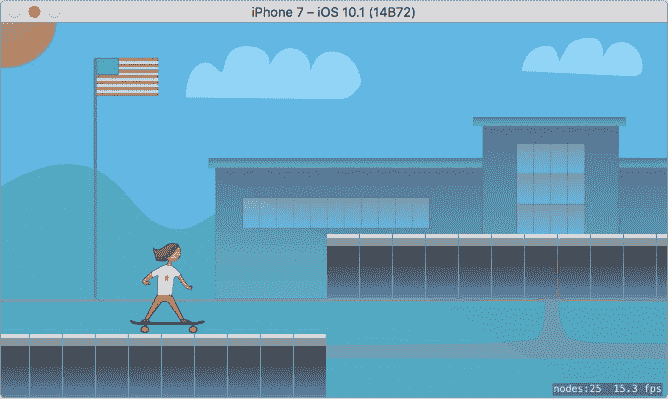
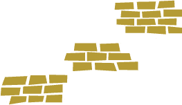
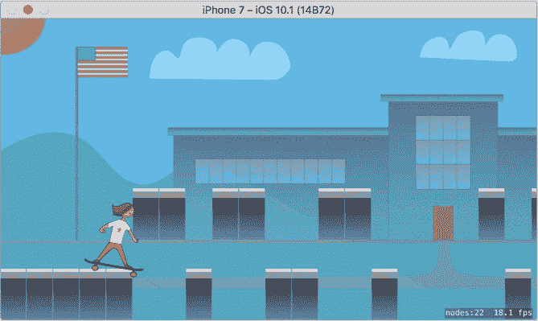
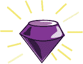
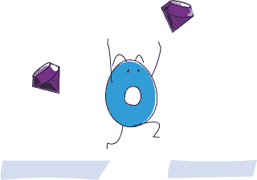
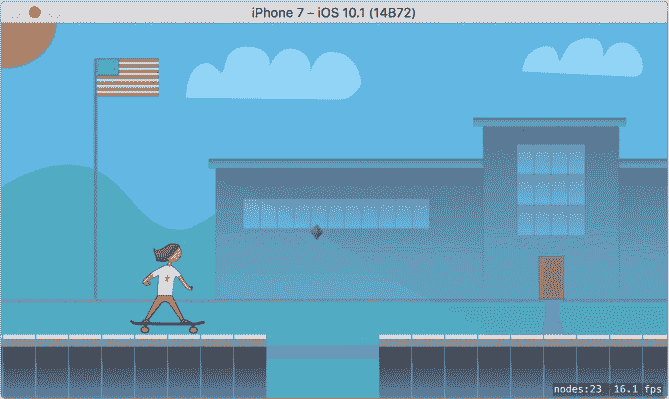
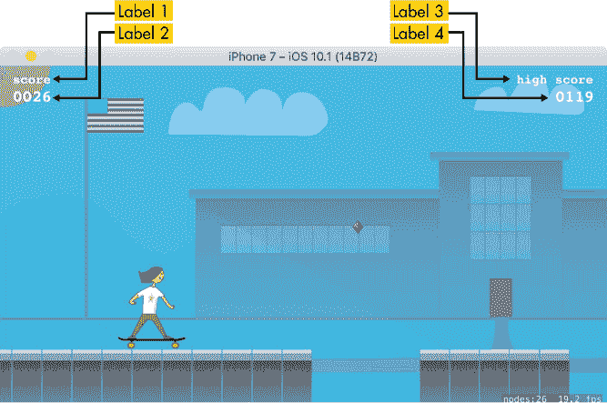
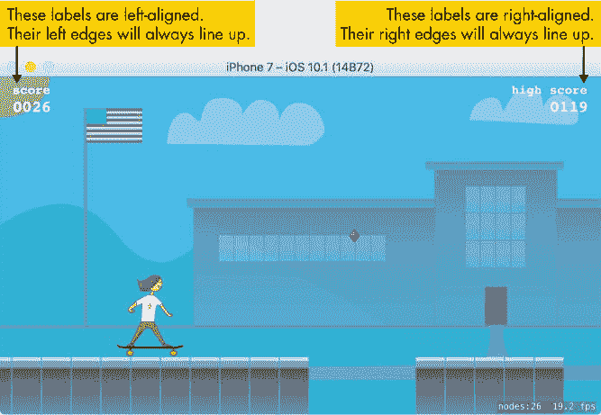

## 第十七章：## 调整难度、收集宝石和计分


在这一章中，我们将添加一大堆游戏元素，使《Schoolhouse Skateboarder》变得更加富有挑战性和趣味性。我们将加快游戏的速度，增加多层平台、收集宝石和得分系统。

### 加速游戏

我们不希望游戏太简单，否则玩家会觉得无聊。一种增加难度的方式是让游戏加速。（另外，当你在 iPhone 或 iPad 上玩时，持续几分钟的游戏比持续一个小时的游戏更实用。）我们可以通过在游戏循环方法中稍微增加 scrollSpeed 变量的值来加速游戏。在 GameScene 类的 update(_:)方法中添加以下代码。

*GameScene.swift*

```
override func update(_ currentTime: TimeInterval) {

    // Slowly increase the scrollSpeed as the game progresses

    scrollSpeed
 += 0.01

    // Determine the elapsed time since the last update call

```

这一行每次调用 update(_:)时，会将 scrollSpeed 增加 0.01。现在，玩家在游戏中的进度越远，游戏的速度就会越快，从而增加游戏的挑战性。

### 添加多层平台

我们还可以通过改变人行道砖块的 y 位置来增加游戏的难度。我们将使一些砖块的高度增加，这样玩家就需要跳起来才能到达这些砖块，正如图 17-1 所示。



*图 17-1：多层人行道平台*

为了实现这一点，我们将有两类砖块：低砖和高砖。像图 17-1 左侧的那些砖块，处于常规的 y 位置，它们是低砖，而图中右侧的那些高出位置的砖块，则是高砖。我们需要为每个砖块分配这两类中的一个类别，并根据其所属类别指定 y 位置。我们可以创建 CGFloat 类型的变量来存储这些 y 位置，并将其分配给砖块，但如此使用 CGFloat 变量可能会让代码变得混乱。如果我们有很多其他变量的话，阅读代码并找到这些 CGFloat 变量会变得更加困难。所以，代替使用常规变量，我们将使用一种新东西，叫做枚举，来为砖块类别进行分类。

*枚举*，通常简称为*enum*，是一种创建新数据类型的方法，用于将相关的值组合在一起。一旦定义了枚举，你就可以像使用其他任何数据类型一样使用它来定义新的变量、常量和函数。通过为砖块级别创建枚举，我们可以创建一个新的数据类型，将所有砖块级别存储在一起，这样我们的代码将更容易阅读。

#### 定义多层砖块级别

我们将创建一个枚举来描述两种不同的砖块级别。枚举中的每个值称为*case*，这就是我们的低砖和高砖级别。我们将为每个砖块分配一个枚举值，并将每个砖块的 y 位置设置为与其枚举值相同。为了做到这一点，我们需要将枚举定义为 CGFloat，以便与 y 位置的数据类型匹配。



要创建这个枚举，请在 GameScene 类声明的顶部添加以下代码：

*GameScene.swift*

```
class GameScene: SKScene, SKPhysicsContactDelegate {

    // Enum for y-position spawn points for bricks

    // Ground bricks are low and upper platform bricks are high

  ➊
 enum
 BrickLevel: ➋
 CGFloat
 {

     ➌
 case
 low = 0.0

     ➍
 case
 high = 100.0

    }

    // An array that holds all the current sidewalk bricks

```

我们首先定义枚举。枚举定义类似于类或结构体定义。➊ 处的这一行以关键字 enum 开始，后面跟着枚举名称。像类或结构体一样，枚举名称应始终以大写字母开头。我们将这个枚举命名为 BrickLevel，因为它描述了游戏中两种不同的砖块等级。

在 ➋ 处，我们在枚举名称后添加一个冒号 (: )，然后是数据类型 CGFloat，这样枚举就和砖块的 y 位置数据类型一致了。当你定义枚举时，可以为其指定一个*原始值*（如我们接下来要做的），但枚举不一定需要有原始值。原始值可以是任何数据类型，但该数据类型必须对所有枚举值都相同。我们将枚举定义为 CGFloat，因此所有枚举的原始值都将是 CGFloat 类型。我们稍后将通过枚举的 rawValue 属性访问这些值。

枚举定义位于一对大括号内，你可以在这里定义枚举的各个值。对于 BrickLevel，我们只有两个值，low 和 high，但一个枚举可以有无限多个值。我们的正常人行道将由低等级砖块构成，这些砖块的 y 值为 0.0，因此在 ➌ 处我们定义了 low 值，并将其原始值设置为 0.0。我们的上层平台将由高等级砖块构成，这些砖块的 y 值为 100.0，因此在 ➍ 处我们创建了 high 值，原始值为 100.0。

接下来，我们通过创建一个属性来存储当前的砖块等级，从而访问枚举的值。将此代码添加到 GameScene：

```
var brickSize = CGSize.zero

// The current brick level determines the y-position of new bricks

var
 brickLevel = BrickLevel
 .low

// Setting for how fast the game is scrolling to the right

```

这里我们创建了一个名为 brickLevel 的变量，并将其设置为 BrickLevel.low。brickLevel 属性将跟踪我们的砖块等级，它会在低等级和高等级之间变化。我们希望始终从低等级砖块开始，因此将 brickLevel 的初始值设置为 low。你可以通过点符号访问枚举的值，方法是写出枚举名称，后跟一个句点，再后跟枚举值。

还有一个地方需要在开始使用 brickLevel 之前进行设置。在方法 startGame() 中添加这一行代码：

```
func startGame() {

    --
 *snip* 
 --

    scrollSpeed = startingScrollSpeed

    brickLevel
 = .low

    lastUpdateTime = nil

    --
 *snip* 
 --

}

```

现在每当游戏重新开始时，brickLevel 会重置为 low。你可能已经注意到，我们在之前省略了 BrickLevel 部分的 low。怎么回事？当我们创建 brickLevel 属性时，Swift 使用类型推断来确定 brickLevel 必须是 BrickLevel 类型。当我们在这里使用 brickLevel 时，Swift 知道它是什么数据类型，因此我们不需要写出 BrickLevel。我们可以通过键入一个句点，后跟 low 来访问该枚举值。非常 Swift 风格！

#### 更改砖块生成方式

现在我们已经建立了追踪砖块等级的方法，让我们用它来确定每个砖块生成的 y 位置。找到 updateBricks(withScrollAmount:) 方法，并将 brickY 的代码行修改为：

*GameScene.swift*

```
while farthestRightBrickX < frame.width {

    var brickX = farthestRightBrickX + brickSize.width + 1.0

    let
 brickY = (brickSize
 .height
 / 2.0
 ) + brickLevel
 .rawValue

```

现在，当新的人行道砖块生成时，y 位置将根据我们在 BrickLevel 枚举中设置的 CGFloat 原始值进行调整，具体取决于当前的 brickLevel。注意访问枚举的原始值是多么简单。它包含在名为 rawValue 的属性中，所以你只需在枚举变量后加上一个句点，接着是 rawValue。当 brickLevel 为 .low 时，值为 0.0；当 brickLevel 为 .high 时，值为 100.0。

最后，我们需要让 brickLevel 不时发生变化。我们可以在每次新砖块生成时随机改变 brickLevel，但这看起来会有点奇怪，正如图 17-2 所示。



*图 17-2：随机生成低级和高级砖块的效果*

如你所见，这种设置可能对玩家来说有点*太*困难。如果我们在低级和高级砖块之间随机切换，那是行不通的。我们确实希望在这里引入一些随机性，但我们需要更聪明地处理这一点。我们要做的是，每次生成砖块时，增加一个 5% 的概率让 brickLevel 发生变化。一旦 brickLevel 发生变化，它将保持在新位置，直到再次遇到那个 5% 的概率。这意味着人行道将持续在低级状态一段时间，然后是高级状态一段时间，然后再回到低级状态，依此类推，不会有太多跳跃。将以下的 else-if 块添加到 updateBricks(withScrollAmount:) 方法中，结合我们之前生成的 randomNumber 常量：

```
func updateBricks(withScrollAmount currentScrollAmount: CGFloat) {

    --
 *snip* 
 --

    if randomNumber < 5 {

        --
 *snip* 
 --

    }

 ➊
 else
 if
 randomNumber < 10
 {

         // There is a 5 percent chance that the brick level will change

        if
 brickLevel
 == .high
 {

            brickLevel
 = .low

        }

        else
 if
 brickLevel
 == .low
 {

            brickLevel
 = .high

        }

    }

    // Spawn a new brick and update the rightmost brick

```

现在，每次生成新的砖块时，都会有一个小概率让人行道的等级从低到高或从高到低发生变化。你可能会想，为什么第 ➊ 行，检查 randomNumber 是否小于 10，会导致 5% 的砖块等级变化概率。randomNumber 常量是一个在 0 到 99 之间的随机数，因此有 100 个可能的值。在我们之前添加的 if 语句的第一行，代码检查 randomNumber 是否小于 5，因此在 100 中有 5 个可能的值会产生砖块间的空隙。我们在第 ➊ 处添加的 else-if 条件只有在 randomNumber 不小于 5 时才会被检查。这意味着，只有当 randomNumber 在 5 到 9 之间，或者说有 5 个值从 100 中可能发生时，else-if 块中的代码才会被执行，这就导致了 5% 的砖块等级变化概率。现在运行游戏试试看，然后继续阅读，了解另一种增加游戏难度的方法！

### 添加可收集的宝石

向游戏中添加一个可收集的物品，也可以给玩家增加一些挑战。我们来添加一些宝石让玩家收集。玩家不仅要跳过人行道上的空隙，还需要决定什么时候值得冒险去抓取一颗宝石。我们将首先添加一个数组来存储宝石精灵，然后编写一些代码来生成、移动和移除宝石。



#### 生成和追踪宝石

当我们生成宝石时，我们需要一个数组来跟踪当前屏幕上的每颗宝石。将这个宝石数组声明添加到`GameScene`类中，如下所示：

*GameScene.swift*

```
var bricks = [SKSpriteNode]()

// An array that holds all the current gems

var
 gems = [SKSpriteNode
 ]()

// The size of the sidewalk brick graphics used

```

每颗宝石都会是一个精灵，因此`gems`是一个`SKSpriteNode`元素的数组。现在我们有了一个用于保存宝石的数组，我们可以创建一个方法来生成新的宝石。在现有的`spawnBrick(atPosition:)`方法之后添加这个方法：

```
  func spawnBrick(atPosition position: CGPoint) -> SKSpriteNode {

      --
 *snip* 
 --

  }

➊
 func
 spawnGem(atPosition position: CGPoint
 ) {

      // Create a gem sprite and add it to the scene

    ➋
 let
 gem = SKSpriteNode
 (imageNamed: "gem"
 )

      gem.position
 = position

      gem.zPosition
 = 9

      addChild
 (gem)

    ➌
 gem.physicsBody
 = SKPhysicsBody
 (rectangleOf: gem.size
 , 

          center: gem.centerRect
 .origin
 )

    ➍
 gem.physicsBody
 ?.categoryBitMask
 = PhysicsCategory
 .gem

    ➎
 gem.physicsBody
 ?.affectedByGravity
 = false

      // Add the new gem to the array of gems

    ➏
 gems
 .append
 (gem)

  }
```

➊行定义了生成宝石的方法，这与生成砖块的方法非常相似。它传入一个`CGPoint`来表示位置，以便将宝石放置在该位置。像大多数其他精灵一样，我们使用`SKSpriteNode(imageNamed:)`初始化器 ➋ 创建宝石精灵。图像名称`*gem*`与我们在“添加图片”中于第 206 页中添加到资源目录的图像文件（`gem.png`）相匹配。一旦创建了宝石精灵，我们将其位置设置为传入方法的那个位置。然后，我们设置一个`zPosition`为 9，这样它就会在滑冰者后面，但在砖块前面。接下来，我们将宝石精灵作为场景的子节点添加，这样它就会显示在屏幕上。

玩家通过触摸宝石来收集它们，因此每个宝石精灵需要被添加到物理模拟中，这样我们就能知道滑冰者何时与宝石发生接触。为此，我们将宝石精灵的`physicsBody`设置为一个新的`SKPhysicsBody` ➌，我们使用一个与宝石精灵大小相同的矩形来创建它，并将其定位在宝石精灵的中心。然后在 ➍，我们将宝石精灵的`physicsBody`的`categoryBitMask`设置为我们在`PhysicsCategory`结构体中定义的`.gem`值。这样，我们就能通过检查`didBegin(_:)`方法中物理体的`categoryBitMask`来判断滑冰者何时与宝石发生接触。最后，我们需要确保物理体不受重力影响 ➎，因为我们希望宝石在空中漂浮。

现在宝石精灵已经设置好了，我们只需将其添加到我们的宝石数组 ➏ 中，跟踪当前显示的所有宝石。这个方法现在可以在任何需要生成新宝石时调用。

#### 决定何时生成宝石

在`updateBricks(withScrollAmount:)`方法中，紧接着调整`brickX`以添加空隙的代码下面，添加以下代码：

*GameScene.swift*

```
func updateBricks(withScrollAmount currentScrollAmount: CGFloat) {

    --
 *snip* 
 --

  ➊
 if randomNumber < 5 {

        // There is a 5 percent chance that we will leave a gap between bricks

        let gap = 20.0 * scrollSpeed

        brickX += gap

        // At each gap, add a gem

     ➋
 let
 randomGemYAmount = CGFloat
 (arc4random_uniform(150
 ))

     ➌
 let
 newGemY = brickY + skater
 .size
 .height
 + randomGemYAmount

     ➍
 let
 newGemX = brickX - gap / 2.0

     ➎
 spawnGem
 (atPosition: CGPoint
 (x: newGemX, y: newGemY))

  }

```

更新砖块的方法已经有代码来判断何时在砖块中创建一个玩家需要跳过的间隙。我们将利用这段代码，在每次砖块间隙处生成一颗宝石。由于玩家已经在跳过这个间隙，这样的地方放置宝石是很自然的。我们在包含创建 5% 概率事件代码的 if 语句 ➊ 中实现这一功能。在 ➋ 处，我们通过生成一个 0 到 150 之间的随机数，并将其转换为 CGFloat，来计算新宝石的随机 y 坐标。然后在 ➌ 处，我们将 brickY 和滑板精灵的高度加到这个随机值上。这样，我们就得到了一个在滑板精灵上方的 y 坐标，让玩家必须跳起来才能到达。



接下来，我们计算一个 x 坐标 newGemX，将宝石放置在人行道间隙的中央 ➍。然后在 ➎ 处，我们调用 spawnGem(atPosition:) 方法，传入我们刚刚计算出的 newGemX 和 newGemY 值。现在我们开始生成宝石，让我们添加一个方法，以便在需要时移除它们。

#### 移除宝石

当宝石离开屏幕或被滑板精灵收集时，我们需要将宝石精灵从屏幕上移除，并且从 gems 数组中删除它。将以下方法添加到你刚才添加的 spawnGem(atPosition:) 方法后面。

*GameScene.swift*

```
func spawnGem(atPosition position: CGPoint) {

    --
 *snip* 
 --

}

func
 removeGem(_
 gem: SKSpriteNode
 ) {

  ➊
 gem.removeFromParent
 ()

  ➋
 if
 let
 gemIndex = gems
 .index
 (of: gem) {

      ➌
 gems
 .remove
 (at: gemIndex)

    }

}
```

这个方法允许你传入应该被移除的宝石精灵。在 ➊ 处，我们对宝石精灵调用 removeFromParent() 方法，将其从之前添加为子节点的场景中移除。这使得宝石从屏幕上消失，但它仍然占用着我们的 gems 数组中的位置。为了从数组中移除它，我们需要找到它在数组中的位置。

在 ➋ 处，我们使用 if-let 语句来创建 gemIndex 常量。如果通过数组的 index(of:) 方法在数组中找到了宝石精灵，那么 if-let 语句将把宝石精灵的索引赋值给 gemIndex。这里必须使用 if-let 语句，因为 index(of:) 方法返回的是一个可选值索引——也就是说，我们在数组中寻找的项目有可能找不到。在我们的案例中，我们确定宝石精灵在数组中，但 Swift 要求我们先进行检查，以确保安全。如果数组中找不到宝石精灵，那么 gemIndex 将为 nil，if-let 语句中的代码块将不会被调用。如果找到了索引，那么数组的 remove(at:) 方法会使用我们刚发现的 gemIndex 作为参数 ➌ 来调用。这个方法会根据给定的索引，从 gems 数组中移除宝石精灵。

现在我们有了一种简便的方法来移除宝石，我们应该添加一些代码来在每次开始新游戏时移除所有宝石，以防止前一局的宝石留在游戏中。将这段代码添加到 startGame() 方法中：

```
func startGame() {

    --
 *snip* 
 --

    bricks.removeAll(keepingCapacity: true)

    for
 gem in
 gems
 {

        removeGem
 (gem)

    }

}

```

这个 for-in 循环会遍历 gems 数组中所有的宝石精灵（如果有的话），并对每一个宝石调用我们方便的 removeGem(_:) 方法。

#### 更新宝石

现在我们可以生成和移除宝石了，我们需要一个方法来更新它们的位置，使它们向左移动并与砖块的速度匹配。我们还需要移除任何移出屏幕左边缘的宝石。在 updateBricks(withScrollAmount:) 方法之后添加这个方法：

*GameScene.swift*

```
  func updateBricks(withScrollAmount currentScrollAmount: CGFloat) {

      --
 *snip* 
 --

  }

➊
 func
 updateGems(withScrollAmount currentScrollAmount: CGFloat
 ) {

      for
 gem in
 gems
 {

          // Update each gem's position

       ➋
 let
 thisGemX = gem.position
 .x
 - currentScrollAmount

       ➌
 gem.position
 = CGPoint
 (x: thisGemX, y: gem.position
 .y
 )

          // Remove any gems that have moved offscreen

       ➍
 if
 gem.position
 .x
 < 0.0
 {

             removeGem
 (gem)

          }

      }

  }
```

updateGems 方法 ➊ 接受当前的 scrollAmount 作为输入参数，以便我们知道要移动每个宝石多少。我们遍历宝石数组并为每个宝石做一些工作。在 ➋ 处，我们通过从宝石当前的 x 位置减去滚动量来计算新的 x 位置 thisGemX。然后，在 ➌ 处，我们使用这个新计算的 x 位置为宝石设置一个新位置，但保持相同的 y 位置。这样，宝石精灵就会以与砖块相同的速度向左移动。

接下来，在 ➍ 处，我们检查这个新的 x 位置是否小于 0.0。如果是，那么它已经移动得太远，快要出屏幕了，所以我们通过调用 removeGem(_:) 方法来移除宝石。现在我们有了更新宝石的代码，我们需要通过从主游戏循环（即 update(_:) 方法）调用 updateGems(withScrollAmount:) 来使用它。

将以下代码行添加到现有的 update(_:) 方法中：

```
override func update(_ currentTime: TimeInterval) {

    --
 *snip* 
 --

    updateBricks(withScrollAmount: currentScrollAmount)

    updateSkater()

    updateGems
 (withScrollAmount: currentScrollAmount)

}

```

现在，每次调用我们的 update(_:) 方法时，宝石都会像砖块一样移动。现在尝试运行游戏，你应该会看到宝石出现在人行道的空隙上，如 图 17-3 所示。



*图 17-3：宝石现在出现在人行道的空隙上。*

如果你让滑行者跳跃并撞到任何宝石，你会发现它们只是被推开了。这不太对——我们希望宝石在滑行者碰到时消失，这样就看起来像她收集了这些宝石。

#### 收集宝石

编写收集宝石的代码很简单，因为我们已经将它们添加到了物理模拟中，并且已经添加了一个移除它们的方法。在现有的 didBegin(_:) 方法中，添加以下代码来收集被触碰到的宝石：

*GameScene.swift*

```
func didBegin(_ contact: SKPhysicsContact) {

    // Check if the contact is between the skater and a brick

    if contact.bodyA.categoryBitMask == PhysicsCategory.skater &&

        contact.bodyB.categoryBitMask == PhysicsCategory.brick {

    --
 *snip* 
 --

    }

  ➊
 else if
 contact.bodyA
 .categoryBitMask
 == PhysicsCategory
 .skater
 && 

        contact.bodyB
 .categoryBitMask
 == PhysicsCategory
 .gem
 {

        // Skater touched a gem, so remove it

      ➋
 if
 let
 gem = contact.bodyB
 .node
 as
 ? SKSpriteNode
 {

            removeGem
 (gem)

        }

    }

}

```

当两个物理体相互接触时，这个方法会被调用。所以我们要做的就是让方法检查接触到的物理体是否是滑行者和宝石。第 ➊ 行在现有的 if 语句中添加了一个 else-if，并通过比较它们的 categoryBitMask 属性来检查 bodyA 是否是滑行者，bodyB 是否是宝石。

为了移除宝石，我们需要获取实际宝石精灵的引用。该方法中的接触对象包含对两个物理体（bodyA 和 bodyB）的引用。我们已经知道 bodyB 是我们宝石的物理体，并且精灵附加在其上，所以我们可以通过物理体的节点属性来获取物理体的精灵引用。该节点是一个 SKNode 对象，它是 SKSpriteNode 的父类。在 ➋ 处的 if-let 语句通过将节点下转型为 SKSpriteNode 来获取宝石精灵的引用。现在，我们可以将这个宝石传递给我们的 removeGem(_:) 方法，它将消失。

如果你现在再次运行游戏，你应该会发现当滑冰者跳入宝石时，宝石会消失！

### 添加记分和标签

比起为了乐趣收集宝石，还有什么比为了最高分收集宝石更好呢？看到自己是否能够打破自己的最高分或朋友的分数真是太有趣了。加入一个记分机制会让玩家想一遍又一遍地玩你的游戏。在这一节中，我们将添加一个简单的记分系统和标签来显示玩家的当前分数和所有时间的最高分。

#### 创建标签

在我们开始记录玩家分数之前，需要添加一些标签来显示当前分数和最高分数。我们将添加四个标签，如图 17-4 所示。



*图 17-4：四个记分标签*

玩家当前的分数将显示在屏幕的左上角，最高分将显示在右上角。每个分数我们会使用两个标签。标签 1 是字符串“score”，它永远不会改变。标签 2 是当前游戏的实际分数。这个标签将不断变化，反映玩家的分数。标签 3 是字符串“high score”，它也永远不会改变。最后，标签 4 显示玩家的最高分。在每次游戏结束时，如果玩家达到了新的最高分，这个标签应当被更新。

为了创建这些标签，我们将在 resetSkater()方法之后添加一个 setupLabels()方法。我们只需要在游戏首次运行时调用这个方法一次。它将创建四个标签，正确设置它们，并将它们作为场景的子节点添加进去。现在让我们开始创建第一个标签。请添加以下代码：

*GameScene.swift*

```
func resetSkater() {

    --
 *snip* 
 --

}

func
 setupLabels() {

    // Label that says "score" in the upper left

  ➊
 let
 scoreTextLabel: SKLabelNode
 = SKLabelNode
 (text: "score"
 )

  ➋
 scoreTextLabel.position
 = CGPoint
 (x: 14.0
 , y: frame
 .size
 .height
 - 20.0
 )

  ➌
 scoreTextLabel.horizontalAlignmentMode
 = .left

}
```

让我们来看看这里的新内容。首先，我们创建了一个 SKLabelNode，它是 SpriteKit 中的标签类。它类似于 UILabel，但它是 SpriteKit 节点的一种类型，因此可以在带有动画和物理效果的 SpriteKit 场景中使用。我们不会为这些标签添加动画或将它们加入物理模拟中。它们只是静静地悬挂在屏幕上。在➊处，我们使用了初始化器 SKLabelNode(text:)，它创建了标签并赋予它一个初始文本字符串。这就是标签将显示在屏幕上的内容。由于我们决定这个标签始终显示“score”一词，因此我们以后不需要再更改这个文本。

在➋处，我们通过创建一个 x 位置为 14.0，y 位置为场景高度减去 20.0 的 CGPoint 来设置标签的位置。这会将标签定位在屏幕的左上角。如果我们将 y 位置设置为场景框架的高度，那么标签会出现在屏幕的顶部之外。将 20.0 从高度中减去可以将标签定位在场景的顶部附近。 在➌处，我们将标签的 horizontalAlignmentMode 设置为.left。这使得标签的文本紧贴左侧，因此它将始终正确对齐。请参见图 17-5 以查看左对齐和右对齐文本的示例。



*图 17-5：左对齐和右对齐的标签*

现在添加以下代码，完成第一个标签的设置：

```
func setupLabels() {

    --
 *snip* 
 --

    scoreTextLabel.horizontalAlignmentMode = .left

  ➊
 scoreTextLabel.fontName
 = "Courier-Bold"

  ➋
 scoreTextLabel.fontSize
 = 14.0

  ➌
 scoreTextLabel.zPosition
 = 20

    addChild
 (scoreTextLabel)

}

```

在 ➊ 处，我们为标签设置了字体。iOS 提供了很多选择，我们选择了 Courier Bold。要查看可用字体的完整列表，请访问*[`www.iosfonts.com/`](http://www.iosfonts.com/)*。在 ➋ 处，我们将字体大小设置为 14.0。这使得标签非常小，但仍然易于阅读，这是我们想要的。不建议使用小于 10.0 的字体大小，否则标签可能太难以阅读。

请注意，我们从未为标签设置框架。我们没有设置宽度和高度，只设置了位置。SKLabelNode 的大小会根据你选择的字体大小和需要显示的文本自动调整，在这种情况下是分数。

在 ➌ 处，我们设置了 zPosition 为 20，这样标签就会始终显示在游戏场景中所有其他元素的上方。最后，别忘了将标签添加为场景的子节点，否则它不会显示在屏幕上。

另外三个标签的创建和设置方式与第一个标签非常相似，所以我们不会逐行解释这段代码。对于其他三个标签，添加以下代码：

```
func setupLabels() {

    --
 *snip* 
 --

    addChild(scoreTextLabel)

    // Label that shows the player's actual score

  ➊
 let
 scoreLabel: SKLabelNode
 = SKLabelNode
 (text: "0"
 )

  ➋
 scoreLabel.position
 = CGPoint
 (x: 14.0
 , y: frame
 .size
 .height
 - 40.0
 )

  ➌
 scoreLabel.horizontalAlignmentMode
 = .left

    scoreLabel.fontName
 = "Courier-Bold"

    scoreLabel.fontSize
 = 18.0

  ➍
 scoreLabel.name
 = "scoreLabel"

    scoreLabel.zPosition
 = 20

    addChild
 (scoreLabel)

    // Label that says "high score" in the upper right

    let
 highScoreTextLabel: SKLabelNode
 = SKLabelNode
 (text: "high score"
 )

    highScoreTextLabel.position
 = CGPoint
 (x: frame
 .size
 .width
 - 14.0
 , 

        y: frame
 .size
 .height
 - 20.0
 )

  ➎
 highScoreTextLabel.horizontalAlignmentMode
 = .right

    highScoreTextLabel.fontName
 = "Courier-Bold"

    highScoreTextLabel.fontSize
 = 14.0

    highScoreTextLabel.zPosition
 = 20

    addChild
 (highScoreTextLabel)

    // Label that shows the player's actual highest score

    let
 highScoreLabel: SKLabelNode
 = SKLabelNode
 (text: "0"
 )

    highScoreLabel.position
 = CGPoint
 (x: frame
 .size
 .width
 - 14.0
 , 

        y: frame
 .size
 .height
 - 40.0
 )

    highScoreLabel.horizontalAlignmentMode
 = .right

    highScoreLabel.fontName
 = "Courier-Bold"

    highScoreLabel.fontSize
 = 18.0

  ➏
 highScoreLabel.name
 = "highScoreLabel"

    highScoreLabel.zPosition
 = 20

    addChild
 (highScoreLabel)

}

```

每个标签都使用不同的文本字符串 ➊ 初始化，并且有不同的位置 ➋。请注意，我们放置在屏幕左侧的标签的 horizontalAlignmentMode 是.left ➌，而我们放置在右侧的标签则是.right ➎。

有一个新的步骤：我们在 scoreLabel ➍和 highScoreLabel ➏上设置了一个 name 属性。给标签设置一个名字并不会改变标签的显示方式。它只是为你，程序员，提供了一种方便的方式，以便稍后在代码中引用这个特定的标签。你场景中的任何一个 SpriteKit 节点对象，如 SKSpriteNode 或 SKLabelNode，都可以被赋予一个名字。你可以为场景中的每个节点分配名字，然后通过使用它们的 name 属性在稍后的代码中引用它们，而不需要为每个节点保留一个类属性。你将在下一节中看到如何实现这一点，当我们更新这些标签的文本时。

现在，我们有了一个方法来创建和设置四个标签，我们只需在 didMove(to:)方法中调用此方法。添加这一行代码：

```
override func didMove(to view: SKView) {

    --
 *snip* 
 --

    addChild(background)

    setupLabels
 ()

    // Set up the skater and add her to the scene

    --
 *snip* 
 --

}

```

现在，当游戏开始时，这些标签将被创建并添加到场景中。现在运行游戏，确保它们显示出来。

#### 跟踪分数

随着玩家分数的变化，我们需要一种方法来更新标签以反映新的分数。首先，让我们添加一些新的类属性来跟踪分数。在 GameScene 类的顶部添加以下代码：

*GameScene.swift*

```
  let gravitySpeed: CGFloat = 1.5

  // Properties for score-tracking

➊
 var
 score: Int
 = 0

➋
 var
 highScore: Int
 = 0

➌
 var
 lastScoreUpdateTime: TimeInterval
 = 0.0

  // The timestamp of the last update method call

```

这创建了一个分数整数，我们将用它来跟踪当前分数 ➊，一个高分整数，我们将用它来跟踪玩家的最高分数 ➋，以及一个 TimeInterval 类型的变量 lastScoreUpdateTime ➌。TimeInterval 是一种 Double 类型，用于跟踪经过的时间（以秒为单位）。在我们的游戏循环中，我们将更新分数标签，但我们不希望每次游戏循环运行时都更新标签（记住，通常游戏循环每秒运行 30 或 60 次）。相反，我们将每秒更新一次标签，使用 TimeInterval 来跟踪更新之间经过的时间。


#### 更新标签

由于我们将使用分数变量来更新分数标签的文本，接下来我们写一个快速方法来完成这个更新。请在现有的 setupLabels() 方法后添加以下新方法：

*GameScene.swift*

```
func setupLabels() {

    --
 *snip* 
 --

}

func
 updateScoreLabelText() {

 ➊
 if
 let
 scoreLabel = childNode
 (withName: "scoreLabel"
 ) as
 ? SKLabelNode
 {

     ➋
 scoreLabel.text
 = String
 (format: "%04d"
 , score
 )

    }

}
```

第 ➊ 行找到场景中名称为 "scoreLabel" 的子节点。当我们创建分数标签时，我们将其名称属性设置为 "scoreLabel"。然后，和其他标签一样，我们将标签添加为场景的子节点。我们可以在任何节点（无论是场景、精灵还是标签）上调用 childNode(withName:) 方法，找到具有特定名称的子节点。这样做意味着我们不需要创建一个类属性来跟踪这个标签。我们只需要在需要使用它时按名称查找它。保持类属性的数量最小化是一个好习惯，使用这种方法来处理那些我们不需要频繁引用的节点正是为了达到这一点。

第 ➋ 行将 scoreLabel 的文本设置为一个新字符串，该字符串是通过我们的分数变量创建的。字符串初始化器 String(format:) 使用字符串格式说明符来以特定方式显示变量，从而创建一个新字符串。在这种情况下，我们希望始终以四位数的形式显示分数，当需要时，在字符串前面添加零，例如当玩家得分为 230 时显示 0230 而不是 230。在格式字符串 %04d 中，% 表示我们将在这里插入一个变量，04 表示我们希望字符串始终为四位数字，前面有零，d 表示我们插入的变量是一个整数。

表 17-1 列出了一些常见字符串格式说明符的示例。

**表 17-1：** 常见的字符串格式说明符

| **说明符** | **描述** |
| --- | --- |
| %d | 用于插入一个整数 |
| %f | 用于插入一个 Double、Float 或 CGFloat |
| %@ | 用于插入一个字符串或其他对象 |
| %% | 用于在字符串中插入一个百分号符号 |

表 17-2 列出了几个示例，展示了使用字符串格式说明符来获取不同的数字格式。

**表 17-2：** 字符串格式说明符的应用

| **说明符** | **输入** | **输出** |
| --- | --- | --- |
| %05d | 123 | 00123 |
| %.2f | 1.0 | 1.00 |
| %.3f | 33.0 | 33.000 |

使用 String(format:) 方法是一种方便的方式来让标签显示你想要的样子。强制我们的分数标签始终显示四位数字，可以确保在分数变化时它看起来一致。

#### 更新玩家的分数

首先：每当新游戏开始时，分数应该是 0。将以下代码添加到 startGame() 方法中：

*GameScene.swift*

```
func startGame() {

    // When a new game is started, reset to starting conditions

    resetSkater()

    score
 = 0

    scrollSpeed = startingScrollSpeed

```

接下来，让我们创建一个方法，根据玩家生存的时间为玩家的分数加分。将以下方法添加到 updateSkater() 方法之后：

```
func
 updateScore(withCurrentTime currentTime: TimeInterval
 ) {

    // The player's score increases the longer they survive

    // Only update score every 1 second

  ➊
 let
 elapsedTime = currentTime - lastScoreUpdateTime

    if
 elapsedTime > 1.0
 {

        // Increase the score

     ➋
 score
 += Int
 (scrollSpeed
 )

        // Reset the lastScoreUpdateTime to the current time

     ➌
 lastScoreUpdateTime
 = currentTime

        updateScoreLabelText
 ()

    }

}
```

由于我们只希望每秒更新一次分数标签，我们已经声明这个方法接收一个当前时间（currentTime）作为参数。currentTime 会自动由 SpriteKit 传递到 update(_:) 方法中，所以当我们调用它时，只需将 currentTime 传递给这个计分方法即可。我们使用 currentTime 来计算自上次更新分数标签以来已经过去了多少时间 ➊。如果已经过去超过一秒，那么我们通过增加 scrollSpeed ➋ 来增加玩家的分数。我们本可以简单地给分数加上一个数值，例如 10，但使用 scrollSpeed 会让玩家的分数随着游戏的进展而更快地增加，因为 scrollSpeed 会不断增加。

然后在 ➌ 处，我们将 lastScoreUpdateTime 跟踪器设置为当前时间。这样，下次计算经过时间时，我们就能检查是否已经过去了一秒钟。最后，我们调用 updateScoreLabelText() 方法，让分数标签显示新的分数。

现在我们所要做的就是在我们的主游戏循环中，或者在 update(_:) 方法里调用 updateScore(withCurrentTime) 方法。将以下代码添加到 update(_:) 方法中：

```
override func update(_ currentTime: TimeInterval) {

    --
 *snip* 
 --

    updateGems(withScrollAmount: currentScrollAmount)

    updateScore
 (withCurrentTime: currentTime)

}

```

这将在每次调用 update(_:) 时调用新的方法来更新分数。现在运行游戏，看看分数是如何上升的！你可能会注意到，收集宝石并不会增加分数。让我们来解决这个问题！

#### 让宝石更有价值

现在，所有的分数追踪和更新都设置好了，添加新的计分元素变得简单了。我们已经知道玩家什么时候收集了宝石，因为我们在 didBegin(_:) 方法里做了这项工作。将以下代码添加到 didBegin(_:) 方法中：

*GameScene.swift*

```
func didBegin(_ contact: SKPhysicsContact) {

    --
 *snip* 
 --

        // Skater touched a gem, so remove it

        if let gem = contact.bodyB.node as? SKSpriteNode {

            removeGem(gem)

            // Give the player 50 points for getting a gem

            score
 += 50

            updateScoreLabelText
 ()

        }

    }

}

```

简单吧？在代码中，我们知道玩家获得了宝石的地方，我们只需将 50 加到分数变量中，并调用 updateScoreLabelText() 方法。现在，收集宝石就能得分了。

你可能已经注意到的最后一件事是，我们的最高分始终停留在 0。现在让我们解决这个问题。

#### 跟踪最高分

要更新最高分标签，请在 updateScoreLabelText() 方法后面添加以下方法：

*GameScene.swift*

```
func updateScoreLabelText() {

    --
 *snip* 
 --

}

func
 updateHighScoreLabelText() {

    if
 let
 highScoreLabel = childNode
 (withName: "highScoreLabel"
 ) 

        as
 ? SKLabelNode
 {

        highScoreLabel.text
 = String
 (format: "%04d"
 , highScore
 )

    }

}
```

这个方法与你之前添加的 updateScoreLabelText() 方法完全相同，但它处理的是最高分。我们只需要在每场游戏结束时检查玩家是否获得了新的最高分。我们创建的 gameOver() 方法非常适合这个用途。将以下代码添加到其中：

```
func gameOver() {

    // When the game ends, see if the player got a new high score

    if
 score
 > highScore
 {

        highScore
 = score

        updateHighScoreLabelText
 ()

    }

    startGame()

}

```

这段代码非常直观。当游戏结束时，我们检查当前的 `score` 是否高于当前的 `highScore`。如果是，那么我们将 `highScore` 设置为新的 `score`，并更新高分标签的文本。现在试着玩几次游戏，你应该能看到高分被跟踪并显示出来。

### 调整游戏玩法

现在游戏相当困难。如果我们想让它变得更容易呢？这是我们的游戏，我们可以更改任何我们想改的地方，所以让我们来做吧！首先，我们需要解决的是，当你开始游戏时，有时会立刻出现间隙和多层平台，因此很难在游戏中生存超过几秒钟。

让我们修改决定何时在街道上添加间隙的代码，这样在游戏开始时就不会有间隙。玩家的得分从 0 开始，因此我们可以在开始添加间隙之前检查玩家的得分是否大于 10。我们还可以设置玩家的得分必须大于 20 才开始改变平台的高度。同时，在修改这段代码时，我们也将间隙和平台变化的 5% 概率降低到 2%。修改 `updateBricks(withScrollAmount:)` 方法，使其看起来像这样：

*GameScene.swift*

```
func updateBricks(withScrollAmount currentScrollAmount: CGFloat) {

    --
 *snip* 
 --

        let randomNumber = arc4random_uniform(99)

        if
 randomNumber < 2
 && score
 > 10
 {

            // There is a 2 percent chance that we will leave a gap between

            // bricks after the player has reached a score of 10

            let gap = 20.0 * scrollSpeed

            brickX += gap

            --
 *snip* 
 --

        }

        else
 if
 randomNumber < 4
 && score
 > 20
 {

            // There is a 2 percent chance that the brick Y level will change

            // after the player has reached a score of 20

            if brickLevel == .high {

                brickLevel = .low

            }

        --
 *snip* 
 --

}

```

现在，游戏中会有更少的间隙和平台变化，并且它们不会再在游戏开始时出现。运行游戏，看看是否更容易了。

另一个快速的改变是让游戏玩法更简单，即让滑板车手不能倾斜。在 *Skater.swift* 文件中，将物理体的 `allowsRotation` 属性设置为 false：

*Skater.swift*

```
physicsBody?.density = 6.0

physicsBody
 ?.allowsRotation
 = false

physicsBody?.angularDamping = 1.0

```

如果你现在运行游戏，你可能会存活更久并获得比之前更高的分数！

### 你学到了什么

在这一章中，你学会了如何添加一堆游戏元素。你添加了不同的街道水平，以迫使玩家跳跃，玩家可以收集的宝石，得分系统和高分追踪。你还学会了如何使用随机数为游戏玩法增加变化，以及如何使用标签显示玩家的信息。

## 调整难度、收集宝石和保持得分


在这一章中，我们将添加一堆游戏元素，使《滑板学校》更加具有挑战性和趣味性。我们将加速游戏并添加多层平台、可收集的宝石和得分系统。

### 加速游戏

我们不希望我们的游戏太简单，否则玩家会感到无聊。提高难度的一种方法是让游戏速度加快。（另外，当你在 iPhone 或 iPad 上玩游戏时，持续几分钟的游戏比持续一小时的游戏更实用。）我们可以通过在游戏循环方法中略微增加 `scrollSpeed` 变量的值来加速游戏。将以下代码添加到 GameScene 类中的 update(_:) 方法中。

*GameScene.swift*

```
override func update(_ currentTime: TimeInterval) {

    // Slowly increase the scrollSpeed as the game progresses

    scrollSpeed
 += 0.01

    // Determine the elapsed time since the last update call

```

这行代码每次调用 update(_:) 时将 scrollSpeed 增加 0.01。现在，玩家在游戏中的进度越远，速度就会越快，从而增加挑战性。

### 添加多层平台

提高游戏难度的另一种方法是通过改变人行道砖块的 y 位置。我们将一些砖块抬高，这样玩家就需要跳起来才能到达它们，正如 图 17-1 所示。


*图 17-1：多层人行道平台*

为此，我们将有两类砖块：低砖块和高砖块。像 图 17-1 左侧的砖块一样，位于常规 y 位置的砖块是低砖块，而右侧的抬高砖块则是高砖块。我们需要为每个砖块分配一个类别，并根据其所在的类别设置 y 位置。我们可以创建 CGFloat 类型的变量来存储 y 位置并分配给砖块，但以这种方式使用 CGFloat 变量可能会变得混乱。如果有很多其他变量，我们在需要修改这些 CGFloat 变量时，会很难读取代码并找到它们。因此，我们将不使用常规变量，而是使用一种新方法，称为枚举，来制作我们的砖块类别。

*枚举*，简称 *enum*，是一种创建新的数据类型的方式，用于将相关的值分组。一旦定义了枚举，就可以像使用任何其他数据类型一样使用它来定义新的变量、常量和函数。通过为砖块层级创建枚举，我们可以创建一个新的数据类型，将所有砖块层级存储在一起，使得我们的代码更易于阅读。

#### 定义多个砖块层级

我们将创建一个枚举来描述两种不同的砖块层级。枚举中的每个值称为 *case*，我们的低砖块和高砖块层级将是这些 *case*。我们将为每个砖块分配一个枚举 *case*，然后将每个砖块的 y 位置设置为其对应枚举 *case* 的值。为了做到这一点，我们需要将枚举设置为 CGFloat 类型，以匹配 y 位置的数据类型。


要创建枚举，请将以下代码添加到 GameScene 类声明的顶部：

*GameScene.swift*

```
class GameScene: SKScene, SKPhysicsContactDelegate {

    // Enum for y-position spawn points for bricks

    // Ground bricks are low and upper platform bricks are high

  ➊
 enum
 BrickLevel: ➋
 CGFloat
 {

     ➌
 case
 low = 0.0

     ➍
 case
 high = 100.0

    }

    // An array that holds all the current sidewalk bricks

```

我们从定义枚举开始。枚举定义类似于类或结构体定义。➊ 这一行以关键字 enum 开头，后面跟着枚举名称。像类或结构体一样，枚举名称应始终以大写字母开头。我们将这个枚举命名为 BrickLevel，因为它描述了游戏中两种不同类型的砖块层级。

在➋处，我们在枚举名称后添加了一个冒号(:)，然后是数据类型 CGFloat，这使得枚举的类型与砖块的 y 位置数据类型一致。当你定义一个枚举时，可以为它指定一个*原始值*（就像我们接下来要做的那样），但枚举不一定需要有原始值。原始值可以是任何数据类型，但该数据类型必须对所有枚举 case 一致。我们将枚举定义为 CGFloat，因此所有枚举的原始值都是 CGFloat 类型。我们稍后将通过枚举的 rawValue 属性来访问这些值。

枚举定义位于一对大括号内，里面定义了枚举的各个 case。对于 BrickLevel，我们只有两个 case，low 和 high，但枚举可以有无限多个 case。我们的普通路面将由低砖块构成，这些砖块的 y 值为 0.0，因此在➌处我们定义了 low case，并将其原始值设置为 0.0。我们的上平台将由高砖块构成，这些砖块的 y 值为 100.0，因此在➍处我们创建了一个 high case，原始值为 100.0。

接下来，我们通过创建一个属性来持有当前的 brickLevel，来访问枚举的值。将这段代码添加到 GameScene：

```
var brickSize = CGSize.zero

// The current brick level determines the y-position of new bricks

var
 brickLevel = BrickLevel
 .low

// Setting for how fast the game is scrolling to the right

```

在这里，我们创建了一个名为 brickLevel 的变量，并将其设置为 BrickLevel.low。brickLevel 属性将跟踪我们的路面当前的状态，当它从低到高再到低时都会发生变化。我们希望总是从低砖块开始，所以我们给 brickLevel 一个初始值为 low。你可以通过点符号来访问枚举的 case，方法是写出枚举名，后跟一个句点，再后跟 case。

还有一个地方需要在开始使用 brickLevel 之前设置它。将这行代码添加到 startGame()方法中：

```
func startGame() {

    --
 *snip* 
 --

    scrollSpeed = startingScrollSpeed

    brickLevel
 = .low

    lastUpdateTime = nil

    --
 *snip* 
 --

}

```

现在，每当游戏重新开始时，brickLevel 会重置为 low。你可能注意到我们在之前省略了 BrickLevel 部分。怎么回事？当我们创建 brickLevel 属性时，Swift 使用类型推断来确定 brickLevel 必须是 BrickLevel 类型。当我们在这里使用 brickLevel 时，Swift 已经知道它的数据类型，所以我们不需要写出 BrickLevel。我们只需输入句点后跟 low，就可以访问该 case。非常 Swift！

#### 更改砖块生成方式

现在我们已经建立了一种跟踪砖块等级的方法，让我们使用它来确定每个砖块生成时的 y 位置。找到 updateBricks(withScrollAmount:)方法，并将 brickY 的代码行更改为：

*GameScene.swift*

```
while farthestRightBrickX < frame.width {

    var brickX = farthestRightBrickX + brickSize.width + 1.0

    let
 brickY = (brickSize
 .height
 / 2.0
 ) + brickLevel
 .rawValue

```

现在，当新的路面砖块生成时，y 位置会根据我们在 BrickLevel 枚举中设置的 CGFloat 原始值进行调整，这取决于当前的 brickLevel。注意，访问枚举的原始值是多么简单。它包含在名为 rawValue 的属性中，因此你只需在枚举变量后面加上句点，再加上 rawValue。当 brickLevel 为.low 时，值为 0.0。当 brickLevel 为.high 时，值为 100.0。

最后，我们需要让`brickLevel`偶尔发生变化。我们本可以每次生成新的砖块时随机改变`brickLevel`，但那样看起来有点奇怪，就像图 17-2 所示的那样。


*图 17-2：随机生成低和高砖块的效果*

如你所见，这样的设置对玩家来说可能有点*过于*困难。如果我们在低和高砖块之间随机切换，效果并不好。我们确实希望在这里加入一些随机性，但我们需要更聪明地处理它。我们将做的是，每次生成砖块时，给`brickLevel`变化一个 5%的机会。每当`brickLevel`变化时，它将保持在新的位置，直到再次遇到 5%的变化机会。这意味着人行道会保持低高度一段时间，然后是高高度，再回到低高度，依此类推，而不会有太多跳动。将以下的 else-if 代码块添加到`updateBricks(withScrollAmount:)`方法中，并结合之前生成的`randomNumber`常量：

```
func updateBricks(withScrollAmount currentScrollAmount: CGFloat) {

    --
 *snip* 
 --

    if randomNumber < 5 {

        --
 *snip* 
 --

    }

 ➊
 else
 if
 randomNumber < 10
 {

         // There is a 5 percent chance that the brick level will change

        if
 brickLevel
 == .high
 {

            brickLevel
 = .low

        }

        else
 if
 brickLevel
 == .low
 {

            brickLevel
 = .high

        }

    }

    // Spawn a new brick and update the rightmost brick

```

现在，每次生成新的砖块时，都有小概率会将人行道的高度从低变高或从高变低。你可能会好奇，为什么第➊行检查`randomNumber`是否小于 10，结果会导致砖块高度变化的概率是 5%。`randomNumber`常量是一个在 0 到 99 之间的随机数，因此有 100 个可能的值。在我们之前添加的 if 语句的第一行，代码检查`randomNumber`是否小于 5，因此有 5 个可能的值会在砖块中产生间隙。而我们在第➊行添加的 else-if 条件只会在`randomNumber`不小于 5 的情况下进行检查。这意味着只有当`randomNumber`在 5 到 9 之间时，也就是 5 个可能的值中，才会运行 else-if 块中的代码，这样就得到了 5%的砖块高度变化的机会。现在运行游戏试试看，然后继续阅读，了解另一种提高游戏难度的方法！

### 添加可收集的宝石

向游戏中添加一个可收集的物品也可以增加玩家的挑战。让我们添加一些宝石让玩家收集。玩家不仅需要跳过人行道上的空隙，还需要判断什么时候值得冒险去抢夺宝石。我们将首先添加一个数组来存储宝石精灵，然后编写代码来生成、移动和移除宝石。


#### 生成和跟踪宝石

在生成宝石时，我们需要一个数组来跟踪当前屏幕上的每颗宝石。将这个`gems`数组声明添加到`GameScene`类中，如下所示：

*GameScene.swift*

```
var bricks = [SKSpriteNode]()

// An array that holds all the current gems

var
 gems = [SKSpriteNode
 ]()

// The size of the sidewalk brick graphics used

```

每颗宝石将是一个精灵，所以`gems`是一个`SKSpriteNode`元素的数组。现在我们有了一个数组来存储宝石，我们可以创建一个方法来生成新的宝石。将这个方法添加到现有的`spawnBrick(atPosition:)`方法之后：

```
  func spawnBrick(atPosition position: CGPoint) -> SKSpriteNode {

      --
 *snip* 
 --

  }

➊
 func
 spawnGem(atPosition position: CGPoint
 ) {

      // Create a gem sprite and add it to the scene

    ➋
 let
 gem = SKSpriteNode
 (imageNamed: "gem"
 )

      gem.position
 = position

      gem.zPosition
 = 9

      addChild
 (gem)

    ➌
 gem.physicsBody
 = SKPhysicsBody
 (rectangleOf: gem.size
 , 

          center: gem.centerRect
 .origin
 )

    ➍
 gem.physicsBody
 ?.categoryBitMask
 = PhysicsCategory
 .gem

    ➎
 gem.physicsBody
 ?.affectedByGravity
 = false

      // Add the new gem to the array of gems

    ➏
 gems
 .append
 (gem)

  }
```

➊ 处的这一行定义了生成宝石的方法，这与生成砖块的方法非常相似。它接受一个 CGPoint 作为位置参数，以便将宝石放置在那里。就像我们其他的大多数精灵一样，我们使用 SKSpriteNode(imageNamed:) 初始化器 ➋ 来创建宝石精灵。图像名称 *gem* 与我们在 “添加图片” 中第 206 页 添加到资源目录的图像文件 (*gem.png*) 相匹配。宝石精灵创建后，我们将其位置设置为传递到方法中的位置。然后我们设置 zPosition 为 9，这样它将位于滑冰者后面，但在砖块前面。接下来，我们将宝石精灵添加为场景的子节点，这样它就会出现在屏幕上。

玩家通过触碰宝石来收集它们，因此每个宝石精灵需要添加到物理仿真中，这样我们就能知道滑冰者何时与宝石接触。为此，我们将宝石精灵的物理体设置为一个新的 SKPhysicsBody ➌ ，我们使用与宝石精灵大小相等的矩形并将其定位在精灵的中心来创建它。然后在 ➍ 处，我们将宝石精灵物理体的 categoryBitMask 设置为我们在 PhysicsCategory 结构体中定义的 .gem 值。通过这种方式，我们可以通过检查 didBegin(_:) 方法中物体的 categoryBitMask 来判断滑冰者何时接触到宝石。我们需要为物理体做的最后一件事是确保它不会受重力影响 ➎ ，因为我们希望宝石悬浮在空中。

现在宝石精灵已经设置好，我们只需将其添加到我们的宝石数组 ➏ 中，该数组跟踪当前正在显示的所有宝石。这个方法现在可以随时调用，以便生成新的宝石。

#### 决定何时生成宝石

在 updateBricks(withScrollAmount:) 方法内，在调整 brickX 以添加间隙的代码下方，添加以下代码：

*GameScene.swift*

```
func updateBricks(withScrollAmount currentScrollAmount: CGFloat) {

    --
 *snip* 
 --

  ➊
 if randomNumber < 5 {

        // There is a 5 percent chance that we will leave a gap between bricks

        let gap = 20.0 * scrollSpeed

        brickX += gap

        // At each gap, add a gem

     ➋
 let
 randomGemYAmount = CGFloat
 (arc4random_uniform(150
 ))

     ➌
 let
 newGemY = brickY + skater
 .size
 .height
 + randomGemYAmount

     ➍
 let
 newGemX = brickX - gap / 2.0

     ➎
 spawnGem
 (atPosition: CGPoint
 (x: newGemX, y: newGemY))

  }

```

更新砖块的方法已经包含了确定何时在砖块中制造跳跃间隙的代码。我们将利用这段代码，在每个砖块间隙处生成一个宝石。由于玩家已经在跳过间隙，这正是放置宝石的自然位置。我们在 ➊ 处的 if 语句内执行此操作，其中包含了我们创建 5% 概率发生某些事件的代码。然后在 ➋ 处，我们通过生成一个介于 0 到 150 之间的随机数，并将其转换为 CGFloat 来计算新宝石的随机 y 位置。接着在 ➌ 处，我们将 brickY 和滑冰者精灵的高度加上这个随机值。这样我们就得到了宝石的 y 位置，它位于滑冰者上方，玩家需要跳跃才能到达。


接下来，我们计算一个 x 位置，newGemX ，将宝石放置在人行道间隙的中间 ➍ 。然后在 ➎ 处，我们调用 spawnGem(atPosition:) 方法，传递刚刚计算出的 newGemX 和 newGemY 值。现在我们已经在创建宝石，让我们添加一种方法，以便在需要时将其移除。

#### 移除宝石

当宝石从屏幕上消失或被滑冰者收集时，我们需要将宝石精灵从屏幕上移除，同时也从宝石数组中移除它。将以下方法添加到你刚刚添加的 spawnGem(atPosition:)方法之后。

*GameScene.swift*

```
func spawnGem(atPosition position: CGPoint) {

    --
 *snip* 
 --

}

func
 removeGem(_
 gem: SKSpriteNode
 ) {

  ➊
 gem.removeFromParent
 ()

  ➋
 if
 let
 gemIndex = gems
 .index
 (of: gem) {

      ➌
 gems
 .remove
 (at: gemIndex)

    }

}
```

这个方法允许你传入应该被移除的宝石精灵。在➊处，我们调用 removeFromParent()方法，将宝石精灵从我们之前添加它的场景中移除。这使得它从屏幕上消失，但它仍然占用着我们宝石数组中的空间。为了将它从数组中移除，我们需要找到它在数组中的位置。

在➋处，我们使用 if-let 语句创建 gemIndex 常量。如果通过数组的 index(of:)方法在数组中找到宝石精灵，那么 if-let 语句会将宝石精灵的索引赋值给 gemIndex。这里必须使用 if-let 语句，因为 index(of:)方法返回的是一个可选的索引—有可能我们在数组中找不到我们要找的项目。在我们的例子中，我们确定宝石精灵在数组中，但 Swift 要求你先进行检查，以确保安全。如果宝石精灵未在数组中找到，那么 gemIndex 将为 nil，if-let 语句的代码块将不会被调用。如果找到索引，则调用数组的 remove(at:)方法，参数为我们刚刚发现的 gemIndex➌。此方法将从宝石数组中移除该索引位置的宝石精灵。

现在我们有了一种简单的方法来移除宝石，我们应该在每次新游戏开始时添加一些代码，以便前一个游戏中的宝石不会停留在场景中。将以下代码添加到 startGame()方法中：

```
func startGame() {

    --
 *snip* 
 --

    bricks.removeAll(keepingCapacity: true)

    for
 gem in
 gems
 {

        removeGem
 (gem)

    }

}

```

这个 for-in 循环简单地遍历宝石数组中的所有宝石精灵（如果有的话），并对每个宝石调用我们方便的 removeGem(_:)方法。

#### 更新宝石

既然我们可以生成和移除宝石，我们需要一个方法来更新宝石的位置，使它们向左移动并与砖块的速度匹配。我们还需要移除任何移出屏幕左边缘的宝石。将此方法添加到 updateBricks(withScrollAmount:)方法之后：

*GameScene.swift*

```
  func updateBricks(withScrollAmount currentScrollAmount: CGFloat) {

      --
 *snip* 
 --

  }

➊
 func
 updateGems(withScrollAmount currentScrollAmount: CGFloat
 ) {

      for
 gem in
 gems
 {

          // Update each gem's position

       ➋
 let
 thisGemX = gem.position
 .x
 - currentScrollAmount

       ➌
 gem.position
 = CGPoint
 (x: thisGemX, y: gem.position
 .y
 )

          // Remove any gems that have moved offscreen

       ➍
 if
 gem.position
 .x
 < 0.0
 {

             removeGem
 (gem)

          }

      }

  }
```

updateGems 方法➊将 currentScrollAmount 作为输入参数，这样我们就知道每个宝石应该移动多少。我们遍历宝石数组并对每个宝石执行一些操作。在➋处，我们通过从宝石当前的 x 位置减去滚动量来计算一个新的 x 位置 thisGemX。然后，在➌处，我们使用这个新计算的 x 位置来设置宝石的新位置，但保持 y 位置不变。这将使宝石精灵以与砖块相同的速度向左移动。

接下来，在 ➍ 处，我们检查这个新的 x 位置是否小于 0.0。如果是，那么它已经移动得太远，快要离开屏幕了，所以我们通过调用 removeGem(_:) 方法来移除宝石。现在我们已经有了更新宝石的代码，我们需要通过在主游戏循环中调用 updateGems(withScrollAmount:) 来使用它，也就是 update(_:) 方法。

向现有的 update(_:) 方法中添加以下代码行：

```
override func update(_ currentTime: TimeInterval) {

    --
 *snip* 
 --

    updateBricks(withScrollAmount: currentScrollAmount)

    updateSkater()

    updateGems
 (withScrollAmount: currentScrollAmount)

}

```

现在，每次调用 update(_:) 方法时，宝石都会像砖块一样移动。现在尝试运行游戏，你应该会看到宝石出现在人行道的缝隙上，如图 17-3 所示。


*图 17-3：宝石现在出现在人行道的缝隙上。*

如果你让滑冰者跳跃并碰到任何宝石，你会发现它们只是被推来推去。这不太对——我们希望宝石在滑冰者触碰到它们时消失，这样看起来她就像是收集了这些宝石。

#### 收集宝石

编写收集宝石的代码很简单，因为我们已经把它们添加到物理仿真中，并且已经添加了一个移除它们的方法。在现有的方法 didBegin(_:) 中，添加以下代码以收集被触碰到的宝石：

*GameScene.swift*

```
func didBegin(_ contact: SKPhysicsContact) {

    // Check if the contact is between the skater and a brick

    if contact.bodyA.categoryBitMask == PhysicsCategory.skater &&

        contact.bodyB.categoryBitMask == PhysicsCategory.brick {

    --
 *snip* 
 --

    }

  ➊
 else if
 contact.bodyA
 .categoryBitMask
 == PhysicsCategory
 .skater
 && 

        contact.bodyB
 .categoryBitMask
 == PhysicsCategory
 .gem
 {

        // Skater touched a gem, so remove it

      ➋
 if
 let
 gem = contact.bodyB
 .node
 as
 ? SKSpriteNode
 {

            removeGem
 (gem)

        }

    }

}

```

当两个物理体相互接触时，会调用这个方法。所以我们需要做的就是让这个方法检查接触的物理体是否是滑冰者和宝石。行 ➊ 在现有的 if 语句中添加了一个 else-if，检查 bodyA 是否是滑冰者，bodyB 是否是宝石，通过比较它们的 categoryBitMask 属性来判断。

为了移除宝石，我们需要获取实际宝石精灵的引用。这个方法中的接触对象引用了两个物理体，bodyA 和 bodyB。我们已经知道 bodyB 是宝石的物理体，精灵是附加在它上的，因此我们可以通过物理体的 node 属性获取物理体精灵的引用。node 是 SKNode 对象，它是 SKSpriteNode 的父类。行 ➋ 的 if-let 语句通过将 node 转换为 SKSpriteNode 来为我们提供宝石精灵的引用。现在我们可以将这个宝石传递给 removeGem(_:) 方法，它就会消失。

如果现在重新运行游戏，你应该会发现当滑冰者跳到宝石上时，它会消失！

### 添加得分和标签

比收集宝石更有趣的是什么？收集宝石来获得高分！看到自己能否打破自己的最高分或者朋友的分数是很有趣的。添加一个得分机制将会让玩家一遍又一遍地玩你的游戏。在本节中，我们将添加一个简单的得分系统，并添加标签来显示玩家的当前得分和历史最高得分。

#### 创建标签

在开始跟踪玩家得分之前，我们需要添加一些标签来显示当前得分和最高得分。我们将添加四个标签，如图 17-4 所示。


*图 17-4：四个得分标签*

玩家当前的分数将在屏幕的左上角，最高分将在右上角。我们将为每个分数使用两个标签。标签 1 是字符串“score”，它永远不会改变。标签 2 是当前游戏的实际得分。这个标签将不断更新，以反映玩家的分数。标签 3 是字符串“high score”，它永远不会改变。最后，标签 4 显示玩家的最高分。在每场游戏结束时，如果玩家获得了新的最高分，应该更新该标签。

为了创建这些标签，我们将在 resetSkater()方法之后添加一个方法 setupLabels()。我们只需要在游戏首次运行时调用这个方法一次。它将创建四个标签，正确地设置它们，并将它们添加为场景的子节点。让我们从创建第一个标签开始。现在添加以下代码：

*GameScene.swift*

```
func resetSkater() {

    --
 *snip* 
 --

}

func
 setupLabels() {

    // Label that says "score" in the upper left

  ➊
 let
 scoreTextLabel: SKLabelNode
 = SKLabelNode
 (text: "score"
 )

  ➋
 scoreTextLabel.position
 = CGPoint
 (x: 14.0
 , y: frame
 .size
 .height
 - 20.0
 )

  ➌
 scoreTextLabel.horizontalAlignmentMode
 = .left

}
```

让我们回顾一下这里的所有新内容。首先，我们创建了一个 SKLabelNode，它是 SpriteKit 中的标签类。它类似于 UILabel，但它是 SpriteKit 节点的一种类型，因此可以在包含动画和物理效果的 SpriteKit 场景中使用。我们不会对这些标签进行动画处理或将它们添加到物理模拟中。它们只是静静地悬挂在空中。在➊处，我们使用初始化器 SKLabelNode(text:)，它创建了标签并赋予它一个初始的文本字符串。这个字符串就是标签在屏幕上显示的内容。由于我们决定这个标签始终显示单词“score”，因此我们永远不需要再更改这个文本。

在➋处，我们通过创建一个 CGPoint 来设置标签的位置，x 位置为 14.0，y 位置为场景高度减去 20.0。这将把标签定位在屏幕的左上角。如果我们将 y 位置设置为场景框架的高度，那么标签将刚好在屏幕的顶部之外。而减去 20.0 则将它定位在场景的顶部附近。在➌处，我们将标签的 horizontalAlignmentMode 设置为.left。这样，标签的文本会紧贴左侧，从而始终正确对齐。请参见图 17-5 了解左对齐和右对齐的文本示例。


*图 17-5：左对齐和右对齐的标签*

现在添加以下代码来完成第一个标签的设置：

```
func setupLabels() {

    --
 *snip* 
 --

    scoreTextLabel.horizontalAlignmentMode = .left

  ➊
 scoreTextLabel.fontName
 = "Courier-Bold"

  ➋
 scoreTextLabel.fontSize
 = 14.0

  ➌
 scoreTextLabel.zPosition
 = 20

    addChild
 (scoreTextLabel)

}

```

在➊处，我们为标签设置了字体。iOS 提供了很多字体选择，但我们选择了 Courier Bold。要查看所有可用的字体列表，请访问*[`www.iosfonts.com/`](http://www.iosfonts.com/)*。在➋处，我们将字体大小设置为 14.0。这使得标签非常小，但仍然容易读取，这正是我们想要的。不建议使用小于 10.0 的字体大小，否则标签可能会太难以阅读。

请注意，我们从未为标签设置框架。我们没有设置宽度和高度，只有位置。SKLabelNode 会根据你选择的字体大小和需要显示的文本自动调整大小，在这种情况下就是 score。

在 ➌ 处，我们设置了 zPosition 为 20，以确保标签始终位于我们在游戏场景中添加的其他所有元素之上。最后，别忘了将标签添加为场景的子节点，否则它将不会显示在屏幕上。

其他三个标签的创建和设置方式与第一个标签非常相似，因此我们不会逐行讲解这段代码。对于其他三个标签，请添加以下代码：

```
func setupLabels() {

    --
 *snip* 
 --

    addChild(scoreTextLabel)

    // Label that shows the player's actual score

  ➊
 let
 scoreLabel: SKLabelNode
 = SKLabelNode
 (text: "0"
 )

  ➋
 scoreLabel.position
 = CGPoint
 (x: 14.0
 , y: frame
 .size
 .height
 - 40.0
 )

  ➌
 scoreLabel.horizontalAlignmentMode
 = .left

    scoreLabel.fontName
 = "Courier-Bold"

    scoreLabel.fontSize
 = 18.0

  ➍
 scoreLabel.name
 = "scoreLabel"

    scoreLabel.zPosition
 = 20

    addChild
 (scoreLabel)

    // Label that says "high score" in the upper right

    let
 highScoreTextLabel: SKLabelNode
 = SKLabelNode
 (text: "high score"
 )

    highScoreTextLabel.position
 = CGPoint
 (x: frame
 .size
 .width
 - 14.0
 , 

        y: frame
 .size
 .height
 - 20.0
 )

  ➎
 highScoreTextLabel.horizontalAlignmentMode
 = .right

    highScoreTextLabel.fontName
 = "Courier-Bold"

    highScoreTextLabel.fontSize
 = 14.0

    highScoreTextLabel.zPosition
 = 20

    addChild
 (highScoreTextLabel)

    // Label that shows the player's actual highest score

    let
 highScoreLabel: SKLabelNode
 = SKLabelNode
 (text: "0"
 )

    highScoreLabel.position
 = CGPoint
 (x: frame
 .size
 .width
 - 14.0
 , 

        y: frame
 .size
 .height
 - 40.0
 )

    highScoreLabel.horizontalAlignmentMode
 = .right

    highScoreLabel.fontName
 = "Courier-Bold"

    highScoreLabel.fontSize
 = 18.0

  ➏
 highScoreLabel.name
 = "highScoreLabel"

    highScoreLabel.zPosition
 = 20

    addChild
 (highScoreLabel)

}

```

每个标签都使用不同的文本字符串 ➊ 初始化，并且具有不同的位置 ➋ 。注意，我们放置在屏幕左侧的标签的 horizontalAlignmentMode 设置为 .left ➌ ，而我们放置在右侧的标签的设置为 .right ➎ 。

这里有一个新步骤：我们为 scoreLabel ➍ 和 highScoreLabel ➏ 设置了一个 name 属性。为标签设置名称不会改变标签的显示方式。它只是给你，程序员，提供了一种方便的方式，以后在代码中获取对该标签的引用。你场景中的任何对象，只要是 SpriteKit 节点类型（例如 SKSpriteNode 或 SKLabelNode），都可以设置名称。你可以为节点分配名称，而不需要为场景中的每个节点保留类属性，之后可以通过名称属性引用它们。在下一节中，你将看到如何使用这个方法来更新标签的文本。

现在我们有了一个方法来创建和设置这四个标签，我们只需要在 didMove(to:) 方法中调用这个方法。请添加这一行：

```
override func didMove(to view: SKView) {

    --
 *snip* 
 --

    addChild(background)

    setupLabels
 ()

    // Set up the skater and add her to the scene

    --
 *snip* 
 --

}

```

现在，当游戏第一次开始时，标签将被创建并添加到场景中。现在运行游戏，确保它们能显示出来。

#### 跟踪分数

随着玩家得分的变化，我们需要一种方式来更新标签，以反映新的分数。首先，让我们添加一些新的类属性来跟踪分数。请在 GameScene 类的顶部附近添加以下代码：

*GameScene.swift*

```
  let gravitySpeed: CGFloat = 1.5

  // Properties for score-tracking

➊
 var
 score: Int
 = 0

➋
 var
 highScore: Int
 = 0

➌
 var
 lastScoreUpdateTime: TimeInterval
 = 0.0

  // The timestamp of the last update method call

```

这将创建一个分数整数，我们将用它来跟踪当前得分 ➊ ，一个高分整数，我们将用它来跟踪玩家的最高得分 ➋ ，以及一个名为 lastScoreUpdateTime 的时间间隔 ➌ 。时间间隔是一个 Double 类型，用于跟踪过去的时间（单位为秒）。在我们的游戏循环中，我们将更新分数标签，但我们不想在每次游戏循环运行时更新标签（记住，游戏循环通常每秒运行 30 或 60 次）。相反，我们将每秒更新一次标签，利用这个时间间隔来跟踪更新之间经过的时间。


#### 更新标签

由于我们将使用分数变量来更新分数标签的文本，因此让我们编写一个简短的方法来完成这个更新。请在现有的 setupLabels() 方法之后添加以下新方法：

*GameScene.swift*

```
func setupLabels() {

    --
 *snip* 
 --

}

func
 updateScoreLabelText() {

 ➊
 if
 let
 scoreLabel = childNode
 (withName: "scoreLabel"
 ) as
 ? SKLabelNode
 {

     ➋
 scoreLabel.text
 = String
 (format: "%04d"
 , score
 )

    }

}
```

第➊行找到场景中的一个子节点，该节点的名称为 "scoreLabel"。当我们创建得分标签时，我们将它的名称属性设置为 "scoreLabel"。然后，像其他标签一样，我们将标签添加为场景的子节点。我们可以在任何节点（无论是场景、精灵还是标签）上调用 childNode(withName:) 方法来查找具有特定名称的子节点。这样做意味着我们不必创建类属性来跟踪这个标签。我们只需在需要使用时按名称查找它。保持类属性的数量尽量少是个好习惯，使用这种技术处理我们不常用的节点正是为了做到这一点。

第➋行将 scoreLabel 的文本设置为我们使用 score 变量创建的新字符串。String 初始化器 String(format:) 使用字符串格式说明符创建一个新字符串，以特定方式显示变量。在这种情况下，我们希望始终将得分显示为四位数字，在需要时在字符串前面添加零，例如当玩家得分为 230 时，显示为 0230，而不是 230。在格式字符串 %04d 中，% 指定我们将在此插入一个变量，04 指定我们希望字符串始终为四位数字，前面加零，而 d 指定我们插入的变量是一个整数。

表 17-1 列出了常见的字符串格式说明符的一些示例。

**表 17-1：** 常见的字符串格式说明符

| **格式说明符** | **描述** |
| --- | --- |
| %d | 用于插入整数 |
| %f | 用于插入 Double、Float 或 CGFloat |
| %@ | 用于插入字符串或其他对象 |
| %% | 用于在字符串中插入百分号 |

表 17-2 列出了几种用于获取不同数字格式的字符串格式说明符示例。

**表 17-2：** 字符串格式说明符示例

| **格式说明符** | **输入** | **输出** |
| --- | --- | --- |
| %05d | 123 | 00123 |
| %.2f | 1.0 | 1.00 |
| %.3f | 33.0 | 33.000 |

使用 String(format:) 方法是让标签看起来符合你想要的方式的便捷方法。强制得分标签始终显示四位数字，确保得分变化时它的外观始终一致。

#### 更新玩家得分

首先，首先要做的是：每当新游戏开始时，得分应该是 0。将此行添加到 startGame() 方法中：

*GameScene.swift*

```
func startGame() {

    // When a new game is started, reset to starting conditions

    resetSkater()

    score
 = 0

    scrollSpeed = startingScrollSpeed

```

接下来，我们创建一个方法，根据玩家生存的时间为得分加分。在 updateSkater() 方法后面添加以下方法：

```
func
 updateScore(withCurrentTime currentTime: TimeInterval
 ) {

    // The player's score increases the longer they survive

    // Only update score every 1 second

  ➊
 let
 elapsedTime = currentTime - lastScoreUpdateTime

    if
 elapsedTime > 1.0
 {

        // Increase the score

     ➋
 score
 += Int
 (scrollSpeed
 )

        // Reset the lastScoreUpdateTime to the current time

     ➌
 lastScoreUpdateTime
 = currentTime

        updateScoreLabelText
 ()

    }

}
```

由于我们只想每秒更新一次得分标签，我们声明了这个方法以接受当前时间（currentTime）作为参数。当前时间是由 SpriteKit 自动传递到 update(_:)方法中的，因此我们在调用该方法时，只需将 currentTime 传递给这个得分方法。我们使用 currentTime 来计算自上次更新时间以来已经过去了多少时间➊。如果已经过去超过一秒钟，那么我们通过增加 scrollSpeed 来提高玩家的得分➋。我们本可以直接在得分上加 10，但使用 scrollSpeed 可以让玩家的得分随着他们在游戏中的进展而加速，因为 scrollSpeed 会不断增加。

然后在➌处，我们将 lastScoreUpdateTime 追踪器设置为当前时间。这样，下次我们计算经过的时间时，就能检查自当前时间以来是否已经过去了一秒钟。最后，我们调用 updateScoreLabelText()方法，使得得分标签显示新得分。

现在我们所要做的就是在主游戏循环中，或者在 update(_:)方法内调用 updateScore(withCurrentTime)方法。将以下代码行添加到 update(_:)方法中：

```
override func update(_ currentTime: TimeInterval) {

    --
 *snip* 
 --

    updateGems(withScrollAmount: currentScrollAmount)

    updateScore
 (withCurrentTime: currentTime)

}

```

这将调用新的方法，每次调用 update(_:)时更新得分。现在运行游戏，看看得分是如何上升的！你可能会注意到，收集宝石并不会增加得分。让我们来修复这个问题！

#### 让宝石变得有价值

现在我们所有的得分追踪和更新都已经设置好了，添加新的得分元素变得简单。我们已经知道玩家何时收集到宝石，这要归功于我们在 didBegin(_:)方法中的工作。将以下代码添加到 didBegin(_:)方法中：

*GameScene.swift*

```
func didBegin(_ contact: SKPhysicsContact) {

    --
 *snip* 
 --

        // Skater touched a gem, so remove it

        if let gem = contact.bodyB.node as? SKSpriteNode {

            removeGem(gem)

            // Give the player 50 points for getting a gem

            score
 += 50

            updateScoreLabelText
 ()

        }

    }

}

```

很简单，对吧？在我们知道玩家获得宝石的代码部分，我们只需要将 50 加到得分变量上，并调用 updateScoreLabelText()方法。现在收集宝石有了奖励。

你可能还注意到一个问题，那就是我们的最高得分一直保持在 0。让我们来修复这个问题。

#### 追踪最高得分

为了更新最高得分标签，添加以下方法，紧跟在 updateScoreLabelText()方法之后：

*GameScene.swift*

```
func updateScoreLabelText() {

    --
 *snip* 
 --

}

func
 updateHighScoreLabelText() {

    if
 let
 highScoreLabel = childNode
 (withName: "highScoreLabel"
 ) 

        as
 ? SKLabelNode
 {

        highScoreLabel.text
 = String
 (format: "%04d"
 , highScore
 )

    }

}
```

这个方法与之前你添加的 updateScoreLabelText()方法完全相同，但它处理的是最高得分。我们只需要在每场游戏结束时检查玩家是否获得了新的最高得分。我们创建的 gameOver()方法非常适合这个任务。将以下代码添加到该方法中：

```
func gameOver() {

    // When the game ends, see if the player got a new high score

    if
 score
 > highScore
 {

        highScore
 = score

        updateHighScoreLabelText
 ()

    }

    startGame()

}

```

这段代码非常直接。游戏结束时，我们检查得分是否高于当前的最高得分。如果是的话，我们将最高得分设置为新的得分，并更新最高得分标签文本。现在尝试玩几次游戏，你应该能看到最高得分被追踪并显示出来。

### 调整游戏玩法

现在，游戏已经相当具有挑战性了。如果我们想让游戏变得更简单呢？这款游戏是我们的，我们可以随意修改，所以我们来试试！首先我们需要解决的问题是，游戏开始时，有时会立即出现间隙和多层平台，这样玩家几乎不可能存活超过几秒钟。

让我们改变决定何时在地面上添加间隙的代码，这样在游戏开始时就不会出现间隙。玩家的得分从 0 开始，因此我们可以在得分大于 10 之前不添加间隙。我们还将设定玩家得分大于 20 时才开始更改平台的高度。同时，在修改这段代码时，我们还将把间隙和平台变化的概率从 5%降低到 2%。将 updateBricks(withScrollAmount:)方法修改如下：

*GameScene.swift*

```
func updateBricks(withScrollAmount currentScrollAmount: CGFloat) {

    --
 *snip* 
 --

        let randomNumber = arc4random_uniform(99)

        if
 randomNumber < 2
 && score
 > 10
 {

            // There is a 2 percent chance that we will leave a gap between

            // bricks after the player has reached a score of 10

            let gap = 20.0 * scrollSpeed

            brickX += gap

            --
 *snip* 
 --

        }

        else
 if
 randomNumber < 4
 && score
 > 20
 {

            // There is a 2 percent chance that the brick Y level will change

            // after the player has reached a score of 20

            if brickLevel == .high {

                brickLevel = .low

            }

        --
 *snip* 
 --

}

```

现在，游戏中会有更少的间隙和层级变化，并且这些变化不会再出现在游戏开始时。运行游戏，看看是否变得更容易了。

另一个可以让游戏玩法变得更简单的快速修改是防止滑板手翻倒。在*Skater.swift*文件中，将物理体的 allowsRotation 属性改为 false：

*Skater.swift*

```
physicsBody?.density = 6.0

physicsBody
 ?.allowsRotation
 = false

physicsBody?.angularDamping = 1.0

```

如果你现在运行游戏，你可能会存活更长时间，获得比之前更高的得分！

### 你学到了什么

在本章中，你学会了如何添加大量的游戏元素。你添加了不同高度的人行道砖块，迫使玩家跳跃，添加了玩家可以收集的宝石、得分系统和高分记录。你还学会了如何使用随机数来为游戏玩法增加变化，以及如何使用标签来为玩家展示信息。


在本章中，我们将添加大量游戏元素，使《学校滑板少年》更加具有挑战性和趣味性。我们将加速游戏并添加多层平台、可收集的宝石和得分系统。

### 加速游戏

我们不希望我们的游戏太简单，否则玩家会感到无聊。提高难度的一种方法是加速游戏速度。（另外，当你在 iPhone 或 iPad 上玩时，持续几分钟的游戏比持续一小时的游戏更实际。）我们可以通过在游戏循环方法中稍微增加 scrollSpeed 变量的值来加速游戏。在 GameScene 类的 update(_:)方法中添加以下代码：

*GameScene.swift*

```
override func update(_ currentTime: TimeInterval) {

    // Slowly increase the scrollSpeed as the game progresses

    scrollSpeed
 += 0.01

    // Determine the elapsed time since the last update call

```

这行代码会在每次调用 update(_:)时将 scrollSpeed 增加 0.01。现在，玩家在游戏中进展越远，游戏速度越快，增加了游戏的挑战性。

### 添加多层平台

我们可以通过改变人行道砖块的 y 坐标来增加游戏的难度。我们将使某些砖块部分的高度增加，这样玩家就必须跳跃才能到达这些砖块，如图 17-1 所示。


*图 17-1：多层人行道平台*

为了实现这一点，我们将有两类砖块：低级砖块和高级砖块。位于常规 y 位置的砖块，如图 17-1 左侧的砖块，属于低级砖块，而右侧图中抬高的砖块则是高级砖块。我们需要为每个砖块分配一个类别，并根据其类别确定 y 位置。我们可以为 y 位置创建 CGFloat 变量并将其分配给砖块，但这样使用 CGFloat 变量可能会导致混淆。如果有很多其他变量，我们在需要修改它们时，可能会很难阅读代码并找到这些 CGFloat 变量。因此，我们将使用一种新的方法，称为枚举，来定义砖块类别。

*枚举*，通常简称为*enum*，是一种创建新数据类型的方式，用于将相关值进行分组。一旦定义了枚举，就可以像使用其他数据类型一样，使用它来定义新的变量、常量和函数。通过为砖块层级创建枚举，我们可以创建一个新数据类型，将所有砖块层级组合在一起，从而使我们的代码更易于阅读。

#### 定义多种砖块层级

我们将创建一个枚举来描述两种不同的砖块层级。枚举中的每个值称为*case*，它就是我们低级和高级砖块层级的代表。我们将为每个砖块分配一个枚举值，然后将每个砖块的 y 位置设置为与其枚举值相同。为了实现这一点，我们需要将枚举的类型设置为 CGFloat，以匹配 y 位置的数据类型。


要创建枚举，请在 GameScene 类声明的顶部添加以下代码：

*GameScene.swift*

```
class GameScene: SKScene, SKPhysicsContactDelegate {

    // Enum for y-position spawn points for bricks

    // Ground bricks are low and upper platform bricks are high

  ➊
 enum
 BrickLevel: ➋
 CGFloat
 {

     ➌
 case
 low = 0.0

     ➍
 case
 high = 100.0

    }

    // An array that holds all the current sidewalk bricks

```

我们首先定义枚举。枚举定义类似于类或结构体定义。在➊的那一行，我们以关键字 enum 开始，后跟枚举的名称。像类或结构体一样，枚举名称应该始终以大写字母开头。我们将这个枚举称为 BrickLevel，因为它描述了我们游戏中将要使用的两种砖块层级。

在➋处，我们在枚举名称后添加冒号（:），然后跟上数据类型 CGFloat，这使得枚举的类型与砖块的 y 位置相同。当你定义枚举时，可以为它指定一个*原始值*（正如我们接下来所做的那样），但枚举不一定必须有原始值。原始值可以是任何数据类型，但所有枚举的原始值类型必须相同。我们将枚举定义为 CGFloat，因此所有枚举的原始值将是 CGFloat 类型。我们稍后将通过枚举的 rawValue 属性来访问这些值。

枚举定义位于一对大括号内，在那里你定义了枚举的各个选项。对于 BrickLevel，我们只有两个选项，low 和 high，但枚举可以有无限多个选项。我们的普通人行道将由低砖块组成，这些砖块生成时 y 值为 0.0，所以在 ➌ 处我们定义了 low 选项并将其原始值设置为 0.0。我们的上平台将由高砖块组成，这些砖块生成时 y 值为 100.0，所以在 ➍ 处我们创建了一个 high 选项，并将其原始值设置为 100.0。

接下来，我们将通过创建一个属性来访问枚举的值，用于保存当前的砖块等级。将以下内容添加到 GameScene 中：

```
var brickSize = CGSize.zero

// The current brick level determines the y-position of new bricks

var
 brickLevel = BrickLevel
 .low

// Setting for how fast the game is scrolling to the right

```

在这里，我们创建了一个名为 brickLevel 的变量，并将其设置为 BrickLevel.low。brickLevel 属性将跟踪我们的人行道的当前状态，随着它在 low 和 high 之间变化。我们希望始终从低砖块开始，所以我们将 brickLevel 的初始值设置为 low。你可以通过点表示法访问枚举的选项，只需写出枚举名，后跟一个点，再后跟选项。

还有一个地方，我们需要在开始使用 brickLevel 之前设置它。将以下代码行添加到 startGame() 方法中：

```
func startGame() {

    --
 *snip* 
 --

    scrollSpeed = startingScrollSpeed

    brickLevel
 = .low

    lastUpdateTime = nil

    --
 *snip* 
 --

}

```

现在，每当游戏重新开始时，brickLevel 将重置为 low。你可能已经注意到，在 .low 前我们没有写出 BrickLevel 部分，这是为什么呢？当我们创建 brickLevel 属性时，Swift 使用类型推断来确定 brickLevel 必须是 BrickLevel 类型。当我们在这里使用 brickLevel 时，Swift 已经知道它是什么数据类型了，因此我们不需要再写出 BrickLevel。我们只需要输入一个点，然后跟上 low，就能访问该枚举选项。Swift！

#### 改变砖块生成方式

现在我们已经建立了一种跟踪砖块等级的方法，接下来让我们利用它来确定每个砖块生成时的 y 位置。找到 updateBricks(withScrollAmount:) 方法，并将 brickY 的代码行更改为：

*GameScene.swift*

```
while farthestRightBrickX < frame.width {

    var brickX = farthestRightBrickX + brickSize.width + 1.0

    let
 brickY = (brickSize
 .height
 / 2.0
 ) + brickLevel
 .rawValue

```

现在，当新的路边砖块生成时，y 位置将根据我们在 BrickLevel 枚举中设置的 CGFloat 原始值进行调整，这取决于当前的 brickLevel。注意访问枚举原始值是多么简单。它包含在名为 rawValue 的属性中，所以你只需要在枚举变量后面加一个点，接着写上 rawValue。当 brickLevel 为 .low 时，这个值将是 0.0。当 brickLevel 为 .high 时，它将是 100.0。

最后，我们需要让 brickLevel 偶尔发生变化。我们可以在每次生成新砖块时随机改变 brickLevel，但这看起来有些奇怪，就像 图 17-2 所示。


*图 17-2：随机生成低砖块和高砖块的效果*

正如你所看到的，这样的设置可能对玩家来说有些*过于*困难。如果我们在低砖块和高砖块之间随机切换，那是行不通的。我们确实希望在这里引入一些随机性，但需要更加聪明地处理。我们要做的是每次生成砖块时，增加 5%的概率使`brickLevel`发生变化。`brickLevel`一旦变化，就会保持在新的位置，直到再次遇到 5%的概率。这意味着人行道会在低高度和高高度之间交替一段时间，然后再回到低高度，以此类推，而不会频繁跳跃。将以下 else-if 块添加到`updateBricks(withScrollAmount:)`方法中，并结合我们之前生成的`randomNumber`常量：

```
func updateBricks(withScrollAmount currentScrollAmount: CGFloat) {

    --
 *snip* 
 --

    if randomNumber < 5 {

        --
 *snip* 
 --

    }

 ➊
 else
 if
 randomNumber < 10
 {

         // There is a 5 percent chance that the brick level will change

        if
 brickLevel
 == .high
 {

            brickLevel
 = .low

        }

        else
 if
 brickLevel
 == .low
 {

            brickLevel
 = .high

        }

    }

    // Spawn a new brick and update the rightmost brick

```

现在，每次生成一个新的砖块时，都会有小概率使人行道的高度从低变高或从高变低。你可能会想，为什么第➊行检查`randomNumber`是否小于 10 会导致砖块高度变化的概率为 5%。`randomNumber`常量是一个在 0 到 99 之间的随机数，所以有 100 个可能的值。在我们之前添加的 if 语句的第一行，代码会检查`randomNumber`是否小于 5，因此在 100 个值中有 5 个值会导致砖块间隙的出现。我们在第➊添加的 else-if 条件只有在`randomNumber`不小于 5 时才会被检查。这意味着只有当`randomNumber`的值在 5 到 9 之间，即 5 个值中的一个时，才会执行 else-if 块中的代码，从而产生 5%的砖块高度变化概率。现在运行游戏并尝试一下，然后继续阅读，了解增加游戏难度的另一种方法！

### 添加可收集的宝石

在游戏中添加一个可收集的物品也可以增加玩家的挑战性。让我们为玩家添加一些宝石进行收集。玩家不仅要跳过人行道上的间隙，还需要判断何时冒险去抓取宝石。我们将首先添加一个数组来存储宝石精灵，然后编写一些代码来生成、移动和移除宝石。


#### 生成并跟踪宝石

在生成宝石时，我们需要一个数组来跟踪当前屏幕上的每颗宝石。将这个`gems`数组的声明添加到`GameScene`类中，如下所示：

*GameScene.swift*

```
var bricks = [SKSpriteNode]()

// An array that holds all the current gems

var
 gems = [SKSpriteNode
 ]()

// The size of the sidewalk brick graphics used

```

每颗宝石都会是一个精灵，所以`gems`是一个 SKSpriteNode 元素的数组。现在我们有了一个数组来存放宝石，我们可以创建一个方法来生成新的宝石。在现有的`spawnBrick(atPosition:)`方法之后添加这个方法：

```
  func spawnBrick(atPosition position: CGPoint) -> SKSpriteNode {

      --
 *snip* 
 --

  }

➊
 func
 spawnGem(atPosition position: CGPoint
 ) {

      // Create a gem sprite and add it to the scene

    ➋
 let
 gem = SKSpriteNode
 (imageNamed: "gem"
 )

      gem.position
 = position

      gem.zPosition
 = 9

      addChild
 (gem)

    ➌
 gem.physicsBody
 = SKPhysicsBody
 (rectangleOf: gem.size
 , 

          center: gem.centerRect
 .origin
 )

    ➍
 gem.physicsBody
 ?.categoryBitMask
 = PhysicsCategory
 .gem

    ➎
 gem.physicsBody
 ?.affectedByGravity
 = false

      // Add the new gem to the array of gems

    ➏
 gems
 .append
 (gem)

  }
```

➊ 处的代码定义了生成宝石的方法，这与生成砖块的方法非常相似。它传递一个 CGPoint 作为位置，以便将宝石放置在那里。就像我们其他大多数精灵一样，我们使用 SKSpriteNode(imageNamed:) 初始化器 ➋ 来创建宝石精灵。图像名称 *gem* 与我们在 “添加图片” 中第 206 页 添加到资源目录中的图形文件 (*gem.png*) 匹配。一旦宝石精灵被创建，我们将其位置设置为方法传入的位置。然后我们设置 zPosition 为 9，使其位于滑冰者后面但在砖块前面。接着，我们将宝石精灵作为场景的子节点添加，这样它就会出现在屏幕上。

玩家通过触摸宝石来收集它们，因此每个宝石精灵需要被添加到物理模拟中，以便我们知道滑冰者何时与宝石接触。为此，我们将宝石精灵的 physicsBody 设置为一个新的 SKPhysicsBody ➌，我们使用一个矩形来创建这个物理体，矩形的大小与宝石精灵相同，且位于其中心。然后在 ➍ 处，我们将宝石精灵物理体的 categoryBitMask 设置为我们在 PhysicsCategory 结构中定义的 .gem 值。这样，我们就可以通过检查物体在 didBegin(_:) 方法中的 categoryBitMask 来判断滑冰者是否接触到宝石。我们为物理体做的最后一件事是确保它不会受到重力的影响 ➎，因为我们希望宝石在空中漂浮。

既然宝石精灵已经设置完成，我们只需将其添加到我们的宝石数组 ➏ 中，该数组跟踪当前显示的所有宝石。这个方法现在已经准备好，在任何需要生成新宝石的时候调用。

#### 决定何时生成宝石

在 updateBricks(withScrollAmount:) 方法中，在调整 brickX 以添加间隙的代码下方，添加以下代码：

*GameScene.swift*

```
func updateBricks(withScrollAmount currentScrollAmount: CGFloat) {

    --
 *snip* 
 --

  ➊
 if randomNumber < 5 {

        // There is a 5 percent chance that we will leave a gap between bricks

        let gap = 20.0 * scrollSpeed

        brickX += gap

        // At each gap, add a gem

     ➋
 let
 randomGemYAmount = CGFloat
 (arc4random_uniform(150
 ))

     ➌
 let
 newGemY = brickY + skater
 .size
 .height
 + randomGemYAmount

     ➍
 let
 newGemX = brickX - gap / 2.0

     ➎
 spawnGem
 (atPosition: CGPoint
 (x: newGemX, y: newGemY))

  }

```

更新砖块的方法已经包含了代码，用于确定何时在砖块中创建一个间隙，滑冰者必须跳过这个间隙。我们将使用这段代码，在每次砖块出现间隙时生成一个宝石。由于玩家已经跳过了这个间隙，这是放置宝石的自然位置。我们在包含创建 5% 事件发生概率的 if 语句 ➊ 中进行这一操作。然后在 ➋ 处，我们通过生成一个介于 0 和 150 之间的随机数并将其转换为 CGFloat 来计算新宝石的随机 y 位置。接着在 ➌ 处，我们将砖块的 y 坐标和滑冰者精灵的高度加上这个随机数。这将为宝石提供一个高于滑冰者位置的 y 坐标，迫使玩家跳跃才能达到它。


接下来，我们计算 x 位置 newGemX，将宝石放置在人行道间隙的中间 ➍。然后在 ➎ 处，我们调用 spawnGem(atPosition:) 方法，传入我们刚刚计算出的 newGemX 和 newGemY 值。现在我们已经创建了宝石，让我们添加一种方法来在需要时移除它们。

#### 移除宝石

当宝石离开屏幕或者被滑板车收集时，我们需要将宝石精灵从屏幕上移除，并且从我们的宝石数组中移除。将以下方法添加到你刚才添加的 spawnGem(atPosition:) 方法之后。

*GameScene.swift*

```
func spawnGem(atPosition position: CGPoint) {

    --
 *snip* 
 --

}

func
 removeGem(_
 gem: SKSpriteNode
 ) {

  ➊
 gem.removeFromParent
 ()

  ➋
 if
 let
 gemIndex = gems
 .index
 (of: gem) {

      ➌
 gems
 .remove
 (at: gemIndex)

    }

}
```

这个方法允许你传入应该被移除的宝石精灵。在 ➊ 时，我们调用 removeFromParent() 方法将宝石精灵从之前作为子节点添加到场景中的地方移除。这样它就从屏幕上消失了，但仍然占据着我们宝石数组中的空间。为了将其从数组中移除，我们需要找到它在数组中的位置。

在 ➋ 时，我们使用 if-let 语句来创建 gemIndex 常量。如果在数组中使用数组的 index(of:) 方法找到宝石精灵，那么 if-let 语句会将 gemIndex 赋值为宝石精灵的索引。这里必须使用 if-let 语句，因为 index(of:) 方法返回的是一个可选的索引——我们寻找的项目可能不会在数组中找到。在我们的例子中，我们确定宝石精灵在数组中，但 Swift 需要你先进行检查，以确保安全。如果宝石精灵没有在数组中找到，那么 gemIndex 将为 nil，if-let 语句中的代码将不会执行。如果找到索引，那么就会调用数组的 remove(at:) 方法，传入我们刚刚发现的 gemIndex 作为参数 ➌。这个方法会在给定的索引处从宝石数组中移除宝石精灵。

现在我们已经有了一个简单的方法来移除宝石，我们应该添加一些代码，以便每次新游戏开始时移除所有宝石，这样上一局的宝石就不会残留在游戏中。将以下代码添加到 startGame() 方法中：

```
func startGame() {

    --
 *snip* 
 --

    bricks.removeAll(keepingCapacity: true)

    for
 gem in
 gems
 {

        removeGem
 (gem)

    }

}

```

这个 for-in 循环简单地遍历宝石数组中的所有宝石精灵（如果有的话），并对每个宝石精灵调用我们方便的 removeGem(_:) 方法。

#### 更新宝石

现在我们可以生成和移除宝石了，我们需要一个方法来更新它们的位置，使它们向左移动，并与砖块的速度匹配。我们还需要移除任何从屏幕左边缘移动出去的宝石。将此方法添加到 updateBricks(withScrollAmount:) 方法之后：

*GameScene.swift*

```
  func updateBricks(withScrollAmount currentScrollAmount: CGFloat) {

      --
 *snip* 
 --

  }

➊
 func
 updateGems(withScrollAmount currentScrollAmount: CGFloat
 ) {

      for
 gem in
 gems
 {

          // Update each gem's position

       ➋
 let
 thisGemX = gem.position
 .x
 - currentScrollAmount

       ➌
 gem.position
 = CGPoint
 (x: thisGemX, y: gem.position
 .y
 )

          // Remove any gems that have moved offscreen

       ➍
 if
 gem.position
 .x
 < 0.0
 {

             removeGem
 (gem)

          }

      }

  }
```

updateGems 方法 ➊ 以 currentScrollAmount 作为输入参数，这样我们就知道需要移动每个宝石的多少距离。我们遍历宝石数组，并对每个宝石执行一些操作。到 ➋ 时，我们通过从宝石当前的 x 坐标中减去滚动量来计算一个新的 x 坐标 thisGemX。然后，在 ➌ 时，我们使用这个新计算的 x 坐标设置宝石的新位置，但保持 y 坐标不变。这将使宝石精灵以与砖块相同的速度向左移动。

接下来，在第➍行，我们检查这个新的 x 位置是否小于 0.0。如果是，它就已经移动得太远，快要离开屏幕了，因此我们通过调用 removeGem(_:)方法移除宝石。现在我们有了更新宝石的代码，我们需要通过在主游戏循环——即 update(_:)方法中调用 updateGems(withScrollAmount:)来使用它。

将以下代码行添加到现有的 update(_:)方法中：

```
override func update(_ currentTime: TimeInterval) {

    --
 *snip* 
 --

    updateBricks(withScrollAmount: currentScrollAmount)

    updateSkater()

    updateGems
 (withScrollAmount: currentScrollAmount)

}

```

现在，每次调用我们的 update(_:)方法时，宝石就像砖块一样移动。现在试着运行游戏，你应该会看到宝石出现在人行道的空隙上，如图 17-3 所示。


*图 17-3：宝石现在出现在人行道的空隙上。*

如果你让滑冰者跳起来并碰到任何宝石，你会注意到宝石只是被推来推去。这不太对——我们希望宝石在滑冰者触碰时消失，这样看起来就像她收集了宝石一样。

#### 收集宝石

编写收集宝石的代码很简单，因为我们已经将它们添加到物理模拟中，并且我们已经添加了一个移除它们的方法。在现有的 didBegin(_:)方法中，添加以下代码来收集触碰到的宝石：

*GameScene.swift*

```
func didBegin(_ contact: SKPhysicsContact) {

    // Check if the contact is between the skater and a brick

    if contact.bodyA.categoryBitMask == PhysicsCategory.skater &&

        contact.bodyB.categoryBitMask == PhysicsCategory.brick {

    --
 *snip* 
 --

    }

  ➊
 else if
 contact.bodyA
 .categoryBitMask
 == PhysicsCategory
 .skater
 && 

        contact.bodyB
 .categoryBitMask
 == PhysicsCategory
 .gem
 {

        // Skater touched a gem, so remove it

      ➋
 if
 let
 gem = contact.bodyB
 .node
 as
 ? SKSpriteNode
 {

            removeGem
 (gem)

        }

    }

}

```

当两个物理物体相互接触时，这个方法就会被调用。所以我们要做的就是让这个方法检查接触的物理物体是否是滑冰者和宝石。第➊行向我们现有的 if 语句添加了一个 else-if，并通过比较它们的 categoryBitMask 属性来检查 bodyA 是否是滑冰者，bodyB 是否是宝石。

为了移除宝石，我们需要获取实际宝石精灵的引用。这个方法中的 contact 对象有对两个物理物体 bodyA 和 bodyB 的引用。我们已经知道 bodyB 是我们宝石的物理体，而且精灵附加在它上面，所以我们可以通过物理体的 node 属性获取物理体的精灵引用。node 是一个 SKNode 对象，它是 SKSpriteNode 的超类。第➋行的 if-let 语句通过将 node 向下转型为 SKSpriteNode 来给我们宝石精灵的引用。现在我们可以将这个宝石传递给我们的 removeGem(_:)方法，它就会消失。

如果你现在重新运行游戏，你应该会发现当滑冰者跳到宝石上时，宝石会消失！

### 添加得分和标签

比收集宝石更有趣的是什么呢？那就是为了高分收集宝石！看你能否打破自己的最高分或朋友们的分数，是件很有趣的事。加入一个记分机制会让玩家想一次又一次地玩你的游戏。在这一部分，我们将添加一个简单的得分系统和标签来显示玩家的当前得分和历史最高得分。

#### 创建标签

在我们开始记录玩家的得分之前，我们需要添加一些标签来显示当前得分和最高得分。我们将添加四个标签，如图 17-4 所示。


*图 17-4：四个得分标签*

玩家当前的分数将显示在屏幕的左上角，高分将显示在右上角。我们将使用两个标签来显示每个分数。标签 1 是字符串 "score"，它将永远不会变化。标签 2 是当前游戏的实际分数。这个标签将不断变化，以反映玩家的分数。标签 3 是字符串 "high score"，它也永远不会变化。最后，标签 4 显示玩家的高分。在每局游戏结束时，如果玩家获得了新的高分，那个标签应该更新。

为了创建这些标签，我们将在 resetSkater() 方法之后添加一个方法 setupLabels()。我们只需要在游戏首次运行时调用这个方法一次。它将创建四个标签，正确设置它们，并将它们作为场景的子节点添加。现在让我们开始创建第一个标签。请添加以下代码：

*GameScene.swift*

```
func resetSkater() {

    --
 *snip* 
 --

}

func
 setupLabels() {

    // Label that says "score" in the upper left

  ➊
 let
 scoreTextLabel: SKLabelNode
 = SKLabelNode
 (text: "score"
 )

  ➋
 scoreTextLabel.position
 = CGPoint
 (x: 14.0
 , y: frame
 .size
 .height
 - 20.0
 )

  ➌
 scoreTextLabel.horizontalAlignmentMode
 = .left

}
```

让我们逐一讲解这里的新内容。首先，我们创建了一个 SKLabelNode，它是 SpriteKit 中的标签类。它类似于 UILabel，但它是 SpriteKit 节点的一种类型，因此可以在 SpriteKit 场景中与动画和物理效果一起使用。我们不会对这些特定的标签进行动画处理或将它们添加到物理仿真中。它们只是挂在那里。在➊，我们使用了初始化器 SKLabelNode(text:)，它创建了标签并为其设置了一个初始的文本字符串。这就是标签在屏幕上显示的字符串。由于我们决定这个标签永远只会显示 "score" 这个词，因此我们再也不需要更改这个文本。

在➋，我们通过创建一个 CGPoint 来设置标签的位置，x 坐标为 14.0，y 坐标为场景的高度减去 20.0。这会将标签定位到屏幕的左上角。如果我们将 y 坐标设置为场景框架的高度，那么标签将会位于屏幕的顶部外面。通过从高度中减去 20.0，标签将被定位到靠近场景顶部的位置。 在➌，我们将标签的 horizontalAlignmentMode 设置为 .left。这样，标签的文本就会紧贴左侧，这样它就会始终正确对齐。有关左对齐和右对齐文本的示例，请参见 图 17-5。


*图 17-5：左对齐和右对齐的标签*

现在添加以下代码来完成第一个标签的设置：

```
func setupLabels() {

    --
 *snip* 
 --

    scoreTextLabel.horizontalAlignmentMode = .left

  ➊
 scoreTextLabel.fontName
 = "Courier-Bold"

  ➋
 scoreTextLabel.fontSize
 = 14.0

  ➌
 scoreTextLabel.zPosition
 = 20

    addChild
 (scoreTextLabel)

}

```

在➊，我们为标签设置了字体。iOS 提供了很多选择，但我们选择了 Courier Bold。要查看可用字体的完整列表，请访问 *[`www.iosfonts.com/`](http://www.iosfonts.com/)*。在➋，我们将字体大小设置为 14.0。这使得标签比较小，但仍然容易读取，这正是我们想要的。建议不要使用比 10.0 更小的字体大小，否则标签可能会太难以阅读。

注意，我们从未为标签设置框架。我们没有设置宽度和高度，只设置了位置。SKLabelNode 的大小会自动根据你选择的字体大小和需要显示的文本来调整，在这种情况下是 score。

在 ➌ 处，我们设置了`zPosition`为 20，以确保标签始终显示在游戏场景中其他所有物体之上。最后，别忘了将标签作为场景的子节点添加，否则它将不会显示在屏幕上。

另外三个标签的创建和设置方式与第一个标签非常相似，所以我们不会逐行讲解这段代码。对于另外三个标签，添加这段代码：

```
func setupLabels() {

    --
 *snip* 
 --

    addChild(scoreTextLabel)

    // Label that shows the player's actual score

  ➊
 let
 scoreLabel: SKLabelNode
 = SKLabelNode
 (text: "0"
 )

  ➋
 scoreLabel.position
 = CGPoint
 (x: 14.0
 , y: frame
 .size
 .height
 - 40.0
 )

  ➌
 scoreLabel.horizontalAlignmentMode
 = .left

    scoreLabel.fontName
 = "Courier-Bold"

    scoreLabel.fontSize
 = 18.0

  ➍
 scoreLabel.name
 = "scoreLabel"

    scoreLabel.zPosition
 = 20

    addChild
 (scoreLabel)

    // Label that says "high score" in the upper right

    let
 highScoreTextLabel: SKLabelNode
 = SKLabelNode
 (text: "high score"
 )

    highScoreTextLabel.position
 = CGPoint
 (x: frame
 .size
 .width
 - 14.0
 , 

        y: frame
 .size
 .height
 - 20.0
 )

  ➎
 highScoreTextLabel.horizontalAlignmentMode
 = .right

    highScoreTextLabel.fontName
 = "Courier-Bold"

    highScoreTextLabel.fontSize
 = 14.0

    highScoreTextLabel.zPosition
 = 20

    addChild
 (highScoreTextLabel)

    // Label that shows the player's actual highest score

    let
 highScoreLabel: SKLabelNode
 = SKLabelNode
 (text: "0"
 )

    highScoreLabel.position
 = CGPoint
 (x: frame
 .size
 .width
 - 14.0
 , 

        y: frame
 .size
 .height
 - 40.0
 )

    highScoreLabel.horizontalAlignmentMode
 = .right

    highScoreLabel.fontName
 = "Courier-Bold"

    highScoreLabel.fontSize
 = 18.0

  ➏
 highScoreLabel.name
 = "highScoreLabel"

    highScoreLabel.zPosition
 = 20

    addChild
 (highScoreLabel)

}

```

每个标签都初始化为不同的文本字符串 ➊ ，并赋予不同的位置 ➋ 。注意，我们将左侧屏幕上的标签设置了`.left`的`horizontalAlignmentMode` ➌ ，而右侧的标签则设置了`.right` ➎ 。

有一个新步骤：我们为`scoreLabel` ➍ 和`highScoreLabel` ➏ 设置了一个`name`属性。给标签设置名字不会改变标签的显示方式，它只是为你，程序员，提供了一种稍后在代码中引用该标签的简单方法。场景中任何类型为 SpriteKit 节点的对象，比如`SKSpriteNode`或`SKLabelNode`，都可以设置名字。你不需要为场景中的每个节点保留一个类属性，而是可以给节点命名，然后通过它们的`name`属性稍后引用它们。在下一部分中，我们将看到如何使用这种方式来更新这些标签的文本。

现在我们有了一个方法来创建和设置这四个标签，我们只需要在`didMove(to:)`方法中调用这个方法。添加这一行：

```
override func didMove(to view: SKView) {

    --
 *snip* 
 --

    addChild(background)

    setupLabels
 ()

    // Set up the skater and add her to the scene

    --
 *snip* 
 --

}

```

现在，当游戏开始时，标签将被创建并添加到场景中。现在运行游戏，确保它们显示出来。

#### 跟踪分数

随着玩家分数的变化，我们需要一种方式来更新标签以反映新的分数。首先，让我们添加一些新的类属性来跟踪分数。在`GameScene`类的顶部附近添加以下代码：

*GameScene.swift*

```
  let gravitySpeed: CGFloat = 1.5

  // Properties for score-tracking

➊
 var
 score: Int
 = 0

➋
 var
 highScore: Int
 = 0

➌
 var
 lastScoreUpdateTime: TimeInterval
 = 0.0

  // The timestamp of the last update method call

```

这会创建一个名为`score`的整数，用来跟踪当前分数 ➊ ，一个名为`highScore`的整数，用来跟踪玩家的最高分 ➋ ，还有一个名为`lastScoreUpdateTime`的`TimeInterval` ➌ 。`TimeInterval`是一个`Double`类型，用于跟踪时间的流逝（以秒为单位）。在我们的游戏循环中，我们会更新分数标签，但我们不希望每次游戏循环运行时都更新标签（记住，通常是每秒 30 次或 60 次）。相反，我们会利用这个`TimeInterval`每秒更新一次标签，跟踪更新时间间隔。


#### 更新标签

由于我们将使用分数变量来更新分数标签的文本，让我们写一个简单的方法来完成这个更新。添加以下新方法，就在现有的`setupLabels()`方法之后：

*GameScene.swift*

```
func setupLabels() {

    --
 *snip* 
 --

}

func
 updateScoreLabelText() {

 ➊
 if
 let
 scoreLabel = childNode
 (withName: "scoreLabel"
 ) as
 ? SKLabelNode
 {

     ➋
 scoreLabel.text
 = String
 (format: "%04d"
 , score
 )

    }

}
```

➊ 处的代码找到场景中名为 "scoreLabel" 的子节点。当我们创建分数标签时，我们将它的名称属性设置为 "scoreLabel"。然后，像其他标签一样，我们将这个标签添加为场景的子节点。我们可以在任何节点（无论是场景、精灵还是标签）上调用 childNode(withName:) 方法来找到具有特定名称的子节点。这样做意味着我们不需要创建类属性来跟踪这个标签。我们只需在需要时通过名称查找它。保持类属性的数量最小化是一种良好的实践，使用这种技巧可以让我们避免为不经常引用的节点创建额外的类属性。

➋ 处的代码将 scoreLabel 的文本设置为我们使用 score 变量创建的新字符串。String 初始化器 String(format:) 使用字符串格式说明符创建一个新字符串，以特定方式显示变量。在这个例子中，我们希望始终将分数显示为四位数字，在需要时将零添加到字符串前面，例如当玩家有 230 分时，显示为 0230，而不是 230。在格式字符串 %04d 中，% 表示我们将在这里插入一个变量，04 表示我们希望字符串始终为四位数字，前面加上零，d 表示我们插入的变量是一个整数。

表 17-1 列出了一些常见字符串格式说明符的示例。

**表 17-1：** 常用字符串格式说明符

| **说明符** | **描述** |
| --- | --- |
| %d | 用于插入整数 |
| %f | 用于插入 Double、Float 或 CGFloat |
| %@ | 用于插入字符串或其他对象 |
| %% | 用于在字符串中插入百分号 |

表 17-2 列出了几个用于获得不同数字格式的字符串格式说明符示例。

**表 17-2：** 字符串格式说明符的实际应用

| **说明符** | **输入** | **输出** |
| --- | --- | --- |
| %05d | 123 | 00123 |
| %.2f | 1.0 | 1.00 |
| %.3f | 33.0 | 33.000 |

使用 String(format:) 方法是使标签看起来符合你需求的一个方便方法。强制我们的分数标签始终显示四位数字，确保它在分数变化时看起来一致。

#### 更新玩家的分数

首先，游戏开始时，分数应该是 0。将以下代码添加到 startGame() 方法的开头：

*GameScene.swift*

```
func startGame() {

    // When a new game is started, reset to starting conditions

    resetSkater()

    score
 = 0

    scrollSpeed = startingScrollSpeed

```

接下来，让我们创建一个方法，根据玩家生存的时间为玩家的分数加分。将以下方法添加到 updateSkater() 方法之后：

```
func
 updateScore(withCurrentTime currentTime: TimeInterval
 ) {

    // The player's score increases the longer they survive

    // Only update score every 1 second

  ➊
 let
 elapsedTime = currentTime - lastScoreUpdateTime

    if
 elapsedTime > 1.0
 {

        // Increase the score

     ➋
 score
 += Int
 (scrollSpeed
 )

        // Reset the lastScoreUpdateTime to the current time

     ➌
 lastScoreUpdateTime
 = currentTime

        updateScoreLabelText
 ()

    }

}
```

由于我们只想每秒更新一次得分标签，我们已经声明此方法需要一个当前时间（currentTime）参数。当前时间是由 SpriteKit 自动传递到 update(_:)方法中的，所以我们只需在调用此得分方法时，将 currentTime 传递给它。我们使用 currentTime 来计算自上次更新得分标签以来已经过去的时间 ➊。如果已过去超过一秒，那么我们就通过添加 scrollSpeed ➋来增加玩家的得分。我们本可以简单地将 10 加到得分上，但使用 scrollSpeed 使得随着玩家进入游戏更深，得分增长得更快，因为 scrollSpeed 会不断增加。

然后在 ➌ 处，我们将 lastScoreUpdateTime 追踪器设置为当前时间。这样，下次计算经过的时间时，我们就能检查自当前时间以来是否已经过去了一秒。最后，我们调用 updateScoreLabelText()方法，这样得分标签就会显示新的得分。

现在我们需要做的就是在主游戏循环中或 update(_:)方法内调用 updateScore(withCurrentTime)方法。将以下代码行添加到 update(_:)方法中：

```
override func update(_ currentTime: TimeInterval) {

    --
 *snip* 
 --

    updateGems(withScrollAmount: currentScrollAmount)

    updateScore
 (withCurrentTime: currentTime)

}

```

每次调用 update(_:)时，这段代码都会调用新的方法来更新得分。现在运行游戏，看看得分如何增长！你可能会注意到，收集宝石并不会增加得分。让我们来解决这个问题！

#### 让宝石更有价值

现在我们的得分追踪和更新已设置完成，添加新的得分元素变得简单了。我们已经知道玩家何时收集宝石，这是通过我们在 didBegin(_:)方法中的工作实现的。将以下代码添加到 didBegin(_:)方法中：

*GameScene.swift*

```
func didBegin(_ contact: SKPhysicsContact) {

    --
 *snip* 
 --

        // Skater touched a gem, so remove it

        if let gem = contact.bodyB.node as? SKSpriteNode {

            removeGem(gem)

            // Give the player 50 points for getting a gem

            score
 += 50

            updateScoreLabelText
 ()

        }

    }

}

```

简单吧？在代码中，我们知道玩家收集了宝石时，只需将 50 加到得分变量上，然后调用我们的 updateScoreLabelText()方法。现在，收集宝石就有得分了。

你可能注意到的最后一件事是我们的高分始终是 0。现在让我们来解决这个问题。

#### 追踪高分

为了更新高分标签，添加以下方法到 updateScoreLabelText()方法之后：

*GameScene.swift*

```
func updateScoreLabelText() {

    --
 *snip* 
 --

}

func
 updateHighScoreLabelText() {

    if
 let
 highScoreLabel = childNode
 (withName: "highScoreLabel"
 ) 

        as
 ? SKLabelNode
 {

        highScoreLabel.text
 = String
 (format: "%04d"
 , highScore
 )

    }

}
```

这个方法与之前你添加的 updateScoreLabelText()方法完全相同，不过它处理的是高分。我们只需要在每局游戏结束时检查玩家是否创下了新高分。我们创建的 gameOver()方法非常适合这个任务。将以下代码添加到其中：

```
func gameOver() {

    // When the game ends, see if the player got a new high score

    if
 score
 > highScore
 {

        highScore
 = score

        updateHighScoreLabelText
 ()

    }

    startGame()

}

```

这段代码非常简单。当游戏结束时，我们检查得分是否高于当前的 highScore。如果是的话，我们将 highScore 设置为新的得分，并更新高分标签文本。现在试着玩几局游戏，你应该会看到高分被追踪并显示出来。

### 调整游戏玩法

目前游戏相当困难。如果我们想让它变得更简单怎么办？这是我们的游戏，我们可以随意更改，所以让我们动手吧！首先我们需要解决的问题是，当你开始游戏时，有时会立即出现间隙和多层平台，这使得在游戏中生存超过几秒钟几乎不可能。

让我们改变决定何时在 sidewalk（人行道）中添加间隙的代码，这样在游戏开始时就不会有间隙了。玩家的分数从 0 开始，所以我们可以在开始添加间隙之前检查玩家的分数是否大于 10。我们还可以让玩家的分数大于 20 才开始改变平台的高度。同时，在修改这段代码时，我们还将间隙和平台变化的 5% 概率降低到 2%。将 updateBricks(withScrollAmount:) 方法修改为如下：

*GameScene.swift*

```
func updateBricks(withScrollAmount currentScrollAmount: CGFloat) {

    --
 *snip* 
 --

        let randomNumber = arc4random_uniform(99)

        if
 randomNumber < 2
 && score
 > 10
 {

            // There is a 2 percent chance that we will leave a gap between

            // bricks after the player has reached a score of 10

            let gap = 20.0 * scrollSpeed

            brickX += gap

            --
 *snip* 
 --

        }

        else
 if
 randomNumber < 4
 && score
 > 20
 {

            // There is a 2 percent chance that the brick Y level will change

            // after the player has reached a score of 20

            if brickLevel == .high {

                brickLevel = .low

            }

        --
 *snip* 
 --

}

```

现在，游戏中的间隙和平台变化将会减少，它们不会再在游戏开始时立即出现。运行游戏，看看是否变得更容易。

另一个可以让游戏更轻松的快速改变是防止滑板选手倾斜。在 *Skater.swift* 文件中，将物理体的 allowsRotation 属性设置为 false：

*Skater.swift*

```
physicsBody?.density = 6.0

physicsBody
 ?.allowsRotation
 = false

physicsBody?.angularDamping = 1.0

```

如果你现在运行游戏，你可能会生存更久，得到比以前更高的分数！

### 你学到了什么

在本章中，你学习了如何添加大量的游戏元素。你添加了不同的 sidewalk（人行道）高度来迫使玩家跳跃，玩家可以收集的宝石，得分系统，以及高分追踪。你还了解了如何使用随机数为游戏玩法添加变化，以及如何使用标签来向玩家显示信息。

在本章中，我们将添加大量的游戏元素，使 Schoolhouse Skateboarder 更具挑战性和趣味性。我们将加速游戏，并添加多层平台、可收集的宝石以及得分系统。

### 加速游戏

我们不希望游戏太容易，否则玩家会感到无聊。提高游戏难度的一种方式是让游戏加速。（此外，当你在 iPhone 或 iPad 上玩游戏时，一个持续几分钟的游戏比一个持续一小时的游戏更为实际。）我们可以通过在游戏循环方法中略微增加 scrollSpeed 变量来加速游戏。将以下代码添加到 GameScene 类中的 update(_:) 方法中。

*GameScene.swift*

```
override func update(_ currentTime: TimeInterval) {

    // Slowly increase the scrollSpeed as the game progresses

    scrollSpeed
 += 0.01

    // Determine the elapsed time since the last update call

```

这行代码每次调用 update(_:) 时都会将 scrollSpeed 增加 0.01。现在，玩家在游戏中走得越远，游戏的速度就会越快，从而增加挑战性。

### 添加多层平台

我们增加游戏难度的另一种方法是改变人行道砖块的 y 位置。我们将使某些砖块的高度更高，这样玩家就需要跳跃才能到达，如 图 17-1 所示。


*图 17-1：多层人行道平台*

为了实现这一点，我们将有两类砖块：低砖块和高砖块。像图 17-1 左侧的砖块一样，处于常规 y 位置的砖块是低砖块，而像图右侧的砖块一样被抬高的砖块是高砖块。我们需要为每个砖块分配一个类别，并根据其所在的类别分配一个 y 位置。我们可以使用 CGFloat 变量来表示 y 位置并将其分配给砖块，但以这种方式使用 CGFloat 变量可能会导致混淆。如果我们有很多其他变量，阅读代码时将更难找到这些 CGFloat 变量，尤其是在需要修改它们时。因此，我们将使用一种名为枚举的新方式来划分砖块类别。

*枚举*，通常简称为*enum*，是一种创建新的数据类型的方法，用于将相关值分组。定义了枚举之后，可以像使用任何其他数据类型一样，在定义新的变量、常量和函数时使用它。通过为砖块级别创建枚举，我们可以创建一个新的数据类型，将所有砖块级别集中存储，从而使我们的代码更容易阅读。

#### 定义多个砖块级别

我们将创建一个枚举来描述两种不同的砖块级别。枚举中的每个值称为*案例*，这就是我们低砖块和高砖块级别的定义。我们将为每个砖块分配一个枚举案例，然后将每个砖块的 y 位置设置为与其枚举案例值相同。为了做到这一点，我们需要将枚举定义为 CGFloat，以匹配 y 位置的数据类型。


要创建枚举，请在 GameScene 类声明的顶部添加以下代码：

*GameScene.swift*

```
class GameScene: SKScene, SKPhysicsContactDelegate {

    // Enum for y-position spawn points for bricks

    // Ground bricks are low and upper platform bricks are high

  ➊
 enum
 BrickLevel: ➋
 CGFloat
 {

     ➌
 case
 low = 0.0

     ➍
 case
 high = 100.0

    }

    // An array that holds all the current sidewalk bricks

```

我们从定义枚举开始。枚举定义类似于类或结构体定义。在➊处的行以关键字 enum 开始，后面是枚举名称。像类或结构体一样，枚举名称应始终以大写字母开头。我们将这个枚举命名为 BrickLevel，因为它描述了我们游戏中两种不同类型的砖块级别。

在➋处，我们在枚举名称后添加了冒号（:），接着是数据类型 CGFloat，这使得枚举与砖块的 y 位置数据类型相同。定义枚举时，可以为其提供*原始值*（就像我们接下来要做的那样），但枚举并不一定要有原始值。原始值可以是任何数据类型，但该数据类型必须对于所有枚举项都相同。我们将枚举定义为 CGFloat，因此所有枚举的原始值都将是 CGFloat 类型。稍后我们将使用枚举的 rawValue 属性访问这些值。

枚举定义位于一对大括号内，在其中定义枚举的各个案例。对于 BrickLevel，我们只有两个案例，low 和 high，但枚举可以有无限多个案例。我们的普通人行道将由低砖块构成，这些砖块的 y 值为 0.0，因此在 ➌ 处我们定义了 low 案例，并将其原始值设置为 0.0。我们的上平台将由高砖块组成，这些砖块的 y 值为 100.0，因此在 ➍ 处我们创建了一个 high 案例，并将其原始值设置为 100.0。

接下来，我们通过创建一个属性来保存当前砖块等级，从而访问枚举的值。将以下内容添加到 GameScene 中：

```
var brickSize = CGSize.zero

// The current brick level determines the y-position of new bricks

var
 brickLevel = BrickLevel
 .low

// Setting for how fast the game is scrolling to the right

```

在这里，我们创建了一个名为 brickLevel 的变量，并将其设置为 BrickLevel.low。brickLevel 属性将跟踪我们的人行道的当前状态，随着它在 low 和 high 之间变化。我们希望始终从低砖块开始，所以给 brickLevel 设置了初始值为 low。你可以使用点语法访问枚举的案例，方法是先写出枚举名称，接着写一个句点，再写上案例。

还有一个地方我们需要在使用 brickLevel 之前先设置它。将以下代码行添加到 startGame() 方法中：

```
func startGame() {

    --
 *snip* 
 --

    scrollSpeed = startingScrollSpeed

    brickLevel
 = .low

    lastUpdateTime = nil

    --
 *snip* 
 --

}

```

现在，每当游戏重新开始时，brickLevel 将重置为 low。你可能会注意到，在这里我们省略了 .low 前面的 BrickLevel 部分。怎么回事？当我们创建 brickLevel 属性时，Swift 使用类型推断来确定 brickLevel 必须是 BrickLevel 类型。当我们在这里使用 brickLevel 时，Swift 知道它是什么数据类型，所以我们不需要写出 BrickLevel。我们只需要输入一个句点，后面跟上 low，就能访问这个案例。真是 Swift 风格！

#### 更改砖块生成方式

既然我们已经建立了跟踪砖块等级的方法，现在让我们利用它来决定每个砖块的 y 坐标。找到 updateBricks(withScrollAmount:) 方法，并将 brickY 的代码行修改为以下内容：

*GameScene.swift*

```
while farthestRightBrickX < frame.width {

    var brickX = farthestRightBrickX + brickSize.width + 1.0

    let
 brickY = (brickSize
 .height
 / 2.0
 ) + brickLevel
 .rawValue

```

现在，当新的人行道砖块被生成时，y 坐标将根据我们在 BrickLevel 枚举中设置的 CGFloat 原始值进行调整，具体取决于当前的 brickLevel。注意访问枚举的原始值是多么简单。它包含在名为 rawValue 的属性中，因此你只需在枚举变量后加一个句点，紧接着是 rawValue。当 brickLevel 是 .low 时，它的值为 0.0。当 brickLevel 是 .high 时，它的值为 100.0。

最后，我们需要让 brickLevel 不时发生变化。我们可以在每次生成新砖块时随机改变 brickLevel，但那样看起来有点奇怪，正如 图 17-2 所示。


*图 17-2：随机生成低和高砖块的效果*

如你所见，这种设置可能对玩家来说有点*太*难了。如果我们在低砖块和高砖块之间随机切换，这样是行不通的。我们确实希望在这里引入一些随机性，但我们需要更加聪明地实现它。我们要做的是每次生成砖块时，给砖块高度变化一个 5%的概率。一旦砖块高度发生变化，它将保持在新的位置，直到再次遇到 5%的变化概率。这意味着人行道会在低高度保持一段时间，然后在高高度保持一段时间，再回到低高度，依此类推，不会频繁跳动。将以下 else-if 块添加到 updateBricks(withScrollAmount:)方法中，结合我们之前生成的 randomNumber 常量：

```
func updateBricks(withScrollAmount currentScrollAmount: CGFloat) {

    --
 *snip* 
 --

    if randomNumber < 5 {

        --
 *snip* 
 --

    }

 ➊
 else
 if
 randomNumber < 10
 {

         // There is a 5 percent chance that the brick level will change

        if
 brickLevel
 == .high
 {

            brickLevel
 = .low

        }

        else
 if
 brickLevel
 == .low
 {

            brickLevel
 = .high

        }

    }

    // Spawn a new brick and update the rightmost brick

```

现在，每当一个新的砖块生成时，就有小概率将人行道的高度从低变高或从高变低。你可能会好奇为什么在➊处的那一行代码检查 randomNumber 是否小于 10，从而导致砖块高度变化的几率为 5%。randomNumber 常量是一个介于 0 到 99 之间的随机数，因此有 100 个可能的值。在我们之前添加的 if 语句的第一行，代码检查 randomNumber 是否小于 5，因此在 100 个可能的值中，有 5 个可能的值会造成砖块间隙的出现。我们在➊处添加的 else-if 条件仅在 randomNumber 不小于 5 时才会被检查。这意味着，else-if 块中的代码只有在 randomNumber 介于 5 和 9 之间时才会执行，即在 100 个可能的值中，有 5 个可能的值，这样就产生了 5%的砖块高度变化的几率。现在运行游戏试试看，然后继续阅读，了解另一种增加游戏难度的方法！

### 添加收集宝石

在游戏中添加一个可收集的物品也可以给玩家带来更多的挑战。让我们添加一些宝石供玩家收集。玩家不仅需要跳过人行道上的间隙，还需要决定何时冒险去抓取宝石。我们将首先添加一个数组来保存宝石精灵，然后编写一些代码来生成、移动和移除宝石。


#### 生成和追踪宝石

在生成宝石时，我们需要一个数组来跟踪当前屏幕上每颗宝石的位置。将这个宝石数组声明添加到 GameScene 类中，如下所示：

*GameScene.swift*

```
var bricks = [SKSpriteNode]()

// An array that holds all the current gems

var
 gems = [SKSpriteNode
 ]()

// The size of the sidewalk brick graphics used

```

每颗宝石将是一个精灵，因此宝石是一个包含 SKSpriteNode 元素的数组。现在我们有了一个数组来保存宝石，我们可以创建一个方法来生成新的宝石。将这个方法添加到现有的 spawnBrick(atPosition:)方法之后：

```
  func spawnBrick(atPosition position: CGPoint) -> SKSpriteNode {

      --
 *snip* 
 --

  }

➊
 func
 spawnGem(atPosition position: CGPoint
 ) {

      // Create a gem sprite and add it to the scene

    ➋
 let
 gem = SKSpriteNode
 (imageNamed: "gem"
 )

      gem.position
 = position

      gem.zPosition
 = 9

      addChild
 (gem)

    ➌
 gem.physicsBody
 = SKPhysicsBody
 (rectangleOf: gem.size
 , 

          center: gem.centerRect
 .origin
 )

    ➍
 gem.physicsBody
 ?.categoryBitMask
 = PhysicsCategory
 .gem

    ➎
 gem.physicsBody
 ?.affectedByGravity
 = false

      // Add the new gem to the array of gems

    ➏
 gems
 .append
 (gem)

  }
```

➊ 这一行定义了生成宝石的方法，它与生成砖块的方法非常相似。它接收一个 CGPoint 作为位置参数，以便将宝石放置在该位置。就像我们创建其他精灵一样，我们使用 SKSpriteNode(imageNamed:)构造器 ➋ 创建宝石精灵。图像名称 *gem* 与我们在“添加图像”中第 206 页的资源目录中添加的图形文件(*gem.png*)相匹配。创建宝石精灵后，我们将其位置设置为传递给方法的参数位置。接着，我们将 zPosition 设置为 9，使其位于滑冰者的后面，但在砖块前面。然后，我们将宝石精灵添加为场景的子节点，使它出现在屏幕上。

玩家通过触摸宝石来收集它们，因此每个宝石精灵需要被添加到物理模拟中，这样我们就能知道滑冰者何时与宝石发生接触。为此，我们将宝石精灵的 physicsBody 设置为一个新的 SKPhysicsBody ➌ ，它的形状为与宝石精灵大小相同的矩形，并且位置位于其中心。然后在 ➍ ，我们将宝石精灵的物理体的 categoryBitMask 设置为我们在 PhysicsCategory 结构中定义的 .gem 值。这样，我们就可以通过检查物体的 categoryBitMask 来判断滑冰者是否接触到宝石。在物理体的最后一步，我们需要确保它不会受到重力的影响 ➎ ，因为我们希望宝石漂浮在空中。

现在宝石精灵已经设置完毕，我们只需将它添加到我们的宝石数组 ➏ 中，该数组用于跟踪当前显示的所有宝石。这个方法现在已经准备好，任何时候我们想生成一个新的宝石时都可以调用它。

#### 决定何时生成宝石

在 updateBricks(withScrollAmount:)方法内，在调整 brickX 以添加间隙的代码下面，加入以下代码：

*GameScene.swift*

```
func updateBricks(withScrollAmount currentScrollAmount: CGFloat) {

    --
 *snip* 
 --

  ➊
 if randomNumber < 5 {

        // There is a 5 percent chance that we will leave a gap between bricks

        let gap = 20.0 * scrollSpeed

        brickX += gap

        // At each gap, add a gem

     ➋
 let
 randomGemYAmount = CGFloat
 (arc4random_uniform(150
 ))

     ➌
 let
 newGemY = brickY + skater
 .size
 .height
 + randomGemYAmount

     ➍
 let
 newGemX = brickX - gap / 2.0

     ➎
 spawnGem
 (atPosition: CGPoint
 (x: newGemX, y: newGemY))

  }

```

更新砖块的方法已经有代码来判断何时在砖块中留出间隙，滑冰者必须跳过这些间隙。我们将使用这段代码，每次砖块中有间隙时生成一个宝石。由于玩家已经在跳过这个间隙，这个位置是放置宝石的自然选择。我们在包含创建 5%事件发生概率的 if 语句 ➊ 中实现这个功能。在 ➋ ，我们通过生成一个介于 0 和 150 之间的随机数并将其转换为 CGFloat 来计算新的宝石的 y 坐标。然后在 ➌ ，我们将 brickY 和滑冰者精灵的高度加上这个随机值。这样，我们就能得到一个宝石的 y 坐标，它位于滑冰者之上，玩家需要跳跃才能到达它。


接下来，我们计算一个 x 坐标 newGemX ，将宝石放置在人行道间隙的中间 ➍ 。然后在 ➎ ，我们调用 spawnGem(atPosition:)方法，传入我们刚刚计算的 newGemX 和 newGemY 值。现在我们已经开始生成宝石，让我们为需要时删除宝石添加一个方法。

#### 移除宝石

当宝石从屏幕上消失或被滑冰者收集时，我们需要将宝石精灵从屏幕上移除，并且从宝石数组中也移除它。在你刚才添加的 spawnGem(atPosition:) 方法后，添加以下方法。

*GameScene.swift*

```
func spawnGem(atPosition position: CGPoint) {

    --
 *snip* 
 --

}

func
 removeGem(_
 gem: SKSpriteNode
 ) {

  ➊
 gem.removeFromParent
 ()

  ➋
 if
 let
 gemIndex = gems
 .index
 (of: gem) {

      ➌
 gems
 .remove
 (at: gemIndex)

    }

}
```

这个方法允许你传入应该移除的宝石精灵。在 ➊ 时，我们调用 removeFromParent() 方法，将宝石精灵从之前作为子节点添加到的场景中移除。这样宝石就会从屏幕上消失，但它仍然占用我们宝石数组中的空间。为了从数组中移除它，我们需要找到它在数组中的位置。

在 ➋ 时，我们使用 if-let 语句创建 gemIndex 常量。如果通过数组的 index(of:) 方法找到了宝石精灵，那么 if-let 语句将为 gemIndex 赋值为宝石精灵的索引。这里必须使用 if-let 语句，因为 index(of:) 方法返回的是一个可选的索引——我们要查找的项目可能不会出现在数组中。在我们的情况下，我们确定宝石精灵存在于数组中，但 Swift 要求我们先检查一下，以确保安全。如果数组中找不到宝石精灵，那么 gemIndex 将为 nil，if-let 语句中的代码将不会被执行。如果找到了索引，那么数组的 remove(at:) 方法将被调用，并以刚才发现的 gemIndex 作为参数 ➌。这将从宝石数组中移除指定索引处的宝石精灵。

现在我们有了一种方便的方法来移除宝石，我们应该添加一些代码，在每次新游戏开始时移除所有宝石，以防止前一局的宝石残留。将这段代码添加到 startGame() 方法中：

```
func startGame() {

    --
 *snip* 
 --

    bricks.removeAll(keepingCapacity: true)

    for
 gem in
 gems
 {

        removeGem
 (gem)

    }

}

```

这个 for-in 循环只是简单地遍历宝石数组中的所有宝石精灵（如果有的话），并对每颗宝石调用我们方便的 removeGem(_:) 方法。

#### 更新宝石

现在我们可以生成和移除宝石了，我们需要一个方法来更新它们的位置，使它们向左移动并匹配砖块的速度。我们还需要移除任何从屏幕左侧移出的宝石。将这个方法添加到 updateBricks(withScrollAmount:) 方法之后：

*GameScene.swift*

```
  func updateBricks(withScrollAmount currentScrollAmount: CGFloat) {

      --
 *snip* 
 --

  }

➊
 func
 updateGems(withScrollAmount currentScrollAmount: CGFloat
 ) {

      for
 gem in
 gems
 {

          // Update each gem's position

       ➋
 let
 thisGemX = gem.position
 .x
 - currentScrollAmount

       ➌
 gem.position
 = CGPoint
 (x: thisGemX, y: gem.position
 .y
 )

          // Remove any gems that have moved offscreen

       ➍
 if
 gem.position
 .x
 < 0.0
 {

             removeGem
 (gem)

          }

      }

  }
```

updateGems 方法 ➊ 将 currentScrollAmount 作为输入参数，以便我们知道每颗宝石需要移动多少。我们遍历宝石数组，并对每颗宝石执行一些操作。然后，在 ➋ 时，我们通过从宝石当前的 x 位置中减去滚动量来计算一个新的 x 位置 thisGemX。接着，在 ➌ 时，我们使用这个新计算的 x 位置设置宝石的新位置，但保持 y 位置不变。这将使宝石精灵以与砖块相同的速度向左移动。

接下来，在 ➍ 处，我们检查这个新的 x 位置是否小于 0.0。如果是，那么它已经移动得太远，快要离开屏幕了，因此我们通过调用我们的 removeGem(_:) 方法来移除这个宝石。现在我们已经有了更新宝石的代码，我们需要通过在主游戏循环中的 update(_:) 方法中调用 updateGems(withScrollAmount:) 来使用它。

向现有的 update(_:) 方法添加以下代码：

```
override func update(_ currentTime: TimeInterval) {

    --
 *snip* 
 --

    updateBricks(withScrollAmount: currentScrollAmount)

    updateSkater()

    updateGems
 (withScrollAmount: currentScrollAmount)

}

```

现在，每次调用我们的 update(_:) 方法时，宝石将像砖块一样移动。现在尝试运行游戏，你应该能看到宝石出现在人行道缝隙上，如 图 17-3 所示。


*图 17-3：宝石现在出现在人行道的缝隙上。*

如果你让滑冰者跳跃并碰到任何宝石，你会发现它们只是被推来推去。这不太对——我们希望宝石在滑冰者接触到它们时消失，这样看起来就像她收集了它们。

#### 收集宝石

编写收集宝石的代码很简单，因为我们已经将它们添加到物理模拟中，并且已经有了移除它们的方法。在现有的 didBegin(_:) 方法中，添加以下代码以收集被触碰到的宝石：

*GameScene.swift*

```
func didBegin(_ contact: SKPhysicsContact) {

    // Check if the contact is between the skater and a brick

    if contact.bodyA.categoryBitMask == PhysicsCategory.skater &&

        contact.bodyB.categoryBitMask == PhysicsCategory.brick {

    --
 *snip* 
 --

    }

  ➊
 else if
 contact.bodyA
 .categoryBitMask
 == PhysicsCategory
 .skater
 && 

        contact.bodyB
 .categoryBitMask
 == PhysicsCategory
 .gem
 {

        // Skater touched a gem, so remove it

      ➋
 if
 let
 gem = contact.bodyB
 .node
 as
 ? SKSpriteNode
 {

            removeGem
 (gem)

        }

    }

}

```

当两个物理体互相接触时，这个方法会被调用。所以我们要做的就是让这个方法检查接触到的物理体是否是滑冰者和宝石。在 ➊ 处，给我们现有的 if 语句添加了一个 else-if，检查 bodyA 是否是滑冰者，bodyB 是否是宝石，通过比较它们的 categoryBitMask 属性来实现。

为了移除宝石，我们需要获取对实际宝石精灵的引用。这个方法中的接触对象引用了两个物理体，bodyA 和 bodyB。我们已经知道 bodyB 是我们宝石的物理体，并且精灵附加在它上面，因此我们可以通过物理体的 node 属性获取物理体的精灵引用。node 是一个 SKNode 对象，它是 SKSpriteNode 的父类。➋ 处的 if-let 语句通过将节点下转型为 SKSpriteNode 来给我们提供宝石精灵的引用。现在我们可以将这个宝石传入我们的 removeGem(_:) 方法，它将消失。

如果你现在再次运行游戏，你应该会发现当滑冰者跳跃到宝石上时，宝石消失了！

### 添加得分和标签

什么比为了乐趣收集宝石更好？为了高分收集宝石！看到你是否能打破自己的最高分或朋友的分数是很有趣的。添加一个得分机制将让玩家想一次又一次地玩你的游戏。在本节中，我们将添加一个简单的得分系统和标签，来显示玩家当前的得分和历史最高得分。

#### 创建标签

在我们开始记录玩家的得分之前，我们需要添加一些标签来显示当前得分和最高得分。我们将添加四个标签，如 图 17-4 所示。


*图 17-4：四个得分标签*

玩家当前的分数将显示在屏幕的左上角，高分将显示在右上角。我们将为每个分数使用两个标签。标签 1 是字符串"score"，它将永远不会改变。标签 2 是当前游戏的实际分数。这个标签将不断变化，以反映玩家的分数。标签 3 是字符串"high score"，它也将永远不会改变。最后，标签 4 显示玩家的高分。在每场游戏结束时，如果玩家获得了新的高分，标签 4 应该更新。

为了创建这些标签，我们将在 resetSkater()方法后面添加一个方法，setupLabels()。我们只需要在游戏首次运行时调用这个方法一次。它将创建四个标签，正确设置它们，并将它们作为场景的子节点添加进去。现在让我们开始创建第一个标签。添加以下代码：

*GameScene.swift*

```
func resetSkater() {

    --
 *snip* 
 --

}

func
 setupLabels() {

    // Label that says "score" in the upper left

  ➊
 let
 scoreTextLabel: SKLabelNode
 = SKLabelNode
 (text: "score"
 )

  ➋
 scoreTextLabel.position
 = CGPoint
 (x: 14.0
 , y: frame
 .size
 .height
 - 20.0
 )

  ➌
 scoreTextLabel.horizontalAlignmentMode
 = .left

}
```

让我们回顾一下这里的新内容。首先，我们创建了一个 SKLabelNode，它是 SpriteKit 中的标签类。它类似于 UILabel，但它是 SpriteKit 节点的一种类型，因此可以在包含动画和物理效果的 SpriteKit 场景中使用。我们不会为这些标签添加动画或将它们添加到物理仿真中。它们将只是悬浮在空中。在➊处，我们使用了初始化器 SKLabelNode(text:)，它创建了标签并为其赋予了一个起始文本字符串。这个字符串就是标签在屏幕上显示的内容。由于我们决定这个标签将始终显示“score”一词，因此我们以后不需要再更改这个文本。

在➋处，我们通过创建一个 x 坐标为 14.0，y 坐标为场景高度减去 20.0 的 CGPoint 来设置标签的位置。这样可以将标签定位到屏幕的左上角。如果我们将 y 坐标设置为场景的高度，那么标签就会位于屏幕的顶部之外。将 20.0 从高度中减去后，标签就会位于场景的顶部附近。在➌处，我们将标签的 horizontalAlignmentMode 设置为.left。这使得标签的文本紧贴左侧，因此它将始终正确对齐。请参见图 17-5 了解左对齐和右对齐的示例。


*图 17-5：左对齐和右对齐的标签*

现在添加以下代码来完成第一个标签的设置：

```
func setupLabels() {

    --
 *snip* 
 --

    scoreTextLabel.horizontalAlignmentMode = .left

  ➊
 scoreTextLabel.fontName
 = "Courier-Bold"

  ➋
 scoreTextLabel.fontSize
 = 14.0

  ➌
 scoreTextLabel.zPosition
 = 20

    addChild
 (scoreTextLabel)

}

```

在➊处，我们为标签设置了字体。iOS 提供了很多选择，但我们选择了 Courier Bold。要查看所有可用的字体列表，请访问 *[`www.iosfonts.com/`](http://www.iosfonts.com/)*。在➋处，我们将字体大小设置为 14.0。这使得标签比较小，但仍然容易读取，这是我们希望的效果。建议不要使用小于 10.0 的字体大小，否则标签可能会太难阅读。

请注意，我们从未为标签设置框架。我们没有设置宽度和高度，只有位置。SKLabelNode 会根据你选择的字体大小和需要显示的文本自动调整大小，在这个例子中就是“score”。

在 ➌ ，我们设置了 zPosition 为 20，以确保标签始终位于游戏场景中我们添加的其他所有元素之上。最后，别忘了将标签作为场景的子节点添加，否则它不会显示在屏幕上。

其他三个标签的创建和设置方式与第一个标签非常相似，因此我们不会逐行讲解这段代码。对于其他三个标签，添加以下代码：

```
func setupLabels() {

    --
 *snip* 
 --

    addChild(scoreTextLabel)

    // Label that shows the player's actual score

  ➊
 let
 scoreLabel: SKLabelNode
 = SKLabelNode
 (text: "0"
 )

  ➋
 scoreLabel.position
 = CGPoint
 (x: 14.0
 , y: frame
 .size
 .height
 - 40.0
 )

  ➌
 scoreLabel.horizontalAlignmentMode
 = .left

    scoreLabel.fontName
 = "Courier-Bold"

    scoreLabel.fontSize
 = 18.0

  ➍
 scoreLabel.name
 = "scoreLabel"

    scoreLabel.zPosition
 = 20

    addChild
 (scoreLabel)

    // Label that says "high score" in the upper right

    let
 highScoreTextLabel: SKLabelNode
 = SKLabelNode
 (text: "high score"
 )

    highScoreTextLabel.position
 = CGPoint
 (x: frame
 .size
 .width
 - 14.0
 , 

        y: frame
 .size
 .height
 - 20.0
 )

  ➎
 highScoreTextLabel.horizontalAlignmentMode
 = .right

    highScoreTextLabel.fontName
 = "Courier-Bold"

    highScoreTextLabel.fontSize
 = 14.0

    highScoreTextLabel.zPosition
 = 20

    addChild
 (highScoreTextLabel)

    // Label that shows the player's actual highest score

    let
 highScoreLabel: SKLabelNode
 = SKLabelNode
 (text: "0"
 )

    highScoreLabel.position
 = CGPoint
 (x: frame
 .size
 .width
 - 14.0
 , 

        y: frame
 .size
 .height
 - 40.0
 )

    highScoreLabel.horizontalAlignmentMode
 = .right

    highScoreLabel.fontName
 = "Courier-Bold"

    highScoreLabel.fontSize
 = 18.0

  ➏
 highScoreLabel.name
 = "highScoreLabel"

    highScoreLabel.zPosition
 = 20

    addChild
 (highScoreLabel)

}

```

每个标签都初始化为不同的文本字符串 ➊ ，并被赋予不同的位置 ➋ 。注意，我们放置在屏幕左侧的标签的 horizontalAlignmentMode 是.left ➌ ，而放置在右侧的标签的则是.right ➎ 。

还有一个新步骤：我们在 scoreLabel ➍ 和 highScoreLabel ➏ 上设置了 name 属性。给标签设置 name 属性不会改变标签的显示方式，它只是为你作为程序员提供了一种方便的方式，在代码的后续部分轻松获取对特定标签的引用。场景中的任何对象，如果是 SpriteKit 节点类型，如 SKSpriteNode 或 SKLabelNode，都可以设置 name 属性。你可以通过给节点分配名称，然后在后续代码中通过名称属性来获取对它们的引用，而不需要为场景中的每个节点保持类属性。在下一节中，你将看到我们如何更新这些标签的文本。

现在我们已经有了一个方法来创建和设置四个标签，我们只需要在 didMove(to:)方法中调用这个方法。添加这一行：

```
override func didMove(to view: SKView) {

    --
 *snip* 
 --

    addChild(background)

    setupLabels
 ()

    // Set up the skater and add her to the scene

    --
 *snip* 
 --

}

```

现在，当游戏首次开始时，标签将被创建并添加到场景中。现在运行游戏，确保它们显示出来。

#### 跟踪分数

随着玩家分数的变化，我们需要一种方式来更新标签以反映新的分数。首先，让我们添加一些新的类属性来跟踪分数。在 GameScene 类的顶部附近添加以下代码：

*GameScene.swift*

```
  let gravitySpeed: CGFloat = 1.5

  // Properties for score-tracking

➊
 var
 score: Int
 = 0

➋
 var
 highScore: Int
 = 0

➌
 var
 lastScoreUpdateTime: TimeInterval
 = 0.0

  // The timestamp of the last update method call

```

这段代码创建了一个整数类型的 score 变量，用于跟踪当前得分 ➊ ，一个整数类型的 highScore 变量，用于跟踪玩家的最高得分 ➋ ，以及一个叫做 lastScoreUpdateTime 的 TimeInterval ➌ 。TimeInterval 是 Double 类型，用来跟踪以秒为单位的时间间隔。在我们的游戏循环中，我们会更新分数标签，但我们不希望每次游戏循环运行时都更新标签（记住，通常情况下，每秒钟会运行 30 到 60 次）。相反，我们会每秒更新一次标签，使用这个 TimeInterval 来跟踪更新之间的时间。


#### 更新标签

由于我们会使用 score 变量来更新分数标签的文本，接下来我们编写一个快速的方法来完成这个更新。在现有的 setupLabels()方法后面添加以下新方法：

*GameScene.swift*

```
func setupLabels() {

    --
 *snip* 
 --

}

func
 updateScoreLabelText() {

 ➊
 if
 let
 scoreLabel = childNode
 (withName: "scoreLabel"
 ) as
 ? SKLabelNode
 {

     ➋
 scoreLabel.text
 = String
 (format: "%04d"
 , score
 )

    }

}
```

➊ 处的代码行查找场景中名为 "scoreLabel" 的子节点。当我们创建得分标签时，我们将它的名称属性设置为 "scoreLabel"。然后，像处理其他标签一样，我们将该标签作为子节点添加到场景中。我们可以在任何节点（无论是场景、精灵还是标签）上调用 childNode(withName:) 方法，查找具有特定名称的子节点。这样做意味着我们不需要创建一个类属性来追踪该标签，而是在需要使用时通过名称查找它。最好尽量减少创建类属性的数量，而使用这种技术来处理我们不需要频繁引用的节点正是如此。

➋ 处的代码行将 scoreLabel 的文本设置为一个新字符串，该字符串通过使用我们的 score 变量创建。String 构造器 String(format:) 使用字符串格式说明符来以特定方式显示变量。在这种情况下，我们希望始终将得分显示为四位数字，并在需要时在字符串前添加零，例如当玩家得分为 230 时显示为 0230。格式字符串 %04d 中，% 表示我们将在此插入一个变量，04 表示我们希望字符串始终为四位数字，前面填充零，而 d 表示我们插入的变量是一个整数。

表 17-1 列出了一些常见字符串格式说明符的示例。

**表 17-1：** 常见字符串格式说明符

| **说明符** | **描述** |
| --- | --- | --- |
| %d | 用于插入整数 |
| %f | 用于插入 Double、Float 或 CGFloat |
| %@ | 用于插入 String 或其他对象 |
| %% | 用于在字符串中插入百分号 |

表 17-2 列出了用于获取不同数字格式的字符串格式说明符的一些示例。

**表 17-2：** 字符串格式说明符的实际应用

| **说明符** | **输入** | **输出** |
| --- | --- | --- |
| %05d | 123 | 00123 |
| %.2f | 1.0 | 1.00 |
| %.3f | 33.0 | 33.000 |

使用 String(format:) 方法是让标签呈现所需外观的一个便捷方法。强制得分标签始终显示四位数字，确保得分变化时标签的外观保持一致。

#### 更新玩家得分

首先，每当新游戏开始时，得分应为 0。请将以下代码行添加到 startGame() 方法的开头：

*GameScene.swift*

```
func startGame() {

    // When a new game is started, reset to starting conditions

    resetSkater()

    score
 = 0

    scrollSpeed = startingScrollSpeed

```

接下来，让我们创建一个方法，根据玩家存活的时间增加一些得分。请将以下方法添加到 updateSkater() 方法之后：

```
func
 updateScore(withCurrentTime currentTime: TimeInterval
 ) {

    // The player's score increases the longer they survive

    // Only update score every 1 second

  ➊
 let
 elapsedTime = currentTime - lastScoreUpdateTime

    if
 elapsedTime > 1.0
 {

        // Increase the score

     ➋
 score
 += Int
 (scrollSpeed
 )

        // Reset the lastScoreUpdateTime to the current time

     ➌
 lastScoreUpdateTime
 = currentTime

        updateScoreLabelText
 ()

    }

}
```

由于我们只想每秒更新一次分数标签，因此我们声明这个方法接收一个当前时间(currentTime)参数。当前时间由 SpriteKit 自动传递给 update(_:)方法，所以我们只需在调用该方法时将 currentTime 传递给这个计分方法。我们使用 currentTime 来计算自上次更新时间标签以来经过了多少时间 ➊ 。如果已经过去了超过一秒钟，我们就通过增加 scrollSpeed ➋ 来提高玩家的分数。我们本可以直接将一个数值比如 10 加到分数中，但使用 scrollSpeed 使得玩家的分数在游戏进行得越远时增长得越快，因为 scrollSpeed 会不断增加。

然后在 ➌ 处，我们将 lastScoreUpdateTime 跟踪器设置为当前时间。这样，下次计算经过的时间时，我们就能检查自当前时间以来是否已经过去了一秒钟。最后，我们调用 updateScoreLabelText()方法，这将使分数标签显示新的分数。

现在我们要做的就是在主游戏循环中的 update(_:)方法里调用 updateScore(withCurrentTime)方法。在 update(_:)方法中添加这行代码：

```
override func update(_ currentTime: TimeInterval) {

    --
 *snip* 
 --

    updateGems(withScrollAmount: currentScrollAmount)

    updateScore
 (withCurrentTime: currentTime)

}

```

这将每次调用 update(_:)时更新分数。现在运行游戏，看看分数是如何增加的！你可能会注意到，收集宝石并没有增加分数。让我们来修复这个问题！

#### 让宝石更有价值

现在我们的分数跟踪和更新已经设置好，添加新的计分元素变得简单了。我们已经知道玩家什么时候收集了宝石，因为在 didBegin(_:)方法中我们做了这部分工作。将以下代码添加到 didBegin(_:)方法中：

*GameScene.swift*

```
func didBegin(_ contact: SKPhysicsContact) {

    --
 *snip* 
 --

        // Skater touched a gem, so remove it

        if let gem = contact.bodyB.node as? SKSpriteNode {

            removeGem(gem)

            // Give the player 50 points for getting a gem

            score
 += 50

            updateScoreLabelText
 ()

        }

    }

}

```

很简单，对吧？在代码中，我们知道玩家获得了一个宝石时，只需要将 50 加到分数变量上，并调用 updateScoreLabelText()方法。现在，收集宝石就能得分了。

你可能已经注意到，我们的高分始终停留在 0。现在让我们来解决这个问题。

#### 跟踪高分

要更新高分标签，请在 updateScoreLabelText()方法之后添加以下方法：

*GameScene.swift*

```
func updateScoreLabelText() {

    --
 *snip* 
 --

}

func
 updateHighScoreLabelText() {

    if
 let
 highScoreLabel = childNode
 (withName: "highScoreLabel"
 ) 

        as
 ? SKLabelNode
 {

        highScoreLabel.text
 = String
 (format: "%04d"
 , highScore
 )

    }

}
```

这个方法与之前你添加的 updateScoreLabelText()方法完全相同，但它处理的是高分。我们只需要在每次游戏结束时检查玩家是否创下了新的高分。我们创建的 gameOver()方法非常适合用来处理这个。将这段代码添加到其中：

```
func gameOver() {

    // When the game ends, see if the player got a new high score

    if
 score
 > highScore
 {

        highScore
 = score

        updateHighScoreLabelText
 ()

    }

    startGame()

}

```

这段代码相当简单。当游戏结束时，我们检查分数是否高于当前的高分。如果是，我们就将高分设置为新的分数，并更新高分标签的文本。现在试着玩几次游戏，你应该能看到高分被追踪并显示出来。

### 调整游戏玩法

现在，游戏相当难。如果我们想让它更简单怎么办？这是我们的游戏，我们可以改变任何我们想改变的东西，那就开始吧！我们需要解决的第一个问题是，当你开始游戏时，有时会立即出现间隙和多层平台，导致几秒钟内就不可能生还。

让我们修改决定何时在人行道上添加间隙的代码，使得在游戏开始时不会有间隙。玩家的得分从 0 开始，因此我们可以在开始添加间隙之前检查玩家的得分是否大于 10。我们还将设置，只有玩家的得分大于 20 时，才开始改变平台的高度。同时，在修改这段代码时，我们将把间隙和平台高度变化的 5% 概率降低到 2%。将 updateBricks(withScrollAmount:) 方法修改如下：

*GameScene.swift*

```
func updateBricks(withScrollAmount currentScrollAmount: CGFloat) {

    --
 *snip* 
 --

        let randomNumber = arc4random_uniform(99)

        if
 randomNumber < 2
 && score
 > 10
 {

            // There is a 2 percent chance that we will leave a gap between

            // bricks after the player has reached a score of 10

            let gap = 20.0 * scrollSpeed

            brickX += gap

            --
 *snip* 
 --

        }

        else
 if
 randomNumber < 4
 && score
 > 20
 {

            // There is a 2 percent chance that the brick Y level will change

            // after the player has reached a score of 20

            if brickLevel == .high {

                brickLevel = .low

            }

        --
 *snip* 
 --

}

```

现在，间隙和平台变化会减少，并且它们不再在游戏开始时就出现。运行游戏，看看是否变得更容易了。

另一个快速的改动是让滑板手无法翻倒。在 *Skater.swift* 文件中，将物理体的 allowsRotation 属性设置为 false：

*Skater.swift*

```
physicsBody?.density = 6.0

physicsBody
 ?.allowsRotation
 = false

physicsBody?.angularDamping = 1.0

```

如果你现在运行游戏，你可能会存活更久，得分比之前更高！

### 你学到了什么

在这一章中，你学会了如何添加一大堆游戏元素。你添加了不同高度的人行道平台，迫使玩家跳跃，玩家可以收集的宝石，一个得分系统以及高分追踪。你还学会了如何使用随机数为游戏增加变化，以及如何使用标签来显示玩家信息。

### 加速游戏

我们不希望我们的游戏太简单，否则玩家会感到无聊。提高难度的一个方法是加快游戏速度。（另外，当你在 iPhone 或 iPad 上玩游戏时，持续几分钟的游戏比持续一个小时的游戏更为实用。）我们可以通过在游戏循环方法中稍微增加 scrollSpeed 变量来加快游戏速度。将以下代码添加到 GameScene 类的 update(_:) 方法中。

*GameScene.swift*

```
override func update(_ currentTime: TimeInterval) {

    // Slowly increase the scrollSpeed as the game progresses

    scrollSpeed
 += 0.01

    // Determine the elapsed time since the last update call

```

这一行代码每次调用 update(_:) 时会将 scrollSpeed 增加 0.01。现在，玩家在游戏中前进得越远，游戏速度就越快，从而使游戏更具挑战性。

### 添加多层平台

我们增加游戏难度的另一种方式是通过改变人行道砖块的 y 位置。我们将使一些砖块的高度增加，这样玩家就需要跳起来才能到达它们，如 图 17-1 所示。


*图 17-1：多层人行道平台*

为了做到这一点，我们将有两类砖块：低砖块和高砖块。像图 17-1 中左侧的那些砖块一样，处于通常 y 轴位置的砖块属于低砖块，而图中右侧的那些抬高的砖块则属于高砖块。我们需要为每个砖块分配一个类别，并根据它所属的类别设置 y 轴位置。我们可以创建`CGFloat`类型的变量来表示 y 轴位置，并将它们分配给砖块，但以这种方式使用`CGFloat`变量可能会让人混淆。如果我们有很多其他的变量，当需要修改这些变量时，阅读代码并找到那些`CGFloat`变量会变得更难。因此，我们不使用常规变量，而是使用一种新的东西，叫做枚举，来创建我们的砖块类别。

*枚举*（*enum*）通常是一种创建新数据类型的方式，它将相关的值分组在一起。一旦定义了枚举，你可以像使用任何其他数据类型一样，在定义新变量、常量和函数时使用它。通过为砖块级别创建一个枚举，我们可以创建一个新的数据类型，将所有砖块级别存储在一起，从而使我们的代码更易读。

#### 定义多个砖块级别

我们将创建一个枚举来描述两种不同的砖块级别。枚举中的每个值都称为*成员*，我们的低砖块级别和高砖块级别就是其中的成员。我们将为每个砖块分配一个枚举成员，然后将每个砖块的 y 轴位置设置为与其枚举成员值相同。为了做到这一点，我们需要将枚举定义为`CGFloat`，以匹配 y 轴位置的数据类型。


要创建枚举，请将以下代码添加到 GameScene 类声明的顶部：

*GameScene.swift*

```
class GameScene: SKScene, SKPhysicsContactDelegate {

    // Enum for y-position spawn points for bricks

    // Ground bricks are low and upper platform bricks are high

  ➊
 enum
 BrickLevel: ➋
 CGFloat
 {

     ➌
 case
 low = 0.0

     ➍
 case
 high = 100.0

    }

    // An array that holds all the current sidewalk bricks

```

我们从定义枚举开始。枚举定义类似于类或结构体定义。在➊处的这一行以`enum`关键字开始，后跟枚举名称。像类或结构体一样，枚举名称应该以大写字母开头。我们将这个枚举称为`BrickLevel`，因为它描述了我们游戏中将使用的两种不同的砖块级别。

在➋处，我们在枚举名称后添加了一个冒号（:），然后是数据类型`CGFloat`，这使得枚举与砖块的 y 轴位置具有相同的数据类型。定义枚举时，你可以为它指定一个*原始值*（正如我们接下来要做的那样），但枚举不一定需要原始值。原始值可以是任何数据类型，但所有枚举的原始值必须使用相同的数据类型。我们将枚举定义为`CGFloat`，因此所有枚举的原始值都将是`CGFloat`类型。稍后我们将使用枚举的`rawValue`属性访问这些值。

枚举定义位于一对大括号内，你在其中定义枚举的所有 case。对于 BrickLevel，我们只有两个 case，low 和 high，然而枚举可以有无限多个 case。我们的普通人行道由低砖块组成，生成时的 y 值为 0.0，因此在➌处，我们定义了 low 这个 case，并将其原始值设置为 0.0。我们的上层平台由高砖块组成，生成时的 y 值为 100.0，因此在➍处，我们创建了一个 high 的 case，并将原始值设置为 100.0。

接下来，我们将通过创建一个属性来存储当前的砖块等级，从而访问枚举的值。将这段代码添加到 GameScene 中：

```
var brickSize = CGSize.zero

// The current brick level determines the y-position of new bricks

var
 brickLevel = BrickLevel
 .low

// Setting for how fast the game is scrolling to the right

```

在这里，我们创建一个名为 brickLevel 的变量，并将其设置为 BrickLevel.low。brickLevel 属性将跟踪我们的行人道的当前状态，随着其从低砖块到高砖块再到低砖块的变化。我们希望总是从低砖块开始，因此我们给 brickLevel 一个初始值为 low。你可以通过点符号访问枚举的某个 case，方法是先写出枚举的名称，后跟一个句点，再写出 case。

还有一个地方，我们需要在开始使用 brickLevel 之前先设置它。将这行代码添加到 startGame()方法中：

```
func startGame() {

    --
 *snip* 
 --

    scrollSpeed = startingScrollSpeed

    brickLevel
 = .low

    lastUpdateTime = nil

    --
 *snip* 
 --

}

```

现在每当游戏重新开始时，brickLevel 会重置为 low。你可能注意到，我们之前省略了 BrickLevel 和.low 之间的部分。怎么回事？当我们创建 brickLevel 属性时，Swift 使用类型推断来确定 brickLevel 必须是 BrickLevel 类型。当我们在这里使用 brickLevel 时，Swift 已经知道它的数据类型，所以我们不需要写出 BrickLevel。我们只需要通过输入一个句点，再加上 low 来访问这个 case。Swift 真是太方便了！

#### 改变砖块生成方式

现在我们已经建立了跟踪砖块等级的方法，让我们利用它来确定每个砖块生成时的 y 坐标。找到 updateBricks(withScrollAmount:)方法，并将 brickY 的代码行改为如下：

*GameScene.swift*

```
while farthestRightBrickX < frame.width {

    var brickX = farthestRightBrickX + brickSize.width + 1.0

    let
 brickY = (brickSize
 .height
 / 2.0
 ) + brickLevel
 .rawValue

```

现在，当新的人行道砖块生成时，y 坐标将根据我们在 BrickLevel 枚举中设置的 CGFloat 原始值进行调整，这取决于当前的 brickLevel 是什么。注意，访问枚举的原始值是多么容易。它包含在名为 rawValue 的属性中，所以你只需在枚举变量后加一个句点，再加上 rawValue。当 brickLevel 是.low 时，这个值是 0.0。当 brickLevel 是.high 时，它的值是 100.0。

最后，我们需要 brickLevel 不时变化。我们可以每次生成新砖块时随机更改 brickLevel，但这看起来有点奇怪，正如图 17-2 所示。


*图 17-2：随机生成低砖块和高砖块的效果*

如你所见，这种设置可能对玩家来说有点*太*困难。如果我们在低砖块和高砖块之间随机切换，这将不起作用。我们确实希望在这里引入一点随机性，但我们需要更聪明地处理这一点。我们要做的是，每次砖块生成时，给 brickLevel 一个 5%的机会发生变化。一旦 brickLevel 发生变化，它将保持在新的位置，直到再次遇到 5%的概率。这意味着人行道将保持在低等级一段时间，然后在高等级停留一段时间，再回到低等级，依此类推，不会出现那么多的跳跃。将以下 else-if 块添加到 updateBricks(withScrollAmount:)方法中，结合我们之前在其中生成的 randomNumber 常量：

```
func updateBricks(withScrollAmount currentScrollAmount: CGFloat) {

    --
 *snip* 
 --

    if randomNumber < 5 {

        --
 *snip* 
 --

    }

 ➊
 else
 if
 randomNumber < 10
 {

         // There is a 5 percent chance that the brick level will change

        if
 brickLevel
 == .high
 {

            brickLevel
 = .low

        }

        else
 if
 brickLevel
 == .low
 {

            brickLevel
 = .high

        }

    }

    // Spawn a new brick and update the rightmost brick

```

现在，每次生成一个新的砖块时，人行道等级有小概率会从低等级切换到高等级或从高等级切换到低等级。你可能会好奇，为什么在➊处检查 randomNumber 是否小于 10 的那一行会导致 5%的砖块等级变化概率。randomNumber 常量是一个在 0 和 99 之间的随机数，所以总共有 100 个可能的值。在我们之前添加的 if 语句的第一行中，代码检查 randomNumber 是否小于 5，因此在 100 个值中有 5 个值会导致砖块出现间隙。我们在➊处添加的 else-if 条件只有在 randomNumber 不小于 5 时才会被检查。这意味着，只有当 randomNumber 在 5 到 9 之间，或者说是 100 个可能值中的 5 个值时，else-if 块中的代码才会执行，从而导致砖块等级变化的概率为 5%。现在运行游戏并试试看，然后继续阅读，了解增加游戏难度的另一种方法！

### 添加可收集的宝石

在游戏中添加一个可收集物品也能给玩家带来更多挑战。让我们添加一些宝石供玩家收集。玩家不仅要跳过人行道上的间隙，还需要决定什么时候值得冒险去抓取宝石。我们将从添加一个数组来存放宝石精灵开始，然后编写一些代码来生成、移动和移除宝石。


#### 生成和追踪宝石

在生成宝石时，我们需要一个数组来跟踪当前屏幕上的每颗宝石。将这个宝石数组声明添加到 GameScene 类中，如下所示：

*GameScene.swift*

```
var bricks = [SKSpriteNode]()

// An array that holds all the current gems

var
 gems = [SKSpriteNode
 ]()

// The size of the sidewalk brick graphics used

```

每颗宝石将是一个精灵，因此宝石是一个 SKSpriteNode 元素的数组。现在我们有了一个数组来存放宝石，我们可以创建方法来生成新的宝石。在现有的 spawnBrick(atPosition:)方法后面添加这个方法：

```
  func spawnBrick(atPosition position: CGPoint) -> SKSpriteNode {

      --
 *snip* 
 --

  }

➊
 func
 spawnGem(atPosition position: CGPoint
 ) {

      // Create a gem sprite and add it to the scene

    ➋
 let
 gem = SKSpriteNode
 (imageNamed: "gem"
 )

      gem.position
 = position

      gem.zPosition
 = 9

      addChild
 (gem)

    ➌
 gem.physicsBody
 = SKPhysicsBody
 (rectangleOf: gem.size
 , 

          center: gem.centerRect
 .origin
 )

    ➍
 gem.physicsBody
 ?.categoryBitMask
 = PhysicsCategory
 .gem

    ➎
 gem.physicsBody
 ?.affectedByGravity
 = false

      // Add the new gem to the array of gems

    ➏
 gems
 .append
 (gem)

  }
```

➊ 处的代码定义了生成宝石的方法，这与生成砖块的方法非常相似。它传入一个 CGPoint 作为位置，以便将宝石放置在那里。就像我们其他大多数精灵一样，我们通过 SKSpriteNode(imageNamed:) 初始化器 ➋ 来创建宝石精灵。图像名称 *gem* 与我们在 “添加图像” 中第 206 页 添加到资源目录中的图形文件 (*gem.png*) 的名称相匹配。创建宝石精灵后，我们将其位置设置为传入方法的那个位置。然后我们设置 zPosition 为 9，这样它就会在滑冰者后面，但在砖块前面。接下来，我们将宝石精灵作为场景的子节点添加，这样它就会出现在屏幕上。

玩家通过触碰宝石来收集宝石，因此每个宝石精灵需要添加到物理模拟中，以便我们知道滑冰者何时与宝石接触。为此，我们将宝石精灵的物理体设置为一个新的 SKPhysicsBody ➌，该物理体使用与宝石精灵大小相等的矩形创建，并将其放置在精灵的中心位置。然后在 ➍ 处，我们将宝石精灵的物理体的 categoryBitMask 设置为我们在 PhysicsCategory 结构中定义的 .gem 值。这样，我们就可以通过检查 didBegin(_:) 方法中物体的 categoryBitMask 来判断滑冰者是否接触到宝石。我们需要做的最后一件事是确保物理体不受重力影响 ➎，因为我们希望宝石能在空中漂浮。

现在宝石精灵已经设置好了，我们只需将其添加到跟踪当前显示的所有宝石的 gems 数组 ➏ 中。这个方法现在随时可以调用，用来生成新的宝石。

#### 决定何时生成宝石

在 updateBricks(withScrollAmount:) 方法中，紧接着调整 brickX 以添加空隙的代码，添加以下代码：

*GameScene.swift*

```
func updateBricks(withScrollAmount currentScrollAmount: CGFloat) {

    --
 *snip* 
 --

  ➊
 if randomNumber < 5 {

        // There is a 5 percent chance that we will leave a gap between bricks

        let gap = 20.0 * scrollSpeed

        brickX += gap

        // At each gap, add a gem

     ➋
 let
 randomGemYAmount = CGFloat
 (arc4random_uniform(150
 ))

     ➌
 let
 newGemY = brickY + skater
 .size
 .height
 + randomGemYAmount

     ➍
 let
 newGemX = brickX - gap / 2.0

     ➎
 spawnGem
 (atPosition: CGPoint
 (x: newGemX, y: newGemY))

  }

```

更新砖块的方法已经包含了代码，用于判断何时在砖块中留出跳跃的空隙。我们将使用这段代码，每次砖块中有空隙时生成一个宝石。由于玩家已经在跳过空隙，这就成了放置宝石的自然位置。我们在包含创建 5% 发生概率的 if 语句 ➊ 中执行此操作。在 ➋ 处，我们通过生成一个介于 0 和 150 之间的随机数并将其转换为 CGFloat 来计算新宝石的随机 y 位置。然后在 ➌ 处，我们将砖块的 y 坐标和滑冰者精灵的高度加到这个随机数上。这样，我们就得到了宝石的 y 位置，它位于滑冰者上方，玩家需要跳跃才能触及它。


接下来，我们计算一个 x 位置 newGemX，将宝石放置在人行道空隙的中间 ➍。然后在 ➎ 处，我们调用 spawnGem(atPosition:) 方法，传入我们刚刚计算的 newGemX 和 newGemY 值。现在我们已经在生成宝石，接下来让我们添加一种方法，以便在需要时删除它们。

#### 移除宝石

当宝石离开屏幕或被滑冰者收集时，我们需要从屏幕和 gems 数组中移除宝石精灵。将以下方法添加到你刚刚添加的 spawnGem(atPosition:)方法之后。

*GameScene.swift*

```
func spawnGem(atPosition position: CGPoint) {

    --
 *snip* 
 --

}

func
 removeGem(_
 gem: SKSpriteNode
 ) {

  ➊
 gem.removeFromParent
 ()

  ➋
 if
 let
 gemIndex = gems
 .index
 (of: gem) {

      ➌
 gems
 .remove
 (at: gemIndex)

    }

}
```

这个方法允许你传入应该被移除的宝石精灵。在➊处，我们对宝石精灵调用 removeFromParent()，将它从之前作为子节点添加到场景中的位置移除。这会使它从屏幕上消失，但它仍然占据着我们 gems 数组中的空间。为了将它从数组中移除，我们需要找到它在数组中的位置。

在➋处，我们使用 if-let 语句创建 gemIndex 常量。如果通过数组的 index(of:)方法在数组中找到了宝石精灵，那么 if-let 语句将把 gemIndex 赋值为宝石精灵的索引。这里必须使用 if-let 语句，因为 index(of:)方法返回的是一个可选索引——我们要找的项可能在数组中找不到。在我们的例子中，我们确信宝石精灵在数组中，但 Swift 要求你先进行检查，以确保安全。如果宝石精灵没有在数组中找到，那么 gemIndex 将为 nil，并且 if-let 语句中的代码不会被执行。如果找到了索引，那么就会调用数组的 remove(at:)方法，并传入我们刚刚发现的 gemIndex 作为参数➌。这个方法会根据给定的索引从 gems 数组中移除宝石精灵。

现在我们有了一个简单的移除宝石的方法，我们应该添加一些代码，在每次新游戏开始时移除所有宝石，以防止上一个游戏中的宝石残留。将这段代码添加到 startGame()方法中：

```
func startGame() {

    --
 *snip* 
 --

    bricks.removeAll(keepingCapacity: true)

    for
 gem in
 gems
 {

        removeGem
 (gem)

    }

}

```

这个 for-in 循环简单地遍历了 gems 数组中的所有宝石精灵（如果有的话），并对每个宝石调用我们方便的 removeGem(_:)方法。

#### 更新宝石

现在我们可以生成和移除宝石，我们需要一个方法来更新它们的位置，使它们向左移动并匹配砖块的速度。我们还需要移除任何从屏幕左侧移出的宝石。将这个方法添加到 updateBricks(withScrollAmount:)方法之后：

*GameScene.swift*

```
  func updateBricks(withScrollAmount currentScrollAmount: CGFloat) {

      --
 *snip* 
 --

  }

➊
 func
 updateGems(withScrollAmount currentScrollAmount: CGFloat
 ) {

      for
 gem in
 gems
 {

          // Update each gem's position

       ➋
 let
 thisGemX = gem.position
 .x
 - currentScrollAmount

       ➌
 gem.position
 = CGPoint
 (x: thisGemX, y: gem.position
 .y
 )

          // Remove any gems that have moved offscreen

       ➍
 if
 gem.position
 .x
 < 0.0
 {

             removeGem
 (gem)

          }

      }

  }
```

updateGems 方法➊接受当前的 scrollAmount 作为输入参数，这样我们就知道每个宝石应该移动多少。我们遍历 gems 数组并对每个宝石进行处理。在➋处，我们通过从宝石当前的 x 位置减去滚动量来计算一个新的 x 位置，这个新位置叫做 thisGemX。然后，在➌处，我们使用这个新计算出的 x 位置设置宝石的当前位置，但 y 位置保持不变。这将使宝石精灵以与砖块相同的速度向左移动。

接下来，在➍处，我们检查这个新的 x 位置是否小于 0.0。如果是，这意味着它已经移动得太远，快要离开屏幕了，因此我们通过调用`removeGem(_:)`方法来移除宝石。现在我们有了更新宝石的代码，我们需要通过从我们的主游戏循环（即`update(_:)`方法）调用`updateGems(withScrollAmount:)`来使用它。

在现有的`update(_:)`方法中添加以下代码：

```
override func update(_ currentTime: TimeInterval) {

    --
 *snip* 
 --

    updateBricks(withScrollAmount: currentScrollAmount)

    updateSkater()

    updateGems
 (withScrollAmount: currentScrollAmount)

}

```

现在，每次调用我们的`update(_:)`方法时，宝石将像砖块一样移动。现在试着运行游戏，你应该能看到宝石出现在人行道的缝隙上，如图 17-3 所示。


*图 17-3：宝石现在出现在人行道的缝隙上。*

如果你让滑板选手跳跃并碰到任何宝石，你会注意到它们只是被推开了。这不太对——我们希望宝石在滑板选手触碰到时消失，这样看起来像是她收集了这些宝石。

#### 收集宝石

编写收集宝石的代码很简单，因为我们已经将它们添加到了物理模拟中，并且已经添加了一个移除它们的方法。在现有的`didBegin(_:)`方法中，添加以下代码来收集被触碰到的宝石：

*GameScene.swift*

```
func didBegin(_ contact: SKPhysicsContact) {

    // Check if the contact is between the skater and a brick

    if contact.bodyA.categoryBitMask == PhysicsCategory.skater &&

        contact.bodyB.categoryBitMask == PhysicsCategory.brick {

    --
 *snip* 
 --

    }

  ➊
 else if
 contact.bodyA
 .categoryBitMask
 == PhysicsCategory
 .skater
 && 

        contact.bodyB
 .categoryBitMask
 == PhysicsCategory
 .gem
 {

        // Skater touched a gem, so remove it

      ➋
 if
 let
 gem = contact.bodyB
 .node
 as
 ? SKSpriteNode
 {

            removeGem
 (gem)

        }

    }

}

```

当两个物理体接触时，此方法会被调用。因此，我们只需要让该方法检查是否是滑板选手和宝石的物理体接触。➊行在我们现有的`if`语句中添加了`else-if`，并通过比较它们的`categoryBitMask`属性来检查`bodyA`是否为滑板选手，`bodyB`是否为宝石。

为了移除宝石，我们需要获得实际宝石精灵的引用。在这个方法中，`contact`对象引用了两个物理体，`bodyA`和`bodyB`。我们已经知道`bodyB`是宝石的物理体，并且精灵附加在它上面，因此我们可以通过物理体的`node`属性来获取该物理体精灵的引用。该节点是一个`SKNode`对象，它是`SKSpriteNode`的超类。在➋行的`if-let`语句中，我们通过将节点下转型为`SKSpriteNode`来获得宝石精灵的引用。现在我们可以将这个宝石传递给`removeGem(_:)`方法，它就会消失。

如果现在重新运行游戏，你应该会发现当滑板选手跳跃到宝石上时，宝石会消失！

### 添加计分和标签

比起单纯收集宝石有什么更有趣的呢？为高分收集宝石！看看你能否打破自己的最高分或朋友的分数，这会很有趣。加入一个得分机制将让玩家想要一次又一次地玩你的游戏。在本节中，我们将添加一个简单的计分系统和标签来显示玩家的当前得分和历史最高得分。

#### 创建标签

在我们开始跟踪玩家的得分之前，我们需要添加一些标签来显示当前得分和最高得分。我们将添加四个标签，如图 17-4 所示。


*图 17-4：四个计分标签*

玩家当前的得分将显示在屏幕的左上角，高分则显示在右上角。我们将为每个分数使用两个标签。标签 1 是字符串“score”，它永远不会改变。标签 2 是当前游戏的实际得分。这个标签会不断变化，以反映玩家的得分。标签 3 是字符串“high score”，它也不会改变。最后，标签 4 显示玩家的高分。在每场游戏结束时，如果玩家创下了新的高分，那个标签应该会更新。

为了创建这些标签，我们将在 resetSkater()方法之后添加一个方法 setupLabels()。我们只需要在游戏首次运行时调用这个方法一次。它将创建四个标签，正确设置它们，并将它们作为场景的子节点添加进去。现在开始创建第一个标签。添加以下代码：

*GameScene.swift*

```
func resetSkater() {

    --
 *snip* 
 --

}

func
 setupLabels() {

    // Label that says "score" in the upper left

  ➊
 let
 scoreTextLabel: SKLabelNode
 = SKLabelNode
 (text: "score"
 )

  ➋
 scoreTextLabel.position
 = CGPoint
 (x: 14.0
 , y: frame
 .size
 .height
 - 20.0
 )

  ➌
 scoreTextLabel.horizontalAlignmentMode
 = .left

}
```

让我们来回顾一下这里的新内容。首先，我们创建了一个 SKLabelNode，这是 SpriteKit 中的标签类。它类似于 UILabel，但它是 SpriteKit 节点的一种类型，因此可以在 SpriteKit 场景中与动画和物理效果一起使用。我们不会对这些标签进行动画处理或将它们添加到物理模拟中。它们将只是悬挂在天空中。在➊，我们使用初始化器 SKLabelNode(text:)来创建标签，并为其提供一个初始的文本字符串。这个字符串是标签将在屏幕上显示的内容。由于我们决定这个标签始终显示“score”这个词，所以我们以后再也不需要更改这个文本了。

在➋，我们通过创建一个 CGPoint 来设置标签的位置，x 位置为 14.0，y 位置为场景高度减去 20.0。这将把标签定位到屏幕的左上角。如果我们将 y 位置设置为场景框架的高度，那么标签将刚好超出屏幕顶部。通过从高度中减去 20.0，标签将被放置在场景的顶部附近。 在➌，我们将标签的 horizontalAlignmentMode 设置为.left。这使得标签的文本贴合左侧，因此它将始终对齐正确。请参见图 17-5，了解左对齐和右对齐文本的示例。


*图 17-5：左对齐和右对齐的标签*

现在添加以下代码，完成第一个标签的设置：

```
func setupLabels() {

    --
 *snip* 
 --

    scoreTextLabel.horizontalAlignmentMode = .left

  ➊
 scoreTextLabel.fontName
 = "Courier-Bold"

  ➋
 scoreTextLabel.fontSize
 = 14.0

  ➌
 scoreTextLabel.zPosition
 = 20

    addChild
 (scoreTextLabel)

}

```

在➊，我们为标签设置了字体。iOS 提供了许多字体选择，但我们选择了 Courier Bold。要查看所有可用字体的完整列表，请访问*[`www.iosfonts.com/`](http://www.iosfonts.com/)*。在➋，我们将字体大小设置为 14.0。这使得标签相对较小，但仍然容易阅读，这正是我们想要的。建议不要使用小于 10.0 的字体大小，否则标签可能太难以阅读。

注意，我们从未为标签设置框架。我们没有设置宽度和高度，只设置了位置。SKLabelNode 的大小会根据你选择的字体大小和需要显示的文本自动调整，在这个例子中是“score”。

在 ➌ 处，我们设置了一个 zPosition 值为 20，以确保标签总是位于我们在游戏场景中添加的其他所有元素之上。最后，别忘了将标签添加为场景的子节点，否则它将不会显示在屏幕上。

其他三个标签的创建和设置方式与第一个非常相似，因此我们不逐行讲解这段代码。对于另外三个标签，添加以下代码：

```
func setupLabels() {

    --
 *snip* 
 --

    addChild(scoreTextLabel)

    // Label that shows the player's actual score

  ➊
 let
 scoreLabel: SKLabelNode
 = SKLabelNode
 (text: "0"
 )

  ➋
 scoreLabel.position
 = CGPoint
 (x: 14.0
 , y: frame
 .size
 .height
 - 40.0
 )

  ➌
 scoreLabel.horizontalAlignmentMode
 = .left

    scoreLabel.fontName
 = "Courier-Bold"

    scoreLabel.fontSize
 = 18.0

  ➍
 scoreLabel.name
 = "scoreLabel"

    scoreLabel.zPosition
 = 20

    addChild
 (scoreLabel)

    // Label that says "high score" in the upper right

    let
 highScoreTextLabel: SKLabelNode
 = SKLabelNode
 (text: "high score"
 )

    highScoreTextLabel.position
 = CGPoint
 (x: frame
 .size
 .width
 - 14.0
 , 

        y: frame
 .size
 .height
 - 20.0
 )

  ➎
 highScoreTextLabel.horizontalAlignmentMode
 = .right

    highScoreTextLabel.fontName
 = "Courier-Bold"

    highScoreTextLabel.fontSize
 = 14.0

    highScoreTextLabel.zPosition
 = 20

    addChild
 (highScoreTextLabel)

    // Label that shows the player's actual highest score

    let
 highScoreLabel: SKLabelNode
 = SKLabelNode
 (text: "0"
 )

    highScoreLabel.position
 = CGPoint
 (x: frame
 .size
 .width
 - 14.0
 , 

        y: frame
 .size
 .height
 - 40.0
 )

    highScoreLabel.horizontalAlignmentMode
 = .right

    highScoreLabel.fontName
 = "Courier-Bold"

    highScoreLabel.fontSize
 = 18.0

  ➏
 highScoreLabel.name
 = "highScoreLabel"

    highScoreLabel.zPosition
 = 20

    addChild
 (highScoreLabel)

}

```

每个标签都使用不同的文本字符串 ➊ 进行初始化，并且有不同的位置 ➋。请注意，我们放置在屏幕左侧的标签的 `horizontalAlignmentMode` 为 `.left` ➌，而放置在右侧的标签的 `horizontalAlignmentMode` 为 `.right` ➎。

有一个新步骤：我们为 `scoreLabel` ➋ 和 `highScoreLabel` ➏ 设置了一个 `name` 属性。给标签命名不会改变标签的显示方式，它只是给你（程序员）提供了一种便捷的方法，在代码的后续部分引用特定的标签。场景中的任何 SpriteKit 节点类型对象（如 `SKSpriteNode` 或 `SKLabelNode`）都可以命名。与其为场景中的每个节点保持一个类属性，不如给节点命名，然后在后续使用它们的 `name` 属性来获取对它们的引用。你将在下一节看到这个如何工作，当我们更新这些标签的文本时。

现在我们已经有了创建和设置四个标签的方法，我们只需要在 `didMove(to:)` 方法中调用这个方法。添加以下这一行：

```
override func didMove(to view: SKView) {

    --
 *snip* 
 --

    addChild(background)

    setupLabels
 ()

    // Set up the skater and add her to the scene

    --
 *snip* 
 --

}

```

现在，当游戏首次启动时，标签将被创建并添加到场景中。现在运行游戏，确保它们显示出来。

#### 跟踪分数

随着玩家分数的变化，我们需要一种方式来更新标签以反映新的分数。首先，让我们添加一些新的类属性来跟踪分数。添加以下代码到 `GameScene` 类的顶部附近：

*GameScene.swift*

```
  let gravitySpeed: CGFloat = 1.5

  // Properties for score-tracking

➊
 var
 score: Int
 = 0

➋
 var
 highScore: Int
 = 0

➌
 var
 lastScoreUpdateTime: TimeInterval
 = 0.0

  // The timestamp of the last update method call

```

这创建了一个 `score` 整数，我们用它来跟踪当前分数 ➊，一个 `highScore` 整数用来跟踪玩家的最高分 ➋，以及一个名为 `lastScoreUpdateTime` 的 `TimeInterval` ➌。`TimeInterval` 是一种 `Double` 类型，用于跟踪经过的时间（单位：秒）。在我们的游戏循环中，我们将更新分数标签，但我们不想在每次游戏循环运行时更新标签（记住，游戏循环通常每秒运行 30 或 60 次）。相反，我们将使用这个 `TimeInterval` 来追踪更新之间经过的时间，每秒更新一次标签。


#### 更新标签

由于我们将使用 `score` 变量来更新分数标签的文本，所以我们来写一个快速的方法进行更新。在现有的 `setupLabels()` 方法之后，添加以下新的方法：

*GameScene.swift*

```
func setupLabels() {

    --
 *snip* 
 --

}

func
 updateScoreLabelText() {

 ➊
 if
 let
 scoreLabel = childNode
 (withName: "scoreLabel"
 ) as
 ? SKLabelNode
 {

     ➋
 scoreLabel.text
 = String
 (format: "%04d"
 , score
 )

    }

}
```

第➊行查找场景中名为"scoreLabel"的子节点。当我们创建得分标签时，设置了它的名称属性为"scoreLabel"。然后，像其他标签一样，我们将标签添加为场景的子节点。我们可以在任何节点（无论是场景、精灵还是标签）上调用 childNode(withName:)方法，找到具有特定名称的子节点。这样做意味着我们不需要创建一个类属性来跟踪这个标签，而是当我们需要使用它时通过名称查找它。保持类属性最小化是一种好习惯，使用这种技术对于我们不常需要引用的节点正好符合这一点。

第➋行将 scoreLabel 的文本设置为一个新的字符串，这个字符串是通过我们的 score 变量创建的。String 初始化器 String(format:)使用字符串格式说明符来创建一个新字符串，以特定的方式显示变量。在这种情况下，我们希望始终将分数显示为四位数，当需要时在字符串前面加上零，例如当玩家得分为 230 时，显示为 0230 而不是 230。在格式字符串%04d 中，%表示我们将在这里插入一个变量，04 表示我们希望字符串始终为四位数，前面补零，d 表示我们插入的变量是一个整数。

表 17-1 列出了一些常见字符串格式说明符的示例。

**表 17-1：** 常见字符串格式说明符

| **说明符** | **描述** |
| --- | --- |
| %d | 用于插入一个整数 |
| %f | 用于插入一个 Double、Float 或 CGFloat |
| %@ | 用于插入一个字符串或其他对象 |
| %% | 用于在字符串中插入百分号 |

表 17-2 列出了几种使用字符串格式说明符以获得不同数字格式的示例。

**表 17-2：** 字符串格式说明符示例

| **说明符** | **输入** | **输出** |
| --- | --- | --- |
| %05d | 123 | 00123 |
| %.2f | 1.0 | 1.00 |
| %.3f | 33.0 | 33.000 |

使用 String(format:)方法是让标签显示你想要的样式的便捷方式。强制我们的得分标签始终显示四位数，确保得分变化时它的外观保持一致。

#### 更新玩家的得分

首先，每当一个新游戏开始时，得分应该是 0。在 startGame()方法的开头添加这一行：

*GameScene.swift*

```
func startGame() {

    // When a new game is started, reset to starting conditions

    resetSkater()

    score
 = 0

    scrollSpeed = startingScrollSpeed

```

接下来，让我们创建一个方法，根据玩家生存的时间为他们的得分增加一些分数。在 updateSkater()方法后面添加以下方法：

```
func
 updateScore(withCurrentTime currentTime: TimeInterval
 ) {

    // The player's score increases the longer they survive

    // Only update score every 1 second

  ➊
 let
 elapsedTime = currentTime - lastScoreUpdateTime

    if
 elapsedTime > 1.0
 {

        // Increase the score

     ➋
 score
 += Int
 (scrollSpeed
 )

        // Reset the lastScoreUpdateTime to the current time

     ➌
 lastScoreUpdateTime
 = currentTime

        updateScoreLabelText
 ()

    }

}
```

由于我们只希望每秒更新一次分数标签，我们声明了这个方法来接受当前时间（currentTime）作为参数。当前时间是 SpriteKit 自动传递给 update(_:)方法的，所以我们在调用时直接将当前时间传递给这个得分方法。我们使用当前时间来计算自上次更新分数标签以来已经过去的时间➊。如果已经过去超过一秒钟，那么我们就通过加上 scrollSpeed➋来增加玩家的分数。我们本可以直接加上 10 这样的数值，但使用 scrollSpeed 让玩家的分数随着他们进入游戏的更深处而增长，因为 scrollSpeed 会不断增加。

然后在➌处，我们将 lastScoreUpdateTime 跟踪器设置为当前时间。这样，下次我们计算经过的时间时，就可以检查自当前时间以来是否已经过去了一秒钟。最后，我们调用 updateScoreLabelText()方法，这样分数标签就会显示新的分数。

现在，我们所需要做的就是在我们的主游戏循环中，或者 update(_:)方法内调用 updateScore(withCurrentTime)方法。将这行代码添加到 update(_:)方法中：

```
override func update(_ currentTime: TimeInterval) {

    --
 *snip* 
 --

    updateGems(withScrollAmount: currentScrollAmount)

    updateScore
 (withCurrentTime: currentTime)

}

```

这将调用新的方法，每次调用 update(_:)时更新分数。现在运行游戏，看看分数是如何上升的！你可能会注意到，收集宝石并不会增加分数。让我们来修复这个问题！

#### 让宝石更有价值

现在，我们的所有分数跟踪和更新已经设置好了，添加新的得分元素变得简单。我们已经知道玩家什么时候收集了宝石，因为我们在 didBegin(_:)方法中做了相关工作。将以下代码添加到 didBegin(_:)方法中：

*GameScene.swift*

```
func didBegin(_ contact: SKPhysicsContact) {

    --
 *snip* 
 --

        // Skater touched a gem, so remove it

        if let gem = contact.bodyB.node as? SKSpriteNode {

            removeGem(gem)

            // Give the player 50 points for getting a gem

            score
 += 50

            updateScoreLabelText
 ()

        }

    }

}

```

很简单，对吧？在代码中我们知道玩家得到了宝石的地方，我们只需将 50 加到分数变量中，并调用我们的 updateScoreLabelText()方法。现在，收集宝石会增加分数。

你可能还注意到的最后一件事是，我们的最高分一直停留在 0。让我们现在修复这个问题。

#### 跟踪最高分

为了更新最高分标签，在 updateScoreLabelText()方法之后添加以下方法：

*GameScene.swift*

```
func updateScoreLabelText() {

    --
 *snip* 
 --

}

func
 updateHighScoreLabelText() {

    if
 let
 highScoreLabel = childNode
 (withName: "highScoreLabel"
 ) 

        as
 ? SKLabelNode
 {

        highScoreLabel.text
 = String
 (format: "%04d"
 , highScore
 )

    }

}
```

这个方法和你之前添加的 updateScoreLabelText()方法完全相同，只不过它处理的是最高分。我们只需要在每次游戏结束时检查玩家是否获得了新的最高分。我们创建的 gameOver()方法非常适合这个需求。将以下代码添加到其中：

```
func gameOver() {

    // When the game ends, see if the player got a new high score

    if
 score
 > highScore
 {

        highScore
 = score

        updateHighScoreLabelText
 ()

    }

    startGame()

}

```

这段代码很直接。当游戏结束时，我们检查分数是否高于当前的最高分。如果是，那么我们将最高分设置为新的分数，并更新最高分标签文本。现在试着玩几次游戏，你应该能看到最高分正在被跟踪并显示出来。

### 调整游戏玩法

目前，游戏相当难。那么，如果我们想让它更简单呢？这是我们的游戏，我们可以随意更改，因此就这么做吧！首先，我们需要解决的问题是，当你开始游戏时，有时会立即出现空隙和多层平台，这样玩家几乎无法在游戏中存活超过几秒钟。

让我们修改决定何时添加行人道空隙的代码，以确保游戏开始时没有空隙。玩家的得分从 0 开始，因此我们可以在开始添加空隙之前检查玩家的得分是否大于 10。我们还可以设置，当玩家的得分大于 20 时，才开始改变平台的高度。同时，在更改这段代码时，我们将空隙和平台高度变化的 5%概率降低为 2%。修改 updateBricks(withScrollAmount:)方法，使其如下所示：

*GameScene.swift*

```
func updateBricks(withScrollAmount currentScrollAmount: CGFloat) {

    --
 *snip* 
 --

        let randomNumber = arc4random_uniform(99)

        if
 randomNumber < 2
 && score
 > 10
 {

            // There is a 2 percent chance that we will leave a gap between

            // bricks after the player has reached a score of 10

            let gap = 20.0 * scrollSpeed

            brickX += gap

            --
 *snip* 
 --

        }

        else
 if
 randomNumber < 4
 && score
 > 20
 {

            // There is a 2 percent chance that the brick Y level will change

            // after the player has reached a score of 20

            if brickLevel == .high {

                brickLevel = .low

            }

        --
 *snip* 
 --

}

```

现在，游戏中的空隙和平台变化会减少，并且它们不会在游戏开始时立即出现。运行游戏，看看是否变得更容易了。

另一个可以让游戏变得更简单的小改动是防止滑板选手翻倒。在*Skater.swift*文件中，将物理体的 allowsRotation 属性改为 false：

*Skater.swift*

```
physicsBody?.density = 6.0

physicsBody
 ?.allowsRotation
 = false

physicsBody?.angularDamping = 1.0

```

如果现在运行游戏，你可能会存活更久，获得比以前更高的分数！

### 你学到了什么

在本章中，你学习了如何添加一系列游戏元素。你添加了不同高度的行人道平台，迫使玩家跳跃，添加了玩家可以收集的宝石、得分系统以及高分追踪。你还学习了如何使用随机数为游戏玩法增添变化，以及如何使用标签显示玩家信息。

我们不希望游戏太容易，否则玩家会感到无聊。提升游戏难度的一种方式是加快游戏速度。（此外，当你在 iPhone 或 iPad 上玩游戏时，一个持续几分钟的游戏比持续一个小时的游戏更实用。）我们可以通过在游戏循环方法中略微增加 scrollSpeed 变量来加速游戏。将以下代码添加到 GameScene 类的 update(_:)方法中。

*GameScene.swift*

```
override func update(_ currentTime: TimeInterval) {

    // Slowly increase the scrollSpeed as the game progresses

    scrollSpeed
 += 0.01

    // Determine the elapsed time since the last update call

```

这一行代码会在每次调用 update(_:)时，将 scrollSpeed 增加 0.01。现在，玩家在游戏中前进的越远，速度就会越快，增加了挑战性。

### 添加多层平台

我们还可以通过改变行人道砖块的 y 轴位置来增加游戏的难度。我们会将一些砖块段抬高，迫使玩家跳跃才能够到它们，正如图 17-1 所示。


*图 17-1：多层行人道平台*

为了实现这一点，我们将有两类砖块：低级和高级。通常 y 位置的砖块，如图 17-1 左侧的砖块，是低级砖块，而右侧的砖块则是高级砖块。我们需要为每个砖块分配其中一个类别，并根据其所在的类别为其分配一个 y 位置。我们可以使用 CGFloat 变量来存储 y 位置并将它们分配给砖块，但这样使用 CGFloat 变量可能会变得令人困惑。如果我们有很多其他变量，阅读代码时会更难找到这些 CGFloat 变量，特别是当我们需要更改它们时。因此，我们将使用一种新的方式，称为枚举，来表示我们的砖块类别。

*枚举*（简称*enum*）是一种创建新数据类型的方式，用于将相关值进行分组。一旦定义了枚举，就可以像使用任何其他数据类型一样，在定义新变量、常量和函数时使用它。通过为砖块级别创建枚举，我们可以创建一个新的数据类型，将所有砖块级别存储在一起，从而使代码更易于阅读。

#### 定义多个砖块级别

我们将创建一个枚举来描述两种不同的砖块级别。枚举中的每个值称为*case*，这就是我们的低级和高级砖块级别。我们将为每个砖块分配一个枚举 case，然后将每个砖块的 y 位置设置为与其枚举 case 值相同。为了做到这一点，我们需要将枚举定义为 CGFloat，以匹配砖块 y 位置的数据类型。


要创建枚举，请在 GameScene 类声明的顶部添加以下代码：

*GameScene.swift*

```
class GameScene: SKScene, SKPhysicsContactDelegate {

    // Enum for y-position spawn points for bricks

    // Ground bricks are low and upper platform bricks are high

  ➊
 enum
 BrickLevel: ➋
 CGFloat
 {

     ➌
 case
 low = 0.0

     ➍
 case
 high = 100.0

    }

    // An array that holds all the current sidewalk bricks

```

我们从定义枚举开始。枚举定义类似于类或结构体定义。➊处的代码以关键字 enum 开头，后跟枚举的名称。像类或结构体一样，枚举名称应始终以大写字母开头。我们将这个枚举命名为 BrickLevel，因为它描述了我们游戏中将有的两种砖块级别。

在➋处，我们在枚举名称后面添加一个冒号(:)，然后是数据类型 CGFloat，这使得枚举与砖块的 y 位置数据类型相同。定义枚举时，可以给它一个*原始值*（如我们接下来要做的那样），但枚举并不一定需要原始值。原始值可以是任何数据类型，但该数据类型必须对所有枚举 case 保持一致。我们将枚举定义为 CGFloat，因此所有枚举的原始值将是 CGFloat 类型。稍后我们将通过枚举的 rawValue 属性来访问这些值。

枚举定义位于一对大括号内，在这里你定义了枚举的各个 case。对于 BrickLevel，我们有两个 case，low 和 high，但一个枚举可以包含无限多个 case。我们的普通人行道将由低砖块组成，这些低砖块的 y 值为 0.0 ，所以在 ➌ 处我们定义了 low case，并将其原始值设为 0.0 。我们的上层平台将由高砖块组成，这些高砖块的 y 值为 100.0 ，所以在 ➍ 处我们创建了一个 high case，原始值为 100.0 。

接下来，我们将通过创建一个属性来存储当前砖块等级，来访问枚举的值。将以下代码添加到 GameScene 中：

```
var brickSize = CGSize.zero

// The current brick level determines the y-position of new bricks

var
 brickLevel = BrickLevel
 .low

// Setting for how fast the game is scrolling to the right

```

在这里，我们创建了一个名为 brickLevel 的变量，并将其设置为 BrickLevel.low 。brickLevel 属性将跟踪我们人行道的当前状态，状态会在低砖块和高砖块之间变化。我们希望砖块总是从低砖块开始，所以我们给 brickLevel 设置了初始值 low 。你可以通过点符号访问枚举的某个 case，写法是枚举名称，后接一个句点，再后接具体的 case。

还有一个地方需要设置 brickLevel，才能开始使用它。在 `startGame()` 方法中加入这一行代码：

```
func startGame() {

    --
 *snip* 
 --

    scrollSpeed = startingScrollSpeed

    brickLevel
 = .low

    lastUpdateTime = nil

    --
 *snip* 
 --

}

```

现在每次游戏重新开始时，brickLevel 会重置为 low 。你可能注意到这里我们省略了 BrickLevel 前缀，直接写了 .low 。这是为什么呢？当我们创建 brickLevel 属性时，Swift 使用类型推断来确定 brickLevel 必须是 BrickLevel 类型。当我们在这里使用 brickLevel 时，Swift 知道它是什么数据类型，因此我们不需要再写出 BrickLevel 。只需写一个句点，后跟 low 就能访问该 case，真是太 Swift 了！

#### 更改砖块生成方式

现在我们已经建立了一种跟踪砖块等级的方法，接下来我们可以利用它来确定每个砖块生成时的 y 坐标。找到 `updateBricks(withScrollAmount:)` 方法，并将砖块的 y 坐标这一行代码修改为：

*GameScene.swift*

```
while farthestRightBrickX < frame.width {

    var brickX = farthestRightBrickX + brickSize.width + 1.0

    let
 brickY = (brickSize
 .height
 / 2.0
 ) + brickLevel
 .rawValue

```

现在，当新的人行道砖块生成时，y 坐标将根据我们在 BrickLevel 枚举中设置的 CGFloat 原始值进行调整，具体取决于当前的 brickLevel 是什么。注意，访问枚举的原始值是如此简单。它包含在名为 rawValue 的属性中，所以你只需在枚举变量后加一个句点，再写上 rawValue 。当 brickLevel 是 .low 时，原始值为 0.0 。当 brickLevel 是 .high 时，原始值为 100.0 。

最后，我们需要让 brickLevel 每隔一段时间发生变化。我们可以在每次生成新砖块时随机改变 brickLevel，但这样看起来可能有些奇怪，如 图 17-2 所示。


*图 17-2：随机生成低砖块和高砖块的效果*

如你所见，这种设置对玩家来说可能有点*过于*困难。如果我们在低砖和高砖之间随机切换，游戏是无法正常进行的。我们确实想在这里引入一些随机性，但我们需要更聪明地进行操作。我们将做的是每次生成砖块时，增加 5% 的概率让 brickLevel 改变。一旦 brickLevel 改变，它将保持在新的位置，直到再次遇到 5% 的概率。这意味着人行道将保持低级一段时间，然后是高级，再回到低级，依此类推，跳跃次数会减少。将以下 else-if 块添加到 updateBricks(withScrollAmount:) 方法中，结合我们之前生成的 randomNumber 常量：

```
func updateBricks(withScrollAmount currentScrollAmount: CGFloat) {

    --
 *snip* 
 --

    if randomNumber < 5 {

        --
 *snip* 
 --

    }

 ➊
 else
 if
 randomNumber < 10
 {

         // There is a 5 percent chance that the brick level will change

        if
 brickLevel
 == .high
 {

            brickLevel
 = .low

        }

        else
 if
 brickLevel
 == .low
 {

            brickLevel
 = .high

        }

    }

    // Spawn a new brick and update the rightmost brick

```

现在，每次生成新砖块时，人行道的高度有小概率从低级切换到高级，或者从高级切换到低级。你可能会好奇，为什么第 ➊ 行检查 randomNumber 是否小于 10 会导致 5% 的砖块等级变化。randomNumber 常量是一个介于 0 和 99 之间的随机数，因此有 100 个可能的值。在我们之前添加的 if 语句的第一行中，代码检查 randomNumber 是否小于 5，因此有 100 个值中的 5 个值会导致砖块之间出现缝隙。我们在第 ➊ 处添加的 else-if 条件只有在 randomNumber 不小于 5 时才会被检查。这意味着只有当 randomNumber 在 5 到 9 之间时，else-if 块中的代码才会执行，也就是 100 个可能值中的 5 个，这样就产生了 5% 的砖块等级变化的概率。现在运行游戏并试试看，然后继续阅读了解另一种增加游戏难度的方法！

### 添加可收集的宝石

将可收集物品添加到游戏中还可以给玩家带来更多挑战。让我们添加一些宝石供玩家收集。玩家不仅要跳过人行道上的缝隙，还需要判断什么时候值得冒险去抓取一颗宝石。我们将通过添加一个数组来存储宝石精灵，然后编写代码来生成、移动和移除宝石。


#### 生成和跟踪宝石

当我们生成宝石时，我们需要一个数组来跟踪当前屏幕上的每一颗宝石。将这个宝石数组声明添加到 GameScene 类中，如下所示：

*GameScene.swift*

```
var bricks = [SKSpriteNode]()

// An array that holds all the current gems

var
 gems = [SKSpriteNode
 ]()

// The size of the sidewalk brick graphics used

```

每颗宝石都是一个精灵，因此宝石是一个由 SKSpriteNode 元素组成的数组。现在我们有了一个数组来存储宝石，我们可以创建一个方法来生成新的宝石。在现有的 spawnBrick(atPosition:) 方法之后添加这个方法：

```
  func spawnBrick(atPosition position: CGPoint) -> SKSpriteNode {

      --
 *snip* 
 --

  }

➊
 func
 spawnGem(atPosition position: CGPoint
 ) {

      // Create a gem sprite and add it to the scene

    ➋
 let
 gem = SKSpriteNode
 (imageNamed: "gem"
 )

      gem.position
 = position

      gem.zPosition
 = 9

      addChild
 (gem)

    ➌
 gem.physicsBody
 = SKPhysicsBody
 (rectangleOf: gem.size
 , 

          center: gem.centerRect
 .origin
 )

    ➍
 gem.physicsBody
 ?.categoryBitMask
 = PhysicsCategory
 .gem

    ➎
 gem.physicsBody
 ?.affectedByGravity
 = false

      // Add the new gem to the array of gems

    ➏
 gems
 .append
 (gem)

  }
```

➊ 处的代码定义了生成宝石的方法，它与生成砖块的方法非常相似。方法传入一个 CGPoint 作为位置，以便宝石可以放置在该位置。就像我们其他大多数精灵一样，我们使用 SKSpriteNode(imageNamed:)初始化方法 ➋ 来创建宝石精灵。图像名称*gem* 与我们在“添加图像”一节中（第 206 页）添加到资源目录中的图形文件（*gem.png*）相匹配。一旦宝石精灵被创建，我们将其位置设置为传入方法的那个位置。然后，我们设置 zPosition 为 9，这样它就会位于滑冰者后面，但在砖块前面。接着，我们将宝石精灵作为场景的子节点添加，这样它就会显示在屏幕上。

玩家通过触碰宝石来收集它们，所以每个宝石精灵都需要被添加到物理模拟中，这样我们才能知道滑冰者何时与宝石发生接触。为此，我们将宝石精灵的 physicsBody 设置为一个新的 SKPhysicsBody ➌ ，我们通过使用一个与宝石精灵大小相等的矩形并将其放置在精灵的中心来创建它。然后在 ➍ ，我们将宝石精灵的物理体的 categoryBitMask 设置为我们在 PhysicsCategory 结构体中定义的.gem 值。通过这种方式，我们可以通过检查 didBegin(_:)方法中的物体的 categoryBitMask 来判断滑冰者是否接触到宝石。最后我们需要为物理体做的事情是确保它不会受重力影响 ➎ ，因为我们希望宝石在空中漂浮。

现在宝石精灵已经设置完成，我们只需将其添加到我们的宝石数组 ➏ 中，该数组跟踪当前显示的所有宝石。这个方法现在可以随时调用，用于生成新的宝石。

#### 决定何时生成宝石

在 updateBricks(withScrollAmount:)方法内部，在调整 brickX 以添加空隙的代码下方，添加以下代码：

*GameScene.swift*

```
func updateBricks(withScrollAmount currentScrollAmount: CGFloat) {

    --
 *snip* 
 --

  ➊
 if randomNumber < 5 {

        // There is a 5 percent chance that we will leave a gap between bricks

        let gap = 20.0 * scrollSpeed

        brickX += gap

        // At each gap, add a gem

     ➋
 let
 randomGemYAmount = CGFloat
 (arc4random_uniform(150
 ))

     ➌
 let
 newGemY = brickY + skater
 .size
 .height
 + randomGemYAmount

     ➍
 let
 newGemX = brickX - gap / 2.0

     ➎
 spawnGem
 (atPosition: CGPoint
 (x: newGemX, y: newGemY))

  }

```

更新砖块的方法已经包含了确定何时在砖块中产生空隙的代码，滑冰者必须跳过这些空隙。我们将利用这段代码，在每个砖块出现空隙时生成一个宝石。由于玩家已经在跳跃空隙，这是放置宝石的自然位置。我们在包含创建 5%几率事件代码的 if 语句 ➊ 内进行此操作。然后在 ➋ ，我们通过生成一个 0 到 150 之间的随机数并将其转换为 CGFloat 来计算新宝石的随机 y 坐标。接着在 ➌ ，我们将 brickY 和滑冰者精灵的高度加到这个随机值上。这样，我们就能为宝石计算出一个 y 坐标，使其位于滑冰者上方，玩家需要跳跃才能到达。


接下来，我们计算一个 x 坐标，newGemX，确保宝石位于人行道空隙的中间 ➍ 。然后在 ➎ ，我们调用 spawnGem(atPosition:)方法，传入我们刚才计算出的 newGemX 和 newGemY 值。现在我们已经开始生成宝石了，接下来添加一个方法，在需要时移除它们。

#### 移除宝石

当宝石离开屏幕或被滑行者收集时，我们需要从屏幕上移除宝石精灵，并且也要从 gems 数组中移除它。将以下方法添加到你刚刚添加的 spawnGem(atPosition:) 方法之后。

*GameScene.swift*

```
func spawnGem(atPosition position: CGPoint) {

    --
 *snip* 
 --

}

func
 removeGem(_
 gem: SKSpriteNode
 ) {

  ➊
 gem.removeFromParent
 ()

  ➋
 if
 let
 gemIndex = gems
 .index
 (of: gem) {

      ➌
 gems
 .remove
 (at: gemIndex)

    }

}
```

这个方法允许你传入应该移除的宝石精灵。在 ➊ 处，我们对宝石精灵调用 removeFromParent()，将其从之前作为子节点添加到场景中的位置移除。这会让它从屏幕上消失，但它仍然占用 gems 数组中的空间。为了将其从数组中移除，我们需要找到它在数组中的位置。

在 ➋ 处，我们使用 if-let 语句来创建 gemIndex 常量。如果在数组中通过数组的 index(of:) 方法找到了宝石精灵，那么 if-let 语句会将 gemIndex 赋值为宝石精灵的索引。这里必须使用 if-let 语句，因为 index(of:) 方法返回的是一个可选类型的索引——我们要找的元素可能在数组中找不到。在我们的例子中，我们确信宝石精灵在数组中，但 Swift 要求你先进行检查，以确保安全。如果在数组中找不到宝石精灵，那么 gemIndex 将为 nil，if-let 语句中的代码块将不会被调用。如果找到了索引，那么就会调用数组的 remove(at:) 方法，参数是我们刚刚发现的 gemIndex ➌ 。这个方法会根据给定的索引从 gems 数组中移除宝石精灵。

现在我们有了一个简单的方式来移除宝石，我们应该在每次开始新游戏时添加一些代码，移除所有宝石，以免上一个游戏的宝石残留。将这段代码添加到 startGame() 方法中：

```
func startGame() {

    --
 *snip* 
 --

    bricks.removeAll(keepingCapacity: true)

    for
 gem in
 gems
 {

        removeGem
 (gem)

    }

}

```

这个 for-in 循环会遍历 gems 数组中的所有宝石精灵（如果有的话），并对每颗宝石调用我们方便的 removeGem(_:) 方法。

#### 更新宝石

现在我们可以生成和移除宝石了，我们需要一个方法来处理更新宝石的位置，使它们向左移动并与砖块的速度保持一致。我们还需要移除任何移出屏幕左侧的宝石。将这个方法添加到 updateBricks(withScrollAmount:) 方法之后：

*GameScene.swift*

```
  func updateBricks(withScrollAmount currentScrollAmount: CGFloat) {

      --
 *snip* 
 --

  }

➊
 func
 updateGems(withScrollAmount currentScrollAmount: CGFloat
 ) {

      for
 gem in
 gems
 {

          // Update each gem's position

       ➋
 let
 thisGemX = gem.position
 .x
 - currentScrollAmount

       ➌
 gem.position
 = CGPoint
 (x: thisGemX, y: gem.position
 .y
 )

          // Remove any gems that have moved offscreen

       ➍
 if
 gem.position
 .x
 < 0.0
 {

             removeGem
 (gem)

          }

      }

  }
```

updateGems 方法 ➊ 接受 currentScrollAmount 作为输入参数，这样我们就知道每颗宝石应该移动多少。我们遍历 gems 数组，并对每颗宝石做一些处理。在 ➋ 处，我们通过从宝石当前的 x 位置减去滚动量来计算一个新的 x 位置，这个位置保存在 thisGemX 中。然后，在 ➌ 处，我们使用这个新计算出来的 x 位置设置宝石的新位置，但 y 位置保持不变。这将使宝石精灵以与砖块相同的速度向左移动。

接下来，在 ➍ 处，我们检查这个新的 x 位置是否小于 0.0。如果是这样，它已经移动得太远，快要出屏幕了，因此我们通过调用 removeGem(_:)方法来移除宝石。现在我们已经有了更新宝石的代码，我们需要通过在主游戏循环中调用 updateGems(withScrollAmount:)来使用它，这就是 update(_:)方法。

将以下代码行添加到现有的 update(_:)方法中：

```
override func update(_ currentTime: TimeInterval) {

    --
 *snip* 
 --

    updateBricks(withScrollAmount: currentScrollAmount)

    updateSkater()

    updateGems
 (withScrollAmount: currentScrollAmount)

}

```

现在，每次调用我们的 update(_:)方法时，宝石将像砖块一样移动。现在试着运行游戏，你应该会看到宝石出现在人行道的缝隙上，正如图 17-3 所示。


*图 17-3：宝石现在出现在人行道的缝隙上。*

如果你让滑冰者跳跃并碰到任何宝石，你会发现宝石只是被推开了。那不太对——我们希望宝石在滑冰者接触到时消失，这样看起来她就像是收集了它们。

#### 收集宝石

编写收集宝石的代码很简单，因为我们已经将它们添加到了物理仿真中，并且已经添加了一个方法来移除它们。在现有的 didBegin(_:)方法中，添加以下代码来收集被触碰到的宝石：

*GameScene.swift*

```
func didBegin(_ contact: SKPhysicsContact) {

    // Check if the contact is between the skater and a brick

    if contact.bodyA.categoryBitMask == PhysicsCategory.skater &&

        contact.bodyB.categoryBitMask == PhysicsCategory.brick {

    --
 *snip* 
 --

    }

  ➊
 else if
 contact.bodyA
 .categoryBitMask
 == PhysicsCategory
 .skater
 && 

        contact.bodyB
 .categoryBitMask
 == PhysicsCategory
 .gem
 {

        // Skater touched a gem, so remove it

      ➋
 if
 let
 gem = contact.bodyB
 .node
 as
 ? SKSpriteNode
 {

            removeGem
 (gem)

        }

    }

}

```

当两个物理体相互接触时，就会调用这种方法。因此，我们所要做的就是让该方法检查接触到的物理体是否是滑冰者和宝石。第➊行在现有的 if 语句中添加了一个 else-if，并通过比较它们的 categoryBitMask 属性来检查 bodyA 是否是滑冰者，bodyB 是否是宝石。

为了移除宝石，我们需要获得实际宝石精灵的引用。这个方法中的接触对象引用了两个物理体，bodyA 和 bodyB。我们已经知道 bodyB 是宝石的物理体，并且精灵附加在它上面，因此我们可以通过物理体的 node 属性获取物理体的精灵引用。node 是一个 SKNode 对象，它是 SKSpriteNode 的超类。第➋行的 if-let 语句通过将 node 向下转型为 SKSpriteNode，给我们提供了宝石精灵的引用。现在我们可以将这个宝石传递给 removeGem(_:)方法，它就会消失。

现在如果你重新运行游戏，你应该会发现当滑冰者跳到宝石上时，宝石会消失！

### 添加得分和标签

收集宝石有什么比为了高分而收集宝石更有趣的吗？看看你是否能打破自己的最高分或朋友的分数真是太有意思了。添加一个得分机制会让玩家想要一遍又一遍地玩你的游戏。在本节中，我们将添加一个简单的得分系统和标签来显示玩家的当前得分和历史最高得分。

#### 创建标签

在我们开始跟踪玩家的得分之前，我们需要添加一些标签来显示当前得分和最高得分。我们将添加四个标签，如图 17-4 所示。


*图 17-4：四个得分标签*

玩家当前的分数将在屏幕的左上角，最高分将在右上角。我们将为每个分数使用两个标签。标签 1 是字符串"score"，永远不会改变。标签 2 是当前游戏的实际分数。这个标签会不断变化，以反映玩家的分数。标签 3 是字符串"high score"，也永远不会改变。最后，标签 4 显示玩家的最高分。在每场游戏结束时，如果玩家达到了新的最高分，应该更新这个标签。

为了创建这些标签，我们将在 resetSkater()方法之后添加一个 setupLabels()方法。我们只需要在游戏首次运行时调用此方法一次。它将创建四个标签，正确设置它们，并将它们作为场景的子节点添加。现在让我们开始创建第一个标签。添加以下代码： 

*GameScene.swift*

```
func resetSkater() {

    --
 *snip* 
 --

}

func
 setupLabels() {

    // Label that says "score" in the upper left

  ➊
 let
 scoreTextLabel: SKLabelNode
 = SKLabelNode
 (text: "score"
 )

  ➋
 scoreTextLabel.position
 = CGPoint
 (x: 14.0
 , y: frame
 .size
 .height
 - 20.0
 )

  ➌
 scoreTextLabel.horizontalAlignmentMode
 = .left

}
```

让我们回顾一下这里的新内容。首先，我们创建了一个 SKLabelNode，它是 SpriteKit 中的标签类。它类似于 UILabel，但它是 SpriteKit 节点的一种类型，因此可以在 SpriteKit 场景中与动画和物理效果一起使用。我们不会为这些特定的标签添加动画或将它们加入物理模拟。它们将静静地悬挂在空中。在 ➊ 处，我们使用初始化方法 SKLabelNode(text:)，它创建了标签并给它一个起始的文本字符串。这是标签在屏幕上显示的内容。由于我们决定这个标签永远只显示“score”这个词，所以我们再也不需要改变这个文本了。

在 ➋ 处，我们通过创建一个 CGPoint 并将 x 位置设置为 14.0，y 位置设置为场景高度减去 20.0 来设置标签的位置。这样就将标签定位在屏幕的左上方。如果我们将 y 位置设置为场景框架的高度，那么标签就会被放置在屏幕顶部之外。将 20.0 从高度中减去，可以将标签定位在场景的顶部附近。 在 ➌ 处，我们将标签的 horizontalAlignmentMode 设置为.left。这使得标签的文本靠左对齐，因此它总是正确地对齐。请参见图 17-5 了解左对齐和右对齐的文本示例。


*图 17-5：左对齐和右对齐的标签*

现在添加以下代码以完成第一个标签的设置：

```
func setupLabels() {

    --
 *snip* 
 --

    scoreTextLabel.horizontalAlignmentMode = .left

  ➊
 scoreTextLabel.fontName
 = "Courier-Bold"

  ➋
 scoreTextLabel.fontSize
 = 14.0

  ➌
 scoreTextLabel.zPosition
 = 20

    addChild
 (scoreTextLabel)

}

```

在 ➊ 处，我们设置了标签的字体。iOS 提供了很多选择，但我们选择了 Courier Bold。要查看可用字体的完整列表，请访问*[`www.iosfonts.com/`](http://www.iosfonts.com/)*。在 ➋ 处，我们将字体大小设置为 14.0。这使得标签比较小，但仍然容易阅读，这是我们想要的。建议不要使用小于 10.0 的字体大小，否则标签可能会太难阅读。

注意，我们从未为标签设置框架。我们没有设置宽度和高度，只设置了位置。SKLabelNode 会根据你选择的字体大小和需要显示的文本自动调整大小，在这个例子中是分数（score）。

在 ➌ 处，我们设置了一个 `zPosition` 为 20，这样标签就会始终位于我们在游戏场景中添加的其他所有内容之上。最后，别忘了将标签添加为场景的子节点，否则它不会显示在屏幕上。

另外三个标签的创建和设置方式与第一个标签非常相似，因此我们不会逐行讲解这段代码。对于其他三个标签，添加如下代码：

```
func setupLabels() {

    --
 *snip* 
 --

    addChild(scoreTextLabel)

    // Label that shows the player's actual score

  ➊
 let
 scoreLabel: SKLabelNode
 = SKLabelNode
 (text: "0"
 )

  ➋
 scoreLabel.position
 = CGPoint
 (x: 14.0
 , y: frame
 .size
 .height
 - 40.0
 )

  ➌
 scoreLabel.horizontalAlignmentMode
 = .left

    scoreLabel.fontName
 = "Courier-Bold"

    scoreLabel.fontSize
 = 18.0

  ➍
 scoreLabel.name
 = "scoreLabel"

    scoreLabel.zPosition
 = 20

    addChild
 (scoreLabel)

    // Label that says "high score" in the upper right

    let
 highScoreTextLabel: SKLabelNode
 = SKLabelNode
 (text: "high score"
 )

    highScoreTextLabel.position
 = CGPoint
 (x: frame
 .size
 .width
 - 14.0
 , 

        y: frame
 .size
 .height
 - 20.0
 )

  ➎
 highScoreTextLabel.horizontalAlignmentMode
 = .right

    highScoreTextLabel.fontName
 = "Courier-Bold"

    highScoreTextLabel.fontSize
 = 14.0

    highScoreTextLabel.zPosition
 = 20

    addChild
 (highScoreTextLabel)

    // Label that shows the player's actual highest score

    let
 highScoreLabel: SKLabelNode
 = SKLabelNode
 (text: "0"
 )

    highScoreLabel.position
 = CGPoint
 (x: frame
 .size
 .width
 - 14.0
 , 

        y: frame
 .size
 .height
 - 40.0
 )

    highScoreLabel.horizontalAlignmentMode
 = .right

    highScoreLabel.fontName
 = "Courier-Bold"

    highScoreLabel.fontSize
 = 18.0

  ➏
 highScoreLabel.name
 = "highScoreLabel"

    highScoreLabel.zPosition
 = 20

    addChild
 (highScoreLabel)

}

```

每个标签都使用不同的文本字符串 ➊ 初始化，并给定不同的位置 ➋。注意，我们放置在屏幕左侧的标签具有 `.left` 的 `horizontalAlignmentMode` ➌，而放置在右侧的标签则为 `.right` ➎。

这里有一个新步骤：我们在 `scoreLabel` ➍ 和 `highScoreLabel` ➏ 上设置了一个名称属性。给标签设置名称不会改变标签的显示方式，它只是为你，程序员，提供了一种方便的方式在代码的后续部分引用该标签。你场景中的任何 SpriteKit 节点类型的对象，例如 `SKSpriteNode` 或 `SKLabelNode`，都可以被赋予一个名称。你不需要为场景中的每个节点保持一个类属性，而是可以给节点指定名称，然后通过名称属性在后续的代码中引用它们。你将在下一部分看到这种方式是如何工作的，当我们更新这些标签的文本时。

既然我们已经有了一个方法来创建和设置这四个标签，那么我们只需要在 `didMove(to:)` 方法中调用这个方法。添加如下代码：

```
override func didMove(to view: SKView) {

    --
 *snip* 
 --

    addChild(background)

    setupLabels
 ()

    // Set up the skater and add her to the scene

    --
 *snip* 
 --

}

```

现在，当游戏开始时，标签将被创建并添加到场景中。现在运行游戏，确保它们能正确显示。

#### 跟踪分数

随着玩家分数的变化，我们需要一种方法来更新标签，以反映新的分数。首先，我们来添加一些新的类属性来跟踪分数。将以下代码添加到 `GameScene` 类的顶部：

*GameScene.swift*

```
  let gravitySpeed: CGFloat = 1.5

  // Properties for score-tracking

➊
 var
 score: Int
 = 0

➋
 var
 highScore: Int
 = 0

➌
 var
 lastScoreUpdateTime: TimeInterval
 = 0.0

  // The timestamp of the last update method call

```

这会创建一个 `score` 整数，用来跟踪当前分数 ➊，一个 `highScore` 整数，用来跟踪玩家的最高分数 ➋，以及一个名为 `lastScoreUpdateTime` 的 `TimeInterval` ➌。`TimeInterval` 是一种用于跟踪经过时间（秒数）的 `Double` 类型。在我们的游戏循环中，我们将更新分数标签，但我们不希望每次游戏循环运行时都更新标签（记住，通常游戏循环每秒运行 30 或 60 次）。相反，我们将使用 `TimeInterval` 来跟踪更新之间的经过时间，每秒更新一次标签。


#### 更新标签

因为我们将使用 `score` 变量来更新分数标签的文本，所以我们需要编写一个快速的方法来完成这个更新。将以下新方法添加到现有的 `setupLabels()` 方法后面：

*GameScene.swift*

```
func setupLabels() {

    --
 *snip* 
 --

}

func
 updateScoreLabelText() {

 ➊
 if
 let
 scoreLabel = childNode
 (withName: "scoreLabel"
 ) as
 ? SKLabelNode
 {

     ➋
 scoreLabel.text
 = String
 (format: "%04d"
 , score
 )

    }

}
```

➊处的代码查找场景中的一个子节点，该节点的名称为“scoreLabel”。当我们创建分数标签时，我们将其名称属性设置为“scoreLabel”。然后，像其他标签一样，我们将标签作为场景的子节点添加。我们可以在任何节点（无论是场景、精灵还是标签）上调用 childNode(withName:)方法，查找具有特定名称的子节点。这样做意味着我们不必创建一个类属性来跟踪这个标签。我们只需在需要时通过名称查找它。保持类属性的数量尽可能少是一个良好的实践，而对我们不需要经常引用的节点使用这种技术恰恰做到了这一点。

➋处的代码将 scoreLabel 的文本设置为一个新字符串，我们使用 score 变量来创建该字符串。String 初始化器 String(format:)使用字符串格式说明符来创建一个新字符串，以特定的方式显示变量。在这种情况下，我们希望始终将分数显示为四位数字，当需要时，在字符串前面添加零，例如，当玩家有 230 分时，显示 0230，而不是 230。在格式字符串%04d 中，%表示我们将在这里插入一个变量，04 表示我们希望字符串始终为四位数字，并在前面加零，d 表示我们插入的变量是一个整数。

表 17-1 列出了常见的字符串格式说明符的一些示例。

**表 17-1：** 常见字符串格式说明符

| **说明符** | **描述** |
| --- | --- |
| %d | 用于插入一个整数 |
| %f | 用于插入一个 Double、Float 或 CGFloat |
| %@ | 用于插入一个字符串或其他对象 |
| %% | 用于在字符串中插入百分号 |

表 17-2 列出了几个用于获取不同数字格式的字符串格式说明符示例。

**表 17-2：** 字符串格式说明符的实际应用

| **说明符** | **输入** | **输出** |
| --- | --- | --- |
| %05d | 123 | 00123 |
| %.2f | 1.0 | 1.00 |
| %.3f | 33.0 | 33.000 |

使用 String(format:)方法是让标签呈现你想要的样式的一个便捷方式。强制我们的分数标签始终显示四位数字，确保随着分数变化，它看起来始终一致。

#### 更新玩家分数

首先：每当一局新游戏开始时，分数应该为 0 。将以下代码添加到 startGame()方法的开头：

*GameScene.swift*

```
func startGame() {

    // When a new game is started, reset to starting conditions

    resetSkater()

    score
 = 0

    scrollSpeed = startingScrollSpeed

```

接下来，让我们创建一个方法，根据玩家生存时间为玩家的分数加分。将以下方法添加到 updateSkater()方法之后：

```
func
 updateScore(withCurrentTime currentTime: TimeInterval
 ) {

    // The player's score increases the longer they survive

    // Only update score every 1 second

  ➊
 let
 elapsedTime = currentTime - lastScoreUpdateTime

    if
 elapsedTime > 1.0
 {

        // Increase the score

     ➋
 score
 += Int
 (scrollSpeed
 )

        // Reset the lastScoreUpdateTime to the current time

     ➌
 lastScoreUpdateTime
 = currentTime

        updateScoreLabelText
 ()

    }

}
```

由于我们只希望每秒更新一次分数标签，因此我们声明了这个方法，并传入当前时间参数`currentTime`。`currentTime`是由 SpriteKit 自动传递给`update(_:)`方法的，所以在调用此计分方法时，我们只需将`currentTime`传入即可。我们使用`currentTime`来计算自上次更新分数标签以来经过了多少时间 ➊。如果已经超过了一秒钟，那么我们会通过增加`scrollSpeed`来提高玩家的分数 ➋。我们本可以直接向分数中加上 10，但使用`scrollSpeed`可以让玩家的分数在游戏进行时增长得更快，因为`scrollSpeed`会不断增加。

然后在 ➌ 处，我们将`lastScoreUpdateTime`跟踪器设置为当前时间。这样，下次我们计算经过的时间时，就能检查当前时间是否已经过去了一秒。最后，我们调用`updateScoreLabelText()`方法，这将使分数标签显示新的分数。

现在，我们只需在主游戏循环或`update(_:)`方法中调用`updateScore(withCurrentTime)`方法即可。在`update(_:)`方法中添加以下代码：

```
override func update(_ currentTime: TimeInterval) {

    --
 *snip* 
 --

    updateGems(withScrollAmount: currentScrollAmount)

    updateScore
 (withCurrentTime: currentTime)

}

```

这将每次调用`update(_:)`时，调用新方法来更新分数。现在运行游戏，看看分数是如何增长的！你可能会发现，收集宝石并不会增加分数。让我们修复这个问题！

#### 让宝石更有价值

现在我们的分数跟踪和更新已经设置好了，添加新的计分元素也很简单。我们已经知道玩家何时收集到宝石，因为我们在`didBegin(_:)`方法中做了相关处理。将这段代码添加到`didBegin(_:)`方法中：

*GameScene.swift*

```
func didBegin(_ contact: SKPhysicsContact) {

    --
 *snip* 
 --

        // Skater touched a gem, so remove it

        if let gem = contact.bodyB.node as? SKSpriteNode {

            removeGem(gem)

            // Give the player 50 points for getting a gem

            score
 += 50

            updateScoreLabelText
 ()

        }

    }

}

```

简单吧？在代码中，当我们知道玩家获得了宝石时，我们只需向分数变量中加 50 并调用`updateScoreLabelText()`方法。现在，收集宝石就有了分数奖励。

你可能注意到的最后一件事是我们的高分一直停留在 0。现在让我们修复这个问题。

#### 跟踪最高分

为了更新高分标签， 在`updateScoreLabelText()`方法后面添加以下方法：

*GameScene.swift*

```
func updateScoreLabelText() {

    --
 *snip* 
 --

}

func
 updateHighScoreLabelText() {

    if
 let
 highScoreLabel = childNode
 (withName: "highScoreLabel"
 ) 

        as
 ? SKLabelNode
 {

        highScoreLabel.text
 = String
 (format: "%04d"
 , highScore
 )

    }

}
```

这个方法与之前添加的`updateScoreLabelText()`方法完全相同，但它处理的是高分。我们只需要在每次游戏结束时检查玩家是否获得了新的高分。我们创建的`gameOver()`方法非常适合用来做这件事。将这段代码添加到它中：

```
func gameOver() {

    // When the game ends, see if the player got a new high score

    if
 score
 > highScore
 {

        highScore
 = score

        updateHighScoreLabelText
 ()

    }

    startGame()

}

```

这段代码非常简单。当游戏结束时，我们会检查分数是否高于当前的`highScore`。如果高，那么我们就将`highScore`设置为新的分数，并更新高分标签文本。现在可以多玩几次游戏，看看高分是否被跟踪并显示出来。

### 调整游戏玩法

现在，游戏相当困难。如果我们想让它变得更简单呢？这是我们的游戏，我们可以随意修改，所以让我们试试看！我们需要解决的第一个问题是，当你开始游戏时，有时会立即出现间隙和多层平台，这样在游戏开始后几秒钟内就不可能存活下去了。

让我们修改决定何时在人行道上添加间隙的代码，以确保在游戏开始时不会出现间隙。玩家的分数从 0 开始，因此我们可以在开始添加间隙之前，先检查玩家的分数是否大于 10。我们还可以设置玩家的分数必须大于 20，才能开始改变平台的高度。同时，在修改这段代码时，我们还将把间隙和平台变化的 5% 概率减少到 2%。修改 `updateBricks(withScrollAmount:)` 方法，使其看起来像这样：

*GameScene.swift*

```
func updateBricks(withScrollAmount currentScrollAmount: CGFloat) {

    --
 *snip* 
 --

        let randomNumber = arc4random_uniform(99)

        if
 randomNumber < 2
 && score
 > 10
 {

            // There is a 2 percent chance that we will leave a gap between

            // bricks after the player has reached a score of 10

            let gap = 20.0 * scrollSpeed

            brickX += gap

            --
 *snip* 
 --

        }

        else
 if
 randomNumber < 4
 && score
 > 20
 {

            // There is a 2 percent chance that the brick Y level will change

            // after the player has reached a score of 20

            if brickLevel == .high {

                brickLevel = .low

            }

        --
 *snip* 
 --

}

```

现在，间隙和平台变化会更少，而且它们不会再在游戏开始时出现了。运行游戏，看看是否变得更容易了。

另一个能让游戏更简单的小修改是防止滑板玩家翻倒。在 *Skater.swift* 文件中，将物理体的 `allowsRotation` 属性改为 `false`：

*Skater.swift*

```
physicsBody?.density = 6.0

physicsBody
 ?.allowsRotation
 = false

physicsBody?.angularDamping = 1.0

```

如果你现在运行游戏，你可能会比之前存活得更久，得分也会更高！

### 你学到了什么

在这一章中，你学会了如何添加大量的游戏元素。你添加了不同高度的人行道平台，迫使玩家跳跃，添加了玩家可以收集的宝石，创建了一个得分系统并进行了高分跟踪。你还学会了如何使用随机数来增加游戏的变化性，并学会了如何使用标签来为玩家显示信息。

*GameScene.swift*

```
override func update(_ currentTime: TimeInterval) {

    // Slowly increase the scrollSpeed as the game progresses

    scrollSpeed
 += 0.01

    // Determine the elapsed time since the last update call

```

这一行代码每次调用 `update(_:)` 时都会将 `scrollSpeed` 增加 0.01。现在，玩家在游戏中的进度越远，游戏速度就会越快，使得挑战更加激烈。

### 添加多层平台

另一种增加游戏难度的方法是改变人行道砖块的 y 位置。我们将使一些砖块变得更高，以便玩家必须跳起来才能到达它们，如 图 17-1 所示。


*图 17-1：多层人行道平台*

为了做到这一点，我们将有两类砖块：低等级和高等级。位于常规 y 位置的砖块，比如图 17-1 左侧的砖块，是低等级砖块，而位于图右侧的砖块则是高等级砖块。我们需要为每个砖块分配一个类别，并根据其所在的类别为其分配一个 y 位置。我们可以用 CGFloat 变量来表示 y 位置并分配给砖块，但这样使用 CGFloat 变量可能会变得混乱。如果我们有很多其他变量，当需要修改它们时，就更难以阅读代码并找到这些 CGFloat 变量。因此，我们将使用一种新方式——枚举，来表示我们的砖块类别。

*枚举*，通常简称为 *enum*，是一种创建新数据类型的方式，它将相关的值分组在一起。一旦定义了枚举，就可以像使用其他数据类型一样，使用它来定义新的变量、常量和函数。通过为砖块等级创建枚举，我们可以创建一个新的数据类型，将所有砖块等级存储在一起，从而使我们的代码更容易阅读。

#### 定义多个砖块等级

我们将创建一个枚举来描述两种不同的砖块等级。枚举中的每个值称为 *case*，这就是我们的低等级和高等级砖块。我们将为每个砖块分配一个枚举项，然后将每个砖块的 y 位置设置为与其枚举项值相同。为了实现这一点，我们需要将枚举定义为 CGFloat 类型，以匹配 y 位置的数据类型。


要创建枚举，请在 GameScene 类声明的顶部添加以下代码：

*GameScene.swift*

```
class GameScene: SKScene, SKPhysicsContactDelegate {

    // Enum for y-position spawn points for bricks

    // Ground bricks are low and upper platform bricks are high

  ➊
 enum
 BrickLevel: ➋
 CGFloat
 {

     ➌
 case
 low = 0.0

     ➍
 case
 high = 100.0

    }

    // An array that holds all the current sidewalk bricks

```

我们从定义枚举开始。枚举定义类似于类或结构体定义。➊ 处的代码以关键字 enum 开始，后跟枚举名称。像类或结构体一样，枚举名称应该以大写字母开头。我们将这个枚举命名为 BrickLevel，因为它描述了我们游戏中两种不同的砖块等级。

在 ➋ 处，我们在枚举名称后添加冒号（:），然后是数据类型 CGFloat，这使得枚举与砖块的 y 位置数据类型相同。当定义枚举时，可以为其提供一个 *原始值*（如我们接下来要做的），但枚举不一定要有原始值。原始值可以是任何数据类型，但所有枚举项的原始值数据类型必须相同。我们将枚举定义为 CGFloat，因此所有枚举的原始值都将是 CGFloat 类型。稍后我们将通过枚举的 rawValue 属性来访问这些值。

枚举定义位于一对大括号中，在这里你定义了枚举的各个情况。对于 BrickLevel 枚举，我们只有两个情况：low 和 high，但枚举可以有无限多个情况。我们的正常人行道将由低砖块构成，这些砖块的 y 值为 0.0，所以在 ➌ 处我们定义了 low 情况并将其原始值设置为 0.0。我们的上层平台将由高砖块构成，这些砖块的 y 值为 100.0，所以在 ➍ 处我们创建了一个 high 情况，并将其原始值设置为 100.0。

接下来，我们将通过创建一个属性来获取枚举的值，以保存当前的砖块等级。将以下内容添加到 GameScene：

```
var brickSize = CGSize.zero

// The current brick level determines the y-position of new bricks

var
 brickLevel = BrickLevel
 .low

// Setting for how fast the game is scrolling to the right

```

在这里，我们创建了一个名为 brickLevel 的变量，并将其设置为 BrickLevel.low。brickLevel 属性将跟踪我们的人行道的当前状态，随着砖块等级从低到高再返回低。我们希望始终从低砖块开始，所以我们将 brickLevel 的初始值设置为 low。你可以通过点符号访问枚举的情况，方法是写下枚举名称，后跟一个点，再加上具体的情况。

还有一个地方我们需要在开始使用 brickLevel 之前进行设置。将这一行代码添加到 startGame() 方法中：

```
func startGame() {

    --
 *snip* 
 --

    scrollSpeed = startingScrollSpeed

    brickLevel
 = .low

    lastUpdateTime = nil

    --
 *snip* 
 --

}

```

现在每当游戏重新开始时，brickLevel 将重置为 low。你可能已经注意到，这里我们省略了 BrickLevel 这个部分，在.low 前面没有写出。为什么呢？当我们创建 brickLevel 属性时，Swift 使用类型推断来确定 brickLevel 必须是 BrickLevel 类型。当我们在这里使用 brickLevel 时，Swift 已经知道它是什么数据类型，因此我们不需要再写出 BrickLevel。我们只需输入一个点，后跟 low 就可以了。简洁！

#### 更改砖块生成方式

现在我们已经建立了跟踪砖块等级的方式，接下来让我们使用它来确定每个砖块生成时的 y 位置。找到 updateBricks(withScrollAmount:) 方法，并将 brickY 的代码行改为以下内容：

*GameScene.swift*

```
while farthestRightBrickX < frame.width {

    var brickX = farthestRightBrickX + brickSize.width + 1.0

    let
 brickY = (brickSize
 .height
 / 2.0
 ) + brickLevel
 .rawValue

```

现在，当新的人行道砖块生成时，y 位置将根据我们在 BrickLevel 枚举中设置的 CGFloat 原始值进行调整，具体取决于当前的 brickLevel。注意，访问枚举的原始值是多么简单。它包含在名为 rawValue 的属性中，因此只需在枚举变量后加上一个点，接着输入 rawValue。当 brickLevel 为 .low 时，这个值为 0.0；当 brickLevel 为 .high 时，这个值为 100.0。

最后，我们需要让 brickLevel 不时发生变化。我们可以在每次生成新砖块时随机更改 brickLevel，但那样看起来有点奇怪，正如图 17-2 所示。


*图 17-2：随机生成低砖和高砖的效果*

如你所见，这种设置可能对玩家来说有点*太*难了。如果我们在低级和高级砖块之间随机切换，那是行不通的。我们确实想在这里引入一些随机性，但我们需要更聪明地去做。我们要做的是每次生成砖块时，给砖块级别一个 5% 的概率发生变化。一旦砖块级别发生变化，它会保持在新位置，直到再次遇到 5% 的概率。这意味着行人道会在低级位置停留一段时间，然后在高级位置停留一段时间，再返回低级位置，依此类推，而不会频繁跳跃。将以下 else-if 块添加到 updateBricks(withScrollAmount:) 方法中，结合之前生成的 randomNumber 常量：

```
func updateBricks(withScrollAmount currentScrollAmount: CGFloat) {

    --
 *snip* 
 --

    if randomNumber < 5 {

        --
 *snip* 
 --

    }

 ➊
 else
 if
 randomNumber < 10
 {

         // There is a 5 percent chance that the brick level will change

        if
 brickLevel
 == .high
 {

            brickLevel
 = .low

        }

        else
 if
 brickLevel
 == .low
 {

            brickLevel
 = .high

        }

    }

    // Spawn a new brick and update the rightmost brick

```

现在，每次生成一个新砖块时，行人道的水平有一个小的几率会从低级切换到高级或从高级切换到低级。你可能会想知道，为什么在 ➊ 处的那一行代码检查 randomNumber 是否小于 10，会导致砖块级别发生 5% 的变化。randomNumber 常量是一个介于 0 到 99 之间的随机数，因此有 100 个可能的值。在我们之前添加的 if 语句的第一行代码中，代码检查 randomNumber 是否小于 5，因此在 100 个可能值中有 5 个值会在砖块中创建一个间隙。我们在 ➊ 处添加的 else-if 条件只有在 randomNumber 不小于 5 时才会被检查。这意味着，只有当 randomNumber 在 5 到 9 之间时，else-if 块中的代码才会执行，也就是说有 100 个可能值中的 5 个值，这导致砖块级别发生 5% 的变化。现在运行游戏并试试看，然后继续阅读以了解另一种增加游戏难度的方法！

### 添加宝石到收集列表

在游戏中添加可收集物品也能增加玩家的挑战性。我们来添加一些宝石让玩家收集。玩家不仅要跳过行人道中的间隙，还需要判断何时值得冒险去抓取宝石。我们将通过添加一个数组来保存宝石精灵，然后编写代码来生成、移动和移除宝石。


#### 生成和追踪宝石

在生成宝石时，我们需要一个数组来跟踪当前在屏幕上的每颗宝石。将这个宝石数组声明添加到 GameScene 类中，如下所示：

*GameScene.swift*

```
var bricks = [SKSpriteNode]()

// An array that holds all the current gems

var
 gems = [SKSpriteNode
 ]()

// The size of the sidewalk brick graphics used

```

每颗宝石将是一个精灵，因此宝石是一个 SKSpriteNode 元素的数组。现在我们有了一个数组来保存宝石，我们可以创建一个方法来生成新的宝石。将这个方法添加到现有的 spawnBrick(atPosition:) 方法之后：

```
  func spawnBrick(atPosition position: CGPoint) -> SKSpriteNode {

      --
 *snip* 
 --

  }

➊
 func
 spawnGem(atPosition position: CGPoint
 ) {

      // Create a gem sprite and add it to the scene

    ➋
 let
 gem = SKSpriteNode
 (imageNamed: "gem"
 )

      gem.position
 = position

      gem.zPosition
 = 9

      addChild
 (gem)

    ➌
 gem.physicsBody
 = SKPhysicsBody
 (rectangleOf: gem.size
 , 

          center: gem.centerRect
 .origin
 )

    ➍
 gem.physicsBody
 ?.categoryBitMask
 = PhysicsCategory
 .gem

    ➎
 gem.physicsBody
 ?.affectedByGravity
 = false

      // Add the new gem to the array of gems

    ➏
 gems
 .append
 (gem)

  }
```

➊ 这一行定义了生成宝石的方法，它与生成砖块的方法非常相似。它传入了一个 CGPoint 用于位置，以便将宝石放置在该位置。就像我们其他大多数精灵一样，我们使用 SKSpriteNode(imageNamed:) 构造函数 ➋ 来创建宝石精灵。图像名称，*gem* ，与我们在 “添加图片” 中在 第 206 页 添加到资源目录中的图形文件 (*gem.png* ) 的名称相匹配。一旦宝石精灵创建完成，我们将其位置设置为传递到方法中的位置。然后，我们将 zPosition 设置为 9，这样它就会在滑行者的后面但在砖块的前面。接下来，我们将宝石精灵作为场景的子节点添加，这样它就会显示在屏幕上。

玩家通过触碰宝石来收集宝石，因此每个宝石精灵都需要添加到物理模拟中，这样我们就能知道滑行者何时接触到宝石。为此，我们将宝石精灵的 physicsBody 设置为一个新的 SKPhysicsBody ➌ ，我们使用一个矩形来创建它，这个矩形的大小与宝石精灵相等，并位于其中心。然后在 ➍ 处，我们将宝石精灵的物理体的 categoryBitMask 设置为我们在 PhysicsCategory 结构体中定义的 .gem 值。通过这种方式，我们可以在 didBegin(_:) 方法中检查物理体的 categoryBitMask，来判断滑行者是否与宝石发生了接触。我们需要为物理体做的最后一件事是确保它不受重力影响 ➎ ，因为我们希望宝石在空中漂浮。

现在宝石精灵已经设置好，我们只需将其添加到我们跟踪所有当前显示的宝石的 gems 数组 ➏ 中。这个方法现在可以随时调用，以生成新的宝石。

#### 决定何时生成宝石

在 updateBricks(withScrollAmount:) 方法内部，在调整 brickX 以添加空隙的代码下方，添加以下代码：

*GameScene.swift*

```
func updateBricks(withScrollAmount currentScrollAmount: CGFloat) {

    --
 *snip* 
 --

  ➊
 if randomNumber < 5 {

        // There is a 5 percent chance that we will leave a gap between bricks

        let gap = 20.0 * scrollSpeed

        brickX += gap

        // At each gap, add a gem

     ➋
 let
 randomGemYAmount = CGFloat
 (arc4random_uniform(150
 ))

     ➌
 let
 newGemY = brickY + skater
 .size
 .height
 + randomGemYAmount

     ➍
 let
 newGemX = brickX - gap / 2.0

     ➎
 spawnGem
 (atPosition: CGPoint
 (x: newGemX, y: newGemY))

  }

```

更新砖块的方法已经包含了决定何时在砖块中留出空隙的代码，滑行者需要跳过这个空隙。我们将利用这段代码，每当砖块中有空隙时生成一颗宝石。由于玩家已经在跳过空隙，这为放置宝石提供了一个自然的位置。我们将在包含我们生成 5% 事件概率代码的 if 语句 ➊ 中执行这个操作。然后在 ➋ 处，我们通过生成一个介于 0 和 150 之间的随机数并将其转换为 CGFloat 来计算新宝石的随机 y 位置。接着在 ➌ 处，我们将 brickY 和滑行者精灵的高度加上这个随机值。这样我们就能得到一个宝石的 y 位置，确保它位于滑行者上方，玩家必须跳跃才能达到它。


接下来，我们计算一个 x 位置 newGemX，将宝石放置在人行道空隙的中间 ➍ 。然后在 ➎ 处，我们调用 spawnGem(atPosition:) 方法，传入刚才计算出来的 newGemX 和 newGemY 值。现在我们已经能够生成宝石了，接下来让我们添加一个方法，在需要时移除它们。

#### 移除宝石

当宝石离开屏幕或被滑板手收集时，我们需要从屏幕上移除宝石精灵，并且也从我们的宝石数组中移除它。将以下方法添加到你刚才添加的`spawnGem(atPosition:)`方法之后。

*GameScene.swift*

```
func spawnGem(atPosition position: CGPoint) {

    --
 *snip* 
 --

}

func
 removeGem(_
 gem: SKSpriteNode
 ) {

  ➊
 gem.removeFromParent
 ()

  ➋
 if
 let
 gemIndex = gems
 .index
 (of: gem) {

      ➌
 gems
 .remove
 (at: gemIndex)

    }

}
```

这个方法允许你传入需要移除的宝石精灵。在➊处，我们调用宝石精灵的`removeFromParent()`方法，将其从我们之前将其作为子节点添加到的场景中移除。这会让它从屏幕上消失，但它仍然占据着我们宝石数组中的位置。为了将其从数组中移除，我们需要找到它在数组中的位置。

在➋处，我们使用 if-let 语句来创建`gemIndex`常量。如果通过数组的`index(of:)`方法找到了宝石精灵的索引，那么 if-let 语句会将宝石精灵的索引赋值给`gemIndex`。在这里必须使用 if-let 语句，因为`index(of:)`方法返回一个可选的索引——有可能我们在数组中找不到我们要找的项。在我们的情况中，我们确信宝石精灵在数组中，但 Swift 要求你先检查一下，以确保安全。如果没有找到宝石精灵，那么`gemIndex`将是 nil，if-let 语句中的代码块将不会被调用。如果找到了索引，那么数组的`remove(at:)`方法将以我们刚刚发现的`gemIndex`作为参数被调用➌。这个方法会根据给定的索引从宝石数组中移除宝石精灵。

既然我们有了一种简单的方法来移除宝石，我们应该添加一些代码，在每次新游戏开始时移除所有宝石，以确保上一个游戏中的宝石不会停留。将这段代码添加到`startGame()`方法中：

```
func startGame() {

    --
 *snip* 
 --

    bricks.removeAll(keepingCapacity: true)

    for
 gem in
 gems
 {

        removeGem
 (gem)

    }

}

```

这个 for-in 循环会遍历宝石数组中的所有宝石精灵（如果有的话），并对每个宝石调用我们方便的`removeGem(_:)`方法。

#### 更新宝石

既然我们可以生成和移除宝石，我们需要一种方法来处理更新它们的位置，使其向左移动并与砖块的速度匹配。我们还需要移除任何从屏幕左边缘移出的宝石。将这个方法添加到`updateBricks(withScrollAmount:)`方法之后：

*GameScene.swift*

```
  func updateBricks(withScrollAmount currentScrollAmount: CGFloat) {

      --
 *snip* 
 --

  }

➊
 func
 updateGems(withScrollAmount currentScrollAmount: CGFloat
 ) {

      for
 gem in
 gems
 {

          // Update each gem's position

       ➋
 let
 thisGemX = gem.position
 .x
 - currentScrollAmount

       ➌
 gem.position
 = CGPoint
 (x: thisGemX, y: gem.position
 .y
 )

          // Remove any gems that have moved offscreen

       ➍
 if
 gem.position
 .x
 < 0.0
 {

             removeGem
 (gem)

          }

      }

  }
```

`updateGems`方法➊接受当前的`currentScrollAmount`作为输入参数，以便我们知道应该移动每个宝石多少。我们遍历宝石数组并对每个宝石执行一些操作。在➋处，我们通过从宝石的当前 x 坐标中减去滚动量来计算一个新的 x 坐标`thisGemX`。然后，在➌处，我们使用这个新计算的 x 坐标来设置宝石的位置，但保持 y 坐标不变。这会使宝石精灵以与砖块相同的速度向左移动。

接下来，在 ➍ 处，我们检查这个新的 x 位置是否小于 0.0。如果是的话，它已经移动得太远，快要离开屏幕了，因此我们通过调用 `removeGem(_:)` 方法来移除宝石。现在我们已经有了更新宝石的代码，我们需要通过在主游戏循环中调用 `updateGems(withScrollAmount:)` 来使用它，这个方法就是 `update(_:)` 方法。

将以下代码行添加到现有的 `update(_:)` 方法中：

```
override func update(_ currentTime: TimeInterval) {

    --
 *snip* 
 --

    updateBricks(withScrollAmount: currentScrollAmount)

    updateSkater()

    updateGems
 (withScrollAmount: currentScrollAmount)

}

```

现在，每次调用 `update(_:)` 方法时，宝石会像砖块一样移动。尝试现在运行游戏，你应该会看到宝石出现在人行道的缝隙上，如图 17-3 所示。


*图 17-3：宝石现在出现在人行道的缝隙上。*

如果你让滑冰者跳跃并碰到任何宝石，你会发现它们只是被推来推去。那样不太对——我们希望宝石在滑冰者触碰到时消失，这样看起来就像她收集了宝石。

#### 收集宝石

编写收集宝石的代码很简单，因为我们已经将宝石添加到了物理模拟中，并且已经添加了一个方法来移除它们。在现有的 `didBegin(_:)` 方法中，添加以下代码来收集被触碰到的宝石：

*GameScene.swift*

```
func didBegin(_ contact: SKPhysicsContact) {

    // Check if the contact is between the skater and a brick

    if contact.bodyA.categoryBitMask == PhysicsCategory.skater &&

        contact.bodyB.categoryBitMask == PhysicsCategory.brick {

    --
 *snip* 
 --

    }

  ➊
 else if
 contact.bodyA
 .categoryBitMask
 == PhysicsCategory
 .skater
 && 

        contact.bodyB
 .categoryBitMask
 == PhysicsCategory
 .gem
 {

        // Skater touched a gem, so remove it

      ➋
 if
 let
 gem = contact.bodyB
 .node
 as
 ? SKSpriteNode
 {

            removeGem
 (gem)

        }

    }

}

```

当两个物理体接触时，这个方法会被调用。所以我们要做的就是让这个方法检查接触的物理体是否是滑冰者和宝石。行 ➊ 在现有的 `if` 语句中添加了 `else-if`，通过比较它们的 `categoryBitMask` 属性来检查 bodyA 是否是滑冰者，bodyB 是否是宝石。

为了移除宝石，我们需要获取到实际的宝石精灵引用。这个方法中的 contact 对象引用了两个物理体，bodyA 和 bodyB。我们已经知道 bodyB 是宝石的物理体，且精灵附加在它上面，因此我们可以通过物理体的 `node` 属性来获取物理体的精灵引用。`node` 是一个 `SKNode` 对象，它是 `SKSpriteNode` 的超类。行 ➋ 的 `if-let` 语句通过将 `node` 向下转型为 `SKSpriteNode` 来给我们提供宝石精灵的引用。现在我们可以将这个宝石传入我们的 `removeGem(_:)` 方法中，它就会消失。

如果现在重新运行游戏，你应该会发现当滑冰者跳进宝石时，宝石会消失！

### 添加得分和标签

什么比收集宝石更有趣呢？收集宝石以获得高分！看到自己是否能够打破自己的最高得分或者朋友们的得分是一件很有趣的事。添加一个得分机制将会让玩家想要一遍又一遍地玩你的游戏。在这一节中，我们将添加一个简单的得分系统和标签来显示玩家当前的得分和历史最高得分。

#### 创建标签

在开始记录玩家得分之前，我们需要添加一些标签来显示当前得分和最高得分。我们将添加四个标签，如图 17-4 所示。


*图 17-4：四个得分标签*

玩家当前的分数会显示在屏幕的左上角，高分则会显示在右上角。我们将为每个分数使用两个标签。标签 1 是字符串“score”，它将始终保持不变。标签 2 是当前游戏的实际分数，这个标签会不断变化以反映玩家的分数。标签 3 是字符串“high score”，它将始终保持不变。最后，标签 4 显示玩家的高分。在每场游戏结束时，如果玩家获得了新的高分，那个标签应该更新。

为了创建这些标签，我们将在 resetSkater() 方法后添加一个方法，setupLabels()。我们只需要在游戏首次运行时调用这个方法一次。它会创建四个标签，正确设置它们，并将它们添加为场景的子节点。现在让我们开始创建第一个标签。添加以下代码：

*GameScene.swift*

```
func resetSkater() {

    --
 *snip* 
 --

}

func
 setupLabels() {

    // Label that says "score" in the upper left

  ➊
 let
 scoreTextLabel: SKLabelNode
 = SKLabelNode
 (text: "score"
 )

  ➋
 scoreTextLabel.position
 = CGPoint
 (x: 14.0
 , y: frame
 .size
 .height
 - 20.0
 )

  ➌
 scoreTextLabel.horizontalAlignmentMode
 = .left

}
```

让我们回顾一下这里的新内容。首先，我们创建了一个 SKLabelNode，这是 SpriteKit 中的标签类。它类似于 UILabel，但它是 SpriteKit 节点的一种，因此可以在包含动画和物理效果的 SpriteKit 场景中使用。我们不会对这些标签进行动画处理，也不会将它们添加到物理模拟中。它们只是挂在空中而已。在 ➊ 处，我们使用了初始化方法 SKLabelNode(text:)，它创建了标签并给它一个初始的文本字符串。这是标签在屏幕上显示的文本字符串。由于我们决定这个标签始终显示单词“score”，所以我们以后不需要再更改这个文本了。

在 ➋ 处，我们通过创建一个 CGPoint 来设置标签的位置，x 位置为 14.0，y 位置为场景高度减去 20.0。这会将标签定位在屏幕的左上角。如果我们将 y 位置设置为场景框架的高度，那么标签会刚好出现在屏幕的顶部。将 20.0 从高度中减去，则会将标签定位在场景的上方附近。在 ➌ 处，我们将标签的 horizontalAlignmentMode 设置为 .left。这使得标签的文本会紧贴左侧，因此它始终会正确对齐。请参见 图 17-5 查看左对齐和右对齐文本的示例。


*图 17-5：左对齐和右对齐的标签*

现在，添加以下代码以完成第一个标签的设置：

```
func setupLabels() {

    --
 *snip* 
 --

    scoreTextLabel.horizontalAlignmentMode = .left

  ➊
 scoreTextLabel.fontName
 = "Courier-Bold"

  ➋
 scoreTextLabel.fontSize
 = 14.0

  ➌
 scoreTextLabel.zPosition
 = 20

    addChild
 (scoreTextLabel)

}

```

在 ➊ 处，我们设置标签的字体。iOS 提供了很多选择，但我们选择了 Courier Bold。要查看所有可用字体的完整列表，请访问 *[`www.iosfonts.com/`](http://www.iosfonts.com/)*。在 ➋ 处，我们将字体大小设置为 14.0。这使得标签相当小，但仍然容易阅读，这正是我们所希望的。不推荐使用小于 10.0 的字体大小，否则标签可能会太难以阅读。

请注意，我们从未为标签设置框架。我们没有设置宽度和高度，仅设置了位置。SKLabelNode 会根据你选择的字体大小和需要显示的文本自动调整大小，在这个例子中是分数（score）。

在 ➌ 处，我们设置了一个 zPosition 为 20，这样标签就会始终显示在游戏场景中所有其他元素的顶部。最后，别忘了将标签添加为场景的子节点，否则它将不会显示在屏幕上。

其他三个标签的创建和设置方式与第一个标签非常相似，因此我们不会逐行讲解这些代码。对于其他三个标签，添加以下代码：

```
func setupLabels() {

    --
 *snip* 
 --

    addChild(scoreTextLabel)

    // Label that shows the player's actual score

  ➊
 let
 scoreLabel: SKLabelNode
 = SKLabelNode
 (text: "0"
 )

  ➋
 scoreLabel.position
 = CGPoint
 (x: 14.0
 , y: frame
 .size
 .height
 - 40.0
 )

  ➌
 scoreLabel.horizontalAlignmentMode
 = .left

    scoreLabel.fontName
 = "Courier-Bold"

    scoreLabel.fontSize
 = 18.0

  ➍
 scoreLabel.name
 = "scoreLabel"

    scoreLabel.zPosition
 = 20

    addChild
 (scoreLabel)

    // Label that says "high score" in the upper right

    let
 highScoreTextLabel: SKLabelNode
 = SKLabelNode
 (text: "high score"
 )

    highScoreTextLabel.position
 = CGPoint
 (x: frame
 .size
 .width
 - 14.0
 , 

        y: frame
 .size
 .height
 - 20.0
 )

  ➎
 highScoreTextLabel.horizontalAlignmentMode
 = .right

    highScoreTextLabel.fontName
 = "Courier-Bold"

    highScoreTextLabel.fontSize
 = 14.0

    highScoreTextLabel.zPosition
 = 20

    addChild
 (highScoreTextLabel)

    // Label that shows the player's actual highest score

    let
 highScoreLabel: SKLabelNode
 = SKLabelNode
 (text: "0"
 )

    highScoreLabel.position
 = CGPoint
 (x: frame
 .size
 .width
 - 14.0
 , 

        y: frame
 .size
 .height
 - 40.0
 )

    highScoreLabel.horizontalAlignmentMode
 = .right

    highScoreLabel.fontName
 = "Courier-Bold"

    highScoreLabel.fontSize
 = 18.0

  ➏
 highScoreLabel.name
 = "highScoreLabel"

    highScoreLabel.zPosition
 = 20

    addChild
 (highScoreLabel)

}

```

每个标签都使用不同的文本字符串 ➊ 进行初始化，并且具有不同的位置 ➋。注意，我们放置在屏幕左侧的标签其 horizontalAlignmentMode 为 .left ➌，而放置在右侧的标签则为 .right ➎。

有一个新的步骤：我们为 scoreLabel ➍ 和 highScoreLabel ➏ 设置了一个 name 属性。为标签设置一个名称并不会改变标签的显示方式，它只是给你——程序员——提供了一种方便的方式，在代码的后续部分轻松引用该标签。场景中的任何一个 SpriteKit 节点对象，例如 SKSpriteNode 或 SKLabelNode，都可以被赋予一个名称。与其为场景中的每个节点保留一个类属性，不如为节点分配名称，然后通过它们的 name 属性在后续获取对这些节点的引用。你将在下一节中看到如何使用这个方法，更新这些标签的文本。

现在我们已经有了一个方法来创建和设置这四个标签，我们只需要在 didMove(to:) 方法中调用这个方法。添加这一行：

```
override func didMove(to view: SKView) {

    --
 *snip* 
 --

    addChild(background)

    setupLabels
 ()

    // Set up the skater and add her to the scene

    --
 *snip* 
 --

}

```

现在，当游戏第一次开始时，标签将会被创建并添加到场景中。现在运行游戏以确保它们能够显示出来。

#### 追踪分数

随着玩家分数的变化，我们需要一种方法来更新标签以反映新的分数。首先，我们添加一些新的类属性来追踪分数。请在 GameScene 类的顶部附近添加以下代码：

*GameScene.swift*

```
  let gravitySpeed: CGFloat = 1.5

  // Properties for score-tracking

➊
 var
 score: Int
 = 0

➋
 var
 highScore: Int
 = 0

➌
 var
 lastScoreUpdateTime: TimeInterval
 = 0.0

  // The timestamp of the last update method call

```

这会创建一个 score 整型变量，我们用它来追踪当前分数 ➊，一个 highScore 整型变量，用来追踪玩家的最高分数 ➋，还有一个叫做 lastScoreUpdateTime 的 TimeInterval ➌。TimeInterval 是一种 Double 类型，用来记录经过的秒数。在我们的游戏循环中，我们会更新分数标签，但我们并不希望每次游戏循环执行时都更新标签（记住，游戏循环通常每秒执行 30 或 60 次）。相反，我们会使用这个 TimeInterval 每秒更新一次标签，以追踪更新之间的时间间隔。


#### 更新标签

由于我们将使用 score 变量来更新分数标签的文本，接下来我们编写一个快速方法来完成这个更新。在现有的 setupLabels() 方法后面添加以下新方法：

*GameScene.swift*

```
func setupLabels() {

    --
 *snip* 
 --

}

func
 updateScoreLabelText() {

 ➊
 if
 let
 scoreLabel = childNode
 (withName: "scoreLabel"
 ) as
 ? SKLabelNode
 {

     ➋
 scoreLabel.text
 = String
 (format: "%04d"
 , score
 )

    }

}
```

➊这一行代码找到场景中一个名为"scoreLabel"的子节点。当我们创建得分标签时，我们将它的 name 属性设置为"scoreLabel"。然后，像其他标签一样，我们将该标签作为场景的一个子节点添加。我们可以在任何节点（无论是场景、精灵还是标签）上调用 childNode(withName:)方法，找到一个具有特定名称的子节点。这样做的好处是，我们不需要创建一个类属性来跟踪这个标签。我们只需在需要时通过名称查找它。保持类属性的数量尽可能少是一个良好的实践，使用这种方法处理那些我们不需要经常引用的节点正好能做到这一点。

➋这一行代码将 scoreLabel 的文本设置为我们使用 score 变量创建的新字符串。String 构造器 String(format:)使用字符串格式说明符创建一个新字符串，以特定方式显示变量。在这个例子中，我们希望得分始终显示为四位数字，在需要时在字符串前面添加零，比如当玩家得分为 230 时，显示 0230 而不是 230。在格式字符串%04d 中，%表示我们将在这里插入一个变量，04 表示我们希望字符串始终为四位数并且前面有零，而 d 表示我们插入的变量是一个整数。

表 17-1 列出了一些常见字符串格式说明符的示例。

**表 17-1：** 常见字符串格式说明符

| **说明符** | **描述** |
| --- | --- |
| %d | 用于插入一个整数 |
| %f | 用于插入一个 Double、Float 或 CGFloat 类型的值 |
| %@ | 用于插入一个字符串或其他对象 |
| %% | 用于在字符串中插入百分号 |

表 17-2 列出了一些用于获取不同数字格式的字符串格式说明符示例。

**表 17-2：** 字符串格式说明符的实际应用

| **说明符** | **输入** | **输出** |
| --- | --- | --- |
| %05d | 123 | 00123 |
| %.2f | 1.0 | 1.00 |
| %.3f | 33.0 | 33.000 |

使用 String(format:)方法是一种方便的方式来让标签显示你想要的样子。强制我们的得分标签始终显示四位数字，确保得分变化时它的显示保持一致。

#### 更新玩家得分

首先，开始时：每当一个新游戏开始时，得分应该是 0。将这一行代码添加到 startGame()方法中：

*GameScene.swift*

```
func startGame() {

    // When a new game is started, reset to starting conditions

    resetSkater()

    score
 = 0

    scrollSpeed = startingScrollSpeed

```

接下来，让我们创建一个方法，能够根据玩家存活的时间增加得分。将以下方法添加到 updateSkater()方法之后：

```
func
 updateScore(withCurrentTime currentTime: TimeInterval
 ) {

    // The player's score increases the longer they survive

    // Only update score every 1 second

  ➊
 let
 elapsedTime = currentTime - lastScoreUpdateTime

    if
 elapsedTime > 1.0
 {

        // Increase the score

     ➋
 score
 += Int
 (scrollSpeed
 )

        // Reset the lastScoreUpdateTime to the current time

     ➌
 lastScoreUpdateTime
 = currentTime

        updateScoreLabelText
 ()

    }

}
```

由于我们只希望每秒更新一次分数标签，我们已声明这个方法接受一个当前时间参数。当前时间是由 SpriteKit 自动传递给 update(_:) 方法的，因此我们在调用时，只需将 currentTime 传入这个得分方法。我们使用 currentTime 来计算自上次更新时间标签以来已经过去了多少时间 ➊。如果已经超过了一秒钟，那么我们就通过加上 scrollSpeed ➋ 来增加玩家的分数。我们可以直接给分数加上 10 等数值，但使用 scrollSpeed 可以让玩家的分数随着他们在游戏中的深入而更快地增长，因为 scrollSpeed 会不断增加。

然后在 ➌ 处，我们将 lastScoreUpdateTime 跟踪器设置为当前时间。这样，下次我们计算经过的时间时，就能检查是否已过去一秒钟。最后，我们调用 updateScoreLabelText() 方法，这将使分数标签显示新的分数。

现在，我们只需在主游戏循环中的 update(_:) 方法里调用 updateScore(withCurrentTime) 方法。将这行代码添加到 update(_:) 方法中：

```
override func update(_ currentTime: TimeInterval) {

    --
 *snip* 
 --

    updateGems(withScrollAmount: currentScrollAmount)

    updateScore
 (withCurrentTime: currentTime)

}

```

这将每次调用 update(_:) 时，调用新方法来更新分数。现在运行游戏，看看分数是如何上升的！你可能会注意到，收集宝石并没有增加分数。让我们来解决这个问题！

#### 让宝石更有价值

现在，我们的分数跟踪和更新已经设置好了，添加新的得分元素变得非常简单。我们已经知道玩家何时收集到宝石，因为我们在 didBegin(_:) 方法中完成了相关工作。将以下代码添加到 didBegin(_:) 方法中：

*GameScene.swift*

```
func didBegin(_ contact: SKPhysicsContact) {

    --
 *snip* 
 --

        // Skater touched a gem, so remove it

        if let gem = contact.bodyB.node as? SKSpriteNode {

            removeGem(gem)

            // Give the player 50 points for getting a gem

            score
 += 50

            updateScoreLabelText
 ()

        }

    }

}

```

很简单，对吧？在代码中，我们知道玩家获得了一个宝石时，我们只需将 50 加到分数变量中，并调用 updateScoreLabelText() 方法。现在，收集宝石是有价值的。

你可能已经注意到，我们的最高分一直停留在 0。现在我们来解决这个问题。

#### 跟踪最高分

要更新最高分标签，请在 updateScoreLabelText() 方法之后添加以下方法：

*GameScene.swift*

```
func updateScoreLabelText() {

    --
 *snip* 
 --

}

func
 updateHighScoreLabelText() {

    if
 let
 highScoreLabel = childNode
 (withName: "highScoreLabel"
 ) 

        as
 ? SKLabelNode
 {

        highScoreLabel.text
 = String
 (format: "%04d"
 , highScore
 )

    }

}
```

这个方法与之前你添加的 updateScoreLabelText() 方法完全相同，不过它处理的是最高分。我们只需要在每局游戏结束时检查玩家是否获得了新的最高分。我们创建的 gameOver() 方法非常适合处理这个问题。将以下代码添加到其中：

```
func gameOver() {

    // When the game ends, see if the player got a new high score

    if
 score
 > highScore
 {

        highScore
 = score

        updateHighScoreLabelText
 ()

    }

    startGame()

}

```

这段代码很简单。当游戏结束时，我们检查分数是否高于当前的 highScore。如果是，我们就将 highScore 设置为新的分数，并更新最高分标签文本。现在尝试玩几局游戏，你应该能看到最高分被正确跟踪和显示。

### 调整游戏玩法

现在游戏相当难。如果我们想让它变得更简单呢？这是我们的游戏，我们可以随意修改任何内容，那么就让我们开始吧！首先需要解决的问题是，当你开始游戏时，可能会立即出现间隙和多层平台，这样玩家在游戏中存活的时间可能只有几秒钟。

让我们修改决定何时在路面上添加间隙的代码，以确保游戏开始时不会有间隙。玩家的得分从 0 开始，所以我们可以在开始添加间隙之前，检查玩家的得分是否大于 10。我们还可以设置，使得玩家的得分必须大于 20 才能开始改变平台高度。同时，在修改代码时，我们还会将间隙和平台变化的 5% 概率降低到 2%。将 `updateBricks(withScrollAmount:)` 方法修改成如下：

*GameScene.swift*

```
func updateBricks(withScrollAmount currentScrollAmount: CGFloat) {

    --
 *snip* 
 --

        let randomNumber = arc4random_uniform(99)

        if
 randomNumber < 2
 && score
 > 10
 {

            // There is a 2 percent chance that we will leave a gap between

            // bricks after the player has reached a score of 10

            let gap = 20.0 * scrollSpeed

            brickX += gap

            --
 *snip* 
 --

        }

        else
 if
 randomNumber < 4
 && score
 > 20
 {

            // There is a 2 percent chance that the brick Y level will change

            // after the player has reached a score of 20

            if brickLevel == .high {

                brickLevel = .low

            }

        --
 *snip* 
 --

}

```

现在，游戏中的间隙和平台变化会更少，并且它们不会再在游戏开始时立即出现。运行游戏看看是否变得更容易。

另一个能使游戏更简单的小改动是防止滑板车翻倒。在 *Skater.swift* 文件中，将物理体的 `allowsRotation` 属性设置为 `false`：

*Skater.swift*

```
physicsBody?.density = 6.0

physicsBody
 ?.allowsRotation
 = false

physicsBody?.angularDamping = 1.0

```

如果你现在运行游戏，你可能会比以前存活更久，并且得分更高！

### 你学到了什么

在这一章中，你学会了如何添加各种游戏元素。你添加了不同高度的路面平台，迫使玩家跳跃，还添加了玩家可以收集的宝石、得分系统以及高分追踪。你还学习了如何使用随机数为游戏增加变化，并且学会了如何使用标签来显示玩家信息。

```
override func update(_ currentTime: TimeInterval) {

    // Slowly increase the scrollSpeed as the game progresses

    scrollSpeed
 += 0.01

    // Determine the elapsed time since the last update call

```

这一行代码每次调用 `update(_:)` 时，会将 `scrollSpeed` 增加 0.01。现在，玩家在游戏中进展得越远，游戏的速度就会越快，增加了游戏的挑战性。

### 添加多层平台

我们增加游戏难度的另一种方式是通过改变路面砖块的 y 位置。我们将一些砖块区域抬高，这样玩家就必须跳起来才能够到它们，如 图 17-1 所示。


*图 17-1：多层路面平台*

为了实现这一点，我们将有两类砖块：低等级和高等级。像图 17-1 中左侧的那些砖块一样，位于通常的 y 坐标上的砖块是低等级砖块，而右侧图中抬高的砖块是高等级砖块。我们需要为每个砖块分配一个类别，并根据它所属的类别设置 y 坐标。我们可以创建 CGFloat 类型的变量来表示 y 坐标，并将其分配给砖块，但这样使用 CGFloat 变量可能会让人困惑。如果我们有很多其他变量，代码阅读起来会更难，且如果需要修改这些 CGFloat 变量时也不容易找到。因此，我们将使用一种新概念，叫做枚举，来进行砖块类别的管理。

*枚举*，简称*enum*，是一种创建新的数据类型的方法，用来将相关的值分组在一起。一旦定义了枚举，你可以像使用任何其他数据类型一样使用它，定义新的变量、常量和函数。通过为砖块等级创建枚举，我们可以创建一个新的数据类型，将所有的砖块等级存储在一起，这样我们的代码会更容易阅读。

#### 定义多个砖块等级

我们将创建一个枚举来描述两种不同的砖块等级。枚举中的每个值被称为*case*，这就是我们的低等级和高等级砖块的定义。我们将为每个砖块分配一个枚举值，然后将每个砖块的 y 坐标设置为与其枚举值相同。为了实现这一点，我们需要将枚举定义为 CGFloat，以匹配砖块 y 坐标的数据类型。


要创建这个枚举，请在 GameScene 类声明的顶部添加以下代码：

*GameScene.swift*

```
class GameScene: SKScene, SKPhysicsContactDelegate {

    // Enum for y-position spawn points for bricks

    // Ground bricks are low and upper platform bricks are high

  ➊
 enum
 BrickLevel: ➋
 CGFloat
 {

     ➌
 case
 low = 0.0

     ➍
 case
 high = 100.0

    }

    // An array that holds all the current sidewalk bricks

```

我们从定义枚举开始。枚举定义类似于类或结构体定义。➊处的行以关键字 enum 开头，后跟枚举名称。像类或结构体一样，枚举名称应该始终以大写字母开头。我们将这个枚举命名为 BrickLevel，因为它描述了我们游戏中两种不同类型的砖块等级。

在➋处，我们在枚举名称后加上冒号(:)，然后是数据类型 CGFloat，这使得枚举的数据类型与砖块 y 坐标的数据类型一致。当你定义一个枚举时，可以给它一个*原始值*（就像我们接下来要做的那样），但枚举不一定必须有原始值。原始值可以是任何数据类型，但所有枚举项的原始值必须具有相同的数据类型。我们将枚举定义为 CGFloat，因此所有枚举的原始值将是 CGFloat 类型。稍后我们将通过枚举的 rawValue 属性来访问这些值。

枚举定义位于一对大括号内，在其中定义枚举的各个值。对于 BrickLevel，我们只有两个值，low 和 high，但枚举可以有无限多个值。我们的普通人行道将由低砖块构成，这些砖块的 y 值为 0.0，因此在 ➌ 处我们定义了低值并将其原始值设置为 0.0。我们的上平台将由高砖块构成，这些砖块的 y 值为 100.0，因此在 ➍ 处我们创建了一个高值并将其原始值设置为 100.0。

接下来，我们通过创建一个属性来存储当前的 brickLevel，从而访问枚举的值。将以下内容添加到 GameScene 中：

```
var brickSize = CGSize.zero

// The current brick level determines the y-position of new bricks

var
 brickLevel = BrickLevel
 .low

// Setting for how fast the game is scrolling to the right

```

在这里，我们创建了一个名为 brickLevel 的变量，并将其设置为 BrickLevel.low。brickLevel 属性将跟踪我们的人行道当前的状态，随着它从低砖块到高砖块再返回的变化。我们希望始终从低砖块开始，因此我们为 brickLevel 设置了初始值 low。你可以通过点表示法访问枚举的某个值，方法是先写枚举名称，然后加一个句点，再加上具体的值。

还有一个地方，我们需要在开始使用 brickLevel 之前设置它。将以下代码行添加到方法 startGame() 中：

```
func startGame() {

    --
 *snip* 
 --

    scrollSpeed = startingScrollSpeed

    brickLevel
 = .low

    lastUpdateTime = nil

    --
 *snip* 
 --

}

```

现在，每当游戏重新开始时，brickLevel 会重置为 low。你可能注意到，我们在这里省略了 BrickLevel.low 中的 BrickLevel 部分。为什么呢？当我们创建 brickLevel 属性时，Swift 使用类型推断来确定 brickLevel 必须是 BrickLevel 类型。当我们在这里使用 brickLevel 时，Swift 已经知道它的数据类型，所以我们不需要再写出 BrickLevel。我们只需输入句点后跟 low 即可。真是 Swift 风格！

#### 改变砖块生成方式

现在我们已经建立了跟踪砖块等级的方法，让我们用它来确定每个砖块生成的 y 位置。找到 updateBricks(withScrollAmount:) 方法，并将 brickY 的代码行更改为：

*GameScene.swift*

```
while farthestRightBrickX < frame.width {

    var brickX = farthestRightBrickX + brickSize.width + 1.0

    let
 brickY = (brickSize
 .height
 / 2.0
 ) + brickLevel
 .rawValue

```

现在，当新的人行道砖块被生成时，y 位置将根据我们在 BrickLevel 枚举中设置的 CGFloat 原始值进行调整，具体取决于当前的 brickLevel。注意，访问枚举的原始值是多么简单。它包含在名为 rawValue 的属性中，所以你只需在枚举变量后面加一个句点，然后跟上 rawValue。当 brickLevel 为 .low 时，这个值为 0.0。当 brickLevel 为 .high 时，它的值为 100.0。

最后，我们需要让 brickLevel 偶尔发生变化。我们可以在每次生成新砖块时随机改变 brickLevel，但那样看起来有些奇怪，正如 图 17-2 所示。


*图 17-2：随机生成低高砖块时的效果*

如你所见，这种设置可能对玩家来说有点*过于*困难。如果我们在低砖和高砖之间随机切换，这样是不行的。我们确实希望在这里引入一些随机性，但我们需要更聪明地实现它。我们将做的是，在每次砖块生成时，增加一个 5% 的几率让 brickLevel 发生变化。一旦 brickLevel 发生变化，它将保持在新的位置，直到再次遇到 5% 的几率。这意味着人行道会在低水平上保持一段时间，然后是高水平，再然后回到低水平，依此类推，避免过多的跳跃。将以下的 else-if 代码块添加到 updateBricks(withScrollAmount:) 方法中，并结合我们之前生成的 randomNumber 常量：

```
func updateBricks(withScrollAmount currentScrollAmount: CGFloat) {

    --
 *snip* 
 --

    if randomNumber < 5 {

        --
 *snip* 
 --

    }

 ➊
 else
 if
 randomNumber < 10
 {

         // There is a 5 percent chance that the brick level will change

        if
 brickLevel
 == .high
 {

            brickLevel
 = .low

        }

        else
 if
 brickLevel
 == .low
 {

            brickLevel
 = .high

        }

    }

    // Spawn a new brick and update the rightmost brick

```

现在，每次生成新的砖块时，人行道的高度有一个小的概率从低到高或从高到低切换。你可能会好奇，为什么在 ➊ 处检查 randomNumber 是否小于 10 会导致砖块高度变化的 5% 概率。randomNumber 常量是一个介于 0 和 99 之间的随机数，所以总共有 100 个可能的值。在我们之前添加的 if 语句的第一行，代码检查 randomNumber 是否小于 5，因此在 100 个值中，有 5 个值会导致砖块出现空隙。我们在 ➊ 处添加的 else-if 条件只有在 randomNumber 不小于 5 时才会被检查。这意味着只有当 randomNumber 介于 5 和 9 之间时（即 100 个可能值中的 5 个），else-if 块中的代码才会运行，从而导致 5% 的几率发生砖块高度变化。现在运行游戏，试试看，然后继续阅读，了解另一种增加游戏难度的方法！

### 增加可收集的宝石

向游戏中添加可收集物品也可以增加玩家的挑战性。让我们添加一些宝石供玩家收集。玩家不仅要跳过人行道上的空隙，还需要决定何时冒险去抢一个宝石。我们将从添加一个数组来保存宝石精灵开始，然后编写一些代码来生成、移动和移除宝石。


#### 生成和追踪宝石

当我们生成宝石时，我们需要一个数组来跟踪当前屏幕上每个宝石的状态。将这个 gems 数组声明添加到 GameScene 类中，如下所示：

*GameScene.swift*

```
var bricks = [SKSpriteNode]()

// An array that holds all the current gems

var
 gems = [SKSpriteNode
 ]()

// The size of the sidewalk brick graphics used

```

每个宝石都会是一个精灵，所以 gems 是一个 SKSpriteNode 元素的数组。现在我们有了一个数组来保存宝石，我们可以创建一个方法来生成新的宝石。将这个方法添加到现有的 spawnBrick(atPosition:) 方法之后：

```
  func spawnBrick(atPosition position: CGPoint) -> SKSpriteNode {

      --
 *snip* 
 --

  }

➊
 func
 spawnGem(atPosition position: CGPoint
 ) {

      // Create a gem sprite and add it to the scene

    ➋
 let
 gem = SKSpriteNode
 (imageNamed: "gem"
 )

      gem.position
 = position

      gem.zPosition
 = 9

      addChild
 (gem)

    ➌
 gem.physicsBody
 = SKPhysicsBody
 (rectangleOf: gem.size
 , 

          center: gem.centerRect
 .origin
 )

    ➍
 gem.physicsBody
 ?.categoryBitMask
 = PhysicsCategory
 .gem

    ➎
 gem.physicsBody
 ?.affectedByGravity
 = false

      // Add the new gem to the array of gems

    ➏
 gems
 .append
 (gem)

  }
```

➊ 行定义了生成宝石的方法，这与生成砖块的方法非常相似。它传入一个 CGPoint 作为位置，以便将宝石放置在该位置。就像我们其他大多数精灵一样，我们使用 SKSpriteNode(imageNamed:) 初始化器➋ 来创建宝石精灵。图像名称，*gem*，与我们在“添加图片”（第 206 页）中添加到资源目录中的图形文件名（*gem.png*）匹配。一旦宝石精灵创建完成，我们将其位置设置为传入方法的参数位置。然后，我们将 zPosition 设置为 9，这样它就会在滑板运动员后面，但在砖块前面。接下来，我们将宝石精灵添加为场景的子节点，以便它能够出现在屏幕上。

玩家通过触摸宝石来收集它们，因此每个宝石精灵都需要添加到物理模拟中，这样我们就可以知道滑板运动员何时接触到宝石。为此，我们将宝石精灵的 physicsBody 设置为一个新的 SKPhysicsBody➌，它是通过使用与宝石精灵相同大小的矩形，并将其定位在中心来创建的。然后在 ➍，我们将宝石精灵的物理体的 categoryBitMask 设置为我们在 PhysicsCategory 结构中定义的 .gem 值。这样，我们就可以通过检查 didBegin(_:) 方法中物体的 categoryBitMask 来判断滑板运动员是否接触到宝石。对于物理体，我们需要做的最后一件事是确保它不会受重力影响➎，因为我们希望宝石能够漂浮在空中。

现在，宝石精灵已经设置好，我们只需将其添加到我们的宝石数组 ➏ 中，数组用于跟踪当前显示的所有宝石。这个方法现在已经可以随时调用，以生成新的宝石。

#### 决定何时生成宝石

在 updateBricks(withScrollAmount:) 方法内，在调整 brickX 以添加间隙的代码下方，添加以下代码：

*GameScene.swift*

```
func updateBricks(withScrollAmount currentScrollAmount: CGFloat) {

    --
 *snip* 
 --

  ➊
 if randomNumber < 5 {

        // There is a 5 percent chance that we will leave a gap between bricks

        let gap = 20.0 * scrollSpeed

        brickX += gap

        // At each gap, add a gem

     ➋
 let
 randomGemYAmount = CGFloat
 (arc4random_uniform(150
 ))

     ➌
 let
 newGemY = brickY + skater
 .size
 .height
 + randomGemYAmount

     ➍
 let
 newGemX = brickX - gap / 2.0

     ➎
 spawnGem
 (atPosition: CGPoint
 (x: newGemX, y: newGemY))

  }

```

更新砖块的方法已经有代码来确定何时在砖块中制造间隙，滑板运动员必须跳过这些间隙。我们将利用这段代码，每次砖块中有间隙时生成一个宝石。由于玩家已经跳过了这个间隙，所以这是放置宝石的自然位置。我们在包含生成 5% 事件概率的 if 语句 ➊ 中执行这一操作。在 ➋，我们通过生成一个在 0 到 150 之间的随机数并将其转换为 CGFloat 来计算新宝石的随机 y 位置。然后在 ➌，我们将 brickY 和滑板运动员精灵的高度加到这个随机数上。这将为宝石生成一个 y 位置，使其位于滑板运动员上方，以便玩家必须跳跃才能到达它。


接下来，我们计算一个 x 位置 newGemX，使宝石位于人行道间隙的中间 ➍。然后在 ➎，我们调用 spawnGem(atPosition:) 方法，传入刚刚计算出的 newGemX 和 newGemY 值。现在我们已经开始生成宝石，接下来让我们添加一个方法来在需要时移除它们。

#### 移除宝石

当宝石从屏幕上消失或被滑板选手收集时，我们需要从屏幕上移除宝石精灵，并从宝石数组中删除它。请在你刚刚添加的 spawnGem(atPosition:) 方法后面添加以下方法。

*GameScene.swift*

```
func spawnGem(atPosition position: CGPoint) {

    --
 *snip* 
 --

}

func
 removeGem(_
 gem: SKSpriteNode
 ) {

  ➊
 gem.removeFromParent
 ()

  ➋
 if
 let
 gemIndex = gems
 .index
 (of: gem) {

      ➌
 gems
 .remove
 (at: gemIndex)

    }

}
```

这个方法允许你传入应该被移除的宝石精灵。在 ➊ 处，我们调用 removeFromParent() 方法来从之前作为子节点添加到场景中的宝石精灵中移除它。这会让它从屏幕上消失，但它仍然占据着我们宝石数组中的空间。为了将它从数组中移除，我们需要找到它在数组中的位置。

在 ➋ 处，我们使用 if-let 语句创建 gemIndex 常量。如果宝石精灵在数组中通过数组的 index(of:) 方法找到，它将为 gemIndex 赋值为宝石精灵的索引。这里必须使用 if-let 语句，因为 index(of:) 方法返回的是一个可选的索引——我们寻找的项可能不存在于数组中。在我们的情况中，我们可以确定宝石精灵存在于数组中，但为了安全起见，Swift 要求你先做检查。如果宝石精灵没有在数组中找到，那么 gemIndex 将为 nil，if-let 语句中的代码块将不会被调用。如果找到索引，那么数组的 remove(at:) 方法将使用我们刚刚发现的 gemIndex 作为参数 ➌ 。此方法将在数组中根据给定的索引移除宝石精灵。

现在我们有了一个简单的方法来移除宝石，我们应该在每次新游戏开始时添加一些代码，移除所有宝石，以防止上一个游戏的宝石留下来。请将这段代码添加到 startGame() 方法中：

```
func startGame() {

    --
 *snip* 
 --

    bricks.removeAll(keepingCapacity: true)

    for
 gem in
 gems
 {

        removeGem
 (gem)

    }

}

```

这个 for-in 循环简单地遍历宝石数组中的所有宝石精灵（如果有的话），并对每个宝石调用我们方便的 removeGem(_:) 方法。

#### 更新宝石

现在我们可以生成和移除宝石了，我们需要一个方法来更新宝石的位置，使它们向左移动并与砖块的速度匹配。我们还需要移除任何移出屏幕左边缘的宝石。请在 updateBricks(withScrollAmount:) 方法后面添加此方法：

*GameScene.swift*

```
  func updateBricks(withScrollAmount currentScrollAmount: CGFloat) {

      --
 *snip* 
 --

  }

➊
 func
 updateGems(withScrollAmount currentScrollAmount: CGFloat
 ) {

      for
 gem in
 gems
 {

          // Update each gem's position

       ➋
 let
 thisGemX = gem.position
 .x
 - currentScrollAmount

       ➌
 gem.position
 = CGPoint
 (x: thisGemX, y: gem.position
 .y
 )

          // Remove any gems that have moved offscreen

       ➍
 if
 gem.position
 .x
 < 0.0
 {

             removeGem
 (gem)

          }

      }

  }
```

updateGems 方法 ➊ 以 currentScrollAmount 作为输入参数，这样我们就知道要移动每个宝石的距离。我们遍历宝石数组，并对每个宝石进行处理。在 ➋ 处，我们通过从宝石当前的 x 位置中减去滚动量来计算新的 x 位置 thisGemX。然后，在 ➌ 处，我们使用这个新计算出来的 x 位置设置宝石的新位置，但 y 位置保持不变。这会使宝石精灵以与砖块相同的速度向左移动。

接下来，在➍处，我们检查这个新的 x 位置是否小于 0.0。如果是这样，它就已经移得太远，快要超出屏幕了，因此我们通过调用 removeGem(_:)方法来移除宝石。现在我们已经有了更新宝石的代码，我们需要在主游戏循环中通过调用 updateGems(withScrollAmount:)来使用它，这个循环就是 update(_:)方法。

将以下代码行添加到现有的 update(_:)方法中：

```
override func update(_ currentTime: TimeInterval) {

    --
 *snip* 
 --

    updateBricks(withScrollAmount: currentScrollAmount)

    updateSkater()

    updateGems
 (withScrollAmount: currentScrollAmount)

}

```

现在，每当我们的 update(_:)方法被调用时，宝石会像砖块一样移动。试试现在运行游戏，你应该能看到宝石出现在人行道的缝隙上，正如图 17-3 所示。


*图 17-3：宝石现在出现在人行道的缝隙上。*

如果你让滑冰者跳跃并撞到任何宝石，你会发现它们只是被推来推去。这样不太对——我们希望当滑冰者碰到宝石时，宝石就消失，这样看起来像是她收集了宝石。

#### 收集宝石

编写收集宝石的代码很简单，因为我们已经将它们添加到物理模拟中，并且已经添加了一个方法来移除它们。在现有的 didBegin(_:)方法中，添加以下代码来收集接触到的宝石：

*GameScene.swift*

```
func didBegin(_ contact: SKPhysicsContact) {

    // Check if the contact is between the skater and a brick

    if contact.bodyA.categoryBitMask == PhysicsCategory.skater &&

        contact.bodyB.categoryBitMask == PhysicsCategory.brick {

    --
 *snip* 
 --

    }

  ➊
 else if
 contact.bodyA
 .categoryBitMask
 == PhysicsCategory
 .skater
 && 

        contact.bodyB
 .categoryBitMask
 == PhysicsCategory
 .gem
 {

        // Skater touched a gem, so remove it

      ➋
 if
 let
 gem = contact.bodyB
 .node
 as
 ? SKSpriteNode
 {

            removeGem
 (gem)

        }

    }

}

```

当两个物理体接触时，这个方法会被调用。所以我们要做的就是让这个方法检查接触到的物理体是否是滑冰者和宝石。第➊行在现有的 if 语句中添加了一个 else-if，检查 bodyA 是否是滑冰者，bodyB 是否是宝石，通过比较它们的 categoryBitMask 属性。

为了移除宝石，我们需要获取对实际宝石精灵的引用。这个方法中的接触对象引用了两个物理体，bodyA 和 bodyB。我们已经知道 bodyB 是宝石的物理体，并且精灵附加在它上面，因此我们可以通过物理体的 node 属性来获取物理体的精灵引用。这个 node 是一个 SKNode 对象，它是 SKSpriteNode 的超类。在第➋行的 if-let 语句中，我们通过将 node 下转型为 SKSpriteNode 来获得对宝石精灵的引用。现在我们可以将这个宝石传递给 removeGem(_:)方法，它就会消失。

如果你现在重新运行游戏，你应该会发现当滑冰者跳到宝石上时，它会消失！

### 添加得分和标签

比收集宝石更有趣的是什么？为了高分收集宝石！看看你是否能打破自己的最高分或朋友的得分是很有趣的。添加一个得分机制会让玩家想一次又一次地玩你的游戏。在这一部分，我们将添加一个简单的得分系统和标签，用于显示玩家的当前得分和历史最高分。

#### 创建标签

在我们开始追踪玩家得分之前，我们需要添加一些标签来显示当前得分和最高得分。我们将添加四个标签，如图 17-4 所示。


*图 17-4：四个得分标签*

玩家当前的分数会显示在屏幕的左上角，高分则显示在右上角。我们将为每个分数使用两个标签。标签 1 是字符串"score"，它永远不会改变。标签 2 是当前游戏的实际分数，这个标签会不断变化，以反映玩家的分数。标签 3 是字符串"high score"，也永远不会改变。最后，标签 4 显示玩家的高分。在每局游戏结束时，如果玩家获得了新的高分，这个标签应该进行更新。

为了创建这些标签，我们将在`resetSkater()`方法之后添加一个方法`setupLabels()`。我们只需要在游戏首次运行时调用这个方法一次。它将创建四个标签，正确设置它们，并将它们作为场景的子节点添加进去。现在开始创建第一个标签，添加以下代码：

*GameScene.swift*

```
func resetSkater() {

    --
 *snip* 
 --

}

func
 setupLabels() {

    // Label that says "score" in the upper left

  ➊
 let
 scoreTextLabel: SKLabelNode
 = SKLabelNode
 (text: "score"
 )

  ➋
 scoreTextLabel.position
 = CGPoint
 (x: 14.0
 , y: frame
 .size
 .height
 - 20.0
 )

  ➌
 scoreTextLabel.horizontalAlignmentMode
 = .left

}
```

让我们回顾一下这里所有的新内容。首先，我们创建了一个`SKLabelNode`，这是 SpriteKit 中的标签类。它类似于`UILabel`，但它是 SpriteKit 节点的一种类型，因此可以在 SpriteKit 场景中与动画和物理效果一起使用。我们不会对这些标签进行动画处理，也不会将它们添加到物理模拟中。它们只是挂在那里，漂浮在空中。在 ➊ 处，我们使用了初始化器`SKLabelNode(text:)`，它创建了标签并给它一个初始的文本字符串。这就是标签在屏幕上显示的文本。由于我们决定这个标签始终显示"score"这个词，因此以后我们不需要再更改这个文本。

在 ➋ 处，我们通过创建一个 CGPoint 来设置标签的位置，x 位置为 14.0，y 位置为场景高度减去 20.0。这会将标签定位在屏幕的左上角。如果我们将 y 位置设置为场景的高度，则标签会显示在屏幕的顶部外面。减去 20.0 之后，它会被定位在接近场景顶部的位置。 在 ➌ 处，我们将标签的`horizontalAlignmentMode`设置为.left，这会让标签的文本紧贴左侧，因此它总是会正确对齐。请参见图 17-5 查看左右对齐的示例。


*图 17-5：左对齐和右对齐的标签*

现在添加以下代码，完成第一个标签的设置：

```
func setupLabels() {

    --
 *snip* 
 --

    scoreTextLabel.horizontalAlignmentMode = .left

  ➊
 scoreTextLabel.fontName
 = "Courier-Bold"

  ➋
 scoreTextLabel.fontSize
 = 14.0

  ➌
 scoreTextLabel.zPosition
 = 20

    addChild
 (scoreTextLabel)

}

```

在 ➊ 处，我们设置了标签的字体。iOS 提供了很多字体选择，但我们选择了 Courier Bold。要查看所有可用的字体列表，可以访问 *[`www.iosfonts.com/`](http://www.iosfonts.com/)*。在 ➋ 处，我们将字体大小设置为 14.0。这样标签会非常小，但仍然容易读取，这正是我们想要的。不推荐使用小于 10.0 的字体大小，否则标签可能会太难以阅读。

请注意，我们从未为标签设置框架。我们没有设置宽度和高度，只有位置。`SKLabelNode`的大小会根据你选择的字体大小和需要显示的文本自动调整，在这个例子中是"score"。

在➌处，我们设置了一个 zPosition 为 20，这样标签将始终位于游戏场景中我们添加的其他所有元素之上。最后，别忘了将标签添加为场景的子节点，否则它将不会显示在屏幕上。

其他三个标签的创建和设置方式与第一个标签非常相似，因此我们不会逐行讲解这些代码。对于其他三个标签，添加以下代码：

```
func setupLabels() {

    --
 *snip* 
 --

    addChild(scoreTextLabel)

    // Label that shows the player's actual score

  ➊
 let
 scoreLabel: SKLabelNode
 = SKLabelNode
 (text: "0"
 )

  ➋
 scoreLabel.position
 = CGPoint
 (x: 14.0
 , y: frame
 .size
 .height
 - 40.0
 )

  ➌
 scoreLabel.horizontalAlignmentMode
 = .left

    scoreLabel.fontName
 = "Courier-Bold"

    scoreLabel.fontSize
 = 18.0

  ➍
 scoreLabel.name
 = "scoreLabel"

    scoreLabel.zPosition
 = 20

    addChild
 (scoreLabel)

    // Label that says "high score" in the upper right

    let
 highScoreTextLabel: SKLabelNode
 = SKLabelNode
 (text: "high score"
 )

    highScoreTextLabel.position
 = CGPoint
 (x: frame
 .size
 .width
 - 14.0
 , 

        y: frame
 .size
 .height
 - 20.0
 )

  ➎
 highScoreTextLabel.horizontalAlignmentMode
 = .right

    highScoreTextLabel.fontName
 = "Courier-Bold"

    highScoreTextLabel.fontSize
 = 14.0

    highScoreTextLabel.zPosition
 = 20

    addChild
 (highScoreTextLabel)

    // Label that shows the player's actual highest score

    let
 highScoreLabel: SKLabelNode
 = SKLabelNode
 (text: "0"
 )

    highScoreLabel.position
 = CGPoint
 (x: frame
 .size
 .width
 - 14.0
 , 

        y: frame
 .size
 .height
 - 40.0
 )

    highScoreLabel.horizontalAlignmentMode
 = .right

    highScoreLabel.fontName
 = "Courier-Bold"

    highScoreLabel.fontSize
 = 18.0

  ➏
 highScoreLabel.name
 = "highScoreLabel"

    highScoreLabel.zPosition
 = 20

    addChild
 (highScoreLabel)

}

```

每个标签都初始化为不同的文本字符串➊，并赋予不同的位置➋。注意，我们放置在屏幕左侧的标签的 horizontalAlignmentMode 是.left➌，而我们放置在右侧的标签则是.right➎。

有一个新步骤：我们为 scoreLabel➍和 highScoreLabel➏设置了一个 name 属性。给标签设置名称不会改变标签的显示方式。它只是为你——程序员提供了一种后续在代码中引用该标签的简便方法。场景中的任何 SpriteKit 节点类型的对象，例如 SKSpriteNode 或 SKLabelNode，都可以设置一个名称。你可以为这些节点分配名称，然后在后续的代码中通过它们的 name 属性来引用它们，而不需要为场景中的每个节点都保留一个类属性。在接下来的章节中，你将看到如何使用这一方法更新这些标签的文本。

现在我们已经有了一个方法来创建和设置四个标签，我们只需要在 didMove(to:)方法中调用这个方法。添加这一行：

```
override func didMove(to view: SKView) {

    --
 *snip* 
 --

    addChild(background)

    setupLabels
 ()

    // Set up the skater and add her to the scene

    --
 *snip* 
 --

}

```

现在，当游戏第一次开始时，标签将被创建并添加到场景中。现在运行游戏，确保它们显示出来。

#### 跟踪分数

随着玩家分数的变化，我们需要一种方式来更新标签以反映新的分数。首先，让我们添加一些新的类属性来跟踪分数。将以下代码添加到 GameScene 类的顶部附近：

*GameScene.swift*

```
  let gravitySpeed: CGFloat = 1.5

  // Properties for score-tracking

➊
 var
 score: Int
 = 0

➋
 var
 highScore: Int
 = 0

➌
 var
 lastScoreUpdateTime: TimeInterval
 = 0.0

  // The timestamp of the last update method call

```

这将创建一个 score 整数，用来跟踪当前分数➊，一个 highScore 整数，用来跟踪玩家的最高分➋，以及一个名为 lastScoreUpdateTime 的 TimeInterval➌。TimeInterval 是一个 Double 类型，用于跟踪经过的时间（以秒为单位）。在我们的游戏循环中，我们会更新分数标签，但我们不希望每次游戏循环运行时（通常是每秒 30 或 60 次）都更新标签。相反，我们将使用这个 TimeInterval 来跟踪更新之间经过的时间，并每秒更新一次标签。


#### 更新标签

由于我们将使用 score 变量来更新分数标签的文本，让我们写一个快速的方法来进行这个更新。在现有的 setupLabels()方法后面添加以下新方法：

*GameScene.swift*

```
func setupLabels() {

    --
 *snip* 
 --

}

func
 updateScoreLabelText() {

 ➊
 if
 let
 scoreLabel = childNode
 (withName: "scoreLabel"
 ) as
 ? SKLabelNode
 {

     ➋
 scoreLabel.text
 = String
 (format: "%04d"
 , score
 )

    }

}
```

第➊行找到场景中名为"scoreLabel"的子节点。当我们创建分数标签时，我们将其名称属性设置为"scoreLabel"。然后，像其他标签一样，我们将标签作为场景的子节点添加。我们可以在任何节点（无论是场景、精灵还是标签）上调用 childNode(withName:)方法，查找具有特定名称的子节点。这样做意味着我们不必创建一个类属性来跟踪该标签。当我们需要使用它时，只需按名称查找即可。保持创建的类属性数量最小化是一种良好的实践，对于那些我们不常需要引用的节点，使用这种技术恰好达到了这一点。

第➋行将 scoreLabel 的文本设置为我们使用 score 变量创建的一个新字符串。String 初始化器 String(format:)使用字符串格式说明符创建一个新字符串，以特定方式显示变量。在这种情况下，我们希望始终以四位数字显示分数，在需要时在字符串前面添加零，例如当玩家有 230 分时显示 0230 而不是 230。在格式字符串%04d 中，%表示我们将在这里插入一个变量，04 表示我们希望字符串始终是四位数，前面补零，d 表示我们插入的是一个整数。

表 17-1 列出了一些常见的字符串格式说明符示例。

**表 17-1：** 常见的字符串格式说明符

| **说明符** | **描述** |
| --- | --- |
| %d | 用于插入整数 |
| %f | 用于插入 Double、Float 或 CGFloat |
| %@ | 用于插入字符串或其他对象 |
| %% | 用于插入百分号 |

表 17-2 列出了几个示例，展示如何使用字符串格式说明符来获取不同的数字格式。

**表 17-2：** 字符串格式说明符示例

| **说明符** | **输入** | **输出** |
| --- | --- | --- |
| %05d | 123 | 00123 |
| %.2f | 1.0 | 1.00 |
| %.3f | 33.0 | 33.000 |

使用 String(format:)方法是让标签看起来符合预期的一种便捷方式。强制我们的分数标签始终显示四位数字，确保分数变化时始终保持一致的外观。

#### 更新玩家的分数

首先：每当新游戏开始时，分数应该为 0。将这一行添加到 startGame()方法的开头：

*GameScene.swift*

```
func startGame() {

    // When a new game is started, reset to starting conditions

    resetSkater()

    score
 = 0

    scrollSpeed = startingScrollSpeed

```

接下来，让我们创建一个方法，根据玩家生存时间为分数增加一定的点数。将以下方法添加到 updateSkater()方法之后：

```
func
 updateScore(withCurrentTime currentTime: TimeInterval
 ) {

    // The player's score increases the longer they survive

    // Only update score every 1 second

  ➊
 let
 elapsedTime = currentTime - lastScoreUpdateTime

    if
 elapsedTime > 1.0
 {

        // Increase the score

     ➋
 score
 += Int
 (scrollSpeed
 )

        // Reset the lastScoreUpdateTime to the current time

     ➌
 lastScoreUpdateTime
 = currentTime

        updateScoreLabelText
 ()

    }

}
```

由于我们只想每秒更新一次分数标签，因此我们声明了这个方法，接受当前时间(currentTime)作为参数。currentTime 是由 SpriteKit 自动传递给 update(_:)方法的，因此我们在调用该方法时，只需将 currentTime 传递给这个计分方法即可。我们使用 currentTime 来计算自上次更新分数标签以来已经过去了多少时间➊。如果已经过去了超过一秒的时间，那么我们就通过增加 scrollSpeed ➋ 来增加玩家的分数。我们本可以直接给分数加上一个值，比如 10，但使用 scrollSpeed 会让玩家的分数随着游戏的进行而加速增长，因为 scrollSpeed 会不断增加。

然后在➌处，我们将 lastScoreUpdateTime 跟踪器设置为当前时间。这样，下次计算经过时间时，我们就能检查是否已经过去了一秒。最后，我们调用 updateScoreLabelText()方法，它会使分数标签显示新的分数。

现在，我们只需要在主游戏循环或 update(_:)方法中调用 updateScore(withCurrentTime)方法。把这行代码添加到 update(_:)方法中：

```
override func update(_ currentTime: TimeInterval) {

    --
 *snip* 
 --

    updateGems(withScrollAmount: currentScrollAmount)

    updateScore
 (withCurrentTime: currentTime)

}

```

每次调用 update(_:)时，这个方法都会被调用来更新分数。现在运行游戏，看看分数是如何增长的！你可能会注意到，收集宝石并不会增加分数。让我们来修复这个问题！

#### 让宝石更有价值

现在我们所有的分数追踪和更新工作都已经设置好了，添加新的计分元素就变得简单了。我们已经知道玩家何时收集到宝石，因为我们在 didBegin(_:)方法中完成了相关工作。将以下代码添加到 didBegin(_:)方法中：

*GameScene.swift*

```
func didBegin(_ contact: SKPhysicsContact) {

    --
 *snip* 
 --

        // Skater touched a gem, so remove it

        if let gem = contact.bodyB.node as? SKSpriteNode {

            removeGem(gem)

            // Give the player 50 points for getting a gem

            score
 += 50

            updateScoreLabelText
 ()

        }

    }

}

```

简单吧？在代码中，我们知道玩家收集到宝石时，就直接将 50 加到分数变量中，并调用 updateScoreLabelText()方法。现在收集宝石就有奖励了。

你可能注意到的最后一件事是，我们的最高分一直保持在 0。让我们现在来修复这个问题。

#### 追踪最高分

为了更新最高分标签，在 updateScoreLabelText()方法后面添加以下方法：

*GameScene.swift*

```
func updateScoreLabelText() {

    --
 *snip* 
 --

}

func
 updateHighScoreLabelText() {

    if
 let
 highScoreLabel = childNode
 (withName: "highScoreLabel"
 ) 

        as
 ? SKLabelNode
 {

        highScoreLabel.text
 = String
 (format: "%04d"
 , highScore
 )

    }

}
```

这个方法和你之前添加的 updateScoreLabelText()方法完全相同，但它处理的是最高分。我们只需要在每局游戏结束时检查玩家是否获得了新的最高分。我们创建的 gameOver()方法非常适合这个用途。把以下代码添加进去：

```
func gameOver() {

    // When the game ends, see if the player got a new high score

    if
 score
 > highScore
 {

        highScore
 = score

        updateHighScoreLabelText
 ()

    }

    startGame()

}

```

这段代码很简单。当游戏结束时，我们检查分数是否高于当前的最高分。如果是，我们就把最高分设置为新的分数，并更新最高分标签文本。现在尝试玩几次游戏，你应该能看到最高分被追踪并显示出来。

### 调整游戏玩法

目前游戏比较难。如果我们想让它更简单呢？这是我们的游戏，我们可以随意改变任何内容，那我们就来改一改！首先需要解决的是，在游戏开始时，有时会立即出现间隙和多层平台，这样就无法在游戏中存活超过几秒钟了。

让我们修改决定何时在行人道上添加间隙的代码，确保游戏开始时不会出现间隙。玩家的分数从 0 开始，因此我们可以添加一个检查条件，确保玩家的分数大于 10 才开始添加间隙。我们还可以设置，玩家的分数需要大于 20 才开始更改平台高度。同时，我们会把原本 5% 的间隙和平台变化的概率降低到 2%。修改 `updateBricks(withScrollAmount:)` 方法，使其看起来像这样：

*GameScene.swift*

```
func updateBricks(withScrollAmount currentScrollAmount: CGFloat) {

    --
 *snip* 
 --

        let randomNumber = arc4random_uniform(99)

        if
 randomNumber < 2
 && score
 > 10
 {

            // There is a 2 percent chance that we will leave a gap between

            // bricks after the player has reached a score of 10

            let gap = 20.0 * scrollSpeed

            brickX += gap

            --
 *snip* 
 --

        }

        else
 if
 randomNumber < 4
 && score
 > 20
 {

            // There is a 2 percent chance that the brick Y level will change

            // after the player has reached a score of 20

            if brickLevel == .high {

                brickLevel = .low

            }

        --
 *snip* 
 --

}

```

现在，游戏中的间隙和平台变化会减少，并且不会在游戏开始时立即出现。运行游戏，看看是否更容易了。

另一个能让游戏玩法变得更简单的小变化是防止滑板手翻倒。在 *Skater.swift* 文件中，将物理体的 allowsRotation 属性设置为 false：

*Skater.swift*

```
physicsBody?.density = 6.0

physicsBody
 ?.allowsRotation
 = false

physicsBody?.angularDamping = 1.0

```

如果你现在运行游戏，可能会存活更长时间，并且得分比以前更高！

### 你学到了什么

在本章中，你学习了如何添加一大堆游戏元素。你添加了不同的行人道高度来迫使玩家跳跃、玩家可以收集的宝石、一个计分系统以及高分跟踪。你还学习了如何使用随机数为游戏玩法增加变化，并且了解了如何使用标签来显示玩家信息。

这行代码每次调用 `update(_:)` 时，都会将 `scrollSpeed` 增加 0.01。现在，玩家在游戏中前进得越远，速度就越快，增加了挑战性。

### 添加多层平台

我们增加游戏难度的另一种方法是通过改变行人道砖块的 y 位置。我们将一些砖块部分抬高，玩家必须跳跃才能到达它们，如 图 17-1 所示。


*图 17-1：多层行人道平台*

为了实现这一点，我们将有两类砖块：低砖块和高砖块。通常在 y 轴位置的砖块，比如图 17-1 左侧的砖块，就是低砖块，而在图的右侧的砖块则是高砖块。我们需要为每个砖块分配一个类别，并根据它所在的类别为其指定 y 轴位置。我们可以使用 CGFloat 变量来表示 y 轴位置，并将它们分配给砖块，但以这种方式使用 CGFloat 变量可能会变得令人困惑。如果有很多其他变量，我们在阅读代码时会很难找到这些 CGFloat 变量，尤其是当需要修改它们时。因此，我们将不使用常规变量，而是使用一种新的类型，叫做枚举，来表示我们的砖块类别。

枚举（*enumeration*），通常简称为*enum*，是一种创建新数据类型的方式，用于将相关的值组合在一起。一旦定义了枚举，就可以像使用其他数据类型一样使用它来定义新的变量、常量和函数。通过为砖块级别创建枚举，我们可以创建一个新的数据类型，将所有的砖块级别存储在一起，这样我们的代码将更易于阅读。

#### 定义多个砖块级别

我们将创建一个枚举来描述两种不同的砖块级别。枚举中的每个值称为*案例*，而我们的低砖块和高砖块级别将作为案例。我们将为每个砖块分配一个枚举案例，然后将每个砖块的 y 轴位置设置为与其枚举案例的值相同。为了做到这一点，我们需要将枚举定义为 CGFloat，以匹配 y 轴位置的数据类型。


要创建枚举，请将以下代码添加到 GameScene 类声明的顶部：

*GameScene.swift*

```
class GameScene: SKScene, SKPhysicsContactDelegate {

    // Enum for y-position spawn points for bricks

    // Ground bricks are low and upper platform bricks are high

  ➊
 enum
 BrickLevel: ➋
 CGFloat
 {

     ➌
 case
 low = 0.0

     ➍
 case
 high = 100.0

    }

    // An array that holds all the current sidewalk bricks

```

我们从定义枚举开始。枚举的定义类似于类或结构体的定义。➊ 处的这一行以关键字 enum 开头，后跟枚举的名称。和类或结构体一样，枚举名称应以大写字母开头。我们将这个枚举命名为 BrickLevel，因为它描述了游戏中我们将使用的两种不同的砖块级别。

在➋处，我们在枚举名称后加上冒号(:)，并跟上数据类型 CGFloat，这使得枚举与砖块的 y 轴位置数据类型相同。当你定义枚举时，可以为它指定一个*原始值*（正如我们接下来所做的），但枚举不一定要有原始值。原始值可以是任何数据类型，但该数据类型必须对所有枚举案例一致。我们将枚举定义为 CGFloat，因此所有枚举的原始值将是 CGFloat 类型。我们稍后将通过枚举的 rawValue 属性来访问这些值。

枚举定义位于一对大括号内，在这里你定义了枚举的所有 case。对于 BrickLevel，我们只有两个 case，low 和 high，当然枚举可以包含任意数量的 case。我们的人行道通常由低砖块构成，这些砖块的 y 值为 0.0，因此在③处我们定义了 low case，并将其原始值设为 0.0。我们的上层平台由高砖块构成，它们的 y 值为 100.0，因此在④处我们创建了 high case，并将其原始值设为 100.0。

接下来，我们将通过创建一个属性来访问枚举的值，以保存当前的砖块等级。将这行代码添加到 GameScene 中：

```
var brickSize = CGSize.zero

// The current brick level determines the y-position of new bricks

var
 brickLevel = BrickLevel
 .low

// Setting for how fast the game is scrolling to the right

```

在这里我们创建了一个名为 brickLevel 的变量，并将其设置为 BrickLevel.low。brickLevel 属性将跟踪我们人行道的当前状态，它会从 low 到 high 再回到 low。我们希望总是从低砖块开始，因此将 brickLevel 的初始值设为 low。你可以通过点语法访问枚举的 case，写法为枚举名，后跟一个句点，再后跟具体的 case。

还有一个地方需要在开始使用 brickLevel 之前设置它。在 startGame()方法中添加这一行代码：

```
func startGame() {

    --
 *snip* 
 --

    scrollSpeed = startingScrollSpeed

    brickLevel
 = .low

    lastUpdateTime = nil

    --
 *snip* 
 --

}

```

现在，每当游戏重新开始时，brickLevel 将重置为 low。你可能注意到这里我们省略了 BrickLevel 部分，只写了.low。这是为什么呢？当我们创建 brickLevel 属性时，Swift 通过类型推断知道 brickLevel 必须是 BrickLevel 类型。当我们在这里使用 brickLevel 时，Swift 已经知道它是什么数据类型了，因此我们不需要再次写出 BrickLevel。只需要在.low 前加一个句点就能访问 case，Swift 的风格！

#### 更改砖块生成方式

既然我们已经建立了跟踪砖块等级的方法，接下来我们就用它来确定每个砖块生成时的 y 坐标位置。找到 updateBricks(withScrollAmount:)方法，并将 brickY 的代码行改为如下：

*GameScene.swift*

```
while farthestRightBrickX < frame.width {

    var brickX = farthestRightBrickX + brickSize.width + 1.0

    let
 brickY = (brickSize
 .height
 / 2.0
 ) + brickLevel
 .rawValue

```

现在，当新的砖块被生成时，y 坐标将根据我们在 BrickLevel 枚举中设置的 CGFloat 原始值进行调整，具体取决于当前的 brickLevel 是什么。注意访问枚举的原始值有多么简单。它包含在一个叫做 rawValue 的属性中，因此你只需在枚举变量后加一个句点，接着写 rawValue。当 brickLevel 是.low 时，这个值是 0.0。当 brickLevel 是.high 时，这个值是 100.0。

最后，我们需要让 brickLevel 每隔一段时间变化一次。我们可以每次生成新砖块时随机更改 brickLevel，但那样看起来会有点奇怪，正如图 17-2 所示。


*图 17-2：低砖块和高砖块随机生成的效果*

如你所见，这种设置可能对玩家来说有点*太*难了。如果我们在低级和高级砖块之间随机切换，效果不好。我们确实想在这里引入一些随机性，但我们需要更聪明地做到这一点。我们将做的是：每次生成砖块时，有 5%的概率使砖块高度发生变化。一旦砖块高度发生变化，它将保持在新的位置，直到再次遇到 5%的变化概率。这意味着人行道会在低级状态下停留一段时间，然后再切换到高级状态，之后再切回低级，以此类推，而不会有这么多的跳跃。将以下 else-if 代码块添加到 updateBricks(withScrollAmount:)方法中，结合我们之前生成的 randomNumber 常量：

```
func updateBricks(withScrollAmount currentScrollAmount: CGFloat) {

    --
 *snip* 
 --

    if randomNumber < 5 {

        --
 *snip* 
 --

    }

 ➊
 else
 if
 randomNumber < 10
 {

         // There is a 5 percent chance that the brick level will change

        if
 brickLevel
 == .high
 {

            brickLevel
 = .low

        }

        else
 if
 brickLevel
 == .low
 {

            brickLevel
 = .high

        }

    }

    // Spawn a new brick and update the rightmost brick

```

现在，每次生成新的砖块时，人行道的高度级别会有小概率从低级切换为高级，或者从高级切换为低级。你可能会想知道为什么在➊处的代码，通过检查 randomNumber 是否小于 10，导致砖块高度变化的几率为 5%。randomNumber 常量是一个介于 0 和 99 之间的随机数，所以有 100 个可能的值。在我们之前添加的 if 语句的第一行中，代码检查 randomNumber 是否小于 5，因此有 100 个值中有 5 个可能会导致砖块出现空隙。而我们在➊处添加的 else-if 条件只会在 randomNumber 不小于 5 时进行检查。这意味着 else-if 块中的代码只会在 randomNumber 的值介于 5 到 9 之间时运行，或者说 5 个值中的 100 个可能值会导致砖块高度变化。因此，这样会导致砖块高度变化的几率为 5%。现在运行游戏并试试看，然后继续阅读，了解另一种增加游戏难度的方法！

### 添加可收集的宝石

向游戏中添加一个可收集的物品也可以增加玩家的挑战。让我们添加一些宝石供玩家收集。玩家不仅需要跳过人行道上的空隙，还需要决定什么时候值得冒险去抓取宝石。我们将从添加一个数组来存储宝石精灵开始，然后编写一些代码来生成、移动和移除宝石。


#### 生成和跟踪宝石

当我们生成宝石时，我们需要一个数组来跟踪当前屏幕上的每个宝石。将这个宝石数组的声明添加到 GameScene 类中，如下所示：

*GameScene.swift*

```
var bricks = [SKSpriteNode]()

// An array that holds all the current gems

var
 gems = [SKSpriteNode
 ]()

// The size of the sidewalk brick graphics used

```

每颗宝石将是一个精灵，因此宝石是一个 SKSpriteNode 元素的数组。现在我们有了一个数组来存储宝石，我们可以创建一个方法来生成新的宝石。在现有的 spawnBrick(atPosition:)方法之后添加这个方法：

```
  func spawnBrick(atPosition position: CGPoint) -> SKSpriteNode {

      --
 *snip* 
 --

  }

➊
 func
 spawnGem(atPosition position: CGPoint
 ) {

      // Create a gem sprite and add it to the scene

    ➋
 let
 gem = SKSpriteNode
 (imageNamed: "gem"
 )

      gem.position
 = position

      gem.zPosition
 = 9

      addChild
 (gem)

    ➌
 gem.physicsBody
 = SKPhysicsBody
 (rectangleOf: gem.size
 , 

          center: gem.centerRect
 .origin
 )

    ➍
 gem.physicsBody
 ?.categoryBitMask
 = PhysicsCategory
 .gem

    ➎
 gem.physicsBody
 ?.affectedByGravity
 = false

      // Add the new gem to the array of gems

    ➏
 gems
 .append
 (gem)

  }
```

➊ 处的代码定义了生成宝石的方法，这与生成砖块的方法非常相似。它传入一个 CGPoint 作为位置，以便可以将宝石放置在该位置。就像我们其他的精灵一样，我们使用 SKSpriteNode(imageNamed:) 初始化器 ➋ 来创建宝石精灵。图片名称 *gem* 与我们在 “添加图片” 第 206 页的 资源目录 中添加的图形文件 (*gem.png*) 相匹配。宝石精灵创建后，我们将其位置设置为传入方法的位置信息。然后我们设置 zPosition 为 9，这样它会在滑冰者后面，但在砖块前面。接下来，我们将宝石精灵作为场景的子节点添加，这样它就会出现在屏幕上。

玩家通过触碰宝石来收集它们，因此每个宝石精灵都需要添加到物理模拟中，这样我们就能知道滑冰者何时与宝石接触。为此，我们将宝石精灵的物理体（physicsBody）设置为一个新的 SKPhysicsBody ➌，该物理体是通过一个与宝石精灵大小相等的矩形创建的，并将其位置设置在宝石精灵的中心。然后在 ➍ 处，我们将宝石精灵物理体的 categoryBitMask 设置为我们在 PhysicsCategory 结构体中定义的 .gem 值。这样，我们就可以通过检查 didBegin(_:) 方法中物体的 categoryBitMask 来判断滑冰者是否与宝石接触。对于物理体，我们需要做的最后一件事是确保它不受重力影响 ➎，因为我们希望宝石能漂浮在空中。

现在宝石精灵已经设置好，我们只需将其添加到我们的宝石数组 ➏ 中，该数组跟踪当前所有正在显示的宝石。这个方法现在可以在任何需要生成新宝石的时候被调用。

#### 决定何时生成宝石

在 updateBricks(withScrollAmount:) 方法中，在调整 brickX 来添加空隙的代码下方，添加以下代码：

*GameScene.swift*

```
func updateBricks(withScrollAmount currentScrollAmount: CGFloat) {

    --
 *snip* 
 --

  ➊
 if randomNumber < 5 {

        // There is a 5 percent chance that we will leave a gap between bricks

        let gap = 20.0 * scrollSpeed

        brickX += gap

        // At each gap, add a gem

     ➋
 let
 randomGemYAmount = CGFloat
 (arc4random_uniform(150
 ))

     ➌
 let
 newGemY = brickY + skater
 .size
 .height
 + randomGemYAmount

     ➍
 let
 newGemX = brickX - gap / 2.0

     ➎
 spawnGem
 (atPosition: CGPoint
 (x: newGemX, y: newGemY))

  }

```

更新砖块的方法已经有代码来判断何时在砖块中留出空隙，让滑冰者跳过。我们将使用这段代码，在每个砖块的空隙中生成一个宝石。由于玩家已经在跳过空隙，这正是放置宝石的自然位置。我们在包含我们创建 5%概率事件的 if 语句 ➊ 中做这件事。然后在 ➋ 处，我们通过生成一个介于 0 和 150 之间的随机数并将其转换为 CGFloat 来计算新宝石的随机 y 坐标。接下来在 ➌ 处，我们将砖块的 y 坐标和滑冰者精灵的高度加到该随机数上。这样，我们就得到了一个宝石的 y 坐标，它位于滑冰者之上，玩家需要跳跃才能到达。


接下来，我们计算一个 x 坐标 newGemX，将宝石放置在人行道空隙的中间 ➍。然后在 ➎ 处，我们调用 spawnGem(atPosition:) 方法，传入刚才计算出的 newGemX 和 newGemY 值。现在我们已经在创建宝石，接下来让我们添加一种方法，便于在需要时移除这些宝石。

#### 移除宝石

当宝石离开屏幕或者被滑行者收集时，我们需要将宝石精灵从屏幕上移除，并且从我们的 gems 数组中移除它。请在你刚才添加的 spawnGem(atPosition:) 方法后面添加以下方法：

*GameScene.swift*

```
func spawnGem(atPosition position: CGPoint) {

    --
 *snip* 
 --

}

func
 removeGem(_
 gem: SKSpriteNode
 ) {

  ➊
 gem.removeFromParent
 ()

  ➋
 if
 let
 gemIndex = gems
 .index
 (of: gem) {

      ➌
 gems
 .remove
 (at: gemIndex)

    }

}
```

这个方法允许你传入应该被移除的宝石精灵。在 ➊ 处，我们调用 removeFromParent() 方法将宝石精灵从之前作为子节点添加到场景中的位置移除。这使得它从屏幕上消失，但它仍然占据着我们的 gems 数组中的位置。为了从数组中移除它，我们需要找到它在数组中的位置。

在 ➋ 处，我们使用 if-let 语句创建 gemIndex 常量。如果在数组中找到宝石精灵，使用数组的 index(of:) 方法，那么 if-let 语句将会把 gemIndex 赋值为宝石精灵的索引。这里必须使用 if-let 语句，因为 index(of:) 方法返回的是一个可选类型的索引——我们要找的项目有可能不存在于数组中。在我们的例子中，我们确定宝石精灵在数组中，但 Swift 要求你先进行检查，以确保安全。如果在数组中找不到宝石精灵，gemIndex 将为 nil，而 if-let 语句中的代码不会被调用。如果找到索引，那么数组的 remove(at:) 方法将会使用我们刚刚发现的 gemIndex 作为参数 ➌ 。这个方法会根据给定的索引将宝石精灵从 gems 数组中移除。

现在我们有了一种简单的方法来移除宝石，我们应该添加一些代码，在每次新游戏开始时移除所有宝石，这样前一局的宝石就不会停留在游戏中。将这段代码添加到 startGame() 方法中：

```
func startGame() {

    --
 *snip* 
 --

    bricks.removeAll(keepingCapacity: true)

    for
 gem in
 gems
 {

        removeGem
 (gem)

    }

}

```

这个 for-in 循环简单地遍历 gems 数组中的所有宝石精灵（如果有的话），并在每个宝石上调用我们方便的 removeGem(_:) 方法。

#### 更新宝石

现在我们可以生成并移除宝石，我们需要一个方法来更新它们的位置，使它们向左移动并与砖块的速度匹配。我们还需要移除任何从屏幕左侧边缘移出屏幕的宝石。在 updateBricks(withScrollAmount:) 方法后面添加这个方法：

*GameScene.swift*

```
  func updateBricks(withScrollAmount currentScrollAmount: CGFloat) {

      --
 *snip* 
 --

  }

➊
 func
 updateGems(withScrollAmount currentScrollAmount: CGFloat
 ) {

      for
 gem in
 gems
 {

          // Update each gem's position

       ➋
 let
 thisGemX = gem.position
 .x
 - currentScrollAmount

       ➌
 gem.position
 = CGPoint
 (x: thisGemX, y: gem.position
 .y
 )

          // Remove any gems that have moved offscreen

       ➍
 if
 gem.position
 .x
 < 0.0
 {

             removeGem
 (gem)

          }

      }

  }
```

updateGems 方法 ➊ 接受当前的 scrollAmount 作为输入参数，这样我们就知道每个宝石应该移动多少。我们遍历 gems 数组并对每个宝石进行操作。在 ➋ 处，我们通过从宝石当前的 x 位置减去滚动量来计算新的 x 位置 thisGemX。然后，在 ➌ 处，我们用这个新计算出的 x 位置来设置宝石的新位置，但保持相同的 y 位置。这样，宝石精灵就会以与砖块相同的速度向左移动。

接下来，在 ➍ 处，我们检查这个新的 x 位置是否小于 0.0。如果是这样，它已经移动得太远，快要超出屏幕了，所以我们通过调用 `removeGem(_:)` 方法来移除宝石。现在我们有了更新宝石的代码，我们需要通过在我们的主游戏循环中调用 `updateGems(withScrollAmount:)` 来使用它，而主游戏循环就是 `update(_:)` 方法。

在现有的 `update(_:)` 方法中添加以下代码行：

```
override func update(_ currentTime: TimeInterval) {

    --
 *snip* 
 --

    updateBricks(withScrollAmount: currentScrollAmount)

    updateSkater()

    updateGems
 (withScrollAmount: currentScrollAmount)

}

```

现在，每次调用我们的 `update(_:)` 方法时，宝石将像砖块一样移动。现在试试运行游戏，你应该能看到宝石出现在人行道的缝隙上，如图 17-3 所示。


*图 17-3：宝石现在出现在人行道的缝隙上。*

如果让滑板者跳跃并碰到任何宝石，你会发现它们只是被推开了。这不太对——我们希望宝石在滑板者碰到时消失，这样看起来就像她收集了它们。

#### 收集宝石

编写收集宝石的代码很简单，因为我们已经将它们添加到物理模拟中，并且已经添加了一个方法来移除它们。在现有的 `didBegin(_:)` 方法中，添加以下代码来收集被触碰的宝石：

*GameScene.swift*

```
func didBegin(_ contact: SKPhysicsContact) {

    // Check if the contact is between the skater and a brick

    if contact.bodyA.categoryBitMask == PhysicsCategory.skater &&

        contact.bodyB.categoryBitMask == PhysicsCategory.brick {

    --
 *snip* 
 --

    }

  ➊
 else if
 contact.bodyA
 .categoryBitMask
 == PhysicsCategory
 .skater
 && 

        contact.bodyB
 .categoryBitMask
 == PhysicsCategory
 .gem
 {

        // Skater touched a gem, so remove it

      ➋
 if
 let
 gem = contact.bodyB
 .node
 as
 ? SKSpriteNode
 {

            removeGem
 (gem)

        }

    }

}

```

当两个物理体相互接触时，这个方法会被调用。所以我们只需让方法检查接触的物理体是否是滑板者和宝石。➊ 行在我们现有的 if 语句中添加了一个 else-if，并通过比较它们的 `categoryBitMask` 属性来检查 bodyA 是否是滑板者，bodyB 是否是宝石。

为了移除宝石，我们需要获取实际宝石精灵的引用。这个方法中的接触对象引用了两个物理体，bodyA 和 bodyB。我们已经知道 bodyB 是我们宝石的物理体，并且精灵附着在它上面，因此我们可以通过物理体的节点属性来获取物理体的精灵引用。节点是一个 SKNode 对象，它是 SKSpriteNode 的父类。在 ➋ 处的 if-let 语句通过将节点转换为 SKSpriteNode 来获取宝石精灵的引用。现在我们可以将这个宝石传递给我们的 `removeGem(_:)` 方法，它就会消失。

如果现在重新运行游戏，你应该会发现当滑板者跳到宝石上时，宝石会消失！

### 添加记分和标签

比起单纯地收集宝石有什么更有趣的呢？收集宝石争取高分！看到自己是否能超越自己的最高分或者朋友们的分数非常有趣。添加一个分数机制会让玩家不断想要玩你的游戏。在本节中，我们将添加一个简单的记分系统和标签，用来显示玩家的当前分数和历史最高分。

#### 创建标签

在我们开始记录玩家分数之前，我们需要添加一些标签，用于在屏幕上显示当前分数和最高分。我们将添加四个标签，如图 17-4 所示。


*图 17-4：四个记分标签*

玩家当前的得分将显示在屏幕的左上角，而最高得分将显示在右上角。我们将为每个得分使用两个标签。标签 1 是字符串"score"，并且永远不会改变。标签 2 是当前游戏的实际得分。这个标签将不断变化，以反映玩家的得分。标签 3 是字符串"high score"，并且永远不会改变。最后，标签 4 显示玩家的最高得分。在每个游戏结束时，如果玩家获得了新的最高得分，那个标签应该得到更新。

为了创建这些标签，我们将在`resetSkater()`方法后面添加一个新方法`setupLabels()`。我们只需要在游戏首次运行时调用这个方法一次。它将创建四个标签，正确设置它们，并将它们作为场景的子节点添加。现在让我们开始创建第一个标签。请添加以下代码：

*GameScene.swift*

```
func resetSkater() {

    --
 *snip* 
 --

}

func
 setupLabels() {

    // Label that says "score" in the upper left

  ➊
 let
 scoreTextLabel: SKLabelNode
 = SKLabelNode
 (text: "score"
 )

  ➋
 scoreTextLabel.position
 = CGPoint
 (x: 14.0
 , y: frame
 .size
 .height
 - 20.0
 )

  ➌
 scoreTextLabel.horizontalAlignmentMode
 = .left

}
```

让我们回顾一下这里的新内容。首先，我们创建了一个 SKLabelNode，它是 SpriteKit 中的标签类。它类似于 UILabel，但它是 SpriteKit 节点的一种类型，因此可以在带有动画和物理效果的 SpriteKit 场景中使用。我们不会为这些标签添加动画，也不会将它们添加到物理仿真中。它们只是悬挂在空中而已。在➊处，我们使用初始化器 SKLabelNode(text:)，它创建标签并赋予一个初始文本字符串。这是标签将显示在屏幕上的字符串。由于我们决定这个标签将始终显示"score"这个词，所以我们以后再也不会改变这个文本了。

在➋处，我们通过创建一个 CGPoint 来设置标签的位置，x 坐标为 14.0，y 坐标为场景高度减去 20.0。这将把标签定位在屏幕的左上角。如果我们将 y 坐标设置为场景框架的高度，那么标签将会出现在屏幕的顶部。减去 20.0 使得标签位置接近场景的顶部。 在➌处，我们将标签的 horizontalAlignmentMode 设置为.left。这使得标签的文本紧贴左边，所以它始终会正确对齐。参见图 17-5 查看左对齐和右对齐的文本示例。


*图 17-5：左对齐和右对齐的标签*

现在添加以下代码以完成第一个标签的设置：

```
func setupLabels() {

    --
 *snip* 
 --

    scoreTextLabel.horizontalAlignmentMode = .left

  ➊
 scoreTextLabel.fontName
 = "Courier-Bold"

  ➋
 scoreTextLabel.fontSize
 = 14.0

  ➌
 scoreTextLabel.zPosition
 = 20

    addChild
 (scoreTextLabel)

}

```

在➊处，我们为标签设置了字体。iOS 提供了很多选择，但我们选择了 Courier Bold。要查看可用字体的完整列表，请访问 *[`www.iosfonts.com/`](http://www.iosfonts.com/)*。在➋处，我们将字体大小设置为 14.0。这使得标签非常小，但仍然容易阅读，这是我们想要的。建议不要使用小于 10.0 的字体大小，否则标签可能太难以阅读。

注意，我们从未为标签设置框架。我们没有设置宽度和高度，而只是设置了位置。SKLabelNode 会根据你选择的字体大小和需要显示的文本自动调整大小，在这种情况下是 score。

在 ➌ 处，我们设置了一个 zPosition 值为 20，这样标签就会始终位于我们在游戏场景中添加的其他所有元素的上方。最后，别忘了将标签添加为场景的子节点，否则它将无法显示在屏幕上。

其他三个标签的创建和设置方式与第一个标签非常相似，因此我们不会逐行解释这些代码。对于其他三个标签，添加以下代码：

```
func setupLabels() {

    --
 *snip* 
 --

    addChild(scoreTextLabel)

    // Label that shows the player's actual score

  ➊
 let
 scoreLabel: SKLabelNode
 = SKLabelNode
 (text: "0"
 )

  ➋
 scoreLabel.position
 = CGPoint
 (x: 14.0
 , y: frame
 .size
 .height
 - 40.0
 )

  ➌
 scoreLabel.horizontalAlignmentMode
 = .left

    scoreLabel.fontName
 = "Courier-Bold"

    scoreLabel.fontSize
 = 18.0

  ➍
 scoreLabel.name
 = "scoreLabel"

    scoreLabel.zPosition
 = 20

    addChild
 (scoreLabel)

    // Label that says "high score" in the upper right

    let
 highScoreTextLabel: SKLabelNode
 = SKLabelNode
 (text: "high score"
 )

    highScoreTextLabel.position
 = CGPoint
 (x: frame
 .size
 .width
 - 14.0
 , 

        y: frame
 .size
 .height
 - 20.0
 )

  ➎
 highScoreTextLabel.horizontalAlignmentMode
 = .right

    highScoreTextLabel.fontName
 = "Courier-Bold"

    highScoreTextLabel.fontSize
 = 14.0

    highScoreTextLabel.zPosition
 = 20

    addChild
 (highScoreTextLabel)

    // Label that shows the player's actual highest score

    let
 highScoreLabel: SKLabelNode
 = SKLabelNode
 (text: "0"
 )

    highScoreLabel.position
 = CGPoint
 (x: frame
 .size
 .width
 - 14.0
 , 

        y: frame
 .size
 .height
 - 40.0
 )

    highScoreLabel.horizontalAlignmentMode
 = .right

    highScoreLabel.fontName
 = "Courier-Bold"

    highScoreLabel.fontSize
 = 18.0

  ➏
 highScoreLabel.name
 = "highScoreLabel"

    highScoreLabel.zPosition
 = 20

    addChild
 (highScoreLabel)

}

```

每个标签都使用不同的文本字符串 ➊ 进行初始化，并设置了不同的位置 ➋。注意，我们放置在屏幕左侧的标签的 `horizontalAlignmentMode` 为 `.left` ➌，而放置在右侧的标签的 `horizontalAlignmentMode` 为 `.right` ➎。

有一个新步骤：我们在 `scoreLabel` ➍ 和 `highScoreLabel` ➏ 上设置了 `name` 属性。为标签设置名称不会改变标签的显示方式，它只是给你，程序员，提供了一种在代码中稍后引用该标签的简便方法。你场景中任何类型为 SpriteKit 节点（如 SKSpriteNode 或 SKLabelNode）的对象都可以设置名称。通过为节点分配名称，你就可以在之后通过 `name` 属性获取这些节点的引用，而不需要为场景中的每个节点保留一个类属性。你将在下一节中看到如何使用这个方法来更新这些标签的文本。

现在我们已经有了一个方法来创建和设置四个标签，我们只需要在 `didMove(to:)` 方法中调用这个方法。添加以下代码：

```
override func didMove(to view: SKView) {

    --
 *snip* 
 --

    addChild(background)

    setupLabels
 ()

    // Set up the skater and add her to the scene

    --
 *snip* 
 --

}

```

现在，当游戏首次开始时，标签将被创建并添加到场景中。现在运行游戏，确保它们能够显示。

#### 跟踪得分

随着玩家得分的变化，我们需要一种方法来更新标签以反映新的得分。首先，让我们添加一些新的类属性来跟踪得分。将以下代码添加到 `GameScene` 类的顶部：

*GameScene.swift*

```
  let gravitySpeed: CGFloat = 1.5

  // Properties for score-tracking

➊
 var
 score: Int
 = 0

➋
 var
 highScore: Int
 = 0

➌
 var
 lastScoreUpdateTime: TimeInterval
 = 0.0

  // The timestamp of the last update method call

```

这将创建一个名为 `score` 的整数，用于跟踪当前得分 ➊，一个名为 `highScore` 的整数，用于跟踪玩家的最高得分 ➋，以及一个名为 `lastScoreUpdateTime` 的 TimeInterval ➌。TimeInterval 是一种 Double 类型，用于跟踪经过的时间（以秒为单位）。在我们的游戏循环中，我们会更新得分标签，但我们不想在每次游戏循环运行时都更新标签（记住，通常游戏循环每秒运行 30 次或 60 次）。相反，我们将使用 TimeInterval 来跟踪更新之间的时间间隔，每秒更新一次标签。


#### 更新标签

由于我们将使用 `score` 变量来更新得分标签的文本，让我们编写一个快速的方法来执行此更新。添加以下新方法，紧接在现有的 `setupLabels()` 方法之后：

*GameScene.swift*

```
func setupLabels() {

    --
 *snip* 
 --

}

func
 updateScoreLabelText() {

 ➊
 if
 let
 scoreLabel = childNode
 (withName: "scoreLabel"
 ) as
 ? SKLabelNode
 {

     ➋
 scoreLabel.text
 = String
 (format: "%04d"
 , score
 )

    }

}
```

➊ 行查找场景中名为 "scoreLabel" 的子节点。当我们创建得分标签时，我们将其名称属性设置为 "scoreLabel"。然后，与其他标签一样，我们将标签作为场景的子节点添加。我们可以在任何节点（无论是场景、精灵还是标签）上调用 `childNode(withName:)` 方法，查找具有特定名称的子节点。这样做意味着我们无需创建类属性来跟踪这个标签，只需在需要时通过名称查找它。为了保持类属性的最小化，使用这种技术来处理我们不常需要引用的节点是一个好习惯。

➋ 行将 scoreLabel 的文本设置为我们通过 score 变量创建的新字符串。String 初始化器 `String(format:)` 使用字符串格式说明符来创建新字符串，从而以特定方式显示变量。在此案例中，我们希望始终将得分显示为四位数字，当需要时，在字符串前添加零，例如当玩家得分为 230 时，显示为 0230 而不是 230。在格式字符串 `%04d` 中，`%` 指定我们将在此插入一个变量，`04` 指定我们希望字符串始终为四位数，前面填充零，而 `d` 指定我们插入的是整数变量。

表格 17-1 列出了常见字符串格式说明符的一些示例。

**表格 17-1：** 常见的字符串格式说明符

| **说明符** | **描述** |
| --- | --- |
| %d | 用于插入整数 |
| %f | 用于插入 Double、Float 或 CGFloat |
| %@ | 用于插入一个字符串或其他对象 |
| %% | 用于将百分号符号插入字符串中 |

表格 17-2 列出了几个字符串格式说明符的示例，用于获取不同的数字格式。

**表格 17-2：** 字符串格式说明符的实际应用

| **说明符** | **输入** | **输出** |
| --- | --- | --- |
| %05d | 123 | 00123 |
| %.2f | 1.0 | 1.00 |
| %.3f | 33.0 | 33.000 |

使用 `String(format:)` 方法是让标签看起来符合预期的便捷方式。强制得分标签始终显示四位数字，确保了得分变化时标签外观的一致性。

#### 更新玩家得分

首先，确保每当新游戏开始时，得分应为 0。将以下代码行添加到 `startGame()` 方法中：

*GameScene.swift*

```
func startGame() {

    // When a new game is started, reset to starting conditions

    resetSkater()

    score
 = 0

    scrollSpeed = startingScrollSpeed

```

接下来，让我们创建一个方法，根据玩家存活的时间为其得分加分。在 `updateSkater()` 方法后添加以下方法：

```
func
 updateScore(withCurrentTime currentTime: TimeInterval
 ) {

    // The player's score increases the longer they survive

    // Only update score every 1 second

  ➊
 let
 elapsedTime = currentTime - lastScoreUpdateTime

    if
 elapsedTime > 1.0
 {

        // Increase the score

     ➋
 score
 += Int
 (scrollSpeed
 )

        // Reset the lastScoreUpdateTime to the current time

     ➌
 lastScoreUpdateTime
 = currentTime

        updateScoreLabelText
 ()

    }

}
```

由于我们只希望每秒更新一次得分标签，因此我们声明了该方法接受一个 `currentTime` 参数。`currentTime` 会由 SpriteKit 自动传递到 `update(_:)` 方法中，所以我们在调用此得分方法时，只需将 `currentTime` 传入即可。我们使用 `currentTime` 来计算自上次更新得分标签以来已经经过了多少时间 ➊。如果已经过去了超过 1 秒，那么我们就通过添加 `scrollSpeed` ➋ 来增加玩家的得分。我们本可以简单地将 10 之类的数值加到得分中，但使用 `scrollSpeed` 让玩家的得分随着游戏进行得更远而加速，因为 `scrollSpeed` 会不断增加。

然后，在 ➌ 处，我们将 `lastScoreUpdateTime` 追踪器设置为当前时间。这样，下次我们计算经过的时间时，就能检查自当前时间以来是否已经过去了 1 秒。最后，我们调用 `updateScoreLabelText()` 方法，这样得分标签就会显示新的得分。

现在，我们需要做的就是在主游戏循环中的 `updateScore(withCurrentTime)` 方法或 `update(_:)` 方法中调用它。在 `update(_:)` 方法中添加以下代码：

```
override func update(_ currentTime: TimeInterval) {

    --
 *snip* 
 --

    updateGems(withScrollAmount: currentScrollAmount)

    updateScore
 (withCurrentTime: currentTime)

}

```

这将会在每次调用 `update(_:)` 时，调用新方法来更新得分。现在运行游戏，观察得分是如何上升的！你可能会注意到，收集宝石并没有增加得分。让我们来解决这个问题！

#### 让宝石更有价值

现在我们的得分跟踪和更新已经设置好，添加新的得分元素变得非常简单。由于我们在 `didBegin(_:)` 方法中已经完成了相关工作，我们已经知道玩家何时收集到宝石。将这段代码添加到 `didBegin(_:)` 方法中：

*GameScene.swift*

```
func didBegin(_ contact: SKPhysicsContact) {

    --
 *snip* 
 --

        // Skater touched a gem, so remove it

        if let gem = contact.bodyB.node as? SKSpriteNode {

            removeGem(gem)

            // Give the player 50 points for getting a gem

            score
 += 50

            updateScoreLabelText
 ()

        }

    }

}

```

很简单，对吧？在代码中，我们知道玩家获得了宝石时，只需将得分变量加上 50，并调用 `updateScoreLabelText()` 方法。现在，收集宝石就有奖励了。

你可能注意到的最后一件事是，我们的高分一直停留在 0。让我们来修复这个问题。

#### 跟踪高分

为了更新高分标签，在 `updateScoreLabelText()` 方法后添加以下方法：

*GameScene.swift*

```
func updateScoreLabelText() {

    --
 *snip* 
 --

}

func
 updateHighScoreLabelText() {

    if
 let
 highScoreLabel = childNode
 (withName: "highScoreLabel"
 ) 

        as
 ? SKLabelNode
 {

        highScoreLabel.text
 = String
 (format: "%04d"
 , highScore
 )

    }

}
```

这个方法与之前你添加的 `updateScoreLabelText()` 方法完全相同，不过它处理的是高分。我们只需要在每局游戏结束时检查玩家是否创下了新高分。我们创建的 `gameOver()` 方法正好可以用来实现这一点。将以下代码添加到该方法中：

```
func gameOver() {

    // When the game ends, see if the player got a new high score

    if
 score
 > highScore
 {

        highScore
 = score

        updateHighScoreLabelText
 ()

    }

    startGame()

}

```

这段代码非常简单。当游戏结束时，我们会检查当前得分是否高于已有的 `highScore`。如果是，那么我们将 `highScore` 设置为新的得分，并更新高分标签的文本。现在尝试玩几局游戏，你应该能看到高分被跟踪并显示出来。

### 调整游戏玩法

目前游戏比较难。那么如果我们想让它更容易呢？这是我们的游戏，我们可以随意修改，所以我们就这么做吧！我们需要解决的第一个问题是，当你开始游戏时，有时会立即出现间隙和多层平台，这使得在游戏中生存几秒钟都变得不可能。

让我们修改决定何时添加人行道间隙的代码，使得在游戏开始时不会出现间隙。玩家的得分从 0 开始，所以我们可以添加一个判断，只有当玩家得分大于 10 时才开始添加间隙。我们还可以设置，玩家的得分必须大于 20 才会开始改变平台的高度。同时，在我们修改这段代码时，我们还将间隙和平台高度变化的 5%几率减少为 2%的几率。修改`updateBricks(withScrollAmount:)`方法，使其如下所示：

*GameScene.swift*

```
func updateBricks(withScrollAmount currentScrollAmount: CGFloat) {

    --
 *snip* 
 --

        let randomNumber = arc4random_uniform(99)

        if
 randomNumber < 2
 && score
 > 10
 {

            // There is a 2 percent chance that we will leave a gap between

            // bricks after the player has reached a score of 10

            let gap = 20.0 * scrollSpeed

            brickX += gap

            --
 *snip* 
 --

        }

        else
 if
 randomNumber < 4
 && score
 > 20
 {

            // There is a 2 percent chance that the brick Y level will change

            // after the player has reached a score of 20

            if brickLevel == .high {

                brickLevel = .low

            }

        --
 *snip* 
 --

}

```

现在游戏中的间隙和平台高度变化会减少，并且它们不再会在游戏开始时立即出现。运行游戏，看看是否变得更容易了。

另一个快速的变化是防止滑板车翻倒。在*Skater.swift*文件中，将物理体的`allowsRotation`属性改为`false`：

*Skater.swift*

```
physicsBody?.density = 6.0

physicsBody
 ?.allowsRotation
 = false

physicsBody?.angularDamping = 1.0

```

如果你现在运行游戏，你可能会生存更久，得分也会比以前更高！

### 你学到了什么

在这一章中，你学习了如何添加许多游戏元素。你添加了不同高度的人行道平台，迫使玩家跳跃，玩家可以收集的宝石，一个得分系统，以及高分追踪。你还学习了如何使用随机数为游戏玩法增加变化，以及如何使用标签来展示信息给玩家。

### 添加多层平台

我们还可以通过改变人行道砖块的 y 位置来增加游戏的难度。我们会让一些砖块变得更高，这样玩家就需要跳起来才能到达它们，如图 17-1 所示。


*图 17-1：多层人行道平台*

为了实现这一点，我们将砖块分为两类：低砖块和高砖块。像图 17-1 左侧的那些砖块是低砖块，而图右侧的那些高出一层的砖块就是高砖块。我们需要为每块砖指定一个类别，并基于其所在的类别设置 y 位置。我们可以使用`CGFloat`变量来表示 y 位置并分配给砖块，但如果我们以这种方式使用`CGFloat`变量可能会让代码变得复杂。如果我们有很多其他变量，在需要修改时，查找这些`CGFloat`变量会变得更加困难。因此，我们将使用一种新方法——枚举（enumeration）来定义我们的砖块类别。

一个*枚举*，通常简称为*enum*，是一种创建新数据类型的方法，它将相关值组合在一起。一旦定义了枚举，你就可以像使用任何其他数据类型一样，在定义新变量、常量和函数时使用它。通过为砖块水平创建一个枚举，我们可以创建一个新的数据类型，将所有砖块水平存储在一起，这样我们的代码就更易于阅读。

#### 定义多个砖块水平

我们将创建一个枚举来描述两种不同的砖块水平。枚举中的每个值称为*案例*，这就是我们的低砖块和高砖块水平。我们将为每个砖块分配一个枚举案例，然后将每个砖块的 y 坐标设置为与其枚举案例值相同。为了做到这一点，我们需要将枚举设为 CGFloat，以匹配 y 坐标的数据类型。


要创建枚举，请将以下代码添加到 GameScene 类声明的顶部：

*GameScene.swift*

```
class GameScene: SKScene, SKPhysicsContactDelegate {

    // Enum for y-position spawn points for bricks

    // Ground bricks are low and upper platform bricks are high

  ➊
 enum
 BrickLevel: ➋
 CGFloat
 {

     ➌
 case
 low = 0.0

     ➍
 case
 high = 100.0

    }

    // An array that holds all the current sidewalk bricks

```

我们首先定义枚举。枚举定义类似于类或结构体定义。在➊处的这一行以关键字 enum 开始，后跟枚举名称。与类或结构体一样，枚举名称应始终以大写字母开头。我们将这个枚举称为 BrickLevel，因为它描述了我们游戏中将要使用的两种不同的砖块水平。

在➋处，我们在枚举名称后添加了冒号(:)，然后是数据类型 CGFloat，这使得枚举与砖块的 y 坐标数据类型相同。当你定义一个枚举时，可以给它一个*原始值*（正如我们接下来要做的），但枚举不必有原始值。原始值可以是任何数据类型，但该数据类型必须对所有枚举案例保持一致。我们将枚举定义为 CGFloat，因此所有枚举的原始值都将是 CGFloat。我们稍后将通过枚举的 rawValue 属性来访问这些值。

枚举定义位于一对大括号内，在其中定义枚举的各个案例。对于 BrickLevel，我们只有两个案例，low 和 high，但一个枚举可以有无限多个案例。我们的普通人行道将由低砖块构成，这些砖块的 y 值为 0.0，因此在➌处我们定义了 low 案例，并将其原始值设置为 0.0。我们的上平台将由高砖块构成，这些砖块的 y 值为 100.0，因此在➍处我们创建了一个高的案例，原始值为 100.0。

接下来，我们将通过创建一个属性来访问枚举的值，以存储当前的砖块水平。将此内容添加到 GameScene 中：

```
var brickSize = CGSize.zero

// The current brick level determines the y-position of new bricks

var
 brickLevel = BrickLevel
 .low

// Setting for how fast the game is scrolling to the right

```

在这里，我们创建了一个名为 brickLevel 的变量，并将其设置为 BrickLevel.low。brickLevel 属性将跟踪我们人行道的当前状态，随着其从低到高再到低的变化。我们希望始终从低砖块开始，因此我们将 brickLevel 的初始值设置为 low。你可以通过点表示法访问枚举的案例，方法是写出枚举名称，后跟一个句点，再后跟案例。

还有一个地方需要在开始使用砖块之前设置 brickLevel。将这行代码添加到 startGame()方法中：

```
func startGame() {

    --
 *snip* 
 --

    scrollSpeed = startingScrollSpeed

    brickLevel
 = .low

    lastUpdateTime = nil

    --
 *snip* 
 --

}

```

现在，每当游戏重新开始时，brickLevel 会重置为 low。你可能已经注意到，我们在这里省略了低级别之前的 BrickLevel 部分。怎么回事？当我们创建 brickLevel 属性时，Swift 使用类型推断确定 brickLevel 必须是 BrickLevel 类型。当我们在这里使用 brickLevel 时，Swift 已经知道它是什么数据类型，因此我们不需要写出 BrickLevel。我们只需要输入一个句点，然后跟上 low 就可以了。真是很 Swift！

#### 改变砖块生成方式

现在我们已经建立了跟踪 brickLevel 的方法，接下来我们将使用它来确定每个砖块生成时的 y 坐标。找到 updateBricks(withScrollAmount:)方法，并将 brickY 的代码行改为如下：

*GameScene.swift*

```
while farthestRightBrickX < frame.width {

    var brickX = farthestRightBrickX + brickSize.width + 1.0

    let
 brickY = (brickSize
 .height
 / 2.0
 ) + brickLevel
 .rawValue

```

现在，每当新的人行道砖块生成时，y 坐标将根据我们在 BrickLevel 枚举中设置的 CGFloat 原始值进行调整，具体取决于当前的 brickLevel 是什么。注意，访问枚举的原始值是多么简单。它包含在名为 rawValue 的属性中，因此你只需在枚举变量后输入一个句点，然后跟上 rawValue。当 brickLevel 是.low 时，它的值是 0.0；当 brickLevel 是.high 时，它的值是 100.0。

最后，我们需要让 brickLevel 偶尔发生变化。我们可以每次生成新砖块时随机改变 brickLevel，但那样看起来会有点奇怪，正如图 17-2 所示。


*图 17-2：随机生成低级和高级砖块的效果*

如你所见，这种设置可能对玩家来说有点*太*难了。如果我们在低级和高级砖块之间随机切换，这样做是行不通的。我们确实希望在这里引入一些随机性，但我们需要更聪明地处理这个问题。我们要做的是，每次生成砖块时，给 brickLevel 添加 5%的概率发生变化。一旦 brickLevel 发生变化，它将保持在新位置，直到再次遇到 5%的概率。这意味着人行道会在低级别停留一段时间，然后再停留在高级别一段时间，然后再回到低级别，依此类推，而不会有这么多跳跃。将以下的 else-if 块添加到 updateBricks(withScrollAmount:)方法中，并结合之前生成的 randomNumber 常量：

```
func updateBricks(withScrollAmount currentScrollAmount: CGFloat) {

    --
 *snip* 
 --

    if randomNumber < 5 {

        --
 *snip* 
 --

    }

 ➊
 else
 if
 randomNumber < 10
 {

         // There is a 5 percent chance that the brick level will change

        if
 brickLevel
 == .high
 {

            brickLevel
 = .low

        }

        else
 if
 brickLevel
 == .low
 {

            brickLevel
 = .high

        }

    }

    // Spawn a new brick and update the rightmost brick

```

现在，每次生成新的砖块时，有一个小的概率会使人行道的高度从低变高，或者从高变低。你可能会想知道，为什么在 ➊ 这一行，检查 randomNumber 是否小于 10 ，会导致 5% 的砖块高度变化机会。randomNumber 常量是一个介于 0 到 99 之间的随机数，所以有 100 种可能的值。在我们之前添加的 if 语句的第一行，代码检查 randomNumber 是否小于 5 ，因此有 100 种可能值中的 5 种会导致砖块中出现空隙。我们在 ➊ 添加的 else-if 条件只有在 randomNumber 不小于 5 时才会被检查。这意味着只有当 randomNumber 在 5 到 9 之间时，else-if 块中的代码才会被执行，即 100 个可能值中的 5 种，从而导致 5% 的砖块高度变化机会。现在运行游戏并试试看，然后继续阅读，了解增加游戏难度的另一种方式！

### 添加宝石到收集

向游戏中添加一个可收集的物品也可以增加玩家的挑战性。让我们为玩家添加一些宝石来收集。玩家不仅需要跳过人行道上的空隙，还必须决定何时冒险去抓取宝石。我们将从添加一个数组来保存宝石精灵开始，然后编写一些代码来生成、移动和移除宝石。


#### 生成并追踪宝石

在生成宝石的同时，我们需要一个数组来跟踪当前屏幕上每个宝石的位置。将这个宝石数组声明添加到 GameScene 类中，如下所示：

*GameScene.swift*

```
var bricks = [SKSpriteNode]()

// An array that holds all the current gems

var
 gems = [SKSpriteNode
 ]()

// The size of the sidewalk brick graphics used

```

每个宝石都是一个精灵，因此 gems 是一个 SKSpriteNode 元素的数组。现在我们有了一个数组来存放宝石，我们可以创建一个方法来生成新的宝石。将这个方法添加到现有的 spawnBrick(atPosition:) 方法之后：

```
  func spawnBrick(atPosition position: CGPoint) -> SKSpriteNode {

      --
 *snip* 
 --

  }

➊
 func
 spawnGem(atPosition position: CGPoint
 ) {

      // Create a gem sprite and add it to the scene

    ➋
 let
 gem = SKSpriteNode
 (imageNamed: "gem"
 )

      gem.position
 = position

      gem.zPosition
 = 9

      addChild
 (gem)

    ➌
 gem.physicsBody
 = SKPhysicsBody
 (rectangleOf: gem.size
 , 

          center: gem.centerRect
 .origin
 )

    ➍
 gem.physicsBody
 ?.categoryBitMask
 = PhysicsCategory
 .gem

    ➎
 gem.physicsBody
 ?.affectedByGravity
 = false

      // Add the new gem to the array of gems

    ➏
 gems
 .append
 (gem)

  }
```

➊ 这一行定义了生成宝石的方法，它与生成砖块的方法非常相似。它传入了一个 CGPoint 作为位置，以便将宝石放置在那里。就像我们大多数其他的精灵一样，我们使用 SKSpriteNode(imageNamed:) 初始化器 ➋ 创建宝石精灵。图片名称，*gem* ，与我们在 “添加图片” 中第 206 页 添加到资源目录的图形文件 (*gem.png*) 的名称相匹配。宝石精灵创建后，我们将其位置设置为传入方法的位置。然后，我们设置 zPosition 为 9，这样它会在滑行者后面但在砖块前面。接下来，我们将宝石精灵作为场景的子节点添加，以便它能够显示在屏幕上。

玩家通过触摸宝石来收集它们，因此每个宝石精灵需要被添加到物理模拟中，以便我们知道滑行者何时与宝石发生接触。为此，我们将宝石精灵的 physicsBody 设置为一个新的 SKPhysicsBody ➌ ，它是通过使用与宝石精灵大小相等的矩形创建的，并定位在其中心。然后在 ➍ 处，我们将宝石精灵的物理体的 categoryBitMask 设置为我们在 PhysicsCategory 结构中定义的.gem 值。这样，我们就可以通过检查 didBegin(_:)方法中物理体的 categoryBitMask 来判断滑行者是否与宝石发生接触。我们为物理体做的最后一件事是确保它不会受到重力的影响 ➎ ，因为我们希望宝石在空中漂浮。

现在，宝石精灵已经设置完成，我们只需要将其添加到我们的宝石数组 ➏ 中，该数组用于跟踪当前所有正在显示的宝石。这个方法现在已经准备好，可以随时调用，用来生成新的宝石。

#### 决定何时生成宝石

在 updateBricks(withScrollAmount:)方法中，在调整 brickX 以添加间隙的代码下面，添加以下代码：

*GameScene.swift*

```
func updateBricks(withScrollAmount currentScrollAmount: CGFloat) {

    --
 *snip* 
 --

  ➊
 if randomNumber < 5 {

        // There is a 5 percent chance that we will leave a gap between bricks

        let gap = 20.0 * scrollSpeed

        brickX += gap

        // At each gap, add a gem

     ➋
 let
 randomGemYAmount = CGFloat
 (arc4random_uniform(150
 ))

     ➌
 let
 newGemY = brickY + skater
 .size
 .height
 + randomGemYAmount

     ➍
 let
 newGemX = brickX - gap / 2.0

     ➎
 spawnGem
 (atPosition: CGPoint
 (x: newGemX, y: newGemY))

  }

```

更新砖块的方法已经有了确定何时在砖块中留出间隙的代码，滑行者需要跳过这个间隙。我们将利用这段代码，每次砖块中出现间隙时生成一颗宝石。由于玩家已经跳过了间隙，这个位置自然适合放置一颗宝石。我们在包含创建 5%几率事件的 if 语句 ➊ 中做这件事。在 ➋ 处，我们通过生成一个 0 到 150 之间的随机数并将其转换为 CGFloat 来计算新的宝石的 y 位置。然后在 ➌ 处，我们将 brickY 和滑行者精灵的高度加到这个随机数上。这样我们就得到了宝石的 y 位置，它位于滑行者之上，玩家需要跳跃才能到达。


接下来，我们计算一个 x 位置 newGemX，将宝石放置在人行道间隙的中间 ➍ 。然后在 ➎ 处，我们调用 spawnGem(atPosition:)方法，传入我们刚刚计算出来的 newGemX 和 newGemY 值。现在我们已经在创建宝石，让我们添加一种方法，以便在需要时将其移除。

#### 移除宝石

当宝石离开屏幕或被滑行者收集时，我们需要将宝石精灵从屏幕上移除，并且也从我们的宝石数组中移除。请在你刚刚添加的 spawnGem(atPosition:)方法后添加以下方法。

*GameScene.swift*

```
func spawnGem(atPosition position: CGPoint) {

    --
 *snip* 
 --

}

func
 removeGem(_
 gem: SKSpriteNode
 ) {

  ➊
 gem.removeFromParent
 ()

  ➋
 if
 let
 gemIndex = gems
 .index
 (of: gem) {

      ➌
 gems
 .remove
 (at: gemIndex)

    }

}
```

这个方法允许你传入应该被移除的宝石精灵。在 ➊ 处，我们调用 removeFromParent()方法将宝石精灵从之前添加到的场景中移除，使其从屏幕上消失，但它仍然占据着我们宝石数组中的一个位置。为了将其从数组中移除，我们需要找到它在数组中的位置。

在 ➋ 处，我们使用 if-let 语句创建 gemIndex 常量。如果通过数组的 index(of:) 方法找到了宝石精灵的索引，那么 if-let 语句将把 gemIndex 赋值为宝石精灵的索引。这里必须使用 if-let 语句，因为 index(of:) 方法返回的是一个可选值——我们要查找的项在数组中可能没有找到。在我们的例子中，我们确信宝石精灵在数组中，但 Swift 要求你先检查一下，以确保安全。如果没有找到宝石精灵，那么 gemIndex 将为 nil，if-let 语句中的代码就不会被执行。如果找到了索引，那么调用数组的 remove(at:) 方法，并使用我们刚刚发现的 gemIndex 作为参数 ➌。这个方法会根据给定的索引从 gems 数组中移除宝石精灵。

现在我们有了一个简单的方法来移除宝石，我们应该添加一些代码，在每次新游戏开始时移除所有宝石，以确保上一局的宝石不会残留。将以下代码添加到 startGame() 方法中：

```
func startGame() {

    --
 *snip* 
 --

    bricks.removeAll(keepingCapacity: true)

    for
 gem in
 gems
 {

        removeGem
 (gem)

    }

}

```

这个 for-in 循环简单地遍历所有宝石精灵（如果有的话）在 gems 数组中，并对每个宝石调用我们方便的 removeGem(_:) 方法。

#### 更新宝石

现在我们可以生成和移除宝石了，我们需要一个方法来处理更新它们的位置，使它们向左移动，并匹配砖块的速度。我们还需要移除任何移出屏幕左侧的宝石。将这个方法添加到 updateBricks(withScrollAmount:) 方法之后：

*GameScene.swift*

```
  func updateBricks(withScrollAmount currentScrollAmount: CGFloat) {

      --
 *snip* 
 --

  }

➊
 func
 updateGems(withScrollAmount currentScrollAmount: CGFloat
 ) {

      for
 gem in
 gems
 {

          // Update each gem's position

       ➋
 let
 thisGemX = gem.position
 .x
 - currentScrollAmount

       ➌
 gem.position
 = CGPoint
 (x: thisGemX, y: gem.position
 .y
 )

          // Remove any gems that have moved offscreen

       ➍
 if
 gem.position
 .x
 < 0.0
 {

             removeGem
 (gem)

          }

      }

  }
```

updateGems 方法 ➊ 将当前的 scrollAmount 作为输入参数，以便我们知道每个宝石需要移动多少。我们遍历 gems 数组并为每个宝石做一些处理。在 ➋ 处，我们通过从宝石的当前 x 位置减去滚动量来计算一个新的 x 位置 thisGemX。然后，在 ➌ 处，我们用这个新计算出的 x 位置设置宝石的新位置，但我们保持相同的 y 位置。这将使宝石精灵以与砖块相同的速度向左移动。

接下来，在 ➍ 处，我们检查这个新的 x 位置是否小于 0.0。如果是，它已经向左移动得太远，即将离开屏幕，因此我们通过调用 removeGem(_:) 方法移除宝石。现在我们有了更新宝石的代码，我们需要通过在主游戏循环中调用 updateGems(withScrollAmount:) 来使用它，也就是 update(_:) 方法。

将以下代码行添加到现有的 update(_:) 方法中：

```
override func update(_ currentTime: TimeInterval) {

    --
 *snip* 
 --

    updateBricks(withScrollAmount: currentScrollAmount)

    updateSkater()

    updateGems
 (withScrollAmount: currentScrollAmount)

}

```

现在，每次调用 update(_:) 方法时，宝石将像砖块一样移动。现在尝试运行游戏，你应该会看到宝石出现在人行道缝隙上，如 图 17-3 所示。


*图 17-3：宝石现在出现在人行道缝隙上。*

如果你让滑板运动员跳跃并碰到任何宝石，你会发现宝石只是被推开了。这不太对——我们希望宝石在滑板运动员碰到它们时消失，这样看起来就像她收集了它们。

#### 收集宝石

编写收集宝石的代码很简单，因为我们已经将宝石添加到了物理模拟中，并且我们已经添加了移除它们的方法。在现有的 didBegin(_:) 方法内部，添加以下代码以收集接触到的宝石：

*GameScene.swift*

```
func didBegin(_ contact: SKPhysicsContact) {

    // Check if the contact is between the skater and a brick

    if contact.bodyA.categoryBitMask == PhysicsCategory.skater &&

        contact.bodyB.categoryBitMask == PhysicsCategory.brick {

    --
 *snip* 
 --

    }

  ➊
 else if
 contact.bodyA
 .categoryBitMask
 == PhysicsCategory
 .skater
 && 

        contact.bodyB
 .categoryBitMask
 == PhysicsCategory
 .gem
 {

        // Skater touched a gem, so remove it

      ➋
 if
 let
 gem = contact.bodyB
 .node
 as
 ? SKSpriteNode
 {

            removeGem
 (gem)

        }

    }

}

```

当两个物理体相互接触时，便会调用此方法。因此，我们要做的就是让该方法检查接触的物理体是否是滑冰者和宝石。行 ➊ 在现有的 if 语句中添加了 else-if，并通过比较它们的 categoryBitMask 属性来检查 bodyA 是否为滑冰者，bodyB 是否为宝石。

为了移除宝石，我们需要获取到实际宝石精灵的引用。该方法中的接触对象引用了两个物理体，bodyA 和 bodyB。我们已经知道 bodyB 是宝石的物理体，并且精灵附加在其上，因此我们可以通过物理体的 node 属性获取物理体的精灵引用。node 是一个 SKNode 对象，它是 SKSpriteNode 的超类。在 ➋ 处的 if-let 语句通过将 node 向下转换为 SKSpriteNode 来为我们提供宝石精灵的引用。现在我们可以将这个宝石传递给我们的 removeGem(_:) 方法，它就会消失。

如果你现在重新运行游戏，你应该会发现，当滑冰者跳进宝石时，宝石会消失！

### 添加计分和标签

收集宝石的乐趣有什么比打破自己的高分更棒的呢？收集宝石争取高分更有趣！看看自己是否能打破自己的最高分或朋友的分数。这是一种让玩家不断回归游戏的方式。在这一部分，我们将添加一个简单的计分系统和标签来显示玩家当前的分数和历史最高分。

#### 创建标签

在我们开始追踪玩家的分数之前，我们需要添加一些标签来显示当前分数和最高分。我们将添加四个标签，如 图 17-4 所示。


*图 17-4：四个计分标签*

玩家当前的分数将显示在屏幕的左上角，而最高分则显示在右上角。我们将为每个分数使用两个标签。标签 1 显示字符串 "score"，它永远不会改变。标签 2 是当前游戏的实际分数，随着游戏进展它会不断变化以反映玩家的分数。标签 3 显示字符串 "high score"，它永远不会改变。最后，标签 4 显示玩家的最高分。在每一局游戏结束时，如果玩家获得了新的最高分，这个标签应该更新。

为了创建这些标签，我们将在 resetSkater() 方法后添加一个方法 setupLabels()。我们只需要在游戏首次运行时调用一次这个方法。它将创建四个标签，正确设置它们，并将它们作为场景的子节点添加。现在让我们开始创建第一个标签。请添加以下代码：

*GameScene.swift*

```
func resetSkater() {

    --
 *snip* 
 --

}

func
 setupLabels() {

    // Label that says "score" in the upper left

  ➊
 let
 scoreTextLabel: SKLabelNode
 = SKLabelNode
 (text: "score"
 )

  ➋
 scoreTextLabel.position
 = CGPoint
 (x: 14.0
 , y: frame
 .size
 .height
 - 20.0
 )

  ➌
 scoreTextLabel.horizontalAlignmentMode
 = .left

}
```

让我们来回顾一下这里的所有新内容。首先，我们创建了一个 SKLabelNode，它是 SpriteKit 中的标签类。它类似于 UILabel，但它是 SpriteKit 节点的一种类型，因此可以在包含动画和物理效果的 SpriteKit 场景中使用。我们不会对这些标签进行动画处理，也不会将它们添加到物理仿真中。它们只是会静静地挂在空中。在➊处，我们使用了初始化器 SKLabelNode(text:)，它创建了标签并赋予它一个初始文本字符串。这个字符串就是标签在屏幕上显示的内容。由于我们决定这个标签始终显示单词 score，因此我们以后再也不需要更改这个文本。

在➋处，我们通过创建一个 CGPoint 来设置标签的位置，x 坐标为 14.0，y 坐标为场景的高度减去 20.0。这将把标签定位到屏幕的左上角。如果我们将 y 坐标设置为场景框架的高度，那么标签会刚好出现在屏幕的顶部。通过从高度中减去 20.0，我们将它定位到靠近场景顶部的位置。在➌处，我们将标签的水平对齐模式设置为.left。这样，标签的文本就会紧贴左侧，从而始终保持正确的对齐方式。参见图 17-5 了解左对齐和右对齐的示例。


*图 17-5：左对齐和右对齐的标签*

现在添加以下代码来完成第一个标签的设置：

```
func setupLabels() {

    --
 *snip* 
 --

    scoreTextLabel.horizontalAlignmentMode = .left

  ➊
 scoreTextLabel.fontName
 = "Courier-Bold"

  ➋
 scoreTextLabel.fontSize
 = 14.0

  ➌
 scoreTextLabel.zPosition
 = 20

    addChild
 (scoreTextLabel)

}

```

在➊处，我们设置了标签的字体。iOS 提供了很多字体选择，但我们选择了 Courier Bold。要查看可用字体的完整列表，请访问*[`www.iosfonts.com/`](http://www.iosfonts.com/)*。在➋处，我们将字体大小设置为 14.0。这使得标签非常小，但仍然容易阅读，这正是我们想要的。建议字体大小不要小于 10.0，否则标签可能太难以阅读。

注意，我们从未为标签设置框架。我们没有设置宽度和高度，只设置了位置。SKLabelNode 的大小会根据你选择的字体大小和需要显示的文本自动调整，在这个例子中是 score。

在➌处，我们设置了 zPosition 为 20，这样标签就会始终位于游戏场景中其他所有元素的上方。最后，别忘了将标签添加为场景的子节点，否则它将不会出现在屏幕上。

另外三个标签的创建和设置方式与第一个标签非常相似，因此我们不会逐行讲解这段代码。对于另外三个标签，请添加以下代码：

```
func setupLabels() {

    --
 *snip* 
 --

    addChild(scoreTextLabel)

    // Label that shows the player's actual score

  ➊
 let
 scoreLabel: SKLabelNode
 = SKLabelNode
 (text: "0"
 )

  ➋
 scoreLabel.position
 = CGPoint
 (x: 14.0
 , y: frame
 .size
 .height
 - 40.0
 )

  ➌
 scoreLabel.horizontalAlignmentMode
 = .left

    scoreLabel.fontName
 = "Courier-Bold"

    scoreLabel.fontSize
 = 18.0

  ➍
 scoreLabel.name
 = "scoreLabel"

    scoreLabel.zPosition
 = 20

    addChild
 (scoreLabel)

    // Label that says "high score" in the upper right

    let
 highScoreTextLabel: SKLabelNode
 = SKLabelNode
 (text: "high score"
 )

    highScoreTextLabel.position
 = CGPoint
 (x: frame
 .size
 .width
 - 14.0
 , 

        y: frame
 .size
 .height
 - 20.0
 )

  ➎
 highScoreTextLabel.horizontalAlignmentMode
 = .right

    highScoreTextLabel.fontName
 = "Courier-Bold"

    highScoreTextLabel.fontSize
 = 14.0

    highScoreTextLabel.zPosition
 = 20

    addChild
 (highScoreTextLabel)

    // Label that shows the player's actual highest score

    let
 highScoreLabel: SKLabelNode
 = SKLabelNode
 (text: "0"
 )

    highScoreLabel.position
 = CGPoint
 (x: frame
 .size
 .width
 - 14.0
 , 

        y: frame
 .size
 .height
 - 40.0
 )

    highScoreLabel.horizontalAlignmentMode
 = .right

    highScoreLabel.fontName
 = "Courier-Bold"

    highScoreLabel.fontSize
 = 18.0

  ➏
 highScoreLabel.name
 = "highScoreLabel"

    highScoreLabel.zPosition
 = 20

    addChild
 (highScoreLabel)

}

```

每个标签都用不同的文本字符串初始化➊，并且给定了不同的位置➋。注意，我们放置在屏幕左侧的标签具有水平对齐模式.horizontalAlignmentMode 为 .left ➌，而我们放置在右侧的标签则是.right ➎。

这里有一个新步骤：我们在 scoreLabel ➍ 和 highScoreLabel ➏ 上设置了一个 name 属性。为标签设置名称并不会改变标签的显示方式。它仅仅是为你，程序员，提供了一种稍后在代码中轻松获取该标签引用的方式。你场景中的任何一个 SpriteKit 节点类型的对象，比如 SKSpriteNode 或 SKLabelNode，都可以设置一个名称。通过为节点分配名称，我们就不必为场景中的每个节点都创建一个类属性，之后你可以通过使用名称属性来获取它们的引用。你将会在下一部分中看到如何更新这些标签的文本。

现在我们有了一个方法来创建和设置这四个标签，我们只需要在 didMove(to:)方法中调用这个方法。添加这一行：

```
override func didMove(to view: SKView) {

    --
 *snip* 
 --

    addChild(background)

    setupLabels
 ()

    // Set up the skater and add her to the scene

    --
 *snip* 
 --

}

```

现在当游戏首次开始时，标签将被创建并添加到场景中。现在运行游戏，确保它们已经显示出来。

#### 跟踪得分

随着玩家得分的变化，我们需要一种方法来更新标签，以反映新的得分。首先，添加一些新的类属性来跟踪得分。在 GameScene 类的顶部附近添加以下代码：

*GameScene.swift*

```
  let gravitySpeed: CGFloat = 1.5

  // Properties for score-tracking

➊
 var
 score: Int
 = 0

➋
 var
 highScore: Int
 = 0

➌
 var
 lastScoreUpdateTime: TimeInterval
 = 0.0

  // The timestamp of the last update method call

```

这创建了一个 score 整数，用于跟踪当前得分 ➊，一个 highScore 整数，用于跟踪玩家的最高得分 ➋，以及一个叫做 lastScoreUpdateTime ➌ 的 TimeInterval。TimeInterval 是一个 Double 类型，用来跟踪经过的时间（单位是秒）。在我们的游戏循环中，我们将更新得分标签，但我们不想每次游戏循环运行时都更新标签（记住，通常每秒会运行 30 次或 60 次）。相反，我们将使用这个 TimeInterval 来追踪更新之间的经过时间，并每秒更新一次标签。


#### 更新标签

由于我们将使用 score 变量来更新得分标签的文本，接下来我们写一个快速方法来完成这个更新。在现有的 setupLabels()方法之后，添加以下新的方法：

*GameScene.swift*

```
func setupLabels() {

    --
 *snip* 
 --

}

func
 updateScoreLabelText() {

 ➊
 if
 let
 scoreLabel = childNode
 (withName: "scoreLabel"
 ) as
 ? SKLabelNode
 {

     ➋
 scoreLabel.text
 = String
 (format: "%04d"
 , score
 )

    }

}
```

➊这一行查找场景中的一个子节点，该节点的名称是"scoreLabel"。当我们创建得分标签时，我们将其名称属性设置为"scoreLabel"。然后，与其他标签一样，我们将该标签作为子节点添加到场景中。我们可以在任何节点上（无论是场景、精灵还是标签）调用 childNode(withName:)方法，以查找具有特定名称的子节点。通过这种方式，我们就不需要创建一个类属性来跟踪该标签了。我们只需要在需要使用时通过名称查找它。保持类属性的数量最小化是一个好习惯，使用这种技术来处理我们不常用的节点正好实现了这一点。

➋ 处的行将 scoreLabel 的文本设置为我们使用 score 变量创建的新字符串。String 初始化器 String(format:) 使用字符串格式说明符创建一个新字符串，以特定方式显示变量。在这种情况下，我们希望始终将分数显示为四位数，需要在需要时在字符串前面添加零，例如当玩家得到 230 分时显示 0230 而不是 230。在格式字符串 %04d 中，% 指定我们将在此处插入一个变量，04 指定我们希望字符串始终为四位数，并在前面添加零，d 指定我们要插入的变量是整数。

表 17-1 列出了一些常见的字符串格式说明符示例。

**表 17-1：** 常见字符串格式说明符

| **Specifier** | **Description** |
| --- | --- |
| %d | 用于插入整数 |
| %f | 用于插入 Double、Float 或 CGFloat |
| %@ | 用于插入字符串或其他对象 |
| %% | 用于在字符串中插入百分号 |

表 17-2 列出了用于获取不同数字格式的字符串格式说明符的一些示例。

**表 17-2：** 字符串格式说明符示例

| **Specifier** | **Input** | **Output** |
| --- | --- | --- |
| %05d | 123 | 00123 |
| %.2f | 1.0 | 1.00 |
| %.3f | 33.0 | 33.000 |

使用 String(format:) 方法是使标签显示想要的样式的方便方式。强制我们的分数标签始终显示四位数确保它在分数变化时看起来一致。

#### 更新玩家分数

首先，每当开始新游戏时，分数应该为 0 。将此行添加到 startGame() 方法中：

*GameScene.swift*

```
func startGame() {

    // When a new game is started, reset to starting conditions

    resetSkater()

    score
 = 0

    scrollSpeed = startingScrollSpeed

```

接下来让我们创建一个方法，根据玩家存活时间增加一些积分。在 updateSkater() 方法之后添加以下方法：

```
func
 updateScore(withCurrentTime currentTime: TimeInterval
 ) {

    // The player's score increases the longer they survive

    // Only update score every 1 second

  ➊
 let
 elapsedTime = currentTime - lastScoreUpdateTime

    if
 elapsedTime > 1.0
 {

        // Increase the score

     ➋
 score
 += Int
 (scrollSpeed
 )

        // Reset the lastScoreUpdateTime to the current time

     ➌
 lastScoreUpdateTime
 = currentTime

        updateScoreLabelText
 ()

    }

}
```

由于我们只想每秒更新一次分数标签，因此我们声明此方法以 currentTime 为参数。SpriteKit 会自动将 currentTime 传递到 update(_:) 方法中，因此我们在调用此评分方法时只需传递该 currentTime 即可。我们使用 currentTime 计算自上次更新分数标签以来经过的时间 ➊ 。如果经过的时间超过一秒，则通过添加 scrollSpeed ➋ 增加玩家的分数。我们可以像添加 10 那样简单地增加分数，但使用 scrollSpeed 会使得玩家的分数随着游戏的深入增加得更快，因为 scrollSpeed 不断增加。

然后在 ➌ 处，我们将 lastScoreUpdateTime 追踪器设置为当前时间。这样，下次我们计算经过的时间时，就可以检查当前时间是否已经过了一秒。最后，我们调用我们的 updateScoreLabelText() 方法，这将使得分标签显示新的分数。

现在我们只需要在主游戏循环中，或者`update(_:)`方法中调用`updateScore(withCurrentTime)`方法。将这行代码添加到`update(_:)`方法中：

```
override func update(_ currentTime: TimeInterval) {

    --
 *snip* 
 --

    updateGems(withScrollAmount: currentScrollAmount)

    updateScore
 (withCurrentTime: currentTime)

}

```

这将会在每次调用`update(_:)`时调用新方法来更新分数。现在运行游戏，看看分数是如何上升的！你可能会注意到，收集宝石并不会增加分数。我们来修复这个问题！

#### 让宝石更有价值

现在我们所有的分数跟踪和更新都已经设置好了，添加新的得分元素非常简单。我们已经知道何时玩家收集到宝石，因为我们在`didBegin(_:)`方法中做了相关工作。将以下代码添加到`didBegin(_:)`方法中：

*GameScene.swift*

```
func didBegin(_ contact: SKPhysicsContact) {

    --
 *snip* 
 --

        // Skater touched a gem, so remove it

        if let gem = contact.bodyB.node as? SKSpriteNode {

            removeGem(gem)

            // Give the player 50 points for getting a gem

            score
 += 50

            updateScoreLabelText
 ()

        }

    }

}

```

简单吧？在代码中我们知道玩家获得宝石的那一刻，我们只需将 50 加到`score`变量中，并调用`updateScoreLabelText()`方法。现在收集宝石会增加分数了。

你可能注意到的最后一件事是，最高分一直保持在 0。现在我们来修复这个问题。

#### 跟踪最高分

为了更新最高分标签，添加以下方法到`updateScoreLabelText()`方法之后：

*GameScene.swift*

```
func updateScoreLabelText() {

    --
 *snip* 
 --

}

func
 updateHighScoreLabelText() {

    if
 let
 highScoreLabel = childNode
 (withName: "highScoreLabel"
 ) 

        as
 ? SKLabelNode
 {

        highScoreLabel.text
 = String
 (format: "%04d"
 , highScore
 )

    }

}
```

这个方法与之前你添加的`updateScoreLabelText()`方法完全相同，但它处理的是最高分。我们只需要在每场游戏结束时检查玩家是否得到了新的最高分。我们创建的`gameOver()`方法非常适合这个用途。将以下代码添加到其中：

```
func gameOver() {

    // When the game ends, see if the player got a new high score

    if
 score
 > highScore
 {

        highScore
 = score

        updateHighScoreLabelText
 ()

    }

    startGame()

}

```

这段代码非常简单。游戏结束时，我们检查`score`是否高于当前的`highScore`。如果是，我们就将`highScore`设置为新的分数，并更新最高分的标签文本。现在尝试玩几次游戏，你应该会看到最高分被跟踪并显示出来。

### 调整游戏玩法

现在游戏相当难。假如我们想让它更容易一些呢？这是我们的游戏，我们可以随心所欲地做出改变，那就让我们这样做吧！首先需要解决的问题是，当你开始游戏时，有时会立即出现间隙和多层平台，这使得玩家不可能在游戏中存活超过几秒钟。

让我们修改决定何时在路面上添加间隙的代码，以确保游戏开始时没有间隙。玩家的分数从 0 开始，因此我们可以在开始添加间隙之前，检查玩家的分数是否大于 10。我们还要确保在开始改变平台等级之前，玩家的分数必须大于 20。在修改这段代码时，我们还将把原本 5%的间隙和等级变化的概率改为 2%。将`updateBricks(withScrollAmount:)`方法修改为如下：

*GameScene.swift*

```
func updateBricks(withScrollAmount currentScrollAmount: CGFloat) {

    --
 *snip* 
 --

        let randomNumber = arc4random_uniform(99)

        if
 randomNumber < 2
 && score
 > 10
 {

            // There is a 2 percent chance that we will leave a gap between

            // bricks after the player has reached a score of 10

            let gap = 20.0 * scrollSpeed

            brickX += gap

            --
 *snip* 
 --

        }

        else
 if
 randomNumber < 4
 && score
 > 20
 {

            // There is a 2 percent chance that the brick Y level will change

            // after the player has reached a score of 20

            if brickLevel == .high {

                brickLevel = .low

            }

        --
 *snip* 
 --

}

```

现在，间隙和平台变化会减少，而且它们不会再在游戏开始时立即出现。运行游戏，看看是不是更容易了。

另一个让游戏玩法更加简单的快速变化是防止滑板选手倾倒。在*Skater.swift*文件中，将物理体的 allowsRotation 属性更改为 false：

*Skater.swift*

```
physicsBody?.density = 6.0

physicsBody
 ?.allowsRotation
 = false

physicsBody?.angularDamping = 1.0

```

如果你现在运行游戏，你可能会存活更久，得分也会比以前高！

### 你学到了什么

在本章中，你学习了如何添加大量的游戏元素。你添加了不同的 sidewalk 层次来迫使玩家跳跃，玩家可以收集的宝石，一个得分系统，以及高分追踪功能。你还学习了如何使用随机数来为游戏玩法添加变化，以及如何使用标签显示玩家信息。

另一种增加游戏难度的方法是通过改变人行道砖块的 y 位置。我们会将一些砖块位置提高，迫使玩家跳跃才能到达，如图 17-1 所示。


*图 17-1：多层人行道平台*

为了做到这一点，我们将有两类砖块：低层和高层。位于通常 y 位置的砖块，像图 17-1 左侧的砖块，是低层砖块，而那些提升位置的砖块，如图右侧的砖块，是高层砖块。我们需要为每个砖块分配其中一个类别，并根据它所在的类别设置 y 位置。我们可以创建 CGFloat 类型的变量来存储 y 位置，并将其分配给砖块，但以这种方式使用 CGFloat 变量可能会变得混乱。如果我们有很多其他变量，可能会更难以阅读代码，且如果需要更改这些 CGFloat 变量时，会更难找到它们。因此，我们将使用一种新的东西，叫做枚举，来创建砖块类别。

*枚举*（*enum*的简称）是一种创建新的数据类型的方法，它将相关的值分组在一起。一旦定义了枚举，你就可以像使用其他数据类型一样在定义新变量、常量和函数时使用它。通过为砖块层次创建枚举，我们可以创建一个新的数据类型，将所有砖块层次存储在一起，这样我们的代码会更易于阅读。

#### 定义多个砖块层次

我们将创建一个枚举来描述两种不同的砖块层次。枚举中的每个值称为*case*，这就是我们低层和高层砖块的标识。我们将为每个砖块分配一个枚举值，然后将每个砖块的 y 位置设置为与其枚举值相同。为了做到这一点，我们需要将枚举的数据类型设为 CGFloat，以匹配 y 位置的数据类型。


要创建枚举，请在 GameScene 类声明的顶部添加以下代码：

*GameScene.swift*

```
class GameScene: SKScene, SKPhysicsContactDelegate {

    // Enum for y-position spawn points for bricks

    // Ground bricks are low and upper platform bricks are high

  ➊
 enum
 BrickLevel: ➋
 CGFloat
 {

     ➌
 case
 low = 0.0

     ➍
 case
 high = 100.0

    }

    // An array that holds all the current sidewalk bricks

```

我们首先定义枚举。枚举的定义类似于类或结构体的定义。➊ 处的代码以关键字 enum 开始，后面是枚举名称。像类或结构体一样，枚举名称应始终以大写字母开头。我们将这个枚举命名为 BrickLevel，因为它描述了我们游戏中两种不同的砖块等级。

在 ➋ 处，我们在枚举名称后添加了一个冒号（:），接着是数据类型 CGFloat，这样枚举的类型就与砖块的 y 坐标类型相同。当你定义枚举时，可以为其指定一个 *原始值*（如我们接下来将做的），但枚举不一定需要原始值。原始值可以是任何数据类型，但所有枚举案例的原始值必须是相同的数据类型。我们将枚举定义为 CGFloat，因此所有枚举的原始值都将是 CGFloat 类型。我们稍后将通过枚举的 rawValue 属性来访问这些值。

枚举定义位于一对大括号内，在其中定义枚举的各个案例。对于 BrickLevel，我们只有两个案例，low 和 high，但枚举可以有无限数量的案例。我们的普通人行道将由低砖块组成，这些砖块的 y 值为 0.0，因此在 ➌ 处我们定义了 low 案例，并将其原始值设置为 0.0。我们的上层平台将由高砖块组成，这些砖块的 y 值为 100.0，因此在 ➍ 处我们创建了 high 案例，并将其原始值设置为 100.0。

接下来，我们将通过创建一个属性来访问枚举的值，从而保存当前的砖块等级。将此代码添加到 GameScene 中：

```
var brickSize = CGSize.zero

// The current brick level determines the y-position of new bricks

var
 brickLevel = BrickLevel
 .low

// Setting for how fast the game is scrolling to the right

```

在这里，我们创建了一个名为 brickLevel 的变量，并将其设置为 BrickLevel.low。brickLevel 属性将跟踪我们的人行道当前的状态，随着其从低到高再到低的变化。我们希望始终从低砖块开始，因此我们为 brickLevel 设置了初始值 low。你可以通过点符号来访问枚举的案例，方法是先写出枚举名，接着是一个点，再后面是具体的案例。

还有一个地方需要设置 brickLevel，才能开始使用它。将这行代码添加到 startGame() 方法中：

```
func startGame() {

    --
 *snip* 
 --

    scrollSpeed = startingScrollSpeed

    brickLevel
 = .low

    lastUpdateTime = nil

    --
 *snip* 
 --

}

```

现在，每当游戏重新开始时，brickLevel 将重置为 low。你可能注意到，我们在 .low 之前省略了 BrickLevel 部分。是怎么回事？当我们创建 brickLevel 属性时，Swift 使用类型推断来确定 brickLevel 必须是 BrickLevel 类型。当我们在这里使用 brickLevel 时，Swift 已经知道它是什么数据类型，因此我们不需要写出 BrickLevel。我们只需输入一个点，再跟上 low，就能访问该案例。Swift 真方便！

#### 改变砖块生成方式

现在我们已经建立了追踪砖块等级的方式，接下来我们使用它来确定每个砖块的生成 y 坐标。找到 updateBricks(withScrollAmount:) 方法，并将 brickY 的代码行改为如下：

*GameScene.swift*

```
while farthestRightBrickX < frame.width {

    var brickX = farthestRightBrickX + brickSize.width + 1.0

    let
 brickY = (brickSize
 .height
 / 2.0
 ) + brickLevel
 .rawValue

```

现在，当新的人行道砖块生成时，y 坐标将根据我们在 BrickLevel 枚举中设置的 CGFloat 原始值进行调整，具体取决于当前的 brickLevel。注意，访问枚举的原始值是多么简单。它包含在一个名为 rawValue 的属性中，所以你只需要在枚举变量后加一个句点，然后加上 rawValue。当 brickLevel 是.low 时，这个值是 0.0。当 brickLevel 是.high 时，这个值是 100.0。

最后，我们需要让 brickLevel 不时变化。我们可以在每次生成新砖块时随机改变 brickLevel，但那样看起来有点奇怪，正如图 17-2 所示。


*图 17-2：随机生成低砖块和高砖块的效果*

如你所见，这种设置可能对玩家来说有点*过于*困难。如果我们在低高砖块之间随机切换，这样是行不通的。我们确实希望在这里引入一些随机性，但需要更聪明地进行操作。我们所做的是，在每次生成砖块时，给 brickLevel 变化一个 5%的概率。一旦 brickLevel 发生变化，它将保持在新的位置，直到再次遇到 5%的概率。这意味着人行道将会在低等级上停留一段时间，然后在高等级上停留一段时间，然后再回到低等级，依此类推，避免频繁跳动。将以下 else-if 语句添加到 updateBricks(withScrollAmount:)方法中，结合我们之前在此生成的 randomNumber 常量：

```
func updateBricks(withScrollAmount currentScrollAmount: CGFloat) {

    --
 *snip* 
 --

    if randomNumber < 5 {

        --
 *snip* 
 --

    }

 ➊
 else
 if
 randomNumber < 10
 {

         // There is a 5 percent chance that the brick level will change

        if
 brickLevel
 == .high
 {

            brickLevel
 = .low

        }

        else
 if
 brickLevel
 == .low
 {

            brickLevel
 = .high

        }

    }

    // Spawn a new brick and update the rightmost brick

```

现在，每次生成新砖块时，有一个小概率人行道的砖块等级会从低变高或从高变低。你可能会想，为什么第➊行代码中检查 randomNumber 是否小于 10，结果会导致 5%的砖块等级变化概率。randomNumber 常量是一个介于 0 到 99 之间的随机数，因此有 100 个可能的值。在我们之前添加的 if 语句的第一行，代码检查 randomNumber 是否小于 5，因此有 100 个值中有 5 个值会导致砖块产生间隙。我们在第➊处添加的 else-if 条件，只有在 randomNumber 不小于 5 时才会被检查。这意味着 else-if 语句中的代码只有在 randomNumber 介于 5 到 9 之间时才会运行，也就是 100 个值中有 5 个值，这样就产生了 5%的砖块等级变化概率。现在运行游戏试试看，然后继续阅读，了解另一种增加游戏难度的方法！

### 添加可收集的宝石

向游戏中添加可收集的物品也可以为玩家增加挑战。我们来为玩家添加一些宝石。玩家不仅需要跳过人行道上的空隙，还需要决定何时冒险去抓取一颗宝石。我们将首先添加一个数组来保存宝石精灵，然后编写代码来生成、移动和移除宝石。


#### 生成和追踪宝石

在我们生成宝石时，我们需要一个数组来跟踪当前屏幕上的每个宝石。将这个 gems 数组的声明添加到 GameScene 类中，如下所示：

*GameScene.swift*

```
var bricks = [SKSpriteNode]()

// An array that holds all the current gems

var
 gems = [SKSpriteNode
 ]()

// The size of the sidewalk brick graphics used

```

每个宝石都是一个精灵，因此 gems 是一个 SKSpriteNode 元素的数组。现在我们已经有了一个数组来存储宝石，我们可以创建生成新宝石的方法。在现有的 spawnBrick(atPosition:)方法后面添加这个方法：

```
  func spawnBrick(atPosition position: CGPoint) -> SKSpriteNode {

      --
 *snip* 
 --

  }

➊
 func
 spawnGem(atPosition position: CGPoint
 ) {

      // Create a gem sprite and add it to the scene

    ➋
 let
 gem = SKSpriteNode
 (imageNamed: "gem"
 )

      gem.position
 = position

      gem.zPosition
 = 9

      addChild
 (gem)

    ➌
 gem.physicsBody
 = SKPhysicsBody
 (rectangleOf: gem.size
 , 

          center: gem.centerRect
 .origin
 )

    ➍
 gem.physicsBody
 ?.categoryBitMask
 = PhysicsCategory
 .gem

    ➎
 gem.physicsBody
 ?.affectedByGravity
 = false

      // Add the new gem to the array of gems

    ➏
 gems
 .append
 (gem)

  }
```

➊ 处的代码定义了生成宝石的方法，它与生成砖块的方法非常相似。它接收一个 CGPoint 作为位置参数，以便将宝石放置到该位置。就像我们其他的大部分精灵一样，我们使用 SKSpriteNode(imageNamed:)初始化器 ➋ 来创建宝石精灵。图像名称 *gem* 与我们在“添加图像”中在第 206 页加入到资源目录中的图形文件（*gem.png*）名称一致。一旦创建了宝石精灵，我们将其位置设置为传入方法的位置信息。然后我们将 zPosition 设置为 9，这样它会在滑板运动员的后面，但在砖块前面。接下来，我们将宝石精灵作为场景的子节点添加，这样它就会显示在屏幕上。

玩家通过触摸宝石来收集它们，因此每个宝石精灵都需要添加到物理仿真中，这样我们就可以知道滑板运动员何时与宝石接触。为此，我们将宝石精灵的 physicsBody 设置为一个新的 SKPhysicsBody ➌，这个物理体是通过一个与宝石精灵大小相同的矩形创建的，且该矩形位于宝石精灵的中心。然后在 ➍ 处，我们将宝石精灵物理体的 categoryBitMask 设置为我们在 PhysicsCategory 结构体中定义的.gem 值。这样，我们就可以通过检查物理体的 categoryBitMask，在 didBegin(_:)方法中判断滑板运动员是否接触到宝石。最后，我们需要做的就是确保宝石的物理体不受重力影响 ➎，因为我们希望宝石漂浮在空中。

现在宝石精灵已经设置完毕，我们只需将其添加到我们的宝石数组 ➏ 中，该数组用于跟踪当前所有显示的宝石。这个方法现在已经准备好，可以在任何时候调用来生成新的宝石。

#### 决定何时生成宝石

在 updateBricks(withScrollAmount:)方法内，在调整 brickX 以添加间隙的代码下方，添加以下代码：

*GameScene.swift*

```
func updateBricks(withScrollAmount currentScrollAmount: CGFloat) {

    --
 *snip* 
 --

  ➊
 if randomNumber < 5 {

        // There is a 5 percent chance that we will leave a gap between bricks

        let gap = 20.0 * scrollSpeed

        brickX += gap

        // At each gap, add a gem

     ➋
 let
 randomGemYAmount = CGFloat
 (arc4random_uniform(150
 ))

     ➌
 let
 newGemY = brickY + skater
 .size
 .height
 + randomGemYAmount

     ➍
 let
 newGemX = brickX - gap / 2.0

     ➎
 spawnGem
 (atPosition: CGPoint
 (x: newGemX, y: newGemY))

  }

```

更新砖块的方法已经包含了判断何时在砖块中制造空隙，滑冰者需要跳过去的代码。我们将利用这段代码，在每次砖块出现空隙时生成一颗宝石。由于玩家已经在跳过这个空隙，这是放置宝石的自然位置。我们将在包含我们代码的 if 语句 ➊ 中进行这项操作，这段代码会创建一个 5% 的机会让某件事发生。在 ➋ 处，我们通过生成一个 0 到 150 之间的随机数并将其转换为 CGFloat 来计算新的宝石的 y 坐标。然后在 ➌ 处，我们将 brickY 和滑冰者精灵的高度加到这个随机值上。这将为宝石提供一个位于滑冰者上方的 y 坐标，玩家需要跳起来才能够到。


接下来，我们计算一个 x 坐标 `newGemX`，将宝石放置在人行道空隙的中间 ➍ 。然后在 ➎ 处，我们调用 `spawnGem(atPosition:)` 方法，传入我们刚才计算的 `newGemX` 和 `newGemY` 值。现在我们已经在生成宝石，让我们添加一种在需要时移除它们的方式。

#### 移除宝石

当宝石从屏幕上消失或被滑冰者收集时，我们需要将宝石精灵从屏幕上移除，并且从我们的宝石数组中删除它。请在你刚刚添加的 `spawnGem(atPosition:)` 方法后面添加以下方法。

*GameScene.swift*

```
func spawnGem(atPosition position: CGPoint) {

    --
 *snip* 
 --

}

func
 removeGem(_
 gem: SKSpriteNode
 ) {

  ➊
 gem.removeFromParent
 ()

  ➋
 if
 let
 gemIndex = gems
 .index
 (of: gem) {

      ➌
 gems
 .remove
 (at: gemIndex)

    }

}
```

这个方法允许你传入需要移除的宝石精灵。在 ➊ 处，我们对宝石精灵调用 `removeFromParent()`，将其从之前作为子节点添加到场景中的位置移除。这使得宝石从屏幕上消失，但它仍然占据着我们的宝石数组中的空间。为了将它从数组中移除，我们需要找到它在数组中的位置。

在 ➋ 处，我们使用 if-let 语句创建 `gemIndex` 常量。如果通过数组的 `index(of:)` 方法找到了宝石精灵的索引，那么 if-let 语句将会把 `gemIndex` 设置为宝石精灵的索引。这里必须使用 if-let 语句，因为 `index(of:)` 方法返回的是一个可选类型的索引——有可能我们要找的项目在数组中并不存在。在我们的案例中，我们确定宝石精灵在数组中，但 Swift 要求我们先检查一下，以确保安全。如果没有找到宝石精灵，`gemIndex` 将会是 nil，这样 if-let 语句中的代码就不会执行。如果找到了索引，那么就会调用数组的 `remove(at:)` 方法，传入刚刚发现的 `gemIndex` 作为参数 ➌ 。这个方法会将宝石精灵从宝石数组中移除，位置是传入的索引。

现在我们有了一个方便的方式来移除宝石，我们应该添加一些代码，以便每次新游戏开始时，移除所有的宝石，这样上一局的宝石就不会残留。将这段代码添加到 `startGame()` 方法中：

```
func startGame() {

    --
 *snip* 
 --

    bricks.removeAll(keepingCapacity: true)

    for
 gem in
 gems
 {

        removeGem
 (gem)

    }

}

```

这个 for-in 循环会遍历宝石数组中的所有宝石精灵（如果有的话），并对每颗宝石调用我们方便的 `removeGem(_:)` 方法。

#### 更新宝石

现在我们可以生成和移除宝石了，我们需要一个方法来更新它们的位置，这样它们就能向左移动并匹配砖块的速度。我们还需要移除任何移动到屏幕左边缘以外的宝石。将这个方法添加到 `updateBricks(withScrollAmount:)` 方法之后：

*GameScene.swift*

```
  func updateBricks(withScrollAmount currentScrollAmount: CGFloat) {

      --
 *snip* 
 --

  }

➊
 func
 updateGems(withScrollAmount currentScrollAmount: CGFloat
 ) {

      for
 gem in
 gems
 {

          // Update each gem's position

       ➋
 let
 thisGemX = gem.position
 .x
 - currentScrollAmount

       ➌
 gem.position
 = CGPoint
 (x: thisGemX, y: gem.position
 .y
 )

          // Remove any gems that have moved offscreen

       ➍
 if
 gem.position
 .x
 < 0.0
 {

             removeGem
 (gem)

          }

      }

  }
```

`updateGems` 方法 ➊ 以 `currentScrollAmount` 作为输入参数，这样我们就知道每个宝石应该移动多少。我们遍历宝石数组，并对每个宝石做一些工作。在 ➋ 处，我们通过从宝石的当前 x 位置减去滚动量来计算一个新的 x 位置 `thisGemX`。然后，在 ➌ 处，我们使用这个新计算出的 x 位置为宝石设置新的位置，但保持相同的 y 位置。这将使宝石精灵以与砖块相同的速度向左移动。

接下来，在 ➍ 处，我们检查这个新的 x 位置是否小于 0.0。如果是的话，说明它已经移动得太远，快要离开屏幕了，因此我们通过调用我们的 `removeGem(_:)` 方法来移除宝石。现在我们已经有了更新宝石的代码，我们需要通过在主游戏循环中调用 `updateGems(withScrollAmount:)` 来使用它，这就是 `update(_:)` 方法。

在现有的 `update(_:)` 方法中添加以下一行代码：

```
override func update(_ currentTime: TimeInterval) {

    --
 *snip* 
 --

    updateBricks(withScrollAmount: currentScrollAmount)

    updateSkater()

    updateGems
 (withScrollAmount: currentScrollAmount)

}

```

现在，每次调用我们的 `update(_:)` 方法时，宝石将像砖块一样移动。现在试着运行游戏，你应该能看到宝石出现在人行道的缝隙上，如 图 17-3 所示。


*图 17-3：宝石现在出现在人行道的缝隙上。*

如果你让滑板车跳跃并碰到任何宝石，你会发现它们只是被推开了。这样不太对——我们希望宝石在滑板车碰到它们时消失，这样看起来像是她收集了宝石。

#### 收集宝石

编写收集宝石的代码很简单，因为我们已经将它们添加到了物理模拟中，并且我们已经添加了一个移除它们的方法。在现有的 `didBegin(_:)` 方法中，添加以下代码来收集被触碰到的宝石：

*GameScene.swift*

```
func didBegin(_ contact: SKPhysicsContact) {

    // Check if the contact is between the skater and a brick

    if contact.bodyA.categoryBitMask == PhysicsCategory.skater &&

        contact.bodyB.categoryBitMask == PhysicsCategory.brick {

    --
 *snip* 
 --

    }

  ➊
 else if
 contact.bodyA
 .categoryBitMask
 == PhysicsCategory
 .skater
 && 

        contact.bodyB
 .categoryBitMask
 == PhysicsCategory
 .gem
 {

        // Skater touched a gem, so remove it

      ➋
 if
 let
 gem = contact.bodyB
 .node
 as
 ? SKSpriteNode
 {

            removeGem
 (gem)

        }

    }

}

```

当两个物理体相互接触时，这个方法会被调用。所以我们要做的就是让这个方法检查接触的物理体是否是滑板车和宝石。行 ➊ 在我们现有的 if 语句中添加了一个 else-if，并通过比较它们的 `categoryBitMask` 属性来检查 `bodyA` 是否是滑板车，`bodyB` 是否是宝石。

为了移除宝石，我们需要获得实际宝石精灵的引用。这个方法中的 `contact` 对象有对两个物理体 `bodyA` 和 `bodyB` 的引用。我们已经知道 `bodyB` 是我们宝石的物理体，并且精灵附加在它上面，所以我们可以通过物理体的 `node` 属性获得物理体的精灵引用。`node` 是一个 SKNode 对象，它是 SKSpriteNode 的超类。在 ➋ 处的 `if-let` 语句通过将节点向下转型为 SKSpriteNode 给了我们宝石精灵的引用。现在我们可以将这个宝石传递给我们的 `removeGem(_:)` 方法，它就会消失。

如果你现在重新运行游戏，你应该会发现，当滑冰者跳入宝石时，宝石会消失！

### 添加得分和标签

什么比收集宝石更有趣？为高分收集宝石！看到自己能否打破最高得分或超越朋友的得分是很有趣的。添加一个得分机制会让玩家想一次又一次地玩你的游戏。在本节中，我们将添加一个简单的计分系统，并添加标签来显示玩家的当前得分和历史最高得分。

#### 创建标签

在我们开始跟踪玩家得分之前，我们需要添加一些标签，用来在屏幕上显示当前得分和最高得分。我们将添加四个标签，如图 17-4 所示。


*图 17-4：四个计分标签*

玩家当前的得分将在屏幕的左上角，最高分则显示在右上角。我们将为每个得分使用两个标签。标签 1 是字符串“score”，它将永远不变。标签 2 是当前游戏的实际得分，这个标签会不断变化，以反映玩家的得分。标签 3 是字符串“high score”，它也不会改变。最后，标签 4 显示玩家的最高得分。在每场游戏结束时，如果玩家获得了新的最高得分，这个标签应该被更新。

为了创建这些标签，我们将在`resetSkater()`方法之后添加一个方法`setupLabels()`。我们只需要在游戏第一次运行时调用这个方法一次。它将创建四个标签，正确设置它们，并将它们作为场景的子节点添加进去。现在，让我们开始创建第一个标签。请添加以下代码：

*GameScene.swift*

```
func resetSkater() {

    --
 *snip* 
 --

}

func
 setupLabels() {

    // Label that says "score" in the upper left

  ➊
 let
 scoreTextLabel: SKLabelNode
 = SKLabelNode
 (text: "score"
 )

  ➋
 scoreTextLabel.position
 = CGPoint
 (x: 14.0
 , y: frame
 .size
 .height
 - 20.0
 )

  ➌
 scoreTextLabel.horizontalAlignmentMode
 = .left

}
```

让我们逐一看看这里的新内容。首先，我们创建了一个`SKLabelNode`，它是 SpriteKit 中的标签类。它类似于`UILabel`，但它是 SpriteKit 节点的一种类型，因此可以在包含动画和物理效果的 SpriteKit 场景中使用。我们不会为这些标签添加动画或将它们加入物理模拟中。它们只会静静地悬浮在空中。在➊位置，我们使用了`SKLabelNode(text:)`初始化器，它创建了一个标签并赋予其初始的文本字符串。这就是标签在屏幕上显示的文本内容。由于我们决定这个标签始终只显示“score”这个词，所以我们之后再也不需要更改这个文本了。

在➋位置，我们通过创建一个`CGPoint`来设置标签的位置，x 坐标为 14.0，y 坐标为场景高度减去 20.0。这将把标签放置在屏幕的左上方。如果我们将 y 坐标设置为场景框架的高度，那么标签就会被放置在屏幕的顶部之外。通过从高度中减去 20.0，标签被放置在接近场景顶部的位置。在➌位置，我们将标签的`horizontalAlignmentMode`设置为`.left`。这使得标签的文本紧贴左边，因此它总是能够正确对齐。请参见图 17-5，查看左右对齐的文本示例。


*图 17-5：左对齐和右对齐的标签*

现在添加以下代码以完成第一个标签的设置：

```
func setupLabels() {

    --
 *snip* 
 --

    scoreTextLabel.horizontalAlignmentMode = .left

  ➊
 scoreTextLabel.fontName
 = "Courier-Bold"

  ➋
 scoreTextLabel.fontSize
 = 14.0

  ➌
 scoreTextLabel.zPosition
 = 20

    addChild
 (scoreTextLabel)

}

```

在➊处，我们为标签设置了字体。iOS 提供了很多选择，但我们选择了 Courier Bold。要查看完整的字体列表，请访问*[`www.iosfonts.com/`](http://www.iosfonts.com/)*。在➋处，我们将字体大小设置为 14.0。这使得标签非常小，但仍然容易阅读，这是我们想要的。不建议使用比 10.0 更小的字体大小，否则标签可能会难以阅读。

请注意，我们从未为标签设置框架。我们没有设置宽度和高度，只设置了位置。SKLabelNode 会根据你选择的字体大小和需要显示的文本自动调整大小，在此案例中是得分。

在➌处，我们将 zPosition 设置为 20，使得标签始终位于我们在游戏场景中添加的所有其他元素之上。最后，别忘了将标签作为场景的子节点添加，否则它不会显示在屏幕上。

另外三个标签的创建和设置方式与第一个标签非常相似，因此我们不会逐行讲解这段代码。对于另外三个标签，添加以下代码：

```
func setupLabels() {

    --
 *snip* 
 --

    addChild(scoreTextLabel)

    // Label that shows the player's actual score

  ➊
 let
 scoreLabel: SKLabelNode
 = SKLabelNode
 (text: "0"
 )

  ➋
 scoreLabel.position
 = CGPoint
 (x: 14.0
 , y: frame
 .size
 .height
 - 40.0
 )

  ➌
 scoreLabel.horizontalAlignmentMode
 = .left

    scoreLabel.fontName
 = "Courier-Bold"

    scoreLabel.fontSize
 = 18.0

  ➍
 scoreLabel.name
 = "scoreLabel"

    scoreLabel.zPosition
 = 20

    addChild
 (scoreLabel)

    // Label that says "high score" in the upper right

    let
 highScoreTextLabel: SKLabelNode
 = SKLabelNode
 (text: "high score"
 )

    highScoreTextLabel.position
 = CGPoint
 (x: frame
 .size
 .width
 - 14.0
 , 

        y: frame
 .size
 .height
 - 20.0
 )

  ➎
 highScoreTextLabel.horizontalAlignmentMode
 = .right

    highScoreTextLabel.fontName
 = "Courier-Bold"

    highScoreTextLabel.fontSize
 = 14.0

    highScoreTextLabel.zPosition
 = 20

    addChild
 (highScoreTextLabel)

    // Label that shows the player's actual highest score

    let
 highScoreLabel: SKLabelNode
 = SKLabelNode
 (text: "0"
 )

    highScoreLabel.position
 = CGPoint
 (x: frame
 .size
 .width
 - 14.0
 , 

        y: frame
 .size
 .height
 - 40.0
 )

    highScoreLabel.horizontalAlignmentMode
 = .right

    highScoreLabel.fontName
 = "Courier-Bold"

    highScoreLabel.fontSize
 = 18.0

  ➏
 highScoreLabel.name
 = "highScoreLabel"

    highScoreLabel.zPosition
 = 20

    addChild
 (highScoreLabel)

}

```

每个标签都使用不同的文本字符串初始化 ➊，并且给定不同的位置 ➋。请注意，我们放置在屏幕左侧的标签的 horizontalAlignmentMode 是.left ➌，而放置在右侧的标签的 horizontalAlignmentMode 是.right ➎。

有一个新的步骤：我们为 scoreLabel ➍和 highScoreLabel ➏设置了一个 name 属性。给标签设置名字不会改变标签的显示方式，它只是给你，程序员，提供了一种在后续代码中方便引用特定标签的方式。你场景中的任何一个 SpriteKit 节点对象，比如 SKSpriteNode 或 SKLabelNode，都可以设置名字。你可以为节点分配名字，而不必为场景中的每个节点都保持一个类属性，然后使用它们的 name 属性来获取它们的引用。在下一节中，当我们更新这些标签的文本时，你将看到这种方法的作用。

现在我们已经有了一个创建和设置四个标签的方法，我们只需在 didMove(to:)方法中调用这个方法。添加这一行：

```
override func didMove(to view: SKView) {

    --
 *snip* 
 --

    addChild(background)

    setupLabels
 ()

    // Set up the skater and add her to the scene

    --
 *snip* 
 --

}

```

现在，当游戏首次启动时，标签将被创建并添加到场景中。现在运行游戏，确保它们显示出来。

#### 跟踪得分

随着玩家得分的变化，我们需要一种方法来更新标签，以反映新的得分。首先，让我们添加一些新的类属性来跟踪得分。在 GameScene 类的顶部附近添加以下代码：

*GameScene.swift*

```
  let gravitySpeed: CGFloat = 1.5

  // Properties for score-tracking

➊
 var
 score: Int
 = 0

➋
 var
 highScore: Int
 = 0

➌
 var
 lastScoreUpdateTime: TimeInterval
 = 0.0

  // The timestamp of the last update method call

```

这段代码创建了一个 score 整数，我们用它来跟踪当前得分➊，一个 highScore 整数，用于跟踪玩家的最高得分➋，还有一个名为 lastScoreUpdateTime 的 TimeInterval➌。TimeInterval 是 Double 类型，用于跟踪时间间隔（单位：秒）。在我们的游戏循环中，我们将更新得分标签，但我们不希望在每次游戏循环运行时都更新标签（记住，通常每秒会运行 30 到 60 次）。相反，我们将每秒更新一次标签，利用 TimeInterval 来跟踪更新之间经过的时间。


#### 更新标签

由于我们将使用 score 变量来更新得分标签的文本，接下来让我们编写一个快速的方法来完成这个更新。请在现有的 setupLabels()方法之后添加以下新方法：

*GameScene.swift*

```
func setupLabels() {

    --
 *snip* 
 --

}

func
 updateScoreLabelText() {

 ➊
 if
 let
 scoreLabel = childNode
 (withName: "scoreLabel"
 ) as
 ? SKLabelNode
 {

     ➋
 scoreLabel.text
 = String
 (format: "%04d"
 , score
 )

    }

}
```

第➊行查找场景中名为"scoreLabel"的子节点。当我们创建得分标签时，已经将它的 name 属性设置为"scoreLabel"。然后，像其他标签一样，我们将标签作为场景的子节点添加。我们可以在任何节点（无论是场景、精灵还是标签）上调用 childNode(withName:)方法，找到一个具有特定名称的子节点。这样做意味着我们不需要创建类属性来跟踪这个标签。我们只需在需要时按名称查找它。保持类属性的数量最小化是一种好习惯，而对于那些我们不经常使用的节点，采用这种方法正好符合这个原则。

第➋行将 scoreLabel 的文本设置为我们使用 score 变量创建的新字符串。String 初始化器 String(format:)使用字符串格式化说明符创建一个新字符串，以特定的方式显示变量。在这个例子中，我们希望始终以四位数显示得分，并在需要时在字符串前面加零，例如，当玩家得分为 230 时，显示 0230 而不是 230。在格式字符串%04d 中，%表示我们将在这里插入一个变量，04 表示我们希望字符串始终为四位数并在前面加零，而 d 则表示我们插入的变量是一个整数。

表 17-1 列出了一些常见的字符串格式说明符示例。

**表 17-1：** 常见字符串格式说明符

| **说明符** | **描述** |
| --- | --- |
| %d | 用于插入整数 |
| %f | 用于插入 Double、Float 或 CGFloat 类型的值 |
| %@ | 用于插入 String 或其他对象 |
| %% | 用于插入百分号到字符串中 |

表 17-2 列出了几种常用的字符串格式化说明符，用于获取不同的数字格式。

**表 17-2：** 字符串格式说明符示例

| **说明符** | **输入** | **输出** |
| --- | --- | --- |
| %05d | 123 | 00123 |
| %.2f | 1.0 | 1.00 |
| %.3f | 33.0 | 33.000 |

使用 String(format:) 方法是让标签看起来符合你要求的便捷方式。强制让我们的分数标签始终显示四位数字，确保分数变化时标签看起来保持一致。

#### 更新玩家的分数

首先，最重要的是：每当新游戏开始时，分数应该是 0 。在 startGame() 方法中添加这一行代码：

*GameScene.swift*

```
func startGame() {

    // When a new game is started, reset to starting conditions

    resetSkater()

    score
 = 0

    scrollSpeed = startingScrollSpeed

```

接下来，让我们创建一个方法，根据玩家存活的时间向分数添加一些点数。在 updateSkater() 方法后添加以下方法：

```
func
 updateScore(withCurrentTime currentTime: TimeInterval
 ) {

    // The player's score increases the longer they survive

    // Only update score every 1 second

  ➊
 let
 elapsedTime = currentTime - lastScoreUpdateTime

    if
 elapsedTime > 1.0
 {

        // Increase the score

     ➋
 score
 += Int
 (scrollSpeed
 )

        // Reset the lastScoreUpdateTime to the current time

     ➌
 lastScoreUpdateTime
 = currentTime

        updateScoreLabelText
 ()

    }

}
```

由于我们只希望每秒更新一次分数标签，我们声明这个方法需要一个当前时间的参数。当前时间由 SpriteKit 自动传递到 update(_:) 方法中，因此我们在调用这个评分方法时只需将当前时间传递进去。我们使用当前时间来计算自上次更新分数标签以来已经过去的时间 ➊ 。如果超过了一秒钟，那么我们就通过增加 scrollSpeed ➋ 来提高玩家的分数。我们本可以直接将 10 这样的数值加到分数上，但使用 scrollSpeed 会让玩家的分数随着游戏的深入而加速上升，因为 scrollSpeed 会不断增加。

然后在 ➌ 处，我们将 lastScoreUpdateTime 跟踪器设置为当前时间。这样，下次计算经过的时间时，我们就能检查自当前时间以来是否已过去一秒钟。最后，我们调用 updateScoreLabelText() 方法，使得分数标签显示新的分数。

现在，我们只需在主游戏循环或 update(_:) 方法中调用 updateScore(withCurrentTime) 方法即可。在 update(_:) 方法中添加这一行代码：

```
override func update(_ currentTime: TimeInterval) {

    --
 *snip* 
 --

    updateGems(withScrollAmount: currentScrollAmount)

    updateScore
 (withCurrentTime: currentTime)

}

```

这将每次调用 update(_:) 时都调用新的方法来更新分数。现在运行游戏，看看分数是如何增加的！你可能会注意到，收集宝石并没有增加分数。让我们来修复这个问题！

#### 让宝石更有价值

现在，所有的分数跟踪和更新都已设置完毕，添加新的得分元素变得简单。我们已经知道玩家何时收集到宝石，因为在 didBegin(_:) 方法中已经做了相关工作。在 didBegin(_:) 方法中添加这段代码：

*GameScene.swift*

```
func didBegin(_ contact: SKPhysicsContact) {

    --
 *snip* 
 --

        // Skater touched a gem, so remove it

        if let gem = contact.bodyB.node as? SKSpriteNode {

            removeGem(gem)

            // Give the player 50 points for getting a gem

            score
 += 50

            updateScoreLabelText
 ()

        }

    }

}

```

很简单，对吧？在代码中当我们知道玩家获得了宝石时，我们只需将 50 加到分数变量上并调用 updateScoreLabelText() 方法。现在，收集宝石会有奖励。

你可能注意到的最后一件事是我们的最高分始终停留在 0 。现在让我们来修复这个问题。

#### 追踪最高分

为了更新最高分标签，在 updateScoreLabelText() 方法后添加以下方法：

*GameScene.swift*

```
func updateScoreLabelText() {

    --
 *snip* 
 --

}

func
 updateHighScoreLabelText() {

    if
 let
 highScoreLabel = childNode
 (withName: "highScoreLabel"
 ) 

        as
 ? SKLabelNode
 {

        highScoreLabel.text
 = String
 (format: "%04d"
 , highScore
 )

    }

}
```

这个方法和你之前添加的 updateScoreLabelText() 方法完全一样，只不过它处理的是最高分。我们只需要在每场游戏结束时检查玩家是否获得了新的最高分。我们创建的 gameOver() 方法非常适合用来做这件事。将这段代码添加到 gameOver() 方法中：

```
func gameOver() {

    // When the game ends, see if the player got a new high score

    if
 score
 > highScore
 {

        highScore
 = score

        updateHighScoreLabelText
 ()

    }

    startGame()

}

```

这段代码相当直接。当游戏结束时，我们检查得分是否高于当前的 highScore。如果是，我们就将 highScore 设置为新的得分，并更新高分标签文本。现在试着玩几次游戏，你应该会看到高分被追踪并显示出来。

### 调整游戏玩法

现在游戏有点难。如果我们想要让它变得更简单呢？这是我们的游戏，我们可以修改任何我们想修改的内容，那就开始吧！我们首先需要解决的问题是，当你开始游戏时，游戏中有时会立即出现间隙和多层平台，这样玩家在游戏中几秒钟内就会死掉。

让我们修改决定何时在 sidewalk 中添加间隙的代码，以确保游戏开始时没有间隙。玩家的得分从 0 开始，所以我们可以在开始添加间隙之前，检查玩家的得分是否大于 10。同时，我们还要确保玩家的得分大于 20 时才开始改变平台层级。在修改这段代码时，我们还将间隙和层级变化的 5% 概率降低到 2%。修改 updateBricks(withScrollAmount:) 方法，使其如下所示：

*GameScene.swift*

```
func updateBricks(withScrollAmount currentScrollAmount: CGFloat) {

    --
 *snip* 
 --

        let randomNumber = arc4random_uniform(99)

        if
 randomNumber < 2
 && score
 > 10
 {

            // There is a 2 percent chance that we will leave a gap between

            // bricks after the player has reached a score of 10

            let gap = 20.0 * scrollSpeed

            brickX += gap

            --
 *snip* 
 --

        }

        else
 if
 randomNumber < 4
 && score
 > 20
 {

            // There is a 2 percent chance that the brick Y level will change

            // after the player has reached a score of 20

            if brickLevel == .high {

                brickLevel = .low

            }

        --
 *snip* 
 --

}

```

现在游戏中会减少间隙和层次变化，而且它们不再会在游戏开始时立即出现。运行游戏，看看是否变得更容易了。

另一个可以让游戏玩法变得更简单的快速修改是防止滑板选手翻倒。在 *Skater.swift* 文件中，将物理体的 allowsRotation 属性更改为 false：

*Skater.swift*

```
physicsBody?.density = 6.0

physicsBody
 ?.allowsRotation
 = false

physicsBody?.angularDamping = 1.0

```

如果你现在运行游戏，你可能会存活更长时间，并获得比之前更高的分数！

### 你学到了什么

在本章中，你学会了如何添加大量游戏元素。你添加了不同的 sidewalk 层次，以迫使玩家跳跃；添加了玩家可以收集的宝石；设计了计分系统和高分追踪。你还学习了如何使用随机数来为游戏玩法增添变化，并使用标签显示玩家的信息。


*图 17-1：多层人行道平台*

为了做到这一点，我们将有两类砖块：低砖块和高砖块。位于常规 y 位置的砖块，比如在图 17-1 左侧的砖块，属于低砖块，而抬高的砖块，如图右侧的砖块，则属于高砖块。我们需要为每个砖块分配一个类别，并根据其类别分配一个 y 位置。我们本可以使用 CGFloat 变量来表示 y 位置并赋值给砖块，但用这种方式使用 CGFloat 变量可能会变得混乱。如果我们有很多其他变量，就会更难以阅读代码并找到这些 CGFloat 变量，尤其是在需要修改它们时。所以我们不使用常规变量，而是使用一种新的方式——枚举，来定义我们的砖块类别。

*枚举* ，通常简称为 *enum* ，是一种创建新数据类型的方法，用于将相关的值分组在一起。一旦定义了枚举，就可以像使用任何其他数据类型一样使用它来定义新变量、常量和函数。通过为砖块级别创建一个枚举，我们可以创建一个新的数据类型，将所有砖块级别一起存储，从而使我们的代码更容易阅读。

#### 定义多个砖块级别

我们将创建一个枚举来描述两种不同的砖块级别。枚举中的每个值都称为 *case* ，这就是我们的 low 和 high 砖块级别。我们将为每块砖赋予一个枚举值，然后将每块砖的 y 坐标设置为与其枚举值相同。为了实现这一点，我们需要将枚举的类型定义为 CGFloat ，以匹配 y 坐标的数据类型。


要创建枚举，请在 GameScene 类声明的顶部添加以下代码：

*GameScene.swift*

```
class GameScene: SKScene, SKPhysicsContactDelegate {

    // Enum for y-position spawn points for bricks

    // Ground bricks are low and upper platform bricks are high

  ➊
 enum
 BrickLevel: ➋
 CGFloat
 {

     ➌
 case
 low = 0.0

     ➍
 case
 high = 100.0

    }

    // An array that holds all the current sidewalk bricks

```

我们从定义枚举开始。枚举定义类似于类或结构体定义。在 ➊ 处的行以关键字 enum 开头，后面跟着枚举名称。像类或结构体一样，枚举名称应始终以大写字母开头。我们将这个枚举命名为 BrickLevel ，因为它描述了我们游戏中将使用的两种不同类型的砖块级别。

在 ➋ 处，我们在枚举名称后添加冒号（:），然后是数据类型 CGFloat ，这使得枚举与砖块的 y 坐标数据类型相同。当你定义枚举时，可以为其指定一个 *原始值* （如我们接下来所做的），但枚举不一定必须有原始值。原始值可以是任何数据类型，但该数据类型必须对所有枚举值一致。我们将枚举定义为 CGFloat ，因此所有枚举的原始值都将是 CGFloat 类型。我们稍后将使用枚举的 rawValue 属性来访问这些值。

枚举定义位于一对大括号内部，在其中你定义了枚举的各个值。对于 BrickLevel ，我们只有两个值，low 和 high ，但枚举可以有无限多个值。我们的普通人行道将由低砖块构成，这些砖块的 y 值为 0.0 ，因此在 ➌ 处我们定义了 low 枚举值，并将其原始值设置为 0.0 。我们的上平台将由高砖块构成，这些砖块的 y 值为 100.0 ，因此在 ➍ 处我们创建了一个 high 枚举值，其原始值为 100.0 。

接下来，我们将通过创建一个属性来访问枚举的值，从而保存当前的砖块级别。将此内容添加到 GameScene ：

```
var brickSize = CGSize.zero

// The current brick level determines the y-position of new bricks

var
 brickLevel = BrickLevel
 .low

// Setting for how fast the game is scrolling to the right

```

在这里，我们创建了一个名为 brickLevel 的变量，并将其设置为 BrickLevel.low 。brickLevel 属性将跟踪我们的人行道当前状态的变化，从低到高再到低。我们希望始终从低砖块开始，因此我们为 brickLevel 设置了初始值为 low 。你可以通过点表示法访问枚举的值，即先写枚举名称，后跟一个句点，再跟枚举值。

还有一个地方我们需要在开始使用 brickLevel 之前设置它。在 startGame() 方法中添加这行代码：

```
func startGame() {

    --
 *snip* 
 --

    scrollSpeed = startingScrollSpeed

    brickLevel
 = .low

    lastUpdateTime = nil

    --
 *snip* 
 --

}

```

现在，每当游戏重新开始时，brickLevel 将重置为 low。你可能已经注意到，我们在 .low 前省略了 BrickLevel 部分。怎么回事？当我们创建 brickLevel 属性时，Swift 使用类型推断来确定 brickLevel 必须是 BrickLevel 类型。当我们在这里使用 brickLevel 时，Swift 已经知道它的数据类型，因此我们不需要写出 BrickLevel。只需输入一个点，再加上 low，就可以访问该值。真是 Swift 风格！

#### 改变砖块生成方式

既然我们已经建立了跟踪砖块级别的方法，让我们利用它来确定每个砖块生成时的 y 位置。找到 updateBricks(withScrollAmount:) 方法，并将 brickY 的那一行代码改为以下内容：

*GameScene.swift*

```
while farthestRightBrickX < frame.width {

    var brickX = farthestRightBrickX + brickSize.width + 1.0

    let
 brickY = (brickSize
 .height
 / 2.0
 ) + brickLevel
 .rawValue

```

现在，当新的人行道砖块生成时，y 位置将根据我们在 BrickLevel 枚举中设置的 CGFloat 原始值进行调整，这取决于当前的 brickLevel。注意访问枚举的原始值是多么简单。它包含在名为 rawValue 的属性中，因此你只需在枚举变量后加一个点，再加上 rawValue。 当 brickLevel 为 .low 时，这个值是 0.0；当 brickLevel 为 .high 时，这个值是 100.0。

最后，我们需要让 brickLevel 时不时地发生变化。我们可以每次生成新砖块时随机改变 brickLevel，但那样看起来会有点奇怪，正如 图 17-2 所示。


*图 17-2：随机生成低砖块和高砖块的效果*

正如你所看到的，这个设置可能对玩家来说有点*太难*了。如果我们在低砖块和高砖块之间随机切换，它是行不通的。我们确实想在这里引入一些随机性，但我们需要更聪明地处理。我们将做的是每次砖块生成时，给 brickLevel 增加 5% 的几率发生变化。一旦 brickLevel 改变，它将保持在新位置，直到再次遇到 5% 的几率。这意味着人行道会保持在低级别一段时间，然后切换到高级别一段时间，再回到低级别，如此循环，而不会有那么多的跳跃。将以下的 else-if 代码块添加到 updateBricks(withScrollAmount:) 方法中，结合我们之前在那里生成的 randomNumber 常量：

```
func updateBricks(withScrollAmount currentScrollAmount: CGFloat) {

    --
 *snip* 
 --

    if randomNumber < 5 {

        --
 *snip* 
 --

    }

 ➊
 else
 if
 randomNumber < 10
 {

         // There is a 5 percent chance that the brick level will change

        if
 brickLevel
 == .high
 {

            brickLevel
 = .low

        }

        else
 if
 brickLevel
 == .low
 {

            brickLevel
 = .high

        }

    }

    // Spawn a new brick and update the rightmost brick

```

现在，每次生成新砖块时，都会有一个小概率使人行道的高度从低变高或从高变低。你可能会想，为什么在➊这一行中检查 randomNumber 是否小于 10，会导致砖块高度变化的概率为 5%。constant randomNumber 是一个在 0 和 99 之间的随机数，因此有 100 个可能的值。在我们之前添加的 if 语句的第一行中，代码检查 randomNumber 是否小于 5，因此在 100 个可能值中，有 5 个值会在砖块之间产生间隙。在➊添加的 else-if 条件只有在 randomNumber 不小于 5 时才会被检查。这意味着，只有当 randomNumber 在 5 到 9 之间，或者 5 个值从 100 个可能值中选出时，else-if 代码块才会被执行，从而实现砖块高度变化的 5% 概率。现在运行游戏试试看，然后继续阅读，了解另一种增加游戏难度的方法！

### 添加可收集的宝石

向游戏中添加可收集的物品也能给玩家带来更多挑战。我们来添加一些宝石供玩家收集。玩家不仅要跳过人行道上的间隙，还需要决定何时冒险去抓取宝石。我们将从添加一个数组来存储宝石精灵开始，然后编写代码来生成、移动和移除宝石。


#### 生成和追踪宝石

在生成宝石时，我们需要一个数组来追踪当前屏幕上的每颗宝石。将这个宝石数组声明添加到 GameScene 类中，如下所示：

*GameScene.swift*

```
var bricks = [SKSpriteNode]()

// An array that holds all the current gems

var
 gems = [SKSpriteNode
 ]()

// The size of the sidewalk brick graphics used

```

每颗宝石将是一个精灵，因此宝石是一个 SKSpriteNode 元素的数组。现在我们有了一个用来存放宝石的数组，可以创建一个方法来生成新的宝石。将这个方法添加到现有的 spawnBrick(atPosition:) 方法之后：

```
  func spawnBrick(atPosition position: CGPoint) -> SKSpriteNode {

      --
 *snip* 
 --

  }

➊
 func
 spawnGem(atPosition position: CGPoint
 ) {

      // Create a gem sprite and add it to the scene

    ➋
 let
 gem = SKSpriteNode
 (imageNamed: "gem"
 )

      gem.position
 = position

      gem.zPosition
 = 9

      addChild
 (gem)

    ➌
 gem.physicsBody
 = SKPhysicsBody
 (rectangleOf: gem.size
 , 

          center: gem.centerRect
 .origin
 )

    ➍
 gem.physicsBody
 ?.categoryBitMask
 = PhysicsCategory
 .gem

    ➎
 gem.physicsBody
 ?.affectedByGravity
 = false

      // Add the new gem to the array of gems

    ➏
 gems
 .append
 (gem)

  }
```

➊ 这一行定义了生成宝石的方法，这与生成砖块的方法非常相似。它传入一个 CGPoint 作为位置参数，以便将宝石放置在该位置。像我们大多数其他精灵一样，我们使用 SKSpriteNode(imageNamed:) 初始化器 ➋ 创建宝石精灵。图像名称 *gem* 与我们在 “添加图像”（第 206 页）中添加到资源目录的图像文件名 (*gem.png*) 相匹配。创建宝石精灵后，我们将其位置设置为传入方法的那个位置。然后我们设置 zPosition 为 9，这样它就会位于滑板者的后面，但在砖块前面。接着，我们将宝石精灵作为场景的子节点添加，这样它就会出现在屏幕上。

玩家通过触摸宝石来收集它们，因此每个宝石精灵都需要添加到物理模拟中，这样我们就能知道滑冰者是否与宝石发生了接触。为此，我们将宝石精灵的物理体设置为一个新的 SKPhysicsBody ➌，它是通过使用与宝石精灵大小相等的矩形并将其放置在中心位置来创建的。然后在➍处，我们将宝石精灵的物理体的 categoryBitMask 设置为我们在 PhysicsCategory 结构中定义的.gem 值。这样，我们就能通过检查 didBegin(_:)方法中的物理体的 categoryBitMask 来判断滑冰者是否接触了宝石。对于物理体的最后一件事，我们需要确保它不会受到重力的影响 ➎，因为我们希望宝石在空中漂浮。

现在宝石精灵已经设置完毕，我们只需将它添加到跟踪当前显示的所有宝石的宝石数组 ➏ 中。这个方法现在可以在任何时候被调用，用来生成新的宝石。

#### 决定何时生成宝石

在 updateBricks(withScrollAmount:)方法内，在调整 brickX 以添加空隙的代码下面，添加以下代码：

*GameScene.swift*

```
func updateBricks(withScrollAmount currentScrollAmount: CGFloat) {

    --
 *snip* 
 --

  ➊
 if randomNumber < 5 {

        // There is a 5 percent chance that we will leave a gap between bricks

        let gap = 20.0 * scrollSpeed

        brickX += gap

        // At each gap, add a gem

     ➋
 let
 randomGemYAmount = CGFloat
 (arc4random_uniform(150
 ))

     ➌
 let
 newGemY = brickY + skater
 .size
 .height
 + randomGemYAmount

     ➍
 let
 newGemX = brickX - gap / 2.0

     ➎
 spawnGem
 (atPosition: CGPoint
 (x: newGemX, y: newGemY))

  }

```

更新砖块的方法已经有代码来判断何时在砖块中创建跳跃空隙，滑冰者需要跳过这些空隙。我们将利用这段代码，在每个砖块空隙中生成一个宝石。因为玩家已经跳过了空隙，所以在这里放置宝石是很自然的。我们在包含创建 5%概率事件的代码的 if 语句 ➊中实现这一点。在➋处，我们通过生成一个 0 到 150 之间的随机数并将其转换为 CGFloat 来计算新宝石的随机 y 位置。然后在➌处，我们将砖块的 y 值和滑冰者精灵的高度加到这个随机值上。这将为宝石提供一个位于滑冰者上方的 y 位置，玩家必须跳跃才能到达它。


接下来，我们计算一个 x 位置 newGemX，将宝石放置在人行道空隙的中央 ➍。然后在➎处，我们调用 spawnGem(atPosition:)方法，传入我们刚刚计算的 newGemX 和 newGemY 值。现在我们已经在创建宝石，接下来让我们添加一个方法来在需要时移除它们。

#### 移除宝石

当宝石从屏幕上消失或被滑冰者收集时，我们需要将宝石精灵从屏幕上移除，并从宝石数组中删除它。将以下方法添加到你刚刚添加的 spawnGem(atPosition:)方法之后。

*GameScene.swift*

```
func spawnGem(atPosition position: CGPoint) {

    --
 *snip* 
 --

}

func
 removeGem(_
 gem: SKSpriteNode
 ) {

  ➊
 gem.removeFromParent
 ()

  ➋
 if
 let
 gemIndex = gems
 .index
 (of: gem) {

      ➌
 gems
 .remove
 (at: gemIndex)

    }

}
```

这个方法允许你传入应该被移除的宝石精灵。在➊处，我们对宝石精灵调用 removeFromParent()，将它从之前作为子节点添加到场景中的地方移除。这样宝石会从屏幕上消失，但它仍然占据着我们宝石数组中的空间。为了将它从数组中移除，我们需要找到它在数组中的位置。

在➋，我们使用 if-let 语句创建 gemIndex 常量。如果使用数组的 index(of:)方法在数组中找到宝石精灵，那么 if-let 语句将把 gemIndex 赋值为宝石精灵的索引。这里必须使用 if-let 语句，因为 index(of:)方法返回的是一个可选索引——可能我们在数组中找不到我们想要的项。在我们的情况下，我们确信宝石精灵在数组中，但 Swift 要求你首先检查一下，以确保安全。如果没有在数组中找到宝石精灵，那么 gemIndex 将是 nil，if-let 语句中的代码就不会被执行。如果找到了索引，那么调用数组的 remove(at:)方法，并以我们刚刚发现的 gemIndex 作为参数 ➌。这个方法会在给定的索引处从宝石数组中移除宝石精灵。

既然我们已经有了一个简单的方法来移除宝石，那么我们应该在每次新游戏开始时添加一些代码来移除所有宝石，以确保前一个游戏中的宝石不会残留。将这段代码添加到 startGame()方法中：

```
func startGame() {

    --
 *snip* 
 --

    bricks.removeAll(keepingCapacity: true)

    for
 gem in
 gems
 {

        removeGem
 (gem)

    }

}

```

这个 for-in 循环只是遍历所有宝石精灵（如果有的话）在宝石数组中，并对每个宝石调用我们方便的 removeGem(_:)方法。

#### 更新宝石

现在我们可以生成和移除宝石了，我们需要一个方法来处理更新它们的位置，使它们向左移动并与砖块的速度匹配。我们还需要移除任何移出屏幕左边缘的宝石。将这个方法添加到 updateBricks(withScrollAmount:)方法之后：

*GameScene.swift*

```
  func updateBricks(withScrollAmount currentScrollAmount: CGFloat) {

      --
 *snip* 
 --

  }

➊
 func
 updateGems(withScrollAmount currentScrollAmount: CGFloat
 ) {

      for
 gem in
 gems
 {

          // Update each gem's position

       ➋
 let
 thisGemX = gem.position
 .x
 - currentScrollAmount

       ➌
 gem.position
 = CGPoint
 (x: thisGemX, y: gem.position
 .y
 )

          // Remove any gems that have moved offscreen

       ➍
 if
 gem.position
 .x
 < 0.0
 {

             removeGem
 (gem)

          }

      }

  }
```

updateGems 方法 ➊ 以 currentScrollAmount 作为输入参数，这样我们就知道每个宝石应该移动多少。我们遍历宝石数组，并对每个宝石执行一些操作。 在➋，我们通过从宝石的当前 x 位置减去滚动量来计算一个新的 x 位置 thisGemX。然后，在➌，我们使用这个新计算的 x 位置设置宝石的新位置，但 y 位置保持不变。这将使宝石精灵与砖块以相同的速度向左移动。

接下来，在➍，我们检查这个新的 x 位置是否小于 0.0。如果是，那么它已经移动得太远，快要离开屏幕了，所以我们通过调用 removeGem(_:)方法来移除宝石。现在我们有了更新宝石的代码，我们需要通过从主游戏循环（即 update(_:)方法）调用 updateGems(withScrollAmount:)来使用它。

将以下代码行添加到现有的 update(_:)方法中：

```
override func update(_ currentTime: TimeInterval) {

    --
 *snip* 
 --

    updateBricks(withScrollAmount: currentScrollAmount)

    updateSkater()

    updateGems
 (withScrollAmount: currentScrollAmount)

}

```

现在，每次调用我们的 update(_:)方法时，宝石将像砖块一样移动。现在尝试运行游戏，你应该能看到宝石出现在人行道缝隙上，如图 17-3 所示。


*图 17-3：宝石现在出现在人行道缝隙上。*

如果你让滑冰者跳跃并撞到任何宝石，你会发现宝石只是被推来推去。这不太对——我们希望宝石在滑冰者触碰到它们时消失，这样看起来就像她收集了这些宝石。

#### 收集宝石

编写收集宝石的代码很简单，因为我们已经将它们添加到了物理模拟中，并且已经有了一个移除它们的方法。在现有的 didBegin(_:) 方法中，添加以下代码来收集被触碰到的宝石：

*GameScene.swift*

```
func didBegin(_ contact: SKPhysicsContact) {

    // Check if the contact is between the skater and a brick

    if contact.bodyA.categoryBitMask == PhysicsCategory.skater &&

        contact.bodyB.categoryBitMask == PhysicsCategory.brick {

    --
 *snip* 
 --

    }

  ➊
 else if
 contact.bodyA
 .categoryBitMask
 == PhysicsCategory
 .skater
 && 

        contact.bodyB
 .categoryBitMask
 == PhysicsCategory
 .gem
 {

        // Skater touched a gem, so remove it

      ➋
 if
 let
 gem = contact.bodyB
 .node
 as
 ? SKSpriteNode
 {

            removeGem
 (gem)

        }

    }

}

```

当两个物理体接触时，这个方法会被调用。所以我们需要做的就是让方法检查触碰的物理体是否是滑冰者和宝石。行 ➊ 在我们现有的 if 语句中添加了一个 else-if，用来通过比较它们的 categoryBitMask 属性检查 bodyA 是否是滑冰者，bodyB 是否是宝石。

为了移除宝石，我们需要获取到实际宝石精灵的引用。这个方法中的 contact 对象引用了两个物理体，bodyA 和 bodyB。我们已经知道 bodyB 是宝石的物理体，而且精灵附着在它上面，所以我们可以通过物理体的节点属性获取到物理体的精灵引用。这个节点是一个 SKNode 对象，它是 SKSpriteNode 的父类。行 ➋ 的 if-let 语句通过将节点向下转型为 SKSpriteNode 来为我们提供宝石精灵的引用。现在我们可以将这个宝石传递给 removeGem(_:) 方法，它将消失。

如果你现在重新运行游戏，你应该会发现当滑冰者跳到宝石上时，宝石就消失了！

### 添加计分和标签

比起单纯为了乐趣收集宝石，什么更好呢？为了高分收集宝石！看到自己能否打破自己的最高分或朋友的分数很有趣。加入一个记分机制会让玩家反复玩你的游戏。在这一部分，我们将添加一个简单的计分系统，并使用标签显示玩家的当前分数和历史最高分。

#### 创建标签

在我们开始追踪玩家的分数之前，我们需要添加一些标签来在屏幕上显示当前分数和历史最高分。我们将添加四个标签，如 图 17-4 所示。


*图 17-4：四个计分标签*

玩家当前的分数将在屏幕的左上角显示，历史最高分将在右上角显示。我们将为每个分数使用两个标签。标签 1 是字符串 "score"，它永远不会改变。标签 2 是当前游戏的实际分数。这个标签会不断更新以反映玩家的分数。标签 3 是字符串 "high score"，它永远不会改变。最后，标签 4 显示玩家的历史最高分。在每局游戏结束时，如果玩家创下了新纪录，标签 4 应该更新。

为了创建这些标签，我们将在 resetSkater() 方法后添加一个方法 setupLabels()。我们只需要在游戏第一次运行时调用这个方法一次。它会创建这四个标签，正确设置它们，并将它们作为场景的子节点添加。现在我们先创建第一个标签，添加以下代码：

*GameScene.swift*

```
func resetSkater() {

    --
 *snip* 
 --

}

func
 setupLabels() {

    // Label that says "score" in the upper left

  ➊
 let
 scoreTextLabel: SKLabelNode
 = SKLabelNode
 (text: "score"
 )

  ➋
 scoreTextLabel.position
 = CGPoint
 (x: 14.0
 , y: frame
 .size
 .height
 - 20.0
 )

  ➌
 scoreTextLabel.horizontalAlignmentMode
 = .left

}
```

让我们来看一下这里的新内容。首先，我们创建了一个 SKLabelNode，这是 SpriteKit 中的标签类。它类似于 UILabel，但它是 SpriteKit 节点的一种类型，因此可以在带有动画和物理效果的 SpriteKit 场景中使用。我们不会对这些特定的标签进行动画处理，也不会将它们添加到物理模拟中。它们只会悬挂在天空中。在➊处，我们使用初始化器 SKLabelNode(text:)，它创建了标签并给它一个起始文本字符串。这是标签将在屏幕上显示的字符串。由于我们决定这个标签将始终显示“score”这个词，因此我们再也不需要更改这个文本了。

在➋处，我们通过创建一个 CGPoint 并将 x 位置设置为 14.0、y 位置设置为场景的高度减去 20.0 来设置标签的位置。这将把标签放置在屏幕的左上角。如果我们将 y 位置设置为场景框架的高度，那么标签将会出现在屏幕的顶部之外。减去 20.0 使其位置接近场景的顶部。在➌处，我们将标签的 horizontalAlignmentMode 设置为.left。这使得标签的文本紧贴左侧，因此它将始终对齐。请参见图 17-5 了解左右文本对齐的示例。


*图 17-5：左对齐和右对齐的标签*

现在添加以下代码来完成第一个标签的设置：

```
func setupLabels() {

    --
 *snip* 
 --

    scoreTextLabel.horizontalAlignmentMode = .left

  ➊
 scoreTextLabel.fontName
 = "Courier-Bold"

  ➋
 scoreTextLabel.fontSize
 = 14.0

  ➌
 scoreTextLabel.zPosition
 = 20

    addChild
 (scoreTextLabel)

}

```

在➊处，我们设置了标签的字体。iOS 提供了很多选择，但我们选择了 Courier Bold。要查看所有可用的字体列表，请访问*[`www.iosfonts.com/`](http://www.iosfonts.com/)*。在➋处，我们将字体大小设置为 14.0。这使得标签变得很小，但仍然容易阅读，这正是我们想要的。不推荐使用小于 10.0 的字体大小，否则标签可能太难以阅读。

请注意，我们从未为标签设置框架。我们没有设置宽度和高度，只设置了位置。SKLabelNode 会根据你选择的字体大小和需要显示的文本（在本例中是 score）自动调整大小。

在➌处，我们设置了 zPosition 为 20，这样标签就会始终位于游戏场景中我们添加的所有其他元素之上。最后，别忘了将标签添加为场景的子节点，否则它不会显示在屏幕上。

另外三个标签的创建和设置与第一个标签非常相似，因此我们不会逐行讲解这段代码。对于其他三个标签，请添加以下代码：

```
func setupLabels() {

    --
 *snip* 
 --

    addChild(scoreTextLabel)

    // Label that shows the player's actual score

  ➊
 let
 scoreLabel: SKLabelNode
 = SKLabelNode
 (text: "0"
 )

  ➋
 scoreLabel.position
 = CGPoint
 (x: 14.0
 , y: frame
 .size
 .height
 - 40.0
 )

  ➌
 scoreLabel.horizontalAlignmentMode
 = .left

    scoreLabel.fontName
 = "Courier-Bold"

    scoreLabel.fontSize
 = 18.0

  ➍
 scoreLabel.name
 = "scoreLabel"

    scoreLabel.zPosition
 = 20

    addChild
 (scoreLabel)

    // Label that says "high score" in the upper right

    let
 highScoreTextLabel: SKLabelNode
 = SKLabelNode
 (text: "high score"
 )

    highScoreTextLabel.position
 = CGPoint
 (x: frame
 .size
 .width
 - 14.0
 , 

        y: frame
 .size
 .height
 - 20.0
 )

  ➎
 highScoreTextLabel.horizontalAlignmentMode
 = .right

    highScoreTextLabel.fontName
 = "Courier-Bold"

    highScoreTextLabel.fontSize
 = 14.0

    highScoreTextLabel.zPosition
 = 20

    addChild
 (highScoreTextLabel)

    // Label that shows the player's actual highest score

    let
 highScoreLabel: SKLabelNode
 = SKLabelNode
 (text: "0"
 )

    highScoreLabel.position
 = CGPoint
 (x: frame
 .size
 .width
 - 14.0
 , 

        y: frame
 .size
 .height
 - 40.0
 )

    highScoreLabel.horizontalAlignmentMode
 = .right

    highScoreLabel.fontName
 = "Courier-Bold"

    highScoreLabel.fontSize
 = 18.0

  ➏
 highScoreLabel.name
 = "highScoreLabel"

    highScoreLabel.zPosition
 = 20

    addChild
 (highScoreLabel)

}

```

每个标签都使用不同的文本字符串➊进行初始化，并且设置了不同的位置➋。请注意，我们放在屏幕左侧的标签的 horizontalAlignmentMode 是.left➌，而我们放在右侧的标签是.right➎。

有一个新的步骤：我们为 scoreLabel ➍和 highScoreLabel ➏设置了一个名称属性。给标签命名不会改变标签的显示方式，它仅仅是给你——程序员——提供了一种方便的方式，在代码后续中引用该标签。场景中的任何 SpriteKit 节点类型的对象，如 SKSpriteNode 或 SKLabelNode，都可以被赋予一个名称。通过为节点赋予名称，你可以在之后通过名称属性获取到它们的引用，而不必为每个节点都创建类属性。你将在下一节中看到这种方法的工作原理，当我们更新这些标签的文本时。

现在我们已经有了一个创建并设置四个标签的方法，我们只需在 didMove(to:)方法中调用这个方法。添加这一行代码：

```
override func didMove(to view: SKView) {

    --
 *snip* 
 --

    addChild(background)

    setupLabels
 ()

    // Set up the skater and add her to the scene

    --
 *snip* 
 --

}

```

现在，当游戏第一次启动时，标签会被创建并添加到场景中。现在运行游戏，确保标签能够显示出来。

#### 追踪得分

随着玩家得分的变化，我们需要一种方法来更新标签以反映新的得分。首先，让我们添加一些新的类属性来追踪得分。在 GameScene 类的顶部附近添加以下代码：

*GameScene.swift*

```
  let gravitySpeed: CGFloat = 1.5

  // Properties for score-tracking

➊
 var
 score: Int
 = 0

➋
 var
 highScore: Int
 = 0

➌
 var
 lastScoreUpdateTime: TimeInterval
 = 0.0

  // The timestamp of the last update method call

```

这段代码创建了一个 score 整数，用来追踪当前得分 ➊，一个 highScore 整数，用来追踪玩家的最高得分 ➋，以及一个名为 lastScoreUpdateTime ➌的 TimeInterval 类型。TimeInterval 是一个 Double 类型，用来追踪已经过去的时间（以秒为单位）。在我们的游戏循环中，我们将更新得分标签，但我们不想每次游戏循环运行时都更新标签（记住，游戏循环通常每秒运行 30 到 60 次）。相反，我们将使用这个 TimeInterval 来追踪更新之间的时间间隔，每隔一秒更新一次标签。


#### 更新标签

由于我们将使用 score 变量来更新 scoreLabel 的文本，让我们写一个快速的方法来进行更新。将以下新方法添加到现有的 setupLabels()方法之后：

*GameScene.swift*

```
func setupLabels() {

    --
 *snip* 
 --

}

func
 updateScoreLabelText() {

 ➊
 if
 let
 scoreLabel = childNode
 (withName: "scoreLabel"
 ) as
 ? SKLabelNode
 {

     ➋
 scoreLabel.text
 = String
 (format: "%04d"
 , score
 )

    }

}
```

➊这一行代码找到场景中名称为"scoreLabel"的子节点。创建 scoreLabel 时，我们将其名称属性设置为"scoreLabel"。然后，和其他标签一样，我们将该标签作为场景的子节点添加进去。我们可以在任何节点（无论是场景、精灵还是标签）上调用 childNode(withName:)方法，以查找名称为特定名称的子节点。这样做的好处是我们不需要为此标签创建类属性来进行追踪。每当需要使用时，我们只需通过名称查找它。保持类属性的数量尽量最小是一个好习惯，而对于我们不常用的节点，使用这种方法正好可以达到这一目的。

➋处的代码将 scoreLabel 的文本设置为一个新的字符串，该字符串通过我们创建的 score 变量生成。String 初始化方法 String(format:)使用字符串格式说明符来创建一个新字符串，以特定的方式显示变量。在这种情况下，我们希望始终以四位数字的格式显示得分，在需要时在字符串前面添加零，例如玩家得分为 230 时，显示为 0230 而不是 230。在格式字符串%04d 中，%表示我们将在此插入一个变量，04 表示我们希望字符串始终为四位数，前面补零，d 表示我们插入的变量是整数类型。

表 17-1 列出了常见字符串格式说明符的示例。

**表 17-1：** 常见字符串格式说明符

| **说明符** | **描述** |
| --- | --- |
| %d | 用于插入整数 |
| %f | 用于插入 Double、Float 或 CGFloat |
| %@ | 用于插入字符串或其他对象 |
| %% | 用于将百分号插入到字符串中 |

表 17-2 列出了几个用于获取不同数字格式的字符串格式说明符示例。

**表 17-2：** 字符串格式说明符的示例

| **说明符** | **输入** | **输出** |
| --- | --- | --- |
| %05d | 123 | 00123 |
| %.2f | 1.0 | 1.00 |
| %.3f | 33.0 | 33.000 |

使用 String(format:)方法是使标签按照我们想要的方式显示的便捷方法。强制得分标签始终显示四位数字，确保在得分变化时它看起来始终一致。

#### 更新玩家得分

首先，每当新游戏开始时，得分应该是 0。将以下代码添加到 startGame()方法中：

*GameScene.swift*

```
func startGame() {

    // When a new game is started, reset to starting conditions

    resetSkater()

    score
 = 0

    scrollSpeed = startingScrollSpeed

```

接下来，我们来创建一个方法，根据玩家存活的时间给他们的得分加分。将以下方法添加到 updateSkater()方法后面：

```
func
 updateScore(withCurrentTime currentTime: TimeInterval
 ) {

    // The player's score increases the longer they survive

    // Only update score every 1 second

  ➊
 let
 elapsedTime = currentTime - lastScoreUpdateTime

    if
 elapsedTime > 1.0
 {

        // Increase the score

     ➋
 score
 += Int
 (scrollSpeed
 )

        // Reset the lastScoreUpdateTime to the current time

     ➌
 lastScoreUpdateTime
 = currentTime

        updateScoreLabelText
 ()

    }

}
```

由于我们只想每秒更新一次得分标签，因此我们声明了这个方法来接受当前时间（currentTime）作为参数。当前时间会由 SpriteKit 自动传递给 update(_:)方法，因此当我们调用这个得分方法时，我们只需将当前时间传递进去。我们使用当前时间来计算自上次更新得分标签以来经过了多少时间 ➊。如果已经过去了一秒钟以上，那么我们通过添加 scrollSpeed ➋来增加玩家的得分。我们本可以直接添加一个值，比如 10 到得分中，但使用 scrollSpeed 能让玩家的得分随着他们深入游戏而加速增长，因为 scrollSpeed 会不断增加。

然后在 ➌ 处，我们将 lastScoreUpdateTime 追踪器设置为当前时间。这样，下次我们计算经过的时间时，就能检查是否已经过去了一秒钟。最后，我们调用 updateScoreLabelText()方法，这会使得分标签显示新的得分。

现在，我们所要做的就是在主游戏循环或 `update(_:)` 方法中调用 `updateScore(withCurrentTime)` 方法。在 `update(_:)` 方法中加入以下代码：

```
override func update(_ currentTime: TimeInterval) {

    --
 *snip* 
 --

    updateGems(withScrollAmount: currentScrollAmount)

    updateScore
 (withCurrentTime: currentTime)

}

```

这将会在每次调用 `update(_:)` 时调用新的方法来更新分数。现在运行游戏，看看分数是否增加！你可能会注意到，收集宝石并没有增加分数。让我们修复它！

#### 让宝石更有价值

现在，我们的分数跟踪和更新功能已经设置好了，添加新的得分元素变得非常简单。由于我们在 `didBegin(_:)` 方法中做了相关工作，我们已经知道玩家何时收集到宝石。在 `didBegin(_:)` 方法中添加以下代码：

*GameScene.swift*

```
func didBegin(_ contact: SKPhysicsContact) {

    --
 *snip* 
 --

        // Skater touched a gem, so remove it

        if let gem = contact.bodyB.node as? SKSpriteNode {

            removeGem(gem)

            // Give the player 50 points for getting a gem

            score
 += 50

            updateScoreLabelText
 ()

        }

    }

}

```

很简单，对吧？在代码中，我们知道玩家获得了宝石时，我们只需将 50 分加到分数变量中，然后调用 `updateScoreLabelText()` 方法。现在，收集宝石就能得分了。

你可能注意到的最后一件事是，我们的最高分一直停留在 0 。让我们现在来修复它。

#### 跟踪最高分

为了更新最高分标签，在 `updateScoreLabelText()` 方法之后添加以下方法：

*GameScene.swift*

```
func updateScoreLabelText() {

    --
 *snip* 
 --

}

func
 updateHighScoreLabelText() {

    if
 let
 highScoreLabel = childNode
 (withName: "highScoreLabel"
 ) 

        as
 ? SKLabelNode
 {

        highScoreLabel.text
 = String
 (format: "%04d"
 , highScore
 )

    }

}
```

这个方法和你之前添加的 `updateScoreLabelText()` 方法完全相同，只不过它处理的是最高分。我们只需要在每场游戏结束时检查玩家是否获得了新的最高分。我们创建的 `gameOver()` 方法非常适合这一任务。在它中添加以下代码：

```
func gameOver() {

    // When the game ends, see if the player got a new high score

    if
 score
 > highScore
 {

        highScore
 = score

        updateHighScoreLabelText
 ()

    }

    startGame()

}

```

这段代码很简单。当游戏结束时，我们检查分数是否高于当前的 `highScore`。如果是，那么我们将 `highScore` 设置为新的分数，并更新最高分标签文本。现在试着玩几次游戏，你应该会看到最高分被跟踪并显示出来。

### 调整游戏玩法

目前游戏难度相当大。如果我们想让它变得更容易呢？这是我们的游戏，我们可以随意修改，所以让我们来做吧！我们首先需要解决的问题是，当你开始游戏时，有时会立即出现间隙和多层平台，这样在游戏中几秒钟内就无法生存。

让我们修改决定何时在人行道上添加间隙的代码，以便在游戏开始时不会有间隙。玩家的分数从 0 开始，因此我们可以在开始添加间隙之前检查玩家的分数是否大于 10。我们还需要确保在开始改变平台高度之前，玩家的分数必须大于 20。同时，在更改这段代码时，我们也会将间隙和平台变化的 5% 概率降低为 2% 的概率。将 `updateBricks(withScrollAmount:)` 方法修改为如下所示：

*GameScene.swift*

```
func updateBricks(withScrollAmount currentScrollAmount: CGFloat) {

    --
 *snip* 
 --

        let randomNumber = arc4random_uniform(99)

        if
 randomNumber < 2
 && score
 > 10
 {

            // There is a 2 percent chance that we will leave a gap between

            // bricks after the player has reached a score of 10

            let gap = 20.0 * scrollSpeed

            brickX += gap

            --
 *snip* 
 --

        }

        else
 if
 randomNumber < 4
 && score
 > 20
 {

            // There is a 2 percent chance that the brick Y level will change

            // after the player has reached a score of 20

            if brickLevel == .high {

                brickLevel = .low

            }

        --
 *snip* 
 --

}

```

现在，间隙和平台变化会减少，并且它们不会再在游戏开始时就出现了。运行游戏，看看是不是变得更容易了。

另一个快速的改动是使游戏玩法更加简单，防止滑板者翻倒。在*Skater.swift*文件中，将物理体的 allowsRotation 属性改为 false：

*Skater.swift*

```
physicsBody?.density = 6.0

physicsBody
 ?.allowsRotation
 = false

physicsBody?.angularDamping = 1.0

```

如果你现在运行游戏，你可能会比以前存活更久，获得更高的分数！

### 你学到了什么

在这一章中，你学会了如何添加一堆游戏元素。你添加了不同的路面高度，迫使玩家跳跃，玩家可以收集的宝石，一个评分系统，以及高分记录。你还学会了如何使用随机数为游戏玩法增加变化，以及如何使用标签来向玩家展示信息。

*图 17-1：多级人行道平台*

为了实现这一点，我们将有两类砖块：低砖块和高砖块。通常 y 轴位置的砖块，比如图 17-1 左侧的砖块，是低砖块；而右侧的抬高砖块是高砖块。我们需要为每个砖块分配这两类之一，并根据其所在类别设置 y 轴位置。我们本可以创建 CGFloat 类型的变量来存储 y 轴位置并将其分配给砖块，但以这种方式使用 CGFloat 变量可能会导致混淆。如果我们有很多其他变量，当需要修改它们时，代码会更难阅读。所以，我们将使用一个新的方法——枚举来创建砖块分类。

*枚举*，通常简称*enum*，是一种创建新数据类型的方法，用来将相关值组合在一起。一旦你定义了一个枚举，你就可以像使用任何其他数据类型一样在定义新变量、常量和函数时使用它。通过为砖块级别创建一个枚举，我们可以创建一个新的数据类型，将所有砖块级别存储在一起，这样我们的代码会更容易阅读。

#### 定义多个砖块级别

我们将创建一个枚举来描述两种不同的砖块级别。枚举中的每个值称为*case*，这就是我们低砖块和高砖块的级别。我们将为每个砖块分配一个枚举值，然后将每个砖块的 y 轴位置设置为与其枚举值相同。为了做到这一点，我们需要将枚举的类型设置为 CGFloat，以匹配 y 轴位置的数据类型。


要创建这个枚举，请在 GameScene 类声明的顶部添加以下代码：

*GameScene.swift*

```
class GameScene: SKScene, SKPhysicsContactDelegate {

    // Enum for y-position spawn points for bricks

    // Ground bricks are low and upper platform bricks are high

  ➊
 enum
 BrickLevel: ➋
 CGFloat
 {

     ➌
 case
 low = 0.0

     ➍
 case
 high = 100.0

    }

    // An array that holds all the current sidewalk bricks

```

我们首先定义枚举。枚举定义类似于类或结构体定义。在➊行中以关键字 enum 开头，后面是枚举名称。和类或结构体一样，枚举名称应该以大写字母开头。我们将这个枚举命名为 BrickLevel，因为它描述了我们游戏中两种不同的砖块级别。

在➋处，我们在枚举名称后添加一个冒号（:），然后跟上数据类型 CGFloat，这使得该枚举与砖块的 y 位置使用相同的数据类型。当你定义一个枚举时，你可以给它一个*原始值*（如我们接下来所做的），但枚举不一定要有原始值。原始值可以是任何数据类型，但该数据类型必须在所有枚举值中相同。我们将枚举定义为 CGFloat，因此所有枚举的原始值都将是 CGFloat 类型。我们稍后会通过枚举的 rawValue 属性访问这些值。

枚举定义位于一对大括号内，在这里你定义了枚举的各个值。对于 BrickLevel，我们有两个值，low 和 high，但枚举可以有无限多个值。我们的普通人行道将由 low 砖块组成，这些砖块的 y 值为 0.0，所以在➌处我们定义了 low 值并将其原始值设置为 0.0。我们的上层平台将由 high 砖块组成，这些砖块的 y 值为 100.0，因此在➍处我们创建了一个 high 值，并将其原始值设置为 100.0。

接下来，我们将通过创建一个属性来持有当前砖块级别，从而访问枚举的值。将这个添加到 GameScene 中：

```
var brickSize = CGSize.zero

// The current brick level determines the y-position of new bricks

var
 brickLevel = BrickLevel
 .low

// Setting for how fast the game is scrolling to the right

```

在这里，我们创建了一个名为 brickLevel 的变量，并将其设置为 BrickLevel.low。brickLevel 属性将跟踪我们的人行道当前的状态，它会从 low 变为 high 再变回 low。我们希望始终从低砖块开始，因此我们将 brickLevel 的初始值设置为 low。你可以通过点符号访问枚举的值，方法是写出枚举名称，后跟一个句点，再加上值。

还有一个地方我们需要在使用 brickLevel 之前先设置它。将这行代码添加到 startGame()方法中：

```
func startGame() {

    --
 *snip* 
 --

    scrollSpeed = startingScrollSpeed

    brickLevel
 = .low

    lastUpdateTime = nil

    --
 *snip* 
 --

}

```

现在，每当游戏重新开始时，brickLevel 会重置为 low。你可能注意到，这里我们省略了 BrickLevel 部分，仅使用了.low。为什么这么做？当我们创建 brickLevel 属性时，Swift 使用类型推断来确定 brickLevel 必须是 BrickLevel 类型。当我们在这里使用 brickLevel 时，Swift 已经知道它是什么数据类型，所以我们不需要写出 BrickLevel。我们只需通过输入句点后跟 low 来访问该值。真是太 Swift 了！

#### 改变砖块生成方式

现在我们已经建立了跟踪砖块级别的方法，让我们用它来确定每个砖块将被生成的 y 位置。找到 updateBricks(withScrollAmount:)方法，并将 brickY 的代码行更改为：

*GameScene.swift*

```
while farthestRightBrickX < frame.width {

    var brickX = farthestRightBrickX + brickSize.width + 1.0

    let
 brickY = (brickSize
 .height
 / 2.0
 ) + brickLevel
 .rawValue

```

现在，当新的人行道砖块被生成时，y 位置将根据我们在 BrickLevel 枚举中设置的 CGFloat 原始值进行调整，这取决于当前的 brickLevel 值。注意，访问枚举的原始值是多么简单。它包含在名为 rawValue 的属性中，所以你只需要在枚举变量后加一个句点，再加上 rawValue。当 brickLevel 是.low 时，它的值将是 0.0；当 brickLevel 是.high 时，它的值将是 100.0。

最后，我们需要让 brickLevel 每隔一段时间变化。我们可以在每次生成新的砖块时随机改变 brickLevel，但那样看起来会有点奇怪，正如图 17-2 所示。


*图 17-2：随机生成低砖块和高砖块的效果展示*

如你所见，这种设置对玩家来说可能有点*太*难了。如果我们在低砖块和高砖块之间随机切换，那是行不通的。我们确实想在这里引入一点随机性，但我们需要更聪明地实现这一点。我们所做的是：在每次生成砖块时，有 5%的几率会改变 brickLevel。一旦 brickLevel 发生变化，它会保持在新位置，直到再次遇到那个 5%的几率。这意味着人行道将会在低级别待一段时间，然后转到高级别，再回到低级别，依此类推，不会出现那么多跳跃。将以下的 else-if 语句块添加到 updateBricks(withScrollAmount:)方法中，结合我们之前生成的 randomNumber 常量：

```
func updateBricks(withScrollAmount currentScrollAmount: CGFloat) {

    --
 *snip* 
 --

    if randomNumber < 5 {

        --
 *snip* 
 --

    }

 ➊
 else
 if
 randomNumber < 10
 {

         // There is a 5 percent chance that the brick level will change

        if
 brickLevel
 == .high
 {

            brickLevel
 = .low

        }

        else
 if
 brickLevel
 == .low
 {

            brickLevel
 = .high

        }

    }

    // Spawn a new brick and update the rightmost brick

```

现在，每次生成新的砖块时，有小概率人行道级别会从低变高，或者从高变低。你可能会好奇为什么在➊处检查 randomNumber 是否小于 10 会导致 5%的砖块级别变化的几率。randomNumber 常量被创建为 0 到 99 之间的随机数，所以有 100 个可能的值。在我们之前添加的 if 语句的第一行，代码检查 randomNumber 是否小于 5，因此有 5 个可能的值会导致砖块之间出现缝隙。我们在➊处添加的 else-if 条件仅在 randomNumber 不小于 5 时才会被检查。这意味着 else-if 语句块中的代码只有在 randomNumber 介于 5 到 9 之间时才会执行，也就是在 100 个可能的值中有 5 个值，从而导致 5%的砖块级别变化。现在运行游戏并尝试一下，然后继续阅读了解另一种提高游戏难度的方法！

### 添加可收集的宝石

向游戏中添加可收集物品也可以增加玩家的挑战。让我们为玩家添加一些宝石供其收集。玩家不仅需要跳过人行道上的缝隙，还必须决定什么时候值得冒险去抓取一颗宝石。我们将首先添加一个数组来存放宝石精灵，然后编写一些代码来生成、移动和移除宝石。


#### 生成和追踪宝石

在生成宝石时，我们需要一个数组来追踪当前屏幕上每个宝石的位置。将这个宝石数组声明添加到 GameScene 类中，如下所示：

*GameScene.swift*

```
var bricks = [SKSpriteNode]()

// An array that holds all the current gems

var
 gems = [SKSpriteNode
 ]()

// The size of the sidewalk brick graphics used

```

每个宝石都会是一个精灵，因此宝石数组是 SKSpriteNode 元素的数组。现在我们有了一个数组来存储宝石，我们可以创建一个方法来生成新的宝石。将这个方法添加到现有的 spawnBrick(atPosition:)方法之后：

```
  func spawnBrick(atPosition position: CGPoint) -> SKSpriteNode {

      --
 *snip* 
 --

  }

➊
 func
 spawnGem(atPosition position: CGPoint
 ) {

      // Create a gem sprite and add it to the scene

    ➋
 let
 gem = SKSpriteNode
 (imageNamed: "gem"
 )

      gem.position
 = position

      gem.zPosition
 = 9

      addChild
 (gem)

    ➌
 gem.physicsBody
 = SKPhysicsBody
 (rectangleOf: gem.size
 , 

          center: gem.centerRect
 .origin
 )

    ➍
 gem.physicsBody
 ?.categoryBitMask
 = PhysicsCategory
 .gem

    ➎
 gem.physicsBody
 ?.affectedByGravity
 = false

      // Add the new gem to the array of gems

    ➏
 gems
 .append
 (gem)

  }
```

➊ 处的这一行定义了生成宝石的方法，它与生成砖块的方法非常相似。它传入一个 CGPoint 作为位置，这样宝石就可以被放置在该位置。和我们其他的大多数精灵一样，我们使用 SKSpriteNode(imageNamed:)初始化器 ➋ 来创建宝石精灵。图像名称 *gem* 与我们在“添加图像”一节中在第 206 页添加到资源目录中的图形文件名（*gem.png*）相匹配。一旦宝石精灵被创建，我们将其位置设置为传入方法的位置。接下来，我们设置 zPosition 为 9，这样它会位于滑冰者后面，但在砖块前面。然后，我们将宝石精灵添加为场景的子节点，这样它就会显示在屏幕上。

玩家通过触碰宝石来收集宝石，因此每个宝石精灵需要被添加到物理模拟中，以便我们能够知道滑冰者何时接触到宝石。为此，我们将宝石精灵的物理体设置为一个新的 SKPhysicsBody ➌，该物理体是通过一个与宝石精灵大小相等的矩形创建的，并且位于宝石精灵的中心位置。然后，在 ➍ 时，我们将宝石精灵物理体的 categoryBitMask 设置为我们在 PhysicsCategory 结构体中定义的.gem 值。通过这种方式，我们可以通过检查 didBegin(_:)方法中的物理体 categoryBitMask，来判断滑冰者何时接触到宝石。最后，我们需要做的事情是确保物理体不会受到重力的影响 ➎，因为我们希望宝石能够漂浮在空中。

现在宝石精灵已经设置好了，我们只需将其添加到我们的宝石数组 ➏ 中，跟踪当前所有正在显示的宝石。这个方法现在可以随时被调用，以生成新的宝石。

#### 决定何时生成宝石

在 updateBricks(withScrollAmount:)方法中，紧接着调整 brickX 以添加间隙的代码下面，添加以下代码：

*GameScene.swift*

```
func updateBricks(withScrollAmount currentScrollAmount: CGFloat) {

    --
 *snip* 
 --

  ➊
 if randomNumber < 5 {

        // There is a 5 percent chance that we will leave a gap between bricks

        let gap = 20.0 * scrollSpeed

        brickX += gap

        // At each gap, add a gem

     ➋
 let
 randomGemYAmount = CGFloat
 (arc4random_uniform(150
 ))

     ➌
 let
 newGemY = brickY + skater
 .size
 .height
 + randomGemYAmount

     ➍
 let
 newGemX = brickX - gap / 2.0

     ➎
 spawnGem
 (atPosition: CGPoint
 (x: newGemX, y: newGemY))

  }

```

更新砖块的方法已经有代码来判断何时在砖块中留出间隙，供滑冰者跳跃。我们将使用这段代码，在砖块有间隙时生成一个宝石。由于玩家已经跳过了这个间隙，这是放置宝石的一个自然位置。我们将在 ➊ 处的 if 语句中执行这段代码，生成 5%的概率让某个事件发生。然后在 ➋ 处，我们通过生成一个 0 到 150 之间的随机数并将其转换为 CGFloat 来计算新宝石的随机 y 位置。接着在 ➌ 处，我们将 brickY 和滑冰者精灵的高度加到这个随机数上。这将给我们一个宝石的 y 位置，位于滑冰者上方，让玩家必须跳跃才能达到。


接下来，我们计算一个 x 位置，即 newGemX，将宝石放置在人行道间隙的中间 ➍。然后在 ➎ 处，我们调用 spawnGem(atPosition:)方法，传入我们刚才计算的 newGemX 和 newGemY 值。现在我们已经开始生成宝石，接下来添加一种方式，在需要时移除它们。

#### 移除宝石

当宝石离开屏幕或被滑板手收集时，我们需要从屏幕上移除宝石精灵，并从 gems 数组中删除它。将以下方法添加到你刚才添加的 spawnGem(atPosition:) 方法之后。

*GameScene.swift*

```
func spawnGem(atPosition position: CGPoint) {

    --
 *snip* 
 --

}

func
 removeGem(_
 gem: SKSpriteNode
 ) {

  ➊
 gem.removeFromParent
 ()

  ➋
 if
 let
 gemIndex = gems
 .index
 (of: gem) {

      ➌
 gems
 .remove
 (at: gemIndex)

    }

}
```

这个方法允许你传入应该被移除的宝石精灵。在 ➊ 处，我们调用 removeFromParent() 方法，从场景中移除宝石精灵，因为它在生成时已经作为子节点被添加到了场景中。这样它会从屏幕上消失，但仍然占用 gems 数组中的空间。为了从数组中移除它，我们需要找到它在数组中的位置。

在 ➋ 处，我们使用 if-let 语句创建了 gemIndex 常量。如果在数组中使用数组的 index(of:) 方法找到了宝石精灵，那么 if-let 语句将把 gemIndex 赋值为宝石精灵的索引。这里必须使用 if-let 语句，因为 index(of:) 方法返回一个可选类型的索引——有可能我们在数组中找不到我们要找的项。在我们的情况下，我们确定宝石精灵在数组中，但 Swift 仍然要求你先检查一下，以确保安全。如果没有找到宝石精灵，gemIndex 将是 nil，if-let 语句中的代码将不会执行。如果找到了索引，那么数组的 remove(at:) 方法会使用我们刚刚发现的 gemIndex 作为参数 ➌。这个方法会根据提供的索引从 gems 数组中移除宝石精灵。

现在我们有了一种简便的方法来移除宝石，我们应该添加一些代码，以便在每次新游戏开始时移除所有宝石，这样上一局游戏中的宝石就不会停留在屏幕上。将此代码添加到 startGame() 方法中：

```
func startGame() {

    --
 *snip* 
 --

    bricks.removeAll(keepingCapacity: true)

    for
 gem in
 gems
 {

        removeGem
 (gem)

    }

}

```

这个 for-in 循环简单地遍历了 gems 数组中的所有宝石精灵（如果有的话），并对每个宝石调用我们方便的 removeGem(_:) 方法。

#### 更新宝石

现在我们可以生成和移除宝石了，我们需要一个方法来更新它们的位置，让它们向左移动并与砖块的速度匹配。我们还需要移除任何移动到屏幕左边缘之外的宝石。将此方法添加到 updateBricks(withScrollAmount:) 方法之后：

*GameScene.swift*

```
  func updateBricks(withScrollAmount currentScrollAmount: CGFloat) {

      --
 *snip* 
 --

  }

➊
 func
 updateGems(withScrollAmount currentScrollAmount: CGFloat
 ) {

      for
 gem in
 gems
 {

          // Update each gem's position

       ➋
 let
 thisGemX = gem.position
 .x
 - currentScrollAmount

       ➌
 gem.position
 = CGPoint
 (x: thisGemX, y: gem.position
 .y
 )

          // Remove any gems that have moved offscreen

       ➍
 if
 gem.position
 .x
 < 0.0
 {

             removeGem
 (gem)

          }

      }

  }
```

updateGems 方法 ➊ 将当前的滚动量（currentScrollAmount）作为输入参数，这样我们就知道每个宝石应该移动多少。我们遍历 gems 数组，并对每个宝石进行一些操作。在 ➋ 处，我们通过从宝石的当前 x 位置减去滚动量来计算一个新的 x 位置，这个位置被称为 thisGemX。然后，在 ➌ 处，我们使用这个新计算出的 x 位置来设置宝石的新位置，但 y 位置保持不变。这将使宝石精灵以与砖块相同的速度向左移动。

接下来，在 ➍ 处，我们检查这个新的 x 位置是否小于 0.0。如果是，说明它已经移得太远，快要超出屏幕边缘了，因此我们通过调用 removeGem(_:) 方法移除宝石。现在我们已经有了更新宝石的代码，我们需要通过在主游戏循环中调用 updateGems(withScrollAmount:) 来使用它，而主游戏循环就是 update(_:) 方法。

向现有的 update(_:) 方法添加以下一行代码：

```
override func update(_ currentTime: TimeInterval) {

    --
 *snip* 
 --

    updateBricks(withScrollAmount: currentScrollAmount)

    updateSkater()

    updateGems
 (withScrollAmount: currentScrollAmount)

}

```

现在，每次我们的 update(_:) 方法被调用时，宝石都会像砖块一样移动。现在试着运行游戏，你应该会看到宝石出现在人行道的缝隙上，如 图 17-3 所示。


*图 17-3：宝石现在出现在人行道缝隙上。*

如果你让滑板车跳跃并撞到任何宝石，你会发现它们只是被推开了。这不太对——我们希望宝石在滑板车接触时消失，这样看起来就像她收集了它们。

#### 收集宝石

编写收集宝石的代码很简单，因为我们已经将它们添加到了物理模拟中，并且已经添加了一个方法来移除它们。在现有的 didBegin(_:) 方法中，添加以下代码来收集被触碰的宝石：

*GameScene.swift*

```
func didBegin(_ contact: SKPhysicsContact) {

    // Check if the contact is between the skater and a brick

    if contact.bodyA.categoryBitMask == PhysicsCategory.skater &&

        contact.bodyB.categoryBitMask == PhysicsCategory.brick {

    --
 *snip* 
 --

    }

  ➊
 else if
 contact.bodyA
 .categoryBitMask
 == PhysicsCategory
 .skater
 && 

        contact.bodyB
 .categoryBitMask
 == PhysicsCategory
 .gem
 {

        // Skater touched a gem, so remove it

      ➋
 if
 let
 gem = contact.bodyB
 .node
 as
 ? SKSpriteNode
 {

            removeGem
 (gem)

        }

    }

}

```

当两个物理体接触时，这个方法会被调用。因此我们只需要让方法检查接触的物理体是否是滑板车和宝石。第 ➊ 行在现有的 if 语句中添加了一个 else-if，检查 bodyA 是否是滑板车，bodyB 是否是宝石，方法是比较它们的 categoryBitMask 属性。

为了移除宝石，我们需要获取到实际宝石精灵的引用。这个方法中的接触对象包含了两个物理体的引用，bodyA 和 bodyB。我们已经知道，bodyB 是宝石的物理体，并且精灵附加在其上，因此我们可以通过物理体的 node 属性获取到物理体的精灵引用。node 是一个 SKNode 对象，它是 SKSpriteNode 的父类。在 ➋ 处的 if-let 语句通过将 node 强制转换为 SKSpriteNode 来获取宝石精灵的引用。现在我们可以将这个宝石传入我们的 removeGem(_:) 方法，它就会消失。

如果现在再次运行游戏，你会发现当滑板车跳到宝石上时，宝石就消失了！

### 添加得分和标签

有什么比为了高分而收集宝石更有趣的吗？为了高分而收集宝石！看到自己是否能打破最高得分或者朋友们的得分是很有趣的。添加一个得分机制会让玩家不断想玩你的游戏。在这一节中，我们将添加一个简单的得分系统和标签，用于显示玩家的当前得分和历史最高得分。

#### 创建标签

在我们开始跟踪玩家的得分之前，我们需要在屏幕上添加一些标签，用于显示当前得分和最高得分。我们将添加四个标签，如 图 17-4 所示。


*图 17-4：四个得分标签*

玩家当前的分数将显示在屏幕的左上角，而最高分将显示在右上角。我们会为每个分数使用两个标签。标签 1 是字符串"score"，并且永远不会改变。标签 2 是当前游戏的实际分数，标签的内容会不断变化以反映玩家的分数。标签 3 是字符串"high score"，也不会改变。最后，标签 4 显示玩家的最高分。每场游戏结束时，如果玩家获得了新的最高分，标签 4 应该被更新。

为了创建这些标签，我们将在 resetSkater()方法后添加一个方法 setupLabels()。我们只需要在游戏第一次运行时调用这个方法一次。它会创建四个标签，正确设置它们，并将它们添加为场景的子节点。现在开始创建第一个标签，添加以下代码：

*GameScene.swift*

```
func resetSkater() {

    --
 *snip* 
 --

}

func
 setupLabels() {

    // Label that says "score" in the upper left

  ➊
 let
 scoreTextLabel: SKLabelNode
 = SKLabelNode
 (text: "score"
 )

  ➋
 scoreTextLabel.position
 = CGPoint
 (x: 14.0
 , y: frame
 .size
 .height
 - 20.0
 )

  ➌
 scoreTextLabel.horizontalAlignmentMode
 = .left

}
```

让我们回顾一下这里的新内容。首先，我们创建了一个 SKLabelNode，这是 SpriteKit 中的标签类。它类似于 UILabel，但它是 SpriteKit 节点的一种类型，可以在 SpriteKit 场景中与动画和物理效果一起使用。我们不会对这些标签进行动画处理或将它们添加到物理模拟中。它们只会静静地悬挂在空中。在➊处，我们使用初始化器 SKLabelNode(text:)，它创建标签并为其设置初始文本字符串。这是标签在屏幕上显示的文本。由于我们决定这个标签始终只显示"score"这个词，所以我们将永远不需要再改变这个文本。

在➋处，我们通过创建一个 CGPoint 来设置标签的位置，x 坐标为 14.0，y 坐标为场景的高度减去 20.0。这将把标签定位到屏幕的左上角。如果我们将 y 坐标设置为场景高度，那么标签将显示在屏幕的顶部之外。通过从高度中减去 20.0，标签就会显示在场景的顶部附近。 在➌处，我们将标签的 horizontalAlignmentMode 设置为.left，这样标签的文本就会紧贴左侧，从而始终保持正确对齐。请参见图 17-5 查看左对齐和右对齐的文本示例。


*图 17-5：左对齐和右对齐的标签*

现在添加以下代码以完成第一个标签的设置：

```
func setupLabels() {

    --
 *snip* 
 --

    scoreTextLabel.horizontalAlignmentMode = .left

  ➊
 scoreTextLabel.fontName
 = "Courier-Bold"

  ➋
 scoreTextLabel.fontSize
 = 14.0

  ➌
 scoreTextLabel.zPosition
 = 20

    addChild
 (scoreTextLabel)

}

```

在➊处，我们为标签设置了字体。iOS 提供了很多字体选项，但我们选择了 Courier Bold。要查看可用字体的完整列表，请访问*[`www.iosfonts.com/`](http://www.iosfonts.com/)*。在➋处，我们将字体大小设置为 14.0。这使得标签非常小，但仍然容易阅读，这正是我们所需要的。建议不要使用小于 10.0 的字体大小，否则标签可能会变得难以阅读。

请注意，我们从未为标签设置框架。我们没有设置宽度和高度，只设置了位置。SKLabelNode 会根据您选择的字体大小和要显示的文本自动调整大小，在本例中显示的文本是"score"。

在 ➌ 处，我们设置了 `zPosition` 为 20，这样标签就会始终显示在我们在游戏场景中添加的其他所有内容之上。最后，别忘了将标签添加为场景的子节点，否则它不会显示在屏幕上。

其他三个标签的创建和设置方式与第一个标签非常相似，所以我们不会一一解释每一行代码。对于其他三个标签，添加以下代码：

```
func setupLabels() {

    --
 *snip* 
 --

    addChild(scoreTextLabel)

    // Label that shows the player's actual score

  ➊
 let
 scoreLabel: SKLabelNode
 = SKLabelNode
 (text: "0"
 )

  ➋
 scoreLabel.position
 = CGPoint
 (x: 14.0
 , y: frame
 .size
 .height
 - 40.0
 )

  ➌
 scoreLabel.horizontalAlignmentMode
 = .left

    scoreLabel.fontName
 = "Courier-Bold"

    scoreLabel.fontSize
 = 18.0

  ➍
 scoreLabel.name
 = "scoreLabel"

    scoreLabel.zPosition
 = 20

    addChild
 (scoreLabel)

    // Label that says "high score" in the upper right

    let
 highScoreTextLabel: SKLabelNode
 = SKLabelNode
 (text: "high score"
 )

    highScoreTextLabel.position
 = CGPoint
 (x: frame
 .size
 .width
 - 14.0
 , 

        y: frame
 .size
 .height
 - 20.0
 )

  ➎
 highScoreTextLabel.horizontalAlignmentMode
 = .right

    highScoreTextLabel.fontName
 = "Courier-Bold"

    highScoreTextLabel.fontSize
 = 14.0

    highScoreTextLabel.zPosition
 = 20

    addChild
 (highScoreTextLabel)

    // Label that shows the player's actual highest score

    let
 highScoreLabel: SKLabelNode
 = SKLabelNode
 (text: "0"
 )

    highScoreLabel.position
 = CGPoint
 (x: frame
 .size
 .width
 - 14.0
 , 

        y: frame
 .size
 .height
 - 40.0
 )

    highScoreLabel.horizontalAlignmentMode
 = .right

    highScoreLabel.fontName
 = "Courier-Bold"

    highScoreLabel.fontSize
 = 18.0

  ➏
 highScoreLabel.name
 = "highScoreLabel"

    highScoreLabel.zPosition
 = 20

    addChild
 (highScoreLabel)

}

```

每个标签都初始化为不同的文本字符串 ➊，并给定不同的位置 ➋。注意，我们放置在屏幕左侧的标签具有 `.left` 的 horizontalAlignmentMode ➌，而我们放置在右侧的标签具有 `.right` ➎。

有一个新步骤：我们在 `scoreLabel` ➊ 和 `highScoreLabel` ➏ 上设置了 `name` 属性。给标签设置名称不会改变标签的显示方式，它只是为你作为程序员提供了一个简单的方法，在代码后续部分轻松引用该标签。场景中的任何对象，只要是 SpriteKit 节点类型（例如 `SKSpriteNode` 或 `SKLabelNode`），都可以设置名称。这样，你就可以在后续通过名称属性获取对这些节点的引用，而不需要为场景中的每个节点保持一个类属性。在接下来的部分，你将看到如何通过这种方式更新这些标签的文本。

现在我们有了一个创建并设置四个标签的方法，只需要在我们的 `didMove(to:)` 方法中调用这个方法。添加以下代码行：

```
override func didMove(to view: SKView) {

    --
 *snip* 
 --

    addChild(background)

    setupLabels
 ()

    // Set up the skater and add her to the scene

    --
 *snip* 
 --

}

```

现在，当游戏第一次开始时，标签将被创建并添加到场景中。现在运行游戏，确保它们能正确显示。

#### 跟踪得分

随着玩家得分的变化，我们需要一种方法来更新标签以反映新的得分。首先，我们在 `GameScene` 类的顶部添加一些新的类属性来跟踪得分。添加以下代码：

*GameScene.swift*

```
  let gravitySpeed: CGFloat = 1.5

  // Properties for score-tracking

➊
 var
 score: Int
 = 0

➋
 var
 highScore: Int
 = 0

➌
 var
 lastScoreUpdateTime: TimeInterval
 = 0.0

  // The timestamp of the last update method call

```

这将创建一个我们用来跟踪当前得分的整数 score ➊，一个用来跟踪玩家最高得分的整数 highScore ➋，以及一个名为 lastScoreUpdateTime ➌ 的时间间隔（TimeInterval）。TimeInterval 是一种 Double 类型，用来跟踪已经过去的时间（单位为秒）。在我们的游戏循环中，我们会更新得分标签，但我们不希望每次游戏循环运行时都更新标签（记住，通常游戏循环每秒运行 30 次或 60 次）。相反，我们将使用这个 TimeInterval 每秒更新一次标签，以跟踪更新时间间隔。


#### 更新标签

由于我们将使用 `score` 变量来更新得分标签的文本，我们需要编写一个快速方法来执行该更新。添加以下新方法，紧接在现有的 `setupLabels()` 方法之后：

*GameScene.swift*

```
func setupLabels() {

    --
 *snip* 
 --

}

func
 updateScoreLabelText() {

 ➊
 if
 let
 scoreLabel = childNode
 (withName: "scoreLabel"
 ) as
 ? SKLabelNode
 {

     ➋
 scoreLabel.text
 = String
 (format: "%04d"
 , score
 )

    }

}
```

第 ➊ 行代码查找场景中的一个子节点，该子节点的名称为 "scoreLabel"。在创建分数标签时，我们将它的 name 属性设置为 "scoreLabel"。然后，像其他标签一样，我们将该标签添加为场景的子节点。我们可以在任何节点（无论是场景、精灵还是标签）上调用 childNode(withName:) 方法，来查找具有特定名称的子节点。这样做的好处是我们无需创建类属性来跟踪这个标签。当需要使用时，只需按名称查找即可。最好将类属性的数量保持在最低限度，使用这种技巧来处理那些不常用的节点恰好达到了这一点。

第 ➋ 行代码将 scoreLabel 的文本设置为一个新字符串，这个字符串是通过我们的分数变量创建的。String 初始化器 String(format:) 使用字符串格式说明符来创建一个新字符串，以特定方式显示变量。在此例中，我们希望将分数始终显示为四位数，在需要时在字符串前面添加零，例如玩家得分为 230 时显示为 0230。格式字符串 %04d 中，% 表示我们将插入一个变量，04 表示我们希望字符串始终为四位数，前面补零，而 d 表示我们插入的变量是一个整数。

表格 17-1 列出了一些常见字符串格式说明符的示例。

**表格 17-1：** 常见字符串格式说明符

| **说明符** | **描述** |
| --- | --- |
| %d | 用于插入整数 |
| %f | 用于插入 Double、Float 或 CGFloat |
| %@ | 用于插入字符串或其他对象 |
| %% | 用于在字符串中插入百分号 |

表格 17-2 列出了一些字符串格式说明符的示例，用于获取不同的数字格式。

**表格 17-2：** 字符串格式说明符示例

| **说明符** | **输入** | **输出** |
| --- | --- | --- |
| %05d | 123 | 00123 |
| %.2f | 1.0 | 1.00 |
| %.3f | 33.0 | 33.000 |

使用 String(format:) 方法是让标签呈现所需样式的便捷方式。强制分数标签始终显示四位数，确保随着分数变化，它的显示效果保持一致。

#### 更新玩家的分数

首先，游戏开始时，得分应该为 0。将以下代码添加到 startGame() 方法中：

*GameScene.swift*

```
func startGame() {

    // When a new game is started, reset to starting conditions

    resetSkater()

    score
 = 0

    scrollSpeed = startingScrollSpeed

```

接下来，让我们创建一个方法，根据玩家生存时间增加分数。在 updateSkater() 方法之后添加以下方法：

```
func
 updateScore(withCurrentTime currentTime: TimeInterval
 ) {

    // The player's score increases the longer they survive

    // Only update score every 1 second

  ➊
 let
 elapsedTime = currentTime - lastScoreUpdateTime

    if
 elapsedTime > 1.0
 {

        // Increase the score

     ➋
 score
 += Int
 (scrollSpeed
 )

        // Reset the lastScoreUpdateTime to the current time

     ➌
 lastScoreUpdateTime
 = currentTime

        updateScoreLabelText
 ()

    }

}
```

由于我们只希望每秒更新一次分数标签，我们声明了这个方法需要一个`currentTime`参数。`currentTime`是由 SpriteKit 自动传入`update(_:)`方法的，所以我们在调用该方法时会将`currentTime`传递给这个得分方法。我们使用`currentTime`来计算自上次更新分数标签以来已经过去了多少时间 ➊。如果过去的时间超过了一秒钟，那么我们就通过添加`scrollSpeed` ➋来增加玩家的分数。我们本可以直接将 10 加到分数上，但使用`scrollSpeed`会让玩家的分数随着他们在游戏中前进而加速增长，因为`scrollSpeed`在不断增加。

然后在 ➌ 处，我们将`lastScoreUpdateTime`跟踪器设置为当前时间。这样，下次我们计算经过的时间时，就可以检查是否已经过去了一秒钟。最后，我们调用`updateScoreLabelText()`方法，这样分数标签就会显示新的分数。

现在我们要做的就是在我们的主游戏循环中，或者`update(_:)`方法内调用`updateScore(withCurrentTime)`方法。将以下代码行添加到`update(_:)`方法中：

```
override func update(_ currentTime: TimeInterval) {

    --
 *snip* 
 --

    updateGems(withScrollAmount: currentScrollAmount)

    updateScore
 (withCurrentTime: currentTime)

}

```

每次调用`update(_:)`时，这将调用新方法来更新分数。现在运行游戏，看看分数是如何提升的！你可能会注意到，收集宝石并不会增加分数。让我们来解决这个问题！

#### 让宝石更有价值

现在我们已经设置好了所有的分数跟踪和更新，添加新的得分元素就很简单了。我们已经知道玩家何时收集了宝石，因为我们在`didBegin(_:)`方法中做过相应的工作。将这段代码添加到`didBegin(_:)`方法中：

*GameScene.swift*

```
func didBegin(_ contact: SKPhysicsContact) {

    --
 *snip* 
 --

        // Skater touched a gem, so remove it

        if let gem = contact.bodyB.node as? SKSpriteNode {

            removeGem(gem)

            // Give the player 50 points for getting a gem

            score
 += 50

            updateScoreLabelText
 ()

        }

    }

}

```

很简单，对吧？在我们知道玩家获得了宝石的代码位置，我们只需将 50 加到分数变量上，并调用`updateScoreLabelText()`方法。现在收集宝石就能得分了。

你可能已经注意到的最后一件事是我们的最高分一直停留在 0。现在让我们来解决这个问题。

#### 跟踪最高分

为了更新最高分标签，添加以下方法到`updateScoreLabelText()`方法后面：

*GameScene.swift*

```
func updateScoreLabelText() {

    --
 *snip* 
 --

}

func
 updateHighScoreLabelText() {

    if
 let
 highScoreLabel = childNode
 (withName: "highScoreLabel"
 ) 

        as
 ? SKLabelNode
 {

        highScoreLabel.text
 = String
 (format: "%04d"
 , highScore
 )

    }

}
```

这个方法和你之前添加的`updateScoreLabelText()`方法完全相同，但它处理的是最高分。我们只需要在每场游戏结束时检查玩家是否获得了新的最高分。我们创建的`gameOver()`方法非常适合用来做这件事。将以下代码添加到其中：

```
func gameOver() {

    // When the game ends, see if the player got a new high score

    if
 score
 > highScore
 {

        highScore
 = score

        updateHighScoreLabelText
 ()

    }

    startGame()

}

```

这段代码非常直观。当游戏结束时，我们检查分数是否高于当前的最高分。如果是的话，就将最高分设置为新的分数，并更新最高分标签文本。现在试着玩几次游戏，你应该能看到最高分被跟踪并显示出来。

### 调整游戏玩法

目前游戏有些难。那么如果我们想让它更简单呢？这是我们的游戏，我们可以随意改变，所以让我们动手吧！首先我们需要解决的是，当你开始游戏时，往往会立即出现间隙和多层平台，因此你在游戏中只能生存几秒钟。

我们来修改判断何时在人行道上添加间隙的代码，这样游戏开始时就不会有间隙了。玩家的得分从 0 开始，因此我们可以在开始添加间隙之前检查玩家得分是否大于 10。我们还可以设置，只有玩家得分大于 20 时才开始改变平台的高度。同时，在修改这段代码时，我们还将间隙和平台高度变化的 5% 概率减少为 2%。将 `updateBricks(withScrollAmount:)` 方法修改为如下：

*GameScene.swift*

```
func updateBricks(withScrollAmount currentScrollAmount: CGFloat) {

    --
 *snip* 
 --

        let randomNumber = arc4random_uniform(99)

        if
 randomNumber < 2
 && score
 > 10
 {

            // There is a 2 percent chance that we will leave a gap between

            // bricks after the player has reached a score of 10

            let gap = 20.0 * scrollSpeed

            brickX += gap

            --
 *snip* 
 --

        }

        else
 if
 randomNumber < 4
 && score
 > 20
 {

            // There is a 2 percent chance that the brick Y level will change

            // after the player has reached a score of 20

            if brickLevel == .high {

                brickLevel = .low

            }

        --
 *snip* 
 --

}

```

现在，游戏中会有更少的间隙和平台变化，并且它们不会再在游戏开始时立即出现了。运行游戏看看是否更容易了。

另一个让游戏更简单的小改动是防止滑板车倾斜。在 *Skater.swift* 文件中，将物理体的 `allowsRotation` 属性设置为 `false`：

*Skater.swift*

```
physicsBody?.density = 6.0

physicsBody
 ?.allowsRotation
 = false

physicsBody?.angularDamping = 1.0

```

如果你现在运行游戏，可能会生存更长时间，并获得比以前更高的分数！

### 你学到了什么

在本章中，你学会了如何添加大量的游戏元素。你添加了不同的街道高度，迫使玩家跳跃，玩家可以收集的宝石，得分系统和高分追踪。你还学习了如何使用随机数为游戏玩法增加变化，以及如何使用标签显示信息给玩家。

为了实现这一点，我们将有两类砖块：低砖块和高砖块。通常在 y 轴位置上的砖块，例如 图 17-1 左侧的砖块，是低砖块，而右侧的砖块是高砖块。我们需要为每个砖块分配一个类别，并根据其所属类别分配一个 y 轴位置。我们可以使用 CGFloat 变量来存储 y 轴位置并将其分配给砖块，但这样使用 CGFloat 变量可能会变得混乱。如果我们有很多其他变量，当需要修改它们时，很难快速找到这些 CGFloat 变量。因此，我们将使用一种叫做枚举的新方法来表示砖块的类别。

*枚举*（*enum*）是一种创建新数据类型的方法，它将相关的值组合在一起。一旦定义了枚举，你可以像使用其他数据类型一样，在定义新变量、常量和函数时使用它。通过为砖块高度创建一个枚举，我们可以创建一个新的数据类型，将所有砖块高度存储在一起，使我们的代码更易于阅读。

#### 定义多个砖块级别

我们将创建一个枚举来描述两种不同的砖块级别。枚举中的每个值称为*case*，这就是我们低砖块和高砖块级别的定义。我们将为每个砖块分配一个枚举 case，然后将每个砖块的 y 坐标设置为与其枚举 case 的值相同。为了做到这一点，我们需要将枚举定义为 CGFloat，以便与 y 坐标的数据类型匹配。


为了创建枚举，请在 GameScene 类声明的顶部添加以下代码：

*GameScene.swift*

```
class GameScene: SKScene, SKPhysicsContactDelegate {

    // Enum for y-position spawn points for bricks

    // Ground bricks are low and upper platform bricks are high

  ➊
 enum
 BrickLevel: ➋
 CGFloat
 {

     ➌
 case
 low = 0.0

     ➍
 case
 high = 100.0

    }

    // An array that holds all the current sidewalk bricks

```

我们首先定义枚举。枚举定义类似于类或结构体的定义。➊处的这一行以关键字 enum 开头，后面跟着枚举的名称。像类或结构体一样，枚举名称应该始终以大写字母开头。我们将这个枚举命名为 BrickLevel，因为它描述了我们游戏中两种不同的砖块级别。

在➋处，我们在枚举名称后加上冒号(:)，接着是数据类型 CGFloat，这样枚举就与砖块的 y 坐标数据类型相同。当你定义一个枚举时，可以给它一个*原始值*（如我们接下来要做的那样），但枚举不一定要有原始值。原始值可以是任何数据类型，但所有枚举值的原始值数据类型必须相同。我们将枚举定义为 CGFloat，因此所有枚举的原始值都将是 CGFloat 类型。稍后我们将通过枚举的 rawValue 属性访问这些值。

枚举的定义位于一对大括号内，你在其中定义枚举的各个 case。对于 BrickLevel，我们只有两个 case，low 和 high，然而一个枚举可以有无限多个 case。我们的普通人行道将由低砖块组成，初始 y 值为 0.0，因此在➌处我们定义了 low case，并将其原始值设置为 0.0。我们的上平台将由高砖块组成，初始 y 值为 100.0，因此在➍处我们创建了一个 high case，并将其原始值设置为 100.0。

接下来，我们将通过创建一个属性来访问枚举的值，用来保存当前的砖块级别。将以下内容添加到 GameScene 中：

```
var brickSize = CGSize.zero

// The current brick level determines the y-position of new bricks

var
 brickLevel = BrickLevel
 .low

// Setting for how fast the game is scrolling to the right

```

在这里，我们创建了一个名为 brickLevel 的变量，并将其设置为 BrickLevel.low。brickLevel 属性将跟踪我们的人行道的当前状态，它将在低砖块和高砖块之间变化。我们希望始终从低砖块开始，所以我们将 brickLevel 的初始值设置为 low。你可以通过点表示法访问枚举的 case，方法是写出枚举名称，后跟一个句点，再跟上具体的 case。

还有一个地方需要在开始使用 brickLevel 之前设置它。将这行代码添加到 startGame()方法中：

```
func startGame() {

    --
 *snip* 
 --

    scrollSpeed = startingScrollSpeed

    brickLevel
 = .low

    lastUpdateTime = nil

    --
 *snip* 
 --

}

```

现在每当游戏重新开始时，brickLevel 会重置为低级。你可能注意到，我们在之前没有写出 BrickLevel 部分的 .low。这是为什么呢？当我们创建 brickLevel 属性时，Swift 使用类型推断确定 brickLevel 必须是 BrickLevel 类型。当我们在这里使用 brickLevel 时，Swift 知道它的数据类型是什么，因此我们不需要再写出 BrickLevel。我们只需输入一个句点，后跟 low 即可访问该枚举项。Swift 真棒！

#### 改变砖块生成方式

现在我们已经确定了一种跟踪砖块级别的方法，让我们使用它来决定每个砖块生成时的 y 坐标位置。找到 updateBricks(withScrollAmount:) 方法，并将 brickY 的代码行改成这样：

*GameScene.swift*

```
while farthestRightBrickX < frame.width {

    var brickX = farthestRightBrickX + brickSize.width + 1.0

    let
 brickY = (brickSize
 .height
 / 2.0
 ) + brickLevel
 .rawValue

```

现在，当新的人行道砖块被生成时，y 坐标将根据我们在 BrickLevel 枚举中设置的 CGFloat 原始值进行调整，具体取决于当前的 brickLevel。注意，访问枚举的原始值是多么容易。它包含在名为 rawValue 的属性中，因此你只需在枚举变量后输入一个句点，然后跟上 rawValue。当 brickLevel 为 .low 时，这个值为 0.0。当 brickLevel 为 .high 时，它将是 100.0。

最后，我们需要让 brickLevel 偶尔发生变化。我们可以在每次新砖块生成时随机改变 brickLevel，但那样看起来有点奇怪，正如 图 17-2 所示。


*图 17-2：随机生成低砖块和高砖块的效果*

如你所见，这种设置可能对玩家来说有点 *过于*困难。如果我们在低砖块和高砖块之间随机切换，它是行不通的。我们确实想在这里引入一些随机性，但我们需要更加聪明地进行处理。我们将做的是每次生成砖块时，给 brickLevel 添加 5% 的几率发生变化。一旦 brickLevel 发生变化，它会保持在新位置，直到再次遇到那个 5% 的几率。这意味着人行道的砖块会保持在低级一段时间，然后再切换到高级一段时间，然后再回到低级，以此类推，而不会出现太多的跳跃。请将以下 else-if 块添加到 updateBricks(withScrollAmount:) 方法中，包含我们之前生成的 randomNumber 常量：

```
func updateBricks(withScrollAmount currentScrollAmount: CGFloat) {

    --
 *snip* 
 --

    if randomNumber < 5 {

        --
 *snip* 
 --

    }

 ➊
 else
 if
 randomNumber < 10
 {

         // There is a 5 percent chance that the brick level will change

        if
 brickLevel
 == .high
 {

            brickLevel
 = .low

        }

        else
 if
 brickLevel
 == .low
 {

            brickLevel
 = .high

        }

    }

    // Spawn a new brick and update the rightmost brick

```

现在，每次生成新砖块时，人行道的高度就有小概率从低变高或从高变低。你可能会好奇，为什么在➊处检查 randomNumber 是否小于 10，会导致砖块高度改变的概率是 5%。randomNumber 常量是一个介于 0 和 99 之间的随机数，所以它有 100 个可能的值。在我们之前添加的 if 语句的第一行中，代码检查 randomNumber 是否小于 5，因此从 100 个可能值中，有 5 个值会产生砖块间隙。我们在➊处添加的 else-if 条件只有在 randomNumber 不小于 5 时才会被检查。这意味着只有当 randomNumber 在 5 到 9 之间时（即 100 个可能值中的 5 个值），else-if 块中的代码才会被执行，从而导致 5% 的砖块高度变化概率。现在运行游戏试试看，然后继续阅读，了解另一种增加游戏难度的方法！

### 添加可收集宝石

向游戏中添加一个可收集的物品也可以增加玩家的挑战性。让我们添加一些宝石供玩家收集。玩家不仅需要跳过人行道上的间隙，还需要决定什么时候值得冒险去抓取一颗宝石。我们将从添加一个数组来存放宝石精灵开始，然后编写一些代码来生成、移动和移除宝石。


#### 生成和追踪宝石

当我们生成宝石时，我们需要一个数组来追踪当前屏幕上每颗宝石的位置。将这个宝石数组的声明添加到 GameScene 类中，如下所示：

*GameScene.swift*

```
var bricks = [SKSpriteNode]()

// An array that holds all the current gems

var
 gems = [SKSpriteNode
 ]()

// The size of the sidewalk brick graphics used

```

每个宝石都会是一个精灵，所以宝石是一个包含 SKSpriteNode 元素的数组。现在我们有了一个用来存放宝石的数组，我们可以创建一个方法来生成新的宝石。将这个方法添加到现有的 spawnBrick(atPosition:) 方法后面：

```
  func spawnBrick(atPosition position: CGPoint) -> SKSpriteNode {

      --
 *snip* 
 --

  }

➊
 func
 spawnGem(atPosition position: CGPoint
 ) {

      // Create a gem sprite and add it to the scene

    ➋
 let
 gem = SKSpriteNode
 (imageNamed: "gem"
 )

      gem.position
 = position

      gem.zPosition
 = 9

      addChild
 (gem)

    ➌
 gem.physicsBody
 = SKPhysicsBody
 (rectangleOf: gem.size
 , 

          center: gem.centerRect
 .origin
 )

    ➍
 gem.physicsBody
 ?.categoryBitMask
 = PhysicsCategory
 .gem

    ➎
 gem.physicsBody
 ?.affectedByGravity
 = false

      // Add the new gem to the array of gems

    ➏
 gems
 .append
 (gem)

  }
```

在➊处的代码定义了一个生成宝石的方法，它与生成砖块的方法非常相似。它传入一个 CGPoint 作为位置，这样宝石就可以放置在该位置。像我们其他大多数精灵一样，我们通过 SKSpriteNode(imageNamed:) 初始化器来创建宝石精灵 ➋ 。图像名称 *gem* 与我们在资产目录中添加的图形文件名称（*gem.png*）相匹配，该图形文件在 “添加图像” 章节中介绍，位于 第 206 页。一旦宝石精灵创建完成，我们将其位置设置为传入方法的位置。接着我们设置一个 zPosition 为 9，这样它会位于滑板玩家的后面，但在砖块前面。然后，我们将宝石精灵作为场景的子节点添加，这样它就会显示在屏幕上。

玩家通过触摸宝石来收集它们，因此每个宝石精灵都需要添加到物理模拟中，以便我们知道滑板者是否与宝石接触。为此，我们将宝石精灵的 physicsBody 设置为一个新的 SKPhysicsBody ➌，这个物理体是通过一个矩形来表示的，矩形的大小与宝石精灵的大小相同，并且位于其中心。然后在 ➍ 处，我们将宝石精灵的物理体的 categoryBitMask 设置为我们在 PhysicsCategory 结构体中定义的 .gem 值。这样，我们就可以通过检查 didBegin(_:) 方法中的物理体的 categoryBitMask 来判断滑板者是否与宝石接触。我们需要为物理体做的最后一件事是确保它不会受到重力影响 ➎，因为我们希望宝石能够悬浮在空中。

现在宝石精灵已全部设置好，我们将其添加到跟踪所有当前显示的宝石的 gems 数组 ➏ 中。这个方法现在随时可以被调用，用于生成新的宝石。

#### 决定何时生成宝石

在 updateBricks(withScrollAmount:) 方法中，在调整 brickX 添加 gap 的代码下方，加入以下代码：

*GameScene.swift*

```
func updateBricks(withScrollAmount currentScrollAmount: CGFloat) {

    --
 *snip* 
 --

  ➊
 if randomNumber < 5 {

        // There is a 5 percent chance that we will leave a gap between bricks

        let gap = 20.0 * scrollSpeed

        brickX += gap

        // At each gap, add a gem

     ➋
 let
 randomGemYAmount = CGFloat
 (arc4random_uniform(150
 ))

     ➌
 let
 newGemY = brickY + skater
 .size
 .height
 + randomGemYAmount

     ➍
 let
 newGemX = brickX - gap / 2.0

     ➎
 spawnGem
 (atPosition: CGPoint
 (x: newGemX, y: newGemY))

  }

```

更新砖块的方法已经包含了判断何时在砖块中制造一个 gap 供滑板者跳跃的代码。我们将使用这段代码，在每次砖块中出现 gap 时生成一个宝石。由于玩家已经跳过了 gap，这是放置宝石的自然位置。我们在包含创建 5% 事件发生机会代码的 if 语句 ➊ 内执行此操作。在 ➋ 处，我们通过生成一个介于 0 和 150 之间的随机数并将其转换为 CGFloat 来计算新宝石的随机 y 坐标。然后在 ➌ 处，我们将砖块的 y 坐标和滑板者精灵的高度加到这个随机数上。这将为宝石提供一个 y 坐标，使其位于滑板者上方，从而迫使玩家跳跃才能到达。


接下来，我们计算一个 x 坐标 newGemX，将宝石放置在人行道 gap 的中央 ➍。然后在 ➎ 处，我们调用 spawnGem(atPosition:) 方法，将我们刚计算出来的 newGemX 和 newGemY 值传递进去。现在我们已经开始生成宝石，接下来让我们添加一个方法来在需要时移除宝石。

#### 移除宝石

当宝石从屏幕上消失或被滑板者收集时，我们需要从屏幕和 gems 数组中移除宝石精灵。添加以下方法，就在你刚刚添加的 spawnGem(atPosition:) 方法后面。

*GameScene.swift*

```
func spawnGem(atPosition position: CGPoint) {

    --
 *snip* 
 --

}

func
 removeGem(_
 gem: SKSpriteNode
 ) {

  ➊
 gem.removeFromParent
 ()

  ➋
 if
 let
 gemIndex = gems
 .index
 (of: gem) {

      ➌
 gems
 .remove
 (at: gemIndex)

    }

}
```

这个方法允许你传入一个应该被移除的宝石精灵。在 ➊ 处，我们对宝石精灵调用 removeFromParent() 方法，将其从之前作为子节点添加到场景中的位置移除。这会让宝石从屏幕上消失，但它仍然占据着我们 gems 数组中的空间。为了将其从数组中移除，我们需要找到它在数组中的位置。

在 ➋ 处，我们使用 if-let 语句来创建 gemIndex 常量。如果在数组中找到宝石精灵，使用数组的 index(of:) 方法返回该宝石的索引，那么 if-let 语句会将 gemIndex 赋值为宝石精灵的索引。这里必须使用 if-let 语句，因为 index(of:) 方法返回的是一个可选的索引——也就是说，我们查找的项目可能不在数组中。在我们的例子中，我们确定宝石精灵在数组中，但 Swift 要求你首先进行检查，以确保安全。如果数组中找不到宝石精灵，gemIndex 将为 nil，if-let 语句中的代码将不会被调用。如果找到了索引，那么数组的 remove(at:) 方法会用我们刚刚发现的 gemIndex 作为参数 ➌ 调用，该方法会根据给定的索引从 gems 数组中移除宝石精灵。

现在我们有了一种简单的方法来移除宝石，我们应该在每次新游戏开始时添加代码来移除所有宝石，以防止上一局的宝石残留。将以下代码添加到 startGame() 方法中：

```
func startGame() {

    --
 *snip* 
 --

    bricks.removeAll(keepingCapacity: true)

    for
 gem in
 gems
 {

        removeGem
 (gem)

    }

}

```

这个 for-in 循环简单地遍历 gems 数组中所有宝石精灵（如果有的话），并对每个宝石调用我们方便的 removeGem(_:) 方法。

#### 更新宝石

既然我们可以生成和移除宝石，我们需要一个方法来处理宝石位置的更新，以便它们向左移动并与砖块的速度匹配。我们还需要移除任何超出屏幕左侧的宝石。将这个方法添加到 updateBricks(withScrollAmount:) 方法之后：

*GameScene.swift*

```
  func updateBricks(withScrollAmount currentScrollAmount: CGFloat) {

      --
 *snip* 
 --

  }

➊
 func
 updateGems(withScrollAmount currentScrollAmount: CGFloat
 ) {

      for
 gem in
 gems
 {

          // Update each gem's position

       ➋
 let
 thisGemX = gem.position
 .x
 - currentScrollAmount

       ➌
 gem.position
 = CGPoint
 (x: thisGemX, y: gem.position
 .y
 )

          // Remove any gems that have moved offscreen

       ➍
 if
 gem.position
 .x
 < 0.0
 {

             removeGem
 (gem)

          }

      }

  }
```

updateGems 方法 ➊ 接收当前的 scrollAmount 作为输入参数，这样我们就知道每颗宝石应该移动多少距离。我们循环遍历 gems 数组，并对每颗宝石进行操作。在 ➋ 处，我们通过将滚动量从宝石的当前 x 位置中减去，来计算一个新的 x 位置 thisGemX。然后，在 ➌ 处，我们使用这个新计算出的 x 位置设置宝石的新位置，同时保持相同的 y 位置。这将使宝石精灵以与砖块相同的速度向左移动。

接下来，在 ➍ 处，我们检查这个新计算的 x 位置是否小于 0.0。如果是，说明它已经移动得太远，快要离开屏幕了，于是我们通过调用 removeGem(_:) 方法来移除宝石。现在我们有了更新宝石的代码，我们需要通过从主游戏循环中调用 updateGems(withScrollAmount:) 来使用它，而主游戏循环就是 update(_:) 方法。

向现有的 update(_:) 方法添加以下代码行：

```
override func update(_ currentTime: TimeInterval) {

    --
 *snip* 
 --

    updateBricks(withScrollAmount: currentScrollAmount)

    updateSkater()

    updateGems
 (withScrollAmount: currentScrollAmount)

}

```

现在，每次我们调用 update(_:) 方法时，宝石将像砖块一样移动。现在试着运行游戏，你应该能看到宝石出现在人行道的缝隙上，如 图 17-3 所示。


*图 17-3：宝石现在出现在人行道的缝隙上。*

如果你让滑板选手跳跃并碰到任何宝石，你会发现宝石只是被推来推去。这并不正确——我们希望宝石在滑板选手碰到时消失，这样看起来就像她收集了宝石。

#### 收集宝石

编写收集宝石的代码很简单，因为我们已经将它们添加到物理模拟中，并且已经添加了一个方法来移除它们。在现有的 didBegin(_:)方法内，添加以下代码来收集被触碰到的宝石：

*GameScene.swift*

```
func didBegin(_ contact: SKPhysicsContact) {

    // Check if the contact is between the skater and a brick

    if contact.bodyA.categoryBitMask == PhysicsCategory.skater &&

        contact.bodyB.categoryBitMask == PhysicsCategory.brick {

    --
 *snip* 
 --

    }

  ➊
 else if
 contact.bodyA
 .categoryBitMask
 == PhysicsCategory
 .skater
 && 

        contact.bodyB
 .categoryBitMask
 == PhysicsCategory
 .gem
 {

        // Skater touched a gem, so remove it

      ➋
 if
 let
 gem = contact.bodyB
 .node
 as
 ? SKSpriteNode
 {

            removeGem
 (gem)

        }

    }

}

```

当两个物理体相互接触时，这个方法会被调用。因此，我们只需要让这个方法检查接触的物理体是否是滑冰者和宝石。第 ➊ 行向我们现有的 if 语句添加了一个 else-if，并通过比较它们的 categoryBitMask 属性来检查 bodyA 是否是滑冰者，bodyB 是否是宝石。

为了移除宝石，我们需要获取实际宝石精灵的引用。这个方法中的 contact 对象有两个物理体的引用，bodyA 和 bodyB。我们已经知道 bodyB 是我们宝石的物理体，并且精灵附加在它上面，所以我们可以通过物理体的 node 属性获取物理体的精灵引用。node 是一个 SKNode 对象，它是 SKSpriteNode 的超类。在第 ➋ 行的 if-let 语句通过将 node 向下转型为 SKSpriteNode 来给我们提供宝石精灵的引用。现在我们可以将这个宝石传递给 removeGem(_:) 方法，它就会消失。

如果你现在重新运行游戏，你应该会发现当滑冰者跳到宝石上时，宝石消失了！

### 添加计分和标签

收集宝石有什么比为了高分而收集宝石更有趣的呢？看到自己能否打破自己的最高分或朋友的分数是一件有趣的事。添加一个计分机制会让玩家想要一遍又一遍地玩你的游戏。在这一节中，我们将添加一个简单的计分系统和标签来显示玩家的当前分数和历史最高分。

#### 创建标签

在我们开始跟踪玩家分数之前，我们需要添加一些标签来显示当前分数和最高分数在屏幕上。我们将添加四个标签，如图 17-4 所示。


*图 17-4：四个计分标签*

玩家当前的分数将显示在屏幕的左上角，最高分将显示在右上角。我们将为每个分数使用两个标签。标签 1 是字符串"score"，它永远不会改变。标签 2 是当前游戏的实际分数。这个标签会不断变化，反映玩家的分数。标签 3 是字符串"high score"，它永远不会改变。最后，标签 4 显示玩家的最高分数。在每局游戏结束时，如果玩家创下了新的最高分数，标签 4 应该更新。

为了创建这些标签，我们将在 resetSkater() 方法之后添加一个方法，setupLabels()。我们只需要在游戏首次运行时调用这个方法一次。它将创建四个标签，正确设置它们，并将它们添加为场景的子节点。现在，让我们从创建第一个标签开始，添加以下代码：

*GameScene.swift*

```
func resetSkater() {

    --
 *snip* 
 --

}

func
 setupLabels() {

    // Label that says "score" in the upper left

  ➊
 let
 scoreTextLabel: SKLabelNode
 = SKLabelNode
 (text: "score"
 )

  ➋
 scoreTextLabel.position
 = CGPoint
 (x: 14.0
 , y: frame
 .size
 .height
 - 20.0
 )

  ➌
 scoreTextLabel.horizontalAlignmentMode
 = .left

}
```

让我们回顾一下这里的新内容。首先，我们创建了一个 SKLabelNode，这是 SpriteKit 中的标签类。它类似于 UILabel，但它是 SpriteKit 节点的一种类型，因此可以在带有动画和物理效果的 SpriteKit 场景中使用。我们不会对这些特定的标签进行动画处理或将它们添加到物理模拟中。它们只会静止地挂在那里。 在 ➊ ，我们使用初始化方法 SKLabelNode(text:) 来创建标签并为其设置初始文本字符串。这是标签将在屏幕上显示的字符串。由于我们决定这个标签始终显示“score”一词，我们以后将不再需要更改此文本。

在 ➋ ，我们通过创建一个 CGPoint 来设置标签的位置，x 位置为 14.0，y 位置为场景的高度减去 20.0 。这会将标签定位在屏幕的左上角。如果我们将 y 位置设置为场景框架的高度，标签会正好在屏幕的顶部之外。通过从高度中减去 20.0，标签就会靠近场景的顶部。 在 ➌ ，我们将标签的 horizontalAlignmentMode 设置为 .left 。这会使标签的文本紧贴左侧，因此它始终会对齐。请参见 图 17-5 了解左对齐和右对齐文本的示例。


*图 17-5：左对齐和右对齐的标签*

现在添加以下代码，完成第一个标签的设置：

```
func setupLabels() {

    --
 *snip* 
 --

    scoreTextLabel.horizontalAlignmentMode = .left

  ➊
 scoreTextLabel.fontName
 = "Courier-Bold"

  ➋
 scoreTextLabel.fontSize
 = 14.0

  ➌
 scoreTextLabel.zPosition
 = 20

    addChild
 (scoreTextLabel)

}

```

在 ➊ ，我们为标签设置字体。iOS 提供了很多选择，但我们选择了 Courier Bold 字体。要查看完整的可用字体列表，请访问 *[`www.iosfonts.com/`](http://www.iosfonts.com/)* 。在 ➋ ，我们将字体大小设置为 14.0 。这使得标签非常小，但仍然易于阅读，这是我们想要的效果。建议字体大小不小于 10.0，否则标签可能会变得难以阅读。

请注意，我们从未为标签设置框架。我们没有设置宽度和高度，而只是设置了位置。SKLabelNode 会根据你选择的字体大小和需要显示的文本自动调整大小，在这种情况下是“score”。

在 ➌ ，我们设置了 zPosition 为 20，以确保标签始终位于游戏场景中我们添加的所有其他元素之上。最后，别忘了将标签作为场景的子节点添加，否则它将不会显示在屏幕上。

其他三个标签的创建和设置与第一个标签非常相似，因此我们不再逐行讲解这些代码。对于其他三个标签，请添加以下代码：

```
func setupLabels() {

    --
 *snip* 
 --

    addChild(scoreTextLabel)

    // Label that shows the player's actual score

  ➊
 let
 scoreLabel: SKLabelNode
 = SKLabelNode
 (text: "0"
 )

  ➋
 scoreLabel.position
 = CGPoint
 (x: 14.0
 , y: frame
 .size
 .height
 - 40.0
 )

  ➌
 scoreLabel.horizontalAlignmentMode
 = .left

    scoreLabel.fontName
 = "Courier-Bold"

    scoreLabel.fontSize
 = 18.0

  ➍
 scoreLabel.name
 = "scoreLabel"

    scoreLabel.zPosition
 = 20

    addChild
 (scoreLabel)

    // Label that says "high score" in the upper right

    let
 highScoreTextLabel: SKLabelNode
 = SKLabelNode
 (text: "high score"
 )

    highScoreTextLabel.position
 = CGPoint
 (x: frame
 .size
 .width
 - 14.0
 , 

        y: frame
 .size
 .height
 - 20.0
 )

  ➎
 highScoreTextLabel.horizontalAlignmentMode
 = .right

    highScoreTextLabel.fontName
 = "Courier-Bold"

    highScoreTextLabel.fontSize
 = 14.0

    highScoreTextLabel.zPosition
 = 20

    addChild
 (highScoreTextLabel)

    // Label that shows the player's actual highest score

    let
 highScoreLabel: SKLabelNode
 = SKLabelNode
 (text: "0"
 )

    highScoreLabel.position
 = CGPoint
 (x: frame
 .size
 .width
 - 14.0
 , 

        y: frame
 .size
 .height
 - 40.0
 )

    highScoreLabel.horizontalAlignmentMode
 = .right

    highScoreLabel.fontName
 = "Courier-Bold"

    highScoreLabel.fontSize
 = 18.0

  ➏
 highScoreLabel.name
 = "highScoreLabel"

    highScoreLabel.zPosition
 = 20

    addChild
 (highScoreLabel)

}

```

每个标签都使用不同的文本字符串 ➊ 进行初始化，并且位置也各不相同 ➋ 。请注意，我们放置在屏幕左侧的标签有 horizontalAlignmentMode 为 .left ➌ ，而我们放置在右侧的标签则为 .right ➎ 。

有一个新步骤：我们为`scoreLabel` ➍和`highScoreLabel` ➏设置了一个`name`属性。为标签指定一个名称并不会改变标签的显示方式，它只是为程序员提供了一种便捷的方式，在代码中稍后引用该标签。你场景中的任何一个 SpriteKit 节点（如`SKSpriteNode`或`SKLabelNode`）都可以被赋予一个名称。这样，你就不必为场景中的每个节点都创建一个类属性，而是通过为节点分配名称，稍后可以通过这些名称属性引用它们。在下一部分中，当我们更新这些标签的文本时，你将看到它是如何工作的。

现在我们已经有了一个创建和设置四个标签的方法，我们只需要在`didMove(to:)`方法中调用这个方法。添加以下代码：

```
override func didMove(to view: SKView) {

    --
 *snip* 
 --

    addChild(background)

    setupLabels
 ()

    // Set up the skater and add her to the scene

    --
 *snip* 
 --

}

```

现在，当游戏首次启动时，标签将被创建并添加到场景中。现在运行游戏，确保它们能够显示出来。

#### 跟踪分数

随着玩家分数的变化，我们需要一种方法来更新标签，以反映新的分数。首先，让我们添加一些新的类属性来跟踪分数。在`GameScene`类的顶部附近添加以下代码：

*GameScene.swift*

```
  let gravitySpeed: CGFloat = 1.5

  // Properties for score-tracking

➊
 var
 score: Int
 = 0

➋
 var
 highScore: Int
 = 0

➌
 var
 lastScoreUpdateTime: TimeInterval
 = 0.0

  // The timestamp of the last update method call

```

这会创建一个`score`整数，用于跟踪当前的分数 ➊，一个`highScore`整数，用于跟踪玩家的最高分数 ➋，以及一个`TimeInterval`类型的变量`lastScoreUpdateTime` ➌。`TimeInterval`是 Double 类型，用于跟踪经过的时间（单位为秒）。在我们的游戏循环中，我们会更新分数标签，但我们不希望每次游戏循环运行时都更新标签（记住，游戏循环通常每秒运行 30 次或 60 次）。相反，我们会每秒更新一次标签，使用这个`TimeInterval`来跟踪更新时间的间隔。


#### 更新标签

由于我们将使用分数变量来更新分数标签的文本，让我们写一个快速的方法来执行这个更新。在现有的`setupLabels()`方法之后，添加以下新方法：

*GameScene.swift*

```
func setupLabels() {

    --
 *snip* 
 --

}

func
 updateScoreLabelText() {

 ➊
 if
 let
 scoreLabel = childNode
 (withName: "scoreLabel"
 ) as
 ? SKLabelNode
 {

     ➋
 scoreLabel.text
 = String
 (format: "%04d"
 , score
 )

    }

}
```

➊的那一行代码查找场景中名为"scoreLabel"的子节点。当我们创建分数标签时，我们将其`name`属性设置为"scoreLabel"。然后，像其他标签一样，我们将标签作为场景的子节点添加。我们可以在任何节点（无论是场景、精灵还是标签）上调用`childNode(withName:)`方法，以查找具有特定名称的子节点。这样做意味着我们不需要为此标签创建一个类属性。我们只需在需要使用它时通过名称查找它。保持类属性的数量最小化是一种良好的编程习惯，使用这种技术来管理那些我们不常引用的节点正是实现这一目标的好方法。

在➋处的那一行将 scoreLabel 的文本设置为我们使用 score 变量创建的新字符串。String 初始化器 String(format:)使用字符串格式说明符创建一个新字符串，以特定的方式显示变量。在这种情况下，我们希望始终以四位数字显示分数，在需要时在字符串前面添加零，例如当玩家得分为 230 时显示 0230 而不是 230。在格式字符串%04d 中，%指定我们将在此插入一个变量，04 指定我们希望字符串始终为四位数字，并且前面有零，而 d 指定我们插入的变量是整数。

表 17-1 列出了一些常见字符串格式说明符的示例。

**表 17-1：** 常见的字符串格式说明符

| **说明符** | **描述** |
| --- | --- |
| %d | 用于插入一个整数 |
| %f | 用于插入一个 Double、Float 或 CGFloat |
| %@ | 用于插入一个 String 或其他对象 |
| %% | 用于在字符串中插入百分号 |

表 17-2 列出了几个用于获取不同数字格式的字符串格式说明符的示例。

**表 17-2：** 字符串格式说明符的应用

| **说明符** | **输入** | **输出** |
| --- | --- | --- |
| %05d | 123 | 00123 |
| %.2f | 1.0 | 1.00 |
| %.3f | 33.0 | 33.000 |

使用 String(format:)方法是让标签显示所需样式的便捷方式。强制我们的分数标签始终显示四位数字，确保它在分数变化时看起来一致。

#### 更新玩家分数

首先，最重要的是：每当一局新游戏开始时，分数应该为 0。将这一行添加到 startGame()方法的开头：

*GameScene.swift*

```
func startGame() {

    // When a new game is started, reset to starting conditions

    resetSkater()

    score
 = 0

    scrollSpeed = startingScrollSpeed

```

接下来，让我们创建一个方法，根据玩家生存的时间为他们的分数添加一些积分。将以下方法添加到 updateSkater()方法之后：

```
func
 updateScore(withCurrentTime currentTime: TimeInterval
 ) {

    // The player's score increases the longer they survive

    // Only update score every 1 second

  ➊
 let
 elapsedTime = currentTime - lastScoreUpdateTime

    if
 elapsedTime > 1.0
 {

        // Increase the score

     ➋
 score
 += Int
 (scrollSpeed
 )

        // Reset the lastScoreUpdateTime to the current time

     ➌
 lastScoreUpdateTime
 = currentTime

        updateScoreLabelText
 ()

    }

}
```

由于我们只想每秒更新一次分数标签，所以我们声明此方法时需要一个当前时间的参数。当前时间会自动由 SpriteKit 传递到 update(_:)方法中，因此我们在调用此评分方法时，只需将当前时间传入即可。我们使用当前时间来计算自上次更新时间以来已经过去了多少时间➊。如果已过去超过一秒钟，那么我们通过增加 scrollSpeed 来增加玩家的分数➋。我们本可以直接将 10 等量添加到分数中，但使用 scrollSpeed 可以让玩家的分数随着他们游戏进度的增加而更快地上升，因为 scrollSpeed 会不断增加。

然后在➌处，我们将 lastScoreUpdateTime 追踪器设置为当前时间。这样，下次我们计算经过的时间时，就可以检查自当前时间以来是否已过去一秒钟。最后，我们调用 updateScoreLabelText()方法，这将使得分标签显示新的分数。

现在，我们只需要在主游戏循环或 update(_:)方法中调用 updateScore(withCurrentTime)方法。将这一行代码添加到 update(_:)方法中：

```
override func update(_ currentTime: TimeInterval) {

    --
 *snip* 
 --

    updateGems(withScrollAmount: currentScrollAmount)

    updateScore
 (withCurrentTime: currentTime)

}

```

这将每次调用 update(_:)时，调用新方法来更新得分。现在运行游戏，看看得分是如何上升的！你可能会注意到，收集宝石并没有增加得分。让我们来修复这个问题！

#### 让宝石更有价值

现在，所有的得分跟踪和更新都已设置完毕，添加新的得分元素很简单。我们已经知道玩家什么时候收集到宝石，这是通过我们在 didBegin(_:)方法中做的工作。将以下代码添加到 didBegin(_:)方法中：

*GameScene.swift*

```
func didBegin(_ contact: SKPhysicsContact) {

    --
 *snip* 
 --

        // Skater touched a gem, so remove it

        if let gem = contact.bodyB.node as? SKSpriteNode {

            removeGem(gem)

            // Give the player 50 points for getting a gem

            score
 += 50

            updateScoreLabelText
 ()

        }

    }

}

```

很简单，对吧？在代码中我们知道玩家获得了一个宝石时，我们只需将得分变量加上 50 并调用 updateScoreLabelText()方法。现在，收集宝石有价值了。

你可能已经注意到，最高分一直停留在 0。现在让我们来修复它。

#### 跟踪最高分

为了更新最高分标签，添加以下方法，紧接在 updateScoreLabelText()方法之后：

*GameScene.swift*

```
func updateScoreLabelText() {

    --
 *snip* 
 --

}

func
 updateHighScoreLabelText() {

    if
 let
 highScoreLabel = childNode
 (withName: "highScoreLabel"
 ) 

        as
 ? SKLabelNode
 {

        highScoreLabel.text
 = String
 (format: "%04d"
 , highScore
 )

    }

}
```

这个方法与之前你添加的 updateScoreLabelText()方法完全相同，但它处理的是最高分。我们只需要在每局游戏结束时检查玩家是否获得了新的最高分。我们创建的 gameOver()方法非常适合这一点。将以下代码添加到其中：

```
func gameOver() {

    // When the game ends, see if the player got a new high score

    if
 score
 > highScore
 {

        highScore
 = score

        updateHighScoreLabelText
 ()

    }

    startGame()

}

```

这段代码非常简单。当游戏结束时，我们检查得分是否高于当前的最高分。如果是，我们将最高分设置为新的得分，并更新最高分标签的文本。现在尝试玩几次游戏，你应该会看到最高分被跟踪并显示出来。

### 调整游戏玩法

目前游戏相当困难。如果我们想让它变得更容易怎么办？这是我们的游戏，我们可以随意修改，所以让我们来做吧！我们需要解决的第一个问题是，当你开始游戏时，有时会立刻出现间隙和多层平台，这样就不可能在游戏中存活超过几秒钟。

让我们修改确定何时在街道上添加间隙的代码，使得在游戏开始时不会有间隙。玩家的得分从 0 开始，所以我们可以在开始添加间隙之前，检查玩家的得分是否大于 10。我们还可以设置玩家的得分必须大于 20 才开始改变平台的高度。同时，我们在修改这段代码时，还会将间隙和平台高度变化的概率从 5%减少到 2%。修改 updateBricks(withScrollAmount:)方法，使其如下所示：

*GameScene.swift*

```
func updateBricks(withScrollAmount currentScrollAmount: CGFloat) {

    --
 *snip* 
 --

        let randomNumber = arc4random_uniform(99)

        if
 randomNumber < 2
 && score
 > 10
 {

            // There is a 2 percent chance that we will leave a gap between

            // bricks after the player has reached a score of 10

            let gap = 20.0 * scrollSpeed

            brickX += gap

            --
 *snip* 
 --

        }

        else
 if
 randomNumber < 4
 && score
 > 20
 {

            // There is a 2 percent chance that the brick Y level will change

            // after the player has reached a score of 20

            if brickLevel == .high {

                brickLevel = .low

            }

        --
 *snip* 
 --

}

```

现在，间隙和平台变化的次数会减少，而且它们不会在游戏开始时就出现。运行游戏看看是否变得更容易了。

另一个可以使游戏玩法更加简便的小改动是防止滑板玩家倾斜。在*Skater.swift*文件中，将物理体的 allowsRotation 属性设置为 false：

*Skater.swift*

```
physicsBody?.density = 6.0

physicsBody
 ?.allowsRotation
 = false

physicsBody?.angularDamping = 1.0

```

如果你现在运行游戏，你可能会比之前存活更久，获得更高的分数！

### 你学到了什么

在这一章中，你学会了如何添加大量的游戏元素。你添加了不同的行人道级别，以迫使玩家跳跃，玩家可以收集的宝石，得分系统以及高分跟踪。你还学会了如何使用随机数为游戏玩法增加变化，以及如何使用标签来显示玩家信息。

*枚举*，通常简称为*enum*，是一种创建新数据类型的方法，用于将相关值分组在一起。一旦定义了枚举，你就可以像使用任何其他数据类型一样使用它来定义新的变量、常量和函数。通过为砖块级别创建枚举，我们可以创建一个新的数据类型，将所有砖块级别组合在一起，这样我们的代码将更容易阅读。

#### 定义多个砖块级别

我们将创建一个枚举来描述两种不同的砖块级别。枚举中的每个值被称为*案例*，这正是我们低级和高级砖块的表示方式。我们将为每个砖块分配一个枚举案例，然后将每个砖块的 y 坐标设置为与其枚举案例的值相同。为了做到这一点，我们需要将枚举的类型设为 CGFloat，以匹配 y 坐标的数据类型。


要创建这个枚举，请在 GameScene 类声明的顶部添加以下代码：

*GameScene.swift*

```
class GameScene: SKScene, SKPhysicsContactDelegate {

    // Enum for y-position spawn points for bricks

    // Ground bricks are low and upper platform bricks are high

  ➊
 enum
 BrickLevel: ➋
 CGFloat
 {

     ➌
 case
 low = 0.0

     ➍
 case
 high = 100.0

    }

    // An array that holds all the current sidewalk bricks

```

我们从定义枚举开始。枚举定义类似于类或结构体的定义。➊处的这一行以关键字 enum 开头，后跟枚举名称。与类或结构体一样，枚举名称应始终以大写字母开头。我们将这个枚举命名为 BrickLevel，因为它描述了我们游戏中两种不同的砖块级别。

在➋处，我们在枚举名称后加上了冒号（:），接着是数据类型 CGFloat，这使得枚举与砖块的 y 坐标数据类型相同。当你定义一个枚举时，可以为它指定一个*原始值*（正如我们接下来要做的那样），但枚举不一定需要原始值。原始值可以是任何数据类型，但所有枚举值的原始值类型必须相同。我们将枚举定义为 CGFloat，因此所有枚举的原始值都将是 CGFloat 类型。我们稍后将通过枚举的 rawValue 属性来访问这些值。

枚举的定义位于一对大括号内，在这里你定义枚举的各个 case。对于 BrickLevel，我们只有两个 case，low 和 high，但一个枚举可以有无限个 case。我们的普通人行道将由低级砖块构成，这些砖块的 y 值为 0.0，所以在 ➌ 处我们定义了 low case，并将其原始值设置为 0.0。我们的上平台将由高级砖块组成，这些砖块的 y 值为 100.0，因此在 ➍ 处我们创建了一个 high case，其原始值为 100.0。

接下来，我们将通过创建一个属性来存储当前的砖块级别，从而访问枚举的值。将以下内容添加到 GameScene：

```
var brickSize = CGSize.zero

// The current brick level determines the y-position of new bricks

var
 brickLevel = BrickLevel
 .low

// Setting for how fast the game is scrolling to the right

```

在这里，我们创建了一个名为 brickLevel 的变量，并将其设置为 BrickLevel.low。brickLevel 属性将跟踪我们的人行道的当前状态，它会在低级和高级之间变化。我们希望始终从低砖块开始，所以我们给 brickLevel 一个初始值 low。你可以通过点符号访问枚举的 case，方法是写出枚举名，后跟一个点，再接上 case 名称。

还有一个地方我们需要在使用 brickLevel 之前设置它。将以下代码行添加到 startGame() 方法：

```
func startGame() {

    --
 *snip* 
 --

    scrollSpeed = startingScrollSpeed

    brickLevel
 = .low

    lastUpdateTime = nil

    --
 *snip* 
 --

}

```

现在，每当游戏重新开始时，brickLevel 将重置为低级。你可能已经注意到，我们在之前没有写出 BrickLevel 的部分，为什么呢？当我们创建 brickLevel 属性时，Swift 使用类型推断来确定 brickLevel 必须是 BrickLevel 类型。当我们在这里使用 brickLevel 时，Swift 已经知道它是什么数据类型，因此我们不需要再写出 BrickLevel。我们只需要输入一个点后跟 low 就可以访问这个 case。真是简洁！

#### 更改砖块生成方式

现在我们已经建立了跟踪砖块级别的方法，让我们利用它来决定每个砖块的生成 y 位置。找到 updateBricks(withScrollAmount:) 方法，并将 brickY 的代码行更改为：

*GameScene.swift*

```
while farthestRightBrickX < frame.width {

    var brickX = farthestRightBrickX + brickSize.width + 1.0

    let
 brickY = (brickSize
 .height
 / 2.0
 ) + brickLevel
 .rawValue

```

现在，当新的路边砖块被生成时，y 位置将根据我们在 BrickLevel 枚举中设置的 CGFloat 原始值进行调整，具体取决于当前的 brickLevel 是什么。注意，访问枚举的原始值是多么简单。它包含在名为 rawValue 的属性中，因此你只需要在枚举变量后加上一个点，接着是 rawValue。当 brickLevel 为 .low 时，这个值是 0.0。当 brickLevel 为 .high 时，它的值是 100.0。

最后，我们需要让 brickLevel 每隔一段时间发生变化。我们可以每次生成新砖块时随机改变 brickLevel，但那样看起来有点奇怪，正如 图 17-2 所示。


*图 17-2：随机生成低砖块和高砖块的效果*

如你所见，这种设置可能对玩家来说有点*太*难了。如果我们在低砖块和高砖块之间随机切换，那就行不通了。我们确实想在这里引入一点随机性，但我们需要更聪明地做这件事。我们将做的是，在每次砖块生成时，添加一个 5%的概率让砖块等级发生变化。一旦砖块等级发生变化，它会保持在新的位置，直到再次遇到 5%的概率。这意味着人行道会保持一段时间在低级别，然后在高级别一段时间，再回到低级别，依此类推，不会有太多跳跃。将以下的 else-if 块添加到 updateBricks(withScrollAmount:)方法中，结合我们之前生成的 randomNumber 常量：

```
func updateBricks(withScrollAmount currentScrollAmount: CGFloat) {

    --
 *snip* 
 --

    if randomNumber < 5 {

        --
 *snip* 
 --

    }

 ➊
 else
 if
 randomNumber < 10
 {

         // There is a 5 percent chance that the brick level will change

        if
 brickLevel
 == .high
 {

            brickLevel
 = .low

        }

        else
 if
 brickLevel
 == .low
 {

            brickLevel
 = .high

        }

    }

    // Spawn a new brick and update the rightmost brick

```

现在，每次生成新的砖块时，人行道的高度会有一个小的机会在低级别和高级别之间切换。你可能会想，为什么在➊处的那行代码，它检查 randomNumber 是否小于 10，会导致 5%的砖块等级变化机会。randomNumber 常量是一个 0 到 99 之间的随机数，因此有 100 个可能的值。在我们之前添加的 if 语句的第一行，代码检查 randomNumber 是否小于 5，所以在 100 个值中，有 5 个可能的值会导致砖块之间出现间隙。我们在➊处添加的 else-if 条件只有在 randomNumber 不小于 5 时才会被检查。这意味着 else-if 块中的代码只有在 randomNumber 介于 5 到 9 之间时才会运行，即 100 个可能值中的 5 个，这样就会产生 5%的砖块等级变化概率。现在运行游戏并试试看，然后继续阅读，了解另一种增加游戏难度的方法！

### 添加可收集的宝石

向游戏中添加一个可收集的物品也可以增加玩家的挑战性。让我们为玩家添加一些宝石来收集。玩家不仅要跳过人行道上的间隙，还需要判断什么时候值得冒险去抓宝石。我们将从添加一个数组来存储宝石精灵开始，然后编写一些代码来生成、移动和移除宝石。


#### 生成和跟踪宝石

当我们生成宝石时，我们需要一个数组来跟踪当前在屏幕上的每个宝石。将这个宝石数组声明添加到 GameScene 类中，如下所示：

*GameScene.swift*

```
var bricks = [SKSpriteNode]()

// An array that holds all the current gems

var
 gems = [SKSpriteNode
 ]()

// The size of the sidewalk brick graphics used

```

每个宝石都是一个精灵，因此宝石数组是由 SKSpriteNode 元素组成的。现在我们有了一个用来存储宝石的数组，我们可以创建一个方法来生成新的宝石。将此方法添加到现有的 spawnBrick(atPosition:)方法后面：

```
  func spawnBrick(atPosition position: CGPoint) -> SKSpriteNode {

      --
 *snip* 
 --

  }

➊
 func
 spawnGem(atPosition position: CGPoint
 ) {

      // Create a gem sprite and add it to the scene

    ➋
 let
 gem = SKSpriteNode
 (imageNamed: "gem"
 )

      gem.position
 = position

      gem.zPosition
 = 9

      addChild
 (gem)

    ➌
 gem.physicsBody
 = SKPhysicsBody
 (rectangleOf: gem.size
 , 

          center: gem.centerRect
 .origin
 )

    ➍
 gem.physicsBody
 ?.categoryBitMask
 = PhysicsCategory
 .gem

    ➎
 gem.physicsBody
 ?.affectedByGravity
 = false

      // Add the new gem to the array of gems

    ➏
 gems
 .append
 (gem)

  }
```

➊ 处的代码定义了生成宝石的方法，它与生成砖块的方法非常相似。它传入一个 `CGPoint` 作为位置，以便将宝石放置在那里。就像我们其他的大多数精灵一样，我们使用 `SKSpriteNode(imageNamed:)` 初始化器 ➋ 创建宝石精灵。图像名称 *gem* 与我们在 “添加图像” 中第 206 页添加到资源目录的图形文件 (*gem.png*) 名称匹配。创建宝石精灵后，我们将其位置设置为传入方法的位置。然后我们设置 `zPosition` 为 9，使它位于滑行者后面但在砖块前面。接下来，我们将宝石精灵作为场景的子节点添加，以便它出现在屏幕上。

玩家通过触碰宝石来收集它们，因此每个宝石精灵需要被添加到物理模拟中，这样我们才能知道滑行者何时与宝石接触。为此，我们将宝石精灵的 `physicsBody` 设置为一个新的 `SKPhysicsBody` ➌，我们使用一个等于宝石精灵大小的矩形来创建它，并将其定位在精灵的中心。然后在 ➍ 处，我们将宝石精灵的物理体的 `categoryBitMask` 设置为我们在 `PhysicsCategory` 结构中定义的 `.gem` 值。这样我们就可以通过检查 `didBegin(_:)` 方法中物理体的 `categoryBitMask` 来判断滑行者是否与宝石接触。对于物理体，我们需要做的最后一件事是确保它不会受重力影响 ➎，因为我们希望宝石能够悬浮在空中。

现在宝石精灵已经设置好，我们只需将其添加到我们的宝石数组 ➏ 中，该数组跟踪当前显示的所有宝石。这个方法现在可以在任何需要生成新宝石时被调用。

#### 决定何时生成宝石

在 `updateBricks(withScrollAmount:)` 方法内部，在调整 `brickX` 以添加间隙的代码下面，添加以下代码：

*GameScene.swift*

```
func updateBricks(withScrollAmount currentScrollAmount: CGFloat) {

    --
 *snip* 
 --

  ➊
 if randomNumber < 5 {

        // There is a 5 percent chance that we will leave a gap between bricks

        let gap = 20.0 * scrollSpeed

        brickX += gap

        // At each gap, add a gem

     ➋
 let
 randomGemYAmount = CGFloat
 (arc4random_uniform(150
 ))

     ➌
 let
 newGemY = brickY + skater
 .size
 .height
 + randomGemYAmount

     ➍
 let
 newGemX = brickX - gap / 2.0

     ➎
 spawnGem
 (atPosition: CGPoint
 (x: newGemX, y: newGemY))

  }

```

更新砖块的方法已经包含了判断何时在砖块中制造间隙的代码，滑行者需要跳过这个间隙。我们将使用这段代码，在每次砖块中出现间隙时生成一个宝石。由于玩家已经在跳过这个间隙，这是放置宝石的自然位置。我们在包含代码以创建 5% 概率的 if 语句 ➊ 中进行此操作。在 ➋ 处，我们通过生成一个 0 到 150 之间的随机数并将其转换为 CGFloat 来计算新宝石的随机 y 位置。然后在 ➌ 处，我们将 brickY 和滑行者精灵的高度加到该随机数上。这将为宝石提供一个 y 位置，使其位于滑行者上方，玩家必须跳跃才能到达。


接下来，我们计算一个 x 位置 `newGemX`，将宝石放置在人行道间隙的中间 ➍。然后在 ➎ 处，我们调用 `spawnGem(atPosition:)` 方法，传入我们刚刚计算的 `newGemX` 和 `newGemY` 值。现在我们已经开始创建宝石，让我们添加一个方法在需要时移除它们。

#### 移除宝石

当宝石从屏幕上消失或被滑行者收集时，我们需要将宝石精灵从屏幕上移除，并且从我们的 gems 数组中移除。将以下方法添加到你刚刚添加的 spawnGem(atPosition:)方法之后。

*GameScene.swift*

```
func spawnGem(atPosition position: CGPoint) {

    --
 *snip* 
 --

}

func
 removeGem(_
 gem: SKSpriteNode
 ) {

  ➊
 gem.removeFromParent
 ()

  ➋
 if
 let
 gemIndex = gems
 .index
 (of: gem) {

      ➌
 gems
 .remove
 (at: gemIndex)

    }

}
```

这个方法允许你传入应该被移除的宝石精灵。在➊，我们对宝石精灵调用 removeFromParent()，将其从我们之前将它作为子节点添加到的场景中移除。这会让宝石精灵从屏幕上消失，但它仍然占用着我们 gems 数组中的空间。为了将其从数组中移除，我们需要找到它在数组中的位置。

在➋，我们使用 if-let 语句来创建 gemIndex 常量。如果宝石精灵在数组中通过 array 的 index(of:)方法找到了，那么 if-let 语句将把宝石精灵的索引赋给 gemIndex。这里必须使用 if-let 语句，因为 index(of:)方法返回的是一个可选值——我们查找的项可能在数组中不存在。在我们的情况中，我们确信宝石精灵在数组中，但 Swift 要求你首先检查一下，以确保万无一失。如果在数组中找不到宝石精灵，那么 gemIndex 将为 nil，if-let 语句的大括号内的代码将不会被调用。如果找到了索引，那么就会调用数组的 remove(at:)方法，并以我们刚刚发现的 gemIndex 作为参数➌。这个方法将从 gems 数组中移除位于该索引处的宝石精灵。

现在我们有了一个方便的移除宝石的方法，我们应该在每次新游戏开始时添加一些代码来移除所有宝石，以确保上一局的宝石不会残留。将这段代码添加到 startGame()方法中：

```
func startGame() {

    --
 *snip* 
 --

    bricks.removeAll(keepingCapacity: true)

    for
 gem in
 gems
 {

        removeGem
 (gem)

    }

}

```

这个 for-in 循环简单地遍历 gems 数组中的所有宝石精灵（如果有的话），并对每个宝石调用我们方便的 removeGem(_:)方法。

#### 更新宝石

现在我们可以生成和移除宝石了，我们需要一个方法来更新宝石的位置，使它们向左移动，并与砖块的速度保持一致。我们还需要移除任何移出屏幕左边缘的宝石。将这个方法添加到 updateBricks(withScrollAmount:)方法之后：

*GameScene.swift*

```
  func updateBricks(withScrollAmount currentScrollAmount: CGFloat) {

      --
 *snip* 
 --

  }

➊
 func
 updateGems(withScrollAmount currentScrollAmount: CGFloat
 ) {

      for
 gem in
 gems
 {

          // Update each gem's position

       ➋
 let
 thisGemX = gem.position
 .x
 - currentScrollAmount

       ➌
 gem.position
 = CGPoint
 (x: thisGemX, y: gem.position
 .y
 )

          // Remove any gems that have moved offscreen

       ➍
 if
 gem.position
 .x
 < 0.0
 {

             removeGem
 (gem)

          }

      }

  }
```

updateGems 方法➊接受当前滚动量作为输入参数，这样我们就知道应该移动每个宝石多少。我们遍历 gems 数组并对每个宝石进行处理。在➋，我们通过从宝石的当前 x 位置减去滚动量来计算一个新的 x 位置 thisGemX。然后，在➌，我们使用这个新计算出来的 x 位置来设置宝石的新位置，但保持相同的 y 位置。这将使宝石精灵以与砖块相同的速度向左移动。

接下来，在 ➍ 处，我们检查这个新的 x 位置是否小于 0.0。如果是的话，说明它已经向左移动得太远，快要出屏幕了，因此我们通过调用 removeGem(_:) 方法移除宝石。现在，我们已经有了更新宝石的代码，接下来需要通过在我们的主游戏循环，即 update(_:) 方法中调用 updateGems(withScrollAmount:) 来使用它。

将以下代码行添加到现有的 update(_:) 方法中：

```
override func update(_ currentTime: TimeInterval) {

    --
 *snip* 
 --

    updateBricks(withScrollAmount: currentScrollAmount)

    updateSkater()

    updateGems
 (withScrollAmount: currentScrollAmount)

}

```

现在，每次我们的 update(_:) 方法被调用时，宝石都会像砖块一样移动。现在尝试运行游戏，你应该能看到宝石出现在人行道的空隙上，如图 17-3 所示。


*图 17-3：宝石现在出现在人行道空隙上。*

如果你让滑冰者跳跃并碰到任何宝石，你会注意到它们只是被推来推去。这不太对——我们希望宝石在滑冰者触摸它们时消失，这样就能看起来像是她收集了宝石。

#### 收集宝石

编写收集宝石的代码很简单，因为我们已经将它们添加到物理模拟中，并且已经添加了一个方法来移除它们。在现有的 didBegin(_:) 方法中，添加以下代码以收集被触摸到的宝石：

*GameScene.swift*

```
func didBegin(_ contact: SKPhysicsContact) {

    // Check if the contact is between the skater and a brick

    if contact.bodyA.categoryBitMask == PhysicsCategory.skater &&

        contact.bodyB.categoryBitMask == PhysicsCategory.brick {

    --
 *snip* 
 --

    }

  ➊
 else if
 contact.bodyA
 .categoryBitMask
 == PhysicsCategory
 .skater
 && 

        contact.bodyB
 .categoryBitMask
 == PhysicsCategory
 .gem
 {

        // Skater touched a gem, so remove it

      ➋
 if
 let
 gem = contact.bodyB
 .node
 as
 ? SKSpriteNode
 {

            removeGem
 (gem)

        }

    }

}

```

当两个物理体相互接触时，这个方法会被调用。因此，我们只需要让这个方法检查接触的物理体是否是滑冰者和宝石。第 ➊ 行为我们现有的 if 语句添加了一个 else-if，并通过比较它们的 categoryBitMask 属性来检查 bodyA 是否为滑冰者，bodyB 是否为宝石。

为了移除宝石，我们需要获取到实际宝石精灵的引用。这个方法中的接触对象包含对两个物理体 bodyA 和 bodyB 的引用。我们已经知道 bodyB 是宝石的物理体，并且精灵附着在其上，因此我们可以通过物理体的节点属性来获取物理体的精灵引用。节点是一个 SKNode 对象，它是 SKSpriteNode 的父类。在 ➋ 处的 if-let 语句通过将节点转换为 SKSpriteNode，给我们提供了宝石精灵的引用。现在我们可以将这个宝石传递给我们的 removeGem(_:) 方法，它就会消失。

如果现在重新运行游戏，你会发现当滑冰者跳到宝石上时，宝石会消失！

### 添加记分和标签

比起为了乐趣而收集宝石，还有什么比为了打破高分而收集宝石更有意思呢？看到自己是否能打破个人最高分或朋友的分数是很有趣的。添加一个记分机制会让玩家一次又一次地想玩你的游戏。在这一节中，我们将添加一个简单的记分系统，并添加标签来显示玩家的当前分数和历史最高分。

#### 创建标签

在我们开始跟踪玩家分数之前，需要添加一些标签以显示当前分数和最高分数。我们将添加四个标签，如图 17-4 所示。


*图 17-4：四个记分标签*

玩家当前的得分将在屏幕的左上角显示，而最高得分将在右上角显示。我们将为每个得分使用两个标签。标签 1 是字符串“score”，它永远不会改变。标签 2 是当前游戏的实际得分。这个标签会不断变化，以反映玩家的得分。标签 3 是字符串“high score”，它永远不会改变。最后，标签 4 显示玩家的最高得分。在每局游戏结束时，如果玩家达到了新的最高得分，这个标签应该被更新。

为了创建这些标签，我们将在 resetSkater()方法之后添加一个方法 setupLabels()。我们只需要在游戏第一次运行时调用这个方法。它将创建四个标签，正确设置它们，并将它们作为场景的子节点添加进去。现在让我们从创建第一个标签开始。添加以下代码：

*GameScene.swift*

```
func resetSkater() {

    --
 *snip* 
 --

}

func
 setupLabels() {

    // Label that says "score" in the upper left

  ➊
 let
 scoreTextLabel: SKLabelNode
 = SKLabelNode
 (text: "score"
 )

  ➋
 scoreTextLabel.position
 = CGPoint
 (x: 14.0
 , y: frame
 .size
 .height
 - 20.0
 )

  ➌
 scoreTextLabel.horizontalAlignmentMode
 = .left

}
```

让我们回顾一下这里的新内容。首先，我们正在创建一个 SKLabelNode，这是 SpriteKit 中的标签类。它类似于 UILabel，但它是 SpriteKit 节点的一种类型，因此可以在 SpriteKit 场景中与动画和物理效果一起使用。我们不会对这些标签进行动画处理或将它们添加到物理模拟中。它们只是挂在那里。在➊，我们使用了初始化器 SKLabelNode(text:)，它创建标签并为其指定一个初始文本字符串。这是标签在屏幕上显示的字符串。因为我们决定这个标签始终只显示“score”这个词，所以我们以后不需要再更改这个文本了。

在➋，我们通过创建一个 x 位置为 14.0，y 位置为场景高度减去 20.0 的 CGPoint 来设置标签的位置。这样，标签会被放置在屏幕的左上角。如果我们将 y 位置设置为场景框架的高度，那么标签就会正好位于屏幕的顶部。通过从高度中减去 20.0，它将被定位到场景的顶部附近。 在➌，我们将标签的 horizontalAlignmentMode 设置为.left。这样，标签的文本就会紧贴左边，因此它总是能够正确对齐。有关左对齐和右对齐文本的示例，请参见图 17-5。


*图 17-5：左对齐和右对齐的标签*

现在，添加以下代码以完成第一个标签的设置：

```
func setupLabels() {

    --
 *snip* 
 --

    scoreTextLabel.horizontalAlignmentMode = .left

  ➊
 scoreTextLabel.fontName
 = "Courier-Bold"

  ➋
 scoreTextLabel.fontSize
 = 14.0

  ➌
 scoreTextLabel.zPosition
 = 20

    addChild
 (scoreTextLabel)

}

```

在➊，我们为标签设置了字体。iOS 提供了很多字体选项，但我们选择了 Courier Bold。要查看可用字体的完整列表，请访问*[`www.iosfonts.com/`](http://www.iosfonts.com/)*。在➋，我们将字体大小设置为 14.0。这使得标签非常小，但仍然易于阅读，这是我们想要的。建议不要使用小于 10.0 的字体大小，否则标签可能会太难读取。

注意，我们从未为标签设置框架。我们没有设置宽度和高度，只设置了位置。SKLabelNode 的大小会根据所选字体大小和需要显示的文本自动调整，在这种情况下是“score”。

在 ➌ 处，我们设置了 zPosition 为 20，这样标签就会始终位于游戏场景中其他所有元素的上方。最后，不要忘记将标签添加为场景的子节点，否则它将不会显示在屏幕上。

其他三个标签的创建和设置与第一个标签非常相似，因此我们不会逐行讲解这段代码。对于另外三个标签，添加以下代码：

```
func setupLabels() {

    --
 *snip* 
 --

    addChild(scoreTextLabel)

    // Label that shows the player's actual score

  ➊
 let
 scoreLabel: SKLabelNode
 = SKLabelNode
 (text: "0"
 )

  ➋
 scoreLabel.position
 = CGPoint
 (x: 14.0
 , y: frame
 .size
 .height
 - 40.0
 )

  ➌
 scoreLabel.horizontalAlignmentMode
 = .left

    scoreLabel.fontName
 = "Courier-Bold"

    scoreLabel.fontSize
 = 18.0

  ➍
 scoreLabel.name
 = "scoreLabel"

    scoreLabel.zPosition
 = 20

    addChild
 (scoreLabel)

    // Label that says "high score" in the upper right

    let
 highScoreTextLabel: SKLabelNode
 = SKLabelNode
 (text: "high score"
 )

    highScoreTextLabel.position
 = CGPoint
 (x: frame
 .size
 .width
 - 14.0
 , 

        y: frame
 .size
 .height
 - 20.0
 )

  ➎
 highScoreTextLabel.horizontalAlignmentMode
 = .right

    highScoreTextLabel.fontName
 = "Courier-Bold"

    highScoreTextLabel.fontSize
 = 14.0

    highScoreTextLabel.zPosition
 = 20

    addChild
 (highScoreTextLabel)

    // Label that shows the player's actual highest score

    let
 highScoreLabel: SKLabelNode
 = SKLabelNode
 (text: "0"
 )

    highScoreLabel.position
 = CGPoint
 (x: frame
 .size
 .width
 - 14.0
 , 

        y: frame
 .size
 .height
 - 40.0
 )

    highScoreLabel.horizontalAlignmentMode
 = .right

    highScoreLabel.fontName
 = "Courier-Bold"

    highScoreLabel.fontSize
 = 18.0

  ➏
 highScoreLabel.name
 = "highScoreLabel"

    highScoreLabel.zPosition
 = 20

    addChild
 (highScoreLabel)

}

```

每个标签都用不同的文本字符串 ➊ 初始化，并设置了不同的位置 ➋。注意，我们放置在屏幕左侧的标签其 horizontalAlignmentMode 为 .left ➌，而我们放置在屏幕右侧的标签则为 .right ➎。

有一步新的操作：我们为 scoreLabel ➍ 和 highScoreLabel ➏ 设置了一个 name 属性。给标签设置一个名字并不会改变标签的显示方式，它仅仅是为你，程序员，提供了一种便捷的方式，在后续的代码中引用该标签。场景中的任何一个 SpriteKit 节点对象，如 SKSpriteNode 或 SKLabelNode，都可以赋予一个名字。与其为场景中的每个节点保持一个类属性，你可以为节点分配名字，然后通过这些名字属性在以后获取对它们的引用。在接下来的章节中，我们将看到如何通过这种方式更新标签的文本。

现在我们已经有了创建和设置四个标签的方法，我们只需要在 didMove(to:) 方法中调用这个方法。添加以下代码：

```
override func didMove(to view: SKView) {

    --
 *snip* 
 --

    addChild(background)

    setupLabels
 ()

    // Set up the skater and add her to the scene

    --
 *snip* 
 --

}

```

现在，当游戏开始时，标签将被创建并添加到场景中。现在运行游戏，确保它们会显示出来。

#### 跟踪分数

随着玩家分数的变化，我们需要一种方式来更新标签以反映新的分数。首先，让我们添加一些新的类属性来跟踪分数。在 GameScene 类的顶部附近添加以下代码：

*GameScene.swift*

```
  let gravitySpeed: CGFloat = 1.5

  // Properties for score-tracking

➊
 var
 score: Int
 = 0

➋
 var
 highScore: Int
 = 0

➌
 var
 lastScoreUpdateTime: TimeInterval
 = 0.0

  // The timestamp of the last update method call

```

这段代码创建了一个 score 整数，用来跟踪当前的分数 ➊，一个 highScore 整数，用来记录玩家的最高分 ➋，以及一个名为 lastScoreUpdateTime 的 TimeInterval ➌。TimeInterval 是一种 Double 类型，用于跟踪经过的时间（以秒为单位）。在我们的游戏循环中，我们将更新分数标签，但我们不想在每次游戏循环运行时都更新标签（记住，通常每秒运行 30 或 60 次）。相反，我们将利用这个 TimeInterval 来跟踪更新之间经过的时间，并每秒更新一次标签。


#### 更新标签

由于我们将使用 score 变量来更新分数标签的文本，让我们写一个快速的方法来进行更新。在现有的 setupLabels() 方法后面添加以下新方法：

*GameScene.swift*

```
func setupLabels() {

    --
 *snip* 
 --

}

func
 updateScoreLabelText() {

 ➊
 if
 let
 scoreLabel = childNode
 (withName: "scoreLabel"
 ) as
 ? SKLabelNode
 {

     ➋
 scoreLabel.text
 = String
 (format: "%04d"
 , score
 )

    }

}
```

第➊行查找场景中的子节点，该节点的名称为"scoreLabel"。当我们创建得分标签时，我们将它的名称属性设置为"scoreLabel"。然后，与其他标签一样，我们将该标签作为场景的子节点添加。我们可以在任何节点（无论是场景、精灵还是标签）上调用 childNode(withName:)方法，查找具有特定名称的子节点。这样做意味着我们不需要创建类属性来跟踪这个标签。我们只需在需要使用时按名称查找它。保持类属性的数量尽量少是一个良好的实践，使用这种技术可以有效管理我们不需要频繁引用的节点。

第➋行将得分标签（scoreLabel）的文本设置为一个新的字符串，该字符串使用我们的得分变量创建。String 初始化器（String(format:)）使用字符串格式说明符创建一个新字符串，以特定方式显示变量。在此情况下，我们希望始终将得分显示为四位数字，并在需要时将零添加到字符串的前面，例如当玩家得分为 230 时，显示为 0230 而不是 230。在格式字符串%04d 中，%表示我们将在这里插入一个变量，04 表示我们希望字符串始终为四位数，并在前面加上零，而 d 表示我们插入的变量是一个整数。

表 17-1 列出了常见字符串格式说明符的一些示例。

**表 17-1：** 常见的字符串格式说明符

| **说明符** | **描述** |
| --- | --- |
| %d | 用于插入一个整数 |
| %f | 用于插入一个 Double、Float 或 CGFloat |
| %@ | 用于插入一个字符串或其他对象 |
| %% | 用于在字符串中插入一个百分号 |

表 17-2 列出了几个用于获取不同数字格式的字符串格式说明符示例。

**表 17-2：** 字符串格式说明符的实际应用

| **说明符** | **输入** | **输出** |
| --- | --- | --- |
| %05d | 123 | 00123 |
| %.2f | 1.0 | 1.00 |
| %.3f | 33.0 | 33.000 |

使用 String(format:)方法是使标签按你想要的方式显示的便捷方法。强制得分标签始终显示四位数字，确保随着得分变化，它的外观保持一致。

#### 更新玩家的得分

首先：每当新游戏开始时，得分应该是 0。请在 startGame()方法的开头添加以下代码：

*GameScene.swift*

```
func startGame() {

    // When a new game is started, reset to starting conditions

    resetSkater()

    score
 = 0

    scrollSpeed = startingScrollSpeed

```

接下来，让我们创建一个方法，根据玩家存活的时间为其得分增加一定的分数。请在 updateSkater()方法后添加以下方法：

```
func
 updateScore(withCurrentTime currentTime: TimeInterval
 ) {

    // The player's score increases the longer they survive

    // Only update score every 1 second

  ➊
 let
 elapsedTime = currentTime - lastScoreUpdateTime

    if
 elapsedTime > 1.0
 {

        // Increase the score

     ➋
 score
 += Int
 (scrollSpeed
 )

        // Reset the lastScoreUpdateTime to the current time

     ➌
 lastScoreUpdateTime
 = currentTime

        updateScoreLabelText
 ()

    }

}
```

由于我们只想每秒更新一次得分标签，我们声明了此方法以接受当前时间作为参数。当前时间由 SpriteKit 自动传递到 update(_:) 方法中，因此我们只需将当前时间传递到该评分方法中。我们使用当前时间来计算自上次更新得分标签以来已经过去了多少时间 ➊。如果已经过去超过一秒钟，我们就通过加上 scrollSpeed ➋ 来增加玩家的得分。我们也可以直接加一个数值，比如 10 到得分中，但使用 scrollSpeed 让玩家的得分随着游戏的进行而加速，因为 scrollSpeed 会持续增加。

然后在 ➌ 处，我们将 lastScoreUpdateTime 变量设置为当前时间。这样，下次我们计算经过的时间时，就能检查自当前时间以来是否已经过去了一秒。最后，我们调用 updateScoreLabelText() 方法，使得得分标签显示新的得分。

现在，我们只需要在主游戏循环或 update(_:) 方法中调用 updateScore(withCurrentTime) 方法。将以下代码行添加到 update(_:) 方法中：

```
override func update(_ currentTime: TimeInterval) {

    --
 *snip* 
 --

    updateGems(withScrollAmount: currentScrollAmount)

    updateScore
 (withCurrentTime: currentTime)

}

```

每次调用 update(_:) 时，这将调用新方法来更新得分。现在运行游戏，看看得分是如何增加的！你可能会注意到，收集宝石并不会增加得分。我们来修复这个问题！

#### 让宝石更有价值

现在，所有得分跟踪和更新工作已经设置好，添加新的得分元素非常简单。我们已经知道玩家何时收集到宝石，这是由于我们在 didBegin(_:) 方法中所做的工作。将以下代码添加到 didBegin(_:) 方法中：

*GameScene.swift*

```
func didBegin(_ contact: SKPhysicsContact) {

    --
 *snip* 
 --

        // Skater touched a gem, so remove it

        if let gem = contact.bodyB.node as? SKSpriteNode {

            removeGem(gem)

            // Give the player 50 points for getting a gem

            score
 += 50

            updateScoreLabelText
 ()

        }

    }

}

```

很简单，对吧？在代码中我们知道玩家得到了宝石时，只需将 50 加到得分变量中，并调用 updateScoreLabelText() 方法。现在收集宝石是有回报的。

你可能注意到的最后一件事是我们的最高得分始终停留在 0 。我们来修复这个问题。

#### 跟踪最高得分

要更新最高得分标签，请在 updateScoreLabelText() 方法后添加以下方法：

*GameScene.swift*

```
func updateScoreLabelText() {

    --
 *snip* 
 --

}

func
 updateHighScoreLabelText() {

    if
 let
 highScoreLabel = childNode
 (withName: "highScoreLabel"
 ) 

        as
 ? SKLabelNode
 {

        highScoreLabel.text
 = String
 (format: "%04d"
 , highScore
 )

    }

}
```

这个方法与你之前添加的 updateScoreLabelText() 方法完全相同，但它处理的是最高得分。我们只需要在每局游戏结束时检查玩家是否创下了新高分。我们创建的 gameOver() 方法非常适合这个任务。将以下代码添加到其中：

```
func gameOver() {

    // When the game ends, see if the player got a new high score

    if
 score
 > highScore
 {

        highScore
 = score

        updateHighScoreLabelText
 ()

    }

    startGame()

}

```

这段代码非常简单。当游戏结束时，我们检查当前的得分是否高于当前的最高得分。如果是，我们将最高得分设置为新的得分，并更新最高得分的标签文本。现在尝试玩几次游戏，你应该能看到最高得分被跟踪并显示出来。

### 调整游戏玩法

现在游戏相当困难。如果我们想让它更容易呢？这是我们的游戏，我们可以随心所欲地修改，所以让我们来做！我们需要解决的第一个问题是，当你开始游戏时，有时会立即出现空隙和多层平台，这样就不可能在游戏中存活超过几秒钟。

让我们修改决定何时在人行道上添加空隙的代码，这样游戏开始时就不会出现空隙了。玩家的得分从 0 开始，因此我们可以在开始添加空隙之前，先检查玩家的得分是否大于 10。我们还将设定，玩家得分必须大于 20 才能开始改变平台等级。同时，在修改这段代码时，我们也将空隙和等级变化的 5% 概率减少为 2%。将 updateBricks(withScrollAmount:) 方法修改为如下：

*GameScene.swift*

```
func updateBricks(withScrollAmount currentScrollAmount: CGFloat) {

    --
 *snip* 
 --

        let randomNumber = arc4random_uniform(99)

        if
 randomNumber < 2
 && score
 > 10
 {

            // There is a 2 percent chance that we will leave a gap between

            // bricks after the player has reached a score of 10

            let gap = 20.0 * scrollSpeed

            brickX += gap

            --
 *snip* 
 --

        }

        else
 if
 randomNumber < 4
 && score
 > 20
 {

            // There is a 2 percent chance that the brick Y level will change

            // after the player has reached a score of 20

            if brickLevel == .high {

                brickLevel = .low

            }

        --
 *snip* 
 --

}

```

现在，空隙和等级变化会减少，并且它们不会在游戏开始时立即出现。运行游戏看看是否变得更容易了。

另一个可以使游戏更简单的快速修改是防止滑板手翻倒。在 *Skater.swift* 文件中，将物理体的 allowsRotation 属性设置为 false：

*Skater.swift*

```
physicsBody?.density = 6.0

physicsBody
 ?.allowsRotation
 = false

physicsBody?.angularDamping = 1.0

```

如果你现在运行游戏，你可能会存活更长时间，并获得比以前更高的分数！

### 你学到了什么

在这一章中，你学会了如何添加一大堆游戏元素。你添加了不同的人行道等级，迫使玩家跳跃，玩家可以收集的宝石，得分系统和高分记录。你还学习了如何使用随机数来为游戏玩法添加变化，并且学会了如何使用标签来向玩家显示信息。

#### 定义多种砖块等级

我们将创建一个枚举来描述两种不同的砖块等级。枚举中的每个值称为 *case*，它就是我们的低等级和高等级砖块。我们将为每个砖块分配一个枚举值，然后将每个砖块的 y 坐标设置为与其枚举值相同。为了做到这一点，我们需要将枚举定义为 CGFloat，以匹配 y 坐标的数据类型。


要创建枚举，请在 GameScene 类声明的顶部添加以下代码：

*GameScene.swift*

```
class GameScene: SKScene, SKPhysicsContactDelegate {

    // Enum for y-position spawn points for bricks

    // Ground bricks are low and upper platform bricks are high

  ➊
 enum
 BrickLevel: ➋
 CGFloat
 {

     ➌
 case
 low = 0.0

     ➍
 case
 high = 100.0

    }

    // An array that holds all the current sidewalk bricks

```

我们首先定义枚举。枚举定义类似于类或结构体定义。➊ 这一行以关键字 enum 开头，后面跟着枚举名称。像类或结构体一样，枚举名称应该始终以大写字母开头。我们将这个枚举称为 BrickLevel，因为它描述了游戏中将要使用的两种不同砖块等级。

在➋处，我们在枚举名称后添加了一个冒号（:），然后是数据类型 CGFloat，这使得枚举与砖块的 y 位置数据类型相同。当你定义枚举时，可以给它一个*原始值*（就像我们接下来要做的），但枚举不一定必须有原始值。原始值可以是任何数据类型，但该数据类型必须对所有枚举成员一致。我们将枚举定义为 CGFloat，因此所有枚举的原始值都将是 CGFloat 类型的。稍后我们将使用枚举的 rawValue 属性来访问这些值。

枚举定义位于一对大括号内，在其中定义枚举的各个成员。对于 BrickLevel，我们只有两个成员，low 和 high，但枚举可以有无限多个成员。我们的普通人行道将由低砖块组成，这些砖块生成时的 y 值为 0.0，因此在➌处我们定义了 low 成员，并将其原始值设置为 0.0。我们的上平台将由高砖块组成，这些砖块生成时的 y 值为 100.0，因此在➍处我们创建了一个 high 成员，并将其原始值设置为 100.0。

接下来，我们通过创建一个属性来持有当前砖块级别，从而访问枚举的值。将以下内容添加到 GameScene 中：

```
var brickSize = CGSize.zero

// The current brick level determines the y-position of new bricks

var
 brickLevel = BrickLevel
 .low

// Setting for how fast the game is scrolling to the right

```

在这里，我们创建了一个名为 brickLevel 的变量，并将其设置为 BrickLevel.low。brickLevel 属性将跟踪我们的街道人行道的当前状态，随着低到高和高到低的变化。我们希望总是从低砖块开始，因此我们给 brickLevel 一个初始值 low。你可以通过点语法访问枚举的成员，方法是先写枚举名称，然后是一个点，再后面是成员。

还有一个地方需要在使用 brickLevel 之前设置它。在 startGame()方法中添加这一行代码：

```
func startGame() {

    --
 *snip* 
 --

    scrollSpeed = startingScrollSpeed

    brickLevel
 = .low

    lastUpdateTime = nil

    --
 *snip* 
 --

}

```

现在，每当游戏重新开始时，brickLevel 将重置为 low。你可能注意到，我们在.low 之前省略了 BrickLevel 部分。为什么呢？当我们创建 brickLevel 属性时，Swift 使用类型推断自动识别出 brickLevel 的类型是 BrickLevel。我们在这里使用 brickLevel 时，Swift 已经知道它的数据类型，因此我们无需写出 BrickLevel。只需要输入一个点，再加上 low，就能访问该成员。Swift 真方便！

#### 更改砖块生成方式

现在我们已经建立了一种跟踪砖块级别的方法，让我们利用它来确定每个砖块将生成的 y 位置。找到 updateBricks(withScrollAmount:)方法，并将 brickY 的代码行修改为：

*GameScene.swift*

```
while farthestRightBrickX < frame.width {

    var brickX = farthestRightBrickX + brickSize.width + 1.0

    let
 brickY = (brickSize
 .height
 / 2.0
 ) + brickLevel
 .rawValue

```

现在，当新的街道砖块生成时，y 位置将根据我们在 BrickLevel 枚举中设置的 CGFloat 原始值进行调整，具体取决于当前的 brickLevel 是什么。注意，访问枚举的原始值是多么简单。它包含在一个名为 rawValue 的属性中，所以你只需在枚举变量后加一个点，再加上 rawValue。当 brickLevel 是.low 时，rawValue 为 0.0；当 brickLevel 是.high 时，rawValue 为 100.0。

最后，我们需要让`brickLevel`偶尔变化。我们可以在每次生成新砖块时随机改变`brickLevel`，但那样看起来会有些奇怪，正如图 17-2 所示。


*图 17-2：随机生成低砖块和高砖块的效果*

如你所见，这种设置可能对玩家来说有些*过于*困难。如果我们在低砖块和高砖块之间随机切换，游戏就无法正常进行。我们确实想在这里引入一些随机性，但我们需要更加聪明地处理这一点。我们要做的是，增加 5%的几率，在每次生成砖块时，`brickLevel`会发生变化。一旦`brickLevel`变化，它将保持在新的位置，直到再次遇到 5%的几率。这意味着，人行道会在低位保持一段时间，然后在高位保持一段时间，再回到低位，以此类推，避免频繁的跳跃。将以下的 else-if 代码块添加到`updateBricks(withScrollAmount:)`方法中，并结合我们之前生成的`randomNumber`常量：

```
func updateBricks(withScrollAmount currentScrollAmount: CGFloat) {

    --
 *snip* 
 --

    if randomNumber < 5 {

        --
 *snip* 
 --

    }

 ➊
 else
 if
 randomNumber < 10
 {

         // There is a 5 percent chance that the brick level will change

        if
 brickLevel
 == .high
 {

            brickLevel
 = .low

        }

        else
 if
 brickLevel
 == .low
 {

            brickLevel
 = .high

        }

    }

    // Spawn a new brick and update the rightmost brick

```

现在，每当一个新的砖块生成时，有一定的几率使人行道的高度从低变高或从高变低。你可能会想，为什么在➊这一行，检查`randomNumber`是否小于 10，结果会产生 5%的砖块高度变化的几率。`randomNumber`常量是一个介于 0 到 99 之间的随机数，因此有 100 个可能的值。在我们之前添加的 if 语句的第一行中，代码检查`randomNumber`是否小于 5，因此在 100 个可能的值中，有 5 个值会导致砖块之间出现间隙。我们在➊处添加的 else-if 条件只有在`randomNumber`不小于 5 时才会被检查。这意味着，只有当`randomNumber`介于 5 到 9 之间时，else-if 块中的代码才会执行，也就是在 100 个可能值中有 5 个值，这就导致了砖块高度变化的 5%概率。现在运行游戏，试试看，然后继续阅读，了解另一种增加游戏难度的方法！

### 添加可收集的宝石

向游戏中添加一个可收集物品也能给玩家增加挑战。让我们为玩家添加一些宝石，让玩家可以收集。玩家除了跳过人行道上的间隙，还需要决定何时冒险去抓取宝石。我们将从添加一个数组来保存宝石精灵开始，然后编写一些代码来生成、移动和移除宝石。


#### 生成和追踪宝石

在生成宝石时，我们需要一个数组来跟踪当前屏幕上的每一颗宝石。将这个`gems`数组声明添加到`GameScene`类中，如下所示：

*GameScene.swift*

```
var bricks = [SKSpriteNode]()

// An array that holds all the current gems

var
 gems = [SKSpriteNode
 ]()

// The size of the sidewalk brick graphics used

```

每个宝石都会是一个精灵，所以`gems`是一个`SKSpriteNode`元素的数组。现在我们有了一个用来存储宝石的数组，我们可以创建生成新宝石的方法。将这个方法添加到现有的`spawnBrick(atPosition:)`方法之后：

```
  func spawnBrick(atPosition position: CGPoint) -> SKSpriteNode {

      --
 *snip* 
 --

  }

➊
 func
 spawnGem(atPosition position: CGPoint
 ) {

      // Create a gem sprite and add it to the scene

    ➋
 let
 gem = SKSpriteNode
 (imageNamed: "gem"
 )

      gem.position
 = position

      gem.zPosition
 = 9

      addChild
 (gem)

    ➌
 gem.physicsBody
 = SKPhysicsBody
 (rectangleOf: gem.size
 , 

          center: gem.centerRect
 .origin
 )

    ➍
 gem.physicsBody
 ?.categoryBitMask
 = PhysicsCategory
 .gem

    ➎
 gem.physicsBody
 ?.affectedByGravity
 = false

      // Add the new gem to the array of gems

    ➏
 gems
 .append
 (gem)

  }
```

➊处的代码定义了生成宝石的方法，这与生成砖块的方法非常相似。它接受一个 CGPoint 作为位置参数，以便宝石可以放置在该位置。就像我们其他的大多数精灵一样，我们通过 SKSpriteNode(imageNamed:)初始化器 ➋ 来创建宝石精灵。图片名称*gem*与我们在“添加图片”中第 206 页所添加的资产目录中的图形文件(*gem.png*)匹配。创建宝石精灵后，我们将其位置设置为方法传入的位置。然后，我们设置 zPosition 为 9，这样它就会位于滑冰者的后面，但在砖块的前面。接下来，我们将宝石精灵作为场景的子节点添加到场景中，这样它就会显示在屏幕上。

玩家通过触碰宝石来收集它们，因此每个宝石精灵需要被添加到物理模拟中，这样我们就可以知道滑冰者是否与宝石发生了接触。为此，我们将宝石精灵的 physicsBody 设置为一个新的 SKPhysicsBody ➌，该物理体是通过一个与宝石精灵大小相同的矩形创建的，矩形的位置位于宝石精灵的中心。然后在 ➍ 处，我们将宝石精灵物理体的 categoryBitMask 设置为我们在 PhysicsCategory 结构中定义的.gem 值。这样，通过检查物理体的 categoryBitMask，我们可以在 didBegin(_:)方法中判断滑冰者是否与宝石发生了接触。我们需要为物理体做的最后一件事是确保它不会受到重力的影响 ➎，因为我们希望宝石能够悬浮在空中。

现在宝石精灵已经设置完成，我们只需将它添加到用于跟踪当前显示的所有宝石的 gems 数组 ➏ 中。这个方法现在已经准备好，随时可以调用，以生成新的宝石。

#### 决定何时生成宝石

在 updateBricks(withScrollAmount:)方法中，在调整 brickX 以添加裂缝的代码下方，添加以下代码：

*GameScene.swift*

```
func updateBricks(withScrollAmount currentScrollAmount: CGFloat) {

    --
 *snip* 
 --

  ➊
 if randomNumber < 5 {

        // There is a 5 percent chance that we will leave a gap between bricks

        let gap = 20.0 * scrollSpeed

        brickX += gap

        // At each gap, add a gem

     ➋
 let
 randomGemYAmount = CGFloat
 (arc4random_uniform(150
 ))

     ➌
 let
 newGemY = brickY + skater
 .size
 .height
 + randomGemYAmount

     ➍
 let
 newGemX = brickX - gap / 2.0

     ➎
 spawnGem
 (atPosition: CGPoint
 (x: newGemX, y: newGemY))

  }

```

更新砖块的方法已经包含了代码，用于判断何时在砖块中创建滑冰者需要跳过的裂缝。我们将利用这段代码，每当砖块中出现裂缝时，就生成一个宝石。由于玩家已经在跳过裂缝，这是放置宝石的自然位置。我们在包含生成 5%事件发生概率的 if 语句 ➊ 内完成此操作。在 ➋ 处，我们通过生成一个 0 到 150 之间的随机数，并将其转换为 CGFloat，计算出新宝石的随机 y 轴位置。然后在 ➌ 处，我们将 brickY 和滑冰者精灵的高度加到这个随机值上。这样，我们就得到了一个宝石的 y 轴位置，使其位于滑冰者的上方，玩家需要跳跃才能到达宝石。


接下来，我们计算一个 x 轴位置 newGemX，将宝石放置在人行道裂缝的中间 ➍。然后在 ➎ 处，我们调用 spawnGem(atPosition:)方法，传入刚刚计算出的 newGemX 和 newGemY 值。现在我们已经开始生成宝石，让我们添加一种方法，在需要时将其移除。

#### 移除宝石

当宝石离开屏幕或被滑板车手收集时，我们需要从屏幕上以及宝石数组中移除宝石精灵。将以下方法添加到你刚刚添加的 spawnGem(atPosition:) 方法之后。

*GameScene.swift*

```
func spawnGem(atPosition position: CGPoint) {

    --
 *snip* 
 --

}

func
 removeGem(_
 gem: SKSpriteNode
 ) {

  ➊
 gem.removeFromParent
 ()

  ➋
 if
 let
 gemIndex = gems
 .index
 (of: gem) {

      ➌
 gems
 .remove
 (at: gemIndex)

    }

}
```

这个方法允许你传入应该移除的宝石精灵。在 ➊ 时，我们调用 removeFromParent() 来将宝石精灵从之前添加到场景中的子节点中移除。这会让宝石精灵从屏幕上消失，但它仍然占据着我们宝石数组中的空间。为了从数组中移除它，我们需要找到它在数组中的位置。

在 ➋ 时，我们使用 if-let 语句创建 gemIndex 常量。如果宝石精灵在数组中通过数组的 index(of:) 方法找到，那么 if-let 语句将把 gemIndex 赋值为宝石精灵的索引。这里必须使用 if-let 语句，因为 index(of:) 方法返回的是一个可选索引——有可能我们要找的项目在数组中不存在。在我们的例子中，我们确定宝石精灵在数组中，但 Swift 要求你首先检查一下，以确保万无一失。如果在数组中找不到宝石精灵，那么 gemIndex 将为 nil，if-let 语句中的代码将不会被调用。如果找到了索引，那么就会调用数组的 remove(at:) 方法，并将我们刚刚发现的 gemIndex 作为参数 ➌。该方法会在指定的索引处从宝石数组中移除宝石精灵。

现在我们已经有了一个简单的方法来移除宝石，我们应该添加一些代码，以便每次新游戏开始时移除所有宝石，以免上一个游戏的宝石残留。将以下代码添加到 startGame() 方法中：

```
func startGame() {

    --
 *snip* 
 --

    bricks.removeAll(keepingCapacity: true)

    for
 gem in
 gems
 {

        removeGem
 (gem)

    }

}

```

这个 for-in 循环只是遍历所有宝石精灵（如果有的话）并调用我们方便的 removeGem(_:) 方法来处理每个宝石。

#### 更新宝石

既然我们可以生成和移除宝石了，我们需要一个方法来更新它们的位置，使它们向左移动并与砖块的速度匹配。我们还需要移除任何移出屏幕左边缘的宝石。将这个方法添加到 updateBricks(withScrollAmount:) 方法之后：

*GameScene.swift*

```
  func updateBricks(withScrollAmount currentScrollAmount: CGFloat) {

      --
 *snip* 
 --

  }

➊
 func
 updateGems(withScrollAmount currentScrollAmount: CGFloat
 ) {

      for
 gem in
 gems
 {

          // Update each gem's position

       ➋
 let
 thisGemX = gem.position
 .x
 - currentScrollAmount

       ➌
 gem.position
 = CGPoint
 (x: thisGemX, y: gem.position
 .y
 )

          // Remove any gems that have moved offscreen

       ➍
 if
 gem.position
 .x
 < 0.0
 {

             removeGem
 (gem)

          }

      }

  }
```

updateGems 方法 ➊ 以 currentScrollAmount 作为输入参数，这样我们就知道每个宝石应该移动多少。我们遍历宝石数组并对每个宝石进行处理。在 ➋ 时，我们通过从宝石当前的 x 位置中减去滚动量，计算出新的 x 位置 thisGemX。然后，在 ➌ 时，我们使用这个新计算出的 x 位置设置宝石的新位置，但保持相同的 y 位置。这将使宝石精灵与砖块以相同的速度向左移动。

接下来，在 ➍ 处，我们检查新的 x 位置是否小于 0.0。如果是的话，宝石已经移得太远，快要出屏幕了，所以我们通过调用 removeGem(_:) 方法来移除宝石。现在我们有了更新宝石的代码，接下来需要通过从主游戏循环（即 update(_:) 方法）调用 updateGems(withScrollAmount:) 来使用它。

将以下代码行添加到现有的 update(_:) 方法中：

```
override func update(_ currentTime: TimeInterval) {

    --
 *snip* 
 --

    updateBricks(withScrollAmount: currentScrollAmount)

    updateSkater()

    updateGems
 (withScrollAmount: currentScrollAmount)

}

```

现在，每次调用我们的 update(_:) 方法时，宝石将像砖块一样移动。现在试着运行游戏，你应该能看到宝石出现在人行道上的空隙处，如图 17-3 所示。


*图 17-3：宝石现在出现在人行道的空隙上。*

如果让滑板者跳跃并碰到任何宝石，你会发现它们只是被推来推去。这不太对——我们希望宝石在滑板者触碰时消失，这样看起来就像是她收集了它们。

#### 收集宝石

编写收集宝石的代码很简单，因为我们已经将宝石添加到物理模拟中，并且已经添加了一个方法来移除它们。在现有的 didBegin(_:) 方法中，添加以下代码来收集被触碰到的宝石：

*GameScene.swift*

```
func didBegin(_ contact: SKPhysicsContact) {

    // Check if the contact is between the skater and a brick

    if contact.bodyA.categoryBitMask == PhysicsCategory.skater &&

        contact.bodyB.categoryBitMask == PhysicsCategory.brick {

    --
 *snip* 
 --

    }

  ➊
 else if
 contact.bodyA
 .categoryBitMask
 == PhysicsCategory
 .skater
 && 

        contact.bodyB
 .categoryBitMask
 == PhysicsCategory
 .gem
 {

        // Skater touched a gem, so remove it

      ➋
 if
 let
 gem = contact.bodyB
 .node
 as
 ? SKSpriteNode
 {

            removeGem
 (gem)

        }

    }

}

```

当两个物理体相互接触时，此方法会被调用。所以我们只需要让该方法检查接触的物理体是否是滑板者和宝石。➊ 处的代码向现有的 if 语句添加了一个 else-if，检查 bodyA 是否是滑板者，bodyB 是否是宝石，通过比较它们的 categoryBitMask 属性来判断。

为了移除宝石，我们需要获取实际宝石精灵的引用。在此方法中的接触对象具有对两个物理体（bodyA 和 bodyB）的引用。我们已经知道 bodyB 是宝石的物理体，且精灵附加在它上面，因此我们可以通过物理体的节点属性获取物理体的精灵引用。该节点是一个 SKNode 对象，它是 SKSpriteNode 的父类。➋ 处的 if-let 语句通过将节点向下转型为 SKSpriteNode，给我们提供了宝石精灵的引用。现在我们可以将这个宝石传递给我们的 removeGem(_:) 方法，它将消失。

如果你现在再次运行游戏，你应该会发现，当滑板者跳到宝石上时，宝石就消失了！

### 添加计分和标签

什么比为了好玩收集宝石更好呢？为了高分收集宝石！看到自己能否打破自己的最高分或者朋友们的分数很有趣。添加一个计分机制将使玩家反复玩你的游戏。在这一部分，我们将添加一个简单的计分系统和标签，用于显示玩家的当前分数和历史最高分。

#### 创建标签

在我们开始追踪玩家分数之前，需要添加一些标签来显示当前分数和最高分。我们将添加四个标签，如图 17-4 所示。


*图 17-4：四个计分标签*

玩家当前的得分会显示在屏幕的左上角，而最高得分则显示在右上角。我们将使用两个标签来显示每个得分。标签 1 是字符串 "score"，它永远不会改变。标签 2 是当前游戏的实际得分。这个标签会不断更新，以反映玩家的得分。标签 3 是字符串 "high score"，它永远不会改变。最后，标签 4 显示玩家的最高得分。在每场游戏结束时，如果玩家获得了新的最高得分，应该更新这个标签。

为了创建这些标签，我们将在 resetSkater() 方法之后添加一个方法，setupLabels()。我们只需要在游戏第一次运行时调用这个方法一次。它会创建这四个标签，正确地设置它们，并将它们作为场景的子节点添加。让我们先创建第一个标签。现在添加以下代码：

*GameScene.swift*

```
func resetSkater() {

    --
 *snip* 
 --

}

func
 setupLabels() {

    // Label that says "score" in the upper left

  ➊
 let
 scoreTextLabel: SKLabelNode
 = SKLabelNode
 (text: "score"
 )

  ➋
 scoreTextLabel.position
 = CGPoint
 (x: 14.0
 , y: frame
 .size
 .height
 - 20.0
 )

  ➌
 scoreTextLabel.horizontalAlignmentMode
 = .left

}
```

让我们回顾一下这里的所有新内容。首先，我们创建了一个 SKLabelNode，这是 SpriteKit 中的标签类。它类似于 UILabel，但它是 SpriteKit 节点的一种类型，因此可以在带有动画和物理效果的 SpriteKit 场景中使用。我们不会对这些标签进行动画处理，也不会将它们添加到物理模拟中。它们只是悬挂在空中。 在 ➊ 处，我们使用初始化器 SKLabelNode(text:) 来创建标签并赋予它一个起始的文本字符串。这就是标签在屏幕上显示的内容。由于我们决定这个标签始终只显示字符串 "score"，因此以后不再需要更改这个文本。

在 ➋ 处，我们通过创建一个 CGPoint 设置标签的位置，x 位置为 14.0，y 位置为场景高度减去 20.0。这将把标签定位到屏幕的左上角。如果我们将 y 位置设置为场景框架的高度，标签就会出现在屏幕的顶部。将 20.0 从高度中减去则会将标签定位到场景的顶部附近。 在 ➌ 处，我们将标签的 horizontalAlignmentMode 设置为 .left。这会使标签的文本紧贴左侧，因此它始终会正确对齐。请参见 图 17-5 以查看左对齐和右对齐的示例。


*图 17-5：左对齐和右对齐的标签*

现在添加以下代码来完成第一个标签的设置：

```
func setupLabels() {

    --
 *snip* 
 --

    scoreTextLabel.horizontalAlignmentMode = .left

  ➊
 scoreTextLabel.fontName
 = "Courier-Bold"

  ➋
 scoreTextLabel.fontSize
 = 14.0

  ➌
 scoreTextLabel.zPosition
 = 20

    addChild
 (scoreTextLabel)

}

```

在 ➊ 处，我们设置了标签的字体。iOS 提供了很多字体选择，但我们选择了 Courier Bold。要查看可用字体的完整列表，请访问 *[`www.iosfonts.com/`](http://www.iosfonts.com/)*。在 ➋ 处，我们将字体大小设置为 14.0。这使得标签相当小，但仍然易于阅读，这是我们想要的。建议不要使用小于 10.0 的字体大小，否则标签可能会变得难以阅读。

请注意，我们从未为标签设置框架。我们没有设置宽度和高度，只设置了位置。SKLabelNode 会根据你选择的字体大小和需要显示的文本自动调整大小，在这个例子中就是得分。

在 ➌ 处，我们设置了`zPosition`为 20，这样标签就总是显示在我们游戏场景中其他所有内容的上方。最后，别忘了将标签添加为场景的子节点，否则它不会显示在屏幕上。

其他三个标签的创建和设置方式与第一个标签非常相似，因此我们不会逐行解释这段代码。对于其他三个标签，添加以下代码：

```
func setupLabels() {

    --
 *snip* 
 --

    addChild(scoreTextLabel)

    // Label that shows the player's actual score

  ➊
 let
 scoreLabel: SKLabelNode
 = SKLabelNode
 (text: "0"
 )

  ➋
 scoreLabel.position
 = CGPoint
 (x: 14.0
 , y: frame
 .size
 .height
 - 40.0
 )

  ➌
 scoreLabel.horizontalAlignmentMode
 = .left

    scoreLabel.fontName
 = "Courier-Bold"

    scoreLabel.fontSize
 = 18.0

  ➍
 scoreLabel.name
 = "scoreLabel"

    scoreLabel.zPosition
 = 20

    addChild
 (scoreLabel)

    // Label that says "high score" in the upper right

    let
 highScoreTextLabel: SKLabelNode
 = SKLabelNode
 (text: "high score"
 )

    highScoreTextLabel.position
 = CGPoint
 (x: frame
 .size
 .width
 - 14.0
 , 

        y: frame
 .size
 .height
 - 20.0
 )

  ➎
 highScoreTextLabel.horizontalAlignmentMode
 = .right

    highScoreTextLabel.fontName
 = "Courier-Bold"

    highScoreTextLabel.fontSize
 = 14.0

    highScoreTextLabel.zPosition
 = 20

    addChild
 (highScoreTextLabel)

    // Label that shows the player's actual highest score

    let
 highScoreLabel: SKLabelNode
 = SKLabelNode
 (text: "0"
 )

    highScoreLabel.position
 = CGPoint
 (x: frame
 .size
 .width
 - 14.0
 , 

        y: frame
 .size
 .height
 - 40.0
 )

    highScoreLabel.horizontalAlignmentMode
 = .right

    highScoreLabel.fontName
 = "Courier-Bold"

    highScoreLabel.fontSize
 = 18.0

  ➏
 highScoreLabel.name
 = "highScoreLabel"

    highScoreLabel.zPosition
 = 20

    addChild
 (highScoreLabel)

}

```

每个标签都会使用不同的文本字符串 ➊ 初始化，并被放置在不同的位置 ➋。注意，我们放置在屏幕左侧的标签其`horizontalAlignmentMode`为`.left` ➌，而放置在右侧的标签则是`.right` ➎。

有一步是新的：我们给`scoreLabel` ➍ 和`highScoreLabel` ➏ 设置了一个`name`属性。给标签命名不会改变标签的显示方式，它只是让你作为程序员能够在之后的代码中更轻松地引用这个特定的标签。场景中任何类型为 SpriteKit 节点的对象，如`SKSpriteNode`或`SKLabelNode`，都可以被赋予一个名字。这样，你就不需要为场景中的每个节点保留一个类属性，而是可以给节点命名，并在之后通过它们的`name`属性获取对它们的引用。你将在下一部分看到如何在更新这些标签的文本时使用它。

现在我们有了一个方法来创建和设置这四个标签，我们只需要在`didMove(to:)`方法中调用这个方法。添加这一行：

```
override func didMove(to view: SKView) {

    --
 *snip* 
 --

    addChild(background)

    setupLabels
 ()

    // Set up the skater and add her to the scene

    --
 *snip* 
 --

}

```

现在，当游戏开始时，标签将被创建并添加到场景中。现在运行游戏，确保它们能显示出来。

#### 跟踪分数

随着玩家得分的变化，我们需要一种方法来更新标签以反映新的分数。首先，让我们添加一些新的类属性来跟踪分数。在`GameScene`类的顶部附近添加以下代码：

*GameScene.swift*

```
  let gravitySpeed: CGFloat = 1.5

  // Properties for score-tracking

➊
 var
 score: Int
 = 0

➋
 var
 highScore: Int
 = 0

➌
 var
 lastScoreUpdateTime: TimeInterval
 = 0.0

  // The timestamp of the last update method call

```

这段代码创建了一个用于跟踪当前分数的整数`score` ➊，一个用于跟踪玩家最高分数的整数`highScore` ➋，以及一个名为`lastScoreUpdateTime` ➌ 的`TimeInterval`。`TimeInterval`是`Double`类型，用于跟踪经过的时间（单位为秒）。在我们的游戏循环中，我们会更新分数标签，但我们不想在每次游戏循环运行时（通常每秒 30 或 60 次）都更新标签。相反，我们将使用这个`TimeInterval`来跟踪更新之间的时间间隔，每秒更新一次标签。


#### 更新标签

由于我们将使用`score`变量来更新分数标签的文本，先写一个快速的方法来进行更新。将以下新方法添加到现有的`setupLabels()`方法之后：

*GameScene.swift*

```
func setupLabels() {

    --
 *snip* 
 --

}

func
 updateScoreLabelText() {

 ➊
 if
 let
 scoreLabel = childNode
 (withName: "scoreLabel"
 ) as
 ? SKLabelNode
 {

     ➋
 scoreLabel.text
 = String
 (format: "%04d"
 , score
 )

    }

}
```

第➊行查找场景中名称为`"scoreLabel"`的子节点。当我们创建得分标签时，设置了其`name`属性为`"scoreLabel"`。然后，像其他标签一样，我们将标签作为场景的子节点添加。我们可以在任何节点（无论是场景、精灵还是标签）上调用`childNode(withName:)`方法，查找具有特定名称的子节点。这样做的好处是，我们不必创建一个类属性来跟踪此标签。我们只需在需要使用时按名称查找它。保持类属性的数量最小化是一个良好的实践，使用这种技术处理不经常引用的节点正是如此。

第➋行将`scoreLabel`的文本设置为我们使用`score`变量创建的新字符串。`String(format:)`字符串初始化器通过使用字符串格式说明符，以特定方式显示变量，从而创建一个新字符串。在此案例中，我们希望始终将得分显示为四位数，并在需要时在字符串前面加上零，例如，当玩家有 230 分时，显示为 0230 而不是 230。在格式字符串`%04d`中，`%`表示我们将在此插入一个变量，`04`表示我们希望字符串始终为四位数，并在前面加上零，`d`表示我们插入的变量是一个整数。

表 17-1 列出了一些常见字符串格式说明符的示例。

**表 17-1：** 常见字符串格式说明符

| **说明符** | **描述** |
| --- | --- |
| %d | 用于插入整数 |
| %f | 用于插入 Double、Float 或 CGFloat |
| %@ | 用于插入字符串或其他对象 |
| %% | 用于将百分号插入字符串中 |

表 17-2 列出了一些字符串格式说明符的示例，用于获得不同的数字格式。

**表 17-2：** 字符串格式说明符的实际应用

| **说明符** | **输入** | **输出** |
| --- | --- | --- |
| %05d | 123 | 00123 |
| %.2f | 1.0 | 1.00 |
| %.3f | 33.0 | 33.000 |

使用`String(format:)`方法是一种方便的方式，可以使标签看起来符合我们的要求。强制`scoreLabel`始终显示四位数字，确保得分变化时标签保持一致的外观。

#### 更新玩家得分

首先，确保每当新游戏开始时，得分应为 0。在`startGame()`方法的开头添加以下行：

*GameScene.swift*

```
func startGame() {

    // When a new game is started, reset to starting conditions

    resetSkater()

    score
 = 0

    scrollSpeed = startingScrollSpeed

```

接下来，我们创建一个方法，可以根据玩家存活的时间向其得分添加一些分数。在`updateSkater()`方法后添加以下方法：

```
func
 updateScore(withCurrentTime currentTime: TimeInterval
 ) {

    // The player's score increases the longer they survive

    // Only update score every 1 second

  ➊
 let
 elapsedTime = currentTime - lastScoreUpdateTime

    if
 elapsedTime > 1.0
 {

        // Increase the score

     ➋
 score
 += Int
 (scrollSpeed
 )

        // Reset the lastScoreUpdateTime to the current time

     ➌
 lastScoreUpdateTime
 = currentTime

        updateScoreLabelText
 ()

    }

}
```

由于我们只想每秒更新一次分数标签，我们声明这个方法接受一个 currentTime 参数。currentTime 会由 SpriteKit 自动传递到 update(_:)方法中，所以我们在调用该方法时，只需将 currentTime 传递给这个得分方法。我们使用 currentTime 来计算自上次更新分数标签以来经过了多少时间 ➊。如果超过了一秒钟，就通过添加 scrollSpeed ➋来增加玩家的分数。我们本可以直接添加 10 到分数，但使用 scrollSpeed 可以让玩家的分数随着游戏的进行而加速，因为 scrollSpeed 会不断增加。

然后在 ➌ 处，我们将 lastScoreUpdateTime 追踪器设置为当前时间。这样，下次计算经过的时间时，我们就能检查是否已经过去了一秒钟。最后，我们调用 updateScoreLabelText()方法，这样分数标签就会显示新的分数。

现在我们所要做的就是从主游戏循环或 update(_:)方法中调用 updateScore(withCurrentTime)方法。将这行代码添加到 update(_:)方法中：

```
override func update(_ currentTime: TimeInterval) {

    --
 *snip* 
 --

    updateGems(withScrollAmount: currentScrollAmount)

    updateScore
 (withCurrentTime: currentTime)

}

```

这将每次调用 update(_:)时调用新方法来更新分数。现在运行游戏，看看分数是如何上涨的！你可能会注意到，收集宝石并不会增加分数。让我们来修复这个问题！

#### 让宝石更有价值

现在我们所有的分数跟踪和更新工作都已经设置好了，添加新的得分元素很简单。我们已经知道玩家什么时候收集到宝石，因为我们在 didBegin(_:)方法中做了相关工作。将以下代码添加到 didBegin(_:)方法中：

*GameScene.swift*

```
func didBegin(_ contact: SKPhysicsContact) {

    --
 *snip* 
 --

        // Skater touched a gem, so remove it

        if let gem = contact.bodyB.node as? SKSpriteNode {

            removeGem(gem)

            // Give the player 50 points for getting a gem

            score
 += 50

            updateScoreLabelText
 ()

        }

    }

}

```

很简单，对吧？在代码中，当我们知道玩家收集了宝石时，我们只需将 50 加到分数变量上，并调用 updateScoreLabelText()方法。现在，收集宝石是有奖励的。

你可能注意到的最后一件事是，我们的最高分一直停留在 0。现在我们来修复这个问题。

#### 跟踪最高分

为了更新最高分标签，添加以下方法，就在 updateScoreLabelText()方法之后：

*GameScene.swift*

```
func updateScoreLabelText() {

    --
 *snip* 
 --

}

func
 updateHighScoreLabelText() {

    if
 let
 highScoreLabel = childNode
 (withName: "highScoreLabel"
 ) 

        as
 ? SKLabelNode
 {

        highScoreLabel.text
 = String
 (format: "%04d"
 , highScore
 )

    }

}
```

这个方法和你之前添加的 updateScoreLabelText()方法完全相同，但它处理的是最高分。我们只需要在每场游戏结束时检查玩家是否达到了新的最高分。我们创建的 gameOver()方法非常适合这个用途。将以下代码添加到其中：

```
func gameOver() {

    // When the game ends, see if the player got a new high score

    if
 score
 > highScore
 {

        highScore
 = score

        updateHighScoreLabelText
 ()

    }

    startGame()

}

```

这段代码非常直接。当游戏结束时，我们检查分数是否高于当前的最高分。如果是，我们将最高分设置为新的分数，并更新最高分标签的文本。现在尝试玩几次游戏，你应该能看到最高分被跟踪并显示出来。

### 调整游戏玩法

现在这个游戏相当难。如果我们想让它变得更容易一点怎么办？这是我们的游戏，我们可以随意修改任何内容，那么我们就这么做吧！首先我们需要解决的问题是，当你开始游戏时，有时会立刻出现空隙和多层平台，所以在游戏中生存几秒钟都变得不可能。

让我们修改代码，确定何时在行人道中添加空隙，以便游戏开始时没有空隙。玩家的得分从 0 开始，所以我们可以在开始添加空隙之前检查玩家的得分是否大于 10。同时，我们也可以设置玩家的得分必须大于 20 才能开始更改平台的高度。在修改这段代码时，我们还会将空隙和层级变化的发生几率从 5% 降低到 2%。将 updateBricks(withScrollAmount:) 方法修改如下：

*GameScene.swift*

```
func updateBricks(withScrollAmount currentScrollAmount: CGFloat) {

    --
 *snip* 
 --

        let randomNumber = arc4random_uniform(99)

        if
 randomNumber < 2
 && score
 > 10
 {

            // There is a 2 percent chance that we will leave a gap between

            // bricks after the player has reached a score of 10

            let gap = 20.0 * scrollSpeed

            brickX += gap

            --
 *snip* 
 --

        }

        else
 if
 randomNumber < 4
 && score
 > 20
 {

            // There is a 2 percent chance that the brick Y level will change

            // after the player has reached a score of 20

            if brickLevel == .high {

                brickLevel = .low

            }

        --
 *snip* 
 --

}

```

现在，空隙和层级变化会减少，而且它们不会在游戏开始时立刻出现了。运行游戏，看看是否更容易了。

另一个能让游戏玩法更简单的快速修改是防止滑板手翻倒。在 *Skater.swift* 文件中，将物理体的 allowsRotation 属性改为 false：

*Skater.swift*

```
physicsBody?.density = 6.0

physicsBody
 ?.allowsRotation
 = false

physicsBody?.angularDamping = 1.0

```

如果你现在运行游戏，你可能会比以前生存更长时间，得分也会更高！

### 你学到的内容

在本章中，你学会了如何添加一堆游戏元素。你添加了不同高度的人行道，以迫使玩家跳跃，玩家可以收集的宝石，一个得分系统，以及高分追踪。你还学会了如何使用随机数来增加游戏的变化，并且了解了如何使用标签来为玩家显示信息。

我们将创建一个枚举来描述两种不同的砖块层级。枚举中的每个值称为 *case*，这就是我们低砖块层级和高砖块层级的代表。我们将为每个砖块分配一个枚举的 case，然后将每个砖块的 y 坐标设置为其枚举 case 的值。为了实现这一点，我们需要将枚举定义为 CGFloat，以匹配 y 坐标的数据类型。


要创建枚举，请在 GameScene 类声明的顶部添加以下代码：

*GameScene.swift*

```
class GameScene: SKScene, SKPhysicsContactDelegate {

    // Enum for y-position spawn points for bricks

    // Ground bricks are low and upper platform bricks are high

  ➊
 enum
 BrickLevel: ➋
 CGFloat
 {

     ➌
 case
 low = 0.0

     ➍
 case
 high = 100.0

    }

    // An array that holds all the current sidewalk bricks

```

我们首先定义枚举。枚举定义类似于类或结构体的定义。在➊处的那行代码以关键字 enum 开头，后面是枚举名称。像类或结构体一样，枚举名称应始终以大写字母开头。我们将这个枚举命名为 BrickLevel，因为它描述了我们游戏中会有的两种不同砖块层级。

在➋处，我们在枚举名称后添加了冒号（:），然后是数据类型 `CGFloat`，这使得枚举的类型与砖块的 y 位置数据类型相同。当你定义枚举时，可以为它指定一个*原始值*（就像我们接下来会做的那样），但枚举不一定要有原始值。原始值可以是任何数据类型，但该数据类型必须对所有枚举情况一致。我们将枚举定义为 `CGFloat`，所以所有枚举的原始值都会是 `CGFloat` 类型。我们稍后将使用枚举的 `rawValue` 属性来访问这些值。

枚举定义位于一对大括号中，你在这里定义了枚举的各个情况。对于 `BrickLevel`，我们只有两个情况，`low` 和 `high`，但枚举可以有无限多个情况。我们的普通人行道将由低级砖块组成，生成时 y 值为 0.0，因此在 ➌ 处我们定义了 `low` 情况并将其原始值设置为 0.0。我们的上平台将由高级砖块组成，生成时 y 值为 100.0，因此在 ➍ 处我们创建了一个 `high` 情况，并将其原始值设置为 100.0。

接下来，我们将通过创建一个属性来存储当前的砖块等级，从而访问枚举的值。将此代码添加到 `GameScene`：

```
var brickSize = CGSize.zero

// The current brick level determines the y-position of new bricks

var
 brickLevel = BrickLevel
 .low

// Setting for how fast the game is scrolling to the right

```

这里我们创建了一个叫做 `brickLevel` 的变量，并将其设置为 `BrickLevel.low`。`brickLevel` 属性将跟踪我们人行道的当前状态，当它从低级砖块变为高级砖块时，我们希望始终从低级砖块开始，所以给 `brickLevel` 设置初始值为低（low）。你可以通过点语法访问枚举的成员，写出枚举名称后加一个点，然后跟上具体的成员名。

还有一个地方需要在开始使用 `brickLevel` 之前设置它。将这行代码添加到 `startGame()` 方法中：

```
func startGame() {

    --
 *snip* 
 --

    scrollSpeed = startingScrollSpeed

    brickLevel
 = .low

    lastUpdateTime = nil

    --
 *snip* 
 --

}

```

现在每当游戏重新开始时，`brickLevel` 会重置为低（low）。你可能注意到我们在之前的 `.low` 前省略了 `BrickLevel`。这是为什么呢？当我们创建 `brickLevel` 属性时，Swift 使用类型推断来确定 `brickLevel` 必须是 `BrickLevel` 类型。当我们在这里使用 `brickLevel` 时，Swift 已经知道它是什么类型，因此我们不需要写出 `BrickLevel`。只需要输入点符号，后跟 `low` 即可。Swift 真是方便！

#### 更改砖块生成方式

现在我们已经建立了一个跟踪砖块等级的方法，接下来我们用它来确定每个砖块生成时的 y 位置。找到 `updateBricks(withScrollAmount:)` 方法，并将砖块的 y 位置代码行改为如下：

*GameScene.swift*

```
while farthestRightBrickX < frame.width {

    var brickX = farthestRightBrickX + brickSize.width + 1.0

    let
 brickY = (brickSize
 .height
 / 2.0
 ) + brickLevel
 .rawValue

```

现在，当新的人行道砖块被生成时，y 位置将根据我们在 `BrickLevel` 枚举中设置的 `CGFloat` 原始值进行调整，具体取决于当前的 `brickLevel` 是什么。注意，访问枚举的原始值是多么简单。它包含在名为 `rawValue` 的属性中，所以你只需在枚举变量后加一个点，然后跟上 `rawValue`。当 `brickLevel` 为 `.low` 时，这个值将是 0.0；当 `brickLevel` 为 `.high` 时，它将是 100.0。

最后，我们需要让 brickLevel 时不时地发生变化。我们可以每次生成新砖块时随机改变 brickLevel，但那样看起来有点奇怪，正如图 17-2 所示。


*图 17-2：随机生成低砖块和高砖块的效果*

如你所见，这种设置可能对玩家来说有点*太*难了。如果我们在低砖块和高砖块之间随机切换，这样是行不通的。我们确实想在这里引入一些随机性，但需要更聪明地进行。我们要做的是：每次生成砖块时，brickLevel 有 5% 的机会发生变化。一旦 brickLevel 变化，它将保持在新的位置，直到再次遇到 5% 的概率。这意味着人行道会在低水平停留一段时间，然后是高水平，再然后回到低水平，依此类推，而不会出现太多跳跃。将以下的 else-if 代码块添加到 updateBricks(withScrollAmount:) 方法中，并结合我们之前生成的 randomNumber 常量：

```
func updateBricks(withScrollAmount currentScrollAmount: CGFloat) {

    --
 *snip* 
 --

    if randomNumber < 5 {

        --
 *snip* 
 --

    }

 ➊
 else
 if
 randomNumber < 10
 {

         // There is a 5 percent chance that the brick level will change

        if
 brickLevel
 == .high
 {

            brickLevel
 = .low

        }

        else
 if
 brickLevel
 == .low
 {

            brickLevel
 = .high

        }

    }

    // Spawn a new brick and update the rightmost brick

```

现在，每次生成新砖块时，人行道的水平有小概率会从低变高或从高变低。你可能会想知道为什么 ➊ 处的代码，检查 randomNumber 是否小于 10，结果会产生 5% 的砖块水平变化的概率。randomNumber 常量被设置为一个介于 0 到 99 之间的随机数，所以有 100 个可能的值。在我们之前添加的 if 语句的第一行，代码检查 randomNumber 是否小于 5，因此从 100 个可能的值中，有 5 个值会导致砖块之间出现间隙。我们在 ➊ 处添加的 else-if 条件只有在 randomNumber 不小于 5 时才会被检查。这意味着 else-if 代码块中的代码只会在 randomNumber 介于 5 和 9 之间时运行，即 100 个可能值中的 5 个，从而产生 5% 的砖块水平变化的概率。现在运行游戏并试试看，然后继续阅读，了解另一种增加游戏难度的方法！

### 添加可收集的宝石

在游戏中添加可收集物品也能增加玩家的挑战。让我们添加一些宝石让玩家收集。玩家不仅要跳过人行道上的空隙，还得决定什么时候值得冒险去抓取宝石。我们将从添加一个数组来存储宝石精灵开始，然后编写一些代码来生成、移动和移除宝石。


#### 生成并追踪宝石

在生成宝石时，我们需要一个数组来追踪当前屏幕上每个宝石。将此 gems 数组声明添加到 GameScene 类中，如下所示：

*GameScene.swift*

```
var bricks = [SKSpriteNode]()

// An array that holds all the current gems

var
 gems = [SKSpriteNode
 ]()

// The size of the sidewalk brick graphics used

```

每个宝石都是一个精灵，因此 gems 是一个 SKSpriteNode 元素的数组。现在我们有了一个数组来存储宝石，可以创建一个方法来生成新的宝石。将这个方法添加到现有的 spawnBrick(atPosition:) 方法后：

```
  func spawnBrick(atPosition position: CGPoint) -> SKSpriteNode {

      --
 *snip* 
 --

  }

➊
 func
 spawnGem(atPosition position: CGPoint
 ) {

      // Create a gem sprite and add it to the scene

    ➋
 let
 gem = SKSpriteNode
 (imageNamed: "gem"
 )

      gem.position
 = position

      gem.zPosition
 = 9

      addChild
 (gem)

    ➌
 gem.physicsBody
 = SKPhysicsBody
 (rectangleOf: gem.size
 , 

          center: gem.centerRect
 .origin
 )

    ➍
 gem.physicsBody
 ?.categoryBitMask
 = PhysicsCategory
 .gem

    ➎
 gem.physicsBody
 ?.affectedByGravity
 = false

      // Add the new gem to the array of gems

    ➏
 gems
 .append
 (gem)

  }
```

➊ 处的代码定义了生成宝石的方法，它与生成砖块的方法非常相似。它接受一个 CGPoint 作为位置，以便将宝石放置在那里。就像我们创建其他精灵一样，我们使用 SKSpriteNode(imageNamed:)构造器 ➋ 来创建宝石精灵。图片名称 *gem* 与我们在 “添加图像” 章节中，在第 206 页添加到资源目录中的图像文件名称 (*gem.png*) 相匹配。一旦创建了宝石精灵，我们将其位置设置为传入方法的参数位置。然后，我们设置其 zPosition 为 9，使其位于滑板玩家后方，但在砖块前面。接着，我们将宝石精灵作为子节点添加到场景中，这样它就会显示在屏幕上。

玩家通过触摸宝石来收集它们，因此每个宝石精灵需要被添加到物理模拟中，这样我们就能知道滑板玩家是否接触到了宝石。为此，我们将宝石精灵的物理体设置为一个新的 SKPhysicsBody ➌ ，我们使用一个与宝石精灵大小相等的矩形，并将其放置在宝石精灵的中心。然后在 ➍ ，我们将宝石精灵的物理体的 categoryBitMask 设置为我们在 PhysicsCategory 结构中定义的.gem 值。通过这种方式，我们可以通过检查物体在 didBegin(_:)方法中的 categoryBitMask 来判断滑板玩家是否接触到宝石。我们为物理体做的最后一件事是确保它不会受到重力的影响 ➎ ，因为我们希望宝石在空中漂浮。

现在宝石精灵已经设置好，我们只需将其添加到我们的宝石数组 ➏ 中，该数组跟踪所有当前显示的宝石。这个方法现在可以在任何时候被调用，以生成新的宝石。

#### 决定何时生成宝石

在 updateBricks(withScrollAmount:)方法中，在调整 brickX 以增加空隙的代码下方，添加以下代码：

*GameScene.swift*

```
func updateBricks(withScrollAmount currentScrollAmount: CGFloat) {

    --
 *snip* 
 --

  ➊
 if randomNumber < 5 {

        // There is a 5 percent chance that we will leave a gap between bricks

        let gap = 20.0 * scrollSpeed

        brickX += gap

        // At each gap, add a gem

     ➋
 let
 randomGemYAmount = CGFloat
 (arc4random_uniform(150
 ))

     ➌
 let
 newGemY = brickY + skater
 .size
 .height
 + randomGemYAmount

     ➍
 let
 newGemX = brickX - gap / 2.0

     ➎
 spawnGem
 (atPosition: CGPoint
 (x: newGemX, y: newGemY))

  }

```

更新砖块的方法已经有代码来判断何时在砖块中产生一个空隙，滑板玩家必须跳过这个空隙。我们将利用这段代码，在每次出现空隙时生成一颗宝石。由于玩家已经跳过了空隙，这是放置宝石的自然位置。我们在包含创建 5%概率事件的代码的 if 语句 ➊ 中执行这个操作。接着在 ➋ ，我们通过生成一个 0 到 150 之间的随机数并将其转换为 CGFloat 来计算新宝石的 y 坐标。然后在 ➌ ，我们将 brickY 和滑板玩家精灵的高度加到这个随机数上。这将给我们一个宝石的 y 坐标，使得宝石位于滑板玩家上方，玩家需要跳跃才能够达到。


接下来，我们计算一个 x 坐标，newGemX ，将宝石放置在人行道空隙的中间 ➍ 。然后在 ➎ ，我们调用 spawnGem(atPosition:)方法，将刚才计算的 newGemX 和 newGemY 值传入。现在我们已经开始生成宝石了，让我们添加一种方法来在需要时移除它们。

#### 移除宝石

当宝石从屏幕上消失或被滑板手收集时，我们需要将宝石精灵从屏幕上移除，并且也要从 `gems` 数组中移除。请在你刚刚添加的 `spawnGem(atPosition:)` 方法后面添加以下方法。

*GameScene.swift*

```
func spawnGem(atPosition position: CGPoint) {

    --
 *snip* 
 --

}

func
 removeGem(_
 gem: SKSpriteNode
 ) {

  ➊
 gem.removeFromParent
 ()

  ➋
 if
 let
 gemIndex = gems
 .index
 (of: gem) {

      ➌
 gems
 .remove
 (at: gemIndex)

    }

}
```

这个方法允许你传入应该被移除的宝石精灵。在 ➊ 处，我们对宝石精灵调用 `removeFromParent()`，将其从我们之前添加到场景中的父节点移除。这会让它从屏幕上消失，但它仍然占用 `gems` 数组中的空间。为了将其从数组中移除，我们需要找到它在数组中的位置。

在 ➋ 处，我们使用 `if-let` 语句创建 `gemIndex` 常量。如果通过数组的 `index(of:)` 方法找到了宝石精灵的索引，那么 `if-let` 语句会将 `gemIndex` 赋值为宝石精灵的索引。这里必须使用 `if-let` 语句，因为 `index(of:)` 方法返回的是一个可选值——我们寻找的项目可能在数组中找不到。在我们的案例中，我们确信宝石精灵在数组中，但 Swift 要求你先进行检查，以确保安全。如果宝石精灵没有在数组中找到，`gemIndex` 将为 `nil`，`if-let` 语句中的代码块将不会被调用。如果找到了索引，那么数组的 `remove(at:)` 方法会使用我们刚刚发现的 `gemIndex` 作为参数 ➌ 调用。这个方法会根据提供的索引从 `gems` 数组中移除宝石精灵。

现在我们有了一个简单的方式来移除宝石，我们应该添加一些代码，在每次新游戏开始时移除所有宝石，以防止上一个游戏的宝石残留。请将这段代码添加到 `startGame()` 方法中：

```
func startGame() {

    --
 *snip* 
 --

    bricks.removeAll(keepingCapacity: true)

    for
 gem in
 gems
 {

        removeGem
 (gem)

    }

}

```

这个 `for-in` 循环会遍历 `gems` 数组中的所有宝石精灵（如果有的话），并对每个宝石调用我们方便的 `removeGem(_:)` 方法。

#### 更新宝石

现在我们能够生成和移除宝石了，我们需要一个方法来处理更新宝石的位置，让它们向左移动并匹配砖块的速度。我们还需要移除所有移出屏幕左边缘的宝石。请在 `updateBricks(withScrollAmount:)` 方法之后添加这个方法：

*GameScene.swift*

```
  func updateBricks(withScrollAmount currentScrollAmount: CGFloat) {

      --
 *snip* 
 --

  }

➊
 func
 updateGems(withScrollAmount currentScrollAmount: CGFloat
 ) {

      for
 gem in
 gems
 {

          // Update each gem's position

       ➋
 let
 thisGemX = gem.position
 .x
 - currentScrollAmount

       ➌
 gem.position
 = CGPoint
 (x: thisGemX, y: gem.position
 .y
 )

          // Remove any gems that have moved offscreen

       ➍
 if
 gem.position
 .x
 < 0.0
 {

             removeGem
 (gem)

          }

      }

  }
```

`updateGems` 方法 ➊ 接受 `currentScrollAmount` 作为输入参数，这样我们就知道应该移动每个宝石多少。我们遍历 `gems` 数组，并为每个宝石执行一些操作。在 ➋ 处，我们通过从宝石的当前 x 位置减去滚动量，计算出新的 x 位置 `thisGemX`。然后，在 ➌ 处，我们使用这个新计算出的 x 位置设置宝石的新位置，但保持相同的 y 位置。这将使宝石精灵以与砖块相同的速度向左移动。

接下来，在第➍行，我们检查这个新的 x 位置是否小于 0.0。如果是，它已经移动得太远，即将超出屏幕，因此我们通过调用`removeGem(_:)`方法来移除宝石。现在我们有了更新宝石的代码，我们需要通过从主游戏循环——`update(_:)`方法——中调用`updateGems(withScrollAmount:)`来使用它。

将以下代码行添加到现有的`update(_:)`方法中：

```
override func update(_ currentTime: TimeInterval) {

    --
 *snip* 
 --

    updateBricks(withScrollAmount: currentScrollAmount)

    updateSkater()

    updateGems
 (withScrollAmount: currentScrollAmount)

}

```

现在，每次调用我们的`update(_:)`方法时，宝石将像砖块一样移动。现在尝试运行游戏，你应该能看到宝石出现在人行道的空隙上，如图 17-3 所示。


*图 17-3：宝石现在出现在人行道的空隙上。*

如果你让滑冰者跳跃并碰到任何宝石，你会发现它们只是被推开了。这不太对——我们希望宝石在滑冰者碰到它们时消失，这样看起来就像她收集了它们。

#### 收集宝石

编写收集宝石的代码很简单，因为我们已经将它们添加到物理模拟中，并且已经添加了一个移除它们的方法。在现有的`didBegin(_:)`方法中，添加以下代码以收集被触碰到的宝石：

*GameScene.swift*

```
func didBegin(_ contact: SKPhysicsContact) {

    // Check if the contact is between the skater and a brick

    if contact.bodyA.categoryBitMask == PhysicsCategory.skater &&

        contact.bodyB.categoryBitMask == PhysicsCategory.brick {

    --
 *snip* 
 --

    }

  ➊
 else if
 contact.bodyA
 .categoryBitMask
 == PhysicsCategory
 .skater
 && 

        contact.bodyB
 .categoryBitMask
 == PhysicsCategory
 .gem
 {

        // Skater touched a gem, so remove it

      ➋
 if
 let
 gem = contact.bodyB
 .node
 as
 ? SKSpriteNode
 {

            removeGem
 (gem)

        }

    }

}

```

当两个物理体相互接触时，这个方法会被调用。所以我们要做的就是让方法检查接触到的物理体是否是滑冰者和宝石。第➊行在我们现有的`if`语句中添加了一个`else-if`，并通过比较它们的`categoryBitMask`属性来检查 bodyA 是否是滑冰者，bodyB 是否是宝石。

为了移除宝石，我们需要获取实际宝石精灵的引用。这个方法中的接触对象引用了两个物理体，`bodyA`和`bodyB`。我们已经知道`bodyB`是我们的宝石物理体，并且精灵附加在它上面，所以我们可以通过物理体的`node`属性来获取物理体的精灵引用。`node`是一个`SKNode`对象，它是`SKSpriteNode`的父类。在第➋行的`if-let`语句中，通过将节点下转型为`SKSpriteNode`，我们得到了宝石精灵的引用。现在我们可以将这个宝石传递给`removeGem(_:)`方法，它就会消失。

如果你现在再次运行游戏，你应该会发现当滑冰者跳入宝石时，它会消失！

### 添加得分和标签

什么比收集宝石更有趣？收集宝石以获得高分！看到自己是否能打破自己的最高分或朋友的分数非常有趣。添加一个得分机制会让玩家想要一次又一次地玩你的游戏。在这一部分，我们将添加一个简单的得分系统和标签，用来显示玩家的当前得分和所有时间的最高得分。

#### 创建标签

在开始跟踪玩家的得分之前，我们需要添加一些标签来显示当前得分和最高得分。我们将添加四个标签，如图 17-4 所示。


*图 17-4：四个得分标签*

玩家当前的分数将显示在屏幕的左上角，而最高分将显示在右上角。我们将为每个分数使用两个标签。标签 1 是字符串“score”，它永远不会改变。标签 2 是当前游戏的实际分数。这个标签将不断变化，以反映玩家的分数。标签 3 是字符串“high score”，它永远不会改变。最后，标签 4 显示玩家的最高分。在每场游戏结束时，如果玩家获得了新的最高分，应该更新这个标签。

为了创建这些标签，我们将在 resetSkater()方法后添加一个方法 setupLabels()。我们只需要在游戏首次运行时调用这个方法一次。它将创建四个标签，正确设置它们，并将它们作为场景的子节点添加。让我们从创建第一个标签开始。现在添加以下代码：

*GameScene.swift*

```
func resetSkater() {

    --
 *snip* 
 --

}

func
 setupLabels() {

    // Label that says "score" in the upper left

  ➊
 let
 scoreTextLabel: SKLabelNode
 = SKLabelNode
 (text: "score"
 )

  ➋
 scoreTextLabel.position
 = CGPoint
 (x: 14.0
 , y: frame
 .size
 .height
 - 20.0
 )

  ➌
 scoreTextLabel.horizontalAlignmentMode
 = .left

}
```

让我们回顾一下这里的新内容。首先，我们正在创建一个 SKLabelNode，它是 SpriteKit 中的标签类。它类似于 UILabel，但它是 SpriteKit 节点的一种类型，因此可以在 SpriteKit 场景中使用，支持动画和物理模拟。我们不会对这些标签进行动画处理或将它们添加到物理模拟中。它们只会静静地悬挂在空中。在➊处，我们使用了初始化器 SKLabelNode(text:)，它创建了标签并为其提供了一个初始的文本字符串。这个字符串就是标签将在屏幕上显示的内容。由于我们决定这个标签始终只显示“score”一词，我们以后再也不需要更改这个文本了。

在➋处，我们通过创建一个 CGPoint 来设置标签的位置，x 位置为 14.0，y 位置为场景高度减去 20.0。这将把标签放置在屏幕的左上角。如果我们将 y 位置设置为场景框架的高度，那么标签将位于屏幕的顶部外面。将 20.0 从高度中减去，则会将标签放置在场景的顶部附近。 在➌处，我们将标签的 horizontalAlignmentMode 设置为.left。这使得标签的文本紧贴左侧，因此它将始终对齐正确。请参见图 17-5 以查看左对齐和右对齐文本的示例。


*图 17-5：左对齐和右对齐的标签*

现在添加以下代码来完成第一个标签的设置：

```
func setupLabels() {

    --
 *snip* 
 --

    scoreTextLabel.horizontalAlignmentMode = .left

  ➊
 scoreTextLabel.fontName
 = "Courier-Bold"

  ➋
 scoreTextLabel.fontSize
 = 14.0

  ➌
 scoreTextLabel.zPosition
 = 20

    addChild
 (scoreTextLabel)

}

```

在➊处，我们为标签设置了字体。iOS 提供了许多选择，但我们选择了 Courier Bold。要查看所有可用字体的完整列表，请访问*[`www.iosfonts.com/`](http://www.iosfonts.com/)*。在➋处，我们将字体大小设置为 14.0。这使得标签相当小，但仍然容易读取，这正是我们想要的。不建议使用小于 10.0 的字体大小，否则标签可能会太难读取。

请注意，我们从未为标签设置框架。我们没有设置宽度和高度，只设置了位置。SKLabelNode 会根据你选择的字体大小和需要显示的文本自动调整大小，在这个例子中就是“score”。

在 ➌ 处，我们设置了一个 zPosition 为 20，这样标签就会始终位于游戏场景中所有其他元素的上方。最后，别忘了将标签添加为场景的子节点，否则它不会显示在屏幕上。

其他三个标签的创建和设置方式与第一个非常相似，因此我们不会逐行讲解这段代码。对于其他三个标签，添加以下代码：

```
func setupLabels() {

    --
 *snip* 
 --

    addChild(scoreTextLabel)

    // Label that shows the player's actual score

  ➊
 let
 scoreLabel: SKLabelNode
 = SKLabelNode
 (text: "0"
 )

  ➋
 scoreLabel.position
 = CGPoint
 (x: 14.0
 , y: frame
 .size
 .height
 - 40.0
 )

  ➌
 scoreLabel.horizontalAlignmentMode
 = .left

    scoreLabel.fontName
 = "Courier-Bold"

    scoreLabel.fontSize
 = 18.0

  ➍
 scoreLabel.name
 = "scoreLabel"

    scoreLabel.zPosition
 = 20

    addChild
 (scoreLabel)

    // Label that says "high score" in the upper right

    let
 highScoreTextLabel: SKLabelNode
 = SKLabelNode
 (text: "high score"
 )

    highScoreTextLabel.position
 = CGPoint
 (x: frame
 .size
 .width
 - 14.0
 , 

        y: frame
 .size
 .height
 - 20.0
 )

  ➎
 highScoreTextLabel.horizontalAlignmentMode
 = .right

    highScoreTextLabel.fontName
 = "Courier-Bold"

    highScoreTextLabel.fontSize
 = 14.0

    highScoreTextLabel.zPosition
 = 20

    addChild
 (highScoreTextLabel)

    // Label that shows the player's actual highest score

    let
 highScoreLabel: SKLabelNode
 = SKLabelNode
 (text: "0"
 )

    highScoreLabel.position
 = CGPoint
 (x: frame
 .size
 .width
 - 14.0
 , 

        y: frame
 .size
 .height
 - 40.0
 )

    highScoreLabel.horizontalAlignmentMode
 = .right

    highScoreLabel.fontName
 = "Courier-Bold"

    highScoreLabel.fontSize
 = 18.0

  ➏
 highScoreLabel.name
 = "highScoreLabel"

    highScoreLabel.zPosition
 = 20

    addChild
 (highScoreLabel)

}

```

每个标签都用不同的文本字符串进行初始化 ➊，并且给定了不同的位置 ➋。请注意，我们放置在屏幕左侧的标签具有.horizontalAlignmentMode 设置为 .left ➌，而我们放置在右侧的标签设置为 .right ➎。

有一个新步骤：我们为 scoreLabel ➍ 和 highScoreLabel ➏ 设置了一个 name 属性。为标签设置名称并不会改变标签的显示方式，它只是给你，作为程序员，提供了一种在代码中稍后引用该标签的简便方法。在场景中任何类型为 SpriteKit 节点的对象，如 SKSpriteNode 或 SKLabelNode，都可以设置名称。你无需为场景中的每个节点保留一个类属性，而是可以为节点指定名称，并通过使用其名称属性在稍后的代码中引用它们。你将在下一节中看到如何使用这个方法来更新这些标签的文本。

现在我们已经有了创建和设置四个标签的方法，我们只需要在 didMove(to:)方法中调用此方法。添加以下代码：

```
override func didMove(to view: SKView) {

    --
 *snip* 
 --

    addChild(background)

    setupLabels
 ()

    // Set up the skater and add her to the scene

    --
 *snip* 
 --

}

```

现在，当游戏第一次开始时，标签将被创建并添加到场景中。现在运行游戏，确保它们显示出来。

#### 跟踪得分

随着玩家得分的变化，我们需要一种方式来更新标签以反映新的得分。首先，让我们添加一些新的类属性来跟踪得分。在 GameScene 类的顶部附近添加以下代码：

*GameScene.swift*

```
  let gravitySpeed: CGFloat = 1.5

  // Properties for score-tracking

➊
 var
 score: Int
 = 0

➋
 var
 highScore: Int
 = 0

➌
 var
 lastScoreUpdateTime: TimeInterval
 = 0.0

  // The timestamp of the last update method call

```

这段代码创建了一个用于跟踪当前得分的整数 score ➊，一个用于跟踪玩家最高得分的高分整数 highScore ➋，以及一个名为 lastScoreUpdateTime ➌ 的 TimeInterval 类型。TimeInterval 是 Double 类型，用于跟踪秒数中的时间间隔。在我们的游戏循环中，我们将更新得分标签，但我们不希望每次游戏循环运行时都更新标签（记住，游戏循环通常每秒运行 30 到 60 次）。相反，我们将使用这个 TimeInterval 来跟踪更新之间的时间间隔，每秒更新一次标签。


#### 更新标签

由于我们将使用 score 变量来更新得分标签的文本，所以让我们写一个快速的方法来进行更新。将以下新方法添加到现有的 setupLabels()方法之后：

*GameScene.swift*

```
func setupLabels() {

    --
 *snip* 
 --

}

func
 updateScoreLabelText() {

 ➊
 if
 let
 scoreLabel = childNode
 (withName: "scoreLabel"
 ) as
 ? SKLabelNode
 {

     ➋
 scoreLabel.text
 = String
 (format: "%04d"
 , score
 )

    }

}
```

➊ 这一行代码找到场景中名为 "scoreLabel" 的子节点。当我们创建分数标签时，我们将它的名字属性设置为 "scoreLabel"。然后，像处理其他标签一样，我们将该标签作为场景的子节点添加。我们可以在任何节点（无论是场景、精灵还是标签）上调用 childNode(withName:) 方法，找到一个具有特定名称的子节点。这样做的好处是我们无需创建一个类属性来追踪这个标签，我们只需要在需要时通过名字查找它。保持类属性数量尽可能少是一种好习惯，而使用这种方法处理那些不需要频繁访问的节点正是为了实现这一点。

➋ 这一行代码将 scoreLabel 的文本设置为我们使用 score 变量创建的一个新字符串。String 初始化器 String(format:) 使用一个字符串格式说明符来创建一个新字符串，以特定的方式显示变量。在这个例子中，我们希望始终以四位数字的形式显示分数，在需要时在字符串前面加上零，比如玩家有 230 分时显示为 0230，而不是 230。在格式字符串 %04d 中，% 表示我们将在此插入一个变量，04 表示我们希望字符串始终是四位数字，前面补零，而 d 表示我们插入的变量是一个整数。

表 17-1 列出了常见字符串格式说明符的一些示例。

**表 17-1：** 常见的字符串格式说明符

| **格式说明符** | **描述** |
| --- | --- |
| %d | 用于插入一个整数 |
| %f | 用于插入一个 Double、Float 或 CGFloat |
| %@ | 用于插入一个字符串或其他对象 |
| %% | 用于在字符串中插入百分号 |

表 17-2 列出了用于获取不同数字格式的字符串格式说明符的几个示例。

**表 17-2：** 字符串格式说明符的实际应用

| **格式说明符** | **输入** | **输出** |
| --- | --- | --- |
| %05d | 123 | 00123 |
| %.2f | 1.0 | 1.00 |
| %.3f | 33.0 | 33.000 |

使用 String(format:) 方法是一种便捷的方式，可以让标签以你想要的样式显示。强制我们的分数标签始终显示四位数字，确保了随着分数变化，显示效果始终一致。

#### 更新玩家的分数

首先，重要的是：每当新游戏开始时，分数应该为 0。在 startGame() 方法的开头添加这一行代码：

*GameScene.swift*

```
func startGame() {

    // When a new game is started, reset to starting conditions

    resetSkater()

    score
 = 0

    scrollSpeed = startingScrollSpeed

```

接下来，我们创建一个方法，根据玩家生存的时间为他们的分数增加一些分数。在 updateSkater() 方法后面添加以下方法：

```
func
 updateScore(withCurrentTime currentTime: TimeInterval
 ) {

    // The player's score increases the longer they survive

    // Only update score every 1 second

  ➊
 let
 elapsedTime = currentTime - lastScoreUpdateTime

    if
 elapsedTime > 1.0
 {

        // Increase the score

     ➋
 score
 += Int
 (scrollSpeed
 )

        // Reset the lastScoreUpdateTime to the current time

     ➌
 lastScoreUpdateTime
 = currentTime

        updateScoreLabelText
 ()

    }

}
```

由于我们只想每秒更新一次分数标签，所以我们声明这个方法接收当前时间作为参数。当前时间由 SpriteKit 自动传递到 update(_:) 方法中，所以我们只需要在调用这个计分方法时，将当前时间传递进去。我们使用当前时间来计算自上次更新分数标签以来经过了多少时间 ➊。如果已经超过了一秒钟，那么我们通过添加 scrollSpeed ➋ 来增加玩家的分数。我们可以直接向分数中加 10，但使用 scrollSpeed 会让玩家的分数随着他们深入游戏而更快上升，因为 scrollSpeed 会不断增加。

然后在 ➌ 处，我们将 lastScoreUpdateTime 跟踪器设置为当前时间。这样，下次我们计算经过的时间时，就可以检查自当前时间以来是否已经过去了一秒钟。最后，我们调用 updateScoreLabelText() 方法，这将使分数标签显示新的分数。

现在，我们只需要在主游戏循环或 update(_:) 方法中调用 updateScore(withCurrentTime) 方法。将这行代码添加到 update(_:) 方法中：

```
override func update(_ currentTime: TimeInterval) {

    --
 *snip* 
 --

    updateGems(withScrollAmount: currentScrollAmount)

    updateScore
 (withCurrentTime: currentTime)

}

```

这将在每次调用 update(_:) 时调用新的方法来更新分数。现在运行游戏，看看分数是如何增加的！你可能会注意到，收集宝石并没有增加分数。让我们来解决这个问题！

#### 让宝石更有价值

现在我们已经设置好了所有的分数跟踪和更新，添加新的计分元素变得很简单。我们已经知道玩家何时收集到宝石，因为我们在 didBegin(_:) 方法中做了相关工作。将以下代码添加到 didBegin(_:) 方法中：

*GameScene.swift*

```
func didBegin(_ contact: SKPhysicsContact) {

    --
 *snip* 
 --

        // Skater touched a gem, so remove it

        if let gem = contact.bodyB.node as? SKSpriteNode {

            removeGem(gem)

            // Give the player 50 points for getting a gem

            score
 += 50

            updateScoreLabelText
 ()

        }

    }

}

```

简单吧？在代码中我们知道玩家获得宝石的地方，只需将 50 加到分数变量中，并调用 updateScoreLabelText() 方法。现在，收集宝石会有分数奖励。

你可能已经注意到，我们的最高分一直停留在 0。现在让我们来解决这个问题。

#### 跟踪最高分

为了更新最高分标签，在 updateScoreLabelText() 方法之后添加以下方法：

*GameScene.swift*

```
func updateScoreLabelText() {

    --
 *snip* 
 --

}

func
 updateHighScoreLabelText() {

    if
 let
 highScoreLabel = childNode
 (withName: "highScoreLabel"
 ) 

        as
 ? SKLabelNode
 {

        highScoreLabel.text
 = String
 (format: "%04d"
 , highScore
 )

    }

}
```

这个方法与之前你添加的 updateScoreLabelText() 方法完全相同，只不过它处理的是最高分。我们只需要在每场游戏结束时检查玩家是否获得了新的最高分。我们创建的 gameOver() 方法非常适合这个用途。将以下代码添加到它中：

```
func gameOver() {

    // When the game ends, see if the player got a new high score

    if
 score
 > highScore
 {

        highScore
 = score

        updateHighScoreLabelText
 ()

    }

    startGame()

}

```

这段代码很简单。当游戏结束时，我们检查分数是否高于当前的最高分。如果是，那么我们将最高分设置为新的分数，并更新最高分标签文本。现在试着玩几次游戏，你应该能看到最高分被追踪并显示出来。

### 调整游戏玩法

现在游戏相当困难。如果我们想让它变得更容易呢？这是我们的游戏，我们可以改变任何我们想改变的东西，所以让我们动手吧！首先需要解决的问题是，当你开始游戏时，有时会立刻出现间隙和多层平台，这样你在游戏中不可能存活超过几秒钟。

让我们修改决定何时添加人行道间隙的代码，以确保游戏开始时没有间隙。玩家的得分从 0 开始，所以我们可以在开始添加间隙之前，先检查玩家的得分是否大于 10。我们还可以设置，只有当玩家的得分大于 20 时，才开始改变平台的高度。同时，在修改这段代码时，我们将把间隙和平台高度变化的概率从 5%降到 2%。将 updateBricks(withScrollAmount:)方法修改为如下：

*GameScene.swift*

```
func updateBricks(withScrollAmount currentScrollAmount: CGFloat) {

    --
 *snip* 
 --

        let randomNumber = arc4random_uniform(99)

        if
 randomNumber < 2
 && score
 > 10
 {

            // There is a 2 percent chance that we will leave a gap between

            // bricks after the player has reached a score of 10

            let gap = 20.0 * scrollSpeed

            brickX += gap

            --
 *snip* 
 --

        }

        else
 if
 randomNumber < 4
 && score
 > 20
 {

            // There is a 2 percent chance that the brick Y level will change

            // after the player has reached a score of 20

            if brickLevel == .high {

                brickLevel = .low

            }

        --
 *snip* 
 --

}

```

现在游戏开始时将减少间隙和平台高度变化，它们不会再在游戏一开始就出现了。运行游戏看看是否变得更容易了。

另一个能让游戏玩法更简单的快速修改是防止滑板者倾斜。在*Skater.swift*文件中，将物理体的 allowsRotation 属性设置为 false：

*Skater.swift*

```
physicsBody?.density = 6.0

physicsBody
 ?.allowsRotation
 = false

physicsBody?.angularDamping = 1.0

```

如果你现在运行游戏，你可能会比之前存活得更久，并且获得更高的分数！

### 你学到了什么

在本章中，你学会了如何添加一大堆游戏元素。你为人行道添加了不同的高度等级，迫使玩家跳跃；你添加了玩家可以收集的宝石、得分系统和高分跟踪。你还学会了如何使用随机数为游戏玩法增加变化，并且学会了如何使用标签来显示玩家的信息。


要创建枚举，请在 GameScene 类声明的顶部添加以下代码：

*GameScene.swift*

```
class GameScene: SKScene, SKPhysicsContactDelegate {

    // Enum for y-position spawn points for bricks

    // Ground bricks are low and upper platform bricks are high

  ➊
 enum
 BrickLevel: ➋
 CGFloat
 {

     ➌
 case
 low = 0.0

     ➍
 case
 high = 100.0

    }

    // An array that holds all the current sidewalk bricks

```

我们从定义枚举开始。枚举定义类似于类或结构体定义。➊行以关键字 enum 开头，后面是枚举的名称。像类或结构体一样，枚举的名称应该以大写字母开头。我们将这个枚举命名为 BrickLevel，因为它描述了游戏中两种不同的砖块高度等级。

在➋处，我们在枚举名称后加上了冒号(:)，然后是数据类型 CGFloat，这使得枚举的类型与砖块的 y 坐标相同。定义枚举时，你可以给它一个*原始值*（我们接下来会做），但枚举不一定要有原始值。原始值可以是任何数据类型，但这个数据类型对于所有枚举项必须相同。我们将枚举定义为 CGFloat 类型，所以所有枚举的原始值都会是 CGFloat。稍后我们会通过枚举的 rawValue 属性来访问这些值。

枚举的定义位于一对大括号内，你可以在其中定义枚举的各个值。对于 BrickLevel，我们只有两个值，low 和 high，但一个枚举可以包含无限多个值。我们的普通人行道将由低级砖块构成，它们的 y 值为 0.0，因此在 ➌ 处我们定义了 low 值，并将其原始值设置为 0.0。我们的上平台将由高级砖块构成，它们的 y 值为 100.0，因此在 ➍ 处我们定义了 high 值，并将其原始值设置为 100.0。

接下来，我们将通过创建一个属性来保存当前的砖块级别，从而访问枚举的值。将以下代码添加到 GameScene：

```
var brickSize = CGSize.zero

// The current brick level determines the y-position of new bricks

var
 brickLevel = BrickLevel
 .low

// Setting for how fast the game is scrolling to the right

```

在这里，我们创建了一个名为 brickLevel 的变量，并将其设置为 BrickLevel.low。brickLevel 属性将跟踪我们的人行道状态的变化，从低级到高级再回到低级。我们希望始终从低砖块开始，因此给 brickLevel 设置了初始值为 low。你可以使用点符号来访问枚举的值，只需写出枚举名称，后跟一个点，再跟上具体的值。

还有一个地方我们需要设置 brickLevel，才能开始使用它。在方法 startGame() 中添加以下代码：

```
func startGame() {

    --
 *snip* 
 --

    scrollSpeed = startingScrollSpeed

    brickLevel
 = .low

    lastUpdateTime = nil

    --
 *snip* 
 --

}

```

现在，每当游戏重新开始时，brickLevel 将重置为低级。你可能注意到，这里我们省略了 BrickLevel 部分的 .low。为什么会这样？当我们创建 brickLevel 属性时，Swift 使用类型推断来确定 brickLevel 必须是 BrickLevel 类型。当我们在这里使用 brickLevel 时，Swift 已经知道它的数据类型，因此我们不需要再次写出 BrickLevel。我们只需输入一个点，后面跟上 low 就可以访问该枚举的值。Swift 语言就是这么便捷！

#### 更改砖块生成方式

现在我们已经建立了追踪砖块级别的方法，让我们使用它来确定每个砖块的生成位置。找到 updateBricks(withScrollAmount:) 方法，并将 brickY 的那行代码改成这样：

*GameScene.swift*

```
while farthestRightBrickX < frame.width {

    var brickX = farthestRightBrickX + brickSize.width + 1.0

    let
 brickY = (brickSize
 .height
 / 2.0
 ) + brickLevel
 .rawValue

```

现在，当新的人行道砖块生成时，y 轴的位置将根据我们在 BrickLevel 枚举中设置的 CGFloat 原始值进行调整，具体取决于当前的 brickLevel。注意，访问枚举的原始值是多么简单。它包含在一个名为 rawValue 的属性中，因此只需在枚举变量后输入一个点，接着写上 rawValue。当 brickLevel 为 .low 时，这个值将是 0.0。当 brickLevel 为 .high 时，值将是 100.0。

最后，我们需要让 brickLevel 偶尔发生变化。我们可以每次生成新的砖块时随机改变 brickLevel，但这样看起来有点奇怪，就像 图 17-2 所展示的那样。


*图 17-2：随机生成低砖块和高砖块的效果*

如你所见，这种设置可能对玩家来说有点*过于*困难。如果我们随机在低砖块和高砖块之间切换，效果将不好。我们确实希望在这里引入一些随机性，但我们需要更聪明地实现这一点。我们将做的是，每次生成砖块时，给砖块高度变化添加 5%的概率。一旦砖块高度发生变化，它将在新的位置保持，直到再次遇到那个 5%的概率。这意味着人行道将保持低高度一段时间，然后是高高度一段时间，然后再回到低高度，如此反复，而不会有那么多的跳跃。将以下 else-if 块添加到 updateBricks(withScrollAmount:)方法中，并结合我们之前生成的 randomNumber 常量：

```
func updateBricks(withScrollAmount currentScrollAmount: CGFloat) {

    --
 *snip* 
 --

    if randomNumber < 5 {

        --
 *snip* 
 --

    }

 ➊
 else
 if
 randomNumber < 10
 {

         // There is a 5 percent chance that the brick level will change

        if
 brickLevel
 == .high
 {

            brickLevel
 = .low

        }

        else
 if
 brickLevel
 == .low
 {

            brickLevel
 = .high

        }

    }

    // Spawn a new brick and update the rightmost brick

```

现在，每次生成新的砖块时，有一个小的概率会使人行道的高度从低变高或从高变低。你可能会想，为什么在➊ 处检查 randomNumber 是否小于 10 的这一行，结果会导致砖块高度变化的概率是 5%。randomNumber 常量是一个介于 0 和 99 之间的随机数，所以有 100 个可能的值。在我们之前添加的 if 语句的第一行，代码检查 randomNumber 是否小于 5，因此从 100 个值中有 5 个值会创建砖块间隙。我们在➊处添加的 else-if 条件只有在 randomNumber 不小于 5 时才会被检查。这意味着 else-if 块中的代码只有在 randomNumber 介于 5 到 9 之间时才会运行，也就是从 100 个可能的值中有 5 个值，这就导致了 5%的砖块高度变化概率。现在运行游戏并试试看，然后继续阅读，了解另一种增加游戏难度的方法！

### 添加可收集宝石

向游戏中添加可收集物品也可以给玩家带来更多挑战。让我们为玩家添加一些宝石。玩家不仅仅需要跳过人行道上的空隙，还需要决定何时冒险去抓取宝石。我们将从添加一个数组来存储宝石精灵开始，然后编写一些代码来生成、移动和移除宝石。


#### 生成和跟踪宝石

在我们生成宝石时，我们需要一个数组来跟踪当前屏幕上每颗宝石的状态。将这个 gems 数组声明添加到 GameScene 类中，如下所示：

*GameScene.swift*

```
var bricks = [SKSpriteNode]()

// An array that holds all the current gems

var
 gems = [SKSpriteNode
 ]()

// The size of the sidewalk brick graphics used

```

每颗宝石将是一个精灵，所以 gems 是一个 SKSpriteNode 元素的数组。现在我们有了一个用来存储宝石的数组，我们可以创建一个方法来生成新的宝石。将这个方法添加到现有的 spawnBrick(atPosition:)方法之后：

```
  func spawnBrick(atPosition position: CGPoint) -> SKSpriteNode {

      --
 *snip* 
 --

  }

➊
 func
 spawnGem(atPosition position: CGPoint
 ) {

      // Create a gem sprite and add it to the scene

    ➋
 let
 gem = SKSpriteNode
 (imageNamed: "gem"
 )

      gem.position
 = position

      gem.zPosition
 = 9

      addChild
 (gem)

    ➌
 gem.physicsBody
 = SKPhysicsBody
 (rectangleOf: gem.size
 , 

          center: gem.centerRect
 .origin
 )

    ➍
 gem.physicsBody
 ?.categoryBitMask
 = PhysicsCategory
 .gem

    ➎
 gem.physicsBody
 ?.affectedByGravity
 = false

      // Add the new gem to the array of gems

    ➏
 gems
 .append
 (gem)

  }
```

➊处的代码定义了生成宝石的方法，它与生成砖块的方法非常相似。它传入一个`CGPoint`作为位置，这样宝石就可以被放置在那里。与我们其他的精灵一样，我们使用`SKSpriteNode(imageNamed:)`构造器 ➋ 创建宝石精灵。图像名称`*gem*`与我们在“添加图像”中的资产目录里添加的图形文件`*gem.png*`相匹配，详见第 206 页。宝石精灵创建后，我们将其位置设置为传入方法的参数位置。然后我们设置`zPosition`为 9，这样它就会位于滑冰者的后面，但在砖块的前面。接着，我们将宝石精灵添加为场景的子节点，使其出现在屏幕上。

玩家通过触碰宝石来收集它们，因此每个宝石精灵都需要加入物理模拟，这样我们就能知道滑冰者何时与宝石接触。为此，我们将宝石精灵的`physicsBody`设置为一个新的`SKPhysicsBody` ➌，我们通过创建一个与宝石精灵大小相等的矩形来实现，矩形位于其中心位置。然后在 ➍，我们将宝石精灵物理体的`categoryBitMask`设置为我们在`PhysicsCategory`结构中定义的`.gem`值。这样，我们就可以通过检查`didBegin(_:)`方法中物体的`categoryBitMask`来判断滑冰者何时与宝石接触。最后，我们需要做的是确保物理体不会受到重力的影响 ➎，因为我们希望宝石能漂浮在空中。

现在宝石精灵已经设置完成，我们只需将其添加到我们的`gems`数组 ➏ 中，跟踪所有当前显示的宝石。这个方法现在随时可以被调用来生成新的宝石。

#### 决定何时生成宝石

在`updateBricks(withScrollAmount:)`方法内，紧接着调整`brickX`以添加间隙的代码下方，添加以下代码：

*GameScene.swift*

```
func updateBricks(withScrollAmount currentScrollAmount: CGFloat) {

    --
 *snip* 
 --

  ➊
 if randomNumber < 5 {

        // There is a 5 percent chance that we will leave a gap between bricks

        let gap = 20.0 * scrollSpeed

        brickX += gap

        // At each gap, add a gem

     ➋
 let
 randomGemYAmount = CGFloat
 (arc4random_uniform(150
 ))

     ➌
 let
 newGemY = brickY + skater
 .size
 .height
 + randomGemYAmount

     ➍
 let
 newGemX = brickX - gap / 2.0

     ➎
 spawnGem
 (atPosition: CGPoint
 (x: newGemX, y: newGemY))

  }

```

更新砖块的方法已经有了判断何时在砖块中留出间隙的代码，滑冰者必须跳过这些间隙。我们将利用这段代码，每当砖块中有一个间隙时就生成一个宝石。由于玩家已经在跳过这个间隙，这个地方放一个宝石是个自然的选择。我们在包含创建 5%发生概率的`if`语句 ➊ 内部实现这个功能。在 ➋，我们通过生成一个 0 到 150 之间的随机数并将其转换为`CGFloat`来计算新宝石的随机`y`位置。然后在 ➌，我们将`brickY`和滑冰者精灵的高度加到这个随机值上。这将为宝石提供一个高于滑冰者的位置，让玩家必须跳跃才能触及。


接下来，我们计算一个`x`位置，`newGemX`，将宝石放置在人行道间隙的中间 ➍。然后在 ➎，我们调用`spawnGem(atPosition:)`方法，传入我们刚刚计算出来的`newGemX`和`newGemY`值。现在我们正在生成宝石，让我们添加一种方法，在需要时将它们移除。

#### 移除宝石

当宝石离开屏幕或被滑板手收集时，我们需要将宝石精灵从屏幕上移除，并且从我们的宝石数组中移除它。将以下方法添加到你刚刚添加的 spawnGem(atPosition:) 方法后面。

*GameScene.swift*

```
func spawnGem(atPosition position: CGPoint) {

    --
 *snip* 
 --

}

func
 removeGem(_
 gem: SKSpriteNode
 ) {

  ➊
 gem.removeFromParent
 ()

  ➋
 if
 let
 gemIndex = gems
 .index
 (of: gem) {

      ➌
 gems
 .remove
 (at: gemIndex)

    }

}
```

这个方法允许你传入应该被移除的宝石精灵。在 ➊ 处，我们调用 removeFromParent() 来将宝石精灵从先前添加为子节点的场景中移除。这会使宝石从屏幕上消失，但它仍然占据着我们宝石数组中的空间。为了从数组中移除它，我们需要找到它在数组中的位置。

在 ➋ 处，我们使用 if-let 语句来创建 gemIndex 常量。如果宝石精灵在数组中通过数组的 index(of:) 方法找到了，那么 if-let 语句会将 gemIndex 赋值为宝石精灵的索引。这里必须使用 if-let 语句，因为 index(of:) 方法返回的是一个可选类型的索引——有可能我们在数组中找不到所需的项。在我们的情况中，我们确信宝石精灵在数组中，但 Swift 要求你先进行检查，以确保安全。如果没有在数组中找到宝石精灵，那么 gemIndex 将为 nil，if-let 语句中的代码块不会被调用。如果找到了索引，那么会调用数组的 remove(at:) 方法，使用我们刚刚发现的 gemIndex 作为参数 ➌ 。这个方法会在指定的索引处从宝石数组中移除宝石精灵。

现在我们有了一种简单的方法来移除宝石，我们应该在每次开始新游戏时加入一些代码，以便移除所有宝石，防止上一个游戏的宝石残留。将这段代码添加到 startGame() 方法中：

```
func startGame() {

    --
 *snip* 
 --

    bricks.removeAll(keepingCapacity: true)

    for
 gem in
 gems
 {

        removeGem
 (gem)

    }

}

```

这个 for-in 循环会遍历宝石数组中的所有宝石精灵（如果有的话），并对每个宝石调用我们方便的 removeGem(_:) 方法。

#### 更新宝石

现在我们能够生成和移除宝石了，我们需要一个方法来更新它们的位置，使它们向左移动，并匹配砖块的速度。我们还需要移除任何超出屏幕左边缘的宝石。将这个方法添加到 updateBricks(withScrollAmount:) 方法后面：

*GameScene.swift*

```
  func updateBricks(withScrollAmount currentScrollAmount: CGFloat) {

      --
 *snip* 
 --

  }

➊
 func
 updateGems(withScrollAmount currentScrollAmount: CGFloat
 ) {

      for
 gem in
 gems
 {

          // Update each gem's position

       ➋
 let
 thisGemX = gem.position
 .x
 - currentScrollAmount

       ➌
 gem.position
 = CGPoint
 (x: thisGemX, y: gem.position
 .y
 )

          // Remove any gems that have moved offscreen

       ➍
 if
 gem.position
 .x
 < 0.0
 {

             removeGem
 (gem)

          }

      }

  }
```

updateGems 方法 ➊ 以 currentScrollAmount 作为输入参数，这样我们就知道应该移动每个宝石多少。我们遍历宝石数组，并对每个宝石做一些操作。在 ➋ 处，我们通过从宝石的当前 x 坐标减去滚动量来计算新的 x 坐标 thisGemX。然后，在 ➌ 处，我们使用这个新计算的 x 坐标设置宝石的新位置，但保持 y 坐标不变。这将使宝石精灵以与砖块相同的速度向左移动。

接下来，在➍处，我们检查这个新的 x 坐标是否小于 0.0。如果是，那么它已经移动得太远，快要离开屏幕了，因此我们通过调用`removeGem(_:)`方法来移除宝石。现在我们有了更新宝石的代码，我们需要通过从主游戏循环，即`update(_:)`方法中调用`updateGems(withScrollAmount:)`来使用它。

将以下代码行添加到现有的`update(_:)`方法中：

```
override func update(_ currentTime: TimeInterval) {

    --
 *snip* 
 --

    updateBricks(withScrollAmount: currentScrollAmount)

    updateSkater()

    updateGems
 (withScrollAmount: currentScrollAmount)

}

```

现在，每次我们的`update(_:)`方法被调用时，宝石就会像砖块一样移动。现在尝试运行游戏，你应该能看到宝石出现在人行道的裂缝上，如图 17-3 所示。


*图 17-3：宝石现在出现在人行道裂缝上。*

如果你让滑冰者跳跃并碰到任何宝石，你会发现它们只是被推开了。这不太对——我们希望当滑冰者触碰到宝石时，宝石就消失，这样看起来就像是她收集了它们。

#### 收集宝石

编写收集宝石的代码很简单，因为我们已经将它们添加到物理仿真中，并且已经添加了一个方法来移除它们。在现有的方法`didBegin(_:)`中，添加以下代码以收集被触碰到的宝石：

*GameScene.swift*

```
func didBegin(_ contact: SKPhysicsContact) {

    // Check if the contact is between the skater and a brick

    if contact.bodyA.categoryBitMask == PhysicsCategory.skater &&

        contact.bodyB.categoryBitMask == PhysicsCategory.brick {

    --
 *snip* 
 --

    }

  ➊
 else if
 contact.bodyA
 .categoryBitMask
 == PhysicsCategory
 .skater
 && 

        contact.bodyB
 .categoryBitMask
 == PhysicsCategory
 .gem
 {

        // Skater touched a gem, so remove it

      ➋
 if
 let
 gem = contact.bodyB
 .node
 as
 ? SKSpriteNode
 {

            removeGem
 (gem)

        }

    }

}

```

当两个物理体互相接触时，该方法会被调用。所以我们只需要让该方法检查接触的物理体是否是滑冰者和宝石。➊行在我们现有的 if 语句中添加了一个 else-if，并检查 bodyA 是否是滑冰者，bodyB 是否是宝石，方法是通过比较它们的 categoryBitMask 属性。

为了移除宝石，我们需要获得实际宝石精灵的引用。该方法中的接触对象包含对两个物理体的引用，分别是 bodyA 和 bodyB。我们已经知道，bodyB 是我们宝石的物理体，精灵是附加在它上的，因此我们可以通过物理体的节点属性来获取精灵的引用。该节点是一个 SKNode 对象，它是 SKSpriteNode 的父类。在➋处的 if-let 语句通过将节点向下转型为 SKSpriteNode，给我们提供了宝石精灵的引用。现在，我们可以将这个宝石传入我们的`removeGem(_:)`方法，它就会消失。

如果现在重新运行游戏，你应该会发现，当滑冰者跳到宝石上时，宝石就消失了！

### 添加得分和标签

比收集宝石更有趣的是什么？为了高分收集宝石！看到自己能否打破自己的高分或者朋友的高分，真是有趣。添加一个得分机制会让玩家想一次又一次地玩你的游戏。在这一节中，我们将添加一个简单的得分系统和标签，以显示玩家的当前得分和历史最高得分。

#### 创建标签

在我们开始追踪玩家的得分之前，我们需要添加一些标签来显示当前得分和最高得分。我们将添加四个标签，如图 17-4 所示。


*图 17-4：四个得分标签*

玩家当前的分数将显示在屏幕的左上角，而最高分则显示在右上角。我们会为每个分数使用两个标签。标签 1 是字符串"score"，它不会改变。标签 2 是当前游戏的实际得分。这个标签会不断变化，以反映玩家的得分。标签 3 是字符串"high score"，它不会改变。最后，标签 4 显示玩家的最高分。在每场游戏结束时，如果玩家获得了新的最高分，那个标签应该被更新。

为了创建这些标签，我们将在 resetSkater()方法之后添加一个方法 setupLabels()。我们只需要在游戏第一次运行时调用这个方法一次。它将创建四个标签，正确设置它们，并将它们作为场景的子节点添加。我们先来创建第一个标签。现在添加以下代码：

*GameScene.swift*

```
func resetSkater() {

    --
 *snip* 
 --

}

func
 setupLabels() {

    // Label that says "score" in the upper left

  ➊
 let
 scoreTextLabel: SKLabelNode
 = SKLabelNode
 (text: "score"
 )

  ➋
 scoreTextLabel.position
 = CGPoint
 (x: 14.0
 , y: frame
 .size
 .height
 - 20.0
 )

  ➌
 scoreTextLabel.horizontalAlignmentMode
 = .left

}
```

让我们来看看这里所有的新内容。首先，我们创建了一个 SKLabelNode，这是 SpriteKit 中的标签类。它类似于 UILabel，但它是 SpriteKit 节点的一种类型，因此可以在 SpriteKit 场景中与动画和物理效果一起使用。我们不会对这些特定的标签进行动画处理，也不会将它们添加到物理仿真中。它们只是静静地挂在那里。 在➊处，我们使用了初始化器 SKLabelNode(text:)，它创建了标签并赋予它一个初始的文本字符串。这个字符串就是标签将在屏幕上显示的内容。由于我们决定这个标签始终只显示“score”这个单词，因此我们以后再也不需要更改这个文本了。

在➋处，我们通过创建一个 CGPoint 并设置 x 坐标为 14.0，y 坐标为场景高度减去 20.0 来设置标签的位置。这将把标签放置在屏幕的左上角。如果我们将 y 坐标设置为场景的高度，那么标签会刚好超出屏幕的顶部。减去 20.0 使它的位置接近场景的顶部。 在➌处，我们将标签的 horizontalAlignmentMode 设置为.left，这使得标签的文本靠左对齐，这样它始终会正确对齐。请参见图 17-5 了解左对齐和右对齐的文本示例。


*图 17-5：左对齐和右对齐的标签*

现在添加以下代码来完成第一个标签的设置：

```
func setupLabels() {

    --
 *snip* 
 --

    scoreTextLabel.horizontalAlignmentMode = .left

  ➊
 scoreTextLabel.fontName
 = "Courier-Bold"

  ➋
 scoreTextLabel.fontSize
 = 14.0

  ➌
 scoreTextLabel.zPosition
 = 20

    addChild
 (scoreTextLabel)

}

```

在➊处，我们为标签设置了字体。iOS 提供了很多选择，但我们选择了 Courier Bold。要查看可用字体的完整列表，请访问 *[`www.iosfonts.com/`](http://www.iosfonts.com/)*。在➋处，我们将字体大小设置为 14.0。这使得标签非常小，但仍然易于阅读，这正是我们所需要的。建议不要使用小于 10.0 的字体大小，否则标签可能会太难以阅读。

请注意，我们从未为标签设置过框架。我们没有设置宽度和高度，只设置了位置。SKLabelNode 会根据你选择的字体大小和需要显示的文本自动调整大小，在这种情况下是 score。

在 ➌ 处，我们设置了一个 zPosition 为 20，这样标签就会始终位于我们在游戏场景中添加的其他元素之上。最后，别忘了将标签添加为场景的子节点，否则它将不会出现在屏幕上。

其他三个标签的创建和设置方式与第一个标签非常相似，因此我们不会逐行讲解这段代码。对于另外三个标签，请添加以下代码：

```
func setupLabels() {

    --
 *snip* 
 --

    addChild(scoreTextLabel)

    // Label that shows the player's actual score

  ➊
 let
 scoreLabel: SKLabelNode
 = SKLabelNode
 (text: "0"
 )

  ➋
 scoreLabel.position
 = CGPoint
 (x: 14.0
 , y: frame
 .size
 .height
 - 40.0
 )

  ➌
 scoreLabel.horizontalAlignmentMode
 = .left

    scoreLabel.fontName
 = "Courier-Bold"

    scoreLabel.fontSize
 = 18.0

  ➍
 scoreLabel.name
 = "scoreLabel"

    scoreLabel.zPosition
 = 20

    addChild
 (scoreLabel)

    // Label that says "high score" in the upper right

    let
 highScoreTextLabel: SKLabelNode
 = SKLabelNode
 (text: "high score"
 )

    highScoreTextLabel.position
 = CGPoint
 (x: frame
 .size
 .width
 - 14.0
 , 

        y: frame
 .size
 .height
 - 20.0
 )

  ➎
 highScoreTextLabel.horizontalAlignmentMode
 = .right

    highScoreTextLabel.fontName
 = "Courier-Bold"

    highScoreTextLabel.fontSize
 = 14.0

    highScoreTextLabel.zPosition
 = 20

    addChild
 (highScoreTextLabel)

    // Label that shows the player's actual highest score

    let
 highScoreLabel: SKLabelNode
 = SKLabelNode
 (text: "0"
 )

    highScoreLabel.position
 = CGPoint
 (x: frame
 .size
 .width
 - 14.0
 , 

        y: frame
 .size
 .height
 - 40.0
 )

    highScoreLabel.horizontalAlignmentMode
 = .right

    highScoreLabel.fontName
 = "Courier-Bold"

    highScoreLabel.fontSize
 = 18.0

  ➏
 highScoreLabel.name
 = "highScoreLabel"

    highScoreLabel.zPosition
 = 20

    addChild
 (highScoreLabel)

}

```

每个标签都使用不同的文本字符串 ➊ 初始化，并且具有不同的位置 ➋。注意，我们放置在屏幕左侧的标签具有 .left 的 horizontalAlignmentMode ➌，而我们放置在右侧的标签则具有 .right ➎。

有一个新步骤：我们为 scoreLabel ➍ 和 highScoreLabel ➏ 设置了一个名称属性。为标签设置名称并不会改变标签的显示方式，它只是让你作为程序员，能够方便地在代码中后续获取该标签的引用。你场景中的任何 SpriteKit 节点类型的对象，比如 SKSpriteNode 或 SKLabelNode 都可以设置名称。这样，你就可以避免为每个场景中的节点保留一个类属性，而是为这些节点指定名称，并通过名称属性稍后获取对它们的引用。在下一部分中，我们将更新这些标签的文本，你将看到这如何工作。

现在我们有了一个方法来创建和设置四个标签，我们只需在 didMove(to:) 方法中调用这个方法。添加以下这一行：

```
override func didMove(to view: SKView) {

    --
 *snip* 
 --

    addChild(background)

    setupLabels
 ()

    // Set up the skater and add her to the scene

    --
 *snip* 
 --

}

```

当游戏首次开始时，标签将被创建并添加到场景中。现在运行游戏，确保它们能够显示出来。

#### 跟踪分数

随着玩家分数的变化，我们需要一种方法来更新标签以反映新的分数。首先，让我们添加一些新的类属性来跟踪分数。将以下代码添加到 GameScene 类的顶部附近：

*GameScene.swift*

```
  let gravitySpeed: CGFloat = 1.5

  // Properties for score-tracking

➊
 var
 score: Int
 = 0

➋
 var
 highScore: Int
 = 0

➌
 var
 lastScoreUpdateTime: TimeInterval
 = 0.0

  // The timestamp of the last update method call

```

这会创建一个分数整数，我们将用它来跟踪当前的分数 ➊，一个高分整数，我们将用它来跟踪玩家的最高分数 ➋，以及一个名为 lastScoreUpdateTime 的 TimeInterval ➌。TimeInterval 是一种 Double 类型，用于追踪经过的时间（单位为秒）。在我们的游戏循环中，我们会更新分数标签，但我们不希望每次游戏循环运行时（通常每秒 30 或 60 次）都更新标签。相反，我们将使用这个 TimeInterval 来追踪更新时间，确保每秒更新一次标签。


#### 更新标签

由于我们将使用 score 变量来更新分数标签的文本，接下来让我们写一个快速的方法来进行更新。在现有的 setupLabels() 方法后面添加以下新方法：

*GameScene.swift*

```
func setupLabels() {

    --
 *snip* 
 --

}

func
 updateScoreLabelText() {

 ➊
 if
 let
 scoreLabel = childNode
 (withName: "scoreLabel"
 ) as
 ? SKLabelNode
 {

     ➋
 scoreLabel.text
 = String
 (format: "%04d"
 , score
 )

    }

}
```

第➊行查找场景中的一个子节点，节点名称为 "scoreLabel"。当我们创建分数标签时，我们将它的名称属性设置为 "scoreLabel"。然后，像其他标签一样，我们将标签作为场景的子节点添加进去。我们可以在任何节点（无论是场景、精灵还是标签）上调用 childNode(withName:) 方法，查找具有特定名称的子节点。这样做的好处是，我们不需要创建一个类属性来跟踪这个标签，而是需要时通过名称查找它。保持类属性数量尽量少是一个好习惯，而对那些我们不常用到的节点使用这种方法正好达到了这一点。

第➋行将 scoreLabel 的文本设置为我们使用 score 变量创建的新字符串。字符串初始化器 String(format:) 使用字符串格式说明符来创建一个新字符串，以特定方式显示变量。在这种情况下，我们希望总是以四位数字显示分数，当需要时，在字符串前添加零，例如当玩家有 230 分时显示 0230 而不是 230。在格式字符串 %04d 中，% 指定我们将在这里插入一个变量，04 指定我们希望字符串总是四位数字，并在前面加零，d 指定我们插入的变量是一个整数。

表 17-1 列出了常见字符串格式说明符的一些示例。

**表 17-1:** 常见的字符串格式说明符

| **说明符** | **描述** |
| --- | --- |
| %d | 用于插入一个整数 |
| %f | 用于插入一个 Double、Float 或 CGFloat |
| %@ | 用于插入一个字符串或其他对象 |
| %% | 用于在字符串中插入一个百分号 |

表 17-2 列出了一些示例，展示了如何使用字符串格式说明符来获取不同的数字格式。

**表 17-2:** 字符串格式说明符的应用

| **说明符** | **输入** | **输出** |
| --- | --- | --- |
| %05d | 123 | 00123 |
| %.2f | 1.0 | 1.00 |
| %.3f | 33.0 | 33.000 |

使用 String(format:) 方法是让标签显示为所需样式的便捷方法。强制我们的分数标签始终显示四位数字，确保随着分数变化，它看起来始终一致。

#### 更新玩家的分数

首先，每当新游戏开始时，分数应该为 0。将这一行添加到 startGame() 方法中：

*GameScene.swift*

```
func startGame() {

    // When a new game is started, reset to starting conditions

    resetSkater()

    score
 = 0

    scrollSpeed = startingScrollSpeed

```

接下来，让我们创建一个方法，根据玩家生存的时间为他们的分数加分。在 updateSkater() 方法后添加以下方法：

```
func
 updateScore(withCurrentTime currentTime: TimeInterval
 ) {

    // The player's score increases the longer they survive

    // Only update score every 1 second

  ➊
 let
 elapsedTime = currentTime - lastScoreUpdateTime

    if
 elapsedTime > 1.0
 {

        // Increase the score

     ➋
 score
 += Int
 (scrollSpeed
 )

        // Reset the lastScoreUpdateTime to the current time

     ➌
 lastScoreUpdateTime
 = currentTime

        updateScoreLabelText
 ()

    }

}
```

由于我们只希望每秒更新一次分数标签，因此我们声明这个方法接收一个当前时间的参数。当前时间会由 SpriteKit 自动传递到 update(_:)方法中，所以我们在调用时只需将当前时间传递给这个计分方法。我们使用当前时间来计算自上次更新分数标签以来经过了多少时间➊。如果已经过去了一秒以上，我们就通过增加 scrollSpeed➋来提高玩家的分数。我们本可以直接向分数添加一个像 10 这样的数值，但使用 scrollSpeed 让玩家的分数随着游戏进程的推进而更快上升，因为 scrollSpeed 会不断增加。

然后，在➌处，我们将 lastScoreUpdateTime 跟踪器设置为当前时间。这样，下次计算经过的时间时，我们就能检查当前时间之后是否已经过去了一秒。最后，我们调用 updateScoreLabelText()方法，这样分数标签就会显示新的分数。

现在我们所要做的就是在主游戏循环中或 update(_:)方法中调用 updateScore(withCurrentTime)方法。将这行代码添加到 update(_:)方法中：

```
override func update(_ currentTime: TimeInterval) {

    --
 *snip* 
 --

    updateGems(withScrollAmount: currentScrollAmount)

    updateScore
 (withCurrentTime: currentTime)

}

```

这将会在每次调用 update(_:)时调用新的方法来更新分数。现在运行游戏，看看分数是如何增长的！你可能会注意到，收集宝石并不会增加分数。让我们来修复这个问题！

#### 让宝石更有价值

现在，所有的分数跟踪和更新都已设置完成，添加新的计分元素变得简单。我们已经知道玩家何时收集到宝石，这是因为我们在 didBegin(_:)方法中做的工作。将这段代码添加到 didBegin(_:)方法中：

*GameScene.swift*

```
func didBegin(_ contact: SKPhysicsContact) {

    --
 *snip* 
 --

        // Skater touched a gem, so remove it

        if let gem = contact.bodyB.node as? SKSpriteNode {

            removeGem(gem)

            // Give the player 50 points for getting a gem

            score
 += 50

            updateScoreLabelText
 ()

        }

    }

}

```

简单吧？在代码中，当我们知道玩家获得了一个宝石时，我们只需将 50 加到分数变量中，并调用我们的 updateScoreLabelText()方法。现在，收集宝石就能得分了。

你可能注意到的最后一件事是我们的最高分一直停留在 0。现在让我们来解决这个问题。

#### 跟踪最高分

要更新最高分标签，请在 updateScoreLabelText()方法之后添加以下方法：

*GameScene.swift*

```
func updateScoreLabelText() {

    --
 *snip* 
 --

}

func
 updateHighScoreLabelText() {

    if
 let
 highScoreLabel = childNode
 (withName: "highScoreLabel"
 ) 

        as
 ? SKLabelNode
 {

        highScoreLabel.text
 = String
 (format: "%04d"
 , highScore
 )

    }

}
```

这个方法与之前添加的 updateScoreLabelText()方法完全相同，但它处理的是最高分。我们只需要在每局游戏结束时检查玩家是否创下了新的最高分。我们创建的 gameOver()方法非常适合处理这个任务。将这段代码添加到 gameOver()方法中：

```
func gameOver() {

    // When the game ends, see if the player got a new high score

    if
 score
 > highScore
 {

        highScore
 = score

        updateHighScoreLabelText
 ()

    }

    startGame()

}

```

这段代码相当简单。当游戏结束时，我们检查分数是否高于当前的最高分。如果是，我们将最高分设置为新的分数，并更新最高分标签的文本。现在试着玩几次游戏，你应该会看到最高分被跟踪并显示出来。

### 调整游戏玩法

现在游戏难度比较大。如果我们想让它变得更容易呢？这是我们的游戏，我们可以改变任何我们想改变的内容，所以让我们来做吧！首先我们需要解决的是，当你开始游戏时，游戏中有时会立即出现间隙和多层平台，导致玩家无法存活超过几秒钟。

让我们修改决定何时在人行道上添加间隙的代码，以确保游戏开始时没有间隙。玩家的得分从 0 开始，所以我们可以在开始添加间隙之前，先检查玩家的得分是否大于 10。我们还可以设定玩家的得分必须大于 20 才能开始改变平台的等级。同时，在修改这段代码时，我们还会将原来 5% 的间隙和平台变化的概率，减少为 2%。将 updateBricks(withScrollAmount:) 方法修改成如下形式：

*GameScene.swift*

```
func updateBricks(withScrollAmount currentScrollAmount: CGFloat) {

    --
 *snip* 
 --

        let randomNumber = arc4random_uniform(99)

        if
 randomNumber < 2
 && score
 > 10
 {

            // There is a 2 percent chance that we will leave a gap between

            // bricks after the player has reached a score of 10

            let gap = 20.0 * scrollSpeed

            brickX += gap

            --
 *snip* 
 --

        }

        else
 if
 randomNumber < 4
 && score
 > 20
 {

            // There is a 2 percent chance that the brick Y level will change

            // after the player has reached a score of 20

            if brickLevel == .high {

                brickLevel = .low

            }

        --
 *snip* 
 --

}

```

现在游戏中的间隙和平台变化会减少，而且它们不会再在游戏一开始就出现。运行游戏看看是否更容易了。

另一个能让游戏更轻松的小改动是防止滑板者翻倒。在 *Skater.swift* 文件中，将物理体的 allowsRotation 属性设为 false：

*Skater.swift*

```
physicsBody?.density = 6.0

physicsBody
 ?.allowsRotation
 = false

physicsBody?.angularDamping = 1.0

```

如果你现在运行游戏，你可能会存活更长时间，并且获得比之前更高的分数！

### 你学到的内容

在本章中，你学会了如何添加大量游戏元素。你添加了不同的街道等级，迫使玩家跳跃，通过了玩家可以收集的宝石、得分系统和高分追踪。你还学习了如何使用随机数来为游戏玩法增加变化，并学会了如何使用标签来向玩家显示信息。

要创建枚举，请在 GameScene 类声明的顶部添加以下代码：

*GameScene.swift*

```
class GameScene: SKScene, SKPhysicsContactDelegate {

    // Enum for y-position spawn points for bricks

    // Ground bricks are low and upper platform bricks are high

  ➊
 enum
 BrickLevel: ➋
 CGFloat
 {

     ➌
 case
 low = 0.0

     ➍
 case
 high = 100.0

    }

    // An array that holds all the current sidewalk bricks

```

我们从定义枚举开始。枚举的定义类似于类或结构体的定义。➊ 这一行以关键字 enum 开头，后面跟着枚举的名称。像类或结构体一样，枚举名称应该总是以大写字母开头。我们将这个枚举命名为 BrickLevel，因为它描述了我们游戏中两种不同类型的砖块等级。

在 ➋ 处，我们在枚举名称后加上了一个冒号 (:) ，后面跟着数据类型 CGFloat ，这使得枚举与砖块的 y 位置数据类型相同。当你定义枚举时，你可以为它指定一个 *原始值*（就像我们接下来要做的那样），但枚举不一定要有原始值。原始值可以是任何数据类型，但所有枚举项的原始值数据类型必须相同。我们将枚举定义为 CGFloat 类型，所以所有枚举的原始值将是 CGFloat 类型。稍后我们将通过枚举的 rawValue 属性来访问这些值。

枚举的定义位于一对大括号内，在其中定义枚举的各个成员。对于 BrickLevel，我们只有两个成员：low 和 high，但一个枚举可以有无限多个成员。我们的普通人行道由低等级砖块组成，这些砖块的 y 值为 0.0，因此在 ➌ 处我们定义了低等级（low）成员，并将其原始值设置为 0.0。我们的上平台将由高等级砖块组成，这些砖块的 y 值为 100.0，因此在 ➍ 处我们创建了一个高等级（high）成员，原始值为 100.0。

接下来，我们通过创建一个属性来存储当前的砖块等级，从而访问枚举的值。将以下内容添加到 GameScene 中：

```
var brickSize = CGSize.zero

// The current brick level determines the y-position of new bricks

var
 brickLevel = BrickLevel
 .low

// Setting for how fast the game is scrolling to the right

```

在这里，我们创建了一个名为 brickLevel 的变量，并将其设置为 BrickLevel.low。brickLevel 属性将跟踪我们的人行道的当前状态，随着其从低等级（low）到高等级（high）再回到低等级的变化。我们希望始终从低等级砖块开始，因此给 brickLevel 设置了初始值 low。你可以通过点符号访问枚举的成员，方法是先写出枚举名称，再加上句点，最后写出成员。

还有一个地方，我们需要在开始使用 brickLevel 之前先进行设置。将以下代码行添加到 startGame() 方法中：

```
func startGame() {

    --
 *snip* 
 --

    scrollSpeed = startingScrollSpeed

    brickLevel
 = .low

    lastUpdateTime = nil

    --
 *snip* 
 --

}

```

现在，每当游戏重新开始时，brickLevel 将重置为低等级（low）。你可能已经注意到，我们在之前写的代码中省略了 BrickLevel 这一部分，直接使用了 .low。这是为什么呢？当我们创建 brickLevel 属性时，Swift 使用类型推断来判断 brickLevel 必须是 BrickLevel 类型。因此，当我们在此处使用 brickLevel 时，Swift 知道它的数据类型，因此我们不需要再次写出 BrickLevel。我们只需键入句点后跟 low 即可访问该成员。Swift 真是太方便了！

#### 更改砖块生成方式

既然我们已经建立了一种跟踪砖块等级的方法，接下来就可以利用它来确定每个砖块生成时的 y 位置。找到 updateBricks(withScrollAmount:) 方法，并将 brickY 的代码行修改为：

*GameScene.swift*

```
while farthestRightBrickX < frame.width {

    var brickX = farthestRightBrickX + brickSize.width + 1.0

    let
 brickY = (brickSize
 .height
 / 2.0
 ) + brickLevel
 .rawValue

```

现在，每当新的人行道砖块生成时，y 位置将根据当前的 brickLevel 使用我们在 BrickLevel 枚举中设置的 CGFloat 原始值进行调整。注意，访问枚举的原始值是多么简单。它包含在名为 rawValue 的属性中，因此只需在枚举变量后添加句点，然后是 rawValue。当 brickLevel 是 .low 时，值为 0.0；当 brickLevel 是 .high 时，值为 100.0。

最后，我们需要让 brickLevel 不时发生变化。我们本可以在每次新砖块生成时随机更改 brickLevel，但这样做看起来会有些奇怪，正如 图 17-2 所示。


*图 17-2：随机生成低等级和高等级砖块的效果*

正如你所看到的，这个设置可能对玩家来说有点*过于*困难。如果我们在低砖块和高砖块之间随机切换，效果就不好了。我们确实希望在这里引入一些随机性，但我们需要更聪明地实现这一点。我们将做的是，每次生成砖块时，砖块等级有 5%的几率发生变化。一旦砖块等级发生变化，它将保持在新的位置，直到再次遇到 5%的几率。这意味着人行道将保持在低等级一段时间，然后保持在高等级一段时间，再回到低等级，以此类推，不会有太多的跳跃。将以下的 else-if 代码块添加到 updateBricks(withScrollAmount:) 方法中，并结合我们之前生成的 randomNumber 常量：

```
func updateBricks(withScrollAmount currentScrollAmount: CGFloat) {

    --
 *snip* 
 --

    if randomNumber < 5 {

        --
 *snip* 
 --

    }

 ➊
 else
 if
 randomNumber < 10
 {

         // There is a 5 percent chance that the brick level will change

        if
 brickLevel
 == .high
 {

            brickLevel
 = .low

        }

        else
 if
 brickLevel
 == .low
 {

            brickLevel
 = .high

        }

    }

    // Spawn a new brick and update the rightmost brick

```

现在，每次生成新的砖块时，有一定几率人行道的等级会从低变高，或从高变低。你可能会好奇为什么在➊ 这一行检查 randomNumber 是否小于 10 会导致 5%的砖块等级变化几率。randomNumber 常量是一个介于 0 和 99 之间的随机数，因此有 100 个可能的值。在我们之前添加的 if 语句的第一行，代码检查 randomNumber 是否小于 5，因此从 100 个可能的值中有 5 个值会导致砖块间隙的出现。在➊ 处添加的 else-if 条件只有在 randomNumber 不小于 5 时才会被检查。这意味着只有当 randomNumber 介于 5 到 9 之间时，也就是 5 个值会导致砖块等级变化，这样就有了 5%的几率发生等级变化。现在运行游戏，试试看，然后继续阅读了解另一种增加游戏难度的方法！

### 添加可收集的宝石

向游戏中添加一个可收集的物品也可以增加玩家的挑战。我们来为玩家添加一些宝石收集的元素。玩家不仅需要跳过人行道上的空隙，还需要决定何时冒险去收集一颗宝石。我们将首先添加一个数组来存储宝石精灵，然后编写一些代码来生成、移动和移除宝石。


#### 生成并跟踪宝石

当我们生成宝石时，我们需要一个数组来跟踪当前屏幕上的每一颗宝石。将这个 gems 数组声明添加到 GameScene 类中，如下所示：

*GameScene.swift*

```
var bricks = [SKSpriteNode]()

// An array that holds all the current gems

var
 gems = [SKSpriteNode
 ]()

// The size of the sidewalk brick graphics used

```

每颗宝石将是一个精灵，所以 gems 是一个 SKSpriteNode 元素的数组。现在我们有了一个数组来存放宝石，我们可以创建一个方法来生成新的宝石。将这个方法添加到现有的 spawnBrick(atPosition:) 方法后面：

```
  func spawnBrick(atPosition position: CGPoint) -> SKSpriteNode {

      --
 *snip* 
 --

  }

➊
 func
 spawnGem(atPosition position: CGPoint
 ) {

      // Create a gem sprite and add it to the scene

    ➋
 let
 gem = SKSpriteNode
 (imageNamed: "gem"
 )

      gem.position
 = position

      gem.zPosition
 = 9

      addChild
 (gem)

    ➌
 gem.physicsBody
 = SKPhysicsBody
 (rectangleOf: gem.size
 , 

          center: gem.centerRect
 .origin
 )

    ➍
 gem.physicsBody
 ?.categoryBitMask
 = PhysicsCategory
 .gem

    ➎
 gem.physicsBody
 ?.affectedByGravity
 = false

      // Add the new gem to the array of gems

    ➏
 gems
 .append
 (gem)

  }
```

➊处的代码定义了生成宝石的方法，这个方法与生成砖块的方法非常相似。它接收一个 CGPoint 作为位置，以便宝石可以放置在该位置。就像我们其他大多数精灵一样，我们通过 SKSpriteNode(imageNamed:)初始化方法来创建宝石精灵➋。图片名称*gem*与我们在“添加图像”中第 206 页的资源目录里添加的图形文件(*gem.png*)的名称一致。一旦宝石精灵被创建，我们将其位置设置为传入方法的位置。然后，我们设置一个 zPosition 为 9，使它位于滑板运动员的后面，但在砖块前面。接着，我们将宝石精灵作为场景的子节点添加，这样它就会显示在屏幕上。

玩家通过触碰宝石来收集它们，因此每个宝石精灵需要被添加到物理模拟中，这样我们就能知道滑板运动员何时与宝石接触。为此，我们将宝石精灵的 physicsBody 设置为一个新的 SKPhysicsBody ➌，我们通过使用一个等于宝石精灵大小的矩形来创建它，矩形位于宝石精灵的中心。然后在➍处，我们将宝石精灵的物理体的 categoryBitMask 设置为我们在 PhysicsCategory 结构中定义的.gem 值。这样我们就可以通过检查 didBegin(_:)方法中的物理体的 categoryBitMask 来知道滑板运动员是否与宝石接触。对于物理体，最后需要做的就是确保它不会受到重力的影响➎，因为我们希望宝石漂浮在空中。

现在宝石精灵已经设置好，我们只需将它添加到我们的宝石数组➏中，该数组用于跟踪当前显示的所有宝石。这个方法现在已经准备好，任何时候我们想生成新的宝石时都可以调用它。

#### 决定何时生成宝石

在 updateBricks(withScrollAmount:)方法内，紧接着调整 brickX 以添加间隙的代码下面，添加以下代码：

*GameScene.swift*

```
func updateBricks(withScrollAmount currentScrollAmount: CGFloat) {

    --
 *snip* 
 --

  ➊
 if randomNumber < 5 {

        // There is a 5 percent chance that we will leave a gap between bricks

        let gap = 20.0 * scrollSpeed

        brickX += gap

        // At each gap, add a gem

     ➋
 let
 randomGemYAmount = CGFloat
 (arc4random_uniform(150
 ))

     ➌
 let
 newGemY = brickY + skater
 .size
 .height
 + randomGemYAmount

     ➍
 let
 newGemX = brickX - gap / 2.0

     ➎
 spawnGem
 (atPosition: CGPoint
 (x: newGemX, y: newGemY))

  }

```

更新砖块的方法已经有代码来确定何时在滑板运动员必须跳过的砖块中创建间隙。我们将使用这段代码，每当砖块中有间隙时生成一个宝石。由于玩家已经跳过了这个间隙，这是放置宝石的自然位置。我们在包含生成 5%概率事件的代码的 if 语句➊内做这件事。在➋处，我们通过生成一个介于 0 到 150 之间的随机数并将其转换为 CGFloat，来计算新宝石的随机 y 位置。然后在➌处，我们将 brickY 和滑板运动员精灵的高度加到这个随机数上。这将给我们一个宝石的 y 位置，使其位于滑板运动员之上，玩家需要跳跃才能到达它。


接下来，我们计算一个 x 位置，即 newGemX，将宝石放置在人行道间隙的中间位置➊。然后在➎处，我们调用 spawnGem(atPosition:)方法，传入我们刚刚计算的 newGemX 和 newGemY 值。现在我们已经开始生成宝石，接下来让我们添加一个方法，在需要时删除它们。

#### 移除宝石

当宝石离开屏幕或被滑板选手收集时，我们需要从屏幕和宝石数组中移除宝石精灵。将以下方法添加到你刚刚添加的 spawnGem(atPosition:)方法之后。

*GameScene.swift*

```
func spawnGem(atPosition position: CGPoint) {

    --
 *snip* 
 --

}

func
 removeGem(_
 gem: SKSpriteNode
 ) {

  ➊
 gem.removeFromParent
 ()

  ➋
 if
 let
 gemIndex = gems
 .index
 (of: gem) {

      ➌
 gems
 .remove
 (at: gemIndex)

    }

}
```

这个方法允许你传入应该被移除的宝石精灵。在➊处，我们调用 removeFromParent()方法将宝石精灵从之前添加到的场景中移除。这样它会从屏幕上消失，但它仍然占据着我们宝石数组中的空间。为了从数组中移除它，我们需要找到它在数组中的位置。

在➋处，我们使用 if-let 语句创建了 gemIndex 常量。如果使用数组的 index(of:)方法在数组中找到了宝石精灵，那么 if-let 语句会将宝石精灵的索引赋值给 gemIndex。这里必须使用 if-let 语句，因为 index(of:)方法返回的是一个可选的索引——我们要找的元素有可能不存在于数组中。对于我们的情况，我们确信宝石精灵在数组中，但 Swift 要求你先检查一下，以确保安全。如果宝石精灵在数组中找不到，那么 gemIndex 将是 nil，并且 if-let 语句中的代码不会被执行。如果找到了索引，那么数组的 remove(at:)方法将会使用我们刚刚发现的 gemIndex 作为参数调用➌。这个方法会根据给定的索引从宝石数组中移除宝石精灵。

既然我们已经有了移除宝石的简单方法，我们应该添加一些代码，在每次新游戏开始时移除所有宝石，这样前一局的宝石就不会残留。将这段代码添加到 startGame()方法中：

```
func startGame() {

    --
 *snip* 
 --

    bricks.removeAll(keepingCapacity: true)

    for
 gem in
 gems
 {

        removeGem
 (gem)

    }

}

```

这个 for-in 循环会遍历宝石数组中的所有宝石精灵（如果有的话），并对每个宝石调用我们方便的 removeGem(_:)方法。

#### 更新宝石

现在我们可以生成和移除宝石了，我们需要一个方法来更新它们的位置，让它们向左移动并匹配砖块的速度。我们还需要移除任何移动到屏幕左边缘的宝石。将这个方法添加到 updateBricks(withScrollAmount:)方法之后：

*GameScene.swift*

```
  func updateBricks(withScrollAmount currentScrollAmount: CGFloat) {

      --
 *snip* 
 --

  }

➊
 func
 updateGems(withScrollAmount currentScrollAmount: CGFloat
 ) {

      for
 gem in
 gems
 {

          // Update each gem's position

       ➋
 let
 thisGemX = gem.position
 .x
 - currentScrollAmount

       ➌
 gem.position
 = CGPoint
 (x: thisGemX, y: gem.position
 .y
 )

          // Remove any gems that have moved offscreen

       ➍
 if
 gem.position
 .x
 < 0.0
 {

             removeGem
 (gem)

          }

      }

  }
```

updateGems 方法➊将 currentScrollAmount 作为输入参数，这样我们就知道每个宝石应该移动多少。我们遍历宝石数组并对每个宝石做一些操作。在➋处，我们通过从宝石当前的 x 位置减去滚动量来计算一个新的 x 位置 thisGemX。然后在➌处，我们使用这个新计算出来的 x 位置设置宝石的新位置，但保持 y 位置不变。这样宝石精灵就会以与砖块相同的速度向左移动。

接下来，在 ➍ 处，我们检查这个新的 x 位置是否小于 0.0 。如果是，说明它已经移动得太远，快要离开屏幕了，因此我们通过调用 removeGem(_:) 方法移除宝石。现在我们有了更新宝石的代码，我们需要通过在主游戏循环中的 update(_:) 方法中调用 updateGems(withScrollAmount:) 来使用它。

在现有的 update(_:) 方法中添加以下代码：

```
override func update(_ currentTime: TimeInterval) {

    --
 *snip* 
 --

    updateBricks(withScrollAmount: currentScrollAmount)

    updateSkater()

    updateGems
 (withScrollAmount: currentScrollAmount)

}

```

现在，每次调用我们的 update(_:) 方法时，宝石会像砖块一样移动。现在试着运行游戏，你应该会看到宝石出现在人行道缝隙上方，如图 17-3 所示。


*图 17-3：宝石现在出现在人行道缝隙上方。*

如果你让滑板者跳跃并碰到任何宝石，你会发现它们只是被推来推去。那样可不对——我们希望宝石在滑板者碰到时消失，这样看起来她就像是收集了它们。

#### 收集宝石

编写收集宝石的代码很简单，因为我们已经将它们添加到物理模拟中，并且已经添加了一个移除它们的方法。在现有的 didBegin(_:) 方法中，添加以下代码以收集触碰到的宝石：

*GameScene.swift*

```
func didBegin(_ contact: SKPhysicsContact) {

    // Check if the contact is between the skater and a brick

    if contact.bodyA.categoryBitMask == PhysicsCategory.skater &&

        contact.bodyB.categoryBitMask == PhysicsCategory.brick {

    --
 *snip* 
 --

    }

  ➊
 else if
 contact.bodyA
 .categoryBitMask
 == PhysicsCategory
 .skater
 && 

        contact.bodyB
 .categoryBitMask
 == PhysicsCategory
 .gem
 {

        // Skater touched a gem, so remove it

      ➋
 if
 let
 gem = contact.bodyB
 .node
 as
 ? SKSpriteNode
 {

            removeGem
 (gem)

        }

    }

}

```

当两个物理体相互接触时，这个方法会被调用。因此我们要做的就是让这个方法检查接触到的物理体是否是滑板者和宝石。在 ➊ 处，给现有的 if 语句添加一个 else-if，检查 bodyA 是否是滑板者，bodyB 是否是宝石，方法是比较它们的 categoryBitMask 属性。

为了移除宝石，我们需要获取实际宝石精灵的引用。这个方法中的接触对象引用了两个物理体，bodyA 和 bodyB 。我们已经知道 bodyB 是我们宝石的物理体，精灵附加在它上面，因此我们可以通过物理体的 node 属性获取到物理体的精灵引用。node 是一个 SKNode 对象，它是 SKSpriteNode 的父类。在 ➋ 处的 if-let 语句通过将 node 向下转型为 SKSpriteNode 给我们提供了宝石精灵的引用。现在我们可以将这个宝石传递给我们的 removeGem(_:) 方法，它就会消失。

如果你现在再次运行游戏，你应该会发现当滑板者跳进宝石时，它会消失！

### 添加得分和标签

有什么比为了乐趣收集宝石更好的呢？为了高分收集宝石！看看你能否打破自己的最高分或朋友们的分数是很有趣的。加入一个得分机制会让玩家想一遍又一遍地玩你的游戏。在本节中，我们将添加一个简单的得分系统和标签，用来显示玩家当前的得分和历史最高得分。

#### 创建标签

在我们开始记录玩家得分之前，我们需要添加一些标签来显示当前得分和历史最高得分。我们将添加四个标签，如图 17-4 所示。


*图 17-4：四个得分标签*

玩家当前的得分将显示在屏幕的左上角，高分则显示在右上角。我们将为每个得分使用两个标签。标签 1 是字符串“score”，它永远不会改变。标签 2 是当前游戏的实际得分。这个标签将不断变化以反映玩家的得分。标签 3 是字符串“high score”，它也永远不会改变。最后，标签 4 显示玩家的高分。在每局游戏结束时，如果玩家创下新高分，这个标签应该被更新。

为了创建这些标签，我们将在 resetSkater()方法之后添加一个方法 setupLabels()。我们只需要在游戏首次运行时调用这个方法一次。它将创建四个标签，正确设置它们，并将它们作为场景的子节点添加。让我们从创建第一个标签开始。现在添加以下代码：

*GameScene.swift*

```
func resetSkater() {

    --
 *snip* 
 --

}

func
 setupLabels() {

    // Label that says "score" in the upper left

  ➊
 let
 scoreTextLabel: SKLabelNode
 = SKLabelNode
 (text: "score"
 )

  ➋
 scoreTextLabel.position
 = CGPoint
 (x: 14.0
 , y: frame
 .size
 .height
 - 20.0
 )

  ➌
 scoreTextLabel.horizontalAlignmentMode
 = .left

}
```

让我们回顾一下这里的新内容。首先，我们正在创建一个 SKLabelNode，它是 SpriteKit 中的标签类。它类似于 UILabel，但它是 SpriteKit 节点的一种类型，因此可以在 SpriteKit 场景中与动画和物理效果一起使用。我们不会对这些标签进行动画处理或将它们添加到物理模拟中。它们只会静静地挂在天上。在 ➊ 处，我们使用初始化方法 SKLabelNode(text:)，它创建标签并为其指定初始文本字符串。这个字符串就是标签在屏幕上显示的内容。由于我们决定这个标签始终显示“score”这个词，我们以后不需要再更改这个文本。

在 ➋ 处，我们通过创建一个 CGPoint 来设置标签的位置，x 位置为 14.0，y 位置为场景高度减去 20.0。这将把标签定位在屏幕的左上角。如果我们将 y 位置设置为场景框架的高度，标签就会出现在屏幕的顶部之外。减去 20.0 则将其定位在接近场景顶部的位置。在 ➌ 处，我们将标签的 horizontalAlignmentMode 设置为.left，这样标签的文本就会紧贴左边，从而始终正确对齐。有关左对齐和右对齐文本的示例，请参见图 17-5。


*图 17-5：左对齐和右对齐的标签*

现在，添加以下代码来完成第一个标签的设置：

```
func setupLabels() {

    --
 *snip* 
 --

    scoreTextLabel.horizontalAlignmentMode = .left

  ➊
 scoreTextLabel.fontName
 = "Courier-Bold"

  ➋
 scoreTextLabel.fontSize
 = 14.0

  ➌
 scoreTextLabel.zPosition
 = 20

    addChild
 (scoreTextLabel)

}

```

在 ➊ 处，我们设置了标签的字体。在 iOS 中，你有很多选择，但我们选择了 Courier Bold。要查看完整的可用字体列表，请访问*[`www.iosfonts.com/`](http://www.iosfonts.com/)*。在 ➋ 处，我们将字体大小设置为 14.0，这样标签就比较小，但仍然容易读取，这正是我们所需要的。不建议使用小于 10.0 的字体大小，否则标签可能会太难阅读。

请注意，我们从未为标签设置框架。我们没有设置宽度和高度，只设置了位置。SKLabelNode 会根据你选择的字体大小和需要显示的文本自动调整大小，在本例中是 score。

在 ➌ 处，我们设置了 zPosition 为 20，这样标签就会始终位于我们在游戏场景中添加的其他元素之上。最后，别忘了将标签添加为场景的子节点，否则它将不会出现在屏幕上。

其他三个标签的创建和设置与第一个标签非常相似，因此我们不会逐行讲解这些代码。对于其他三个标签，添加以下代码：

```
func setupLabels() {

    --
 *snip* 
 --

    addChild(scoreTextLabel)

    // Label that shows the player's actual score

  ➊
 let
 scoreLabel: SKLabelNode
 = SKLabelNode
 (text: "0"
 )

  ➋
 scoreLabel.position
 = CGPoint
 (x: 14.0
 , y: frame
 .size
 .height
 - 40.0
 )

  ➌
 scoreLabel.horizontalAlignmentMode
 = .left

    scoreLabel.fontName
 = "Courier-Bold"

    scoreLabel.fontSize
 = 18.0

  ➍
 scoreLabel.name
 = "scoreLabel"

    scoreLabel.zPosition
 = 20

    addChild
 (scoreLabel)

    // Label that says "high score" in the upper right

    let
 highScoreTextLabel: SKLabelNode
 = SKLabelNode
 (text: "high score"
 )

    highScoreTextLabel.position
 = CGPoint
 (x: frame
 .size
 .width
 - 14.0
 , 

        y: frame
 .size
 .height
 - 20.0
 )

  ➎
 highScoreTextLabel.horizontalAlignmentMode
 = .right

    highScoreTextLabel.fontName
 = "Courier-Bold"

    highScoreTextLabel.fontSize
 = 14.0

    highScoreTextLabel.zPosition
 = 20

    addChild
 (highScoreTextLabel)

    // Label that shows the player's actual highest score

    let
 highScoreLabel: SKLabelNode
 = SKLabelNode
 (text: "0"
 )

    highScoreLabel.position
 = CGPoint
 (x: frame
 .size
 .width
 - 14.0
 , 

        y: frame
 .size
 .height
 - 40.0
 )

    highScoreLabel.horizontalAlignmentMode
 = .right

    highScoreLabel.fontName
 = "Courier-Bold"

    highScoreLabel.fontSize
 = 18.0

  ➏
 highScoreLabel.name
 = "highScoreLabel"

    highScoreLabel.zPosition
 = 20

    addChild
 (highScoreLabel)

}

```

每个标签都被初始化为不同的文本字符串 ➊，并被赋予不同的位置 ➋。注意，我们放置在屏幕左侧的标签的 horizontalAlignmentMode 为 .left ➌，而放置在右侧的标签则为 .right ➎。

这里有一步新操作：我们在 scoreLabel ➍ 和 highScoreLabel ➏ 上设置了一个 name 属性。给标签设置名称不会改变标签的显示方式，它仅仅为你，程序员，提供了一种在后续代码中方便引用该标签的方式。场景中任何类型为 SpriteKit 节点的对象，例如 SKSpriteNode 或 SKLabelNode，都可以设置名称。你不必为场景中的每个节点保留一个类属性，而是可以给节点命名，并通过它们的名称属性在后续代码中引用它们。你将在下一节中看到它是如何工作的，当我们更新这些标签的文本时。

现在我们有了一个方法来创建和设置这四个标签，我们只需在 didMove(to:) 方法中调用这个方法。添加这一行代码：

```
override func didMove(to view: SKView) {

    --
 *snip* 
 --

    addChild(background)

    setupLabels
 ()

    // Set up the skater and add her to the scene

    --
 *snip* 
 --

}

```

现在当游戏开始时，标签将会被创建并添加到场景中。现在运行游戏，确保它们显示在屏幕上。

#### 跟踪分数

随着玩家分数的变化，我们需要一种方法来更新标签以反映新的分数。首先，让我们添加一些新的类属性来跟踪分数。在 GameScene 类的顶部附近添加以下代码：

*GameScene.swift*

```
  let gravitySpeed: CGFloat = 1.5

  // Properties for score-tracking

➊
 var
 score: Int
 = 0

➋
 var
 highScore: Int
 = 0

➌
 var
 lastScoreUpdateTime: TimeInterval
 = 0.0

  // The timestamp of the last update method call

```

这会创建一个用于跟踪当前分数的整数 score ➊，一个用于跟踪玩家最高分的整数 highScore ➋，以及一个名为 lastScoreUpdateTime ➌ 的时间间隔（TimeInterval）。TimeInterval 是一种用于追踪经过时间的 Double 类型，单位为秒。在我们的游戏循环中，我们将更新分数标签，但我们不希望每次游戏循环运行时都更新标签（记住，通常每秒运行 30 次或 60 次）。相反，我们会使用这个时间间隔每秒更新一次标签，追踪更新时间之间的间隔。


#### 更新标签

由于我们将使用 score 变量来更新分数标签的文本，所以让我们写一个简短的方法来执行这个更新。在现有的 setupLabels() 方法后面添加以下新方法：

*GameScene.swift*

```
func setupLabels() {

    --
 *snip* 
 --

}

func
 updateScoreLabelText() {

 ➊
 if
 let
 scoreLabel = childNode
 (withName: "scoreLabel"
 ) as
 ? SKLabelNode
 {

     ➋
 scoreLabel.text
 = String
 (format: "%04d"
 , score
 )

    }

}
```

➊ 这一行找到场景中的一个子节点，该子节点的名称为 "scoreLabel"。当我们创建分数标签时，我们将其名称属性设置为 "scoreLabel"。然后，与其他标签一样，我们将标签添加为场景的子节点。我们可以对任何节点（无论是场景、精灵还是标签）调用 childNode(withName:) 方法，找到具有特定名称的子节点。这样做意味着我们不需要创建一个类属性来跟踪这个标签。当我们需要使用它时，只需按名称查找即可。保持创建类属性的数量最小化是一种好的实践，而使用这种技术来处理我们不常用的节点就能做到这一点。

➋ 这一行将 scoreLabel 的文本设置为我们使用 score 变量创建的新字符串。String 初始化器 String(format:) 使用字符串格式说明符创建一个新字符串，以特定的方式显示变量。在这种情况下，我们希望始终以四位数字显示分数，并在需要时在字符串前面添加零，例如，当玩家得了 230 分时，显示为 0230，而不是 230。在格式字符串 %04d 中，% 表示我们将在此插入一个变量，04 表示我们希望字符串始终为四位数字，且前面加零，d 表示我们插入的变量是一个整数。

表 17-1 列出了常用字符串格式说明符的一些示例。

**表 17-1：** 常用字符串格式说明符

| **说明符** | **描述** |
| --- | --- |
| %d | 用于插入整数 |
| %f | 用于插入 Double 、 Float 或 CGFloat 类型 |
| %@ | 用于插入 String 或其他对象 |
| %% | 用于在字符串中插入百分号 |

表 17-2 列出了几个示例，展示了用于获取不同数字格式的字符串格式说明符。

**表 17-2：** 字符串格式说明符示例

| **说明符** | **输入** | **输出** |
| --- | --- | --- |
| %05d | 123 | 00123 |
| %.2f | 1.0 | 1.00 |
| %.3f | 33.0 | 33.000 |

使用 String(format:) 方法是一个非常方便的方式，可以让标签显示成你想要的样子。强制我们的分数标签始终显示四位数字，确保随着分数变化它看起来始终一致。

#### 更新玩家的分数

首先，重要的是：每当一局新游戏开始时，分数应为 0。将以下代码添加到 startGame() 方法中：

*GameScene.swift*

```
func startGame() {

    // When a new game is started, reset to starting conditions

    resetSkater()

    score
 = 0

    scrollSpeed = startingScrollSpeed

```

接下来，我们创建一个方法，根据玩家生存的时间给分数增加一些分数。在 updateSkater() 方法之后添加以下方法：

```
func
 updateScore(withCurrentTime currentTime: TimeInterval
 ) {

    // The player's score increases the longer they survive

    // Only update score every 1 second

  ➊
 let
 elapsedTime = currentTime - lastScoreUpdateTime

    if
 elapsedTime > 1.0
 {

        // Increase the score

     ➋
 score
 += Int
 (scrollSpeed
 )

        // Reset the lastScoreUpdateTime to the current time

     ➌
 lastScoreUpdateTime
 = currentTime

        updateScoreLabelText
 ()

    }

}
```

由于我们只想每秒更新一次分数标签，我们声明这个方法接受当前时间(currentTime)作为参数。当前时间会由 SpriteKit 自动传递到 update(_:)方法中，所以我们只需要在调用时将 currentTime 传入这个计分方法。我们使用 currentTime 来计算自上次更新分数标签以来已经过去的时间➊。如果已经过去超过一秒钟，那么我们就通过增加 scrollSpeed➋来提高玩家的分数。我们本可以直接加上像 10 这样的数值，但使用 scrollSpeed 会让玩家的分数随着游戏进程加快，因为 scrollSpeed 会不断增加。

然后在 ➌ 处，我们将 lastScoreUpdateTime 追踪器设置为当前时间。这样，下次我们计算经过的时间时，就能检查当前时间是否已经过去了一秒钟。最后，我们调用 updateScoreLabelText()方法，这会让分数标签显示新的分数。

现在我们需要做的就是在主游戏循环或 update(_:)方法中调用 updateScore(withCurrentTime)方法。将这行代码添加到 update(_:)方法中：

```
override func update(_ currentTime: TimeInterval) {

    --
 *snip* 
 --

    updateGems(withScrollAmount: currentScrollAmount)

    updateScore
 (withCurrentTime: currentTime)

}

```

这将调用新方法，在每次调用 update(_:)时更新分数。现在运行游戏，看看分数是如何增加的！你可能会注意到，收集宝石并没有增加分数。让我们来解决这个问题！

#### 让宝石更有价值

现在我们的分数追踪和更新已经设置好了，添加新的计分元素变得非常简单。我们已经知道玩家何时收集到宝石，因为我们在 didBegin(_:)方法中做了相关工作。将这段代码添加到 didBegin(_:)方法中：

*GameScene.swift*

```
func didBegin(_ contact: SKPhysicsContact) {

    --
 *snip* 
 --

        // Skater touched a gem, so remove it

        if let gem = contact.bodyB.node as? SKSpriteNode {

            removeGem(gem)

            // Give the player 50 points for getting a gem

            score
 += 50

            updateScoreLabelText
 ()

        }

    }

}

```

很简单，对吧？在代码中当我们知道玩家得到了一颗宝石时，我们只需要给分数变量加 50，并调用 updateScoreLabelText()方法。现在，收集宝石是有奖励的。

你可能已经注意到的最后一件事是我们的高分一直停留在 0。让我们现在解决这个问题。

#### 追踪高分

要更新高分标签，在 updateScoreLabelText()方法后面添加以下方法：

*GameScene.swift*

```
func updateScoreLabelText() {

    --
 *snip* 
 --

}

func
 updateHighScoreLabelText() {

    if
 let
 highScoreLabel = childNode
 (withName: "highScoreLabel"
 ) 

        as
 ? SKLabelNode
 {

        highScoreLabel.text
 = String
 (format: "%04d"
 , highScore
 )

    }

}
```

这个方法和你之前添加的 updateScoreLabelText()方法完全相同，只不过它处理的是高分。我们只需要在每局游戏结束时检查玩家是否获得了新的高分。我们创建的 gameOver()方法正好适用于此。将这段代码添加到其中：

```
func gameOver() {

    // When the game ends, see if the player got a new high score

    if
 score
 > highScore
 {

        highScore
 = score

        updateHighScoreLabelText
 ()

    }

    startGame()

}

```

这段代码非常简单。当游戏结束时，我们检查分数是否高于当前的 highScore。如果是，那么我们将 highScore 设置为新的分数，并更新 high score 标签的文本。现在尝试玩几次游戏，你应该能看到高分被追踪并显示出来。

### 调整游戏玩法

现在游戏的难度比较大。如果我们想让它变得更容易呢？这是我们的游戏，我们可以随意更改，所以让我们做一下改动！我们首先需要解决的问题是，当你开始游戏时，有时会立刻出现间隙和多层平台，这样很难在游戏中存活超过几秒钟。

让我们修改代码，以确定何时在人行道上添加间隙，确保在游戏开始时不会出现间隙。玩家的分数从 0 开始，因此我们可以在开始添加间隙之前检查玩家的分数是否大于 10。我们还将设定玩家的分数必须大于 20 才开始改变平台的高度。同时，在修改这段代码时，我们将减少间隙和平台变化出现的概率，从 5% 降低到 2%。请将 `updateBricks(withScrollAmount:)` 方法修改成如下：

*GameScene.swift*

```
func updateBricks(withScrollAmount currentScrollAmount: CGFloat) {

    --
 *snip* 
 --

        let randomNumber = arc4random_uniform(99)

        if
 randomNumber < 2
 && score
 > 10
 {

            // There is a 2 percent chance that we will leave a gap between

            // bricks after the player has reached a score of 10

            let gap = 20.0 * scrollSpeed

            brickX += gap

            --
 *snip* 
 --

        }

        else
 if
 randomNumber < 4
 && score
 > 20
 {

            // There is a 2 percent chance that the brick Y level will change

            // after the player has reached a score of 20

            if brickLevel == .high {

                brickLevel = .low

            }

        --
 *snip* 
 --

}

```

现在，间隙和平台变化将减少，并且它们不会再在游戏开始时立刻出现。运行游戏，看看是不是变得更容易了。

另一个能让游戏变得更容易的快速改动是防止滑板手翻倒。在 *Skater.swift* 文件中，将物理体的 `allowsRotation` 属性改为 `false`：

*Skater.swift*

```
physicsBody?.density = 6.0

physicsBody
 ?.allowsRotation
 = false

physicsBody?.angularDamping = 1.0

```

如果你现在运行游戏，你可能会存活更久，并获得比之前更高的分数！

### 你学到了什么

在本章中，你学会了如何添加大量游戏元素。你添加了不同的路面高度，迫使玩家跳跃，玩家可以收集的宝石，一个计分系统，以及高分跟踪。你还学会了如何使用随机数为游戏玩法增加变化，以及如何使用标签向玩家展示信息。

*GameScene.swift*

```
class GameScene: SKScene, SKPhysicsContactDelegate {

    // Enum for y-position spawn points for bricks

    // Ground bricks are low and upper platform bricks are high

  ➊
 enum
 BrickLevel: ➋
 CGFloat
 {

     ➌
 case
 low = 0.0

     ➍
 case
 high = 100.0

    }

    // An array that holds all the current sidewalk bricks

```

我们首先定义枚举。枚举定义类似于类或结构体定义。在 ➊ 处的代码以关键字 `enum` 开头，后面是枚举名称。像类或结构体一样，枚举名称应始终以大写字母开头。我们将这个枚举命名为 `BrickLevel`，因为它描述了我们游戏中两种不同的砖块高度。

在 ➋ 处，我们在枚举名称后加上了冒号（:），接着是数据类型 `CGFloat`，这使得该枚举与砖块的 y 位置具有相同的数据类型。当你定义枚举时，可以为其指定一个*原始值*（我们接下来会做），但枚举不一定要有原始值。原始值可以是任何数据类型，但该数据类型必须对所有枚举项保持一致。我们将枚举定义为 `CGFloat`，因此所有枚举的原始值都会是 `CGFloat` 类型。我们稍后会使用枚举的 `rawValue` 属性来访问这些值。

枚举定义位于一对大括号中，在其中定义了枚举的各个案例。对于 BrickLevel，我们只有两个案例，low 和 high，但枚举可以包含无限数量的案例。我们的普通人行道将由低级砖块构成，它们的 y 值为 0.0，因此在 ➌ 处，我们定义了 low 案例并将其原始值设置为 0.0。我们的上层平台将由高级砖块构成，它们的 y 值为 100.0，因此在 ➍ 处，我们创建了一个 high 案例，并将其原始值设置为 100.0。

接下来，我们将通过创建一个属性来存储当前的砖块级别，从而访问枚举的值。将以下内容添加到 GameScene：

```
var brickSize = CGSize.zero

// The current brick level determines the y-position of new bricks

var
 brickLevel = BrickLevel
 .low

// Setting for how fast the game is scrolling to the right

```

在这里，我们创建了一个名为 brickLevel 的变量，并将其设置为 BrickLevel.low。brickLevel 属性将跟踪人行道的当前状态，随着砖块从低到高再到低的变化。我们希望始终从低级砖块开始，因此我们将 brickLevel 的初始值设置为 low。你可以通过点符号访问枚举的案例，方法是写出枚举名称，后跟一个句点，再后跟案例名。

还有一个地方，我们需要在开始使用 brickLevel 之前先设置它。将以下代码行添加到 startGame() 方法中：

```
func startGame() {

    --
 *snip* 
 --

    scrollSpeed = startingScrollSpeed

    brickLevel
 = .low

    lastUpdateTime = nil

    --
 *snip* 
 --

}

```

现在，每当游戏重新开始时，brickLevel 将重置为 low。你可能注意到，我们在 .low 之前省略了 BrickLevel 部分。这是怎么回事呢？当我们创建 brickLevel 属性时，Swift 使用类型推断自动确定 brickLevel 必须是 BrickLevel 类型。我们在此使用 brickLevel 时，Swift 已经知道它的数据类型，因此无需写出 BrickLevel。我们只需输入一个句点，后跟 low，就可以访问该枚举的值。Swift 真棒！

#### 更改砖块生成方式

现在我们已经确定了跟踪砖块级别的方法，让我们使用它来确定每个砖块生成时的 y 位置。找到 updateBricks(withScrollAmount:) 方法，并将 brickY 的代码行更改为以下内容：

*GameScene.swift*

```
while farthestRightBrickX < frame.width {

    var brickX = farthestRightBrickX + brickSize.width + 1.0

    let
 brickY = (brickSize
 .height
 / 2.0
 ) + brickLevel
 .rawValue

```

现在，当新的人行道砖块生成时，y 位置将根据我们在 BrickLevel 枚举中设置的 CGFloat 原始值进行调整，这取决于当前的 brickLevel 是什么。注意，访问枚举的原始值是多么简单。它包含在名为 rawValue 的属性中，因此只需在枚举变量后面加一个句点，然后跟上 rawValue。当 brickLevel 是 .low 时，值为 0.0；当 brickLevel 是 .high 时，值为 100.0。

最后，我们需要不时改变 brickLevel。我们可以在每次生成新的砖块时随机改变 brickLevel，但这看起来有些奇怪，正如 图 17-2 所示。


*图 17-2：随机生成低级和高级砖块的效果*

如你所见，这种设置对玩家来说可能有点*太*难了。如果我们在低砖块和高砖块之间随机切换，那么游戏就不能顺利进行。我们确实希望在这里引入一些随机性，但我们需要更聪明地实现它。我们的做法是每次生成砖块时，都添加一个 5% 的概率，改变砖块的高度。一旦砖块高度改变，它将保持在新的位置，直到再次遇到 5% 的概率。这意味着人行道的高度会在低级和高级之间交替，而不会出现太多的跳跃。将以下的 else-if 块添加到 updateBricks(withScrollAmount:) 方法中，结合之前我们生成的 randomNumber 常量：

```
func updateBricks(withScrollAmount currentScrollAmount: CGFloat) {

    --
 *snip* 
 --

    if randomNumber < 5 {

        --
 *snip* 
 --

    }

 ➊
 else
 if
 randomNumber < 10
 {

         // There is a 5 percent chance that the brick level will change

        if
 brickLevel
 == .high
 {

            brickLevel
 = .low

        }

        else
 if
 brickLevel
 == .low
 {

            brickLevel
 = .high

        }

    }

    // Spawn a new brick and update the rightmost brick

```

现在，每当生成一颗新砖块时，人行道的高度有一个小的机会从低级变为高级或从高级变为低级。你可能会好奇，为什么在 ➊ 处检查 randomNumber 是否小于 10 会导致 5% 的概率改变砖块的高度。randomNumber 常量被设置为一个在 0 到 99 之间的随机数，因此它有 100 个可能的值。在我们之前添加的 if 语句的第一行中，代码检查 randomNumber 是否小于 5，这样有 100 中的 5 个值会产生砖块的间隙。我们在 ➊ 处添加的 else-if 条件只有在 randomNumber 不小于 5 时才会被检查。这意味着，只有当 randomNumber 的值在 5 到 9 之间时，else-if 块中的代码才会运行，也就是在 100 中有 5 个值，最终导致砖块高度发生变化的概率为 5%。现在运行游戏试试看，然后继续阅读，了解另一种增加游戏难度的方法！

### 添加宝石以供收集

在游戏中添加一个可收集的物品也可以为玩家增加更多的挑战。让我们添加一些宝石供玩家收集。玩家不仅需要跳过人行道上的空隙，还必须决定什么时候值得冒险去抓取一颗宝石。我们将从添加一个数组来存储宝石精灵开始，然后编写一些代码来生成、移动和移除宝石。


#### 生成和追踪宝石

当我们生成宝石时，我们需要一个数组来追踪当前屏幕上每个宝石的位置。将这个宝石数组声明添加到 GameScene 类中，如下所示：

*GameScene.swift*

```
var bricks = [SKSpriteNode]()

// An array that holds all the current gems

var
 gems = [SKSpriteNode
 ]()

// The size of the sidewalk brick graphics used

```

每个宝石将是一个精灵，因此 gems 是一个 SKSpriteNode 元素的数组。现在我们有了一个数组来存储宝石，我们可以创建一个方法来生成新的宝石。在现有的 spawnBrick(atPosition:) 方法后面添加这个方法：

```
  func spawnBrick(atPosition position: CGPoint) -> SKSpriteNode {

      --
 *snip* 
 --

  }

➊
 func
 spawnGem(atPosition position: CGPoint
 ) {

      // Create a gem sprite and add it to the scene

    ➋
 let
 gem = SKSpriteNode
 (imageNamed: "gem"
 )

      gem.position
 = position

      gem.zPosition
 = 9

      addChild
 (gem)

    ➌
 gem.physicsBody
 = SKPhysicsBody
 (rectangleOf: gem.size
 , 

          center: gem.centerRect
 .origin
 )

    ➍
 gem.physicsBody
 ?.categoryBitMask
 = PhysicsCategory
 .gem

    ➎
 gem.physicsBody
 ?.affectedByGravity
 = false

      // Add the new gem to the array of gems

    ➏
 gems
 .append
 (gem)

  }
```

➊ 处的代码行定义了生成宝石的方法，它与生成砖块的方法非常相似。它接受一个 CGPoint 作为位置参数，以便将宝石放置在那里。就像我们其他大多数精灵一样，我们使用 SKSpriteNode(imageNamed:)构造函数 ➋ 来创建宝石精灵。图片名称 *gem* 与我们在 “添加图像” 第 206 页中添加到资源目录中的图形文件名 (*gem.png*) 匹配。宝石精灵创建后，我们将其位置设置为传入方法的位置。然后我们设置 zPosition 为 9，这样它会在滑板手后面，但在砖块前面。接下来，我们将宝石精灵添加为场景的子节点，这样它就会出现在屏幕上。

玩家通过触碰宝石来收集它们，因此每个宝石精灵需要添加到物理模拟中，这样我们就能知道滑板手何时与宝石接触。为此，我们将宝石精灵的物理体（physicsBody）设置为一个新的 SKPhysicsBody ➌，该物理体通过一个与宝石精灵大小相等的矩形来创建，矩形的位置位于精灵的中心。然后在 ➍ 处，我们将宝石精灵物理体的 categoryBitMask 设置为我们在 PhysicsCategory 结构体中定义的.gem 值。这样，我们就可以通过检查 didBegin(_:)方法中的物体的 categoryBitMask，来判断滑板手是否接触到了宝石。最后，我们需要做的是确保物理体不受重力影响 ➎ ，因为我们希望宝石悬浮在空中。

现在宝石精灵已经设置好，我们只需将其添加到我们的宝石数组 ➏ 中，该数组跟踪当前显示的所有宝石。这个方法现在可以在我们希望生成新宝石时随时调用。

#### 决定何时生成宝石

在 updateBricks(withScrollAmount:)方法中，在调整 brickX 以添加间隙的代码下方，添加这段代码：

*GameScene.swift*

```
func updateBricks(withScrollAmount currentScrollAmount: CGFloat) {

    --
 *snip* 
 --

  ➊
 if randomNumber < 5 {

        // There is a 5 percent chance that we will leave a gap between bricks

        let gap = 20.0 * scrollSpeed

        brickX += gap

        // At each gap, add a gem

     ➋
 let
 randomGemYAmount = CGFloat
 (arc4random_uniform(150
 ))

     ➌
 let
 newGemY = brickY + skater
 .size
 .height
 + randomGemYAmount

     ➍
 let
 newGemX = brickX - gap / 2.0

     ➎
 spawnGem
 (atPosition: CGPoint
 (x: newGemX, y: newGemY))

  }

```

更新砖块的方法已经有代码来确定何时在滑板手必须跳过的砖块中创建一个间隙。我们将使用这段代码，在每次砖块中出现间隙时生成一个宝石。由于玩家已经跳过了间隙，因此这是放置宝石的自然位置。我们在包含我们代码以创建 5%发生几率的 if 语句 ➊ 中执行此操作。然后在 ➋ 处，我们通过生成一个 0 到 150 之间的随机数并将其转换为 CGFloat，来计算新宝石的随机 y 坐标。接着在 ➌ 处，我们将砖块的 y 坐标和滑板手精灵的高度加到该随机值上。这将为宝石提供一个 y 坐标，使其位于滑板手上方，这样玩家必须跳跃才能到达它。


接着，我们计算一个 x 坐标，newGemX，将宝石放置在人行道间隙的中间 ➍ 。然后在 ➎ 处，我们调用 spawnGem(atPosition:)方法，传入我们刚刚计算的 newGemX 和 newGemY 值。现在我们已经开始生成宝石，让我们添加一种在需要时移除宝石的方法。

#### 移除宝石

当一个宝石离开屏幕或者被滑冰者收集时，我们需要从屏幕上移除宝石精灵，并且从我们的宝石数组中移除它。将以下方法添加到你刚刚添加的 spawnGem(atPosition:)方法之后。

*GameScene.swift*

```
func spawnGem(atPosition position: CGPoint) {

    --
 *snip* 
 --

}

func
 removeGem(_
 gem: SKSpriteNode
 ) {

  ➊
 gem.removeFromParent
 ()

  ➋
 if
 let
 gemIndex = gems
 .index
 (of: gem) {

      ➌
 gems
 .remove
 (at: gemIndex)

    }

}
```

这个方法允许你传入应该被移除的宝石精灵。在➊处，我们调用 removeFromParent()方法将宝石精灵从场景中移除。这个场景是我们之前在宝石生成时将宝石作为子节点添加进去的。这样宝石就会从屏幕上消失，但它仍然占用着我们宝石数组中的空间。为了从数组中移除它，我们需要找到它在数组中的位置。

在➋处，我们使用 if-let 语句创建 gemIndex 常量。如果宝石精灵在数组中被找到，数组的 index(of:)方法会返回宝石精灵的索引，if-let 语句会将 gemIndex 赋值为宝石精灵的索引。这里必须使用 if-let 语句，因为 index(of:)方法返回的是一个可选类型的索引——可能我们要找的元素在数组中并不存在。在我们的情况中，我们确信宝石精灵存在于数组中，但为了安全起见，Swift 要求我们先进行检查。如果没有在数组中找到宝石精灵，那么 gemIndex 会是 nil，if-let 语句中的代码不会被调用。如果找到了索引，数组的 remove(at:)方法会使用我们刚刚发现的 gemIndex 作为参数来删除数组中指定位置的宝石精灵➌。

现在我们有了一个简单的方式来移除宝石，我们应该在每次新游戏开始时添加一些代码来移除所有宝石，以免上一局的宝石残留。将这段代码添加到 startGame()方法中：

```
func startGame() {

    --
 *snip* 
 --

    bricks.removeAll(keepingCapacity: true)

    for
 gem in
 gems
 {

        removeGem
 (gem)

    }

}

```

这个 for-in 循环简单地遍历宝石数组中的所有宝石精灵（如果有的话），并对每个宝石调用我们方便的 removeGem(_:)方法。

#### 更新宝石

现在我们可以生成和移除宝石了，我们需要一个方法来更新它们的位置，让它们向左移动并与砖块的速度匹配。我们还需要移除任何越过屏幕左边缘的宝石。将这个方法添加到 updateBricks(withScrollAmount:)方法之后：

*GameScene.swift*

```
  func updateBricks(withScrollAmount currentScrollAmount: CGFloat) {

      --
 *snip* 
 --

  }

➊
 func
 updateGems(withScrollAmount currentScrollAmount: CGFloat
 ) {

      for
 gem in
 gems
 {

          // Update each gem's position

       ➋
 let
 thisGemX = gem.position
 .x
 - currentScrollAmount

       ➌
 gem.position
 = CGPoint
 (x: thisGemX, y: gem.position
 .y
 )

          // Remove any gems that have moved offscreen

       ➍
 if
 gem.position
 .x
 < 0.0
 {

             removeGem
 (gem)

          }

      }

  }
```

updateGems 方法➊接受当前滚动量作为输入参数，以便我们知道每个宝石应该移动多少。我们遍历宝石数组并为每个宝石执行一些操作。在➋处，我们通过从宝石当前的 x 坐标中减去滚动量，计算出一个新的 x 坐标 thisGemX。然后，在➌处我们使用这个新计算的 x 坐标来设置宝石的新位置，但保持 y 坐标不变。这样宝石精灵就会以与砖块相同的速度向左移动。

接下来，在 ➍ 处，我们检查这个新的 x 位置是否小于 0.0。如果是这样，它已经移动得太远，快要离开屏幕了，因此我们通过调用 removeGem(_:) 方法来移除宝石。现在我们已经有了更新宝石的代码，我们需要通过在主游戏循环中的 update(_:) 方法中调用 updateGems(withScrollAmount:) 来使用它。

将以下代码行添加到现有的 update(_:) 方法中：

```
override func update(_ currentTime: TimeInterval) {

    --
 *snip* 
 --

    updateBricks(withScrollAmount: currentScrollAmount)

    updateSkater()

    updateGems
 (withScrollAmount: currentScrollAmount)

}

```

现在，每次调用 update(_:) 方法时，宝石将像砖块一样移动。尝试运行游戏，你应该会看到宝石出现在人行道的缝隙上，如图 17-3 所示。


*图 17-3：宝石现在出现在人行道的缝隙上。*

如果你让滑冰者跳跃并撞到任何宝石，你会注意到它们只是被推开了。这不太对——我们希望宝石在滑冰者接触到时消失，这样就看起来像是她收集了它们。

#### 收集宝石

编写收集宝石的代码很简单，因为我们已经将它们添加到物理模拟中，并且已经添加了移除宝石的方法。在现有的 didBegin(_:) 方法中，添加以下代码来收集接触的宝石：

*GameScene.swift*

```
func didBegin(_ contact: SKPhysicsContact) {

    // Check if the contact is between the skater and a brick

    if contact.bodyA.categoryBitMask == PhysicsCategory.skater &&

        contact.bodyB.categoryBitMask == PhysicsCategory.brick {

    --
 *snip* 
 --

    }

  ➊
 else if
 contact.bodyA
 .categoryBitMask
 == PhysicsCategory
 .skater
 && 

        contact.bodyB
 .categoryBitMask
 == PhysicsCategory
 .gem
 {

        // Skater touched a gem, so remove it

      ➋
 if
 let
 gem = contact.bodyB
 .node
 as
 ? SKSpriteNode
 {

            removeGem
 (gem)

        }

    }

}

```

当两个物理体接触时，就会调用这个方法。所以我们要做的就是让这个方法检查接触的物理体是否是滑冰者和宝石。行 ➊ 在现有的 if 语句中添加了一个 else-if，并通过比较它们的 categoryBitMask 属性来检查 bodyA 是否是滑冰者，bodyB 是否是宝石。

为了移除宝石，我们需要获得实际宝石精灵的引用。这个方法中的接触对象有两个物理体的引用，bodyA 和 bodyB。我们已经知道 bodyB 是宝石的物理体，并且精灵附加在它上面，所以我们可以通过物理体的 node 属性来获得物理体的精灵引用。这个 node 是一个 SKNode 对象，是 SKSpriteNode 的父类。行 ➋ 中的 if-let 语句通过将 node 转换为 SKSpriteNode 来给我们提供宝石精灵的引用。现在我们可以将这个宝石传递给 removeGem(_:) 方法，它就会消失。

如果你现在重新运行游戏，你应该会发现当滑冰者跳到宝石上时，宝石消失了！

### 添加计分和标签

比起单纯为了乐趣收集宝石，什么更有趣呢？为了高分收集宝石！看到自己是否能打破最高分或朋友的分数是很有趣的。添加一个计分机制会让玩家不断地想要再次玩你的游戏。在本节中，我们将添加一个简单的计分系统和标签，用来显示玩家当前的分数和历史最高分。

#### 创建标签

在开始记录玩家的分数之前，我们需要添加一些标签来在屏幕上显示当前分数和最高分。我们将添加四个标签，如图 17-4 所示。


*图 17-4：四个计分标签*

玩家当前的得分将显示在屏幕的左上角，而最高分将显示在右上角。我们将为每个分数使用两个标签。标签 1 是字符串"score"，并且永远不会改变。标签 2 是当前游戏的实际分数，这个标签会不断变化以反映玩家的得分。标签 3 是字符串"high score"，并且永远不会改变。最后，标签 4 显示玩家的最高分。在每场游戏结束时，如果玩家创造了新的最高分，这个标签应该更新。

为了创建这些标签，我们将在 resetSkater()方法之后添加一个 setupLabels()方法。我们只需要在游戏首次运行时调用一次此方法。它将创建四个标签，正确地设置它们，并将它们作为场景的子节点添加。现在，让我们开始创建第一个标签。请添加以下代码：

*GameScene.swift*

```
func resetSkater() {

    --
 *snip* 
 --

}

func
 setupLabels() {

    // Label that says "score" in the upper left

  ➊
 let
 scoreTextLabel: SKLabelNode
 = SKLabelNode
 (text: "score"
 )

  ➋
 scoreTextLabel.position
 = CGPoint
 (x: 14.0
 , y: frame
 .size
 .height
 - 20.0
 )

  ➌
 scoreTextLabel.horizontalAlignmentMode
 = .left

}
```

让我们回顾一下这里的新内容。首先，我们创建了一个 SKLabelNode，这是 SpriteKit 中的标签类。它类似于 UILabel，但它是 SpriteKit 节点的一种类型，因此可以在 SpriteKit 场景中与动画和物理效果一起使用。我们不会为这些标签添加动画或将它们加入物理仿真中。它们只是会静静地悬挂在空中。在➊，我们使用了初始化器 SKLabelNode(text:)，它创建了标签并为其提供了一个初始的文本字符串。这个字符串就是标签在屏幕上显示的内容。由于我们决定这个标签始终显示“score”一词，因此我们将不再更改此文本。

在➋，我们通过创建一个 CGPoint 来设置标签的位置，x 位置为 14.0，y 位置为场景高度减去 20.0。这会将标签定位在屏幕的左上方。如果我们将 y 位置设置为场景的框架高度，那么标签将刚好位于屏幕的顶部之外。将 20.0 从高度中减去，则将标签定位在场景的顶部附近。在➌，我们将标签的 horizontalAlignmentMode 设置为.left。这使得标签的文本靠左对齐，因此它始终会正确排列。参见图 17-5 了解左右对齐的文本示例。


*图 17-5：左对齐和右对齐的标签*

现在添加以下代码以完成第一个标签的设置：

```
func setupLabels() {

    --
 *snip* 
 --

    scoreTextLabel.horizontalAlignmentMode = .left

  ➊
 scoreTextLabel.fontName
 = "Courier-Bold"

  ➋
 scoreTextLabel.fontSize
 = 14.0

  ➌
 scoreTextLabel.zPosition
 = 20

    addChild
 (scoreTextLabel)

}

```

在➊，我们设置了标签的字体。在 iOS 中，你有很多选择，但我们选择了 Courier Bold。要查看所有可用字体的完整列表，请访问*[`www.iosfonts.com/`](http://www.iosfonts.com/)*。在➋，我们将字体大小设置为 14.0。这使得标签非常小，但仍然易于阅读，这是我们想要的。建议字体大小不要小于大约 10.0，否则标签可能太难以阅读。

注意，我们从未为标签设置框架。我们没有设置宽度和高度，只设置了位置。SKLabelNode 会根据你选择的字体大小和需要显示的文本自动调整大小，在这个例子中，文本是 score。

在 ➌ 处，我们设置了 zPosition 为 20，这样标签将始终位于我们在游戏场景中添加的其他所有元素之上。最后，别忘了将标签添加为场景的子节点，否则它将无法显示在屏幕上。

其他三个标签的创建和设置方式与第一个标签非常相似，因此我们不会逐行讲解这段代码。对于另外三个标签，添加以下代码：

```
func setupLabels() {

    --
 *snip* 
 --

    addChild(scoreTextLabel)

    // Label that shows the player's actual score

  ➊
 let
 scoreLabel: SKLabelNode
 = SKLabelNode
 (text: "0"
 )

  ➋
 scoreLabel.position
 = CGPoint
 (x: 14.0
 , y: frame
 .size
 .height
 - 40.0
 )

  ➌
 scoreLabel.horizontalAlignmentMode
 = .left

    scoreLabel.fontName
 = "Courier-Bold"

    scoreLabel.fontSize
 = 18.0

  ➍
 scoreLabel.name
 = "scoreLabel"

    scoreLabel.zPosition
 = 20

    addChild
 (scoreLabel)

    // Label that says "high score" in the upper right

    let
 highScoreTextLabel: SKLabelNode
 = SKLabelNode
 (text: "high score"
 )

    highScoreTextLabel.position
 = CGPoint
 (x: frame
 .size
 .width
 - 14.0
 , 

        y: frame
 .size
 .height
 - 20.0
 )

  ➎
 highScoreTextLabel.horizontalAlignmentMode
 = .right

    highScoreTextLabel.fontName
 = "Courier-Bold"

    highScoreTextLabel.fontSize
 = 14.0

    highScoreTextLabel.zPosition
 = 20

    addChild
 (highScoreTextLabel)

    // Label that shows the player's actual highest score

    let
 highScoreLabel: SKLabelNode
 = SKLabelNode
 (text: "0"
 )

    highScoreLabel.position
 = CGPoint
 (x: frame
 .size
 .width
 - 14.0
 , 

        y: frame
 .size
 .height
 - 40.0
 )

    highScoreLabel.horizontalAlignmentMode
 = .right

    highScoreLabel.fontName
 = "Courier-Bold"

    highScoreLabel.fontSize
 = 18.0

  ➏
 highScoreLabel.name
 = "highScoreLabel"

    highScoreLabel.zPosition
 = 20

    addChild
 (highScoreLabel)

}

```

每个标签都使用不同的文本字符串进行初始化 ➊，并且赋予不同的位置 ➋。请注意，我们放置在屏幕左侧的标签的 horizontalAlignmentMode 为 .left ➌，而我们放置在右侧的标签则为 .right ➎。

有一步新操作：我们在 scoreLabel ➍ 和 highScoreLabel ➏ 上设置了一个 name 属性。给标签设置名称不会改变标签的显示方式，它只是给你，作为程序员，提供了一种简单的方法，方便你以后在代码中引用该标签。场景中任何类型为 SpriteKit 节点的对象，如 SKSpriteNode 或 SKLabelNode，都可以设置名称。你可以为节点设置名称，而不是为场景中的每个节点保留一个类属性，然后使用它们的 name 属性在以后获取对它们的引用。在接下来的部分中，你将看到如何利用这一点来更新这些标签的文本。

现在我们有了一个创建和设置四个标签的方法，我们只需要在 didMove(to:) 方法中调用这个方法。添加以下这一行：

```
override func didMove(to view: SKView) {

    --
 *snip* 
 --

    addChild(background)

    setupLabels
 ()

    // Set up the skater and add her to the scene

    --
 *snip* 
 --

}

```

现在，当游戏第一次启动时，标签将被创建并添加到场景中。现在运行游戏以确保它们能显示出来。

#### 跟踪得分

随着玩家分数的变化，我们需要一种方式来更新标签，以反映新的得分。首先，让我们添加一些新的类属性来跟踪分数。将以下代码添加到 GameScene 类的顶部附近：

*GameScene.swift*

```
  let gravitySpeed: CGFloat = 1.5

  // Properties for score-tracking

➊
 var
 score: Int
 = 0

➋
 var
 highScore: Int
 = 0

➌
 var
 lastScoreUpdateTime: TimeInterval
 = 0.0

  // The timestamp of the last update method call

```

这段代码创建了一个分数整数，我们将用它来跟踪当前得分➊，一个最高分整数，我们将用它来跟踪玩家的最高得分➋，以及一个叫做 lastScoreUpdateTime 的时间间隔 ➌。时间间隔是一个 Double 类型，用于跟踪经过的时间（单位为秒）。在我们的游戏循环中，我们会更新分数标签，但我们不想在每次游戏循环运行时都更新标签（记住，游戏循环通常每秒执行 30 或 60 次）。相反，我们将使用这个时间间隔每秒更新一次标签，以便跟踪更新之间经过的时间。


#### 更新标签

由于我们将使用 score 变量来更新分数标签的文本，因此让我们写一个快速的方法来执行此更新。将以下新的方法添加到现有的 setupLabels() 方法之后：

*GameScene.swift*

```
func setupLabels() {

    --
 *snip* 
 --

}

func
 updateScoreLabelText() {

 ➊
 if
 let
 scoreLabel = childNode
 (withName: "scoreLabel"
 ) as
 ? SKLabelNode
 {

     ➋
 scoreLabel.text
 = String
 (format: "%04d"
 , score
 )

    }

}
```

第➊行查找场景中名称为"scoreLabel"的子节点。当我们创建得分标签时，我们将其名称属性设置为"scoreLabel"。然后，像其他标签一样，我们将标签作为场景的子节点添加。我们可以在任何节点（无论是场景、精灵还是标签）上调用`childNode(withName:)`方法，查找具有特定名称的子节点。这样做意味着我们不必创建类属性来跟踪此标签。我们只需在需要时通过名称查找它。保持类属性的数量最小是一种良好的做法，对于我们不需要经常引用的节点，使用这种技术可以达到这一目的。

第➋行将`scoreLabel`的文本设置为我们通过`score`变量创建的新字符串。String 初始化器`String(format:)`使用字符串格式说明符创建一个新字符串，用特定的方式显示变量。在本例中，我们希望始终将得分显示为四位数，当需要时，在字符串前面加上零，例如当玩家得分为 230 时，显示为 0230 而不是 230。在格式字符串`%04d`中，`%`表示我们将在这里插入一个变量，`04`表示我们希望字符串始终为四位数，前面加零，`d`指定我们插入的变量是整数。

表 17-1 列出了常见的字符串格式说明符的示例。

**表 17-1：** 常见的字符串格式说明符

| **说明符** | **描述** |
| --- | --- |
| %d | 用于插入一个整数 |
| %f | 用于插入一个 Double、Float 或 CGFloat |
| %@ | 用于插入字符串或其他对象 |
| %% | 用于在字符串中插入百分号 |

表 17-2 列出了几个使用字符串格式说明符以获得不同数字格式的示例。

**表 17-2：** 字符串格式说明符的应用

| **说明符** | **输入** | **输出** |
| --- | --- | --- |
| %05d | 123 | 00123 |
| %.2f | 1.0 | 1.00 |
| %.3f | 33.0 | 33.000 |

使用`String(format:)`方法是让标签按你想要的方式显示的一个方便方法。强制我们的得分标签始终显示四位数字，确保随着得分变化，标签的显示始终保持一致。

#### 更新玩家的得分

首先，每当一个新游戏开始时，得分应该是 0。将以下代码添加到`startGame()`方法中：

*GameScene.swift*

```
func startGame() {

    // When a new game is started, reset to starting conditions

    resetSkater()

    score
 = 0

    scrollSpeed = startingScrollSpeed

```

接下来，我们创建一个方法，根据玩家存活的时间给得分增加一些分数。将以下方法添加到`updateSkater()`方法之后：

```
func
 updateScore(withCurrentTime currentTime: TimeInterval
 ) {

    // The player's score increases the longer they survive

    // Only update score every 1 second

  ➊
 let
 elapsedTime = currentTime - lastScoreUpdateTime

    if
 elapsedTime > 1.0
 {

        // Increase the score

     ➋
 score
 += Int
 (scrollSpeed
 )

        // Reset the lastScoreUpdateTime to the current time

     ➌
 lastScoreUpdateTime
 = currentTime

        updateScoreLabelText
 ()

    }

}
```

由于我们只希望每秒更新一次分数标签，我们声明这个方法需要一个 currentTime 参数。currentTime 会被 SpriteKit 自动传递到 update(_:) 方法中，因此我们在调用时只需要将 currentTime 传入这个计分方法。我们使用 currentTime 来计算自上次更新时间标签以来已经过去了多少时间 ➊ 。如果超过一秒钟，我们就通过添加 scrollSpeed ➋ 来增加玩家的分数。我们本可以直接将一个数值如 10 加到分数上，但使用 scrollSpeed 让玩家的分数随着游戏进行得越深入而更快增长，因为 scrollSpeed 会不断增加。

然后在 ➌ 处，我们将 lastScoreUpdateTime 跟踪器设置为当前时间。这样，下次我们计算经过的时间时，就能检查是否已经过去了一秒钟。最后，我们调用 updateScoreLabelText() 方法，这将使分数标签显示新的分数。

现在，我们只需在主游戏循环或 update(_:) 方法中调用 updateScore(withCurrentTime) 方法即可。将这行代码添加到 update(_:) 方法中：

```
override func update(_ currentTime: TimeInterval) {

    --
 *snip* 
 --

    updateGems(withScrollAmount: currentScrollAmount)

    updateScore
 (withCurrentTime: currentTime)

}

```

这将每次调用 update(_:) 时调用新的方法来更新分数。现在运行游戏，看看分数是如何上升的！你可能会注意到，收集宝石并没有增加分数。让我们来修复它！

#### 让宝石更有价值

既然我们的分数跟踪和更新已设置完毕，添加新的计分元素就很简单了。我们已经知道玩家何时收集了宝石，因为我们在 didBegin(_:) 方法中做的工作。将以下代码添加到 didBegin(_:) 方法中：

*GameScene.swift*

```
func didBegin(_ contact: SKPhysicsContact) {

    --
 *snip* 
 --

        // Skater touched a gem, so remove it

        if let gem = contact.bodyB.node as? SKSpriteNode {

            removeGem(gem)

            // Give the player 50 points for getting a gem

            score
 += 50

            updateScoreLabelText
 ()

        }

    }

}

```

简单吧？在代码中我们知道玩家获得宝石的地方，我们只需要将 50 加到分数变量中，并调用 updateScoreLabelText() 方法。现在，收集宝石会有回报。

你可能注意到的最后一件事是我们的高分一直停留在 0 。让我们现在来修复它。

#### 跟踪高分

为了更新高分标签，在 updateScoreLabelText() 方法后面添加以下方法：

*GameScene.swift*

```
func updateScoreLabelText() {

    --
 *snip* 
 --

}

func
 updateHighScoreLabelText() {

    if
 let
 highScoreLabel = childNode
 (withName: "highScoreLabel"
 ) 

        as
 ? SKLabelNode
 {

        highScoreLabel.text
 = String
 (format: "%04d"
 , highScore
 )

    }

}
```

这个方法与之前你添加的 updateScoreLabelText() 方法完全相同，只不过它处理的是高分。我们只需要在每局游戏结束时检查玩家是否获得了新的高分。我们创建的 gameOver() 方法非常适合这个功能。将以下代码添加到其中：

```
func gameOver() {

    // When the game ends, see if the player got a new high score

    if
 score
 > highScore
 {

        highScore
 = score

        updateHighScoreLabelText
 ()

    }

    startGame()

}

```

这段代码非常直接。当游戏结束时，我们检查当前的分数是否高于现有的 highScore。如果是，我们就将 highScore 设置为新的分数，并更新高分标签文本。现在尝试玩几局游戏，你应该能看到高分被跟踪并显示出来。

### 调整游戏玩法

现在游戏有点难。假如我们想让它变得更容易呢？这是我们的游戏，我们可以改变任何我们想改变的东西，所以让我们来做吧！首先需要解决的问题是，当你开始游戏时，有时会立刻出现间隙和多层平台，这使得玩家不可能在游戏中存活超过几秒钟。

让我们修改决定何时添加街道间隙的代码，这样在游戏开始时就不会有间隙了。玩家的得分从 0 开始，所以我们可以在开始添加间隙之前检查玩家的得分是否大于 10。我们还可以设置，玩家的得分必须大于 20 才开始改变平台高度。同时，在修改这段代码时，我们将减少间隙和平台变化的 5%几率，改为 2%的几率。将`updateBricks(withScrollAmount:)`方法修改成如下：

*GameScene.swift*

```
func updateBricks(withScrollAmount currentScrollAmount: CGFloat) {

    --
 *snip* 
 --

        let randomNumber = arc4random_uniform(99)

        if
 randomNumber < 2
 && score
 > 10
 {

            // There is a 2 percent chance that we will leave a gap between

            // bricks after the player has reached a score of 10

            let gap = 20.0 * scrollSpeed

            brickX += gap

            --
 *snip* 
 --

        }

        else
 if
 randomNumber < 4
 && score
 > 20
 {

            // There is a 2 percent chance that the brick Y level will change

            // after the player has reached a score of 20

            if brickLevel == .high {

                brickLevel = .low

            }

        --
 *snip* 
 --

}

```

现在，游戏中的间隙和平台变化会更少，而且它们不会在游戏开始时立即出现。运行游戏，看看是不是更容易了。

另一个让游戏玩法变得更简单的快速修改是防止滑板手翻倒。在*Skater.swift*文件中，将物理体的`allowsRotation`属性设置为`false`：

*Skater.swift*

```
physicsBody?.density = 6.0

physicsBody
 ?.allowsRotation
 = false

physicsBody?.angularDamping = 1.0

```

如果现在运行游戏，你可能会存活得更久，得分也比之前高！

### 你学到的知识

在这一章中，你学习了如何添加一大堆游戏元素。你添加了不同的街道高度变化来迫使玩家跳跃，玩家可以收集的宝石，得分系统，以及高分跟踪。你还学习了如何使用随机数为游戏玩法增加变化，以及如何使用标签向玩家显示信息。

```
class GameScene: SKScene, SKPhysicsContactDelegate {

    // Enum for y-position spawn points for bricks

    // Ground bricks are low and upper platform bricks are high

  ➊
 enum
 BrickLevel: ➋
 CGFloat
 {

     ➌
 case
 low = 0.0

     ➍
 case
 high = 100.0

    }

    // An array that holds all the current sidewalk bricks

```

我们从定义枚举开始。枚举定义类似于类或结构体定义。在➊处的代码以关键字`enum`开头，后跟枚举名称。就像类或结构体一样，枚举名称应该始终以大写字母开头。我们将这个枚举命名为`BrickLevel`，因为它描述了我们游戏中两种不同类型的砖块高度。

在➋处，我们在枚举名称后面加上冒号（:），然后是数据类型`CGFloat`，这使得该枚举的数据类型与砖块的 y 轴位置相同。当你定义一个枚举时，可以为它赋予一个*原始值*（正如我们接下来会做的），但枚举并不一定必须有原始值。原始值可以是任何数据类型，但所有枚举项的原始值必须是相同的数据类型。我们将枚举定义为`CGFloat`，因此所有枚举的原始值都会是`CGFloat`类型。稍后我们将通过枚举的`rawValue`属性来访问这些值。

枚举定义位于一对大括号内，在其中你定义了枚举的各个选项。对于 `BrickLevel` ，我们只有两个选项：low 和 high ，但枚举可以有无限多个选项。我们的普通人行道将由低级砖块构成，y 值为 0.0，因此在 ➌ 处我们定义了 low 选项并将其原始值设置为 0.0 。我们的上平台将由高级砖块构成，y 值为 100.0，因此在 ➍ 处我们创建了 high 选项，其原始值为 100.0 。

接下来，我们通过创建一个属性来保存当前砖块级别，从而访问枚举的值。将以下代码添加到 `GameScene` 里：

```
var brickSize = CGSize.zero

// The current brick level determines the y-position of new bricks

var
 brickLevel = BrickLevel
 .low

// Setting for how fast the game is scrolling to the right

```

在这里，我们创建了一个名为 `brickLevel` 的变量，并将其设置为 `BrickLevel.low` 。`brickLevel` 属性将追踪我们的人行道状态，随着砖块级别从低到高再回到低的变化。我们希望始终从低级砖块开始，因此我们给 `brickLevel` 一个初始值 low 。你可以通过点符号访问枚举的选项，写出枚举名，后跟一个句点，再加上选项名。

还有一个地方需要在使用 `brickLevel` 之前进行设置。在 `startGame()` 方法中添加这一行代码：

```
func startGame() {

    --
 *snip* 
 --

    scrollSpeed = startingScrollSpeed

    brickLevel
 = .low

    lastUpdateTime = nil

    --
 *snip* 
 --

}

```

现在，每当游戏重新开始时，`brickLevel` 会重置为 low 。你可能已经注意到，我们在 `.low` 前面省略了 `BrickLevel` 部分。这是为什么呢？当我们创建 `brickLevel` 属性时，Swift 使用类型推断来确定 `brickLevel` 必须是 `BrickLevel` 类型。当我们在这里使用 `brickLevel` 时，Swift 已经知道它是什么数据类型了，所以我们不需要写出 `BrickLevel` 。我们只需通过输入句点后加上 low 就能访问该选项。Swift 之道！

#### 更改砖块生成方式

现在我们已经确定了一种追踪砖块级别的方法，让我们用它来确定每个砖块生成时的 y 坐标。找到 `updateBricks(withScrollAmount:)` 方法，并将砖块 y 坐标的代码行改为：

*GameScene.swift*

```
while farthestRightBrickX < frame.width {

    var brickX = farthestRightBrickX + brickSize.width + 1.0

    let
 brickY = (brickSize
 .height
 / 2.0
 ) + brickLevel
 .rawValue

```

现在，当新的人行道砖块生成时，y 坐标将根据我们在 `BrickLevel` 枚举中设置的 CGFloat 原始值进行调整，具体取决于当前的 brickLevel 。注意，访问枚举的原始值是多么简单。它包含在名为 rawValue 的属性中，因此你只需在枚举变量后加一个句点，再加上 rawValue 。当 `brickLevel` 为 `.low` 时，这将是 0.0 。当 `brickLevel` 为 `.high` 时，它将是 100.0 。

最后，我们需要让 `brickLevel` 时不时地发生变化。我们可以在每次生成新砖块时随机改变 `brickLevel` ，但那样看起来有点奇怪，正如 图 17-2 所示。


*图 17-2：如何随机生成低级和高级砖块*

如你所见，这种设置可能对玩家来说有点*过于*困难。如果我们随机地在低砖块和高砖块之间切换，这将不起作用。我们确实想引入一些随机性，但我们需要更聪明地处理这个问题。我们将做的是每次生成砖块时，设置 5%的概率让`brickLevel`发生变化。一旦`brickLevel`发生变化，它将在新位置保持，直到再次遇到 5%的概率。这意味着人行道会保持在低位置一段时间，然后是高位置一段时间，再返回低位置，依此类推，而不会出现那么多的跳跃。将以下的 else-if 块添加到`updateBricks(withScrollAmount:)`方法中，并结合我们之前生成的`randomNumber`常量：

```
func updateBricks(withScrollAmount currentScrollAmount: CGFloat) {

    --
 *snip* 
 --

    if randomNumber < 5 {

        --
 *snip* 
 --

    }

 ➊
 else
 if
 randomNumber < 10
 {

         // There is a 5 percent chance that the brick level will change

        if
 brickLevel
 == .high
 {

            brickLevel
 = .low

        }

        else
 if
 brickLevel
 == .low
 {

            brickLevel
 = .high

        }

    }

    // Spawn a new brick and update the rightmost brick

```

现在，每次生成一个新的砖块时，有小概率会导致人行道的高度从低变高或从高变低。你可能会好奇，为什么在➊处那行代码检查`randomNumber`是否小于 10，会导致砖块高度变化的概率为 5%。`randomNumber`常量是生成一个 0 到 99 之间的随机数，因此有 100 种可能的值。在我们之前添加的 if 语句的第一行中，代码检查`randomNumber`是否小于 5，因此在 100 个可能的值中，有 5 个值会导致砖块之间产生间隙。我们在➊处添加的 else-if 条件只有在`randomNumber`不小于 5 时才会被检查。也就是说，只有当`randomNumber`在 5 到 9 之间时（也就是 100 个可能值中的 5 个），else-if 块中的代码才会被执行，这样就形成了砖块高度变化的 5%概率。现在运行游戏试试，然后继续阅读，了解另一种提高游戏难度的方法！

### 添加收集的宝石

向游戏中添加可收集的物品也可以给玩家带来更多挑战。我们来添加一些宝石供玩家收集。玩家不仅要跳过人行道上的间隙，还必须决定何时值得冒险去抓取宝石。我们首先添加一个数组来存放宝石精灵，然后编写代码来生成、移动和移除宝石。


#### 生成和跟踪宝石

在生成宝石时，我们需要一个数组来跟踪当前在屏幕上的每颗宝石。将这个`gems`数组的声明添加到`GameScene`类中，如下所示：

*GameScene.swift*

```
var bricks = [SKSpriteNode]()

// An array that holds all the current gems

var
 gems = [SKSpriteNode
 ]()

// The size of the sidewalk brick graphics used

```

每颗宝石都会是一个精灵，因此`gems`是一个 SKSpriteNode 元素的数组。现在我们有了一个数组来存放宝石，我们可以创建方法来生成新的宝石。将此方法添加到现有的`spawnBrick(atPosition:)`方法之后：

```
  func spawnBrick(atPosition position: CGPoint) -> SKSpriteNode {

      --
 *snip* 
 --

  }

➊
 func
 spawnGem(atPosition position: CGPoint
 ) {

      // Create a gem sprite and add it to the scene

    ➋
 let
 gem = SKSpriteNode
 (imageNamed: "gem"
 )

      gem.position
 = position

      gem.zPosition
 = 9

      addChild
 (gem)

    ➌
 gem.physicsBody
 = SKPhysicsBody
 (rectangleOf: gem.size
 , 

          center: gem.centerRect
 .origin
 )

    ➍
 gem.physicsBody
 ?.categoryBitMask
 = PhysicsCategory
 .gem

    ➎
 gem.physicsBody
 ?.affectedByGravity
 = false

      // Add the new gem to the array of gems

    ➏
 gems
 .append
 (gem)

  }
```

➊ 处的代码定义了生成宝石的方法，它与生成砖块的方法非常相似。它传入一个 CGPoint 来指定位置，以便宝石可以放置在该位置。就像我们其他的精灵一样，我们使用 `SKSpriteNode(imageNamed:)` 初始化器 ➋ 创建宝石精灵。图像名称 *gem* 与我们在“添加图像”中第 206 页 所添加的图形文件 (*gem.png*) 相匹配。一旦创建了宝石精灵，我们将其位置设置为传入方法的那个位置。然后我们将 `zPosition` 设置为 9，这样它将位于滑板者后面，但在砖块前面。接下来，我们将宝石精灵作为场景的子节点添加，这样它就会显示在屏幕上。

玩家通过触摸宝石来收集它们，因此每个宝石精灵需要被添加到物理仿真中，以便我们知道滑板者何时接触到宝石。为此，我们将宝石精灵的 `physicsBody` 设置为一个新的 `SKPhysicsBody` ➌，我们通过使用与宝石精灵大小相同的矩形并将其放置在其中心来创建它。然后在 ➍，我们将宝石精灵物理体的 `categoryBitMask` 设置为我们在 `PhysicsCategory` 结构中定义的 `.gem` 值。这样，我们就可以通过检查 `didBegin(_:)` 方法中物体的 `categoryBitMask` 来知道滑板者何时接触到宝石。对于物理体，最后一件事是确保它不会受到重力的影响 ➎，因为我们希望宝石悬浮在空中。

现在宝石精灵已经完全设置好，我们将它添加到我们的 `gems` 数组 ➏ 中，该数组跟踪当前所有显示的宝石。这个方法现在已经准备好随时被调用，以生成新的宝石。

#### 决定何时生成宝石

在 `updateBricks(withScrollAmount:)` 方法中，在调整 `brickX` 以添加间隙的代码下面，添加以下代码：

*GameScene.swift*

```
func updateBricks(withScrollAmount currentScrollAmount: CGFloat) {

    --
 *snip* 
 --

  ➊
 if randomNumber < 5 {

        // There is a 5 percent chance that we will leave a gap between bricks

        let gap = 20.0 * scrollSpeed

        brickX += gap

        // At each gap, add a gem

     ➋
 let
 randomGemYAmount = CGFloat
 (arc4random_uniform(150
 ))

     ➌
 let
 newGemY = brickY + skater
 .size
 .height
 + randomGemYAmount

     ➍
 let
 newGemX = brickX - gap / 2.0

     ➎
 spawnGem
 (atPosition: CGPoint
 (x: newGemX, y: newGemY))

  }

```

更新砖块的方法已经有了判断何时在砖块中制造间隙的代码，滑板者需要跳过这些间隙。我们将使用这段代码，每当砖块中有间隙时就生成一个宝石。由于玩家已经在跳过间隙，这是放置宝石的自然位置。我们在包含创建 5% 概率发生事件的代码的 `if` 语句 ➊ 内部实现这一点。在 ➋ 处，我们通过生成一个 0 到 150 之间的随机数并将其转换为 `CGFloat` 来计算新的宝石的随机 y 位置。然后在 ➌ 处，我们将 `brickY` 和滑板者精灵的高度加到该随机值上。这将为宝石提供一个 y 位置，位于滑板者上方，这样玩家就需要跳跃才能够到达它。


接下来，我们计算一个 x 位置 `newGemX`，将宝石放置在人行道间隙的中央 ➍。然后在 ➎，我们调用 `spawnGem(atPosition:)` 方法，传入刚才计算的 `newGemX` 和 `newGemY` 值。现在我们已经在创建宝石，让我们添加一种在需要时删除它们的方法。

#### 移除宝石

当宝石从屏幕上消失或被滑行者收集时，我们需要将宝石精灵从屏幕上移除，并同时从我们的 gems 数组中移除它。将以下方法添加到你刚刚添加的 spawnGem(atPosition:)方法之后。

*GameScene.swift*

```
func spawnGem(atPosition position: CGPoint) {

    --
 *snip* 
 --

}

func
 removeGem(_
 gem: SKSpriteNode
 ) {

  ➊
 gem.removeFromParent
 ()

  ➋
 if
 let
 gemIndex = gems
 .index
 (of: gem) {

      ➌
 gems
 .remove
 (at: gemIndex)

    }

}
```

这个方法允许你传入要移除的宝石精灵。在➊处，我们在宝石精灵上调用 removeFromParent()，将其从之前作为子节点添加到场景中的父节点中移除。这会让它从屏幕上消失，但它仍然占据着我们 gems 数组中的位置。为了将其从数组中移除，我们需要找到它在数组中的位置。

在➋处，我们使用了 if-let 语句来创建 gemIndex 常量。如果在数组中找到了宝石精灵并且使用数组的 index(of:)方法获取到了索引，那么 if-let 语句会将 gemIndex 赋值为宝石精灵的索引。这里必须使用 if-let 语句，因为 index(of:)方法返回的是一个可选的索引——我们要找的元素可能在数组中并不存在。在我们的情况下，我们确信宝石精灵在数组中，但 Swift 要求我们首先检查，以确保万无一失。如果宝石精灵在数组中没有找到，那么 gemIndex 将为 nil，if-let 语句中的代码块将不会被执行。如果找到了索引，那么调用数组的 remove(at:)方法，并将我们刚刚找到的 gemIndex 作为参数传入➌。这个方法会根据给定的索引从 gems 数组中移除宝石精灵。

现在我们有了一种简单的方法来移除宝石，我们应该添加一些代码，在每次新游戏开始时移除所有宝石，以确保上一局的宝石不会残留。将这段代码添加到 startGame()方法中：

```
func startGame() {

    --
 *snip* 
 --

    bricks.removeAll(keepingCapacity: true)

    for
 gem in
 gems
 {

        removeGem
 (gem)

    }

}

```

这个 for-in 循环会遍历 gems 数组中的所有宝石精灵（如果有的话），并对每个宝石精灵调用我们方便的 removeGem(_:)方法。

#### 更新宝石

现在我们可以生成和移除宝石了，我们需要一个方法来更新宝石的位置，让它们向左移动并与砖块的速度保持一致。我们还需要移除任何从屏幕左侧移出屏幕的宝石。将这个方法添加到 updateBricks(withScrollAmount:)方法之后：

*GameScene.swift*

```
  func updateBricks(withScrollAmount currentScrollAmount: CGFloat) {

      --
 *snip* 
 --

  }

➊
 func
 updateGems(withScrollAmount currentScrollAmount: CGFloat
 ) {

      for
 gem in
 gems
 {

          // Update each gem's position

       ➋
 let
 thisGemX = gem.position
 .x
 - currentScrollAmount

       ➌
 gem.position
 = CGPoint
 (x: thisGemX, y: gem.position
 .y
 )

          // Remove any gems that have moved offscreen

       ➍
 if
 gem.position
 .x
 < 0.0
 {

             removeGem
 (gem)

          }

      }

  }
```

updateGems 方法➊接收当前的 scrollAmount 作为输入参数，这样我们就知道每个宝石应该移动多少。我们遍历 gems 数组，并为每个宝石执行一些操作。在➋处，我们通过从宝石的当前 x 坐标减去滚动量来计算一个新的 x 坐标 thisGemX。然后，在➌处，我们使用这个新计算出的 x 坐标来设置宝石的新位置，但 y 坐标保持不变。这样宝石精灵就会以与砖块相同的速度向左移动。

接下来，在 ➍ 处，我们检查新的 x 位置是否小于 0.0。如果是，它已经移动得太远，快要离开屏幕了，所以我们通过调用 removeGem(_:) 方法来移除宝石。现在我们有了更新宝石的代码，我们需要通过从主游戏循环调用 updateGems(withScrollAmount:) 来使用它，该循环是 update(_:) 方法。

将以下代码行添加到现有的 update(_:) 方法中：

```
override func update(_ currentTime: TimeInterval) {

    --
 *snip* 
 --

    updateBricks(withScrollAmount: currentScrollAmount)

    updateSkater()

    updateGems
 (withScrollAmount: currentScrollAmount)

}

```

现在，每次调用 update(_:) 方法时，宝石将像砖块一样移动。现在尝试运行游戏，你应该会看到宝石出现在人行道的缝隙上，如 图 17-3 所示。


*图 17-3：宝石现在出现在人行道的缝隙上。*

如果你让滑冰者跳起来并碰到任何宝石，你会注意到它们只是被推开了。这不太对——我们希望宝石在滑冰者触碰到时消失，这样看起来她就收集到了宝石。

#### 收集宝石

编写收集宝石的代码非常简单，因为我们已经将宝石添加到物理模拟中，并且已经添加了一个方法来移除它们。在现有的方法 didBegin(_:) 中，添加以下代码来收集被触碰到的宝石：

*GameScene.swift*

```
func didBegin(_ contact: SKPhysicsContact) {

    // Check if the contact is between the skater and a brick

    if contact.bodyA.categoryBitMask == PhysicsCategory.skater &&

        contact.bodyB.categoryBitMask == PhysicsCategory.brick {

    --
 *snip* 
 --

    }

  ➊
 else if
 contact.bodyA
 .categoryBitMask
 == PhysicsCategory
 .skater
 && 

        contact.bodyB
 .categoryBitMask
 == PhysicsCategory
 .gem
 {

        // Skater touched a gem, so remove it

      ➋
 if
 let
 gem = contact.bodyB
 .node
 as
 ? SKSpriteNode
 {

            removeGem
 (gem)

        }

    }

}

```

当两个物理体接触时，就会调用这种方法。所以我们要做的就是让方法检查接触的物理体是否是滑冰者和宝石。行 ➊ 在现有的 if 语句中添加了一个 else-if，检查 bodyA 是否是滑冰者，bodyB 是否是宝石，方法是比较它们的 categoryBitMask 属性。

为了移除宝石，我们需要获取实际宝石精灵的引用。在这个方法中，接触对象引用了两个物理体 bodyA 和 bodyB。我们已经知道 bodyB 是我们的宝石物理体，并且精灵附加在它上面，因此我们可以通过物理体的 node 属性获取物理体的精灵引用。node 是一个 SKNode 对象，它是 SKSpriteNode 的父类。行 ➋ 的 if-let 语句通过将节点下转型为 SKSpriteNode，给我们提供了宝石精灵的引用。现在我们可以将这个宝石传递给 removeGem(_:) 方法，它将消失。

如果你现在重新运行游戏，你应该会发现当滑冰者跳到宝石上时，宝石会消失！

### 添加计分和标签

比收集宝石更有趣的是什么？收集宝石以获得高分！看你能否打破自己的最高分或朋友的分数，这很有趣。添加一个计分机制将使玩家想要一次又一次地玩你的游戏。在本节中，我们将添加一个简单的计分系统和标签，用来显示玩家当前的得分和历史最高分。

#### 创建标签

在开始跟踪玩家得分之前，我们需要添加一些标签来显示当前得分和最高得分。我们将添加四个标签，如 图 17-4 所示。


*图 17-4：四个计分标签*

玩家当前的得分将显示在屏幕的左上角，而最高得分将显示在右上角。我们将为每个得分使用两个标签。标签 1 是字符串“score”，它永远不会改变。标签 2 是当前游戏的实际得分。这个标签会不断更新，以反映玩家的得分。标签 3 是字符串“high score”，它也永远不会改变。最后，标签 4 显示玩家的最高得分。在每局游戏结束时，如果玩家获得了新的最高得分，那个标签应该更新。

为了创建这些标签，我们将在 resetSkater()方法之后添加一个方法 setupLabels()。我们只需要在游戏第一次运行时调用这个方法一次。它将创建四个标签，正确设置它们，并将它们作为场景的子节点添加。让我们从创建第一个标签开始。现在添加以下代码：

*GameScene.swift*

```
func resetSkater() {

    --
 *snip* 
 --

}

func
 setupLabels() {

    // Label that says "score" in the upper left

  ➊
 let
 scoreTextLabel: SKLabelNode
 = SKLabelNode
 (text: "score"
 )

  ➋
 scoreTextLabel.position
 = CGPoint
 (x: 14.0
 , y: frame
 .size
 .height
 - 20.0
 )

  ➌
 scoreTextLabel.horizontalAlignmentMode
 = .left

}
```

让我们来回顾一下这里的新内容。首先，我们创建了一个 SKLabelNode，这是 SpriteKit 中的标签类。它类似于 UILabel，但它是 SpriteKit 节点的一种类型，因此可以在 SpriteKit 场景中使用，支持动画和物理效果。我们不会对这些标签进行动画处理或将它们添加到物理仿真中。它们只会停留在屏幕上。在➊处，我们使用初始化器 SKLabelNode(text:)，它创建了标签并为其提供了一个初始文本字符串。这个字符串就是标签在屏幕上显示的内容。由于我们决定这个标签始终显示单词“score”，所以我们以后不再需要更改这个文本。

在➋处，我们通过创建一个 x 坐标为 14.0，y 坐标为场景高度减去 20.0 的 CGPoint 来设置标签的位置。这将把标签放置在屏幕的左上角。如果我们将 y 坐标设置为场景框架的高度，那么标签会正好位于屏幕的顶部。通过将 20.0 从高度中减去，标签会被定位在场景的顶部附近。在➌处，我们将标签的 horizontalAlignmentMode 设置为.left。这样标签的文本会靠左对齐，因此它会始终正确地对齐。请参见图 17-5，了解左对齐和右对齐文本的示例。


*图 17-5：左对齐和右对齐的标签*

现在添加以下代码来完成第一个标签的设置：

```
func setupLabels() {

    --
 *snip* 
 --

    scoreTextLabel.horizontalAlignmentMode = .left

  ➊
 scoreTextLabel.fontName
 = "Courier-Bold"

  ➋
 scoreTextLabel.fontSize
 = 14.0

  ➌
 scoreTextLabel.zPosition
 = 20

    addChild
 (scoreTextLabel)

}

```

在➊处，我们设置标签的字体。iOS 提供了很多选择，但我们选择了 Courier Bold。要查看可用字体的完整列表，请访问*[`www.iosfonts.com/`](http://www.iosfonts.com/)*。在➋处，我们将字体大小设置为 14.0。这使得标签非常小，但仍然易于阅读，这是我们所需要的。不建议使用小于 10.0 的字体大小，否则标签可能会太难以阅读。

请注意，我们从未设置标签的框架。我们没有设置宽度和高度，只设置了位置。SKLabelNode 的大小会自动根据你选择的字体大小和需要显示的文本来调整，在这种情况下是“score”。

在 ➌ 处，我们设置了 zPosition 为 20，这样标签将始终显示在我们在游戏场景中添加的其他所有元素之上。最后，别忘了将标签添加为场景的子节点，否则它将不会显示在屏幕上。

其他三个标签的创建和设置与第一个标签非常相似，因此我们不再逐行解释这段代码。对于其他三个标签，添加以下代码：

```
func setupLabels() {

    --
 *snip* 
 --

    addChild(scoreTextLabel)

    // Label that shows the player's actual score

  ➊
 let
 scoreLabel: SKLabelNode
 = SKLabelNode
 (text: "0"
 )

  ➋
 scoreLabel.position
 = CGPoint
 (x: 14.0
 , y: frame
 .size
 .height
 - 40.0
 )

  ➌
 scoreLabel.horizontalAlignmentMode
 = .left

    scoreLabel.fontName
 = "Courier-Bold"

    scoreLabel.fontSize
 = 18.0

  ➍
 scoreLabel.name
 = "scoreLabel"

    scoreLabel.zPosition
 = 20

    addChild
 (scoreLabel)

    // Label that says "high score" in the upper right

    let
 highScoreTextLabel: SKLabelNode
 = SKLabelNode
 (text: "high score"
 )

    highScoreTextLabel.position
 = CGPoint
 (x: frame
 .size
 .width
 - 14.0
 , 

        y: frame
 .size
 .height
 - 20.0
 )

  ➎
 highScoreTextLabel.horizontalAlignmentMode
 = .right

    highScoreTextLabel.fontName
 = "Courier-Bold"

    highScoreTextLabel.fontSize
 = 14.0

    highScoreTextLabel.zPosition
 = 20

    addChild
 (highScoreTextLabel)

    // Label that shows the player's actual highest score

    let
 highScoreLabel: SKLabelNode
 = SKLabelNode
 (text: "0"
 )

    highScoreLabel.position
 = CGPoint
 (x: frame
 .size
 .width
 - 14.0
 , 

        y: frame
 .size
 .height
 - 40.0
 )

    highScoreLabel.horizontalAlignmentMode
 = .right

    highScoreLabel.fontName
 = "Courier-Bold"

    highScoreLabel.fontSize
 = 18.0

  ➏
 highScoreLabel.name
 = "highScoreLabel"

    highScoreLabel.zPosition
 = 20

    addChild
 (highScoreLabel)

}

```

每个标签都使用不同的文本字符串 ➊ 进行初始化，并设置了不同的位置 ➋ 。注意，我们放置在屏幕左侧的标签的 horizontalAlignmentMode 是 .left ➌ ，而放置在右侧的标签则是 .right ➎ 。

这里有一个新的步骤：我们为 scoreLabel ➍ 和 highScoreLabel ➏ 设置了一个 name 属性。给标签设置名称不会改变标签的显示方式，它只是为你，作为程序员，提供了一种在后续代码中方便获取该标签引用的方法。你场景中的任何一个类型为 SpriteKit 节点的对象，如 SKSpriteNode 或 SKLabelNode，都可以赋予一个名称。这样，你就不需要为场景中的每个节点都保留一个类属性，而是可以给节点赋名称，之后通过它们的 name 属性来引用它们。你将在下一部分中看到如何实现这一点，当我们更新这些标签的文本时。

现在我们有了一个创建和设置四个标签的方法，只需要在 didMove(to:) 方法中调用这个方法。添加以下代码：

```
override func didMove(to view: SKView) {

    --
 *snip* 
 --

    addChild(background)

    setupLabels
 ()

    // Set up the skater and add her to the scene

    --
 *snip* 
 --

}

```

现在，当游戏第一次开始时，标签将被创建并添加到场景中。现在运行游戏，确保它们显示出来。

#### 跟踪分数

随着玩家分数的变化，我们需要一种方法来更新标签，以反映新的分数。首先，让我们添加一些新的类属性来跟踪分数。在 GameScene 类的顶部附近添加以下代码：

*GameScene.swift*

```
  let gravitySpeed: CGFloat = 1.5

  // Properties for score-tracking

➊
 var
 score: Int
 = 0

➋
 var
 highScore: Int
 = 0

➌
 var
 lastScoreUpdateTime: TimeInterval
 = 0.0

  // The timestamp of the last update method call

```

这创建了一个名为 score 的整数，用于跟踪当前分数 ➊ ，一个名为 highScore 的整数，用于跟踪玩家的最高分 ➋ ，以及一个名为 lastScoreUpdateTime 的 TimeInterval ➌ 。TimeInterval 是一种 Double 类型，用于跟踪已过去的时间（单位为秒）。在我们的游戏循环中，我们将更新分数标签，但我们不希望每次游戏循环运行时都更新标签（记住，通常每秒运行 30 或 60 次）。相反，我们将使用这个 TimeInterval 来跟踪更新时间间隔，并每秒更新一次标签。


#### 更新标签

由于我们将使用 score 变量来更新分数标签的文本，让我们编写一个简短的方法来执行这个更新。在现有的 setupLabels() 方法之后，添加以下新方法：

*GameScene.swift*

```
func setupLabels() {

    --
 *snip* 
 --

}

func
 updateScoreLabelText() {

 ➊
 if
 let
 scoreLabel = childNode
 (withName: "scoreLabel"
 ) as
 ? SKLabelNode
 {

     ➋
 scoreLabel.text
 = String
 (format: "%04d"
 , score
 )

    }

}
```

第➊行查找场景中名为"scoreLabel"的子节点。当我们创建分数标签时，我们将其 name 属性设置为"scoreLabel"。然后，像其他标签一样，我们将该标签添加为场景的子节点。我们可以在任何节点（无论是场景、精灵还是标签）上调用 childNode(withName:)方法，以查找具有特定名称的子节点。这样做的好处是，我们不必创建类属性来跟踪这个标签。我们只需在需要时通过名称查找它。保持类属性的数量最小是一种好习惯，使用这种技术处理那些不常用的节点正是实现这一点的有效方法。

第➋行将分数标签（scoreLabel）的文本设置为一个新字符串，该字符串通过我们的分数变量创建。String 初始化器（String(format:)）使用字符串格式说明符创建一个新字符串，以特定方式显示变量。在这个例子中，我们希望始终以四位数字显示分数，在需要时在字符串前面添加零，例如当玩家得分为 230 时显示 0230，而不是 230。在格式字符串%04d 中，%表示我们将在此插入一个变量，04 表示我们希望字符串始终为四位数，并在前面加上零，而 d 表示我们插入的变量是整数。

表 17-1 列出了常见的字符串格式说明符的一些示例。

**表 17-1：** 常用的字符串格式说明符

| **说明符** | **描述** |
| --- | --- |
| %d | 用于插入一个整数 |
| %f | 用于插入一个 Double、Float 或 CGFloat |
| %@ | 用于插入一个字符串或其他对象 |
| %% | 用于在字符串中插入一个百分号 |

表 17-2 列出了几种使用字符串格式说明符来获取不同数字格式的示例。

**表 17-2：** 字符串格式说明符的应用

| **说明符** | **输入** | **输出** |
| --- | --- | --- |
| %05d | 123 | 00123 |
| %.2f | 1.0 | 1.00 |
| %.3f | 33.0 | 33.000 |

使用 String(format:)方法是一种方便的方式，可以让标签看起来符合我们的要求。强制让分数标签始终显示四位数字，确保随着分数变化，标签的显示始终一致。

#### 更新玩家的分数

首先，确保每当新游戏开始时，分数应该是 0。将以下代码添加到 startGame()方法中：

*GameScene.swift*

```
func startGame() {

    // When a new game is started, reset to starting conditions

    resetSkater()

    score
 = 0

    scrollSpeed = startingScrollSpeed

```

接下来，让我们创建一个方法，根据玩家存活的时间为他们的分数加分。在 updateSkater()方法后添加以下方法：

```
func
 updateScore(withCurrentTime currentTime: TimeInterval
 ) {

    // The player's score increases the longer they survive

    // Only update score every 1 second

  ➊
 let
 elapsedTime = currentTime - lastScoreUpdateTime

    if
 elapsedTime > 1.0
 {

        // Increase the score

     ➋
 score
 += Int
 (scrollSpeed
 )

        // Reset the lastScoreUpdateTime to the current time

     ➌
 lastScoreUpdateTime
 = currentTime

        updateScoreLabelText
 ()

    }

}
```

由于我们只希望每秒更新一次分数标签，我们声明了这个方法来接收当前时间作为参数。当前时间会由 SpriteKit 自动传递到 update(_:)方法中，所以我们只需在调用时将当前时间传递给这个计分方法。我们使用当前时间来计算自上次更新分数标签以来经过了多少时间➊。如果已经过去了一秒钟，那么我们就通过添加 scrollSpeed➋来增加玩家的分数。我们本可以直接给分数加一个像 10 这样的数值，但使用 scrollSpeed 使得玩家的分数在他们游戏进行得更远时增长得更快，因为 scrollSpeed 会不断增加。

然后，在➌处，我们将 lastScoreUpdateTime 跟踪器设置为当前时间。这样，下次我们计算经过的时间时，就能检查当前时间是否已经过去了一秒。最后，我们调用 updateScoreLabelText()方法，这将使分数标签显示新的分数。

现在我们只需要在主游戏循环或 update(_:)方法中调用 updateScore(withCurrentTime)方法。将这行代码添加到 update(_:)方法中：

```
override func update(_ currentTime: TimeInterval) {

    --
 *snip* 
 --

    updateGems(withScrollAmount: currentScrollAmount)

    updateScore
 (withCurrentTime: currentTime)

}

```

这会在每次调用 update(_:)时调用新方法以更新分数。现在运行游戏，看看分数是如何增加的！你可能会注意到，收集宝石并没有增加分数。我们来修复一下这个问题！

#### 使宝石有价值

现在，所有的分数跟踪和更新都已设置完成，添加新的得分元素很简单。我们已经知道玩家什么时候收集到宝石，因为我们在 didBegin(_:)方法中做了这些工作。将这段代码添加到 didBegin(_:)方法中：

*GameScene.swift*

```
func didBegin(_ contact: SKPhysicsContact) {

    --
 *snip* 
 --

        // Skater touched a gem, so remove it

        if let gem = contact.bodyB.node as? SKSpriteNode {

            removeGem(gem)

            // Give the player 50 points for getting a gem

            score
 += 50

            updateScoreLabelText
 ()

        }

    }

}

```

很简单，对吧？在代码中我们知道玩家获得了宝石时，只需要将 50 加到分数变量上，然后调用我们的 updateScoreLabelText()方法。现在，收集宝石会增加分数。

你可能注意到的最后一件事是我们的高分一直停留在 0。我们现在来解决这个问题。

#### 跟踪高分

要更新高分标签，在 updateScoreLabelText()方法后添加以下方法：

*GameScene.swift*

```
func updateScoreLabelText() {

    --
 *snip* 
 --

}

func
 updateHighScoreLabelText() {

    if
 let
 highScoreLabel = childNode
 (withName: "highScoreLabel"
 ) 

        as
 ? SKLabelNode
 {

        highScoreLabel.text
 = String
 (format: "%04d"
 , highScore
 )

    }

}
```

这个方法和你之前添加的 updateScoreLabelText()方法完全相同，但它处理的是高分。我们只需要在每场游戏结束时检查玩家是否得到了新的高分。我们创建的 gameOver()方法非常适合这个任务。将这段代码添加到其中：

```
func gameOver() {

    // When the game ends, see if the player got a new high score

    if
 score
 > highScore
 {

        highScore
 = score

        updateHighScoreLabelText
 ()

    }

    startGame()

}

```

这段代码非常简单。当游戏结束时，我们检查分数是否高于当前的 highScore。如果是，我们将 highScore 设置为新的分数，并更新高分标签文本。现在尝试玩几次游戏，你应该能看到高分被跟踪并显示出来。

### 调整游戏玩法

现在游戏非常困难。如果我们想让它变得更容易怎么办？这是我们的游戏，我们可以随意更改，所以让我们来做！首先我们需要解决的是，当你开始游戏时，游戏中有时会立即出现间隙和多层平台，因此几乎无法在游戏中存活超过几秒钟。

让我们修改代码，调整何时在人行道上添加间隙，这样在游戏开始时就不会有间隙了。玩家的分数从 0 开始，因此我们可以在开始添加间隙之前，先检查玩家的分数是否大于 10。同时，我们还将设置玩家的分数必须大于 20 才能开始改变平台的高度。在修改这段代码时，我们还会将间隙出现的 5%几率和平台变化的几率减少到 2%。修改 updateBricks(withScrollAmount:)方法如下：

*GameScene.swift*

```
func updateBricks(withScrollAmount currentScrollAmount: CGFloat) {

    --
 *snip* 
 --

        let randomNumber = arc4random_uniform(99)

        if
 randomNumber < 2
 && score
 > 10
 {

            // There is a 2 percent chance that we will leave a gap between

            // bricks after the player has reached a score of 10

            let gap = 20.0 * scrollSpeed

            brickX += gap

            --
 *snip* 
 --

        }

        else
 if
 randomNumber < 4
 && score
 > 20
 {

            // There is a 2 percent chance that the brick Y level will change

            // after the player has reached a score of 20

            if brickLevel == .high {

                brickLevel = .low

            }

        --
 *snip* 
 --

}

```

现在游戏中的间隙和平台变化会更少，而且它们不会在游戏开始时就出现了。运行游戏，看看是不是变得更容易了。

另一个让游戏玩法变得更简单的快速修改是防止滑板车手倾斜。在*Skater.swift*文件中，将物理体的 allowsRotation 属性改为 false：

*Skater.swift*

```
physicsBody?.density = 6.0

physicsBody
 ?.allowsRotation
 = false

physicsBody?.angularDamping = 1.0

```

如果现在运行游戏，你可能会存活更久，获得比之前更高的分数！

### 你学到了什么

在这一章中，你学会了如何添加大量的游戏元素。你添加了不同高度的人行道，迫使玩家跳跃，玩家可以收集的宝石，得分系统，以及高分追踪。你还学会了如何使用随机数为游戏玩法增加变化，如何使用标签为玩家显示信息。

我们首先定义枚举。枚举定义类似于类或结构体定义。➊行以关键字 enum 开始，后面是枚举名称。像类或结构体一样，枚举名称应该始终以大写字母开头。我们将这个枚举命名为 BrickLevel，因为它描述了我们游戏中两种不同的砖块高度。

在➋处，我们在枚举名称后添加冒号(:)，然后是数据类型 CGFloat，这使得枚举与砖块的 y 轴位置数据类型相同。当你定义枚举时，可以给它一个*原始值*（接下来我们会做的），但枚举不一定要有原始值。原始值可以是任何数据类型，但这个数据类型必须在所有枚举案例中相同。我们将枚举定义为 CGFloat，因此所有枚举的原始值都将是 CGFloat。我们稍后会通过枚举的 rawValue 属性访问这些值。

枚举定义位于一对大括号内，你可以在这里定义枚举的各个情况。对于 BrickLevel，我们只有两个情况，low 和 high，但枚举可以有无限多个情况。我们的普通人行道将由 low 类型的砖块组成，它们会以 y 值为 0.0 的位置生成，因此在 ➌ 处我们定义了 low 情况，并将其原始值设置为 0.0。我们的上平台将由 high 类型的砖块组成，它们会以 y 值为 100.0 的位置生成，因此在 ➍ 处我们创建了一个 high 情况，并将其原始值设置为 100.0。

接下来，我们将通过创建一个属性来访问枚举的值，保存当前的砖块等级。将其添加到 GameScene 中：

```
var brickSize = CGSize.zero

// The current brick level determines the y-position of new bricks

var
 brickLevel = BrickLevel
 .low

// Setting for how fast the game is scrolling to the right

```

在这里，我们创建了一个名为 brickLevel 的变量，并将其设置为 BrickLevel.low。brickLevel 属性将跟踪我们的人行道当前状态，随着其在 low 和 high 之间变化。我们希望总是从低砖块开始，因此我们给 brickLevel 设置了初始值为 low。你可以通过点符号访问枚举的情况，方法是先写枚举名称，然后跟上一个点，再跟上具体的情况。

还有一个地方需要在开始使用 brickLevel 之前设置它。将这一行代码添加到 startGame() 方法中：

```
func startGame() {

    --
 *snip* 
 --

    scrollSpeed = startingScrollSpeed

    brickLevel
 = .low

    lastUpdateTime = nil

    --
 *snip* 
 --

}

```

现在每当游戏重新开始时，brickLevel 将重置为 low。你可能已经注意到，在这里我们省略了 BrickLevel 的部分。怎么回事？当我们创建 brickLevel 属性时，Swift 使用类型推断来确定 brickLevel 必须是 BrickLevel 类型。当我们在这里使用 brickLevel 时，Swift 已经知道它是什么数据类型，因此我们不需要写出 BrickLevel。我们只需输入一个点，然后跟上 low 即可访问该枚举值。真是 Swift 风格！

#### 改变砖块生成方式

现在我们已经建立了追踪砖块等级的方法，让我们用它来确定每个砖块生成的 y 位置。找到 updateBricks(withScrollAmount:) 方法，并将 brickY 的代码行改为：

*GameScene.swift*

```
while farthestRightBrickX < frame.width {

    var brickX = farthestRightBrickX + brickSize.width + 1.0

    let
 brickY = (brickSize
 .height
 / 2.0
 ) + brickLevel
 .rawValue

```

现在当新的人行道砖块生成时，y 位置将根据我们在 BrickLevel 枚举中设置的 CGFloat 原始值进行调整，这取决于当前的 brickLevel。注意访问枚举的原始值是多么简单。它包含在一个名为 rawValue 的属性中，所以你只需在枚举变量后加一个点，然后跟上 rawValue。当 brickLevel 是 .low 时，这个值为 0.0。当 brickLevel 是 .high 时，这个值为 100.0。

最后，我们需要让 brickLevel 偶尔发生变化。我们可以在每次新砖块生成时随机改变 brickLevel，但那样看起来有点奇怪，就像 图 17-2 所展示的那样。


*图 17-2：如何随机生成 low 和 high 砖块*

如你所见，这种设置可能对玩家来说有点*太*困难。如果我们在低砖和高砖之间随机切换，效果将不好。我们确实想在这里引入一些随机性，但我们需要更聪明地处理它。我们将做的是每次生成砖块时，有 5%的概率改变 brickLevel。brickLevel 改变后，会保持在新位置，直到再次遇到 5%的几率。这意味着人行道会在低位待一段时间，然后在高位待一段时间，再返回低位，如此循环，而不会有太多跳跃。将以下的 else-if 块添加到 updateBricks(withScrollAmount:)方法中，结合之前生成的 randomNumber 常量：

```
func updateBricks(withScrollAmount currentScrollAmount: CGFloat) {

    --
 *snip* 
 --

    if randomNumber < 5 {

        --
 *snip* 
 --

    }

 ➊
 else
 if
 randomNumber < 10
 {

         // There is a 5 percent chance that the brick level will change

        if
 brickLevel
 == .high
 {

            brickLevel
 = .low

        }

        else
 if
 brickLevel
 == .low
 {

            brickLevel
 = .high

        }

    }

    // Spawn a new brick and update the rightmost brick

```

现在，每次生成一个新砖块时，都会有一个小概率使人行道的高度从低变为高，或者从高变为低。你可能会想知道，为什么第➊行检查 randomNumber 是否小于 10，会导致砖块等级变化的 5%几率。randomNumber 常量是一个 0 到 99 之间的随机数，所以总共有 100 个可能的值。在我们之前添加的 if 语句的第一行，代码检查 randomNumber 是否小于 5，因此有 5 个可能的值（从 0 到 4），会在砖块之间产生空隙。我们在第➊处添加的 else-if 条件只会在 randomNumber 不小于 5 时被检查。这意味着，只有当 randomNumber 的值在 5 到 9 之间时，即 5 个值中的任何一个，else-if 块中的代码才会执行，从而导致 5%的概率出现砖块等级变化。现在运行游戏，尝试一下，然后继续阅读，了解增加游戏难度的另一种方法！

### 添加可收集宝石

向游戏中添加一个可收集物品也可以为玩家增加更多挑战。让我们添加一些宝石供玩家收集。玩家不仅需要跳过人行道上的空隙，还必须决定何时值得冒险去抓取一颗宝石。我们将从添加一个数组来保存宝石精灵开始，然后编写一些代码来生成、移动和移除宝石。


#### 生成并跟踪宝石

在生成宝石时，我们需要一个数组来跟踪当前屏幕上每一颗宝石。将这个宝石数组声明添加到 GameScene 类中，如下所示：

*GameScene.swift*

```
var bricks = [SKSpriteNode]()

// An array that holds all the current gems

var
 gems = [SKSpriteNode
 ]()

// The size of the sidewalk brick graphics used

```

每颗宝石都是一个精灵，因此宝石是一个 SKSpriteNode 元素的数组。现在我们已经有了一个数组来保存宝石，我们可以创建一个方法来生成新的宝石。将这个方法添加到现有的 spawnBrick(atPosition:)方法后面：

```
  func spawnBrick(atPosition position: CGPoint) -> SKSpriteNode {

      --
 *snip* 
 --

  }

➊
 func
 spawnGem(atPosition position: CGPoint
 ) {

      // Create a gem sprite and add it to the scene

    ➋
 let
 gem = SKSpriteNode
 (imageNamed: "gem"
 )

      gem.position
 = position

      gem.zPosition
 = 9

      addChild
 (gem)

    ➌
 gem.physicsBody
 = SKPhysicsBody
 (rectangleOf: gem.size
 , 

          center: gem.centerRect
 .origin
 )

    ➍
 gem.physicsBody
 ?.categoryBitMask
 = PhysicsCategory
 .gem

    ➎
 gem.physicsBody
 ?.affectedByGravity
 = false

      // Add the new gem to the array of gems

    ➏
 gems
 .append
 (gem)

  }
```

➊ 这一行定义了生成宝石的方法，这与生成砖块的方法非常相似。它传入一个 CGPoint 来指定位置，以便将宝石放置在该位置。就像我们其他大多数精灵一样，我们使用 SKSpriteNode(imageNamed:) 初始化器 ➋ 来创建宝石精灵。图片名称 *gem* 与我们在“添加图片”中第 206 页的资产目录中添加的图形文件 (*gem.png*) 的名称相匹配。一旦宝石精灵创建完成，我们将其位置设置为传入方法的那个位置。然后我们设置 zPosition 为 9，这样它就会位于滑行者的后面，但在砖块前面。接下来，我们将宝石精灵作为场景的子节点添加，这样它就会出现在屏幕上。

玩家通过触碰宝石来收集它们，因此每个宝石精灵需要添加到物理模拟中，以便我们能够知道滑行者何时与宝石接触。为此，我们将宝石精灵的 physicsBody 设置为一个新的 SKPhysicsBody ➌，该物理体是通过一个与宝石精灵大小相等的矩形创建的，且矩形位于其中心。然后在 ➍，我们将宝石精灵的物理体的 categoryBitMask 设置为我们在 PhysicsCategory 结构体中定义的 .gem 值。通过这种方式，我们可以通过检查 didBegin(_:) 方法中物体的 categoryBitMask 来判断滑行者何时与宝石接触。最后，我们需要做的事情是确保宝石的物理体不会受到重力的影响 ➎，因为我们希望宝石悬浮在空中。

现在宝石精灵已经设置完毕，我们只需将其添加到跟踪当前显示的所有宝石的 gems 数组 ➏ 中。这个方法现在可以在任何我们想生成新宝石时被调用。

#### 决定何时生成宝石

在 updateBricks(withScrollAmount:) 方法中，在调整 brickX 以添加空隙的代码下方，添加以下代码：

*GameScene.swift*

```
func updateBricks(withScrollAmount currentScrollAmount: CGFloat) {

    --
 *snip* 
 --

  ➊
 if randomNumber < 5 {

        // There is a 5 percent chance that we will leave a gap between bricks

        let gap = 20.0 * scrollSpeed

        brickX += gap

        // At each gap, add a gem

     ➋
 let
 randomGemYAmount = CGFloat
 (arc4random_uniform(150
 ))

     ➌
 let
 newGemY = brickY + skater
 .size
 .height
 + randomGemYAmount

     ➍
 let
 newGemX = brickX - gap / 2.0

     ➎
 spawnGem
 (atPosition: CGPoint
 (x: newGemX, y: newGemY))

  }

```

更新砖块的方法已经有代码用于确定何时在砖块中留出一个空隙，滑行者需要跳过这个空隙。我们将利用这段代码，每当砖块中出现空隙时就生成一个宝石。因为玩家已经在跳过空隙，所以这是放置宝石的自然位置。我们在包含生成 5%发生概率代码的 if 语句 ➊ 中做到这一点。在 ➋，我们通过生成一个介于 0 到 150 之间的随机数并将其转换为 CGFloat 来计算新宝石的随机 y 坐标。然后在 ➌，我们将 brickY 和滑行者精灵的高度加到这个随机数上。这将为宝石提供一个高于滑行者的位置，玩家需要跳跃才能到达。


接下来，我们计算一个 x 坐标 newGemX，将宝石放置在人行道空隙的中央 ➍。然后在 ➎，我们调用 spawnGem(atPosition:) 方法，传入刚刚计算出的 newGemX 和 newGemY 值。现在我们已经开始生成宝石，接下来让我们添加一个在需要时移除宝石的方式。

#### 移除 Gem

当 gem 离开屏幕或被滑行者收集时，我们需要将 gem 精灵从屏幕上移除，并且从 gems 数组中移除。将以下方法添加到你刚刚添加的 spawnGem(atPosition:)方法之后。

*GameScene.swift*

```
func spawnGem(atPosition position: CGPoint) {

    --
 *snip* 
 --

}

func
 removeGem(_
 gem: SKSpriteNode
 ) {

  ➊
 gem.removeFromParent
 ()

  ➋
 if
 let
 gemIndex = gems
 .index
 (of: gem) {

      ➌
 gems
 .remove
 (at: gemIndex)

    }

}
```

这个方法允许你传入应该被移除的 gem 精灵。在➊处，我们对 gem 精灵调用 removeFromParent()方法，将其从我们之前将其作为子节点添加到的场景中移除。这会使其从屏幕上消失，但它仍然占用着我们 gems 数组中的空间。为了将其从数组中移除，我们需要找到它在数组中的位置。

在➋处，我们使用 if-let 语句创建 gemIndex 常量。如果通过数组的 index(of:)方法在数组中找到了 gem 精灵，那么 if-let 语句将会把 gem 精灵的索引赋值给 gemIndex。必须在这里使用 if-let 语句，因为 index(of:)方法返回的是一个可选的索引——我们要找的项可能不会在数组中找到。在我们的例子中，我们确定 gem 精灵在数组中，但 Swift 要求你先进行检查，以确保安全。如果数组中没有找到 gem 精灵，那么 gemIndex 将是 nil，if-let 语句中的代码块将不会被调用。如果找到了索引，那么将会调用数组的 remove(at:)方法，并传入刚刚发现的 gemIndex 作为参数➌。这个方法会在指定的索引位置从 gems 数组中移除 gem 精灵。

现在我们有了一个简单的方法来移除 gem，我们应该添加一些代码，在每次新游戏开始时移除所有 gem，以确保之前游戏中的 gem 不会留在场景中。将以下代码添加到 startGame()方法中：

```
func startGame() {

    --
 *snip* 
 --

    bricks.removeAll(keepingCapacity: true)

    for
 gem in
 gems
 {

        removeGem
 (gem)

    }

}

```

这个 for-in 循环简单地遍历 gems 数组中的所有 gem 精灵（如果有的话），并对每个 gem 调用我们方便的 removeGem(_:)方法。

#### 更新 Gem

现在我们可以生成和移除 gem 了，我们需要一个方法来更新它们的位置，使它们向左移动，并与砖块的速度匹配。我们还需要移除那些移动出屏幕左边缘的 gem。将这个方法添加到 updateBricks(withScrollAmount:)方法之后：

*GameScene.swift*

```
  func updateBricks(withScrollAmount currentScrollAmount: CGFloat) {

      --
 *snip* 
 --

  }

➊
 func
 updateGems(withScrollAmount currentScrollAmount: CGFloat
 ) {

      for
 gem in
 gems
 {

          // Update each gem's position

       ➋
 let
 thisGemX = gem.position
 .x
 - currentScrollAmount

       ➌
 gem.position
 = CGPoint
 (x: thisGemX, y: gem.position
 .y
 )

          // Remove any gems that have moved offscreen

       ➍
 if
 gem.position
 .x
 < 0.0
 {

             removeGem
 (gem)

          }

      }

  }
```

updateGems 方法➊接收当前的 scrollAmount 作为输入参数，以便我们知道每个 gem 要移动多少。我们遍历 gems 数组并对每个 gem 执行一些操作。在➋处，我们通过从 gem 的当前 x 坐标减去滚动量来计算一个新的 x 位置，这个新位置保存在 thisGemX 中。然后，在➌处，我们使用新计算出的 x 位置设置 gem 的位置，但保持 y 位置不变。这将使得 gem 精灵以与砖块相同的速度向左移动。

接下来，在➍处，我们检查这个新的 x 位置是否小于 0.0。如果是的话，它就已经移动得太远，快要离开屏幕了，所以我们通过调用 removeGem(_:)方法移除宝石。现在我们已经有了更新宝石的代码，我们需要在主游戏循环中调用 updateGems(withScrollAmount:)来使用它，即 update(_:)方法。

将以下代码行添加到现有的 update(_:)方法中：

```
override func update(_ currentTime: TimeInterval) {

    --
 *snip* 
 --

    updateBricks(withScrollAmount: currentScrollAmount)

    updateSkater()

    updateGems
 (withScrollAmount: currentScrollAmount)

}

```

现在，每次调用 update(_:)方法时，宝石会像砖块一样移动。现在试着运行游戏，你应该看到宝石出现在人行道缝隙上，如图 17-3 所示。


*图 17-3：宝石现在出现在人行道缝隙上。*

如果你让滑板者跳跃并碰到任何宝石，你会注意到它们只是被推开了。这不太对——我们希望宝石在滑板者碰到它们时消失，这样看起来像是她收集了宝石。

#### 收集宝石

编写收集宝石的代码很简单，因为我们已经将它们添加到物理模拟中，并且我们已经添加了一个方法来移除它们。在现有的方法 didBegin(_:)内部，添加以下代码来收集被触碰到的宝石：

*GameScene.swift*

```
func didBegin(_ contact: SKPhysicsContact) {

    // Check if the contact is between the skater and a brick

    if contact.bodyA.categoryBitMask == PhysicsCategory.skater &&

        contact.bodyB.categoryBitMask == PhysicsCategory.brick {

    --
 *snip* 
 --

    }

  ➊
 else if
 contact.bodyA
 .categoryBitMask
 == PhysicsCategory
 .skater
 && 

        contact.bodyB
 .categoryBitMask
 == PhysicsCategory
 .gem
 {

        // Skater touched a gem, so remove it

      ➋
 if
 let
 gem = contact.bodyB
 .node
 as
 ? SKSpriteNode
 {

            removeGem
 (gem)

        }

    }

}

```

当两个物理体相互接触时，此方法会被调用。所以我们要做的就是让方法检查接触的物理体是否是滑板者和宝石。第➊行为我们现有的 if 语句添加了一个 else-if，并通过比较它们的 categoryBitMask 属性来检查 bodyA 是否是滑板者，bodyB 是否是宝石。

为了移除宝石，我们需要获取实际宝石精灵的引用。此方法中的接触对象有对两个物理体 bodyA 和 bodyB 的引用。我们已经知道 bodyB 是宝石的物理体，并且精灵附加在其上，因此我们可以通过物理体的 node 属性获取物理体的精灵引用。node 是一个 SKNode 对象，它是 SKSpriteNode 的父类。在➋处的 if-let 语句通过将节点向下转型为 SKSpriteNode 来为我们提供宝石精灵的引用。现在，我们可以将这个宝石传入 removeGem(_:)方法，它就会消失。

如果你现在再次运行游戏，你应该会发现当滑板者跳到宝石时，它会消失！

### 添加得分和标签

收集宝石有什么比这更有趣的？收集宝石并创造高分！看到自己能否打破自己的高分或朋友的分数是非常有趣的。加入一个得分机制将会让玩家想一次又一次地玩你的游戏。在本节中，我们将添加一个简单的得分系统和标签，以显示玩家当前的得分和历史最高分。

#### 创建标签

在我们开始追踪玩家得分之前，我们需要添加一些标签来显示当前得分和最高得分。我们将添加四个标签，如图 17-4 所示。


*图 17-4：四个得分标签*

玩家当前的得分将显示在屏幕的左上角，而最高得分将显示在右上角。我们将为每个得分使用两个标签。标签 1 是字符串“score”，它永远不会变化。标签 2 是当前游戏的实际得分。这个标签会不断更新，以反映玩家的得分。标签 3 是字符串“high score”，它也永远不会变化。最后，标签 4 显示玩家的最高得分。在每场游戏结束时，如果玩家获得了新的最高得分，标签 4 应该被更新。

为了创建这些标签，我们将在 resetSkater()方法之后添加一个方法 setupLabels()。我们只需要在游戏首次运行时调用这个方法一次。它将创建四个标签，正确设置它们，并将它们添加为场景的子节点。现在让我们从创建第一个标签开始。添加以下代码：

*GameScene.swift*

```
func resetSkater() {

    --
 *snip* 
 --

}

func
 setupLabels() {

    // Label that says "score" in the upper left

  ➊
 let
 scoreTextLabel: SKLabelNode
 = SKLabelNode
 (text: "score"
 )

  ➋
 scoreTextLabel.position
 = CGPoint
 (x: 14.0
 , y: frame
 .size
 .height
 - 20.0
 )

  ➌
 scoreTextLabel.horizontalAlignmentMode
 = .left

}
```

让我们逐一了解这里的所有新内容。首先，我们创建了一个 SKLabelNode，它是 SpriteKit 中的标签类。它类似于 UILabel，但它是 SpriteKit 节点的一种类型，因此可以在带有动画和物理效果的 SpriteKit 场景中使用。我们不会为这些标签添加动画或将它们加入物理模拟，它们只是静静地悬挂在空中。 在➊处，我们使用了初始化器 SKLabelNode(text:)，它创建了标签并给它一个初始的文本字符串。这就是标签将要在屏幕上显示的文本。由于我们决定这个标签始终只显示“score”这个词，因此我们以后永远不需要再更改这个文本。

在➋处，我们通过创建一个 CGPoint 来设置标签的位置，x 坐标为 14.0，y 坐标为场景高度减去 20.0。这样可以将标签定位在屏幕的左上角。如果我们将 y 坐标设置为场景框架的高度，那么标签就会被定位在屏幕的顶部之外。将高度减去 20.0 后，标签就会靠近场景的顶部。 在➌处，我们将标签的 horizontalAlignmentMode 设置为.left。这使得标签的文本会紧贴左侧，因此它将始终正确对齐。有关左对齐和右对齐文本的示例，请参见图 17-5。


*图 17-5：左对齐和右对齐的标签*

现在添加以下代码，完成第一个标签的设置：

```
func setupLabels() {

    --
 *snip* 
 --

    scoreTextLabel.horizontalAlignmentMode = .left

  ➊
 scoreTextLabel.fontName
 = "Courier-Bold"

  ➋
 scoreTextLabel.fontSize
 = 14.0

  ➌
 scoreTextLabel.zPosition
 = 20

    addChild
 (scoreTextLabel)

}

```

在➊处，我们设置了标签的字体。iOS 提供了很多选择，但我们选择了 Courier Bold。要查看可用字体的完整列表，请访问*[`www.iosfonts.com/`](http://www.iosfonts.com/)*。在➋处，我们将字体大小设置为 14.0。这使得标签相当小，但仍然容易阅读，这正是我们所希望的。建议不要使用小于 10.0 的字体大小，否则标签可能太难以阅读。

注意，我们从未为标签设置框架。我们没有设置宽度和高度，只设置了位置。SKLabelNode 的大小会根据你选择的字体大小和需要显示的文本自动调整，在这个例子中是“score”。

在 ➌ 处，我们设置了一个 zPosition 为 20，这样标签就会始终显示在游戏场景中我们添加的其他元素之上。最后，别忘了将标签添加为场景的子节点，否则它将不会显示在屏幕上。

其他三个标签的创建和设置与第一个标签非常相似，所以我们不会一一讲解每一行代码。对于其他三个标签，添加以下代码：

```
func setupLabels() {

    --
 *snip* 
 --

    addChild(scoreTextLabel)

    // Label that shows the player's actual score

  ➊
 let
 scoreLabel: SKLabelNode
 = SKLabelNode
 (text: "0"
 )

  ➋
 scoreLabel.position
 = CGPoint
 (x: 14.0
 , y: frame
 .size
 .height
 - 40.0
 )

  ➌
 scoreLabel.horizontalAlignmentMode
 = .left

    scoreLabel.fontName
 = "Courier-Bold"

    scoreLabel.fontSize
 = 18.0

  ➍
 scoreLabel.name
 = "scoreLabel"

    scoreLabel.zPosition
 = 20

    addChild
 (scoreLabel)

    // Label that says "high score" in the upper right

    let
 highScoreTextLabel: SKLabelNode
 = SKLabelNode
 (text: "high score"
 )

    highScoreTextLabel.position
 = CGPoint
 (x: frame
 .size
 .width
 - 14.0
 , 

        y: frame
 .size
 .height
 - 20.0
 )

  ➎
 highScoreTextLabel.horizontalAlignmentMode
 = .right

    highScoreTextLabel.fontName
 = "Courier-Bold"

    highScoreTextLabel.fontSize
 = 14.0

    highScoreTextLabel.zPosition
 = 20

    addChild
 (highScoreTextLabel)

    // Label that shows the player's actual highest score

    let
 highScoreLabel: SKLabelNode
 = SKLabelNode
 (text: "0"
 )

    highScoreLabel.position
 = CGPoint
 (x: frame
 .size
 .width
 - 14.0
 , 

        y: frame
 .size
 .height
 - 40.0
 )

    highScoreLabel.horizontalAlignmentMode
 = .right

    highScoreLabel.fontName
 = "Courier-Bold"

    highScoreLabel.fontSize
 = 18.0

  ➏
 highScoreLabel.name
 = "highScoreLabel"

    highScoreLabel.zPosition
 = 20

    addChild
 (highScoreLabel)

}

```

每个标签都用不同的文本字符串初始化 ➊ 并赋予不同的位置 ➋ 。注意，我们放在屏幕左侧的标签有一个`horizontalAlignmentMode`值为`.left` ➌ ，而放在右侧的标签则有`.right` ➎ 。

这里有一步新操作：我们给`scoreLabel` ➍ 和 `highScoreLabel` ➏ 设置了一个`name`属性。给标签设置一个名字不会改变标签的显示方式。它只是为你，程序员，提供了一种方便的方式，稍后在代码中获取对该标签的引用。场景中任何类型为 SpriteKit 节点的对象，例如`SKSpriteNode`或`SKLabelNode`，都可以设置名字。你可以给节点命名，而不必为场景中的每个节点都保留一个类属性，然后通过使用它们的`name`属性在以后获取对它们的引用。在接下来的部分中，你将看到如何通过这种方式更新这些标签的文本。

现在我们已经有了一个创建和设置四个标签的方法，我们只需要在`didMove(to:)`方法中调用这个方法。添加这一行代码：

```
override func didMove(to view: SKView) {

    --
 *snip* 
 --

    addChild(background)

    setupLabels
 ()

    // Set up the skater and add her to the scene

    --
 *snip* 
 --

}

```

现在，当游戏首次启动时，标签将被创建并添加到场景中。现在运行游戏，确保它们出现在屏幕上。

#### 跟踪得分

随着玩家得分的变化，我们需要一种方法来更新标签，以反映新的得分。首先，让我们添加一些新的类属性来跟踪得分。在`GameScene`类的顶部附近添加以下代码：

*GameScene.swift*

```
  let gravitySpeed: CGFloat = 1.5

  // Properties for score-tracking

➊
 var
 score: Int
 = 0

➋
 var
 highScore: Int
 = 0

➌
 var
 lastScoreUpdateTime: TimeInterval
 = 0.0

  // The timestamp of the last update method call

```

这会创建一个`score`整数，我们用来跟踪当前得分 ➊ ，一个`highScore`整数，我们用来跟踪玩家的最高得分 ➋ ，以及一个名为`lastScoreUpdateTime`的`TimeInterval` ➌ 。`TimeInterval`是一个 Double 类型，用于跟踪经过的秒数。在我们的游戏循环中，我们会更新得分标签，但我们不想在每次游戏循环运行时都更新标签（记住，游戏循环通常每秒运行 30 次或 60 次）。相反，我们会使用这个`TimeInterval`来跟踪更新之间经过的时间，每秒更新一次标签。


#### 更新标签

由于我们将使用`score`变量来更新得分标签的文本，让我们写一个简短的方法来进行更新。在现有的`setupLabels()`方法之后，添加以下新方法：

*GameScene.swift*

```
func setupLabels() {

    --
 *snip* 
 --

}

func
 updateScoreLabelText() {

 ➊
 if
 let
 scoreLabel = childNode
 (withName: "scoreLabel"
 ) as
 ? SKLabelNode
 {

     ➋
 scoreLabel.text
 = String
 (format: "%04d"
 , score
 )

    }

}
```

➊ 处的代码查找场景中名称为 "scoreLabel" 的子节点。当我们创建得分标签时，我们将它的 name 属性设置为 "scoreLabel"。然后，像其他标签一样，我们将该标签作为子节点添加到场景中。我们可以在任何节点（无论是场景、精灵还是标签）上调用 childNode(withName:) 方法，以查找具有特定名称的子节点。这样做意味着我们无需创建类属性来跟踪这个标签。我们只需在需要时按名称查找它。保持类属性数量最小是一个好习惯，使用这种技术可以做到这一点，尤其适用于我们不会经常引用的节点。

➋ 处的代码将 scoreLabel 的文本设置为我们使用 score 变量创建的新字符串。String 构造函数 String(format:) 使用字符串格式说明符来以特定方式显示变量。此处，我们希望将得分始终显示为四个数字，当需要时在字符串前面添加零，例如，当玩家得分为 230 时显示为 0230，而不是 230。在格式字符串 %04d 中，% 指定我们将在此处插入一个变量，04 指定我们希望字符串始终为四位数，前面有零，d 指定我们插入的变量是一个整数。

表 17-1 列出了常见的字符串格式说明符的一些示例。

**表 17-1：** 常见的字符串格式说明符

| **说明符** | **描述** |
| --- | --- |
| %d | 用于插入一个整数 |
| %f | 用于插入一个 Double、Float 或 CGFloat |
| %@ | 用于插入一个字符串或其他对象 |
| %% | 用于在字符串中插入百分号 |

表 17-2 列出了几个用于获得不同数字格式的字符串格式说明符示例。

**表 17-2：** 字符串格式说明符的实际应用

| **说明符** | **输入** | **输出** |
| --- | --- | --- |
| %05d | 123 | 00123 |
| %.2f | 1.0 | 1.00 |
| %.3f | 33.0 | 33.000 |

使用 String(format:) 方法是让标签看起来符合你要求的一种便捷方式。强制我们的得分标签始终显示四个数字，确保随着得分变化时，显示一致。

#### 更新玩家的得分

首先，开始新游戏时，得分应该是 0。将以下代码添加到 startGame() 方法中：

*GameScene.swift*

```
func startGame() {

    // When a new game is started, reset to starting conditions

    resetSkater()

    score
 = 0

    scrollSpeed = startingScrollSpeed

```

接下来，让我们创建一个方法，根据玩家存活的时间为其得分增加一些分数。在 updateSkater() 方法后添加以下方法：

```
func
 updateScore(withCurrentTime currentTime: TimeInterval
 ) {

    // The player's score increases the longer they survive

    // Only update score every 1 second

  ➊
 let
 elapsedTime = currentTime - lastScoreUpdateTime

    if
 elapsedTime > 1.0
 {

        // Increase the score

     ➋
 score
 += Int
 (scrollSpeed
 )

        // Reset the lastScoreUpdateTime to the current time

     ➌
 lastScoreUpdateTime
 = currentTime

        updateScoreLabelText
 ()

    }

}
```

由于我们只希望每秒更新一次分数标签，因此我们声明了这个方法来接收`currentTime`参数。`currentTime`是由 SpriteKit 自动传递给`update(_:)`方法的，所以我们只需在调用该方法时将`currentTime`传入这个评分方法。我们使用`currentTime`来计算自上次更新分数标签以来已经过去的时间➊。如果过去了超过 1 秒钟，我们就通过添加`scrollSpeed`来增加玩家的分数➋。我们也可以直接给分数加一个固定值，比如 10，但使用`scrollSpeed`会让玩家的分数随着游戏进行得越深而增加得更快，因为`scrollSpeed`会不断增加。

然后在➌处，我们将`lastScoreUpdateTime`追踪器设置为当前时间。这样，下次我们计算经过的时间时，就能检查是否已经过去了 1 秒钟。最后，我们调用`updateScoreLabelText()`方法，这将使分数标签显示新的分数。

现在我们要做的就是在主游戏循环中的`update(_:)`方法里调用`updateScore(withCurrentTime)`方法。将这行代码添加到`update(_:)`方法中：

```
override func update(_ currentTime: TimeInterval) {

    --
 *snip* 
 --

    updateGems(withScrollAmount: currentScrollAmount)

    updateScore
 (withCurrentTime: currentTime)

}

```

这将调用新方法，每次`update(_:)`被调用时更新分数。现在运行游戏，看看分数是如何增长的！你可能会注意到，收集宝石并没有增加分数。让我们来修复这个问题！

#### 让宝石变得更有价值

现在我们的所有分数追踪和更新都已设置好，添加新的得分元素非常简单。我们已经知道玩家何时收集到宝石，因为在`didBegin(_:)`方法中做了相关工作。将这段代码添加到`didBegin(_:)`方法中：

*GameScene.swift*

```
func didBegin(_ contact: SKPhysicsContact) {

    --
 *snip* 
 --

        // Skater touched a gem, so remove it

        if let gem = contact.bodyB.node as? SKSpriteNode {

            removeGem(gem)

            // Give the player 50 points for getting a gem

            score
 += 50

            updateScoreLabelText
 ()

        }

    }

}

```

简单吧？在代码中，我们知道玩家获得了一个宝石时，我们只需要将 50 加到分数变量上，并调用`updateScoreLabelText()`方法。现在，收集宝石就能增加分数了。

你可能注意到的最后一点是，我们的最高分一直停留在 0。现在让我们来修复这个问题。

#### 追踪最高分

为了更新最高分标签，在`updateScoreLabelText()`方法之后添加以下方法：

*GameScene.swift*

```
func updateScoreLabelText() {

    --
 *snip* 
 --

}

func
 updateHighScoreLabelText() {

    if
 let
 highScoreLabel = childNode
 (withName: "highScoreLabel"
 ) 

        as
 ? SKLabelNode
 {

        highScoreLabel.text
 = String
 (format: "%04d"
 , highScore
 )

    }

}
```

这个方法和你之前添加的`updateScoreLabelText()`方法完全相同，不过它处理的是最高分。我们只需要在每局游戏结束时检查玩家是否获得了新的最高分。我们创建的`gameOver()`方法非常适合用来完成这个任务。将这段代码添加到`gameOver()`方法中：

```
func gameOver() {

    // When the game ends, see if the player got a new high score

    if
 score
 > highScore
 {

        highScore
 = score

        updateHighScoreLabelText
 ()

    }

    startGame()

}

```

这段代码非常简单。当游戏结束时，我们检查分数是否高于当前的最高分。如果是的话，我们将最高分设置为新的分数，并更新最高分标签的文本。现在试着玩几次游戏，你应该能看到最高分被追踪并显示出来。

### 调整游戏玩法

现在游戏相当难。如果我们想让它更简单一点，怎么办呢？这是我们的游戏，我们可以随意修改任何内容，所以让我们动手吧！我们首先需要解决的问题是，当你开始游戏时，有时会立即出现空隙和多层平台，导致你在游戏中无法生存超过几秒钟。

让我们修改决定何时在人行道上添加空隙的代码，使得在游戏开始时不会有空隙。玩家的分数从 0 开始，因此我们可以在开始添加空隙之前检查玩家的分数是否大于 10。我们还将确保在开始改变平台级别之前，玩家的分数必须大于 20。同时，在修改这段代码时，我们还会将空隙和平台变化的发生几率从 5%降低到 2%。将 updateBricks(withScrollAmount:)方法修改为如下：

*GameScene.swift*

```
func updateBricks(withScrollAmount currentScrollAmount: CGFloat) {

    --
 *snip* 
 --

        let randomNumber = arc4random_uniform(99)

        if
 randomNumber < 2
 && score
 > 10
 {

            // There is a 2 percent chance that we will leave a gap between

            // bricks after the player has reached a score of 10

            let gap = 20.0 * scrollSpeed

            brickX += gap

            --
 *snip* 
 --

        }

        else
 if
 randomNumber < 4
 && score
 > 20
 {

            // There is a 2 percent chance that the brick Y level will change

            // after the player has reached a score of 20

            if brickLevel == .high {

                brickLevel = .low

            }

        --
 *snip* 
 --

}

```

现在，空隙和平台变化将减少，它们也不会在游戏开始时立即出现了。运行游戏看看是不是更容易了。

另一个能让游戏玩法更简单的快速修改是防止滑板车倾覆。在*Skater.swift*文件中，将物理体的 allowsRotation 属性设置为 false：

*Skater.swift*

```
physicsBody?.density = 6.0

physicsBody
 ?.allowsRotation
 = false

physicsBody?.angularDamping = 1.0

```

如果你现在运行游戏，你可能会生存得更久，得分也会比以前高！

### 你学到了什么

在本章中，你学习了如何添加许多游戏元素。你增加了不同高度的人行道，迫使玩家跳跃，增加了玩家可以收集的宝石，设计了得分系统，并且追踪高分。你还学会了如何使用随机数为游戏玩法增加变数，并学会了如何使用标签来显示玩家信息。

在 ➋ 处，我们在枚举名称后添加了一个冒号（:），然后是数据类型 CGFloat，这使得枚举与砖块的 y 位置保持相同的数据类型。当你定义一个枚举时，你可以为它指定一个*原始值*（如我们接下来所做的），但枚举不一定需要原始值。原始值可以是任何数据类型，但该数据类型必须对所有枚举项保持一致。我们将枚举定义为 CGFloat 类型，因此所有枚举的原始值将是 CGFloat 类型。稍后我们将使用枚举的 rawValue 属性来访问这些值。

枚举定义位于一对大括号内，在其中你定义枚举的各个项。对于 BrickLevel 枚举，我们只有两个项，low 和 high，但枚举可以有无限多个项。我们的普通人行道将由低级砖块构成，这些砖块生成时的 y 值为 0.0，因此在 ➌ 处，我们定义了 low 项，并将其原始值设置为 0.0。我们的上层平台将由高级砖块构成，这些砖块生成时的 y 值为 100.0，因此在 ➍ 处，我们创建了 high 项，并将其原始值设置为 100.0。

接下来，我们将通过创建一个属性来保存当前的砖块级别，从而访问枚举的值。将此添加到 GameScene：

```
var brickSize = CGSize.zero

// The current brick level determines the y-position of new bricks

var
 brickLevel = BrickLevel
 .low

// Setting for how fast the game is scrolling to the right

```

这里我们创建了一个名为 `brickLevel` 的变量，并将其设置为 `BrickLevel.low`。`brickLevel` 属性将跟踪我们的人行道当前的状态，它会从低级别变化到高级别，再回到低级别。我们希望游戏一开始就用低级别的砖块，因此我们将 `brickLevel` 的初始值设置为 `low`。你可以通过点符号访问枚举的某个案例，方法是写出枚举名称，接着一个点，再写上案例名称。

还有一个地方我们需要在开始使用 `brickLevel` 之前进行设置。在 `startGame()` 方法中添加以下代码行：

```
func startGame() {

    --
 *snip* 
 --

    scrollSpeed = startingScrollSpeed

    brickLevel
 = .low

    lastUpdateTime = nil

    --
 *snip* 
 --

}

```

现在，每当游戏重新开始时，`brickLevel` 会重置为低级别。你可能注意到，这里我们省略了 `BrickLevel` 部分，直接写 `.low`。这是为什么呢？当我们创建 `brickLevel` 属性时，Swift 使用类型推断自动推测出 `brickLevel` 必须是 `BrickLevel` 类型。当我们在这里使用 `brickLevel` 时，Swift 知道它的数据类型是什么，所以我们不需要再写出 `BrickLevel`。我们可以通过只写一个点，然后跟上 `low` 来访问枚举的某个案例。多么简洁的 Swift!

#### 更改砖块生成方式

既然我们已经建立了一种跟踪砖块级别的方法，接下来让我们利用它来确定每个砖块生成时的 y 位置。找到 `updateBricks(withScrollAmount:)` 方法，并将其中关于 `brickY` 的代码行更改为如下：

*GameScene.swift*

```
while farthestRightBrickX < frame.width {

    var brickX = farthestRightBrickX + brickSize.width + 1.0

    let
 brickY = (brickSize
 .height
 / 2.0
 ) + brickLevel
 .rawValue

```

现在，当新的路面砖块被生成时，y 位置将根据我们在 `BrickLevel` 枚举中设置的 `CGFloat` 原始值进行调整，具体取决于当前的 `brickLevel`。注意，访问枚举的原始值是多么容易。它包含在名为 `rawValue` 的属性中，所以你只需要在枚举变量后面加上一个点，再写 `rawValue`。当 `brickLevel` 为 `.low` 时，它的值将是 0.0。当 `brickLevel` 为 `.high` 时，它的值将是 100.0。

最后，我们需要让 `brickLevel` 随时间变化。我们可以在每次新砖块生成时随机改变 `brickLevel`，但那样会显得有点奇怪，正如图 17-2 所示。


*图 17-2：随机生成低级别和高级别砖块的效果*

正如你所看到的，这种设置可能对玩家来说有点*太*难了。如果我们在低砖块和高砖块之间随机切换，这样是行不通的。我们确实想在这里引入一些随机性，但我们需要更聪明地去做。我们的做法是，每当一个砖块生成时，就有 5%的概率改变 `brickLevel`。一旦 `brickLevel` 发生变化，它将保持在新的位置，直到再次遇到那个 5%的概率。这意味着人行道会在低级别和高级别之间交替，保持一段时间，而不会有那么多的跳跃。将以下 `else-if` 代码块添加到 `updateBricks(withScrollAmount:)` 方法中，结合我们之前生成的 `randomNumber` 常量：

```
func updateBricks(withScrollAmount currentScrollAmount: CGFloat) {

    --
 *snip* 
 --

    if randomNumber < 5 {

        --
 *snip* 
 --

    }

 ➊
 else
 if
 randomNumber < 10
 {

         // There is a 5 percent chance that the brick level will change

        if
 brickLevel
 == .high
 {

            brickLevel
 = .low

        }

        else
 if
 brickLevel
 == .low
 {

            brickLevel
 = .high

        }

    }

    // Spawn a new brick and update the rightmost brick

```

现在，每次生成一个新的砖块时，人行道的高度会有小概率从低变高或从高变低。你可能会好奇，为什么在➊ 处的这行代码检查 randomNumber 是否小于 10，会导致砖块高度变化有 5% 的几率。randomNumber 常量是为了生成一个介于 0 到 99 之间的随机数，所以有 100 个可能的值。在我们之前添加的 if 语句的第一行，代码检查 randomNumber 是否小于 5，因此在 100 个可能值中，有 5 个值会造成砖块间隙。我们在➊ 处添加的 else-if 条件，只有当 randomNumber 不小于 5 时才会被检查。这意味着 else-if 块中的代码仅在 randomNumber 在 5 到 9 之间时执行，也就是 5 个值会导致砖块高度变化，从而有 5% 的几率发生变化。现在运行游戏并试试看，然后继续阅读以了解另一种增加游戏难度的方法！

### 添加可收集的宝石

向游戏中添加可收集的物品也可以增加玩家的挑战性。让我们添加一些宝石供玩家收集。玩家不仅需要跳过人行道上的空隙，还需要决定何时冒险去抓取宝石。我们将从添加一个数组来存储宝石精灵开始，然后编写一些代码来生成、移动和移除宝石。


#### 生成与追踪宝石

在生成宝石时，我们需要一个数组来追踪当前屏幕上每个宝石的状态。将这个 gems 数组声明添加到 GameScene 类中，如下所示：

*GameScene.swift*

```
var bricks = [SKSpriteNode]()

// An array that holds all the current gems

var
 gems = [SKSpriteNode
 ]()

// The size of the sidewalk brick graphics used

```

每个宝石将是一个精灵，因此宝石是一个 SKSpriteNode 元素的数组。现在我们有了一个用于存储宝石的数组，我们可以创建一个方法来生成新的宝石。在现有的 spawnBrick(atPosition:) 方法后面添加这个方法：

```
  func spawnBrick(atPosition position: CGPoint) -> SKSpriteNode {

      --
 *snip* 
 --

  }

➊
 func
 spawnGem(atPosition position: CGPoint
 ) {

      // Create a gem sprite and add it to the scene

    ➋
 let
 gem = SKSpriteNode
 (imageNamed: "gem"
 )

      gem.position
 = position

      gem.zPosition
 = 9

      addChild
 (gem)

    ➌
 gem.physicsBody
 = SKPhysicsBody
 (rectangleOf: gem.size
 , 

          center: gem.centerRect
 .origin
 )

    ➍
 gem.physicsBody
 ?.categoryBitMask
 = PhysicsCategory
 .gem

    ➎
 gem.physicsBody
 ?.affectedByGravity
 = false

      // Add the new gem to the array of gems

    ➏
 gems
 .append
 (gem)

  }
```

在➊ 处的这一行定义了生成宝石的方法，这与生成砖块的方法非常相似。它接受一个 CGPoint 作为位置参数，以便将宝石放置到指定位置。和我们大多数其他精灵一样，我们使用 SKSpriteNode(imageNamed:) 初始化器 ➋ 来创建宝石精灵。图像名称 *gem* 对应于我们在资产目录中添加的图形文件 (*gem.png*)，该文件在 “添加图片” 一节的 第 206 页 中提到。宝石精灵创建后，我们将其位置设置为传入方法的位置。然后，我们设置 zPosition 为 9，这样宝石将位于滑板者的后面，但在砖块前面。接下来，我们将宝石精灵作为场景的子节点添加，这样它就会显示在屏幕上。

玩家通过触碰宝石来收集它们，因此每个宝石精灵都需要加入物理模拟，以便我们知道滑冰者何时与宝石接触。为此，我们将宝石精灵的`physicsBody`设置为一个新的`SKPhysicsBody` ➌，该物理体的形状是与宝石精灵大小相等的矩形，并且位于宝石精灵的中心。然后在 ➍ ，我们将宝石精灵的物理体的`categoryBitMask`设置为我们在`PhysicsCategory`结构体中定义的`.gem`值。这样，我们就可以通过检查`didBegin(_:)`方法中物体的`categoryBitMask`来判断滑冰者何时接触到宝石。我们需要为物理体做的最后一件事是确保它不会受到重力的影响 ➎，因为我们希望宝石在空中漂浮。

现在宝石精灵已设置完毕，我们只需将其添加到我们用于跟踪当前显示的所有宝石的`gems`数组 ➏ 中。这个方法现在可以在我们需要生成新宝石时随时调用。

#### 决定何时生成宝石

在`updateBricks(withScrollAmount:)`方法内部，在调整`brickX`以添加间隙的代码下面，添加以下代码：

*GameScene.swift*

```
func updateBricks(withScrollAmount currentScrollAmount: CGFloat) {

    --
 *snip* 
 --

  ➊
 if randomNumber < 5 {

        // There is a 5 percent chance that we will leave a gap between bricks

        let gap = 20.0 * scrollSpeed

        brickX += gap

        // At each gap, add a gem

     ➋
 let
 randomGemYAmount = CGFloat
 (arc4random_uniform(150
 ))

     ➌
 let
 newGemY = brickY + skater
 .size
 .height
 + randomGemYAmount

     ➍
 let
 newGemX = brickX - gap / 2.0

     ➎
 spawnGem
 (atPosition: CGPoint
 (x: newGemX, y: newGemY))

  }

```

更新砖块的方法已经有代码来确定何时在砖块中制造一个滑冰者必须跳过的间隙。我们将使用这段代码，每次砖块中出现间隙时生成一个宝石。由于玩家已经在跳过间隙，这是放置宝石的自然位置。我们在包含创建 5%几率事件的代码的 if 语句 ➊ 内进行此操作。然后在 ➋ ，我们通过生成一个 0 到 150 之间的随机数并将其转换为`CGFloat`来计算新宝石的随机 y 位置。接着在 ➌ ，我们将`brickY`和滑冰者精灵的高度加到该随机数上。这将给我们一个宝石的 y 位置，确保它位于滑冰者的上方，玩家必须跳跃才能够到达它。


接下来，我们计算一个 x 位置`newGemX`，将宝石放置在人行道间隙的中间 ➍ 。然后在 ➎ ，我们调用`spawnGem(atPosition:)`方法，传入刚刚计算出的`newGemX`和`newGemY`值。现在我们已经在创建宝石，让我们添加一个在需要时移除宝石的方法。

#### 移除宝石

当宝石离开屏幕或被滑冰者收集时，我们需要从屏幕上和`gems`数组中移除宝石精灵。添加以下方法，紧接在你刚刚添加的`spawnGem(atPosition:)`方法之后。

*GameScene.swift*

```
func spawnGem(atPosition position: CGPoint) {

    --
 *snip* 
 --

}

func
 removeGem(_
 gem: SKSpriteNode
 ) {

  ➊
 gem.removeFromParent
 ()

  ➋
 if
 let
 gemIndex = gems
 .index
 (of: gem) {

      ➌
 gems
 .remove
 (at: gemIndex)

    }

}
```

这个方法允许你传入需要移除的宝石精灵。在 ➊ ，我们对宝石精灵调用`removeFromParent()`，将其从我们之前将其添加为子节点的场景中移除。这会让宝石从屏幕上消失，但它仍然占用我们`gems`数组中的空间。为了从数组中移除它，我们需要找到它在数组中的位置。

在 ➋ ，我们使用`if-let`语句来创建`gemIndex`常量。如果使用数组的`index(of:)`方法找到了宝石精灵，那么`if-let`语句将把宝石精灵的索引赋值给`gemIndex`。这里必须使用`if-let`语句，因为`index(of:)`方法返回的是一个可选值——我们寻找的项可能不会在数组中找到。就我们来说，我们确定宝石精灵在数组中，但 Swift 要求你先检查一下，以确保安全。如果没有找到宝石精灵，那么`gemIndex`将为`nil`，并且`if-let`语句中的代码块将不会被调用。如果找到了索引，那么数组的`remove(at:)`方法将使用我们刚刚发现的`gemIndex`作为参数 ➌ 。这个方法会在指定的索引处从`gems`数组中移除宝石精灵。

现在我们有了一种简单的方法来移除宝石，我们应该在每次开始新游戏时添加一些代码来移除所有宝石，以防止上一个游戏的宝石留在场景中。将这段代码添加到`startGame()`方法中：

```
func startGame() {

    --
 *snip* 
 --

    bricks.removeAll(keepingCapacity: true)

    for
 gem in
 gems
 {

        removeGem
 (gem)

    }

}

```

这个`for-in`循环只是遍历所有宝石精灵（如果有的话）在`gems`数组中的每一个，并对每个宝石调用我们方便的`removeGem(_:)`方法。

#### 更新宝石

现在我们可以生成并移除宝石，我们需要一种方法来更新它们的位置，使它们向左移动并匹配砖块的速度。我们还需要移除那些移出屏幕左边缘的宝石。在`updateBricks(withScrollAmount:)`方法后添加这个方法：

*GameScene.swift*

```
  func updateBricks(withScrollAmount currentScrollAmount: CGFloat) {

      --
 *snip* 
 --

  }

➊
 func
 updateGems(withScrollAmount currentScrollAmount: CGFloat
 ) {

      for
 gem in
 gems
 {

          // Update each gem's position

       ➋
 let
 thisGemX = gem.position
 .x
 - currentScrollAmount

       ➌
 gem.position
 = CGPoint
 (x: thisGemX, y: gem.position
 .y
 )

          // Remove any gems that have moved offscreen

       ➍
 if
 gem.position
 .x
 < 0.0
 {

             removeGem
 (gem)

          }

      }

  }
```

`updateGems`方法 ➊ 以`currentScrollAmount`作为输入参数，这样我们就知道每颗宝石应该移动多少。我们遍历`gems`数组并为每颗宝石做一些处理。在 ➋ ，我们通过从宝石当前的 x 坐标中减去滚动量来计算一个新的 x 坐标`thisGemX`。然后，在 ➌ ，我们用这个新计算的 x 坐标设置宝石的新位置，但我们保持相同的 y 坐标。这将使宝石精灵以与砖块相同的速度向左移动。

接下来，在 ➍ ，我们检查这个新的 x 坐标是否小于 0.0。如果是的话，它已经移动得太远，快要离开屏幕了，所以我们通过调用`removeGem(_:)`方法来移除这个宝石。现在我们有了更新宝石的位置的代码，我们需要在主游戏循环中调用`updateGems(withScrollAmount:)`来使用它，这就是`update(_:)`方法。

将以下代码行添加到现有的`update(_:)`方法中：

```
override func update(_ currentTime: TimeInterval) {

    --
 *snip* 
 --

    updateBricks(withScrollAmount: currentScrollAmount)

    updateSkater()

    updateGems
 (withScrollAmount: currentScrollAmount)

}

```

现在，每次调用`update(_:)`方法时，宝石都会像砖块一样移动。现在试着运行游戏，你应该能看到宝石出现在人行道缝隙上，如图 17-3 所示。


*图 17-3：宝石现在出现在人行道的缝隙上。*

如果你让滑冰者跳跃并碰到任何宝石，你会注意到它们只是被推来推去。这不太对——我们希望宝石在滑冰者碰到时消失，这样看起来像是她收集了这些宝石。

#### 收集宝石

编写收集宝石的代码很简单，因为我们已经将宝石添加到了物理模拟中，并且已经添加了一个方法来移除它们。在现有的 didBegin(_:)方法中，添加以下代码来收集被接触到的宝石：

*GameScene.swift*

```
func didBegin(_ contact: SKPhysicsContact) {

    // Check if the contact is between the skater and a brick

    if contact.bodyA.categoryBitMask == PhysicsCategory.skater &&

        contact.bodyB.categoryBitMask == PhysicsCategory.brick {

    --
 *snip* 
 --

    }

  ➊
 else if
 contact.bodyA
 .categoryBitMask
 == PhysicsCategory
 .skater
 && 

        contact.bodyB
 .categoryBitMask
 == PhysicsCategory
 .gem
 {

        // Skater touched a gem, so remove it

      ➋
 if
 let
 gem = contact.bodyB
 .node
 as
 ? SKSpriteNode
 {

            removeGem
 (gem)

        }

    }

}

```

当两个物理体相互接触时，调用此方法。因此，我们只需让方法检查接触的物理体是否是滑冰者和宝石。➊行向现有的 if 语句中添加了一个 else-if，检查 bodyA 是否为滑冰者，bodyB 是否为宝石，通过比较它们的 categoryBitMask 属性。

为了移除宝石，我们需要获取实际宝石精灵的引用。此方法中的接触对象引用了两个物理体，bodyA 和 bodyB。我们已经知道 bodyB 是我们宝石的物理体，并且精灵附加在它上面，因此我们可以通过物理体的 node 属性获取物理体的精灵引用。node 是一个 SKNode 对象，是 SKSpriteNode 的超类。在➋处的 if-let 语句通过将 node 向下转换为 SKSpriteNode，给我们提供了宝石精灵的引用。现在我们可以将宝石传递给我们的 removeGem(_:)方法，它将消失。

如果你现在重新运行游戏，你应该会发现当滑冰者跳到宝石上时，宝石消失了！

### 添加得分和标签

有什么比为了高分而收集宝石更有趣的吗？为了高分收集宝石！看看你是否能打破自己的最高得分，或者朋友们的得分，这很有趣。添加一个得分机制会让玩家一次又一次地想玩你的游戏。在这一部分，我们将添加一个简单的得分系统，并添加标签来显示玩家的当前得分和历史最高得分。

#### 创建标签

在开始记录玩家得分之前，我们需要添加一些标签来显示当前得分和最高得分。我们将添加四个标签，如图 17-4 所示。


*图 17-4：四个得分标签*

玩家当前的得分会显示在屏幕的左上角，最高得分则显示在右上角。我们将为每个得分使用两个标签。标签 1 是字符串“score”，它永远不会改变。标签 2 是当前游戏的实际得分。这个标签将不断变化，以反映玩家的得分。标签 3 是字符串“high score”，它也永远不会改变。最后，标签 4 显示玩家的最高得分。在每场游戏结束时，如果玩家达到了新的最高得分，这个标签应该更新。

为了创建这些标签，我们将在 resetSkater()方法之后添加一个方法，setupLabels()。我们只需要在游戏首次运行时调用此方法一次。它将创建四个标签，正确设置它们，并将它们添加为场景的子节点。让我们从创建第一个标签开始。现在添加以下代码：

*GameScene.swift*

```
func resetSkater() {

    --
 *snip* 
 --

}

func
 setupLabels() {

    // Label that says "score" in the upper left

  ➊
 let
 scoreTextLabel: SKLabelNode
 = SKLabelNode
 (text: "score"
 )

  ➋
 scoreTextLabel.position
 = CGPoint
 (x: 14.0
 , y: frame
 .size
 .height
 - 20.0
 )

  ➌
 scoreTextLabel.horizontalAlignmentMode
 = .left

}
```

让我们回顾一下这里的新内容。首先，我们创建了一个 SKLabelNode，这是 SpriteKit 中的标签类。它类似于 UILabel，但它是一个 SpriteKit 节点类型，因此可以在具有动画和物理效果的 SpriteKit 场景中使用。我们不会为这些特定的标签添加动画或将它们添加到物理仿真中。它们只是悬挂在空中。在 ➊ 处，我们使用初始化器 SKLabelNode(text:) ，它创建标签并为其设置一个初始的文本字符串。这个字符串就是标签在屏幕上显示的内容。由于我们决定这个标签始终显示“score”这个词，因此我们以后永远不需要再更改这个文本。

在 ➋ 处，我们通过创建一个 CGPoint 来设置标签的位置，x 坐标为 14.0，y 坐标为场景高度减去 20.0 。这会将标签定位到屏幕的左上角。如果我们将 y 坐标设置为场景框架的高度，那么标签将位于屏幕顶部之外。通过从高度中减去 20.0，可以将标签定位到场景的顶部附近。 在 ➌ 处，我们将标签的 horizontalAlignmentMode 设置为 .left 。这使得标签的文本紧贴左侧，因此它始终能够正确对齐。有关左对齐和右对齐文本的示例，请参见 图 17-5。


*图 17-5：左对齐和右对齐的标签*

现在，添加以下代码来完成第一个标签的设置：

```
func setupLabels() {

    --
 *snip* 
 --

    scoreTextLabel.horizontalAlignmentMode = .left

  ➊
 scoreTextLabel.fontName
 = "Courier-Bold"

  ➋
 scoreTextLabel.fontSize
 = 14.0

  ➌
 scoreTextLabel.zPosition
 = 20

    addChild
 (scoreTextLabel)

}

```

在 ➊ 处，我们为标签设置了字体。iOS 提供了许多选择，但我们选择了 Courier Bold 字体。要查看所有可用字体的完整列表，请访问 *[`www.iosfonts.com/`](http://www.iosfonts.com/)* 。在 ➋ 处，我们将字体大小设置为 14.0 。这使得标签相对较小，但仍然容易阅读，这正是我们想要的。建议不要使用小于 10.0 的字体大小，否则标签可能太难以阅读。

请注意，我们从未为标签设置框架。我们没有设置宽度和高度，只设置了位置。SKLabelNode 会根据您选择的字体大小和需要显示的文本自动调整大小，在这种情况下是 score。

在 ➌ 处，我们设置了 zPosition 为 20，以确保标签始终位于我们在游戏场景中添加的其他所有元素之上。最后，不要忘记将标签添加为场景的子节点，否则它将不会显示在屏幕上。

其他三个标签的创建和设置方式与第一个标签非常相似，因此我们不会逐行讲解这段代码。对于其他三个标签，添加以下代码：

```
func setupLabels() {

    --
 *snip* 
 --

    addChild(scoreTextLabel)

    // Label that shows the player's actual score

  ➊
 let
 scoreLabel: SKLabelNode
 = SKLabelNode
 (text: "0"
 )

  ➋
 scoreLabel.position
 = CGPoint
 (x: 14.0
 , y: frame
 .size
 .height
 - 40.0
 )

  ➌
 scoreLabel.horizontalAlignmentMode
 = .left

    scoreLabel.fontName
 = "Courier-Bold"

    scoreLabel.fontSize
 = 18.0

  ➍
 scoreLabel.name
 = "scoreLabel"

    scoreLabel.zPosition
 = 20

    addChild
 (scoreLabel)

    // Label that says "high score" in the upper right

    let
 highScoreTextLabel: SKLabelNode
 = SKLabelNode
 (text: "high score"
 )

    highScoreTextLabel.position
 = CGPoint
 (x: frame
 .size
 .width
 - 14.0
 , 

        y: frame
 .size
 .height
 - 20.0
 )

  ➎
 highScoreTextLabel.horizontalAlignmentMode
 = .right

    highScoreTextLabel.fontName
 = "Courier-Bold"

    highScoreTextLabel.fontSize
 = 14.0

    highScoreTextLabel.zPosition
 = 20

    addChild
 (highScoreTextLabel)

    // Label that shows the player's actual highest score

    let
 highScoreLabel: SKLabelNode
 = SKLabelNode
 (text: "0"
 )

    highScoreLabel.position
 = CGPoint
 (x: frame
 .size
 .width
 - 14.0
 , 

        y: frame
 .size
 .height
 - 40.0
 )

    highScoreLabel.horizontalAlignmentMode
 = .right

    highScoreLabel.fontName
 = "Courier-Bold"

    highScoreLabel.fontSize
 = 18.0

  ➏
 highScoreLabel.name
 = "highScoreLabel"

    highScoreLabel.zPosition
 = 20

    addChild
 (highScoreLabel)

}

```

每个标签都以不同的文本字符串 ➊ 初始化，并设置不同的位置 ➋ 。注意，我们放置在屏幕左侧的标签的 horizontalAlignmentMode 为 .left ➌ ，而放置在右侧的标签的 horizontalAlignmentMode 为 .right ➎ 。

有一个新步骤：我们为 `scoreLabel` ➍ 和 `highScoreLabel` ➏ 设置了一个名称属性。为标签设置名称不会改变标签的显示方式。它只是给你，程序员，提供了一种方便的方式来在代码中稍后引用该标签。场景中的任何类型为 SpriteKit 节点的对象，例如 `SKSpriteNode` 或 `SKLabelNode`，都可以赋予一个名称。你可以为场景中的节点分配名称，然后稍后通过它们的名称属性来获取对这些节点的引用，而不必为每个节点都创建一个类属性。你将在下一节中看到这如何工作，当我们更新这些标签的文本时。

现在我们有了一个创建和设置四个标签的方法，我们只需要在 `didMove(to:)` 方法中调用这个方法。添加这一行：

```
override func didMove(to view: SKView) {

    --
 *snip* 
 --

    addChild(background)

    setupLabels
 ()

    // Set up the skater and add her to the scene

    --
 *snip* 
 --

}

```

现在，当游戏第一次启动时，标签将被创建并添加到场景中。现在运行游戏，确保它们会显示出来。

#### 跟踪分数

随着玩家分数的变化，我们需要一种方法来更新标签以反映新的分数。首先，让我们添加一些新的类属性来跟踪分数。将以下代码添加到 `GameScene` 类的顶部：

*GameScene.swift*

```
  let gravitySpeed: CGFloat = 1.5

  // Properties for score-tracking

➊
 var
 score: Int
 = 0

➋
 var
 highScore: Int
 = 0

➌
 var
 lastScoreUpdateTime: TimeInterval
 = 0.0

  // The timestamp of the last update method call

```

这会创建一个整数 `score`，我们将用它来跟踪当前分数 ➊，一个整数 `highScore`，我们将用它来跟踪玩家的最高分 ➋，以及一个名为 `lastScoreUpdateTime` 的 `TimeInterval` ➌。`TimeInterval` 是一种用于跟踪经过秒数的 `Double` 类型。在我们的游戏循环中，我们将更新分数标签，但我们不想每次游戏循环运行时都更新标签（记住，通常是每秒 30 次或 60 次）。相反，我们将使用这个 `TimeInterval` 来跟踪更新之间的时间间隔，每秒更新一次标签。


#### 更新标签

由于我们将使用 `score` 变量来更新分数标签的文本，让我们编写一个快速的方法来完成这个更新。将以下新方法添加到现有的 `setupLabels()` 方法之后：

*GameScene.swift*

```
func setupLabels() {

    --
 *snip* 
 --

}

func
 updateScoreLabelText() {

 ➊
 if
 let
 scoreLabel = childNode
 (withName: "scoreLabel"
 ) as
 ? SKLabelNode
 {

     ➋
 scoreLabel.text
 = String
 (format: "%04d"
 , score
 )

    }

}
```

➊ 这一行找到场景中具有名称 "scoreLabel" 的子节点。当我们创建分数标签时，我们将它的名称属性设置为 "scoreLabel"。然后，像其他标签一样，我们将该标签作为场景的子节点添加。我们可以在任何节点上（无论是场景、精灵还是标签）调用 `childNode(withName:)` 方法来找到具有特定名称的子节点。这样做意味着我们不必创建一个类属性来跟踪这个标签。我们只需要按名称查找它，直到需要使用它。保持类属性的数量最小是一个好习惯，使用这种方法可以避免我们需要频繁引用的节点创建过多的类属性。

第 ➋ 行将 scoreLabel 的文本设置为我们使用 score 变量创建的新字符串。String 初始化器 String(format:) 使用字符串格式说明符来创建新字符串，从而以特定方式显示变量。在这个例子中，我们希望始终将得分显示为四位数，并在需要时在字符串前面添加零，例如，当玩家有 230 分时，显示 0230，而不是 230。在格式字符串 %04d 中，% 表示我们将插入一个变量，04 表示我们希望字符串总是四位数，并且在前面加上零，而 d 表示我们插入的变量是一个整数。

表 17-1 列出了常见字符串格式说明符的一些示例。

**表 17-1：** 常见字符串格式说明符

| **格式说明符** | **描述** |
| --- | --- |
| %d | 用于插入整数 |
| %f | 用于插入 Double 、 Float 或 CGFloat 类型 |
| %@ | 用于插入字符串或其他对象 |
| %% | 用于在字符串中插入百分号 |

表 17-2 列出了一些用于获取不同数字格式的字符串格式说明符的示例。

**表 17-2：** 字符串格式说明符的实际应用

| **格式说明符** | **输入** | **输出** |
| --- | --- | --- |
| %05d | 123 | 00123 |
| %.2f | 1.0 | 1.00 |
| %.3f | 33.0 | 33.000 |

使用 String(format:) 方法是一种便捷的方式，可以使标签显示出你想要的格式。强制得分标签始终显示四位数字可以确保得分变化时标签保持一致。

#### 更新玩家的得分

首先，每当新游戏开始时，得分应该为 0。将这一行添加到 startGame() 方法的开头：

*GameScene.swift*

```
func startGame() {

    // When a new game is started, reset to starting conditions

    resetSkater()

    score
 = 0

    scrollSpeed = startingScrollSpeed

```

接下来，让我们创建一个方法，根据玩家存活的时间为其得分增加一定的分数。将以下方法添加到 updateSkater() 方法之后：

```
func
 updateScore(withCurrentTime currentTime: TimeInterval
 ) {

    // The player's score increases the longer they survive

    // Only update score every 1 second

  ➊
 let
 elapsedTime = currentTime - lastScoreUpdateTime

    if
 elapsedTime > 1.0
 {

        // Increase the score

     ➋
 score
 += Int
 (scrollSpeed
 )

        // Reset the lastScoreUpdateTime to the current time

     ➌
 lastScoreUpdateTime
 = currentTime

        updateScoreLabelText
 ()

    }

}
```

由于我们只希望每秒更新一次得分标签，因此我们声明了该方法需要一个 currentTime 参数。currentTime 会由 SpriteKit 自动传递给 update(_:) 方法，因此当我们调用这个得分方法时，只需将 currentTime 传递进去即可。我们使用 currentTime 来计算自上次更新时间以来已经过去了多少时间 ➊。如果已经过去超过一秒钟，则通过增加 scrollSpeed ➋ 来提高玩家的得分。我们也可以直接向得分中添加像 10 这样的数值，但使用 scrollSpeed 可以让玩家的得分随着游戏的深入而更快增加，因为 scrollSpeed 会不断增加。

然后在 ➌ 处，我们将 lastScoreUpdateTime 跟踪器设置为当前时间。这样，下次计算经过的时间时，我们就能检查当前时间以来是否已经过去了一秒钟。最后，我们调用 updateScoreLabelText() 方法，使得分标签显示新的得分。

现在，我们只需要在主游戏循环或 update(_:)方法中调用 updateScore(withCurrentTime)方法。将这行代码添加到 update(_:)方法中：

```
override func update(_ currentTime: TimeInterval) {

    --
 *snip* 
 --

    updateGems(withScrollAmount: currentScrollAmount)

    updateScore
 (withCurrentTime: currentTime)

}

```

这将会在每次调用 update(_:)时调用新的方法来更新分数。现在运行游戏，看看分数是如何增加的！你可能会注意到，收集宝石并不会增加分数。让我们来修复这个问题！

#### 让宝石有价值

现在，所有的分数追踪和更新都已经设置好了，添加新的评分元素就变得简单了。我们已经知道当玩家收集宝石时，因为我们在 didBegin(_:)方法中做的工作。将这段代码添加到 didBegin(_:)方法中：

*GameScene.swift*

```
func didBegin(_ contact: SKPhysicsContact) {

    --
 *snip* 
 --

        // Skater touched a gem, so remove it

        if let gem = contact.bodyB.node as? SKSpriteNode {

            removeGem(gem)

            // Give the player 50 points for getting a gem

            score
 += 50

            updateScoreLabelText
 ()

        }

    }

}

```

简单吧？在代码中，当我们知道玩家获得了一个宝石时，我们只需将 50 加到分数变量，并调用我们的 updateScoreLabelText()方法。现在，收集宝石就能得分了。

你可能注意到的最后一件事是，我们的高分一直保持在 0。现在让我们来修复这个问题。

#### 追踪高分

要更新高分标签，请在 updateScoreLabelText()方法之后添加以下方法：

*GameScene.swift*

```
func updateScoreLabelText() {

    --
 *snip* 
 --

}

func
 updateHighScoreLabelText() {

    if
 let
 highScoreLabel = childNode
 (withName: "highScoreLabel"
 ) 

        as
 ? SKLabelNode
 {

        highScoreLabel.text
 = String
 (format: "%04d"
 , highScore
 )

    }

}
```

这个方法和你之前添加的 updateScoreLabelText()方法完全相同，只是它处理的是高分。我们只需要在每次游戏结束时检查玩家是否获得了新的高分。我们创建的 gameOver()方法非常适合用来做这个。将这段代码添加到它中：

```
func gameOver() {

    // When the game ends, see if the player got a new high score

    if
 score
 > highScore
 {

        highScore
 = score

        updateHighScoreLabelText
 ()

    }

    startGame()

}

```

这段代码非常简单。当游戏结束时，我们检查分数是否高于当前的 highScore。如果是的话，就将 highScore 设置为新的分数，并更新高分标签文本。现在尝试玩几次游戏，你应该能看到高分被追踪并显示出来。

### 调整游戏玩法

现在游戏相当难。假如我们想让它变得更容易怎么办？这是我们的游戏，我们可以随意修改，所以让我们动手吧！首先我们需要解决的问题是，当你开始游戏时，有时会立刻出现间隙和多层平台，所以很难在游戏中存活超过几秒钟。

让我们修改判断何时在人行道上添加间隙的代码，这样在游戏开始时就不会有间隙了。玩家的分数从 0 开始，所以我们可以在添加间隙之前检查玩家的分数是否大于 10。我们还可以规定，玩家的分数必须大于 20，才开始改变平台的高度。我们在修改这段代码时，还会将间隙和关卡变化的 5%几率减少到 2%。修改 updateBricks(withScrollAmount:)方法如下：

*GameScene.swift*

```
func updateBricks(withScrollAmount currentScrollAmount: CGFloat) {

    --
 *snip* 
 --

        let randomNumber = arc4random_uniform(99)

        if
 randomNumber < 2
 && score
 > 10
 {

            // There is a 2 percent chance that we will leave a gap between

            // bricks after the player has reached a score of 10

            let gap = 20.0 * scrollSpeed

            brickX += gap

            --
 *snip* 
 --

        }

        else
 if
 randomNumber < 4
 && score
 > 20
 {

            // There is a 2 percent chance that the brick Y level will change

            // after the player has reached a score of 20

            if brickLevel == .high {

                brickLevel = .low

            }

        --
 *snip* 
 --

}

```

现在，间隙和关卡变化会减少，并且它们不会再在游戏开始时立即出现。运行游戏，看看是否变得更容易了。

另一个小改动可以让游戏更轻松，那就是防止滑板车倾覆。在 *Skater.swift* 文件中，将物理体的 allowsRotation 属性设置为 false：

*Skater.swift*

```
physicsBody?.density = 6.0

physicsBody
 ?.allowsRotation
 = false

physicsBody?.angularDamping = 1.0

```

如果你现在运行游戏，你可能会生存得更久，并获得比以前更高的分数！

### 你学到了什么

在这一章中，你学会了如何添加各种游戏元素。你为玩家增加了不同等级的人行道，迫使玩家跳跃，添加了玩家可以收集的宝石，创建了得分系统并跟踪了最高分。你还学会了如何使用随机数为游戏玩法增加变化，并学会了如何使用标签来显示玩家的信息。

枚举的定义位于一对大括号内，在其中定义枚举的各个选项。对于 BrickLevel，我们只有两个选项，low 和 high，但枚举可以有无限多个选项。我们的普通人行道由低等级砖块构成，这些砖块的 y 值为 0.0，因此在 ➌ 处我们定义了 low 选项，并将其原始值设置为 0.0。我们的上层平台将由高等级砖块构成，这些砖块的 y 值为 100.0，因此在 ➍ 处我们创建了 high 选项，原始值为 100.0。

接下来，我们将通过创建一个属性来持有当前的砖块等级，从而访问枚举的值。将此代码添加到 GameScene 中：

```
var brickSize = CGSize.zero

// The current brick level determines the y-position of new bricks

var
 brickLevel = BrickLevel
 .low

// Setting for how fast the game is scrolling to the right

```

这里我们创建了一个名为 brickLevel 的变量，并将其设置为 BrickLevel.low。brickLevel 属性将跟踪我们的人行道当前状态，它会在低等级和高等级之间变化。我们希望游戏从低等级砖块开始，因此我们将 brickLevel 的初始值设为 low。你可以通过点表示法访问枚举的选项，写出枚举名称，后跟一个句点，再跟选项名。

还有一个地方需要在开始使用砖块等级之前设置 brickLevel。将这行代码添加到 `startGame()` 方法中：

```
func startGame() {

    --
 *snip* 
 --

    scrollSpeed = startingScrollSpeed

    brickLevel
 = .low

    lastUpdateTime = nil

    --
 *snip* 
 --

}

```

现在，每次游戏重新开始时，brickLevel 都会重置为 low。你可能注意到，我们在这里省略了 BrickLevel 的部分，而直接写了 .low，这是为什么呢？当我们创建 brickLevel 属性时，Swift 使用类型推断自动确定了 brickLevel 必须是 BrickLevel 类型。当我们在这里使用 brickLevel 时，Swift 已经知道它是什么数据类型，所以我们不需要写出 BrickLevel。只需写出句点，接着写 low 就可以了。Swift 真棒！

#### 改变砖块生成方式

现在我们已经建立了追踪砖块等级的方法，接下来我们使用它来确定每个砖块生成的 y 轴位置。找到 `updateBricks(withScrollAmount:)` 方法，并将砖块的 y 位置代码修改为如下：

*GameScene.swift*

```
while farthestRightBrickX < frame.width {

    var brickX = farthestRightBrickX + brickSize.width + 1.0

    let
 brickY = (brickSize
 .height
 / 2.0
 ) + brickLevel
 .rawValue

```

现在，每当生成新的人行道砖块时，y 坐标位置将根据我们在 BrickLevel 枚举中设置的 CGFloat 原始值进行调整，这取决于当前的 brickLevel。注意，访问枚举的原始值是多么简单。它包含在名为 rawValue 的属性中，因此只需在枚举变量后加一个点，接着是 rawValue。当 brickLevel 是.low 时，值为 0.0；当 brickLevel 是.high 时，值为 100.0。

最后，我们需要让 brickLevel 每隔一段时间发生变化。我们可以在每次生成新砖块时随机改变 brickLevel，但这样看起来会有点奇怪，正如图 17-2 所示。


*图 17-2：随机生成低砖块和高砖块时的效果*

如你所见，这种设置对玩家来说可能有点*太*困难了。如果我们在低砖块和高砖块之间随机切换，游戏会显得不太合理。我们确实想在这里引入一点随机性，但我们需要更聪明地处理它。我们将做的是每次生成砖块时，给予 5%的概率让 brickLevel 发生变化。一旦 brickLevel 发生变化，它将保持在新的位置，直到再次遇到那个 5%的变化机会。这意味着人行道将保持在低级一段时间，然后在高级一段时间，再返回低级，如此反复，而不会频繁变化。将以下的 else-if 块添加到 updateBricks(withScrollAmount:)方法中，结合我们之前生成的 randomNumber 常量：

```
func updateBricks(withScrollAmount currentScrollAmount: CGFloat) {

    --
 *snip* 
 --

    if randomNumber < 5 {

        --
 *snip* 
 --

    }

 ➊
 else
 if
 randomNumber < 10
 {

         // There is a 5 percent chance that the brick level will change

        if
 brickLevel
 == .high
 {

            brickLevel
 = .low

        }

        else
 if
 brickLevel
 == .low
 {

            brickLevel
 = .high

        }

    }

    // Spawn a new brick and update the rightmost brick

```

现在，每次生成新砖块时，都有一个小概率使人行道的砖块高度从低变高，或者从高变低。你可能会想，为什么在➊这一行，检查 randomNumber 是否小于 10，会导致砖块高度变化的概率为 5%。randomNumber 常量是为了生成一个 0 到 99 之间的随机数，因此有 100 个可能的值。在我们之前添加的 if 语句的第一行中，代码会检查 randomNumber 是否小于 5，因此在 100 个可能的值中，有 5 个可能的值会导致砖块之间出现缝隙。我们在➊处添加的 else-if 条件只有在 randomNumber 不小于 5 时才会被检查。这意味着，只有当 randomNumber 在 5 到 9 之间时，else-if 块中的代码才会被执行，也就是说，5 个可能的值会导致砖块高度变化，这样就有 5%的概率发生砖块高度变化。现在运行游戏试试吧，然后继续阅读，了解增加游戏难度的另一种方式！

### 添加宝石供收集

在游戏中加入可收集物品也能为玩家增加挑战。我们来为玩家加入一些宝石作为收集物品。玩家不仅要跳过人行道上的缝隙，还需要决定什么时候值得冒险去抓取宝石。我们将从添加一个数组来存放宝石精灵开始，然后编写一些代码来生成、移动和移除宝石。


#### 生成和追踪宝石

在我们生成宝石时，我们需要一个数组来跟踪当前屏幕上的每个宝石。将此宝石数组声明添加到 GameScene 类中，如下所示：

*GameScene.swift*

```
var bricks = [SKSpriteNode]()

// An array that holds all the current gems

var
 gems = [SKSpriteNode
 ]()

// The size of the sidewalk brick graphics used

```

每个宝石都是一个精灵，因此 gem 是一个 SKSpriteNode 元素的数组。现在我们有了一个用于存放宝石的数组，我们可以创建一个方法来生成新的宝石。将此方法添加到现有的 spawnBrick(atPosition:)方法之后：

```
  func spawnBrick(atPosition position: CGPoint) -> SKSpriteNode {

      --
 *snip* 
 --

  }

➊
 func
 spawnGem(atPosition position: CGPoint
 ) {

      // Create a gem sprite and add it to the scene

    ➋
 let
 gem = SKSpriteNode
 (imageNamed: "gem"
 )

      gem.position
 = position

      gem.zPosition
 = 9

      addChild
 (gem)

    ➌
 gem.physicsBody
 = SKPhysicsBody
 (rectangleOf: gem.size
 , 

          center: gem.centerRect
 .origin
 )

    ➍
 gem.physicsBody
 ?.categoryBitMask
 = PhysicsCategory
 .gem

    ➎
 gem.physicsBody
 ?.affectedByGravity
 = false

      // Add the new gem to the array of gems

    ➏
 gems
 .append
 (gem)

  }
```

➊ 处的代码定义了生成宝石的方法，它与生成砖块的方法非常相似。它传入一个 CGPoint 作为位置，以便宝石可以放置在该位置。和我们其他大多数精灵一样，我们使用 SKSpriteNode(imageNamed:)初始化器 ➋ 来创建宝石精灵。图像名称*gem*与我们在“添加图像”中添加到资源目录中的图形文件（*gem.png*）的名称相匹配，详见第 206 页。一旦宝石精灵创建完成，我们将其位置设置为传入方法的位置。然后我们设置 zPosition 为 9，这样它会位于滑行者的后面，但在砖块的前面。接着，我们将宝石精灵添加为场景的子节点，这样它就会显示在屏幕上。

玩家通过触碰宝石来收集宝石，因此每个宝石精灵都需要添加到物理仿真中，这样我们就可以知道滑行者何时接触到宝石。为此，我们将宝石精灵的物理体（physicsBody）设置为一个新的 SKPhysicsBody ➌，我们通过创建一个与宝石精灵大小相等的矩形来实现，并将其定位在宝石精灵的中心。然后在 ➍ 处，我们将宝石精灵的物理体的 categoryBitMask 设置为我们在 PhysicsCategory 结构体中定义的.gem 值。这样我们就可以通过检查 didBegin(_:)方法中的物体的 categoryBitMask 来判断滑行者是否接触到宝石。我们需要为物理体做的最后一件事是确保它不受重力影响 ➎，因为我们希望宝石悬浮在空中。

现在宝石精灵已经设置好了，我们只需将其添加到我们的宝石数组 ➏ 中，该数组跟踪当前显示的所有宝石。这个方法现在已经准备好，可以在我们想要生成新的宝石时调用。

#### 决定何时生成宝石

在 updateBricks(withScrollAmount:)方法中，调整 brickX 以添加间隙的代码下面，添加以下代码：

*GameScene.swift*

```
func updateBricks(withScrollAmount currentScrollAmount: CGFloat) {

    --
 *snip* 
 --

  ➊
 if randomNumber < 5 {

        // There is a 5 percent chance that we will leave a gap between bricks

        let gap = 20.0 * scrollSpeed

        brickX += gap

        // At each gap, add a gem

     ➋
 let
 randomGemYAmount = CGFloat
 (arc4random_uniform(150
 ))

     ➌
 let
 newGemY = brickY + skater
 .size
 .height
 + randomGemYAmount

     ➍
 let
 newGemX = brickX - gap / 2.0

     ➎
 spawnGem
 (atPosition: CGPoint
 (x: newGemX, y: newGemY))

  }

```

更新砖块的方法已经包含了用于确定何时在砖块中制造一个间隙，滑冰者必须跳过去的代码。我们将利用这段代码，在每次出现砖块间隙时生成一个宝石。由于玩家已经跳过了间隙，这是放置宝石的自然位置。我们在包含创建 5%几率发生某些事情的代码的 if 语句 ➊ 中执行这一操作。然后在 ➋ 处，我们通过生成一个在 0 到 150 之间的随机数并将其转换为 CGFloat，计算出新宝石的随机 y 位置。接着在 ➌ 处，我们将砖块的 y 坐标和滑冰者精灵的高度加到这个随机值上。这将为我们提供一个宝石的 y 坐标，位置在滑冰者之上，使得玩家需要跳跃才能达到。


接下来，我们计算一个 x 位置，newGemX，将宝石放置在人行道间隙的中央 ➍。然后在 ➎ 处，我们调用 spawnGem(atPosition:)方法，将刚刚计算出的 newGemX 和 newGemY 值传入。现在我们已经开始生成宝石，让我们添加一种方法，在需要时移除它们。

#### 移除宝石

当宝石离开屏幕或被滑冰者收集时，我们需要从屏幕和 gems 数组中移除宝石精灵。在你刚刚添加的 spawnGem(atPosition:)方法后面，添加以下方法。

*GameScene.swift*

```
func spawnGem(atPosition position: CGPoint) {

    --
 *snip* 
 --

}

func
 removeGem(_
 gem: SKSpriteNode
 ) {

  ➊
 gem.removeFromParent
 ()

  ➋
 if
 let
 gemIndex = gems
 .index
 (of: gem) {

      ➌
 gems
 .remove
 (at: gemIndex)

    }

}
```

这个方法允许你传入应该被移除的宝石精灵。在 ➊ 处，我们在宝石精灵上调用 removeFromParent()方法，将其从我们之前将其作为子节点添加到的场景中移除。这使得宝石从屏幕上消失，但它仍然占据着我们 gems 数组中的空间。为了从数组中移除它，我们需要找到它在数组中的位置。

在 ➋ 处，我们使用 if-let 语句创建 gemIndex 常量。如果宝石精灵通过数组的 index(of:)方法在数组中找到了，那么 if-let 语句将会把宝石精灵的索引赋值给 gemIndex。这里必须使用 if-let 语句，因为 index(of:)方法返回一个可选值索引——我们寻找的项目有可能不会出现在数组中。在我们的情况下，我们确定宝石精灵一定在数组中，但为了安全起见，Swift 要求你先进行检查。如果宝石精灵没有在数组中找到，那么 gemIndex 将为 nil，if-let 语句中的代码将不会被调用。如果找到了索引，那么数组的 remove(at:)方法会使用我们刚发现的 gemIndex 作为参数 ➌ 来调用。这会根据给定的索引从 gems 数组中移除宝石精灵。

现在我们有了一个简单的移除宝石的方法，我们应该添加一些代码，每当新游戏开始时移除所有宝石，以免上一局的宝石残留。将这段代码添加到 startGame()方法中：

```
func startGame() {

    --
 *snip* 
 --

    bricks.removeAll(keepingCapacity: true)

    for
 gem in
 gems
 {

        removeGem
 (gem)

    }

}

```

这个 for-in 循环简单地遍历了 gems 数组中的所有宝石精灵（如果有的话），并在每个宝石上调用我们方便的 removeGem(_:)方法。

#### 更新宝石

现在我们可以生成和移除宝石了，我们需要一个方法来更新宝石的位置，使它们向左移动并匹配砖块的速度。我们还需要移除任何离开屏幕左边缘的宝石。将这个方法添加到 updateBricks(withScrollAmount:) 方法之后：

*GameScene.swift*

```
  func updateBricks(withScrollAmount currentScrollAmount: CGFloat) {

      --
 *snip* 
 --

  }

➊
 func
 updateGems(withScrollAmount currentScrollAmount: CGFloat
 ) {

      for
 gem in
 gems
 {

          // Update each gem's position

       ➋
 let
 thisGemX = gem.position
 .x
 - currentScrollAmount

       ➌
 gem.position
 = CGPoint
 (x: thisGemX, y: gem.position
 .y
 )

          // Remove any gems that have moved offscreen

       ➍
 if
 gem.position
 .x
 < 0.0
 {

             removeGem
 (gem)

          }

      }

  }
```

updateGems 方法➊将 currentScrollAmount 作为输入参数，以便我们知道应该移动每颗宝石多少。我们遍历宝石数组并对每颗宝石执行某些操作。在➋处，我们通过从宝石的当前 x 坐标中减去滚动量来计算一个新的 x 坐标 thisGemX。然后，在 ➌ 处，我们使用这个新计算的 x 坐标设置宝石的新位置，但保持相同的 y 坐标。这将使宝石精灵以与砖块相同的速度向左移动。

接下来，在 ➍ 处，我们检查这个新 x 坐标是否小于 0.0。如果是，说明它已经移动得太远，快要离开屏幕了，所以我们通过调用 removeGem(_:) 方法来移除宝石。现在我们已经有了更新宝石的代码，我们需要通过在主游戏循环中调用 updateGems(withScrollAmount:) 来使用它，这个主游戏循环就是 update(_:) 方法。

将以下代码行添加到现有的 update(_:) 方法中：

```
override func update(_ currentTime: TimeInterval) {

    --
 *snip* 
 --

    updateBricks(withScrollAmount: currentScrollAmount)

    updateSkater()

    updateGems
 (withScrollAmount: currentScrollAmount)

}

```

现在，每次调用 update(_:) 方法时，宝石都会像砖块一样移动。现在试着运行游戏，你应该会看到宝石出现在人行道的缝隙上，如图 17-3 所示。


*图 17-3：宝石现在出现在人行道的缝隙上。*

如果你让滑冰者跳跃并碰到任何宝石，你会注意到宝石会被推来推去。这不太对——我们希望宝石在滑冰者触碰到它们时消失，这样就像是她收集了宝石一样。

#### 收集宝石

编写收集宝石的代码很简单，因为我们已经将宝石添加到物理模拟中，并且已经有了移除它们的方法。在现有的 didBegin(_:) 方法中，添加以下代码来收集触碰到的宝石：

*GameScene.swift*

```
func didBegin(_ contact: SKPhysicsContact) {

    // Check if the contact is between the skater and a brick

    if contact.bodyA.categoryBitMask == PhysicsCategory.skater &&

        contact.bodyB.categoryBitMask == PhysicsCategory.brick {

    --
 *snip* 
 --

    }

  ➊
 else if
 contact.bodyA
 .categoryBitMask
 == PhysicsCategory
 .skater
 && 

        contact.bodyB
 .categoryBitMask
 == PhysicsCategory
 .gem
 {

        // Skater touched a gem, so remove it

      ➋
 if
 let
 gem = contact.bodyB
 .node
 as
 ? SKSpriteNode
 {

            removeGem
 (gem)

        }

    }

}

```

当两个物理体相互接触时，这个方法会被调用。所以我们需要做的就是让方法检查接触的物理体是否是滑冰者和宝石。在➊处，添加了一个 else-if 到现有的 if 语句中，通过比较它们的 categoryBitMask 属性来检查 bodyA 是否是滑冰者，bodyB 是否是宝石。

为了移除宝石，我们需要获取实际宝石精灵的引用。这个方法中的接触对象包含了两个物理体的引用，bodyA 和 bodyB。我们已经知道 bodyB 是我们宝石的物理体，并且精灵附加在其上，所以我们可以通过物理体的 node 属性获取物理体的精灵引用。node 是一个 SKNode 对象，它是 SKSpriteNode 的父类。在➋处的 if-let 语句通过将 node 强制转换为 SKSpriteNode 给我们返回宝石精灵的引用。现在我们可以将这个宝石传递给我们的 removeGem(_:) 方法，它就会消失。

如果现在重新运行游戏，你会发现，当滑板选手跳到一个宝石上时，它会消失！

### 添加得分和标签

什么比收集宝石更有趣？为了高分收集宝石！看到自己是否能打破个人最高分或朋友的分数是很有趣的。添加一个得分机制会让玩家想要一遍又一遍地玩你的游戏。在这一部分，我们将添加一个简单的计分系统，并显示玩家当前的得分和历史最高得分。

#### 创建标签

在我们开始记录玩家得分之前，我们需要添加一些标签来显示当前得分和历史得分。我们将添加四个标签，如图 17-4 所示。


*图 17-4：四个得分标签*

玩家当前的得分将显示在屏幕的左上角，历史得分将显示在右上角。每个得分将使用两个标签。标签 1 是字符串“score”，它永远不会改变。标签 2 是当前游戏的实际得分。这个标签将会不断变化，反映玩家的得分。标签 3 是字符串“high score”，它永远不会改变。最后，标签 4 显示玩家的历史最高得分。在每场游戏结束时，如果玩家创下了新的历史最高得分，这个标签应该被更新。

为了创建这些标签，我们将在 resetSkater()方法后面添加一个方法 setupLabels()。我们只需要在游戏首次运行时调用这个方法一次。它将创建四个标签，正确地设置它们，并将它们作为场景的子节点添加进来。现在开始创建第一个标签。请添加以下代码：

*GameScene.swift*

```
func resetSkater() {

    --
 *snip* 
 --

}

func
 setupLabels() {

    // Label that says "score" in the upper left

  ➊
 let
 scoreTextLabel: SKLabelNode
 = SKLabelNode
 (text: "score"
 )

  ➋
 scoreTextLabel.position
 = CGPoint
 (x: 14.0
 , y: frame
 .size
 .height
 - 20.0
 )

  ➌
 scoreTextLabel.horizontalAlignmentMode
 = .left

}
```

让我们来回顾一下这里的新内容。首先，我们正在创建一个 SKLabelNode，这是 SpriteKit 中的标签类。它类似于 UILabel，但它是 SpriteKit 节点的一种类型，因此可以在包含动画和物理效果的 SpriteKit 场景中使用。我们不会为这些标签添加动画或将它们加入物理模拟中。它们只是静静地挂在空中。在➊处，我们使用初始化器 SKLabelNode(text:)，它创建了标签并赋予它一个初始的文本字符串。这个字符串就是标签在屏幕上显示的内容。由于我们决定这个标签始终只显示“score”这个词，所以我们以后再也不需要更改这个文本了。

在➋处，我们通过创建一个 CGPoint，设置标签的位置，x 坐标为 14.0，y 坐标为场景高度减去 20.0。这将把标签放置在屏幕的左上角。如果我们将 y 坐标设置为场景框架的高度，那么标签就会位于屏幕的顶部。通过从高度中减去 20.0，标签会被定位在场景的顶部附近。在➌处，我们将标签的 horizontalAlignmentMode 设置为.left。这使得标签的文本会紧贴左侧，因此它始终会正确对齐。请参见图 17-5 了解左对齐和右对齐文本的示例。


*图 17-5：左对齐和右对齐的标签*

现在添加以下代码，完成第一个标签的设置：

```
func setupLabels() {

    --
 *snip* 
 --

    scoreTextLabel.horizontalAlignmentMode = .left

  ➊
 scoreTextLabel.fontName
 = "Courier-Bold"

  ➋
 scoreTextLabel.fontSize
 = 14.0

  ➌
 scoreTextLabel.zPosition
 = 20

    addChild
 (scoreTextLabel)

}

```

在➊，我们为标签设置了字体。iOS 提供了许多字体选项，但我们选择了 Courier Bold。要查看所有可用字体的完整列表，请访问 *[`www.iosfonts.com/`](http://www.iosfonts.com/)*。在➋，我们将字体大小设置为 14.0。这个字体大小使标签比较小，但仍然很容易阅读，这是我们希望的效果。建议不要使用比 10.0 更小的字体大小，否则标签可能会太难读取。

请注意，我们从未为标签设置框架。我们没有设置宽度和高度，只设置了位置。SKLabelNode 的大小是根据你选择的字体大小和需要显示的文本自动调整的，在这个例子中是得分(score)。

在➌，我们设置了一个 zPosition 为 20，这样标签就会始终位于我们在游戏场景中添加的其他所有元素之上。最后，别忘了将标签作为场景的子节点添加，否则它将不会显示在屏幕上。

另外三个标签的创建和设置与第一个标签非常相似，因此我们不会逐行解释这段代码。对于其他三个标签，请添加以下代码：

```
func setupLabels() {

    --
 *snip* 
 --

    addChild(scoreTextLabel)

    // Label that shows the player's actual score

  ➊
 let
 scoreLabel: SKLabelNode
 = SKLabelNode
 (text: "0"
 )

  ➋
 scoreLabel.position
 = CGPoint
 (x: 14.0
 , y: frame
 .size
 .height
 - 40.0
 )

  ➌
 scoreLabel.horizontalAlignmentMode
 = .left

    scoreLabel.fontName
 = "Courier-Bold"

    scoreLabel.fontSize
 = 18.0

  ➍
 scoreLabel.name
 = "scoreLabel"

    scoreLabel.zPosition
 = 20

    addChild
 (scoreLabel)

    // Label that says "high score" in the upper right

    let
 highScoreTextLabel: SKLabelNode
 = SKLabelNode
 (text: "high score"
 )

    highScoreTextLabel.position
 = CGPoint
 (x: frame
 .size
 .width
 - 14.0
 , 

        y: frame
 .size
 .height
 - 20.0
 )

  ➎
 highScoreTextLabel.horizontalAlignmentMode
 = .right

    highScoreTextLabel.fontName
 = "Courier-Bold"

    highScoreTextLabel.fontSize
 = 14.0

    highScoreTextLabel.zPosition
 = 20

    addChild
 (highScoreTextLabel)

    // Label that shows the player's actual highest score

    let
 highScoreLabel: SKLabelNode
 = SKLabelNode
 (text: "0"
 )

    highScoreLabel.position
 = CGPoint
 (x: frame
 .size
 .width
 - 14.0
 , 

        y: frame
 .size
 .height
 - 40.0
 )

    highScoreLabel.horizontalAlignmentMode
 = .right

    highScoreLabel.fontName
 = "Courier-Bold"

    highScoreLabel.fontSize
 = 18.0

  ➏
 highScoreLabel.name
 = "highScoreLabel"

    highScoreLabel.zPosition
 = 20

    addChild
 (highScoreLabel)

}

```

每个标签都初始化为不同的文本字符串➊，并且给定了不同的位置➋。请注意，我们放置在屏幕左侧的标签其 horizontalAlignmentMode 为.left➌，而我们放置在右侧的标签其为.right➎。

有一个新的步骤：我们为 scoreLabel ➍和 highScoreLabel ➏设置了一个 name 属性。为标签设置名称不会改变标签的显示方式，它只是为你，程序员，提供了一种稍后在代码中引用该标签的简便方法。场景中的任何 SpriteKit 节点对象，如 SKSpriteNode 或 SKLabelNode，都可以设置名称。你可以为场景中的每个节点分配名称，然后通过使用它们的 name 属性在代码中引用它们，而不必为每个节点保留一个类属性。你将在下一节中看到这个方法的具体应用，当时我们会更新这些标签的文本。

现在，我们已经有了一个创建并设置四个标签的方法，我们只需要在 didMove(to:)方法中调用该方法。添加以下这一行：

```
override func didMove(to view: SKView) {

    --
 *snip* 
 --

    addChild(background)

    setupLabels
 ()

    // Set up the skater and add her to the scene

    --
 *snip* 
 --

}

```

现在，当游戏开始时，标签将被创建并添加到场景中。现在运行游戏，确保标签能显示出来。

#### 跟踪得分

随着玩家得分的变化，我们需要一种方法来更新标签，以反映新的得分。首先，让我们添加一些新的类属性来跟踪得分。将以下代码添加到 GameScene 类的顶部：

*GameScene.swift*

```
  let gravitySpeed: CGFloat = 1.5

  // Properties for score-tracking

➊
 var
 score: Int
 = 0

➋
 var
 highScore: Int
 = 0

➌
 var
 lastScoreUpdateTime: TimeInterval
 = 0.0

  // The timestamp of the last update method call

```

这将创建一个用于跟踪当前分数的整数 score ➊，一个用于跟踪玩家最高分数的整数 highScore ➋，以及一个称为 `lastScoreUpdateTime` 的 `TimeInterval` ➌。`TimeInterval` 是一种 Double 类型，用于跟踪经过的秒数。在我们的游戏循环中，我们将更新分数标签，但我们不希望每次游戏循环运行时都更新标签（记住，通常是每秒 30 或 60 次）。相反，我们将使用 `TimeInterval` 跟踪更新之间的时间间隔，每秒更新一次标签。


#### 更新标签

由于我们将使用 score 变量来更新分数标签的文本，因此让我们编写一个快速方法来执行该更新。在现有的 `setupLabels()` 方法之后添加以下新方法：

*GameScene.swift*

```
func setupLabels() {

    --
 *snip* 
 --

}

func
 updateScoreLabelText() {

 ➊
 if
 let
 scoreLabel = childNode
 (withName: "scoreLabel"
 ) as
 ? SKLabelNode
 {

     ➋
 scoreLabel.text
 = String
 (format: "%04d"
 , score
 )

    }

}
```

第➊行查找场景中名为 "scoreLabel" 的子节点。当我们创建分数标签时，设置了其 name 属性为 "scoreLabel"。然后，与其他标签一样，我们将标签作为场景的子节点添加。我们可以在任何节点（无论是场景、精灵还是标签）上调用 `childNode(withName:)` 方法，查找具有特定名称的子节点。这样做意味着我们不必创建一个类属性来跟踪此标签。我们只需在需要时通过名称查找它。最好的做法是将创建的类属性数量保持到最小，使用这种技术来处理我们不常用的节点正好可以做到这一点。

第➋行将 scoreLabel 的文本设置为我们使用 score 变量创建的一个新字符串。String 初始化器 `String(format:)` 使用字符串格式说明符创建一个新字符串，以特定方式显示变量。在这种情况下，我们希望始终将分数显示为四位数字，当需要时，在字符串前面加零，例如玩家得分为 230 时显示为 0230，而不是 230。在格式字符串 %04d 中，% 指定我们将在这里插入一个变量，04 指定我们希望字符串始终为四位数字，并在前面加零，而 d 指定我们插入的变量是一个整数。

表 17-1 列出了常见字符串格式说明符的一些示例。

**表 17-1：** 常见的字符串格式说明符

| **说明符** | **描述** |
| --- | --- |
| %d | 用于插入一个整数 |
| %f | 用于插入 Double 、Float 或 CGFloat |
| %@ | 用于插入一个 String 或其他对象 |
| %% | 用于在字符串中插入百分号 |

表 17-2 列出了一些使用字符串格式说明符来获取不同数字格式的示例。

**表 17-2：** 字符串格式说明符的实际应用

| **说明符** | **输入** | **输出** |
| --- | --- | --- |
| %05d | 123 | 00123 |
| %.2f | 1.0 | 1.00 |
| %.3f | 33.0 | 33.000 |

使用 String(format:) 方法是一种方便的方式来使标签显示你想要的样式。强制我们的分数标签始终显示四位数字，确保它在分数变化时看起来一致。

#### 更新玩家的分数

首先，每当新游戏开始时，分数应该是 0。将以下代码添加到 startGame() 方法中：

*GameScene.swift*

```
func startGame() {

    // When a new game is started, reset to starting conditions

    resetSkater()

    score
 = 0

    scrollSpeed = startingScrollSpeed

```

接下来，让我们创建一个方法，根据玩家存活的时间为其分数增加一些点数。将以下方法添加到 updateSkater() 方法之后：

```
func
 updateScore(withCurrentTime currentTime: TimeInterval
 ) {

    // The player's score increases the longer they survive

    // Only update score every 1 second

  ➊
 let
 elapsedTime = currentTime - lastScoreUpdateTime

    if
 elapsedTime > 1.0
 {

        // Increase the score

     ➋
 score
 += Int
 (scrollSpeed
 )

        // Reset the lastScoreUpdateTime to the current time

     ➌
 lastScoreUpdateTime
 = currentTime

        updateScoreLabelText
 ()

    }

}
```

因为我们只希望每秒更新一次分数标签，所以我们声明了这个方法来接收当前时间（currentTime）作为参数。currentTime 是由 SpriteKit 自动传递给 update(_:) 方法的，因此我们在调用这个 scoring 方法时，只需将 currentTime 传递进去即可。我们使用 currentTime 来计算自上次更新分数标签以来已经过去的时间 ➊。如果已经过去超过一秒，那么我们就通过加上 scrollSpeed ➋ 来增加玩家的分数。我们也可以直接给分数加上一个固定值，比如 10，但使用 scrollSpeed 使得玩家的分数在游戏进展过程中增长得更快，因为 scrollSpeed 会不断增加。

然后在 ➌ 处，我们将 lastScoreUpdateTime 追踪器设置为当前时间。这样，下次我们计算经过的时间时，就能检查自当前时间以来是否已经过去了一秒。最后，我们调用 updateScoreLabelText() 方法，使得分数标签显示新分数。

现在我们要做的就是在主游戏循环或 update(_:) 方法中调用 updateScore(withCurrentTime) 方法。将这行代码添加到 update(_:) 方法中：

```
override func update(_ currentTime: TimeInterval) {

    --
 *snip* 
 --

    updateGems(withScrollAmount: currentScrollAmount)

    updateScore
 (withCurrentTime: currentTime)

}

```

这将在每次调用 update(_:) 时调用新方法以更新分数。现在运行游戏，看看分数是如何增加的！你可能会注意到，收集宝石并没有增加分数。让我们来解决这个问题！

#### 让宝石更有价值

现在我们已经设置好了所有的分数追踪和更新，添加新的得分元素非常简单。我们已经知道玩家什么时候收集了宝石，因为我们在 didBegin(_:) 方法中做过相关工作。将以下代码添加到 didBegin(_:) 方法中：

*GameScene.swift*

```
func didBegin(_ contact: SKPhysicsContact) {

    --
 *snip* 
 --

        // Skater touched a gem, so remove it

        if let gem = contact.bodyB.node as? SKSpriteNode {

            removeGem(gem)

            // Give the player 50 points for getting a gem

            score
 += 50

            updateScoreLabelText
 ()

        }

    }

}

```

简单吧？在我们知道玩家获得宝石的代码位置，我们只需将分数变量加上 50 并调用 updateScoreLabelText() 方法。现在收集宝石有价值了。

你可能已经注意到的最后一件事是我们的最高分始终停留在 0。现在让我们解决这个问题。

#### 跟踪最高分

要更新最高分标签，在 updateScoreLabelText() 方法之后添加以下方法：

*GameScene.swift*

```
func updateScoreLabelText() {

    --
 *snip* 
 --

}

func
 updateHighScoreLabelText() {

    if
 let
 highScoreLabel = childNode
 (withName: "highScoreLabel"
 ) 

        as
 ? SKLabelNode
 {

        highScoreLabel.text
 = String
 (format: "%04d"
 , highScore
 )

    }

}
```

这个方法与你之前添加的 updateScoreLabelText() 方法完全相同，但它处理的是最高分。我们只需要在每次游戏结束时检查玩家是否获得了新的最高分。我们创建的 gameOver() 方法正好适用于此。将以下代码添加到该方法中：

```
func gameOver() {

    // When the game ends, see if the player got a new high score

    if
 score
 > highScore
 {

        highScore
 = score

        updateHighScoreLabelText
 ()

    }

    startGame()

}

```

这段代码很直接。当游戏结束时，我们检查得分是否高于当前的 `highScore`。如果是，我们将 `highScore` 设置为新的得分，并更新高分标签的文本。现在尝试玩几次游戏，你应该能看到高分被追踪并显示出来。

### 调整游戏玩法

现在游戏相当困难。如果我们想让它更容易一点怎么办？这是我们的游戏，我们可以随意修改，所以我们来改变一下！首先，我们需要解决的问题是，当你开始游戏时，有时会立即出现空隙和多级平台，导致几秒钟内就无法生还。

让我们修改代码，调整添加空隙的时机，以确保游戏开始时不会出现空隙。玩家的得分从 0 开始，因此我们可以在得分大于 10 时再开始添加空隙。我们还要让玩家的得分大于 20 时才开始改变平台级别。同时，在修改代码时，我们还将空隙和关卡变化的 5% 概率降低到 2%。将 `updateBricks(withScrollAmount:)` 方法修改为如下：

*GameScene.swift*

```
func updateBricks(withScrollAmount currentScrollAmount: CGFloat) {

    --
 *snip* 
 --

        let randomNumber = arc4random_uniform(99)

        if
 randomNumber < 2
 && score
 > 10
 {

            // There is a 2 percent chance that we will leave a gap between

            // bricks after the player has reached a score of 10

            let gap = 20.0 * scrollSpeed

            brickX += gap

            --
 *snip* 
 --

        }

        else
 if
 randomNumber < 4
 && score
 > 20
 {

            // There is a 2 percent chance that the brick Y level will change

            // after the player has reached a score of 20

            if brickLevel == .high {

                brickLevel = .low

            }

        --
 *snip* 
 --

}

```

现在将减少空隙和关卡变化，它们不会再在游戏开始时立即出现。运行游戏看看是否更容易了。

另一个可以让游戏变得更简单的快速修改是防止滑板车手翻倒。在 *Skater.swift* 文件中，将物理体的 `allowsRotation` 属性设置为 false：

*Skater.swift*

```
physicsBody?.density = 6.0

physicsBody
 ?.allowsRotation
 = false

physicsBody?.angularDamping = 1.0

```

如果你现在运行游戏，你可能会生存得更久，得分也会比之前高！

### 你学到的内容

在这一章中，你学会了如何添加大量的游戏元素。你添加了不同级别的人行道，迫使玩家跳跃，玩家可以收集的宝石，一个得分系统，以及高分追踪。你还学会了如何使用随机数为游戏玩法增加变化，如何使用标签显示玩家信息。

接下来，我们将通过创建一个属性来访问枚举的值，以存储当前的砖块级别。将其添加到 GameScene 中：

```
var brickSize = CGSize.zero

// The current brick level determines the y-position of new bricks

var
 brickLevel = BrickLevel
 .low

// Setting for how fast the game is scrolling to the right

```

在这里，我们创建了一个名为 `brickLevel` 的变量，并将其设置为 `BrickLevel.low`。`brickLevel` 属性将跟踪人行道的当前状态，当其从低级别变化为高级别时，反之亦然。我们希望总是从低砖块开始，因此我们将 `brickLevel` 的初始值设置为低。你可以通过点符号访问枚举的项，方法是写出枚举名，后跟一个句点，再后跟项的名称。

还有一个地方我们需要在开始使用 `brickLevel` 之前进行设置。将以下代码行添加到方法 startGame() 中：

```
func startGame() {

    --
 *snip* 
 --

    scrollSpeed = startingScrollSpeed

    brickLevel
 = .low

    lastUpdateTime = nil

    --
 *snip* 
 --

}

```

现在，每当游戏重新开始时，brickLevel 会重置为低级别。你可能已经注意到，在之前的 .low 前，我们没有写出 BrickLevel 部分。这是为什么呢？当我们创建 brickLevel 属性时，Swift 使用类型推断来判断 brickLevel 必须是 BrickLevel 类型。当我们在这里使用 brickLevel 时，Swift 已经知道它的数据类型，因此我们不需要写出 BrickLevel。我们只需要输入一个点后跟 low 就可以访问该枚举值。真是 Swift 风格！

#### 改变砖块生成方式

现在我们已经建立了一种追踪砖块级别的方法，接下来就用它来确定每个砖块将生成的 y 轴位置。找到 updateBricks(withScrollAmount:) 方法，并将砖块的 y 轴位置代码修改为：

*GameScene.swift*

```
while farthestRightBrickX < frame.width {

    var brickX = farthestRightBrickX + brickSize.width + 1.0

    let
 brickY = (brickSize
 .height
 / 2.0
 ) + brickLevel
 .rawValue

```

现在，当新的路边砖块被生成时，y 轴位置将根据我们在 BrickLevel 枚举中设置的 CGFloat 原始值进行调整，具体取决于当前的 brickLevel。注意，访问枚举的原始值是多么容易。它包含在名为 rawValue 的属性中，所以你只需要在枚举变量后加上一个点，接着写上 rawValue。当 brickLevel 为 .low 时，这个值是 0.0。当 brickLevel 为 .high 时，它是 100.0。

最后，我们需要让 brickLevel 每隔一段时间发生变化。我们可以在每次生成新的砖块时随机改变 brickLevel，但那样看起来有点奇怪，正如图 17-2 所示。


*图 17-2：如何随机生成低砖块和高砖块的样子*

正如你所看到的，这种设置可能对玩家来说有点*过于*困难。如果我们在低砖块和高砖块之间随机切换，那是行不通的。我们确实希望在这里引入一些随机性，但我们需要更加聪明地处理它。我们的做法是，每当生成一个砖块时，就有 5% 的机会改变 brickLevel。一旦 brickLevel 发生变化，它将在新的位置停留，直到再次遇到这个 5% 的机会。这意味着，路边砖块会在低级别停留一段时间，然后在高级别停留一段时间，再回到低级别，依此类推，而不会频繁跳跃。将以下的 else-if 代码块添加到 updateBricks(withScrollAmount:) 方法中，结合我们之前在该方法中生成的 randomNumber 常量：

```
func updateBricks(withScrollAmount currentScrollAmount: CGFloat) {

    --
 *snip* 
 --

    if randomNumber < 5 {

        --
 *snip* 
 --

    }

 ➊
 else
 if
 randomNumber < 10
 {

         // There is a 5 percent chance that the brick level will change

        if
 brickLevel
 == .high
 {

            brickLevel
 = .low

        }

        else
 if
 brickLevel
 == .low
 {

            brickLevel
 = .high

        }

    }

    // Spawn a new brick and update the rightmost brick

```

现在，每次生成一个新的砖块时，都会有小概率让人行道的高度在低和高之间切换。你可能会想知道，为什么在 ➊ 这一行，检查 `randomNumber` 是否小于 10 ，会导致砖块高度变化的概率是 5%。`randomNumber` 常量是一个在 0 到 99 之间的随机数，因此有 100 个可能的值。在我们之前添加的 if 语句的第一行，代码检查 `randomNumber` 是否小于 5，因此有 5 个可能的值能在砖块中产生间隙。我们在 ➊ 添加的 else-if 条件，只有在 `randomNumber` 不小于 5 时才会被检查。这意味着 else-if 块中的代码只会在 `randomNumber` 在 5 到 9 之间时执行，也就是在 100 个可能的值中有 5 个，这样就产生了 5% 的砖块高度变化的概率。现在运行游戏并试试看，然后继续阅读，了解另一种增加游戏难度的方法！

### 添加可收集的宝石

向游戏中添加一个可收集的物品也可以增加玩家的挑战。我们来为玩家添加一些宝石。玩家不仅需要跳过人行道的间隙，还需要决定什么时候冒险去抓宝石。我们将从添加一个数组来保存宝石精灵开始，然后编写一些代码来生成、移动和移除宝石。


#### 生成并跟踪宝石

当我们生成宝石时，我们需要一个数组来跟踪当前在屏幕上的每个宝石。将这个 gems 数组声明添加到 GameScene 类中，如下所示：

*GameScene.swift*

```
var bricks = [SKSpriteNode]()

// An array that holds all the current gems

var
 gems = [SKSpriteNode
 ]()

// The size of the sidewalk brick graphics used

```

每个宝石都会是一个精灵，因此 gems 是一个 SKSpriteNode 元素的数组。现在我们有了一个数组来保存宝石，我们可以创建一个方法来生成新的宝石。在现有的 `spawnBrick(atPosition:)` 方法之后添加此方法：

```
  func spawnBrick(atPosition position: CGPoint) -> SKSpriteNode {

      --
 *snip* 
 --

  }

➊
 func
 spawnGem(atPosition position: CGPoint
 ) {

      // Create a gem sprite and add it to the scene

    ➋
 let
 gem = SKSpriteNode
 (imageNamed: "gem"
 )

      gem.position
 = position

      gem.zPosition
 = 9

      addChild
 (gem)

    ➌
 gem.physicsBody
 = SKPhysicsBody
 (rectangleOf: gem.size
 , 

          center: gem.centerRect
 .origin
 )

    ➍
 gem.physicsBody
 ?.categoryBitMask
 = PhysicsCategory
 .gem

    ➎
 gem.physicsBody
 ?.affectedByGravity
 = false

      // Add the new gem to the array of gems

    ➏
 gems
 .append
 (gem)

  }
```

➊ 这一行定义了生成宝石的方法，和生成砖块的方法非常相似。它传入了一个 CGPoint 用于设置位置，这样宝石就可以放置在那个位置。就像我们其他的大部分精灵一样，我们使用 SKSpriteNode(imageNamed:) 初始化方法 ➋ 来创建宝石精灵。图像名称 *gem* 与我们在 “添加图片” 中的资产目录里添加的图形文件（*gem.png*）相匹配，在 第 206 页 上可以找到相关内容。一旦宝石精灵被创建，我们将其位置设置为传入方法的那个位置。然后我们设置 zPosition 为 9，使其位于滑板手后面，但在砖块前面。接下来，我们将宝石精灵添加为场景的子节点，这样它就会显示在屏幕上。

玩家通过触碰宝石来收集它们，因此每个宝石精灵需要添加到物理模拟中，以便我们知道滑行者是否与宝石发生了接触。为此，我们将宝石精灵的 physicsBody 设置为一个新的 SKPhysicsBody ➌，我们用一个矩形来创建这个物理体，矩形的大小与宝石精灵相等，并位于宝石精灵的中心。然后在 ➍ 处，我们将宝石精灵的物理体的 categoryBitMask 设置为我们在 PhysicsCategory 结构中定义的.gem 值。通过这种方式，我们可以通过检查 didBegin(_:)方法中物理体的 categoryBitMask，来判断滑行者是否与宝石发生了接触。最后，我们需要确保物理体不会受重力影响 ➎，因为我们希望宝石能够漂浮在空中。

现在宝石精灵已经设置完毕，我们只需将其添加到用于跟踪当前显示的所有宝石的 gems 数组 ➏ 中。这个方法现在已经可以在任何时候被调用，用来生成新的宝石。

#### 决定何时生成宝石

在 updateBricks(withScrollAmount:)方法内部，紧接着调整 brickX 以添加间隙的代码下方，添加以下代码：

*GameScene.swift*

```
func updateBricks(withScrollAmount currentScrollAmount: CGFloat) {

    --
 *snip* 
 --

  ➊
 if randomNumber < 5 {

        // There is a 5 percent chance that we will leave a gap between bricks

        let gap = 20.0 * scrollSpeed

        brickX += gap

        // At each gap, add a gem

     ➋
 let
 randomGemYAmount = CGFloat
 (arc4random_uniform(150
 ))

     ➌
 let
 newGemY = brickY + skater
 .size
 .height
 + randomGemYAmount

     ➍
 let
 newGemX = brickX - gap / 2.0

     ➎
 spawnGem
 (atPosition: CGPoint
 (x: newGemX, y: newGemY))

  }

```

更新砖块的方法已经包含了确定何时在砖块中制造跳跃间隙的代码。我们将使用这段代码，在每次砖块中出现间隙时生成宝石。由于玩家已经在跳跃过这个间隙，这个位置自然适合放置宝石。我们在 if 语句 ➊ 中执行这一操作，该语句包含了我们创建 5%几率事件发生的代码。在 ➋ 处，我们通过生成一个 0 到 150 之间的随机数并将其转换为 CGFloat 来计算新宝石的随机 y 坐标。然后在 ➌ 处，我们将砖块的 y 坐标和滑行者角色的高度加到这个随机值上。这将给我们一个宝石的 y 坐标，使得宝石位于滑行者之上，玩家必须跳跃才能触碰到它。


接下来，我们计算一个 x 坐标，newGemX，确保宝石出现在人行道缝隙的中间 ➍。然后在 ➎ 处，我们调用 spawnGem(atPosition:)方法，将刚才计算的 newGemX 和 newGemY 值传递进去。现在我们已经开始生成宝石，让我们添加一个在需要时移除宝石的方法。

#### 移除宝石

当宝石离开屏幕或被滑行者收集时，我们需要将宝石精灵从屏幕上移除，同时也从 gems 数组中移除它。在你刚才添加的 spawnGem(atPosition:)方法后面，添加以下方法。

*GameScene.swift*

```
func spawnGem(atPosition position: CGPoint) {

    --
 *snip* 
 --

}

func
 removeGem(_
 gem: SKSpriteNode
 ) {

  ➊
 gem.removeFromParent
 ()

  ➋
 if
 let
 gemIndex = gems
 .index
 (of: gem) {

      ➌
 gems
 .remove
 (at: gemIndex)

    }

}
```

这个方法允许你传入需要移除的宝石精灵。在 ➊ 处，我们对宝石精灵调用 removeFromParent()，将它从先前作为子节点添加到的场景中移除。这使得宝石从屏幕上消失，但它仍然占据着 gems 数组中的空间。为了从数组中移除它，我们需要找到它在数组中的位置。

在 ➋ 处，我们使用 `if-let` 语句来创建 `gemIndex` 常量。如果在数组中通过数组的 `index(of:)` 方法找到宝石精灵，则 `if-let` 语句会将宝石精灵的索引赋给 `gemIndex`。这里必须使用 `if-let` 语句，因为 `index(of:)` 方法返回一个可选值的索引——有可能我们在数组中找不到我们要的项目。就我们而言，我们确定宝石精灵在数组中，但 Swift 要求你先检查一下，以确保安全。如果数组中没有找到宝石精灵，则 `gemIndex` 将为 `nil`，此时 `if-let` 语句中的代码不会被调用。如果找到了索引，则调用数组的 `remove(at:)` 方法，并将我们刚刚发现的 `gemIndex` 作为参数 ➌ 传入。此方法将从宝石数组中移除位于该索引位置的宝石精灵。

现在我们有了一种简单的方式来移除宝石，我们应该添加一些代码，在每次新游戏开始时移除所有宝石，这样就不会让上一个游戏的宝石遗留在游戏中。在 `startGame()` 方法中添加这段代码：

```
func startGame() {

    --
 *snip* 
 --

    bricks.removeAll(keepingCapacity: true)

    for
 gem in
 gems
 {

        removeGem
 (gem)

    }

}

```

这个 `for-in` 循环简单地遍历宝石数组中的所有宝石精灵（如果有的话），并对每个宝石调用我们方便的 `removeGem(_:)` 方法。

#### 更新宝石

现在我们可以生成和移除宝石了，我们需要一个方法来处理更新宝石的位置，使它们向左移动，并与砖块的速度匹配。我们还需要移除任何移动出屏幕左边缘的宝石。在 `updateBricks(withScrollAmount:)` 方法后面添加这个方法：

*GameScene.swift*

```
  func updateBricks(withScrollAmount currentScrollAmount: CGFloat) {

      --
 *snip* 
 --

  }

➊
 func
 updateGems(withScrollAmount currentScrollAmount: CGFloat
 ) {

      for
 gem in
 gems
 {

          // Update each gem's position

       ➋
 let
 thisGemX = gem.position
 .x
 - currentScrollAmount

       ➌
 gem.position
 = CGPoint
 (x: thisGemX, y: gem.position
 .y
 )

          // Remove any gems that have moved offscreen

       ➍
 if
 gem.position
 .x
 < 0.0
 {

             removeGem
 (gem)

          }

      }

  }
```

`updateGems` 方法 ➊ 将 `currentScrollAmount` 作为输入参数，以便我们知道要移动每个宝石多少距离。我们遍历宝石数组，并对每个宝石做一些处理。在 ➋ 处，我们通过从宝石的当前 x 位置减去滚动量来计算一个新的 x 位置 `thisGemX`。然后，在 ➌ 处，我们使用这个新计算出的 x 位置来设置宝石的新位置，但保持相同的 y 位置。这将使宝石精灵以与砖块相同的速度向左移动。

接下来，在 ➍ 处，我们检查这个新的 x 位置是否小于 0.0。如果是，这表示它已经移动得太远，即将离开屏幕，所以我们通过调用 `removeGem(_:)` 方法来移除宝石。现在我们有了更新宝石的代码，我们需要通过从主游戏循环中调用 `updateGems(withScrollAmount:)` 来使用它，这个主游戏循环就是 `update(_:)` 方法。

在现有的 `update(_:)` 方法中添加以下代码行：

```
override func update(_ currentTime: TimeInterval) {

    --
 *snip* 
 --

    updateBricks(withScrollAmount: currentScrollAmount)

    updateSkater()

    updateGems
 (withScrollAmount: currentScrollAmount)

}

```

现在，每次调用 `update(_:)` 方法时，宝石将像砖块一样移动。现在试试运行游戏，你应该会看到宝石出现在人行道的缝隙上，如 图 17-3 所示。


*图 17-3：宝石现在出现在人行道的缝隙上。*

如果你让滑冰者跳跃并碰到任何宝石，你会发现它们只是被推开了。这有点不对——我们希望宝石在滑冰者触碰到时消失，这样看起来她就像是收集了它们。

#### 收集宝石

编写收集宝石的代码很简单，因为我们已经将它们添加到物理模拟中，而且我们已经添加了一个移除它们的方法。在现有的 didBegin(_:)方法中，添加以下代码以收集被触碰的宝石：

*GameScene.swift*

```
func didBegin(_ contact: SKPhysicsContact) {

    // Check if the contact is between the skater and a brick

    if contact.bodyA.categoryBitMask == PhysicsCategory.skater &&

        contact.bodyB.categoryBitMask == PhysicsCategory.brick {

    --
 *snip* 
 --

    }

  ➊
 else if
 contact.bodyA
 .categoryBitMask
 == PhysicsCategory
 .skater
 && 

        contact.bodyB
 .categoryBitMask
 == PhysicsCategory
 .gem
 {

        // Skater touched a gem, so remove it

      ➋
 if
 let
 gem = contact.bodyB
 .node
 as
 ? SKSpriteNode
 {

            removeGem
 (gem)

        }

    }

}

```

当两个物理体互相接触时，这个方法会被调用。因此，我们只需要让方法检查接触的物理体是否是滑冰者和宝石。第➊行向我们现有的 if 语句添加了一个 else-if，检查 bodyA 是否是滑冰者，bodyB 是否是宝石，方法是通过比较它们的 categoryBitMask 属性。

为了移除宝石，我们需要获得实际宝石精灵的引用。这个方法中的 contact 对象持有两个物理体的引用，bodyA 和 bodyB。我们已经知道 bodyB 是宝石的物理体，且精灵附着在它上面，因此我们可以通过物理体的 node 属性来获取该物理体的精灵引用。node 是一个 SKNode 对象，它是 SKSpriteNode 的父类。在➋处的 if-let 语句通过将 node 转换为 SKSpriteNode 来获取宝石精灵的引用。现在我们可以将这个宝石传递给我们的 removeGem(_:)方法，它就会消失。

如果你现在重新运行游戏，你应该会发现，当滑冰者跳进宝石时，宝石会消失！

### 添加得分和标签

比收集宝石更有趣的是什么？为了高分而收集宝石！看是否能够打破自己的高分或朋友的得分是非常有趣的。添加一个得分机制将让玩家想要一遍又一遍地玩你的游戏。在这一节中，我们将添加一个简单的得分系统和标签，来显示玩家当前的得分和历史最高分。

#### 创建标签

在开始跟踪玩家的得分之前，我们需要添加一些标签来显示当前得分和高分。我们将添加四个标签，正如图 17-4 所示。


*图 17-4：四个得分标签*

玩家当前的分数将显示在屏幕的左上角，高分则显示在右上角。我们将为每个分数使用两个标签。标签 1 是字符串"score"，它不会改变。标签 2 是当前游戏的实际得分。这个标签会不断变化，反映玩家的得分。标签 3 是字符串"high score"，它也不会改变。最后，标签 4 显示玩家的高分。在每局游戏结束时，如果玩家获得了新的高分，这个标签应该更新。

为了创建这些标签，我们将在 resetSkater()方法后面添加一个 setupLabels()方法。我们只需要在游戏第一次运行时调用这个方法一次。它会创建四个标签，正确地设置它们，并将它们添加为场景的子节点。现在让我们开始创建第一个标签，添加以下代码：

*GameScene.swift*

```
func resetSkater() {

    --
 *snip* 
 --

}

func
 setupLabels() {

    // Label that says "score" in the upper left

  ➊
 let
 scoreTextLabel: SKLabelNode
 = SKLabelNode
 (text: "score"
 )

  ➋
 scoreTextLabel.position
 = CGPoint
 (x: 14.0
 , y: frame
 .size
 .height
 - 20.0
 )

  ➌
 scoreTextLabel.horizontalAlignmentMode
 = .left

}
```

让我们回顾一下这里的新内容。首先，我们创建了一个 SKLabelNode，这是 SpriteKit 中的标签类。它类似于 UILabel，但它是 SpriteKit 节点的一种类型，因此可以在包含动画和物理效果的 SpriteKit 场景中使用。我们不会对这些标签进行动画处理，也不会将它们添加到物理模拟中。它们只会静静地悬挂在空中。在➊，我们使用了初始化器 SKLabelNode(text:)，它创建了标签并赋予它一个初始的文本字符串。这个字符串就是标签在屏幕上显示的内容。由于我们决定这个标签始终显示的是单词 score，因此我们以后永远不需要再更改这个文本。

在➋，我们通过创建一个 CGPoint 来设置标签的位置，x 位置为 14.0，y 位置为场景的高度减去 20.0。这将把标签放置在屏幕的左上角。如果我们将 y 位置设置为场景框架的高度，那么标签将位于屏幕顶部之外。将 20.0 从高度中减去，可以将标签放置在场景的顶部附近。 在➌，我们将标签的 horizontalAlignmentMode 设置为.left。这使得标签的文本会紧贴左边，这样它就会始终正确对齐。请参见图 17-5 了解左对齐和右对齐的示例。


*图 17-5：左对齐和右对齐的标签*

现在添加以下代码来完成第一个标签的设置：

```
func setupLabels() {

    --
 *snip* 
 --

    scoreTextLabel.horizontalAlignmentMode = .left

  ➊
 scoreTextLabel.fontName
 = "Courier-Bold"

  ➋
 scoreTextLabel.fontSize
 = 14.0

  ➌
 scoreTextLabel.zPosition
 = 20

    addChild
 (scoreTextLabel)

}

```

在➊，我们为标签设置了字体。在 iOS 中，你有很多选择，但我们选择了 Courier Bold 字体。要查看完整的可用字体列表，请访问*[`www.iosfonts.com/`](http://www.iosfonts.com/)*。在➋，我们将字体大小设置为 14.0，这使得标签非常小，但仍然容易阅读，这是我们所需要的。建议不要使用小于 10.0 的字体大小，否则标签可能会难以阅读。

请注意，我们从未为标签设置框架。我们没有设置宽度和高度，只设置了位置。SKLabelNode 的大小会根据你选择的字体大小和需要显示的文本自动调整，在这个例子中是 score。

在➌，我们设置了 zPosition 为 20，这样标签就会始终显示在游戏场景中我们添加的其他所有元素之上。最后，别忘了将标签添加为场景的子节点，否则它将不会显示在屏幕上。

其他三个标签的创建和设置方式与第一个标签非常相似，因此我们不会逐行讲解这些代码。对于其他三个标签，请添加以下代码：

```
func setupLabels() {

    --
 *snip* 
 --

    addChild(scoreTextLabel)

    // Label that shows the player's actual score

  ➊
 let
 scoreLabel: SKLabelNode
 = SKLabelNode
 (text: "0"
 )

  ➋
 scoreLabel.position
 = CGPoint
 (x: 14.0
 , y: frame
 .size
 .height
 - 40.0
 )

  ➌
 scoreLabel.horizontalAlignmentMode
 = .left

    scoreLabel.fontName
 = "Courier-Bold"

    scoreLabel.fontSize
 = 18.0

  ➍
 scoreLabel.name
 = "scoreLabel"

    scoreLabel.zPosition
 = 20

    addChild
 (scoreLabel)

    // Label that says "high score" in the upper right

    let
 highScoreTextLabel: SKLabelNode
 = SKLabelNode
 (text: "high score"
 )

    highScoreTextLabel.position
 = CGPoint
 (x: frame
 .size
 .width
 - 14.0
 , 

        y: frame
 .size
 .height
 - 20.0
 )

  ➎
 highScoreTextLabel.horizontalAlignmentMode
 = .right

    highScoreTextLabel.fontName
 = "Courier-Bold"

    highScoreTextLabel.fontSize
 = 14.0

    highScoreTextLabel.zPosition
 = 20

    addChild
 (highScoreTextLabel)

    // Label that shows the player's actual highest score

    let
 highScoreLabel: SKLabelNode
 = SKLabelNode
 (text: "0"
 )

    highScoreLabel.position
 = CGPoint
 (x: frame
 .size
 .width
 - 14.0
 , 

        y: frame
 .size
 .height
 - 40.0
 )

    highScoreLabel.horizontalAlignmentMode
 = .right

    highScoreLabel.fontName
 = "Courier-Bold"

    highScoreLabel.fontSize
 = 18.0

  ➏
 highScoreLabel.name
 = "highScoreLabel"

    highScoreLabel.zPosition
 = 20

    addChild
 (highScoreLabel)

}

```

每个标签都初始化时有不同的文本字符串➊，并且给定了不同的位置➋。注意，我们将标签放置在屏幕左侧时，设置了 horizontalAlignmentMode 为.left➌，而我们放置在右侧的标签则设置为.right➎。

有一个新的步骤：我们为 scoreLabel ➍和 highScoreLabel ➏设置了一个名称属性。给标签设置名称并不会改变标签的显示方式，它只是为你——程序员——提供了一种方便的方式，在后续的代码中获取对特定标签的引用。你场景中的任何对象，只要是 SpriteKit 节点类型，比如 SKSpriteNode 或 SKLabelNode，都可以设置名称。与其为场景中的每个节点都保留一个类属性，不如给节点分配名称，之后通过它们的名称属性来引用它们。你将在下一节中看到这个方法是如何工作的，当我们更新这些标签的文本时。

现在我们有了一个创建和设置四个标签的方法，我们只需要在 didMove(to:)方法中调用这个方法。添加这一行：

```
override func didMove(to view: SKView) {

    --
 *snip* 
 --

    addChild(background)

    setupLabels
 ()

    // Set up the skater and add her to the scene

    --
 *snip* 
 --

}

```

现在，当游戏首次启动时，标签会被创建并添加到场景中。现在运行游戏，确保它们会显示出来。

#### 跟踪得分

随着玩家得分的变化，我们需要一种方法来更新标签，以反映新的得分。首先，让我们添加一些新的类属性来跟踪得分。在 GameScene 类的顶部附近添加以下代码：

*GameScene.swift*

```
  let gravitySpeed: CGFloat = 1.5

  // Properties for score-tracking

➊
 var
 score: Int
 = 0

➋
 var
 highScore: Int
 = 0

➌
 var
 lastScoreUpdateTime: TimeInterval
 = 0.0

  // The timestamp of the last update method call

```

这段代码创建了一个 score 整数，我们将用它来跟踪当前的得分 ➊，一个 highScore 整数，用来跟踪玩家的最高得分 ➋，以及一个名为 lastScoreUpdateTime 的 TimeInterval ➌。TimeInterval 是一个 Double 类型，用于跟踪经过的秒数。在我们的游戏循环中，我们会更新得分标签，但我们不想在每次游戏循环运行时（记住，通常是每秒 30 或 60 次）都更新标签。相反，我们将每秒更新一次标签，使用这个 TimeInterval 来跟踪更新之间的时间间隔。


#### 更新标签

由于我们将使用 score 变量来更新得分标签的文本，所以让我们写一个快速的方法来进行更新。在现有的 setupLabels()方法之后添加以下新方法：

*GameScene.swift*

```
func setupLabels() {

    --
 *snip* 
 --

}

func
 updateScoreLabelText() {

 ➊
 if
 let
 scoreLabel = childNode
 (withName: "scoreLabel"
 ) as
 ? SKLabelNode
 {

     ➋
 scoreLabel.text
 = String
 (format: "%04d"
 , score
 )

    }

}
```

➊的代码会查找场景中名为"scoreLabel"的子节点。当我们创建 score 标签时，我们将其名称属性设置为"scoreLabel"。然后，和其他标签一样，我们将该标签作为场景的子节点添加。我们可以在任何节点（无论是场景、精灵还是标签）上调用 childNode(withName:)方法，找到具有特定名称的子节点。这样做意味着我们不需要为这个标签创建一个类属性来跟踪它。当我们需要使用它时，我们只需要通过名称来查找它。保持创建的类属性数量尽可能少是一个好的编程实践，使用这种技术对于那些我们不需要经常引用的节点来说非常合适。

第➋行将 scoreLabel 的文本设置为我们使用 score 变量创建的一个新字符串。String 初始化器`String(format:)`通过字符串格式说明符创建一个新字符串，以特定方式显示变量。在这种情况下，我们希望总是将分数显示为四位数，并在需要时在字符串前面添加零，例如当玩家有 230 分时显示为 0230，而不是 230。在格式字符串`%04d`中，`%`表示我们将在此插入一个变量，`04`表示我们希望字符串始终为四位数，前面填充零，`d`表示我们插入的变量是一个整数。

表 17-1 列出了常见字符串格式说明符的一些示例。

**表 17-1：** 常见字符串格式说明符

| **说明符** | **描述** |
| --- | --- |
| %d | 用于插入整数 |
| %f | 用于插入`Double`、`Float`或`CGFloat` |
| %@ | 用于插入字符串或其他对象 |
| %% | 用于插入百分号符号到字符串中 |

表 17-2 列出了几个字符串格式说明符的示例，用于获取不同的数字格式。

**表 17-2：** 字符串格式说明符的应用

| **说明符** | **输入** | **输出** |
| --- | --- | --- |
| %05d | 123 | 00123 |
| %.2f | 1.0 | 1.00 |
| %.3f | 33.0 | 33.000 |

使用`String(format:)`方法是一个方便的方式，让标签看起来符合我们想要的样子。强制我们的分数标签始终显示四位数，确保了分数变化时它看起来始终一致。

#### 更新玩家的分数

首先，每当新游戏开始时，分数应该是 0。将此行添加到`startGame()`方法中：

*GameScene.swift*

```
func startGame() {

    // When a new game is started, reset to starting conditions

    resetSkater()

    score
 = 0

    scrollSpeed = startingScrollSpeed

```

接下来，我们创建一个方法，可以根据玩家生存时间的长短为玩家加分。在`updateSkater()`方法后添加以下方法：

```
func
 updateScore(withCurrentTime currentTime: TimeInterval
 ) {

    // The player's score increases the longer they survive

    // Only update score every 1 second

  ➊
 let
 elapsedTime = currentTime - lastScoreUpdateTime

    if
 elapsedTime > 1.0
 {

        // Increase the score

     ➋
 score
 += Int
 (scrollSpeed
 )

        // Reset the lastScoreUpdateTime to the current time

     ➌
 lastScoreUpdateTime
 = currentTime

        updateScoreLabelText
 ()

    }

}
```

由于我们只希望每秒更新一次分数标签，因此我们声明这个方法接受一个`currentTime`参数。`currentTime`由 SpriteKit 自动传递到`update(_:)`方法中，因此我们只需在调用此记分方法时传递`currentTime`即可。我们使用`currentTime`来计算自上次更新分数标签以来已经过去的时间➊。如果已经过去超过一秒，则通过增加`scrollSpeed`➋来提高玩家的分数。我们本可以直接增加像 10 这样的数值，但使用`scrollSpeed`会让玩家的分数随着他们进入游戏的进度而加快，因为`scrollSpeed`会不断增加。

然后，在➌处，我们将`lastScoreUpdateTime`跟踪器设置为当前时间。这样，下次我们计算经过的时间时，就能检查自当前时间以来是否已过去一秒。最后，我们调用`updateScoreLabelText()`方法，使分数标签显示新分数。

现在我们所要做的就是在我们的主游戏循环或 update(_:)方法中调用 updateScore(withCurrentTime)方法。将以下代码行添加到 update(_:)方法中：

```
override func update(_ currentTime: TimeInterval) {

    --
 *snip* 
 --

    updateGems(withScrollAmount: currentScrollAmount)

    updateScore
 (withCurrentTime: currentTime)

}

```

这将会在每次调用 update(_:)时调用新方法更新分数。现在运行游戏，看看分数是如何上升的！你可能会注意到，收集宝石并不会增加分数。让我们来修复这个问题！

#### 让宝石变得更有价值

现在，我们的所有分数跟踪和更新都已设置好，添加新的得分元素变得简单了。我们已经知道玩家何时收集到宝石，这是我们在 didBegin(_:)方法中所做的工作。将以下代码添加到 didBegin(_:)方法中：

*GameScene.swift*

```
func didBegin(_ contact: SKPhysicsContact) {

    --
 *snip* 
 --

        // Skater touched a gem, so remove it

        if let gem = contact.bodyB.node as? SKSpriteNode {

            removeGem(gem)

            // Give the player 50 points for getting a gem

            score
 += 50

            updateScoreLabelText
 ()

        }

    }

}

```

简单吧？在我们知道玩家收集了宝石的那一行代码中，我们只需将分数变量加上 50，并调用 updateScoreLabelText()方法。现在，收集宝石会有分数奖励。

你可能还注意到的一件事是，我们的最高分一直保持在 0。让我们现在来修复它。

#### 跟踪最高分

要更新最高分标签，请在 updateScoreLabelText()方法后添加以下方法：

*GameScene.swift*

```
func updateScoreLabelText() {

    --
 *snip* 
 --

}

func
 updateHighScoreLabelText() {

    if
 let
 highScoreLabel = childNode
 (withName: "highScoreLabel"
 ) 

        as
 ? SKLabelNode
 {

        highScoreLabel.text
 = String
 (format: "%04d"
 , highScore
 )

    }

}
```

这个方法和你之前添加的 updateScoreLabelText()方法完全一样，但它处理的是最高分。我们只需要在每场游戏结束时检查玩家是否获得了新的最高分。我们创建的 gameOver()方法非常适合用来实现这一点。将以下代码添加到该方法中：

```
func gameOver() {

    // When the game ends, see if the player got a new high score

    if
 score
 > highScore
 {

        highScore
 = score

        updateHighScoreLabelText
 ()

    }

    startGame()

}

```

这段代码很简单。当游戏结束时，我们会检查分数是否高于当前的最高分。如果是的话，我们就把最高分设置为新的分数，并更新最高分标签的文本。现在尝试玩几局游戏，你应该能看到最高分被跟踪并显示出来。

### 调整游戏玩法

目前游戏比较难。如果我们想让它变得更简单呢？这是我们的游戏，我们可以改变任何我们想要的东西，所以让我们来做吧！首先我们需要解决的问题是，游戏开始时，通常会马上出现空隙和多层平台，导致玩家在游戏中无法生存超过几秒钟。

让我们修改决定何时在人行道上添加空隙的代码，使得游戏开始时不会有空隙。玩家的分数从 0 开始，因此我们可以添加一个检查，确保玩家的分数大于 10 才开始添加空隙。我们还要让玩家的分数大于 20 才开始改变平台的高度。同时，在修改这段代码时，我们也会将空隙和平台高度变化的概率从 5%降低到 2%。修改 updateBricks(withScrollAmount:)方法，使其看起来像这样：

*GameScene.swift*

```
func updateBricks(withScrollAmount currentScrollAmount: CGFloat) {

    --
 *snip* 
 --

        let randomNumber = arc4random_uniform(99)

        if
 randomNumber < 2
 && score
 > 10
 {

            // There is a 2 percent chance that we will leave a gap between

            // bricks after the player has reached a score of 10

            let gap = 20.0 * scrollSpeed

            brickX += gap

            --
 *snip* 
 --

        }

        else
 if
 randomNumber < 4
 && score
 > 20
 {

            // There is a 2 percent chance that the brick Y level will change

            // after the player has reached a score of 20

            if brickLevel == .high {

                brickLevel = .low

            }

        --
 *snip* 
 --

}

```

现在，空隙和平台变化会减少，它们也不会再在游戏开始时就出现了。运行游戏，看看是不是变得更容易了。

另一个能让游戏更简单的快速修改是防止滑板手翻倒。在 *Skater.swift* 文件中，将物理体的 allowsRotation 属性改为 false：

*Skater.swift*

```
physicsBody?.density = 6.0

physicsBody
 ?.allowsRotation
 = false

physicsBody?.angularDamping = 1.0

```

如果你现在运行游戏，可能会比以前活得更久，分数也更高！

### 你学到了什么

在这一章节中，你学会了如何添加一堆游戏元素。你添加了不同的人行道高度来强迫玩家跳跃，玩家可以收集的宝石，一个计分系统，以及高分追踪。你还学会了如何使用随机数来增加游戏玩法的变化，以及如何使用标签来向玩家展示信息。

```
var brickSize = CGSize.zero

// The current brick level determines the y-position of new bricks

var
 brickLevel = BrickLevel
 .low

// Setting for how fast the game is scrolling to the right

```

在这里，我们创建了一个名为 brickLevel 的变量，并将其设置为 BrickLevel.low。brickLevel 属性将跟踪我们的人行道的当前状态，它会在 low 和 high 之间变化。我们希望始终从低砖块开始，因此给 brickLevel 设置了初始值 low。你可以通过点符号访问枚举的某个值，方法是写出枚举名，接着一个点，再跟上具体的值。

还有一个地方，我们需要在开始使用 brickLevel 之前先设置它。将以下代码行添加到 startGame() 方法中：

```
func startGame() {

    --
 *snip* 
 --

    scrollSpeed = startingScrollSpeed

    brickLevel
 = .low

    lastUpdateTime = nil

    --
 *snip* 
 --

}

```

现在，每当游戏重新开始时，brickLevel 将重置为 low。你可能注意到这里我们省略了 .low 前面的 BrickLevel 部分。这是为什么呢？当我们创建 brickLevel 属性时，Swift 使用类型推断来确定 brickLevel 必须是 BrickLevel 类型。当我们在这里使用 brickLevel 时，Swift 知道它的数据类型是什么，所以我们不需要写出 BrickLevel。我们只需输入一个点，接着输入 low，就可以访问这个枚举值。Swift 语法真简洁！

#### 改变砖块生成方式

现在我们已经确定了追踪砖块等级的方法，接下来让我们用它来决定每个砖块生成时的 y 坐标。找到 updateBricks(withScrollAmount:) 方法，并将 brickY 的代码行更改为：

*GameScene.swift*

```
while farthestRightBrickX < frame.width {

    var brickX = farthestRightBrickX + brickSize.width + 1.0

    let
 brickY = (brickSize
 .height
 / 2.0
 ) + brickLevel
 .rawValue

```

现在，当新的人行道砖块生成时，y 坐标将根据我们在 BrickLevel 枚举中设置的 CGFloat 原始值进行调整，具体取决于当前的 brickLevel 是什么。注意访问枚举的原始值是多么简单。它包含在名为 rawValue 的属性中，所以你只需在枚举变量后面加上一个点，接着是 rawValue。当 brickLevel 是 .low 时，值为 0.0。当 brickLevel 是 .high 时，值为 100.0。

最后，我们需要让 brickLevel 偶尔发生变化。我们可以在每次新砖块生成时随机改变 brickLevel，但那样看起来有点奇怪，就像 图 17-2 所示。


*图 17-2：随机生成低高砖块的效果图*

如你所见，这种设置可能对玩家来说有点*太*难了。如果我们在低和高砖块之间随机切换，是行不通的。我们确实想在这里引入一点随机性，但我们需要更聪明地实现这一点。我们要做的是，每次砖块生成时，添加 5%的几率改变砖块高度。一旦砖块高度发生变化，它将保持在新的位置，直到再次遇到 5%的几率。这意味着人行道会在低位置停留一段时间，然后在高位置停留一段时间，再回到低位置，依此类推，而不会频繁跳动。将以下的 else-if 块添加到 updateBricks(withScrollAmount:)方法中，并结合我们之前生成的 randomNumber 常量：

```
func updateBricks(withScrollAmount currentScrollAmount: CGFloat) {

    --
 *snip* 
 --

    if randomNumber < 5 {

        --
 *snip* 
 --

    }

 ➊
 else
 if
 randomNumber < 10
 {

         // There is a 5 percent chance that the brick level will change

        if
 brickLevel
 == .high
 {

            brickLevel
 = .low

        }

        else
 if
 brickLevel
 == .low
 {

            brickLevel
 = .high

        }

    }

    // Spawn a new brick and update the rightmost brick

```

现在，每次生成新砖块时，都会有一个小的几率使人行道的高度从低变高或从高变低。你可能会想，为什么在➊处的那行代码，检查 randomNumber 是否小于 10，结果会有 5%的几率改变砖块的高度。randomNumber 常量是一个介于 0 和 99 之间的随机数，所以有 100 个可能的值。在我们之前添加的 if 语句的第一行代码中，检查 randomNumber 是否小于 5，因此在 100 个可能的值中，有 5 个值会造成砖块之间的间隙。我们在➊处添加的 else-if 条件只会在 randomNumber 不小于 5 时进行检查。这意味着，else-if 代码块中的代码只会在 randomNumber 的值介于 5 到 9 之间时执行，也就是 100 个可能的值中有 5 个，从而导致 5%的几率改变砖块的高度。现在运行游戏试试看，然后继续阅读，了解增加游戏难度的另一种方法！

### 添加可收集的宝石

向游戏中添加一个可收集物品也可以给玩家带来更多挑战。让我们为玩家添加一些宝石来收集。玩家不仅需要跳过人行道上的间隙，还需要判断什么时候值得冒险去抓取一颗宝石。我们将从添加一个数组来存储宝石精灵开始，然后编写一些代码来生成、移动和移除宝石。


#### 生成与追踪宝石

在生成宝石时，我们需要一个数组来跟踪当前屏幕上的每颗宝石。将这个宝石数组声明添加到 GameScene 类中，如下所示：

*GameScene.swift*

```
var bricks = [SKSpriteNode]()

// An array that holds all the current gems

var
 gems = [SKSpriteNode
 ]()

// The size of the sidewalk brick graphics used

```

每颗宝石将是一个精灵，所以宝石是一个包含 SKSpriteNode 元素的数组。现在我们已经有了一个数组来存储宝石，我们可以创建一个方法来生成新的宝石。将这个方法添加到现有的 spawnBrick(atPosition:)方法之后：

```
  func spawnBrick(atPosition position: CGPoint) -> SKSpriteNode {

      --
 *snip* 
 --

  }

➊
 func
 spawnGem(atPosition position: CGPoint
 ) {

      // Create a gem sprite and add it to the scene

    ➋
 let
 gem = SKSpriteNode
 (imageNamed: "gem"
 )

      gem.position
 = position

      gem.zPosition
 = 9

      addChild
 (gem)

    ➌
 gem.physicsBody
 = SKPhysicsBody
 (rectangleOf: gem.size
 , 

          center: gem.centerRect
 .origin
 )

    ➍
 gem.physicsBody
 ?.categoryBitMask
 = PhysicsCategory
 .gem

    ➎
 gem.physicsBody
 ?.affectedByGravity
 = false

      // Add the new gem to the array of gems

    ➏
 gems
 .append
 (gem)

  }
```

➊ 处的代码定义了生成宝石的方法，这与生成砖块的方法非常相似。它接收一个 CGPoint 作为位置参数，确保宝石可以放置在该位置。像我们其他大多数精灵一样，我们使用 SKSpriteNode(imageNamed:) 初始化器 ➋ 创建宝石精灵。图像名称 *gem* 与我们在 “添加图像” 中第 206 页 添加到资源目录中的图形文件（*gem.png*）相匹配。一旦宝石精灵被创建，我们将其位置设置为传入方法的位置。然后，我们设置 zPosition 为 9，这样它将位于滑板手的后方，但在砖块前面。接下来，我们将宝石精灵添加为场景的子节点，这样它就会显示在屏幕上。

玩家通过触碰宝石来收集它们，因此每个宝石精灵需要被添加到物理模拟中，这样我们就能知道滑板手何时接触到宝石。为此，我们将宝石精灵的 physicsBody 设置为一个新的 SKPhysicsBody ➌，它是使用与宝石精灵大小相等的矩形，并定位在其中心创建的。然后在 ➍ ，我们将宝石精灵的物理体的 categoryBitMask 设置为我们在 PhysicsCategory 结构体中定义的 .gem 值。这样，我们可以通过检查 didBegin(_:) 方法中的物理体的 categoryBitMask 来判断滑板手是否接触到宝石。最后，我们需要做的事情是确保物理体不受重力的影响 ➎ ，因为我们希望宝石漂浮在空中。

现在宝石精灵已经设置好了，我们只需将它添加到我们的宝石数组 ➏ 中，该数组跟踪所有当前显示的宝石。这个方法现在已经准备好，在我们想要生成新的宝石时随时调用。

#### 决定何时生成宝石

在 updateBricks(withScrollAmount:) 方法内部，在调整 brickX 以添加缝隙的代码下方，添加以下代码：

*GameScene.swift*

```
func updateBricks(withScrollAmount currentScrollAmount: CGFloat) {

    --
 *snip* 
 --

  ➊
 if randomNumber < 5 {

        // There is a 5 percent chance that we will leave a gap between bricks

        let gap = 20.0 * scrollSpeed

        brickX += gap

        // At each gap, add a gem

     ➋
 let
 randomGemYAmount = CGFloat
 (arc4random_uniform(150
 ))

     ➌
 let
 newGemY = brickY + skater
 .size
 .height
 + randomGemYAmount

     ➍
 let
 newGemX = brickX - gap / 2.0

     ➎
 spawnGem
 (atPosition: CGPoint
 (x: newGemX, y: newGemY))

  }

```

更新砖块的方法已经包含了判断何时在砖块中创建跳跃缝隙的代码。我们将使用这段代码，在每次出现缝隙时生成一个宝石。由于玩家已经在跳过这个缝隙，因此这是放置宝石的自然位置。我们在包含创建 5% 发生概率代码的 if 语句 ➊ 内完成这项工作。在 ➋ ，我们通过生成一个介于 0 和 150 之间的随机数，并将其转换为 CGFloat 来计算宝石的新 y 位置。然后在 ➌ ，我们将 brickY 和滑板精灵的高度加上这个随机数。这样，我们就能为宝石确定一个 y 位置，使其位于滑板手上方，玩家需要跳跃才能到达它。


接下来，我们计算一个 x 位置，newGemX ，将宝石放置在人行道缝隙的中间 ➍ 。然后在 ➎ ，我们调用 spawnGem(atPosition:) 方法，传入我们刚刚计算出的 newGemX 和 newGemY 值。现在我们已经开始创建宝石，让我们添加一个方法来在需要时移除它们。

#### 移除宝石

当一颗宝石离开屏幕或被滑冰者收集时，我们需要从屏幕上移除宝石精灵，并且从我们的宝石数组中移除它。请在你刚添加的 spawnGem(atPosition:)方法后面添加以下方法。

*GameScene.swift*

```
func spawnGem(atPosition position: CGPoint) {

    --
 *snip* 
 --

}

func
 removeGem(_
 gem: SKSpriteNode
 ) {

  ➊
 gem.removeFromParent
 ()

  ➋
 if
 let
 gemIndex = gems
 .index
 (of: gem) {

      ➌
 gems
 .remove
 (at: gemIndex)

    }

}
```

这个方法允许你传入应该被移除的宝石精灵。在➊处，我们对宝石精灵调用 removeFromParent()方法，将其从之前作为子节点添加到场景中的位置移除。这会使宝石精灵从屏幕上消失，但它仍然占用我们宝石数组中的空间。为了从数组中移除它，我们需要找到它在数组中的位置。

在➋处，我们使用 if-let 语句创建 gemIndex 常量。如果通过数组的 index(of:)方法找到宝石精灵，那么 if-let 语句将为 gemIndex 分配宝石精灵的索引。这里必须使用 if-let 语句，因为 index(of:)方法返回的是一个可选类型的索引——我们要找的项目有可能在数组中找不到。在我们的例子中，我们确定宝石精灵在数组中，但 Swift 要求你首先进行检查，以确保安全。如果宝石精灵在数组中找不到，那么 gemIndex 将为 nil，if-let 语句中的代码块将不会被调用。如果找到了索引，那么数组的 remove(at:)方法将使用我们刚刚发现的 gemIndex 作为参数调用➌。这个方法会从宝石数组中移除指定索引位置的宝石精灵。

现在我们有了一个简单的方法来移除宝石，我们应该添加一些代码，在每次新游戏开始时移除所有宝石，这样上一个游戏的宝石就不会残留。请将这段代码添加到 startGame()方法中：

```
func startGame() {

    --
 *snip* 
 --

    bricks.removeAll(keepingCapacity: true)

    for
 gem in
 gems
 {

        removeGem
 (gem)

    }

}

```

这个 for-in 循环简单地遍历宝石数组中所有的宝石精灵（如果有的话），并对每颗宝石调用我们方便的 removeGem(_:)方法。

#### 更新宝石

现在我们可以生成和移除宝石了，我们需要一个方法来处理更新宝石的位置，使它们向左移动并匹配砖块的速度。我们还需要移除任何移动到屏幕左侧的宝石。请在 updateBricks(withScrollAmount:)方法后面添加这个方法：

*GameScene.swift*

```
  func updateBricks(withScrollAmount currentScrollAmount: CGFloat) {

      --
 *snip* 
 --

  }

➊
 func
 updateGems(withScrollAmount currentScrollAmount: CGFloat
 ) {

      for
 gem in
 gems
 {

          // Update each gem's position

       ➋
 let
 thisGemX = gem.position
 .x
 - currentScrollAmount

       ➌
 gem.position
 = CGPoint
 (x: thisGemX, y: gem.position
 .y
 )

          // Remove any gems that have moved offscreen

       ➍
 if
 gem.position
 .x
 < 0.0
 {

             removeGem
 (gem)

          }

      }

  }
```

updateGems 方法➊接受当前的 scrollAmount 作为输入参数，这样我们就知道每颗宝石应该移动多少距离。我们遍历宝石数组，并对每颗宝石进行处理。在➋处，我们通过从宝石的当前 x 位置减去滚动量来计算一个新的 x 位置，命名为 thisGemX。然后，在➌处，我们使用新计算出来的 x 位置为宝石设置新的位置，但 y 位置保持不变。这样宝石精灵就会以与砖块相同的速度向左移动。

接下来，在 ➍ 处，我们检查这个新的 x 位置是否小于 0.0。如果是的话，它已经移动得太远，快要离开屏幕了，所以我们通过调用 `removeGem(_:)` 方法来移除宝石。现在我们有了更新宝石的代码，我们需要通过从主游戏循环（即 `update(_:)` 方法）中调用 `updateGems(withScrollAmount:)` 来使用它。

将以下代码行添加到现有的 `update(_:)` 方法中：

```
override func update(_ currentTime: TimeInterval) {

    --
 *snip* 
 --

    updateBricks(withScrollAmount: currentScrollAmount)

    updateSkater()

    updateGems
 (withScrollAmount: currentScrollAmount)

}

```

现在，每次调用 `update(_:)` 方法时，宝石会像砖块一样移动。现在试着运行游戏，你应该会看到宝石出现在人行道的缝隙上，如 图 17-3 所示。


*图 17-3：宝石现在出现在人行道的缝隙上。*

如果你让滑冰者跳跃并撞到任何宝石，你会注意到它们只是被推开了。这不太对——我们希望宝石在滑冰者触碰到时消失，这样看起来就像她收集了宝石。

#### 收集宝石

编写收集宝石的代码很简单，因为我们已经将它们添加到物理模拟中，并且已经添加了移除它们的方法。在现有的 `didBegin(_:)` 方法中，添加以下代码来收集被触碰到的宝石：

*GameScene.swift*

```
func didBegin(_ contact: SKPhysicsContact) {

    // Check if the contact is between the skater and a brick

    if contact.bodyA.categoryBitMask == PhysicsCategory.skater &&

        contact.bodyB.categoryBitMask == PhysicsCategory.brick {

    --
 *snip* 
 --

    }

  ➊
 else if
 contact.bodyA
 .categoryBitMask
 == PhysicsCategory
 .skater
 && 

        contact.bodyB
 .categoryBitMask
 == PhysicsCategory
 .gem
 {

        // Skater touched a gem, so remove it

      ➋
 if
 let
 gem = contact.bodyB
 .node
 as
 ? SKSpriteNode
 {

            removeGem
 (gem)

        }

    }

}

```

当两个物理体相互接触时，这个方法会被调用。所以我们需要做的就是让方法检查接触的物理体是否是滑冰者和宝石。➊ 处的代码为我们现有的 `if` 语句添加了一个 `else-if`，并通过比较它们的 `categoryBitMask` 属性来检查 bodyA 是否是滑冰者，bodyB 是否是宝石。

为了移除宝石，我们需要获取实际宝石精灵的引用。此方法中的接触对象引用了两个物理体，bodyA 和 bodyB。我们已经知道 bodyB 是我们宝石的物理体，且精灵附着在它上面，因此我们可以通过物理体的节点属性获取该物理体的精灵引用。节点是一个 SKNode 对象，它是 SKSpriteNode 的父类。➋ 处的 `if-let` 语句通过将节点下转型为 SKSpriteNode 来获取宝石精灵的引用。现在，我们可以将这个宝石传递给我们的 `removeGem(_:)` 方法，它就会消失。

如果你现在再次运行游戏，你应该会发现当滑冰者跳跃到宝石时，宝石会消失！

### 添加得分和标签

什么比收集宝石更有趣呢？为了高分收集宝石！看到自己是否能打破高分或朋友们的得分是很有趣的。加入得分机制会让玩家想要一次又一次地玩你的游戏。在这一部分，我们将添加一个简单的得分系统和标签，用来显示玩家的当前得分和历史最高分。

#### 创建标签

在开始记录玩家的得分之前，我们需要添加一些标签来显示屏幕上的当前得分和最高得分。我们将添加四个标签，如 图 17-4 所示。


*图 17-4：四个得分标签*

玩家当前的分数将显示在屏幕的左上角，而最高分将显示在屏幕的右上角。我们将为每个分数使用两个标签。标签 1 是字符串"score"，它永远不会改变。标签 2 是当前游戏的实际得分。这个标签会不断变化，以反映玩家的得分。标签 3 是字符串"high score"，它永远不会改变。最后，标签 4 显示玩家的最高得分。在每场游戏结束时，如果玩家获得了新的最高分，那个标签应该更新。

要创建这些标签，我们将在 resetSkater()方法后面添加一个 setupLabels()方法。我们只需要在游戏首次运行时调用这个方法一次。它将创建四个标签，正确设置它们，并将它们作为场景的子节点添加进去。现在开始创建第一个标签，添加以下代码：

*GameScene.swift*

```
func resetSkater() {

    --
 *snip* 
 --

}

func
 setupLabels() {

    // Label that says "score" in the upper left

  ➊
 let
 scoreTextLabel: SKLabelNode
 = SKLabelNode
 (text: "score"
 )

  ➋
 scoreTextLabel.position
 = CGPoint
 (x: 14.0
 , y: frame
 .size
 .height
 - 20.0
 )

  ➌
 scoreTextLabel.horizontalAlignmentMode
 = .left

}
```

让我们回顾一下这里的新内容。首先，我们创建了一个 SKLabelNode，这是 SpriteKit 中的标签类。它类似于 UILabel，但它是 SpriteKit 节点的一种类型，因此可以在 SpriteKit 场景中与动画和物理效果一起使用。我们不会对这些标签进行动画处理或将它们添加到物理模拟中。它们只会静静地停留在屏幕上。在➊处，我们使用初始化器 SKLabelNode(text:)，它创建标签并为其提供一个初始文本字符串。这个字符串就是标签在屏幕上显示的内容。由于我们决定这个标签始终只显示"score"这个词，所以我们以后不再需要更改这个文本。

在➋处，我们通过创建一个 CGPoint 来设置标签的位置，x 坐标为 14.0，y 坐标为场景高度减去 20.0。这会将标签放置在屏幕的左上角。如果我们将 y 坐标设置为场景框架的高度，那么标签会出现在屏幕的顶部之外。而将 20.0 从高度中减去后，它将位于场景的顶部附近。在➌处，我们将标签的 horizontalAlignmentMode 设置为.left，这样标签的文本就会紧贴左侧，使其始终正确对齐。请参阅图 17-5 了解左对齐和右对齐文本的示例。


*图 17-5：左对齐和右对齐的标签*

现在添加以下代码，完成第一个标签的设置：

```
func setupLabels() {

    --
 *snip* 
 --

    scoreTextLabel.horizontalAlignmentMode = .left

  ➊
 scoreTextLabel.fontName
 = "Courier-Bold"

  ➋
 scoreTextLabel.fontSize
 = 14.0

  ➌
 scoreTextLabel.zPosition
 = 20

    addChild
 (scoreTextLabel)

}

```

在➊处，我们设置了标签的字体。iOS 提供了很多选择，但我们选择了 Courier Bold。要查看所有可用字体的完整列表，请访问*[`www.iosfonts.com/`](http://www.iosfonts.com/)*。在➋处，我们将字体大小设置为 14.0。这使得标签相当小，但仍然易于阅读，这是我们想要的。不建议使用比 10.0 还小的字体大小，否则标签可能会太难阅读。

请注意，我们从未为标签设置框架。我们没有设置宽度和高度，只设置了位置。SKLabelNode 的大小是根据你选择的字体大小和需要显示的文本自动调整的，在这种情况下是分数（score）。

在 ➌ 处，我们设置了 zPosition 为 20，以确保标签始终显示在我们游戏场景中所有其他元素的顶部。最后，别忘了将标签添加为场景的子节点，否则它不会显示在屏幕上。

另外三个标签的创建和设置方式与第一个标签非常相似，因此我们不再逐行讲解这段代码。对于其他三个标签，添加以下代码：

```
func setupLabels() {

    --
 *snip* 
 --

    addChild(scoreTextLabel)

    // Label that shows the player's actual score

  ➊
 let
 scoreLabel: SKLabelNode
 = SKLabelNode
 (text: "0"
 )

  ➋
 scoreLabel.position
 = CGPoint
 (x: 14.0
 , y: frame
 .size
 .height
 - 40.0
 )

  ➌
 scoreLabel.horizontalAlignmentMode
 = .left

    scoreLabel.fontName
 = "Courier-Bold"

    scoreLabel.fontSize
 = 18.0

  ➍
 scoreLabel.name
 = "scoreLabel"

    scoreLabel.zPosition
 = 20

    addChild
 (scoreLabel)

    // Label that says "high score" in the upper right

    let
 highScoreTextLabel: SKLabelNode
 = SKLabelNode
 (text: "high score"
 )

    highScoreTextLabel.position
 = CGPoint
 (x: frame
 .size
 .width
 - 14.0
 , 

        y: frame
 .size
 .height
 - 20.0
 )

  ➎
 highScoreTextLabel.horizontalAlignmentMode
 = .right

    highScoreTextLabel.fontName
 = "Courier-Bold"

    highScoreTextLabel.fontSize
 = 14.0

    highScoreTextLabel.zPosition
 = 20

    addChild
 (highScoreTextLabel)

    // Label that shows the player's actual highest score

    let
 highScoreLabel: SKLabelNode
 = SKLabelNode
 (text: "0"
 )

    highScoreLabel.position
 = CGPoint
 (x: frame
 .size
 .width
 - 14.0
 , 

        y: frame
 .size
 .height
 - 40.0
 )

    highScoreLabel.horizontalAlignmentMode
 = .right

    highScoreLabel.fontName
 = "Courier-Bold"

    highScoreLabel.fontSize
 = 18.0

  ➏
 highScoreLabel.name
 = "highScoreLabel"

    highScoreLabel.zPosition
 = 20

    addChild
 (highScoreLabel)

}

```

每个标签都初始化为不同的文本字符串 ➊ 并设置了不同的位置 ➋。注意，我们放置在屏幕左侧的标签其 horizontalAlignmentMode 为 .left ➌，而放置在右侧的标签则为 .right ➎。

这里有一个新的步骤：我们为 scoreLabel ➍ 和 highScoreLabel ➏ 设置了一个 name 属性。给标签设置名称并不会改变标签的显示方式，它只是为你，程序员，提供了一种在代码中稍后获取该标签引用的简单方法。你场景中的任何 SpriteKit 节点类型的对象，如 SKSpriteNode 或 SKLabelNode，都可以设置一个名称。与其为场景中的每个节点保留一个类属性，不如为节点赋予名称，然后通过它们的名称属性在稍后的代码中获取它们的引用。你将在下一节看到这种方法如何工作，当我们更新这些标签的文本时。

现在我们已经有了一个方法来创建并设置四个标签，我们只需要在 didMove(to:) 方法中调用这个方法。添加这一行：

```
override func didMove(to view: SKView) {

    --
 *snip* 
 --

    addChild(background)

    setupLabels
 ()

    // Set up the skater and add her to the scene

    --
 *snip* 
 --

}

```

现在，当游戏开始时，标签将被创建并添加到场景中。现在运行游戏，确保它们显示出来。

#### 跟踪得分

随着玩家得分的变化，我们需要一种方法来更新标签，以反映新的得分。首先，让我们添加一些新的类属性来跟踪得分。在 GameScene 类的顶部附近添加以下代码：

*GameScene.swift*

```
  let gravitySpeed: CGFloat = 1.5

  // Properties for score-tracking

➊
 var
 score: Int
 = 0

➋
 var
 highScore: Int
 = 0

➌
 var
 lastScoreUpdateTime: TimeInterval
 = 0.0

  // The timestamp of the last update method call

```

这创建了一个 score 整数，我们用它来跟踪当前得分 ➊，一个 highScore 整数，用来跟踪玩家的最高得分 ➋，还有一个名为 lastScoreUpdateTime ➌ 的 TimeInterval。TimeInterval 是一种 Double 类型，用来跟踪秒数内经过的时间。在我们的游戏循环中，我们会更新得分标签，但我们不想在每次游戏循环运行时都更新标签（记住，通常每秒运行 30 或 60 次）。相反，我们会使用这个 TimeInterval 每秒更新一次标签，来跟踪更新之间的时间间隔。


#### 更新标签

由于我们将使用 score 变量来更新得分标签的文本，让我们编写一个快速的方法来进行更新。将以下新方法添加到现有的 setupLabels() 方法之后：

*GameScene.swift*

```
func setupLabels() {

    --
 *snip* 
 --

}

func
 updateScoreLabelText() {

 ➊
 if
 let
 scoreLabel = childNode
 (withName: "scoreLabel"
 ) as
 ? SKLabelNode
 {

     ➋
 scoreLabel.text
 = String
 (format: "%04d"
 , score
 )

    }

}
```

第 ➊ 行找到场景中名为 "scoreLabel" 的子节点。当我们创建分数标签时，我们将它的名称属性设置为 "scoreLabel"。然后，像其他标签一样，我们将标签作为场景的子节点添加。我们可以在任何节点（无论是场景、精灵还是标签）上调用 childNode(withName:) 方法来查找具有特定名称的子节点。这样做的好处是我们不需要为此标签创建一个类属性来跟踪它。我们只需在需要使用时通过名称查找它。保持创建类属性的数量尽量少是一种良好的实践，使用这种技术来处理我们不需要频繁引用的节点正好可以做到这一点。

第 ➋ 行将 scoreLabel 的文本设置为我们使用得分变量创建的新字符串。String 初始化器 String(format:) 使用字符串格式说明符来创建一个新字符串，以特定的方式显示变量。在这种情况下，我们希望始终将得分显示为四位数字，在需要时在字符串前面添加零，例如当玩家有 230 分时，显示为 0230，而不是 230。在格式字符串 %04d 中，% 表示我们将在此处插入一个变量，04 表示我们希望字符串始终是四位数字，前面填充零，而 d 表示我们插入的变量是一个整数。

表 17-1 列出了常见字符串格式说明符的一些示例。

**表 17-1：** 常见的字符串格式说明符

| **说明符** | **描述** |
| --- | --- |
| %d | 用于插入一个整数 |
| %f | 用于插入一个 Double、Float 或 CGFloat |
| %@ | 用于插入一个字符串或其他对象 |
| %% | 用于在字符串中插入百分号 |

表 17-2 列出了几个用于获取不同数字格式的字符串格式说明符示例。

**表 17-2：** 字符串格式说明符示例

| **说明符** | **输入** | **输出** |
| --- | --- | --- |
| %05d | 123 | 00123 |
| %.2f | 1.0 | 1.00 |
| %.3f | 33.0 | 33.000 |

使用 String(format:) 方法是一个方便的方式，让标签看起来符合我们的要求。强制我们的得分标签始终显示四位数字，确保在得分变化时它会保持一致。

#### 更新玩家得分

首先，每次新游戏开始时，得分应该是 0。将这一行代码添加到 startGame() 方法中：

*GameScene.swift*

```
func startGame() {

    // When a new game is started, reset to starting conditions

    resetSkater()

    score
 = 0

    scrollSpeed = startingScrollSpeed

```

接下来，让我们创建一个方法，根据玩家存活的时间给玩家的得分加分。在 updateSkater() 方法后面添加以下方法：

```
func
 updateScore(withCurrentTime currentTime: TimeInterval
 ) {

    // The player's score increases the longer they survive

    // Only update score every 1 second

  ➊
 let
 elapsedTime = currentTime - lastScoreUpdateTime

    if
 elapsedTime > 1.0
 {

        // Increase the score

     ➋
 score
 += Int
 (scrollSpeed
 )

        // Reset the lastScoreUpdateTime to the current time

     ➌
 lastScoreUpdateTime
 = currentTime

        updateScoreLabelText
 ()

    }

}
```

由于我们只希望每秒更新一次分数标签，我们声明了这个方法以接受当前时间（currentTime）作为参数。currentTime 是由 SpriteKit 自动传递到 update(_:) 方法中的，所以我们只需要在调用这个得分方法时传入 currentTime。我们使用 currentTime 来计算自上次更新分数标签以来经过了多少时间 ➊。如果超过了一秒钟，就通过添加 scrollSpeed ➋ 来增加玩家的分数。我们本可以直接在分数上加上像 10 这样的固定数值，但使用 scrollSpeed 让玩家的分数随着游戏进行得越远而增加得越快，因为 scrollSpeed 会不断增加。

然后在 ➌ 处，我们将 lastScoreUpdateTime 跟踪器设置为当前时间。这样，下次我们计算经过的时间时，就能够检查自当前时间以来是否已经过去了一秒钟。最后，我们调用 updateScoreLabelText() 方法，这样分数标签就会显示新的分数。

现在，我们只需要在主游戏循环或 update(_:) 方法中调用 updateScore(withCurrentTime) 方法。将这行代码添加到 update(_:) 方法中：

```
override func update(_ currentTime: TimeInterval) {

    --
 *snip* 
 --

    updateGems(withScrollAmount: currentScrollAmount)

    updateScore
 (withCurrentTime: currentTime)

}

```

每次调用 update(_:) 时，这将调用新的方法来更新分数。现在运行游戏，看看分数是如何上涨的！你可能会注意到，收集宝石并不会增加分数。让我们来修复这个问题！

#### 让宝石更有价值

现在我们的分数跟踪和更新都已设置好，添加新的得分元素变得简单。由于我们在 didBegin(_:) 方法中已经知道玩家何时收集到宝石，所以下一步就是将这段代码添加到 didBegin(_:) 方法中：

*GameScene.swift*

```
func didBegin(_ contact: SKPhysicsContact) {

    --
 *snip* 
 --

        // Skater touched a gem, so remove it

        if let gem = contact.bodyB.node as? SKSpriteNode {

            removeGem(gem)

            // Give the player 50 points for getting a gem

            score
 += 50

            updateScoreLabelText
 ()

        }

    }

}

```

很简单，对吧？在代码中当我们知道玩家得到了宝石时，我们只需要将 50 加到分数变量上，并调用 updateScoreLabelText() 方法。现在收集宝石就能得分了。

你可能注意到的一件事是我们的最高分一直停留在 0。现在我们来修复它。

#### 跟踪最高分

要更新最高分标签，请在 updateScoreLabelText() 方法后面添加以下方法：

*GameScene.swift*

```
func updateScoreLabelText() {

    --
 *snip* 
 --

}

func
 updateHighScoreLabelText() {

    if
 let
 highScoreLabel = childNode
 (withName: "highScoreLabel"
 ) 

        as
 ? SKLabelNode
 {

        highScoreLabel.text
 = String
 (format: "%04d"
 , highScore
 )

    }

}
```

这个方法和你之前添加的 updateScoreLabelText() 方法完全相同，只是它处理的是最高分。我们只需要在每次游戏结束时检查玩家是否获得了新的最高分。我们创建的 gameOver() 方法非常适合用来完成这个任务。将以下代码添加到其中：

```
func gameOver() {

    // When the game ends, see if the player got a new high score

    if
 score
 > highScore
 {

        highScore
 = score

        updateHighScoreLabelText
 ()

    }

    startGame()

}

```

这段代码很直接。当游戏结束时，我们检查分数是否高于当前的 highScore。如果是，我们就将 highScore 设置为新的分数，并更新最高分标签的文本。现在尝试玩几次游戏，你应该能看到最高分被跟踪并显示出来。

### 调整游戏玩法

目前游戏相当困难。如果我们想让游戏变得更容易呢？这是我们的游戏，我们可以随意改变，所以让我们动手吧！首先需要解决的问题是，当你开始游戏时，有时会立即出现空隙和多层平台，这样就不可能在游戏中存活超过几秒钟。

让我们修改决定何时在人行道上添加空隙的代码，使得在游戏开始时不会出现空隙。玩家的分数从 0 开始，因此我们可以检查玩家的分数是否大于 10，然后再开始添加空隙。我们还可以让玩家的分数需要大于 20 才能开始改变平台等级。而在修改这段代码时，我们还将空隙和平台变化的 5%几率降低到 2%。将 updateBricks(withScrollAmount:)方法修改为如下：

*GameScene.swift*

```
func updateBricks(withScrollAmount currentScrollAmount: CGFloat) {

    --
 *snip* 
 --

        let randomNumber = arc4random_uniform(99)

        if
 randomNumber < 2
 && score
 > 10
 {

            // There is a 2 percent chance that we will leave a gap between

            // bricks after the player has reached a score of 10

            let gap = 20.0 * scrollSpeed

            brickX += gap

            --
 *snip* 
 --

        }

        else
 if
 randomNumber < 4
 && score
 > 20
 {

            // There is a 2 percent chance that the brick Y level will change

            // after the player has reached a score of 20

            if brickLevel == .high {

                brickLevel = .low

            }

        --
 *snip* 
 --

}

```

现在会有更少的空隙和平台变化，而且这些变化不会再出现在游戏开始时。运行游戏，看看是否变得更容易。

另一个小改动是让游戏玩法变得更容易，那就是防止滑板手翻倒。在*Skater.swift*文件中，将物理体的 allowsRotation 属性设置为 false：

*Skater.swift*

```
physicsBody?.density = 6.0

physicsBody
 ?.allowsRotation
 = false

physicsBody?.angularDamping = 1.0

```

如果你现在运行游戏，你可能会存活更久，得分比之前更高！

### 你学到了什么

在这一章节中，你学习了如何添加一系列的游戏元素。你添加了不同高度的人行道，迫使玩家跳跃，玩家可以收集的宝石，得分系统，以及高分跟踪。你还学习了如何使用随机数为游戏玩法增加变化，以及如何使用标签显示玩家信息。

在这里，我们创建了一个名为 brickLevel 的变量，并将其设置为 BrickLevel.low。brickLevel 属性将跟踪人行道的当前状态，从低到高再到低的变化。我们希望每次都从低砖块开始，所以我们将 brickLevel 的初始值设置为 low。你可以使用点表示法访问枚举的某个值，方法是写出枚举名称，后跟一个句点，再后跟枚举值。

还有一个地方我们需要在开始使用 brickLevel 之前设置它。将这一行代码添加到 startGame()方法中：

```
func startGame() {

    --
 *snip* 
 --

    scrollSpeed = startingScrollSpeed

    brickLevel
 = .low

    lastUpdateTime = nil

    --
 *snip* 
 --

}

```

现在，每次游戏重新开始时，brickLevel 会重置为 low。你可能注意到，在这里我们省略了 BrickLevel 部分，直接使用了.low。怎么回事？当我们创建 brickLevel 属性时，Swift 通过类型推断确定 brickLevel 必须是 BrickLevel 类型。现在我们使用 brickLevel 时，Swift 已经知道它的数据类型是什么，因此我们无需再写出 BrickLevel。我们可以通过输入句点然后输入 low 来访问它的值。真是 Swift 风格！

#### 改变砖块生成方式

现在我们已经建立了跟踪砖块等级的方法，接下来让我们利用它来确定每个砖块生成时的 y 坐标位置。找到`updateBricks(withScrollAmount:)`方法，并将砖块 y 坐标的代码行修改为如下：

*GameScene.swift*

```
while farthestRightBrickX < frame.width {

    var brickX = farthestRightBrickX + brickSize.width + 1.0

    let
 brickY = (brickSize
 .height
 / 2.0
 ) + brickLevel
 .rawValue

```

现在，当新的砖块生成时，y 坐标将根据我们在`BrickLevel`枚举中设置的`CGFloat`原始值进行调整，具体取决于当前的`brickLevel`是什么。注意，访问枚举的原始值是如此简单。它包含在名为`rawValue`的属性中，因此你只需要在枚举变量后加一个点，接着写`rawValue`。当`brickLevel`是`.low`时，值为 0.0；当`brickLevel`是`.high`时，值为 100.0。

最后，我们需要让`brickLevel`偶尔发生变化。我们可以每次新砖块生成时随机改变`brickLevel`，但那样看起来有点奇怪，如图 17-2 所示。


*图 17-2：随机生成低级和高级砖块的效果*

如你所见，这种设置可能对玩家来说有点*过于*困难。如果我们在低级和高级砖块之间随意切换，这将无法正常工作。我们确实希望在这里引入一些随机性，但需要更加智能地实现这一点。我们将做的是增加一个 5%的概率，每当一个砖块生成时，`brickLevel`都会发生变化。一旦`brickLevel`发生变化，它将保持在新的位置，直到再次遇到 5%的概率。这意味着人行道将先保持在低级，接着转到高级，然后再回到低级，依此类推，避免出现太多跳跃。向`updateBricks(withScrollAmount:)`方法中添加以下`else-if`代码块，结合之前生成的`randomNumber`常量：

```
func updateBricks(withScrollAmount currentScrollAmount: CGFloat) {

    --
 *snip* 
 --

    if randomNumber < 5 {

        --
 *snip* 
 --

    }

 ➊
 else
 if
 randomNumber < 10
 {

         // There is a 5 percent chance that the brick level will change

        if
 brickLevel
 == .high
 {

            brickLevel
 = .low

        }

        else
 if
 brickLevel
 == .low
 {

            brickLevel
 = .high

        }

    }

    // Spawn a new brick and update the rightmost brick

```

现在，每当一个新的砖块生成时，都有一个小概率使得人行道的级别在低级和高级之间切换。你可能会好奇，为什么在➊处检查`randomNumber`是否小于 10 的这一行，会导致 5%的砖块级别变化的概率。`randomNumber`常量被创建为一个 0 到 99 之间的随机数，因此有 100 个可能的值。在我们之前添加的`if`语句的第一行，代码检查`randomNumber`是否小于 5，这样在 100 个可能的值中，就有 5 个值会在砖块之间创建间隙。我们在➊处添加的`else-if`条件，只有在`randomNumber`不小于 5 时才会被检查。这意味着，只有当`randomNumber`在 5 到 9 之间时（即 100 个可能值中的 5 个），`else-if`块中的代码才会被执行，从而产生 5%的砖块级别变化的概率。现在运行游戏，试试看，然后继续阅读，了解另一种增加游戏难度的方法！

### 添加可收集的宝石

在游戏中添加可收集物品也能增加玩家的挑战性。让我们为玩家添加一些宝石供其收集。玩家不仅要跳过人行道上的缝隙，还需要决定什么时候冒险去抓取宝石。我们将首先添加一个数组来存储宝石精灵，然后编写一些代码来生成、移动和移除宝石。


#### 生成和追踪宝石

当我们生成宝石时，我们需要一个数组来跟踪当前屏幕上的每个宝石。将这个 gems 数组声明添加到 GameScene 类中，如下所示：

*GameScene.swift*

```
var bricks = [SKSpriteNode]()

// An array that holds all the current gems

var
 gems = [SKSpriteNode
 ]()

// The size of the sidewalk brick graphics used

```

每个宝石都将是一个精灵，因此 gems 是一个 SKSpriteNode 元素的数组。现在我们有了一个数组来存储宝石，我们可以创建一个生成新宝石的方法。将这个方法添加到现有的 spawnBrick(atPosition:) 方法之后：

```
  func spawnBrick(atPosition position: CGPoint) -> SKSpriteNode {

      --
 *snip* 
 --

  }

➊
 func
 spawnGem(atPosition position: CGPoint
 ) {

      // Create a gem sprite and add it to the scene

    ➋
 let
 gem = SKSpriteNode
 (imageNamed: "gem"
 )

      gem.position
 = position

      gem.zPosition
 = 9

      addChild
 (gem)

    ➌
 gem.physicsBody
 = SKPhysicsBody
 (rectangleOf: gem.size
 , 

          center: gem.centerRect
 .origin
 )

    ➍
 gem.physicsBody
 ?.categoryBitMask
 = PhysicsCategory
 .gem

    ➎
 gem.physicsBody
 ?.affectedByGravity
 = false

      // Add the new gem to the array of gems

    ➏
 gems
 .append
 (gem)

  }
```

➊ 这一行定义了生成宝石的方法，这与生成砖块的方法非常相似。它传入一个 CGPoint 作为位置，以便宝石可以放置在该位置。就像我们其他大多数精灵一样，我们使用 SKSpriteNode(imageNamed:) 初始化方法 ➋ 来创建宝石精灵。图像名称 *gem* 与我们在 "添加图像" 中第 206 页 (page 206) 添加到资源目录的图形文件名称 (*gem.png*) 相匹配。一旦宝石精灵被创建，我们将其位置设置为传入方法的位置。然后我们将 zPosition 设置为 9，这样它会在滑冰者的后面，但在砖块前面。接下来，我们将宝石精灵作为场景的子节点添加，这样它就会显示在屏幕上。

玩家通过触摸宝石来收集宝石，因此每个宝石精灵需要添加到物理模拟中，这样我们就能知道滑冰者何时与宝石发生接触。为此，我们将宝石精灵的 physicsBody 设置为一个新的 SKPhysicsBody ➌，我们使用与宝石精灵大小相等的矩形创建它，并将其定位在宝石精灵的中心。然后在 ➍ 处，我们将宝石精灵物理体的 categoryBitMask 设置为我们在 PhysicsCategory 结构中定义的 .gem 值。通过这种方式，我们可以通过检查物理体的 categoryBitMask 来判断滑冰者是否与宝石接触，在 didBegin(_:) 方法中进行检查。我们需要为物理体做的最后一件事是确保它不会受重力影响 ➎，因为我们希望宝石能够漂浮在空中。

现在宝石精灵已经设置好了，我们只需将其添加到我们用来跟踪所有当前显示的宝石的 gems 数组 ➏ 中。这个方法现在随时可以被调用，以生成新的宝石。

#### 决定何时生成宝石

在 updateBricks(withScrollAmount:) 方法内部，在调整 brickX 以添加缝隙的代码下方，添加以下代码：

*GameScene.swift*

```
func updateBricks(withScrollAmount currentScrollAmount: CGFloat) {

    --
 *snip* 
 --

  ➊
 if randomNumber < 5 {

        // There is a 5 percent chance that we will leave a gap between bricks

        let gap = 20.0 * scrollSpeed

        brickX += gap

        // At each gap, add a gem

     ➋
 let
 randomGemYAmount = CGFloat
 (arc4random_uniform(150
 ))

     ➌
 let
 newGemY = brickY + skater
 .size
 .height
 + randomGemYAmount

     ➍
 let
 newGemX = brickX - gap / 2.0

     ➎
 spawnGem
 (atPosition: CGPoint
 (x: newGemX, y: newGemY))

  }

```

更新砖块的方法已经包含了判断何时在砖块中制造一个滑冰者必须跳跃的缝隙的代码。我们将使用这段代码，在每次砖块出现缝隙时生成一颗宝石。由于玩家正在跳跃通过缝隙，这就是放置宝石的自然位置。我们将在包含生成 5%事件发生机会的 if 语句 ➊ 内执行此操作。在➋处，我们通过生成 0 到 150 之间的随机数并将其转换为 CGFloat 来计算新的宝石的随机 y 坐标。然后在➌处，我们将砖块的 y 坐标和滑冰者精灵的高度加到这个随机值上。这将为宝石提供一个 y 坐标，位置位于滑冰者之上，玩家必须跳跃才能到达。


接下来，我们计算一个 x 坐标 newGemX，将宝石放置在人行道缝隙的中间位置 ➍。然后在➎处，我们调用 spawnGem(atPosition:)方法，将我们刚才计算出的 newGemX 和 newGemY 值传入。现在我们已经开始生成宝石，让我们添加一个方法，在需要时移除它们。

#### 移除宝石

当宝石离开屏幕或被滑冰者收集时，我们需要从屏幕上移除宝石精灵，同时也要从我们的宝石数组中移除它。请将以下方法添加到你刚才添加的 spawnGem(atPosition:)方法之后。

*GameScene.swift*

```
func spawnGem(atPosition position: CGPoint) {

    --
 *snip* 
 --

}

func
 removeGem(_
 gem: SKSpriteNode
 ) {

  ➊
 gem.removeFromParent
 ()

  ➋
 if
 let
 gemIndex = gems
 .index
 (of: gem) {

      ➌
 gems
 .remove
 (at: gemIndex)

    }

}
```

这个方法允许你传入应该被移除的宝石精灵。在➊处，我们对宝石精灵调用 removeFromParent()，将其从我们之前将其作为子节点添加到的场景中移除。这使得宝石从屏幕上消失，但它仍然占用着宝石数组中的空间。为了将它从数组中移除，我们需要找到它在数组中的位置。

在➋处，我们使用 if-let 语句创建 gemIndex 常量。如果通过数组的 index(of:)方法找到了宝石精灵的索引，那么 if-let 语句将把宝石精灵的索引赋值给 gemIndex。这里必须使用 if-let 语句，因为 index(of:)方法返回的是一个可选值——我们要查找的项可能不会在数组中找到。就我们而言，虽然我们确信宝石精灵在数组中，但 Swift 要求你首先检查，以确保安全。如果在数组中找不到宝石精灵，那么 gemIndex 将是 nil，if-let 语句中的代码块将不会被执行。如果找到了索引，则会调用数组的 remove(at:)方法，并将我们刚才发现的 gemIndex 作为参数➌。该方法将根据给定的索引从宝石数组中移除宝石精灵。

现在我们有了一个简单的移除宝石的方法，我们应该添加一些代码，在每次新游戏开始时移除所有宝石，以避免上一局的宝石残留。将这段代码添加到 startGame()方法中：

```
func startGame() {

    --
 *snip* 
 --

    bricks.removeAll(keepingCapacity: true)

    for
 gem in
 gems
 {

        removeGem
 (gem)

    }

}

```

这个 for-in 循环简单地遍历宝石数组中的所有宝石精灵（如果有的话），并对每个宝石调用我们方便的 removeGem(_:)方法。

#### 更新宝石

现在我们可以生成和移除宝石了，我们需要一个方法来处理更新它们的位置，使它们向左移动并匹配砖块的速度。我们还需要移除任何从屏幕左边缘移出的宝石。将此方法添加到`updateBricks(withScrollAmount:)`方法之后：

*GameScene.swift*

```
  func updateBricks(withScrollAmount currentScrollAmount: CGFloat) {

      --
 *snip* 
 --

  }

➊
 func
 updateGems(withScrollAmount currentScrollAmount: CGFloat
 ) {

      for
 gem in
 gems
 {

          // Update each gem's position

       ➋
 let
 thisGemX = gem.position
 .x
 - currentScrollAmount

       ➌
 gem.position
 = CGPoint
 (x: thisGemX, y: gem.position
 .y
 )

          // Remove any gems that have moved offscreen

       ➍
 if
 gem.position
 .x
 < 0.0
 {

             removeGem
 (gem)

          }

      }

  }
```

`updateGems`方法 ➊ 将`currentScrollAmount`作为输入参数，这样我们就知道该移动每个宝石多少。我们遍历宝石数组并对每个宝石进行处理。在 ➋ ，我们通过从宝石的当前 x 位置中减去滚动量来计算新的 x 位置`thisGemX`。然后，在 ➌ ，我们使用新计算的 x 位置设置宝石的新位置，但保持相同的 y 位置。这样，宝石精灵将以与砖块相同的速度向左移动。

接下来，在 ➍ ，我们检查这个新 x 位置是否小于 0.0。如果是，那么它已经移动得太远，快要离开屏幕了，所以我们通过调用`removeGem(_:)`方法来移除宝石。现在我们有了更新宝石的代码，我们需要通过在主游戏循环中调用`updateGems(withScrollAmount:)`来使用它，这就是`update(_:)`方法。

将以下代码行添加到现有的`update(_:)`方法中：

```
override func update(_ currentTime: TimeInterval) {

    --
 *snip* 
 --

    updateBricks(withScrollAmount: currentScrollAmount)

    updateSkater()

    updateGems
 (withScrollAmount: currentScrollAmount)

}

```

现在，每次调用我们的`update(_:)`方法时，宝石会像砖块一样移动。现在尝试运行游戏，你应该会看到宝石出现在人行道的缝隙上，如图 17-3 所示。


*图 17-3：宝石现在出现在人行道的缝隙上。*

如果你让滑冰者跳跃并碰到任何宝石，你会注意到它们只是被推开了。这并不完全正确——我们希望当滑冰者碰到宝石时，宝石会消失，看起来就像她收集了它们。

#### 收集宝石

编写收集宝石的代码很简单，因为我们已经将它们添加到物理模拟中，并且已经添加了一个方法来移除它们。在现有的`didBegin(_:)`方法内部，添加以下代码来收集被触碰到的宝石：

*GameScene.swift*

```
func didBegin(_ contact: SKPhysicsContact) {

    // Check if the contact is between the skater and a brick

    if contact.bodyA.categoryBitMask == PhysicsCategory.skater &&

        contact.bodyB.categoryBitMask == PhysicsCategory.brick {

    --
 *snip* 
 --

    }

  ➊
 else if
 contact.bodyA
 .categoryBitMask
 == PhysicsCategory
 .skater
 && 

        contact.bodyB
 .categoryBitMask
 == PhysicsCategory
 .gem
 {

        // Skater touched a gem, so remove it

      ➋
 if
 let
 gem = contact.bodyB
 .node
 as
 ? SKSpriteNode
 {

            removeGem
 (gem)

        }

    }

}

```

当两个物理体相互接触时，会调用此方法。所以我们所要做的就是让方法检查接触的物理体是否是滑冰者和宝石。 ➊ 行在现有的 if 语句中添加了一个 else-if，检查`bodyA`是否是滑冰者，`bodyB`是否是宝石，通过比较它们的`categoryBitMask`属性。

为了移除宝石，我们需要获取实际宝石精灵的引用。此方法中的`contact`对象引用了两个物理体，`bodyA`和`bodyB`。我们已经知道`bodyB`是我们宝石的物理体，并且精灵附加在它上面，因此我们可以通过物理体的`node`属性获取物理体的精灵引用。`node`是一个`SKNode`对象，它是`SKSpriteNode`的父类。在 ➋ 行的`if-let`语句通过将`node`下转型为`SKSpriteNode`来获取宝石精灵的引用。现在我们可以将这个宝石传入`removeGem(_:)`方法，它将消失。

如果你现在重新运行游戏，你应该会发现当滑冰者跳进宝石时，宝石消失了！

### 添加得分和标签

有什么比为了高分而收集宝石更有趣的事吗？为了高分收集宝石！看到自己能否打破自己的最高分或朋友们的分数是很有趣的。添加一个得分机制会让玩家不断地玩你的游戏。在这一部分，我们将添加一个简单的得分系统和标签，用来显示玩家的当前得分和历史最高得分。

#### 创建标签

在开始跟踪玩家的得分之前，我们需要添加一些标签来显示当前得分和最高得分。我们将添加四个标签，如图 17-4 所示。


*图 17-4：四个得分标签*

玩家当前的得分将显示在屏幕的左上角，最高得分将显示在右上角。我们将为每个得分使用两个标签。标签 1 是字符串"score"，它永远不会改变。标签 2 是当前游戏的实际得分。这个标签将不断变化，以反映玩家的得分。标签 3 是字符串"high score"，它也永远不会改变。最后，标签 4 显示玩家的历史最高得分。在每场游戏结束时，如果玩家创下了新的历史最高分，那个标签应该会更新。

要创建这些标签，我们将在`resetSkater()`方法之后添加一个`setupLabels()`方法。我们只需要在游戏首次运行时调用一次这个方法。它将创建四个标签，正确设置它们，并将它们作为场景的子节点添加。现在开始创建第一个标签。请添加以下代码：

*GameScene.swift*

```
func resetSkater() {

    --
 *snip* 
 --

}

func
 setupLabels() {

    // Label that says "score" in the upper left

  ➊
 let
 scoreTextLabel: SKLabelNode
 = SKLabelNode
 (text: "score"
 )

  ➋
 scoreTextLabel.position
 = CGPoint
 (x: 14.0
 , y: frame
 .size
 .height
 - 20.0
 )

  ➌
 scoreTextLabel.horizontalAlignmentMode
 = .left

}
```

让我们回顾一下这里的新内容。首先，我们创建了一个`SKLabelNode`，这是 SpriteKit 中的标签类。它类似于`UILabel`，但它是 SpriteKit 节点的一种类型，因此可以在具有动画和物理效果的 SpriteKit 场景中使用。我们不会对这些标签进行动画处理，也不会将它们添加到物理仿真中。它们只是悬挂在空中。在➊处，我们使用初始化器`SKLabelNode(text:)`，它创建标签并为其提供一个初始的文本字符串。这就是标签将在屏幕上显示的字符串。由于我们决定这个标签将始终显示字符串"score"，所以我们不需要再更改这个文本。

在➋处，我们通过创建一个`CGPoint`来设置标签的位置，x 坐标为 14.0，y 坐标为场景的高度减去 20.0。这将把标签定位在屏幕的左上角。如果我们将 y 坐标设置为场景框架的高度，那么标签将位于屏幕的顶部之外。通过从高度中减去 20.0，标签将位于场景的上方。 在➌处，我们将标签的`horizontalAlignmentMode`设置为`.left`。这会使标签的文本靠左对齐，从而始终保持正确的排列。请参见图 17-5 中的左对齐和右对齐文本示例。


*图 17-5：左对齐和右对齐的标签*

现在添加以下代码以完成设置第一个标签：

```
func setupLabels() {

    --
 *snip* 
 --

    scoreTextLabel.horizontalAlignmentMode = .left

  ➊
 scoreTextLabel.fontName
 = "Courier-Bold"

  ➋
 scoreTextLabel.fontSize
 = 14.0

  ➌
 scoreTextLabel.zPosition
 = 20

    addChild
 (scoreTextLabel)

}

```

在 ➊ 处，我们为标签设置了字体。iOS 有很多选择，但我们选择了 Courier Bold。要查看可用字体的完整列表，请访问 *[`www.iosfonts.com/`](http://www.iosfonts.com/)*。在 ➋ 处，我们将字体大小设置为 14.0。这使得标签相当小，但仍然容易读取，这是我们所需要的。建议不要使用比 10.0 小的字体大小，否则标签可能会太难阅读。

注意，我们从未为标签设置框架。我们没有设置宽度和高度，只设置了位置。SKLabelNode 的大小会自动根据您选择的字体大小和需要显示的文本进行调整，在本例中是分数(score)。

在 ➌ 处，我们设置了 zPosition 为 20，以确保标签始终位于游戏场景中所有其他元素之上。最后，别忘了将标签添加为场景的子节点，否则它将无法显示在屏幕上。

其他三个标签的创建和设置与第一个标签非常相似，因此我们不再逐行讲解这些代码。对于另外三个标签，请添加以下代码：

```
func setupLabels() {

    --
 *snip* 
 --

    addChild(scoreTextLabel)

    // Label that shows the player's actual score

  ➊
 let
 scoreLabel: SKLabelNode
 = SKLabelNode
 (text: "0"
 )

  ➋
 scoreLabel.position
 = CGPoint
 (x: 14.0
 , y: frame
 .size
 .height
 - 40.0
 )

  ➌
 scoreLabel.horizontalAlignmentMode
 = .left

    scoreLabel.fontName
 = "Courier-Bold"

    scoreLabel.fontSize
 = 18.0

  ➍
 scoreLabel.name
 = "scoreLabel"

    scoreLabel.zPosition
 = 20

    addChild
 (scoreLabel)

    // Label that says "high score" in the upper right

    let
 highScoreTextLabel: SKLabelNode
 = SKLabelNode
 (text: "high score"
 )

    highScoreTextLabel.position
 = CGPoint
 (x: frame
 .size
 .width
 - 14.0
 , 

        y: frame
 .size
 .height
 - 20.0
 )

  ➎
 highScoreTextLabel.horizontalAlignmentMode
 = .right

    highScoreTextLabel.fontName
 = "Courier-Bold"

    highScoreTextLabel.fontSize
 = 14.0

    highScoreTextLabel.zPosition
 = 20

    addChild
 (highScoreTextLabel)

    // Label that shows the player's actual highest score

    let
 highScoreLabel: SKLabelNode
 = SKLabelNode
 (text: "0"
 )

    highScoreLabel.position
 = CGPoint
 (x: frame
 .size
 .width
 - 14.0
 , 

        y: frame
 .size
 .height
 - 40.0
 )

    highScoreLabel.horizontalAlignmentMode
 = .right

    highScoreLabel.fontName
 = "Courier-Bold"

    highScoreLabel.fontSize
 = 18.0

  ➏
 highScoreLabel.name
 = "highScoreLabel"

    highScoreLabel.zPosition
 = 20

    addChild
 (highScoreLabel)

}

```

每个标签都使用不同的文本字符串 ➊ 进行初始化，并赋予不同的位置 ➋。请注意，我们放置在屏幕左侧的标签具有.horizontalAlignmentMode 为.left ➌，而放置在右侧的标签则是.right ➎。

这里有一个新步骤：我们在 scoreLabel ➍ 和 highScoreLabel ➏ 上设置了一个名称属性。为标签设置名称不会改变标签的显示方式，它只是为程序员提供了一种方便的方式，在代码的其他地方引用这个特定的标签。场景中任何类型为 SpriteKit 节点的对象，例如 SKSpriteNode 或 SKLabelNode，都可以被赋予一个名称。与其为场景中的每个节点保持一个类属性，不如为节点分配名称，然后在稍后的代码中通过它们的名称属性来获取引用。您将在下一节中看到如何实现，当我们更新这些标签的文本时。

现在我们有了一个创建和设置四个标签的方法，我们只需要在 didMove(to:)方法中调用这个方法。添加以下这一行：

```
override func didMove(to view: SKView) {

    --
 *snip* 
 --

    addChild(background)

    setupLabels
 ()

    // Set up the skater and add her to the scene

    --
 *snip* 
 --

}

```

现在，当游戏开始时，标签会被创建并添加到场景中。现在运行游戏，确保它们能够显示出来。

#### 跟踪分数

随着玩家分数的变化，我们需要一种方法来更新标签以反映新的分数。首先，让我们添加一些新的类属性来跟踪分数。在 GameScene 类的顶部附近添加以下代码：

*GameScene.swift*

```
  let gravitySpeed: CGFloat = 1.5

  // Properties for score-tracking

➊
 var
 score: Int
 = 0

➋
 var
 highScore: Int
 = 0

➌
 var
 lastScoreUpdateTime: TimeInterval
 = 0.0

  // The timestamp of the last update method call

```

这会创建一个得分整数，用来跟踪当前得分 ➊，一个高分整数，用来跟踪玩家的最高得分 ➋，以及一个名为 lastScoreUpdateTime 的 TimeInterval ➌。TimeInterval 是一种 Double 类型，用于跟踪经过的时间（单位：秒）。在我们的游戏循环中，我们会更新得分标签，但我们不想每次游戏循环运行时（记住，通常是每秒 30 或 60 次）都更新标签。相反，我们会使用这个 TimeInterval 来跟踪更新时间的间隔，每秒更新一次标签。


#### 更新标签

由于我们将使用 score 变量来更新得分标签的文本，让我们写一个简短的方法来执行这个更新。将以下新方法添加到现有的 setupLabels() 方法之后：

*GameScene.swift*

```
func setupLabels() {

    --
 *snip* 
 --

}

func
 updateScoreLabelText() {

 ➊
 if
 let
 scoreLabel = childNode
 (withName: "scoreLabel"
 ) as
 ? SKLabelNode
 {

     ➋
 scoreLabel.text
 = String
 (format: "%04d"
 , score
 )

    }

}
```

第 ➊ 行找到场景中一个名为 "scoreLabel" 的子节点。当我们创建得分标签时，我们将其名称属性设置为 "scoreLabel"。然后，像其他标签一样，我们将该标签作为场景的子节点添加。我们可以对任何节点（无论是场景、精灵还是标签）调用 childNode(withName:) 方法来查找具有特定名称的子节点。这样做意味着我们不必创建一个类属性来跟踪这个标签。我们只需在需要使用时通过名称查找它。尽量将类属性的数量保持在最小是一个好习惯，使用这种方法处理那些我们不经常需要引用的节点正好做到了这一点。

第 ➋ 行将 scoreLabel 的文本设置为一个新字符串，我们使用 score 变量创建该字符串。String 初始化器 String(format:) 使用字符串格式说明符创建新字符串，以特定方式显示变量。在这种情况下，我们希望总是以四位数字显示得分，当需要时在字符串前添加零，例如玩家得 230 分时，显示为 0230 而不是 230。在格式字符串 %04d 中，% 指定我们将在这里插入一个变量，04 指定我们希望字符串总是四位数，前面补零，而 d 指定我们插入的变量是一个整数。

表 17-1 列出了一些常见字符串格式说明符的示例。

**表 17-1：** 常见字符串格式说明符

| **格式符** | **描述** |
| --- | --- |
| %d | 用于插入一个整数 |
| %f | 用于插入一个 Double、Float 或 CGFloat |
| %@ | 用于插入字符串或其他对象 |
| %% | 用于将百分号插入到字符串中 |

表 17-2 列出了几个使用不同数字格式的字符串格式说明符的示例。

**表 17-2：** 字符串格式说明符示例

| **格式符** | **输入** | **输出** |
| --- | --- | --- |
| %05d | 123 | 00123 |
| %.2f | 1.0 | 1.00 |
| %.3f | 33.0 | 33.000 |

使用`String(format:)`方法是一个非常方便的方式，可以让标签显示你想要的格式。强制分数标签始终显示四个数字，确保在分数变化时看起来始终一致。

#### 更新玩家的分数

首先，必须做的一件事是：每当新游戏开始时，分数应该为 0。在`startGame()`方法中添加这一行代码：

*GameScene.swift*

```
func startGame() {

    // When a new game is started, reset to starting conditions

    resetSkater()

    score
 = 0

    scrollSpeed = startingScrollSpeed

```

接下来，让我们创建一个方法，根据玩家存活的时间向其分数添加一些积分。将以下方法添加到`updateSkater()`方法后：

```
func
 updateScore(withCurrentTime currentTime: TimeInterval
 ) {

    // The player's score increases the longer they survive

    // Only update score every 1 second

  ➊
 let
 elapsedTime = currentTime - lastScoreUpdateTime

    if
 elapsedTime > 1.0
 {

        // Increase the score

     ➋
 score
 += Int
 (scrollSpeed
 )

        // Reset the lastScoreUpdateTime to the current time

     ➌
 lastScoreUpdateTime
 = currentTime

        updateScoreLabelText
 ()

    }

}
```

由于我们只希望每秒更新一次分数标签，因此我们声明了这个方法来接收当前时间（currentTime）作为参数。当前时间会由 SpriteKit 自动传递给`update(_:)`方法，因此我们在调用这个方法时，只需将当前时间传入这个计分方法。我们使用当前时间来计算自上次更新分数标签以来已经过去了多少时间 ➊。如果已经过去超过一秒钟，我们就通过增加`scrollSpeed`来提高玩家的分数 ➋。我们本可以直接向分数添加一个固定值，比如 10，但使用`scrollSpeed`可以让玩家的分数随着游戏进行得更远而加速，因为`scrollSpeed`会不断增加。

然后在 ➌ ，我们将`lastScoreUpdateTime`跟踪器设置为当前时间。这样，下次计算经过的时间时，我们就能检查当前时间是否已经过去一秒钟。最后，我们调用`updateScoreLabelText()`方法，这样分数标签就会显示新的分数。

现在我们只需要在主游戏循环中，或者`update(_:)`方法中调用`updateScore(withCurrentTime)`方法。将这一行代码添加到`update(_:)`方法中：

```
override func update(_ currentTime: TimeInterval) {

    --
 *snip* 
 --

    updateGems(withScrollAmount: currentScrollAmount)

    updateScore
 (withCurrentTime: currentTime)

}

```

这将每次调用`update(_:)`时都调用新的方法来更新分数。现在运行游戏，看看分数是如何上升的！你可能会注意到收集宝石并没有增加分数。让我们来修复这个问题！

#### 让宝石变得更有价值

现在我们的分数跟踪和更新已经设置好，添加新的得分元素就变得很简单。由于我们在`didBegin(_:)`方法中做了工作，我们已经知道玩家何时收集到宝石。将以下代码添加到`didBegin(_:)`方法中：

*GameScene.swift*

```
func didBegin(_ contact: SKPhysicsContact) {

    --
 *snip* 
 --

        // Skater touched a gem, so remove it

        if let gem = contact.bodyB.node as? SKSpriteNode {

            removeGem(gem)

            // Give the player 50 points for getting a gem

            score
 += 50

            updateScoreLabelText
 ()

        }

    }

}

```

很简单，对吧？在我们知道玩家获得了宝石的代码部分，我们只需要将 50 分添加到分数变量中，然后调用`updateScoreLabelText()`方法。现在，收集宝石是有回报的。

还有最后一件事，你可能已经注意到我们的最高分始终保持为 0。现在，让我们来修复它。

#### 跟踪最高分

为了更新最高分标签，在`updateScoreLabelText()`方法后添加以下方法：

*GameScene.swift*

```
func updateScoreLabelText() {

    --
 *snip* 
 --

}

func
 updateHighScoreLabelText() {

    if
 let
 highScoreLabel = childNode
 (withName: "highScoreLabel"
 ) 

        as
 ? SKLabelNode
 {

        highScoreLabel.text
 = String
 (format: "%04d"
 , highScore
 )

    }

}
```

这个方法与您之前添加的`updateScoreLabelText()`方法完全相同，但它处理的是最高分。我们只需要在每场游戏结束时检查玩家是否得到了新的最高分。我们创建的`gameOver()`方法非常适合这个用途。将以下代码添加到其中：

```
func gameOver() {

    // When the game ends, see if the player got a new high score

    if
 score
 > highScore
 {

        highScore
 = score

        updateHighScoreLabelText
 ()

    }

    startGame()

}

```

这段代码非常简单。当游戏结束时，我们检查得分是否高于当前的 highScore。如果是，我们将 highScore 设置为新的得分，并更新高分标签的文本。现在试着玩几次游戏，你应该会看到高分被追踪并显示出来。

### 调整游戏玩法

现在游戏相当困难。如果我们想让它更简单呢？这是我们的游戏，我们可以改变任何我们想改变的内容，那就来做吧！我们需要解决的第一个问题是，当你开始游戏时，有时会马上出现间隙和多层平台，这样一来，玩家几秒钟内就无法生还。

让我们修改决定何时在路面上添加间隙的代码，这样在游戏开始时就不会有间隙了。玩家的得分从 0 开始，因此我们可以在开始添加间隙之前检查玩家的得分是否大于 10。我们还可以设置玩家的得分必须大于 20 才能开始改变平台的高度。同时，我们在更改该代码时，将原本 5% 的间隙和平台变化的概率降低为 2%。修改 updateBricks(withScrollAmount:) 方法，使其看起来像这样：

*GameScene.swift*

```
func updateBricks(withScrollAmount currentScrollAmount: CGFloat) {

    --
 *snip* 
 --

        let randomNumber = arc4random_uniform(99)

        if
 randomNumber < 2
 && score
 > 10
 {

            // There is a 2 percent chance that we will leave a gap between

            // bricks after the player has reached a score of 10

            let gap = 20.0 * scrollSpeed

            brickX += gap

            --
 *snip* 
 --

        }

        else
 if
 randomNumber < 4
 && score
 > 20
 {

            // There is a 2 percent chance that the brick Y level will change

            // after the player has reached a score of 20

            if brickLevel == .high {

                brickLevel = .low

            }

        --
 *snip* 
 --

}

```

现在，间隙和平台变化会减少，并且它们不会在游戏开始时立即出现。运行游戏看看是否更容易了。

另一个可以让游戏玩法更简单的快速改动是让滑板者无法倾倒。在 *Skater.swift* 文件中，将物理体的 allowsRotation 属性改为 false：

*Skater.swift*

```
physicsBody?.density = 6.0

physicsBody
 ?.allowsRotation
 = false

physicsBody?.angularDamping = 1.0

```

如果你现在运行游戏，你可能会生存更久，获得比之前更高的分数！

### 你学到了什么

在这一章中，你学习了如何添加一堆游戏元素。你添加了不同的路面高度，迫使玩家跳跃，玩家可以收集的宝石，得分系统以及高分记录。你还学习了如何使用随机数为游戏添加变化，以及如何使用标签向玩家显示信息。

还有一个地方，我们需要在开始使用 brickLevel 之前设置它。在 startGame() 方法中添加这一行代码：

```
func startGame() {

    --
 *snip* 
 --

    scrollSpeed = startingScrollSpeed

    brickLevel
 = .low

    lastUpdateTime = nil

    --
 *snip* 
 --

}

```

现在，每当游戏重新开始时，brickLevel 会重置为 low。你可能已经注意到，我们在之前省略了 BrickLevel 部分的 .low，为什么会这样？当我们创建 brickLevel 属性时，Swift 使用类型推断来确定 brickLevel 必须是 BrickLevel 类型。当我们在这里使用 brickLevel 时，Swift 已经知道它是什么数据类型，所以我们不需要再写出 BrickLevel。我们只需要输入一个点，后面跟上 low，就能访问这个枚举值。真是 Swift 风格！

#### 改变砖块生成方式

现在我们已经建立了跟踪 brickLevel 的方式，让我们用它来决定每个砖块的 y 位置。找到 updateBricks(withScrollAmount:) 方法，并将 brickY 的代码行改成这样：

*GameScene.swift*

```
while farthestRightBrickX < frame.width {

    var brickX = farthestRightBrickX + brickSize.width + 1.0

    let
 brickY = (brickSize
 .height
 / 2.0
 ) + brickLevel
 .rawValue

```

现在，每当生成新的人行道砖块时，y 轴位置将根据我们在 BrickLevel 枚举中设置的 CGFloat 原始值进行调整，这取决于当前的 brickLevel 是什么。注意，访问枚举的原始值是多么简单。它包含在一个叫做 rawValue 的属性中，所以你只需要在枚举变量后加一个点，接着是 rawValue。当 brickLevel 是.low 时，这个值是 0.0。当 brickLevel 是.high 时，这个值是 100.0。

最后，我们需要让 brickLevel 不时发生变化。我们可以每次生成新砖块时随机改变 brickLevel，但这看起来有点奇怪，正如图 17-2 所示。


*图 17-2：随机生成低砖块和高砖块的效果*

如你所见，这种设置可能对玩家来说有点*太*难了。如果我们在低砖块和高砖块之间随机切换，效果可能不好。我们确实想在这里引入一些随机性，但我们需要更聪明地处理它。我们将做的是，每次生成砖块时，设置 5%的概率让 brickLevel 发生变化。一旦 brickLevel 发生变化，它将保持在新位置，直到再次遇到 5%的概率。这意味着人行道会保持一段时间在低砖块位置，然后在高砖块位置一段时间，然后再回到低砖块位置，依此类推，避免了太多的跳跃。将以下 else-if 代码块添加到 updateBricks(withScrollAmount:)方法中，并结合我们之前生成的 randomNumber 常量：

```
func updateBricks(withScrollAmount currentScrollAmount: CGFloat) {

    --
 *snip* 
 --

    if randomNumber < 5 {

        --
 *snip* 
 --

    }

 ➊
 else
 if
 randomNumber < 10
 {

         // There is a 5 percent chance that the brick level will change

        if
 brickLevel
 == .high
 {

            brickLevel
 = .low

        }

        else
 if
 brickLevel
 == .low
 {

            brickLevel
 = .high

        }

    }

    // Spawn a new brick and update the rightmost brick

```

现在，每次生成新砖块时，人行道的高度有小概率从低砖块切换为高砖块，或从高砖块切换为低砖块。你可能会好奇，为什么在➊处的这一行代码，检查 randomNumber 是否小于 10，能产生 5%的砖块高度变化概率。randomNumber 常量被创建为一个介于 0 和 99 之间的随机数，所以有 100 个可能的值。在我们之前添加的 if 语句的第一行，代码检查 randomNumber 是否小于 5，所以在 100 个值中，有 5 个可能的值会产生砖块间隙。我们在➊处添加的 else-if 条件，只有当 randomNumber 不小于 5 时才会被检查。这意味着 else-if 代码块中的代码仅会在 randomNumber 介于 5 到 9 之间时运行，即 5 个值中的 100 个可能值，结果是 5%的砖块高度变化概率。现在运行游戏试试看，然后继续阅读，了解增加游戏难度的另一种方法！

### 添加可收集的宝石

在游戏中添加一个可收集物品也能给玩家带来更多挑战。我们来添加一些宝石，让玩家收集。玩家不仅要跳过人行道上的空隙，还要决定何时值得冒险去抓宝石。我们从添加一个数组来存放宝石精灵开始，然后编写代码来生成、移动和移除宝石。


#### 生成和跟踪宝石

当我们生成宝石时，我们需要一个数组来跟踪当前屏幕上每一个宝石。将此宝石数组声明添加到 GameScene 类中，如下所示：

*GameScene.swift*

```
var bricks = [SKSpriteNode]()

// An array that holds all the current gems

var
 gems = [SKSpriteNode
 ]()

// The size of the sidewalk brick graphics used

```

每个宝石将是一个精灵，因此宝石是一个 SKSpriteNode 元素的数组。现在我们有了一个数组来存储宝石，我们可以创建一个方法来生成新的宝石。将此方法添加到现有的 spawnBrick(atPosition:) 方法之后：

```
  func spawnBrick(atPosition position: CGPoint) -> SKSpriteNode {

      --
 *snip* 
 --

  }

➊
 func
 spawnGem(atPosition position: CGPoint
 ) {

      // Create a gem sprite and add it to the scene

    ➋
 let
 gem = SKSpriteNode
 (imageNamed: "gem"
 )

      gem.position
 = position

      gem.zPosition
 = 9

      addChild
 (gem)

    ➌
 gem.physicsBody
 = SKPhysicsBody
 (rectangleOf: gem.size
 , 

          center: gem.centerRect
 .origin
 )

    ➍
 gem.physicsBody
 ?.categoryBitMask
 = PhysicsCategory
 .gem

    ➎
 gem.physicsBody
 ?.affectedByGravity
 = false

      // Add the new gem to the array of gems

    ➏
 gems
 .append
 (gem)

  }
```

➊ 处的代码定义了生成宝石的方法，它与生成砖块的方法非常相似。它传入一个 CGPoint 类型的位置，以便将宝石放置在该位置。就像我们其他的大多数精灵一样，我们使用 SKSpriteNode(imageNamed:) 构造函数 ➋ 创建宝石精灵。图像名称 *gem* 与我们在 “添加图像” 的 206 页 中添加到资源目录中的图形文件 (*gem.png*) 的名称匹配。宝石精灵创建后，我们将其位置设置为传入方法的位置。然后，我们设置 zPosition 为 9，这样它就会位于滑板选手后面，但在砖块前面。接下来，我们将宝石精灵添加为场景的子节点，这样它就会出现在屏幕上。

玩家通过触摸宝石来收集它们，因此每个宝石精灵都需要添加到物理模拟中，这样我们就能知道滑板选手是否与宝石接触。为此，我们将宝石精灵的 physicsBody 设置为一个新的 SKPhysicsBody ➌，我们使用与宝石精灵大小相等的矩形来创建它，并将其放置在宝石的中心。然后在 ➍ 处，我们将宝石精灵的物理体的 categoryBitMask 设置为我们在 PhysicsCategory 结构中定义的 .gem 值。这样，通过检查 didBegin(_:) 方法中物理体的 categoryBitMask，我们就能知道滑板选手是否与宝石接触。我们为物理体做的最后一件事是确保它不会受到重力的影响 ➎，因为我们希望宝石悬浮在空中。

现在，宝石精灵已经完全设置好，我们只需将其添加到我们的宝石数组 ➏ 中，该数组用于跟踪当前显示的所有宝石。这个方法现在随时可以被调用，当我们想生成一个新的宝石时。

#### 决定何时生成宝石

在 updateBricks(withScrollAmount:) 方法内部，在调整 brickX 以添加间隙的代码下方，添加这段代码：

*GameScene.swift*

```
func updateBricks(withScrollAmount currentScrollAmount: CGFloat) {

    --
 *snip* 
 --

  ➊
 if randomNumber < 5 {

        // There is a 5 percent chance that we will leave a gap between bricks

        let gap = 20.0 * scrollSpeed

        brickX += gap

        // At each gap, add a gem

     ➋
 let
 randomGemYAmount = CGFloat
 (arc4random_uniform(150
 ))

     ➌
 let
 newGemY = brickY + skater
 .size
 .height
 + randomGemYAmount

     ➍
 let
 newGemX = brickX - gap / 2.0

     ➎
 spawnGem
 (atPosition: CGPoint
 (x: newGemX, y: newGemY))

  }

```

更新砖块的方法已经包含了代码，用来判断何时在砖块中留出一个空隙，滑板手需要跳过这个空隙。我们将利用这段代码，在每个砖块间隙出现时生成一个宝石。由于玩家已经在跳过这个空隙，这是放置宝石的自然位置。我们在包含创建 5% 事件发生概率的 if 语句 ➊ 中完成这一步。接下来在 ➋ 处，我们通过生成一个介于 0 和 150 之间的随机数并将其转换为 CGFloat 来计算新的宝石 y 坐标。然后在 ➌ 处，我们将砖块的 y 坐标和滑板精灵的高度加上这个随机数。这样我们就得到了一个宝石的 y 坐标，它位于滑板手上方，玩家需要跳跃才能到达它。


接下来，我们计算一个 x 坐标，newGemX ，使宝石位于人行道空隙的中央 ➍。然后在 ➎ 处，我们调用 spawnGem(atPosition:) 方法，传入刚刚计算出来的 newGemX 和 newGemY 值。现在我们已经开始创建宝石，接下来让我们添加一种在需要时移除宝石的方法。

#### 移除宝石

当宝石离开屏幕或被滑板手收集时，我们需要从屏幕上移除宝石精灵，并且也要从我们的 gems 数组中移除它。将以下方法添加到你刚刚添加的 spawnGem(atPosition:) 方法后面。

*GameScene.swift*

```
func spawnGem(atPosition position: CGPoint) {

    --
 *snip* 
 --

}

func
 removeGem(_
 gem: SKSpriteNode
 ) {

  ➊
 gem.removeFromParent
 ()

  ➋
 if
 let
 gemIndex = gems
 .index
 (of: gem) {

      ➌
 gems
 .remove
 (at: gemIndex)

    }

}
```

这个方法允许你传入应该被移除的宝石精灵。在 ➊ 处，我们调用 removeFromParent() 方法来移除宝石精灵，确保它从我们之前将其作为子项添加到的场景中消失。这使得宝石从屏幕上消失，但它仍然占用 gems 数组中的空间。为了从数组中移除它，我们需要找到它在数组中的位置。

在 ➋ 处，我们使用 if-let 语句来创建 gemIndex 常量。如果通过数组的 index(of:) 方法找到宝石精灵，那么 if-let 语句将会把宝石精灵的索引赋值给 gemIndex。必须使用 if-let 语句，因为 index(of:) 方法返回的是一个可选值——有可能我们在数组中查找的项不会找到。在我们的例子中，我们确信宝石精灵存在于数组中，但 Swift 要求我们先进行检查，以确保安全。如果没有找到宝石精灵，那么 gemIndex 将为 nil，if-let 语句中的代码将不会被执行。如果找到了索引，那么数组的 remove(at:) 方法将会用我们刚刚发现的 gemIndex 作为参数来调用 ➌。这个方法将根据给定的索引从 gems 数组中移除宝石精灵。

现在我们已经有了简单的移除宝石的方式，我们应该添加一些代码，在每次开始新游戏时移除所有宝石，以防止上一个游戏的宝石残留。将这段代码添加到 startGame() 方法中：

```
func startGame() {

    --
 *snip* 
 --

    bricks.removeAll(keepingCapacity: true)

    for
 gem in
 gems
 {

        removeGem
 (gem)

    }

}

```

这个 for-in 循环只是遍历 gems 数组中的所有宝石精灵（如果有的话），并在每个宝石上调用我们方便的 removeGem(_:) 方法。

#### 更新宝石

现在我们可以生成和移除宝石了，我们需要一个方法来处理更新宝石的位置，让它们向左移动并与砖块的速度保持一致。我们还需要移除任何移出屏幕左边缘的宝石。在 updateBricks(withScrollAmount:) 方法之后添加这个方法：

*GameScene.swift*

```
  func updateBricks(withScrollAmount currentScrollAmount: CGFloat) {

      --
 *snip* 
 --

  }

➊
 func
 updateGems(withScrollAmount currentScrollAmount: CGFloat
 ) {

      for
 gem in
 gems
 {

          // Update each gem's position

       ➋
 let
 thisGemX = gem.position
 .x
 - currentScrollAmount

       ➌
 gem.position
 = CGPoint
 (x: thisGemX, y: gem.position
 .y
 )

          // Remove any gems that have moved offscreen

       ➍
 if
 gem.position
 .x
 < 0.0
 {

             removeGem
 (gem)

          }

      }

  }
```

updateGems 方法 ➊ 将当前的滚动量作为输入参数，这样我们就知道每个宝石应该移动多少。我们遍历宝石数组，并对每个宝石执行一些操作。在 ➋ 处，我们通过从宝石当前的 x 位置中减去滚动量，计算出一个新的 x 位置 thisGemX。然后，在 ➌ 处，我们使用这个新计算出的 x 位置来设置宝石的新位置，但 y 位置保持不变。这将使宝石精灵以与砖块相同的速度向左移动。

接下来，在 ➍ 处，我们检查这个新的 x 位置是否小于 0.0。如果是，说明它已经移动得太远，快要离开屏幕，所以我们通过调用 removeGem(_:) 方法来移除宝石。现在我们已经有了更新宝石的代码，我们需要通过在主游戏循环中的 update(_:) 方法中调用 updateGems(withScrollAmount:) 来使用它。

在现有的 update(_:) 方法中添加以下代码：

```
override func update(_ currentTime: TimeInterval) {

    --
 *snip* 
 --

    updateBricks(withScrollAmount: currentScrollAmount)

    updateSkater()

    updateGems
 (withScrollAmount: currentScrollAmount)

}

```

现在，每次调用 update(_:) 方法时，宝石会像砖块一样移动。现在试着运行游戏，你应该看到宝石出现在人行道的缝隙上，如 图 17-3 所示。


*图 17-3：宝石现在出现在人行道的缝隙上。*

如果你让滑板者跳跃并碰到任何宝石，你会注意到它们只是被推来推去。这还不对——我们希望宝石在滑板者接触到它们时消失，这样看起来就像她收集了它们。

#### 收集宝石

编写收集宝石的代码很简单，因为我们已经将宝石添加到物理模拟中，并且已经添加了一个方法来移除它们。在现有的 didBegin(_:) 方法中，添加以下代码来收集被触碰到的宝石：

*GameScene.swift*

```
func didBegin(_ contact: SKPhysicsContact) {

    // Check if the contact is between the skater and a brick

    if contact.bodyA.categoryBitMask == PhysicsCategory.skater &&

        contact.bodyB.categoryBitMask == PhysicsCategory.brick {

    --
 *snip* 
 --

    }

  ➊
 else if
 contact.bodyA
 .categoryBitMask
 == PhysicsCategory
 .skater
 && 

        contact.bodyB
 .categoryBitMask
 == PhysicsCategory
 .gem
 {

        // Skater touched a gem, so remove it

      ➋
 if
 let
 gem = contact.bodyB
 .node
 as
 ? SKSpriteNode
 {

            removeGem
 (gem)

        }

    }

}

```

当两个物理体相互接触时，这个方法会被调用。所以我们要做的就是让方法检查接触的物理体是否是滑板者和宝石。在第 ➊ 行，我们在现有的 if 语句中添加了一个 else-if，检查 bodyA 是否是滑板者，bodyB 是否是宝石，通过比较它们的 categoryBitMask 属性。

为了移除宝石，我们需要获取实际宝石精灵的引用。这个方法中的接触对象引用了两个物理体，bodyA 和 bodyB。我们已经知道 bodyB 是我们宝石的物理体，且精灵附着在其上，所以我们可以通过物理体的节点属性获取物理体的精灵引用。节点是一个 SKNode 对象，它是 SKSpriteNode 的超类。在 ➋ 处的 if-let 语句通过将节点下 casts 成 SKSpriteNode 来给我们提供宝石精灵的引用。现在我们可以将这个宝石传递给 removeGem(_:) 方法，它就会消失。

如果现在再次运行游戏，你应该会发现，当滑板选手跳进宝石时，它就消失了！

### 添加得分和标签

什么比为了乐趣收集宝石更有趣呢？为了高分收集宝石！看到自己是否能够打破自己的最高得分或朋友的得分很有趣。添加一个得分机制将使玩家想要一遍又一遍地玩你的游戏。在这一节中，我们将添加一个简单的得分系统，并通过标签显示玩家的当前得分和历史最高得分。

#### 创建标签

在我们开始记录玩家的得分之前，我们需要添加一些标签来显示当前得分和最高得分。我们将添加四个标签，如图 17-4 所示。


*图 17-4：四个得分标签*

玩家当前的得分将显示在屏幕的左上角，最高得分将显示在右上角。我们将为每个得分使用两个标签。标签 1 是字符串"score"，它永远不会改变。标签 2 是当前游戏的实际得分。这个标签将不断变化，以反映玩家的得分。标签 3 是字符串"high score"，它永远不会改变。最后，标签 4 显示玩家的最高得分。在每局游戏结束时，如果玩家获得了新的最高得分，这个标签应该更新。

为了创建这些标签，我们将在 resetSkater()方法后添加一个 setupLabels()方法。我们只需要在游戏第一次运行时调用这个方法一次。它将创建四个标签，正确设置它们，并将它们作为场景的子节点。现在，让我们开始创建第一个标签。现在添加以下代码：

*GameScene.swift*

```
func resetSkater() {

    --
 *snip* 
 --

}

func
 setupLabels() {

    // Label that says "score" in the upper left

  ➊
 let
 scoreTextLabel: SKLabelNode
 = SKLabelNode
 (text: "score"
 )

  ➋
 scoreTextLabel.position
 = CGPoint
 (x: 14.0
 , y: frame
 .size
 .height
 - 20.0
 )

  ➌
 scoreTextLabel.horizontalAlignmentMode
 = .left

}
```

让我们回顾一下这里的新内容。首先，我们正在创建一个 SKLabelNode，它是 SpriteKit 中的标签类。它类似于 UILabel，但它是 SpriteKit 节点的一种类型，因此可以在 SpriteKit 场景中与动画和物理效果一起使用。我们不会对这些标签进行动画处理，也不会将它们添加到物理模拟中。它们只会停留在屏幕上方。 在➊处，我们使用初始化方法 SKLabelNode(text:)，它创建标签并赋予其初始文本字符串。这个字符串是标签在屏幕上显示的内容。由于我们决定该标签始终只显示"score"一词，因此以后再也不需要更改该文本。

在➋处，我们通过创建一个 CGPoint 来设置标签的位置，其中 x 位置为 14.0，y 位置为场景高度减去 20.0。这将把标签定位在屏幕的左上角。如果我们将 y 位置设置为场景框架的高度，那么标签将位于屏幕的顶部之外。通过从高度中减去 20.0，标签会靠近场景的顶部。 在➌处，我们将标签的 horizontalAlignmentMode 设置为.left。这样，标签的文本就会紧贴左侧，因此始终能正确对齐。有关左对齐和右对齐文本的示例，请参见图 17-5。


*图 17-5：左对齐和右对齐的标签*

现在，添加以下代码来完成第一个标签的设置：

```
func setupLabels() {

    --
 *snip* 
 --

    scoreTextLabel.horizontalAlignmentMode = .left

  ➊
 scoreTextLabel.fontName
 = "Courier-Bold"

  ➋
 scoreTextLabel.fontSize
 = 14.0

  ➌
 scoreTextLabel.zPosition
 = 20

    addChild
 (scoreTextLabel)

}

```

在 ➊ 处，我们设置了标签的字体。iOS 提供了许多选择，但我们选择了 Courier Bold。要查看完整的可用字体列表，请访问 *[`www.iosfonts.com/`](http://www.iosfonts.com/)*。在 ➋ 处，我们将字体大小设置为 14.0 。这使得标签相当小，但仍然容易阅读，这是我们想要的。建议不要使用比 10.0 更小的字体大小，否则标签可能会很难阅读。

请注意，我们从未为标签设置框架。我们没有设置宽度和高度，只设置了位置。SKLabelNode 会根据你选择的字体大小和需要显示的文本自动调整大小，在这个案例中是分数。

在 ➌ 处，我们设置了 zPosition 为 20，这样标签就会始终位于游戏场景中我们添加的其他所有元素之上。最后，别忘了将标签添加为场景的子节点，否则它不会出现在屏幕上。

其他三个标签的创建和设置方式与第一个标签非常相似，因此我们不会逐行解释这段代码。对于其他三个标签，添加以下代码：

```
func setupLabels() {

    --
 *snip* 
 --

    addChild(scoreTextLabel)

    // Label that shows the player's actual score

  ➊
 let
 scoreLabel: SKLabelNode
 = SKLabelNode
 (text: "0"
 )

  ➋
 scoreLabel.position
 = CGPoint
 (x: 14.0
 , y: frame
 .size
 .height
 - 40.0
 )

  ➌
 scoreLabel.horizontalAlignmentMode
 = .left

    scoreLabel.fontName
 = "Courier-Bold"

    scoreLabel.fontSize
 = 18.0

  ➍
 scoreLabel.name
 = "scoreLabel"

    scoreLabel.zPosition
 = 20

    addChild
 (scoreLabel)

    // Label that says "high score" in the upper right

    let
 highScoreTextLabel: SKLabelNode
 = SKLabelNode
 (text: "high score"
 )

    highScoreTextLabel.position
 = CGPoint
 (x: frame
 .size
 .width
 - 14.0
 , 

        y: frame
 .size
 .height
 - 20.0
 )

  ➎
 highScoreTextLabel.horizontalAlignmentMode
 = .right

    highScoreTextLabel.fontName
 = "Courier-Bold"

    highScoreTextLabel.fontSize
 = 14.0

    highScoreTextLabel.zPosition
 = 20

    addChild
 (highScoreTextLabel)

    // Label that shows the player's actual highest score

    let
 highScoreLabel: SKLabelNode
 = SKLabelNode
 (text: "0"
 )

    highScoreLabel.position
 = CGPoint
 (x: frame
 .size
 .width
 - 14.0
 , 

        y: frame
 .size
 .height
 - 40.0
 )

    highScoreLabel.horizontalAlignmentMode
 = .right

    highScoreLabel.fontName
 = "Courier-Bold"

    highScoreLabel.fontSize
 = 18.0

  ➏
 highScoreLabel.name
 = "highScoreLabel"

    highScoreLabel.zPosition
 = 20

    addChild
 (highScoreLabel)

}

```

每个标签都用不同的文本字符串 ➊ 初始化，并给定不同的位置 ➋ 。注意，我们放置在屏幕左侧的标签的 horizontalAlignmentMode 为 .left ➌ ，而放置在右侧的标签为 .right ➎ 。

有一步新操作：我们为 scoreLabel ➍ 和 highScoreLabel ➏ 设置了一个 name 属性。为标签设置一个名称不会改变标签的显示方式。它只是为你，作为程序员，提供了一种方便的方式，在代码中稍后引用该标签。你场景中的任何一个 SpriteKit 节点类型的对象，如 SKSpriteNode 或 SKLabelNode，都可以设置名称。你可以为节点分配名称，然后稍后通过它们的 name 属性来引用它们，而不必为每个节点都保持一个类属性。你将在下一节中看到这个如何工作，当我们更新这些标签的文本时。

既然我们已经有了一个方法来创建和设置这四个标签，我们只需要在 didMove(to:) 方法中调用这个方法。添加这一行：

```
override func didMove(to view: SKView) {

    --
 *snip* 
 --

    addChild(background)

    setupLabels
 ()

    // Set up the skater and add her to the scene

    --
 *snip* 
 --

}

```

现在，当游戏第一次开始时，标签将会被创建并添加到场景中。现在运行游戏，确保标签显示出来。

#### 跟踪分数

当玩家的分数发生变化时，我们需要一种方法来更新标签，以反映新的分数。首先，让我们添加一些新的类属性来跟踪分数。在 GameScene 类的顶部附近添加以下代码：

*GameScene.swift*

```
  let gravitySpeed: CGFloat = 1.5

  // Properties for score-tracking

➊
 var
 score: Int
 = 0

➋
 var
 highScore: Int
 = 0

➌
 var
 lastScoreUpdateTime: TimeInterval
 = 0.0

  // The timestamp of the last update method call

```

这段代码创建了一个用于追踪当前得分的整数变量 `score` ➊ ，一个用于追踪玩家最高得分的整数变量 `highScore` ➋ ，以及一个叫做 `lastScoreUpdateTime` 的 `TimeInterval` ➌ 。`TimeInterval` 是一种 `Double` 类型，用来追踪经过的时间（单位：秒）。在我们的游戏循环中，我们将更新得分标签，但我们不想每次游戏循环运行时都更新标签（记住，通常每秒会运行 30 次或 60 次）。相反，我们会使用这个 `TimeInterval` 来追踪更新时间的间隔，并每秒更新一次标签。


#### 更新标签

由于我们将使用 `score` 变量来更新得分标签的文本，所以让我们编写一个快速方法来完成这个更新。在现有的 `setupLabels()` 方法后面，添加以下新的方法：

*GameScene.swift*

```
func setupLabels() {

    --
 *snip* 
 --

}

func
 updateScoreLabelText() {

 ➊
 if
 let
 scoreLabel = childNode
 (withName: "scoreLabel"
 ) as
 ? SKLabelNode
 {

     ➋
 scoreLabel.text
 = String
 (format: "%04d"
 , score
 )

    }

}
```

在 ➊ 这一行，代码查找场景中名为“scoreLabel”的子节点。我们在创建得分标签时，将它的名称属性设置为“scoreLabel”。然后，像其他标签一样，我们将这个标签添加为场景的一个子节点。我们可以通过调用任何节点的 `childNode(withName:)` 方法（无论是场景、精灵还是标签）来查找具有特定名称的子节点。这样做的好处是我们不必创建一个类属性来跟踪这个标签，而是通过名称查找它，在需要使用时获取它。保持类属性的数量最小化是一种好的编程实践，对于那些我们不需要频繁引用的节点，使用这种方法正是为了减少类属性的使用。

在 ➋ 这一行，代码将 `scoreLabel` 的文本设置为一个新的字符串，我们使用 `score` 变量来创建这个字符串。`String(format:)` 字符串初始化器使用字符串格式说明符以特定方式显示变量。在这个例子中，我们希望始终将得分显示为四位数，如果需要的话，在字符串前面添加零，比如玩家得分为 230 时，显示为 0230，而不是 230。在格式字符串 `%04d` 中，`%` 指示我们将在这里插入一个变量，`04` 指定我们希望字符串始终为四位数，并在前面填充零，`d` 指定我们插入的是一个整数变量。

表 17-1 列出了常见字符串格式说明符的一些示例。

**表 17-1：** 常见的字符串格式说明符

| **说明符** | **描述** |
| --- | --- |
| %d | 用于插入一个整数 |
| %f | 用于插入一个 `Double`、`Float` 或 `CGFloat` |
| %@ | 用于插入一个字符串或其他对象 |
| %% | 用于在字符串中插入一个百分号 |

表 17-2 列出了一些用于获取不同数字格式的字符串格式说明符示例。

**表 17-2：** 字符串格式说明符的应用

| **说明符** | **输入** | **输出** |
| --- | --- | --- |
| %05d | 123 | 00123 |
| %.2f | 1.0 | 1.00 |
| %.3f | 33.0 | 33.000 |

使用 String(format:)方法是让标签按你希望的方式显示的便捷方法。强制分数标签始终显示四位数字，确保随着分数变化，它看起来保持一致。

#### 更新玩家分数

首先要做的是：每当开始新游戏时，分数应该是 0。将以下代码行添加到 startGame()方法中：

*GameScene.swift*

```
func startGame() {

    // When a new game is started, reset to starting conditions

    resetSkater()

    score
 = 0

    scrollSpeed = startingScrollSpeed

```

接下来，让我们创建一个方法，根据玩家存活的时间为其分数增加一些分数。将以下方法添加到 updateSkater()方法之后：

```
func
 updateScore(withCurrentTime currentTime: TimeInterval
 ) {

    // The player's score increases the longer they survive

    // Only update score every 1 second

  ➊
 let
 elapsedTime = currentTime - lastScoreUpdateTime

    if
 elapsedTime > 1.0
 {

        // Increase the score

     ➋
 score
 += Int
 (scrollSpeed
 )

        // Reset the lastScoreUpdateTime to the current time

     ➌
 lastScoreUpdateTime
 = currentTime

        updateScoreLabelText
 ()

    }

}
```

由于我们只想每秒更新一次分数标签，我们已经声明该方法接受一个 currentTime 参数。currentTime 是由 SpriteKit 自动传递到 update(_:)方法中的，所以我们在调用该评分方法时，只需将 currentTime 传入即可。我们使用 currentTime 来计算自上次更新分数标签以来经过了多少时间 ➊。如果已经过去了超过一秒，那么我们就通过增加 scrollSpeed ➋来提高玩家的分数。我们本可以直接给分数加 10，但使用 scrollSpeed 可以让玩家的分数随着他们进入游戏的进程而更快增加，因为 scrollSpeed 会持续增加。

然后在➌处，我们将 lastScoreUpdateTime 跟踪器设置为当前时间。这样，下一次我们计算经过的时间时，就能检查自当前时间以来是否已过去一秒。最后，我们调用 updateScoreLabelText()方法，这将使分数标签显示新分数。

现在我们只需要在主游戏循环或 update(_:)方法中调用 updateScore(withCurrentTime)方法。将以下代码行添加到 update(_:)方法中：

```
override func update(_ currentTime: TimeInterval) {

    --
 *snip* 
 --

    updateGems(withScrollAmount: currentScrollAmount)

    updateScore
 (withCurrentTime: currentTime)

}

```

这将会在每次调用 update(_:)时调用新的方法更新分数。现在运行游戏，看看分数如何增加！你可能会注意到，收集宝石并没有增加分数。让我们来解决这个问题！

#### 让宝石更有价值

现在我们的分数跟踪和更新已经设置好了，添加新的评分元素变得很简单。我们已经知道玩家何时收集宝石，因为我们在 didBegin(_:)方法中做了相关工作。将以下代码添加到 didBegin(_:)方法中：

*GameScene.swift*

```
func didBegin(_ contact: SKPhysicsContact) {

    --
 *snip* 
 --

        // Skater touched a gem, so remove it

        if let gem = contact.bodyB.node as? SKSpriteNode {

            removeGem(gem)

            // Give the player 50 points for getting a gem

            score
 += 50

            updateScoreLabelText
 ()

        }

    }

}

```

很简单，对吧？在代码中，我们知道玩家获得宝石的时刻时，只需要在分数变量上加 50 并调用 updateScoreLabelText()方法。现在，收集宝石有奖励了。

你可能还注意到一个问题，那就是我们的最高分始终停留在 0。现在我们来修复它。

#### 跟踪最高分

为了更新最高分标签，将以下方法添加到 updateScoreLabelText()方法之后：

*GameScene.swift*

```
func updateScoreLabelText() {

    --
 *snip* 
 --

}

func
 updateHighScoreLabelText() {

    if
 let
 highScoreLabel = childNode
 (withName: "highScoreLabel"
 ) 

        as
 ? SKLabelNode
 {

        highScoreLabel.text
 = String
 (format: "%04d"
 , highScore
 )

    }

}
```

这个方法与你之前添加的 updateScoreLabelText()方法完全相同，但它处理的是最高分。我们只需要在每次游戏结束时检查玩家是否获得了新最高分。我们创建的 gameOver()方法非常适合这个用途。将以下代码添加到该方法中：

```
func gameOver() {

    // When the game ends, see if the player got a new high score

    if
 score
 > highScore
 {

        highScore
 = score

        updateHighScoreLabelText
 ()

    }

    startGame()

}

```

这段代码相当直接。当游戏结束时，我们检查得分是否高于当前的最高分。如果是，那么我们将最高分设置为新的得分，并更新最高分的标签文本。现在试着玩几次游戏，你应该会看到最高分正在被追踪并显示出来。

### 调整游戏玩法

目前游戏相当困难。如果我们想让它变得更容易怎么办？这是我们的游戏，我们可以随意改变，所以让我们动手吧！我们需要解决的第一个问题是，当你开始游戏时，游戏中有时会出现间隙和多层平台，因此很难在游戏中生存超过几秒钟。

让我们改变决定何时在平台上添加间隙的代码，使得在游戏开始时不会出现间隙。玩家的得分从 0 开始，因此我们可以在开始添加间隙之前检查玩家的得分是否大于 10。我们还可以设置，使得玩家的得分必须大于 20 才开始改变平台的高度。同时，在修改这段代码时，我们还将间隙和平台变化的 5% 几率减少为 2% 的几率。修改 `updateBricks(withScrollAmount:)` 方法如下：

*GameScene.swift*

```
func updateBricks(withScrollAmount currentScrollAmount: CGFloat) {

    --
 *snip* 
 --

        let randomNumber = arc4random_uniform(99)

        if
 randomNumber < 2
 && score
 > 10
 {

            // There is a 2 percent chance that we will leave a gap between

            // bricks after the player has reached a score of 10

            let gap = 20.0 * scrollSpeed

            brickX += gap

            --
 *snip* 
 --

        }

        else
 if
 randomNumber < 4
 && score
 > 20
 {

            // There is a 2 percent chance that the brick Y level will change

            // after the player has reached a score of 20

            if brickLevel == .high {

                brickLevel = .low

            }

        --
 *snip* 
 --

}

```

现在将减少间隙和平台变化，并且这些变化不会再出现在游戏开始时。运行游戏，看看是否变得更容易。

另一个快速修改是防止滑板手倾斜，这样可以使游戏更加轻松。在 *Skater.swift* 文件中，将物理体的 `allowsRotation` 属性改为 `false`：

*Skater.swift*

```
physicsBody?.density = 6.0

physicsBody
 ?.allowsRotation
 = false

physicsBody?.angularDamping = 1.0

```

如果你现在运行游戏，可能会发现你生存的时间更长，得分也比之前高！

### 你学到了什么

在本章中，你学习了如何添加大量的游戏元素。你添加了不同高度的人行道平台，迫使玩家跳跃；玩家可以收集的宝石；一个得分系统；以及高分追踪。你还学会了如何使用随机数来为游戏玩法添加变化，以及如何使用标签来显示玩家信息。

```
func startGame() {

    --
 *snip* 
 --

    scrollSpeed = startingScrollSpeed

    brickLevel
 = .low

    lastUpdateTime = nil

    --
 *snip* 
 --

}

```

现在每次游戏重新开始时，`brickLevel` 将重置为 `low`。你可能注意到，在之前我们写 `low` 前面没有加上 `BrickLevel`。这是怎么回事呢？当我们创建 `brickLevel` 属性时，Swift 使用类型推断来判断 `brickLevel` 必须是 `BrickLevel` 类型。当我们在这里使用 `brickLevel` 时，Swift 已经知道它是什么数据类型，因此我们不需要再写出 `BrickLevel`。我们只需输入一个点后接 `low`，这就是 Swift 的简便写法！

#### 改变砖块生成方式

既然我们已经建立了一种追踪砖块等级的方法，那么让我们利用它来决定每个砖块生成的 y 位置。找到 `updateBricks(withScrollAmount:)` 方法，并将砖块 Y 位置的代码改成如下：

*GameScene.swift*

```
while farthestRightBrickX < frame.width {

    var brickX = farthestRightBrickX + brickSize.width + 1.0

    let
 brickY = (brickSize
 .height
 / 2.0
 ) + brickLevel
 .rawValue

```

现在，每当新的人行道砖块生成时，y 轴的位置将根据我们在 BrickLevel 枚举中设置的 CGFloat 原始值进行调整，具体取决于当前的 brickLevel 是什么。注意，访问枚举的原始值是多么简单。它包含在名为 rawValue 的属性中，所以你只需在枚举变量后加上一个句点，再加上 rawValue。当 brickLevel 是.low 时，这个值将是 0.0。当 brickLevel 是.high 时，它将是 100.0。

最后，我们需要让 brickLevel 时不时发生变化。我们可以在每次生成新砖块时随机更改 brickLevel，但这样看起来会有些奇怪，如图 17-2 所示。


*图 17-2：随机生成低砖和高砖的效果*

如你所见，这种设置对玩家来说可能有点*太*难了。如果我们在低砖和高砖之间随机切换，这将不起作用。我们确实想在这里引入一些随机性，但我们需要更聪明地处理它。我们要做的是，每次砖块生成时，brickLevel 有 5%的概率会发生变化。一旦 brickLevel 发生变化，它将保持在新的位置，直到再次遇到 5%的概率。这意味着人行道会在低等级停留一段时间，然后是高等级，再回到低等级，以此类推，而不会频繁跳动。将以下的 else-if 块添加到 updateBricks(withScrollAmount:)方法中，结合我们之前生成的 randomNumber 常量：

```
func updateBricks(withScrollAmount currentScrollAmount: CGFloat) {

    --
 *snip* 
 --

    if randomNumber < 5 {

        --
 *snip* 
 --

    }

 ➊
 else
 if
 randomNumber < 10
 {

         // There is a 5 percent chance that the brick level will change

        if
 brickLevel
 == .high
 {

            brickLevel
 = .low

        }

        else
 if
 brickLevel
 == .low
 {

            brickLevel
 = .high

        }

    }

    // Spawn a new brick and update the rightmost brick

```

现在，每次生成新砖块时，人行道的等级有一个小概率从低变高或从高变低。你可能会想知道为什么在➊处的那行代码，检查 randomNumber 是否小于 10，能得到 5%的砖块等级变化的概率。randomNumber 常量是生成一个 0 到 99 之间的随机数，所以有 100 个可能的值。在我们之前添加的 if 语句的第一行，代码检查 randomNumber 是否小于 5，因此从 100 个可能值中，有 5 个值会在砖块中创建空隙。我们在➊处添加的 else-if 条件只有在 randomNumber 不小于 5 时才会被检查。这意味着，else-if 块中的代码只有在 randomNumber 介于 5 到 9 之间时运行，即在 100 个可能值中有 5 个值，这样就得到了 5%的砖块等级变化概率。现在运行游戏并尝试一下，然后继续阅读，了解另一种增加游戏难度的方法！

### 增加可收集的宝石

向游戏中添加可收集物品也可以增加玩家的挑战性。让我们添加一些宝石供玩家收集。玩家不仅要跳过人行道上的空隙，还需要决定何时值得冒险去抓取宝石。我们将首先添加一个数组来存储宝石精灵，然后编写一些代码来生成、移动和移除宝石。


#### 生成和跟踪宝石

当我们生成宝石时，我们需要一个数组来跟踪当前屏幕上的每颗宝石。将这个宝石数组声明添加到`GameScene`类中，如下所示：

*GameScene.swift*

```
var bricks = [SKSpriteNode]()

// An array that holds all the current gems

var
 gems = [SKSpriteNode
 ]()

// The size of the sidewalk brick graphics used

```

每颗宝石都会是一个精灵，因此`gems`是一个`SKSpriteNode`元素的数组。现在我们有了一个数组来保存宝石，我们可以创建一个方法来生成新的宝石。将这个方法添加到现有的`spawnBrick(atPosition:)`方法之后：

```
  func spawnBrick(atPosition position: CGPoint) -> SKSpriteNode {

      --
 *snip* 
 --

  }

➊
 func
 spawnGem(atPosition position: CGPoint
 ) {

      // Create a gem sprite and add it to the scene

    ➋
 let
 gem = SKSpriteNode
 (imageNamed: "gem"
 )

      gem.position
 = position

      gem.zPosition
 = 9

      addChild
 (gem)

    ➌
 gem.physicsBody
 = SKPhysicsBody
 (rectangleOf: gem.size
 , 

          center: gem.centerRect
 .origin
 )

    ➍
 gem.physicsBody
 ?.categoryBitMask
 = PhysicsCategory
 .gem

    ➎
 gem.physicsBody
 ?.affectedByGravity
 = false

      // Add the new gem to the array of gems

    ➏
 gems
 .append
 (gem)

  }
```

➊这一行定义了生成宝石的方法，这与生成砖块的方法非常相似。它传入一个`CGPoint`作为位置，以便将宝石放置到指定的位置。就像我们其他大多数精灵一样，我们使用`SKSpriteNode(imageNamed:)`初始化器➋来创建宝石精灵。图像名称`*gem*`与我们在“添加图像”第 206 页中添加到资源目录中的图形文件(*gem.png*)匹配。创建宝石精灵后，我们将其位置设置为传入方法的坐标。然后，我们设置`zPosition`为 9，这样它会位于滑行者的后面，但在砖块的前面。接下来，我们将宝石精灵作为场景的子节点添加，这样它就会显示在屏幕上。

玩家通过触碰宝石来收集它们，因此每个宝石精灵需要被添加到物理模拟中，这样我们就能知道滑行者何时接触到宝石。为此，我们将宝石精灵的`physicsBody`设置为一个新的`SKPhysicsBody`➌，我们使用一个与宝石精灵大小相等的矩形来创建它，并将其放置在精灵的中心。然后在➍处，我们将宝石精灵物理体的`categoryBitMask`设置为我们在`PhysicsCategory`结构中定义的`.gem`值。通过这种方式，我们可以通过检查`didBegin(_:)`方法中的物理体`categoryBitMask`，判断滑行者是否与宝石接触。对于物理体，最后我们需要做的事情是确保它不会受到重力的影响➎，因为我们希望宝石漂浮在空中。

现在宝石精灵已经设置好了，我们只需将它添加到`gems`数组➏中，这个数组用于跟踪当前显示的所有宝石。这个方法现在可以随时被调用，以生成新的宝石。

#### 决定何时生成宝石

在`updateBricks(withScrollAmount:)`方法内部，在调整`brickX`以添加间隙的代码下方，添加以下代码：

*GameScene.swift*

```
func updateBricks(withScrollAmount currentScrollAmount: CGFloat) {

    --
 *snip* 
 --

  ➊
 if randomNumber < 5 {

        // There is a 5 percent chance that we will leave a gap between bricks

        let gap = 20.0 * scrollSpeed

        brickX += gap

        // At each gap, add a gem

     ➋
 let
 randomGemYAmount = CGFloat
 (arc4random_uniform(150
 ))

     ➌
 let
 newGemY = brickY + skater
 .size
 .height
 + randomGemYAmount

     ➍
 let
 newGemX = brickX - gap / 2.0

     ➎
 spawnGem
 (atPosition: CGPoint
 (x: newGemX, y: newGemY))

  }

```

更新砖块的方法已经有代码来确定何时在砖块中制造间隙，滑板手需要跳过这些间隙。我们将使用这段代码，在砖块有间隙时生成一个宝石。由于玩家已经在跳过这个间隙，这是放置宝石的自然位置。我们在 if 语句➊中执行这个操作，该语句包含了我们的代码，用于创造 5%的概率发生某事。在➋处，我们通过生成一个 0 到 150 之间的随机数并将其转换为 CGFloat 来计算新的宝石的 y 位置。然后在➌处，我们将 brickY 和滑板精灵的高度加上这个随机数。这将为宝石提供一个 y 位置，让它位于滑板手的上方，玩家需要跳跃才能触及。


接下来，我们计算一个 x 位置，newGemX，将宝石放置在人行道间隙的中间➍。然后在➎处，我们调用 spawnGem(atPosition:)方法，传入我们刚刚计算出的 newGemX 和 newGemY 值。现在我们在创建宝石，让我们添加一个方法，在需要时移除它们。

#### 移除宝石

当宝石离开屏幕或被滑板手收集时，我们需要将宝石精灵从屏幕上移除，并且也要从我们的宝石数组中移除它。将以下方法添加到你刚刚添加的 spawnGem(atPosition:)方法之后。

*GameScene.swift*

```
func spawnGem(atPosition position: CGPoint) {

    --
 *snip* 
 --

}

func
 removeGem(_
 gem: SKSpriteNode
 ) {

  ➊
 gem.removeFromParent
 ()

  ➋
 if
 let
 gemIndex = gems
 .index
 (of: gem) {

      ➌
 gems
 .remove
 (at: gemIndex)

    }

}
```

这个方法允许你传入应该被移除的宝石精灵。在➊处，我们调用 removeFromParent()方法将宝石精灵从我们之前将其作为子节点添加的场景中移除。这使它从屏幕上消失，但它仍然占据着我们的宝石数组中的位置。为了将其从数组中移除，我们需要找到它在数组中的位置。

在➋处，我们使用 if-let 语句创建 gemIndex 常量。如果宝石精灵在数组中通过数组的 index(of:)方法找到了，那么 if-let 语句会将 gemIndex 赋值为宝石精灵的索引。这里必须使用 if-let 语句，因为 index(of:)方法返回的是一个可选索引——可能我们在数组中寻找的项没有找到。在我们的例子中，我们确信宝石精灵在数组中，但 Swift 要求你先检查一下，以确保万无一失。如果宝石精灵没有在数组中找到，那么 gemIndex 将为 nil，if-let 语句中的代码不会被调用。如果找到了索引，则会使用我们刚刚发现的 gemIndex 作为参数调用数组的 remove(at:)方法➌。这个方法会从宝石数组中删除给定索引位置的宝石精灵。

现在我们有了一个简单的方法来移除宝石，我们应该在每次开始新游戏时添加一些代码，移除所有宝石，以免上一局的宝石还停留在场景中。将此代码添加到 startGame()方法中：

```
func startGame() {

    --
 *snip* 
 --

    bricks.removeAll(keepingCapacity: true)

    for
 gem in
 gems
 {

        removeGem
 (gem)

    }

}

```

这个 for-in 循环简单地遍历宝石数组中的所有宝石精灵（如果有的话），并对每个宝石调用我们方便的 removeGem(_:)方法。

#### 更新宝石

现在我们可以生成和移除宝石了，我们需要一个方法来更新它们的位置，使它们向左移动并与砖块的速度匹配。我们还需要移除任何从屏幕左侧移出屏幕的宝石。将此方法添加到 updateBricks(withScrollAmount:) 方法之后：

*GameScene.swift*

```
  func updateBricks(withScrollAmount currentScrollAmount: CGFloat) {

      --
 *snip* 
 --

  }

➊
 func
 updateGems(withScrollAmount currentScrollAmount: CGFloat
 ) {

      for
 gem in
 gems
 {

          // Update each gem's position

       ➋
 let
 thisGemX = gem.position
 .x
 - currentScrollAmount

       ➌
 gem.position
 = CGPoint
 (x: thisGemX, y: gem.position
 .y
 )

          // Remove any gems that have moved offscreen

       ➍
 if
 gem.position
 .x
 < 0.0
 {

             removeGem
 (gem)

          }

      }

  }
```

updateGems 方法 ➊ 以当前的滚动量 currentScrollAmount 作为输入参数，这样我们就知道每个宝石应该移动多少。我们循环遍历宝石数组，并对每个宝石进行操作。在第➋行，我们通过从宝石的当前 x 位置减去滚动量来计算新的 x 位置 thisGemX。然后，在第 ➌ 行，我们使用新计算的 x 位置来设置宝石的新位置，但保持相同的 y 位置。这样，宝石精灵就会以和砖块相同的速度向左移动。

接下来，在第 ➍ 行，我们检查这个新的 x 位置是否小于 0.0。如果是，它已经移动得太远，快要离开屏幕了，因此我们通过调用 removeGem(_:) 方法来移除宝石。现在我们有了更新宝石的代码，我们需要通过在主游戏循环中的 update(_:) 方法中调用 updateGems(withScrollAmount:) 来使用它。

在现有的 update(_:) 方法中添加以下代码行：

```
override func update(_ currentTime: TimeInterval) {

    --
 *snip* 
 --

    updateBricks(withScrollAmount: currentScrollAmount)

    updateSkater()

    updateGems
 (withScrollAmount: currentScrollAmount)

}

```

现在，每次调用 update(_:) 方法时，宝石就会像砖块一样移动。现在尝试运行游戏，你应该看到宝石出现在人行道的缝隙上，如 图 17-3 所示。


*图 17-3：宝石现在出现在人行道的缝隙上。*

如果你让滑冰者跳跃并撞到任何宝石，你会发现它们只是被推动了。这不太对——我们希望宝石在滑冰者碰到它们时消失，这样就像她收集了它们一样。

#### 收集宝石

编写收集宝石的代码很简单，因为我们已经将它们添加到物理模拟中，并且已经添加了一个移除它们的方法。在现有的 didBegin(_:) 方法中，添加以下代码来收集触摸到的宝石：

*GameScene.swift*

```
func didBegin(_ contact: SKPhysicsContact) {

    // Check if the contact is between the skater and a brick

    if contact.bodyA.categoryBitMask == PhysicsCategory.skater &&

        contact.bodyB.categoryBitMask == PhysicsCategory.brick {

    --
 *snip* 
 --

    }

  ➊
 else if
 contact.bodyA
 .categoryBitMask
 == PhysicsCategory
 .skater
 && 

        contact.bodyB
 .categoryBitMask
 == PhysicsCategory
 .gem
 {

        // Skater touched a gem, so remove it

      ➋
 if
 let
 gem = contact.bodyB
 .node
 as
 ? SKSpriteNode
 {

            removeGem
 (gem)

        }

    }

}

```

当两个物理体相互接触时，就会调用这个方法。所以我们要做的就是让这个方法检查碰到的物理体是否是滑冰者和宝石。第➊行在现有的 if 语句中添加了 else-if，并通过比较它们的 categoryBitMask 属性来检查 bodyA 是否是滑冰者，bodyB 是否是宝石。

为了移除宝石，我们需要获取实际宝石精灵的引用。这个方法中的 contact 对象引用了两个物理体，bodyA 和 bodyB。我们已经知道 bodyB 是我们宝石的物理体，而且精灵附加在它上面，因此我们可以通过物理体的 node 属性获取物理体的精灵引用。这个 node 是一个 SKNode 对象，它是 SKSpriteNode 的父类。在第➋行的 if-let 语句中，通过将 node 转型为 SKSpriteNode，我们获得了宝石精灵的引用。现在我们可以将这个宝石传入 removeGem(_:) 方法，它就会消失。

如果你现在重新运行游戏，你应该会发现，当滑冰者跳进一个宝石时，它会消失！

### 添加得分和标签

比起为了好玩而收集宝石，什么更有趣呢？为了高分而收集宝石！看到自己是否能够打破自己的最高得分或朋友们的得分，真是太有趣了。添加一个得分机制会让玩家不断地想重新玩你的游戏。在本节中，我们将添加一个简单的得分系统和标签，来显示玩家的当前得分和历史最高得分。

#### 创建标签

在我们开始记录玩家得分之前，我们需要添加一些标签，显示当前得分和最高得分。我们将添加四个标签，如图 17-4 所示。


*图 17-4：四个评分标签*

玩家当前的得分将在屏幕的左上角显示，而最高得分将在右上角显示。我们将为每个得分使用两个标签。标签 1 是字符串"score"，它永远不会改变。标签 2 是当前游戏的实际得分，这个标签会不断变化，以反映玩家的得分。标签 3 是字符串"high score"，它也永远不会改变。最后，标签 4 显示玩家的最高得分。在每场游戏结束时，如果玩家获得了新的最高得分，那个标签应该更新。

为了创建这些标签，我们将在 resetSkater()方法之后添加一个方法 setupLabels()。我们只需要在游戏首次运行时调用这个方法一次。它将创建四个标签，正确设置它们，并将它们作为场景的子节点添加进来。现在让我们开始创建第一个标签。现在添加以下代码：

*GameScene.swift*

```
func resetSkater() {

    --
 *snip* 
 --

}

func
 setupLabels() {

    // Label that says "score" in the upper left

  ➊
 let
 scoreTextLabel: SKLabelNode
 = SKLabelNode
 (text: "score"
 )

  ➋
 scoreTextLabel.position
 = CGPoint
 (x: 14.0
 , y: frame
 .size
 .height
 - 20.0
 )

  ➌
 scoreTextLabel.horizontalAlignmentMode
 = .left

}
```

让我们回顾一下这里的所有新内容。首先，我们创建了一个 SKLabelNode，这是 SpriteKit 中的标签类。它类似于 UILabel，但它是 SpriteKit 节点的一种类型，因此可以在 SpriteKit 场景中使用，支持动画和物理模拟。我们不会对这些标签进行动画处理或将它们添加到物理模拟中。它们就会静静地挂在空中。在➊步骤中，我们使用了初始化方法 SKLabelNode(text:)，它创建了标签并给它一个起始文本字符串。这就是标签将在屏幕上显示的字符串。由于我们决定这个标签始终只显示"score"这个词，我们以后再也不需要更改这个文本。

在➋步骤中，我们通过创建一个 CGPoint 来设置标签的位置，x 坐标为 14.0，y 坐标为场景的高度减去 20.0。这将把标签放置在屏幕的左上角。如果我们把 y 坐标设置为场景高度，那么标签就会正好位于屏幕顶部。通过从高度中减去 20.0，标签就会靠近场景的顶部。 在➌步骤中，我们将标签的 horizontalAlignmentMode 设置为.left。这样，标签的文本就会紧贴左边，这样它就能始终正确对齐。有关左对齐和右对齐的示例，请参见图 17-5。


*图 17-5: 左对齐和右对齐的标签*

现在添加以下代码以完成第一个标签的设置：

```
func setupLabels() {

    --
 *snip* 
 --

    scoreTextLabel.horizontalAlignmentMode = .left

  ➊
 scoreTextLabel.fontName
 = "Courier-Bold"

  ➋
 scoreTextLabel.fontSize
 = 14.0

  ➌
 scoreTextLabel.zPosition
 = 20

    addChild
 (scoreTextLabel)

}

```

在 ➊ 处，我们为标签设置了字体。iOS 提供了很多选择，但我们选择了 Courier Bold。要查看完整的可用字体列表，请访问 *[`www.iosfonts.com/`](http://www.iosfonts.com/)*。在 ➋ 处，我们将字体大小设置为 14.0。这样标签就变得比较小，但仍然容易阅读，这正是我们想要的。建议不要使用小于 10.0 的字体大小，否则标签可能会太难以阅读。

请注意，我们从未为标签设置框架。我们没有设置宽度和高度，只设置了位置。`SKLabelNode` 会根据你选择的字体大小和需要显示的文本（在此案例中是分数）自动调整大小。

在 ➌ 处，我们设置了一个 `zPosition` 为 20，这样标签就会始终位于游戏场景中我们添加的所有其他元素之上。最后，别忘了将标签添加为场景的子节点，否则它将不会显示在屏幕上。

其他三个标签的创建和设置方式与第一个标签非常相似，因此我们不会逐行讲解这段代码。对于其他三个标签，添加以下代码：

```
func setupLabels() {

    --
 *snip* 
 --

    addChild(scoreTextLabel)

    // Label that shows the player's actual score

  ➊
 let
 scoreLabel: SKLabelNode
 = SKLabelNode
 (text: "0"
 )

  ➋
 scoreLabel.position
 = CGPoint
 (x: 14.0
 , y: frame
 .size
 .height
 - 40.0
 )

  ➌
 scoreLabel.horizontalAlignmentMode
 = .left

    scoreLabel.fontName
 = "Courier-Bold"

    scoreLabel.fontSize
 = 18.0

  ➍
 scoreLabel.name
 = "scoreLabel"

    scoreLabel.zPosition
 = 20

    addChild
 (scoreLabel)

    // Label that says "high score" in the upper right

    let
 highScoreTextLabel: SKLabelNode
 = SKLabelNode
 (text: "high score"
 )

    highScoreTextLabel.position
 = CGPoint
 (x: frame
 .size
 .width
 - 14.0
 , 

        y: frame
 .size
 .height
 - 20.0
 )

  ➎
 highScoreTextLabel.horizontalAlignmentMode
 = .right

    highScoreTextLabel.fontName
 = "Courier-Bold"

    highScoreTextLabel.fontSize
 = 14.0

    highScoreTextLabel.zPosition
 = 20

    addChild
 (highScoreTextLabel)

    // Label that shows the player's actual highest score

    let
 highScoreLabel: SKLabelNode
 = SKLabelNode
 (text: "0"
 )

    highScoreLabel.position
 = CGPoint
 (x: frame
 .size
 .width
 - 14.0
 , 

        y: frame
 .size
 .height
 - 40.0
 )

    highScoreLabel.horizontalAlignmentMode
 = .right

    highScoreLabel.fontName
 = "Courier-Bold"

    highScoreLabel.fontSize
 = 18.0

  ➏
 highScoreLabel.name
 = "highScoreLabel"

    highScoreLabel.zPosition
 = 20

    addChild
 (highScoreLabel)

}

```

每个标签都使用不同的文本字符串 ➊ 初始化，并赋予不同的位置 ➋。注意，我们放置在屏幕左侧的标签具有 `.left` 的 `horizontalAlignmentMode` ➌，而放置在右侧的标签则具有 `.right` ➎。

有一个新步骤：我们在`scoreLabel` ➍ 和 `highScoreLabel` ➏ 上设置了一个名称属性。为标签设置名称不会改变标签的显示方式，它只是给你——程序员——一个方便的方式，稍后在代码中引用这个特定的标签。场景中的任何 SpriteKit 节点类型的对象，例如 `SKSpriteNode` 或 `SKLabelNode`，都可以设置名称。你可以为节点分配名称，然后通过使用它们的名称属性稍后获取对它们的引用，而不必为场景中的每个节点保留类属性。你将在下一节中看到如何实现，当我们更新这些标签的文本时。

现在我们已经有了一个方法来创建和设置四个标签，我们只需要在`didMove(to:)`方法中调用这个方法。添加以下行：

```
override func didMove(to view: SKView) {

    --
 *snip* 
 --

    addChild(background)

    setupLabels
 ()

    // Set up the skater and add her to the scene

    --
 *snip* 
 --

}

```

现在，当游戏首次启动时，标签将被创建并添加到场景中。现在运行游戏，确保标签能够显示出来。

#### 跟踪分数

随着玩家分数的变化，我们需要一种方法来更新标签以反映新的分数。首先，让我们添加一些新的类属性来跟踪分数。在`GameScene`类的顶部附近添加以下代码：

*GameScene.swift*

```
  let gravitySpeed: CGFloat = 1.5

  // Properties for score-tracking

➊
 var
 score: Int
 = 0

➋
 var
 highScore: Int
 = 0

➌
 var
 lastScoreUpdateTime: TimeInterval
 = 0.0

  // The timestamp of the last update method call

```

这会创建一个 score 整数，用于跟踪当前得分 ➊，一个 highScore 整数，用于跟踪玩家的最高得分 ➋，以及一个 TimeInterval 类型的 lastScoreUpdateTime ➌。TimeInterval 是一种 Double 类型，用于跟踪经过的时间（单位为秒）。在我们的游戏循环中，我们将更新分数标签，但我们不希望每次游戏循环运行时都更新标签（记住，通常每秒会运行 30 次或 60 次）。相反，我们将使用这个 TimeInterval 来跟踪更新时间间隔，每秒更新一次标签。


#### 更新标签

由于我们将使用 score 变量来更新分数标签的文本，让我们写一个快速的方法来进行更新。请在现有的 setupLabels() 方法后面添加以下新方法：

*GameScene.swift*

```
func setupLabels() {

    --
 *snip* 
 --

}

func
 updateScoreLabelText() {

 ➊
 if
 let
 scoreLabel = childNode
 (withName: "scoreLabel"
 ) as
 ? SKLabelNode
 {

     ➋
 scoreLabel.text
 = String
 (format: "%04d"
 , score
 )

    }

}
```

➊ 这一行找到场景中名为“scoreLabel”的子节点。当我们创建分数标签时，我们将其名称属性设置为“scoreLabel”。然后，像其他标签一样，我们将这个标签作为场景的子节点添加。我们可以在任何节点（无论是场景、精灵还是标签）上调用 childNode(withName:) 方法，来找到具有特定名称的子节点。这样做的好处是，我们不需要为该标签创建一个类属性来跟踪它。我们只需要在需要时通过名称查找它。保持类属性数量最小是一个好习惯，而对于我们不常用的节点使用这种技术正好达到了这个目的。

➋ 这一行将 scoreLabel 的文本设置为一个新的字符串，我们通过使用 score 变量来创建它。String 初始化器 String(format:) 使用字符串格式说明符创建一个新字符串，以特定方式显示变量。在这个例子中，我们希望始终以四位数字显示分数，在需要时向字符串前面添加零，比如当玩家有 230 分时，显示 0230 而不是 230。在格式字符串 %04d 中，% 指定我们将在此插入一个变量，04 指定我们希望字符串始终为四位数字，前面补零，d 则指定我们插入的变量是一个整数。

表 17-1 列出了一些常见字符串格式化说明符的示例。

**表 17-1：** 常见字符串格式化说明符

| **说明符** | **描述** |
| --- | --- |
| %d | 用于插入整数 |
| %f | 用于插入 Double、Float 或 CGFloat |
| %@ | 用于插入字符串或其他对象 |
| %% | 用于在字符串中插入百分号 |

表 17-2 列出了几个使用字符串格式化说明符来获得不同数字格式的示例。

**表 17-2：** 字符串格式化说明符的应用

| **说明符** | **输入** | **输出** |
| --- | --- | --- |
| %05d | 123 | 00123 |
| %.2f | 1.0 | 1.00 |
| %.3f | 33.0 | 33.000 |

使用 String(format:) 方法是让标签显示你想要的样式的便捷方法。强制分数标签始终显示四位数字，确保它在分数变化时看起来一致。

#### 更新玩家分数

首先，任何新游戏开始时，分数应该是 0。将这行代码添加到 startGame() 方法中：

*GameScene.swift*

```
func startGame() {

    // When a new game is started, reset to starting conditions

    resetSkater()

    score
 = 0

    scrollSpeed = startingScrollSpeed

```

接下来，让我们创建一个方法，根据玩家存活的时间为玩家的分数添加一些积分。将以下方法添加到 updateSkater() 方法之后：

```
func
 updateScore(withCurrentTime currentTime: TimeInterval
 ) {

    // The player's score increases the longer they survive

    // Only update score every 1 second

  ➊
 let
 elapsedTime = currentTime - lastScoreUpdateTime

    if
 elapsedTime > 1.0
 {

        // Increase the score

     ➋
 score
 += Int
 (scrollSpeed
 )

        // Reset the lastScoreUpdateTime to the current time

     ➌
 lastScoreUpdateTime
 = currentTime

        updateScoreLabelText
 ()

    }

}
```

由于我们只希望每秒更新一次分数标签，我们声明这个方法需要一个当前时间的参数。当前时间会由 SpriteKit 自动传递给 update(_:) 方法，因此我们只需在调用该方法时将当前时间传递给这个评分方法。我们使用当前时间来计算自上次更新分数标签以来已过去的时间 ➊。如果已过去超过一秒钟，我们就通过加上 scrollSpeed ➋ 来增加玩家的分数。我们本可以直接给分数加个 10 之类的数值，但使用 scrollSpeed 使得玩家的分数随着游戏的进行而加速增长，因为 scrollSpeed 会不断增加。

然后在 ➌ 处，我们将 lastScoreUpdateTime 跟踪器设置为当前时间。这样，下次我们计算经过的时间时，就可以检查自当前时间以来是否已过去一秒钟。最后，我们调用 updateScoreLabelText() 方法，这将使分数标签显示新的分数。

现在，我们只需要在主游戏循环或 update(_:) 方法中调用 updateScore(withCurrentTime) 方法。将以下代码添加到 update(_:) 方法中：

```
override func update(_ currentTime: TimeInterval) {

    --
 *snip* 
 --

    updateGems(withScrollAmount: currentScrollAmount)

    updateScore
 (withCurrentTime: currentTime)

}

```

这将会调用新方法，在每次调用 update(_:) 时更新分数。现在运行游戏，看看分数是如何增加的！你可能会注意到，收集宝石并没有增加分数。让我们来修复这个问题！

#### 让宝石有价值

现在，我们的所有分数跟踪和更新设置好了，添加新的得分元素变得很简单。我们已经知道玩家何时收集到宝石，因为我们在 didBegin(_:) 方法中做过相应的工作。将以下代码添加到 didBegin(_:) 方法中：

*GameScene.swift*

```
func didBegin(_ contact: SKPhysicsContact) {

    --
 *snip* 
 --

        // Skater touched a gem, so remove it

        if let gem = contact.bodyB.node as? SKSpriteNode {

            removeGem(gem)

            // Give the player 50 points for getting a gem

            score
 += 50

            updateScoreLabelText
 ()

        }

    }

}

```

很简单，对吧？在代码中我们知道玩家获得宝石的地方，我们只需将 50 加到分数变量中，并调用 updateScoreLabelText() 方法。现在，收集宝石会增加分数。

你可能注意到的最后一件事是我们的最高分一直停留在 0。现在让我们修复这个问题。

#### 跟踪最高分

为了更新最高分标签，请在 updateScoreLabelText() 方法之后添加以下方法：

*GameScene.swift*

```
func updateScoreLabelText() {

    --
 *snip* 
 --

}

func
 updateHighScoreLabelText() {

    if
 let
 highScoreLabel = childNode
 (withName: "highScoreLabel"
 ) 

        as
 ? SKLabelNode
 {

        highScoreLabel.text
 = String
 (format: "%04d"
 , highScore
 )

    }

}
```

这个方法和你之前添加的 updateScoreLabelText() 方法完全相同，只是它处理的是最高分。我们只需要在每场游戏结束时检查玩家是否获得了新的最高分。我们创建的 gameOver() 方法非常适合处理这个。将以下代码添加到它：

```
func gameOver() {

    // When the game ends, see if the player got a new high score

    if
 score
 > highScore
 {

        highScore
 = score

        updateHighScoreLabelText
 ()

    }

    startGame()

}

```

这段代码很简单。当游戏结束时，我们会检查分数是否高于当前的 highScore。如果是，我们就将 highScore 设置为新的分数，并更新高分标签的文本。现在尝试玩几次游戏，你应该会看到高分被追踪并显示出来。

### 调整游戏玩法

现在游戏有点难。如果我们想要让它变得更简单呢？这是我们的游戏，我们可以随意修改，既然如此，咱们就来改一下！首先需要解决的是，当你开始游戏时，有时会立即出现障碍和多层平台，导致玩家几秒钟内就无法存活。

让我们修改决定何时在路面上添加障碍的代码，使得在游戏开始时不会有障碍。玩家的得分从 0 开始，所以我们可以在开始添加障碍前，检查玩家的分数是否大于 10。我们还可以设置一个条件，使得玩家的分数必须大于 20，才开始改变平台高度。同时，在修改这段代码时，我们还将把障碍和平台变化的 5%的几率改为 2%。将 updateBricks(withScrollAmount:)方法修改为如下：

*GameScene.swift*

```
func updateBricks(withScrollAmount currentScrollAmount: CGFloat) {

    --
 *snip* 
 --

        let randomNumber = arc4random_uniform(99)

        if
 randomNumber < 2
 && score
 > 10
 {

            // There is a 2 percent chance that we will leave a gap between

            // bricks after the player has reached a score of 10

            let gap = 20.0 * scrollSpeed

            brickX += gap

            --
 *snip* 
 --

        }

        else
 if
 randomNumber < 4
 && score
 > 20
 {

            // There is a 2 percent chance that the brick Y level will change

            // after the player has reached a score of 20

            if brickLevel == .high {

                brickLevel = .low

            }

        --
 *snip* 
 --

}

```

现在游戏中将会减少障碍和平台高度变化，而且它们不会再在游戏开始时立即出现。运行游戏并看看是否变得更容易了。

另一个快速的改动是让滑板运动员无法倾斜摔倒。在*Skater.swift*文件中，将物理体的 allowsRotation 属性设置为 false：

*Skater.swift*

```
physicsBody?.density = 6.0

physicsBody
 ?.allowsRotation
 = false

physicsBody?.angularDamping = 1.0

```

如果你现在运行游戏，你可能能活得更久，获得比以前更高的分数！

### 你学到了什么

在本章中，你学会了如何添加一大堆游戏元素。你添加了不同的路面高度来迫使玩家跳跃，玩家可以收集的宝石，一个计分系统，以及高分追踪。你还学会了如何使用随机数为游戏玩法添加变化，以及如何使用标签向玩家展示信息。

现在，每次游戏重新开始时，brickLevel 都会重置为低级。你可能注意到，我们在之前写 brickLevel 时，省略了 BrickLevel 的部分。为什么会这样？当我们创建 brickLevel 属性时，Swift 使用类型推断自动识别出 brickLevel 必须是 BrickLevel 类型。所以，当我们在这里使用 brickLevel 时，Swift 已经知道它是什么数据类型了，因此我们不需要写出 BrickLevel。只需键入一个句点，后面跟上 low，就能访问这个值。Swift 就是这么聪明！

#### 改变砖块生成方式

现在我们已经建立了跟踪砖块层级的方法，接下来让我们使用它来确定每个砖块生成的 y 轴位置。找到 updateBricks(withScrollAmount:)方法，并将 brickY 的代码行修改为以下内容：

*GameScene.swift*

```
while farthestRightBrickX < frame.width {

    var brickX = farthestRightBrickX + brickSize.width + 1.0

    let
 brickY = (brickSize
 .height
 / 2.0
 ) + brickLevel
 .rawValue

```

现在，当新的砖块生成时，y 轴的位置将根据我们在`BrickLevel`枚举中设置的`CGFloat`原始值进行调整，具体取决于当前的`brickLevel`。注意，访问枚举的原始值是多么简单。它包含在名为`rawValue`的属性中，因此你只需在枚举变量后加一个点，然后写上`rawValue`。当`brickLevel`为`.low`时，这个值是 0.0；当`brickLevel`为`.high`时，它的值是 100.0。

最后，我们需要让`brickLevel`时不时地发生变化。我们可以在每次生成新砖块时随机改变`brickLevel`，但那样看起来会有点奇怪，就像图 17-2 所示。


*图 17-2：随机生成低砖块和高砖块的效果*

如你所见，这样的设置可能对玩家来说有点*太*难了。如果我们在低砖块和高砖块之间随机切换，这样是不行的。我们确实希望在这里引入一些随机性，但我们需要更聪明地做到这一点。我们做法是为每个砖块生成时加入 5%的概率让砖块层级发生变化。一旦砖块层级变化，它将保持在新位置，直到再次遇到 5%的概率。这样一来，人行道会在低层级停留一段时间，再切换到高层级，接着又回到低层级，如此反复，而不是频繁跳跃。将以下的 else-if 代码块添加到`updateBricks(withScrollAmount:)`方法中，结合之前我们生成的`randomNumber`常量：

```
func updateBricks(withScrollAmount currentScrollAmount: CGFloat) {

    --
 *snip* 
 --

    if randomNumber < 5 {

        --
 *snip* 
 --

    }

 ➊
 else
 if
 randomNumber < 10
 {

         // There is a 5 percent chance that the brick level will change

        if
 brickLevel
 == .high
 {

            brickLevel
 = .low

        }

        else
 if
 brickLevel
 == .low
 {

            brickLevel
 = .high

        }

    }

    // Spawn a new brick and update the rightmost brick

```

现在，每当生成新砖块时，人行道的层级就有小概率从低层级切换到高层级或从高层级切换到低层级。你可能会好奇，为什么在➊位置检查`randomNumber`是否小于 10，会导致砖块层级变化的概率是 5%。`randomNumber`常量是一个在 0 到 99 之间的随机数，因此有 100 种可能的值。在我们之前添加的 if 语句的第一行，代码检查`randomNumber`是否小于 5，这意味着在 100 个可能的值中，有 5 个值会在砖块之间创建空隙。我们在➊位置添加的 else-if 条件只有在`randomNumber`不小于 5 时才会被检查。这意味着 else-if 代码块中的代码只有在`randomNumber`介于 5 到 9 之间时运行，也就是 100 个可能的值中的 5 个值，从而产生 5%的砖块层级变化概率。现在运行游戏并试试看，然后继续阅读，了解另一种增加游戏难度的方式！

### 添加可收集的宝石

向游戏中添加可收集的物品也可以为玩家增加更多的挑战。我们来添加一些宝石供玩家收集。玩家不仅要跳过人行道上的空隙，还需要决定什么时候值得冒险去抓取宝石。我们将从添加一个数组来保存宝石精灵开始，然后编写一些代码来生成、移动和移除宝石。


#### 生成和追踪宝石

在生成宝石时，我们需要一个数组来跟踪当前屏幕上的每个宝石。将这个宝石数组声明添加到 GameScene 类中，如下所示：

*GameScene.swift*

```
var bricks = [SKSpriteNode]()

// An array that holds all the current gems

var
 gems = [SKSpriteNode
 ]()

// The size of the sidewalk brick graphics used

```

每个宝石将是一个精灵，所以 gems 是一个 SKSpriteNode 类型的数组。现在我们有了一个数组来存放宝石，我们可以创建一个方法来生成新宝石。将这个方法添加到现有的 spawnBrick(atPosition:) 方法后面：

```
  func spawnBrick(atPosition position: CGPoint) -> SKSpriteNode {

      --
 *snip* 
 --

  }

➊
 func
 spawnGem(atPosition position: CGPoint
 ) {

      // Create a gem sprite and add it to the scene

    ➋
 let
 gem = SKSpriteNode
 (imageNamed: "gem"
 )

      gem.position
 = position

      gem.zPosition
 = 9

      addChild
 (gem)

    ➌
 gem.physicsBody
 = SKPhysicsBody
 (rectangleOf: gem.size
 , 

          center: gem.centerRect
 .origin
 )

    ➍
 gem.physicsBody
 ?.categoryBitMask
 = PhysicsCategory
 .gem

    ➎
 gem.physicsBody
 ?.affectedByGravity
 = false

      // Add the new gem to the array of gems

    ➏
 gems
 .append
 (gem)

  }
```

➊ 处的代码定义了生成宝石的方法，这与生成砖块的方法非常相似。它有一个 CGPoint 类型的参数用于位置，以便将宝石放置在那里。与我们其他的精灵一样，我们使用 SKSpriteNode(imageNamed:) 初始化器 ➋ 来创建宝石精灵。图片名称 *gem* 与我们在“添加图片”章节中的资产目录中添加的图形文件 (*gem.png*) 相匹配，见 第 206 页。一旦宝石精灵创建完成，我们将它的位置设置为传入方法的那个位置。然后，我们设置 zPosition 为 9，这样它就会位于滑冰者后面，但在砖块前面。接下来，我们将宝石精灵作为场景的子节点添加，这样它就会出现在屏幕上。

玩家通过触碰宝石来收集宝石，因此每个宝石精灵需要添加到物理仿真中，这样我们就能知道滑冰者是否与宝石发生了接触。为此，我们将宝石精灵的 physicsBody 设置为一个新的 SKPhysicsBody ➌，它是使用一个与宝石精灵大小相同的矩形创建的，并且位于精灵的中心。然后，在 ➍ 处，我们将宝石精灵的物理体的 categoryBitMask 设置为我们在 PhysicsCategory 结构中定义的 .gem 值。通过这种方式，我们可以通过检查 didBegin(_:) 方法中物理体的 categoryBitMask 来判断滑冰者是否接触到了宝石。我们需要为物理体做的最后一件事是确保它不会受重力影响 ➎，因为我们希望宝石漂浮在空中。

现在宝石精灵已经设置完成，我们只需要将其添加到我们的宝石数组 ➏ 中，该数组用于跟踪当前正在显示的所有宝石。这个方法现在可以随时调用，我们只需在需要生成新宝石时调用它。

#### 决定何时生成宝石

在 updateBricks(withScrollAmount:) 方法内部，在调整 brickX 以添加间隙的代码下方，添加以下代码：

*GameScene.swift*

```
func updateBricks(withScrollAmount currentScrollAmount: CGFloat) {

    --
 *snip* 
 --

  ➊
 if randomNumber < 5 {

        // There is a 5 percent chance that we will leave a gap between bricks

        let gap = 20.0 * scrollSpeed

        brickX += gap

        // At each gap, add a gem

     ➋
 let
 randomGemYAmount = CGFloat
 (arc4random_uniform(150
 ))

     ➌
 let
 newGemY = brickY + skater
 .size
 .height
 + randomGemYAmount

     ➍
 let
 newGemX = brickX - gap / 2.0

     ➎
 spawnGem
 (atPosition: CGPoint
 (x: newGemX, y: newGemY))

  }

```

更新砖块的方法已经有代码判断何时需要在砖块中创建一个间隙，滑冰者必须跳过这个间隙。我们将使用这段代码，在每个砖块间隙处生成一个宝石。由于玩家本来就需要跳过这个间隙，所以这是放置宝石的一个自然位置。我们在 if 语句 ➊ 中实现这一逻辑，代码中有 5%的概率发生某些事件。在➋处，我们通过生成一个介于 0 到 150 之间的随机数并将其转换为 CGFloat 来计算新宝石的随机 y 位置。然后在➌处，我们将砖块的 y 值和滑冰者精灵的高度加上这个随机数。这将为宝石提供一个 y 位置，位于滑冰者上方，玩家需要跳跃才能到达。


接下来，我们计算一个 x 位置，newGemX， 将宝石放置在人行道间隙的中间 ➍。然后在➎处，我们调用 spawnGem(atPosition:)方法，传入我们刚刚计算出的 newGemX 和 newGemY 值。现在我们已经开始生成宝石，接下来我们添加一个方法，在需要时移除它们。

#### 移除宝石

当宝石从屏幕上消失或被滑冰者收集时，我们需要将宝石精灵从屏幕上移除，同时也要从我们的宝石数组中移除它。将以下方法添加到你刚刚添加的 spawnGem(atPosition:)方法之后。

*GameScene.swift*

```
func spawnGem(atPosition position: CGPoint) {

    --
 *snip* 
 --

}

func
 removeGem(_
 gem: SKSpriteNode
 ) {

  ➊
 gem.removeFromParent
 ()

  ➋
 if
 let
 gemIndex = gems
 .index
 (of: gem) {

      ➌
 gems
 .remove
 (at: gemIndex)

    }

}
```

这个方法允许你传入应该被移除的宝石精灵。在➊处，我们调用 removeFromParent()方法将宝石精灵从之前作为子对象添加到场景中的位置移除。这样，它会从屏幕上消失，但仍然占据着我们宝石数组中的空间。为了从数组中移除它，我们需要找到它在数组中的位置。

在➋处，我们使用 if-let 语句创建 gemIndex 常量。如果通过数组的 index(of:)方法找到了宝石精灵，那么 if-let 语句会将 gemIndex 赋值为该宝石精灵的索引。这里必须使用 if-let 语句，因为 index(of:)方法返回一个可选的索引——也就是说，数组中可能找不到我们想要的项目。在我们的例子中，我们确信宝石精灵一定在数组中，但 Swift 要求你首先检查一下，以确保万无一失。如果在数组中找不到宝石精灵，那么 gemIndex 将为 nil，if-let 语句中的代码不会被执行。如果找到了索引，那么会调用数组的 remove(at:)方法，并传入我们刚发现的 gemIndex 作为参数 ➌。这会根据给定的索引从宝石数组中移除宝石精灵。

现在我们有了一种简单的方法来移除宝石，我们应该在每次新游戏开始时添加一些代码，移除所有宝石，以免前一局的宝石留在屏幕上。将这段代码添加到 startGame()方法中：

```
func startGame() {

    --
 *snip* 
 --

    bricks.removeAll(keepingCapacity: true)

    for
 gem in
 gems
 {

        removeGem
 (gem)

    }

}

```

这个 for-in 循环会遍历宝石数组中的所有宝石精灵（如果有的话），并在每个宝石上调用我们方便的 removeGem(_:)方法。

#### 更新宝石

现在我们能够生成和移除宝石了，我们需要一个方法来处理更新宝石位置，以便它们向左移动并匹配砖块的速度。我们还需要移除那些移出屏幕左边缘的宝石。在 updateBricks(withScrollAmount:) 方法之后添加此方法：

*GameScene.swift*

```
  func updateBricks(withScrollAmount currentScrollAmount: CGFloat) {

      --
 *snip* 
 --

  }

➊
 func
 updateGems(withScrollAmount currentScrollAmount: CGFloat
 ) {

      for
 gem in
 gems
 {

          // Update each gem's position

       ➋
 let
 thisGemX = gem.position
 .x
 - currentScrollAmount

       ➌
 gem.position
 = CGPoint
 (x: thisGemX, y: gem.position
 .y
 )

          // Remove any gems that have moved offscreen

       ➍
 if
 gem.position
 .x
 < 0.0
 {

             removeGem
 (gem)

          }

      }

  }
```

updateGems 方法 ➊ 接受当前的 scrollAmount 作为输入参数，这样我们就知道每个宝石应该移动多少。我们遍历宝石数组并为每个宝石做一些工作。在 ➋ 处，我们通过从宝石的当前 x 位置减去滚动量来计算一个新的 x 位置，thisGemX。然后，在 ➌ 处，我们使用这个新计算出来的 x 位置来设置宝石的新位置，但保持相同的 y 位置。这将使宝石精灵以与砖块相同的速度向左移动。

接下来，在 ➍ 处，我们检查这个新的 x 位置是否小于 0.0。如果是，说明它已经移动得太远，快要离开屏幕，因此我们通过调用 removeGem(_:) 方法来移除宝石。现在我们已经有了更新宝石的代码，我们需要通过在主游戏循环中调用 updateGems(withScrollAmount:) 来使用它，而这个主游戏循环就是 update(_:) 方法。

在现有的 update(_:) 方法中添加以下代码：

```
override func update(_ currentTime: TimeInterval) {

    --
 *snip* 
 --

    updateBricks(withScrollAmount: currentScrollAmount)

    updateSkater()

    updateGems
 (withScrollAmount: currentScrollAmount)

}

```

现在，每当我们调用 update(_:) 方法时，宝石就会像砖块一样移动。现在试着运行游戏，你应该能看到宝石出现在人行道的裂缝上，如图 17-3 所示。


*图 17-3：宝石现在出现在人行道的裂缝上。*

如果你让滑板者跳跃并碰到任何宝石，你会发现宝石只是被推来推去。这不太对——我们希望宝石在滑板者碰到时消失，这样看起来像是她收集了这些宝石。

#### 收集宝石

编写收集宝石的代码很简单，因为我们已经将宝石添加到物理模拟中，并且已经添加了一个方法来移除它们。在现有的 didBegin(_:) 方法中，添加以下代码来收集被触碰到的宝石：

*GameScene.swift*

```
func didBegin(_ contact: SKPhysicsContact) {

    // Check if the contact is between the skater and a brick

    if contact.bodyA.categoryBitMask == PhysicsCategory.skater &&

        contact.bodyB.categoryBitMask == PhysicsCategory.brick {

    --
 *snip* 
 --

    }

  ➊
 else if
 contact.bodyA
 .categoryBitMask
 == PhysicsCategory
 .skater
 && 

        contact.bodyB
 .categoryBitMask
 == PhysicsCategory
 .gem
 {

        // Skater touched a gem, so remove it

      ➋
 if
 let
 gem = contact.bodyB
 .node
 as
 ? SKSpriteNode
 {

            removeGem
 (gem)

        }

    }

}

```

当两个物理体互相接触时，此方法会被调用。因此，我们所要做的就是让这个方法检查接触的物理体是否是滑板者和宝石。➊ 行为现有的 if 语句添加了一个 else-if 分支，检查 bodyA 是否为滑板者，bodyB 是否为宝石，通过比较它们的 categoryBitMask 属性来判断。

为了移除宝石，我们需要获取实际宝石精灵的引用。此方法中的接触对象包含对两个物理体（bodyA 和 bodyB）的引用。我们已经知道 bodyB 是我们宝石的物理体，且精灵附加在它上面，因此我们可以通过物理体的节点属性获取精灵的引用。该节点是一个 SKNode 对象，它是 SKSpriteNode 的父类。➋ 处的 if-let 语句通过将节点向下转型为 SKSpriteNode，给我们提供了宝石精灵的引用。现在，我们可以将这个宝石传递给我们的 removeGem(_:) 方法，它就会消失。

如果现在重新运行游戏，你会发现当滑板手跳进宝石时，它会消失！

### 添加得分和标签

比起单纯为了娱乐收集宝石，还有什么比为了高分收集宝石更有趣的呢？看看自己能不能打破自己的最高分，或者超越朋友的分数，真的是很有趣！添加一个得分机制会让玩家想要一次又一次地玩你的游戏。在这一部分中，我们将添加一个简单的得分系统和标签，用来显示玩家的当前得分和历史最高得分。

#### 创建标签

在开始记录玩家得分之前，我们需要添加一些标签来显示当前得分和最高得分。我们将添加四个标签，如图 17-4 所示。


*图 17-4：四个得分标签*

玩家当前的得分会显示在屏幕的左上角，而最高得分会显示在右上角。我们会为每个得分使用两个标签。标签 1 是字符串“score”，它永远不会改变。标签 2 是当前游戏的实际得分。这个标签会不断变化，以反映玩家的得分。标签 3 是字符串“high score”，它也永远不会改变。最后，标签 4 显示玩家的最高得分。在每场游戏结束时，如果玩家创下了新纪录，该标签应该更新。

为了创建这些标签，我们将添加一个方法`setupLabels()`，它会在`resetSkater()`方法之后。我们只需要在游戏首次运行时调用这个方法一次。这个方法将创建四个标签，正确设置它们，并将它们添加为场景的子节点。现在，我们从创建第一个标签开始。请添加以下代码：

*GameScene.swift*

```
func resetSkater() {

    --
 *snip* 
 --

}

func
 setupLabels() {

    // Label that says "score" in the upper left

  ➊
 let
 scoreTextLabel: SKLabelNode
 = SKLabelNode
 (text: "score"
 )

  ➋
 scoreTextLabel.position
 = CGPoint
 (x: 14.0
 , y: frame
 .size
 .height
 - 20.0
 )

  ➌
 scoreTextLabel.horizontalAlignmentMode
 = .left

}
```

让我们来回顾一下这里的新内容。首先，我们创建了一个`SKLabelNode`，这是 SpriteKit 中的标签类。它类似于`UILabel`，但它是 SpriteKit 节点的一种，可以在 SpriteKit 场景中用于动画和物理模拟。我们不会对这些标签进行动画处理，也不会将它们添加到物理模拟中。它们只是静静地悬挂在空中。在➊处，我们使用了初始化器`SKLabelNode(text:)`，它创建了标签并为它设置了初始文本字符串。这个字符串将是标签在屏幕上显示的内容。由于我们决定这个标签始终只显示“score”一词，因此我们以后不需要再改变这个文本。

在➋处，我们通过创建一个`CGPoint`来设置标签的位置，其中 x 坐标为 14.0，y 坐标为场景高度减去 20.0。这会将标签定位在屏幕的左上方。如果我们将 y 坐标设置为场景框架的高度，那么标签会正好超出屏幕的顶部。通过从高度中减去 20.0，标签会靠近场景的顶部。然后在➌处，我们将标签的`horizontalAlignmentMode`设置为`.left`，这会让标签的文本靠左对齐，因此它会始终正确对齐。有关左对齐和右对齐的示例，请参见图 17-5。


*图 17-5：左对齐和右对齐的标签*

现在，添加以下代码来完成第一个标签的设置：

```
func setupLabels() {

    --
 *snip* 
 --

    scoreTextLabel.horizontalAlignmentMode = .left

  ➊
 scoreTextLabel.fontName
 = "Courier-Bold"

  ➋
 scoreTextLabel.fontSize
 = 14.0

  ➌
 scoreTextLabel.zPosition
 = 20

    addChild
 (scoreTextLabel)

}

```

在 ➊ 处，我们为标签设置了字体。iOS 提供了很多选择，但我们选择了 Courier Bold 字体。若要查看所有可用字体的完整列表，请访问*[`www.iosfonts.com/`](http://www.iosfonts.com/)*。在 ➋ 处，我们将字体大小设置为 14.0。这使得标签变得相当小，但仍然容易阅读，这正是我们想要的。建议不要使用比 10.0 更小的字体大小，否则标签可能太难以阅读。

注意，我们从未为标签设置框架。我们没有设置宽度和高度，只设置了位置。`SKLabelNode`会根据你选择的字体大小和需要显示的文本（在本例中是`score`）自动调整大小。

在 ➌ 处，我们设置了`zPosition`为 20，这样标签就会始终位于游戏场景中所有其他元素的上方。最后，别忘了将标签添加为场景的子节点，否则它将不会显示在屏幕上。

其他三个标签的创建和设置方式与第一个标签非常相似，所以我们不会逐行解释这段代码。对于其他三个标签，添加以下代码：

```
func setupLabels() {

    --
 *snip* 
 --

    addChild(scoreTextLabel)

    // Label that shows the player's actual score

  ➊
 let
 scoreLabel: SKLabelNode
 = SKLabelNode
 (text: "0"
 )

  ➋
 scoreLabel.position
 = CGPoint
 (x: 14.0
 , y: frame
 .size
 .height
 - 40.0
 )

  ➌
 scoreLabel.horizontalAlignmentMode
 = .left

    scoreLabel.fontName
 = "Courier-Bold"

    scoreLabel.fontSize
 = 18.0

  ➍
 scoreLabel.name
 = "scoreLabel"

    scoreLabel.zPosition
 = 20

    addChild
 (scoreLabel)

    // Label that says "high score" in the upper right

    let
 highScoreTextLabel: SKLabelNode
 = SKLabelNode
 (text: "high score"
 )

    highScoreTextLabel.position
 = CGPoint
 (x: frame
 .size
 .width
 - 14.0
 , 

        y: frame
 .size
 .height
 - 20.0
 )

  ➎
 highScoreTextLabel.horizontalAlignmentMode
 = .right

    highScoreTextLabel.fontName
 = "Courier-Bold"

    highScoreTextLabel.fontSize
 = 14.0

    highScoreTextLabel.zPosition
 = 20

    addChild
 (highScoreTextLabel)

    // Label that shows the player's actual highest score

    let
 highScoreLabel: SKLabelNode
 = SKLabelNode
 (text: "0"
 )

    highScoreLabel.position
 = CGPoint
 (x: frame
 .size
 .width
 - 14.0
 , 

        y: frame
 .size
 .height
 - 40.0
 )

    highScoreLabel.horizontalAlignmentMode
 = .right

    highScoreLabel.fontName
 = "Courier-Bold"

    highScoreLabel.fontSize
 = 18.0

  ➏
 highScoreLabel.name
 = "highScoreLabel"

    highScoreLabel.zPosition
 = 20

    addChild
 (highScoreLabel)

}

```

每个标签都使用不同的文本字符串 ➊ 初始化，并被赋予不同的位置 ➋。注意，我们放置在屏幕左侧的标签的`horizontalAlignmentMode`是`.left` ➌，而我们放置在右侧的标签是`.right` ➎。

有一步新的操作：我们为`scoreLabel` ➍和`highScoreLabel` ➏设置了一个名称属性。为标签设置名称不会改变标签的显示方式，它仅仅是给你——程序员——提供了一种方便的方式，稍后在代码中引用该特定标签。场景中任何类型为 SpriteKit 节点的对象，比如`SKSpriteNode`或`SKLabelNode`，都可以被赋予一个名称。你无需为场景中的每个节点保留一个类属性，而是可以给节点命名，然后通过它们的名称属性稍后获取它们的引用。你将在下一节看到这一方法如何运作，当我们更新这些标签的文本时。

现在，我们已经有了一个创建和设置四个标签的方法，只需要在`didMove(to:)`方法中调用此方法即可。添加这一行代码：

```
override func didMove(to view: SKView) {

    --
 *snip* 
 --

    addChild(background)

    setupLabels
 ()

    // Set up the skater and add her to the scene

    --
 *snip* 
 --

}

```

现在，当游戏首次开始时，标签将会被创建并添加到场景中。现在运行游戏，确保标签显示出来。

#### 跟踪分数

随着玩家分数的变化，我们需要一种方法来更新标签，以反映新的分数。首先，让我们添加一些新的类属性来跟踪分数。在`GameScene`类的顶部附近添加以下代码：

*GameScene.swift*

```
  let gravitySpeed: CGFloat = 1.5

  // Properties for score-tracking

➊
 var
 score: Int
 = 0

➋
 var
 highScore: Int
 = 0

➌
 var
 lastScoreUpdateTime: TimeInterval
 = 0.0

  // The timestamp of the last update method call

```

这创建了一个名为 score 的整数，用来追踪当前分数➊，一个名为 highScore 的整数，用来追踪玩家的最高分数➋，以及一个叫做 lastScoreUpdateTime 的 TimeInterval➌。TimeInterval 是一个 Double 类型，用于追踪经过的秒数。在我们的游戏循环中，我们将更新分数标签，但我们不希望每次游戏循环运行时都更新标签（记住，通常是每秒 30 到 60 次）。相反，我们会每秒更新一次标签，使用这个 TimeInterval 来追踪更新之间的经过时间。


#### 更新标签

因为我们会使用 score 变量来更新分数标签的文本，所以我们需要写一个快速的方法来完成这个更新。请在现有的 setupLabels()方法后添加以下新方法：

*GameScene.swift*

```
func setupLabels() {

    --
 *snip* 
 --

}

func
 updateScoreLabelText() {

 ➊
 if
 let
 scoreLabel = childNode
 (withName: "scoreLabel"
 ) as
 ? SKLabelNode
 {

     ➋
 scoreLabel.text
 = String
 (format: "%04d"
 , score
 )

    }

}
```

第➊行查找场景中名为"scoreLabel"的子节点。当我们创建分数标签时，我们将它的 name 属性设置为"scoreLabel"。然后，和其他标签一样，我们将该标签作为场景的子节点。我们可以在任何节点（无论是场景、精灵还是标签）上调用 childNode(withName:)方法来查找具有特定名称的子节点。这样做意味着我们不需要创建一个类属性来跟踪该标签。我们只需在需要时按名称查找它。最好的做法是将你创建的类属性数量保持在最低限度，使用这种技术来处理那些我们不常用的节点正是如此。

第➋行将 scoreLabel 的文本设置为我们使用 score 变量创建的新字符串。String 初始化器 String(format:)使用字符串格式说明符来创建一个新字符串，以特定的方式显示变量。在这个例子中，我们希望始终以四位数字显示分数，当需要时在字符串前面添加零，例如当玩家有 230 分时显示 0230 而不是 230。在格式字符串%04d 中，%表示我们将在这里插入一个变量，04 表示我们希望字符串始终为四位数字，前面加零，而 d 表示我们插入的变量是整数。

表 17-1 列出了一些常见字符串格式说明符的示例。

**表 17-1：** 常见字符串格式说明符

| **说明符** | **描述** |
| --- | --- |
| %d | 用于插入一个整数 |
| %f | 用于插入一个 Double、Float 或 CGFloat |
| %@ | 用于插入一个字符串或其他对象 |
| %% | 用于在字符串中插入一个百分号 |

表 17-2 列出了一些使用字符串格式说明符来获取不同数字格式的示例。

**表 17-2：** 字符串格式说明符的实际应用

| **说明符** | **输入** | **输出** |
| --- | --- | --- |
| %05d | 123 | 00123 |
| %.2f | 1.0 | 1.00 |
| %.3f | 33.0 | 33.000 |

使用 String(format:) 方法是一种方便的方式，可以让标签看起来符合你的需求。强制我们的分数标签始终显示四位数，确保它在分数变化时看起来一致。

#### 更新玩家的分数

首先：每当一场新游戏开始时，分数应该是 0。将这一行代码添加到 startGame() 方法中：

*GameScene.swift*

```
func startGame() {

    // When a new game is started, reset to starting conditions

    resetSkater()

    score
 = 0

    scrollSpeed = startingScrollSpeed

```

接下来，让我们创建一个方法，根据玩家生存的时间为玩家的分数增加一些积分。在 updateSkater() 方法后添加以下方法：

```
func
 updateScore(withCurrentTime currentTime: TimeInterval
 ) {

    // The player's score increases the longer they survive

    // Only update score every 1 second

  ➊
 let
 elapsedTime = currentTime - lastScoreUpdateTime

    if
 elapsedTime > 1.0
 {

        // Increase the score

     ➋
 score
 += Int
 (scrollSpeed
 )

        // Reset the lastScoreUpdateTime to the current time

     ➌
 lastScoreUpdateTime
 = currentTime

        updateScoreLabelText
 ()

    }

}
```

由于我们只想每秒更新一次分数标签，因此我们声明这个方法需要一个 currentTime 参数。currentTime 是由 SpriteKit 自动传递给 update(_:) 方法的，因此我们在调用此计分方法时，只需将 currentTime 传递给它即可。我们使用 currentTime 来计算自上次更新分数标签以来已经过去了多少时间 ➊。如果已经过去超过一秒钟，我们就增加玩家的分数，通过添加 scrollSpeed ➋。我们本可以直接向分数添加一个值，比如 10，但使用 scrollSpeed 可以让玩家的分数随着他们进入游戏的进展而变得更快，因为 scrollSpeed 会不断增加。

然后在 ➌ 处，我们将 lastScoreUpdateTime 跟踪器设置为当前时间。这样，下次我们计算经过的时间时，就可以检查自当前时间以来是否已经过去了一秒钟。最后，我们调用 updateScoreLabelText() 方法，这样分数标签就会显示新分数。

现在，我们只需在主游戏循环或 update(_:) 方法中调用 updateScore(withCurrentTime) 方法。将以下代码行添加到 update(_:) 方法中：

```
override func update(_ currentTime: TimeInterval) {

    --
 *snip* 
 --

    updateGems(withScrollAmount: currentScrollAmount)

    updateScore
 (withCurrentTime: currentTime)

}

```

这将每次调用 update(_:) 时，调用新的方法来更新分数。现在运行游戏，看看分数是如何上升的！你可能会注意到收集宝石并没有增加分数。我们来修复这个问题！

#### 让宝石更有价值

现在我们的分数追踪和更新都已经设置好了，添加新的计分元素非常简单。我们已经知道玩家何时收集到宝石，这是因为我们在 didBegin(_:) 方法中所做的工作。将以下代码添加到 didBegin(_:) 方法中：

*GameScene.swift*

```
func didBegin(_ contact: SKPhysicsContact) {

    --
 *snip* 
 --

        // Skater touched a gem, so remove it

        if let gem = contact.bodyB.node as? SKSpriteNode {

            removeGem(gem)

            // Give the player 50 points for getting a gem

            score
 += 50

            updateScoreLabelText
 ()

        }

    }

}

```

很简单，对吧？在代码中我们知道玩家获得了宝石时，我们只需将 50 加到分数变量上，并调用 updateScoreLabelText() 方法。现在，收集宝石有奖励了。

你可能还注意到的一件事是，我们的最高分一直停留在 0。我们来解决这个问题。

#### 追踪最高分

为了更新最高分标签，在 updateScoreLabelText() 方法之后添加以下方法：

*GameScene.swift*

```
func updateScoreLabelText() {

    --
 *snip* 
 --

}

func
 updateHighScoreLabelText() {

    if
 let
 highScoreLabel = childNode
 (withName: "highScoreLabel"
 ) 

        as
 ? SKLabelNode
 {

        highScoreLabel.text
 = String
 (format: "%04d"
 , highScore
 )

    }

}
```

这个方法与之前添加的 updateScoreLabelText() 方法完全相同，但它处理的是最高分。我们只需要在每场游戏结束时检查玩家是否获得了新的最高分。我们创建的 gameOver() 方法非常适合这个任务。将以下代码添加到它中：

```
func gameOver() {

    // When the game ends, see if the player got a new high score

    if
 score
 > highScore
 {

        highScore
 = score

        updateHighScoreLabelText
 ()

    }

    startGame()

}

```

这段代码非常简单。当游戏结束时，我们检查分数是否高于当前的高分。如果是，我们就把高分设置为新的分数，并更新高分标签的文本。现在试着玩几次游戏，你应该能看到高分被跟踪并显示出来。

### 调整游戏玩法

现在游戏相当难。那如果我们想让它更容易呢？这是我们的游戏，我们可以随意更改，所以让我们来做吧！我们需要首先解决的问题是，当你开始游戏时，有时会立即出现间隙和多层平台，这使得在游戏中存活超过几秒钟几乎不可能。

让我们修改决定何时在 sidewalk 中添加间隙的代码，使得游戏开始时不会有任何间隙。玩家的分数从 0 开始，因此我们可以在添加间隙之前先检查玩家的分数是否大于 10。我们还可以让玩家的分数需要大于 20，才开始改变平台的高度。与此同时，我们会将间隙和关卡变化的 5% 概率降低到 2% 的概率。修改 updateBricks(withScrollAmount:) 方法，代码如下：

*GameScene.swift*

```
func updateBricks(withScrollAmount currentScrollAmount: CGFloat) {

    --
 *snip* 
 --

        let randomNumber = arc4random_uniform(99)

        if
 randomNumber < 2
 && score
 > 10
 {

            // There is a 2 percent chance that we will leave a gap between

            // bricks after the player has reached a score of 10

            let gap = 20.0 * scrollSpeed

            brickX += gap

            --
 *snip* 
 --

        }

        else
 if
 randomNumber < 4
 && score
 > 20
 {

            // There is a 2 percent chance that the brick Y level will change

            // after the player has reached a score of 20

            if brickLevel == .high {

                brickLevel = .low

            }

        --
 *snip* 
 --

}

```

现在游戏中会有更少的间隙和关卡变化，而且它们不会再在游戏开始时就出现。运行游戏，看看是否变得更容易了。

另一个快速的改变是防止滑板者翻倒。在 *Skater.swift* 文件中，将物理体的 allowsRotation 属性设置为 false：

*Skater.swift*

```
physicsBody?.density = 6.0

physicsBody
 ?.allowsRotation
 = false

physicsBody?.angularDamping = 1.0

```

如果你现在运行游戏，你可能会比之前活得更久，得分也会更高！

### 你学到了什么

在这一章中，你学会了如何添加一堆游戏元素。你添加了不同的 sidewalk 关卡，迫使玩家跳跃，玩家可以收集的宝石，一个计分系统，和高分跟踪。你还学会了如何使用随机数为游戏玩法增添变化，以及如何使用标签来显示玩家信息。

#### 改变砖块生成方式

现在我们已经建立了一种跟踪砖块关卡的方法，让我们利用它来确定每个砖块生成的 y 位置。找到 updateBricks(withScrollAmount:) 方法，并将 brickY 的那行代码改为：

*GameScene.swift*

```
while farthestRightBrickX < frame.width {

    var brickX = farthestRightBrickX + brickSize.width + 1.0

    let
 brickY = (brickSize
 .height
 / 2.0
 ) + brickLevel
 .rawValue

```

现在，当新的 sidewalk 砖块生成时，y 位置将根据我们在 BrickLevel 枚举中设置的 CGFloat 原始值进行调整，这取决于当前的 brickLevel。注意，访问枚举的原始值是多么简单。它包含在名为 rawValue 的属性中，所以你只需要在枚举变量后面加一个点，然后加上 rawValue。当 brickLevel 是 .low 时，这将是 0.0。当 brickLevel 是 .high 时，它将是 100.0。

最后，我们需要定期改变 brickLevel。我们可以每次生成新砖块时随机改变 brickLevel，但那样看起来有点奇怪，如图 17-2 所示。


*图 17-2：随机生成低级和高级砖块的效果*

如你所见，这种设置可能对玩家来说有点*过于*困难。如果我们在低砖块和高砖块之间随机切换，游戏就无法正常进行。我们确实想引入一点随机性，但需要更加聪明地实现。我们做法是，每次砖块生成时，设置 5%的概率使 brickLevel 发生变化。一旦 brickLevel 发生变化，它将保持在新的位置，直到再次遇到 5%的概率。这意味着人行道会在低级别停留一段时间，然后在高级别停留一段时间，再返回低级别，如此循环，避免频繁的跳跃。将以下 else-if 块添加到 updateBricks(withScrollAmount:)方法中，结合之前生成的 randomNumber 常量：

```
func updateBricks(withScrollAmount currentScrollAmount: CGFloat) {

    --
 *snip* 
 --

    if randomNumber < 5 {

        --
 *snip* 
 --

    }

 ➊
 else
 if
 randomNumber < 10
 {

         // There is a 5 percent chance that the brick level will change

        if
 brickLevel
 == .high
 {

            brickLevel
 = .low

        }

        else
 if
 brickLevel
 == .low
 {

            brickLevel
 = .high

        }

    }

    // Spawn a new brick and update the rightmost brick

```

现在，每次生成新砖块时，人行道的高度有小概率会从低级别切换到高级别，或者从高级别切换到低级别。你可能会好奇，为什么在➊位置检查 randomNumber 是否小于 10，结果会产生 5%的砖块等级变化的机会。randomNumber 常量被设定为一个 0 到 99 之间的随机数，因此有 100 个可能的值。在我们之前添加的 if 语句的第一行，代码会检查 randomNumber 是否小于 5，这样就有 100 个可能值中的 5 个值会导致砖块之间出现间隙。我们在➊位置添加的 else-if 条件，只有在 randomNumber 不小于 5 时才会被检查。这意味着 else-if 块中的代码只会在 randomNumber 介于 5 到 9 之间时执行，也就是 100 个可能值中的 5 个，这就形成了 5%的砖块等级变化机会。现在运行游戏试试看，然后继续阅读了解另一种增加游戏难度的方法！

### 添加可收集宝石

在游戏中添加一个可收集物品也能为玩家带来更多挑战。让我们添加一些宝石供玩家收集。玩家不仅要跳过人行道上的间隙，还需要决定什么时候值得冒险去抓取一颗宝石。我们将从添加一个数组来存储宝石精灵开始，然后编写一些代码来生成、移动和移除宝石。


#### 生成和追踪宝石

在生成宝石时，我们需要一个数组来跟踪当前屏幕上每颗宝石的位置。将这个宝石数组声明添加到 GameScene 类中，如下所示：

*GameScene.swift*

```
var bricks = [SKSpriteNode]()

// An array that holds all the current gems

var
 gems = [SKSpriteNode
 ]()

// The size of the sidewalk brick graphics used

```

每颗宝石将会是一个精灵，因此宝石是一个 SKSpriteNode 元素的数组。现在我们有了一个数组来存储宝石，我们可以创建一个方法来生成新的宝石。将这个方法添加到现有的 spawnBrick(atPosition:)方法之后：

```
  func spawnBrick(atPosition position: CGPoint) -> SKSpriteNode {

      --
 *snip* 
 --

  }

➊
 func
 spawnGem(atPosition position: CGPoint
 ) {

      // Create a gem sprite and add it to the scene

    ➋
 let
 gem = SKSpriteNode
 (imageNamed: "gem"
 )

      gem.position
 = position

      gem.zPosition
 = 9

      addChild
 (gem)

    ➌
 gem.physicsBody
 = SKPhysicsBody
 (rectangleOf: gem.size
 , 

          center: gem.centerRect
 .origin
 )

    ➍
 gem.physicsBody
 ?.categoryBitMask
 = PhysicsCategory
 .gem

    ➎
 gem.physicsBody
 ?.affectedByGravity
 = false

      // Add the new gem to the array of gems

    ➏
 gems
 .append
 (gem)

  }
```

➊处的这一行定义了生成宝石的方法，这与生成砖块的方法非常相似。它传入一个 CGPoint 作为位置，以便宝石能够被放置在这个位置。就像我们大多数其他的精灵一样，我们使用 SKSpriteNode(imageNamed:)初始化器 ➋ 创建宝石精灵。图片名称*gem*与我们在 “添加图片” 第 206 页的资源目录中添加的图像文件名（*gem.png*）匹配。宝石精灵创建后，我们将其位置设置为传入方法中的位置。接着我们将 zPosition 设置为 9，这样宝石会位于滑板者的后面，但在砖块的前面。然后，我们将宝石精灵添加为场景的子节点，以便它会显示在屏幕上。

玩家通过触摸宝石来收集它们，因此每个宝石精灵需要添加到物理模拟中，这样我们就能知道滑板者何时接触到宝石。为此，我们将宝石精灵的物理体（physicsBody）设置为一个新的 SKPhysicsBody ➌，我们通过创建一个与宝石精灵大小相等的矩形，并将其放置在宝石精灵的中心来实现。然后在 ➍，我们将宝石精灵的物理体的 categoryBitMask 设置为我们在 PhysicsCategory 结构体中定义的.gem 值。这样，我们就能通过在 didBegin(_:)方法中检查物理体的 categoryBitMask 来判断滑板者何时接触到宝石。最后，我们需要确保物理体不会受到重力的影响 ➎，因为我们希望宝石漂浮在空中。

现在宝石精灵已完全设置，我们只需将它添加到我们的宝石数组 ➏ 中，这个数组跟踪当前显示的所有宝石。这个方法现在可以在任何需要生成新宝石时被调用。

#### 决定何时生成宝石

在 updateBricks(withScrollAmount:)方法内，调整 brickX 以添加缝隙的代码下方，加入以下代码：

*GameScene.swift*

```
func updateBricks(withScrollAmount currentScrollAmount: CGFloat) {

    --
 *snip* 
 --

  ➊
 if randomNumber < 5 {

        // There is a 5 percent chance that we will leave a gap between bricks

        let gap = 20.0 * scrollSpeed

        brickX += gap

        // At each gap, add a gem

     ➋
 let
 randomGemYAmount = CGFloat
 (arc4random_uniform(150
 ))

     ➌
 let
 newGemY = brickY + skater
 .size
 .height
 + randomGemYAmount

     ➍
 let
 newGemX = brickX - gap / 2.0

     ➎
 spawnGem
 (atPosition: CGPoint
 (x: newGemX, y: newGemY))

  }

```

更新砖块的方法已经包含了判断何时在砖块中生成滑板者需要跳跃的缝隙的代码。我们将使用这些代码，在每次砖块中出现缝隙时生成宝石。由于玩家已经在跳跃这个缝隙，这为放置宝石提供了一个自然的点。我们在 ➊ 的 if 语句中实现这一点，该语句包括了我们创建 5%几率事件发生的代码。然后在 ➋，我们通过生成一个 0 到 150 之间的随机数并将其转换为 CGFloat，来计算新宝石的随机 y 轴位置。接着在 ➌，我们将 brickY 和滑板者精灵的高度加到这个随机数上。这将为宝石提供一个 y 轴位置，确保宝石位于滑板者上方，玩家需要跳跃才能到达。


接下来，我们计算一个 x 轴位置 newGemX，将宝石放置在人行道缝隙的中央位置 ➍。然后在 ➎，我们调用 spawnGem(atPosition:)方法，传入刚刚计算的 newGemX 和 newGemY 值。现在我们已经开始创建宝石，让我们加入一个移除宝石的方法，以便在需要时使用。

#### 移除宝石

当宝石从屏幕上消失或被滑板者收集时，我们需要将宝石精灵从屏幕上移除，并从我们的 gems 数组中移除。将以下方法添加到你刚刚添加的 spawnGem(atPosition:) 方法之后。

*GameScene.swift*

```
func spawnGem(atPosition position: CGPoint) {

    --
 *snip* 
 --

}

func
 removeGem(_
 gem: SKSpriteNode
 ) {

  ➊
 gem.removeFromParent
 ()

  ➋
 if
 let
 gemIndex = gems
 .index
 (of: gem) {

      ➌
 gems
 .remove
 (at: gemIndex)

    }

}
```

这个方法允许你传入需要移除的宝石精灵。在 ➊ 处，我们对宝石精灵调用 removeFromParent()，将其从我们之前作为子节点添加到的场景中移除。这会让宝石从屏幕上消失，但它仍然占用着 gems 数组中的空间。为了将其从数组中移除，我们需要找到它在数组中的位置。

在 ➋ 处，我们使用 if-let 语句来创建 gemIndex 常量。如果宝石精灵能在数组中通过数组的 index(of:) 方法找到，那么 if-let 语句会将 gemIndex 赋值为宝石精灵的索引。这里必须使用 if-let 语句，因为 index(of:) 方法返回一个可选的索引——我们正在查找的项目可能在数组中找不到。在我们的例子中，我们可以确定宝石精灵在数组中，但 Swift 要求你先进行检查，以确保安全。如果在数组中找不到宝石精灵，那么 gemIndex 会是 nil，if-let 语句中的代码块不会被调用。如果找到了索引，那么数组的 remove(at:) 方法会被调用，并传入我们刚发现的 gemIndex 作为参数 ➌。这个方法会根据传入的索引从 gems 数组中移除宝石精灵。

现在我们有了一种简单的方式来移除宝石，我们应该添加一些代码，在每次新游戏开始时移除所有宝石，以防止上一个游戏的宝石残留。将以下代码添加到 startGame() 方法中：

```
func startGame() {

    --
 *snip* 
 --

    bricks.removeAll(keepingCapacity: true)

    for
 gem in
 gems
 {

        removeGem
 (gem)

    }

}

```

这个 for-in 循环简单地遍历了 gems 数组中的所有宝石精灵（如果有的话），并对每个宝石调用我们方便的 removeGem(_:) 方法。

#### 更新宝石

现在我们可以生成和移除宝石了，我们需要一个方法来处理更新它们的位置，使它们向左移动并与砖块的速度匹配。我们还需要移除那些从屏幕左侧消失的宝石。将这个方法添加到 updateBricks(withScrollAmount:) 方法之后：

*GameScene.swift*

```
  func updateBricks(withScrollAmount currentScrollAmount: CGFloat) {

      --
 *snip* 
 --

  }

➊
 func
 updateGems(withScrollAmount currentScrollAmount: CGFloat
 ) {

      for
 gem in
 gems
 {

          // Update each gem's position

       ➋
 let
 thisGemX = gem.position
 .x
 - currentScrollAmount

       ➌
 gem.position
 = CGPoint
 (x: thisGemX, y: gem.position
 .y
 )

          // Remove any gems that have moved offscreen

       ➍
 if
 gem.position
 .x
 < 0.0
 {

             removeGem
 (gem)

          }

      }

  }
```

updateGems 方法 ➊ 接收 currentScrollAmount 作为输入参数，以便我们知道需要将每个宝石移动多少距离。我们遍历 gems 数组，并对每个宝石执行一些操作。在 ➋ 处，我们通过从宝石的当前 x 坐标中减去滚动量来计算一个新的 x 坐标，这个新的 x 坐标是 thisGemX。然后，在 ➌ 处，我们使用这个新计算出来的 x 坐标为宝石设置一个新的位置，但保持相同的 y 坐标。这样宝石精灵就会以与砖块相同的速度向左移动。

接下来，在 ➍ 处，我们检查这个新的 x 位置是否小于 0.0。如果是，那么它已经移动得太远，快要离开屏幕了，所以我们通过调用我们的 removeGem(_:) 方法来移除宝石。现在我们已经有了更新宝石的代码，我们需要通过在主游戏循环中调用 updateGems(withScrollAmount:) 来使用它，这就是 update(_:) 方法。

在现有的 update(_:) 方法中添加以下代码：

```
override func update(_ currentTime: TimeInterval) {

    --
 *snip* 
 --

    updateBricks(withScrollAmount: currentScrollAmount)

    updateSkater()

    updateGems
 (withScrollAmount: currentScrollAmount)

}

```

现在，每次调用我们的 update(_:) 方法时，宝石都会像砖块一样移动。现在尝试运行游戏，你应该会看到宝石出现在人行道裂缝上，如图 17-3 所示。


*图 17-3：宝石现在出现在人行道的裂缝上。*

如果你让滑冰者跳跃并碰到任何宝石，你会发现它们只是被推开了。那可不对——我们希望宝石在滑冰者接触时消失，这样看起来像她收集了宝石。

#### 收集宝石

编写收集宝石的代码很简单，因为我们已经将它们添加到物理模拟中，并且已经添加了一个方法来移除它们。在现有的 didBegin(_:) 方法中，添加以下代码来收集被触碰到的宝石：

*GameScene.swift*

```
func didBegin(_ contact: SKPhysicsContact) {

    // Check if the contact is between the skater and a brick

    if contact.bodyA.categoryBitMask == PhysicsCategory.skater &&

        contact.bodyB.categoryBitMask == PhysicsCategory.brick {

    --
 *snip* 
 --

    }

  ➊
 else if
 contact.bodyA
 .categoryBitMask
 == PhysicsCategory
 .skater
 && 

        contact.bodyB
 .categoryBitMask
 == PhysicsCategory
 .gem
 {

        // Skater touched a gem, so remove it

      ➋
 if
 let
 gem = contact.bodyB
 .node
 as
 ? SKSpriteNode
 {

            removeGem
 (gem)

        }

    }

}

```

当两个物理物体相互接触时，便会调用此方法。所以我们要做的就是让该方法检查接触的物理物体是否是滑冰者和宝石。第 ➊ 行为我们现有的 if 语句添加了一个 else-if，并通过比较它们的 categoryBitMask 属性来检查 bodyA 是否是滑冰者，bodyB 是否是宝石。

为了移除宝石，我们需要获取对实际宝石精灵的引用。该方法中的 contact 对象包含对两个物理体 bodyA 和 bodyB 的引用。我们已经知道 bodyB 是我们宝石的物理体，精灵附加在其上，因此我们可以通过物理体的 node 属性来获取物理体精灵的引用。node 是一个 SKNode 对象，它是 SKSpriteNode 的父类。第 ➋ 行的 if-let 语句通过将节点转换为 SKSpriteNode，为我们提供了宝石精灵的引用。现在我们可以将这个宝石传递给我们的 removeGem(_:) 方法，它就会消失。

如果你现在再次运行游戏，你应该会发现，当滑冰者跳进一个宝石时，它会消失！

### 添加计分和标签

有什么比为了高分而收集宝石更有趣的吗？为了高分收集宝石更有趣！看自己能否打破个人最高分或朋友的分数非常有趣。添加一个计分机制将让玩家一遍又一遍地想玩你的游戏。在本节中，我们将添加一个简单的计分系统和标签来显示玩家当前的分数和历史最高分。

#### 创建标签

在开始跟踪玩家的分数之前，我们需要添加一些标签来在屏幕上显示当前的分数和最高分。我们将添加四个标签，如图 17-4 所示。


*图 17-4：四个计分标签*

玩家当前的分数将显示在屏幕的左上角，高分将显示在右上角。我们将使用两个标签来显示每个分数。标签 1 是字符串"score"，它永远不会改变。标签 2 是当前游戏的实际分数。这个标签会不断变化，以反映玩家的分数。标签 3 是字符串"high score"，它永远不会改变。最后，标签 4 显示玩家的高分。在每场游戏结束时，如果玩家获得了新的高分，该标签应该更新。

为了创建这些标签，我们将在 resetSkater()方法之后添加一个 setupLabels()方法。我们只需要在游戏首次运行时调用此方法一次。它将创建四个标签，正确设置它们，并将它们添加为场景的子节点。现在开始创建第一个标签，添加以下代码：

*GameScene.swift*

```
func resetSkater() {

    --
 *snip* 
 --

}

func
 setupLabels() {

    // Label that says "score" in the upper left

  ➊
 let
 scoreTextLabel: SKLabelNode
 = SKLabelNode
 (text: "score"
 )

  ➋
 scoreTextLabel.position
 = CGPoint
 (x: 14.0
 , y: frame
 .size
 .height
 - 20.0
 )

  ➌
 scoreTextLabel.horizontalAlignmentMode
 = .left

}
```

让我们来看一下这里的新内容。首先，我们创建了一个 SKLabelNode，这是 SpriteKit 中的标签类。它类似于 UILabel，但它是 SpriteKit 节点的一种类型，因此可以在具有动画和物理效果的 SpriteKit 场景中使用。我们不会对这些标签进行动画处理，也不会将它们添加到物理仿真中。它们将静止地显示在屏幕上。在➊，我们使用初始化方法 SKLabelNode(text:)来创建标签，并为其提供一个起始文本字符串。这个字符串将显示在屏幕上的标签上。由于我们决定这个标签始终只显示"score"这个词，因此我们以后不再需要更改这个文本。

在➋，我们通过创建一个 CGPoint 来设置标签的位置，其中 x 位置为 14.0，y 位置为场景高度减去 20.0。这样可以将标签定位到屏幕的左上角。如果我们将 y 位置设置为场景框架的高度，那么标签将会位于屏幕的顶部之外。通过从高度中减去 20.0，将标签位置调整到接近场景的顶部。在➌，我们将标签的 horizontalAlignmentMode 设置为.left。这样可以使标签的文本紧贴左边，因此它始终会正确对齐。请参见图 17-5 查看左对齐和右对齐的示例。


*图 17-5：左对齐和右对齐的标签*

现在添加以下代码以完成第一个标签的设置：

```
func setupLabels() {

    --
 *snip* 
 --

    scoreTextLabel.horizontalAlignmentMode = .left

  ➊
 scoreTextLabel.fontName
 = "Courier-Bold"

  ➋
 scoreTextLabel.fontSize
 = 14.0

  ➌
 scoreTextLabel.zPosition
 = 20

    addChild
 (scoreTextLabel)

}

```

在➊，我们为标签设置了字体。iOS 提供了很多选择，但我们选择了 Courier Bold 字体。要查看所有可用字体的完整列表，请访问 *[`www.iosfonts.com/`](http://www.iosfonts.com/)*。在➋，我们将字体大小设置为 14.0。这使得标签非常小，但仍然易于阅读，这正是我们想要的。不建议使用小于 10.0 的字体大小，否则标签可能会太难以阅读。

请注意，我们从未为标签设置框架。我们没有设置宽度和高度，只设置了位置。SKLabelNode 的大小会根据您选择的字体大小和需要显示的文本自动调整，在这种情况下是分数（score）。

在➌处，我们设置了一个`zPosition`值为 20，以便标签始终显示在我们在游戏场景中添加的其他所有元素之上。最后，别忘了将标签作为场景的子节点添加，否则它不会显示在屏幕上。

另外三个标签的创建和设置与第一个标签非常相似，因此我们不再逐行讲解这段代码。对于其他三个标签，添加以下代码：

```
func setupLabels() {

    --
 *snip* 
 --

    addChild(scoreTextLabel)

    // Label that shows the player's actual score

  ➊
 let
 scoreLabel: SKLabelNode
 = SKLabelNode
 (text: "0"
 )

  ➋
 scoreLabel.position
 = CGPoint
 (x: 14.0
 , y: frame
 .size
 .height
 - 40.0
 )

  ➌
 scoreLabel.horizontalAlignmentMode
 = .left

    scoreLabel.fontName
 = "Courier-Bold"

    scoreLabel.fontSize
 = 18.0

  ➍
 scoreLabel.name
 = "scoreLabel"

    scoreLabel.zPosition
 = 20

    addChild
 (scoreLabel)

    // Label that says "high score" in the upper right

    let
 highScoreTextLabel: SKLabelNode
 = SKLabelNode
 (text: "high score"
 )

    highScoreTextLabel.position
 = CGPoint
 (x: frame
 .size
 .width
 - 14.0
 , 

        y: frame
 .size
 .height
 - 20.0
 )

  ➎
 highScoreTextLabel.horizontalAlignmentMode
 = .right

    highScoreTextLabel.fontName
 = "Courier-Bold"

    highScoreTextLabel.fontSize
 = 14.0

    highScoreTextLabel.zPosition
 = 20

    addChild
 (highScoreTextLabel)

    // Label that shows the player's actual highest score

    let
 highScoreLabel: SKLabelNode
 = SKLabelNode
 (text: "0"
 )

    highScoreLabel.position
 = CGPoint
 (x: frame
 .size
 .width
 - 14.0
 , 

        y: frame
 .size
 .height
 - 40.0
 )

    highScoreLabel.horizontalAlignmentMode
 = .right

    highScoreLabel.fontName
 = "Courier-Bold"

    highScoreLabel.fontSize
 = 18.0

  ➏
 highScoreLabel.name
 = "highScoreLabel"

    highScoreLabel.zPosition
 = 20

    addChild
 (highScoreLabel)

}

```

每个标签都用不同的文本字符串➊初始化，并赋予不同的位置➋。注意，我们放置在屏幕左侧的标签的`horizontalAlignmentMode`是.left➌，而我们放置在右侧的标签是.right➎。

这里有一个新步骤：我们在`scoreLabel`➔和`highScoreLabel`➏上设置了一个`name`属性。为标签设置名称不会改变标签的显示方式，它只是为你提供了一个方便的方式，在后续代码中引用该标签。你场景中的任何一个 SpriteKit 节点类型的对象，如`SKSpriteNode`或`SKLabelNode`，都可以设置一个名称。你可以通过为场景中的节点指定名称，而不是为每个节点都保留一个类属性，之后通过名称属性来引用这些节点。你将在下一部分看到如何使用这种方法来更新这些标签的文本。

现在我们有了创建并设置四个标签的方法，我们只需要在`didMove(to:)`方法中调用这个方法。添加这一行：

```
override func didMove(to view: SKView) {

    --
 *snip* 
 --

    addChild(background)

    setupLabels
 ()

    // Set up the skater and add her to the scene

    --
 *snip* 
 --

}

```

现在，当游戏首次启动时，标签将被创建并添加到场景中。现在运行游戏，确保它们能正确显示。

#### 跟踪得分

随着玩家得分的变化，我们需要一种方式来更新标签，以反映新的得分。首先，让我们添加一些新的类属性来跟踪得分。在`GameScene`类的顶部附近添加以下代码：

*GameScene.swift*

```
  let gravitySpeed: CGFloat = 1.5

  // Properties for score-tracking

➊
 var
 score: Int
 = 0

➋
 var
 highScore: Int
 = 0

➌
 var
 lastScoreUpdateTime: TimeInterval
 = 0.0

  // The timestamp of the last update method call

```

这段代码创建了一个`score`整数，我们将用来跟踪当前得分➊，一个`highScore`整数，用来跟踪玩家的最高得分➋，以及一个名为`lastScoreUpdateTime`的`TimeInterval`➌。`TimeInterval`是一个用于跟踪经过的时间（秒数）的`Double`类型。在我们的游戏循环中，我们将更新得分标签，但我们不想每次游戏循环运行时都更新标签（记住，游戏循环通常是每秒 30 次或 60 次）。相反，我们将使用`TimeInterval`来跟踪更新之间经过的时间，并且每秒更新一次标签。


#### 更新标签

由于我们将使用`score`变量来更新得分标签的文本，接下来我们来写一个快速的方法来进行更新。在现有的`setupLabels()`方法之后添加以下新的方法：

*GameScene.swift*

```
func setupLabels() {

    --
 *snip* 
 --

}

func
 updateScoreLabelText() {

 ➊
 if
 let
 scoreLabel = childNode
 (withName: "scoreLabel"
 ) as
 ? SKLabelNode
 {

     ➋
 scoreLabel.text
 = String
 (format: "%04d"
 , score
 )

    }

}
```

➊这一行查找场景中名为"scoreLabel"的子节点。当我们创建分数标签时，我们将它的 name 属性设置为"scoreLabel"。然后，像其他标签一样，我们将这个标签作为场景的子节点添加进去。我们可以在任何节点（无论是场景、精灵还是标签）上调用 childNode(withName:)方法，查找具有特定名称的子节点。这样做意味着我们不需要创建类属性来跟踪这个标签。当我们需要使用它时，只需通过名称查找它。最好将类属性的数量保持在最小化，使用这种方法处理我们不需要频繁引用的节点就做到了这一点。

➋这一行将 scoreLabel 的文本设置为我们使用 score 变量创建的新字符串。String 初始化器 String(format:)通过使用字符串格式说明符创建一个新字符串，以特定的方式显示变量。在这种情况下，我们希望分数总是显示为四位数字，在需要时在字符串前面添加零，例如，当玩家有 230 分时，显示为 0230，而不是 230。在格式字符串%04d 中，%表示我们将在此处插入一个变量，04 表示我们希望字符串始终为四位数字，前面填充零，d 表示我们插入的变量是一个整数。

表 17-1 列出了常见字符串格式说明符的一些示例。

**表 17-1：** 常见的字符串格式说明符

| **说明符** | **描述** |
| --- | --- |
| %d | 用于插入一个整数 |
| %f | 用于插入一个 Double、Float 或 CGFloat |
| %@ | 用于插入一个字符串或其他对象 |
| %% | 用于在字符串中插入一个百分号 |

表 17-2 列出了几个使用字符串格式说明符来获取不同数字格式的示例。

**表 17-2：** 字符串格式说明符的实际应用

| **说明符** | **输入** | **输出** |
| --- | --- | --- |
| %05d | 123 | 00123 |
| %.2f | 1.0 | 1.00 |
| %.3f | 33.0 | 33.000 |

使用 String(format:)方法是一种方便的方式，可以让标签看起来像你希望的那样。强制我们的分数标签始终显示四位数字，确保随着分数的变化，它看起来始终一致。

#### 更新玩家的分数

首先，当一个新游戏开始时，分数应该是 0。将这一行添加到 startGame()方法中：

*GameScene.swift*

```
func startGame() {

    // When a new game is started, reset to starting conditions

    resetSkater()

    score
 = 0

    scrollSpeed = startingScrollSpeed

```

接下来，让我们创建一个方法，可以根据玩家存活的时间增加分数。将以下方法添加到 updateSkater()方法之后：

```
func
 updateScore(withCurrentTime currentTime: TimeInterval
 ) {

    // The player's score increases the longer they survive

    // Only update score every 1 second

  ➊
 let
 elapsedTime = currentTime - lastScoreUpdateTime

    if
 elapsedTime > 1.0
 {

        // Increase the score

     ➋
 score
 += Int
 (scrollSpeed
 )

        // Reset the lastScoreUpdateTime to the current time

     ➌
 lastScoreUpdateTime
 = currentTime

        updateScoreLabelText
 ()

    }

}
```

由于我们只想每秒更新一次得分标签，我们声明了此方法并传入当前时间（currentTime）作为参数。currentTime 会自动由 SpriteKit 传递给 update(_:) 方法，因此我们在调用该方法时，只需将 currentTime 传递给这个得分方法。我们使用 currentTime 来计算自上次更新得分标签以来经过了多少时间 ➊。如果已经过去了一秒钟，那么我们会通过增加 scrollSpeed ➋ 来提高玩家的得分。我们可以直接为得分增加 10 等数值，但使用 scrollSpeed 让玩家的得分随着游戏进行得更远而变得更快，因为 scrollSpeed 会不断增加。

然后在 ➌ 处，我们将 lastScoreUpdateTime 跟踪器设置为当前时间。这样，下次计算经过的时间时，我们就能检查自当前时间以来是否已经过去了一秒钟。最后，我们调用 updateScoreLabelText() 方法，这样得分标签就会显示新的得分。

现在我们只需在主游戏循环或 update(_:) 方法中调用 updateScore(withCurrentTime) 方法。将以下代码添加到 update(_:) 方法中：

```
override func update(_ currentTime: TimeInterval) {

    --
 *snip* 
 --

    updateGems(withScrollAmount: currentScrollAmount)

    updateScore
 (withCurrentTime: currentTime)

}

```

这将在每次调用 update(_:) 时调用新的方法来更新得分。现在运行游戏，看看得分是如何上升的！你可能会注意到，收集宝石并没有增加得分。让我们来修复这个问题！

#### 使宝石更有价值

现在，我们的得分跟踪和更新都已经设置好了，添加新的得分元素变得很简单。我们已经知道当玩家收集宝石时发生了什么，因为我们在 didBegin(_:) 方法中做了相关的工作。将以下代码添加到 didBegin(_:) 方法中：

*GameScene.swift*

```
func didBegin(_ contact: SKPhysicsContact) {

    --
 *snip* 
 --

        // Skater touched a gem, so remove it

        if let gem = contact.bodyB.node as? SKSpriteNode {

            removeGem(gem)

            // Give the player 50 points for getting a gem

            score
 += 50

            updateScoreLabelText
 ()

        }

    }

}

```

简单吧？在代码中，我们知道玩家获得了一颗宝石时，只需要将 50 加到得分变量上，并调用 updateScoreLabelText() 方法。现在，收集宝石是有回报的。

你可能注意到的最后一件事是，我们的高分始终保持为 0。现在让我们来修复这个问题。

#### 跟踪高分

要更新高分标签，请在 updateScoreLabelText() 方法之后添加以下方法：

*GameScene.swift*

```
func updateScoreLabelText() {

    --
 *snip* 
 --

}

func
 updateHighScoreLabelText() {

    if
 let
 highScoreLabel = childNode
 (withName: "highScoreLabel"
 ) 

        as
 ? SKLabelNode
 {

        highScoreLabel.text
 = String
 (format: "%04d"
 , highScore
 )

    }

}
```

这个方法和你之前添加的 updateScoreLabelText() 方法完全一样，只不过它处理的是高分。我们只需要在每场游戏结束时检查玩家是否获得了新的高分。我们创建的 gameOver() 方法非常适合做这个。将以下代码添加到该方法中：

```
func gameOver() {

    // When the game ends, see if the player got a new high score

    if
 score
 > highScore
 {

        highScore
 = score

        updateHighScoreLabelText
 ()

    }

    startGame()

}

```

这段代码非常简单。当游戏结束时，我们检查得分是否高于当前的高分。如果是，我们就将高分设置为新的得分，并更新高分标签文本。现在试着玩几次游戏，你应该能看到高分被追踪并显示出来。

### 调整游戏玩法

目前游戏的难度相当高。如果我们想要降低难度怎么办？这是我们的游戏，我们可以改变任何我们想改变的内容，那就开始吧！我们需要首先解决的问题是，当你开始游戏时，往往会立刻出现空隙和多层平台，这使得玩家在游戏中无法生存超过几秒钟。

让我们修改决定何时在路面上添加空隙的代码，确保游戏开始时没有空隙。玩家的得分从 0 开始，因此我们可以在开始添加空隙前，检查玩家的得分是否大于 10。我们还可以设置玩家的得分必须大于 20，才开始改变平台的高度。同时，我们也会将空隙和高度变化的概率从 5%减少到 2%。将`updateBricks(withScrollAmount:)`方法修改为如下：

*GameScene.swift*

```
func updateBricks(withScrollAmount currentScrollAmount: CGFloat) {

    --
 *snip* 
 --

        let randomNumber = arc4random_uniform(99)

        if
 randomNumber < 2
 && score
 > 10
 {

            // There is a 2 percent chance that we will leave a gap between

            // bricks after the player has reached a score of 10

            let gap = 20.0 * scrollSpeed

            brickX += gap

            --
 *snip* 
 --

        }

        else
 if
 randomNumber < 4
 && score
 > 20
 {

            // There is a 2 percent chance that the brick Y level will change

            // after the player has reached a score of 20

            if brickLevel == .high {

                brickLevel = .low

            }

        --
 *snip* 
 --

}

```

现在游戏中将有更少的空隙和高度变化，而且它们不会在游戏开始时立刻出现。运行游戏，看看是不是变得更容易了。

另一个能让游戏玩法更加简单的快速调整是防止滑板车手翻倒。在*Skater.swift*文件中，将物理体的`allowsRotation`属性设为 false：

*Skater.swift*

```
physicsBody?.density = 6.0

physicsBody
 ?.allowsRotation
 = false

physicsBody?.angularDamping = 1.0

```

如果你现在运行游戏，你可能会比以前生存得更久，并获得更高的分数！

### 你学到了什么

在本章中，你学习了如何添加一系列的游戏元素。你增加了不同的路面高度，迫使玩家跳跃，添加了玩家可以收集的宝石、得分系统和高分追踪。你还学习了如何使用随机数为游戏玩法增加变化，以及如何使用标签显示玩家的信息。

既然我们已经建立了跟踪砖块层级的方法，让我们利用它来决定每个砖块生成时的 y 坐标。找到`updateBricks(withScrollAmount:)`方法，并将 brickY 的代码改为如下：

*GameScene.swift*

```
while farthestRightBrickX < frame.width {

    var brickX = farthestRightBrickX + brickSize.width + 1.0

    let
 brickY = (brickSize
 .height
 / 2.0
 ) + brickLevel
 .rawValue

```

现在，当新的路面砖块被生成时，y 坐标将根据我们在`BrickLevel`枚举中设置的`CGFloat`原始值进行调整，具体取决于当前的`brickLevel`。注意，访问枚举的原始值是多么简单。它包含在一个名为`rawValue`的属性中，所以你只需在枚举变量后加一个句点，然后跟上`rawValue`。当`brickLevel`是.low 时，这个值将是 0.0。当`brickLevel`是.high 时，它将是 100.0。

最后，我们需要让`brickLevel`偶尔发生变化。我们可以每次生成新砖块时随机改变`brickLevel`，但那样看起来有些奇怪，正如图 17-2 所示。


*图 17-2：随机生成低砖块和高砖块的效果*

如你所见，这种设置可能对玩家来说有点*过于*困难。如果我们在低高砖块之间随机切换，这样是行不通的。我们确实想在这里引入一点随机性，但我们需要更聪明地实现这一点。我们将做的是，每次生成砖块时，添加 5% 的概率让 brickLevel 发生变化。一旦 brickLevel 变化，它将保持在新的位置，直到再次遇到那个 5% 的概率。这意味着街道会保持低水平一段时间，然后保持高水平一段时间，再回到低水平，以此类推，而不会出现太多跳跃。将以下 else-if 块添加到 updateBricks(withScrollAmount:) 方法中，结合之前生成的 randomNumber 常量：

```
func updateBricks(withScrollAmount currentScrollAmount: CGFloat) {

    --
 *snip* 
 --

    if randomNumber < 5 {

        --
 *snip* 
 --

    }

 ➊
 else
 if
 randomNumber < 10
 {

         // There is a 5 percent chance that the brick level will change

        if
 brickLevel
 == .high
 {

            brickLevel
 = .low

        }

        else
 if
 brickLevel
 == .low
 {

            brickLevel
 = .high

        }

    }

    // Spawn a new brick and update the rightmost brick

```

现在，每当生成一个新的砖块时，街道的水平面可能会在低和高之间切换。你可能会好奇，为什么在 ➊ 处的那一行，检查 randomNumber 是否小于 10，会导致砖块水平变化的几率为 5%。randomNumber 常量是一个介于 0 到 99 之间的随机数，因此有 100 种可能的值。在我们之前添加的 if 语句的第一行中，代码检查 randomNumber 是否小于 5，因此从 100 个可能的值中，有 5 个值会导致砖块间隙。我们在 ➊ 处添加的 else-if 条件只有在 randomNumber 不小于 5 时才会被检查。这意味着只有当 randomNumber 在 5 到 9 之间时，else-if 块中的代码才会运行，这样会有 5 个值（总共 100 个可能值）导致砖块水平变化，最终会产生 5% 的概率改变砖块水平。现在运行游戏试试看，然后继续阅读，了解另一种增加游戏难度的方法！

### 添加可收集的宝石

向游戏中添加一个可收集的物品也能增加玩家的挑战。让我们为玩家添加一些宝石来收集。玩家不仅需要跳过街道上的间隙，还要决定什么时候值得冒险去抓取一颗宝石。我们将从添加一个数组来存储宝石精灵开始，然后编写一些代码来生成、移动和移除宝石。


#### 生成和追踪宝石

当我们生成宝石时，我们需要一个数组来跟踪当前屏幕上每颗宝石。将此宝石数组声明添加到 GameScene 类中，如下所示：

*GameScene.swift*

```
var bricks = [SKSpriteNode]()

// An array that holds all the current gems

var
 gems = [SKSpriteNode
 ]()

// The size of the sidewalk brick graphics used

```

每颗宝石将是一个精灵，因此宝石是一个包含 SKSpriteNode 元素的数组。现在我们有了一个用来存储宝石的数组，我们可以创建一个方法来生成新的宝石。将此方法添加到现有的 spawnBrick(atPosition:) 方法后面：

```
  func spawnBrick(atPosition position: CGPoint) -> SKSpriteNode {

      --
 *snip* 
 --

  }

➊
 func
 spawnGem(atPosition position: CGPoint
 ) {

      // Create a gem sprite and add it to the scene

    ➋
 let
 gem = SKSpriteNode
 (imageNamed: "gem"
 )

      gem.position
 = position

      gem.zPosition
 = 9

      addChild
 (gem)

    ➌
 gem.physicsBody
 = SKPhysicsBody
 (rectangleOf: gem.size
 , 

          center: gem.centerRect
 .origin
 )

    ➍
 gem.physicsBody
 ?.categoryBitMask
 = PhysicsCategory
 .gem

    ➎
 gem.physicsBody
 ?.affectedByGravity
 = false

      // Add the new gem to the array of gems

    ➏
 gems
 .append
 (gem)

  }
```

➊ 这一行定义了生成宝石的方法，这与生成砖块的方法非常相似。它传入一个 `CGPoint` 用于位置，以便将宝石放置在那里。就像我们大多数其他的精灵一样，我们使用 `SKSpriteNode(imageNamed:)` 初始化器来创建宝石精灵 ➋ 。图像名称 *gem* 与我们在 “添加图像” 中添加到资源目录的图形文件名 (*gem.png*) 相匹配，该内容位于 第 206 页。宝石精灵创建完成后，我们将其位置设置为传入方法的该位置。然后我们设置其 `zPosition` 为 9，这样它会位于滑板者的后面，但在砖块前面。接下来，我们将宝石精灵添加为场景的子节点，这样它就会出现在屏幕上。

玩家通过触摸宝石来收集它们，因此每个宝石精灵都需要被添加到物理仿真中，以便我们知道滑板者何时与宝石发生接触。为此，我们将宝石精灵的 `physicsBody` 设置为一个新的 `SKPhysicsBody` ➌，我们通过使用一个与宝石精灵大小相同的矩形来创建它，并将其定位在宝石精灵的中心。然后在 ➍ 处，我们将宝石精灵的物理体的 `categoryBitMask` 设置为我们在 `PhysicsCategory` 结构体中定义的 `.gem` 值。这样，我们就可以通过检查 `didBegin(_:)` 方法中物体的 `categoryBitMask` 来判断滑板者是否与宝石接触。最后，我们需要做的就是确保宝石不会受到重力的影响 ➎，因为我们希望宝石漂浮在空中。

现在宝石精灵已经完全设置好，我们只需将其添加到 `gems` 数组 ➏ 中，`gems` 数组用来追踪当前显示的所有宝石。这个方法现在已经可以在我们想要生成新宝石时调用。

#### 决定何时生成宝石

在 `updateBricks(withScrollAmount:)` 方法内，在调整 `brickX` 以添加间隙的代码下方，添加以下代码：

*GameScene.swift*

```
func updateBricks(withScrollAmount currentScrollAmount: CGFloat) {

    --
 *snip* 
 --

  ➊
 if randomNumber < 5 {

        // There is a 5 percent chance that we will leave a gap between bricks

        let gap = 20.0 * scrollSpeed

        brickX += gap

        // At each gap, add a gem

     ➋
 let
 randomGemYAmount = CGFloat
 (arc4random_uniform(150
 ))

     ➌
 let
 newGemY = brickY + skater
 .size
 .height
 + randomGemYAmount

     ➍
 let
 newGemX = brickX - gap / 2.0

     ➎
 spawnGem
 (atPosition: CGPoint
 (x: newGemX, y: newGemY))

  }

```

更新砖块的方法已经包含了判断何时在砖块中生成间隙的代码，滑板者需要跳过这些间隙。我们将利用这段代码，每当砖块中出现间隙时生成一颗宝石。因为玩家已经在跳过这些间隙，所以这里是放置宝石的自然位置。我们在包含生成 5%概率事件的 `if` 语句 ➊ 中执行此操作。在 ➋ 处，我们通过生成一个 0 到 150 之间的随机数并将其转换为 `CGFloat` 来计算新宝石的随机 `y` 位置。然后在 ➌ 处，我们将 `brickY` 和滑板者精灵的高度加到这个随机值上。这将给我们一个宝石的 `y` 位置，确保宝石位于滑板者上方，这样玩家就必须跳跃才能到达。


接下来，我们计算一个 `x` 位置 `newGemX`，将宝石放置在人行道间隙的中间 ➍ 。然后在 ➎ 处，我们调用 `spawnGem(atPosition:)` 方法，传入我们刚刚计算出的 `newGemX` 和 `newGemY` 值。现在我们已经开始生成宝石，让我们添加一种在需要时移除它们的方法。

#### 移除宝石

当宝石移出屏幕或被滑冰者收集时，我们需要从屏幕和 gems 数组中移除宝石精灵。将以下方法添加到你刚刚添加的 spawnGem(atPosition:) 方法之后。

*GameScene.swift*

```
func spawnGem(atPosition position: CGPoint) {

    --
 *snip* 
 --

}

func
 removeGem(_
 gem: SKSpriteNode
 ) {

  ➊
 gem.removeFromParent
 ()

  ➋
 if
 let
 gemIndex = gems
 .index
 (of: gem) {

      ➌
 gems
 .remove
 (at: gemIndex)

    }

}
```

这个方法允许你传入应该被移除的宝石精灵。在 ➊ 处，我们调用 removeFromParent() 方法来移除宝石精灵，它将从我们之前将其作为子节点添加到的场景中移除。这会让它从屏幕上消失，但它仍然占据着我们的 gems 数组中的空间。为了将其从数组中移除，我们需要找到它在数组中的位置。

在 ➋ 处，我们使用 if-let 语句来创建 gemIndex 常量。如果在数组中找到了宝石精灵，通过数组的 index(of:) 方法，那么 if-let 语句会将 gemIndex 赋值为宝石精灵的索引。必须使用 if-let 语句，因为 index(of:) 方法返回的是一个可选值——我们寻找的项可能在数组中不存在。在我们的例子中，我们确定宝石精灵在数组中，但 Swift 要求你先检查一下，以确保万无一失。如果在数组中没有找到宝石精灵，那么 gemIndex 会是 nil，if-let 语句中的代码就不会被执行。如果找到了索引，那么数组的 remove(at:) 方法会使用我们刚刚找到的 gemIndex 作为参数 ➌ 。这个方法会根据给定的索引从 gems 数组中移除宝石精灵。

现在我们有了移除宝石的简单方法，我们应该添加一些代码来在每次新游戏开始时移除所有宝石，这样前一个游戏中的宝石就不会残留。将以下代码添加到 startGame() 方法中：

```
func startGame() {

    --
 *snip* 
 --

    bricks.removeAll(keepingCapacity: true)

    for
 gem in
 gems
 {

        removeGem
 (gem)

    }

}

```

这个 for-in 循环会遍历 gems 数组中的所有宝石精灵（如果有的话），并对每个宝石调用我们方便的 removeGem(_:) 方法。

#### 更新宝石

现在我们可以生成和移除宝石了，我们需要一个方法来处理更新它们的位置，以便它们向左移动并匹配砖块的速度。我们还需要移除任何超出屏幕左边缘的宝石。将此方法添加到 updateBricks(withScrollAmount:) 方法之后：

*GameScene.swift*

```
  func updateBricks(withScrollAmount currentScrollAmount: CGFloat) {

      --
 *snip* 
 --

  }

➊
 func
 updateGems(withScrollAmount currentScrollAmount: CGFloat
 ) {

      for
 gem in
 gems
 {

          // Update each gem's position

       ➋
 let
 thisGemX = gem.position
 .x
 - currentScrollAmount

       ➌
 gem.position
 = CGPoint
 (x: thisGemX, y: gem.position
 .y
 )

          // Remove any gems that have moved offscreen

       ➍
 if
 gem.position
 .x
 < 0.0
 {

             removeGem
 (gem)

          }

      }

  }
```

updateGems 方法 ➊ 接收当前的 scrollAmount 作为输入参数，这样我们就知道每个宝石应该移动多少。我们遍历 gems 数组并为每个宝石执行一些操作。在 ➋ 处，我们通过从宝石的当前 x 位置减去滚动量来计算一个新的 x 位置 thisGemX。然后，在 ➌ 处，我们使用这个新计算的 x 位置来设置宝石的新位置，但保持 y 位置不变。这将使宝石精灵以与砖块相同的速度向左移动。

接下来，在 ➍ 处，我们检查这个新的 x 位置是否小于 0.0 。如果是的话，它就移动得太远，快要超出屏幕了，所以我们通过调用 removeGem(_:) 方法来移除宝石。现在我们已经有了更新宝石的代码，我们需要在主游戏循环中通过调用 updateGems(withScrollAmount:) 来使用它，而这个主游戏循环就是 update(_:) 方法。

将以下代码行添加到现有的 update(_:) 方法中：

```
override func update(_ currentTime: TimeInterval) {

    --
 *snip* 
 --

    updateBricks(withScrollAmount: currentScrollAmount)

    updateSkater()

    updateGems
 (withScrollAmount: currentScrollAmount)

}

```

现在，每当我们调用 update(_:) 方法时，宝石就会像砖块一样移动。现在试着运行游戏，你应该会看到宝石出现在人行道的缝隙上，如 图 17-3 所示。


*图 17-3：宝石现在出现在人行道的缝隙上。*

如果你让滑行者跳起来并撞到任何一颗宝石，你会发现它们只是被推开了。这不太对——我们希望宝石在滑行者接触时消失，这样就像是她收集了宝石一样。

#### 收集宝石

编写收集宝石的代码很简单，因为我们已经将宝石添加到物理模拟中，并且已经添加了一个方法来移除它们。在现有的 didBegin(_:) 方法中，添加以下代码来收集被碰到的宝石：

*GameScene.swift*

```
func didBegin(_ contact: SKPhysicsContact) {

    // Check if the contact is between the skater and a brick

    if contact.bodyA.categoryBitMask == PhysicsCategory.skater &&

        contact.bodyB.categoryBitMask == PhysicsCategory.brick {

    --
 *snip* 
 --

    }

  ➊
 else if
 contact.bodyA
 .categoryBitMask
 == PhysicsCategory
 .skater
 && 

        contact.bodyB
 .categoryBitMask
 == PhysicsCategory
 .gem
 {

        // Skater touched a gem, so remove it

      ➋
 if
 let
 gem = contact.bodyB
 .node
 as
 ? SKSpriteNode
 {

            removeGem
 (gem)

        }

    }

}

```

当两个物理体相互接触时，这个方法会被调用。所以我们所要做的就是让这个方法检查接触的物理体是否是滑行者和宝石。行 ➊ 向我们现有的 if 语句添加了一个 else-if 条件，并通过比较它们的 categoryBitMask 属性来检查 bodyA 是否是滑行者，bodyB 是否是宝石。

为了移除宝石，我们需要获取实际宝石精灵的引用。这个方法中的 contact 对象引用了两个物理体，bodyA 和 bodyB 。我们已经知道 bodyB 是我们宝石的物理体，并且精灵附着在它上面，所以我们可以通过物理体的 node 属性获取物理体的精灵引用。node 是一个 SKNode 对象，它是 SKSpriteNode 的超类。在行 ➋ 中的 if-let 语句通过将节点强制转换为 SKSpriteNode 来给我们提供宝石精灵的引用。现在，我们可以将这个宝石传递给我们的 removeGem(_:) 方法，它就会消失。

如果现在重新运行游戏，你应该会发现当滑行者跳到宝石上时，宝石会消失！

### 添加计分和标签

有什么比为了高分收集宝石更有趣的吗？为了高分收集宝石真是太有趣了！看到自己是否能打破高分记录或朋友们的得分会让人兴奋不已。加入一个计分机制会让玩家一次又一次地玩你的游戏。在这一部分中，我们将添加一个简单的计分系统，并添加标签来显示玩家当前的分数和历史最高分。

#### 创建标签

在开始记录玩家得分之前，我们需要添加一些标签来在屏幕上显示当前分数和历史最高分。我们将添加四个标签，如 图 17-4 所示。


*图 17-4：四个计分标签*

玩家当前的分数将显示在屏幕的左上角，高分将显示在右上角。我们会为每个分数使用两个标签。标签 1 是字符串"score"，并且永远不会改变。标签 2 是当前游戏的实际得分。这个标签会不断变化，以反映玩家的得分。标签 3 是字符串"high score"，也永远不会改变。最后，标签 4 显示玩家的最高分。在每场游戏结束时，如果玩家获得了新的最高分，那个标签应该被更新。

为了创建这些标签，我们将在 resetSkater()方法之后添加一个方法 setupLabels()。我们只需要在游戏首次运行时调用这个方法一次。它将创建四个标签，正确地设置它们，并将它们作为场景的子节点添加。我们先从创建第一个标签开始。现在添加以下代码：

*GameScene.swift*

```
func resetSkater() {

    --
 *snip* 
 --

}

func
 setupLabels() {

    // Label that says "score" in the upper left

  ➊
 let
 scoreTextLabel: SKLabelNode
 = SKLabelNode
 (text: "score"
 )

  ➋
 scoreTextLabel.position
 = CGPoint
 (x: 14.0
 , y: frame
 .size
 .height
 - 20.0
 )

  ➌
 scoreTextLabel.horizontalAlignmentMode
 = .left

}
```

让我们逐一解释这里的新内容。首先，我们创建了一个 SKLabelNode，这是 SpriteKit 中的标签类。它类似于 UILabel，但它是 SpriteKit 节点的一种类型，因此可以在 SpriteKit 场景中使用，支持动画和物理效果。我们不会对这些标签进行动画处理或将它们添加到物理仿真中。它们只是静静地悬浮在屏幕上。在➊，我们使用初始化方法 SKLabelNode(text:)，它创建了标签并为其指定了初始文本字符串。这就是标签在屏幕上显示的内容。由于我们决定这个标签始终显示单词 score，我们以后再也不需要更改这个文本了。

在➋，我们通过创建一个 CGPoint 来设置标签的位置，x 坐标为 14.0，y 坐标为场景高度减去 20.0。这样就将标签放置在屏幕的左上角。如果我们将 y 坐标设置为场景的高度，标签就会出现在屏幕的顶部之外。通过将 20.0 从高度中减去，标签就会被放置在场景的顶部附近。在➌，我们将标签的 horizontalAlignmentMode 设置为.left。这样，标签的文本就会紧贴左侧，因此始终对齐。参见图 17-5 了解左对齐和右对齐的示例。


*图 17-5：左对齐和右对齐的标签*

现在添加以下代码，完成第一个标签的设置：

```
func setupLabels() {

    --
 *snip* 
 --

    scoreTextLabel.horizontalAlignmentMode = .left

  ➊
 scoreTextLabel.fontName
 = "Courier-Bold"

  ➋
 scoreTextLabel.fontSize
 = 14.0

  ➌
 scoreTextLabel.zPosition
 = 20

    addChild
 (scoreTextLabel)

}

```

在➊，我们为标签设置了字体。iOS 提供了很多选择，我们选择了 Courier Bold。要查看完整的可用字体列表，请访问*[`www.iosfonts.com/`](http://www.iosfonts.com/)*。在➋，我们将字体大小设置为 14.0。这样标签就比较小，但仍然易于阅读，这是我们想要的。建议不要使用小于 10.0 的字体大小，否则标签可能太难以阅读。

请注意，我们从未为标签设置框架。我们没有设置宽度和高度，只设置了位置。SKLabelNode 会根据你选择的字体大小和需要显示的文本自动调整大小，在这个例子中是 score。

在 ➌ 处，我们设置了一个 `zPosition` 值为 20，这样标签就会始终位于我们在游戏场景中添加的其他内容之上。最后，别忘了将标签添加为场景的子节点，否则它将不会显示在屏幕上。

另外三个标签的创建和设置方式与第一个标签非常相似，所以我们不会逐行讲解这些代码。对于另外三个标签，添加以下代码：

```
func setupLabels() {

    --
 *snip* 
 --

    addChild(scoreTextLabel)

    // Label that shows the player's actual score

  ➊
 let
 scoreLabel: SKLabelNode
 = SKLabelNode
 (text: "0"
 )

  ➋
 scoreLabel.position
 = CGPoint
 (x: 14.0
 , y: frame
 .size
 .height
 - 40.0
 )

  ➌
 scoreLabel.horizontalAlignmentMode
 = .left

    scoreLabel.fontName
 = "Courier-Bold"

    scoreLabel.fontSize
 = 18.0

  ➍
 scoreLabel.name
 = "scoreLabel"

    scoreLabel.zPosition
 = 20

    addChild
 (scoreLabel)

    // Label that says "high score" in the upper right

    let
 highScoreTextLabel: SKLabelNode
 = SKLabelNode
 (text: "high score"
 )

    highScoreTextLabel.position
 = CGPoint
 (x: frame
 .size
 .width
 - 14.0
 , 

        y: frame
 .size
 .height
 - 20.0
 )

  ➎
 highScoreTextLabel.horizontalAlignmentMode
 = .right

    highScoreTextLabel.fontName
 = "Courier-Bold"

    highScoreTextLabel.fontSize
 = 14.0

    highScoreTextLabel.zPosition
 = 20

    addChild
 (highScoreTextLabel)

    // Label that shows the player's actual highest score

    let
 highScoreLabel: SKLabelNode
 = SKLabelNode
 (text: "0"
 )

    highScoreLabel.position
 = CGPoint
 (x: frame
 .size
 .width
 - 14.0
 , 

        y: frame
 .size
 .height
 - 40.0
 )

    highScoreLabel.horizontalAlignmentMode
 = .right

    highScoreLabel.fontName
 = "Courier-Bold"

    highScoreLabel.fontSize
 = 18.0

  ➏
 highScoreLabel.name
 = "highScoreLabel"

    highScoreLabel.zPosition
 = 20

    addChild
 (highScoreLabel)

}

```

每个标签都会初始化为不同的文本字符串 ➊，并被设置为不同的位置 ➋。注意，我们将标签放置在屏幕左侧时，它们的 `horizontalAlignmentMode` 设置为 `.left` ➌，而我们放置在右侧的标签则设置为 `.right` ➎。

有一个新步骤：我们为 `scoreLabel` ➍ 和 `highScoreLabel` ➏ 设置了一个 `name` 属性。给标签设置名称不会改变标签的显示方式，它只是为你（程序员）提供了一种稍后在代码中引用特定标签的简单方式。场景中任何类型为 SpriteKit 节点的对象（例如 `SKSpriteNode` 或 `SKLabelNode`）都可以设置名称。你不需要为场景中的每个节点保持一个类属性，而是可以为节点赋予名称，然后通过它们的 `name` 属性稍后引用它们。你将在下一节看到这种方式是如何工作的，当我们更新这些标签的文本时。

现在我们有了一个方法来创建和设置四个标签，我们只需要在 `didMove(to:)` 方法中调用这个方法。添加这一行：

```
override func didMove(to view: SKView) {

    --
 *snip* 
 --

    addChild(background)

    setupLabels
 ()

    // Set up the skater and add her to the scene

    --
 *snip* 
 --

}

```

现在，当游戏开始时，标签将被创建并添加到场景中。现在运行游戏，确保它们能够显示出来。

#### 跟踪分数

随着玩家分数的变化，我们需要一种方法来更新标签以反映新的分数。首先，让我们添加一些新的类属性来追踪分数。在 `GameScene` 类的顶部附近，添加以下代码：

*GameScene.swift*

```
  let gravitySpeed: CGFloat = 1.5

  // Properties for score-tracking

➊
 var
 score: Int
 = 0

➋
 var
 highScore: Int
 = 0

➌
 var
 lastScoreUpdateTime: TimeInterval
 = 0.0

  // The timestamp of the last update method call

```

这段代码创建了一个 `score` 整数，我们将用它来追踪当前分数 ➊，一个 `highScore` 整数，用来追踪玩家的最高分数 ➋，以及一个名为 `lastScoreUpdateTime` 的 `TimeInterval` ➌。`TimeInterval` 是一种 `Double` 类型，用来追踪经过的时间（以秒为单位）。在我们的游戏循环中，我们将更新分数标签，但我们不想每次游戏循环运行时都更新标签（记住，游戏循环通常每秒运行 30 到 60 次）。相反，我们将使用 `TimeInterval` 来追踪更新之间的时间间隔，每秒更新一次标签。


#### 更新标签

由于我们将使用 `score` 变量来更新分数标签的文本，所以让我们写一个快速的方法来进行更新。在现有的 `setupLabels()` 方法之后，添加以下新方法：

*GameScene.swift*

```
func setupLabels() {

    --
 *snip* 
 --

}

func
 updateScoreLabelText() {

 ➊
 if
 let
 scoreLabel = childNode
 (withName: "scoreLabel"
 ) as
 ? SKLabelNode
 {

     ➋
 scoreLabel.text
 = String
 (format: "%04d"
 , score
 )

    }

}
```

➊ 这一行查找场景中名为 "scoreLabel" 的子节点。当我们创建分数标签时，我们将其名称属性设置为 "scoreLabel"。然后，与其他标签一样，我们将标签作为场景的子节点添加。我们可以在任何节点（无论是场景、精灵还是标签）上调用 childNode(withName:) 方法，以查找具有特定名称的子节点。这样做意味着我们不需要创建一个类属性来跟踪这个标签。我们只需在需要时按名称查找它。最好保持创建的类属性的数量最小，并且使用这种方法处理那些我们不需要频繁引用的节点，正好可以做到这一点。

➋ 这一行将 scoreLabel 的文本设置为我们使用 score 变量创建的一个新字符串。String 初始化器 String(format:) 使用字符串格式说明符来以特定的方式显示变量，从而创建一个新字符串。在这个例子中，我们希望总是以四位数字显示分数，必要时在字符串前面添加零，例如，当玩家得分为 230 时，显示为 0230 而不是 230。在格式字符串 %04d 中，% 表示我们将在此处插入一个变量，04 表示我们希望字符串总是四位数字，并且在前面加零，d 表示我们插入的变量是一个整数。

表 17-1 列出了一些常见的字符串格式说明符示例。

**表 17-1：** 常见的字符串格式说明符

| **说明符** | **描述** |
| --- | --- |
| %d | 用于插入一个整数 |
| %f | 用于插入一个 Double、Float 或 CGFloat |
| %@ | 用于插入一个字符串或其他对象 |
| %% | 用于在字符串中插入一个百分号 |

表 17-2 列出了几个用于获取不同数字格式的字符串格式说明符示例。

**表 17-2：** 字符串格式说明符示例

| **说明符** | **输入** | **输出** |
| --- | --- | --- |
| %05d | 123 | 00123 |
| %.2f | 1.0 | 1.00 |
| %.3f | 33.0 | 33.000 |

使用 String(format:) 方法是让标签以你想要的方式显示的便捷方法。强制我们的分数标签始终显示四位数字，确保了随着分数变化，它始终看起来一致。

#### 更新玩家分数

首先：每当一个新游戏开始时，分数应该是 0。将这行代码添加到 startGame() 方法的开头：

*GameScene.swift*

```
func startGame() {

    // When a new game is started, reset to starting conditions

    resetSkater()

    score
 = 0

    scrollSpeed = startingScrollSpeed

```

接下来，让我们创建一个方法，可以根据玩家存活的时间为分数增加一些分数。在 updateSkater() 方法之后添加以下方法：

```
func
 updateScore(withCurrentTime currentTime: TimeInterval
 ) {

    // The player's score increases the longer they survive

    // Only update score every 1 second

  ➊
 let
 elapsedTime = currentTime - lastScoreUpdateTime

    if
 elapsedTime > 1.0
 {

        // Increase the score

     ➋
 score
 += Int
 (scrollSpeed
 )

        // Reset the lastScoreUpdateTime to the current time

     ➌
 lastScoreUpdateTime
 = currentTime

        updateScoreLabelText
 ()

    }

}
```

由于我们只想每秒更新一次分数标签，我们声明了这个方法，接受当前时间（currentTime）作为参数。currentTime 会由 SpriteKit 自动传递到 update(_:) 方法中，所以我们只需在调用该方法时，将 currentTime 传递给这个评分方法。我们使用 currentTime 来计算自上次更新时间标签以来已经过去了多少时间 ➊。如果超过了一秒钟，我们就通过增加 scrollSpeed ➋ 来提高玩家的分数。我们可以直接给分数加个值，比如 10，但使用 scrollSpeed 会使玩家的分数随着游戏进行得更远而增长得更快，因为 scrollSpeed 会不断增加。

然后在 ➌ 处，我们将 lastScoreUpdateTime 追踪器设置为当前时间。这样，下次我们计算经过的时间时，就可以检查自当前时间以来是否已经过去了一秒钟。最后，我们调用 updateScoreLabelText() 方法，这将使分数标签显示新的分数。

现在，我们只需在主游戏循环或 update(_:) 方法中调用 updateScore(withCurrentTime) 方法。将以下代码行添加到 update(_:) 方法中：

```
override func update(_ currentTime: TimeInterval) {

    --
 *snip* 
 --

    updateGems(withScrollAmount: currentScrollAmount)

    updateScore
 (withCurrentTime: currentTime)

}

```

这将在每次调用 update(_:) 时调用新方法以更新分数。现在运行游戏，看看分数如何上升！你可能会注意到，收集宝石并没有增加分数。让我们来解决这个问题！

#### 让宝石更有价值

既然我们的分数跟踪和更新已经设置好了，添加新的计分元素就变得简单了。我们已经知道玩家何时收集了宝石，因为我们在 didBegin(_:) 方法中做了相关工作。将以下代码添加到 didBegin(_:) 方法中：

*GameScene.swift*

```
func didBegin(_ contact: SKPhysicsContact) {

    --
 *snip* 
 --

        // Skater touched a gem, so remove it

        if let gem = contact.bodyB.node as? SKSpriteNode {

            removeGem(gem)

            // Give the player 50 points for getting a gem

            score
 += 50

            updateScoreLabelText
 ()

        }

    }

}

```

很简单，对吧？在代码中，当我们知道玩家获得了一颗宝石时，我们只需将 50 添加到分数变量中，并调用 updateScoreLabelText() 方法。现在，收集宝石就能得分了。

你可能注意到的最后一件事是，我们的高分一直停留在 0。现在让我们来解决这个问题。

#### 跟踪高分

要更新高分标签，只需在 updateScoreLabelText() 方法之后添加以下方法：

*GameScene.swift*

```
func updateScoreLabelText() {

    --
 *snip* 
 --

}

func
 updateHighScoreLabelText() {

    if
 let
 highScoreLabel = childNode
 (withName: "highScoreLabel"
 ) 

        as
 ? SKLabelNode
 {

        highScoreLabel.text
 = String
 (format: "%04d"
 , highScore
 )

    }

}
```

这个方法和你之前添加的 updateScoreLabelText() 方法完全相同，只不过它处理的是高分。我们只需要在每局游戏结束时检查玩家是否获得了新的高分。我们创建的 gameOver() 方法非常适合这个用途。将以下代码添加到其中：

```
func gameOver() {

    // When the game ends, see if the player got a new high score

    if
 score
 > highScore
 {

        highScore
 = score

        updateHighScoreLabelText
 ()

    }

    startGame()

}

```

这段代码非常直接。当游戏结束时，我们检查分数是否高于当前的 highScore。如果是，那么我们就将 highScore 设置为新的分数，并更新高分标签文本。现在尝试玩几次游戏，你应该会看到高分被跟踪并显示出来。

### 调整游戏玩法

现在游戏相当难。如果我们想让它变得更容易呢？这是我们的游戏，我们可以修改任何我们想要的内容，那就让我们来做吧！我们首先需要解决的问题是，在你开始游戏时，有时会立即出现间隙和多层平台，这使得你不可能在游戏中活过几秒钟。

让我们修改决定何时在路面上添加间隙的代码，以确保游戏开始时不会有任何间隙。玩家的得分从 0 开始，所以我们可以在开始添加间隙之前，先检查玩家的得分是否大于 10。我们还可以设定玩家的得分必须大于 20 才能开始改变平台的层次。同时，在修改代码时，我们还将减少 5% 的间隙和层次变化的概率，将其调整为 2%。将 updateBricks(withScrollAmount:) 方法修改为如下所示：

*GameScene.swift*

```
func updateBricks(withScrollAmount currentScrollAmount: CGFloat) {

    --
 *snip* 
 --

        let randomNumber = arc4random_uniform(99)

        if
 randomNumber < 2
 && score
 > 10
 {

            // There is a 2 percent chance that we will leave a gap between

            // bricks after the player has reached a score of 10

            let gap = 20.0 * scrollSpeed

            brickX += gap

            --
 *snip* 
 --

        }

        else
 if
 randomNumber < 4
 && score
 > 20
 {

            // There is a 2 percent chance that the brick Y level will change

            // after the player has reached a score of 20

            if brickLevel == .high {

                brickLevel = .low

            }

        --
 *snip* 
 --

}

```

现在，间隙和层次变化会减少，而且它们不会在游戏开始时就出现了。运行游戏，看看是否变得更容易了。

另一个快速的修改是让游戏玩法变得更简单，即防止滑板手翻倒。在 *Skater.swift* 文件中，将物理体的 allowsRotation 属性设为 false：

*Skater.swift*

```
physicsBody?.density = 6.0

physicsBody
 ?.allowsRotation
 = false

physicsBody?.angularDamping = 1.0

```

如果你现在运行这个游戏，你可能会比之前活得更久，并获得更高的分数！

### 你学到了什么

在本章中，你学会了如何添加一大堆游戏元素。你为玩家增加了不同的路面层次，迫使他们跳跃，增加了玩家可以收集的宝石，设计了得分系统，并跟踪了高分。你还学会了如何使用随机数为游戏增加变化，并且学会了如何使用标签来显示信息给玩家。

*GameScene.swift*

```
while farthestRightBrickX < frame.width {

    var brickX = farthestRightBrickX + brickSize.width + 1.0

    let
 brickY = (brickSize
 .height
 / 2.0
 ) + brickLevel
 .rawValue

```

现在，当新的路面砖块生成时，y 位置将根据我们在 BrickLevel 枚举中设置的 CGFloat 原始值进行调整，具体取决于当前的 brickLevel 是什么。注意，访问枚举的原始值是多么简单。它包含在一个叫做 rawValue 的属性中，所以你只需在枚举变量后面加一个句点，然后跟上 rawValue。当 brickLevel 是 .low 时，值为 0.0。当 brickLevel 是 .high 时，值为 100.0。

最后，我们需要让 brickLevel 不时发生变化。我们可以在每次生成新砖块时随机改变 brickLevel，但那样看起来会有点奇怪，正如图 17-2 所示。


*图 17-2：随机生成低砖块和高砖块的效果*

如你所见，这种设置可能对玩家来说有点*过于*困难。如果我们在低砖和高砖之间随机切换，这样是行不通的。我们确实希望在这里引入一些随机性，但我们需要更聪明地处理它。我们的做法是，每次砖块生成时，有 5% 的概率 `brickLevel` 会发生变化。一旦 `brickLevel` 变化，它将保持在新位置，直到再次遇到 5% 的机会。这意味着人行道会保持在低砖高度一段时间，然后在高砖高度一段时间，再回到低砖高度，依此类推，而不会有太多跳跃。在 `updateBricks(withScrollAmount:)` 方法中添加以下 `else-if` 块，并使用我们之前生成的 `randomNumber` 常量：

```
func updateBricks(withScrollAmount currentScrollAmount: CGFloat) {

    --
 *snip* 
 --

    if randomNumber < 5 {

        --
 *snip* 
 --

    }

 ➊
 else
 if
 randomNumber < 10
 {

         // There is a 5 percent chance that the brick level will change

        if
 brickLevel
 == .high
 {

            brickLevel
 = .low

        }

        else
 if
 brickLevel
 == .low
 {

            brickLevel
 = .high

        }

    }

    // Spawn a new brick and update the rightmost brick

```

现在，每当生成一个新的砖块时，就会有小概率使人行道的高度从低变高或从高变低。你可能会想，为什么在 ➊ 处检查 `randomNumber` 是否小于 10 会导致砖块高度变化的 5% 几率。`randomNumber` 常量是一个介于 0 和 99 之间的随机数，因此有 100 个可能的值。在我们之前添加的 `if` 语句的第一行中，代码检查 `randomNumber` 是否小于 5，所以在 100 个可能值中有 5 个值会导致砖块出现间隙。我们在 ➊ 处添加的 `else-if` 条件只有在 `randomNumber` 不小于 5 时才会被检查。这意味着 `else-if` 块中的代码只有在 `randomNumber` 在 5 到 9 之间时才会运行，也就是 100 个可能值中的 5 个值，这样就导致了砖块高度变化的 5% 几率。现在运行游戏试试看，然后继续阅读，了解增加游戏难度的另一种方式！

### 向游戏中添加宝石

向游戏中添加可收集物品也能给玩家带来更多的挑战。我们来添加一些宝石供玩家收集。玩家不仅要跳过人行道上的缝隙，还需要判断什么时候值得冒险去抓取宝石。我们首先会添加一个数组来保存宝石精灵，然后编写一些代码来生成、移动和移除宝石。


#### 生成和跟踪宝石

当我们生成宝石时，我们需要一个数组来跟踪当前屏幕上每个宝石的状态。将这个宝石数组声明添加到 `GameScene` 类中，如下所示：

*GameScene.swift*

```
var bricks = [SKSpriteNode]()

// An array that holds all the current gems

var
 gems = [SKSpriteNode
 ]()

// The size of the sidewalk brick graphics used

```

每颗宝石都是一个精灵，因此 `gems` 是一个包含 `SKSpriteNode` 元素的数组。现在我们有了一个数组来存储宝石，我们可以创建一个方法来生成新的宝石。在现有的 `spawnBrick(atPosition:)` 方法后面添加这个方法：

```
  func spawnBrick(atPosition position: CGPoint) -> SKSpriteNode {

      --
 *snip* 
 --

  }

➊
 func
 spawnGem(atPosition position: CGPoint
 ) {

      // Create a gem sprite and add it to the scene

    ➋
 let
 gem = SKSpriteNode
 (imageNamed: "gem"
 )

      gem.position
 = position

      gem.zPosition
 = 9

      addChild
 (gem)

    ➌
 gem.physicsBody
 = SKPhysicsBody
 (rectangleOf: gem.size
 , 

          center: gem.centerRect
 .origin
 )

    ➍
 gem.physicsBody
 ?.categoryBitMask
 = PhysicsCategory
 .gem

    ➎
 gem.physicsBody
 ?.affectedByGravity
 = false

      // Add the new gem to the array of gems

    ➏
 gems
 .append
 (gem)

  }
```

➊处的代码定义了生成宝石的方法，这与生成砖块的方法非常相似。它接收一个 CGPoint 作为位置，以便将宝石放置在那里。就像我们大多数其他精灵一样，我们通过 SKSpriteNode(imageNamed:)初始化器 ➋ 创建宝石精灵。图片名称*gem*与我们在"添加图片"中第 206 页中添加到资源目录的图形文件（*gem.png*）相匹配。宝石精灵创建后，我们将其位置设置为传递给方法的位置。然后我们设置一个 zPosition 为 9，这样宝石会位于滑冰者后面，但在砖块前面。接下来，我们将宝石精灵添加为场景的子节点，以便它能够显示在屏幕上。

玩家通过触碰宝石来收集它们，因此每个宝石精灵需要添加到物理仿真中，这样我们才能知道滑冰者何时接触到宝石。为此，我们将宝石精灵的 physicsBody 设置为一个新的 SKPhysicsBody ➌，我们通过创建一个与宝石精灵大小相同的矩形，并将其定位在宝石精灵的中心来完成这一操作。然后在 ➍，我们将宝石精灵的物理体的 categoryBitMask 设置为我们在 PhysicsCategory 结构体中定义的.gem 值。通过这种方式，我们可以通过检查 didBegin(_:)方法中物体的 categoryBitMask 来判断滑冰者何时接触到宝石。对于物理体，最后需要做的就是确保它不会受到重力的影响 ➎，因为我们希望宝石漂浮在空中。

现在宝石精灵已经设置好了，我们只需将其添加到我们的宝石数组中 ➏，该数组跟踪当前显示的所有宝石。现在，我们可以随时调用这个方法来生成新的宝石。

#### 决定何时生成宝石

在 updateBricks(withScrollAmount:)方法中，在调整 brickX 以添加空隙的代码下方，添加以下代码：

*GameScene.swift*

```
func updateBricks(withScrollAmount currentScrollAmount: CGFloat) {

    --
 *snip* 
 --

  ➊
 if randomNumber < 5 {

        // There is a 5 percent chance that we will leave a gap between bricks

        let gap = 20.0 * scrollSpeed

        brickX += gap

        // At each gap, add a gem

     ➋
 let
 randomGemYAmount = CGFloat
 (arc4random_uniform(150
 ))

     ➌
 let
 newGemY = brickY + skater
 .size
 .height
 + randomGemYAmount

     ➍
 let
 newGemX = brickX - gap / 2.0

     ➎
 spawnGem
 (atPosition: CGPoint
 (x: newGemX, y: newGemY))

  }

```

更新砖块的方法已经包含了确定何时在砖块中留出空隙以供滑冰者跳跃的代码。我们将使用这段代码，每次砖块中有空隙时生成一个宝石。由于玩家已经跳过了空隙，这正是放置宝石的自然位置。我们在包含创建 5%几率发生某些事件的代码的 if 语句 ➊ 中进行此操作。在 ➋，我们通过生成一个介于 0 和 150 之间的随机数并将其转换为 CGFloat 来计算新宝石的随机 y 坐标。然后在 ➌，我们将 brickY 和滑冰者精灵的高度加上这个随机值。这将给我们一个宝石的 y 坐标，使其位于滑冰者之上，从而让玩家必须跳跃才能触及它。


接下来，我们计算一个 x 坐标 newGemX，将宝石放置在人行道空隙的中央 ➍。然后在 ➎，我们调用 spawnGem(atPosition:)方法，传入刚刚计算出的 newGemX 和 newGemY 值。现在我们已经开始生成宝石，让我们在需要时添加删除宝石的方式。

#### 移除宝石

当宝石从屏幕上消失或被滑板手收集时，我们需要将宝石精灵从屏幕上移除，并且从宝石数组中移除它。请在你刚刚添加的 spawnGem(atPosition:)方法后面添加以下方法。

*GameScene.swift*

```
func spawnGem(atPosition position: CGPoint) {

    --
 *snip* 
 --

}

func
 removeGem(_
 gem: SKSpriteNode
 ) {

  ➊
 gem.removeFromParent
 ()

  ➋
 if
 let
 gemIndex = gems
 .index
 (of: gem) {

      ➌
 gems
 .remove
 (at: gemIndex)

    }

}
```

该方法允许你传入应该被移除的宝石精灵。在➊处，我们调用 removeFromParent()方法，将宝石精灵从我们之前将其作为子节点添加到的场景中移除。这使得它从屏幕上消失，但它仍然占用我们宝石数组中的空间。为了从数组中移除它，我们需要找到它在数组中的位置。

在➋处，我们使用 if-let 语句创建 gemIndex 常量。如果通过数组的 index(of:)方法在数组中找到了宝石精灵，那么 if-let 语句将赋值 gemIndex 为宝石精灵的索引。必须使用 if-let 语句，因为 index(of:)方法返回一个可选的索引——我们要找的项可能不会在数组中找到。就我们的情况而言，我们确定宝石精灵在数组中，但为了安全起见，Swift 要求你先进行检查。如果在数组中没有找到宝石精灵，那么 gemIndex 将为 nil，if-let 语句中的代码块将不会被执行。如果找到了索引，则调用数组的 remove(at:)方法，并将我们刚刚发现的 gemIndex 作为参数传递给它➌。该方法将根据给定的索引从宝石数组中移除宝石精灵。

现在我们有了一种简单的方式来移除宝石，我们应该添加一些代码，在每次新游戏开始时移除所有宝石，这样上一局游戏的宝石就不会留在屏幕上。请将此代码添加到 startGame()方法中：

```
func startGame() {

    --
 *snip* 
 --

    bricks.removeAll(keepingCapacity: true)

    for
 gem in
 gems
 {

        removeGem
 (gem)

    }

}

```

这个 for-in 循环会遍历宝石数组中的所有宝石精灵（如果有的话），并在每个宝石上调用我们方便的 removeGem(_:)方法。

#### 更新宝石

现在我们可以生成和移除宝石了，我们需要一个方法来处理更新宝石的位置，以便它们向左移动，并与砖块的速度匹配。我们还需要移除任何从屏幕左边缘移出屏幕的宝石。请在你刚刚添加的 updateBricks(withScrollAmount:)方法之后添加此方法：

*GameScene.swift*

```
  func updateBricks(withScrollAmount currentScrollAmount: CGFloat) {

      --
 *snip* 
 --

  }

➊
 func
 updateGems(withScrollAmount currentScrollAmount: CGFloat
 ) {

      for
 gem in
 gems
 {

          // Update each gem's position

       ➋
 let
 thisGemX = gem.position
 .x
 - currentScrollAmount

       ➌
 gem.position
 = CGPoint
 (x: thisGemX, y: gem.position
 .y
 )

          // Remove any gems that have moved offscreen

       ➍
 if
 gem.position
 .x
 < 0.0
 {

             removeGem
 (gem)

          }

      }

  }
```

updateGems 方法➊将 currentScrollAmount 作为输入参数，这样我们就知道每个宝石应该移动多少。我们遍历宝石数组，并为每个宝石做一些处理。在➋处，我们通过从宝石的当前位置减去滚动量，计算一个新的 x 位置，这个位置保存在 thisGemX 中。然后，在➌处，我们使用这个新计算出来的 x 位置来设置宝石的新位置，但保持相同的 y 位置。这会使宝石精灵以与砖块相同的速度向左移动。

接下来，在➍处，我们检查新的 x 位置是否小于 0.0。如果是，那么它已经移动得太远，快要离开屏幕，因此我们通过调用 removeGem(_:)方法移除宝石。现在我们有了更新宝石的代码，我们需要通过从主游戏循环（即 update(_:)方法）调用 updateGems(withScrollAmount:)来使用它。

将以下代码行添加到现有的 update(_:)方法中：

```
override func update(_ currentTime: TimeInterval) {

    --
 *snip* 
 --

    updateBricks(withScrollAmount: currentScrollAmount)

    updateSkater()

    updateGems
 (withScrollAmount: currentScrollAmount)

}

```

现在，每次调用 update(_:)方法时，宝石都会像砖块一样移动。现在尝试运行游戏，你应该能看到宝石出现在人行道的裂缝上，如图 17-3 所示。


*图 17-3：宝石现在出现在人行道的裂缝上。*

如果你让滑板手跳跃并撞到任何宝石，你会注意到它们只是被推开了。这不太对——我们希望宝石在滑板手触碰到它们时消失，这样看起来就像是她收集了宝石。

#### 收集宝石

编写收集宝石的代码很简单，因为我们已经将它们添加到物理模拟中，并且已经添加了一个方法来移除它们。在现有的 didBegin(_:)方法中，添加以下代码以收集被触碰到的宝石：

*GameScene.swift*

```
func didBegin(_ contact: SKPhysicsContact) {

    // Check if the contact is between the skater and a brick

    if contact.bodyA.categoryBitMask == PhysicsCategory.skater &&

        contact.bodyB.categoryBitMask == PhysicsCategory.brick {

    --
 *snip* 
 --

    }

  ➊
 else if
 contact.bodyA
 .categoryBitMask
 == PhysicsCategory
 .skater
 && 

        contact.bodyB
 .categoryBitMask
 == PhysicsCategory
 .gem
 {

        // Skater touched a gem, so remove it

      ➋
 if
 let
 gem = contact.bodyB
 .node
 as
 ? SKSpriteNode
 {

            removeGem
 (gem)

        }

    }

}

```

当两个物理体相互接触时，会调用此方法。因此，我们要做的就是让这个方法检查接触到的物理体是否是滑板手和宝石。第➊行向我们现有的 if 语句添加了一个 else-if，并通过比较它们的 categoryBitMask 属性检查 bodyA 是否是滑板手，bodyB 是否是宝石。

为了移除宝石，我们需要获取实际宝石精灵的引用。此方法中的 contact 对象引用了两个物理体，bodyA 和 bodyB。我们已经知道 bodyB 是我们宝石的物理体，并且精灵附加在其上，因此我们可以通过物理体的 node 属性获取物理体的精灵引用。node 是一个 SKNode 对象，它是 SKSpriteNode 的父类。在➋的 if-let 语句中，我们通过将 node 强制转换为 SKSpriteNode 来获取宝石精灵的引用。现在我们可以将宝石传递给 removeGem(_:)方法，它就会消失。

如果你现在再次运行游戏，你应该会发现，当滑板手跳进宝石时，它会消失！

### 添加计分和标签

收集宝石有什么比高分更有趣的呢？收集宝石并争取高分！看看你能否打破自己的高分或朋友的分数是很有趣的。添加一个计分机制会让玩家想要一次又一次地玩你的游戏。在本节中，我们将添加一个简单的计分系统，并添加标签来显示玩家当前的分数和历史最高分数。

#### 创建标签

在我们开始记录玩家分数之前，需要添加一些标签来显示当前分数和最高分数。我们将添加四个标签，如图 17-4 所示。


*图 17-4：四个计分标签*

玩家当前的分数将在屏幕的左上角显示，高分则显示在右上角。我们将为每个分数使用两个标签。标签 1 是字符串“score”，并且不会更改。标签 2 是当前游戏的实际得分。这个标签会不断更新，以反映玩家的分数。标签 3 是字符串“high score”，也不会更改。最后，标签 4 显示玩家的高分。在每场游戏结束时，如果玩家创造了新的高分，该标签应该会被更新。

为了创建这些标签，我们将在 resetSkater() 方法之后添加一个方法 setupLabels() 。我们只需在游戏第一次运行时调用该方法一次。它将创建四个标签，正确设置它们，并将它们添加为场景的子节点。现在开始创建第一个标签，添加以下代码：

*GameScene.swift*

```
func resetSkater() {

    --
 *snip* 
 --

}

func
 setupLabels() {

    // Label that says "score" in the upper left

  ➊
 let
 scoreTextLabel: SKLabelNode
 = SKLabelNode
 (text: "score"
 )

  ➋
 scoreTextLabel.position
 = CGPoint
 (x: 14.0
 , y: frame
 .size
 .height
 - 20.0
 )

  ➌
 scoreTextLabel.horizontalAlignmentMode
 = .left

}
```

让我们来看看这里的新内容。首先，我们创建了一个 SKLabelNode，这是 SpriteKit 中的标签类。它类似于 UILabel，但它是 SpriteKit 节点的一种类型，因此可以在带有动画和物理效果的 SpriteKit 场景中使用。我们不会对这些标签进行动画处理，也不会将它们添加到物理仿真中。它们就会悬浮在空中。在 ➊ 处，我们使用初始化器 SKLabelNode(text:) 来创建标签，并为其设置一个初始文本字符串。这就是标签将在屏幕上显示的字符串。由于我们决定这个标签始终显示“score”这个词，因此我们以后无需再更改这个文本。

在 ➋ 处，我们通过创建一个 x 坐标为 14.0，y 坐标为场景高度减去 20.0 的 CGPoint 来设置标签的位置。这样，标签会定位在屏幕的左上角。如果我们将 y 坐标设置为场景框架的高度，那么标签将位于屏幕顶部之外。将 20.0 从高度中减去会让标签靠近场景顶部。到 ➌ 时，我们将标签的 horizontalAlignmentMode 设置为 .left 。这样，标签的文本将靠左对齐，确保它始终正确排列。请参见图 17-5 以查看左对齐和右对齐的文本示例。


*图 17-5：左对齐和右对齐的标签*

现在添加以下代码以完成第一个标签的设置：

```
func setupLabels() {

    --
 *snip* 
 --

    scoreTextLabel.horizontalAlignmentMode = .left

  ➊
 scoreTextLabel.fontName
 = "Courier-Bold"

  ➋
 scoreTextLabel.fontSize
 = 14.0

  ➌
 scoreTextLabel.zPosition
 = 20

    addChild
 (scoreTextLabel)

}

```

在 ➊ 处，我们设置了标签的字体。iOS 提供了很多字体选项，但我们选择了 Courier Bold。要查看完整的可用字体列表，请访问 *[`www.iosfonts.com/`](http://www.iosfonts.com/)* 。在 ➋ 处，我们将字体大小设置为 14.0 。这样标签就会比较小，但仍然容易阅读，这是我们想要的。建议不要使用小于 10.0 的字体大小，否则标签可能会太难阅读。

请注意，我们从未为标签设置框架。我们没有设置宽度和高度，只设置了位置。SKLabelNode 会根据你选择的字体大小和需要显示的文本自动调整大小，在这个例子中显示的文本是 score 。

在 ➌ 处，我们设置了`zPosition`为 20，这样标签就会始终位于我们在游戏场景中添加的其他所有元素之上。最后，别忘了将标签添加为场景的子节点，否则它将不会显示在屏幕上。

其他三个标签的创建和设置方式与第一个标签非常相似，因此我们不会逐行讲解这段代码。对于其他三个标签，添加以下代码：

```
func setupLabels() {

    --
 *snip* 
 --

    addChild(scoreTextLabel)

    // Label that shows the player's actual score

  ➊
 let
 scoreLabel: SKLabelNode
 = SKLabelNode
 (text: "0"
 )

  ➋
 scoreLabel.position
 = CGPoint
 (x: 14.0
 , y: frame
 .size
 .height
 - 40.0
 )

  ➌
 scoreLabel.horizontalAlignmentMode
 = .left

    scoreLabel.fontName
 = "Courier-Bold"

    scoreLabel.fontSize
 = 18.0

  ➍
 scoreLabel.name
 = "scoreLabel"

    scoreLabel.zPosition
 = 20

    addChild
 (scoreLabel)

    // Label that says "high score" in the upper right

    let
 highScoreTextLabel: SKLabelNode
 = SKLabelNode
 (text: "high score"
 )

    highScoreTextLabel.position
 = CGPoint
 (x: frame
 .size
 .width
 - 14.0
 , 

        y: frame
 .size
 .height
 - 20.0
 )

  ➎
 highScoreTextLabel.horizontalAlignmentMode
 = .right

    highScoreTextLabel.fontName
 = "Courier-Bold"

    highScoreTextLabel.fontSize
 = 14.0

    highScoreTextLabel.zPosition
 = 20

    addChild
 (highScoreTextLabel)

    // Label that shows the player's actual highest score

    let
 highScoreLabel: SKLabelNode
 = SKLabelNode
 (text: "0"
 )

    highScoreLabel.position
 = CGPoint
 (x: frame
 .size
 .width
 - 14.0
 , 

        y: frame
 .size
 .height
 - 40.0
 )

    highScoreLabel.horizontalAlignmentMode
 = .right

    highScoreLabel.fontName
 = "Courier-Bold"

    highScoreLabel.fontSize
 = 18.0

  ➏
 highScoreLabel.name
 = "highScoreLabel"

    highScoreLabel.zPosition
 = 20

    addChild
 (highScoreLabel)

}

```

每个标签都会初始化为不同的文本字符串 ➊ 并且被放置在不同的位置 ➋ 。注意我们放置在屏幕左侧的标签，其`horizontalAlignmentMode`是.left ➌ ，而放置在右侧的标签则是.right ➎ 。

这里有一步新的操作：我们为`scoreLabel` ➍ 和`highScoreLabel` ➏ 设置了`name`属性。为标签设置名字不会改变标签的显示方式，它只是为你——程序员——提供了一种方便的方式，在后续代码中引用这个标签。你场景中的任何一个 SpriteKit 节点类型的对象，如`SKSpriteNode`或`SKLabelNode`，都可以设置一个名字。与其为场景中的每个节点保持一个类属性，不如给节点分配名字，然后通过它们的`name`属性在后续代码中获取引用。在下一部分中，我们将展示如何更新这些标签的文本。

现在我们已经有了一个方法来创建和设置四个标签，我们只需要在`didMove(to:)`方法中调用这个方法。添加以下这一行：

```
override func didMove(to view: SKView) {

    --
 *snip* 
 --

    addChild(background)

    setupLabels
 ()

    // Set up the skater and add her to the scene

    --
 *snip* 
 --

}

```

现在，当游戏开始时，标签会被创建并添加到场景中。现在运行游戏，确保它们能显示出来。

#### 跟踪分数

随着玩家分数的变化，我们需要一种方法来更新标签以反映新的分数。首先，让我们添加一些新的类属性来跟踪分数。将以下代码添加到`GameScene`类的顶部附近：

*GameScene.swift*

```
  let gravitySpeed: CGFloat = 1.5

  // Properties for score-tracking

➊
 var
 score: Int
 = 0

➋
 var
 highScore: Int
 = 0

➌
 var
 lastScoreUpdateTime: TimeInterval
 = 0.0

  // The timestamp of the last update method call

```

这将创建一个分数整数，我们将用它来跟踪当前分数 ➊ ，一个高分整数，用来跟踪玩家的最高分数 ➋ ，以及一个名为`lastScoreUpdateTime`的时间间隔 ➌ 。`TimeInterval`是一个类型为`Double`的值，用于跟踪秒数过去了多少时间。在我们的游戏循环中，我们将更新分数标签，但我们不希望每次游戏循环运行时都更新标签（记住，游戏循环通常每秒运行 30 或 60 次）。相反，我们将使用这个`TimeInterval`来追踪更新之间的经过时间，每秒更新一次标签。


#### 更新标签

由于我们将使用`score`变量来更新分数标签的文本，让我们写一个快速的方法来进行更新。将以下新方法添加到现有的`setupLabels()`方法之后：

*GameScene.swift*

```
func setupLabels() {

    --
 *snip* 
 --

}

func
 updateScoreLabelText() {

 ➊
 if
 let
 scoreLabel = childNode
 (withName: "scoreLabel"
 ) as
 ? SKLabelNode
 {

     ➋
 scoreLabel.text
 = String
 (format: "%04d"
 , score
 )

    }

}
```

➊ 这一行找到场景中名为 "scoreLabel" 的子节点。当我们创建分数标签时，我们将其 name 属性设置为 "scoreLabel"。然后，像其他标签一样，我们将标签作为场景的子节点添加。我们可以在任何节点（无论是场景、精灵还是标签）上调用 childNode(withName:) 方法，以查找具有特定名称的子节点。这样做意味着我们不必创建一个类属性来跟踪这个标签。我们只需在需要时通过名称查找它。最好将创建的类属性数量保持在最低限度，使用这种技术来处理那些我们不常用的节点，正好符合这个要求。

➋ 这一行将 scoreLabel 的文本设置为一个新字符串，我们使用 score 变量创建这个字符串。String 初始化器 String(format:) 使用字符串格式说明符来以特定的方式显示变量，创建一个新的字符串。在这种情况下，我们希望始终以四位数字显示分数，必要时在字符串前添加零，例如当玩家得分为 230 时，显示为 0230。格式字符串 %04d 中，% 表示我们将插入一个变量，04 表示我们希望字符串始终为四位数字，前面加零，d 表示我们插入的变量是整数。

表 17-1 列出了常见字符串格式说明符的一些示例。

**表 17-1：** 常见的字符串格式说明符

| **说明符** | **描述** |
| --- | --- |
| %d | 用于插入整数 |
| %f | 用于插入 Double、Float 或 CGFloat |
| %@ | 用于插入 String 或其他对象 |
| %% | 用于在字符串中插入百分号 |

表 17-2 列出了一些用于获取不同数字格式的字符串格式说明符的示例。

**表 17-2：** 字符串格式说明符示例

| **说明符** | **输入** | **输出** |
| --- | --- | --- |
| %05d | 123 | 00123 |
| %.2f | 1.0 | 1.00 |
| %.3f | 33.0 | 33.000 |

使用 String(format:) 方法是使标签按您想要的方式显示的一个便捷方法。强制我们的分数标签始终显示四位数字，确保随着分数变化，它看起来始终一致。

#### 更新玩家的分数

首先，首先：每当新游戏开始时，分数应该是 0。在 startGame() 方法的开头添加这一行：

*GameScene.swift*

```
func startGame() {

    // When a new game is started, reset to starting conditions

    resetSkater()

    score
 = 0

    scrollSpeed = startingScrollSpeed

```

接下来，让我们创建一个方法，根据玩家生存的时间为其分数加分。在 updateSkater() 方法后面添加以下方法：

```
func
 updateScore(withCurrentTime currentTime: TimeInterval
 ) {

    // The player's score increases the longer they survive

    // Only update score every 1 second

  ➊
 let
 elapsedTime = currentTime - lastScoreUpdateTime

    if
 elapsedTime > 1.0
 {

        // Increase the score

     ➋
 score
 += Int
 (scrollSpeed
 )

        // Reset the lastScoreUpdateTime to the current time

     ➌
 lastScoreUpdateTime
 = currentTime

        updateScoreLabelText
 ()

    }

}
```

由于我们只希望每秒更新一次分数标签，因此我们声明了这个方法，接收一个当前时间（`currentTime`）作为参数。`currentTime` 会自动由 SpriteKit 传递到 `update(_:)` 方法中，所以我们只需在调用这个评分方法时传递 `currentTime`。我们使用 `currentTime` 来计算自上次更新分数标签以来已经过去的时间 ➊。如果已经过去超过一秒，我们就通过增加 `scrollSpeed` ➋ 来提升玩家的分数。我们本可以直接给分数加个固定值，比如 10，但使用 `scrollSpeed` 会让玩家的分数随着游戏的进行而加速增长，因为 `scrollSpeed` 会不断增加。

然后在 ➌ 处，我们将 `lastScoreUpdateTime` 追踪器设置为当前时间。这样，下次我们计算经过的时间时，就能检查当前时间是否已经过去了一秒。最后，我们调用 `updateScoreLabelText()` 方法，让分数标签显示新的分数。

现在，我们只需在主游戏循环中或 `update(_:)` 方法内调用 `updateScore(withCurrentTime)` 方法。把以下代码添加到 `update(_:)` 方法中：

```
override func update(_ currentTime: TimeInterval) {

    --
 *snip* 
 --

    updateGems(withScrollAmount: currentScrollAmount)

    updateScore
 (withCurrentTime: currentTime)

}

```

每次调用 `update(_:)` 时，这个方法都会更新分数。现在运行游戏，看看分数是如何上涨的！你可能会注意到，收集宝石并不会增加分数。我们来修复这个问题！

#### 让宝石更有价值

现在，所有的分数追踪和更新都已经设置好了，添加新的得分元素变得简单。我们已经知道当玩家收集宝石时，因为我们在 `didBegin(_:)` 方法中做过相关工作。把以下代码添加到 `didBegin(_:)` 方法中：

*GameScene.swift*

```
func didBegin(_ contact: SKPhysicsContact) {

    --
 *snip* 
 --

        // Skater touched a gem, so remove it

        if let gem = contact.bodyB.node as? SKSpriteNode {

            removeGem(gem)

            // Give the player 50 points for getting a gem

            score
 += 50

            updateScoreLabelText
 ()

        }

    }

}

```

简单吧？在代码中，我们知道玩家获得了宝石时，就会把 50 加到分数变量上，并调用 `updateScoreLabelText()` 方法。现在，收集宝石就能得分了。

你可能注意到的最后一件事是，我们的高分始终停留在 0 。现在我们来解决这个问题。

#### 追踪高分

要更新高分标签，请在 `updateScoreLabelText()` 方法后添加以下方法：

*GameScene.swift*

```
func updateScoreLabelText() {

    --
 *snip* 
 --

}

func
 updateHighScoreLabelText() {

    if
 let
 highScoreLabel = childNode
 (withName: "highScoreLabel"
 ) 

        as
 ? SKLabelNode
 {

        highScoreLabel.text
 = String
 (format: "%04d"
 , highScore
 )

    }

}
```

这个方法和你之前添加的 `updateScoreLabelText()` 方法完全相同，但它处理的是高分。我们只需要在每局游戏结束时检查玩家是否获得了新的高分。我们创建的 `gameOver()` 方法非常适合这个需求。把以下代码添加到其中：

```
func gameOver() {

    // When the game ends, see if the player got a new high score

    if
 score
 > highScore
 {

        highScore
 = score

        updateHighScoreLabelText
 ()

    }

    startGame()

}

```

这段代码非常简单。当游戏结束时，我们检查分数是否高于当前的高分。如果是，我们将高分设置为新的分数，并更新高分标签文本。现在尝试玩几次游戏，你应该能看到高分被跟踪并显示出来。

### 调整游戏玩法

现在游戏相当难。那么如果我们想让它变得更容易呢？这是我们的游戏，我们可以随意修改，所以我们就这么做！我们需要解决的第一个问题是，当你开始游戏时，有时会立刻出现间隙和多层平台，这样几秒钟内就无法存活。

让我们修改决定何时在街道上添加间隙的代码，以确保游戏开始时没有间隙。玩家的分数从 0 开始，因此我们可以在开始添加间隙之前检查玩家的分数是否大于 10。我们还可以让玩家的分数必须大于 20 才开始改变平台级别。同时，在更改这段代码时，我们还会将间隙和平台变化的 5%几率减少到 2%的几率。修改 updateBricks(withScrollAmount:)方法，使其看起来像这样：

*GameScene.swift*

```
func updateBricks(withScrollAmount currentScrollAmount: CGFloat) {

    --
 *snip* 
 --

        let randomNumber = arc4random_uniform(99)

        if
 randomNumber < 2
 && score
 > 10
 {

            // There is a 2 percent chance that we will leave a gap between

            // bricks after the player has reached a score of 10

            let gap = 20.0 * scrollSpeed

            brickX += gap

            --
 *snip* 
 --

        }

        else
 if
 randomNumber < 4
 && score
 > 20
 {

            // There is a 2 percent chance that the brick Y level will change

            // after the player has reached a score of 20

            if brickLevel == .high {

                brickLevel = .low

            }

        --
 *snip* 
 --

}

```

现在将减少间隙和平台变化，并且它们不再会在游戏开始时就出现。运行游戏，看看是否更容易了。

另一个能使游戏玩法更轻松的小改动是防止滑板手翻倒。在*Skater.swift*文件中，将物理体的 allowsRotation 属性设置为 false：

*Skater.swift*

```
physicsBody?.density = 6.0

physicsBody
 ?.allowsRotation
 = false

physicsBody?.angularDamping = 1.0

```

如果你现在运行游戏，你可能会存活更久，并且比以前获得更高的分数！

### 你学到的内容

在本章中，你学会了如何添加一大堆游戏元素。你添加了不同的街道级别，迫使玩家跳跃，玩家可以收集的宝石，计分系统和高分记录。你还学会了如何使用随机数为游戏玩法增加变化，以及如何使用标签来向玩家显示信息。

```
while farthestRightBrickX < frame.width {

    var brickX = farthestRightBrickX + brickSize.width + 1.0

    let
 brickY = (brickSize
 .height
 / 2.0
 ) + brickLevel
 .rawValue

```

现在，当新的街道砖块生成时，y 轴位置将根据我们在 BrickLevel 枚举中设置的 CGFloat 原始值进行调整，这取决于当前的 brickLevel 是什么。注意，访问枚举的原始值是多么简单。它包含在名为 rawValue 的属性中，因此你只需在枚举变量后加上一个句点，然后加上 rawValue。当 brickLevel 是.low 时，这个值为 0.0。当 brickLevel 是.high 时，这个值为 100.0。

最后，我们需要偶尔更改 brickLevel。我们可以在每次生成新砖块时随机更改 brickLevel，但那样看起来有些奇怪，正如图 17-2 所示。


*图 17-2：随机生成低级和高级砖块的效果*

如你所见，这种设置可能对玩家来说有点*过于*困难。如果我们在低砖块和高砖块之间随意切换，这将不起作用。我们确实想在这里引入一些随机性，但我们需要更聪明地做到这一点。我们要做的是在每次生成砖块时，给`brickLevel`增加一个 5%的几率发生变化。一旦`brickLevel`变化，它会保持在新位置，直到再次遇到 5%的几率。这意味着人行道会在低级别保持一段时间，然后是高级别，接着再回到低级别，依此类推，避免频繁跳跃。将以下`else-if`块添加到`updateBricks(withScrollAmount:)`方法中，并结合我们之前生成的`randomNumber`常量：

```
func updateBricks(withScrollAmount currentScrollAmount: CGFloat) {

    --
 *snip* 
 --

    if randomNumber < 5 {

        --
 *snip* 
 --

    }

 ➊
 else
 if
 randomNumber < 10
 {

         // There is a 5 percent chance that the brick level will change

        if
 brickLevel
 == .high
 {

            brickLevel
 = .low

        }

        else
 if
 brickLevel
 == .low
 {

            brickLevel
 = .high

        }

    }

    // Spawn a new brick and update the rightmost brick

```

现在，每次生成新砖块时，人行道的级别有小几率会从低级切换到高级，或从高级切换到低级。你可能会好奇为什么在➊ 处检查`randomNumber`是否小于 10 的这一行，结果是砖块级别变化的几率为 5%。`randomNumber`常量被设定为一个在 0 到 99 之间的随机数，因此有 100 个可能的值。在我们之前添加的`if`语句的第一行，代码检查`randomNumber`是否小于 5，因此有 100 个可能值中有 5 个值会导致砖块出现空隙。我们在➊处添加的`else-if`条件只有在`randomNumber`不小于 5 时才会被检查。这意味着，`else-if`块中的代码只会在`randomNumber`介于 5 到 9 之间时执行，即 100 个可能值中的 5 个值，从而导致砖块级别的变化几率为 5%。现在运行游戏并试试看，然后继续阅读，了解另一种增加游戏难度的方法！

### 添加收集宝石

向游戏中添加一个可收集物品也能给玩家带来更多挑战。让我们为玩家添加一些宝石。玩家不仅需要跳过人行道上的空隙，还必须决定什么时候值得冒险去抓取宝石。我们将从添加一个数组来存储宝石精灵开始，然后编写代码来生成、移动和移除宝石。


#### 生成并追踪宝石

在生成宝石时，我们需要一个数组来跟踪当前屏幕上每颗宝石的状态。将这个宝石数组的声明添加到`GameScene`类中，如下所示：

*GameScene.swift*

```
var bricks = [SKSpriteNode]()

// An array that holds all the current gems

var
 gems = [SKSpriteNode
 ]()

// The size of the sidewalk brick graphics used

```

每颗宝石将是一个精灵，因此宝石是一个包含`SKSpriteNode`元素的数组。现在我们有了一个数组来存储宝石，我们可以创建一个方法来生成新宝石。将这个方法添加到现有的`spawnBrick(atPosition:)`方法之后：

```
  func spawnBrick(atPosition position: CGPoint) -> SKSpriteNode {

      --
 *snip* 
 --

  }

➊
 func
 spawnGem(atPosition position: CGPoint
 ) {

      // Create a gem sprite and add it to the scene

    ➋
 let
 gem = SKSpriteNode
 (imageNamed: "gem"
 )

      gem.position
 = position

      gem.zPosition
 = 9

      addChild
 (gem)

    ➌
 gem.physicsBody
 = SKPhysicsBody
 (rectangleOf: gem.size
 , 

          center: gem.centerRect
 .origin
 )

    ➍
 gem.physicsBody
 ?.categoryBitMask
 = PhysicsCategory
 .gem

    ➎
 gem.physicsBody
 ?.affectedByGravity
 = false

      // Add the new gem to the array of gems

    ➏
 gems
 .append
 (gem)

  }
```

第 ➊ 行定义了生成宝石的方法，这与生成砖块的方法非常相似。它传入一个 `CGPoint` 作为位置，以便将宝石放置在该位置。就像我们其他大多数精灵一样，我们通过 `SKSpriteNode(imageNamed:)` 初始化器 ➋ 创建宝石精灵。图像名称 *gem* 与我们在 “添加图像” 中的图形文件 (*gem.png*) 相匹配，该文件被添加到资产目录中，详见 第 206 页。一旦宝石精灵创建完成，我们将其位置设置为传入方法的位置信息。然后我们设置 `zPosition` 为 9，这样它就会在滑板者后面但在砖块前面。接下来，我们将宝石精灵添加为场景的子节点，这样它就会显示在屏幕上。

玩家通过触摸宝石来收集它们，因此每个宝石精灵需要被添加到物理模拟中，这样我们就能知道滑板者是否与宝石接触。为此，我们将宝石精灵的 `physicsBody` 设置为一个新的 `SKPhysicsBody` ➌，我们通过使用一个与宝石精灵大小相等的矩形来创建它，矩形位置设置在精灵的中心。然后在 ➍ 时，我们将宝石精灵的物理体的 `categoryBitMask` 设置为我们在 `PhysicsCategory` 结构体中定义的 `.gem` 值。这样，我们就可以通过检查 `didBegin(_:)` 方法中的物理体的 `categoryBitMask` 来判断滑板者是否接触到宝石。最后，我们需要做的就是确保物理体不会受到重力的影响 ➎，因为我们希望宝石悬浮在空中。

现在宝石精灵已经设置完毕，我们只需将它添加到 `gems` 数组 ➏ 中，该数组跟踪当前显示的所有宝石。这个方法现在已经可以随时被调用，以生成新的宝石。

#### 决定何时生成宝石

在 `updateBricks(withScrollAmount:)` 方法内部，在调整 `brickX` 以添加间隙的代码下方，添加以下代码：

*GameScene.swift*

```
func updateBricks(withScrollAmount currentScrollAmount: CGFloat) {

    --
 *snip* 
 --

  ➊
 if randomNumber < 5 {

        // There is a 5 percent chance that we will leave a gap between bricks

        let gap = 20.0 * scrollSpeed

        brickX += gap

        // At each gap, add a gem

     ➋
 let
 randomGemYAmount = CGFloat
 (arc4random_uniform(150
 ))

     ➌
 let
 newGemY = brickY + skater
 .size
 .height
 + randomGemYAmount

     ➍
 let
 newGemX = brickX - gap / 2.0

     ➎
 spawnGem
 (atPosition: CGPoint
 (x: newGemX, y: newGemY))

  }

```

更新砖块的方法已经有代码来确定何时在砖块中创建一个间隙，滑板者需要跳过这个间隙。我们将利用这段代码，在每次砖块中出现间隙时生成一个宝石。由于玩家已经在跳过间隙，这是放置宝石的一个自然位置。我们在包含创建 5% 概率事件的 `if` 语句 ➊ 中执行此操作。在 ➋ 时，我们通过生成一个介于 0 和 150 之间的随机数并将其转换为 `CGFloat` 来计算新宝石的随机 y 位置。然后在 ➌ 时，我们将 `brickY` 和滑板者精灵的高度加上这个随机值。这样，我们就得到了宝石的 y 位置，它会高于滑板者所在的位置，从而玩家需要跳跃才能达到宝石。


接下来，我们计算一个 x 位置 `newGemX`，将宝石放置在人行道间隙的中间 ➍。然后在 ➎ 时，我们调用 `spawnGem(atPosition:)` 方法，传入刚刚计算出的 `newGemX` 和 `newGemY` 值。现在我们已经开始生成宝石了，接下来让我们添加一种方法，在需要时移除它们。

#### 移除宝石

当宝石离开屏幕或被滑行者收集时，我们需要从屏幕上移除宝石精灵，同时也从 gems 数组中移除它。将以下方法添加到你刚才添加的 spawnGem(atPosition:) 方法之后。

*GameScene.swift*

```
func spawnGem(atPosition position: CGPoint) {

    --
 *snip* 
 --

}

func
 removeGem(_
 gem: SKSpriteNode
 ) {

  ➊
 gem.removeFromParent
 ()

  ➋
 if
 let
 gemIndex = gems
 .index
 (of: gem) {

      ➌
 gems
 .remove
 (at: gemIndex)

    }

}
```

这个方法允许你传入应该被移除的宝石精灵。在 ➊ 处，我们对宝石精灵调用 removeFromParent() 方法，以将其从我们先前将其作为子节点添加到的场景中移除。这样它就会从屏幕上消失，但仍然占据着我们 gems 数组中的空间。为了从数组中移除它，我们需要找到它在数组中的位置。

在 ➋ 处，我们使用 if-let 语句来创建 gemIndex 常量。如果在数组中找到宝石精灵，且通过数组的 index(of:) 方法找到该项，那么 if-let 语句将会把宝石精灵的索引赋值给 gemIndex。必须在这里使用 if-let 语句，因为 index(of:) 方法返回的是一个可选的索引——我们正在查找的项可能在数组中找不到。虽然在我们的情况下，我们确信宝石精灵在数组中，但 Swift 还是要求你先进行检查，以确保安全。如果没有找到宝石精灵，gemIndex 将会是 nil，if-let 语句花括号内的代码将不会被调用。如果找到了索引，那么数组的 remove(at:) 方法会被调用，并传入我们刚刚发现的 gemIndex 作为参数 ➌ 。这个方法会在指定的索引位置从 gems 数组中移除宝石精灵。

既然我们已经有了移除宝石的简便方法，我们应该在每次新游戏开始时添加一些代码，以便移除所有的宝石，避免上一局的宝石残留。将这段代码添加到 startGame() 方法中：

```
func startGame() {

    --
 *snip* 
 --

    bricks.removeAll(keepingCapacity: true)

    for
 gem in
 gems
 {

        removeGem
 (gem)

    }

}

```

这个 for-in 循环只是简单地遍历 gems 数组中的所有宝石精灵（如果有的话），并对每个宝石调用我们方便的 removeGem(_:) 方法。

#### 更新宝石

既然我们可以生成和移除宝石，我们需要一个方法来处理更新宝石的位置，使它们向左移动并匹配砖块的速度。我们还需要移除任何离开屏幕左边缘的宝石。将这个方法添加到 updateBricks(withScrollAmount:) 方法之后：

*GameScene.swift*

```
  func updateBricks(withScrollAmount currentScrollAmount: CGFloat) {

      --
 *snip* 
 --

  }

➊
 func
 updateGems(withScrollAmount currentScrollAmount: CGFloat
 ) {

      for
 gem in
 gems
 {

          // Update each gem's position

       ➋
 let
 thisGemX = gem.position
 .x
 - currentScrollAmount

       ➌
 gem.position
 = CGPoint
 (x: thisGemX, y: gem.position
 .y
 )

          // Remove any gems that have moved offscreen

       ➍
 if
 gem.position
 .x
 < 0.0
 {

             removeGem
 (gem)

          }

      }

  }
```

updateGems 方法 ➊ 将当前的滚动量作为输入参数，以便知道每个宝石需要移动多少。我们遍历 gems 数组，并对每个宝石做一些处理。在 ➋ 处，我们通过从宝石当前的 x 位置减去滚动量，计算出一个新的 x 位置 thisGemX。然后在 ➌ 处，我们使用这个新计算出的 x 位置来设置宝石的新位置，但保持相同的 y 位置。这将使宝石精灵以与砖块相同的速度向左移动。

接下来，在 ➍ 处，我们检查这个新的 x 位置是否小于 0.0。如果是，那么宝石已经移动得太远，快要出屏幕了，因此我们通过调用 removeGem(_:) 方法来移除宝石。现在我们有了更新宝石的代码，我们需要通过在主游戏循环中调用 updateGems(withScrollAmount:) 来使用它，这就是 update(_:) 方法。

将以下代码行添加到现有的 update(_:) 方法中：

```
override func update(_ currentTime: TimeInterval) {

    --
 *snip* 
 --

    updateBricks(withScrollAmount: currentScrollAmount)

    updateSkater()

    updateGems
 (withScrollAmount: currentScrollAmount)

}

```

现在，每次调用 update(_:) 方法时，宝石都会像砖块一样移动。现在试着运行游戏，你应该会看到宝石出现在人行道的缝隙上，如图 17-3 所示。


*图 17-3：宝石现在出现在人行道的缝隙上。*

如果你让滑冰者跳起来并碰到任何宝石，你会发现它们只是被推来推去。这并不完全正确——我们希望宝石在滑冰者触碰到时消失，这样看起来她就收集了这些宝石。

#### 收集宝石

编写收集宝石的代码很简单，因为我们已经将宝石添加到物理模拟中，并且已经添加了移除它们的方法。在现有的 didBegin(_:) 方法中，添加以下代码来收集被触碰到的宝石：

*GameScene.swift*

```
func didBegin(_ contact: SKPhysicsContact) {

    // Check if the contact is between the skater and a brick

    if contact.bodyA.categoryBitMask == PhysicsCategory.skater &&

        contact.bodyB.categoryBitMask == PhysicsCategory.brick {

    --
 *snip* 
 --

    }

  ➊
 else if
 contact.bodyA
 .categoryBitMask
 == PhysicsCategory
 .skater
 && 

        contact.bodyB
 .categoryBitMask
 == PhysicsCategory
 .gem
 {

        // Skater touched a gem, so remove it

      ➋
 if
 let
 gem = contact.bodyB
 .node
 as
 ? SKSpriteNode
 {

            removeGem
 (gem)

        }

    }

}

```

当两个物理体互相接触时，此方法会被调用。所以我们要做的就是让方法检查接触的物理体是否是滑冰者和宝石。行 ➊ 在现有的 if 语句中添加了一个 else-if，检查 bodyA 是否是滑冰者，bodyB 是否是宝石，通过比较它们的 categoryBitMask 属性。

为了移除宝石，我们需要获取实际宝石精灵的引用。在此方法中的 contact 对象引用了两个物理体，bodyA 和 bodyB。我们已经知道 bodyB 是我们宝石的物理体，并且精灵附加在它上面，因此我们可以通过物理体的 node 属性获取物理体的精灵引用。node 是一个 SKNode 对象，它是 SKSpriteNode 的父类。在 ➋ 处的 if-let 语句通过将 node 向下转换为 SKSpriteNode，给我们提供了宝石精灵的引用。现在，我们可以将这个宝石传入 removeGem(_:) 方法，它就会消失。

如果现在重新运行游戏，你应该会发现当滑冰者跳到宝石上时，宝石会消失！

### 添加得分和标签

收集宝石有什么比玩得开心更好的事呢？那就是收集宝石以获得高分！看到你能否打破自己的高分或者朋友的分数是很有趣的。添加一个得分机制将会让玩家一次又一次地玩你的游戏。在这一部分，我们将添加一个简单的得分系统和标签来显示玩家的当前得分和历史最高得分。

#### 创建标签

在我们开始记录玩家得分之前，需要在屏幕上添加一些标签来显示当前得分和最高得分。我们将添加四个标签，如图 17-4 所示。


*图 17-4：四个得分标签*

玩家当前的得分将显示在屏幕的左上角，而最高分则显示在右上角。我们会为每个分数使用两个标签。标签 1 是字符串“score”，它永远不会改变。标签 2 是当前游戏的实际分数。这个标签会不断更新，反映玩家的得分。标签 3 是字符串“high score”，它永远不会改变。最后，标签 4 显示玩家的最高得分。在每局游戏结束时，如果玩家创下了新的最高得分，标签 4 应该更新。

为了创建这些标签，我们将在 resetSkater()方法后添加一个 setupLabels()方法。我们只需要在游戏首次运行时调用这个方法一次。它将创建四个标签，正确设置它们，并将它们添加为场景的子节点。现在让我们从创建第一个标签开始。请添加以下代码：

*GameScene.swift*

```
func resetSkater() {

    --
 *snip* 
 --

}

func
 setupLabels() {

    // Label that says "score" in the upper left

  ➊
 let
 scoreTextLabel: SKLabelNode
 = SKLabelNode
 (text: "score"
 )

  ➋
 scoreTextLabel.position
 = CGPoint
 (x: 14.0
 , y: frame
 .size
 .height
 - 20.0
 )

  ➌
 scoreTextLabel.horizontalAlignmentMode
 = .left

}
```

让我们来回顾一下这里的新内容。首先，我们创建了一个 SKLabelNode，它是 SpriteKit 中的标签类。它类似于 UILabel，但它是 SpriteKit 节点的一种类型，因此可以在 SpriteKit 场景中使用，支持动画和物理效果。我们不会为这些标签添加动画或将它们加入物理仿真。它们只是静静地挂在空中。在➊，我们使用初始化器 SKLabelNode(text:)，它创建了标签并给它一个初始文本字符串。这个字符串就是标签在屏幕上显示的内容。由于我们决定这个标签将始终只显示“score”这个词，所以以后我们不需要再更改这个文本。

在➋，我们通过创建一个 CGPoint 来设置标签的位置，x 坐标为 14.0，y 坐标为场景高度减去 20.0。这样标签会被放置在屏幕的左上角。如果我们将 y 坐标设置为场景框架的高度，那么标签就会位于屏幕的顶部外面。将 20.0 从高度中减去会将标签放置在接近场景顶部的位置。 在➌，我们将标签的 horizontalAlignmentMode 设置为.left。这会使标签的文本靠左对齐，从而确保它始终正确对齐。请参见图 17-5，了解左对齐和右对齐文本的示例。


*图 17-5：左对齐和右对齐的标签*

现在添加以下代码，完成第一个标签的设置：

```
func setupLabels() {

    --
 *snip* 
 --

    scoreTextLabel.horizontalAlignmentMode = .left

  ➊
 scoreTextLabel.fontName
 = "Courier-Bold"

  ➋
 scoreTextLabel.fontSize
 = 14.0

  ➌
 scoreTextLabel.zPosition
 = 20

    addChild
 (scoreTextLabel)

}

```

在➊，我们为标签设置了字体。iOS 提供了很多选择，但我们选择了 Courier Bold。要查看所有可用字体的完整列表，请访问*[`www.iosfonts.com/`](http://www.iosfonts.com/)*。在➋，我们将字体大小设置为 14.0。这个字体大小虽然很小，但仍然容易阅读，这是我们想要的。建议不要使用小于 10.0 的字体大小，否则标签可能会太难阅读。

请注意，我们从未为标签设置框架。我们没有设置宽度和高度，而是设置了一个位置。SKLabelNode 的大小会自动根据你选择的字体大小和需要显示的文本进行调整，在这个例子中，显示的文本是“score”。

在 ➌ 处，我们设置了 zPosition 为 20，以确保标签始终位于我们在游戏场景中添加的其他元素之上。最后，别忘了将标签添加为场景的子节点，否则它不会显示在屏幕上。

其他三个标签的创建和设置与第一个标签非常相似，因此我们不再逐行讲解这段代码。对于其他三个标签，添加以下代码：

```
func setupLabels() {

    --
 *snip* 
 --

    addChild(scoreTextLabel)

    // Label that shows the player's actual score

  ➊
 let
 scoreLabel: SKLabelNode
 = SKLabelNode
 (text: "0"
 )

  ➋
 scoreLabel.position
 = CGPoint
 (x: 14.0
 , y: frame
 .size
 .height
 - 40.0
 )

  ➌
 scoreLabel.horizontalAlignmentMode
 = .left

    scoreLabel.fontName
 = "Courier-Bold"

    scoreLabel.fontSize
 = 18.0

  ➍
 scoreLabel.name
 = "scoreLabel"

    scoreLabel.zPosition
 = 20

    addChild
 (scoreLabel)

    // Label that says "high score" in the upper right

    let
 highScoreTextLabel: SKLabelNode
 = SKLabelNode
 (text: "high score"
 )

    highScoreTextLabel.position
 = CGPoint
 (x: frame
 .size
 .width
 - 14.0
 , 

        y: frame
 .size
 .height
 - 20.0
 )

  ➎
 highScoreTextLabel.horizontalAlignmentMode
 = .right

    highScoreTextLabel.fontName
 = "Courier-Bold"

    highScoreTextLabel.fontSize
 = 14.0

    highScoreTextLabel.zPosition
 = 20

    addChild
 (highScoreTextLabel)

    // Label that shows the player's actual highest score

    let
 highScoreLabel: SKLabelNode
 = SKLabelNode
 (text: "0"
 )

    highScoreLabel.position
 = CGPoint
 (x: frame
 .size
 .width
 - 14.0
 , 

        y: frame
 .size
 .height
 - 40.0
 )

    highScoreLabel.horizontalAlignmentMode
 = .right

    highScoreLabel.fontName
 = "Courier-Bold"

    highScoreLabel.fontSize
 = 18.0

  ➏
 highScoreLabel.name
 = "highScoreLabel"

    highScoreLabel.zPosition
 = 20

    addChild
 (highScoreLabel)

}

```

每个标签都使用不同的文本字符串 ➊ 初始化，并被赋予不同的位置 ➋。注意，我们放置在屏幕左侧的标签其 horizontalAlignmentMode 是 .left ➌，而放置在右侧的标签是 .right ➎。

有一步新的操作：我们为 scoreLabel ➍ 和 highScoreLabel ➏ 设置了 name 属性。给标签设置名字不会改变标签的显示方式，它只是为你，作为程序员，提供了一种稍后在代码中轻松引用该标签的方法。场景中任何属于 SpriteKit 节点类型的对象，例如 SKSpriteNode 或 SKLabelNode，都可以被赋予一个名字。你不需要为场景中的每个节点都保持一个类属性，可以为节点分配名字，然后通过使用它们的 name 属性在代码中引用它们。你将在下一节中看到这个方法是如何工作的，当我们更新这些标签的文本时。

现在我们有了一个方法来创建并设置四个标签，我们只需要在 didMove(to:) 方法中调用这个方法。添加以下这一行：

```
override func didMove(to view: SKView) {

    --
 *snip* 
 --

    addChild(background)

    setupLabels
 ()

    // Set up the skater and add her to the scene

    --
 *snip* 
 --

}

```

现在，当游戏首次启动时，标签将被创建并添加到场景中。现在运行游戏，确保它们会显示出来。

#### 跟踪得分

随着玩家得分的变化，我们需要一种方法来更新标签以反映新的得分。首先，让我们添加一些新的类属性来跟踪得分。在 GameScene 类的顶部附近添加以下代码：

*GameScene.swift*

```
  let gravitySpeed: CGFloat = 1.5

  // Properties for score-tracking

➊
 var
 score: Int
 = 0

➋
 var
 highScore: Int
 = 0

➌
 var
 lastScoreUpdateTime: TimeInterval
 = 0.0

  // The timestamp of the last update method call

```

这创建了一个整数 score，我们将用它来跟踪当前的得分 ➊，一个整数 highScore，用于跟踪玩家的最高得分 ➋，以及一个名为 lastScoreUpdateTime ➌ 的 TimeInterval。TimeInterval 是 Double 类型的一种，用于跟踪经过的时间（秒）。在我们的游戏循环中，我们会更新得分标签，但我们不希望每次游戏循环运行时都更新标签（记住，通常每秒会运行 30 或 60 次）。相反，我们将使用这个 TimeInterval 来跟踪更新之间经过的时间，并每秒更新一次标签。


#### 更新标签

由于我们将使用 score 变量来更新得分标签的文本，因此让我们写一个简单的方法来进行更新。在现有的 setupLabels() 方法后添加以下新方法：

*GameScene.swift*

```
func setupLabels() {

    --
 *snip* 
 --

}

func
 updateScoreLabelText() {

 ➊
 if
 let
 scoreLabel = childNode
 (withName: "scoreLabel"
 ) as
 ? SKLabelNode
 {

     ➋
 scoreLabel.text
 = String
 (format: "%04d"
 , score
 )

    }

}
```

➊ 这一行查找了场景中的一个子节点，该节点的名称为“scoreLabel”。当我们创建分数标签时，我们将其名称属性设置为“scoreLabel”。然后，像其他标签一样，我们将该标签作为场景的子节点添加了进去。我们可以在任何节点（无论是场景、精灵还是标签）上调用`childNode(withName:)`方法来查找具有特定名称的子节点。这样做的好处是，我们无需创建类属性来跟踪该标签。我们只需在需要使用时通过名称查找它。保持类属性的数量最小化是一种好的做法，而这种技术适用于那些我们不经常引用的节点，正好可以做到这一点。

➋ 这一行将`scoreLabel`的文本设置为一个新字符串，我们通过使用分数变量创建该字符串。`String(format:)`的构造器使用字符串格式说明符以特定的方式显示变量。在本例中，我们希望始终将分数显示为四位数，当需要时在字符串前添加零，例如当玩家得分为 230 时，显示 0230，而不是 230。在格式字符串`%04d`中，`%`指定我们将在此插入一个变量，`04`指定我们希望字符串始终为四位数，前面有零，`d`指定我们插入的变量是整数。

表格 17-1 列出了一些常见字符串格式说明符的示例。

**表格 17-1：** 常见的字符串格式说明符

| **说明符** | **描述** |
| --- | --- |
| %d | 用于插入一个整数 |
| %f | 用于插入 Double 、 Float 或 CGFloat |
| %@ | 用于插入一个字符串或其他对象 |
| %% | 用于在字符串中插入百分号 |

表格 17-2 列出了一些用于获取不同数字格式的字符串格式说明符的示例。

**表格 17-2：** 字符串格式说明符的实际应用

| **说明符** | **输入** | **输出** |
| --- | --- | --- |
| %05d | 123 | 00123 |
| %.2f | 1.0 | 1.00 |
| %.3f | 33.0 | 33.000 |

使用`String(format:)`方法是让标签按照你希望的方式显示的一个方便方法。强制我们的分数标签始终显示四位数，确保在分数变化时它看起来一致。

#### 更新玩家的分数

首先：每当一局新游戏开始时，分数应该为 0 。在`startGame()`方法中添加这一行：

*GameScene.swift*

```
func startGame() {

    // When a new game is started, reset to starting conditions

    resetSkater()

    score
 = 0

    scrollSpeed = startingScrollSpeed

```

接下来，让我们创建一个方法，根据玩家生存的时间为他们的分数添加一些分数。在`updateSkater()`方法后添加以下方法：

```
func
 updateScore(withCurrentTime currentTime: TimeInterval
 ) {

    // The player's score increases the longer they survive

    // Only update score every 1 second

  ➊
 let
 elapsedTime = currentTime - lastScoreUpdateTime

    if
 elapsedTime > 1.0
 {

        // Increase the score

     ➋
 score
 += Int
 (scrollSpeed
 )

        // Reset the lastScoreUpdateTime to the current time

     ➌
 lastScoreUpdateTime
 = currentTime

        updateScoreLabelText
 ()

    }

}
```

由于我们只想每秒更新一次得分标签，因此我们声明了这个方法，接受一个当前时间（currentTime）参数。当前时间会自动由 SpriteKit 传递到 update(_:)方法中，因此当我们调用这个得分方法时，只需将 currentTime 传递给它即可。我们使用 currentTime 来计算自上次更新得分标签以来已经过去了多少时间 ➊。如果已经过去了超过一秒钟，我们就通过增加 scrollSpeed ➋ 来提高玩家的得分。我们本可以直接给得分加上 10 之类的数值，但使用 scrollSpeed 可以让玩家的得分随着游戏的进行而加速，因为 scrollSpeed 会不断增加。

然后在 ➌ 处，我们将 lastScoreUpdateTime 追踪器设置为当前时间。这样，下次我们计算经过的时间时，就可以检查自当前时间以来是否已经过去了一秒钟。最后，我们调用 updateScoreLabelText()方法，它将使得分标签显示新得分。

现在，我们只需要在主游戏循环中或 update(_:)方法中调用 updateScore(withCurrentTime)方法。在 update(_:)方法中加入这一行代码：

```
override func update(_ currentTime: TimeInterval) {

    --
 *snip* 
 --

    updateGems(withScrollAmount: currentScrollAmount)

    updateScore
 (withCurrentTime: currentTime)

}

```

这将每次调用 update(_:)时调用新的方法来更新得分。现在运行游戏，看看得分如何上涨！你可能会注意到，收集宝石并不会增加得分。让我们修复这个问题！

#### 让宝石更有价值

现在，所有的得分跟踪和更新已经设置好了，添加新的得分元素变得简单。我们已经知道玩家何时收集到宝石，因为我们在 didBegin(_:)方法中做过相关工作。将以下代码添加到 didBegin(_:)方法中：

*GameScene.swift*

```
func didBegin(_ contact: SKPhysicsContact) {

    --
 *snip* 
 --

        // Skater touched a gem, so remove it

        if let gem = contact.bodyB.node as? SKSpriteNode {

            removeGem(gem)

            // Give the player 50 points for getting a gem

            score
 += 50

            updateScoreLabelText
 ()

        }

    }

}

```

很简单，对吧？在代码中我们知道玩家收集到宝石的位置时，我们只需要将 50 加到得分变量上，并调用 updateScoreLabelText()方法。现在收集宝石可以增加得分了。

你可能还注意到最后一个问题，那就是我们的高分一直停留在 0。现在让我们解决这个问题。

#### 跟踪高分

要更新高分标签，在 updateScoreLabelText()方法后添加以下方法：

*GameScene.swift*

```
func updateScoreLabelText() {

    --
 *snip* 
 --

}

func
 updateHighScoreLabelText() {

    if
 let
 highScoreLabel = childNode
 (withName: "highScoreLabel"
 ) 

        as
 ? SKLabelNode
 {

        highScoreLabel.text
 = String
 (format: "%04d"
 , highScore
 )

    }

}
```

这个方法与之前你添加的 updateScoreLabelText()方法完全相同，不过它处理的是高分。我们只需要在每局游戏结束时检查玩家是否获得了新的高分。我们创建的 gameOver()方法非常适合用于此。将以下代码添加到该方法中：

```
func gameOver() {

    // When the game ends, see if the player got a new high score

    if
 score
 > highScore
 {

        highScore
 = score

        updateHighScoreLabelText
 ()

    }

    startGame()

}

```

这段代码很直白。当游戏结束时，我们检查得分是否超过当前的高分。如果超过，则将高分设置为新的得分，并更新高分标签文本。现在试着玩几次游戏，你应该能看到高分被跟踪并显示出来。

### 调整游戏玩法

现在游戏相当困难。如果我们想让它变得更容易呢？这是我们的游戏，我们可以改变任何我们想改变的东西，所以让我们动手吧！我们需要首先解决的问题是，当你开始游戏时，有时会立即出现间隙和多层平台，这使得在游戏中生存超过几秒钟几乎不可能。

让我们修改决定何时在人行道上添加间隙的代码，以便在游戏开始时不会出现间隙。玩家的得分从 0 开始，因此我们可以在开始添加间隙之前检查玩家的得分是否大于 10。我们还可以设置玩家的得分必须大于 20 才能开始改变平台的高度。同时，在修改这段代码时，我们还会将间隙和平台高度变化的 5% 概率减少到 2% 概率。修改 `updateBricks(withScrollAmount:)` 方法，使其看起来像这样：

*GameScene.swift*

```
func updateBricks(withScrollAmount currentScrollAmount: CGFloat) {

    --
 *snip* 
 --

        let randomNumber = arc4random_uniform(99)

        if
 randomNumber < 2
 && score
 > 10
 {

            // There is a 2 percent chance that we will leave a gap between

            // bricks after the player has reached a score of 10

            let gap = 20.0 * scrollSpeed

            brickX += gap

            --
 *snip* 
 --

        }

        else
 if
 randomNumber < 4
 && score
 > 20
 {

            // There is a 2 percent chance that the brick Y level will change

            // after the player has reached a score of 20

            if brickLevel == .high {

                brickLevel = .low

            }

        --
 *snip* 
 --

}

```

现在会有更少的间隙和平台高度变化，而且它们不会在游戏开始时立即出现了。运行游戏看看是否更容易了。

另一个可以让游戏玩法更容易的快速变化是防止滑板车倾覆。在 *Skater.swift* 文件中，将物理体的 `allowsRotation` 属性改为 `false`：

*Skater.swift*

```
physicsBody?.density = 6.0

physicsBody
 ?.allowsRotation
 = false

physicsBody?.angularDamping = 1.0

```

如果你现在运行游戏，你可能会生存更久，得分也会比之前更高！

### 你学到了什么

在这一章中，你学会了如何添加各种游戏元素。你添加了不同高度的人行道平台，迫使玩家跳跃；添加了玩家可以收集的宝石；实现了得分系统和高分记录功能。你还学会了如何使用随机数为游戏玩法增添变化，以及如何使用标签显示玩家信息。

现在，当生成新的砖块时，y 位置将根据我们在 `BrickLevel` 枚举中设置的 CGFloat 原始值进行调整，具体取决于当前的 `brickLevel`。注意访问枚举的原始值是多么简单。它包含在名为 `rawValue` 的属性中，因此你只需在枚举变量后面加一个句点，然后跟上 `rawValue`。当 `brickLevel` 为 `.low` 时，值为 0.0；当 `brickLevel` 为 `.high` 时，值为 100.0。

最后，我们需要让 `brickLevel` 不时发生变化。我们可以在每次生成新砖块时随机改变 `brickLevel`，但那样看起来有点奇怪，正如 图 17-2 所示。


*图 17-2：随机生成低砖块和高砖块的效果*

如你所见，这样的设置可能对玩家来说有点*太*难了。如果我们在低砖块和高砖块之间随机切换，这样是行不通的。我们确实想在这里引入一些随机性，但我们需要更聪明地实现这一点。我们将做的是，每次生成砖块时，添加一个 5%的概率来改变 brickLevel。一旦 brickLevel 发生变化，它将保持在新位置，直到再次遇到 5%的概率。这意味着人行道会在低层和高层之间交替，而不会有太多跳跃。将以下 else-if 代码块添加到 updateBricks(withScrollAmount:)方法中，并结合我们之前生成的 randomNumber 常量：

```
func updateBricks(withScrollAmount currentScrollAmount: CGFloat) {

    --
 *snip* 
 --

    if randomNumber < 5 {

        --
 *snip* 
 --

    }

 ➊
 else
 if
 randomNumber < 10
 {

         // There is a 5 percent chance that the brick level will change

        if
 brickLevel
 == .high
 {

            brickLevel
 = .low

        }

        else
 if
 brickLevel
 == .low
 {

            brickLevel
 = .high

        }

    }

    // Spawn a new brick and update the rightmost brick

```

现在，每次生成新砖块时，都有一个小概率使人行道的高度从低变高或从高变低。你可能会想知道，为什么在➊处的那行代码，检查 randomNumber 是否小于 10，结果会导致砖块高度变化的概率为 5%。randomNumber 常量是一个在 0 到 99 之间的随机数，所以有 100 个可能的值。在我们之前添加的 if 语句的第一行，代码检查 randomNumber 是否小于 5，因此在 100 个可能的值中，有 5 个值会导致砖块之间出现空隙。我们在➊处添加的 else-if 条件只有在 randomNumber 不小于 5 时才会被检查。这意味着，只有当 randomNumber 在 5 到 9 之间时，也就是 100 个可能值中的 5 个值，才会触发砖块高度变化的概率。现在运行游戏并试试，然后继续阅读，了解增加游戏难度的另一种方法！

### 添加可收集的宝石

向游戏中添加可收集的物品也可以增加玩家的挑战性。我们来添加一些宝石供玩家收集。玩家不仅要跳过人行道上的空隙，还需要决定何时冒险去抓取宝石。我们将从添加一个数组来保存宝石精灵开始，然后编写一些代码来生成、移动和移除宝石。


#### 生成和追踪宝石

在生成宝石时，我们需要一个数组来追踪当前屏幕上的每一颗宝石。将这个宝石数组的声明添加到 GameScene 类中，如下所示：

*GameScene.swift*

```
var bricks = [SKSpriteNode]()

// An array that holds all the current gems

var
 gems = [SKSpriteNode
 ]()

// The size of the sidewalk brick graphics used

```

每颗宝石都是一个精灵，所以宝石是一个 SKSpriteNode 元素的数组。现在我们有了一个数组来保存宝石，我们可以创建一个方法来生成新宝石。将此方法添加到现有的 spawnBrick(atPosition:)方法之后：

```
  func spawnBrick(atPosition position: CGPoint) -> SKSpriteNode {

      --
 *snip* 
 --

  }

➊
 func
 spawnGem(atPosition position: CGPoint
 ) {

      // Create a gem sprite and add it to the scene

    ➋
 let
 gem = SKSpriteNode
 (imageNamed: "gem"
 )

      gem.position
 = position

      gem.zPosition
 = 9

      addChild
 (gem)

    ➌
 gem.physicsBody
 = SKPhysicsBody
 (rectangleOf: gem.size
 , 

          center: gem.centerRect
 .origin
 )

    ➍
 gem.physicsBody
 ?.categoryBitMask
 = PhysicsCategory
 .gem

    ➎
 gem.physicsBody
 ?.affectedByGravity
 = false

      // Add the new gem to the array of gems

    ➏
 gems
 .append
 (gem)

  }
```

➊ 处的代码定义了生成宝石的方法，它与生成砖块的方法非常相似。它传入一个 CGPoint 作为位置，以便宝石可以放置在该位置。就像我们其他大多数精灵一样，我们使用 SKSpriteNode(imageNamed:)初始化器 ➋ 来创建宝石精灵。图像名称 *gem* 与我们在"添加图片"第 206 页中添加到资源目录中的图形文件名 (*gem.png*) 一致。宝石精灵创建完成后，我们将它的位置设置为传入方法的那个位置。然后我们设置 zPosition 为 9，这样它将位于滑冰者后面，但在砖块前面。接下来，我们将宝石精灵作为场景的子节点添加，这样它就会显示在屏幕上。

玩家通过触摸宝石来收集它们，因此每个宝石精灵需要添加到物理仿真中，这样我们就能知道滑冰者是否碰到宝石。为此，我们将宝石精灵的 physicsBody 设置为一个新的 SKPhysicsBody ➌ ，它是通过使用一个与宝石精灵大小相等的矩形并将其定位在中心创建的。然后在 ➍ ，我们将宝石精灵的物理体的 categoryBitMask 设置为我们在 PhysicsCategory 结构体中定义的.gem 值。这样，我们就可以通过检查 didBegin(_:)方法中物理体的 categoryBitMask 来判断滑冰者是否碰到宝石。我们需要为物理体做的最后一件事是确保它不受重力影响 ➎ ，因为我们希望宝石漂浮在空中。

现在宝石精灵已经设置好，我们只需将其添加到我们的宝石数组 ➏ 中，这个数组跟踪当前所有显示的宝石。这个方法现在可以在任何时候被调用，以生成新的宝石。

#### 决定何时生成宝石

在 updateBricks(withScrollAmount:)方法内部，在调整 brickX 以添加间隙的代码下方，添加以下代码：

*GameScene.swift*

```
func updateBricks(withScrollAmount currentScrollAmount: CGFloat) {

    --
 *snip* 
 --

  ➊
 if randomNumber < 5 {

        // There is a 5 percent chance that we will leave a gap between bricks

        let gap = 20.0 * scrollSpeed

        brickX += gap

        // At each gap, add a gem

     ➋
 let
 randomGemYAmount = CGFloat
 (arc4random_uniform(150
 ))

     ➌
 let
 newGemY = brickY + skater
 .size
 .height
 + randomGemYAmount

     ➍
 let
 newGemX = brickX - gap / 2.0

     ➎
 spawnGem
 (atPosition: CGPoint
 (x: newGemX, y: newGemY))

  }

```

更新砖块的方法已经包含了判断何时在砖块中制造间隙的代码，滑冰者必须跳过这个间隙。我们将使用这段代码，在每个砖块间隙出现时生成一个宝石。由于玩家已经在跳过间隙，这是放置宝石的自然位置。我们在包含创建 5%概率事件的代码的 if 语句 ➊ 内进行此操作。在 ➋ ，我们通过生成一个 0 到 150 之间的随机数并将其转换为 CGFloat 来计算新宝石的随机 y 坐标。然后在 ➌ ，我们将 brickY 和滑冰者精灵的高度加到这个随机数上。这将给我们一个宝石的 y 坐标，使其位于滑冰者上方，玩家需要跳跃才能到达它。


接下来，我们计算一个 x 坐标 newGemX，将宝石放置在人行道间隙的中间 ➍ 。然后在 ➎ ，我们调用 spawnGem(atPosition:)方法，传入我们刚刚计算出来的新坐标 newGemX 和 newGemY。现在我们已经开始生成宝石，让我们添加一种在需要时移除它们的方法。

#### 移除宝石

当宝石从屏幕上消失或被滑板车收集时，我们需要从屏幕和宝石数组中移除宝石精灵。将以下方法添加到你刚刚添加的 spawnGem(atPosition:) 方法后面。

*GameScene.swift*

```
func spawnGem(atPosition position: CGPoint) {

    --
 *snip* 
 --

}

func
 removeGem(_
 gem: SKSpriteNode
 ) {

  ➊
 gem.removeFromParent
 ()

  ➋
 if
 let
 gemIndex = gems
 .index
 (of: gem) {

      ➌
 gems
 .remove
 (at: gemIndex)

    }

}
```

这个方法允许你传入应该被移除的宝石精灵。在 ➊ 处，我们调用 removeFromParent() 来移除宝石精灵，使其从之前添加为子节点的场景中消失。这会让它从屏幕上消失，但它仍然占据着我们宝石数组中的空间。为了从数组中移除它，我们需要找到它在数组中的位置。

在 ➋ 处，我们使用 if-let 语句创建 gemIndex 常量。如果宝石精灵在数组中通过数组的 index(of:) 方法找到，那么 if-let 语句将把宝石精灵的索引赋给 gemIndex。这里必须使用 if-let 语句，因为 index(of:) 方法返回的是一个可选的索引——我们要查找的项可能不会出现在数组中。就我们而言，我们确信宝石精灵在数组中，但 Swift 要求你先进行检查，以确保安全。如果数组中没有找到宝石精灵，那么 gemIndex 将是 nil，if-let 语句中的代码就不会被执行。如果找到了索引，那么数组的 remove(at:) 方法将会被调用，并传入我们刚刚找到的 gemIndex 作为参数 ➌ 。这个方法会根据给定的索引将宝石精灵从宝石数组中移除。

现在我们有了一种简单的方法来移除宝石，我们应该添加一些代码，以便每当开始新游戏时，移除所有宝石，防止上一个游戏的宝石残留。将以下代码添加到 startGame() 方法中：

```
func startGame() {

    --
 *snip* 
 --

    bricks.removeAll(keepingCapacity: true)

    for
 gem in
 gems
 {

        removeGem
 (gem)

    }

}

```

这个 for-in 循环简单地遍历宝石数组中的所有宝石精灵（如果有的话），并对每颗宝石调用我们方便的 removeGem(_:) 方法。

#### 更新宝石

现在我们可以生成和移除宝石了，我们需要一个方法来更新它们的位置，使它们向左移动，并与砖块的速度匹配。我们还需要移除任何移出屏幕左边缘的宝石。将这个方法添加到 updateBricks(withScrollAmount:) 方法后面：

*GameScene.swift*

```
  func updateBricks(withScrollAmount currentScrollAmount: CGFloat) {

      --
 *snip* 
 --

  }

➊
 func
 updateGems(withScrollAmount currentScrollAmount: CGFloat
 ) {

      for
 gem in
 gems
 {

          // Update each gem's position

       ➋
 let
 thisGemX = gem.position
 .x
 - currentScrollAmount

       ➌
 gem.position
 = CGPoint
 (x: thisGemX, y: gem.position
 .y
 )

          // Remove any gems that have moved offscreen

       ➍
 if
 gem.position
 .x
 < 0.0
 {

             removeGem
 (gem)

          }

      }

  }
```

updateGems 方法 ➊ 接受当前的 scrollAmount 作为输入参数，这样我们就知道每颗宝石应该移动多少。我们遍历宝石数组，并对每颗宝石做一些处理。在 ➋ 处，我们通过从宝石当前的 x 坐标中减去滚动量来计算一个新的 x 坐标 thisGemX 。然后，在 ➌ 处，我们使用这个新计算出的 x 坐标来设置宝石的位置，但 y 坐标保持不变。这会使宝石精灵以与砖块相同的速度向左移动。

接下来，在 ➍ 处，我们检查这个新的 x 位置是否小于 0.0。如果是，说明它已经移动得太远，快要离开屏幕，因此我们通过调用 removeGem(_:) 方法来移除宝石。现在我们有了更新宝石的代码，我们需要通过从主游戏循环（即 update(_:) 方法）中调用 updateGems(withScrollAmount:) 来使用它。

在现有的 update(_:) 方法中添加以下代码：

```
override func update(_ currentTime: TimeInterval) {

    --
 *snip* 
 --

    updateBricks(withScrollAmount: currentScrollAmount)

    updateSkater()

    updateGems
 (withScrollAmount: currentScrollAmount)

}

```

现在，每次调用我们的 update(_:) 方法时，宝石将像砖块一样移动。试着现在运行游戏，你应该会看到宝石出现在人行道的空隙上，如图 17-3 所示。


*图 17-3：宝石现在出现在人行道空隙上。*

如果你让滑冰者跳跃并撞到任何宝石，你会注意到它们只是被推动了。这可不对——我们希望当滑冰者触碰到宝石时，宝石就消失，这样看起来她就收集到了宝石。

#### 收集宝石

编写收集宝石的代码很简单，因为我们已经将它们添加到物理模拟中，并且已经添加了移除它们的方法。在现有的 didBegin(_:) 方法中，添加以下代码来收集被触碰到的宝石：

*GameScene.swift*

```
func didBegin(_ contact: SKPhysicsContact) {

    // Check if the contact is between the skater and a brick

    if contact.bodyA.categoryBitMask == PhysicsCategory.skater &&

        contact.bodyB.categoryBitMask == PhysicsCategory.brick {

    --
 *snip* 
 --

    }

  ➊
 else if
 contact.bodyA
 .categoryBitMask
 == PhysicsCategory
 .skater
 && 

        contact.bodyB
 .categoryBitMask
 == PhysicsCategory
 .gem
 {

        // Skater touched a gem, so remove it

      ➋
 if
 let
 gem = contact.bodyB
 .node
 as
 ? SKSpriteNode
 {

            removeGem
 (gem)

        }

    }

}

```

当两个物理体相互接触时，就会调用这种方法。所以我们要做的就是让方法检查接触到的物理体是否是滑冰者和宝石。行 ➊ 在我们现有的 if 语句中添加了一个 else-if，检查 bodyA 是否是滑冰者，bodyB 是否是宝石，方法是比较它们的 categoryBitMask 属性。

为了移除宝石，我们需要获得实际宝石精灵的引用。该方法中的 contact 对象持有对两个物理体 bodyA 和 bodyB 的引用。我们已经知道 bodyB 是我们宝石的物理体，并且精灵附加在其上，因此我们可以通过物理体的 node 属性获取物理体的精灵引用。这个 node 是一个 SKNode 对象，它是 SKSpriteNode 的超类。行 ➋ 中的 if-let 语句通过将 node 强制转换为 SKSpriteNode 来为我们提供对宝石精灵的引用。现在我们可以将这个宝石传入 removeGem(_:) 方法，它将消失。

如果现在再次运行游戏，你应该会发现，当滑冰者跳跃到宝石上时，宝石会消失！

### 添加得分和标签

收集宝石有什么比仅仅为了好玩更有趣的呢？为了高分收集宝石！看看自己是否能打破自己的高分或朋友们的高分，确实很有趣。添加一个得分机制将让玩家一次又一次地想要玩你的游戏。在这一部分，我们将添加一个简单的得分系统和标签，来显示玩家的当前得分和历史最高得分。

#### 创建标签

在开始跟踪玩家的得分之前，我们需要添加一些标签来显示当前得分和最高得分。我们将添加四个标签，如图 17-4 所示。


*图 17-4：四个得分标签*

玩家当前的分数将在屏幕的左上角显示，高分将在右上角显示。我们将为每个分数使用两个标签。标签 1 是字符串“score”，它永远不会改变。标签 2 是当前游戏的实际得分。这个标签会不断变化以反映玩家的分数。标签 3 是字符串“high score”，它永远不会改变。最后，标签 4 显示玩家的高分。在每场游戏结束时，如果玩家获得了新的高分，标签 4 应该更新。

为了创建这些标签，我们将在 resetSkater()方法之后添加一个 setupLabels()方法。我们只需要在游戏首次运行时调用此方法一次。它将创建四个标签，正确设置它们，并将它们作为场景的子节点添加。现在让我们开始创建第一个标签。请添加以下代码：

*GameScene.swift*

```
func resetSkater() {

    --
 *snip* 
 --

}

func
 setupLabels() {

    // Label that says "score" in the upper left

  ➊
 let
 scoreTextLabel: SKLabelNode
 = SKLabelNode
 (text: "score"
 )

  ➋
 scoreTextLabel.position
 = CGPoint
 (x: 14.0
 , y: frame
 .size
 .height
 - 20.0
 )

  ➌
 scoreTextLabel.horizontalAlignmentMode
 = .left

}
```

让我们逐一解释这里的新增内容。首先，我们创建了一个 SKLabelNode，这是 SpriteKit 中的标签类。它类似于 UILabel，但它是 SpriteKit 节点的一种类型，因此可以在具有动画和物理效果的 SpriteKit 场景中使用。我们不会为这些标签添加动画，也不会将它们添加到物理模拟中。它们只是挂在那里而已。在 ➊ ，我们使用初始化器 SKLabelNode(text:)来创建标签并为其指定一个初始文本字符串。这个字符串是标签将在屏幕上显示的内容。由于我们决定这个标签始终显示“score”这个词，我们以后再也不需要更改这个文本了。

在 ➋ ，我们通过创建一个 CGPoint 来设置标签的位置，x 位置为 14.0，y 位置为场景高度减去 20.0。这会将标签放置在屏幕的左上角。如果我们将 y 位置设置为场景框架的高度，那么标签会刚好超出屏幕顶部。将 20.0 从高度中减去，则可以将标签定位在场景的顶部附近。在 ➌ ，我们将标签的 horizontalAlignmentMode 设置为.left。这使得标签的文本靠左对齐，因此它始终能够正确排列。有关左对齐和右对齐文本的示例，请参见图 17-5。


*图 17-5：左对齐和右对齐的标签*

现在添加以下代码以完成第一个标签的设置：

```
func setupLabels() {

    --
 *snip* 
 --

    scoreTextLabel.horizontalAlignmentMode = .left

  ➊
 scoreTextLabel.fontName
 = "Courier-Bold"

  ➋
 scoreTextLabel.fontSize
 = 14.0

  ➌
 scoreTextLabel.zPosition
 = 20

    addChild
 (scoreTextLabel)

}

```

在 ➊ ，我们为标签设置字体。iOS 提供了很多选择，但我们选择了 Courier Bold。要查看可用字体的完整列表，请访问 *[`www.iosfonts.com/`](http://www.iosfonts.com/)* 。在 ➋ ，我们将字体大小设置为 14.0。这使得标签看起来很小，但仍然很容易阅读，这正是我们想要的。建议不要使用小于 10.0 的字体大小，否则标签可能太难以阅读。

请注意，我们从未为标签设置框架。我们没有设置宽度和高度，而是仅设置了位置。SKLabelNode 会根据你选择的字体大小和要显示的文本自动调整大小，在这个例子中，文本是 score。

在 ➌ 处，我们设置了 zPosition 为 20，这样标签将始终显示在游戏场景中所有其他元素的上面。最后，别忘了将标签添加为场景的子节点，否则它将不会显示在屏幕上。

另外三个标签的创建和设置方式与第一个标签非常相似，因此我们不会逐行讲解这段代码。对于其他三个标签，添加以下代码：

```
func setupLabels() {

    --
 *snip* 
 --

    addChild(scoreTextLabel)

    // Label that shows the player's actual score

  ➊
 let
 scoreLabel: SKLabelNode
 = SKLabelNode
 (text: "0"
 )

  ➋
 scoreLabel.position
 = CGPoint
 (x: 14.0
 , y: frame
 .size
 .height
 - 40.0
 )

  ➌
 scoreLabel.horizontalAlignmentMode
 = .left

    scoreLabel.fontName
 = "Courier-Bold"

    scoreLabel.fontSize
 = 18.0

  ➍
 scoreLabel.name
 = "scoreLabel"

    scoreLabel.zPosition
 = 20

    addChild
 (scoreLabel)

    // Label that says "high score" in the upper right

    let
 highScoreTextLabel: SKLabelNode
 = SKLabelNode
 (text: "high score"
 )

    highScoreTextLabel.position
 = CGPoint
 (x: frame
 .size
 .width
 - 14.0
 , 

        y: frame
 .size
 .height
 - 20.0
 )

  ➎
 highScoreTextLabel.horizontalAlignmentMode
 = .right

    highScoreTextLabel.fontName
 = "Courier-Bold"

    highScoreTextLabel.fontSize
 = 14.0

    highScoreTextLabel.zPosition
 = 20

    addChild
 (highScoreTextLabel)

    // Label that shows the player's actual highest score

    let
 highScoreLabel: SKLabelNode
 = SKLabelNode
 (text: "0"
 )

    highScoreLabel.position
 = CGPoint
 (x: frame
 .size
 .width
 - 14.0
 , 

        y: frame
 .size
 .height
 - 40.0
 )

    highScoreLabel.horizontalAlignmentMode
 = .right

    highScoreLabel.fontName
 = "Courier-Bold"

    highScoreLabel.fontSize
 = 18.0

  ➏
 highScoreLabel.name
 = "highScoreLabel"

    highScoreLabel.zPosition
 = 20

    addChild
 (highScoreLabel)

}

```

每个标签都使用不同的文本字符串 ➊ 初始化，并设置了不同的位置 ➋。请注意，我们放置在屏幕左侧的标签的 horizontalAlignmentMode 是.left ➌，而放置在右侧的标签是.right ➎。

有一个新的步骤：我们为 scoreLabel ➍和 highScoreLabel ➏设置了一个名称属性。为标签设置名称不会改变标签的显示方式，它只是为你，程序员，提供了一种方便的方法，让你以后在代码中轻松获取该标签的引用。你场景中的任何 SpriteKit 节点对象，比如 SKSpriteNode 或 SKLabelNode，都可以设置名称。与其为场景中的每个节点保持一个类属性，你可以为这些节点分配名称，然后通过它们的名称属性在后续获取引用。你将在下一节看到这如何实现，当时我们将更新这些标签的文本。

现在我们已经有了一个创建和设置四个标签的方法，我们只需要在 didMove(to:)方法中调用这个方法。添加以下代码：

```
override func didMove(to view: SKView) {

    --
 *snip* 
 --

    addChild(background)

    setupLabels
 ()

    // Set up the skater and add her to the scene

    --
 *snip* 
 --

}

```

现在，当游戏第一次开始时，标签将会被创建并添加到场景中。现在运行游戏，确保标签能够显示出来。

#### 跟踪得分

随着玩家得分的变化，我们需要一种方法来更新标签以反映新的得分。首先，让我们添加一些新的类属性来跟踪得分。在 GameScene 类的顶部附近添加以下代码：

*GameScene.swift*

```
  let gravitySpeed: CGFloat = 1.5

  // Properties for score-tracking

➊
 var
 score: Int
 = 0

➋
 var
 highScore: Int
 = 0

➌
 var
 lastScoreUpdateTime: TimeInterval
 = 0.0

  // The timestamp of the last update method call

```

这段代码创建了一个 score 整数，用来跟踪当前得分 ➊，一个 highScore 整数，用来跟踪玩家的最高得分 ➋，还有一个 TimeInterval 类型的 lastScoreUpdateTime ➌。TimeInterval 是一个 Double 类型，用于跟踪经过的时间（单位是秒）。在游戏循环中，我们将更新得分标签，但我们不想在每次游戏循环运行时都更新标签（记住，游戏循环通常每秒运行 30 或 60 次）。相反，我们将使用这个 TimeInterval 来跟踪更新之间的经过时间，每秒更新一次标签。


#### 更新标签

由于我们将使用 score 变量来更新得分标签的文本，接下来我们写一个快速方法来完成更新。添加以下新方法，在现有的 setupLabels()方法之后：

*GameScene.swift*

```
func setupLabels() {

    --
 *snip* 
 --

}

func
 updateScoreLabelText() {

 ➊
 if
 let
 scoreLabel = childNode
 (withName: "scoreLabel"
 ) as
 ? SKLabelNode
 {

     ➋
 scoreLabel.text
 = String
 (format: "%04d"
 , score
 )

    }

}
```

第➊行找到场景中名为“scoreLabel”的子节点。当我们创建得分标签时，我们将其名称属性设置为“scoreLabel”。然后，像处理其他标签一样，我们将该标签作为场景的子节点添加。我们可以在任何节点（无论是场景、精灵还是标签）上调用 childNode(withName:)方法，查找具有特定名称的子节点。这样做意味着我们无需创建一个类属性来跟踪该标签。我们只需要在需要使用它时通过名称查找它。保持类属性的数量最小化是一种好的实践，使用这种技术可以避免创建不必要的属性，尤其是对于那些我们不经常需要引用的节点。

第➋行将 scoreLabel 的文本设置为一个新的字符串，我们使用得分变量创建该字符串。String 构造器 String(format:)使用字符串格式说明符来以特定方式显示变量。在这种情况下，我们希望始终将得分显示为四个数字，当需要时在字符串前面添加零，例如当玩家得分为 230 时，显示为 0230 而不是 230。在格式字符串%04d 中，%表示我们将在此插入一个变量，04 表示我们希望字符串始终为四个数字长，并在前面加上零，d 表示我们插入的变量是整数。

表 17-1 列出了常见字符串格式说明符的一些示例。

**表 17-1：** 常见字符串格式说明符

| **说明符** | **描述** |
| --- | --- | --- |
| %d | 用于插入整数 |
| %f | 用于插入 Double、Float 或 CGFloat |
| %@ | 用于插入字符串或其他对象 |
| %% | 用于将百分号插入到字符串中 |

表 17-2 列出了一些使用字符串格式说明符获得不同数字格式的示例。

**表 17-2：** 字符串格式说明符的实际应用

| **说明符** | **输入** | **输出** |
| --- | --- | --- |
| %05d | 123 | 00123 |
| %.2f | 1.0 | 1.00 |
| %.3f | 33.0 | 33.000 |

使用 String(format:)方法是让标签按照我们想要的方式显示的一种便捷方法。强制我们的得分标签始终显示四个数字，确保它在得分变化时保持一致。

#### 更新玩家得分

首先，开始新游戏时，得分应该为 0。将这一行添加到 startGame()方法中：

*GameScene.swift*

```
func startGame() {

    // When a new game is started, reset to starting conditions

    resetSkater()

    score
 = 0

    scrollSpeed = startingScrollSpeed

```

接下来，让我们创建一个方法，根据玩家存活的时间为得分加分。在 updateSkater()方法后添加以下方法：

```
func
 updateScore(withCurrentTime currentTime: TimeInterval
 ) {

    // The player's score increases the longer they survive

    // Only update score every 1 second

  ➊
 let
 elapsedTime = currentTime - lastScoreUpdateTime

    if
 elapsedTime > 1.0
 {

        // Increase the score

     ➋
 score
 += Int
 (scrollSpeed
 )

        // Reset the lastScoreUpdateTime to the current time

     ➌
 lastScoreUpdateTime
 = currentTime

        updateScoreLabelText
 ()

    }

}
```

由于我们只想每秒更新一次分数标签，我们声明了这个方法以接受当前时间（currentTime）作为参数。当前时间会由 SpriteKit 自动传递到 update(_:) 方法中，因此我们只需要在调用此得分方法时将当前时间传递进去。我们使用当前时间来计算自上次更新时间标签以来已过去了多少时间 ➊。如果已经超过了一秒钟，我们就通过增加 scrollSpeed ➋ 来提高玩家的分数。我们本可以直接给分数增加一个固定值，比如 10，但使用 scrollSpeed 使得玩家的分数随着游戏的深入而加速增长，因为 scrollSpeed 会不断增加。

然后在 ➌ 处，我们将 lastScoreUpdateTime 跟踪器设置为当前时间。这样，下次我们计算经过的时间时，就可以检查自当前时间以来是否已经过去了一秒钟。最后，我们调用 updateScoreLabelText() 方法，使得分数标签显示新的分数。

现在，我们所要做的就是在主游戏循环或 update(_:) 方法中调用 updateScore(withCurrentTime) 方法。在 update(_:) 方法中添加这行代码：

```
override func update(_ currentTime: TimeInterval) {

    --
 *snip* 
 --

    updateGems(withScrollAmount: currentScrollAmount)

    updateScore
 (withCurrentTime: currentTime)

}

```

这将会在每次调用 update(_:) 方法时调用新的方法来更新分数。现在运行游戏，看看分数是如何上涨的！你可能会注意到，收集宝石并没有增加分数。让我们来解决这个问题！

#### 让宝石更有价值

现在我们的分数跟踪和更新功能已经设置好，添加新的得分元素变得很简单。我们已经知道玩家何时收集到宝石，这是因为我们在 didBegin(_:) 方法中做的工作。在 didBegin(_:) 方法中添加以下代码：

*GameScene.swift*

```
func didBegin(_ contact: SKPhysicsContact) {

    --
 *snip* 
 --

        // Skater touched a gem, so remove it

        if let gem = contact.bodyB.node as? SKSpriteNode {

            removeGem(gem)

            // Give the player 50 points for getting a gem

            score
 += 50

            updateScoreLabelText
 ()

        }

    }

}

```

很简单，对吧？在代码中，我们知道玩家获得了一颗宝石时，只需要给分数变量加上 50，并调用 updateScoreLabelText() 方法。现在，收集宝石就能得分了。

你可能已经注意到的最后一件事是，我们的高分一直停留在 0。现在让我们来解决这个问题。

#### 跟踪高分

要更新高分标签，在 updateScoreLabelText() 方法之后添加以下方法：

*GameScene.swift*

```
func updateScoreLabelText() {

    --
 *snip* 
 --

}

func
 updateHighScoreLabelText() {

    if
 let
 highScoreLabel = childNode
 (withName: "highScoreLabel"
 ) 

        as
 ? SKLabelNode
 {

        highScoreLabel.text
 = String
 (format: "%04d"
 , highScore
 )

    }

}
```

这个方法与之前你添加的 updateScoreLabelText() 方法完全相同，但它处理的是高分。我们只需要在每次游戏结束时检查玩家是否获得了新的高分。我们创建的 gameOver() 方法非常适合这个功能。将以下代码添加到其中：

```
func gameOver() {

    // When the game ends, see if the player got a new high score

    if
 score
 > highScore
 {

        highScore
 = score

        updateHighScoreLabelText
 ()

    }

    startGame()

}

```

这段代码非常简单。当游戏结束时，我们检查分数是否高于当前的高分。如果是，我们就将高分设置为新的分数，并更新高分标签文本。现在试着玩几次游戏，你应该能看到高分被跟踪并显示出来。

### 调整游戏玩法

现在游戏的难度相当高。如果我们想让它变得更容易怎么办？这是我们的游戏，我们可以随意修改，所以让我们动手吧！我们首先需要解决的问题是，游戏开始时有时会立即出现间隙和多层平台，这让玩家无法在游戏中存活超过几秒钟。

让我们修改确定何时在人行道上添加间隙的代码，这样在游戏开始时就不会出现间隙。玩家的分数从 0 开始，因此我们可以添加一个检查，确保玩家的分数大于 10 才开始添加间隙。我们还要确保玩家的分数大于 20 时才开始改变平台的高度。与此同时，我们也会把间隙和平台变化的 5%概率降低到 2%。将 updateBricks(withScrollAmount:)方法修改成如下所示：

*GameScene.swift*

```
func updateBricks(withScrollAmount currentScrollAmount: CGFloat) {

    --
 *snip* 
 --

        let randomNumber = arc4random_uniform(99)

        if
 randomNumber < 2
 && score
 > 10
 {

            // There is a 2 percent chance that we will leave a gap between

            // bricks after the player has reached a score of 10

            let gap = 20.0 * scrollSpeed

            brickX += gap

            --
 *snip* 
 --

        }

        else
 if
 randomNumber < 4
 && score
 > 20
 {

            // There is a 2 percent chance that the brick Y level will change

            // after the player has reached a score of 20

            if brickLevel == .high {

                brickLevel = .low

            }

        --
 *snip* 
 --

}

```

现在，间隙和平台变化会减少，而且它们不会在游戏开始时立即出现。运行游戏，看看是否更容易了。

另一个可以让游戏玩法变得更简单的快速变化是防止滑板车翻倒。在*Skater.swift*文件中，将物理主体的 allowsRotation 属性改为 false：

*Skater.swift*

```
physicsBody?.density = 6.0

physicsBody
 ?.allowsRotation
 = false

physicsBody?.angularDamping = 1.0

```

如果你现在运行游戏，你可能会存活更长时间，获得比之前更高的分数！

### 你学到了什么

在本章中，你学习了如何添加一系列游戏元素。你增加了不同高度的人行道平台，迫使玩家跳跃；你添加了玩家可以收集的宝石；你还实现了一个计分系统和高分追踪。你还学到了如何使用随机数为游戏玩法增加变化，以及如何使用标签为玩家显示信息。

最后，我们需要让 brickLevel 不时变化。我们可以在每次生成新砖块时随机改变 brickLevel，但这看起来会有些奇怪，如图 17-2 所示。


*图 17-2：随机生成低砖块和高砖块的效果*

如你所见，这种设置可能对玩家来说有些*过于*困难。如果我们在低砖块和高砖块之间随机切换，是行不通的。我们确实希望在这里引入一些随机性，但我们需要更聪明地处理这个问题。我们的做法是每次生成砖块时，给 brickLevel 一个 5%的概率发生变化。一旦 brickLevel 发生变化，它将保持在新位置，直到再次遇到 5%的概率。这意味着人行道会在低平台上停留一段时间，然后转到高平台，再回到低平台，依此类推，而不会有那么多跳跃。将以下 else-if 代码块添加到 updateBricks(withScrollAmount:)方法中，并结合我们之前生成的 randomNumber 常量：

```
func updateBricks(withScrollAmount currentScrollAmount: CGFloat) {

    --
 *snip* 
 --

    if randomNumber < 5 {

        --
 *snip* 
 --

    }

 ➊
 else
 if
 randomNumber < 10
 {

         // There is a 5 percent chance that the brick level will change

        if
 brickLevel
 == .high
 {

            brickLevel
 = .low

        }

        else
 if
 brickLevel
 == .low
 {

            brickLevel
 = .high

        }

    }

    // Spawn a new brick and update the rightmost brick

```

现在，每次生成新砖块时，人行道的高度级别会有小概率从低变高，或者从高变低。你可能会好奇，为什么在➊处的这一行代码，检查`randomNumber`是否小于 10，会导致砖块高度变化的概率为 5%。`randomNumber`常量是一个在 0 到 99 之间的随机数，因此有 100 个可能的值。在我们之前添加的 if 语句的第一行，代码检查`randomNumber`是否小于 5，这样在 100 个可能值中有 5 个会导致砖块间出现裂缝。我们在➊处添加的 else-if 条件只有在`randomNumber`不小于 5 时才会被检查。这意味着 else-if 代码块中的代码只会在`randomNumber`介于 5 和 9 之间时运行，即 100 个可能值中的 5 个，这样就产生了 5%的砖块高度变化的概率。现在运行游戏试试看，然后继续阅读了解另一种增加游戏难度的方法！

### 添加可收集的宝石

向游戏中添加可收集物品也能为玩家增加更多挑战。我们来为玩家添加一些宝石进行收集。玩家不仅要跳过人行道上的裂缝，还需要决定何时值得冒险去抓取宝石。我们将通过添加一个数组来存储宝石精灵，然后编写一些代码来生成、移动和移除宝石。


#### 生成和追踪宝石

在生成宝石时，我们需要一个数组来追踪当前屏幕上的每个宝石。将这个`gems`数组声明添加到`GameScene`类中，如下所示：

*GameScene.swift*

```
var bricks = [SKSpriteNode]()

// An array that holds all the current gems

var
 gems = [SKSpriteNode
 ]()

// The size of the sidewalk brick graphics used

```

每个宝石将是一个精灵，因此`gems`是一个 SKSpriteNode 元素的数组。现在我们已经有了一个数组来存储宝石，我们可以创建方法来生成新的宝石。将此方法添加到现有的`spawnBrick(atPosition:)`方法之后：

```
  func spawnBrick(atPosition position: CGPoint) -> SKSpriteNode {

      --
 *snip* 
 --

  }

➊
 func
 spawnGem(atPosition position: CGPoint
 ) {

      // Create a gem sprite and add it to the scene

    ➋
 let
 gem = SKSpriteNode
 (imageNamed: "gem"
 )

      gem.position
 = position

      gem.zPosition
 = 9

      addChild
 (gem)

    ➌
 gem.physicsBody
 = SKPhysicsBody
 (rectangleOf: gem.size
 , 

          center: gem.centerRect
 .origin
 )

    ➍
 gem.physicsBody
 ?.categoryBitMask
 = PhysicsCategory
 .gem

    ➎
 gem.physicsBody
 ?.affectedByGravity
 = false

      // Add the new gem to the array of gems

    ➏
 gems
 .append
 (gem)

  }
```

➊处的代码定义了生成宝石的方法，它与生成砖块的方法非常相似。它接受一个 CGPoint 作为位置参数，以便将宝石放置在该位置。就像我们其他大多数精灵一样，我们使用`SKSpriteNode(imageNamed:)`初始化器来创建宝石精灵➋。图像名称`*gem*`与我们在资产目录中添加的图形文件（`gem.png`）相匹配，这个图像文件在《添加图像》一节的第 206 页中提到。宝石精灵创建后，我们将其位置设置为传入方法的参数位置。然后，我们设置`zPosition`为 9，这样它将位于滑板者后面，但在砖块前面。接着，我们将宝石精灵添加为场景的子节点，这样它就会出现在屏幕上。

玩家通过触摸宝石来收集它们，因此每个宝石精灵需要添加到物理模拟中，以便我们知道滑冰者何时接触到宝石。为此，我们将宝石精灵的 physicsBody 设置为一个新的 SKPhysicsBody ➌，我们使用一个与宝石精灵大小相同的矩形来创建这个物理体，并将其定位在宝石精灵的中心。然后，在 ➍ 处，我们将宝石精灵的物理体的 categoryBitMask 设置为我们在 PhysicsCategory 结构中定义的 .gem 值。这样，我们就可以通过检查 didBegin(_:) 方法中物体的 categoryBitMask 来判断滑冰者是否接触到了宝石。最后，我们需要确保物理体不会受到重力影响 ➎，因为我们希望宝石漂浮在空中。

现在宝石精灵已经设置好了，我们只需要将其添加到我们用来跟踪当前显示的所有宝石的 gems 数组 ➏ 中。这个方法现在随时可以被调用，当我们想要生成新宝石时。

#### 决定何时生成宝石

在 updateBricks(withScrollAmount:) 方法内部，紧接着调整 brickX 以添加间隙的代码，添加以下代码：

*GameScene.swift*

```
func updateBricks(withScrollAmount currentScrollAmount: CGFloat) {

    --
 *snip* 
 --

  ➊
 if randomNumber < 5 {

        // There is a 5 percent chance that we will leave a gap between bricks

        let gap = 20.0 * scrollSpeed

        brickX += gap

        // At each gap, add a gem

     ➋
 let
 randomGemYAmount = CGFloat
 (arc4random_uniform(150
 ))

     ➌
 let
 newGemY = brickY + skater
 .size
 .height
 + randomGemYAmount

     ➍
 let
 newGemX = brickX - gap / 2.0

     ➎
 spawnGem
 (atPosition: CGPoint
 (x: newGemX, y: newGemY))

  }

```

更新砖块的方法已经有代码来确定什么时候在砖块中留出滑冰者需要跳过的间隙。我们将使用这段代码，在每个砖块间隙中生成一个宝石。由于玩家已经在跳过这个间隙，因此这是放置宝石的自然位置。我们在包含代码的 if 语句 ➊ 内部实现这一点，代码用于创建一个 5% 的几率让某些事情发生。在 ➋ 处，我们通过生成一个介于 0 和 150 之间的随机数，并将其转换为 CGFloat 来计算新宝石的随机 y 坐标。然后，在 ➌ 处，我们将 brickY 和滑冰者精灵的高度加到这个随机值上。这会为宝石提供一个高于滑冰者的 y 坐标，使玩家必须跳跃才能到达。


接下来，我们计算一个 x 坐标 newGemX，将宝石放置在人行道间隙的中间 ➍。然后，在 ➎ 处，我们调用 spawnGem(atPosition:) 方法，传入刚才计算出的 newGemX 和 newGemY 值。现在我们已经开始生成宝石，让我们添加一个方法来在需要时移除它们。

#### 移除宝石

当宝石离开屏幕或被滑冰者收集时，我们需要从屏幕上移除宝石精灵，并从我们的宝石数组中移除它。请在你刚刚添加的 spawnGem(atPosition:) 方法之后添加以下方法。

*GameScene.swift*

```
func spawnGem(atPosition position: CGPoint) {

    --
 *snip* 
 --

}

func
 removeGem(_
 gem: SKSpriteNode
 ) {

  ➊
 gem.removeFromParent
 ()

  ➋
 if
 let
 gemIndex = gems
 .index
 (of: gem) {

      ➌
 gems
 .remove
 (at: gemIndex)

    }

}
```

这个方法允许你传入应该被移除的宝石精灵。在 ➊ 处，我们调用 removeFromParent() 来将宝石精灵从我们之前将其作为子节点添加到的场景中移除。这会使其从屏幕上消失，但它仍然占据着我们宝石数组中的空间。为了将其从数组中移除，我们需要找到它在数组中的位置。

在 ➋ 处，我们使用 if-let 语句来创建 gemIndex 常量。如果使用数组的 index(of:) 方法找到了宝石精灵的索引，那么 if-let 语句将把宝石精灵的索引赋值给 gemIndex。这里必须使用 if-let 语句，因为 index(of:) 方法返回的是一个可选类型的索引——我们要找的项可能不会在数组中找到。就我们而言，我们确信宝石精灵在数组中，但 Swift 要求你先检查一下，以确保安全。如果在数组中找不到宝石精灵，那么 gemIndex 将是 nil，if-let 语句中的代码不会被调用。如果找到了索引，那么将调用数组的 remove(at:) 方法，传入我们刚才发现的 gemIndex 作为参数 ➌ 。这个方法会根据给定的索引从宝石数组中移除宝石精灵。

现在我们有了一个简单的方式来移除宝石，我们应该添加一些代码，在每次新游戏开始时移除所有宝石，以确保上一个游戏的宝石不会残留。将此代码添加到 startGame() 方法中：

```
func startGame() {

    --
 *snip* 
 --

    bricks.removeAll(keepingCapacity: true)

    for
 gem in
 gems
 {

        removeGem
 (gem)

    }

}

```

这个 for-in 循环简单地遍历所有宝石精灵（如果有的话），并对每个宝石调用我们方便的 removeGem(_:) 方法。

#### 更新宝石

现在我们可以生成和移除宝石了，我们需要一个方法来处理更新宝石的位置，使其向左移动并与砖块的速度匹配。我们还需要移除任何从屏幕左边缘移出的宝石。将此方法添加到 updateBricks(withScrollAmount:) 方法之后：

*GameScene.swift*

```
  func updateBricks(withScrollAmount currentScrollAmount: CGFloat) {

      --
 *snip* 
 --

  }

➊
 func
 updateGems(withScrollAmount currentScrollAmount: CGFloat
 ) {

      for
 gem in
 gems
 {

          // Update each gem's position

       ➋
 let
 thisGemX = gem.position
 .x
 - currentScrollAmount

       ➌
 gem.position
 = CGPoint
 (x: thisGemX, y: gem.position
 .y
 )

          // Remove any gems that have moved offscreen

       ➍
 if
 gem.position
 .x
 < 0.0
 {

             removeGem
 (gem)

          }

      }

  }
```

updateGems 方法 ➊ 接受当前的 scrollAmount 作为输入参数，这样我们就知道每颗宝石需要移动多少。我们遍历宝石数组，并对每颗宝石执行一些操作。在 ➋ 处，我们通过从宝石当前的 x 位置减去滚动量来计算一个新的 x 位置 thisGemX。然后，在 ➌ 处，我们使用这个新计算出的 x 位置来设置宝石的新位置，但保持相同的 y 位置。这将使宝石精灵以与砖块相同的速度向左移动。

接下来，在 ➍ 处，我们检查这个新的 x 位置是否小于 0.0。如果是，那么宝石已经移得太远，快要出屏幕了，所以我们通过调用 removeGem(_:) 方法来移除宝石。现在我们已经有了更新宝石的代码，我们需要通过在主游戏循环中调用 updateGems(withScrollAmount:) 来使用它，而主游戏循环就是 update(_:) 方法。

将以下代码行添加到现有的 update(_:) 方法中：

```
override func update(_ currentTime: TimeInterval) {

    --
 *snip* 
 --

    updateBricks(withScrollAmount: currentScrollAmount)

    updateSkater()

    updateGems
 (withScrollAmount: currentScrollAmount)

}

```

现在，每次调用 update(_:) 方法时，宝石会像砖块一样移动。现在试着运行游戏，你应该会看到宝石出现在人行道的缝隙上，如 图 17-3 所示。


*图 17-3：宝石现在出现在人行道的缝隙上。*

如果你让滑冰者跳跃并撞到任何宝石，你会注意到它们只是被推动了。这不太对——我们希望当滑冰者碰到宝石时，宝石消失，这样看起来她就像收集了宝石一样。

#### 收集宝石

编写收集宝石的代码很简单，因为我们已经将宝石添加到物理模拟中，并且已经添加了移除宝石的方法。在现有的 didBegin(_:) 方法中，添加以下代码来收集被触碰到的宝石：

*GameScene.swift*

```
func didBegin(_ contact: SKPhysicsContact) {

    // Check if the contact is between the skater and a brick

    if contact.bodyA.categoryBitMask == PhysicsCategory.skater &&

        contact.bodyB.categoryBitMask == PhysicsCategory.brick {

    --
 *snip* 
 --

    }

  ➊
 else if
 contact.bodyA
 .categoryBitMask
 == PhysicsCategory
 .skater
 && 

        contact.bodyB
 .categoryBitMask
 == PhysicsCategory
 .gem
 {

        // Skater touched a gem, so remove it

      ➋
 if
 let
 gem = contact.bodyB
 .node
 as
 ? SKSpriteNode
 {

            removeGem
 (gem)

        }

    }

}

```

当两个物理体互相接触时，就会调用此方法。所以我们要做的就是让该方法检查接触的物理体是否是滑板运动员和宝石。➊ 处在现有 if 语句中添加了一个 else-if，检查 bodyA 是否是滑板运动员，并通过比较它们的 categoryBitMask 属性检查 bodyB 是否是宝石。

为了移除宝石，我们需要获取实际宝石精灵的引用。此方法中的接触对象包含对两个物理体的引用，bodyA 和 bodyB。我们已经知道 bodyB 是我们宝石的物理体，并且精灵附加在它上面，因此我们可以通过物理体的节点属性获取物理体的精灵引用。该节点是一个 SKNode 对象，是 SKSpriteNode 的父类。➋ 处的 if-let 语句通过将节点下转型为 SKSpriteNode，给我们提供了宝石精灵的引用。现在我们可以将这个宝石传递给我们的 removeGem(_:) 方法，它就会消失。

如果现在再次运行游戏，你应该会发现，当滑板运动员跳入宝石时，宝石会消失！

### 添加计分和标签

比收集宝石更有趣的是什么？为了高分收集宝石！看看自己能否打破自己的高分或朋友的高分很有趣。添加一个计分机制将使玩家一次又一次地想要玩你的游戏。在这一节中，我们将添加一个简单的计分系统，并添加标签来显示玩家当前的得分和历史最高得分。

#### 创建标签

在我们开始记录玩家的得分之前，我们需要添加一些标签来显示当前得分和高分。我们将添加四个标签，如图 17-4 所示。


*图 17-4：四个计分标签*

玩家当前的得分将显示在屏幕的左上角，高分将显示在右上角。我们将为每个得分使用两个标签。标签 1 是字符串 "score"，它不会改变。标签 2 是当前游戏的实际得分。这个标签会不断变化，反映玩家的得分。标签 3 是字符串 "high score"，它不会改变。最后，标签 4 显示玩家的高分。在每场游戏结束时，如果玩家达到了新高分，该标签应该更新。

为了创建这些标签，我们将在 resetSkater() 方法后面添加一个方法 setupLabels()。我们只需要在游戏首次运行时调用此方法一次。它将创建四个标签，正确设置它们，并将它们作为场景的子节点添加。现在开始创建第一个标签，添加以下代码：

*GameScene.swift*

```
func resetSkater() {

    --
 *snip* 
 --

}

func
 setupLabels() {

    // Label that says "score" in the upper left

  ➊
 let
 scoreTextLabel: SKLabelNode
 = SKLabelNode
 (text: "score"
 )

  ➋
 scoreTextLabel.position
 = CGPoint
 (x: 14.0
 , y: frame
 .size
 .height
 - 20.0
 )

  ➌
 scoreTextLabel.horizontalAlignmentMode
 = .left

}
```

让我们来回顾一下这里的新内容。首先，我们创建了一个 SKLabelNode，它是 SpriteKit 中的标签类。它类似于 UILabel，但它是 SpriteKit 节点的一种类型，因此可以在带有动画和物理效果的 SpriteKit 场景中使用。我们不会对这些标签进行动画处理或将其添加到物理仿真中。它们将静静地挂在空中。在 ➊ 处，我们使用了初始化器 SKLabelNode(text:) ，该初始化器创建了标签并赋予它一个初始的文本字符串。这就是标签将在屏幕上显示的文本。由于我们决定这个标签始终只显示 "score" 这个词，因此我们不再需要更改这个文本。

在 ➋ 处，我们通过创建一个 CGPoint 来设置标签的位置，x 坐标为 14.0，y 坐标为场景高度减去 20.0。这将把标签定位到屏幕的左上角。如果我们将 y 坐标设置为场景框架的高度，那么标签将会在屏幕的顶部之外。减去 20.0 后，它将靠近场景的顶部。 在 ➌ 处，我们将标签的 `horizontalAlignmentMode` 设置为 .left。这使得标签的文本紧贴左侧，因此它将始终正确对齐。请参见 图 17-5 以了解左右对齐的示例。


*图 17-5：左对齐和右对齐的标签*

现在，添加以下代码以完成第一个标签的设置：

```
func setupLabels() {

    --
 *snip* 
 --

    scoreTextLabel.horizontalAlignmentMode = .left

  ➊
 scoreTextLabel.fontName
 = "Courier-Bold"

  ➋
 scoreTextLabel.fontSize
 = 14.0

  ➌
 scoreTextLabel.zPosition
 = 20

    addChild
 (scoreTextLabel)

}

```

在 ➊ 处，我们为标签设置了字体。iOS 提供了许多选择，但我们选择了 Courier Bold。要查看所有可用字体的完整列表，请访问 *[`www.iosfonts.com/`](http://www.iosfonts.com/)*。在 ➋ 处，我们将字体大小设置为 14.0。这使得标签相当小，但仍然容易阅读，这是我们所希望的。建议不要使用小于 10.0 的字体大小，否则标签可能太难以阅读。

请注意，我们从未为标签设置框架。我们没有设置宽度和高度，只设置了位置。SKLabelNode 会根据您选择的字体大小和需要显示的文本自动调整大小，在这个例子中是 "score"。

在 ➌ 处，我们设置了一个 zPosition 为 20，这样标签将始终位于游戏场景中所有其他元素的上方。最后，别忘了将标签添加为场景的子节点，否则它将无法在屏幕上显示。

其他三个标签的创建和设置方式与第一个标签非常相似，因此我们不会逐行讲解这段代码。对于其他三个标签，添加以下代码：

```
func setupLabels() {

    --
 *snip* 
 --

    addChild(scoreTextLabel)

    // Label that shows the player's actual score

  ➊
 let
 scoreLabel: SKLabelNode
 = SKLabelNode
 (text: "0"
 )

  ➋
 scoreLabel.position
 = CGPoint
 (x: 14.0
 , y: frame
 .size
 .height
 - 40.0
 )

  ➌
 scoreLabel.horizontalAlignmentMode
 = .left

    scoreLabel.fontName
 = "Courier-Bold"

    scoreLabel.fontSize
 = 18.0

  ➍
 scoreLabel.name
 = "scoreLabel"

    scoreLabel.zPosition
 = 20

    addChild
 (scoreLabel)

    // Label that says "high score" in the upper right

    let
 highScoreTextLabel: SKLabelNode
 = SKLabelNode
 (text: "high score"
 )

    highScoreTextLabel.position
 = CGPoint
 (x: frame
 .size
 .width
 - 14.0
 , 

        y: frame
 .size
 .height
 - 20.0
 )

  ➎
 highScoreTextLabel.horizontalAlignmentMode
 = .right

    highScoreTextLabel.fontName
 = "Courier-Bold"

    highScoreTextLabel.fontSize
 = 14.0

    highScoreTextLabel.zPosition
 = 20

    addChild
 (highScoreTextLabel)

    // Label that shows the player's actual highest score

    let
 highScoreLabel: SKLabelNode
 = SKLabelNode
 (text: "0"
 )

    highScoreLabel.position
 = CGPoint
 (x: frame
 .size
 .width
 - 14.0
 , 

        y: frame
 .size
 .height
 - 40.0
 )

    highScoreLabel.horizontalAlignmentMode
 = .right

    highScoreLabel.fontName
 = "Courier-Bold"

    highScoreLabel.fontSize
 = 18.0

  ➏
 highScoreLabel.name
 = "highScoreLabel"

    highScoreLabel.zPosition
 = 20

    addChild
 (highScoreLabel)

}

```

每个标签都初始化为不同的文本字符串 ➊，并赋予不同的位置 ➋。请注意，我们放置在屏幕左侧的标签的 `horizontalAlignmentMode` 为 .left ➌，而我们放置在右侧的标签则为 .right ➎。

这里有一步新的操作：我们为 scoreLabel ➍和 highScoreLabel ➏设置了 name 属性。给标签设置 name 属性不会改变标签的显示方式。它只是给你——程序员——提供了一种方便的方式，稍后在代码中获取对特定标签的引用。你场景中的任何 SpriteKit 节点对象，如 SKSpriteNode 或 SKLabelNode，都可以设置 name 属性。与其为场景中的每个节点都保留一个类属性，不如给节点设置名称，然后在需要时通过它们的 name 属性获取对它们的引用。在接下来的章节中，我们会看到如何在更新这些标签的文本时使用这种方法。

现在，我们已经有了一个方法来创建并设置这四个标签，我们只需要在 didMove(to:)方法中调用这个方法。添加这一行：

```
override func didMove(to view: SKView) {

    --
 *snip* 
 --

    addChild(background)

    setupLabels
 ()

    // Set up the skater and add her to the scene

    --
 *snip* 
 --

}

```

现在，当游戏开始时，标签将被创建并添加到场景中。现在运行游戏，确保标签能够显示出来。

#### 跟踪分数

随着玩家分数的变化，我们需要一种方法来更新标签以反映新的分数。首先，让我们添加一些新的类属性来跟踪分数。在 GameScene 类的顶部附近添加以下代码：

*GameScene.swift*

```
  let gravitySpeed: CGFloat = 1.5

  // Properties for score-tracking

➊
 var
 score: Int
 = 0

➋
 var
 highScore: Int
 = 0

➌
 var
 lastScoreUpdateTime: TimeInterval
 = 0.0

  // The timestamp of the last update method call

```

这段代码创建了一个 score 整数，用来追踪当前的分数 ➊，一个 highScore 整数，用来追踪玩家的最高分数 ➋，以及一个名为 lastScoreUpdateTime 的 TimeInterval ➌。TimeInterval 是一种 Double 类型，用于追踪经过的时间（以秒为单位）。在我们的游戏循环中，我们会更新分数标签，但我们不希望每次游戏循环运行时都更新标签（记住，通常游戏循环每秒运行 30 到 60 次）。相反，我们会每秒更新一次标签，利用这个 TimeInterval 来跟踪更新之间的时间间隔。


#### 更新标签

因为我们将使用分数变量来更新分数标签的文本，所以让我们写一个简短的方法来进行更新。在现有的 setupLabels()方法后面添加以下新方法：

*GameScene.swift*

```
func setupLabels() {

    --
 *snip* 
 --

}

func
 updateScoreLabelText() {

 ➊
 if
 let
 scoreLabel = childNode
 (withName: "scoreLabel"
 ) as
 ? SKLabelNode
 {

     ➋
 scoreLabel.text
 = String
 (format: "%04d"
 , score
 )

    }

}
```

➊这一行找到场景中名为“scoreLabel”的子节点。当我们创建分数标签时，我们将它的 name 属性设置为“scoreLabel”。然后，和其他标签一样，我们将标签作为场景的子节点添加。我们可以在任何节点（无论是场景、精灵还是标签）上调用 childNode(withName:)方法来查找具有特定名称的子节点。这样做的好处是我们不需要为这个标签创建一个类属性来跟踪它。当我们需要使用它时，只需按名称查找即可。保持类属性数量最小化是一个良好的实践，而对那些我们不需要频繁引用的节点使用这种方法正好实现了这一点。

在➋处的代码将 scoreLabel 的文本设置为一个新的字符串，这个字符串是通过我们的 score 变量创建的。String 初始化器 String(format:)使用字符串格式说明符来以特定的方式显示变量，从而创建一个新字符串。在这种情况下，我们希望始终以四位数字显示分数，并在需要时在字符串前面添加零，例如当玩家有 230 分时，显示 0230 而不是 230。在格式字符串%04d 中，%表示我们将插入一个变量，04 表示我们希望字符串始终为四位数，前面补零，而 d 表示我们插入的变量是一个整数。

表 17-1 列出了常见字符串格式说明符的一些示例。

**表 17-1：** 常见的字符串格式说明符

| **说明符** | **描述** |
| --- | --- |
| %d | 用于插入一个整数 |
| %f | 用于插入一个 Double、Float 或 CGFloat |
| %@ | 用于插入一个字符串或其他对象 |
| %% | 用于在字符串中插入一个百分号 |

表 17-2 列出了一些使用不同数字格式的字符串格式说明符示例。

**表 17-2：** 字符串格式说明符示例

| **说明符** | **输入** | **输出** |
| --- | --- | --- |
| %05d | 123 | 00123 |
| %.2f | 1.0 | 1.00 |
| %.3f | 33.0 | 33.000 |

使用 String(format:)方法是让标签按预期显示的一个便捷方式。强制分数标签始终显示四位数字，确保随着分数变化，显示始终一致。

#### 更新玩家的分数

首先，游戏开始时，分数应该是 0。将以下代码添加到 startGame()方法中：

*GameScene.swift*

```
func startGame() {

    // When a new game is started, reset to starting conditions

    resetSkater()

    score
 = 0

    scrollSpeed = startingScrollSpeed

```

接下来，让我们创建一个方法，根据玩家生存的时间给玩家的分数增加一些分数。在 updateSkater()方法后添加以下方法：

```
func
 updateScore(withCurrentTime currentTime: TimeInterval
 ) {

    // The player's score increases the longer they survive

    // Only update score every 1 second

  ➊
 let
 elapsedTime = currentTime - lastScoreUpdateTime

    if
 elapsedTime > 1.0
 {

        // Increase the score

     ➋
 score
 += Int
 (scrollSpeed
 )

        // Reset the lastScoreUpdateTime to the current time

     ➌
 lastScoreUpdateTime
 = currentTime

        updateScoreLabelText
 ()

    }

}
```

由于我们只想每秒更新一次分数标签，因此我们声明该方法接受一个当前时间（currentTime）作为参数。当前时间会自动由 SpriteKit 传递给 update(_:)方法，所以我们在调用该方法时，只需将 currentTime 传入该记分方法。我们使用 currentTime 来计算自上次更新分数标签以来已经经过了多少时间➊。如果经过了超过一秒的时间，那么我们就通过增加 scrollSpeed 来增加玩家的分数➋。我们本可以直接给分数增加一个值，比如 10，但使用 scrollSpeed 可以让玩家的分数随着游戏的进行而增长得更快，因为 scrollSpeed 会不断增加。

然后在➌处，我们将 lastScoreUpdateTime 计时器设置为当前时间。这样，下次我们计算经过的时间时，就可以检查自当前时间以来是否已经过去了一秒。最后，我们调用 updateScoreLabelText()方法，这会让分数标签显示新的分数。

现在，我们只需要在主游戏循环或者`update(_:)`方法中调用`updateScore(withCurrentTime)`方法。把以下代码添加到`update(_:)`方法中：

```
override func update(_ currentTime: TimeInterval) {

    --
 *snip* 
 --

    updateGems(withScrollAmount: currentScrollAmount)

    updateScore
 (withCurrentTime: currentTime)

}

```

每当调用`update(_:)`时，这将调用新的方法来更新得分。现在运行游戏，看看得分是如何增加的！你可能会注意到，收集宝石并不会增加得分。让我们来修复这个问题！

#### 让宝石更有价值

现在，我们的得分跟踪和更新已经设置好了，添加新的得分元素变得很简单。我们已经知道玩家何时收集到宝石，因为我们在`didBegin(_:)`方法中做了这部分工作。把以下代码添加到`didBegin(_:)`方法中：

*GameScene.swift*

```
func didBegin(_ contact: SKPhysicsContact) {

    --
 *snip* 
 --

        // Skater touched a gem, so remove it

        if let gem = contact.bodyB.node as? SKSpriteNode {

            removeGem(gem)

            // Give the player 50 points for getting a gem

            score
 += 50

            updateScoreLabelText
 ()

        }

    }

}

```

简单吧？在代码中，当我们知道玩家获得了一颗宝石时，我们只需要将 50 加到得分变量中，然后调用我们的`updateScoreLabelText()`方法。现在，收集宝石就能得分了。

你可能已经注意到的一件事是，我们的最高得分一直停留在 0。让我们现在来修复这个问题。

#### 跟踪最高得分

为了更新最高得分标签，添加以下方法，紧接在`updateScoreLabelText()`方法之后：

*GameScene.swift*

```
func updateScoreLabelText() {

    --
 *snip* 
 --

}

func
 updateHighScoreLabelText() {

    if
 let
 highScoreLabel = childNode
 (withName: "highScoreLabel"
 ) 

        as
 ? SKLabelNode
 {

        highScoreLabel.text
 = String
 (format: "%04d"
 , highScore
 )

    }

}
```

这个方法和你之前添加的`updateScoreLabelText()`方法完全相同，只是它处理了最高得分。我们只需要在每场游戏结束时检查玩家是否获得了新的最高得分。我们创建的`gameOver()`方法非常适合这个功能。把以下代码添加到其中：

```
func gameOver() {

    // When the game ends, see if the player got a new high score

    if
 score
 > highScore
 {

        highScore
 = score

        updateHighScoreLabelText
 ()

    }

    startGame()

}

```

这段代码非常直白。当游戏结束时，我们检查得分是否高于当前的最高得分。如果是，我们就将最高得分设为新的得分，并更新最高得分标签的文本。现在试着玩几次游戏，你应该能看到最高得分被跟踪并显示出来。

### 微调游戏玩法

现在，游戏的难度相当高。如果我们想让它变得更容易呢？这是我们的游戏，我们可以随意更改，来吧！我们需要解决的第一个问题是，当你开始一场游戏时，有时空隙和多层平台就会立刻出现，这让你不可能在游戏中生存超过几秒钟。

让我们修改决定何时在人行道上添加空隙的代码，这样游戏开始时就不会有空隙了。玩家的得分从 0 开始，所以在开始添加空隙之前，我们可以检查玩家的得分是否大于 10。我们还可以设置玩家的得分必须大于 20，才能开始改变平台的高度。同时，在修改这段代码时，我们还将空隙和平台高度变化的 5%几率降低为 2%的几率。修改`updateBricks(withScrollAmount:)`方法如下：

*GameScene.swift*

```
func updateBricks(withScrollAmount currentScrollAmount: CGFloat) {

    --
 *snip* 
 --

        let randomNumber = arc4random_uniform(99)

        if
 randomNumber < 2
 && score
 > 10
 {

            // There is a 2 percent chance that we will leave a gap between

            // bricks after the player has reached a score of 10

            let gap = 20.0 * scrollSpeed

            brickX += gap

            --
 *snip* 
 --

        }

        else
 if
 randomNumber < 4
 && score
 > 20
 {

            // There is a 2 percent chance that the brick Y level will change

            // after the player has reached a score of 20

            if brickLevel == .high {

                brickLevel = .low

            }

        --
 *snip* 
 --

}

```

现在空隙和平台变化会减少，而且它们不会再在游戏一开始时就出现。运行游戏，看看是不是变得更容易了。

另一个小改动将使游戏玩法变得更容易，那就是防止滑板手倾斜。在*Skater.swift*文件中，将物理体的`allowsRotation`属性设置为`false`：

*Skater.swift*

```
physicsBody?.density = 6.0

physicsBody
 ?.allowsRotation
 = false

physicsBody?.angularDamping = 1.0

```

如果你现在运行游戏，你可能会存活更久，获得比之前更高的分数！

### 你学到的内容

在本章中，你学会了如何添加许多游戏元素。你添加了不同的侧道高度，迫使玩家跳跃，还添加了玩家可以收集的宝石、得分系统和高分追踪。你还学会了如何使用随机数给游戏玩法添加变化，以及如何使用标签来显示玩家的信息。


*图 17-2：随机生成低高砖块的效果*

正如你所看到的，这种设置可能对玩家来说有点*过于*困难。如果我们随机地在低砖块和高砖块之间切换，这样是行不通的。我们确实希望在这里引入一点随机性，但我们需要更聪明地处理这个问题。我们将做的是，在每次砖块生成时，添加一个 5%的机会让`brickLevel`发生变化。一旦`brickLevel`变化，它将保持在新位置，直到再次遇到 5%的概率。这意味着侧道会在低高度保持一段时间，再变为高高度保持一段时间，然后再回到低高度，如此循环，而不是频繁跳跃。将以下`else-if`语句块添加到`updateBricks(withScrollAmount:)`方法中，结合之前生成的`randomNumber`常量：

```
func updateBricks(withScrollAmount currentScrollAmount: CGFloat) {

    --
 *snip* 
 --

    if randomNumber < 5 {

        --
 *snip* 
 --

    }

 ➊
 else
 if
 randomNumber < 10
 {

         // There is a 5 percent chance that the brick level will change

        if
 brickLevel
 == .high
 {

            brickLevel
 = .low

        }

        else
 if
 brickLevel
 == .low
 {

            brickLevel
 = .high

        }

    }

    // Spawn a new brick and update the rightmost brick

```

现在，每当一个新的砖块生成时，侧道的高度有小概率从低变高或从高变低。你可能会想，为什么在➊处检查`randomNumber`是否小于 10 的这一行代码，结果会让砖块的高度发生 5%的变化。`randomNumber`常量是一个在 0 到 99 之间的随机数，因此有 100 个可能的值。在我们之前添加的`if`语句的第一行，代码检查`randomNumber`是否小于 5，因此从 100 个可能值中有 5 个值会导致砖块高度发生变化。在➊处我们添加的`else-if`条件只有在`randomNumber`不小于 5 时才会被检查。这意味着，只有当`randomNumber`的值在 5 到 9 之间时，或者说有 5 个可能值时，砖块的高度才会发生变化，结果就是有 5%的机会发生砖块高度变化。现在运行游戏试试看，然后继续阅读，了解另一种增加游戏难度的方法！

### 添加可收集宝石

向游戏中添加一个可收集物品也可以为玩家增加挑战。让我们为玩家添加一些宝石。玩家不仅需要跳过侧道上的空隙，还要判断何时冒险去抓取宝石。我们将从添加一个数组来保存宝石精灵开始，然后编写一些代码来生成、移动和删除宝石。


#### 生成并跟踪宝石

在生成宝石时，我们需要一个数组来跟踪每个当前屏幕上的宝石。将这个`gems`数组声明添加到`GameScene`类中，如下所示：

*GameScene.swift*

```
var bricks = [SKSpriteNode]()

// An array that holds all the current gems

var
 gems = [SKSpriteNode
 ]()

// The size of the sidewalk brick graphics used

```

每个宝石都是一个精灵，因此`gems`是一个`SKSpriteNode`元素的数组。现在我们有了一个数组来存储宝石，我们可以创建一个生成新宝石的方法。在现有的`spawnBrick(atPosition:)`方法之后添加这个方法：

```
  func spawnBrick(atPosition position: CGPoint) -> SKSpriteNode {

      --
 *snip* 
 --

  }

➊
 func
 spawnGem(atPosition position: CGPoint
 ) {

      // Create a gem sprite and add it to the scene

    ➋
 let
 gem = SKSpriteNode
 (imageNamed: "gem"
 )

      gem.position
 = position

      gem.zPosition
 = 9

      addChild
 (gem)

    ➌
 gem.physicsBody
 = SKPhysicsBody
 (rectangleOf: gem.size
 , 

          center: gem.centerRect
 .origin
 )

    ➍
 gem.physicsBody
 ?.categoryBitMask
 = PhysicsCategory
 .gem

    ➎
 gem.physicsBody
 ?.affectedByGravity
 = false

      // Add the new gem to the array of gems

    ➏
 gems
 .append
 (gem)

  }
```

➊ 处的代码定义了生成宝石的方法，这与生成砖块的方法非常相似。它接受一个`CGPoint`作为位置参数，以便将宝石放置在该位置。就像我们其他大多数精灵一样，我们通过`SKSpriteNode(imageNamed:)`初始化器 ➋ 来创建宝石精灵。图像名称`*gem*`与我们在“添加图像”中第 206 页添加到资源目录中的图形文件`*gem.png*`相匹配。一旦宝石精灵创建完成，我们将它的位置设置为传递给方法的位置。接着，我们将其`zPosition`设置为 9，这样它将位于滑板车手的后面，但在砖块前面。然后，我们将宝石精灵添加为场景的子节点，这样它就会显示在屏幕上。

玩家通过触摸来收集宝石，因此每个宝石精灵需要添加到物理模拟中，这样我们就能知道滑板车手何时与宝石接触。为此，我们将宝石精灵的`physicsBody`设置为一个新的`SKPhysicsBody` ➌，它是通过使用一个与宝石精灵大小相同的矩形创建的，并将其放置在宝石精灵的中心。然后，在 ➍ 处，我们将宝石精灵的物理体的`categoryBitMask`设置为我们在`PhysicsCategory`结构体中定义的`.gem`值。这样，我们可以通过检查`didBegin(_:)`方法中的物理体的`categoryBitMask`来判断滑板车手何时接触到宝石。我们需要为物理体做的最后一件事是确保它不会受到重力的影响 ➎，因为我们希望宝石漂浮在空中。

现在宝石精灵已完全设置好，我们只需将其添加到跟踪当前显示的所有宝石的`gems`数组 ➏ 中。这个方法现在可以在我们想要生成新宝石时随时调用。

#### 决定何时生成宝石

在`updateBricks(withScrollAmount:)`方法中，紧接着调整`brickX`以添加间隙的代码下方，添加以下代码：

*GameScene.swift*

```
func updateBricks(withScrollAmount currentScrollAmount: CGFloat) {

    --
 *snip* 
 --

  ➊
 if randomNumber < 5 {

        // There is a 5 percent chance that we will leave a gap between bricks

        let gap = 20.0 * scrollSpeed

        brickX += gap

        // At each gap, add a gem

     ➋
 let
 randomGemYAmount = CGFloat
 (arc4random_uniform(150
 ))

     ➌
 let
 newGemY = brickY + skater
 .size
 .height
 + randomGemYAmount

     ➍
 let
 newGemX = brickX - gap / 2.0

     ➎
 spawnGem
 (atPosition: CGPoint
 (x: newGemX, y: newGemY))

  }

```

更新砖块的方法已经包含了代码，用于判断什么时候在砖块中间生成一个玩家需要跳过的空隙。我们将利用这段代码，在每次砖块中有空隙时生成一颗宝石。由于玩家已经在跳过这个空隙，这是放置宝石的自然位置。我们将在 if 语句 ➊ 中加入我们的代码来创造一个 5% 的概率发生某事。在 ➋ ，我们通过生成一个介于 0 和 150 之间的随机数并将其转换为 CGFloat 来计算新宝石的 y 坐标。然后在 ➌ ，我们将 brickY 和滑板手精灵的高度加到这个随机数上。这将为宝石提供一个 y 坐标，确保它在滑板手上方，这样玩家需要跳起来才能拿到它。


接下来，我们计算 x 坐标 newGemX ，将宝石放置在人行道空隙的中间 ➍ 。然后在 ➎ ，我们调用 spawnGem(atPosition:) 方法，将我们刚刚计算的 newGemX 和 newGemY 值作为参数传递进去。现在我们已经在生成宝石，接下来让我们添加一种在需要时移除它们的方式。

#### 移除宝石

当宝石离开屏幕或被滑板手收集时，我们需要将宝石精灵从屏幕上移除，并且也从我们的 gems 数组中移除它。将以下方法添加到你刚才添加的 spawnGem(atPosition:) 方法后面。

*GameScene.swift*

```
func spawnGem(atPosition position: CGPoint) {

    --
 *snip* 
 --

}

func
 removeGem(_
 gem: SKSpriteNode
 ) {

  ➊
 gem.removeFromParent
 ()

  ➋
 if
 let
 gemIndex = gems
 .index
 (of: gem) {

      ➌
 gems
 .remove
 (at: gemIndex)

    }

}
```

这个方法允许你传入应该被移除的宝石精灵。在 ➊ ，我们对宝石精灵调用 removeFromParent() 方法，将它从之前作为子节点添加到场景中的地方移除。这样它就从屏幕上消失了，但它仍然占据着 gems 数组中的空间。为了从数组中移除它，我们需要找到它在数组中的位置。

在 ➋ ，我们使用 if-let 语句创建了 gemIndex 常量。如果通过数组的 index(of:) 方法在数组中找到了宝石精灵，那么 if-let 语句将把 gemIndex 设置为宝石精灵的索引。这里必须使用 if-let 语句，因为 index(of:) 方法返回的是一个可选的索引——我们要找的项可能在数组中没有找到。在我们的案例中，我们确定宝石精灵在数组中，但 Swift 要求你首先进行检查，以确保安全。如果数组中没有找到宝石精灵，gemIndex 将为 nil ，if-let 语句中的代码块将不会被调用。如果找到了索引，那么调用数组的 remove(at:) 方法，并将我们刚刚发现的 gemIndex 作为参数 ➌ 。此方法会在指定的索引位置从 gems 数组中移除宝石精灵。

现在我们有了一种轻松移除宝石的方式，我们应该添加一些代码，在每次新游戏开始时移除所有宝石，以避免上一局的宝石留在屏幕上。将这段代码添加到 startGame() 方法中：

```
func startGame() {

    --
 *snip* 
 --

    bricks.removeAll(keepingCapacity: true)

    for
 gem in
 gems
 {

        removeGem
 (gem)

    }

}

```

这个 for-in 循环会遍历 gems 数组中的所有宝石精灵（如果有的话），并对每个宝石精灵调用我们方便的 removeGem(_:) 方法。

#### 更新宝石

现在我们可以生成和移除宝石，我们需要一个方法来处理更新它们的位置，使它们向左移动并与砖块的速度匹配。我们还需要移除任何越过屏幕左边缘的宝石。在 updateBricks(withScrollAmount:) 方法之后添加这个方法：

*GameScene.swift*

```
  func updateBricks(withScrollAmount currentScrollAmount: CGFloat) {

      --
 *snip* 
 --

  }

➊
 func
 updateGems(withScrollAmount currentScrollAmount: CGFloat
 ) {

      for
 gem in
 gems
 {

          // Update each gem's position

       ➋
 let
 thisGemX = gem.position
 .x
 - currentScrollAmount

       ➌
 gem.position
 = CGPoint
 (x: thisGemX, y: gem.position
 .y
 )

          // Remove any gems that have moved offscreen

       ➍
 if
 gem.position
 .x
 < 0.0
 {

             removeGem
 (gem)

          }

      }

  }
```

updateGems 方法 ➊ 接受 currentScrollAmount 作为输入参数，以便我们知道每个宝石该移动多少。我们遍历宝石数组并对每个宝石进行处理。在 ➋ 处，我们通过从宝石的当前 x 坐标中减去滚动量，计算出一个新的 x 坐标 thisGemX。然后，在 ➌ 处，我们使用这个新计算出的 x 坐标设置宝石的新位置，但保持相同的 y 坐标。这将使宝石精灵以与砖块相同的速度向左移动。

接下来，在 ➍ 处，我们检查这个新的 x 坐标是否小于 0.0。如果是，它已经移动得太远，要离开屏幕，所以我们通过调用我们的 removeGem(_:) 方法来移除宝石。现在我们有了更新宝石的代码，我们需要通过在主游戏循环中调用 updateGems(withScrollAmount:) 来使用它，即 update(_:) 方法。

在现有的 update(_:) 方法中添加以下代码行：

```
override func update(_ currentTime: TimeInterval) {

    --
 *snip* 
 --

    updateBricks(withScrollAmount: currentScrollAmount)

    updateSkater()

    updateGems
 (withScrollAmount: currentScrollAmount)

}

```

现在，每次调用我们的 update(_:) 方法时，宝石将像砖块一样移动。现在尝试运行游戏，你应该会看到宝石出现在人行道的缝隙上，如图 17-3 所示。


*图 17-3：宝石现在出现在人行道的缝隙上。*

如果你让滑板者跳跃并撞到任何宝石，你会发现它们只是被推来推去。这不太对——我们希望宝石在滑板者触碰到它们时消失，这样看起来就像她收集了它们。

#### 收集宝石

编写收集宝石的代码很简单，因为我们已经将它们添加到物理模拟中，并且我们已经添加了一个方法来移除它们。在现有的 didBegin(_:) 方法中，添加以下代码以收集被触碰到的宝石：

*GameScene.swift*

```
func didBegin(_ contact: SKPhysicsContact) {

    // Check if the contact is between the skater and a brick

    if contact.bodyA.categoryBitMask == PhysicsCategory.skater &&

        contact.bodyB.categoryBitMask == PhysicsCategory.brick {

    --
 *snip* 
 --

    }

  ➊
 else if
 contact.bodyA
 .categoryBitMask
 == PhysicsCategory
 .skater
 && 

        contact.bodyB
 .categoryBitMask
 == PhysicsCategory
 .gem
 {

        // Skater touched a gem, so remove it

      ➋
 if
 let
 gem = contact.bodyB
 .node
 as
 ? SKSpriteNode
 {

            removeGem
 (gem)

        }

    }

}

```

当两个物理体互相接触时，这个方法会被调用。所以我们所要做的就是让这个方法检查接触的物理体是否是滑板者和宝石。第 ➊ 行在现有的 if 语句中添加了一个 else-if，检查 bodyA 是否是滑板者，bodyB 是否是宝石，通过比较它们的 categoryBitMask 属性。

为了移除宝石，我们需要获取对实际宝石精灵的引用。这个方法中的接触对象有两个物理体的引用，bodyA 和 bodyB。我们已经知道 bodyB 是我们宝石的物理体，并且精灵附加在它上面，所以我们可以通过物理体的 node 属性获取到物理体的精灵引用。node 是一个 SKNode 对象，它是 SKSpriteNode 的超类。第 ➋ 处的 if-let 语句通过将 node 向下转换为 SKSpriteNode，为我们提供了对宝石精灵的引用。现在我们可以将这个宝石传入我们的 removeGem(_:) 方法，它就会消失。

如果你现在再次运行游戏，你应该会发现当滑冰者跳入一个宝石时，它会消失！

### 添加得分和标签

有什么比收集宝石更有趣的呢？那就是为了高分而收集宝石！看到自己是否能够打破自己的最高分或者朋友们的分数，真的是很有趣。添加一个得分系统将会让玩家一次又一次地玩你的游戏。在这一部分中，我们将添加一个简单的得分系统和标签，来显示玩家的当前得分和历史最高得分。

#### 创建标签

在我们开始追踪玩家得分之前，我们需要添加一些标签来显示当前得分和最高得分。我们将添加四个标签，如图 17-4 所示。


*图 17-4：四个得分标签*

玩家当前的得分将显示在屏幕的左上角，而最高分将显示在右上角。我们将为每个分数使用两个标签。标签 1 是字符串“score”，它永远不会改变。标签 2 是当前游戏的实际得分。这个标签会不断变化，以反映玩家的得分。标签 3 是字符串“high score”，它也永远不会改变。最后，标签 4 显示玩家的最高得分。在每场游戏结束时，如果玩家创下了新纪录，标签 4 应该被更新。

为了创建这些标签，我们将在 resetSkater()方法后面添加一个方法 setupLabels()。我们只需要在游戏首次运行时调用这个方法一次。它将创建四个标签，正确设置它们，并将它们作为场景的子节点添加进去。现在让我们开始创建第一个标签，添加以下代码：

*GameScene.swift*

```
func resetSkater() {

    --
 *snip* 
 --

}

func
 setupLabels() {

    // Label that says "score" in the upper left

  ➊
 let
 scoreTextLabel: SKLabelNode
 = SKLabelNode
 (text: "score"
 )

  ➋
 scoreTextLabel.position
 = CGPoint
 (x: 14.0
 , y: frame
 .size
 .height
 - 20.0
 )

  ➌
 scoreTextLabel.horizontalAlignmentMode
 = .left

}
```

让我们回顾一下这里的新内容。首先，我们正在创建一个 SKLabelNode，这是 SpriteKit 中的标签类。它类似于 UILabel，但它是 SpriteKit 节点的一种类型，因此可以在带有动画和物理效果的 SpriteKit 场景中使用。我们不会对这些标签进行动画处理或将它们添加到物理模拟中。它们只是悬浮在空中而已。在➊处，我们使用初始化器 SKLabelNode(text:)，它创建了标签并为其提供了一个起始的文本字符串。这是标签将在屏幕上显示的字符串。由于我们决定这个标签始终只显示“score”这个词，因此我们将来不需要再更改这个文本了。

在➋处，我们通过创建一个 CGPoint 来设置标签的位置，x 坐标为 14.0，y 坐标为场景的高度减去 20.0。这样可以将标签定位到屏幕的左上角。如果我们将 y 坐标设置为场景框架的高度，那么标签就会显示在屏幕的上方。减去 20.0 后，标签就会靠近场景的顶部。 在➌处，我们将标签的 horizontalAlignmentMode 设置为.left。这使得标签的文本紧贴左侧，因此它始终能够正确对齐。参见图 17-5 以查看左对齐和右对齐的文本示例。


*图 17-5：左对齐和右对齐的标签*

现在添加以下代码，完成第一个标签的设置：

```
func setupLabels() {

    --
 *snip* 
 --

    scoreTextLabel.horizontalAlignmentMode = .left

  ➊
 scoreTextLabel.fontName
 = "Courier-Bold"

  ➋
 scoreTextLabel.fontSize
 = 14.0

  ➌
 scoreTextLabel.zPosition
 = 20

    addChild
 (scoreTextLabel)

}

```

在➊，我们为标签设置了字体。iOS 提供了很多选择，但我们选择了 Courier Bold。要查看可用字体的完整列表，请访问*[`www.iosfonts.com/`](http://www.iosfonts.com/)*。在➋，我们将字体大小设置为 14.0。这使得标签相当小，但仍然容易读取，这是我们想要的。建议不要使用比 10.0 更小的字体大小，否则标签可能会太难阅读。

请注意，我们从未为标签设置框架。我们没有设置宽度和高度，只设置了位置。SKLabelNode 的大小是自动根据你选择的字体大小和需要显示的文本来确定的，在这个例子中是 score。

在➌，我们设置了 zPosition 为 20，这样标签就会始终位于游戏场景中我们添加的其他所有元素之上。最后，别忘了将标签作为场景的子节点添加，否则它不会显示在屏幕上。

另外三个标签的创建和设置方式与第一个非常相似，所以我们不会逐行讲解这些代码。对于其他三个标签，添加以下代码：

```
func setupLabels() {

    --
 *snip* 
 --

    addChild(scoreTextLabel)

    // Label that shows the player's actual score

  ➊
 let
 scoreLabel: SKLabelNode
 = SKLabelNode
 (text: "0"
 )

  ➋
 scoreLabel.position
 = CGPoint
 (x: 14.0
 , y: frame
 .size
 .height
 - 40.0
 )

  ➌
 scoreLabel.horizontalAlignmentMode
 = .left

    scoreLabel.fontName
 = "Courier-Bold"

    scoreLabel.fontSize
 = 18.0

  ➍
 scoreLabel.name
 = "scoreLabel"

    scoreLabel.zPosition
 = 20

    addChild
 (scoreLabel)

    // Label that says "high score" in the upper right

    let
 highScoreTextLabel: SKLabelNode
 = SKLabelNode
 (text: "high score"
 )

    highScoreTextLabel.position
 = CGPoint
 (x: frame
 .size
 .width
 - 14.0
 , 

        y: frame
 .size
 .height
 - 20.0
 )

  ➎
 highScoreTextLabel.horizontalAlignmentMode
 = .right

    highScoreTextLabel.fontName
 = "Courier-Bold"

    highScoreTextLabel.fontSize
 = 14.0

    highScoreTextLabel.zPosition
 = 20

    addChild
 (highScoreTextLabel)

    // Label that shows the player's actual highest score

    let
 highScoreLabel: SKLabelNode
 = SKLabelNode
 (text: "0"
 )

    highScoreLabel.position
 = CGPoint
 (x: frame
 .size
 .width
 - 14.0
 , 

        y: frame
 .size
 .height
 - 40.0
 )

    highScoreLabel.horizontalAlignmentMode
 = .right

    highScoreLabel.fontName
 = "Courier-Bold"

    highScoreLabel.fontSize
 = 18.0

  ➏
 highScoreLabel.name
 = "highScoreLabel"

    highScoreLabel.zPosition
 = 20

    addChild
 (highScoreLabel)

}

```

每个标签都初始化为一个不同的文本字符串 ➊，并且给定了不同的位置 ➋。请注意，我们放置在屏幕左侧的标签的 horizontalAlignmentMode 是.left ➌，而放置在右侧的标签是.right ➎。

有一个新步骤：我们为 scoreLabel ➍和 highScoreLabel ➏设置了一个名称属性。给标签命名不会改变标签的显示方式。它只是给你，程序员，提供了一种在代码中稍后轻松引用该标签的方法。场景中任何类型为 SpriteKit 节点的对象，例如 SKSpriteNode 或 SKLabelNode，都可以命名。你可以为节点分配名称，而不是为场景中的每个节点保持类属性，然后通过使用它们的名称属性稍后获取它们的引用。你将在下一节中看到这个如何运作，当我们更新这些标签的文本时。

现在我们有了一个创建和设置四个标签的方法，我们只需要在 didMove(to:)方法中调用这个方法。添加以下代码：

```
override func didMove(to view: SKView) {

    --
 *snip* 
 --

    addChild(background)

    setupLabels
 ()

    // Set up the skater and add her to the scene

    --
 *snip* 
 --

}

```

现在，当游戏首次启动时，标签将被创建并添加到场景中。现在运行游戏，确保它们显示出来。

#### 跟踪分数

随着玩家分数的变化，我们需要一种方法来更新标签，以反映新的分数。首先，让我们添加一些新的类属性来跟踪分数。在 GameScene 类的顶部附近添加以下代码：

*GameScene.swift*

```
  let gravitySpeed: CGFloat = 1.5

  // Properties for score-tracking

➊
 var
 score: Int
 = 0

➋
 var
 highScore: Int
 = 0

➌
 var
 lastScoreUpdateTime: TimeInterval
 = 0.0

  // The timestamp of the last update method call

```

这段代码创建了一个整数 score，用于跟踪当前分数 ➊，一个整数 highScore，用于跟踪玩家的最高分数 ➋，以及一个名为 lastScoreUpdateTime 的 TimeInterval ➌。TimeInterval 是一种用于跟踪经过时间（以秒为单位）的 Double 类型。在我们的游戏循环中，我们将更新分数标签，但我们不希望在游戏循环每次运行时都更新标签（记住，游戏循环通常每秒运行 30 或 60 次）。相反，我们将使用 TimeInterval 来跟踪更新之间的时间间隔，每秒更新一次标签。


#### 更新标签

由于我们将使用 score 变量来更新分数标签的文本，接下来我们将编写一个快速的方法来执行这个更新。请在现有的 setupLabels() 方法之后添加以下新方法：

*GameScene.swift*

```
func setupLabels() {

    --
 *snip* 
 --

}

func
 updateScoreLabelText() {

 ➊
 if
 let
 scoreLabel = childNode
 (withName: "scoreLabel"
 ) as
 ? SKLabelNode
 {

     ➋
 scoreLabel.text
 = String
 (format: "%04d"
 , score
 )

    }

}
```

➊ 处的代码查找场景中名为 "scoreLabel" 的子节点。当我们创建分数标签时，我们将其名称属性设置为 "scoreLabel"。然后，像其他标签一样，我们将标签作为场景的子节点添加。我们可以在任何节点（无论是场景、精灵还是标签）上调用 childNode(withName:) 方法，查找具有特定名称的子节点。这样做意味着我们不需要创建类属性来跟踪这个标签。我们只需在需要时按名称查找它。保持类属性的数量尽可能少是一种好的编程实践，而使用这种技术可以避免创建不必要的属性，尤其是那些我们不常用的节点。

➋ 处的代码将 scoreLabel 的文本设置为我们使用 score 变量创建的新字符串。String 初始化器 String(format:) 使用字符串格式说明符创建新字符串，以特定方式显示变量。在这个例子中，我们希望始终将分数显示为四位数字，在需要时将零添加到字符串前面，例如当玩家得分为 230 时，显示 0230 而不是 230。在格式字符串 %04d 中，% 指定我们将在此插入一个变量，04 指定我们希望字符串始终为四位数字，前面补零，d 指定我们插入的变量是一个整数。

表 17-1 列出了一些常见字符串格式说明符的示例。

**表 17-1:** 常见字符串格式说明符

| **说明符** | **描述** |
| --- | --- |
| %d | 用于插入整数 |
| %f | 用于插入 Double、Float 或 CGFloat |
| %@ | 用于插入字符串或其他对象 |
| %% | 用于将百分号插入到字符串中 |

表 17-2 列出了一些用于获取不同数字格式的字符串格式说明符示例。

**表 17-2:** 字符串格式说明符示例

| **说明符** | **输入** | **输出** |
| --- | --- | --- |
| %05d | 123 | 00123 |
| %.2f | 1.0 | 1.00 |
| %.3f | 33.0 | 33.000 |

使用 String(format:)方法是让标签看起来符合要求的一个方便方式。强制我们的分数标签始终显示四位数字，确保分数变化时标签的外观保持一致。

#### 更新玩家的分数

首先，游戏开始时，分数应该为 0。将以下代码添加到 startGame()方法中：

*GameScene.swift*

```
func startGame() {

    // When a new game is started, reset to starting conditions

    resetSkater()

    score
 = 0

    scrollSpeed = startingScrollSpeed

```

接下来，让我们创建一个方法，根据玩家存活的时间来增加分数。在 updateSkater()方法之后添加以下方法：

```
func
 updateScore(withCurrentTime currentTime: TimeInterval
 ) {

    // The player's score increases the longer they survive

    // Only update score every 1 second

  ➊
 let
 elapsedTime = currentTime - lastScoreUpdateTime

    if
 elapsedTime > 1.0
 {

        // Increase the score

     ➋
 score
 += Int
 (scrollSpeed
 )

        // Reset the lastScoreUpdateTime to the current time

     ➌
 lastScoreUpdateTime
 = currentTime

        updateScoreLabelText
 ()

    }

}
```

因为我们只希望每秒更新一次分数标签，所以我们声明了这个方法来接受当前时间（currentTime）作为参数。当前时间由 SpriteKit 自动传递给 update(_:)方法，因此当我们调用这个方法时，我们只需将 currentTime 传递给这个计分方法。我们使用 currentTime 来计算自上次更新分数标签以来已经过去了多少时间 ➊。如果超过了一秒钟，则通过添加 scrollSpeed 来增加玩家的分数 ➋。我们本可以直接将分数加上像 10 这样的数值，但使用 scrollSpeed 可以使玩家的分数随着他们深入游戏而更快地增加，因为 scrollSpeed 会持续增加。

然后在 ➌ ，我们将 lastScoreUpdateTime 跟踪器设置为当前时间。这样，下次我们计算经过的时间时，就可以检查是否已经过去了一秒钟。最后，我们调用 updateScoreLabelText()方法，这将使分数标签显示新的分数。

现在，我们只需要在主游戏循环或 update(_:)方法中调用 updateScore(withCurrentTime)方法。将以下代码添加到 update(_:)方法中：

```
override func update(_ currentTime: TimeInterval) {

    --
 *snip* 
 --

    updateGems(withScrollAmount: currentScrollAmount)

    updateScore
 (withCurrentTime: currentTime)

}

```

这将每次调用 update(_:)时调用新方法来更新分数。现在运行游戏，看看分数是如何增加的！你可能会注意到，收集宝石并不会增加分数。让我们来修复这个问题！

#### 让宝石更有价值

现在，我们的分数跟踪和更新已经设置好了，添加新的计分元素非常简单。由于我们在 didBegin(_:)方法中已经做了相关工作，所以我们已经知道何时玩家收集了宝石。将以下代码添加到 didBegin(_:)方法中：

*GameScene.swift*

```
func didBegin(_ contact: SKPhysicsContact) {

    --
 *snip* 
 --

        // Skater touched a gem, so remove it

        if let gem = contact.bodyB.node as? SKSpriteNode {

            removeGem(gem)

            // Give the player 50 points for getting a gem

            score
 += 50

            updateScoreLabelText
 ()

        }

    }

}

```

很简单，对吧？在代码中我们知道玩家收集了宝石的地方，我们只需要将分数变量增加 50，并调用 updateScoreLabelText()方法。现在，收集宝石是有回报的。

你可能已经注意到的最后一件事是我们的最高分始终保持在 0。现在让我们修复这个问题。

#### 追踪最高分

要更新最高分标签，请在 updateScoreLabelText()方法之后添加以下方法：

*GameScene.swift*

```
func updateScoreLabelText() {

    --
 *snip* 
 --

}

func
 updateHighScoreLabelText() {

    if
 let
 highScoreLabel = childNode
 (withName: "highScoreLabel"
 ) 

        as
 ? SKLabelNode
 {

        highScoreLabel.text
 = String
 (format: "%04d"
 , highScore
 )

    }

}
```

这个方法与你之前添加的 updateScoreLabelText()方法完全相同，但它处理的是最高分。我们只需要在每局游戏结束时检查玩家是否获得了新的最高分。我们创建的 gameOver()方法非常适合做这个。将以下代码添加到 gameOver()方法中：

```
func gameOver() {

    // When the game ends, see if the player got a new high score

    if
 score
 > highScore
 {

        highScore
 = score

        updateHighScoreLabelText
 ()

    }

    startGame()

}

```

这段代码非常简单明了。当游戏结束时，我们检查得分是否高于当前的最高得分。如果是，我们将最高得分设置为新的得分，并更新最高得分的标签文本。现在试着玩几次游戏，你应该能看到最高得分被追踪并显示出来。

### 调整游戏玩法

现在游戏相当难。如果我们想让它变得更容易呢？这是我们的游戏，我们可以改变任何我们想改变的内容，所以我们来做吧！首先需要解决的是，当你开始游戏时，有时会立即出现间隙和多层平台，这使得玩家在游戏中存活几秒钟都很困难。

让我们修改决定何时在人行道上添加间隙的代码，以确保在游戏开始时不会有间隙。玩家的得分从 0 开始，因此我们可以在开始添加间隙之前，检查玩家的得分是否大于 10。我们还可以设置，当玩家的得分大于 20 时，才开始改变平台的高度。同时，在我们修改这些代码时，我们还将把间隙和平台高度变化的 5%的概率降低为 2%的概率。修改`updateBricks(withScrollAmount:)`方法，使其如下所示：

*GameScene.swift*

```
func updateBricks(withScrollAmount currentScrollAmount: CGFloat) {

    --
 *snip* 
 --

        let randomNumber = arc4random_uniform(99)

        if
 randomNumber < 2
 && score
 > 10
 {

            // There is a 2 percent chance that we will leave a gap between

            // bricks after the player has reached a score of 10

            let gap = 20.0 * scrollSpeed

            brickX += gap

            --
 *snip* 
 --

        }

        else
 if
 randomNumber < 4
 && score
 > 20
 {

            // There is a 2 percent chance that the brick Y level will change

            // after the player has reached a score of 20

            if brickLevel == .high {

                brickLevel = .low

            }

        --
 *snip* 
 --

}

```

现在游戏中的间隙和平台高度变化会减少，而且它们不会再在游戏开始时就出现。运行游戏，看看是否变得更容易了。

另一个能让游戏玩法更简单的快速改动是让滑板车不能翻倒。在*Skater.swift*文件中，将物理体的`allowsRotation`属性设置为`false`：

*Skater.swift*

```
physicsBody?.density = 6.0

physicsBody
 ?.allowsRotation
 = false

physicsBody?.angularDamping = 1.0

```

如果你现在运行游戏，你可能会存活更长时间，并获得比之前更高的得分！

### 你学到了什么

在这一章中，你学习了如何添加一大堆游戏元素。你添加了不同高度的人行道，迫使玩家跳跃，玩家可以收集的宝石，得分系统和最高得分追踪。你还学会了如何使用随机数为游戏玩法增加变化，以及如何使用标签显示玩家的信息。

*图 17-2：随机生成低高砖块的效果*

正如你所看到的，这种设置可能对玩家来说有点*太*难了。如果我们在低砖块和高砖块之间随机切换，游戏就行不通了。我们确实希望引入一些随机性，但我们需要更聪明地处理它。我们要做的是，每当生成砖块时，添加 5%的概率让`brickLevel`发生变化。一旦`brickLevel`变化，它将保持在新的位置，直到再次遇到 5%的概率。这意味着人行道将先保持低高度一段时间，然后是高高度一段时间，再返回低高度，以此类推，而不会有那么多的跳跃。在`updateBricks(withScrollAmount:)`方法中添加以下`else-if`代码块，并整合我们之前生成的`randomNumber`常量：

```
func updateBricks(withScrollAmount currentScrollAmount: CGFloat) {

    --
 *snip* 
 --

    if randomNumber < 5 {

        --
 *snip* 
 --

    }

 ➊
 else
 if
 randomNumber < 10
 {

         // There is a 5 percent chance that the brick level will change

        if
 brickLevel
 == .high
 {

            brickLevel
 = .low

        }

        else
 if
 brickLevel
 == .low
 {

            brickLevel
 = .high

        }

    }

    // Spawn a new brick and update the rightmost brick

```

现在，每次生成一个新砖块时，都会有一个小的几率使人行道的高度从低变高或从高变低。你可能会想知道为什么 ➊ 处的代码判断 randomNumber 是否小于 10，却会导致砖块高度发生变化的几率为 5%。randomNumber 常量是一个在 0 到 99 之间的随机数，因此有 100 个可能的值。在我们之前添加的 if 语句的第一行中，代码会检查 randomNumber 是否小于 5，所以在 100 个值中有 5 个值会造成砖块之间出现空隙。我们在 ➊ 处添加的 else-if 条件仅会在 randomNumber 不小于 5 时检查，这意味着该代码块只有在 randomNumber 在 5 到 9 之间时才会执行，即在 100 个可能值中有 5 个值会导致砖块高度发生变化，从而有 5% 的概率出现砖块高度变化。现在运行游戏，试试看，然后继续阅读了解如何以另一种方式提高游戏难度！

### 添加可收集的宝石

在游戏中添加一个可收集物品也可以给玩家带来更多挑战。让我们添加一些宝石让玩家收集。玩家不仅需要跳过人行道上的空隙，还需要决定何时冒险去抓取宝石。我们将首先添加一个数组来存储宝石精灵，然后编写一些代码来生成、移动和移除宝石。


#### 生成和追踪宝石

在生成宝石时，我们需要一个数组来追踪当前屏幕上每颗宝石的状态。将这个 gems 数组的声明添加到 GameScene 类中，如下所示：

*GameScene.swift*

```
var bricks = [SKSpriteNode]()

// An array that holds all the current gems

var
 gems = [SKSpriteNode
 ]()

// The size of the sidewalk brick graphics used

```

每颗宝石都是一个精灵，因此宝石是一个 SKSpriteNode 元素的数组。现在我们有了一个数组来存储宝石，我们可以创建一个方法来生成新的宝石。在现有的 spawnBrick(atPosition:) 方法后面添加这个方法：

```
  func spawnBrick(atPosition position: CGPoint) -> SKSpriteNode {

      --
 *snip* 
 --

  }

➊
 func
 spawnGem(atPosition position: CGPoint
 ) {

      // Create a gem sprite and add it to the scene

    ➋
 let
 gem = SKSpriteNode
 (imageNamed: "gem"
 )

      gem.position
 = position

      gem.zPosition
 = 9

      addChild
 (gem)

    ➌
 gem.physicsBody
 = SKPhysicsBody
 (rectangleOf: gem.size
 , 

          center: gem.centerRect
 .origin
 )

    ➍
 gem.physicsBody
 ?.categoryBitMask
 = PhysicsCategory
 .gem

    ➎
 gem.physicsBody
 ?.affectedByGravity
 = false

      // Add the new gem to the array of gems

    ➏
 gems
 .append
 (gem)

  }
```

➊ 处的代码定义了生成宝石的方法，这与生成砖块的方法非常相似。它传入了一个 CGPoint 作为位置，以便将宝石放置在该位置。就像我们其他的大多数精灵一样，我们使用 SKSpriteNode(imageNamed:) 初始化方法 ➋ 创建宝石精灵。图片名称 *gem* 与我们在 “添加图像” 中于 第 206 页 添加到资源目录中的图像文件名 (*gem.png*) 一致。创建宝石精灵后，我们将其位置设置为传入方法的坐标。接着，我们设置 zPosition 为 9，这样它会位于滑板者后面，但在砖块前面。然后，我们将宝石精灵添加为场景的子节点，以便它显示在屏幕上。

玩家通过触摸宝石来收集它们，因此每颗宝石精灵需要添加到物理模拟中，这样我们才能知道滑行者何时与宝石接触。为此，我们将宝石精灵的物理体（physicsBody）设置为一个新的 SKPhysicsBody ➌ ，我们通过创建一个等于宝石精灵大小的矩形，并将其放置在宝石精灵的中心来实现。然后在 ➍ ，我们将宝石精灵物理体的 categoryBitMask 设置为我们在 PhysicsCategory 结构体中定义的.gem 值。通过这种方式，我们可以通过检查 didBegin(_:)方法中的物理体的 categoryBitMask 来判断滑行者是否与宝石接触。最后，我们需要做的就是确保物理体不受重力影响 ➎ ，因为我们希望宝石能够悬浮在空中。

现在宝石精灵已经设置好，我们只需将它添加到我们的宝石数组 ➏ 中，这个数组跟踪当前正在显示的所有宝石。这个方法现在可以随时调用，每当我们想生成一个新宝石时。

#### 决定何时生成宝石

在 updateBricks(withScrollAmount:)方法内，紧接着调整 brickX 以添加间隙的代码后，添加以下代码：

*GameScene.swift*

```
func updateBricks(withScrollAmount currentScrollAmount: CGFloat) {

    --
 *snip* 
 --

  ➊
 if randomNumber < 5 {

        // There is a 5 percent chance that we will leave a gap between bricks

        let gap = 20.0 * scrollSpeed

        brickX += gap

        // At each gap, add a gem

     ➋
 let
 randomGemYAmount = CGFloat
 (arc4random_uniform(150
 ))

     ➌
 let
 newGemY = brickY + skater
 .size
 .height
 + randomGemYAmount

     ➍
 let
 newGemX = brickX - gap / 2.0

     ➎
 spawnGem
 (atPosition: CGPoint
 (x: newGemX, y: newGemY))

  }

```

更新砖块的方法已经包含了判断何时在砖块中制造一个跳跃间隙的代码，滑行者需要跳过这个间隙。我们将使用这段代码，每当砖块中出现间隙时生成一颗宝石。由于玩家已经跳过了这个间隙，这是放置宝石的自然位置。我们在包含创建 5%发生几率的代码的 if 语句 ➊ 内完成此操作。接着在 ➋ ，我们通过生成一个 0 到 150 之间的随机数并将其转换为 CGFloat 来计算新宝石的随机 y 位置。然后在 ➌ ，我们将 brickY 和滑行者精灵的高度加到这个随机数上。这将给我们一个宝石的 y 位置，位于滑行者上方，这样玩家必须跳跃才能够到达它。


接下来，我们计算一个 x 位置，newGemX ，将宝石放置在人行道间隙的中间 ➍ 。然后在 ➎ ，我们调用 spawnGem(atPosition:)方法，传入我们刚刚计算的 newGemX 和 newGemY 值。现在我们开始生成宝石，让我们添加一个方法来在需要时删除它们。

#### 删除宝石

当宝石离开屏幕或被滑行者收集时，我们需要从屏幕上以及我们的宝石数组中移除宝石精灵。在你刚刚添加的 spawnGem(atPosition:)方法之后，添加以下方法。

*GameScene.swift*

```
func spawnGem(atPosition position: CGPoint) {

    --
 *snip* 
 --

}

func
 removeGem(_
 gem: SKSpriteNode
 ) {

  ➊
 gem.removeFromParent
 ()

  ➋
 if
 let
 gemIndex = gems
 .index
 (of: gem) {

      ➌
 gems
 .remove
 (at: gemIndex)

    }

}
```

这个方法允许你传入应该被移除的宝石精灵。在 ➊ ，我们对宝石精灵调用 removeFromParent()，将其从之前添加到的场景中移除。这样它会从屏幕上消失，但它仍然占用着宝石数组中的位置。为了从数组中移除它，我们需要找到它在数组中的位置。

在 ➋ 处，我们使用 if-let 语句创建 gemIndex 常量。如果宝石精灵在数组中被找到，index(of:)方法会返回其索引，那么 if-let 语句会将 gemIndex 赋值为宝石精灵的索引。这里必须使用 if-let 语句，因为 index(of:)方法返回的是一个可选的索引——有可能我们在数组中找不到该项。在我们的情况下，我们确定宝石精灵在数组中，但 Swift 要求你先检查一下，以确保安全。如果在数组中没有找到宝石精灵，那么 gemIndex 将是 nil，if-let 语句中的代码不会被执行。如果找到了索引，那么数组的 remove(at:)方法会被调用，参数是我们刚刚发现的 gemIndex ➌ 。这个方法会根据提供的索引从宝石数组中移除宝石精灵。

现在我们有了一个简单的方法来移除宝石，我们应该在每次新游戏开始时添加一些代码，移除所有的宝石，这样前一个游戏中的宝石就不会残留。将这段代码添加到 startGame()方法中：

```
func startGame() {

    --
 *snip* 
 --

    bricks.removeAll(keepingCapacity: true)

    for
 gem in
 gems
 {

        removeGem
 (gem)

    }

}

```

这个 for-in 循环只是遍历宝石数组中的所有宝石精灵（如果有的话），并对每颗宝石调用我们方便的 removeGem(_:)方法。

#### 更新宝石

现在我们可以生成和移除宝石了，我们需要一个方法来更新它们的位置，让它们向左移动，并与砖块的速度匹配。我们还需要移除任何移出屏幕左边缘的宝石。将这个方法添加到 updateBricks(withScrollAmount:)方法后面：

*GameScene.swift*

```
  func updateBricks(withScrollAmount currentScrollAmount: CGFloat) {

      --
 *snip* 
 --

  }

➊
 func
 updateGems(withScrollAmount currentScrollAmount: CGFloat
 ) {

      for
 gem in
 gems
 {

          // Update each gem's position

       ➋
 let
 thisGemX = gem.position
 .x
 - currentScrollAmount

       ➌
 gem.position
 = CGPoint
 (x: thisGemX, y: gem.position
 .y
 )

          // Remove any gems that have moved offscreen

       ➍
 if
 gem.position
 .x
 < 0.0
 {

             removeGem
 (gem)

          }

      }

  }
```

updateGems 方法 ➊ 接收 currentScrollAmount 作为输入参数，这样我们就知道每颗宝石需要移动多少。我们遍历宝石数组并为每颗宝石做一些处理。在 ➋ 处，我们通过从宝石的当前 x 位置中减去滚动量，计算出一个新的 x 位置，这个位置存储在 thisGemX 中。然后，在 ➌ 处，我们使用新计算的 x 位置设置宝石的新位置，但保持相同的 y 位置。这将使宝石精灵与砖块以相同的速度向左移动。

接下来，在 ➍ 处，我们检查这个新的 x 位置是否小于 0.0。如果是，它已经移动得太远，快要出屏幕了，所以我们通过调用 removeGem(_:)方法来移除宝石。现在我们有了更新宝石的代码，我们需要通过在主游戏循环（即 update(_:)方法）中调用 updateGems(withScrollAmount:)来使用它。

在现有的 update(_:)方法中添加以下代码：

```
override func update(_ currentTime: TimeInterval) {

    --
 *snip* 
 --

    updateBricks(withScrollAmount: currentScrollAmount)

    updateSkater()

    updateGems
 (withScrollAmount: currentScrollAmount)

}

```

现在，每次调用我们的 update(_:)方法时，宝石会像砖块一样移动。现在尝试运行游戏，你应该能看到宝石出现在人行道的缝隙上，如图 17-3 所示。


*图 17-3：宝石现在出现在人行道的缝隙上。*

如果你让滑冰者跳跃并撞到任何宝石，你会注意到它们只是被推开了。这不太对——我们希望当滑冰者触碰到宝石时，宝石会消失，这样就像她收集了它们一样。

#### 收集宝石

编写收集宝石的代码很简单，因为我们已经将宝石添加到物理模拟中，并且已经添加了一个移除宝石的方法。在现有的 `didBegin(_:)` 方法内，添加以下代码以收集被触碰到的宝石：

*GameScene.swift*

```
func didBegin(_ contact: SKPhysicsContact) {

    // Check if the contact is between the skater and a brick

    if contact.bodyA.categoryBitMask == PhysicsCategory.skater &&

        contact.bodyB.categoryBitMask == PhysicsCategory.brick {

    --
 *snip* 
 --

    }

  ➊
 else if
 contact.bodyA
 .categoryBitMask
 == PhysicsCategory
 .skater
 && 

        contact.bodyB
 .categoryBitMask
 == PhysicsCategory
 .gem
 {

        // Skater touched a gem, so remove it

      ➋
 if
 let
 gem = contact.bodyB
 .node
 as
 ? SKSpriteNode
 {

            removeGem
 (gem)

        }

    }

}

```

当两个物理体相互接触时，这个方法会被调用。因此，我们需要做的就是让方法检查触碰的物理体是否是滑冰者和宝石。行 ➊ 在现有的 `if` 语句中添加了一个 `else-if`，通过比较它们的 `categoryBitMask` 属性，检查 `bodyA` 是否是滑冰者，`bodyB` 是否是宝石。

为了移除宝石，我们需要获取实际宝石精灵的引用。这个方法中的接触对象引用了两个物理体，`bodyA` 和 `bodyB`。我们已经知道 `bodyB` 是我们宝石的物理体，精灵附着在它上面，所以我们可以通过物理体的 `node` 属性来获取物理体的精灵引用。`node` 是一个 `SKNode` 对象，它是 `SKSpriteNode` 的父类。在 ➋ 的 `if-let` 语句中，我们通过将 `node` 向下转型为 `SKSpriteNode`，获取了宝石精灵的引用。现在，我们可以将这个宝石传递给我们的 `removeGem(_:)` 方法，它就会消失。

如果你现在重新运行游戏，你应该会发现，当滑冰者跳入宝石时，它消失了！

### 添加得分和标签

什么比为了获得高分而收集宝石更有趣呢？为了高分收集宝石！看到自己是否能打破高分或朋友们的得分很有趣。添加一个得分机制会让玩家一遍又一遍地玩你的游戏。在这一部分，我们将添加一个简单的得分系统和标签，以显示玩家当前的得分和历史最高得分。

#### 创建标签

在我们开始记录玩家得分之前，我们需要添加一些标签，以便在屏幕上显示当前得分和最高得分。我们将添加四个标签，如 图 17-4 所示。


*图 17-4：四个得分标签*

玩家当前的得分将在屏幕的左上角显示，而最高分将在右上角显示。我们将为每个分数使用两个标签。标签 1 是字符串 "score"，它永远不会变化。标签 2 是当前游戏的实际得分。这个标签会不断更新，反映玩家的得分。标签 3 是字符串 "high score"，它也不会变化。最后，标签 4 显示玩家的最高分。在每场游戏结束时，如果玩家创下了新高分，该标签应该更新。

为了创建这些标签，我们将在 `resetSkater()` 方法后添加一个方法 `setupLabels()`。我们只需要在游戏首次运行时调用这个方法一次。它将创建四个标签，正确地设置它们，并将它们作为场景的子节点添加。现在开始创建第一个标签，添加以下代码：

*GameScene.swift*

```
func resetSkater() {

    --
 *snip* 
 --

}

func
 setupLabels() {

    // Label that says "score" in the upper left

  ➊
 let
 scoreTextLabel: SKLabelNode
 = SKLabelNode
 (text: "score"
 )

  ➋
 scoreTextLabel.position
 = CGPoint
 (x: 14.0
 , y: frame
 .size
 .height
 - 20.0
 )

  ➌
 scoreTextLabel.horizontalAlignmentMode
 = .left

}
```

让我们回顾一下这里的新内容。首先，我们创建了一个 SKLabelNode，它是 SpriteKit 中的标签类。它类似于 UILabel，但它是 SpriteKit 节点的一种类型，因此可以在 SpriteKit 场景中与动画和物理效果一起使用。我们不会为这些标签添加动画或将它们加入物理仿真。它们只会静静地挂在那里。 在 ➊ 处，我们使用了初始化器 SKLabelNode(text:)，它创建了标签并为其指定了初始文本字符串。这是标签将在屏幕上显示的文本。由于我们决定这个标签始终只显示单词 score，因此我们以后将不再需要更改此文本。

在 ➋ 处，我们通过创建一个 CGPoint 来设置标签的位置，其中 x 坐标为 14.0，y 坐标为场景高度减去 20.0。这将把标签定位在屏幕的左上角。如果我们将 y 坐标设置为场景框架的高度，那么标签将位于屏幕顶部之外。通过从高度中减去 20.0，标签就会靠近场景的顶部。然后，在 ➌ 处，我们将标签的 horizontalAlignmentMode 设置为 .left。这使得标签的文本会紧贴左侧，因此始终对齐正确。请参见图 17-5 了解左右对齐文本的示例。


*图 17-5: 左对齐和右对齐的标签*

现在，添加以下代码以完成第一个标签的设置：

```
func setupLabels() {

    --
 *snip* 
 --

    scoreTextLabel.horizontalAlignmentMode = .left

  ➊
 scoreTextLabel.fontName
 = "Courier-Bold"

  ➋
 scoreTextLabel.fontSize
 = 14.0

  ➌
 scoreTextLabel.zPosition
 = 20

    addChild
 (scoreTextLabel)

}

```

在 ➊ 处，我们为标签设置了字体。iOS 提供了许多选择，但我们选择了 Courier Bold。要查看可用字体的完整列表，请访问 *[`www.iosfonts.com/`](http://www.iosfonts.com/)*。在 ➋ 处，我们将字体大小设置为 14.0。这使得标签相对较小，但仍然易于阅读，这正是我们所希望的。建议不要使用小于 10.0 的字体大小，否则标签可能会太难阅读。

请注意，我们从未为标签设置框架。我们没有设置宽度和高度，只设置了位置。SKLabelNode 的大小是根据您选择的字体大小和需要显示的文本自动调整的，在这种情况下是 score。

在 ➌ 处，我们设置了 zPosition 为 20，这样标签将始终位于我们在游戏场景中添加的其他所有元素之上。最后，不要忘记将标签添加为场景的子节点，否则它将不会显示在屏幕上。

另外三个标签的创建和设置方式与第一个标签非常相似，因此我们不会逐行讲解这段代码。对于另外三个标签，请添加以下代码：

```
func setupLabels() {

    --
 *snip* 
 --

    addChild(scoreTextLabel)

    // Label that shows the player's actual score

  ➊
 let
 scoreLabel: SKLabelNode
 = SKLabelNode
 (text: "0"
 )

  ➋
 scoreLabel.position
 = CGPoint
 (x: 14.0
 , y: frame
 .size
 .height
 - 40.0
 )

  ➌
 scoreLabel.horizontalAlignmentMode
 = .left

    scoreLabel.fontName
 = "Courier-Bold"

    scoreLabel.fontSize
 = 18.0

  ➍
 scoreLabel.name
 = "scoreLabel"

    scoreLabel.zPosition
 = 20

    addChild
 (scoreLabel)

    // Label that says "high score" in the upper right

    let
 highScoreTextLabel: SKLabelNode
 = SKLabelNode
 (text: "high score"
 )

    highScoreTextLabel.position
 = CGPoint
 (x: frame
 .size
 .width
 - 14.0
 , 

        y: frame
 .size
 .height
 - 20.0
 )

  ➎
 highScoreTextLabel.horizontalAlignmentMode
 = .right

    highScoreTextLabel.fontName
 = "Courier-Bold"

    highScoreTextLabel.fontSize
 = 14.0

    highScoreTextLabel.zPosition
 = 20

    addChild
 (highScoreTextLabel)

    // Label that shows the player's actual highest score

    let
 highScoreLabel: SKLabelNode
 = SKLabelNode
 (text: "0"
 )

    highScoreLabel.position
 = CGPoint
 (x: frame
 .size
 .width
 - 14.0
 , 

        y: frame
 .size
 .height
 - 40.0
 )

    highScoreLabel.horizontalAlignmentMode
 = .right

    highScoreLabel.fontName
 = "Courier-Bold"

    highScoreLabel.fontSize
 = 18.0

  ➏
 highScoreLabel.name
 = "highScoreLabel"

    highScoreLabel.zPosition
 = 20

    addChild
 (highScoreLabel)

}

```

每个标签都使用不同的文本字符串 ➊ 初始化，并赋予不同的位置 ➋。请注意，我们放置在屏幕左侧的标签具有 horizontalAlignmentMode 为 .left ➌，而我们放置在右侧的标签则为 .right ➎。

这里有一个新步骤：我们为 scoreLabel ➍ 和 highScoreLabel ➏ 设置了名称属性。给标签设置名称不会改变标签的显示方式。它只是为你，程序员，提供了一种方便的方式，在代码中稍后获取对该标签的引用。场景中的任何类型为 SpriteKit 节点的对象，例如 SKSpriteNode 或 SKLabelNode，都可以被赋予一个名称。与其为场景中的每个节点保持类属性，不如为节点指定名称，然后在稍后通过名称属性获取它们的引用。你将在下一节看到，当我们更新这些标签的文本时，如何使用这个方法。

现在我们有了一个方法来创建和设置四个标签，我们只需要在 didMove(to:) 方法中调用这个方法。添加以下这一行：

```
override func didMove(to view: SKView) {

    --
 *snip* 
 --

    addChild(background)

    setupLabels
 ()

    // Set up the skater and add her to the scene

    --
 *snip* 
 --

}

```

现在，当游戏首次启动时，标签将被创建并添加到场景中。现在运行游戏，确保它们显示出来。

#### 跟踪分数

随着玩家分数的变化，我们需要一种方法来更新标签以反映新的分数。首先，让我们添加一些新的类属性来跟踪分数。在 GameScene 类的顶部附近添加以下代码：

*GameScene.swift*

```
  let gravitySpeed: CGFloat = 1.5

  // Properties for score-tracking

➊
 var
 score: Int
 = 0

➋
 var
 highScore: Int
 = 0

➌
 var
 lastScoreUpdateTime: TimeInterval
 = 0.0

  // The timestamp of the last update method call

```

这会创建一个整数 score，我们用它来跟踪当前的分数 ➊，一个整数 highScore，我们用它来跟踪玩家的最高分数 ➋，以及一个名为 lastScoreUpdateTime 的 TimeInterval ➌。TimeInterval 是一种用于跟踪经过时间（秒）的 Double 类型。在我们的游戏循环中，我们将更新分数标签，但我们不想每次游戏循环运行时都更新标签（记住，通常每秒会运行 30 或 60 次）。相反，我们将使用 TimeInterval 来跟踪更新之间的时间间隔，每秒更新一次标签。


#### 更新标签

由于我们将使用 score 变量来更新分数标签的文本，让我们编写一个快速的方法来执行该更新。将以下新方法添加到现有的 setupLabels() 方法之后：

*GameScene.swift*

```
func setupLabels() {

    --
 *snip* 
 --

}

func
 updateScoreLabelText() {

 ➊
 if
 let
 scoreLabel = childNode
 (withName: "scoreLabel"
 ) as
 ? SKLabelNode
 {

     ➋
 scoreLabel.text
 = String
 (format: "%04d"
 , score
 )

    }

}
```

➊ 这一行查找场景中名为 "scoreLabel" 的子节点。当我们创建分数标签时，我们将其名称属性设置为 "scoreLabel"。然后，像其他标签一样，我们将标签作为场景的子节点添加。我们可以在任何节点（无论是场景、精灵还是标签）上调用 childNode(withName:) 方法，以查找具有特定名称的子节点。这样做意味着我们不必为该标签创建一个类属性来跟踪它。当需要使用时，我们只需通过名称查找它。保持类属性的数量最小化是一种良好的实践，对于那些我们不经常引用的节点，使用这种方法正好能够做到这一点。

在 ➋ 处的代码将 scoreLabel 的文本设置为一个新字符串，该字符串是通过我们的 score 变量创建的。String 初始化器 String(format:) 使用字符串格式说明符来创建一个新字符串，以特定的方式显示变量。在这个例子中，我们希望始终将分数显示为四位数字，并在需要时在字符串前面添加零，例如当玩家的分数为 230 时，显示 0230，而不是 230。在格式字符串 %04d 中，% 表示我们将在此插入一个变量，04 表示我们希望字符串始终为四位数，并在前面加零，而 d 则表示我们插入的变量是整数类型。

表 17-1 列出了常见字符串格式说明符的一些示例。

**表 17-1：** 常见的字符串格式说明符

| **格式说明符** | **描述** |
| --- | --- |
| %d | 用于插入整数 |
| %f | 用于插入 Double 、 Float 或 CGFloat 类型 |
| %@ | 用于插入 String 或其他对象 |
| %% | 用于在字符串中插入百分号 |

表 17-2 列出了一些使用字符串格式说明符来获取不同数字格式的示例。

**表 17-2：** 字符串格式说明符示例

| **格式说明符** | **输入** | **输出** |
| --- | --- | --- |
| %05d | 123 | 00123 |
| %.2f | 1.0 | 1.00 |
| %.3f | 33.0 | 33.000 |

使用 String(format:) 方法是一个便捷的方式来让标签看起来符合你的需求。强制分数标签始终显示四位数，确保在分数变化时，它看起来保持一致。

#### 更新玩家分数

首先，开始新游戏时，分数应该是 0 。在 startGame() 方法的开头添加这一行：

*GameScene.swift*

```
func startGame() {

    // When a new game is started, reset to starting conditions

    resetSkater()

    score
 = 0

    scrollSpeed = startingScrollSpeed

```

接下来，让我们创建一个方法，根据玩家生存的时间为他们的分数加分。在 updateSkater() 方法后添加以下方法：

```
func
 updateScore(withCurrentTime currentTime: TimeInterval
 ) {

    // The player's score increases the longer they survive

    // Only update score every 1 second

  ➊
 let
 elapsedTime = currentTime - lastScoreUpdateTime

    if
 elapsedTime > 1.0
 {

        // Increase the score

     ➋
 score
 += Int
 (scrollSpeed
 )

        // Reset the lastScoreUpdateTime to the current time

     ➌
 lastScoreUpdateTime
 = currentTime

        updateScoreLabelText
 ()

    }

}
```

由于我们只希望每秒更新一次分数标签，因此我们声明该方法需要一个参数 currentTime 。currentTime 是由 SpriteKit 自动传递到 update(_:) 方法中的，因此我们在调用这个计分方法时，只需将 currentTime 传入即可。我们使用 currentTime 来计算自上次更新分数标签以来已经过去了多少时间 ➊ 。如果超过了一秒钟，我们就通过增加 scrollSpeed ➋ 来提高玩家的分数。我们本可以直接向分数加上一个固定的值，比如 10 ，但使用 scrollSpeed 可以让玩家的分数随着游戏进行得越远而越快增加，因为 scrollSpeed 会不断增加。

然后在 ➌ 处，我们将 lastScoreUpdateTime 跟踪器设置为当前时间。这样，下次计算经过的时间时，我们就能检查自当前时间以来是否已经过去了一秒。最后，我们调用 updateScoreLabelText() 方法，让分数标签显示新的分数。

现在，我们只需要在主游戏循环中，或者`update(_:)`方法里调用`updateScore(withCurrentTime)`方法。将这行代码添加到`update(_:)`方法中：

```
override func update(_ currentTime: TimeInterval) {

    --
 *snip* 
 --

    updateGems(withScrollAmount: currentScrollAmount)

    updateScore
 (withCurrentTime: currentTime)

}

```

这将在每次调用`update(_:)`时调用新的方法来更新分数。现在运行游戏，看看分数是如何增加的！你可能会注意到，收集宝石并没有增加分数。让我们修复它！

#### 让宝石更有价值

现在我们的分数跟踪和更新已经设置好了，添加新的得分元素就变得简单了。由于我们在`didBegin(_:)`方法中已经处理了玩家收集宝石的情况，所以我们已经知道玩家什么时候收集了宝石。将这段代码添加到`didBegin(_:)`方法中：

*GameScene.swift*

```
func didBegin(_ contact: SKPhysicsContact) {

    --
 *snip* 
 --

        // Skater touched a gem, so remove it

        if let gem = contact.bodyB.node as? SKSpriteNode {

            removeGem(gem)

            // Give the player 50 points for getting a gem

            score
 += 50

            updateScoreLabelText
 ()

        }

    }

}

```

简单吧？在代码的那个点上，当我们知道玩家获得了宝石时，我们只需要给`score`变量加上 50，并调用`updateScoreLabelText()`方法。现在，收集宝石就能得分了。

你可能注意到的最后一件事是，我们的高分一直保持在 0。现在让我们来修复这个问题。

#### 跟踪高分

要更新高分标签，请在`updateScoreLabelText()`方法之后添加以下方法：

*GameScene.swift*

```
func updateScoreLabelText() {

    --
 *snip* 
 --

}

func
 updateHighScoreLabelText() {

    if
 let
 highScoreLabel = childNode
 (withName: "highScoreLabel"
 ) 

        as
 ? SKLabelNode
 {

        highScoreLabel.text
 = String
 (format: "%04d"
 , highScore
 )

    }

}
```

这个方法与之前你添加的`updateScoreLabelText()`方法完全相同，只不过它处理的是高分。我们只需要在每次游戏结束时检查玩家是否获得了新的高分。我们创建的`gameOver()`方法非常适合用来做这件事。将这段代码添加到里面：

```
func gameOver() {

    // When the game ends, see if the player got a new high score

    if
 score
 > highScore
 {

        highScore
 = score

        updateHighScoreLabelText
 ()

    }

    startGame()

}

```

这段代码非常简单。当游戏结束时，我们检查分数是否高于当前的`highScore`。如果是，我们就将`highScore`设置为新的分数，并更新高分标签文本。现在试着玩几次游戏，你应该能看到高分被跟踪并显示出来。

### 调整游戏玩法

现在游戏相当困难。如果我们想让它变得更容易呢？这是我们的游戏，我们可以随意修改，所以让我们来做吧！我们需要首先解决的是，在游戏开始时，有时会立刻出现间隙和多层平台，这样玩家在游戏中无法存活超过几秒钟。

让我们修改代码，调整何时在人行道上添加间隙，以便在游戏开始时没有间隙。玩家的分数从 0 开始，所以我们可以在开始添加间隙之前，先检查玩家的分数是否大于 10。我们还可以设置，只有当玩家的分数大于 20 时，才开始改变平台的高度。同时，在修改这段代码时，我们还将把 5%的间隙和平台变化的概率减少到 2%。修改`updateBricks(withScrollAmount:)`方法，使其看起来像这样：

*GameScene.swift*

```
func updateBricks(withScrollAmount currentScrollAmount: CGFloat) {

    --
 *snip* 
 --

        let randomNumber = arc4random_uniform(99)

        if
 randomNumber < 2
 && score
 > 10
 {

            // There is a 2 percent chance that we will leave a gap between

            // bricks after the player has reached a score of 10

            let gap = 20.0 * scrollSpeed

            brickX += gap

            --
 *snip* 
 --

        }

        else
 if
 randomNumber < 4
 && score
 > 20
 {

            // There is a 2 percent chance that the brick Y level will change

            // after the player has reached a score of 20

            if brickLevel == .high {

                brickLevel = .low

            }

        --
 *snip* 
 --

}

```

现在，游戏中的间隙和平台变化会更少，而且它们不会再在游戏开始时就出现了。运行游戏，看看它是不是变得更容易了。

另一个可以让游戏玩法变得更简单的快速改动是防止滑板者翻倒。在*Skater.swift*文件中，将物理体的`allowsRotation`属性设置为`false`：

*Skater.swift*

```
physicsBody?.density = 6.0

physicsBody
 ?.allowsRotation
 = false

physicsBody?.angularDamping = 1.0

```

如果你现在运行游戏，你可能会比之前存活得更久，得分也会更高！

### 你学到了什么

在本章中，你学会了如何添加一大堆游戏元素。你添加了不同的人行道等级，迫使玩家跳跃，玩家可以收集的宝石，得分系统和高分追踪。你还学会了如何使用随机数为游戏玩法增加变化，以及如何使用标签向玩家显示信息。

如你所见，这种设置可能对玩家来说有些*太*难了。如果我们在低砖块和高砖块之间随机切换，这样是行不通的。我们确实想在这里引入一些随机性，但需要更聪明地处理它。我们将做的是，在每次砖块生成时，增加一个 5%的概率让砖块的等级发生变化。一旦砖块等级发生变化，它将保持在新位置，直到再次遇到 5%的概率。这意味着人行道会保持一段时间的低等级，然后是高等级，再然后回到低等级，依此类推，减少了许多跳跃。将以下的`else-if`块添加到`updateBricks(withScrollAmount:)`方法中，并结合我们之前生成的`randomNumber`常量：

```
func updateBricks(withScrollAmount currentScrollAmount: CGFloat) {

    --
 *snip* 
 --

    if randomNumber < 5 {

        --
 *snip* 
 --

    }

 ➊
 else
 if
 randomNumber < 10
 {

         // There is a 5 percent chance that the brick level will change

        if
 brickLevel
 == .high
 {

            brickLevel
 = .low

        }

        else
 if
 brickLevel
 == .low
 {

            brickLevel
 = .high

        }

    }

    // Spawn a new brick and update the rightmost brick

```

现在，每次生成新的砖块时，人行道的等级都有小概率从低级切换到高级，或从高级切换到低级。你可能会好奇，为什么在➊处的那一行代码，检查`randomNumber`是否小于 10，结果是 5%的几率发生砖块等级变化。`randomNumber`常量是一个在 0 到 99 之间的随机数，因此有 100 个可能的值。在我们之前添加的`if`语句的第一行，代码检查`randomNumber`是否小于 5，因此有 100 个值中有 5 个值会创建砖块之间的空隙。我们在➊处添加的`else-if`条件只有在`randomNumber`不小于 5 时才会被检查。这意味着，只有当`randomNumber`在 5 到 9 之间，或者 5 个值中，代码才会执行`else-if`块，这样就有了 5%的几率发生砖块等级变化。现在运行游戏并试试，然后继续阅读，了解另一种增加游戏难度的方法！

### 添加可收集的宝石

向游戏中添加一个可收集的物品也可以给玩家带来更多挑战。让我们为玩家添加一些宝石来收集。玩家不仅需要跳过人行道上的空隙，还需要决定何时值得冒险去抓取一颗宝石。我们将通过添加一个数组来保存宝石精灵，然后编写一些代码来生成、移动和移除宝石。


#### 生成和跟踪宝石

当我们生成宝石时，我们需要一个数组来跟踪当前屏幕上每一颗宝石。将这个宝石数组的声明添加到 GameScene 类中，如下所示：

*GameScene.swift*

```
var bricks = [SKSpriteNode]()

// An array that holds all the current gems

var
 gems = [SKSpriteNode
 ]()

// The size of the sidewalk brick graphics used

```

每颗宝石都是一个精灵，因此`gems`是一个`SKSpriteNode`元素的数组。现在我们有了一个用来保存宝石的数组，我们可以创建生成新宝石的方法。在现有的`spawnBrick(atPosition:)`方法后面添加这个方法：

```
  func spawnBrick(atPosition position: CGPoint) -> SKSpriteNode {

      --
 *snip* 
 --

  }

➊
 func
 spawnGem(atPosition position: CGPoint
 ) {

      // Create a gem sprite and add it to the scene

    ➋
 let
 gem = SKSpriteNode
 (imageNamed: "gem"
 )

      gem.position
 = position

      gem.zPosition
 = 9

      addChild
 (gem)

    ➌
 gem.physicsBody
 = SKPhysicsBody
 (rectangleOf: gem.size
 , 

          center: gem.centerRect
 .origin
 )

    ➍
 gem.physicsBody
 ?.categoryBitMask
 = PhysicsCategory
 .gem

    ➎
 gem.physicsBody
 ?.affectedByGravity
 = false

      // Add the new gem to the array of gems

    ➏
 gems
 .append
 (gem)

  }
```

➊处的代码定义了生成宝石的方法，这与生成砖块的方法非常相似。它传入一个 CGPoint 作为位置，确保宝石可以放置在此位置。就像我们其他大多数精灵一样，我们使用`SKSpriteNode(imageNamed:)`初始化器来创建宝石精灵 ➋。图像名称*gem*与我们在"添加图像"（第 206 页）中添加到资源目录的图形文件(*gem.png*)的名称匹配。创建宝石精灵后，我们将其位置设置为传入方法的坐标。然后我们将 zPosition 设置为 9，这样它就会在滑板手后面，但在砖块前面。接下来，我们将宝石精灵添加为场景的子节点，这样它就会显示在屏幕上。

玩家通过触摸宝石来收集它们，因此每个宝石精灵都需要添加到物理模拟中，以便我们知道滑板手何时接触到宝石。为此，我们将宝石精灵的`physicsBody`设置为一个新的`SKPhysicsBody` ➌，我们通过创建一个与宝石精灵大小相等、位于其中心的矩形来完成。然后在 ➍ 处，我们将宝石精灵物理体的`categoryBitMask`设置为我们在`PhysicsCategory`结构中定义的`.gem`值。这样，我们可以通过检查物理体在`didBegin(_:)`方法中的`categoryBitMask`来判断滑板手是否接触到了宝石。最后，我们需要做的就是确保物理体不受重力影响 ➎，因为我们希望宝石能够漂浮在空中。

现在宝石精灵已经设置完毕，我们只需将它添加到我们的宝石数组 ➏ 中，来跟踪所有当前显示的宝石。这个方法现在已经准备好，可以在我们想要生成新宝石时随时调用。

#### 决定何时生成宝石

在`updateBricks(withScrollAmount:)`方法中，在调整`brickX`以添加间隙的代码下方，添加以下代码：

*GameScene.swift*

```
func updateBricks(withScrollAmount currentScrollAmount: CGFloat) {

    --
 *snip* 
 --

  ➊
 if randomNumber < 5 {

        // There is a 5 percent chance that we will leave a gap between bricks

        let gap = 20.0 * scrollSpeed

        brickX += gap

        // At each gap, add a gem

     ➋
 let
 randomGemYAmount = CGFloat
 (arc4random_uniform(150
 ))

     ➌
 let
 newGemY = brickY + skater
 .size
 .height
 + randomGemYAmount

     ➍
 let
 newGemX = brickX - gap / 2.0

     ➎
 spawnGem
 (atPosition: CGPoint
 (x: newGemX, y: newGemY))

  }

```

更新砖块的方法已经包含了判断何时在砖块中创建跳跃空隙的代码。我们将使用这段代码，每当砖块中有空隙时生成一颗宝石。由于玩家已经在跳过空隙，因此这是放置宝石的自然位置。我们在包含创建 5%概率事件的 if 语句 ➊ 中进行此操作。在 ➋ 处，我们通过生成一个介于 0 到 150 之间的随机数并将其转换为 CGFloat，来计算新宝石的随机 y 坐标。然后在 ➌ 处，我们将 brickY 和滑冰者精灵的高度加上这个随机值。这将为宝石提供一个 y 坐标，使它位于滑冰者的上方，玩家必须跳跃才能达到它。


接下来，我们计算一个 x 坐标 newGemX，使宝石位于人行道空隙的中间 ➍ 。然后在 ➎ 处，我们调用 spawnGem(atPosition:)方法，传入刚刚计算出的 newGemX 和 newGemY 值。现在我们已经开始生成宝石了，让我们添加一种在需要时移除它们的方法。

#### 移除宝石

当一颗宝石离开屏幕或被滑冰者收集时，我们需要从屏幕上移除宝石精灵，并从我们的宝石数组中删除该宝石。请在你刚刚添加的 spawnGem(atPosition:)方法后添加以下方法。

*GameScene.swift*

```
func spawnGem(atPosition position: CGPoint) {

    --
 *snip* 
 --

}

func
 removeGem(_
 gem: SKSpriteNode
 ) {

  ➊
 gem.removeFromParent
 ()

  ➋
 if
 let
 gemIndex = gems
 .index
 (of: gem) {

      ➌
 gems
 .remove
 (at: gemIndex)

    }

}
```

这个方法允许你传入应该被移除的宝石精灵。在 ➊ 处，我们对宝石精灵调用 removeFromParent()，将其从之前作为子节点添加到场景中的位置移除。这样，它会从屏幕上消失，但它仍然占据着我们宝石数组中的位置。为了将其从数组中移除，我们需要找到它在数组中的位置。

在 ➋ 处，我们使用 if-let 语句创建 gemIndex 常量。如果通过数组的 index(of:)方法在数组中找到了宝石精灵，那么 if-let 语句将赋值 gemIndex 为宝石精灵的索引。这里必须使用 if-let 语句，因为 index(of:)方法返回的是一个可选值——我们寻找的项目可能不会出现在数组中。在我们的例子中，我们确定宝石精灵在数组中，但 Swift 要求我们首先进行检查，以确保安全。如果在数组中未找到宝石精灵，那么 gemIndex 将为 nil，if-let 语句中的代码将不会被调用。如果找到了索引，那么将调用数组的 remove(at:)方法，传入我们刚发现的 gemIndex 作为参数 ➌ 。该方法将从给定索引位置移除宝石精灵。

现在我们有了一个方便的方式来移除宝石，我们应该添加一些代码，在每次开始新游戏时移除所有宝石，以免前一场游戏的宝石残留。请将这段代码添加到 startGame()方法中：

```
func startGame() {

    --
 *snip* 
 --

    bricks.removeAll(keepingCapacity: true)

    for
 gem in
 gems
 {

        removeGem
 (gem)

    }

}

```

这个 for-in 循环简单地遍历了所有宝石精灵（如果有的话）并对每个宝石调用我们的 removeGem(_:)方法。

#### 更新宝石

现在我们可以生成和移除宝石了，我们需要一个方法来处理更新宝石的位置，使它们向左移动并匹配砖块的速度。我们还需要移除任何移动到屏幕左边缘之外的宝石。在 updateBricks(withScrollAmount:) 方法后添加这个方法：

*GameScene.swift*

```
  func updateBricks(withScrollAmount currentScrollAmount: CGFloat) {

      --
 *snip* 
 --

  }

➊
 func
 updateGems(withScrollAmount currentScrollAmount: CGFloat
 ) {

      for
 gem in
 gems
 {

          // Update each gem's position

       ➋
 let
 thisGemX = gem.position
 .x
 - currentScrollAmount

       ➌
 gem.position
 = CGPoint
 (x: thisGemX, y: gem.position
 .y
 )

          // Remove any gems that have moved offscreen

       ➍
 if
 gem.position
 .x
 < 0.0
 {

             removeGem
 (gem)

          }

      }

  }
```

updateGems 方法 ➊ 接受当前滚动量作为输入参数，这样我们就知道该移动每颗宝石多少。我们遍历宝石数组，并对每颗宝石进行处理。在 ➋ 处，我们通过从宝石的当前 x 坐标减去滚动量来计算一个新的 x 坐标，这个坐标叫做 thisGemX。然后，在 ➌ 处，我们使用这个新计算的 x 坐标设置宝石的新位置，但 y 坐标保持不变。这会使宝石精灵以与砖块相同的速度向左移动。

接下来，在 ➍ 处，我们检查这个新的 x 坐标是否小于 0.0。如果是这样，宝石就已经移动得太远，快要离开屏幕了，所以我们通过调用 removeGem(_:) 方法来移除宝石。现在我们已经有了更新宝石的代码，我们需要通过从主游戏循环中调用 updateGems(withScrollAmount:) 来使用它，这个主游戏循环是 update(_:) 方法。

将以下代码行添加到现有的 update(_:) 方法中：

```
override func update(_ currentTime: TimeInterval) {

    --
 *snip* 
 --

    updateBricks(withScrollAmount: currentScrollAmount)

    updateSkater()

    updateGems
 (withScrollAmount: currentScrollAmount)

}

```

现在，每次调用我们的 update(_:) 方法时，宝石就会像砖块一样移动。现在尝试运行游戏，你应该能看到宝石出现在人行道缝隙上，如 图 17-3 所示。


*图 17-3：宝石现在出现在人行道的缝隙上。*

如果你让滑板选手跳跃并碰到任何宝石，你会注意到它们只是被推开了。这不太对——我们希望宝石在滑板选手接触时消失，这样看起来像是她收集了宝石。

#### 收集宝石

编写收集宝石的代码很简单，因为我们已经将它们添加到物理模拟中，并且已经有了移除宝石的方法。在现有的 didBegin(_:) 方法中，添加以下代码以收集被触碰到的宝石：

*GameScene.swift*

```
func didBegin(_ contact: SKPhysicsContact) {

    // Check if the contact is between the skater and a brick

    if contact.bodyA.categoryBitMask == PhysicsCategory.skater &&

        contact.bodyB.categoryBitMask == PhysicsCategory.brick {

    --
 *snip* 
 --

    }

  ➊
 else if
 contact.bodyA
 .categoryBitMask
 == PhysicsCategory
 .skater
 && 

        contact.bodyB
 .categoryBitMask
 == PhysicsCategory
 .gem
 {

        // Skater touched a gem, so remove it

      ➋
 if
 let
 gem = contact.bodyB
 .node
 as
 ? SKSpriteNode
 {

            removeGem
 (gem)

        }

    }

}

```

当两个物理体相互接触时，这个方法会被调用。所以我们只需要让这个方法检查接触的物理体是否是滑板选手和宝石。➊ 这一行在我们现有的 if 语句中添加了一个 else-if，检查 bodyA 是否是滑板选手，bodyB 是否是宝石，通过比较它们的 categoryBitMask 属性。

为了移除宝石，我们需要获取实际宝石精灵的引用。在这个方法中的接触对象引用了两个物理体，bodyA 和 bodyB。我们已经知道 bodyB 是我们的宝石物理体，并且精灵附加在它上面，所以我们可以通过物理体的 node 属性来获取物理体的精灵引用。node 是一个 SKNode 对象，它是 SKSpriteNode 的父类。在➋ 处的 if-let 语句通过将节点向下转型为 SKSpriteNode 给我们提供了宝石精灵的引用。现在我们可以将这个宝石传递给我们的 removeGem(_:) 方法，它就会消失。

如果现在重新运行游戏，你应该会发现当滑冰者跳进一个宝石时，它就消失了！

### 添加得分和标签

比收集宝石更有趣的是什么？为高分收集宝石！看看自己是否能打破自己的高分或朋友的高分，这种感觉很有趣。添加一个记分机制将会让玩家一次又一次地想要玩你的游戏。在这一部分中，我们将添加一个简单的记分系统和标签，以显示玩家当前的分数和历史最高分。

#### 创建标签

在我们开始记录玩家得分之前，我们需要添加一些标签，在屏幕上显示当前得分和最高得分。我们将添加四个标签，如图 17-4 所示。


*图 17-4：四个得分标签*

玩家当前的得分将显示在屏幕的左上角，历史最高分将显示在右上角。我们将为每个得分使用两个标签。标签 1 是字符串“score”，它将永远不变。标签 2 是当前游戏的实际得分。这个标签会不断变化，以反映玩家的得分。标签 3 是字符串“high score”，它永远不变。最后，标签 4 显示玩家的历史最高分。在每场游戏结束时，如果玩家创下了新的历史最高分，这个标签应该更新。

为了创建这些标签，我们将在 resetSkater()方法之后添加一个方法 setupLabels()。我们只需要在游戏第一次运行时调用这个方法一次。它将创建四个标签，正确地设置它们，并将它们作为场景的子节点添加进去。让我们从创建第一个标签开始。现在添加以下代码：

*GameScene.swift*

```
func resetSkater() {

    --
 *snip* 
 --

}

func
 setupLabels() {

    // Label that says "score" in the upper left

  ➊
 let
 scoreTextLabel: SKLabelNode
 = SKLabelNode
 (text: "score"
 )

  ➋
 scoreTextLabel.position
 = CGPoint
 (x: 14.0
 , y: frame
 .size
 .height
 - 20.0
 )

  ➌
 scoreTextLabel.horizontalAlignmentMode
 = .left

}
```

让我们回顾一下这里的新内容。首先，我们创建了一个 SKLabelNode，它是 SpriteKit 中的标签类。它类似于 UILabel，但它是 SpriteKit 节点的一种类型，因此可以在带有动画和物理效果的 SpriteKit 场景中使用。我们不会对这些特定的标签进行动画处理或将它们添加到物理模拟中。它们将仅仅悬挂在空中。在➊处，我们使用了初始化器 SKLabelNode(text:)，它创建了标签并赋予它一个初始文本字符串。这个字符串就是标签在屏幕上显示的内容。由于我们决定这个标签始终显示“score”这个词，因此我们以后再也不需要更改这个文本了。

在➋处，我们通过创建一个 x 位置为 14.0，y 位置为场景高度减去 20.0 的 CGPoint 来设置标签的位置。这样可以将标签定位在屏幕的左上角。如果我们将 y 位置设置为场景框架的高度，那么标签会刚好位于屏幕的顶部之外。通过从高度中减去 20.0，标签就会位于场景的顶部附近。然后在➌处，我们将标签的 horizontalAlignmentMode 设置为.left。这会使标签的文本紧贴左侧，因此它将始终正确对齐。请参见图 17-5 中的左对齐和右对齐示例。


*图 17-5：左对齐和右对齐的标签*

现在添加以下代码来完成第一个标签的设置：

```
func setupLabels() {

    --
 *snip* 
 --

    scoreTextLabel.horizontalAlignmentMode = .left

  ➊
 scoreTextLabel.fontName
 = "Courier-Bold"

  ➋
 scoreTextLabel.fontSize
 = 14.0

  ➌
 scoreTextLabel.zPosition
 = 20

    addChild
 (scoreTextLabel)

}

```

在 ➊ 处，我们为标签设置了字体。iOS 提供了很多字体选择，但我们选择了 Courier Bold。要查看可用字体的完整列表，请访问 *[`www.iosfonts.com/`](http://www.iosfonts.com/)*。在 ➋ 处，我们将字体大小设置为 14.0。这样标签虽然比较小，但仍然容易阅读，这正是我们所需要的。建议不要使用小于 10.0 的字体大小，否则标签可能会太难阅读。

注意，我们从未为标签设置过框架。我们没有设置宽度和高度，只设置了位置。SKLabelNode 会根据你选择的字体大小和需要显示的文本自动调整大小，在这个例子中是分数。

在 ➌ 处，我们设置了 zPosition 为 20，以确保标签始终位于游戏场景中其他所有元素的上方。最后，别忘了将标签作为场景的子节点添加，否则它将无法显示在屏幕上。

另外三个标签的创建和设置与第一个标签非常相似，所以我们不会逐行讲解这段代码。对于其他三个标签，添加以下代码：

```
func setupLabels() {

    --
 *snip* 
 --

    addChild(scoreTextLabel)

    // Label that shows the player's actual score

  ➊
 let
 scoreLabel: SKLabelNode
 = SKLabelNode
 (text: "0"
 )

  ➋
 scoreLabel.position
 = CGPoint
 (x: 14.0
 , y: frame
 .size
 .height
 - 40.0
 )

  ➌
 scoreLabel.horizontalAlignmentMode
 = .left

    scoreLabel.fontName
 = "Courier-Bold"

    scoreLabel.fontSize
 = 18.0

  ➍
 scoreLabel.name
 = "scoreLabel"

    scoreLabel.zPosition
 = 20

    addChild
 (scoreLabel)

    // Label that says "high score" in the upper right

    let
 highScoreTextLabel: SKLabelNode
 = SKLabelNode
 (text: "high score"
 )

    highScoreTextLabel.position
 = CGPoint
 (x: frame
 .size
 .width
 - 14.0
 , 

        y: frame
 .size
 .height
 - 20.0
 )

  ➎
 highScoreTextLabel.horizontalAlignmentMode
 = .right

    highScoreTextLabel.fontName
 = "Courier-Bold"

    highScoreTextLabel.fontSize
 = 14.0

    highScoreTextLabel.zPosition
 = 20

    addChild
 (highScoreTextLabel)

    // Label that shows the player's actual highest score

    let
 highScoreLabel: SKLabelNode
 = SKLabelNode
 (text: "0"
 )

    highScoreLabel.position
 = CGPoint
 (x: frame
 .size
 .width
 - 14.0
 , 

        y: frame
 .size
 .height
 - 40.0
 )

    highScoreLabel.horizontalAlignmentMode
 = .right

    highScoreLabel.fontName
 = "Courier-Bold"

    highScoreLabel.fontSize
 = 18.0

  ➏
 highScoreLabel.name
 = "highScoreLabel"

    highScoreLabel.zPosition
 = 20

    addChild
 (highScoreLabel)

}

```

每个标签都使用不同的文本字符串 ➊ 进行初始化，并给定了不同的位置 ➋。注意，我们放置在屏幕左侧的标签的 horizontalAlignmentMode 为 .left ➌，而放置在右侧的标签则为 .right ➎。

有一个新的步骤：我们为 scoreLabel ➍ 和 highScoreLabel ➏ 设置了 name 属性。为标签设置一个名称不会改变标签的显示方式。它只是给你，作为程序员，提供了一种简单的方法，可以稍后在代码中获取对该标签的引用。场景中的任何类型为 SpriteKit 节点的对象，例如 SKSpriteNode 或 SKLabelNode，都可以被赋予一个名称。你可以为场景中的每个节点分配名称，然后稍后通过它们的 name 属性获取对它们的引用，而不是为每个节点保留一个类属性。在下一节中，我们将展示如何在更新标签文本时使用这种方法。

现在我们有了一个方法来创建和设置这四个标签，我们只需要在 didMove(to:) 方法中调用这个方法。添加这一行：

```
override func didMove(to view: SKView) {

    --
 *snip* 
 --

    addChild(background)

    setupLabels
 ()

    // Set up the skater and add her to the scene

    --
 *snip* 
 --

}

```

现在，当游戏首次启动时，标签将被创建并添加到场景中。现在运行游戏，确保它们显示出来。

#### 跟踪分数

随着玩家得分的变化，我们需要一种方法来更新标签以反映新的分数。首先，让我们添加一些新的类属性来跟踪分数。在 GameScene 类的顶部附近添加以下代码：

*GameScene.swift*

```
  let gravitySpeed: CGFloat = 1.5

  // Properties for score-tracking

➊
 var
 score: Int
 = 0

➋
 var
 highScore: Int
 = 0

➌
 var
 lastScoreUpdateTime: TimeInterval
 = 0.0

  // The timestamp of the last update method call

```

这段代码创建了一个 score 整数，我们将用它来跟踪当前的分数➊，一个 highScore 整数，我们将用它来跟踪玩家的最高分数➋，以及一个 TimeInterval 类型的 lastScoreUpdateTime➌。TimeInterval 是 Double 类型，用于跟踪已过去的秒数。在我们的游戏循环中，我们会更新分数标签，但我们不希望在每次游戏循环运行时都更新标签（记住，通常每秒会运行 30 次或 60 次）。相反，我们会使用 TimeInterval 每秒更新一次标签，通过它来跟踪更新之间的时间间隔。


#### 更新标签

由于我们将使用 score 变量来更新分数标签的文本，让我们编写一个快速方法来完成这个更新。将以下新方法添加到现有的 setupLabels()方法之后：

*GameScene.swift*

```
func setupLabels() {

    --
 *snip* 
 --

}

func
 updateScoreLabelText() {

 ➊
 if
 let
 scoreLabel = childNode
 (withName: "scoreLabel"
 ) as
 ? SKLabelNode
 {

     ➋
 scoreLabel.text
 = String
 (format: "%04d"
 , score
 )

    }

}
```

第➊行查找场景中名称为"scoreLabel"的子节点。当我们创建分数标签时，我们将它的 name 属性设置为"scoreLabel"。然后，像其他标签一样，我们将该标签作为场景的子节点添加。我们可以在任何节点（无论是场景、精灵还是标签）上调用 childNode(withName:)方法，来查找具有特定名称的子节点。这样做的好处是，我们不需要创建类属性来跟踪这个标签。我们只需在需要使用时通过名称查找它。尽量减少创建类属性的数量是一个良好的编程实践，而对于那些我们不需要频繁引用的节点，使用这种方法正好实现了这一点。

第➋行将 scoreLabel 的文本设置为我们使用 score 变量创建的新字符串。String 初始化器 String(format:)使用字符串格式说明符创建一个新字符串，以特定的方式显示变量。在这个例子中，我们希望始终将分数显示为四位数字，在需要时在字符串前面添加零，比如当玩家得分为 230 时显示为 0230，而不是 230。在格式字符串%04d 中，%表示我们将在此插入一个变量，04 表示我们希望字符串始终为四位数字，前面填充零，d 表示我们插入的变量是整数。

表 17-1 列出了一些常见的字符串格式说明符示例。

**表 17-1：** 常见字符串格式说明符

| **说明符** | **描述** |
| --- | --- |
| %d | 用于插入整数 |
| %f | 用于插入 Double、Float 或 CGFloat |
| %@ | 用于插入字符串或其他对象 |
| %% | 用于在字符串中插入百分号 |

表 17-2 列出了几个使用字符串格式说明符来获取不同数字格式的示例。

**表 17-2：** 字符串格式说明符示例

| **说明符** | **输入** | **输出** |
| --- | --- | --- |
| %05d | 123 | 00123 |
| %.2f | 1.0 | 1.00 |
| %.3f | 33.0 | 33.000 |

使用 String(format:) 方法是使标签看起来符合我们想要的样子的便捷方式。强制让我们的得分标签始终显示四位数字，确保了它在得分变化时外观一致。

#### 更新玩家得分

首先：每当开始一场新游戏时，分数应该是 0。将这一行添加到 startGame() 方法中：

*GameScene.swift*

```
func startGame() {

    // When a new game is started, reset to starting conditions

    resetSkater()

    score
 = 0

    scrollSpeed = startingScrollSpeed

```

接下来，让我们创建一个方法，根据玩家存活的时间来给分数加分。将以下方法添加到 updateSkater() 方法之后：

```
func
 updateScore(withCurrentTime currentTime: TimeInterval
 ) {

    // The player's score increases the longer they survive

    // Only update score every 1 second

  ➊
 let
 elapsedTime = currentTime - lastScoreUpdateTime

    if
 elapsedTime > 1.0
 {

        // Increase the score

     ➋
 score
 += Int
 (scrollSpeed
 )

        // Reset the lastScoreUpdateTime to the current time

     ➌
 lastScoreUpdateTime
 = currentTime

        updateScoreLabelText
 ()

    }

}
```

由于我们只希望每秒更新一次得分标签，因此我们声明此方法时需要传入当前时间（currentTime）作为参数。currentTime 会由 SpriteKit 自动传入 update(_:) 方法，因此我们只需在调用此得分方法时将 currentTime 传入。我们使用 currentTime 来计算自上次更新得分标签以来已经过去了多少时间 ➊。如果已经过去超过一秒钟，我们就通过增加 scrollSpeed ➋ 来提高玩家的分数。我们本可以直接向分数添加一个像 10 这样的数值，但使用 scrollSpeed 使得玩家的分数随着游戏的深入而加速增加，因为 scrollSpeed 会不断增加。

然后在 ➌ 处，我们将 lastScoreUpdateTime 追踪器设置为当前时间。这样，下次计算经过的时间时，我们就可以检查自当前时间以来是否已经过去了一秒钟。最后，我们调用 updateScoreLabelText() 方法，它会让得分标签显示新的分数。

现在，我们所需要做的就是在主游戏循环中，或者 update(_:) 方法中调用 updateScore(withCurrentTime) 方法。在 update(_:) 方法中添加这一行代码：

```
override func update(_ currentTime: TimeInterval) {

    --
 *snip* 
 --

    updateGems(withScrollAmount: currentScrollAmount)

    updateScore
 (withCurrentTime: currentTime)

}

```

每次调用 update(_:) 时，这将调用新的方法来更新分数。现在运行游戏，看看分数是如何上升的！你可能会注意到，收集宝石并没有增加分数。让我们来修复这个问题！

#### 让宝石更有价值

现在，既然我们已经设置好了所有的得分追踪和更新功能，添加新的得分元素变得非常简单。我们已经知道玩家何时收集到宝石，这得益于我们在 didBegin(_:) 方法中所做的工作。将以下代码添加到 didBegin(_:) 方法中：

*GameScene.swift*

```
func didBegin(_ contact: SKPhysicsContact) {

    --
 *snip* 
 --

        // Skater touched a gem, so remove it

        if let gem = contact.bodyB.node as? SKSpriteNode {

            removeGem(gem)

            // Give the player 50 points for getting a gem

            score
 += 50

            updateScoreLabelText
 ()

        }

    }

}

```

很简单，对吧？在代码中，当我们知道玩家获得了一颗宝石时，我们只需向分数变量添加 50 并调用 updateScoreLabelText() 方法。现在，收集宝石就能增加分数了。

你可能注意到的最后一件事是我们的高分一直停留在 0。现在让我们来修复它。

#### 追踪高分

为了更新高分标签，在 updateScoreLabelText() 方法之后添加以下方法：

*GameScene.swift*

```
func updateScoreLabelText() {

    --
 *snip* 
 --

}

func
 updateHighScoreLabelText() {

    if
 let
 highScoreLabel = childNode
 (withName: "highScoreLabel"
 ) 

        as
 ? SKLabelNode
 {

        highScoreLabel.text
 = String
 (format: "%04d"
 , highScore
 )

    }

}
```

这个方法与你之前添加的 updateScoreLabelText() 方法完全相同，但它处理的是高分。我们只需要在每场游戏结束时检查玩家是否创下了新高分。我们创建的 gameOver() 方法非常适合这个用途。将以下代码添加到它中：

```
func gameOver() {

    // When the game ends, see if the player got a new high score

    if
 score
 > highScore
 {

        highScore
 = score

        updateHighScoreLabelText
 ()

    }

    startGame()

}

```

这段代码很简单。当游戏结束时，我们检查得分是否高于当前的 `highScore`。如果是，我们将 `highScore` 设置为新的得分，并更新高分标签的文本。现在试着玩几次游戏，你应该会看到高分被跟踪并显示出来。

### 调整游戏玩法

现在游戏相当难。假设我们想让它变得更容易一点？这是我们的游戏，我们可以随意更改，所以我们就这么做！我们需要首先解决的一个问题是，当你开始游戏时，有时会立即出现间隙和多层平台，这样在游戏中几秒钟内就很难存活下去。

让我们修改一下代码，调整何时在 sidewalk 上添加间隙，这样在游戏开始时就不会有间隙了。玩家的得分从 0 开始，所以我们可以在开始添加间隙之前，先检查玩家的得分是否大于 10。我们还可以设置玩家得分必须大于 20 才开始改变平台的高度。同时，在修改代码的过程中，我们还会将间隙和平台变化的 5% 概率降低到 2%。修改 `updateBricks(withScrollAmount:)` 方法，使其看起来像这样：

*GameScene.swift*

```
func updateBricks(withScrollAmount currentScrollAmount: CGFloat) {

    --
 *snip* 
 --

        let randomNumber = arc4random_uniform(99)

        if
 randomNumber < 2
 && score
 > 10
 {

            // There is a 2 percent chance that we will leave a gap between

            // bricks after the player has reached a score of 10

            let gap = 20.0 * scrollSpeed

            brickX += gap

            --
 *snip* 
 --

        }

        else
 if
 randomNumber < 4
 && score
 > 20
 {

            // There is a 2 percent chance that the brick Y level will change

            // after the player has reached a score of 20

            if brickLevel == .high {

                brickLevel = .low

            }

        --
 *snip* 
 --

}

```

现在游戏中的间隙和平台高度变化会减少，而且它们不会再在游戏开始时立即出现。运行游戏，看看是不是变得更容易了。

另一个可以让游戏玩法更加轻松的快速变化是防止滑板玩家翻倒。在 *Skater.swift* 文件中，将物理体的 `allowsRotation` 属性设置为 `false`：

*Skater.swift*

```
physicsBody?.density = 6.0

physicsBody
 ?.allowsRotation
 = false

physicsBody?.angularDamping = 1.0

```

如果你现在运行游戏，你可能会存活更长时间，得分也会比之前更高！

### 你学到了什么

在这一章中，你学会了如何添加一大堆游戏元素。你添加了不同的 sidewalk 高度，迫使玩家跳跃，玩家可以收集的宝石，一个计分系统，以及高分跟踪。你还学会了如何使用随机数为游戏玩法添加变化，以及如何使用标签来显示玩家的信息。

```
func updateBricks(withScrollAmount currentScrollAmount: CGFloat) {

    --
 *snip* 
 --

    if randomNumber < 5 {

        --
 *snip* 
 --

    }

 ➊
 else
 if
 randomNumber < 10
 {

         // There is a 5 percent chance that the brick level will change

        if
 brickLevel
 == .high
 {

            brickLevel
 = .low

        }

        else
 if
 brickLevel
 == .low
 {

            brickLevel
 = .high

        }

    }

    // Spawn a new brick and update the rightmost brick

```

现在，每次生成新的砖块时，有一个小的概率会导致人行道的高度发生变化，可能从低到高或从高到低。你可能会想知道为什么在 ➊ 这一行中，检查 randomNumber 是否小于 10 会导致 5% 的概率发生砖块高度变化。randomNumber 常量是为了生成一个 0 到 99 之间的随机数，所以有 100 个可能的值。在我们之前添加的 if 语句的第一行，代码检查 randomNumber 是否小于 5，这样在 100 个可能的值中，有 5 个值会创建一个砖块间隙。我们在 ➊ 添加的 else-if 条件只有在 randomNumber 不小于 5 时才会被检查。这意味着 else-if 块中的代码只会在 randomNumber 介于 5 和 9 之间时执行，也就是在 100 个可能的值中，5 个值会导致砖块高度变化，因此这是 5% 的概率。现在运行游戏并试试看，然后继续阅读，了解增加游戏难度的另一种方法！

### 添加可收集的宝石

在游戏中添加一个可收集的物品也能给玩家带来更多挑战。我们来添加一些宝石供玩家收集。玩家不仅要跳过人行道中的空隙，还要决定什么时候冒险去抓取一颗宝石。我们将首先添加一个数组来保存宝石精灵，然后编写一些代码来生成、移动和移除宝石。


#### 生成和跟踪宝石

在我们生成宝石时，我们需要一个数组来跟踪当前屏幕上的每个宝石。将这个宝石数组声明添加到 GameScene 类中，如下所示：

*GameScene.swift*

```
var bricks = [SKSpriteNode]()

// An array that holds all the current gems

var
 gems = [SKSpriteNode
 ]()

// The size of the sidewalk brick graphics used

```

每个宝石将是一个精灵，因此宝石是一个包含 SKSpriteNode 元素的数组。现在我们有了一个数组来存储宝石，我们可以创建一个方法来生成新的宝石。在现有的 spawnBrick(atPosition:) 方法后面添加这个方法：

```
  func spawnBrick(atPosition position: CGPoint) -> SKSpriteNode {

      --
 *snip* 
 --

  }

➊
 func
 spawnGem(atPosition position: CGPoint
 ) {

      // Create a gem sprite and add it to the scene

    ➋
 let
 gem = SKSpriteNode
 (imageNamed: "gem"
 )

      gem.position
 = position

      gem.zPosition
 = 9

      addChild
 (gem)

    ➌
 gem.physicsBody
 = SKPhysicsBody
 (rectangleOf: gem.size
 , 

          center: gem.centerRect
 .origin
 )

    ➍
 gem.physicsBody
 ?.categoryBitMask
 = PhysicsCategory
 .gem

    ➎
 gem.physicsBody
 ?.affectedByGravity
 = false

      // Add the new gem to the array of gems

    ➏
 gems
 .append
 (gem)

  }
```

➊ 这一行定义了生成宝石的方法，这与生成砖块的方法非常相似。它传入一个 CGPoint 用于位置，以便将宝石放置在那里。就像我们其他大多数精灵一样，我们使用 SKSpriteNode(imageNamed:) 构造器 ➋ 来创建宝石精灵。图像名称，*gem* ，与我们在 “添加图像” 的 第 206 页 中添加到资源目录的图形文件名（*gem.png* ）相匹配。一旦宝石精灵创建完成，我们将其位置设置为传入方法的那个位置。然后，我们将 zPosition 设置为 9，这样它会位于滑板者后面，但在砖块前面。接下来，我们将宝石精灵添加为场景的子节点，这样它就会显示在屏幕上。

玩家通过触碰宝石来收集它们，所以每个宝石精灵需要被添加到物理模拟中，这样我们才能知道滑板手何时接触到宝石。为此，我们将宝石精灵的`physicsBody`设置为一个新的`SKPhysicsBody` ➌，该物理体是通过创建一个与宝石精灵大小相等的矩形来完成的，矩形的位置位于宝石精灵的中心。然后在 ➍ 处，我们将宝石精灵的物理体的`categoryBitMask`设置为我们在`PhysicsCategory`结构中定义的`.gem`值。这样，我们就可以通过检查`didBegin(_:)`方法中物体的`categoryBitMask`，来判断滑板手是否接触到宝石。最后，我们需要为物理体做的事情是确保它不会受到重力的影响 ➎，因为我们希望宝石在空中漂浮。

现在宝石精灵已经完全设置好，我们只需将它添加到我们的宝石数组 ➏ 中，该数组用于跟踪当前显示的所有宝石。这个方法现在可以在任何时候被调用，当我们想生成新的宝石时。

#### 决定何时生成宝石

在`updateBricks(withScrollAmount:)`方法内，在调整 brickX 以添加间隙的代码下方，添加以下代码：

*GameScene.swift*

```
func updateBricks(withScrollAmount currentScrollAmount: CGFloat) {

    --
 *snip* 
 --

  ➊
 if randomNumber < 5 {

        // There is a 5 percent chance that we will leave a gap between bricks

        let gap = 20.0 * scrollSpeed

        brickX += gap

        // At each gap, add a gem

     ➋
 let
 randomGemYAmount = CGFloat
 (arc4random_uniform(150
 ))

     ➌
 let
 newGemY = brickY + skater
 .size
 .height
 + randomGemYAmount

     ➍
 let
 newGemX = brickX - gap / 2.0

     ➎
 spawnGem
 (atPosition: CGPoint
 (x: newGemX, y: newGemY))

  }

```

更新砖块的方法已经有代码用于确定何时在砖块中产生一个滑板手需要跳过的间隙。我们将使用这段代码，每当砖块中出现间隙时就生成一个宝石。由于玩家已经在跳过这个间隙，这里自然是放置宝石的好位置。我们在包含创建 5%几率发生事件的代码的 if 语句 ➊ 内执行这个操作。在 ➋ 处，我们通过生成一个介于 0 到 150 之间的随机数并将其转换为`CGFloat`来计算新的宝石的随机 y 坐标。然后在 ➌ 处，我们将`brickY`和滑板精灵的高度加到这个随机值上。这将为宝石提供一个 y 坐标，使其位于滑板手的上方，从而玩家需要跳跃才能到达它。


接下来，我们计算一个 x 坐标`newGemX`，将宝石放置在人行道间隙的中间 ➍。然后在 ➎ 处，我们调用`spawnGem(atPosition:)`方法，传入我们刚刚计算出的`newGemX`和`newGemY`值。现在我们已经开始生成宝石，让我们添加一种方法，在需要时移除它们。

#### 移除宝石

当宝石离开屏幕或被滑板手收集时，我们需要将宝石精灵从屏幕上移除，并且也从我们的宝石数组中移除。请在你刚刚添加的`spawnGem(atPosition:)`方法后面添加以下方法。

*GameScene.swift*

```
func spawnGem(atPosition position: CGPoint) {

    --
 *snip* 
 --

}

func
 removeGem(_
 gem: SKSpriteNode
 ) {

  ➊
 gem.removeFromParent
 ()

  ➋
 if
 let
 gemIndex = gems
 .index
 (of: gem) {

      ➌
 gems
 .remove
 (at: gemIndex)

    }

}
```

该方法允许你传入应该被移除的宝石精灵。在 ➊ 处，我们调用`removeFromParent()`方法来移除宝石精灵，它是我们在宝石生成时作为子节点添加到场景中的。这会让宝石从屏幕上消失，但它仍然占据着我们宝石数组中的一个位置。为了将它从数组中移除，我们需要找到它在数组中的位置。

在 ➋ 处，我们使用 if-let 语句创建了 gemIndex 常量。如果在数组中找到宝石精灵，并且使用数组的 index(of:) 方法返回了该宝石精灵的索引，那么 if-let 语句将会把索引赋值给 gemIndex。这里必须使用 if-let 语句，因为 index(of:) 方法返回的是一个可选类型的索引——我们寻找的项目有可能不在数组中。在我们的例子中，我们确定宝石精灵在数组中，但 Swift 要求我们先进行检查，以确保安全。如果在数组中找不到宝石精灵，那么 gemIndex 将为 nil，if-let 语句中的代码块将不会被执行。如果找到了索引，那么数组的 remove(at:) 方法将会被调用，参数是我们刚刚发现的 gemIndex ➌ 。这个方法会根据给定的索引，从 gems 数组中移除宝石精灵。

现在我们有了一个简单的方法来移除宝石，我们应该在每次新游戏开始时加入一些代码来移除所有宝石，以防止上一局的宝石残留。将以下代码添加到 startGame() 方法中：

```
func startGame() {

    --
 *snip* 
 --

    bricks.removeAll(keepingCapacity: true)

    for
 gem in
 gems
 {

        removeGem
 (gem)

    }

}

```

这个 for-in 循环会遍历 gems 数组中的所有宝石精灵（如果有的话），并对每个宝石调用我们方便的 removeGem(_:) 方法。

#### 更新宝石

现在我们可以生成和移除宝石了，我们需要一个方法来更新它们的位置，让它们向左移动并与砖块保持相同的速度。我们还需要移除任何移动到屏幕左侧边缘之外的宝石。将此方法添加到 updateBricks(withScrollAmount:) 方法之后：

*GameScene.swift*

```
  func updateBricks(withScrollAmount currentScrollAmount: CGFloat) {

      --
 *snip* 
 --

  }

➊
 func
 updateGems(withScrollAmount currentScrollAmount: CGFloat
 ) {

      for
 gem in
 gems
 {

          // Update each gem's position

       ➋
 let
 thisGemX = gem.position
 .x
 - currentScrollAmount

       ➌
 gem.position
 = CGPoint
 (x: thisGemX, y: gem.position
 .y
 )

          // Remove any gems that have moved offscreen

       ➍
 if
 gem.position
 .x
 < 0.0
 {

             removeGem
 (gem)

          }

      }

  }
```

updateGems 方法 ➊ 接收当前的 scrollAmount 作为输入参数，这样我们就知道该移动每个宝石多少。我们遍历 gems 数组，对每个宝石进行处理。在 ➋ 处，我们通过从宝石的当前 x 坐标中减去滚动量来计算新的 x 坐标 thisGemX。然后，在 ➌ 处，我们使用这个新计算出来的 x 坐标设置宝石的新位置，但保持 y 坐标不变。这会使宝石精灵以与砖块相同的速度向左移动。

接下来，在 ➍ 处，我们检查新的 x 坐标是否小于 0.0。如果是，那么它已经移动得太远，快要离开屏幕了，所以我们通过调用 removeGem(_:) 方法来移除宝石。现在我们已经有了更新宝石的代码，我们需要通过在我们的主游戏循环中调用 updateGems(withScrollAmount:) 来使用它，这个主游戏循环就是 update(_:) 方法。

在现有的 update(_:) 方法中添加以下代码：

```
override func update(_ currentTime: TimeInterval) {

    --
 *snip* 
 --

    updateBricks(withScrollAmount: currentScrollAmount)

    updateSkater()

    updateGems
 (withScrollAmount: currentScrollAmount)

}

```

现在，每当我们调用 update(_:) 方法时，宝石就会像砖块一样移动。现在试着运行游戏，你应该看到宝石出现在人行道的空隙上，正如 图 17-3 所示。


*图 17-3：宝石现在出现在人行道的空隙上。*

如果你让滑板手跳跃并碰到任何宝石，你会注意到它们只是被推开了。那可不对——我们希望宝石在滑板手接触时消失，这样看起来就像她收集了宝石一样。

#### 收集宝石

编写收集宝石的代码很简单，因为我们已经将宝石添加到物理模拟中，并且我们已经添加了一个方法来移除它们。在现有的 didBegin(_:)方法中，添加以下代码来收集被触碰的宝石：

*GameScene.swift*

```
func didBegin(_ contact: SKPhysicsContact) {

    // Check if the contact is between the skater and a brick

    if contact.bodyA.categoryBitMask == PhysicsCategory.skater &&

        contact.bodyB.categoryBitMask == PhysicsCategory.brick {

    --
 *snip* 
 --

    }

  ➊
 else if
 contact.bodyA
 .categoryBitMask
 == PhysicsCategory
 .skater
 && 

        contact.bodyB
 .categoryBitMask
 == PhysicsCategory
 .gem
 {

        // Skater touched a gem, so remove it

      ➋
 if
 let
 gem = contact.bodyB
 .node
 as
 ? SKSpriteNode
 {

            removeGem
 (gem)

        }

    }

}

```

当两个物理体相互接触时，这个方法会被调用。所以我们需要做的就是让这个方法检查触碰的物理体是否是滑冰者和宝石。第➊行在现有的 if 语句中添加了一个 else-if，并通过比较它们的 categoryBitMask 属性来检查 bodyA 是否是滑冰者，bodyB 是否是宝石。

为了移除宝石，我们需要获取到实际宝石精灵的引用。这个方法中的 contact 对象包含了两个物理体 bodyA 和 bodyB 的引用。我们已经知道 bodyB 是宝石的物理体，精灵附加在它上面，所以我们可以通过物理体的 node 属性来获取精灵的引用。node 是一个 SKNode 对象，它是 SKSpriteNode 的父类。第➋行的 if-let 语句通过将 node 下转型为 SKSpriteNode 来获取宝石精灵的引用。现在我们可以将这个宝石传递给我们的 removeGem(_:)方法，它就会消失。

如果你现在重新运行游戏，你应该会发现，当滑冰者跳进宝石时，它会消失！

### 添加计分和标签

收集宝石除了好玩之外，还有什么更棒的呢？收集宝石以创造最高分！看到自己是否能打破自己的最高分或朋友的分数，真的很有趣。添加一个计分机制将使玩家想一遍又一遍地玩你的游戏。在本节中，我们将添加一个简单的计分系统和标签，显示玩家的当前分数和历史最高分。

#### 创建标签

在开始跟踪玩家分数之前，我们需要添加一些标签来显示当前分数和最高分。我们将添加四个标签，如图 17-4 所示。


*图 17-4：四个计分标签*

玩家当前的分数将显示在屏幕的左上角，最高分将显示在屏幕的右上角。每个分数我们将使用两个标签。标签 1 是字符串“score”，它不会改变。标签 2 是当前游戏的实际分数。这个标签会不断更新，反映玩家的分数。标签 3 是字符串“high score”，它也不会改变。最后，标签 4 显示玩家的最高分。在每局游戏结束时，如果玩家获得了新的最高分，这个标签应该更新。

为了创建这些标签，我们将在 resetSkater()方法之后添加一个 setupLabels()方法。我们只需要在游戏首次运行时调用这个方法一次。它将创建四个标签，正确设置它们，并将它们作为场景的子节点添加。让我们从创建第一个标签开始。现在添加以下代码：

*GameScene.swift*

```
func resetSkater() {

    --
 *snip* 
 --

}

func
 setupLabels() {

    // Label that says "score" in the upper left

  ➊
 let
 scoreTextLabel: SKLabelNode
 = SKLabelNode
 (text: "score"
 )

  ➋
 scoreTextLabel.position
 = CGPoint
 (x: 14.0
 , y: frame
 .size
 .height
 - 20.0
 )

  ➌
 scoreTextLabel.horizontalAlignmentMode
 = .left

}
```

让我们回顾一下这里的新内容。首先，我们创建了一个 SKLabelNode，它是 SpriteKit 中的标签类。它类似于 UILabel，但它是 SpriteKit 节点的一种类型，因此可以在带有动画和物理效果的 SpriteKit 场景中使用。我们不会对这些标签进行动画处理或将其添加到物理仿真中。它们只是挂在天空中而已。在 ➊ 处，我们使用初始化器 SKLabelNode(text:)，它创建了标签并为其设置了初始文本字符串。这是标签将在屏幕上显示的文本。由于我们决定这个标签始终显示单词 score，因此我们以后不需要再更改这个文本。

在 ➋ 处，我们通过创建一个 CGPoint 来设置标签的位置，其中 x 位置为 14.0，y 位置为场景高度减去 20.0。这会将标签定位在屏幕的左上角。如果我们将 y 位置设置为场景框架的高度，那么标签会正好位于屏幕的顶部。将 20.0 从高度中减去则将标签位置设置在场景的上方附近。在 ➌ 处，我们将标签的 horizontalAlignmentMode 设置为 .left，这样标签的文本会紧贴左边，从而始终保持正确对齐。请参见 图 17-5 获取左对齐和右对齐的示例。


*图 17-5: 左对齐和右对齐的标签*

现在添加以下代码来完成第一个标签的设置：

```
func setupLabels() {

    --
 *snip* 
 --

    scoreTextLabel.horizontalAlignmentMode = .left

  ➊
 scoreTextLabel.fontName
 = "Courier-Bold"

  ➋
 scoreTextLabel.fontSize
 = 14.0

  ➌
 scoreTextLabel.zPosition
 = 20

    addChild
 (scoreTextLabel)

}

```

在 ➊ 处，我们设置了标签的字体。iOS 提供了很多字体选择，但我们选择了 Courier Bold。要查看完整的可用字体列表，请访问 *[`www.iosfonts.com/`](http://www.iosfonts.com/)*。在 ➋ 处，我们将字体大小设置为 14.0。这使得标签比较小，但仍然易于阅读，这正是我们想要的。不建议使用小于 10.0 的字体大小，否则标签可能会难以阅读。

注意，我们从未为标签设置框架。我们没有设置宽度和高度，只设置了位置。SKLabelNode 会根据你选择的字体大小和需要显示的文本自动调整大小，在这个例子中就是 score。

在 ➌ 处，我们将 zPosition 设置为 20，这样标签就会始终显示在我们在游戏场景中添加的其他所有元素之上。最后，别忘了将标签添加为场景的子节点，否则它将不会显示在屏幕上。

其他三个标签的创建和设置与第一个标签非常相似，因此我们不再逐行讲解这段代码。对于其他三个标签，添加以下代码：

```
func setupLabels() {

    --
 *snip* 
 --

    addChild(scoreTextLabel)

    // Label that shows the player's actual score

  ➊
 let
 scoreLabel: SKLabelNode
 = SKLabelNode
 (text: "0"
 )

  ➋
 scoreLabel.position
 = CGPoint
 (x: 14.0
 , y: frame
 .size
 .height
 - 40.0
 )

  ➌
 scoreLabel.horizontalAlignmentMode
 = .left

    scoreLabel.fontName
 = "Courier-Bold"

    scoreLabel.fontSize
 = 18.0

  ➍
 scoreLabel.name
 = "scoreLabel"

    scoreLabel.zPosition
 = 20

    addChild
 (scoreLabel)

    // Label that says "high score" in the upper right

    let
 highScoreTextLabel: SKLabelNode
 = SKLabelNode
 (text: "high score"
 )

    highScoreTextLabel.position
 = CGPoint
 (x: frame
 .size
 .width
 - 14.0
 , 

        y: frame
 .size
 .height
 - 20.0
 )

  ➎
 highScoreTextLabel.horizontalAlignmentMode
 = .right

    highScoreTextLabel.fontName
 = "Courier-Bold"

    highScoreTextLabel.fontSize
 = 14.0

    highScoreTextLabel.zPosition
 = 20

    addChild
 (highScoreTextLabel)

    // Label that shows the player's actual highest score

    let
 highScoreLabel: SKLabelNode
 = SKLabelNode
 (text: "0"
 )

    highScoreLabel.position
 = CGPoint
 (x: frame
 .size
 .width
 - 14.0
 , 

        y: frame
 .size
 .height
 - 40.0
 )

    highScoreLabel.horizontalAlignmentMode
 = .right

    highScoreLabel.fontName
 = "Courier-Bold"

    highScoreLabel.fontSize
 = 18.0

  ➏
 highScoreLabel.name
 = "highScoreLabel"

    highScoreLabel.zPosition
 = 20

    addChild
 (highScoreLabel)

}

```

每个标签都初始化为不同的文本字符串 ➊ 并设置了不同的位置 ➋。注意，我们将左侧的标签的 horizontalAlignmentMode 设置为 .left ➌ ，而右侧的标签则设置为 .right ➎。

有一个新步骤：我们为 scoreLabel ➍和 highScoreLabel ➏设置了一个 name 属性。给标签设置名称不会改变标签的显示方式。它只是为你作为程序员提供了一种在代码中以后获取该标签引用的简单方法。场景中任何类型为 SpriteKit 节点的对象（如 SKSpriteNode 或 SKLabelNode）都可以被赋予一个名称。通过给节点分配名称，你可以避免为每个节点保持一个类属性，然后在以后通过名称属性获取它们的引用。你将在下一部分看到这种方法的实际运作，当我们更新这些标签的文本时。

现在我们有了一个方法来创建和设置这四个标签，我们只需在 didMove(to:)方法中调用这个方法。添加这一行：

```
override func didMove(to view: SKView) {

    --
 *snip* 
 --

    addChild(background)

    setupLabels
 ()

    // Set up the skater and add her to the scene

    --
 *snip* 
 --

}

```

现在，当游戏开始时，标签将被创建并添加到场景中。现在运行游戏，确保它们能显示出来。

#### 跟踪分数

随着玩家分数的变化，我们需要一种方法来更新标签，以反映新的分数。首先，让我们添加一些新的类属性来跟踪分数。将以下代码添加到 GameScene 类的顶部附近：

*GameScene.swift*

```
  let gravitySpeed: CGFloat = 1.5

  // Properties for score-tracking

➊
 var
 score: Int
 = 0

➋
 var
 highScore: Int
 = 0

➌
 var
 lastScoreUpdateTime: TimeInterval
 = 0.0

  // The timestamp of the last update method call

```

这创建了一个名为 score 的整数，我们将用来跟踪当前分数 ➊，一个名为 highScore 的整数，我们将用来跟踪玩家的最高分数 ➋，以及一个名为 lastScoreUpdateTime 的 TimeInterval ➌。TimeInterval 是一个类型为 Double 的值，用于跟踪已过去的时间（单位为秒）。在我们的游戏循环中，我们将更新分数标签，但我们不希望每次游戏循环运行时都更新标签（记住，游戏循环通常每秒运行 30 到 60 次）。相反，我们将使用这个 TimeInterval 来跟踪更新时间的间隔，每秒更新一次标签。


#### 更新标签

由于我们将使用分数变量来更新分数标签的文本，因此让我们编写一个快速的方法来进行更新。将以下新方法添加到现有的 setupLabels()方法之后：

*GameScene.swift*

```
func setupLabels() {

    --
 *snip* 
 --

}

func
 updateScoreLabelText() {

 ➊
 if
 let
 scoreLabel = childNode
 (withName: "scoreLabel"
 ) as
 ? SKLabelNode
 {

     ➋
 scoreLabel.text
 = String
 (format: "%04d"
 , score
 )

    }

}
```

➊这一行查找场景中名为“scoreLabel”的子节点。当我们创建分数标签时，我们将其 name 属性设置为“scoreLabel”。然后，与其他标签一样，我们将标签作为场景的子节点添加。我们可以在任何节点（无论是场景、精灵还是标签）上调用 childNode(withName:)方法，来查找具有特定名称的子节点。这样做意味着我们不需要创建一个类属性来跟踪这个标签。我们只需要在需要使用时通过名称查找它。保持类属性数量最小化是一种良好的编程习惯，使用这种技术来处理我们不需要经常引用的节点正是这种做法。

➋ 处的代码将 scoreLabel 的文本设置为一个新字符串，我们使用 score 变量来创建该字符串。String 初始化器 `String(format:)` 使用字符串格式说明符来创建新字符串，从而以特定的方式显示变量。在这种情况下，我们希望始终将分数显示为四位数字，在需要时通过在字符串前添加零来实现，比如玩家得分为 230 时，显示为 0230 而不是 230。在格式字符串 `%04d` 中，`%` 指定了我们将在此处插入一个变量，`04` 指定我们希望字符串始终为四位数，且前面补零，`d` 则指定我们插入的变量是一个整数。

表 17-1 列出了常见字符串格式说明符的一些示例。

**表 17-1:** 常见字符串格式说明符

| **说明符** | **描述** |
| --- | --- |
| %d | 用于插入整数 |
| %f | 用于插入 Double、Float 或 CGFloat 类型的值 |
| %@ | 用于插入字符串或其他对象 |
| %% | 用于在字符串中插入百分号 |

表 17-2 列出了几种使用字符串格式说明符来获取不同数字格式的示例。

**表 17-2:** 字符串格式说明符的应用

| **说明符** | **输入** | **输出** |
| --- | --- | --- |
| %05d | 123 | 00123 |
| %.2f | 1.0 | 1.00 |
| %.3f | 33.0 | 33.000 |

使用 `String(format:)` 方法是一种方便的方式，可以让标签显示为你希望的样式。强制分数标签始终显示四位数字，确保在分数变化时它看起来一致。

#### 更新玩家的分数

首先，游戏开始时，分数应该为 0。将这一行添加到 `startGame()` 方法中：

*GameScene.swift*

```
func startGame() {

    // When a new game is started, reset to starting conditions

    resetSkater()

    score
 = 0

    scrollSpeed = startingScrollSpeed

```

接下来，让我们创建一个方法，根据玩家生存的时间来为其分数增加一些积分。将以下方法添加到 `updateSkater()` 方法之后：

```
func
 updateScore(withCurrentTime currentTime: TimeInterval
 ) {

    // The player's score increases the longer they survive

    // Only update score every 1 second

  ➊
 let
 elapsedTime = currentTime - lastScoreUpdateTime

    if
 elapsedTime > 1.0
 {

        // Increase the score

     ➋
 score
 += Int
 (scrollSpeed
 )

        // Reset the lastScoreUpdateTime to the current time

     ➌
 lastScoreUpdateTime
 = currentTime

        updateScoreLabelText
 ()

    }

}
```

由于我们只想每秒更新一次分数标签，因此我们声明此方法接受当前时间 `currentTime` 作为参数。`currentTime` 会自动由 SpriteKit 传递到 `update(_:)` 方法中，所以我们在调用此评分方法时只需将 `currentTime` 传递进去。我们使用 `currentTime` 来计算自上次更新分数标签以来已过去的时间 ➊。如果已经超过一秒，则通过添加 `scrollSpeed` ➋ 来增加玩家的分数。我们本可以直接将 10 这样的数值加到分数上，但使用 `scrollSpeed` 可以让玩家的分数随着游戏进行而更快地增加，因为 `scrollSpeed` 会不断增长。

然后在 ➌ 处，我们将 `lastScoreUpdateTime` 跟踪器设置为当前时间。这样，下次计算经过的时间时，我们就能检查自当前时间以来是否已经过去了 1 秒。最后，我们调用 `updateScoreLabelText()` 方法，它将使分数标签显示新分数。

现在，我们只需要在主游戏循环中，或者 `update(_:)` 方法中调用 `updateScore(withCurrentTime)` 方法。将以下代码行添加到 `update(_:)` 方法中：

```
override func update(_ currentTime: TimeInterval) {

    --
 *snip* 
 --

    updateGems(withScrollAmount: currentScrollAmount)

    updateScore
 (withCurrentTime: currentTime)

}

```

这将会在每次调用 `update(_:)` 时调用新的方法来更新分数。现在运行游戏，看看分数是否上升！你可能会注意到收集宝石并不会增加分数。我们来修复一下这个问题！

#### 让宝石更有价值

现在，我们的分数跟踪和更新都已经设置好了，添加新的得分元素变得简单。我们已经知道当玩家收集宝石时，因为在 `didBegin(_:)` 方法中做了相应的工作。将以下代码添加到 `didBegin(_:)` 方法中：

*GameScene.swift*

```
func didBegin(_ contact: SKPhysicsContact) {

    --
 *snip* 
 --

        // Skater touched a gem, so remove it

        if let gem = contact.bodyB.node as? SKSpriteNode {

            removeGem(gem)

            // Give the player 50 points for getting a gem

            score
 += 50

            updateScoreLabelText
 ()

        }

    }

}

```

很简单，对吧？在代码中，当我们知道玩家获得了宝石时，只需要将 50 加到分数变量中，并调用 `updateScoreLabelText()` 方法。现在，收集宝石就能得分了。

你可能已经注意到的最后一件事是我们的最高分一直停留在 0。现在让我们来修复这个问题。

#### 跟踪最高分

要更新最高分标签，添加以下方法，放在 `updateScoreLabelText()` 方法之后：

*GameScene.swift*

```
func updateScoreLabelText() {

    --
 *snip* 
 --

}

func
 updateHighScoreLabelText() {

    if
 let
 highScoreLabel = childNode
 (withName: "highScoreLabel"
 ) 

        as
 ? SKLabelNode
 {

        highScoreLabel.text
 = String
 (format: "%04d"
 , highScore
 )

    }

}
```

这个方法与之前你添加的 `updateScoreLabelText()` 方法完全相同，但它处理的是最高分。我们只需要在每局游戏结束时检查玩家是否获得了新的最高分。我们创建的 `gameOver()` 方法非常适合做这件事。将以下代码添加到其中：

```
func gameOver() {

    // When the game ends, see if the player got a new high score

    if
 score
 > highScore
 {

        highScore
 = score

        updateHighScoreLabelText
 ()

    }

    startGame()

}

```

这段代码非常简单。当游戏结束时，我们检查分数是否高于当前的最高分。如果是，我们将最高分设置为新的分数，并更新最高分标签文本。现在可以玩几轮游戏，看看最高分是否正在被追踪和显示。

### 调整游戏玩法

现在游戏有点难度。如果我们想让游戏更容易一点，怎么办？这是我们的游戏，我们可以改变任何我们想要的东西，那就开始吧！我们首先需要解决的一个问题是，在游戏开始时，有时会立刻出现间隙和多层平台，这样玩家几乎无法存活超过几秒钟。

让我们修改判断何时在人行道上添加间隙的代码，以确保游戏开始时没有间隙。玩家的分数从 0 开始，所以我们可以在开始添加间隙之前，先检查玩家的分数是否大于 10。同时，我们还要确保玩家的分数在超过 20 后，才开始改变平台的高度。在修改这段代码的同时，我们将把间隙和平台变化的 5% 概率调整为 2%。修改 `updateBricks(withScrollAmount:)` 方法如下：

*GameScene.swift*

```
func updateBricks(withScrollAmount currentScrollAmount: CGFloat) {

    --
 *snip* 
 --

        let randomNumber = arc4random_uniform(99)

        if
 randomNumber < 2
 && score
 > 10
 {

            // There is a 2 percent chance that we will leave a gap between

            // bricks after the player has reached a score of 10

            let gap = 20.0 * scrollSpeed

            brickX += gap

            --
 *snip* 
 --

        }

        else
 if
 randomNumber < 4
 && score
 > 20
 {

            // There is a 2 percent chance that the brick Y level will change

            // after the player has reached a score of 20

            if brickLevel == .high {

                brickLevel = .low

            }

        --
 *snip* 
 --

}

```

现在，间隙和平台变化会减少，并且它们不会在游戏一开始就出现了。运行游戏，看看是否变得更容易了。

另一个可以让游戏玩法更加轻松的快速调整是防止滑板车手翻倒。在*Skater.swift*文件中，将物理体的 allowsRotation 属性改为 false：

*Skater.swift*

```
physicsBody?.density = 6.0

physicsBody
 ?.allowsRotation
 = false

physicsBody?.angularDamping = 1.0

```

如果你现在运行游戏，你可能会比以前活得更久，并且得分更高！

### 你学到了什么

在这一章中，你学习了如何添加大量的游戏元素。你添加了不同的路面高度来迫使玩家跳跃，玩家可以收集的宝石，得分系统和高分追踪。你还学会了如何使用随机数来增加游戏的变化，并且了解了如何使用标签来显示玩家的信息。

现在，每当一个新砖块生成时，人行道的高度就有小概率从低变高或从高变低。你可能会想知道，为什么第➊行检查 randomNumber 是否小于 10 时，会导致砖块高度变化的概率为 5%。randomNumber 常量是一个介于 0 到 99 之间的随机数，因此有 100 个可能的值。在我们之前添加的 if 语句的第一行，代码检查 randomNumber 是否小于 5，因此有 100 个值中有 5 个值会创建砖块之间的空隙。我们在第➊处添加的 else-if 条件只有在 randomNumber 不小于 5 时才会被检查。这意味着，只有当 randomNumber 在 5 到 9 之间时，else-if 代码块才会被执行，即 5 个值中有 5 个值（总共 100 个可能值），这就导致了砖块高度变化的 5%的概率。现在运行游戏试试，然后继续阅读，了解另一种增加游戏难度的方法！

### 添加可收集的宝石

向游戏中添加可收集物品也可以给玩家带来更多挑战。让我们添加一些宝石供玩家收集。玩家不仅需要跳过人行道上的空隙，还需要决定什么时候冒险去抓取宝石。我们将通过添加一个数组来存储宝石精灵，然后编写代码来生成、移动和移除宝石。


#### 生成和追踪宝石

在生成宝石时，我们需要一个数组来追踪当前屏幕上的每颗宝石。将这个宝石数组声明添加到 GameScene 类中，如下所示：

*GameScene.swift*

```
var bricks = [SKSpriteNode]()

// An array that holds all the current gems

var
 gems = [SKSpriteNode
 ]()

// The size of the sidewalk brick graphics used

```

每颗宝石将是一个精灵，因此宝石是 SKSpriteNode 元素的数组。现在我们有了一个数组来存储宝石，我们可以创建一个方法来生成新的宝石。将此方法添加到现有的 spawnBrick(atPosition:)方法之后：

```
  func spawnBrick(atPosition position: CGPoint) -> SKSpriteNode {

      --
 *snip* 
 --

  }

➊
 func
 spawnGem(atPosition position: CGPoint
 ) {

      // Create a gem sprite and add it to the scene

    ➋
 let
 gem = SKSpriteNode
 (imageNamed: "gem"
 )

      gem.position
 = position

      gem.zPosition
 = 9

      addChild
 (gem)

    ➌
 gem.physicsBody
 = SKPhysicsBody
 (rectangleOf: gem.size
 , 

          center: gem.centerRect
 .origin
 )

    ➍
 gem.physicsBody
 ?.categoryBitMask
 = PhysicsCategory
 .gem

    ➎
 gem.physicsBody
 ?.affectedByGravity
 = false

      // Add the new gem to the array of gems

    ➏
 gems
 .append
 (gem)

  }
```

➊处的这一行定义了生成宝石的方法，它与生成砖块的方法非常相似。该方法传入一个`CGPoint`作为位置，这样宝石就可以放置在该位置。与我们其他大多数精灵一样，我们使用`SKSpriteNode(imageNamed:)`初始化器➋创建宝石精灵。图片名称`*gem*`与我们在《添加图片》一章中添加到资产目录中的图形文件名`*gem.png*`匹配，位于第 206 页。宝石精灵创建后，我们将其位置设置为传入方法的坐标。然后，我们设置`zPosition`为 9，使它位于滑行者的后方，但在砖块之前。接下来，我们将宝石精灵添加为场景的子节点，这样它就能显示在屏幕上。

玩家通过触碰宝石来收集它们，因此每个宝石精灵都需要添加到物理模拟中，这样我们就能知道滑行者是否与宝石接触。为此，我们将宝石精灵的`physicsBody`设置为一个新的`SKPhysicsBody`➌，我们使用一个与宝石精灵大小相等的矩形创建它，并将其放置在宝石精灵的中心。然后在➍处，我们将宝石精灵物理体的`categoryBitMask`设置为我们在`PhysicsCategory`结构中定义的`.gem`值。这样，我们就可以通过检查`didBegin(_:)`方法中的物理体的`categoryBitMask`来判断滑行者是否接触到宝石。对于物理体的最后一步，我们需要确保它不会受重力影响➎，因为我们希望宝石悬浮在空中。

现在宝石精灵已设置完毕，我们只需将其添加到跟踪当前所有显示宝石的`gems`数组➏中。这个方法现在已经准备好，任何时候想要生成新宝石时都可以调用。

#### 决定何时生成宝石

在`updateBricks(withScrollAmount:)`方法中，在调整`brickX`以添加间隙的代码下方，添加以下代码：

*GameScene.swift*

```
func updateBricks(withScrollAmount currentScrollAmount: CGFloat) {

    --
 *snip* 
 --

  ➊
 if randomNumber < 5 {

        // There is a 5 percent chance that we will leave a gap between bricks

        let gap = 20.0 * scrollSpeed

        brickX += gap

        // At each gap, add a gem

     ➋
 let
 randomGemYAmount = CGFloat
 (arc4random_uniform(150
 ))

     ➌
 let
 newGemY = brickY + skater
 .size
 .height
 + randomGemYAmount

     ➍
 let
 newGemX = brickX - gap / 2.0

     ➎
 spawnGem
 (atPosition: CGPoint
 (x: newGemX, y: newGemY))

  }

```

更新砖块的方法已经包含了确定何时在砖块中创建跳跃间隙的代码。我们将使用这段代码，每次在砖块中出现间隙时生成一个宝石。由于玩家已经在跳过这个间隙，这就成了一个放置宝石的自然位置。我们在包含创建 5%概率事件的 if 语句➊内部完成这项操作。然后在➋处，我们通过生成一个介于 0 和 150 之间的随机数并将其转换为`CGFloat`来计算新宝石的随机 y 坐标。接着在➌处，我们将`brickY`和滑行者精灵的高度加到这个随机数上。这将为宝石提供一个位于滑行者上方的 y 坐标，玩家需要跳跃才能到达它。


接下来，我们计算一个 x 坐标`newGemX`，将宝石放置在人行道间隙的中间位置➍。然后在➎处，我们调用`spawnGem(atPosition:)`方法，传入我们刚刚计算出来的`newGemX`和`newGemY`值。既然我们已经在生成宝石，让我们再添加一个方法来在需要时移除它们。

#### 移除宝石

当宝石从屏幕上移出或被滑板手收集时，我们需要从屏幕上以及宝石数组中移除宝石精灵。将以下方法添加到你刚刚添加的`spawnGem(atPosition:)`方法之后。

*GameScene.swift*

```
func spawnGem(atPosition position: CGPoint) {

    --
 *snip* 
 --

}

func
 removeGem(_
 gem: SKSpriteNode
 ) {

  ➊
 gem.removeFromParent
 ()

  ➋
 if
 let
 gemIndex = gems
 .index
 (of: gem) {

      ➌
 gems
 .remove
 (at: gemIndex)

    }

}
```

这个方法允许你传入应该被移除的宝石精灵。在 ➊ 处，我们调用`removeFromParent()`方法来移除宝石精灵，这样它就从我们之前将其作为子节点添加到的场景中消失了。这会使宝石从屏幕上消失，但它仍然占据着我们宝石数组中的空间。为了将它从数组中移除，我们需要找到它在数组中的位置。

在 ➋ 处，我们使用`if-let`语句创建`gemIndex`常量。如果通过数组的`index(of:)`方法找到了宝石精灵在数组中的位置，那么`if-let`语句会将宝石精灵的索引赋给`gemIndex`。这里必须使用`if-let`语句，因为`index(of:)`方法返回的是一个可选值——我们寻找的项可能不在数组中。在我们的情况下，我们确定宝石精灵在数组中，但 Swift 要求你先检查一下，以确保安全。如果没有在数组中找到宝石精灵，那么`gemIndex`将是`nil`，`if-let`语句中的代码就不会被执行。如果找到了索引，就会调用数组的`remove(at:)`方法，并将我们刚发现的`gemIndex`作为参数 ➌。这个方法会根据给定的索引从宝石数组中移除宝石精灵。

既然我们已经有了一个简单的方法来移除宝石，我们应该添加一些代码，以便每次新游戏开始时移除所有宝石，这样上一个游戏的宝石就不会留下来。将这段代码添加到`startGame()`方法中：

```
func startGame() {

    --
 *snip* 
 --

    bricks.removeAll(keepingCapacity: true)

    for
 gem in
 gems
 {

        removeGem
 (gem)

    }

}

```

这个`for-in`循环简单地遍历宝石数组中的所有宝石精灵（如果有的话），并对每颗宝石调用我们方便的`removeGem(_:)`方法。

#### 更新宝石

现在我们可以生成和移除宝石，我们需要一个方法来更新它们的位置，让它们向左移动并与砖块的速度匹配。我们还需要移除任何从屏幕左边缘移出的宝石。将这个方法添加到`updateBricks(withScrollAmount:)`方法之后：

*GameScene.swift*

```
  func updateBricks(withScrollAmount currentScrollAmount: CGFloat) {

      --
 *snip* 
 --

  }

➊
 func
 updateGems(withScrollAmount currentScrollAmount: CGFloat
 ) {

      for
 gem in
 gems
 {

          // Update each gem's position

       ➋
 let
 thisGemX = gem.position
 .x
 - currentScrollAmount

       ➌
 gem.position
 = CGPoint
 (x: thisGemX, y: gem.position
 .y
 )

          // Remove any gems that have moved offscreen

       ➍
 if
 gem.position
 .x
 < 0.0
 {

             removeGem
 (gem)

          }

      }

  }
```

`updateGems`方法 ➊ 以`currentScrollAmount`作为输入参数，这样我们就知道每颗宝石应该移动多少。我们遍历宝石数组，并对每颗宝石做一些处理。在 ➋ 处，我们通过从宝石当前的 x 位置中减去滚动量，计算出新的 x 位置`thisGemX`。然后，在 ➌ 处，我们使用这个新计算出来的 x 位置设置宝石的新位置，但保持 y 位置不变。这会使宝石精灵以与砖块相同的速度向左移动。

接下来，在 ➍ 处，我们检查这个新的 x 位置是否小于 0.0。如果是的话，它已经移动得太远，快要超出屏幕了，所以我们通过调用 removeGem(_:) 方法来移除宝石。现在我们已经有了更新宝石的代码，我们需要通过从主游戏循环（即 update(_:) 方法）中调用 updateGems(withScrollAmount:) 来使用它。

在现有的 update(_:) 方法中添加以下代码行：

```
override func update(_ currentTime: TimeInterval) {

    --
 *snip* 
 --

    updateBricks(withScrollAmount: currentScrollAmount)

    updateSkater()

    updateGems
 (withScrollAmount: currentScrollAmount)

}

```

现在，每次调用我们的 update(_:) 方法时，宝石都会像砖块一样移动。现在试着运行游戏，你应该会看到宝石出现在人行道的缝隙上，如图 17-3 所示。


*图 17-3：宝石现在出现在人行道缝隙上。*

如果你让滑冰者跳跃并碰到任何一个宝石，你会注意到它们只是被推来推去。这不太对——我们希望宝石在滑冰者碰到它们时消失，这样看起来她就像是收集了宝石。

#### 收集宝石

编写收集宝石的代码很简单，因为我们已经将它们添加到物理模拟中，并且已经添加了一个方法来移除它们。在现有的 didBegin(_:) 方法中，添加以下代码来收集触碰到的宝石：

*GameScene.swift*

```
func didBegin(_ contact: SKPhysicsContact) {

    // Check if the contact is between the skater and a brick

    if contact.bodyA.categoryBitMask == PhysicsCategory.skater &&

        contact.bodyB.categoryBitMask == PhysicsCategory.brick {

    --
 *snip* 
 --

    }

  ➊
 else if
 contact.bodyA
 .categoryBitMask
 == PhysicsCategory
 .skater
 && 

        contact.bodyB
 .categoryBitMask
 == PhysicsCategory
 .gem
 {

        // Skater touched a gem, so remove it

      ➋
 if
 let
 gem = contact.bodyB
 .node
 as
 ? SKSpriteNode
 {

            removeGem
 (gem)

        }

    }

}

```

当两个物理体相互接触时，这个方法会被调用。因此，我们要做的就是让这个方法检查接触的物理体是否是滑冰者和宝石。第➊行向现有的 if 语句添加了一个 else-if，并通过比较它们的 categoryBitMask 属性来检查 bodyA 是否是滑冰者，bodyB 是否是宝石。

为了移除宝石，我们需要获取实际宝石精灵的引用。这个方法中的 contact 对象引用了两个物理体，bodyA 和 bodyB。我们已经知道 bodyB 是宝石的物理体，并且精灵附加在它上面，因此我们可以通过物理体的 node 属性获取物理体的精灵引用。node 是一个 SKNode 对象，是 SKSpriteNode 的父类。第➋行的 if-let 语句通过将 node 向下转型为 SKSpriteNode 来给我们提供宝石精灵的引用。现在我们可以将这个宝石传递给 removeGem(_:) 方法，它就会消失。

如果现在重新运行游戏，你应该会发现，当滑冰者跳入宝石时，宝石消失了！

### 添加得分和标签

有什么比为了获得高分而收集宝石更有趣的事情呢？看看你是否能打破自己的最高分或朋友的分数。这很有趣！添加一个得分机制会让玩家一次又一次地想玩你的游戏。在这一部分，我们将添加一个简单的得分系统和标签来显示玩家的当前分数和所有时间的最高分。

#### 创建标签

在我们开始跟踪玩家的分数之前，我们需要添加一些标签来显示当前分数和最高分。我们将添加四个标签，如图 17-4 所示。


*图 17-4：四个得分标签*

玩家当前的得分会显示在屏幕的左上角，而最高分则会显示在右上角。我们将为每个得分使用两个标签。标签 1 是字符串“score”，它永远不会改变。标签 2 是当前游戏的实际得分，这个标签会不断变化，以反映玩家的得分。标签 3 是字符串“high score”，它也永远不会改变。最后，标签 4 显示玩家的最高得分。在每一场游戏结束时，如果玩家获得了新的最高得分，这个标签应该被更新。

为了创建这些标签，我们将在 `resetSkater()` 方法之后添加一个方法 `setupLabels()`。我们只需要在游戏首次运行时调用一次这个方法。它将创建四个标签，正确设置它们，并将它们作为场景的子节点添加进去。现在，我们从创建第一个标签开始。请添加以下代码：

*GameScene.swift*

```
func resetSkater() {

    --
 *snip* 
 --

}

func
 setupLabels() {

    // Label that says "score" in the upper left

  ➊
 let
 scoreTextLabel: SKLabelNode
 = SKLabelNode
 (text: "score"
 )

  ➋
 scoreTextLabel.position
 = CGPoint
 (x: 14.0
 , y: frame
 .size
 .height
 - 20.0
 )

  ➌
 scoreTextLabel.horizontalAlignmentMode
 = .left

}
```

让我们回顾一下这里的所有新内容。首先，我们创建了一个 `SKLabelNode`，这是 SpriteKit 中的标签类。它类似于 `UILabel`，但它是 SpriteKit 节点的一种类型，因此可以在 SpriteKit 场景中使用，支持动画和物理效果。我们不会对这些标签进行动画处理，也不会将它们添加到物理模拟中。它们只会静静地悬挂在屏幕上。在 ➊ 处，我们使用了初始化方法 `SKLabelNode(text:)`，它创建了标签并给它一个初始的文本字符串。这就是标签在屏幕上显示的内容。由于我们决定这个标签始终显示“score”这个词，所以我们再也不需要更改这个文本了。

在 ➋ 处，我们通过创建一个 `CGPoint` 来设置标签的位置，x 位置为 14.0，y 位置为场景的高度减去 20.0。这将把标签定位在屏幕的左上角。如果我们将 y 位置设置为场景高度，那么标签将会位于屏幕的顶部。减去 20.0 后，它将被放置在接近屏幕顶部的位置。在 ➌ 处，我们将标签的 `horizontalAlignmentMode` 设置为 `.left`。这使得标签的文本紧贴左侧，从而始终保持正确对齐。请参见 图 17-5 了解左对齐和右对齐文本的示例。


*图 17-5：左对齐和右对齐的标签*

现在，添加以下代码来完成第一个标签的设置：

```
func setupLabels() {

    --
 *snip* 
 --

    scoreTextLabel.horizontalAlignmentMode = .left

  ➊
 scoreTextLabel.fontName
 = "Courier-Bold"

  ➋
 scoreTextLabel.fontSize
 = 14.0

  ➌
 scoreTextLabel.zPosition
 = 20

    addChild
 (scoreTextLabel)

}

```

在 ➊ 处，我们为标签设置了字体。iOS 提供了很多选择，但我们选择了 Courier Bold。要查看所有可用的字体列表，请访问 *[`www.iosfonts.com/`](http://www.iosfonts.com/)*。在 ➋ 处，我们将字体大小设置为 14.0。这个大小使得标签非常小，但仍然容易阅读，这正是我们想要的。建议不要使用小于 10.0 的字体大小，否则标签可能会变得很难阅读。

请注意，我们从未为标签设置框架。我们没有设置宽度和高度，只设置了位置。`SKLabelNode` 会根据你选择的字体大小和需要显示的文本自动调整大小，在此例中显示的是“score”。

在 ➌ 处，我们设置了 zPosition 为 20，这样标签就会始终位于我们在游戏场景中添加的其他所有元素之上。最后，别忘了将标签作为场景的子节点添加，否则它不会显示在屏幕上。

另外三个标签的创建和设置与第一个标签非常相似，因此我们不会逐行讲解这些代码。对于其他三个标签，添加以下代码：

```
func setupLabels() {

    --
 *snip* 
 --

    addChild(scoreTextLabel)

    // Label that shows the player's actual score

  ➊
 let
 scoreLabel: SKLabelNode
 = SKLabelNode
 (text: "0"
 )

  ➋
 scoreLabel.position
 = CGPoint
 (x: 14.0
 , y: frame
 .size
 .height
 - 40.0
 )

  ➌
 scoreLabel.horizontalAlignmentMode
 = .left

    scoreLabel.fontName
 = "Courier-Bold"

    scoreLabel.fontSize
 = 18.0

  ➍
 scoreLabel.name
 = "scoreLabel"

    scoreLabel.zPosition
 = 20

    addChild
 (scoreLabel)

    // Label that says "high score" in the upper right

    let
 highScoreTextLabel: SKLabelNode
 = SKLabelNode
 (text: "high score"
 )

    highScoreTextLabel.position
 = CGPoint
 (x: frame
 .size
 .width
 - 14.0
 , 

        y: frame
 .size
 .height
 - 20.0
 )

  ➎
 highScoreTextLabel.horizontalAlignmentMode
 = .right

    highScoreTextLabel.fontName
 = "Courier-Bold"

    highScoreTextLabel.fontSize
 = 14.0

    highScoreTextLabel.zPosition
 = 20

    addChild
 (highScoreTextLabel)

    // Label that shows the player's actual highest score

    let
 highScoreLabel: SKLabelNode
 = SKLabelNode
 (text: "0"
 )

    highScoreLabel.position
 = CGPoint
 (x: frame
 .size
 .width
 - 14.0
 , 

        y: frame
 .size
 .height
 - 40.0
 )

    highScoreLabel.horizontalAlignmentMode
 = .right

    highScoreLabel.fontName
 = "Courier-Bold"

    highScoreLabel.fontSize
 = 18.0

  ➏
 highScoreLabel.name
 = "highScoreLabel"

    highScoreLabel.zPosition
 = 20

    addChild
 (highScoreLabel)

}

```

每个标签都使用不同的文本字符串 ➊ 初始化，并赋予不同的位置 ➋。注意，我们放置在屏幕左侧的标签的 `horizontalAlignmentMode` 为 `.left` ➌，而放置在右侧的标签的 `horizontalAlignmentMode` 为 `.right` ➎。

有一个新步骤：我们为 `scoreLabel` ➍ 和 `highScoreLabel` ➏ 设置了一个名称属性。为标签设置名称并不会改变标签的显示方式，它只是为你，作为程序员，提供了一个方便的方式，在代码中后续引用该标签。你场景中的任何一个 SpriteKit 节点类型的对象，如 `SKSpriteNode` 或 `SKLabelNode`，都可以设置一个名称。与其为场景中的每个节点保留一个类属性，不如给这些节点命名，然后通过它们的名称属性来引用它们。你将在下一节看到它如何工作，当我们更新这些标签的文本时。

现在我们有了一个方法来创建并设置这四个标签，我们只需要在 `didMove(to:)` 方法中调用这个方法。添加以下代码：

```
override func didMove(to view: SKView) {

    --
 *snip* 
 --

    addChild(background)

    setupLabels
 ()

    // Set up the skater and add her to the scene

    --
 *snip* 
 --

}

```

现在当游戏开始时，标签将被创建并添加到场景中。现在运行游戏，确保标签能够显示出来。

#### 跟踪分数

随着玩家分数的变化，我们需要一种方式来更新标签，以反映新的分数。首先，让我们添加一些新的类属性来跟踪分数。在 `GameScene` 类的顶部附近添加以下代码：

*GameScene.swift*

```
  let gravitySpeed: CGFloat = 1.5

  // Properties for score-tracking

➊
 var
 score: Int
 = 0

➋
 var
 highScore: Int
 = 0

➌
 var
 lastScoreUpdateTime: TimeInterval
 = 0.0

  // The timestamp of the last update method call

```

这创建了一个分数整数，用来跟踪当前分数 ➊，一个 `highScore` 整数，用来跟踪玩家的最高分数 ➋，以及一个名为 `lastScoreUpdateTime` 的 `TimeInterval` ➌。`TimeInterval` 是一种用于跟踪秒数的 `Double` 类型。我们将在游戏循环中更新分数标签，但我们不想在每次游戏循环运行时都更新标签（记住，通常每秒会运行 30 次或 60 次）。相反，我们会使用 `TimeInterval` 来跟踪更新之间的经过时间，每秒更新一次标签。


#### 更新标签

由于我们将使用 `score` 变量来更新分数标签的文本，让我们写一个简单的方法来执行更新操作。在现有的 `setupLabels()` 方法后添加以下新方法：

*GameScene.swift*

```
func setupLabels() {

    --
 *snip* 
 --

}

func
 updateScoreLabelText() {

 ➊
 if
 let
 scoreLabel = childNode
 (withName: "scoreLabel"
 ) as
 ? SKLabelNode
 {

     ➋
 scoreLabel.text
 = String
 (format: "%04d"
 , score
 )

    }

}
```

第➊行查找场景中名为"scoreLabel"的子节点。当我们创建分数标签时，我们将其 name 属性设置为"scoreLabel"。然后，像其他标签一样，我们将标签作为场景的子节点添加。我们可以在任何节点（无论是场景、精灵还是标签）上调用 childNode(withName:)方法，查找具有特定名称的子节点。这样做意味着我们不需要创建一个类属性来跟踪这个标签。我们只需在需要使用时按名称查找它。最好保持类属性的数量尽可能少，对于那些我们不常使用的节点，采用这种技术正好可以做到这一点。

第➋行将 scoreLabel 的文本设置为一个新字符串，该字符串由我们的 score 变量生成。String 初始化器 String(format:)使用字符串格式化说明符来以特定方式显示变量。在这种情况下，我们希望分数始终显示为四位数字，在需要时在字符串前面加上零，例如玩家有 230 分时显示 0230 而不是 230。在格式字符串%04d 中，%表示我们将插入一个变量，04 表示我们希望字符串始终为四位数，前面补零，d 表示我们插入的变量是一个整数。

表 17-1 列出了常见字符串格式化说明符的一些示例。

**表 17-1：** 常见字符串格式化说明符

| **说明符** | **描述** |
| --- | --- |
| %d | 用于插入一个整数 |
| %f | 用于插入一个 Double、Float 或 CGFloat |
| %@ | 用于插入一个 String 或其他对象 |
| %% | 用于在字符串中插入一个百分号 |

表 17-2 列出了用于获取不同数字格式的字符串格式说明符的一些示例。

**表 17-2：** 字符串格式化说明符示例

| **说明符** | **输入** | **输出** |
| --- | --- | --- |
| %05d | 123 | 00123 |
| %.2f | 1.0 | 1.00 |
| %.3f | 33.0 | 33.000 |

使用 String(format:)方法是一种方便的方式，可以让标签按照你想要的样子显示。强制我们的分数标签始终显示四位数字，确保随着分数变化，它看起来保持一致。

#### 更新玩家的分数

首先：每当新游戏开始时，分数应为 0。将此行代码添加到 startGame()方法的开头：

*GameScene.swift*

```
func startGame() {

    // When a new game is started, reset to starting conditions

    resetSkater()

    score
 = 0

    scrollSpeed = startingScrollSpeed

```

接下来，我们来创建一个方法，根据玩家存活的时间为其分数增加一些分数。将以下方法添加到 updateSkater()方法之后：

```
func
 updateScore(withCurrentTime currentTime: TimeInterval
 ) {

    // The player's score increases the longer they survive

    // Only update score every 1 second

  ➊
 let
 elapsedTime = currentTime - lastScoreUpdateTime

    if
 elapsedTime > 1.0
 {

        // Increase the score

     ➋
 score
 += Int
 (scrollSpeed
 )

        // Reset the lastScoreUpdateTime to the current time

     ➌
 lastScoreUpdateTime
 = currentTime

        updateScoreLabelText
 ()

    }

}
```

由于我们只想每秒更新一次分数标签，我们已经声明这个方法需要一个 currentTime 参数。currentTime 会由 SpriteKit 自动传递给 update(_:) 方法，因此我们只需在调用该方法时将 currentTime 传入。我们使用 currentTime 来计算自上次更新分数标签以来已经过去了多少时间 ➊ 。如果已经过去超过一秒钟，我们就通过添加 scrollSpeed ➋ 来增加玩家的分数。我们可以直接给分数加 10 ，但使用 scrollSpeed 会让玩家的分数随着游戏的进行而加速增加，因为 scrollSpeed 会不断增加。

然后在 ➌ 处，我们将 lastScoreUpdateTime 追踪器设置为当前时间。这样，下次计算经过的时间时，我们就能检查是否已经过去了一秒钟。最后，我们调用 updateScoreLabelText() 方法，这将使分数标签显示新的分数。

现在我们只需要在主游戏循环或 update(_:) 方法中调用 updateScore(withCurrentTime) 方法。将这行代码添加到 update(_:) 方法中：

```
override func update(_ currentTime: TimeInterval) {

    --
 *snip* 
 --

    updateGems(withScrollAmount: currentScrollAmount)

    updateScore
 (withCurrentTime: currentTime)

}

```

这将调用新方法，每次调用 update(_:) 时更新分数。现在运行游戏，看看分数如何上涨！你可能会注意到，收集宝石并不会增加分数。让我们来修复这个问题！

#### 让宝石更有价值

现在我们所有的分数跟踪和更新都已经设置好了，添加新的得分元素也很简单。我们已经知道当玩家收集到一颗宝石时，因为在 didBegin(_:) 方法中已经做了相关工作。将以下代码添加到 didBegin(_:) 方法中：

*GameScene.swift*

```
func didBegin(_ contact: SKPhysicsContact) {

    --
 *snip* 
 --

        // Skater touched a gem, so remove it

        if let gem = contact.bodyB.node as? SKSpriteNode {

            removeGem(gem)

            // Give the player 50 points for getting a gem

            score
 += 50

            updateScoreLabelText
 ()

        }

    }

}

```

很简单，对吧？在代码中，当我们知道玩家获得了一颗宝石时，我们只需要给分数变量加 50，并调用 updateScoreLabelText() 方法。现在收集宝石会有奖励了。

你可能已经注意到，我们的最高分一直停留在 0 。现在让我们来修复这个问题。

#### 跟踪最高分

要更新最高分标签，在 updateScoreLabelText() 方法之后添加以下方法：

*GameScene.swift*

```
func updateScoreLabelText() {

    --
 *snip* 
 --

}

func
 updateHighScoreLabelText() {

    if
 let
 highScoreLabel = childNode
 (withName: "highScoreLabel"
 ) 

        as
 ? SKLabelNode
 {

        highScoreLabel.text
 = String
 (format: "%04d"
 , highScore
 )

    }

}
```

这个方法和你之前添加的 updateScoreLabelText() 方法完全相同，只不过它处理的是最高分。我们只需要在每场游戏结束时检查玩家是否获得了新的最高分。我们创建的 gameOver() 方法正好适合这个功能。将以下代码添加到它中：

```
func gameOver() {

    // When the game ends, see if the player got a new high score

    if
 score
 > highScore
 {

        highScore
 = score

        updateHighScoreLabelText
 ()

    }

    startGame()

}

```

这段代码很直接。当游戏结束时，我们检查分数是否高于当前的 highScore 。如果是，我们将 highScore 设置为新的分数，并更新最高分标签文本。现在尝试玩几次游戏，你应该会看到最高分被追踪并显示出来。

### 调整游戏玩法

现在游戏相当困难。如果我们想让它变得更容易呢？这是我们的游戏，我们可以随意修改，所以让我们来做吧！我们需要首先解决的问题是，当你开始游戏时，往往会立即出现间隙和多级平台，这样很难在游戏中生存超过几秒钟。

让我们改变一下决定何时在平台上添加间隙的代码，这样游戏开始时就不会有间隙了。玩家的分数从 0 开始，所以我们可以在开始添加间隙之前检查玩家的分数是否大于 10。我们还可以让玩家的分数必须大于 20 才开始改变平台的高度。而且在修改这个代码时，我们将把间隙和平台变化的概率从 5%降低到 2%。修改 updateBricks(withScrollAmount:)方法如下：

*GameScene.swift*

```
func updateBricks(withScrollAmount currentScrollAmount: CGFloat) {

    --
 *snip* 
 --

        let randomNumber = arc4random_uniform(99)

        if
 randomNumber < 2
 && score
 > 10
 {

            // There is a 2 percent chance that we will leave a gap between

            // bricks after the player has reached a score of 10

            let gap = 20.0 * scrollSpeed

            brickX += gap

            --
 *snip* 
 --

        }

        else
 if
 randomNumber < 4
 && score
 > 20
 {

            // There is a 2 percent chance that the brick Y level will change

            // after the player has reached a score of 20

            if brickLevel == .high {

                brickLevel = .low

            }

        --
 *snip* 
 --

}

```

现在游戏中会减少间隙和平台高度变化，而且它们不会再出现在游戏开始时。运行游戏看看是否更容易了。

另一个能让游戏变得更容易的快速修改是防止滑板者翻倒。在*Skater.swift*文件中，将物理体的 allowsRotation 属性改为 false：

*Skater.swift*

```
physicsBody?.density = 6.0

physicsBody
 ?.allowsRotation
 = false

physicsBody?.angularDamping = 1.0

```

如果你现在运行游戏，你可能能生存更长时间，并且比以前获得更高的分数！

### 你学到了什么

在本章中，你学会了如何添加一堆游戏元素。你添加了不同高度的人行道平台，迫使玩家跳跃；你添加了玩家可以收集的宝石、一个计分系统和高分追踪功能。你还学会了如何使用随机数来增加游戏的变数，并且如何使用标签来显示玩家信息。

### 添加可收集的宝石

向游戏中添加一个可收集物品也能给玩家带来更多挑战。让我们添加一些宝石供玩家收集。玩家不仅要跳过人行道中的间隙，还必须决定何时值得冒险去抓取宝石。我们将首先添加一个数组来存放宝石精灵，然后编写一些代码来生成、移动和移除宝石。


#### 生成和跟踪宝石

当我们生成宝石时，我们需要一个数组来跟踪当前屏幕上的每颗宝石。将这个宝石数组声明添加到 GameScene 类中，如下所示：

*GameScene.swift*

```
var bricks = [SKSpriteNode]()

// An array that holds all the current gems

var
 gems = [SKSpriteNode
 ]()

// The size of the sidewalk brick graphics used

```

每颗宝石将是一个精灵，因此宝石是一个 SKSpriteNode 元素的数组。现在我们有了一个数组来存放宝石，我们可以创建一个方法来生成新的宝石。在现有的 spawnBrick(atPosition:)方法之后添加这个方法：

```
  func spawnBrick(atPosition position: CGPoint) -> SKSpriteNode {

      --
 *snip* 
 --

  }

➊
 func
 spawnGem(atPosition position: CGPoint
 ) {

      // Create a gem sprite and add it to the scene

    ➋
 let
 gem = SKSpriteNode
 (imageNamed: "gem"
 )

      gem.position
 = position

      gem.zPosition
 = 9

      addChild
 (gem)

    ➌
 gem.physicsBody
 = SKPhysicsBody
 (rectangleOf: gem.size
 , 

          center: gem.centerRect
 .origin
 )

    ➍
 gem.physicsBody
 ?.categoryBitMask
 = PhysicsCategory
 .gem

    ➎
 gem.physicsBody
 ?.affectedByGravity
 = false

      // Add the new gem to the array of gems

    ➏
 gems
 .append
 (gem)

  }
```

➊ 处的代码定义了生成宝石的方法，这与生成砖块的方法非常相似。它传入一个 CGPoint 用于位置，这样宝石就可以放置在该位置。就像我们其他的大多数精灵一样，我们使用 SKSpriteNode(imageNamed:)初始化器 ➋ 创建宝石精灵。图像名称 *gem* 与我们在“添加图像”中在第 206 页添加到资源目录中的图形文件（*gem.png*）的名称相匹配。一旦宝石精灵创建完成，我们将它的位置设置为传入方法的位置。接着我们设置一个 zPosition 值为 9，使其位于滑冰者的后面，但在砖块的前面。然后，我们将宝石精灵作为场景的子节点添加，这样它就能显示在屏幕上。

玩家通过触摸宝石来收集它们，因此每个宝石精灵都需要添加到物理模拟中，这样我们就能知道滑冰者何时接触到宝石。为此，我们将宝石精灵的物理体（physicsBody）设置为一个新的 SKPhysicsBody ➌，该物理体是使用一个与宝石精灵大小相等的矩形创建的，并且定位在其中心。然后在 ➍ 处，我们将宝石精灵物理体的 categoryBitMask 设置为我们在 PhysicsCategory 结构体中定义的.gem 值。这样，我们就可以通过检查 didBegin(_:)方法中物体的 categoryBitMask 来判断滑冰者何时接触到宝石。我们需要为物理体做的最后一件事是确保它不会受到重力的影响 ➎，因为我们希望宝石能够漂浮在空中。

现在宝石精灵已完全设置好，我们只需将其添加到我们的宝石数组 ➏ 中，该数组用于跟踪当前显示的所有宝石。这个方法现在可以随时调用，用来生成新的宝石。

#### 决定何时生成宝石

在 updateBricks(withScrollAmount:)方法内部，在调整 brickX 以添加间隙的代码下方，添加以下代码：

*GameScene.swift*

```
func updateBricks(withScrollAmount currentScrollAmount: CGFloat) {

    --
 *snip* 
 --

  ➊
 if randomNumber < 5 {

        // There is a 5 percent chance that we will leave a gap between bricks

        let gap = 20.0 * scrollSpeed

        brickX += gap

        // At each gap, add a gem

     ➋
 let
 randomGemYAmount = CGFloat
 (arc4random_uniform(150
 ))

     ➌
 let
 newGemY = brickY + skater
 .size
 .height
 + randomGemYAmount

     ➍
 let
 newGemX = brickX - gap / 2.0

     ➎
 spawnGem
 (atPosition: CGPoint
 (x: newGemX, y: newGemY))

  }

```

更新砖块的方法已经有代码来确定何时在砖块中留下一个间隙，滑冰者需要跳过这个间隙。我们将使用这段代码在砖块出现间隙时生成宝石。由于玩家已经在跳过间隙，这为放置宝石提供了一个自然的位置。我们在包含创建 5%发生事件几率代码的 if 语句 ➊ 中实现这一点。在 ➋ 处，我们通过生成一个 0 到 150 之间的随机数并将其转换为 CGFloat 来计算新宝石的随机 y 位置。然后在 ➌ 处，我们将 brickY 和滑冰者精灵的高度加到这个随机值上。这样，我们就得到了宝石的 y 位置，宝石会位于滑冰者的上方，玩家需要跳跃才能够到达它。


接下来，我们计算一个 x 位置 newGemX，将宝石放置在人行道间隙的中央 ➍。然后在 ➎ 处，我们调用 spawnGem(atPosition:)方法，传入我们刚才计算的 newGemX 和 newGemY 值。现在我们已经开始生成宝石，让我们添加一种方法，在需要时删除它们。

#### 移除宝石

当宝石离开屏幕或被滑冰者收集时，我们需要将宝石精灵从屏幕上移除，并且也从宝石数组中移除。将以下方法添加到你刚刚添加的 spawnGem(atPosition:)方法后面。

*GameScene.swift*

```
func spawnGem(atPosition position: CGPoint) {

    --
 *snip* 
 --

}

func
 removeGem(_
 gem: SKSpriteNode
 ) {

  ➊
 gem.removeFromParent
 ()

  ➋
 if
 let
 gemIndex = gems
 .index
 (of: gem) {

      ➌
 gems
 .remove
 (at: gemIndex)

    }

}
```

这种方法允许你传入应该被移除的宝石精灵。在➊处，我们调用 removeFromParent()方法将宝石精灵从我们之前将其作为子节点添加到的场景中移除。这样它就会从屏幕上消失，但它仍然占据着我们宝石数组中的空间。为了将其从数组中移除，我们需要找到它在数组中的位置。

在➋处，我们使用 if-let 语句创建 gemIndex 常量。如果宝石精灵在数组中找到，它会通过数组的 index(of:)方法返回宝石精灵的索引，然后 if-let 语句会将 gemIndex 赋值为宝石精灵的索引。必须在这里使用 if-let 语句，因为 index(of:)方法返回的是一个可选的索引——有可能我们在数组中找不到所需的元素。在我们的例子中，我们确定宝石精灵在数组中，但 Swift 要求你首先进行检查，以确保安全。如果宝石精灵在数组中没有找到，那么 gemIndex 将是 nil，if-let 语句中的代码块不会被执行。如果找到了索引，则调用数组的 remove(at:)方法，并将刚刚发现的 gemIndex 作为参数➌。这个方法会根据提供的索引从宝石数组中移除宝石精灵。

现在我们有了一个简单的移除宝石的方法，我们应该添加一些代码，在每次新游戏开始时移除所有宝石，以防止上一局的宝石停留在屏幕上。将以下代码添加到 startGame()方法中：

```
func startGame() {

    --
 *snip* 
 --

    bricks.removeAll(keepingCapacity: true)

    for
 gem in
 gems
 {

        removeGem
 (gem)

    }

}

```

这个 for-in 循环只是遍历宝石数组中的所有宝石精灵（如果有的话），并对每个宝石精灵调用我们方便的 removeGem(_:)方法。

#### 更新宝石

现在我们可以生成和移除宝石了，我们需要一个方法来更新宝石的位置，使它们向左移动并与砖块的速度匹配。我们还需要移除任何越过屏幕左边缘的宝石。将此方法添加到 updateBricks(withScrollAmount:)方法后面：

*GameScene.swift*

```
  func updateBricks(withScrollAmount currentScrollAmount: CGFloat) {

      --
 *snip* 
 --

  }

➊
 func
 updateGems(withScrollAmount currentScrollAmount: CGFloat
 ) {

      for
 gem in
 gems
 {

          // Update each gem's position

       ➋
 let
 thisGemX = gem.position
 .x
 - currentScrollAmount

       ➌
 gem.position
 = CGPoint
 (x: thisGemX, y: gem.position
 .y
 )

          // Remove any gems that have moved offscreen

       ➍
 if
 gem.position
 .x
 < 0.0
 {

             removeGem
 (gem)

          }

      }

  }
```

updateGems 方法➊接收当前的 scrollAmount 作为输入参数，以便我们知道每个宝石需要移动多少。我们遍历宝石数组，并对每个宝石进行处理。在➋处，我们通过从宝石的当前 x 坐标中减去滚动量来计算新的 x 坐标 thisGemX。然后，在➌处，我们使用这个新计算出的 x 坐标为宝石设置新位置，但保持相同的 y 坐标。这将使宝石精灵以与砖块相同的速度向左移动。

接下来，在 ➍ 处，我们检查这个新的 x 位置是否小于 0.0。如果是，这意味着它已经移动得太远，快要出屏幕了，所以我们通过调用我们的 removeGem(_:) 方法来移除宝石。现在我们有了更新宝石的代码，我们需要通过从主游戏循环调用 updateGems(withScrollAmount:) 来使用它，这就是 update(_:) 方法。

将以下代码行添加到现有的 update(_:) 方法中：

```
override func update(_ currentTime: TimeInterval) {

    --
 *snip* 
 --

    updateBricks(withScrollAmount: currentScrollAmount)

    updateSkater()

    updateGems
 (withScrollAmount: currentScrollAmount)

}

```

现在，每次我们的 update(_:) 方法被调用时，宝石会像砖块一样移动。现在尝试运行游戏，你应该能看到宝石出现在人行道的缝隙上，如图 17-3 所示。


*图 17-3：宝石现在出现在人行道的缝隙上。*

如果你让滑冰者跳跃并碰到任何宝石，你会发现它们只是被推开了。这不太对——我们希望宝石在滑冰者接触到时消失，看起来像她收集了它们。

#### 收集宝石

编写收集宝石的代码很简单，因为我们已经将它们添加到物理模拟中，并且已经添加了一个方法来移除它们。在现有的 didBegin(_:) 方法中，添加以下代码以收集被触碰到的宝石：

*GameScene.swift*

```
func didBegin(_ contact: SKPhysicsContact) {

    // Check if the contact is between the skater and a brick

    if contact.bodyA.categoryBitMask == PhysicsCategory.skater &&

        contact.bodyB.categoryBitMask == PhysicsCategory.brick {

    --
 *snip* 
 --

    }

  ➊
 else if
 contact.bodyA
 .categoryBitMask
 == PhysicsCategory
 .skater
 && 

        contact.bodyB
 .categoryBitMask
 == PhysicsCategory
 .gem
 {

        // Skater touched a gem, so remove it

      ➋
 if
 let
 gem = contact.bodyB
 .node
 as
 ? SKSpriteNode
 {

            removeGem
 (gem)

        }

    }

}

```

当两个物理体互相接触时，这个方法会被调用。所以我们只需要让这个方法检查接触的物理体是否是滑冰者和宝石。第➊行在我们现有的 if 语句中添加了一个 else-if，检查 bodyA 是否是滑冰者，而 bodyB 是否是宝石，通过比较它们的 categoryBitMask 属性来判断。

为了移除宝石，我们需要获取实际宝石精灵的引用。这个方法中的 contact 对象包含对两个物理体 bodyA 和 bodyB 的引用。我们已经知道 bodyB 是我们宝石的物理体，而精灵附着在它上面，所以我们可以通过物理体的 node 属性获取物理体的精灵引用。node 是一个 SKNode 对象，它是 SKSpriteNode 的父类。第➋行的 if-let 语句通过将 node 强制转换为 SKSpriteNode，给我们提供了宝石精灵的引用。现在我们可以将这个宝石传入我们的 removeGem(_:) 方法，它就会消失。

如果你现在重新运行游戏，你应该会发现当滑冰者跳到宝石上时，宝石会消失！

### 添加得分和标签

比收集宝石更有趣的是什么？为高分收集宝石！看看自己能否打破自己的最高分或朋友的分数是很有趣的。加入一个得分机制会让玩家愿意一次又一次地玩你的游戏。在这一部分，我们将添加一个简单的得分系统和标签，显示玩家当前的分数和历史最高分。

#### 创建标签

在我们开始跟踪玩家的得分之前，我们需要添加一些标签来显示当前分数和最高分。我们将添加四个标签，如图 17-4 所示。


*图 17-4：四个得分标签*

玩家当前的分数将显示在屏幕的左上角，而最高分将显示在屏幕的右上角。我们将为每个分数使用两个标签。标签 1 是字符串“score”，它永远不会改变。标签 2 是当前游戏的实际分数。这个标签将不断变化，以反映玩家的分数。标签 3 是字符串“high score”，它永远不会改变。最后，标签 4 显示玩家的最高分。每次游戏结束时，如果玩家得到了新的最高分，这个标签应该进行更新。

为了创建这些标签，我们将在 resetSkater()方法之后添加一个方法 setupLabels()。我们只需要在游戏首次运行时调用此方法一次。它将创建四个标签，正确设置它们，并将它们作为场景的子节点添加。现在让我们开始创建第一个标签。添加以下代码：

*GameScene.swift*

```
func resetSkater() {

    --
 *snip* 
 --

}

func
 setupLabels() {

    // Label that says "score" in the upper left

  ➊
 let
 scoreTextLabel: SKLabelNode
 = SKLabelNode
 (text: "score"
 )

  ➋
 scoreTextLabel.position
 = CGPoint
 (x: 14.0
 , y: frame
 .size
 .height
 - 20.0
 )

  ➌
 scoreTextLabel.horizontalAlignmentMode
 = .left

}
```

让我们逐一了解这里的新内容。首先，我们创建了一个 SKLabelNode，它是 SpriteKit 中的标签类。它类似于 UILabel，但它是 SpriteKit 节点的一种类型，因此可以在具有动画和物理效果的 SpriteKit 场景中使用。我们不会对这些特定的标签进行动画处理，也不会将它们添加到物理模拟中。它们只是静静地悬挂在空中。在➊处，我们使用初始化器 SKLabelNode(text:)，它创建标签并为其设置初始文本字符串。这是标签将在屏幕上显示的字符串。由于我们决定这个标签始终显示“score”这个词，我们以后将不再需要更改这个文本。

在➋处，我们通过创建一个 CGPoint 来设置标签的位置，x 位置为 14.0，y 位置为场景高度减去 20.0。这将把标签放置在屏幕的左上角。如果我们将 y 位置设置为场景框架的高度，那么标签将会在屏幕的顶部之外。将 20.0 从高度中减去，可以把它放置在场景的顶部附近。在➌处，我们将标签的 horizontalAlignmentMode 设置为.left。这样标签的文本就会紧贴左边，所以它将始终正确对齐。有关左右文本对齐的示例，请参见图 17-5。


*图 17-5：左对齐和右对齐的标签*

现在添加以下代码以完成设置第一个标签：

```
func setupLabels() {

    --
 *snip* 
 --

    scoreTextLabel.horizontalAlignmentMode = .left

  ➊
 scoreTextLabel.fontName
 = "Courier-Bold"

  ➋
 scoreTextLabel.fontSize
 = 14.0

  ➌
 scoreTextLabel.zPosition
 = 20

    addChild
 (scoreTextLabel)

}

```

在➊处，我们为标签设置字体。iOS 有很多选择，但我们选择了 Courier Bold。要查看所有可用字体的完整列表，请访问*[`www.iosfonts.com/`](http://www.iosfonts.com/)*。在➋处，我们将字体大小设置为 14.0。这样设置后，标签会非常小，但仍然容易读取，这正是我们想要的。不建议使用小于 10.0 的字体大小，否则标签可能会难以阅读。

注意，我们从未为标签设置框架。我们没有设置宽度和高度，只设置了位置。SKLabelNode 会根据您选择的字体大小和需要显示的文本（在本例中是 score）自动调整大小。

在 ➌ 处，我们设置了一个 zPosition 为 20，以确保标签始终位于我们在游戏场景中添加的其他所有元素之上。最后，别忘了将标签作为场景的子节点添加，否则它将不会显示在屏幕上。

其他三个标签的创建和设置方式与第一个标签非常相似，所以我们不会逐行讲解这段代码。对于其他三个标签，添加以下代码：

```
func setupLabels() {

    --
 *snip* 
 --

    addChild(scoreTextLabel)

    // Label that shows the player's actual score

  ➊
 let
 scoreLabel: SKLabelNode
 = SKLabelNode
 (text: "0"
 )

  ➋
 scoreLabel.position
 = CGPoint
 (x: 14.0
 , y: frame
 .size
 .height
 - 40.0
 )

  ➌
 scoreLabel.horizontalAlignmentMode
 = .left

    scoreLabel.fontName
 = "Courier-Bold"

    scoreLabel.fontSize
 = 18.0

  ➍
 scoreLabel.name
 = "scoreLabel"

    scoreLabel.zPosition
 = 20

    addChild
 (scoreLabel)

    // Label that says "high score" in the upper right

    let
 highScoreTextLabel: SKLabelNode
 = SKLabelNode
 (text: "high score"
 )

    highScoreTextLabel.position
 = CGPoint
 (x: frame
 .size
 .width
 - 14.0
 , 

        y: frame
 .size
 .height
 - 20.0
 )

  ➎
 highScoreTextLabel.horizontalAlignmentMode
 = .right

    highScoreTextLabel.fontName
 = "Courier-Bold"

    highScoreTextLabel.fontSize
 = 14.0

    highScoreTextLabel.zPosition
 = 20

    addChild
 (highScoreTextLabel)

    // Label that shows the player's actual highest score

    let
 highScoreLabel: SKLabelNode
 = SKLabelNode
 (text: "0"
 )

    highScoreLabel.position
 = CGPoint
 (x: frame
 .size
 .width
 - 14.0
 , 

        y: frame
 .size
 .height
 - 40.0
 )

    highScoreLabel.horizontalAlignmentMode
 = .right

    highScoreLabel.fontName
 = "Courier-Bold"

    highScoreLabel.fontSize
 = 18.0

  ➏
 highScoreLabel.name
 = "highScoreLabel"

    highScoreLabel.zPosition
 = 20

    addChild
 (highScoreLabel)

}

```

每个标签都会使用不同的文本字符串 ➊ 初始化，并且会被设置在不同的位置 ➋。注意，我们放置在屏幕左侧的标签的 horizontalAlignmentMode 是 .left ➌，而放置在右侧的标签则是 .right ➎。

这里有一个新的步骤：我们在 scoreLabel ➍ 和 highScoreLabel ➏ 上设置了一个 name 属性。给标签设置名字并不会改变标签的显示方式，它只是为你（程序员）提供了一种在后续代码中轻松引用该标签的方法。你场景中的任何类型为 SpriteKit 节点（如 SKSpriteNode 或 SKLabelNode）的对象，都可以被赋予一个名字。你不需要为场景中的每个节点保留一个类属性，可以为这些节点指定名字，并在之后通过其 name 属性引用它们。你将在下一节中看到这如何工作，当我们更新这些标签的文本时。

现在我们有了一个方法来创建和设置这四个标签，我们只需要在 didMove(to:) 方法中调用这个方法。添加以下这一行：

```
override func didMove(to view: SKView) {

    --
 *snip* 
 --

    addChild(background)

    setupLabels
 ()

    // Set up the skater and add her to the scene

    --
 *snip* 
 --

}

```

现在，当游戏第一次开始时，标签将被创建并添加到场景中。现在运行游戏，确保它们能够显示出来。

#### 跟踪分数

随着玩家分数的变化，我们需要一种方法来更新标签以反映新的分数。首先，让我们添加一些新的类属性来跟踪分数。在 GameScene 类的顶部附近添加以下代码：

*GameScene.swift*

```
  let gravitySpeed: CGFloat = 1.5

  // Properties for score-tracking

➊
 var
 score: Int
 = 0

➋
 var
 highScore: Int
 = 0

➌
 var
 lastScoreUpdateTime: TimeInterval
 = 0.0

  // The timestamp of the last update method call

```

这创建了一个 score 整数，用于跟踪当前分数 ➊，一个 highScore 整数，用于跟踪玩家的最高分 ➋，以及一个名为 lastScoreUpdateTime 的 TimeInterval ➌。TimeInterval 是一种 Double 类型，用于跟踪经过的时间（单位为秒）。在我们的游戏循环中，我们将更新分数标签，但我们不希望每次游戏循环运行时（通常是每秒 30 到 60 次）都更新标签。相反，我们将使用这个 TimeInterval 来跟踪更新之间的时间间隔，每秒更新一次标签。


#### 更新标签

由于我们将使用 score 变量来更新分数标签的文本，让我们写一个快速的方法来执行这个更新。将以下新的方法添加到现有的 setupLabels() 方法后面：

*GameScene.swift*

```
func setupLabels() {

    --
 *snip* 
 --

}

func
 updateScoreLabelText() {

 ➊
 if
 let
 scoreLabel = childNode
 (withName: "scoreLabel"
 ) as
 ? SKLabelNode
 {

     ➋
 scoreLabel.text
 = String
 (format: "%04d"
 , score
 )

    }

}
```

第➊行找到场景中名为"scoreLabel"的子节点。当我们创建分数标签时，我们将其 name 属性设置为"scoreLabel"。然后，和其他标签一样，我们将标签作为场景的子节点添加。我们可以在任何节点（无论是场景、精灵还是标签）上调用 childNode(withName:)方法，找到一个具有特定名称的子节点。这样做意味着我们不需要为此标签创建类属性来跟踪它。我们只需在需要时通过名称查找它。保持类属性的数量最小化是一个好习惯，使用这种技术来处理我们不常用的节点正好达到了这个目的。

第➋行将 scoreLabel 的文本设置为一个新字符串，该字符串是通过我们的 score 变量创建的。字符串初始化器 String(format:)使用字符串格式说明符创建一个新字符串，以特定的方式显示变量。在本例中，我们希望始终以四位数的格式显示分数，当需要时，在字符串前面加上零，例如玩家有 230 分时，显示 0230 而不是 230。在格式字符串%04d 中，%指定我们将在此插入一个变量，04 指定我们希望字符串始终为四位数，前面加零，d 则指定我们插入的变量是一个整数。

表 17-1 列出了一些常见字符串格式说明符的示例。

**表 17-1：** 常见的字符串格式化说明符

| **说明符** | **描述** |
| --- | --- |
| %d | 用于插入一个整数 |
| %f | 用于插入一个 Double、Float 或 CGFloat |
| %@ | 用于插入一个字符串或其他对象 |
| %% | 用于在字符串中插入一个百分号 |

表 17-2 列出了几个字符串格式说明符的示例，用于获取不同的数字格式。

**表 17-2：** 字符串格式说明符示例

| **说明符** | **输入** | **输出** |
| --- | --- | --- |
| %05d | 123 | 00123 |
| %.2f | 1.0 | 1.00 |
| %.3f | 33.0 | 33.000 |

使用 String(format:)方法是让标签看起来符合预期的一种便捷方式。强制让分数标签始终显示四位数字，确保了分数变化时标签的一致性。

#### 更新玩家的分数

首先：每当新游戏开始时，分数应该是 0。将此行添加到 startGame()方法中：

*GameScene.swift*

```
func startGame() {

    // When a new game is started, reset to starting conditions

    resetSkater()

    score
 = 0

    scrollSpeed = startingScrollSpeed

```

接下来，让我们创建一个方法，根据玩家生存的时间为其分数添加一些积分。在 updateSkater()方法后面添加以下方法：

```
func
 updateScore(withCurrentTime currentTime: TimeInterval
 ) {

    // The player's score increases the longer they survive

    // Only update score every 1 second

  ➊
 let
 elapsedTime = currentTime - lastScoreUpdateTime

    if
 elapsedTime > 1.0
 {

        // Increase the score

     ➋
 score
 += Int
 (scrollSpeed
 )

        // Reset the lastScoreUpdateTime to the current time

     ➌
 lastScoreUpdateTime
 = currentTime

        updateScoreLabelText
 ()

    }

}
```

由于我们只想每秒更新一次分数标签，我们声明这个方法时需要传入 currentTime 参数。currentTime 会自动由 SpriteKit 传递到 update(_:)方法，所以我们只需在调用这个得分方法时将 currentTime 传递进去。我们使用 currentTime 来计算自上次更新分数标签以来已经过去了多少时间➊。如果已经超过一秒钟，那么我们通过加上 scrollSpeed 来增加玩家的分数➋。我们本可以直接给分数加上 10 这样的数值，但使用 scrollSpeed 让玩家的分数随着游戏的深入而更快地上升，因为 scrollSpeed 会不断增加。

然后在③处，我们将 lastScoreUpdateTime 追踪器设置为当前时间。这样，下一次我们计算经过的时间时，就能检查是否已经过去了一秒钟。最后，我们调用 updateScoreLabelText()方法，这会使得分数标签显示新得分。

现在我们要做的就是在主游戏循环中，或者 update(_:)方法内调用 updateScore(withCurrentTime)方法。将这一行代码添加到 update(_:)方法中：

```
override func update(_ currentTime: TimeInterval) {

    --
 *snip* 
 --

    updateGems(withScrollAmount: currentScrollAmount)

    updateScore
 (withCurrentTime: currentTime)

}

```

这将调用新的方法，在每次调用 update(_:)时更新分数。现在运行游戏，看看分数是如何增加的！你可能会注意到，收集宝石并不会增加分数。让我们来修复这个问题！

#### 使宝石更有价值

现在，所有分数跟踪和更新的设置已经完成，添加新的得分元素非常简单。由于我们已经知道玩家何时收集了宝石，这是通过在 didBegin(_:)方法中做的工作实现的。将这段代码添加到 didBegin(_:)方法中：

*GameScene.swift*

```
func didBegin(_ contact: SKPhysicsContact) {

    --
 *snip* 
 --

        // Skater touched a gem, so remove it

        if let gem = contact.bodyB.node as? SKSpriteNode {

            removeGem(gem)

            // Give the player 50 points for getting a gem

            score
 += 50

            updateScoreLabelText
 ()

        }

    }

}

```

很简单，对吧？在代码中，当我们知道玩家获得了宝石时，我们只需给分数变量加上 50，然后调用 updateScoreLabelText()方法。现在，收集宝石就能得分了。

还有一个你可能注意到的问题是我们的最高分一直停留在 0。让我们现在就修复它。

#### 跟踪最高分

要更新最高分标签，在 updateScoreLabelText()方法之后添加以下方法：

*GameScene.swift*

```
func updateScoreLabelText() {

    --
 *snip* 
 --

}

func
 updateHighScoreLabelText() {

    if
 let
 highScoreLabel = childNode
 (withName: "highScoreLabel"
 ) 

        as
 ? SKLabelNode
 {

        highScoreLabel.text
 = String
 (format: "%04d"
 , highScore
 )

    }

}
```

这个方法与你之前添加的 updateScoreLabelText()方法完全相同，不过它处理的是最高分。我们只需要在每局游戏结束时检查玩家是否获得了新的最高分。我们创建的 gameOver()方法非常适合做这个。将这段代码添加到它里面：

```
func gameOver() {

    // When the game ends, see if the player got a new high score

    if
 score
 > highScore
 {

        highScore
 = score

        updateHighScoreLabelText
 ()

    }

    startGame()

}

```

这段代码相当简单。当游戏结束时，我们检查分数是否高于当前的最高分。如果是的话，就将最高分设置为新的分数，并更新最高分标签的文本。现在尝试玩几局游戏，你应该能看到最高分被跟踪并显示出来。

### 调整游戏玩法

现在游戏相当困难。如果我们想让它更简单一点怎么办？这是我们的游戏，我们可以改变任何我们想要的东西，那么就让我们来做吧！首先需要解决的是，在游戏开始时，有时会有空隙和多层平台的出现，这样在游戏开始几秒钟内就很难生还。

让我们修改决定何时添加空隙的代码，使得在游戏开始时不会有空隙。玩家的得分从 0 开始，所以我们可以在开始添加空隙之前，先检查一下玩家的得分是否大于 10。我们还可以设置，玩家的得分必须大于 20 才会开始改变平台的高度。同时，在修改这段代码时，我们将空隙和平台变化的 5% 概率降低到 2%。修改 updateBricks(withScrollAmount:) 方法，使其像这样：

*GameScene.swift*

```
func updateBricks(withScrollAmount currentScrollAmount: CGFloat) {

    --
 *snip* 
 --

        let randomNumber = arc4random_uniform(99)

        if
 randomNumber < 2
 && score
 > 10
 {

            // There is a 2 percent chance that we will leave a gap between

            // bricks after the player has reached a score of 10

            let gap = 20.0 * scrollSpeed

            brickX += gap

            --
 *snip* 
 --

        }

        else
 if
 randomNumber < 4
 && score
 > 20
 {

            // There is a 2 percent chance that the brick Y level will change

            // after the player has reached a score of 20

            if brickLevel == .high {

                brickLevel = .low

            }

        --
 *snip* 
 --

}

```

现在，游戏中会减少空隙和平台高度变化，它们也不会再在游戏开始时立即出现。运行游戏，看看是否更容易了。

另一个可以让游戏变得更容易的快速修改是防止滑板手倾斜。在 *Skater.swift* 文件中，将物理体的 allowsRotation 属性设置为 false：

*Skater.swift*

```
physicsBody?.density = 6.0

physicsBody
 ?.allowsRotation
 = false

physicsBody?.angularDamping = 1.0

```

如果你现在运行游戏，你可能会比之前生还更久，并且获得更高的分数！

### 你学到了什么

在本章中，你学习了如何添加一堆游戏元素。你添加了不同高度的 sidewalks，迫使玩家跳跃；你还添加了可以收集的宝石、得分系统和高分追踪功能。你还学习了如何使用随机数为游戏增加变化，以及如何使用标签来显示玩家的信息。

向游戏中添加可收集的物品也能增加玩家的挑战性。让我们添加一些宝石供玩家收集。玩家不仅要跳过人行道上的空隙，还得决定何时冒险去抓取宝石。我们将通过添加一个数组来存储宝石精灵，然后编写一些代码来生成、移动和移除宝石。


#### 生成与追踪宝石

当我们生成宝石时，我们需要一个数组来跟踪当前屏幕上的每一颗宝石。将这个宝石数组的声明添加到 GameScene 类中，如下所示：

*GameScene.swift*

```
var bricks = [SKSpriteNode]()

// An array that holds all the current gems

var
 gems = [SKSpriteNode
 ]()

// The size of the sidewalk brick graphics used

```

每一颗宝石都将是一个精灵，因此宝石是一个 SKSpriteNode 元素的数组。现在我们已经有了一个用来存放宝石的数组，我们可以创建一个方法来生成新的宝石。将这个方法添加到现有的 spawnBrick(atPosition:) 方法后面：

```
  func spawnBrick(atPosition position: CGPoint) -> SKSpriteNode {

      --
 *snip* 
 --

  }

➊
 func
 spawnGem(atPosition position: CGPoint
 ) {

      // Create a gem sprite and add it to the scene

    ➋
 let
 gem = SKSpriteNode
 (imageNamed: "gem"
 )

      gem.position
 = position

      gem.zPosition
 = 9

      addChild
 (gem)

    ➌
 gem.physicsBody
 = SKPhysicsBody
 (rectangleOf: gem.size
 , 

          center: gem.centerRect
 .origin
 )

    ➍
 gem.physicsBody
 ?.categoryBitMask
 = PhysicsCategory
 .gem

    ➎
 gem.physicsBody
 ?.affectedByGravity
 = false

      // Add the new gem to the array of gems

    ➏
 gems
 .append
 (gem)

  }
```

➊处的代码定义了生成宝石的方法，这与生成砖块的方法非常相似。它传递了一个 CGPoint 作为位置，以便可以将宝石放置在那里。就像我们其他大多数精灵一样，我们使用 SKSpriteNode(imageNamed:)构造器 ➋ 来创建宝石精灵。图像名称 *gem* 与我们在资产目录中添加的图形文件（*gem.png*）的名称相匹配，该文件在“添加图片”一节的第 206 页中介绍。宝石精灵创建后，我们将其位置设置为传递给方法的位置。接着，我们设置 zPosition 为 9，这样它会在滑板车后面但在砖块前面。然后，我们将宝石精灵作为场景的子节点添加，这样它就会显示在屏幕上。

玩家通过接触宝石来收集它们，因此每个宝石精灵需要添加到物理模拟中，这样我们就能知道滑板车何时与宝石接触。为此，我们将宝石精灵的 physicsBody 设置为一个新的 SKPhysicsBody ➌，它是通过使用与宝石精灵大小相等的矩形并将其定位在精灵的中心创建的。然后在 ➍ 处，我们将宝石精灵的物理体的 categoryBitMask 设置为我们在 PhysicsCategory 结构体中定义的.gem 值。这样，通过检查 didBegin(_:)方法中的物理体的 categoryBitMask，我们就可以知道滑板车何时接触到宝石。对于物理体，最后需要做的事情是确保它不会受到重力的影响 ➎，因为我们希望宝石在空中漂浮。

现在宝石精灵已经完全设置好了，我们只需将其添加到我们跟踪所有当前显示宝石的 gems 数组 ➏ 中。现在，这个方法已经准备好在任何需要生成新宝石的时候被调用。

#### 决定何时生成宝石

在 updateBricks(withScrollAmount:)方法内部，在调整 brickX 以添加间隙的代码下面，添加以下代码：

*GameScene.swift*

```
func updateBricks(withScrollAmount currentScrollAmount: CGFloat) {

    --
 *snip* 
 --

  ➊
 if randomNumber < 5 {

        // There is a 5 percent chance that we will leave a gap between bricks

        let gap = 20.0 * scrollSpeed

        brickX += gap

        // At each gap, add a gem

     ➋
 let
 randomGemYAmount = CGFloat
 (arc4random_uniform(150
 ))

     ➌
 let
 newGemY = brickY + skater
 .size
 .height
 + randomGemYAmount

     ➍
 let
 newGemX = brickX - gap / 2.0

     ➎
 spawnGem
 (atPosition: CGPoint
 (x: newGemX, y: newGemY))

  }

```

更新砖块的方法已经包含了判断何时在砖块中创建玩家必须跳跃的间隙的代码。我们将使用这段代码，在每次出现间隙时生成一个宝石。由于玩家已经跳过了这个间隙，这是放置宝石的自然位置。我们将在包含创建 5%事件发生概率代码的 if 语句 ➊ 内进行此操作。在 ➋ 处，我们通过生成一个在 0 到 150 之间的随机数并将其转换为 CGFloat，来计算新宝石的随机 y 位置。然后在 ➌ 处，我们将 brickY 和滑板车精灵的高度加到该随机值上。这样，我们就得到了一个宝石的 y 位置，位于滑板车上方，玩家必须跳跃才能到达。


接下来，我们计算一个 x 位置 newGemX，将宝石放置在人行道间隙的中间 ➍。然后在 ➎ 处，我们调用 spawnGem(atPosition:)方法，传递我们刚计算出的 newGemX 和 newGemY 值。现在我们已经在创建宝石，让我们添加一种方法，在需要时移除它们。

#### 移除宝石

当宝石离开屏幕或被滑板手收集时，我们需要将宝石精灵从屏幕上移除，同时也从 gems 数组中移除它。将以下方法添加到你刚刚添加的 spawnGem(atPosition:) 方法之后。

*GameScene.swift*

```
func spawnGem(atPosition position: CGPoint) {

    --
 *snip* 
 --

}

func
 removeGem(_
 gem: SKSpriteNode
 ) {

  ➊
 gem.removeFromParent
 ()

  ➋
 if
 let
 gemIndex = gems
 .index
 (of: gem) {

      ➌
 gems
 .remove
 (at: gemIndex)

    }

}
```

这个方法允许你传入需要移除的宝石精灵。在 ➊ 处，我们调用 removeFromParent() 方法将宝石精灵从之前添加到场景中的父节点移除。这会让宝石精灵从屏幕上消失，但它仍然占据着 gems 数组中的空间。为了从数组中移除它，我们需要找到它在数组中的位置。

在 ➋ 处，我们使用 if-let 语句创建 gemIndex 常量。如果通过数组的 index(of:) 方法在数组中找到宝石精灵，则 if-let 语句会将 gemIndex 赋值为宝石精灵的索引。这里必须使用 if-let 语句，因为 index(of:) 方法返回的是一个可选的索引—我们查找的项目可能没有在数组中找到。尽管在我们这个例子中，我们可以确定宝石精灵在数组中，但 Swift 要求你首先进行检查，以确保安全。如果没有找到宝石精灵，那么 gemIndex 将为 nil，if-let 语句中的代码将不会被执行。如果找到了索引，则调用数组的 remove(at:) 方法，传入我们刚刚发现的 gemIndex 作为参数 ➌ 。这个方法会根据传入的索引从 gems 数组中移除宝石精灵。

现在我们有了一个简单的方法来移除宝石，我们应该添加一些代码，在每次开始新游戏时移除所有宝石，以防止上一个游戏的宝石残留。将这段代码添加到 startGame() 方法中：

```
func startGame() {

    --
 *snip* 
 --

    bricks.removeAll(keepingCapacity: true)

    for
 gem in
 gems
 {

        removeGem
 (gem)

    }

}

```

这个 for-in 循环简单地遍历 gems 数组中的所有宝石精灵（如果有的话），并在每个宝石上调用我们方便的 removeGem(_:) 方法。

#### 更新宝石

既然我们可以生成和移除宝石，我们还需要一个方法来处理更新宝石的位置，使其向左移动并匹配砖块的速度。我们还需要移除任何移出屏幕左边缘的宝石。将这个方法添加到 updateBricks(withScrollAmount:) 方法之后：

*GameScene.swift*

```
  func updateBricks(withScrollAmount currentScrollAmount: CGFloat) {

      --
 *snip* 
 --

  }

➊
 func
 updateGems(withScrollAmount currentScrollAmount: CGFloat
 ) {

      for
 gem in
 gems
 {

          // Update each gem's position

       ➋
 let
 thisGemX = gem.position
 .x
 - currentScrollAmount

       ➌
 gem.position
 = CGPoint
 (x: thisGemX, y: gem.position
 .y
 )

          // Remove any gems that have moved offscreen

       ➍
 if
 gem.position
 .x
 < 0.0
 {

             removeGem
 (gem)

          }

      }

  }
```

updateGems 方法 ➊ 以 currentScrollAmount 作为输入参数，这样我们就知道该如何移动每个宝石。我们遍历 gems 数组并为每个宝石做一些处理。在 ➋ 处，我们通过从宝石当前的 x 坐标中减去滚动量来计算一个新的 x 坐标 thisGemX。然后，在 ➌ 处，我们使用新计算出的 x 坐标为宝石设置新的位置，但 y 坐标保持不变。这将使宝石精灵以与砖块相同的速度向左移动。

接下来，在 ➍ 处，我们检查这个新的 x 位置是否小于 0.0。如果是这样，说明它已经移动得太远，快要出屏幕了，因此我们通过调用 `removeGem(_:)` 方法来移除宝石。现在我们已经有了更新宝石的代码，我们需要通过从主游戏循环中调用 `updateGems(withScrollAmount:)` 来使用它，这就是 `update(_:)` 方法。

在现有的 `update(_:)` 方法中添加以下代码行：

```
override func update(_ currentTime: TimeInterval) {

    --
 *snip* 
 --

    updateBricks(withScrollAmount: currentScrollAmount)

    updateSkater()

    updateGems
 (withScrollAmount: currentScrollAmount)

}

```

现在，每次调用 `update(_:)` 方法时，宝石都会像砖块一样移动。试试现在运行游戏，你应该会看到宝石出现在人行道的空隙上，如图 17-3 所示。


*图 17-3：宝石现在出现在人行道的空隙上。*

如果你让滑冰者跳跃并碰到任何宝石，你会发现它们只是被推动了。这不太对——我们希望宝石在滑冰者接触时消失，这样看起来她就像是收集了它们。

#### 收集宝石

编写收集宝石的代码很简单，因为我们已经将它们添加到物理模拟中，并且已经添加了一个移除宝石的方法。在现有的 `didBegin(_:)` 方法中，添加以下代码来收集被触碰到的宝石：

*GameScene.swift*

```
func didBegin(_ contact: SKPhysicsContact) {

    // Check if the contact is between the skater and a brick

    if contact.bodyA.categoryBitMask == PhysicsCategory.skater &&

        contact.bodyB.categoryBitMask == PhysicsCategory.brick {

    --
 *snip* 
 --

    }

  ➊
 else if
 contact.bodyA
 .categoryBitMask
 == PhysicsCategory
 .skater
 && 

        contact.bodyB
 .categoryBitMask
 == PhysicsCategory
 .gem
 {

        // Skater touched a gem, so remove it

      ➋
 if
 let
 gem = contact.bodyB
 .node
 as
 ? SKSpriteNode
 {

            removeGem
 (gem)

        }

    }

}

```

当两个物理体互相接触时，这个方法会被调用。所以我们要做的就是让方法检查接触的物理体是否是滑冰者和宝石。第 ➊ 行在现有的 if 语句中添加了一个 else-if，检查 bodyA 是否是滑冰者，bodyB 是否是宝石，方法是通过比较它们的 categoryBitMask 属性。

为了移除宝石，我们需要获取实际宝石精灵的引用。这个方法中的 contact 对象引用了两个物理体，bodyA 和 bodyB。我们已经知道 bodyB 是宝石的物理体，精灵附加在它上面，因此我们可以通过物理体的 node 属性来获取该物理体的精灵引用。这个 node 是一个 SKNode 对象，它是 SKSpriteNode 的父类。在 ➋ 处的 if-let 语句通过将节点下转型为 SKSpriteNode 来获取宝石精灵的引用。现在我们可以将这个宝石传递给我们的 `removeGem(_:)` 方法，它就会消失。

如果现在重新运行游戏，你应该会发现当滑冰者跳入宝石时，它会消失！

### 添加计分和标签

什么比收集宝石更有趣呢？为了高分收集宝石！看看自己能不能打破最高分，或者超越朋友们的分数，真的很有趣。添加一个计分机制会让玩家想要一次又一次地玩你的游戏。在本节中，我们将添加一个简单的计分系统和标签，用来显示玩家当前的得分和历史最高得分。

#### 创建标签

在我们开始记录玩家得分之前，我们需要添加一些标签来显示当前得分和最高得分。我们将添加四个标签，如图 17-4 所示。


*图 17-4：四个计分标签*

玩家当前的分数会显示在屏幕的左上角，而最高分会显示在右上角。我们将使用两个标签来显示每个分数。标签 1 是字符串 "score"，它不会改变。标签 2 是当前游戏的实际得分，这个标签会不断变化，以反映玩家的分数。标签 3 是字符串 "high score"，它不会改变。最后，标签 4 显示玩家的最高分。在每场游戏结束时，如果玩家创下了新纪录，应该更新这个标签。

为了创建这些标签，我们将在 resetSkater() 方法后面添加一个方法，setupLabels()。我们只需要在游戏第一次运行时调用这个方法。它将创建四个标签，正确设置它们，并将它们作为子节点添加到场景中。现在开始创建第一个标签。请添加以下代码：

*GameScene.swift*

```
func resetSkater() {

    --
 *snip* 
 --

}

func
 setupLabels() {

    // Label that says "score" in the upper left

  ➊
 let
 scoreTextLabel: SKLabelNode
 = SKLabelNode
 (text: "score"
 )

  ➋
 scoreTextLabel.position
 = CGPoint
 (x: 14.0
 , y: frame
 .size
 .height
 - 20.0
 )

  ➌
 scoreTextLabel.horizontalAlignmentMode
 = .left

}
```

让我们来回顾一下这里的新内容。首先，我们创建了一个 SKLabelNode，它是 SpriteKit 中的标签类。它类似于 UILabel，但它是 SpriteKit 节点的一种类型，所以可以在 SpriteKit 场景中使用，并且可以与动画和物理效果一起使用。我们不会对这些标签进行动画处理，也不会将它们添加到物理仿真中。它们就会静静地悬挂在空中。在 ➊ 处，我们使用初始化器 SKLabelNode(text:) 创建标签并为它设置初始文本字符串。这是标签在屏幕上显示的文本。由于我们决定这个标签始终显示“score”这个词，所以我们以后不会再更改这个文本。

在 ➋ 处，我们通过创建一个 CGPoint 来设置标签的位置，x 坐标为 14.0，y 坐标为场景高度减去 20.0。这将把标签定位在屏幕的左上角。如果我们将 y 坐标设置为场景框架的高度，那么标签就会位于屏幕顶部之外。减去 20.0 后，标签会靠近场景的顶部。接着，在 ➌ 处，我们将标签的 horizontalAlignmentMode 设置为 .left。这使得标签的文本会紧贴左侧，因此总是正确对齐。请参见 图 17-5 查看左对齐和右对齐文本的示例。


*图 17-5：左对齐和右对齐的标签*

现在添加以下代码，完成第一个标签的设置：

```
func setupLabels() {

    --
 *snip* 
 --

    scoreTextLabel.horizontalAlignmentMode = .left

  ➊
 scoreTextLabel.fontName
 = "Courier-Bold"

  ➋
 scoreTextLabel.fontSize
 = 14.0

  ➌
 scoreTextLabel.zPosition
 = 20

    addChild
 (scoreTextLabel)

}

```

在 ➊ 处，我们为标签设置了字体。iOS 提供了很多字体选择，但我们选择了 Courier Bold。要查看可用字体的完整列表，请访问 *[`www.iosfonts.com/`](http://www.iosfonts.com/)* 。在 ➋ 处，我们将字体大小设置为 14.0。这样设置标签会比较小，但仍然易于阅读，这正是我们想要的。一般不建议使用小于 10.0 的字体大小，否则标签可能会难以阅读。

请注意，我们从未为标签设置框架。我们没有设置宽度和高度，只有位置。SKLabelNode 会根据你选择的字体大小和需要显示的文本自动调整大小，在这个例子中是 "score"。

在 ➌ 处，我们设置了 zPosition 为 20，这样标签就会始终显示在游戏场景中我们添加的其他所有内容之上。最后，别忘了将标签添加为场景的子节点，否则它将不会显示在屏幕上。

其他三个标签的创建和设置方式与第一个标签非常相似，因此我们不会一一讲解每行代码。对于其他三个标签，添加以下代码：

```
func setupLabels() {

    --
 *snip* 
 --

    addChild(scoreTextLabel)

    // Label that shows the player's actual score

  ➊
 let
 scoreLabel: SKLabelNode
 = SKLabelNode
 (text: "0"
 )

  ➋
 scoreLabel.position
 = CGPoint
 (x: 14.0
 , y: frame
 .size
 .height
 - 40.0
 )

  ➌
 scoreLabel.horizontalAlignmentMode
 = .left

    scoreLabel.fontName
 = "Courier-Bold"

    scoreLabel.fontSize
 = 18.0

  ➍
 scoreLabel.name
 = "scoreLabel"

    scoreLabel.zPosition
 = 20

    addChild
 (scoreLabel)

    // Label that says "high score" in the upper right

    let
 highScoreTextLabel: SKLabelNode
 = SKLabelNode
 (text: "high score"
 )

    highScoreTextLabel.position
 = CGPoint
 (x: frame
 .size
 .width
 - 14.0
 , 

        y: frame
 .size
 .height
 - 20.0
 )

  ➎
 highScoreTextLabel.horizontalAlignmentMode
 = .right

    highScoreTextLabel.fontName
 = "Courier-Bold"

    highScoreTextLabel.fontSize
 = 14.0

    highScoreTextLabel.zPosition
 = 20

    addChild
 (highScoreTextLabel)

    // Label that shows the player's actual highest score

    let
 highScoreLabel: SKLabelNode
 = SKLabelNode
 (text: "0"
 )

    highScoreLabel.position
 = CGPoint
 (x: frame
 .size
 .width
 - 14.0
 , 

        y: frame
 .size
 .height
 - 40.0
 )

    highScoreLabel.horizontalAlignmentMode
 = .right

    highScoreLabel.fontName
 = "Courier-Bold"

    highScoreLabel.fontSize
 = 18.0

  ➏
 highScoreLabel.name
 = "highScoreLabel"

    highScoreLabel.zPosition
 = 20

    addChild
 (highScoreLabel)

}

```

每个标签都用不同的文本字符串 ➊ 初始化，并且给定了不同的位置 ➋ 。注意，我们放置在屏幕左侧的标签的 horizontalAlignmentMode 为.left ➌ ，而放置在右侧的标签则为.right ➎ 。

有一个新的步骤：我们在 scoreLabel ➍和 highScoreLabel ➏上设置了一个 name 属性。给标签设置名称并不会改变标签的显示方式，它只是给你，程序员，提供了一种稍后在代码中获取该标签引用的简单方法。场景中任何一个 SpriteKit 节点类型的对象，如 SKSpriteNode 或 SKLabelNode，都可以赋予一个名称。你不需要为场景中的每个节点保留一个类属性，可以为节点指定名称，然后通过它们的 name 属性稍后获取引用。你将在下一部分看到这个方法的应用，当时我们会更新这些标签的文本。

现在我们有了一个创建和设置四个标签的方法，我们只需要在 didMove(to:)方法中调用这个方法。添加这一行：

```
override func didMove(to view: SKView) {

    --
 *snip* 
 --

    addChild(background)

    setupLabels
 ()

    // Set up the skater and add her to the scene

    --
 *snip* 
 --

}

```

现在，当游戏第一次启动时，这些标签将被创建并添加到场景中。现在运行游戏，确保它们已经显示出来。

#### 跟踪分数

随着玩家分数的变化，我们需要一种方法来更新标签，以反映新的分数。首先，让我们添加一些新的类属性来跟踪分数。在 GameScene 类的顶部附近添加以下代码：

*GameScene.swift*

```
  let gravitySpeed: CGFloat = 1.5

  // Properties for score-tracking

➊
 var
 score: Int
 = 0

➋
 var
 highScore: Int
 = 0

➌
 var
 lastScoreUpdateTime: TimeInterval
 = 0.0

  // The timestamp of the last update method call

```

这会创建一个 score 整数，用于跟踪当前分数 ➊ ，一个 highScore 整数，用于跟踪玩家的最高分 ➋ ，以及一个 TimeInterval 类型的 lastScoreUpdateTime ➌ 。TimeInterval 是 Double 类型，用于跟踪经过的时间（秒）。在我们的游戏循环中，我们会更新分数标签，但我们不希望每次游戏循环运行时都更新标签（记住，通常每秒会运行 30 次或 60 次）。相反，我们将使用这个 TimeInterval 来跟踪更新之间经过的时间，并每秒更新一次标签。


#### 更新标签

由于我们将使用 score 变量来更新分数标签的文本，所以让我们写一个快速的方法来执行这个更新。将以下新方法添加到现有的 setupLabels()方法之后：

*GameScene.swift*

```
func setupLabels() {

    --
 *snip* 
 --

}

func
 updateScoreLabelText() {

 ➊
 if
 let
 scoreLabel = childNode
 (withName: "scoreLabel"
 ) as
 ? SKLabelNode
 {

     ➋
 scoreLabel.text
 = String
 (format: "%04d"
 , score
 )

    }

}
```

➊处的代码找到场景中名为"scoreLabel"的子节点。当我们创建分数标签时，我们将它的 name 属性设置为"scoreLabel"。然后，像处理其他标签一样，我们将这个标签添加为场景的子节点。我们可以在任何节点（无论是场景、精灵还是标签）上调用 childNode(withName:)方法，找到具有特定名称的子节点。这样做的好处是我们不需要创建一个类属性来跟踪这个标签。我们只需在需要使用时按名称查找它。最佳实践是尽量减少创建类属性的数量，使用这种方法来处理那些我们不常用的节点正是这样做的。

➋处的代码将 scoreLabel 的文本设置为我们使用 score 变量创建的一个新字符串。String 初始化器 String(format:)使用字符串格式说明符创建一个新字符串，以特定方式显示变量。在这种情况下，我们希望始终以四位数显示分数，必要时在字符串前面添加零，比如玩家有 230 分时显示 0230 而不是 230。在格式字符串%04d 中，%指定我们将在这里插入一个变量，04 指定我们希望字符串始终为四位数字，并且前面补充零，d 指定我们插入的变量是一个整数。

表格 17-1 列出了一些常见字符串格式说明符的示例。

**表格 17-1:** 常见字符串格式说明符

| **说明符** | **描述** |
| --- | --- |
| %d | 用于插入一个整数 |
| %f | 用于插入一个 Double、Float 或 CGFloat |
| %@ | 用于插入一个字符串或其他对象 |
| %% | 用于插入一个百分号符号到字符串中 |

表格 17-2 列出了一些用于获取不同数字格式的字符串格式说明符示例。

**表格 17-2:** 字符串格式说明符的实际应用

| **说明符** | **输入** | **输出** |
| --- | --- | --- |
| %05d | 123 | 00123 |
| %.2f | 1.0 | 1.00 |
| %.3f | 33.0 | 33.000 |

使用 String(format:)方法是一种方便的方式，可以让标签按照你想要的方式显示。强制让我们的分数标签始终显示四位数字，确保它在分数变化时保持一致的外观。

#### 更新玩家分数

首先，每当开始一个新游戏时，分数应该是 0。将以下代码添加到 startGame()方法中：

*GameScene.swift*

```
func startGame() {

    // When a new game is started, reset to starting conditions

    resetSkater()

    score
 = 0

    scrollSpeed = startingScrollSpeed

```

接下来，我们来创建一个方法，根据玩家生存的时间为其分数加分。在 updateSkater()方法后添加以下方法：

```
func
 updateScore(withCurrentTime currentTime: TimeInterval
 ) {

    // The player's score increases the longer they survive

    // Only update score every 1 second

  ➊
 let
 elapsedTime = currentTime - lastScoreUpdateTime

    if
 elapsedTime > 1.0
 {

        // Increase the score

     ➋
 score
 += Int
 (scrollSpeed
 )

        // Reset the lastScoreUpdateTime to the current time

     ➌
 lastScoreUpdateTime
 = currentTime

        updateScoreLabelText
 ()

    }

}
```

由于我们只想每秒更新一次分数标签，我们已经声明了这个方法，以便接收当前时间(currentTime)作为参数。当前时间会被 SpriteKit 自动传递到 update(_:)方法中，所以我们只需要在调用时将 currentTime 传入这个计分方法。我们使用 currentTime 来计算自上次更新分数标签以来已经过去的时间➊。如果超过了一秒钟，就通过加上 scrollSpeed 来增加玩家的分数➋。我们本可以直接加上 10 这样的数值，但使用 scrollSpeed 使得玩家的分数随着他们进入游戏的深入而增加，因为 scrollSpeed 会不断增加。

然后在➌，我们将 lastScoreUpdateTime 追踪器设置为当前时间。这样，下次我们计算经过的时间时，就可以检查从当前时间是否已经过去了一秒。最后，我们调用 updateScoreLabelText()方法，这样分数标签就会显示新的分数。

现在，我们只需在主游戏循环或 update(_:)方法中调用 updateScore(withCurrentTime)方法。将这一行代码添加到 update(_:)方法中：

```
override func update(_ currentTime: TimeInterval) {

    --
 *snip* 
 --

    updateGems(withScrollAmount: currentScrollAmount)

    updateScore
 (withCurrentTime: currentTime)

}

```

这将会在每次调用 update(_:)时，调用新的方法来更新分数。现在运行游戏，看看分数是如何增加的！你可能会注意到，收集宝石并不会增加分数。让我们来解决这个问题！

#### 让宝石更有价值

现在我们的所有分数跟踪和更新已经设置好了，添加新的计分元素变得很简单。由于我们在 didBegin(_:)方法中做的工作，我们已经知道玩家何时收集到宝石。将以下代码添加到 didBegin(_:)方法中：

*GameScene.swift*

```
func didBegin(_ contact: SKPhysicsContact) {

    --
 *snip* 
 --

        // Skater touched a gem, so remove it

        if let gem = contact.bodyB.node as? SKSpriteNode {

            removeGem(gem)

            // Give the player 50 points for getting a gem

            score
 += 50

            updateScoreLabelText
 ()

        }

    }

}

```

很简单，对吧？在代码中当我们知道玩家获得了一颗宝石时，我们只需给分数变量加上 50，并调用 updateScoreLabelText()方法。现在，收集宝石有了实际的奖励。

最后你可能已经注意到，我们的高分一直停留在 0。现在让我们来解决这个问题。

#### 跟踪高分

要更新高分标签，在 updateScoreLabelText()方法之后添加以下方法：

*GameScene.swift*

```
func updateScoreLabelText() {

    --
 *snip* 
 --

}

func
 updateHighScoreLabelText() {

    if
 let
 highScoreLabel = childNode
 (withName: "highScoreLabel"
 ) 

        as
 ? SKLabelNode
 {

        highScoreLabel.text
 = String
 (format: "%04d"
 , highScore
 )

    }

}
```

这个方法与之前你添加的 updateScoreLabelText()方法完全相同，但它处理的是高分。我们只需要在每场游戏结束时检查玩家是否创下了新高分。我们创建的 gameOver()方法非常适合这个用途。将以下代码添加到其中：

```
func gameOver() {

    // When the game ends, see if the player got a new high score

    if
 score
 > highScore
 {

        highScore
 = score

        updateHighScoreLabelText
 ()

    }

    startGame()

}

```

这段代码非常简单。当游戏结束时，我们检查分数是否高于当前的 highScore。如果是，我们将 highScore 设置为新的分数，并更新高分标签文本。现在尝试玩几局游戏，你应该能看到高分正在被跟踪和显示。

### 调整游戏玩法

现在游戏有点难度。如果我们想让它变得更容易呢？这是我们的游戏，我们可以随意更改任何内容，那么就让我们来做吧！首先需要解决的是，当你开始游戏时，有时会立即出现间隙和多层平台，这使得在游戏中生存超过几秒钟几乎不可能。

让我们修改决定何时在人行道上添加间隙的代码，以便在游戏开始时不会有间隙。玩家的得分从 0 开始，因此我们可以在开始添加间隙之前检查玩家的得分是否大于 10。同时，我们还可以确保玩家的得分大于 20 后才开始改变平台高度。在修改这段代码时，我们还会将间隙和平台变化的 5% 概率降低为 2%。将 `updateBricks(withScrollAmount:)` 方法修改如下：

*GameScene.swift*

```
func updateBricks(withScrollAmount currentScrollAmount: CGFloat) {

    --
 *snip* 
 --

        let randomNumber = arc4random_uniform(99)

        if
 randomNumber < 2
 && score
 > 10
 {

            // There is a 2 percent chance that we will leave a gap between

            // bricks after the player has reached a score of 10

            let gap = 20.0 * scrollSpeed

            brickX += gap

            --
 *snip* 
 --

        }

        else
 if
 randomNumber < 4
 && score
 > 20
 {

            // There is a 2 percent chance that the brick Y level will change

            // after the player has reached a score of 20

            if brickLevel == .high {

                brickLevel = .low

            }

        --
 *snip* 
 --

}

```

现在，间隙和平台变化会减少，并且它们不会在游戏开始时立即出现。运行游戏看看是否变得更容易了。

另一个可以让游戏玩法变得更简单的快速改变是防止滑板车倾覆。在 *Skater.swift* 文件中，将物理体的 `allowsRotation` 属性设置为 false：

*Skater.swift*

```
physicsBody?.density = 6.0

physicsBody
 ?.allowsRotation
 = false

physicsBody?.angularDamping = 1.0

```

如果你现在运行游戏，你可能会比之前存活更久，获得更高的分数！

### 你学到了什么

在本章中，你学习了如何添加大量游戏元素。你为玩家添加了不同高度的路面，迫使他们跳跃，玩家可以收集的宝石，一个得分系统以及高分追踪。你还学习了如何使用随机数为游戏增加变化，并如何使用标签为玩家显示信息。


#### 生成和跟踪宝石

当我们生成宝石时，我们需要一个数组来跟踪当前屏幕上的每颗宝石。将这个 `gems` 数组声明添加到 `GameScene` 类中，如下所示：

*GameScene.swift*

```
var bricks = [SKSpriteNode]()

// An array that holds all the current gems

var
 gems = [SKSpriteNode
 ]()

// The size of the sidewalk brick graphics used

```

每颗宝石将是一个精灵，所以 gems 是一个 SKSpriteNode 元素的数组。现在我们有了一个数组来保存宝石，我们可以创建一个方法来生成新的宝石。将这个方法添加到现有的 `spawnBrick(atPosition:)` 方法之后：

```
  func spawnBrick(atPosition position: CGPoint) -> SKSpriteNode {

      --
 *snip* 
 --

  }

➊
 func
 spawnGem(atPosition position: CGPoint
 ) {

      // Create a gem sprite and add it to the scene

    ➋
 let
 gem = SKSpriteNode
 (imageNamed: "gem"
 )

      gem.position
 = position

      gem.zPosition
 = 9

      addChild
 (gem)

    ➌
 gem.physicsBody
 = SKPhysicsBody
 (rectangleOf: gem.size
 , 

          center: gem.centerRect
 .origin
 )

    ➍
 gem.physicsBody
 ?.categoryBitMask
 = PhysicsCategory
 .gem

    ➎
 gem.physicsBody
 ?.affectedByGravity
 = false

      // Add the new gem to the array of gems

    ➏
 gems
 .append
 (gem)

  }
```

在 ➊ 这一行定义了生成宝石的方法，这与生成砖块的方法非常相似。它传入一个 CGPoint 作为位置，以便将宝石放置在该位置。就像我们其他的大多数精灵一样，我们使用 SKSpriteNode(imageNamed:) 初始化器 ➋ 来创建宝石精灵。图像名称 *gem* 与我们在“添加图片”中添加到资源目录的图形文件 (*gem.png*) 相匹配，在 第 206 页 中。创建宝石精灵后，我们将其位置设置为传入方法的位置。然后我们将 zPosition 设置为 9，使其位于滑冰者后面但在砖块前面。接下来，我们将宝石精灵作为场景的子节点添加，使其显示在屏幕上。

玩家通过触碰宝石来收集它们，因此每个宝石精灵需要被添加到物理模拟中，以便我们知道滑冰者何时与宝石接触。为此，我们将宝石精灵的 physicsBody 设置为一个新的 SKPhysicsBody ➌，我们通过使用一个与宝石精灵大小相等的矩形来创建它，并将其放置在精灵的中心。然后，在 ➍，我们将宝石精灵的物理体的 categoryBitMask 设置为我们在 PhysicsCategory 结构中定义的 .gem 值。这样，我们就可以通过检查 didBegin(_:) 方法中物体的 categoryBitMask 来判断滑冰者是否接触到宝石。最后，我们需要做的就是确保物理体不受重力影响 ➎，因为我们希望宝石悬浮在空中。

现在宝石精灵已经设置完毕，我们只需将它添加到跟踪当前显示的所有宝石的 gems 数组 ➏ 中。这个方法现在可以随时调用，以生成新的宝石。

#### 决定何时生成宝石

在 updateBricks(withScrollAmount:) 方法内部，在调整 brickX 以添加间隙的代码下方，添加以下代码：

*GameScene.swift*

```
func updateBricks(withScrollAmount currentScrollAmount: CGFloat) {

    --
 *snip* 
 --

  ➊
 if randomNumber < 5 {

        // There is a 5 percent chance that we will leave a gap between bricks

        let gap = 20.0 * scrollSpeed

        brickX += gap

        // At each gap, add a gem

     ➋
 let
 randomGemYAmount = CGFloat
 (arc4random_uniform(150
 ))

     ➌
 let
 newGemY = brickY + skater
 .size
 .height
 + randomGemYAmount

     ➍
 let
 newGemX = brickX - gap / 2.0

     ➎
 spawnGem
 (atPosition: CGPoint
 (x: newGemX, y: newGemY))

  }

```

更新砖块的方法已经包含了判断何时在砖块中创建跳跃间隙的代码。我们将利用这段代码，在每次砖块中出现间隙时生成一个宝石。由于玩家已经在跳过间隙，这是放置宝石的一个自然位置。我们在 ➊ 的 if 语句中做这件事，其中包含我们创建一个 5% 概率触发某个事件的代码。在 ➋，我们通过生成一个在 0 到 150 之间的随机数并将其转换为 CGFloat 来计算新宝石的随机 y 位置。然后，在 ➌，我们将 brickY 和滑冰者精灵的高度加到这个随机数上。这样，我们就能得到一个宝石的 y 位置，它位于滑冰者上方，玩家必须跳跃才能到达。


接下来，我们计算一个 x 位置，newGemX，将宝石放置在人行道裂缝的中间 ➍。然后，在 ➎，我们调用 spawnGem(atPosition:) 方法，传入我们刚刚计算的 newGemX 和 newGemY 值。现在我们已经开始创建宝石了，接下来让我们添加一种在需要时移除它们的方法。

#### 移除宝石

当宝石离开屏幕或者被滑冰者收集时，我们需要从屏幕上移除宝石精灵，并且从我们的 gems 数组中也移除它。将以下方法添加到你刚刚添加的 spawnGem(atPosition:) 方法之后。

*GameScene.swift*

```
func spawnGem(atPosition position: CGPoint) {

    --
 *snip* 
 --

}

func
 removeGem(_
 gem: SKSpriteNode
 ) {

  ➊
 gem.removeFromParent
 ()

  ➋
 if
 let
 gemIndex = gems
 .index
 (of: gem) {

      ➌
 gems
 .remove
 (at: gemIndex)

    }

}
```

这个方法允许你传入需要移除的宝石精灵。在 ➊ 处，我们调用 removeFromParent() 来将宝石精灵从它之前作为子节点添加到场景中的位置移除，这样它就从屏幕上消失了，但它仍然占用着我们 gems 数组中的位置。为了从数组中移除它，我们需要找到它在数组中的位置。

在 ➋ 处，我们使用 if-let 语句创建 gemIndex 常量。如果通过数组的 index(of:) 方法在数组中找到了宝石精灵，那么 if-let 语句会将 gemIndex 赋值为宝石精灵的索引。这里必须使用 if-let 语句，因为 index(of:) 方法返回的是一个可选值——我们在数组中寻找的项可能找不到。在我们的例子中，我们确定宝石精灵一定在数组中，但 Swift 要求你先进行检查，以确保安全。如果数组中没有找到宝石精灵，那么 gemIndex 会是 nil，if-let 语句中的代码将不会被调用。如果找到了索引，那么就会使用我们刚才发现的 gemIndex 作为参数调用数组的 remove(at:) 方法 ➌。这个方法会将宝石精灵从 gems 数组中移除。

既然我们已经有了移除宝石的简单方法，我们应该添加一些代码，在每次新游戏开始时移除所有宝石，以免上一局的宝石残留。将以下代码添加到 startGame() 方法中：

```
func startGame() {

    --
 *snip* 
 --

    bricks.removeAll(keepingCapacity: true)

    for
 gem in
 gems
 {

        removeGem
 (gem)

    }

}

```

这个 for-in 循环简单地遍历了 gems 数组中的所有宝石精灵（如果有的话），并在每个宝石上调用我们方便的 removeGem(_:) 方法。

#### 更新宝石

现在我们可以生成和移除宝石了，我们需要一个方法来处理更新宝石的位置，使它们向左移动，并与砖块的速度匹配。我们还需要移除任何移动到屏幕左边缘以外的宝石。将这个方法添加到 updateBricks(withScrollAmount:) 方法之后。

*GameScene.swift*

```
  func updateBricks(withScrollAmount currentScrollAmount: CGFloat) {

      --
 *snip* 
 --

  }

➊
 func
 updateGems(withScrollAmount currentScrollAmount: CGFloat
 ) {

      for
 gem in
 gems
 {

          // Update each gem's position

       ➋
 let
 thisGemX = gem.position
 .x
 - currentScrollAmount

       ➌
 gem.position
 = CGPoint
 (x: thisGemX, y: gem.position
 .y
 )

          // Remove any gems that have moved offscreen

       ➍
 if
 gem.position
 .x
 < 0.0
 {

             removeGem
 (gem)

          }

      }

  }
```

updateGems 方法 ➊ 接受当前的 scrollAmount 作为输入参数，这样我们就知道每个宝石应该移动多少。我们遍历 gems 数组并对每个宝石执行一些操作。在 ➋ 处，我们通过从宝石的当前 x 坐标减去滚动量来计算一个新的 x 坐标 thisGemX。然后，在 ➌ 处，我们使用这个新计算的 x 坐标设置宝石的新位置，但 y 坐标保持不变。这将使宝石精灵以与砖块相同的速度向左移动。

接下来，在 ➍ 处，我们检查这个新的 x 位置是否小于 0.0。如果是的话，它已经移动得太远，快要超出屏幕了，所以我们通过调用 removeGem(_:) 方法来移除宝石。现在我们已经有了更新宝石的代码，我们需要通过从主游戏循环（即 update(_:) 方法）中调用 updateGems(withScrollAmount:) 来使用它。

在现有的 update(_:) 方法中添加以下代码行：

```
override func update(_ currentTime: TimeInterval) {

    --
 *snip* 
 --

    updateBricks(withScrollAmount: currentScrollAmount)

    updateSkater()

    updateGems
 (withScrollAmount: currentScrollAmount)

}

```

现在，每次调用我们的 update(_:) 方法时，宝石会像砖块一样移动。试试现在运行游戏，你应该能看到宝石出现在人行道的缝隙上，正如 图 17-3 中所示。


*图 17-3：宝石现在出现在人行道的缝隙上。*

如果你让滑板选手跳跃并碰到任何一个宝石，你会发现它们只是被推开了。这样不太对——我们希望宝石在滑板选手触碰到时消失，这样看起来她就像是收集了这些宝石。

#### 收集宝石

编写收集宝石的代码很简单，因为我们已经将它们添加到物理模拟中，并且已经添加了移除它们的方法。在现有的 didBegin(_:) 方法内，添加以下代码来收集被触碰的宝石：

*GameScene.swift*

```
func didBegin(_ contact: SKPhysicsContact) {

    // Check if the contact is between the skater and a brick

    if contact.bodyA.categoryBitMask == PhysicsCategory.skater &&

        contact.bodyB.categoryBitMask == PhysicsCategory.brick {

    --
 *snip* 
 --

    }

  ➊
 else if
 contact.bodyA
 .categoryBitMask
 == PhysicsCategory
 .skater
 && 

        contact.bodyB
 .categoryBitMask
 == PhysicsCategory
 .gem
 {

        // Skater touched a gem, so remove it

      ➋
 if
 let
 gem = contact.bodyB
 .node
 as
 ? SKSpriteNode
 {

            removeGem
 (gem)

        }

    }

}

```

当两个物理体相互接触时，此方法会被调用。所以我们要做的就是让方法检查接触的物理体是否是滑板选手和宝石。➊ 处的代码为我们现有的 if 语句添加了一个 else-if，检查 bodyA 是否为滑板选手，bodyB 是否为宝石，方法是比较它们的 categoryBitMask 属性。

为了移除宝石，我们需要获取实际宝石精灵的引用。此方法中的接触对象引用了两个物理体，bodyA 和 bodyB。我们已经知道 bodyB 是我们宝石的物理体，并且精灵附加在它上面，所以我们可以通过物理体的 node 属性获取物理体的精灵引用。node 是一个 SKNode 对象，它是 SKSpriteNode 的父类。➋ 处的 if-let 语句通过将 node 强制转型为 SKSpriteNode，给我们提供了宝石精灵的引用。现在，我们可以将这个宝石传递给我们的 removeGem(_:) 方法，它就会消失。

如果你现在重新运行游戏，你应该会发现当滑板选手跳跃到宝石上时，宝石就消失了！

### 添加得分和标签

收集宝石有什么比玩得开心更好的吗？收集宝石以获得高分！看到自己能否超过自己的最高得分或朋友的得分很有趣。添加一个得分机制会让玩家想一次又一次地玩你的游戏。在这一节中，我们将添加一个简单的得分系统和标签来显示玩家的当前得分和历史最高得分。

#### 创建标签

在我们开始记录玩家得分之前，我们需要添加一些标签来显示当前得分和最高得分。我们将添加四个标签，如 图 17-4 所示。


*图 17-4：四个得分标签*

玩家当前的分数将在屏幕的左上角，最高分将在屏幕的右上角。我们将为每个分数使用两个标签。标签 1 是字符串“score”，它不会更改。标签 2 是当前游戏的实际分数，这个标签会不断变化以反映玩家的分数。标签 3 是字符串“high score”，它不会更改。最后，标签 4 显示玩家的最高分数。在每场游戏结束时，如果玩家获得了新的最高分，这个标签应该被更新。

为了创建这些标签，我们将在 resetSkater()方法后添加一个 setupLabels()方法。我们只需要在游戏第一次运行时调用这个方法一次。它将创建四个标签，正确设置它们，并将它们作为场景的子节点添加。现在我们开始创建第一个标签。请添加以下代码：

*GameScene.swift*

```
func resetSkater() {

    --
 *snip* 
 --

}

func
 setupLabels() {

    // Label that says "score" in the upper left

  ➊
 let
 scoreTextLabel: SKLabelNode
 = SKLabelNode
 (text: "score"
 )

  ➋
 scoreTextLabel.position
 = CGPoint
 (x: 14.0
 , y: frame
 .size
 .height
 - 20.0
 )

  ➌
 scoreTextLabel.horizontalAlignmentMode
 = .left

}
```

让我们来回顾一下这里的新内容。首先，我们创建了一个 SKLabelNode，它是 SpriteKit 中的标签类。它类似于 UILabel，但它是 SpriteKit 节点的一种类型，因此可以在具有动画和物理效果的 SpriteKit 场景中使用。我们不会为这些标签添加动画或将它们添加到物理模拟中，它们只是静静地挂在空中。在➊处，我们使用初始化方法 SKLabelNode(text:)，该方法创建标签并给它一个初始的文本字符串。这个字符串是标签将在屏幕上显示的内容。由于我们决定这个标签始终显示“score”这个词，所以我们以后再也不需要更改这个文本了。

在➋处，我们通过创建一个 CGPoint 来设置标签的位置，x 位置为 14.0，y 位置为场景高度减去 20.0。这会将标签放置在屏幕的左上角。如果我们将 y 位置设置为场景框架的高度，那么标签会恰好位于屏幕顶部之外。通过从高度中减去 20.0，它将标签位置调整到场景的顶部附近。在➌处，我们将标签的 horizontalAlignmentMode 设置为.left。这样，标签的文本会紧贴左侧，因此它将始终正确对齐。请参见图 17-5 以查看左右对齐的标签示例。


*图 17-5：左对齐和右对齐的标签*

现在添加以下代码来完成第一个标签的设置：

```
func setupLabels() {

    --
 *snip* 
 --

    scoreTextLabel.horizontalAlignmentMode = .left

  ➊
 scoreTextLabel.fontName
 = "Courier-Bold"

  ➋
 scoreTextLabel.fontSize
 = 14.0

  ➌
 scoreTextLabel.zPosition
 = 20

    addChild
 (scoreTextLabel)

}

```

在➊处，我们设置了标签的字体。iOS 提供了很多选择，但我们选择了 Courier Bold 字体。要查看所有可用字体的完整列表，请访问 *[`www.iosfonts.com/`](http://www.iosfonts.com/)* 。在➋处，我们将字体大小设置为 14.0。这使得标签变得非常小，但仍然容易阅读，这正是我们想要的。建议字体大小不要小于 10.0，否则标签可能会太难以阅读。

请注意，我们从未为标签设置框架。我们没有设置宽度和高度，只设置了位置。SKLabelNode 的大小会根据你选择的字体大小和需要显示的文本自动调整，在这个例子中是“score”。

在 ➌ 处，我们设置了 zPosition 为 20，这样标签就会始终位于我们在游戏场景中添加的其他所有元素之上。最后，别忘了将标签添加为场景的子节点，否则它将不会显示在屏幕上。

其他三个标签的创建和设置方式与第一个标签非常相似，所以我们不会逐行讲解这段代码。对于另外三个标签，添加以下代码：

```
func setupLabels() {

    --
 *snip* 
 --

    addChild(scoreTextLabel)

    // Label that shows the player's actual score

  ➊
 let
 scoreLabel: SKLabelNode
 = SKLabelNode
 (text: "0"
 )

  ➋
 scoreLabel.position
 = CGPoint
 (x: 14.0
 , y: frame
 .size
 .height
 - 40.0
 )

  ➌
 scoreLabel.horizontalAlignmentMode
 = .left

    scoreLabel.fontName
 = "Courier-Bold"

    scoreLabel.fontSize
 = 18.0

  ➍
 scoreLabel.name
 = "scoreLabel"

    scoreLabel.zPosition
 = 20

    addChild
 (scoreLabel)

    // Label that says "high score" in the upper right

    let
 highScoreTextLabel: SKLabelNode
 = SKLabelNode
 (text: "high score"
 )

    highScoreTextLabel.position
 = CGPoint
 (x: frame
 .size
 .width
 - 14.0
 , 

        y: frame
 .size
 .height
 - 20.0
 )

  ➎
 highScoreTextLabel.horizontalAlignmentMode
 = .right

    highScoreTextLabel.fontName
 = "Courier-Bold"

    highScoreTextLabel.fontSize
 = 14.0

    highScoreTextLabel.zPosition
 = 20

    addChild
 (highScoreTextLabel)

    // Label that shows the player's actual highest score

    let
 highScoreLabel: SKLabelNode
 = SKLabelNode
 (text: "0"
 )

    highScoreLabel.position
 = CGPoint
 (x: frame
 .size
 .width
 - 14.0
 , 

        y: frame
 .size
 .height
 - 40.0
 )

    highScoreLabel.horizontalAlignmentMode
 = .right

    highScoreLabel.fontName
 = "Courier-Bold"

    highScoreLabel.fontSize
 = 18.0

  ➏
 highScoreLabel.name
 = "highScoreLabel"

    highScoreLabel.zPosition
 = 20

    addChild
 (highScoreLabel)

}

```

每个标签都使用不同的文本字符串 ➊ 进行初始化，并赋予不同的位置 ➋。注意，我们将标签放在屏幕左侧时，它们的 horizontalAlignmentMode 是 .left ➌，而放在右侧的标签则是 .right ➎。

有一个新步骤：我们在 scoreLabel ➍ 和 highScoreLabel ➏ 上设置了 name 属性。给标签设置名称不会改变标签的显示方式，它只是为你（程序员）提供了一种简单的方法，以便在后续代码中引用该标签。场景中的任何对象，只要是 SpriteKit 节点类型，比如 SKSpriteNode 或 SKLabelNode，都可以设置名称。你可以通过为节点分配名称，避免在场景中为每个节点保持类属性，而是通过节点的名称属性在后续代码中获取对它们的引用。你将在下一节中看到它是如何工作的，当我们更新这些标签的文本时。

现在我们有了一个创建和设置四个标签的方法，我们只需要在 didMove(to:) 方法中调用这个方法。添加这一行：

```
override func didMove(to view: SKView) {

    --
 *snip* 
 --

    addChild(background)

    setupLabels
 ()

    // Set up the skater and add her to the scene

    --
 *snip* 
 --

}

```

现在，当游戏首次启动时，标签将被创建并添加到场景中。现在运行游戏，确保标签已经显示出来。

#### 跟踪分数

随着玩家分数的变化，我们需要一种方法来更新标签，以反映新的分数。首先，让我们添加一些新的类属性来跟踪分数。将以下代码添加到 GameScene 类的顶部：

*GameScene.swift*

```
  let gravitySpeed: CGFloat = 1.5

  // Properties for score-tracking

➊
 var
 score: Int
 = 0

➋
 var
 highScore: Int
 = 0

➌
 var
 lastScoreUpdateTime: TimeInterval
 = 0.0

  // The timestamp of the last update method call

```

这将创建一个整数 score，用来跟踪当前分数 ➊，一个整数 highScore，用来跟踪玩家的最高分数 ➋，以及一个叫做 lastScoreUpdateTime 的 TimeInterval ➌。TimeInterval 是一种 Double 类型，用于跟踪经过的秒数。在我们的游戏循环中，我们将更新分数标签，但我们不希望在每次游戏循环运行时都更新标签（记住，游戏循环通常每秒运行 30 或 60 次）。相反，我们将使用这个 TimeInterval 来跟踪更新之间经过的时间，每秒更新一次标签。


#### 更新标签

由于我们将使用 score 变量来更新分数标签的文本，接下来让我们编写一个快速的方法来完成这一更新。将以下新方法添加到现有的 setupLabels() 方法后面：

*GameScene.swift*

```
func setupLabels() {

    --
 *snip* 
 --

}

func
 updateScoreLabelText() {

 ➊
 if
 let
 scoreLabel = childNode
 (withName: "scoreLabel"
 ) as
 ? SKLabelNode
 {

     ➋
 scoreLabel.text
 = String
 (format: "%04d"
 , score
 )

    }

}
```

第 ➊ 行查找场景中名为 "scoreLabel" 的子节点。当我们创建分数标签时，我们将它的 name 属性设置为 "scoreLabel"。然后，像其他标签一样，我们将该标签作为场景的子节点。我们可以在任何节点（无论是场景、精灵还是标签）上调用 `childNode(withName:)` 方法，查找具有特定名称的子节点。这样做意味着我们不需要创建一个类属性来跟踪这个标签。我们只需在需要使用它时通过名称查找它。将类属性的数量保持到最小是个好习惯，对于那些我们不经常需要引用的节点，使用这种技术恰好可以达到这个目的。

第 ➋ 行将 scoreLabel 的文本设置为一个新的字符串，这个字符串是通过我们的 score 变量创建的。String 初始化器 `String(format:)` 使用字符串格式说明符来创建一个新字符串，以特定的方式显示变量。在这种情况下，我们希望始终以四位数的格式显示分数，当需要时，在字符串前面添加零，比如当玩家得分为 230 时，显示 0230 而不是 230。在格式字符串 `%04d` 中，`%` 表示我们将在这里插入一个变量，`04` 表示我们希望字符串始终为四位数长，并在前面添加零，而 `d` 表示我们插入的变量是一个整数。

表格 17-1 列出了常见字符串格式说明符的一些示例。

**表格 17-1：** 常见字符串格式说明符

| **说明符** | **描述** |
| --- | --- |
| %d | 用于插入整数 |
| %f | 用于插入 Double、Float 或 CGFloat |
| %@ | 用于插入字符串或其他对象 |
| %% | 用于在字符串中插入百分号 |

表格 17-2 列出了几个常用的字符串格式说明符示例，用于获取不同的数字格式。

**表格 17-2：** 字符串格式说明符示例

| **说明符** | **输入** | **输出** |
| --- | --- | --- |
| %05d | 123 | 00123 |
| %.2f | 1.0 | 1.00 |
| %.3f | 33.0 | 33.000 |

使用 `String(format:)` 方法是使标签呈现所需样式的便捷方式。强制分数标签始终显示四位数，确保随着分数的变化，它始终保持一致的显示效果。

#### 更新玩家的分数

首先：每当新游戏开始时，分数应该是 0。将这一行添加到 `startGame()` 方法中：

*GameScene.swift*

```
func startGame() {

    // When a new game is started, reset to starting conditions

    resetSkater()

    score
 = 0

    scrollSpeed = startingScrollSpeed

```

接下来，让我们创建一个方法，根据玩家存活的时间来增加他们的分数。在 `updateSkater()` 方法后添加以下方法：

```
func
 updateScore(withCurrentTime currentTime: TimeInterval
 ) {

    // The player's score increases the longer they survive

    // Only update score every 1 second

  ➊
 let
 elapsedTime = currentTime - lastScoreUpdateTime

    if
 elapsedTime > 1.0
 {

        // Increase the score

     ➋
 score
 += Int
 (scrollSpeed
 )

        // Reset the lastScoreUpdateTime to the current time

     ➌
 lastScoreUpdateTime
 = currentTime

        updateScoreLabelText
 ()

    }

}
```

由于我们只想每秒更新一次分数标签，我们声明了这个方法来接收当前时间（currentTime）作为参数。当前时间会由 SpriteKit 自动传递给 update(_:) 方法，所以当我们调用这个方法时，只需把当前时间传入评分方法即可。我们使用当前时间来计算自上次更新分数标签以来经过了多少时间 ➊。如果超过了一秒钟，我们就通过添加 scrollSpeed ➋ 来增加玩家的分数。我们本可以直接给分数加一个像 10 这样的数值，但使用 scrollSpeed 可以让玩家的分数随着他们深入游戏而增长得更快，因为 scrollSpeed 会不断增加。

然后在 ➌ 处，我们将 lastScoreUpdateTime 追踪器设置为当前时间。这样，下次我们计算经过的时间时，就能检查自当前时间以来是否已经过去了一秒。最后，我们调用 updateScoreLabelText() 方法，使分数标签显示新的分数。

现在，我们只需在我们的主游戏循环或 update(_:) 方法中调用 updateScore(withCurrentTime) 方法。把这行代码添加到 update(_:) 方法中：

```
override func update(_ currentTime: TimeInterval) {

    --
 *snip* 
 --

    updateGems(withScrollAmount: currentScrollAmount)

    updateScore
 (withCurrentTime: currentTime)

}

```

这会在每次调用 update(_:) 时调用新方法来更新分数。现在运行游戏，看看分数如何增长！你可能会注意到，收集宝石并没有增加分数。让我们来修复它！

#### 让宝石变得有价值

现在，所有的分数跟踪和更新都已设置好，添加新的得分元素变得很简单。我们已经知道玩家何时收集到宝石，这是因为我们在 didBegin(_:) 方法中做的工作。把这段代码添加到 didBegin(_:) 方法中：

*GameScene.swift*

```
func didBegin(_ contact: SKPhysicsContact) {

    --
 *snip* 
 --

        // Skater touched a gem, so remove it

        if let gem = contact.bodyB.node as? SKSpriteNode {

            removeGem(gem)

            // Give the player 50 points for getting a gem

            score
 += 50

            updateScoreLabelText
 ()

        }

    }

}

```

简单吧？在代码中，当我们知道玩家获得了一个宝石时，我们只需要把 50 加到分数变量上，并调用 updateScoreLabelText() 方法。现在，收集宝石就能得分了。

你可能已经注意到的最后一个问题是，我们的最高分一直停留在 0。让我们来修复这个问题。

#### 跟踪最高分

要更新最高分标签，添加以下方法到 updateScoreLabelText() 方法之后：

*GameScene.swift*

```
func updateScoreLabelText() {

    --
 *snip* 
 --

}

func
 updateHighScoreLabelText() {

    if
 let
 highScoreLabel = childNode
 (withName: "highScoreLabel"
 ) 

        as
 ? SKLabelNode
 {

        highScoreLabel.text
 = String
 (format: "%04d"
 , highScore
 )

    }

}
```

这个方法与之前你添加的 updateScoreLabelText() 方法完全相同，只不过它处理的是最高分。我们只需要在每局游戏结束时检查玩家是否获得了新的最高分。我们创建的 gameOver() 方法正好可以处理这个需求。把这段代码添加进去：

```
func gameOver() {

    // When the game ends, see if the player got a new high score

    if
 score
 > highScore
 {

        highScore
 = score

        updateHighScoreLabelText
 ()

    }

    startGame()

}

```

这段代码非常简单。当游戏结束时，我们检查分数是否高于当前的 highScore。如果是，我们就把 highScore 设置为新的分数，并更新最高分标签的文本。现在试着玩几局游戏，你应该能看到最高分被跟踪并显示出来。

### 调整游戏玩法

目前游戏难度相当高。如果我们想让它变得更容易怎么办？这是我们的游戏，我们可以随意修改，所以让我们来做吧！我们首先需要解决的问题是，游戏开始时有时会立刻出现空隙和多层平台，这样就不可能在游戏中存活超过几秒钟。

让我们修改决定何时在人行道上添加空隙的代码，确保游戏开始时没有空隙。玩家的分数从 0 开始，因此我们可以在开始添加空隙之前检查玩家的分数是否大于 10。我们还将使得玩家的分数必须大于 20，才能开始改变平台的高度。同时，在我们更改这段代码时，我们也将空隙和平台变化的概率从 5%降低到 2%。修改 updateBricks(withScrollAmount:)方法，使其如下所示：

*GameScene.swift*

```
func updateBricks(withScrollAmount currentScrollAmount: CGFloat) {

    --
 *snip* 
 --

        let randomNumber = arc4random_uniform(99)

        if
 randomNumber < 2
 && score
 > 10
 {

            // There is a 2 percent chance that we will leave a gap between

            // bricks after the player has reached a score of 10

            let gap = 20.0 * scrollSpeed

            brickX += gap

            --
 *snip* 
 --

        }

        else
 if
 randomNumber < 4
 && score
 > 20
 {

            // There is a 2 percent chance that the brick Y level will change

            // after the player has reached a score of 20

            if brickLevel == .high {

                brickLevel = .low

            }

        --
 *snip* 
 --

}

```

现在游戏中将会有更少的空隙和平台变化，而且它们不会再在游戏开始时就出现。运行游戏看看是否更容易了。

另一个快速调整是让滑板手无法翻倒。 在*Skater.swift*文件中，将物理体的 allowsRotation 属性设置为 false：

*Skater.swift*

```
physicsBody?.density = 6.0

physicsBody
 ?.allowsRotation
 = false

physicsBody?.angularDamping = 1.0

```

如果你现在运行游戏，你可能会存活更久，并且得到比之前更高的分数！

### 你学到了什么

在这一章中，你学会了如何添加一堆游戏元素。你添加了不同高度的人行道平台，迫使玩家跳跃，玩家可以收集的宝石，计分系统，以及高分记录。你还学习了如何使用随机数来为游戏玩法增添变化，以及如何使用标签来显示玩家信息。

#### 生成与跟踪宝石

当我们生成宝石时，我们需要一个数组来跟踪当前屏幕上的每一颗宝石。像这样将这个 gems 数组声明添加到 GameScene 类中：

*GameScene.swift*

```
var bricks = [SKSpriteNode]()

// An array that holds all the current gems

var
 gems = [SKSpriteNode
 ]()

// The size of the sidewalk brick graphics used

```

每个宝石都是一个精灵，所以 gems 是一个 SKSpriteNode 类型元素的数组。现在我们有了一个数组来存放宝石，我们可以创建一个方法来生成新的宝石。在现有的 spawnBrick(atPosition:)方法后面添加这个方法：

```
  func spawnBrick(atPosition position: CGPoint) -> SKSpriteNode {

      --
 *snip* 
 --

  }

➊
 func
 spawnGem(atPosition position: CGPoint
 ) {

      // Create a gem sprite and add it to the scene

    ➋
 let
 gem = SKSpriteNode
 (imageNamed: "gem"
 )

      gem.position
 = position

      gem.zPosition
 = 9

      addChild
 (gem)

    ➌
 gem.physicsBody
 = SKPhysicsBody
 (rectangleOf: gem.size
 , 

          center: gem.centerRect
 .origin
 )

    ➍
 gem.physicsBody
 ?.categoryBitMask
 = PhysicsCategory
 .gem

    ➎
 gem.physicsBody
 ?.affectedByGravity
 = false

      // Add the new gem to the array of gems

    ➏
 gems
 .append
 (gem)

  }
```

➊这一行定义了生成宝石的方法，它与生成砖块的方法非常相似。它接受一个 CGPoint 作为位置参数，这样就能将宝石放置到指定的位置。就像我们创建其他精灵一样，我们使用 SKSpriteNode(imageNamed:)初始化器➋来创建宝石精灵。图像名称*gem*与我们在“添加图片”中第 206 页添加到资源目录中的图形文件(*gem.png*)的名称相匹配。创建宝石精灵后，我们将其位置设置为传入方法的位置。然后我们设置 zPosition 为 9，这样它会出现在滑板手的后面，但在砖块前面。接下来，我们将宝石精灵作为场景的子节点添加，这样它就会显示在屏幕上。

玩家通过触摸来收集宝石，所以每个宝石精灵都需要被添加到物理模拟中，这样我们就能知道滑板运动员何时与宝石发生接触。为此，我们将宝石精灵的 physicsBody 设置为一个新的 SKPhysicsBody ➌，这个物理体是通过创建一个与宝石精灵大小相等的矩形来实现的，并且该矩形位于宝石精灵的中心。然后在 ➍ 处，我们将宝石精灵物理体的 categoryBitMask 设置为我们在 PhysicsCategory 结构体中定义的 .gem 值。这样，我们就可以通过检查 didBegin(_:) 方法中物理体的 categoryBitMask 来判断滑板运动员是否与宝石接触。我们需要为物理体做的最后一件事是确保它不会受到重力的影响 ➎，因为我们希望宝石漂浮在空中。

现在宝石精灵已经设置好，我们只需将其添加到我们跟踪所有当前显示的宝石的宝石数组 ➏ 中。这个方法现在可以随时调用，以生成一个新的宝石。

#### 决定何时生成宝石

在 updateBricks(withScrollAmount:) 方法内，在调整 brickX 以添加间隙的代码下方，添加以下代码：

*GameScene.swift*

```
func updateBricks(withScrollAmount currentScrollAmount: CGFloat) {

    --
 *snip* 
 --

  ➊
 if randomNumber < 5 {

        // There is a 5 percent chance that we will leave a gap between bricks

        let gap = 20.0 * scrollSpeed

        brickX += gap

        // At each gap, add a gem

     ➋
 let
 randomGemYAmount = CGFloat
 (arc4random_uniform(150
 ))

     ➌
 let
 newGemY = brickY + skater
 .size
 .height
 + randomGemYAmount

     ➍
 let
 newGemX = brickX - gap / 2.0

     ➎
 spawnGem
 (atPosition: CGPoint
 (x: newGemX, y: newGemY))

  }

```

更新砖块的方法已经有代码用来判断何时在砖块中制造一个间隙，滑板运动员必须跳过这个间隙。我们将使用这段代码，在每次砖块中有间隙时生成一颗宝石。由于玩家已经在跳跃过这个间隙，这为放置宝石提供了一个自然的位置。我们在包含我们代码的 if 语句 ➊ 中实现这一点，这段代码创建了一个 5% 的几率发生某个事件。在 ➋ 处，我们通过生成一个 0 到 150 之间的随机数并将其转换为 CGFloat 来计算新宝石的随机 y 坐标。然后在 ➌ 处，我们将 brickY 和滑板运动员精灵的高度加到这个随机数上。这将为宝石提供一个 y 坐标，使其位于滑板运动员上方，玩家需要跳跃才能到达它。


接下来，我们计算一个 x 坐标，newGemX，将宝石放置在人行道间隙的中间 ➍。然后在 ➎ 处，我们调用 spawnGem(atPosition:) 方法，传入我们刚刚计算的 newGemX 和 newGemY 值。现在我们在创建宝石，让我们添加一个方法，以便在需要时移除它们。

#### 移除宝石

当宝石离开屏幕或被滑板运动员收集时，我们需要将宝石精灵从屏幕上移除，并且从我们的宝石数组中移除。将以下方法添加到你刚刚添加的 spawnGem(atPosition:) 方法之后。

*GameScene.swift*

```
func spawnGem(atPosition position: CGPoint) {

    --
 *snip* 
 --

}

func
 removeGem(_
 gem: SKSpriteNode
 ) {

  ➊
 gem.removeFromParent
 ()

  ➋
 if
 let
 gemIndex = gems
 .index
 (of: gem) {

      ➌
 gems
 .remove
 (at: gemIndex)

    }

}
```

该方法允许你传入应该被移除的宝石精灵。 在 ➊ 处，我们对宝石精灵调用 removeFromParent() 方法，将其从之前作为子节点添加到场景中的位置移除。这使得它从屏幕上消失，但它仍然占据着我们宝石数组中的空间。为了从数组中移除它，我们需要找到它在数组中的位置。

在 ➋ 处，我们使用 if-let 语句创建了 gemIndex 常量。如果通过数组的 index(of:) 方法找到宝石精灵，则 if-let 语句会将 gemIndex 赋值为该宝石精灵的索引。这里必须使用 if-let 语句，因为 index(of:) 方法返回一个可选类型的索引——我们寻找的项可能不会在数组中找到。在我们的情况中，我们确定宝石精灵在数组中，但 Swift 要求你先进行检查以确保安全。如果数组中没有找到宝石精灵，则 gemIndex 会是 nil，if-let 语句中的代码块不会被执行。如果找到了索引，则会使用刚才找到的 gemIndex 作为参数，调用数组的 remove(at:) 方法 ➌ 。该方法会根据提供的索引将宝石精灵从 gems 数组中移除。

现在我们有了一种简单的方法来移除宝石，我们应该添加一些代码，在每次新游戏开始时移除所有宝石，以防止上一局的宝石残留。将这段代码添加到 startGame() 方法中：

```
func startGame() {

    --
 *snip* 
 --

    bricks.removeAll(keepingCapacity: true)

    for
 gem in
 gems
 {

        removeGem
 (gem)

    }

}

```

这个 for-in 循环会遍历 gems 数组中的所有宝石精灵（如果有的话），并对每个宝石调用我们方便的 removeGem(_:) 方法。

#### 更新宝石

现在我们可以生成和移除宝石了，我们需要一个方法来处理更新它们的位置，让它们向左移动并与砖块的速度保持一致。我们还需要移除任何离开屏幕左边缘的宝石。将这个方法添加到 updateBricks(withScrollAmount:) 方法之后：

*GameScene.swift*

```
  func updateBricks(withScrollAmount currentScrollAmount: CGFloat) {

      --
 *snip* 
 --

  }

➊
 func
 updateGems(withScrollAmount currentScrollAmount: CGFloat
 ) {

      for
 gem in
 gems
 {

          // Update each gem's position

       ➋
 let
 thisGemX = gem.position
 .x
 - currentScrollAmount

       ➌
 gem.position
 = CGPoint
 (x: thisGemX, y: gem.position
 .y
 )

          // Remove any gems that have moved offscreen

       ➍
 if
 gem.position
 .x
 < 0.0
 {

             removeGem
 (gem)

          }

      }

  }
```

updateGems 方法 ➊ 将 currentScrollAmount 作为输入参数，这样我们就知道每颗宝石应该移动多少距离。我们遍历 gems 数组，并为每颗宝石做一些处理。在 ➋ 处，我们通过从宝石的当前 x 坐标中减去滚动量来计算新的 x 坐标 thisGemX。然后，在 ➌ 处，我们为宝石设置一个新的位置，使用刚才计算出的 x 坐标，但保持相同的 y 坐标。这将使宝石精灵以与砖块相同的速度向左移动。

接下来，在 ➍ 处，我们检查这个新的 x 坐标是否小于 0.0。如果是，那么它已经移动得太远，快要离开屏幕了，因此我们通过调用 removeGem(_:) 方法来移除宝石。现在我们有了更新宝石的代码，我们需要通过在主游戏循环中调用 updateGems(withScrollAmount:)，也就是 update(_:) 方法，来使用它。

将以下代码行添加到现有的 update(_:) 方法中：

```
override func update(_ currentTime: TimeInterval) {

    --
 *snip* 
 --

    updateBricks(withScrollAmount: currentScrollAmount)

    updateSkater()

    updateGems
 (withScrollAmount: currentScrollAmount)

}

```

现在，每次调用我们的 update(_:) 方法时，宝石会像砖块一样移动。现在试着运行游戏，你应该能看到宝石出现在人行道的缝隙上，如 图 17-3 所示。


*图 17-3：宝石现在出现在人行道缝隙上。*

如果你让滑冰者跳跃并碰到任何宝石，你会注意到宝石只是被推动了。这不太对——我们希望宝石在滑冰者触碰到它们时消失，这样看起来就像她收集了这些宝石。

#### 收集宝石

编写收集宝石的代码很简单，因为我们已经将宝石添加到了物理仿真中，并且已经添加了移除它们的方法。在现有的 didBegin(_:)方法中，添加以下代码来收集被触碰到的宝石：

*GameScene.swift*

```
func didBegin(_ contact: SKPhysicsContact) {

    // Check if the contact is between the skater and a brick

    if contact.bodyA.categoryBitMask == PhysicsCategory.skater &&

        contact.bodyB.categoryBitMask == PhysicsCategory.brick {

    --
 *snip* 
 --

    }

  ➊
 else if
 contact.bodyA
 .categoryBitMask
 == PhysicsCategory
 .skater
 && 

        contact.bodyB
 .categoryBitMask
 == PhysicsCategory
 .gem
 {

        // Skater touched a gem, so remove it

      ➋
 if
 let
 gem = contact.bodyB
 .node
 as
 ? SKSpriteNode
 {

            removeGem
 (gem)

        }

    }

}

```

当两个物理体相互接触时，这个方法会被调用。所以我们要做的就是让这个方法检查接触到的物理体是否是滑冰者和宝石。➊行在现有的 if 语句中添加了一个 else-if，检查 bodyA 是否是滑冰者，bodyB 是否是宝石，通过比较它们的 categoryBitMask 属性。

为了移除宝石，我们需要获取实际宝石精灵的引用。这个方法中的 contact 对象引用了两个物理体，bodyA 和 bodyB。我们已经知道 bodyB 是宝石的物理体，并且精灵附加在它上面，因此我们可以通过物理体的 node 属性获取物理体的精灵引用。node 是一个 SKNode 对象，它是 SKSpriteNode 的父类。➋处的 if-let 语句通过将 node 强制转换为 SKSpriteNode，从而为我们提供了宝石精灵的引用。现在，我们可以将这个宝石传入 removeGem(_:)方法，它就会消失。

如果你现在重新运行游戏，你应该会发现当滑冰者跳进一个宝石时，它会消失！

### 添加计分和标签

有什么比为了高分而收集宝石更有趣的事呢？为了高分收集宝石！看到自己能否打破自己的高分或朋友们的分数是很有趣的。添加一个分数记录机制将会让玩家反复想玩你的游戏。在这一节中，我们将添加一个简单的计分系统，并添加标签来显示玩家当前的分数和历史最高分数。

#### 创建标签

在我们开始记录玩家分数之前，需要在屏幕上添加一些标签来显示当前分数和最高分数。我们将添加四个标签，如图 17-4 所示。


*图 17-4：四个计分标签*

玩家当前的分数会显示在屏幕的左上角，最高分会显示在右上角。我们将为每个分数使用两个标签。标签 1 是字符串"score"，它永远不会改变。标签 2 是当前游戏的实际分数，这个标签会不断变化以反映玩家的分数。标签 3 是字符串"high score"，它永远不会改变。最后，标签 4 显示玩家的最高分数。在每局游戏结束时，如果玩家获得了新的最高分数，该标签应该更新。

为了创建这些标签，我们将在 resetSkater()方法后添加一个方法，setupLabels()。我们只需要在游戏首次运行时调用这个方法一次。它将创建四个标签，正确设置它们，并将它们作为子节点添加到场景中。让我们从创建第一个标签开始。现在添加以下代码：

*GameScene.swift*

```
func resetSkater() {

    --
 *snip* 
 --

}

func
 setupLabels() {

    // Label that says "score" in the upper left

  ➊
 let
 scoreTextLabel: SKLabelNode
 = SKLabelNode
 (text: "score"
 )

  ➋
 scoreTextLabel.position
 = CGPoint
 (x: 14.0
 , y: frame
 .size
 .height
 - 20.0
 )

  ➌
 scoreTextLabel.horizontalAlignmentMode
 = .left

}
```

让我们来回顾一下这里的新内容。首先，我们创建了一个 SKLabelNode，这是 SpriteKit 中的标签类。它类似于 UILabel，但它是 SpriteKit 节点的一种类型，因此可以在 SpriteKit 场景中用于动画和物理模拟。我们不会对这些标签进行动画或将它们添加到物理模拟中，它们只是挂在那里。 在➊，我们使用初始化器 SKLabelNode(text:)，它创建了标签并为其设置了初始的文本字符串。这就是标签将在屏幕上显示的文本。由于我们决定这个标签始终显示 word score，所以我们再也不需要更改这个文本了。

在➋，我们通过创建一个 x 坐标为 14.0，y 坐标为场景高度减去 20.0 的 CGPoint 来设置标签的位置。这将把标签定位在屏幕的左上角。如果我们将 y 坐标设置为场景框架的高度，则标签将位于屏幕顶部之外。将 20.0 从高度中减去，使标签位置接近场景的顶部。 在➌，我们将标签的 horizontalAlignmentMode 设置为.left。这使得标签的文本紧贴左侧，确保始终正确对齐。请参见图 17-5 了解左对齐和右对齐的示例。


*图 17-5：左对齐和右对齐的标签*

现在，添加以下代码来完成第一个标签的设置：

```
func setupLabels() {

    --
 *snip* 
 --

    scoreTextLabel.horizontalAlignmentMode = .left

  ➊
 scoreTextLabel.fontName
 = "Courier-Bold"

  ➋
 scoreTextLabel.fontSize
 = 14.0

  ➌
 scoreTextLabel.zPosition
 = 20

    addChild
 (scoreTextLabel)

}

```

在➊，我们为标签设置了字体。iOS 提供了很多字体选项，但我们选择了 Courier Bold。要查看所有可用字体的完整列表，请访问*[`www.iosfonts.com/`](http://www.iosfonts.com/)*。在➋，我们将字体大小设置为 14.0。这使得标签相对较小，但仍然容易阅读，这是我们想要的效果。不建议使用小于 10.0 的字体大小，否则标签可能会变得难以阅读。

请注意，我们没有为标签设置框架。我们没有设置宽度和高度，只设置了位置。SKLabelNode 的大小是根据你选择的字体大小和需要显示的文本自动调整的，在这个例子中是 score。

在➌，我们设置了 zPosition 为 20，以确保标签始终显示在游戏场景中我们添加的所有其他内容之上。最后，别忘了将标签添加为场景的子节点，否则它不会显示在屏幕上。

另外三个标签的创建和设置方式与第一个非常相似，因此我们不会逐行讲解这段代码。对于其他三个标签，添加以下代码：

```
func setupLabels() {

    --
 *snip* 
 --

    addChild(scoreTextLabel)

    // Label that shows the player's actual score

  ➊
 let
 scoreLabel: SKLabelNode
 = SKLabelNode
 (text: "0"
 )

  ➋
 scoreLabel.position
 = CGPoint
 (x: 14.0
 , y: frame
 .size
 .height
 - 40.0
 )

  ➌
 scoreLabel.horizontalAlignmentMode
 = .left

    scoreLabel.fontName
 = "Courier-Bold"

    scoreLabel.fontSize
 = 18.0

  ➍
 scoreLabel.name
 = "scoreLabel"

    scoreLabel.zPosition
 = 20

    addChild
 (scoreLabel)

    // Label that says "high score" in the upper right

    let
 highScoreTextLabel: SKLabelNode
 = SKLabelNode
 (text: "high score"
 )

    highScoreTextLabel.position
 = CGPoint
 (x: frame
 .size
 .width
 - 14.0
 , 

        y: frame
 .size
 .height
 - 20.0
 )

  ➎
 highScoreTextLabel.horizontalAlignmentMode
 = .right

    highScoreTextLabel.fontName
 = "Courier-Bold"

    highScoreTextLabel.fontSize
 = 14.0

    highScoreTextLabel.zPosition
 = 20

    addChild
 (highScoreTextLabel)

    // Label that shows the player's actual highest score

    let
 highScoreLabel: SKLabelNode
 = SKLabelNode
 (text: "0"
 )

    highScoreLabel.position
 = CGPoint
 (x: frame
 .size
 .width
 - 14.0
 , 

        y: frame
 .size
 .height
 - 40.0
 )

    highScoreLabel.horizontalAlignmentMode
 = .right

    highScoreLabel.fontName
 = "Courier-Bold"

    highScoreLabel.fontSize
 = 18.0

  ➏
 highScoreLabel.name
 = "highScoreLabel"

    highScoreLabel.zPosition
 = 20

    addChild
 (highScoreLabel)

}

```

每个标签都初始化为不同的文本字符串➊，并且有不同的位置➋。请注意，我们放在屏幕左侧的标签的 horizontalAlignmentMode 是.left➌，而放在右侧的标签的则是.right➎。

这里有一个新步骤：我们为`scoreLabel` ➍ 和 `highScoreLabel` ➏ 设置了一个名称属性。给标签设置名称不会改变标签的显示方式。它只是给你，程序员，提供了一种在代码中稍后引用该标签的简便方法。你场景中的任何类型为 SpriteKit 节点的对象，比如`SKSpriteNode`或`SKLabelNode`，都可以被赋予名称。与其为场景中的每个节点保持一个类属性，不如给这些节点指定名称，稍后通过名称属性来引用它们。你将在下一节中看到它是如何工作的，我们将更新这些标签的文本。

现在我们已经有了创建和设置四个标签的方法，我们只需要在`didMove(to:)`方法中调用这个方法。添加以下代码：

```
override func didMove(to view: SKView) {

    --
 *snip* 
 --

    addChild(background)

    setupLabels
 ()

    // Set up the skater and add her to the scene

    --
 *snip* 
 --

}

```

现在，当游戏首次启动时，标签将被创建并添加到场景中。现在运行游戏，确保它们能够显示出来。

#### 跟踪得分

当玩家的得分发生变化时，我们需要一种方法来更新标签，以反映新的得分。首先，让我们添加一些新的类属性来跟踪得分。在`GameScene`类的顶部添加以下代码：

*GameScene.swift*

```
  let gravitySpeed: CGFloat = 1.5

  // Properties for score-tracking

➊
 var
 score: Int
 = 0

➋
 var
 highScore: Int
 = 0

➌
 var
 lastScoreUpdateTime: TimeInterval
 = 0.0

  // The timestamp of the last update method call

```

这创建了一个`score`整数，我们将用它来跟踪当前得分 ➊，一个`highScore`整数，我们将用它来跟踪玩家的最高得分 ➋，以及一个名为`lastScoreUpdateTime`的`TimeInterval` ➌。`TimeInterval`是一个`Double`类型，用来跟踪经过的时间（以秒为单位）。在我们的游戏循环中，我们将更新得分标签，但我们不希望每次游戏循环运行时都更新标签（记住，通常游戏循环每秒运行 30 次或 60 次）。相反，我们将使用`TimeInterval`来跟踪更新之间的经过时间，每秒更新一次标签。


#### 更新标签

由于我们将使用得分变量来更新得分标签的文本，所以我们先写一个简短的方法来执行这个更新。将以下新方法添加到现有的`setupLabels()`方法之后：

*GameScene.swift*

```
func setupLabels() {

    --
 *snip* 
 --

}

func
 updateScoreLabelText() {

 ➊
 if
 let
 scoreLabel = childNode
 (withName: "scoreLabel"
 ) as
 ? SKLabelNode
 {

     ➋
 scoreLabel.text
 = String
 (format: "%04d"
 , score
 )

    }

}
```

➊这一行查找场景中的一个子节点，它的名称是"scoreLabel"。当我们创建得分标签时，我们将其名称属性设置为"scoreLabel"。然后，像其他标签一样，我们将标签作为场景的子节点添加进去。我们可以在任何节点（无论是场景、精灵还是标签）上调用`childNode(withName:)`方法来查找具有特定名称的子节点。这样做意味着我们不需要为此标签创建一个类属性。我们只需要在需要使用时按名称查找它。保持类属性数量尽可能少是一种良好的实践，使用这种技术来处理那些我们不常需要引用的节点正是这样做的。

➋ 这一行将 `scoreLabel` 的文本设置为我们使用 `score` 变量创建的一个新字符串。`String(format:)` 方法通过字符串格式说明符创建一个新字符串，用以特定方式显示变量。在这种情况下，我们希望始终以四位数字显示得分，在需要时在字符串前面添加零，例如当玩家有 230 分时，显示为 0230 而不是 230。在格式字符串 `%04d` 中，`%` 表示我们将在此插入一个变量，`04` 表示我们希望字符串始终为四位数，前面补零，而 `d` 表示我们插入的变量是一个整数。

表 17-1 列出了常见的字符串格式说明符的一些示例。

**表 17-1：** 常见的字符串格式说明符

| **说明符** | **描述** |
| --- | --- |
| %d | 用于插入整数 |
| %f | 用于插入 Double、Float 或 CGFloat |
| %@ | 用于插入字符串或其他对象 |
| %% | 用于在字符串中插入百分号 |

表 17-2 列出了几个用于获取不同数字格式的字符串格式说明符示例。

**表 17-2：** 字符串格式说明符的应用

| **说明符** | **输入** | **输出** |
| --- | --- | --- |
| %05d | 123 | 00123 |
| %.2f | 1.0 | 1.00 |
| %.3f | 33.0 | 33.000 |

使用 `String(format:)` 方法是一种方便的方式，可以让标签按照你想要的格式显示。强制我们的得分标签始终显示四位数，确保在得分变化时其外观保持一致。

#### 更新玩家的得分

首先，第一件事是：每当新游戏开始时，得分应该是 0。在 `startGame()` 方法的开始添加以下代码：

*GameScene.swift*

```
func startGame() {

    // When a new game is started, reset to starting conditions

    resetSkater()

    score
 = 0

    scrollSpeed = startingScrollSpeed

```

接下来，让我们创建一个方法，根据玩家生存的时间给分数加分。在 `updateSkater()` 方法后面添加以下方法：

```
func
 updateScore(withCurrentTime currentTime: TimeInterval
 ) {

    // The player's score increases the longer they survive

    // Only update score every 1 second

  ➊
 let
 elapsedTime = currentTime - lastScoreUpdateTime

    if
 elapsedTime > 1.0
 {

        // Increase the score

     ➋
 score
 += Int
 (scrollSpeed
 )

        // Reset the lastScoreUpdateTime to the current time

     ➌
 lastScoreUpdateTime
 = currentTime

        updateScoreLabelText
 ()

    }

}
```

由于我们只希望每秒更新一次得分标签，因此我们声明这个方法接受一个当前时间的参数 `currentTime`。`currentTime` 会由 SpriteKit 自动传递到 `update(_:)` 方法中，所以当我们调用这个方法时，我们只需要将 `currentTime` 传递给得分更新方法。我们使用 `currentTime` 来计算自上次更新得分标签以来已经过去的时间 ➊。如果已过去超过一秒钟，那么我们就通过添加 `scrollSpeed` 来增加玩家的分数 ➋。我们本可以直接向得分中加一个固定值，比如 10，但是使用 `scrollSpeed` 会让玩家的得分随着游戏的进行而加速，因为 `scrollSpeed` 会不断增加。

然后，在 ➌ 处，我们将 `lastScoreUpdateTime` 追踪器设置为当前时间。这样，下次我们计算经过的时间时，就可以检查自当前时间以来是否已经过去了一秒钟。最后，我们调用 `updateScoreLabelText()` 方法，使得分标签显示新的分数。

现在我们只需在主游戏循环或 update(_:)方法中调用 updateScore(withCurrentTime)方法。将以下代码添加到 update(_:)方法中：

```
override func update(_ currentTime: TimeInterval) {

    --
 *snip* 
 --

    updateGems(withScrollAmount: currentScrollAmount)

    updateScore
 (withCurrentTime: currentTime)

}

```

这将在每次调用 update(_:)时调用新的方法来更新分数。现在运行游戏，看看分数是如何增长的！你可能会注意到，收集宝石并不会增加分数。我们来修复这个问题！

#### 使宝石更有价值

现在所有的分数跟踪和更新已经设置好了，添加新的得分元素很简单。我们已经知道玩家何时收集了宝石，因为在 didBegin(_:)方法中做了相关的工作。将以下代码添加到 didBegin(_:)方法中：

*GameScene.swift*

```
func didBegin(_ contact: SKPhysicsContact) {

    --
 *snip* 
 --

        // Skater touched a gem, so remove it

        if let gem = contact.bodyB.node as? SKSpriteNode {

            removeGem(gem)

            // Give the player 50 points for getting a gem

            score
 += 50

            updateScoreLabelText
 ()

        }

    }

}

```

很简单，对吧？在代码中，我们知道玩家获得了宝石时，只需将 50 加到分数变量中，然后调用 updateScoreLabelText()方法。现在，收集宝石会增加分数。

最后，你可能已经注意到我们的高分一直停留在 0。现在我们来修复这个问题。

#### 跟踪高分

要更新高分标签，在 updateScoreLabelText()方法后添加以下方法：

*GameScene.swift*

```
func updateScoreLabelText() {

    --
 *snip* 
 --

}

func
 updateHighScoreLabelText() {

    if
 let
 highScoreLabel = childNode
 (withName: "highScoreLabel"
 ) 

        as
 ? SKLabelNode
 {

        highScoreLabel.text
 = String
 (format: "%04d"
 , highScore
 )

    }

}
```

这个方法与之前你添加的 updateScoreLabelText()方法完全相同，但它处理的是高分。我们只需要在每场游戏结束时检查玩家是否获得了新高分。我们创建的 gameOver()方法非常适合这个任务。将以下代码添加到其中：

```
func gameOver() {

    // When the game ends, see if the player got a new high score

    if
 score
 > highScore
 {

        highScore
 = score

        updateHighScoreLabelText
 ()

    }

    startGame()

}

```

这段代码非常直白。当游戏结束时，我们检查当前分数是否高于当前高分。如果是，则将高分设置为新分数，并更新高分标签的文本。现在试着玩几次游戏，你应该会看到高分被跟踪并显示出来。

### 调整游戏玩法

目前游戏难度较高。如果我们想让游戏更容易呢？这是我们的游戏，我们可以随意修改，所以让我们做吧！我们首先需要解决的问题是，当你开始游戏时，游戏中有时会立即出现间隙和多层平台，导致无法在游戏中存活超过几秒钟。

让我们修改确定何时在人行道上添加间隙的代码，确保在游戏开始时不会出现间隙。玩家的分数从 0 开始，因此我们可以在开始添加间隙之前检查玩家的分数是否大于 10。我们还可以设置玩家的分数必须大于 20 才能开始改变平台的高度。同时，在修改这段代码时，我们将间隙和平台变化的 5%几率减少到 2%。将 updateBricks(withScrollAmount:)方法修改如下：

*GameScene.swift*

```
func updateBricks(withScrollAmount currentScrollAmount: CGFloat) {

    --
 *snip* 
 --

        let randomNumber = arc4random_uniform(99)

        if
 randomNumber < 2
 && score
 > 10
 {

            // There is a 2 percent chance that we will leave a gap between

            // bricks after the player has reached a score of 10

            let gap = 20.0 * scrollSpeed

            brickX += gap

            --
 *snip* 
 --

        }

        else
 if
 randomNumber < 4
 && score
 > 20
 {

            // There is a 2 percent chance that the brick Y level will change

            // after the player has reached a score of 20

            if brickLevel == .high {

                brickLevel = .low

            }

        --
 *snip* 
 --

}

```

现在游戏中的间隙和平台高度变化会减少，而且它们不会再在游戏开始时立即出现。运行游戏，看看是否变得更容易了。

另一个快速改动是让游戏玩法变得更简单，那就是防止滑冰者翻倒。在 *Skater.swift* 文件中，将物理体的 allowsRotation 属性改为 false：

*Skater.swift*

```
physicsBody?.density = 6.0

physicsBody
 ?.allowsRotation
 = false

physicsBody?.angularDamping = 1.0

```

如果你现在运行游戏，你可能会生存得更久，分数也比之前更高！

### 你学到了什么

在本章中，你学会了如何添加一堆游戏元素。你添加了不同的行人道高度，迫使玩家跳跃，玩家可以收集的宝石，一个计分系统，以及高分记录追踪。你还学会了如何使用随机数为游戏玩法增添变化，以及如何使用标签来展示玩家的信息。

当我们生成宝石时，我们需要一个数组来跟踪每个当前出现在屏幕上的宝石。将这个 gems 数组声明添加到 GameScene 类中，如下所示：

*GameScene.swift*

```
var bricks = [SKSpriteNode]()

// An array that holds all the current gems

var
 gems = [SKSpriteNode
 ]()

// The size of the sidewalk brick graphics used

```

每个宝石都会是一个精灵，因此 gems 是一个 SKSpriteNode 元素的数组。现在我们有了一个用来存储宝石的数组，我们可以创建一个方法来生成新的宝石。将这个方法添加到现有的 spawnBrick(atPosition:) 方法之后：

```
  func spawnBrick(atPosition position: CGPoint) -> SKSpriteNode {

      --
 *snip* 
 --

  }

➊
 func
 spawnGem(atPosition position: CGPoint
 ) {

      // Create a gem sprite and add it to the scene

    ➋
 let
 gem = SKSpriteNode
 (imageNamed: "gem"
 )

      gem.position
 = position

      gem.zPosition
 = 9

      addChild
 (gem)

    ➌
 gem.physicsBody
 = SKPhysicsBody
 (rectangleOf: gem.size
 , 

          center: gem.centerRect
 .origin
 )

    ➍
 gem.physicsBody
 ?.categoryBitMask
 = PhysicsCategory
 .gem

    ➎
 gem.physicsBody
 ?.affectedByGravity
 = false

      // Add the new gem to the array of gems

    ➏
 gems
 .append
 (gem)

  }
```

➊ 这一行定义了生成宝石的方法，和生成砖块的方法非常相似。它接受一个 CGPoint 参数，用于确定宝石的位置。就像我们其他的精灵一样，我们使用 SKSpriteNode(imageNamed:) 初始化器 ➋ 来创建宝石精灵。图像名称 *gem* 与我们在“添加图像”中第 206 页 添加到资产目录中的图像文件名 (*gem.png*) 相匹配。一旦宝石精灵创建完成，我们将其位置设置为方法中传入的位置。接着，我们设置 zPosition 为 9，这样宝石就会显示在滑冰者的后面但在砖块前面。然后，我们将宝石精灵作为场景的子节点添加，这样它就会出现在屏幕上。

玩家通过触摸宝石来收集它们，因此每个宝石精灵需要被添加到物理仿真中，这样我们就能知道滑冰者何时与宝石接触。为此，我们将宝石精灵的 physicsBody 设置为一个新的 SKPhysicsBody ➌，我们通过使用一个与宝石精灵大小相等的矩形，并将其定位在宝石的中心来创建它。然后在 ➍ 处，我们将宝石精灵物理体的 categoryBitMask 设置为我们在 PhysicsCategory 结构体中定义的 .gem 值。这样我们就可以通过检查 didBegin(_:) 方法中的物体的 categoryBitMask 来判断滑冰者是否接触到宝石。我们需要为物理体做的最后一件事是确保它不会受到重力的影响 ➎，因为我们希望宝石漂浮在空中。

现在宝石精灵已经设置好了，我们只需要将它添加到我们的 gems 数组 ➏ 中，这个数组跟踪当前显示的所有宝石。这个方法现在已经准备好，可以在任何需要生成新宝石的时候调用。

#### 决定何时生成宝石

在 updateBricks(withScrollAmount:) 方法中，在调整 brickX 以添加间隙的代码下方，添加以下代码：

*GameScene.swift*

```
func updateBricks(withScrollAmount currentScrollAmount: CGFloat) {

    --
 *snip* 
 --

  ➊
 if randomNumber < 5 {

        // There is a 5 percent chance that we will leave a gap between bricks

        let gap = 20.0 * scrollSpeed

        brickX += gap

        // At each gap, add a gem

     ➋
 let
 randomGemYAmount = CGFloat
 (arc4random_uniform(150
 ))

     ➌
 let
 newGemY = brickY + skater
 .size
 .height
 + randomGemYAmount

     ➍
 let
 newGemX = brickX - gap / 2.0

     ➎
 spawnGem
 (atPosition: CGPoint
 (x: newGemX, y: newGemY))

  }

```

更新砖块的方法已经有代码来判断什么时候在砖块中间留下一个玩家需要跳过的空隙。我们将利用这段代码，每次砖块中出现空隙时生成一个宝石。由于玩家已经跳过了这个空隙，这正是放置宝石的自然位置。我们在 if 语句 ➊ 中添加这段代码，创造一个 5% 的概率让某些事情发生。在 ➋ 处，我们通过生成一个介于 0 和 150 之间的随机数，并将其转换为 CGFloat 来计算新宝石的随机 y 坐标。然后在 ➌ 处，我们将砖块的 y 坐标和滑板精灵的高度加上这个随机值。这样我们就得到了一个宝石的 y 坐标，使其位于滑板精灵上方，玩家需要跳跃才能触及。


接下来，我们计算一个 x 坐标 newGemX，将宝石放置在人行道空隙的中间 ➍。然后在 ➎ 处，我们调用 spawnGem(atPosition:) 方法，传入我们刚计算出来的 newGemX 和 newGemY 值。现在我们已经开始生成宝石，让我们添加一种方法，在需要时移除它们。

#### 移除宝石

当宝石离开屏幕或被滑板精灵收集时，我们需要将宝石精灵从屏幕上移除，并且从我们的 gems 数组中删除它。将以下方法添加到刚刚添加的 spawnGem(atPosition:) 方法后面。

*GameScene.swift*

```
func spawnGem(atPosition position: CGPoint) {

    --
 *snip* 
 --

}

func
 removeGem(_
 gem: SKSpriteNode
 ) {

  ➊
 gem.removeFromParent
 ()

  ➋
 if
 let
 gemIndex = gems
 .index
 (of: gem) {

      ➌
 gems
 .remove
 (at: gemIndex)

    }

}
```

这个方法允许你传入应该被移除的宝石精灵。在 ➊ 处，我们调用 removeFromParent() 方法来移除宝石精灵，这样它就会从我们之前将其添加为子节点的场景中消失。这让它从屏幕上消失，但它仍然占用着 gems 数组中的空间。为了将其从数组中移除，我们需要找到它在数组中的位置。

在 ➋ 处，我们使用 if-let 语句创建 gemIndex 常量。如果在数组中找到了宝石精灵，使用数组的 index(of:) 方法，那么 if-let 语句会将 gemIndex 赋值为宝石精灵的索引。必须在这里使用 if-let 语句，因为 index(of:) 方法返回的是一个可选值——我们要找的项可能不会在数组中找到。在我们的例子中，我们确信宝石精灵在数组中，但 Swift 要求你先进行检查，以确保安全。如果宝石精灵在数组中没有找到，那么 gemIndex 会是 nil，并且 if-let 语句大括号内的代码不会被执行。如果找到了索引，那么就会调用数组的 remove(at:) 方法，并传入刚刚发现的 gemIndex 作为参数 ➌。这个方法会从 gems 数组中删除给定索引位置的宝石精灵。

现在我们有了一种简单的方法来移除宝石，我们应该添加一些代码，在每次新游戏开始时移除所有宝石，以免前一个游戏的宝石残留。将以下代码添加到 startGame() 方法中：

```
func startGame() {

    --
 *snip* 
 --

    bricks.removeAll(keepingCapacity: true)

    for
 gem in
 gems
 {

        removeGem
 (gem)

    }

}

```

这个 for-in 循环简单地遍历宝石数组中的所有宝石精灵（如果有的话），并对每个宝石调用我们方便的 removeGem(_:) 方法。

#### 更新宝石

现在我们可以生成和移除宝石，我们需要一个方法来处理更新宝石位置，使它们向左移动并与砖块的速度匹配。我们还需要移除任何离开屏幕左侧的宝石。将此方法添加到 updateBricks(withScrollAmount:) 方法之后：

*GameScene.swift*

```
  func updateBricks(withScrollAmount currentScrollAmount: CGFloat) {

      --
 *snip* 
 --

  }

➊
 func
 updateGems(withScrollAmount currentScrollAmount: CGFloat
 ) {

      for
 gem in
 gems
 {

          // Update each gem's position

       ➋
 let
 thisGemX = gem.position
 .x
 - currentScrollAmount

       ➌
 gem.position
 = CGPoint
 (x: thisGemX, y: gem.position
 .y
 )

          // Remove any gems that have moved offscreen

       ➍
 if
 gem.position
 .x
 < 0.0
 {

             removeGem
 (gem)

          }

      }

  }
```

updateGems 方法 ➊ 将 currentScrollAmount 作为输入参数，这样我们就知道每颗宝石要移动多少。我们遍历宝石数组并对每颗宝石做一些处理。在 ➋ 处，我们通过从宝石的当前 x 坐标中减去滚动量来计算一个新的 x 坐标 thisGemX。然后，在 ➌ 处，我们使用这个新计算的 x 坐标设置宝石的新位置，但保持相同的 y 坐标。这将使宝石精灵以与砖块相同的速度向左移动。

接下来，在 ➍ 处，我们检查这个新的 x 坐标是否小于 0.0。如果是这样，它就移动得太远，快要离开屏幕了，所以我们通过调用 removeGem(_:) 方法来移除宝石。现在我们已经有了更新宝石的代码，我们需要通过在主游戏循环的 update(_:) 方法中调用 updateGems(withScrollAmount:) 来使用它。

将以下代码行添加到现有的 update(_:) 方法中：

```
override func update(_ currentTime: TimeInterval) {

    --
 *snip* 
 --

    updateBricks(withScrollAmount: currentScrollAmount)

    updateSkater()

    updateGems
 (withScrollAmount: currentScrollAmount)

}

```

现在，每次调用 update(_:) 方法时，宝石将像砖块一样移动。现在尝试运行游戏，你应该能看到宝石出现在人行道的空隙上，如 图 17-3 所示。


*图 17-3：宝石现在出现在人行道的空隙上。*

如果你让滑冰者跳跃并撞到任何宝石，你会注意到它们只是被推开了。这并不完全正确——我们希望宝石在滑冰者触碰到它们时消失，这样看起来就像她收集了它们。

#### 收集宝石

编写收集宝石的代码很简单，因为我们已经将它们添加到了物理模拟中，并且已经添加了一个移除它们的方法。在现有的 didBegin(_:) 方法中，添加以下代码来收集被触碰到的宝石：

*GameScene.swift*

```
func didBegin(_ contact: SKPhysicsContact) {

    // Check if the contact is between the skater and a brick

    if contact.bodyA.categoryBitMask == PhysicsCategory.skater &&

        contact.bodyB.categoryBitMask == PhysicsCategory.brick {

    --
 *snip* 
 --

    }

  ➊
 else if
 contact.bodyA
 .categoryBitMask
 == PhysicsCategory
 .skater
 && 

        contact.bodyB
 .categoryBitMask
 == PhysicsCategory
 .gem
 {

        // Skater touched a gem, so remove it

      ➋
 if
 let
 gem = contact.bodyB
 .node
 as
 ? SKSpriteNode
 {

            removeGem
 (gem)

        }

    }

}

```

当两个物理体接触时，这个方法会被调用。所以我们要做的就是让这个方法检查接触的物理体是否是滑冰者和宝石。线 ➊ 在现有的 if 语句中添加了一个 else-if，检查 bodyA 是否是滑冰者，bodyB 是否是宝石，通过比较它们的 categoryBitMask 属性来判断。

为了移除宝石，我们需要获取实际宝石精灵的引用。这个方法中的 contact 对象引用了两个物理体 bodyA 和 bodyB。我们已经知道 bodyB 是宝石的物理体，并且精灵附加在它上面，所以我们可以通过物理体的 node 属性获取物理体的精灵引用。node 是一个 SKNode 对象，它是 SKSpriteNode 的父类。在 ➋ 处的 if-let 语句通过将节点向下转换为 SKSpriteNode，给我们提供了宝石精灵的引用。现在我们可以将这个宝石传入 removeGem(_:) 方法，它就会消失。

如果你现在重新运行游戏，你应该会发现当滑板者跳到宝石上时，宝石消失了！

### 添加得分和标签

有什么比为了高分而收集宝石更有趣的呢？为了高分收集宝石！看到自己能否打破自己的最高分或朋友的得分是一件非常有趣的事情。添加一个得分跟踪机制会让玩家一次又一次地想玩你的游戏。在这一部分，我们将添加一个简单的得分系统和标签，用来显示玩家的当前得分和历史最高得分。

#### 创建标签

在我们开始跟踪玩家的得分之前，我们需要添加一些标签来显示当前得分和最高得分。我们将添加四个标签，如图 17-4 所示。


*图 17-4：四个得分标签*

玩家当前的得分将显示在屏幕的左上角，最高得分将显示在右上角。我们将为每个得分使用两个标签。标签 1 是字符串 "score"，它永远不会改变。标签 2 是当前游戏的实际得分。这个标签会不断更新，以反映玩家的得分。标签 3 是字符串 "high score"，它永远不会改变。最后，标签 4 显示玩家的最高得分。在每场游戏结束时，如果玩家获得了新的最高得分，该标签应更新。

为了创建这些标签，我们将在 resetSkater() 方法后面添加一个方法 setupLabels()。我们只需要在游戏第一次运行时调用这个方法。它将创建四个标签，正确设置它们，并将它们作为场景的子节点添加进去。让我们从创建第一个标签开始。现在添加以下代码：

*GameScene.swift*

```
func resetSkater() {

    --
 *snip* 
 --

}

func
 setupLabels() {

    // Label that says "score" in the upper left

  ➊
 let
 scoreTextLabel: SKLabelNode
 = SKLabelNode
 (text: "score"
 )

  ➋
 scoreTextLabel.position
 = CGPoint
 (x: 14.0
 , y: frame
 .size
 .height
 - 20.0
 )

  ➌
 scoreTextLabel.horizontalAlignmentMode
 = .left

}
```

让我们逐一讲解这里的新内容。首先，我们创建了一个 SKLabelNode，这是 SpriteKit 中的标签类。它类似于 UILabel，但它是 SpriteKit 节点的一种类型，因此可以在 SpriteKit 场景中与动画和物理效果一起使用。我们不会对这些标签进行动画处理，也不会将它们添加到物理模拟中。它们只是静静地挂在空中。在 ➊ 处，我们使用了初始化器 SKLabelNode(text:)，它创建了标签并给它一个初始文本字符串。这是标签将要在屏幕上显示的字符串。由于我们决定这个标签始终只显示单词 "score"，所以我们以后再也不需要改变这个文本了。

在 ➋ 处，我们通过创建一个 CGPoint 来设置标签的位置，x 坐标为 14.0，y 坐标为场景高度减去 20.0。这将把标签放置在屏幕的左上角。如果我们将 y 坐标设置为场景框架的高度，那么标签会正好超出屏幕顶部。通过从高度中减去 20.0，标签将被放置在场景的顶部附近。在 ➌ 处，我们将标签的 horizontalAlignmentMode 设置为 .left。这使得标签的文本紧贴左边，从而确保其始终正确对齐。参见图 17-5，以查看左对齐和右对齐文本的示例。


*图 17-5：左对齐和右对齐的标签*

现在添加以下代码，完成第一个标签的设置：

```
func setupLabels() {

    --
 *snip* 
 --

    scoreTextLabel.horizontalAlignmentMode = .left

  ➊
 scoreTextLabel.fontName
 = "Courier-Bold"

  ➋
 scoreTextLabel.fontSize
 = 14.0

  ➌
 scoreTextLabel.zPosition
 = 20

    addChild
 (scoreTextLabel)

}

```

在➊处，我们设置了标签的字体。iOS 提供了很多字体选择，但我们选择了 Courier Bold。要查看可用字体的完整列表，请访问*[`www.iosfonts.com/`](http://www.iosfonts.com/)*。在➋处，我们将字体大小设置为 14.0。这使得标签较小，但仍然易于阅读，这正是我们想要的。建议不要使用小于 10.0 的字体大小，否则标签可能难以阅读。

注意，我们从未为标签设置框架。我们没有设置宽度和高度，只设置了位置。SKLabelNode 会根据你选择的字体大小和需要显示的文本自动调整大小，在本例中是得分。

在➌处，我们设置了 zPosition 为 20，这样标签将始终位于游戏场景中其他所有元素的上方。最后，别忘了将标签添加为场景的子节点，否则它不会显示在屏幕上。

其他三个标签的创建和设置方式与第一个标签非常相似，因此我们不会逐行讲解这段代码。对于其他三个标签，添加以下代码：

```
func setupLabels() {

    --
 *snip* 
 --

    addChild(scoreTextLabel)

    // Label that shows the player's actual score

  ➊
 let
 scoreLabel: SKLabelNode
 = SKLabelNode
 (text: "0"
 )

  ➋
 scoreLabel.position
 = CGPoint
 (x: 14.0
 , y: frame
 .size
 .height
 - 40.0
 )

  ➌
 scoreLabel.horizontalAlignmentMode
 = .left

    scoreLabel.fontName
 = "Courier-Bold"

    scoreLabel.fontSize
 = 18.0

  ➍
 scoreLabel.name
 = "scoreLabel"

    scoreLabel.zPosition
 = 20

    addChild
 (scoreLabel)

    // Label that says "high score" in the upper right

    let
 highScoreTextLabel: SKLabelNode
 = SKLabelNode
 (text: "high score"
 )

    highScoreTextLabel.position
 = CGPoint
 (x: frame
 .size
 .width
 - 14.0
 , 

        y: frame
 .size
 .height
 - 20.0
 )

  ➎
 highScoreTextLabel.horizontalAlignmentMode
 = .right

    highScoreTextLabel.fontName
 = "Courier-Bold"

    highScoreTextLabel.fontSize
 = 14.0

    highScoreTextLabel.zPosition
 = 20

    addChild
 (highScoreTextLabel)

    // Label that shows the player's actual highest score

    let
 highScoreLabel: SKLabelNode
 = SKLabelNode
 (text: "0"
 )

    highScoreLabel.position
 = CGPoint
 (x: frame
 .size
 .width
 - 14.0
 , 

        y: frame
 .size
 .height
 - 40.0
 )

    highScoreLabel.horizontalAlignmentMode
 = .right

    highScoreLabel.fontName
 = "Courier-Bold"

    highScoreLabel.fontSize
 = 18.0

  ➏
 highScoreLabel.name
 = "highScoreLabel"

    highScoreLabel.zPosition
 = 20

    addChild
 (highScoreLabel)

}

```

每个标签都初始化为不同的文本字符串 ➊ 并且被赋予了不同的位置 ➋。注意，我们放置在屏幕左侧的标签其 horizontalAlignmentMode 为.left ➌，而我们放置在右侧的标签则为.right ➎。

这里有一个新步骤：我们为 scoreLabel ➍和 highScoreLabel ➏设置了 name 属性。给标签设置名称不会改变标签的显示方式。它仅仅为你，程序员，提供了一种方便的方式来稍后在代码中获取对该标签的引用。你场景中的任何对象，只要是 SpriteKit 节点类型，比如 SKSpriteNode 或 SKLabelNode，都可以设置名称。你可以通过为节点指定名称，然后稍后通过它们的 name 属性获取对它们的引用，而不必为场景中的每个节点保留一个类属性。在下一节中，你将看到当我们更新这些标签的文本时，如何使用这一方法。

现在，我们已经有了一个创建和设置四个标签的方法，我们只需要在 didMove(to:)方法中调用这个方法。添加这一行：

```
override func didMove(to view: SKView) {

    --
 *snip* 
 --

    addChild(background)

    setupLabels
 ()

    // Set up the skater and add her to the scene

    --
 *snip* 
 --

}

```

现在，当游戏首次启动时，标签将被创建并添加到场景中。现在运行游戏，确保它们能显示出来。

#### 跟踪得分

随着玩家得分的变化，我们需要一种方式来更新标签以反映新的得分。首先，让我们添加一些新的类属性来跟踪得分。将以下代码添加到 GameScene 类的顶部附近：

*GameScene.swift*

```
  let gravitySpeed: CGFloat = 1.5

  // Properties for score-tracking

➊
 var
 score: Int
 = 0

➋
 var
 highScore: Int
 = 0

➌
 var
 lastScoreUpdateTime: TimeInterval
 = 0.0

  // The timestamp of the last update method call

```

这会创建一个用于跟踪当前分数的 `score` 整数 ➊，一个用于跟踪玩家最高分数的 `highScore` 整数 ➋，以及一个叫做 `lastScoreUpdateTime` 的 TimeInterval ➌。TimeInterval 是一种用于跟踪经过秒数的 Double 类型。在我们的游戏循环中，我们将更新分数标签，但我们不希望在游戏循环每次运行时都更新标签（记住，游戏循环通常每秒运行 30 或 60 次）。相反，我们将使用 TimeInterval 每秒更新一次标签，跟踪更新之间的时间间隔。


#### 更新标签

由于我们将使用 score 变量来更新分数标签的文本，接下来让我们写一个快速方法来执行这个更新。在现有的 `setupLabels()` 方法之后添加以下新方法：

*GameScene.swift*

```
func setupLabels() {

    --
 *snip* 
 --

}

func
 updateScoreLabelText() {

 ➊
 if
 let
 scoreLabel = childNode
 (withName: "scoreLabel"
 ) as
 ? SKLabelNode
 {

     ➋
 scoreLabel.text
 = String
 (format: "%04d"
 , score
 )

    }

}
```

第 ➊ 行找到场景中名为 "scoreLabel" 的子节点。当我们创建分数标签时，设置了它的名称属性为 "scoreLabel"。然后，像其他标签一样，我们将标签作为场景的子节点添加。我们可以在任何节点（无论是场景、精灵还是标签）上调用 `childNode(withName:)` 方法来查找具有特定名称的子节点。这样做意味着我们不必创建一个类属性来跟踪此标签。我们只需在需要使用时按名称查找它。保持类属性的数量尽可能少是个好习惯，使用这种技术来处理那些我们不经常引用的节点正是这样做的。

第 ➋ 行将 scoreLabel 的文本设置为我们使用 score 变量创建的新字符串。String 初始化器 `String(format:)` 使用字符串格式说明符来创建一个新字符串，并以特定方式显示变量。在这种情况下，我们希望始终将分数显示为四位数字，必要时在字符串前面加零，比如当玩家有 230 分时显示为 0230，而不是 230。在格式字符串 `%04d` 中，`%` 指定我们将在这里插入一个变量，`04` 指定我们希望字符串始终为四位数字，并在前面加零，`d` 指定我们插入的变量是一个整数。

表格 17-1 列出了一些常见的字符串格式说明符示例。

**表格 17-1：** 常见的字符串格式说明符

| **说明符** | **描述** |
| --- | --- |
| %d | 用于插入整数 |
| %f | 用于插入 Double、Float 或 CGFloat |
| %@ | 用于插入一个字符串或其他对象 |
| %% | 用于在字符串中插入一个百分号 |

表格 17-2 列出了使用字符串格式说明符来获取不同数字格式的一些示例。

**表格 17-2：** 字符串格式说明符示例

| **说明符** | **输入** | **输出** |
| --- | --- | --- |
| %05d | 123 | 00123 |
| %.2f | 1.0 | 1.00 |
| %.3f | 33.0 | 33.000 |

使用 String(format:)方法是让标签看起来符合预期的一种便捷方式。强制分数标签始终显示四位数字可以确保分数变化时它看起来一致。

#### 更新玩家的分数

首先，最重要的是：每当新游戏开始时，分数应该是 0。将这一行添加到 startGame()方法中：

*GameScene.swift*

```
func startGame() {

    // When a new game is started, reset to starting conditions

    resetSkater()

    score
 = 0

    scrollSpeed = startingScrollSpeed

```

接下来，让我们创建一个方法，根据玩家存活的时间为他们的分数加分。在 updateSkater()方法后添加以下方法：

```
func
 updateScore(withCurrentTime currentTime: TimeInterval
 ) {

    // The player's score increases the longer they survive

    // Only update score every 1 second

  ➊
 let
 elapsedTime = currentTime - lastScoreUpdateTime

    if
 elapsedTime > 1.0
 {

        // Increase the score

     ➋
 score
 += Int
 (scrollSpeed
 )

        // Reset the lastScoreUpdateTime to the current time

     ➌
 lastScoreUpdateTime
 = currentTime

        updateScoreLabelText
 ()

    }

}
```

由于我们只希望每秒更新一次分数标签，我们已经声明此方法接受一个当前时间的参数。currentTime 会由 SpriteKit 自动传递给 update(_:)方法，因此在调用此方法时，我们只需要将 currentTime 传入此计分方法。我们使用 currentTime 来计算自上次更新分数标签以来已经过去了多少时间 ➊。如果超过一秒钟，我们就通过加上 scrollSpeed ➋来提高玩家的分数。我们也可以直接加上像 10 这样的数值，但使用 scrollSpeed 会使玩家的分数随着游戏的进行而更快增长，因为 scrollSpeed 会不断增加。

然后在 ➌ 处，我们将 lastScoreUpdateTime 追踪器设置为当前时间。这样，下次计算经过的时间时，我们就可以检查自当前时间以来是否已过去一秒钟。最后，我们调用我们的 updateScoreLabelText()方法，这样分数标签就会显示新的分数。

现在我们只需要在主游戏循环或 update(_:)方法中调用 updateScore(withCurrentTime)方法。将以下代码行添加到 update(_:)方法中：

```
override func update(_ currentTime: TimeInterval) {

    --
 *snip* 
 --

    updateGems(withScrollAmount: currentScrollAmount)

    updateScore
 (withCurrentTime: currentTime)

}

```

这将每次调用 update(_:)时，调用新方法来更新分数。现在运行游戏，看看分数如何增长！你可能会注意到，收集宝石并没有增加分数。让我们来修复它！

#### 让宝石更有价值

现在，所有的分数跟踪和更新都已设置好，添加新的计分元素就非常简单了。我们已经知道玩家何时收集到宝石，因为我们在 didBegin(_:)方法中做了相关工作。将以下代码添加到 didBegin(_:)方法中：

*GameScene.swift*

```
func didBegin(_ contact: SKPhysicsContact) {

    --
 *snip* 
 --

        // Skater touched a gem, so remove it

        if let gem = contact.bodyB.node as? SKSpriteNode {

            removeGem(gem)

            // Give the player 50 points for getting a gem

            score
 += 50

            updateScoreLabelText
 ()

        }

    }

}

```

很简单，对吧？在代码中，当我们知道玩家获得了一个宝石时，我们只需要将 50 加到分数变量中，并调用我们的 updateScoreLabelText()方法。现在，收集宝石就有奖励了。

你可能注意到的最后一件事是我们的高分一直停留在 0。现在让我们来修复它。

#### 跟踪高分

要更新高分标签，在 updateScoreLabelText()方法后添加以下方法：

*GameScene.swift*

```
func updateScoreLabelText() {

    --
 *snip* 
 --

}

func
 updateHighScoreLabelText() {

    if
 let
 highScoreLabel = childNode
 (withName: "highScoreLabel"
 ) 

        as
 ? SKLabelNode
 {

        highScoreLabel.text
 = String
 (format: "%04d"
 , highScore
 )

    }

}
```

这个方法与之前添加的 updateScoreLabelText()方法完全相同，但它处理的是高分。我们只需要在每场游戏结束时检查玩家是否获得了新的高分。我们创建的 gameOver()方法非常适合这个用途。将以下代码添加到其中：

```
func gameOver() {

    // When the game ends, see if the player got a new high score

    if
 score
 > highScore
 {

        highScore
 = score

        updateHighScoreLabelText
 ()

    }

    startGame()

}

```

这段代码相当直观。当游戏结束时，我们检查分数是否高于当前的`highScore`。如果是，我们将`highScore`设置为新的分数，并更新高分标签的文本。现在尝试玩几次游戏，你应该会看到高分被跟踪并显示出来。

### 调整游戏玩法

现在游戏相当困难。如果我们想让它更容易一些呢？这是我们的游戏，我们可以随意更改，所以让我们开始吧！我们首先需要解决的是，在游戏开始时，有时会立刻出现间隙和多层平台，这使得在游戏中存活几秒钟都不可能。

让我们修改决定何时在人行道上添加间隙的代码，使得在游戏开始时不会出现间隙。玩家的分数从 0 开始，因此我们可以在开始添加间隙之前，检查玩家的分数是否大于 10。我们还可以设置玩家的分数必须大于 20 才能开始更改平台高度。同时，在修改代码时，我们也会将间隙和平台高度变化的 5%几率减少到 2%。将`updateBricks(withScrollAmount:)`方法修改为如下所示：

*GameScene.swift*

```
func updateBricks(withScrollAmount currentScrollAmount: CGFloat) {

    --
 *snip* 
 --

        let randomNumber = arc4random_uniform(99)

        if
 randomNumber < 2
 && score
 > 10
 {

            // There is a 2 percent chance that we will leave a gap between

            // bricks after the player has reached a score of 10

            let gap = 20.0 * scrollSpeed

            brickX += gap

            --
 *snip* 
 --

        }

        else
 if
 randomNumber < 4
 && score
 > 20
 {

            // There is a 2 percent chance that the brick Y level will change

            // after the player has reached a score of 20

            if brickLevel == .high {

                brickLevel = .low

            }

        --
 *snip* 
 --

}

```

现在间隙和平台变化会更少，并且它们不会再出现在游戏开始时。运行游戏看看是否变得更容易了。

另一个让游戏玩法变得更简单的小调整是防止滑板者翻倒。在`Skater.swift`文件中，将物理体的`allowsRotation`属性设置为`false`：

*Skater.swift*

```
physicsBody?.density = 6.0

physicsBody
 ?.allowsRotation
 = false

physicsBody?.angularDamping = 1.0

```

如果你现在运行游戏，你可能会存活更久，分数也比之前高！

### 你学到的内容

在本章中，你学习了如何添加一大堆游戏元素。你添加了不同高度的人行道来迫使玩家跳跃、玩家可以收集的宝石、得分系统和高分跟踪。你还学习了如何使用随机数为游戏增添变化，以及如何使用标签向玩家显示信息。

*GameScene.swift*

```
var bricks = [SKSpriteNode]()

// An array that holds all the current gems

var
 gems = [SKSpriteNode
 ]()

// The size of the sidewalk brick graphics used

```

每颗宝石将是一个精灵，因此宝石是一个包含`SKSpriteNode`元素的数组。现在我们有了一个数组来存放宝石，我们可以创建一个方法来生成新的宝石。将此方法添加到现有的`spawnBrick(atPosition:)`方法之后：

```
  func spawnBrick(atPosition position: CGPoint) -> SKSpriteNode {

      --
 *snip* 
 --

  }

➊
 func
 spawnGem(atPosition position: CGPoint
 ) {

      // Create a gem sprite and add it to the scene

    ➋
 let
 gem = SKSpriteNode
 (imageNamed: "gem"
 )

      gem.position
 = position

      gem.zPosition
 = 9

      addChild
 (gem)

    ➌
 gem.physicsBody
 = SKPhysicsBody
 (rectangleOf: gem.size
 , 

          center: gem.centerRect
 .origin
 )

    ➍
 gem.physicsBody
 ?.categoryBitMask
 = PhysicsCategory
 .gem

    ➎
 gem.physicsBody
 ?.affectedByGravity
 = false

      // Add the new gem to the array of gems

    ➏
 gems
 .append
 (gem)

  }
```

➊ 处的代码定义了一个生成宝石的方法，这个方法与生成砖块的方法非常相似。它接受一个 CGPoint 类型的参数作为位置，这样宝石就可以放置在指定的位置。就像我们其他大多数精灵一样，我们使用 SKSpriteNode(imageNamed:) 初始化器 ➋ 创建宝石精灵。图片名称 *gem* 与我们在 "添加图片" 中的资产目录里添加的图形文件 (*gem.png*) 相匹配，该部分出现在 第 206 页。宝石精灵创建后，我们将其位置设置为传入方法的参数位置。然后我们设置 zPosition 为 9，这样它会位于滑板玩家的后面，但在砖块前面。接着，我们将宝石精灵作为场景的子节点添加，这样它就会出现在屏幕上。

玩家通过触碰宝石来收集它们，因此每个宝石精灵都需要被添加到物理模拟中，以便我们知道滑板玩家何时与宝石发生接触。为此，我们将宝石精灵的 physicsBody 设置为一个新的 SKPhysicsBody ➌，我们通过创建一个与宝石精灵大小相等、位于其中心的矩形来生成这个物理体。然后在 ➍ 处，我们将宝石精灵的物理体的 categoryBitMask 设置为我们在 PhysicsCategory 结构体中定义的 .gem 值。这样我们就可以通过检查 didBegin(_:) 方法中物体的 categoryBitMask 来判断滑板玩家是否与宝石接触。对于物理体，最后需要做的事情是确保它不会受到重力影响 ➎ ，因为我们希望宝石悬浮在空中。

现在宝石精灵已经设置好了，我们将它添加到我们的宝石数组 ➏ 中，该数组用于跟踪当前显示的所有宝石。这个方法现在已经准备好，随时可以调用生成新的宝石。

#### 决定何时生成宝石

在 updateBricks(withScrollAmount:) 方法中，在调整 brickX 以添加间隙的代码下方，添加以下代码：

*GameScene.swift*

```
func updateBricks(withScrollAmount currentScrollAmount: CGFloat) {

    --
 *snip* 
 --

  ➊
 if randomNumber < 5 {

        // There is a 5 percent chance that we will leave a gap between bricks

        let gap = 20.0 * scrollSpeed

        brickX += gap

        // At each gap, add a gem

     ➋
 let
 randomGemYAmount = CGFloat
 (arc4random_uniform(150
 ))

     ➌
 let
 newGemY = brickY + skater
 .size
 .height
 + randomGemYAmount

     ➍
 let
 newGemX = brickX - gap / 2.0

     ➎
 spawnGem
 (atPosition: CGPoint
 (x: newGemX, y: newGemY))

  }

```

更新砖块的方法已经有代码来判断何时在砖块中创建间隙，滑板玩家需要跳过这些间隙。我们将利用这段代码，在每个砖块间隙出现时生成一个宝石。由于玩家已经跳过了间隙，这是放置宝石的自然位置。我们在 ➊ 的 if 语句内部做这件事，这里包括了我们用来创建 5% 概率事件的代码。在 ➋ 处，我们通过生成一个介于 0 和 150 之间的随机数并将其转换为 CGFloat 来计算新宝石的 y 位置。然后在 ➌ 处，我们将 brickY 和滑板玩家精灵的高度加到这个随机值上。这将为宝石提供一个 y 位置，该位置在滑板玩家之上，玩家必须跳跃才能到达。


接下来，我们计算一个 x 位置 newGemX ，将宝石放置在人行道间隙的中间 ➍ 。然后在 ➎ 处，我们调用 spawnGem(atPosition:) 方法，传入我们刚刚计算出的 newGemX 和 newGemY 值。现在我们已经在创建宝石，让我们添加一个方法来在需要时移除它们。

#### 移除宝石

当宝石离开屏幕或被滑板车收集时，我们需要将宝石精灵从屏幕上移除，并且从我们的宝石数组中删除它。将以下方法添加到你刚刚添加的 spawnGem(atPosition:)方法之后。

*GameScene.swift*

```
func spawnGem(atPosition position: CGPoint) {

    --
 *snip* 
 --

}

func
 removeGem(_
 gem: SKSpriteNode
 ) {

  ➊
 gem.removeFromParent
 ()

  ➋
 if
 let
 gemIndex = gems
 .index
 (of: gem) {

      ➌
 gems
 .remove
 (at: gemIndex)

    }

}
```

这个方法允许你传入应该被移除的宝石精灵。在➊处，我们对宝石精灵调用 removeFromParent()，将其从我们之前将其作为子节点添加到场景中的地方移除。这会让它从屏幕上消失，但它仍然占据着我们宝石数组中的位置。为了将它从数组中移除，我们需要找到它在数组中的位置。

在➋处，我们使用 if-let 语句创建 gemIndex 常量。如果在数组中使用 index(of:)方法找到了宝石精灵，if-let 语句会将 gemIndex 赋值为宝石精灵的索引。这里必须使用 if-let 语句，因为 index(of:)方法返回一个可选的索引——我们查找的项有可能不会在数组中找到。在我们的情况中，我们确信宝石精灵在数组中，但 Swift 要求你首先检查，以确保安全。如果在数组中没有找到宝石精灵，那么 gemIndex 将为 nil，if-let 语句中的代码块将不会被调用。如果找到了索引，那么数组的 remove(at:)方法将使用我们刚刚发现的 gemIndex 作为参数 ➌ 。这个方法会在给定的索引处从宝石数组中移除宝石精灵。

现在我们有了一个简单的移除宝石的方法，我们应该添加一些代码，在每次新游戏开始时移除所有宝石，以防止上一个游戏的宝石遗留在屏幕上。将这段代码添加到 startGame()方法中：

```
func startGame() {

    --
 *snip* 
 --

    bricks.removeAll(keepingCapacity: true)

    for
 gem in
 gems
 {

        removeGem
 (gem)

    }

}

```

这个 for-in 循环简单地遍历宝石数组中的所有宝石精灵（如果有的话），并对每个宝石调用我们方便的 removeGem(_:)方法。

#### 更新宝石

现在我们可以生成和移除宝石了，我们需要一个方法来处理更新宝石位置，使它们向左移动并与砖块的速度匹配。我们还需要移除任何移出屏幕左边缘的宝石。将这个方法添加到 updateBricks(withScrollAmount:)方法之后：

*GameScene.swift*

```
  func updateBricks(withScrollAmount currentScrollAmount: CGFloat) {

      --
 *snip* 
 --

  }

➊
 func
 updateGems(withScrollAmount currentScrollAmount: CGFloat
 ) {

      for
 gem in
 gems
 {

          // Update each gem's position

       ➋
 let
 thisGemX = gem.position
 .x
 - currentScrollAmount

       ➌
 gem.position
 = CGPoint
 (x: thisGemX, y: gem.position
 .y
 )

          // Remove any gems that have moved offscreen

       ➍
 if
 gem.position
 .x
 < 0.0
 {

             removeGem
 (gem)

          }

      }

  }
```

updateGems 方法 ➊ 将 currentScrollAmount 作为输入参数，这样我们就知道该如何移动每个宝石。我们遍历宝石数组，并对每个宝石进行一些处理。在➋处，我们通过从宝石当前的 x 位置中减去滚动量来计算一个新的 x 位置，这个新位置为 thisGemX。然后，在➌处，我们使用这个新计算出的 x 位置为宝石设置新的位置，但保持相同的 y 位置。这将使宝石精灵以与砖块相同的速度向左移动。

接下来，在 ➍ 处，我们检查这个新的 x 位置是否小于 0.0。如果是这样，说明它已经移动得太远，快要离开屏幕了，因此我们通过调用 `removeGem(_:)` 方法移除宝石。现在我们已经有了更新宝石的代码，我们需要通过在我们的主游戏循环中调用 `updateGems(withScrollAmount:)` 来使用它，这个主游戏循环就是 `update(_:)` 方法。

将以下代码行添加到现有的 `update(_:)` 方法中：

```
override func update(_ currentTime: TimeInterval) {

    --
 *snip* 
 --

    updateBricks(withScrollAmount: currentScrollAmount)

    updateSkater()

    updateGems
 (withScrollAmount: currentScrollAmount)

}

```

现在，每当我们调用 `update(_:)` 方法时，宝石就会像砖块一样移动。试试现在运行游戏，你应该能看到宝石出现在人行道的缝隙上，如图 17-3 所示。


*图 17-3：宝石现在出现在人行道的缝隙上。*

如果你让滑冰者跳跃并撞到任何宝石，你会注意到它们只是被推开了。这并不完全正确——我们希望当滑冰者接触到宝石时，宝石消失，这样看起来就像她收集了它们。

#### 收集宝石

编写收集宝石的代码很简单，因为我们已经将它们添加到物理模拟中，并且已经添加了移除它们的方法。在现有的 `didBegin(_:)` 方法中，添加以下代码以收集被触碰到的宝石：

*GameScene.swift*

```
func didBegin(_ contact: SKPhysicsContact) {

    // Check if the contact is between the skater and a brick

    if contact.bodyA.categoryBitMask == PhysicsCategory.skater &&

        contact.bodyB.categoryBitMask == PhysicsCategory.brick {

    --
 *snip* 
 --

    }

  ➊
 else if
 contact.bodyA
 .categoryBitMask
 == PhysicsCategory
 .skater
 && 

        contact.bodyB
 .categoryBitMask
 == PhysicsCategory
 .gem
 {

        // Skater touched a gem, so remove it

      ➋
 if
 let
 gem = contact.bodyB
 .node
 as
 ? SKSpriteNode
 {

            removeGem
 (gem)

        }

    }

}

```

当两个物理体互相接触时，会调用这个方法。所以我们要做的就是让方法检查接触的物理体是否是滑冰者和宝石。➊ 行为我们的现有 `if` 语句添加了一个 `else-if`，并通过比较它们的 `categoryBitMask` 属性来检查 `bodyA` 是否为滑冰者，`bodyB` 是否为宝石。

为了移除宝石，我们需要获取实际宝石精灵的引用。该方法中的接触对象引用了两个物理体，`bodyA` 和 `bodyB`。我们已经知道 `bodyB` 是我们宝石的物理体，且精灵附加在它上面，因此我们可以通过物理体的 `node` 属性获取物理体的精灵引用。`node` 是一个 SKNode 对象，它是 SKSpriteNode 的父类。➋ 处的 `if-let` 语句通过将节点下转型为 SKSpriteNode，给我们提供了宝石精灵的引用。现在我们可以将这个宝石传递给 `removeGem(_:)` 方法，它就会消失。

如果你现在重新运行游戏，你应该会发现当滑冰者跳进宝石时，它就消失了！

### 添加计分和标签

比起单纯收集宝石，还有什么比收集宝石来获得高分更有趣呢？看到自己是否能打破高分记录或朋友们的分数总是很有趣。添加一个分数记录机制将让玩家反复玩你的游戏。在这一部分，我们将添加一个简单的计分系统和标签，以显示玩家当前的得分和历史最高得分。

#### 创建标签

在我们开始记录玩家分数之前，我们需要添加一些标签来显示当前分数和历史最高分。在屏幕上添加四个标签，如图 17-4 所示。


*图 17-4：四个计分标签*

玩家当前的分数会显示在屏幕的左上角，而最高分则显示在右上角。我们将为每个分数使用两个标签。标签 1 是字符串“score”，并且永远不会改变。标签 2 是当前游戏的实际分数。这个标签会不断更新，以反映玩家的分数。标签 3 是字符串“high score”，并且永远不会改变。最后，标签 4 显示玩家的最高分。在每场游戏结束时，如果玩家获得了新的最高分，那个标签应该更新。

为了创建这些标签，我们将在 resetSkater() 方法之后添加一个 setupLabels() 方法。我们只需要在游戏首次运行时调用这个方法一次。它将创建四个标签，正确地设置它们，并将它们作为场景的子节点添加进去。现在开始创建第一个标签，添加以下代码：

*GameScene.swift*

```
func resetSkater() {

    --
 *snip* 
 --

}

func
 setupLabels() {

    // Label that says "score" in the upper left

  ➊
 let
 scoreTextLabel: SKLabelNode
 = SKLabelNode
 (text: "score"
 )

  ➋
 scoreTextLabel.position
 = CGPoint
 (x: 14.0
 , y: frame
 .size
 .height
 - 20.0
 )

  ➌
 scoreTextLabel.horizontalAlignmentMode
 = .left

}
```

让我们来看看这里的新内容。首先，我们创建了一个 SKLabelNode，这是 SpriteKit 中的标签类。它类似于 UILabel，但它是 SpriteKit 节点的一种类型，因此可以在 SpriteKit 场景中与动画和物理一起使用。我们不会对这些标签进行动画处理，也不会将它们添加到物理模拟中。它们只是悬挂在空中。在 ➊ 处，我们使用初始化器 SKLabelNode(text:)，它创建标签并赋予它一个起始的文本字符串。这就是标签将在屏幕上显示的文本。由于我们决定这个标签始终只显示“score”这个词，因此我们不再需要更改这个文本。

在 ➋ 处，我们通过创建一个 CGPoint 来设置标签的位置，其中 x 位置为 14.0，y 位置为场景高度减去 20.0。这样可以将标签放置在屏幕的左上角。如果我们将 y 位置设置为场景框架的高度，那么标签会正好位于屏幕顶部之外。将 20.0 从高度中减去后，标签会靠近场景的顶部。 在 ➌ 处，我们将标签的 horizontalAlignmentMode 设置为 .left。这样，标签的文本会紧贴左侧，因此它总是能正确对齐。有关左对齐和右对齐文本的示例，请参见 Figure 17-5。


*Figure 17-5: 左对齐和右对齐的标签*

现在添加以下代码来完成第一个标签的设置：

```
func setupLabels() {

    --
 *snip* 
 --

    scoreTextLabel.horizontalAlignmentMode = .left

  ➊
 scoreTextLabel.fontName
 = "Courier-Bold"

  ➋
 scoreTextLabel.fontSize
 = 14.0

  ➌
 scoreTextLabel.zPosition
 = 20

    addChild
 (scoreTextLabel)

}

```

在 ➊ 处，我们为标签设置了字体。iOS 提供了很多选择，但我们选择了 Courier Bold。要查看可用字体的完整列表，请访问 *[`www.iosfonts.com/`](http://www.iosfonts.com/)*。在 ➋ 处，我们将字体大小设置为 14.0。这样使标签比较小，但仍然易于阅读，这正是我们想要的。建议不要使用小于 10.0 的字体大小，否则标签可能太难读取。

请注意，我们从未为标签设置框架。我们没有设置宽度和高度，只设置了位置。SKLabelNode 会根据你选择的字体大小和需要显示的文本自动调整大小，在此案例中是分数（score）。

在 ➌ 处，我们设置了一个`zPosition`值为 20，这样标签将始终位于我们在游戏场景中添加的其他所有元素之上。最后，别忘了将标签作为场景的子节点添加，否则它将不会显示在屏幕上。

另外三个标签的创建和设置方式与第一个标签非常相似，因此我们不会逐行讲解这段代码。对于其他三个标签，添加以下代码：

```
func setupLabels() {

    --
 *snip* 
 --

    addChild(scoreTextLabel)

    // Label that shows the player's actual score

  ➊
 let
 scoreLabel: SKLabelNode
 = SKLabelNode
 (text: "0"
 )

  ➋
 scoreLabel.position
 = CGPoint
 (x: 14.0
 , y: frame
 .size
 .height
 - 40.0
 )

  ➌
 scoreLabel.horizontalAlignmentMode
 = .left

    scoreLabel.fontName
 = "Courier-Bold"

    scoreLabel.fontSize
 = 18.0

  ➍
 scoreLabel.name
 = "scoreLabel"

    scoreLabel.zPosition
 = 20

    addChild
 (scoreLabel)

    // Label that says "high score" in the upper right

    let
 highScoreTextLabel: SKLabelNode
 = SKLabelNode
 (text: "high score"
 )

    highScoreTextLabel.position
 = CGPoint
 (x: frame
 .size
 .width
 - 14.0
 , 

        y: frame
 .size
 .height
 - 20.0
 )

  ➎
 highScoreTextLabel.horizontalAlignmentMode
 = .right

    highScoreTextLabel.fontName
 = "Courier-Bold"

    highScoreTextLabel.fontSize
 = 14.0

    highScoreTextLabel.zPosition
 = 20

    addChild
 (highScoreTextLabel)

    // Label that shows the player's actual highest score

    let
 highScoreLabel: SKLabelNode
 = SKLabelNode
 (text: "0"
 )

    highScoreLabel.position
 = CGPoint
 (x: frame
 .size
 .width
 - 14.0
 , 

        y: frame
 .size
 .height
 - 40.0
 )

    highScoreLabel.horizontalAlignmentMode
 = .right

    highScoreLabel.fontName
 = "Courier-Bold"

    highScoreLabel.fontSize
 = 18.0

  ➏
 highScoreLabel.name
 = "highScoreLabel"

    highScoreLabel.zPosition
 = 20

    addChild
 (highScoreLabel)

}

```

每个标签都初始化为不同的文本字符串 ➊ 并且设置了不同的位置 ➋。注意，我们放置在屏幕左侧的标签其`horizontalAlignmentMode`是`.left` ➌，而我们放置在右侧的标签是`.right` ➎。

有一步新操作：我们为`scoreLabel` ➍ 和 `highScoreLabel` ➏ 设置了一个`name`属性。为标签设置名称不会改变标签的显示方式，它只是为你（程序员）提供了一种在代码中稍后轻松获取该标签引用的方式。场景中的任何 SpriteKit 节点类型的对象，例如`SKSpriteNode`或`SKLabelNode`，都可以设置名称。这样，你不需要为场景中的每个节点保留一个类属性，而是可以为这些节点赋予名称，然后通过名称属性在后续代码中引用它们。你将在下一节中看到这种方法的作用，当我们更新这些标签的文本时。

既然我们有了一个方法来创建和设置这四个标签，我们只需要在`didMove(to:)`方法中调用这个方法。添加这一行代码：

```
override func didMove(to view: SKView) {

    --
 *snip* 
 --

    addChild(background)

    setupLabels
 ()

    // Set up the skater and add her to the scene

    --
 *snip* 
 --

}

```

当游戏首次启动时，标签将被创建并添加到场景中。现在运行游戏，确保标签能够显示出来。

#### 追踪得分

随着玩家得分的变化，我们需要一种方式来更新标签以反映新的得分。首先，让我们添加一些新的类属性来追踪得分。将以下代码添加到`GameScene`类的顶部附近：

*GameScene.swift*

```
  let gravitySpeed: CGFloat = 1.5

  // Properties for score-tracking

➊
 var
 score: Int
 = 0

➋
 var
 highScore: Int
 = 0

➌
 var
 lastScoreUpdateTime: TimeInterval
 = 0.0

  // The timestamp of the last update method call

```

这会创建一个`score`整数，用于追踪当前得分 ➊，一个`highScore`整数，用于追踪玩家的最高得分 ➋，以及一个`TimeInterval`类型的`lastScoreUpdateTime` ➌。`TimeInterval`是一种`Double`类型，用于追踪经过的时间（以秒为单位）。在我们的游戏循环中，我们将更新得分标签，但我们不想每次游戏循环运行时都更新标签（记住，游戏循环通常每秒运行 30 次或 60 次）。相反，我们将使用`TimeInterval`来追踪更新之间的时间间隔，每秒更新一次标签。


#### 更新标签

由于我们将使用`score`变量来更新得分标签的文本，接下来我们来编写一个简短的方法来完成这个更新。将以下新方法添加到现有的`setupLabels()`方法之后：

*GameScene.swift*

```
func setupLabels() {

    --
 *snip* 
 --

}

func
 updateScoreLabelText() {

 ➊
 if
 let
 scoreLabel = childNode
 (withName: "scoreLabel"
 ) as
 ? SKLabelNode
 {

     ➋
 scoreLabel.text
 = String
 (format: "%04d"
 , score
 )

    }

}
```

第➊行查找场景中名为 "scoreLabel" 的子节点。当我们创建得分标签时，设置了其名称属性为 "scoreLabel"。然后，像其他标签一样，我们将其作为场景的子节点添加。我们可以在任何节点（无论是场景、精灵还是标签）上调用 childNode(withName:) 方法来查找具有特定名称的子节点。这样做意味着我们不需要创建一个类属性来跟踪这个标签。我们只需在需要使用时通过名称查找它。保持类属性的数量最小是个好习惯，而使用这种技术来处理我们不需要频繁引用的节点恰好达到了这一目的。

第➋行将 scoreLabel 的文本设置为我们使用 score 变量创建的新字符串。String 初始化器 String(format:) 使用字符串格式化说明符创建一个新字符串，以特定方式显示变量。在这种情况下，我们希望始终将得分显示为四位数，当需要时在字符串前面添加零，例如当玩家得分为 230 时，显示为 0230 而不是 230。在格式字符串 %04d 中，% 指定我们将在这里插入一个变量，04 指定我们希望字符串始终为四位数，前面加上零，d 指定我们插入的变量是一个整数。

表 17-1 列出了常见字符串格式化说明符的一些示例。

**表 17-1：** 常见字符串格式化说明符

| **说明符** | **描述** |
| --- | --- |
| %d | 用于插入整数 |
| %f | 用于插入 Double、Float 或 CGFloat |
| %@ | 用于插入字符串或其他对象 |
| %% | 用于在字符串中插入百分号 |

表 17-2 列出了使用字符串格式化说明符获取不同数字格式的一些示例。

**表 17-2：** 字符串格式化说明符的应用

| **说明符** | **输入** | **输出** |
| --- | --- | --- |
| %05d | 123 | 00123 |
| %.2f | 1.0 | 1.00 |
| %.3f | 33.0 | 33.000 |

使用 String(format:) 方法是一种方便的方式，可以让标签按我们希望的方式显示。强制得分标签始终显示四位数可以确保随着得分变化，它看起来始终一致。

#### 更新玩家的得分

首先，每当新游戏开始时，得分应该是 0。将此行添加到 startGame() 方法中：

*GameScene.swift*

```
func startGame() {

    // When a new game is started, reset to starting conditions

    resetSkater()

    score
 = 0

    scrollSpeed = startingScrollSpeed

```

接下来，让我们创建一个方法，根据玩家存活的时间为他们的得分增加一些分数。将以下方法添加到 updateSkater() 方法之后：

```
func
 updateScore(withCurrentTime currentTime: TimeInterval
 ) {

    // The player's score increases the longer they survive

    // Only update score every 1 second

  ➊
 let
 elapsedTime = currentTime - lastScoreUpdateTime

    if
 elapsedTime > 1.0
 {

        // Increase the score

     ➋
 score
 += Int
 (scrollSpeed
 )

        // Reset the lastScoreUpdateTime to the current time

     ➌
 lastScoreUpdateTime
 = currentTime

        updateScoreLabelText
 ()

    }

}
```

由于我们只想每秒更新一次分数标签，因此我们声明这个方法时会传入一个参数 currentTime。currentTime 会由 SpriteKit 自动传递给 update(_:) 方法，所以我们只需在调用时将 currentTime 传入该评分方法。我们使用 currentTime 来计算自上次更新分数标签以来经过了多少时间 ➊。如果超过了一秒钟，我们就增加玩家的分数，通过加上 scrollSpeed ➋。我们本可以直接加上像 10 这样的固定值，但使用 scrollSpeed 使得玩家的分数随着游戏的进行而更快地增加，因为 scrollSpeed 会持续增加。

然后在 ➌ 处，我们将 lastScoreUpdateTime 追踪器设置为当前时间。这样，下次我们计算经过的时间时，就能检查是否已经过去了一秒钟。最后，我们调用 updateScoreLabelText() 方法，这将使得分数标签显示新的分数。

现在我们要做的就是在我们的主游戏循环中，或者 update(_:) 方法里调用 updateScore(withCurrentTime) 方法。将这行代码添加到 update(_:) 方法中：

```
override func update(_ currentTime: TimeInterval) {

    --
 *snip* 
 --

    updateGems(withScrollAmount: currentScrollAmount)

    updateScore
 (withCurrentTime: currentTime)

}

```

这将会在每次调用 update(_:) 时调用新的方法来更新分数。现在运行游戏，看看分数如何上升！你可能会注意到，收集宝石并没有增加分数。我们来修复这个问题！

#### 让宝石更有价值

现在，所有的分数追踪和更新都已经设置好了，添加新的评分元素也很简单。我们已经知道玩家何时收集到宝石，这是因为我们在 didBegin(_:) 方法中做的工作。将以下代码添加到 didBegin(_:) 方法中：

*GameScene.swift*

```
func didBegin(_ contact: SKPhysicsContact) {

    --
 *snip* 
 --

        // Skater touched a gem, so remove it

        if let gem = contact.bodyB.node as? SKSpriteNode {

            removeGem(gem)

            // Give the player 50 points for getting a gem

            score
 += 50

            updateScoreLabelText
 ()

        }

    }

}

```

很简单，对吧？在代码中，我们知道玩家得到了宝石的地方，只需将 50 加到分数变量中，并调用 updateScoreLabelText() 方法。现在，收集宝石就能增加分数了。

你可能注意到的最后一件事是，我们的高分一直停留在 0。现在我们来修复它。

#### 追踪高分

为了更新高分标签，在 updateScoreLabelText() 方法后添加以下方法：

*GameScene.swift*

```
func updateScoreLabelText() {

    --
 *snip* 
 --

}

func
 updateHighScoreLabelText() {

    if
 let
 highScoreLabel = childNode
 (withName: "highScoreLabel"
 ) 

        as
 ? SKLabelNode
 {

        highScoreLabel.text
 = String
 (format: "%04d"
 , highScore
 )

    }

}
```

这个方法与之前你添加的 updateScoreLabelText() 方法完全相同，但它处理的是高分。我们只需要在每局游戏结束时检查玩家是否创造了新的高分。我们创建的 gameOver() 方法非常适合用来处理这一点。将以下代码添加到其中：

```
func gameOver() {

    // When the game ends, see if the player got a new high score

    if
 score
 > highScore
 {

        highScore
 = score

        updateHighScoreLabelText
 ()

    }

    startGame()

}

```

这段代码相当简单。当游戏结束时，我们检查分数是否高于当前的 highScore。如果是的话，我们将 highScore 设置为新的分数，并更新高分标签的文本。现在试着玩几次游戏，你应该能看到高分被追踪并显示出来。

### 调整游戏玩法

现在游戏相当难。如果我们想让它变得更简单呢？这是我们的游戏，我们可以改变任何我们想改变的内容，所以让我们开始吧！我们需要解决的第一个问题是，当你开始游戏时，有时会马上出现间隙和多层平台，这样你就不可能在游戏中存活超过几秒钟。

让我们改变一下决定何时在 sidewalk 上添加间隙的代码，这样在游戏开始时就不会有间隙。玩家的得分从 0 开始，所以我们可以在开始添加间隙之前检查玩家的得分是否大于 10。我们还可以让玩家的得分必须大于 20，才开始改变平台的层级。而在我们更改这些代码时，我们还会将间隙和层级变化的 5% 概率降低到 2%。将 updateBricks(withScrollAmount:) 方法修改成如下：

*GameScene.swift*

```
func updateBricks(withScrollAmount currentScrollAmount: CGFloat) {

    --
 *snip* 
 --

        let randomNumber = arc4random_uniform(99)

        if
 randomNumber < 2
 && score
 > 10
 {

            // There is a 2 percent chance that we will leave a gap between

            // bricks after the player has reached a score of 10

            let gap = 20.0 * scrollSpeed

            brickX += gap

            --
 *snip* 
 --

        }

        else
 if
 randomNumber < 4
 && score
 > 20
 {

            // There is a 2 percent chance that the brick Y level will change

            // after the player has reached a score of 20

            if brickLevel == .high {

                brickLevel = .low

            }

        --
 *snip* 
 --

}

```

现在游戏中会减少间隙和关卡变化，而且它们不会再出现在游戏开始时。运行游戏看看是不是变得更容易了。

另一个能让游戏更容易的快速改动是防止滑冰者翻倒。在 *Skater.swift* 文件中，将物理体的 allowsRotation 属性改为 false：

*Skater.swift*

```
physicsBody?.density = 6.0

physicsBody
 ?.allowsRotation
 = false

physicsBody?.angularDamping = 1.0

```

如果你现在运行游戏，你可能会存活更久，得分也比以前高！

### 你学到了什么

在本章中，你学会了如何添加大量的游戏元素。你添加了不同的 sidewalk 层级来强迫玩家跳跃，玩家可以收集的宝石，得分系统，以及高分追踪。你还学习了如何使用随机数来增加游戏玩法的变化，以及如何使用标签来显示玩家信息。

```
var bricks = [SKSpriteNode]()

// An array that holds all the current gems

var
 gems = [SKSpriteNode
 ]()

// The size of the sidewalk brick graphics used

```

每个宝石将会是一个精灵，因此宝石是一个包含 SKSpriteNode 元素的数组。现在我们有了一个数组来存放宝石，我们可以创建一个方法来生成新的宝石。将这个方法添加到现有的 spawnBrick(atPosition:) 方法之后：

```
  func spawnBrick(atPosition position: CGPoint) -> SKSpriteNode {

      --
 *snip* 
 --

  }

➊
 func
 spawnGem(atPosition position: CGPoint
 ) {

      // Create a gem sprite and add it to the scene

    ➋
 let
 gem = SKSpriteNode
 (imageNamed: "gem"
 )

      gem.position
 = position

      gem.zPosition
 = 9

      addChild
 (gem)

    ➌
 gem.physicsBody
 = SKPhysicsBody
 (rectangleOf: gem.size
 , 

          center: gem.centerRect
 .origin
 )

    ➍
 gem.physicsBody
 ?.categoryBitMask
 = PhysicsCategory
 .gem

    ➎
 gem.physicsBody
 ?.affectedByGravity
 = false

      // Add the new gem to the array of gems

    ➏
 gems
 .append
 (gem)

  }
```

➊ 这一行定义了生成宝石的方法，它与生成砖块的方法非常相似。它接收一个 CGPoint 参数作为位置，这样宝石就可以放置在那个位置。就像我们其他的大多数精灵一样，我们通过 SKSpriteNode(imageNamed:) 初始化器来创建宝石精灵 ➋ 。图像名称 *gem* 与我们在 “添加图片” 第 206 页的资产目录中添加的图像文件 (*gem.png*) 相匹配。一旦宝石精灵创建完成，我们将它的位置设置为传入方法的参数。然后，我们设置它的 zPosition 为 9，这样它会在滑冰者的后面但在砖块的前面。接下来，我们将宝石精灵添加为场景的子节点，这样它就会出现在屏幕上。

玩家通过触摸宝石来收集宝石，因此每个宝石精灵需要添加到物理仿真中，这样我们就能知道滑冰者是否与宝石接触。为此，我们将宝石精灵的物理体设置为一个新的 SKPhysicsBody ➌ ，我们使用与宝石精灵大小相等的矩形，并将其定位在中心。然后在 ➍ 处，我们将宝石精灵的物理体的 categoryBitMask 设置为我们在 PhysicsCategory 结构体中定义的.gem 值。这样，我们就可以通过检查 didBegin(_:)方法中物理体的 categoryBitMask，来判断滑冰者是否接触到宝石。最后，我们需要做的是确保物理体不受重力的影响 ➎ ，因为我们希望宝石能够悬浮在空中。

现在宝石精灵已经设置好，我们只需将其添加到我们的宝石数组 ➏ 中，这个数组跟踪当前显示的所有宝石。现在这个方法已经准备好，可以在我们想要生成新的宝石时调用。

#### 决定何时生成宝石

在 updateBricks(withScrollAmount:)方法内部，在调整 brickX 以添加间隙的代码下方，添加以下代码：

*GameScene.swift*

```
func updateBricks(withScrollAmount currentScrollAmount: CGFloat) {

    --
 *snip* 
 --

  ➊
 if randomNumber < 5 {

        // There is a 5 percent chance that we will leave a gap between bricks

        let gap = 20.0 * scrollSpeed

        brickX += gap

        // At each gap, add a gem

     ➋
 let
 randomGemYAmount = CGFloat
 (arc4random_uniform(150
 ))

     ➌
 let
 newGemY = brickY + skater
 .size
 .height
 + randomGemYAmount

     ➍
 let
 newGemX = brickX - gap / 2.0

     ➎
 spawnGem
 (atPosition: CGPoint
 (x: newGemX, y: newGemY))

  }

```

更新砖块的方法已经包含了判断何时在砖块中产生间隙的代码，滑冰者需要跳过这些间隙。我们将使用这段代码，每次在砖块中出现间隙时生成一个宝石。由于玩家已经在跳跃越过间隙，这就是放置宝石的自然位置。我们在包含生成 5%事件发生概率的 if 语句 ➊ 中执行此操作。在 ➋ 处，我们通过生成一个 0 到 150 之间的随机数，并将其转换为 CGFloat 来计算新宝石的随机 y 位置。然后在 ➌ 处，我们将 brickY 和滑冰者精灵的高度加到该随机数上。这将为宝石提供一个 y 位置，使其位于滑冰者上方，玩家必须跳跃才能够到它。


接下来，我们计算一个 x 位置 newGemX，将宝石放置在人行道间隙的中央 ➍ 。然后在 ➎ 处，我们调用 spawnGem(atPosition:)方法，传入我们刚刚计算出来的 newGemX 和 newGemY 值。现在我们已经开始创建宝石，让我们添加一个在需要时移除宝石的方法。

#### 移除宝石

当宝石从屏幕上消失或被滑冰者收集时，我们需要从屏幕上移除宝石精灵，并且从我们的宝石数组中移除它。将以下方法添加到你刚刚添加的 spawnGem(atPosition:)方法之后。

*GameScene.swift*

```
func spawnGem(atPosition position: CGPoint) {

    --
 *snip* 
 --

}

func
 removeGem(_
 gem: SKSpriteNode
 ) {

  ➊
 gem.removeFromParent
 ()

  ➋
 if
 let
 gemIndex = gems
 .index
 (of: gem) {

      ➌
 gems
 .remove
 (at: gemIndex)

    }

}
```

该方法允许你传入应该被移除的宝石精灵。在 ➊ 处，我们调用 removeFromParent()来移除宝石精灵，它是我们之前在场景中作为子节点添加的。这会使宝石从屏幕上消失，但它仍然占据着我们的宝石数组中的空间。为了从数组中移除它，我们需要找到它在数组中的位置。

在 ➋ 处，我们使用 if-let 语句来创建 gemIndex 常量。如果在数组中找到宝石精灵，数组的 index(of:) 方法将返回宝石的索引，那么 if-let 语句会将 gemIndex 赋值为宝石精灵的索引。必须使用 if-let 语句，因为 index(of:) 方法返回的是一个可选的索引——我们要找的项可能不会在数组中找到。在我们的情况下，我们可以确定宝石精灵在数组中，但 Swift 要求你先检查一下，以确保安全。如果没有在数组中找到宝石精灵，那么 gemIndex 将是 nil，if-let 语句中的代码将不会被执行。如果找到了索引，那么数组的 remove(at:) 方法会以我们刚刚发现的 gemIndex 为参数 ➌，该方法会移除数组中指定索引位置的宝石精灵。

现在我们有了一种简单的方法来移除宝石，我们应该添加一些代码，在每次新游戏开始时移除所有宝石，这样就不会有上一个游戏的宝石残留。将以下代码添加到 startGame() 方法中：

```
func startGame() {

    --
 *snip* 
 --

    bricks.removeAll(keepingCapacity: true)

    for
 gem in
 gems
 {

        removeGem
 (gem)

    }

}

```

这个 for-in 循环简单地遍历宝石数组中的所有宝石精灵（如果有的话），并对每个宝石调用我们方便的 removeGem(_:) 方法。

#### 更新宝石

现在我们可以生成和移除宝石了，我们需要一个方法来处理更新它们的位置，使它们向左移动并与砖块的速度匹配。我们还需要移除任何移出屏幕左边缘的宝石。将这个方法添加到 updateBricks(withScrollAmount:) 方法之后：

*GameScene.swift*

```
  func updateBricks(withScrollAmount currentScrollAmount: CGFloat) {

      --
 *snip* 
 --

  }

➊
 func
 updateGems(withScrollAmount currentScrollAmount: CGFloat
 ) {

      for
 gem in
 gems
 {

          // Update each gem's position

       ➋
 let
 thisGemX = gem.position
 .x
 - currentScrollAmount

       ➌
 gem.position
 = CGPoint
 (x: thisGemX, y: gem.position
 .y
 )

          // Remove any gems that have moved offscreen

       ➍
 if
 gem.position
 .x
 < 0.0
 {

             removeGem
 (gem)

          }

      }

  }
```

updateGems 方法 ➊ 接受当前的 scrollAmount 作为输入参数，这样我们就知道每个宝石应该移动多少。我们遍历宝石数组，并对每个宝石做一些处理。在 ➋ 处，我们通过从宝石的当前 x 位置减去滚动量来计算新的 x 位置，即 thisGemX。然后，在 ➌ 处，我们使用这个新计算的 x 位置来设置宝石的位置，但保持相同的 y 位置。这将使宝石精灵以与砖块相同的速度向左移动。

接下来，在 ➍ 处，我们检查这个新计算的 x 位置是否小于 0.0。如果是，它已经移动得太远，快要离开屏幕，因此我们通过调用 removeGem(_:) 方法来移除宝石。现在我们有了更新宝石的代码，我们需要通过从我们的主游戏循环（即 update(_:) 方法）中调用 updateGems(withScrollAmount:) 来使用它。

将以下代码行添加到现有的 update(_:) 方法中：

```
override func update(_ currentTime: TimeInterval) {

    --
 *snip* 
 --

    updateBricks(withScrollAmount: currentScrollAmount)

    updateSkater()

    updateGems
 (withScrollAmount: currentScrollAmount)

}

```

现在，每次调用我们的 update(_:) 方法时，宝石将像砖块一样移动。现在尝试运行游戏，你应该能看到宝石出现在人行道的缝隙上，如图 17-3 所示。


*图 17-3：宝石现在出现在人行道的缝隙上。*

如果你让滑板选手跳跃并碰到任何宝石，你会注意到宝石只是被推开了。这不太对——我们希望宝石在滑板选手触碰时消失，这样看起来就像她收集了它们。

#### 收集宝石

编写收集宝石的代码很简单，因为我们已经将它们添加到物理模拟中，并且已经添加了一个方法来移除它们。在现有的 didBegin(_:)方法中，添加以下代码以收集被触碰到的宝石：

*GameScene.swift*

```
func didBegin(_ contact: SKPhysicsContact) {

    // Check if the contact is between the skater and a brick

    if contact.bodyA.categoryBitMask == PhysicsCategory.skater &&

        contact.bodyB.categoryBitMask == PhysicsCategory.brick {

    --
 *snip* 
 --

    }

  ➊
 else if
 contact.bodyA
 .categoryBitMask
 == PhysicsCategory
 .skater
 && 

        contact.bodyB
 .categoryBitMask
 == PhysicsCategory
 .gem
 {

        // Skater touched a gem, so remove it

      ➋
 if
 let
 gem = contact.bodyB
 .node
 as
 ? SKSpriteNode
 {

            removeGem
 (gem)

        }

    }

}

```

当两个物理体接触时，这个方法会被调用。因此，我们只需要让这个方法检查接触的物理体是否是滑冰者和宝石。在➊行中，我们向现有的 if 语句添加了一个 else-if，并通过比较它们的 categoryBitMask 属性来检查 bodyA 是否是滑冰者，bodyB 是否是宝石。

为了移除宝石，我们需要获取实际宝石精灵的引用。在这个方法中，contact 对象引用了两个物理体，bodyA 和 bodyB。我们已经知道 bodyB 是宝石的物理体，并且精灵附加在它上面，因此我们可以通过物理体的 node 属性来获取物理体精灵的引用。node 是一个 SKNode 对象，它是 SKSpriteNode 的超类。➋处的 if-let 语句通过将 node 下转型为 SKSpriteNode，给我们提供了宝石精灵的引用。现在我们可以将这个宝石传递给我们的 removeGem(_:)方法，它就会消失。

如果现在重新运行游戏，你应该会发现，当滑冰者跳入一个宝石时，宝石消失了！

### 添加计分和标签

有什么比收集宝石更有趣的呢？为高分收集宝石！看看自己是否能打破自己的最高得分或朋友们的得分是非常有趣的。添加一个计分机制会让玩家一遍又一遍地想玩你的游戏。在这一部分，我们将添加一个简单的计分系统和标签，用于显示玩家当前的得分和历史最高得分。

#### 创建标签

在开始记录玩家得分之前，我们需要在屏幕上添加一些标签，用于显示当前得分和最高得分。我们将添加四个标签，如图 17-4 所示。


*图 17-4：四个计分标签*

玩家当前的得分将在屏幕的左上角显示，最高得分将在右上角显示。我们将为每个得分使用两个标签。标签 1 是字符串"score"，它将始终保持不变。标签 2 是当前游戏的实际得分。这个标签将不断更新以反映玩家的得分。标签 3 是字符串"high score"，它将始终保持不变。最后，标签 4 显示玩家的最高得分。在每场游戏结束时，如果玩家获得了新的最高得分，该标签应该更新。

为了创建这些标签，我们将在 resetSkater()方法之后添加一个 setupLabels()方法。我们只需要在游戏首次运行时调用此方法一次。它将创建四个标签，正确设置它们，并将它们作为场景的子节点添加。现在开始创建第一个标签，添加以下代码：

*GameScene.swift*

```
func resetSkater() {

    --
 *snip* 
 --

}

func
 setupLabels() {

    // Label that says "score" in the upper left

  ➊
 let
 scoreTextLabel: SKLabelNode
 = SKLabelNode
 (text: "score"
 )

  ➋
 scoreTextLabel.position
 = CGPoint
 (x: 14.0
 , y: frame
 .size
 .height
 - 20.0
 )

  ➌
 scoreTextLabel.horizontalAlignmentMode
 = .left

}
```

让我们回顾一下这里的新内容。首先，我们创建了一个 SKLabelNode，这是 SpriteKit 中的标签类。它类似于 UILabel，但它是 SpriteKit 节点的一种类型，因此可以在包含动画和物理效果的 SpriteKit 场景中使用。我们不会对这些标签进行动画处理或将它们添加到物理仿真中，它们只是悬挂在空中。在➊处，我们使用初始化器 SKLabelNode(text:)来创建标签，并为其提供一个初始文本字符串。这个字符串将是标签在屏幕上显示的内容。由于我们决定这个标签永远只显示“score”一词，所以我们不再需要更改这个文本。

在➋处，我们通过创建一个 CGPoint 来设置标签的位置，x 位置为 14.0，y 位置为场景高度减去 20.0。这将把标签定位在屏幕的左上角。如果我们将 y 位置设置为场景框架的高度，那么标签将刚好位于屏幕的顶部。通过从高度中减去 20.0，标签就会出现在场景的顶部附近。在➌处，我们将标签的 horizontalAlignmentMode 设置为.left，这样标签的文本就会靠左显示，始终保持正确对齐。查看图 17-5 了解左对齐和右对齐文本的示例。


*图 17-5：左对齐和右对齐的标签*

现在添加以下代码来完成第一个标签的设置：

```
func setupLabels() {

    --
 *snip* 
 --

    scoreTextLabel.horizontalAlignmentMode = .left

  ➊
 scoreTextLabel.fontName
 = "Courier-Bold"

  ➋
 scoreTextLabel.fontSize
 = 14.0

  ➌
 scoreTextLabel.zPosition
 = 20

    addChild
 (scoreTextLabel)

}

```

在➊处，我们为标签设置了字体。iOS 提供了很多选择，我们选择了 Courier Bold。要查看可用字体的完整列表，请访问 *[`www.iosfonts.com/`](http://www.iosfonts.com/)*。在➋处，我们将字体大小设置为 14.0。这个大小让标签显得比较小，但仍然容易阅读，这是我们想要的。不建议使用小于 10.0 的字体大小，否则标签可能会太难以阅读。

请注意，我们从未为标签设置过框架。我们没有设置宽度和高度，而只是设置了位置。SKLabelNode 会根据你选择的字体大小和需要显示的文本自动调整大小，在这个例子中，显示的文本是 score。

在➌处，我们设置了一个 zPosition 为 20，以确保标签始终显示在游戏场景中我们添加的其他所有元素之上。最后，别忘了将标签添加为场景的子节点，否则它将无法显示在屏幕上。

其他三个标签的创建和设置方式与第一个标签非常相似，因此我们不会逐行讲解这段代码。对于其他三个标签，添加以下代码：

```
func setupLabels() {

    --
 *snip* 
 --

    addChild(scoreTextLabel)

    // Label that shows the player's actual score

  ➊
 let
 scoreLabel: SKLabelNode
 = SKLabelNode
 (text: "0"
 )

  ➋
 scoreLabel.position
 = CGPoint
 (x: 14.0
 , y: frame
 .size
 .height
 - 40.0
 )

  ➌
 scoreLabel.horizontalAlignmentMode
 = .left

    scoreLabel.fontName
 = "Courier-Bold"

    scoreLabel.fontSize
 = 18.0

  ➍
 scoreLabel.name
 = "scoreLabel"

    scoreLabel.zPosition
 = 20

    addChild
 (scoreLabel)

    // Label that says "high score" in the upper right

    let
 highScoreTextLabel: SKLabelNode
 = SKLabelNode
 (text: "high score"
 )

    highScoreTextLabel.position
 = CGPoint
 (x: frame
 .size
 .width
 - 14.0
 , 

        y: frame
 .size
 .height
 - 20.0
 )

  ➎
 highScoreTextLabel.horizontalAlignmentMode
 = .right

    highScoreTextLabel.fontName
 = "Courier-Bold"

    highScoreTextLabel.fontSize
 = 14.0

    highScoreTextLabel.zPosition
 = 20

    addChild
 (highScoreTextLabel)

    // Label that shows the player's actual highest score

    let
 highScoreLabel: SKLabelNode
 = SKLabelNode
 (text: "0"
 )

    highScoreLabel.position
 = CGPoint
 (x: frame
 .size
 .width
 - 14.0
 , 

        y: frame
 .size
 .height
 - 40.0
 )

    highScoreLabel.horizontalAlignmentMode
 = .right

    highScoreLabel.fontName
 = "Courier-Bold"

    highScoreLabel.fontSize
 = 18.0

  ➏
 highScoreLabel.name
 = "highScoreLabel"

    highScoreLabel.zPosition
 = 20

    addChild
 (highScoreLabel)

}

```

每个标签都用不同的文本字符串➊进行初始化，并给它们设置不同的位置➋。注意，我们放置在屏幕左侧的标签，其 horizontalAlignmentMode 设置为.left➌，而放置在右侧的标签则设置为.right➎。

有一个新步骤：我们在 `scoreLabel` ➍ 和 `highScoreLabel` ➏ 上设置了 `name` 属性。给标签设置名称不会改变标签的显示方式，它仅仅是给你（程序员）提供了一个便捷的方式，以便稍后在代码中引用该标签。场景中的任何 SpriteKit 节点类型的对象，如 `SKSpriteNode` 或 `SKLabelNode`，都可以被赋予一个名称。与其为场景中的每个节点保持类属性，不如为这些节点指定名称，然后稍后通过它们的 `name` 属性获取对它们的引用。在下一节中，当我们更新这些标签的文本时，你将看到这一点是如何工作的。

现在我们有了一个方法来创建和设置四个标签，我们只需要在 `didMove(to:)` 方法中调用这个方法。添加这一行：

```
override func didMove(to view: SKView) {

    --
 *snip* 
 --

    addChild(background)

    setupLabels
 ()

    // Set up the skater and add her to the scene

    --
 *snip* 
 --

}

```

现在，当游戏首次启动时，标签将会被创建并添加到场景中。现在运行游戏，确保它们能够显示出来。

#### 跟踪分数

随着玩家的分数变化，我们需要一种方法来更新标签，以反映新的分数。首先，让我们添加一些新的类属性来跟踪分数。在 `GameScene` 类的顶部附近添加以下代码：

*GameScene.swift*

```
  let gravitySpeed: CGFloat = 1.5

  // Properties for score-tracking

➊
 var
 score: Int
 = 0

➋
 var
 highScore: Int
 = 0

➌
 var
 lastScoreUpdateTime: TimeInterval
 = 0.0

  // The timestamp of the last update method call

```

这会创建一个 `score` 整数，用来跟踪当前分数 ➊，一个 `highScore` 整数，用来跟踪玩家的最高分数 ➋，以及一个 `TimeInterval` 类型的变量 `lastScoreUpdateTime` ➌。`TimeInterval` 是一种 `Double` 类型，用于跟踪秒数。我们将在游戏循环中更新分数标签，但我们不希望每次游戏循环运行时都更新标签（记住，通常每秒会运行 30 或 60 次）。相反，我们将使用这个 `TimeInterval` 来追踪更新之间经过的时间，并每秒更新一次标签。


#### 更新标签

由于我们将使用 `score` 变量来更新分数标签的文本，因此让我们编写一个快速的方法来完成这个更新。在现有的 `setupLabels()` 方法之后添加以下新的方法：

*GameScene.swift*

```
func setupLabels() {

    --
 *snip* 
 --

}

func
 updateScoreLabelText() {

 ➊
 if
 let
 scoreLabel = childNode
 (withName: "scoreLabel"
 ) as
 ? SKLabelNode
 {

     ➋
 scoreLabel.text
 = String
 (format: "%04d"
 , score
 )

    }

}
```

➊ 这一行查找场景中名为 "scoreLabel" 的子节点。当我们创建分数标签时，我们将它的 `name` 属性设置为 "scoreLabel"。然后，像其他标签一样，我们将这个标签作为场景的子节点添加。我们可以在任何节点（无论是场景、精灵还是标签）上调用 `childNode(withName:)` 方法，来查找具有特定名称的子节点。这样做意味着我们不需要创建一个类属性来跟踪这个标签。我们只需在需要使用时通过名称查找它。保持类属性的数量尽量少是一个好的实践，使用这种技术可以有效地做到这一点，特别是对于那些我们不需要经常引用的节点。

第➋行将 scoreLabel 的文本设置为我们使用 score 变量创建的一个新字符串。String 初始化器 String(format:) 使用字符串格式说明符创建一个新字符串，以特定的方式显示变量。在这种情况下，我们希望始终将分数显示为四位数，并在需要时在字符串前面添加零，例如当玩家有 230 分时，显示 0230 而不是 230。在格式字符串 %04d 中，% 表示我们将在此插入一个变量，04 指定我们希望字符串始终为四位数，前面填充零，而 d 则指定我们插入的变量是整数。

表格 17-1 列出了一些常见的字符串格式说明符示例。

**表格 17-1：** 常见字符串格式说明符

| **说明符** | **描述** |
| --- | --- |
| %d | 用于插入一个整数 |
| %f | 用于插入一个 Double、Float 或 CGFloat |
| %@ | 用于插入一个字符串或其他对象 |
| %% | 用于在字符串中插入一个百分号 |

表格 17-2 列出了几个使用字符串格式说明符来获取不同数字格式的示例。

**表格 17-2：** 字符串格式说明符的实际应用

| **说明符** | **输入** | **输出** |
| --- | --- | --- |
| %05d | 123 | 00123 |
| %.2f | 1.0 | 1.00 |
| %.3f | 33.0 | 33.000 |

使用 String(format:) 方法是让标签按你想要的方式显示的便捷方法。强制我们的分数标签始终显示四位数，确保它在分数变化时看起来一致。

#### 更新玩家的分数

首先，首先：每当新游戏开始时，分数应该是 0。在 startGame() 方法的开头添加这一行：

*GameScene.swift*

```
func startGame() {

    // When a new game is started, reset to starting conditions

    resetSkater()

    score
 = 0

    scrollSpeed = startingScrollSpeed

```

接下来，让我们创建一个方法，根据玩家生存的时间为他们的分数添加一些点数。在 updateSkater() 方法后面添加以下方法：

```
func
 updateScore(withCurrentTime currentTime: TimeInterval
 ) {

    // The player's score increases the longer they survive

    // Only update score every 1 second

  ➊
 let
 elapsedTime = currentTime - lastScoreUpdateTime

    if
 elapsedTime > 1.0
 {

        // Increase the score

     ➋
 score
 += Int
 (scrollSpeed
 )

        // Reset the lastScoreUpdateTime to the current time

     ➌
 lastScoreUpdateTime
 = currentTime

        updateScoreLabelText
 ()

    }

}
```

由于我们只希望每秒更新一次分数标签，我们声明此方法接受一个当前时间的参数。当前时间由 SpriteKit 自动传递到 update(_:) 方法中，因此当我们调用此计分方法时，我们只需将当前时间传递给它。我们使用当前时间来计算自上次更新分数标签以来已经过去了多少时间 ➊。如果已经过去了超过一秒钟，那么我们通过增加 scrollSpeed 来提高玩家的分数 ➋。我们可以直接给分数加上一个数值，比如 10，但使用 scrollSpeed 会让玩家的分数随着他们在游戏中的进展而更快增加，因为 scrollSpeed 会不断增加。

然后在 ➌ 处，我们将 lastScoreUpdateTime 追踪器设置为当前时间。这样，下次计算经过的时间时，我们就可以检查自当前时间以来是否已经过去了一秒。最后，我们调用 updateScoreLabelText() 方法，这将使得分标签显示新分数。

现在，我们只需要在主游戏循环或`update(_:)`方法中调用`updateScore(withCurrentTime)`方法。将这一行代码添加到`update(_:)`方法中：

```
override func update(_ currentTime: TimeInterval) {

    --
 *snip* 
 --

    updateGems(withScrollAmount: currentScrollAmount)

    updateScore
 (withCurrentTime: currentTime)

}

```

这将会在每次调用`update(_:)`时调用新的方法来更新分数。现在运行游戏，看看分数是如何增加的！你可能会注意到，收集宝石并不会增加分数。让我们来解决这个问题！

#### 让宝石更有价值

现在，我们的得分跟踪和更新已经设置好了，添加新的得分元素变得非常简单。我们已经知道玩家何时收集到宝石，这得益于我们在`didBegin(_:)`方法中所做的工作。将以下代码添加到`didBegin(_:)`方法中：

*GameScene.swift*

```
func didBegin(_ contact: SKPhysicsContact) {

    --
 *snip* 
 --

        // Skater touched a gem, so remove it

        if let gem = contact.bodyB.node as? SKSpriteNode {

            removeGem(gem)

            // Give the player 50 points for getting a gem

            score
 += 50

            updateScoreLabelText
 ()

        }

    }

}

```

很简单吧？在代码中我们知道玩家收集到宝石的地方，我们只需要给分数变量加上 50，并调用`updateScoreLabelText()`方法。现在，收集宝石就能得分了。

你可能还注意到，最高分一直保持在 0。现在我们来解决这个问题。

#### 跟踪最高分

要更新最高分标签，添加以下方法，放在`updateScoreLabelText()`方法之后：

*GameScene.swift*

```
func updateScoreLabelText() {

    --
 *snip* 
 --

}

func
 updateHighScoreLabelText() {

    if
 let
 highScoreLabel = childNode
 (withName: "highScoreLabel"
 ) 

        as
 ? SKLabelNode
 {

        highScoreLabel.text
 = String
 (format: "%04d"
 , highScore
 )

    }

}
```

这个方法和你之前添加的`updateScoreLabelText()`方法完全相同，但它处理的是最高分。我们只需要在每局游戏结束时检查玩家是否获得了新的最高分。我们创建的`gameOver()`方法非常适合这个功能。将以下代码添加到其中：

```
func gameOver() {

    // When the game ends, see if the player got a new high score

    if
 score
 > highScore
 {

        highScore
 = score

        updateHighScoreLabelText
 ()

    }

    startGame()

}

```

这段代码非常简单。当游戏结束时，我们检查分数是否高于当前的`highScore`。如果是，我们就将`highScore`设置为新的分数，并更新最高分的标签文本。现在试着玩几局游戏，你应该能看到最高分被正确记录和显示。

### 调整游戏玩法

现在，游戏相当难。那么如果我们想让它更容易一些呢？这是我们的游戏，我们可以改动任何地方，所以让我们来做吧！首先需要解决的是，当你开始游戏时，有时会立刻出现空隙和多层平台，这样几秒钟内就很难存活。

我们来修改一下代码，调整何时在人行道上添加空隙，使得游戏开始时不会有空隙。玩家的分数从 0 开始，因此我们可以在开始添加空隙之前检查玩家的分数是否大于 10。同时，我们还可以设置玩家的分数必须大于 20 时才开始改变平台的关卡。在修改这段代码的同时，我们还会将空隙和关卡变化出现的几率从 5%减少到 2%。将`updateBricks(withScrollAmount:)`方法修改如下：

*GameScene.swift*

```
func updateBricks(withScrollAmount currentScrollAmount: CGFloat) {

    --
 *snip* 
 --

        let randomNumber = arc4random_uniform(99)

        if
 randomNumber < 2
 && score
 > 10
 {

            // There is a 2 percent chance that we will leave a gap between

            // bricks after the player has reached a score of 10

            let gap = 20.0 * scrollSpeed

            brickX += gap

            --
 *snip* 
 --

        }

        else
 if
 randomNumber < 4
 && score
 > 20
 {

            // There is a 2 percent chance that the brick Y level will change

            // after the player has reached a score of 20

            if brickLevel == .high {

                brickLevel = .low

            }

        --
 *snip* 
 --

}

```

现在，游戏中的空隙和关卡变化会减少，而且它们不会再在游戏开始时就出现了。运行游戏，看看是不是更容易了。

另一个小改动将使游戏玩法变得更加简单，那就是防止滑冰者翻倒。在*Skater.swift*文件中，将物理体的 allowsRotation 属性改为 false：

*Skater.swift*

```
physicsBody?.density = 6.0

physicsBody
 ?.allowsRotation
 = false

physicsBody?.angularDamping = 1.0

```

如果你现在运行游戏，你可能会存活得更久，获得比之前更高的分数！

### 你学到了什么

在这一章中，你学会了如何添加一堆游戏元素。你添加了不同的街道级别，迫使玩家跳跃，玩家可以收集宝石，增加了得分系统和高分跟踪功能。你还学会了如何使用随机数为游戏玩法增添变化，以及如何使用标签显示给玩家的信息。

每颗宝石都是一个精灵，所以宝石是一个 SKSpriteNode 元素的数组。现在我们有了一个用来存放宝石的数组，我们可以创建生成新宝石的方法。在现有的`spawnBrick(atPosition:)`方法后面添加这个方法：

```
  func spawnBrick(atPosition position: CGPoint) -> SKSpriteNode {

      --
 *snip* 
 --

  }

➊
 func
 spawnGem(atPosition position: CGPoint
 ) {

      // Create a gem sprite and add it to the scene

    ➋
 let
 gem = SKSpriteNode
 (imageNamed: "gem"
 )

      gem.position
 = position

      gem.zPosition
 = 9

      addChild
 (gem)

    ➌
 gem.physicsBody
 = SKPhysicsBody
 (rectangleOf: gem.size
 , 

          center: gem.centerRect
 .origin
 )

    ➍
 gem.physicsBody
 ?.categoryBitMask
 = PhysicsCategory
 .gem

    ➎
 gem.physicsBody
 ?.affectedByGravity
 = false

      // Add the new gem to the array of gems

    ➏
 gems
 .append
 (gem)

  }
```

在➊处的这一行定义了生成宝石的方法，这与生成砖块的方法非常相似。它接收一个 CGPoint 作为位置参数，以便将宝石放置在那里。就像我们其他的大部分精灵一样，我们使用 SKSpriteNode(imageNamed:)初始化器 ➋ 来创建宝石精灵。图片名称 *gem* 对应于我们在“添加图片”第 206 页中加入到资产目录中的图形文件（*gem.png*）。创建宝石精灵后，我们将其位置设置为传入方法的位置信息。然后，我们设置 zPosition 为 9，这样宝石会在滑冰者后面但在砖块前面。接着，我们将宝石精灵添加为场景的子节点，使它能够显示在屏幕上。

玩家通过触摸宝石来收集它们，因此每个宝石精灵需要被添加到物理模拟中，以便我们知道滑冰者是否与宝石发生了接触。为此，我们将宝石精灵的物理体设置为一个新的 SKPhysicsBody ➌，它是通过一个矩形来创建的，矩形的大小与宝石精灵相等，并且定位在宝石精灵的中心。然后，在 ➍ 处，我们将宝石精灵物理体的 categoryBitMask 设置为我们在 PhysicsCategory 结构中定义的.gem 值。通过这种方式，我们可以通过检查`didBegin(_:)`方法中物体的 categoryBitMask 来判断滑冰者是否与宝石接触。最后，我们需要做的就是确保物理体不会受到重力的影响 ➎ ，因为我们希望宝石能悬浮在空中。

现在，宝石精灵已经设置好，我们只需将其添加到用于跟踪当前显示的所有宝石的宝石数组 ➏ 中。这个方法现在随时可以调用，我们只需要它来生成新的宝石。

#### 决定何时生成宝石

在`updateBricks(withScrollAmount:)`方法内部，在调整 brickX 以添加间隙的代码下方，添加以下代码：

*GameScene.swift*

```
func updateBricks(withScrollAmount currentScrollAmount: CGFloat) {

    --
 *snip* 
 --

  ➊
 if randomNumber < 5 {

        // There is a 5 percent chance that we will leave a gap between bricks

        let gap = 20.0 * scrollSpeed

        brickX += gap

        // At each gap, add a gem

     ➋
 let
 randomGemYAmount = CGFloat
 (arc4random_uniform(150
 ))

     ➌
 let
 newGemY = brickY + skater
 .size
 .height
 + randomGemYAmount

     ➍
 let
 newGemX = brickX - gap / 2.0

     ➎
 spawnGem
 (atPosition: CGPoint
 (x: newGemX, y: newGemY))

  }

```

更新砖块的那个方法已经有了判断何时在砖块中创建跳跃间隙的代码。我们将使用这段代码，每次砖块中有间隙时生成一个 gem。由于玩家已经在跳跃这个间隙，这是放置 gem 的自然位置。我们在 if 语句 ➊ 中执行此操作，该语句包含我们的代码，创造了 5% 的概率发生某些事件。在 ➋ 处，我们通过生成一个介于 0 和 150 之间的随机数，并将其转换为 CGFloat 来计算新 gem 的随机 y 坐标。然后在 ➌ 处，我们将 brickY 和滑冰者精灵的高度加上这个随机数。这将为 gem 生成一个 y 坐标，使其位于滑冰者上方，玩家必须跳跃才能到达。


接下来，我们计算一个 x 坐标 newGemX，将 gem 放置在人行道间隙的中间 ➍ 。然后在 ➎ 处，我们调用 spawnGem(atPosition:) 方法，传入我们刚刚计算的 newGemX 和 newGemY 值。现在我们已经开始创建 gem，让我们添加一种方法，在需要时移除它们。

#### 移除 gem

当 gem 精灵离开屏幕或被滑冰者收集时，我们需要从屏幕上移除 gem 精灵，并且也需要从 gems 数组中移除它。将以下方法添加到你刚刚添加的 spawnGem(atPosition:) 方法之后。

*GameScene.swift*

```
func spawnGem(atPosition position: CGPoint) {

    --
 *snip* 
 --

}

func
 removeGem(_
 gem: SKSpriteNode
 ) {

  ➊
 gem.removeFromParent
 ()

  ➋
 if
 let
 gemIndex = gems
 .index
 (of: gem) {

      ➌
 gems
 .remove
 (at: gemIndex)

    }

}
```

这个方法允许你传入应该移除的 gem 精灵。在 ➊ 处，我们调用 removeFromParent() 来移除 gem 精灵，使其从我们之前将其添加为子节点的场景中消失。这会让它从屏幕上消失，但它仍然占据着我们 gems 数组中的空间。为了从数组中移除它，我们需要找到它在数组中的位置。

在 ➋ 处，我们使用 if-let 语句来创建 gemIndex 常量。如果通过数组的 index(of:) 方法在数组中找到 gem 精灵，则 if-let 语句会将 gemIndex 赋值为 gem 精灵的索引。这里必须使用 if-let 语句，因为 index(of:) 方法返回一个可选的索引——我们查找的项目可能不会在数组中找到。在我们的例子中，我们确定 gem 精灵在数组中，但 Swift 要求你先进行检查，以确保安全。如果数组中找不到 gem 精灵，则 gemIndex 会是 nil，if-let 语句中大括号内的代码不会被执行。如果找到了索引，则会调用数组的 remove(at:) 方法，参数为我们刚刚发现的 gemIndex ➌ 。此方法会根据给定的索引从 gems 数组中移除 gem 精灵。

现在我们已经有了移除 gem 的简便方法，我们应该添加一些代码，在每次新游戏开始时移除所有 gem，以确保上一个游戏的 gem 不会残留。将这段代码添加到 startGame() 方法中：

```
func startGame() {

    --
 *snip* 
 --

    bricks.removeAll(keepingCapacity: true)

    for
 gem in
 gems
 {

        removeGem
 (gem)

    }

}

```

这个 for-in 循环会遍历 gems 数组中所有的 gem 精灵（如果有的话），并对每个 gem 调用我们方便的 removeGem(_:) 方法。

#### 更新 gem

现在我们可以生成和移除宝石，我们需要一个方法来处理更新宝石的位置，使其向左移动并与砖块的速度匹配。我们还需要移除任何移出屏幕左侧的宝石。在 updateBricks(withScrollAmount:) 方法之后添加此方法：

*GameScene.swift*

```
  func updateBricks(withScrollAmount currentScrollAmount: CGFloat) {

      --
 *snip* 
 --

  }

➊
 func
 updateGems(withScrollAmount currentScrollAmount: CGFloat
 ) {

      for
 gem in
 gems
 {

          // Update each gem's position

       ➋
 let
 thisGemX = gem.position
 .x
 - currentScrollAmount

       ➌
 gem.position
 = CGPoint
 (x: thisGemX, y: gem.position
 .y
 )

          // Remove any gems that have moved offscreen

       ➍
 if
 gem.position
 .x
 < 0.0
 {

             removeGem
 (gem)

          }

      }

  }
```

updateGems 方法 ➊ 以当前滚动量（currentScrollAmount）作为输入参数，这样我们就知道每颗宝石需要移动多少。我们循环遍历宝石数组，并对每颗宝石执行一些操作。在 ➋ 处，我们通过从宝石当前的 x 位置减去滚动量来计算新的 x 位置，这个位置称为 thisGemX。然后，在 ➌ 处，我们使用这个新计算出的 x 位置来设置宝石的新位置，但 y 位置保持不变。这将使宝石精灵以与砖块相同的速度向左移动。

接下来，在 ➍ 处，我们检查这个新 x 位置是否小于 0.0。如果是这样，宝石已经向左移动得太远，快要出屏幕了，因此我们通过调用 removeGem(_:) 方法来移除这颗宝石。现在我们已经有了更新宝石的位置的代码，我们需要通过在主游戏循环中调用 updateGems(withScrollAmount:) 来使用它，这个主游戏循环就是 update(_:) 方法。

在现有的 update(_:) 方法中添加以下代码行：

```
override func update(_ currentTime: TimeInterval) {

    --
 *snip* 
 --

    updateBricks(withScrollAmount: currentScrollAmount)

    updateSkater()

    updateGems
 (withScrollAmount: currentScrollAmount)

}

```

现在，每当我们的 update(_:) 方法被调用时，宝石将像砖块一样移动。现在尝试运行游戏，你应该能看到宝石出现在人行道的缝隙上，如 图 17-3 所示。


*图 17-3：宝石现在出现在人行道缝隙上。*

如果你让滑冰者跳跃并撞到任何一颗宝石，你会注意到它们只是被推动了。这不太对——我们希望宝石在滑冰者触碰时消失，这样就像她收集了这些宝石。

#### 收集宝石

编写收集宝石的代码很简单，因为我们已经将宝石添加到了物理模拟中，并且我们已经添加了一个方法来移除它们。在现有的 didBegin(_:) 方法中，添加以下代码来收集被触碰的宝石：

*GameScene.swift*

```
func didBegin(_ contact: SKPhysicsContact) {

    // Check if the contact is between the skater and a brick

    if contact.bodyA.categoryBitMask == PhysicsCategory.skater &&

        contact.bodyB.categoryBitMask == PhysicsCategory.brick {

    --
 *snip* 
 --

    }

  ➊
 else if
 contact.bodyA
 .categoryBitMask
 == PhysicsCategory
 .skater
 && 

        contact.bodyB
 .categoryBitMask
 == PhysicsCategory
 .gem
 {

        // Skater touched a gem, so remove it

      ➋
 if
 let
 gem = contact.bodyB
 .node
 as
 ? SKSpriteNode
 {

            removeGem
 (gem)

        }

    }

}

```

当两个物理体接触时，会调用这个方法。所以我们要做的就是让这个方法检查接触的物理体是否是滑冰者和一颗宝石。第 ➊ 行在我们现有的 if 语句中添加了一个 else-if，检查 bodyA 是否是滑冰者，bodyB 是否是宝石，方法是比较它们的 categoryBitMask 属性。

为了移除宝石，我们需要获得实际宝石精灵的引用。这个方法中的接触对象引用了两个物理体，bodyA 和 bodyB。我们已经知道 bodyB 是我们宝石的物理体，并且精灵附加在其上，因此我们可以通过物理体的 node 属性获取到物理体的精灵引用。node 是一个 SKNode 对象，它是 SKSpriteNode 的超类。第 ➋ 行的 if-let 语句通过将 node 强制转换为 SKSpriteNode 来为我们提供宝石精灵的引用。现在我们可以将这个宝石传递给 removeGem(_:) 方法，它就会消失。

如果现在重新运行游戏，你应该会发现当滑冰者跳进一个宝石时，它会消失！

### 添加计分和标签

有什么比为了乐趣收集宝石更好的吗？为了高分收集宝石！看到自己是否能打破自己的最高分或朋友的得分非常有趣。添加得分机制会让玩家一遍又一遍地玩你的游戏。在本节中，我们将添加一个简单的计分系统，并添加标签来显示玩家的当前得分和历史最高得分。

#### 创建标签

在我们开始跟踪玩家的得分之前，我们需要添加一些标签来显示当前得分和最高得分。我们将添加四个标签，如图 17-4 所示。


*图 17-4：四个得分标签*

玩家当前的得分将在屏幕的左上方显示，最高得分将在右上方显示。我们将为每个得分使用两个标签。标签 1 是字符串"score"，它永远不会改变。标签 2 是当前游戏的实际得分，这个标签会不断变化，以反映玩家的得分。标签 3 是字符串"high score"，它永远不会改变。最后，标签 4 显示玩家的最高得分。在每一局游戏结束时，如果玩家创造了新的最高得分，标签 4 应该被更新。

为了创建这些标签，我们将在 resetSkater()方法之后添加一个方法，setupLabels()。我们只需要在游戏首次运行时调用这个方法一次。它将创建四个标签，正确设置它们，并将它们作为场景的子节点。现在，让我们先创建第一个标签。请添加以下代码：

*GameScene.swift*

```
func resetSkater() {

    --
 *snip* 
 --

}

func
 setupLabels() {

    // Label that says "score" in the upper left

  ➊
 let
 scoreTextLabel: SKLabelNode
 = SKLabelNode
 (text: "score"
 )

  ➋
 scoreTextLabel.position
 = CGPoint
 (x: 14.0
 , y: frame
 .size
 .height
 - 20.0
 )

  ➌
 scoreTextLabel.horizontalAlignmentMode
 = .left

}
```

让我们回顾一下这里的新内容。首先，我们创建了一个 SKLabelNode，这是 SpriteKit 中的标签类。它类似于 UILabel，但它是 SpriteKit 节点的一种类型，因此可以在包含动画和物理效果的 SpriteKit 场景中使用。我们不会对这些标签进行动画处理或将它们添加到物理模拟中。它们只是静静地挂在屏幕上。➊处，我们使用了初始化器 SKLabelNode(text:)，它创建了一个标签并为其提供了一个初始文本字符串。这是标签在屏幕上显示的内容。由于我们决定这个标签始终只显示“score”这个词，所以我们永远不需要再更改这个文本。

在➋处，我们通过创建一个 x 位置为 14.0、y 位置为场景高度减去 20.0 的 CGPoint 来设置标签的位置。这将把标签定位在屏幕的左上方。如果我们将 y 位置设置为场景框架的高度，那么标签将出现在屏幕的顶部之外。将 20.0 从高度中减去后，标签就会靠近场景的顶部。➌处，我们将标签的 horizontalAlignmentMode 设置为.left。这样标签的文本将紧贴左侧，从而确保文本始终对齐。请参见图 17-5 了解左右对齐的标签示例。


*图 17-5：左对齐和右对齐的标签*

现在添加以下代码来完成第一个标签的设置：

```
func setupLabels() {

    --
 *snip* 
 --

    scoreTextLabel.horizontalAlignmentMode = .left

  ➊
 scoreTextLabel.fontName
 = "Courier-Bold"

  ➋
 scoreTextLabel.fontSize
 = 14.0

  ➌
 scoreTextLabel.zPosition
 = 20

    addChild
 (scoreTextLabel)

}

```

在 ➊ 处，我们为标签设置了字体。iOS 提供了很多选择，但我们选择了 Courier Bold。要查看完整的可用字体列表，请访问 *[`www.iosfonts.com/`](http://www.iosfonts.com/)*。在 ➋ 处，我们将字体大小设置为 14.0。这样标签就比较小，但仍然容易读取，这正是我们所需要的。建议不要使用小于 10.0 的字体大小，否则标签可能太难读取。

请注意，我们从未为标签设置框架。我们没有设置宽度和高度，只设置了位置。`SKLabelNode` 会根据你选择的字体大小和需要显示的文本（在这个案例中是 `score`）自动调整大小。

在 ➌ 处，我们设置了一个 zPosition 为 20，这样标签将始终位于我们在游戏场景中添加的所有其他元素之上。最后，别忘了将标签添加为场景的子节点，否则它将不会出现在屏幕上。

另外三个标签的创建和设置与第一个标签非常相似，因此我们不会逐行讲解这段代码。对于其他三个标签，添加以下代码：

```
func setupLabels() {

    --
 *snip* 
 --

    addChild(scoreTextLabel)

    // Label that shows the player's actual score

  ➊
 let
 scoreLabel: SKLabelNode
 = SKLabelNode
 (text: "0"
 )

  ➋
 scoreLabel.position
 = CGPoint
 (x: 14.0
 , y: frame
 .size
 .height
 - 40.0
 )

  ➌
 scoreLabel.horizontalAlignmentMode
 = .left

    scoreLabel.fontName
 = "Courier-Bold"

    scoreLabel.fontSize
 = 18.0

  ➍
 scoreLabel.name
 = "scoreLabel"

    scoreLabel.zPosition
 = 20

    addChild
 (scoreLabel)

    // Label that says "high score" in the upper right

    let
 highScoreTextLabel: SKLabelNode
 = SKLabelNode
 (text: "high score"
 )

    highScoreTextLabel.position
 = CGPoint
 (x: frame
 .size
 .width
 - 14.0
 , 

        y: frame
 .size
 .height
 - 20.0
 )

  ➎
 highScoreTextLabel.horizontalAlignmentMode
 = .right

    highScoreTextLabel.fontName
 = "Courier-Bold"

    highScoreTextLabel.fontSize
 = 14.0

    highScoreTextLabel.zPosition
 = 20

    addChild
 (highScoreTextLabel)

    // Label that shows the player's actual highest score

    let
 highScoreLabel: SKLabelNode
 = SKLabelNode
 (text: "0"
 )

    highScoreLabel.position
 = CGPoint
 (x: frame
 .size
 .width
 - 14.0
 , 

        y: frame
 .size
 .height
 - 40.0
 )

    highScoreLabel.horizontalAlignmentMode
 = .right

    highScoreLabel.fontName
 = "Courier-Bold"

    highScoreLabel.fontSize
 = 18.0

  ➏
 highScoreLabel.name
 = "highScoreLabel"

    highScoreLabel.zPosition
 = 20

    addChild
 (highScoreLabel)

}

```

每个标签都使用不同的文本字符串 ➊ 进行初始化，并设置不同的位置 ➋。请注意，我们将左侧的标签设置为 `.left` 对齐模式 ➌，而右侧的标签则为 `.right` 对齐模式 ➎。

这里有一个新的步骤：我们为 `scoreLabel` ➍ 和 `highScoreLabel` ➏ 设置了一个 `name` 属性。为标签设置一个名称不会改变标签的显示方式。它只是为你，程序员，提供了一种便捷的方式来在后续的代码中引用这个特定的标签。你场景中的任何一个 `SpriteKit` 节点对象，比如 `SKSpriteNode` 或 `SKLabelNode`，都可以被赋予一个名称。你可以为节点分配名称，而不是为每个节点在类中保留属性，然后通过它们的名称属性在后续代码中引用它们。你将在接下来的章节中看到如何操作，当我们更新这些标签的文本时。

现在我们有了一个创建和设置四个标签的方法，我们只需要在 `didMove(to:)` 方法中调用这个方法。添加这一行：

```
override func didMove(to view: SKView) {

    --
 *snip* 
 --

    addChild(background)

    setupLabels
 ()

    // Set up the skater and add her to the scene

    --
 *snip* 
 --

}

```

现在，当游戏首次启动时，标签将被创建并添加到场景中。现在运行游戏，确保它们显示出来。

#### 跟踪分数

随着玩家分数的变化，我们需要一种方法来更新标签，以反映新的分数。首先，添加一些新的类属性来跟踪分数。将以下代码添加到 `GameScene` 类的顶部：

*GameScene.swift*

```
  let gravitySpeed: CGFloat = 1.5

  // Properties for score-tracking

➊
 var
 score: Int
 = 0

➋
 var
 highScore: Int
 = 0

➌
 var
 lastScoreUpdateTime: TimeInterval
 = 0.0

  // The timestamp of the last update method call

```

这会创建一个整数变量 `score`，我们将用它来跟踪当前得分 ➊，一个整数变量 `highScore`，我们将用它来跟踪玩家的最高得分 ➋，以及一个名为 `lastScoreUpdateTime` 的时间间隔变量 ➌。`TimeInterval` 是一种 Double 类型，用于跟踪以秒为单位的经过时间。在我们的游戏循环中，我们将更新得分标签，但我们不希望每次游戏循环运行时都更新标签（记住，通常每秒会运行 30 或 60 次）。相反，我们将使用 `TimeInterval` 来追踪更新之间的经过时间，每秒更新一次标签。


#### 更新标签

由于我们将使用 `score` 变量来更新得分标签的文本，接下来让我们编写一个快速方法来进行该更新。在现有的 `setupLabels()` 方法之后，添加以下新方法：

*GameScene.swift*

```
func setupLabels() {

    --
 *snip* 
 --

}

func
 updateScoreLabelText() {

 ➊
 if
 let
 scoreLabel = childNode
 (withName: "scoreLabel"
 ) as
 ? SKLabelNode
 {

     ➋
 scoreLabel.text
 = String
 (format: "%04d"
 , score
 )

    }

}
```

➊ 这一行找到场景中名为 "scoreLabel" 的子节点。当我们创建得分标签时，我们将其名称属性设置为 "scoreLabel"。然后，像其他标签一样，我们将标签作为场景的子节点添加。我们可以在任何节点（无论是场景、精灵还是标签）上调用 `childNode(withName:)` 方法，以查找具有特定名称的子节点。这样做意味着我们不必创建类属性来跟踪这个标签。我们只需在需要时按名称查找它。保持创建类属性的数量最小化是一种良好的编程实践，使用这种方法来处理我们不经常引用的节点正是如此。

➋ 这一行将 `scoreLabel` 的文本设置为一个新字符串，这个字符串是通过 `score` 变量创建的。`String` 初始化器 `String(format:)` 使用字符串格式说明符来以特定方式显示变量。在这种情况下，我们希望始终将得分显示为四位数，在需要时在字符串前面添加零，例如当玩家得分为 230 时，我们希望显示 0230 而不是 230。在格式字符串 `%04d` 中，`%` 表示我们将在此处插入一个变量，`04` 表示我们希望字符串始终为四位数，并且在前面加零，`d` 表示我们插入的变量是一个整数。

表 17-1 列出了一些常见字符串格式说明符的示例。

**表 17-1：** 常见字符串格式说明符

| **说明符** | **描述** |
| --- | --- |
| %d | 用于插入整数 |
| %f | 用于插入 Double、Float 或 CGFloat |
| %@ | 用于插入字符串或其他对象 |
| %% | 用于在字符串中插入百分号 |

表 17-2 列出了几个使用字符串格式说明符来获取不同数字格式的示例。

**表 17-2：** 字符串格式说明符示例

| **说明符** | **输入** | **输出** |
| --- | --- | --- |
| %05d | 123 | 00123 |
| %.2f | 1.0 | 1.00 |
| %.3f | 33.0 | 33.000 |

使用`String(format:)`方法是一种方便的方式，可以让标签按照你想要的样子显示。强制我们的分数标签始终显示四位数字，确保它在分数变化时始终保持一致。

#### 更新玩家的分数

首先，重要的是：每当新游戏开始时，分数应该是 0。将以下代码添加到`startGame()`方法中：

*GameScene.swift*

```
func startGame() {

    // When a new game is started, reset to starting conditions

    resetSkater()

    score
 = 0

    scrollSpeed = startingScrollSpeed

```

接下来，让我们创建一个方法，根据玩家生存的时间为他们的分数加一些分。将以下方法添加到`updateSkater()`方法后面：

```
func
 updateScore(withCurrentTime currentTime: TimeInterval
 ) {

    // The player's score increases the longer they survive

    // Only update score every 1 second

  ➊
 let
 elapsedTime = currentTime - lastScoreUpdateTime

    if
 elapsedTime > 1.0
 {

        // Increase the score

     ➋
 score
 += Int
 (scrollSpeed
 )

        // Reset the lastScoreUpdateTime to the current time

     ➌
 lastScoreUpdateTime
 = currentTime

        updateScoreLabelText
 ()

    }

}
```

由于我们只想每秒更新一次分数标签，因此我们将此方法声明为接受`currentTime`参数。`currentTime`由 SpriteKit 自动传递给`update(_:)`方法，因此我们只需将`currentTime`传递给这个评分方法，当我们调用它时。我们使用`currentTime`来计算自上次更新分数标签以来经过了多少时间 ➊。如果已经过去了一秒钟，我们就增加玩家的分数，方法是加上`scrollSpeed` ➋。我们本可以简单地像加 10 分那样给分数加上一个数值，但使用`scrollSpeed`可以让玩家的分数随着他们进入游戏的更深处而增加得更快，因为`scrollSpeed`在不断增加。

然后在 ➌ 处，我们将`lastScoreUpdateTime`追踪器设置为当前时间。这样，下次计算经过时间时，我们就可以检查自当前时间以来是否已经过去了一秒钟。最后，我们调用`updateScoreLabelText()`方法，这会使分数标签显示新的分数。

现在我们只需要在我们的主游戏循环或`update(_:)`方法中调用`updateScore(withCurrentTime)`方法。将以下代码添加到`update(_:)`方法中：

```
override func update(_ currentTime: TimeInterval) {

    --
 *snip* 
 --

    updateGems(withScrollAmount: currentScrollAmount)

    updateScore
 (withCurrentTime: currentTime)

}

```

这将会在每次调用`update(_:)`时调用新的方法来更新分数。现在运行游戏，看看分数是如何增加的！你可能会注意到，收集宝石并不会增加分数。我们来修复这个问题！

#### 让宝石变得有价值

现在我们已经设置好了所有的分数追踪和更新，添加新的评分元素变得很简单。我们已经知道玩家何时收集到宝石，因为在`didBegin(_:)`方法中做了相关的工作。将以下代码添加到`didBegin(_:)`方法中：

*GameScene.swift*

```
func didBegin(_ contact: SKPhysicsContact) {

    --
 *snip* 
 --

        // Skater touched a gem, so remove it

        if let gem = contact.bodyB.node as? SKSpriteNode {

            removeGem(gem)

            // Give the player 50 points for getting a gem

            score
 += 50

            updateScoreLabelText
 ()

        }

    }

}

```

很简单，对吧？在代码中我们知道玩家得到了宝石时，我们只需将 50 加到分数变量中，然后调用`updateScoreLabelText()`方法。现在，收集宝石是有奖励的。

你可能注意到的最后一件事是，我们的高分一直停留在 0。我们现在来修复这个问题。

#### 追踪高分

要更新高分标签，请在`updateScoreLabelText()`方法后面添加以下方法：

*GameScene.swift*

```
func updateScoreLabelText() {

    --
 *snip* 
 --

}

func
 updateHighScoreLabelText() {

    if
 let
 highScoreLabel = childNode
 (withName: "highScoreLabel"
 ) 

        as
 ? SKLabelNode
 {

        highScoreLabel.text
 = String
 (format: "%04d"
 , highScore
 )

    }

}
```

这个方法与之前你添加的`updateScoreLabelText()`方法完全相同，但它处理的是高分。我们只需要在每局游戏结束时检查玩家是否创下了新的高分。我们创建的`gameOver()`方法非常适合用来处理这个问题。将以下代码添加到`gameOver()`方法中：

```
func gameOver() {

    // When the game ends, see if the player got a new high score

    if
 score
 > highScore
 {

        highScore
 = score

        updateHighScoreLabelText
 ()

    }

    startGame()

}

```

这段代码非常直接。当游戏结束时，我们检查得分是否高于当前的 highScore。如果是，那么我们将 highScore 设置为新的得分，并更新高分标签文本。现在试着玩几次游戏，你应该会看到高分被追踪并显示出来。

### 调整游戏玩法

现在游戏相当困难。如果我们想让它变得更容易呢？这是我们的游戏，我们可以修改任何我们想修改的内容，所以让我们做吧！我们需要解决的第一个问题是，当你开始游戏时，有时会立即出现空隙和多层平台，这使得你无法在游戏中生存超过几秒钟。

让我们修改决定何时在路面上添加空隙的代码，这样在游戏开始时就不会有空隙。玩家的得分从 0 开始，因此我们可以在开始添加空隙之前，检查玩家的得分是否大于 10。我们还可以让玩家的得分必须大于 20 才开始改变平台高度。在我们修改这段代码时，我们还将空隙和平台变化的 5% 概率减少到 2%。将 updateBricks(withScrollAmount:) 方法修改为如下：

*GameScene.swift*

```
func updateBricks(withScrollAmount currentScrollAmount: CGFloat) {

    --
 *snip* 
 --

        let randomNumber = arc4random_uniform(99)

        if
 randomNumber < 2
 && score
 > 10
 {

            // There is a 2 percent chance that we will leave a gap between

            // bricks after the player has reached a score of 10

            let gap = 20.0 * scrollSpeed

            brickX += gap

            --
 *snip* 
 --

        }

        else
 if
 randomNumber < 4
 && score
 > 20
 {

            // There is a 2 percent chance that the brick Y level will change

            // after the player has reached a score of 20

            if brickLevel == .high {

                brickLevel = .low

            }

        --
 *snip* 
 --

}

```

现在会有更少的空隙和关卡变化，而且它们不会在游戏开始时立即出现了。运行游戏并查看它是否变得更容易。

另一个快速修改是让滑板者无法翻倒。在 *Skater.swift* 文件中，将物理体的 allowsRotation 属性设置为 false：

*Skater.swift*

```
physicsBody?.density = 6.0

physicsBody
 ?.allowsRotation
 = false

physicsBody?.angularDamping = 1.0

```

如果现在运行游戏，你可能会生存得更久，得分也会比之前更高！

### 你学到了什么

在这一章中，你学习了如何添加一堆游戏元素。你添加了不同的路面高度，迫使玩家跳跃，玩家可以收集的宝石，一个计分系统，以及高分追踪。你还学习了如何使用随机数为游戏玩法增加变化，以及如何使用标签向玩家显示信息。

```
  func spawnBrick(atPosition position: CGPoint) -> SKSpriteNode {

      --
 *snip* 
 --

  }

➊
 func
 spawnGem(atPosition position: CGPoint
 ) {

      // Create a gem sprite and add it to the scene

    ➋
 let
 gem = SKSpriteNode
 (imageNamed: "gem"
 )

      gem.position
 = position

      gem.zPosition
 = 9

      addChild
 (gem)

    ➌
 gem.physicsBody
 = SKPhysicsBody
 (rectangleOf: gem.size
 , 

          center: gem.centerRect
 .origin
 )

    ➍
 gem.physicsBody
 ?.categoryBitMask
 = PhysicsCategory
 .gem

    ➎
 gem.physicsBody
 ?.affectedByGravity
 = false

      // Add the new gem to the array of gems

    ➏
 gems
 .append
 (gem)

  }
```

➊ 这一行定义了生成宝石的方法，这与生成砖块的方法非常相似。它传入一个 CGPoint 用于位置，以便将宝石放置在那里。就像我们其他大多数精灵一样，我们使用 SKSpriteNode(imageNamed:) 初始化方法➋ 来创建宝石精灵。图像名称 *gem* 与我们在“添加图片”中于第 206 页添加到资源目录中的图形文件 (*gem.png*) 的名称匹配。一旦宝石精灵创建完成，我们将它的位置设置为传入方法的位置信息。然后，我们设置 zPosition 为 9，这样它就会位于滑板者的后面，但在砖块前面。接下来，我们将宝石精灵添加为场景的子节点，这样它就会显示在屏幕上。

玩家通过触摸宝石来收集它们，因此每个宝石精灵需要添加到物理模拟中，以便我们知道滑板手何时接触到宝石。为此，我们将宝石精灵的 physicsBody 设置为一个新的 SKPhysicsBody ➌，我们使用一个与宝石精灵大小相等的矩形创建它，并将其定位在宝石精灵的中心。然后在 ➍，我们将宝石精灵的物理体的 categoryBitMask 设置为我们在 PhysicsCategory 结构中定义的.gem 值。这样，我们就可以通过检查 didBegin(_:)方法中物体的 categoryBitMask 来判断滑板手是否接触到宝石。最后，我们需要确保物理体不受重力影响 ➎，因为我们希望宝石在空中漂浮。

现在宝石精灵已经设置好，我们只需将其添加到我们的宝石数组 ➏ 中，该数组跟踪当前显示的所有宝石。这个方法现在已经准备好，可以在任何时候调用以生成新的宝石。

#### 决定何时生成宝石

在 updateBricks(withScrollAmount:)方法中，在调整 brickX 以增加间隙的代码下方，添加以下代码：

*GameScene.swift*

```
func updateBricks(withScrollAmount currentScrollAmount: CGFloat) {

    --
 *snip* 
 --

  ➊
 if randomNumber < 5 {

        // There is a 5 percent chance that we will leave a gap between bricks

        let gap = 20.0 * scrollSpeed

        brickX += gap

        // At each gap, add a gem

     ➋
 let
 randomGemYAmount = CGFloat
 (arc4random_uniform(150
 ))

     ➌
 let
 newGemY = brickY + skater
 .size
 .height
 + randomGemYAmount

     ➍
 let
 newGemX = brickX - gap / 2.0

     ➎
 spawnGem
 (atPosition: CGPoint
 (x: newGemX, y: newGemY))

  }

```

更新砖块的方法已经有了判断何时在砖块中制造间隙的代码，这样滑板手就能跳过去。我们将利用这段代码，每当砖块中有一个间隙时生成一个宝石。由于玩家已经在跳过这个间隙，这是放置宝石的自然位置。我们在包含生成 5%概率事件的 if 语句 ➊ 中执行这个操作。然后在 ➋，我们通过生成一个在 0 到 150 之间的随机数并将其转换为 CGFloat，来计算新宝石的 y 位置。接着在 ➌，我们将 brickY 和滑板精灵的高度加到这个随机值上。这将给我们一个宝石的 y 位置，使宝石位于滑板手上方，玩家必须跳起来才能到达它。


接下来，我们计算一个 x 位置，newGemX，使宝石位于人行道间隙的中间 ➍。然后在 ➎，我们调用 spawnGem(atPosition:)方法，传入我们刚刚计算的 newGemX 和 newGemY 值。现在我们已经在创建宝石，让我们添加一种方法，以便在需要时移除它们。

#### 移除宝石

当宝石从屏幕上消失或被滑板手收集时，我们需要将宝石精灵从屏幕上移除，并从我们的宝石数组中删除。请在你刚刚添加的 spawnGem(atPosition:)方法之后添加以下方法。

*GameScene.swift*

```
func spawnGem(atPosition position: CGPoint) {

    --
 *snip* 
 --

}

func
 removeGem(_
 gem: SKSpriteNode
 ) {

  ➊
 gem.removeFromParent
 ()

  ➋
 if
 let
 gemIndex = gems
 .index
 (of: gem) {

      ➌
 gems
 .remove
 (at: gemIndex)

    }

}
```

该方法允许你传入应该被移除的宝石精灵。在 ➊，我们对宝石精灵调用 removeFromParent()，将其从我们之前将其作为子节点添加到的场景中移除。这会使宝石从屏幕上消失，但它仍然占据着我们宝石数组中的位置。为了将其从数组中移除，我们需要找到它在数组中的位置。

在 ➋ 处，我们使用 if-let 语句创建 gemIndex 常量。如果通过数组的 index(of:) 方法找到宝石精灵的索引，那么 if-let 语句会将 gemIndex 赋值为宝石精灵的索引。这里必须使用 if-let 语句，因为 index(of:) 方法返回的是一个可选类型的索引——有可能我们在数组中找不到我们要找的项。在我们的例子中，我们确定宝石精灵在数组中，但 Swift 要求你首先进行检查，以确保安全。如果数组中没有找到宝石精灵，那么 gemIndex 将是 nil，if-let 语句中的代码块不会被执行。如果找到索引，那么就会调用数组的 remove(at:) 方法，并传入刚刚发现的 gemIndex 作为参数 ➌ 。这个方法会根据给定的索引从 gems 数组中移除宝石精灵。

既然我们有了移除宝石的简单方法，我们应该添加一些代码，在每次新游戏开始时移除所有宝石，这样前一个游戏的宝石就不会留下来。将这段代码添加到 startGame() 方法中：

```
func startGame() {

    --
 *snip* 
 --

    bricks.removeAll(keepingCapacity: true)

    for
 gem in
 gems
 {

        removeGem
 (gem)

    }

}

```

这个 for-in 循环简单地遍历 gems 数组中的所有宝石精灵（如果有的话），并对每个宝石调用我们方便的 removeGem(_:) 方法。

#### 更新宝石

既然我们可以生成和移除宝石了，我们需要一个方法来处理更新宝石位置，让它们向左移动并与砖块的速度保持一致。我们还需要移除任何移出屏幕左侧的宝石。将这个方法添加到 updateBricks(withScrollAmount:) 方法之后：

*GameScene.swift*

```
  func updateBricks(withScrollAmount currentScrollAmount: CGFloat) {

      --
 *snip* 
 --

  }

➊
 func
 updateGems(withScrollAmount currentScrollAmount: CGFloat
 ) {

      for
 gem in
 gems
 {

          // Update each gem's position

       ➋
 let
 thisGemX = gem.position
 .x
 - currentScrollAmount

       ➌
 gem.position
 = CGPoint
 (x: thisGemX, y: gem.position
 .y
 )

          // Remove any gems that have moved offscreen

       ➍
 if
 gem.position
 .x
 < 0.0
 {

             removeGem
 (gem)

          }

      }

  }
```

updateGems 方法 ➊ 将当前的 scrollAmount 作为输入参数，这样我们就知道每个宝石需要移动多少。我们遍历 gems 数组，并为每个宝石做一些处理。在 ➋ 处，我们通过从宝石的当前 x 位置减去滚动量来计算新的 x 位置，这个位置保存到 thisGemX 中。然后，在 ➌ 处，我们使用这个新计算出的 x 位置来设置宝石的位置，但保持 y 位置不变。这样，宝石精灵就会以与砖块相同的速度向左移动。

接下来，在 ➍ 处，我们检查这个新的 x 位置是否小于 0.0。如果是，这说明它已经向左移动得太远，快要超出屏幕，所以我们通过调用 removeGem(_:) 方法移除这个宝石。现在我们有了更新宝石的代码，我们需要通过从主游戏循环，即 update(_:) 方法中调用 updateGems(withScrollAmount:) 来使用它。

将以下代码行添加到现有的 update(_:) 方法中：

```
override func update(_ currentTime: TimeInterval) {

    --
 *snip* 
 --

    updateBricks(withScrollAmount: currentScrollAmount)

    updateSkater()

    updateGems
 (withScrollAmount: currentScrollAmount)

}

```

现在，每当我们的 update(_:) 方法被调用时，宝石就会像砖块一样移动。现在试着运行游戏，你应该会看到宝石出现在人行道的缝隙上，如 图 17-3 所示。


*图 17-3：宝石现在出现在人行道的缝隙上。*

如果你让滑板者跳跃并碰到任何宝石，你会注意到宝石只是被推开了。这不太对——我们希望宝石在滑板者触碰到时消失，这样就像是她收集了这些宝石。

#### 收集宝石

编写收集宝石的代码很简单，因为我们已经将它们添加到物理模拟中，并且已经添加了移除它们的方法。在现有的 didBegin(_:) 方法中，添加以下代码来收集被触碰到的宝石：

*GameScene.swift*

```
func didBegin(_ contact: SKPhysicsContact) {

    // Check if the contact is between the skater and a brick

    if contact.bodyA.categoryBitMask == PhysicsCategory.skater &&

        contact.bodyB.categoryBitMask == PhysicsCategory.brick {

    --
 *snip* 
 --

    }

  ➊
 else if
 contact.bodyA
 .categoryBitMask
 == PhysicsCategory
 .skater
 && 

        contact.bodyB
 .categoryBitMask
 == PhysicsCategory
 .gem
 {

        // Skater touched a gem, so remove it

      ➋
 if
 let
 gem = contact.bodyB
 .node
 as
 ? SKSpriteNode
 {

            removeGem
 (gem)

        }

    }

}

```

当两个物理体相互接触时，这个方法会被调用。因此，我们要做的就是让该方法检查接触的物理体是否是滑冰者和宝石。➊ 处的 else-if 添加到我们现有的 if 语句中，检查 bodyA 是否为滑冰者，bodyB 是否为宝石，通过比较它们的 categoryBitMask 属性。

为了移除宝石，我们需要获取到实际宝石精灵的引用。这个方法中的 contact 对象引用了两个物理体，bodyA 和 bodyB。我们已经知道 bodyB 是宝石的物理体，且精灵附加在其上，因此我们可以通过物理体的 node 属性获取物理体的精灵引用。node 是一个 SKNode 对象，它是 SKSpriteNode 的父类。➋ 处的 if-let 语句通过将节点向下转型为 SKSpriteNode，给我们提供了宝石精灵的引用。现在，我们可以将这个宝石传入 removeGem(_:) 方法，它就会消失。

如果你现在重新运行游戏，你应该会发现当滑冰者跳进宝石时，它会消失！

### 添加得分和标签

收集宝石有什么比为高分而收集更有趣的吗？为高分收集宝石更有趣！看到自己能否打破自己的最高分或朋友的分数是非常有趣的。加入一个计分机制会让玩家一次又一次地想要玩你的游戏。在本节中，我们将添加一个简单的计分系统和标签，用来显示玩家的当前分数和历史最高分数。

#### 创建标签

在我们开始记录玩家的分数之前，我们需要添加一些标签来显示当前分数和最高分数。我们将添加四个标签，如图 17-4 所示。


*图 17-4: 四个得分标签*

玩家当前的分数将显示在屏幕的左上角，最高分数将显示在右上角。我们会为每个分数使用两个标签。标签 1 是字符串“score”，它不会改变。标签 2 是当前游戏的实际分数。这个标签会不断变化，以反映玩家的分数。标签 3 是字符串“high score”，它不会改变。最后，标签 4 显示玩家的最高分数。在每局游戏结束时，如果玩家获得了新的最高分数，那个标签应当被更新。

为了创建这些标签，我们将在 resetSkater() 方法之后添加一个 setupLabels() 方法。我们只需要在游戏第一次运行时调用这个方法一次。它将创建四个标签，正确地设置它们，并将它们作为场景的子节点添加。现在让我们开始创建第一个标签。添加以下代码：

*GameScene.swift*

```
func resetSkater() {

    --
 *snip* 
 --

}

func
 setupLabels() {

    // Label that says "score" in the upper left

  ➊
 let
 scoreTextLabel: SKLabelNode
 = SKLabelNode
 (text: "score"
 )

  ➋
 scoreTextLabel.position
 = CGPoint
 (x: 14.0
 , y: frame
 .size
 .height
 - 20.0
 )

  ➌
 scoreTextLabel.horizontalAlignmentMode
 = .left

}
```

让我们逐一了解这里的新内容。首先，我们创建了一个 SKLabelNode，这是 SpriteKit 中的标签类。它类似于 UILabel，但它是 SpriteKit 节点的一种类型，因此可以在带有动画和物理效果的 SpriteKit 场景中使用。我们不会对这些标签进行动画处理，也不会将它们添加到物理仿真中。它们只是会停留在空中。在➊处，我们使用初始化器 SKLabelNode(text:)来创建标签，并为其设置一个初始的文本字符串。这是标签将在屏幕上显示的字符串。由于我们决定这个标签始终只显示单词 score，我们将不再需要更改这个文本。

在➋处，我们通过创建一个 CGPoint 来设置标签的位置，x 位置为 14.0，y 位置为场景的高度减去 20.0。这将把标签放置在屏幕的左上角。如果我们将 y 位置设置为场景框架的高度，则标签会被放置在屏幕顶部之外。将 20.0 从高度中减去会将它定位在场景的顶部附近。在➌处，我们将标签的 horizontalAlignmentMode 设置为.left。这使得标签的文本紧贴左侧，因此它将始终正确对齐。请参见图 17-5 查看左对齐和右对齐的文本示例。


*图 17-5：左对齐和右对齐的标签*

现在添加以下代码来完成第一个标签的设置：

```
func setupLabels() {

    --
 *snip* 
 --

    scoreTextLabel.horizontalAlignmentMode = .left

  ➊
 scoreTextLabel.fontName
 = "Courier-Bold"

  ➋
 scoreTextLabel.fontSize
 = 14.0

  ➌
 scoreTextLabel.zPosition
 = 20

    addChild
 (scoreTextLabel)

}

```

在➊处，我们为标签设置了字体。在 iOS 中，你有很多选择，但我们选择了 Courier Bold。要查看完整的可用字体列表，请访问*[`www.iosfonts.com/`](http://www.iosfonts.com/)*。在➋处，我们将字体大小设置为 14.0。这使得标签相当小，但仍然容易阅读，这正是我们想要的。不推荐使用小于 10.0 的字体大小，否则标签可能会太难以阅读。

请注意，我们从未为标签设置框架。我们没有设置宽度和高度，只设置了位置。SKLabelNode 会根据你选择的字体大小和需要显示的文本自动调整大小，在这种情况下是 score。

在➌处，我们设置了一个 zPosition 为 20，以便标签始终显示在游戏场景中其他所有内容的上方。最后，别忘了将标签添加为场景的子节点，否则它将无法显示在屏幕上。

另外三个标签的创建和设置与第一个非常相似，因此我们不会逐行讲解这些代码。对于另外三个标签，添加以下代码：

```
func setupLabels() {

    --
 *snip* 
 --

    addChild(scoreTextLabel)

    // Label that shows the player's actual score

  ➊
 let
 scoreLabel: SKLabelNode
 = SKLabelNode
 (text: "0"
 )

  ➋
 scoreLabel.position
 = CGPoint
 (x: 14.0
 , y: frame
 .size
 .height
 - 40.0
 )

  ➌
 scoreLabel.horizontalAlignmentMode
 = .left

    scoreLabel.fontName
 = "Courier-Bold"

    scoreLabel.fontSize
 = 18.0

  ➍
 scoreLabel.name
 = "scoreLabel"

    scoreLabel.zPosition
 = 20

    addChild
 (scoreLabel)

    // Label that says "high score" in the upper right

    let
 highScoreTextLabel: SKLabelNode
 = SKLabelNode
 (text: "high score"
 )

    highScoreTextLabel.position
 = CGPoint
 (x: frame
 .size
 .width
 - 14.0
 , 

        y: frame
 .size
 .height
 - 20.0
 )

  ➎
 highScoreTextLabel.horizontalAlignmentMode
 = .right

    highScoreTextLabel.fontName
 = "Courier-Bold"

    highScoreTextLabel.fontSize
 = 14.0

    highScoreTextLabel.zPosition
 = 20

    addChild
 (highScoreTextLabel)

    // Label that shows the player's actual highest score

    let
 highScoreLabel: SKLabelNode
 = SKLabelNode
 (text: "0"
 )

    highScoreLabel.position
 = CGPoint
 (x: frame
 .size
 .width
 - 14.0
 , 

        y: frame
 .size
 .height
 - 40.0
 )

    highScoreLabel.horizontalAlignmentMode
 = .right

    highScoreLabel.fontName
 = "Courier-Bold"

    highScoreLabel.fontSize
 = 18.0

  ➏
 highScoreLabel.name
 = "highScoreLabel"

    highScoreLabel.zPosition
 = 20

    addChild
 (highScoreLabel)

}

```

每个标签都使用不同的文本字符串初始化➊，并且设置了不同的位置➋。请注意，我们放置在屏幕左侧的标签其 horizontalAlignmentMode 为.left➌，而我们放置在右侧的标签为.right➎。

有一个新步骤：我们在 scoreLabel ➍ 和 highScoreLabel ➏ 上设置了一个名称属性。给标签设置名称并不会改变标签的显示方式。它仅仅为你——程序员——提供了一种方便的方式，能够稍后通过这个名称引用该标签。场景中的任何一个 SpriteKit 节点类型的对象，例如 SKSpriteNode 或 SKLabelNode，都可以设置名称。你可以为每个节点分配名称，然后稍后通过它们的名称属性获取对这些节点的引用，而不需要为场景中的每个节点创建一个类属性。你将在下一节中看到如何通过这种方式更新这些标签的文本。

现在我们已经有了一个方法来创建和设置四个标签，我们只需要在 didMove(to:)方法中调用这个方法。添加这一行代码：

```
override func didMove(to view: SKView) {

    --
 *snip* 
 --

    addChild(background)

    setupLabels
 ()

    // Set up the skater and add her to the scene

    --
 *snip* 
 --

}

```

现在，当游戏首次启动时，标签将被创建并添加到场景中。现在运行游戏，确保它们显示出来。

#### 跟踪分数

随着玩家分数的变化，我们需要一种方式来更新标签，以反映新的分数。首先，让我们添加一些新的类属性来跟踪分数。将以下代码添加到 GameScene 类的顶部：

*GameScene.swift*

```
  let gravitySpeed: CGFloat = 1.5

  // Properties for score-tracking

➊
 var
 score: Int
 = 0

➋
 var
 highScore: Int
 = 0

➌
 var
 lastScoreUpdateTime: TimeInterval
 = 0.0

  // The timestamp of the last update method call

```

这将创建一个 score 整数，用来跟踪当前分数 ➊，一个 highScore 整数，用来跟踪玩家的最高分 ➋，以及一个 TimeInterval，叫做 lastScoreUpdateTime ➌。TimeInterval 是一种 Double 类型，用来追踪秒数内经过的时间。在我们的游戏循环中，我们将更新分数标签，但我们不希望每次游戏循环执行时都更新标签（记住，游戏循环通常是每秒 30 到 60 次）。相反，我们将使用这个 TimeInterval 来追踪更新之间经过的时间，并每秒更新一次标签。


#### 更新标签

由于我们将使用 score 变量来更新分数标签的文本，让我们写一个快速的方法来执行这个更新。将以下新方法添加到现有的 setupLabels()方法之后：

*GameScene.swift*

```
func setupLabels() {

    --
 *snip* 
 --

}

func
 updateScoreLabelText() {

 ➊
 if
 let
 scoreLabel = childNode
 (withName: "scoreLabel"
 ) as
 ? SKLabelNode
 {

     ➋
 scoreLabel.text
 = String
 (format: "%04d"
 , score
 )

    }

}
```

➊ 这一行代码查找场景中一个名为"scoreLabel"的子节点。当我们创建分数标签时，我们将它的名称属性设置为"scoreLabel"。然后，像其他标签一样，我们将标签作为场景的子节点添加。我们可以在任何节点（无论是场景、精灵还是标签）上调用 childNode(withName:)方法，来查找具有特定名称的子节点。这样做的好处是，我们不需要创建一个类属性来跟踪这个标签。我们只需通过名称查找它。当我们不需要频繁引用某些节点时，这是一种良好的实践，能够减少我们创建类属性的数量。

在 ➋ 处的代码将 scoreLabel 的文本设置为我们使用 score 变量创建的新字符串。String(format:) 这个字符串初始化器使用字符串格式说明符来以特定方式显示变量。在这种情况下，我们希望将分数始终显示为四位数字，在需要时在字符串前面添加零，例如当玩家的分数是 230 时显示为 0230。在格式字符串 %04d 中，% 表示我们将插入一个变量，04 表示我们希望字符串总是四位数，前面补零，d 表示我们插入的变量是一个整数。

表 17-1 列出了一些常见的字符串格式说明符的示例。

**表 17-1：** 常用字符串格式说明符

| **说明符** | **描述** |
| --- | --- |
| %d | 用于插入一个整数 |
| %f | 用于插入 Double、Float 或 CGFloat |
| %@ | 用于插入 String 或其他对象 |
| %% | 用于在字符串中插入一个百分号 |

表 17-2 列出了一些字符串格式说明符的示例，用于获取不同的数字格式。

**表 17-2：** 字符串格式说明符示例

| **说明符** | **输入** | **输出** |
| --- | --- | --- |
| %05d | 123 | 00123 |
| %.2f | 1.0 | 1.00 |
| %.3f | 33.0 | 33.000 |

使用 String(format:) 方法是让标签以所需方式显示的一个便捷方式。强制我们的分数标签始终显示四位数字，确保了分数变化时它看起来始终一致。

#### 更新玩家分数

首先，重要的是：每当开始一个新游戏时，分数应该是 0。将以下代码添加到 startGame() 方法中：

*GameScene.swift*

```
func startGame() {

    // When a new game is started, reset to starting conditions

    resetSkater()

    score
 = 0

    scrollSpeed = startingScrollSpeed

```

接下来，让我们创建一个方法，能够根据玩家存活的时间向他们的分数添加一些积分。在 updateSkater() 方法后添加以下方法：

```
func
 updateScore(withCurrentTime currentTime: TimeInterval
 ) {

    // The player's score increases the longer they survive

    // Only update score every 1 second

  ➊
 let
 elapsedTime = currentTime - lastScoreUpdateTime

    if
 elapsedTime > 1.0
 {

        // Increase the score

     ➋
 score
 += Int
 (scrollSpeed
 )

        // Reset the lastScoreUpdateTime to the current time

     ➌
 lastScoreUpdateTime
 = currentTime

        updateScoreLabelText
 ()

    }

}
```

由于我们只希望每秒更新一次分数标签，因此我们声明该方法接受当前时间（currentTime）作为参数。currentTime 会自动由 SpriteKit 传递到 update(_:) 方法中，所以我们在调用该方法时直接将 currentTime 传入这个计分方法中。我们使用 currentTime 来计算自上次更新分数标签以来经过了多少时间 ➊。如果超过了一秒钟，那么我们通过添加 scrollSpeed 来增加玩家的分数 ➋。我们可以直接将一个数值（例如 10）加到分数上，但使用 scrollSpeed 会让玩家的分数随着游戏的进行而增加得更快，因为 scrollSpeed 会持续增加。

然后，在 ➌ 处，我们将 lastScoreUpdateTime 追踪器设置为当前时间。这样，下次我们计算经过的时间时，就可以检查自当前时间以来是否已经过去了一秒钟。最后，我们调用 updateScoreLabelText() 方法，使得分数标签显示新分数。

现在我们需要做的就是在主游戏循环或 update(_:) 方法中调用 updateScore(withCurrentTime) 方法。将这行代码添加到 update(_:) 方法中：

```
override func update(_ currentTime: TimeInterval) {

    --
 *snip* 
 --

    updateGems(withScrollAmount: currentScrollAmount)

    updateScore
 (withCurrentTime: currentTime)

}

```

这将会在每次调用 update(_:) 时调用新的方法来更新得分。现在运行游戏，看看得分是如何上涨的！你可能会发现收集宝石并没有增加得分。我们来修复这个问题！

#### 让宝石更有价值

现在我们的得分追踪和更新已经设置好了，添加新的得分元素非常简单。我们已经知道玩家何时收集到宝石，因为我们在 didBegin(_:) 方法中做了相关工作。将这段代码添加到 didBegin(_:) 方法中：

*GameScene.swift*

```
func didBegin(_ contact: SKPhysicsContact) {

    --
 *snip* 
 --

        // Skater touched a gem, so remove it

        if let gem = contact.bodyB.node as? SKSpriteNode {

            removeGem(gem)

            // Give the player 50 points for getting a gem

            score
 += 50

            updateScoreLabelText
 ()

        }

    }

}

```

简单吧？在代码中我们知道玩家获得宝石时，我们只需将 50 加到得分变量，并调用 updateScoreLabelText() 方法。现在收集宝石就能增加得分了。

你可能注意到的最后一件事是我们的最高得分一直停留在 0。现在我们来修复这个问题。

#### 追踪最高得分

要更新最高得分标签，请在 updateScoreLabelText() 方法之后添加以下方法：

*GameScene.swift*

```
func updateScoreLabelText() {

    --
 *snip* 
 --

}

func
 updateHighScoreLabelText() {

    if
 let
 highScoreLabel = childNode
 (withName: "highScoreLabel"
 ) 

        as
 ? SKLabelNode
 {

        highScoreLabel.text
 = String
 (format: "%04d"
 , highScore
 )

    }

}
```

这个方法与之前你添加的 updateScoreLabelText() 方法完全相同，只不过它处理的是最高得分。我们只需要在每局游戏结束时检查玩家是否获得了新的最高得分。我们创建的 gameOver() 方法非常适合这个用途。将以下代码添加到其中：

```
func gameOver() {

    // When the game ends, see if the player got a new high score

    if
 score
 > highScore
 {

        highScore
 = score

        updateHighScoreLabelText
 ()

    }

    startGame()

}

```

这段代码非常简单。当游戏结束时，我们检查得分是否高于当前的 highScore。如果是，我们将 highScore 设置为新的得分，并更新最高得分的标签文本。现在尝试玩几局游戏，你应该能看到最高得分被追踪并显示出来。

### 调整游戏玩法

现在游戏难度挺高的。如果我们想让它更容易一点呢？这是我们的游戏，我们可以改变任何我们想要的，所以就让我们这样做吧！首先，我们需要解决的是，当你开始游戏时，游戏中有时候会立即出现间隙和多层平台，导致玩家在游戏中几秒钟内就无法生还。

让我们改变决定何时在 sidewalk 中添加间隙的代码，这样在游戏开始时就不会出现间隙了。玩家的得分从 0 开始，因此我们可以在开始添加间隙之前检查玩家的得分是否大于 10。我们还可以设置玩家的得分必须大于 20 才开始改变平台的层次。与此同时，我们也将间隙和层次变化的 5% 概率减少到 2%。将 updateBricks(withScrollAmount:) 方法修改为如下所示：

*GameScene.swift*

```
func updateBricks(withScrollAmount currentScrollAmount: CGFloat) {

    --
 *snip* 
 --

        let randomNumber = arc4random_uniform(99)

        if
 randomNumber < 2
 && score
 > 10
 {

            // There is a 2 percent chance that we will leave a gap between

            // bricks after the player has reached a score of 10

            let gap = 20.0 * scrollSpeed

            brickX += gap

            --
 *snip* 
 --

        }

        else
 if
 randomNumber < 4
 && score
 > 20
 {

            // There is a 2 percent chance that the brick Y level will change

            // after the player has reached a score of 20

            if brickLevel == .high {

                brickLevel = .low

            }

        --
 *snip* 
 --

}

```

现在将会减少间隙和层次变化，它们也不会在游戏开始时就出现了。运行游戏，看看是不是变得更容易了。

另一个快速的改动是防止滑板运动员倾斜。在*Skater.swift*文件中，将物理体的 allowsRotation 属性更改为 false：

*Skater.swift*

```
physicsBody?.density = 6.0

physicsBody
 ?.allowsRotation
 = false

physicsBody?.angularDamping = 1.0

```

如果你现在运行游戏，你可能会比以前活得更久，得分也会更高！

### 你学到了什么

在这一章中，你学习了如何添加一堆游戏元素。你添加了不同高度的人行道，迫使玩家跳跃，玩家可以收集的宝石，一个得分系统，以及高分记录。你还学习了如何使用随机数为游戏玩法增添变化，以及如何使用标签向玩家显示信息。

➊ 这一行定义了生成宝石的方法，这与生成砖块的方法非常相似。它传入一个 CGPoint 用于位置，这样宝石就可以放置在那个位置。就像我们其他的大多数精灵一样，我们使用 SKSpriteNode(imageNamed:)初始化器 ➋ 创建宝石精灵。图像名称，*gem*，与我们在“添加图片”一节中在第 206 页中添加到资产目录中的图像文件(*gem.png*)的名称相匹配。一旦宝石精灵创建完成，我们将它的位置设置为传入方法的那个位置。然后，我们设置 zPosition 为 9，这样它就会在滑板运动员后面，但在砖块前面。接下来，我们将宝石精灵添加为场景的子节点，这样它就会显示在屏幕上。

玩家通过触摸宝石来收集它们，所以每个宝石精灵需要被添加到物理模拟中，这样我们才能知道滑板运动员是否与宝石接触。为此，我们将宝石精灵的 physicsBody 设置为一个新的 SKPhysicsBody ➌，我们使用与宝石精灵大小相等的矩形来创建它，矩形的位置在宝石精灵的中心。然后在 ➍ ，我们将宝石精灵物理体的 categoryBitMask 设置为我们在 PhysicsCategory 结构体中定义的.gem 值。通过这种方式，我们可以通过检查 didBegin(_:)方法中物理体的 categoryBitMask 来判断滑板运动员是否接触到宝石。我们需要为物理体做的最后一件事是确保它不会受重力影响 ➎，因为我们希望宝石在空中漂浮。

现在宝石精灵已经设置好了，我们只需将它添加到我们的宝石数组 ➏ 中，该数组用于跟踪当前显示的所有宝石。这个方法现在已经准备好，可以在任何时候调用来生成新的宝石。

#### 决定何时生成宝石

在 updateBricks(withScrollAmount:)方法内部，在调整 brickX 以增加空隙的代码下方，添加这段代码：

*GameScene.swift*

```
func updateBricks(withScrollAmount currentScrollAmount: CGFloat) {

    --
 *snip* 
 --

  ➊
 if randomNumber < 5 {

        // There is a 5 percent chance that we will leave a gap between bricks

        let gap = 20.0 * scrollSpeed

        brickX += gap

        // At each gap, add a gem

     ➋
 let
 randomGemYAmount = CGFloat
 (arc4random_uniform(150
 ))

     ➌
 let
 newGemY = brickY + skater
 .size
 .height
 + randomGemYAmount

     ➍
 let
 newGemX = brickX - gap / 2.0

     ➎
 spawnGem
 (atPosition: CGPoint
 (x: newGemX, y: newGemY))

  }

```

更新砖块的方法已经有代码来判断何时在砖块中创建一个滑板车手必须跳过的空隙。我们将利用这段代码，在每次出现砖块间隙时生成一个宝石。由于玩家已经在跳过空隙，这里是放置宝石的自然位置。我们在 ➊ 处的 if 语句中做到这一点，代码中包括了创建一个 5%几率发生某事的逻辑。在 ➋，我们通过生成一个 0 到 150 之间的随机数并将其转换为 CGFloat，计算出新宝石的 y 位置。然后在 ➌，我们将 brickY 和滑板车手精灵的高度加到这个随机值上。这将给我们一个宝石的 y 位置，使其位于滑板车手上方，玩家必须跳跃才能够到达。


接下来，我们计算一个 x 位置，newGemX，将宝石放置在人行道空隙的中间 ➍。然后在 ➎，我们调用 spawnGem(atPosition:)方法，传入我们刚刚计算的 newGemX 和 newGemY 值。现在我们已经在创建宝石，让我们添加一种在需要时移除宝石的方法。

#### 移除宝石

当宝石离开屏幕或被滑板车手收集时，我们需要从屏幕上以及我们的 gems 数组中移除宝石精灵。将以下方法添加到你刚刚添加的 spawnGem(atPosition:)方法之后。

*GameScene.swift*

```
func spawnGem(atPosition position: CGPoint) {

    --
 *snip* 
 --

}

func
 removeGem(_
 gem: SKSpriteNode
 ) {

  ➊
 gem.removeFromParent
 ()

  ➋
 if
 let
 gemIndex = gems
 .index
 (of: gem) {

      ➌
 gems
 .remove
 (at: gemIndex)

    }

}
```

这个方法允许你传入应该移除的宝石精灵。在 ➊ 处，我们对宝石精灵调用 removeFromParent()方法，将它从我们之前将其作为子节点添加的场景中移除。这使得宝石从屏幕上消失，但它仍然占据着我们的 gems 数组中的空间。为了从数组中移除它，我们需要找到它在数组中的位置。

在 ➋，我们使用 if-let 语句来创建 gemIndex 常量。如果通过数组的 index(of:)方法找到了宝石精灵，if-let 语句将为 gemIndex 赋值宝石精灵的索引。此处必须使用 if-let 语句，因为 index(of:)方法返回的是一个可选的索引——我们要查找的元素可能在数组中找不到。在我们的案例中，我们确定宝石精灵在数组中，但 Swift 要求你首先进行检查，以确保安全。如果没有在数组中找到宝石精灵，gemIndex 将为 nil，if-let 语句中的代码将不会执行。如果找到了索引，数组的 remove(at:)方法将使用我们刚刚发现的 gemIndex 作为参数 ➌。这个方法会根据给定的索引从 gems 数组中移除宝石精灵。

既然我们有了一个简单的方法来移除宝石，那么我们应该在每次新游戏开始时添加一些代码，以便移除所有宝石，防止上一个游戏的宝石残留。将以下代码添加到 startGame()方法中：

```
func startGame() {

    --
 *snip* 
 --

    bricks.removeAll(keepingCapacity: true)

    for
 gem in
 gems
 {

        removeGem
 (gem)

    }

}

```

这个 for-in 循环会遍历 gems 数组中的所有宝石精灵（如果有的话），并对每个宝石调用我们方便的 removeGem(_:)方法。

#### 更新宝石

现在我们可以生成和移除宝石了，我们需要一个方法来更新宝石的位置，使它们向左移动并与砖块的速度保持一致。我们还需要移除任何移出屏幕左边缘的宝石。在 updateBricks(withScrollAmount:) 方法之后添加这个方法：

*GameScene.swift*

```
  func updateBricks(withScrollAmount currentScrollAmount: CGFloat) {

      --
 *snip* 
 --

  }

➊
 func
 updateGems(withScrollAmount currentScrollAmount: CGFloat
 ) {

      for
 gem in
 gems
 {

          // Update each gem's position

       ➋
 let
 thisGemX = gem.position
 .x
 - currentScrollAmount

       ➌
 gem.position
 = CGPoint
 (x: thisGemX, y: gem.position
 .y
 )

          // Remove any gems that have moved offscreen

       ➍
 if
 gem.position
 .x
 < 0.0
 {

             removeGem
 (gem)

          }

      }

  }
```

updateGems 方法 ➊ 将当前的 scrollAmount 作为输入参数，这样我们就知道应该移动每颗宝石多少距离。我们遍历宝石数组并对每颗宝石执行一些操作。在 ➋ 处，我们通过从宝石的当前 x 位置中减去滚动量来计算新的 x 位置，这个位置保存在 thisGemX 中。然后，在 ➌ 处，我们通过使用这个新计算的 x 位置来设置宝石的新位置，但保持相同的 y 位置。这会使宝石精灵以与砖块相同的速度向左移动。

接下来，在 ➍ 处，我们检查这个新的 x 位置是否小于 0.0 。如果是的话，它已经移动得太远，快要离开屏幕，因此我们通过调用 removeGem(_:) 方法来移除宝石。现在我们已经有了更新宝石的代码，我们需要在主游戏循环中调用 updateGems(withScrollAmount:) 来使用它，主游戏循环是 update(_:) 方法。

将以下代码行添加到现有的 update(_:) 方法中：

```
override func update(_ currentTime: TimeInterval) {

    --
 *snip* 
 --

    updateBricks(withScrollAmount: currentScrollAmount)

    updateSkater()

    updateGems
 (withScrollAmount: currentScrollAmount)

}

```

现在，每次调用 update(_:) 方法时，宝石将像砖块一样移动。现在试着运行游戏，你应该会看到宝石出现在人行道的缝隙上，如图 17-3 所示。


*图 17-3：宝石现在出现在人行道的缝隙上。*

如果你让滑板选手跳跃并碰到任何宝石，你会注意到它们只是被推来推去。这不太对劲——我们希望宝石在滑板选手触碰它们时消失，这样看起来她就收集了这些宝石。

#### 收集宝石

编写收集宝石的代码很简单，因为我们已经将它们添加到物理模拟中，并且已经添加了一个方法来移除它们。在现有的 didBegin(_:) 方法中，添加以下代码来收集被触碰到的宝石：

*GameScene.swift*

```
func didBegin(_ contact: SKPhysicsContact) {

    // Check if the contact is between the skater and a brick

    if contact.bodyA.categoryBitMask == PhysicsCategory.skater &&

        contact.bodyB.categoryBitMask == PhysicsCategory.brick {

    --
 *snip* 
 --

    }

  ➊
 else if
 contact.bodyA
 .categoryBitMask
 == PhysicsCategory
 .skater
 && 

        contact.bodyB
 .categoryBitMask
 == PhysicsCategory
 .gem
 {

        // Skater touched a gem, so remove it

      ➋
 if
 let
 gem = contact.bodyB
 .node
 as
 ? SKSpriteNode
 {

            removeGem
 (gem)

        }

    }

}

```

当两个物理体接触时，这个方法会被调用。所以我们要做的就是让这个方法检查接触的物理体是否是滑板选手和宝石。第 ➊ 行在现有的 if 语句中添加了一个 else-if，检查 bodyA 是否是滑板选手，bodyB 是否是宝石，通过比较它们的 categoryBitMask 属性来确认。

为了移除宝石，我们需要获取对实际宝石精灵的引用。该方法中的 contact 对象引用了两个物理体，bodyA 和 bodyB 。我们已经知道 bodyB 是宝石的物理体，并且精灵附加在它上面，所以我们可以通过物理体的 node 属性来获取物理体的精灵引用。这个 node 是一个 SKNode 对象，它是 SKSpriteNode 的父类。在 ➋ 处的 if-let 语句通过将 node 向下转型为 SKSpriteNode，给我们提供了对宝石精灵的引用。现在我们可以将这个宝石传递给我们的 removeGem(_:) 方法，它就会消失。

如果你现在再次运行游戏，你应该会发现当滑冰者跳入宝石时，宝石会消失！

### 添加得分和标签

比收集宝石更有趣的是什么？收集宝石来打破高分！看看你能否超越自己的高分或者朋友的分数非常有趣。添加一个得分机制将使玩家不断想玩你的游戏。在这一节中，我们将添加一个简单的得分系统和标签，用来显示玩家当前的得分和历史最高得分。

#### 创建标签

在开始记录玩家得分之前，我们需要添加一些标签来显示当前的得分和最高得分。我们将添加四个标签，如图 17-4 所示。


*图 17-4：四个得分标签*

玩家当前的得分将位于屏幕的左上方，而最高得分则位于屏幕的右上方。我们将为每个得分使用两个标签。标签 1 是字符串"score"，它永远不会改变。标签 2 是当前游戏的实际得分。此标签将不断变化以反映玩家的得分。标签 3 是字符串"high score"，它永远不会改变。最后，标签 4 显示玩家的最高得分。在每局游戏结束时，如果玩家创下新高分，标签 4 应该被更新。

为了创建这些标签，我们将在 resetSkater()方法后面添加一个方法，setupLabels()。我们只需要在游戏首次运行时调用这个方法。它将创建四个标签，正确设置它们，并将它们作为场景的子节点添加。现在让我们开始创建第一个标签。请立即添加以下代码：

*GameScene.swift*

```
func resetSkater() {

    --
 *snip* 
 --

}

func
 setupLabels() {

    // Label that says "score" in the upper left

  ➊
 let
 scoreTextLabel: SKLabelNode
 = SKLabelNode
 (text: "score"
 )

  ➋
 scoreTextLabel.position
 = CGPoint
 (x: 14.0
 , y: frame
 .size
 .height
 - 20.0
 )

  ➌
 scoreTextLabel.horizontalAlignmentMode
 = .left

}
```

让我们回顾一下这里所有的新内容。首先，我们创建了一个 SKLabelNode，它是 SpriteKit 中的标签类。它类似于 UILabel，但它是 SpriteKit 节点的一种类型，因此可以在 SpriteKit 场景中与动画和物理效果一起使用。我们不会为这些特定的标签添加动画或将它们添加到物理模拟中。它们只会悬浮在空中。在 ➊ 处，我们使用初始化器 SKLabelNode(text:)，它创建标签并给它一个初始文本字符串。这是标签将在屏幕上显示的字符串。由于我们决定这个标签始终只显示“score”一词，因此我们不需要再更改这个文本。

在 ➋ 处，我们通过创建一个 CGPoint 来设置标签的位置，x 位置为 14.0，y 位置为场景高度减去 20.0。这将把标签放置在屏幕的左上角。如果我们将 y 位置设置为场景框架的高度，那么标签将位于屏幕的顶部之外。将 20.0 从高度中减去，则会将标签放置在场景的顶部附近。 在 ➌ 处，我们将标签的 horizontalAlignmentMode 设置为.left。这使得标签的文本紧贴左侧，因此它将始终正确对齐。请参见图 17-5 以查看左对齐和右对齐文本的示例。


*图 17-5：左对齐和右对齐的标签*

现在，添加以下代码来完成第一个标签的设置：

```
func setupLabels() {

    --
 *snip* 
 --

    scoreTextLabel.horizontalAlignmentMode = .left

  ➊
 scoreTextLabel.fontName
 = "Courier-Bold"

  ➋
 scoreTextLabel.fontSize
 = 14.0

  ➌
 scoreTextLabel.zPosition
 = 20

    addChild
 (scoreTextLabel)

}

```

在 ➊ 处，我们设置了标签的字体。iOS 提供了许多字体选择，但我们选择了 `Courier Bold`。要查看可用字体的完整列表，请访问 *[`www.iosfonts.com/`](http://www.iosfonts.com/)*。在 ➋ 处，我们将字体大小设置为 14.0。这样标签的字体虽然比较小，但仍然很容易读取，这正是我们想要的。建议不要使用小于 10.0 的字体大小，否则标签可能太难阅读。

注意，我们从未为标签设置一个框架。我们没有设置宽度和高度，只设置了位置。`SKLabelNode` 会根据你选择的字体大小和需要显示的文本自动调整大小，在此情况下是 `score`。

在 ➌ 处，我们设置了一个 zPosition 值为 20，这样标签就会始终位于游戏场景中所有其他元素的上方。最后，别忘了将标签添加为场景的子节点，否则它不会显示在屏幕上。

另外三个标签的创建和设置方式与第一个标签非常相似，因此我们不需要逐行讲解这段代码。对于其他三个标签，添加以下代码：

```
func setupLabels() {

    --
 *snip* 
 --

    addChild(scoreTextLabel)

    // Label that shows the player's actual score

  ➊
 let
 scoreLabel: SKLabelNode
 = SKLabelNode
 (text: "0"
 )

  ➋
 scoreLabel.position
 = CGPoint
 (x: 14.0
 , y: frame
 .size
 .height
 - 40.0
 )

  ➌
 scoreLabel.horizontalAlignmentMode
 = .left

    scoreLabel.fontName
 = "Courier-Bold"

    scoreLabel.fontSize
 = 18.0

  ➍
 scoreLabel.name
 = "scoreLabel"

    scoreLabel.zPosition
 = 20

    addChild
 (scoreLabel)

    // Label that says "high score" in the upper right

    let
 highScoreTextLabel: SKLabelNode
 = SKLabelNode
 (text: "high score"
 )

    highScoreTextLabel.position
 = CGPoint
 (x: frame
 .size
 .width
 - 14.0
 , 

        y: frame
 .size
 .height
 - 20.0
 )

  ➎
 highScoreTextLabel.horizontalAlignmentMode
 = .right

    highScoreTextLabel.fontName
 = "Courier-Bold"

    highScoreTextLabel.fontSize
 = 14.0

    highScoreTextLabel.zPosition
 = 20

    addChild
 (highScoreTextLabel)

    // Label that shows the player's actual highest score

    let
 highScoreLabel: SKLabelNode
 = SKLabelNode
 (text: "0"
 )

    highScoreLabel.position
 = CGPoint
 (x: frame
 .size
 .width
 - 14.0
 , 

        y: frame
 .size
 .height
 - 40.0
 )

    highScoreLabel.horizontalAlignmentMode
 = .right

    highScoreLabel.fontName
 = "Courier-Bold"

    highScoreLabel.fontSize
 = 18.0

  ➏
 highScoreLabel.name
 = "highScoreLabel"

    highScoreLabel.zPosition
 = 20

    addChild
 (highScoreLabel)

}

```

每个标签都使用不同的文本字符串 ➊ 初始化，并赋予了不同的位置 ➋。注意，我们放置在屏幕左侧的标签有一个 `.left` 的 `horizontalAlignmentMode` ➌，而放置在右侧的标签则有 `.right` ➎。

这里有一步新操作：我们为 `scoreLabel` ➍ 和 `highScoreLabel` ➏ 设置了一个名称属性。为标签设置名称并不会改变标签的显示方式。它只是给你，程序员，提供了一种方便的方式，让你以后能在代码中引用这个特定的标签。你场景中的任何一个 SpriteKit 节点对象，比如 `SKSpriteNode` 或 `SKLabelNode`，都可以设置一个名称。与其为场景中的每个节点保留一个类属性，不如为节点指定名称，然后通过它们的名称属性在稍后的代码中引用它们。你将在接下来的章节中看到这一点，当我们更新这些标签的文本时。

现在我们有了一个创建并设置四个标签的方法，我们只需要在 `didMove(to:)` 方法中调用这个方法。添加这一行代码：

```
override func didMove(to view: SKView) {

    --
 *snip* 
 --

    addChild(background)

    setupLabels
 ()

    // Set up the skater and add her to the scene

    --
 *snip* 
 --

}

```

现在，当游戏首次启动时，标签将被创建并添加到场景中。现在运行游戏以确保它们会显示出来。

#### 跟踪得分

随着玩家得分的变化，我们需要一种方法来更新标签，以反映新的得分。首先，让我们添加一些新的类属性来跟踪得分。将以下代码添加到 `GameScene` 类的顶部：

*GameScene.swift*

```
  let gravitySpeed: CGFloat = 1.5

  // Properties for score-tracking

➊
 var
 score: Int
 = 0

➋
 var
 highScore: Int
 = 0

➌
 var
 lastScoreUpdateTime: TimeInterval
 = 0.0

  // The timestamp of the last update method call

```

这创建了一个`score`整数，我们用它来跟踪当前分数➊，一个`highScore`整数，我们用它来跟踪玩家的最高分数➋，以及一个名为`lastScoreUpdateTime`的`TimeInterval`➌。`TimeInterval`是一种`Double`类型，用于跟踪已经过去的时间（以秒为单位）。在我们的游戏循环中，我们将更新分数标签，但我们不希望每次游戏循环运行时都更新标签（记住，通常每秒运行 30 或 60 次）。相反，我们将使用`TimeInterval`来跟踪更新时间之间的经过时间，每秒更新一次标签。


#### 更新标签

由于我们将使用`score`变量来更新分数标签的文本，因此让我们编写一个快速的方法来执行该更新。在现有的`setupLabels()`方法后面添加以下新方法：

*GameScene.swift*

```
func setupLabels() {

    --
 *snip* 
 --

}

func
 updateScoreLabelText() {

 ➊
 if
 let
 scoreLabel = childNode
 (withName: "scoreLabel"
 ) as
 ? SKLabelNode
 {

     ➋
 scoreLabel.text
 = String
 (format: "%04d"
 , score
 )

    }

}
```

第➊行查找场景中名为"scoreLabel"的子节点。当我们创建分数标签时，我们将其名称属性设置为"scoreLabel"。然后，像其他标签一样，我们将该标签添加为场景的子节点。我们可以在任何节点（无论是场景、精灵还是标签）上调用`childNode(withName:)`方法，以查找具有特定名称的子节点。这样做意味着我们不需要创建一个类属性来跟踪该标签。我们只需在需要使用时通过名称查找它。保持类属性的数量尽可能少是一种良好的实践，使用这种技术来处理我们不需要频繁引用的节点正是实现这一点的方式。

第➋行将 scoreLabel 的文本设置为一个新字符串，我们通过 score 变量创建该字符串。String 初始化器`String(format:)`使用字符串格式说明符创建一个新字符串，以特定方式显示变量。在这种情况下，我们希望始终以四位数字显示分数，必要时在字符串前面添加零，比如当玩家有 230 分时，显示为 0230 而不是 230。在格式字符串`%04d`中，`%`指定我们将在这里插入一个变量，`04`指定我们希望字符串始终为四位数，前面有零，`d`指定我们插入的变量是一个整数。

表 17-1 列出了一些常见的字符串格式说明符示例。

**表 17-1：** 常见的字符串格式说明符

| **说明符** | **描述** |
| --- | --- |
| %d | 用于插入一个整数 |
| %f | 用于插入一个`Double`、`Float`或`CGFloat` |
| %@ | 用于插入一个字符串或其他对象 |
| %% | 用于在字符串中插入一个百分号 |

表 17-2 列出了几个用于获取不同数字格式的字符串格式说明符示例。

**表 17-2：** 字符串格式说明符的实际应用

| **说明符** | **输入** | **输出** |
| --- | --- | --- |
| %05d | 123 | 00123 |
| %.2f | 1.0 | 1.00 |
| %.3f | 33.0 | 33.000 |

使用 String(format:)方法是让标签呈现你想要的样式的便捷方式。强制我们的得分标签始终显示四位数字，确保得分变化时标签的显示保持一致。

#### 更新玩家得分

首先要做的是：每当新游戏开始时，得分应该是 0。将这一行代码添加到 startGame()方法中：

*GameScene.swift*

```
func startGame() {

    // When a new game is started, reset to starting conditions

    resetSkater()

    score
 = 0

    scrollSpeed = startingScrollSpeed

```

接下来让我们创建一个方法，根据玩家生存的时间来为其得分增加一些分数。在 updateSkater()方法之后添加以下方法：

```
func
 updateScore(withCurrentTime currentTime: TimeInterval
 ) {

    // The player's score increases the longer they survive

    // Only update score every 1 second

  ➊
 let
 elapsedTime = currentTime - lastScoreUpdateTime

    if
 elapsedTime > 1.0
 {

        // Increase the score

     ➋
 score
 += Int
 (scrollSpeed
 )

        // Reset the lastScoreUpdateTime to the current time

     ➌
 lastScoreUpdateTime
 = currentTime

        updateScoreLabelText
 ()

    }

}
```

由于我们只希望每秒更新一次得分标签，我们声明了这个方法接受一个当前时间（currentTime）参数。当前时间会由 SpriteKit 自动传递给 update(_:)方法，因此当我们调用这个方法时，只需将当前时间传递进去。我们使用 currentTime 来计算自上次更新得分标签以来已经过去了多少时间 ➊。如果已经过去超过一秒钟，我们就通过增加 scrollSpeed ➋来提高玩家的得分。我们本可以简单地加 10 分，但使用 scrollSpeed 让得分随着玩家深入游戏而加速，因为 scrollSpeed 会不断增加。

然后在 ➌ 处，我们将 lastScoreUpdateTime 追踪器设置为当前时间。这样，下次计算经过的时间时，我们就可以检查是否已经过去了一秒钟。最后，我们调用 updateScoreLabelText()方法，这将使得分标签显示新的得分。

现在我们只需从主游戏循环或 update(_:)方法中调用 updateScore(withCurrentTime)方法。将这一行代码添加到 update(_:)方法中：

```
override func update(_ currentTime: TimeInterval) {

    --
 *snip* 
 --

    updateGems(withScrollAmount: currentScrollAmount)

    updateScore
 (withCurrentTime: currentTime)

}

```

这将在每次调用 update(_:)时调用更新得分的新方法。现在运行游戏，看看得分是如何增加的！你可能会注意到，收集宝石并没有增加得分。让我们来修复这个问题！

#### 让宝石更有价值

现在我们已经设置好了所有得分追踪和更新，添加新的得分元素就变得简单了。我们已经知道玩家何时收集宝石，因为我们在 didBegin(_:)方法中做了相关工作。将这段代码添加到 didBegin(_:)方法中：

*GameScene.swift*

```
func didBegin(_ contact: SKPhysicsContact) {

    --
 *snip* 
 --

        // Skater touched a gem, so remove it

        if let gem = contact.bodyB.node as? SKSpriteNode {

            removeGem(gem)

            // Give the player 50 points for getting a gem

            score
 += 50

            updateScoreLabelText
 ()

        }

    }

}

```

简单吧？在代码中，我们知道玩家获得了一个宝石时，只需将 50 加到得分变量中，然后调用我们的 updateScoreLabelText()方法。现在收集宝石会得分了。

你可能注意到的最后一件事是，我们的最高得分一直停留在 0。让我们现在来修复它。

#### 追踪最高得分

为了更新最高得分标签，添加以下方法，紧接在 updateScoreLabelText()方法之后：

*GameScene.swift*

```
func updateScoreLabelText() {

    --
 *snip* 
 --

}

func
 updateHighScoreLabelText() {

    if
 let
 highScoreLabel = childNode
 (withName: "highScoreLabel"
 ) 

        as
 ? SKLabelNode
 {

        highScoreLabel.text
 = String
 (format: "%04d"
 , highScore
 )

    }

}
```

这个方法与之前你添加的 updateScoreLabelText()方法完全相同，不过它处理的是最高得分。我们只需要在每局游戏结束时检查玩家是否获得了新的最高得分。我们创建的 gameOver()方法非常适合这个用途。将这段代码添加到其中：

```
func gameOver() {

    // When the game ends, see if the player got a new high score

    if
 score
 > highScore
 {

        highScore
 = score

        updateHighScoreLabelText
 ()

    }

    startGame()

}

```

这段代码非常简单。当游戏结束时，我们检查得分是否高于当前的高分。如果是，那么我们将高分设置为新的得分，并更新高分标签的文本。现在尝试玩几次游戏，你应该能看到高分被追踪并显示出来。

### 调整游戏玩法

目前游戏相当困难。如果我们想让它更容易一点呢？这是我们的游戏，我们可以改变任何我们想改变的东西，所以让我们开始吧！首先需要解决的问题是，当你开始游戏时，有时会立刻出现间隙和多层平台，导致你在游戏中无法生存超过几秒钟。

让我们修改决定何时在人行道上添加间隙的代码，这样游戏开始时就不会出现间隙。玩家的得分从 0 开始，所以我们可以在开始添加间隙之前检查玩家的得分是否大于 10。我们还可以设置玩家得分大于 20 时才开始改变平台的高度。同时，在修改这段代码时，我们将间隙和关卡变化的概率从 5%减少到 2%。修改 updateBricks(withScrollAmount:)方法如下：

*GameScene.swift*

```
func updateBricks(withScrollAmount currentScrollAmount: CGFloat) {

    --
 *snip* 
 --

        let randomNumber = arc4random_uniform(99)

        if
 randomNumber < 2
 && score
 > 10
 {

            // There is a 2 percent chance that we will leave a gap between

            // bricks after the player has reached a score of 10

            let gap = 20.0 * scrollSpeed

            brickX += gap

            --
 *snip* 
 --

        }

        else
 if
 randomNumber < 4
 && score
 > 20
 {

            // There is a 2 percent chance that the brick Y level will change

            // after the player has reached a score of 20

            if brickLevel == .high {

                brickLevel = .low

            }

        --
 *snip* 
 --

}

```

现在，游戏中的间隙和关卡变化会减少，而且它们不会再在游戏一开始就出现。运行游戏，看看是否变得更容易了。

另一个快速的改动是让滑板车手不能倾斜。在*Skater.swift*文件中，将物理体的 allowsRotation 属性设置为 false：

*Skater.swift*

```
physicsBody?.density = 6.0

physicsBody
 ?.allowsRotation
 = false

physicsBody?.angularDamping = 1.0

```

如果你现在运行游戏，你可能会生存更久，并获得比之前更高的分数！

### 你学到的

在这一章中，你学习了如何添加大量的游戏元素。你添加了不同高度的人行道，迫使玩家跳跃，还添加了玩家可以收集的宝石、计分系统和高分追踪功能。你还了解了如何使用随机数为游戏玩法添加变化，以及如何使用标签显示玩家信息。

玩家通过接触宝石来收集它们，因此每个宝石精灵需要添加到物理模拟中，以便我们知道滑板车手何时与宝石接触。为此，我们将宝石精灵的物理体（physicsBody）设置为一个新的 SKPhysicsBody ➌，我们使用与宝石精灵大小相等的矩形来创建它，并将其放置在宝石的中心。然后在 ➍ 中，我们将宝石精灵物理体的 categoryBitMask 设置为我们在 PhysicsCategory 结构中定义的.gem 值。通过这种方式，我们可以通过检查物理体的 categoryBitMask 来判断滑板车手是否接触到宝石，方法是在 didBegin(_:)中执行。我们需要为物理体做的最后一件事是确保它不会受到重力影响 ➎，因为我们希望宝石漂浮在空中。

现在宝石精灵已经设置好，我们只需将其添加到跟踪当前显示的所有宝石的宝石数组 ➏ 中。这个方法现在可以在我们任何时候想要生成新的宝石时调用。

#### 决定何时生成宝石

在 updateBricks(withScrollAmount:)方法中，紧接着调整 brickX 以添加空隙的代码下方，添加以下代码：

*GameScene.swift*

```
func updateBricks(withScrollAmount currentScrollAmount: CGFloat) {

    --
 *snip* 
 --

  ➊
 if randomNumber < 5 {

        // There is a 5 percent chance that we will leave a gap between bricks

        let gap = 20.0 * scrollSpeed

        brickX += gap

        // At each gap, add a gem

     ➋
 let
 randomGemYAmount = CGFloat
 (arc4random_uniform(150
 ))

     ➌
 let
 newGemY = brickY + skater
 .size
 .height
 + randomGemYAmount

     ➍
 let
 newGemX = brickX - gap / 2.0

     ➎
 spawnGem
 (atPosition: CGPoint
 (x: newGemX, y: newGemY))

  }

```

更新砖块的方法已经有代码来确定何时在砖块中创建一个滑板玩家必须跳跃的空隙。我们将使用这段代码，在每次砖块中有空隙时生成一个宝石。由于玩家已经在跳跃过空隙，这是放置宝石的自然位置。我们在 if 语句 ➊ 中进行此操作，该语句包含我们创建 5% 概率事件的代码。在 ➋ 处，我们通过生成一个 0 到 150 之间的随机数并将其转换为 CGFloat 来计算新宝石的随机 y 位置。然后在 ➌ 处，我们将 brickY 和滑板精灵的高度加到这个随机值上。这将给我们一个宝石的 y 位置，位于滑板玩家上方，玩家需要跳跃才能到达。


接下来，我们计算一个 x 位置，newGemX，将宝石放置在人行道空隙的中间 ➍ 。然后在 ➎ 处，我们调用 spawnGem(atPosition:)方法，传入我们刚刚计算出来的 newGemX 和 newGemY 值。现在我们开始生成宝石，让我们添加一种在需要时删除它们的方法。

#### 移除宝石

当宝石从屏幕上消失或被滑板玩家收集时，我们需要从屏幕上移除宝石精灵，同时也要从我们的宝石数组中移除它。将以下方法添加到你刚刚添加的 spawnGem(atPosition:)方法之后。

*GameScene.swift*

```
func spawnGem(atPosition position: CGPoint) {

    --
 *snip* 
 --

}

func
 removeGem(_
 gem: SKSpriteNode
 ) {

  ➊
 gem.removeFromParent
 ()

  ➋
 if
 let
 gemIndex = gems
 .index
 (of: gem) {

      ➌
 gems
 .remove
 (at: gemIndex)

    }

}
```

此方法允许你传入应被移除的宝石精灵。在 ➊ 处，我们对宝石精灵调用 removeFromParent()，将它从我们之前添加为子项的场景中移除。这样它就会从屏幕上消失，但它仍然占用着我们宝石数组中的空间。为了将其从数组中移除，我们需要找到它在数组中的位置。

在 ➋ 处，我们使用 if-let 语句创建 gemIndex 常量。如果使用数组的 index(of:)方法找到了宝石精灵，则 if-let 语句将为 gemIndex 分配该宝石精灵的索引。这里必须使用 if-let 语句，因为 index(of:)方法返回的是一个可选值——我们要查找的项可能在数组中不存在。在我们的情况下，我们确定宝石精灵在数组中，但 Swift 要求你首先进行检查，以确保安全。如果在数组中找不到宝石精灵，则 gemIndex 将为 nil，if-let 语句大括号内的代码将不会被调用。如果找到了索引，则调用数组的 remove(at:)方法，并将我们刚刚发现的 gemIndex 作为参数 ➌ 。此方法将根据给定的索引从宝石数组中移除宝石精灵。

现在我们有了一个简单的方法来移除宝石，我们应该在每次新游戏开始时添加一些代码来移除所有宝石，这样前一局游戏的宝石就不会留下。将以下代码添加到 `startGame()` 方法中：

```
func startGame() {

    --
 *snip* 
 --

    bricks.removeAll(keepingCapacity: true)

    for
 gem in
 gems
 {

        removeGem
 (gem)

    }

}

```

这个 for-in 循环简单地遍历宝石数组中的所有宝石精灵（如果有的话），并对每个宝石调用我们方便的 `removeGem(_:)` 方法。

#### 更新宝石

现在我们可以生成和移除宝石了，我们需要一个方法来更新它们的位置，让它们向左移动并与砖块的速度匹配。我们还需要移除任何从屏幕左侧移出的宝石。将此方法添加到 `updateBricks(withScrollAmount:)` 方法之后：

*GameScene.swift*

```
  func updateBricks(withScrollAmount currentScrollAmount: CGFloat) {

      --
 *snip* 
 --

  }

➊
 func
 updateGems(withScrollAmount currentScrollAmount: CGFloat
 ) {

      for
 gem in
 gems
 {

          // Update each gem's position

       ➋
 let
 thisGemX = gem.position
 .x
 - currentScrollAmount

       ➌
 gem.position
 = CGPoint
 (x: thisGemX, y: gem.position
 .y
 )

          // Remove any gems that have moved offscreen

       ➍
 if
 gem.position
 .x
 < 0.0
 {

             removeGem
 (gem)

          }

      }

  }
```

`updateGems` 方法 ➊ 接受 `currentScrollAmount` 作为输入参数，这样我们就知道每个宝石该移动多少。我们遍历宝石数组，并对每个宝石执行一些操作。在 ➋ 处，我们通过从宝石的当前 x 位置减去滚动量来计算一个新的 x 位置 `thisGemX`。然后，在 ➌ 处，我们使用这个新计算出的 x 位置来设置宝石的新位置，但保持 y 位置不变。这将使宝石精灵与砖块以相同的速度向左移动。

接下来，在 ➍ 处，我们检查这个新的 x 位置是否小于 0.0 。如果是这样，它就已经移得太远，快要出屏幕了，所以我们通过调用 `removeGem(_:)` 方法移除宝石。现在我们有了更新宝石的代码，我们需要通过在主游戏循环（即 `update(_:)` 方法）中调用 `updateGems(withScrollAmount:)` 来使用它。

将以下代码行添加到现有的 `update(_:)` 方法中：

```
override func update(_ currentTime: TimeInterval) {

    --
 *snip* 
 --

    updateBricks(withScrollAmount: currentScrollAmount)

    updateSkater()

    updateGems
 (withScrollAmount: currentScrollAmount)

}

```

现在，每次调用 `update(_:)` 方法时，宝石就会像砖块一样移动。现在试着运行游戏，你应该能看到宝石出现在人行道的裂缝上，如图 17-3 所示。


*图 17-3：宝石现在出现在人行道裂缝上。*

如果你让滑板玩家跳跃并碰到任何宝石，你会发现宝石只是被推开了。这不太对——我们希望宝石在滑板玩家触碰到它们时消失，这样看起来她就像是收集了它们。

#### 收集宝石

编写收集宝石的代码很简单，因为我们已经将它们添加到了物理模拟中，并且我们已经添加了一个方法来移除它们。在现有的 `didBegin(_:)` 方法中，添加以下代码以收集被触碰到的宝石：

*GameScene.swift*

```
func didBegin(_ contact: SKPhysicsContact) {

    // Check if the contact is between the skater and a brick

    if contact.bodyA.categoryBitMask == PhysicsCategory.skater &&

        contact.bodyB.categoryBitMask == PhysicsCategory.brick {

    --
 *snip* 
 --

    }

  ➊
 else if
 contact.bodyA
 .categoryBitMask
 == PhysicsCategory
 .skater
 && 

        contact.bodyB
 .categoryBitMask
 == PhysicsCategory
 .gem
 {

        // Skater touched a gem, so remove it

      ➋
 if
 let
 gem = contact.bodyB
 .node
 as
 ? SKSpriteNode
 {

            removeGem
 (gem)

        }

    }

}

```

当两个物理体相互接触时，这个方法会被调用。所以我们只需要让方法检查接触的物理体是否是滑板玩家和宝石。第 ➊ 行向我们现有的 if 语句添加了一个 else-if，检查 `bodyA` 是否是滑板玩家，`bodyB` 是否是宝石，通过比较它们的 `categoryBitMask` 属性。

为了移除宝石，我们需要获取实际宝石精灵的引用。这个方法中的 contact 对象引用了两个物理体，bodyA 和 bodyB。我们已经知道 bodyB 是我们的宝石物理体，而且精灵附加在它上面，因此我们可以通过物理体的节点属性获取物理体的精灵引用。该节点是一个 SKNode 对象，它是 SKSpriteNode 的父类。在 ➋ 处的 if-let 语句通过将节点下转型为 SKSpriteNode，给我们提供了宝石精灵的引用。现在我们可以将这个宝石传递给我们的 removeGem(_:)方法，它就会消失。

如果现在重新运行游戏，你应该会发现，当滑冰者跳入宝石时，宝石会消失！

### 添加计分和标签

收集宝石的乐趣有什么比高分收集更棒的呢？看看你能否打破自己的最高分或者朋友们的分数，真是太有趣了。添加一个计分机制会让玩家一次又一次地想玩你的游戏。在本节中，我们将添加一个简单的计分系统，并使用标签来显示玩家当前的分数和所有时间的最高分。

#### 创建标签

在我们开始跟踪玩家的分数之前，需要添加一些标签来显示当前分数和最高分。我们将添加四个标签，如图 17-4 所示。


*图 17-4：四个计分标签*

玩家当前的分数会显示在屏幕的左上角，而最高分会显示在右上角。我们将为每个分数使用两个标签。标签 1 是字符串“score”，它永远不会改变。标签 2 是当前游戏的实际分数。这个标签会不断变化，以反映玩家的分数。标签 3 是字符串“high score”，它也永远不会改变。最后，标签 4 显示玩家的最高分。在每一局游戏结束时，如果玩家获得了新的最高分，该标签应该更新。

为了创建这些标签，我们将在 resetSkater()方法后添加一个 setupLabels()方法。我们只需要在游戏第一次运行时调用这个方法。它将创建四个标签，正确设置它们，并将它们作为场景的子节点添加。让我们从创建第一个标签开始。现在添加以下代码：

*GameScene.swift*

```
func resetSkater() {

    --
 *snip* 
 --

}

func
 setupLabels() {

    // Label that says "score" in the upper left

  ➊
 let
 scoreTextLabel: SKLabelNode
 = SKLabelNode
 (text: "score"
 )

  ➋
 scoreTextLabel.position
 = CGPoint
 (x: 14.0
 , y: frame
 .size
 .height
 - 20.0
 )

  ➌
 scoreTextLabel.horizontalAlignmentMode
 = .left

}
```

让我们看一下这里的新内容。首先，我们创建了一个 SKLabelNode，它是 SpriteKit 中的标签类。它类似于 UILabel，但它是 SpriteKit 节点的一种类型，因此可以在 SpriteKit 场景中与动画和物理效果一起使用。我们不会对这些标签进行动画处理，也不会将它们添加到物理仿真中。它们将只是静静地悬挂在天空中。在 ➊ 处，我们使用初始化方法 SKLabelNode(text:)，它创建标签并为其指定一个初始文本字符串。这是标签将在屏幕上显示的文本。由于我们决定这个标签始终显示“score”这个词，因此以后我们就不需要再更改这个文本了。

在 ➋ 处，我们通过创建一个 `CGPoint` 来设置标签的位置，`x` 坐标为 14.0，`y` 坐标为场景高度减去 20.0。这样标签会被定位在屏幕的左上角。如果我们将 `y` 坐标设置为场景框架的高度，那么标签就会被定位到屏幕顶部之外。通过从高度中减去 20.0，标签会被定位在场景的顶部附近。 在 ➌ 处，我们将标签的 `horizontalAlignmentMode` 设置为 `.left`。这样可以使标签的文本靠左对齐，因此它会始终正确对齐。请参见 图 17-5，了解左对齐和右对齐文本的示例。


*图 17-5：左对齐和右对齐的标签*

现在添加以下代码来完成第一个标签的设置：

```
func setupLabels() {

    --
 *snip* 
 --

    scoreTextLabel.horizontalAlignmentMode = .left

  ➊
 scoreTextLabel.fontName
 = "Courier-Bold"

  ➋
 scoreTextLabel.fontSize
 = 14.0

  ➌
 scoreTextLabel.zPosition
 = 20

    addChild
 (scoreTextLabel)

}

```

在 ➊ 处，我们为标签设置了字体。iOS 提供了很多选择，但我们选择了 `Courier Bold`。要查看完整的可用字体列表，请访问 *[`www.iosfonts.com/`](http://www.iosfonts.com/)*。在 ➋ 处，我们将字体大小设置为 14.0。这样设置可以使标签足够小，但仍然容易阅读，这正是我们所希望的。建议不要使用小于 10.0 的字体大小，否则标签可能太难阅读。

注意，我们从未为标签设置框架。我们没有设置宽度和高度，而只是设置了位置。`SKLabelNode` 会根据你选择的字体大小和需要显示的文本（在本例中是 `score`）自动调整大小。

在 ➌ 处，我们设置了一个 `zPosition` 为 20，以确保标签始终位于我们在游戏场景中添加的其他所有元素之上。最后，别忘了将标签添加为场景的子节点，否则它将不会出现在屏幕上。

另外三个标签的创建和设置方式与第一个标签非常相似，因此我们不会逐行讲解这部分代码。对于其他三个标签，添加以下代码：

```
func setupLabels() {

    --
 *snip* 
 --

    addChild(scoreTextLabel)

    // Label that shows the player's actual score

  ➊
 let
 scoreLabel: SKLabelNode
 = SKLabelNode
 (text: "0"
 )

  ➋
 scoreLabel.position
 = CGPoint
 (x: 14.0
 , y: frame
 .size
 .height
 - 40.0
 )

  ➌
 scoreLabel.horizontalAlignmentMode
 = .left

    scoreLabel.fontName
 = "Courier-Bold"

    scoreLabel.fontSize
 = 18.0

  ➍
 scoreLabel.name
 = "scoreLabel"

    scoreLabel.zPosition
 = 20

    addChild
 (scoreLabel)

    // Label that says "high score" in the upper right

    let
 highScoreTextLabel: SKLabelNode
 = SKLabelNode
 (text: "high score"
 )

    highScoreTextLabel.position
 = CGPoint
 (x: frame
 .size
 .width
 - 14.0
 , 

        y: frame
 .size
 .height
 - 20.0
 )

  ➎
 highScoreTextLabel.horizontalAlignmentMode
 = .right

    highScoreTextLabel.fontName
 = "Courier-Bold"

    highScoreTextLabel.fontSize
 = 14.0

    highScoreTextLabel.zPosition
 = 20

    addChild
 (highScoreTextLabel)

    // Label that shows the player's actual highest score

    let
 highScoreLabel: SKLabelNode
 = SKLabelNode
 (text: "0"
 )

    highScoreLabel.position
 = CGPoint
 (x: frame
 .size
 .width
 - 14.0
 , 

        y: frame
 .size
 .height
 - 40.0
 )

    highScoreLabel.horizontalAlignmentMode
 = .right

    highScoreLabel.fontName
 = "Courier-Bold"

    highScoreLabel.fontSize
 = 18.0

  ➏
 highScoreLabel.name
 = "highScoreLabel"

    highScoreLabel.zPosition
 = 20

    addChild
 (highScoreLabel)

}

```

每个标签都初始化为不同的文本字符串 ➊，并赋予不同的位置 ➋。注意，我们放置在屏幕左侧的标签的 `horizontalAlignmentMode` 为 `.left` ➌，而放置在右侧的标签则为 `.right` ➎。

这里有一个新的步骤：我们为 `scoreLabel` ➍ 和 `highScoreLabel` ➏ 设置了一个 `name` 属性。给标签设置名称并不会改变标签的显示方式，它只是给你——程序员，提供了一种方便的方式来在代码中稍后引用该标签。场景中任何类型为 SpriteKit 节点的对象，如 `SKSpriteNode` 或 `SKLabelNode` ，都可以赋予一个名称。你可以通过为每个节点分配名称来替代为场景中的每个节点保留一个类属性，然后稍后通过它们的 `name` 属性来获取对它们的引用。你将在下一节看到它是如何工作的，当时我们将更新这些标签的文本。

现在我们已经有了一个创建和设置四个标签的方法，我们只需要在 `didMove(to:)` 方法中调用该方法。添加以下代码：

```
override func didMove(to view: SKView) {

    --
 *snip* 
 --

    addChild(background)

    setupLabels
 ()

    // Set up the skater and add her to the scene

    --
 *snip* 
 --

}

```

现在，当游戏首次启动时，标签将被创建并添加到场景中。现在运行游戏，确保标签显示出来。

#### 跟踪分数

随着玩家分数的变化，我们需要一种方法来更新标签以反映新分数。首先，让我们添加一些新的类属性来跟踪分数。将以下代码添加到`GameScene`类的顶部：

*GameScene.swift*

```
  let gravitySpeed: CGFloat = 1.5

  // Properties for score-tracking

➊
 var
 score: Int
 = 0

➋
 var
 highScore: Int
 = 0

➌
 var
 lastScoreUpdateTime: TimeInterval
 = 0.0

  // The timestamp of the last update method call

```

这会创建一个用于跟踪当前分数的整数`score` ➊，一个用于跟踪玩家最高分数的整数`highScore` ➋，以及一个名为`lastScoreUpdateTime` ➌ 的时间间隔（TimeInterval）。`TimeInterval` 是一种 Double 类型，用来追踪已经过去的时间（单位为秒）。在我们的游戏循环中，我们将更新分数标签，但我们不想每次游戏循环运行时都更新标签（记住，通常每秒运行 30 次或 60 次）。相反，我们将使用这个时间间隔来追踪更新之间经过的时间，每秒更新一次标签。


#### 更新标签

由于我们将使用`score`变量来更新分数标签的文本，让我们写一个快速的方法来执行这个更新。在现有的`setupLabels()`方法之后添加以下新方法：

*GameScene.swift*

```
func setupLabels() {

    --
 *snip* 
 --

}

func
 updateScoreLabelText() {

 ➊
 if
 let
 scoreLabel = childNode
 (withName: "scoreLabel"
 ) as
 ? SKLabelNode
 {

     ➋
 scoreLabel.text
 = String
 (format: "%04d"
 , score
 )

    }

}
```

➊ 这一行查找场景中名为“scoreLabel”的子节点。当我们创建分数标签时，我们将其名称属性设置为“scoreLabel”。然后，像其他标签一样，我们将标签作为场景的子节点添加。我们可以在任何节点（无论是场景、精灵还是标签）上调用`childNode(withName:)`方法，以查找具有特定名称的子节点。这样做意味着我们不需要为此标签创建一个类属性来跟踪它。我们只需在需要使用时按名称查找它。保持创建的类属性最小化是一个好习惯，而对不常用的节点使用这种技术正好可以做到这一点。

➋ 这一行将`scoreLabel`的文本设置为一个新字符串，该字符串是通过我们的`score`变量创建的。`String`初始化器`String(format:)`使用字符串格式说明符创建一个新字符串，以特定的方式显示变量。在这种情况下，我们希望始终将分数显示为四位数字，当需要时在字符串前面加上零，比如当玩家得了 230 分时，显示为 0230 而不是 230。在格式字符串`%04d`中，`%`表示我们将在这里插入一个变量，`04`表示我们希望字符串始终为四位数，并在前面加上零，而`d`表示我们插入的变量是一个整数。

表 17-1 列出了一些常见的字符串格式化说明符的示例。

**表 17-1：** 常见字符串格式说明符

| **说明符** | **描述** |
| --- | --- |
| %d | 用于插入一个整数 |
| %f | 用于插入一个 Double、Float 或 CGFloat |
| %@ | 用于插入一个字符串或其他对象 |
| %% | 用于将百分号插入字符串中 |

表 17-2 列出了几种字符串格式说明符的示例，用于获得不同的数字格式。

**表 17-2：** 字符串格式说明符示例

| **说明符** | **输入** | **输出** |
| --- | --- | --- |
| %05d | 123 | 00123 |
| %.2f | 1.0 | 1.00 |
| %.3f | 33.0 | 33.000 |

使用`String(format:)`方法是让标签显示所需样式的便捷方式。强制让我们的分数标签始终显示四位数字，确保分数变化时外观一致。

#### 更新玩家的分数

首先：每当新游戏开始时，分数应该是 0。将这一行代码添加到`startGame()`方法中：

*GameScene.swift*

```
func startGame() {

    // When a new game is started, reset to starting conditions

    resetSkater()

    score
 = 0

    scrollSpeed = startingScrollSpeed

```

接下来，让我们创建一个方法，能够根据玩家存活的时间来增加一些分数。在`updateSkater()`方法之后添加以下方法：

```
func
 updateScore(withCurrentTime currentTime: TimeInterval
 ) {

    // The player's score increases the longer they survive

    // Only update score every 1 second

  ➊
 let
 elapsedTime = currentTime - lastScoreUpdateTime

    if
 elapsedTime > 1.0
 {

        // Increase the score

     ➋
 score
 += Int
 (scrollSpeed
 )

        // Reset the lastScoreUpdateTime to the current time

     ➌
 lastScoreUpdateTime
 = currentTime

        updateScoreLabelText
 ()

    }

}
```

由于我们只想每秒更新一次分数标签，因此我们声明这个方法接受一个`currentTime`参数。`currentTime`是由 SpriteKit 自动传递到`update(_:)`方法中的，所以当我们调用这个方法时，只需将`currentTime`传入这个得分方法。我们使用`currentTime`来计算自上次更新分数标签以来经过了多少时间➊。如果超过了一秒钟，就通过增加`scrollSpeed`➋来提高玩家的分数。我们可以直接将得分增加一个固定的值，比如 10，但是使用`scrollSpeed`会使玩家的分数随着游戏的深入而更快地增加，因为`scrollSpeed`会不断增长。

然后，在➌处，我们将`lastScoreUpdateTime`追踪器设置为当前时间。这样，下次我们计算经过的时间时，就可以检查是否已经过去了一秒钟。最后，我们调用`updateScoreLabelText()`方法，这样分数标签就会显示新的分数。

现在我们只需要在主游戏循环或`update(_:)`方法中调用`updateScore(withCurrentTime)`方法即可。将这一行代码添加到`update(_:)`方法中：

```
override func update(_ currentTime: TimeInterval) {

    --
 *snip* 
 --

    updateGems(withScrollAmount: currentScrollAmount)

    updateScore
 (withCurrentTime: currentTime)

}

```

这将会在每次调用`update(_:)`时调用新的方法来更新分数。现在运行游戏，看看分数如何上升！你可能会注意到收集宝石并没有增加分数。让我们来修复这个问题！

#### 让宝石更有价值

现在，所有的得分跟踪和更新都已经设置好，添加新的得分元素非常简单。我们已经知道玩家何时收集到宝石，这是通过我们在`didBegin(_:)`方法中所做的工作来实现的。在`didBegin(_:)`方法中添加以下代码：

*GameScene.swift*

```
func didBegin(_ contact: SKPhysicsContact) {

    --
 *snip* 
 --

        // Skater touched a gem, so remove it

        if let gem = contact.bodyB.node as? SKSpriteNode {

            removeGem(gem)

            // Give the player 50 points for getting a gem

            score
 += 50

            updateScoreLabelText
 ()

        }

    }

}

```

简单吧？在代码中的那个地方，我们知道玩家收集了宝石，我们只需将 50 加到分数变量中，并调用`updateScoreLabelText()`方法。现在，收集宝石是有奖励的。

你可能已经注意到，另一个问题是我们的高分一直显示为 0。现在我们来修复它。

#### 跟踪高分

要更新高分标签，在`updateScoreLabelText()`方法之后添加以下方法：

*GameScene.swift*

```
func updateScoreLabelText() {

    --
 *snip* 
 --

}

func
 updateHighScoreLabelText() {

    if
 let
 highScoreLabel = childNode
 (withName: "highScoreLabel"
 ) 

        as
 ? SKLabelNode
 {

        highScoreLabel.text
 = String
 (format: "%04d"
 , highScore
 )

    }

}
```

这个方法与之前你添加的 `updateScoreLabelText()` 方法完全相同，但它处理的是高分。我们只需要在每局游戏结束时检查玩家是否获得了新高分。我们创建的 `gameOver()` 方法非常适合这一任务。将以下代码添加到它里面：

```
func gameOver() {

    // When the game ends, see if the player got a new high score

    if
 score
 > highScore
 {

        highScore
 = score

        updateHighScoreLabelText
 ()

    }

    startGame()

}

```

这段代码非常简单。游戏结束时，我们检查得分是否高于当前的高分。如果是，那么我们将高分设置为新的得分，并更新高分标签的文本。现在尝试玩几局游戏，你应该能看到高分被跟踪并显示出来。

### 调整游戏玩法

目前游戏相当困难。如果我们想让它变得更容易怎么办？这是我们的游戏，我们可以改变任何我们想改变的内容，所以让我们动手吧！我们需要解决的第一个问题是，当你开始游戏时，有时会立即出现空隙和多层平台，因此在游戏中几秒钟内就不可能存活下来。

让我们修改决定何时在人行道上添加空隙的代码，这样在游戏开始时就不会有空隙了。玩家的得分从 0 开始，所以我们可以在开始添加空隙之前检查玩家的得分是否大于 10。我们还可以设定玩家的得分必须大于 20，才能开始改变平台的高度。同时，在我们修改这段代码时，我们还将把空隙和平台变化的 5% 概率减少到 2%。将 `updateBricks(withScrollAmount:)` 方法修改为如下：

*GameScene.swift*

```
func updateBricks(withScrollAmount currentScrollAmount: CGFloat) {

    --
 *snip* 
 --

        let randomNumber = arc4random_uniform(99)

        if
 randomNumber < 2
 && score
 > 10
 {

            // There is a 2 percent chance that we will leave a gap between

            // bricks after the player has reached a score of 10

            let gap = 20.0 * scrollSpeed

            brickX += gap

            --
 *snip* 
 --

        }

        else
 if
 randomNumber < 4
 && score
 > 20
 {

            // There is a 2 percent chance that the brick Y level will change

            // after the player has reached a score of 20

            if brickLevel == .high {

                brickLevel = .low

            }

        --
 *snip* 
 --

}

```

现在，空隙和平台变化会减少，并且它们不会再在游戏开始时立即出现。运行游戏，看看是不是变得更容易了。

另一个快速的修改是让游戏更容易，那就是防止滑板者翻倒。在 *Skater.swift* 文件中，将物理体的 `allowsRotation` 属性设置为 `false`：

*Skater.swift*

```
physicsBody?.density = 6.0

physicsBody
 ?.allowsRotation
 = false

physicsBody?.angularDamping = 1.0

```

如果现在运行游戏，你可能会比之前存活得更久，并获得更高的分数！

### 你学到了什么

在这一章中，你学习了如何添加大量的游戏元素。你添加了不同的街道路面高度，迫使玩家跳跃，玩家可以收集的宝石，得分系统，以及高分跟踪。你还学到了如何使用随机数为游戏玩法增添变化，以及如何使用标签来显示信息给玩家。

现在宝石精灵已经设置好了，我们只需将其添加到我们跟踪所有当前显示的宝石的 `gems` 数组 ➏ 中。这个方法现在随时可以调用，用来生成新的宝石。

#### 决定何时生成宝石

在 `updateBricks(withScrollAmount:)` 方法内，在调整 `brickX` 来添加空隙的代码下方，添加以下代码：

*GameScene.swift*

```
func updateBricks(withScrollAmount currentScrollAmount: CGFloat) {

    --
 *snip* 
 --

  ➊
 if randomNumber < 5 {

        // There is a 5 percent chance that we will leave a gap between bricks

        let gap = 20.0 * scrollSpeed

        brickX += gap

        // At each gap, add a gem

     ➋
 let
 randomGemYAmount = CGFloat
 (arc4random_uniform(150
 ))

     ➌
 let
 newGemY = brickY + skater
 .size
 .height
 + randomGemYAmount

     ➍
 let
 newGemX = brickX - gap / 2.0

     ➎
 spawnGem
 (atPosition: CGPoint
 (x: newGemX, y: newGemY))

  }

```

更新砖块的方法已经包含了决定何时在砖块之间创建空隙的代码，滑行者必须跳过这个空隙。我们将利用这段代码在每次砖块之间出现空隙时生成一个宝石。由于玩家已经在跳过空隙，这就是放置宝石的自然位置。我们在➊的 if 语句中执行此操作，这段代码用于创建一个 5%的概率事件。在➋，我们通过生成一个在 0 到 150 之间的随机数并将其转换为 CGFloat 来计算新宝石的随机 y 坐标。然后在➌，我们将 brickY 和滑行者精灵的高度加到这个随机数上。这将为宝石提供一个位于滑行者上方的 y 坐标，玩家需要跳跃才能到达宝石。


接下来，我们计算一个 x 坐标 newGemX，将宝石放置在人行道空隙的中央位置➍。然后在➎，我们调用 spawnGem(atPosition:)方法，传入我们刚刚计算的 newGemX 和 newGemY 值。现在我们已经在创建宝石，接下来让我们添加一种方法来在需要时移除宝石。

#### 移除宝石

当宝石从屏幕上消失或被滑行者收集时，我们需要将宝石精灵从屏幕上移除，同时也要将其从宝石数组中移除。将以下方法添加到你刚刚添加的 spawnGem(atPosition:)方法之后。

*GameScene.swift*

```
func spawnGem(atPosition position: CGPoint) {

    --
 *snip* 
 --

}

func
 removeGem(_
 gem: SKSpriteNode
 ) {

  ➊
 gem.removeFromParent
 ()

  ➋
 if
 let
 gemIndex = gems
 .index
 (of: gem) {

      ➌
 gems
 .remove
 (at: gemIndex)

    }

}
```

该方法允许你传入应该被移除的宝石精灵。在➊，我们调用 removeFromParent()方法将宝石精灵从之前作为子元素添加到场景中的地方移除。这会使宝石从屏幕上消失，但它仍然占据我们宝石数组中的空间。为了将其从数组中移除，我们需要找到它在数组中的位置。

在➋，我们使用 if-let 语句创建 gemIndex 常量。如果通过数组的 index(of:)方法找到了宝石精灵在数组中的位置，那么 if-let 语句会将宝石精灵的索引赋给 gemIndex。这里必须使用 if-let 语句，因为 index(of:)方法返回的是一个可选的索引——我们要找的元素可能在数组中没有找到。虽然在我们的情况下，宝石精灵肯定在数组中，但 Swift 要求你先进行检查，以确保安全。如果在数组中没有找到宝石精灵，那么 gemIndex 将为 nil，if-let 语句中的代码块不会被执行。如果找到索引，那么就会调用数组的 remove(at:)方法，并传入我们刚刚找到的 gemIndex 作为参数➌。这个方法会根据给定的索引从宝石数组中移除宝石精灵。

现在我们有了一种简单的方式来移除宝石，我们应该添加一些代码，以便在每次新游戏开始时移除所有宝石，防止上个游戏的宝石残留。将以下代码添加到 startGame()方法中：

```
func startGame() {

    --
 *snip* 
 --

    bricks.removeAll(keepingCapacity: true)

    for
 gem in
 gems
 {

        removeGem
 (gem)

    }

}

```

这个 for-in 循环只是遍历宝石数组中所有宝石精灵（如果有的话），并对每个宝石调用我们方便的 removeGem(_:)方法。

#### 更新宝石

现在我们可以生成和移除宝石了，我们需要一个方法来更新它们的位置，使它们向左移动并与砖块的速度匹配。我们还需要移除任何移出屏幕左边缘的宝石。将这个方法添加到 updateBricks(withScrollAmount:) 方法之后：

*GameScene.swift*

```
  func updateBricks(withScrollAmount currentScrollAmount: CGFloat) {

      --
 *snip* 
 --

  }

➊
 func
 updateGems(withScrollAmount currentScrollAmount: CGFloat
 ) {

      for
 gem in
 gems
 {

          // Update each gem's position

       ➋
 let
 thisGemX = gem.position
 .x
 - currentScrollAmount

       ➌
 gem.position
 = CGPoint
 (x: thisGemX, y: gem.position
 .y
 )

          // Remove any gems that have moved offscreen

       ➍
 if
 gem.position
 .x
 < 0.0
 {

             removeGem
 (gem)

          }

      }

  }
```

updateGems 方法 ➊ 接受当前滚动量作为输入参数，这样我们就知道每个宝石应该移动多少。我们遍历宝石数组，并为每个宝石执行一些操作。在 ➋ 处，我们通过从宝石的当前 x 坐标中减去滚动量来计算一个新的 x 坐标，thisGemX。然后，在 ➌ 处，我们使用这个新计算出来的 x 坐标设置宝石的新位置，但保持 y 坐标不变。这将使宝石精灵以与砖块相同的速度向左移动。

接下来，在 ➍ 处，我们检查这个新的 x 坐标是否小于 0.0。如果是，这意味着它已经移动得太远，快要离开屏幕，因此我们通过调用 removeGem(_:) 方法来移除宝石。现在我们有了更新宝石的代码，接下来我们需要在主游戏循环中通过调用 updateGems(withScrollAmount:) 来使用它，这就是 update(_:) 方法。

将以下代码行添加到现有的 update(_:) 方法中：

```
override func update(_ currentTime: TimeInterval) {

    --
 *snip* 
 --

    updateBricks(withScrollAmount: currentScrollAmount)

    updateSkater()

    updateGems
 (withScrollAmount: currentScrollAmount)

}

```

现在，每当我们调用 update(_:) 方法时，宝石将像砖块一样移动。现在尝试运行游戏，你应该看到宝石出现在人行道的缝隙上，如 图 17-3 所示。


*图 17-3：宝石现在出现在人行道的缝隙上。*

如果你让滑冰者跳跃并撞到任何宝石，你会注意到它们只是被推开了。这样不太对——我们希望宝石在滑冰者触碰时消失，看起来像是她收集了这些宝石。

#### 收集宝石

编写收集宝石的代码很简单，因为我们已经将它们添加到物理模拟中，并且我们已经添加了移除它们的方法。在现有的 didBegin(_:) 方法中，添加以下代码来收集被触碰到的宝石：

*GameScene.swift*

```
func didBegin(_ contact: SKPhysicsContact) {

    // Check if the contact is between the skater and a brick

    if contact.bodyA.categoryBitMask == PhysicsCategory.skater &&

        contact.bodyB.categoryBitMask == PhysicsCategory.brick {

    --
 *snip* 
 --

    }

  ➊
 else if
 contact.bodyA
 .categoryBitMask
 == PhysicsCategory
 .skater
 && 

        contact.bodyB
 .categoryBitMask
 == PhysicsCategory
 .gem
 {

        // Skater touched a gem, so remove it

      ➋
 if
 let
 gem = contact.bodyB
 .node
 as
 ? SKSpriteNode
 {

            removeGem
 (gem)

        }

    }

}

```

当两个物理体接触时，这个方法会被调用。因此，我们只需要让这个方法检查接触的物理体是否是滑冰者和宝石。在 ➊ 处，我们向现有的 if 语句添加了一个 else-if，检查 bodyA 是否是滑冰者，bodyB 是否是宝石，通过比较它们的 categoryBitMask 属性。

为了移除宝石，我们需要获取实际宝石精灵的引用。这个方法中的 contact 对象有对两个物理体 bodyA 和 bodyB 的引用。我们已经知道 bodyB 是我们宝石的物理体，并且精灵附加在它上面，因此我们可以通过物理体的 node 属性获取物理体精灵的引用。node 是一个 SKNode 对象，它是 SKSpriteNode 的父类。在 ➋ 处的 if-let 语句通过将 node 向下转型为 SKSpriteNode，为我们提供了宝石精灵的引用。现在我们可以将这个宝石传递给 removeGem(_:) 方法，它就会消失。

如果你现在重新运行游戏，你会发现当滑雪者跳到宝石上时，宝石会消失！

### 添加得分和标签

收集宝石有趣，收集宝石以获得高分更有趣！看看你是否能打破自己的最高得分或者朋友的得分是非常有趣的。添加一个得分机制会让玩家一次又一次地想要玩你的游戏。在这一部分，我们将添加一个简单的得分系统，并添加标签来显示玩家当前的得分和历史最高得分。

#### 创建标签

在开始记录玩家得分之前，我们需要添加一些标签来显示当前得分和最高得分。我们将添加四个标签，如 图 17-4 所示。


*图 17-4：四个得分标签*

玩家当前的得分会显示在屏幕的左上角，而最高得分会显示在右上角。我们会为每个得分使用两个标签。标签 1 是字符串 "score"，它不会改变。标签 2 是当前游戏的实际得分，这个标签会不断变化以反映玩家的得分。标签 3 是字符串 "high score"，它不会改变。最后，标签 4 显示玩家的最高得分。在每一局游戏结束时，如果玩家获得了新的最高得分，这个标签应当被更新。

为了创建这些标签，我们将添加一个方法 setupLabels()，它紧跟在 resetSkater() 方法之后。我们只需要在游戏首次运行时调用这个方法一次。它将创建这四个标签，正确设置它们，并将它们作为场景的子节点添加。让我们从创建第一个标签开始。现在添加以下代码：

*GameScene.swift*

```
func resetSkater() {

    --
 *snip* 
 --

}

func
 setupLabels() {

    // Label that says "score" in the upper left

  ➊
 let
 scoreTextLabel: SKLabelNode
 = SKLabelNode
 (text: "score"
 )

  ➋
 scoreTextLabel.position
 = CGPoint
 (x: 14.0
 , y: frame
 .size
 .height
 - 20.0
 )

  ➌
 scoreTextLabel.horizontalAlignmentMode
 = .left

}
```

让我们来看看这里的新内容。首先，我们正在创建一个 SKLabelNode，这是 SpriteKit 中的标签类。它类似于 UILabel，但它是 SpriteKit 节点的一种类型，因此可以在 SpriteKit 场景中使用，支持动画和物理效果。我们不会对这些标签进行动画处理或将它们加入物理模拟。它们只是静静地悬浮在空中。在 ➊ 处，我们使用了初始化器 SKLabelNode(text:)，它创建了标签并为其指定了初始的文本字符串。这个字符串将是标签在屏幕上显示的内容。由于我们决定这个标签始终只显示 "score" 这个词，因此我们以后不需要再更改这个文本了。

在 ➋ 处，我们通过创建一个 CGPoint 来设置标签的位置，x 坐标为 14.0，y 坐标为场景高度减去 20.0。这样可以将标签放置在屏幕的左上角。如果我们将 y 坐标设置为场景的高度，那么标签会出现在屏幕的顶部之外。而将 y 坐标减去 20.0，则可以将标签放置在场景的顶部附近。到 ➌ 处，我们将标签的 horizontalAlignmentMode 设置为 .left。这样标签的文本就会紧贴左侧显示，因此它始终会正确对齐。有关左对齐和右对齐文本的示例，请参见 图 17-5。


*图 17-5：左对齐和右对齐的标签*

现在添加以下代码来完成第一个标签的设置：

```
func setupLabels() {

    --
 *snip* 
 --

    scoreTextLabel.horizontalAlignmentMode = .left

  ➊
 scoreTextLabel.fontName
 = "Courier-Bold"

  ➋
 scoreTextLabel.fontSize
 = 14.0

  ➌
 scoreTextLabel.zPosition
 = 20

    addChild
 (scoreTextLabel)

}

```

在 ➊ 处，我们为标签设置了字体。iOS 提供了很多字体选择，但我们选择了 Courier Bold。要查看所有可用字体的完整列表，请访问 *[`www.iosfonts.com/`](http://www.iosfonts.com/)* 。在 ➋ 处，我们将字体大小设置为 14.0。这使得标签非常小，但仍然容易阅读，这正是我们想要的。建议不要使用小于 10.0 的字体大小，否则标签可能会太难以阅读。

注意，我们从未为标签设置框架。我们没有设置宽度和高度，只是设置了位置。`SKLabelNode` 的大小会根据你选择的字体大小和需要显示的文本自动调整，在这个例子中是分数。

在 ➌ 处，我们设置了一个 zPosition 值为 20，这样标签将始终位于我们在游戏场景中添加的所有其他元素之上。最后，别忘了将标签作为场景的子节点添加，否则它将不会显示在屏幕上。

其他三个标签的创建和设置方式与第一个标签非常相似，因此我们不会逐行讲解这段代码。对于另外三个标签，添加以下代码：

```
func setupLabels() {

    --
 *snip* 
 --

    addChild(scoreTextLabel)

    // Label that shows the player's actual score

  ➊
 let
 scoreLabel: SKLabelNode
 = SKLabelNode
 (text: "0"
 )

  ➋
 scoreLabel.position
 = CGPoint
 (x: 14.0
 , y: frame
 .size
 .height
 - 40.0
 )

  ➌
 scoreLabel.horizontalAlignmentMode
 = .left

    scoreLabel.fontName
 = "Courier-Bold"

    scoreLabel.fontSize
 = 18.0

  ➍
 scoreLabel.name
 = "scoreLabel"

    scoreLabel.zPosition
 = 20

    addChild
 (scoreLabel)

    // Label that says "high score" in the upper right

    let
 highScoreTextLabel: SKLabelNode
 = SKLabelNode
 (text: "high score"
 )

    highScoreTextLabel.position
 = CGPoint
 (x: frame
 .size
 .width
 - 14.0
 , 

        y: frame
 .size
 .height
 - 20.0
 )

  ➎
 highScoreTextLabel.horizontalAlignmentMode
 = .right

    highScoreTextLabel.fontName
 = "Courier-Bold"

    highScoreTextLabel.fontSize
 = 14.0

    highScoreTextLabel.zPosition
 = 20

    addChild
 (highScoreTextLabel)

    // Label that shows the player's actual highest score

    let
 highScoreLabel: SKLabelNode
 = SKLabelNode
 (text: "0"
 )

    highScoreLabel.position
 = CGPoint
 (x: frame
 .size
 .width
 - 14.0
 , 

        y: frame
 .size
 .height
 - 40.0
 )

    highScoreLabel.horizontalAlignmentMode
 = .right

    highScoreLabel.fontName
 = "Courier-Bold"

    highScoreLabel.fontSize
 = 18.0

  ➏
 highScoreLabel.name
 = "highScoreLabel"

    highScoreLabel.zPosition
 = 20

    addChild
 (highScoreLabel)

}

```

每个标签都使用不同的文本字符串 ➊ 进行初始化，并设置了不同的位置 ➋ 。注意，我们放置在屏幕左侧的标签的 `horizontalAlignmentMode` 设置为 `.left` ➌ ，而放置在右侧的标签则设置为 `.right` ➎ 。

有一步新的操作：我们在 `scoreLabel`  ➍ 和 `highScoreLabel`  ➏ 上设置了 `name` 属性。给标签设置名称并不会改变标签的显示方式，它只是给你（程序员）提供了一种方便的方法来在代码中后续引用这个特定的标签。你场景中的任何一个 SpriteKit 节点对象，如 `SKSpriteNode` 或 `SKLabelNode`，都可以设置名称。你可以通过给节点命名来代替为每个节点保持一个类属性，然后在之后通过使用它们的 `name` 属性来引用它们。你将在下一节中看到这如何工作，当我们更新这些标签的文本时。

现在我们已经有了创建和设置四个标签的方法，我们只需要在 `didMove(to:)` 方法中调用该方法。添加以下代码：

```
override func didMove(to view: SKView) {

    --
 *snip* 
 --

    addChild(background)

    setupLabels
 ()

    // Set up the skater and add her to the scene

    --
 *snip* 
 --

}

```

现在，当游戏首次开始时，标签将被创建并添加到场景中。现在运行游戏，确保它们显示出来。

#### 追踪分数

随着玩家分数的变化，我们需要一种方法来更新标签，以反映新的分数。首先，让我们添加一些新的类属性来跟踪分数。在 `GameScene` 类的顶部附近添加以下代码：

*GameScene.swift*

```
  let gravitySpeed: CGFloat = 1.5

  // Properties for score-tracking

➊
 var
 score: Int
 = 0

➋
 var
 highScore: Int
 = 0

➌
 var
 lastScoreUpdateTime: TimeInterval
 = 0.0

  // The timestamp of the last update method call

```

这段代码创建了一个用于跟踪当前分数的 score 整数 ➊，一个用于跟踪玩家最高分的 highScore 整数 ➋，以及一个名为 lastScoreUpdateTime 的 TimeInterval ➌。TimeInterval 是一个用于跟踪经过时间（以秒为单位）的 Double 类型。在我们的游戏循环中，我们会更新分数标签，但我们不希望每次游戏循环运行时（记住，通常是每秒 30 次或 60 次）都更新标签。相反，我们将使用这个 TimeInterval 每秒更新一次标签，以此来跟踪更新之间的时间间隔。


#### 更新标签

由于我们将使用 score 变量来更新分数标签的文本，接下来让我们编写一个快速的方法来进行这个更新。在现有的 setupLabels()方法之后，添加以下新方法：

*GameScene.swift*

```
func setupLabels() {

    --
 *snip* 
 --

}

func
 updateScoreLabelText() {

 ➊
 if
 let
 scoreLabel = childNode
 (withName: "scoreLabel"
 ) as
 ? SKLabelNode
 {

     ➋
 scoreLabel.text
 = String
 (format: "%04d"
 , score
 )

    }

}
```

第➊行找到场景中名称为“scoreLabel”的子节点。当我们创建分数标签时，我们将其名称属性设置为“scoreLabel”。然后，和其他标签一样，我们将该标签作为场景的子节点添加。我们可以在任何节点（无论是场景、精灵还是标签）上调用 childNode(withName:)方法来查找具有特定名称的子节点。这样做的好处是，我们不需要创建一个类属性来跟踪这个标签。我们只需在需要使用它时通过名称查找。保持类属性数量最小化是一种良好的编程习惯，使用这种方法可以避免为不常用的节点创建额外的类属性。

第➋行将 scoreLabel 的文本设置为一个新的字符串，该字符串是使用 score 变量创建的。String 初始化器 String(format:)使用字符串格式说明符来创建一个新字符串，以特定方式显示变量。在这种情况下，我们希望始终将分数显示为四位数，当需要时在字符串前面加上零，例如玩家得分为 230 时显示为 0230，而不是 230。在格式字符串%04d 中，%表示我们将在这里插入一个变量，04 表示我们希望字符串始终为四位数，并在前面加上零，d 表示我们插入的变量是一个整数。

表 17-1 列出了常见字符串格式说明符的一些示例。

**表 17-1：** 常用字符串格式说明符

| **说明符** | **描述** |
| --- | --- |
| %d | 用于插入一个整数 |
| %f | 用于插入一个 Double、Float 或 CGFloat |
| %@ | 用于插入一个 String 或其他对象 |
| %% | 用于在字符串中插入一个百分号 |

表 17-2 列出了几种字符串格式说明符的示例，用于获取不同的数字格式。

**表 17-2：** 字符串格式说明符的应用

| **说明符** | **输入** | **输出** |
| --- | --- | --- |
| %05d | 123 | 00123 |
| %.2f | 1.0 | 1.00 |
| %.3f | 33.0 | 33.000 |

使用 String(format:) 方法是一种便捷的方式，让标签看起来符合我们的需求。强制我们的分数标签始终显示四位数字，确保分数变化时看起来一致。

#### 更新玩家分数

首先，每当开始一个新游戏时，分数应该是 0。将以下代码添加到 startGame() 方法中：

*GameScene.swift*

```
func startGame() {

    // When a new game is started, reset to starting conditions

    resetSkater()

    score
 = 0

    scrollSpeed = startingScrollSpeed

```

接下来，我们来创建一个方法，根据玩家存活的时间来给玩家的分数增加一些点数。在 updateSkater() 方法之后添加以下方法：

```
func
 updateScore(withCurrentTime currentTime: TimeInterval
 ) {

    // The player's score increases the longer they survive

    // Only update score every 1 second

  ➊
 let
 elapsedTime = currentTime - lastScoreUpdateTime

    if
 elapsedTime > 1.0
 {

        // Increase the score

     ➋
 score
 += Int
 (scrollSpeed
 )

        // Reset the lastScoreUpdateTime to the current time

     ➌
 lastScoreUpdateTime
 = currentTime

        updateScoreLabelText
 ()

    }

}
```

由于我们只希望每秒更新一次分数标签，我们已声明此方法接受一个 currentTime 参数。currentTime 是 SpriteKit 自动传递到 update(_:) 方法中的，所以我们只需在调用此得分方法时，将 currentTime 传递给它。我们使用 currentTime 来计算自上次更新时间以来已经过去了多少时间 ➊。如果已经过去了一秒以上，那么我们通过加上 scrollSpeed 来增加玩家的分数 ➋。我们可以直接给分数加一个数值，比如 10，但使用 scrollSpeed 可以让玩家的分数随着游戏的进行而加速增长，因为 scrollSpeed 会不断增加。

然后在 ➌ 处，我们将 lastScoreUpdateTime 跟踪器设置为当前时间。这样，下次我们计算经过的时间时，就能检查自当前时间以来是否已经过去了一秒。最后，我们调用 updateScoreLabelText() 方法，这会让分数标签显示新的分数。

现在，我们只需从主游戏循环或 update(_:) 方法中调用 updateScore(withCurrentTime) 方法。将以下代码行添加到 update(_:) 方法中：

```
override func update(_ currentTime: TimeInterval) {

    --
 *snip* 
 --

    updateGems(withScrollAmount: currentScrollAmount)

    updateScore
 (withCurrentTime: currentTime)

}

```

这将在每次调用 update(_:) 时调用新的方法来更新分数。现在运行游戏，看看分数是如何上升的！你可能会注意到，收集宝石并没有增加分数。我们来修复它！

#### 让宝石更有价值

现在，我们的分数追踪和更新已经设置完毕，添加新的得分元素就变得简单了。我们已经知道玩家何时收集到宝石，因为我们在 didBegin(_:) 方法中做了这项工作。将以下代码添加到 didBegin(_:) 方法中：

*GameScene.swift*

```
func didBegin(_ contact: SKPhysicsContact) {

    --
 *snip* 
 --

        // Skater touched a gem, so remove it

        if let gem = contact.bodyB.node as? SKSpriteNode {

            removeGem(gem)

            // Give the player 50 points for getting a gem

            score
 += 50

            updateScoreLabelText
 ()

        }

    }

}

```

简单吧？在代码中我们知道玩家获得了宝石的位置时，我们只需给分数变量加上 50，并调用我们的 updateScoreLabelText() 方法。现在，收集宝石就能得分了。

你可能注意到的最后一件事是我们的最高分一直停留在 0。现在我们来解决这个问题。

#### 跟踪最高分

为了更新最高分标签，在 updateScoreLabelText() 方法之后添加以下方法：

*GameScene.swift*

```
func updateScoreLabelText() {

    --
 *snip* 
 --

}

func
 updateHighScoreLabelText() {

    if
 let
 highScoreLabel = childNode
 (withName: "highScoreLabel"
 ) 

        as
 ? SKLabelNode
 {

        highScoreLabel.text
 = String
 (format: "%04d"
 , highScore
 )

    }

}
```

这个方法与之前添加的 updateScoreLabelText() 方法完全相同，但它处理的是最高分。我们只需要在每场游戏结束时检查玩家是否获得了新的最高分。我们创建的 gameOver() 方法非常适合这个功能。将以下代码添加到其中：

```
func gameOver() {

    // When the game ends, see if the player got a new high score

    if
 score
 > highScore
 {

        highScore
 = score

        updateHighScoreLabelText
 ()

    }

    startGame()

}

```

这段代码非常简单。当游戏结束时，我们检查得分是否高于当前的 highScore。如果是，我们就将 highScore 设置为新的得分，并更新高分标签的文本。现在试着玩几次游戏，你应该能看到高分被追踪并显示出来。

### 调整游戏玩法

现在游戏相当困难。如果我们想让它更容易一点呢？这是我们的游戏，我们可以随意更改，所以就这么做吧！我们需要解决的第一个问题是，当你开始游戏时，有时候会立即出现间隙和多层平台，这让你根本无法在游戏中存活超过几秒钟。

让我们修改决定何时在人行道上添加间隙的代码，确保游戏开始时没有间隙。玩家的得分从 0 开始，所以我们可以添加一个检查，确保玩家的得分大于 10 后再开始添加间隙。我们还可以设置玩家的得分必须大于 20 才开始改变平台的高度。同时，在修改这段代码时，我们会把原来 5%的间隙和平台变化的概率，改为 2%的概率。将 updateBricks(withScrollAmount:)方法修改为如下：

*GameScene.swift*

```
func updateBricks(withScrollAmount currentScrollAmount: CGFloat) {

    --
 *snip* 
 --

        let randomNumber = arc4random_uniform(99)

        if
 randomNumber < 2
 && score
 > 10
 {

            // There is a 2 percent chance that we will leave a gap between

            // bricks after the player has reached a score of 10

            let gap = 20.0 * scrollSpeed

            brickX += gap

            --
 *snip* 
 --

        }

        else
 if
 randomNumber < 4
 && score
 > 20
 {

            // There is a 2 percent chance that the brick Y level will change

            // after the player has reached a score of 20

            if brickLevel == .high {

                brickLevel = .low

            }

        --
 *snip* 
 --

}

```

现在游戏中的间隙和平台高度变化会减少，而且它们不会再在游戏开始时立即出现。运行游戏，看看是不是更容易了。

另一个能让游戏变得更简单的小改动是防止滑板手翻倒。在*Skater.swift*文件中，将物理体的 allowsRotation 属性设置为 false：

*Skater.swift*

```
physicsBody?.density = 6.0

physicsBody
 ?.allowsRotation
 = false

physicsBody?.angularDamping = 1.0

```

如果你现在运行游戏，你可能会存活更久，得分也会比之前更高！

### 你学到了什么

在本章中，你学会了如何添加一大堆游戏元素。你添加了不同高度的人行道平台，迫使玩家跳跃，玩家可以收集的宝石，得分系统，以及高分追踪功能。你还学会了如何使用随机数为游戏玩法添加变化，以及如何使用标签向玩家展示信息。

#### 决定何时生成宝石

在 updateBricks(withScrollAmount:)方法中，调整 brickX 以添加间隙的代码下方，添加以下代码：

*GameScene.swift*

```
func updateBricks(withScrollAmount currentScrollAmount: CGFloat) {

    --
 *snip* 
 --

  ➊
 if randomNumber < 5 {

        // There is a 5 percent chance that we will leave a gap between bricks

        let gap = 20.0 * scrollSpeed

        brickX += gap

        // At each gap, add a gem

     ➋
 let
 randomGemYAmount = CGFloat
 (arc4random_uniform(150
 ))

     ➌
 let
 newGemY = brickY + skater
 .size
 .height
 + randomGemYAmount

     ➍
 let
 newGemX = brickX - gap / 2.0

     ➎
 spawnGem
 (atPosition: CGPoint
 (x: newGemX, y: newGemY))

  }

```

更新砖块的方法已经有代码来判断何时在砖块中留一个空隙，滑板者需要跳过这个空隙。我们将使用这段代码，在每个砖块有空隙时生成一个宝石。由于玩家已经在跳跃空隙，这个位置是放置宝石的自然位置。我们在 if 语句➊内部实现这一点，这段代码包括我们创建一个 5%概率发生事件的逻辑。在➋处，我们通过生成一个 0 到 150 之间的随机数并将其转换为 CGFloat 来计算新宝石的随机 y 坐标。然后在➌处，我们将 brickY 和滑板者精灵的高度加到该随机值上。这样，我们就得到了一个宝石的 y 坐标，位于滑板者上方，玩家需要跳跃才能够到达。


接下来，我们计算一个 x 坐标，newGemX，将宝石放置在人行道空隙的中间位置 ➍。然后在➎处，我们调用 spawnGem(atPosition:)方法，传入我们刚计算出来的 newGemX 和 newGemY 值。现在我们正在创建宝石，让我们添加一个方法，在需要时移除它们。

#### 移除宝石

当宝石离开屏幕或被滑板者收集时，我们需要从屏幕上移除宝石精灵，并从宝石数组中将其删除。将以下方法添加到你刚刚添加的 spawnGem(atPosition:)方法后面。

*GameScene.swift*

```
func spawnGem(atPosition position: CGPoint) {

    --
 *snip* 
 --

}

func
 removeGem(_
 gem: SKSpriteNode
 ) {

  ➊
 gem.removeFromParent
 ()

  ➋
 if
 let
 gemIndex = gems
 .index
 (of: gem) {

      ➌
 gems
 .remove
 (at: gemIndex)

    }

}
```

这个方法允许你传入应该被移除的宝石精灵。在➊处，我们调用 removeFromParent()方法将宝石精灵从之前添加到场景中的子节点中移除。这会使宝石从屏幕上消失，但它仍然占用着我们宝石数组中的空间。为了将其从数组中移除，我们需要找到它在数组中的位置。

在➋处，我们使用 if-let 语句创建 gemIndex 常量。如果在数组中找到宝石精灵，数组的 index(of:)方法将返回宝石精灵的索引，if-let 语句将为 gemIndex 赋值该索引。必须使用 if-let 语句，因为 index(of:)方法返回的是一个可选的索引——我们要找的元素可能在数组中找不到。在我们的情况下，我们确信宝石精灵在数组中，但 Swift 要求你先检查，以确保安全。如果宝石精灵在数组中没有找到，gemIndex 将为 nil，并且 if-let 语句中的代码不会被执行。如果找到了索引，那么调用数组的 remove(at:)方法，并传入我们刚刚发现的 gemIndex 作为参数 ➌。这个方法将根据传入的索引从宝石数组中移除宝石精灵。

现在我们有了一种轻松移除宝石的方法，我们应该添加一些代码，每当新游戏开始时移除所有宝石，这样前一个游戏的宝石就不会停留在场景中。将这段代码添加到 startGame()方法中：

```
func startGame() {

    --
 *snip* 
 --

    bricks.removeAll(keepingCapacity: true)

    for
 gem in
 gems
 {

        removeGem
 (gem)

    }

}

```

这个 for-in 循环会遍历宝石数组中的所有宝石精灵（如果有的话），并对每个宝石调用我们方便的 removeGem(_:)方法。

#### 更新宝石

现在我们可以生成和移除宝石了，我们需要一个方法来处理更新宝石的位置，让它们向左移动并与砖块的速度匹配。我们还需要移除任何越过屏幕左边缘的宝石。将这个方法添加到 updateBricks(withScrollAmount:)方法后面：

*GameScene.swift*

```
  func updateBricks(withScrollAmount currentScrollAmount: CGFloat) {

      --
 *snip* 
 --

  }

➊
 func
 updateGems(withScrollAmount currentScrollAmount: CGFloat
 ) {

      for
 gem in
 gems
 {

          // Update each gem's position

       ➋
 let
 thisGemX = gem.position
 .x
 - currentScrollAmount

       ➌
 gem.position
 = CGPoint
 (x: thisGemX, y: gem.position
 .y
 )

          // Remove any gems that have moved offscreen

       ➍
 if
 gem.position
 .x
 < 0.0
 {

             removeGem
 (gem)

          }

      }

  }
```

updateGems 方法➊将当前的 scrollAmount 作为输入参数，这样我们就知道每颗宝石需要移动多少。我们遍历宝石数组并对每颗宝石做一些处理。在➋处，我们通过从宝石的当前 x 位置减去滚动量来计算一个新的 x 位置 thisGemX。然后，在➌处，我们使用这个新计算出的 x 位置设置宝石的新位置，但保持相同的 y 位置。这将使宝石精灵以与砖块相同的速度向左移动。

接下来，在➍处，我们检查这个新的 x 位置是否小于 0.0。如果是，这意味着它已经移动得太远，快要离开屏幕了，所以我们通过调用 removeGem(_:)方法移除宝石。现在我们已经有了更新宝石的代码，我们需要通过从主游戏循环中的 update(_:)方法调用 updateGems(withScrollAmount:)来使用它。

在现有的 update(_:)方法中添加以下一行代码：

```
override func update(_ currentTime: TimeInterval) {

    --
 *snip* 
 --

    updateBricks(withScrollAmount: currentScrollAmount)

    updateSkater()

    updateGems
 (withScrollAmount: currentScrollAmount)

}

```

现在，每次调用我们的 update(_:)方法时，宝石就像砖块一样移动。现在尝试运行游戏，你应该能看到宝石出现在人行道的缝隙上，如图 17-3 所示。


*图 17-3：宝石现在出现在人行道的缝隙上。*

如果你让滑冰者跳跃并碰到任何宝石，你会发现它们只是被推开了。这不太对——我们希望当滑冰者碰到宝石时，它们消失，这样看起来就像是她收集了它们。

#### 收集宝石

编写收集宝石的代码很简单，因为我们已经将它们添加到物理模拟中，并且已经添加了一个方法来移除它们。在现有的 didBegin(_:)方法中，添加以下代码来收集被触摸到的宝石：

*GameScene.swift*

```
func didBegin(_ contact: SKPhysicsContact) {

    // Check if the contact is between the skater and a brick

    if contact.bodyA.categoryBitMask == PhysicsCategory.skater &&

        contact.bodyB.categoryBitMask == PhysicsCategory.brick {

    --
 *snip* 
 --

    }

  ➊
 else if
 contact.bodyA
 .categoryBitMask
 == PhysicsCategory
 .skater
 && 

        contact.bodyB
 .categoryBitMask
 == PhysicsCategory
 .gem
 {

        // Skater touched a gem, so remove it

      ➋
 if
 let
 gem = contact.bodyB
 .node
 as
 ? SKSpriteNode
 {

            removeGem
 (gem)

        }

    }

}

```

当两个物理体互相接触时，就会调用这个方法。所以我们只需要让这个方法检查接触的物理体是否是滑冰者和宝石。第➊行在现有的 if 语句中添加了一个 else-if，并通过比较它们的 categoryBitMask 属性来检查 bodyA 是否是滑冰者，bodyB 是否是宝石。

为了移除宝石，我们需要获得实际宝石精灵的引用。这个方法中的 contact 对象包含对两个物理体（bodyA 和 bodyB）的引用。我们已经知道 bodyB 是宝石的物理体，并且精灵附加在它上面，所以我们可以通过物理体的 node 属性获取物理体的精灵引用。node 是一个 SKNode 对象，它是 SKSpriteNode 的父类。第➋行的 if-let 语句通过将 node 强制转换为 SKSpriteNode 来给我们宝石精灵的引用。现在我们可以将这个宝石传递给 removeGem(_:)方法，它就会消失。

如果你现在重新运行游戏，你会发现当滑冰者跳入宝石时，宝石会消失！

### 添加得分和标签

比单纯收集宝石更有趣的是什么？为高分收集宝石！看看自己能否打破自己的高分或朋友的分数是很有趣的。添加一个得分机制会让玩家一次又一次地想玩你的游戏。在本节中，我们将添加一个简单的计分系统和标签，来显示玩家当前的得分和历史最高得分。

#### 创建标签

在开始记录玩家得分之前，我们需要添加一些标签来显示当前的得分和历史最高得分。我们将添加四个标签，如图 17-4 所示。


*图 17-4：四个得分标签*

玩家当前的得分会显示在屏幕的左上角，而历史最高得分会显示在右上角。我们将为每个得分使用两个标签。标签 1 是字符串“score”，并且永远不会改变。标签 2 是当前游戏的实际得分。这个标签会不断变化，反映玩家的得分。标签 3 是字符串“high score”，并且永远不会改变。最后，标签 4 显示玩家的历史最高得分。在每局游戏结束时，如果玩家得到了新的最高分，那个标签应该被更新。

为了创建这些标签，我们将在 resetSkater()方法后添加一个方法 setupLabels()。我们只需要在游戏第一次运行时调用这个方法一次。它将创建四个标签，正确设置它们，并将它们添加为场景的子节点。现在让我们从创建第一个标签开始，添加以下代码：

*GameScene.swift*

```
func resetSkater() {

    --
 *snip* 
 --

}

func
 setupLabels() {

    // Label that says "score" in the upper left

  ➊
 let
 scoreTextLabel: SKLabelNode
 = SKLabelNode
 (text: "score"
 )

  ➋
 scoreTextLabel.position
 = CGPoint
 (x: 14.0
 , y: frame
 .size
 .height
 - 20.0
 )

  ➌
 scoreTextLabel.horizontalAlignmentMode
 = .left

}
```

让我们来看看这里所有的新内容。首先，我们创建了一个 SKLabelNode，这是 SpriteKit 中的标签类。它类似于 UILabel，但它是 SpriteKit 节点的一种类型，因此可以在 SpriteKit 场景中与动画和物理一起使用。我们不会对这些标签进行动画处理，也不会将它们添加到物理模拟中。它们只是静静地挂在那里。➊处，我们使用了初始化器 SKLabelNode(text:)，它创建了标签并给它一个初始的文本字符串。这是标签将在屏幕上显示的字符串。由于我们决定这个标签始终只显示“score”一词，所以我们将永远不需要再改变这个文本。

在➋处，我们通过创建一个 CGPoint 来设置标签的位置，x 位置为 14.0，y 位置为场景的高度减去 20.0。这将把标签放置在屏幕的左上角。如果我们将 y 位置设置为场景框架的高度，那么标签将刚好超出屏幕顶部。将 20.0 从高度中减去将标签定位到接近场景的顶部。➌处，我们将标签的 horizontalAlignmentMode 设置为.left。这使得标签的文本贴合左侧，因此它将始终正确对齐。请参见图 17-5 查看左对齐和右对齐的示例。


*图 17-5：左对齐和右对齐的标签*

现在，添加以下代码以完成第一个标签的设置：

```
func setupLabels() {

    --
 *snip* 
 --

    scoreTextLabel.horizontalAlignmentMode = .left

  ➊
 scoreTextLabel.fontName
 = "Courier-Bold"

  ➋
 scoreTextLabel.fontSize
 = 14.0

  ➌
 scoreTextLabel.zPosition
 = 20

    addChild
 (scoreTextLabel)

}

```

在➊，我们为标签设置了字体。iOS 提供了很多字体选择，但我们选择了 Courier Bold。要查看可用字体的完整列表，请访问*[`www.iosfonts.com/`](http://www.iosfonts.com/)*。在➋，我们将字体大小设置为 14.0。这使得标签相对较小，但仍然易于阅读，这正是我们想要的。建议不要使用小于 10.0 的字体大小，否则标签可能会难以阅读。

请注意，我们从未为标签设置框架。我们没有设置宽度和高度，只是设置了位置。SKLabelNode 会根据你选择的字体大小和需要显示的文本自动调整大小，在这个例子中就是得分（score）。

在➌，我们设置了 zPosition 为 20，这样标签将始终位于我们在游戏场景中添加的其他所有元素之上。最后，别忘了将标签作为场景的子节点添加，否则它将无法显示在屏幕上。

其他三个标签的创建和设置方式与第一个标签非常相似，因此我们不会逐行演示这些代码。对于其他三个标签，添加以下代码：

```
func setupLabels() {

    --
 *snip* 
 --

    addChild(scoreTextLabel)

    // Label that shows the player's actual score

  ➊
 let
 scoreLabel: SKLabelNode
 = SKLabelNode
 (text: "0"
 )

  ➋
 scoreLabel.position
 = CGPoint
 (x: 14.0
 , y: frame
 .size
 .height
 - 40.0
 )

  ➌
 scoreLabel.horizontalAlignmentMode
 = .left

    scoreLabel.fontName
 = "Courier-Bold"

    scoreLabel.fontSize
 = 18.0

  ➍
 scoreLabel.name
 = "scoreLabel"

    scoreLabel.zPosition
 = 20

    addChild
 (scoreLabel)

    // Label that says "high score" in the upper right

    let
 highScoreTextLabel: SKLabelNode
 = SKLabelNode
 (text: "high score"
 )

    highScoreTextLabel.position
 = CGPoint
 (x: frame
 .size
 .width
 - 14.0
 , 

        y: frame
 .size
 .height
 - 20.0
 )

  ➎
 highScoreTextLabel.horizontalAlignmentMode
 = .right

    highScoreTextLabel.fontName
 = "Courier-Bold"

    highScoreTextLabel.fontSize
 = 14.0

    highScoreTextLabel.zPosition
 = 20

    addChild
 (highScoreTextLabel)

    // Label that shows the player's actual highest score

    let
 highScoreLabel: SKLabelNode
 = SKLabelNode
 (text: "0"
 )

    highScoreLabel.position
 = CGPoint
 (x: frame
 .size
 .width
 - 14.0
 , 

        y: frame
 .size
 .height
 - 40.0
 )

    highScoreLabel.horizontalAlignmentMode
 = .right

    highScoreLabel.fontName
 = "Courier-Bold"

    highScoreLabel.fontSize
 = 18.0

  ➏
 highScoreLabel.name
 = "highScoreLabel"

    highScoreLabel.zPosition
 = 20

    addChild
 (highScoreLabel)

}

```

每个标签都使用不同的文本字符串进行初始化 ➊，并且设置了不同的位置 ➋。请注意，我们放置在屏幕左侧的标签的 horizontalAlignmentMode 为.left ➌，而放置在右侧的标签则为.right ➎。

有一个新步骤：我们在 scoreLabel ➍和 highScoreLabel ➏上设置了名称属性。为标签设置名称不会改变标签的显示方式，它只是给你，程序员，提供了一种稍后在代码中引用该标签的简便方法。任何类型为 SpriteKit 节点的对象，比如 SKSpriteNode 或 SKLabelNode，都可以设置名称。通过给节点赋予名称，而不是为每个场景中的节点保留一个类属性，你可以在以后通过它们的名称属性获取对这些节点的引用。你将在下一节看到这种方法的工作原理，当我们更新这些标签的文本时。

现在我们有了创建和设置这四个标签的方法，我们只需要在 didMove(to:)方法中调用此方法。添加这一行：

```
override func didMove(to view: SKView) {

    --
 *snip* 
 --

    addChild(background)

    setupLabels
 ()

    // Set up the skater and add her to the scene

    --
 *snip* 
 --

}

```

现在，当游戏首次启动时，标签将被创建并添加到场景中。现在运行游戏，确保它们出现在屏幕上。

#### 跟踪得分

随着玩家得分的变化，我们需要一种方法来更新标签以反映新的得分。首先，让我们添加一些新的类属性来跟踪得分。将以下代码添加到 GameScene 类的顶部附近：

*GameScene.swift*

```
  let gravitySpeed: CGFloat = 1.5

  // Properties for score-tracking

➊
 var
 score: Int
 = 0

➋
 var
 highScore: Int
 = 0

➌
 var
 lastScoreUpdateTime: TimeInterval
 = 0.0

  // The timestamp of the last update method call

```

这段代码创建了一个整数 score，用来跟踪当前得分➊，一个整数 highScore，用来跟踪玩家的最高得分➋，以及一个 TimeInterval 类型的 lastScoreUpdateTime➌。TimeInterval 是一种 Double 类型，用于跟踪经过的秒数。在我们的游戏循环中，我们将更新分数标签，但我们不希望每次游戏循环运行时都更新标签（记住，通常每秒运行 30 次或 60 次）。相反，我们将使用这个 TimeInterval 每秒更新一次标签，以跟踪更新之间的时间间隔。


#### 更新标签

由于我们将使用 score 变量来更新分数标签的文本，接下来我们编写一个快速方法来完成该更新。将以下新方法添加到现有的 setupLabels()方法之后：

*GameScene.swift*

```
func setupLabels() {

    --
 *snip* 
 --

}

func
 updateScoreLabelText() {

 ➊
 if
 let
 scoreLabel = childNode
 (withName: "scoreLabel"
 ) as
 ? SKLabelNode
 {

     ➋
 scoreLabel.text
 = String
 (format: "%04d"
 , score
 )

    }

}
```

第➊行找到场景中名为“scoreLabel”的子节点。当我们创建分数标签时，我们将其名称属性设置为“scoreLabel”。然后，像其他标签一样，我们将该标签作为场景的子节点。我们可以在任何节点（无论是场景、精灵还是标签）上调用 childNode(withName:)方法来查找具有特定名称的子节点。这样做意味着我们不需要创建一个类属性来跟踪这个标签。我们只需在需要使用时按名称查找它。保持类属性的数量最小是一个好习惯，对于那些我们不经常引用的节点，使用这种技巧正是实现这一点的方法。

第➋行将 scoreLabel 的文本设置为一个新字符串，这个字符串是通过我们的 score 变量创建的。String 初始化器 String(format:)使用字符串格式说明符创建一个新字符串，以特定方式显示变量。在这种情况下，我们希望始终将分数显示为四位数字，在需要时在字符串前面添加零，例如当玩家有 230 分时，显示为 0230 而不是 230。在格式字符串%04d 中，%指定我们将在此插入一个变量，04 指定我们希望字符串始终为四位数，前面补零，而 d 指定我们插入的变量是整数。

表 17-1 列出了一些常见字符串格式说明符的示例。

**表 17-1:** 常见的字符串格式说明符

| **说明符** | **描述** |
| --- | --- |
| %d | 用于插入整数 |
| %f | 用于插入 Double、Float 或 CGFloat |
| %@ | 用于插入 String 或其他对象 |
| %% | 用于在字符串中插入百分号 |

表 17-2 列出了几个示例，展示了如何使用字符串格式说明符获得不同的数字格式。

**表 17-2:** 字符串格式说明符的应用

| **说明符** | **输入** | **输出** |
| --- | --- | --- |
| %05d | 123 | 00123 |
| %.2f | 1.0 | 1.00 |
| %.3f | 33.0 | 33.000 |

使用 String(format:)方法是让标签看起来符合我们需求的便捷方式。强制让我们的分数标签始终显示四位数，确保随着分数变化，它看起来始终一致。

#### 更新玩家的得分

首先，重要的是：每当一场新游戏开始时，分数应该是 0。将这行代码添加到 startGame()方法中：

*GameScene.swift*

```
func startGame() {

    // When a new game is started, reset to starting conditions

    resetSkater()

    score
 = 0

    scrollSpeed = startingScrollSpeed

```

接下来，我们创建一个方法，根据玩家生存的时间为他们的分数加点。将以下方法添加到 updateSkater()方法之后：

```
func
 updateScore(withCurrentTime currentTime: TimeInterval
 ) {

    // The player's score increases the longer they survive

    // Only update score every 1 second

  ➊
 let
 elapsedTime = currentTime - lastScoreUpdateTime

    if
 elapsedTime > 1.0
 {

        // Increase the score

     ➋
 score
 += Int
 (scrollSpeed
 )

        // Reset the lastScoreUpdateTime to the current time

     ➌
 lastScoreUpdateTime
 = currentTime

        updateScoreLabelText
 ()

    }

}
```

由于我们只希望每秒更新一次分数标签，我们声明这个方法需要一个当前时间的参数。SpriteKit 会自动将 currentTime 传递到 update(_:)方法中，所以我们只需在调用这个方法时将 currentTime 传递进去。我们使用 currentTime 来计算自上次更新分数标签以来经过了多少时间➊。如果超过了一秒，我们就通过加上 scrollSpeed 来增加玩家的分数➋。我们本可以直接把 10 这样的数值加到分数上，但使用 scrollSpeed 可以让玩家的分数随着游戏的深入而加速增长，因为 scrollSpeed 会不断增加。

然后在➌处，我们将 lastScoreUpdateTime 跟踪器设置为当前时间。这样，下次我们计算经过的时间时，就能检查自当前时间以来是否已经过去了一秒。最后，我们调用 updateScoreLabelText()方法，这样得分标签就会显示新的分数。

现在我们只需要在主游戏循环或 update(_:)方法中调用 updateScore(withCurrentTime)方法。将这行代码添加到 update(_:)方法中：

```
override func update(_ currentTime: TimeInterval) {

    --
 *snip* 
 --

    updateGems(withScrollAmount: currentScrollAmount)

    updateScore
 (withCurrentTime: currentTime)

}

```

这将会在每次调用 update(_:)时调用新方法来更新分数。现在运行游戏，看看分数如何增加！你可能会注意到，收集宝石并不会增加分数。我们来修复它！

#### 让宝石变得有价值

现在我们的所有得分跟踪和更新都已设置好，添加新的得分元素变得很简单。我们已经知道玩家什么时候收集到宝石，因为我们在 didBegin(_:)方法中做了相关工作。将这段代码添加到 didBegin(_:)方法中：

*GameScene.swift*

```
func didBegin(_ contact: SKPhysicsContact) {

    --
 *snip* 
 --

        // Skater touched a gem, so remove it

        if let gem = contact.bodyB.node as? SKSpriteNode {

            removeGem(gem)

            // Give the player 50 points for getting a gem

            score
 += 50

            updateScoreLabelText
 ()

        }

    }

}

```

简单吧？在代码中，当我们知道玩家获得了一个宝石时，我们只需要给分数变量加 50，并调用我们的 updateScoreLabelText()方法。现在，收集宝石就能得分了。

你可能注意到的最后一件事是，我们的最高分一直保持在 0。现在就让我们修复它。

#### 跟踪最高分

要更新最高分标签，在 updateScoreLabelText()方法后面添加以下方法：

*GameScene.swift*

```
func updateScoreLabelText() {

    --
 *snip* 
 --

}

func
 updateHighScoreLabelText() {

    if
 let
 highScoreLabel = childNode
 (withName: "highScoreLabel"
 ) 

        as
 ? SKLabelNode
 {

        highScoreLabel.text
 = String
 (format: "%04d"
 , highScore
 )

    }

}
```

这个方法和你之前添加的 updateScoreLabelText()方法完全相同，但它处理的是最高分。我们只需要在每一局游戏结束时检查玩家是否获得了新最高分。我们创建的 gameOver()方法非常适合这个需求。将这段代码添加到其中：

```
func gameOver() {

    // When the game ends, see if the player got a new high score

    if
 score
 > highScore
 {

        highScore
 = score

        updateHighScoreLabelText
 ()

    }

    startGame()

}

```

这段代码很简单。当游戏结束时，我们检查得分是否高于当前的高分。如果是，我们就把高分设置为新的得分，并更新高分标签的文本。现在试着玩几次游戏，你应该能看到高分被追踪并显示出来。

### 调整游戏玩法

现在游戏比较困难。如果我们想让它变得更容易呢？这是我们的游戏，我们可以随意更改，所以我们就这么做吧！我们需要解决的第一件事是，当你开始游戏时，游戏中有时会立即出现间隙和多层平台，这样就不可能在游戏中生存超过几秒钟。

让我们修改决定何时在人行道上添加间隙的代码，以确保游戏开始时没有间隙。玩家的得分从 0 开始，所以我们可以在开始添加间隙之前，先检查玩家的得分是否大于 10。我们还可以设置，只有当玩家的得分大于 20 时，才开始改变平台的高度。同时，在我们修改这段代码时，我们也将间隙和平台变化的 5% 概率降低为 2% 的概率。修改 `updateBricks(withScrollAmount:)` 方法，使其看起来像这样：

*GameScene.swift*

```
func updateBricks(withScrollAmount currentScrollAmount: CGFloat) {

    --
 *snip* 
 --

        let randomNumber = arc4random_uniform(99)

        if
 randomNumber < 2
 && score
 > 10
 {

            // There is a 2 percent chance that we will leave a gap between

            // bricks after the player has reached a score of 10

            let gap = 20.0 * scrollSpeed

            brickX += gap

            --
 *snip* 
 --

        }

        else
 if
 randomNumber < 4
 && score
 > 20
 {

            // There is a 2 percent chance that the brick Y level will change

            // after the player has reached a score of 20

            if brickLevel == .high {

                brickLevel = .low

            }

        --
 *snip* 
 --

}

```

现在游戏中的间隙和平台变化会更少，而且它们不会在游戏开始时立即出现。运行游戏，看看它是不是更容易了。

另一个能让游戏玩法更简单的快速改动是防止滑板车手翻倒。在 *Skater.swift* 文件中，将物理体的 `allowsRotation` 属性设置为 `false`：

*Skater.swift*

```
physicsBody?.density = 6.0

physicsBody
 ?.allowsRotation
 = false

physicsBody?.angularDamping = 1.0

```

如果你现在运行游戏，你可能会存活更长时间，并且获得比之前更高的分数！

### 你学到了什么

在这一章中，你学会了如何添加许多游戏元素。你添加了不同的路面高度来迫使玩家跳跃、玩家可以收集的宝石、得分系统和高分追踪。你还学会了如何使用随机数为游戏玩法增加变化，以及如何使用标签显示信息给玩家。

在 `updateBricks(withScrollAmount:)` 方法中，调整 `brickX` 来添加间隙的代码下方，加入这段代码：

*GameScene.swift*

```
func updateBricks(withScrollAmount currentScrollAmount: CGFloat) {

    --
 *snip* 
 --

  ➊
 if randomNumber < 5 {

        // There is a 5 percent chance that we will leave a gap between bricks

        let gap = 20.0 * scrollSpeed

        brickX += gap

        // At each gap, add a gem

     ➋
 let
 randomGemYAmount = CGFloat
 (arc4random_uniform(150
 ))

     ➌
 let
 newGemY = brickY + skater
 .size
 .height
 + randomGemYAmount

     ➍
 let
 newGemX = brickX - gap / 2.0

     ➎
 spawnGem
 (atPosition: CGPoint
 (x: newGemX, y: newGemY))

  }

```

更新砖块的方法已经有代码来判断什么时候要在砖块中留个空隙，让滑板手跳过去。我们将使用这段代码，在每次砖块中有空隙时生成一个宝石。由于玩家已经在跳过空隙，这是放置宝石的自然位置。我们在 if 语句 ➊ 中实现这一点，这段代码包括我们创建一个 5% 概率发生某事的逻辑。在 ➋ ，我们通过生成一个介于 0 和 150 之间的随机数，并将其转换为 CGFloat 来计算新宝石的随机 y 位置。然后在 ➌ ，我们将砖块的 y 位置和滑板手精灵的高度加到这个随机数上。这将给我们一个宝石的 y 位置，它位于滑板手上方，这样玩家就需要跳跃才能到达它。


接下来，我们计算一个 x 位置，即 newGemX，将宝石放置在人行道空隙的中间 ➍ 。然后在 ➎ ，我们调用 spawnGem(atPosition:) 方法，传入我们刚刚计算的 newGemX 和 newGemY 值。现在我们已经在创建宝石，让我们添加一种方法，当需要时移除它们。

#### 移除宝石

当宝石从屏幕上消失或被滑板手收集时，我们需要将宝石精灵从屏幕上移除，并且从我们的宝石数组中也删除它。将以下方法添加到你刚才添加的 spawnGem(atPosition:) 方法之后。

*GameScene.swift*

```
func spawnGem(atPosition position: CGPoint) {

    --
 *snip* 
 --

}

func
 removeGem(_
 gem: SKSpriteNode
 ) {

  ➊
 gem.removeFromParent
 ()

  ➋
 if
 let
 gemIndex = gems
 .index
 (of: gem) {

      ➌
 gems
 .remove
 (at: gemIndex)

    }

}
```

这个方法允许你传入应该被移除的宝石精灵。在 ➊ ，我们对宝石精灵调用 removeFromParent() 方法，将它从我们之前将它作为子节点添加到的场景中移除。这会让它从屏幕上消失，但它仍然占据着我们宝石数组中的空间。为了从数组中移除它，我们需要找到它在数组中的位置。

在 ➋ ，我们使用 if-let 语句来创建 gemIndex 常量。如果通过数组的 index(of:) 方法在数组中找到了宝石精灵，那么 if-let 语句会将宝石精灵的索引赋给 gemIndex。必须在这里使用 if-let 语句，因为 index(of:) 方法返回一个可选的索引——我们查找的项可能不会在数组中找到。在我们的例子中，我们确定宝石精灵在数组中，但是 Swift 要求你先检查一下，以确保安全。如果数组中没有找到宝石精灵，gemIndex 将是 nil，那么 if-let 语句中的代码块不会被执行。如果找到了索引，那么数组的 remove(at:) 方法会被调用，并传入我们刚刚发现的 gemIndex 作为参数 ➌ 。这个方法会从宝石数组中根据给定的索引移除宝石精灵。

现在我们有了一种简单的方法来移除宝石，我们应该添加一些代码，在每次开始新游戏时移除所有宝石，这样前一局的宝石就不会留在屏幕上。将以下代码添加到 startGame() 方法中：

```
func startGame() {

    --
 *snip* 
 --

    bricks.removeAll(keepingCapacity: true)

    for
 gem in
 gems
 {

        removeGem
 (gem)

    }

}

```

这个 for-in 循环会遍历宝石数组中的所有宝石精灵（如果有的话），并对每个宝石调用我们方便的 removeGem(_:) 方法。

#### 更新宝石

现在我们可以生成和移除宝石了，我们需要一个方法来更新宝石的位置，使它们向左移动并匹配砖块的速度。我们还需要移除任何从屏幕左边缘移出屏幕的宝石。在 updateBricks(withScrollAmount:) 方法之后添加这个方法：

*GameScene.swift*

```
  func updateBricks(withScrollAmount currentScrollAmount: CGFloat) {

      --
 *snip* 
 --

  }

➊
 func
 updateGems(withScrollAmount currentScrollAmount: CGFloat
 ) {

      for
 gem in
 gems
 {

          // Update each gem's position

       ➋
 let
 thisGemX = gem.position
 .x
 - currentScrollAmount

       ➌
 gem.position
 = CGPoint
 (x: thisGemX, y: gem.position
 .y
 )

          // Remove any gems that have moved offscreen

       ➍
 if
 gem.position
 .x
 < 0.0
 {

             removeGem
 (gem)

          }

      }

  }
```

updateGems 方法 ➊ 以 currentScrollAmount 作为输入参数，这样我们就知道应该移动每个宝石多少距离。我们遍历宝石数组并为每个宝石做一些操作。在 ➋ 处，我们通过从宝石的当前 x 位置减去滚动量来计算新的 x 位置 thisGemX。然后，在 ➌ 处，我们使用这个新计算出的 x 位置设置宝石的新位置，但保持相同的 y 位置。这将使宝石精灵以与砖块相同的速度向左移动。

接下来，在 ➍ 处，我们检查这个新的 x 位置是否小于 0.0。如果是，说明它已经移得太远，将要离开屏幕，因此我们通过调用 removeGem(_:) 方法移除宝石。现在我们已经有了更新宝石的代码，接下来需要通过从主游戏循环的 update(_:) 方法中调用 updateGems(withScrollAmount:) 来使用它。

将以下代码行添加到现有的 update(_:) 方法中：

```
override func update(_ currentTime: TimeInterval) {

    --
 *snip* 
 --

    updateBricks(withScrollAmount: currentScrollAmount)

    updateSkater()

    updateGems
 (withScrollAmount: currentScrollAmount)

}

```

现在，每次我们的 update(_:) 方法被调用时，宝石将像砖块一样移动。现在试着运行游戏，你应该会看到宝石出现在人行道的缝隙上，如 图 17-3 所示。


*图 17-3：宝石现在出现在人行道的缝隙上。*

如果你让滑板手跳跃并碰到任何宝石，你会注意到它们只是被推开了。这样做不太对——我们希望宝石在滑板手碰到它们时消失，这样看起来就像是她收集了宝石。

#### 收集宝石

编写收集宝石的代码很简单，因为我们已经将宝石添加到物理模拟中，并且已经有了一个移除宝石的方法。在现有的 didBegin(_:) 方法中，添加以下代码以收集被触碰到的宝石：

*GameScene.swift*

```
func didBegin(_ contact: SKPhysicsContact) {

    // Check if the contact is between the skater and a brick

    if contact.bodyA.categoryBitMask == PhysicsCategory.skater &&

        contact.bodyB.categoryBitMask == PhysicsCategory.brick {

    --
 *snip* 
 --

    }

  ➊
 else if
 contact.bodyA
 .categoryBitMask
 == PhysicsCategory
 .skater
 && 

        contact.bodyB
 .categoryBitMask
 == PhysicsCategory
 .gem
 {

        // Skater touched a gem, so remove it

      ➋
 if
 let
 gem = contact.bodyB
 .node
 as
 ? SKSpriteNode
 {

            removeGem
 (gem)

        }

    }

}

```

当两个物理体相互接触时，这个方法会被调用。所以我们只需要让这个方法检查接触的物理体是否是滑板手和宝石。➊ 行在现有的 if 语句中添加了一个 else-if，检查 bodyA 是否是滑板手，bodyB 是否是宝石，通过比较它们的 categoryBitMask 属性来判断。

为了移除宝石，我们需要获取到实际宝石精灵的引用。这个方法中的 contact 对象引用了两个物理体，bodyA 和 bodyB。我们已经知道 bodyB 是宝石的物理体，并且精灵附加在它上面，因此我们可以通过物理体的 node 属性获取到物理体的精灵引用。node 是一个 SKNode 对象，它是 SKSpriteNode 的父类。➋ 处的 if-let 语句通过将节点下转型为 SKSpriteNode 来给我们返回宝石精灵的引用。现在我们可以将这个宝石传入 removeGem(_:) 方法，它就会消失。

如果你现在重新运行游戏，你应该会发现，当滑冰者跳进一个宝石时，它会消失！

### 添加得分和标签

有什么比为高分收集宝石更有趣的事呢？为了高分收集宝石！看到自己是否能够打破高分或者朋友们的高分非常有趣。添加一个得分机制将促使玩家一次又一次地玩你的游戏。在这一部分中，我们将添加一个简单的得分系统和标签，用来显示玩家当前的得分和历史最高得分。

#### 创建标签

在我们开始跟踪玩家得分之前，我们需要添加一些标签来显示当前得分和最高得分。我们将添加四个标签，如图 17-4 所示。


*图 17-4：四个得分标签*

玩家当前的得分将显示在屏幕的左上角，而最高得分将显示在右上角。我们将为每个得分使用两个标签。标签 1 是字符串“score”，它永远不会改变。标签 2 是当前游戏的实际得分。这个标签会不断变化，以反映玩家的得分。标签 3 是字符串“high score”，它永远不会改变。最后，标签 4 显示玩家的最高得分。在每局游戏结束时，如果玩家达到了新的最高得分，标签 4 应该进行更新。

为了创建这些标签，我们将在 resetSkater()方法后添加一个 setupLabels()方法。我们只需要在游戏首次运行时调用这个方法一次。它将创建四个标签，正确设置它们，并将它们作为场景的子节点添加。现在让我们开始创建第一个标签。请添加以下代码：

*GameScene.swift*

```
func resetSkater() {

    --
 *snip* 
 --

}

func
 setupLabels() {

    // Label that says "score" in the upper left

  ➊
 let
 scoreTextLabel: SKLabelNode
 = SKLabelNode
 (text: "score"
 )

  ➋
 scoreTextLabel.position
 = CGPoint
 (x: 14.0
 , y: frame
 .size
 .height
 - 20.0
 )

  ➌
 scoreTextLabel.horizontalAlignmentMode
 = .left

}
```

让我们来看一下这里的所有新内容。首先，我们创建了一个 SKLabelNode，这是 SpriteKit 中的标签类。它类似于 UILabel，但它是 SpriteKit 节点的一种类型，因此可以在带有动画和物理效果的 SpriteKit 场景中使用。我们不会对这些特定的标签进行动画处理或将它们添加到物理模拟中。它们将静静地挂在天空中。在 ➊ 处，我们使用了初始化器 SKLabelNode(text:)，它创建了标签并给它一个初始的文本字符串。这个字符串就是标签将要在屏幕上显示的内容。因为我们决定这个标签将始终显示“score”这个词，所以我们以后再也不需要更改这个文本了。

在 ➋ 处，我们通过创建一个 CGPoint 来设置标签的位置，x 坐标为 14.0，y 坐标为场景高度减去 20.0。这样会将标签定位在屏幕的左上角。如果我们将 y 坐标设置为场景的高度，那么标签就会出现在屏幕的顶部之外。将 20.0 从高度中减去会将标签定位在场景的顶部附近。在 ➌ 处，我们将标签的 horizontalAlignmentMode 设置为.left。这使得标签的文本会紧贴左侧，从而始终正确对齐。请参见图 17-5 以查看左对齐和右对齐的文本示例。


*图 17-5：左对齐和右对齐的标签*

现在添加以下代码来完成第一个标签的设置：

```
func setupLabels() {

    --
 *snip* 
 --

    scoreTextLabel.horizontalAlignmentMode = .left

  ➊
 scoreTextLabel.fontName
 = "Courier-Bold"

  ➋
 scoreTextLabel.fontSize
 = 14.0

  ➌
 scoreTextLabel.zPosition
 = 20

    addChild
 (scoreTextLabel)

}

```

在 ➊ 处，我们为标签设置了字体。iOS 有很多字体可供选择，但我们选择了 Courier Bold。要查看可用字体的完整列表，请访问 *[`www.iosfonts.com/`](http://www.iosfonts.com/)* 。在 ➋ 处，我们将字体大小设置为 14.0。这使得标签相对较小，但仍然容易读取，这是我们所希望的。建议不要使用小于 10.0 的字体大小，否则标签可能会太难阅读。

请注意，我们从未为标签设置框架。我们没有设置宽度和高度，只设置了位置。SKLabelNode 的大小会根据你选择的字体大小和需要显示的文本自动调整，在本例中是分数。

在 ➌ 处，我们设置了 zPosition 为 20，这样标签就会始终位于游戏场景中我们添加的其他所有元素之上。最后，别忘了将标签添加为场景的子节点，否则它将不会显示在屏幕上。

其他三个标签的创建和设置方法与第一个标签非常相似，因此我们不再一行一行讲解这段代码。对于其他三个标签，添加以下代码：

```
func setupLabels() {

    --
 *snip* 
 --

    addChild(scoreTextLabel)

    // Label that shows the player's actual score

  ➊
 let
 scoreLabel: SKLabelNode
 = SKLabelNode
 (text: "0"
 )

  ➋
 scoreLabel.position
 = CGPoint
 (x: 14.0
 , y: frame
 .size
 .height
 - 40.0
 )

  ➌
 scoreLabel.horizontalAlignmentMode
 = .left

    scoreLabel.fontName
 = "Courier-Bold"

    scoreLabel.fontSize
 = 18.0

  ➍
 scoreLabel.name
 = "scoreLabel"

    scoreLabel.zPosition
 = 20

    addChild
 (scoreLabel)

    // Label that says "high score" in the upper right

    let
 highScoreTextLabel: SKLabelNode
 = SKLabelNode
 (text: "high score"
 )

    highScoreTextLabel.position
 = CGPoint
 (x: frame
 .size
 .width
 - 14.0
 , 

        y: frame
 .size
 .height
 - 20.0
 )

  ➎
 highScoreTextLabel.horizontalAlignmentMode
 = .right

    highScoreTextLabel.fontName
 = "Courier-Bold"

    highScoreTextLabel.fontSize
 = 14.0

    highScoreTextLabel.zPosition
 = 20

    addChild
 (highScoreTextLabel)

    // Label that shows the player's actual highest score

    let
 highScoreLabel: SKLabelNode
 = SKLabelNode
 (text: "0"
 )

    highScoreLabel.position
 = CGPoint
 (x: frame
 .size
 .width
 - 14.0
 , 

        y: frame
 .size
 .height
 - 40.0
 )

    highScoreLabel.horizontalAlignmentMode
 = .right

    highScoreLabel.fontName
 = "Courier-Bold"

    highScoreLabel.fontSize
 = 18.0

  ➏
 highScoreLabel.name
 = "highScoreLabel"

    highScoreLabel.zPosition
 = 20

    addChild
 (highScoreLabel)

}

```

每个标签都初始化为不同的文本字符串 ➊ 并赋予不同的位置 ➋ 。请注意，我们放置在屏幕左侧的标签其`horizontalAlignmentMode`为.left ➌ ，而放置在右侧的标签则为.right ➎ 。

有一个新的步骤：我们为`scoreLabel` ➍ 和 `highScoreLabel` ➏ 设置了名称属性。为标签设置名称不会改变标签的显示方式，它仅仅是为你提供了一种方便的方式，在后续代码中获取到这个特定标签的引用。你场景中的任何 SpriteKit 节点类型对象，比如 SKSpriteNode 或 SKLabelNode，都可以设置名称。与其为场景中的每个节点保持一个类属性，你可以给节点分配名称，然后通过它们的名称属性在以后获取到它们的引用。你将在下一节中看到如何使用这个方法，当我们更新这些标签的文本时。

现在我们已经有了一个方法来创建和设置这四个标签，我们只需要在`didMove(to:)`方法中调用这个方法。添加以下代码：

```
override func didMove(to view: SKView) {

    --
 *snip* 
 --

    addChild(background)

    setupLabels
 ()

    // Set up the skater and add her to the scene

    --
 *snip* 
 --

}

```

现在，当游戏开始时，标签将被创建并添加到场景中。现在运行游戏，确保它们显示出来。

#### 跟踪分数

随着玩家得分的变化，我们需要一种方法来更新标签以反映新的分数。首先，让我们添加一些新的类属性来跟踪分数。将以下代码添加到 GameScene 类的顶部：

*GameScene.swift*

```
  let gravitySpeed: CGFloat = 1.5

  // Properties for score-tracking

➊
 var
 score: Int
 = 0

➋
 var
 highScore: Int
 = 0

➌
 var
 lastScoreUpdateTime: TimeInterval
 = 0.0

  // The timestamp of the last update method call

```

这会创建一个用于跟踪当前得分的整数变量`score` ➊，一个用于跟踪玩家最高得分的整数变量`highScore` ➋，以及一个名为`lastScoreUpdateTime`的时间间隔(TimeInterval) ➌。TimeInterval 是一种 Double 类型，用于跟踪经过的秒数。在我们的游戏循环中，我们会更新得分标签，但我们不想在每次游戏循环运行时都更新标签（记住，游戏循环通常每秒运行 30 或 60 次）。相反，我们会使用这个 TimeInterval 来跟踪更新之间的时间间隔，每秒更新一次标签。


#### 更新标签

由于我们将使用`score`变量来更新得分标签的文本，接下来我们编写一个快速的方法来进行该更新。请在现有的`setupLabels()`方法之后添加以下新方法：

*GameScene.swift*

```
func setupLabels() {

    --
 *snip* 
 --

}

func
 updateScoreLabelText() {

 ➊
 if
 let
 scoreLabel = childNode
 (withName: "scoreLabel"
 ) as
 ? SKLabelNode
 {

     ➋
 scoreLabel.text
 = String
 (format: "%04d"
 , score
 )

    }

}
```

➊这一行会找到场景中名为"scoreLabel"的子节点。当我们创建得分标签时，我们将其名称属性设置为"scoreLabel"。然后，像其他标签一样，我们将标签作为场景的子节点添加进去。我们可以在任何节点（无论是场景、精灵还是标签）上调用`childNode(withName:)`方法，来查找具有特定名称的子节点。这样做意味着我们不需要创建一个类属性来跟踪这个标签。当需要使用它时，我们只需按名称查找。这是一个好的实践，保持类属性的数量最小，而使用这种技术可以避免创建不常用的节点属性。

➋这一行将`scoreLabel`的文本设置为一个新字符串，该字符串使用我们的`score`变量创建。`String(format:)`是一个字符串初始化器，它使用字符串格式说明符以特定方式显示变量。在这种情况下，我们希望始终将得分显示为四位数字，当需要时在字符串前面添加零，例如玩家得分为 230 时显示为 0230，而不是 230。在格式字符串`%04d`中，`%`表示我们将在这里插入一个变量，`04`指定我们希望字符串始终为四位数字，前面补零，`d`表示我们插入的变量是整数。

表 17-1 列出了常见字符串格式说明符的示例。

**表 17-1：** 常见字符串格式说明符

| **说明符** | **描述** |
| --- | --- |
| %d | 用于插入一个整数 |
| %f | 用于插入 Double、Float 或 CGFloat |
| %@ | 用于插入字符串或其他对象 |
| %% | 用于在字符串中插入一个百分号 |

表 17-2 列出了几种用于获取不同数字格式的字符串格式说明符的示例。

**表 17-2：** 字符串格式说明符示例

| **说明符** | **输入** | **输出** |
| --- | --- | --- |
| %05d | 123 | 00123 |
| %.2f | 1.0 | 1.00 |
| %.3f | 33.0 | 33.000 |

使用 String(format:)方法是让标签看起来符合你需求的一个方便方法。强制分数标签始终显示四位数字，确保随着分数变化，它的外观保持一致。

#### 更新玩家分数

首先，必须明确的是：每当新游戏开始时，分数应该是 0。将以下代码行添加到 startGame()方法中：

*GameScene.swift*

```
func startGame() {

    // When a new game is started, reset to starting conditions

    resetSkater()

    score
 = 0

    scrollSpeed = startingScrollSpeed

```

接下来，让我们创建一个方法，根据玩家存活的时间为他们的分数添加一些积分。在 updateSkater()方法之后添加以下方法：

```
func
 updateScore(withCurrentTime currentTime: TimeInterval
 ) {

    // The player's score increases the longer they survive

    // Only update score every 1 second

  ➊
 let
 elapsedTime = currentTime - lastScoreUpdateTime

    if
 elapsedTime > 1.0
 {

        // Increase the score

     ➋
 score
 += Int
 (scrollSpeed
 )

        // Reset the lastScoreUpdateTime to the current time

     ➌
 lastScoreUpdateTime
 = currentTime

        updateScoreLabelText
 ()

    }

}
```

由于我们只希望每秒更新一次分数标签，因此我们声明了这个方法接受一个 currentTime 参数。currentTime 是由 SpriteKit 自动传递到 update(_:)方法中的，所以我们在调用这个评分方法时，只需将 currentTime 传入即可。我们使用 currentTime 来计算自上次更新分数标签以来已过去的时间➊。如果超过一秒钟，我们就会通过添加 scrollSpeed 来增加玩家的分数➋。我们本可以直接给分数加上一个固定值，比如 10，但使用 scrollSpeed 会让玩家的分数随着游戏的进行而加速，因为 scrollSpeed 会不断增加。

然后在➌处，我们将 lastScoreUpdateTime 跟踪器设置为当前时间。这样，下次计算经过的时间时，我们就能检查当前时间后是否已经过去了一秒钟。最后，我们调用 updateScoreLabelText()方法，使分数标签显示新的分数。

现在，我们只需要在主游戏循环或`update(_:)`方法内调用 updateScore(withCurrentTime)方法。将以下代码行添加到 update(_:)方法中：

```
override func update(_ currentTime: TimeInterval) {

    --
 *snip* 
 --

    updateGems(withScrollAmount: currentScrollAmount)

    updateScore
 (withCurrentTime: currentTime)

}

```

这样，每次调用 update(_:)时，就会调用这个新方法来更新分数。现在运行游戏，看看分数是如何增加的！你可能会注意到，收集宝石并不会增加分数。让我们来修复这个问题！

#### 让宝石更有价值

现在，所有的分数跟踪和更新工作都已设置完毕，添加新的得分元素变得简单。我们已经知道玩家何时收集到宝石，因为我们在 didBegin(_:)方法中完成了这项工作。将以下代码添加到 didBegin(_:)方法中：

*GameScene.swift*

```
func didBegin(_ contact: SKPhysicsContact) {

    --
 *snip* 
 --

        // Skater touched a gem, so remove it

        if let gem = contact.bodyB.node as? SKSpriteNode {

            removeGem(gem)

            // Give the player 50 points for getting a gem

            score
 += 50

            updateScoreLabelText
 ()

        }

    }

}

```

很简单，对吧？在代码中，当我们知道玩家获得了一颗宝石时，我们只需将 50 加到分数变量，并调用 updateScoreLabelText()方法。现在，收集宝石就能得分了。

你可能已经注意到的一件事是，我们的最高分始终是 0。现在让我们来修复这个问题。

#### 跟踪最高分

为了更新最高分标签，在 updateScoreLabelText()方法之后添加以下方法：

*GameScene.swift*

```
func updateScoreLabelText() {

    --
 *snip* 
 --

}

func
 updateHighScoreLabelText() {

    if
 let
 highScoreLabel = childNode
 (withName: "highScoreLabel"
 ) 

        as
 ? SKLabelNode
 {

        highScoreLabel.text
 = String
 (format: "%04d"
 , highScore
 )

    }

}
```

这个方法与之前添加的 updateScoreLabelText()方法完全相同，只是它处理的是最高分。我们只需要在每场游戏结束时检查玩家是否创下了新的最高分。我们创建的 gameOver()方法非常适合这一任务。将以下代码添加到该方法中：

```
func gameOver() {

    // When the game ends, see if the player got a new high score

    if
 score
 > highScore
 {

        highScore
 = score

        updateHighScoreLabelText
 ()

    }

    startGame()

}

```

这段代码非常简单。当游戏结束时，我们会检查分数是否高于当前的高分。如果是，我们将高分设置为新的分数，并更新高分标签文本。现在尝试玩几局游戏，你应该会看到高分被追踪并显示出来。

### 调整游戏玩法

现在游戏相当困难。如果我们想让它更容易呢？这是我们的游戏，我们可以更改任何我们想要的内容，所以我们就这么做！首先需要解决的问题是，游戏开始时有时会立刻出现空隙和多层平台，这使得在游戏中存活几秒钟都变得不可能。

让我们修改决定何时添加空隙的代码，这样在游戏开始时就不会出现空隙了。玩家的得分从 0 开始，因此我们可以在得分大于 10 时才开始添加空隙。我们还可以让玩家的得分在大于 20 时才开始改变平台的高度。同时，我们在修改这段代码时，将空隙和关卡变化的 5%概率降低为 2%的概率。修改 updateBricks(withScrollAmount:)方法如下：

*GameScene.swift*

```
func updateBricks(withScrollAmount currentScrollAmount: CGFloat) {

    --
 *snip* 
 --

        let randomNumber = arc4random_uniform(99)

        if
 randomNumber < 2
 && score
 > 10
 {

            // There is a 2 percent chance that we will leave a gap between

            // bricks after the player has reached a score of 10

            let gap = 20.0 * scrollSpeed

            brickX += gap

            --
 *snip* 
 --

        }

        else
 if
 randomNumber < 4
 && score
 > 20
 {

            // There is a 2 percent chance that the brick Y level will change

            // after the player has reached a score of 20

            if brickLevel == .high {

                brickLevel = .low

            }

        --
 *snip* 
 --

}

```

现在，空隙和关卡变化会减少，并且它们不会再出现在游戏开始时。运行游戏看看是否更容易了。

另一个能让游戏更简单的小调整是防止滑板选手翻倒。在*Skater.swift*文件中，将物理体的 allowsRotation 属性设置为 false：

*Skater.swift*

```
physicsBody?.density = 6.0

physicsBody
 ?.allowsRotation
 = false

physicsBody?.angularDamping = 1.0

```

如果你现在运行游戏，你可能会存活更久，获得比之前更高的分数！

### 你学到了什么

在本章中，你学会了如何添加一堆游戏元素。你添加了不同的路面高度来迫使玩家跳跃、玩家可以收集的宝石、得分系统以及高分追踪功能。你还学习了如何使用随机数来增加游戏的变化，并且学会了如何使用标签来显示玩家的信息。

*GameScene.swift*

```
func updateBricks(withScrollAmount currentScrollAmount: CGFloat) {

    --
 *snip* 
 --

  ➊
 if randomNumber < 5 {

        // There is a 5 percent chance that we will leave a gap between bricks

        let gap = 20.0 * scrollSpeed

        brickX += gap

        // At each gap, add a gem

     ➋
 let
 randomGemYAmount = CGFloat
 (arc4random_uniform(150
 ))

     ➌
 let
 newGemY = brickY + skater
 .size
 .height
 + randomGemYAmount

     ➍
 let
 newGemX = brickX - gap / 2.0

     ➎
 spawnGem
 (atPosition: CGPoint
 (x: newGemX, y: newGemY))

  }

```

更新砖块的方法已经包含了判断何时在砖块中制造空隙的代码，这些空隙是滑板选手需要跳过的地方。我们将利用这段代码，每当出现砖块空隙时生成一个宝石。由于玩家已经在跳过空隙，这为放置宝石提供了一个自然的位置。我们将在包含创建 5%概率事件的 if 语句➊内执行这个操作。在➋，我们通过生成一个 0 到 150 之间的随机数，并将其转换为 CGFloat 来计算宝石的新 y 轴位置。然后在➌，我们将砖块的 y 轴位置和滑板选手精灵的高度加到这个随机值上。这样，宝石的 y 轴位置就会高于滑板选手的位置，使玩家需要跳跃才能到达它。


接下来，我们计算出一个 x 坐标 newGemX，將 gem 放置到人行道间隙的中间 ➍。然后在➎处，我们调用 spawnGem(atPosition:)方法，传入我们刚刚计算出的 newGemX 和 newGemY 值。现在我们开始生成 gem 了，让我们添加一个方法，当需要时移除它们。

#### 移除 gem

当一个 gem 离开屏幕或被滑行者收集时，我们需要从屏幕和 gems 数组中移除 gem sprite。将以下方法添加到你刚刚添加的 spawnGem(atPosition:)方法后面。

*GameScene.swift*

```
func spawnGem(atPosition position: CGPoint) {

    --
 *snip* 
 --

}

func
 removeGem(_
 gem: SKSpriteNode
 ) {

  ➊
 gem.removeFromParent
 ()

  ➋
 if
 let
 gemIndex = gems
 .index
 (of: gem) {

      ➌
 gems
 .remove
 (at: gemIndex)

    }

}
```

这个方法允许你传入应该移除的 gem sprite。在➊处，我们对 gem sprite 调用 removeFromParent()，将其从我们之前将其作为子项添加的场景中移除。这样它会从屏幕上消失，但它仍然占据着我们 gems 数组中的空间。为了将其从数组中移除，我们需要找到它在数组中的位置。

在➋处，我们使用 if-let 语句创建 gemIndex 常量。如果在数组中通过数组的 index(of:)方法找到了 gem sprite，那么 if-let 语句会将 gemIndex 赋值为 gem sprite 的索引。这里必须使用 if-let 语句，因为 index(of:)方法返回的是一个可选的索引——我们所寻找的项目可能在数组中找不到。在我们的例子中，我们确信 gem sprite 在数组中，但 Swift 要求你先检查，以确保安全。如果没有找到 gem sprite，那么 gemIndex 将为 nil，if-let 语句中的大括号内的代码将不会被调用。如果找到了索引，那么数组的 remove(at:)方法会被调用，参数为我们刚发现的 gemIndex ➌。这个方法会根据给定的索引将 gem sprite 从 gems 数组中移除。

现在我们有了一个简便的方式来移除 gem，我们应该在每次新游戏开始时添加一些代码，移除所有的 gem，以确保前一局的 gem 不会残留。将以下代码添加到 startGame()方法中：

```
func startGame() {

    --
 *snip* 
 --

    bricks.removeAll(keepingCapacity: true)

    for
 gem in
 gems
 {

        removeGem
 (gem)

    }

}

```

这个 for-in 循环简单地遍历 gems 数组中的所有 gem sprite（如果有的话），并对每个 gem 调用我们方便的 removeGem(_:)方法。

#### 更新 gem

现在我们可以生成和移除 gem 了，我们需要一个方法来处理更新它们的位置，让它们向左移动，并与砖块的速度匹配。我们还需要移除任何越过屏幕左边缘的 gem。将此方法添加到 updateBricks(withScrollAmount:)方法之后：

*GameScene.swift*

```
  func updateBricks(withScrollAmount currentScrollAmount: CGFloat) {

      --
 *snip* 
 --

  }

➊
 func
 updateGems(withScrollAmount currentScrollAmount: CGFloat
 ) {

      for
 gem in
 gems
 {

          // Update each gem's position

       ➋
 let
 thisGemX = gem.position
 .x
 - currentScrollAmount

       ➌
 gem.position
 = CGPoint
 (x: thisGemX, y: gem.position
 .y
 )

          // Remove any gems that have moved offscreen

       ➍
 if
 gem.position
 .x
 < 0.0
 {

             removeGem
 (gem)

          }

      }

  }
```

updateGems 方法➊以 currentScrollAmount 作为输入参数，这样我们就知道每个 gem 应该移动多少。我们遍历 gems 数组，并对每个 gem 执行一些操作。在➋处，我们通过从 gem 的当前位置减去滚动量，计算出一个新的 x 坐标 thisGemX。然后，在➌处，我们使用新计算出的 x 坐标设置 gem 的新位置，但 y 坐标保持不变。这样，gem sprite 就会以与砖块相同的速度向左移动。

接下来，在 ➍ 处，我们检查这个新的 x 坐标是否小于 0.0。如果是，宝石已经移动得太远，将要离开屏幕，因此我们通过调用 `removeGem(_:)` 方法来移除宝石。现在我们有了更新宝石的代码，我们需要通过在主游戏循环中调用 `updateGems(withScrollAmount:)` 来使用它，而这个主游戏循环就是 `update(_:)` 方法。

将以下代码行添加到现有的 `update(_:)` 方法中：

```
override func update(_ currentTime: TimeInterval) {

    --
 *snip* 
 --

    updateBricks(withScrollAmount: currentScrollAmount)

    updateSkater()

    updateGems
 (withScrollAmount: currentScrollAmount)

}

```

现在，每次调用我们的 `update(_:)` 方法时，宝石就会像砖块一样移动。现在试着运行游戏，你应该能看到宝石出现在人行道的缝隙上，如图 17-3 所示。


*图 17-3：宝石现在出现在人行道的缝隙上。*

如果你让滑板选手跳跃并碰到任何宝石，你会发现宝石只是被推来推去。这不太对——我们希望当滑板选手触碰到宝石时，它就会消失，这样看起来就像她收集了宝石一样。

#### 收集宝石

编写收集宝石的代码很简单，因为我们已经将宝石添加到物理仿真中，并且已经添加了一个方法来移除它们。在现有的 `didBegin(_:)` 方法中，添加以下代码来收集触碰到的宝石：

*GameScene.swift*

```
func didBegin(_ contact: SKPhysicsContact) {

    // Check if the contact is between the skater and a brick

    if contact.bodyA.categoryBitMask == PhysicsCategory.skater &&

        contact.bodyB.categoryBitMask == PhysicsCategory.brick {

    --
 *snip* 
 --

    }

  ➊
 else if
 contact.bodyA
 .categoryBitMask
 == PhysicsCategory
 .skater
 && 

        contact.bodyB
 .categoryBitMask
 == PhysicsCategory
 .gem
 {

        // Skater touched a gem, so remove it

      ➋
 if
 let
 gem = contact.bodyB
 .node
 as
 ? SKSpriteNode
 {

            removeGem
 (gem)

        }

    }

}

```

当两个物理体相互接触时，这个方法会被调用。所以我们需要做的就是让方法检查接触的物理体是否是滑板选手和宝石。第 ➊ 行在现有的 `if` 语句中添加了一个 `else-if`，并通过比较它们的 `categoryBitMask` 属性来检查 `bodyA` 是否是滑板选手，`bodyB` 是否是宝石。

为了移除宝石，我们需要获取实际宝石精灵的引用。这个方法中的 `contact` 对象包含对两个物理体的引用，`bodyA` 和 `bodyB`。我们已经知道 `bodyB` 是宝石的物理体，且精灵附加在它上面，所以我们可以通过物理体的 `node` 属性获取物理体的精灵引用。`node` 是一个 `SKNode` 对象，它是 `SKSpriteNode` 的父类。第 ➋ 行的 `if-let` 语句通过将节点向下转型为 `SKSpriteNode` 来给我们返回宝石精灵的引用。现在我们可以将这个宝石传递给我们的 `removeGem(_:)` 方法，它就会消失。

如果你现在重新运行游戏，你应该会发现，当滑板选手跳到宝石上时，它就会消失！

### 添加记分和标签

收集宝石有什么比单纯为了乐趣更好的事吗？为了高分收集宝石！看看你是否能打破自己的高分或朋友们的分数非常有趣。增加一个记分机制会让玩家一遍又一遍地玩你的游戏。在本节中，我们将添加一个简单的记分系统和标签，用于显示玩家当前的分数和历史最高分。

#### 创建标签

在我们开始记录玩家分数之前，我们需要添加一些标签来在屏幕上显示当前分数和最高分。我们将添加四个标签，如图 17-4 所示。


*图 17-4：四个记分标签*

玩家当前的得分将在屏幕的左上角，高分将在右上角。我们将为每个分数使用两个标签。标签 1 是字符串"score"，永远不会变化。标签 2 是当前游戏的实际得分。这个标签会不断变化，以反映玩家的得分。标签 3 是字符串"high score"，永远不会变化。最后，标签 4 显示玩家的高分。在每场游戏结束时，如果玩家创下新高分，应该更新该标签。

要创建这些标签，我们将在 resetSkater()方法之后添加一个 setupLabels()方法。我们只需要在游戏第一次运行时调用这个方法一次。它将创建四个标签，正确地设置它们，并将它们作为场景的子节点添加。让我们从创建第一个标签开始。现在添加以下代码：

*GameScene.swift*

```
func resetSkater() {

    --
 *snip* 
 --

}

func
 setupLabels() {

    // Label that says "score" in the upper left

  ➊
 let
 scoreTextLabel: SKLabelNode
 = SKLabelNode
 (text: "score"
 )

  ➋
 scoreTextLabel.position
 = CGPoint
 (x: 14.0
 , y: frame
 .size
 .height
 - 20.0
 )

  ➌
 scoreTextLabel.horizontalAlignmentMode
 = .left

}
```

让我们回顾一下这里所有新的内容。首先，我们正在创建一个 SKLabelNode，这是 SpriteKit 中的标签类。它类似于 UILabel，但它是 SpriteKit 节点的一种类型，因此可以在包含动画和物理效果的 SpriteKit 场景中使用。我们不会为这些标签添加动画，也不会将它们添加到物理模拟中。它们将静静地悬挂在空中。在➊，我们使用初始化方法 SKLabelNode(text:)，它创建标签并为其提供一个初始的文本字符串。这就是标签在屏幕上显示的文本。由于我们决定这个标签将始终只显示字符串 score，所以我们不需要再更改这个文本。

在➋，我们通过创建一个 CGPoint 来设置标签的位置，x 坐标为 14.0，y 坐标为场景的高度减去 20.0。这将把标签定位在屏幕的左上角。如果我们将 y 坐标设置为场景框架的高度，那么标签会被放在屏幕的顶部之外。通过从高度中减去 20.0，可以将其放置在场景的顶部附近。 在➌，我们将标签的 horizontalAlignmentMode 设置为.left。这使得标签的文本靠左对齐，所以它将始终正确排列。请参见图 17-5 了解左对齐和右对齐的示例。


*图 17-5：左对齐和右对齐的标签*

现在添加以下代码来完成第一个标签的设置：

```
func setupLabels() {

    --
 *snip* 
 --

    scoreTextLabel.horizontalAlignmentMode = .left

  ➊
 scoreTextLabel.fontName
 = "Courier-Bold"

  ➋
 scoreTextLabel.fontSize
 = 14.0

  ➌
 scoreTextLabel.zPosition
 = 20

    addChild
 (scoreTextLabel)

}

```

在➊，我们为标签设置了字体。iOS 有很多选择，但我们选择了 Courier Bold。要查看可用字体的完整列表，请访问*[`www.iosfonts.com/`](http://www.iosfonts.com/)*。在➋，我们将字体大小设置为 14.0。这使得标签相当小，但仍然容易阅读，这是我们想要的。不建议使用小于 10.0 的字体大小，否则标签可能会难以阅读。

注意，我们从未为标签设置框架。我们没有设置宽度和高度，只设置了位置。SKLabelNode 会根据你选择的字体大小和需要显示的文本自动调整大小，在这个例子中是 score。

在 ➌ 处，我们设置了 zPosition 为 20，这样标签就会始终位于游戏场景中我们添加的所有其他元素之上。最后，别忘了将标签作为场景的子节点添加，否则它将不会显示在屏幕上。

另外三个标签的创建和设置方式与第一个标签非常相似，因此我们不会逐行讲解这段代码。对于另外三个标签，添加以下代码：

```
func setupLabels() {

    --
 *snip* 
 --

    addChild(scoreTextLabel)

    // Label that shows the player's actual score

  ➊
 let
 scoreLabel: SKLabelNode
 = SKLabelNode
 (text: "0"
 )

  ➋
 scoreLabel.position
 = CGPoint
 (x: 14.0
 , y: frame
 .size
 .height
 - 40.0
 )

  ➌
 scoreLabel.horizontalAlignmentMode
 = .left

    scoreLabel.fontName
 = "Courier-Bold"

    scoreLabel.fontSize
 = 18.0

  ➍
 scoreLabel.name
 = "scoreLabel"

    scoreLabel.zPosition
 = 20

    addChild
 (scoreLabel)

    // Label that says "high score" in the upper right

    let
 highScoreTextLabel: SKLabelNode
 = SKLabelNode
 (text: "high score"
 )

    highScoreTextLabel.position
 = CGPoint
 (x: frame
 .size
 .width
 - 14.0
 , 

        y: frame
 .size
 .height
 - 20.0
 )

  ➎
 highScoreTextLabel.horizontalAlignmentMode
 = .right

    highScoreTextLabel.fontName
 = "Courier-Bold"

    highScoreTextLabel.fontSize
 = 14.0

    highScoreTextLabel.zPosition
 = 20

    addChild
 (highScoreTextLabel)

    // Label that shows the player's actual highest score

    let
 highScoreLabel: SKLabelNode
 = SKLabelNode
 (text: "0"
 )

    highScoreLabel.position
 = CGPoint
 (x: frame
 .size
 .width
 - 14.0
 , 

        y: frame
 .size
 .height
 - 40.0
 )

    highScoreLabel.horizontalAlignmentMode
 = .right

    highScoreLabel.fontName
 = "Courier-Bold"

    highScoreLabel.fontSize
 = 18.0

  ➏
 highScoreLabel.name
 = "highScoreLabel"

    highScoreLabel.zPosition
 = 20

    addChild
 (highScoreLabel)

}

```

每个标签都使用不同的文本字符串 ➊ 初始化，并且有不同的位置 ➋ 。注意，我们放置在屏幕左侧的标签的 horizontalAlignmentMode 为.left ➌ ，而放置在右侧的标签则为.right ➎ 。

现在有一个新的步骤：我们在 scoreLabel ➍ 和 highScoreLabel ➏ 上设置了一个名称属性。给标签设置名称不会改变标签的显示方式。它仅仅为你，程序员，提供了一个简单的方式，在代码中稍后获取对该标签的引用。你场景中的任何 SpriteKit 节点类型的对象，例如 SKSpriteNode 或 SKLabelNode，都可以被赋予一个名称。你可以为场景中的每个节点分配名称，而不必为每个节点保留一个类属性，然后通过使用它们的名称属性在以后获取对它们的引用。在接下来的部分中，当我们更新这些标签的文本时，你将看到这个是如何工作的。

现在我们已经有了一个方法来创建和设置这四个标签，我们只需要在 didMove(to:)方法中调用这个方法。添加以下这一行：

```
override func didMove(to view: SKView) {

    --
 *snip* 
 --

    addChild(background)

    setupLabels
 ()

    // Set up the skater and add her to the scene

    --
 *snip* 
 --

}

```

现在，当游戏开始时，标签将被创建并添加到场景中。现在运行游戏，确保它们能显示出来。

#### 跟踪分数

随着玩家分数的变化，我们需要一种方法来更新标签，以反映新的分数。首先，让我们添加一些新的类属性来跟踪分数。在 GameScene 类的顶部附近添加以下代码：

*GameScene.swift*

```
  let gravitySpeed: CGFloat = 1.5

  // Properties for score-tracking

➊
 var
 score: Int
 = 0

➋
 var
 highScore: Int
 = 0

➌
 var
 lastScoreUpdateTime: TimeInterval
 = 0.0

  // The timestamp of the last update method call

```

这创建了一个整数 score，我们将用它来跟踪当前分数 ➊ ，一个整数 highScore，我们将用它来跟踪玩家的最高分数 ➋ ，以及一个名为 lastScoreUpdateTime 的 TimeInterval ➌ 。TimeInterval 是一种 Double 类型，用于跟踪经过的时间（单位：秒）。在我们的游戏循环中，我们将更新分数标签，但我们不想在每次游戏循环运行时（记住，通常是每秒 30 或 60 次）都更新标签。相反，我们将使用这个 TimeInterval 每秒更新一次标签，来跟踪更新之间的时间间隔。


#### 更新标签

由于我们将使用 score 变量来更新分数标签的文本，让我们编写一个快速的方法来进行更新。就在现有的 setupLabels()方法之后添加以下新方法：

*GameScene.swift*

```
func setupLabels() {

    --
 *snip* 
 --

}

func
 updateScoreLabelText() {

 ➊
 if
 let
 scoreLabel = childNode
 (withName: "scoreLabel"
 ) as
 ? SKLabelNode
 {

     ➋
 scoreLabel.text
 = String
 (format: "%04d"
 , score
 )

    }

}
```

➊这一行查找场景中的子节点，名称为"scoreLabel"。当我们创建得分标签时，已将其名称属性设置为"scoreLabel"。然后，像其他标签一样，我们将标签作为场景的子节点添加。我们可以在任何节点（无论是场景、精灵还是标签）上调用 childNode(withName:)方法，以查找具有特定名称的子节点。这样做的好处是，我们不需要创建类属性来跟踪这个标签。我们只需在需要时通过名称查找它。保持类属性的数量最少是一种良好的实践，使用这种方法可以做到这一点，尤其适用于那些我们不常需要引用的节点。

➋这一行将 scoreLabel 的文本设置为一个新字符串，该字符串是使用我们的 score 变量创建的。String 初始化器 String(format:)使用字符串格式说明符创建一个新字符串，以特定方式显示变量。在这种情况下，我们希望得分始终显示为四位数字，在需要时在字符串前面添加零，例如玩家得分为 230 时显示为 0230 而不是 230。在格式字符串%04d 中，%指定我们将在此插入一个变量，04 指定我们希望字符串始终为四位数字，前面补零，而 d 指定我们插入的变量是一个整数。

表格 17-1 列出了常见字符串格式说明符的一些示例。

**表格 17-1：** 常见字符串格式说明符

| **说明符** | **描述** |
| --- | --- |
| %d | 用于插入整数 |
| %f | 用于插入 Double、Float 或 CGFloat |
| %@ | 用于插入字符串或其他对象 |
| %% | 用于在字符串中插入百分号 |

表格 17-2 列出了几个字符串格式说明符的示例，用于获取不同的数字格式。

**表格 17-2：** 字符串格式说明符示例

| **说明符** | **输入** | **输出** |
| --- | --- | --- |
| %05d | 123 | 00123 |
| %.2f | 1.0 | 1.00 |
| %.3f | 33.0 | 33.000 |

使用 String(format:)方法是使标签呈现所需样式的便捷方式。强制我们的得分标签始终显示四位数字，确保随着得分变化，显示保持一致。

#### 更新玩家得分

首先，首先：每当新游戏开始时，得分应该为 0。在 startGame()方法的开始部分添加此行代码：

*GameScene.swift*

```
func startGame() {

    // When a new game is started, reset to starting conditions

    resetSkater()

    score
 = 0

    scrollSpeed = startingScrollSpeed

```

接下来，让我们创建一个方法，根据玩家的存活时间增加一些积分。在 updateSkater()方法后添加以下方法：

```
func
 updateScore(withCurrentTime currentTime: TimeInterval
 ) {

    // The player's score increases the longer they survive

    // Only update score every 1 second

  ➊
 let
 elapsedTime = currentTime - lastScoreUpdateTime

    if
 elapsedTime > 1.0
 {

        // Increase the score

     ➋
 score
 += Int
 (scrollSpeed
 )

        // Reset the lastScoreUpdateTime to the current time

     ➌
 lastScoreUpdateTime
 = currentTime

        updateScoreLabelText
 ()

    }

}
```

由于我们只想每秒更新一次得分标签，因此我们声明了这个方法来接受当前时间（currentTime）作为参数。当前时间是由 SpriteKit 自动传递给 update(_:) 方法的，因此在调用该方法时，我们只需将当前时间传递给这个得分方法即可。我们使用当前时间来计算自上次更新得分标签以来已经过去的时间 ➊。如果已经过去了超过一秒钟，则增加玩家的得分，方法是加上 scrollSpeed ➋。我们本可以直接将像 10 这样的数值加到得分上，但使用 scrollSpeed 可以使得随着游戏的进行，玩家的得分增长得更快，因为 scrollSpeed 会不断增加。

然后在 ➌ 处，我们将 lastScoreUpdateTime 跟踪器设置为当前时间。这样，下次我们计算经过的时间时，就能检查当前时间以来是否已经过去了一秒钟。最后，我们调用 updateScoreLabelText() 方法，这样得分标签就会显示新的得分。

现在我们要做的就是在主游戏循环或 update(_:) 方法中调用 updateScore(withCurrentTime) 方法。将以下代码行添加到 update(_:) 方法中：

```
override func update(_ currentTime: TimeInterval) {

    --
 *snip* 
 --

    updateGems(withScrollAmount: currentScrollAmount)

    updateScore
 (withCurrentTime: currentTime)

}

```

这将会在每次调用 update(_:) 时调用这个新方法来更新得分。现在运行游戏，看看得分是如何上升的！你可能会注意到，收集宝石并不会增加得分。让我们来修复它！

#### 让宝石变得有价值

现在我们的得分追踪和更新已经设置好了，添加新的得分元素就变得简单了。我们已经知道玩家什么时候收集了宝石，因为我们在 didBegin(_:) 方法中做了相关工作。将以下代码添加到 didBegin(_:) 方法中：

*GameScene.swift*

```
func didBegin(_ contact: SKPhysicsContact) {

    --
 *snip* 
 --

        // Skater touched a gem, so remove it

        if let gem = contact.bodyB.node as? SKSpriteNode {

            removeGem(gem)

            // Give the player 50 points for getting a gem

            score
 += 50

            updateScoreLabelText
 ()

        }

    }

}

```

很简单，对吧？在我们知道玩家获得宝石的那部分代码中，我们只需要将 50 加到得分变量上，并调用 updateScoreLabelText() 方法。现在收集宝石也能得分了。

你可能注意到的最后一件事是，我们的最高得分一直停留在 0 。现在让我们来修复它。

#### 跟踪最高得分

要更新最高得分标签，添加以下方法，放在 updateScoreLabelText() 方法之后：

*GameScene.swift*

```
func updateScoreLabelText() {

    --
 *snip* 
 --

}

func
 updateHighScoreLabelText() {

    if
 let
 highScoreLabel = childNode
 (withName: "highScoreLabel"
 ) 

        as
 ? SKLabelNode
 {

        highScoreLabel.text
 = String
 (format: "%04d"
 , highScore
 )

    }

}
```

这个方法与之前你添加的 updateScoreLabelText() 方法完全相同，但它处理的是最高得分。我们只需要在每次游戏结束时检查玩家是否达到了新的最高得分。我们创建的 gameOver() 方法非常适合处理这个任务。将以下代码添加到其中：

```
func gameOver() {

    // When the game ends, see if the player got a new high score

    if
 score
 > highScore
 {

        highScore
 = score

        updateHighScoreLabelText
 ()

    }

    startGame()

}

```

这段代码非常直接。当游戏结束时，我们检查得分是否高于当前的最高得分。如果是，我们就将最高得分设置为新的得分，并更新最高得分标签的文本。现在试着玩几次游戏，你应该会看到最高得分正在被跟踪并显示出来。

### 调整游戏玩法

现在游戏非常困难。如果我们想让它变得更简单呢？这是我们的游戏，我们可以改变任何我们想要的内容，那就让我们动手吧！首先，我们需要解决的是，在开始游戏时，有时会立即出现间隙和多层平台，这样就不可能在游戏中生存超过几秒钟。

让我们修改确定何时在 sidewalk 上添加间隙的代码，这样在游戏开始时就不会有间隙了。玩家的分数从 0 开始，所以我们可以在开始添加间隙之前，先检查玩家的分数是否大于 10。我们还可以设置，玩家的分数必须大于 20，才会开始改变平台的高度。同时，在修改这段代码时，我们还将减少 5% 的间隙和平台高度变化的概率，改为 2%。将 updateBricks(withScrollAmount:) 方法修改为如下：

*GameScene.swift*

```
func updateBricks(withScrollAmount currentScrollAmount: CGFloat) {

    --
 *snip* 
 --

        let randomNumber = arc4random_uniform(99)

        if
 randomNumber < 2
 && score
 > 10
 {

            // There is a 2 percent chance that we will leave a gap between

            // bricks after the player has reached a score of 10

            let gap = 20.0 * scrollSpeed

            brickX += gap

            --
 *snip* 
 --

        }

        else
 if
 randomNumber < 4
 && score
 > 20
 {

            // There is a 2 percent chance that the brick Y level will change

            // after the player has reached a score of 20

            if brickLevel == .high {

                brickLevel = .low

            }

        --
 *snip* 
 --

}

```

现在间隙和平台高度变化会减少，而且它们不会再在游戏一开始就出现。运行游戏，看看是不是更容易了。

另一个能让游戏更加轻松的快速改动是防止滑板运动员倾斜。在 *Skater.swift* 文件中，将物理体的 allowsRotation 属性改为 false：

*Skater.swift*

```
physicsBody?.density = 6.0

physicsBody
 ?.allowsRotation
 = false

physicsBody?.angularDamping = 1.0

```

如果你现在运行游戏，你可能会存活更长时间并获得比之前更高的分数！

### 你学到了什么

在本章中，你学会了如何添加大量游戏元素。你添加了不同的 sidewalk 高度，迫使玩家跳跃，玩家可以收集的宝石，得分系统，以及高分追踪。你还学会了如何使用随机数为游戏添加变化，以及如何使用标签显示玩家信息。

```
func updateBricks(withScrollAmount currentScrollAmount: CGFloat) {

    --
 *snip* 
 --

  ➊
 if randomNumber < 5 {

        // There is a 5 percent chance that we will leave a gap between bricks

        let gap = 20.0 * scrollSpeed

        brickX += gap

        // At each gap, add a gem

     ➋
 let
 randomGemYAmount = CGFloat
 (arc4random_uniform(150
 ))

     ➌
 let
 newGemY = brickY + skater
 .size
 .height
 + randomGemYAmount

     ➍
 let
 newGemX = brickX - gap / 2.0

     ➎
 spawnGem
 (atPosition: CGPoint
 (x: newGemX, y: newGemY))

  }

```

更新砖块的方法已经包含了确定何时在砖块中产生间隙的代码，滑板运动员需要跳过这些间隙。我们将利用这段代码，在每次出现间隙时生成一个宝石。由于玩家本来就需要跳过这个间隙，这是放置宝石的自然位置。我们在包含了创建 5% 发生概率的代码的 if 语句 ➊ 中执行此操作。在 ➋ 处，我们通过生成一个 0 到 150 之间的随机数并将其转换为 CGFloat 来计算新宝石的随机 y 坐标。然后在 ➌ 处，我们将 brickY 和滑板运动员精灵的高度加到这个随机值上。这将为宝石提供一个 y 坐标，位于滑板运动员上方，玩家需要跳起来才能到达它。


接下来，我们计算一个 x 坐标，newGemX ，将宝石放置在 sidewalk 间隙的中间 ➍ 。然后在 ➎ 处，我们调用 spawnGem(atPosition:) 方法，传入我们刚刚计算出的 newGemX 和 newGemY 值。现在我们正在生成宝石，让我们添加一种方法，在需要时将其移除。

#### 移除宝石

当一个宝石离开屏幕或被滑板手收集时，我们需要将宝石精灵从屏幕上移除，并且也从我们的 gems 数组中移除它。将以下方法添加到你刚刚添加的 spawnGem(atPosition:)方法之后：

*GameScene.swift*

```
func spawnGem(atPosition position: CGPoint) {

    --
 *snip* 
 --

}

func
 removeGem(_
 gem: SKSpriteNode
 ) {

  ➊
 gem.removeFromParent
 ()

  ➋
 if
 let
 gemIndex = gems
 .index
 (of: gem) {

      ➌
 gems
 .remove
 (at: gemIndex)

    }

}
```

这个方法允许你传入一个应该被移除的宝石精灵。在➊处，我们对宝石精灵调用 removeFromParent()，将其从之前作为子节点添加的场景中移除。这会让宝石精灵从屏幕上消失，但它仍然占用 gems 数组中的位置。为了将它从数组中移除，我们需要找到它在数组中的位置。

在➋处，我们使用 if-let 语句创建 gemIndex 常量。如果在数组中找到宝石精灵，且使用数组的 index(of:)方法成功获取其索引，那么 if-let 语句会将宝石精灵的索引赋值给 gemIndex。这里必须使用 if-let 语句，因为 index(of:)方法返回的是一个可选类型的索引——我们查找的项可能在数组中找不到。在我们的情况下，我们确定宝石精灵在数组中，但 Swift 要求我们先进行检查，以确保安全。如果数组中找不到宝石精灵，那么 gemIndex 将为 nil，if-let 语句中的代码块将不会被调用。如果找到了索引，那么数组的 remove(at:)方法将被调用，并且我们刚刚发现的 gemIndex 将作为参数传入➌。这个方法会在给定的索引处从 gems 数组中移除宝石精灵。

既然我们有了一种简单的方式来移除宝石，我们应该在新游戏开始时添加一些代码，移除所有宝石，以防止上一局的宝石残留。将这段代码添加到 startGame()方法中：

```
func startGame() {

    --
 *snip* 
 --

    bricks.removeAll(keepingCapacity: true)

    for
 gem in
 gems
 {

        removeGem
 (gem)

    }

}

```

这个 for-in 循环简单地遍历 gems 数组中的所有宝石精灵（如果有的话），并在每个宝石上调用我们方便的 removeGem(_:)方法。

#### 更新宝石

现在我们已经能够生成和移除宝石，我们需要一个方法来更新它们的位置，使其向左移动并与砖块的速度一致。我们还需要移除任何越过屏幕左边缘的宝石。将此方法添加到 updateBricks(withScrollAmount:)方法之后：

*GameScene.swift*

```
  func updateBricks(withScrollAmount currentScrollAmount: CGFloat) {

      --
 *snip* 
 --

  }

➊
 func
 updateGems(withScrollAmount currentScrollAmount: CGFloat
 ) {

      for
 gem in
 gems
 {

          // Update each gem's position

       ➋
 let
 thisGemX = gem.position
 .x
 - currentScrollAmount

       ➌
 gem.position
 = CGPoint
 (x: thisGemX, y: gem.position
 .y
 )

          // Remove any gems that have moved offscreen

       ➍
 if
 gem.position
 .x
 < 0.0
 {

             removeGem
 (gem)

          }

      }

  }
```

updateGems 方法➊接收当前的 scrollAmount 作为输入参数，以便我们知道每个宝石应该移动多少距离。我们遍历 gems 数组，并对每个宝石执行一些操作。在➋处，我们通过从宝石当前的 x 位置减去滚动量来计算新的 x 位置，这个新的位置保存在 thisGemX 中。然后，在➌处，我们用这个新计算的 x 位置设置宝石的新位置，但保持 y 位置不变。这样，宝石精灵就会以与砖块相同的速度向左移动。

接下来，在➍处，我们检查这个新的 x 坐标是否小于 0.0。如果是，它已经移动得太远，快要离开屏幕了，所以我们通过调用 removeGem(_:)方法移除宝石。现在我们有了更新宝石的代码，我们需要通过从主游戏循环，即 update(_:)方法，调用 updateGems(withScrollAmount:)来使用它。

在现有的 update(_:)方法中添加以下代码：

```
override func update(_ currentTime: TimeInterval) {

    --
 *snip* 
 --

    updateBricks(withScrollAmount: currentScrollAmount)

    updateSkater()

    updateGems
 (withScrollAmount: currentScrollAmount)

}

```

现在，每次调用我们的 update(_:)方法时，宝石将像砖块一样移动。现在试着运行游戏，你应该能看到宝石出现在人行道裂缝上，如图 17-3 所示。


*图 17-3：宝石现在出现在人行道的裂缝上。*

如果你让滑冰者跳跃并撞到任何宝石，你会发现它们只是被推来推去。这样不太对——我们希望宝石在滑冰者接触到它们时消失，这样看起来她就像是收集了宝石。

#### 收集宝石

编写收集宝石的代码很简单，因为我们已经将它们添加到了物理模拟中，而且我们已经添加了一个移除它们的方法。在现有的 didBegin(_:)方法内部，添加以下代码来收集被触碰到的宝石：

*GameScene.swift*

```
func didBegin(_ contact: SKPhysicsContact) {

    // Check if the contact is between the skater and a brick

    if contact.bodyA.categoryBitMask == PhysicsCategory.skater &&

        contact.bodyB.categoryBitMask == PhysicsCategory.brick {

    --
 *snip* 
 --

    }

  ➊
 else if
 contact.bodyA
 .categoryBitMask
 == PhysicsCategory
 .skater
 && 

        contact.bodyB
 .categoryBitMask
 == PhysicsCategory
 .gem
 {

        // Skater touched a gem, so remove it

      ➋
 if
 let
 gem = contact.bodyB
 .node
 as
 ? SKSpriteNode
 {

            removeGem
 (gem)

        }

    }

}

```

当两个物理体相互接触时，这个方法会被调用。所以我们要做的就是让这个方法检查触碰的物理体是否是滑冰者和宝石。➊行向现有的 if 语句添加了一个 else-if，检查 bodyA 是否为滑冰者，bodyB 是否为宝石，方法是比较它们的 categoryBitMask 属性。

为了移除宝石，我们需要获取对实际宝石精灵的引用。该方法中的 contact 对象引用了两个物理体，bodyA 和 bodyB。我们已经知道，bodyB 是我们宝石的物理体，且精灵附加在它上面，所以我们可以通过物理体的 node 属性来获取物理体的精灵引用。node 是一个 SKNode 对象，它是 SKSpriteNode 的超类。➋处的 if-let 语句通过将 node 向下转型为 SKSpriteNode，给我们提供了对宝石精灵的引用。现在我们可以将这个宝石传递给我们的 removeGem(_:)方法，它就会消失。

如果你现在重新运行游戏，你应该会发现，当滑冰者跳到宝石上时，宝石会消失！

### 添加得分和标签

比起为了乐趣收集宝石，还有什么更好呢？为了高分收集宝石！看到自己能否超过自己的高分或朋友的分数很有趣。添加一个得分机制会让玩家愿意一遍又一遍地玩你的游戏。在本节中，我们将添加一个简单的得分系统和标签，显示玩家当前的分数和历史最高分。

#### 创建标签

在我们开始跟踪玩家的得分之前，我们需要在屏幕上添加一些标签来显示当前分数和最高分。我们将添加四个标签，如图 17-4 所示。


*图 17-4：四个得分标签*

玩家当前的分数将显示在屏幕的左上角，而最高分将显示在右上角。我们将为每个分数使用两个标签。标签 1 是字符串“score”，它永远不会更改。标签 2 是当前游戏的实际得分。这个标签将不断更新，反映玩家的得分。标签 3 是字符串“high score”，它永远不会更改。最后，标签 4 显示玩家的最高得分。在每局游戏结束时，如果玩家创造了新的最高分，那个标签应该进行更新。

为了创建这些标签，我们将在 resetSkater()方法后添加一个新方法，setupLabels()。我们只需要在游戏第一次运行时调用此方法一次。它将创建四个标签，正确设置它们，并将它们作为场景的子节点添加。现在让我们开始创建第一个标签。添加以下代码：

*GameScene.swift*

```
func resetSkater() {

    --
 *snip* 
 --

}

func
 setupLabels() {

    // Label that says "score" in the upper left

  ➊
 let
 scoreTextLabel: SKLabelNode
 = SKLabelNode
 (text: "score"
 )

  ➋
 scoreTextLabel.position
 = CGPoint
 (x: 14.0
 , y: frame
 .size
 .height
 - 20.0
 )

  ➌
 scoreTextLabel.horizontalAlignmentMode
 = .left

}
```

让我们逐一介绍一下这里的新内容。首先，我们创建了一个 SKLabelNode，它是 SpriteKit 中的标签类。它类似于 UILabel，但它是 SpriteKit 节点的一种类型，因此可以在带有动画和物理效果的 SpriteKit 场景中使用。我们不会对这些标签进行动画处理，也不会将它们添加到物理仿真中。它们只会悬挂在空中。在➊处，我们使用初始化方法 SKLabelNode(text:)，它会创建标签并赋予一个初始的文本字符串。这是标签将在屏幕上显示的文本。由于我们决定这个标签永远只会显示“score”这个词，所以我们不需要再更改这个文本。

在➋处，我们通过创建一个 CGPoint 来设置标签的位置，x 坐标为 14.0，y 坐标为场景高度减去 20.0。这会将标签定位在屏幕的左上角。如果我们将 y 坐标设置为场景框架的高度，那么标签就会出现在屏幕的顶部之外。将 20.0 从高度中减去会使标签靠近场景的顶部。 在➌处，我们将标签的 horizontalAlignmentMode 设置为.left，这会使标签的文本紧贴左侧，确保始终正确对齐。请参阅图 17-5 查看左对齐和右对齐的示例。


*图 17-5：左对齐和右对齐的标签*

现在，添加以下代码以完成第一个标签的设置：

```
func setupLabels() {

    --
 *snip* 
 --

    scoreTextLabel.horizontalAlignmentMode = .left

  ➊
 scoreTextLabel.fontName
 = "Courier-Bold"

  ➋
 scoreTextLabel.fontSize
 = 14.0

  ➌
 scoreTextLabel.zPosition
 = 20

    addChild
 (scoreTextLabel)

}

```

在➊处，我们设置了标签的字体。在 iOS 中，你有很多选择，但我们选择了 Courier Bold 字体。要查看可用字体的完整列表，请访问*[`www.iosfonts.com/`](http://www.iosfonts.com/)*。在➋处，我们将字体大小设置为 14.0。这样使得标签较小，但仍然容易阅读，这是我们所希望的。建议不要使用小于 10.0 的字体大小，否则标签可能太难以阅读。

请注意，我们从未为标签设置框架。我们没有设置宽度和高度，只设置了位置。SKLabelNode 的大小会根据你选择的字体大小和需要显示的文本自动调整，在这个例子中是 score。

在 ➌ 处，我们设置了 `zPosition` 为 20，这样标签就会始终显示在游戏场景中我们添加的其他所有内容的上方。最后，别忘了将标签添加为场景的子节点，否则它将不会显示在屏幕上。

另外三个标签的创建和设置方式与第一个标签非常相似，所以我们不会逐行讲解这段代码。对于其他三个标签，添加以下代码：

```
func setupLabels() {

    --
 *snip* 
 --

    addChild(scoreTextLabel)

    // Label that shows the player's actual score

  ➊
 let
 scoreLabel: SKLabelNode
 = SKLabelNode
 (text: "0"
 )

  ➋
 scoreLabel.position
 = CGPoint
 (x: 14.0
 , y: frame
 .size
 .height
 - 40.0
 )

  ➌
 scoreLabel.horizontalAlignmentMode
 = .left

    scoreLabel.fontName
 = "Courier-Bold"

    scoreLabel.fontSize
 = 18.0

  ➍
 scoreLabel.name
 = "scoreLabel"

    scoreLabel.zPosition
 = 20

    addChild
 (scoreLabel)

    // Label that says "high score" in the upper right

    let
 highScoreTextLabel: SKLabelNode
 = SKLabelNode
 (text: "high score"
 )

    highScoreTextLabel.position
 = CGPoint
 (x: frame
 .size
 .width
 - 14.0
 , 

        y: frame
 .size
 .height
 - 20.0
 )

  ➎
 highScoreTextLabel.horizontalAlignmentMode
 = .right

    highScoreTextLabel.fontName
 = "Courier-Bold"

    highScoreTextLabel.fontSize
 = 14.0

    highScoreTextLabel.zPosition
 = 20

    addChild
 (highScoreTextLabel)

    // Label that shows the player's actual highest score

    let
 highScoreLabel: SKLabelNode
 = SKLabelNode
 (text: "0"
 )

    highScoreLabel.position
 = CGPoint
 (x: frame
 .size
 .width
 - 14.0
 , 

        y: frame
 .size
 .height
 - 40.0
 )

    highScoreLabel.horizontalAlignmentMode
 = .right

    highScoreLabel.fontName
 = "Courier-Bold"

    highScoreLabel.fontSize
 = 18.0

  ➏
 highScoreLabel.name
 = "highScoreLabel"

    highScoreLabel.zPosition
 = 20

    addChild
 (highScoreLabel)

}

```

每个标签都初始化为不同的文本字符串 ➊ 并且位置不同 ➋。注意，我们放置在屏幕左侧的标签，其 `horizontalAlignmentMode` 为 `.left` ➌，而放置在右侧的标签则为 `.right` ➎。

这里有一步新的操作：我们为 `scoreLabel` ➊ 和 `highScoreLabel` ➏ 设置了 `name` 属性。为标签设置名字并不会改变标签的显示方式，它只是给你——程序员——提供了一种以后在代码中轻松引用该标签的方法。你场景中的任何对象，只要是 SpriteKit 节点类型，如 `SKSpriteNode` 或 `SKLabelNode`，都可以设置一个名字。这样，你就不需要为场景中的每个节点保持一个类属性，而是可以给节点分配名字，并在后续通过这些名字属性获取对它们的引用。你将在下一节看到，当我们更新这些标签的文本时，如何使用这种方法。

现在我们已经有了创建和设置四个标签的方法，接下来只需要在 `didMove(to:)` 方法中调用这个方法。添加以下代码：

```
override func didMove(to view: SKView) {

    --
 *snip* 
 --

    addChild(background)

    setupLabels
 ()

    // Set up the skater and add her to the scene

    --
 *snip* 
 --

}

```

现在，当游戏首次启动时，标签将被创建并添加到场景中。现在运行游戏，确保标签显示出来。

#### 跟踪得分

随着玩家得分的变化，我们需要一种方式来更新标签以反映新的得分。首先，让我们添加一些新的类属性来跟踪得分。在 `GameScene` 类的顶部附近添加以下代码：

*GameScene.swift*

```
  let gravitySpeed: CGFloat = 1.5

  // Properties for score-tracking

➊
 var
 score: Int
 = 0

➋
 var
 highScore: Int
 = 0

➌
 var
 lastScoreUpdateTime: TimeInterval
 = 0.0

  // The timestamp of the last update method call

```

这段代码创建了一个名为 `score` 的整数，我们将用它来追踪当前得分 ➊，一个名为 `highScore` 的整数，我们将用它来追踪玩家的最高得分 ➋，以及一个名为 `lastScoreUpdateTime` 的 `TimeInterval` ➌。`TimeInterval` 是一种 `Double` 类型，用来追踪时间的经过（单位为秒）。在我们的游戏循环中，我们会更新得分标签，但我们不希望在每次游戏循环运行时都更新标签（记住，通常每秒运行 30 到 60 次）。相反，我们将使用这个 `TimeInterval` 来跟踪更新之间的时间间隔，每秒更新一次标签。


#### 更新标签

由于我们将使用 score 变量来更新得分标签的文本，让我们写一个快速的方法来进行更新。将以下新的方法添加到现有的 `setupLabels()` 方法之后：

*GameScene.swift*

```
func setupLabels() {

    --
 *snip* 
 --

}

func
 updateScoreLabelText() {

 ➊
 if
 let
 scoreLabel = childNode
 (withName: "scoreLabel"
 ) as
 ? SKLabelNode
 {

     ➋
 scoreLabel.text
 = String
 (format: "%04d"
 , score
 )

    }

}
```

第➊行查找场景中的一个子节点，该节点的名称为"scoreLabel"。当我们创建分数标签时，我们将它的 name 属性设置为"scoreLabel"。然后，和其他标签一样，我们将标签作为场景的子节点添加。我们可以在任何节点（无论是场景、精灵还是标签）上调用 childNode(withName:)方法，查找具有特定名称的子节点。这样做意味着我们不需要创建类属性来跟踪此标签，而是每次需要时通过名称查找它。保持类属性的数量最小是一种良好的编程实践，而使用这种方法来处理我们不常用的节点正是这样做的。

第➋行将 scoreLabel 的文本设置为我们使用 score 变量创建的新字符串。String 初始化器 String(format:) 使用字符串格式说明符来创建新字符串，并以特定的方式显示变量。在这种情况下，我们希望分数始终显示为四位数，当需要时，在字符串前面加上零，例如当玩家得分为 230 时，显示为 0230 而不是 230。在格式字符串%04d 中，%指定我们将在这里插入一个变量，04 指定我们希望字符串始终为四位数，并在前面加上零，而 d 指定我们插入的变量是一个整数。

表格 17-1 列出了常见字符串格式说明符的一些示例。

**表格 17-1：** 常见的字符串格式说明符

| **说明符** | **描述** |
| --- | --- |
| %d | 用于插入整数 |
| %f | 用于插入 Double、Float 或 CGFloat |
| %@ | 用于插入字符串或其他对象 |
| %% | 用于在字符串中插入百分号 |

表格 17-2 列出了用于获得不同数字格式的字符串格式说明符的一些示例。

**表格 17-2：** 字符串格式说明符应用示例

| **说明符** | **输入** | **输出** |
| --- | --- | --- |
| %05d | 123 | 00123 |
| %.2f | 1.0 | 1.00 |
| %.3f | 33.0 | 33.000 |

使用 String(format:)方法是让标签看起来符合要求的一种便捷方式。强制我们的分数标签始终显示四位数，确保了分数变化时显示的一致性。

#### 更新玩家分数

首先，每当新游戏开始时，分数应为 0。将以下代码添加到 startGame()方法中：

*GameScene.swift*

```
func startGame() {

    // When a new game is started, reset to starting conditions

    resetSkater()

    score
 = 0

    scrollSpeed = startingScrollSpeed

```

接下来，让我们创建一个方法，根据玩家存活的时间为其分数加点。将以下方法添加到 updateSkater()方法之后：

```
func
 updateScore(withCurrentTime currentTime: TimeInterval
 ) {

    // The player's score increases the longer they survive

    // Only update score every 1 second

  ➊
 let
 elapsedTime = currentTime - lastScoreUpdateTime

    if
 elapsedTime > 1.0
 {

        // Increase the score

     ➋
 score
 += Int
 (scrollSpeed
 )

        // Reset the lastScoreUpdateTime to the current time

     ➌
 lastScoreUpdateTime
 = currentTime

        updateScoreLabelText
 ()

    }

}
```

因为我们只想每秒更新一次分数标签，所以我们声明了这个方法，并传入了`currentTime`参数。`currentTime`由 SpriteKit 自动传递给`update(_:)`方法，因此我们在调用这个计分方法时，只需将`currentTime`传入。我们使用`currentTime`来计算自上次更新时间标签以来经过了多少时间 ➊。如果已经过去了一秒钟，那么我们通过加上`scrollSpeed` ➋来提高玩家的分数。我们本可以直接加一个像 10 这样的数值，但使用`scrollSpeed`可以让玩家的分数随着游戏进展而更快上升，因为`scrollSpeed`会不断增加。

然后在 ➌ 处，我们将`lastScoreUpdateTime`跟踪器设置为当前时间。这样，下次计算经过的时间时，我们就可以检查自当前时间以来是否已经过去了一秒钟。最后，我们调用`updateScoreLabelText()`方法，这样分数标签就会显示新的分数。

现在，我们需要做的就是在主游戏循环中的`updateScore(withCurrentTime)`方法或`update(_:)`方法中调用它。将这行代码添加到`update(_:)`方法中：

```
override func update(_ currentTime: TimeInterval) {

    --
 *snip* 
 --

    updateGems(withScrollAmount: currentScrollAmount)

    updateScore
 (withCurrentTime: currentTime)

}

```

这将每次调用`update(_:)`时调用新的方法来更新分数。现在运行游戏，看看分数是如何增长的！你可能会注意到，收集宝石并没有增加分数。让我们修复这个问题！

#### 让宝石更有价值

现在，所有的分数追踪和更新都已经设置好了，添加新的计分元素变得很简单。我们已经知道玩家何时收集到宝石，因为我们在`didBegin(_:)`方法中做了这项工作。将以下代码添加到`didBegin(_:)`方法中：

*GameScene.swift*

```
func didBegin(_ contact: SKPhysicsContact) {

    --
 *snip* 
 --

        // Skater touched a gem, so remove it

        if let gem = contact.bodyB.node as? SKSpriteNode {

            removeGem(gem)

            // Give the player 50 points for getting a gem

            score
 += 50

            updateScoreLabelText
 ()

        }

    }

}

```

很简单，对吧？在代码中我们知道玩家得到了一颗宝石时，我们只需将 50 加到分数变量上，并调用`updateScoreLabelText()`方法。现在，收集宝石会增加分数了。

你可能注意到的最后一件事是我们的高分始终停留在 0。现在让我们修复这个问题。

#### 追踪高分

要更新高分标签，添加以下方法，紧跟在`updateScoreLabelText()`方法之后：

*GameScene.swift*

```
func updateScoreLabelText() {

    --
 *snip* 
 --

}

func
 updateHighScoreLabelText() {

    if
 let
 highScoreLabel = childNode
 (withName: "highScoreLabel"
 ) 

        as
 ? SKLabelNode
 {

        highScoreLabel.text
 = String
 (format: "%04d"
 , highScore
 )

    }

}
```

这个方法与你之前添加的`updateScoreLabelText()`方法完全相同，但它处理的是高分。我们只需要在每次游戏结束时检查玩家是否获得了新的高分。我们创建的`gameOver()`方法非常适合这个任务。将以下代码添加到其中：

```
func gameOver() {

    // When the game ends, see if the player got a new high score

    if
 score
 > highScore
 {

        highScore
 = score

        updateHighScoreLabelText
 ()

    }

    startGame()

}

```

这段代码非常直观。当游戏结束时，我们会检查分数是否高于当前的`highScore`。如果是，我们将`highScore`设置为新分数，并更新高分标签文本。现在试着玩几次游戏，你应该会看到高分被追踪并显示出来。

### 调整游戏玩法

目前这个游戏相当困难。如果我们想让它变得更容易一点呢？这是我们的游戏，我们可以随意更改任何内容，所以让我们动手吧！我们需要解决的第一个问题是，当你开始游戏时，往往会立刻遇到空隙和多层平台，这使得玩家在游戏中无法存活超过几秒钟。

让我们修改判断何时添加人行道空隙的代码，以确保游戏开始时不会有空隙。玩家的得分从 0 开始，因此我们可以添加一个检查，确保玩家得分大于 10 时才开始添加空隙。同时，我们还将设置玩家得分必须大于 20 时，才开始改变平台层级。在修改这段代码时，我们还会将空隙和平台变化的 5%概率降低到 2%。请修改`updateBricks(withScrollAmount:)`方法，使其看起来像这样：

*GameScene.swift*

```
func updateBricks(withScrollAmount currentScrollAmount: CGFloat) {

    --
 *snip* 
 --

        let randomNumber = arc4random_uniform(99)

        if
 randomNumber < 2
 && score
 > 10
 {

            // There is a 2 percent chance that we will leave a gap between

            // bricks after the player has reached a score of 10

            let gap = 20.0 * scrollSpeed

            brickX += gap

            --
 *snip* 
 --

        }

        else
 if
 randomNumber < 4
 && score
 > 20
 {

            // There is a 2 percent chance that the brick Y level will change

            // after the player has reached a score of 20

            if brickLevel == .high {

                brickLevel = .low

            }

        --
 *snip* 
 --

}

```

现在，空隙和平台变化会减少，并且它们不再在游戏开始时就出现。运行游戏，看看是否变得更容易了。

另一个可以让游戏玩法更简单的快速修改是阻止滑板选手倾斜。在`*Skater.swift*`文件中，将物理体的`allowsRotation`属性设置为 false：

*Skater.swift*

```
physicsBody?.density = 6.0

physicsBody
 ?.allowsRotation
 = false

physicsBody?.angularDamping = 1.0

```

如果现在运行游戏，你可能会存活得更久，获得比之前更高的分数！

### 你学到了什么

在本章中，你学习了如何添加大量游戏元素。你添加了不同高度的人行道层级来迫使玩家跳跃，玩家可以收集的宝石，得分系统和高分追踪。你还学习了如何使用随机数来为游戏玩法增添变化，并学会了如何使用标签来显示玩家信息。

更新砖块的方法已经包含了判断何时在砖块之间创建空隙的代码，滑板选手需要跳过这些空隙。我们将利用这段代码，每当出现空隙时就生成一个宝石。由于玩家已经在跳跃穿过空隙，这正是放置宝石的自然位置。我们在包含生成 5%随机事件的代码的 if 语句 ➊ 中执行这一操作。在 ➋ ，我们通过生成一个 0 到 150 之间的随机数并将其转换为 CGFloat 来计算新宝石的 y 坐标。然后在 ➌ 处，我们将砖块的 y 坐标和滑板选手精灵的高度加到这个随机值上。这将为宝石提供一个 y 坐标，使其位于滑板选手之上，玩家必须跳跃才能到达。


接下来，我们计算一个 x 坐标`newGemX`，将宝石放置在人行道空隙的中间 ➍ 。然后在 ➎ ，我们调用`spawnGem(atPosition:)`方法，传入刚刚计算出来的`newGemX`和`newGemY`值。现在我们已经开始创建宝石，让我们添加一个方法，在需要时移除这些宝石。

#### 移除宝石

当宝石离开屏幕或者被滑板者收集时，我们需要将宝石精灵从屏幕上移除，并且从我们的 gems 数组中移除它。将以下方法添加到你刚才添加的 spawnGem(atPosition:) 方法之后。

*GameScene.swift*

```
func spawnGem(atPosition position: CGPoint) {

    --
 *snip* 
 --

}

func
 removeGem(_
 gem: SKSpriteNode
 ) {

  ➊
 gem.removeFromParent
 ()

  ➋
 if
 let
 gemIndex = gems
 .index
 (of: gem) {

      ➌
 gems
 .remove
 (at: gemIndex)

    }

}
```

这个方法允许你传入需要移除的宝石精灵。在➊处，我们对宝石精灵调用 removeFromParent() 方法，将它从之前添加到的场景中移除。这样它就会从屏幕上消失，但它仍然占据着我们 gems 数组中的空间。为了将它从数组中移除，我们需要找到它在数组中的位置。

在➋处，我们使用 if-let 语句来创建 gemIndex 常量。如果通过数组的 index(of:) 方法在数组中找到宝石精灵，那么 if-let 语句将会把宝石精灵的索引赋值给 gemIndex。这里必须使用 if-let 语句，因为 index(of:) 方法返回的是一个可选的索引——我们要查找的项目可能不会在数组中找到。就我们而言，我们确定宝石精灵在数组中，但是 Swift 要求你先检查一下，以确保安全。如果在数组中找不到宝石精灵，那么 gemIndex 将会是 nil，if-let 语句中的代码就不会被调用。如果找到了索引，那么数组的 remove(at:) 方法将会使用我们刚刚发现的 gemIndex 作为参数➌。该方法会将宝石精灵从数组中指定的索引位置移除。

既然我们有了一种简单的方法来移除宝石，我们应该在每次新游戏开始时添加一些代码，以便移除所有宝石，这样前一局的宝石就不会留下来。将以下代码添加到 startGame() 方法中：

```
func startGame() {

    --
 *snip* 
 --

    bricks.removeAll(keepingCapacity: true)

    for
 gem in
 gems
 {

        removeGem
 (gem)

    }

}

```

这个 for-in 循环会遍历 gems 数组中的所有宝石精灵（如果有的话），并对每个宝石调用我们方便的 removeGem(_:) 方法。

#### 更新宝石

既然我们可以生成和移除宝石了，我们需要一个方法来更新它们的位置，使它们向左移动，并与砖块的速度匹配。我们还需要移除任何从屏幕左边缘移出的宝石。将这个方法添加到 updateBricks(withScrollAmount:) 方法之后：

*GameScene.swift*

```
  func updateBricks(withScrollAmount currentScrollAmount: CGFloat) {

      --
 *snip* 
 --

  }

➊
 func
 updateGems(withScrollAmount currentScrollAmount: CGFloat
 ) {

      for
 gem in
 gems
 {

          // Update each gem's position

       ➋
 let
 thisGemX = gem.position
 .x
 - currentScrollAmount

       ➌
 gem.position
 = CGPoint
 (x: thisGemX, y: gem.position
 .y
 )

          // Remove any gems that have moved offscreen

       ➍
 if
 gem.position
 .x
 < 0.0
 {

             removeGem
 (gem)

          }

      }

  }
```

updateGems 方法➊ 接收 currentScrollAmount 作为输入参数，这样我们就知道应该移动每个宝石多少距离。我们遍历 gems 数组，并对每个宝石做一些处理。在➋处，我们通过将滚动量从宝石的当前 x 位置中减去，来计算出一个新的 x 位置 thisGemX。然后，在➌处，我们使用这个新计算出的 x 位置来设置宝石的位置，但保持 y 位置不变。这样，宝石精灵就会以和砖块相同的速度向左移动。

接下来，在 ➍ 处，我们检查这个新的 x 位置是否小于 0.0。如果是，它就已经移动得太远，快要离开屏幕了，因此我们通过调用 removeGem(_:) 方法来移除宝石。现在我们有了更新宝石的代码，我们需要通过在主游戏循环中调用 updateGems(withScrollAmount:) 来使用它，这就是 update(_:) 方法。

将以下代码行添加到现有的 update(_:) 方法中：

```
override func update(_ currentTime: TimeInterval) {

    --
 *snip* 
 --

    updateBricks(withScrollAmount: currentScrollAmount)

    updateSkater()

    updateGems
 (withScrollAmount: currentScrollAmount)

}

```

现在，每次我们的 update(_:) 方法被调用时，宝石就会像砖块一样移动。现在尝试运行游戏，你应该会看到宝石出现在人行道的缝隙上，如 图 17-3 所示。


*图 17-3：宝石现在出现在人行道的缝隙上。*

如果你让滑冰者跳跃并碰到任何宝石，你会注意到它们只是被推来推去。这样不对——我们希望宝石在滑冰者接触时消失，这样就像她收集了宝石一样。

#### 收集宝石

编写收集宝石的代码很简单，因为我们已经将它们添加到了物理模拟中，并且已经添加了一个移除宝石的方法。在现有的 didBegin(_:) 方法中，添加以下代码以收集被接触到的宝石：

*GameScene.swift*

```
func didBegin(_ contact: SKPhysicsContact) {

    // Check if the contact is between the skater and a brick

    if contact.bodyA.categoryBitMask == PhysicsCategory.skater &&

        contact.bodyB.categoryBitMask == PhysicsCategory.brick {

    --
 *snip* 
 --

    }

  ➊
 else if
 contact.bodyA
 .categoryBitMask
 == PhysicsCategory
 .skater
 && 

        contact.bodyB
 .categoryBitMask
 == PhysicsCategory
 .gem
 {

        // Skater touched a gem, so remove it

      ➋
 if
 let
 gem = contact.bodyB
 .node
 as
 ? SKSpriteNode
 {

            removeGem
 (gem)

        }

    }

}

```

当两个物理体相互接触时，这个方法会被调用。所以我们要做的就是让方法检查接触的物理体是否是滑冰者和宝石。行 ➊ 向我们现有的 if 语句添加了一个 else-if，并通过比较它们的 categoryBitMask 属性来检查 bodyA 是否是滑冰者，bodyB 是否是宝石。

为了移除宝石，我们需要获取实际宝石精灵的引用。这个方法中的 contact 对象引用了两个物理体，bodyA 和 bodyB。我们已经知道 bodyB 是我们的宝石物理体，而且精灵附加在它上面，所以我们可以通过物理体的 node 属性获取物理体的精灵引用。node 是一个 SKNode 对象，它是 SKSpriteNode 的父类。在 ➋ 处的 if-let 语句通过将节点下转型为 SKSpriteNode 给我们提供了宝石精灵的引用。现在我们可以将这个宝石传递给我们的 removeGem(_:) 方法，它就会消失。

如果现在再次运行游戏，你应该会发现当滑冰者跳到宝石上时，它会消失！

### 添加计分和标签

有什么比为了娱乐而收集宝石更有趣的呢？为了高分而收集宝石！看到自己能否打破最高分或朋友的分数很有趣。添加一个计分机制将使玩家不断想要玩你的游戏。在本节中，我们将添加一个简单的计分系统和标签来显示玩家的当前分数和历史最高分。

#### 创建标签

在开始跟踪玩家分数之前，我们需要添加一些标签来显示当前分数和最高分。我们将添加四个标签，如 图 17-4 所示。


*图 17-4：四个计分标签*

玩家当前的分数会显示在屏幕的左上角，而最高分会显示在右上角。我们将为每个分数使用两个标签。标签 1 是字符串“score”，并且永远不会改变。标签 2 是当前游戏的实际分数，这个标签会不断变化，以反映玩家的分数。标签 3 是字符串“high score”，并且永远不会改变。最后，标签 4 显示玩家的最高分。在每局游戏结束时，如果玩家获得了新的最高分，该标签应该更新。

为了创建这些标签，我们将在 resetSkater() 方法后面添加一个方法，setupLabels()。我们只需要在游戏首次运行时调用这个方法一次。它将创建四个标签，正确地设置它们，并将它们作为场景的子节点添加进去。现在开始创建第一个标签。请添加以下代码：

*GameScene.swift*

```
func resetSkater() {

    --
 *snip* 
 --

}

func
 setupLabels() {

    // Label that says "score" in the upper left

  ➊
 let
 scoreTextLabel: SKLabelNode
 = SKLabelNode
 (text: "score"
 )

  ➋
 scoreTextLabel.position
 = CGPoint
 (x: 14.0
 , y: frame
 .size
 .height
 - 20.0
 )

  ➌
 scoreTextLabel.horizontalAlignmentMode
 = .left

}
```

让我们来回顾一下这里的新内容。首先，我们创建了一个 SKLabelNode，这是 SpriteKit 中的标签类。它类似于 UILabel，但它是 SpriteKit 节点的一种类型，因此可以在 SpriteKit 场景中与动画和物理效果一起使用。我们不会为这些特定的标签添加动画或将它们添加到物理模拟中。它们只是静静地挂在空中。在 ➊ 处，我们使用了初始化方法 SKLabelNode(text:) 来创建标签，并赋予它一个初始文本字符串。这个字符串将是标签在屏幕上显示的内容。由于我们决定这个标签将始终显示“score”这个词，所以我们以后再也不需要改变这个文本。

在 ➋ 处，我们通过创建一个 x 坐标为 14.0，y 坐标为场景高度减去 20.0 的 CGPoint 来设置标签的位置。这样可以将标签放置在屏幕的左上角。如果我们将 y 坐标设置为场景框架的高度，那么标签将会在屏幕的顶部之外。将 20.0 从高度中减去，则将标签位置设置在场景的顶部附近。 在 ➌ 处，我们将标签的 horizontalAlignmentMode 设置为 .left。这使得标签的文本紧贴左边，因此它将始终正确对齐。有关左对齐和右对齐文本的示例，请参见 图 17-5。


*图 17-5：左对齐和右对齐的标签*

现在添加以下代码来完成第一个标签的设置：

```
func setupLabels() {

    --
 *snip* 
 --

    scoreTextLabel.horizontalAlignmentMode = .left

  ➊
 scoreTextLabel.fontName
 = "Courier-Bold"

  ➋
 scoreTextLabel.fontSize
 = 14.0

  ➌
 scoreTextLabel.zPosition
 = 20

    addChild
 (scoreTextLabel)

}

```

在 ➊ 处，我们设置了标签的字体。iOS 提供了很多字体选择，但我们选择了 Courier Bold。要查看可用字体的完整列表，请访问 *[`www.iosfonts.com/`](http://www.iosfonts.com/)*。在 ➋ 处，我们将字体大小设置为 14.0。这样标签就比较小，但仍然清晰易读，这正是我们想要的。建议字体大小不要小于 10.0，否则标签可能会太难阅读。

注意，我们从未为标签设置框架。我们没有设置宽度和高度，只设置了位置。SKLabelNode 会根据你选择的字体大小和需要显示的文本自动调整大小，在这个例子中是 score。

在 ➌ 处，我们设置了一个 zPosition 为 20，这样标签就会始终显示在我们游戏场景中其他所有元素的上方。最后，别忘了将标签作为场景的子节点添加，否则它将不会显示在屏幕上。

另外三个标签的创建和设置方式与第一个标签非常相似，因此我们不会逐行讲解这段代码。对于其他三个标签，添加以下代码：

```
func setupLabels() {

    --
 *snip* 
 --

    addChild(scoreTextLabel)

    // Label that shows the player's actual score

  ➊
 let
 scoreLabel: SKLabelNode
 = SKLabelNode
 (text: "0"
 )

  ➋
 scoreLabel.position
 = CGPoint
 (x: 14.0
 , y: frame
 .size
 .height
 - 40.0
 )

  ➌
 scoreLabel.horizontalAlignmentMode
 = .left

    scoreLabel.fontName
 = "Courier-Bold"

    scoreLabel.fontSize
 = 18.0

  ➍
 scoreLabel.name
 = "scoreLabel"

    scoreLabel.zPosition
 = 20

    addChild
 (scoreLabel)

    // Label that says "high score" in the upper right

    let
 highScoreTextLabel: SKLabelNode
 = SKLabelNode
 (text: "high score"
 )

    highScoreTextLabel.position
 = CGPoint
 (x: frame
 .size
 .width
 - 14.0
 , 

        y: frame
 .size
 .height
 - 20.0
 )

  ➎
 highScoreTextLabel.horizontalAlignmentMode
 = .right

    highScoreTextLabel.fontName
 = "Courier-Bold"

    highScoreTextLabel.fontSize
 = 14.0

    highScoreTextLabel.zPosition
 = 20

    addChild
 (highScoreTextLabel)

    // Label that shows the player's actual highest score

    let
 highScoreLabel: SKLabelNode
 = SKLabelNode
 (text: "0"
 )

    highScoreLabel.position
 = CGPoint
 (x: frame
 .size
 .width
 - 14.0
 , 

        y: frame
 .size
 .height
 - 40.0
 )

    highScoreLabel.horizontalAlignmentMode
 = .right

    highScoreLabel.fontName
 = "Courier-Bold"

    highScoreLabel.fontSize
 = 18.0

  ➏
 highScoreLabel.name
 = "highScoreLabel"

    highScoreLabel.zPosition
 = 20

    addChild
 (highScoreLabel)

}

```

每个标签都会初始化为一个不同的文本字符串 ➊，并给它们指定一个不同的位置 ➋。请注意，我们放置在屏幕左侧的标签的 horizontalAlignmentMode 设置为 .left ➌，而放置在右侧的标签则设置为 .right ➎。

有一个新步骤：我们为 scoreLabel ➍ 和 highScoreLabel ➏ 设置了一个 name 属性。给标签命名不会改变标签的显示方式，它只是给你，程序员，提供了一种在代码中后续获取该标签引用的简便方法。场景中任何类型为 SpriteKit 节点的对象，例如 SKSpriteNode 或 SKLabelNode，都可以命名。你可以为节点指定名称，而不需要为场景中的每个节点保留一个类属性，然后通过使用它们的 name 属性在代码中后续获取它们的引用。你将在下一部分中看到如何操作，当我们更新这些标签的文本时。

现在我们有了一个方法来创建并设置四个标签，我们只需要在 didMove(to:) 方法中调用这个方法。添加以下这一行：

```
override func didMove(to view: SKView) {

    --
 *snip* 
 --

    addChild(background)

    setupLabels
 ()

    // Set up the skater and add her to the scene

    --
 *snip* 
 --

}

```

现在，当游戏首次启动时，标签将被创建并添加到场景中。现在运行游戏，确保它们显示出来。

#### 跟踪分数

随着玩家分数的变化，我们需要一种方法来更新标签以反映新的分数。首先，添加一些新的类属性来跟踪分数。将以下代码添加到 GameScene 类的顶部附近：

*GameScene.swift*

```
  let gravitySpeed: CGFloat = 1.5

  // Properties for score-tracking

➊
 var
 score: Int
 = 0

➋
 var
 highScore: Int
 = 0

➌
 var
 lastScoreUpdateTime: TimeInterval
 = 0.0

  // The timestamp of the last update method call

```

这将创建一个分数整数，我们将用它来跟踪当前的分数 ➊，一个高分整数，我们将用它来跟踪玩家的最高分数 ➋，以及一个名为 lastScoreUpdateTime 的 TimeInterval ➌。TimeInterval 是一种 Double 类型，用于跟踪经过的时间（单位为秒）。在我们的游戏循环中，我们将更新分数标签，但我们不希望每次游戏循环运行时都更新标签（记住，通常每秒运行 30 或 60 次）。相反，我们将使用这个 TimeInterval 每秒更新一次标签，跟踪更新之间经过的时间。


#### 更新标签

由于我们将使用分数变量来更新分数标签的文本，接下来让我们编写一个快速的方法来执行这个更新。将以下新方法添加到现有的 setupLabels() 方法之后：

*GameScene.swift*

```
func setupLabels() {

    --
 *snip* 
 --

}

func
 updateScoreLabelText() {

 ➊
 if
 let
 scoreLabel = childNode
 (withName: "scoreLabel"
 ) as
 ? SKLabelNode
 {

     ➋
 scoreLabel.text
 = String
 (format: "%04d"
 , score
 )

    }

}
```

第➊行代码查找场景中名为"scoreLabel"的子节点。当我们创建得分标签时，我们将其名称属性设置为"scoreLabel"。然后，和其他标签一样，我们将该标签作为场景的子节点添加。我们可以在任何节点（无论是场景、精灵还是标签）上调用`childNode(withName:)`方法，查找具有特定名称的子节点。这样做意味着我们不需要创建类属性来跟踪这个标签。我们只需在需要使用时通过名称查找它。保持类属性的数量最小是一个好习惯，使用这种技术来处理那些我们不需要频繁引用的节点，正好达到了这个目的。

第➋行代码将`scoreLabel`的文本设置为我们用得分变量创建的新字符串。`String`初始化器`String(format:)`使用字符串格式说明符来创建一个新字符串，以特定方式显示变量。在这种情况下，我们希望始终以四位数字显示得分，必要时在字符串前面添加零，例如当玩家得分为 230 时，显示为 0230，而不是 230。在格式字符串`%04d`中，`%`表示我们将在此插入一个变量，`04`表示我们希望字符串始终为四位数，前面补零，而`d`表示我们插入的变量是一个整数。

表格 17-1 列出了一些常见的字符串格式说明符的示例。

**表格 17-1:** 常见的字符串格式说明符

| **说明符** | **描述** |
| --- | --- |
| %d | 用于插入一个整数 |
| %f | 用于插入一个 Double、Float 或 CGFloat |
| %@ | 用于插入一个字符串或其他对象 |
| %% | 用于在字符串中插入百分号 |

表格 17-2 列出了几个字符串格式说明符的示例，用于获得不同的数字格式。

**表格 17-2:** 字符串格式说明符的实际应用

| **说明符** | **输入** | **输出** |
| --- | --- | --- |
| %05d | 123 | 00123 |
| %.2f | 1.0 | 1.00 |
| %.3f | 33.0 | 33.000 |

使用`String(format:)`方法是让标签显示你想要的样式的一种方便方式。强制我们的得分标签始终显示四位数字，确保得分变化时它看起来始终一致。

#### 更新玩家的得分

首先，每当新游戏开始时，得分应该是 0。将这行代码添加到`startGame()`方法中：

*GameScene.swift*

```
func startGame() {

    // When a new game is started, reset to starting conditions

    resetSkater()

    score
 = 0

    scrollSpeed = startingScrollSpeed

```

接下来，让我们创建一个方法，根据玩家存活的时间，给玩家的得分加一些分数。在`updateSkater()`方法后添加以下方法：

```
func
 updateScore(withCurrentTime currentTime: TimeInterval
 ) {

    // The player's score increases the longer they survive

    // Only update score every 1 second

  ➊
 let
 elapsedTime = currentTime - lastScoreUpdateTime

    if
 elapsedTime > 1.0
 {

        // Increase the score

     ➋
 score
 += Int
 (scrollSpeed
 )

        // Reset the lastScoreUpdateTime to the current time

     ➌
 lastScoreUpdateTime
 = currentTime

        updateScoreLabelText
 ()

    }

}
```

由于我们只希望每秒更新一次得分标签，我们声明了这个方法接受当前时间（currentTime）作为参数。当前时间会自动由 SpriteKit 传递到 update(_:) 方法中，所以我们在调用这个得分方法时只需将 currentTime 传递进去。我们使用 currentTime 来计算自上次更新得分标签以来已过去了多少时间 ➊ 。如果已经过去了超过一秒钟，那么我们就通过增加 scrollSpeed ➋ 来提高玩家的得分。我们本可以简单地为得分加上 10，但使用 scrollSpeed 会让玩家的得分随着游戏进程越来越快地增加，因为 scrollSpeed 会不断增加。

然后在 ➌ 处，我们将 lastScoreUpdateTime 跟踪器设置为当前时间。这样，下次我们计算经过的时间时，就能检查自当前时间起是否已过去一秒。最后，我们调用 updateScoreLabelText() 方法，这将使得得分标签显示新的分数。

现在，我们所要做的就是在主游戏循环或 update(_:) 方法中调用 updateScore(withCurrentTime) 方法。将以下代码行添加到 update(_:) 方法中：

```
override func update(_ currentTime: TimeInterval) {

    --
 *snip* 
 --

    updateGems(withScrollAmount: currentScrollAmount)

    updateScore
 (withCurrentTime: currentTime)

}

```

这将会在每次调用 update(_:) 时，调用新的方法来更新得分。现在运行游戏，看看分数是如何上升的！你可能会注意到，收集宝石并没有增加分数。让我们解决这个问题！

#### 使宝石有价值

现在我们已经设置好了所有的得分跟踪和更新，添加新的得分元素非常简单。我们已经知道玩家何时收集了宝石，因为我们在 didBegin(_:) 方法中做了相关工作。将以下代码添加到 didBegin(_:) 方法中：

*GameScene.swift*

```
func didBegin(_ contact: SKPhysicsContact) {

    --
 *snip* 
 --

        // Skater touched a gem, so remove it

        if let gem = contact.bodyB.node as? SKSpriteNode {

            removeGem(gem)

            // Give the player 50 points for getting a gem

            score
 += 50

            updateScoreLabelText
 ()

        }

    }

}

```

简单吧？在代码中的某个点，当我们知道玩家收集了宝石时，我们只需将 50 加到 score 变量中，并调用 updateScoreLabelText() 方法。现在，收集宝石就能得分了。

还有一件你可能注意到的事情是我们的高分一直停留在 0。让我们现在解决这个问题。

#### 跟踪高分

为了更新高分标签，在 updateScoreLabelText() 方法之后添加以下方法：

*GameScene.swift*

```
func updateScoreLabelText() {

    --
 *snip* 
 --

}

func
 updateHighScoreLabelText() {

    if
 let
 highScoreLabel = childNode
 (withName: "highScoreLabel"
 ) 

        as
 ? SKLabelNode
 {

        highScoreLabel.text
 = String
 (format: "%04d"
 , highScore
 )

    }

}
```

这个方法与之前你添加的 updateScoreLabelText() 方法完全相同，但它处理的是高分。我们只需要在每次游戏结束时检查玩家是否达到了新的高分。我们创建的 gameOver() 方法非常适合用于这个目的。将以下代码添加到它：

```
func gameOver() {

    // When the game ends, see if the player got a new high score

    if
 score
 > highScore
 {

        highScore
 = score

        updateHighScoreLabelText
 ()

    }

    startGame()

}

```

这段代码非常简单。当游戏结束时，我们检查 score 是否高于当前的 highScore。如果是，那么我们将 highScore 设置为新的得分，并更新高分标签文本。现在尝试玩几次游戏，你应该会看到高分被跟踪并显示出来。

### 调整游戏玩法

现在游戏难度相当大。如果我们想让它变得更容易呢？这是我们的游戏，我们可以随意更改，所以让我们做吧！我们需要解决的第一个问题是，当你开始游戏时，有时会立刻出现间隙和多层平台，这使得你几乎不可能在游戏中存活超过几秒钟。

让我们修改确定何时在人行道上添加间隙的代码，使得在游戏开始时不会出现间隙。玩家的得分从 0 开始，所以我们可以在开始添加间隙之前，检查玩家的得分是否大于 10。我们还可以设置玩家的得分必须大于 20，才开始改变平台的高度。同时，在修改代码时，我们将把 5%的间隙和平台变化概率降低到 2%。将`updateBricks(withScrollAmount:)`方法修改为如下：

*GameScene.swift*

```
func updateBricks(withScrollAmount currentScrollAmount: CGFloat) {

    --
 *snip* 
 --

        let randomNumber = arc4random_uniform(99)

        if
 randomNumber < 2
 && score
 > 10
 {

            // There is a 2 percent chance that we will leave a gap between

            // bricks after the player has reached a score of 10

            let gap = 20.0 * scrollSpeed

            brickX += gap

            --
 *snip* 
 --

        }

        else
 if
 randomNumber < 4
 && score
 > 20
 {

            // There is a 2 percent chance that the brick Y level will change

            // after the player has reached a score of 20

            if brickLevel == .high {

                brickLevel = .low

            }

        --
 *snip* 
 --

}

```

现在，间隙和平台高度变化会减少，而且它们不会再在游戏开始时就出现了。运行游戏，看看是否更容易了。

另一个可以让游戏玩法变得更加轻松的小改动是防止滑板选手翻倒。在*Skater.swift*文件中，将物理体的`allowsRotation`属性设置为 false：

*Skater.swift*

```
physicsBody?.density = 6.0

physicsBody
 ?.allowsRotation
 = false

physicsBody?.angularDamping = 1.0

```

如果你现在运行游戏，可能会发现自己存活得更久，得分也比之前高！

### 你学到了什么

在这一章中，你学会了如何添加一堆游戏元素。你添加了不同高度的人行道平台，迫使玩家跳跃；添加了玩家可以收集的宝石；增加了得分系统和高分追踪。你还学会了如何使用随机数来增加游戏的变化，并且学会了如何使用标签来显示给玩家的信息。


接下来，我们计算一个 x 位置，`newGemX`，将宝石放置在人行道间隙的正中间➍。然后在➎处，我们调用`spawnGem(atPosition:)`方法，传入我们刚刚计算出的`newGemX`和`newGemY`值。现在我们已经在创建宝石了，让我们添加一个在需要时移除它们的方法。

#### 移除宝石

当宝石从屏幕上消失或被滑板选手收集时，我们需要将宝石精灵从屏幕上移除，并且从我们的宝石数组中删除它。在你刚添加的`spawnGem(atPosition:)`方法后面，添加以下方法。

*GameScene.swift*

```
func spawnGem(atPosition position: CGPoint) {

    --
 *snip* 
 --

}

func
 removeGem(_
 gem: SKSpriteNode
 ) {

  ➊
 gem.removeFromParent
 ()

  ➋
 if
 let
 gemIndex = gems
 .index
 (of: gem) {

      ➌
 gems
 .remove
 (at: gemIndex)

    }

}
```

这个方法允许你传入应该被移除的宝石精灵。在➊处，我们调用`removeFromParent()`方法将宝石精灵从之前作为子节点添加到的场景中移除，这会让它从屏幕上消失，但它仍然占据着我们宝石数组中的空间。为了从数组中移除它，我们需要找到它在数组中的位置。

在 ➋ 处，我们使用 if-let 语句创建了 gemIndex 常量。如果通过数组的 index(of:) 方法在数组中找到了宝石精灵，那么 if-let 语句将把宝石精灵的索引赋值给 gemIndex。必须在这里使用 if-let 语句，因为 index(of:) 方法返回的是一个可选类型的索引——有可能我们要找的元素在数组中不存在。在我们的情况下，我们可以确定宝石精灵在数组中，但 Swift 要求你先检查一下，以确保安全。如果在数组中找不到宝石精灵，那么 gemIndex 会是 nil，并且 if-let 语句中的代码不会被调用。如果找到了索引，那么数组的 remove(at:) 方法会使用我们刚才发现的 gemIndex 作为参数 ➌ 来调用。这会将宝石精灵从宝石数组中删除。

现在我们有了一个简单的方法来移除宝石，我们应该添加一些代码，在每次新游戏开始时移除所有宝石，以防止上一个游戏的宝石残留。将这段代码添加到 startGame() 方法中：

```
func startGame() {

    --
 *snip* 
 --

    bricks.removeAll(keepingCapacity: true)

    for
 gem in
 gems
 {

        removeGem
 (gem)

    }

}

```

这个 for-in 循环简单地遍历宝石数组中的所有宝石精灵（如果有的话），并在每个宝石上调用我们方便的 removeGem(_:) 方法。

#### 更新宝石

既然我们可以生成和移除宝石，我们需要一个方法来处理更新它们的位置，使它们向左移动并与砖块的速度匹配。我们还需要移除任何从屏幕左侧移出的宝石。将这个方法添加到 updateBricks(withScrollAmount:) 方法后面：

*GameScene.swift*

```
  func updateBricks(withScrollAmount currentScrollAmount: CGFloat) {

      --
 *snip* 
 --

  }

➊
 func
 updateGems(withScrollAmount currentScrollAmount: CGFloat
 ) {

      for
 gem in
 gems
 {

          // Update each gem's position

       ➋
 let
 thisGemX = gem.position
 .x
 - currentScrollAmount

       ➌
 gem.position
 = CGPoint
 (x: thisGemX, y: gem.position
 .y
 )

          // Remove any gems that have moved offscreen

       ➍
 if
 gem.position
 .x
 < 0.0
 {

             removeGem
 (gem)

          }

      }

  }
```

updateGems 方法 ➊ 以 currentScrollAmount 作为输入参数，这样我们就知道要移动每个宝石多少距离。我们遍历宝石数组并对每个宝石做一些操作。在 ➋ 处，我们通过从宝石的当前 x 位置中减去滚动量来计算一个新的 x 位置，这个位置存储在 thisGemX 中。然后，在 ➌ 处，我们使用这个新计算的 x 位置设置宝石的新位置，但保持 y 位置不变。这将使宝石精灵以与砖块相同的速度向左移动。

接下来，在 ➍ 处，我们检查这个新的 x 位置是否小于 0.0。如果是，它已经移动得太远，快要离开屏幕了，所以我们通过调用 removeGem(_:) 方法来移除这个宝石。现在我们有了更新宝石的代码，我们需要通过在主游戏循环中调用 updateGems(withScrollAmount:) 来使用它，这就是 update(_:) 方法。

将以下代码行添加到现有的 update(_:) 方法中：

```
override func update(_ currentTime: TimeInterval) {

    --
 *snip* 
 --

    updateBricks(withScrollAmount: currentScrollAmount)

    updateSkater()

    updateGems
 (withScrollAmount: currentScrollAmount)

}

```

现在，每次调用 update(_:) 方法时，宝石就会像砖块一样移动。现在试着运行游戏，你应该能看到宝石出现在人行道的裂缝上，如 图 17-3 所示。


*图 17-3：宝石现在出现在人行道的裂缝上。*

如果你让滑冰者跳跃并撞到任何宝石，你会注意到它们只是被推开了。这不太对——我们希望宝石在滑冰者触碰到时消失，这样看起来她就像是收集了宝石。

#### 收集宝石

编写收集宝石的代码很简单，因为我们已经将它们添加到了物理仿真中，并且已经添加了一个方法来移除它们。在现有的方法 didBegin(_:)中，添加以下代码来收集接触到的宝石：

*GameScene.swift*

```
func didBegin(_ contact: SKPhysicsContact) {

    // Check if the contact is between the skater and a brick

    if contact.bodyA.categoryBitMask == PhysicsCategory.skater &&

        contact.bodyB.categoryBitMask == PhysicsCategory.brick {

    --
 *snip* 
 --

    }

  ➊
 else if
 contact.bodyA
 .categoryBitMask
 == PhysicsCategory
 .skater
 && 

        contact.bodyB
 .categoryBitMask
 == PhysicsCategory
 .gem
 {

        // Skater touched a gem, so remove it

      ➋
 if
 let
 gem = contact.bodyB
 .node
 as
 ? SKSpriteNode
 {

            removeGem
 (gem)

        }

    }

}

```

当两个物理体接触时，这个方法会被调用。所以我们要做的就是让这个方法检查接触的物理体是否是滑冰者和宝石。行➊为我们现有的 if 语句添加了一个 else-if，并通过比较它们的 categoryBitMask 属性来检查 bodyA 是否是滑冰者，bodyB 是否是宝石。

为了移除宝石，我们需要获取实际宝石精灵的引用。这个方法中的接触对象引用了两个物理体：bodyA 和 bodyB。我们已经知道 bodyB 是宝石的物理体，并且精灵附着在它上面，因此我们可以通过物理体的 node 属性获取精灵的引用。node 是一个 SKNode 对象，它是 SKSpriteNode 的超类。行➋中的 if-let 语句通过将 node 下转型为 SKSpriteNode，给我们提供了宝石精灵的引用。现在，我们可以将这个宝石传递给我们的 removeGem(_:)方法，它就会消失。

如果你现在重新运行游戏，你应该会发现，当滑冰者跳到宝石上时，宝石就消失了！

### 添加得分和标签

什么比收集宝石更有趣？为了高分而收集宝石！看到自己是否能打破最高得分或朋友的得分非常有趣。添加一个得分机制将让玩家想一遍又一遍地玩你的游戏。在这一部分，我们将添加一个简单的得分系统和标签，以显示玩家的当前得分和历史最高得分。

#### 创建标签

在我们开始记录玩家得分之前，我们需要添加一些标签，以在屏幕上显示当前得分和最高得分。我们将添加四个标签，如图 17-4 所示。


*图 17-4：四个得分标签*

玩家当前的得分将显示在屏幕的左上角，而最高得分将显示在右上角。我们将为每个得分使用两个标签。标签 1 是字符串"score"，它永远不会改变。标签 2 是当前游戏的实际得分。该标签会不断变化，以反映玩家的得分。标签 3 是字符串"high score"，它永远不会改变。最后，标签 4 显示玩家的最高得分。在每场游戏结束时，如果玩家创下了新的最高得分，该标签应更新。

为了创建这些标签，我们将在 resetSkater()方法之后添加一个方法，setupLabels()。我们只需要在游戏第一次运行时调用这个方法一次。它将创建四个标签，正确设置它们，并将它们添加为场景的子节点。现在，让我们从创建第一个标签开始：

*GameScene.swift*

```
func resetSkater() {

    --
 *snip* 
 --

}

func
 setupLabels() {

    // Label that says "score" in the upper left

  ➊
 let
 scoreTextLabel: SKLabelNode
 = SKLabelNode
 (text: "score"
 )

  ➋
 scoreTextLabel.position
 = CGPoint
 (x: 14.0
 , y: frame
 .size
 .height
 - 20.0
 )

  ➌
 scoreTextLabel.horizontalAlignmentMode
 = .left

}
```

让我们逐一讲解这里的新内容。首先，我们创建了一个 SKLabelNode，这是 SpriteKit 中的标签类。它类似于 UILabel，但它是 SpriteKit 节点的一种类型，因此可以在 SpriteKit 场景中与动画和物理效果一起使用。我们不会为这些特定的标签添加动画或将它们加入物理模拟。它们只是静静地悬挂在天空中。在 ➊ 处，我们使用了初始化器 SKLabelNode(text:)，它创建了标签并赋予其初始文本字符串。这是标签在屏幕上显示的文本。由于我们决定这个标签始终只显示单词 score，我们以后再也不需要更改这个文本了。

在 ➋ 处，我们通过创建一个 CGPoint 来设置标签的位置，x 坐标为 14.0，y 坐标为场景高度减去 20.0。这将把标签定位在屏幕的左上角。如果我们将 y 坐标设置为场景框架的高度，那么标签将位于屏幕顶部之外。将 20.0 从高度中减去后，它会将标签定位到接近场景顶部的位置。 在 ➌ 处，我们将标签的 horizontalAlignmentMode 设置为.left。这样，标签的文本就会紧贴左侧，从而始终正确对齐。请参见图 17-5 了解左对齐和右对齐文本的示例。


*图 17-5：左对齐和右对齐的标签*

现在添加以下代码以完成第一个标签的设置：

```
func setupLabels() {

    --
 *snip* 
 --

    scoreTextLabel.horizontalAlignmentMode = .left

  ➊
 scoreTextLabel.fontName
 = "Courier-Bold"

  ➋
 scoreTextLabel.fontSize
 = 14.0

  ➌
 scoreTextLabel.zPosition
 = 20

    addChild
 (scoreTextLabel)

}

```

在 ➊ 处，我们为标签设置了字体。iOS 提供了很多选择，但我们选择了 Courier Bold。要查看完整的可用字体列表，请访问*[`www.iosfonts.com/`](http://www.iosfonts.com/)*。在 ➋ 处，我们将字体大小设置为 14.0。这使得标签非常小，但仍然易于阅读，这正是我们想要的。建议不要使用小于 10.0 的字体大小，否则标签可能太难以阅读。

注意，我们从未为标签设置过框架。我们没有设置宽度和高度，只设置了位置。SKLabelNode 会根据你选择的字体大小和需要显示的文本自动调整大小，在本例中是 score。

在 ➌ 处，我们设置了 zPosition 为 20，这样标签就会始终位于我们在游戏场景中添加的其他所有元素之上。最后，别忘了将标签添加为场景的子节点，否则它将不会显示在屏幕上。

其他三个标签的创建和设置方式与第一个标签非常相似，所以我们不会逐行讲解这部分代码。对于其他三个标签，添加以下代码：

```
func setupLabels() {

    --
 *snip* 
 --

    addChild(scoreTextLabel)

    // Label that shows the player's actual score

  ➊
 let
 scoreLabel: SKLabelNode
 = SKLabelNode
 (text: "0"
 )

  ➋
 scoreLabel.position
 = CGPoint
 (x: 14.0
 , y: frame
 .size
 .height
 - 40.0
 )

  ➌
 scoreLabel.horizontalAlignmentMode
 = .left

    scoreLabel.fontName
 = "Courier-Bold"

    scoreLabel.fontSize
 = 18.0

  ➍
 scoreLabel.name
 = "scoreLabel"

    scoreLabel.zPosition
 = 20

    addChild
 (scoreLabel)

    // Label that says "high score" in the upper right

    let
 highScoreTextLabel: SKLabelNode
 = SKLabelNode
 (text: "high score"
 )

    highScoreTextLabel.position
 = CGPoint
 (x: frame
 .size
 .width
 - 14.0
 , 

        y: frame
 .size
 .height
 - 20.0
 )

  ➎
 highScoreTextLabel.horizontalAlignmentMode
 = .right

    highScoreTextLabel.fontName
 = "Courier-Bold"

    highScoreTextLabel.fontSize
 = 14.0

    highScoreTextLabel.zPosition
 = 20

    addChild
 (highScoreTextLabel)

    // Label that shows the player's actual highest score

    let
 highScoreLabel: SKLabelNode
 = SKLabelNode
 (text: "0"
 )

    highScoreLabel.position
 = CGPoint
 (x: frame
 .size
 .width
 - 14.0
 , 

        y: frame
 .size
 .height
 - 40.0
 )

    highScoreLabel.horizontalAlignmentMode
 = .right

    highScoreLabel.fontName
 = "Courier-Bold"

    highScoreLabel.fontSize
 = 18.0

  ➏
 highScoreLabel.name
 = "highScoreLabel"

    highScoreLabel.zPosition
 = 20

    addChild
 (highScoreLabel)

}

```

每个标签都使用不同的文本字符串 ➊ 并设置了不同的位置 ➋。注意，我们放置在屏幕左侧的标签的 horizontalAlignmentMode 是.left ➌，而放置在右侧的标签是.right ➎。

有一个新的步骤：我们为`scoreLabel` ➍ 和 `highScoreLabel` ➏ 设置了名称属性。给标签设置名称并不会改变标签的显示方式。它只是为你作为程序员提供了一种方便的方式来稍后在代码中引用该标签。场景中的任何对象，只要是 SpriteKit 节点类型，比如`SKSpriteNode`或`SKLabelNode`，都可以设置名称。与其为场景中的每个节点都保留一个类属性，不如给这些节点分配名称，然后通过它们的名称属性稍后获取对它们的引用。在接下来的部分中，当我们更新这些标签的文本时，你将看到这个方法是如何工作的。

现在我们有了创建和设置这四个标签的方法，只需在`didMove(to:)`方法中调用这个方法。添加这一行：

```
override func didMove(to view: SKView) {

    --
 *snip* 
 --

    addChild(background)

    setupLabels
 ()

    // Set up the skater and add her to the scene

    --
 *snip* 
 --

}

```

现在，当游戏第一次启动时，标签将被创建并添加到场景中。现在运行游戏，确保标签能够显示出来。

#### 跟踪得分

随着玩家得分的变化，我们需要一种方法来更新标签，以反映新的得分。首先，让我们添加一些新的类属性来跟踪得分。在`GameScene`类的顶部附近添加以下代码：

*GameScene.swift*

```
  let gravitySpeed: CGFloat = 1.5

  // Properties for score-tracking

➊
 var
 score: Int
 = 0

➋
 var
 highScore: Int
 = 0

➌
 var
 lastScoreUpdateTime: TimeInterval
 = 0.0

  // The timestamp of the last update method call

```

这创建了一个`score`整数，用来跟踪当前得分 ➊，一个`highScore`整数，用来跟踪玩家的最高得分 ➋，以及一个名为`lastScoreUpdateTime`的`TimeInterval` ➌。`TimeInterval`是一种用于追踪经过时间（以秒为单位）的`Double`类型。在我们的游戏循环中，我们将更新得分标签，但我们不希望在每次游戏循环运行时都更新标签（记住，通常游戏循环每秒会运行 30 或 60 次）。相反，我们将使用这个`TimeInterval`来追踪更新时间间隔，每秒更新一次标签。


#### 更新标签

由于我们将使用`score`变量来更新得分标签的文本，接下来我们编写一个快速的方法来完成这一更新。将以下新的方法添加到现有的`setupLabels()`方法之后：

*GameScene.swift*

```
func setupLabels() {

    --
 *snip* 
 --

}

func
 updateScoreLabelText() {

 ➊
 if
 let
 scoreLabel = childNode
 (withName: "scoreLabel"
 ) as
 ? SKLabelNode
 {

     ➋
 scoreLabel.text
 = String
 (format: "%04d"
 , score
 )

    }

}
```

➊这一行查找场景中名为"scoreLabel"的子节点。当我们创建得分标签时，我们将它的名称属性设置为"scoreLabel"。然后，像其他标签一样，我们将该标签作为场景的子节点添加。我们可以在任何节点（无论是场景、精灵还是标签）上调用`childNode(withName:)`方法来查找具有特定名称的子节点。这样做意味着我们不需要为此标签创建类属性。我们只需在需要时通过名称查找它。保持类属性的数量最小化是一种良好的编程习惯，而对于那些我们不常用到的节点，使用这种技术恰好可以实现这一点。

第 ➋ 行将 `scoreLabel` 的文本设置为我们使用得分变量创建的新字符串。`String` 构造器 `String(format:)` 使用字符串格式说明符创建一个新字符串，用特定的方式显示变量。在这种情况下，我们希望始终以四位数字显示得分，当需要时，在字符串前面加上零，比如玩家得分为 230 时，显示为 0230，而不是 230。格式字符串 `%04d` 中，`%` 表示我们将在这里插入一个变量，`04` 表示我们希望字符串始终为四位数字，前面填充零，`d` 表示我们插入的变量是一个整数。

表格 17-1 列出了常见字符串格式说明符的一些示例。

**表格 17-1：** 常见的字符串格式说明符

| **说明符** | **描述** |
| --- | --- |
| %d | 用于插入一个整数 |
| %f | 用于插入一个 Double、Float 或 CGFloat |
| %@ | 用于插入一个 String 或其他对象 |
| %% | 用于将百分号插入到字符串中 |

表格 17-2 列出了一些用于获取不同数字格式的字符串格式说明符示例。

**表格 17-2：** 字符串格式说明符的实际应用

| **说明符** | **输入** | **输出** |
| --- | --- | --- |
| %05d | 123 | 00123 |
| %.2f | 1.0 | 1.00 |
| %.3f | 33.0 | 33.000 |

使用 `String(format:)` 方法是一种方便的方式，可以让标签看起来符合你的需求。强制我们的得分标签始终显示四位数字，确保它在得分变化时保持一致。

#### 更新玩家得分

首先：每当新游戏开始时，得分应为 0。将以下行添加到 `startGame()` 方法中：

*GameScene.swift*

```
func startGame() {

    // When a new game is started, reset to starting conditions

    resetSkater()

    score
 = 0

    scrollSpeed = startingScrollSpeed

```

接下来，让我们创建一个方法，根据玩家生存时间为玩家的得分增加一些分数。在 `updateSkater()` 方法之后添加以下方法：

```
func
 updateScore(withCurrentTime currentTime: TimeInterval
 ) {

    // The player's score increases the longer they survive

    // Only update score every 1 second

  ➊
 let
 elapsedTime = currentTime - lastScoreUpdateTime

    if
 elapsedTime > 1.0
 {

        // Increase the score

     ➋
 score
 += Int
 (scrollSpeed
 )

        // Reset the lastScoreUpdateTime to the current time

     ➌
 lastScoreUpdateTime
 = currentTime

        updateScoreLabelText
 ()

    }

}
```

由于我们只希望每秒更新一次得分标签，我们已经声明此方法接受当前时间作为参数。`currentTime` 会自动由 SpriteKit 传递到 `update(_:)` 方法中，因此我们只需在调用该方法时将 `currentTime` 传递给此得分方法。我们使用 `currentTime` 来计算自上次更新得分标签以来已经过去了多少时间 ➊。如果已经过去超过一秒钟，我们就通过增加 `scrollSpeed` ➋ 来提高玩家的得分。我们本可以直接给得分加上一个固定值，比如 10，但使用 `scrollSpeed` 会使得玩家的得分随着游戏进程的推进而加速，因为 `scrollSpeed` 会不断增加。

然后在 ➌ 处，我们将 `lastScoreUpdateTime` 追踪器设置为当前时间。这样，下次我们计算经过的时间时，就能检查是否已经过去了一秒。最后，我们调用 `updateScoreLabelText()` 方法，这将使得分标签显示新的得分。

现在，我们只需要在主游戏循环或 update(_:) 方法中调用 updateScore(withCurrentTime) 方法。在 update(_:) 方法中添加以下代码：

```
override func update(_ currentTime: TimeInterval) {

    --
 *snip* 
 --

    updateGems(withScrollAmount: currentScrollAmount)

    updateScore
 (withCurrentTime: currentTime)

}

```

这将在每次调用 update(_:) 时调用新方法以更新分数。现在运行游戏，看看分数是如何增加的！你可能会注意到，收集宝石并不会增加分数。让我们来修复这个问题！

#### 让宝石更有价值

现在，我们的分数跟踪和更新设置完成，添加新的评分元素变得简单了。我们已经知道玩家何时收集到宝石，因为我们在 didBegin(_:) 方法中做过相关工作。将以下代码添加到 didBegin(_:) 方法中：

*GameScene.swift*

```
func didBegin(_ contact: SKPhysicsContact) {

    --
 *snip* 
 --

        // Skater touched a gem, so remove it

        if let gem = contact.bodyB.node as? SKSpriteNode {

            removeGem(gem)

            // Give the player 50 points for getting a gem

            score
 += 50

            updateScoreLabelText
 ()

        }

    }

}

```

很简单，对吧？在代码中，当我们知道玩家获得了一颗宝石时，我们只需将 50 加到分数变量上，然后调用 updateScoreLabelText() 方法。现在，收集宝石会增加分数。

你可能注意到的最后一件事是，我们的高分一直停留在 0。现在让我们来修复它。

#### 跟踪高分

要更新高分标签，请在 updateScoreLabelText() 方法之后添加以下方法：

*GameScene.swift*

```
func updateScoreLabelText() {

    --
 *snip* 
 --

}

func
 updateHighScoreLabelText() {

    if
 let
 highScoreLabel = childNode
 (withName: "highScoreLabel"
 ) 

        as
 ? SKLabelNode
 {

        highScoreLabel.text
 = String
 (format: "%04d"
 , highScore
 )

    }

}
```

这个方法与之前添加的 updateScoreLabelText() 方法完全相同，但它处理的是高分。我们只需要在每场游戏结束时检查玩家是否创下了新的高分。我们创建的 gameOver() 方法正好适用于此。将以下代码添加到该方法中：

```
func gameOver() {

    // When the game ends, see if the player got a new high score

    if
 score
 > highScore
 {

        highScore
 = score

        updateHighScoreLabelText
 ()

    }

    startGame()

}

```

这段代码非常简单。当游戏结束时，我们检查分数是否高于当前的高分。如果是，我们将高分设为新的分数，并更新高分标签的文本。现在尝试玩几次游戏，你应该会看到高分被追踪并显示出来。

### 调整游戏玩法

目前游戏还是相当难的。如果我们想让它更容易一些呢？这是我们的游戏，我们可以随意修改，那么就让我们这么做吧！首先需要解决的是，当你开始游戏时，有时会立刻出现间隙和多层平台，这使得玩家几乎无法存活超过几秒钟。

让我们修改决定何时在人行道上添加间隙的代码，以确保游戏开始时没有间隙。玩家的分数从 0 开始，因此我们可以在开始添加间隙之前检查玩家的分数是否大于 10。同时，我们还可以设置，玩家的分数必须大于 20 才能开始改变平台的高度。而在修改这段代码时，我们也会将原来 5% 的间隙和平台变化的概率降低为 2%。修改 updateBricks(withScrollAmount:) 方法如下：

*GameScene.swift*

```
func updateBricks(withScrollAmount currentScrollAmount: CGFloat) {

    --
 *snip* 
 --

        let randomNumber = arc4random_uniform(99)

        if
 randomNumber < 2
 && score
 > 10
 {

            // There is a 2 percent chance that we will leave a gap between

            // bricks after the player has reached a score of 10

            let gap = 20.0 * scrollSpeed

            brickX += gap

            --
 *snip* 
 --

        }

        else
 if
 randomNumber < 4
 && score
 > 20
 {

            // There is a 2 percent chance that the brick Y level will change

            // after the player has reached a score of 20

            if brickLevel == .high {

                brickLevel = .low

            }

        --
 *snip* 
 --

}

```

现在，间隙和平台变化会减少，并且它们不会在游戏开始时就出现了。运行游戏，看看是否变得更容易了。

另一个简单的改动是防止滑冰者翻倒。在*Skater.swift*文件中，将物理体的 allowsRotation 属性设置为 false：

*Skater.swift*

```
physicsBody?.density = 6.0

physicsBody
 ?.allowsRotation
 = false

physicsBody?.angularDamping = 1.0

```

如果你现在运行游戏，你可能会存活更久，并且获得比之前更高的分数！

### 你学到了什么

在本章中，你学会了如何添加一堆游戏元素。你添加了不同的人行道高度，迫使玩家跳跃、可以收集的宝石、计分系统和高分记录。你还学会了如何使用随机数为游戏玩法添加变化，以及如何使用标签来为玩家显示信息。

接下来，我们计算一个 x 位置，newGemX，将宝石放置在人行道缝隙的中间 ➍ 。然后在 ➎ 处，我们调用 spawnGem(atPosition:)方法，传入我们刚刚计算的 newGemX 和 newGemY 值。现在我们已经在创建宝石，接下来我们要添加一个方法，在需要时移除它们。

#### 移除宝石

当一个宝石离开屏幕或被滑冰者收集时，我们需要将宝石精灵从屏幕上移除，并从宝石数组中删除它。请在你刚刚添加的 spawnGem(atPosition:)方法之后添加以下方法。

*GameScene.swift*

```
func spawnGem(atPosition position: CGPoint) {

    --
 *snip* 
 --

}

func
 removeGem(_
 gem: SKSpriteNode
 ) {

  ➊
 gem.removeFromParent
 ()

  ➋
 if
 let
 gemIndex = gems
 .index
 (of: gem) {

      ➌
 gems
 .remove
 (at: gemIndex)

    }

}
```

这个方法允许你传入应该被移除的宝石精灵。在 ➊ 处，我们在宝石精灵上调用 removeFromParent()，将它从我们之前添加它的场景中移除。这样它就会从屏幕上消失，但它仍然占用着我们宝石数组中的空间。为了将它从数组中移除，我们需要找到它在数组中的位置。

在 ➋ 处，我们使用 if-let 语句创建 gemIndex 常量。如果在数组中找到宝石精灵，使用数组的 index(of:)方法，if-let 语句将会把宝石精灵的索引赋给 gemIndex。这里必须使用 if-let 语句，因为 index(of:)方法返回的是一个可选的索引——我们查找的元素可能不在数组中。虽然在我们的情况中我们确定宝石精灵在数组中，但 Swift 要求你先进行检查，以确保安全。如果宝石精灵在数组中未找到，那么 gemIndex 将是 nil，if-let 语句中的代码块将不会被执行。如果找到索引，则调用数组的 remove(at:)方法，传入我们刚发现的 gemIndex 作为参数 ➌ 。此方法将会根据给定的索引从宝石数组中移除宝石精灵。

既然我们已经有了一个简单的方法来移除宝石，那么我们应该添加一些代码，在每次新游戏开始时移除所有宝石，以防止上一个游戏中的宝石停留在屏幕上。将以下代码添加到 startGame()方法中：

```
func startGame() {

    --
 *snip* 
 --

    bricks.removeAll(keepingCapacity: true)

    for
 gem in
 gems
 {

        removeGem
 (gem)

    }

}

```

这个 for-in 循环简单地遍历所有宝石精灵（如果有的话），并对每个宝石调用我们方便的 removeGem(_:)方法。

#### 更新宝石

现在我们可以生成和移除宝石，我们需要一个方法来处理更新它们的位置，使它们向左移动并匹配砖块的速度。我们还需要移除任何移出屏幕左边缘的宝石。在 updateBricks(withScrollAmount:) 方法之后添加这个方法：

*GameScene.swift*

```
  func updateBricks(withScrollAmount currentScrollAmount: CGFloat) {

      --
 *snip* 
 --

  }

➊
 func
 updateGems(withScrollAmount currentScrollAmount: CGFloat
 ) {

      for
 gem in
 gems
 {

          // Update each gem's position

       ➋
 let
 thisGemX = gem.position
 .x
 - currentScrollAmount

       ➌
 gem.position
 = CGPoint
 (x: thisGemX, y: gem.position
 .y
 )

          // Remove any gems that have moved offscreen

       ➍
 if
 gem.position
 .x
 < 0.0
 {

             removeGem
 (gem)

          }

      }

  }
```

updateGems 方法 ➊ 将 currentScrollAmount 作为输入参数，以便我们知道每颗宝石该移动多少。我们遍历宝石数组并对每颗宝石进行一些操作。在 ➋ 处，我们通过从宝石当前的 x 位置减去滚动量来计算新的 x 位置 thisGemX。然后，在 ➌ 处，我们使用这个新计算出的 x 位置来设置宝石的位置，但保持相同的 y 位置。这将使宝石精灵以与砖块相同的速度向左移动。

接下来，在 ➍ 处，我们检查这个新的 x 位置是否小于 0.0。如果是，那么它已经移动得太远，快要离开屏幕了，因此我们通过调用 removeGem(_:) 方法来移除宝石。现在我们已经有了更新宝石的位置的代码，我们需要通过在主游戏循环中调用 updateGems(withScrollAmount:) 来使用它，主游戏循环就是 update(_:) 方法。

向现有的 update(_:) 方法中添加以下代码：

```
override func update(_ currentTime: TimeInterval) {

    --
 *snip* 
 --

    updateBricks(withScrollAmount: currentScrollAmount)

    updateSkater()

    updateGems
 (withScrollAmount: currentScrollAmount)

}

```

现在，每次调用 update(_:) 方法时，宝石将像砖块一样移动。现在尝试运行游戏，你应该会看到宝石出现在人行道的缝隙上，正如 图 17-3 所示。


*图 17-3：宝石现在出现在人行道的缝隙上。*

如果你让滑冰者跳跃并碰到任何宝石，你会发现它们只是被推来推去。这不太对——我们希望宝石在滑冰者触碰时消失，这样看起来她就像是收集了这些宝石。

#### 收集宝石

编写收集宝石的代码很简单，因为我们已经将它们添加到物理仿真中，并且已经添加了一个方法来移除它们。在现有的 didBegin(_:) 方法中，添加以下代码来收集被触碰到的宝石：

*GameScene.swift*

```
func didBegin(_ contact: SKPhysicsContact) {

    // Check if the contact is between the skater and a brick

    if contact.bodyA.categoryBitMask == PhysicsCategory.skater &&

        contact.bodyB.categoryBitMask == PhysicsCategory.brick {

    --
 *snip* 
 --

    }

  ➊
 else if
 contact.bodyA
 .categoryBitMask
 == PhysicsCategory
 .skater
 && 

        contact.bodyB
 .categoryBitMask
 == PhysicsCategory
 .gem
 {

        // Skater touched a gem, so remove it

      ➋
 if
 let
 gem = contact.bodyB
 .node
 as
 ? SKSpriteNode
 {

            removeGem
 (gem)

        }

    }

}

```

当两个物理体相互接触时，就会调用这种方法。因此，我们要做的就是让方法检查接触的物理体是否是滑冰者和宝石。行 ➊ 在现有的 if 语句中添加了一个 else-if，检查 bodyA 是否为滑冰者，bodyB 是否为宝石，方法是通过比较它们的 categoryBitMask 属性。

为了移除宝石，我们需要获得对实际宝石精灵的引用。这个方法中的 contact 对象引用了两个物理体 bodyA 和 bodyB。我们已经知道 bodyB 是宝石的物理体，精灵附着在它上面，因此我们可以通过物理体的 node 属性来获取物理体的精灵引用。这个 node 是一个 SKNode 对象，它是 SKSpriteNode 的父类。在 ➋ 处的 if-let 语句通过将 node 向下转换为 SKSpriteNode 给我们提供了宝石精灵的引用。现在我们可以将这个宝石传递给 removeGem(_:) 方法，它将消失。

如果你现在再次运行游戏，你应该会发现当滑雪者跳入宝石时，它会消失！

### 添加计分和标签

收集宝石有何乐趣？收集宝石并刷新高分更有趣！看到自己是否能打破自己的最高分或朋友的分数是一种乐趣。添加一个记分机制将让玩家一次又一次地想要玩你的游戏。在这一节中，我们将添加一个简单的记分系统，并显示玩家的当前分数和历史最高分。

#### 创建标签

在我们开始跟踪玩家的分数之前，我们需要添加一些标签，用来在屏幕上显示当前分数和高分。我们将添加四个标签，如图 17-4 所示。


*图 17-4：四个计分标签*

玩家当前的分数将显示在屏幕的左上角，高分将显示在右上角。我们将为每个分数使用两个标签。标签 1 是字符串"score"，它将永远不会改变。标签 2 是当前游戏的实际分数。这个标签会持续更新，以反映玩家的分数。标签 3 是字符串"high score"，它也将永远不会改变。最后，标签 4 显示玩家的最高分。在每个游戏结束时，如果玩家获得了新的高分，该标签应该被更新。

为了创建这些标签，我们将在 resetSkater()方法后面添加一个 setupLabels()方法。我们只需要在游戏首次运行时调用此方法一次。它将创建四个标签，正确设置它们，并将它们添加为场景的子节点。让我们从创建第一个标签开始。现在添加以下代码：

*GameScene.swift*

```
func resetSkater() {

    --
 *snip* 
 --

}

func
 setupLabels() {

    // Label that says "score" in the upper left

  ➊
 let
 scoreTextLabel: SKLabelNode
 = SKLabelNode
 (text: "score"
 )

  ➋
 scoreTextLabel.position
 = CGPoint
 (x: 14.0
 , y: frame
 .size
 .height
 - 20.0
 )

  ➌
 scoreTextLabel.horizontalAlignmentMode
 = .left

}
```

让我们来回顾一下这里的新内容。首先，我们创建了一个 SKLabelNode，它是 SpriteKit 中的标签类。它类似于 UILabel，但它是 SpriteKit 节点的一种，因此可以在 SpriteKit 场景中与动画和物理效果一起使用。我们不会对这些标签进行动画处理，也不会将它们添加到物理模拟中。它们只会静静地悬挂在空中。 在➊时，我们使用了初始化器 SKLabelNode(text:)，它创建了标签并为其指定了一个初始文本字符串。这个字符串就是标签将在屏幕上显示的内容。由于我们决定这个标签始终显示单词 score，因此我们不再需要更改这个文本。

在➋时，我们通过创建一个 CGPoint 来设置标签的位置，x 位置为 14.0，y 位置为场景高度减去 20.0。这将把标签放置在屏幕的左上角。如果我们将 y 位置设置为场景框架的高度，那么标签将正好位于屏幕顶部之外。将 20.0 从高度中减去后，标签将位于场景的顶部附近。 在➌时，我们将标签的 horizontalAlignmentMode 设置为.left。这样，标签的文本会紧贴左侧，确保始终对齐正确。请参见图 17-5，其中展示了左对齐和右对齐文本的示例。


*图 17-5：左对齐和右对齐的标签*

现在添加以下代码，完成第一个标签的设置：

```
func setupLabels() {

    --
 *snip* 
 --

    scoreTextLabel.horizontalAlignmentMode = .left

  ➊
 scoreTextLabel.fontName
 = "Courier-Bold"

  ➋
 scoreTextLabel.fontSize
 = 14.0

  ➌
 scoreTextLabel.zPosition
 = 20

    addChild
 (scoreTextLabel)

}

```

在 ➊ 处，我们设置了标签的字体。iOS 提供了很多选择，但我们选择了 Courier Bold 字体。要查看可用字体的完整列表，请访问 *[`www.iosfonts.com/`](http://www.iosfonts.com/)*。在 ➋ 处，我们设置了字体大小为 14.0。这使得标签比较小，但仍然容易读取，这是我们想要的。建议不要使用小于 10.0 的字体大小，否则标签可能难以阅读。

注意，我们从未为标签设置过框架。我们没有设置宽度和高度，只设置了位置。SKLabelNode 会根据你选择的字体大小和需要显示的文本自动调整大小，在这个例子中是 `score`。

在 ➌ 处，我们设置了 zPosition 为 20，以确保标签总是位于游戏场景中我们添加的其他所有元素之上。最后，别忘了将标签添加为场景的子节点，否则它将不会显示在屏幕上。

另外三个标签的创建和设置方式与第一个标签非常相似，所以我们不会逐行解释这段代码。对于其他三个标签，添加以下代码：

```
func setupLabels() {

    --
 *snip* 
 --

    addChild(scoreTextLabel)

    // Label that shows the player's actual score

  ➊
 let
 scoreLabel: SKLabelNode
 = SKLabelNode
 (text: "0"
 )

  ➋
 scoreLabel.position
 = CGPoint
 (x: 14.0
 , y: frame
 .size
 .height
 - 40.0
 )

  ➌
 scoreLabel.horizontalAlignmentMode
 = .left

    scoreLabel.fontName
 = "Courier-Bold"

    scoreLabel.fontSize
 = 18.0

  ➍
 scoreLabel.name
 = "scoreLabel"

    scoreLabel.zPosition
 = 20

    addChild
 (scoreLabel)

    // Label that says "high score" in the upper right

    let
 highScoreTextLabel: SKLabelNode
 = SKLabelNode
 (text: "high score"
 )

    highScoreTextLabel.position
 = CGPoint
 (x: frame
 .size
 .width
 - 14.0
 , 

        y: frame
 .size
 .height
 - 20.0
 )

  ➎
 highScoreTextLabel.horizontalAlignmentMode
 = .right

    highScoreTextLabel.fontName
 = "Courier-Bold"

    highScoreTextLabel.fontSize
 = 14.0

    highScoreTextLabel.zPosition
 = 20

    addChild
 (highScoreTextLabel)

    // Label that shows the player's actual highest score

    let
 highScoreLabel: SKLabelNode
 = SKLabelNode
 (text: "0"
 )

    highScoreLabel.position
 = CGPoint
 (x: frame
 .size
 .width
 - 14.0
 , 

        y: frame
 .size
 .height
 - 40.0
 )

    highScoreLabel.horizontalAlignmentMode
 = .right

    highScoreLabel.fontName
 = "Courier-Bold"

    highScoreLabel.fontSize
 = 18.0

  ➏
 highScoreLabel.name
 = "highScoreLabel"

    highScoreLabel.zPosition
 = 20

    addChild
 (highScoreLabel)

}

```

每个标签都使用不同的文本字符串 ➊ 初始化，并且给定不同的位置 ➋。注意，我们放置在屏幕左侧的标签具有 `.left` 的 horizontalAlignmentMode ➌，而放置在右侧的标签则是 `.right` ➎。

这里有一个新步骤：我们为 `scoreLabel` ➊ 和 `highScoreLabel` ➏ 设置了一个 name 属性。给标签设置一个名字不会改变标签的显示方式，它仅仅为你作为程序员提供了一种方便的方式，稍后在代码中引用该特定标签。在场景中的任何一个 SpriteKit 节点（如 SKSpriteNode 或 SKLabelNode）都可以设置名字。与其为场景中的每个节点保留一个类属性，不如为节点分配名字，然后通过它们的 name 属性在稍后的代码中获取对它们的引用。你将在下一节中看到如何使用这一方法，更新这些标签的文本。

现在我们有了一个方法来创建和设置这四个标签，我们只需在 `didMove(to:)` 方法中调用这个方法。添加这一行：

```
override func didMove(to view: SKView) {

    --
 *snip* 
 --

    addChild(background)

    setupLabels
 ()

    // Set up the skater and add her to the scene

    --
 *snip* 
 --

}

```

现在，当游戏首次启动时，标签将被创建并添加到场景中。现在运行游戏，确保它们能够显示出来。

#### 追踪得分

随着玩家得分的变化，我们需要一种方法来更新标签，以反映新的得分。首先，让我们添加一些新的类属性来追踪得分。在 GameScene 类的顶部附近添加以下代码：

*GameScene.swift*

```
  let gravitySpeed: CGFloat = 1.5

  // Properties for score-tracking

➊
 var
 score: Int
 = 0

➋
 var
 highScore: Int
 = 0

➌
 var
 lastScoreUpdateTime: TimeInterval
 = 0.0

  // The timestamp of the last update method call

```

这会创建一个 score 整数，用于跟踪当前分数➊，一个 highScore 整数，用于跟踪玩家的最高分➋，以及一个叫做 lastScoreUpdateTime 的 TimeInterval➌。TimeInterval 是一种 Double 类型，用于跟踪经过的时间（单位为秒）。在我们的游戏循环中，我们将更新分数标签，但我们不想在每次游戏循环运行时都更新标签（记住，通常每秒运行 30 或 60 次）。相反，我们将使用这个 TimeInterval 来跟踪更新之间的时间间隔，并每秒更新一次标签。


#### 更新标签

因为我们将使用 score 变量来更新分数标签的文本，所以让我们写一个简短的方法来完成这个更新。将以下新方法添加到现有的 setupLabels()方法之后：

*GameScene.swift*

```
func setupLabels() {

    --
 *snip* 
 --

}

func
 updateScoreLabelText() {

 ➊
 if
 let
 scoreLabel = childNode
 (withName: "scoreLabel"
 ) as
 ? SKLabelNode
 {

     ➋
 scoreLabel.text
 = String
 (format: "%04d"
 , score
 )

    }

}
```

➊处的代码查找了场景中名称为“scoreLabel”的子节点。当我们创建分数标签时，我们将其名称属性设置为“scoreLabel”。然后，像其他标签一样，我们将该标签添加为场景的子节点。我们可以在任何节点（无论是场景、精灵还是标签）上调用 childNode(withName:)方法，以查找具有特定名称的子节点。这样做的好处是，我们无需创建类属性来追踪这个标签。需要使用时，只需按名称查找即可。保持创建的类属性最少是一个好习惯，使用这种方法可以避免为不常用的节点创建类属性。

➋处的代码将 scoreLabel 的文本设置为我们用 score 变量创建的一个新字符串。String 初始化器 String(format:)使用字符串格式说明符来创建一个新的字符串，并以特定方式显示变量。在这种情况下，我们希望始终以四位数显示分数，当需要时，字符串前面加零，例如玩家得了 230 分时显示 0230 而不是 230。在格式字符串%04d 中，%表示我们将在此插入一个变量，04 表示我们希望字符串始终为四位数并在前面加零，d 表示我们插入的变量是整数类型。

表 17-1 列出了一些常见的字符串格式说明符示例。

**表 17-1：** 常见的字符串格式说明符

| **说明符** | **描述** |
| --- | --- |
| %d | 用于插入一个整数 |
| %f | 用于插入一个 Double、Float 或 CGFloat |
| %@ | 用于插入一个 String 或其他对象 |
| %% | 用于在字符串中插入百分号 |

表 17-2 列出了一些用于获取不同数字格式的字符串格式说明符示例。

**表 17-2：** 字符串格式说明符实例

| **说明符** | **输入** | **输出** |
| --- | --- | --- |
| %05d | 123 | 00123 |
| %.2f | 1.0 | 1.00 |
| %.3f | 33.0 | 33.000 |

使用 String(format:)方法是使标签看起来符合你需求的一种方便方法。强制得分标签始终显示四位数字，确保它在得分变化时看起来一致。

#### 更新玩家的得分

首先，每当新游戏开始时，得分应该是 0。将这一行代码添加到 startGame()方法中：

*GameScene.swift*

```
func startGame() {

    // When a new game is started, reset to starting conditions

    resetSkater()

    score
 = 0

    scrollSpeed = startingScrollSpeed

```

接下来让我们创建一个方法，可以根据玩家生存时间为其得分增加一些分数。将以下方法添加到 updateSkater()方法之后：

```
func
 updateScore(withCurrentTime currentTime: TimeInterval
 ) {

    // The player's score increases the longer they survive

    // Only update score every 1 second

  ➊
 let
 elapsedTime = currentTime - lastScoreUpdateTime

    if
 elapsedTime > 1.0
 {

        // Increase the score

     ➋
 score
 += Int
 (scrollSpeed
 )

        // Reset the lastScoreUpdateTime to the current time

     ➌
 lastScoreUpdateTime
 = currentTime

        updateScoreLabelText
 ()

    }

}
```

由于我们只想每秒更新一次得分标签，我们声明该方法接收当前时间作为参数。当前时间由 SpriteKit 自动传递给 update(_:)方法，因此当我们调用它时，只需将 currentTime 传递给这个得分方法。我们使用 currentTime 来计算自上次更新得分标签以来已经过去了多少时间➊。如果已经超过一秒钟，我们就通过增加 scrollSpeed➋来提高玩家的分数。我们本可以直接给分数加个 10 分，但使用 scrollSpeed 使得玩家的分数随着游戏进程越来越快地增加，因为 scrollSpeed 会不断增加。

然后在➌处，我们将 lastScoreUpdateTime 跟踪器设置为当前时间。这样，下次计算经过的时间时，我们就能检查自当前时间以来是否已经过去了一秒。最后，我们调用 updateScoreLabelText()方法，这将使得分标签显示新的分数。

现在我们只需要在我们的主游戏循环中，或者 update(_:)方法中调用 updateScore(withCurrentTime)方法。将这行代码添加到 update(_:)方法中：

```
override func update(_ currentTime: TimeInterval) {

    --
 *snip* 
 --

    updateGems(withScrollAmount: currentScrollAmount)

    updateScore
 (withCurrentTime: currentTime)

}

```

这将调用新方法，每次调用 update(_:)时更新得分。现在运行游戏，看看得分是如何增加的！你可能会注意到，收集宝石并没有增加得分。让我们来修复它！

#### 让宝石更有价值

既然我们的分数跟踪和更新已经设置好，添加新的得分元素就很简单了。我们已经知道玩家何时收集到一颗宝石，这得益于我们在 didBegin(_:)方法中的工作。将以下代码添加到 didBegin(_:)方法中：

*GameScene.swift*

```
func didBegin(_ contact: SKPhysicsContact) {

    --
 *snip* 
 --

        // Skater touched a gem, so remove it

        if let gem = contact.bodyB.node as? SKSpriteNode {

            removeGem(gem)

            // Give the player 50 points for getting a gem

            score
 += 50

            updateScoreLabelText
 ()

        }

    }

}

```

简单吧？在代码中我们知道玩家获得了一颗宝石的地方，我们只需将 50 加到分数变量中，并调用 updateScoreLabelText()方法。现在，收集宝石有奖励了。

你可能注意到的最后一件事是，我们的最高得分一直停留在 0。现在让我们修复这个问题。

#### 跟踪最高得分

要更新最高得分标签，在 updateScoreLabelText()方法之后添加以下方法：

*GameScene.swift*

```
func updateScoreLabelText() {

    --
 *snip* 
 --

}

func
 updateHighScoreLabelText() {

    if
 let
 highScoreLabel = childNode
 (withName: "highScoreLabel"
 ) 

        as
 ? SKLabelNode
 {

        highScoreLabel.text
 = String
 (format: "%04d"
 , highScore
 )

    }

}
```

这个方法和你之前添加的 updateScoreLabelText()方法完全一样，但它处理的是最高得分。我们只需要在每局游戏结束时检查玩家是否创下新高分。我们创建的 gameOver()方法非常适合用来处理这个。将以下代码添加到 gameOver()方法中：

```
func gameOver() {

    // When the game ends, see if the player got a new high score

    if
 score
 > highScore
 {

        highScore
 = score

        updateHighScoreLabelText
 ()

    }

    startGame()

}

```

这段代码非常简单。当游戏结束时，我们检查分数是否高于当前的 highScore。如果是的话，我们将 highScore 设置为新的分数，并更新高分标签的文本。现在试着玩几次游戏，你应该能看到高分被跟踪并显示出来。

### 调整游戏玩法

目前游戏相当困难。如果我们想让游戏变得更简单呢？这是我们的游戏，我们可以随意修改，所以让我们做吧！我们需要首先解决的问题是，当你开始游戏时，往往会立刻出现空隙和多层平台，导致几秒钟内就不可能生存下来。

让我们修改代码，调整在何时添加人行道空隙的规则，确保游戏开始时不会有空隙。玩家的得分从 0 开始，因此我们可以在添加空隙之前检查玩家的得分是否大于 10。我们还可以设定，只有当玩家得分大于 20 时才开始更改平台的高度。同时，在修改这段代码时，我们将空隙和平台变化的 5%的概率降低到 2%。修改 updateBricks(withScrollAmount:)方法如下所示：

*GameScene.swift*

```
func updateBricks(withScrollAmount currentScrollAmount: CGFloat) {

    --
 *snip* 
 --

        let randomNumber = arc4random_uniform(99)

        if
 randomNumber < 2
 && score
 > 10
 {

            // There is a 2 percent chance that we will leave a gap between

            // bricks after the player has reached a score of 10

            let gap = 20.0 * scrollSpeed

            brickX += gap

            --
 *snip* 
 --

        }

        else
 if
 randomNumber < 4
 && score
 > 20
 {

            // There is a 2 percent chance that the brick Y level will change

            // after the player has reached a score of 20

            if brickLevel == .high {

                brickLevel = .low

            }

        --
 *snip* 
 --

}

```

现在，游戏中空隙和平台变化会减少，而且它们不会再在游戏开始时就出现了。运行游戏，看看是否变得更容易了。

另一个能让游戏玩法更加轻松的快速修改是防止滑板运动员翻倒。在*Skater.swift*文件中，将物理体的 allowsRotation 属性改为 false：

*Skater.swift*

```
physicsBody?.density = 6.0

physicsBody
 ?.allowsRotation
 = false

physicsBody?.angularDamping = 1.0

```

如果你现在运行游戏，你可能会存活更久，获得比之前更高的分数！

### 你学到了什么

在这一章中，你学习了如何添加一堆游戏元素。你添加了不同高度的人行道平台，迫使玩家跳跃，添加了玩家可以收集的宝石，设置了得分系统，并追踪高分。你还学到了如何使用随机数为游戏玩法增添变化，以及如何使用标签向玩家显示信息。

#### 移除宝石

当宝石从屏幕上消失或被滑板运动员收集时，我们需要从屏幕和宝石数组中移除该宝石精灵。在你刚刚添加的 spawnGem(atPosition:)方法后面，添加以下方法。

*GameScene.swift*

```
func spawnGem(atPosition position: CGPoint) {

    --
 *snip* 
 --

}

func
 removeGem(_
 gem: SKSpriteNode
 ) {

  ➊
 gem.removeFromParent
 ()

  ➋
 if
 let
 gemIndex = gems
 .index
 (of: gem) {

      ➌
 gems
 .remove
 (at: gemIndex)

    }

}
```

这个方法允许你传入需要移除的宝石精灵。在➊ 处，我们调用 removeFromParent()方法将宝石精灵从我们之前将其添加为子对象的场景中移除。这样它就会从屏幕上消失，但它仍然占用着我们宝石数组中的空间。为了将其从数组中移除，我们需要找到它在数组中的位置。

在 ➋ 处，我们使用了一个 if-let 语句来创建 `gemIndex` 常量。如果在数组中找到了宝石精灵，且通过数组的 `index(of:)` 方法得到了其索引，那么 if-let 语句将会将 `gemIndex` 赋值为宝石精灵的索引。必须在这里使用 if-let 语句，因为 `index(of:)` 方法返回的是一个可选索引——也就是说，我们要找的元素在数组中可能不存在。在我们的情况中，虽然我们确信宝石精灵一定在数组中，但 Swift 要求我们先进行检查，以确保安全。如果宝石精灵没有在数组中找到，那么 `gemIndex` 会是 `nil`，而 if-let 语句中的代码不会被执行。如果找到了索引，那么数组的 `remove(at:)` 方法会使用我们刚刚发现的 `gemIndex` 作为参数 ➌ 。这个方法会根据给定的索引从 `gems` 数组中移除宝石精灵。

现在我们有了一个简单的方法来移除宝石，我们应该添加一些代码，在每次新游戏开始时移除所有宝石，这样上一局的宝石就不会停留在屏幕上了。将这段代码添加到 `startGame()` 方法中：

```
func startGame() {

    --
 *snip* 
 --

    bricks.removeAll(keepingCapacity: true)

    for
 gem in
 gems
 {

        removeGem
 (gem)

    }

}

```

这个 `for-in` 循环简单地遍历 `gems` 数组中的所有宝石精灵（如果有的话），并对每个宝石调用我们方便的 `removeGem(_:)` 方法。

#### 更新宝石

现在我们可以生成和移除宝石了，我们需要一个方法来更新它们的位置，使它们向左移动并与砖块的速度匹配。我们还需要移除任何移出屏幕左边缘的宝石。在 `updateBricks(withScrollAmount:)` 方法之后添加这个方法：

*GameScene.swift*

```
  func updateBricks(withScrollAmount currentScrollAmount: CGFloat) {

      --
 *snip* 
 --

  }

➊
 func
 updateGems(withScrollAmount currentScrollAmount: CGFloat
 ) {

      for
 gem in
 gems
 {

          // Update each gem's position

       ➋
 let
 thisGemX = gem.position
 .x
 - currentScrollAmount

       ➌
 gem.position
 = CGPoint
 (x: thisGemX, y: gem.position
 .y
 )

          // Remove any gems that have moved offscreen

       ➍
 if
 gem.position
 .x
 < 0.0
 {

             removeGem
 (gem)

          }

      }

  }
```

`updateGems` 方法 ➊ 接受 `currentScrollAmount` 作为输入参数，这样我们就知道每个宝石应该移动多少距离。我们遍历 `gems` 数组，对每个宝石做一些处理。在 ➋ 处，我们通过从宝石的当前 x 位置减去滚动量来计算一个新的 x 位置 `thisGemX`。然后，在 ➌ 处，我们使用这个新计算出来的 x 位置来设置宝石的新位置，但 y 位置保持不变。这样宝石精灵就能以与砖块相同的速度向左移动。

接下来，在 ➍ 处，我们检查新的 x 位置是否小于 0.0 。如果是的话，说明它已经移动得太远，快要移出屏幕了，因此我们通过调用 `removeGem(_:)` 方法来移除这个宝石。现在我们已经有了更新宝石的代码，我们需要通过从主游戏循环（即 `update(_:)` 方法）调用 `updateGems(withScrollAmount:)` 来使用它。

将以下代码行添加到现有的 `update(_:)` 方法中：

```
override func update(_ currentTime: TimeInterval) {

    --
 *snip* 
 --

    updateBricks(withScrollAmount: currentScrollAmount)

    updateSkater()

    updateGems
 (withScrollAmount: currentScrollAmount)

}

```

现在，每次调用 `update(_:)` 方法时，宝石就会像砖块一样移动。现在试着运行游戏，你应该能看到宝石出现在人行道缝隙上方，如 图 17-3 所示。


*图 17-3：宝石现在出现在人行道缝隙上方。*

如果你让滑板女孩跳起来并撞到任何一个宝石，你会发现它们只是被推来推去。这并不对——我们希望宝石在滑板女孩触碰到它们时消失，这样看起来就像她收集了宝石一样。

#### 收集宝石

编写收集宝石的代码很简单，因为我们已经将它们添加到物理模拟中，并且已经添加了一个方法来移除它们。在现有的 didBegin(_:) 方法内部，添加以下代码以收集被触碰到的宝石：

*GameScene.swift*

```
func didBegin(_ contact: SKPhysicsContact) {

    // Check if the contact is between the skater and a brick

    if contact.bodyA.categoryBitMask == PhysicsCategory.skater &&

        contact.bodyB.categoryBitMask == PhysicsCategory.brick {

    --
 *snip* 
 --

    }

  ➊
 else if
 contact.bodyA
 .categoryBitMask
 == PhysicsCategory
 .skater
 && 

        contact.bodyB
 .categoryBitMask
 == PhysicsCategory
 .gem
 {

        // Skater touched a gem, so remove it

      ➋
 if
 let
 gem = contact.bodyB
 .node
 as
 ? SKSpriteNode
 {

            removeGem
 (gem)

        }

    }

}

```

当两个物理体互相接触时，这个方法会被调用。所以我们需要做的就是让方法检查接触的物理体是否是滑冰者和一颗宝石。第➊行在现有的 if 语句中添加了一个 else-if，并通过比较它们的 categoryBitMask 属性来检查 bodyA 是否是滑冰者，bodyB 是否是宝石。

为了移除宝石，我们需要获取到实际宝石精灵的引用。这个方法中的接触对象引用了两个物理体，bodyA 和 bodyB。我们已经知道 bodyB 是我们宝石的物理体，精灵是附加在它上面的，所以我们可以通过物理体的 node 属性来获取物理体的精灵引用。这个节点是一个 SKNode 对象，它是 SKSpriteNode 的父类。第➋行的 if-let 语句通过将节点下转型为 SKSpriteNode，为我们提供了宝石精灵的引用。现在我们可以将这个宝石传递给 removeGem(_:) 方法，它就会消失。

如果你现在再次运行游戏，你会发现当滑冰者跳入宝石时，宝石消失了！

### 添加计分和标签

收集宝石有什么比为了高分而收集宝石更好的呢？看看你是否能打破自己的高分或者朋友的高分是很有趣的。添加一个计分机制会让玩家想一次又一次地玩你的游戏。在这一部分，我们将添加一个简单的计分系统和标签，来显示玩家的当前得分和历史最高得分。

#### 创建标签

在我们开始追踪玩家的得分之前，我们需要添加一些标签来在屏幕上显示当前得分和历史最高得分。我们将添加四个标签，如图 17-4 所示。


*图 17-4：四个计分标签*

玩家当前的得分将显示在屏幕的左上角，历史最高得分将显示在右上角。我们将为每个得分使用两个标签。标签 1 是字符串“score”，它永远不会改变。标签 2 是当前游戏的实际得分。这个标签会不断变化，以反映玩家的得分。标签 3 是字符串“high score”，它永远不会改变。最后，标签 4 显示玩家的历史最高得分。在每场游戏结束时，如果玩家获得了新的历史最高得分，这个标签应该被更新。

为了创建这些标签，我们将在 resetSkater() 方法之后添加一个方法，setupLabels()。我们只需要在游戏第一次运行时调用这个方法一次。它将创建四个标签，正确地设置它们，并将它们作为场景的子节点添加进去。现在让我们开始创建第一个标签。请添加以下代码：

*GameScene.swift*

```
func resetSkater() {

    --
 *snip* 
 --

}

func
 setupLabels() {

    // Label that says "score" in the upper left

  ➊
 let
 scoreTextLabel: SKLabelNode
 = SKLabelNode
 (text: "score"
 )

  ➋
 scoreTextLabel.position
 = CGPoint
 (x: 14.0
 , y: frame
 .size
 .height
 - 20.0
 )

  ➌
 scoreTextLabel.horizontalAlignmentMode
 = .left

}
```

让我们回顾一下这里的新内容。首先，我们创建了一个 SKLabelNode，它是 SpriteKit 中的标签类。它类似于 UILabel，但它是 SpriteKit 节点的一种类型，因此可以在 SpriteKit 场景中与动画和物理效果一起使用。我们不会为这些特定的标签添加动画或将它们添加到物理模拟中。它们只会挂在那里。在➊，我们使用了初始化方法 SKLabelNode(text:)，它创建了标签并赋予了一个初始的文本字符串。这就是标签将在屏幕上显示的文本。由于我们决定这个标签始终只显示单词 score，因此我们再也不需要更改这个文本了。

在➋，我们通过创建一个 CGPoint 来设置标签的位置，x 位置为 14.0，y 位置为场景的高度减去 20.0。这将把标签放置在屏幕的左上角。如果我们将 y 位置设置为场景框架的高度，那么标签将刚好位于屏幕顶部外面。减去 20.0 将标签定位到场景的顶部附近。 在➌，我们将标签的 horizontalAlignmentMode 设置为.left。这使得标签的文本紧贴左侧，因此它将始终对齐。请参阅图 17-5 查看左对齐和右对齐文本的示例。


*图 17-5：左对齐和右对齐的标签*

现在添加以下代码以完成第一个标签的设置：

```
func setupLabels() {

    --
 *snip* 
 --

    scoreTextLabel.horizontalAlignmentMode = .left

  ➊
 scoreTextLabel.fontName
 = "Courier-Bold"

  ➋
 scoreTextLabel.fontSize
 = 14.0

  ➌
 scoreTextLabel.zPosition
 = 20

    addChild
 (scoreTextLabel)

}

```

在➊，我们为标签设置了字体。iOS 有很多字体可供选择，但我们选择了 Courier Bold。要查看所有可用字体的完整列表，请访问 *[`www.iosfonts.com/`](http://www.iosfonts.com/)*。在➋，我们将字体大小设置为 14.0。这使得标签非常小，但仍然容易阅读，这是我们想要的。建议不要使用小于 10.0 的字体大小，否则标签可能太难以阅读。

请注意，我们从未为标签设置框架。我们没有设置宽度和高度，只设置了位置。SKLabelNode 会根据你选择的字体大小和需要显示的文本自动调整大小，在这个例子中就是 score。

在➌，我们设置了 zPosition 为 20，以确保标签始终位于游戏场景中我们添加的其他所有元素之上。最后，别忘了将标签添加为场景的子节点，否则它将不会出现在屏幕上。

另外三个标签的创建和设置方式与第一个标签非常相似，因此我们不再一一讲解这些代码行。对于其他三个标签，添加以下代码：

```
func setupLabels() {

    --
 *snip* 
 --

    addChild(scoreTextLabel)

    // Label that shows the player's actual score

  ➊
 let
 scoreLabel: SKLabelNode
 = SKLabelNode
 (text: "0"
 )

  ➋
 scoreLabel.position
 = CGPoint
 (x: 14.0
 , y: frame
 .size
 .height
 - 40.0
 )

  ➌
 scoreLabel.horizontalAlignmentMode
 = .left

    scoreLabel.fontName
 = "Courier-Bold"

    scoreLabel.fontSize
 = 18.0

  ➍
 scoreLabel.name
 = "scoreLabel"

    scoreLabel.zPosition
 = 20

    addChild
 (scoreLabel)

    // Label that says "high score" in the upper right

    let
 highScoreTextLabel: SKLabelNode
 = SKLabelNode
 (text: "high score"
 )

    highScoreTextLabel.position
 = CGPoint
 (x: frame
 .size
 .width
 - 14.0
 , 

        y: frame
 .size
 .height
 - 20.0
 )

  ➎
 highScoreTextLabel.horizontalAlignmentMode
 = .right

    highScoreTextLabel.fontName
 = "Courier-Bold"

    highScoreTextLabel.fontSize
 = 14.0

    highScoreTextLabel.zPosition
 = 20

    addChild
 (highScoreTextLabel)

    // Label that shows the player's actual highest score

    let
 highScoreLabel: SKLabelNode
 = SKLabelNode
 (text: "0"
 )

    highScoreLabel.position
 = CGPoint
 (x: frame
 .size
 .width
 - 14.0
 , 

        y: frame
 .size
 .height
 - 40.0
 )

    highScoreLabel.horizontalAlignmentMode
 = .right

    highScoreLabel.fontName
 = "Courier-Bold"

    highScoreLabel.fontSize
 = 18.0

  ➏
 highScoreLabel.name
 = "highScoreLabel"

    highScoreLabel.zPosition
 = 20

    addChild
 (highScoreLabel)

}

```

每个标签都使用不同的文本字符串进行初始化➊，并设置不同的位置➋。请注意，我们放置在屏幕左侧的标签的 horizontalAlignmentMode 是.left ➌，而放置在右侧的标签是.right ➎。

这里有一个新步骤：我们为 scoreLabel ➍和 highScoreLabel ➏设置了名称属性。为标签设置名称不会改变标签的显示方式。它仅仅为你，程序员，提供了一种方便的方式来在代码中后续获取该标签的引用。场景中任何类型为 SpriteKit 节点的对象，如 SKSpriteNode 或 SKLabelNode，都可以设置名称。你可以为节点分配名称，而不是为场景中的每个节点保持一个类属性，然后通过使用这些名称属性来获取它们的引用。在下一节中，当我们更新这些标签的文本时，你将看到这一点是如何工作的。

现在我们已经有了一个方法来创建和设置这四个标签，我们只需要在 didMove(to:)方法中调用这个方法。添加这一行：

```
override func didMove(to view: SKView) {

    --
 *snip* 
 --

    addChild(background)

    setupLabels
 ()

    // Set up the skater and add her to the scene

    --
 *snip* 
 --

}

```

现在，当游戏首次开始时，标签将被创建并添加到场景中。现在运行游戏，确保它们显示出来。

#### 跟踪分数

随着玩家分数的变化，我们需要一种方法来更新标签，以反映新的分数。首先，让我们添加一些新的类属性来跟踪分数。在 GameScene 类的顶部附近添加以下代码：

*GameScene.swift*

```
  let gravitySpeed: CGFloat = 1.5

  // Properties for score-tracking

➊
 var
 score: Int
 = 0

➋
 var
 highScore: Int
 = 0

➌
 var
 lastScoreUpdateTime: TimeInterval
 = 0.0

  // The timestamp of the last update method call

```

这会创建一个整数 score，用于跟踪当前的分数 ➊，一个整数 highScore，用于跟踪玩家的最高分数 ➋，以及一个名为 lastScoreUpdateTime 的 TimeInterval ➌。TimeInterval 是用于跟踪经过时间的 Double 类型，单位为秒。在我们的游戏循环中，我们将更新分数标签，但我们不想在每次游戏循环运行时都更新标签（记住，通常每秒会运行 30 次或 60 次）。相反，我们将使用这个 TimeInterval 来跟踪更新之间的经过时间，每秒更新一次标签。


#### 更新标签

由于我们将使用 score 变量来更新分数标签的文本，让我们写一个简单的方法来执行这个更新。在现有的 setupLabels()方法后添加以下新方法：

*GameScene.swift*

```
func setupLabels() {

    --
 *snip* 
 --

}

func
 updateScoreLabelText() {

 ➊
 if
 let
 scoreLabel = childNode
 (withName: "scoreLabel"
 ) as
 ? SKLabelNode
 {

     ➋
 scoreLabel.text
 = String
 (format: "%04d"
 , score
 )

    }

}
```

第➊行找到场景中的子节点，该节点的名称为"scoreLabel"。当我们创建分数标签时，我们将它的名称属性设置为"scoreLabel"。然后，像其他标签一样，我们将标签作为场景的子节点添加。我们可以在任何节点（无论是场景、精灵还是标签）上调用 childNode(withName:)方法，以查找具有特定名称的子节点。这样做意味着我们不需要创建一个类属性来跟踪这个标签。当我们需要使用它时，只需通过名称查找。保持类属性的数量尽量少是一个好习惯，而使用这种方法处理那些我们不常用的节点正好达到了这个目的。

第➋行将 scoreLabel 的文本设置为我们使用 score 变量创建的新字符串。String 初始化器 String(format:)使用字符串格式说明符创建一个新字符串，以特定的方式显示变量。在这种情况下，我们希望得分始终显示为四位数，当需要时在字符串前面添加零，例如玩家得分为 230 时显示为 0230 而不是 230。在格式字符串%04d 中，%指定我们将在此插入一个变量，04 指定我们希望字符串始终为四位数，前面填充零，d 指定我们插入的变量是整数。

表 17-1 列出了常见的字符串格式说明符的示例。

**表 17-1：** 常见的字符串格式说明符

| **说明符** | **描述** |
| --- | --- |
| %d | 用于插入一个整数 |
| %f | 用于插入一个 Double、Float 或 CGFloat |
| %@ | 用于插入一个 String 或其他对象 |
| %% | 用于在字符串中插入百分号 |

表 17-2 列出了用于获取不同数字格式的字符串格式说明符的示例。

**表 17-2：** 字符串格式说明符的应用

| **说明符** | **输入** | **输出** |
| --- | --- | --- |
| %05d | 123 | 00123 |
| %.2f | 1.0 | 1.00 |
| %.3f | 33.0 | 33.000 |

使用 String(format:)方法是让标签看起来符合预期的一个便捷方式。强制我们的得分标签始终显示四位数可以确保得分变化时标签看起来一致。

#### 更新玩家的得分

首先，游戏开始时得分应为 0。请将此行添加到 startGame()方法中：

*GameScene.swift*

```
func startGame() {

    // When a new game is started, reset to starting conditions

    resetSkater()

    score
 = 0

    scrollSpeed = startingScrollSpeed

```

接下来，让我们创建一个方法，根据玩家存活的时间向得分添加一些分数。请将以下方法添加到 updateSkater()方法后面：

```
func
 updateScore(withCurrentTime currentTime: TimeInterval
 ) {

    // The player's score increases the longer they survive

    // Only update score every 1 second

  ➊
 let
 elapsedTime = currentTime - lastScoreUpdateTime

    if
 elapsedTime > 1.0
 {

        // Increase the score

     ➋
 score
 += Int
 (scrollSpeed
 )

        // Reset the lastScoreUpdateTime to the current time

     ➌
 lastScoreUpdateTime
 = currentTime

        updateScoreLabelText
 ()

    }

}
```

由于我们只想每秒更新一次得分标签，因此我们声明了此方法需要一个当前时间（currentTime）参数。currentTime 由 SpriteKit 自动传递到 update(_:)方法中，所以我们在调用此得分方法时直接将 currentTime 传递进去。我们使用 currentTime 来计算自上次更新得分标签以来已经经过了多少时间➊。如果已经过去了一秒钟以上，我们就通过添加 scrollSpeed 来增加玩家的得分➋。我们可以直接给得分添加 10，但使用 scrollSpeed 可以让玩家的得分随着游戏进行得越来越快，因为 scrollSpeed 会不断增加。

然后在➌处，我们将 lastScoreUpdateTime 跟踪器设置为当前时间。这样，下次我们计算经过的时间时，就可以检查自当前时间以来是否已过去了一秒钟。最后，我们调用 updateScoreLabelText()方法，使得分标签显示新得分。

现在我们只需在主游戏循环或 update(_:)方法中调用 updateScore(withCurrentTime)方法。将以下代码行添加到 update(_:)方法中：

```
override func update(_ currentTime: TimeInterval) {

    --
 *snip* 
 --

    updateGems(withScrollAmount: currentScrollAmount)

    updateScore
 (withCurrentTime: currentTime)

}

```

这将会在每次调用 update(_:)时，调用新的方法来更新分数。现在运行游戏，看看分数是如何上升的！你可能会注意到，收集宝石并不会增加分数。让我们修复这个问题！

#### 让宝石更有价值

现在我们已经设置好了所有的分数跟踪和更新，添加新的得分元素就变得简单了。我们已经知道何时玩家收集宝石，这得益于我们在 didBegin(_:)方法中的工作。将以下代码添加到 didBegin(_:)方法中：

*GameScene.swift*

```
func didBegin(_ contact: SKPhysicsContact) {

    --
 *snip* 
 --

        // Skater touched a gem, so remove it

        if let gem = contact.bodyB.node as? SKSpriteNode {

            removeGem(gem)

            // Give the player 50 points for getting a gem

            score
 += 50

            updateScoreLabelText
 ()

        }

    }

}

```

简单吧？在代码中，我们知道玩家获得了宝石的地方，我们只需将 50 加到 score 变量中，并调用 updateScoreLabelText()方法。现在，收集宝石是有回报的。

你可能还注意到的最后一件事是，我们的最高分就停留在 0。现在就让我们修复这个问题。

#### 追踪最高分

为了更新最高分标签，添加以下方法，在 updateScoreLabelText()方法之后：

*GameScene.swift*

```
func updateScoreLabelText() {

    --
 *snip* 
 --

}

func
 updateHighScoreLabelText() {

    if
 let
 highScoreLabel = childNode
 (withName: "highScoreLabel"
 ) 

        as
 ? SKLabelNode
 {

        highScoreLabel.text
 = String
 (format: "%04d"
 , highScore
 )

    }

}
```

这个方法与你之前添加的 updateScoreLabelText()方法完全相同，只不过它处理的是最高分。我们只需要在每局游戏结束时检查玩家是否创下了新的最高分。我们创建的 gameOver()方法正好适合这个任务。把以下代码添加到其中：

```
func gameOver() {

    // When the game ends, see if the player got a new high score

    if
 score
 > highScore
 {

        highScore
 = score

        updateHighScoreLabelText
 ()

    }

    startGame()

}

```

这段代码很简单。当游戏结束时，我们检查分数是否高于当前的最高分。如果是，那么我们将最高分设置为新的分数，并更新最高分标签文本。现在试着玩几局游戏，你应该能看到最高分被跟踪并显示出来。

### 调整游戏玩法

现在游戏相当有难度。如果我们想让它变得更简单呢？这是我们的游戏，我们可以更改任何我们想改的东西，所以让我们开始吧！我们首先需要解决的问题是，当你开始游戏时，有时会立即出现间隙和多层平台，这使得你无法在游戏中存活超过几秒钟。

让我们修改决定何时在 sidewalk（人行道）上添加间隙的代码，以确保游戏开始时不会有间隙。玩家的分数从 0 开始，所以我们可以在开始添加间隙之前检查玩家的分数是否大于 10。我们还要让玩家的分数大于 20 时才开始改变平台的高度。在修改这段代码时，我们还将把间隙和平台高度变化的概率从 5%降低到 2%。将 updateBricks(withScrollAmount:)方法修改成如下：

*GameScene.swift*

```
func updateBricks(withScrollAmount currentScrollAmount: CGFloat) {

    --
 *snip* 
 --

        let randomNumber = arc4random_uniform(99)

        if
 randomNumber < 2
 && score
 > 10
 {

            // There is a 2 percent chance that we will leave a gap between

            // bricks after the player has reached a score of 10

            let gap = 20.0 * scrollSpeed

            brickX += gap

            --
 *snip* 
 --

        }

        else
 if
 randomNumber < 4
 && score
 > 20
 {

            // There is a 2 percent chance that the brick Y level will change

            // after the player has reached a score of 20

            if brickLevel == .high {

                brickLevel = .low

            }

        --
 *snip* 
 --

}

```

现在游戏中间隙和平台变化会减少，而且它们不再会在游戏开始时就出现。运行游戏，看看是不是更容易了。

另一个可以让游戏更简单的快速修改是防止滑冰者翻倒。在*Skater.swift*文件中，将物理体的 allowsRotation 属性设置为 false：

*Skater.swift*

```
physicsBody?.density = 6.0

physicsBody
 ?.allowsRotation
 = false

physicsBody?.angularDamping = 1.0

```

如果现在运行游戏，你可能会存活更久，得分也会比以前高！

### 你学到了什么

在本章中，你学会了如何添加大量游戏元素。你添加了不同的 sidewalk 级别，迫使玩家跳跃，玩家可以收集的宝石，计分系统和高分跟踪。你还学会了如何使用随机数为游戏玩法增加变化，以及如何使用标签向玩家显示信息。

当宝石消失在屏幕外或被滑冰者收集时，我们需要从屏幕上移除宝石精灵，同时也要从宝石数组中移除。请在你刚刚添加的 spawnGem(atPosition:)方法后添加以下方法。

*GameScene.swift*

```
func spawnGem(atPosition position: CGPoint) {

    --
 *snip* 
 --

}

func
 removeGem(_
 gem: SKSpriteNode
 ) {

  ➊
 gem.removeFromParent
 ()

  ➋
 if
 let
 gemIndex = gems
 .index
 (of: gem) {

      ➌
 gems
 .remove
 (at: gemIndex)

    }

}
```

这个方法允许你传入应该被移除的宝石精灵。在 ➊ 处，我们在宝石精灵上调用 removeFromParent()方法，将其从我们之前将其添加为子节点的场景中移除。这会让它从屏幕上消失，但它仍然占据着宝石数组中的位置。为了从数组中移除它，我们需要找到它在数组中的位置。

在 ➋ 处，我们使用 if-let 语句来创建 gemIndex 常量。如果通过数组的 index(of:)方法在数组中找到宝石精灵，那么 if-let 语句将赋值 gemIndex 为宝石精灵的索引。这里必须使用 if-let 语句，因为 index(of:)方法返回的是一个可选索引——我们要找的项目可能在数组中找不到。尽管在我们的例子中，我们可以确定宝石精灵在数组中，但 Swift 要求你先检查一下，以确保安全。如果没有找到宝石精灵，gemIndex 将是 nil，此时 if-let 语句内的代码不会被执行。如果找到了索引，则会调用数组的 remove(at:)方法，传入我们刚刚找到的 gemIndex 作为参数 ➌ 。这个方法会在指定的索引位置从宝石数组中移除宝石精灵。

现在我们有了一个简便的方式来移除宝石，我们应该添加一些代码，以便每次新游戏开始时移除所有宝石，这样上一局的宝石就不会留在游戏中。将以下代码添加到 startGame()方法中：

```
func startGame() {

    --
 *snip* 
 --

    bricks.removeAll(keepingCapacity: true)

    for
 gem in
 gems
 {

        removeGem
 (gem)

    }

}

```

这个 for-in 循环简单地遍历宝石数组中的所有宝石精灵（如果有的话），并对每个宝石调用我们方便的 removeGem(_:)方法。

#### 更新宝石

现在我们可以生成和移除宝石了，我们需要一个方法来更新宝石的位置，使它们向左移动并与砖块的速度匹配。我们还需要移除任何移动到屏幕左侧的宝石。请在 updateBricks(withScrollAmount:)方法之后添加此方法：

*GameScene.swift*

```
  func updateBricks(withScrollAmount currentScrollAmount: CGFloat) {

      --
 *snip* 
 --

  }

➊
 func
 updateGems(withScrollAmount currentScrollAmount: CGFloat
 ) {

      for
 gem in
 gems
 {

          // Update each gem's position

       ➋
 let
 thisGemX = gem.position
 .x
 - currentScrollAmount

       ➌
 gem.position
 = CGPoint
 (x: thisGemX, y: gem.position
 .y
 )

          // Remove any gems that have moved offscreen

       ➍
 if
 gem.position
 .x
 < 0.0
 {

             removeGem
 (gem)

          }

      }

  }
```

updateGems 方法第➊行接受当前滚动量作为输入参数，这样我们就知道要移动每个宝石多少。我们遍历宝石数组，并对每个宝石进行处理。在第➋行，我们通过从宝石的当前 x 位置减去滚动量来计算一个新的 x 位置 thisGemX。然后，在第➌行，我们使用这个新计算的 x 位置设置宝石的新位置，同时保持 y 位置不变。这将使得宝石精灵以与砖块相同的速度向左移动。

接下来，在第➍行，我们检查这个新的 x 位置是否小于 0.0。如果是，这意味着它已经向左移动得太远，快要离开屏幕了，所以我们通过调用 removeGem(_:) 方法来移除宝石。现在我们有了更新宝石的代码，我们需要通过从我们的主游戏循环（即 update(_:) 方法）中调用 updateGems(withScrollAmount:) 来使用它。

在现有的 update(_:) 方法中添加以下代码：

```
override func update(_ currentTime: TimeInterval) {

    --
 *snip* 
 --

    updateBricks(withScrollAmount: currentScrollAmount)

    updateSkater()

    updateGems
 (withScrollAmount: currentScrollAmount)

}

```

现在，每次调用 update(_:) 方法时，宝石都会像砖块一样移动。现在尝试运行游戏，你应该能看到宝石出现在人行道的缝隙上，如 图 17-3 所示。


*图 17-3：宝石现在出现在人行道的缝隙上。*

如果你让滑冰者跳跃并碰到任何宝石，你会发现它们只是被推来推去。这不太对——我们希望宝石在滑冰者触碰到时消失，这样看起来就像她收集了它们。

#### 收集宝石

编写收集宝石的代码非常简单，因为我们已经将它们添加到物理仿真中，并且已经添加了一个方法来移除它们。在现有的方法 didBegin(_:) 内，添加以下代码以收集被触碰到的宝石：

*GameScene.swift*

```
func didBegin(_ contact: SKPhysicsContact) {

    // Check if the contact is between the skater and a brick

    if contact.bodyA.categoryBitMask == PhysicsCategory.skater &&

        contact.bodyB.categoryBitMask == PhysicsCategory.brick {

    --
 *snip* 
 --

    }

  ➊
 else if
 contact.bodyA
 .categoryBitMask
 == PhysicsCategory
 .skater
 && 

        contact.bodyB
 .categoryBitMask
 == PhysicsCategory
 .gem
 {

        // Skater touched a gem, so remove it

      ➋
 if
 let
 gem = contact.bodyB
 .node
 as
 ? SKSpriteNode
 {

            removeGem
 (gem)

        }

    }

}

```

当两个物理体相互接触时，这个方法就会被调用。所以我们要做的就是让该方法检查接触的物理体是否是滑冰者和宝石。第➊行在现有的 if 语句中添加了一个 else-if，并通过比较它们的 categoryBitMask 属性来检查 bodyA 是否是滑冰者，bodyB 是否是宝石。

为了移除宝石，我们需要获得实际宝石精灵的引用。这个方法中的 contact 对象持有对两个物理体 bodyA 和 bodyB 的引用。我们已经知道 bodyB 是宝石的物理体，并且精灵附加在它上面，因此我们可以通过物理体的节点属性获取到物理体的精灵引用。节点是 SKNode 对象，它是 SKSpriteNode 的父类。第➋行的 if-let 语句通过将节点强制转换为 SKSpriteNode 来获得宝石精灵的引用。现在我们可以将这个宝石传入我们的 removeGem(_:) 方法，它就会消失。

如果你现在重新运行游戏，你会发现当滑冰者跳进宝石时，它会消失！

### 添加得分和标签

有什么比为了高分收集宝石更有趣的事吗？为了高分收集宝石！看到自己是否能打破自己的最高分或者朋友的分数是非常有趣的。添加一个得分机制会让玩家一次又一次地想玩你的游戏。在本节中，我们将添加一个简单的得分系统和标签，用来显示玩家的当前得分和历史最高得分。

#### 创建标签

在开始跟踪玩家得分之前，我们需要添加一些标签来显示当前得分和最高得分。我们将添加四个标签，如图 17-4 所示。


*图 17-4：四个得分标签*

玩家当前的得分将显示在屏幕的左上角，最高得分将显示在右上角。我们将为每个得分使用两个标签。标签 1 是字符串"score"，它永远不会改变。标签 2 是当前游戏的实际得分。这个标签将不断变化，以反映玩家的得分。标签 3 是字符串"high score"，它永远不会改变。最后，标签 4 显示玩家的最高得分。在每局游戏结束时，如果玩家创造了新纪录，标签应该更新。

为了创建这些标签，我们将在 resetSkater()方法后添加一个 setupLabels()方法。我们只需要在游戏首次运行时调用这个方法一次。它将创建四个标签，正确设置它们，并将它们作为场景的子节点添加。让我们从创建第一个标签开始。现在添加以下代码：

*GameScene.swift*

```
func resetSkater() {

    --
 *snip* 
 --

}

func
 setupLabels() {

    // Label that says "score" in the upper left

  ➊
 let
 scoreTextLabel: SKLabelNode
 = SKLabelNode
 (text: "score"
 )

  ➋
 scoreTextLabel.position
 = CGPoint
 (x: 14.0
 , y: frame
 .size
 .height
 - 20.0
 )

  ➌
 scoreTextLabel.horizontalAlignmentMode
 = .left

}
```

让我们回顾一下这里的新内容。首先，我们创建了一个 SKLabelNode，它是 SpriteKit 中的标签类。它类似于 UILabel，但它是 SpriteKit 节点的一种类型，因此可以在带有动画和物理效果的 SpriteKit 场景中使用。我们不会对这些特定的标签进行动画处理或将它们添加到物理模拟中。它们只会静静地挂在空中。在➊处，我们使用了初始化方法 SKLabelNode(text:)，它创建了标签并赋予它一个初始的文本字符串。这就是标签在屏幕上显示的文本内容。由于我们决定这个标签始终显示"score"这个词，我们以后就不需要再更改这个文本了。

在➋处，我们通过创建一个 CGPoint 来设置标签的位置，x 位置为 14.0，y 位置为场景高度减去 20.0。这将把标签定位到屏幕的左上角。如果我们将 y 位置设置为场景框架的高度，那么标签会位于屏幕的顶部之外。通过从高度中减去 20.0，标签就会出现在场景的顶部附近。在➌处，我们将标签的 horizontalAlignmentMode 设置为.left。这使得标签的文本靠左对齐，因此它始终会正确排列。请参见图 17-5 以了解左对齐和右对齐的文本示例。


*图 17-5：左对齐和右对齐的标签*

现在添加以下代码，完成第一个标签的设置：

```
func setupLabels() {

    --
 *snip* 
 --

    scoreTextLabel.horizontalAlignmentMode = .left

  ➊
 scoreTextLabel.fontName
 = "Courier-Bold"

  ➋
 scoreTextLabel.fontSize
 = 14.0

  ➌
 scoreTextLabel.zPosition
 = 20

    addChild
 (scoreTextLabel)

}

```

在 ➊ 处，我们为标签设置了字体。iOS 提供了很多选择，但我们选择了 Courier Bold。要查看可用字体的完整列表，请访问*[`www.iosfonts.com/`](http://www.iosfonts.com/)*。在 ➋ 处，我们将字体大小设置为 14.0。这使得标签虽然较小，但仍然容易阅读，这是我们想要的。建议不要使用小于 10.0 的字体大小，否则标签可能太难阅读。

注意，我们从未设置标签的框架。我们没有设置宽度和高度，只设置了位置。SKLabelNode 会根据你选择的字体大小和需要显示的文本自动调整大小，在此情况下是分数。

在 ➌ 处，我们设置了 zPosition 为 20，这样标签就会始终显示在游戏场景中其他所有元素的上方。最后，别忘了将标签添加为场景的子节点，否则它不会显示在屏幕上。

另外三个标签的创建和设置与第一个标签非常相似，因此我们不会逐行讲解这段代码。对于另外三个标签，添加以下代码：

```
func setupLabels() {

    --
 *snip* 
 --

    addChild(scoreTextLabel)

    // Label that shows the player's actual score

  ➊
 let
 scoreLabel: SKLabelNode
 = SKLabelNode
 (text: "0"
 )

  ➋
 scoreLabel.position
 = CGPoint
 (x: 14.0
 , y: frame
 .size
 .height
 - 40.0
 )

  ➌
 scoreLabel.horizontalAlignmentMode
 = .left

    scoreLabel.fontName
 = "Courier-Bold"

    scoreLabel.fontSize
 = 18.0

  ➍
 scoreLabel.name
 = "scoreLabel"

    scoreLabel.zPosition
 = 20

    addChild
 (scoreLabel)

    // Label that says "high score" in the upper right

    let
 highScoreTextLabel: SKLabelNode
 = SKLabelNode
 (text: "high score"
 )

    highScoreTextLabel.position
 = CGPoint
 (x: frame
 .size
 .width
 - 14.0
 , 

        y: frame
 .size
 .height
 - 20.0
 )

  ➎
 highScoreTextLabel.horizontalAlignmentMode
 = .right

    highScoreTextLabel.fontName
 = "Courier-Bold"

    highScoreTextLabel.fontSize
 = 14.0

    highScoreTextLabel.zPosition
 = 20

    addChild
 (highScoreTextLabel)

    // Label that shows the player's actual highest score

    let
 highScoreLabel: SKLabelNode
 = SKLabelNode
 (text: "0"
 )

    highScoreLabel.position
 = CGPoint
 (x: frame
 .size
 .width
 - 14.0
 , 

        y: frame
 .size
 .height
 - 40.0
 )

    highScoreLabel.horizontalAlignmentMode
 = .right

    highScoreLabel.fontName
 = "Courier-Bold"

    highScoreLabel.fontSize
 = 18.0

  ➏
 highScoreLabel.name
 = "highScoreLabel"

    highScoreLabel.zPosition
 = 20

    addChild
 (highScoreLabel)

}

```

每个标签都初始化为不同的文本字符串 ➊，并且赋予不同的位置 ➋。注意，我们放置在屏幕左侧的标签其 horizontalAlignmentMode 为.left ➌，而放置在右侧的标签则为.right ➎。

这里有一个新步骤：我们在 scoreLabel ➍和 highScoreLabel ➏上设置了一个 name 属性。给标签设置一个名字并不会改变标签的显示方式，它只是让你，作为程序员，可以在代码中稍后轻松地引用这个特定的标签。你场景中的任何 SpriteKit 节点对象，比如 SKSpriteNode 或 SKLabelNode，都可以设置名字。你无需为场景中的每个节点保留一个类属性，可以为节点指定名称，然后通过使用它们的 name 属性在之后获取对它们的引用。你将在下一节中看到这种方法的工作原理，当我们更新这些标签的文本时。

现在我们有了创建和设置四个标签的方法，我们只需要在 didMove(to:)方法中调用这个方法。添加以下行：

```
override func didMove(to view: SKView) {

    --
 *snip* 
 --

    addChild(background)

    setupLabels
 ()

    // Set up the skater and add her to the scene

    --
 *snip* 
 --

}

```

现在，当游戏开始时，标签将被创建并添加到场景中。现在运行游戏，确保它们能够显示出来。

#### 跟踪分数

随着玩家分数的变化，我们需要一种方法来更新标签以反映新的分数。首先，让我们添加一些新的类属性来跟踪分数。将以下代码添加到 GameScene 类的顶部：

*GameScene.swift*

```
  let gravitySpeed: CGFloat = 1.5

  // Properties for score-tracking

➊
 var
 score: Int
 = 0

➋
 var
 highScore: Int
 = 0

➌
 var
 lastScoreUpdateTime: TimeInterval
 = 0.0

  // The timestamp of the last update method call

```

这段代码创建了一个用于追踪当前分数的整数变量 score ➊，一个用于追踪玩家最高分的整数变量 highScore ➋，以及一个名为 lastScoreUpdateTime ➌ 的 TimeInterval。TimeInterval 是一种用于追踪经过时间（以秒为单位）的 Double 类型。在我们的游戏循环中，我们会更新分数标签，但我们不希望每次游戏循环运行时都更新标签（记住，通常每秒运行 30 次或 60 次）。相反，我们将利用这个 TimeInterval，每秒更新一次标签，以此来追踪更新之间的经过时间。


#### 更新标签

由于我们将使用分数变量来更新分数标签的文本，接下来让我们写一个简短的方法来执行这个更新。在现有的 setupLabels() 方法之后，添加以下新方法：

*GameScene.swift*

```
func setupLabels() {

    --
 *snip* 
 --

}

func
 updateScoreLabelText() {

 ➊
 if
 let
 scoreLabel = childNode
 (withName: "scoreLabel"
 ) as
 ? SKLabelNode
 {

     ➋
 scoreLabel.text
 = String
 (format: "%04d"
 , score
 )

    }

}
```

➊ 这一行找到场景中名为 "scoreLabel" 的子节点。当我们创建分数标签时，我们将其名称属性设置为 "scoreLabel"。然后，像其他标签一样，我们将该标签作为场景的子节点添加。我们可以在任何节点（无论是场景、精灵还是标签）上调用 childNode(withName:) 方法，通过名称查找子节点。这样做的好处是我们不需要为此标签创建类属性来进行追踪。我们只需在需要时通过名称查找它。保持类属性的数量最小是一个良好的编程习惯，采用这种方式来处理不常用的节点正是如此。

➋ 这一行将 scoreLabel 的文本设置为一个新的字符串，该字符串是通过我们的分数变量创建的。String 构造函数 String(format:) 使用字符串格式说明符来创建一个新字符串，以特定方式显示变量。在这种情况下，我们希望始终以四位数显示分数，并在需要时在字符串前面添加零，比如玩家得分 230 时显示为 0230，而不是 230。在格式字符串 %04d 中，% 表示我们将插入一个变量，04 表示我们希望字符串始终为四位数，前面加零，而 d 表示我们插入的变量是一个整数。

表格 17-1 列出了常见字符串格式说明符的一些示例。

**表格 17-1:** 常见字符串格式说明符

| **说明符** | **描述** |
| --- | --- |
| %d | 用于插入一个整数 |
| %f | 用于插入一个 Double、Float 或 CGFloat |
| %@ | 用于插入一个字符串或其他对象 |
| %% | 用于在字符串中插入一个百分号 |

表格 17-2 列出了用于获得不同数字格式的字符串格式说明符的一些示例。

**表格 17-2:** 字符串格式说明符示例

| **说明符** | **输入** | **输出** |
| --- | --- | --- |
| %05d | 123 | 00123 |
| %.2f | 1.0 | 1.00 |
| %.3f | 33.0 | 33.000 |

使用 String(format:)方法是一种方便的方式，可以让标签显示成你想要的样式。强制我们的分数标签始终显示四位数字，确保在分数变化时，它看起来始终一致。

#### 更新玩家的分数

首先：每当新游戏开始时，分数应该是 0。将这一行代码添加到 startGame()方法中：

*GameScene.swift*

```
func startGame() {

    // When a new game is started, reset to starting conditions

    resetSkater()

    score
 = 0

    scrollSpeed = startingScrollSpeed

```

接下来，让我们创建一个方法，根据玩家的生存时间来为他们的分数添加一些分数。在 updateSkater()方法之后添加以下方法：

```
func
 updateScore(withCurrentTime currentTime: TimeInterval
 ) {

    // The player's score increases the longer they survive

    // Only update score every 1 second

  ➊
 let
 elapsedTime = currentTime - lastScoreUpdateTime

    if
 elapsedTime > 1.0
 {

        // Increase the score

     ➋
 score
 += Int
 (scrollSpeed
 )

        // Reset the lastScoreUpdateTime to the current time

     ➌
 lastScoreUpdateTime
 = currentTime

        updateScoreLabelText
 ()

    }

}
```

由于我们只希望每秒更新一次分数标签，我们声明此方法时接受一个 currentTime 参数。currentTime 会由 SpriteKit 自动传递到 update(_:)方法中，所以在调用这个得分方法时，我们只需将 currentTime 传递进去。我们使用 currentTime 来计算自上次更新分数标签以来已经经过了多少时间➊。如果超过了一秒钟，那么我们就通过增加 scrollSpeed➋来提高玩家的分数。我们本可以直接给分数增加一个固定的值，比如 10，但使用 scrollSpeed 可以让玩家的分数随着游戏进行得越来越快，因为 scrollSpeed 会不断增加。

然后在➌处，我们将 lastScoreUpdateTime 跟踪器设置为当前时间。这样，下次我们计算经过的时间时，就能检查自当前时间以来是否已经过去了一秒钟。最后，我们调用 updateScoreLabelText()方法，使得分数标签显示新的分数。

现在我们所需要做的就是在我们的主游戏循环或 update(_:)方法中调用 updateScore(withCurrentTime)方法。将以下代码行添加到 update(_:)方法中：

```
override func update(_ currentTime: TimeInterval) {

    --
 *snip* 
 --

    updateGems(withScrollAmount: currentScrollAmount)

    updateScore
 (withCurrentTime: currentTime)

}

```

这将会在每次调用 update(_:)时调用新方法来更新分数。现在运行游戏，看看分数是如何上升的！你可能会注意到，收集宝石并不会增加分数。让我们解决这个问题！

#### 让宝石更有价值

现在我们已经设置好了所有分数跟踪和更新功能，添加新的得分元素变得很简单。我们已经知道玩家何时收集了宝石，这得益于我们在 didBegin(_:)方法中做的工作。将以下代码添加到 didBegin(_:)方法中：

*GameScene.swift*

```
func didBegin(_ contact: SKPhysicsContact) {

    --
 *snip* 
 --

        // Skater touched a gem, so remove it

        if let gem = contact.bodyB.node as? SKSpriteNode {

            removeGem(gem)

            // Give the player 50 points for getting a gem

            score
 += 50

            updateScoreLabelText
 ()

        }

    }

}

```

简单吧？在我们知道玩家获得了宝石的代码位置，我们只需要将 50 添加到分数变量中，然后调用 updateScoreLabelText()方法。现在，收集宝石有了回报。

你可能注意到的最后一件事是我们的高分一直保持在 0。现在让我们来解决这个问题。

#### 跟踪高分

要更新高分标签，只需在 updateScoreLabelText()方法后添加以下方法：

*GameScene.swift*

```
func updateScoreLabelText() {

    --
 *snip* 
 --

}

func
 updateHighScoreLabelText() {

    if
 let
 highScoreLabel = childNode
 (withName: "highScoreLabel"
 ) 

        as
 ? SKLabelNode
 {

        highScoreLabel.text
 = String
 (format: "%04d"
 , highScore
 )

    }

}
```

这个方法与你之前添加的 updateScoreLabelText()方法完全相同，但它处理的是高分。我们只需要在每次游戏结束时检查玩家是否获得了新的高分。我们创建的 gameOver()方法非常适合处理这个任务。将以下代码添加到它中：

```
func gameOver() {

    // When the game ends, see if the player got a new high score

    if
 score
 > highScore
 {

        highScore
 = score

        updateHighScoreLabelText
 ()

    }

    startGame()

}

```

这段代码很简单。当游戏结束时，我们检查得分是否高于当前的 highScore。如果是的话，我们就将 highScore 设置为新的得分，并更新高分标签的文本。现在试着玩几次游戏，你应该能看到高分被跟踪并显示出来。

### 调整游戏玩法

目前游戏的难度相当高。如果我们想让它更容易呢？这是我们的游戏，我们可以改变任何我们想改变的东西，所以让我们开始吧！我们首先需要解决的问题是，当你开始游戏时，有时会立即出现间隙和多层平台，这样在游戏中几秒钟内就不可能存活下来。

让我们修改判断何时在人行道上添加间隙的代码，使得在游戏开始时不会出现任何间隙。玩家的得分从 0 开始，因此我们可以在开始添加间隙之前检查玩家的得分是否大于 10。我们还可以让玩家的得分必须大于 20，才能开始改变平台的高度。同时，在修改这段代码时，我们将间隙和平台变化的 5%概率减少到 2%的概率。将 updateBricks(withScrollAmount:)方法修改如下：

*GameScene.swift*

```
func updateBricks(withScrollAmount currentScrollAmount: CGFloat) {

    --
 *snip* 
 --

        let randomNumber = arc4random_uniform(99)

        if
 randomNumber < 2
 && score
 > 10
 {

            // There is a 2 percent chance that we will leave a gap between

            // bricks after the player has reached a score of 10

            let gap = 20.0 * scrollSpeed

            brickX += gap

            --
 *snip* 
 --

        }

        else
 if
 randomNumber < 4
 && score
 > 20
 {

            // There is a 2 percent chance that the brick Y level will change

            // after the player has reached a score of 20

            if brickLevel == .high {

                brickLevel = .low

            }

        --
 *snip* 
 --

}

```

现在间隙和平台变化的数量会减少，而且它们不会再在游戏开始时立即出现。运行游戏，看看是不是变得更容易了。

另一个能让游戏玩法更加轻松的快速修改是防止滑板者翻倒。在*Skater.swift*文件中，将物理体的 allowsRotation 属性改为 false：

*Skater.swift*

```
physicsBody?.density = 6.0

physicsBody
 ?.allowsRotation
 = false

physicsBody?.angularDamping = 1.0

```

如果你现在运行游戏，你可能会存活更长时间并获得比以前更高的分数！

### 你学到了什么

在这一章中，你学习了如何添加许多游戏元素。你添加了不同的的人行道高度来迫使玩家跳跃，玩家可以收集的宝石，得分系统和高分追踪。你还学会了如何使用随机数为游戏玩法增加变化，并学会了如何使用标签向玩家展示信息。

*GameScene.swift*

```
func spawnGem(atPosition position: CGPoint) {

    --
 *snip* 
 --

}

func
 removeGem(_
 gem: SKSpriteNode
 ) {

  ➊
 gem.removeFromParent
 ()

  ➋
 if
 let
 gemIndex = gems
 .index
 (of: gem) {

      ➌
 gems
 .remove
 (at: gemIndex)

    }

}
```

这种方法允许你传入应该被移除的宝石精灵。在➊处，我们调用 removeFromParent()方法来将宝石精灵从我们之前添加它的场景中移除。这样它会从屏幕上消失，但它仍然占用着我们宝石数组中的空间。为了将它从数组中移除，我们需要找到它在数组中的位置。

在➋处，我们使用了一个`if-let`语句来创建`gemIndex`常量。如果宝石精灵在数组中通过`index(of:)`方法找到，则`if-let`语句会将宝石精灵的索引赋给`gemIndex`。必须在这里使用`if-let`语句，因为`index(of:)`方法返回一个可选的索引——我们查找的项目可能不会在数组中找到。在我们的例子中，我们确定宝石精灵在数组中，但 Swift 要求你先进行检查，以确保安全。如果没有找到宝石精灵，`gemIndex`将为`nil`，`if-let`语句中的代码块不会被执行。如果找到了索引，那么就会调用数组的`remove(at:)`方法，并使用我们刚刚发现的`gemIndex`作为参数➌。此方法会在给定的索引位置移除宝石精灵。

现在我们有了一个简单的方式来移除宝石，我们应该添加一些代码，在每次开始新游戏时移除所有宝石，以防止上一个游戏的宝石留下。将这段代码添加到`startGame()`方法中：

```
func startGame() {

    --
 *snip* 
 --

    bricks.removeAll(keepingCapacity: true)

    for
 gem in
 gems
 {

        removeGem
 (gem)

    }

}

```

这个`for-in`循环简单地遍历所有宝石精灵（如果有的话），并对每个宝石调用我们方便的`removeGem(_:)`方法。

#### 更新宝石

现在我们可以生成和移除宝石了，我们需要一种方法来更新它们的位置，使它们向左移动，并匹配砖块的速度。我们还需要移除任何移动到屏幕左边缘以外的宝石。在`updateBricks(withScrollAmount:)`方法之后添加这个方法：

*GameScene.swift*

```
  func updateBricks(withScrollAmount currentScrollAmount: CGFloat) {

      --
 *snip* 
 --

  }

➊
 func
 updateGems(withScrollAmount currentScrollAmount: CGFloat
 ) {

      for
 gem in
 gems
 {

          // Update each gem's position

       ➋
 let
 thisGemX = gem.position
 .x
 - currentScrollAmount

       ➌
 gem.position
 = CGPoint
 (x: thisGemX, y: gem.position
 .y
 )

          // Remove any gems that have moved offscreen

       ➍
 if
 gem.position
 .x
 < 0.0
 {

             removeGem
 (gem)

          }

      }

  }
```

`updateGems`方法➊接收`currentScrollAmount`作为输入参数，这样我们就知道每个宝石需要移动多少。我们遍历宝石数组，并对每个宝石进行操作。在➋处，我们通过从宝石的当前 x 位置中减去滚动量来计算新的 x 位置`thisGemX`。然后，在➌处，我们使用这个新计算出的 x 位置为宝石设置新的位置，但保持相同的 y 位置。这会使宝石精灵以与砖块相同的速度向左移动。

接下来，在➍处，我们检查这个新的 x 位置是否小于 0.0。如果是的话，它已经移动得太远，马上就要超出屏幕了，因此我们通过调用`removeGem(_:)`方法来移除宝石。现在我们已经有了更新宝石的代码，我们需要通过在主游戏循环中调用`updateGems(withScrollAmount:)`来使用它，这就是`update(_:)`方法。

将以下代码行添加到现有的`update(_:)`方法中：

```
override func update(_ currentTime: TimeInterval) {

    --
 *snip* 
 --

    updateBricks(withScrollAmount: currentScrollAmount)

    updateSkater()

    updateGems
 (withScrollAmount: currentScrollAmount)

}

```

现在，每次调用我们的`update(_:)`方法时，宝石将像砖块一样移动。现在尝试运行游戏，你应该看到宝石出现在人行道的裂缝上，如图 17-3 所示。


*图 17-3：宝石现在出现在人行道裂缝上。*

如果你让滑板选手跳跃并撞到任何宝石，你会发现宝石只是被推来推去。这不太对——我们希望宝石在滑板选手触碰到它们时消失，这样看起来像是她收集了宝石。

#### 收集宝石

编写收集宝石的代码很简单，因为我们已经将它们添加到了物理模拟中，而且我们已经添加了一个移除它们的方法。在现有的 didBegin(_:) 方法内，添加以下代码来收集被触碰的宝石：

*GameScene.swift*

```
func didBegin(_ contact: SKPhysicsContact) {

    // Check if the contact is between the skater and a brick

    if contact.bodyA.categoryBitMask == PhysicsCategory.skater &&

        contact.bodyB.categoryBitMask == PhysicsCategory.brick {

    --
 *snip* 
 --

    }

  ➊
 else if
 contact.bodyA
 .categoryBitMask
 == PhysicsCategory
 .skater
 && 

        contact.bodyB
 .categoryBitMask
 == PhysicsCategory
 .gem
 {

        // Skater touched a gem, so remove it

      ➋
 if
 let
 gem = contact.bodyB
 .node
 as
 ? SKSpriteNode
 {

            removeGem
 (gem)

        }

    }

}

```

当两个物理体相互接触时，会调用这个方法。所以我们要做的就是让这个方法检查接触的物理体是否是滑冰者和宝石。行 ➊ 在现有的 if 语句中添加了一个 else-if，并通过比较它们的 categoryBitMask 属性，检查 bodyA 是否是滑冰者，bodyB 是否是宝石。

为了移除宝石，我们需要获取实际宝石精灵的引用。这个方法中的接触对象引用了两个物理体，bodyA 和 bodyB。我们已经知道 bodyB 是宝石的物理体，并且精灵附加在它上面，所以我们可以通过物理体的 node 属性来获取物理体的精灵引用。node 是一个 SKNode 对象，它是 SKSpriteNode 的父类。➋ 处的 if-let 语句通过将节点下转型为 SKSpriteNode 来获得宝石精灵的引用。现在我们可以将这个宝石传递给 removeGem(_:) 方法，它就会消失。

如果你现在重新运行游戏，你应该会发现当滑冰者跳进宝石时，宝石会消失！

### 添加得分和标签

什么比为了乐趣收集宝石更好？为了高分收集宝石！看看你能否打破自己的最高分或者朋友的分数是一件很有趣的事情。添加一个得分机制会让玩家一次又一次地想要玩你的游戏。在这一部分，我们将添加一个简单的得分系统和标签来显示玩家当前的得分和历史最高得分。

#### 创建标签

在开始记录玩家得分之前，我们需要添加一些标签来显示当前得分和最高得分。我们将添加四个标签，如图 17-4 所示。


*图 17-4：四个得分标签*

玩家当前的得分将显示在屏幕的左上角，而最高得分则显示在右上角。我们将使用两个标签分别显示每个得分。标签 1 是字符串 "score"，它的内容永远不会改变。标签 2 是当前游戏的实际得分，这个标签会持续变化以反映玩家的得分。标签 3 是字符串 "high score"，它的内容永远不会改变。最后，标签 4 显示玩家的最高得分。在每场游戏结束时，如果玩家获得了新的最高得分，这个标签应更新。

为了创建这些标签，我们将在 resetSkater() 方法之后添加一个方法，setupLabels()。我们只需要在游戏首次运行时调用一次这个方法。它将创建这四个标签，正确设置它们，并将它们作为场景的子节点添加进来。现在让我们开始创建第一个标签。请添加以下代码：

*GameScene.swift*

```
func resetSkater() {

    --
 *snip* 
 --

}

func
 setupLabels() {

    // Label that says "score" in the upper left

  ➊
 let
 scoreTextLabel: SKLabelNode
 = SKLabelNode
 (text: "score"
 )

  ➋
 scoreTextLabel.position
 = CGPoint
 (x: 14.0
 , y: frame
 .size
 .height
 - 20.0
 )

  ➌
 scoreTextLabel.horizontalAlignmentMode
 = .left

}
```

让我们回顾一下这里的新内容。首先，我们创建了一个 SKLabelNode，这是 SpriteKit 中的标签类。它类似于 UILabel，但它是 SpriteKit 节点的一种类型，因此可以在具有动画和物理效果的 SpriteKit 场景中使用。我们不会为这些标签添加动画或将它们添加到物理仿真中。它们只会静静地悬挂在空中。在 ➊ 处，我们使用初始化方法 SKLabelNode(text:) 来创建标签并为其提供初始文本字符串。这就是标签将在屏幕上显示的文本。由于我们决定这个标签始终只显示词汇 score，我们以后再也不需要更改这个文本了。

在 ➋ 处，我们通过创建一个 CGPoint 来设置标签的位置，x 坐标为 14.0，y 坐标为场景高度减去 20.0。这将把标签定位在屏幕的左上角。如果我们将 y 坐标设置为场景框架的高度，那么标签将正好位于屏幕的顶部。通过从高度中减去 20.0，将标签放置在场景的顶部附近。 在 ➌ 处，我们将标签的 horizontalAlignmentMode 设置为 .left。这使得标签的文本靠左对齐，从而始终正确对齐。参见 图 17-5 查看左右对齐的文本示例。


*图 17-5：左对齐和右对齐的标签*

现在添加以下代码来完成第一个标签的设置：

```
func setupLabels() {

    --
 *snip* 
 --

    scoreTextLabel.horizontalAlignmentMode = .left

  ➊
 scoreTextLabel.fontName
 = "Courier-Bold"

  ➋
 scoreTextLabel.fontSize
 = 14.0

  ➌
 scoreTextLabel.zPosition
 = 20

    addChild
 (scoreTextLabel)

}

```

在 ➊ 处，我们为标签设置了字体。iOS 提供了很多选择，但我们选择了 Courier Bold。要查看完整的字体列表，请访问 *[`www.iosfonts.com/`](http://www.iosfonts.com/)*。在 ➋ 处，我们将字体大小设置为 14.0。这使得标签比较小，但仍然易于阅读，这正是我们想要的。建议不要使用小于 10.0 的字体大小，否则标签可能太难以阅读。

注意，我们从未为标签设置框架。我们没有设置宽度和高度，只设置了位置。SKLabelNode 会根据你选择的字体大小和需要显示的文本自动调整大小，在这个例子中是 score。

在 ➌ 处，我们设置了 zPosition 为 20，以确保标签始终位于我们在游戏场景中添加的所有其他元素之上。最后，别忘了将标签作为场景的子节点添加，否则它不会显示在屏幕上。

另外三个标签的创建和设置与第一个标签非常相似，所以我们不会一一讲解每行代码。对于另外三个标签，添加以下代码：

```
func setupLabels() {

    --
 *snip* 
 --

    addChild(scoreTextLabel)

    // Label that shows the player's actual score

  ➊
 let
 scoreLabel: SKLabelNode
 = SKLabelNode
 (text: "0"
 )

  ➋
 scoreLabel.position
 = CGPoint
 (x: 14.0
 , y: frame
 .size
 .height
 - 40.0
 )

  ➌
 scoreLabel.horizontalAlignmentMode
 = .left

    scoreLabel.fontName
 = "Courier-Bold"

    scoreLabel.fontSize
 = 18.0

  ➍
 scoreLabel.name
 = "scoreLabel"

    scoreLabel.zPosition
 = 20

    addChild
 (scoreLabel)

    // Label that says "high score" in the upper right

    let
 highScoreTextLabel: SKLabelNode
 = SKLabelNode
 (text: "high score"
 )

    highScoreTextLabel.position
 = CGPoint
 (x: frame
 .size
 .width
 - 14.0
 , 

        y: frame
 .size
 .height
 - 20.0
 )

  ➎
 highScoreTextLabel.horizontalAlignmentMode
 = .right

    highScoreTextLabel.fontName
 = "Courier-Bold"

    highScoreTextLabel.fontSize
 = 14.0

    highScoreTextLabel.zPosition
 = 20

    addChild
 (highScoreTextLabel)

    // Label that shows the player's actual highest score

    let
 highScoreLabel: SKLabelNode
 = SKLabelNode
 (text: "0"
 )

    highScoreLabel.position
 = CGPoint
 (x: frame
 .size
 .width
 - 14.0
 , 

        y: frame
 .size
 .height
 - 40.0
 )

    highScoreLabel.horizontalAlignmentMode
 = .right

    highScoreLabel.fontName
 = "Courier-Bold"

    highScoreLabel.fontSize
 = 18.0

  ➏
 highScoreLabel.name
 = "highScoreLabel"

    highScoreLabel.zPosition
 = 20

    addChild
 (highScoreLabel)

}

```

每个标签都使用不同的文本字符串 ➊ 并赋予不同的位置 ➋。注意，我们放置在屏幕左侧的标签其 horizontalAlignmentMode 为 .left ➌，而放置在右侧的标签为 .right ➎。

有一步新的操作：我们为 `scoreLabel` ➍ 和 `highScoreLabel` ➏ 设置了名称属性。为标签设置名称不会改变标签的显示方式，它只是给程序员提供了一个在代码中稍后轻松引用该标签的方法。在场景中的任何一个 SpriteKit 节点（如 `SKSpriteNode` 或 `SKLabelNode`）都可以设置名称。与其为场景中的每个节点保持一个类属性，不如为这些节点分配名称，然后在需要时通过它们的名称属性获取对它们的引用。你将在下一个部分看到如何实现这一点，当我们更新这些标签的文本时。

现在我们有了一个方法来创建和设置这四个标签，我们只需在 `didMove(to:)` 方法中调用这个方法。添加以下代码行：

```
override func didMove(to view: SKView) {

    --
 *snip* 
 --

    addChild(background)

    setupLabels
 ()

    // Set up the skater and add her to the scene

    --
 *snip* 
 --

}

```

现在，当游戏首次启动时，标签将被创建并添加到场景中。现在运行游戏，确保它们能够显示出来。

#### 跟踪得分

随着玩家得分的变化，我们需要一种方式来更新标签，以反映新的得分。首先，让我们添加一些新的类属性来跟踪得分。请在 `GameScene` 类的顶部附近添加以下代码：

*GameScene.swift*

```
  let gravitySpeed: CGFloat = 1.5

  // Properties for score-tracking

➊
 var
 score: Int
 = 0

➋
 var
 highScore: Int
 = 0

➌
 var
 lastScoreUpdateTime: TimeInterval
 = 0.0

  // The timestamp of the last update method call

```

这会创建一个用于跟踪当前得分的 `score` 整数 ➊，一个用于跟踪玩家最高得分的 `highScore` 整数 ➋，以及一个名为 `lastScoreUpdateTime` 的 `TimeInterval` ➌。`TimeInterval` 是一种 Double 类型，用于跟踪经过的时间（以秒为单位）。在我们的游戏循环中，我们会更新得分标签，但我们不希望每次游戏循环运行时（通常每秒 30 或 60 次）都更新标签。相反，我们将使用 `TimeInterval` 来跟踪更新时间，确保每秒更新一次标签。


#### 更新标签

由于我们将使用得分变量来更新得分标签的文本，因此我们需要编写一个快速的方法来执行这个更新操作。请在现有的 `setupLabels()` 方法后面添加以下新方法：

*GameScene.swift*

```
func setupLabels() {

    --
 *snip* 
 --

}

func
 updateScoreLabelText() {

 ➊
 if
 let
 scoreLabel = childNode
 (withName: "scoreLabel"
 ) as
 ? SKLabelNode
 {

     ➋
 scoreLabel.text
 = String
 (format: "%04d"
 , score
 )

    }

}
```

➊ 这一行代码查找场景中名为 "scoreLabel" 的子节点。当我们创建得分标签时，我们将其名称属性设置为 "scoreLabel"。然后，像处理其他标签一样，我们将该标签添加为场景的子节点。我们可以在任何节点（无论是场景、精灵还是标签）上调用 `childNode(withName:)` 方法，来查找具有特定名称的子节点。这样做的好处是，我们不需要创建一个类属性来跟踪该标签。我们只需在需要时通过名称查找它。最佳实践是尽量减少类属性的数量，而使用这种方法来处理那些我们不会频繁引用的节点正是为了达到这一点。

➋ 处的代码将 scoreLabel 的文本设置为一个新字符串，该字符串是通过使用我们的 score 变量创建的。String 初始化器 String(format:) 使用字符串格式修饰符创建一个新字符串，以特定方式显示变量。在这种情况下，我们希望分数始终显示为四位数字，必要时在字符串前面添加零，例如当玩家的分数是 230 时，显示为 0230，而不是 230。在格式字符串 %04d 中，% 表示我们将在这里插入一个变量，04 表示我们希望字符串总是四位数字，前面补零，d 表示我们插入的变量是一个整数。

表 17-1 列出了一些常见的字符串格式修饰符实例。

**表 17-1：** 常见的字符串格式修饰符

| **修饰符** | **描述** |
| --- | --- |
| %d | 用于插入一个整数 |
| %f | 用于插入一个 Double、Float 或 CGFloat |
| %@ | 用于插入一个 String 或其他对象 |
| %% | 用于在字符串中插入一个百分号 |

表 17-2 列出了一些常用的字符串格式修饰符，用于获取不同的数字格式。

**表 17-2：** 字符串格式修饰符实例

| **修饰符** | **输入** | **输出** |
| --- | --- | --- |
| %05d | 123 | 00123 |
| %.2f | 1.0 | 1.00 |
| %.3f | 33.0 | 33.000 |

使用 String(format:) 方法是一种方便的方式，可以让标签显示你想要的样式。强制让分数标签始终显示四位数字，确保分数变化时标签始终一致。

#### 更新玩家的分数

首先，每当新游戏开始时，分数应该是 0。请在 startGame() 方法的开头添加以下代码：

*GameScene.swift*

```
func startGame() {

    // When a new game is started, reset to starting conditions

    resetSkater()

    score
 = 0

    scrollSpeed = startingScrollSpeed

```

接下来，让我们创建一个方法，可以根据玩家存活的时间增加一些分数。在 updateSkater() 方法后面添加以下方法：

```
func
 updateScore(withCurrentTime currentTime: TimeInterval
 ) {

    // The player's score increases the longer they survive

    // Only update score every 1 second

  ➊
 let
 elapsedTime = currentTime - lastScoreUpdateTime

    if
 elapsedTime > 1.0
 {

        // Increase the score

     ➋
 score
 += Int
 (scrollSpeed
 )

        // Reset the lastScoreUpdateTime to the current time

     ➌
 lastScoreUpdateTime
 = currentTime

        updateScoreLabelText
 ()

    }

}
```

由于我们只希望每秒更新一次分数标签，因此我们声明这个方法时传入了当前时间（currentTime）作为参数。currentTime 会被 SpriteKit 自动传递到 update(_:) 方法中，因此我们在调用该方法时，只需将 currentTime 传递给这个评分方法。我们使用 currentTime 来计算自上次更新分数标签以来已过去的时间 ➊。如果已经过去超过一秒钟，那么我们会通过增加 scrollSpeed 来提高玩家的分数 ➋。我们本可以直接将分数增加一个数值，比如 10，但使用 scrollSpeed 会让玩家的分数在游戏进行得越远时增长得越快，因为 scrollSpeed 会不断增加。

然后在 ➌ 处，我们将 lastScoreUpdateTime 追踪器设置为当前时间。这样，下次计算已过去的时间时，我们就可以检查自当前时间以来是否已经过去了 1 秒。最后，我们调用 updateScoreLabelText() 方法，使分数标签显示新的分数。

现在我们只需在主游戏循环或 update(_:)方法中调用 updateScore(withCurrentTime)方法。将这行代码添加到 update(_:)方法中：

```
override func update(_ currentTime: TimeInterval) {

    --
 *snip* 
 --

    updateGems(withScrollAmount: currentScrollAmount)

    updateScore
 (withCurrentTime: currentTime)

}

```

这将每次调用 update(_:)时调用新的方法来更新分数。现在运行游戏，看看分数如何增加！你可能会注意到，收集宝石并没有增加分数。我们来修复这个问题！

#### 让宝石变得有价值

现在我们的分数追踪和更新已经设置好，添加新的得分元素非常简单。由于我们在 didBegin(_:)方法中所做的工作，我们已经知道玩家何时收集了一颗宝石。将这段代码添加到 didBegin(_:)方法中：

*GameScene.swift*

```
func didBegin(_ contact: SKPhysicsContact) {

    --
 *snip* 
 --

        // Skater touched a gem, so remove it

        if let gem = contact.bodyB.node as? SKSpriteNode {

            removeGem(gem)

            // Give the player 50 points for getting a gem

            score
 += 50

            updateScoreLabelText
 ()

        }

    }

}

```

很简单，对吧？在代码中，当我们知道玩家获得了一颗宝石时，我们只需将 50 加到分数变量中，并调用我们的 updateScoreLabelText()方法。现在收集宝石就能得分了。

最后，你可能已经注意到我们的高分一直停留在 0。我们现在来修复它。

#### 追踪高分

要更新高分标签，添加以下方法，紧接在 updateScoreLabelText()方法之后：

*GameScene.swift*

```
func updateScoreLabelText() {

    --
 *snip* 
 --

}

func
 updateHighScoreLabelText() {

    if
 let
 highScoreLabel = childNode
 (withName: "highScoreLabel"
 ) 

        as
 ? SKLabelNode
 {

        highScoreLabel.text
 = String
 (format: "%04d"
 , highScore
 )

    }

}
```

这个方法和你之前添加的 updateScoreLabelText()方法完全相同，但它处理的是高分。我们只需要在每次游戏结束时检查玩家是否获得了新的高分。我们创建的 gameOver()方法非常适合用来做这件事。将这段代码添加到其中：

```
func gameOver() {

    // When the game ends, see if the player got a new high score

    if
 score
 > highScore
 {

        highScore
 = score

        updateHighScoreLabelText
 ()

    }

    startGame()

}

```

这段代码非常简单。当游戏结束时，我们检查分数是否高于当前的高分。如果是，我们就将高分设置为新的分数，并更新高分标签的文本。现在尝试玩几次游戏，你应该能看到高分被追踪并显示出来。

### 调整游戏玩法

目前游戏相当困难。如果我们想让它变得更容易呢？这是我们的游戏，我们可以随意更改，所以让我们动手吧！我们需要解决的第一个问题是，在游戏开始时，有时会立刻出现间隙和多层平台，因此在游戏中无法存活超过几秒钟。

让我们修改判断何时在路面上添加间隙的代码，确保游戏开始时不会有间隙。玩家的分数从 0 开始，因此我们可以在开始添加间隙之前，检查玩家的分数是否大于 10。我们还可以让玩家的分数必须大于 20 才开始改变平台的层级。同时，在修改这段代码时，我们将间隙和关卡变化的 5%概率降低为 2%。将 updateBricks(withScrollAmount:)方法修改为如下：

*GameScene.swift*

```
func updateBricks(withScrollAmount currentScrollAmount: CGFloat) {

    --
 *snip* 
 --

        let randomNumber = arc4random_uniform(99)

        if
 randomNumber < 2
 && score
 > 10
 {

            // There is a 2 percent chance that we will leave a gap between

            // bricks after the player has reached a score of 10

            let gap = 20.0 * scrollSpeed

            brickX += gap

            --
 *snip* 
 --

        }

        else
 if
 randomNumber < 4
 && score
 > 20
 {

            // There is a 2 percent chance that the brick Y level will change

            // after the player has reached a score of 20

            if brickLevel == .high {

                brickLevel = .low

            }

        --
 *snip* 
 --

}

```

现在会减少一些间隙和关卡变化，它们也不会在游戏一开始就出现了。运行游戏，看看是否变得更容易了。

另一个能让游戏更简单的快速改动是防止滑板选手翻倒。在 *Skater.swift* 文件中，将物理体的 allowsRotation 属性设置为 false：

*Skater.swift*

```
physicsBody?.density = 6.0

physicsBody
 ?.allowsRotation
 = false

physicsBody?.angularDamping = 1.0

```

如果你现在运行游戏，你可能会生存得更久，获得比之前更高的分数！

### 你学到的内容

在这一章中，你学习了如何添加一堆游戏元素。你添加了不同的人行道关卡，迫使玩家跳跃，添加了玩家可以收集的宝石，加入了计分系统和高分追踪功能。你还学习了如何使用随机数为游戏玩法添加变化，并学会了如何使用标签来向玩家显示信息。

```
func spawnGem(atPosition position: CGPoint) {

    --
 *snip* 
 --

}

func
 removeGem(_
 gem: SKSpriteNode
 ) {

  ➊
 gem.removeFromParent
 ()

  ➋
 if
 let
 gemIndex = gems
 .index
 (of: gem) {

      ➌
 gems
 .remove
 (at: gemIndex)

    }

}
```

这个方法允许你传入应该被移除的宝石精灵。在 ➊ 处，我们对宝石精灵调用 removeFromParent() 方法，将它从之前作为子节点添加到场景中的位置移除。这样它就会从屏幕上消失，但它仍然占据着我们的 gems 数组中的位置。为了从数组中移除它，我们需要找到它在数组中的位置。

在 ➋ 处，我们使用 if-let 语句创建 gemIndex 常量。如果使用数组的 index(of:) 方法找到宝石精灵的位置，那么 if-let 语句将为 gemIndex 赋值为宝石精灵的索引。这里必须使用 if-let 语句，因为 index(of:) 方法返回一个可选的索引——有可能我们要找的元素在数组中找不到。虽然在我们这个例子中，我们可以确定宝石精灵在数组中，但 Swift 要求你首先进行检查，以确保安全。如果数组中没有找到宝石精灵，那么 gemIndex 将是 nil，if-let 语句中的代码块将不会被调用。如果找到了索引，那么我们调用数组的 remove(at:) 方法，并将我们刚才发现的 gemIndex 作为参数 ➌ 。这个方法会在指定的索引位置将宝石精灵从 gems 数组中移除。

现在我们有了一种简单的方式来移除宝石，我们应该添加一些代码，在每次新游戏开始时移除所有宝石，以免上一个游戏的宝石还留在场景中。将以下代码添加到 startGame() 方法中：

```
func startGame() {

    --
 *snip* 
 --

    bricks.removeAll(keepingCapacity: true)

    for
 gem in
 gems
 {

        removeGem
 (gem)

    }

}

```

这个 for-in 循环只是遍历 gems 数组中的所有宝石精灵（如果有的话），并对每个宝石调用我们方便的 removeGem(_:) 方法。

#### 更新宝石

现在我们可以生成和移除宝石了，我们还需要一个方法来处理更新它们的位置，让它们向左移动并与砖块的速度匹配。我们还需要移除任何从屏幕左边缘离开的宝石。将此方法添加到 updateBricks(withScrollAmount:) 方法之后：

*GameScene.swift*

```
  func updateBricks(withScrollAmount currentScrollAmount: CGFloat) {

      --
 *snip* 
 --

  }

➊
 func
 updateGems(withScrollAmount currentScrollAmount: CGFloat
 ) {

      for
 gem in
 gems
 {

          // Update each gem's position

       ➋
 let
 thisGemX = gem.position
 .x
 - currentScrollAmount

       ➌
 gem.position
 = CGPoint
 (x: thisGemX, y: gem.position
 .y
 )

          // Remove any gems that have moved offscreen

       ➍
 if
 gem.position
 .x
 < 0.0
 {

             removeGem
 (gem)

          }

      }

  }
```

updateGems 方法 ➊ 以 currentScrollAmount 作为输入参数，这样我们就知道每个宝石应该移动多少。我们遍历宝石数组，并对每个宝石执行一些操作。在 ➋ 处，我们通过从宝石的当前 x 坐标中减去滚动量来计算一个新的 x 坐标 thisGemX。然后，在 ➌ 处，我们使用这个新计算出来的 x 坐标设置宝石的新位置，但保持相同的 y 坐标。这将使宝石精灵与砖块以相同的速度向左移动。

接下来，在 ➍ 处，我们检查这个新的 x 坐标是否小于 0.0。如果是，那么它已经移动得太远，即将离开屏幕，所以我们通过调用 removeGem(_:) 方法来移除宝石。现在我们已经有了更新宝石的代码，我们需要通过在主游戏循环中调用 updateGems(withScrollAmount:) 来使用它，这就是 update(_:) 方法。

在现有的 update(_:) 方法中添加以下一行代码：

```
override func update(_ currentTime: TimeInterval) {

    --
 *snip* 
 --

    updateBricks(withScrollAmount: currentScrollAmount)

    updateSkater()

    updateGems
 (withScrollAmount: currentScrollAmount)

}

```

现在，每次调用 update(_:) 方法时，宝石都会像砖块一样移动。现在试着运行游戏，你应该能看到宝石出现在人行道的缝隙上，如图 17-3 所示。


*图 17-3：宝石现在出现在人行道的缝隙上。*

如果你让滑板手跳跃并碰到任何宝石，你会注意到它们只是被推来推去。这不太对——我们希望宝石在滑板手触碰时消失，这样看起来她就像是收集了宝石。

#### 收集宝石

编写收集宝石的代码很简单，因为我们已经将宝石添加到物理仿真中，并且我们已经添加了一个移除宝石的方法。在现有的 didBegin(_:) 方法中，添加以下代码来收集被触碰的宝石：

*GameScene.swift*

```
func didBegin(_ contact: SKPhysicsContact) {

    // Check if the contact is between the skater and a brick

    if contact.bodyA.categoryBitMask == PhysicsCategory.skater &&

        contact.bodyB.categoryBitMask == PhysicsCategory.brick {

    --
 *snip* 
 --

    }

  ➊
 else if
 contact.bodyA
 .categoryBitMask
 == PhysicsCategory
 .skater
 && 

        contact.bodyB
 .categoryBitMask
 == PhysicsCategory
 .gem
 {

        // Skater touched a gem, so remove it

      ➋
 if
 let
 gem = contact.bodyB
 .node
 as
 ? SKSpriteNode
 {

            removeGem
 (gem)

        }

    }

}

```

当两个物理体相互接触时，这个方法会被调用。所以我们所需要做的就是让这个方法检查接触到的物理体是否是滑板手和宝石。第 ➊ 行在我们现有的 if 语句中添加了一个 else-if，并通过比较它们的 categoryBitMask 属性来检查 bodyA 是否是滑板手，bodyB 是否是宝石。

为了移除宝石，我们需要获取到实际的宝石精灵引用。这个方法中的 contact 对象引用了两个物理体，bodyA 和 bodyB。我们已经知道 bodyB 是宝石的物理体，并且精灵附加在其上，所以我们可以通过物理体的节点属性来获取物理体的精灵引用。节点是一个 SKNode 对象，它是 SKSpriteNode 的父类。在 ➋ 处的 if-let 语句通过将节点强制转换为 SKSpriteNode 来给我们提供宝石精灵的引用。现在我们可以将这个宝石传递给 removeGem(_:) 方法，它就会消失。

如果你现在再次运行游戏，你应该会发现，当滑板手跳到宝石上时，宝石会消失！

### 添加得分和标签

比起为了好玩而收集宝石，更棒的是为了高分而收集宝石！看看你是否能打破自己的高分或者朋友的高分是一件很有趣的事。加入分数记录机制会让玩家不断回到你的游戏中。在这一节中，我们将添加一个简单的得分系统和标签，显示玩家当前的得分和历史最高得分。

#### 创建标签

在我们开始记录玩家的得分之前，我们需要添加一些标签来显示当前的得分和最高得分。我们将添加四个标签，如图 17-4 所示。


*图 17-4：四个得分标签*

玩家当前的得分将位于屏幕的左上角，而最高得分则位于右上角。我们将为每个得分使用两个标签。标签 1 是字符串"score"，它永远不会改变。标签 2 是当前游戏的实际得分。这个标签会不断更新，以反映玩家的得分。标签 3 是字符串"high score"，它也永远不会改变。最后，标签 4 显示玩家的最高得分。在每局游戏结束时，如果玩家创下了新高分，这个标签应该被更新。

为了创建这些标签，我们将在`resetSkater()`方法后面添加一个方法`setupLabels()`。我们只需要在游戏首次运行时调用这个方法一次。它将创建四个标签，正确设置它们，并将它们添加为场景的子节点。我们现在开始创建第一个标签。请添加以下代码：

*GameScene.swift*

```
func resetSkater() {

    --
 *snip* 
 --

}

func
 setupLabels() {

    // Label that says "score" in the upper left

  ➊
 let
 scoreTextLabel: SKLabelNode
 = SKLabelNode
 (text: "score"
 )

  ➋
 scoreTextLabel.position
 = CGPoint
 (x: 14.0
 , y: frame
 .size
 .height
 - 20.0
 )

  ➌
 scoreTextLabel.horizontalAlignmentMode
 = .left

}
```

让我们来看一下这里的新内容。首先，我们创建了一个`SKLabelNode`，这是 SpriteKit 中的标签类。它类似于`UILabel`，但它是 SpriteKit 节点的一种类型，因此可以在 SpriteKit 场景中用于动画和物理效果。我们不会对这些标签进行动画处理，也不会将它们添加到物理模拟中。它们只是悬挂在空中。在➊处，我们使用了初始化器`SKLabelNode(text:)`，它创建了标签并赋予它一个初始的文本字符串。这个字符串就是标签在屏幕上显示的内容。由于我们决定这个标签始终显示“score”这个词，我们以后就不需要再更改这个文本了。

在➋处，我们通过创建一个`CGPoint`来设置标签的位置，x 坐标为 14.0，y 坐标为场景高度减去 20.0。这将把标签放置在屏幕的左上方。如果我们将 y 坐标设置为场景框架的高度，那么标签将刚好出现在屏幕的顶部。通过从高度中减去 20.0，标签就会被放置在场景的顶部附近。在➌处，我们将标签的`horizontalAlignmentMode`设置为`.left`。这样，标签的文本就会紧贴左边，因此始终保持正确对齐。有关左对齐和右对齐的示例，请参见图 17-5。


*图 17-5：左对齐和右对齐的标签*

现在添加以下代码来完成第一个标签的设置：

```
func setupLabels() {

    --
 *snip* 
 --

    scoreTextLabel.horizontalAlignmentMode = .left

  ➊
 scoreTextLabel.fontName
 = "Courier-Bold"

  ➋
 scoreTextLabel.fontSize
 = 14.0

  ➌
 scoreTextLabel.zPosition
 = 20

    addChild
 (scoreTextLabel)

}

```

在➊处，我们为标签设置了字体。iOS 提供了许多选择，但我们选择了 Courier Bold。要查看所有可用字体的完整列表，请访问 *[`www.iosfonts.com/`](http://www.iosfonts.com/)* 。在➋处，我们将字体大小设置为 14.0。这样，标签就比较小，但仍然容易阅读，这是我们想要的。建议不要使用小于 10.0 的字体大小，否则标签可能会难以阅读。

请注意，我们从未为标签设置框架。我们没有设置宽度和高度，只设置了位置。`SKLabelNode`会根据你选择的字体大小和需要显示的文本（在这个案例中是`score`）自动调整大小。

在➌处，我们将`zPosition`设置为 20，以便标签始终位于游戏场景中其他所有内容的上方。最后，别忘了将标签作为场景的子节点添加，否则它将不会出现在屏幕上。

其他三个标签的创建和设置方式与第一个标签非常相似，因此我们不会逐行讲解这段代码。对于其他三个标签，请添加以下代码：

```
func setupLabels() {

    --
 *snip* 
 --

    addChild(scoreTextLabel)

    // Label that shows the player's actual score

  ➊
 let
 scoreLabel: SKLabelNode
 = SKLabelNode
 (text: "0"
 )

  ➋
 scoreLabel.position
 = CGPoint
 (x: 14.0
 , y: frame
 .size
 .height
 - 40.0
 )

  ➌
 scoreLabel.horizontalAlignmentMode
 = .left

    scoreLabel.fontName
 = "Courier-Bold"

    scoreLabel.fontSize
 = 18.0

  ➍
 scoreLabel.name
 = "scoreLabel"

    scoreLabel.zPosition
 = 20

    addChild
 (scoreLabel)

    // Label that says "high score" in the upper right

    let
 highScoreTextLabel: SKLabelNode
 = SKLabelNode
 (text: "high score"
 )

    highScoreTextLabel.position
 = CGPoint
 (x: frame
 .size
 .width
 - 14.0
 , 

        y: frame
 .size
 .height
 - 20.0
 )

  ➎
 highScoreTextLabel.horizontalAlignmentMode
 = .right

    highScoreTextLabel.fontName
 = "Courier-Bold"

    highScoreTextLabel.fontSize
 = 14.0

    highScoreTextLabel.zPosition
 = 20

    addChild
 (highScoreTextLabel)

    // Label that shows the player's actual highest score

    let
 highScoreLabel: SKLabelNode
 = SKLabelNode
 (text: "0"
 )

    highScoreLabel.position
 = CGPoint
 (x: frame
 .size
 .width
 - 14.0
 , 

        y: frame
 .size
 .height
 - 40.0
 )

    highScoreLabel.horizontalAlignmentMode
 = .right

    highScoreLabel.fontName
 = "Courier-Bold"

    highScoreLabel.fontSize
 = 18.0

  ➏
 highScoreLabel.name
 = "highScoreLabel"

    highScoreLabel.zPosition
 = 20

    addChild
 (highScoreLabel)

}

```

每个标签都使用不同的文本字符串 ➊ 进行初始化，并赋予了不同的位置 ➋ 。请注意，我们放置在屏幕左侧的标签具有`.left`的`horizontalAlignmentMode` ➌ ，而我们放置在右侧的标签则具有`.right` ➎ 。

有一个新的步骤：我们为`scoreLabel` ➍ 和 `highScoreLabel` ➏ 设置了一个名称属性。为标签设置名称不会改变标签的显示方式，它仅仅是给你，程序员，提供了一种方便的方式在代码中后续引用该标签。场景中的任何 SpriteKit 节点对象，如`SKSpriteNode`或`SKLabelNode`，都可以设置一个名称。你可以给这些节点赋予名称，然后通过使用它们的名称属性在后面的代码中获取对这些节点的引用，而无需为场景中的每个节点都维护一个类属性。在下一节中，当我们更新这些标签的文本时，你会看到这个方法的作用。

现在我们有了一个方法来创建和设置四个标签，我们只需要在`didMove(to:)`方法中调用这个方法。添加这一行代码：

```
override func didMove(to view: SKView) {

    --
 *snip* 
 --

    addChild(background)

    setupLabels
 ()

    // Set up the skater and add her to the scene

    --
 *snip* 
 --

}

```

现在，当游戏首次启动时，标签将会被创建并添加到场景中。现在运行游戏，确保它们能够显示出来。

#### 跟踪分数

随着玩家得分的变化，我们需要一种方法来更新标签，以反映新的分数。首先，让我们添加一些新的类属性来跟踪分数。将以下代码添加到`GameScene`类的顶部：

*GameScene.swift*

```
  let gravitySpeed: CGFloat = 1.5

  // Properties for score-tracking

➊
 var
 score: Int
 = 0

➋
 var
 highScore: Int
 = 0

➌
 var
 lastScoreUpdateTime: TimeInterval
 = 0.0

  // The timestamp of the last update method call

```

这会创建一个用于跟踪当前分数的整数变量 score ➊，一个用于跟踪玩家最高分数的整数变量 highScore ➋，以及一个名为 lastScoreUpdateTime 的 TimeInterval ➌。TimeInterval 是一种用于追踪经过时间（以秒为单位）的 Double 类型。在游戏循环中，我们会更新分数标签，但我们不希望在每次游戏循环运行时都更新标签（记住，游戏循环通常每秒运行 30 次或 60 次）。相反，我们会使用这个 TimeInterval 来追踪更新之间的经过时间，每秒更新一次标签。


#### 更新标签

由于我们会使用 score 变量来更新分数标签的文本，接下来我们写一个快速方法来进行更新。请在现有的 setupLabels()方法之后添加以下新方法：

*GameScene.swift*

```
func setupLabels() {

    --
 *snip* 
 --

}

func
 updateScoreLabelText() {

 ➊
 if
 let
 scoreLabel = childNode
 (withName: "scoreLabel"
 ) as
 ? SKLabelNode
 {

     ➋
 scoreLabel.text
 = String
 (format: "%04d"
 , score
 )

    }

}
```

第➊行找到场景中名为“scoreLabel”的子节点。当我们创建分数标签时，我们将其名称属性设置为“scoreLabel”。然后，像其他标签一样，我们将该标签作为场景的子节点添加。我们可以在任何节点（无论是场景、精灵还是标签）上调用 childNode(withName:)方法，以找到具有特定名称的子节点。这样做的好处是，我们不需要为此标签创建类属性来跟踪它。我们只需按名称查找它，当需要使用时再去找。最好的做法是将你创建的类属性数量保持在最低限度，使用这种方法来处理我们不常用到的节点正好能做到这一点。

第➋行将 scoreLabel 的文本设置为一个新字符串，该字符串是通过我们创建的 score 变量生成的。String 初始化器 String(format:)会使用字符串格式说明符创建一个新字符串，用特定的方式显示变量。在这种情况下，我们希望始终将分数显示为四位数，在需要时在字符串前面加零，例如当玩家得分为 230 时，显示为 0230 而不是 230。在格式字符串%04d 中，%表示我们将在此插入一个变量，04 表示我们希望字符串始终为四位数，并且前面补充零，d 表示我们插入的变量是整数。

表格 17-1 列出了常见字符串格式说明符的一些示例。

**表格 17-1：** 常见的字符串格式说明符

| **说明符** | **描述** |
| --- | --- |
| %d | 用于插入整数 |
| %f | 用于插入 Double、Float 或 CGFloat |
| %@ | 用于插入字符串或其他对象 |
| %% | 用于在字符串中插入百分号 |

表格 17-2 列出了使用不同的字符串格式说明符来获取不同数字格式的一些示例。

**表格 17-2：** 字符串格式说明符的实际应用

| **说明符** | **输入** | **输出** |
| --- | --- | --- |
| %05d | 123 | 00123 |
| %.2f | 1.0 | 1.00 |
| %.3f | 33.0 | 33.000 |

使用 String(format:) 方法是一种非常方便的方式，可以让标签显示你想要的样子。强制我们的分数标签始终显示四位数，确保它在分数变化时看起来保持一致。

#### 更新玩家的分数

首先：每当开始一局新游戏时，分数应该是 0。将这一行代码添加到 startGame() 方法中：

*GameScene.swift*

```
func startGame() {

    // When a new game is started, reset to starting conditions

    resetSkater()

    score
 = 0

    scrollSpeed = startingScrollSpeed

```

接下来，让我们创建一个方法，根据玩家存活的时间为玩家的分数增加一些分数。将以下方法添加到 updateSkater() 方法之后：

```
func
 updateScore(withCurrentTime currentTime: TimeInterval
 ) {

    // The player's score increases the longer they survive

    // Only update score every 1 second

  ➊
 let
 elapsedTime = currentTime - lastScoreUpdateTime

    if
 elapsedTime > 1.0
 {

        // Increase the score

     ➋
 score
 += Int
 (scrollSpeed
 )

        // Reset the lastScoreUpdateTime to the current time

     ➌
 lastScoreUpdateTime
 = currentTime

        updateScoreLabelText
 ()

    }

}
```

由于我们只希望每秒更新一次分数标签，因此我们声明这个方法接受一个当前时间的参数。当前时间由 SpriteKit 自动传递给 update(_:) 方法，所以我们只需要在调用这个评分方法时将 currentTime 传递进去。我们使用 currentTime 来计算自上次更新分数标签以来已过去的时间 ➊。如果已经过去超过一秒钟，那么我们就通过添加 scrollSpeed ➋ 来增加玩家的分数。我们也可以直接加上像 10 这样的分数，但是使用 scrollSpeed 会让玩家的分数随着游戏的进行而更快增加，因为 scrollSpeed 会不断增加。

然后在 ➌ 处，我们将 lastScoreUpdateTime 追踪器设置为当前时间。这样，下次我们计算经过的时间时，就能检查自上次更新时间以来是否已过了一秒钟。最后，我们调用 updateScoreLabelText() 方法，这样分数标签就会显示新的分数。

现在我们所要做的就是在主游戏循环或 update(_:) 方法中调用 updateScore(withCurrentTime) 方法。将这行代码添加到 update(_:) 方法中：

```
override func update(_ currentTime: TimeInterval) {

    --
 *snip* 
 --

    updateGems(withScrollAmount: currentScrollAmount)

    updateScore
 (withCurrentTime: currentTime)

}

```

这样每次调用 update(_:) 时，都会调用新方法更新分数。现在运行游戏，看看分数是如何增加的！你可能会注意到，收集宝石并没有增加分数。让我们来解决这个问题！

#### 让宝石更有价值

现在我们的分数追踪和更新已经设置好，添加新的评分元素非常简单。我们已经知道当玩家收集宝石时，因为我们在 didBegin(_:) 方法中做了相关工作。将以下代码添加到 didBegin(_:) 方法中：

*GameScene.swift*

```
func didBegin(_ contact: SKPhysicsContact) {

    --
 *snip* 
 --

        // Skater touched a gem, so remove it

        if let gem = contact.bodyB.node as? SKSpriteNode {

            removeGem(gem)

            // Give the player 50 points for getting a gem

            score
 += 50

            updateScoreLabelText
 ()

        }

    }

}

```

很简单，对吧？在代码中，我们知道玩家获得了宝石时，只需将 50 加到分数变量上，并调用 updateScoreLabelText() 方法。现在收集宝石会增加分数了。

你可能注意到的最后一件事是，我们的高分始终是 0。现在让我们解决这个问题。

#### 追踪高分

要更新高分标签，只需在 updateScoreLabelText() 方法之后添加以下方法：

*GameScene.swift*

```
func updateScoreLabelText() {

    --
 *snip* 
 --

}

func
 updateHighScoreLabelText() {

    if
 let
 highScoreLabel = childNode
 (withName: "highScoreLabel"
 ) 

        as
 ? SKLabelNode
 {

        highScoreLabel.text
 = String
 (format: "%04d"
 , highScore
 )

    }

}
```

这个方法和你之前添加的 updateScoreLabelText() 方法完全相同，只不过它处理的是高分。我们只需要在每局游戏结束时检查玩家是否获得了新的高分。我们创建的 gameOver() 方法非常适合这个任务。把以下代码添加到其中：

```
func gameOver() {

    // When the game ends, see if the player got a new high score

    if
 score
 > highScore
 {

        highScore
 = score

        updateHighScoreLabelText
 ()

    }

    startGame()

}

```

这段代码非常简单。当游戏结束时，我们会检查分数是否高于当前的高分。如果是，我们将高分设置为新的分数，并更新高分标签的文本。现在试着玩几次游戏，你应该能看到高分被跟踪并显示出来。

### 调整游戏玩法

现在游戏相当困难。如果我们想让它更容易一点怎么办？这是我们的游戏，我们可以随意修改，所以让我们来做吧！我们需要解决的第一个问题是，当你开始游戏时，有时会立刻出现间隙和多层平台，这使得在游戏中存活几秒钟都变得不可能。

让我们修改判断何时在人行道上添加间隙的代码，这样在游戏开始时就不会有间隙了。玩家的分数从 0 开始，因此我们可以在开始添加间隙之前检查玩家的分数是否大于 10。我们还可以使玩家的分数必须大于 20 才能开始改变平台的高度。同时，在修改这段代码时，我们还将把间隙和平台高度变化的 5%概率降低到 2%。将 updateBricks(withScrollAmount:)方法修改成如下：

*GameScene.swift*

```
func updateBricks(withScrollAmount currentScrollAmount: CGFloat) {

    --
 *snip* 
 --

        let randomNumber = arc4random_uniform(99)

        if
 randomNumber < 2
 && score
 > 10
 {

            // There is a 2 percent chance that we will leave a gap between

            // bricks after the player has reached a score of 10

            let gap = 20.0 * scrollSpeed

            brickX += gap

            --
 *snip* 
 --

        }

        else
 if
 randomNumber < 4
 && score
 > 20
 {

            // There is a 2 percent chance that the brick Y level will change

            // after the player has reached a score of 20

            if brickLevel == .high {

                brickLevel = .low

            }

        --
 *snip* 
 --

}

```

现在，游戏中的间隙和平台变化会减少，而且它们不会再在游戏开始时立即出现。运行游戏，看看是不是变得更容易了。

另一个快速的变化是让游戏更简单一点，那就是防止滑板手翻倒。在*Skater.swift*文件中，将物理体的 allowsRotation 属性设置为 false：

*Skater.swift*

```
physicsBody?.density = 6.0

physicsBody
 ?.allowsRotation
 = false

physicsBody?.angularDamping = 1.0

```

如果你现在运行游戏，你可能会存活更长时间并获得比以前更高的分数！

### 你学到了什么

在这一章中，你学会了如何添加一堆游戏元素。你添加了不同高度的人行道，迫使玩家跳跃，玩家可以收集的宝石，一个评分系统以及高分记录功能。你还学会了如何使用随机数为游戏玩法添加变化，以及如何使用标签来显示玩家的信息。

这个方法允许你传入应该被移除的宝石精灵。在➊处，我们调用 removeFromParent()方法将宝石精灵从我们之前将其作为子节点添加到的场景中移除。这使得它从屏幕上消失，但它仍然占据我们宝石数组中的空间。为了将其从数组中移除，我们需要找到它在数组中的位置。

在 ➋ 处，我们使用 `if-let` 语句来创建 `gemIndex` 常量。如果在数组中找到宝石精灵，它将通过数组的 `index(of:)` 方法返回索引，`if-let` 语句就会把宝石精灵的索引赋给 `gemIndex`。这里必须使用 `if-let` 语句，因为 `index(of:)` 方法返回的是一个可选的索引——我们查找的项可能在数组中不存在。在我们的情况下，宝石精灵一定在数组中，但 Swift 需要你先检查一下，以确保万无一失。如果宝石精灵没有在数组中找到，那么 `gemIndex` 将是 `nil`，`if-let` 语句中的代码块将不会被执行。如果找到了索引，则会调用数组的 `remove(at:)` 方法，并将刚刚发现的 `gemIndex` 作为参数 ➌。这个方法会根据给定的索引移除宝石精灵。

现在我们有了一种简单的方式来移除宝石，我们应该添加一些代码，在每次开始新游戏时移除所有宝石，这样就不会让上个游戏的宝石留下来。在 `startGame()` 方法中添加以下代码：

```
func startGame() {

    --
 *snip* 
 --

    bricks.removeAll(keepingCapacity: true)

    for
 gem in
 gems
 {

        removeGem
 (gem)

    }

}

```

这个 `for-in` 循环简单地遍历所有宝石精灵（如果有的话），并对每个宝石调用我们方便的 `removeGem(_:)` 方法。

#### 更新宝石

现在我们可以生成和移除宝石了，我们需要一个方法来更新它们的位置，使它们向左移动，并与砖块的速度保持一致。我们还需要移除任何移动到屏幕左边缘之外的宝石。在 `updateBricks(withScrollAmount:)` 方法之后添加这个方法：

*GameScene.swift*

```
  func updateBricks(withScrollAmount currentScrollAmount: CGFloat) {

      --
 *snip* 
 --

  }

➊
 func
 updateGems(withScrollAmount currentScrollAmount: CGFloat
 ) {

      for
 gem in
 gems
 {

          // Update each gem's position

       ➋
 let
 thisGemX = gem.position
 .x
 - currentScrollAmount

       ➌
 gem.position
 = CGPoint
 (x: thisGemX, y: gem.position
 .y
 )

          // Remove any gems that have moved offscreen

       ➍
 if
 gem.position
 .x
 < 0.0
 {

             removeGem
 (gem)

          }

      }

  }
```

`updateGems` 方法 ➊ 以 `currentScrollAmount` 作为输入参数，这样我们就知道每个宝石应该移动多少距离。我们遍历宝石数组并对每个宝石进行处理。在 ➋ 处，我们通过从宝石当前的 x 坐标减去滚动量，计算出一个新的 x 坐标 `thisGemX`。然后，在 ➌ 处，我们使用这个新计算出的 x 坐标来设置宝石的新位置，但保持相同的 y 坐标。这将使宝石精灵以与砖块相同的速度向左移动。

接下来，在 ➍ 处，我们检查这个新的 x 坐标是否小于 0.0。如果是，它已经移动得太远，快要离开屏幕了，因此我们通过调用 `removeGem(_:)` 方法来移除宝石。现在我们已经有了更新宝石的代码，我们需要在主游戏循环中调用它，即 `update(_:)` 方法中的 `updateGems(withScrollAmount:)`。

在现有的 `update(_:)` 方法中添加以下代码：

```
override func update(_ currentTime: TimeInterval) {

    --
 *snip* 
 --

    updateBricks(withScrollAmount: currentScrollAmount)

    updateSkater()

    updateGems
 (withScrollAmount: currentScrollAmount)

}

```

现在，每次调用我们的 `update(_:)` 方法时，宝石将像砖块一样移动。现在试着运行游戏，你应该能看到宝石出现在人行道的缝隙上，如图 17-3 所示。


*图 17-3：宝石现在出现在人行道的缝隙上。*

如果你让滑板者跳跃并碰到任何宝石，你会注意到宝石只是被推来推去。这并不完全正确——我们希望宝石在滑板者碰到它们时消失，这样看起来像是她收集了宝石。

#### 收集宝石

编写收集宝石的代码很简单，因为我们已经将它们添加到物理模拟中，并且已经有一个方法用来移除它们。在现有的 didBegin(_:) 方法中，添加以下代码来收集被接触的宝石：

*GameScene.swift*

```
func didBegin(_ contact: SKPhysicsContact) {

    // Check if the contact is between the skater and a brick

    if contact.bodyA.categoryBitMask == PhysicsCategory.skater &&

        contact.bodyB.categoryBitMask == PhysicsCategory.brick {

    --
 *snip* 
 --

    }

  ➊
 else if
 contact.bodyA
 .categoryBitMask
 == PhysicsCategory
 .skater
 && 

        contact.bodyB
 .categoryBitMask
 == PhysicsCategory
 .gem
 {

        // Skater touched a gem, so remove it

      ➋
 if
 let
 gem = contact.bodyB
 .node
 as
 ? SKSpriteNode
 {

            removeGem
 (gem)

        }

    }

}

```

当两个物理体相互接触时，这个方法会被调用。所以我们要做的就是让这个方法检查接触的物理体是否是滑板车和宝石。第 ➊ 行在我们现有的 if 语句中添加了一个 else-if，检查 bodyA 是否是滑板车，bodyB 是否是宝石，通过比较它们的 categoryBitMask 属性。

为了移除宝石，我们需要获取实际宝石精灵的引用。这个方法中的接触对象包含了两个物理体的引用，bodyA 和 bodyB。我们已经知道，bodyB 是我们宝石的物理体，精灵附加在它上面，因此我们可以通过物理体的节点属性来获取精灵的引用。节点是一个 SKNode 对象，它是 SKSpriteNode 的父类。在 ➋ 处的 if-let 语句通过将节点转换为 SKSpriteNode，给我们提供了宝石精灵的引用。现在我们可以将这个宝石传递给我们的 removeGem(_:) 方法，它就会消失。

如果现在重新运行游戏，你应该会发现，当滑板车跳入宝石时，它就会消失！

### 添加记分和标签

什么比为了好玩收集宝石更有意思？为了高分收集宝石！看到自己是否能打破高分，或是超越朋友的分数，这很有趣。添加一个记分机制会让玩家想要一遍又一遍地玩你的游戏。在这一部分，我们将添加一个简单的记分系统和标签，用来显示玩家当前的分数和历史最高分。

#### 创建标签

在我们开始追踪玩家分数之前，我们需要添加一些标签，用来在屏幕上显示当前分数和历史最高分。我们将添加四个标签，如 图 17-4 所示。


*图 17-4：四个记分标签*

玩家当前的分数会显示在屏幕的左上角，历史最高分则显示在右上角。我们将为每个分数使用两个标签。标签 1 是字符串 "score"，它不会改变。标签 2 是当前游戏的实际分数，这个标签会随着玩家的得分变化。标签 3 是字符串 "high score"，它也不会改变。最后，标签 4 显示玩家的历史最高分。在每场游戏结束时，如果玩家获得了新的历史最高分，标签 4 会更新。

为了创建这些标签，我们将在 resetSkater() 方法后添加一个 setupLabels() 方法。我们只需要在游戏第一次运行时调用这个方法一次。它会创建四个标签，正确设置它们，并将它们作为场景的子节点添加。现在让我们开始创建第一个标签。请添加以下代码：

*GameScene.swift*

```
func resetSkater() {

    --
 *snip* 
 --

}

func
 setupLabels() {

    // Label that says "score" in the upper left

  ➊
 let
 scoreTextLabel: SKLabelNode
 = SKLabelNode
 (text: "score"
 )

  ➋
 scoreTextLabel.position
 = CGPoint
 (x: 14.0
 , y: frame
 .size
 .height
 - 20.0
 )

  ➌
 scoreTextLabel.horizontalAlignmentMode
 = .left

}
```

让我们来回顾一下这里的新内容。首先，我们创建了一个 SKLabelNode，这是 SpriteKit 中的标签类。它类似于 UILabel，但它是一个 SpriteKit 节点，因此可以在带有动画和物理效果的 SpriteKit 场景中使用。我们不会为这些标签添加动画或将它们添加到物理模拟中，它们将静静地挂在空中。在 ➊ 处，我们使用了初始化器 SKLabelNode(text:)，它创建了标签并赋予了初始文本字符串。这是标签将在屏幕上显示的文本。由于我们决定这个标签将始终显示单词 score，因此我们以后无需再更改此文本。

在 ➋ 处，我们通过创建一个 CGPoint 来设置标签的位置，x 坐标为 14.0，y 坐标为场景的高度减去 20.0。这会将标签定位在屏幕的左上角。如果我们将 y 坐标设置为场景框架的高度，那么标签将位于屏幕的顶部之外。将 20.0 从高度中减去，使其靠近场景的顶部。在 ➌ 处，我们将标签的 horizontalAlignmentMode 设置为 .left。这会让标签的文本紧贴左侧，因此它总是会正确对齐。有关左对齐和右对齐文本的示例，请参见 图 17-5。


*图 17-5：左对齐和右对齐的标签*

现在，添加以下代码来完成第一个标签的设置：

```
func setupLabels() {

    --
 *snip* 
 --

    scoreTextLabel.horizontalAlignmentMode = .left

  ➊
 scoreTextLabel.fontName
 = "Courier-Bold"

  ➋
 scoreTextLabel.fontSize
 = 14.0

  ➌
 scoreTextLabel.zPosition
 = 20

    addChild
 (scoreTextLabel)

}

```

在 ➊ 处，我们设置了标签的字体。iOS 提供了很多字体选择，但我们选择了 Courier Bold。要查看完整的可用字体列表，请访问 *[`www.iosfonts.com/`](http://www.iosfonts.com/)*。在 ➋ 处，我们将字体大小设置为 14.0。这使得标签非常小，但仍然容易阅读，这正是我们想要的。建议字体大小不要小于 10.0，否则标签可能太难阅读。

请注意，我们从未为标签设置框架。我们没有设置宽度和高度，只有位置。SKLabelNode 会根据你选择的字体大小和需要显示的文本自动调整大小，在本例中是 score。

在 ➌ 处，我们设置了 zPosition 为 20，这样标签总是显示在游戏场景中的其他所有内容之上。最后，别忘了将标签作为场景的子节点添加，否则它不会显示在屏幕上。

另外三个标签的创建和设置与第一个标签非常相似，因此我们不再逐行解释这些代码。对于其他三个标签，请添加以下代码：

```
func setupLabels() {

    --
 *snip* 
 --

    addChild(scoreTextLabel)

    // Label that shows the player's actual score

  ➊
 let
 scoreLabel: SKLabelNode
 = SKLabelNode
 (text: "0"
 )

  ➋
 scoreLabel.position
 = CGPoint
 (x: 14.0
 , y: frame
 .size
 .height
 - 40.0
 )

  ➌
 scoreLabel.horizontalAlignmentMode
 = .left

    scoreLabel.fontName
 = "Courier-Bold"

    scoreLabel.fontSize
 = 18.0

  ➍
 scoreLabel.name
 = "scoreLabel"

    scoreLabel.zPosition
 = 20

    addChild
 (scoreLabel)

    // Label that says "high score" in the upper right

    let
 highScoreTextLabel: SKLabelNode
 = SKLabelNode
 (text: "high score"
 )

    highScoreTextLabel.position
 = CGPoint
 (x: frame
 .size
 .width
 - 14.0
 , 

        y: frame
 .size
 .height
 - 20.0
 )

  ➎
 highScoreTextLabel.horizontalAlignmentMode
 = .right

    highScoreTextLabel.fontName
 = "Courier-Bold"

    highScoreTextLabel.fontSize
 = 14.0

    highScoreTextLabel.zPosition
 = 20

    addChild
 (highScoreTextLabel)

    // Label that shows the player's actual highest score

    let
 highScoreLabel: SKLabelNode
 = SKLabelNode
 (text: "0"
 )

    highScoreLabel.position
 = CGPoint
 (x: frame
 .size
 .width
 - 14.0
 , 

        y: frame
 .size
 .height
 - 40.0
 )

    highScoreLabel.horizontalAlignmentMode
 = .right

    highScoreLabel.fontName
 = "Courier-Bold"

    highScoreLabel.fontSize
 = 18.0

  ➏
 highScoreLabel.name
 = "highScoreLabel"

    highScoreLabel.zPosition
 = 20

    addChild
 (highScoreLabel)

}

```

每个标签都被初始化为不同的文本字符串 ➊，并且位置不同 ➋。请注意，我们放置在屏幕左侧的标签其 horizontalAlignmentMode 为 .left ➌，而放置在右侧的标签其值为 .right ➎。

有一步新的操作：我们在 scoreLabel ➍和 highScoreLabel ➏上设置了一个 name 属性。给标签设置名字并不会改变标签的显示方式。它只是给你——程序员——提供了一种方便的方式，在代码中稍后获取对该标签的引用。场景中任何类型的 SpriteKit 节点，如 SKSpriteNode 或 SKLabelNode，都可以设置名字。与其为场景中的每个节点创建一个类属性，不如给这些节点命名，然后通过它们的 name 属性在后续使用时获取它们的引用。在接下来的章节中，你将看到在更新这些标签的文本时，这种方式是如何工作的。

现在我们有了一个方法来创建并设置四个标签，我们只需要在 didMove(to:)方法中调用这个方法。添加这一行：

```
override func didMove(to view: SKView) {

    --
 *snip* 
 --

    addChild(background)

    setupLabels
 ()

    // Set up the skater and add her to the scene

    --
 *snip* 
 --

}

```

现在，当游戏首次启动时，标签将被创建并添加到场景中。现在运行游戏以确保标签显示出来。

#### 跟踪分数

随着玩家分数的变化，我们需要一种方法来更新标签以反映新的分数。首先，让我们添加一些新的类属性来跟踪分数。在 GameScene 类的顶部附近添加以下代码：

*GameScene.swift*

```
  let gravitySpeed: CGFloat = 1.5

  // Properties for score-tracking

➊
 var
 score: Int
 = 0

➋
 var
 highScore: Int
 = 0

➌
 var
 lastScoreUpdateTime: TimeInterval
 = 0.0

  // The timestamp of the last update method call

```

这创建了一个 score 整数，我们将用它来跟踪当前的分数 ➊，一个 highScore 整数，用来跟踪玩家的最高分 ➋，以及一个名为 lastScoreUpdateTime ➌的 TimeInterval。TimeInterval 是一个 Double 类型，用来跟踪经过的时间（单位为秒）。在我们的游戏循环中，我们会更新分数标签，但我们不想在游戏循环的每一帧都更新标签（记住，游戏循环通常每秒运行 30 次或 60 次）。相反，我们会使用 TimeInterval 来跟踪更新时间，并每秒更新一次标签。


#### 更新标签

由于我们将使用 score 变量来更新分数标签的文本，让我们写一个快速的方法来执行这个更新。在现有的 setupLabels()方法后添加以下新方法：

*GameScene.swift*

```
func setupLabels() {

    --
 *snip* 
 --

}

func
 updateScoreLabelText() {

 ➊
 if
 let
 scoreLabel = childNode
 (withName: "scoreLabel"
 ) as
 ? SKLabelNode
 {

     ➋
 scoreLabel.text
 = String
 (format: "%04d"
 , score
 )

    }

}
```

➊处的这一行会找到场景中名为"scoreLabel"的子节点。当我们创建分数标签时，我们将它的 name 属性设置为"scoreLabel"。然后，像处理其他标签一样，我们将标签作为场景的子节点添加。我们可以对任何节点（无论是场景、精灵还是标签）调用 childNode(withName:)方法，以找到具有特定名称的子节点。这样做意味着我们不需要为这个标签创建一个类属性，只需要通过名称查找它就能使用它。保持类属性数量尽可能少是一个好习惯，使用这种技术来处理我们不常用到的节点正是这样做的。

第➋行将 scoreLabel 的文本设置为我们使用 score 变量创建的新字符串。String 初始化器 String(format:)使用字符串格式说明符创建一个新字符串，以特定方式显示变量。在这种情况下，我们希望始终以四位数的格式显示得分，当需要时，在字符串前面添加零，例如玩家得分为 230 时，显示为 0230 而不是 230。在格式字符串%04d 中，%指定我们将在此处插入一个变量，04 指定我们希望字符串始终为四位数，前面加零，d 指定我们插入的变量是一个整数。

表 17-1 列出了常见的字符串格式说明符的示例。

**表 17-1：** 常见字符串格式说明符

| **说明符** | **描述** |
| --- | --- |
| %d | 用于插入一个整数 |
| %f | 用于插入一个 Double、Float 或 CGFloat |
| %@ | 用于插入一个字符串或其他对象 |
| %% | 用于将百分号插入到字符串中 |

表 17-2 列出了用于获取不同数字格式的字符串格式说明符的一些示例。

**表 17-2：** 字符串格式说明符示例

| **说明符** | **输入** | **输出** |
| --- | --- | --- |
| %05d | 123 | 00123 |
| %.2f | 1.0 | 1.00 |
| %.3f | 33.0 | 33.000 |

使用 String(format:)方法是一种方便的方式，可以让标签看起来像你想要的那样。强制得分标签始终显示四位数，确保得分变化时显示一致。

#### 更新玩家得分

首先：每当新游戏开始时，得分应该是 0。将这一行添加到 startGame()方法中：

*GameScene.swift*

```
func startGame() {

    // When a new game is started, reset to starting conditions

    resetSkater()

    score
 = 0

    scrollSpeed = startingScrollSpeed

```

接下来，让我们创建一个方法，可以根据玩家生存时间来增加一些得分。将以下方法添加到 updateSkater()方法之后：

```
func
 updateScore(withCurrentTime currentTime: TimeInterval
 ) {

    // The player's score increases the longer they survive

    // Only update score every 1 second

  ➊
 let
 elapsedTime = currentTime - lastScoreUpdateTime

    if
 elapsedTime > 1.0
 {

        // Increase the score

     ➋
 score
 += Int
 (scrollSpeed
 )

        // Reset the lastScoreUpdateTime to the current time

     ➌
 lastScoreUpdateTime
 = currentTime

        updateScoreLabelText
 ()

    }

}
```

由于我们只希望每秒更新一次得分标签，因此我们声明这个方法以当前时间作为参数。当前时间由 SpriteKit 自动传递给 update(_:)方法，因此我们只需要在调用这个计分方法时，将当前时间传递给它。我们使用当前时间来计算自上次更新时间标签以来已经过去了多少时间 ➊。如果超过了一秒钟，那么我们通过增加 scrollSpeed 来提高玩家的得分 ➋。我们本可以直接给得分加上一个固定的数值，比如 10，但使用 scrollSpeed 可以让玩家的得分随着他们深入游戏而加速增长，因为 scrollSpeed 会不断增加。

然后在➌处，我们将 lastScoreUpdateTime 跟踪器设置为当前时间。这样，下次计算经过的时间时，我们就可以检查自当前时间以来是否已过去了一秒钟。最后，我们调用 updateScoreLabelText()方法，这将使得分标签显示新的得分。

现在我们所需要做的，就是在主游戏循环或 update(_:)方法中调用 updateScore(withCurrentTime)方法。将这行代码添加到 update(_:)方法中：

```
override func update(_ currentTime: TimeInterval) {

    --
 *snip* 
 --

    updateGems(withScrollAmount: currentScrollAmount)

    updateScore
 (withCurrentTime: currentTime)

}

```

这将调用新的方法，在每次调用 update(_:)时更新分数。现在运行游戏，看看分数是否上升！你可能会注意到，收集宝石并不会增加分数。让我们来修复这个问题！

#### 让宝石更有价值

现在我们已经设置好了所有的分数跟踪和更新，添加新的得分元素也很简单。我们已经知道玩家何时收集宝石，因为我们在 didBegin(_:)方法中做了相应的工作。将这段代码添加到 didBegin(_:)方法中：

*GameScene.swift*

```
func didBegin(_ contact: SKPhysicsContact) {

    --
 *snip* 
 --

        // Skater touched a gem, so remove it

        if let gem = contact.bodyB.node as? SKSpriteNode {

            removeGem(gem)

            // Give the player 50 points for getting a gem

            score
 += 50

            updateScoreLabelText
 ()

        }

    }

}

```

很简单吧？在代码中，当我们知道玩家收集了宝石时，我们只需将分数变量加 50，并调用 updateScoreLabelText()方法。现在，收集宝石就能得分了。

你可能已经注意到一个问题，那就是我们的高分一直停留在 0。现在我们来解决这个问题。

#### 跟踪高分

要更新高分标签，只需在 updateScoreLabelText()方法后面添加以下方法：

*GameScene.swift*

```
func updateScoreLabelText() {

    --
 *snip* 
 --

}

func
 updateHighScoreLabelText() {

    if
 let
 highScoreLabel = childNode
 (withName: "highScoreLabel"
 ) 

        as
 ? SKLabelNode
 {

        highScoreLabel.text
 = String
 (format: "%04d"
 , highScore
 )

    }

}
```

这个方法和你之前添加的 updateScoreLabelText()方法完全相同，不过它处理的是高分。我们只需要在每局游戏结束时检查玩家是否创下了新的高分。我们创建的 gameOver()方法正好适合这个需求。将以下代码添加到其中：

```
func gameOver() {

    // When the game ends, see if the player got a new high score

    if
 score
 > highScore
 {

        highScore
 = score

        updateHighScoreLabelText
 ()

    }

    startGame()

}

```

这段代码相当简单。当游戏结束时，我们检查当前的分数是否高于当前的高分。如果是，我们就将高分设置为新的分数，并更新高分标签文本。现在尝试玩几局游戏，你应该会看到高分被跟踪并显示出来。

### 调整游戏玩法

目前游戏相当困难。如果我们想让它变得更简单呢？这是我们的游戏，我们可以随意修改，所以让我们动手吧！首先需要解决的问题是，当你开始游戏时，有时会立即出现间隙和多层平台，因此在游戏中存活超过几秒钟几乎是不可能的。

让我们修改判断何时在路面上添加间隙的代码，确保游戏开始时没有间隙。玩家的分数从 0 开始，因此我们可以在开始添加间隙之前先检查玩家的分数是否大于 10。我们还可以规定，玩家的分数必须大于 20 才开始改变平台的高度。修改这段代码时，我们还将把间隙和平台变化出现的 5%几率降低为 2%。将 updateBricks(withScrollAmount:)方法修改如下：

*GameScene.swift*

```
func updateBricks(withScrollAmount currentScrollAmount: CGFloat) {

    --
 *snip* 
 --

        let randomNumber = arc4random_uniform(99)

        if
 randomNumber < 2
 && score
 > 10
 {

            // There is a 2 percent chance that we will leave a gap between

            // bricks after the player has reached a score of 10

            let gap = 20.0 * scrollSpeed

            brickX += gap

            --
 *snip* 
 --

        }

        else
 if
 randomNumber < 4
 && score
 > 20
 {

            // There is a 2 percent chance that the brick Y level will change

            // after the player has reached a score of 20

            if brickLevel == .high {

                brickLevel = .low

            }

        --
 *snip* 
 --

}

```

现在，游戏中的间隙和平台变化会减少，并且它们不会在游戏开始时立即出现。运行游戏，看看是否更容易了。

另一个快速的改动是让游戏更简单，那就是防止滑板运动员翻倒。在 *Skater.swift* 文件中，将物理体的 allowsRotation 属性设置为 false：

*Skater.swift*

```
physicsBody?.density = 6.0

physicsBody
 ?.allowsRotation
 = false

physicsBody?.angularDamping = 1.0

```

如果你现在运行游戏，你可能会存活更长时间，并且比以前获得更高的分数！

### 你学到了什么

在本章中，你学习了如何添加大量的游戏元素。你添加了不同的人行道高度，迫使玩家跳跃，玩家可以收集的宝石，得分系统和高分追踪。你还学习了如何使用随机数为游戏增加变化，以及如何使用标签来显示玩家的信息。

在 ➋ ，我们使用 if-let 语句创建 gemIndex 常量。如果在数组中使用 index(of:) 方法找到了宝石精灵，那么 if-let 语句会将 gemIndex 赋值为宝石精灵的索引。这里必须使用 if-let 语句，因为 index(of:) 方法返回一个可选的索引——有可能我们要找的项目在数组中不存在。在我们的例子中，我们确定宝石精灵在数组中，但 Swift 要求你先进行检查，以确保安全。如果宝石精灵没有在数组中找到，那么 gemIndex 将为 nil，if-let 语句中的代码将不会被调用。如果找到了索引，那么将调用数组的 remove(at:) 方法，并传入我们刚刚发现的 gemIndex 作为参数 ➌ 。这个方法会根据给定的索引从宝石数组中移除宝石精灵。

现在我们有了一种简单的方法来移除宝石，我们应该添加一些代码，在每次新游戏开始时移除所有宝石，以免上一局的宝石残留。将以下代码添加到 startGame() 方法中：

```
func startGame() {

    --
 *snip* 
 --

    bricks.removeAll(keepingCapacity: true)

    for
 gem in
 gems
 {

        removeGem
 (gem)

    }

}

```

这个 for-in 循环简单地遍历宝石数组中的所有宝石精灵（如果有的话），并对每个宝石调用我们方便的 removeGem(_:) 方法。

#### 更新宝石

现在我们可以生成和移除宝石了，我们需要一个方法来更新它们的位置，使它们向左移动并匹配砖块的速度。我们还需要移除任何移出屏幕左边缘的宝石。将此方法添加到 updateBricks(withScrollAmount:) 方法之后：

*GameScene.swift*

```
  func updateBricks(withScrollAmount currentScrollAmount: CGFloat) {

      --
 *snip* 
 --

  }

➊
 func
 updateGems(withScrollAmount currentScrollAmount: CGFloat
 ) {

      for
 gem in
 gems
 {

          // Update each gem's position

       ➋
 let
 thisGemX = gem.position
 .x
 - currentScrollAmount

       ➌
 gem.position
 = CGPoint
 (x: thisGemX, y: gem.position
 .y
 )

          // Remove any gems that have moved offscreen

       ➍
 if
 gem.position
 .x
 < 0.0
 {

             removeGem
 (gem)

          }

      }

  }
```

updateGems 方法 ➊ 以 currentScrollAmount 作为输入参数，这样我们就知道每个宝石需要移动多少。我们遍历宝石数组，并为每个宝石执行一些操作。在 ➋ ，我们通过从宝石的当前 x 位置减去滚动量来计算新的 x 位置 thisGemX。然后，在 ➌ ，我们使用新计算的 x 位置设置宝石的新位置，但保持相同的 y 位置。这会使宝石精灵以与砖块相同的速度向左移动。

接下来，在 ➍ 处，我们检查这个新的 x 位置是否小于 0.0 。如果是，它就已经移动得太远，快要离开屏幕了，因此我们通过调用 removeGem(_:) 方法来移除宝石。现在我们已经有了更新宝石的代码，我们需要通过从主游戏循环的 update(_:) 方法中调用 updateGems(withScrollAmount:) 来使用它。

将以下代码行添加到现有的 update(_:) 方法中：

```
override func update(_ currentTime: TimeInterval) {

    --
 *snip* 
 --

    updateBricks(withScrollAmount: currentScrollAmount)

    updateSkater()

    updateGems
 (withScrollAmount: currentScrollAmount)

}

```

现在，每次调用我们的 update(_:) 方法时，宝石将像砖块一样移动。试试运行游戏，你应该会看到宝石出现在人行道缝隙上，如 图 17-3 所示。


*图 17-3：宝石现在出现在人行道的缝隙上。*

如果你让滑冰者跳起来并碰到任何宝石，你会注意到宝石只是被推来推去。这可不对——我们希望宝石在滑冰者触碰到它们时消失，这样看起来就像她收集了它们。

#### 收集宝石

编写收集宝石的代码很简单，因为我们已经将它们添加到物理模拟中，并且已经添加了一个方法来移除它们。在现有的 didBegin(_:) 方法中，添加以下代码来收集被触碰到的宝石：

*GameScene.swift*

```
func didBegin(_ contact: SKPhysicsContact) {

    // Check if the contact is between the skater and a brick

    if contact.bodyA.categoryBitMask == PhysicsCategory.skater &&

        contact.bodyB.categoryBitMask == PhysicsCategory.brick {

    --
 *snip* 
 --

    }

  ➊
 else if
 contact.bodyA
 .categoryBitMask
 == PhysicsCategory
 .skater
 && 

        contact.bodyB
 .categoryBitMask
 == PhysicsCategory
 .gem
 {

        // Skater touched a gem, so remove it

      ➋
 if
 let
 gem = contact.bodyB
 .node
 as
 ? SKSpriteNode
 {

            removeGem
 (gem)

        }

    }

}

```

当两个物理体相互接触时，这个方法会被调用。所以我们所要做的就是让这个方法检查接触的物理体是否是滑冰者和宝石。➊ 处添加了一个 else-if 到现有的 if 语句中，并通过比较它们的 categoryBitMask 属性来检查 bodyA 是否是滑冰者，bodyB 是否是宝石。

为了移除宝石，我们需要获取实际宝石精灵的引用。这个方法中的接触对象持有两个物理体的引用，bodyA 和 bodyB 。我们已经知道 bodyB 是宝石的物理体，并且精灵附加在它上面，因此我们可以通过物理体的节点属性获取物理体的精灵引用。节点是一个 SKNode 对象，它是 SKSpriteNode 的父类。➋ 处的 if-let 语句通过将节点转换为 SKSpriteNode 来给我们提供宝石精灵的引用。现在我们可以将这个宝石传递给 removeGem(_:) 方法，它就会消失。

如果你现在重新运行游戏，你应该会发现当滑冰者跳到宝石上时，宝石会消失！

### 添加得分和标签

比收集宝石更有趣的是什么？为了高分而收集宝石！看看自己能否打破自己的最高分或朋友们的分数是件很有趣的事。添加一个得分机制将让玩家一次又一次地想要玩你的游戏。在本节中，我们将添加一个简单的计分系统和标签来显示玩家的当前得分和所有时间的最高得分。

#### 创建标签

在我们开始记录玩家的得分之前，需要在屏幕上添加一些标签来显示当前得分和最高得分。我们将添加四个标签，如 图 17-4 所示。


*图 17-4：四个得分标签*

玩家当前的分数将显示在屏幕的左上角，而最高分将显示在右上角。我们会为每个分数使用两个标签。标签 1 是字符串 "score"，它不会改变。标签 2 是当前游戏的实际分数。这个标签会不断更新，以反映玩家的分数。标签 3 是字符串 "high score"，它也不会改变。最后，标签 4 显示玩家的最高分。在每场游戏结束时，如果玩家获得了新的最高分，应该更新这个标签。

为了创建这些标签，我们将在 resetSkater() 方法后添加一个方法 setupLabels()。我们只需要在游戏首次运行时调用这个方法一次。它将创建四个标签，正确设置它们，并将它们作为场景的子节点添加。让我们从创建第一个标签开始。现在添加以下代码：

*GameScene.swift*

```
func resetSkater() {

    --
 *snip* 
 --

}

func
 setupLabels() {

    // Label that says "score" in the upper left

  ➊
 let
 scoreTextLabel: SKLabelNode
 = SKLabelNode
 (text: "score"
 )

  ➋
 scoreTextLabel.position
 = CGPoint
 (x: 14.0
 , y: frame
 .size
 .height
 - 20.0
 )

  ➌
 scoreTextLabel.horizontalAlignmentMode
 = .left

}
```

让我们回顾一下这里的新内容。首先，我们创建了一个 SKLabelNode，这是 SpriteKit 中的标签类。它类似于 UILabel，但它是 SpriteKit 节点的一种类型，因此可以在具有动画和物理效果的 SpriteKit 场景中使用。我们不会为这些标签添加动画或将它们加入物理模拟，它们只是静静地悬挂在空中。在 ➊ 处，我们使用初始化器 SKLabelNode(text:) 来创建标签并为其设置初始文本字符串。这是标签将在屏幕上显示的文本字符串。由于我们决定这个标签始终只显示 "score" 这个词，因此我们以后不需要再更改这个文本了。

在 ➋ 处，我们通过创建一个 CGPoint 来设置标签的位置，x 坐标为 14.0，y 坐标为场景高度减去 20.0。这样会将标签放置在屏幕的左上角。如果我们将 y 坐标设置为场景框架的高度，那么标签就会超出屏幕的顶部。将 20.0 从高度中减去，则标签会靠近场景的顶部。 在 ➌ 处，我们将标签的 horizontalAlignmentMode 设置为 .left。这使得标签的文本紧贴左侧，因此它将始终正确对齐。请参见 图 17-5 查看左对齐和右对齐文本的示例。


*图 17-5：左对齐和右对齐的标签*

现在添加以下代码，完成第一个标签的设置：

```
func setupLabels() {

    --
 *snip* 
 --

    scoreTextLabel.horizontalAlignmentMode = .left

  ➊
 scoreTextLabel.fontName
 = "Courier-Bold"

  ➋
 scoreTextLabel.fontSize
 = 14.0

  ➌
 scoreTextLabel.zPosition
 = 20

    addChild
 (scoreTextLabel)

}

```

在 ➊ 处，我们为标签设置了字体。iOS 提供了很多选择，但我们选择了 Courier Bold。要查看完整的可用字体列表，请访问 *[`www.iosfonts.com/`](http://www.iosfonts.com/)*。在 ➋ 处，我们将字体大小设置为 14.0。这使得标签相对较小，但仍然容易阅读，这正是我们想要的。建议不要使用小于 10.0 的字体大小，否则标签可能会太难以阅读。

请注意，我们从未为标签设置框架。我们没有设置宽度和高度，只设置了位置。SKLabelNode 会根据你选择的字体大小和需要显示的文本自动调整大小，在本例中是分数。

在 ➌ 处，我们设置了一个 `zPosition` 为 20，这样标签就会始终显示在我们在游戏场景中添加的其他所有元素之上。最后，别忘了将标签作为场景的子节点添加，否则它不会显示在屏幕上。

另外三个标签的创建和设置方式与第一个标签非常相似，因此我们不会逐行讲解这段代码。对于其他三个标签，添加以下代码：

```
func setupLabels() {

    --
 *snip* 
 --

    addChild(scoreTextLabel)

    // Label that shows the player's actual score

  ➊
 let
 scoreLabel: SKLabelNode
 = SKLabelNode
 (text: "0"
 )

  ➋
 scoreLabel.position
 = CGPoint
 (x: 14.0
 , y: frame
 .size
 .height
 - 40.0
 )

  ➌
 scoreLabel.horizontalAlignmentMode
 = .left

    scoreLabel.fontName
 = "Courier-Bold"

    scoreLabel.fontSize
 = 18.0

  ➍
 scoreLabel.name
 = "scoreLabel"

    scoreLabel.zPosition
 = 20

    addChild
 (scoreLabel)

    // Label that says "high score" in the upper right

    let
 highScoreTextLabel: SKLabelNode
 = SKLabelNode
 (text: "high score"
 )

    highScoreTextLabel.position
 = CGPoint
 (x: frame
 .size
 .width
 - 14.0
 , 

        y: frame
 .size
 .height
 - 20.0
 )

  ➎
 highScoreTextLabel.horizontalAlignmentMode
 = .right

    highScoreTextLabel.fontName
 = "Courier-Bold"

    highScoreTextLabel.fontSize
 = 14.0

    highScoreTextLabel.zPosition
 = 20

    addChild
 (highScoreTextLabel)

    // Label that shows the player's actual highest score

    let
 highScoreLabel: SKLabelNode
 = SKLabelNode
 (text: "0"
 )

    highScoreLabel.position
 = CGPoint
 (x: frame
 .size
 .width
 - 14.0
 , 

        y: frame
 .size
 .height
 - 40.0
 )

    highScoreLabel.horizontalAlignmentMode
 = .right

    highScoreLabel.fontName
 = "Courier-Bold"

    highScoreLabel.fontSize
 = 18.0

  ➏
 highScoreLabel.name
 = "highScoreLabel"

    highScoreLabel.zPosition
 = 20

    addChild
 (highScoreLabel)

}

```

每个标签都使用不同的文本字符串 ➊ 进行初始化，并被赋予不同的位置 ➋ 。注意，我们放置在屏幕左侧的标签有 `.left` 的 `horizontalAlignmentMode` ➌ ，而放置在右侧的标签则有 `.right` ➎ 。

这里有一个新步骤：我们在 `scoreLabel` ➍ 和 `highScoreLabel` ➏ 上设置了一个名称属性。给标签设置名称并不会改变标签的显示方式，它只是给你，程序员，提供了一个方便的方式，后续可以通过这个名称引用该标签。在你的场景中，任何一个类型为 SpriteKit 节点的对象，比如 `SKSpriteNode` 或 `SKLabelNode`，都可以被赋予一个名称。你可以给节点分配名称，而不是为场景中的每个节点保留一个类属性，然后通过名称属性在后续代码中引用它们。在下一部分中，我们将更新这些标签的文本，你会看到这怎么工作的。

现在我们已经有了一个创建和设置四个标签的方法，我们只需要在 `didMove(to:)` 方法中调用这个方法。添加以下这一行：

```
override func didMove(to view: SKView) {

    --
 *snip* 
 --

    addChild(background)

    setupLabels
 ()

    // Set up the skater and add her to the scene

    --
 *snip* 
 --

}

```

现在，当游戏首次启动时，标签将被创建并添加到场景中。现在运行游戏，确保它们能显示出来。

#### 跟踪分数

随着玩家分数的变化，我们需要一种方法来更新标签，以反映新的分数。首先，让我们添加一些新的类属性来追踪分数。在 `GameScene` 类的顶部附近添加以下代码：

*GameScene.swift*

```
  let gravitySpeed: CGFloat = 1.5

  // Properties for score-tracking

➊
 var
 score: Int
 = 0

➋
 var
 highScore: Int
 = 0

➌
 var
 lastScoreUpdateTime: TimeInterval
 = 0.0

  // The timestamp of the last update method call

```

这段代码创建了一个 `score` 整数，我们将用来追踪当前分数 ➊ ，一个 `highScore` 整数，我们将用来追踪玩家的最高分 ➋ ，以及一个 `TimeInterval` 类型的 `lastScoreUpdateTime` ➌ 。`TimeInterval` 是一种 `Double` 类型，用于追踪经过的时间（秒）。在我们的游戏循环中，我们将更新分数标签，但我们不希望每次游戏循环运行时都更新标签（记住，游戏循环通常每秒运行 30 或 60 次）。相反，我们会使用这个 `TimeInterval` 来追踪更新时间的间隔，每秒更新一次标签。


#### 更新标签

由于我们将使用 `score` 变量来更新分数标签的文本，让我们写一个快速的方法来完成这个更新。在现有的 `setupLabels()` 方法之后，添加以下新方法：

*GameScene.swift*

```
func setupLabels() {

    --
 *snip* 
 --

}

func
 updateScoreLabelText() {

 ➊
 if
 let
 scoreLabel = childNode
 (withName: "scoreLabel"
 ) as
 ? SKLabelNode
 {

     ➋
 scoreLabel.text
 = String
 (format: "%04d"
 , score
 )

    }

}
```

➊行查找场景中名为"scoreLabel"的子节点。当我们创建分数标签时，我们将其 name 属性设置为"scoreLabel"。然后，像其他标签一样，我们将该标签添加为场景的子节点。我们可以在任何节点（无论是场景、精灵还是标签）上调用 childNode(withName:)方法，以查找具有特定名称的子节点。这样做意味着我们不需要创建类属性来跟踪这个标签。我们只需在需要时通过名称查找它。保持创建类属性的数量最小是一个好习惯，使用这种方法处理那些不经常引用的节点正好做到了这一点。

➋行设置了 scoreLabel 的文本为我们通过 score 变量创建的新字符串。String 初始化器 String(format:)使用字符串格式化说明符创建一个新字符串，以特定方式显示变量。在这个例子中，我们希望始终将分数显示为四位数字，在需要时在字符串前添加零，例如，当玩家得分为 230 时显示为 0230，而不是 230。在格式字符串%04d 中，%表示我们将在这里插入一个变量，04 表示我们希望字符串始终为四位数，并且前面补零，而 d 表示我们插入的变量是一个整数。

表 17-1 列出了常见字符串格式说明符的一些示例。

**表 17-1：** 常用字符串格式化说明符

| **说明符** | **描述** |
| --- | --- |
| %d | 用于插入整数 |
| %f | 用于插入 Double、Float 或 CGFloat |
| %@ | 用于插入字符串或其他对象 |
| %% | 用于在字符串中插入百分号 |

表 17-2 列出了几种使用字符串格式说明符获得不同数字格式的示例。

**表 17-2：** 字符串格式化说明符示例

| **说明符** | **输入** | **输出** |
| --- | --- | --- |
| %05d | 123 | 00123 |
| %.2f | 1.0 | 1.00 |
| %.3f | 33.0 | 33.000 |

使用 String(format:)方法是一种方便的方式，可以让标签看起来符合我们的要求。强制我们的分数标签始终显示四位数字，确保分数变化时它看起来一致。

#### 更新玩家的分数

首先，每当新游戏开始时，分数应为 0。将此行添加到 startGame()方法中：

*GameScene.swift*

```
func startGame() {

    // When a new game is started, reset to starting conditions

    resetSkater()

    score
 = 0

    scrollSpeed = startingScrollSpeed

```

接下来，让我们创建一个方法，根据玩家存活的时间增加一些分数。将以下方法添加到 updateSkater()方法之后：

```
func
 updateScore(withCurrentTime currentTime: TimeInterval
 ) {

    // The player's score increases the longer they survive

    // Only update score every 1 second

  ➊
 let
 elapsedTime = currentTime - lastScoreUpdateTime

    if
 elapsedTime > 1.0
 {

        // Increase the score

     ➋
 score
 += Int
 (scrollSpeed
 )

        // Reset the lastScoreUpdateTime to the current time

     ➌
 lastScoreUpdateTime
 = currentTime

        updateScoreLabelText
 ()

    }

}
```

由于我们只想每秒更新一次分数标签，因此我们声明这个方法接受一个 currentTime 参数。currentTime 会由 SpriteKit 自动传递给 update(_:)方法，所以我们只需在调用这个评分方法时，将 currentTime 传递给它。我们使用 currentTime 来计算自上次更新分数标签以来已经过去了多少时间➊。如果超过了一秒钟，则通过添加 scrollSpeed ➋来增加玩家的分数。我们本可以直接向分数添加一个像 10 这样的值，但使用 scrollSpeed 可以使玩家的分数随着游戏进程的深入而增加得更快，因为 scrollSpeed 会不断增加。

然后在➌处，我们将 lastScoreUpdateTime 跟踪器设置为当前时间。这样，下次计算经过的时间时，我们就能检查当前时间是否已经过去了一秒。最后，我们调用 updateScoreLabelText()方法，使分数标签显示新的分数。

现在，我们只需要在主游戏循环或 update(_:)方法中调用 updateScore(withCurrentTime)方法。将以下代码行添加到 update(_:)方法中：

```
override func update(_ currentTime: TimeInterval) {

    --
 *snip* 
 --

    updateGems(withScrollAmount: currentScrollAmount)

    updateScore
 (withCurrentTime: currentTime)

}

```

每次调用 update(_:)时，这将调用新的方法以更新分数。现在运行游戏，看看分数是如何增加的！你可能会注意到，收集宝石并不会增加分数。让我们来修复这个问题！

#### 让宝石更有价值

现在我们的分数跟踪和更新已经设置好了，添加新的评分元素非常简单。我们已经知道当玩家收集宝石时，因为我们在 didBegin(_:)方法中做过相应的工作。将以下代码添加到 didBegin(_:)方法中：

*GameScene.swift*

```
func didBegin(_ contact: SKPhysicsContact) {

    --
 *snip* 
 --

        // Skater touched a gem, so remove it

        if let gem = contact.bodyB.node as? SKSpriteNode {

            removeGem(gem)

            // Give the player 50 points for getting a gem

            score
 += 50

            updateScoreLabelText
 ()

        }

    }

}

```

简单吧？在代码中，我们知道玩家获得了宝石的地方，只需将 50 加到分数变量上，并调用 updateScoreLabelText()方法。现在，收集宝石有了实际的奖励。

你可能已经注意到，最终我们的高分一直停留在 0。现在我们来解决这个问题。

#### 高分跟踪

为了更新高分标签，在 updateScoreLabelText()方法之后添加以下方法：

*GameScene.swift*

```
func updateScoreLabelText() {

    --
 *snip* 
 --

}

func
 updateHighScoreLabelText() {

    if
 let
 highScoreLabel = childNode
 (withName: "highScoreLabel"
 ) 

        as
 ? SKLabelNode
 {

        highScoreLabel.text
 = String
 (format: "%04d"
 , highScore
 )

    }

}
```

这个方法与你之前添加的 updateScoreLabelText()方法完全相同，但它处理的是高分。我们只需要在每场游戏结束时检查玩家是否获得了新的高分。我们创建的 gameOver()方法正好适合这个用途。将以下代码添加到其中：

```
func gameOver() {

    // When the game ends, see if the player got a new high score

    if
 score
 > highScore
 {

        highScore
 = score

        updateHighScoreLabelText
 ()

    }

    startGame()

}

```

这段代码非常直接。当游戏结束时，我们检查当前的分数是否高于当前的高分。如果是，我们就将高分设置为新的分数，并更新高分标签文本。现在试着玩几次游戏，你应该能看到高分被跟踪并显示出来。

### 调整游戏玩法

现在游戏有点困难。如果我们想让它更容易一点呢？这是我们的游戏，我们可以改变任何我们想要的东西，那就这么做吧！首先需要解决的问题是，当你开始游戏时，有时会立刻出现间隙和多级平台，这样就不可能在游戏中存活超过几秒钟。

让我们修改一下代码，调整何时在街道上添加间隙，以确保游戏开始时没有间隙。玩家的得分从 0 开始，所以我们可以在开始添加间隙之前，检查玩家的得分是否大于 10。我们还可以让玩家的得分大于 20 时，才开始改变平台的高度。同时，在修改代码时，我们还将把间隙和平台变化的 5% 概率降低为 2%。将`updateBricks(withScrollAmount:)`方法修改为如下：

*GameScene.swift*

```
func updateBricks(withScrollAmount currentScrollAmount: CGFloat) {

    --
 *snip* 
 --

        let randomNumber = arc4random_uniform(99)

        if
 randomNumber < 2
 && score
 > 10
 {

            // There is a 2 percent chance that we will leave a gap between

            // bricks after the player has reached a score of 10

            let gap = 20.0 * scrollSpeed

            brickX += gap

            --
 *snip* 
 --

        }

        else
 if
 randomNumber < 4
 && score
 > 20
 {

            // There is a 2 percent chance that the brick Y level will change

            // after the player has reached a score of 20

            if brickLevel == .high {

                brickLevel = .low

            }

        --
 *snip* 
 --

}

```

现在会有更少的间隙和平台变化，并且它们不会在游戏开始时立刻出现。运行游戏，看看是不是变得更容易了。

另一个快速的修改是防止滑板手倾倒。在`Skater.swift`文件中，将物理体的`allowsRotation`属性设置为`false`：

*Skater.swift*

```
physicsBody?.density = 6.0

physicsBody
 ?.allowsRotation
 = false

physicsBody?.angularDamping = 1.0

```

如果现在运行游戏，你可能会存活更久，得分也会比之前更高！

### 你学到了什么

在这一章中，你学习了如何添加一大堆游戏元素。你添加了不同的街道级别来迫使玩家跳跃，玩家可以收集的宝石，得分系统和高分跟踪。你还学习了如何使用随机数来为游戏玩法增加变化，以及如何使用标签来向玩家显示信息。

现在我们有了一种简便的方法来移除宝石，我们应该添加一些代码，在每次新游戏开始时移除所有宝石，这样就不会有上一局游戏的宝石留下来。将这段代码添加到`startGame()`方法中：

```
func startGame() {

    --
 *snip* 
 --

    bricks.removeAll(keepingCapacity: true)

    for
 gem in
 gems
 {

        removeGem
 (gem)

    }

}

```

这个`for-in`循环会遍历宝石数组中的所有宝石精灵（如果有的话），并对每个宝石调用我们方便的`removeGem(_:)`方法。

#### 更新宝石

现在我们可以生成和移除宝石了，我们需要一个方法来处理更新它们的位置，使得它们向左移动并匹配砖块的速度。我们还需要移除任何从屏幕左边缘移出屏幕的宝石。在`updateBricks(withScrollAmount:)`方法之后添加这个方法：

*GameScene.swift*

```
  func updateBricks(withScrollAmount currentScrollAmount: CGFloat) {

      --
 *snip* 
 --

  }

➊
 func
 updateGems(withScrollAmount currentScrollAmount: CGFloat
 ) {

      for
 gem in
 gems
 {

          // Update each gem's position

       ➋
 let
 thisGemX = gem.position
 .x
 - currentScrollAmount

       ➌
 gem.position
 = CGPoint
 (x: thisGemX, y: gem.position
 .y
 )

          // Remove any gems that have moved offscreen

       ➍
 if
 gem.position
 .x
 < 0.0
 {

             removeGem
 (gem)

          }

      }

  }
```

`updateGems`方法 ➊ 将当前的`scrollAmount`作为输入参数，这样我们就知道应该如何移动每个宝石。我们会遍历宝石数组，并对每个宝石执行一些操作。在 ➋ ，我们通过从宝石的当前 x 位置中减去滚动量，计算出一个新的 x 位置，`thisGemX`。然后，在 ➌ 我们使用新计算的 x 位置来设置宝石的新位置，但保持 y 位置不变。这会使得宝石精灵以和砖块相同的速度向左移动。

接下来，在 ➍ 处，我们检查这个新的 x 位置是否小于 0.0。如果是，它已经移动得太远，快要超出屏幕了，因此我们通过调用 removeGem(_:) 方法来移除宝石。现在我们已经有了更新宝石的代码，我们需要通过在主游戏循环中的 update(_:) 方法中调用 updateGems(withScrollAmount:) 来使用它。

将以下代码行添加到现有的 update(_:) 方法中：

```
override func update(_ currentTime: TimeInterval) {

    --
 *snip* 
 --

    updateBricks(withScrollAmount: currentScrollAmount)

    updateSkater()

    updateGems
 (withScrollAmount: currentScrollAmount)

}

```

现在，每次调用 update(_:) 方法时，宝石将像砖块一样移动。尝试运行游戏，你应该能看到宝石出现在人行道缝隙上，如图 17-3 所示。


*图 17-3：宝石现在出现在人行道缝隙上。*

如果你让滑板选手跳跃并撞到任何一个宝石，你会注意到它们只是被推开了。这不太对——我们希望当滑板选手触碰到宝石时，宝石会消失，看起来像是她收集了它们。

#### 收集宝石

编写收集宝石的代码很简单，因为我们已经将它们添加到物理模拟中，并且已经添加了一个方法来移除它们。在现有的 didBegin(_:) 方法中，添加以下代码以收集被触碰的宝石：

*GameScene.swift*

```
func didBegin(_ contact: SKPhysicsContact) {

    // Check if the contact is between the skater and a brick

    if contact.bodyA.categoryBitMask == PhysicsCategory.skater &&

        contact.bodyB.categoryBitMask == PhysicsCategory.brick {

    --
 *snip* 
 --

    }

  ➊
 else if
 contact.bodyA
 .categoryBitMask
 == PhysicsCategory
 .skater
 && 

        contact.bodyB
 .categoryBitMask
 == PhysicsCategory
 .gem
 {

        // Skater touched a gem, so remove it

      ➋
 if
 let
 gem = contact.bodyB
 .node
 as
 ? SKSpriteNode
 {

            removeGem
 (gem)

        }

    }

}

```

当两个物理体相互接触时，将调用此方法。因此，我们只需让该方法检查接触到的物理体是否是滑板选手和宝石。第 ➊ 行在我们现有的 if 语句中添加了一个 else-if，检查 bodyA 是否为滑板选手，而 bodyB 是否为宝石，通过比较它们的 categoryBitMask 属性来实现。

为了移除宝石，我们需要获取实际宝石精灵的引用。该方法中的接触对象引用了两个物理体，bodyA 和 bodyB。我们已经知道 bodyB 是我们宝石的物理体，且精灵附着在其上，因此我们可以通过物理体的 node 属性获取该精灵的引用。node 是一个 SKNode 对象，它是 SKSpriteNode 的超类。在 ➋ 处的 if-let 语句通过将 node 强制转换为 SKSpriteNode 来给我们返回宝石精灵的引用。现在，我们可以将宝石传递给 removeGem(_:) 方法，它将消失。

如果现在再次运行游戏，你会发现当滑板选手跳跃到宝石时，宝石会消失！

### 添加得分和标签

什么比为了得分收集宝石更有趣？为了高分收集宝石！看到你是否能打破自己的最高分或朋友们的分数非常有趣。添加一个得分机制会让玩家想一次又一次地玩你的游戏。在本节中，我们将添加一个简单的得分系统，并且添加标签来显示玩家的当前得分和历史最高得分。

#### 创建标签

在开始跟踪玩家的得分之前，我们需要添加一些标签来在屏幕上显示当前得分和最高得分。我们将添加四个标签，如图 17-4 所示。


*图 17-4：四个得分标签*

玩家当前的得分将显示在屏幕的左上角，而最高得分将显示在右上角。我们将为每个得分使用两个标签。标签 1 是字符串"score"，它不会改变。标签 2 是当前游戏的实际得分，这个标签会不断变化以反映玩家的得分。标签 3 是字符串"high score"，它也不会改变。最后，标签 4 显示玩家的最高得分。在每场游戏结束时，如果玩家创造了新的最高得分，标签 4 应该进行更新。

为了创建这些标签，我们将在 resetSkater()方法之后添加一个 setupLabels()方法。我们只需在游戏首次运行时调用这个方法一次。它将创建四个标签，正确设置它们，并将它们作为场景的子节点添加进去。现在让我们从创建第一个标签开始，添加以下代码：

*GameScene.swift*

```
func resetSkater() {

    --
 *snip* 
 --

}

func
 setupLabels() {

    // Label that says "score" in the upper left

  ➊
 let
 scoreTextLabel: SKLabelNode
 = SKLabelNode
 (text: "score"
 )

  ➋
 scoreTextLabel.position
 = CGPoint
 (x: 14.0
 , y: frame
 .size
 .height
 - 20.0
 )

  ➌
 scoreTextLabel.horizontalAlignmentMode
 = .left

}
```

让我们来回顾一下这里的所有新内容。首先，我们创建了一个 SKLabelNode，这是 SpriteKit 中的标签类。它类似于 UILabel，但它是 SpriteKit 节点的一种类型，因此可以在 SpriteKit 场景中与动画和物理效果一起使用。我们不会对这些特定的标签进行动画处理，也不会将它们添加到物理模拟中。它们只会静静地悬挂在空中。在➊处，我们使用初始化方法 SKLabelNode(text:)，它创建了标签并为其指定了一个初始文本字符串。这是标签将在屏幕上显示的文本。由于我们决定这个标签始终只显示"score"一词，因此以后无需再更改该文本。

在➋处，我们通过创建一个 CGPoint 来设置标签的位置，x 坐标为 14.0，y 坐标为场景高度减去 20.0。这样可以将标签放置在屏幕的左上角。如果我们将 y 坐标设置为场景框架的高度，那么标签将位于屏幕的顶部之外。通过从高度中减去 20.0，标签将被放置在场景的顶部附近。到➌时，我们将标签的 horizontalAlignmentMode 设置为.left。这使得标签的文本紧贴左侧，从而始终正确对齐。参见图 17-5，了解左对齐和右对齐的标签示例。


*图 17-5：左对齐和右对齐的标签*

现在添加以下代码来完成第一个标签的设置：

```
func setupLabels() {

    --
 *snip* 
 --

    scoreTextLabel.horizontalAlignmentMode = .left

  ➊
 scoreTextLabel.fontName
 = "Courier-Bold"

  ➋
 scoreTextLabel.fontSize
 = 14.0

  ➌
 scoreTextLabel.zPosition
 = 20

    addChild
 (scoreTextLabel)

}

```

在➊处，我们为标签设置了字体。iOS 提供了很多字体选择，但我们选择了 Courier Bold。要查看所有可用的字体列表，请访问 *[`www.iosfonts.com/`](http://www.iosfonts.com/)*。在➋处，我们将字体大小设置为 14.0。这使得标签相当小，但仍然容易阅读，这正是我们所需要的。不推荐使用小于 10.0 的字体大小，否则标签可能会难以阅读。

注意，我们从未为标签设置框架。我们没有设置宽度和高度，只设置了位置。SKLabelNode 的大小会根据你选择的字体大小和需要显示的文本自动调整，在这种情况下是"score"。

在 ➌ ，我们将 zPosition 设置为 20，这样标签就会始终显示在游戏场景中我们添加的其他所有元素之上。最后，别忘了将标签添加为场景的子节点，否则它将不会显示在屏幕上。

其他三个标签的创建和设置方式与第一个标签非常相似，因此我们不会逐行讲解这段代码。对于其他三个标签，请添加以下代码：

```
func setupLabels() {

    --
 *snip* 
 --

    addChild(scoreTextLabel)

    // Label that shows the player's actual score

  ➊
 let
 scoreLabel: SKLabelNode
 = SKLabelNode
 (text: "0"
 )

  ➋
 scoreLabel.position
 = CGPoint
 (x: 14.0
 , y: frame
 .size
 .height
 - 40.0
 )

  ➌
 scoreLabel.horizontalAlignmentMode
 = .left

    scoreLabel.fontName
 = "Courier-Bold"

    scoreLabel.fontSize
 = 18.0

  ➍
 scoreLabel.name
 = "scoreLabel"

    scoreLabel.zPosition
 = 20

    addChild
 (scoreLabel)

    // Label that says "high score" in the upper right

    let
 highScoreTextLabel: SKLabelNode
 = SKLabelNode
 (text: "high score"
 )

    highScoreTextLabel.position
 = CGPoint
 (x: frame
 .size
 .width
 - 14.0
 , 

        y: frame
 .size
 .height
 - 20.0
 )

  ➎
 highScoreTextLabel.horizontalAlignmentMode
 = .right

    highScoreTextLabel.fontName
 = "Courier-Bold"

    highScoreTextLabel.fontSize
 = 14.0

    highScoreTextLabel.zPosition
 = 20

    addChild
 (highScoreTextLabel)

    // Label that shows the player's actual highest score

    let
 highScoreLabel: SKLabelNode
 = SKLabelNode
 (text: "0"
 )

    highScoreLabel.position
 = CGPoint
 (x: frame
 .size
 .width
 - 14.0
 , 

        y: frame
 .size
 .height
 - 40.0
 )

    highScoreLabel.horizontalAlignmentMode
 = .right

    highScoreLabel.fontName
 = "Courier-Bold"

    highScoreLabel.fontSize
 = 18.0

  ➏
 highScoreLabel.name
 = "highScoreLabel"

    highScoreLabel.zPosition
 = 20

    addChild
 (highScoreLabel)

}

```

每个标签都使用不同的文本字符串初始化 ➊ 并且给定不同的位置 ➋ 。注意，我们将标签放在屏幕左侧时，设置了 horizontalAlignmentMode 为.left ➌ ，而放在右侧的标签则设置为.right ➎ 。

这里有一个新的步骤：我们在 scoreLabel ➍ 和 highScoreLabel ➏ 上设置了一个名称属性。给标签设置名称并不会改变标签的显示方式。它仅仅是为你，程序员，提供了一种方便的方式，让你稍后在代码中获取对该标签的引用。在场景中任何是 SpriteKit 节点类型的对象，例如 SKSpriteNode 或 SKLabelNode，都可以被赋予名称。与其为场景中的每个节点保留一个类属性，你可以为节点分配名称，然后通过它们的名称属性在后续获取它们的引用。你将在下一部分看到这个是如何工作的，当我们更新这些标签的文本时。

现在我们有了一个创建和设置四个标签的方法，我们只需在 didMove(to:)方法中调用这个方法。添加这一行代码：

```
override func didMove(to view: SKView) {

    --
 *snip* 
 --

    addChild(background)

    setupLabels
 ()

    // Set up the skater and add her to the scene

    --
 *snip* 
 --

}

```

现在，当游戏首次开始时，标签将被创建并添加到场景中。现在运行游戏，确保标签能显示出来。

#### 跟踪分数

随着玩家分数的变化，我们需要一种方法来更新标签，以反映新的分数。首先，让我们添加一些新的类属性来跟踪分数。请在 GameScene 类的顶部附近添加以下代码：

*GameScene.swift*

```
  let gravitySpeed: CGFloat = 1.5

  // Properties for score-tracking

➊
 var
 score: Int
 = 0

➋
 var
 highScore: Int
 = 0

➌
 var
 lastScoreUpdateTime: TimeInterval
 = 0.0

  // The timestamp of the last update method call

```

这将创建一个整数 score，我们用它来跟踪当前分数 ➊ ，一个整数 highScore，我们用它来跟踪玩家的最高分 ➋ ，以及一个名为 lastScoreUpdateTime 的 TimeInterval ➌ 。TimeInterval 是一个用于跟踪经过的秒数的 Double 类型。在我们的游戏循环中，我们会更新分数标签，但我们并不希望每次游戏循环运行时都更新标签（记住，通常每秒会运行 30 次或 60 次）。相反，我们将使用这个 TimeInterval 每秒更新一次标签，以跟踪更新之间经过的时间。


#### 更新标签

由于我们将使用 score 变量来更新分数标签的文本，让我们编写一个快速的方法来进行更新。在现有的 setupLabels()方法之后，添加以下新的方法：

*GameScene.swift*

```
func setupLabels() {

    --
 *snip* 
 --

}

func
 updateScoreLabelText() {

 ➊
 if
 let
 scoreLabel = childNode
 (withName: "scoreLabel"
 ) as
 ? SKLabelNode
 {

     ➋
 scoreLabel.text
 = String
 (format: "%04d"
 , score
 )

    }

}
```

➊ 这一行查找场景中名为 "scoreLabel" 的子节点。当我们创建分数标签时，我们将其名称属性设置为 "scoreLabel"。然后，像其他标签一样，我们将标签添加为场景的子节点。我们可以在任何节点（无论是场景、精灵还是标签）上调用 childNode(withName:) 方法来查找具有特定名称的子节点。这样做意味着我们不必创建一个类属性来跟踪这个标签。我们只需在需要使用时按名称查找它。最好将类属性的数量保持在最小，并且对那些我们不常引用的节点使用这种技术，正好达到了这个目的。

➋ 这一行将 scoreLabel 的文本设置为我们使用 score 变量创建的新字符串。String 初始化器 String(format:) 使用字符串格式说明符创建一个新的字符串，以特定的方式显示变量。在这个例子中，我们希望总是将分数显示为四位数字，当需要时在字符串前面添加零，例如当玩家有 230 分时，显示为 0230 而不是 230。在格式字符串 %04d 中，% 表示我们将在这里插入一个变量，04 表示我们希望字符串始终为四位数字，前面补零，而 d 表示我们插入的变量是一个整数。

表格 17-1 列出了一些常见字符串格式说明符的示例。

**表格 17-1：** 常见字符串格式说明符

| **说明符** | **描述** |
| --- | --- |
| %d | 用于插入整数 |
| %f | 用于插入 Double 、 Float 或 CGFloat |
| %@ | 用于插入 String 或其他对象 |
| %% | 用于在字符串中插入百分号 |

表格 17-2 列出了几个使用字符串格式说明符来获取不同数字格式的示例。

**表格 17-2：** 字符串格式说明符示例

| **说明符** | **输入** | **输出** |
| --- | --- | --- |
| %05d | 123 | 00123 |
| %.2f | 1.0 | 1.00 |
| %.3f | 33.0 | 33.000 |

使用 String(format:) 方法是让标签看起来符合你要求的便捷方式。强制我们的分数标签始终显示四位数字，确保在分数变化时，它看起来始终一致。

#### 更新玩家分数

首先，必须确保每当新游戏开始时，分数应该是 0。在 startGame() 方法的开头添加这一行：

*GameScene.swift*

```
func startGame() {

    // When a new game is started, reset to starting conditions

    resetSkater()

    score
 = 0

    scrollSpeed = startingScrollSpeed

```

接下来，让我们创建一个方法，根据玩家存活的时间来增加分数。在 updateSkater() 方法之后添加以下方法：

```
func
 updateScore(withCurrentTime currentTime: TimeInterval
 ) {

    // The player's score increases the longer they survive

    // Only update score every 1 second

  ➊
 let
 elapsedTime = currentTime - lastScoreUpdateTime

    if
 elapsedTime > 1.0
 {

        // Increase the score

     ➋
 score
 += Int
 (scrollSpeed
 )

        // Reset the lastScoreUpdateTime to the current time

     ➌
 lastScoreUpdateTime
 = currentTime

        updateScoreLabelText
 ()

    }

}
```

因为我们只希望每秒更新一次得分标签，所以我们声明这个方法需要一个 currentTime 参数。currentTime 由 SpriteKit 自动传递到 update(_:)方法中，因此我们在调用该方法时只需将 currentTime 传递给这个得分方法即可。我们使用 currentTime 来计算自上次更新得分标签以来已经过去的时间➊。如果已经过去了超过一秒，那么我们就通过添加 scrollSpeed➋来增加玩家的分数。我们可以直接将 10 这样的数字加到得分上，但使用 scrollSpeed 会让玩家的分数随着游戏的进展而加速增长，因为 scrollSpeed 会不断增加。

然后在➌处，我们将 lastScoreUpdateTime 跟踪器设置为当前时间。这样，下次计算经过的时间时，我们就能检查自当前时间以来是否已经过去了一秒。最后，我们调用 updateScoreLabelText()方法，这将使得分标签显示新分数。

现在我们需要做的就是在主游戏循环或 update(_:)方法中调用 updateScore(withCurrentTime)方法。将这行代码添加到 update(_:)方法中：

```
override func update(_ currentTime: TimeInterval) {

    --
 *snip* 
 --

    updateGems(withScrollAmount: currentScrollAmount)

    updateScore
 (withCurrentTime: currentTime)

}

```

这将调用新方法，在每次调用 update(_:)时更新得分。现在运行游戏，看看分数是如何上涨的！你可能会注意到，收集宝石并不会增加得分。让我们来解决这个问题！

#### 让宝石更有价值

现在我们的分数跟踪和更新设置好了，添加新的得分元素变得简单。我们已经知道玩家何时收集宝石，因为我们在 didBegin(_:)方法中做了相应的工作。将以下代码添加到 didBegin(_:)方法中：

*GameScene.swift*

```
func didBegin(_ contact: SKPhysicsContact) {

    --
 *snip* 
 --

        // Skater touched a gem, so remove it

        if let gem = contact.bodyB.node as? SKSpriteNode {

            removeGem(gem)

            // Give the player 50 points for getting a gem

            score
 += 50

            updateScoreLabelText
 ()

        }

    }

}

```

很简单，对吧？在代码中我们知道玩家得到了宝石的时候，只需将 50 加到分数变量中，并调用我们的 updateScoreLabelText()方法。现在，收集宝石就能得分了。

你可能已经注意到的一件事是，我们的高分一直停留在 0。现在，让我们来解决这个问题。

#### 跟踪高分

为了更新高分标签，在 updateScoreLabelText()方法之后添加以下方法：

*GameScene.swift*

```
func updateScoreLabelText() {

    --
 *snip* 
 --

}

func
 updateHighScoreLabelText() {

    if
 let
 highScoreLabel = childNode
 (withName: "highScoreLabel"
 ) 

        as
 ? SKLabelNode
 {

        highScoreLabel.text
 = String
 (format: "%04d"
 , highScore
 )

    }

}
```

这个方法与之前添加的 updateScoreLabelText()方法完全相同，但它处理的是高分。我们只需要在每次游戏结束时检查玩家是否创下了新高分。我们创建的 gameOver()方法非常适合用来做这件事。将这段代码添加到该方法中：

```
func gameOver() {

    // When the game ends, see if the player got a new high score

    if
 score
 > highScore
 {

        highScore
 = score

        updateHighScoreLabelText
 ()

    }

    startGame()

}

```

这段代码很直白。游戏结束时，我们检查分数是否高于当前的高分。如果是，我们就将高分设置为新的分数，并更新高分标签的文本。现在试着玩几局游戏，你应该会看到高分被跟踪并显示出来。

### 调整游戏玩法

目前游戏的难度比较大。如果我们想让它更简单呢？这是我们的游戏，我们可以改变任何想改的东西，所以就这么做吧！我们需要解决的第一个问题是，当你开始游戏时，有时会立刻出现间隙和多层平台，因此不可能在游戏中存活超过几秒钟。

让我们修改代码，确定何时在路面上添加间隙，以确保游戏开始时不会有间隙。玩家的分数从 0 开始，所以我们可以在开始添加间隙之前先检查玩家的分数是否大于 10。我们还要做的是，确保玩家的分数必须大于 20，才能开始改变平台的高度。与此同时，我们将把间隙和平台变化的 5%几率减少到 2%。将`updateBricks(withScrollAmount:)`方法修改为如下：

*GameScene.swift*

```
func updateBricks(withScrollAmount currentScrollAmount: CGFloat) {

    --
 *snip* 
 --

        let randomNumber = arc4random_uniform(99)

        if
 randomNumber < 2
 && score
 > 10
 {

            // There is a 2 percent chance that we will leave a gap between

            // bricks after the player has reached a score of 10

            let gap = 20.0 * scrollSpeed

            brickX += gap

            --
 *snip* 
 --

        }

        else
 if
 randomNumber < 4
 && score
 > 20
 {

            // There is a 2 percent chance that the brick Y level will change

            // after the player has reached a score of 20

            if brickLevel == .high {

                brickLevel = .low

            }

        --
 *snip* 
 --

}

```

现在将会减少间隙和平台变化，它们也不会再在游戏开始时立即出现。运行游戏看看是不是变得更容易了。

另一个能让游戏更加轻松的快速改动是防止滑板车手翻倒。在*Skater.swift*文件中，将物理体的 allowsRotation 属性设置为 false：

*Skater.swift*

```
physicsBody?.density = 6.0

physicsBody
 ?.allowsRotation
 = false

physicsBody?.angularDamping = 1.0

```

如果你现在运行游戏，可能会发现你能存活更久，得分也比之前高！

### 你学到了什么

在本章中，你学会了如何添加大量的游戏元素。你为玩家增加了不同高度的路面，迫使他们跳跃，增加了可以收集的宝石，设计了得分系统并追踪最高分。你还学习了如何使用随机数为游戏玩法增添变化，以及如何使用标签向玩家显示信息。

```
func startGame() {

    --
 *snip* 
 --

    bricks.removeAll(keepingCapacity: true)

    for
 gem in
 gems
 {

        removeGem
 (gem)

    }

}

```

这个 for-in 循环简单地遍历所有宝石精灵（如果有的话），并对每个宝石调用我们方便的`removeGem(_:)`方法。

#### 更新宝石

现在我们可以生成和移除宝石了，我们需要一个方法来处理更新它们的位置，使它们向左移动，并与砖块的速度匹配。我们还需要移除任何从屏幕左侧移出的宝石。将此方法添加到`updateBricks(withScrollAmount:)`方法之后：

*GameScene.swift*

```
  func updateBricks(withScrollAmount currentScrollAmount: CGFloat) {

      --
 *snip* 
 --

  }

➊
 func
 updateGems(withScrollAmount currentScrollAmount: CGFloat
 ) {

      for
 gem in
 gems
 {

          // Update each gem's position

       ➋
 let
 thisGemX = gem.position
 .x
 - currentScrollAmount

       ➌
 gem.position
 = CGPoint
 (x: thisGemX, y: gem.position
 .y
 )

          // Remove any gems that have moved offscreen

       ➍
 if
 gem.position
 .x
 < 0.0
 {

             removeGem
 (gem)

          }

      }

  }
```

`updateGems`方法➊将当前的 scrollAmount 作为输入参数，这样我们就知道该如何移动每个宝石。我们遍历宝石数组并对每个宝石执行一些操作。在➋处，我们通过从宝石的当前 x 位置减去滚动量，计算出一个新的 x 位置，命名为 thisGemX。然后，在➌处，我们使用这个新计算出的 x 位置来设置宝石的位置，但 y 位置保持不变。这样宝石精灵将以与砖块相同的速度向左移动。

接下来，在 ➍ 处，我们检查这个新的 x 位置是否小于 0.0。如果是，它已经向左移动得太远，即将离开屏幕，所以我们通过调用 removeGem(_:) 方法来移除宝石。现在我们有了更新宝石的代码，我们需要通过在我们的主游戏循环——即 update(_:) 方法中调用 updateGems(withScrollAmount:) 来使用它。

在现有的 update(_:) 方法中添加以下代码行：

```
override func update(_ currentTime: TimeInterval) {

    --
 *snip* 
 --

    updateBricks(withScrollAmount: currentScrollAmount)

    updateSkater()

    updateGems
 (withScrollAmount: currentScrollAmount)

}

```

现在，每当我们的 update(_:) 方法被调用时，宝石就会像砖块一样移动。现在试着运行游戏，你应该能看到宝石出现在人行道缝隙上方，如图 17-3 所示。


*图 17-3：宝石现在出现在人行道缝隙上方。*

如果你让滑冰者跳跃并撞到任何宝石，你会注意到它们只是被推开了。这不太对——我们希望宝石在滑冰者碰到时消失，这样看起来就像她收集了它们。

#### 收集宝石

编写收集宝石的代码很简单，因为我们已经将它们添加到物理模拟中，并且已经添加了一个方法来移除它们。在现有的 didBegin(_:) 方法中，添加以下代码以收集被触碰的宝石：

*GameScene.swift*

```
func didBegin(_ contact: SKPhysicsContact) {

    // Check if the contact is between the skater and a brick

    if contact.bodyA.categoryBitMask == PhysicsCategory.skater &&

        contact.bodyB.categoryBitMask == PhysicsCategory.brick {

    --
 *snip* 
 --

    }

  ➊
 else if
 contact.bodyA
 .categoryBitMask
 == PhysicsCategory
 .skater
 && 

        contact.bodyB
 .categoryBitMask
 == PhysicsCategory
 .gem
 {

        // Skater touched a gem, so remove it

      ➋
 if
 let
 gem = contact.bodyB
 .node
 as
 ? SKSpriteNode
 {

            removeGem
 (gem)

        }

    }

}

```

当两个物理体相互接触时，这个方法会被调用。所以我们要做的就是让方法检查接触的物理体是否是滑冰者和宝石。➊ 处的代码为我们现有的 if 语句添加了一个 else-if，并通过比较它们的 categoryBitMask 属性，检查 bodyA 是否是滑冰者，bodyB 是否是宝石。

为了移除宝石，我们需要获得实际宝石精灵的引用。这个方法中的接触对象引用了两个物理体，bodyA 和 bodyB。我们已经知道 bodyB 是宝石的物理体，并且精灵附加在它上面，因此我们可以通过物理体的节点属性获取物理体的精灵引用。节点是一个 SKNode 对象，它是 SKSpriteNode 的父类。➋ 处的 if-let 语句通过将节点向下转换为 SKSpriteNode，给我们提供了宝石精灵的引用。现在，我们可以将这个宝石传递给我们的 removeGem(_:) 方法，它将消失。

如果你现在重新运行游戏，你应该会发现当滑冰者跳进宝石时，它会消失！

### 添加计分和标签

收集宝石好玩的事情是什么？收集宝石获得高分！看到自己是否能打破个人最高分或朋友的分数非常有趣。添加一个计分机制将让玩家不断想要玩你的游戏。在本节中，我们将添加一个简单的计分系统和标签，来显示玩家当前的分数和历史最高分。

#### 创建标签

在我们开始跟踪玩家的分数之前，我们需要添加一些标签，在屏幕上显示当前的分数和历史最高分。我们将添加四个标签，如图 17-4 所示。


*图 17-4：四个计分标签*

玩家当前的分数将显示在屏幕的左上角，高分将显示在右上角。我们将为每个分数使用两个标签。标签 1 是字符串 "score"，它将始终保持不变。标签 2 是当前游戏的实际分数。这个标签会不断更新，反映玩家的分数。标签 3 是字符串 "high score"，它也将始终保持不变。最后，标签 4 显示玩家的高分。在每一局游戏结束时，如果玩家创下了新的高分，标签 4 应该更新。

为了创建这些标签，我们将在 `resetSkater()` 方法后添加一个新的方法 `setupLabels()`。我们只需要在游戏首次运行时调用这个方法一次。它将创建这四个标签，正确设置它们，并将它们添加为场景的子节点。现在让我们开始创建第一个标签。请添加以下代码：

*GameScene.swift*

```
func resetSkater() {

    --
 *snip* 
 --

}

func
 setupLabels() {

    // Label that says "score" in the upper left

  ➊
 let
 scoreTextLabel: SKLabelNode
 = SKLabelNode
 (text: "score"
 )

  ➋
 scoreTextLabel.position
 = CGPoint
 (x: 14.0
 , y: frame
 .size
 .height
 - 20.0
 )

  ➌
 scoreTextLabel.horizontalAlignmentMode
 = .left

}
```

让我们回顾一下这里的新内容。首先，我们创建了一个 `SKLabelNode`，它是 SpriteKit 中的标签类。它类似于 `UILabel`，但它是 SpriteKit 节点的一种类型，因此可以在 SpriteKit 场景中使用，支持动画和物理效果。我们不会对这些标签进行动画处理，也不会将它们添加到物理仿真中。它们将静静地悬浮在空中。在 ➊ ，我们使用了初始化器 `SKLabelNode(text:)`，它创建了标签并为其提供了初始文本字符串。这是标签在屏幕上显示的字符串。由于我们决定这个标签始终显示 "score" 字样，因此我们以后不需要再修改这个文本。

在 ➋ ，我们通过创建一个 `CGPoint` 来设置标签的位置，x 坐标为 14.0，y 坐标为场景高度减去 20.0。这样可以将标签定位到屏幕的左上角。如果我们将 y 坐标设置为场景的高度，则标签会超出屏幕的顶部。通过从高度中减去 20.0，我们将标签位置设置在接近场景顶部的位置。在 ➌ ，我们将标签的 `horizontalAlignmentMode` 设置为 `.left`。这会使标签的文本靠左对齐，因此它会始终正确对齐。参见 图 17-5 以了解左对齐和右对齐文本的示例。


*图 17-5：左对齐和右对齐的标签*

现在添加以下代码，完成第一个标签的设置：

```
func setupLabels() {

    --
 *snip* 
 --

    scoreTextLabel.horizontalAlignmentMode = .left

  ➊
 scoreTextLabel.fontName
 = "Courier-Bold"

  ➋
 scoreTextLabel.fontSize
 = 14.0

  ➌
 scoreTextLabel.zPosition
 = 20

    addChild
 (scoreTextLabel)

}

```

在 ➊ ，我们为标签设置了字体。iOS 提供了许多字体选择，我们选择了 Courier Bold。要查看所有可用的字体列表，请访问 *[`www.iosfonts.com/`](http://www.iosfonts.com/)*。在 ➋ ，我们将字体大小设置为 14.0。这使得标签非常小，但仍然容易阅读，这正是我们想要的。建议不要使用小于 10.0 的字体大小，否则标签可能太难阅读。

请注意，我们从未为标签设置框架。我们没有设置宽度和高度，只设置了位置。`SKLabelNode` 会根据您选择的字体大小和需要显示的文本自动调整大小，在这种情况下就是 "score"。

在➌处，我们设置了 zPosition 为 20，这样标签就会始终位于游戏场景中其他所有元素的上方。最后，别忘了将标签添加为场景的子节点，否则它将不会出现在屏幕上。

其他三个标签的创建和设置与第一个标签非常相似，因此我们不会一一讲解每一行代码。对于其他三个标签，请添加以下代码：

```
func setupLabels() {

    --
 *snip* 
 --

    addChild(scoreTextLabel)

    // Label that shows the player's actual score

  ➊
 let
 scoreLabel: SKLabelNode
 = SKLabelNode
 (text: "0"
 )

  ➋
 scoreLabel.position
 = CGPoint
 (x: 14.0
 , y: frame
 .size
 .height
 - 40.0
 )

  ➌
 scoreLabel.horizontalAlignmentMode
 = .left

    scoreLabel.fontName
 = "Courier-Bold"

    scoreLabel.fontSize
 = 18.0

  ➍
 scoreLabel.name
 = "scoreLabel"

    scoreLabel.zPosition
 = 20

    addChild
 (scoreLabel)

    // Label that says "high score" in the upper right

    let
 highScoreTextLabel: SKLabelNode
 = SKLabelNode
 (text: "high score"
 )

    highScoreTextLabel.position
 = CGPoint
 (x: frame
 .size
 .width
 - 14.0
 , 

        y: frame
 .size
 .height
 - 20.0
 )

  ➎
 highScoreTextLabel.horizontalAlignmentMode
 = .right

    highScoreTextLabel.fontName
 = "Courier-Bold"

    highScoreTextLabel.fontSize
 = 14.0

    highScoreTextLabel.zPosition
 = 20

    addChild
 (highScoreTextLabel)

    // Label that shows the player's actual highest score

    let
 highScoreLabel: SKLabelNode
 = SKLabelNode
 (text: "0"
 )

    highScoreLabel.position
 = CGPoint
 (x: frame
 .size
 .width
 - 14.0
 , 

        y: frame
 .size
 .height
 - 40.0
 )

    highScoreLabel.horizontalAlignmentMode
 = .right

    highScoreLabel.fontName
 = "Courier-Bold"

    highScoreLabel.fontSize
 = 18.0

  ➏
 highScoreLabel.name
 = "highScoreLabel"

    highScoreLabel.zPosition
 = 20

    addChild
 (highScoreLabel)

}

```

每个标签都会初始化为不同的文本字符串➊，并且位置不同➋。注意，我们放置在屏幕左侧的标签具有.horizontalAlignmentMode 为.left➌，而我们放置在右侧的标签则为.right➎。

有一个新步骤：我们在 scoreLabel ➍和 highScoreLabel ➏上设置了 name 属性。给标签命名不会改变标签的显示方式，它只是为你，程序员，提供了一种稍后通过引用该标签的名称来访问它的简便方法。场景中的任何一个 SpriteKit 节点类型的对象，比如 SKSpriteNode 或 SKLabelNode，都可以被命名。你不必为场景中的每个节点保留一个类属性，你可以为节点指定名称，然后稍后通过它们的名称属性来获取引用。你将在下一部分看到这个方法，当我们更新这些标签的文本时。

现在我们有了一个方法来创建和设置四个标签，我们只需要在 didMove(to:)方法中调用这个方法。添加这一行：

```
override func didMove(to view: SKView) {

    --
 *snip* 
 --

    addChild(background)

    setupLabels
 ()

    // Set up the skater and add her to the scene

    --
 *snip* 
 --

}

```

现在，当游戏首次启动时，标签将被创建并添加到场景中。现在运行游戏，确保它们会显示出来。

#### 跟踪得分

随着玩家得分的变化，我们需要一种方式来更新标签，以反映新的得分。首先，让我们添加一些新的类属性来跟踪得分。在 GameScene 类的顶部附近添加以下代码：

*GameScene.swift*

```
  let gravitySpeed: CGFloat = 1.5

  // Properties for score-tracking

➊
 var
 score: Int
 = 0

➋
 var
 highScore: Int
 = 0

➌
 var
 lastScoreUpdateTime: TimeInterval
 = 0.0

  // The timestamp of the last update method call

```

这创建了一个得分整数，我们将用它来跟踪当前得分➊，一个高分整数，我们用它来跟踪玩家的最高得分➋，以及一个名为 lastScoreUpdateTime 的 TimeInterval➌。TimeInterval 是一个 Double 类型，用来追踪经过的时间（单位为秒）。在我们的游戏循环中，我们将更新得分标签，但我们不希望每次游戏循环运行时都更新标签（记住，通常每秒运行 30 次或 60 次）。相反，我们将每秒更新一次标签，利用这个 TimeInterval 来跟踪更新时间间隔。


#### 更新标签

由于我们将使用 score 变量来更新得分标签的文本，因此我们先编写一个简单的方法来完成该更新。在现有的 setupLabels()方法后面添加以下新方法：

*GameScene.swift*

```
func setupLabels() {

    --
 *snip* 
 --

}

func
 updateScoreLabelText() {

 ➊
 if
 let
 scoreLabel = childNode
 (withName: "scoreLabel"
 ) as
 ? SKLabelNode
 {

     ➋
 scoreLabel.text
 = String
 (format: "%04d"
 , score
 )

    }

}
```

➊这一行找到场景中名称为“scoreLabel”的子节点。当我们创建得分标签时，我们将其名称属性设置为“scoreLabel”。然后，和其他标签一样，我们将其作为场景的子节点添加。我们可以在任何节点（无论是场景、精灵还是标签）上调用 childNode(withName:)方法，以根据名称找到一个子节点。这样做意味着我们不需要创建一个类属性来跟踪这个标签。我们只需在需要使用时按名称查找它。最好将你创建的类属性数量保持最少，使用这种技巧来处理我们不会频繁引用的节点正是为了实现这一点。

➋这一行将 scoreLabel 的文本设置为一个新字符串，我们使用 score 变量创建该字符串。String 初始化器 String(format:)使用字符串格式说明符创建一个新字符串，以特定方式显示变量。在这个例子中，我们希望始终将得分显示为四位数字，必要时在字符串前面加零，例如当玩家得分为 230 时，显示 0230 而不是 230。在格式字符串%04d 中，%表示我们将插入一个变量，04 表示我们希望字符串总是四位数字，前面填充零，d 表示我们插入的变量是整数。

表 17-1 列出了一些常见的字符串格式说明符示例。

**表 17-1：** 常见的字符串格式说明符

| **说明符** | **描述** |
| --- | --- |
| %d | 用于插入整数 |
| %f | 用于插入 Double、Float 或 CGFloat |
| %@ | 用于插入字符串或其他对象 |
| %% | 用于在字符串中插入百分号 |

表 17-2 列出了一些字符串格式说明符的示例，用于获得不同的数字格式。

**表 17-2：** 字符串格式说明符的实际应用

| **说明符** | **输入** | **输出** |
| --- | --- | --- |
| %05d | 123 | 00123 |
| %.2f | 1.0 | 1.00 |
| %.3f | 33.0 | 33.000 |

使用 String(format:)方法是一种方便的方式，可以让标签看起来符合你的需求。强制我们的得分标签始终显示四位数字，确保得分变化时外观一致。

#### 更新玩家得分

首先，最重要的是：每当新游戏开始时，得分应该为 0。在 startGame()方法的开头添加以下这一行：

*GameScene.swift*

```
func startGame() {

    // When a new game is started, reset to starting conditions

    resetSkater()

    score
 = 0

    scrollSpeed = startingScrollSpeed

```

接下来，让我们创建一个方法，依据玩家存活时间为其得分增加一些分数。在 updateSkater()方法后添加以下方法：

```
func
 updateScore(withCurrentTime currentTime: TimeInterval
 ) {

    // The player's score increases the longer they survive

    // Only update score every 1 second

  ➊
 let
 elapsedTime = currentTime - lastScoreUpdateTime

    if
 elapsedTime > 1.0
 {

        // Increase the score

     ➋
 score
 += Int
 (scrollSpeed
 )

        // Reset the lastScoreUpdateTime to the current time

     ➌
 lastScoreUpdateTime
 = currentTime

        updateScoreLabelText
 ()

    }

}
```

由于我们只希望每秒更新一次得分标签，我们声明该方法接受一个参数 currentTime。currentTime 会自动由 SpriteKit 传递给 update(_:) 方法，所以我们在调用时只需要将 currentTime 传入该得分方法。我们使用 currentTime 来计算自上次更新得分标签以来已经过去了多少时间 ➊。如果已经过去了一秒钟以上，我们就通过添加 scrollSpeed ➋ 来增加玩家的得分。我们本可以直接将 10 这样的数值加到分数上，但使用 scrollSpeed 使得玩家得分随着游戏进行得更快，因为 scrollSpeed 会不断增加。

然后在 ➌ 处，我们将 lastScoreUpdateTime 跟踪器设置为当前时间。这样，下次我们计算经过的时间时，就能检查自当前时间以来是否已经过了一秒钟。最后，我们调用 updateScoreLabelText() 方法，这将使得得分标签显示新的分数。

现在我们所需要做的就是在我们的主游戏循环或 update(_:) 方法中调用 updateScore(withCurrentTime) 方法。将这行代码添加到 update(_:) 方法中：

```
override func update(_ currentTime: TimeInterval) {

    --
 *snip* 
 --

    updateGems(withScrollAmount: currentScrollAmount)

    updateScore
 (withCurrentTime: currentTime)

}

```

这将会在每次调用 update(_:) 时调用新的方法来更新得分。现在运行游戏，看看得分是如何增长的！你可能会注意到收集宝石并不会增加得分。让我们来解决这个问题！

#### 让宝石更有价值

现在我们已经设置好了所有得分跟踪和更新，添加新的得分元素就变得简单了。我们已经知道玩家何时收集到宝石，这是因为我们在 didBegin(_:) 方法中做了相关工作。将以下代码添加到 didBegin(_:) 方法中：

*GameScene.swift*

```
func didBegin(_ contact: SKPhysicsContact) {

    --
 *snip* 
 --

        // Skater touched a gem, so remove it

        if let gem = contact.bodyB.node as? SKSpriteNode {

            removeGem(gem)

            // Give the player 50 points for getting a gem

            score
 += 50

            updateScoreLabelText
 ()

        }

    }

}

```

很简单，对吧？在代码中我们知道玩家获得宝石的地方，我们只需要将 50 加到 score 变量中，并调用 updateScoreLabelText() 方法。现在，收集宝石就能得分了。

你可能注意到的最后一件事是，最高分一直停留在 0。让我们现在修复这个问题。

#### 跟踪最高分

为了更新最高分标签，在 updateScoreLabelText() 方法之后添加以下方法：

*GameScene.swift*

```
func updateScoreLabelText() {

    --
 *snip* 
 --

}

func
 updateHighScoreLabelText() {

    if
 let
 highScoreLabel = childNode
 (withName: "highScoreLabel"
 ) 

        as
 ? SKLabelNode
 {

        highScoreLabel.text
 = String
 (format: "%04d"
 , highScore
 )

    }

}
```

这个方法与之前你添加的 updateScoreLabelText() 方法完全相同，只是它处理的是最高分。我们只需要在每场游戏结束时检查玩家是否创下了新的最高分。我们创建的 gameOver() 方法非常适合这个需求。将以下代码添加到其中：

```
func gameOver() {

    // When the game ends, see if the player got a new high score

    if
 score
 > highScore
 {

        highScore
 = score

        updateHighScoreLabelText
 ()

    }

    startGame()

}

```

这段代码相当直观。当游戏结束时，我们检查 score 是否高于当前的 highScore。如果是，我们将 highScore 设置为新的得分，并更新最高分标签的文本。现在尝试玩几次游戏，你应该能看到最高分被跟踪并显示出来。

### 调整游戏玩法

现在游戏相当困难。如果我们想让它更容易呢？这是我们的游戏，我们可以改变任何我们想改变的东西，那就做吧！我们首先需要解决的问题是，当你开始游戏时，有时会立刻出现间隙和多层平台，这样在游戏中存活超过几秒钟几乎是不可能的。

让我们修改代码，确定何时在人行道上添加间隙，以便在游戏开始时没有间隙。玩家的分数从 0 开始，因此我们可以在开始添加间隙之前检查玩家的分数是否大于 10。我们还可以修改代码，使玩家的分数必须大于 20 才开始更改平台等级。同时，在修改这段代码时，我们将把间隙和平台变化的 5% 概率降低为 2%。将 updateBricks(withScrollAmount:) 方法修改成如下：

*GameScene.swift*

```
func updateBricks(withScrollAmount currentScrollAmount: CGFloat) {

    --
 *snip* 
 --

        let randomNumber = arc4random_uniform(99)

        if
 randomNumber < 2
 && score
 > 10
 {

            // There is a 2 percent chance that we will leave a gap between

            // bricks after the player has reached a score of 10

            let gap = 20.0 * scrollSpeed

            brickX += gap

            --
 *snip* 
 --

        }

        else
 if
 randomNumber < 4
 && score
 > 20
 {

            // There is a 2 percent chance that the brick Y level will change

            // after the player has reached a score of 20

            if brickLevel == .high {

                brickLevel = .low

            }

        --
 *snip* 
 --

}

```

现在，间隙和平台变化会减少，并且它们不再在游戏开始时就出现。运行游戏，看看是否更容易。

另一个可以让游戏更简单的快速修改是防止滑板手翻倒。在 *Skater.swift* 文件中，将物理体的 allowsRotation 属性设置为 false：

*Skater.swift*

```
physicsBody?.density = 6.0

physicsBody
 ?.allowsRotation
 = false

physicsBody?.angularDamping = 1.0

```

如果你现在运行游戏，你可能会存活更长时间，并且得分比之前高！

### 你学到的内容

在这一章中，你学会了如何添加大量的游戏元素。你添加了不同的行人道高度，以迫使玩家跳跃，玩家可以收集的宝石，一个得分系统，以及高分追踪。你还学会了如何使用随机数为游戏玩法增加变化，并且了解了如何使用标签显示玩家的信息。

这个 for-in 循环简单地遍历所有宝石精灵（如果有的话），在每个宝石上调用我们方便的 removeGem(_:) 方法。

#### 更新宝石

现在我们可以生成和移除宝石了，我们需要一个方法来更新宝石的位置，使其向左移动并与砖块的速度匹配。我们还需要移除任何超出屏幕左边缘的宝石。将此方法添加到 updateBricks(withScrollAmount:) 方法之后：

*GameScene.swift*

```
  func updateBricks(withScrollAmount currentScrollAmount: CGFloat) {

      --
 *snip* 
 --

  }

➊
 func
 updateGems(withScrollAmount currentScrollAmount: CGFloat
 ) {

      for
 gem in
 gems
 {

          // Update each gem's position

       ➋
 let
 thisGemX = gem.position
 .x
 - currentScrollAmount

       ➌
 gem.position
 = CGPoint
 (x: thisGemX, y: gem.position
 .y
 )

          // Remove any gems that have moved offscreen

       ➍
 if
 gem.position
 .x
 < 0.0
 {

             removeGem
 (gem)

          }

      }

  }
```

updateGems 方法 ➊ 以 currentScrollAmount 作为输入参数，这样我们就知道每个宝石应该移动多少。我们遍历宝石数组并对每个宝石执行一些操作。在 ➋ 处，我们通过从宝石当前的 x 位置减去滚动量，计算出一个新的 x 位置 thisGemX。然后，在 ➌ 处，我们使用这个新计算出的 x 位置设置宝石的新位置，但保持相同的 y 位置。这将使宝石精灵以与砖块相同的速度向左移动。

接下来，在 ➍ 处，我们检查这个新的 x 位置是否小于 0.0。如果是这样，说明它已经向左移动得太远，快要出屏幕了，因此我们通过调用 removeGem(_:) 方法来移除宝石。现在我们已经有了更新宝石的代码，接下来需要通过从我们的主游戏循环（即 update(_:) 方法）中调用 updateGems(withScrollAmount:) 来使用它。

在现有的 update(_:) 方法中添加以下代码行：

```
override func update(_ currentTime: TimeInterval) {

    --
 *snip* 
 --

    updateBricks(withScrollAmount: currentScrollAmount)

    updateSkater()

    updateGems
 (withScrollAmount: currentScrollAmount)

}

```

现在，每次调用 update(_:) 方法时，宝石将像砖块一样移动。现在尝试运行游戏，你应该会看到宝石出现在人行道的裂缝上，如 图 17-3 所示。


*图 17-3：宝石现在出现在人行道的裂缝上。*

如果你让滑冰者跳起来并击中任何一颗宝石，你会注意到它们只是被推来推去。这样不太对——我们希望宝石在滑冰者接触时消失，这样看起来就像她收集了宝石。

#### 收集宝石

编写收集宝石的代码很简单，因为我们已经将它们添加到物理模拟中，并且已经添加了一个移除它们的方法。在现有的 didBegin(_:) 方法中，添加以下代码来收集被接触的宝石：

*GameScene.swift*

```
func didBegin(_ contact: SKPhysicsContact) {

    // Check if the contact is between the skater and a brick

    if contact.bodyA.categoryBitMask == PhysicsCategory.skater &&

        contact.bodyB.categoryBitMask == PhysicsCategory.brick {

    --
 *snip* 
 --

    }

  ➊
 else if
 contact.bodyA
 .categoryBitMask
 == PhysicsCategory
 .skater
 && 

        contact.bodyB
 .categoryBitMask
 == PhysicsCategory
 .gem
 {

        // Skater touched a gem, so remove it

      ➋
 if
 let
 gem = contact.bodyB
 .node
 as
 ? SKSpriteNode
 {

            removeGem
 (gem)

        }

    }

}

```

当两个物理体接触时，此方法会被调用。所以我们要做的就是让方法检查接触的物理体是否是滑冰者和宝石。第 ➊ 行在我们现有的 if 语句中添加了一个 else-if，并通过比较它们的 categoryBitMask 属性来检查 bodyA 是否是滑冰者，而 bodyB 是否是宝石。

为了移除宝石，我们需要获取实际宝石精灵的引用。该方法中的接触对象引用了两个物理体，bodyA 和 bodyB。我们已经知道 bodyB 是宝石的物理体，并且精灵附加在其上，因此我们可以通过物理体的 node 属性获取物理体的精灵引用。该节点是一个 SKNode 对象，它是 SKSpriteNode 的父类。在 ➋ 处的 if-let 语句通过将节点下转型为 SKSpriteNode，给我们提供了宝石精灵的引用。现在，我们可以将该宝石传递给 removeGem(_:) 方法，它就会消失。

如果现在重新运行游戏，你应该会发现当滑冰者跳进宝石时，它就消失了！

### 添加得分和标签

比起为了乐趣收集宝石，收集宝石来获得高分是不是更有意思？看到自己能否打破个人高分或者朋友们的分数很有趣。添加一个得分机制会让玩家们更想一次又一次地玩你的游戏。在这一部分中，我们将添加一个简单的计分系统和标签来显示玩家的当前得分和历史最高分。

#### 创建标签

在开始跟踪玩家得分之前，我们需要添加一些标签，用来显示当前得分和最高得分在屏幕上。我们将添加四个标签，如 图 17-4 所示。


*图 17-4：四个得分标签*

玩家当前的得分将显示在屏幕的左上角，而最高得分将显示在屏幕的右上角。我们将为每个得分使用两个标签。标签 1 是字符串“score”，并且永远不会更改。标签 2 是当前游戏的实际得分。这个标签将不断变化，以反映玩家的得分。标签 3 是字符串“high score”，并且永远不会更改。最后，标签 4 显示玩家的最高得分。在每局游戏结束时，如果玩家获得了新的最高得分，这个标签应该被更新。

为了创建这些标签，我们将在 resetSkater()方法之后添加一个 setupLabels()方法。我们只需要在游戏首次运行时调用这个方法一次。它将创建四个标签，正确设置它们，并将它们作为场景的子节点添加。我们先从创建第一个标签开始。现在添加以下代码：

*GameScene.swift*

```
func resetSkater() {

    --
 *snip* 
 --

}

func
 setupLabels() {

    // Label that says "score" in the upper left

  ➊
 let
 scoreTextLabel: SKLabelNode
 = SKLabelNode
 (text: "score"
 )

  ➋
 scoreTextLabel.position
 = CGPoint
 (x: 14.0
 , y: frame
 .size
 .height
 - 20.0
 )

  ➌
 scoreTextLabel.horizontalAlignmentMode
 = .left

}
```

让我们来逐一讲解这里的所有新内容。首先，我们创建一个 SKLabelNode，这是 SpriteKit 中的标签类。它类似于 UILabel，但它是 SpriteKit 节点的一种类型，因此可以在带有动画和物理效果的 SpriteKit 场景中使用。我们不会对这些标签进行动画处理或将它们添加到物理模拟中。它们只是会静静地挂在空中。在➊处，我们使用初始化器 SKLabelNode(text:)，它创建标签并为其指定一个初始文本字符串。这就是标签在屏幕上显示的文本。由于我们决定这个标签始终只显示“score”一词，所以我们以后再也不需要更改这个文本了。

在➋处，我们通过创建一个 CGPoint 来设置标签的位置，x 坐标为 14.0，y 坐标为场景高度减去 20.0。这会将标签放置在屏幕的左上角。如果我们将 y 坐标设置为场景的高度，那么标签将位于屏幕的顶部之外。减去 20.0 将标签定位在场景的顶部附近。在➌处，我们将标签的 horizontalAlignmentMode 设置为.left。这样，标签的文本将紧贴左边，因此它将始终正确对齐。请参见图 17-5，查看左对齐和右对齐的示例。


*图 17-5：左对齐和右对齐的标签*

现在添加以下代码以完成第一个标签的设置：

```
func setupLabels() {

    --
 *snip* 
 --

    scoreTextLabel.horizontalAlignmentMode = .left

  ➊
 scoreTextLabel.fontName
 = "Courier-Bold"

  ➋
 scoreTextLabel.fontSize
 = 14.0

  ➌
 scoreTextLabel.zPosition
 = 20

    addChild
 (scoreTextLabel)

}

```

在➊处，我们设置标签的字体。iOS 提供了很多字体选择，但我们选择了 Courier Bold。要查看所有可用字体的完整列表，请访问 *[`www.iosfonts.com/`](http://www.iosfonts.com/)* 。在➋处，我们将字体大小设置为 14.0。这使得标签相对较小，但仍然容易阅读，这正是我们想要的。建议不要使用小于 10.0 的字体大小，否则标签可能太难以阅读。

注意，我们从未为标签设置框架。我们没有设置宽度和高度，只设置了位置。SKLabelNode 会根据您选择的字体大小和需要显示的文本自动调整大小，在这种情况下是 score。

在➌处，我们设置了 zPosition 为 20，这样标签就会始终显示在我们在游戏场景中添加的其他所有元素之上。最后，别忘了将标签添加为场景的子节点，否则它将不会显示在屏幕上。

另外三个标签的创建和设置方式与第一个标签非常相似，因此我们不会逐行讲解这段代码。对于其他三个标签，请添加以下代码：

```
func setupLabels() {

    --
 *snip* 
 --

    addChild(scoreTextLabel)

    // Label that shows the player's actual score

  ➊
 let
 scoreLabel: SKLabelNode
 = SKLabelNode
 (text: "0"
 )

  ➋
 scoreLabel.position
 = CGPoint
 (x: 14.0
 , y: frame
 .size
 .height
 - 40.0
 )

  ➌
 scoreLabel.horizontalAlignmentMode
 = .left

    scoreLabel.fontName
 = "Courier-Bold"

    scoreLabel.fontSize
 = 18.0

  ➍
 scoreLabel.name
 = "scoreLabel"

    scoreLabel.zPosition
 = 20

    addChild
 (scoreLabel)

    // Label that says "high score" in the upper right

    let
 highScoreTextLabel: SKLabelNode
 = SKLabelNode
 (text: "high score"
 )

    highScoreTextLabel.position
 = CGPoint
 (x: frame
 .size
 .width
 - 14.0
 , 

        y: frame
 .size
 .height
 - 20.0
 )

  ➎
 highScoreTextLabel.horizontalAlignmentMode
 = .right

    highScoreTextLabel.fontName
 = "Courier-Bold"

    highScoreTextLabel.fontSize
 = 14.0

    highScoreTextLabel.zPosition
 = 20

    addChild
 (highScoreTextLabel)

    // Label that shows the player's actual highest score

    let
 highScoreLabel: SKLabelNode
 = SKLabelNode
 (text: "0"
 )

    highScoreLabel.position
 = CGPoint
 (x: frame
 .size
 .width
 - 14.0
 , 

        y: frame
 .size
 .height
 - 40.0
 )

    highScoreLabel.horizontalAlignmentMode
 = .right

    highScoreLabel.fontName
 = "Courier-Bold"

    highScoreLabel.fontSize
 = 18.0

  ➏
 highScoreLabel.name
 = "highScoreLabel"

    highScoreLabel.zPosition
 = 20

    addChild
 (highScoreLabel)

}

```

每个标签都使用不同的文本字符串进行初始化 ➊，并且给它们设置了不同的位置 ➋。请注意，我们放置在屏幕左侧的标签的 horizontalAlignmentMode 为.left ➌，而放置在右侧的标签的值为.right ➎。

还有一步新操作：我们给 scoreLabel ➍和 highScoreLabel ➏设置了一个 name 属性。为标签设置名称不会改变标签的显示方式，它只是为程序员提供了一种便捷的方式，便于稍后在代码中引用特定的标签。游戏场景中任何类型为 SpriteKit 节点的对象，例如 SKSpriteNode 或 SKLabelNode，都可以被赋予一个名称。你可以为场景中的节点分配名称，而不必为每个节点保持一个类属性。稍后，你可以通过这些名称属性来引用它们。你将在下一部分中看到这个方法，当我们更新这些标签的文本时。

既然我们已经有了创建和设置四个标签的方法，现在只需要在 didMove(to:)方法中调用这个方法即可。添加这一行：

```
override func didMove(to view: SKView) {

    --
 *snip* 
 --

    addChild(background)

    setupLabels
 ()

    // Set up the skater and add her to the scene

    --
 *snip* 
 --

}

```

现在，当游戏第一次启动时，标签将被创建并添加到场景中。现在运行游戏，确保标签已经显示出来。

#### 跟踪分数

随着玩家分数的变化，我们需要一种方式来更新标签以反映新的分数。首先，我们添加一些新的类属性来跟踪分数。在 GameScene 类的顶部附近添加以下代码：

*GameScene.swift*

```
  let gravitySpeed: CGFloat = 1.5

  // Properties for score-tracking

➊
 var
 score: Int
 = 0

➋
 var
 highScore: Int
 = 0

➌
 var
 lastScoreUpdateTime: TimeInterval
 = 0.0

  // The timestamp of the last update method call

```

这段代码创建了一个名为 score 的整数，用来跟踪当前的分数 ➊；一个名为 highScore 的整数，用来跟踪玩家的最高分数 ➋；还有一个名为 lastScoreUpdateTime 的 TimeInterval ➌。TimeInterval 是一种 Double 类型，用来跟踪经过的时间（单位为秒）。在我们的游戏循环中，我们会更新分数标签，但我们不想每次游戏循环运行时都更新标签（记住，游戏循环通常每秒运行 30 次或 60 次）。相反，我们会使用这个 TimeInterval 来跟踪更新之间经过的时间，并每秒更新一次标签。


#### 更新标签

由于我们将使用分数变量来更新分数标签的文本，接下来我们编写一个快速的方法来进行更新。在现有的 setupLabels()方法后面添加以下新方法：

*GameScene.swift*

```
func setupLabels() {

    --
 *snip* 
 --

}

func
 updateScoreLabelText() {

 ➊
 if
 let
 scoreLabel = childNode
 (withName: "scoreLabel"
 ) as
 ? SKLabelNode
 {

     ➋
 scoreLabel.text
 = String
 (format: "%04d"
 , score
 )

    }

}
```

➊ 这一行找到场景中的一个子节点，它的名称为 "scoreLabel"。当我们创建分数标签时，我们将它的名称属性设置为 "scoreLabel"。然后，与其他标签一样，我们将该标签作为场景的子节点添加。我们可以在任何节点（无论是场景、精灵还是标签）上调用 `childNode(withName:)` 方法，以查找具有特定名称的子节点。这样做意味着我们不需要创建类属性来跟踪这个标签。我们只需在需要使用时通过名称查找它。保持类属性的数量最小是一个良好的实践，使用这种方法来处理我们不常用的节点正好符合这一点。

➋ 这一行将 `scoreLabel` 的文本设置为我们使用分数变量创建的新字符串。`String` 初始化器 `String(format:)` 使用字符串格式说明符创建一个新字符串，用来以特定的方式显示变量。在这种情况下，我们希望始终将分数显示为四位数字，当需要时在字符串前面添加零，例如当玩家有 230 分时，显示为 0230，而不是 230。在格式字符串 `%04d` 中，`%` 表示我们将在此插入一个变量，`04` 表示我们希望字符串始终为四位数字，前面补零，`d` 表示我们插入的是整数类型的变量。

表 17-1 列出了一些常见字符串格式说明符的示例。

**表 17-1：** 常见字符串格式说明符

| **格式说明符** | **描述** |
| --- | --- |
| %d | 用于插入整数 |
| %f | 用于插入 Double、Float 或 CGFloat |
| %@ | 用于插入字符串或其他对象 |
| %% | 用于将百分号插入到字符串中 |

表 17-2 列出了一些字符串格式说明符的示例，用于获取不同的数字格式。

**表 17-2：** 字符串格式说明符的应用

| **格式说明符** | **输入** | **输出** |
| --- | --- | --- |
| %05d | 123 | 00123 |
| %.2f | 1.0 | 1.00 |
| %.3f | 33.0 | 33.000 |

使用 `String(format:)` 方法是一种便捷的方式，可以使标签按你想要的方式显示。强制让我们的分数标签始终显示四位数字，确保分数变化时它看起来一致。

#### 更新玩家的分数

首先，游戏开始时，分数应该为 0。将以下代码添加到 `startGame()` 方法中：

*GameScene.swift*

```
func startGame() {

    // When a new game is started, reset to starting conditions

    resetSkater()

    score
 = 0

    scrollSpeed = startingScrollSpeed

```

接下来，让我们创建一个方法，根据玩家的生存时间增加分数。将以下方法添加到 `updateSkater()` 方法之后：

```
func
 updateScore(withCurrentTime currentTime: TimeInterval
 ) {

    // The player's score increases the longer they survive

    // Only update score every 1 second

  ➊
 let
 elapsedTime = currentTime - lastScoreUpdateTime

    if
 elapsedTime > 1.0
 {

        // Increase the score

     ➋
 score
 += Int
 (scrollSpeed
 )

        // Reset the lastScoreUpdateTime to the current time

     ➌
 lastScoreUpdateTime
 = currentTime

        updateScoreLabelText
 ()

    }

}
```

由于我们只希望每秒更新一次分数标签，我们声明了这个方法接受`currentTime`参数。`currentTime`会由 SpriteKit 自动传入`update(_:)`方法，所以在调用时，我们只需将`currentTime`传递给这个计分方法。我们使用`currentTime`来计算自上次更新分数标签以来经过了多少时间 ➊ 。如果已经超过了一秒钟，我们就通过添加`scrollSpeed` ➋ 来增加玩家的分数。我们本可以直接将 10 加到分数上，但使用`scrollSpeed`可以让玩家的分数随着游戏进度越来越快地增长，因为`scrollSpeed`会不断增加。

然后在 ➌ 处，我们将`lastScoreUpdateTime`跟踪器设置为当前时间。这样，下次计算经过的时间时，我们就能检查是否已经过去了一秒钟。最后，我们调用`updateScoreLabelText()`方法，使得分数标签显示新的分数。

现在，我们需要做的就是在主游戏循环或`update(_:)`方法中调用`updateScore(withCurrentTime)`方法。在`update(_:)`方法中添加以下代码：

```
override func update(_ currentTime: TimeInterval) {

    --
 *snip* 
 --

    updateGems(withScrollAmount: currentScrollAmount)

    updateScore
 (withCurrentTime: currentTime)

}

```

这将在每次调用`update(_:)`时调用新方法来更新分数。现在运行游戏，看看分数是如何增加的！你可能会注意到收集宝石并不会增加分数。我们来解决这个问题！

#### 让宝石更有价值

现在，我们已经设置好了所有的分数跟踪和更新，添加新的计分元素变得简单。我们已经知道何时玩家收集了一个宝石，因为我们在`didBegin(_:)`方法中做了相关工作。将以下代码添加到`didBegin(_:)`方法中：

*GameScene.swift*

```
func didBegin(_ contact: SKPhysicsContact) {

    --
 *snip* 
 --

        // Skater touched a gem, so remove it

        if let gem = contact.bodyB.node as? SKSpriteNode {

            removeGem(gem)

            // Give the player 50 points for getting a gem

            score
 += 50

            updateScoreLabelText
 ()

        }

    }

}

```

很简单，对吧？在代码中，我们知道玩家获得了一个宝石时，只需将分数变量加上 50 并调用`updateScoreLabelText()`方法。现在，收集宝石就有奖励了。

还有一件你可能注意到的事是，我们的高分始终停留在 0。现在我们来修复这个问题。

#### 跟踪高分

要更新高分标签，添加以下方法到`updateScoreLabelText()`方法之后：

*GameScene.swift*

```
func updateScoreLabelText() {

    --
 *snip* 
 --

}

func
 updateHighScoreLabelText() {

    if
 let
 highScoreLabel = childNode
 (withName: "highScoreLabel"
 ) 

        as
 ? SKLabelNode
 {

        highScoreLabel.text
 = String
 (format: "%04d"
 , highScore
 )

    }

}
```

这个方法和你之前添加的`updateScoreLabelText()`方法完全相同，只是它处理的是高分。我们只需要在每场游戏结束时检查玩家是否获得了新的高分。我们创建的`gameOver()`方法非常适合这个用途。将以下代码添加到其中：

```
func gameOver() {

    // When the game ends, see if the player got a new high score

    if
 score
 > highScore
 {

        highScore
 = score

        updateHighScoreLabelText
 ()

    }

    startGame()

}

```

这段代码非常简单。当游戏结束时，我们检查`score`是否高于当前的`highScore`。如果是，就将`highScore`设置为新的分数，并更新高分标签的文本。现在尝试玩几次游戏，你应该能看到高分被追踪并显示出来。

### 调整游戏玩法

目前游戏相当困难。如果我们想让它更简单呢？这是我们的游戏，我们可以改变任何我们想要的内容，所以让我们来做吧！我们需要解决的第一个问题是，当你开始游戏时，有时会立刻出现空隙和多层平台，这使得在游戏中存活几秒钟都变得不可能。

让我们更改判断何时在人行道上添加空隙的代码，以确保游戏开始时不会有空隙。玩家的得分从 0 开始，所以我们可以在开始添加空隙之前检查玩家的得分是否大于 10。我们还可以让玩家的得分必须大于 20，才开始改变平台的等级。同时，在我们更改这段代码时，我们还将空隙和关卡变化的 5%的几率减少到 2%。修改`updateBricks(withScrollAmount:)`方法，使其如下所示：

*GameScene.swift*

```
func updateBricks(withScrollAmount currentScrollAmount: CGFloat) {

    --
 *snip* 
 --

        let randomNumber = arc4random_uniform(99)

        if
 randomNumber < 2
 && score
 > 10
 {

            // There is a 2 percent chance that we will leave a gap between

            // bricks after the player has reached a score of 10

            let gap = 20.0 * scrollSpeed

            brickX += gap

            --
 *snip* 
 --

        }

        else
 if
 randomNumber < 4
 && score
 > 20
 {

            // There is a 2 percent chance that the brick Y level will change

            // after the player has reached a score of 20

            if brickLevel == .high {

                brickLevel = .low

            }

        --
 *snip* 
 --

}

```

现在，关卡的空隙和变化会减少，它们也不会在游戏开始时立刻出现。运行游戏，看看是不是更容易了。

另一个可以让游戏更简单的小改动是防止滑冰者翻倒。在*Skater.swift*文件中，将物理体的 allowsRotation 属性设置为 false：

*Skater.swift*

```
physicsBody?.density = 6.0

physicsBody
 ?.allowsRotation
 = false

physicsBody?.angularDamping = 1.0

```

如果你现在运行游戏，你可能能存活更久，并且得分比之前高！

### 你学到了什么

在这一章中，你学会了如何添加一堆游戏元素。你添加了不同的行人道高度，迫使玩家跳跃，玩家可以收集的宝石，得分系统和高分追踪。你还学会了如何使用随机数为游戏玩法增加变化，以及如何使用标签来向玩家显示信息。

#### 更新宝石

现在我们可以生成和移除宝石了，我们需要一种方法来处理更新它们的位置，使它们向左移动并与砖块的速度保持一致。我们还需要移除任何移出屏幕左侧的宝石。在`updateBricks(withScrollAmount:)`方法之后添加这个方法：

*GameScene.swift*

```
  func updateBricks(withScrollAmount currentScrollAmount: CGFloat) {

      --
 *snip* 
 --

  }

➊
 func
 updateGems(withScrollAmount currentScrollAmount: CGFloat
 ) {

      for
 gem in
 gems
 {

          // Update each gem's position

       ➋
 let
 thisGemX = gem.position
 .x
 - currentScrollAmount

       ➌
 gem.position
 = CGPoint
 (x: thisGemX, y: gem.position
 .y
 )

          // Remove any gems that have moved offscreen

       ➍
 if
 gem.position
 .x
 < 0.0
 {

             removeGem
 (gem)

          }

      }

  }
```

`updateGems`方法➊将当前的 scrollAmount 作为输入参数，这样我们就知道每个宝石应该移动多少。我们遍历宝石数组，并对每个宝石进行操作。在➋处，我们通过从宝石的当前 x 位置减去滚动量来计算新的 x 位置，thisGemX。然后在➌处，我们使用这个新计算的 x 位置来设置宝石的新位置，但保持 y 位置不变。这将使宝石精灵以与砖块相同的速度向左移动。

接下来，在➍处，我们检查这个新的 x 位置是否小于 0.0。如果是的话，宝石已经移得太远，快要离开屏幕了，所以我们通过调用`removeGem(_:)`方法来移除这个宝石。现在我们已经有了更新宝石的代码，我们需要在主游戏循环中调用`updateGems(withScrollAmount:)`，即`update(_:)`方法。

在现有的 update(_:)方法中添加以下代码：

```
override func update(_ currentTime: TimeInterval) {

    --
 *snip* 
 --

    updateBricks(withScrollAmount: currentScrollAmount)

    updateSkater()

    updateGems
 (withScrollAmount: currentScrollAmount)

}

```

现在，每次调用 update(_:)方法时，宝石都会像砖块一样移动。现在尝试运行游戏，你应该看到宝石出现在人行道的缝隙上，如图 17-3 所示。


*图 17-3：宝石现在出现在人行道的缝隙上。*

如果你让滑冰者跳跃并碰到任何宝石，你会发现它们只是被推开了。这不太对——我们希望宝石在滑冰者触碰时消失，这样就看起来像是她收集了它们。

#### 收集宝石

编写收集宝石的代码非常简单，因为我们已经将它们添加到了物理模拟中，并且已经添加了一个方法来移除它们。在现有的 didBegin(_:)方法中，添加以下代码以收集被触碰的宝石：

*GameScene.swift*

```
func didBegin(_ contact: SKPhysicsContact) {

    // Check if the contact is between the skater and a brick

    if contact.bodyA.categoryBitMask == PhysicsCategory.skater &&

        contact.bodyB.categoryBitMask == PhysicsCategory.brick {

    --
 *snip* 
 --

    }

  ➊
 else if
 contact.bodyA
 .categoryBitMask
 == PhysicsCategory
 .skater
 && 

        contact.bodyB
 .categoryBitMask
 == PhysicsCategory
 .gem
 {

        // Skater touched a gem, so remove it

      ➋
 if
 let
 gem = contact.bodyB
 .node
 as
 ? SKSpriteNode
 {

            removeGem
 (gem)

        }

    }

}

```

当两个物理体接触时，这个方法会被调用。所以我们要做的就是让这个方法检查接触的物理体是否是滑冰者和宝石。第➊行向现有的 if 语句中添加了一个 else-if，并通过比较它们的 categoryBitMask 属性来检查 bodyA 是否是滑冰者，bodyB 是否是宝石。

为了移除宝石，我们需要获取实际宝石精灵的引用。此方法中的接触对象包含对两个物理体（bodyA 和 bodyB）的引用。我们已经知道 bodyB 是宝石的物理体，并且精灵附加在它上面，所以我们可以通过物理体的 node 属性获取物理体的精灵引用。node 是一个 SKNode 对象，它是 SKSpriteNode 的父类。第➋行的 if-let 语句通过将 node 向下转换为 SKSpriteNode，给我们提供了宝石精灵的引用。现在，我们可以将这个宝石传递给 removeGem(_:)方法，它就会消失。

如果现在重新运行游戏，你会发现当滑冰者跳到宝石上时，宝石会消失！

### 添加得分和标签

有什么比收集宝石更有趣的呢？收集宝石并创造高分！看到自己是否能打破高分或超越朋友的得分是非常有趣的。添加一个得分机制会让玩家不断地想要重新玩你的游戏。在这一部分，我们将添加一个简单的得分系统，并显示玩家的当前得分和历史最高得分的标签。

#### 创建标签

在我们开始记录玩家得分之前，我们需要添加一些标签来显示当前得分和最高得分。我们将添加四个标签，如图 17-4 所示。


*图 17-4：四个得分标签*

玩家当前的得分将显示在屏幕的左上角，而最高分将显示在右上角。我们将为每个得分使用两个标签。标签 1 是字符串"score"，它永远不会改变。标签 2 是当前游戏的实际得分。这个标签会不断更新，以反映玩家的得分。标签 3 是字符串"high score"，它也永远不会改变。最后，标签 4 显示玩家的最高得分。在每局游戏结束时，如果玩家达到了新高分，标签 4 应当进行更新。

为了创建这些标签，我们将在 resetSkater()方法之后添加一个 setupLabels()方法。我们只需要在游戏首次运行时调用这个方法一次。它将创建四个标签，正确设置它们，并将它们添加为场景的子节点。现在，让我们从创建第一个标签开始，添加以下代码：

*GameScene.swift*

```
func resetSkater() {

    --
 *snip* 
 --

}

func
 setupLabels() {

    // Label that says "score" in the upper left

  ➊
 let
 scoreTextLabel: SKLabelNode
 = SKLabelNode
 (text: "score"
 )

  ➋
 scoreTextLabel.position
 = CGPoint
 (x: 14.0
 , y: frame
 .size
 .height
 - 20.0
 )

  ➌
 scoreTextLabel.horizontalAlignmentMode
 = .left

}
```

让我们回顾一下这里的所有新内容。首先，我们创建了一个 SKLabelNode，这是 SpriteKit 中的标签类。它类似于 UILabel，但它是 SpriteKit 节点的一种类型，因此可以在带有动画和物理效果的 SpriteKit 场景中使用。我们不会对这些特定的标签进行动画处理或将其添加到物理模拟中。它们将只是悬挂在空中。在 ➊ 处，我们使用初始化方法 SKLabelNode(text:)，该方法创建标签并为其提供一个初始文本字符串。这个字符串就是标签在屏幕上显示的内容。由于我们决定这个标签始终显示“score”这个词，因此我们以后再也不需要更改这个文本了。

在 ➋ 处，我们通过创建一个 CGPoint 来设置标签的位置，x 位置为 14.0，y 位置为场景高度减去 20.0。这将把标签定位在屏幕的左上角。如果我们将 y 位置设置为场景框架的高度，那么标签会正好位于屏幕的顶部外面。通过从高度中减去 20.0，标签将被放置在接近场景顶部的位置。然后在 ➌ 处，我们将标签的 horizontalAlignmentMode 设置为.left。这使得标签的文本靠左对齐，因此它始终会正确对齐。请参见图 17-5 查看左右对齐文本的示例。


*图 17-5：左对齐和右对齐的标签*

现在添加以下代码，以完成第一个标签的设置：

```
func setupLabels() {

    --
 *snip* 
 --

    scoreTextLabel.horizontalAlignmentMode = .left

  ➊
 scoreTextLabel.fontName
 = "Courier-Bold"

  ➋
 scoreTextLabel.fontSize
 = 14.0

  ➌
 scoreTextLabel.zPosition
 = 20

    addChild
 (scoreTextLabel)

}

```

在 ➊ 处，我们为标签设置了字体。iOS 提供了许多字体选择，但我们选择了 Courier Bold。要查看完整的可用字体列表，请访问 *[`www.iosfonts.com/`](http://www.iosfonts.com/)*。在 ➋ 处，我们将字体大小设置为 14.0。这样，标签就会相当小，但仍然容易阅读，这正是我们想要的。建议不要使用小于 10.0 的字体大小，否则标签可能太难以阅读。

注意，我们从未为标签设置框架。我们没有设置宽度和高度，只设置了位置。SKLabelNode 的大小会根据你选择的字体大小和需要显示的文本自动调整，在这种情况下，就是“score”。

在 ➌ 处，我们设置了 zPosition 为 20，以便标签始终位于游戏场景中所有其他内容的上方。最后，别忘了将标签添加为场景的子节点，否则它不会显示在屏幕上。

其他三个标签的创建和设置方式与第一个标签非常相似，因此我们不会逐行讲解这段代码。对于其他三个标签，添加以下代码：

```
func setupLabels() {

    --
 *snip* 
 --

    addChild(scoreTextLabel)

    // Label that shows the player's actual score

  ➊
 let
 scoreLabel: SKLabelNode
 = SKLabelNode
 (text: "0"
 )

  ➋
 scoreLabel.position
 = CGPoint
 (x: 14.0
 , y: frame
 .size
 .height
 - 40.0
 )

  ➌
 scoreLabel.horizontalAlignmentMode
 = .left

    scoreLabel.fontName
 = "Courier-Bold"

    scoreLabel.fontSize
 = 18.0

  ➍
 scoreLabel.name
 = "scoreLabel"

    scoreLabel.zPosition
 = 20

    addChild
 (scoreLabel)

    // Label that says "high score" in the upper right

    let
 highScoreTextLabel: SKLabelNode
 = SKLabelNode
 (text: "high score"
 )

    highScoreTextLabel.position
 = CGPoint
 (x: frame
 .size
 .width
 - 14.0
 , 

        y: frame
 .size
 .height
 - 20.0
 )

  ➎
 highScoreTextLabel.horizontalAlignmentMode
 = .right

    highScoreTextLabel.fontName
 = "Courier-Bold"

    highScoreTextLabel.fontSize
 = 14.0

    highScoreTextLabel.zPosition
 = 20

    addChild
 (highScoreTextLabel)

    // Label that shows the player's actual highest score

    let
 highScoreLabel: SKLabelNode
 = SKLabelNode
 (text: "0"
 )

    highScoreLabel.position
 = CGPoint
 (x: frame
 .size
 .width
 - 14.0
 , 

        y: frame
 .size
 .height
 - 40.0
 )

    highScoreLabel.horizontalAlignmentMode
 = .right

    highScoreLabel.fontName
 = "Courier-Bold"

    highScoreLabel.fontSize
 = 18.0

  ➏
 highScoreLabel.name
 = "highScoreLabel"

    highScoreLabel.zPosition
 = 20

    addChild
 (highScoreLabel)

}

```

每个标签都用不同的文本字符串 ➊ 初始化，并赋予不同的位置 ➋。注意，我们放置在屏幕左侧的标签的 horizontalAlignmentMode 是.left ➌，而放置在右侧的标签则是.right ➎。

有一个新步骤：我们为 scoreLabel ➍和 highScoreLabel ➏ 设置了名称属性。为标签设置名称不会改变标签的显示方式，它只是为你——程序员——提供了一种简单的方式，在代码中稍后获取对特定标签的引用。场景中任何类型为 SpriteKit 节点的对象，例如 SKSpriteNode 或 SKLabelNode，都可以设置名称。与其为场景中的每个节点保留一个类属性，不如为节点分配名称，然后通过它们的名称属性在以后获取对它们的引用。你将在下一节看到这一点，当我们更新这些标签的文本时。

现在我们已经有了一个方法来创建和设置四个标签，我们只需要在 didMove(to:)方法中调用这个方法。添加以下这一行：

```
override func didMove(to view: SKView) {

    --
 *snip* 
 --

    addChild(background)

    setupLabels
 ()

    // Set up the skater and add her to the scene

    --
 *snip* 
 --

}

```

现在，当游戏开始时，标签将被创建并添加到场景中。现在运行游戏，确保它们显示出来。

#### 跟踪分数

随着玩家分数的变化，我们需要一种方式来更新标签以反映新分数。首先，让我们添加一些新的类属性来跟踪分数。在 GameScene 类的顶部附近，添加以下代码：

*GameScene.swift*

```
  let gravitySpeed: CGFloat = 1.5

  // Properties for score-tracking

➊
 var
 score: Int
 = 0

➋
 var
 highScore: Int
 = 0

➌
 var
 lastScoreUpdateTime: TimeInterval
 = 0.0

  // The timestamp of the last update method call

```

这会创建一个 score 整数，我们用它来跟踪当前的分数 ➊，一个 highScore 整数，用来跟踪玩家的最高分 ➋，以及一个名为 lastScoreUpdateTime 的 TimeInterval ➌。TimeInterval 是一种 Double 类型，用来跟踪经过的时间（单位为秒）。在我们的游戏循环中，我们会更新分数标签，但我们不希望每次游戏循环运行时都更新标签（记住，通常每秒会运行 30 或 60 次）。相反，我们将每秒更新一次标签，通过这个 TimeInterval 来跟踪更新之间的经过时间。


#### 更新标签

由于我们将使用 score 变量来更新分数标签的文本，因此让我们编写一个简短的方法来执行该更新。在现有的 setupLabels()方法之后，添加以下新方法：

*GameScene.swift*

```
func setupLabels() {

    --
 *snip* 
 --

}

func
 updateScoreLabelText() {

 ➊
 if
 let
 scoreLabel = childNode
 (withName: "scoreLabel"
 ) as
 ? SKLabelNode
 {

     ➋
 scoreLabel.text
 = String
 (format: "%04d"
 , score
 )

    }

}
```

第➊行查找场景中名为 "scoreLabel" 的子节点。当我们创建得分标签时，我们将其名称属性设置为 "scoreLabel"。然后，像处理其他标签一样，我们将该标签作为场景的子节点添加。我们可以对任何节点（无论是场景、精灵还是标签）调用 childNode(withName:) 方法，查找具有特定名称的子节点。这样做意味着我们不需要创建类属性来跟踪这个标签。我们只需在需要时通过名称查找它。保持类属性的数量尽可能少是一个好习惯，而对那些我们不常用到的节点使用这种方法正好做到了这一点。

第➋行将 scoreLabel 的文本设置为我们用得分变量创建的新字符串。String 初始化器 String(format:) 使用字符串格式说明符来以特定方式显示变量，从而创建新字符串。在这个例子中，我们希望始终以四位数显示得分，当需要时在字符串前面加上零，比如当玩家得分为 230 时，显示为 0230 而不是 230。在格式字符串 %04d 中，% 指定我们将在此处插入一个变量，04 指定我们希望字符串始终为四位数，前面有零，而 d 指定我们插入的变量是一个整数。

表 17-1 列出了一些常见字符串格式说明符的示例。

**表 17-1：** 常见字符串格式说明符

| **说明符** | **描述** |
| --- | --- |
| %d | 用于插入一个整数 |
| %f | 用于插入 Double、Float 或 CGFloat |
| %@ | 用于插入 String 或其他对象 |
| %% | 用于将百分号插入到字符串中 |

表 17-2 列出了几个示例，这些示例使用字符串格式说明符来获取不同的数字格式。

**表 17-2：** 字符串格式说明符的实际应用

| **说明符** | **输入** | **输出** |
| --- | --- | --- |
| %05d | 123 | 00123 |
| %.2f | 1.0 | 1.00 |
| %.3f | 33.0 | 33.000 |

使用 String(format:) 方法是一种方便的方法，可以让标签看起来符合你的要求。强制得分标签始终显示四位数字，确保了得分变化时标签的一致性。

#### 更新玩家的得分

首先，游戏开始时，得分应该是 0。将以下代码添加到 startGame() 方法中：

*GameScene.swift*

```
func startGame() {

    // When a new game is started, reset to starting conditions

    resetSkater()

    score
 = 0

    scrollSpeed = startingScrollSpeed

```

接下来，让我们创建一个方法，根据玩家存活的时间来为玩家得分增加一些分数。将以下方法添加到 updateSkater() 方法后：

```
func
 updateScore(withCurrentTime currentTime: TimeInterval
 ) {

    // The player's score increases the longer they survive

    // Only update score every 1 second

  ➊
 let
 elapsedTime = currentTime - lastScoreUpdateTime

    if
 elapsedTime > 1.0
 {

        // Increase the score

     ➋
 score
 += Int
 (scrollSpeed
 )

        // Reset the lastScoreUpdateTime to the current time

     ➌
 lastScoreUpdateTime
 = currentTime

        updateScoreLabelText
 ()

    }

}
```

由于我们只希望每秒更新一次分数标签，我们声明了这个方法以接受当前时间（currentTime）作为参数。当前时间由 SpriteKit 自动传递给 update(_:)方法，因此我们在调用这个方法时只需将当前时间传递给它即可。我们使用当前时间来计算自上次更新分数标签以来已过去的时间 ➊。如果已经超过一秒钟，我们就增加玩家的分数，通过加上 scrollSpeed ➋。我们本可以直接像加 10 分那样增加分数，但使用 scrollSpeed 让玩家的分数随着游戏进行得更远而加速，因为 scrollSpeed 会不断增加。

然后，在 ➌ 处，我们将 lastScoreUpdateTime 跟踪器设为当前时间。这样，下次计算经过的时间时，我们就能检查自当前时间以来是否已经过去了一秒钟。最后，我们调用 updateScoreLabelText()方法，使分数标签显示新的分数。

现在，我们所需要做的就是在主游戏循环中，或者在 update(_:)方法中调用 updateScore(withCurrentTime)方法。将这行代码添加到 update(_:)方法中：

```
override func update(_ currentTime: TimeInterval) {

    --
 *snip* 
 --

    updateGems(withScrollAmount: currentScrollAmount)

    updateScore
 (withCurrentTime: currentTime)

}

```

这将每次调用 update(_:)时，调用新方法来更新分数。现在运行游戏，看看分数如何增加！你可能会注意到收集宝石并没有增加分数。让我们修复这个问题！

#### 让宝石更有价值

现在，所有的分数跟踪和更新已经设置好，添加新的评分元素变得简单。我们已经知道玩家何时收集到宝石，因为我们在 didBegin(_:)方法中做了相关工作。将以下代码添加到 didBegin(_:)方法中：

*GameScene.swift*

```
func didBegin(_ contact: SKPhysicsContact) {

    --
 *snip* 
 --

        // Skater touched a gem, so remove it

        if let gem = contact.bodyB.node as? SKSpriteNode {

            removeGem(gem)

            // Give the player 50 points for getting a gem

            score
 += 50

            updateScoreLabelText
 ()

        }

    }

}

```

简单吧？在代码中，当我们知道玩家获得了一个宝石时，我们只需要将 50 加到分数变量上，并调用我们的 updateScoreLabelText()方法。现在，收集宝石会增加分数。

你可能注意到的最后一件事是我们的最高分一直停留在 0。现在，让我们来修复这个问题。

#### 跟踪最高分

要更新最高分标签，添加以下方法，紧接在 updateScoreLabelText()方法之后：

*GameScene.swift*

```
func updateScoreLabelText() {

    --
 *snip* 
 --

}

func
 updateHighScoreLabelText() {

    if
 let
 highScoreLabel = childNode
 (withName: "highScoreLabel"
 ) 

        as
 ? SKLabelNode
 {

        highScoreLabel.text
 = String
 (format: "%04d"
 , highScore
 )

    }

}
```

这个方法与之前你添加的 updateScoreLabelText()方法完全相同，不过它处理的是最高分。我们只需要在每局游戏结束时检查玩家是否获得了新的最高分。我们创建的 gameOver()方法非常适合这个用途。将以下代码添加到其中：

```
func gameOver() {

    // When the game ends, see if the player got a new high score

    if
 score
 > highScore
 {

        highScore
 = score

        updateHighScoreLabelText
 ()

    }

    startGame()

}

```

这段代码相当简单。当游戏结束时，我们检查分数是否高于当前的 highScore。如果是，我们就将 highScore 设为新的分数，并更新最高分标签的文本。现在试着玩几局游戏，你应该能看到最高分被跟踪并显示出来。

### 调整游戏玩法

现在游戏相当困难。如果我们想让它更容易一点呢？这是我们的游戏，我们可以随心所欲地修改它，所以就这么做吧！我们需要解决的第一个问题是，当你开始游戏时，有时会立刻出现间隙和多层平台，这使得你在游戏中存活几秒钟都很难。

让我们修改决定何时在人行道上添加间隙的代码，以便在游戏开始时不会有任何间隙。玩家的分数从 0 开始，所以我们可以在开始添加间隙之前检查玩家的分数是否大于 10。我们还可以设置让玩家的分数必须大于 20 才能开始改变平台高度。并且在修改这段代码时，我们还会将间隙和关卡变化的 5% 概率降低到 2% 的概率。将 updateBricks(withScrollAmount:) 方法修改为如下所示：

*GameScene.swift*

```
func updateBricks(withScrollAmount currentScrollAmount: CGFloat) {

    --
 *snip* 
 --

        let randomNumber = arc4random_uniform(99)

        if
 randomNumber < 2
 && score
 > 10
 {

            // There is a 2 percent chance that we will leave a gap between

            // bricks after the player has reached a score of 10

            let gap = 20.0 * scrollSpeed

            brickX += gap

            --
 *snip* 
 --

        }

        else
 if
 randomNumber < 4
 && score
 > 20
 {

            // There is a 2 percent chance that the brick Y level will change

            // after the player has reached a score of 20

            if brickLevel == .high {

                brickLevel = .low

            }

        --
 *snip* 
 --

}

```

现在，游戏中的间隙和关卡变化会减少，并且它们不会再在游戏开始时立即出现。运行游戏，看看是否变得更容易。

另一个快速的修改，可以让游戏变得更容易，是防止滑板车手翻倒。在 *Skater.swift* 文件中，将物理体的 allowsRotation 属性设置为 false：

*Skater.swift*

```
physicsBody?.density = 6.0

physicsBody
 ?.allowsRotation
 = false

physicsBody?.angularDamping = 1.0

```

如果你现在运行游戏，你可能会存活更久，并获得比以前更高的分数！

### 你学到了什么

在这一章中，你学会了如何添加一堆游戏元素。你添加了不同高度的人行道平台，迫使玩家跳跃，玩家可以收集的宝石，得分系统，以及高分追踪功能。你还学习了如何使用随机数为游戏玩法增添变化，以及如何使用标签向玩家显示信息。

现在我们可以生成和移除宝石了，我们需要一个方法来更新宝石的位置，使它们向左移动并匹配砖块的速度。我们还需要移除那些移动到屏幕左侧的宝石。在 updateBricks(withScrollAmount:) 方法之后，添加这个方法：

*GameScene.swift*

```
  func updateBricks(withScrollAmount currentScrollAmount: CGFloat) {

      --
 *snip* 
 --

  }

➊
 func
 updateGems(withScrollAmount currentScrollAmount: CGFloat
 ) {

      for
 gem in
 gems
 {

          // Update each gem's position

       ➋
 let
 thisGemX = gem.position
 .x
 - currentScrollAmount

       ➌
 gem.position
 = CGPoint
 (x: thisGemX, y: gem.position
 .y
 )

          // Remove any gems that have moved offscreen

       ➍
 if
 gem.position
 .x
 < 0.0
 {

             removeGem
 (gem)

          }

      }

  }
```

updateGems 方法 ➊ 将当前滚动量作为输入参数，这样我们就知道每颗宝石需要移动多少。我们遍历宝石数组，并为每颗宝石执行一些操作。在 ➋ ，我们通过从宝石的当前 x 位置中减去滚动量来计算一个新的 x 位置 thisGemX。然后，在 ➌ ，我们使用这个新计算的 x 位置来设置宝石的新位置，但保持 y 位置不变。这样，宝石精灵就会以与砖块相同的速度向左移动。

接下来，在 ➍ ，我们检查这个新计算的 x 位置是否小于 0.0。如果是，它就已经向左移得太远，快要离开屏幕了，所以我们通过调用 removeGem(_:) 方法来移除这颗宝石。现在我们已经有了更新宝石的代码，我们需要在主游戏循环中调用 updateGems(withScrollAmount:) 来使用它，而这个主游戏循环就是 update(_:) 方法。

在现有的 update(_:) 方法中添加以下代码：

```
override func update(_ currentTime: TimeInterval) {

    --
 *snip* 
 --

    updateBricks(withScrollAmount: currentScrollAmount)

    updateSkater()

    updateGems
 (withScrollAmount: currentScrollAmount)

}

```

现在，每当我们的`update(_:)`方法被调用时，宝石将像砖块一样移动。现在尝试运行游戏，你应该会看到宝石出现在人行道的裂缝上，如图 17-3 所示。


*图 17-3：宝石现在出现在人行道的裂缝上。*

如果你让滑板者跳起来并碰到任何宝石，你会发现它们只是被推开了。那不太对——我们希望当滑板者触碰到宝石时，宝石就消失，这样看起来就像她收集了它们。

#### 收集宝石

编写收集宝石的代码很简单，因为我们已经将它们添加到了物理模拟中，并且已经添加了一个方法来移除它们。在现有的`didBegin(_:)`方法中，添加以下代码来收集被触碰到的宝石：

*GameScene.swift*

```
func didBegin(_ contact: SKPhysicsContact) {

    // Check if the contact is between the skater and a brick

    if contact.bodyA.categoryBitMask == PhysicsCategory.skater &&

        contact.bodyB.categoryBitMask == PhysicsCategory.brick {

    --
 *snip* 
 --

    }

  ➊
 else if
 contact.bodyA
 .categoryBitMask
 == PhysicsCategory
 .skater
 && 

        contact.bodyB
 .categoryBitMask
 == PhysicsCategory
 .gem
 {

        // Skater touched a gem, so remove it

      ➋
 if
 let
 gem = contact.bodyB
 .node
 as
 ? SKSpriteNode
 {

            removeGem
 (gem)

        }

    }

}

```

当两个物理体互相接触时，调用此方法。所以我们要做的就是让这个方法检查触碰的物理体是否是滑板者和宝石。第➊行将一个 else-if 添加到现有的 if 语句中，并通过比较它们的`categoryBitMask`属性来检查 bodyA 是否为滑板者，bodyB 是否为宝石。

为了移除宝石，我们需要获取实际宝石精灵的引用。此方法中的`contact`对象持有两个物理体（bodyA 和 bodyB）的引用。我们已经知道 bodyB 是我们宝石的物理体，且精灵附加在它上面，因此我们可以通过物理体的`node`属性获取物理体的精灵引用。`node`是一个 SKNode 对象，是 SKSpriteNode 的超类。第➋行的`if-let`语句通过将节点下转型为 SKSpriteNode 来给我们提供宝石精灵的引用。现在我们可以将这个宝石传递给我们的`removeGem(_:)`方法，它就会消失。

如果你现在重新运行游戏，你应该会发现当滑板者跳到宝石上时，宝石会消失！

### 添加计分和标签

收集宝石最有趣的是什么？是为了高分收集宝石！看能不能打破你的高分或朋友的分数，这真的很有趣。添加一个得分机制会让玩家一次又一次地想玩你的游戏。在这一部分，我们将添加一个简单的计分系统和标签来显示玩家的当前得分和历史最高得分。

#### 创建标签

在开始记录玩家得分之前，我们需要添加一些标签来显示当前得分和最高得分。我们将添加四个标签，如图 17-4 所示。


*图 17-4：四个得分标签*

玩家当前的分数会显示在屏幕的左上角，而最高分会显示在右上角。我们会为每个分数使用两个标签。标签 1 是字符串“score”，并且永远不会改变。标签 2 是当前游戏的实际分数，这个标签会不断更新以反映玩家的分数。标签 3 是字符串“high score”，并且也永远不会改变。最后，标签 4 显示玩家的最高分。在每场游戏结束时，如果玩家获得了新的最高分，这个标签应该更新。

为了创建这些标签，我们将在 resetSkater() 方法后添加一个 setupLabels() 方法。我们只需要在游戏首次运行时调用这个方法一次。它将创建四个标签，正确设置它们，并将它们添加为场景的子节点。现在我们先创建第一个标签。请添加以下代码：

*GameScene.swift*

```
func resetSkater() {

    --
 *snip* 
 --

}

func
 setupLabels() {

    // Label that says "score" in the upper left

  ➊
 let
 scoreTextLabel: SKLabelNode
 = SKLabelNode
 (text: "score"
 )

  ➋
 scoreTextLabel.position
 = CGPoint
 (x: 14.0
 , y: frame
 .size
 .height
 - 20.0
 )

  ➌
 scoreTextLabel.horizontalAlignmentMode
 = .left

}
```

让我们来逐一看看这里的新内容。首先，我们创建了一个 SKLabelNode，它是 SpriteKit 中的标签类。它类似于 UILabel，但它是 SpriteKit 节点的一种类型，因此可以在 SpriteKit 场景中与动画和物理效果一起使用。我们不会对这些标签进行动画处理或将它们添加到物理仿真中。它们将静静地悬挂在空中。在 ➊ 处，我们使用初始化方法 SKLabelNode(text:)，它创建了标签并为其设置了初始文本字符串。这个字符串是标签在屏幕上显示的内容。由于我们决定这个标签始终只显示单词“score”，我们将不再需要更改这个文本。

在 ➋ 处，我们通过创建一个 CGPoint 来设置标签的位置，x 位置为 14.0，y 位置为场景高度减去 20.0。这样标签就会出现在屏幕的左上角。如果我们将 y 位置设置为场景的高度，标签将会显示在屏幕的顶部。通过从高度中减去 20.0，它会被定位在场景的顶部附近。在 ➌ 处，我们将标签的 horizontalAlignmentMode 设置为 .left 。这使得标签的文本会紧贴左侧，因此它将始终正确对齐。请参见 图 17-5 查看左右文本对齐的示例。


*图 17-5: 左对齐和右对齐的标签*

现在添加以下代码来完成第一个标签的设置：

```
func setupLabels() {

    --
 *snip* 
 --

    scoreTextLabel.horizontalAlignmentMode = .left

  ➊
 scoreTextLabel.fontName
 = "Courier-Bold"

  ➋
 scoreTextLabel.fontSize
 = 14.0

  ➌
 scoreTextLabel.zPosition
 = 20

    addChild
 (scoreTextLabel)

}

```

在 ➊ 处，我们为标签设置了字体。iOS 提供了很多选择，但我们选择了 Courier Bold。要查看可用字体的完整列表，请访问 *[`www.iosfonts.com/`](http://www.iosfonts.com/)*。在 ➋ 处，我们将字体大小设置为 14.0。这样标签会比较小，但仍然容易阅读，这正是我们想要的。建议不要使用小于 10.0 的字体大小，否则标签可能会太难阅读。

注意，我们从未为标签设置框架。我们没有设置宽度和高度，只设置了位置。SKLabelNode 的大小会根据你选择的字体大小和需要显示的文本自动调整，这里显示的文本是“score”。

在➌，我们设置了 zPosition 为 20，这样标签就会始终位于我们在游戏场景中添加的其他所有元素的上方。最后，别忘了将标签添加为场景的子节点，否则它将不会显示在屏幕上。

其他三个标签的创建和设置方式与第一个标签非常相似，因此我们不会逐行讲解这段代码。对于另外三个标签，添加以下代码：

```
func setupLabels() {

    --
 *snip* 
 --

    addChild(scoreTextLabel)

    // Label that shows the player's actual score

  ➊
 let
 scoreLabel: SKLabelNode
 = SKLabelNode
 (text: "0"
 )

  ➋
 scoreLabel.position
 = CGPoint
 (x: 14.0
 , y: frame
 .size
 .height
 - 40.0
 )

  ➌
 scoreLabel.horizontalAlignmentMode
 = .left

    scoreLabel.fontName
 = "Courier-Bold"

    scoreLabel.fontSize
 = 18.0

  ➍
 scoreLabel.name
 = "scoreLabel"

    scoreLabel.zPosition
 = 20

    addChild
 (scoreLabel)

    // Label that says "high score" in the upper right

    let
 highScoreTextLabel: SKLabelNode
 = SKLabelNode
 (text: "high score"
 )

    highScoreTextLabel.position
 = CGPoint
 (x: frame
 .size
 .width
 - 14.0
 , 

        y: frame
 .size
 .height
 - 20.0
 )

  ➎
 highScoreTextLabel.horizontalAlignmentMode
 = .right

    highScoreTextLabel.fontName
 = "Courier-Bold"

    highScoreTextLabel.fontSize
 = 14.0

    highScoreTextLabel.zPosition
 = 20

    addChild
 (highScoreTextLabel)

    // Label that shows the player's actual highest score

    let
 highScoreLabel: SKLabelNode
 = SKLabelNode
 (text: "0"
 )

    highScoreLabel.position
 = CGPoint
 (x: frame
 .size
 .width
 - 14.0
 , 

        y: frame
 .size
 .height
 - 40.0
 )

    highScoreLabel.horizontalAlignmentMode
 = .right

    highScoreLabel.fontName
 = "Courier-Bold"

    highScoreLabel.fontSize
 = 18.0

  ➏
 highScoreLabel.name
 = "highScoreLabel"

    highScoreLabel.zPosition
 = 20

    addChild
 (highScoreLabel)

}

```

每个标签都使用不同的文本字符串➊进行初始化，并给定不同的位置➋。注意，我们放在屏幕左侧的标签的 horizontalAlignmentMode 是.left ➌，而放在右侧的标签是.right ➎。

这里有一个新步骤：我们在 scoreLabel ➍和 highScoreLabel ➏上设置了一个名称属性。为标签设置名称并不会改变标签的显示方式。它只是为你，程序员，提供了一种在代码中稍后获取该标签引用的简便方法。场景中的任何 SpriteKit 节点类型的对象，比如 SKSpriteNode 或 SKLabelNode，都可以设置名称。你不必为场景中的每个节点保留一个类属性，你可以为节点分配名称，然后通过使用它们的名称属性在后续获取它们的引用。你将在下一节看到这个如何工作，我们将更新这些标签的文本。

现在我们已经有了一个方法来创建并设置这四个标签，我们只需要在 didMove(to:)方法中调用这个方法。添加这一行：

```
override func didMove(to view: SKView) {

    --
 *snip* 
 --

    addChild(background)

    setupLabels
 ()

    // Set up the skater and add her to the scene

    --
 *snip* 
 --

}

```

现在，当游戏开始时，标签将会被创建并添加到场景中。现在运行游戏，确保它们能够显示出来。

#### 跟踪分数

随着玩家分数的变化，我们需要一种方式来更新标签以反映新的分数。首先，让我们添加一些新的类属性来跟踪分数。在 GameScene 类的顶部附近添加以下代码：

*GameScene.swift*

```
  let gravitySpeed: CGFloat = 1.5

  // Properties for score-tracking

➊
 var
 score: Int
 = 0

➋
 var
 highScore: Int
 = 0

➌
 var
 lastScoreUpdateTime: TimeInterval
 = 0.0

  // The timestamp of the last update method call

```

这将创建一个 score 整数，我们用它来跟踪当前分数➊，一个 highScore 整数用来跟踪玩家的最高分➋，以及一个 TimeInterval 类型的 lastScoreUpdateTime ➌。TimeInterval 是 Double 类型，用来跟踪经过的秒数。在我们的游戏循环中，我们将更新分数标签，但我们不想每次游戏循环运行时都更新标签（记住，游戏循环通常是每秒 30 次或 60 次）。相反，我们将使用 TimeInterval 来跟踪更新之间经过的时间，每秒更新一次标签。


#### 更新标签

由于我们将使用 score 变量来更新分数标签的文本，因此我们先写一个简单的方法来执行这个更新。在现有的 setupLabels()方法后面添加以下新方法：

*GameScene.swift*

```
func setupLabels() {

    --
 *snip* 
 --

}

func
 updateScoreLabelText() {

 ➊
 if
 let
 scoreLabel = childNode
 (withName: "scoreLabel"
 ) as
 ? SKLabelNode
 {

     ➋
 scoreLabel.text
 = String
 (format: "%04d"
 , score
 )

    }

}
```

第➊行查找场景中的一个子节点，该子节点的名称是"scoreLabel"。当我们创建分数标签时，我们将其名称属性设置为"scoreLabel"。然后，与其他标签一样，我们将该标签添加为场景的子节点。我们可以在任何节点（无论是场景、精灵还是标签）上调用 childNode(withName:)方法，以查找具有特定名称的子节点。这样做意味着我们不需要为此标签创建一个类属性来跟踪它。我们只需要在需要使用它时通过名称查找它。保持类属性的数量最小化是一个好习惯，对于我们不需要频繁引用的节点，使用这种技术正好可以做到这一点。

第➋行将 scoreLabel 的文本设置为一个新字符串，该字符串由我们的 score 变量创建。String 初始化器 String(format:)使用字符串格式说明符以特定方式显示变量，创建一个新字符串。在这种情况下，我们希望始终将分数显示为四位数字，在需要时在字符串前面添加零，例如当玩家有 230 分时，显示为 0230 而不是 230。在格式字符串%04d 中，%表示我们将插入一个变量，04 表示我们希望字符串始终为四位数字，前面填充零，d 表示我们插入的变量是一个整数。

表格 17-1 列出了常见的字符串格式说明符的示例。

**表格 17-1：** 常见字符串格式说明符

| **说明符** | **描述** |
| --- | --- |
| %d | 用于插入整数 |
| %f | 用于插入 Double、Float 或 CGFloat |
| %@ | 用于插入字符串或其他对象 |
| %% | 用于在字符串中插入百分号 |

表格 17-2 列出了几种用于获取不同数字格式的字符串格式说明符示例。

**表格 17-2：** 字符串格式说明符的实际应用

| **说明符** | **输入** | **输出** |
| --- | --- | --- |
| %05d | 123 | 00123 |
| %.2f | 1.0 | 1.00 |
| %.3f | 33.0 | 33.000 |

使用 String(format:)方法是一种便捷的方式，可以让标签看起来符合您的要求。强制我们的分数标签始终显示四位数字，确保随着分数变化，它看起来始终一致。

#### 更新玩家的分数

首先，每当新游戏开始时，分数应该是 0。将以下代码行添加到 startGame()方法中：

*GameScene.swift*

```
func startGame() {

    // When a new game is started, reset to starting conditions

    resetSkater()

    score
 = 0

    scrollSpeed = startingScrollSpeed

```

接下来，我们创建一个方法，根据玩家存活的时间为其得分增加一些分数。将以下方法添加到 updateSkater()方法之后：

```
func
 updateScore(withCurrentTime currentTime: TimeInterval
 ) {

    // The player's score increases the longer they survive

    // Only update score every 1 second

  ➊
 let
 elapsedTime = currentTime - lastScoreUpdateTime

    if
 elapsedTime > 1.0
 {

        // Increase the score

     ➋
 score
 += Int
 (scrollSpeed
 )

        // Reset the lastScoreUpdateTime to the current time

     ➌
 lastScoreUpdateTime
 = currentTime

        updateScoreLabelText
 ()

    }

}
```

由于我们只希望每秒更新一次得分标签，我们声明了这个方法来接收一个 currentTime 参数。currentTime 是由 SpriteKit 自动传递给 update(_:) 方法的，所以我们只需在调用时将 currentTime 传递给这个得分方法。我们用 currentTime 来计算自上次更新得分标签以来已经过去了多少时间 ➊ 。如果超过一秒钟，就通过添加 scrollSpeed ➋ 来增加玩家的得分。我们本可以直接给得分加 10，但使用 scrollSpeed 会让玩家的得分随着游戏的进展变得更快，因为 scrollSpeed 会不断增加。

然后在 ➌ 处，我们将 lastScoreUpdateTime 追踪器设置为当前时间。这样，下次计算经过时间时，我们就能检查自当前时间以来是否已经过去了一秒钟。最后，我们调用 updateScoreLabelText() 方法，使得得分标签显示新的得分。

现在，我们只需要在主游戏循环中的 update(_:) 方法里调用 updateScore(withCurrentTime) 方法。将以下代码行添加到 update(_:) 方法中：

```
override func update(_ currentTime: TimeInterval) {

    --
 *snip* 
 --

    updateGems(withScrollAmount: currentScrollAmount)

    updateScore
 (withCurrentTime: currentTime)

}

```

这将每次调用 update(_:) 时调用新的方法来更新得分。现在运行游戏，看看得分如何上升！你可能会注意到，收集宝石并不会增加得分。让我们来修复这个问题！

#### 使宝石变得有价值

现在我们的得分追踪和更新已经设置好，添加新的得分元素非常简单。我们已经知道玩家何时收集宝石，这得益于我们在 didBegin(_:) 方法中所做的工作。将以下代码添加到 didBegin(_:) 方法中：

*GameScene.swift*

```
func didBegin(_ contact: SKPhysicsContact) {

    --
 *snip* 
 --

        // Skater touched a gem, so remove it

        if let gem = contact.bodyB.node as? SKSpriteNode {

            removeGem(gem)

            // Give the player 50 points for getting a gem

            score
 += 50

            updateScoreLabelText
 ()

        }

    }

}

```

简单吧？在代码中，当我们知道玩家得到了宝石时，我们只需要将得分变量加上 50 并调用 updateScoreLabelText() 方法。现在收集宝石就有了回报。

你可能注意到的最后一点是我们的高分一直停留在 0 。让我们现在修复这个问题。

#### 跟踪高分

要更新高分标签，请在 updateScoreLabelText() 方法之后添加以下方法：

*GameScene.swift*

```
func updateScoreLabelText() {

    --
 *snip* 
 --

}

func
 updateHighScoreLabelText() {

    if
 let
 highScoreLabel = childNode
 (withName: "highScoreLabel"
 ) 

        as
 ? SKLabelNode
 {

        highScoreLabel.text
 = String
 (format: "%04d"
 , highScore
 )

    }

}
```

这个方法与之前你添加的 updateScoreLabelText() 方法完全相同，但它处理的是高分。我们只需要在每次游戏结束时检查玩家是否获得了新的高分。我们创建的 gameOver() 方法非常适合这个用途。将以下代码添加到其中：

```
func gameOver() {

    // When the game ends, see if the player got a new high score

    if
 score
 > highScore
 {

        highScore
 = score

        updateHighScoreLabelText
 ()

    }

    startGame()

}

```

这段代码非常简单。游戏结束时，我们检查得分是否高于当前的高分。如果是，我们将高分设置为新的得分，并更新高分标签的文本。现在试着玩几次游戏，你应该会看到高分被追踪并显示出来。

### 调整游戏玩法

现在游戏相当困难。如果我们想让它变得更容易怎么办？这是我们的游戏，我们可以改变任何我们想改变的地方，所以让我们这么做！我们需要解决的第一个问题是，当你开始游戏时，有时会立即出现间隙和多层平台，导致你几秒钟内就无法生存。

让我们修改判断何时在人行道上添加间隙的代码，这样游戏开始时就不会有间隙。玩家的得分从 0 开始，所以我们可以在开始添加间隙之前，检查玩家的得分是否大于 10。我们还可以让玩家的得分必须大于 20 才开始改变平台的高度。同时，在我们修改这段代码时，我们还将间隙和平台变化的 5% 概率降低为 2%。将 updateBricks(withScrollAmount:) 方法修改成如下：

*GameScene.swift*

```
func updateBricks(withScrollAmount currentScrollAmount: CGFloat) {

    --
 *snip* 
 --

        let randomNumber = arc4random_uniform(99)

        if
 randomNumber < 2
 && score
 > 10
 {

            // There is a 2 percent chance that we will leave a gap between

            // bricks after the player has reached a score of 10

            let gap = 20.0 * scrollSpeed

            brickX += gap

            --
 *snip* 
 --

        }

        else
 if
 randomNumber < 4
 && score
 > 20
 {

            // There is a 2 percent chance that the brick Y level will change

            // after the player has reached a score of 20

            if brickLevel == .high {

                brickLevel = .low

            }

        --
 *snip* 
 --

}

```

现在，游戏中的间隙和关卡变化会减少，而且它们不会再在游戏开始时立刻出现。运行游戏看看是不是更容易了。

另一个快速的改动是防止滑板运动员翻倒。在 *Skater.swift* 文件中，将物理体的 allowsRotation 属性设置为 false：

*Skater.swift*

```
physicsBody?.density = 6.0

physicsBody
 ?.allowsRotation
 = false

physicsBody?.angularDamping = 1.0

```

如果你现在运行游戏，你可能会生存得更久，得分也比之前高！

### 你学到了什么

在本章中，你学会了如何添加一堆游戏元素。你添加了不同高度的人行道，以迫使玩家跳跃，玩家可以收集的宝石，得分系统和高分追踪。你还学会了如何使用随机数为游戏玩法增加变化，以及如何使用标签向玩家显示信息。

*GameScene.swift*

```
  func updateBricks(withScrollAmount currentScrollAmount: CGFloat) {

      --
 *snip* 
 --

  }

➊
 func
 updateGems(withScrollAmount currentScrollAmount: CGFloat
 ) {

      for
 gem in
 gems
 {

          // Update each gem's position

       ➋
 let
 thisGemX = gem.position
 .x
 - currentScrollAmount

       ➌
 gem.position
 = CGPoint
 (x: thisGemX, y: gem.position
 .y
 )

          // Remove any gems that have moved offscreen

       ➍
 if
 gem.position
 .x
 < 0.0
 {

             removeGem
 (gem)

          }

      }

  }
```

updateGems 方法 ➊ 接收当前的 scrollAmount 作为输入参数，这样我们就知道每个宝石该移动多少。我们遍历宝石数组，并对每个宝石进行操作。在 ➋ 处，我们通过从宝石的当前 x 位置中减去滚动量来计算一个新的 x 位置 thisGemX。然后，在 ➌ 处，我们使用这个新计算的 x 位置为宝石设置新位置，但保持相同的 y 位置。这将使宝石精灵以与砖块相同的速度向左移动。

接下来，在 ➍ 处，我们检查这个新的 x 位置是否小于 0.0。如果是的话，说明它已经移得太远，快要超出屏幕了，因此我们通过调用我们的 removeGem(_:) 方法来移除宝石。现在我们有了更新宝石的代码，我们需要通过从我们的主游戏循环，即 update(_:) 方法中调用 updateGems(withScrollAmount:) 来使用它。

将以下代码行添加到现有的 update(_:) 方法中：

```
override func update(_ currentTime: TimeInterval) {

    --
 *snip* 
 --

    updateBricks(withScrollAmount: currentScrollAmount)

    updateSkater()

    updateGems
 (withScrollAmount: currentScrollAmount)

}

```

现在，每次调用 update(_:) 方法时，宝石都会像砖块一样移动。现在尝试运行游戏，你应该能看到宝石出现在人行道间隙上，如图 17-3 所示。


*图 17-3：宝石现在出现在人行道的空隙上。*

如果你让滑冰者跳跃并撞到任何宝石，你会发现它们只是被推来推去。这不太对——我们希望宝石在滑冰者触碰时消失，这样看起来像是她收集了它们。

#### 收集宝石

编写收集宝石的代码很简单，因为我们已经将宝石添加到物理模拟中，并且我们已经添加了移除它们的方法。在现有的 didBegin(_:) 方法中，添加以下代码来收集被触碰的宝石：

*GameScene.swift*

```
func didBegin(_ contact: SKPhysicsContact) {

    // Check if the contact is between the skater and a brick

    if contact.bodyA.categoryBitMask == PhysicsCategory.skater &&

        contact.bodyB.categoryBitMask == PhysicsCategory.brick {

    --
 *snip* 
 --

    }

  ➊
 else if
 contact.bodyA
 .categoryBitMask
 == PhysicsCategory
 .skater
 && 

        contact.bodyB
 .categoryBitMask
 == PhysicsCategory
 .gem
 {

        // Skater touched a gem, so remove it

      ➋
 if
 let
 gem = contact.bodyB
 .node
 as
 ? SKSpriteNode
 {

            removeGem
 (gem)

        }

    }

}

```

当两个物理体互相接触时，这个方法会被调用。所以我们要做的就是让这个方法检查接触的物理体是否是滑冰者和宝石。➊ 处的 else-if 语句被添加到现有的 if 语句中，它通过比较 bodyA 和 bodyB 的 categoryBitMask 属性来检查 bodyA 是否是滑冰者，而 bodyB 是否是宝石。

为了移除宝石，我们需要获得实际宝石精灵的引用。此方法中的接触对象包含对两个物理体 bodyA 和 bodyB 的引用。我们已经知道 bodyB 是我们宝石的物理体，并且精灵附加在其上，所以我们可以通过物理体的 node 属性来获取物理体的精灵引用。node 是一个 SKNode 对象，它是 SKSpriteNode 的父类。➋ 处的 if-let 语句通过将 node 向下转型为 SKSpriteNode 来获取宝石精灵的引用。现在，我们可以将这个宝石传递给我们的 removeGem(_:) 方法，它就会消失。

如果你现在重新运行游戏，你应该会发现，当滑冰者跳到宝石上时，宝石会消失！

### 添加得分和标签

收集宝石的乐趣不止于此，更棒的是收集宝石来创造高分！看看自己能否打破个人最高分或朋友的分数，这非常有趣。添加一个得分机制会让玩家一次又一次地想要玩你的游戏。在这一部分，我们将添加一个简单的得分系统和标签，用来显示玩家的当前得分和历史最高得分。

#### 创建标签

在我们开始追踪玩家得分之前，需要添加一些标签来显示当前得分和最高得分。我们将添加四个标签，如 图 17-4 所示。


*图 17-4：四个得分标签*

玩家当前的得分会显示在屏幕的左上角，而最高得分会显示在右上角。我们将使用两个标签来显示每个得分。标签 1 是字符串 "score"，它不会改变。标签 2 是当前游戏的实际得分，这个标签会不断更新以反映玩家的得分。标签 3 是字符串 "high score"，它不会改变。最后，标签 4 显示玩家的最高得分。在每局游戏结束时，如果玩家获得了新高分，这个标签应该更新。

为了创建这些标签，我们将在`resetSkater()`方法之后添加一个方法`setupLabels()`。我们只需要在游戏第一次运行时调用这个方法一次。它将创建四个标签，正确地设置它们，并将它们添加为场景的子节点。现在让我们从创建第一个标签开始。请添加以下代码：

*GameScene.swift*

```
func resetSkater() {

    --
 *snip* 
 --

}

func
 setupLabels() {

    // Label that says "score" in the upper left

  ➊
 let
 scoreTextLabel: SKLabelNode
 = SKLabelNode
 (text: "score"
 )

  ➋
 scoreTextLabel.position
 = CGPoint
 (x: 14.0
 , y: frame
 .size
 .height
 - 20.0
 )

  ➌
 scoreTextLabel.horizontalAlignmentMode
 = .left

}
```

让我们回顾一下这里的新内容。首先，我们创建了一个`SKLabelNode`，它是 SpriteKit 中的标签类。它类似于`UILabel`，但它是 SpriteKit 节点的一种类型，因此可以在 SpriteKit 场景中与动画和物理一起使用。我们不会为这些特定的标签添加动画或将它们添加到物理模拟中。它们只是会静静地悬挂在空中。在➊处，我们使用初始化器`SKLabelNode(text:)`，它创建了标签并给它一个初始的文本字符串。这就是标签在屏幕上显示的文本。由于我们决定这个标签始终显示单词`score`，所以我们以后再也不需要更改这个文本了。

在➋处，我们通过创建一个`CGPoint`来设置标签的位置，x 位置为 14.0，y 位置为场景高度减去 20.0。这将把标签定位在屏幕的左上角。如果我们将 y 位置设置为场景的高度，那么标签将位于屏幕的顶部之外。将 20.0 从高度中减去，将标签放置在场景的顶部附近。 在➌处，我们将标签的`horizontalAlignmentMode`设置为`.left`。这样，标签的文本就会紧贴左侧，从而始终保持对齐。请参见图 17-5，了解左对齐和右对齐的文本示例。


*图 17-5：左对齐和右对齐的标签*

现在添加以下代码以完成第一个标签的设置：

```
func setupLabels() {

    --
 *snip* 
 --

    scoreTextLabel.horizontalAlignmentMode = .left

  ➊
 scoreTextLabel.fontName
 = "Courier-Bold"

  ➋
 scoreTextLabel.fontSize
 = 14.0

  ➌
 scoreTextLabel.zPosition
 = 20

    addChild
 (scoreTextLabel)

}

```

在➊处，我们设置了标签的字体。iOS 提供了很多字体选择，但我们选择了 Courier Bold。要查看所有可用的字体列表，请访问*[`www.iosfonts.com/`](http://www.iosfonts.com/)*。在➋处，我们将字体大小设置为 14.0。这使得标签非常小，但仍然容易阅读，这是我们希望的效果。不建议使用小于 10.0 的字体大小，否则标签可能会难以阅读。

请注意，我们从未设置标签的框架。我们没有设置宽度和高度，只有位置。`SKLabelNode`会根据你选择的字体大小和需要显示的文本自动调整大小，在这个例子中是`score`。

在➌处，我们设置了`zPosition`为 20，以确保标签始终位于游戏场景中其他所有元素的上方。最后，别忘了将标签添加为场景的子节点，否则它将不会显示在屏幕上。

另外三个标签的创建和设置与第一个标签非常相似，因此我们不再一一解释这些代码行。对于其他三个标签，请添加以下代码：

```
func setupLabels() {

    --
 *snip* 
 --

    addChild(scoreTextLabel)

    // Label that shows the player's actual score

  ➊
 let
 scoreLabel: SKLabelNode
 = SKLabelNode
 (text: "0"
 )

  ➋
 scoreLabel.position
 = CGPoint
 (x: 14.0
 , y: frame
 .size
 .height
 - 40.0
 )

  ➌
 scoreLabel.horizontalAlignmentMode
 = .left

    scoreLabel.fontName
 = "Courier-Bold"

    scoreLabel.fontSize
 = 18.0

  ➍
 scoreLabel.name
 = "scoreLabel"

    scoreLabel.zPosition
 = 20

    addChild
 (scoreLabel)

    // Label that says "high score" in the upper right

    let
 highScoreTextLabel: SKLabelNode
 = SKLabelNode
 (text: "high score"
 )

    highScoreTextLabel.position
 = CGPoint
 (x: frame
 .size
 .width
 - 14.0
 , 

        y: frame
 .size
 .height
 - 20.0
 )

  ➎
 highScoreTextLabel.horizontalAlignmentMode
 = .right

    highScoreTextLabel.fontName
 = "Courier-Bold"

    highScoreTextLabel.fontSize
 = 14.0

    highScoreTextLabel.zPosition
 = 20

    addChild
 (highScoreTextLabel)

    // Label that shows the player's actual highest score

    let
 highScoreLabel: SKLabelNode
 = SKLabelNode
 (text: "0"
 )

    highScoreLabel.position
 = CGPoint
 (x: frame
 .size
 .width
 - 14.0
 , 

        y: frame
 .size
 .height
 - 40.0
 )

    highScoreLabel.horizontalAlignmentMode
 = .right

    highScoreLabel.fontName
 = "Courier-Bold"

    highScoreLabel.fontSize
 = 18.0

  ➏
 highScoreLabel.name
 = "highScoreLabel"

    highScoreLabel.zPosition
 = 20

    addChild
 (highScoreLabel)

}

```

每个标签都用不同的文本字符串 ➊ 进行了初始化，并且给定了不同的位置 ➋。注意，我们放置在屏幕左侧的标签其 `horizontalAlignmentMode` 是 `.left` ➌，而我们放置在右侧的标签则是 `.right` ➎。

这里有一个新的步骤：我们在 `scoreLabel` ➋ 和 `highScoreLabel` ➏ 上设置了 `name` 属性。给标签设置一个名称并不会改变标签的显示方式，它只是为你，作为程序员，提供了一种方便的方法，稍后在代码中引用该标签。场景中的任何对象，如果是 SpriteKit 节点类型，比如 `SKSpriteNode` 或 `SKLabelNode`，都可以设置名称。你可以给节点分配名称，然后在后续通过名称属性获取对它们的引用，而不需要为场景中的每个节点都创建一个类属性。你将在下一节中看到这如何工作，当我们更新这些标签的文本时。

现在我们已经有了创建和设置四个标签的方法，我们只需要在我们的 `didMove(to:)` 方法中调用这个方法。添加以下代码：

```
override func didMove(to view: SKView) {

    --
 *snip* 
 --

    addChild(background)

    setupLabels
 ()

    // Set up the skater and add her to the scene

    --
 *snip* 
 --

}

```

现在，当游戏第一次启动时，标签将被创建并添加到场景中。现在运行游戏，确保它们已经显示出来。

#### 跟踪分数

随着玩家分数的变化，我们需要一种方法来更新标签以反映新的分数。首先，让我们添加一些新的类属性来跟踪分数。在 `GameScene` 类的顶部附近添加以下代码：

*GameScene.swift*

```
  let gravitySpeed: CGFloat = 1.5

  // Properties for score-tracking

➊
 var
 score: Int
 = 0

➋
 var
 highScore: Int
 = 0

➌
 var
 lastScoreUpdateTime: TimeInterval
 = 0.0

  // The timestamp of the last update method call

```

这将创建一个 `score` 整数，用来跟踪当前的分数 ➊，一个 `highScore` 整数，用来跟踪玩家的最高分数 ➋，以及一个 `TimeInterval` 类型的 `lastScoreUpdateTime` ➌。`TimeInterval` 是一种用于跟踪经过秒数的 `Double` 类型。在我们的游戏循环中，我们将更新分数标签，但我们不想在每次游戏循环运行时（记住，通常是每秒 30 或 60 次）都更新标签。相反，我们将使用这个 `TimeInterval` 来跟踪更新之间的时间间隔，每秒更新一次标签。


#### 更新标签

由于我们将使用 `score` 变量来更新分数标签的文本，让我们写一个快速的方法来进行这个更新。在现有的 `setupLabels()` 方法后面添加以下新的方法：

*GameScene.swift*

```
func setupLabels() {

    --
 *snip* 
 --

}

func
 updateScoreLabelText() {

 ➊
 if
 let
 scoreLabel = childNode
 (withName: "scoreLabel"
 ) as
 ? SKLabelNode
 {

     ➋
 scoreLabel.text
 = String
 (format: "%04d"
 , score
 )

    }

}
```

第 ➊ 行代码找到场景中名为 "scoreLabel" 的子节点。我们在创建分数标签时，将其 `name` 属性设置为 "scoreLabel"。然后，和其他标签一样，我们将该标签添加为场景的子节点。我们可以在任何节点（无论是场景、精灵还是标签）上调用 `childNode(withName:)` 方法，以查找具有特定名称的子节点。这样做的好处是我们不需要创建类属性来跟踪这个标签。我们只需在需要使用时通过名称查找它。保持类属性的数量最小化是一种良好的实践，对于那些我们不常需要引用的节点，采用这种技术正是如此。

➋ 处的代码将 scoreLabel 的文本设置为我们使用 score 变量创建的新字符串。String 初始化器 String(format:) 使用字符串格式说明符创建一个新字符串，以特定的方式显示变量。在这种情况下，我们希望将分数始终显示为四位数字，并在需要时在字符串前面添加零，例如在玩家有 230 分时显示为 0230，而不是 230。在格式字符串 %04d 中，% 表示我们将在这里插入一个变量，04 表示我们希望字符串始终为四位数字，前面补零，而 d 表示我们插入的变量是整数。

表 17-1 列出了常见字符串格式说明符的一些示例。

**表 17-1：** 常见的字符串格式说明符

| **说明符** | **描述** |
| --- | --- |
| %d | 用于插入整数 |
| %f | 用于插入 Double、Float 或 CGFloat |
| %@ | 用于插入字符串或其他对象 |
| %% | 用于在字符串中插入百分号 |

表 17-2 列出了用于获得不同数字格式的几个字符串格式说明符示例。

**表 17-2：** 字符串格式说明符实例

| **说明符** | **输入** | **输出** |
| --- | --- | --- |
| %05d | 123 | 00123 |
| %.2f | 1.0 | 1.00 |
| %.3f | 33.0 | 33.000 |

使用 String(format:) 方法是让标签显示所需样式的便捷方法。强制分数标签始终显示四位数字，确保了随着分数变化，它始终保持一致的外观。

#### 更新玩家的分数

首先，确保每当新游戏开始时，分数应为 0。在 startGame() 方法的开始添加这一行：

*GameScene.swift*

```
func startGame() {

    // When a new game is started, reset to starting conditions

    resetSkater()

    score
 = 0

    scrollSpeed = startingScrollSpeed

```

接下来，让我们创建一个方法，根据玩家生存的时间为他们的分数加分。在 updateSkater() 方法后面添加以下方法：

```
func
 updateScore(withCurrentTime currentTime: TimeInterval
 ) {

    // The player's score increases the longer they survive

    // Only update score every 1 second

  ➊
 let
 elapsedTime = currentTime - lastScoreUpdateTime

    if
 elapsedTime > 1.0
 {

        // Increase the score

     ➋
 score
 += Int
 (scrollSpeed
 )

        // Reset the lastScoreUpdateTime to the current time

     ➌
 lastScoreUpdateTime
 = currentTime

        updateScoreLabelText
 ()

    }

}
```

由于我们只想每秒更新一次分数标签，因此我们声明该方法接受一个当前时间的参数。currentTime 会自动由 SpriteKit 传递给 update(_:) 方法，因此我们只需在调用该方法时将 currentTime 传递给该计分方法。我们使用 currentTime 来计算自上次更新分数标签以来已经过去的时间 ➊。如果已经过去超过一秒钟，则通过添加 scrollSpeed 来增加玩家的分数 ➋。我们本可以直接给分数添加 10，但使用 scrollSpeed 会让玩家的分数随着他们深入游戏而加速增长，因为 scrollSpeed 会不断增加。

然后，在 ➌ 处，我们将 lastScoreUpdateTime 跟踪器设置为当前时间。这样，下次我们计算已过去的时间时，就能检查当前时间以来是否已经过去了一秒钟。最后，我们调用 updateScoreLabelText() 方法，这将使分数标签显示新的分数。

现在我们要做的就是在主游戏循环或者 update(_:)方法中调用 updateScore(withCurrentTime)方法。将这行代码添加到 update(_:)方法中：

```
override func update(_ currentTime: TimeInterval) {

    --
 *snip* 
 --

    updateGems(withScrollAmount: currentScrollAmount)

    updateScore
 (withCurrentTime: currentTime)

}

```

这将在每次调用 update(_:)时，调用新方法以更新分数。现在运行游戏，看看分数如何上升！你可能会注意到收集宝石并没有增加分数。让我们来修复这个问题！

#### 让宝石更有价值

现在，所有的得分跟踪和更新都设置好了，添加新的得分元素非常简单。我们已经知道玩家何时收集了宝石，因为我们在 didBegin(_:)方法中做了相关的工作。将这段代码添加到 didBegin(_:)方法中：

*GameScene.swift*

```
func didBegin(_ contact: SKPhysicsContact) {

    --
 *snip* 
 --

        // Skater touched a gem, so remove it

        if let gem = contact.bodyB.node as? SKSpriteNode {

            removeGem(gem)

            // Give the player 50 points for getting a gem

            score
 += 50

            updateScoreLabelText
 ()

        }

    }

}

```

很简单吧？在代码中，当我们知道玩家获得了宝石时，我们只需将得分变量加上 50，并调用我们的 updateScoreLabelText()方法。现在收集宝石会带来得分。

你可能已经注意到最后的事情是我们的高分仍然停留在 0。让我们现在来解决这个问题。

#### 追踪高分

要更新高分标签，将在 updateScoreLabelText()方法后面添加以下方法：

*GameScene.swift*

```
func updateScoreLabelText() {

    --
 *snip* 
 --

}

func
 updateHighScoreLabelText() {

    if
 let
 highScoreLabel = childNode
 (withName: "highScoreLabel"
 ) 

        as
 ? SKLabelNode
 {

        highScoreLabel.text
 = String
 (format: "%04d"
 , highScore
 )

    }

}
```

这个方法与之前你添加的 updateScoreLabelText()方法完全相同，只不过它处理的是高分。我们只需要在每局游戏结束时检查玩家是否获得了新的高分。我们创建的 gameOver()方法非常适合这个用途。将这段代码添加到其中：

```
func gameOver() {

    // When the game ends, see if the player got a new high score

    if
 score
 > highScore
 {

        highScore
 = score

        updateHighScoreLabelText
 ()

    }

    startGame()

}

```

这段代码非常简单。当游戏结束时，我们检查得分是否高于当前的高分。如果是，我们将高分设置为新的得分，并更新高分标签文本。现在试着玩几次游戏，你应该能看到高分被跟踪并显示出来。

### 调整游戏玩法

现在游戏相当困难。如果我们想让它变得更容易呢？这是我们的游戏，我们可以随意更改，所以让我们来做吧！首先需要解决的问题是，当你开始游戏时，有时会立即出现空隙和多层平台，因此玩家无法在游戏中生存超过几秒钟。

让我们修改决定何时在街道上添加空隙的代码，使得游戏开始时不会有空隙。玩家的得分从 0 开始，所以我们可以在开始添加空隙之前，先检查玩家的得分是否大于 10。我们还可以让玩家的得分必须大于 20，才开始更改平台的等级。在修改这段代码时，我们还将空隙和关卡变化的 5%几率降低为 2%的几率。修改 updateBricks(withScrollAmount:)方法如下：

*GameScene.swift*

```
func updateBricks(withScrollAmount currentScrollAmount: CGFloat) {

    --
 *snip* 
 --

        let randomNumber = arc4random_uniform(99)

        if
 randomNumber < 2
 && score
 > 10
 {

            // There is a 2 percent chance that we will leave a gap between

            // bricks after the player has reached a score of 10

            let gap = 20.0 * scrollSpeed

            brickX += gap

            --
 *snip* 
 --

        }

        else
 if
 randomNumber < 4
 && score
 > 20
 {

            // There is a 2 percent chance that the brick Y level will change

            // after the player has reached a score of 20

            if brickLevel == .high {

                brickLevel = .low

            }

        --
 *snip* 
 --

}

```

现在，游戏中会减少空隙和关卡变化，并且它们不再会在游戏开始时立即出现。运行游戏，看看是否变得更容易了。

另一个可以让游戏玩法变得更简单的小修改是防止滑板者翻倒。在 *Skater.swift* 文件中，将物理体的 allowsRotation 属性设置为 false：

*Skater.swift*

```
physicsBody?.density = 6.0

physicsBody
 ?.allowsRotation
 = false

physicsBody?.angularDamping = 1.0

```

如果你现在运行游戏，你可能会比之前存活得更久，得到更高的分数！

### 你学到了什么

在本章中，你学会了如何添加大量游戏元素。你添加了不同的人行道高度，迫使玩家跳跃，玩家可以收集的宝石，一个计分系统和高分追踪。你还学习了如何使用随机数为游戏玩法增加变化，以及如何使用标签显示玩家信息。

```
  func updateBricks(withScrollAmount currentScrollAmount: CGFloat) {

      --
 *snip* 
 --

  }

➊
 func
 updateGems(withScrollAmount currentScrollAmount: CGFloat
 ) {

      for
 gem in
 gems
 {

          // Update each gem's position

       ➋
 let
 thisGemX = gem.position
 .x
 - currentScrollAmount

       ➌
 gem.position
 = CGPoint
 (x: thisGemX, y: gem.position
 .y
 )

          // Remove any gems that have moved offscreen

       ➍
 if
 gem.position
 .x
 < 0.0
 {

             removeGem
 (gem)

          }

      }

  }
```

updateGems 方法 ➊ 将 currentScrollAmount 作为输入参数，以便我们知道每个宝石应该移动多少。我们遍历宝石数组并对每个宝石执行一些操作。在 ➋ 处，我们通过从宝石当前的 x 位置中减去滚动量来计算一个新的 x 位置，这个位置被命名为 thisGemX。然后，在 ➌ 处，我们使用这个新计算出来的 x 位置来设置宝石的新位置，但保持相同的 y 位置。这样，宝石的精灵就会以与砖块相同的速度向左移动。

接下来，在 ➍ 处，我们检查这个新的 x 位置是否小于 0.0。如果是的话，说明它已经移动得太远，快要离开屏幕了，因此我们通过调用 removeGem(_:) 方法来移除宝石。现在我们已经有了更新宝石的代码，我们需要通过从主游戏循环中调用 updateGems(withScrollAmount:) 来使用它，这就是 update(_:) 方法。

向现有的 update(_:) 方法添加以下代码行：

```
override func update(_ currentTime: TimeInterval) {

    --
 *snip* 
 --

    updateBricks(withScrollAmount: currentScrollAmount)

    updateSkater()

    updateGems
 (withScrollAmount: currentScrollAmount)

}

```

现在，每次调用 update(_:) 方法时，宝石都会像砖块一样移动。现在试着运行游戏，你应该会看到宝石出现在人行道的缝隙上，如 图 17-3 所示。


*图 17-3：宝石现在出现在人行道的缝隙上。*

如果你让滑板者跳跃并撞到任何宝石，你会注意到它们只是被推来推去。这并不对——我们希望当滑板者接触到宝石时，它们就会消失，看起来就像她收集了它们。

#### 收集宝石

编写收集宝石的代码很简单，因为我们已经将它们添加到物理模拟中，并且已经添加了移除它们的方法。在现有的方法 didBegin(_:) 中，添加以下代码来收集被触碰到的宝石：

*GameScene.swift*

```
func didBegin(_ contact: SKPhysicsContact) {

    // Check if the contact is between the skater and a brick

    if contact.bodyA.categoryBitMask == PhysicsCategory.skater &&

        contact.bodyB.categoryBitMask == PhysicsCategory.brick {

    --
 *snip* 
 --

    }

  ➊
 else if
 contact.bodyA
 .categoryBitMask
 == PhysicsCategory
 .skater
 && 

        contact.bodyB
 .categoryBitMask
 == PhysicsCategory
 .gem
 {

        // Skater touched a gem, so remove it

      ➋
 if
 let
 gem = contact.bodyB
 .node
 as
 ? SKSpriteNode
 {

            removeGem
 (gem)

        }

    }

}

```

当两个物理体相互接触时，这个方法会被调用。所以我们需要做的就是让方法检查接触的物理体是否是滑板者和宝石。第 ➊ 行向现有的 if 语句添加了 else-if，并通过比较它们的 categoryBitMask 属性来检查 bodyA 是否是滑板者，bodyB 是否是宝石。

为了移除宝石，我们需要获取实际宝石精灵的引用。在这个方法中的 contact 对象引用了两个物理体，bodyA 和 bodyB。我们已经知道 bodyB 是宝石的物理体，并且精灵附加在它上面，因此我们可以通过物理体的 node 属性获取物理体的精灵引用。node 是一个 SKNode 对象，它是 SKSpriteNode 的超类。➋处的 if-let 语句通过将 node 转换为 SKSpriteNode，给我们提供了宝石精灵的引用。现在我们可以将这个宝石传递给 removeGem(_:)方法，它就会消失。

如果现在重新运行游戏，你应该会发现当滑冰者跳入宝石时，宝石会消失！

### 添加得分和标签

有什么比为了高分而收集宝石更有趣的呢？为了高分而收集宝石！看看你是否能超越自己的最高分或朋友的得分，这真的很有趣。添加一个得分机制会让玩家想一次又一次地玩你的游戏。在这一节中，我们将添加一个简单的得分系统和标签来显示玩家的当前得分和历史最高得分。

#### 创建标签

在我们开始记录玩家得分之前，我们需要添加一些标签，用来在屏幕上显示当前得分和最高得分。我们将添加四个标签，如图 17-4 所示。


*图 17-4：四个得分标签*

玩家当前的得分将位于屏幕的左上角，最高得分位于右上角。我们将为每个得分使用两个标签。标签 1 是字符串"score"，它永远不会改变。标签 2 是当前游戏的实际得分。这个标签将不断变化，以反映玩家的得分。标签 3 是字符串"high score"，它永远不会改变。最后，标签 4 显示玩家的最高得分。在每场游戏结束时，如果玩家创下了新高分，那个标签应该更新。

为了创建这些标签，我们将在 resetSkater()方法之后添加一个方法，setupLabels()。我们只需要在游戏首次运行时调用这个方法一次。它将创建四个标签，正确地设置它们，并将它们作为场景的子节点添加进去。现在让我们从创建第一个标签开始，添加以下代码：

*GameScene.swift*

```
func resetSkater() {

    --
 *snip* 
 --

}

func
 setupLabels() {

    // Label that says "score" in the upper left

  ➊
 let
 scoreTextLabel: SKLabelNode
 = SKLabelNode
 (text: "score"
 )

  ➋
 scoreTextLabel.position
 = CGPoint
 (x: 14.0
 , y: frame
 .size
 .height
 - 20.0
 )

  ➌
 scoreTextLabel.horizontalAlignmentMode
 = .left

}
```

让我们回顾一下这里的新内容。首先，我们创建了一个 SKLabelNode，它是 SpriteKit 中的标签类。它类似于 UILabel，但它是 SpriteKit 节点的一种类型，因此可以在具有动画和物理效果的 SpriteKit 场景中使用。我们不会对这些特定的标签进行动画处理或将它们添加到物理模拟中。它们只会停留在屏幕上。➊处，我们使用了初始化器 SKLabelNode(text:)，它创建了标签并给它一个起始文本字符串。这个字符串是标签将在屏幕上显示的内容。由于我们决定这个标签始终显示"score"这个词，所以我们不需要再更改这个文本。

在 ➋ 处，我们通过创建一个 CGPoint 来设置标签的位置，x 位置为 14.0，y 位置为场景高度减去 20.0。这样，标签就会定位在屏幕的左上角。如果我们将 y 位置设置为场景框架的高度，那么标签就会正好位于屏幕的顶部。将 20.0 从高度中减去，则会将标签位置设定在接近场景顶部的位置。 在 ➌ 处，我们将标签的 horizontalAlignmentMode 设置为 .left，这使得标签的文本紧贴左侧，从而始终正确对齐。请参见 图 17-5 查看左对齐和右对齐的示例。


*图 17-5：左对齐和右对齐的标签*

现在，添加以下代码来完成第一个标签的设置：

```
func setupLabels() {

    --
 *snip* 
 --

    scoreTextLabel.horizontalAlignmentMode = .left

  ➊
 scoreTextLabel.fontName
 = "Courier-Bold"

  ➋
 scoreTextLabel.fontSize
 = 14.0

  ➌
 scoreTextLabel.zPosition
 = 20

    addChild
 (scoreTextLabel)

}

```

在 ➊ 处，我们为标签设置了字体。iOS 提供了很多字体选择，但我们选择了 Courier Bold。要查看所有可用字体的完整列表，请访问 *[`www.iosfonts.com/`](http://www.iosfonts.com/)*。在 ➋ 处，我们将字体大小设置为 14.0。这使得标签相当小，但仍然容易阅读，这正是我们想要的。建议不要使用小于 10.0 的字体大小，否则标签可能太难以阅读。

注意，我们从未为标签设置过框架。我们没有设置宽度和高度，只设置了位置。SKLabelNode 会根据你选择的字体大小和需要显示的文本（在这个案例中是 score）自动调整大小。

在 ➌ 处，我们将 zPosition 设置为 20，这样标签就会始终位于游戏场景中我们添加的其他所有元素之上。最后，别忘了将标签添加为场景的子节点，否则它不会显示在屏幕上。

另外三个标签的创建和设置方式与第一个标签非常相似，所以我们不会逐行解释这段代码。对于其他三个标签，添加以下代码：

```
func setupLabels() {

    --
 *snip* 
 --

    addChild(scoreTextLabel)

    // Label that shows the player's actual score

  ➊
 let
 scoreLabel: SKLabelNode
 = SKLabelNode
 (text: "0"
 )

  ➋
 scoreLabel.position
 = CGPoint
 (x: 14.0
 , y: frame
 .size
 .height
 - 40.0
 )

  ➌
 scoreLabel.horizontalAlignmentMode
 = .left

    scoreLabel.fontName
 = "Courier-Bold"

    scoreLabel.fontSize
 = 18.0

  ➍
 scoreLabel.name
 = "scoreLabel"

    scoreLabel.zPosition
 = 20

    addChild
 (scoreLabel)

    // Label that says "high score" in the upper right

    let
 highScoreTextLabel: SKLabelNode
 = SKLabelNode
 (text: "high score"
 )

    highScoreTextLabel.position
 = CGPoint
 (x: frame
 .size
 .width
 - 14.0
 , 

        y: frame
 .size
 .height
 - 20.0
 )

  ➎
 highScoreTextLabel.horizontalAlignmentMode
 = .right

    highScoreTextLabel.fontName
 = "Courier-Bold"

    highScoreTextLabel.fontSize
 = 14.0

    highScoreTextLabel.zPosition
 = 20

    addChild
 (highScoreTextLabel)

    // Label that shows the player's actual highest score

    let
 highScoreLabel: SKLabelNode
 = SKLabelNode
 (text: "0"
 )

    highScoreLabel.position
 = CGPoint
 (x: frame
 .size
 .width
 - 14.0
 , 

        y: frame
 .size
 .height
 - 40.0
 )

    highScoreLabel.horizontalAlignmentMode
 = .right

    highScoreLabel.fontName
 = "Courier-Bold"

    highScoreLabel.fontSize
 = 18.0

  ➏
 highScoreLabel.name
 = "highScoreLabel"

    highScoreLabel.zPosition
 = 20

    addChild
 (highScoreLabel)

}

```

每个标签都使用不同的文本字符串 ➊ 初始化，并且有不同的位置 ➋。注意，我们放置在屏幕左侧的标签的 horizontalAlignmentMode 是 .left ➌，而放置在右侧的标签则是 .right ➎。

有一个新的步骤：我们在 scoreLabel ➍ 和 highScoreLabel ➏ 上设置了一个 name 属性。给标签设置名称并不会改变标签的显示方式，它仅仅为你，程序员，提供了一种方便的方式，在代码中稍后引用这个特定的标签。场景中任何类型为 SpriteKit 节点的对象，比如 SKSpriteNode 或 SKLabelNode，都可以设置名称。你可以为每个节点分配名称，然后通过使用名称属性在代码中稍后获取对它们的引用，而不需要为场景中的每个节点维护一个类属性。你将在下一节看到这如何工作，我们会更新这些标签的文本。

现在，我们已经有了创建和设置四个标签的方法，我们只需要在 didMove(to:) 方法中调用这个方法。添加以下这一行：

```
override func didMove(to view: SKView) {

    --
 *snip* 
 --

    addChild(background)

    setupLabels
 ()

    // Set up the skater and add her to the scene

    --
 *snip* 
 --

}

```

现在，当游戏开始时，标签将被创建并添加到场景中。现在运行游戏以确保它们显示出来。

#### 追踪分数

随着玩家分数的变化，我们需要一种方式来更新标签以反映新分数。首先，让我们添加一些新的类属性来追踪分数。将以下代码添加到 `GameScene` 类的顶部：

*GameScene.swift*

```
  let gravitySpeed: CGFloat = 1.5

  // Properties for score-tracking

➊
 var
 score: Int
 = 0

➋
 var
 highScore: Int
 = 0

➌
 var
 lastScoreUpdateTime: TimeInterval
 = 0.0

  // The timestamp of the last update method call

```

这段代码创建了一个用于追踪当前分数的整数 `score` ➊，一个用于追踪玩家最高分的整数 `highScore` ➋，以及一个名为 `lastScoreUpdateTime` 的 `TimeInterval` ➌。`TimeInterval` 是一种 Double 类型，用于跟踪以秒为单位的时间间隔。在我们的游戏循环中，我们会更新分数标签，但我们不希望每次游戏循环运行时都更新标签（记住，游戏循环通常每秒执行 30 或 60 次）。相反，我们将每秒更新一次标签，使用这个 `TimeInterval` 来追踪更新之间的时间。


#### 更新标签

因为我们将使用分数变量来更新分数标签的文本，所以让我们写一个快速方法来进行更新。将以下新方法添加到现有的 `setupLabels()` 方法之后：

*GameScene.swift*

```
func setupLabels() {

    --
 *snip* 
 --

}

func
 updateScoreLabelText() {

 ➊
 if
 let
 scoreLabel = childNode
 (withName: "scoreLabel"
 ) as
 ? SKLabelNode
 {

     ➋
 scoreLabel.text
 = String
 (format: "%04d"
 , score
 )

    }

}
```

➊ 处的这一行查找场景中名为 "scoreLabel" 的子节点。当我们创建分数标签时，我们将其名称属性设置为 "scoreLabel"。然后，与其他标签一样，我们将该标签作为场景的子节点添加。我们可以在任何节点（无论是场景、精灵还是标签）上调用 `childNode(withName:)` 方法，找到具有特定名称的子节点。这样做意味着我们不需要创建一个类属性来跟踪这个标签。我们只需在需要使用时按名称查找它。最好将你创建的类属性数量保持到最小，而使用这种技术来处理我们不会经常引用的节点正是这样做的。

➋ 处的这一行将分数标签的文本设置为我们使用分数变量创建的新字符串。String 初始化器 `String(format:)` 使用字符串格式说明符创建一个新字符串，以特定方式显示变量。在这种情况下，我们希望始终以四位数字显示分数，在需要时通过在字符串前面添加零来显示，例如当玩家得分为 230 时显示为 0230。格式字符串 `%04d` 中，`%` 指定我们将在此插入一个变量，`04` 指定我们希望字符串始终为四位数字，前面补零，`d` 指定我们插入的变量是一个整数。

表 17-1 列出了一些常见的字符串格式说明符的示例。

**表 17-1：** 常见的字符串格式说明符

| **说明符** | **描述** |
| --- | --- |
| %d | 用于插入一个整数 |
| %f | 用于插入 Double、Float 或 CGFloat |
| %@ | 用于插入一个字符串或其他对象 |
| %% | 用于在字符串中插入百分号 |

表 17-2 列出了几个用于获取不同数字格式的字符串格式说明符示例。

**表 17-2：** 字符串格式说明符的实际应用

| **格式说明符** | **输入** | **输出** |
| --- | --- | --- |
| %05d | 123 | 00123 |
| %.2f | 1.0 | 1.00 |
| %.3f | 33.0 | 33.000 |

使用 String(format:) 方法是一种非常方便的方式，可以让标签看起来符合你的需求。强制分数标签始终显示四位数字，确保随着分数变化，它始终保持一致。

#### 更新玩家分数

首先，必须明确：每当一个新游戏开始时，分数应该是 0。将以下代码添加到 startGame() 方法中：

*GameScene.swift*

```
func startGame() {

    // When a new game is started, reset to starting conditions

    resetSkater()

    score
 = 0

    scrollSpeed = startingScrollSpeed

```

接下来，让我们创建一个方法，根据玩家生存的时间为其得分添加一些分数。在 updateSkater() 方法之后添加以下方法：

```
func
 updateScore(withCurrentTime currentTime: TimeInterval
 ) {

    // The player's score increases the longer they survive

    // Only update score every 1 second

  ➊
 let
 elapsedTime = currentTime - lastScoreUpdateTime

    if
 elapsedTime > 1.0
 {

        // Increase the score

     ➋
 score
 += Int
 (scrollSpeed
 )

        // Reset the lastScoreUpdateTime to the current time

     ➌
 lastScoreUpdateTime
 = currentTime

        updateScoreLabelText
 ()

    }

}
```

由于我们只希望每秒更新一次分数标签，我们声明了这个方法来接受当前时间 (currentTime) 作为参数。currentTime 会自动由 SpriteKit 传递给 update(_:) 方法，因此我们在调用该方法时，将 currentTime 传递给计分方法。我们使用 currentTime 来计算自上次更新时间以来已经过去了多少时间 ➊。如果已经过去超过一秒钟，那么我们就通过增加 scrollSpeed ➋ 来提高玩家的分数。我们本可以直接加上 10 分，但使用 scrollSpeed 会让玩家的分数随着游戏进行得越深入而增长得越快，因为 scrollSpeed 会不断增加。

然后，在 ➌ 处，我们将 lastScoreUpdateTime 追踪器设置为当前时间。这样，下次我们计算经过的时间时，就能检查自当前时间以来是否已经过去了一秒钟。最后，我们调用 updateScoreLabelText() 方法，使分数标签显示新的分数。

现在，我们只需要在主游戏循环或 update(_:) 方法中调用 updateScore(withCurrentTime) 方法。将以下代码行添加到 update(_:) 方法中：

```
override func update(_ currentTime: TimeInterval) {

    --
 *snip* 
 --

    updateGems(withScrollAmount: currentScrollAmount)

    updateScore
 (withCurrentTime: currentTime)

}

```

这样，每次调用 update(_:) 时都会调用新方法来更新分数。现在运行游戏，看看分数如何增加！你可能会注意到，收集宝石并不会增加分数。我们来修复这个问题！

#### 让宝石变得有价值

现在，所有的分数跟踪和更新已经设置好，添加新的得分元素变得非常简单。我们已经知道玩家收集宝石的时机，正是通过我们在 didBegin(_:) 方法中做的工作。将以下代码添加到 didBegin(_:) 方法中：

*GameScene.swift*

```
func didBegin(_ contact: SKPhysicsContact) {

    --
 *snip* 
 --

        // Skater touched a gem, so remove it

        if let gem = contact.bodyB.node as? SKSpriteNode {

            removeGem(gem)

            // Give the player 50 points for getting a gem

            score
 += 50

            updateScoreLabelText
 ()

        }

    }

}

```

很简单，对吧？在代码中我们知道玩家收集了宝石时，只需要将 50 分加到分数变量中，并调用 updateScoreLabelText() 方法。现在，收集宝石是有回报的。

你可能注意到的最后一件事是，我们的最高分一直停留在 0。现在我们来修复这个问题。

#### 跟踪最高分

要更新最高分标签，添加以下方法，在 updateScoreLabelText() 方法之后：

*GameScene.swift*

```
func updateScoreLabelText() {

    --
 *snip* 
 --

}

func
 updateHighScoreLabelText() {

    if
 let
 highScoreLabel = childNode
 (withName: "highScoreLabel"
 ) 

        as
 ? SKLabelNode
 {

        highScoreLabel.text
 = String
 (format: "%04d"
 , highScore
 )

    }

}
```

这个方法与你之前添加的 updateScoreLabelText()方法完全相同，只不过它处理的是高分。我们只需要在每局游戏结束时检查玩家是否获得了新的高分。我们创建的 gameOver()方法非常适合做这个。把以下代码加到其中：

```
func gameOver() {

    // When the game ends, see if the player got a new high score

    if
 score
 > highScore
 {

        highScore
 = score

        updateHighScoreLabelText
 ()

    }

    startGame()

}

```

这段代码非常简单。当游戏结束时，我们检查得分是否高于当前的高分。如果是的话，就把高分设置为新的得分，并更新高分标签文本。现在尝试玩几次游戏，你应该能看到高分被跟踪并显示出来。

### 调整游戏玩法

目前游戏还是比较难的。如果我们想让它更简单一些呢？这是我们的游戏，我们可以修改任何我们想改的地方，所以就这么做吧！首先我们需要解决的问题是，当你开始一局游戏时，有时会立即出现间隙和多层平台，这样玩家在游戏中存活超过几秒钟几乎不可能。

让我们修改决定何时在行人道中添加间隙的代码，使得在游戏开始时不会有间隙。玩家的得分从 0 开始，因此我们可以添加一个检查，确保玩家得分大于 10 之后才开始添加间隙。我们还可以设置在玩家得分大于 20 之前，平台等级不会改变。同时，在修改这段代码时，我们还将间隙和平台变化的 5%概率减少到 2%。将 updateBricks(withScrollAmount:)方法修改为如下所示：

*GameScene.swift*

```
func updateBricks(withScrollAmount currentScrollAmount: CGFloat) {

    --
 *snip* 
 --

        let randomNumber = arc4random_uniform(99)

        if
 randomNumber < 2
 && score
 > 10
 {

            // There is a 2 percent chance that we will leave a gap between

            // bricks after the player has reached a score of 10

            let gap = 20.0 * scrollSpeed

            brickX += gap

            --
 *snip* 
 --

        }

        else
 if
 randomNumber < 4
 && score
 > 20
 {

            // There is a 2 percent chance that the brick Y level will change

            // after the player has reached a score of 20

            if brickLevel == .high {

                brickLevel = .low

            }

        --
 *snip* 
 --

}

```

现在游戏中的间隙和平台变化会减少，而且它们不会再在游戏开始时出现了。运行游戏，看看是否更容易了。

另一个快速的改动是让游戏玩法变得更简单——防止滑板者翻倒。在*Skater.swift*文件中，将物理体的 allowsRotation 属性设置为 false：

*Skater.swift*

```
physicsBody?.density = 6.0

physicsBody
 ?.allowsRotation
 = false

physicsBody?.angularDamping = 1.0

```

如果你现在运行游戏，你可能能存活更长时间，并获得比以前更高的分数！

### 你学到了什么

在这一章中，你学习了如何添加一堆游戏元素。你添加了不同的行人道等级来迫使玩家跳跃，玩家可以收集的宝石，一个计分系统，以及高分跟踪。你还学习了如何使用随机数为游戏玩法增加变化，以及如何使用标签来向玩家显示信息。

updateGems 方法 ➊ 以 currentScrollAmount 作为输入参数，这样我们就知道每颗宝石应该移动多少。我们遍历宝石数组，并对每颗宝石进行操作。在➋，我们通过从宝石当前的 x 位置减去滚动量，计算出新的 x 位置 thisGemX。然后，在➌处，我们使用这个新计算出的 x 位置设置宝石的新位置，但 y 位置保持不变。这将使宝石精灵以与砖块相同的速度向左移动。

接下来，在➍处，我们检查这个新的 x 位置是否小于 0.0。如果是，那么它已经向左移动得太远，快要离开屏幕了，所以我们通过调用 removeGem(_:)方法移除宝石。现在我们有了更新宝石的代码，我们需要通过在主游戏循环中调用 updateGems(withScrollAmount:)来使用它，而主游戏循环就是 update(_:)方法。

向现有的 update(_:)方法中添加以下一行代码：

```
override func update(_ currentTime: TimeInterval) {

    --
 *snip* 
 --

    updateBricks(withScrollAmount: currentScrollAmount)

    updateSkater()

    updateGems
 (withScrollAmount: currentScrollAmount)

}

```

现在，每次调用我们的 update(_:)方法时，宝石将像砖块一样移动。现在试着运行游戏，你应该能看到宝石出现在人行道的空隙上，如图 17-3 所示。


*图 17-3：宝石现在出现在人行道的空隙上。*

如果你让滑冰者跳跃并碰到任何宝石，你会发现它们只是被推动了。这不太对——我们希望宝石在滑冰者接触时消失，这样看起来就像她收集了它们一样。

#### 收集宝石

编写收集宝石的代码非常简单，因为我们已经将宝石添加到了物理仿真中，并且已经添加了一个方法来移除它们。在现有的 didBegin(_:)方法中，添加以下代码来收集触碰到的宝石：

*GameScene.swift*

```
func didBegin(_ contact: SKPhysicsContact) {

    // Check if the contact is between the skater and a brick

    if contact.bodyA.categoryBitMask == PhysicsCategory.skater &&

        contact.bodyB.categoryBitMask == PhysicsCategory.brick {

    --
 *snip* 
 --

    }

  ➊
 else if
 contact.bodyA
 .categoryBitMask
 == PhysicsCategory
 .skater
 && 

        contact.bodyB
 .categoryBitMask
 == PhysicsCategory
 .gem
 {

        // Skater touched a gem, so remove it

      ➋
 if
 let
 gem = contact.bodyB
 .node
 as
 ? SKSpriteNode
 {

            removeGem
 (gem)

        }

    }

}

```

当两个物理体相互接触时，就会调用此方法。所以我们要做的就是让该方法检查接触的物理体是否是滑冰者和宝石。第➊行在现有的 if 语句中添加了一个 else-if，检查 bodyA 是否是滑冰者，bodyB 是否是宝石，通过比较它们的 categoryBitMask 属性来完成。

为了移除宝石，我们需要获取实际宝石精灵的引用。该方法中的 contact 对象引用了两个物理体，bodyA 和 bodyB。我们已经知道 bodyB 是宝石的物理体，并且精灵附着在它上面，所以我们可以通过物理体的 node 属性获取物理体的精灵引用。node 是一个 SKNode 对象，它是 SKSpriteNode 的父类。在➋处的 if-let 语句通过将 node 向下转型为 SKSpriteNode 来获取宝石精灵的引用。现在我们可以将这个宝石传递给我们的 removeGem(_:)方法，它就会消失。

如果你现在再次运行游戏，你应该会发现当滑冰者跳到宝石上时，宝石就消失了！

### 添加计分和标签

比起单纯收集宝石有什么更好玩的呢？收集宝石以获得高分！看到自己能否打破自己的高分或朋友的高分非常有趣。添加一个计分机制会让玩家想一次又一次地玩你的游戏。在这一部分，我们将添加一个简单的计分系统和标签，用来显示玩家当前的得分和历史最高得分。

#### 创建标签

在我们开始记录玩家得分之前，需要添加一些标签来显示屏幕上的当前得分和最高得分。我们将添加四个标签，如图 17-4 所示。


*图 17-4：四个计分标签*

玩家当前的得分将显示在屏幕的左上方，而最高分将显示在右上方。我们将使用两个标签来显示每个得分。标签 1 是字符串"score"，它永远不会改变。标签 2 是当前游戏的实际得分。这个标签将不断更新，以反映玩家的得分。标签 3 是字符串"high score"，它也不会改变。最后，标签 4 显示玩家的最高分。在每场游戏结束时，如果玩家获得了新的最高分，该标签应该更新。

为了创建这些标签，我们将在 resetSkater()方法之后添加一个 setupLabels()方法。我们只需要在游戏首次运行时调用此方法一次。它将创建四个标签，正确设置它们，并将它们添加为场景的子节点。现在开始创建第一个标签。请添加以下代码：

*GameScene.swift*

```
func resetSkater() {

    --
 *snip* 
 --

}

func
 setupLabels() {

    // Label that says "score" in the upper left

  ➊
 let
 scoreTextLabel: SKLabelNode
 = SKLabelNode
 (text: "score"
 )

  ➋
 scoreTextLabel.position
 = CGPoint
 (x: 14.0
 , y: frame
 .size
 .height
 - 20.0
 )

  ➌
 scoreTextLabel.horizontalAlignmentMode
 = .left

}
```

让我们回顾一下这里的新内容。首先，我们创建了一个 SKLabelNode，它是 SpriteKit 中的标签类。它类似于 UILabel，但它是 SpriteKit 节点的一种类型，可以在具有动画和物理效果的 SpriteKit 场景中使用。我们不会为这些标签做动画，也不会将它们添加到物理模拟中。它们将静静地停留在空中。在➊处，我们使用了初始化器 SKLabelNode(text:)，它创建了标签并为其设置了初始文本字符串。这就是标签在屏幕上显示的文本。由于我们决定这个标签始终显示"score"这个词，因此我们以后不需要再更改这个文本了。

在➋处，我们通过创建一个 x 坐标为 14.0，y 坐标为场景高度减去 20.0 的 CGPoint 来设置标签的位置。这样会将标签定位在屏幕的左上角。如果我们将 y 坐标设置为场景框架的高度，那么标签将会超出屏幕顶部。将高度减去 20.0 则将标签定位在场景的顶部附近。 在➌处，我们将标签的 horizontalAlignmentMode 设置为.left。这使得标签的文本紧贴左侧，因此它始终会正确对齐。请参见图 17-5 了解左对齐和右对齐的例子。


*图 17-5：左对齐和右对齐的标签*

现在添加以下代码来完成第一个标签的设置：

```
func setupLabels() {

    --
 *snip* 
 --

    scoreTextLabel.horizontalAlignmentMode = .left

  ➊
 scoreTextLabel.fontName
 = "Courier-Bold"

  ➋
 scoreTextLabel.fontSize
 = 14.0

  ➌
 scoreTextLabel.zPosition
 = 20

    addChild
 (scoreTextLabel)

}

```

在➊处，我们为标签设置了字体。iOS 提供了很多字体选择，但我们选择了 Courier Bold。要查看所有可用字体的完整列表，请访问*[`www.iosfonts.com/`](http://www.iosfonts.com/)*。在➋处，我们将字体大小设置为 14.0。这使得标签相对较小，但仍然容易阅读，这正是我们所需要的。建议不要使用小于 10.0 的字体大小，否则标签可能会太难阅读。

注意，我们从未为标签设置框架。我们没有设置宽度和高度，只设置了位置。SKLabelNode 会根据你选择的字体大小和需要显示的文本自动调整大小，在此案例中是 score。

在 ➌ 处，我们设置了 zPosition 为 20，这样标签就会始终位于我们在游戏场景中添加的其他所有元素之上。最后，别忘了将标签作为场景的子节点添加，否则它将不会显示在屏幕上。

其他三个标签的创建和设置方式与第一个标签非常相似，因此我们不会逐行解释这些代码。对于其他三个标签，添加以下代码：

```
func setupLabels() {

    --
 *snip* 
 --

    addChild(scoreTextLabel)

    // Label that shows the player's actual score

  ➊
 let
 scoreLabel: SKLabelNode
 = SKLabelNode
 (text: "0"
 )

  ➋
 scoreLabel.position
 = CGPoint
 (x: 14.0
 , y: frame
 .size
 .height
 - 40.0
 )

  ➌
 scoreLabel.horizontalAlignmentMode
 = .left

    scoreLabel.fontName
 = "Courier-Bold"

    scoreLabel.fontSize
 = 18.0

  ➍
 scoreLabel.name
 = "scoreLabel"

    scoreLabel.zPosition
 = 20

    addChild
 (scoreLabel)

    // Label that says "high score" in the upper right

    let
 highScoreTextLabel: SKLabelNode
 = SKLabelNode
 (text: "high score"
 )

    highScoreTextLabel.position
 = CGPoint
 (x: frame
 .size
 .width
 - 14.0
 , 

        y: frame
 .size
 .height
 - 20.0
 )

  ➎
 highScoreTextLabel.horizontalAlignmentMode
 = .right

    highScoreTextLabel.fontName
 = "Courier-Bold"

    highScoreTextLabel.fontSize
 = 14.0

    highScoreTextLabel.zPosition
 = 20

    addChild
 (highScoreTextLabel)

    // Label that shows the player's actual highest score

    let
 highScoreLabel: SKLabelNode
 = SKLabelNode
 (text: "0"
 )

    highScoreLabel.position
 = CGPoint
 (x: frame
 .size
 .width
 - 14.0
 , 

        y: frame
 .size
 .height
 - 40.0
 )

    highScoreLabel.horizontalAlignmentMode
 = .right

    highScoreLabel.fontName
 = "Courier-Bold"

    highScoreLabel.fontSize
 = 18.0

  ➏
 highScoreLabel.name
 = "highScoreLabel"

    highScoreLabel.zPosition
 = 20

    addChild
 (highScoreLabel)

}

```

每个标签都被初始化为不同的文本字符串 ➊ 并且给定了不同的位置 ➋。注意，我们放置在屏幕左侧的标签的 horizontalAlignmentMode 是.left ➌，而我们放置在右侧的标签的 horizontalAlignmentMode 是.right ➎。

这里有一个新的步骤：我们在 scoreLabel ➍ 和 highScoreLabel ➏ 上设置了一个 name 属性。给标签设置一个名称不会改变标签的显示方式，它只是给你，作为程序员，提供了一种以后在代码中获取该标签引用的简单方法。你场景中的任何一个 SpriteKit 节点类型的对象，比如 SKSpriteNode 或 SKLabelNode，都可以设置名称。你不需要为场景中的每个节点保持一个类属性，而是可以为节点分配名称，然后通过名称属性在后续获取它们的引用。你将在下一节中看到如何实现这一点，当我们更新这些标签的文本时。

现在我们有了创建和设置这四个标签的方法，我们只需要在 didMove(to:)方法中调用这个方法。添加以下这一行：

```
override func didMove(to view: SKView) {

    --
 *snip* 
 --

    addChild(background)

    setupLabels
 ()

    // Set up the skater and add her to the scene

    --
 *snip* 
 --

}

```

现在，当游戏开始时，标签将会被创建并添加到场景中。现在运行游戏，确保它们已经显示出来。

#### 追踪分数

随着玩家分数的变化，我们需要一种方式来更新标签，以反映新的分数。首先，让我们添加一些新的类属性来追踪分数。在 GameScene 类的顶部附近添加以下代码：

*GameScene.swift*

```
  let gravitySpeed: CGFloat = 1.5

  // Properties for score-tracking

➊
 var
 score: Int
 = 0

➋
 var
 highScore: Int
 = 0

➌
 var
 lastScoreUpdateTime: TimeInterval
 = 0.0

  // The timestamp of the last update method call

```

这创建了一个 score 整数，我们用它来追踪当前的分数 ➊，一个 highScore 整数，我们用它来追踪玩家的最高分数 ➋，以及一个名为 lastScoreUpdateTime 的 TimeInterval ➌。TimeInterval 是 Double 类型，用于追踪经过的秒数。在我们的游戏循环中，我们将更新分数标签，但我们不希望在每次游戏循环运行时都更新标签（记住，通常情况下游戏循环每秒会运行 30 次或 60 次）。相反，我们将使用这个 TimeInterval 来追踪更新之间的时间间隔，每秒更新一次标签。


#### 更新标签

由于我们将使用 score 变量来更新分数标签的文本，因此我们需要写一个简单的方法来进行更新。将以下新的方法添加到现有的 setupLabels()方法之后：

*GameScene.swift*

```
func setupLabels() {

    --
 *snip* 
 --

}

func
 updateScoreLabelText() {

 ➊
 if
 let
 scoreLabel = childNode
 (withName: "scoreLabel"
 ) as
 ? SKLabelNode
 {

     ➋
 scoreLabel.text
 = String
 (format: "%04d"
 , score
 )

    }

}
```

➊处的代码查找场景中名为"scoreLabel"的子节点。当我们创建得分标签时，我们将其名称属性设置为"scoreLabel"。然后，像其他标签一样，我们将该标签作为场景的子节点添加。我们可以在任何节点（无论是场景、精灵还是标签）上调用 childNode(withName:)方法，以查找具有特定名称的子节点。这样做意味着我们不需要创建类属性来跟踪这个标签。我们只需在需要时通过名称查找它。将类属性的数量保持到最小是一种好习惯，使用这种技术来处理我们不需要经常引用的节点正是为了做到这一点。

➋处的代码将 scoreLabel 的文本设置为我们使用得分变量创建的新字符串。String 初始化器 String(format:)使用字符串格式说明符来创建一个新字符串，以特定方式显示变量。在这种情况下，我们希望得分始终显示为四位数字，在需要时在字符串前面加上零，比如当玩家得分为 230 时，显示为 0230 而不是 230。在格式字符串%04d 中，%表示我们将在这里插入一个变量，04 表示我们希望字符串始终为四位数，前面加零，d 表示我们插入的变量是整数。

表 17-1 列出了一些常见的字符串格式说明符示例。

**表 17-1：** 常见字符串格式说明符

| **说明符** | **描述** |
| --- | --- |
| %d | 用于插入整数 |
| %f | 用于插入 Double、Float 或 CGFloat |
| %@ | 用于插入字符串或其他对象 |
| %% | 用于插入百分号 |

表 17-2 列出了几个用于获取不同数字格式的字符串格式说明符示例。

**表 17-2：** 字符串格式说明符的应用

| **说明符** | **输入** | **输出** |
| --- | --- | --- |
| %05d | 123 | 00123 |
| %.2f | 1.0 | 1.00 |
| %.3f | 33.0 | 33.000 |

使用 String(format:)方法是让标签看起来符合你需求的便捷方式。强制我们的得分标签始终显示四位数字，确保随着得分变化，它的外观保持一致。

#### 更新玩家的分数

首先，第一件事：每当新游戏开始时，得分应该是 0。将以下代码添加到 startGame()方法中：

*GameScene.swift*

```
func startGame() {

    // When a new game is started, reset to starting conditions

    resetSkater()

    score
 = 0

    scrollSpeed = startingScrollSpeed

```

接下来，让我们创建一个方法，根据玩家生存的时间来增加分数。在 updateSkater()方法后添加以下方法：

```
func
 updateScore(withCurrentTime currentTime: TimeInterval
 ) {

    // The player's score increases the longer they survive

    // Only update score every 1 second

  ➊
 let
 elapsedTime = currentTime - lastScoreUpdateTime

    if
 elapsedTime > 1.0
 {

        // Increase the score

     ➋
 score
 += Int
 (scrollSpeed
 )

        // Reset the lastScoreUpdateTime to the current time

     ➌
 lastScoreUpdateTime
 = currentTime

        updateScoreLabelText
 ()

    }

}
```

由于我们只想每秒更新一次分数标签，我们声明了此方法以接收当前时间(currentTime)作为参数。当前时间是由 SpriteKit 自动传递给 update(_:)方法的，因此当我们调用这个计分方法时，只需将 currentTime 传递给它。我们使用 currentTime 来计算自上次更新分数标签以来已经过去了多少时间➊。如果已经过去了超过一秒，我们就通过加上 scrollSpeed ➋ 来增加玩家的分数。我们本可以直接向分数添加像 10 这样的数值，但使用 scrollSpeed 会使得玩家的分数在他们深入游戏时增长得更快，因为 scrollSpeed 会不断增加。

然后在➌处，我们将 lastScoreUpdateTime 跟踪器设置为当前时间。这样，下次我们计算经过的时间时，就能检查自当前时间以来是否已经过去了一秒。最后，我们调用 updateScoreLabelText()方法，这将使得分数标签显示新分数。

现在我们只需要在主游戏循环或 update(_:)方法中调用 updateScore(withCurrentTime)方法。在 update(_:)方法中添加以下代码行：

```
override func update(_ currentTime: TimeInterval) {

    --
 *snip* 
 --

    updateGems(withScrollAmount: currentScrollAmount)

    updateScore
 (withCurrentTime: currentTime)

}

```

每次调用 update(_:)时，这将调用新方法来更新分数。现在运行游戏，看看分数是如何增加的！你可能会注意到，收集宝石并不会增加分数。让我们来解决这个问题！

#### 让宝石变得有价值

现在我们所有的分数跟踪和更新都已经设置好，添加新的计分元素变得很简单。由于我们在 didBegin(_:)方法中做的工作，我们已经知道玩家什么时候收集了宝石。将以下代码添加到 didBegin(_:)方法中：

*GameScene.swift*

```
func didBegin(_ contact: SKPhysicsContact) {

    --
 *snip* 
 --

        // Skater touched a gem, so remove it

        if let gem = contact.bodyB.node as? SKSpriteNode {

            removeGem(gem)

            // Give the player 50 points for getting a gem

            score
 += 50

            updateScoreLabelText
 ()

        }

    }

}

```

很简单，对吧？在代码中，我们知道玩家获得了宝石的地方，我们只需将 50 加到分数变量中，并调用 updateScoreLabelText()方法。现在，收集宝石是有价值的。

你可能注意到的最后一件事是，我们的最高分一直停留在 0。让我们现在来解决这个问题。

#### 跟踪最高分

为了更新最高分标签，在 updateScoreLabelText()方法后添加以下方法：

*GameScene.swift*

```
func updateScoreLabelText() {

    --
 *snip* 
 --

}

func
 updateHighScoreLabelText() {

    if
 let
 highScoreLabel = childNode
 (withName: "highScoreLabel"
 ) 

        as
 ? SKLabelNode
 {

        highScoreLabel.text
 = String
 (format: "%04d"
 , highScore
 )

    }

}
```

这个方法与你之前添加的 updateScoreLabelText()方法完全相同，但它处理的是最高分。我们只需要在每场游戏结束时检查玩家是否创下了新高分。我们创建的 gameOver()方法非常适合这个用途。将以下代码添加到其中：

```
func gameOver() {

    // When the game ends, see if the player got a new high score

    if
 score
 > highScore
 {

        highScore
 = score

        updateHighScoreLabelText
 ()

    }

    startGame()

}

```

这段代码非常直接。当游戏结束时，我们检查分数是否高于当前的 highScore。如果是，我们将 highScore 设置为新的分数，并更新最高分标签文本。现在试着玩几局游戏，你应该能看到最高分被跟踪并显示出来。

### 调整游戏玩法

现在游戏相当难。假设我们想让它变得更容易怎么办？这是我们的游戏，我们可以随心所欲地修改它，所以让我们来做吧！我们首先需要解决的问题是，当你开始游戏时，有时会立即出现缝隙和多层平台，这使得游戏几秒钟内就无法存活。

让我们修改决定何时在人行道上添加缝隙的代码，以确保游戏开始时没有缝隙。玩家的得分从 0 开始，因此我们可以在开始添加缝隙之前，先检查玩家的得分是否大于 10。我们还可以设置，只有当玩家得分大于 20 时，才开始改变平台的高度。同时，在修改代码时，我们将把 5% 的缝隙和平台高度变化的概率降低为 2%。请将 updateBricks(withScrollAmount:) 方法修改为如下所示：

*GameScene.swift*

```
func updateBricks(withScrollAmount currentScrollAmount: CGFloat) {

    --
 *snip* 
 --

        let randomNumber = arc4random_uniform(99)

        if
 randomNumber < 2
 && score
 > 10
 {

            // There is a 2 percent chance that we will leave a gap between

            // bricks after the player has reached a score of 10

            let gap = 20.0 * scrollSpeed

            brickX += gap

            --
 *snip* 
 --

        }

        else
 if
 randomNumber < 4
 && score
 > 20
 {

            // There is a 2 percent chance that the brick Y level will change

            // after the player has reached a score of 20

            if brickLevel == .high {

                brickLevel = .low

            }

        --
 *snip* 
 --

}

```

现在，游戏中的缝隙和平台高度变化会减少，而且它们不再会在游戏开始时就出现。运行游戏并看看是否变得更简单。

另一个可以使游戏更简单的小改动是防止滑板手翻倒。在 *Skater.swift* 文件中，将物理体的 allowsRotation 属性设置为 false：

*Skater.swift*

```
physicsBody?.density = 6.0

physicsBody
 ?.allowsRotation
 = false

physicsBody?.angularDamping = 1.0

```

如果你现在运行游戏，你可能会存活更久，并且得分比以前更高！

### 你学到了什么

在本章中，你学会了如何添加一大堆游戏元素。你添加了变化的人行道高度来迫使玩家跳跃，玩家可以收集的宝石，得分系统，以及高分追踪。你还学会了如何使用随机数为游戏玩法增加变化，并了解如何使用标签来显示玩家信息。

接下来，在 ➍ 处，我们检查这个新的 x 位置是否小于 0.0。如果是，那么它已经移动得太远，快要离开屏幕了，因此我们通过调用 removeGem(_:) 方法来移除宝石。现在我们已经有了更新宝石的代码，我们需要通过从主游戏循环（即 update(_:) 方法）中调用 updateGems(withScrollAmount:) 来使用它。

将以下代码行添加到现有的 update(_:) 方法中：

```
override func update(_ currentTime: TimeInterval) {

    --
 *snip* 
 --

    updateBricks(withScrollAmount: currentScrollAmount)

    updateSkater()

    updateGems
 (withScrollAmount: currentScrollAmount)

}

```

现在，每次调用 update(_:) 方法时，宝石都会像砖块一样移动。现在试着运行游戏，你应该能看到宝石出现在人行道的缝隙上，如 图 17-3 所示。


*图 17-3：现在宝石会出现在人行道的缝隙上。*

如果你让滑板手跳跃并撞到任何宝石，你会注意到它们只是被推开了。这不太对——我们希望宝石在滑板手接触到它们时消失，这样看起来就像她收集了这些宝石。

#### 收集宝石

编写收集宝石的代码很简单，因为我们已经将它们添加到了物理仿真中，并且已经有方法可以移除它们。在现有的 didBegin(_:) 方法中，添加以下代码来收集被触碰到的宝石：

*GameScene.swift*

```
func didBegin(_ contact: SKPhysicsContact) {

    // Check if the contact is between the skater and a brick

    if contact.bodyA.categoryBitMask == PhysicsCategory.skater &&

        contact.bodyB.categoryBitMask == PhysicsCategory.brick {

    --
 *snip* 
 --

    }

  ➊
 else if
 contact.bodyA
 .categoryBitMask
 == PhysicsCategory
 .skater
 && 

        contact.bodyB
 .categoryBitMask
 == PhysicsCategory
 .gem
 {

        // Skater touched a gem, so remove it

      ➋
 if
 let
 gem = contact.bodyB
 .node
 as
 ? SKSpriteNode
 {

            removeGem
 (gem)

        }

    }

}

```

当两个物理体互相接触时，这个方法会被调用。所以我们要做的就是让方法检查接触的物理体是否是滑冰者和宝石。第➊行在我们现有的 if 语句中添加了一个 else-if，检查 bodyA 是否是滑冰者，bodyB 是否是宝石，通过比较它们的 categoryBitMask 属性来确认。

为了移除宝石，我们需要获取实际宝石精灵的引用。此方法中的接触对象包含对两个物理体的引用，即 bodyA 和 bodyB。我们已经知道 bodyB 是宝石的物理体，并且精灵附着在它上面，因此我们可以通过物理体的 node 属性获取物理体的精灵引用。该节点是一个 SKNode 对象，它是 SKSpriteNode 的父类。在➋处的 if-let 语句通过将节点下转型为 SKSpriteNode 来给我们提供宝石精灵的引用。现在我们可以将宝石传递给我们的 removeGem(_:)方法，它就会消失。

如果现在重新运行游戏，你应该会发现当滑冰者跳进宝石时，宝石会消失！

### 添加得分和标签

有什么比为了得分而收集宝石更有趣的吗？为了获得高分而收集宝石！看到自己是否能打破高分或朋友的分数是非常有趣的。添加一个得分机制会让玩家一次又一次地想玩你的游戏。在这一节中，我们将添加一个简单的得分系统，并使用标签显示玩家的当前得分和历史最高得分。

#### 创建标签

在我们开始记录玩家的得分之前，我们需要添加一些标签，以便在屏幕上显示当前得分和最高得分。我们将添加四个标签，如图 17-4 所示。


*图 17-4：四个得分标签*

玩家当前的得分将显示在屏幕的左上角，最高得分将显示在右上角。我们将使用两个标签来显示每个得分。标签 1 是字符串"score"，它将始终保持不变。标签 2 是当前游戏的实际得分。这个标签将不断更新，以反映玩家的得分。标签 3 是字符串"high score"，它将始终保持不变。最后，标签 4 显示玩家的历史最高得分。在每局游戏结束时，如果玩家创下了新的最高得分，这个标签应该被更新。

为了创建这些标签，我们将在 resetSkater()方法后添加一个名为 setupLabels()的方法。我们只需要在游戏首次运行时调用此方法一次。它将创建四个标签，正确设置它们，并将它们添加为场景的子节点。我们现在开始创建第一个标签。请添加以下代码：

*GameScene.swift*

```
func resetSkater() {

    --
 *snip* 
 --

}

func
 setupLabels() {

    // Label that says "score" in the upper left

  ➊
 let
 scoreTextLabel: SKLabelNode
 = SKLabelNode
 (text: "score"
 )

  ➋
 scoreTextLabel.position
 = CGPoint
 (x: 14.0
 , y: frame
 .size
 .height
 - 20.0
 )

  ➌
 scoreTextLabel.horizontalAlignmentMode
 = .left

}
```

让我们回顾一下这里的新内容。首先，我们创建了一个 SKLabelNode，这是 SpriteKit 中的标签类。它类似于 UILabel，但它是 SpriteKit 节点的一种类型，因此可以在具有动画和物理效果的 SpriteKit 场景中使用。我们不会为这些标签添加动画或将它们添加到物理仿真中。它们只会静静地悬挂在空中。在➊，我们使用初始化器 SKLabelNode(text:)，它创建标签并为其设置初始文本字符串。这就是标签将在屏幕上显示的文本。由于我们决定这个标签始终只显示单词 score，我们以后再也不需要更改这个文本了。

在➋，我们通过创建一个 CGPoint 来设置标签的位置，x 坐标为 14.0，y 坐标为场景的高度减去 20.0。这会将标签定位在屏幕的左上角。如果我们将 y 坐标设置为场景高度，则标签会正好超出屏幕顶部。通过从高度中减去 20.0，标签就会被定位在场景的上方附近。在➌，我们将标签的 horizontalAlignmentMode 设置为.left。这会使标签的文本紧贴左侧，从而始终正确对齐。有关左对齐和右对齐的示例，请参见图 17-5。


*图 17-5：左对齐和右对齐的标签*

现在添加以下代码来完成设置第一个标签：

```
func setupLabels() {

    --
 *snip* 
 --

    scoreTextLabel.horizontalAlignmentMode = .left

  ➊
 scoreTextLabel.fontName
 = "Courier-Bold"

  ➋
 scoreTextLabel.fontSize
 = 14.0

  ➌
 scoreTextLabel.zPosition
 = 20

    addChild
 (scoreTextLabel)

}

```

在➊，我们为标签设置了字体。在 iOS 中，你有很多选择，但我们选择了 Courier Bold。要查看可用字体的完整列表，请访问*[`www.iosfonts.com/`](http://www.iosfonts.com/)*。在➋，我们将字体大小设置为 14.0。这使得标签比较小，但仍然易于阅读，这正是我们想要的。不建议使用小于 10.0 的字体大小，否则标签可能太难以阅读。

请注意，我们从未为标签设置过框架。我们没有设置宽度和高度，只设置了位置。SKLabelNode 会根据你选择的字体大小和需要显示的文本自动调整大小，在本例中就是 score。

在➌，我们设置了 zPosition 为 20，这样标签就会始终位于我们在游戏场景中添加的其他所有元素的上方。最后，别忘了将标签添加为场景的子节点，否则它不会出现在屏幕上。

另外三个标签的创建和设置方式与第一个标签非常相似，所以我们不会一一解释这些代码的每一行。对于另外三个标签，请添加以下代码：

```
func setupLabels() {

    --
 *snip* 
 --

    addChild(scoreTextLabel)

    // Label that shows the player's actual score

  ➊
 let
 scoreLabel: SKLabelNode
 = SKLabelNode
 (text: "0"
 )

  ➋
 scoreLabel.position
 = CGPoint
 (x: 14.0
 , y: frame
 .size
 .height
 - 40.0
 )

  ➌
 scoreLabel.horizontalAlignmentMode
 = .left

    scoreLabel.fontName
 = "Courier-Bold"

    scoreLabel.fontSize
 = 18.0

  ➍
 scoreLabel.name
 = "scoreLabel"

    scoreLabel.zPosition
 = 20

    addChild
 (scoreLabel)

    // Label that says "high score" in the upper right

    let
 highScoreTextLabel: SKLabelNode
 = SKLabelNode
 (text: "high score"
 )

    highScoreTextLabel.position
 = CGPoint
 (x: frame
 .size
 .width
 - 14.0
 , 

        y: frame
 .size
 .height
 - 20.0
 )

  ➎
 highScoreTextLabel.horizontalAlignmentMode
 = .right

    highScoreTextLabel.fontName
 = "Courier-Bold"

    highScoreTextLabel.fontSize
 = 14.0

    highScoreTextLabel.zPosition
 = 20

    addChild
 (highScoreTextLabel)

    // Label that shows the player's actual highest score

    let
 highScoreLabel: SKLabelNode
 = SKLabelNode
 (text: "0"
 )

    highScoreLabel.position
 = CGPoint
 (x: frame
 .size
 .width
 - 14.0
 , 

        y: frame
 .size
 .height
 - 40.0
 )

    highScoreLabel.horizontalAlignmentMode
 = .right

    highScoreLabel.fontName
 = "Courier-Bold"

    highScoreLabel.fontSize
 = 18.0

  ➏
 highScoreLabel.name
 = "highScoreLabel"

    highScoreLabel.zPosition
 = 20

    addChild
 (highScoreLabel)

}

```

每个标签都用不同的文本字符串初始化➊，并给定不同的位置➋。请注意，我们放置在屏幕左侧的标签具有.horizontalAlignmentMode 设置为.left➌，而我们放置在右侧的标签则为.right➎。

有一步是新的：我们在`scoreLabel` ➍和`highScoreLabel` ➏上设置了`name`属性。给标签设置名称不会改变标签的显示方式，它只是为程序员提供了一种方便的方式，在后续的代码中引用该标签。场景中的任何对象，只要是 SpriteKit 节点类型，例如`SKSpriteNode`或`SKLabelNode`，都可以被赋予名称。通过为每个节点分配名称，我们可以避免为每个节点保留一个类属性，而是在需要时通过名称引用它们。你将在下一节中看到如何实现，当我们更新这些标签的文本时。

现在我们有了一个方法来创建并设置四个标签，我们只需要在`didMove(to:)`方法中调用这个方法。添加以下这一行：

```
override func didMove(to view: SKView) {

    --
 *snip* 
 --

    addChild(background)

    setupLabels
 ()

    // Set up the skater and add her to the scene

    --
 *snip* 
 --

}

```

现在，当游戏首次启动时，标签会被创建并添加到场景中。现在运行游戏，确保它们能够显示出来。

#### 跟踪分数

随着玩家分数的变化，我们需要一种方式来更新标签，以反映新的分数。首先，让我们添加一些新的类属性来跟踪分数。在`GameScene`类的顶部附近添加以下代码：

*GameScene.swift*

```
  let gravitySpeed: CGFloat = 1.5

  // Properties for score-tracking

➊
 var
 score: Int
 = 0

➋
 var
 highScore: Int
 = 0

➌
 var
 lastScoreUpdateTime: TimeInterval
 = 0.0

  // The timestamp of the last update method call

```

这将创建一个分数整数，我们将用它来跟踪当前分数 ➊，一个高分整数，我们将用它来跟踪玩家的最高分 ➋，以及一个名为`lastScoreUpdateTime`的`TimeInterval` ➌。`TimeInterval`是`Double`类型，用于跟踪经过的时间（以秒为单位）。在我们的游戏循环中，我们会更新分数标签，但我们不希望在每次游戏循环运行时都更新标签（记住，通常每秒运行 30 次或 60 次）。相反，我们将使用这个`TimeInterval`来跟踪更新之间经过的时间，每秒更新一次标签。


#### 更新标签

由于我们将使用`score`变量来更新分数标签的文本，让我们写一个快速的方法来完成这个更新。添加以下新方法，放在现有的`setupLabels()`方法之后：

*GameScene.swift*

```
func setupLabels() {

    --
 *snip* 
 --

}

func
 updateScoreLabelText() {

 ➊
 if
 let
 scoreLabel = childNode
 (withName: "scoreLabel"
 ) as
 ? SKLabelNode
 {

     ➋
 scoreLabel.text
 = String
 (format: "%04d"
 , score
 )

    }

}
```

在➊的这一行代码中，查找场景中名为“scoreLabel”的子节点。当我们创建分数标签时，我们将它的`name`属性设置为“scoreLabel”。然后，像其他标签一样，我们将标签添加为场景的子节点。我们可以在任何节点（无论是场景、精灵还是标签）上调用`childNode(withName:)`方法，来查找具有特定名称的子节点。这样做意味着我们不需要创建一个类属性来跟踪这个标签。我们只需在需要使用它时按名称查找它。良好的编程实践是将类属性的数量保持到最少，使用这种技术处理那些不需要频繁引用的节点正好能做到这一点。

第➋行将 scoreLabel 的文本设置为我们使用 score 变量创建的新字符串。String 初始化器 String(format:)使用字符串格式说明符创建一个新字符串，以特定方式显示变量。在这种情况下，我们希望始终将分数显示为四位数，当需要时，在字符串前面添加零，例如，当玩家有 230 分时显示为 0230，而不是 230。在格式字符串%04d 中，%指定我们将在此插入一个变量，04 指定我们希望字符串始终为四位数，前面有零，d 指定我们插入的变量是整数。

表 17-1 列出了常见字符串格式说明符的一些示例。

**表 17-1：** 常见字符串格式说明符

| **说明符** | **描述** |
| --- | --- |
| %d | 用于插入一个整数 |
| %f | 用于插入一个 Double、Float 或 CGFloat |
| %@ | 用于插入一个字符串或其他对象 |
| %% | 用于在字符串中插入百分号 |

表 17-2 列出了几种用于获取不同数字格式的字符串格式说明符示例。

**表 17-2：** 字符串格式说明符示例

| **说明符** | **输入** | **输出** |
| --- | --- | --- |
| %05d | 123 | 00123 |
| %.2f | 1.0 | 1.00 |
| %.3f | 33.0 | 33.000 |

使用 String(format:)方法是一种方便的方式，可以使标签看起来符合我们的要求。强制我们的分数标签始终显示四位数，确保它在分数变化时保持一致。

#### 更新玩家分数

首先：每当新游戏开始时，分数应为 0。将此行添加到 startGame()方法中：

*GameScene.swift*

```
func startGame() {

    // When a new game is started, reset to starting conditions

    resetSkater()

    score
 = 0

    scrollSpeed = startingScrollSpeed

```

接下来，让我们创建一个方法，根据玩家生存时间为他们的分数加点。将以下方法添加到 updateSkater()方法之后：

```
func
 updateScore(withCurrentTime currentTime: TimeInterval
 ) {

    // The player's score increases the longer they survive

    // Only update score every 1 second

  ➊
 let
 elapsedTime = currentTime - lastScoreUpdateTime

    if
 elapsedTime > 1.0
 {

        // Increase the score

     ➋
 score
 += Int
 (scrollSpeed
 )

        // Reset the lastScoreUpdateTime to the current time

     ➌
 lastScoreUpdateTime
 = currentTime

        updateScoreLabelText
 ()

    }

}
```

由于我们只希望每秒更新一次分数标签，因此我们声明此方法接受当前时间(currentTime)作为参数。currentTime 是由 SpriteKit 自动传递到 update(_:)方法中的，因此在调用此计分方法时，我们只需将 currentTime 传递给它。我们使用 currentTime 来计算自上次更新分数标签以来经过的时间 ➊ 。如果已经过去了一秒钟，则通过添加 scrollSpeed ➋ 来增加玩家的分数。我们本可以直接添加一个值，比如 10，但使用 scrollSpeed 可以让玩家的分数随着游戏进展得更快，因为 scrollSpeed 会不断增加。

然后在➌处，我们将 lastScoreUpdateTime 跟踪器设置为当前时间。这样，下次我们计算经过的时间时，就可以检查当前时间以来是否已经过去了一秒钟。最后，我们调用 updateScoreLabelText()方法，这将使分数标签显示新分数。

现在我们所需要做的就是在我们的主游戏循环中，或者 `update(_:)` 方法内调用 `updateScore(withCurrentTime)` 方法。在 `update(_:)` 方法中添加这一行代码：

```
override func update(_ currentTime: TimeInterval) {

    --
 *snip* 
 --

    updateGems(withScrollAmount: currentScrollAmount)

    updateScore
 (withCurrentTime: currentTime)

}

```

这将调用新的方法，在每次调用 `update(_:)` 时更新得分。现在运行游戏，看看得分如何增加！你可能会注意到，收集宝石并没有增加得分。让我们来修复这个问题！

#### 让宝石更有价值

现在，我们的得分追踪和更新已经设置好了，添加新的得分元素就变得简单了。由于我们在 `didBegin(_:)` 方法中所做的工作，我们已经知道玩家何时收集到宝石。将以下代码添加到 `didBegin(_:)` 方法中：

*GameScene.swift*

```
func didBegin(_ contact: SKPhysicsContact) {

    --
 *snip* 
 --

        // Skater touched a gem, so remove it

        if let gem = contact.bodyB.node as? SKSpriteNode {

            removeGem(gem)

            // Give the player 50 points for getting a gem

            score
 += 50

            updateScoreLabelText
 ()

        }

    }

}

```

很简单，对吧？在代码中，当我们知道玩家获得了一个宝石时，我们只需将 50 加到得分变量中，然后调用 `updateScoreLabelText()` 方法。现在，收集宝石就能得分了。

你可能已经注意到，最高得分一直显示为 0。让我们现在来修复它。

#### 追踪最高分

为了更新最高得分标签，在 `updateScoreLabelText()` 方法之后添加以下方法：

*GameScene.swift*

```
func updateScoreLabelText() {

    --
 *snip* 
 --

}

func
 updateHighScoreLabelText() {

    if
 let
 highScoreLabel = childNode
 (withName: "highScoreLabel"
 ) 

        as
 ? SKLabelNode
 {

        highScoreLabel.text
 = String
 (format: "%04d"
 , highScore
 )

    }

}
```

这个方法和你之前添加的 `updateScoreLabelText()` 方法完全一样，只不过它处理的是最高得分。我们只需要在每局游戏结束时检查玩家是否获得了新的最高得分。我们创建的 `gameOver()` 方法非常适合用来做这件事。将以下代码添加到其中：

```
func gameOver() {

    // When the game ends, see if the player got a new high score

    if
 score
 > highScore
 {

        highScore
 = score

        updateHighScoreLabelText
 ()

    }

    startGame()

}

```

这段代码很直接。当游戏结束时，我们检查得分是否高于当前的最高得分。如果是，那么我们将最高得分设置为新的得分，并更新最高得分标签文本。现在试着玩几次游戏，你应该会看到最高得分被追踪并显示出来。

### 调整游戏玩法

现在游戏非常难。如果我们想让它变得更容易呢？这是我们的游戏，我们可以随意更改，所以让我们来做吧！我们需要解决的第一个问题是，当你开始游戏时，有时会立刻出现间隙和多层平台，这样在游戏中无法生存超过几秒钟。

让我们修改决定何时在人行道上添加间隙的代码，以便在游戏开始时没有间隙。玩家的得分从 0 开始，所以我们可以在开始添加间隙之前检查玩家的得分是否大于 10。我们还可以设置，在开始改变平台的高度之前，玩家的得分必须大于 20。而且在我们更改这段代码时，我们还会将间隙和平台变化的 5% 概率降低到 2% 概率。修改 `updateBricks(withScrollAmount:)` 方法，使其像这样：

*GameScene.swift*

```
func updateBricks(withScrollAmount currentScrollAmount: CGFloat) {

    --
 *snip* 
 --

        let randomNumber = arc4random_uniform(99)

        if
 randomNumber < 2
 && score
 > 10
 {

            // There is a 2 percent chance that we will leave a gap between

            // bricks after the player has reached a score of 10

            let gap = 20.0 * scrollSpeed

            brickX += gap

            --
 *snip* 
 --

        }

        else
 if
 randomNumber < 4
 && score
 > 20
 {

            // There is a 2 percent chance that the brick Y level will change

            // after the player has reached a score of 20

            if brickLevel == .high {

                brickLevel = .low

            }

        --
 *snip* 
 --

}

```

现在，间隙和平台变化会更少，而且它们不会在游戏开始时立即出现了。运行游戏，看看是否变得更容易了。

另一个可以使游戏更轻松的快速变化是防止滑板者倾斜。在 *Skater.swift* 文件中，将物理体的 `allowsRotation` 属性更改为 `false`：

*Skater.swift*

```
physicsBody?.density = 6.0

physicsBody
 ?.allowsRotation
 = false

physicsBody?.angularDamping = 1.0

```

如果现在运行游戏，你可能会发现你能存活更久，并获得比以前更高的分数！

### 你学到了什么

在本章中，你学习了如何添加一堆游戏元素。你添加了不同高度的人行道，迫使玩家跳跃，玩家可以收集的宝石，得分系统，以及高分跟踪。你还学习了如何使用随机数为游戏玩法增添变化，并且学会了如何使用标签来显示玩家信息。

将以下代码行添加到现有的 `update(_:)` 方法中：

```
override func update(_ currentTime: TimeInterval) {

    --
 *snip* 
 --

    updateBricks(withScrollAmount: currentScrollAmount)

    updateSkater()

    updateGems
 (withScrollAmount: currentScrollAmount)

}

```

现在，每次调用我们的 `update(_:)` 方法时，宝石将像砖块一样移动。现在尝试运行游戏，你应该能看到宝石出现在人行道的空隙上，如图 17-3 所示。


*图 17-3：宝石现在出现在人行道的空隙上。*

如果你让滑板者跳跃并碰到任何宝石，你会注意到它们只是被推来推去。这不太对——我们希望当滑板者触碰到宝石时，它们会消失，这样看起来就像她收集了它们。

#### 收集宝石

编写收集宝石的代码很简单，因为我们已经将它们添加到物理模拟中，并且已经添加了一个方法来移除它们。在现有的 `didBegin(_:)` 方法中，添加以下代码以收集被触碰到的宝石：

*GameScene.swift*

```
func didBegin(_ contact: SKPhysicsContact) {

    // Check if the contact is between the skater and a brick

    if contact.bodyA.categoryBitMask == PhysicsCategory.skater &&

        contact.bodyB.categoryBitMask == PhysicsCategory.brick {

    --
 *snip* 
 --

    }

  ➊
 else if
 contact.bodyA
 .categoryBitMask
 == PhysicsCategory
 .skater
 && 

        contact.bodyB
 .categoryBitMask
 == PhysicsCategory
 .gem
 {

        // Skater touched a gem, so remove it

      ➋
 if
 let
 gem = contact.bodyB
 .node
 as
 ? SKSpriteNode
 {

            removeGem
 (gem)

        }

    }

}

```

当两个物理体相互接触时，会调用这个方法。因此，我们要做的就是让方法检查接触到的物理体是否是滑板者和宝石。第 ➊ 行为我们的现有 `if` 语句添加了一个 `else-if`，通过比较它们的 `categoryBitMask` 属性，检查 `bodyA` 是否是滑板者，`bodyB` 是否是宝石。

为了移除宝石，我们需要获取实际宝石精灵的引用。这个方法中的接触对象引用了两个物理体，`bodyA` 和 `bodyB`。我们已经知道 `bodyB` 是宝石的物理体，并且精灵附加在它上面，因此我们可以通过物理体的 `node` 属性获取物理体的精灵引用。`node` 是一个 SKNode 对象，它是 SKSpriteNode 的超类。在 ➋ 处的 `if-let` 语句通过将节点下转型为 SKSpriteNode，给我们提供了宝石精灵的引用。现在，我们可以将这个宝石传递给 `removeGem(_:)` 方法，它就会消失。

如果现在重新运行游戏，你应该会发现当滑板者跳到宝石上时，宝石会消失！

### 添加得分和标签

收集宝石的乐趣是什么？收集宝石并创造高分更有趣！看看你能否超越自己的最高分或朋友们的分数是很有意思的。添加一个计分机制会让玩家想要一次又一次地玩你的游戏。在本节中，我们将添加一个简单的计分系统，并使用标签来显示玩家的当前得分和历史最高分。

#### 创建标签

在我们开始记录玩家的得分之前，我们需要添加一些标签来显示当前的得分和历史最高分。我们将添加四个标签，如图 17-4 所示。


*图 17-4：四个计分标签*

玩家当前的得分将显示在屏幕的左上角，最高分将显示在右上角。每个得分将使用两个标签。标签 1 是字符串 "score"，它将永远不会改变。标签 2 是当前游戏的实际得分，这个标签会不断变化，反映玩家的得分。标签 3 是字符串 "high score"，它也永远不会改变。最后，标签 4 显示玩家的最高分。在每局游戏结束时，如果玩家创下了新纪录，这个标签应当更新。

为了创建这些标签，我们将在 resetSkater() 方法后面添加一个方法 setupLabels()。我们只需要在游戏首次运行时调用这个方法一次。它将创建四个标签，正确地设置它们，并将它们作为场景的子节点添加。现在让我们从创建第一个标签开始。添加以下代码：

*GameScene.swift*

```
func resetSkater() {

    --
 *snip* 
 --

}

func
 setupLabels() {

    // Label that says "score" in the upper left

  ➊
 let
 scoreTextLabel: SKLabelNode
 = SKLabelNode
 (text: "score"
 )

  ➋
 scoreTextLabel.position
 = CGPoint
 (x: 14.0
 , y: frame
 .size
 .height
 - 20.0
 )

  ➌
 scoreTextLabel.horizontalAlignmentMode
 = .left

}
```

让我们回顾一下这里的新内容。首先，我们创建一个 SKLabelNode，这是 SpriteKit 中的标签类。它类似于 UILabel，但它是 SpriteKit 节点的一种类型，因此可以在包含动画和物理效果的 SpriteKit 场景中使用。我们不会为这些标签添加动画，也不会将它们加入物理模拟。它们只是悬浮在空中。 在 ➊ 处，我们使用初始化器 SKLabelNode(text:)，它创建标签并给它一个初始的文本字符串。这是标签将在屏幕上显示的字符串。由于我们决定这个标签始终只显示单词 "score"，所以我们以后不需要再改变这个文本了。

在 ➋ 处，我们通过创建一个 CGPoint 来设置标签的位置，x 位置为 14.0，y 位置为场景高度减去 20.0。这样标签就会被定位在屏幕的左上角。如果我们将 y 位置设置为场景高度，那么标签就会位于屏幕的顶部之外。将 20.0 从高度中减去后，标签就会位于接近场景顶部的位置。在 ➌ 处，我们将标签的 horizontalAlignmentMode 设置为 .left。这使得标签的文本会靠左对齐，因此它将始终正确排列。请参见图 17-5 查看左对齐和右对齐的文本示例。


*图 17-5：左对齐和右对齐的标签*

现在添加以下代码以完成第一个标签的设置：

```
func setupLabels() {

    --
 *snip* 
 --

    scoreTextLabel.horizontalAlignmentMode = .left

  ➊
 scoreTextLabel.fontName
 = "Courier-Bold"

  ➋
 scoreTextLabel.fontSize
 = 14.0

  ➌
 scoreTextLabel.zPosition
 = 20

    addChild
 (scoreTextLabel)

}

```

在 ➊ 处，我们设置了标签的字体。iOS 提供了许多字体选择，但我们选择了 Courier Bold 字体。要查看可用字体的完整列表，请访问 *[`www.iosfonts.com/`](http://www.iosfonts.com/)* 。在 ➋ 处，我们将字体大小设置为 14.0。这使得标签变得比较小，但仍然容易阅读，这是我们所需要的。不建议使用小于 10.0 的字体大小，否则标签可能会太难阅读。

注意，我们从未为标签设置框架。我们没有设置宽度和高度，只设置了位置。SKLabelNode 会根据你选择的字体大小和需要显示的文本自动调整大小，在这个例子中是分数。

在 ➌ 处，我们设置了 `zPosition` 为 20，这样标签就会始终显示在游戏场景中其他所有元素的上面。最后，别忘了将标签添加为场景的子节点，否则它将不会出现在屏幕上。

另外三个标签的创建和设置方式与第一个标签非常相似，所以我们不会逐行讲解这些代码。对于其他三个标签，添加以下代码：

```
func setupLabels() {

    --
 *snip* 
 --

    addChild(scoreTextLabel)

    // Label that shows the player's actual score

  ➊
 let
 scoreLabel: SKLabelNode
 = SKLabelNode
 (text: "0"
 )

  ➋
 scoreLabel.position
 = CGPoint
 (x: 14.0
 , y: frame
 .size
 .height
 - 40.0
 )

  ➌
 scoreLabel.horizontalAlignmentMode
 = .left

    scoreLabel.fontName
 = "Courier-Bold"

    scoreLabel.fontSize
 = 18.0

  ➍
 scoreLabel.name
 = "scoreLabel"

    scoreLabel.zPosition
 = 20

    addChild
 (scoreLabel)

    // Label that says "high score" in the upper right

    let
 highScoreTextLabel: SKLabelNode
 = SKLabelNode
 (text: "high score"
 )

    highScoreTextLabel.position
 = CGPoint
 (x: frame
 .size
 .width
 - 14.0
 , 

        y: frame
 .size
 .height
 - 20.0
 )

  ➎
 highScoreTextLabel.horizontalAlignmentMode
 = .right

    highScoreTextLabel.fontName
 = "Courier-Bold"

    highScoreTextLabel.fontSize
 = 14.0

    highScoreTextLabel.zPosition
 = 20

    addChild
 (highScoreTextLabel)

    // Label that shows the player's actual highest score

    let
 highScoreLabel: SKLabelNode
 = SKLabelNode
 (text: "0"
 )

    highScoreLabel.position
 = CGPoint
 (x: frame
 .size
 .width
 - 14.0
 , 

        y: frame
 .size
 .height
 - 40.0
 )

    highScoreLabel.horizontalAlignmentMode
 = .right

    highScoreLabel.fontName
 = "Courier-Bold"

    highScoreLabel.fontSize
 = 18.0

  ➏
 highScoreLabel.name
 = "highScoreLabel"

    highScoreLabel.zPosition
 = 20

    addChild
 (highScoreLabel)

}

```

每个标签都用不同的文本字符串 ➊ 初始化，并给定不同的位置 ➋ 。注意，我们放置在屏幕左侧的标签的 `horizontalAlignmentMode` 是 `.left` ➌ ，而放置在右侧的标签则是 `.right` ➎ 。

有一个新的步骤：我们在 `scoreLabel` ➍ 和 `highScoreLabel` ➏ 上设置了 `name` 属性。给标签设置一个名称不会改变标签的显示方式，它只是为你作为程序员提供了一种方法，可以在代码后续通过引用该标签。场景中的任何 SpriteKit 节点类型的对象，如 SKSpriteNode 或 SKLabelNode，都可以设置名称。你不需要为场景中的每个节点保持一个类属性，可以为节点分配名称，之后通过它们的 `name` 属性获取对它们的引用。你将在下一节中看到当我们更新这些标签的文本时，这种方法如何工作。

现在，我们已经有了一个创建并设置四个标签的方法，只需要在 `didMove(to:)` 方法中调用此方法。添加这一行：

```
override func didMove(to view: SKView) {

    --
 *snip* 
 --

    addChild(background)

    setupLabels
 ()

    // Set up the skater and add her to the scene

    --
 *snip* 
 --

}

```

现在，当游戏首次启动时，标签将被创建并添加到场景中。现在运行游戏，确保它们显示出来。

#### 跟踪分数

随着玩家分数的变化，我们需要一种方法来更新标签，以反映新的分数。首先，让我们添加一些新的类属性来跟踪分数。将以下代码添加到 `GameScene` 类的顶部：

*GameScene.swift*

```
  let gravitySpeed: CGFloat = 1.5

  // Properties for score-tracking

➊
 var
 score: Int
 = 0

➋
 var
 highScore: Int
 = 0

➌
 var
 lastScoreUpdateTime: TimeInterval
 = 0.0

  // The timestamp of the last update method call

```

这段代码创建了一个整数`score`，我们用它来跟踪当前的分数 ➊，一个整数`highScore`，用来跟踪玩家的最高分数 ➋，以及一个名为`lastScoreUpdateTime`的`TimeInterval` ➌。`TimeInterval`是一个 Double 类型，用于跟踪经过的时间（以秒为单位）。在我们的游戏循环中，我们将更新分数标签，但我们不希望每次游戏循环运行时都更新标签（记住，通常每秒有 30 次或 60 次循环）。相反，我们会使用`TimeInterval`来跟踪更新之间的时间间隔，每秒更新一次标签。


#### 更新标签

由于我们将使用`score`变量来更新分数标签的文本，接下来让我们编写一个快速方法来进行更新。将以下新方法添加到现有的`setupLabels()`方法后面：

*GameScene.swift*

```
func setupLabels() {

    --
 *snip* 
 --

}

func
 updateScoreLabelText() {

 ➊
 if
 let
 scoreLabel = childNode
 (withName: "scoreLabel"
 ) as
 ? SKLabelNode
 {

     ➋
 scoreLabel.text
 = String
 (format: "%04d"
 , score
 )

    }

}
```

第 ➊ 行查找场景中名为"scoreLabel"的子节点。当我们创建分数标签时，我们将它的名称属性设置为"scoreLabel"。然后，与其他标签一样，我们将该标签作为场景的子节点添加。我们可以在任何节点（无论是场景、精灵还是标签）上调用`childNode(withName:)`方法来查找具有特定名称的子节点。这样做意味着我们不必创建一个类属性来跟踪该标签。我们只需在需要使用时按名称查找它。保持类属性的数量最小是一个良好的实践，而使用这种技术来处理我们不常用的节点正是如此。

第 ➋ 行将`scoreLabel`的文本设置为一个新字符串，这个字符串是我们使用`score`变量创建的。`String(format:)`字符串初始化器使用字符串格式说明符来以特定方式显示变量。在这个例子中，我们希望始终以四位数字显示分数，当需要时在字符串前面添加零，例如玩家得了 230 分时，显示 0230 而不是 230。在格式字符串`%04d`中，`%`指定我们将在这里插入一个变量，`04`指定我们希望字符串总是四位数，前面补零，而`d`指定我们插入的变量是一个整数。

表 17-1 列出了一些常见的字符串格式说明符示例。

**表 17-1：** 常见字符串格式说明符

| **说明符** | **描述** |
| --- | --- |
| %d | 用于插入整数 |
| %f | 用于插入`Double`、`Float`或`CGFloat` |
| %@ | 用于插入字符串或其他对象 |
| %% | 用于在字符串中插入百分号 |

表 17-2 列出了用于获取不同数字格式的字符串格式说明符的一些示例。

**表 17-2：** 字符串格式说明符示例

| **说明符** | **输入** | **输出** |
| --- | --- | --- |
| %05d | 123 | 00123 |
| %.2f | 1.0 | 1.00 |
| %.3f | 33.0 | 33.000 |

使用 `String(format:)` 方法是让标签显示你想要样式的便捷方式。强制我们的分数标签始终显示四位数，确保随着分数变化，它看起来一直保持一致。

#### 更新玩家分数

首先，最重要的是：每当新游戏开始时，分数应该是 0。将这一行代码添加到 `startGame()` 方法中：

*GameScene.swift*

```
func startGame() {

    // When a new game is started, reset to starting conditions

    resetSkater()

    score
 = 0

    scrollSpeed = startingScrollSpeed

```

接下来，让我们创建一个方法，根据玩家生存的时间来增加分数。将以下方法添加到 `updateSkater()` 方法之后：

```
func
 updateScore(withCurrentTime currentTime: TimeInterval
 ) {

    // The player's score increases the longer they survive

    // Only update score every 1 second

  ➊
 let
 elapsedTime = currentTime - lastScoreUpdateTime

    if
 elapsedTime > 1.0
 {

        // Increase the score

     ➋
 score
 += Int
 (scrollSpeed
 )

        // Reset the lastScoreUpdateTime to the current time

     ➌
 lastScoreUpdateTime
 = currentTime

        updateScoreLabelText
 ()

    }

}
```

由于我们只希望每秒更新一次分数标签，因此我们声明这个方法接受一个当前时间的参数。`currentTime` 会由 SpriteKit 自动传递到 `update(_:)` 方法中，所以当我们调用它时，只需将 `currentTime` 传递到这个计分方法中。我们使用 `currentTime` 来计算自上次更新分数标签以来已经过去的时间 ➊。如果超过了一秒钟，就通过增加 `scrollSpeed` ➋ 来增加玩家的分数。我们本可以直接给分数加 10，但使用 `scrollSpeed` 让玩家的分数随着他们在游戏中的进展而加速，因为 `scrollSpeed` 会不断增加。

然后在 ➌ 处，我们将 lastScoreUpdateTime 跟踪器设置为当前时间。这样，下次计算经过的时间时，我们就能检查自当前时间以来是否已经过去了一秒钟。最后，我们调用 `updateScoreLabelText()` 方法，这会让分数标签显示新的分数。

现在我们要做的就是在主游戏循环或 `update(_:)` 方法中调用 `updateScore(withCurrentTime)` 方法。将这一行代码添加到 `update(_:)` 方法中：

```
override func update(_ currentTime: TimeInterval) {

    --
 *snip* 
 --

    updateGems(withScrollAmount: currentScrollAmount)

    updateScore
 (withCurrentTime: currentTime)

}

```

这将调用新方法来更新每次调用 `update(_:)` 时的分数。现在运行游戏，看看分数如何上升！你可能会注意到，收集宝石并没有增加分数。让我们来修复它！

#### 让宝石更有价值

现在我们的分数跟踪和更新设置好了，添加新的计分元素变得简单。我们已经知道玩家何时收集宝石，因为我们在 `didBegin(_:)` 方法中做了相关工作。将这段代码添加到 `didBegin(_:)` 方法中：

*GameScene.swift*

```
func didBegin(_ contact: SKPhysicsContact) {

    --
 *snip* 
 --

        // Skater touched a gem, so remove it

        if let gem = contact.bodyB.node as? SKSpriteNode {

            removeGem(gem)

            // Give the player 50 points for getting a gem

            score
 += 50

            updateScoreLabelText
 ()

        }

    }

}

```

简单吧？在代码中我们知道玩家获得了一个宝石时，我们只需将 50 加到分数变量上，然后调用 `updateScoreLabelText()` 方法。现在，收集宝石就能得分了。

你可能注意到的最后一件事是，我们的最高分一直停留在 0。现在让我们来修复它。

#### 跟踪最高分

要更新最高分标签，在 `updateScoreLabelText()` 方法之后添加以下方法：

*GameScene.swift*

```
func updateScoreLabelText() {

    --
 *snip* 
 --

}

func
 updateHighScoreLabelText() {

    if
 let
 highScoreLabel = childNode
 (withName: "highScoreLabel"
 ) 

        as
 ? SKLabelNode
 {

        highScoreLabel.text
 = String
 (format: "%04d"
 , highScore
 )

    }

}
```

这个方法与之前添加的 `updateScoreLabelText()` 方法完全相同，只不过它处理的是最高分。我们只需要在每场游戏结束时检查玩家是否创下了新的最高分。我们创建的 `gameOver()` 方法正好适合这个用途。将这段代码添加到其中：

```
func gameOver() {

    // When the game ends, see if the player got a new high score

    if
 score
 > highScore
 {

        highScore
 = score

        updateHighScoreLabelText
 ()

    }

    startGame()

}

```

这段代码很简单。当游戏结束时，我们检查得分是否高于当前的最高分。如果是，我们将最高分设置为新的得分，并更新最高分的标签文本。现在尝试玩几次游戏，你应该能看到最高分被记录并显示出来。

### 调整游戏玩法

现在游戏相当困难。如果我们想让它变得更容易呢？这是我们的游戏，我们可以随意修改，所以让我们开始吧！我们需要解决的第一件事是，当你开始游戏时，常常会立刻出现空隙和多层平台，这样就不可能在游戏中生存超过几秒钟。

让我们修改决定何时在人行道上添加空隙的代码，以便在游戏开始时不会出现空隙。玩家的得分从 0 开始，所以我们可以在开始添加空隙之前检查玩家的得分是否大于 10。我们还可以设置，当玩家的得分大于 20 时，才开始改变平台的高度。同时，在我们修改这段代码时，我们还会将空隙和平台变化的 5%几率减少到 2%。将 updateBricks(withScrollAmount:)方法修改为如下：

*GameScene.swift*

```
func updateBricks(withScrollAmount currentScrollAmount: CGFloat) {

    --
 *snip* 
 --

        let randomNumber = arc4random_uniform(99)

        if
 randomNumber < 2
 && score
 > 10
 {

            // There is a 2 percent chance that we will leave a gap between

            // bricks after the player has reached a score of 10

            let gap = 20.0 * scrollSpeed

            brickX += gap

            --
 *snip* 
 --

        }

        else
 if
 randomNumber < 4
 && score
 > 20
 {

            // There is a 2 percent chance that the brick Y level will change

            // after the player has reached a score of 20

            if brickLevel == .high {

                brickLevel = .low

            }

        --
 *snip* 
 --

}

```

现在，空隙和平台变化会减少，而且它们不会再在游戏开始时就出现了。运行游戏看看是否更容易了。

另一个可以让游戏玩法变得更简单的快速修改是防止滑板者翻倒。在*Skater.swift*文件中，将物理体的 allowsRotation 属性设置为 false：

*Skater.swift*

```
physicsBody?.density = 6.0

physicsBody
 ?.allowsRotation
 = false

physicsBody?.angularDamping = 1.0

```

如果你现在运行游戏，你可能会存活更久，并获得比之前更高的分数！

### 你学到了什么

在本章中，你学会了如何添加大量的游戏元素。你添加了不同高度的人行道平台，迫使玩家跳跃，玩家可以收集的宝石，一个得分系统，以及最高分的追踪。你还学会了如何使用随机数为游戏玩法添加变化，以及如何使用标签来向玩家显示信息。

```
override func update(_ currentTime: TimeInterval) {

    --
 *snip* 
 --

    updateBricks(withScrollAmount: currentScrollAmount)

    updateSkater()

    updateGems
 (withScrollAmount: currentScrollAmount)

}

```

现在，每次我们的 update(_:)方法被调用时，宝石将像砖块一样移动。现在尝试运行游戏，你应该能看到宝石出现在人行道的空隙上，正如图 17-3 所示。


*图 17-3：宝石现在出现在人行道的空隙上。*

如果你让滑板者跳跃并碰到任何宝石，你会发现它们只是被推来推去。这不太对——我们希望当滑板者碰到宝石时，宝石就消失，这样看起来她就像是收集了它们。

#### 收集宝石

编写收集宝石的代码很简单，因为我们已经将它们添加到了物理模拟中，并且已经添加了一个方法来移除它们。在现有的方法 didBegin(_:)中，添加以下代码来收集被触碰的宝石：

*GameScene.swift*

```
func didBegin(_ contact: SKPhysicsContact) {

    // Check if the contact is between the skater and a brick

    if contact.bodyA.categoryBitMask == PhysicsCategory.skater &&

        contact.bodyB.categoryBitMask == PhysicsCategory.brick {

    --
 *snip* 
 --

    }

  ➊
 else if
 contact.bodyA
 .categoryBitMask
 == PhysicsCategory
 .skater
 && 

        contact.bodyB
 .categoryBitMask
 == PhysicsCategory
 .gem
 {

        // Skater touched a gem, so remove it

      ➋
 if
 let
 gem = contact.bodyB
 .node
 as
 ? SKSpriteNode
 {

            removeGem
 (gem)

        }

    }

}

```

当两个物理体相互接触时，这个方法会被调用。所以我们所要做的就是让这个方法检查接触的物理体是否是滑板选手和宝石。第➊行在我们现有的`if`语句中添加了`else-if`，并通过比较它们的`categoryBitMask`属性来检查`bodyA`是否是滑板选手，`bodyB`是否是宝石。

为了移除宝石，我们需要获取宝石精灵的引用。这个方法中的`contact`对象包含了两个物理体的引用，`bodyA`和`bodyB`。我们已经知道`bodyB`是宝石的物理体，而且精灵附加在它上面，所以我们可以通过物理体的`node`属性获取物理体精灵的引用。这个`node`是一个`SKNode`对象，它是`SKSpriteNode`的超类。在第➋行的`if-let`语句中，我们通过将`node`强制转换为`SKSpriteNode`，从而获得宝石精灵的引用。现在我们可以将这个宝石传递给`removeGem(_:)`方法，它就会消失。

如果你现在重新运行游戏，你应该会发现，当滑板选手跳到宝石上时，宝石会消失！

### 添加得分和标签

收集宝石有什么比为了高分而收集宝石更有趣的呢？看到自己是否能打破高分或朋友的分数非常有趣。加入一个得分机制会让玩家一次又一次地想玩你的游戏。在本节中，我们将添加一个简单的得分系统和标签，以显示玩家当前的得分和历史最高得分。

#### 创建标签

在我们开始记录玩家得分之前，我们需要添加一些标签来显示当前得分和历史最高得分。我们将添加四个标签，如图 17-4 所示。


*图 17-4：四个得分标签*

玩家当前的得分会显示在屏幕的左上角，历史最高分会显示在右上角。我们将为每个得分使用两个标签。标签 1 是字符串"score"，它永远不会改变。标签 2 是当前游戏的实际得分。这个标签会不断变化，以反映玩家的得分。标签 3 是字符串"high score"，它也永远不会改变。最后，标签 4 显示玩家的历史最高得分。在每场游戏结束时，如果玩家获得了新的历史最高分，标签 4 应该更新。

为了创建这些标签，我们将在`resetSkater()`方法之后添加一个方法`setupLabels()`。我们只需要在游戏首次运行时调用这个方法一次。它将创建四个标签，正确设置它们，并将它们作为场景的子节点添加。现在让我们从创建第一个标签开始。添加以下代码：

*GameScene.swift*

```
func resetSkater() {

    --
 *snip* 
 --

}

func
 setupLabels() {

    // Label that says "score" in the upper left

  ➊
 let
 scoreTextLabel: SKLabelNode
 = SKLabelNode
 (text: "score"
 )

  ➋
 scoreTextLabel.position
 = CGPoint
 (x: 14.0
 , y: frame
 .size
 .height
 - 20.0
 )

  ➌
 scoreTextLabel.horizontalAlignmentMode
 = .left

}
```

让我们回顾一下这里的新内容。首先，我们创建了一个 SKLabelNode，这是 SpriteKit 中的标签类。它类似于 UILabel，但它是 SpriteKit 节点的一种类型，因此可以在包含动画和物理效果的 SpriteKit 场景中使用。我们不会对这些特定的标签进行动画处理或将它们添加到物理模拟中。它们只是悬挂在空中。在➊，我们使用了初始化器 SKLabelNode(text:)，该初始化器创建了标签并为其提供了初始的文本字符串。这个字符串就是标签将在屏幕上显示的内容。由于我们决定这个标签始终只显示“score”这个词，因此以后再也不需要更改这个文本了。

在➋，我们通过创建一个 CGPoint 来设置标签的位置，x 位置为 14.0，y 位置为场景高度减去 20.0。这将标签定位在屏幕的左上角。如果我们将 y 位置设置为场景框架的高度，那么标签将会位于屏幕顶部之外。通过从高度中减去 20.0，我们将其定位在场景的顶部附近。在➌，我们将标签的 horizontalAlignmentMode 设置为.left。这使得标签的文本会紧贴左侧，从而始终正确对齐。请参见图 17-5 了解左对齐和右对齐的文本示例。


*图 17-5：左对齐和右对齐的标签*

现在添加以下代码，完成第一个标签的设置：

```
func setupLabels() {

    --
 *snip* 
 --

    scoreTextLabel.horizontalAlignmentMode = .left

  ➊
 scoreTextLabel.fontName
 = "Courier-Bold"

  ➋
 scoreTextLabel.fontSize
 = 14.0

  ➌
 scoreTextLabel.zPosition
 = 20

    addChild
 (scoreTextLabel)

}

```

在➊，我们设置了标签的字体。在 iOS 中有很多字体可以选择，但我们选择了 Courier Bold。要查看完整的可用字体列表，请访问*[`www.iosfonts.com/`](http://www.iosfonts.com/)*。在➋，我们将字体大小设置为 14.0。这使得标签非常小，但仍然容易阅读，这正是我们所需要的。不建议使用小于 10.0 的字体大小，否则标签可能会变得难以阅读。

请注意，我们从未为标签设置框架。我们没有设置宽度和高度，只设置了位置。SKLabelNode 会根据你选择的字体大小和需要显示的文本自动调整大小，在这个案例中是“score”。

在➌，我们设置了 zPosition 为 20，以便标签始终位于游戏场景中我们添加的所有元素之上。最后，别忘了将标签添加为场景的子节点，否则它不会显示在屏幕上。

另外三个标签的创建和设置方式与第一个标签非常相似，因此我们不会逐行讲解这些代码。对于其他三个标签，添加以下代码：

```
func setupLabels() {

    --
 *snip* 
 --

    addChild(scoreTextLabel)

    // Label that shows the player's actual score

  ➊
 let
 scoreLabel: SKLabelNode
 = SKLabelNode
 (text: "0"
 )

  ➋
 scoreLabel.position
 = CGPoint
 (x: 14.0
 , y: frame
 .size
 .height
 - 40.0
 )

  ➌
 scoreLabel.horizontalAlignmentMode
 = .left

    scoreLabel.fontName
 = "Courier-Bold"

    scoreLabel.fontSize
 = 18.0

  ➍
 scoreLabel.name
 = "scoreLabel"

    scoreLabel.zPosition
 = 20

    addChild
 (scoreLabel)

    // Label that says "high score" in the upper right

    let
 highScoreTextLabel: SKLabelNode
 = SKLabelNode
 (text: "high score"
 )

    highScoreTextLabel.position
 = CGPoint
 (x: frame
 .size
 .width
 - 14.0
 , 

        y: frame
 .size
 .height
 - 20.0
 )

  ➎
 highScoreTextLabel.horizontalAlignmentMode
 = .right

    highScoreTextLabel.fontName
 = "Courier-Bold"

    highScoreTextLabel.fontSize
 = 14.0

    highScoreTextLabel.zPosition
 = 20

    addChild
 (highScoreTextLabel)

    // Label that shows the player's actual highest score

    let
 highScoreLabel: SKLabelNode
 = SKLabelNode
 (text: "0"
 )

    highScoreLabel.position
 = CGPoint
 (x: frame
 .size
 .width
 - 14.0
 , 

        y: frame
 .size
 .height
 - 40.0
 )

    highScoreLabel.horizontalAlignmentMode
 = .right

    highScoreLabel.fontName
 = "Courier-Bold"

    highScoreLabel.fontSize
 = 18.0

  ➏
 highScoreLabel.name
 = "highScoreLabel"

    highScoreLabel.zPosition
 = 20

    addChild
 (highScoreLabel)

}

```

每个标签都使用不同的文本字符串➊初始化，并且设置了不同的位置➋。注意，我们放置在屏幕左侧的标签，其 horizontalAlignmentMode 是.left➌，而我们放置在右侧的标签则是.right➎。

这里有一个新步骤：我们为 scoreLabel ➍和 highScoreLabel ➏设置了名称属性。为标签设置名称不会改变标签的显示方式。它只是给你，程序员，提供了一种以后通过代码引用这个特定标签的简便方法。场景中的任何 SpriteKit 节点类型的对象，例如 SKSpriteNode 或 SKLabelNode，都可以设置名称。你可以为场景中的节点分配名称，然后以后通过它们的名称属性获取对它们的引用，而不必为每个节点保持一个类属性。你将在下一部分中看到如何通过更新这些标签的文本来实现这一点。

现在我们已经有了一个方法来创建和设置这四个标签，我们只需在 didMove(to:)方法中调用这个方法。添加以下这一行：

```
override func didMove(to view: SKView) {

    --
 *snip* 
 --

    addChild(background)

    setupLabels
 ()

    // Set up the skater and add her to the scene

    --
 *snip* 
 --

}

```

现在，当游戏开始时，标签将被创建并添加到场景中。现在运行游戏，确保它们已经显示出来。

#### 跟踪分数

随着玩家分数的变化，我们需要一种方法来更新标签以反映新的分数。首先，让我们添加一些新的类属性来跟踪分数。在 GameScene 类的顶部附近添加以下代码：

*GameScene.swift*

```
  let gravitySpeed: CGFloat = 1.5

  // Properties for score-tracking

➊
 var
 score: Int
 = 0

➋
 var
 highScore: Int
 = 0

➌
 var
 lastScoreUpdateTime: TimeInterval
 = 0.0

  // The timestamp of the last update method call

```

这创建了一个用于跟踪当前分数的 score 整数变量➊，一个用于跟踪玩家最高分数的 highScore 整数变量➋，以及一个名为 lastScoreUpdateTime 的 TimeInterval 变量➌。TimeInterval 是 Double 类型的一种，用于跟踪过去的时间（单位为秒）。在我们的游戏循环中，我们将更新分数标签，但我们不希望每次游戏循环运行时（通常是每秒 30 次或 60 次）都更新标签。相反，我们将使用这个 TimeInterval 来追踪更新之间的时间间隔，并每秒更新一次标签。


#### 更新标签

由于我们将使用 score 变量来更新分数标签的文本，接下来我们写一个简单的方法来进行更新。在现有的 setupLabels()方法后面添加以下新方法：

*GameScene.swift*

```
func setupLabels() {

    --
 *snip* 
 --

}

func
 updateScoreLabelText() {

 ➊
 if
 let
 scoreLabel = childNode
 (withName: "scoreLabel"
 ) as
 ? SKLabelNode
 {

     ➋
 scoreLabel.text
 = String
 (format: "%04d"
 , score
 )

    }

}
```

第➊行查找场景中名为"scoreLabel"的子节点。当我们创建分数标签时，我们将其名称属性设置为"scoreLabel"。然后，像其他标签一样，我们将标签添加为场景的子节点。我们可以在任何节点（无论是场景、精灵还是标签）上调用 childNode(withName:)方法，以查找具有特定名称的子节点。这样做意味着我们不必创建一个类属性来跟踪这个标签。当我们需要使用它时，只需通过名称查找即可。保持最少的类属性数量是良好的编程实践，而使用这种技术来处理我们不常引用的节点正是这样做的。

第➋行将 scoreLabel 的文本设置为我们使用 score 变量创建的新字符串。String 初始化器，String(format:)，通过字符串格式说明符来创建一个新字符串，以特定方式显示变量。在这种情况下，我们希望总是将分数显示为四位数，当需要时在字符串前面添加零，例如当玩家有 230 分时，显示 0230 而不是 230。在格式字符串%04d 中，%指定我们将在这里插入一个变量，04 指定我们希望字符串始终为四位数，前面加零，d 指定我们插入的变量是整数。

表格 17-1 列出了常见字符串格式说明符的一些示例。

**表格 17-1：** 常见字符串格式说明符

| **说明符** | **描述** |
| --- | --- |
| %d | 用于插入整数 |
| %f | 用于插入 Double、Float 或 CGFloat |
| %@ | 用于插入 String 或其他对象 |
| %% | 用于将百分号插入到字符串中 |

表格 17-2 列出了几个使用不同数字格式的字符串格式说明符示例。

**表格 17-2：** 字符串格式说明符的实际应用

| **说明符** | **输入** | **输出** |
| --- | --- | --- |
| %05d | 123 | 00123 |
| %.2f | 1.0 | 1.00 |
| %.3f | 33.0 | 33.000 |

使用 String(format:)方法是一种方便的方式，可以让标签显示你想要的样式。强制我们的得分标签始终显示四位数，确保得分变化时看起来一致。

#### 更新玩家的得分

首先，首先要做的是：每当新游戏开始时，得分应该是 0。在 startGame()方法中添加这一行：

*GameScene.swift*

```
func startGame() {

    // When a new game is started, reset to starting conditions

    resetSkater()

    score
 = 0

    scrollSpeed = startingScrollSpeed

```

接下来，让我们创建一个方法，根据玩家存活的时间来为其增加一些分数。在 updateSkater()方法后添加以下方法：

```
func
 updateScore(withCurrentTime currentTime: TimeInterval
 ) {

    // The player's score increases the longer they survive

    // Only update score every 1 second

  ➊
 let
 elapsedTime = currentTime - lastScoreUpdateTime

    if
 elapsedTime > 1.0
 {

        // Increase the score

     ➋
 score
 += Int
 (scrollSpeed
 )

        // Reset the lastScoreUpdateTime to the current time

     ➌
 lastScoreUpdateTime
 = currentTime

        updateScoreLabelText
 ()

    }

}
```

由于我们只希望每秒更新一次得分标签，因此我们声明此方法以接受当前时间（currentTime）作为参数。currentTime 会自动由 SpriteKit 传递到 update(_:)方法中，所以我们在调用该方法时只需要将 currentTime 传递给得分方法。我们使用 currentTime 来计算自上次更新时间以来经过了多少时间➊。如果已经超过一秒钟，则通过增加 scrollSpeed 来提高玩家的得分➋。我们本可以直接向得分加上一个固定值，比如 10，但是使用 scrollSpeed 会让玩家的得分随着游戏的深入而更快增长，因为 scrollSpeed 会不断增加。

然后，在➌处，我们将 lastScoreUpdateTime 跟踪器设置为当前时间。这样，下次我们计算经过的时间时，就可以检查自当前时间以来是否已经过去了一秒钟。最后，我们调用 updateScoreLabelText()方法，它将使得分标签显示新得分。

现在，我们只需要在主游戏循环或 update(_:) 方法中调用 updateScore(withCurrentTime) 方法。将这行代码添加到 update(_:) 方法中：

```
override func update(_ currentTime: TimeInterval) {

    --
 *snip* 
 --

    updateGems(withScrollAmount: currentScrollAmount)

    updateScore
 (withCurrentTime: currentTime)

}

```

这将在每次调用 update(_:) 时调用新方法来更新得分。现在运行游戏，看看得分是如何增加的！你可能会注意到，收集宝石并不会增加得分。我们来修复这个问题！

#### 让宝石变得更有价值

现在我们已经设置好了所有的得分跟踪和更新，添加新的得分元素非常简单。我们已经知道玩家何时收集到宝石，因为我们在 didBegin(_:) 方法中做了相关工作。将以下代码添加到 didBegin(_:) 方法中：

*GameScene.swift*

```
func didBegin(_ contact: SKPhysicsContact) {

    --
 *snip* 
 --

        // Skater touched a gem, so remove it

        if let gem = contact.bodyB.node as? SKSpriteNode {

            removeGem(gem)

            // Give the player 50 points for getting a gem

            score
 += 50

            updateScoreLabelText
 ()

        }

    }

}

```

很简单，对吧？在代码中，当我们知道玩家获得了宝石时，我们只需要将 50 加到得分变量中，并调用我们的 updateScoreLabelText() 方法。现在，收集宝石就能得分了。

你可能已经注意到，最高得分一直显示为 0。我们来解决这个问题。

#### 跟踪最高得分

要更新最高得分标签，添加以下方法，紧接着 updateScoreLabelText() 方法之后：

*GameScene.swift*

```
func updateScoreLabelText() {

    --
 *snip* 
 --

}

func
 updateHighScoreLabelText() {

    if
 let
 highScoreLabel = childNode
 (withName: "highScoreLabel"
 ) 

        as
 ? SKLabelNode
 {

        highScoreLabel.text
 = String
 (format: "%04d"
 , highScore
 )

    }

}
```

这个方法与你之前添加的 updateScoreLabelText() 方法完全相同，但它处理的是最高得分。我们只需要在每局游戏结束时检查玩家是否达到了新的最高得分。我们创建的 gameOver() 方法非常适合做这个。将以下代码添加到其中：

```
func gameOver() {

    // When the game ends, see if the player got a new high score

    if
 score
 > highScore
 {

        highScore
 = score

        updateHighScoreLabelText
 ()

    }

    startGame()

}

```

这段代码非常简单。当游戏结束时，我们检查得分是否高于当前的 highScore。如果是，我们就把 highScore 设置为新的得分，并更新最高得分标签的文本。现在尝试多玩几次游戏，你应该会看到最高得分被正确跟踪并显示出来。

### 调整游戏玩法

现在游戏的难度相当高。如果我们想让游戏变得更简单呢？这是我们的游戏，我们可以随意更改，所以就这么做吧！首先我们需要解决的是，当你开始游戏时，通常会有间隙和多层平台，所以玩家在游戏中无法生存超过几秒钟。

让我们更改确定何时在人行道上添加间隙的代码，以确保在游戏开始时不会有任何间隙。玩家的得分从 0 开始，所以我们可以在开始添加间隙之前，先检查玩家的得分是否大于 10。我们还可以让玩家的得分必须大于 20，才能开始改变平台的高度。同时，在更改这段代码时，我们还将减少 5% 的间隙和平台变化出现的几率，将其改为 2%。修改 updateBricks(withScrollAmount:) 方法如下：

*GameScene.swift*

```
func updateBricks(withScrollAmount currentScrollAmount: CGFloat) {

    --
 *snip* 
 --

        let randomNumber = arc4random_uniform(99)

        if
 randomNumber < 2
 && score
 > 10
 {

            // There is a 2 percent chance that we will leave a gap between

            // bricks after the player has reached a score of 10

            let gap = 20.0 * scrollSpeed

            brickX += gap

            --
 *snip* 
 --

        }

        else
 if
 randomNumber < 4
 && score
 > 20
 {

            // There is a 2 percent chance that the brick Y level will change

            // after the player has reached a score of 20

            if brickLevel == .high {

                brickLevel = .low

            }

        --
 *snip* 
 --

}

```

现在，间隙和平台变化的出现几率会减少，而且它们不再会在游戏开始时就出现了。运行游戏，看看是否变得更容易了。

另一个快速的改动是防止滑板手翻倒。在 *Skater.swift* 文件中，将物理体的 allowsRotation 属性设置为 false：

*Skater.swift*

```
physicsBody?.density = 6.0

physicsBody
 ?.allowsRotation
 = false

physicsBody?.angularDamping = 1.0

```

如果你现在运行游戏，你可能会比之前存活得更久，获得更高的分数！

### 你学到了什么

在本章中，你学会了如何添加大量游戏元素。你为玩家添加了不同的行人道高度，迫使玩家跳跃，添加了可以收集的宝石，添加了计分系统和高分追踪功能。你还学会了如何使用随机数为游戏增加变化，以及如何使用标签来为玩家显示信息。

现在，每次调用我们的 update(_:) 方法时，宝石将像砖块一样移动。现在尝试运行游戏，你应该能看到宝石出现在人行道的空隙上，如 图 17-3 所示。


*图 17-3：宝石现在出现在人行道的空隙上。*

如果你让滑板手跳跃并碰到任何宝石，你会注意到它们只是被推开了。这不太对——我们希望宝石在滑板手碰到它们时消失，这样看起来像是她收集了它们。

#### 收集宝石

编写收集宝石的代码很简单，因为我们已经将宝石添加到物理仿真中，并且已经添加了一个方法来移除它们。在现有的 didBegin(_:) 方法中，添加以下代码来收集被触碰到的宝石：

*GameScene.swift*

```
func didBegin(_ contact: SKPhysicsContact) {

    // Check if the contact is between the skater and a brick

    if contact.bodyA.categoryBitMask == PhysicsCategory.skater &&

        contact.bodyB.categoryBitMask == PhysicsCategory.brick {

    --
 *snip* 
 --

    }

  ➊
 else if
 contact.bodyA
 .categoryBitMask
 == PhysicsCategory
 .skater
 && 

        contact.bodyB
 .categoryBitMask
 == PhysicsCategory
 .gem
 {

        // Skater touched a gem, so remove it

      ➋
 if
 let
 gem = contact.bodyB
 .node
 as
 ? SKSpriteNode
 {

            removeGem
 (gem)

        }

    }

}

```

当两个物理体接触时，此方法会被调用。所以我们只需要让方法检查接触的物理体是否是滑板手和宝石。➊ 处的 else-if 添加到了我们现有的 if 语句中，并通过比较它们的 categoryBitMask 属性来检查 bodyA 是否是滑板手，bodyB 是否是宝石。

为了移除宝石，我们需要获取实际宝石精灵的引用。此方法中的接触对象引用了两个物理体：bodyA 和 bodyB。我们已经知道 bodyB 是我们宝石的物理体，且精灵附加在它上面，因此我们可以通过物理体的 node 属性获取到物理体的精灵引用。node 是一个 SKNode 对象，是 SKSpriteNode 的父类。➋ 处的 if-let 语句通过将 node 向下转型为 SKSpriteNode，给我们提供了宝石精灵的引用。现在，我们可以将这个宝石传递给 removeGem(_:) 方法，它就会消失。

如果你现在再次运行游戏，你应该会发现当滑板手跳到宝石上时，它就消失了！

### 添加计分和标签

有什么比收集宝石更有趣的事呢？为了高分收集宝石！看到自己能否超过自己的最高分或朋友的分数非常有趣。添加一个计分机制会让玩家想要一次又一次地玩你的游戏。在这一节中，我们将添加一个简单的计分系统，并添加标签来显示玩家当前的分数和历史最高分。

#### 创建标签

在我们开始记录玩家得分之前，需要添加一些标签来显示当前得分和高分。我们将添加四个标签，如图 17-4 所示。


*图 17-4：四个得分标签*

玩家当前的得分会显示在屏幕的左上角，高分会显示在右上角。我们将为每个分数使用两个标签。标签 1 是字符串"score"，它不会改变。标签 2 是当前游戏的实际得分。这个标签会不断更新，以反映玩家的得分。标签 3 是字符串"high score"，它也不会改变。最后，标签 4 显示玩家的高分。在每场游戏结束时，如果玩家创造了新的高分，该标签应该更新。

为了创建这些标签，我们将在 resetSkater()方法后添加一个方法 setupLabels()。我们只需要在游戏第一次运行时调用这个方法一次。它将创建四个标签，正确设置它们，并将它们作为子节点添加到场景中。现在开始创建第一个标签，添加以下代码：

*GameScene.swift*

```
func resetSkater() {

    --
 *snip* 
 --

}

func
 setupLabels() {

    // Label that says "score" in the upper left

  ➊
 let
 scoreTextLabel: SKLabelNode
 = SKLabelNode
 (text: "score"
 )

  ➋
 scoreTextLabel.position
 = CGPoint
 (x: 14.0
 , y: frame
 .size
 .height
 - 20.0
 )

  ➌
 scoreTextLabel.horizontalAlignmentMode
 = .left

}
```

让我们回顾一下这里的新内容。首先，我们创建了一个 SKLabelNode，它是 SpriteKit 中的标签类。它类似于 UILabel，但它是 SpriteKit 节点的一种类型，因此可以在带有动画和物理效果的 SpriteKit 场景中使用。我们不会对这些标签进行动画处理，也不会将它们添加到物理模拟中。它们只会静静地悬挂在空中。在➊处，我们使用初始化方法 SKLabelNode(text:)，它创建了标签并给它一个初始文本字符串。这是标签在屏幕上显示的文本。由于我们决定这个标签始终显示"score"这个词，因此以后不再需要更改该文本。

在➋处，我们通过创建一个 CGPoint 来设置标签的位置，x 位置为 14.0，y 位置为场景高度减去 20.0。这将把标签定位在屏幕的左上角。如果我们将 y 位置设置为场景框架的高度，那么标签就会出现在屏幕的顶部之外。通过将 20.0 从高度中减去，标签就会出现在场景的顶部附近。在➌处，我们将标签的 horizontalAlignmentMode 设置为.left。这使得标签的文本紧贴左边，因此它将始终正确对齐。有关左对齐和右对齐的示例，请参见图 17-5。


*图 17-5：左对齐和右对齐的标签*

现在添加以下代码来完成第一个标签的设置：

```
func setupLabels() {

    --
 *snip* 
 --

    scoreTextLabel.horizontalAlignmentMode = .left

  ➊
 scoreTextLabel.fontName
 = "Courier-Bold"

  ➋
 scoreTextLabel.fontSize
 = 14.0

  ➌
 scoreTextLabel.zPosition
 = 20

    addChild
 (scoreTextLabel)

}

```

在➊处，我们为标签设置了字体。iOS 提供了很多选择，但我们选择了 Courier Bold。要查看可用字体的完整列表，请访问*[`www.iosfonts.com/`](http://www.iosfonts.com/)*。在➋处，我们将字体大小设置为 14.0。这使得标签相当小，但仍然容易读取，这是我们希望的效果。建议不要使用小于 10.0 的字体大小，否则标签可能会变得难以阅读。

注意，我们从未为标签设置框架。我们没有设置宽度和高度，只设置了位置。`SKLabelNode`会根据你选择的字体大小和需要显示的文本（在此案例中为`score`）自动调整大小。

在➌处，我们设置了`zPosition`为 20，以确保标签总是位于我们在游戏场景中添加的其他元素之上。最后，别忘了将标签作为场景的子节点添加，否则它将不会显示在屏幕上。

其他三个标签的创建和设置与第一个标签非常相似，因此我们不会逐行讲解这段代码。对于其他三个标签，添加以下代码：

```
func setupLabels() {

    --
 *snip* 
 --

    addChild(scoreTextLabel)

    // Label that shows the player's actual score

  ➊
 let
 scoreLabel: SKLabelNode
 = SKLabelNode
 (text: "0"
 )

  ➋
 scoreLabel.position
 = CGPoint
 (x: 14.0
 , y: frame
 .size
 .height
 - 40.0
 )

  ➌
 scoreLabel.horizontalAlignmentMode
 = .left

    scoreLabel.fontName
 = "Courier-Bold"

    scoreLabel.fontSize
 = 18.0

  ➍
 scoreLabel.name
 = "scoreLabel"

    scoreLabel.zPosition
 = 20

    addChild
 (scoreLabel)

    // Label that says "high score" in the upper right

    let
 highScoreTextLabel: SKLabelNode
 = SKLabelNode
 (text: "high score"
 )

    highScoreTextLabel.position
 = CGPoint
 (x: frame
 .size
 .width
 - 14.0
 , 

        y: frame
 .size
 .height
 - 20.0
 )

  ➎
 highScoreTextLabel.horizontalAlignmentMode
 = .right

    highScoreTextLabel.fontName
 = "Courier-Bold"

    highScoreTextLabel.fontSize
 = 14.0

    highScoreTextLabel.zPosition
 = 20

    addChild
 (highScoreTextLabel)

    // Label that shows the player's actual highest score

    let
 highScoreLabel: SKLabelNode
 = SKLabelNode
 (text: "0"
 )

    highScoreLabel.position
 = CGPoint
 (x: frame
 .size
 .width
 - 14.0
 , 

        y: frame
 .size
 .height
 - 40.0
 )

    highScoreLabel.horizontalAlignmentMode
 = .right

    highScoreLabel.fontName
 = "Courier-Bold"

    highScoreLabel.fontSize
 = 18.0

  ➏
 highScoreLabel.name
 = "highScoreLabel"

    highScoreLabel.zPosition
 = 20

    addChild
 (highScoreLabel)

}

```

每个标签都使用不同的文本字符串➊进行初始化，并给定不同的位置➋。注意，我们放置在屏幕左侧的标签具有`.left`的`horizontalAlignmentMode` ➌，而我们放置在右侧的标签则具有`.right` ➎。

有一个新的步骤：我们为`scoreLabel` ➍和`highScoreLabel` ➏设置了一个名称属性。给标签设置名称并不会改变标签的显示方式，它只是为你，程序员，提供了一个方便的方式来在代码中稍后引用该标签。你场景中的任何 SpriteKit 节点类型对象，如`SKSpriteNode`或`SKLabelNode`，都可以赋予一个名称。你可以通过为节点指定名称，然后稍后通过名称属性获取对它们的引用，而无需为场景中的每个节点保持一个类属性。在下一部分中，我们将看到如何通过更新这些标签的文本来使用这些名称。

现在我们已经有了一个方法来创建和设置四个标签，我们只需要在`didMove(to:)`方法中调用此方法。添加这一行：

```
override func didMove(to view: SKView) {

    --
 *snip* 
 --

    addChild(background)

    setupLabels
 ()

    // Set up the skater and add her to the scene

    --
 *snip* 
 --

}

```

现在，当游戏开始时，标签将被创建并添加到场景中。现在运行游戏，确保它们能显示出来。

#### 跟踪分数

随着玩家分数的变化，我们需要一种方法来更新标签以反映新的分数。首先，让我们添加一些新的类属性来跟踪分数。将以下代码添加到`GameScene`类的顶部附近：

*GameScene.swift*

```
  let gravitySpeed: CGFloat = 1.5

  // Properties for score-tracking

➊
 var
 score: Int
 = 0

➋
 var
 highScore: Int
 = 0

➌
 var
 lastScoreUpdateTime: TimeInterval
 = 0.0

  // The timestamp of the last update method call

```

这创建了一个分数整数，我们将用它来跟踪当前分数 ➊，一个高分整数，我们将用它来跟踪玩家的最高分 ➋，以及一个名为 lastScoreUpdateTime 的时间间隔 ➌。时间间隔是一个 Double 类型，用于跟踪经过的时间（单位为秒）。在我们的游戏循环中，我们将更新分数标签，但我们不希望在每次游戏循环运行时都更新标签（记住，通常每秒会运行 30 或 60 次）。相反，我们将使用这个时间间隔，每秒更新一次标签，用来跟踪更新之间的经过时间。


#### 更新标签

由于我们将使用分数变量来更新分数标签的文本，接下来让我们写一个简短的方法来进行更新。在现有的 setupLabels() 方法后面添加以下新方法：

*GameScene.swift*

```
func setupLabels() {

    --
 *snip* 
 --

}

func
 updateScoreLabelText() {

 ➊
 if
 let
 scoreLabel = childNode
 (withName: "scoreLabel"
 ) as
 ? SKLabelNode
 {

     ➋
 scoreLabel.text
 = String
 (format: "%04d"
 , score
 )

    }

}
```

➊ 这一行查找场景中名称为 "scoreLabel" 的子节点。当我们创建分数标签时，我们将其名称属性设置为 "scoreLabel"。然后，像其他标签一样，我们将标签作为场景的子节点添加。我们可以在任何节点（无论是场景、精灵还是标签）上调用 childNode(withName:) 方法，以查找具有特定名称的子节点。这样做的好处是我们不需要创建类属性来跟踪这个标签。我们只需在需要时按名称查找它。保持类属性的数量最小是一种良好的实践，使用这种方法来处理我们不需要频繁引用的节点正好能达到这个目的。

➋ 这一行将 scoreLabel 的文本设置为我们使用分数变量创建的新字符串。String 构造器 String(format:) 使用字符串格式说明符来创建一个新字符串，以特定方式显示变量。在此例中，我们希望始终将分数显示为四位数字，当需要时，添加零到字符串前面，例如当玩家的分数为 230 时，显示为 0230，而不是 230。在格式字符串 %04d 中，% 指定我们将插入一个变量，04 指定我们希望字符串始终为四位数字，前面补零，而 d 指定我们插入的变量是一个整数。

表 17-1 列出了常见的字符串格式说明符的一些示例。

**表 17-1:** 常见的字符串格式说明符

| **格式说明符** | **描述** |
| --- | --- |
| %d | 用于插入一个整数 |
| %f | 用于插入一个 Double、Float 或 CGFloat |
| %@ | 用于插入一个字符串或其他对象 |
| %% | 用于在字符串中插入一个百分号 |

表 17-2 列出了一些用于获取不同数字格式的字符串格式说明符的示例。

**表 17-2:** 字符串格式说明符的实际应用

| **格式说明符** | **输入** | **输出** |
| --- | --- | --- |
| %05d | 123 | 00123 |
| %.2f | 1.0 | 1.00 |
| %.3f | 33.0 | 33.000 |

使用 String(format:)方法是让标签显示你想要的样子的方便方式。强制我们的分数标签始终显示四位数字，确保随着分数变化，它看起来始终一致。

#### 更新玩家的分数

首先，必须做的是：每当新游戏开始时，分数应该是 0。将这一行添加到 startGame()方法中：

*GameScene.swift*

```
func startGame() {

    // When a new game is started, reset to starting conditions

    resetSkater()

    score
 = 0

    scrollSpeed = startingScrollSpeed

```

接下来，让我们创建一个方法，根据玩家生存的时间为他们的分数增加一些分数。将以下方法添加到 updateSkater()方法之后：

```
func
 updateScore(withCurrentTime currentTime: TimeInterval
 ) {

    // The player's score increases the longer they survive

    // Only update score every 1 second

  ➊
 let
 elapsedTime = currentTime - lastScoreUpdateTime

    if
 elapsedTime > 1.0
 {

        // Increase the score

     ➋
 score
 += Int
 (scrollSpeed
 )

        // Reset the lastScoreUpdateTime to the current time

     ➌
 lastScoreUpdateTime
 = currentTime

        updateScoreLabelText
 ()

    }

}
```

由于我们只希望每秒更新一次分数标签，因此我们声明这个方法需要一个当前时间参数 currentTime。currentTime 会自动由 SpriteKit 传递到 update(_:)方法中，所以我们只需在调用时将 currentTime 传递给这个计分方法。我们使用 currentTime 来计算自上次更新分数标签以来经过了多少时间➊。如果已经过去超过一秒钟，我们就通过加上 scrollSpeed➋来提高玩家的分数。我们本可以直接加上 10 分，但使用 scrollSpeed 可以让玩家的分数随着他们深入游戏而加速增加，因为 scrollSpeed 在不断增加。

然后在➌处，我们将 lastScoreUpdateTime 追踪器设置为当前时间。这样，下次我们计算经过的时间时，就能检查自当前时间以来是否已经过去了一秒钟。最后，我们调用 updateScoreLabelText()方法，使分数标签显示新的分数。

现在，我们只需在主游戏循环中，或者在 update(_:)方法内调用 updateScore(withCurrentTime)方法。将这行代码添加到 update(_:)方法中：

```
override func update(_ currentTime: TimeInterval) {

    --
 *snip* 
 --

    updateGems(withScrollAmount: currentScrollAmount)

    updateScore
 (withCurrentTime: currentTime)

}

```

这将调用新的方法，每次调用 update(_:)时更新分数。现在运行游戏，看看分数是如何上升的！你可能会注意到，收集宝石并不会增加分数。让我们修复这个问题！

#### 让宝石变得有价值

现在，所有的分数跟踪和更新都已经设置好了，添加新的计分元素变得很简单。我们已经知道玩家何时收集了宝石，这是我们在 didBegin(_:)方法中所做的工作。将这段代码添加到 didBegin(_:)方法中：

*GameScene.swift*

```
func didBegin(_ contact: SKPhysicsContact) {

    --
 *snip* 
 --

        // Skater touched a gem, so remove it

        if let gem = contact.bodyB.node as? SKSpriteNode {

            removeGem(gem)

            // Give the player 50 points for getting a gem

            score
 += 50

            updateScoreLabelText
 ()

        }

    }

}

```

简单吧？在代码中，当我们知道玩家收集了宝石时，我们只需要给分数变量加 50，并调用 updateScoreLabelText()方法。现在，收集宝石就能得分了。

你可能还注意到的最后一件事是我们的高分仍然停留在 0。现在让我们来修复它。

#### 跟踪高分

要更新高分标签，请在 updateScoreLabelText()方法之后添加以下方法：

*GameScene.swift*

```
func updateScoreLabelText() {

    --
 *snip* 
 --

}

func
 updateHighScoreLabelText() {

    if
 let
 highScoreLabel = childNode
 (withName: "highScoreLabel"
 ) 

        as
 ? SKLabelNode
 {

        highScoreLabel.text
 = String
 (format: "%04d"
 , highScore
 )

    }

}
```

这个方法和你之前添加的 updateScoreLabelText()方法完全相同，但它处理的是高分。我们只需要在每场游戏结束时检查玩家是否获得了新的高分。我们创建的 gameOver()方法非常适合这个任务。将这段代码添加到其中：

```
func gameOver() {

    // When the game ends, see if the player got a new high score

    if
 score
 > highScore
 {

        highScore
 = score

        updateHighScoreLabelText
 ()

    }

    startGame()

}

```

这段代码非常简单。当游戏结束时，我们检查得分是否高于当前的 `highScore`。如果是，我们将 `highScore` 设置为新的得分，并更新最高得分标签的文本。现在试着玩几次游戏，你应该会看到最高得分被追踪并显示出来。

### 调整游戏玩法

现在游戏相当困难。如果我们想让它更简单呢？这是我们的游戏，我们可以随意更改任何内容，所以让我们来做吧！我们首先需要解决的问题是，在开始游戏时，有时会立刻出现间隙和多层平台，这样就不可能在游戏中存活超过几秒钟。

让我们修改代码，调整何时在人行道上添加间隙的时机，以确保在游戏开始时不会有间隙。玩家的得分从 `0` 开始，所以我们可以添加一个检查，确保玩家的得分大于 `10` 才开始添加间隙。我们还可以设置玩家的得分必须大于 `20` 才开始改变平台的高度。在我们修改这些代码时，我们还会将间隙和平台变化的概率从 `5%` 降低到 `2%`。请将 `updateBricks(withScrollAmount:)` 方法修改如下：

*GameScene.swift*

```
func updateBricks(withScrollAmount currentScrollAmount: CGFloat) {

    --
 *snip* 
 --

        let randomNumber = arc4random_uniform(99)

        if
 randomNumber < 2
 && score
 > 10
 {

            // There is a 2 percent chance that we will leave a gap between

            // bricks after the player has reached a score of 10

            let gap = 20.0 * scrollSpeed

            brickX += gap

            --
 *snip* 
 --

        }

        else
 if
 randomNumber < 4
 && score
 > 20
 {

            // There is a 2 percent chance that the brick Y level will change

            // after the player has reached a score of 20

            if brickLevel == .high {

                brickLevel = .low

            }

        --
 *snip* 
 --

}

```

现在间隙和平台的变化会减少，而且它们不会再在游戏开始时立即出现。运行游戏看看是否变得更容易了。

另一个快速修改是让滑板者无法翻倒，从而使游戏玩法更容易。在 *Skater.swift* 文件中，将物理体的 `allowsRotation` 属性设置为 `false`：

*Skater.swift*

```
physicsBody?.density = 6.0

physicsBody
 ?.allowsRotation
 = false

physicsBody?.angularDamping = 1.0

```

如果你现在运行游戏，你可能会存活更长时间，并获得比以前更高的得分！

### 你学到了什么

在这一章中，你学会了如何添加大量游戏元素。你添加了不同的街道高度来迫使玩家跳跃，玩家可以收集的宝石，得分系统，以及最高得分追踪。你还学会了如何使用随机数来为游戏玩法添加变化，以及如何使用标签显示玩家信息。


*图 17-3：宝石现在出现在人行道间隙上方。*

如果你让滑板者跳跃并碰到任何宝石，你会发现它们只是被推来推去。这样不太对——我们希望宝石在滑板者触碰到时消失，这样就像她收集了它们一样。

#### 收集宝石

收集宝石的代码编写很简单，因为我们已经将它们添加到物理模拟中，并且已经添加了一个移除它们的方法。在现有的 `didBegin(_:)` 方法中，添加以下代码以收集被触碰的宝石：

*GameScene.swift*

```
func didBegin(_ contact: SKPhysicsContact) {

    // Check if the contact is between the skater and a brick

    if contact.bodyA.categoryBitMask == PhysicsCategory.skater &&

        contact.bodyB.categoryBitMask == PhysicsCategory.brick {

    --
 *snip* 
 --

    }

  ➊
 else if
 contact.bodyA
 .categoryBitMask
 == PhysicsCategory
 .skater
 && 

        contact.bodyB
 .categoryBitMask
 == PhysicsCategory
 .gem
 {

        // Skater touched a gem, so remove it

      ➋
 if
 let
 gem = contact.bodyB
 .node
 as
 ? SKSpriteNode
 {

            removeGem
 (gem)

        }

    }

}

```

当两个物理体相互接触时，调用这个方法。所以我们要做的就是让这个方法检查接触的物理体是否是滑冰者和一颗宝石。行 ➊ 为现有的 if 语句添加了一个 else-if，检查 bodyA 是否是滑冰者，bodyB 是否是宝石，通过比较它们的 categoryBitMask 属性来实现。

为了移除宝石，我们需要获取实际宝石精灵的引用。这个方法中的 contact 对象引用了两个物理体，bodyA 和 bodyB 。我们已经知道 bodyB 是我们的宝石的物理体，并且精灵附加在其上，所以我们可以通过物理体的 node 属性获取物理体的精灵引用。node 是一个 SKNode 对象，它是 SKSpriteNode 的超类。在 ➋ 处的 if-let 语句通过将 node 向下转型为 SKSpriteNode，给我们提供了宝石精灵的引用。现在我们可以将这个宝石传递给我们的 removeGem(_:) 方法，它就会消失。

如果你现在重新运行游戏，你应该会发现，当滑冰者跳进一颗宝石时，它会消失！

### 添加得分和标签

比收集宝石更有趣的是什么？为了高分而收集宝石！看到自己是否能打破自己的最高分或朋友的得分是非常有趣的。添加一个得分保持机制将使玩家不断想要玩你的游戏。在这一部分，我们将添加一个简单的得分系统和标签，用来显示玩家的当前得分和历史最高得分。

#### 创建标签

在我们开始记录玩家的得分之前，我们需要添加一些标签来显示当前得分和最高得分。我们将添加四个标签，如图 17-4 所示。


*图 17-4: 四个得分标签*

玩家当前的得分将显示在屏幕的左上角，最高得分将显示在右上角。我们将为每个得分使用两个标签。标签 1 是字符串“score”，它永远不会改变。标签 2 是当前游戏的实际得分。这个标签将不断变化，反映玩家的得分。标签 3 是字符串“high score”，它永远不会改变。最后，标签 4 显示玩家的最高得分。在每局游戏结束时，如果玩家获得了新的最高得分，应该更新该标签。

为了创建这些标签，我们将在 resetSkater()方法后添加一个 setupLabels()方法。这个方法只需要调用一次，第一次运行游戏时调用即可。它将创建四个标签，正确地设置它们，并将它们作为场景的子节点添加进去。现在我们开始创建第一个标签，添加以下代码：

*GameScene.swift*

```
func resetSkater() {

    --
 *snip* 
 --

}

func
 setupLabels() {

    // Label that says "score" in the upper left

  ➊
 let
 scoreTextLabel: SKLabelNode
 = SKLabelNode
 (text: "score"
 )

  ➋
 scoreTextLabel.position
 = CGPoint
 (x: 14.0
 , y: frame
 .size
 .height
 - 20.0
 )

  ➌
 scoreTextLabel.horizontalAlignmentMode
 = .left

}
```

让我们来看一下这里的新内容。首先，我们创建了一个`SKLabelNode`，这是 SpriteKit 中的标签类。它类似于`UILabel`，但它是 SpriteKit 节点的一种类型，因此可以在 SpriteKit 场景中与动画和物理效果一起使用。我们不会对这些标签进行动画处理或将它们添加到物理仿真中，它们只是静止在空中。 在➊处，我们使用初始化器`SKLabelNode(text:)`，它创建标签并为其设置初始文本字符串。这个字符串就是标签在屏幕上显示的内容。由于我们决定这个标签始终显示"score"一词，因此我们将永远不需要更改此文本。

在➋处，我们通过创建一个`CGPoint`来设置标签的位置，x 位置为 14.0，y 位置为场景高度减去 20.0。这将把标签定位在屏幕的左上角。如果我们将 y 位置设置为场景框架的高度，那么标签会正好位于屏幕的顶部。将 20.0 从高度中减去，会将标签定位在场景的上方。 在➌处，我们将标签的 horizontalAlignmentMode 设置为.left。这使得标签的文本紧贴左侧，因此它始终会正确对齐。有关左对齐和右对齐文本的示例，请参见图 17-5。


*图 17-5：左对齐和右对齐的标签*

现在添加以下代码以完成第一个标签的设置：

```
func setupLabels() {

    --
 *snip* 
 --

    scoreTextLabel.horizontalAlignmentMode = .left

  ➊
 scoreTextLabel.fontName
 = "Courier-Bold"

  ➋
 scoreTextLabel.fontSize
 = 14.0

  ➌
 scoreTextLabel.zPosition
 = 20

    addChild
 (scoreTextLabel)

}

```

在➊处，我们为标签设置了字体。iOS 提供了很多字体选项，但我们选择了 Courier Bold。要查看可用字体的完整列表，请访问*[`www.iosfonts.com/`](http://www.iosfonts.com/)*。在➋处，我们将字体大小设置为 14.0。这样标签会显得比较小，但仍然容易阅读，这是我们想要的。建议字体大小不要小于大约 10.0，否则标签可能会太难阅读。

请注意，我们从未为标签设置过框架。我们没有设置宽度和高度，只设置了位置。`SKLabelNode`会根据你选择的字体大小和需要显示的文本自动调整大小，在本例中就是"score"。

在➌处，我们设置了 zPosition 为 20，以确保标签始终位于游戏场景中我们添加的其他所有内容之上。最后，别忘了将标签作为场景的子节点添加，否则它将不会显示在屏幕上。

另外三个标签的创建和设置方式与第一个标签非常相似，因此我们不会逐行解释这些代码。对于其他三个标签，添加以下代码：

```
func setupLabels() {

    --
 *snip* 
 --

    addChild(scoreTextLabel)

    // Label that shows the player's actual score

  ➊
 let
 scoreLabel: SKLabelNode
 = SKLabelNode
 (text: "0"
 )

  ➋
 scoreLabel.position
 = CGPoint
 (x: 14.0
 , y: frame
 .size
 .height
 - 40.0
 )

  ➌
 scoreLabel.horizontalAlignmentMode
 = .left

    scoreLabel.fontName
 = "Courier-Bold"

    scoreLabel.fontSize
 = 18.0

  ➍
 scoreLabel.name
 = "scoreLabel"

    scoreLabel.zPosition
 = 20

    addChild
 (scoreLabel)

    // Label that says "high score" in the upper right

    let
 highScoreTextLabel: SKLabelNode
 = SKLabelNode
 (text: "high score"
 )

    highScoreTextLabel.position
 = CGPoint
 (x: frame
 .size
 .width
 - 14.0
 , 

        y: frame
 .size
 .height
 - 20.0
 )

  ➎
 highScoreTextLabel.horizontalAlignmentMode
 = .right

    highScoreTextLabel.fontName
 = "Courier-Bold"

    highScoreTextLabel.fontSize
 = 14.0

    highScoreTextLabel.zPosition
 = 20

    addChild
 (highScoreTextLabel)

    // Label that shows the player's actual highest score

    let
 highScoreLabel: SKLabelNode
 = SKLabelNode
 (text: "0"
 )

    highScoreLabel.position
 = CGPoint
 (x: frame
 .size
 .width
 - 14.0
 , 

        y: frame
 .size
 .height
 - 40.0
 )

    highScoreLabel.horizontalAlignmentMode
 = .right

    highScoreLabel.fontName
 = "Courier-Bold"

    highScoreLabel.fontSize
 = 18.0

  ➏
 highScoreLabel.name
 = "highScoreLabel"

    highScoreLabel.zPosition
 = 20

    addChild
 (highScoreLabel)

}

```

每个标签都使用不同的文本字符串➊进行初始化，并给定不同的位置➋。请注意，我们放置在屏幕左侧的标签具有.horizontalAlignmentMode 设置为.left➌，而我们放置在右侧的标签则设置为.right➎。

有一个新步骤：我们为 scoreLabel ➍ 和 highScoreLabel ➏ 设置了名称属性。为标签设置名称并不会改变标签的显示方式，它只是为你，程序员，提供了一种稍后在代码中轻松获取该标签引用的方式。场景中任何类型为 SpriteKit 节点的对象，比如 SKSpriteNode 或 SKLabelNode，都可以被赋予一个名称。你可以为场景中的每个节点赋予名称，而不是为每个节点保持一个类属性，然后通过名称属性在之后获取对它们的引用。你将在下一节看到这个方法是如何运作的，当我们更新这些标签的文本时。

现在我们有了创建和设置四个标签的方法，我们只需要在 didMove(to:)方法中调用这个方法。添加这一行代码：

```
override func didMove(to view: SKView) {

    --
 *snip* 
 --

    addChild(background)

    setupLabels
 ()

    // Set up the skater and add her to the scene

    --
 *snip* 
 --

}

```

现在，当游戏首次启动时，这些标签将会被创建并添加到场景中。现在运行游戏，确保它们显示出来。

#### 跟踪分数

随着玩家分数的变化，我们需要一种方法来更新标签以反映新的分数。首先，让我们添加一些新的类属性来跟踪分数。在 GameScene 类的顶部添加以下代码：

*GameScene.swift*

```
  let gravitySpeed: CGFloat = 1.5

  // Properties for score-tracking

➊
 var
 score: Int
 = 0

➋
 var
 highScore: Int
 = 0

➌
 var
 lastScoreUpdateTime: TimeInterval
 = 0.0

  // The timestamp of the last update method call

```

这创建了一个 score 整数，我们用来跟踪当前的分数 ➊ ，一个 highScore 整数，我们用来跟踪玩家的最高分数 ➋ ，以及一个名为 lastScoreUpdateTime 的 TimeInterval ➌。TimeInterval 是 Double 类型，用于跟踪过去的时间（以秒为单位）。在我们的游戏循环中，我们将更新分数标签，但我们不希望每次游戏循环运行时都更新标签（记住，游戏循环通常每秒运行 30 次或 60 次）。相反，我们将使用 TimeInterval 每秒更新一次标签，通过它来跟踪更新之间经过的时间。


#### 更新标签

由于我们将使用 score 变量来更新分数标签的文本，让我们写一个快速的方法来进行这个更新。就在现有的 setupLabels()方法之后添加以下新方法：

*GameScene.swift*

```
func setupLabels() {

    --
 *snip* 
 --

}

func
 updateScoreLabelText() {

 ➊
 if
 let
 scoreLabel = childNode
 (withName: "scoreLabel"
 ) as
 ? SKLabelNode
 {

     ➋
 scoreLabel.text
 = String
 (format: "%04d"
 , score
 )

    }

}
```

➊ 这一行找到场景中名为"scoreLabel"的子节点。当我们创建分数标签时，我们将它的名称属性设置为"scoreLabel"。然后，和其他标签一样，我们将标签作为场景的子节点添加。我们可以在任何节点（无论是场景、精灵还是标签）上调用 childNode(withName:)方法，以找到具有特定名称的子节点。这样做意味着我们不必为这个标签创建类属性，只需在需要使用时按名称查找它。保持类属性的数量尽可能少是一个好习惯，使用这种方法来处理我们不会频繁引用的节点正是为了达到这一点。

➋ 处的代码将 scoreLabel 的文本设置为我们使用 score 变量创建的新字符串。String 初始化器 String(format:) 使用字符串格式说明符创建一个新字符串，以特定方式显示变量。在此情况下，我们希望始终以四位数显示得分，在需要时将零添加到字符串的前面，例如当玩家得分为 230 时，显示 0230 而不是 230。格式字符串 %04d 中，% 指定我们将在此插入一个变量，04 指定我们希望字符串始终为四位数并在前面加上零，而 d 指定我们插入的变量是一个整数。

表 17-1 列出了一些常见字符串格式说明符的示例。

**表 17-1：** 常见字符串格式说明符

| **说明符** | **描述** |
| --- | --- |
| %d | 用于插入整数 |
| %f | 用于插入 Double、Float 或 CGFloat 类型 |
| %@ | 用于插入 String 或其他对象 |
| %% | 用于在字符串中插入百分号 |

表 17-2 列出了几个用于获取不同数字格式的字符串格式说明符示例。

**表 17-2：** 字符串格式说明符的应用

| **说明符** | **输入** | **输出** |
| --- | --- | --- |
| %05d | 123 | 00123 |
| %.2f | 1.0 | 1.00 |
| %.3f | 33.0 | 33.000 |

使用 String(format:) 方法是一种方便的方式，使得标签看起来符合我们的需求。强制得分标签始终显示四位数字，确保它在得分变化时保持一致的外观。

#### 更新玩家的得分

首先，开始新游戏时，得分应该是 0。将此行添加到 startGame() 方法中：

*GameScene.swift*

```
func startGame() {

    // When a new game is started, reset to starting conditions

    resetSkater()

    score
 = 0

    scrollSpeed = startingScrollSpeed

```

接下来，让我们创建一个方法，根据玩家存活的时间为其得分加分。在 updateSkater() 方法后添加以下方法：

```
func
 updateScore(withCurrentTime currentTime: TimeInterval
 ) {

    // The player's score increases the longer they survive

    // Only update score every 1 second

  ➊
 let
 elapsedTime = currentTime - lastScoreUpdateTime

    if
 elapsedTime > 1.0
 {

        // Increase the score

     ➋
 score
 += Int
 (scrollSpeed
 )

        // Reset the lastScoreUpdateTime to the current time

     ➌
 lastScoreUpdateTime
 = currentTime

        updateScoreLabelText
 ()

    }

}
```

由于我们只希望每秒更新一次得分标签，因此我们声明该方法需要一个 currentTime 参数。currentTime 会自动由 SpriteKit 传递到 update(_:) 方法中，所以我们在调用该方法时，直接将 currentTime 传递进去。我们使用 currentTime 来计算自上次更新得分标签以来已经过去了多少时间 ➊。如果超过了一秒钟，我们就通过添加 scrollSpeed 来增加玩家的得分 ➋。我们本可以简单地为得分加上 10，但是使用 scrollSpeed 可以让得分随着游戏的进展越来越快，因为 scrollSpeed 会不断增加。

然后在➌，我们将 lastScoreUpdateTime 跟踪器设置为当前时间。这样，下次计算经过时间时，我们就能检查是否已经过去了一秒钟。最后，我们调用了 updateScoreLabelText() 方法，使得得分标签显示新的分数。

现在，我们所要做的就是在我们的主游戏循环或 update(_:)方法中调用 updateScore(withCurrentTime)方法。将这行代码添加到 update(_:)方法中：

```
override func update(_ currentTime: TimeInterval) {

    --
 *snip* 
 --

    updateGems(withScrollAmount: currentScrollAmount)

    updateScore
 (withCurrentTime: currentTime)

}

```

这将调用新的方法，在每次调用 update(_:)时更新分数。现在运行游戏，看看分数如何上升！你可能会注意到收集宝石并没有增加分数。让我们来修复这个问题！

#### 让宝石变得有价值

现在我们的分数追踪和更新已经设置好，添加新的计分元素很简单。由于我们在 didBegin(_:)方法中所做的工作，我们已经知道玩家何时收集到宝石。将这段代码添加到 didBegin(_:)方法中：

*GameScene.swift*

```
func didBegin(_ contact: SKPhysicsContact) {

    --
 *snip* 
 --

        // Skater touched a gem, so remove it

        if let gem = contact.bodyB.node as? SKSpriteNode {

            removeGem(gem)

            // Give the player 50 points for getting a gem

            score
 += 50

            updateScoreLabelText
 ()

        }

    }

}

```

很简单，对吧？在代码中我们知道玩家获得了一颗宝石的地方，只需要将 50 加到分数变量上，并调用我们的 updateScoreLabelText()方法。现在收集宝石就能得分了。

你可能注意到的最后一件事是，我们的最高分一直停留在 0。现在让我们来修复这个问题。

#### 追踪最高分

要更新最高分标签，请在 updateScoreLabelText()方法后添加以下方法：

*GameScene.swift*

```
func updateScoreLabelText() {

    --
 *snip* 
 --

}

func
 updateHighScoreLabelText() {

    if
 let
 highScoreLabel = childNode
 (withName: "highScoreLabel"
 ) 

        as
 ? SKLabelNode
 {

        highScoreLabel.text
 = String
 (format: "%04d"
 , highScore
 )

    }

}
```

这个方法和你之前添加的 updateScoreLabelText()方法完全相同，只不过它处理的是最高分。我们只需要在每次游戏结束时检查玩家是否获得了新的最高分。我们创建的 gameOver()方法非常适合处理这个问题。将以下代码添加到 gameOver()方法中：

```
func gameOver() {

    // When the game ends, see if the player got a new high score

    if
 score
 > highScore
 {

        highScore
 = score

        updateHighScoreLabelText
 ()

    }

    startGame()

}

```

这段代码非常直观。当游戏结束时，我们检查分数是否高于当前的 highScore。如果是，我们就将 highScore 设置为新的分数，并更新最高分标签的文本。现在试着玩几次游戏，你应该能看到最高分被追踪并显示出来。

### 调整游戏玩法

现在游戏的难度相当高。如果我们想让它变得更简单怎么办？这是我们的游戏，我们可以随意修改，所以让我们来做吧！首先我们需要解决的是，游戏开始时有时会立刻出现间隙和多层平台，所以在游戏中无法存活超过几秒钟。

让我们修改决定何时在人行道上添加间隙的代码，这样在游戏开始时就不会有间隙。玩家的分数从 0 开始，所以在开始添加间隙之前，我们可以检查玩家的分数是否大于 10。我们还可以设置玩家的分数必须大于 20，才会开始改变平台的高度。在修改这段代码时，我们还将把间隙和平台高度变化的概率从 5%减少到 2%。将 updateBricks(withScrollAmount:)方法修改为如下：

*GameScene.swift*

```
func updateBricks(withScrollAmount currentScrollAmount: CGFloat) {

    --
 *snip* 
 --

        let randomNumber = arc4random_uniform(99)

        if
 randomNumber < 2
 && score
 > 10
 {

            // There is a 2 percent chance that we will leave a gap between

            // bricks after the player has reached a score of 10

            let gap = 20.0 * scrollSpeed

            brickX += gap

            --
 *snip* 
 --

        }

        else
 if
 randomNumber < 4
 && score
 > 20
 {

            // There is a 2 percent chance that the brick Y level will change

            // after the player has reached a score of 20

            if brickLevel == .high {

                brickLevel = .low

            }

        --
 *snip* 
 --

}

```

现在，游戏开始时间隙和平台变化会减少，而且它们不会再出现在游戏开始时。运行游戏看看是否变得更容易。

另一个快速的修改是让滑板者无法翻倒。在 *Skater.swift* 文件中，将物理体的 allowsRotation 属性改为 false：

*Skater.swift*

```
physicsBody?.density = 6.0

physicsBody
 ?.allowsRotation
 = false

physicsBody?.angularDamping = 1.0

```

如果你现在运行游戏，你可能会生存更久，获得比之前更高的分数！

### 你学到了什么

在这一章中，你学会了如何添加大量游戏元素。你添加了不同的人行道高度来迫使玩家跳跃，玩家可以收集的宝石，计分系统和高分追踪。你还学会了如何使用随机数来增加游戏的变化性，并且了解了如何使用标签来显示玩家信息。

*图 17-3：宝石现在出现在人行道的缝隙上。*

如果你让滑板者跳跃并碰到任何宝石，你会注意到它们只是被推开了。这不太对——我们希望宝石在滑板者触碰它们时消失，这样看起来就像是她收集了它们。

#### 收集宝石

编写收集宝石的代码很简单，因为我们已经将它们添加到了物理模拟中，并且已经添加了一个移除它们的方法。在现有的 didBegin(_:) 方法中，添加以下代码来收集被触碰到的宝石：

*GameScene.swift*

```
func didBegin(_ contact: SKPhysicsContact) {

    // Check if the contact is between the skater and a brick

    if contact.bodyA.categoryBitMask == PhysicsCategory.skater &&

        contact.bodyB.categoryBitMask == PhysicsCategory.brick {

    --
 *snip* 
 --

    }

  ➊
 else if
 contact.bodyA
 .categoryBitMask
 == PhysicsCategory
 .skater
 && 

        contact.bodyB
 .categoryBitMask
 == PhysicsCategory
 .gem
 {

        // Skater touched a gem, so remove it

      ➋
 if
 let
 gem = contact.bodyB
 .node
 as
 ? SKSpriteNode
 {

            removeGem
 (gem)

        }

    }

}

```

当两个物理体彼此接触时，这个方法会被调用。所以我们要做的就是让方法检查接触的物理体是否是滑板者和宝石。➊ 行在我们现有的 if 语句中添加了一个 else-if，检查 bodyA 是否是滑板者，bodyB 是否是宝石，通过比较它们的 categoryBitMask 属性。

为了移除宝石，我们需要获取到实际宝石精灵的引用。这个方法中的接触对象包含了两个物理体的引用，bodyA 和 bodyB。我们已经知道 bodyB 是我们宝石的物理体，而且精灵附加在它上面，因此我们可以通过物理体的节点属性获取物理体的精灵引用。节点是一个 SKNode 对象，它是 SKSpriteNode 的父类。在 ➋ 处的 if-let 语句通过将节点向下转换为 SKSpriteNode 来获取宝石精灵的引用。现在，我们可以将这个宝石传递给我们的 removeGem(_:) 方法，它就会消失。

如果你现在重新运行游戏，你应该会发现当滑板者跳到宝石上时，宝石会消失！

### 添加计分和标签

比收集宝石更有趣的是什么？收集宝石以获取高分！看到自己能否打破高分或超越朋友的分数是非常有趣的。添加一个计分机制将让玩家想要一次又一次地玩你的游戏。在这一部分中，我们将添加一个简单的计分系统，并添加标签来显示玩家的当前分数和历史最高分。

#### 创建标签

在我们开始跟踪玩家分数之前，我们需要在屏幕上添加一些标签，用于显示当前分数和最高分。我们将添加四个标签，如图 17-4 所示。


*图 17-4：四个计分标签*

玩家当前的得分将显示在屏幕的左上角，而最高得分将显示在右上角。我们将为每个得分使用两个标签。标签 1 是字符串“score”，它永远不会改变。标签 2 是当前游戏的实际得分。这个标签将不断变化，以反映玩家的得分。标签 3 是字符串“high score”，它永远不会改变。最后，标签 4 显示玩家的最高得分。在每场游戏结束时，如果玩家获得了新的最高得分，这个标签应该更新。

为了创建这些标签，我们将在 resetSkater() 方法之后添加一个方法，setupLabels()。我们只需要在游戏第一次运行时调用这个方法一次。它将创建四个标签，正确地设置它们，并将它们添加为场景的子节点。让我们先创建第一个标签。现在添加以下代码：

*GameScene.swift*

```
func resetSkater() {

    --
 *snip* 
 --

}

func
 setupLabels() {

    // Label that says "score" in the upper left

  ➊
 let
 scoreTextLabel: SKLabelNode
 = SKLabelNode
 (text: "score"
 )

  ➋
 scoreTextLabel.position
 = CGPoint
 (x: 14.0
 , y: frame
 .size
 .height
 - 20.0
 )

  ➌
 scoreTextLabel.horizontalAlignmentMode
 = .left

}
```

让我们回顾一下这里的新内容。首先，我们创建了一个 SKLabelNode，这是 SpriteKit 中的标签类。它类似于 UILabel，但它是 SpriteKit 节点的一种类型，因此可以在包含动画和物理效果的 SpriteKit 场景中使用。我们不会对这些特定的标签进行动画处理或将它们添加到物理模拟中。它们只是静静地挂在那里。在 ➊ 处，我们使用了初始化器 SKLabelNode(text:)，它创建了标签并为其指定了一个起始文本字符串。这是标签将在屏幕上显示的字符串。由于我们决定这个标签将始终只显示“score”一词，因此我们将不再需要更改此文本。

在 ➋ 处，我们通过创建一个 x 位置为 14.0，y 位置为场景高度减去 20.0 的 CGPoint 来设置标签的位置。这将把标签定位到屏幕的左上角。如果我们将 y 位置设置为场景框架的高度，那么标签将会位于屏幕的顶部。将 20.0 从高度中减去，则将标签定位在接近场景顶部的位置。在 ➌ 处，我们将标签的 horizontalAlignmentMode 设置为 .left。这使得标签的文本紧贴左侧，从而始终保持正确对齐。请参见 图 17-5，了解左对齐和右对齐文本的示例。


*图 17-5：左对齐和右对齐的标签*

现在添加以下代码，完成第一个标签的设置：

```
func setupLabels() {

    --
 *snip* 
 --

    scoreTextLabel.horizontalAlignmentMode = .left

  ➊
 scoreTextLabel.fontName
 = "Courier-Bold"

  ➋
 scoreTextLabel.fontSize
 = 14.0

  ➌
 scoreTextLabel.zPosition
 = 20

    addChild
 (scoreTextLabel)

}

```

在 ➊ 处，我们为标签设置了字体。在 iOS 上有很多选择，但我们选择了 Courier Bold。要查看所有可用字体的完整列表，请访问 *[`www.iosfonts.com/`](http://www.iosfonts.com/)*。在 ➋ 处，我们将字体大小设置为 14.0。这样标签会比较小，但仍然容易阅读，这正是我们想要的。不建议使用小于 10.0 的字体大小，否则标签可能会太难阅读。

请注意，我们从未为标签设置框架。我们没有设置宽度和高度，只设置了位置。SKLabelNode 会根据您选择的字体大小和需要显示的文本自动调整大小，在本例中是“score”。

在 ➌ 处，我们设置了 zPosition 为 20，这样标签就会始终显示在游戏场景中其他所有元素的上方。最后，别忘了将标签作为场景的子节点添加，否则它将不会显示在屏幕上。

另外三个标签的创建和设置方式与第一个标签非常相似，因此我们不会一一说明这段代码。对于另外三个标签，添加以下代码：

```
func setupLabels() {

    --
 *snip* 
 --

    addChild(scoreTextLabel)

    // Label that shows the player's actual score

  ➊
 let
 scoreLabel: SKLabelNode
 = SKLabelNode
 (text: "0"
 )

  ➋
 scoreLabel.position
 = CGPoint
 (x: 14.0
 , y: frame
 .size
 .height
 - 40.0
 )

  ➌
 scoreLabel.horizontalAlignmentMode
 = .left

    scoreLabel.fontName
 = "Courier-Bold"

    scoreLabel.fontSize
 = 18.0

  ➍
 scoreLabel.name
 = "scoreLabel"

    scoreLabel.zPosition
 = 20

    addChild
 (scoreLabel)

    // Label that says "high score" in the upper right

    let
 highScoreTextLabel: SKLabelNode
 = SKLabelNode
 (text: "high score"
 )

    highScoreTextLabel.position
 = CGPoint
 (x: frame
 .size
 .width
 - 14.0
 , 

        y: frame
 .size
 .height
 - 20.0
 )

  ➎
 highScoreTextLabel.horizontalAlignmentMode
 = .right

    highScoreTextLabel.fontName
 = "Courier-Bold"

    highScoreTextLabel.fontSize
 = 14.0

    highScoreTextLabel.zPosition
 = 20

    addChild
 (highScoreTextLabel)

    // Label that shows the player's actual highest score

    let
 highScoreLabel: SKLabelNode
 = SKLabelNode
 (text: "0"
 )

    highScoreLabel.position
 = CGPoint
 (x: frame
 .size
 .width
 - 14.0
 , 

        y: frame
 .size
 .height
 - 40.0
 )

    highScoreLabel.horizontalAlignmentMode
 = .right

    highScoreLabel.fontName
 = "Courier-Bold"

    highScoreLabel.fontSize
 = 18.0

  ➏
 highScoreLabel.name
 = "highScoreLabel"

    highScoreLabel.zPosition
 = 20

    addChild
 (highScoreLabel)

}

```

每个标签都使用不同的文本字符串 ➊ 初始化，并赋予不同的位置 ➋。注意，我们放置在屏幕左侧的标签的 horizontalAlignmentMode 是 .left ➌ ，而放置在右侧的标签是 .right ➎。

有一个新的步骤：我们在 scoreLabel ➍ 和 highScoreLabel ➏ 上设置了一个 name 属性。给标签设置名称并不会改变标签的显示方式，它只是给你，程序员，提供了一种在代码中稍后轻松引用该标签的方法。场景中的任何对象，如果是 SpriteKit 节点类型，比如 SKSpriteNode 或 SKLabelNode，都可以设置名称。你可以为这些节点分配名称，而不需要为每个节点都保留一个类属性。通过名称属性，你可以稍后获取对它们的引用。你将在下一节中看到它是如何工作的，当我们更新这些标签的文本时。

现在我们有了一个方法来创建和设置这四个标签，我们只需要在 didMove(to:) 方法中调用这个方法。添加这一行：

```
override func didMove(to view: SKView) {

    --
 *snip* 
 --

    addChild(background)

    setupLabels
 ()

    // Set up the skater and add her to the scene

    --
 *snip* 
 --

}

```

现在，当游戏首次启动时，标签将被创建并添加到场景中。现在运行游戏，确保它们显示出来。

#### 跟踪得分

随着玩家得分的变化，我们需要一种方法来更新标签以反映新的得分。首先，让我们添加一些新的类属性来跟踪得分。在 GameScene 类的顶部添加以下代码：

*GameScene.swift*

```
  let gravitySpeed: CGFloat = 1.5

  // Properties for score-tracking

➊
 var
 score: Int
 = 0

➋
 var
 highScore: Int
 = 0

➌
 var
 lastScoreUpdateTime: TimeInterval
 = 0.0

  // The timestamp of the last update method call

```

这创建了一个 score 整数，用于跟踪当前得分 ➊，一个 highScore 整数，用于跟踪玩家的最高得分 ➋，以及一个 TimeInterval 类型的 lastScoreUpdateTime ➌。TimeInterval 是 Double 类型，用来跟踪以秒为单位的经过时间。在我们的游戏循环中，我们将更新得分标签，但我们不希望每次游戏循环运行时都更新标签（记住，游戏循环通常是每秒 30 或 60 次）。相反，我们将每秒更新一次标签，使用这个 TimeInterval 来跟踪更新之间的经过时间。


#### 更新标签

由于我们将使用 score 变量来更新得分标签的文本，接下来让我们写一个快速的方法来进行更新。在现有的 setupLabels() 方法后面添加以下新方法：

*GameScene.swift*

```
func setupLabels() {

    --
 *snip* 
 --

}

func
 updateScoreLabelText() {

 ➊
 if
 let
 scoreLabel = childNode
 (withName: "scoreLabel"
 ) as
 ? SKLabelNode
 {

     ➋
 scoreLabel.text
 = String
 (format: "%04d"
 , score
 )

    }

}
```

➊ 处的这一行找到场景中名为 "scoreLabel" 的子节点。当我们创建得分标签时，我们将其名称属性设置为 "scoreLabel"。然后，像处理其他标签一样，我们将该标签添加为场景的子节点。我们可以在任何节点（无论是场景、精灵还是标签）上调用 `childNode(withName:)` 方法，以找到具有特定名称的子节点。这样做意味着我们不必创建一个类属性来跟踪此标签。我们只需在需要使用时按名称查找它。保持类属性数量最少是一种良好的编程实践，对于我们不常需要引用的节点，使用这种技巧正是如此。

➋ 处的这一行将 `scoreLabel` 的文本设置为我们使用 `score` 变量创建的新字符串。`String` 初始化器 `String(format:)` 使用字符串格式说明符创建一个新字符串，以特定的方式显示变量。在这个例子中，我们希望始终以四位数显示得分，在需要时将零添加到字符串前面，例如玩家得 230 分时显示 0230，而不是 230。格式字符串 `%04d` 中，`%` 表示我们将在这里插入一个变量，`04` 表示我们希望字符串始终为四位数，并在前面填充零，`d` 表示我们插入的变量是整数。

表格 17-1 列出了常见字符串格式说明符的一些示例。

**表格 17-1：** 常见的字符串格式说明符

| **说明符** | **描述** |
| --- | --- |
| %d | 用于插入一个整数 |
| %f | 用于插入 `Double` 、 `Float` 或 `CGFloat` |
| %@ | 用于插入一个字符串或其他对象 |
| %% | 用于在字符串中插入百分号 |

表格 17-2 列出了几个使用字符串格式说明符来获得不同数字格式的示例。

**表格 17-2：** 字符串格式说明符示例

| **说明符** | **输入** | **输出** |
| --- | --- | --- |
| %05d | 123 | 00123 |
| %.2f | 1.0 | 1.00 |
| %.3f | 33.0 | 33.000 |

使用 `String(format:)` 方法是一种方便的方式，使标签显示为你想要的样子。强制我们的得分标签始终显示四位数，确保得分变化时显示一致。

#### 更新玩家得分

首先，任何新游戏开始时，得分应该是 0 。在 `startGame()` 方法的开头添加这一行：

*GameScene.swift*

```
func startGame() {

    // When a new game is started, reset to starting conditions

    resetSkater()

    score
 = 0

    scrollSpeed = startingScrollSpeed

```

接下来，让我们创建一个方法，根据玩家生存的时间为其得分加分。在 `updateSkater()` 方法之后添加以下方法：

```
func
 updateScore(withCurrentTime currentTime: TimeInterval
 ) {

    // The player's score increases the longer they survive

    // Only update score every 1 second

  ➊
 let
 elapsedTime = currentTime - lastScoreUpdateTime

    if
 elapsedTime > 1.0
 {

        // Increase the score

     ➋
 score
 += Int
 (scrollSpeed
 )

        // Reset the lastScoreUpdateTime to the current time

     ➌
 lastScoreUpdateTime
 = currentTime

        updateScoreLabelText
 ()

    }

}
```

由于我们只想每秒更新一次分数标签，我们已经声明了这个方法，接收一个当前时间的参数。当前时间会自动由 SpriteKit 传递给 update(_:)方法，因此当我们调用该方法时，只需将当前时间传递给这个得分方法。我们使用当前时间来计算自上次更新时间标签以来已经过去了多少时间 ➊。如果已经过去超过一秒，那么我们就通过增加 scrollSpeed ➋来提高玩家的分数。我们本可以直接给分数加个 10，但使用 scrollSpeed 会让玩家的分数随着游戏的深入而增长，因为 scrollSpeed 会不断增加。

然后在 ➌ 处，我们将 lastScoreUpdateTime 跟踪器设置为当前时间。这样，下次我们计算经过的时间时，就可以检查自当前时间以来是否已过去一秒。最后，我们调用 updateScoreLabelText()方法，这会使得分标签显示新的分数。

现在我们所要做的就是在我们的主游戏循环中，或者在 update(_:)方法内调用 updateScore(withCurrentTime)方法。将以下代码行添加到 update(_:)方法中：

```
override func update(_ currentTime: TimeInterval) {

    --
 *snip* 
 --

    updateGems(withScrollAmount: currentScrollAmount)

    updateScore
 (withCurrentTime: currentTime)

}

```

每次调用 update(_:)时，这将调用新的方法来更新分数。现在运行游戏，观察分数上升！你可能会注意到，收集宝石并不会增加分数。我们来修复这个问题！

#### 让宝石更有价值

现在我们的分数追踪和更新已经设置好了，添加新的得分元素非常简单。由于我们在 didBegin(_:)方法中已经处理了玩家收集宝石的逻辑，所以我们已经知道玩家何时收集了宝石。将这段代码添加到 didBegin(_:)方法中：

*GameScene.swift*

```
func didBegin(_ contact: SKPhysicsContact) {

    --
 *snip* 
 --

        // Skater touched a gem, so remove it

        if let gem = contact.bodyB.node as? SKSpriteNode {

            removeGem(gem)

            // Give the player 50 points for getting a gem

            score
 += 50

            updateScoreLabelText
 ()

        }

    }

}

```

很简单，对吧？在我们知道玩家获得了宝石的那段代码中，我们只需将 50 加到分数变量中，然后调用 updateScoreLabelText()方法。现在，收集宝石会有得分奖励。

你可能注意到的最后一件事是我们的最高分一直保持在 0。我们来修复这个问题。

#### 追踪最高分

要更新最高分标签，只需在 updateScoreLabelText()方法后添加以下方法：

*GameScene.swift*

```
func updateScoreLabelText() {

    --
 *snip* 
 --

}

func
 updateHighScoreLabelText() {

    if
 let
 highScoreLabel = childNode
 (withName: "highScoreLabel"
 ) 

        as
 ? SKLabelNode
 {

        highScoreLabel.text
 = String
 (format: "%04d"
 , highScore
 )

    }

}
```

这个方法和你之前添加的 updateScoreLabelText()方法完全相同，但它处理的是最高分。我们只需要在每场游戏结束时检查玩家是否创下了新的最高分。我们创建的 gameOver()方法非常适合这个用途。将这段代码添加到它中：

```
func gameOver() {

    // When the game ends, see if the player got a new high score

    if
 score
 > highScore
 {

        highScore
 = score

        updateHighScoreLabelText
 ()

    }

    startGame()

}

```

这段代码非常简单。当游戏结束时，我们检查 score 是否高于当前的 highScore。如果是，那么我们将 highScore 设置为新的分数，并更新最高分标签的文本。现在试着玩几次游戏，你应该会看到最高分被追踪并显示出来。

### 调整游戏玩法

现在，游戏的难度相当大。如果我们想让它变得更容易呢？这是我们的游戏，我们可以改变任何我们想要的内容，那么我们就开始吧！首先需要解决的是，当你开始游戏时，有时会立刻出现空隙和多层平台，这样就不可能在游戏中存活超过几秒钟。

让我们修改决定何时在人行道上添加空隙的代码，以便游戏开始时没有空隙。玩家的分数从 0 开始，所以我们可以在开始添加空隙之前先检查玩家的分数是否大于 10。我们还要确保玩家的分数大于 20 才会开始改变平台的高度。同时，在修改这段代码时，我们将把空隙和平台变化的 5%概率降至 2%。修改 updateBricks(withScrollAmount:)方法，使其如下所示：

*GameScene.swift*

```
func updateBricks(withScrollAmount currentScrollAmount: CGFloat) {

    --
 *snip* 
 --

        let randomNumber = arc4random_uniform(99)

        if
 randomNumber < 2
 && score
 > 10
 {

            // There is a 2 percent chance that we will leave a gap between

            // bricks after the player has reached a score of 10

            let gap = 20.0 * scrollSpeed

            brickX += gap

            --
 *snip* 
 --

        }

        else
 if
 randomNumber < 4
 && score
 > 20
 {

            // There is a 2 percent chance that the brick Y level will change

            // after the player has reached a score of 20

            if brickLevel == .high {

                brickLevel = .low

            }

        --
 *snip* 
 --

}

```

现在，空隙和平台变化会减少，并且它们不会再在游戏开始时出现。运行游戏看看是不是更容易了。

另一个能让游戏玩法更加简单的快速变化是防止滑板玩家翻倒。在*Skater.swift*文件中，将物理体的 allowsRotation 属性改为 false：

*Skater.swift*

```
physicsBody?.density = 6.0

physicsBody
 ?.allowsRotation
 = false

physicsBody?.angularDamping = 1.0

```

如果你现在运行游戏，你可能会存活更长时间，得到比以前更高的分数！

### 你学到了什么

在这一章中，你学习了如何添加大量游戏元素。你添加了不同高度的人行道平台，迫使玩家跳跃，玩家可以收集的宝石，得分系统，以及高分追踪。你还学习了如何使用随机数为游戏玩法增加变化，以及如何使用标签来展示玩家信息。

如果你让滑板玩家跳跃并碰到宝石，你会发现它们只是被推来推去。这不太对——我们希望宝石在滑板玩家触碰时消失，这样看起来就像是她收集了宝石。

#### 收集宝石

编写收集宝石的代码很简单，因为我们已经将宝石添加到物理模拟中，并且我们已经添加了一个方法来移除它们。在现有的 didBegin(_:)方法中，添加以下代码来收集被触碰到的宝石：

*GameScene.swift*

```
func didBegin(_ contact: SKPhysicsContact) {

    // Check if the contact is between the skater and a brick

    if contact.bodyA.categoryBitMask == PhysicsCategory.skater &&

        contact.bodyB.categoryBitMask == PhysicsCategory.brick {

    --
 *snip* 
 --

    }

  ➊
 else if
 contact.bodyA
 .categoryBitMask
 == PhysicsCategory
 .skater
 && 

        contact.bodyB
 .categoryBitMask
 == PhysicsCategory
 .gem
 {

        // Skater touched a gem, so remove it

      ➋
 if
 let
 gem = contact.bodyB
 .node
 as
 ? SKSpriteNode
 {

            removeGem
 (gem)

        }

    }

}

```

当两个物理体互相接触时，这个方法会被调用。所以我们需要做的就是让方法检查接触的物理体是否是滑板玩家和宝石。行 ➊ 为现有的 if 语句添加了一个 else-if，并通过比较它们的 categoryBitMask 属性来检查 bodyA 是否是滑板玩家，bodyB 是否是宝石。

为了移除宝石，我们需要获取实际宝石精灵的引用。在这个方法中，接触对象包含了对两个物理体 bodyA 和 bodyB 的引用。我们已经知道 bodyB 是我们宝石的物理体，且精灵与它绑定，因此我们可以通过物理体的 node 属性获取精灵的引用。这个 node 是一个 SKNode 对象，它是 SKSpriteNode 的超类。➋处的 if-let 语句通过将 node 下转型为 SKSpriteNode，给我们提供了宝石精灵的引用。现在我们可以将这个宝石传递给我们的 removeGem(_:)方法，它就会消失。

如果你现在重新运行游戏，你应该会发现当滑冰者跳入宝石时，宝石消失了！

### 添加计分和标签

有什么比收集宝石更有趣的事情吗？收集宝石来争取高分！看看你是否能超越自己的最高分或朋友的分数，这很有趣。添加一个记分机制会让玩家不断想要玩你的游戏。在这一部分，我们将添加一个简单的计分系统和标签，用来显示玩家当前的分数和历史最高分。

#### 创建标签

在我们开始跟踪玩家的分数之前，我们需要添加一些标签，用来显示当前的分数和最高分。我们将添加四个标签，如图 17-4 所示。


*图 17-4：四个计分标签*

玩家当前的分数将在屏幕的左上角显示，而最高分则显示在右上角。我们将使用两个标签来显示每个分数。标签 1 是字符串“score”，它将永远不会改变。标签 2 是当前游戏的实际分数。这个标签将不断更新，以反映玩家的分数。标签 3 是字符串“high score”，它将永远不会改变。最后，标签 4 显示玩家的最高分。在每场游戏结束时，如果玩家获得了新的最高分，这个标签应该会更新。

为了创建这些标签，我们将在 resetSkater()方法之后添加一个 setupLabels()方法。我们只需要在游戏首次运行时调用这个方法一次。它将创建四个标签，正确地设置它们，并将它们作为子节点添加到场景中。让我们从创建第一个标签开始。现在添加以下代码：

*GameScene.swift*

```
func resetSkater() {

    --
 *snip* 
 --

}

func
 setupLabels() {

    // Label that says "score" in the upper left

  ➊
 let
 scoreTextLabel: SKLabelNode
 = SKLabelNode
 (text: "score"
 )

  ➋
 scoreTextLabel.position
 = CGPoint
 (x: 14.0
 , y: frame
 .size
 .height
 - 20.0
 )

  ➌
 scoreTextLabel.horizontalAlignmentMode
 = .left

}
```

让我们来回顾一下这里的所有新内容。首先，我们创建了一个 SKLabelNode，它是 SpriteKit 中的标签类。它类似于 UILabel，但它是 SpriteKit 节点的一种类型，因此可以在 SpriteKit 场景中使用，并能与动画和物理效果配合使用。我们不会对这些特定的标签进行动画处理，也不会将它们添加到物理仿真中。它们只是会静静地悬挂在空中。在➊处，我们使用了初始化器 SKLabelNode(text:)，它创建了标签并为其指定了一个初始文本字符串。这就是标签将在屏幕上显示的文本。因为我们决定这个标签将始终显示单词“score”，所以我们再也不需要更改这个文本了。

在➋处，我们通过创建一个`CGPoint`，将 x 位置设置为 14.0，y 位置设置为场景高度减去 20.0 来设置标签的位置。这将把标签放置在屏幕的左上角。如果我们将 y 位置设置为场景框架的高度，那么标签将会正好位于屏幕的顶部。将高度减去 20.0 会将标签放置在靠近场景顶部的位置。 在➌处，我们将标签的`horizontalAlignmentMode`设置为`.left`。这使得标签的文本会贴在左边，因此它总是能够正确对齐。请参见图 17-5 了解左对齐和右对齐的文本示例。


*图 17-5：左对齐和右对齐的标签*

现在添加以下代码来完成第一个标签的设置：

```
func setupLabels() {

    --
 *snip* 
 --

    scoreTextLabel.horizontalAlignmentMode = .left

  ➊
 scoreTextLabel.fontName
 = "Courier-Bold"

  ➋
 scoreTextLabel.fontSize
 = 14.0

  ➌
 scoreTextLabel.zPosition
 = 20

    addChild
 (scoreTextLabel)

}

```

在➊处，我们为标签设置了字体。iOS 提供了很多选择，但我们选择了 Courier Bold。要查看完整的可用字体列表，请访问*[`www.iosfonts.com/`](http://www.iosfonts.com/)*。在➋处，我们将字体大小设置为 14.0。这使得标签非常小，但仍然容易阅读，这是我们想要的。建议不要使用小于 10.0 的字体大小，否则标签可能会太难阅读。

请注意，我们从未为标签设置框架。我们没有设置宽度和高度，只设置了位置。`SKLabelNode`会根据你选择的字体大小和需要显示的文本自动调整大小，在本例中是`score`。

在➌处，我们设置了 zPosition 为 20，这样标签就会始终位于游戏场景中其他所有元素的上方。最后，别忘了将标签添加为场景的子节点，否则它将不会显示在屏幕上。

另外三个标签的创建和设置与第一个标签非常相似，因此我们不再逐行讲解这些代码。对于其他三个标签，添加以下代码：

```
func setupLabels() {

    --
 *snip* 
 --

    addChild(scoreTextLabel)

    // Label that shows the player's actual score

  ➊
 let
 scoreLabel: SKLabelNode
 = SKLabelNode
 (text: "0"
 )

  ➋
 scoreLabel.position
 = CGPoint
 (x: 14.0
 , y: frame
 .size
 .height
 - 40.0
 )

  ➌
 scoreLabel.horizontalAlignmentMode
 = .left

    scoreLabel.fontName
 = "Courier-Bold"

    scoreLabel.fontSize
 = 18.0

  ➍
 scoreLabel.name
 = "scoreLabel"

    scoreLabel.zPosition
 = 20

    addChild
 (scoreLabel)

    // Label that says "high score" in the upper right

    let
 highScoreTextLabel: SKLabelNode
 = SKLabelNode
 (text: "high score"
 )

    highScoreTextLabel.position
 = CGPoint
 (x: frame
 .size
 .width
 - 14.0
 , 

        y: frame
 .size
 .height
 - 20.0
 )

  ➎
 highScoreTextLabel.horizontalAlignmentMode
 = .right

    highScoreTextLabel.fontName
 = "Courier-Bold"

    highScoreTextLabel.fontSize
 = 14.0

    highScoreTextLabel.zPosition
 = 20

    addChild
 (highScoreTextLabel)

    // Label that shows the player's actual highest score

    let
 highScoreLabel: SKLabelNode
 = SKLabelNode
 (text: "0"
 )

    highScoreLabel.position
 = CGPoint
 (x: frame
 .size
 .width
 - 14.0
 , 

        y: frame
 .size
 .height
 - 40.0
 )

    highScoreLabel.horizontalAlignmentMode
 = .right

    highScoreLabel.fontName
 = "Courier-Bold"

    highScoreLabel.fontSize
 = 18.0

  ➏
 highScoreLabel.name
 = "highScoreLabel"

    highScoreLabel.zPosition
 = 20

    addChild
 (highScoreLabel)

}

```

每个标签都使用不同的文本字符串初始化 ➊ ，并设置了不同的位置 ➋ 。注意，我们放置在屏幕左侧的标签的`horizontalAlignmentMode`是`.left` ➌ ，而放置在右侧的标签是`.right` ➎。

这是一个新的步骤：我们在`scoreLabel` ➍ 和 `highScoreLabel` ➏ 上设置了一个`name`属性。给标签设置名称不会改变标签的显示方式，它仅仅是为你，作为程序员，提供了一种方便的方法，在稍后的代码中引用该标签。你场景中的任何对象，只要是`SpriteKit`节点类型，比如`SKSpriteNode`或`SKLabelNode`，都可以设置名称。你可以给节点命名，而不必为场景中的每个节点保留一个类属性，之后可以通过使用这些名称属性来引用它们。在下一节中，我们将看到如何使用这个功能，当我们更新这些标签的文本时。

现在我们有了一个方法来创建和设置四个标签，我们只需要在`didMove(to:)`方法中调用这个方法。添加这一行：

```
override func didMove(to view: SKView) {

    --
 *snip* 
 --

    addChild(background)

    setupLabels
 ()

    // Set up the skater and add her to the scene

    --
 *snip* 
 --

}

```

现在，当游戏开始时，标签将被创建并添加到场景中。现在运行游戏以确保它们能正常显示。

#### 跟踪分数

随着玩家分数的变化，我们需要一种方法来更新标签以反映新分数。首先，让我们添加一些新的类属性来跟踪分数。在 GameScene 类的顶部附近添加以下代码：

*GameScene.swift*

```
  let gravitySpeed: CGFloat = 1.5

  // Properties for score-tracking

➊
 var
 score: Int
 = 0

➋
 var
 highScore: Int
 = 0

➌
 var
 lastScoreUpdateTime: TimeInterval
 = 0.0

  // The timestamp of the last update method call

```

这将创建一个用于跟踪当前分数的 score 整数 ➊，一个用于跟踪玩家最高分数的 highScore 整数 ➋，以及一个名为 lastScoreUpdateTime 的 TimeInterval ➌。TimeInterval 是一种 Double 类型，用于跟踪经过的时间（单位为秒）。在我们的游戏循环中，我们将更新分数标签，但我们不希望每次游戏循环运行时都更新标签（记住，通常是每秒 30 或 60 次）。相反，我们将使用这个 TimeInterval 来跟踪更新时间之间的间隔，每秒更新一次标签。


#### 更新标签

由于我们将使用 score 变量来更新分数标签的文本，让我们写一个快速的方法来进行更新。将以下新方法添加到现有的 setupLabels() 方法之后：

*GameScene.swift*

```
func setupLabels() {

    --
 *snip* 
 --

}

func
 updateScoreLabelText() {

 ➊
 if
 let
 scoreLabel = childNode
 (withName: "scoreLabel"
 ) as
 ? SKLabelNode
 {

     ➋
 scoreLabel.text
 = String
 (format: "%04d"
 , score
 )

    }

}
```

第➊行查找场景中名为 "scoreLabel" 的子节点。我们创建分数标签时，设置了它的 name 属性为 "scoreLabel"。然后，像其他标签一样，我们将该标签添加为场景的子节点。我们可以在任何节点（无论是场景、精灵还是标签）上调用 childNode(withName:) 方法，查找具有特定名称的子节点。这样做意味着我们无需创建类属性来跟踪这个标签。我们只需在需要使用时通过名称查找它。最好保持创建的类属性数量最小，使用这种技巧来处理那些不常用的节点正是为了达到这个目的。

第➋行将 scoreLabel 的文本设置为一个新字符串，这个字符串使用我们的 score 变量创建。String 初始化器 String(format:) 使用字符串格式说明符创建一个新字符串，以特定的方式显示变量。在这个例子中，我们希望始终以四位数字显示分数，当需要时在字符串前面添加零，例如玩家得了 230 分时显示为 0230，而不是 230。在格式字符串 %04d 中，% 指定我们将在此插入一个变量，04 指定我们希望字符串始终为四位数，并在前面加零，而 d 指定我们插入的变量是整数。

表 17-1 列出了常见字符串格式说明符的一些示例。

**表 17-1：** 常见字符串格式说明符

| **说明符** | **描述** |
| --- | --- |
| %d | 用于插入一个整数 |
| %f | 用于插入一个 Double、Float 或 CGFloat |
| %@ | 用于插入一个字符串或其他对象 |
| %% | 用于将百分号插入字符串 |

表格 17-2 列出了几个字符串格式说明符的示例，用于获取不同的数字格式。

**表格 17-2：** 动作中的字符串格式说明符

| **说明符** | **输入** | **输出** |
| --- | --- | --- |
| %05d | 123 | 00123 |
| %.2f | 1.0 | 1.00 |
| %.3f | 33.0 | 33.000 |

使用 String(format:) 方法是让标签显示你想要的样式的一个方便方法。强制我们的分数标签始终显示四位数字，确保它在分数变化时看起来保持一致。

#### 更新玩家的分数

首先，每当开始新游戏时，分数应该是 0。将以下代码添加到 startGame() 方法中：

*GameScene.swift*

```
func startGame() {

    // When a new game is started, reset to starting conditions

    resetSkater()

    score
 = 0

    scrollSpeed = startingScrollSpeed

```

接下来，让我们创建一个方法，根据玩家生存的时间向分数添加一些积分。将以下方法添加到 updateSkater() 方法之后：

```
func
 updateScore(withCurrentTime currentTime: TimeInterval
 ) {

    // The player's score increases the longer they survive

    // Only update score every 1 second

  ➊
 let
 elapsedTime = currentTime - lastScoreUpdateTime

    if
 elapsedTime > 1.0
 {

        // Increase the score

     ➋
 score
 += Int
 (scrollSpeed
 )

        // Reset the lastScoreUpdateTime to the current time

     ➌
 lastScoreUpdateTime
 = currentTime

        updateScoreLabelText
 ()

    }

}
```

由于我们只希望每秒更新一次分数标签，因此我们声明此方法以接收当前时间作为参数。currentTime 是 SpriteKit 自动传递给 update(_:) 方法的，因此我们只需在调用该方法时将 currentTime 传递给这个得分方法。我们使用 currentTime 来计算自上次更新分数标签以来经过了多少时间 ➊。如果已经过去了一秒钟，我们就通过增加 scrollSpeed ➋ 来增加玩家的分数。我们本可以直接向分数中加上 10，但使用 scrollSpeed 会使玩家的分数随着他们在游戏中进展而增长得更快，因为 scrollSpeed 会不断增加。

然后在 ➌ 处，我们将 lastScoreUpdateTime 跟踪器设置为当前时间。这样，下次我们计算经过的时间时，就可以检查自当前时间以来是否已经过去了一秒钟。最后，我们调用 updateScoreLabelText() 方法，使分数标签显示新的分数。

现在，我们只需在主游戏循环或 update(_:) 方法中调用 updateScore(withCurrentTime) 方法。将以下代码行添加到 update(_:) 方法中：

```
override func update(_ currentTime: TimeInterval) {

    --
 *snip* 
 --

    updateGems(withScrollAmount: currentScrollAmount)

    updateScore
 (withCurrentTime: currentTime)

}

```

这将调用新的方法，每次调用 update(_:) 时更新分数。现在运行游戏，看看分数如何增长！你可能会注意到，收集宝石并没有增加分数。让我们来修复这个问题！

#### 让宝石更有价值

现在，既然我们的分数跟踪和更新已经设置好，添加新的得分元素变得很简单。我们已经知道玩家何时收集到宝石，因为我们在 didBegin(_:) 方法中做了相关工作。将以下代码添加到 didBegin(_:) 方法中：

*GameScene.swift*

```
func didBegin(_ contact: SKPhysicsContact) {

    --
 *snip* 
 --

        // Skater touched a gem, so remove it

        if let gem = contact.bodyB.node as? SKSpriteNode {

            removeGem(gem)

            // Give the player 50 points for getting a gem

            score
 += 50

            updateScoreLabelText
 ()

        }

    }

}

```

简单吧？在代码中，当我们知道玩家获得了宝石时，我们只需将 50 加到分数变量中，并调用 updateScoreLabelText() 方法。现在收集宝石是有价值的。

你可能已经注意到的最后一件事是我们的高分一直停留在 0。让我们来解决这个问题。

#### 跟踪高分

为了更新高分标签，在 updateScoreLabelText() 方法之后添加以下方法：

*GameScene.swift*

```
func updateScoreLabelText() {

    --
 *snip* 
 --

}

func
 updateHighScoreLabelText() {

    if
 let
 highScoreLabel = childNode
 (withName: "highScoreLabel"
 ) 

        as
 ? SKLabelNode
 {

        highScoreLabel.text
 = String
 (format: "%04d"
 , highScore
 )

    }

}
```

这个方法与你之前添加的 updateScoreLabelText()方法完全相同，只不过它处理的是高分。我们只需要在每场游戏结束时检查玩家是否创下了新高分。我们创建的 gameOver()方法非常适合这个功能。将以下代码添加到其中： 

```
func gameOver() {

    // When the game ends, see if the player got a new high score

    if
 score
 > highScore
 {

        highScore
 = score

        updateHighScoreLabelText
 ()

    }

    startGame()

}

```

这段代码很简单。当游戏结束时，我们检查得分是否高于当前的高分。如果是，我们就将高分设置为新的得分，并更新高分标签的文本。现在试着玩几局游戏，你应该能看到高分被追踪并显示出来。

### 调整游戏玩法

现在游戏相当具有挑战性。如果我们想让它变得更容易呢？这是我们的游戏，我们可以随意修改，既然如此就来做吧！我们首先需要解决的是，游戏一开始，有时会出现间隙和多层平台，这样在游戏中存活几秒钟都几乎不可能。

让我们修改决定何时在人行道上添加间隙的代码，确保游戏开始时不会出现间隙。玩家的得分从 0 开始，因此我们可以添加一个检查，确保玩家的得分大于 10 后才开始添加间隙。我们还可以使得玩家的得分需要大于 20 才开始改变平台的高度。同时，在修改这段代码时，我们还将间隙和平台高度变化的概率从 5%降低到 2%。将 updateBricks(withScrollAmount:)方法修改如下：

*GameScene.swift*

```
func updateBricks(withScrollAmount currentScrollAmount: CGFloat) {

    --
 *snip* 
 --

        let randomNumber = arc4random_uniform(99)

        if
 randomNumber < 2
 && score
 > 10
 {

            // There is a 2 percent chance that we will leave a gap between

            // bricks after the player has reached a score of 10

            let gap = 20.0 * scrollSpeed

            brickX += gap

            --
 *snip* 
 --

        }

        else
 if
 randomNumber < 4
 && score
 > 20
 {

            // There is a 2 percent chance that the brick Y level will change

            // after the player has reached a score of 20

            if brickLevel == .high {

                brickLevel = .low

            }

        --
 *snip* 
 --

}

```

现在，游戏中的间隙和关卡变化将减少，并且它们不会再在游戏开始时立即出现。运行游戏，看看是否变得更容易了。

另一个可以让游戏玩法更简单的快速改动是避免滑板玩家摔倒。在*Skater.swift*文件中，将物理体的 allowsRotation 属性改为 false：

*Skater.swift*

```
physicsBody?.density = 6.0

physicsBody
 ?.allowsRotation
 = false

physicsBody?.angularDamping = 1.0

```

如果你现在运行游戏，你可能会存活更久，并且得分比之前更高！

### 你学到了什么

在这一章中，你学习了如何添加一系列的游戏元素。你添加了不同高度的人行道关卡，迫使玩家跳跃，玩家可以收集的宝石，一个评分系统，以及高分记录。你还学会了如何使用随机数为游戏玩法添加变化，以及如何使用标签向玩家显示信息。

#### 收集宝石

编写收集宝石的代码很简单，因为我们已经将它们添加到物理模拟中，并且我们已经添加了一个方法来移除它们。在现有的 didBegin(_:)方法中，添加以下代码来收集被触摸到的宝石：

*GameScene.swift*

```
func didBegin(_ contact: SKPhysicsContact) {

    // Check if the contact is between the skater and a brick

    if contact.bodyA.categoryBitMask == PhysicsCategory.skater &&

        contact.bodyB.categoryBitMask == PhysicsCategory.brick {

    --
 *snip* 
 --

    }

  ➊
 else if
 contact.bodyA
 .categoryBitMask
 == PhysicsCategory
 .skater
 && 

        contact.bodyB
 .categoryBitMask
 == PhysicsCategory
 .gem
 {

        // Skater touched a gem, so remove it

      ➋
 if
 let
 gem = contact.bodyB
 .node
 as
 ? SKSpriteNode
 {

            removeGem
 (gem)

        }

    }

}

```

当两个物理体互相接触时，会调用此方法。所以我们要做的就是让方法检查接触的物理体是否是滑冰者和宝石。➊ 处的 else-if 语句被添加到我们现有的 if 语句中，检查 bodyA 是否是滑冰者，bodyB 是否是宝石，通过比较它们的 categoryBitMask 属性来判断。

为了移除宝石，我们需要获取到实际宝石精灵的引用。此方法中的接触对象有对两个物理体的引用，bodyA 和 bodyB。我们已经知道 bodyB 是宝石的物理体，并且精灵附加在其上，所以我们可以通过物理体的节点属性获取物理体的精灵引用。该节点是一个 SKNode 对象，它是 SKSpriteNode 的超类。➋ 处的 if-let 语句通过将节点下 cast 为 SKSpriteNode，给我们返回了宝石精灵的引用。现在我们可以将该宝石传入 removeGem(_:) 方法，它就会消失。

如果你现在重新运行游戏，你应该会发现，当滑冰者跳进宝石时，宝石会消失！

### 添加得分和标签

收集宝石为了什么比单纯好玩还更有趣呢？为了更高的分数！看到自己能否超过自己的高分或者朋友的分数是很有趣的。加入一个得分机制会让玩家想一遍又一遍地玩你的游戏。在本节中，我们将添加一个简单的得分系统和标签，用于显示玩家的当前得分和历史最高得分。

#### 创建标签

在我们开始记录玩家得分之前，我们需要添加一些标签，用于在屏幕上显示当前得分和最高得分。我们将添加四个标签，正如 图 17-4 所示。


*图 17-4：四个得分标签*

玩家当前的得分将显示在屏幕的左上角，高分则会显示在右上角。我们将为每个分数使用两个标签。标签 1 是字符串 "score"，它的值不会改变。标签 2 是当前游戏的实际得分，随着游戏进行它会不断变化，反映玩家的得分。标签 3 是字符串 "high score"，它的值也不会改变。最后，标签 4 显示玩家的最高得分。在每一局游戏结束时，如果玩家创下了新的最高分，该标签应该被更新。

为了创建这些标签，我们将在 resetSkater() 方法之后添加一个 setupLabels() 方法。我们只需要在游戏首次运行时调用此方法一次。它将创建四个标签，正确设置它们，并将其作为场景的子节点添加。让我们从创建第一个标签开始。现在添加以下代码：

*GameScene.swift*

```
func resetSkater() {

    --
 *snip* 
 --

}

func
 setupLabels() {

    // Label that says "score" in the upper left

  ➊
 let
 scoreTextLabel: SKLabelNode
 = SKLabelNode
 (text: "score"
 )

  ➋
 scoreTextLabel.position
 = CGPoint
 (x: 14.0
 , y: frame
 .size
 .height
 - 20.0
 )

  ➌
 scoreTextLabel.horizontalAlignmentMode
 = .left

}
```

让我们回顾一下这里的新内容。首先，我们创建了一个 SKLabelNode，它是 SpriteKit 中的标签类。它类似于 UILabel，但它是 SpriteKit 节点的一种类型，因此可以在具有动画和物理效果的 SpriteKit 场景中使用。我们不会为这些特定的标签添加动画或将它们加入物理模拟。它们只是静静地挂在天空中。 在➊，我们使用初始化器 SKLabelNode(text:)，它创建标签并为其指定一个起始文本字符串。这是标签将在屏幕上显示的字符串。由于我们决定这个标签始终只显示单词 score，因此我们以后再也不需要更改这个文本了。

在➋，我们通过创建一个 CGPoint 来设置标签的位置，x 位置为 14.0，y 位置为场景的高度减去 20.0。这样标签会定位在屏幕的左上角。如果我们将 y 位置设置为场景框架的高度，那么标签会刚好位于屏幕的顶部。通过从高度中减去 20.0，它会被定位在接近场景顶部的位置。 在➌，我们将标签的 horizontalAlignmentMode 设置为.left。这样标签的文本会紧贴左侧，因此它始终会正确对齐。参见图 17-5 以了解左右对齐的文本示例。


*图 17-5：左对齐和右对齐的标签*

现在添加以下代码来完成第一个标签的设置：

```
func setupLabels() {

    --
 *snip* 
 --

    scoreTextLabel.horizontalAlignmentMode = .left

  ➊
 scoreTextLabel.fontName
 = "Courier-Bold"

  ➋
 scoreTextLabel.fontSize
 = 14.0

  ➌
 scoreTextLabel.zPosition
 = 20

    addChild
 (scoreTextLabel)

}

```

在➊，我们为标签设置了字体。在 iOS 中有很多选择，但我们选择了 Courier Bold。要查看可用字体的完整列表，请访问*[`www.iosfonts.com/`](http://www.iosfonts.com/)*。在➋，我们将字体大小设置为 14.0。这样标签显得比较小，但仍然容易读取，这正是我们想要的。建议字体大小不要小于大约 10.0，否则标签可能会太难读取。

请注意，我们从未为标签设置框架。我们没有设置宽度和高度，只有位置。SKLabelNode 会根据您选择的字体大小和需要显示的文本自动调整大小，在本例中是 score。

在➌，我们设置了 zPosition 为 20，以确保标签始终位于游戏场景中其他所有元素的上方。最后，别忘了将标签添加为场景的子节点，否则它将不会出现在屏幕上。

其他三个标签的创建和设置方式与第一个标签非常相似，所以我们不会逐行讲解这段代码。对于其他三个标签，添加以下代码：

```
func setupLabels() {

    --
 *snip* 
 --

    addChild(scoreTextLabel)

    // Label that shows the player's actual score

  ➊
 let
 scoreLabel: SKLabelNode
 = SKLabelNode
 (text: "0"
 )

  ➋
 scoreLabel.position
 = CGPoint
 (x: 14.0
 , y: frame
 .size
 .height
 - 40.0
 )

  ➌
 scoreLabel.horizontalAlignmentMode
 = .left

    scoreLabel.fontName
 = "Courier-Bold"

    scoreLabel.fontSize
 = 18.0

  ➍
 scoreLabel.name
 = "scoreLabel"

    scoreLabel.zPosition
 = 20

    addChild
 (scoreLabel)

    // Label that says "high score" in the upper right

    let
 highScoreTextLabel: SKLabelNode
 = SKLabelNode
 (text: "high score"
 )

    highScoreTextLabel.position
 = CGPoint
 (x: frame
 .size
 .width
 - 14.0
 , 

        y: frame
 .size
 .height
 - 20.0
 )

  ➎
 highScoreTextLabel.horizontalAlignmentMode
 = .right

    highScoreTextLabel.fontName
 = "Courier-Bold"

    highScoreTextLabel.fontSize
 = 14.0

    highScoreTextLabel.zPosition
 = 20

    addChild
 (highScoreTextLabel)

    // Label that shows the player's actual highest score

    let
 highScoreLabel: SKLabelNode
 = SKLabelNode
 (text: "0"
 )

    highScoreLabel.position
 = CGPoint
 (x: frame
 .size
 .width
 - 14.0
 , 

        y: frame
 .size
 .height
 - 40.0
 )

    highScoreLabel.horizontalAlignmentMode
 = .right

    highScoreLabel.fontName
 = "Courier-Bold"

    highScoreLabel.fontSize
 = 18.0

  ➏
 highScoreLabel.name
 = "highScoreLabel"

    highScoreLabel.zPosition
 = 20

    addChild
 (highScoreLabel)

}

```

每个标签都使用不同的文本字符串➊进行初始化，并给定不同的位置➋。请注意，我们放置在屏幕左侧的标签的 horizontalAlignmentMode 是.left➌，而我们放置在右侧的标签是.right➎。

有一个新的步骤：我们在 scoreLabel ➍ 和 highScoreLabel ➏ 上设置了一个名称属性。给标签设置名称并不会改变标签的显示方式。它只是给你，程序员，提供了一个方便的方式，稍后在代码中引用该特定标签。场景中的任何 SpriteKit 节点对象，如 SKSpriteNode 或 SKLabelNode，都可以被赋予名称。与其为场景中的每个节点保留一个类属性，不如给节点分配名称，然后通过它们的名称属性在稍后获取对它们的引用。你将在下一节看到这个方法是如何工作的，当我们更新这些标签的文本时。

现在我们有了一个创建并设置四个标签的方法，我们只需要在 didMove(to:)方法中调用这个方法。添加这一行：

```
override func didMove(to view: SKView) {

    --
 *snip* 
 --

    addChild(background)

    setupLabels
 ()

    // Set up the skater and add her to the scene

    --
 *snip* 
 --

}

```

现在，当游戏首次启动时，标签将被创建并添加到场景中。现在运行游戏以确保它们显示出来。

#### 跟踪分数

随着玩家分数的变化，我们需要一种方法来更新标签以反映新的分数。首先，让我们添加一些新的类属性来跟踪分数。在 GameScene 类的顶部附近添加以下代码：

*GameScene.swift*

```
  let gravitySpeed: CGFloat = 1.5

  // Properties for score-tracking

➊
 var
 score: Int
 = 0

➋
 var
 highScore: Int
 = 0

➌
 var
 lastScoreUpdateTime: TimeInterval
 = 0.0

  // The timestamp of the last update method call

```

这创建了一个 score 整数，我们将用它来跟踪当前分数 ➊，一个 highScore 整数，我们将用它来跟踪玩家的最高分 ➋，以及一个名为 lastScoreUpdateTime 的 TimeInterval ➌。TimeInterval 是一种 Double 类型，用于跟踪经过的秒数。在我们的游戏循环中，我们将更新分数标签，但我们不想在每次游戏循环运行时都更新标签（记住，通常每秒会运行 30 次或 60 次）。相反，我们将使用这个 TimeInterval 来跟踪更新之间的经过时间，每秒更新一次标签。


#### 更新标签

由于我们将使用 score 变量来更新分数标签的文本，让我们写一个快速的方法来进行更新。在现有的 setupLabels()方法之后添加以下新方法：

*GameScene.swift*

```
func setupLabels() {

    --
 *snip* 
 --

}

func
 updateScoreLabelText() {

 ➊
 if
 let
 scoreLabel = childNode
 (withName: "scoreLabel"
 ) as
 ? SKLabelNode
 {

     ➋
 scoreLabel.text
 = String
 (format: "%04d"
 , score
 )

    }

}
```

➊ 这一行找到场景中的一个子节点，该节点的名称为"scoreLabel"。当我们创建分数标签时，我们将其名称属性设置为"scoreLabel"。然后，与其他标签一样，我们将该标签添加为场景的子节点。我们可以在任何节点（无论是场景、精灵还是标签）上调用 childNode(withName:)方法，以查找具有特定名称的子节点。这样做意味着我们不需要为这个标签创建一个类属性。我们只需在需要使用时通过名称查找它。保持创建类属性的数量尽可能少是一种良好的实践，而对于那些我们不常引用的节点，使用这种技术正是为了做到这一点。

第➋行将 scoreLabel 的文本设置为我们使用 score 变量创建的新字符串。`String`初始化器`String(format:)`通过使用字符串格式化符号创建一个新字符串，以特定的方式显示变量。在这种情况下，我们希望始终以四位数字显示得分，当需要时，向字符串前面添加零，例如玩家得分为 230 时，显示为 0230 而不是 230。在格式字符串`%04d`中，`%`指定我们将在这里插入一个变量，`04`指定我们希望字符串始终为四位数字，前面加上零，`d`指定我们插入的变量是一个整数。

表 17-1 列出了一些常见的字符串格式化符号示例。

**表 17-1：** 常见字符串格式化符号

| **格式符** | **描述** |
| --- | --- |
| %d | 用于插入整数 |
| %f | 用于插入 Double、Float 或 CGFloat |
| %@ | 用于插入一个字符串或其他对象 |
| %% | 用于在字符串中插入百分号 |

表 17-2 列出了一些使用字符串格式化符号来获得不同数字格式的示例。

**表 17-2：** 字符串格式化符号示例

| **格式符** | **输入** | **输出** |
| --- | --- | --- |
| %05d | 123 | 00123 |
| %.2f | 1.0 | 1.00 |
| %.3f | 33.0 | 33.000 |

使用`String(format:)`方法是让标签按你想要的方式显示的便捷方法。强制我们的得分标签始终显示四位数字，确保在得分变化时它看起来一致。

#### 更新玩家得分

首先：每当开始新游戏时，得分应该为 0。将以下代码添加到`startGame()`方法中：

*GameScene.swift*

```
func startGame() {

    // When a new game is started, reset to starting conditions

    resetSkater()

    score
 = 0

    scrollSpeed = startingScrollSpeed

```

接下来，让我们创建一个方法，根据玩家生存的时间给得分增加一些分数。在`updateSkater()`方法后添加以下方法：

```
func
 updateScore(withCurrentTime currentTime: TimeInterval
 ) {

    // The player's score increases the longer they survive

    // Only update score every 1 second

  ➊
 let
 elapsedTime = currentTime - lastScoreUpdateTime

    if
 elapsedTime > 1.0
 {

        // Increase the score

     ➋
 score
 += Int
 (scrollSpeed
 )

        // Reset the lastScoreUpdateTime to the current time

     ➌
 lastScoreUpdateTime
 = currentTime

        updateScoreLabelText
 ()

    }

}
```

由于我们只希望每秒更新一次得分标签，因此我们声明该方法接受当前时间`currentTime`作为参数。`currentTime`会自动由 SpriteKit 传递给`update(_:)`方法，因此我们只需要在调用此得分方法时将`currentTime`传递进去。我们使用`currentTime`来计算自上次更新得分标签以来已经过去的时间➊。如果已经过去超过一秒钟，则增加玩家的得分，通过添加`scrollSpeed`➋。我们本可以直接给得分增加像 10 这样的数值，但使用`scrollSpeed`会使玩家的得分随着游戏的进行而加快，因为`scrollSpeed`会不断增加。

然后在➌处，我们将`lastScoreUpdateTime`跟踪器设置为当前时间。这样，下次计算经过的时间时，我们就能检查是否已经过去了一秒钟。最后，我们调用`updateScoreLabelText()`方法，让得分标签显示新得分。

现在，我们只需要在主游戏循环或 update(_:)方法中调用 updateScore(withCurrentTime)方法。在 update(_:)方法中添加这一行代码：

```
override func update(_ currentTime: TimeInterval) {

    --
 *snip* 
 --

    updateGems(withScrollAmount: currentScrollAmount)

    updateScore
 (withCurrentTime: currentTime)

}

```

这将每次调用 update(_:)时，调用新的方法更新分数。现在运行游戏，看看分数是否增加了！你可能会注意到，收集宝石并不会增加分数。我们来修复这个问题！

#### 让宝石更有价值

现在我们的分数跟踪和更新已经设置好了，添加新的得分元素非常简单。我们已经知道玩家何时收集宝石，因为我们在 didBegin(_:)方法中做过相关工作。将这段代码添加到 didBegin(_:)方法中：

*GameScene.swift*

```
func didBegin(_ contact: SKPhysicsContact) {

    --
 *snip* 
 --

        // Skater touched a gem, so remove it

        if let gem = contact.bodyB.node as? SKSpriteNode {

            removeGem(gem)

            // Give the player 50 points for getting a gem

            score
 += 50

            updateScoreLabelText
 ()

        }

    }

}

```

简单吧？在代码的这一部分，当我们知道玩家获得了宝石时，我们只需要给分数变量加上 50，并调用我们的 updateScoreLabelText()方法。现在收集宝石就有奖励了。

你可能已经注意到的一件事是，我们的高分一直停留在 0。现在我们来修复这个问题。

#### 跟踪高分

为了更新高分标签，添加以下方法，在 updateScoreLabelText()方法后面：

*GameScene.swift*

```
func updateScoreLabelText() {

    --
 *snip* 
 --

}

func
 updateHighScoreLabelText() {

    if
 let
 highScoreLabel = childNode
 (withName: "highScoreLabel"
 ) 

        as
 ? SKLabelNode
 {

        highScoreLabel.text
 = String
 (format: "%04d"
 , highScore
 )

    }

}
```

这个方法和之前你添加的 updateScoreLabelText()方法完全相同，只不过它处理的是高分。我们只需要在每局游戏结束时检查玩家是否创下了新的高分。我们创建的 gameOver()方法非常适合这个用途。将以下代码添加到其中：

```
func gameOver() {

    // When the game ends, see if the player got a new high score

    if
 score
 > highScore
 {

        highScore
 = score

        updateHighScoreLabelText
 ()

    }

    startGame()

}

```

这段代码相当直白。当游戏结束时，我们检查分数是否高于当前的 highScore。如果是，我们将 highScore 设为新分数，并更新高分标签文本。现在试着玩几次游戏，你应该能看到高分正在被跟踪并显示出来。

### 调整游戏玩法

现在游戏相当难。如果我们想让它更容易一点呢？这是我们的游戏，我们可以随意修改，那么就让我们这样做吧！我们需要解决的第一个问题是，当你开始一局游戏时，可能会立刻遇到间隙和多层平台，这使得在游戏中存活几秒钟都变得不可能。

让我们修改确定何时在路面上添加间隙的代码，确保在游戏开始时没有间隙。玩家的分数从 0 开始，因此我们可以在开始添加间隙之前，检查玩家的分数是否大于 10。我们还可以使得玩家的分数必须大于 20 才开始改变平台关卡。同时，在修改这段代码时，我们也将 5%的间隙和关卡变化的概率减少到 2%。将 updateBricks(withScrollAmount:)方法修改为如下所示：

*GameScene.swift*

```
func updateBricks(withScrollAmount currentScrollAmount: CGFloat) {

    --
 *snip* 
 --

        let randomNumber = arc4random_uniform(99)

        if
 randomNumber < 2
 && score
 > 10
 {

            // There is a 2 percent chance that we will leave a gap between

            // bricks after the player has reached a score of 10

            let gap = 20.0 * scrollSpeed

            brickX += gap

            --
 *snip* 
 --

        }

        else
 if
 randomNumber < 4
 && score
 > 20
 {

            // There is a 2 percent chance that the brick Y level will change

            // after the player has reached a score of 20

            if brickLevel == .high {

                brickLevel = .low

            }

        --
 *snip* 
 --

}

```

现在，间隙和关卡变化会减少，而且它们不会再在游戏开始时立即出现。运行游戏，看看这样是否更容易了。

另一个快速的改变是让滑冰者无法倾斜，这会让游戏玩法变得更加轻松。在*Skater.swift*文件中，将物理体的 allowsRotation 属性设置为 false：

*Skater.swift*

```
physicsBody?.density = 6.0

physicsBody
 ?.allowsRotation
 = false

physicsBody?.angularDamping = 1.0

```

如果你现在运行游戏，你可能会生存得更久，得分也会比之前更高！

### 你学到的内容

在本章中，你学习了如何添加大量的游戏元素。你添加了不同高度的行人道来迫使玩家跳跃、玩家可以收集的宝石、得分系统以及高分追踪功能。你还学会了如何使用随机数为游戏玩法增添变化，以及如何使用标签显示玩家的信息。

编写收集宝石的代码很简单，因为我们已经将它们添加到物理模拟中，并且已经添加了移除它们的方法。在现有的 didBegin(_:)方法中，添加以下代码来收集被触碰到的宝石：

*GameScene.swift*

```
func didBegin(_ contact: SKPhysicsContact) {

    // Check if the contact is between the skater and a brick

    if contact.bodyA.categoryBitMask == PhysicsCategory.skater &&

        contact.bodyB.categoryBitMask == PhysicsCategory.brick {

    --
 *snip* 
 --

    }

  ➊
 else if
 contact.bodyA
 .categoryBitMask
 == PhysicsCategory
 .skater
 && 

        contact.bodyB
 .categoryBitMask
 == PhysicsCategory
 .gem
 {

        // Skater touched a gem, so remove it

      ➋
 if
 let
 gem = contact.bodyB
 .node
 as
 ? SKSpriteNode
 {

            removeGem
 (gem)

        }

    }

}

```

当两个物理体相互接触时，这个方法会被调用。所以我们需要做的就是让方法检查接触的物理体是否是滑冰者和宝石。第➊行在现有的 if 语句中添加了一个 else-if，并通过比较它们的 categoryBitMask 属性来检查 bodyA 是否是滑冰者，bodyB 是否是宝石。

为了移除宝石，我们需要获取实际宝石精灵的引用。这个方法中的 contact 对象包含了两个物理体的引用，bodyA 和 bodyB。我们已经知道 bodyB 是我们宝石的物理体，并且精灵附着在它上面，所以我们可以通过物理体的 node 属性获取物理体的精灵引用。node 是一个 SKNode 对象，它是 SKSpriteNode 的父类。第➋行的 if-let 语句通过将 node 强制转换为 SKSpriteNode，给我们提供了宝石精灵的引用。现在我们可以将这个宝石传递给我们的 removeGem(_:)方法，它就会消失。

如果你现在再次运行游戏，你应该会发现当滑冰者跳入宝石时，它会消失！

### 添加得分和标签

有什么比收集宝石更有趣的呢？那就是收集宝石以获取高分！看到自己是否能打破自己的最高分或朋友们的得分是很有趣的。添加得分机制将使玩家想要一遍又一遍地玩你的游戏。在本节中，我们将添加一个简单的得分系统和标签，用于显示玩家的当前得分和历史最高得分。

#### 创建标签

在我们开始记录玩家的得分之前，需要添加一些标签来显示当前得分和最高得分。我们将添加四个标签，如图 17-4 所示。


*图 17-4：四个得分标签*

玩家当前的得分将在屏幕的左上角显示，而最高得分将在屏幕的右上角显示。我们将为每个得分使用两个标签。标签 1 是字符串“score”，它永远不会改变。标签 2 是当前游戏的实际得分。这个标签会不断变化，以反映玩家的得分。标签 3 是字符串“high score”，它永远不会改变。最后，标签 4 显示玩家的最高得分。在每场游戏结束时，如果玩家获得了新的最高得分，这个标签应该进行更新。

为了创建这些标签，我们将在 resetSkater() 方法后添加一个 setupLabels() 方法。我们只需要在游戏首次运行时调用一次这个方法。它将创建四个标签，正确设置它们，并将它们作为场景的子节点添加。首先，我们来创建第一个标签。现在添加以下代码：

*GameScene.swift*

```
func resetSkater() {

    --
 *snip* 
 --

}

func
 setupLabels() {

    // Label that says "score" in the upper left

  ➊
 let
 scoreTextLabel: SKLabelNode
 = SKLabelNode
 (text: "score"
 )

  ➋
 scoreTextLabel.position
 = CGPoint
 (x: 14.0
 , y: frame
 .size
 .height
 - 20.0
 )

  ➌
 scoreTextLabel.horizontalAlignmentMode
 = .left

}
```

让我们回顾一下这里的新内容。首先，我们创建了一个 SKLabelNode，这是 SpriteKit 中的标签类。它类似于 UILabel，但它是 SpriteKit 节点的一种类型，因此可以用于带有动画和物理效果的 SpriteKit 场景。我们不会对这些标签进行动画处理或将它们添加到物理仿真中。它们只是静静地悬挂在空中。在 ➊ 处，我们使用初始化方法 SKLabelNode(text:) 来创建标签并给它一个初始的文本字符串。这是标签在屏幕上显示的文本。由于我们决定这个标签始终显示单词“score”，所以我们以后无需更改这个文本。

在 ➋ 处，我们通过创建一个 CGPoint 来设置标签的位置，其中 x 位置为 14.0，y 位置为场景高度减去 20.0。这会将标签放置在屏幕的左上角。如果我们将 y 位置设置为场景的高度，那么标签将会被放置在屏幕的顶部外。通过从高度中减去 20.0，标签会被放置在场景的顶部附近。 在 ➌ 处，我们将标签的 horizontalAlignmentMode 设置为 .left。这会使标签的文本紧贴左边，这样它就会始终正确对齐。查看 图 17-5 了解左右对齐的标签示例。


*图 17-5：左对齐和右对齐的标签*

现在，添加以下代码来完成第一个标签的设置：

```
func setupLabels() {

    --
 *snip* 
 --

    scoreTextLabel.horizontalAlignmentMode = .left

  ➊
 scoreTextLabel.fontName
 = "Courier-Bold"

  ➋
 scoreTextLabel.fontSize
 = 14.0

  ➌
 scoreTextLabel.zPosition
 = 20

    addChild
 (scoreTextLabel)

}

```

在 ➊ 处，我们为标签设置了字体。iOS 提供了很多字体选择，但我们选择了 Courier Bold。要查看所有可用的字体列表，请访问 *[`www.iosfonts.com/`](http://www.iosfonts.com/)*。在 ➋ 处，我们将字体大小设置为 14.0。这样，标签会比较小，但仍然容易读取，这是我们想要的。建议不要使用小于 10.0 的字体大小，否则标签可能会太难以阅读。

注意，我们从未为标签设置框架。我们没有设置宽度和高度，只设置了位置。SKLabelNode 的大小会根据你选择的字体大小和需要显示的文本自动调整，在这个例子中是“score”。

在 ➌ 处，我们设置了 zPosition 为 20，这样标签就会始终位于游戏场景中其他元素的上方。最后，别忘了将标签添加为场景的子节点，否则它不会出现在屏幕上。

另外三个标签的创建和设置与第一个标签非常相似，因此我们不再逐行解释这段代码。对于其他三个标签，添加如下代码：

```
func setupLabels() {

    --
 *snip* 
 --

    addChild(scoreTextLabel)

    // Label that shows the player's actual score

  ➊
 let
 scoreLabel: SKLabelNode
 = SKLabelNode
 (text: "0"
 )

  ➋
 scoreLabel.position
 = CGPoint
 (x: 14.0
 , y: frame
 .size
 .height
 - 40.0
 )

  ➌
 scoreLabel.horizontalAlignmentMode
 = .left

    scoreLabel.fontName
 = "Courier-Bold"

    scoreLabel.fontSize
 = 18.0

  ➍
 scoreLabel.name
 = "scoreLabel"

    scoreLabel.zPosition
 = 20

    addChild
 (scoreLabel)

    // Label that says "high score" in the upper right

    let
 highScoreTextLabel: SKLabelNode
 = SKLabelNode
 (text: "high score"
 )

    highScoreTextLabel.position
 = CGPoint
 (x: frame
 .size
 .width
 - 14.0
 , 

        y: frame
 .size
 .height
 - 20.0
 )

  ➎
 highScoreTextLabel.horizontalAlignmentMode
 = .right

    highScoreTextLabel.fontName
 = "Courier-Bold"

    highScoreTextLabel.fontSize
 = 14.0

    highScoreTextLabel.zPosition
 = 20

    addChild
 (highScoreTextLabel)

    // Label that shows the player's actual highest score

    let
 highScoreLabel: SKLabelNode
 = SKLabelNode
 (text: "0"
 )

    highScoreLabel.position
 = CGPoint
 (x: frame
 .size
 .width
 - 14.0
 , 

        y: frame
 .size
 .height
 - 40.0
 )

    highScoreLabel.horizontalAlignmentMode
 = .right

    highScoreLabel.fontName
 = "Courier-Bold"

    highScoreLabel.fontSize
 = 18.0

  ➏
 highScoreLabel.name
 = "highScoreLabel"

    highScoreLabel.zPosition
 = 20

    addChild
 (highScoreLabel)

}

```

每个标签都用不同的文本字符串 ➊ 初始化，并赋予不同的位置 ➋ 。注意，我们放置在屏幕左侧的标签具有.horizontalAlignmentMode = .left ➌ ，而放置在右侧的标签则具有.right ➎。

这里有一个新步骤：我们为 scoreLabel ➍ 和 highScoreLabel ➏ 设置了一个 name 属性。给标签设置一个名称并不会改变标签的显示方式，它只是为你，作为程序员，提供了一种在代码中稍后获取该标签引用的简单方法。场景中的任何一个 SpriteKit 节点类型的对象，如 SKSpriteNode 或 SKLabelNode，都可以被赋予一个名称。与其为场景中的每个节点保持一个类属性，不如给这些节点分配名称，然后通过它们的 name 属性在后续获取它们的引用。你将在下一节看到这个是如何工作的，我们将更新这些标签的文本。

现在我们已经有了一个创建并设置四个标签的方法，我们只需要在 didMove(to:)方法中调用这个方法。添加这一行代码：

```
override func didMove(to view: SKView) {

    --
 *snip* 
 --

    addChild(background)

    setupLabels
 ()

    // Set up the skater and add her to the scene

    --
 *snip* 
 --

}

```

现在，当游戏首次启动时，标签将被创建并添加到场景中。现在运行游戏，确保它们能正确显示。

#### 跟踪得分

随着玩家得分的变化，我们需要一种方式来更新标签以反映新的得分。首先，让我们添加一些新的类属性来跟踪得分。在 GameScene 类的顶部附近添加以下代码：

*GameScene.swift*

```
  let gravitySpeed: CGFloat = 1.5

  // Properties for score-tracking

➊
 var
 score: Int
 = 0

➋
 var
 highScore: Int
 = 0

➌
 var
 lastScoreUpdateTime: TimeInterval
 = 0.0

  // The timestamp of the last update method call

```

这将创建一个 score 整数，用来跟踪当前得分 ➊ ，一个 highScore 整数，用来跟踪玩家的最高得分 ➋ ，以及一个名为 lastScoreUpdateTime 的 TimeInterval ➌ 。TimeInterval 是 Double 类型的一种，用来跟踪秒数的时间间隔。在我们的游戏循环中，我们将更新得分标签，但我们不希望每次游戏循环运行时（记住，通常是每秒 30 或 60 次）都更新标签。相反，我们将使用这个 TimeInterval 每秒更新一次标签，通过它来跟踪更新时间间隔。


#### 更新标签

由于我们将使用 score 变量来更新得分标签的文本，让我们写一个快速的方法来完成这个更新。在现有的 setupLabels()方法之后，添加以下新的方法：

*GameScene.swift*

```
func setupLabels() {

    --
 *snip* 
 --

}

func
 updateScoreLabelText() {

 ➊
 if
 let
 scoreLabel = childNode
 (withName: "scoreLabel"
 ) as
 ? SKLabelNode
 {

     ➋
 scoreLabel.text
 = String
 (format: "%04d"
 , score
 )

    }

}
```

第 ➊ 行查找场景中名为 "scoreLabel" 的子节点。当我们创建分数标签时，我们将其名称属性设置为 "scoreLabel"。然后，像其他标签一样，我们将该标签添加为场景的子节点。我们可以在任何节点（无论是场景、精灵还是标签）上调用 `childNode(withName:)` 方法，查找具有特定名称的子节点。这样做意味着我们不需要创建一个类属性来跟踪这个标签。我们只需要在需要使用它时按名称查找它。良好的做法是将创建的类属性数量保持在最低限度，使用这种技术来处理我们不会经常引用的节点，正好做到了这一点。

第 ➋ 行将 `scoreLabel` 的文本设置为我们使用 `score` 变量创建的新字符串。String 初始化器 `String(format:)` 使用字符串格式说明符创建一个新字符串，用特定方式显示变量。在这种情况下，我们希望始终以四位数显示分数，当需要时在字符串前面添加零，例如当玩家得分为 230 时，显示 0230 而不是 230。在格式字符串 `%04d` 中，% 指定我们将插入一个变量，04 指定我们希望字符串始终为四位数并且前面有零，d 指定我们插入的变量是一个整数。

表 17-1 列出了一些常见的字符串格式说明符示例。

**表 17-1：** 常见字符串格式说明符

| **说明符** | **描述** |
| --- | --- |
| %d | 用于插入一个整数 |
| %f | 用于插入一个 Double、Float 或 CGFloat |
| %@ | 用于插入一个字符串或其他对象 |
| %% | 用于在字符串中插入百分号 |

表 17-2 列出了几个字符串格式说明符的示例，用于获得不同的数字格式。

**表 17-2：** 字符串格式说明符的实际应用

| **说明符** | **输入** | **输出** |
| --- | --- | --- |
| %05d | 123 | 00123 |
| %.2f | 1.0 | 1.00 |
| %.3f | 33.0 | 33.000 |

使用 `String(format:)` 方法是一种方便的方式，可以使标签按照你想要的样式显示。强制我们的分数标签始终显示四位数，确保它在分数变化时保持一致。

#### 更新玩家分数

首先：每当新游戏开始时，分数应该是 0。在 `startGame()` 方法的开始部分添加以下代码：

*GameScene.swift*

```
func startGame() {

    // When a new game is started, reset to starting conditions

    resetSkater()

    score
 = 0

    scrollSpeed = startingScrollSpeed

```

接下来，让我们创建一个方法，根据玩家生存的时间为其分数增加一些分数。在 `updateSkater()` 方法后添加以下方法：

```
func
 updateScore(withCurrentTime currentTime: TimeInterval
 ) {

    // The player's score increases the longer they survive

    // Only update score every 1 second

  ➊
 let
 elapsedTime = currentTime - lastScoreUpdateTime

    if
 elapsedTime > 1.0
 {

        // Increase the score

     ➋
 score
 += Int
 (scrollSpeed
 )

        // Reset the lastScoreUpdateTime to the current time

     ➌
 lastScoreUpdateTime
 = currentTime

        updateScoreLabelText
 ()

    }

}
```

由于我们只希望每秒更新一次得分标签，因此我们声明这个方法时传入了当前时间 currentTime 作为参数。currentTime 会自动由 SpriteKit 传递给 update(_:) 方法，因此我们只需在调用时将 currentTime 传递给这个得分方法。我们使用 currentTime 来计算自上次更新时间标签以来已经过去了多少时间 ➊。如果超过了一秒钟，我们就通过增加 scrollSpeed ➋ 来提高玩家的得分。我们本可以直接向得分中添加一个数值，比如 10，但使用 scrollSpeed 让玩家的得分随着游戏的进行加速，因为 scrollSpeed 会不断增加。

然后在 ➌ 处，我们将 lastScoreUpdateTime 跟踪器设置为当前时间。这样，下次我们计算经过的时间时，就能检查自当前时间以来是否已经过去了一秒钟。最后，我们调用 updateScoreLabelText() 方法，使得分标签显示新的得分。

现在，我们只需要在主游戏循环或 update(_:) 方法中调用 updateScore(withCurrentTime) 方法。将这行代码添加到 update(_:) 方法中：

```
override func update(_ currentTime: TimeInterval) {

    --
 *snip* 
 --

    updateGems(withScrollAmount: currentScrollAmount)

    updateScore
 (withCurrentTime: currentTime)

}

```

这将每次调用 update(_:) 时调用新的方法来更新得分。现在运行游戏，看看得分是如何增长的！你可能会发现，收集宝石并不会增加得分。让我们来修复这个问题！

#### 让宝石更有价值

现在我们所有的得分跟踪和更新都已经设置好了，添加新的得分元素非常简单。由于我们已经在 didBegin(_:) 方法中做了相关工作，所以我们知道玩家何时收集到宝石。将以下代码添加到 didBegin(_:) 方法中：

*GameScene.swift*

```
func didBegin(_ contact: SKPhysicsContact) {

    --
 *snip* 
 --

        // Skater touched a gem, so remove it

        if let gem = contact.bodyB.node as? SKSpriteNode {

            removeGem(gem)

            // Give the player 50 points for getting a gem

            score
 += 50

            updateScoreLabelText
 ()

        }

    }

}

```

很简单，对吧？在代码中当我们知道玩家收集到宝石时，我们只需向得分变量添加 50，并调用 updateScoreLabelText() 方法。现在，收集宝石就能获得奖励了。

你可能注意到的最后一点是，我们的高分始终显示为 0。让我们现在来修复这个问题。

#### 跟踪高分

要更新高分标签，添加以下方法到 updateScoreLabelText() 方法之后：

*GameScene.swift*

```
func updateScoreLabelText() {

    --
 *snip* 
 --

}

func
 updateHighScoreLabelText() {

    if
 let
 highScoreLabel = childNode
 (withName: "highScoreLabel"
 ) 

        as
 ? SKLabelNode
 {

        highScoreLabel.text
 = String
 (format: "%04d"
 , highScore
 )

    }

}
```

这个方法与你之前添加的 updateScoreLabelText() 方法完全相同，不过它处理的是高分。我们只需要在每局游戏结束时检查玩家是否达到了新的高分。我们创建的 gameOver() 方法非常适合这个用途。将以下代码添加到其中：

```
func gameOver() {

    // When the game ends, see if the player got a new high score

    if
 score
 > highScore
 {

        highScore
 = score

        updateHighScoreLabelText
 ()

    }

    startGame()

}

```

这段代码非常简单。当游戏结束时，我们检查 score 是否高于当前的 highScore。如果是，我们将 highScore 设置为新的得分，并更新高分标签的文本。现在尝试多玩几次游戏，你应该能看到高分被跟踪并显示出来。

### 调整游戏玩法

现在游戏比较难。如果我们想让它变得更容易呢？这是我们的游戏，我们可以随意修改，所以让我们动手吧！首先需要解决的问题是，当你开始游戏时，有时会直接出现间隙和多层平台，这样玩家几乎无法在游戏中生存超过几秒钟。

让我们修改决定何时在街道上添加间隙的代码，确保在游戏开始时没有间隙。玩家的得分从 0 开始，因此我们可以在开始添加间隙之前检查玩家的得分是否大于 10。我们还可以设置，玩家的得分必须大于 20 才能开始改变平台的高度。与此同时，我们也将把间隙和平台变化出现的概率从 5%降低到 2%。将 updateBricks(withScrollAmount:)方法修改如下：

*GameScene.swift*

```
func updateBricks(withScrollAmount currentScrollAmount: CGFloat) {

    --
 *snip* 
 --

        let randomNumber = arc4random_uniform(99)

        if
 randomNumber < 2
 && score
 > 10
 {

            // There is a 2 percent chance that we will leave a gap between

            // bricks after the player has reached a score of 10

            let gap = 20.0 * scrollSpeed

            brickX += gap

            --
 *snip* 
 --

        }

        else
 if
 randomNumber < 4
 && score
 > 20
 {

            // There is a 2 percent chance that the brick Y level will change

            // after the player has reached a score of 20

            if brickLevel == .high {

                brickLevel = .low

            }

        --
 *snip* 
 --

}

```

现在会有更少的间隙和关卡变化，而且它们不会在游戏开始时就出现。运行游戏，看看是不是更容易了。

另一个能让游戏更简单的快速改动是让滑板选手无法翻倒。在*Skater.swift*文件中，将物理体的 allowsRotation 属性设置为 false：

*Skater.swift*

```
physicsBody?.density = 6.0

physicsBody
 ?.allowsRotation
 = false

physicsBody?.angularDamping = 1.0

```

如果你现在运行游戏，你可能会生存更久，获得比之前更高的分数！

### 你学到的内容

在本章中，你学习了如何添加一大堆游戏元素。你添加了不同的街道人行道高度来迫使玩家跳跃，玩家可以收集的宝石，得分系统，以及高分追踪。你还学习了如何使用随机数为游戏玩法增加变化，以及如何使用标签显示玩家信息。

*GameScene.swift*

```
func didBegin(_ contact: SKPhysicsContact) {

    // Check if the contact is between the skater and a brick

    if contact.bodyA.categoryBitMask == PhysicsCategory.skater &&

        contact.bodyB.categoryBitMask == PhysicsCategory.brick {

    --
 *snip* 
 --

    }

  ➊
 else if
 contact.bodyA
 .categoryBitMask
 == PhysicsCategory
 .skater
 && 

        contact.bodyB
 .categoryBitMask
 == PhysicsCategory
 .gem
 {

        // Skater touched a gem, so remove it

      ➋
 if
 let
 gem = contact.bodyB
 .node
 as
 ? SKSpriteNode
 {

            removeGem
 (gem)

        }

    }

}

```

当两个物理体相互接触时，这个方法会被调用。所以我们要做的就是让方法检查接触到的物理体是否是滑板选手和宝石。➊行在我们现有的 if 语句中添加了一个 else-if，检查 bodyA 是否为滑板选手，bodyB 是否为宝石，通过比较它们的 categoryBitMask 属性来判断。

为了移除宝石，我们需要获取实际宝石精灵的引用。这个方法中的接触对象有对两个物理体（bodyA 和 bodyB）的引用。我们已经知道 bodyB 是我们宝石的物理体，并且精灵附着在它上面，因此我们可以通过物理体的节点属性获取物理体的精灵引用。该节点是一个 SKNode 对象，它是 SKSpriteNode 的父类。➋行的 if-let 语句通过将节点下 cast 为 SKSpriteNode 来给我们宝石精灵的引用。现在我们可以将这个宝石传递给 removeGem(_:)方法，它就会消失。

如果你现在再次运行游戏，你应该会发现当滑板选手跳进宝石时，宝石会消失！

### 添加得分和标签

有什么比为了高分而收集宝石更有趣的事情呢？为了打破高分而收集宝石！看到自己是否能打破高分或朋友的得分是件有趣的事。添加一个得分机制会让玩家想一次又一次地玩你的游戏。在这一节中，我们将添加一个简单的计分系统，并添加标签来显示玩家当前的得分和历史最高得分。

#### 创建标签

在开始记录玩家的得分之前，我们需要添加一些标签来显示当前得分和最高得分。我们将添加四个标签，如图 17-4 所示。


*图 17-4：四个得分标签*

玩家当前的得分将显示在屏幕的左上角，而历史最高得分将显示在右上角。我们将为每个得分使用两个标签。标签 1 是字符串“score”，它永远不会改变。标签 2 是当前游戏的实际得分。这个标签将不断变化，以反映玩家的得分。标签 3 是字符串“high score”，它永远不会改变。最后，标签 4 显示玩家的历史最高得分。在每场游戏结束时，如果玩家获得了新的历史最高分，这个标签应该被更新。

为了创建这些标签，我们将在 resetSkater()方法后面添加一个 setupLabels()方法。我们只需要在游戏首次运行时调用这个方法一次。它将创建四个标签，正确设置它们，并将它们作为场景的子节点添加进来。现在我们从创建第一个标签开始，添加以下代码：

*GameScene.swift*

```
func resetSkater() {

    --
 *snip* 
 --

}

func
 setupLabels() {

    // Label that says "score" in the upper left

  ➊
 let
 scoreTextLabel: SKLabelNode
 = SKLabelNode
 (text: "score"
 )

  ➋
 scoreTextLabel.position
 = CGPoint
 (x: 14.0
 , y: frame
 .size
 .height
 - 20.0
 )

  ➌
 scoreTextLabel.horizontalAlignmentMode
 = .left

}
```

让我们逐一了解这里的新内容。首先，我们创建了一个 SKLabelNode，这是 SpriteKit 中的标签类。它类似于 UILabel，但它是 SpriteKit 节点的一种类型，因此可以在包含动画和物理效果的 SpriteKit 场景中使用。我们不会对这些标签进行动画处理，也不会将它们添加到物理模拟中。它们只是悬挂在空中。在➊处，我们使用了初始化器 SKLabelNode(text:)，它创建了标签并为其指定了初始的文本字符串。这个字符串是标签在屏幕上显示的内容。由于我们决定这个标签始终显示“score”这个词，我们以后就不需要再更改这个文本了。

在➋处，我们通过创建一个 CGPoint 来设置标签的位置，其中 x 位置为 14.0，y 位置为场景高度减去 20.0。这将把标签定位在屏幕的左上方。如果我们将 y 位置设置为场景框架的高度，那么标签将会超出屏幕的顶部。减去 20.0 后，标签将被定位在场景的顶部附近。在➌处，我们将标签的 horizontalAlignmentMode 设置为.left。这会使标签的文本靠左对齐，确保它始终正确排布。请参见图 17-5 以了解左对齐和右对齐的示例。


*图 17-5：左对齐和右对齐的标签*

现在添加以下代码以完成第一个标签的设置：

```
func setupLabels() {

    --
 *snip* 
 --

    scoreTextLabel.horizontalAlignmentMode = .left

  ➊
 scoreTextLabel.fontName
 = "Courier-Bold"

  ➋
 scoreTextLabel.fontSize
 = 14.0

  ➌
 scoreTextLabel.zPosition
 = 20

    addChild
 (scoreTextLabel)

}

```

在 ➊ 处，我们为标签设置字体。iOS 提供了许多字体选项，但我们选择了 Courier Bold。要查看完整的可用字体列表，请访问 *[`www.iosfonts.com/`](http://www.iosfonts.com/)*。在 ➋ 处，我们将字体大小设置为 14.0。这使得标签相当小，但仍然容易阅读，这是我们所希望的。建议不要使用小于 10.0 的字体大小，否则标签可能会变得难以阅读。

请注意，我们从未为标签设置框架。我们没有设置宽度和高度，只设置了位置。SKLabelNode 会根据你选择的字体大小和需要显示的文本自动调整大小，在这个例子中是分数。

在 ➌ 处，我们设置了 zPosition 为 20，这样标签将始终位于游戏场景中我们添加的其他所有内容之上。最后，别忘了将标签添加为场景的子节点，否则它不会显示在屏幕上。

另外三个标签的创建和设置方式与第一个非常相似，因此我们不会逐行讲解这段代码。对于其他三个标签，添加以下代码：

```
func setupLabels() {

    --
 *snip* 
 --

    addChild(scoreTextLabel)

    // Label that shows the player's actual score

  ➊
 let
 scoreLabel: SKLabelNode
 = SKLabelNode
 (text: "0"
 )

  ➋
 scoreLabel.position
 = CGPoint
 (x: 14.0
 , y: frame
 .size
 .height
 - 40.0
 )

  ➌
 scoreLabel.horizontalAlignmentMode
 = .left

    scoreLabel.fontName
 = "Courier-Bold"

    scoreLabel.fontSize
 = 18.0

  ➍
 scoreLabel.name
 = "scoreLabel"

    scoreLabel.zPosition
 = 20

    addChild
 (scoreLabel)

    // Label that says "high score" in the upper right

    let
 highScoreTextLabel: SKLabelNode
 = SKLabelNode
 (text: "high score"
 )

    highScoreTextLabel.position
 = CGPoint
 (x: frame
 .size
 .width
 - 14.0
 , 

        y: frame
 .size
 .height
 - 20.0
 )

  ➎
 highScoreTextLabel.horizontalAlignmentMode
 = .right

    highScoreTextLabel.fontName
 = "Courier-Bold"

    highScoreTextLabel.fontSize
 = 14.0

    highScoreTextLabel.zPosition
 = 20

    addChild
 (highScoreTextLabel)

    // Label that shows the player's actual highest score

    let
 highScoreLabel: SKLabelNode
 = SKLabelNode
 (text: "0"
 )

    highScoreLabel.position
 = CGPoint
 (x: frame
 .size
 .width
 - 14.0
 , 

        y: frame
 .size
 .height
 - 40.0
 )

    highScoreLabel.horizontalAlignmentMode
 = .right

    highScoreLabel.fontName
 = "Courier-Bold"

    highScoreLabel.fontSize
 = 18.0

  ➏
 highScoreLabel.name
 = "highScoreLabel"

    highScoreLabel.zPosition
 = 20

    addChild
 (highScoreLabel)

}

```

每个标签都使用不同的文本字符串 ➊ 初始化，并且赋予不同的位置 ➋。请注意，我们放置在屏幕左侧的标签具有 horizontalAlignmentMode 设置为 .left ➌，而我们放置在右侧的标签则设置为 .right ➎。

有一个新的步骤：我们在 scoreLabel ➍ 和 highScoreLabel ➏ 上设置了一个 name 属性。给标签设置名称不会改变标签的显示方式，它只是为你，作为程序员，提供了一种方便的方式，稍后可以在代码中引用该标签。场景中任何类型为 SpriteKit 节点的对象，例如 SKSpriteNode 或 SKLabelNode，都可以设置名称。与其为场景中的每个节点保留一个类属性，不如给节点分配名称，稍后通过它们的 name 属性来获取对它们的引用。你将在下一节中看到它是如何工作的，当我们更新这些标签的文本时。

现在我们有了创建和设置四个标签的方法，我们只需要在 didMove(to:) 方法中调用这个方法。添加这一行：

```
override func didMove(to view: SKView) {

    --
 *snip* 
 --

    addChild(background)

    setupLabels
 ()

    // Set up the skater and add her to the scene

    --
 *snip* 
 --

}

```

现在，当游戏第一次启动时，标签将被创建并添加到场景中。现在运行游戏，确保它们会显示出来。

#### 跟踪分数

随着玩家分数的变化，我们需要一种方法来更新标签以反映新的分数。首先，让我们添加一些新的类属性来跟踪分数。在 GameScene 类的顶部附近添加以下代码：

*GameScene.swift*

```
  let gravitySpeed: CGFloat = 1.5

  // Properties for score-tracking

➊
 var
 score: Int
 = 0

➋
 var
 highScore: Int
 = 0

➌
 var
 lastScoreUpdateTime: TimeInterval
 = 0.0

  // The timestamp of the last update method call

```

这创建了一个用于跟踪当前分数的 score 整数 ➊，一个用于跟踪玩家最高分数的 highScore 整数 ➋，以及一个名为 lastScoreUpdateTime 的 TimeInterval ➌。TimeInterval 是一种 Double 类型，用于跟踪经过的时间（以秒为单位）。在我们的游戏循环中，我们会更新分数标签，但我们不希望每次游戏循环运行时都更新标签（记住，通常每秒会运行 30 或 60 次）。相反，我们将使用这个 TimeInterval 来跟踪更新之间经过的时间，并每秒更新一次标签。


#### 更新标签

因为我们将使用 score 变量来更新分数标签的文本，所以让我们写一个快速方法来执行这个更新。在现有的 setupLabels() 方法之后，添加以下新的方法：

*GameScene.swift*

```
func setupLabels() {

    --
 *snip* 
 --

}

func
 updateScoreLabelText() {

 ➊
 if
 let
 scoreLabel = childNode
 (withName: "scoreLabel"
 ) as
 ? SKLabelNode
 {

     ➋
 scoreLabel.text
 = String
 (format: "%04d"
 , score
 )

    }

}
```

第➊行查找场景中名为 "scoreLabel" 的子节点。当我们创建分数标签时，我们将其名称属性设置为 "scoreLabel"。然后，像其他标签一样，我们将标签作为场景的子节点添加。我们可以在任何节点（无论是场景、精灵还是标签）上调用 childNode(withName:) 方法，查找具有特定名称的子节点。这样做意味着我们不必创建类属性来跟踪此标签。当我们需要使用它时，只需按名称查找它。最好保持类属性的数量尽可能少，使用这种方法来处理那些我们不常引用的节点正是如此。

第➋行将 scoreLabel 的文本设置为我们使用 score 变量创建的新字符串。String 构造器 String(format:) 使用字符串格式说明符创建一个新字符串，以特定方式显示变量。在这种情况下，我们希望始终将分数显示为四位数字，在需要时将零添加到字符串的前面，例如当玩家有 230 分时显示 0230 而不是 230。在格式字符串 %04d 中，% 表示我们将在这里插入一个变量，04 表示我们希望字符串始终为四位数字，并且在前面加上零，d 表示我们插入的变量是一个整数。

表 17-1 列出了几个常见字符串格式说明符的示例。

**表 17-1：** 常见的字符串格式说明符

| **说明符** | **描述** |
| --- | --- |
| %d | 用于插入整数 |
| %f | 用于插入 Double、Float 或 CGFloat |
| %@ | 用于插入 String 或其他对象 |
| %% | 用于将百分号插入到字符串中 |

表 17-2 列出了几个用于获取不同数字格式的字符串格式说明符的示例。

**表 17-2：** 字符串格式说明符的应用

| **说明符** | **输入** | **输出** |
| --- | --- | --- |
| %05d | 123 | 00123 |
| %.2f | 1.0 | 1.00 |
| %.3f | 33.0 | 33.000 |

使用 String(format:)方法是让标签看起来符合你想要的方式的便捷方法。强制分数标签始终显示四位数字可以确保它在分数变化时保持一致的外观。

#### 更新玩家的分数

首先，每当新游戏开始时，分数应该是 0。将这行代码添加到 startGame()方法中：

*GameScene.swift*

```
func startGame() {

    // When a new game is started, reset to starting conditions

    resetSkater()

    score
 = 0

    scrollSpeed = startingScrollSpeed

```

接下来，让我们创建一个方法，根据玩家存活的时间来为其增加一些分数。将以下方法添加到 updateSkater()方法之后：

```
func
 updateScore(withCurrentTime currentTime: TimeInterval
 ) {

    // The player's score increases the longer they survive

    // Only update score every 1 second

  ➊
 let
 elapsedTime = currentTime - lastScoreUpdateTime

    if
 elapsedTime > 1.0
 {

        // Increase the score

     ➋
 score
 += Int
 (scrollSpeed
 )

        // Reset the lastScoreUpdateTime to the current time

     ➌
 lastScoreUpdateTime
 = currentTime

        updateScoreLabelText
 ()

    }

}
```

由于我们只想每秒更新一次分数标签，因此我们声明了这个方法，使其接受一个当前时间（currentTime）作为参数。当前时间会由 SpriteKit 自动传递给 update(_:)方法，所以我们只需要在调用该方法时将 currentTime 传递给这个得分方法。我们使用 currentTime 来计算自上次更新分数标签以来已经过去了多少时间➊。如果已经过去超过一秒，那么我们通过增加 scrollSpeed➋来提高玩家的分数。我们可以直接往分数上加 10，但使用 scrollSpeed 会让玩家的分数随着游戏的进行而更快上升，因为 scrollSpeed 会不断增加。

然后，在 ➌ 处，我们将 lastScoreUpdateTime 追踪器设置为当前时间。这样，下次我们计算经过的时间时，就能检查自当前时间以来是否已经过去了一秒。最后，我们调用 updateScoreLabelText()方法，使分数标签显示新的分数。

现在，我们只需要在主游戏循环或 update(_:)方法中调用 updateScore(withCurrentTime)方法。将这行代码添加到 update(_:)方法中：

```
override func update(_ currentTime: TimeInterval) {

    --
 *snip* 
 --

    updateGems(withScrollAmount: currentScrollAmount)

    updateScore
 (withCurrentTime: currentTime)

}

```

每当 update(_:)被调用时，这将调用新方法更新分数。现在运行游戏，看看分数是如何增加的！你可能会注意到，收集宝石并没有增加分数。让我们来修复这个问题！

#### 让宝石更有价值

现在，我们所有的分数追踪和更新都已经设置好，添加新的得分元素变得很简单。我们已经知道玩家何时收集了宝石，因为我们在 didBegin(_:)方法中做的工作。将以下代码添加到 didBegin(_:)方法中：

*GameScene.swift*

```
func didBegin(_ contact: SKPhysicsContact) {

    --
 *snip* 
 --

        // Skater touched a gem, so remove it

        if let gem = contact.bodyB.node as? SKSpriteNode {

            removeGem(gem)

            // Give the player 50 points for getting a gem

            score
 += 50

            updateScoreLabelText
 ()

        }

    }

}

```

简单吧？在代码中，我们知道玩家获得了一个宝石时，只需要将 50 加到分数变量中，并调用我们的 updateScoreLabelText()方法。现在，收集宝石就能得分了。

你可能已经注意到，我们的最高分一直停留在 0。让我们现在来修复它。

#### 跟踪最高分

为了更新最高分标签，在 updateScoreLabelText()方法后面添加以下方法：

*GameScene.swift*

```
func updateScoreLabelText() {

    --
 *snip* 
 --

}

func
 updateHighScoreLabelText() {

    if
 let
 highScoreLabel = childNode
 (withName: "highScoreLabel"
 ) 

        as
 ? SKLabelNode
 {

        highScoreLabel.text
 = String
 (format: "%04d"
 , highScore
 )

    }

}
```

这个方法和你之前添加的 updateScoreLabelText()方法完全相同，只不过它处理的是最高分。我们只需要在每局游戏结束时检查玩家是否创下了新的最高分。我们创建的 gameOver()方法非常适合用来做这个。将以下代码添加到它中：

```
func gameOver() {

    // When the game ends, see if the player got a new high score

    if
 score
 > highScore
 {

        highScore
 = score

        updateHighScoreLabelText
 ()

    }

    startGame()

}

```

这段代码非常直接。当游戏结束时，我们检查分数是否高于当前的`highScore`。如果是，那么我们将`highScore`设置为新的分数，并更新高分标签文本。现在尝试玩几局游戏，你应该能看到高分被跟踪并显示出来。

### 调整游戏玩法

现在游戏相当难。假如我们想让它变得更容易呢？这是我们的游戏，我们可以改变任何我们想要的东西，那就让我们来做吧！首先我们需要解决的问题是，当你开始游戏时，有时会立即出现间隙和多层平台，这样在游戏中几秒钟内就无法生存。

让我们修改决定何时在人行道上添加间隙的代码，这样游戏开始时就不会有间隙。玩家的分数从 0 开始，因此我们可以在开始添加间隙之前检查玩家的分数是否大于 10。我们还可以让玩家的分数必须大于 20，才会开始改变平台的高度。同时，在修改这段代码时，我们将把间隙和平台变化的 5%几率减少到 2%。将`updateBricks(withScrollAmount:)`方法修改如下：

*GameScene.swift*

```
func updateBricks(withScrollAmount currentScrollAmount: CGFloat) {

    --
 *snip* 
 --

        let randomNumber = arc4random_uniform(99)

        if
 randomNumber < 2
 && score
 > 10
 {

            // There is a 2 percent chance that we will leave a gap between

            // bricks after the player has reached a score of 10

            let gap = 20.0 * scrollSpeed

            brickX += gap

            --
 *snip* 
 --

        }

        else
 if
 randomNumber < 4
 && score
 > 20
 {

            // There is a 2 percent chance that the brick Y level will change

            // after the player has reached a score of 20

            if brickLevel == .high {

                brickLevel = .low

            }

        --
 *snip* 
 --

}

```

现在游戏中会减少间隙和平台高度变化，而且它们不再会在游戏开始时立即出现。运行游戏，看看是不是更容易了。

另一个能让游戏更轻松的小调整是防止滑冰者翻倒。在*Skater.swift*文件中，将物理体的`allowsRotation`属性改为 false：

*Skater.swift*

```
physicsBody?.density = 6.0

physicsBody
 ?.allowsRotation
 = false

physicsBody?.angularDamping = 1.0

```

如果你现在运行游戏，你可能会比之前活得更久，获得更高的分数！

### 你学到的内容

在本章中，你学会了如何添加一大堆游戏元素。你添加了不同的街道高度来迫使玩家跳跃，玩家可以收集的宝石，计分系统以及高分跟踪。你还学会了如何使用随机数为游戏玩法增加变化，以及如何使用标签来显示玩家信息。

```
func didBegin(_ contact: SKPhysicsContact) {

    // Check if the contact is between the skater and a brick

    if contact.bodyA.categoryBitMask == PhysicsCategory.skater &&

        contact.bodyB.categoryBitMask == PhysicsCategory.brick {

    --
 *snip* 
 --

    }

  ➊
 else if
 contact.bodyA
 .categoryBitMask
 == PhysicsCategory
 .skater
 && 

        contact.bodyB
 .categoryBitMask
 == PhysicsCategory
 .gem
 {

        // Skater touched a gem, so remove it

      ➋
 if
 let
 gem = contact.bodyB
 .node
 as
 ? SKSpriteNode
 {

            removeGem
 (gem)

        }

    }

}

```

当两个物理体互相接触时，这个方法会被调用。所以我们要做的就是让这个方法检查触碰的物理体是否是滑冰者和宝石。第➊行向我们现有的 if 语句添加了一个 else-if，检查 bodyA 是否为滑冰者，bodyB 是否为宝石，通过比较它们的 categoryBitMask 属性。

为了移除宝石，我们需要获取实际宝石精灵的引用。这个方法中的接触对象有对两个物理体（`bodyA`和`bodyB`）的引用。我们已经知道`bodyB`是我们宝石的物理体，并且精灵附着在它上面，因此我们可以通过物理体的`node`属性获取该物理体的精灵引用。`node`是一个`SKNode`对象，它是`SKSpriteNode`的超类。在➋处的`if-let`语句通过将节点下转型为`SKSpriteNode`来给我们宝石精灵的引用。现在我们可以将这个宝石传递给`removeGem(_:)`方法，它就会消失。

如果你现在再次运行游戏，你应该会发现，当滑雪者跳进一个宝石时，它会消失！

### 添加计分和标签

有什么比收集宝石更有趣的事吗？为了高分收集宝石！看你能否打破自己的高分或者朋友的高分，这很有趣。添加一个计分机制会让玩家想一次又一次地玩你的游戏。在本节中，我们将添加一个简单的计分系统，并添加标签来显示玩家当前的得分和历史最高分。

#### 创建标签

在开始跟踪玩家得分之前，我们需要添加一些标签来在屏幕上显示当前得分和历史最高得分。我们将添加四个标签，如图 17-4 所示。


*图 17-4：四个计分标签*

玩家当前的得分将在屏幕的左上角，历史最高分将在右上角。我们将为每个得分使用两个标签。标签 1 是字符串“score”，它永远不会改变。标签 2 是当前游戏的实际得分。这个标签会不断变化，以反映玩家的得分。标签 3 是字符串“high score”，它永远不会改变。最后，标签 4 显示玩家的历史最高得分。在每局游戏结束时，如果玩家获得了新的历史最高得分，该标签应该进行更新。

为了创建这些标签，我们将在`resetSkater()`方法后添加一个新方法`setupLabels()`。我们只需要在游戏第一次运行时调用这个方法一次。它将创建四个标签，正确地设置它们，并将它们作为场景的子节点添加进去。现在让我们从创建第一个标签开始，添加以下代码：

*GameScene.swift*

```
func resetSkater() {

    --
 *snip* 
 --

}

func
 setupLabels() {

    // Label that says "score" in the upper left

  ➊
 let
 scoreTextLabel: SKLabelNode
 = SKLabelNode
 (text: "score"
 )

  ➋
 scoreTextLabel.position
 = CGPoint
 (x: 14.0
 , y: frame
 .size
 .height
 - 20.0
 )

  ➌
 scoreTextLabel.horizontalAlignmentMode
 = .left

}
```

让我们回顾一下这里的新内容。首先，我们创建了一个`SKLabelNode`，它是 SpriteKit 中的标签类。它类似于`UILabel`，但它是 SpriteKit 节点的一种类型，因此可以在 SpriteKit 场景中与动画和物理一起使用。我们不会对这些标签进行动画处理或将它们添加到物理模拟中。它们只是悬挂在空中。在➊处，我们使用了初始化器`SKLabelNode(text:)`，它创建了标签并赋予它一个初始文本字符串。这个字符串就是标签在屏幕上显示的内容。由于我们决定这个标签始终只显示“score”这个词，因此我们以后不需要再更改这个文本。

在➋处，我们通过创建一个 CGPoint 来设置标签的位置，其中 x 位置为 14.0，y 位置为场景高度减去 20.0。这将把标签放置在屏幕的左上角。如果我们将 y 位置设置为场景框架的高度，那么标签就会出现在屏幕的顶部之外。将 20.0 从高度中减去，则标签会出现在场景的顶部附近。 在➌处，我们将标签的 horizontalAlignmentMode 设置为.left。这使得标签的文本会紧贴左侧，因此始终会正确对齐。请参阅图 17-5 查看左对齐和右对齐文本的示例。


*图 17-5：左对齐和右对齐的标签*

现在，添加以下代码以完成第一个标签的设置：

```
func setupLabels() {

    --
 *snip* 
 --

    scoreTextLabel.horizontalAlignmentMode = .left

  ➊
 scoreTextLabel.fontName
 = "Courier-Bold"

  ➋
 scoreTextLabel.fontSize
 = 14.0

  ➌
 scoreTextLabel.zPosition
 = 20

    addChild
 (scoreTextLabel)

}

```

在➊处，我们为标签设置了字体。iOS 有很多选择，但我们选择了 Courier Bold。要查看所有可用字体的完整列表，请访问 *[`www.iosfonts.com/`](http://www.iosfonts.com/)*。在➋处，我们将字体大小设置为 14.0。这使得标签非常小，但仍然容易阅读，这是我们希望的效果。不建议使用小于 10.0 的字体大小，否则标签可能会变得难以阅读。

请注意，我们从未为标签设置框架。我们没有设置宽度和高度，只设置了位置。SKLabelNode 会根据您选择的字体大小和需要显示的文本自动调整大小，在此情况下为 score。

在➌处，我们设置了 zPosition 为 20，以便标签始终显示在游戏场景中我们添加的其他所有元素之上。最后，别忘了将标签添加为场景的子节点，否则它将无法显示在屏幕上。

另外三个标签的创建和设置与第一个标签非常相似，因此我们不会逐行讲解这段代码。对于其他三个标签，请添加以下代码：

```
func setupLabels() {

    --
 *snip* 
 --

    addChild(scoreTextLabel)

    // Label that shows the player's actual score

  ➊
 let
 scoreLabel: SKLabelNode
 = SKLabelNode
 (text: "0"
 )

  ➋
 scoreLabel.position
 = CGPoint
 (x: 14.0
 , y: frame
 .size
 .height
 - 40.0
 )

  ➌
 scoreLabel.horizontalAlignmentMode
 = .left

    scoreLabel.fontName
 = "Courier-Bold"

    scoreLabel.fontSize
 = 18.0

  ➍
 scoreLabel.name
 = "scoreLabel"

    scoreLabel.zPosition
 = 20

    addChild
 (scoreLabel)

    // Label that says "high score" in the upper right

    let
 highScoreTextLabel: SKLabelNode
 = SKLabelNode
 (text: "high score"
 )

    highScoreTextLabel.position
 = CGPoint
 (x: frame
 .size
 .width
 - 14.0
 , 

        y: frame
 .size
 .height
 - 20.0
 )

  ➎
 highScoreTextLabel.horizontalAlignmentMode
 = .right

    highScoreTextLabel.fontName
 = "Courier-Bold"

    highScoreTextLabel.fontSize
 = 14.0

    highScoreTextLabel.zPosition
 = 20

    addChild
 (highScoreTextLabel)

    // Label that shows the player's actual highest score

    let
 highScoreLabel: SKLabelNode
 = SKLabelNode
 (text: "0"
 )

    highScoreLabel.position
 = CGPoint
 (x: frame
 .size
 .width
 - 14.0
 , 

        y: frame
 .size
 .height
 - 40.0
 )

    highScoreLabel.horizontalAlignmentMode
 = .right

    highScoreLabel.fontName
 = "Courier-Bold"

    highScoreLabel.fontSize
 = 18.0

  ➏
 highScoreLabel.name
 = "highScoreLabel"

    highScoreLabel.zPosition
 = 20

    addChild
 (highScoreLabel)

}

```

每个标签都初始化了一个不同的文本字符串 ➊，并给定了不同的位置 ➋。请注意，我们放置在屏幕左侧的标签具有 horizontalAlignmentMode 为.left ➌，而放置在右侧的标签具有.right ➎。

这是一个新步骤：我们为 scoreLabel ➍和 highScoreLabel ➏设置了一个 name 属性。为标签指定一个名称不会改变标签的显示方式。它只是为程序员提供了一种在后续代码中轻松引用该标签的方法。您场景中任何类型的 SpriteKit 节点（例如 SKSpriteNode 或 SKLabelNode）都可以指定名称。您可以为每个节点分配名称，而无需为场景中的每个节点保留类属性，然后在后续代码中通过使用名称属性来获取对它们的引用。在下一部分中，您将看到如何使用这种方法更新这些标签的文本。

现在我们已经有了一个方法来创建和设置四个标签，我们只需要在 didMove(to:)方法中调用这个方法。添加以下这一行：

```
override func didMove(to view: SKView) {

    --
 *snip* 
 --

    addChild(background)

    setupLabels
 ()

    // Set up the skater and add her to the scene

    --
 *snip* 
 --

}

```

现在，当游戏首次启动时，标签将被创建并添加到场景中。现在运行游戏，确保标签显示出来。

#### 跟踪分数

随着玩家分数的变化，我们需要一种方法来更新标签，以反映新的分数。首先，让我们添加一些新的类属性来跟踪分数。在 GameScene 类的顶部附近添加以下代码：

*GameScene.swift*

```
  let gravitySpeed: CGFloat = 1.5

  // Properties for score-tracking

➊
 var
 score: Int
 = 0

➋
 var
 highScore: Int
 = 0

➌
 var
 lastScoreUpdateTime: TimeInterval
 = 0.0

  // The timestamp of the last update method call

```

这创建了一个 score 整数，我们将用它来跟踪当前分数 ➊，一个 highScore 整数，我们将用它来跟踪玩家的最高分数 ➋，以及一个名为 lastScoreUpdateTime 的 TimeInterval ➌。TimeInterval 是一种用于跟踪经过时间（秒）的 Double 类型。在我们的游戏循环中，我们将更新分数标签，但我们不想在每次游戏循环运行时都更新标签（记住，通常是每秒 30 或 60 次）。相反，我们将使用这个 TimeInterval 来追踪更新之间的经过时间，每秒更新一次标签。


#### 更新标签

由于我们将使用 score 变量来更新分数标签的文本，让我们编写一个快速的方法来执行该更新。在现有的 setupLabels() 方法后添加以下新方法：

*GameScene.swift*

```
func setupLabels() {

    --
 *snip* 
 --

}

func
 updateScoreLabelText() {

 ➊
 if
 let
 scoreLabel = childNode
 (withName: "scoreLabel"
 ) as
 ? SKLabelNode
 {

     ➋
 scoreLabel.text
 = String
 (format: "%04d"
 , score
 )

    }

}
```

➊ 这一行查找场景中名为 "scoreLabel" 的子节点。当我们创建分数标签时，我们将其名称属性设置为 "scoreLabel"。然后，和其他标签一样，我们将该标签作为场景的子节点添加。我们可以在任何节点（无论是场景、精灵还是标签）上调用 childNode(withName:) 方法，以查找具有特定名称的子节点。这样做意味着我们不需要为此标签创建类属性。我们只需在需要使用它时按名称查找它。最佳实践是将创建类属性的数量保持在最低限度，使用这种方法处理我们不常用的节点正好达到了这一点。

➋ 这一行将 scoreLabel 的文本设置为一个新字符串，我们使用 score 变量创建该字符串。String 初始化器 String(format:) 创建一个新字符串，使用字符串格式说明符以特定方式显示变量。在这种情况下，我们希望始终以四个数字显示分数，当需要时，在字符串前面添加零，例如当玩家的分数为 230 时显示 0230，而不是 230。在格式字符串 %04d 中，% 指定我们将在此插入一个变量，04 指定我们希望字符串始终为四位数，前面加零，d 指定我们插入的变量是整数。

表格 17-1 列出了常见的字符串格式说明符的示例。

**表格 17-1：** 常见的字符串格式说明符

| **说明符** | **描述** |
| --- | --- |
| %d | 用于插入一个整数 |
| %f | 用于插入一个 Double、Float 或 CGFloat |
| %@ | 用于插入一个字符串或其他对象 |
| %% | 用于在字符串中插入一个百分号 |

表 17-2 列出了几种使用字符串格式说明符来获得不同数字格式的示例。

**表 17-2：** 字符串格式说明符示例

| **说明符** | **输入** | **输出** |
| --- | --- | --- |
| %05d | 123 | 00123 |
| %.2f | 1.0 | 1.00 |
| %.3f | 33.0 | 33.000 |

使用`String(format:)`方法是让标签按你想要的方式显示的一个便捷方法。强制我们的得分标签始终显示四位数字可以确保得分变化时看起来一致。

#### 更新玩家的得分

首先，开始新游戏时，得分应该是 0。将以下代码添加到`startGame()`方法中：

*GameScene.swift*

```
func startGame() {

    // When a new game is started, reset to starting conditions

    resetSkater()

    score
 = 0

    scrollSpeed = startingScrollSpeed

```

接下来，让我们创建一个方法，根据玩家存活的时间来给玩家的得分加点。将以下方法添加到`updateSkater()`方法之后：

```
func
 updateScore(withCurrentTime currentTime: TimeInterval
 ) {

    // The player's score increases the longer they survive

    // Only update score every 1 second

  ➊
 let
 elapsedTime = currentTime - lastScoreUpdateTime

    if
 elapsedTime > 1.0
 {

        // Increase the score

     ➋
 score
 += Int
 (scrollSpeed
 )

        // Reset the lastScoreUpdateTime to the current time

     ➌
 lastScoreUpdateTime
 = currentTime

        updateScoreLabelText
 ()

    }

}
```

由于我们只希望每秒更新一次得分标签，因此我们声明这个方法需要一个参数`currentTime`。`currentTime`会被 SpriteKit 自动传入`update(_:)`方法中，因此我们在调用时只需将`currentTime`传递给这个得分方法。我们使用`currentTime`来计算自上次更新得分标签以来已经过去的时间➊。如果超过了一秒钟，我们就通过增加`scrollSpeed`➋来提高玩家的得分。我们本可以直接加一个像 10 这样的固定数值，但使用`scrollSpeed`可以让玩家的得分随着游戏的进行变得更快，因为`scrollSpeed`会不断增加。

然后在➌处，我们将`lastScoreUpdateTime`跟踪器设置为当前时间。这样，下次我们计算经过的时间时，就能检查自当前时间以来是否已经过去了一秒钟。最后，我们调用`updateScoreLabelText()`方法，这将使得分标签显示新的得分。

现在我们只需要在主游戏循环中或`update(_:)`方法中调用`updateScore(withCurrentTime)`方法即可。将以下代码行添加到`update(_:)`方法中：

```
override func update(_ currentTime: TimeInterval) {

    --
 *snip* 
 --

    updateGems(withScrollAmount: currentScrollAmount)

    updateScore
 (withCurrentTime: currentTime)

}

```

这将每次调用`update(_:)`时都调用新方法以更新得分。现在运行游戏，看看得分如何增加！你可能会发现收集宝石并没有增加得分。让我们修复它！

#### 让宝石更有价值

现在，所有的得分追踪和更新已经设置完毕，添加新的得分元素就很简单了。我们已经知道玩家何时收集宝石，这是通过我们在`didBegin(_:)`方法中所做的工作来实现的。将以下代码添加到`didBegin(_:)`方法中：

*GameScene.swift*

```
func didBegin(_ contact: SKPhysicsContact) {

    --
 *snip* 
 --

        // Skater touched a gem, so remove it

        if let gem = contact.bodyB.node as? SKSpriteNode {

            removeGem(gem)

            // Give the player 50 points for getting a gem

            score
 += 50

            updateScoreLabelText
 ()

        }

    }

}

```

简单吧？在代码中，我们知道玩家获得了一个宝石时，只需将 50 加到得分变量上，然后调用`updateScoreLabelText()`方法。现在收集宝石是有回报的。

你可能注意到的最后一件事是我们的最高得分一直停留在 0。让我们现在修复它。

#### 追踪最高得分

要更新最高得分标签，请在`updateScoreLabelText()`方法之后添加以下方法：

*GameScene.swift*

```
func updateScoreLabelText() {

    --
 *snip* 
 --

}

func
 updateHighScoreLabelText() {

    if
 let
 highScoreLabel = childNode
 (withName: "highScoreLabel"
 ) 

        as
 ? SKLabelNode
 {

        highScoreLabel.text
 = String
 (format: "%04d"
 , highScore
 )

    }

}
```

这个方法和你之前添加的`updateScoreLabelText()`方法完全一样，只不过它处理的是最高分。我们只需要在每场游戏结束时检查玩家是否达到了新的最高分。我们创建的`gameOver()`方法非常适合这个任务。把这段代码添加到其中：

```
func gameOver() {

    // When the game ends, see if the player got a new high score

    if
 score
 > highScore
 {

        highScore
 = score

        updateHighScoreLabelText
 ()

    }

    startGame()

}

```

这段代码非常简单。当游戏结束时，我们检查得分是否高于当前的最高分。如果是的话，我们就把最高分设置为新的得分，并更新最高分标签的文本。现在尝试多玩几次游戏，你应该能看到最高分的记录和显示。

### 调整游戏玩法

目前游戏相当困难。如果我们想让它变得更容易呢？这是我们的游戏，我们可以随意修改，所以让我们来做吧！我们需要解决的第一个问题是，当你开始游戏时，有时候立刻就会出现间隙和多层平台，这使得你不可能在游戏中存活超过几秒钟。

让我们修改代码，调整何时在路面上添加间隙的逻辑，使得游戏开始时不会出现间隙。玩家的得分从 0 开始，所以我们可以在开始添加间隙之前，先检查玩家的得分是否大于 10。我们还可以修改代码，使得玩家的得分必须大于 20，才能开始改变平台的高度。与此同时，我们还将把间隙和平台变化的 5%几率降低到 2%。将`updateBricks(withScrollAmount:)`方法修改为如下：

*GameScene.swift*

```
func updateBricks(withScrollAmount currentScrollAmount: CGFloat) {

    --
 *snip* 
 --

        let randomNumber = arc4random_uniform(99)

        if
 randomNumber < 2
 && score
 > 10
 {

            // There is a 2 percent chance that we will leave a gap between

            // bricks after the player has reached a score of 10

            let gap = 20.0 * scrollSpeed

            brickX += gap

            --
 *snip* 
 --

        }

        else
 if
 randomNumber < 4
 && score
 > 20
 {

            // There is a 2 percent chance that the brick Y level will change

            // after the player has reached a score of 20

            if brickLevel == .high {

                brickLevel = .low

            }

        --
 *snip* 
 --

}

```

现在，游戏中间隙和平台变化的频率减少了，而且它们不会在游戏开始时立即出现。运行游戏，看看是否变得更容易了。

另一个快速修改，将使游戏玩法更加轻松，那就是防止滑板手倾斜。在*Skater.swift*文件中，将物理体的`allowsRotation`属性设置为 false：

*Skater.swift*

```
physicsBody?.density = 6.0

physicsBody
 ?.allowsRotation
 = false

physicsBody?.angularDamping = 1.0

```

如果你现在运行游戏，你可能会生存得更久，并且获得比之前更高的分数！

### 你学到了什么

在这一章中，你学习了如何添加一大堆游戏元素。你添加了不同的路面高度，迫使玩家跳跃，添加了玩家可以收集的宝石，添加了得分系统和最高分追踪功能。你还学习了如何使用随机数为游戏玩法增加变化，以及如何使用标签显示玩家的信息。

当两个物理体相互接触时，这个方法会被调用。所以我们要做的就是让方法检查是否接触的物理体是滑板手和宝石。第➊行在我们现有的`if`语句中添加了一个`else-if`，通过比较它们的`categoryBitMask`属性来检查`bodyA`是否是滑板手，而`bodyB`是否是宝石。

为了移除宝石，我们需要获取实际宝石精灵的引用。这个方法中的接触对象引用了两个物理体，bodyA 和 bodyB。我们已经知道 bodyB 是我们宝石的物理体，并且精灵附着在它上面，因此我们可以通过物理体的节点属性获取物理体的精灵引用。节点是一个 SKNode 对象，它是 SKSpriteNode 的父类。在 ➋ 处的 if-let 语句通过将节点向下转换为 SKSpriteNode，给我们提供了宝石精灵的引用。现在我们可以将这个宝石传递给我们的 removeGem(_:) 方法，它就会消失。

如果现在重新运行游戏，你应该会发现，当滑雪者跳进一个宝石时，它会消失！

### 添加计分和标签

什么比收集宝石更有趣呢？收集宝石获得高分！看到自己是否能打破自己的高分或朋友的分数非常有趣。添加一个计分机制将让玩家不断想要玩你的游戏。在这一部分，我们将添加一个简单的计分系统和标签，用来显示玩家的当前得分和历史最高得分。

#### 创建标签

在我们开始跟踪玩家得分之前，我们需要添加一些标签来显示当前得分和历史最高得分。我们将添加四个标签，如 图 17-4 所示。


*图 17-4：四个计分标签*

玩家当前的得分会显示在屏幕的左上方，历史最高得分会显示在右上方。我们将为每个分数使用两个标签。标签 1 是字符串 "score"，它永远不会改变。标签 2 是当前游戏的实际得分。这个标签会不断更新，反映玩家的得分。标签 3 是字符串 "high score"，它永远不会改变。最后，标签 4 显示玩家的历史最高得分。在每场游戏结束时，如果玩家获得了新的最高得分，这个标签应该会更新。

为了创建这些标签，我们将在 resetSkater() 方法后添加一个方法，setupLabels()。我们只需要在游戏首次运行时调用这个方法一次。它将创建四个标签，正确设置它们，并将它们作为场景的子节点添加进去。现在开始创建第一个标签。请添加以下代码：

*GameScene.swift*

```
func resetSkater() {

    --
 *snip* 
 --

}

func
 setupLabels() {

    // Label that says "score" in the upper left

  ➊
 let
 scoreTextLabel: SKLabelNode
 = SKLabelNode
 (text: "score"
 )

  ➋
 scoreTextLabel.position
 = CGPoint
 (x: 14.0
 , y: frame
 .size
 .height
 - 20.0
 )

  ➌
 scoreTextLabel.horizontalAlignmentMode
 = .left

}
```

让我们来回顾一下这里的新内容。首先，我们正在创建一个 SKLabelNode，这是 SpriteKit 中的标签类。它类似于 UILabel，但它是 SpriteKit 节点的一种类型，因此可以在具有动画和物理效果的 SpriteKit 场景中使用。我们不会为这些标签添加动画或将它们加入物理模拟。它们只是挂在那里。在 ➊ 处，我们使用了初始化器 SKLabelNode(text:)，它创建了标签并为其提供了一个初始文本字符串。这个字符串就是标签在屏幕上显示的内容。因为我们决定这个标签永远只显示“score”这个词，所以我们以后再也不用修改这个文本了。

在➋处，我们通过创建一个 CGPoint 来设置标签的位置，其中 x 位置为 14.0，y 位置为场景高度减去 20.0。这将把标签放置在屏幕的左上角。如果我们将 y 位置设置为场景框架的高度，那么标签将会出现在屏幕的顶部外面。将 20.0 从高度中减去，则标签将靠近场景的顶部。 在➌处，我们将标签的 horizontalAlignmentMode 设置为.left。这使得标签的文本紧贴左边，所以它始终能正确对齐。有关左对齐和右对齐的示例，请参见图 17-5。


*图 17-5：左对齐和右对齐的标签*

现在添加以下代码以完成此第一个标签的设置：

```
func setupLabels() {

    --
 *snip* 
 --

    scoreTextLabel.horizontalAlignmentMode = .left

  ➊
 scoreTextLabel.fontName
 = "Courier-Bold"

  ➋
 scoreTextLabel.fontSize
 = 14.0

  ➌
 scoreTextLabel.zPosition
 = 20

    addChild
 (scoreTextLabel)

}

```

在➊处，我们为标签设置了字体。iOS 提供了许多字体选项，但我们选择了 Courier Bold。要查看可用字体的完整列表，请访问*[`www.iosfonts.com/`](http://www.iosfonts.com/)*。在➋处，我们将字体大小设置为 14.0。这使得标签相对较小，但仍然易于阅读，这正是我们想要的。建议不要使用小于 10.0 的字体大小，否则标签可能会难以阅读。

请注意，我们从未为标签设置框架。我们没有设置宽度和高度，只设置了位置。SKLabelNode 的大小会根据你选择的字体大小和需要显示的文本自动调整，在本例中是分数（score）。

在➌处，我们设置了 zPosition 为 20，这样标签就会始终位于我们在游戏场景中添加的其他所有内容之上。最后，别忘了将标签作为场景的子节点添加，否则它不会显示在屏幕上。

另外三个标签的创建和设置与第一个标签非常相似，因此我们不再逐行讲解这些代码。对于另外三个标签，添加以下代码：

```
func setupLabels() {

    --
 *snip* 
 --

    addChild(scoreTextLabel)

    // Label that shows the player's actual score

  ➊
 let
 scoreLabel: SKLabelNode
 = SKLabelNode
 (text: "0"
 )

  ➋
 scoreLabel.position
 = CGPoint
 (x: 14.0
 , y: frame
 .size
 .height
 - 40.0
 )

  ➌
 scoreLabel.horizontalAlignmentMode
 = .left

    scoreLabel.fontName
 = "Courier-Bold"

    scoreLabel.fontSize
 = 18.0

  ➍
 scoreLabel.name
 = "scoreLabel"

    scoreLabel.zPosition
 = 20

    addChild
 (scoreLabel)

    // Label that says "high score" in the upper right

    let
 highScoreTextLabel: SKLabelNode
 = SKLabelNode
 (text: "high score"
 )

    highScoreTextLabel.position
 = CGPoint
 (x: frame
 .size
 .width
 - 14.0
 , 

        y: frame
 .size
 .height
 - 20.0
 )

  ➎
 highScoreTextLabel.horizontalAlignmentMode
 = .right

    highScoreTextLabel.fontName
 = "Courier-Bold"

    highScoreTextLabel.fontSize
 = 14.0

    highScoreTextLabel.zPosition
 = 20

    addChild
 (highScoreTextLabel)

    // Label that shows the player's actual highest score

    let
 highScoreLabel: SKLabelNode
 = SKLabelNode
 (text: "0"
 )

    highScoreLabel.position
 = CGPoint
 (x: frame
 .size
 .width
 - 14.0
 , 

        y: frame
 .size
 .height
 - 40.0
 )

    highScoreLabel.horizontalAlignmentMode
 = .right

    highScoreLabel.fontName
 = "Courier-Bold"

    highScoreLabel.fontSize
 = 18.0

  ➏
 highScoreLabel.name
 = "highScoreLabel"

    highScoreLabel.zPosition
 = 20

    addChild
 (highScoreLabel)

}

```

每个标签都使用不同的文本字符串初始化➊，并设置了不同的位置➋。注意，我们放置在屏幕左侧的标签其 horizontalAlignmentMode 为.left➌，而我们放置在屏幕右侧的标签为.right➎。

有一个新步骤：我们为 scoreLabel ➍和 highScoreLabel ➏设置了一个 name 属性。为标签设置名称不会改变标签的显示方式。它仅仅为你，作为程序员，提供了一种在代码中稍后轻松引用该标签的方式。你场景中的任何 SpriteKit 节点对象，比如 SKSpriteNode 或 SKLabelNode，都可以被赋予一个名称。你不必为场景中的每个节点保留一个类属性，而是可以为节点分配名称，并且以后通过它们的名称属性引用这些节点。你将在下一节看到这种方式的实际应用，当我们更新这些标签的文本时。

现在我们已经有了创建和设置四个标签的方法，我们只需在 didMove(to:)方法中调用这个方法。添加这一行：

```
override func didMove(to view: SKView) {

    --
 *snip* 
 --

    addChild(background)

    setupLabels
 ()

    // Set up the skater and add her to the scene

    --
 *snip* 
 --

}

```

现在，当游戏首次开始时，标签将被创建并添加到场景中。现在运行游戏，确保它们会显示出来。

#### 跟踪分数

随着玩家分数的变化，我们需要一种方法来更新标签以反映新的分数。首先，让我们添加一些新的类属性来跟踪分数。在 GameScene 类的顶部附近添加以下代码：

*GameScene.swift*

```
  let gravitySpeed: CGFloat = 1.5

  // Properties for score-tracking

➊
 var
 score: Int
 = 0

➋
 var
 highScore: Int
 = 0

➌
 var
 lastScoreUpdateTime: TimeInterval
 = 0.0

  // The timestamp of the last update method call

```

这将创建一个 score 整数，我们用它来跟踪当前分数 ➊，一个 highScore 整数，我们用它来跟踪玩家的最高分数 ➋，以及一个名为 lastScoreUpdateTime 的 TimeInterval ➌。TimeInterval 是 Double 类型，用于跟踪经过的时间（单位是秒）。在我们的游戏循环中，我们将更新分数标签，但我们不想在每次游戏循环运行时都更新标签（记住，通常每秒运行 30 或 60 次）。相反，我们将使用 TimeInterval 来追踪更新时间之间的间隔，每秒更新一次标签。


#### 更新标签

因为我们将使用 score 变量来更新分数标签的文本，所以让我们编写一个快速的方法来进行更新。在现有的 setupLabels()方法后面添加以下新方法：

*GameScene.swift*

```
func setupLabels() {

    --
 *snip* 
 --

}

func
 updateScoreLabelText() {

 ➊
 if
 let
 scoreLabel = childNode
 (withName: "scoreLabel"
 ) as
 ? SKLabelNode
 {

     ➋
 scoreLabel.text
 = String
 (format: "%04d"
 , score
 )

    }

}
```

第➊行查找场景中的一个子节点，它的名称为"scoreLabel"。当我们创建分数标签时，我们将其名称属性设置为"scoreLabel"。然后，像其他标签一样，我们将标签作为场景的子节点添加。我们可以在任何节点（无论是场景、精灵还是标签）上调用 childNode(withName:)方法，以查找具有特定名称的子节点。这样做意味着我们不需要创建一个类属性来跟踪此标签。我们只需在需要时按名称查找它。将类属性的数量保持在最小是一个好习惯，而使用这种方法来处理我们不需要频繁引用的节点正是这样做的。

第➋行将 scoreLabel 的文本设置为一个新的字符串，这个字符串是我们通过 score 变量创建的。String 初始化器 String(format:)使用字符串格式说明符来创建新字符串，从而以特定的方式显示变量。在这个例子中，我们希望将得分始终显示为四位数，在需要时将零添加到字符串的前面，例如当玩家得分为 230 时，我们希望显示 0230 而不是 230。在格式字符串%04d 中，%指定我们将在这里插入一个变量，04 指定我们希望字符串总是四位数，前面补零，d 指定我们插入的变量是一个整数。

表 17-1 列出了常见的字符串格式说明符的一些示例。

**表 17-1：** 常见的字符串格式说明符

| **说明符** | **描述** |
| --- | --- |
| %d | 用于插入一个整数 |
| %f | 用于插入 Double、Float 或 CGFloat |
| %@ | 用于插入一个字符串或其他对象 |
| %% | 用于将百分号插入字符串中 |

表格 17-2 列出了用于获取不同数字格式的字符串格式说明符的一些示例。

**表格 17-2：** 字符串格式说明符示例

| **说明符** | **输入** | **输出** |
| --- | --- | --- |
| %05d | 123 | 00123 |
| %.2f | 1.0 | 1.00 |
| %.3f | 33.0 | 33.000 |

使用 String(format:)方法是一种方便的方式，可以让标签按你想要的方式显示。强制我们的得分标签始终显示四位数字，确保得分变化时看起来一致。

#### 更新玩家得分

首先，每当新游戏开始时，得分应该为 0。将这行代码添加到 startGame()方法中：

*GameScene.swift*

```
func startGame() {

    // When a new game is started, reset to starting conditions

    resetSkater()

    score
 = 0

    scrollSpeed = startingScrollSpeed

```

接下来，让我们创建一个方法，根据玩家生存的时间为玩家增加一些分数。将以下方法添加到 updateSkater()方法之后：

```
func
 updateScore(withCurrentTime currentTime: TimeInterval
 ) {

    // The player's score increases the longer they survive

    // Only update score every 1 second

  ➊
 let
 elapsedTime = currentTime - lastScoreUpdateTime

    if
 elapsedTime > 1.0
 {

        // Increase the score

     ➋
 score
 += Int
 (scrollSpeed
 )

        // Reset the lastScoreUpdateTime to the current time

     ➌
 lastScoreUpdateTime
 = currentTime

        updateScoreLabelText
 ()

    }

}
```

由于我们只希望每秒更新一次得分标签，因此我们声明此方法接受当前时间（currentTime）作为参数。当前时间会由 SpriteKit 自动传递到 update(_:)方法中，因此当我们调用该方法时，我们只需将 currentTime 传递给这个计分方法。我们使用 currentTime 来计算自上次更新得分标签以来经过了多少时间➊。如果已经过去超过一秒钟，则通过增加 scrollSpeed ➋来提高玩家的得分。我们本可以直接将一个值（比如 10）加到得分上，但使用 scrollSpeed 使得玩家的得分随着游戏的深入而更快上升，因为 scrollSpeed 会不断增加。

然后在➌，我们将 lastScoreUpdateTime 追踪器设置为当前时间。这样，下次计算经过的时间时，我们就能检查自当前时间以来是否已经过去了一秒钟。最后，我们调用 updateScoreLabelText()方法，使得得分标签显示新的分数。

现在我们只需要在主游戏循环或 update(_:)方法中调用 updateScore(withCurrentTime)方法。将这行代码添加到 update(_:)方法中：

```
override func update(_ currentTime: TimeInterval) {

    --
 *snip* 
 --

    updateGems(withScrollAmount: currentScrollAmount)

    updateScore
 (withCurrentTime: currentTime)

}

```

这将调用新方法，每次调用 update(_:)时更新得分。现在运行游戏，看看得分是如何上升的！你可能会注意到，收集宝石并没有增加得分。让我们来修复这个问题！

#### 使宝石更有价值

现在我们的得分追踪和更新设置完成，添加新的得分元素就很简单了。由于我们已经在 didBegin(_:)方法中完成了当玩家收集宝石的相关工作，所以只需将以下代码添加到 didBegin(_:)方法中：

*GameScene.swift*

```
func didBegin(_ contact: SKPhysicsContact) {

    --
 *snip* 
 --

        // Skater touched a gem, so remove it

        if let gem = contact.bodyB.node as? SKSpriteNode {

            removeGem(gem)

            // Give the player 50 points for getting a gem

            score
 += 50

            updateScoreLabelText
 ()

        }

    }

}

```

很简单，对吧？在代码中我们知道玩家获得了一颗宝石时，只需将 50 加到得分变量上，并调用 updateScoreLabelText()方法。现在收集宝石就能得分了。

你可能注意到的最后一件事是，我们的最高分一直停留在 0。让我们现在来修复它。

#### 跟踪最高分

要更新最高分标签，只需在 updateScoreLabelText()方法后添加以下方法：

*GameScene.swift*

```
func updateScoreLabelText() {

    --
 *snip* 
 --

}

func
 updateHighScoreLabelText() {

    if
 let
 highScoreLabel = childNode
 (withName: "highScoreLabel"
 ) 

        as
 ? SKLabelNode
 {

        highScoreLabel.text
 = String
 (format: "%04d"
 , highScore
 )

    }

}
```

这个方法和你之前添加的 `updateScoreLabelText()` 方法完全相同，不过它是处理高分的。我们只需要在每局游戏结束时检查玩家是否达到了新的高分。我们创建的 `gameOver()` 方法非常适合这个用途。把以下代码添加到其中：

```
func gameOver() {

    // When the game ends, see if the player got a new high score

    if
 score
 > highScore
 {

        highScore
 = score

        updateHighScoreLabelText
 ()

    }

    startGame()

}

```

这段代码非常简单。当游戏结束时，我们会检查得分是否高于当前的高分。如果是，我们就把高分设为新的得分，并更新高分标签的文本。现在试着玩几次游戏，你应该能看到高分被追踪并显示出来。

### 调整游戏玩法

现在游戏挺难的。如果我们想让它更简单一些怎么办？这是我们的游戏，我们可以随意修改，所以让我们来做吧！首先需要解决的问题是，当你开始游戏时，有时会立刻出现间隙和多层平台，导致玩家在几秒钟内就无法生存下去。

我们来修改判断何时在人行道上添加间隙的代码，这样在游戏开始时就不会出现间隙了。玩家的得分从 0 开始，所以我们可以在开始添加间隙之前，检查玩家的得分是否大于 10。我们还将修改，使得在得分超过 20 之前，平台的高度不会发生变化。与此同时，我们还将把间隙和平台高度变化出现的概率从 5% 降到 2%。修改 `updateBricks(withScrollAmount:)` 方法如下：

*GameScene.swift*

```
func updateBricks(withScrollAmount currentScrollAmount: CGFloat) {

    --
 *snip* 
 --

        let randomNumber = arc4random_uniform(99)

        if
 randomNumber < 2
 && score
 > 10
 {

            // There is a 2 percent chance that we will leave a gap between

            // bricks after the player has reached a score of 10

            let gap = 20.0 * scrollSpeed

            brickX += gap

            --
 *snip* 
 --

        }

        else
 if
 randomNumber < 4
 && score
 > 20
 {

            // There is a 2 percent chance that the brick Y level will change

            // after the player has reached a score of 20

            if brickLevel == .high {

                brickLevel = .low

            }

        --
 *snip* 
 --

}

```

现在游戏中会减少间隙和平台高度变化，并且它们不会再在游戏开始时出现了。运行游戏看看是不是更容易了。

另一个可以让游戏玩法变得更简单的小修改是防止滑板玩家翻倒。在 *Skater.swift* 文件中，将物理体的 `allowsRotation` 属性设置为 `false`：

*Skater.swift*

```
physicsBody?.density = 6.0

physicsBody
 ?.allowsRotation
 = false

physicsBody?.angularDamping = 1.0

```

如果你现在运行游戏，可能会存活更长时间，并且得分也会比之前更高！

### 你学到了什么

在这一章中，你学会了如何添加各种游戏元素。你添加了不同高度的人行道，以迫使玩家跳跃，玩家可以收集的宝石，得分系统，以及高分记录。你还学会了如何使用随机数为游戏玩法增加变化，并且如何使用标签向玩家展示信息。

为了移除宝石，我们需要获取实际宝石精灵的引用。这个方法中的 contact 对象引用了两个物理体，bodyA 和 bodyB。我们已经知道 bodyB 是我们宝石的物理体，并且精灵附加在它上面，所以我们可以通过物理体的节点属性来获取物理体的精灵引用。这个节点是一个 SKNode 对象，它是 SKSpriteNode 的父类。在 ➋ 的 if-let 语句中，我们通过将节点下转型为 SKSpriteNode 来获得宝石精灵的引用。现在我们可以将这个宝石传入我们的 `removeGem(_:)` 方法，它就会消失。

如果现在重新运行游戏，你应该会发现当滑冰者跳到宝石上时，宝石消失了！

### 添加得分和标签

什么比收集宝石更有趣呢？为了高分收集宝石！看到自己是否能够打破个人最高分或朋友的得分，真是很有趣。添加一个得分机制会让玩家不断地想玩你的游戏。在本节中，我们将添加一个简单的得分系统和标签，用来显示玩家的当前得分和历史最高得分。

#### 创建标签

在开始记录玩家得分之前，我们需要添加一些标签来显示当前得分和最高得分。我们将添加四个标签，如 图 17-4 所示。


*图 17-4：四个得分标签*

玩家当前的得分将在屏幕的左上角显示，最高得分将在右上角显示。我们将为每个得分使用两个标签。标签 1 是字符串 "score"，它将保持不变。标签 2 是当前游戏的实际得分，这个标签将不断变化，以反映玩家的得分。标签 3 是字符串 "high score"，它也将保持不变。最后，标签 4 显示玩家的最高得分。在每场游戏结束时，如果玩家获得了新的最高得分，这个标签应该更新。

为了创建这些标签，我们将在 `resetSkater()` 方法之后添加一个方法 `setupLabels()`。我们只需要在游戏首次运行时调用这个方法一次。它将创建四个标签，正确设置它们，并将它们作为场景的子节点添加。现在让我们开始创建第一个标签。请添加以下代码：

*GameScene.swift*

```
func resetSkater() {

    --
 *snip* 
 --

}

func
 setupLabels() {

    // Label that says "score" in the upper left

  ➊
 let
 scoreTextLabel: SKLabelNode
 = SKLabelNode
 (text: "score"
 )

  ➋
 scoreTextLabel.position
 = CGPoint
 (x: 14.0
 , y: frame
 .size
 .height
 - 20.0
 )

  ➌
 scoreTextLabel.horizontalAlignmentMode
 = .left

}
```

让我们回顾一下这里的新内容。首先，我们创建了一个 SKLabelNode，它是 SpriteKit 中的标签类。它类似于 UILabel，但它是一个 SpriteKit 节点的类型，因此可以在 SpriteKit 场景中与动画和物理效果一起使用。我们不会对这些标签进行动画处理，也不会将它们添加到物理模拟中。它们只是挂在那里。 在 ➊ 处，我们使用了初始化方法 `SKLabelNode(text:)`，它创建了标签并赋予它一个初始文本字符串。这个字符串就是标签在屏幕上显示的内容。由于我们决定这个标签永远只显示单词 "score"，我们将永远不需要更改这个文本。

在 ➋ 处，我们通过创建一个 CGPoint 来设置标签的位置，x 位置为 14.0，y 位置为场景高度减去 20.0。这将把标签定位到屏幕的左上角。如果我们将 y 位置设置为场景框架的高度，则标签会显示在屏幕顶部之外。将 20.0 从高度中减去，可以将标签定位到场景的顶部附近。在 ➌ 处，我们将标签的 horizontalAlignmentMode 设置为 .left 。这使得标签的文本紧贴左侧，因此它将始终正确对齐。请参阅图 17-5 了解左对齐和右对齐文本的示例。


*图 17-5：左对齐和右对齐的标签*

现在添加以下代码来完成第一个标签的设置：

```
func setupLabels() {

    --
 *snip* 
 --

    scoreTextLabel.horizontalAlignmentMode = .left

  ➊
 scoreTextLabel.fontName
 = "Courier-Bold"

  ➋
 scoreTextLabel.fontSize
 = 14.0

  ➌
 scoreTextLabel.zPosition
 = 20

    addChild
 (scoreTextLabel)

}

```

在 ➊ 处，我们为标签设置了字体。iOS 提供了很多选择，但我们选择了 Courier Bold。要查看可用字体的完整列表，请访问 *[`www.iosfonts.com/`](http://www.iosfonts.com/)*。在 ➋ 处，我们将字体大小设置为 14.0。这使得标签比较小，但仍然易于阅读，这是我们想要的。建议不要使用小于 10.0 的字体大小，否则标签可能会太难以阅读。

请注意，我们从未为标签设置框架。我们没有设置宽度和高度，只设置了位置。SKLabelNode 会根据你选择的字体大小和需要显示的文本（在此情况下是 score ）自动调整大小。

在 ➌ 处，我们将 zPosition 设置为 20，使标签始终位于游戏场景中我们添加的其他所有内容之上。最后，别忘了将标签添加为场景的子节点，否则它将不会出现在屏幕上。

另外三个标签的创建和设置与第一个标签非常相似，因此我们不会逐行讲解这段代码。对于其他三个标签，添加以下代码：

```
func setupLabels() {

    --
 *snip* 
 --

    addChild(scoreTextLabel)

    // Label that shows the player's actual score

  ➊
 let
 scoreLabel: SKLabelNode
 = SKLabelNode
 (text: "0"
 )

  ➋
 scoreLabel.position
 = CGPoint
 (x: 14.0
 , y: frame
 .size
 .height
 - 40.0
 )

  ➌
 scoreLabel.horizontalAlignmentMode
 = .left

    scoreLabel.fontName
 = "Courier-Bold"

    scoreLabel.fontSize
 = 18.0

  ➍
 scoreLabel.name
 = "scoreLabel"

    scoreLabel.zPosition
 = 20

    addChild
 (scoreLabel)

    // Label that says "high score" in the upper right

    let
 highScoreTextLabel: SKLabelNode
 = SKLabelNode
 (text: "high score"
 )

    highScoreTextLabel.position
 = CGPoint
 (x: frame
 .size
 .width
 - 14.0
 , 

        y: frame
 .size
 .height
 - 20.0
 )

  ➎
 highScoreTextLabel.horizontalAlignmentMode
 = .right

    highScoreTextLabel.fontName
 = "Courier-Bold"

    highScoreTextLabel.fontSize
 = 14.0

    highScoreTextLabel.zPosition
 = 20

    addChild
 (highScoreTextLabel)

    // Label that shows the player's actual highest score

    let
 highScoreLabel: SKLabelNode
 = SKLabelNode
 (text: "0"
 )

    highScoreLabel.position
 = CGPoint
 (x: frame
 .size
 .width
 - 14.0
 , 

        y: frame
 .size
 .height
 - 40.0
 )

    highScoreLabel.horizontalAlignmentMode
 = .right

    highScoreLabel.fontName
 = "Courier-Bold"

    highScoreLabel.fontSize
 = 18.0

  ➏
 highScoreLabel.name
 = "highScoreLabel"

    highScoreLabel.zPosition
 = 20

    addChild
 (highScoreLabel)

}

```

每个标签都使用不同的文本字符串 ➊ 并设置了不同的位置 ➋ 。注意，我们放置在屏幕左侧的标签其 horizontalAlignmentMode 为 .left ➌ ，而我们放置在右侧的标签则为 .right ➎ 。

这里有一个新步骤：我们在 scoreLabel ➍ 和 highScoreLabel ➏ 上设置了 name 属性。为标签设置名称不会改变标签的显示方式。它只是给你，程序员，提供了一种简单的方法，便于以后在代码中引用该特定标签。场景中的任何 SpriteKit 节点类型的对象，例如 SKSpriteNode 或 SKLabelNode ，都可以设置名称。你可以为每个节点分配一个名称，然后通过使用它们的 name 属性在之后获取对它们的引用，而不必为场景中的每个节点保持类属性。在下一节中，当我们更新这些标签的文本时，你将看到如何使用这一方法。

现在我们已经有了创建和设置四个标签的方法，我们只需要在 didMove(to:) 方法中调用该方法。添加这一行：

```
override func didMove(to view: SKView) {

    --
 *snip* 
 --

    addChild(background)

    setupLabels
 ()

    // Set up the skater and add her to the scene

    --
 *snip* 
 --

}

```

现在，当游戏开始时，标签将被创建并添加到场景中。现在运行游戏，确保标签显示出来。

#### 跟踪分数

随着玩家得分的变化，我们需要一种方式来更新标签以反映新的分数。首先，让我们添加一些新的类属性来跟踪分数。在 GameScene 类的顶部附近添加以下代码：

*GameScene.swift*

```
  let gravitySpeed: CGFloat = 1.5

  // Properties for score-tracking

➊
 var
 score: Int
 = 0

➋
 var
 highScore: Int
 = 0

➌
 var
 lastScoreUpdateTime: TimeInterval
 = 0.0

  // The timestamp of the last update method call

```

这会创建一个整数变量 score，用来跟踪当前得分 ➊，一个高分整数变量 highScore，用来跟踪玩家的最高得分 ➋，以及一个 TimeInterval 类型的变量 lastScoreUpdateTime ➌。TimeInterval 是 Double 类型，用于追踪经过的时间（单位为秒）。在我们的游戏循环中，我们将更新分数标签，但我们不想在每次游戏循环运行时都更新标签（记住，游戏循环通常每秒运行 30 或 60 次）。相反，我们将使用 TimeInterval 来跟踪更新之间的时间间隔，每秒更新一次标签。


#### 更新标签

由于我们将使用 score 变量来更新分数标签的文本，因此让我们编写一个快速的方法来进行更新。请在现有的 setupLabels() 方法之后添加以下新方法：

*GameScene.swift*

```
func setupLabels() {

    --
 *snip* 
 --

}

func
 updateScoreLabelText() {

 ➊
 if
 let
 scoreLabel = childNode
 (withName: "scoreLabel"
 ) as
 ? SKLabelNode
 {

     ➋
 scoreLabel.text
 = String
 (format: "%04d"
 , score
 )

    }

}
```

➊ 这一行找到场景中名为“scoreLabel”的子节点。当我们创建分数标签时，我们将其名称属性设置为“scoreLabel”。然后，像其他标签一样，我们将标签作为场景的子节点添加。我们可以在任何节点（无论是场景、精灵还是标签）上调用 childNode(withName:) 方法，以查找具有特定名称的子节点。这样做意味着我们不需要创建一个类属性来跟踪这个标签。当我们需要使用它时，只需按名称查找即可。最好保持你创建的类属性数量最小化，而这种方法正是为我们不会频繁引用的节点提供了一个解决方案。

➋ 这一行将 scoreLabel 的文本设置为我们使用 score 变量创建的一个新字符串。String 初始化器 String(format:) 创建一个新字符串，使用字符串格式说明符以特定方式显示变量。在这种情况下，我们希望始终以四位数的形式显示分数，当需要时，在字符串前面加上零，例如当玩家得分为 230 时，显示为 0230，而不是 230。在格式字符串 %04d 中，% 表示我们将在此插入一个变量，04 表示我们希望字符串总是四位数，前面加上零，d 表示我们插入的变量是一个整数。

表格 17-1 列出了常见字符串格式说明符的示例。

**表格 17-1：** 常见字符串格式说明符

| **说明符** | **描述** |
| --- | --- |
| %d | 用于插入一个整数 |
| %f | 用于插入一个 Double、Float 或 CGFloat 类型 |
| %@ | 用于插入一个字符串或其他对象 |
| %% | 用于在字符串中插入百分号 |

表格 17-2 列出了几个字符串格式说明符的示例，用于获得不同的数字格式。

**表格 17-2：** 字符串格式说明符的实际应用

| **说明符** | **输入** | **输出** |
| --- | --- | --- |
| %05d | 123 | 00123 |
| %.2f | 1.0 | 1.00 |
| %.3f | 33.0 | 33.000 |

使用 String(format:) 方法是让标签显示你想要样式的便捷方式。强制我们的分数标签始终显示四位数字，可以确保分数变化时标签看起来一致。

#### 更新玩家的分数

首先要做的是：每当新游戏开始时，分数应该是 0。将这行代码添加到 startGame() 方法中：

*GameScene.swift*

```
func startGame() {

    // When a new game is started, reset to starting conditions

    resetSkater()

    score
 = 0

    scrollSpeed = startingScrollSpeed

```

接下来，让我们创建一个方法，根据玩家的生存时间来为他们的分数加分。在 updateSkater() 方法后添加以下方法：

```
func
 updateScore(withCurrentTime currentTime: TimeInterval
 ) {

    // The player's score increases the longer they survive

    // Only update score every 1 second

  ➊
 let
 elapsedTime = currentTime - lastScoreUpdateTime

    if
 elapsedTime > 1.0
 {

        // Increase the score

     ➋
 score
 += Int
 (scrollSpeed
 )

        // Reset the lastScoreUpdateTime to the current time

     ➌
 lastScoreUpdateTime
 = currentTime

        updateScoreLabelText
 ()

    }

}
```

由于我们只想每秒更新一次分数标签，因此我们声明这个方法时接受一个 currentTime 参数。currentTime 会自动由 SpriteKit 传递到 update(_:) 方法中，因此我们只需在调用此计分方法时将 currentTime 传递进去。我们使用 currentTime 来计算自上次更新分数标签以来已经经过了多少时间 ➊。如果已经过去了超过一秒钟，我们就通过加上 scrollSpeed 来增加玩家的分数 ➋。我们本可以直接向分数中添加一个固定的数值，比如 10，但是使用 scrollSpeed 会让玩家的分数随着游戏的深入而加速增长，因为 scrollSpeed 会不断增加。

然后，在 ➌ 处，我们将 lastScoreUpdateTime 跟踪器设置为当前时间。这样，下次计算经过的时间时，我们就能检查自当前时间以来是否已经过去了一秒钟。最后，我们调用 updateScoreLabelText() 方法，这样分数标签就会显示新的分数。

现在，我们只需在主游戏循环或 update(_:) 方法中调用 updateScore(withCurrentTime) 方法。将这行代码添加到 update(_:) 方法中：

```
override func update(_ currentTime: TimeInterval) {

    --
 *snip* 
 --

    updateGems(withScrollAmount: currentScrollAmount)

    updateScore
 (withCurrentTime: currentTime)

}

```

每次调用 update(_:) 时，都会调用新的方法来更新分数。现在运行游戏，看看分数是如何增加的！你可能会注意到，收集宝石并不会增加分数。让我们来修复这个问题！

#### 让宝石更有价值

既然我们的分数跟踪和更新已经设置好了，添加新的计分元素变得很简单。我们已经知道玩家什么时候收集到宝石，这是通过我们在 didBegin(_:) 方法中的工作来实现的。将这段代码添加到 didBegin(_:) 方法中：

*GameScene.swift*

```
func didBegin(_ contact: SKPhysicsContact) {

    --
 *snip* 
 --

        // Skater touched a gem, so remove it

        if let gem = contact.bodyB.node as? SKSpriteNode {

            removeGem(gem)

            // Give the player 50 points for getting a gem

            score
 += 50

            updateScoreLabelText
 ()

        }

    }

}

```

很简单，对吧？在代码中，当我们知道玩家获得了一颗宝石时，我们只需将 50 加到分数变量中，并调用 updateScoreLabelText() 方法。现在，收集宝石就能增加分数了。

你可能已经注意到的最后一件事是我们的最高分一直停留在 0。现在我们来修复它。

#### 跟踪最高分

要更新最高分标签，请在 updateScoreLabelText() 方法后添加以下方法：

*GameScene.swift*

```
func updateScoreLabelText() {

    --
 *snip* 
 --

}

func
 updateHighScoreLabelText() {

    if
 let
 highScoreLabel = childNode
 (withName: "highScoreLabel"
 ) 

        as
 ? SKLabelNode
 {

        highScoreLabel.text
 = String
 (format: "%04d"
 , highScore
 )

    }

}
```

这个方法和你之前添加的`updateScoreLabelText()`方法完全一样，但它处理的是最高分。我们只需要在每次游戏结束时检查玩家是否获得了新的最高分。我们创建的`gameOver()`方法非常适合这个用途。将以下代码添加到其中：

```
func gameOver() {

    // When the game ends, see if the player got a new high score

    if
 score
 > highScore
 {

        highScore
 = score

        updateHighScoreLabelText
 ()

    }

    startGame()

}

```

这段代码非常简单。当游戏结束时，我们检查分数是否高于当前的最高分。如果是，我们就把最高分设置为新的分数，并更新最高分标签的文本。现在试着玩几次游戏，你应该能看到最高分被记录并显示出来。

### 调整游戏玩法

现在游戏相当难。如果我们想让它更容易一点怎么办？这是我们的游戏，我们可以修改任何我们想修改的地方，所以我们就这样做吧！我们需要解决的第一个问题是，当你开始游戏时，有时会立即出现空隙和多层平台，这样几乎不可能在游戏中生存超过几秒钟。

让我们修改决定何时在人行道上添加空隙的代码，以确保在游戏开始时没有空隙。玩家的分数从 0 开始，因此我们可以在开始添加空隙之前检查玩家的分数是否大于 10。同时，我们还可以让玩家的分数必须大于 20 才能开始改变平台的高度。在修改这段代码时，我们还将把空隙和平台高度变化的 5%概率降低为 2%的概率。将`updateBricks(withScrollAmount:)`方法修改成如下：

*GameScene.swift*

```
func updateBricks(withScrollAmount currentScrollAmount: CGFloat) {

    --
 *snip* 
 --

        let randomNumber = arc4random_uniform(99)

        if
 randomNumber < 2
 && score
 > 10
 {

            // There is a 2 percent chance that we will leave a gap between

            // bricks after the player has reached a score of 10

            let gap = 20.0 * scrollSpeed

            brickX += gap

            --
 *snip* 
 --

        }

        else
 if
 randomNumber < 4
 && score
 > 20
 {

            // There is a 2 percent chance that the brick Y level will change

            // after the player has reached a score of 20

            if brickLevel == .high {

                brickLevel = .low

            }

        --
 *snip* 
 --

}

```

现在，空隙和平台高度变化会减少，而且它们不会在游戏开始时立即出现了。运行游戏，看看是否更容易了。

另一个可以让游戏玩法更轻松的小改动是防止滑板手翻倒。在*Skater.swift*文件中，将物理体的 allowsRotation 属性设置为 false：

*Skater.swift*

```
physicsBody?.density = 6.0

physicsBody
 ?.allowsRotation
 = false

physicsBody?.angularDamping = 1.0

```

如果你现在运行游戏，你可能会生存得更久，并且获得比以前更高的分数！

### 你学到了什么

在这一章中，你学会了如何添加一大堆游戏元素。你添加了不同的行人道高度，迫使玩家跳跃，玩家可以收集的宝石，得分系统和最高分追踪。你还学会了如何使用随机数为游戏玩法增加变化，以及如何使用标签来显示玩家的信息。

如果你现在重新运行游戏，你会发现当滑板手跳进一个宝石时，它会消失！

### 添加计分和标签

比收集宝石更有趣的是什么？为高分收集宝石！看到自己是否能打破自己的最高分或朋友的分数非常有趣。添加一个得分机制会让玩家一次又一次地想玩你的游戏。在这一部分，我们将添加一个简单的计分系统和标签来显示玩家当前的分数和所有时间的最高分。

#### 创建标签

在我们开始跟踪玩家的得分之前，我们需要添加一些标签来显示当前得分和最高得分。我们将添加四个标签，如图 17-4 所示。


*图 17-4：四个评分标签*

玩家当前的得分将显示在屏幕的左上角，最高得分将显示在右上角。我们将为每个得分使用两个标签。标签 1 是字符串"score"，它将始终保持不变。标签 2 是当前游戏的实际得分。这个标签会不断更新，反映玩家的得分。标签 3 是字符串"high score"，它将始终保持不变。最后，标签 4 显示玩家的最高得分。在每场游戏结束时，如果玩家获得了新的最高得分，标签 4 应该被更新。

为了创建这些标签，我们将在 resetSkater()方法之后添加一个方法 setupLabels()。我们只需要在游戏首次运行时调用一次这个方法。它将创建四个标签，正确地设置它们，并将它们作为场景的子节点添加。现在让我们从创建第一个标签开始。请添加以下代码：

*GameScene.swift*

```
func resetSkater() {

    --
 *snip* 
 --

}

func
 setupLabels() {

    // Label that says "score" in the upper left

  ➊
 let
 scoreTextLabel: SKLabelNode
 = SKLabelNode
 (text: "score"
 )

  ➋
 scoreTextLabel.position
 = CGPoint
 (x: 14.0
 , y: frame
 .size
 .height
 - 20.0
 )

  ➌
 scoreTextLabel.horizontalAlignmentMode
 = .left

}
```

让我们回顾一下这里所有的新内容。首先，我们创建了一个 SKLabelNode，它是 SpriteKit 中的标签类。它类似于 UILabel，但它是 SpriteKit 节点的一种类型，因此可以在 SpriteKit 场景中与动画和物理效果一起使用。我们不会为这些特定的标签添加动画或将它们加入物理模拟。它们只是挂在空中。在➊处，我们使用初始化器 SKLabelNode(text:)，它创建了标签并为其提供了一个初始文本字符串。这是标签在屏幕上显示的文本。由于我们决定这个标签始终只显示字符串"score"，因此我们以后不需要再更改这个文本。

在➋处，我们通过创建一个 CGPoint 来设置标签的位置，x 坐标为 14.0，y 坐标为场景的高度减去 20.0。这样可以将标签放置在屏幕的左上角。如果我们将 y 坐标设置为场景框架的高度，那么标签将位于屏幕顶部之外。将 20.0 从高度中减去将标签定位在接近场景顶部的位置。在➌处，我们将标签的 horizontalAlignmentMode 设置为.left，这样标签的文本将紧贴左边，确保文本始终对齐。参见图 17-5 以查看左对齐和右对齐文本的示例。


*图 17-5：左对齐和右对齐的标签*

现在请添加以下代码以完成第一个标签的设置：

```
func setupLabels() {

    --
 *snip* 
 --

    scoreTextLabel.horizontalAlignmentMode = .left

  ➊
 scoreTextLabel.fontName
 = "Courier-Bold"

  ➋
 scoreTextLabel.fontSize
 = 14.0

  ➌
 scoreTextLabel.zPosition
 = 20

    addChild
 (scoreTextLabel)

}

```

在➊处，我们为标签设置了字体。iOS 提供了很多选择，但我们选择了 Courier Bold。要查看可用字体的完整列表，请访问 *[`www.iosfonts.com/`](http://www.iosfonts.com/)*。在➋处，我们将字体大小设置为 14.0。这样设置使得标签相当小，但仍然易于阅读，这正是我们所希望的。建议不要使用小于 10.0 的字体大小，否则标签可能会变得难以阅读。

请注意，我们从未为标签设置框架。我们没有设置宽度和高度，仅设置了位置。SKLabelNode 会根据您选择的字体大小和需要显示的文本自动调整大小，在本例中是分数。

在➌处，我们将 zPosition 设置为 20，以确保标签始终位于游戏场景中其他所有内容之上。最后，别忘了将标签添加为场景的子节点，否则它将无法显示在屏幕上。

其他三个标签的创建和设置方式与第一个标签非常相似，因此我们不会逐行讲解这些代码。对于其他三个标签，请添加以下代码：

```
func setupLabels() {

    --
 *snip* 
 --

    addChild(scoreTextLabel)

    // Label that shows the player's actual score

  ➊
 let
 scoreLabel: SKLabelNode
 = SKLabelNode
 (text: "0"
 )

  ➋
 scoreLabel.position
 = CGPoint
 (x: 14.0
 , y: frame
 .size
 .height
 - 40.0
 )

  ➌
 scoreLabel.horizontalAlignmentMode
 = .left

    scoreLabel.fontName
 = "Courier-Bold"

    scoreLabel.fontSize
 = 18.0

  ➍
 scoreLabel.name
 = "scoreLabel"

    scoreLabel.zPosition
 = 20

    addChild
 (scoreLabel)

    // Label that says "high score" in the upper right

    let
 highScoreTextLabel: SKLabelNode
 = SKLabelNode
 (text: "high score"
 )

    highScoreTextLabel.position
 = CGPoint
 (x: frame
 .size
 .width
 - 14.0
 , 

        y: frame
 .size
 .height
 - 20.0
 )

  ➎
 highScoreTextLabel.horizontalAlignmentMode
 = .right

    highScoreTextLabel.fontName
 = "Courier-Bold"

    highScoreTextLabel.fontSize
 = 14.0

    highScoreTextLabel.zPosition
 = 20

    addChild
 (highScoreTextLabel)

    // Label that shows the player's actual highest score

    let
 highScoreLabel: SKLabelNode
 = SKLabelNode
 (text: "0"
 )

    highScoreLabel.position
 = CGPoint
 (x: frame
 .size
 .width
 - 14.0
 , 

        y: frame
 .size
 .height
 - 40.0
 )

    highScoreLabel.horizontalAlignmentMode
 = .right

    highScoreLabel.fontName
 = "Courier-Bold"

    highScoreLabel.fontSize
 = 18.0

  ➏
 highScoreLabel.name
 = "highScoreLabel"

    highScoreLabel.zPosition
 = 20

    addChild
 (highScoreLabel)

}

```

每个标签都使用不同的文本字符串 ➊ 初始化，并且给定了不同的位置 ➋。请注意，我们放置在屏幕左侧的标签其 horizontalAlignmentMode 为 .left ➌，而我们放置在右侧的标签其 horizontalAlignmentMode 为 .right ➎。

这里有一个新步骤：我们为 scoreLabel ➊ 和 highScoreLabel ➏ 设置了一个 name 属性。为标签设置名称不会改变标签的显示方式，它只是为您（程序员）提供了一种简单的方法，稍后可以通过该标签的引用访问它。在您的场景中，任何类型为 SpriteKit 节点的对象，如 SKSpriteNode 或 SKLabelNode，都可以设置名称。与其为场景中的每个节点保留一个类属性，不如为节点分配名称，然后通过它们的名称属性在稍后的代码中获取对它们的引用。您将在下一节中看到这个方法的工作原理，当我们更新这些标签的文本时。

现在我们已经有了创建和设置四个标签的方法，我们只需要在 didMove(to:) 方法中调用这个方法。添加以下行：

```
override func didMove(to view: SKView) {

    --
 *snip* 
 --

    addChild(background)

    setupLabels
 ()

    // Set up the skater and add her to the scene

    --
 *snip* 
 --

}

```

现在，当游戏首次启动时，标签将被创建并添加到场景中。现在运行游戏，确保它们显示出来。

#### 跟踪分数

随着玩家分数的变化，我们需要一种方法来更新标签以反映新的分数。首先，让我们添加一些新的类属性来跟踪分数。在 GameScene 类的顶部附近添加以下代码：

*GameScene.swift*

```
  let gravitySpeed: CGFloat = 1.5

  // Properties for score-tracking

➊
 var
 score: Int
 = 0

➋
 var
 highScore: Int
 = 0

➌
 var
 lastScoreUpdateTime: TimeInterval
 = 0.0

  // The timestamp of the last update method call

```

这创建了一个整数 score，我们将用来跟踪当前得分 ➊，一个整数 highScore，用来跟踪玩家的最高得分 ➋，以及一个名为 lastScoreUpdateTime 的 TimeInterval ➌。TimeInterval 是一种 Double 类型，用于跟踪经过的秒数。在我们的游戏循环中，我们将更新得分标签，但我们不希望每次游戏循环运行时（记住，通常每秒运行 30 或 60 次）都更新标签。相反，我们将使用 TimeInterval 来跟踪更新时间的间隔，每秒更新一次标签。


#### 更新标签

由于我们将使用 score 变量来更新得分标签的文本，让我们编写一个快速的方法来完成该更新。在现有的 setupLabels() 方法后面添加以下新方法：

*GameScene.swift*

```
func setupLabels() {

    --
 *snip* 
 --

}

func
 updateScoreLabelText() {

 ➊
 if
 let
 scoreLabel = childNode
 (withName: "scoreLabel"
 ) as
 ? SKLabelNode
 {

     ➋
 scoreLabel.text
 = String
 (format: "%04d"
 , score
 )

    }

}
```

第➊行查找场景中名称为 "scoreLabel" 的子节点。当我们创建得分标签时，我们将其名称属性设置为 "scoreLabel"。然后，像其他标签一样，我们将该标签作为场景的子节点添加。我们可以在任何节点（无论是场景、精灵还是标签）上调用 childNode(withName:) 方法来查找具有特定名称的子节点。这样做意味着我们不必创建一个类属性来跟踪该标签，而是当我们需要使用它时，通过名称查找它。最好将类属性的数量保持到最小，而使用这种技术来处理那些我们不需要频繁引用的节点正好能做到这一点。

第➋行将 scoreLabel 的文本设置为我们使用 score 变量创建的新字符串。String 初始化器 String(format:) 使用字符串格式说明符来创建一个新字符串，以特定方式显示变量。在此例中，我们希望始终以四位数字显示得分，在需要时在字符串前面加零，例如当玩家得分为 230 时，显示为 0230 而不是 230。在格式字符串 %04d 中，% 表示我们将插入一个变量，04 表示我们希望字符串始终为四位数字并在前面加零，d 表示我们插入的变量是一个整数。

表 17-1 列出了一些常见字符串格式说明符的示例。

**表 17-1：** 常见字符串格式说明符

| **说明符** | **描述** |
| --- | --- |
| %d | 用于插入一个整数 |
| %f | 用于插入一个 Double 、Float 或 CGFloat |
| %@ | 用于插入一个 String 或其他对象 |
| %% | 用于在字符串中插入百分号 |

表 17-2 列出了一些使用不同数字格式的字符串格式说明符示例。

**表 17-2：** 字符串格式说明符示例

| **说明符** | **输入** | **输出** |
| --- | --- | --- |
| %05d | 123 | 00123 |
| %.2f | 1.0 | 1.00 |
| %.3f | 33.0 | 33.000 |

使用 `String(format:)` 方法是让标签看起来符合你要求的一个方便方法。强制得分标签始终显示四位数字可以确保在得分变化时，它的外观保持一致。

#### 更新玩家的得分

首先：每当新游戏开始时，得分应该是 0。将这一行代码添加到 `startGame()` 方法中：

*GameScene.swift*

```
func startGame() {

    // When a new game is started, reset to starting conditions

    resetSkater()

    score
 = 0

    scrollSpeed = startingScrollSpeed

```

接下来，让我们创建一个方法，根据玩家存活的时间来给分数加一些分。将以下方法添加到 `updateSkater()` 方法之后：

```
func
 updateScore(withCurrentTime currentTime: TimeInterval
 ) {

    // The player's score increases the longer they survive

    // Only update score every 1 second

  ➊
 let
 elapsedTime = currentTime - lastScoreUpdateTime

    if
 elapsedTime > 1.0
 {

        // Increase the score

     ➋
 score
 += Int
 (scrollSpeed
 )

        // Reset the lastScoreUpdateTime to the current time

     ➌
 lastScoreUpdateTime
 = currentTime

        updateScoreLabelText
 ()

    }

}
```

由于我们只希望每秒更新一次得分标签，我们声明这个方法时让它接受当前时间作为参数。`currentTime` 会由 SpriteKit 自动传递给 `update(_:)` 方法，因此我们在调用时只需将 `currentTime` 传递给这个得分方法。我们使用 `currentTime` 来计算自上次更新得分标签以来已经过去了多少时间 ➊。如果已经过去了超过一秒钟，那么我们就增加玩家的得分，方法是加上 `scrollSpeed` ➋。我们本可以像加 10 分那样简单地增加得分，但使用 `scrollSpeed` 使得玩家的得分在进入游戏后会增加得更快，因为 `scrollSpeed` 会不断增加。

然后在 ➌ 处，我们将 `lastScoreUpdateTime` 追踪器设置为当前时间。这样，下次我们计算经过的时间时，就能检查自当前时间以来是否已经过去了一秒钟。最后，我们调用 `updateScoreLabelText()` 方法，这样得分标签就会显示新的分数。

现在，我们只需要在主游戏循环或 `update(_:)` 方法中调用 `updateScore(withCurrentTime)` 方法。将这一行代码添加到 `update(_:)` 方法中：

```
override func update(_ currentTime: TimeInterval) {

    --
 *snip* 
 --

    updateGems(withScrollAmount: currentScrollAmount)

    updateScore
 (withCurrentTime: currentTime)

}

```

这将每次调用 `update(_:)` 时都调用新的方法来更新得分。现在运行游戏，看看得分如何上涨！你可能会注意到，收集宝石并不会增加得分。让我们来修复这个问题！

#### 让宝石更有价值

现在，既然我们已经设置好了所有的得分跟踪和更新，添加新的得分元素变得简单。我们已经知道玩家何时收集到宝石，因为我们在 `didBegin(_:)` 方法中完成了这项工作。将以下代码添加到 `didBegin(_:)` 方法中：

*GameScene.swift*

```
func didBegin(_ contact: SKPhysicsContact) {

    --
 *snip* 
 --

        // Skater touched a gem, so remove it

        if let gem = contact.bodyB.node as? SKSpriteNode {

            removeGem(gem)

            // Give the player 50 points for getting a gem

            score
 += 50

            updateScoreLabelText
 ()

        }

    }

}

```

很简单，对吧？在我们知道玩家得到了宝石的代码位置，我们只需要将 50 加到得分变量中，然后调用 `updateScoreLabelText()` 方法。现在收集宝石就能得分了。

你可能注意到的最后一件事是，我们的高分一直保持在 0。让我们现在修复这个问题。

#### 跟踪高分

为了更新高分标签，添加以下方法到 `updateScoreLabelText()` 方法之后：

*GameScene.swift*

```
func updateScoreLabelText() {

    --
 *snip* 
 --

}

func
 updateHighScoreLabelText() {

    if
 let
 highScoreLabel = childNode
 (withName: "highScoreLabel"
 ) 

        as
 ? SKLabelNode
 {

        highScoreLabel.text
 = String
 (format: "%04d"
 , highScore
 )

    }

}
```

这个方法与之前你添加的 `updateScoreLabelText()` 方法完全相同，但它处理的是高分。我们只需要在每局游戏结束时检查玩家是否创造了新的高分。我们创建的 `gameOver()` 方法非常适合用来做这件事。将以下代码添加到 `gameOver()` 方法中：

```
func gameOver() {

    // When the game ends, see if the player got a new high score

    if
 score
 > highScore
 {

        highScore
 = score

        updateHighScoreLabelText
 ()

    }

    startGame()

}

```

这段代码非常直接。当游戏结束时，我们检查得分是否高于当前的 highScore。如果是，我们将 highScore 设置为新的得分，并更新高分标签的文本。现在尝试玩几次游戏，你应该能看到高分被跟踪并显示出来。

### 调整游戏玩法

现在游戏相当难。那么，如果我们想让它更容易呢？这是我们的游戏，我们可以修改任何我们想修改的地方，所以让我们开始吧！我们需要解决的第一个问题是，当你开始游戏时，有时会立刻出现间隙和多层平台，这使得在游戏中存活超过几秒钟几乎不可能。

让我们修改决定何时在 sidewalk 中添加间隙的代码，确保在游戏开始时没有间隙。玩家的得分从 0 开始，因此我们可以在开始添加间隙之前，检查玩家得分是否大于 10。同时，我们还将设置，玩家的得分必须大于 20 才能开始改变平台的高度。我们修改代码时，还会将间隙和平台变化的 5% 概率降低到 2%。将 updateBricks(withScrollAmount:) 方法修改为如下：

*GameScene.swift*

```
func updateBricks(withScrollAmount currentScrollAmount: CGFloat) {

    --
 *snip* 
 --

        let randomNumber = arc4random_uniform(99)

        if
 randomNumber < 2
 && score
 > 10
 {

            // There is a 2 percent chance that we will leave a gap between

            // bricks after the player has reached a score of 10

            let gap = 20.0 * scrollSpeed

            brickX += gap

            --
 *snip* 
 --

        }

        else
 if
 randomNumber < 4
 && score
 > 20
 {

            // There is a 2 percent chance that the brick Y level will change

            // after the player has reached a score of 20

            if brickLevel == .high {

                brickLevel = .low

            }

        --
 *snip* 
 --

}

```

现在间隙和平台变化会更少，并且它们不会在游戏开始时就出现。运行游戏，看看是不是变得更容易了。

另一个快速改变是让游戏更容易，那就是防止滑板手翻倒。在 *Skater.swift* 文件中，将物理体的 allowsRotation 属性设置为 false：

*Skater.swift*

```
physicsBody?.density = 6.0

physicsBody
 ?.allowsRotation
 = false

physicsBody?.angularDamping = 1.0

```

如果你现在运行游戏，你可能会存活得更久，得分也会比以前更高！

### 你学到了什么

在本章中，你学习了如何添加一大堆游戏元素。你添加了不同高度的 sidewalk（人行道）来强制玩家跳跃，玩家可以收集的宝石，得分系统以及高分追踪。你还了解了如何使用随机数来增加游戏的变化，以及如何使用标签来为玩家显示信息。

### 添加得分和标签

比起为了乐趣而收集宝石，还有什么更好的呢？为了高分收集宝石！看到自己是否能超越自己的高分或朋友们的高分是一件很有趣的事。添加一个得分机制将让玩家想要一次又一次地玩你的游戏。在这一节中，我们将添加一个简单的得分系统和标签来显示玩家的当前得分和历史最高得分。

#### 创建标签

在开始追踪玩家得分之前，我们需要添加一些标签来显示当前得分和最高得分。我们将添加四个标签，如 图 17-4 所示。


*图 17-4：四个得分标签*

玩家当前的得分将显示在屏幕的左上方，而最高得分则显示在右上方。我们将使用两个标签来显示每个得分。标签 1 是“score”字符串，永远不会变化。标签 2 是当前游戏的实际得分，这个标签会持续变化以反映玩家的得分。标签 3 是“high score”字符串，永远不会变化。最后，标签 4 显示玩家的最高得分。在每一局游戏结束时，如果玩家获得了新的最高得分，应该更新这个标签。

为了创建这些标签，我们将在 resetSkater()方法后添加一个方法 setupLabels()。我们只需要在游戏首次运行时调用此方法一次。它将创建四个标签，正确设置它们，并将它们作为场景的子节点添加。现在让我们从创建第一个标签开始。添加以下代码：

*GameScene.swift*

```
func resetSkater() {

    --
 *snip* 
 --

}

func
 setupLabels() {

    // Label that says "score" in the upper left

  ➊
 let
 scoreTextLabel: SKLabelNode
 = SKLabelNode
 (text: "score"
 )

  ➋
 scoreTextLabel.position
 = CGPoint
 (x: 14.0
 , y: frame
 .size
 .height
 - 20.0
 )

  ➌
 scoreTextLabel.horizontalAlignmentMode
 = .left

}
```

让我们来逐一讲解这里的新内容。首先，我们创建了一个 SKLabelNode，它是 SpriteKit 中的标签类。它类似于 UILabel，但它是 SpriteKit 节点的一种类型，因此可以在带有动画和物理效果的 SpriteKit 场景中使用。我们不会对这些标签进行动画处理，也不会将它们添加到物理模拟中。它们只是静静地悬挂在空中。在➊，我们使用初始化器 SKLabelNode(text:)，它创建标签并赋予一个初始文本字符串。这是标签在屏幕上显示的字符串。由于我们决定这个标签始终显示“score”一词，因此以后不需要再更改这个文本。

在➋，我们通过创建一个 CGPoint 来设置标签的位置，x 坐标为 14.0，y 坐标为场景的高度减去 20.0。这将把标签定位在屏幕的左上方。如果我们将 y 坐标设置为场景框架的高度，那么标签将位于屏幕顶部之外。通过从高度中减去 20.0，将标签定位在场景的顶部附近。在➌，我们将标签的 horizontalAlignmentMode 设置为.left，这样标签的文本就会紧贴左侧，始终对齐正确。请参见图 17-5 以查看左对齐和右对齐文本的示例。


*图 17-5：左对齐和右对齐的标签*

现在添加以下代码来完成第一个标签的设置：

```
func setupLabels() {

    --
 *snip* 
 --

    scoreTextLabel.horizontalAlignmentMode = .left

  ➊
 scoreTextLabel.fontName
 = "Courier-Bold"

  ➋
 scoreTextLabel.fontSize
 = 14.0

  ➌
 scoreTextLabel.zPosition
 = 20

    addChild
 (scoreTextLabel)

}

```

在➊，我们为标签设置字体。iOS 提供了很多选择，但我们选择了 Courier Bold 字体。要查看所有可用字体的完整列表，请访问*[`www.iosfonts.com/`](http://www.iosfonts.com/)*。在➋，我们将字体大小设置为 14.0。这使得标签变得比较小，但仍然容易阅读，这正是我们所需要的。建议字体大小不要小于约 10.0，否则标签可能会难以阅读。

请注意，我们从未为标签设置框架。我们没有设置宽度和高度，只设置了位置。SKLabelNode 会根据你选择的字体大小和需要显示的文本（在本例中是“score”）自动调整大小。

在 ➌ 处，我们设置了一个 zPosition 为 20，以确保该标签总是位于游戏场景中我们添加的其他所有元素之上。最后，不要忘记将标签添加为场景的子节点，否则它不会显示在屏幕上。

其他三个标签的创建和设置方式与第一个非常相似，因此我们不会逐行讲解这段代码。对于其他三个标签，请添加以下代码：

```
func setupLabels() {

    --
 *snip* 
 --

    addChild(scoreTextLabel)

    // Label that shows the player's actual score

  ➊
 let
 scoreLabel: SKLabelNode
 = SKLabelNode
 (text: "0"
 )

  ➋
 scoreLabel.position
 = CGPoint
 (x: 14.0
 , y: frame
 .size
 .height
 - 40.0
 )

  ➌
 scoreLabel.horizontalAlignmentMode
 = .left

    scoreLabel.fontName
 = "Courier-Bold"

    scoreLabel.fontSize
 = 18.0

  ➍
 scoreLabel.name
 = "scoreLabel"

    scoreLabel.zPosition
 = 20

    addChild
 (scoreLabel)

    // Label that says "high score" in the upper right

    let
 highScoreTextLabel: SKLabelNode
 = SKLabelNode
 (text: "high score"
 )

    highScoreTextLabel.position
 = CGPoint
 (x: frame
 .size
 .width
 - 14.0
 , 

        y: frame
 .size
 .height
 - 20.0
 )

  ➎
 highScoreTextLabel.horizontalAlignmentMode
 = .right

    highScoreTextLabel.fontName
 = "Courier-Bold"

    highScoreTextLabel.fontSize
 = 14.0

    highScoreTextLabel.zPosition
 = 20

    addChild
 (highScoreTextLabel)

    // Label that shows the player's actual highest score

    let
 highScoreLabel: SKLabelNode
 = SKLabelNode
 (text: "0"
 )

    highScoreLabel.position
 = CGPoint
 (x: frame
 .size
 .width
 - 14.0
 , 

        y: frame
 .size
 .height
 - 40.0
 )

    highScoreLabel.horizontalAlignmentMode
 = .right

    highScoreLabel.fontName
 = "Courier-Bold"

    highScoreLabel.fontSize
 = 18.0

  ➏
 highScoreLabel.name
 = "highScoreLabel"

    highScoreLabel.zPosition
 = 20

    addChild
 (highScoreLabel)

}

```

每个标签都初始化为不同的文本字符串 ➊，并且赋予不同的位置 ➋。注意，我们放置在屏幕左侧的标签具有 `.left` 的 horizontalAlignmentMode ➌，而我们放置在右侧的标签具有 `.right` ➎。

有一步新操作：我们在 scoreLabel ➔ 和 highScoreLabel ➏ 上设置了一个 name 属性。给标签命名不会改变标签的显示方式，它只是为程序员提供了一个方便的方式，稍后在代码中引用该标签。场景中的任何对象，只要是 SpriteKit 节点类型（如 SKSpriteNode 或 SKLabelNode），都可以被命名。通过为节点分配名称，而不是为每个节点保留类属性，您可以稍后通过名称属性来获取节点的引用。您将在下一节中看到如何操作，当我们更新这些标签的文本时。

现在我们已经有了一个方法来创建和设置这四个标签，我们只需要在 `didMove(to:)` 方法中调用这个方法。添加这一行：

```
override func didMove(to view: SKView) {

    --
 *snip* 
 --

    addChild(background)

    setupLabels
 ()

    // Set up the skater and add her to the scene

    --
 *snip* 
 --

}

```

现在，当游戏第一次开始时，标签将被创建并添加到场景中。现在运行游戏，确保它们能够显示。

#### 跟踪分数

随着玩家分数的变化，我们需要一种方法来更新标签以反映新的分数。首先，让我们添加一些新的类属性来跟踪分数。将以下代码添加到 GameScene 类的顶部：

*GameScene.swift*

```
  let gravitySpeed: CGFloat = 1.5

  // Properties for score-tracking

➊
 var
 score: Int
 = 0

➋
 var
 highScore: Int
 = 0

➌
 var
 lastScoreUpdateTime: TimeInterval
 = 0.0

  // The timestamp of the last update method call

```

这创建了一个分数整数，我们将用它来跟踪当前的分数 ➊，一个高分整数，我们将用它来跟踪玩家的最高分数 ➋，以及一个名为 lastScoreUpdateTime 的 TimeInterval ➌。TimeInterval 是一种 Double 类型，用于跟踪经过的时间（以秒为单位）。在我们的游戏循环中，我们将更新分数标签，但我们不希望每次游戏循环运行时都更新标签（记住，游戏循环通常每秒运行 30 次或 60 次）。相反，我们将使用这个 TimeInterval 来跟踪更新之间经过的时间，并每秒更新一次标签。


#### 更新标签

由于我们将使用 score 变量来更新分数标签的文本，因此让我们编写一个快速的方法来执行这个更新。将以下新方法添加到现有的 `setupLabels()` 方法之后：

*GameScene.swift*

```
func setupLabels() {

    --
 *snip* 
 --

}

func
 updateScoreLabelText() {

 ➊
 if
 let
 scoreLabel = childNode
 (withName: "scoreLabel"
 ) as
 ? SKLabelNode
 {

     ➋
 scoreLabel.text
 = String
 (format: "%04d"
 , score
 )

    }

}
```

➊ 处的代码查找场景中的一个名为 "scoreLabel" 的子节点。当我们创建分数标签时，我们将其名称属性设置为 "scoreLabel" 。然后，像其他标签一样，我们将该标签添加为场景的子节点。我们可以在任何节点（无论是场景、精灵还是标签）上调用 childNode(withName:) 方法，查找具有特定名称的子节点。这样做意味着我们不需要创建一个类属性来跟踪这个标签。我们只需在需要使用它时通过名称查找它。保持类属性数量最少是一个好习惯，对于我们不需要频繁引用的节点，使用这种技术正好可以做到这一点。

➋ 处的代码将 scoreLabel 的文本设置为我们使用 score 变量创建的新字符串。String 初始化器 String(format:) 使用字符串格式说明符来创建一个新的字符串，以特定的方式显示变量。在这种情况下，我们希望始终将分数显示为四位数字，并在需要时在字符串前面添加零，例如，当玩家得分为 230 时，显示为 0230 而不是 230。在格式字符串 %04d 中，% 表示我们将在此处插入一个变量，04 表示我们希望字符串始终为四位数字，并在前面加零，而 d 表示我们插入的变量是一个整数。

表 17-1 列出了常见字符串格式说明符的一些示例。

**表 17-1：** 常用字符串格式说明符

| **说明符** | **描述** |
| --- | --- |
| %d | 用于插入整数 |
| %f | 用于插入 Double、Float 或 CGFloat 类型的值 |
| %@ | 用于插入 String 或其他对象 |
| %% | 用于在字符串中插入百分号 |

表 17-2 列出了几个字符串格式说明符的示例，用于获取不同的数字格式。

**表 17-2：** 字符串格式说明符的实际应用

| **说明符** | **输入** | **输出** |
| --- | --- | --- |
| %05d | 123 | 00123 |
| %.2f | 1.0 | 1.00 |
| %.3f | 33.0 | 33.000 |

使用 String(format:) 方法是让标签看起来符合要求的一个方便方法。强制我们的分数标签始终显示四位数字，确保随着分数变化，它始终保持一致的显示效果。

#### 更新玩家的分数

首先，最重要的是：每当新游戏开始时，分数应该为 0 。将这一行代码添加到 startGame() 方法中：

*GameScene.swift*

```
func startGame() {

    // When a new game is started, reset to starting conditions

    resetSkater()

    score
 = 0

    scrollSpeed = startingScrollSpeed

```

接下来，让我们创建一个方法，根据玩家生存的时间增加分数。将以下方法添加到 updateSkater() 方法之后：

```
func
 updateScore(withCurrentTime currentTime: TimeInterval
 ) {

    // The player's score increases the longer they survive

    // Only update score every 1 second

  ➊
 let
 elapsedTime = currentTime - lastScoreUpdateTime

    if
 elapsedTime > 1.0
 {

        // Increase the score

     ➋
 score
 += Int
 (scrollSpeed
 )

        // Reset the lastScoreUpdateTime to the current time

     ➌
 lastScoreUpdateTime
 = currentTime

        updateScoreLabelText
 ()

    }

}
```

由于我们只想每秒更新一次分数标签，因此我们声明了此方法接受一个`currentTime`参数。`currentTime`会由 SpriteKit 自动传递到`update(_:)`方法中，所以在调用时，我们只需将`currentTime`传递给此得分方法。我们使用`currentTime`来计算自上次更新分数标签➊以来已经过去了多少时间。如果已经过去了一秒钟以上，我们就通过添加`scrollSpeed`➋来增加玩家的得分。我们也可以直接往得分上加个 10，但使用`scrollSpeed`会使得玩家的得分随着游戏的进行而加快，因为`scrollSpeed`会不断增加。

然后在➌处，我们将`lastScoreUpdateTime`追踪器设置为当前时间。这样，下次计算经过的时间时，我们就能检查自当前时间以来是否已经过去了一秒。最后，我们调用`updateScoreLabelText()`方法，它会使得分标签显示新的得分。

现在，我们只需要在主游戏循环或`update(_:)`方法中调用`updateScore(withCurrentTime)`方法。将以下代码行添加到`update(_:)`方法中：

```
override func update(_ currentTime: TimeInterval) {

    --
 *snip* 
 --

    updateGems(withScrollAmount: currentScrollAmount)

    updateScore
 (withCurrentTime: currentTime)

}

```

这将每次调用`update(_:)`时调用新的方法来更新分数。现在运行游戏，看看得分是如何增长的！你可能会注意到，收集宝石并不会增加分数。让我们来修复这个问题！

#### 让宝石更有价值

现在我们已经设置好了所有的分数跟踪和更新，添加新的得分元素非常简单。我们已经知道玩家何时收集到宝石，因为在`didBegin(_:)`方法中做了相关处理。将以下代码添加到`didBegin(_:)`方法中：

*GameScene.swift*

```
func didBegin(_ contact: SKPhysicsContact) {

    --
 *snip* 
 --

        // Skater touched a gem, so remove it

        if let gem = contact.bodyB.node as? SKSpriteNode {

            removeGem(gem)

            // Give the player 50 points for getting a gem

            score
 += 50

            updateScoreLabelText
 ()

        }

    }

}

```

很简单，对吧？在代码中，当我们知道玩家收集到了宝石时，我们只需将 50 加到得分变量上，并调用`updateScoreLabelText()`方法。现在收集宝石就能得分了。

你可能注意到的最后一件事是我们的高分一直停留在 0。现在我们来修复这个问题。

#### 跟踪高分

要更新高分标签，请在`updateScoreLabelText()`方法之后添加以下方法：

*GameScene.swift*

```
func updateScoreLabelText() {

    --
 *snip* 
 --

}

func
 updateHighScoreLabelText() {

    if
 let
 highScoreLabel = childNode
 (withName: "highScoreLabel"
 ) 

        as
 ? SKLabelNode
 {

        highScoreLabel.text
 = String
 (format: "%04d"
 , highScore
 )

    }

}
```

这个方法与之前添加的`updateScoreLabelText()`方法完全相同，但它处理的是高分。我们只需要在每局游戏结束时检查玩家是否得到了新的高分。我们创建的`gameOver()`方法正好适合这个用途。将以下代码添加到其中：

```
func gameOver() {

    // When the game ends, see if the player got a new high score

    if
 score
 > highScore
 {

        highScore
 = score

        updateHighScoreLabelText
 ()

    }

    startGame()

}

```

这段代码非常直接。当游戏结束时，我们检查当前的得分是否高于当前的`highScore`。如果是，就将`highScore`设置为新的得分，并更新高分标签文本。现在可以多玩几次游戏，你应该能看到高分被跟踪并显示出来。

### 调整游戏玩法

目前游戏相当困难。如果我们想让它变得更容易，怎么办呢？这是我们的游戏，我们可以随意修改任何东西，既然如此，就让我们开始吧！首先，我们需要解决的问题是，当你开始游戏时，有时会立即出现间隙和多层平台，这使得你无法在游戏中存活超过几秒钟。

让我们修改一下确定何时在路面上添加间隙的代码，确保游戏开始时没有间隙。玩家的分数从 0 开始，因此在开始添加间隙之前，我们可以先检查玩家的分数是否大于 10。我们还可以设置，在玩家的分数大于 20 时才开始改变平台的高度。同时，在修改这段代码时，我们还会将间隙和平台变化的概率从 5% 降低到 2%。将 `updateBricks(withScrollAmount:)` 方法修改为如下所示：

*GameScene.swift*

```
func updateBricks(withScrollAmount currentScrollAmount: CGFloat) {

    --
 *snip* 
 --

        let randomNumber = arc4random_uniform(99)

        if
 randomNumber < 2
 && score
 > 10
 {

            // There is a 2 percent chance that we will leave a gap between

            // bricks after the player has reached a score of 10

            let gap = 20.0 * scrollSpeed

            brickX += gap

            --
 *snip* 
 --

        }

        else
 if
 randomNumber < 4
 && score
 > 20
 {

            // There is a 2 percent chance that the brick Y level will change

            // after the player has reached a score of 20

            if brickLevel == .high {

                brickLevel = .low

            }

        --
 *snip* 
 --

}

```

现在，间隙和平台变化会减少，而且它们不会再在游戏开始时立即出现。运行游戏，看看是否更容易了。

另一个快速的修改是让滑板手无法翻倒。在 *Skater.swift* 文件中，将物理体的 `allowsRotation` 属性改为 `false`：

*Skater.swift*

```
physicsBody?.density = 6.0

physicsBody
 ?.allowsRotation
 = false

physicsBody?.angularDamping = 1.0

```

如果你现在运行游戏，你可能会生存得更久，分数也比之前高得多！

### 你学到了什么

在本章中，你学习了如何添加一堆游戏元素。你添加了不同高度的路面平台，迫使玩家跳跃，玩家可以收集的宝石，得分系统和历史最高分追踪。你还学习了如何使用随机数为游戏增加变化，以及如何使用标签来为玩家显示信息。

什么比为了高分收集宝石更有趣呢？为了高分收集宝石！看到自己是否能打破自己的高分或朋友们的分数是很有趣的。添加一个记分机制将会让玩家一遍又一遍地玩你的游戏。在这一节中，我们将添加一个简单的得分系统和标签来显示玩家当前的分数和历史最高分。

#### 创建标签

在我们开始记录玩家分数之前，我们需要添加一些标签来显示当前分数和历史最高分。我们将添加四个标签，如 图 17-4 所示。


*图 17-4：四个得分标签*

玩家当前的分数会显示在屏幕的左上角，历史最高分会显示在屏幕的右上角。我们将为每个分数使用两个标签。标签 1 是字符串 "score"，它永远不会改变。标签 2 是当前游戏的实际分数，这个标签会不断更新以反映玩家的得分。标签 3 是字符串 "high score"，它也永远不会改变。最后，标签 4 显示玩家的历史最高分。每当游戏结束时，如果玩家打破了历史最高分，标签 4 应该更新。

为了创建这些标签，我们将在`resetSkater()`方法之后添加一个方法`setupLabels()`。我们只需要在游戏首次运行时调用这个方法一次。它将创建四个标签，正确设置它们，并将它们作为场景的子节点添加。现在让我们从创建第一个标签开始，添加以下代码：

*GameScene.swift*

```
func resetSkater() {

    --
 *snip* 
 --

}

func
 setupLabels() {

    // Label that says "score" in the upper left

  ➊
 let
 scoreTextLabel: SKLabelNode
 = SKLabelNode
 (text: "score"
 )

  ➋
 scoreTextLabel.position
 = CGPoint
 (x: 14.0
 , y: frame
 .size
 .height
 - 20.0
 )

  ➌
 scoreTextLabel.horizontalAlignmentMode
 = .left

}
```

让我们回顾一下这里的新内容。首先，我们创建了一个`SKLabelNode`，这是 SpriteKit 中的标签类。它类似于`UILabel`，但它是 SpriteKit 节点的一种类型，因此可以在 SpriteKit 场景中用于动画和物理效果。我们不会对这些标签进行动画处理或将它们添加到物理模拟中，它们只是悬挂在空中。在➊处，我们使用了初始化器`SKLabelNode(text:)`，它创建了标签并给它一个初始的文本字符串。这是标签将在屏幕上显示的字符串。由于我们决定这个标签始终显示“score”这个词，我们以后再也不需要更改这个文本了。

在➋处，我们通过创建一个`CGPoint`来设置标签的位置，x 位置为 14.0，y 位置为场景的高度减去 20.0。这样，标签将被定位在屏幕的左上角。如果我们将 y 位置设置为场景框架的高度，标签就会出现在屏幕的顶部之外。通过从高度中减去 20.0，标签就会位于场景的顶部附近。 在➌处，我们将标签的`horizontalAlignmentMode`设置为`.left`。这会使标签的文本靠左对齐，因此它将始终正确对齐。请参见图 17-5 以查看左对齐和右对齐的文本示例。


*图 17-5：左对齐和右对齐的标签*

现在添加以下代码来完成第一个标签的设置：

```
func setupLabels() {

    --
 *snip* 
 --

    scoreTextLabel.horizontalAlignmentMode = .left

  ➊
 scoreTextLabel.fontName
 = "Courier-Bold"

  ➋
 scoreTextLabel.fontSize
 = 14.0

  ➌
 scoreTextLabel.zPosition
 = 20

    addChild
 (scoreTextLabel)

}

```

在➊处，我们为标签设置了字体。iOS 有很多字体可以选择，但我们选择了 Courier Bold。要查看所有可用的字体列表，请访问*[`www.iosfonts.com/`](http://www.iosfonts.com/)*。在➋处，我们将字体大小设置为 14.0。这使得标签相当小，但仍然容易读取，这是我们所希望的。建议不要使用比 10.0 更小的字体大小，否则标签可能会太难阅读。

请注意，我们从未为标签设置一个框架。我们没有设置宽度和高度，只设置了位置。`SKLabelNode`会根据你选择的字体大小和需要显示的文本自动调整大小，在这个例子中是“score”。

在➌处，我们设置了一个`zPosition`为 20，以确保标签始终位于游戏场景中所有其他元素之上。最后，别忘了将标签添加为场景的子节点，否则它将不会显示在屏幕上。

其他三个标签的创建和设置方式与第一个标签非常相似，因此我们不会逐行讲解这些代码。对于其他三个标签，添加以下代码：

```
func setupLabels() {

    --
 *snip* 
 --

    addChild(scoreTextLabel)

    // Label that shows the player's actual score

  ➊
 let
 scoreLabel: SKLabelNode
 = SKLabelNode
 (text: "0"
 )

  ➋
 scoreLabel.position
 = CGPoint
 (x: 14.0
 , y: frame
 .size
 .height
 - 40.0
 )

  ➌
 scoreLabel.horizontalAlignmentMode
 = .left

    scoreLabel.fontName
 = "Courier-Bold"

    scoreLabel.fontSize
 = 18.0

  ➍
 scoreLabel.name
 = "scoreLabel"

    scoreLabel.zPosition
 = 20

    addChild
 (scoreLabel)

    // Label that says "high score" in the upper right

    let
 highScoreTextLabel: SKLabelNode
 = SKLabelNode
 (text: "high score"
 )

    highScoreTextLabel.position
 = CGPoint
 (x: frame
 .size
 .width
 - 14.0
 , 

        y: frame
 .size
 .height
 - 20.0
 )

  ➎
 highScoreTextLabel.horizontalAlignmentMode
 = .right

    highScoreTextLabel.fontName
 = "Courier-Bold"

    highScoreTextLabel.fontSize
 = 14.0

    highScoreTextLabel.zPosition
 = 20

    addChild
 (highScoreTextLabel)

    // Label that shows the player's actual highest score

    let
 highScoreLabel: SKLabelNode
 = SKLabelNode
 (text: "0"
 )

    highScoreLabel.position
 = CGPoint
 (x: frame
 .size
 .width
 - 14.0
 , 

        y: frame
 .size
 .height
 - 40.0
 )

    highScoreLabel.horizontalAlignmentMode
 = .right

    highScoreLabel.fontName
 = "Courier-Bold"

    highScoreLabel.fontSize
 = 18.0

  ➏
 highScoreLabel.name
 = "highScoreLabel"

    highScoreLabel.zPosition
 = 20

    addChild
 (highScoreLabel)

}

```

每个标签都用不同的文本字符串初始化 ➊，并给定了不同的位置 ➋。注意，我们放在屏幕左侧的标签其 `horizontalAlignmentMode` 设置为 `.left` ➌，而放在右侧的标签设置为 `.right` ➎。

这是一个新步骤：我们为 `scoreLabel` ➊ 和 `highScoreLabel` ➏ 设置了一个 `name` 属性。为标签设置名字不会改变标签的显示方式，它只是给程序员提供了一种方便的方式，以便在后续代码中引用该标签。任何在场景中的对象，只要是 SpriteKit 节点类型（如 `SKSpriteNode` 或 `SKLabelNode`），都可以被赋予名字。与其为场景中的每个节点创建一个类属性，不如给节点指定名字，然后通过名字属性在后面获取引用。你将在下一节看到如何操作，当我们更新这些标签的文本时。

现在我们有了一个方法来创建和设置这四个标签，我们只需要在 `didMove(to:)` 方法中调用这个方法。添加这一行：

```
override func didMove(to view: SKView) {

    --
 *snip* 
 --

    addChild(background)

    setupLabels
 ()

    // Set up the skater and add her to the scene

    --
 *snip* 
 --

}

```

现在当游戏首次开始时，标签将被创建并添加到场景中。现在运行游戏，确保它们显示出来。

#### 跟踪得分

随着玩家得分的变化，我们需要一种方法来更新标签，以反映新的得分。首先，让我们添加一些新的类属性来跟踪得分。将以下代码添加到 `GameScene` 类的顶部附近：

*GameScene.swift*

```
  let gravitySpeed: CGFloat = 1.5

  // Properties for score-tracking

➊
 var
 score: Int
 = 0

➋
 var
 highScore: Int
 = 0

➌
 var
 lastScoreUpdateTime: TimeInterval
 = 0.0

  // The timestamp of the last update method call

```

这创建了一个 `score` 整数，用来跟踪当前得分 ➊，一个 `highScore` 整数，用来跟踪玩家的最高得分 ➋，以及一个 `TimeInterval` 类型的 `lastScoreUpdateTime` ➌。`TimeInterval` 是一种 Double 类型，用于跟踪经过的秒数。在我们的游戏循环中，我们会更新得分标签，但我们不想在每次游戏循环运行时都更新标签（记住，通常情况下游戏循环每秒会运行 30 或 60 次）。相反，我们将使用 `TimeInterval` 来跟踪更新之间经过的时间，每秒更新一次标签。


#### 更新标签

由于我们将使用 `score` 变量来更新得分标签的文本，让我们写一个快速的方法来进行更新。就在现有的 `setupLabels()` 方法之后添加以下新方法：

*GameScene.swift*

```
func setupLabels() {

    --
 *snip* 
 --

}

func
 updateScoreLabelText() {

 ➊
 if
 let
 scoreLabel = childNode
 (withName: "scoreLabel"
 ) as
 ? SKLabelNode
 {

     ➋
 scoreLabel.text
 = String
 (format: "%04d"
 , score
 )

    }

}
```

➊ 这一行找到场景中的一个子节点，该节点的名字为 "scoreLabel"。当我们创建得分标签时，我们将其 `name` 属性设置为 "scoreLabel"。然后，像其他标签一样，我们将标签添加为场景的子节点。我们可以在任何节点（无论是场景、精灵还是标签）上调用 `childNode(withName:)` 方法来查找具有特定名称的子节点。这样做意味着我们不必为这个标签创建类属性。我们只需要通过名字查找它，当我们需要使用时直接获取。最好保持类属性的数量尽可能少，使用这种方法来处理不常用的节点就是实现这一点。

➋ 处的代码将 scoreLabel 的文本设置为我们使用 score 变量创建的一个新字符串。String 初始化器 String(format:) 使用字符串格式说明符创建一个新字符串，以特定方式显示变量。在这种情况下，我们希望始终以四位数字显示分数，当需要时在字符串前添加零，例如当玩家的分数是 230 时显示 0230，而不是 230。在格式字符串 %04d 中，% 表示我们将在这里插入一个变量，04 表示我们希望字符串始终是四位数，前面加零，d 表示我们插入的变量是一个整数。

表 17-1 列出了一些常见字符串格式说明符的示例。

**表 17-1：** 常见的字符串格式说明符

| **说明符** | **描述** |
| --- | --- |
| %d | 用于插入整数 |
| %f | 用于插入 Double、Float 或 CGFloat |
| %@ | 用于插入字符串或其他对象 |
| %% | 用于在字符串中插入百分号 |

表 17-2 列出了几个使用字符串格式说明符来获取不同数字格式的示例。

**表 17-2：** 字符串格式说明符的应用示例

| **说明符** | **输入** | **输出** |
| --- | --- | --- |
| %05d | 123 | 00123 |
| %.2f | 1.0 | 1.00 |
| %.3f | 33.0 | 33.000 |

使用 String(format:) 方法是让标签按你想要的方式显示的便捷方法。强制分数标签始终显示四位数可以确保它在分数变化时保持一致性。

#### 更新玩家分数

首先：每当新游戏开始时，分数应该为 0。将这一行添加到 startGame() 方法中：

*GameScene.swift*

```
func startGame() {

    // When a new game is started, reset to starting conditions

    resetSkater()

    score
 = 0

    scrollSpeed = startingScrollSpeed

```

接下来，让我们创建一个方法，根据玩家存活时间来增加分数。将以下方法添加到 updateSkater() 方法后面：

```
func
 updateScore(withCurrentTime currentTime: TimeInterval
 ) {

    // The player's score increases the longer they survive

    // Only update score every 1 second

  ➊
 let
 elapsedTime = currentTime - lastScoreUpdateTime

    if
 elapsedTime > 1.0
 {

        // Increase the score

     ➋
 score
 += Int
 (scrollSpeed
 )

        // Reset the lastScoreUpdateTime to the current time

     ➌
 lastScoreUpdateTime
 = currentTime

        updateScoreLabelText
 ()

    }

}
```

由于我们只想每秒更新一次分数标签，我们声明这个方法接受一个当前时间的参数。当前时间由 SpriteKit 自动传递给 update(_:) 方法，所以我们只需在调用该方法时将 currentTime 传递给它。我们使用 currentTime 来计算自上次更新时间以来已经过去了多少时间 ➊。如果已过去超过一秒钟，那么我们通过增加 scrollSpeed ➋ 来增加玩家的分数。我们本可以简单地像加 10 这样增加分数，但使用 scrollSpeed 会让玩家的分数随着游戏进展而加速，因为 scrollSpeed 会不断增加。

然后在 ➌ 处，我们将 lastScoreUpdateTime 跟踪器设置为当前时间。这样，下次我们计算经过的时间时，就可以检查是否已经过去了一秒钟。最后，我们调用 updateScoreLabelText() 方法，使得分数标签显示新的分数。

现在我们所要做的就是在主游戏循环或 update(_:)方法中调用 updateScore(withCurrentTime)方法。将以下代码行添加到 update(_:)方法中：

```
override func update(_ currentTime: TimeInterval) {

    --
 *snip* 
 --

    updateGems(withScrollAmount: currentScrollAmount)

    updateScore
 (withCurrentTime: currentTime)

}

```

这将在每次调用 update(_:)时调用新方法来更新分数。现在运行游戏，看看分数如何上升！你可能会注意到，收集宝石并不会增加分数。让我们来修复这个问题！

#### 让宝石更有价值

既然我们的分数追踪和更新已经设置好了，添加新的得分元素就很简单了。我们已经知道玩家何时收集了宝石，因为我们在 didBegin(_:)方法中做的工作。将以下代码添加到 didBegin(_:)方法中：

*GameScene.swift*

```
func didBegin(_ contact: SKPhysicsContact) {

    --
 *snip* 
 --

        // Skater touched a gem, so remove it

        if let gem = contact.bodyB.node as? SKSpriteNode {

            removeGem(gem)

            // Give the player 50 points for getting a gem

            score
 += 50

            updateScoreLabelText
 ()

        }

    }

}

```

很简单，对吧？在代码中，我们知道玩家获得了宝石的那一刻，只需将分数变量加上 50，并调用我们的 updateScoreLabelText()方法。现在收集宝石就能得分了。

你可能注意到的最后一件事是我们的高分始终停留在 0。让我们现在修复这个问题。

#### 追踪高分

为了更新高分标签，添加以下方法到 updateScoreLabelText()方法之后：

*GameScene.swift*

```
func updateScoreLabelText() {

    --
 *snip* 
 --

}

func
 updateHighScoreLabelText() {

    if
 let
 highScoreLabel = childNode
 (withName: "highScoreLabel"
 ) 

        as
 ? SKLabelNode
 {

        highScoreLabel.text
 = String
 (format: "%04d"
 , highScore
 )

    }

}
```

这个方法与之前你添加的 updateScoreLabelText()方法完全相同，只是它处理的是高分。我们只需要在每场游戏结束时检查玩家是否获得了新的高分。我们创建的 gameOver()方法非常适合用来处理这个问题。把以下代码添加到其中：

```
func gameOver() {

    // When the game ends, see if the player got a new high score

    if
 score
 > highScore
 {

        highScore
 = score

        updateHighScoreLabelText
 ()

    }

    startGame()

}

```

这段代码相当简单。当游戏结束时，我们检查当前的分数是否高于现有的 highScore。如果是，那么我们将 highScore 设为新的分数，并更新高分标签的文本。现在尝试玩几局游戏，你应该会看到高分会被跟踪并显示出来。

### 调整游戏玩法

现在游戏相当难。假如我们想要让它更简单一点呢？这是我们的游戏，我们可以随意更改，所以让我们来调整一下！我们需要解决的第一个问题是，当你开始游戏时，有时会立刻出现间隙和多层平台，这样就无法在游戏中存活超过几秒钟。

让我们修改一下决定何时在人行道上添加间隙的代码，这样在游戏开始时就不会有间隙了。玩家的分数从 0 开始，因此我们可以在开始添加间隙之前检查玩家的分数是否大于 10。我们还可以设定，玩家的分数必须大于 20，才能开始改变平台的等级。在修改这段代码时，我们还会将间隙和等级变化的 5%概率改为 2%的概率。修改 updateBricks(withScrollAmount:)方法，使其如下所示：

*GameScene.swift*

```
func updateBricks(withScrollAmount currentScrollAmount: CGFloat) {

    --
 *snip* 
 --

        let randomNumber = arc4random_uniform(99)

        if
 randomNumber < 2
 && score
 > 10
 {

            // There is a 2 percent chance that we will leave a gap between

            // bricks after the player has reached a score of 10

            let gap = 20.0 * scrollSpeed

            brickX += gap

            --
 *snip* 
 --

        }

        else
 if
 randomNumber < 4
 && score
 > 20
 {

            // There is a 2 percent chance that the brick Y level will change

            // after the player has reached a score of 20

            if brickLevel == .high {

                brickLevel = .low

            }

        --
 *snip* 
 --

}

```

现在，游戏中的间隙和平台等级变化会更少，而且它们不会在游戏开始时立即出现。运行游戏，看看是不是变得更容易了。

另一个快速的改动是防止滑板手倾斜。在*Skater.swift*文件中，将物理体的 allowsRotation 属性改为 false：

*Skater.swift*

```
physicsBody?.density = 6.0

physicsBody
 ?.allowsRotation
 = false

physicsBody?.angularDamping = 1.0

```

如果你现在运行游戏，你可能会存活更长时间并且获得比以前更高的分数！

### 你学到了什么

在本章中，你学会了如何添加一大堆游戏元素。你添加了不同的路面高度，以迫使玩家跳跃，玩家可以收集的宝石，一个得分系统，以及高分追踪。你还学会了如何使用随机数来增加游戏的变化性，以及如何使用标签来为玩家显示信息。

#### 创建标签

在我们开始记录玩家的得分之前，我们需要添加一些标签来显示当前得分和高分。我们将添加四个标签，如图 17-4 所示。


*图 17-4：四个得分标签*

玩家当前的分数将显示在屏幕的左上角，而高分则会显示在右上角。我们将为每个分数使用两个标签。标签 1 是字符串“score”，它将始终保持不变。标签 2 是当前游戏的实际得分。这个标签会不断变化，反映玩家的得分。标签 3 是字符串“high score”，它同样不会改变。最后，标签 4 显示玩家的最高分。在每一局游戏结束时，如果玩家创造了新高分，这个标签应该被更新。

为了创建这些标签，我们将在 resetSkater()方法之后添加一个方法，setupLabels()。我们只需要在游戏首次运行时调用这个方法一次。它将创建四个标签，正确设置它们，并将它们作为场景的子节点添加进去。现在开始创建第一个标签。添加以下代码：

*GameScene.swift*

```
func resetSkater() {

    --
 *snip* 
 --

}

func
 setupLabels() {

    // Label that says "score" in the upper left

  ➊
 let
 scoreTextLabel: SKLabelNode
 = SKLabelNode
 (text: "score"
 )

  ➋
 scoreTextLabel.position
 = CGPoint
 (x: 14.0
 , y: frame
 .size
 .height
 - 20.0
 )

  ➌
 scoreTextLabel.horizontalAlignmentMode
 = .left

}
```

让我们回顾一下这里的新内容。首先，我们正在创建一个 SKLabelNode，它是 SpriteKit 中的标签类。它类似于 UILabel，但它是 SpriteKit 节点的一种类型，因此可以在 SpriteKit 场景中与动画和物理一同使用。我们不会对这些标签进行动画处理，也不会将它们添加到物理模拟中。它们只是静静地挂在那里。➊处，我们使用了初始化器 SKLabelNode(text:)，它创建了标签并为其提供了一个初始的文本字符串。这就是标签在屏幕上显示的内容。由于我们决定这个标签始终显示“score”这个词，我们将不再更改这个文本。

在 ➋ 处，我们通过创建一个 x 位置为 14.0、y 位置为场景高度减去 20.0 的 CGPoint 来设置标签的位置。这将把标签放置在屏幕的左上角。如果我们将 y 位置设置为场景框架的高度，那么标签会刚好位于屏幕的顶部。将 20.0 从高度中减去，会将标签放置在场景的顶部附近。在 ➌ 处，我们将标签的 horizontalAlignmentMode 设置为.left。这会使标签的文本紧贴左侧，从而始终对齐正确。请参见图 17-5 查看左对齐和右对齐文本的示例。


*图 17-5：左对齐和右对齐的标签*

现在，添加以下代码以完成第一个标签的设置：

```
func setupLabels() {

    --
 *snip* 
 --

    scoreTextLabel.horizontalAlignmentMode = .left

  ➊
 scoreTextLabel.fontName
 = "Courier-Bold"

  ➋
 scoreTextLabel.fontSize
 = 14.0

  ➌
 scoreTextLabel.zPosition
 = 20

    addChild
 (scoreTextLabel)

}

```

在 ➊ 处，我们为标签设置了字体。iOS 提供了很多选择，但我们选择了 Courier Bold。要查看完整的可用字体列表，请访问 *[`www.iosfonts.com/`](http://www.iosfonts.com/)*。在 ➋ 处，我们设置了字体大小为 14.0。这样设置使标签看起来比较小，但仍然容易阅读，这正是我们想要的。建议不要使用小于 10.0 的字体大小，否则标签可能会太难以阅读。

注意，我们从未为标签设置框架。我们没有设置宽度和高度，只设置了位置。SKLabelNode 会根据你选择的字体大小和需要显示的文本（在这个例子中是 score）自动调整大小。

在 ➌ 处，我们设置了一个 zPosition 为 20，以确保该标签始终位于游戏场景中其他所有元素之上。最后，别忘了将标签添加为场景的子节点，否则它不会显示在屏幕上。

其他三个标签的创建和设置与第一个标签非常相似，所以我们不会逐行讲解这些代码。对于其他三个标签，添加以下代码：

```
func setupLabels() {

    --
 *snip* 
 --

    addChild(scoreTextLabel)

    // Label that shows the player's actual score

  ➊
 let
 scoreLabel: SKLabelNode
 = SKLabelNode
 (text: "0"
 )

  ➋
 scoreLabel.position
 = CGPoint
 (x: 14.0
 , y: frame
 .size
 .height
 - 40.0
 )

  ➌
 scoreLabel.horizontalAlignmentMode
 = .left

    scoreLabel.fontName
 = "Courier-Bold"

    scoreLabel.fontSize
 = 18.0

  ➍
 scoreLabel.name
 = "scoreLabel"

    scoreLabel.zPosition
 = 20

    addChild
 (scoreLabel)

    // Label that says "high score" in the upper right

    let
 highScoreTextLabel: SKLabelNode
 = SKLabelNode
 (text: "high score"
 )

    highScoreTextLabel.position
 = CGPoint
 (x: frame
 .size
 .width
 - 14.0
 , 

        y: frame
 .size
 .height
 - 20.0
 )

  ➎
 highScoreTextLabel.horizontalAlignmentMode
 = .right

    highScoreTextLabel.fontName
 = "Courier-Bold"

    highScoreTextLabel.fontSize
 = 14.0

    highScoreTextLabel.zPosition
 = 20

    addChild
 (highScoreTextLabel)

    // Label that shows the player's actual highest score

    let
 highScoreLabel: SKLabelNode
 = SKLabelNode
 (text: "0"
 )

    highScoreLabel.position
 = CGPoint
 (x: frame
 .size
 .width
 - 14.0
 , 

        y: frame
 .size
 .height
 - 40.0
 )

    highScoreLabel.horizontalAlignmentMode
 = .right

    highScoreLabel.fontName
 = "Courier-Bold"

    highScoreLabel.fontSize
 = 18.0

  ➏
 highScoreLabel.name
 = "highScoreLabel"

    highScoreLabel.zPosition
 = 20

    addChild
 (highScoreLabel)

}

```

每个标签都会初始化为不同的文本字符串 ➊ 并设置不同的位置 ➋。注意，我们放置在屏幕左侧的标签的 horizontalAlignmentMode 为.left ➌，而我们放置在右侧的标签则是.right ➎。

这里有一个新步骤：我们在 scoreLabel ➍ 和 highScoreLabel ➏ 上设置了一个名称属性。给标签设置名称不会改变标签的显示方式，它只是给你——程序员——提供了一种简单的方式，以便以后在代码中引用该标签。场景中任何类型为 SpriteKit 节点的对象，比如 SKSpriteNode 或 SKLabelNode，都可以赋予一个名称。你可以给节点分配名称，而不是为每个节点保持一个类属性，然后通过它们的名称属性在稍后的代码中引用它们。你将在下一节看到如何实现这一点，当我们更新这些标签的文本时。

现在我们有了一个方法来创建并设置这四个标签，我们只需要在 didMove(to:)方法中调用这个方法。添加以下这一行：

```
override func didMove(to view: SKView) {

    --
 *snip* 
 --

    addChild(background)

    setupLabels
 ()

    // Set up the skater and add her to the scene

    --
 *snip* 
 --

}

```

现在，当游戏首次启动时，标签将会被创建并添加到场景中。现在运行游戏，确保它们能够显示出来。

#### 跟踪分数

随着玩家分数的变化，我们需要一种方法来更新标签以反映新的分数。首先，让我们添加一些新的类属性来跟踪分数。在 GameScene 类的顶部附近添加以下代码：

*GameScene.swift*

```
  let gravitySpeed: CGFloat = 1.5

  // Properties for score-tracking

➊
 var
 score: Int
 = 0

➋
 var
 highScore: Int
 = 0

➌
 var
 lastScoreUpdateTime: TimeInterval
 = 0.0

  // The timestamp of the last update method call

```

这创建了一个分数整数，我们将用它来跟踪当前的分数 ➊，一个最高分整数，用来跟踪玩家的最高分数 ➋，以及一个称为 lastScoreUpdateTime 的 TimeInterval ➌。TimeInterval 是一种 Double 类型，用于跟踪经过的秒数。在我们的游戏循环中，我们将更新分数标签，但我们不想每次游戏循环运行时都更新标签（记住，通常每秒会运行 30 次或 60 次）。相反，我们将每秒更新一次标签，使用这个 TimeInterval 来跟踪更新之间的经过时间。


#### 更新标签

由于我们将使用分数变量来更新分数标签的文本，因此让我们写一个简短的方法来进行更新。将以下新方法添加到现有的 setupLabels()方法之后：

*GameScene.swift*

```
func setupLabels() {

    --
 *snip* 
 --

}

func
 updateScoreLabelText() {

 ➊
 if
 let
 scoreLabel = childNode
 (withName: "scoreLabel"
 ) as
 ? SKLabelNode
 {

     ➋
 scoreLabel.text
 = String
 (format: "%04d"
 , score
 )

    }

}
```

➊这一行查找场景中名为“scoreLabel”的子节点。当我们创建分数标签时，我们将其名称属性设置为“scoreLabel”。然后，和其他标签一样，我们将该标签作为场景的子节点添加进去。我们可以在任何节点（无论是场景、精灵还是标签）上调用 childNode(withName:)方法，来查找一个具有特定名称的子节点。这样做意味着我们不需要创建一个类属性来跟踪该标签。我们只需在需要时按名称查找它。保持类属性的数量最小是一个好习惯，对于那些我们不常需要引用的节点，使用这种方法正好解决了这个问题。

➋这一行将 scoreLabel 的文本设置为一个新字符串，该字符串是通过我们的分数变量创建的。String 初始化器 String(format:)使用字符串格式说明符来创建一个新字符串，以特定的方式显示变量。在这个例子中，我们希望始终以四个数字显示分数，在需要时在字符串前面加上零，例如当玩家得分为 230 时，我们希望显示 0230，而不是 230。在格式字符串%04d 中，%表示我们将在此插入一个变量，04 表示我们希望字符串始终为四个数字长度，前面补零，而 d 表示我们插入的变量是一个整数。

表格 17-1 列出了一些常见字符串格式说明符的示例。

**表格 17-1：** 常见的字符串格式说明符

| **说明符** | **描述** |
| --- | --- |
| %d | 用于插入一个整数 |
| %f | 用于插入一个 Double、Float 或 CGFloat |
| %@ | 用于插入一个字符串或其他对象 |
| %% | 用于在字符串中插入一个百分号符号 |

表 17-2 列出了一些使用字符串格式说明符获取不同数字格式的示例。

**表 17-2：** 字符串格式说明符的实际应用

| **说明符** | **输入** | **输出** |
| --- | --- | --- |
| %05d | 123 | 00123 |
| %.2f | 1.0 | 1.00 |
| %.3f | 33.0 | 33.000 |

使用 String(format:)方法是让标签按照你想要的方式显示的一种方便方法。强制得分标签始终显示四位数字，确保它在得分变化时始终保持一致。

#### 更新玩家的得分

首先，最重要的是：每当新游戏开始时，得分应该是 0。将这行代码添加到 startGame()方法中：

*GameScene.swift*

```
func startGame() {

    // When a new game is started, reset to starting conditions

    resetSkater()

    score
 = 0

    scrollSpeed = startingScrollSpeed

```

接下来，让我们创建一个方法，根据玩家生存的时间给他们的得分加分。在 updateSkater()方法之后添加以下方法：

```
func
 updateScore(withCurrentTime currentTime: TimeInterval
 ) {

    // The player's score increases the longer they survive

    // Only update score every 1 second

  ➊
 let
 elapsedTime = currentTime - lastScoreUpdateTime

    if
 elapsedTime > 1.0
 {

        // Increase the score

     ➋
 score
 += Int
 (scrollSpeed
 )

        // Reset the lastScoreUpdateTime to the current time

     ➌
 lastScoreUpdateTime
 = currentTime

        updateScoreLabelText
 ()

    }

}
```

由于我们只希望每秒更新一次得分标签，因此我们声明了这个方法来接受当前时间（currentTime）作为参数。currentTime 是由 SpriteKit 自动传递到 update(_:)方法中的，因此我们只需在调用该方法时将 currentTime 传递给这个得分方法。我们使用 currentTime 来计算自上次更新时间以来已经过去了多少时间 ➊。如果已经过去了超过一秒钟，我们就通过添加 scrollSpeed ➋来增加玩家的得分。我们本可以像加 10 分那样直接增加得分，但使用 scrollSpeed 可以让玩家的得分随着他们深入游戏而更快增加，因为 scrollSpeed 会持续增加。

然后，在 ➌ 处，我们将 lastScoreUpdateTime 追踪器设置为当前时间。这样，下次计算经过的时间时，我们就可以检查是否已经过去了一秒钟。最后，我们调用 updateScoreLabelText()方法，这样得分标签就会显示新的得分。

现在，我们所需要做的就是在主游戏循环或 update(_:)方法中调用 updateScore(withCurrentTime)方法。将这行代码添加到 update(_:)方法中：

```
override func update(_ currentTime: TimeInterval) {

    --
 *snip* 
 --

    updateGems(withScrollAmount: currentScrollAmount)

    updateScore
 (withCurrentTime: currentTime)

}

```

这将每次调用 update(_:)时，调用新的方法以更新得分。现在运行游戏，看看得分是如何增加的！你可能会注意到，收集宝石并没有增加得分。让我们来解决这个问题！

#### 让宝石更有价值

现在，我们的得分追踪和更新都已设置好，添加新的得分元素变得简单。由于我们在 didBegin(_:)方法中已经知道了玩家收集宝石的时间，所以只需在 didBegin(_:)方法中添加这段代码：

*GameScene.swift*

```
func didBegin(_ contact: SKPhysicsContact) {

    --
 *snip* 
 --

        // Skater touched a gem, so remove it

        if let gem = contact.bodyB.node as? SKSpriteNode {

            removeGem(gem)

            // Give the player 50 points for getting a gem

            score
 += 50

            updateScoreLabelText
 ()

        }

    }

}

```

很简单，对吧？在代码中我们知道玩家得到了宝石的那个点，我们只需将 50 加到得分变量上，然后调用 updateScoreLabelText()方法。现在收集宝石就能得分了。

你可能已经注意到，我们的高分一直停留在 0。现在让我们来解决这个问题。

#### 跟踪最高分

要更新高分标签，在 updateScoreLabelText()方法之后添加以下方法：

*GameScene.swift*

```
func updateScoreLabelText() {

    --
 *snip* 
 --

}

func
 updateHighScoreLabelText() {

    if
 let
 highScoreLabel = childNode
 (withName: "highScoreLabel"
 ) 

        as
 ? SKLabelNode
 {

        highScoreLabel.text
 = String
 (format: "%04d"
 , highScore
 )

    }

}
```

这个方法和你之前添加的`updateScoreLabelText()`方法完全一样，不过它处理的是最高得分。我们只需要在每局游戏结束时检查玩家是否获得了新的最高得分。我们创建的`gameOver()`方法非常适合这个目的。将以下代码添加到其中：

```
func gameOver() {

    // When the game ends, see if the player got a new high score

    if
 score
 > highScore
 {

        highScore
 = score

        updateHighScoreLabelText
 ()

    }

    startGame()

}

```

这段代码非常直接。当游戏结束时，我们检查得分是否高于当前的最高得分。如果是，我们将最高得分设置为新的得分，并更新最高得分标签的文本。现在尝试多次玩游戏，你应该能看到最高得分被跟踪并显示出来。

### 调整游戏玩法

目前游戏相当困难。如果我们想让它变得更容易呢？这是我们的游戏，我们可以改变任何我们想改变的内容，所以让我们来做吧！首先需要解决的是，当你开始游戏时，通常会立刻出现间隙和多层平台，因此不可能在游戏中存活超过几秒钟。

让我们修改决定何时在路面上添加间隙的代码，这样游戏开始时就不会出现间隙。玩家的得分从 0 开始，因此我们可以在开始添加间隙之前，检查玩家的得分是否大于 10。我们还可以设置玩家的得分必须大于 20，才能开始改变平台的高度。同时，在我们修改代码时，我们还将把间隙和平台高度变化的 5%概率降低到 2%。将`updateBricks(withScrollAmount:)`方法修改成如下所示：

*GameScene.swift*

```
func updateBricks(withScrollAmount currentScrollAmount: CGFloat) {

    --
 *snip* 
 --

        let randomNumber = arc4random_uniform(99)

        if
 randomNumber < 2
 && score
 > 10
 {

            // There is a 2 percent chance that we will leave a gap between

            // bricks after the player has reached a score of 10

            let gap = 20.0 * scrollSpeed

            brickX += gap

            --
 *snip* 
 --

        }

        else
 if
 randomNumber < 4
 && score
 > 20
 {

            // There is a 2 percent chance that the brick Y level will change

            // after the player has reached a score of 20

            if brickLevel == .high {

                brickLevel = .low

            }

        --
 *snip* 
 --

}

```

现在，间隙和平台变化会减少，而且它们不会再在游戏开始时立即出现。运行游戏，看看是否更容易了。

另一个快速的改变是让玩家滑板不再能够翻倒。在*Skater.swift*文件中，将物理体的`allowsRotation`属性设置为 false：

*Skater.swift*

```
physicsBody?.density = 6.0

physicsBody
 ?.allowsRotation
 = false

physicsBody?.angularDamping = 1.0

```

如果你现在运行游戏，你可能会存活更久，得到比以前更高的得分！

### 你学到了什么

在本章中，你学会了如何添加一堆游戏元素。你添加了不同的路面高度，迫使玩家跳跃，玩家可以收集的宝石，一个得分系统，和最高得分的跟踪。你还学会了如何使用随机数来增加游戏玩法的变化，以及如何使用标签来显示玩家的信息。

在我们开始记录玩家的得分之前，我们需要添加一些标签来显示当前得分和最高得分。我们将添加四个标签，如图 17-4 所示。


*图 17-4：四个得分标签*

玩家当前的得分将显示在屏幕的左上角，而最高得分则显示在右上角。我们将使用两个标签来显示每个得分。标签 1 是字符串“score”，并且永远不会更改。标签 2 是当前游戏的实际得分，这个标签会不断变化以反映玩家的得分。标签 3 是字符串“high score”，并且永远不会更改。最后，标签 4 显示玩家的最高得分。在每场游戏结束时，如果玩家创下了新的最高得分，标签应该更新。

为了创建这些标签，我们将在 resetSkater()方法之后添加一个方法 setupLabels()。我们只需要在游戏第一次运行时调用这个方法一次。它将创建四个标签，正确设置它们，并将它们添加为场景的子节点。现在开始创建第一个标签，添加以下代码：

*GameScene.swift*

```
func resetSkater() {

    --
 *snip* 
 --

}

func
 setupLabels() {

    // Label that says "score" in the upper left

  ➊
 let
 scoreTextLabel: SKLabelNode
 = SKLabelNode
 (text: "score"
 )

  ➋
 scoreTextLabel.position
 = CGPoint
 (x: 14.0
 , y: frame
 .size
 .height
 - 20.0
 )

  ➌
 scoreTextLabel.horizontalAlignmentMode
 = .left

}
```

让我们回顾一下这里的新内容。首先，我们创建了一个 SKLabelNode，它是 SpriteKit 中的标签类。它类似于 UILabel，但它是 SpriteKit 节点的一种类型，因此可以在具有动画和物理效果的 SpriteKit 场景中使用。我们不会对这些标签进行动画处理或将它们添加到物理仿真中。它们只会静静地悬挂在空中。在 ➊ 处，我们使用了初始化器 SKLabelNode(text:)，它创建了标签并赋予它一个初始的文本字符串。这个字符串是标签在屏幕上显示的内容。由于我们决定这个标签始终显示“score”一词，因此我们以后不需要再更改这个文本。

在 ➋ 处，我们通过创建一个 CGPoint 来设置标签的位置，x 位置为 14.0，y 位置为场景高度减去 20.0。这会将标签定位到屏幕的左上角。如果我们将 y 位置设置为场景框架的高度，那么标签将位于屏幕的顶部之外。通过从高度中减去 20.0，它会将标签定位到场景的顶部附近。 在 ➌ 处，我们将标签的 horizontalAlignmentMode 设置为.left。这使得标签的文本紧贴左侧，因此它始终会正确对齐。请参见图 17-5 了解左右文本对齐的示例。


*图 17-5：左对齐和右对齐的标签*

现在添加以下代码以完成第一个标签的设置：

```
func setupLabels() {

    --
 *snip* 
 --

    scoreTextLabel.horizontalAlignmentMode = .left

  ➊
 scoreTextLabel.fontName
 = "Courier-Bold"

  ➋
 scoreTextLabel.fontSize
 = 14.0

  ➌
 scoreTextLabel.zPosition
 = 20

    addChild
 (scoreTextLabel)

}

```

在 ➊ 处，我们为标签设置了字体。iOS 提供了很多选择，但我们选择了 Courier Bold。要查看可用字体的完整列表，请访问*[`www.iosfonts.com/`](http://www.iosfonts.com/)*。在 ➋ 处，我们将字体大小设置为 14.0。这使得标签比较小，但仍然容易阅读，这正是我们所希望的。建议不要使用小于 10.0 的字体大小，否则标签可能会太难以阅读。

请注意，我们从未为标签设置框架。我们没有设置宽度和高度，只设置了位置。SKLabelNode 的大小是根据你选择的字体大小和需要显示的文本自动调整的，在这个例子中是 score。

在 ➌ 处，我们设置了一个 zPosition 为 20，以确保标签始终位于游戏场景中所有其他元素之上。最后，别忘了将标签作为场景的子节点添加，否则它不会显示在屏幕上。

其他三个标签的创建和设置与第一个标签非常相似，因此我们不会逐行解释这些代码。对于其他三个标签，添加以下代码：

```
func setupLabels() {

    --
 *snip* 
 --

    addChild(scoreTextLabel)

    // Label that shows the player's actual score

  ➊
 let
 scoreLabel: SKLabelNode
 = SKLabelNode
 (text: "0"
 )

  ➋
 scoreLabel.position
 = CGPoint
 (x: 14.0
 , y: frame
 .size
 .height
 - 40.0
 )

  ➌
 scoreLabel.horizontalAlignmentMode
 = .left

    scoreLabel.fontName
 = "Courier-Bold"

    scoreLabel.fontSize
 = 18.0

  ➍
 scoreLabel.name
 = "scoreLabel"

    scoreLabel.zPosition
 = 20

    addChild
 (scoreLabel)

    // Label that says "high score" in the upper right

    let
 highScoreTextLabel: SKLabelNode
 = SKLabelNode
 (text: "high score"
 )

    highScoreTextLabel.position
 = CGPoint
 (x: frame
 .size
 .width
 - 14.0
 , 

        y: frame
 .size
 .height
 - 20.0
 )

  ➎
 highScoreTextLabel.horizontalAlignmentMode
 = .right

    highScoreTextLabel.fontName
 = "Courier-Bold"

    highScoreTextLabel.fontSize
 = 14.0

    highScoreTextLabel.zPosition
 = 20

    addChild
 (highScoreTextLabel)

    // Label that shows the player's actual highest score

    let
 highScoreLabel: SKLabelNode
 = SKLabelNode
 (text: "0"
 )

    highScoreLabel.position
 = CGPoint
 (x: frame
 .size
 .width
 - 14.0
 , 

        y: frame
 .size
 .height
 - 40.0
 )

    highScoreLabel.horizontalAlignmentMode
 = .right

    highScoreLabel.fontName
 = "Courier-Bold"

    highScoreLabel.fontSize
 = 18.0

  ➏
 highScoreLabel.name
 = "highScoreLabel"

    highScoreLabel.zPosition
 = 20

    addChild
 (highScoreLabel)

}

```

每个标签都使用不同的文本字符串 ➊ 初始化，并且赋予了不同的位置 ➋。注意，我们放置在屏幕左侧的标签具有.horizontalAlignmentMode 为 .left ➌，而我们放置在右侧的标签则具有 .right ➎。

有一个新步骤：我们为 scoreLabel ➍ 和 highScoreLabel ➏ 设置了一个 name 属性。给标签设置一个名称不会改变标签的显示方式，它只是为你——程序员——提供了一种稍后在代码中引用该标签的简便方法。场景中的任何 SpriteKit 节点类型的对象（例如 SKSpriteNode 或 SKLabelNode）都可以设置名称。你可以为每个节点分配名称，而不是为场景中的每个节点保留类属性，之后通过名称属性获取对它们的引用。在接下来的章节中，你将看到如何更新这些标签的文本。

现在我们有了创建和设置四个标签的方法，我们只需要在 didMove(to:) 方法中调用该方法。添加这一行：

```
override func didMove(to view: SKView) {

    --
 *snip* 
 --

    addChild(background)

    setupLabels
 ()

    // Set up the skater and add her to the scene

    --
 *snip* 
 --

}

```

现在，当游戏开始时，标签将被创建并添加到场景中。现在运行游戏，确保它们显示出来。

#### 跟踪分数

随着玩家分数的变化，我们需要一种方式来更新标签，以反映新的分数。首先，让我们添加一些新的类属性来跟踪分数。将以下代码添加到 GameScene 类的顶部附近：

*GameScene.swift*

```
  let gravitySpeed: CGFloat = 1.5

  // Properties for score-tracking

➊
 var
 score: Int
 = 0

➋
 var
 highScore: Int
 = 0

➌
 var
 lastScoreUpdateTime: TimeInterval
 = 0.0

  // The timestamp of the last update method call

```

这将创建一个 score 整数，我们用它来跟踪当前的分数 ➊，一个 highScore 整数，用来跟踪玩家的最高分数 ➋，以及一个名为 lastScoreUpdateTime 的 TimeInterval ➌。TimeInterval 是一种 Double 类型，用于跟踪秒数。 在游戏循环中，我们将更新分数标签，但我们不想在每次游戏循环运行时都更新标签（记住，游戏循环通常每秒运行 30 或 60 次）。相反，我们将每秒更新一次标签，并使用 TimeInterval 来跟踪更新之间的时间间隔。


#### 更新标签

由于我们将使用 score 变量来更新分数标签的文本，让我们写一个快速的方法来进行该更新。将以下新方法添加到现有的 setupLabels() 方法之后：

*GameScene.swift*

```
func setupLabels() {

    --
 *snip* 
 --

}

func
 updateScoreLabelText() {

 ➊
 if
 let
 scoreLabel = childNode
 (withName: "scoreLabel"
 ) as
 ? SKLabelNode
 {

     ➋
 scoreLabel.text
 = String
 (format: "%04d"
 , score
 )

    }

}
```

➊ 这一行查找场景中的一个子节点，该节点的名称为"scoreLabel"。当我们创建积分标签时，我们将其名称属性设置为"scoreLabel"。然后，像其他标签一样，我们将该标签作为场景的子节点添加。我们可以在任何节点（无论是场景、精灵还是标签）上调用 childNode(withName:)方法，查找具有特定名称的子节点。这样做的好处是，我们不需要创建类属性来跟踪这个标签，只需在需要使用时按名称查找即可。最好将类属性的数量保持在最小，并使用这种技术来处理我们不需要频繁引用的节点。

➋ 这一行将 scoreLabel 的文本设置为一个新字符串，我们通过 score 变量创建该字符串。String 初始化器 String(format:)通过使用字符串格式说明符来创建新字符串，并以特定的方式显示变量。在这个例子中，我们希望始终将积分显示为四位数，必要时在字符串前面加上零，例如玩家有 230 分时，显示为 0230，而不是 230。在格式字符串%04d 中，%表示我们将在此处插入一个变量，04 表示我们希望字符串始终为四位数，并在前面加上零，d 表示我们插入的变量是一个整数。

表 17-1 列出了一些常见的字符串格式说明符的例子。

**表 17-1：** 常见的字符串格式说明符

| **说明符** | **描述** |
| --- | --- |
| %d | 用于插入整数 |
| %f | 用于插入 Double、Float 或 CGFloat |
| %@ | 用于插入 String 或其他对象 |
| %% | 用于在字符串中插入百分号 |

表 17-2 列出了一些字符串格式说明符的例子，用来获得不同的数字格式。

**表 17-2：** 字符串格式说明符的应用示例

| **说明符** | **输入** | **输出** |
| --- | --- | --- |
| %05d | 123 | 00123 |
| %.2f | 1.0 | 1.00 |
| %.3f | 33.0 | 33.000 |

使用 String(format:)方法是一个方便的方式，可以让标签看起来符合我们的需求。强制我们的积分标签始终显示四位数，确保随着积分变化，它看起来始终一致。

#### 更新玩家的积分

首先，开始新游戏时，积分应该是 0。将以下代码添加到 startGame()方法：

*GameScene.swift*

```
func startGame() {

    // When a new game is started, reset to starting conditions

    resetSkater()

    score
 = 0

    scrollSpeed = startingScrollSpeed

```

接下来，让我们创建一个方法，根据玩家生存时间增加一些积分。将以下方法添加到 updateSkater()方法之后：

```
func
 updateScore(withCurrentTime currentTime: TimeInterval
 ) {

    // The player's score increases the longer they survive

    // Only update score every 1 second

  ➊
 let
 elapsedTime = currentTime - lastScoreUpdateTime

    if
 elapsedTime > 1.0
 {

        // Increase the score

     ➋
 score
 += Int
 (scrollSpeed
 )

        // Reset the lastScoreUpdateTime to the current time

     ➌
 lastScoreUpdateTime
 = currentTime

        updateScoreLabelText
 ()

    }

}
```

由于我们只想每秒更新一次得分标签，我们声明了这个方法以接受当前时间（currentTime）作为参数。currentTime 会由 SpriteKit 自动传递到 update(_:) 方法中，因此我们在调用这个得分方法时，只需要将 currentTime 传入即可。我们使用 currentTime 来计算自上次更新得分标签以来已经过去了多少时间 ➊。如果超过了一秒钟，我们就增加玩家的得分，增加的值为 scrollSpeed ➋。我们本可以直接将 10 添加到得分中，但使用 scrollSpeed 会让玩家的得分随着游戏进行得更快，因为 scrollSpeed 会不断增加。

然后在 ➌ 处，我们将 lastScoreUpdateTime 追踪器设置为当前时间。这样，下次我们计算经过的时间时，就能检查自当前时间以来是否已经过去了一秒钟。最后，我们调用 updateScoreLabelText() 方法，这样得分标签就会显示新的得分。

现在我们只需要从主游戏循环中调用 updateScore(withCurrentTime) 方法，或者在 update(_:) 方法中调用。将以下代码添加到 update(_:) 方法中：

```
override func update(_ currentTime: TimeInterval) {

    --
 *snip* 
 --

    updateGems(withScrollAmount: currentScrollAmount)

    updateScore
 (withCurrentTime: currentTime)

}

```

这个方法会在每次调用 update(_:) 时，调用新的方法来更新得分。现在运行游戏，看看得分是如何增长的！你可能会注意到，收集宝石并不会增加得分。让我们来解决这个问题！

#### 让宝石变得有价值

现在，我们所有的得分跟踪和更新功能已经设置完成，添加新的得分元素非常简单。我们已经知道玩家何时收集了宝石，因为我们在 didBegin(_:) 方法中做了相关工作。将以下代码添加到 didBegin(_:) 方法中：

*GameScene.swift*

```
func didBegin(_ contact: SKPhysicsContact) {

    --
 *snip* 
 --

        // Skater touched a gem, so remove it

        if let gem = contact.bodyB.node as? SKSpriteNode {

            removeGem(gem)

            // Give the player 50 points for getting a gem

            score
 += 50

            updateScoreLabelText
 ()

        }

    }

}

```

很简单，对吧？在代码中，我们知道玩家收集到宝石的地方，只需将 50 加到得分变量中，并调用 updateScoreLabelText() 方法。现在，收集宝石就能增加得分了。

你可能已经注意到，最高得分始终停留在 0。现在让我们修复这个问题。

#### 跟踪最高得分

为了更新最高得分标签，在 updateScoreLabelText() 方法后面添加以下方法：

*GameScene.swift*

```
func updateScoreLabelText() {

    --
 *snip* 
 --

}

func
 updateHighScoreLabelText() {

    if
 let
 highScoreLabel = childNode
 (withName: "highScoreLabel"
 ) 

        as
 ? SKLabelNode
 {

        highScoreLabel.text
 = String
 (format: "%04d"
 , highScore
 )

    }

}
```

这个方法与之前添加的 updateScoreLabelText() 方法完全相同，但它处理的是最高得分。我们只需要在每场游戏结束时检查玩家是否达到了新的最高得分。我们创建的 gameOver() 方法正好适用于这个场景。将以下代码添加到它中：

```
func gameOver() {

    // When the game ends, see if the player got a new high score

    if
 score
 > highScore
 {

        highScore
 = score

        updateHighScoreLabelText
 ()

    }

    startGame()

}

```

这段代码非常简单。当游戏结束时，我们检查得分是否高于当前的最高得分。如果是，我们就将最高得分设置为新的得分，并更新最高得分标签的文本。现在试着玩几次游戏，你应该能看到最高得分被正确跟踪并显示出来。

### 调整游戏玩法

现在游戏相当难。假设我们想让它变得更简单呢？这是我们的游戏，我们可以改变任何我们想要的地方，那么就让我们来做吧！我们需要解决的第一个问题是，当你开始游戏时，游戏中有时会立即出现空隙和多层平台，因此几乎不可能存活超过几秒钟。

让我们修改确定何时在人行道上添加空隙的代码，确保在游戏开始时不会有空隙。玩家的得分从 0 开始，因此我们可以在开始添加空隙之前，检查玩家的得分是否大于 10。我们还可以设置玩家的得分必须大于 20，才开始改变平台的高度。同时，在修改这段代码时，我们将空隙和关卡变化的 5%几率减少到 2%。将`updateBricks(withScrollAmount:)`方法修改为如下：

*GameScene.swift*

```
func updateBricks(withScrollAmount currentScrollAmount: CGFloat) {

    --
 *snip* 
 --

        let randomNumber = arc4random_uniform(99)

        if
 randomNumber < 2
 && score
 > 10
 {

            // There is a 2 percent chance that we will leave a gap between

            // bricks after the player has reached a score of 10

            let gap = 20.0 * scrollSpeed

            brickX += gap

            --
 *snip* 
 --

        }

        else
 if
 randomNumber < 4
 && score
 > 20
 {

            // There is a 2 percent chance that the brick Y level will change

            // after the player has reached a score of 20

            if brickLevel == .high {

                brickLevel = .low

            }

        --
 *snip* 
 --

}

```

现在将减少空隙和关卡变化，并且它们不再会在游戏开始时立即出现。运行游戏看看是否更容易了。

另一个能让游戏更容易的快速调整是防止滑板运动员翻倒。在*Skater.swift*文件中，将物理体的`allowsRotation`属性设置为`false`：

*Skater.swift*

```
physicsBody?.density = 6.0

physicsBody
 ?.allowsRotation
 = false

physicsBody?.angularDamping = 1.0

```

如果你现在运行游戏，你可能会比之前存活更久，得分也会更高！

### 你学到了什么

在本章中，你学会了如何添加大量的游戏元素。你添加了变化的人行道高度，迫使玩家跳跃，玩家可以收集的宝石，得分系统和高分跟踪。你还学会了如何使用随机数为游戏玩法增添变化，并学会了如何使用标签来向玩家显示信息。


*图 17-4：四个得分标签*

玩家当前的得分会显示在屏幕的左上角，高分则显示在右上角。我们将使用两个标签来显示每个得分。标签 1 是字符串“score”，它永远不会改变。标签 2 是当前游戏的实际得分。这个标签会不断更新，以反映玩家的得分。标签 3 是字符串“high score”，它也永远不会改变。最后，标签 4 显示玩家的最高得分。在每场游戏结束时，如果玩家获得了新的高分，这个标签应该会更新。

为了创建这些标签，我们将在`resetSkater()`方法之后添加一个方法，`setupLabels()`。我们只需要在游戏首次运行时调用这个方法一次。它将创建四个标签，正确设置它们，并将它们作为场景的子元素添加。现在让我们开始创建第一个标签。请添加以下代码：

*GameScene.swift*

```
func resetSkater() {

    --
 *snip* 
 --

}

func
 setupLabels() {

    // Label that says "score" in the upper left

  ➊
 let
 scoreTextLabel: SKLabelNode
 = SKLabelNode
 (text: "score"
 )

  ➋
 scoreTextLabel.position
 = CGPoint
 (x: 14.0
 , y: frame
 .size
 .height
 - 20.0
 )

  ➌
 scoreTextLabel.horizontalAlignmentMode
 = .left

}
```

让我们来看一下这里的新内容。首先，我们创建了一个 SKLabelNode，它是 SpriteKit 中的标签类。它类似于 UILabel，但它是 SpriteKit 节点的一种类型，因此可以在带有动画和物理效果的 SpriteKit 场景中使用。我们不会对这些标签进行动画处理，也不会将它们添加到物理仿真中。它们只会静静地挂在空中。在 ➊，我们使用初始化方法 SKLabelNode(text:) 来创建标签并给它一个初始的文本字符串。这是标签在屏幕上显示的字符串。由于我们决定这个标签始终显示“score”这个词，因此我们以后不再需要更改这个文本。

在 ➋，我们通过创建一个 CGPoint 来设置标签的位置，x 坐标为 14.0，y 坐标为场景高度减去 20.0。这会将标签定位在屏幕的左上角。如果我们将 y 坐标设置为场景框架的高度，那么标签将会显示在屏幕的上方。减去 20.0 后，它将被定位在场景的顶部附近。 在 ➌，我们将标签的 `horizontalAlignmentMode` 设置为 `.left`。这会使标签的文本紧贴左侧，从而始终正确对齐。请参阅 图 17-5 查看左对齐和右对齐的示例。


*图 17-5：左对齐和右对齐的标签*

现在添加以下代码，完成第一个标签的设置：

```
func setupLabels() {

    --
 *snip* 
 --

    scoreTextLabel.horizontalAlignmentMode = .left

  ➊
 scoreTextLabel.fontName
 = "Courier-Bold"

  ➋
 scoreTextLabel.fontSize
 = 14.0

  ➌
 scoreTextLabel.zPosition
 = 20

    addChild
 (scoreTextLabel)

}

```

在 ➊，我们设置了标签的字体。iOS 提供了很多选择，但我们选择了 Courier Bold。要查看完整的可用字体列表，请访问 *[`www.iosfonts.com/`](http://www.iosfonts.com/)*。在 ➋，我们将字体大小设置为 14.0。这使得标签非常小，但仍然容易阅读，这是我们希望的效果。建议不要使用小于 10.0 的字体大小，否则标签可能太难阅读。

请注意，我们从未为标签设置框架。我们没有设置宽度和高度，只设置了位置。SKLabelNode 会根据你选择的字体大小和需要显示的文本自动调整大小，在本例中是得分（score）。

在 ➌，我们将 zPosition 设置为 20，这样标签就会始终位于游戏场景中其他所有物体的上方。最后，别忘了将标签添加为场景的子节点，否则它将不会显示在屏幕上。

其他三个标签的创建和设置方式与第一个标签非常相似，因此我们不再逐行解释这段代码。对于其他三个标签，添加以下代码：

```
func setupLabels() {

    --
 *snip* 
 --

    addChild(scoreTextLabel)

    // Label that shows the player's actual score

  ➊
 let
 scoreLabel: SKLabelNode
 = SKLabelNode
 (text: "0"
 )

  ➋
 scoreLabel.position
 = CGPoint
 (x: 14.0
 , y: frame
 .size
 .height
 - 40.0
 )

  ➌
 scoreLabel.horizontalAlignmentMode
 = .left

    scoreLabel.fontName
 = "Courier-Bold"

    scoreLabel.fontSize
 = 18.0

  ➍
 scoreLabel.name
 = "scoreLabel"

    scoreLabel.zPosition
 = 20

    addChild
 (scoreLabel)

    // Label that says "high score" in the upper right

    let
 highScoreTextLabel: SKLabelNode
 = SKLabelNode
 (text: "high score"
 )

    highScoreTextLabel.position
 = CGPoint
 (x: frame
 .size
 .width
 - 14.0
 , 

        y: frame
 .size
 .height
 - 20.0
 )

  ➎
 highScoreTextLabel.horizontalAlignmentMode
 = .right

    highScoreTextLabel.fontName
 = "Courier-Bold"

    highScoreTextLabel.fontSize
 = 14.0

    highScoreTextLabel.zPosition
 = 20

    addChild
 (highScoreTextLabel)

    // Label that shows the player's actual highest score

    let
 highScoreLabel: SKLabelNode
 = SKLabelNode
 (text: "0"
 )

    highScoreLabel.position
 = CGPoint
 (x: frame
 .size
 .width
 - 14.0
 , 

        y: frame
 .size
 .height
 - 40.0
 )

    highScoreLabel.horizontalAlignmentMode
 = .right

    highScoreLabel.fontName
 = "Courier-Bold"

    highScoreLabel.fontSize
 = 18.0

  ➏
 highScoreLabel.name
 = "highScoreLabel"

    highScoreLabel.zPosition
 = 20

    addChild
 (highScoreLabel)

}

```

每个标签都使用不同的文本字符串 ➊ 并赋予不同的位置 ➋。请注意，我们放置在屏幕左侧的标签的 `horizontalAlignmentMode` 设置为 `.left` ➌，而放置在右侧的标签则是 `.right` ➎。

这里有一个新步骤：我们为 `scoreLabel` ➍ 和 `highScoreLabel` ➏ 设置了一个 `name` 属性。给标签设置名字不会改变标签的显示方式，它只是为你，程序员，提供了一个方便的方式，在代码中稍后引用这个特定的标签。场景中的任何一个 SpriteKit 节点对象，比如 `SKSpriteNode` 或 `SKLabelNode`，都可以设置名字。通过为节点分配名字，而不是为场景中的每个节点创建一个类属性，我们可以通过名字属性稍后引用它们。你将在接下来的章节中看到如何实现，当我们更新这些标签的文本时。

现在我们有了一个方法来创建和设置四个标签，我们只需要在 `didMove(to:)` 方法中调用这个方法。添加以下代码：

```
override func didMove(to view: SKView) {

    --
 *snip* 
 --

    addChild(background)

    setupLabels
 ()

    // Set up the skater and add her to the scene

    --
 *snip* 
 --

}

```

现在，当游戏第一次启动时，标签将被创建并添加到场景中。现在运行游戏以确保它们显示出来。

#### 跟踪得分

随着玩家得分的变化，我们需要一种方法来更新标签，以反映新的得分。首先，让我们添加一些新的类属性来跟踪得分。将以下代码添加到 `GameScene` 类的顶部：

*GameScene.swift*

```
  let gravitySpeed: CGFloat = 1.5

  // Properties for score-tracking

➊
 var
 score: Int
 = 0

➋
 var
 highScore: Int
 = 0

➌
 var
 lastScoreUpdateTime: TimeInterval
 = 0.0

  // The timestamp of the last update method call

```

这段代码创建了一个 `score` 整数，用来跟踪当前得分 ➊，一个 `highScore` 整数，用来跟踪玩家的最高得分 ➋，以及一个名为 `lastScoreUpdateTime` 的 `TimeInterval` ➌。`TimeInterval` 是一种 `Double` 类型，用来跟踪时间的流逝，单位是秒。在我们的游戏循环中，我们将更新得分标签，但我们不想每次游戏循环运行时就更新标签（记住，通常游戏循环每秒运行 30 或 60 次）。相反，我们将使用这个 `TimeInterval` 来跟踪更新之间的时间间隔，每秒更新一次标签。


#### 更新标签

由于我们将使用 `score` 变量来更新得分标签的文本，让我们写一个快速的方法来完成这个更新。添加以下新方法，紧跟在现有的 `setupLabels()` 方法后面：

*GameScene.swift*

```
func setupLabels() {

    --
 *snip* 
 --

}

func
 updateScoreLabelText() {

 ➊
 if
 let
 scoreLabel = childNode
 (withName: "scoreLabel"
 ) as
 ? SKLabelNode
 {

     ➋
 scoreLabel.text
 = String
 (format: "%04d"
 , score
 )

    }

}
```

➊ 这一行会找到场景中的一个子节点，该节点的名字为 "scoreLabel"。当我们创建得分标签时，我们将它的 `name` 属性设置为 "scoreLabel"。然后，就像其他标签一样，我们将该标签作为场景的子节点添加进来。我们可以在任何节点（无论是场景、精灵还是标签）上调用 `childNode(withName:)` 方法来找到具有特定名字的子节点。这样做的好处是，我们不需要为每个标签创建一个类属性来跟踪它。我们只需要在需要使用它时，通过名字查找它。保持类属性数量最小化是个好习惯，使用这种方法来处理我们不常用的节点正好做到了这一点。

➋处的这一行将 scoreLabel 的文本设置为一个新字符串，该字符串是使用我们的 score 变量创建的。String 初始化器 String(format:)使用字符串格式说明符来创建一个新的字符串，以特定方式显示变量。在这种情况下，我们希望始终将分数显示为四位数，在需要时将零添加到字符串前面，例如当玩家有 230 分时显示 0230 而不是 230。在格式字符串%04d 中，%表示我们将在此处插入一个变量，04 表示我们希望字符串始终为四位数，前面有零，d 表示我们插入的变量是一个整数。

表 17-1 列出了一些常见的字符串格式说明符示例。

**表 17-1：** 常见的字符串格式说明符

| **说明符** | **描述** |
| --- | --- |
| %d | 用于插入一个整数 |
| %f | 用于插入一个 Double、Float 或 CGFloat |
| %@ | 用于插入一个字符串或其他对象 |
| %% | 用于在字符串中插入一个百分号 |

表 17-2 列出了一些用于获取不同数字格式的字符串格式说明符示例。

**表 17-2：** 字符串格式说明符的应用实例

| **说明符** | **输入** | **输出** |
| --- | --- | --- |
| %05d | 123 | 00123 |
| %.2f | 1.0 | 1.00 |
| %.3f | 33.0 | 33.000 |

使用 String(format:)方法是让标签看起来符合你想要的方式的便捷方法。强制我们的分数标签始终显示四位数字，确保随着分数变化，它看起来保持一致。

#### 更新玩家的分数

首先，必须做的一件事是：每当开始新游戏时，分数应该是 0。在 startGame()方法的开头添加这一行：

*GameScene.swift*

```
func startGame() {

    // When a new game is started, reset to starting conditions

    resetSkater()

    score
 = 0

    scrollSpeed = startingScrollSpeed

```

接下来，让我们创建一个方法，根据玩家生存的时间来增加一些分数。在 updateSkater()方法后面添加以下方法：

```
func
 updateScore(withCurrentTime currentTime: TimeInterval
 ) {

    // The player's score increases the longer they survive

    // Only update score every 1 second

  ➊
 let
 elapsedTime = currentTime - lastScoreUpdateTime

    if
 elapsedTime > 1.0
 {

        // Increase the score

     ➋
 score
 += Int
 (scrollSpeed
 )

        // Reset the lastScoreUpdateTime to the current time

     ➌
 lastScoreUpdateTime
 = currentTime

        updateScoreLabelText
 ()

    }

}
```

由于我们只想每秒更新一次分数标签，因此我们声明这个方法接受当前时间（currentTime）作为参数。当前时间由 SpriteKit 自动传递给 update(_:)方法，所以我们只需在调用此评分方法时将 currentTime 传入。我们使用当前时间来计算自上次更新分数标签以来已经过去了多少时间 ➊ 。如果已经过去超过一秒钟，我们就通过增加 scrollSpeed ➋ 来增加玩家的分数。我们本可以直接增加一个像 10 这样的分数，但使用 scrollSpeed 让玩家的分数随着游戏进行得更远而增加得更快，因为 scrollSpeed 会不断增加。

然后在 ➌ 处，我们将 lastScoreUpdateTime 跟踪器设置为当前时间。这样，下次我们计算经过的时间时，就能检查是否已经过去了一秒钟。最后，我们调用 updateScoreLabelText()方法，这会让分数标签显示新的分数。

现在，我们只需要在主游戏循环或`update(_:)`方法中调用`updateScore(withCurrentTime)`方法。将这行代码添加到`update(_:)`方法中：

```
override func update(_ currentTime: TimeInterval) {

    --
 *snip* 
 --

    updateGems(withScrollAmount: currentScrollAmount)

    updateScore
 (withCurrentTime: currentTime)

}

```

这将在每次调用`update(_:)`时调用新的方法来更新分数。现在运行游戏，看看分数是如何增加的！你可能会注意到，收集宝石并不会增加分数。让我们来解决这个问题！

#### 让宝石更有价值

现在我们已经设置好了所有的分数跟踪和更新，添加新的评分元素很简单。由于我们在`didBegin(_:)`方法中已经处理了玩家收集宝石的逻辑，所以可以在`didBegin(_:)`方法中添加这段代码：

*GameScene.swift*

```
func didBegin(_ contact: SKPhysicsContact) {

    --
 *snip* 
 --

        // Skater touched a gem, so remove it

        if let gem = contact.bodyB.node as? SKSpriteNode {

            removeGem(gem)

            // Give the player 50 points for getting a gem

            score
 += 50

            updateScoreLabelText
 ()

        }

    }

}

```

很简单，对吧？在代码中我们知道玩家获得了宝石时，我们只需要给分数变量加上 50，并调用`updateScoreLabelText()`方法。现在，收集宝石会得到奖励。

你可能注意到的最后一件事是，我们的最高分一直停留在 0。现在让我们来解决这个问题。

#### 跟踪最高分

为了更新最高分标签，在`updateScoreLabelText()`方法后面添加以下方法：

*GameScene.swift*

```
func updateScoreLabelText() {

    --
 *snip* 
 --

}

func
 updateHighScoreLabelText() {

    if
 let
 highScoreLabel = childNode
 (withName: "highScoreLabel"
 ) 

        as
 ? SKLabelNode
 {

        highScoreLabel.text
 = String
 (format: "%04d"
 , highScore
 )

    }

}
```

这个方法与之前添加的`updateScoreLabelText()`方法完全相同，但它处理的是最高分。我们只需要在每局游戏结束时检查玩家是否创下了新纪录。我们创建的`gameOver()`方法非常适合这个用途。将这段代码添加到其中：

```
func gameOver() {

    // When the game ends, see if the player got a new high score

    if
 score
 > highScore
 {

        highScore
 = score

        updateHighScoreLabelText
 ()

    }

    startGame()

}

```

这段代码相当直接。当游戏结束时，我们检查分数是否高于当前的`highScore`。如果是，那么我们将`highScore`设置为新的分数，并更新最高分标签的文本。现在尝试多玩几局游戏，你应该会看到最高分被跟踪并显示出来。

### 调整游戏玩法

目前游戏相当难。假如我们想让游戏变得更简单呢？这是我们的游戏，我们可以随意修改任何内容，所以让我们来做吧！我们首先需要解决的问题是，当你开始游戏时，有时会立刻出现间隙和多层平台，这样在游戏中存活几秒钟就不可能了。

我们来修改决定何时添加人行道间隙的代码，使得在游戏开始时不会出现间隙。玩家的初始分数是 0，因此我们可以在开始添加间隙之前，检查玩家的分数是否大于 10。同时，玩家的分数需要大于 20 才能开始更改平台等级。在修改这段代码时，我们还将把间隙和平台等级变化的 5%概率降低到 2%。修改`updateBricks(withScrollAmount:)`方法，使其如下所示：

*GameScene.swift*

```
func updateBricks(withScrollAmount currentScrollAmount: CGFloat) {

    --
 *snip* 
 --

        let randomNumber = arc4random_uniform(99)

        if
 randomNumber < 2
 && score
 > 10
 {

            // There is a 2 percent chance that we will leave a gap between

            // bricks after the player has reached a score of 10

            let gap = 20.0 * scrollSpeed

            brickX += gap

            --
 *snip* 
 --

        }

        else
 if
 randomNumber < 4
 && score
 > 20
 {

            // There is a 2 percent chance that the brick Y level will change

            // after the player has reached a score of 20

            if brickLevel == .high {

                brickLevel = .low

            }

        --
 *snip* 
 --

}

```

现在，间隙和平台等级变化会减少，而且它们不会在游戏开始时立即出现。运行游戏，看看它是不是变得更容易了。

另一个快速的改变是让滑板手无法翻倒。在 *Skater.swift* 文件中，将物理体的`allowsRotation`属性更改为`false`：

*Skater.swift*

```
physicsBody?.density = 6.0

physicsBody
 ?.allowsRotation
 = false

physicsBody?.angularDamping = 1.0

```

如果你现在运行游戏，你可能会生存得更久，得分也比之前更高！

### 你学到了什么

在这一章中，你学习了如何添加一大堆游戏元素。你添加了不同的 sidewalk 级别，迫使玩家跳跃，玩家可以收集的宝石，一个得分系统，以及最高得分追踪。你还学习了如何使用随机数为游戏玩法添加变化，并且了解了如何使用标签为玩家显示信息。

*图 17-4：四个得分标签*

玩家当前的得分将显示在屏幕的左上角，而最高得分将显示在右上角。我们将为每个得分使用两个标签。标签 1 是字符串“score”，它永远不会变化。标签 2 是当前游戏的实际得分。此标签会不断变化，以反映玩家的得分。标签 3 是字符串“high score”，它永远不会变化。最后，标签 4 显示玩家的最高得分。在每场游戏结束时，如果玩家获得了新的最高得分，该标签应更新。

要创建这些标签，我们将在`resetSkater()`方法之后添加一个新方法`setupLabels()`。我们只需要在游戏首次运行时调用此方法一次。它将创建四个标签，正确设置它们，并将它们添加为场景的子节点。现在我们从创建第一个标签开始。请添加以下代码：

*GameScene.swift*

```
func resetSkater() {

    --
 *snip* 
 --

}

func
 setupLabels() {

    // Label that says "score" in the upper left

  ➊
 let
 scoreTextLabel: SKLabelNode
 = SKLabelNode
 (text: "score"
 )

  ➋
 scoreTextLabel.position
 = CGPoint
 (x: 14.0
 , y: frame
 .size
 .height
 - 20.0
 )

  ➌
 scoreTextLabel.horizontalAlignmentMode
 = .left

}
```

让我们回顾一下这里的新内容。首先，我们创建了一个`SKLabelNode`，这是 SpriteKit 中的标签类。它类似于`UILabel`，但它是 SpriteKit 节点的一种类型，因此可以在带有动画和物理效果的 SpriteKit 场景中使用。我们不会为这些标签添加动画或将它们添加到物理仿真中。它们只会静静地悬挂在那里。在 ➊ 处，我们使用初始化方法`SKLabelNode(text:)`，它创建标签并赋予一个初始的文本字符串。这是标签在屏幕上显示的文本。由于我们决定这个标签始终只显示“score”一词，我们以后再也不用更改这个文本了。

在 ➋ 处，我们通过创建一个`CGPoint`来设置标签的位置，x 坐标为 14.0，y 坐标为场景高度减去 20.0。这样会将标签定位在屏幕的左上方。如果我们将 y 坐标设置为场景框架的高度，那么标签将会出现在屏幕顶部之外。通过从高度减去 20.0，标签就会靠近场景顶部。 在 ➌ 处，我们将标签的`horizontalAlignmentMode`设置为`.left`。这使得标签的文本紧贴左侧，因此它将始终对齐。请参见图 17-5 查看左对齐和右对齐文本的示例。


*图 17-5：左对齐和右对齐的标签*

现在，添加以下代码来完成第一个标签的设置：

```
func setupLabels() {

    --
 *snip* 
 --

    scoreTextLabel.horizontalAlignmentMode = .left

  ➊
 scoreTextLabel.fontName
 = "Courier-Bold"

  ➋
 scoreTextLabel.fontSize
 = 14.0

  ➌
 scoreTextLabel.zPosition
 = 20

    addChild
 (scoreTextLabel)

}

```

在 ➊ 处，我们设置了标签的字体。iOS 提供了很多选择，但我们选择了 Courier Bold。要查看可用字体的完整列表，请访问 *[`www.iosfonts.com/`](http://www.iosfonts.com/)*。在 ➋ 处，我们将字体大小设置为 14.0。这使得标签虽然很小，但仍然容易读取，这正是我们想要的。建议不要使用小于 10.0 的字体大小，否则标签可能会太难以阅读。

注意，我们从未为标签设置框架。我们没有设置宽度和高度，只设置了位置。SKLabelNode 会根据你选择的字体大小和需要显示的文本自动调整大小，在这种情况下是分数。

在 ➌ 处，我们设置了 zPosition 为 20，这样标签将始终显示在游戏场景中我们添加的其他所有内容的顶部。最后，别忘了将标签添加为场景的子节点，否则它不会显示在屏幕上。

另外三个标签的创建和设置与第一个标签非常相似，所以我们不会逐行讲解这段代码。对于其他三个标签，添加以下代码：

```
func setupLabels() {

    --
 *snip* 
 --

    addChild(scoreTextLabel)

    // Label that shows the player's actual score

  ➊
 let
 scoreLabel: SKLabelNode
 = SKLabelNode
 (text: "0"
 )

  ➋
 scoreLabel.position
 = CGPoint
 (x: 14.0
 , y: frame
 .size
 .height
 - 40.0
 )

  ➌
 scoreLabel.horizontalAlignmentMode
 = .left

    scoreLabel.fontName
 = "Courier-Bold"

    scoreLabel.fontSize
 = 18.0

  ➍
 scoreLabel.name
 = "scoreLabel"

    scoreLabel.zPosition
 = 20

    addChild
 (scoreLabel)

    // Label that says "high score" in the upper right

    let
 highScoreTextLabel: SKLabelNode
 = SKLabelNode
 (text: "high score"
 )

    highScoreTextLabel.position
 = CGPoint
 (x: frame
 .size
 .width
 - 14.0
 , 

        y: frame
 .size
 .height
 - 20.0
 )

  ➎
 highScoreTextLabel.horizontalAlignmentMode
 = .right

    highScoreTextLabel.fontName
 = "Courier-Bold"

    highScoreTextLabel.fontSize
 = 14.0

    highScoreTextLabel.zPosition
 = 20

    addChild
 (highScoreTextLabel)

    // Label that shows the player's actual highest score

    let
 highScoreLabel: SKLabelNode
 = SKLabelNode
 (text: "0"
 )

    highScoreLabel.position
 = CGPoint
 (x: frame
 .size
 .width
 - 14.0
 , 

        y: frame
 .size
 .height
 - 40.0
 )

    highScoreLabel.horizontalAlignmentMode
 = .right

    highScoreLabel.fontName
 = "Courier-Bold"

    highScoreLabel.fontSize
 = 18.0

  ➏
 highScoreLabel.name
 = "highScoreLabel"

    highScoreLabel.zPosition
 = 20

    addChild
 (highScoreLabel)

}

```

每个标签都会使用不同的文本字符串 ➊ 来初始化，并设置不同的位置 ➋ 。注意，我们放置在屏幕左侧的标签的 `horizontalAlignmentMode` 设置为 `.left` ➌，而我们放置在右侧的标签的 `horizontalAlignmentMode` 设置为 `.right` ➎。

这里有一个新的步骤：我们在 `scoreLabel` ➔ 和 `highScoreLabel` ➏ 上设置了 `name` 属性。为标签设置名字不会改变标签的显示方式，它只是为你，程序员，提供了一种以后在代码中轻松引用特定标签的方法。场景中的任何对象，如果是 SpriteKit 节点类型（例如 SKSpriteNode 或 SKLabelNode），都可以设置名字。你可以给节点分配名字，而不用为每个节点保留类属性，之后可以通过它们的名字属性来获取这些节点的引用。你将在下一节中看到如何使用这个方法来更新标签的文本。

现在我们有了一个创建和设置四个标签的方法，我们只需要在 `didMove(to:)` 方法中调用这个方法。添加这一行代码：

```
override func didMove(to view: SKView) {

    --
 *snip* 
 --

    addChild(background)

    setupLabels
 ()

    // Set up the skater and add her to the scene

    --
 *snip* 
 --

}

```

现在，当游戏首次启动时，标签将被创建并添加到场景中。现在运行游戏，确保它们显示出来。

#### 跟踪分数

随着玩家分数的变化，我们需要一种方式来更新标签以反映新的分数。首先，让我们添加一些新的类属性来跟踪分数。在 GameScene 类的顶部附近添加以下代码：

*GameScene.swift*

```
  let gravitySpeed: CGFloat = 1.5

  // Properties for score-tracking

➊
 var
 score: Int
 = 0

➋
 var
 highScore: Int
 = 0

➌
 var
 lastScoreUpdateTime: TimeInterval
 = 0.0

  // The timestamp of the last update method call

```

这段代码创建了一个用于跟踪当前分数的整数 score ➊，一个用于跟踪玩家最高分的整数 highScore ➋，以及一个叫做 lastScoreUpdateTime 的 TimeInterval 变量 ➌。TimeInterval 是一种 Double 类型，用于跟踪经过的时间（单位为秒）。在我们的游戏循环中，我们将更新分数标签，但我们不想在每次游戏循环运行时都更新标签（记住，通常情况下，游戏循环每秒会运行 30 到 60 次）。相反，我们将使用 TimeInterval 来跟踪更新之间经过的时间，每秒更新一次标签。


#### 更新标签

由于我们将使用分数变量来更新分数标签的文本，所以让我们写一个快速的方法来进行更新。在现有的 setupLabels() 方法之后，添加以下新方法：

*GameScene.swift*

```
func setupLabels() {

    --
 *snip* 
 --

}

func
 updateScoreLabelText() {

 ➊
 if
 let
 scoreLabel = childNode
 (withName: "scoreLabel"
 ) as
 ? SKLabelNode
 {

     ➋
 scoreLabel.text
 = String
 (format: "%04d"
 , score
 )

    }

}
```

➊ 这一行找到场景中一个名为 "scoreLabel" 的子节点。当我们创建分数标签时，我们将其名称属性设置为 "scoreLabel"。然后，和其他标签一样，我们将该标签作为场景的子节点添加进来。我们可以在任何节点（无论是场景、精灵还是标签）上调用 childNode(withName:) 方法，以查找具有特定名称的子节点。这样做意味着我们不需要创建一个类属性来跟踪这个标签。我们只需在需要使用时按名称查找它。保持创建类属性的数量最小化是一个良好的实践，对于那些我们不需要频繁引用的节点，使用这种技术正好可以做到这一点。

➋ 这一行将 scoreLabel 的文本设置为我们使用分数变量创建的新字符串。字符串初始化器 String(format:) 使用字符串格式说明符创建一个新字符串，以特定方式显示变量。在这种情况下，我们希望始终将分数显示为四位数字，在需要时在字符串前面加上零，例如当玩家得分为 230 时显示 0230，而不是 230。在格式字符串 %04d 中，% 表示我们将插入一个变量，04 表示我们希望字符串始终是四位数，并在前面加上零，而 d 则表示我们插入的变量是一个整数。

表 17-1 列出了一些常见字符串格式说明符的示例。

**表 17-1：** 常用字符串格式说明符

| **说明符** | **描述** |
| --- | --- |
| %d | 用于插入整数 |
| %f | 用于插入 Double、Float 或 CGFloat |
| %@ | 用于插入字符串或其他对象 |
| %% | 用于在字符串中插入百分号 |

表 17-2 列出了几种字符串格式说明符的示例，使用它们可以获取不同的数字格式。

**表 17-2：** 字符串格式说明符的实际应用

| **说明符** | **输入** | **输出** |
| --- | --- | --- |
| %05d | 123 | 00123 |
| %.2f | 1.0 | 1.00 |
| %.3f | 33.0 | 33.000 |

使用 String(format:)方法是一个非常方便的方式，可以让标签看起来符合我们的需求。强制分数标签始终显示四位数字，确保随着分数变化，它看起来保持一致。

#### 更新玩家的分数

首先，第一件事：每当开始一个新游戏时，分数应该是 0。将这一行代码添加到 startGame()方法中：

*GameScene.swift*

```
func startGame() {

    // When a new game is started, reset to starting conditions

    resetSkater()

    score
 = 0

    scrollSpeed = startingScrollSpeed

```

接下来，我们创建一个方法，根据玩家生存的时间为他们的分数添加一些积分。将以下方法添加到 updateSkater()方法之后：

```
func
 updateScore(withCurrentTime currentTime: TimeInterval
 ) {

    // The player's score increases the longer they survive

    // Only update score every 1 second

  ➊
 let
 elapsedTime = currentTime - lastScoreUpdateTime

    if
 elapsedTime > 1.0
 {

        // Increase the score

     ➋
 score
 += Int
 (scrollSpeed
 )

        // Reset the lastScoreUpdateTime to the current time

     ➌
 lastScoreUpdateTime
 = currentTime

        updateScoreLabelText
 ()

    }

}
```

由于我们只想每秒更新一次分数标签，我们已经声明这个方法接受一个参数 currentTime。currentTime 是 SpriteKit 自动传递给 update(_:)方法的，所以我们只需要将这个 currentTime 传递给这个计分方法即可。当我们调用它时，我们使用 currentTime 来计算自上次更新分数标签以来已经经过的时间➊。如果超过了一秒钟，我们就增加玩家的分数，通过添加 scrollSpeed ➋。我们也可以直接将一个值如 10 添加到分数中，但使用 scrollSpeed 可以让玩家的分数随着游戏的进行越来越快地上升，因为 scrollSpeed 会持续增加。

然后在➌处，我们将 lastScoreUpdateTime 跟踪器设置为当前时间。这样，下次我们计算经过的时间时，就可以检查自当前时间以来是否已经过去了一秒钟。最后，我们调用 updateScoreLabelText()方法，这样分数标签就会显示新的分数。

现在我们要做的就是在我们的主游戏循环或 update(_:)方法中调用 updateScore(withCurrentTime)方法。将这一行代码添加到 update(_:)方法中：

```
override func update(_ currentTime: TimeInterval) {

    --
 *snip* 
 --

    updateGems(withScrollAmount: currentScrollAmount)

    updateScore
 (withCurrentTime: currentTime)

}

```

每次调用 update(_:)时，这将调用新的方法来更新分数。现在运行游戏，看看分数是如何上升的！你可能会注意到，收集宝石并不会增加分数。让我们来解决这个问题！

#### 让宝石更有价值

现在我们所有的分数跟踪和更新都已经设置好了，添加新的计分元素变得简单。由于我们在 didBegin(_:)方法中做的工作，我们已经知道玩家什么时候收集了宝石。将以下代码添加到 didBegin(_:)方法中：

*GameScene.swift*

```
func didBegin(_ contact: SKPhysicsContact) {

    --
 *snip* 
 --

        // Skater touched a gem, so remove it

        if let gem = contact.bodyB.node as? SKSpriteNode {

            removeGem(gem)

            // Give the player 50 points for getting a gem

            score
 += 50

            updateScoreLabelText
 ()

        }

    }

}

```

很简单吧？在我们知道玩家得到了宝石的代码位置，我们只需要将分数变量加上 50，并调用 updateScoreLabelText()方法。现在，收集宝石是有回报的。

你可能注意到的最后一件事是我们的高分始终停留在 0。现在让我们来解决这个问题。

#### 跟踪高分

为了更新高分标签，将以下方法添加到 updateScoreLabelText()方法之后：

*GameScene.swift*

```
func updateScoreLabelText() {

    --
 *snip* 
 --

}

func
 updateHighScoreLabelText() {

    if
 let
 highScoreLabel = childNode
 (withName: "highScoreLabel"
 ) 

        as
 ? SKLabelNode
 {

        highScoreLabel.text
 = String
 (format: "%04d"
 , highScore
 )

    }

}
```

这个方法与之前添加的 updateScoreLabelText()方法完全相同，不过它处理的是高分。我们只需要在每局游戏结束时检查玩家是否获得了新的高分。我们创建的 gameOver()方法非常适合这个需求。将以下代码添加到该方法中：

```
func gameOver() {

    // When the game ends, see if the player got a new high score

    if
 score
 > highScore
 {

        highScore
 = score

        updateHighScoreLabelText
 ()

    }

    startGame()

}

```

这段代码相当简单。当游戏结束时，我们检查得分是否高于当前的最高得分。如果是，我们将最高得分设置为新的得分，并更新最高得分标签的文本。现在试着玩几次游戏，你应该能看到最高得分被追踪并显示出来。

### 调整游戏玩法

现在游戏相当困难。如果我们想让它变得更容易呢？这是我们的游戏，我们可以改变任何我们想要的内容，所以让我们来做吧！首先我们需要解决的问题是，当你开始游戏时，有时会立即出现间隙和多层平台，这样游戏中的生存时间很短，可能连几秒钟都撑不过。

让我们修改决定何时添加街道间隙的代码，以确保游戏开始时没有间隙。玩家的得分从 0 开始，所以我们可以在开始添加间隙之前检查玩家的得分是否大于 10。我们还可以确保玩家的得分必须大于 20，才能开始更改平台的水平。与此同时，我们还将减少 5%的间隙和关卡变化概率，改为 2%的概率。修改`updateBricks(withScrollAmount:)`方法，使其如下所示：

*GameScene.swift*

```
func updateBricks(withScrollAmount currentScrollAmount: CGFloat) {

    --
 *snip* 
 --

        let randomNumber = arc4random_uniform(99)

        if
 randomNumber < 2
 && score
 > 10
 {

            // There is a 2 percent chance that we will leave a gap between

            // bricks after the player has reached a score of 10

            let gap = 20.0 * scrollSpeed

            brickX += gap

            --
 *snip* 
 --

        }

        else
 if
 randomNumber < 4
 && score
 > 20
 {

            // There is a 2 percent chance that the brick Y level will change

            // after the player has reached a score of 20

            if brickLevel == .high {

                brickLevel = .low

            }

        --
 *snip* 
 --

}

```

现在游戏中的间隙和关卡变化会减少，并且它们不会再在游戏开始时立刻出现。运行游戏，看看是否变得更容易了。

另一个快速的变化是让玩家无法摔倒，从而让游戏更容易。在*Skater.swift*文件中，将物理体的`allowsRotation`属性设置为`false`：

*Skater.swift*

```
physicsBody?.density = 6.0

physicsBody
 ?.allowsRotation
 = false

physicsBody?.angularDamping = 1.0

```

如果你现在运行游戏，你可能会生存得更久，并且得分比之前更高！

### 你学到了什么

在这一章中，你学会了如何添加一堆游戏元素。你添加了不同的街道水平，迫使玩家跳跃；玩家可以收集的宝石；得分系统和最高得分追踪。你还学会了如何使用随机数为游戏玩法添加变化，以及如何使用标签向玩家显示信息。

玩家当前的得分将在屏幕的左上角显示，最高得分将在右上角显示。我们将为每个得分使用两个标签。标签 1 是字符串"score"，它永远不会改变。标签 2 是当前游戏的实际得分，这个标签会不断更新，反映玩家的得分。标签 3 是字符串"high score"，它也永远不会改变。最后，标签 4 显示玩家的最高得分。在每局游戏结束时，如果玩家获得了新的最高得分，该标签应该更新。

为了创建这些标签，我们将在`resetSkater()`方法之后添加一个方法`setupLabels()`。我们只需要在游戏首次运行时调用这个方法一次。它将创建四个标签，正确设置它们，并将它们添加为场景的子节点。让我们首先创建第一个标签。现在添加以下代码：

*GameScene.swift*

```
func resetSkater() {

    --
 *snip* 
 --

}

func
 setupLabels() {

    // Label that says "score" in the upper left

  ➊
 let
 scoreTextLabel: SKLabelNode
 = SKLabelNode
 (text: "score"
 )

  ➋
 scoreTextLabel.position
 = CGPoint
 (x: 14.0
 , y: frame
 .size
 .height
 - 20.0
 )

  ➌
 scoreTextLabel.horizontalAlignmentMode
 = .left

}
```

让我们回顾一下这里的新内容。首先，我们正在创建一个 SKLabelNode，这是 SpriteKit 中的标签类。它类似于 UILabel，但它是 SpriteKit 节点的一种类型，因此可以在 SpriteKit 场景中与动画和物理效果一起使用。我们不会对这些特定的标签进行动画处理或将它们添加到物理模拟中。它们将只是悬挂在空中。在➊，我们使用了初始化方法 SKLabelNode(text:)，该方法创建标签并为其设置初始文本字符串。这就是标签将在屏幕上显示的文本。由于我们决定这个标签始终显示“score”一词，所以我们以后再也不需要更改这个文本了。

在➋，我们通过创建一个 CGPoint 来设置标签的位置，x 坐标为 14.0，y 坐标为场景高度减去 20.0。这将把标签定位在屏幕的左上角。如果我们将 y 坐标设置为场景框架的高度，那么标签将会刚好在屏幕顶部之外。将 20.0 从高度中减去，则标签将被定位在靠近场景顶部的位置。 在➌，我们将标签的 horizontalAlignmentMode 设置为.left。这样标签的文本将紧贴左侧，因此它总是会正确对齐。有关左对齐和右对齐文本的示例，请参见图 17-5。


*图 17-5：左对齐和右对齐的标签*

现在，添加以下代码以完成第一个标签的设置：

```
func setupLabels() {

    --
 *snip* 
 --

    scoreTextLabel.horizontalAlignmentMode = .left

  ➊
 scoreTextLabel.fontName
 = "Courier-Bold"

  ➋
 scoreTextLabel.fontSize
 = 14.0

  ➌
 scoreTextLabel.zPosition
 = 20

    addChild
 (scoreTextLabel)

}

```

在➊，我们为标签设置了字体。iOS 提供了很多选择，但我们选择了 Courier Bold。要查看所有可用字体的完整列表，请访问*[`www.iosfonts.com/`](http://www.iosfonts.com/)*。在➋，我们将字体大小设置为 14.0。这样标签虽然比较小，但仍然易于阅读，这正是我们所需的。不建议使用小于 10.0 的字体大小，否则标签可能太难以阅读。

请注意，我们从未为标签设置过框架。我们没有设置宽度和高度，只设置了位置。SKLabelNode 的大小会根据你选择的字体大小和需要显示的文本自动调整，在本例中是 score。

在➌，我们设置了 zPosition 为 20，这样标签将始终位于游戏场景中其他所有元素的上方。最后，别忘了将标签添加为场景的子节点，否则它将不会显示在屏幕上。

其他三个标签的创建和设置方式与第一个标签非常相似，因此我们不会逐行讲解这段代码。对于其他三个标签，添加以下代码：

```
func setupLabels() {

    --
 *snip* 
 --

    addChild(scoreTextLabel)

    // Label that shows the player's actual score

  ➊
 let
 scoreLabel: SKLabelNode
 = SKLabelNode
 (text: "0"
 )

  ➋
 scoreLabel.position
 = CGPoint
 (x: 14.0
 , y: frame
 .size
 .height
 - 40.0
 )

  ➌
 scoreLabel.horizontalAlignmentMode
 = .left

    scoreLabel.fontName
 = "Courier-Bold"

    scoreLabel.fontSize
 = 18.0

  ➍
 scoreLabel.name
 = "scoreLabel"

    scoreLabel.zPosition
 = 20

    addChild
 (scoreLabel)

    // Label that says "high score" in the upper right

    let
 highScoreTextLabel: SKLabelNode
 = SKLabelNode
 (text: "high score"
 )

    highScoreTextLabel.position
 = CGPoint
 (x: frame
 .size
 .width
 - 14.0
 , 

        y: frame
 .size
 .height
 - 20.0
 )

  ➎
 highScoreTextLabel.horizontalAlignmentMode
 = .right

    highScoreTextLabel.fontName
 = "Courier-Bold"

    highScoreTextLabel.fontSize
 = 14.0

    highScoreTextLabel.zPosition
 = 20

    addChild
 (highScoreTextLabel)

    // Label that shows the player's actual highest score

    let
 highScoreLabel: SKLabelNode
 = SKLabelNode
 (text: "0"
 )

    highScoreLabel.position
 = CGPoint
 (x: frame
 .size
 .width
 - 14.0
 , 

        y: frame
 .size
 .height
 - 40.0
 )

    highScoreLabel.horizontalAlignmentMode
 = .right

    highScoreLabel.fontName
 = "Courier-Bold"

    highScoreLabel.fontSize
 = 18.0

  ➏
 highScoreLabel.name
 = "highScoreLabel"

    highScoreLabel.zPosition
 = 20

    addChild
 (highScoreLabel)

}

```

每个标签都初始化为不同的文本字符串➊，并且具有不同的位置➋。请注意，我们放置在屏幕左侧的标签的 horizontalAlignmentMode 为.left➌，而放置在右侧的标签则为.right➎。

有一个新步骤：我们为 scoreLabel ➍和 highScoreLabel ➏设置了一个名称属性。给标签设置名称不会改变标签的显示方式，它只是为你作为程序员提供了一个简单的方法，稍后在代码中引用这个特定的标签。在场景中任何类型为 SpriteKit 节点的对象，比如 SKSpriteNode 或 SKLabelNode，都可以被赋予一个名称。你无需为场景中的每个节点创建一个类属性，而是可以为节点分配名称，稍后通过名称属性引用它们。你将在下一节中看到如何操作，当我们更新这些标签的文本时。

现在我们有了一个方法来创建并设置四个标签，我们只需要在 didMove(to:)方法中调用这个方法。添加这一行：

```
override func didMove(to view: SKView) {

    --
 *snip* 
 --

    addChild(background)

    setupLabels
 ()

    // Set up the skater and add her to the scene

    --
 *snip* 
 --

}

```

现在，当游戏第一次启动时，标签将被创建并添加到场景中。现在运行游戏，确保它们显示出来。

#### 跟踪分数

随着玩家分数的变化，我们需要一种方法来更新标签，以反映新的分数。首先，让我们添加一些新的类属性来跟踪分数。在 GameScene 类的顶部附近添加以下代码：

*GameScene.swift*

```
  let gravitySpeed: CGFloat = 1.5

  // Properties for score-tracking

➊
 var
 score: Int
 = 0

➋
 var
 highScore: Int
 = 0

➌
 var
 lastScoreUpdateTime: TimeInterval
 = 0.0

  // The timestamp of the last update method call

```

这将创建一个整数类型的分数，用来跟踪当前的分数 ➊，一个整数类型的最高分数，用来跟踪玩家的最高分数 ➋，以及一个 TimeInterval 类型的 lastScoreUpdateTime ➌。TimeInterval 是一个用于跟踪经过的秒数的 Double 类型。在游戏循环中，我们将更新分数标签，但我们不希望每次游戏循环运行时都更新标签（记住，游戏循环通常每秒运行 30 次或 60 次）。相反，我们将使用这个 TimeInterval 来追踪更新时间间隔，每秒更新一次标签。


#### 更新标签

由于我们将使用分数变量来更新分数标签的文本，接下来让我们写一个快速的方法来执行更新。将以下新方法添加到现有的 setupLabels()方法之后：

*GameScene.swift*

```
func setupLabels() {

    --
 *snip* 
 --

}

func
 updateScoreLabelText() {

 ➊
 if
 let
 scoreLabel = childNode
 (withName: "scoreLabel"
 ) as
 ? SKLabelNode
 {

     ➋
 scoreLabel.text
 = String
 (format: "%04d"
 , score
 )

    }

}
```

➊这一行查找场景中名为"scoreLabel"的子节点。当我们创建分数标签时，我们将它的名称属性设置为"scoreLabel"。然后，像其他标签一样，我们将这个标签添加为场景的子节点。我们可以在任何节点上调用 childNode(withName:)方法（无论是场景、精灵还是标签），以查找具有特定名称的子节点。这样做的好处是我们不必为这个标签创建一个类属性来追踪它。每当需要使用时，我们只需通过名称查找它。保持类属性的数量尽量最小化是一个好习惯，使用这种技术来处理我们不常用的节点正是如此。

第 ➋ 行将 scoreLabel 的文本设置为一个新的字符串，这个字符串是通过我们的 score 变量创建的。String 初始化器 String(format:) 使用字符串格式说明符来创建一个新字符串，以特定的方式显示变量。在这种情况下，我们希望始终以四位数的形式显示得分，当需要时在字符串前添加零，例如当玩家得分为 230 时，显示 0230 而不是 230。在格式字符串 %04d 中，% 表示我们将在此插入一个变量，04 表示我们希望字符串始终为四位数，并且前面补充零，而 d 则指定我们插入的变量是整数。

表 17-1 列出了常见字符串格式说明符的一些示例。

**表 17-1:** 常见的字符串格式说明符

| **说明符** | **描述** |
| --- | --- |
| %d | 用于插入一个整数 |
| %f | 用于插入一个 Double、Float 或 CGFloat |
| %@ | 用于插入一个字符串或其他对象 |
| %% | 用于将百分号插入字符串 |

表 17-2 列出了几个使用字符串格式说明符来获取不同数字格式的示例。

**表 17-2:** 字符串格式说明符的实际应用

| **说明符** | **输入** | **输出** |
| --- | --- | --- |
| %05d | 123 | 00123 |
| %.2f | 1.0 | 1.00 |
| %.3f | 33.0 | 33.000 |

使用 String(format:) 方法是一种方便的方式，可以让标签按你想要的样式显示。强制我们的得分标签始终显示四位数字，确保得分变化时看起来一致。

#### 更新玩家得分

首先，任何新游戏开始时，得分应该为 0。在 startGame() 方法的开始添加这一行：

*GameScene.swift*

```
func startGame() {

    // When a new game is started, reset to starting conditions

    resetSkater()

    score
 = 0

    scrollSpeed = startingScrollSpeed

```

接下来，让我们创建一个方法，根据玩家生存的时间向他们的得分添加一些分数。在 updateSkater() 方法后面添加以下方法：

```
func
 updateScore(withCurrentTime currentTime: TimeInterval
 ) {

    // The player's score increases the longer they survive

    // Only update score every 1 second

  ➊
 let
 elapsedTime = currentTime - lastScoreUpdateTime

    if
 elapsedTime > 1.0
 {

        // Increase the score

     ➋
 score
 += Int
 (scrollSpeed
 )

        // Reset the lastScoreUpdateTime to the current time

     ➌
 lastScoreUpdateTime
 = currentTime

        updateScoreLabelText
 ()

    }

}
```

由于我们只希望每秒更新一次得分标签，因此我们声明这个方法接收一个参数 currentTime。currentTime 会由 SpriteKit 自动传递给 update(_:) 方法，因此当我们调用这个方法时，只需将 currentTime 传递给它即可。我们使用 currentTime 来计算自上次更新得分标签以来经过的时间 ➊。如果经过的时间超过一秒，我们就增加玩家的得分，增加的数值是 scrollSpeed ➋。我们本可以简单地给得分加上一个像 10 这样的数值，但使用 scrollSpeed 可以让得分随着玩家进入游戏的深入而增加，因为 scrollSpeed 会不断增加。

然后在 ➌ 处，我们将 lastScoreUpdateTime 跟踪器设置为当前时间。这样，下次我们计算经过的时间时，就能检查自当前时间以来是否已过去一秒。最后，我们调用 updateScoreLabelText() 方法，这样得分标签就会显示新得分。

现在我们只需要在主游戏循环中或 update(_:)方法里调用 updateScore(withCurrentTime)方法。将这行代码添加到 update(_:)方法中：

```
override func update(_ currentTime: TimeInterval) {

    --
 *snip* 
 --

    updateGems(withScrollAmount: currentScrollAmount)

    updateScore
 (withCurrentTime: currentTime)

}

```

这将会在每次调用 update(_:)时调用新方法来更新分数。现在运行游戏，看看分数是如何增加的！你可能会注意到，收集宝石并没有增加分数。让我们来修复这个问题！

#### 让宝石更有价值

现在我们已经设置好了所有的分数追踪和更新，添加新的得分元素非常简单。我们已经知道玩家何时收集到宝石，因为我们在 didBegin(_:)方法中做了这部分工作。将以下代码添加到 didBegin(_:)方法中：

*GameScene.swift*

```
func didBegin(_ contact: SKPhysicsContact) {

    --
 *snip* 
 --

        // Skater touched a gem, so remove it

        if let gem = contact.bodyB.node as? SKSpriteNode {

            removeGem(gem)

            // Give the player 50 points for getting a gem

            score
 += 50

            updateScoreLabelText
 ()

        }

    }

}

```

简单吧？在代码中，我们知道玩家获得了一颗宝石时，就在分数变量上加 50，并调用我们的 updateScoreLabelText()方法。现在收集宝石就能得分了。

你可能已经注意到的一件事是我们的高分一直停留在 0。现在让我们来修复这个问题。

#### 追踪高分

为了更新高分标签，添加以下方法，就在 updateScoreLabelText()方法后面：

*GameScene.swift*

```
func updateScoreLabelText() {

    --
 *snip* 
 --

}

func
 updateHighScoreLabelText() {

    if
 let
 highScoreLabel = childNode
 (withName: "highScoreLabel"
 ) 

        as
 ? SKLabelNode
 {

        highScoreLabel.text
 = String
 (format: "%04d"
 , highScore
 )

    }

}
```

这个方法与你之前添加的 updateScoreLabelText()方法完全相同，但它处理的是高分。我们只需要在每场游戏结束时检查玩家是否获得了新的高分。我们创建的 gameOver()方法非常适合做这个。将以下代码添加到该方法中：

```
func gameOver() {

    // When the game ends, see if the player got a new high score

    if
 score
 > highScore
 {

        highScore
 = score

        updateHighScoreLabelText
 ()

    }

    startGame()

}

```

这段代码非常直接。当游戏结束时，我们检查分数是否高于当前的 highScore。如果是，那么我们将 highScore 设置为新的分数，并更新高分标签的文本。现在试着玩几次游戏，你应该能看到高分被追踪并显示出来。

### 调整游戏玩法

目前游戏有点难。如果我们想让它更容易一点怎么办？这是我们的游戏，我们可以随意修改，所以我们就这么做！我们需要解决的第一件事是，当你开始一局游戏时，有时会马上出现空隙和多层平台，这使得玩家在游戏中生存不到几秒钟。

让我们修改代码，调整什么时候添加人行道上的空隙，以确保游戏开始时不会有空隙。玩家的分数从 0 开始，因此我们可以在开始添加空隙之前，检查玩家的分数是否大于 10。我们还可以设定，玩家的分数需要大于 20，才开始改变平台的高度。同时，在修改这段代码时，我们也会将空隙和平台变化出现的 5%几率降低到 2%。修改 updateBricks(withScrollAmount:)方法如下：

*GameScene.swift*

```
func updateBricks(withScrollAmount currentScrollAmount: CGFloat) {

    --
 *snip* 
 --

        let randomNumber = arc4random_uniform(99)

        if
 randomNumber < 2
 && score
 > 10
 {

            // There is a 2 percent chance that we will leave a gap between

            // bricks after the player has reached a score of 10

            let gap = 20.0 * scrollSpeed

            brickX += gap

            --
 *snip* 
 --

        }

        else
 if
 randomNumber < 4
 && score
 > 20
 {

            // There is a 2 percent chance that the brick Y level will change

            // after the player has reached a score of 20

            if brickLevel == .high {

                brickLevel = .low

            }

        --
 *snip* 
 --

}

```

现在游戏中会有更少的空隙和关卡变化，而且它们不会在游戏开始时立刻出现。运行游戏，看看是否变得更容易了。

另一个可以使游戏玩法更简单的快速改变是防止滑板车手翻倒。在*Skater.swift*文件中，将物理体的 allowsRotation 属性改为 false：

*Skater.swift*

```
physicsBody?.density = 6.0

physicsBody
 ?.allowsRotation
 = false

physicsBody?.angularDamping = 1.0

```

如果你现在运行游戏，你可能会存活更久，获得比以前更高的分数！

### 你学到的知识

在这一章中，你学习了如何添加一大堆游戏元素。你添加了不同的路面高度，迫使玩家跳跃，玩家可以收集的宝石，一个计分系统，以及高分跟踪。你还学习了如何使用随机数为游戏玩法添加变化，以及如何使用标签显示玩家信息。

为了创建这些标签，我们将在 resetSkater()方法后添加一个 setupLabels()方法。我们只需要在游戏第一次运行时调用这个方法一次。它将创建四个标签，正确设置它们，并将它们作为场景的子节点添加。现在让我们从创建第一个标签开始。添加以下代码：

*GameScene.swift*

```
func resetSkater() {

    --
 *snip* 
 --

}

func
 setupLabels() {

    // Label that says "score" in the upper left

  ➊
 let
 scoreTextLabel: SKLabelNode
 = SKLabelNode
 (text: "score"
 )

  ➋
 scoreTextLabel.position
 = CGPoint
 (x: 14.0
 , y: frame
 .size
 .height
 - 20.0
 )

  ➌
 scoreTextLabel.horizontalAlignmentMode
 = .left

}
```

让我们来看看这里所有的新内容。首先，我们创建了一个 SKLabelNode，这是 SpriteKit 中的标签类。它类似于 UILabel，但它是 SpriteKit 节点的一种类型，因此可以在具有动画和物理效果的 SpriteKit 场景中使用。我们不会对这些标签进行动画处理，也不会将它们添加到物理模拟中。它们只是挂在那里，悬浮在空中。在➊，我们使用初始化方法 SKLabelNode(text:)，它创建标签并给它一个初始的文本字符串。这是标签将在屏幕上显示的字符串。由于我们决定这个标签将始终只显示“score”这个词，因此我们以后不需要再更改这个文本。

在➋，我们通过创建一个 CGPoint 并设置 x 位置为 14.0，y 位置为场景高度减去 20.0 来设置标签的位置。这将把标签放在屏幕的左上角。如果我们将 y 位置设置为场景的高度，那么标签将会位于屏幕的顶部外面。减去 20.0 则会将它放置在场景的顶部附近。 在➌，我们将标签的 horizontalAlignmentMode 设置为.left。这样标签的文本就会贴着左边缘显示，始终保持正确对齐。请参见图 17-5 以了解左对齐和右对齐的示例。


*图 17-5：左对齐和右对齐的标签*

现在添加以下代码以完成设置第一个标签：

```
func setupLabels() {

    --
 *snip* 
 --

    scoreTextLabel.horizontalAlignmentMode = .left

  ➊
 scoreTextLabel.fontName
 = "Courier-Bold"

  ➋
 scoreTextLabel.fontSize
 = 14.0

  ➌
 scoreTextLabel.zPosition
 = 20

    addChild
 (scoreTextLabel)

}

```

在➊，我们设置标签的字体。iOS 提供了很多选择，但我们选择了 Courier Bold。要查看完整的可用字体列表，请访问*[`www.iosfonts.com/`](http://www.iosfonts.com/)*。在➋，我们将字体大小设置为 14.0。这使得标签非常小，但仍然容易阅读，这是我们想要的。建议不要使用比 10.0 更小的字体大小，否则标签可能太难以阅读。

注意，我们从未为标签设置框架。我们没有设置宽度和高度，只设置了位置。`SKLabelNode` 会根据你选择的字体大小和需要显示的文本（在本例中是 `score`）自动调整大小。

在 ➌ 处，我们设置了一个 `zPosition` 为 20，这样标签就会始终显示在我们游戏场景中所有其他元素的上方。最后，别忘了将标签作为场景的子节点添加，否则它不会显示在屏幕上。

另外三个标签的创建和设置方式与第一个标签非常相似，所以我们不会逐行讲解这段代码。对于其他三个标签，请添加以下代码：

```
func setupLabels() {

    --
 *snip* 
 --

    addChild(scoreTextLabel)

    // Label that shows the player's actual score

  ➊
 let
 scoreLabel: SKLabelNode
 = SKLabelNode
 (text: "0"
 )

  ➋
 scoreLabel.position
 = CGPoint
 (x: 14.0
 , y: frame
 .size
 .height
 - 40.0
 )

  ➌
 scoreLabel.horizontalAlignmentMode
 = .left

    scoreLabel.fontName
 = "Courier-Bold"

    scoreLabel.fontSize
 = 18.0

  ➍
 scoreLabel.name
 = "scoreLabel"

    scoreLabel.zPosition
 = 20

    addChild
 (scoreLabel)

    // Label that says "high score" in the upper right

    let
 highScoreTextLabel: SKLabelNode
 = SKLabelNode
 (text: "high score"
 )

    highScoreTextLabel.position
 = CGPoint
 (x: frame
 .size
 .width
 - 14.0
 , 

        y: frame
 .size
 .height
 - 20.0
 )

  ➎
 highScoreTextLabel.horizontalAlignmentMode
 = .right

    highScoreTextLabel.fontName
 = "Courier-Bold"

    highScoreTextLabel.fontSize
 = 14.0

    highScoreTextLabel.zPosition
 = 20

    addChild
 (highScoreTextLabel)

    // Label that shows the player's actual highest score

    let
 highScoreLabel: SKLabelNode
 = SKLabelNode
 (text: "0"
 )

    highScoreLabel.position
 = CGPoint
 (x: frame
 .size
 .width
 - 14.0
 , 

        y: frame
 .size
 .height
 - 40.0
 )

    highScoreLabel.horizontalAlignmentMode
 = .right

    highScoreLabel.fontName
 = "Courier-Bold"

    highScoreLabel.fontSize
 = 18.0

  ➏
 highScoreLabel.name
 = "highScoreLabel"

    highScoreLabel.zPosition
 = 20

    addChild
 (highScoreLabel)

}

```

每个标签都初始化为不同的文本字符串 ➊，并且设置了不同的位置 ➋。注意，我们放置在屏幕左侧的标签，其 `horizontalAlignmentMode` 为 .left ➌，而我们放置在右侧的标签，其为 .right ➎。

有一个新步骤：我们为 `scoreLabel` ➔ 和 `highScoreLabel` ➏ 设置了一个 `name` 属性。给标签设置名称不会改变标签的显示方式，它只是让你作为程序员可以在后续代码中轻松获取对该标签的引用。你场景中的任何 `SpriteKit` 节点对象，例如 `SKSpriteNode` 或 `SKLabelNode`，都可以设置名称。通过给节点命名，你就不需要为场景中的每个节点保持一个类属性。你可以为节点指定名称，之后通过名称属性轻松获取对它们的引用。在下节中，当我们更新这些标签的文本时，你将看到这个如何工作。

现在，我们有了一个方法来创建和设置四个标签，我们只需要在 `didMove(to:)` 方法中调用这个方法。添加这一行：

```
override func didMove(to view: SKView) {

    --
 *snip* 
 --

    addChild(background)

    setupLabels
 ()

    // Set up the skater and add her to the scene

    --
 *snip* 
 --

}

```

现在，当游戏第一次启动时，标签将被创建并添加到场景中。现在运行游戏，确保它们出现在屏幕上。

#### 跟踪分数

随着玩家分数的变化，我们需要一种方式来更新标签，以反映新的分数。首先，让我们添加一些新的类属性来跟踪分数。请在 `GameScene` 类的顶部附近添加以下代码：

*GameScene.swift*

```
  let gravitySpeed: CGFloat = 1.5

  // Properties for score-tracking

➊
 var
 score: Int
 = 0

➋
 var
 highScore: Int
 = 0

➌
 var
 lastScoreUpdateTime: TimeInterval
 = 0.0

  // The timestamp of the last update method call

```

这创建了一个用于跟踪当前分数的 `score` 整数 ➊，一个用于跟踪玩家最高分数的 `highScore` 整数 ➋，以及一个名为 `lastScoreUpdateTime` 的 `TimeInterval` ➌。`TimeInterval` 是一种 `Double` 类型，用来追踪已经过去的秒数。在我们的游戏循环中，我们会更新分数标签，但我们不希望每次游戏循环运行时都更新标签（记住，通常情况下，游戏循环每秒会运行 30 到 60 次）。相反，我们将每秒更新一次标签，使用 `TimeInterval` 来追踪更新之间的时间间隔。


#### 更新标签

由于我们将使用 `score` 变量来更新分数标签的文本，让我们写一个快速的方法来执行该更新。在现有的 `setupLabels()` 方法后添加以下新的方法：

*GameScene.swift*

```
func setupLabels() {

    --
 *snip* 
 --

}

func
 updateScoreLabelText() {

 ➊
 if
 let
 scoreLabel = childNode
 (withName: "scoreLabel"
 ) as
 ? SKLabelNode
 {

     ➋
 scoreLabel.text
 = String
 (format: "%04d"
 , score
 )

    }

}
```

第➊行查找场景中名为"scoreLabel"的子节点。当我们创建得分标签时，我们将其名称属性设置为"scoreLabel"。然后，像其他标签一样，我们将标签添加为场景的子节点。我们可以在任何节点（无论是场景、精灵还是标签）上调用 childNode(withName:)方法，以查找具有特定名称的子节点。这样做意味着我们不需要创建一个类属性来跟踪这个标签。我们只需在需要使用时按名称查找它。最好的做法是尽量减少创建类属性的数量，对于那些我们不常引用的节点，使用这种技术正好能做到这一点。

第➋行将 scoreLabel 的文本设置为一个新字符串，我们使用 score 变量创建这个字符串。String 初始化器 String(format:)使用字符串格式说明符创建一个新字符串，以特定的方式显示变量。在这种情况下，我们希望始终以四位数字显示得分，必要时在字符串前添加零，例如当玩家有 230 分时，显示 0230 而不是 230。在格式字符串%04d 中，%表示我们将在这里插入一个变量，04 表示我们希望字符串始终为四位数字，前面补零，而 d 表示我们插入的变量是一个整数。

表 17-1 列出了一些常见的字符串格式说明符示例。

**表 17-1：** 常见字符串格式说明符

| **说明符** | **描述** |
| --- | --- |
| %d | 用于插入一个整数 |
| %f | 用于插入一个 Double、Float 或 CGFloat |
| %@ | 用于插入一个字符串或其他对象 |
| %% | 用于在字符串中插入百分号 |

表 17-2 列出了一些用于获取不同数字格式的字符串格式说明符示例。

**表 17-2：** 字符串格式说明符示例

| **说明符** | **输入** | **输出** |
| --- | --- | --- |
| %05d | 123 | 00123 |
| %.2f | 1.0 | 1.00 |
| %.3f | 33.0 | 33.000 |

使用 String(format:)方法是一种方便的方式，可以使标签显示你想要的样式。强制得分标签始终显示四位数字，确保在得分变化时它看起来一致。

#### 更新玩家得分

首先：每当新游戏开始时，得分应该是 0。将这行代码添加到 startGame()方法的开头：

*GameScene.swift*

```
func startGame() {

    // When a new game is started, reset to starting conditions

    resetSkater()

    score
 = 0

    scrollSpeed = startingScrollSpeed

```

接下来，我们来创建一个方法，根据玩家存活的时间向他们的得分添加一些分数。将以下方法添加到 updateSkater()方法之后：

```
func
 updateScore(withCurrentTime currentTime: TimeInterval
 ) {

    // The player's score increases the longer they survive

    // Only update score every 1 second

  ➊
 let
 elapsedTime = currentTime - lastScoreUpdateTime

    if
 elapsedTime > 1.0
 {

        // Increase the score

     ➋
 score
 += Int
 (scrollSpeed
 )

        // Reset the lastScoreUpdateTime to the current time

     ➌
 lastScoreUpdateTime
 = currentTime

        updateScoreLabelText
 ()

    }

}
```

由于我们只希望每秒更新一次分数标签，因此我们声明此方法接受当前时间(currentTime)作为参数。当前时间是 SpriteKit 自动传入 update(_:)方法的，所以我们在调用时只需将 currentTime 传递给此得分方法。我们使用 currentTime 来计算自上次更新分数标签以来经过了多少时间➊。如果超过一秒钟，那么我们通过添加 scrollSpeed➋来增加玩家的分数。我们本可以直接给分数加上像 10 这样的数字，但使用 scrollSpeed 可以使得玩家的分数随着他们在游戏中进展的进一步提高，因为 scrollSpeed 会不断增加。

然后在➌处，我们将 lastScoreUpdateTime 跟踪器设置为当前时间。这样，下次我们计算经过的时间时，就可以检查自当前时间起是否已经过去了一秒。最后，我们调用 updateScoreLabelText()方法，它将使得分数标签显示新的分数。

现在，我们只需要在主游戏循环或 update(_:)方法中调用 updateScore(withCurrentTime)方法。将这行代码添加到 update(_:)方法中：

```
override func update(_ currentTime: TimeInterval) {

    --
 *snip* 
 --

    updateGems(withScrollAmount: currentScrollAmount)

    updateScore
 (withCurrentTime: currentTime)

}

```

这会在每次调用 update(_:)时调用新的方法来更新分数。现在运行游戏，看看分数是如何增加的！你可能会注意到，收集宝石并不会增加分数。我们来解决这个问题！

#### 让宝石更有价值

现在我们的分数追踪和更新都已经设置好了，添加新的得分元素变得很简单。由于我们在 didBegin(_:)方法中做了工作，我们已经知道玩家何时收集了宝石。将以下代码添加到 didBegin(_:)方法中：

*GameScene.swift*

```
func didBegin(_ contact: SKPhysicsContact) {

    --
 *snip* 
 --

        // Skater touched a gem, so remove it

        if let gem = contact.bodyB.node as? SKSpriteNode {

            removeGem(gem)

            // Give the player 50 points for getting a gem

            score
 += 50

            updateScoreLabelText
 ()

        }

    }

}

```

很简单，对吧？在我们知道玩家得到宝石的代码位置，我们只需要将 50 添加到分数变量中，然后调用 updateScoreLabelText()方法。现在，收集宝石是有奖励的。

你可能已经注意到一个问题，我们的高分一直停留在 0。现在我们来解决这个问题。

#### 追踪高分

要更新高分标签，在 updateScoreLabelText()方法之后添加以下方法：

*GameScene.swift*

```
func updateScoreLabelText() {

    --
 *snip* 
 --

}

func
 updateHighScoreLabelText() {

    if
 let
 highScoreLabel = childNode
 (withName: "highScoreLabel"
 ) 

        as
 ? SKLabelNode
 {

        highScoreLabel.text
 = String
 (format: "%04d"
 , highScore
 )

    }

}
```

这个方法与之前添加的 updateScoreLabelText()方法完全相同，不过它处理的是高分。我们只需要在每次游戏结束时检查玩家是否获得了新的高分。我们创建的 gameOver()方法非常适合这个用途。将以下代码添加到其中：

```
func gameOver() {

    // When the game ends, see if the player got a new high score

    if
 score
 > highScore
 {

        highScore
 = score

        updateHighScoreLabelText
 ()

    }

    startGame()

}

```

这段代码非常简单。当游戏结束时，我们检查分数是否高于当前的 highScore。如果是的话，我们将 highScore 设置为新的分数，并更新 high score 标签的文本。现在可以尝试玩几次游戏，应该会看到高分被追踪并显示出来。

### 调整游戏玩法

现在游戏相当难。如果我们想让它变得更简单怎么办？这是我们的游戏，我们可以随意更改任何内容，所以让我们来做吧！首先我们需要解决的是，当你开始游戏时，有时会立即出现间隙和多层平台，因此几乎不可能在游戏中存活超过几秒钟。

让我们修改决定何时在人行道上添加间隙的代码，以便在游戏开始时不会有间隙。玩家的得分从 0 开始，所以我们可以在开始添加间隙之前检查玩家的得分是否大于 10。我们还可以让玩家的得分在超过 20 之前不会开始改变平台的高度。同时，在修改代码时，我们还将把间隙和平台高度变化的 5%几率改为 2%的几率。将 updateBricks(withScrollAmount:)方法修改为如下：

*GameScene.swift*

```
func updateBricks(withScrollAmount currentScrollAmount: CGFloat) {

    --
 *snip* 
 --

        let randomNumber = arc4random_uniform(99)

        if
 randomNumber < 2
 && score
 > 10
 {

            // There is a 2 percent chance that we will leave a gap between

            // bricks after the player has reached a score of 10

            let gap = 20.0 * scrollSpeed

            brickX += gap

            --
 *snip* 
 --

        }

        else
 if
 randomNumber < 4
 && score
 > 20
 {

            // There is a 2 percent chance that the brick Y level will change

            // after the player has reached a score of 20

            if brickLevel == .high {

                brickLevel = .low

            }

        --
 *snip* 
 --

}

```

现在将减少间隙和平台变化的数量，而且它们不会再在游戏开始时出现了。运行游戏，看看是不是更容易了。

另一个快速的改动是让游戏变得更容易——防止滑板手倾倒。在*Skater.swift*文件中，将物理体的 allowsRotation 属性设置为 false：

*Skater.swift*

```
physicsBody?.density = 6.0

physicsBody
 ?.allowsRotation
 = false

physicsBody?.angularDamping = 1.0

```

如果你现在运行游戏，你可能会存活更长时间，得分也会比之前更高！

### 你学到了什么

在这一章中，你学会了如何添加一堆游戏元素。你添加了不同高度的人行道，以迫使玩家跳跃，玩家可以收集的宝石，一个计分系统，以及高分追踪。你还学习了如何使用随机数为游戏玩法增添变化，以及如何使用标签显示玩家的信息。

*GameScene.swift*

```
func resetSkater() {

    --
 *snip* 
 --

}

func
 setupLabels() {

    // Label that says "score" in the upper left

  ➊
 let
 scoreTextLabel: SKLabelNode
 = SKLabelNode
 (text: "score"
 )

  ➋
 scoreTextLabel.position
 = CGPoint
 (x: 14.0
 , y: frame
 .size
 .height
 - 20.0
 )

  ➌
 scoreTextLabel.horizontalAlignmentMode
 = .left

}
```

让我们来回顾一下这里的新内容。首先，我们创建了一个 SKLabelNode，它是 SpriteKit 中的标签类。它类似于 UILabel，但它是 SpriteKit 节点的一种类型，所以可以在 SpriteKit 场景中与动画和物理交互。我们不会对这些标签进行动画处理或将它们添加到物理仿真中。它们只是悬挂在空中。在 ➊ 处，我们使用了初始化方法 SKLabelNode(text:)，该方法创建了标签并给它一个初始文本字符串。这个字符串是标签在屏幕上显示的内容。由于我们决定这个标签始终只显示单词“score”，因此我们以后再也不需要更改这个文本了。

在 ➋ 处，我们通过创建一个 CGPoint 来设置标签的位置，x 位置为 14.0，y 位置为场景的高度减去 20.0。这样，标签会被定位在屏幕的左上角。如果我们将 y 位置设置为场景的高度，那么标签会位于屏幕的顶部之外。将 20.0 从高度中减去，使标签定位在场景的顶部附近。 在 ➌ 处，我们将标签的 horizontalAlignmentMode 设置为 .left。这样，标签的文本就会紧贴左边，因此它会始终正确对齐。请参阅 图 17-5，查看左对齐和右对齐的文本示例。


*图 17-5：左对齐和右对齐的标签*

现在添加以下代码，完成第一个标签的设置：

```
func setupLabels() {

    --
 *snip* 
 --

    scoreTextLabel.horizontalAlignmentMode = .left

  ➊
 scoreTextLabel.fontName
 = "Courier-Bold"

  ➋
 scoreTextLabel.fontSize
 = 14.0

  ➌
 scoreTextLabel.zPosition
 = 20

    addChild
 (scoreTextLabel)

}

```

在 ➊ 处，我们为标签设置了字体。在 iOS 中有很多选择，但我们选择了 Courier Bold。要查看可用字体的完整列表，请访问 *[`www.iosfonts.com/`](http://www.iosfonts.com/)*。在 ➋ 处，我们将字体大小设置为 14.0。这使得标签非常小，但仍然容易阅读，这正是我们需要的。建议不要使用小于 10.0 的字体大小，否则标签可能会太难阅读。

请注意，我们从未为标签设置过框架。我们没有设置宽度和高度，只设置了位置。SKLabelNode 会根据你选择的字体大小和需要显示的文本（在此例中是 score）自动调整大小。

在 ➌ 处，我们设置了一个 zPosition 值为 20，这样标签就会始终显示在游戏场景中我们添加的所有其他元素之上。最后，别忘了将标签添加为场景的子节点，否则它不会出现在屏幕上。

另外三个标签的创建和设置方式与第一个标签非常相似，因此我们不会一一说明每行代码。对于其他三个标签，添加以下代码：

```
func setupLabels() {

    --
 *snip* 
 --

    addChild(scoreTextLabel)

    // Label that shows the player's actual score

  ➊
 let
 scoreLabel: SKLabelNode
 = SKLabelNode
 (text: "0"
 )

  ➋
 scoreLabel.position
 = CGPoint
 (x: 14.0
 , y: frame
 .size
 .height
 - 40.0
 )

  ➌
 scoreLabel.horizontalAlignmentMode
 = .left

    scoreLabel.fontName
 = "Courier-Bold"

    scoreLabel.fontSize
 = 18.0

  ➍
 scoreLabel.name
 = "scoreLabel"

    scoreLabel.zPosition
 = 20

    addChild
 (scoreLabel)

    // Label that says "high score" in the upper right

    let
 highScoreTextLabel: SKLabelNode
 = SKLabelNode
 (text: "high score"
 )

    highScoreTextLabel.position
 = CGPoint
 (x: frame
 .size
 .width
 - 14.0
 , 

        y: frame
 .size
 .height
 - 20.0
 )

  ➎
 highScoreTextLabel.horizontalAlignmentMode
 = .right

    highScoreTextLabel.fontName
 = "Courier-Bold"

    highScoreTextLabel.fontSize
 = 14.0

    highScoreTextLabel.zPosition
 = 20

    addChild
 (highScoreTextLabel)

    // Label that shows the player's actual highest score

    let
 highScoreLabel: SKLabelNode
 = SKLabelNode
 (text: "0"
 )

    highScoreLabel.position
 = CGPoint
 (x: frame
 .size
 .width
 - 14.0
 , 

        y: frame
 .size
 .height
 - 40.0
 )

    highScoreLabel.horizontalAlignmentMode
 = .right

    highScoreLabel.fontName
 = "Courier-Bold"

    highScoreLabel.fontSize
 = 18.0

  ➏
 highScoreLabel.name
 = "highScoreLabel"

    highScoreLabel.zPosition
 = 20

    addChild
 (highScoreLabel)

}

```

每个标签都初始化时使用了不同的文本字符串 ➊ 并设置了不同的位置 ➋。请注意，我们放置在屏幕左侧的标签设置了 horizontalAlignmentMode 为 .left ➌，而我们放置在右侧的标签则设置了 .right ➎。

这里有一个新步骤：我们为 scoreLabel ➍ 和 highScoreLabel ➏ 设置了一个 name 属性。为标签设置一个名称不会改变标签的显示方式。它仅仅为你作为程序员提供了一种简便的方法，稍后在代码中引用该特定标签。场景中的任何对象，只要是 SpriteKit 节点类型，比如 SKSpriteNode 或 SKLabelNode，都可以设置名称。你可以为节点指定名称，而不是为场景中的每个节点保留类属性，之后你可以通过名称属性引用它们。你将在下一节中看到这种方法的具体实现，届时我们会更新这些标签的文本。

现在我们已经有了一个方法来创建和设置这四个标签，我们只需要在 didMove(to:) 方法中调用这个方法。添加以下这一行：

```
override func didMove(to view: SKView) {

    --
 *snip* 
 --

    addChild(background)

    setupLabels
 ()

    // Set up the skater and add her to the scene

    --
 *snip* 
 --

}

```

现在，当游戏第一次开始时，标签将被创建并添加到场景中。现在运行游戏，确保它们显示出来。

#### 跟踪得分

随着玩家得分的变化，我们需要一种方式来更新标签，以反映新的得分。首先，让我们添加一些新的类属性来跟踪得分。请在 GameScene 类的顶部附近添加以下代码：

*GameScene.swift*

```
  let gravitySpeed: CGFloat = 1.5

  // Properties for score-tracking

➊
 var
 score: Int
 = 0

➋
 var
 highScore: Int
 = 0

➌
 var
 lastScoreUpdateTime: TimeInterval
 = 0.0

  // The timestamp of the last update method call

```

这将创建一个得分整数，我们用来跟踪当前得分 ➊，一个高分整数，我们用来跟踪玩家的最高得分 ➋，以及一个名为 lastScoreUpdateTime 的 TimeInterval ➌。TimeInterval 是一种 Double 类型，用于跟踪经过的时间（单位：秒）。在我们的游戏循环中，我们将更新得分标签，但我们不想每次游戏循环运行时都更新标签（记住，通常每秒会运行 30 或 60 次）。相反，我们将使用这个 TimeInterval 来追踪更新之间的时间间隔，每秒更新一次标签。


#### 更新标签

由于我们将使用得分变量来更新得分标签的文本，因此让我们编写一个快速的方法来执行该更新。请在现有的 setupLabels() 方法后面添加以下新方法：

*GameScene.swift*

```
func setupLabels() {

    --
 *snip* 
 --

}

func
 updateScoreLabelText() {

 ➊
 if
 let
 scoreLabel = childNode
 (withName: "scoreLabel"
 ) as
 ? SKLabelNode
 {

     ➋
 scoreLabel.text
 = String
 (format: "%04d"
 , score
 )

    }

}
```

➊ 这一行找到场景中名为 "scoreLabel" 的子节点。当我们创建得分标签时，我们将其名称属性设置为 "scoreLabel"。然后，像其他标签一样，我们将标签作为场景的子节点添加。我们可以在任何节点（无论是场景、精灵还是标签）上调用 childNode(withName:) 方法，找到一个具有特定名称的子节点。这样做的好处是我们不需要创建一个类属性来跟踪这个标签。我们只需在需要使用时通过名称查找它。保持类属性数量最少是一个好的编程习惯，而使用这种技术可以避免为不常用的节点创建类属性。

➋ 这一行将 scoreLabel 的文本设置为一个新字符串，这个字符串是通过我们的得分变量创建的。String 初始化器 String(format:) 使用字符串格式说明符创建一个新字符串，用来以特定的方式显示变量。在这个例子中，我们希望总是以四个数字的形式显示得分，在需要时在字符串前面加上零，例如当玩家得分为 230 时，显示为 0230 而不是 230。在格式字符串 %04d 中，% 表示我们将在这里插入一个变量，04 表示我们希望字符串始终是四位数并在前面加零，而 d 表示我们插入的是一个整数。

表 17-1 列出了常见字符串格式说明符的一些示例。

**表 17-1：** 常见字符串格式说明符

| **说明符** | **描述** |
| --- | --- |
| %d | 用于插入整数 |
| %f | 用于插入 Double、Float 或 CGFloat |
| %@ | 用于插入字符串或其他对象 |
| %% | 用于在字符串中插入百分号 |

表 17-2 列出了几个用于获取不同数字格式的字符串格式说明符的示例。

**表 17-2：** 字符串格式说明符的实际应用

| **说明符** | **输入** | **输出** |
| --- | --- | --- |
| %05d | 123 | 00123 |
| %.2f | 1.0 | 1.00 |
| %.3f | 33.0 | 33.000 |

使用 String(format:)方法是一种方便的方式，可以让标签以你想要的方式显示。强制我们的得分标签始终显示四位数字，确保随着得分变化，它看起来保持一致。

#### 更新玩家的得分

首先，每当开始一个新游戏时，得分应该是 0。将这一行代码添加到 startGame()方法中：

*GameScene.swift*

```
func startGame() {

    // When a new game is started, reset to starting conditions

    resetSkater()

    score
 = 0

    scrollSpeed = startingScrollSpeed

```

接下来，让我们创建一个方法，根据玩家生存的时间为得分增加一些分数。在 updateSkater()方法后面添加以下方法：

```
func
 updateScore(withCurrentTime currentTime: TimeInterval
 ) {

    // The player's score increases the longer they survive

    // Only update score every 1 second

  ➊
 let
 elapsedTime = currentTime - lastScoreUpdateTime

    if
 elapsedTime > 1.0
 {

        // Increase the score

     ➋
 score
 += Int
 (scrollSpeed
 )

        // Reset the lastScoreUpdateTime to the current time

     ➌
 lastScoreUpdateTime
 = currentTime

        updateScoreLabelText
 ()

    }

}
```

由于我们只想每秒更新一次得分标签，因此我们声明此方法接受当前时间（currentTime）作为参数。当前时间会自动由 SpriteKit 传递到 update(_:)方法中，所以我们只需在调用此评分方法时，将 currentTime 传递进去。我们使用当前时间来计算自上次更新得分标签以来经过了多少时间➊。如果超过了一秒钟，就通过添加 scrollSpeed 来增加玩家的得分➋。我们本可以简单地将 10 这样的数值加到得分上，但使用 scrollSpeed 可以让玩家的得分随着游戏进行得更快，因为 scrollSpeed 会不断增加。

然后在➌，我们将 lastScoreUpdateTime 跟踪器设置为当前时间。这样，下次我们计算经过的时间时，就可以检查自当前时间以来是否已经过去了一秒钟。最后，我们调用 updateScoreLabelText()方法，使得得分标签显示新的得分。

现在我们只需要在主游戏循环或 update(_:)方法中调用 updateScore(withCurrentTime)方法即可。在 update(_:)方法中添加这一行代码：

```
override func update(_ currentTime: TimeInterval) {

    --
 *snip* 
 --

    updateGems(withScrollAmount: currentScrollAmount)

    updateScore
 (withCurrentTime: currentTime)

}

```

每次调用 update(_:)时，这个新方法都会被调用来更新得分。现在运行游戏，看看得分如何上升！你可能会注意到，收集宝石并不会增加得分。让我们来修复这个问题！

#### 让宝石更有价值

现在，我们的得分跟踪和更新设置好了，添加新的得分元素变得很简单。由于我们在 didBegin(_:)方法中已经处理了玩家收集宝石的情况，因此我们已经知道玩家什么时候收集了宝石。将以下代码添加到 didBegin(_:)方法中：

*GameScene.swift*

```
func didBegin(_ contact: SKPhysicsContact) {

    --
 *snip* 
 --

        // Skater touched a gem, so remove it

        if let gem = contact.bodyB.node as? SKSpriteNode {

            removeGem(gem)

            // Give the player 50 points for getting a gem

            score
 += 50

            updateScoreLabelText
 ()

        }

    }

}

```

简单吧？在代码中，当我们知道玩家获得了一个宝石时，我们只需将 50 加到得分变量中，然后调用我们的 updateScoreLabelText()方法。现在，收集宝石会有奖励。

你可能注意到的最后一件事是，我们的高分始终停留在 0。现在让我们来修复这个问题。

#### 跟踪高分

要更新高分标签，请在 updateScoreLabelText()方法后面添加以下方法：

*GameScene.swift*

```
func updateScoreLabelText() {

    --
 *snip* 
 --

}

func
 updateHighScoreLabelText() {

    if
 let
 highScoreLabel = childNode
 (withName: "highScoreLabel"
 ) 

        as
 ? SKLabelNode
 {

        highScoreLabel.text
 = String
 (format: "%04d"
 , highScore
 )

    }

}
```

这个方法和你之前添加的 updateScoreLabelText() 方法完全相同，但它处理的是高分。我们只需要在每局游戏结束时检查玩家是否获得了新的高分。我们创建的 gameOver() 方法非常适合这个用途。将以下代码添加到其中：

```
func gameOver() {

    // When the game ends, see if the player got a new high score

    if
 score
 > highScore
 {

        highScore
 = score

        updateHighScoreLabelText
 ()

    }

    startGame()

}

```

这段代码相当简单。当游戏结束时，我们检查当前得分是否高于现有的 highScore。如果是的话，我们将 highScore 设置为新得分，并更新高分标签的文本。现在试着玩几次游戏，你应该会看到高分被跟踪并显示出来。

### 调整游戏玩法

目前游戏相当难。如果我们想让它更简单呢？这是我们的游戏，我们可以随意更改，所以我们就这么做吧！首先我们需要解决的是，当你开始游戏时，有时会立即出现间隙和多层平台，这使得在游戏中存活超过几秒钟几乎不可能。

让我们修改一下决定何时添加人行道间隙的代码，以确保在游戏开始时不会有间隙。玩家的得分从 0 开始，所以我们可以在开始添加间隙前检查玩家的得分是否大于 10。我们还可以让玩家的得分必须大于 20 才能开始改变平台的高度。而在修改这段代码时，我们还将把间隙和平台变化出现的 5% 概率减少为 2%。将 updateBricks(withScrollAmount:) 方法修改为如下：

*GameScene.swift*

```
func updateBricks(withScrollAmount currentScrollAmount: CGFloat) {

    --
 *snip* 
 --

        let randomNumber = arc4random_uniform(99)

        if
 randomNumber < 2
 && score
 > 10
 {

            // There is a 2 percent chance that we will leave a gap between

            // bricks after the player has reached a score of 10

            let gap = 20.0 * scrollSpeed

            brickX += gap

            --
 *snip* 
 --

        }

        else
 if
 randomNumber < 4
 && score
 > 20
 {

            // There is a 2 percent chance that the brick Y level will change

            // after the player has reached a score of 20

            if brickLevel == .high {

                brickLevel = .low

            }

        --
 *snip* 
 --

}

```

现在游戏中的间隙和平台变化会减少，而且它们不会在游戏开始时就出现了。运行游戏看看是否变得更容易了。

另一个让游戏玩法更简单的快速改动是防止滑板选手倾倒。在 *Skater.swift* 文件中，将物理体的 allowsRotation 属性设置为 false：

*Skater.swift*

```
physicsBody?.density = 6.0

physicsBody
 ?.allowsRotation
 = false

physicsBody?.angularDamping = 1.0

```

如果你现在运行游戏，你可能会生存更久，并获得比之前更高的得分！

### 你学到了什么

在这一章节中，你学会了如何添加一堆游戏元素。你为玩家增加了不同高度的人行道，使其必须跳跃，添加了玩家可以收集的宝石、计分系统以及高分记录。你还学习了如何使用随机数为游戏玩法增添变化，以及如何使用标签来为玩家显示信息。

```
func resetSkater() {

    --
 *snip* 
 --

}

func
 setupLabels() {

    // Label that says "score" in the upper left

  ➊
 let
 scoreTextLabel: SKLabelNode
 = SKLabelNode
 (text: "score"
 )

  ➋
 scoreTextLabel.position
 = CGPoint
 (x: 14.0
 , y: frame
 .size
 .height
 - 20.0
 )

  ➌
 scoreTextLabel.horizontalAlignmentMode
 = .left

}
```

让我们回顾一下这里的新内容。首先，我们创建了一个 `SKLabelNode`，它是 SpriteKit 中的标签类。它类似于 `UILabel`，但它是 SpriteKit 节点的一种类型，因此可以在带有动画和物理效果的 SpriteKit 场景中使用。我们不会对这些特定的标签进行动画处理或将其添加到物理仿真中，它们只是悬挂在空中。在 ➊ 处，我们使用初始化器 `SKLabelNode(text:)`，该初始化器创建标签并为其指定初始文本字符串。这个字符串就是标签在屏幕上显示的内容。由于我们决定这个标签始终只显示 `score`，所以我们以后再也不需要更改这个文本了。

在 ➋ 处，我们通过创建一个 `CGPoint` 来设置标签的位置，x 位置为 14.0，y 位置为场景的高度减去 20.0。这样可以将标签定位到屏幕的左上角。如果我们将 y 位置设置为场景框架的高度，那么标签会位于屏幕顶部之外。通过从高度中减去 20.0，将标签定位到场景的顶部附近。 在 ➌ 处，我们将标签的 `horizontalAlignmentMode` 设置为 `.left`。这使得标签的文本紧贴左边，因此它始终会正确对齐。请参见 图 17-5 了解左对齐和右对齐的文本示例。


*图 17-5：左对齐和右对齐的标签*

现在添加以下代码来完成第一个标签的设置：

```
func setupLabels() {

    --
 *snip* 
 --

    scoreTextLabel.horizontalAlignmentMode = .left

  ➊
 scoreTextLabel.fontName
 = "Courier-Bold"

  ➋
 scoreTextLabel.fontSize
 = 14.0

  ➌
 scoreTextLabel.zPosition
 = 20

    addChild
 (scoreTextLabel)

}

```

在 ➊ 处，我们为标签设置了字体。iOS 提供了很多选择，我们选择了 Courier Bold。要查看可用字体的完整列表，请访问 *[`www.iosfonts.com/`](http://www.iosfonts.com/)*。在 ➋ 处，我们将字体大小设置为 14.0。这使得标签非常小，但仍然容易阅读，这正是我们所需要的。建议不要使用小于 10.0 的字体大小，否则标签可能会太难以阅读。

请注意，我们从未为标签设置框架。我们没有设置宽度和高度，只设置了位置。`SKLabelNode` 会根据你选择的字体大小和需要显示的文本自动调整大小，在这个例子中显示的文本是 `score`。

在 ➌ 处，我们设置了一个 zPosition 为 20，这样标签将始终位于我们在游戏场景中添加的其他所有内容之上。最后，别忘了将标签作为场景的子节点添加，否则它将不会显示在屏幕上。

其他三个标签的创建和设置方式与第一个标签非常相似，因此我们不再逐行解释这些代码。对于其他三个标签，请添加以下代码：

```
func setupLabels() {

    --
 *snip* 
 --

    addChild(scoreTextLabel)

    // Label that shows the player's actual score

  ➊
 let
 scoreLabel: SKLabelNode
 = SKLabelNode
 (text: "0"
 )

  ➋
 scoreLabel.position
 = CGPoint
 (x: 14.0
 , y: frame
 .size
 .height
 - 40.0
 )

  ➌
 scoreLabel.horizontalAlignmentMode
 = .left

    scoreLabel.fontName
 = "Courier-Bold"

    scoreLabel.fontSize
 = 18.0

  ➍
 scoreLabel.name
 = "scoreLabel"

    scoreLabel.zPosition
 = 20

    addChild
 (scoreLabel)

    // Label that says "high score" in the upper right

    let
 highScoreTextLabel: SKLabelNode
 = SKLabelNode
 (text: "high score"
 )

    highScoreTextLabel.position
 = CGPoint
 (x: frame
 .size
 .width
 - 14.0
 , 

        y: frame
 .size
 .height
 - 20.0
 )

  ➎
 highScoreTextLabel.horizontalAlignmentMode
 = .right

    highScoreTextLabel.fontName
 = "Courier-Bold"

    highScoreTextLabel.fontSize
 = 14.0

    highScoreTextLabel.zPosition
 = 20

    addChild
 (highScoreTextLabel)

    // Label that shows the player's actual highest score

    let
 highScoreLabel: SKLabelNode
 = SKLabelNode
 (text: "0"
 )

    highScoreLabel.position
 = CGPoint
 (x: frame
 .size
 .width
 - 14.0
 , 

        y: frame
 .size
 .height
 - 40.0
 )

    highScoreLabel.horizontalAlignmentMode
 = .right

    highScoreLabel.fontName
 = "Courier-Bold"

    highScoreLabel.fontSize
 = 18.0

  ➏
 highScoreLabel.name
 = "highScoreLabel"

    highScoreLabel.zPosition
 = 20

    addChild
 (highScoreLabel)

}

```

每个标签都使用不同的文本字符串进行初始化 ➊ 并赋予不同的位置 ➋。请注意，我们放置在屏幕左侧的标签其 `horizontalAlignmentMode` 为 `.left` ➌，而我们放置在右侧的标签则是 `.right` ➎。

现在有一个新步骤：我们在 scoreLabel ➍和 highScoreLabel ➏上设置了一个名称属性。给标签设置名称并不会改变标签的显示方式。它只是为你，作为程序员，提供了一种便捷的方式，之后可以在代码中轻松引用该标签。你场景中的任何 SpriteKit 节点对象，例如 SKSpriteNode 或 SKLabelNode，都可以设置名称。你不需要为场景中的每个节点都保持一个类属性，可以为节点分配名称，然后通过名称属性在以后获取对它们的引用。在下一节中，你将看到如何更新这些标签的文本。

现在我们已经有了一个方法来创建和设置四个标签，只需要在 didMove(to:)方法中调用这个方法。添加以下这一行：

```
override func didMove(to view: SKView) {

    --
 *snip* 
 --

    addChild(background)

    setupLabels
 ()

    // Set up the skater and add her to the scene

    --
 *snip* 
 --

}

```

现在，当游戏首次启动时，标签将被创建并添加到场景中。现在运行游戏，确保它们已经显示出来。

#### 跟踪分数

随着玩家分数的变化，我们需要一种方法来更新标签，以反映新的分数。首先，让我们添加一些新的类属性来跟踪分数。将以下代码添加到 GameScene 类的顶部：

*GameScene.swift*

```
  let gravitySpeed: CGFloat = 1.5

  // Properties for score-tracking

➊
 var
 score: Int
 = 0

➋
 var
 highScore: Int
 = 0

➌
 var
 lastScoreUpdateTime: TimeInterval
 = 0.0

  // The timestamp of the last update method call

```

这将创建一个整数 score，用于跟踪当前分数 ➊，一个整数 highScore，用于跟踪玩家的最高分数 ➋，以及一个 TimeInterval 类型的 lastScoreUpdateTime ➌。TimeInterval 是一种 Double 类型，用来跟踪已过去的时间（以秒为单位）。在我们的游戏循环中，我们将更新分数标签，但我们不想在每次游戏循环运行时都更新标签（记住，通常每秒会运行 30 或 60 次）。相反，我们将使用这个 TimeInterval 来跟踪更新之间的时间间隔，每秒更新一次标签。


#### 更新标签

由于我们将使用 score 变量来更新 scoreLabel 的文本，因此我们可以写一个快速方法来执行这个更新。就在现有的 setupLabels()方法后面添加以下新方法：

*GameScene.swift*

```
func setupLabels() {

    --
 *snip* 
 --

}

func
 updateScoreLabelText() {

 ➊
 if
 let
 scoreLabel = childNode
 (withName: "scoreLabel"
 ) as
 ? SKLabelNode
 {

     ➋
 scoreLabel.text
 = String
 (format: "%04d"
 , score
 )

    }

}
```

➊处的这一行查找场景中名称为"scoreLabel"的子节点。当我们创建 scoreLabel 时，设置了它的名称属性为"scoreLabel"。然后，像其他标签一样，我们将标签添加为场景的子节点。我们可以在任何节点（无论是场景、精灵还是标签）上调用 childNode(withName:)方法，找到具有特定名称的子节点。这样做意味着我们不必为这个标签创建类属性来追踪它。我们只需在需要使用时通过名称查找它。最好将创建的类属性数量保持到最低，而使用这种方法对于那些我们不常引用的节点正是这样做的。

➋ 处的那一行将 scoreLabel 的文本设置为我们使用 score 变量创建的新字符串。String 初始化器 String(format:) 使用一个字符串格式说明符来创建一个新字符串，从而以特定的方式显示变量。在这种情况下，我们希望始终将分数显示为四位数字，并在需要时在字符串前面加上零，例如玩家有 230 分时显示为 0230，而不是 230。在格式字符串 %04d 中，% 表示我们将在此插入一个变量，04 表示我们希望字符串始终为四位数，前面补零，而 d 则表示我们插入的变量是一个整数。

表 17-1 列出了常见字符串格式说明符的一些示例。

**表 17-1：** 常见字符串格式说明符

| **说明符** | **描述** |
| --- | --- |
| %d | 用于插入一个整数 |
| %f | 用于插入 Double、Float 或 CGFloat |
| %@ | 用于插入一个 String 或其他对象 |
| %% | 用于在字符串中插入百分号 |

表 17-2 列出了一些使用不同数字格式的字符串格式说明符示例。

**表 17-2：** 字符串格式说明符的实际应用

| **说明符** | **输入** | **输出** |
| --- | --- | --- |
| %05d | 123 | 00123 |
| %.2f | 1.0 | 1.00 |
| %.3f | 33.0 | 33.000 |

使用 String(format:) 方法是一种方便的方式，可以让标签显示你想要的样式。强制我们的分数标签始终显示四位数字，确保它在分数变化时看起来保持一致。

#### 更新玩家分数

首先，每当一个新游戏开始时，分数应该是 0。在 startGame() 方法的开始处添加这一行：

*GameScene.swift*

```
func startGame() {

    // When a new game is started, reset to starting conditions

    resetSkater()

    score
 = 0

    scrollSpeed = startingScrollSpeed

```

接下来，让我们创建一个方法，根据玩家存活的时间为他们的分数加点。将以下方法添加到 updateSkater() 方法之后：

```
func
 updateScore(withCurrentTime currentTime: TimeInterval
 ) {

    // The player's score increases the longer they survive

    // Only update score every 1 second

  ➊
 let
 elapsedTime = currentTime - lastScoreUpdateTime

    if
 elapsedTime > 1.0
 {

        // Increase the score

     ➋
 score
 += Int
 (scrollSpeed
 )

        // Reset the lastScoreUpdateTime to the current time

     ➌
 lastScoreUpdateTime
 = currentTime

        updateScoreLabelText
 ()

    }

}
```

由于我们只希望每秒更新一次分数标签，我们声明此方法接受当前时间（currentTime）作为参数。当前时间由 SpriteKit 自动传递到 update(_:) 方法中，因此我们只需在调用此方法时将当前时间传递给它。我们使用当前时间来计算自上次更新分数标签以来经过了多少时间 ➊。如果超过一秒钟，就通过添加 scrollSpeed 来增加玩家的分数 ➋。我们也可以直接加一个数值，比如 10，但使用 scrollSpeed 会让玩家的分数随着游戏进行而加得更快，因为 scrollSpeed 会不断增加。

然后，在 ➌ 处，我们将 lastScoreUpdateTime 追踪器设置为当前时间。这样，下次我们计算经过的时间时，就能检查自当前时间以来是否已经过去了一秒。最后，我们调用 updateScoreLabelText() 方法，它将使得分数标签显示新的分数。

现在我们要做的就是在主游戏循环中，或者在 update(_:)方法中调用 updateScore(withCurrentTime)方法。将以下代码行添加到 update(_:)方法中：

```
override func update(_ currentTime: TimeInterval) {

    --
 *snip* 
 --

    updateGems(withScrollAmount: currentScrollAmount)

    updateScore
 (withCurrentTime: currentTime)

}

```

这将调用新的方法，每次调用 update(_:)时更新分数。现在运行游戏，看看分数是如何上升的！你可能会注意到，收集宝石并不会增加分数。让我们来修复这个问题！

#### 让宝石更有价值

现在我们的分数追踪和更新已经设置好了，添加新的计分元素变得非常简单。我们已经知道当玩家收集宝石时，因为我们在 didBegin(_:)方法中做了相关的工作。将以下代码添加到 didBegin(_:)方法中：

*GameScene.swift*

```
func didBegin(_ contact: SKPhysicsContact) {

    --
 *snip* 
 --

        // Skater touched a gem, so remove it

        if let gem = contact.bodyB.node as? SKSpriteNode {

            removeGem(gem)

            // Give the player 50 points for getting a gem

            score
 += 50

            updateScoreLabelText
 ()

        }

    }

}

```

很简单，对吧？在代码中当我们知道玩家收集了宝石时，我们只需要给分数变量加 50，然后调用 updateScoreLabelText()方法。现在，收集宝石有了回报。

你可能注意到的最后一件事是我们的最高分一直保持在 0。让我们现在来修复这个问题。

#### 追踪最高分

为了更新最高分标签，添加以下方法，紧接在 updateScoreLabelText()方法之后：

*GameScene.swift*

```
func updateScoreLabelText() {

    --
 *snip* 
 --

}

func
 updateHighScoreLabelText() {

    if
 let
 highScoreLabel = childNode
 (withName: "highScoreLabel"
 ) 

        as
 ? SKLabelNode
 {

        highScoreLabel.text
 = String
 (format: "%04d"
 , highScore
 )

    }

}
```

这个方法和你之前添加的 updateScoreLabelText()方法完全一样，只不过它处理的是最高分。我们只需要在每场游戏结束时检查玩家是否获得了新的最高分。我们创建的 gameOver()方法非常适合这个任务。将以下代码添加到它中：

```
func gameOver() {

    // When the game ends, see if the player got a new high score

    if
 score
 > highScore
 {

        highScore
 = score

        updateHighScoreLabelText
 ()

    }

    startGame()

}

```

这段代码非常简单。当游戏结束时，我们检查分数是否高于当前的最高分。如果是，我们将最高分设置为新的分数，并更新最高分标签文本。现在试着玩几次游戏，你应该能够看到最高分被正确地追踪并显示出来。

### 调整游戏玩法

现在游戏非常困难。如果我们想让它变得更容易怎么办？这是我们的游戏，我们可以随意更改任何内容，所以让我们来做吧！我们需要解决的第一件事是，在你开始游戏时，有时会立即出现空隙和多层平台，这使得玩家无法在游戏中生存超过几秒钟。

让我们修改确定何时添加人行道空隙的代码，以便在游戏开始时不会出现空隙。玩家的分数从 0 开始，因此我们可以在开始添加空隙之前检查玩家的分数是否大于 10。我们还可以让玩家的分数必须大于 20，才开始改变平台的高度。同时在修改这段代码时，我们也将空隙和平台变化的 5%几率减少到 2%的几率。将 updateBricks(withScrollAmount:)方法修改如下：

*GameScene.swift*

```
func updateBricks(withScrollAmount currentScrollAmount: CGFloat) {

    --
 *snip* 
 --

        let randomNumber = arc4random_uniform(99)

        if
 randomNumber < 2
 && score
 > 10
 {

            // There is a 2 percent chance that we will leave a gap between

            // bricks after the player has reached a score of 10

            let gap = 20.0 * scrollSpeed

            brickX += gap

            --
 *snip* 
 --

        }

        else
 if
 randomNumber < 4
 && score
 > 20
 {

            // There is a 2 percent chance that the brick Y level will change

            // after the player has reached a score of 20

            if brickLevel == .high {

                brickLevel = .low

            }

        --
 *snip* 
 --

}

```

现在空隙和平台变化会减少，并且不会在游戏开始时立即出现。运行游戏，看看是否变得更容易了。

另一个快速的修改是防止滑冰者翻倒，使游戏更容易。在*Skater.swift*文件中，将物理体的 allowsRotation 属性设置为 false：

*Skater.swift*

```
physicsBody?.density = 6.0

physicsBody
 ?.allowsRotation
 = false

physicsBody?.angularDamping = 1.0

```

如果你现在运行游戏，你可能会存活得更久，获得比之前更高的分数！

### 你学到了什么

在本章中，你学会了如何添加大量游戏元素。你添加了不同的路面高度来迫使玩家跳跃，玩家可以收集的宝石，一个计分系统以及高分追踪。你还学会了如何使用随机数为游戏增加变化，以及如何使用标签向玩家显示信息。

让我们回顾一下这里的所有新内容。首先，我们创建了一个 SKLabelNode，这是 SpriteKit 中的标签类。它类似于 UILabel，但它是 SpriteKit 节点的一种类型，因此可以在 SpriteKit 场景中与动画和物理效果一起使用。我们不会对这些标签进行动画处理或将它们添加到物理模拟中。它们只会停留在空中。在➊，我们使用初始化方法 SKLabelNode(text:)，它创建标签并为其提供一个初始文本字符串。这是标签将在屏幕上显示的字符串。由于我们决定这个标签将始终显示“score”一词，因此我们以后不需要再更改这个文本了。

在➋，我们通过创建一个 CGPoint 来设置标签的位置，x 位置为 14.0，y 位置为场景高度减去 20.0。这将标签定位在屏幕的左上角。如果我们将 y 位置设置为场景框架的高度，则标签将位于屏幕的顶部外面。减去 20.0 后，它会被定位到场景的顶部附近。在➌，我们将标签的 horizontalAlignmentMode 设置为.left。这使得标签的文本紧贴左侧，因此它将始终正确对齐。请参阅图 17-5 查看左右文本对齐的示例。


*图 17-5：左对齐和右对齐的标签*

现在添加以下代码以完成第一个标签的设置：

```
func setupLabels() {

    --
 *snip* 
 --

    scoreTextLabel.horizontalAlignmentMode = .left

  ➊
 scoreTextLabel.fontName
 = "Courier-Bold"

  ➋
 scoreTextLabel.fontSize
 = 14.0

  ➌
 scoreTextLabel.zPosition
 = 20

    addChild
 (scoreTextLabel)

}

```

在➊，我们为标签设置了字体。iOS 提供了很多选择，但我们选择了 Courier Bold。要查看所有可用字体的完整列表，请访问*[`www.iosfonts.com/`](http://www.iosfonts.com/)*。在➋，我们将字体大小设置为 14.0。这使得标签比较小，但仍然容易阅读，这正是我们想要的。建议不要使用小于 10.0 的字体大小，否则标签可能会太难以阅读。

请注意，我们从未为标签设置框架。我们没有设置宽度和高度，只设置了位置。SKLabelNode 的大小是自动根据你选择的字体大小和需要显示的文本来确定的，在这个案例中是 score。

在 ➌ 处，我们设置了一个 `zPosition` 为 20，以确保标签总是在我们添加到游戏场景中的其他所有元素之上。最后，别忘了将标签添加为场景的子节点，否则它将不会显示在屏幕上。

另外三个标签的创建和设置方式与第一个非常相似，因此我们不会逐行解释这些代码。对于另外三个标签，请添加以下代码：

```
func setupLabels() {

    --
 *snip* 
 --

    addChild(scoreTextLabel)

    // Label that shows the player's actual score

  ➊
 let
 scoreLabel: SKLabelNode
 = SKLabelNode
 (text: "0"
 )

  ➋
 scoreLabel.position
 = CGPoint
 (x: 14.0
 , y: frame
 .size
 .height
 - 40.0
 )

  ➌
 scoreLabel.horizontalAlignmentMode
 = .left

    scoreLabel.fontName
 = "Courier-Bold"

    scoreLabel.fontSize
 = 18.0

  ➍
 scoreLabel.name
 = "scoreLabel"

    scoreLabel.zPosition
 = 20

    addChild
 (scoreLabel)

    // Label that says "high score" in the upper right

    let
 highScoreTextLabel: SKLabelNode
 = SKLabelNode
 (text: "high score"
 )

    highScoreTextLabel.position
 = CGPoint
 (x: frame
 .size
 .width
 - 14.0
 , 

        y: frame
 .size
 .height
 - 20.0
 )

  ➎
 highScoreTextLabel.horizontalAlignmentMode
 = .right

    highScoreTextLabel.fontName
 = "Courier-Bold"

    highScoreTextLabel.fontSize
 = 14.0

    highScoreTextLabel.zPosition
 = 20

    addChild
 (highScoreTextLabel)

    // Label that shows the player's actual highest score

    let
 highScoreLabel: SKLabelNode
 = SKLabelNode
 (text: "0"
 )

    highScoreLabel.position
 = CGPoint
 (x: frame
 .size
 .width
 - 14.0
 , 

        y: frame
 .size
 .height
 - 40.0
 )

    highScoreLabel.horizontalAlignmentMode
 = .right

    highScoreLabel.fontName
 = "Courier-Bold"

    highScoreLabel.fontSize
 = 18.0

  ➏
 highScoreLabel.name
 = "highScoreLabel"

    highScoreLabel.zPosition
 = 20

    addChild
 (highScoreLabel)

}

```

每个标签都初始化为不同的文本字符串 ➊ 并给定一个不同的位置 ➋。注意，我们放在屏幕左侧的标签有一个 `horizontalAlignmentMode` 设置为 `.left` ➌，而放在右侧的标签则是 `.right` ➎。

有一个新步骤：我们在 `scoreLabel` ➍ 和 `highScoreLabel` ➏ 上设置一个名称属性。为标签设置名称并不会改变标签的显示方式，它只是给你，作为程序员，提供了一种以后在代码中方便引用该标签的方法。你场景中的任何一个是 SpriteKit 节点类型的对象，比如 `SKSpriteNode` 或 `SKLabelNode`，都可以被命名。你可以为节点指定名称，然后在以后通过名称属性引用它们，而不必为每个节点保持一个类属性。你将在下一部分看到如何通过更新这些标签的文本来使用这种方法。

现在我们已经有了一个方法来创建和设置四个标签，我们只需要在 `didMove(to:)` 方法中调用这个方法。添加以下行：

```
override func didMove(to view: SKView) {

    --
 *snip* 
 --

    addChild(background)

    setupLabels
 ()

    // Set up the skater and add her to the scene

    --
 *snip* 
 --

}

```

现在，当游戏开始时，标签将被创建并添加到场景中。现在运行游戏，确保它们能够显示出来。

#### 追踪分数

随着玩家分数的变化，我们需要一种方法来更新标签，以反映新的分数。首先，让我们添加一些新的类属性来跟踪分数。在 `GameScene` 类的顶部附近添加以下代码：

*GameScene.swift*

```
  let gravitySpeed: CGFloat = 1.5

  // Properties for score-tracking

➊
 var
 score: Int
 = 0

➋
 var
 highScore: Int
 = 0

➌
 var
 lastScoreUpdateTime: TimeInterval
 = 0.0

  // The timestamp of the last update method call

```

这会创建一个 `score` 整数，我们将用来追踪当前的分数 ➊，一个 `highScore` 整数，我们将用来追踪玩家的最高分数 ➋，以及一个名为 `lastScoreUpdateTime` ➌ 的 `TimeInterval`。`TimeInterval` 是一种用于追踪经过时间（以秒为单位）的 `Double` 类型。在我们的游戏循环中，我们将更新分数标签，但我们不想每次游戏循环运行时都更新标签（记住，游戏循环通常每秒运行 30 次或 60 次）。相反，我们将使用这个 `TimeInterval` 来追踪更新之间的经过时间，并每秒更新一次标签。


#### 更新标签

由于我们将使用 `score` 变量来更新分数标签的文本，所以让我们写一个快速的方法来进行更新。在现有的 `setupLabels()` 方法后添加以下新方法：

*GameScene.swift*

```
func setupLabels() {

    --
 *snip* 
 --

}

func
 updateScoreLabelText() {

 ➊
 if
 let
 scoreLabel = childNode
 (withName: "scoreLabel"
 ) as
 ? SKLabelNode
 {

     ➋
 scoreLabel.text
 = String
 (format: "%04d"
 , score
 )

    }

}
```

➊ 处的代码查找场景中名为 "scoreLabel" 的子节点。当我们创建分数标签时，我们将它的 name 属性设置为 "scoreLabel"。然后，像其他标签一样，我们将标签作为场景的子节点。我们可以在任何节点（无论是场景、精灵还是标签）上调用 childNode(withName:) 方法，以查找具有特定名称的子节点。这样做意味着我们不必创建一个类属性来跟踪这个标签。我们只需在需要时通过名称查找它。尽量减少创建类属性的数量是一个好习惯，而使用这种方法可以有效地管理那些不常用的节点。

➋ 处的代码将 scoreLabel 的文本设置为一个新的字符串，我们使用 score 变量创建该字符串。String 初始化器 String(format:) 使用字符串格式说明符来创建一个新字符串，从而以特定方式显示变量。在这种情况下，我们希望始终将分数显示为四位数字，在需要时在字符串前添加零，例如，当玩家有 230 分时，显示 0230，而不是 230。在格式字符串 %04d 中，% 表示我们将在这里插入一个变量，04 表示我们希望字符串始终为四位数，并在前面填充零，d 表示我们插入的变量是一个整数。

表 17-1 列出了常见的字符串格式说明符的一些示例。

**表 17-1：** 常见字符串格式说明符

| **说明符** | **描述** |
| --- | --- |
| %d | 用于插入一个整数 |
| %f | 用于插入 Double、Float 或 CGFloat |
| %@ | 用于插入字符串或其他对象 |
| %% | 用于在字符串中插入百分号 |

表 17-2 列出了几个用于获取不同数字格式的字符串格式说明符的示例。

**表 17-2：** 字符串格式说明符的应用

| **说明符** | **输入** | **输出** |
| --- | --- | --- |
| %05d | 123 | 00123 |
| %.2f | 1.0 | 1.00 |
| %.3f | 33.0 | 33.000 |

使用 String(format:) 方法是让标签按照你想要的方式显示的一种便捷方法。强制我们的分数标签始终显示四位数字，确保它在分数变化时始终保持一致的显示效果。

#### 更新玩家的分数

首先要做的事情是：每当新游戏开始时，分数应该是 0。将以下代码添加到 startGame() 方法的开头：

*GameScene.swift*

```
func startGame() {

    // When a new game is started, reset to starting conditions

    resetSkater()

    score
 = 0

    scrollSpeed = startingScrollSpeed

```

接下来，让我们创建一个方法，根据玩家生存的时间来增加他们的分数。在 updateSkater() 方法后面添加以下方法：

```
func
 updateScore(withCurrentTime currentTime: TimeInterval
 ) {

    // The player's score increases the longer they survive

    // Only update score every 1 second

  ➊
 let
 elapsedTime = currentTime - lastScoreUpdateTime

    if
 elapsedTime > 1.0
 {

        // Increase the score

     ➋
 score
 += Int
 (scrollSpeed
 )

        // Reset the lastScoreUpdateTime to the current time

     ➌
 lastScoreUpdateTime
 = currentTime

        updateScoreLabelText
 ()

    }

}
```

由于我们只希望每秒更新一次得分标签，因此我们声明这个方法需要一个 currentTime 参数。currentTime 是由 SpriteKit 自动传递到 update(_:) 方法中的，所以我们在调用时，只需将 currentTime 传递到这个得分方法中。我们使用 currentTime 来计算自上次更新得分标签以来已经过去了多少时间 ➊。如果已经过去超过一秒，则通过增加 scrollSpeed ➋ 来提高玩家的得分。我们本可以直接加一个像 10 这样的数值，但使用 scrollSpeed 可以让玩家的得分随着游戏进展变得更快，因为 scrollSpeed 会持续增加。

然后在 ➌ 处，我们将 lastScoreUpdateTime 追踪器设置为当前时间。这样，下次计算经过的时间时，我们就能检查自当前时间以来是否已经过去了一秒。最后，我们调用 updateScoreLabelText() 方法，这将使得分标签显示新的得分。

现在，我们所需要做的就是在主游戏循环中调用 updateScore(withCurrentTime) 方法，或者在 update(_:) 方法中调用。将这行代码添加到 update(_:) 方法中：

```
override func update(_ currentTime: TimeInterval) {

    --
 *snip* 
 --

    updateGems(withScrollAmount: currentScrollAmount)

    updateScore
 (withCurrentTime: currentTime)

}

```

这将调用新的方法，在每次调用 update(_:) 时更新得分。现在运行游戏，看看得分如何增加！你可能会注意到，收集宝石并不会增加得分。让我们来解决这个问题！

#### 让宝石更有价值

现在，所有的得分追踪和更新都已经设置好，添加新的得分元素变得很简单。我们已经知道玩家何时收集到宝石，因为我们在 didBegin(_:) 方法中做了相关工作。将以下代码添加到 didBegin(_:) 方法中：

*GameScene.swift*

```
func didBegin(_ contact: SKPhysicsContact) {

    --
 *snip* 
 --

        // Skater touched a gem, so remove it

        if let gem = contact.bodyB.node as? SKSpriteNode {

            removeGem(gem)

            // Give the player 50 points for getting a gem

            score
 += 50

            updateScoreLabelText
 ()

        }

    }

}

```

很简单，对吧？在我们知道玩家得到了宝石的代码段中，我们只需将得分变量加 50，并调用 updateScoreLabelText() 方法。现在，收集宝石就能得分了。

你可能已经注意到的最后一件事是，我们的高分一直停留在 0。现在让我们来解决这个问题。

#### 追踪高分

为了更新高分标签，在 updateScoreLabelText() 方法后面添加以下方法：

*GameScene.swift*

```
func updateScoreLabelText() {

    --
 *snip* 
 --

}

func
 updateHighScoreLabelText() {

    if
 let
 highScoreLabel = childNode
 (withName: "highScoreLabel"
 ) 

        as
 ? SKLabelNode
 {

        highScoreLabel.text
 = String
 (format: "%04d"
 , highScore
 )

    }

}
```

这个方法和你之前添加的 updateScoreLabelText() 方法完全一样，但它处理的是高分。我们只需要在每次游戏结束时检查玩家是否获得了新的高分。我们创建的 gameOver() 方法非常适合这个用途。将以下代码添加到其中：

```
func gameOver() {

    // When the game ends, see if the player got a new high score

    if
 score
 > highScore
 {

        highScore
 = score

        updateHighScoreLabelText
 ()

    }

    startGame()

}

```

这段代码相当简单。当游戏结束时，我们检查得分是否高于当前的 highScore。如果是，我们将 highScore 设置为新的得分，并更新高分标签的文本。现在尝试玩几次游戏，你应该能看到高分被跟踪并显示出来。

### 调整游戏玩法

现在游戏相当困难。如果我们想让它变得更容易呢？这是我们的游戏，我们可以随意修改，所以让我们来做！我们需要解决的第一个问题是，当你开始游戏时，有时会立即出现间隙和多层平台，因此在游戏中生存超过几秒钟几乎是不可能的。

让我们修改决定何时在人行道上添加间隙的代码，这样在游戏开始时就不会有间隙。玩家的得分从 0 开始，所以我们可以在开始添加间隙之前检查玩家的得分是否大于 10。我们还可以设置玩家的得分必须大于 20，才能开始改变平台的高度。同时，在更改这段代码时，我们将间隙和平台变化的 5%的概率减少到 2%的概率。将 updateBricks(withScrollAmount:)方法修改如下：

*GameScene.swift*

```
func updateBricks(withScrollAmount currentScrollAmount: CGFloat) {

    --
 *snip* 
 --

        let randomNumber = arc4random_uniform(99)

        if
 randomNumber < 2
 && score
 > 10
 {

            // There is a 2 percent chance that we will leave a gap between

            // bricks after the player has reached a score of 10

            let gap = 20.0 * scrollSpeed

            brickX += gap

            --
 *snip* 
 --

        }

        else
 if
 randomNumber < 4
 && score
 > 20
 {

            // There is a 2 percent chance that the brick Y level will change

            // after the player has reached a score of 20

            if brickLevel == .high {

                brickLevel = .low

            }

        --
 *snip* 
 --

}

```

现在间隙和平台变化会更少，而且它们不会再在游戏开始时立即出现。运行游戏看看是否更容易。

另一个快速的修改是让滑板选手无法翻倒。在*Skater.swift*文件中，将物理体的 allowsRotation 属性设置为 false：

*Skater.swift*

```
physicsBody?.density = 6.0

physicsBody
 ?.allowsRotation
 = false

physicsBody?.angularDamping = 1.0

```

如果你现在运行游戏，你可能会比以前生存更长时间，得分也更高！

### 你学到的内容

在这一章中，你学会了如何添加一大堆游戏元素。你添加了变化的人行道高度来迫使玩家跳跃，玩家可以收集的宝石，得分系统，以及高分追踪。你还学会了如何使用随机数为游戏玩法增加变化，并了解了如何使用标签向玩家显示信息。

在➋处，我们通过创建一个 CGPoint 来设置标签的位置，x 位置为 14.0，y 位置为场景的高度减去 20.0。这将把标签放置在屏幕的左上角。如果我们将 y 位置设置为场景框架的高度，那么标签将刚好出现在屏幕的顶部。将 20.0 从高度中减去将标签定位到场景的顶部附近。在➌处，我们将标签的 horizontalAlignmentMode 设置为.left。这样标签的文本将紧贴左侧，因此它将始终正确对齐。请参见图 17-5 以查看左对齐和右对齐文本的示例。


*图 17-5：左对齐和右对齐的标签*

现在添加以下代码以完成第一个标签的设置：

```
func setupLabels() {

    --
 *snip* 
 --

    scoreTextLabel.horizontalAlignmentMode = .left

  ➊
 scoreTextLabel.fontName
 = "Courier-Bold"

  ➋
 scoreTextLabel.fontSize
 = 14.0

  ➌
 scoreTextLabel.zPosition
 = 20

    addChild
 (scoreTextLabel)

}

```

在➊，我们设置了标签的字体。iOS 提供了很多选择，但我们选择了 Courier Bold。要查看所有可用字体的完整列表，请访问*[`www.iosfonts.com/`](http://www.iosfonts.com/)*。在➋，我们将字体大小设置为 14.0。这使得标签比较小，但仍然容易阅读，这是我们想要的。建议不要使用小于 10.0 的字体大小，否则标签可能会变得难以阅读。

注意，我们从未为标签设置 frame。我们没有设置宽度和高度，只设置了位置。SKLabelNode 的大小会根据你选择的字体大小和需要显示的文本（在本例中是 score）自动调整。

在➌，我们设置了一个 zPosition 为 20，以确保标签始终显示在游戏场景中所有其他元素的上方。最后，别忘了将标签添加为场景的子节点，否则它不会出现在屏幕上。

其他三个标签的创建和设置方式与第一个非常相似，因此我们不会逐行讲解这段代码。对于其他三个标签，请添加以下代码：

```
func setupLabels() {

    --
 *snip* 
 --

    addChild(scoreTextLabel)

    // Label that shows the player's actual score

  ➊
 let
 scoreLabel: SKLabelNode
 = SKLabelNode
 (text: "0"
 )

  ➋
 scoreLabel.position
 = CGPoint
 (x: 14.0
 , y: frame
 .size
 .height
 - 40.0
 )

  ➌
 scoreLabel.horizontalAlignmentMode
 = .left

    scoreLabel.fontName
 = "Courier-Bold"

    scoreLabel.fontSize
 = 18.0

  ➍
 scoreLabel.name
 = "scoreLabel"

    scoreLabel.zPosition
 = 20

    addChild
 (scoreLabel)

    // Label that says "high score" in the upper right

    let
 highScoreTextLabel: SKLabelNode
 = SKLabelNode
 (text: "high score"
 )

    highScoreTextLabel.position
 = CGPoint
 (x: frame
 .size
 .width
 - 14.0
 , 

        y: frame
 .size
 .height
 - 20.0
 )

  ➎
 highScoreTextLabel.horizontalAlignmentMode
 = .right

    highScoreTextLabel.fontName
 = "Courier-Bold"

    highScoreTextLabel.fontSize
 = 14.0

    highScoreTextLabel.zPosition
 = 20

    addChild
 (highScoreTextLabel)

    // Label that shows the player's actual highest score

    let
 highScoreLabel: SKLabelNode
 = SKLabelNode
 (text: "0"
 )

    highScoreLabel.position
 = CGPoint
 (x: frame
 .size
 .width
 - 14.0
 , 

        y: frame
 .size
 .height
 - 40.0
 )

    highScoreLabel.horizontalAlignmentMode
 = .right

    highScoreLabel.fontName
 = "Courier-Bold"

    highScoreLabel.fontSize
 = 18.0

  ➏
 highScoreLabel.name
 = "highScoreLabel"

    highScoreLabel.zPosition
 = 20

    addChild
 (highScoreLabel)

}

```

每个标签都使用不同的文本字符串➊进行初始化，并赋予不同的位置➋。注意，我们放置在屏幕左侧的标签具有.horizontalAlignmentMode 为.left➌，而我们放置在右侧的标签则是.right➎。

有一个新步骤：我们为 scoreLabel ➍和 highScoreLabel ➏设置了一个 name 属性。给标签设置一个名字不会改变标签的显示方式，它只是为你，程序员，提供了一种方便的方式，在代码中稍后引用这个特定的标签。你场景中的任何 SpriteKit 节点类型的对象，比如 SKSpriteNode 或 SKLabelNode，都可以给它一个名字。你可以为节点分配名字，而不需要为每个节点保留一个类属性，之后你可以通过节点的 name 属性来引用它们。你将在下一节中看到如何更新这些标签的文本。

现在我们有了创建和设置四个标签的方法，我们只需在 didMove(to:)方法中调用这个方法。添加这一行：

```
override func didMove(to view: SKView) {

    --
 *snip* 
 --

    addChild(background)

    setupLabels
 ()

    // Set up the skater and add her to the scene

    --
 *snip* 
 --

}

```

现在，当游戏开始时，标签会被创建并添加到场景中。现在运行游戏，确保它们显示出来。

#### 追踪分数

随着玩家分数的变化，我们需要一种方法来更新标签，以反映新的分数。首先，添加一些新的类属性来跟踪分数。在 GameScene 类的顶部附近添加以下代码：

*GameScene.swift*

```
  let gravitySpeed: CGFloat = 1.5

  // Properties for score-tracking

➊
 var
 score: Int
 = 0

➋
 var
 highScore: Int
 = 0

➌
 var
 lastScoreUpdateTime: TimeInterval
 = 0.0

  // The timestamp of the last update method call

```

这创建了一个用于跟踪当前分数的整数 score ➊，一个用于跟踪玩家最高分的整数 highScore ➋，以及一个名为 lastScoreUpdateTime 的 TimeInterval ➌。TimeInterval 是一种 Double 类型，用于跟踪时间的流逝（单位为秒）。在我们的游戏循环中，我们会更新分数标签，但我们不希望每次游戏循环运行时都更新标签（记住，通常每秒运行 30 或 60 次）。相反，我们会使用这个 TimeInterval 每秒更新一次标签，跟踪更新之间的时间间隔。


#### 更新标签

由于我们将使用分数变量来更新分数标签的文本，接下来我们编写一个方法来完成这个更新。在现有的 setupLabels() 方法之后，添加以下新方法：

*GameScene.swift*

```
func setupLabels() {

    --
 *snip* 
 --

}

func
 updateScoreLabelText() {

 ➊
 if
 let
 scoreLabel = childNode
 (withName: "scoreLabel"
 ) as
 ? SKLabelNode
 {

     ➋
 scoreLabel.text
 = String
 (format: "%04d"
 , score
 )

    }

}
```

➊ 这一行找到场景中名称为 "scoreLabel" 的子节点。当我们创建分数标签时，我们将其名称属性设置为 "scoreLabel"。然后，和其他标签一样，我们将该标签作为场景的子节点添加进去。我们可以在任何节点（无论是场景、精灵还是标签）上调用 childNode(withName:) 方法，以找到具有特定名称的子节点。这样做意味着我们不需要创建一个类属性来跟踪这个标签。我们只需在需要时通过名称查找它。保持类属性数量最少是一个好的编程习惯，而使用这种技巧来处理那些我们不需要频繁引用的节点正好可以实现这一点。

➋ 这一行将 scoreLabel 的文本设置为我们使用分数变量创建的新字符串。String 初始化器 String(format:) 创建一个新字符串，使用字符串格式说明符以特定方式显示变量。在这个例子中，我们希望始终以四位数字显示分数，当需要时在字符串前面加上零，例如，当玩家有 230 分时显示为 0230，而不是 230。在格式字符串 %04d 中，% 表示我们将在此插入一个变量，04 表示我们希望字符串始终为四位数字，并且前面补零，而 d 表示我们插入的变量是一个整数。

表格 17-1 列出了常见字符串格式说明符的一些示例。

**表格 17-1:** 常见字符串格式说明符

| **说明符** | **描述** |
| --- | --- |
| %d | 用于插入一个整数 |
| %f | 用于插入一个 Double、Float 或 CGFloat |
| %@ | 用于插入一个字符串或其他对象 |
| %% | 用于插入一个百分号到字符串中 |

表格 17-2 列出了几个使用字符串格式说明符来获取不同数字格式的示例。

**表格 17-2:** 字符串格式说明符的实际应用

| **说明符** | **输入** | **输出** |
| --- | --- | --- |
| %05d | 123 | 00123 |
| %.2f | 1.0 | 1.00 |
| %.3f | 33.0 | 33.000 |

使用 String(format:) 方法是一种便捷的方式，可以使标签看起来符合你的需求。强制我们的分数标签始终显示四位数字，确保随着分数的变化，它看起来保持一致。

#### 更新玩家的分数

首先，首先：每当新游戏开始时，分数应该为 0 。在 startGame() 方法的开始处添加以下代码：

*GameScene.swift*

```
func startGame() {

    // When a new game is started, reset to starting conditions

    resetSkater()

    score
 = 0

    scrollSpeed = startingScrollSpeed

```

接下来，我们创建一个方法，根据玩家存活的时间来为其分数加分。在 updateSkater() 方法后添加以下方法：

```
func
 updateScore(withCurrentTime currentTime: TimeInterval
 ) {

    // The player's score increases the longer they survive

    // Only update score every 1 second

  ➊
 let
 elapsedTime = currentTime - lastScoreUpdateTime

    if
 elapsedTime > 1.0
 {

        // Increase the score

     ➋
 score
 += Int
 (scrollSpeed
 )

        // Reset the lastScoreUpdateTime to the current time

     ➌
 lastScoreUpdateTime
 = currentTime

        updateScoreLabelText
 ()

    }

}
```

由于我们只希望每秒更新一次分数标签，因此我们声明该方法需要一个 currentTime 参数。currentTime 会由 SpriteKit 自动传递给 update(_:) 方法，因此我们只需在调用此评分方法时，将 currentTime 传递给它。我们使用 currentTime 来计算自上次更新分数标签以来经过了多少时间 ➊。如果超过了一秒钟，我们就通过增加 scrollSpeed ➋ 来提高玩家的分数。我们本可以直接加一个像 10 这样的数值到分数上，但使用 scrollSpeed 让玩家的分数随着游戏进行得更深入而加速，因为 scrollSpeed 会不断增加。

然后在 ➌ 处，我们将 lastScoreUpdateTime 跟踪器设置为当前时间。这样，下次我们计算经过的时间时，就能检查当前时间以来是否已过去一秒。最后，我们调用 updateScoreLabelText() 方法，这样分数标签就会显示新的分数。

现在，我们只需要在主游戏循环中或 update(_:) 方法中调用 updateScore(withCurrentTime) 方法即可。将以下代码行添加到 update(_:) 方法中：

```
override func update(_ currentTime: TimeInterval) {

    --
 *snip* 
 --

    updateGems(withScrollAmount: currentScrollAmount)

    updateScore
 (withCurrentTime: currentTime)

}

```

这将在每次调用 update(_:) 时，调用新的方法更新分数。现在运行游戏，看看分数是如何增加的！你可能会注意到，收集宝石并没有增加分数。让我们来解决这个问题！

#### 让宝石更有价值

现在，我们的所有分数追踪和更新都已经设置好了，添加新的得分元素很简单。我们已经知道玩家何时收集到宝石，因为我们在 didBegin(_:) 方法中做过相关工作。将以下代码添加到 didBegin(_:) 方法中：

*GameScene.swift*

```
func didBegin(_ contact: SKPhysicsContact) {

    --
 *snip* 
 --

        // Skater touched a gem, so remove it

        if let gem = contact.bodyB.node as? SKSpriteNode {

            removeGem(gem)

            // Give the player 50 points for getting a gem

            score
 += 50

            updateScoreLabelText
 ()

        }

    }

}

```

简单吧？在代码的这一部分，我们知道玩家得到了一个宝石时，我们只需要将 50 加到分数变量上，并调用 updateScoreLabelText() 方法。现在，收集宝石就有奖励了。

你可能还注意到的最后一件事是，我们的高分始终停留在 0 。现在让我们来解决这个问题。

#### 跟踪高分

要更新高分标签，请在 updateScoreLabelText() 方法后添加以下方法：

*GameScene.swift*

```
func updateScoreLabelText() {

    --
 *snip* 
 --

}

func
 updateHighScoreLabelText() {

    if
 let
 highScoreLabel = childNode
 (withName: "highScoreLabel"
 ) 

        as
 ? SKLabelNode
 {

        highScoreLabel.text
 = String
 (format: "%04d"
 , highScore
 )

    }

}
```

这个方法与你之前添加的 updateScoreLabelText() 方法完全相同，但它处理的是高分。我们只需要在每局游戏结束时检查玩家是否创下了新高分。我们创建的 gameOver() 方法非常适合这个用途。将以下代码添加到其中：

```
func gameOver() {

    // When the game ends, see if the player got a new high score

    if
 score
 > highScore
 {

        highScore
 = score

        updateHighScoreLabelText
 ()

    }

    startGame()

}

```

这段代码非常简单。当游戏结束时，我们检查分数是否高于当前的高分。如果是，那么我们将高分设置为新的分数，并更新高分标签的文本。现在试着玩几次游戏，你应该会看到高分被跟踪并显示出来。

### 调整游戏玩法

现在游戏有点难。如果我们想让它变得更容易呢？这是我们的游戏，我们可以随心所欲地改变它，那就改吧！我们需要解决的第一件事是，当你开始游戏时，往往会立刻出现间隙和多层平台，这样在游戏中存活几秒钟几乎是不可能的。

我们来修改代码，调整添加人行道间隙的时机，以确保游戏开始时没有间隙。玩家的分数从 0 开始，因此我们可以在开始添加间隙之前，先检查玩家的分数是否大于 10。我们还要确保玩家的分数大于 20 时才开始改变平台的高度。同时，在修改这段代码时，我们还将把间隙和平台变化的 5%概率降低到 2%的概率。将`updateBricks(withScrollAmount:)`方法修改如下：

*GameScene.swift*

```
func updateBricks(withScrollAmount currentScrollAmount: CGFloat) {

    --
 *snip* 
 --

        let randomNumber = arc4random_uniform(99)

        if
 randomNumber < 2
 && score
 > 10
 {

            // There is a 2 percent chance that we will leave a gap between

            // bricks after the player has reached a score of 10

            let gap = 20.0 * scrollSpeed

            brickX += gap

            --
 *snip* 
 --

        }

        else
 if
 randomNumber < 4
 && score
 > 20
 {

            // There is a 2 percent chance that the brick Y level will change

            // after the player has reached a score of 20

            if brickLevel == .high {

                brickLevel = .low

            }

        --
 *snip* 
 --

}

```

现在间隙和平台变化会减少，并且它们不会再在游戏开始时就出现。运行游戏看看是不是更容易了。

另一个快速修改，将使游戏玩法更简单，是防止滑板选手翻倒。在*Skater.swift*文件中，将物理体的`allowsRotation`属性设置为 false：

*Skater.swift*

```
physicsBody?.density = 6.0

physicsBody
 ?.allowsRotation
 = false

physicsBody?.angularDamping = 1.0

```

如果你现在运行游戏，你可能会存活更久，并获得比以前更高的分数！

### 你学到了什么

在本章中，你学习了如何添加一堆游戏元素。你添加了不同高度的人行道，迫使玩家跳跃，玩家可以收集的宝石，一个计分系统和高分跟踪。你还学习了如何使用随机数为游戏玩法增添变化，以及如何使用标签显示玩家信息。


*图 17-5：左对齐和右对齐的标签*

现在添加以下代码以完成第一个标签的设置：

```
func setupLabels() {

    --
 *snip* 
 --

    scoreTextLabel.horizontalAlignmentMode = .left

  ➊
 scoreTextLabel.fontName
 = "Courier-Bold"

  ➋
 scoreTextLabel.fontSize
 = 14.0

  ➌
 scoreTextLabel.zPosition
 = 20

    addChild
 (scoreTextLabel)

}

```

在➊，我们为标签设置了字体。iOS 有很多选择，但我们选择了 Courier Bold。要查看可用字体的完整列表，访问*[`www.iosfonts.com/`](http://www.iosfonts.com/)*。在➋，我们将字体大小设置为 14.0。这使得标签相当小，但仍然容易阅读，这正是我们想要的。不推荐使用小于 10.0 的字体大小，否则标签可能会太难阅读。

注意，我们从未为标签设置框架。我们没有设置宽度和高度，只设置了位置。`SKLabelNode`会根据你选择的字体大小和需要显示的文本自动调整大小，在这种情况下是`score`。

在 ➌ 处，我们设置了一个`zPosition`为 20，这样标签将始终位于我们在游戏场景中添加的其他元素之上。最后，别忘了将标签添加为场景的子节点，否则它不会显示在屏幕上。

其他三个标签的创建和设置方式与第一个标签非常相似，因此我们不会一一解释每一行代码。对于其他三个标签，添加以下代码：

```
func setupLabels() {

    --
 *snip* 
 --

    addChild(scoreTextLabel)

    // Label that shows the player's actual score

  ➊
 let
 scoreLabel: SKLabelNode
 = SKLabelNode
 (text: "0"
 )

  ➋
 scoreLabel.position
 = CGPoint
 (x: 14.0
 , y: frame
 .size
 .height
 - 40.0
 )

  ➌
 scoreLabel.horizontalAlignmentMode
 = .left

    scoreLabel.fontName
 = "Courier-Bold"

    scoreLabel.fontSize
 = 18.0

  ➍
 scoreLabel.name
 = "scoreLabel"

    scoreLabel.zPosition
 = 20

    addChild
 (scoreLabel)

    // Label that says "high score" in the upper right

    let
 highScoreTextLabel: SKLabelNode
 = SKLabelNode
 (text: "high score"
 )

    highScoreTextLabel.position
 = CGPoint
 (x: frame
 .size
 .width
 - 14.0
 , 

        y: frame
 .size
 .height
 - 20.0
 )

  ➎
 highScoreTextLabel.horizontalAlignmentMode
 = .right

    highScoreTextLabel.fontName
 = "Courier-Bold"

    highScoreTextLabel.fontSize
 = 14.0

    highScoreTextLabel.zPosition
 = 20

    addChild
 (highScoreTextLabel)

    // Label that shows the player's actual highest score

    let
 highScoreLabel: SKLabelNode
 = SKLabelNode
 (text: "0"
 )

    highScoreLabel.position
 = CGPoint
 (x: frame
 .size
 .width
 - 14.0
 , 

        y: frame
 .size
 .height
 - 40.0
 )

    highScoreLabel.horizontalAlignmentMode
 = .right

    highScoreLabel.fontName
 = "Courier-Bold"

    highScoreLabel.fontSize
 = 18.0

  ➏
 highScoreLabel.name
 = "highScoreLabel"

    highScoreLabel.zPosition
 = 20

    addChild
 (highScoreLabel)

}

```

每个标签都使用不同的文本字符串初始化 ➊ 并赋予不同的位置 ➋。注意，我们放置在屏幕左侧的标签的`horizontalAlignmentMode`是`.left` ➌，而我们放置在右侧的标签是`.right` ➎。

有一个新的步骤：我们为`scoreLabel` ➍和`highScoreLabel` ➏设置了一个`name`属性。给标签设置名称不会改变标签的显示方式，它只是给你，程序员，提供了一种稍后在代码中获取该特定标签引用的简便方法。你场景中的任何`SpriteKit`节点类型的对象，例如`SKSpriteNode`或`SKLabelNode`，都可以设置名称。你可以通过为节点赋予名称而不是为场景中的每个节点保持类属性，之后通过它们的名称属性获取对它们的引用。你将在下一节中看到如何实现这一点，当我们更新这些标签的文本时。

现在我们有了一个方法来创建和设置这四个标签，我们只需要在`didMove(to:)`方法中调用这个方法。添加以下代码：

```
override func didMove(to view: SKView) {

    --
 *snip* 
 --

    addChild(background)

    setupLabels
 ()

    // Set up the skater and add her to the scene

    --
 *snip* 
 --

}

```

现在，当游戏第一次开始时，标签将被创建并添加到场景中。现在运行游戏，确保它们能够显示出来。

#### 跟踪分数

随着玩家分数的变化，我们需要一种方法来更新标签以反映新的分数。首先，让我们添加一些新的类属性来跟踪分数。在`GameScene`类的顶部附近添加以下代码：

*GameScene.swift*

```
  let gravitySpeed: CGFloat = 1.5

  // Properties for score-tracking

➊
 var
 score: Int
 = 0

➋
 var
 highScore: Int
 = 0

➌
 var
 lastScoreUpdateTime: TimeInterval
 = 0.0

  // The timestamp of the last update method call

```

这段代码创建了一个`score`整数，我们将用它来跟踪当前分数 ➊，一个`highScore`整数，我们将用它来跟踪玩家的最高分数 ➋，以及一个名为`lastScoreUpdateTime`的`TimeInterval` ➌。`TimeInterval`是一个`Double`类型，用于跟踪经过的秒数。在我们的游戏循环中，我们将更新分数标签，但我们不想在每次游戏循环运行时更新标签（记住，通常每秒会运行 30 到 60 次）。相反，我们将使用`TimeInterval`来跟踪更新之间的时间间隔，每秒更新一次标签。


#### 更新标签

由于我们将使用`score`变量来更新分数标签的文本，让我们写一个简单的方法来进行更新。在现有的`setupLabels()`方法后面添加以下新方法：

*GameScene.swift*

```
func setupLabels() {

    --
 *snip* 
 --

}

func
 updateScoreLabelText() {

 ➊
 if
 let
 scoreLabel = childNode
 (withName: "scoreLabel"
 ) as
 ? SKLabelNode
 {

     ➋
 scoreLabel.text
 = String
 (format: "%04d"
 , score
 )

    }

}
```

第➊行查找场景中的一个子节点，该节点的名称为 "scoreLabel"。当我们创建分数标签时，我们将其名称属性设置为 "scoreLabel"。然后，像其他标签一样，我们将标签作为场景的子节点添加。我们可以在任何节点（无论是场景、精灵还是标签）上调用 childNode(withName:) 方法，查找具有特定名称的子节点。这样做意味着我们不需要创建一个类属性来跟踪这个标签。我们只需在需要时通过名称查找它。最好的做法是将创建的类属性数量保持在最小，并且使用这种技术来处理那些我们不需要频繁引用的节点，正好做到了这一点。

第➋行将 scoreLabel 的文本设置为我们使用 score 变量创建的新字符串。String 初始化器 String(format:) 使用字符串格式说明符来创建一个新字符串，以特定的方式显示变量。在这种情况下，我们希望始终以四位数字显示分数，在需要时在字符串前面添加零，例如当玩家有 230 分时显示为 0230，而不是 230。在格式字符串 %04d 中，% 指定我们将在此插入一个变量，04 指定我们希望字符串始终为四位数字并且前面有零，而 d 则指定我们插入的变量是一个整数。

表 17-1 列出了一些常见字符串格式说明符的示例。

**表 17-1：** 常见的字符串格式说明符

| **说明符** | **描述** |
| --- | --- |
| %d | 用于插入整数 |
| %f | 用于插入 Double 、Float 或 CGFloat |
| %@ | 用于插入 String 或其他对象 |
| %% | 用于在字符串中插入百分号 |

表 17-2 列出了几个用于获取不同数字格式的字符串格式说明符的示例。

**表 17-2：** 字符串格式说明符的应用

| **说明符** | **输入** | **输出** |
| --- | --- | --- |
| %05d | 123 | 00123 |
| %.2f | 1.0 | 1.00 |
| %.3f | 33.0 | 33.000 |

使用 String(format:) 方法是让标签呈现你想要样式的便捷方式。强制我们的分数标签始终显示四个数字，确保分数变化时它看起来一致。

#### 更新玩家分数

首先，游戏开始时，分数应该是 0。将这一行添加到 startGame() 方法的开头：

*GameScene.swift*

```
func startGame() {

    // When a new game is started, reset to starting conditions

    resetSkater()

    score
 = 0

    scrollSpeed = startingScrollSpeed

```

接下来，让我们创建一个方法，根据玩家存活的时间来为他们的分数增加一些分数。将以下方法添加到 updateSkater() 方法之后：

```
func
 updateScore(withCurrentTime currentTime: TimeInterval
 ) {

    // The player's score increases the longer they survive

    // Only update score every 1 second

  ➊
 let
 elapsedTime = currentTime - lastScoreUpdateTime

    if
 elapsedTime > 1.0
 {

        // Increase the score

     ➋
 score
 += Int
 (scrollSpeed
 )

        // Reset the lastScoreUpdateTime to the current time

     ➌
 lastScoreUpdateTime
 = currentTime

        updateScoreLabelText
 ()

    }

}
```

由于我们只希望每秒更新一次分数标签，我们声明了这个方法需要一个 currentTime 参数。currentTime 会由 SpriteKit 自动传递到 update(_:) 方法中，因此我们在调用此评分方法时只需将 currentTime 传递进去。我们使用 currentTime 来计算自上次更新分数标签以来经过了多少时间 ➊。如果已经过去了一秒钟，那么我们就通过加上 scrollSpeed ➋ 来增加玩家的分数。我们本可以仅仅加上像 10 这样的数字，但使用 scrollSpeed 可以让玩家的分数随着游戏进行得更远而变得更快，因为 scrollSpeed 会不断增加。

然后在 ➌ 处，我们将 lastScoreUpdateTime 跟踪器设置为当前时间。这样，下次我们计算经过的时间时，就可以检查自当前时间以来是否已经过去了一秒钟。最后，我们调用 updateScoreLabelText() 方法，这将使得分数标签显示新得分。

现在我们所要做的就是从我们的主游戏循环或 update(_:) 方法中调用 updateScore(withCurrentTime) 方法。将这一行代码添加到 update(_:) 方法中：

```
override func update(_ currentTime: TimeInterval) {

    --
 *snip* 
 --

    updateGems(withScrollAmount: currentScrollAmount)

    updateScore
 (withCurrentTime: currentTime)

}

```

这将会在每次调用 update(_:) 时调用新的方法来更新分数。现在运行游戏，看看分数如何上涨！你可能会注意到，收集宝石并没有增加分数。我们来修复这个问题！

#### 使宝石具有价值

现在我们的分数追踪和更新已经设置好了，添加新的得分元素变得非常简单。我们已经知道玩家何时收集宝石，这是因为我们在 didBegin(_:) 方法中所做的工作。将以下代码添加到 didBegin(_:) 方法中：

*GameScene.swift*

```
func didBegin(_ contact: SKPhysicsContact) {

    --
 *snip* 
 --

        // Skater touched a gem, so remove it

        if let gem = contact.bodyB.node as? SKSpriteNode {

            removeGem(gem)

            // Give the player 50 points for getting a gem

            score
 += 50

            updateScoreLabelText
 ()

        }

    }

}

```

很简单，对吧？在代码中我们知道玩家得到了宝石的地方，我们只需要将 50 加到分数变量中，并调用我们的 updateScoreLabelText() 方法。现在，收集宝石是有回报的。

你可能注意到的最后一件事是我们的高分一直停留在 0。我们现在来解决这个问题。

#### 跟踪高分

要更新高分标签，请在 updateScoreLabelText() 方法之后添加以下方法：

*GameScene.swift*

```
func updateScoreLabelText() {

    --
 *snip* 
 --

}

func
 updateHighScoreLabelText() {

    if
 let
 highScoreLabel = childNode
 (withName: "highScoreLabel"
 ) 

        as
 ? SKLabelNode
 {

        highScoreLabel.text
 = String
 (format: "%04d"
 , highScore
 )

    }

}
```

这个方法和你之前添加的 updateScoreLabelText() 方法完全相同，但它处理的是高分。我们只需要在每局游戏结束时检查玩家是否获得了新的高分。我们创建的 gameOver() 方法非常适合这个用途。将以下代码添加到其中：

```
func gameOver() {

    // When the game ends, see if the player got a new high score

    if
 score
 > highScore
 {

        highScore
 = score

        updateHighScoreLabelText
 ()

    }

    startGame()

}

```

这段代码非常直观。当游戏结束时，我们检查分数是否高于当前的 highScore。如果是，我们将 highScore 设置为新的分数，并更新高分标签文本。现在尝试玩几次游戏，你应该能看到高分被追踪并显示出来。

### 调整游戏玩法

现在游戏相当难。如果我们想让它更容易一些怎么办？这是我们的游戏，我们可以随意改变任何内容，那就这么做吧！我们首先需要解决的问题是，当你开始游戏时，有时会立刻出现间隙和多层平台，因此你几乎不可能在游戏中存活超过几秒钟。

让我们修改决定何时在人行道上添加间隙的代码，这样在游戏开始时就不会出现间隙。玩家的分数从 0 开始，因此我们可以在开始添加间隙之前检查玩家的分数是否大于 10。我们还可以设置一个条件，只有当玩家的分数大于 20 时，才开始改变平台的高度。与此同时，我们将把间隙和平台高度变化的概率从 5%减少到 2%。将 updateBricks(withScrollAmount:)方法修改成如下：

*GameScene.swift*

```
func updateBricks(withScrollAmount currentScrollAmount: CGFloat) {

    --
 *snip* 
 --

        let randomNumber = arc4random_uniform(99)

        if
 randomNumber < 2
 && score
 > 10
 {

            // There is a 2 percent chance that we will leave a gap between

            // bricks after the player has reached a score of 10

            let gap = 20.0 * scrollSpeed

            brickX += gap

            --
 *snip* 
 --

        }

        else
 if
 randomNumber < 4
 && score
 > 20
 {

            // There is a 2 percent chance that the brick Y level will change

            // after the player has reached a score of 20

            if brickLevel == .high {

                brickLevel = .low

            }

        --
 *snip* 
 --

}

```

现在将会有更少的间隙和平台变化，它们也不会再在游戏开始时立刻出现了。运行游戏看看是不是更容易了。

另一个让游戏玩法更简单的快速修改是防止滑板车倾斜。在*Skater.swift*文件中，将物理体的 allowsRotation 属性设置为 false：

*Skater.swift*

```
physicsBody?.density = 6.0

physicsBody
 ?.allowsRotation
 = false

physicsBody?.angularDamping = 1.0

```

如果你现在运行游戏，你可能会存活更久，并获得比之前更高的分数！

### 你学到了什么

在本章中，你学会了如何添加大量的游戏元素。你添加了不同的街道层次，迫使玩家跳跃，添加了玩家可以收集的宝石，设置了一个计分系统，并跟踪了高分。你还学会了如何使用随机数为游戏玩法增加变化，以及如何使用标签来显示玩家信息。

*图 17-5：左对齐和右对齐的标签*

现在，添加以下代码以完成第一个标签的设置：

```
func setupLabels() {

    --
 *snip* 
 --

    scoreTextLabel.horizontalAlignmentMode = .left

  ➊
 scoreTextLabel.fontName
 = "Courier-Bold"

  ➋
 scoreTextLabel.fontSize
 = 14.0

  ➌
 scoreTextLabel.zPosition
 = 20

    addChild
 (scoreTextLabel)

}

```

在➊处，我们为标签设置了字体。iOS 提供了很多选择，但我们选择了 Courier Bold。要查看可用字体的完整列表，请访问*[`www.iosfonts.com/`](http://www.iosfonts.com/)*。在➋处，我们将字体大小设置为 14.0。这使得标签非常小，但仍然容易阅读，这是我们想要的。建议不要使用小于 10.0 的字体大小，否则标签可能太难以阅读。

注意，我们从未为标签设置框架。我们没有设置宽度和高度，只设置了位置。SKLabelNode 会根据你选择的字体大小和需要显示的文本（在此案例中为 score）自动调整大小。

在➌处，我们设置了一个 zPosition 为 20，这样标签就会始终位于我们在游戏场景中添加的其他所有元素之上。最后，别忘了将标签添加为场景的子节点，否则它不会出现在屏幕上。

另外三个标签的创建和设置与第一个标签非常相似，因此我们不会逐行讲解这些代码。对于其他三个标签，添加以下代码：

```
func setupLabels() {

    --
 *snip* 
 --

    addChild(scoreTextLabel)

    // Label that shows the player's actual score

  ➊
 let
 scoreLabel: SKLabelNode
 = SKLabelNode
 (text: "0"
 )

  ➋
 scoreLabel.position
 = CGPoint
 (x: 14.0
 , y: frame
 .size
 .height
 - 40.0
 )

  ➌
 scoreLabel.horizontalAlignmentMode
 = .left

    scoreLabel.fontName
 = "Courier-Bold"

    scoreLabel.fontSize
 = 18.0

  ➍
 scoreLabel.name
 = "scoreLabel"

    scoreLabel.zPosition
 = 20

    addChild
 (scoreLabel)

    // Label that says "high score" in the upper right

    let
 highScoreTextLabel: SKLabelNode
 = SKLabelNode
 (text: "high score"
 )

    highScoreTextLabel.position
 = CGPoint
 (x: frame
 .size
 .width
 - 14.0
 , 

        y: frame
 .size
 .height
 - 20.0
 )

  ➎
 highScoreTextLabel.horizontalAlignmentMode
 = .right

    highScoreTextLabel.fontName
 = "Courier-Bold"

    highScoreTextLabel.fontSize
 = 14.0

    highScoreTextLabel.zPosition
 = 20

    addChild
 (highScoreTextLabel)

    // Label that shows the player's actual highest score

    let
 highScoreLabel: SKLabelNode
 = SKLabelNode
 (text: "0"
 )

    highScoreLabel.position
 = CGPoint
 (x: frame
 .size
 .width
 - 14.0
 , 

        y: frame
 .size
 .height
 - 40.0
 )

    highScoreLabel.horizontalAlignmentMode
 = .right

    highScoreLabel.fontName
 = "Courier-Bold"

    highScoreLabel.fontSize
 = 18.0

  ➏
 highScoreLabel.name
 = "highScoreLabel"

    highScoreLabel.zPosition
 = 20

    addChild
 (highScoreLabel)

}

```

每个标签都使用不同的文本字符串初始化 ➊ 并设置了不同的位置 ➋。注意，我们放置在屏幕左侧的标签其 horizontalAlignmentMode 为.left ➌，而我们放置在右侧的标签为.right ➎。

现在有一个新步骤：我们为 scoreLabel ➍和 highScoreLabel ➏设置了一个名称属性。给标签设置名称不会改变标签的显示方式，它只是为你，程序员，提供了一种便捷的方式来在代码中稍后引用这个特定的标签。你场景中的任何 SpriteKit 节点类型的对象，如 SKSpriteNode 或 SKLabelNode，都可以设置名称。通过为节点分配名称，而不是为每个节点创建一个类属性，你可以稍后通过它们的名称属性获取引用。在下一节中，我们会看到这个方法是如何工作的，当我们更新这些标签的文本时。

现在我们已经有了一个创建和设置这四个标签的方法，我们只需要在 didMove(to:)方法中调用这个方法。添加以下代码：

```
override func didMove(to view: SKView) {

    --
 *snip* 
 --

    addChild(background)

    setupLabels
 ()

    // Set up the skater and add her to the scene

    --
 *snip* 
 --

}

```

现在，当游戏首次启动时，标签将被创建并添加到场景中。现在运行游戏，确保它们能够显示出来。

#### 跟踪分数

随着玩家分数的变化，我们需要一种方法来更新标签以反映新的分数。首先，让我们添加一些新的类属性来跟踪分数。将以下代码添加到 GameScene 类的顶部：

*GameScene.swift*

```
  let gravitySpeed: CGFloat = 1.5

  // Properties for score-tracking

➊
 var
 score: Int
 = 0

➋
 var
 highScore: Int
 = 0

➌
 var
 lastScoreUpdateTime: TimeInterval
 = 0.0

  // The timestamp of the last update method call

```

这创建了一个 score 整数，用来跟踪当前分数 ➊，一个 highScore 整数，用来跟踪玩家的最高分数 ➋，以及一个叫做 lastScoreUpdateTime 的 TimeInterval ➌。TimeInterval 是一种 Double 类型，用于跟踪经过的时间（单位：秒）。在我们的游戏循环中，我们会更新分数标签，但我们不希望每次游戏循环运行时都更新标签（记住，通常每秒会运行 30 次或 60 次）。相反，我们将使用这个 TimeInterval 来追踪更新时间间隔，每秒更新一次标签。


#### 更新标签

由于我们将使用 score 变量来更新分数标签的文本，让我们编写一个快速的方法来完成这个更新。将以下新的方法添加到现有的 setupLabels()方法之后：

*GameScene.swift*

```
func setupLabels() {

    --
 *snip* 
 --

}

func
 updateScoreLabelText() {

 ➊
 if
 let
 scoreLabel = childNode
 (withName: "scoreLabel"
 ) as
 ? SKLabelNode
 {

     ➋
 scoreLabel.text
 = String
 (format: "%04d"
 , score
 )

    }

}
```

➊这一行会找到场景中名为"scoreLabel"的子节点。当我们创建 scoreLabel 时，我们将它的名称属性设置为"scoreLabel"。然后，像其他标签一样，我们将该标签作为场景的子节点添加。我们可以在任何节点（无论是场景、精灵还是标签）上调用 childNode(withName:)方法，以找到一个具有特定名称的子节点。这样做意味着我们不需要为这个标签创建类属性来跟踪它。当我们需要使用它时，只需通过名称查找它。最好保持你创建的类属性数量尽可能少，对于那些我们不会经常引用的节点，使用这种方法正好可以做到这一点。

在➋处的代码将`scoreLabel`的文本设置为我们使用`score`变量创建的一个新字符串。`String`初始化器`String(format:)`使用字符串格式说明符创建一个新字符串，将变量以特定的方式显示。在这个例子中，我们希望分数始终显示为四位数，当需要时，在字符串前面加上零，例如，当玩家有 230 分时显示 0230，而不是 230。在格式字符串`%04d`中，`%`表示我们将在此插入一个变量，`04`表示我们希望字符串始终是四位数，并且前面加零，而`d`表示我们插入的变量是一个整数。

表 17-1 列出了常见字符串格式说明符的一些示例。

**表 17-1:** 常见字符串格式说明符

| **说明符** | **描述** |
| --- | --- |
| %d | 用于插入一个整数 |
| %f | 用于插入一个`Double`，`Float`或`CGFloat` |
| %@ | 用于插入一个字符串或其他对象 |
| %% | 用于将百分号插入到字符串中 |

表 17-2 列出了一些使用字符串格式说明符来获取不同数字格式的示例。

**表 17-2:** 字符串格式说明符的应用

| **说明符** | **输入** | **输出** |
| --- | --- | --- |
| %05d | 123 | 00123 |
| %.2f | 1.0 | 1.00 |
| %.3f | 33.0 | 33.000 |

使用`String(format:)`方法是一种便捷的方式，让标签显示你想要的样式。强制我们的分数标签始终显示四位数字，确保它在分数变化时看起来一致。

#### 更新玩家的分数

首先，开始游戏时，分数应该是 0。将以下行添加到`startGame()`方法：

*GameScene.swift*

```
func startGame() {

    // When a new game is started, reset to starting conditions

    resetSkater()

    score
 = 0

    scrollSpeed = startingScrollSpeed

```

接下来，我们创建一个方法，根据玩家存活的时间来给他们的分数加分。在`updateSkater()`方法后面添加以下方法：

```
func
 updateScore(withCurrentTime currentTime: TimeInterval
 ) {

    // The player's score increases the longer they survive

    // Only update score every 1 second

  ➊
 let
 elapsedTime = currentTime - lastScoreUpdateTime

    if
 elapsedTime > 1.0
 {

        // Increase the score

     ➋
 score
 += Int
 (scrollSpeed
 )

        // Reset the lastScoreUpdateTime to the current time

     ➌
 lastScoreUpdateTime
 = currentTime

        updateScoreLabelText
 ()

    }

}
```

由于我们只希望每秒更新一次分数标签，因此我们声明此方法接受一个`currentTime`参数。`currentTime`会由`SpriteKit`自动传递给`update(_:)`方法，所以我们在调用此计分方法时，只需将`currentTime`传递进去。我们使用`currentTime`来计算自上次更新时间以来已经过去了多少时间 ➊。如果已经过去超过一秒，我们就通过增加`scrollSpeed` ➋ 来提高玩家的分数。我们本可以直接加上像 10 这样的分数，但使用`scrollSpeed`使得随着玩家深入游戏，分数增长得更快，因为`scrollSpeed`不断增加。

然后在➌处，我们将`lastScoreUpdateTime`跟踪器设置为当前时间。这样，下次我们计算经过的时间时，就能检查自当前时间起是否已过了一秒。最后，我们调用`updateScoreLabelText()`方法，使得分数标签显示新的分数。

现在，我们只需要在主游戏循环或 `update(_:)` 方法中调用 `updateScore(withCurrentTime)` 方法。将以下代码行添加到 `update(_:)` 方法中：

```
override func update(_ currentTime: TimeInterval) {

    --
 *snip* 
 --

    updateGems(withScrollAmount: currentScrollAmount)

    updateScore
 (withCurrentTime: currentTime)

}

```

这将会在每次调用 `update(_:)` 时更新得分。现在运行游戏，看看得分是否上涨！你可能会注意到，收集宝石并没有增加得分。我们来修复这个问题！

#### 让宝石更有价值

既然我们的得分跟踪和更新都设置好了，添加新的得分元素变得很简单。我们已经知道玩家何时收集到宝石，这是因为我们在 `didBegin(_:)` 方法中做的工作。将以下代码添加到 `didBegin(_:)` 方法中：

*GameScene.swift*

```
func didBegin(_ contact: SKPhysicsContact) {

    --
 *snip* 
 --

        // Skater touched a gem, so remove it

        if let gem = contact.bodyB.node as? SKSpriteNode {

            removeGem(gem)

            // Give the player 50 points for getting a gem

            score
 += 50

            updateScoreLabelText
 ()

        }

    }

}

```

简单吧？在代码中我们知道玩家获得宝石的地方，我们只需要给 `score` 变量加上 50，并调用 `updateScoreLabelText()` 方法。现在，收集宝石是有价值的。

还有一件事你可能已经注意到，那就是我们的最高得分始终停留在 0。让我们来修复它。

#### 跟踪最高得分

为了更新最高得分标签，在 `updateScoreLabelText()` 方法之后添加以下方法：

*GameScene.swift*

```
func updateScoreLabelText() {

    --
 *snip* 
 --

}

func
 updateHighScoreLabelText() {

    if
 let
 highScoreLabel = childNode
 (withName: "highScoreLabel"
 ) 

        as
 ? SKLabelNode
 {

        highScoreLabel.text
 = String
 (format: "%04d"
 , highScore
 )

    }

}
```

这个方法和你之前添加的 `updateScoreLabelText()` 方法完全相同，只不过它处理的是最高得分。我们只需要在每局游戏结束时检查玩家是否创下了新纪录。我们创建的 `gameOver()` 方法正好可以用来做这件事。将以下代码添加到该方法中：

```
func gameOver() {

    // When the game ends, see if the player got a new high score

    if
 score
 > highScore
 {

        highScore
 = score

        updateHighScoreLabelText
 ()

    }

    startGame()

}

```

这段代码相当简单。当游戏结束时，我们会检查得分是否高于当前的最高得分。如果是，我们将把 `highScore` 设置为新的得分，并更新最高得分标签文本。现在试着玩几局游戏，你应该能够看到最高得分被跟踪并显示出来。

### 调整游戏玩法

现在，游戏相当难。假如我们想让它变得更容易呢？这是我们的游戏，我们可以改变任何我们想要的东西，那就让我们来做吧！我们需要解决的第一个问题是，当你开始游戏时，常常会立刻出现间隙和多层平台，这使得玩家无法在游戏中存活超过几秒钟。

让我们修改决定何时在人行道上添加间隙的代码，以便在游戏开始时没有间隙。玩家的得分从 0 开始，因此我们可以在开始添加间隙之前检查玩家的得分是否大于 10。我们还可以调整，使得在玩家的得分超过 20 之前不会改变平台的高度。与此同时，我们将把间隙和平台变化的 5% 概率降低为 2% 的概率。修改 `updateBricks(withScrollAmount:)` 方法如下：

*GameScene.swift*

```
func updateBricks(withScrollAmount currentScrollAmount: CGFloat) {

    --
 *snip* 
 --

        let randomNumber = arc4random_uniform(99)

        if
 randomNumber < 2
 && score
 > 10
 {

            // There is a 2 percent chance that we will leave a gap between

            // bricks after the player has reached a score of 10

            let gap = 20.0 * scrollSpeed

            brickX += gap

            --
 *snip* 
 --

        }

        else
 if
 randomNumber < 4
 && score
 > 20
 {

            // There is a 2 percent chance that the brick Y level will change

            // after the player has reached a score of 20

            if brickLevel == .high {

                brickLevel = .low

            }

        --
 *snip* 
 --

}

```

现在，游戏中的间隙和平台变化会减少，它们也不会在游戏开始时就出现了。运行游戏，看看是否更容易了。

另一个快速更改，可以让游戏玩法更简单，就是防止滑板手翻倒。在 *Skater.swift* 文件中，将物理体的 allowsRotation 属性设置为 false：

*Skater.swift*

```
physicsBody?.density = 6.0

physicsBody
 ?.allowsRotation
 = false

physicsBody?.angularDamping = 1.0

```

如果你现在运行游戏，你可能会比以前生存得更久，得分也更高！

### 你学到的内容

在本章中，你学会了如何添加一大堆游戏元素。你添加了不同的 sidewalk 级别，迫使玩家跳跃，玩家可以收集的宝石，得分系统和高分追踪。你还学会了如何使用随机数为游戏玩法添加变化，以及如何使用标签显示玩家信息。

现在添加以下代码来完成第一个标签的设置：

```
func setupLabels() {

    --
 *snip* 
 --

    scoreTextLabel.horizontalAlignmentMode = .left

  ➊
 scoreTextLabel.fontName
 = "Courier-Bold"

  ➋
 scoreTextLabel.fontSize
 = 14.0

  ➌
 scoreTextLabel.zPosition
 = 20

    addChild
 (scoreTextLabel)

}

```

在 ➊ 处，我们为标签设置了字体。iOS 提供了很多选择，但我们选择了 Courier Bold。要查看所有可用字体的完整列表，请访问 *[`www.iosfonts.com/`](http://www.iosfonts.com/)* 。在 ➋ 处，我们将字体大小设置为 14.0。这样，标签虽然很小，但仍然很容易阅读，这正是我们想要的。建议不要使用小于 10.0 的字体大小，否则标签可能太难以阅读。

注意，我们从未为标签设置框架。我们没有设置宽度和高度，只设置了位置。SKLabelNode 会根据你选择的字体大小和需要显示的文本自动调整大小，在这种情况下是得分文本。

在 ➌ 处，我们设置了一个 zPosition 为 20，这样标签就会始终位于游戏场景中所有其他元素的上方。最后，别忘了将标签添加为场景的子节点，否则它不会显示在屏幕上。

其他三个标签的创建和设置与第一个标签非常相似，所以我们不会逐行讲解这段代码。对于其他三个标签，添加以下代码：

```
func setupLabels() {

    --
 *snip* 
 --

    addChild(scoreTextLabel)

    // Label that shows the player's actual score

  ➊
 let
 scoreLabel: SKLabelNode
 = SKLabelNode
 (text: "0"
 )

  ➋
 scoreLabel.position
 = CGPoint
 (x: 14.0
 , y: frame
 .size
 .height
 - 40.0
 )

  ➌
 scoreLabel.horizontalAlignmentMode
 = .left

    scoreLabel.fontName
 = "Courier-Bold"

    scoreLabel.fontSize
 = 18.0

  ➍
 scoreLabel.name
 = "scoreLabel"

    scoreLabel.zPosition
 = 20

    addChild
 (scoreLabel)

    // Label that says "high score" in the upper right

    let
 highScoreTextLabel: SKLabelNode
 = SKLabelNode
 (text: "high score"
 )

    highScoreTextLabel.position
 = CGPoint
 (x: frame
 .size
 .width
 - 14.0
 , 

        y: frame
 .size
 .height
 - 20.0
 )

  ➎
 highScoreTextLabel.horizontalAlignmentMode
 = .right

    highScoreTextLabel.fontName
 = "Courier-Bold"

    highScoreTextLabel.fontSize
 = 14.0

    highScoreTextLabel.zPosition
 = 20

    addChild
 (highScoreTextLabel)

    // Label that shows the player's actual highest score

    let
 highScoreLabel: SKLabelNode
 = SKLabelNode
 (text: "0"
 )

    highScoreLabel.position
 = CGPoint
 (x: frame
 .size
 .width
 - 14.0
 , 

        y: frame
 .size
 .height
 - 40.0
 )

    highScoreLabel.horizontalAlignmentMode
 = .right

    highScoreLabel.fontName
 = "Courier-Bold"

    highScoreLabel.fontSize
 = 18.0

  ➏
 highScoreLabel.name
 = "highScoreLabel"

    highScoreLabel.zPosition
 = 20

    addChild
 (highScoreLabel)

}

```

每个标签都初始化为不同的文本字符串 ➊ 并赋予不同的位置 ➋。请注意，我们放置在屏幕左侧的标签其 horizontalAlignmentMode 设置为 .left ➌ ，而我们放置在右侧的标签则为 .right ➎。

这里有一个新步骤：我们为 scoreLabel ➍ 和 highScoreLabel ➏ 设置了一个 name 属性。给标签设置一个名字并不会改变标签的显示方式，它只是给你——程序员提供了一个方便的方法，可以在代码的后续部分引用该标签。你场景中的任何一个 SpriteKit 节点类型的对象，比如 SKSpriteNode 或 SKLabelNode ，都可以赋予一个名字。你可以将名字赋给节点，而不是为每个节点保留一个类属性，之后通过它们的名字属性来获取引用。你将在下节中看到它是如何工作的，我们会更新这些标签的文本。

现在我们有了创建和设置四个标签的方法，我们只需要在 didMove(to:) 方法中调用这个方法。添加以下代码：

```
override func didMove(to view: SKView) {

    --
 *snip* 
 --

    addChild(background)

    setupLabels
 ()

    // Set up the skater and add her to the scene

    --
 *snip* 
 --

}

```

现在，当游戏第一次启动时，标签将被创建并添加到场景中。现在运行游戏，确保它们能显示出来。

#### 跟踪分数

随着玩家分数的变化，我们需要一种方法来更新标签以反映新的分数。首先，我们添加一些新的类属性来跟踪分数。在`GameScene`类的顶部附近添加以下代码：

*GameScene.swift*

```
  let gravitySpeed: CGFloat = 1.5

  // Properties for score-tracking

➊
 var
 score: Int
 = 0

➋
 var
 highScore: Int
 = 0

➌
 var
 lastScoreUpdateTime: TimeInterval
 = 0.0

  // The timestamp of the last update method call

```

这将创建一个用于跟踪当前分数的整数 `score` ➊，一个用于跟踪玩家最高分数的 `highScore` 整数 ➋，以及一个名为 `lastScoreUpdateTime` 的时间间隔 ➌。`TimeInterval` 是一种 `Double` 类型，用于跟踪经过的时间（单位为秒）。在游戏循环中，我们会更新分数标签，但我们不想在每次游戏循环运行时更新标签（记住，通常每秒会运行 30 次或 60 次）。相反，我们会使用 `TimeInterval` 来跟踪更新时间间隔，每秒更新一次标签。


#### 更新标签

由于我们将使用 `score` 变量来更新分数标签的文本，接下来让我们编写一个快速的方法来执行这个更新。请在现有的 `setupLabels()` 方法之后添加以下新方法：

*GameScene.swift*

```
func setupLabels() {

    --
 *snip* 
 --

}

func
 updateScoreLabelText() {

 ➊
 if
 let
 scoreLabel = childNode
 (withName: "scoreLabel"
 ) as
 ? SKLabelNode
 {

     ➋
 scoreLabel.text
 = String
 (format: "%04d"
 , score
 )

    }

}
```

➊ 这一行代码会找到场景中名称为 "scoreLabel" 的子节点。当我们创建分数标签时，我们将其名称属性设置为 "scoreLabel"。然后，与其他标签一样，我们将标签添加为场景的子节点。我们可以在任何节点（无论是场景、精灵还是标签）上调用 `childNode(withName:)` 方法，以找到具有特定名称的子节点。这样做意味着我们不必创建一个类属性来跟踪这个标签，而是当需要使用时通过名称查找它。最好的做法是将创建类属性的数量最小化，而对于那些我们不常用的节点，采用这种技术正好可以做到这一点。

➋ 这一行将 `scoreLabel` 的文本设置为一个新字符串，我们使用 `score` 变量创建该字符串。`String` 的初始化方法 `String(format:)` 使用字符串格式说明符创建一个新字符串，以特定的方式显示变量。在这个例子中，我们希望将分数始终显示为四位数，当需要时在字符串前面添加零，例如，当玩家有 230 分时，显示为 0230，而不是 230。在格式字符串 `%04d` 中，`%` 指定我们将在此插入一个变量，`04` 指定我们希望字符串始终为四位数并在前面填充零，而 `d` 指定我们插入的变量是一个整数。

表格 17-1 列出了一些常见字符串格式说明符的示例。

**表格 17-1：** 常见的字符串格式说明符

| **说明符** | **描述** |
| --- | --- |
| %d | 用于插入一个整数 |
| %f | 用于插入一个 `Double`、`Float` 或 `CGFloat` |
| %@ | 用于插入一个字符串或其他对象 |
| %% | 用于在字符串中插入百分号 |

表 17-2 列出了几个用于获取不同数字格式的字符串格式说明符示例。

**表 17-2：** 字符串格式说明符的实际应用

| **说明符** | **输入** | **输出** |
| --- | --- | --- |
| %05d | 123 | 00123 |
| %.2f | 1.0 | 1.00 |
| %.3f | 33.0 | 33.000 |

使用 String(format:) 方法是让标签看起来像你想要的方式的便捷方法。强制我们的分数标签始终显示四位数字，确保分数变化时它看起来一致。

#### 更新玩家分数

首先，每当新游戏开始时，分数应该是 0 。将这一行代码添加到 startGame() 方法中：

*GameScene.swift*

```
func startGame() {

    // When a new game is started, reset to starting conditions

    resetSkater()

    score
 = 0

    scrollSpeed = startingScrollSpeed

```

接下来，让我们创建一个方法，根据玩家生存的时间来为他们的分数增加一些分数。将以下方法添加到 updateSkater() 方法后面：

```
func
 updateScore(withCurrentTime currentTime: TimeInterval
 ) {

    // The player's score increases the longer they survive

    // Only update score every 1 second

  ➊
 let
 elapsedTime = currentTime - lastScoreUpdateTime

    if
 elapsedTime > 1.0
 {

        // Increase the score

     ➋
 score
 += Int
 (scrollSpeed
 )

        // Reset the lastScoreUpdateTime to the current time

     ➌
 lastScoreUpdateTime
 = currentTime

        updateScoreLabelText
 ()

    }

}
```

由于我们只想每秒更新一次分数标签，因此我们声明这个方法需要一个 currentTime 参数。currentTime 会由 SpriteKit 自动传递到 update(_:) 方法中，因此我们只需在调用此计分方法时将 currentTime 传入即可。我们使用 currentTime 来计算自上次更新分数标签以来已经过去的时间 ➊ 。如果过去超过一秒，则增加玩家的分数，方法是将 scrollSpeed 加到分数上 ➋ 。我们本可以直接将 10 这样的数值加到分数上，但使用 scrollSpeed 会使玩家的分数随着游戏的深入而加速，因为 scrollSpeed 会不断增加。

然后，在 ➌ 处，我们将 lastScoreUpdateTime 追踪器设置为当前时间。这样，下次计算经过的时间时，我们就能检查自当前时间以来是否已经过去了一秒。最后，我们调用 updateScoreLabelText() 方法，这将使分数标签显示新的分数。

现在，我们只需要在主游戏循环或 update(_:) 方法中调用 updateScore(withCurrentTime) 方法。将以下代码行添加到 update(_:) 方法中：

```
override func update(_ currentTime: TimeInterval) {

    --
 *snip* 
 --

    updateGems(withScrollAmount: currentScrollAmount)

    updateScore
 (withCurrentTime: currentTime)

}

```

每次调用 update(_:) 时，这将调用新方法来更新分数。现在运行游戏，看看分数如何上升！你可能会注意到，收集宝石并不会增加分数。让我们来修复这个问题！

#### 让宝石更有价值

现在，所有的分数追踪和更新都已经设置好了，添加新的计分元素变得简单。我们已经知道玩家何时收集宝石，因为我们在 didBegin(_:) 方法中完成了这项工作。将以下代码添加到 didBegin(_:) 方法中：

*GameScene.swift*

```
func didBegin(_ contact: SKPhysicsContact) {

    --
 *snip* 
 --

        // Skater touched a gem, so remove it

        if let gem = contact.bodyB.node as? SKSpriteNode {

            removeGem(gem)

            // Give the player 50 points for getting a gem

            score
 += 50

            updateScoreLabelText
 ()

        }

    }

}

```

简单吧？在代码中，我们知道玩家获得了一颗宝石时，只需将 50 加到分数变量中，并调用 updateScoreLabelText() 方法。现在收集宝石可以增加分数了。

你可能还注意到的最后一件事是我们的高分一直停留在 0 。让我们现在来修复它。

#### 追踪高分

为了更新高分标签，将以下方法添加到 updateScoreLabelText() 方法后面：

*GameScene.swift*

```
func updateScoreLabelText() {

    --
 *snip* 
 --

}

func
 updateHighScoreLabelText() {

    if
 let
 highScoreLabel = childNode
 (withName: "highScoreLabel"
 ) 

        as
 ? SKLabelNode
 {

        highScoreLabel.text
 = String
 (format: "%04d"
 , highScore
 )

    }

}
```

这个方法和你之前添加的`updateScoreLabelText()`方法完全一样，但它处理的是高分。我们只需要在每局游戏结束时检查玩家是否创下了新高分。我们创建的`gameOver()`方法非常适合用来处理这个。将以下代码添加进去：

```
func gameOver() {

    // When the game ends, see if the player got a new high score

    if
 score
 > highScore
 {

        highScore
 = score

        updateHighScoreLabelText
 ()

    }

    startGame()

}

```

这段代码非常简单。当游戏结束时，我们检查得分是否高于当前的`highScore`。如果是，那么我们将`highScore`设置为新的得分，并更新高分标签的文本。现在尝试玩几局游戏，你应该能看到高分被追踪并显示出来。

### 调整游戏玩法

现在游戏相当困难。如果我们想让它更容易一点呢？这是我们的游戏，我们可以改变任何我们想改变的东西，所以我们就来做吧！我们首先需要解决的问题是，当你开始游戏时，有时候会立即出现空隙和多层平台，这让你几乎无法生存超过几秒钟。

让我们修改代码，决定何时在人行道上添加空隙，确保游戏开始时不会有空隙。玩家的得分从 0 开始，因此我们可以在开始添加空隙之前检查玩家的得分是否大于 10。我们还可以让玩家的得分必须大于 20，才能开始改变平台的高度。与此同时，我们会将空隙和平台高度变化的 5%概率减少到 2%。修改`updateBricks(withScrollAmount:)`方法如下：

*GameScene.swift*

```
func updateBricks(withScrollAmount currentScrollAmount: CGFloat) {

    --
 *snip* 
 --

        let randomNumber = arc4random_uniform(99)

        if
 randomNumber < 2
 && score
 > 10
 {

            // There is a 2 percent chance that we will leave a gap between

            // bricks after the player has reached a score of 10

            let gap = 20.0 * scrollSpeed

            brickX += gap

            --
 *snip* 
 --

        }

        else
 if
 randomNumber < 4
 && score
 > 20
 {

            // There is a 2 percent chance that the brick Y level will change

            // after the player has reached a score of 20

            if brickLevel == .high {

                brickLevel = .low

            }

        --
 *snip* 
 --

}

```

现在空隙和平台高度变化会更少，并且不会再在游戏开始时立即出现。运行游戏，看看是不是更容易了。

另一个可以让游戏玩法更简单的快速修改是防止滑板者倾斜。在*Skater.swift*文件中，将物理体的`allowsRotation`属性改为 false：

*Skater.swift*

```
physicsBody?.density = 6.0

physicsBody
 ?.allowsRotation
 = false

physicsBody?.angularDamping = 1.0

```

如果你现在运行游戏，你可能会生存更长时间，得分比以前更高！

### 你学到了什么

在这一章中，你学到了如何添加一堆游戏元素。你添加了不同高度的人行道，迫使玩家跳跃，玩家可以收集的宝石，一个计分系统，以及高分追踪。你还学到了如何使用随机数为游戏玩法增加变化，以及如何使用标签来显示玩家信息。

```
func setupLabels() {

    --
 *snip* 
 --

    scoreTextLabel.horizontalAlignmentMode = .left

  ➊
 scoreTextLabel.fontName
 = "Courier-Bold"

  ➋
 scoreTextLabel.fontSize
 = 14.0

  ➌
 scoreTextLabel.zPosition
 = 20

    addChild
 (scoreTextLabel)

}

```

在➊处，我们设置了标签的字体。iOS 提供了许多选择，但我们选择了 Courier Bold。要查看所有可用字体的完整列表，请访问*[`www.iosfonts.com/`](http://www.iosfonts.com/)*。在➋处，我们将字体大小设置为 14.0。这个字体大小相当小，但仍然容易阅读，这是我们想要的。建议不要使用小于 10.0 的字体大小，否则标签可能会太难阅读。

请注意，我们从未为标签设置框架。我们没有设置宽度和高度，而只是设置了位置。`SKLabelNode`的大小是根据你选择的字体大小和需要显示的文本自动调整的，在这种情况下是得分。

在 ➌ 处，我们设置了一个`zPosition`为 20，使得标签始终位于我们在游戏场景中添加的其他所有元素之上。最后，不要忘记将标签作为场景的子节点添加，否则它不会显示在屏幕上。

其他三个标签的创建和设置方式与第一个标签非常相似，因此我们不会逐行讲解这些代码。对于其他三个标签，添加以下代码：

```
func setupLabels() {

    --
 *snip* 
 --

    addChild(scoreTextLabel)

    // Label that shows the player's actual score

  ➊
 let
 scoreLabel: SKLabelNode
 = SKLabelNode
 (text: "0"
 )

  ➋
 scoreLabel.position
 = CGPoint
 (x: 14.0
 , y: frame
 .size
 .height
 - 40.0
 )

  ➌
 scoreLabel.horizontalAlignmentMode
 = .left

    scoreLabel.fontName
 = "Courier-Bold"

    scoreLabel.fontSize
 = 18.0

  ➍
 scoreLabel.name
 = "scoreLabel"

    scoreLabel.zPosition
 = 20

    addChild
 (scoreLabel)

    // Label that says "high score" in the upper right

    let
 highScoreTextLabel: SKLabelNode
 = SKLabelNode
 (text: "high score"
 )

    highScoreTextLabel.position
 = CGPoint
 (x: frame
 .size
 .width
 - 14.0
 , 

        y: frame
 .size
 .height
 - 20.0
 )

  ➎
 highScoreTextLabel.horizontalAlignmentMode
 = .right

    highScoreTextLabel.fontName
 = "Courier-Bold"

    highScoreTextLabel.fontSize
 = 14.0

    highScoreTextLabel.zPosition
 = 20

    addChild
 (highScoreTextLabel)

    // Label that shows the player's actual highest score

    let
 highScoreLabel: SKLabelNode
 = SKLabelNode
 (text: "0"
 )

    highScoreLabel.position
 = CGPoint
 (x: frame
 .size
 .width
 - 14.0
 , 

        y: frame
 .size
 .height
 - 40.0
 )

    highScoreLabel.horizontalAlignmentMode
 = .right

    highScoreLabel.fontName
 = "Courier-Bold"

    highScoreLabel.fontSize
 = 18.0

  ➏
 highScoreLabel.name
 = "highScoreLabel"

    highScoreLabel.zPosition
 = 20

    addChild
 (highScoreLabel)

}

```

每个标签都初始化了不同的文本字符串 ➊ 并且设置了不同的位置 ➋ 。请注意，我们放置在屏幕左侧的标签的`horizontalAlignmentMode`是`.left` ➌ ，而放置在右侧的标签是`.right` ➎ 。

这里有一个新的步骤：我们为`scoreLabel` ➍ 和`highScoreLabel` ➏ 设置了一个`name`属性。为标签设置一个名称不会改变标签的显示方式。它只是为你（程序员）提供了一种在代码中稍后轻松引用该标签的方法。场景中任何类型为`SpriteKit`节点的对象，例如`SKSpriteNode`或`SKLabelNode`，都可以设置名称。你可以为节点指定名称，而不是为每个节点保留一个类属性，然后通过使用它们的名称属性在后续代码中引用它们。你将在下一节中看到如何实现，当我们更新这些标签的文本时。

现在我们有了一个创建和设置四个标签的方法，我们只需要在`didMove(to:)`方法中调用这个方法。添加以下行：

```
override func didMove(to view: SKView) {

    --
 *snip* 
 --

    addChild(background)

    setupLabels
 ()

    // Set up the skater and add her to the scene

    --
 *snip* 
 --

}

```

现在，当游戏首次启动时，标签将被创建并添加到场景中。现在运行游戏，确保标签显示出来。

#### 跟踪得分

随着玩家得分的变化，我们需要一种方法来更新标签，以反映新的得分。首先，让我们添加一些新的类属性来跟踪得分。在`GameScene`类的顶部附近添加以下代码：

*GameScene.swift*

```
  let gravitySpeed: CGFloat = 1.5

  // Properties for score-tracking

➊
 var
 score: Int
 = 0

➋
 var
 highScore: Int
 = 0

➌
 var
 lastScoreUpdateTime: TimeInterval
 = 0.0

  // The timestamp of the last update method call

```

这将创建一个`score`整数，我们用它来跟踪当前的得分 ➊ ，一个`highScore`整数，我们用它来跟踪玩家的最高得分 ➋ ，以及一个名为`lastScoreUpdateTime`的`TimeInterval` ➌ 。`TimeInterval`是一个`Double`类型，用于跟踪以秒为单位经过的时间。在我们的游戏循环中，我们将更新得分标签，但我们不想每次游戏循环运行时都更新标签（记住，通常每秒会运行 30 或 60 次）。相反，我们将使用这个`TimeInterval`来追踪更新之间经过的时间，每秒更新一次标签。


#### 更新标签

由于我们将使用`score`变量来更新得分标签的文本，让我们编写一个快速的方法来完成这个更新。在现有的`setupLabels()`方法后添加以下新的方法：

*GameScene.swift*

```
func setupLabels() {

    --
 *snip* 
 --

}

func
 updateScoreLabelText() {

 ➊
 if
 let
 scoreLabel = childNode
 (withName: "scoreLabel"
 ) as
 ? SKLabelNode
 {

     ➋
 scoreLabel.text
 = String
 (format: "%04d"
 , score
 )

    }

}
```

第➊行查找场景中名为"scoreLabel"的子节点。当我们创建分数标签时，我们将其名称属性设置为"scoreLabel"。然后，像其他标签一样，我们将该标签添加为场景的子节点。我们可以对任何节点（无论是场景、精灵还是标签）调用`childNode(withName:)`方法，以查找具有特定名称的子节点。这样做的好处是我们不必创建类属性来跟踪此标签。我们只需在需要使用它时按名称查找它。最佳实践是将类属性的数量保持在最低限度，使用这种技术处理那些我们不常需要引用的节点正是这样做的。

第➋行将`scoreLabel`的文本设置为我们使用`score`变量创建的新字符串。`String`初始化器`String(format:)`使用字符串格式说明符创建一个新字符串，以特定方式显示变量。在此案例中，我们希望始终以四位数显示分数，在需要时将零添加到字符串的前面，比如当玩家有 230 分时，显示为 0230，而不是 230。在格式字符串`%04d`中，`%`表示我们将在此插入一个变量，`04`表示我们希望字符串始终为四位数并在前面填充零，`d`表示我们插入的变量是一个整数。

表格 17-1 列出了一些常用的字符串格式说明符的示例。

**表格 17-1：** 常见的字符串格式说明符

| **说明符** | **描述** |
| --- | --- |
| %d | 用于插入一个整数 |
| %f | 用于插入一个`Double`、`Float`或`CGFloat` |
| %@ | 用于插入一个字符串或其他对象 |
| %% | 用于在字符串中插入百分号 |

表格 17-2 列出了一些用于获取不同数字格式的字符串格式说明符的示例。

**表格 17-2：** 字符串格式说明符的应用

| **说明符** | **输入** | **输出** |
| --- | --- | --- |
| %05d | 123 | 00123 |
| %.2f | 1.0 | 1.00 |
| %.3f | 33.0 | 33.000 |

使用`String(format:)`方法是让标签按你希望的方式显示的便捷方法。强制我们的分数标签始终显示四位数，确保在分数变化时它看起来一致。

#### 更新玩家分数

首先：每当开始新游戏时，分数应为 0。将以下行添加到`startGame()`方法中：

*GameScene.swift*

```
func startGame() {

    // When a new game is started, reset to starting conditions

    resetSkater()

    score
 = 0

    scrollSpeed = startingScrollSpeed

```

接下来，让我们创建一个方法，根据玩家存活的时间为他们的分数加分。在`updateSkater()`方法之后添加以下方法：

```
func
 updateScore(withCurrentTime currentTime: TimeInterval
 ) {

    // The player's score increases the longer they survive

    // Only update score every 1 second

  ➊
 let
 elapsedTime = currentTime - lastScoreUpdateTime

    if
 elapsedTime > 1.0
 {

        // Increase the score

     ➋
 score
 += Int
 (scrollSpeed
 )

        // Reset the lastScoreUpdateTime to the current time

     ➌
 lastScoreUpdateTime
 = currentTime

        updateScoreLabelText
 ()

    }

}
```

由于我们只想每秒更新一次分数标签，我们声明了这个方法，传入当前时间（currentTime）作为参数。currentTime 是由 SpriteKit 自动传递给 update(_:)方法的，所以我们只需在调用这个得分方法时，将 currentTime 传递进去。我们使用 currentTime 来计算自上次更新分数标签以来已经过去了多少时间 ➊。如果已经过去超过一秒钟，那么我们就通过增加 scrollSpeed 来提高玩家的分数 ➋。我们本可以直接将分数增加 10，但使用 scrollSpeed 可以让玩家的分数随着游戏进行而加快增长，因为 scrollSpeed 会不断增加。

然后在 ➌ 处，我们将 lastScoreUpdateTime 跟踪器设置为当前时间。这样，下次我们计算经过的时间时，就可以检查当前时间是否已经过去了一秒。最后，我们调用 updateScoreLabelText()方法，这样分数标签就会显示新的分数。

现在我们要做的就是在主游戏循环或者 update(_:)方法中调用 updateScore(withCurrentTime)方法。将以下代码行添加到 update(_:)方法中：

```
override func update(_ currentTime: TimeInterval) {

    --
 *snip* 
 --

    updateGems(withScrollAmount: currentScrollAmount)

    updateScore
 (withCurrentTime: currentTime)

}

```

这将会在每次调用 update(_:)时，调用新的方法来更新分数。现在运行游戏，看看分数是如何上升的！你可能会发现，收集宝石并没有增加分数。让我们来修复这个问题！

#### 让宝石更有价值

现在我们的分数跟踪和更新已经设置好了，添加新的得分元素很简单。我们已经知道玩家何时收集到宝石，这得益于我们在 didBegin(_:)方法中的工作。将以下代码添加到 didBegin(_:)方法中：

*GameScene.swift*

```
func didBegin(_ contact: SKPhysicsContact) {

    --
 *snip* 
 --

        // Skater touched a gem, so remove it

        if let gem = contact.bodyB.node as? SKSpriteNode {

            removeGem(gem)

            // Give the player 50 points for getting a gem

            score
 += 50

            updateScoreLabelText
 ()

        }

    }

}

```

很简单，对吧？在代码中，我们知道玩家获得了一颗宝石时，我们只需将 50 加到分数变量中，然后调用 updateScoreLabelText()方法。现在，收集宝石就有奖励了。

你可能已经注意到的最后一件事是我们的最高分一直停留在 0。现在让我们来修复这个问题。

#### 跟踪最高分

为了更新最高分标签，添加以下方法到 updateScoreLabelText()方法之后：

*GameScene.swift*

```
func updateScoreLabelText() {

    --
 *snip* 
 --

}

func
 updateHighScoreLabelText() {

    if
 let
 highScoreLabel = childNode
 (withName: "highScoreLabel"
 ) 

        as
 ? SKLabelNode
 {

        highScoreLabel.text
 = String
 (format: "%04d"
 , highScore
 )

    }

}
```

这个方法与之前你添加的 updateScoreLabelText()方法完全相同，不过它处理的是最高分。我们只需要在每局游戏结束时检查玩家是否获得了新的最高分。我们创建的 gameOver()方法非常适合用来处理这个。将以下代码添加到其中：

```
func gameOver() {

    // When the game ends, see if the player got a new high score

    if
 score
 > highScore
 {

        highScore
 = score

        updateHighScoreLabelText
 ()

    }

    startGame()

}

```

这段代码非常直观。当游戏结束时，我们检查分数是否高于当前的最高分。如果是，那么我们将最高分设置为新的分数，并更新最高分标签的文本。现在尝试玩几次游戏，你应该能看到最高分正在被跟踪并显示出来。

### 调整游戏玩法

现在游戏相当困难。如果我们想让它更简单呢？这是我们的游戏，我们可以更改任何我们想更改的地方，那么我们就这么做吧！我们需要解决的第一个问题是，当你开始游戏时，有时会立即出现间隙和多级平台，这样在游戏中就无法生存超过几秒钟。

让我们修改一下决定何时在人行道上添加间隙的代码，以便在游戏开始时不会出现间隙。玩家的得分从 0 开始，所以我们可以在开始添加间隙之前，先检查玩家的得分是否大于 10。我们还可以设定，玩家的得分必须大于 20 才能开始改变平台的高度。同时，在修改这段代码时，我们将间隙和平台高度变化的 5% 概率降低到 2%。将 updateBricks(withScrollAmount:) 方法修改成如下：

*GameScene.swift*

```
func updateBricks(withScrollAmount currentScrollAmount: CGFloat) {

    --
 *snip* 
 --

        let randomNumber = arc4random_uniform(99)

        if
 randomNumber < 2
 && score
 > 10
 {

            // There is a 2 percent chance that we will leave a gap between

            // bricks after the player has reached a score of 10

            let gap = 20.0 * scrollSpeed

            brickX += gap

            --
 *snip* 
 --

        }

        else
 if
 randomNumber < 4
 && score
 > 20
 {

            // There is a 2 percent chance that the brick Y level will change

            // after the player has reached a score of 20

            if brickLevel == .high {

                brickLevel = .low

            }

        --
 *snip* 
 --

}

```

现在，游戏中的间隙和平台高度变化会减少，而且它们不再会在游戏开始时立即出现。运行游戏并看看是否更容易了。

另一个能让游戏更简单的快速修改是防止滑板手翻倒。在 *Skater.swift* 文件中，将物理体的 allowsRotation 属性改为 false：

*Skater.swift*

```
physicsBody?.density = 6.0

physicsBody
 ?.allowsRotation
 = false

physicsBody?.angularDamping = 1.0

```

如果你现在运行游戏，你可能会生存得更久，得分也比之前高！

### 你学到了什么

在这一章中，你学会了如何添加一大堆游戏元素。你添加了不同高度的人行道，迫使玩家跳跃，玩家可以收集的宝石，一个计分系统和高分追踪。你还学会了如何使用随机数为游戏玩法添加变化，以及如何使用标签显示玩家信息。

在 ➊ 处，我们为标签设置了字体。iOS 提供了很多选择，但我们选择了 Courier Bold。要查看所有可用的字体，请访问 *[`www.iosfonts.com/`](http://www.iosfonts.com/)*。在 ➋ 处，我们将字体大小设置为 14.0。这使得标签相当小，但仍然易于阅读，这正是我们所希望的。建议不要使用小于 10.0 的字体大小，否则标签可能会太难读。

注意，我们从未为标签设置框架。我们没有设置宽度和高度，只设置了位置。SKLabelNode 会根据你选择的字体大小和需要显示的文本自动调整大小，在这个例子中是得分（score）。

在 ➌ 处，我们设置了 zPosition 为 20，这样标签就会始终位于游戏场景中其他所有元素的顶部。最后，别忘了将标签作为场景的子节点添加，否则它不会显示在屏幕上。

其他三个标签的创建和设置方式与第一个非常相似，因此我们不会逐行讲解这些代码。对于其他三个标签，添加如下代码：

```
func setupLabels() {

    --
 *snip* 
 --

    addChild(scoreTextLabel)

    // Label that shows the player's actual score

  ➊
 let
 scoreLabel: SKLabelNode
 = SKLabelNode
 (text: "0"
 )

  ➋
 scoreLabel.position
 = CGPoint
 (x: 14.0
 , y: frame
 .size
 .height
 - 40.0
 )

  ➌
 scoreLabel.horizontalAlignmentMode
 = .left

    scoreLabel.fontName
 = "Courier-Bold"

    scoreLabel.fontSize
 = 18.0

  ➍
 scoreLabel.name
 = "scoreLabel"

    scoreLabel.zPosition
 = 20

    addChild
 (scoreLabel)

    // Label that says "high score" in the upper right

    let
 highScoreTextLabel: SKLabelNode
 = SKLabelNode
 (text: "high score"
 )

    highScoreTextLabel.position
 = CGPoint
 (x: frame
 .size
 .width
 - 14.0
 , 

        y: frame
 .size
 .height
 - 20.0
 )

  ➎
 highScoreTextLabel.horizontalAlignmentMode
 = .right

    highScoreTextLabel.fontName
 = "Courier-Bold"

    highScoreTextLabel.fontSize
 = 14.0

    highScoreTextLabel.zPosition
 = 20

    addChild
 (highScoreTextLabel)

    // Label that shows the player's actual highest score

    let
 highScoreLabel: SKLabelNode
 = SKLabelNode
 (text: "0"
 )

    highScoreLabel.position
 = CGPoint
 (x: frame
 .size
 .width
 - 14.0
 , 

        y: frame
 .size
 .height
 - 40.0
 )

    highScoreLabel.horizontalAlignmentMode
 = .right

    highScoreLabel.fontName
 = "Courier-Bold"

    highScoreLabel.fontSize
 = 18.0

  ➏
 highScoreLabel.name
 = "highScoreLabel"

    highScoreLabel.zPosition
 = 20

    addChild
 (highScoreLabel)

}

```

每个标签都使用不同的文本字符串进行初始化 ➊，并且有不同的位置 ➋。注意，我们放置在屏幕左侧的标签具有`.left`的`horizontalAlignmentMode` ➌，而我们放置在右侧的标签则是`.right` ➎。

有一步新操作：我们为`scoreLabel` ➍和`highScoreLabel` ➏设置了一个名称属性。为标签设置名称不会改变标签的显示方式，它只是为你，程序员，提供了一种稍后在代码中轻松获取该标签引用的方式。场景中任何是 SpriteKit 节点类型的对象，如`SKSpriteNode`或`SKLabelNode`，都可以被赋予一个名称。你可以为场景中的节点分配名称，而不是为每个节点保留一个类属性，然后稍后通过它们的名称属性获取引用。你将在下一节中看到如何使用这种方法更新这些标签的文本。

现在我们有了创建并设置四个标签的方法，我们只需要在`didMove(to:)`方法中调用这个方法。添加以下代码：

```
override func didMove(to view: SKView) {

    --
 *snip* 
 --

    addChild(background)

    setupLabels
 ()

    // Set up the skater and add her to the scene

    --
 *snip* 
 --

}

```

现在，当游戏第一次启动时，标签将被创建并添加到场景中。现在运行游戏，确保它们能够显示出来。

#### 跟踪分数

随着玩家分数的变化，我们需要一种方式来更新标签，以反映新的分数。首先，让我们添加一些新的类属性来跟踪分数。在`GameScene`类的顶部附近添加以下代码：

*GameScene.swift*

```
  let gravitySpeed: CGFloat = 1.5

  // Properties for score-tracking

➊
 var
 score: Int
 = 0

➋
 var
 highScore: Int
 = 0

➌
 var
 lastScoreUpdateTime: TimeInterval
 = 0.0

  // The timestamp of the last update method call

```

这将创建一个整数类型的`score`，用于跟踪当前分数 ➊，一个整数类型的`highScore`，用于跟踪玩家的最高分数 ➋，以及一个名为`lastScoreUpdateTime`的`TimeInterval` ➌。`TimeInterval`是一种`Double`类型，用于跟踪经过的时间（以秒为单位）。在我们的游戏循环中，我们将更新分数标签，但我们不想在每次游戏循环运行时都更新标签（记住，游戏循环通常每秒运行 30 到 60 次）。相反，我们将使用`TimeInterval`来追踪更新之间的时间间隔，并每秒更新一次标签。


#### 更新标签

由于我们将使用`score`变量来更新分数标签的文本，让我们编写一个快速方法来完成这个更新。将以下新方法添加到现有的`setupLabels()`方法之后：

*GameScene.swift*

```
func setupLabels() {

    --
 *snip* 
 --

}

func
 updateScoreLabelText() {

 ➊
 if
 let
 scoreLabel = childNode
 (withName: "scoreLabel"
 ) as
 ? SKLabelNode
 {

     ➋
 scoreLabel.text
 = String
 (format: "%04d"
 , score
 )

    }

}
```

➊处的代码查找场景中的一个子节点，它的名称为"scoreLabel"。当我们创建分数标签时，我们将其名称属性设置为"scoreLabel"。然后，和其他标签一样，我们将这个标签添加为场景的子节点。我们可以在任何节点（无论是场景、精灵还是标签）上调用`childNode(withName:)`方法，以查找具有特定名称的子节点。这样做意味着我们不需要创建一个类属性来跟踪这个标签。我们只需要通过名称查找它。这是一种好的编程实践，能最大限度地减少你创建类属性的数量，而对于那些我们不需要经常引用的节点，使用这种技术正好满足了这一点。

第 ➋ 行将 scoreLabel 的文本设置为一个新字符串，这个字符串是通过我们的 score 变量创建的。String 初始化器 String(format:) 使用字符串格式说明符创建一个新字符串，以特定的方式显示变量。在这种情况下，我们希望将分数始终显示为四位数字，在需要时将零添加到字符串前面，例如当玩家的分数为 230 时，显示为 0230，而不是 230。在格式字符串 %04d 中，% 表示我们将在此插入一个变量，04 表示我们希望字符串始终为四位数字，并且前面补零，而 d 表示我们插入的变量是整数。

表格 17-1 列出了一些常见的字符串格式说明符示例。

**表格 17-1：** 常见字符串格式说明符

| **说明符** | **描述** |
| --- | --- |
| %d | 用于插入整数 |
| %f | 用于插入 Double、Float 或 CGFloat |
| %@ | 用于插入 String 或其他对象 |
| %% | 用于将百分号插入字符串 |

表格 17-2 列出了几种字符串格式说明符的示例，用于获取不同的数字格式。

**表格 17-2：** 字符串格式说明符的应用

| **说明符** | **输入** | **输出** |
| --- | --- | --- |
| %05d | 123 | 00123 |
| %.2f | 1.0 | 1.00 |
| %.3f | 33.0 | 33.000 |

使用 String(format:) 方法是让标签按所需方式显示的便捷方法。强制分数标签始终显示四位数字，确保随着分数变化，它会保持一致的外观。

#### 更新玩家的分数

首先，最重要的是：每当一个新游戏开始时，分数应该是 0。将以下代码添加到 startGame() 方法中：

*GameScene.swift*

```
func startGame() {

    // When a new game is started, reset to starting conditions

    resetSkater()

    score
 = 0

    scrollSpeed = startingScrollSpeed

```

接下来，我们创建一个方法，依据玩家生存的时间给分数添加一些点数。将以下方法添加到 updateSkater() 方法之后：

```
func
 updateScore(withCurrentTime currentTime: TimeInterval
 ) {

    // The player's score increases the longer they survive

    // Only update score every 1 second

  ➊
 let
 elapsedTime = currentTime - lastScoreUpdateTime

    if
 elapsedTime > 1.0
 {

        // Increase the score

     ➋
 score
 += Int
 (scrollSpeed
 )

        // Reset the lastScoreUpdateTime to the current time

     ➌
 lastScoreUpdateTime
 = currentTime

        updateScoreLabelText
 ()

    }

}
```

由于我们只希望每秒更新一次分数标签，因此我们声明了这个方法，接受一个参数 currentTime。currentTime 是由 SpriteKit 自动传递到 update(_:) 方法中的，所以我们只需在调用该方法时将 currentTime 传递给这个计分方法。我们使用 currentTime 来计算自上次更新时间标签以来经过了多少时间 ➊。如果已经超过了一秒钟，那么我们通过增加 scrollSpeed 来提高玩家的分数 ➋。我们本可以直接给分数加上 10，但使用 scrollSpeed 可以让玩家的分数随着游戏的进行而加速上升，因为 scrollSpeed 会不断增加。

然后在 ➌ 处，我们将 lastScoreUpdateTime 跟踪器设置为当前时间。这样，下次计算经过时间时，我们就能检查是否已过去一秒钟。最后，我们调用 updateScoreLabelText() 方法，这将使分数标签显示新分数。

现在，我们只需在主游戏循环或 update(_:) 方法中调用 updateScore(withCurrentTime) 方法即可。将以下代码添加到 update(_:) 方法中：

```
override func update(_ currentTime: TimeInterval) {

    --
 *snip* 
 --

    updateGems(withScrollAmount: currentScrollAmount)

    updateScore
 (withCurrentTime: currentTime)

}

```

这将每次调用 update(_:) 方法时，调用新的方法来更新分数。现在运行游戏，看看分数是如何增加的！你可能会注意到，收集宝石并不会增加分数。我们来修复这个问题！

#### 使宝石更有价值

现在我们所有的分数追踪和更新都已经设置好了，添加新的得分元素非常简单。我们已经知道玩家何时收集到宝石，因为我们在 didBegin(_:) 方法中做了相关工作。将以下代码添加到 didBegin(_:) 方法中：

*GameScene.swift*

```
func didBegin(_ contact: SKPhysicsContact) {

    --
 *snip* 
 --

        // Skater touched a gem, so remove it

        if let gem = contact.bodyB.node as? SKSpriteNode {

            removeGem(gem)

            // Give the player 50 points for getting a gem

            score
 += 50

            updateScoreLabelText
 ()

        }

    }

}

```

很简单吧？在我们知道玩家得到宝石的代码部分，我们只需要将分数变量加 50 并调用 updateScoreLabelText() 方法。现在，收集宝石就能得分了。

你可能注意到的最后一件事是，我们的高分始终停留在 0。现在让我们来修复这个问题。

#### 追踪高分

为了更新高分标签，添加以下方法，就在 updateScoreLabelText() 方法之后：

*GameScene.swift*

```
func updateScoreLabelText() {

    --
 *snip* 
 --

}

func
 updateHighScoreLabelText() {

    if
 let
 highScoreLabel = childNode
 (withName: "highScoreLabel"
 ) 

        as
 ? SKLabelNode
 {

        highScoreLabel.text
 = String
 (format: "%04d"
 , highScore
 )

    }

}
```

这个方法与之前你添加的 updateScoreLabelText() 方法完全相同，不过它处理的是高分。我们只需要在每场游戏结束时检查玩家是否获得了新的高分。我们创建的 gameOver() 方法正好适合这个任务。将以下代码添加到其中：

```
func gameOver() {

    // When the game ends, see if the player got a new high score

    if
 score
 > highScore
 {

        highScore
 = score

        updateHighScoreLabelText
 ()

    }

    startGame()

}

```

这段代码非常直观。当游戏结束时，我们检查分数是否高于当前的 highScore。如果是，我们就将 highScore 设置为新的分数，并更新高分标签的文本。现在试着玩几次游戏，你应该能看到高分被追踪并显示出来。

### 调整游戏玩法

现在游戏相当困难。如果我们想让它更简单一点怎么办？这是我们的游戏，我们可以改变任何我们想改变的内容，那就开始吧！我们首先需要解决的问题是，当你开始游戏时，游戏里有时会立即出现间隙和多层平台，这让你根本无法在游戏中存活超过几秒钟。

让我们修改判断何时在人行道上添加间隙的代码，确保在游戏开始时不会有间隙。玩家的分数从 0 开始，因此我们可以在开始添加间隙之前，检查玩家的分数是否大于 10。我们还可以设置，在玩家的分数大于 20 之前，不开始改变平台的高度。同时，在修改这段代码时，我们将减少间隙和平台变化的 5% 概率，将其改为 2%。修改 updateBricks(withScrollAmount:) 方法如下：

*GameScene.swift*

```
func updateBricks(withScrollAmount currentScrollAmount: CGFloat) {

    --
 *snip* 
 --

        let randomNumber = arc4random_uniform(99)

        if
 randomNumber < 2
 && score
 > 10
 {

            // There is a 2 percent chance that we will leave a gap between

            // bricks after the player has reached a score of 10

            let gap = 20.0 * scrollSpeed

            brickX += gap

            --
 *snip* 
 --

        }

        else
 if
 randomNumber < 4
 && score
 > 20
 {

            // There is a 2 percent chance that the brick Y level will change

            // after the player has reached a score of 20

            if brickLevel == .high {

                brickLevel = .low

            }

        --
 *snip* 
 --

}

```

现在游戏中的间隙和平台变化会更少，而且它们不会在游戏开始时立刻出现了。运行游戏看看是否更容易了。

另一个快速的变化是让游戏玩法变得更简单，那就是防止滑板选手翻倒。在 *Skater.swift* 文件中，将物理体的 allowsRotation 属性更改为 false：

*Skater.swift*

```
physicsBody?.density = 6.0

physicsBody
 ?.allowsRotation
 = false

physicsBody?.angularDamping = 1.0

```

如果你现在运行游戏，你可能会生存得更久，获得比之前更高的分数！

### 你学到了什么

在这一章中，你学会了如何添加一大堆游戏元素。你添加了不同高度的人行道来迫使玩家跳跃，玩家可以收集的宝石，一个得分系统，以及高分跟踪。你还学会了如何使用随机数为游戏玩法增加变化，以及如何使用标签来显示信息给玩家。

注意，我们从未为标签设置框架。我们没有设置宽度和高度，只设置了位置。SKLabelNode 会根据你选择的字体大小和需要显示的文本自动调整大小，在这种情况下是分数。

在 ➌ 处，我们设置了 zPosition 为 20，这样标签就会始终位于我们在游戏场景中添加的所有其他元素之上。最后，别忘了将标签作为场景的子节点添加，否则它将无法显示在屏幕上。

另外三个标签的创建和设置与第一个非常相似，因此我们不会逐行讲解这段代码。对于其他三个标签，添加以下代码：

```
func setupLabels() {

    --
 *snip* 
 --

    addChild(scoreTextLabel)

    // Label that shows the player's actual score

  ➊
 let
 scoreLabel: SKLabelNode
 = SKLabelNode
 (text: "0"
 )

  ➋
 scoreLabel.position
 = CGPoint
 (x: 14.0
 , y: frame
 .size
 .height
 - 40.0
 )

  ➌
 scoreLabel.horizontalAlignmentMode
 = .left

    scoreLabel.fontName
 = "Courier-Bold"

    scoreLabel.fontSize
 = 18.0

  ➍
 scoreLabel.name
 = "scoreLabel"

    scoreLabel.zPosition
 = 20

    addChild
 (scoreLabel)

    // Label that says "high score" in the upper right

    let
 highScoreTextLabel: SKLabelNode
 = SKLabelNode
 (text: "high score"
 )

    highScoreTextLabel.position
 = CGPoint
 (x: frame
 .size
 .width
 - 14.0
 , 

        y: frame
 .size
 .height
 - 20.0
 )

  ➎
 highScoreTextLabel.horizontalAlignmentMode
 = .right

    highScoreTextLabel.fontName
 = "Courier-Bold"

    highScoreTextLabel.fontSize
 = 14.0

    highScoreTextLabel.zPosition
 = 20

    addChild
 (highScoreTextLabel)

    // Label that shows the player's actual highest score

    let
 highScoreLabel: SKLabelNode
 = SKLabelNode
 (text: "0"
 )

    highScoreLabel.position
 = CGPoint
 (x: frame
 .size
 .width
 - 14.0
 , 

        y: frame
 .size
 .height
 - 40.0
 )

    highScoreLabel.horizontalAlignmentMode
 = .right

    highScoreLabel.fontName
 = "Courier-Bold"

    highScoreLabel.fontSize
 = 18.0

  ➏
 highScoreLabel.name
 = "highScoreLabel"

    highScoreLabel.zPosition
 = 20

    addChild
 (highScoreLabel)

}

```

每个标签都初始化了不同的文本字符串 ➊ 并且被赋予了不同的位置 ➋。注意，我们放在屏幕左侧的标签有一个 .left 的 horizontalAlignmentMode ➌，而我们放在右侧的标签则是 .right ➎。

还有一步新步骤：我们在 scoreLabel ➍ 和 highScoreLabel ➏ 上设置了一个 name 属性。为标签设置名字不会改变标签的显示方式。它只是为你，程序员，提供了一种稍后在代码中轻松引用特定标签的方法。场景中任何类型的 SpriteKit 节点对象，如 SKSpriteNode 或 SKLabelNode，都可以设置名字。你可以通过为节点分配名称，而不是为场景中的每个节点保持类属性，稍后通过它们的 name 属性获取它们的引用。你将在下一节中看到这一点，当我们更新这些标签的文本时。

现在我们有了一个创建和设置四个标签的方法，我们只需要在 didMove(to:) 方法中调用这个方法。添加这一行：

```
override func didMove(to view: SKView) {

    --
 *snip* 
 --

    addChild(background)

    setupLabels
 ()

    // Set up the skater and add her to the scene

    --
 *snip* 
 --

}

```

现在，当游戏首次开始时，标签将被创建并添加到场景中。现在运行游戏，确保它们显示出来。

#### 跟踪分数

随着玩家分数的变化，我们需要一种方法来更新标签以反映新的分数。首先，让我们添加一些新的类属性来跟踪分数。在 GameScene 类的顶部附近添加以下代码：

*GameScene.swift*

```
  let gravitySpeed: CGFloat = 1.5

  // Properties for score-tracking

➊
 var
 score: Int
 = 0

➋
 var
 highScore: Int
 = 0

➌
 var
 lastScoreUpdateTime: TimeInterval
 = 0.0

  // The timestamp of the last update method call

```

这会创建一个名为 score 的整数，用于追踪当前得分 ➊，一个名为 highScore 的整数，用于追踪玩家的最高得分 ➋，以及一个名为 lastScoreUpdateTime 的 TimeInterval ➌。TimeInterval 是一种 Double 类型，用于追踪已经过去的时间（以秒为单位）。在我们的游戏循环中，我们将更新分数标签，但我们不希望每次游戏循环运行时都更新标签（记住，通常每秒运行 30 次或 60 次）。相反，我们将每秒更新一次标签，并使用这个 TimeInterval 来追踪更新之间经过的时间。


#### 更新标签

因为我们将使用 score 变量来更新分数标签的文本，所以让我们写一个简单的方法来进行这个更新。将以下新方法添加到现有的 setupLabels() 方法之后：

*GameScene.swift*

```
func setupLabels() {

    --
 *snip* 
 --

}

func
 updateScoreLabelText() {

 ➊
 if
 let
 scoreLabel = childNode
 (withName: "scoreLabel"
 ) as
 ? SKLabelNode
 {

     ➋
 scoreLabel.text
 = String
 (format: "%04d"
 , score
 )

    }

}
```

第 ➊ 行查找了场景中名为 "scoreLabel" 的子节点。当我们创建分数标签时，我们将它的 name 属性设置为 "scoreLabel"。然后，与其他标签一样，我们将标签作为场景的子节点添加。我们可以在任何节点（无论是场景、精灵还是标签）上调用 childNode(withName:) 方法，以查找具有特定名称的子节点。这样做意味着我们不需要创建一个类属性来跟踪这个标签。我们只需在需要使用时通过名称查找它。保持创建类属性的数量尽可能少是一种好习惯，使用这种方法来处理我们不常引用的节点正好达到了这一点。

第 ➋ 行将 scoreLabel 的文本设置为一个新字符串，我们使用 score 变量来创建这个字符串。String 初始化器 String(format:) 使用一个字符串格式说明符来创建一个新的字符串，将变量以特定的方式显示。在这种情况下，我们希望始终将分数显示为四位数字，在需要时将零加到字符串前面，比如当玩家得分为 230 时，显示为 0230，而不是 230。在格式字符串 %04d 中，% 表示我们将在这里插入一个变量，04 表示我们希望字符串始终为四位数字，并且前面填充零，d 表示我们插入的变量是一个整数。

表 17-1 列出了常见字符串格式说明符的一些示例。

**表 17-1：** 常见的字符串格式说明符

| **说明符** | **描述** |
| --- | --- |
| %d | 用于插入一个整数 |
| %f | 用于插入一个 Double、Float 或 CGFloat |
| %@ | 用于插入一个字符串或其他对象 |
| %% | 用于将百分号符号插入到字符串中 |

表 17-2 列出了一些用于获取不同数字格式的字符串格式说明符的示例。

**表 17-2：** 字符串格式说明符的应用

| **说明符** | **输入** | **输出** |
| --- | --- | --- |
| %05d | 123 | 00123 |
| %.2f | 1.0 | 1.00 |
| %.3f | 33.0 | 33.000 |

使用 String(format:)方法是让标签显示你想要样式的一个方便方式。强制我们的得分标签始终显示四位数字，确保得分变化时它看起来一致。

#### 更新玩家的得分

首先，最重要的是：每当新游戏开始时，得分应该是 0。将这行代码添加到 startGame()方法中：

*GameScene.swift*

```
func startGame() {

    // When a new game is started, reset to starting conditions

    resetSkater()

    score
 = 0

    scrollSpeed = startingScrollSpeed

```

接下来，让我们创建一个方法，根据玩家生存的时间来增加他们的得分。将以下方法添加到 updateSkater()方法后面：

```
func
 updateScore(withCurrentTime currentTime: TimeInterval
 ) {

    // The player's score increases the longer they survive

    // Only update score every 1 second

  ➊
 let
 elapsedTime = currentTime - lastScoreUpdateTime

    if
 elapsedTime > 1.0
 {

        // Increase the score

     ➋
 score
 += Int
 (scrollSpeed
 )

        // Reset the lastScoreUpdateTime to the current time

     ➌
 lastScoreUpdateTime
 = currentTime

        updateScoreLabelText
 ()

    }

}
```

由于我们只想每秒更新一次得分标签，因此我们声明这个方法需要一个当前时间(currentTime)的参数。当前时间会自动由 SpriteKit 传递给 update(_:)方法，因此我们只需要在调用时将 currentTime 传递给这个得分方法。我们使用 currentTime 来计算自上次更新得分标签以来已过去的时间 ➊。如果已经过去超过一秒钟，我们就通过增加 scrollSpeed ➋ 来提高玩家的得分。我们本可以直接增加一个数字，比如 10，但使用 scrollSpeed 可以让玩家的得分随着游戏进行而加速，因为 scrollSpeed 会不断增加。

然后在 ➌ 处，我们将 lastScoreUpdateTime 跟踪器设置为当前时间。这样，下次计算经过的时间时，我们就能检查当前时间以来是否已经过去了一秒钟。最后，我们调用 updateScoreLabelText()方法，这将使得分标签显示新的得分。

现在我们要做的就是在主游戏循环或 update(_:)方法中调用 updateScore(withCurrentTime)方法。将这行代码添加到 update(_:)方法中：

```
override func update(_ currentTime: TimeInterval) {

    --
 *snip* 
 --

    updateGems(withScrollAmount: currentScrollAmount)

    updateScore
 (withCurrentTime: currentTime)

}

```

这将在每次调用 update(_:)时调用新的方法来更新得分。现在运行游戏，看看得分如何增加！你可能会注意到，收集宝石并没有增加得分。让我们来修复这个问题！

#### 让宝石更有价值

现在，所有的得分跟踪和更新都已设置好，添加新的得分元素非常简单。我们已经知道玩家何时收集了宝石，这得益于我们在 didBegin(_:)方法中所做的工作。将这段代码添加到 didBegin(_:)方法中：

*GameScene.swift*

```
func didBegin(_ contact: SKPhysicsContact) {

    --
 *snip* 
 --

        // Skater touched a gem, so remove it

        if let gem = contact.bodyB.node as? SKSpriteNode {

            removeGem(gem)

            // Give the player 50 points for getting a gem

            score
 += 50

            updateScoreLabelText
 ()

        }

    }

}

```

很简单，对吧？在我们知道玩家获得了宝石的代码部分，我们只需将得分变量增加 50，并调用 updateScoreLabelText()方法。现在，收集宝石有了实际的奖励。

你可能注意到的最后一件事是，我们的最高得分一直保持在 0。现在让我们来修复这个问题。

#### 跟踪最高得分

要更新最高得分标签，请在 updateScoreLabelText()方法之后添加以下方法：

*GameScene.swift*

```
func updateScoreLabelText() {

    --
 *snip* 
 --

}

func
 updateHighScoreLabelText() {

    if
 let
 highScoreLabel = childNode
 (withName: "highScoreLabel"
 ) 

        as
 ? SKLabelNode
 {

        highScoreLabel.text
 = String
 (format: "%04d"
 , highScore
 )

    }

}
```

这个方法与之前添加的 updateScoreLabelText()方法完全相同，但它处理的是最高得分。我们只需要在每局游戏结束时检查玩家是否获得了新的最高得分。我们创建的 gameOver()方法非常适合这个需求。将这段代码添加到它中：

```
func gameOver() {

    // When the game ends, see if the player got a new high score

    if
 score
 > highScore
 {

        highScore
 = score

        updateHighScoreLabelText
 ()

    }

    startGame()

}

```

这段代码很简单。当游戏结束时，我们检查得分是否高于当前的 highScore。如果是，则将 highScore 设置为新的得分，并更新高分标签的文本。现在试着玩几次游戏，你应该能看到高分被追踪并显示出来。

### 调整游戏玩法

现在游戏相当困难。如果我们想让它变得更简单怎么办？这是我们的游戏，我们可以改变任何我们想要的内容，那就来做吧！我们需要解决的第一个问题是，当你开始游戏时，有时会立即出现间隙和多层平台，这让你几秒钟内就无法生存下去。

让我们修改决定何时在人行道上添加间隙的代码，这样游戏开始时就不会有间隙。玩家的得分从 0 开始，因此我们可以在开始添加间隙之前检查玩家的得分是否大于 10。我们还可以设置，玩家的得分必须大于 20 才开始改变平台高度。在修改这段代码时，我们还将间隙和平台高度变化的 5% 概率减少到 2%。将 updateBricks(withScrollAmount:) 方法修改如下：

*GameScene.swift*

```
func updateBricks(withScrollAmount currentScrollAmount: CGFloat) {

    --
 *snip* 
 --

        let randomNumber = arc4random_uniform(99)

        if
 randomNumber < 2
 && score
 > 10
 {

            // There is a 2 percent chance that we will leave a gap between

            // bricks after the player has reached a score of 10

            let gap = 20.0 * scrollSpeed

            brickX += gap

            --
 *snip* 
 --

        }

        else
 if
 randomNumber < 4
 && score
 > 20
 {

            // There is a 2 percent chance that the brick Y level will change

            // after the player has reached a score of 20

            if brickLevel == .high {

                brickLevel = .low

            }

        --
 *snip* 
 --

}

```

现在，间隙和平台高度变化会更少，而且它们不会再在游戏开始时立刻出现。运行游戏，看看这样是否更容易了。

另一个能让游戏玩法更加简单的快速调整是防止滑板手翻倒。在 *Skater.swift* 文件中，将物理体的 allowsRotation 属性设置为 false：

*Skater.swift*

```
physicsBody?.density = 6.0

physicsBody
 ?.allowsRotation
 = false

physicsBody?.angularDamping = 1.0

```

如果你现在运行游戏，你可能会存活更久，并且得分比之前更高！

### 你学到了什么

在本章中，你学习了如何添加一堆游戏元素。你添加了不同的人行道高度，让玩家需要跳跃，玩家可以收集的宝石，得分系统以及高分追踪。你还学习了如何使用随机数来增加游戏的变化性，以及如何使用标签来为玩家展示信息。

在 ➌ 处，我们设置了 zPosition 为 20，这样标签就会始终显示在游戏场景中其他所有物体的上方。最后，别忘了将标签添加为场景的子节点，否则它不会出现在屏幕上。

另外三个标签的创建和设置方式与第一个非常相似，因此我们不会逐行讲解这段代码。对于其他三个标签，添加以下代码：

```
func setupLabels() {

    --
 *snip* 
 --

    addChild(scoreTextLabel)

    // Label that shows the player's actual score

  ➊
 let
 scoreLabel: SKLabelNode
 = SKLabelNode
 (text: "0"
 )

  ➋
 scoreLabel.position
 = CGPoint
 (x: 14.0
 , y: frame
 .size
 .height
 - 40.0
 )

  ➌
 scoreLabel.horizontalAlignmentMode
 = .left

    scoreLabel.fontName
 = "Courier-Bold"

    scoreLabel.fontSize
 = 18.0

  ➍
 scoreLabel.name
 = "scoreLabel"

    scoreLabel.zPosition
 = 20

    addChild
 (scoreLabel)

    // Label that says "high score" in the upper right

    let
 highScoreTextLabel: SKLabelNode
 = SKLabelNode
 (text: "high score"
 )

    highScoreTextLabel.position
 = CGPoint
 (x: frame
 .size
 .width
 - 14.0
 , 

        y: frame
 .size
 .height
 - 20.0
 )

  ➎
 highScoreTextLabel.horizontalAlignmentMode
 = .right

    highScoreTextLabel.fontName
 = "Courier-Bold"

    highScoreTextLabel.fontSize
 = 14.0

    highScoreTextLabel.zPosition
 = 20

    addChild
 (highScoreTextLabel)

    // Label that shows the player's actual highest score

    let
 highScoreLabel: SKLabelNode
 = SKLabelNode
 (text: "0"
 )

    highScoreLabel.position
 = CGPoint
 (x: frame
 .size
 .width
 - 14.0
 , 

        y: frame
 .size
 .height
 - 40.0
 )

    highScoreLabel.horizontalAlignmentMode
 = .right

    highScoreLabel.fontName
 = "Courier-Bold"

    highScoreLabel.fontSize
 = 18.0

  ➏
 highScoreLabel.name
 = "highScoreLabel"

    highScoreLabel.zPosition
 = 20

    addChild
 (highScoreLabel)

}

```

每个标签都初始化为不同的文本字符串 ➊ 并设置不同的位置 ➋ 。注意，我们放置在屏幕左侧的标签具有 .left 的 horizontalAlignmentMode ➌ ，而我们放置在右侧的标签具有 .right ➎ 。

这里有一步新的操作：我们在 scoreLabel ➍ 和 highScoreLabel ➏ 上设置了一个 name 属性。给标签设置名称不会改变标签的显示方式。它只是为你，程序员，提供了一种简单的方法，在代码的后续部分引用该标签。场景中任何类型为 SpriteKit 节点的对象，如 SKSpriteNode 或 SKLabelNode，都可以设置名称。你可以为这些节点指定名称，而不必为场景中的每个节点保留一个类属性，然后通过使用它们的 name 属性在后续代码中引用它们。在下一部分中，当我们更新这些标签的文本时，你将看到这种方法的工作原理。

现在我们有了一个创建并设置四个标签的方法，我们只需要在 didMove(to:) 方法中调用这个方法。添加这一行：

```
override func didMove(to view: SKView) {

    --
 *snip* 
 --

    addChild(background)

    setupLabels
 ()

    // Set up the skater and add her to the scene

    --
 *snip* 
 --

}

```

现在，当游戏开始时，标签将被创建并添加到场景中。现在运行游戏，确保它们能够显示出来。

#### 跟踪分数

随着玩家分数的变化，我们需要一种方法来更新标签，以反映新的分数。首先，我们添加一些新的类属性来跟踪分数。将以下代码添加到 GameScene 类的顶部附近：

*GameScene.swift*

```
  let gravitySpeed: CGFloat = 1.5

  // Properties for score-tracking

➊
 var
 score: Int
 = 0

➋
 var
 highScore: Int
 = 0

➌
 var
 lastScoreUpdateTime: TimeInterval
 = 0.0

  // The timestamp of the last update method call

```

这会创建一个用于跟踪当前分数的整数 score ➊，一个用于跟踪玩家最高分数的整数 highScore ➋，以及一个名为 lastScoreUpdateTime ➌ 的 TimeInterval。TimeInterval 是一种用于跟踪经过秒数的 Double 类型。在我们的游戏循环中，我们会更新分数标签，但我们不希望在每次游戏循环运行时都更新标签（记住，通常游戏循环每秒运行 30 次或 60 次）。相反，我们将使用这个 TimeInterval 每秒更新一次标签，以跟踪更新之间经过的时间。


#### 更新标签

由于我们将使用 score 变量来更新分数标签的文本，接下来让我们写一个快速的方法来进行更新。将以下新的方法添加到现有的 setupLabels() 方法之后：

*GameScene.swift*

```
func setupLabels() {

    --
 *snip* 
 --

}

func
 updateScoreLabelText() {

 ➊
 if
 let
 scoreLabel = childNode
 (withName: "scoreLabel"
 ) as
 ? SKLabelNode
 {

     ➋
 scoreLabel.text
 = String
 (format: "%04d"
 , score
 )

    }

}
```

➊ 这一行查找场景中一个名为 "scoreLabel" 的子节点。当我们创建分数标签时，我们将其 name 属性设置为 "scoreLabel"。然后，与其他标签一样，我们将该标签作为场景的子节点添加。我们可以在任何节点（无论是场景、精灵还是标签）上调用 childNode(withName:) 方法，以查找具有特定名称的子节点。这样做的好处是我们不必为这个标签创建一个类属性。我们只需在需要时按名称查找它。保持类属性的数量尽可能少是一种良好的编程实践，而使用这种方法可以避免为我们不常需要引用的节点创建类属性。

➋行设置了 scoreLabel 的文本为我们使用 score 变量创建的新字符串。字符串初始化器 String(format:) 使用字符串格式说明符创建一个新字符串，以特定方式显示变量。在本例中，我们希望始终将分数显示为四位数字，需要时在字符串前面添加零，例如当玩家获得 230 分时显示 0230 而不是 230。在格式字符串%04d 中，%指定我们将在此处插入一个变量，04 指定我们希望字符串始终为四位数，并在前面添加零，d 指定我们要插入的变量是整数。

表 17-1 列出了一些常见的字符串格式说明符示例。

**表 17-1：** 常见字符串格式说明符

| **说明符** | **描述** |
| --- | --- |
| %d | 用于插入整数 |
| %f | 用于插入 Double、Float 或 CGFloat |
| %@ | 用于插入字符串或其他对象 |
| %% | 用于将百分号插入字符串中 |

表 17-2 列出了用于获取不同数字格式的字符串格式说明符示例。

**表 17-2：** 字符串格式说明符示例

| **说明符** | **输入** | **输出** |
| --- | --- | --- |
| %05d | 123 | 00123 |
| %.2f | 1.0 | 1.00 |
| %.3f | 33.0 | 33.000 |

使用 String(format:)方法是一个方便的方法，可以使标签显示为您希望的样子。强制我们的分数标签始终显示四位数字确保在分数变化时看起来一致。

#### 更新玩家的分数

首先要做的事情是：每当新游戏开始时，分数应为 0。将此行添加到 startGame()方法中：

*GameScene.swift*

```
func startGame() {

    // When a new game is started, reset to starting conditions

    resetSkater()

    score
 = 0

    scrollSpeed = startingScrollSpeed

```

接下来，让我们创建一个方法，根据玩家存活时间的长短为其得分增加一些点数。在 updateSkater()方法后添加以下方法：

```
func
 updateScore(withCurrentTime currentTime: TimeInterval
 ) {

    // The player's score increases the longer they survive

    // Only update score every 1 second

  ➊
 let
 elapsedTime = currentTime - lastScoreUpdateTime

    if
 elapsedTime > 1.0
 {

        // Increase the score

     ➋
 score
 += Int
 (scrollSpeed
 )

        // Reset the lastScoreUpdateTime to the current time

     ➌
 lastScoreUpdateTime
 = currentTime

        updateScoreLabelText
 ()

    }

}
```

由于我们只想每秒更新一次分数标签，我们声明此方法以参数 currentTime 为参数。currentTime 由 SpriteKit 自动传递到 update(_:)方法中，因此在调用此记分方法时，我们将 currentTime 传递给它。我们使用 currentTime 来计算自上次更新分数标签以来经过的时间➊。如果已经过去了一秒以上，那么我们将玩家的分数增加 scrollSpeed ➋。我们可以简单地添加像 10 这样的数量到分数中，但是使用 scrollSpeed 使得玩家的分数随着游戏的进行而更快增加，因为 scrollSpeed 会随着游戏的深入而增加。

然后在➌处，我们将 lastScoreUpdateTime 跟踪器设置为当前时间。这样，下次计算经过的时间时，我们将能够检查是否已经过去了一秒钟。最后，我们调用我们的 updateScoreLabelText()方法，这将使得分标签显示新的分数。

现在我们只需要在主游戏循环中，或者 update(_:)方法内调用 updateScore(withCurrentTime)方法。将这一行代码添加到 update(_:)方法中：

```
override func update(_ currentTime: TimeInterval) {

    --
 *snip* 
 --

    updateGems(withScrollAmount: currentScrollAmount)

    updateScore
 (withCurrentTime: currentTime)

}

```

这将每次调用 update(_:)时都调用新的方法来更新分数。现在运行游戏，看看分数是如何上升的！你可能会注意到收集宝石并没有增加分数。让我们来修复它！

#### 让宝石更有价值

现在我们的分数跟踪和更新都设置好了，添加新的得分元素变得很简单。我们已经知道玩家何时收集到宝石，因为我们在 didBegin(_:)方法中做了相应的工作。将以下代码添加到 didBegin(_:)方法中：

*GameScene.swift*

```
func didBegin(_ contact: SKPhysicsContact) {

    --
 *snip* 
 --

        // Skater touched a gem, so remove it

        if let gem = contact.bodyB.node as? SKSpriteNode {

            removeGem(gem)

            // Give the player 50 points for getting a gem

            score
 += 50

            updateScoreLabelText
 ()

        }

    }

}

```

很简单，对吧？在代码中当我们知道玩家得到一颗宝石时，我们只需将 50 加到分数变量中，并调用我们的 updateScoreLabelText()方法。现在，收集宝石就有奖励了。

你可能注意到的最后一件事是，我们的高分就停留在 0。现在让我们来解决这个问题。

#### 跟踪高分

为了更新高分标签，在 updateScoreLabelText()方法之后添加以下方法：

*GameScene.swift*

```
func updateScoreLabelText() {

    --
 *snip* 
 --

}

func
 updateHighScoreLabelText() {

    if
 let
 highScoreLabel = childNode
 (withName: "highScoreLabel"
 ) 

        as
 ? SKLabelNode
 {

        highScoreLabel.text
 = String
 (format: "%04d"
 , highScore
 )

    }

}
```

这个方法和你之前添加的 updateScoreLabelText()方法完全相同，但它处理的是高分。我们只需要在每场游戏结束时检查玩家是否得到了新的高分。我们创建的 gameOver()方法非常适合这一功能。将这段代码添加到其中：

```
func gameOver() {

    // When the game ends, see if the player got a new high score

    if
 score
 > highScore
 {

        highScore
 = score

        updateHighScoreLabelText
 ()

    }

    startGame()

}

```

这段代码非常简单。当游戏结束时，我们检查分数是否高于当前的高分。如果是，那么我们将高分设置为新的分数，并更新高分标签的文本。现在试着玩几次游戏，你应该能看到高分被跟踪并显示出来。

### 调整游戏玩法

现在游戏比较难。如果我们想让它更简单呢？这是我们的游戏，我们可以更改任何我们想要的东西，那就开始吧！我们需要解决的第一个问题是，当你开始游戏时，有时会立即出现空隙和多层平台，所以在游戏中无法存活超过几秒钟。

让我们修改确定何时在路面上添加空隙的代码，确保游戏开始时没有空隙。玩家的分数从 0 开始，所以我们可以在开始添加空隙之前检查玩家的分数是否大于 10。我们还可以设置玩家的分数必须大于 20，才能开始更改平台的高度。同时，在修改这些代码时，我们还会将空隙和关卡变化出现的 5%几率减少为 2%。将 updateBricks(withScrollAmount:)方法修改为如下所示：

*GameScene.swift*

```
func updateBricks(withScrollAmount currentScrollAmount: CGFloat) {

    --
 *snip* 
 --

        let randomNumber = arc4random_uniform(99)

        if
 randomNumber < 2
 && score
 > 10
 {

            // There is a 2 percent chance that we will leave a gap between

            // bricks after the player has reached a score of 10

            let gap = 20.0 * scrollSpeed

            brickX += gap

            --
 *snip* 
 --

        }

        else
 if
 randomNumber < 4
 && score
 > 20
 {

            // There is a 2 percent chance that the brick Y level will change

            // after the player has reached a score of 20

            if brickLevel == .high {

                brickLevel = .low

            }

        --
 *snip* 
 --

}

```

现在空隙和关卡变化会减少，而且它们不会再出现在游戏开始时。运行游戏看看是不是更容易了。

另一个快速的变化是阻止滑板者翻倒。在*Skater.swift*文件中，将物理体的 allowsRotation 属性更改为 false：

*Skater.swift*

```
physicsBody?.density = 6.0

physicsBody
 ?.allowsRotation
 = false

physicsBody?.angularDamping = 1.0

```

如果你现在运行游戏，你可能会存活更久，得分也比之前更高！

### 你学到了什么

在本章中，你学会了如何添加一大堆游戏元素。你添加了不同的街道水平，迫使玩家跳跃，玩家可以收集的宝石，一个得分系统，以及高分跟踪。你还学习了如何使用随机数为游戏玩法增加变化，以及如何使用标签为玩家显示信息。

另外三个标签的创建和设置方式与第一个标签非常相似，因此我们不会逐行讲解这段代码。对于另外三个标签，添加如下代码：

```
func setupLabels() {

    --
 *snip* 
 --

    addChild(scoreTextLabel)

    // Label that shows the player's actual score

  ➊
 let
 scoreLabel: SKLabelNode
 = SKLabelNode
 (text: "0"
 )

  ➋
 scoreLabel.position
 = CGPoint
 (x: 14.0
 , y: frame
 .size
 .height
 - 40.0
 )

  ➌
 scoreLabel.horizontalAlignmentMode
 = .left

    scoreLabel.fontName
 = "Courier-Bold"

    scoreLabel.fontSize
 = 18.0

  ➍
 scoreLabel.name
 = "scoreLabel"

    scoreLabel.zPosition
 = 20

    addChild
 (scoreLabel)

    // Label that says "high score" in the upper right

    let
 highScoreTextLabel: SKLabelNode
 = SKLabelNode
 (text: "high score"
 )

    highScoreTextLabel.position
 = CGPoint
 (x: frame
 .size
 .width
 - 14.0
 , 

        y: frame
 .size
 .height
 - 20.0
 )

  ➎
 highScoreTextLabel.horizontalAlignmentMode
 = .right

    highScoreTextLabel.fontName
 = "Courier-Bold"

    highScoreTextLabel.fontSize
 = 14.0

    highScoreTextLabel.zPosition
 = 20

    addChild
 (highScoreTextLabel)

    // Label that shows the player's actual highest score

    let
 highScoreLabel: SKLabelNode
 = SKLabelNode
 (text: "0"
 )

    highScoreLabel.position
 = CGPoint
 (x: frame
 .size
 .width
 - 14.0
 , 

        y: frame
 .size
 .height
 - 40.0
 )

    highScoreLabel.horizontalAlignmentMode
 = .right

    highScoreLabel.fontName
 = "Courier-Bold"

    highScoreLabel.fontSize
 = 18.0

  ➏
 highScoreLabel.name
 = "highScoreLabel"

    highScoreLabel.zPosition
 = 20

    addChild
 (highScoreLabel)

}

```

每个标签都用不同的文本字符串➊进行初始化，并且赋予不同的位置➋。注意，我们放置在屏幕左侧的标签有一个 horizontalAlignmentMode 为.left➌，而我们放置在右侧的标签则有.right➎。

这里有一个新的步骤：我们为 scoreLabel ➍和 highScoreLabel ➏设置了一个 name 属性。给标签命名不会改变标签的显示方式，它只是为你（程序员）提供了一种便捷的方式，在稍后的代码中引用这个特定的标签。场景中的任何一个 SpriteKit 节点类型的对象，比如 SKSpriteNode 或 SKLabelNode，都可以被命名。你不需要为场景中的每个节点保持一个类属性，你可以给节点命名，然后稍后通过它们的 name 属性获取对它们的引用。你将在下一节看到如何更新这些标签的文本时，了解它是如何工作的。

现在我们有了一个创建并设置四个标签的方法，我们只需要在 didMove(to:)方法中调用这个方法。添加这一行：

```
override func didMove(to view: SKView) {

    --
 *snip* 
 --

    addChild(background)

    setupLabels
 ()

    // Set up the skater and add her to the scene

    --
 *snip* 
 --

}

```

现在，当游戏开始时，标签将被创建并添加到场景中。现在运行游戏，确保它们已经显示出来。

#### 跟踪得分

随着玩家得分的变化，我们需要一种方式来更新标签以反映新的得分。首先，让我们添加一些新的类属性来跟踪得分。在 GameScene 类的顶部附近添加以下代码：

*GameScene.swift*

```
  let gravitySpeed: CGFloat = 1.5

  // Properties for score-tracking

➊
 var
 score: Int
 = 0

➋
 var
 highScore: Int
 = 0

➌
 var
 lastScoreUpdateTime: TimeInterval
 = 0.0

  // The timestamp of the last update method call

```

这会创建一个整数 score，我们将用它来跟踪当前得分➊，一个整数 highScore，用来跟踪玩家的最高得分➋，以及一个名为 lastScoreUpdateTime 的 TimeInterval➌。TimeInterval 是一种 Double 类型，用来跟踪经过的时间（单位为秒）。在我们的游戏循环中，我们将更新得分标签，但我们不想在每次游戏循环运行时都更新标签（记住，通常情况下游戏循环每秒运行 30 次或 60 次）。相反，我们将使用这个 TimeInterval 来跟踪更新时间间隔，每秒更新一次标签。


#### 更新标签

由于我们将使用分数变量来更新分数标签的文本，接下来让我们编写一个快速的方法来完成此更新。在现有的 setupLabels()方法之后，添加以下新方法：

*GameScene.swift*

```
func setupLabels() {

    --
 *snip* 
 --

}

func
 updateScoreLabelText() {

 ➊
 if
 let
 scoreLabel = childNode
 (withName: "scoreLabel"
 ) as
 ? SKLabelNode
 {

     ➋
 scoreLabel.text
 = String
 (format: "%04d"
 , score
 )

    }

}
```

第➊行找到场景中的一个名为"scoreLabel"的子节点。当我们创建分数标签时，我们将其名称属性设置为"scoreLabel"。然后，像其他标签一样，我们将标签作为场景的子节点添加。我们可以在任何节点（无论是场景、精灵还是标签）上调用 childNode(withName:)方法来查找具有特定名称的子节点。这样做意味着我们不需要创建类属性来跟踪这个标签。当需要使用时，我们只需通过名称查找它。良好的实践是尽量减少创建类属性的数量，并且使用这种技术来处理我们不需要频繁引用的节点，正好达到了这一点。

第➋行将 scoreLabel 的文本设置为我们使用 score 变量创建的新字符串。String 初始化器 String(format:)使用字符串格式说明符创建一个新字符串，以特定方式显示变量。在这种情况下，我们希望将分数始终显示为四个数字，当需要时，在字符串前面添加零，例如当玩家有 230 分时显示为 0230，而不是 230。在格式字符串%04d 中，%表示我们将在此处插入一个变量，04 表示我们希望字符串始终是四个数字长，并在前面加零，而 d 表示我们插入的变量是一个整数。

表格 17-1 列出了常见字符串格式说明符的一些示例。

**表格 17-1：** 常见的字符串格式说明符

| **说明符** | **描述** |
| --- | --- |
| %d | 用于插入整数 |
| %f | 用于插入 Double、Float 或 CGFloat |
| %@ | 用于插入一个字符串或其他对象 |
| %% | 用于在字符串中插入百分号 |

表格 17-2 列出了用于获取不同数字格式的字符串格式说明符的一些示例。

**表格 17-2：** 字符串格式说明符示例

| **说明符** | **输入** | **输出** |
| --- | --- | --- |
| %05d | 123 | 00123 |
| %.2f | 1.0 | 1.00 |
| %.3f | 33.0 | 33.000 |

使用 String(format:)方法是一种方便的方式，可以让标签看起来符合我们的需求。强制我们的分数标签始终显示四个数字，确保随着分数的变化，它始终保持一致。

#### 更新玩家的分数

首先：每当游戏开始时，分数应该是 0。将此行添加到 startGame()方法中：

*GameScene.swift*

```
func startGame() {

    // When a new game is started, reset to starting conditions

    resetSkater()

    score
 = 0

    scrollSpeed = startingScrollSpeed

```

接下来，让我们创建一个方法，根据玩家存活的时间为其分数增加一些积分。将以下方法添加到 updateSkater()方法之后：

```
func
 updateScore(withCurrentTime currentTime: TimeInterval
 ) {

    // The player's score increases the longer they survive

    // Only update score every 1 second

  ➊
 let
 elapsedTime = currentTime - lastScoreUpdateTime

    if
 elapsedTime > 1.0
 {

        // Increase the score

     ➋
 score
 += Int
 (scrollSpeed
 )

        // Reset the lastScoreUpdateTime to the current time

     ➌
 lastScoreUpdateTime
 = currentTime

        updateScoreLabelText
 ()

    }

}
```

由于我们只想每秒更新一次分数标签，所以我们声明了这个方法接受一个当前时间（currentTime）参数。currentTime 由 SpriteKit 自动传递给 update(_:)方法，因此当我们调用该方法时，我们只需将 currentTime 传递给这个计分方法。我们使用 currentTime 来计算自上次更新分数标签以来已经过去了多少时间 ➊。如果过去了超过一秒钟，我们就通过增加 scrollSpeed ➋来提高玩家的分数。我们本可以直接将一个数字（比如 10）加到分数上，但使用 scrollSpeed 可以使玩家的分数随着游戏的进行而加速增长，因为 scrollSpeed 会持续增加。

然后在 ➌ 处，我们将 lastScoreUpdateTime 跟踪器设置为当前时间。这样，下次我们计算经过的时间时，就可以检查自当前时间以来是否已经过去了一秒钟。最后，我们调用 updateScoreLabelText()方法，这样分数标签就会显示新的分数。

现在我们需要做的就是在主游戏循环或 update(_:)方法中调用 updateScore(withCurrentTime)方法。在 update(_:)方法中添加这一行代码：

```
override func update(_ currentTime: TimeInterval) {

    --
 *snip* 
 --

    updateGems(withScrollAmount: currentScrollAmount)

    updateScore
 (withCurrentTime: currentTime)

}

```

这将在每次调用 update(_:)时调用新方法来更新分数。现在运行游戏，看看分数是如何增长的！你可能会注意到，收集宝石并没有增加分数。我们来修复这个问题！

#### 让宝石更有价值

现在，我们的所有分数跟踪和更新都已经设置好，添加新的计分元素也变得很简单。我们已经知道玩家何时收集到宝石，因为我们在 didBegin(_:)方法中做了相应的工作。将以下代码添加到 didBegin(_:)方法中：

*GameScene.swift*

```
func didBegin(_ contact: SKPhysicsContact) {

    --
 *snip* 
 --

        // Skater touched a gem, so remove it

        if let gem = contact.bodyB.node as? SKSpriteNode {

            removeGem(gem)

            // Give the player 50 points for getting a gem

            score
 += 50

            updateScoreLabelText
 ()

        }

    }

}

```

很简单，对吧？在代码中，当我们知道玩家获得了一颗宝石时，我们只需将 50 加到分数变量上，并调用 updateScoreLabelText()方法。现在收集宝石就能获得分数了。

你可能注意到的最后一件事是，我们的高分一直停留在 0。我们现在来解决这个问题。

#### 跟踪高分

为了更新高分标签，在 updateScoreLabelText()方法之后添加以下方法：

*GameScene.swift*

```
func updateScoreLabelText() {

    --
 *snip* 
 --

}

func
 updateHighScoreLabelText() {

    if
 let
 highScoreLabel = childNode
 (withName: "highScoreLabel"
 ) 

        as
 ? SKLabelNode
 {

        highScoreLabel.text
 = String
 (format: "%04d"
 , highScore
 )

    }

}
```

这个方法与之前你添加的 updateScoreLabelText()方法完全相同，只是它处理的是高分。我们只需要在每场游戏结束时检查玩家是否获得了新的高分。我们创建的 gameOver()方法非常适合这个用途。将以下代码添加到其中：

```
func gameOver() {

    // When the game ends, see if the player got a new high score

    if
 score
 > highScore
 {

        highScore
 = score

        updateHighScoreLabelText
 ()

    }

    startGame()

}

```

这段代码相当简单。当游戏结束时，我们检查分数是否高于当前的 highScore。如果是，我们将 highScore 设置为新的分数，并更新高分标签文本。现在尝试玩几次游戏，你应该能看到高分被正确跟踪并显示出来。

### 调整游戏玩法

现在游戏比较困难。如果我们想让它变得更容易呢？这是我们的游戏，我们可以改变任何我们想要的东西，所以下定决心吧！我们首先需要解决的是，在你开始游戏时，游戏有时会立刻出现间隙和多层平台，这使得你在游戏中生存超过几秒钟几乎不可能。

我们来修改决定何时在路面上添加间隙的代码，以便在游戏开始时不会有间隙。玩家的得分从 0 开始，所以我们可以在开始添加间隙之前，先检查玩家的得分是否大于 10。同时，我们还可以设置玩家的得分必须大于 20 才能开始改变平台的高度。并且在修改这段代码时，我们还会把间隙和关卡变化出现的 5% 概率减少到 2%。修改 updateBricks(withScrollAmount:) 方法如下：

*GameScene.swift*

```
func updateBricks(withScrollAmount currentScrollAmount: CGFloat) {

    --
 *snip* 
 --

        let randomNumber = arc4random_uniform(99)

        if
 randomNumber < 2
 && score
 > 10
 {

            // There is a 2 percent chance that we will leave a gap between

            // bricks after the player has reached a score of 10

            let gap = 20.0 * scrollSpeed

            brickX += gap

            --
 *snip* 
 --

        }

        else
 if
 randomNumber < 4
 && score
 > 20
 {

            // There is a 2 percent chance that the brick Y level will change

            // after the player has reached a score of 20

            if brickLevel == .high {

                brickLevel = .low

            }

        --
 *snip* 
 --

}

```

现在游戏中的间隙和关卡变化会减少，而且它们不会再在游戏开始时就出现。运行游戏，看看是不是更容易了。

另一个小改动是防止滑冰者翻倒。在 *Skater.swift* 文件中，将物理体的 allowsRotation 属性改为 false：

*Skater.swift*

```
physicsBody?.density = 6.0

physicsBody
 ?.allowsRotation
 = false

physicsBody?.angularDamping = 1.0

```

如果你现在运行游戏，你可能会存活更长时间，并且获得比以前更高的分数！

### 你学到了什么

在本章中，你学会了如何添加一堆游戏元素。你添加了不同高度的路面，迫使玩家跳跃，通过了玩家可以收集的宝石，增加了得分系统，以及高分追踪功能。你还学会了如何使用随机数给游戏玩法增加变化，以及如何使用标签显示玩家信息。

```
func setupLabels() {

    --
 *snip* 
 --

    addChild(scoreTextLabel)

    // Label that shows the player's actual score

  ➊
 let
 scoreLabel: SKLabelNode
 = SKLabelNode
 (text: "0"
 )

  ➋
 scoreLabel.position
 = CGPoint
 (x: 14.0
 , y: frame
 .size
 .height
 - 40.0
 )

  ➌
 scoreLabel.horizontalAlignmentMode
 = .left

    scoreLabel.fontName
 = "Courier-Bold"

    scoreLabel.fontSize
 = 18.0

  ➍
 scoreLabel.name
 = "scoreLabel"

    scoreLabel.zPosition
 = 20

    addChild
 (scoreLabel)

    // Label that says "high score" in the upper right

    let
 highScoreTextLabel: SKLabelNode
 = SKLabelNode
 (text: "high score"
 )

    highScoreTextLabel.position
 = CGPoint
 (x: frame
 .size
 .width
 - 14.0
 , 

        y: frame
 .size
 .height
 - 20.0
 )

  ➎
 highScoreTextLabel.horizontalAlignmentMode
 = .right

    highScoreTextLabel.fontName
 = "Courier-Bold"

    highScoreTextLabel.fontSize
 = 14.0

    highScoreTextLabel.zPosition
 = 20

    addChild
 (highScoreTextLabel)

    // Label that shows the player's actual highest score

    let
 highScoreLabel: SKLabelNode
 = SKLabelNode
 (text: "0"
 )

    highScoreLabel.position
 = CGPoint
 (x: frame
 .size
 .width
 - 14.0
 , 

        y: frame
 .size
 .height
 - 40.0
 )

    highScoreLabel.horizontalAlignmentMode
 = .right

    highScoreLabel.fontName
 = "Courier-Bold"

    highScoreLabel.fontSize
 = 18.0

  ➏
 highScoreLabel.name
 = "highScoreLabel"

    highScoreLabel.zPosition
 = 20

    addChild
 (highScoreLabel)

}

```

每个标签都初始化为不同的文本字符串 ➊，并被赋予不同的位置 ➋。注意，我们放置在屏幕左侧的标签具有 `.left` 的 horizontalAlignmentMode ➌，而我们放置在右侧的标签则有 `.right` ➎。

有一个新步骤：我们为 scoreLabel ➍ 和 highScoreLabel ➏ 设置了 name 属性。给标签命名不会改变标签的显示方式。它只是为你，程序员，提供了一个方便的方法，可以在代码中稍后引用该特定标签。你场景中的任何对象，只要是 SpriteKit 节点类型，如 SKSpriteNode 或 SKLabelNode，都可以被命名。你无需为场景中的每个节点保留一个类属性，而是可以给节点命名，之后通过其 name 属性来获取引用。你将在下一节中看到，当我们更新这些标签的文本时，这种方法是如何工作的。

现在我们已经有了一个方法来创建和设置这四个标签，我们只需要在 didMove(to:) 方法中调用这个方法。添加这一行：

```
override func didMove(to view: SKView) {

    --
 *snip* 
 --

    addChild(background)

    setupLabels
 ()

    // Set up the skater and add her to the scene

    --
 *snip* 
 --

}

```

现在，当游戏首次启动时，标签将被创建并添加到场景中。现在运行游戏，确保它们能够显示出来。

#### 跟踪得分

随着玩家得分的变化，我们需要一种方法来更新标签以反映新的得分。首先，让我们添加一些新的类属性来跟踪得分。在 GameScene 类的顶部附近添加以下代码：

*GameScene.swift*

```
  let gravitySpeed: CGFloat = 1.5

  // Properties for score-tracking

➊
 var
 score: Int
 = 0

➋
 var
 highScore: Int
 = 0

➌
 var
 lastScoreUpdateTime: TimeInterval
 = 0.0

  // The timestamp of the last update method call

```

这创建了一个 score 整数，用于跟踪当前得分 ➊，一个 highScore 整数，用于跟踪玩家的最高得分 ➋，以及一个名为 lastScoreUpdateTime 的 TimeInterval ➌。TimeInterval 是一种用于跟踪经过秒数的 Double 类型。在我们的游戏循环中，我们将更新得分标签，但我们不想在每次游戏循环运行时都更新标签（记住，通常游戏循环每秒运行 30 或 60 次）。相反，我们将使用这个 TimeInterval 来跟踪更新之间经过的时间，每秒更新一次标签。


#### 更新标签

由于我们将使用 score 变量来更新得分标签的文本，所以让我们编写一个快速的方法来进行这个更新。在现有的 setupLabels() 方法后添加以下新方法：

*GameScene.swift*

```
func setupLabels() {

    --
 *snip* 
 --

}

func
 updateScoreLabelText() {

 ➊
 if
 let
 scoreLabel = childNode
 (withName: "scoreLabel"
 ) as
 ? SKLabelNode
 {

     ➋
 scoreLabel.text
 = String
 (format: "%04d"
 , score
 )

    }

}
```

第 ➊ 行找到场景中名为 "scoreLabel" 的子节点。当我们创建得分标签时，我们将其名称属性设置为 "scoreLabel"。然后，像其他标签一样，我们将该标签作为场景的子节点添加。我们可以在任何节点（无论是场景、精灵还是标签）上调用 childNode(withName:) 方法来查找具有特定名称的子节点。这样做意味着我们不需要创建一个类属性来跟踪这个标签。我们只需在需要使用它时通过名称查找它。最好的做法是将创建的类属性数量保持在最小，而使用这种技术可以确保我们不会经常引用的节点不会过多地占用类属性。

第 ➋ 行将 scoreLabel 的文本设置为一个新字符串，我们使用得分变量创建这个字符串。String 初始化器 String(format:) 使用字符串格式说明符创建一个新的字符串，以特定方式显示变量。在这个例子中，我们希望始终将得分显示为四位数字，必要时在字符串前面加零，例如玩家得 230 分时显示为 0230，而不是 230。在格式字符串 %04d 中，% 表示我们将在这里插入一个变量，04 表示我们希望字符串总是四位数字长，并且前面填充零，d 表示我们插入的变量是一个整数。

表 17-1 列出了一些常见字符串格式说明符的示例。

**表 17-1：** 常见的字符串格式说明符

| **说明符** | **描述** |
| --- | --- |
| %d | 用于插入一个整数 |
| %f | 用于插入一个 Double、Float 或 CGFloat |
| %@ | 用于插入一个字符串或其他对象 |
| %% | 用于在字符串中插入百分号 |

表 17-2 列出了一些使用字符串格式说明符来获取不同数字格式的示例。

**表 17-2：** 字符串格式说明符的应用

| **格式化符号** | **输入** | **输出** |
| --- | --- | --- |
| %05d | 123 | 00123 |
| %.2f | 1.0 | 1.00 |
| %.3f | 33.0 | 33.000 |

使用 String(format:) 方法是一种方便的方式，可以让标签呈现你想要的样式。强制我们的分数标签始终显示四位数字，确保它在分数变化时保持一致的外观。

#### 更新玩家的分数

首先，游戏开始时，分数应该是 0。将这一行代码添加到 startGame() 方法中：

*GameScene.swift*

```
func startGame() {

    // When a new game is started, reset to starting conditions

    resetSkater()

    score
 = 0

    scrollSpeed = startingScrollSpeed

```

接下来，让我们创建一个方法，根据玩家存活的时间来为玩家的分数增加一些积分。将以下方法添加到 updateSkater() 方法后面：

```
func
 updateScore(withCurrentTime currentTime: TimeInterval
 ) {

    // The player's score increases the longer they survive

    // Only update score every 1 second

  ➊
 let
 elapsedTime = currentTime - lastScoreUpdateTime

    if
 elapsedTime > 1.0
 {

        // Increase the score

     ➋
 score
 += Int
 (scrollSpeed
 )

        // Reset the lastScoreUpdateTime to the current time

     ➌
 lastScoreUpdateTime
 = currentTime

        updateScoreLabelText
 ()

    }

}
```

由于我们只希望每秒更新一次分数标签，我们声明这个方法时传入了 currentTime 参数。currentTime 会由 SpriteKit 自动传递给 update(_:) 方法，因此我们在调用这个得分方法时，只需要将 currentTime 传递进去即可。我们使用 currentTime 来计算自上次更新分数标签以来已经过去了多少时间 ➊。如果已经过去超过一秒钟，那么我们就通过增加 scrollSpeed ➋ 来增加玩家的分数。我们本可以直接加一个数值比如 10，但使用 scrollSpeed 会让玩家的分数随着游戏进度越来越快地增长，因为 scrollSpeed 会不断增加。

然后在 ➌ 处，我们将 lastScoreUpdateTime 追踪器设置为当前时间。这样，下次我们计算经过的时间时，就可以检查自当前时间以来是否已经过去了一秒钟。最后，我们调用 updateScoreLabelText() 方法，这会让分数标签显示新的分数。

现在，我们只需要在主游戏循环或 update(_:) 方法中调用 updateScore(withCurrentTime) 方法。将这一行代码添加到 update(_:) 方法中：

```
override func update(_ currentTime: TimeInterval) {

    --
 *snip* 
 --

    updateGems(withScrollAmount: currentScrollAmount)

    updateScore
 (withCurrentTime: currentTime)

}

```

这会在每次调用 update(_:) 时，调用新的方法来更新分数。现在运行游戏，看看分数是如何上升的！你可能会注意到，收集宝石并不会增加分数。让我们来修复这个问题！

#### 使宝石变得有价值

现在我们的分数追踪和更新已经设置好了，添加新的得分元素非常简单。我们已经知道玩家何时收集了宝石，这是通过我们在 didBegin(_:) 方法中完成的工作。将以下代码添加到 didBegin(_:) 方法中：

*GameScene.swift*

```
func didBegin(_ contact: SKPhysicsContact) {

    --
 *snip* 
 --

        // Skater touched a gem, so remove it

        if let gem = contact.bodyB.node as? SKSpriteNode {

            removeGem(gem)

            // Give the player 50 points for getting a gem

            score
 += 50

            updateScoreLabelText
 ()

        }

    }

}

```

很简单吧？在我们知道玩家获得宝石的代码位置，我们只需要将 50 加到分数变量上，并调用 updateScoreLabelText() 方法。现在，收集宝石是有回报的。

你可能已经注意到的一件事是，我们的最高分一直停留在 0。现在让我们来修复这个问题。

#### 追踪最高分

要更新最高分标签，请将以下方法添加到 updateScoreLabelText() 方法之后：

*GameScene.swift*

```
func updateScoreLabelText() {

    --
 *snip* 
 --

}

func
 updateHighScoreLabelText() {

    if
 let
 highScoreLabel = childNode
 (withName: "highScoreLabel"
 ) 

        as
 ? SKLabelNode
 {

        highScoreLabel.text
 = String
 (format: "%04d"
 , highScore
 )

    }

}
```

这个方法与之前你添加的 `updateScoreLabelText()` 方法完全相同，只不过它处理的是高分。我们只需要在每局游戏结束时检查玩家是否获得了新高分。我们创建的 `gameOver()` 方法非常适合这个功能。将以下代码添加到其中：

```
func gameOver() {

    // When the game ends, see if the player got a new high score

    if
 score
 > highScore
 {

        highScore
 = score

        updateHighScoreLabelText
 ()

    }

    startGame()

}

```

这段代码非常简单。当游戏结束时，我们检查分数是否高于当前的 `highScore`。如果是，那么我们将 `highScore` 设置为新的分数，并更新高分标签文本。现在试着玩几局游戏，你应该会看到高分被追踪并显示出来。

### 调整游戏玩法

现在，游戏难度相当大。如果我们想让它变得更简单呢？这是我们的游戏，我们可以随意修改，所以我们就这么做吧！首先需要解决的是，当你开始游戏时，有时会立即出现间隙和多层平台，这让玩家很难在游戏中存活超过几秒钟。

让我们修改代码，调整何时在人行道上添加间隙，以确保游戏开始时不会有间隙。玩家的分数从 0 开始，因此我们可以在开始添加间隙之前，先检查玩家的分数是否大于 10。同时，我们也可以设置，玩家的分数必须大于 20 才能开始更改平台的高度。与此同时，我们还会将间隙和平台高度变化的 5% 概率降低为 2%。将 `updateBricks(withScrollAmount:)` 方法修改为如下所示：

*GameScene.swift*

```
func updateBricks(withScrollAmount currentScrollAmount: CGFloat) {

    --
 *snip* 
 --

        let randomNumber = arc4random_uniform(99)

        if
 randomNumber < 2
 && score
 > 10
 {

            // There is a 2 percent chance that we will leave a gap between

            // bricks after the player has reached a score of 10

            let gap = 20.0 * scrollSpeed

            brickX += gap

            --
 *snip* 
 --

        }

        else
 if
 randomNumber < 4
 && score
 > 20
 {

            // There is a 2 percent chance that the brick Y level will change

            // after the player has reached a score of 20

            if brickLevel == .high {

                brickLevel = .low

            }

        --
 *snip* 
 --

}

```

现在，间隙和平台高度变化的数量会减少，而且它们不再会在游戏开始时立即出现。运行游戏，看看是否变得更容易了。

另一个可以让游戏玩法变得更简单的快速修改是防止滑板车手翻倒。在 *Skater.swift* 文件中，将物理体的 `allowsRotation` 属性改为 `false`：

*Skater.swift*

```
physicsBody?.density = 6.0

physicsBody
 ?.allowsRotation
 = false

physicsBody?.angularDamping = 1.0

```

如果你现在运行游戏，你可能会存活更长时间，获得比以前更高的分数！

### 你学到了什么

在本章中，你学会了如何添加一系列游戏元素。你为玩家添加了不同高度的 人行道平台，迫使玩家跳跃，添加了玩家可以收集的宝石，建立了得分系统，并跟踪了高分。你还学习了如何使用随机数为游戏玩法增加变化，以及如何使用标签来显示给玩家的信息。

每个标签都初始化为不同的文本字符串 ➊，并赋予不同的位置 ➋。注意，我们放置在屏幕左侧的标签具有 `.left` 的水平对齐模式 ➌，而放置在右侧的标签则是 `.right` ➎。

这里有一个新的步骤：我们在 scoreLabel ➍和 highScoreLabel ➏上设置了一个 name 属性。给标签设置一个名称并不会改变标签的显示方式，它只是为你——程序员提供了一种简单的方法，以便在后续的代码中引用特定的标签。场景中的任何对象，只要是 SpriteKit 节点类型，比如 SKSpriteNode 或 SKLabelNode，都可以设置名称。与其为场景中的每个节点都保持一个类属性，不如为节点分配名称，然后通过它们的 name 属性在以后获取它们的引用。你将在接下来的章节中看到这个方法的工作原理，当时我们更新这些标签的文本。

现在我们有了一个创建和设置四个标签的方法，我们只需要在 didMove(to:)方法中调用这个方法。添加以下这一行：

```
override func didMove(to view: SKView) {

    --
 *snip* 
 --

    addChild(background)

    setupLabels
 ()

    // Set up the skater and add her to the scene

    --
 *snip* 
 --

}

```

现在，当游戏第一次启动时，标签将被创建并添加到场景中。现在运行游戏以确保它们显示出来。

#### 跟踪分数

随着玩家分数的变化，我们需要一种方法来更新标签，以反映新的分数。首先，让我们添加一些新的类属性来跟踪分数。在 GameScene 类的顶部附近添加以下代码：

*GameScene.swift*

```
  let gravitySpeed: CGFloat = 1.5

  // Properties for score-tracking

➊
 var
 score: Int
 = 0

➋
 var
 highScore: Int
 = 0

➌
 var
 lastScoreUpdateTime: TimeInterval
 = 0.0

  // The timestamp of the last update method call

```

这段代码创建了一个整数 score，我们将用它来跟踪当前的分数 ➊，一个整数 highScore，我们将用它来跟踪玩家的最高分数 ➋，以及一个名为 lastScoreUpdateTime ➌的 TimeInterval。TimeInterval 是 Double 的一种类型，用于跟踪过去的时间（以秒为单位）。在我们的游戏循环中，我们会更新分数标签，但我们不想在每次游戏循环运行时都更新标签（记住，通常游戏循环每秒运行 30 到 60 次）。相反，我们将使用 TimeInterval 每秒更新一次标签，利用它来跟踪更新之间的时间间隔。


#### 更新标签

由于我们将使用 score 变量来更新分数标签的文本，让我们写一个简短的方法来完成这个更新。将以下新方法添加到现有的 setupLabels()方法后面：

*GameScene.swift*

```
func setupLabels() {

    --
 *snip* 
 --

}

func
 updateScoreLabelText() {

 ➊
 if
 let
 scoreLabel = childNode
 (withName: "scoreLabel"
 ) as
 ? SKLabelNode
 {

     ➋
 scoreLabel.text
 = String
 (format: "%04d"
 , score
 )

    }

}
```

➊这一行找到场景中名为"scoreLabel"的子节点。当我们创建分数标签时，我们将其 name 属性设置为"scoreLabel"。然后，和其他标签一样，我们将该标签添加为场景的子节点。我们可以在任何节点（无论是场景、精灵还是标签）上调用 childNode(withName:)方法来查找具有特定名称的子节点。这样做意味着我们不必为这个标签创建一个类属性，只需在需要使用时按名称查找它。保持类属性的数量尽量少是一个好习惯，使用这种方法来处理那些不经常需要引用的节点正好符合这一点。

第 ➋ 行将 scoreLabel 的文本设置为我们使用 score 变量创建的新字符串。String 构造器 String(format:) 使用字符串格式说明符创建一个新字符串，以特定方式显示变量。在这种情况下，我们希望始终以四位数字显示分数，当需要时在字符串前面添加零，例如，当玩家有 230 分时显示 0230，而不是 230。在格式字符串 %04d 中，% 指定我们将在这里插入一个变量，04 指定我们希望字符串始终为四位数字，前面补零，d 指定我们插入的变量是整数。

表 17-1 列出了一些常见字符串格式说明符的示例。

**表 17-1：** 常见字符串格式说明符

| **格式说明符** | **描述** |
| --- | --- |
| %d | 用于插入整数 |
| %f | 用于插入 Double、Float 或 CGFloat |
| %@ | 用于插入字符串或其他对象 |
| %% | 用于在字符串中插入百分号 |

表 17-2 列出了一些字符串格式说明符的示例，用于获取不同的数字格式。

**表 17-2：** 字符串格式说明符的实际应用

| **格式说明符** | **输入** | **输出** |
| --- | --- | --- |
| %05d | 123 | 00123 |
| %.2f | 1.0 | 1.00 |
| %.3f | 33.0 | 33.000 |

使用 String(format:) 方法是让标签显示你想要的方式的便捷方法。强制我们的分数标签始终显示四位数字，确保随着分数变化它的外观始终一致。

#### 更新玩家分数

首先：每当新游戏开始时，分数应该是 0。将这一行添加到 startGame() 方法中：

*GameScene.swift*

```
func startGame() {

    // When a new game is started, reset to starting conditions

    resetSkater()

    score
 = 0

    scrollSpeed = startingScrollSpeed

```

接下来，让我们创建一个方法，根据玩家存活的时间为分数添加一些分数。在 updateSkater() 方法之后添加以下方法：

```
func
 updateScore(withCurrentTime currentTime: TimeInterval
 ) {

    // The player's score increases the longer they survive

    // Only update score every 1 second

  ➊
 let
 elapsedTime = currentTime - lastScoreUpdateTime

    if
 elapsedTime > 1.0
 {

        // Increase the score

     ➋
 score
 += Int
 (scrollSpeed
 )

        // Reset the lastScoreUpdateTime to the current time

     ➌
 lastScoreUpdateTime
 = currentTime

        updateScoreLabelText
 ()

    }

}
```

由于我们只想每秒更新一次分数标签，所以我们声明这个方法时带有当前时间的参数。currentTime 会由 SpriteKit 自动传递给 update(_:) 方法，因此我们在调用此评分方法时，只需将 currentTime 传递给它。我们使用 currentTime 来计算自上次更新分数标签以来已经经过了多少时间 ➊。如果经过了超过一秒，那么我们就增加玩家的分数，通过添加 scrollSpeed ➋ 来完成。我们可以直接像加 10 那样增加分数，但使用 scrollSpeed 使得玩家的分数随着他们在游戏中的深入而加速，因为 scrollSpeed 会不断增加。

然后，在 ➌ 行，我们将 lastScoreUpdateTime 追踪器设置为当前时间。这样，下次计算经过的时间时，我们就能检查自当前时间以来是否已经过去了一秒。最后，我们调用 updateScoreLabelText() 方法，这将使分数标签显示新的分数。

现在我们要做的就是在我们的主游戏循环中，或者在 `update(_:)` 方法中调用 `updateScore(withCurrentTime)` 方法。将这一行代码添加到 `update(_:)` 方法中：

```
override func update(_ currentTime: TimeInterval) {

    --
 *snip* 
 --

    updateGems(withScrollAmount: currentScrollAmount)

    updateScore
 (withCurrentTime: currentTime)

}

```

这将会在每次调用 `update(_:)` 时，调用新的方法来更新分数。现在运行游戏，看看分数是如何增加的！你可能会注意到，收集宝石并没有增加分数。让我们来修复这个问题！

#### 让宝石变得有价值

现在我们所有的分数追踪和更新已经设置好了，添加新的得分元素变得非常简单。我们已经知道玩家什么时候收集到宝石，这是因为我们在 `didBegin(_:)` 方法中做过的工作。将以下代码添加到 `didBegin(_:)` 方法中：

*GameScene.swift*

```
func didBegin(_ contact: SKPhysicsContact) {

    --
 *snip* 
 --

        // Skater touched a gem, so remove it

        if let gem = contact.bodyB.node as? SKSpriteNode {

            removeGem(gem)

            // Give the player 50 points for getting a gem

            score
 += 50

            updateScoreLabelText
 ()

        }

    }

}

```

很简单，对吧？在我们知道玩家获得宝石的代码位置，我们只需要在分数变量上加 50，并调用 `updateScoreLabelText()` 方法。现在，收集宝石是有奖励的。

还有一个你可能已经注意到的问题是，我们的最高分一直停留在 0。现在让我们来修复这个问题。

#### 追踪最高分

要更新最高分标签，添加以下方法到 `updateScoreLabelText()` 方法之后：

*GameScene.swift*

```
func updateScoreLabelText() {

    --
 *snip* 
 --

}

func
 updateHighScoreLabelText() {

    if
 let
 highScoreLabel = childNode
 (withName: "highScoreLabel"
 ) 

        as
 ? SKLabelNode
 {

        highScoreLabel.text
 = String
 (format: "%04d"
 , highScore
 )

    }

}
```

这个方法和你之前添加的 `updateScoreLabelText()` 方法完全相同，不过它处理的是最高分。我们只需要在每次游戏结束时检查玩家是否获得了新的最高分。我们创建的 `gameOver()` 方法非常适合这个用途。将以下代码添加到其中：

```
func gameOver() {

    // When the game ends, see if the player got a new high score

    if
 score
 > highScore
 {

        highScore
 = score

        updateHighScoreLabelText
 ()

    }

    startGame()

}

```

这段代码非常直白。当游戏结束时，我们检查分数是否高于当前的最高分。如果是，我们将最高分设置为新的分数，并更新最高分标签的文本。现在试着玩几次游戏，你应该能看到最高分正在被追踪并显示出来。

### 调整游戏玩法

现在游戏非常困难。如果我们想让它变得更简单呢？这是我们的游戏，我们可以随心所欲地改变它，所以让我们来试试吧！首先我们需要解决的问题是，当你开始游戏时，游戏中有时会立刻出现间隙和多层平台，因此在游戏中生存几秒钟都变得不可能。

让我们修改决定何时在街道上添加间隙的代码，以确保在游戏开始时不会有间隙。玩家的分数从 0 开始，所以我们可以在开始添加间隙之前，检查玩家的分数是否大于 10。我们还可以设置条件，只有当玩家的分数大于 20 时才开始改变平台的高度。同时，在我们修改这些代码时，我们还将把间隙和平台变化的 5% 概率降低到 2%。修改 `updateBricks(withScrollAmount:)` 方法，使其如下所示：

*GameScene.swift*

```
func updateBricks(withScrollAmount currentScrollAmount: CGFloat) {

    --
 *snip* 
 --

        let randomNumber = arc4random_uniform(99)

        if
 randomNumber < 2
 && score
 > 10
 {

            // There is a 2 percent chance that we will leave a gap between

            // bricks after the player has reached a score of 10

            let gap = 20.0 * scrollSpeed

            brickX += gap

            --
 *snip* 
 --

        }

        else
 if
 randomNumber < 4
 && score
 > 20
 {

            // There is a 2 percent chance that the brick Y level will change

            // after the player has reached a score of 20

            if brickLevel == .high {

                brickLevel = .low

            }

        --
 *snip* 
 --

}

```

现在游戏中间隙和平台变化会减少，而且它们不会在游戏开始时立即出现了。运行游戏看看是否变得更容易了。

另一个快速的改动是防止滑冰者倾斜。 在 *Skater.swift* 文件中，将物理体的 allowsRotation 属性改为 false：

*Skater.swift*

```
physicsBody?.density = 6.0

physicsBody
 ?.allowsRotation
 = false

physicsBody?.angularDamping = 1.0

```

如果你现在运行游戏，你可能会生存得更久，获得比以前更高的分数！

### 你学到了什么

在这一章中，你学会了如何添加一系列游戏元素。你添加了不同的街道级别，以迫使玩家跳跃，玩家可以收集的宝石，一个计分系统，以及高分跟踪。你还学会了如何使用随机数来增加游戏的变化性，以及如何使用标签来显示玩家的信息。

有一个新步骤：我们在 `scoreLabel` ➍ 和 `highScoreLabel` ➏ 上设置了一个 name 属性。给标签设置名字并不会改变标签的显示方式。它只是为你作为程序员提供了一种方便的方式，可以在代码中后续引用该标签。场景中的任何一个是 SpriteKit 节点类型的对象，例如 `SKSpriteNode` 或 `SKLabelNode`，都可以被赋予一个名字。你可以为场景中的每个节点分配名字，而不是为每个节点保留类属性，然后通过使用它们的 name 属性在后续获取对它们的引用。你将在下一节看到这个是如何工作的，当我们更新这些标签的文本时。

现在我们有了一个创建和设置四个标签的方法，我们只需要在 `didMove(to:)` 方法中调用这个方法。添加这一行：

```
override func didMove(to view: SKView) {

    --
 *snip* 
 --

    addChild(background)

    setupLabels
 ()

    // Set up the skater and add her to the scene

    --
 *snip* 
 --

}

```

现在，当游戏首次启动时，标签将被创建并添加到场景中。现在运行游戏以确保它们显示出来。

#### 跟踪分数

随着玩家分数的变化，我们需要一种方式来更新标签以反映新的分数。首先，让我们添加一些新的类属性来跟踪分数。在 `GameScene` 类的顶部添加以下代码：

*GameScene.swift*

```
  let gravitySpeed: CGFloat = 1.5

  // Properties for score-tracking

➊
 var
 score: Int
 = 0

➋
 var
 highScore: Int
 = 0

➌
 var
 lastScoreUpdateTime: TimeInterval
 = 0.0

  // The timestamp of the last update method call

```

这会创建一个分数整数，我们将用它来跟踪当前的分数 ➊，一个高分整数，我们将用它来跟踪玩家的最高分数 ➋，以及一个叫做 `lastScoreUpdateTime` 的 `TimeInterval` ➌。`TimeInterval` 是一种用于追踪秒数的 Double 类型。我们将在游戏循环中更新分数标签，但我们不希望每次游戏循环运行时都更新标签（记住，通常每秒运行 30 或 60 次）。相反，我们将每秒更新一次标签，使用 `TimeInterval` 来追踪更新之间的时间间隔。


#### 更新标签

由于我们将使用 score 变量来更新分数标签的文本，让我们编写一个快速的方法来完成这个更新。在现有的 `setupLabels()` 方法后面添加以下新方法：

*GameScene.swift*

```
func setupLabels() {

    --
 *snip* 
 --

}

func
 updateScoreLabelText() {

 ➊
 if
 let
 scoreLabel = childNode
 (withName: "scoreLabel"
 ) as
 ? SKLabelNode
 {

     ➋
 scoreLabel.text
 = String
 (format: "%04d"
 , score
 )

    }

}
```

➊ 这一行代码查找场景中名为“scoreLabel”的子节点。当我们创建分数标签时，我们将它的名称属性设置为“scoreLabel”。然后，像其他标签一样，我们将这个标签添加为场景的子节点。我们可以在任何节点（无论是场景、精灵还是标签）上调用 childNode(withName:) 方法，查找具有特定名称的子节点。这样做意味着我们不必创建一个类属性来跟踪这个标签。我们只需在需要时按名称查找它。保持类属性的数量尽可能少是一种良好的做法，而对于那些我们不常需要引用的节点，使用这种方法正是这样做的。

➋ 这一行代码将 scoreLabel 的文本设置为一个新字符串，这个字符串是我们使用 score 变量创建的。String 初始化器 String(format:) 使用字符串格式说明符创建一个新字符串，以特定方式显示变量。在这种情况下，我们希望始终将分数显示为四位数，必要时在字符串前面加零，例如玩家得了 230 分时显示为 0230，而不是 230。在格式字符串 %04d 中，% 表示我们将在此插入一个变量，04 表示我们希望字符串始终为四位数，并在前面加零，d 表示我们插入的变量是整数。

表格 17-1 列出了一些常见的字符串格式说明符示例。

**表格 17-1：** 常见字符串格式说明符

| **说明符** | **描述** |
| --- | --- |
| %d | 用于插入整数 |
| %f | 用于插入 Double、Float 或 CGFloat 类型 |
| %@ | 用于插入 String 或其他对象 |
| %% | 用于将百分号插入字符串中 |

表格 17-2 列出了几个用于获取不同数字格式的字符串格式说明符示例。

**表格 17-2：** 字符串格式说明符的实际应用

| **说明符** | **输入** | **输出** |
| --- | --- | --- |
| %05d | 123 | 00123 |
| %.2f | 1.0 | 1.00 |
| %.3f | 33.0 | 33.000 |

使用 String(format:) 方法是让标签显示成你想要的样式的便捷方式。强制分数标签始终显示四位数，确保它在分数变化时始终保持一致的外观。

#### 更新玩家分数

首先，每当新游戏开始时，分数应该是 0。请在 startGame() 方法的开始部分添加这一行代码：

*GameScene.swift*

```
func startGame() {

    // When a new game is started, reset to starting conditions

    resetSkater()

    score
 = 0

    scrollSpeed = startingScrollSpeed

```

接下来，让我们创建一个方法，根据玩家生存的时间增加一些分数。请在 updateSkater() 方法后添加以下方法：

```
func
 updateScore(withCurrentTime currentTime: TimeInterval
 ) {

    // The player's score increases the longer they survive

    // Only update score every 1 second

  ➊
 let
 elapsedTime = currentTime - lastScoreUpdateTime

    if
 elapsedTime > 1.0
 {

        // Increase the score

     ➋
 score
 += Int
 (scrollSpeed
 )

        // Reset the lastScoreUpdateTime to the current time

     ➌
 lastScoreUpdateTime
 = currentTime

        updateScoreLabelText
 ()

    }

}
```

由于我们只希望每秒更新一次分数标签，所以我们声明这个方法接受当前时间（`currentTime`）作为参数。`currentTime`是由 SpriteKit 自动传递给`update(_:)`方法的，因此我们在调用这个计分方法时，只需将`currentTime`传递进去。我们使用`currentTime`来计算自上次更新时间标签以来经过了多少时间➊。如果超过了一秒钟，我们就增加玩家的分数，通过加上`scrollSpeed`➋。我们本可以直接加上一个像 10 的数值到分数，但使用`scrollSpeed`会使玩家的分数随着游戏进展而更快上升，因为`scrollSpeed`在不断增加。

然后在➌处，我们将`lastScoreUpdateTime`追踪器设置为当前时间。这样，下次计算经过的时间时，我们就可以检查从当前时间起是否已经过去了一秒钟。最后，我们调用`updateScoreLabelText()`方法，使分数标签显示新的分数。

现在，我们要做的就是在主游戏循环或`update(_:)`方法中调用`updateScore(withCurrentTime)`方法。将以下代码行添加到`update(_:)`方法中：

```
override func update(_ currentTime: TimeInterval) {

    --
 *snip* 
 --

    updateGems(withScrollAmount: currentScrollAmount)

    updateScore
 (withCurrentTime: currentTime)

}

```

每次调用`update(_:)`方法时，这将调用新的方法来更新分数。现在运行游戏，观察分数的增加！你可能会注意到，收集宝石并不会增加分数。让我们来解决这个问题！

#### 使宝石有价值

现在，所有的分数追踪和更新已经设置好了，添加新的计分元素就变得简单了。我们已经知道玩家何时收集到宝石，因为我们在`didBegin(_:)`方法中做了这部分工作。将以下代码添加到`didBegin(_:)`方法中：

*GameScene.swift*

```
func didBegin(_ contact: SKPhysicsContact) {

    --
 *snip* 
 --

        // Skater touched a gem, so remove it

        if let gem = contact.bodyB.node as? SKSpriteNode {

            removeGem(gem)

            // Give the player 50 points for getting a gem

            score
 += 50

            updateScoreLabelText
 ()

        }

    }

}

```

很简单吧？在代码中我们知道玩家得到了一个宝石时，我们只需要给分数变量加上 50，并调用`updateScoreLabelText()`方法。现在，收集宝石就有了回报。

你可能注意到的最后一件事是，我们的高分一直停留在 0。让我们来解决这个问题。

#### 追踪高分

为了更新高分标签，在`updateScoreLabelText()`方法后面添加以下方法：

*GameScene.swift*

```
func updateScoreLabelText() {

    --
 *snip* 
 --

}

func
 updateHighScoreLabelText() {

    if
 let
 highScoreLabel = childNode
 (withName: "highScoreLabel"
 ) 

        as
 ? SKLabelNode
 {

        highScoreLabel.text
 = String
 (format: "%04d"
 , highScore
 )

    }

}
```

这个方法和你之前添加的`updateScoreLabelText()`方法完全相同，不过它处理的是高分。我们只需要在每场游戏结束时检查玩家是否达到了新的高分。我们创建的`gameOver()`方法非常适合做这件事。将以下代码添加到`gameOver()`方法中：

```
func gameOver() {

    // When the game ends, see if the player got a new high score

    if
 score
 > highScore
 {

        highScore
 = score

        updateHighScoreLabelText
 ()

    }

    startGame()

}

```

这段代码相当简单。当游戏结束时，我们检查分数是否高于当前的`highScore`。如果是，我们将`highScore`设置为新的分数，并更新高分标签文本。现在尝试玩几次游戏，你应该能够看到高分正在被追踪并显示。

### 调整游戏玩法

现在游戏相当难。如果我们想让它变得更容易呢？这是我们的游戏，我们可以改变任何我们想要的东西，那就让我们来做吧！我们首先需要解决的问题是，当你开始游戏时，有时会直接出现间隙和多层平台，因此几秒钟内就不可能存活。

让我们修改代码，确定何时在 sidewalk 中添加间隙，以便游戏开始时没有间隙。玩家的得分从 0 开始，所以我们可以在开始添加间隙之前检查玩家的得分是否大于 10。我们还可以让玩家的得分大于 20 时再开始改变平台级别。同时，在修改这段代码时，我们还将间隙和平台级别变化的 5%几率降低到 2%。将`updateBricks(withScrollAmount:)`方法修改为如下所示：

*GameScene.swift*

```
func updateBricks(withScrollAmount currentScrollAmount: CGFloat) {

    --
 *snip* 
 --

        let randomNumber = arc4random_uniform(99)

        if
 randomNumber < 2
 && score
 > 10
 {

            // There is a 2 percent chance that we will leave a gap between

            // bricks after the player has reached a score of 10

            let gap = 20.0 * scrollSpeed

            brickX += gap

            --
 *snip* 
 --

        }

        else
 if
 randomNumber < 4
 && score
 > 20
 {

            // There is a 2 percent chance that the brick Y level will change

            // after the player has reached a score of 20

            if brickLevel == .high {

                brickLevel = .low

            }

        --
 *snip* 
 --

}

```

现在将减少间隙和级别变化，并且它们不会再在游戏开始时直接出现。运行游戏，看看是否变得更容易。

另一个快速修改是让滑冰者无法翻倒，这样游戏玩法会更加简单。在*Skater.swift*文件中，将物理体的 allowsRotation 属性设置为 false：

*Skater.swift*

```
physicsBody?.density = 6.0

physicsBody
 ?.allowsRotation
 = false

physicsBody?.angularDamping = 1.0

```

如果你现在运行游戏，你可能会存活更久，并获得比之前更高的分数！

### 你学到的东西

在这一章中，你学会了如何添加一大堆游戏元素。你添加了不同的 sidewalk 级别，迫使玩家跳跃，添加了玩家可以收集的宝石，得分系统和高分追踪。你还学会了如何使用随机数为游戏玩法增添变化，以及如何使用标签来显示玩家信息。

现在我们已经有了一个方法来创建和设置四个标签，我们只需要在`didMove(to:)`方法中调用这个方法。添加这一行：

```
override func didMove(to view: SKView) {

    --
 *snip* 
 --

    addChild(background)

    setupLabels
 ()

    // Set up the skater and add her to the scene

    --
 *snip* 
 --

}

```

现在，当游戏第一次开始时，标签将被创建并添加到场景中。现在运行游戏，确保它们显示出来。

#### 跟踪得分

随着玩家得分的变化，我们需要一种方法来更新标签，以反映新的得分。首先，让我们添加一些新的类属性来跟踪得分。在 GameScene 类的顶部附近添加以下代码：

*GameScene.swift*

```
  let gravitySpeed: CGFloat = 1.5

  // Properties for score-tracking

➊
 var
 score: Int
 = 0

➋
 var
 highScore: Int
 = 0

➌
 var
 lastScoreUpdateTime: TimeInterval
 = 0.0

  // The timestamp of the last update method call

```

这会创建一个名为 score 的整数，用于跟踪当前得分 ➊ ，一个名为 highScore 的整数，用于跟踪玩家的最高得分 ➋ ，以及一个名为 lastScoreUpdateTime 的 TimeInterval ➌ 。TimeInterval 是一种 Double 类型，用来跟踪经过的秒数。在我们的游戏循环中，我们会更新得分标签，但我们不希望每次游戏循环运行时都更新标签（记住，通常每秒运行 30 次或 60 次）。相反，我们会使用这个 TimeInterval，每秒更新一次标签，以跟踪更新之间的时间间隔。


#### 更新标签

由于我们将使用 `score` 变量来更新分数标签的文本，让我们快速写一个方法来进行更新。将以下新方法添加到现有的 `setupLabels()` 方法之后：

*GameScene.swift*

```
func setupLabels() {

    --
 *snip* 
 --

}

func
 updateScoreLabelText() {

 ➊
 if
 let
 scoreLabel = childNode
 (withName: "scoreLabel"
 ) as
 ? SKLabelNode
 {

     ➋
 scoreLabel.text
 = String
 (format: "%04d"
 , score
 )

    }

}
```

➊ 处的代码查找场景中名称为 "scoreLabel" 的子节点。当我们创建分数标签时，我们将它的 `name` 属性设置为 "scoreLabel"。然后，与其他标签一样，我们将标签作为场景的子节点添加。我们可以在任何节点（无论是场景、精灵还是标签）上调用 `childNode(withName:)` 方法，来查找具有特定名称的子节点。这样做意味着我们不需要创建类属性来跟踪这个标签。我们只需在需要使用它时按名称查找。保持类属性数量最小化是一个好习惯，而使用这种技术来处理我们不经常引用的节点正是这样做的。

➋ 处的代码将 `scoreLabel` 的文本设置为我们使用分数变量创建的新字符串。`String` 初始化器 `String(format:)` 使用字符串格式说明符创建一个新字符串，以特定方式显示变量。在这种情况下，我们希望始终将分数显示为四位数字，必要时在字符串前添加零，例如玩家有 230 分时显示为 0230 而不是 230。在格式字符串 `%04d` 中，`%` 指定我们将在此插入一个变量，`04` 指定我们希望字符串始终为四位数字，前面补零，而 `d` 指定我们插入的变量是一个整数。

表 17-1 列出了常见字符串格式说明符的一些示例。

**表 17-1：** 常见字符串格式说明符

| **说明符** | **描述** |
| --- | --- |
| %d | 用于插入一个整数 |
| %f | 用于插入一个 Double、Float 或 CGFloat |
| %@ | 用于插入一个字符串或其他对象 |
| %% | 用于在字符串中插入百分号 |

表 17-2 列出了几种用于获取不同数字格式的字符串格式说明符示例。

**表 17-2：** 字符串格式说明符的实际应用

| **说明符** | **输入** | **输出** |
| --- | --- | --- |
| %05d | 123 | 00123 |
| %.2f | 1.0 | 1.00 |
| %.3f | 33.0 | 33.000 |

使用 `String(format:)` 方法是一种方便的方式来让标签显示成你想要的样子。强制我们的分数标签始终显示四位数字，确保在分数变化时它看起来始终一致。

#### 更新玩家的分数

首先，最重要的是：每当新游戏开始时，分数应该是 0。将这一行添加到 `startGame()` 方法中：

*GameScene.swift*

```
func startGame() {

    // When a new game is started, reset to starting conditions

    resetSkater()

    score
 = 0

    scrollSpeed = startingScrollSpeed

```

接下来，让我们创建一个方法，根据玩家存活的时间为他们的分数增加一些点数。在 `updateSkater()` 方法之后添加以下方法：

```
func
 updateScore(withCurrentTime currentTime: TimeInterval
 ) {

    // The player's score increases the longer they survive

    // Only update score every 1 second

  ➊
 let
 elapsedTime = currentTime - lastScoreUpdateTime

    if
 elapsedTime > 1.0
 {

        // Increase the score

     ➋
 score
 += Int
 (scrollSpeed
 )

        // Reset the lastScoreUpdateTime to the current time

     ➌
 lastScoreUpdateTime
 = currentTime

        updateScoreLabelText
 ()

    }

}
```

因为我们只想每秒更新一次得分标签，所以我们声明了这个方法接受一个当前时间的参数。当前时间会由 SpriteKit 自动传递给 update(_:) 方法，所以我们只需将这个当前时间传递给这个得分方法。当我们调用它时，我们使用当前时间来计算自上次更新得分标签以来经过了多少时间 ➊ 。如果超过了一秒钟，就通过添加 scrollSpeed ➋ 来增加玩家的得分。我们本可以直接给得分加上 10 之类的数值，但使用 scrollSpeed 会使得玩家的得分随着游戏进展而加速，因为 scrollSpeed 会不断增加。

然后在 ➌ 处，我们将 lastScoreUpdateTime 跟踪器设置为当前时间。这样，下次计算经过时间时，我们就可以检查自当前时间以来是否已经过了一秒钟。最后，我们调用 updateScoreLabelText() 方法，这将使得分标签显示新的得分。

现在我们需要做的就是在主游戏循环中的 update(_:) 方法里调用 updateScore(withCurrentTime) 方法。把这行代码添加到 update(_:) 方法中：

```
override func update(_ currentTime: TimeInterval) {

    --
 *snip* 
 --

    updateGems(withScrollAmount: currentScrollAmount)

    updateScore
 (withCurrentTime: currentTime)

}

```

这将每次调用 update(_:) 时调用新方法来更新得分。现在运行游戏，看看得分是如何上升的！你可能会注意到，收集宝石并没有增加得分。让我们来修复它！

#### 让宝石更有价值

现在，所有的得分追踪和更新都已设置好，添加新的得分元素变得简单。我们已经知道玩家何时收集宝石，因为我们在 didBegin(_:) 方法中做了相关工作。将这段代码添加到 didBegin(_:) 方法中：

*GameScene.swift*

```
func didBegin(_ contact: SKPhysicsContact) {

    --
 *snip* 
 --

        // Skater touched a gem, so remove it

        if let gem = contact.bodyB.node as? SKSpriteNode {

            removeGem(gem)

            // Give the player 50 points for getting a gem

            score
 += 50

            updateScoreLabelText
 ()

        }

    }

}

```

很简单，对吧？在代码中，当我们知道玩家获得了一个宝石时，我们只需将 50 加到得分变量上，并调用 updateScoreLabelText() 方法。现在，收集宝石是有奖励的。

你可能注意到的最后一件事是，我们的高分一直停留在 0 。现在让我们来修复它。

#### 跟踪高分

为了更新高分标签，在 updateScoreLabelText() 方法后添加以下方法：

*GameScene.swift*

```
func updateScoreLabelText() {

    --
 *snip* 
 --

}

func
 updateHighScoreLabelText() {

    if
 let
 highScoreLabel = childNode
 (withName: "highScoreLabel"
 ) 

        as
 ? SKLabelNode
 {

        highScoreLabel.text
 = String
 (format: "%04d"
 , highScore
 )

    }

}
```

这个方法和你之前添加的 updateScoreLabelText() 方法完全相同，只不过它处理的是高分。我们只需要在每次游戏结束时检查玩家是否获得了新的高分。我们创建的 gameOver() 方法正好可以用来完成这个任务。将这段代码添加到它中：

```
func gameOver() {

    // When the game ends, see if the player got a new high score

    if
 score
 > highScore
 {

        highScore
 = score

        updateHighScoreLabelText
 ()

    }

    startGame()

}

```

这段代码非常直接。当游戏结束时，我们检查当前得分是否高于当前的 highScore 。如果是的话，我们就将 highScore 设置为新的得分，并更新高分标签文本。现在试着玩几次游戏，你应该能看到高分被追踪并显示出来。

### 调整游戏玩法

现在游戏相当难。假如我们想让它更容易呢？这是我们的游戏，我们可以改变任何我们想要的内容，所以让我们来做吧！首先我们需要解决的是，当你开始游戏时，有时会立即出现间隙和多级平台，导致在游戏中只能生存几秒钟。

让我们修改决定何时在人行道上添加间隙的代码，以便在游戏开始时没有间隙。玩家的分数从 0 开始，所以我们可以在开始添加间隙之前检查玩家的分数是否大于 10。我们还可以让玩家的分数必须大于 20 才能开始改变平台级别。与此同时，我们还将把间隙和平台变化的 5% 概率降低到 2%。修改 updateBricks(withScrollAmount:) 方法，使其看起来像这样：

*GameScene.swift*

```
func updateBricks(withScrollAmount currentScrollAmount: CGFloat) {

    --
 *snip* 
 --

        let randomNumber = arc4random_uniform(99)

        if
 randomNumber < 2
 && score
 > 10
 {

            // There is a 2 percent chance that we will leave a gap between

            // bricks after the player has reached a score of 10

            let gap = 20.0 * scrollSpeed

            brickX += gap

            --
 *snip* 
 --

        }

        else
 if
 randomNumber < 4
 && score
 > 20
 {

            // There is a 2 percent chance that the brick Y level will change

            // after the player has reached a score of 20

            if brickLevel == .high {

                brickLevel = .low

            }

        --
 *snip* 
 --

}

```

现在，间隙和平台变化会减少，并且它们不会在游戏开始时立即出现。运行游戏看看是否更容易了。

另一个能让游戏更简单的小改动是防止滑冰者翻倒。在 *Skater.swift* 文件中，将物理体的 allowsRotation 属性改为 false：

*Skater.swift*

```
physicsBody?.density = 6.0

physicsBody
 ?.allowsRotation
 = false

physicsBody?.angularDamping = 1.0

```

如果你现在运行游戏，你可能会存活更久，得到比之前更高的分数！

### 你学到了什么

在这一章中，你学习了如何添加大量的游戏元素。你添加了不同的行人道级别，迫使玩家跳跃，玩家可以收集的宝石，得分系统，以及高分跟踪。你还学会了如何使用随机数为游戏玩法增添变化，以及如何使用标签为玩家显示信息。

```
override func didMove(to view: SKView) {

    --
 *snip* 
 --

    addChild(background)

    setupLabels
 ()

    // Set up the skater and add her to the scene

    --
 *snip* 
 --

}

```

现在，当游戏第一次开始时，标签将被创建并添加到场景中。现在运行游戏，确保标签能够显示出来。

#### 跟踪分数

随着玩家分数的变化，我们需要一种方法来更新标签，以反映新的分数。首先，让我们添加一些新的类属性来跟踪分数。将以下代码添加到 GameScene 类的顶部：

*GameScene.swift*

```
  let gravitySpeed: CGFloat = 1.5

  // Properties for score-tracking

➊
 var
 score: Int
 = 0

➋
 var
 highScore: Int
 = 0

➌
 var
 lastScoreUpdateTime: TimeInterval
 = 0.0

  // The timestamp of the last update method call

```

这将创建一个用于跟踪当前分数的整数 score ➊，一个用于跟踪玩家最高分数的整数 highScore ➋，以及一个叫做 lastScoreUpdateTime 的 TimeInterval ➌。TimeInterval 是一种用于追踪时间经过秒数的 Double 类型。在我们的游戏循环中，我们会更新分数标签，但我们不希望在游戏循环每次运行时都更新标签（记住，通常每秒运行 30 到 60 次）。相反，我们会使用这个 TimeInterval 来追踪更新之间经过的时间，每秒更新一次标签。


#### 更新标签

因为我们将使用 score 变量来更新分数标签的文本，所以让我们写一个快速的方法来进行这个更新。在现有的 setupLabels() 方法后面添加以下新方法：

*GameScene.swift*

```
func setupLabels() {

    --
 *snip* 
 --

}

func
 updateScoreLabelText() {

 ➊
 if
 let
 scoreLabel = childNode
 (withName: "scoreLabel"
 ) as
 ? SKLabelNode
 {

     ➋
 scoreLabel.text
 = String
 (format: "%04d"
 , score
 )

    }

}
```

在 ➊ 这一行中，找到了场景中名为 "scoreLabel" 的子节点。当我们创建分数标签时，我们将其名称属性设置为 "scoreLabel"。然后，像其他标签一样，我们将标签作为场景的子节点添加。我们可以在任何节点（无论是场景、精灵还是标签）上调用 childNode(withName:) 方法，找到具有特定名称的子节点。这样做意味着我们不需要创建一个类属性来跟踪这个标签，而是需要时通过名称查找它。保持类属性的数量最小是一个好的实践，而这种技术适用于我们不需要经常引用的节点。

在 ➋ 这一行中，设置了 scoreLabel 的文本为一个新字符串，我们通过 score 变量来创建这个字符串。String 初始化器 String(format:) 使用字符串格式说明符来以特定的方式显示变量，从而创建一个新字符串。在这个例子中，我们希望总是将分数显示为四位数字，并在需要时在字符串前面添加零，例如当玩家得分为 230 时，显示 0230 而不是 230。在格式字符串 %04d 中，% 表示我们将插入一个变量，04 表示我们希望字符串总是四位数，并在前面加上零，d 表示我们插入的变量是整数。

表格 17-1 列出了常见的字符串格式说明符的示例。

**表格 17-1：** 常见的字符串格式说明符

| **说明符** | **描述** |
| --- | --- |
| %d | 用于插入一个整数 |
| %f | 用于插入一个 Double、Float 或 CGFloat |
| %@ | 用于插入一个字符串或其他对象 |
| %% | 用于在字符串中插入百分号 |

表格 17-2 列出了几个字符串格式说明符的示例，用于获取不同的数字格式。

**表格 17-2：** 字符串格式说明符的实际应用

| **说明符** | **输入** | **输出** |
| --- | --- | --- |
| %05d | 123 | 00123 |
| %.2f | 1.0 | 1.00 |
| %.3f | 33.0 | 33.000 |

使用 String(format:) 方法是使标签按你想要的方式显示的一个便捷方法。强制分数标签始终显示四位数字，确保了分数变化时标签外观的一致性。

#### 更新玩家的分数

首先，游戏开始时，分数应该是 0。将这一行添加到 startGame() 方法中：

*GameScene.swift*

```
func startGame() {

    // When a new game is started, reset to starting conditions

    resetSkater()

    score
 = 0

    scrollSpeed = startingScrollSpeed

```

接下来，我们创建一个方法，根据玩家存活的时间为他们的分数加分。将以下方法添加到 updateSkater() 方法后面：

```
func
 updateScore(withCurrentTime currentTime: TimeInterval
 ) {

    // The player's score increases the longer they survive

    // Only update score every 1 second

  ➊
 let
 elapsedTime = currentTime - lastScoreUpdateTime

    if
 elapsedTime > 1.0
 {

        // Increase the score

     ➋
 score
 += Int
 (scrollSpeed
 )

        // Reset the lastScoreUpdateTime to the current time

     ➌
 lastScoreUpdateTime
 = currentTime

        updateScoreLabelText
 ()

    }

}
```

由于我们只希望每秒更新一次分数标签，因此我们声明了这个方法，并传入了 currentTime 参数。currentTime 会自动由 SpriteKit 传入 update(_:) 方法，所以我们只需在调用该方法时将 currentTime 传入这个计分方法。我们使用 currentTime 来计算自上次更新分数标签以来已经过去了多少时间 ➊。如果超过了一秒，我们就通过添加 scrollSpeed ➋ 来增加玩家的分数。我们本可以直接给分数加上像 10 这样的固定数值，但使用 scrollSpeed 使得随着玩家深入游戏，分数增加得更快，因为 scrollSpeed 会不断增加。

然后在 ➌ 处，我们将 lastScoreUpdateTime 跟踪器设置为当前时间。这样，下次我们计算经过的时间时，就可以检查自当前时间以来是否已经过去了一秒。最后，我们调用 updateScoreLabelText() 方法，这样分数标签就会显示新的分数。

现在我们只需在主游戏循环内，或者 update(_:) 方法中调用 updateScore(withCurrentTime) 方法。把这行代码添加到 update(_:) 方法中：

```
override func update(_ currentTime: TimeInterval) {

    --
 *snip* 
 --

    updateGems(withScrollAmount: currentScrollAmount)

    updateScore
 (withCurrentTime: currentTime)

}

```

这将每次 update(_:) 被调用时，调用新的方法来更新分数。现在运行游戏，看看分数如何上涨！你可能会注意到，收集宝石并不会增加分数。让我们来修复这个问题！

#### 让宝石更有价值

现在，我们的所有分数追踪和更新都已设置好，添加新的计分元素变得简单。由于我们在 didBegin(_:) 方法中做了工作，我们已经知道玩家什么时候收集到了宝石。将以下代码添加到 didBegin(_:) 方法中：

*GameScene.swift*

```
func didBegin(_ contact: SKPhysicsContact) {

    --
 *snip* 
 --

        // Skater touched a gem, so remove it

        if let gem = contact.bodyB.node as? SKSpriteNode {

            removeGem(gem)

            // Give the player 50 points for getting a gem

            score
 += 50

            updateScoreLabelText
 ()

        }

    }

}

```

简单吧？在代码中，当我们知道玩家获得了一个宝石时，我们只需要把 50 加到分数变量中，然后调用 updateScoreLabelText() 方法。现在，收集宝石就有奖励了。

你可能已经注意到，当前的高分始终停留在 0。现在我们来修复这个问题。

#### 追踪高分

要更新高分标签，添加以下方法，紧接在 updateScoreLabelText() 方法之后：

*GameScene.swift*

```
func updateScoreLabelText() {

    --
 *snip* 
 --

}

func
 updateHighScoreLabelText() {

    if
 let
 highScoreLabel = childNode
 (withName: "highScoreLabel"
 ) 

        as
 ? SKLabelNode
 {

        highScoreLabel.text
 = String
 (format: "%04d"
 , highScore
 )

    }

}
```

这个方法与之前你添加的 updateScoreLabelText() 方法完全相同，只是它处理的是高分。我们只需要在每次游戏结束时检查玩家是否获得了新高分。我们创建的 gameOver() 方法非常适合这个用途。将以下代码添加到其中：

```
func gameOver() {

    // When the game ends, see if the player got a new high score

    if
 score
 > highScore
 {

        highScore
 = score

        updateHighScoreLabelText
 ()

    }

    startGame()

}

```

这段代码非常简单。当游戏结束时，我们检查分数是否高于当前的高分。如果是，我们就把高分设置为新的分数，并更新高分标签的文本。现在试着玩几次游戏，你应该能看到高分被追踪并显示出来。

### 调整游戏玩法

目前游戏比较困难。如果我们想让它变得更简单呢？这是我们的游戏，我们可以改变任何我们想要的地方，所以让我们动手吧！我们需要解决的第一个问题是，当你开始游戏时，有时会立刻出现空隙和多层平台，这使得在游戏中存活超过几秒钟几乎是不可能的。

让我们修改代码，调整添加人行道空隙的时机，以便在游戏开始时没有空隙。玩家的得分从 0 开始，因此我们可以在开始添加空隙之前，先检查玩家的得分是否大于 10。我们还可以设置，玩家的得分必须大于 20，才能开始改变平台高度。同时，我们将把空隙和平台变化的 5%概率减少到 2%。修改 updateBricks(withScrollAmount:)方法，使其如下所示：

*GameScene.swift*

```
func updateBricks(withScrollAmount currentScrollAmount: CGFloat) {

    --
 *snip* 
 --

        let randomNumber = arc4random_uniform(99)

        if
 randomNumber < 2
 && score
 > 10
 {

            // There is a 2 percent chance that we will leave a gap between

            // bricks after the player has reached a score of 10

            let gap = 20.0 * scrollSpeed

            brickX += gap

            --
 *snip* 
 --

        }

        else
 if
 randomNumber < 4
 && score
 > 20
 {

            // There is a 2 percent chance that the brick Y level will change

            // after the player has reached a score of 20

            if brickLevel == .high {

                brickLevel = .low

            }

        --
 *snip* 
 --

}

```

现在游戏中会有更少的空隙和平台高度变化，而且它们不会再在游戏开始时立刻出现。运行游戏，看看是不是变得更容易了。

另一个可以使游戏更简单的快速变化是防止滑板手倾斜。在*Skater.swift*文件中，将物理体的 allowsRotation 属性设置为 false：

*Skater.swift*

```
physicsBody?.density = 6.0

physicsBody
 ?.allowsRotation
 = false

physicsBody?.angularDamping = 1.0

```

如果你现在运行游戏，你可能会存活更长时间，并获得比之前更高的得分！

### 你学到了什么

在这一章中，你学会了如何添加一大堆游戏元素。你添加了不同高度的人行道，迫使玩家跳跃；玩家可以收集的宝石；得分系统和高分追踪。你还学会了如何使用随机数来增加游戏玩法的变化，以及如何使用标签来向玩家显示信息。

现在，当游戏开始时，标签将会被创建并添加到场景中。现在运行游戏，确保它们显示出来。

#### 跟踪得分

随着玩家得分的变化，我们需要一种方法来更新标签以反映新的得分。首先，让我们添加一些新的类属性来跟踪得分。在 GameScene 类的顶部附近添加以下代码：

*GameScene.swift*

```
  let gravitySpeed: CGFloat = 1.5

  // Properties for score-tracking

➊
 var
 score: Int
 = 0

➋
 var
 highScore: Int
 = 0

➌
 var
 lastScoreUpdateTime: TimeInterval
 = 0.0

  // The timestamp of the last update method call

```

这创建了一个整数 score，用于跟踪当前得分➊，一个整数 highScore，用于跟踪玩家的最高得分➋，以及一个 TimeInterval，名为 lastScoreUpdateTime ➌。TimeInterval 是一个 Double 类型，用来跟踪已经过去的秒数。在我们的游戏循环中，我们将更新得分标签，但我们不希望每次游戏循环运行时（记住，通常是每秒 30 到 60 次）都更新标签。相反，我们将使用这个 TimeInterval，每秒更新一次标签，以跟踪更新之间经过的时间。


#### 更新标签

由于我们将使用得分变量来更新得分标签的文本，让我们写一个快速的方法来完成这个更新。在现有的 setupLabels()方法后面添加以下新方法：

*GameScene.swift*

```
func setupLabels() {

    --
 *snip* 
 --

}

func
 updateScoreLabelText() {

 ➊
 if
 let
 scoreLabel = childNode
 (withName: "scoreLabel"
 ) as
 ? SKLabelNode
 {

     ➋
 scoreLabel.text
 = String
 (format: "%04d"
 , score
 )

    }

}
```

➊ 处的代码找到场景中名为 "scoreLabel" 的子节点。当我们创建分数标签时，我们将它的 name 属性设置为 "scoreLabel"。然后，像处理其他标签一样，我们将标签作为场景的子节点添加进来。我们可以在任何节点（无论是场景、精灵还是标签）上调用 childNode(withName:) 方法，查找具有特定名称的子节点。这样做意味着我们不需要创建一个类属性来跟踪这个标签。我们只需在需要使用它时通过名称查找它。最好将创建的类属性数量保持最少，而使用这种方法处理我们不常用到的节点正是为了实现这一点。

➋ 处的代码将 scoreLabel 的文本设置为我们使用 score 变量创建的新字符串。String 初始化器 String(format:) 使用字符串格式说明符创建一个新字符串，以特定方式显示变量。在这种情况下，我们希望始终以四位数字显示分数，当需要时，在字符串前面添加零，例如当玩家有 230 分时，显示为 0230 而不是 230。在格式字符串 %04d 中，% 表示我们将在这里插入一个变量，04 表示我们希望字符串始终是四位数字，前面填充零，d 表示我们插入的变量是一个整数。

表格 17-1 列出了常见的字符串格式说明符的一些示例。

**表格 17-1：** 常见的字符串格式说明符

| **说明符** | **描述** |
| --- | --- |
| %d | 用于插入一个整数 |
| %f | 用于插入一个 Double、Float 或 CGFloat |
| %@ | 用于插入一个 String 或其他对象 |
| %% | 用于在字符串中插入百分号 |

表格 17-2 列出了几个用于获得不同数字格式的字符串格式说明符的示例。

**表格 17-2：** 字符串格式说明符的实际应用

| **说明符** | **输入** | **输出** |
| --- | --- | --- |
| %05d | 123 | 00123 |
| %.2f | 1.0 | 1.00 |
| %.3f | 33.0 | 33.000 |

使用 String(format:) 方法是一种方便的方式，可以让标签显示成你想要的样子。强制我们的分数标签始终显示四位数字，确保在分数变化时它看起来保持一致。

#### 更新玩家分数

首先：每当开始新游戏时，分数应该为 0。在 startGame() 方法中添加这一行：

*GameScene.swift*

```
func startGame() {

    // When a new game is started, reset to starting conditions

    resetSkater()

    score
 = 0

    scrollSpeed = startingScrollSpeed

```

接下来，让我们创建一个方法，可以根据玩家存活的时间为其分数加分。在 updateSkater() 方法后添加以下方法：

```
func
 updateScore(withCurrentTime currentTime: TimeInterval
 ) {

    // The player's score increases the longer they survive

    // Only update score every 1 second

  ➊
 let
 elapsedTime = currentTime - lastScoreUpdateTime

    if
 elapsedTime > 1.0
 {

        // Increase the score

     ➋
 score
 += Int
 (scrollSpeed
 )

        // Reset the lastScoreUpdateTime to the current time

     ➌
 lastScoreUpdateTime
 = currentTime

        updateScoreLabelText
 ()

    }

}
```

由于我们只希望每秒更新一次得分标签，我们声明了这个方法以接受当前时间（currentTime）作为参数。当前时间由 SpriteKit 自动传递到 update(_:) 方法中，所以我们在调用时只需将 currentTime 传递给这个得分方法。我们使用 currentTime 来计算自上次更新得分标签以来已经过去的时间 ➊ 。如果超过了一秒钟，那么我们就通过增加 scrollSpeed ➋ 来增加玩家的得分。我们本可以直接向得分添加像 10 这样的数值，但使用 scrollSpeed 使得玩家的得分随着他们进入游戏的深度而加速，因为 scrollSpeed 会不断增加。

然后在 ➌ 处，我们将 lastScoreUpdateTime 跟踪器设置为当前时间。这样，下次我们计算经过的时间时，就能检查是否已经过去了一秒钟。最后，我们调用 updateScoreLabelText() 方法，使得得分标签显示新的得分。

现在我们只需在主游戏循环中，或者 update(_:) 方法内调用 updateScore(withCurrentTime) 方法。将这行代码添加到 update(_:) 方法中：

```
override func update(_ currentTime: TimeInterval) {

    --
 *snip* 
 --

    updateGems(withScrollAmount: currentScrollAmount)

    updateScore
 (withCurrentTime: currentTime)

}

```

这将调用新方法，每次调用 update(_:) 时更新得分。现在运行游戏，看看得分是如何上升的！你可能会注意到，收集宝石并没有增加得分。让我们来解决这个问题！

#### 让宝石更有价值

既然我们的得分跟踪和更新已经设置好，添加新的得分元素就很简单了。由于我们在 didBegin(_:) 方法中做了工作，我们已经知道玩家何时收集到宝石。将以下代码添加到 didBegin(_:) 方法中：

*GameScene.swift*

```
func didBegin(_ contact: SKPhysicsContact) {

    --
 *snip* 
 --

        // Skater touched a gem, so remove it

        if let gem = contact.bodyB.node as? SKSpriteNode {

            removeGem(gem)

            // Give the player 50 points for getting a gem

            score
 += 50

            updateScoreLabelText
 ()

        }

    }

}

```

很简单，对吧？在代码中当我们知道玩家获得了一个宝石时，我们只需将 50 加到得分变量上，并调用 updateScoreLabelText() 方法。现在，收集宝石会增加得分。

你可能已经注意到，最高得分一直停留在 0 。现在让我们来解决这个问题。

#### 跟踪最高得分

为了更新最高得分标签，在 updateScoreLabelText() 方法之后添加以下方法：

*GameScene.swift*

```
func updateScoreLabelText() {

    --
 *snip* 
 --

}

func
 updateHighScoreLabelText() {

    if
 let
 highScoreLabel = childNode
 (withName: "highScoreLabel"
 ) 

        as
 ? SKLabelNode
 {

        highScoreLabel.text
 = String
 (format: "%04d"
 , highScore
 )

    }

}
```

这个方法与之前你添加的 updateScoreLabelText() 方法完全相同，只不过它处理的是最高得分。我们只需要在每局游戏结束时检查玩家是否达到了新的最高得分。我们创建的 gameOver() 方法非常适合这个任务。将以下代码添加到其中：

```
func gameOver() {

    // When the game ends, see if the player got a new high score

    if
 score
 > highScore
 {

        highScore
 = score

        updateHighScoreLabelText
 ()

    }

    startGame()

}

```

这段代码非常直接。当游戏结束时，我们检查得分是否高于当前的最高得分。如果是，我们就将最高得分设置为新的得分，并更新最高得分标签的文本。现在试着玩几次游戏，你应该能看到最高得分被追踪并显示出来。

### 调整游戏玩法

现在游戏相当难。如果我们想让它更容易一点呢？这是我们的游戏，我们可以改变任何我们想改变的内容，所以让我们来做吧！首先我们需要解决的问题是，当你开始游戏时，往往会立即出现间隙和多层平台，这使得在游戏中存活几秒钟都变得不可能。

让我们修改决定何时在人行道上添加间隙的代码，以确保游戏开始时没有间隙。玩家的得分从 0 开始，所以我们可以在开始添加间隙之前检查玩家得分是否大于 10。我们还可以设置玩家得分必须大于 20，才能开始改变平台的层级。同时，在修改这段代码时，我们还将间隙和层级变化的 5% 几率降低为 2% 几率。将 updateBricks(withScrollAmount:) 方法修改成如下：

*GameScene.swift*

```
func updateBricks(withScrollAmount currentScrollAmount: CGFloat) {

    --
 *snip* 
 --

        let randomNumber = arc4random_uniform(99)

        if
 randomNumber < 2
 && score
 > 10
 {

            // There is a 2 percent chance that we will leave a gap between

            // bricks after the player has reached a score of 10

            let gap = 20.0 * scrollSpeed

            brickX += gap

            --
 *snip* 
 --

        }

        else
 if
 randomNumber < 4
 && score
 > 20
 {

            // There is a 2 percent chance that the brick Y level will change

            // after the player has reached a score of 20

            if brickLevel == .high {

                brickLevel = .low

            }

        --
 *snip* 
 --

}

```

现在，间隙和关卡变化会减少，并且它们不会再在游戏开始时立刻出现。运行游戏看看是否变得更容易。

另一个能让游戏更轻松的快速变化是防止滑板者倾斜。在 *Skater.swift* 文件中，将物理体的 allowsRotation 属性设置为 false：

*Skater.swift*

```
physicsBody?.density = 6.0

physicsBody
 ?.allowsRotation
 = false

physicsBody?.angularDamping = 1.0

```

如果你现在运行游戏，你可能会存活更长时间，并且得分比以前更高！

### 你学到了什么

在本章中，你学会了如何添加大量的游戏元素。你添加了不同的人行道层级来迫使玩家跳跃，玩家可以收集的宝石，一个得分系统，以及高分追踪。你还学会了如何使用随机数为游戏玩法添加变化，并了解如何使用标签显示玩家信息。

#### 追踪得分

随着玩家得分的变化，我们需要一种方式来更新标签，以反映新的得分。首先，让我们添加一些新的类属性来追踪得分。将以下代码添加到 GameScene 类的顶部附近：

*GameScene.swift*

```
  let gravitySpeed: CGFloat = 1.5

  // Properties for score-tracking

➊
 var
 score: Int
 = 0

➋
 var
 highScore: Int
 = 0

➌
 var
 lastScoreUpdateTime: TimeInterval
 = 0.0

  // The timestamp of the last update method call

```

这将创建一个得分整数，我们将用它来追踪当前得分 ➊，一个高分整数，我们将用它来追踪玩家的最高得分 ➋，以及一个名为 lastScoreUpdateTime 的时间间隔 ➌。时间间隔是一种 Double 类型，用于追踪经过的时间（以秒为单位）。在我们的游戏循环中，我们将更新得分标签，但我们不想在每次游戏循环运行时都更新标签（记住，游戏循环通常每秒运行 30 或 60 次）。相反，我们将使用这个时间间隔每秒更新一次标签，以此来追踪更新之间的时间间隔。


#### 更新标签

由于我们将使用得分变量来更新得分标签的文本，让我们写一个快速的方法来进行更新。将以下新的方法添加到现有的 setupLabels() 方法之后：

*GameScene.swift*

```
func setupLabels() {

    --
 *snip* 
 --

}

func
 updateScoreLabelText() {

 ➊
 if
 let
 scoreLabel = childNode
 (withName: "scoreLabel"
 ) as
 ? SKLabelNode
 {

     ➋
 scoreLabel.text
 = String
 (format: "%04d"
 , score
 )

    }

}
```

第➊行找到场景中名为 "scoreLabel" 的子节点。当我们创建分数标签时，我们将其名称属性设置为 "scoreLabel"。然后，像其他标签一样，我们将标签作为场景的子节点添加。我们可以在任何节点（无论是场景、精灵还是标签）上调用 childNode(withName:) 方法，以查找具有特定名称的子节点。这样做意味着我们不需要创建一个类属性来跟踪这个标签。我们只需在需要使用时通过名称查找它。保持类属性数量最小化是一个良好的实践，使用这种技术来处理我们不常需要引用的节点正好实现了这一点。

第➋行将 scoreLabel 的文本设置为我们使用 score 变量创建的新字符串。String 初始化方法 String(format:) 使用字符串格式说明符创建一个新字符串，以特定的方式显示变量。在这种情况下，我们希望始终将分数显示为四位数字，在需要时在字符串前面添加零，例如当玩家得分为 230 时，显示为 0230，而不是 230。在格式字符串 %04d 中，% 表示我们将在此插入一个变量，04 表示我们希望字符串始终为四位数字，并在前面加零，而 d 表示我们插入的是一个整数。

表 17-1 列出了一些常见的字符串格式说明符的示例。

**表 17-1：** 常见的字符串格式说明符

| **说明符** | **描述** |
| --- | --- |
| %d | 用于插入整数 |
| %f | 用于插入 Double、Float 或 CGFloat 类型的值 |
| %@ | 用于插入字符串或其他对象 |
| %% | 用于在字符串中插入百分号 |

表 17-2 列出了几个字符串格式说明符的示例，用于获取不同的数字格式。

**表 17-2：** 字符串格式说明符示例

| **说明符** | **输入** | **输出** |
| --- | --- | --- |
| %05d | 123 | 00123 |
| %.2f | 1.0 | 1.00 |
| %.3f | 33.0 | 33.000 |

使用 String(format:) 方法是让标签按你想要的方式显示的便捷方法。强制我们的分数标签始终显示四位数字，确保它在分数变化时保持一致。

#### 更新玩家的分数

首先，每当新游戏开始时，分数应该为 0。将以下代码添加到 startGame() 方法中：

*GameScene.swift*

```
func startGame() {

    // When a new game is started, reset to starting conditions

    resetSkater()

    score
 = 0

    scrollSpeed = startingScrollSpeed

```

接下来，让我们创建一个方法，根据玩家生存的时间增加一些分数。将以下方法添加到 updateSkater() 方法之后：

```
func
 updateScore(withCurrentTime currentTime: TimeInterval
 ) {

    // The player's score increases the longer they survive

    // Only update score every 1 second

  ➊
 let
 elapsedTime = currentTime - lastScoreUpdateTime

    if
 elapsedTime > 1.0
 {

        // Increase the score

     ➋
 score
 += Int
 (scrollSpeed
 )

        // Reset the lastScoreUpdateTime to the current time

     ➌
 lastScoreUpdateTime
 = currentTime

        updateScoreLabelText
 ()

    }

}
```

由于我们只想每秒更新一次分数标签，所以我们声明了这个方法以接收`currentTime`参数。`currentTime`是由 SpriteKit 自动传递到`update(_:)`方法中的，因此我们只需在调用时将`currentTime`传递给这个得分方法。我们使用`currentTime`来计算自上次更新分数标签以来已经经过了多少时间 ➊。如果已经过去超过一秒钟，那么我们就通过增加`scrollSpeed` ➋来提高玩家的分数。我们可以直接给分数加上像 10 这样的数值，但使用`scrollSpeed`使得玩家的分数随着游戏的进行而加速上涨，因为`scrollSpeed`在不断增加。

然后在➌处，我们将`lastScoreUpdateTime`跟踪器设置为当前时间。这样，下次我们计算经过的时间时，就能检查是否已经过去了一个秒钟。最后，我们调用`updateScoreLabelText()`方法，这会让分数标签显示新的分数。

现在我们要做的就是在主游戏循环或`update(_:)`方法中调用`updateScore(withCurrentTime)`方法。在`update(_:)`方法中加入这行代码：

```
override func update(_ currentTime: TimeInterval) {

    --
 *snip* 
 --

    updateGems(withScrollAmount: currentScrollAmount)

    updateScore
 (withCurrentTime: currentTime)

}

```

这将每次调用`update(_:)`时，调用新的方法来更新分数。现在运行游戏，看看分数是如何上涨的！你可能会注意到，收集宝石并不会增加分数。我们来修复这个问题！

#### 使宝石更有价值

现在我们已经设置好了所有的分数跟踪和更新，添加新的得分元素就很简单了。我们已经知道玩家什么时候收集到宝石，因为我们在`didBegin(_:)`方法中做了相关工作。将这段代码添加到`didBegin(_:)`方法中：

*GameScene.swift*

```
func didBegin(_ contact: SKPhysicsContact) {

    --
 *snip* 
 --

        // Skater touched a gem, so remove it

        if let gem = contact.bodyB.node as? SKSpriteNode {

            removeGem(gem)

            // Give the player 50 points for getting a gem

            score
 += 50

            updateScoreLabelText
 ()

        }

    }

}

```

简单吧？在代码中，当我们知道玩家得到了一颗宝石时，我们只需要把 50 加到分数变量中，然后调用`updateScoreLabelText()`方法。现在，收集宝石就能得分了。

你可能注意到的最后一件事是，我们的高分始终停留在 0。现在让我们来修复它。

#### 跟踪高分

要更新高分标签，在`updateScoreLabelText()`方法之后添加以下方法：

*GameScene.swift*

```
func updateScoreLabelText() {

    --
 *snip* 
 --

}

func
 updateHighScoreLabelText() {

    if
 let
 highScoreLabel = childNode
 (withName: "highScoreLabel"
 ) 

        as
 ? SKLabelNode
 {

        highScoreLabel.text
 = String
 (format: "%04d"
 , highScore
 )

    }

}
```

这个方法和你之前添加的`updateScoreLabelText()`方法完全相同，只不过它处理的是高分。我们只需要在每场游戏结束时检查玩家是否创下了新高分。我们创建的`gameOver()`方法正好适合这个需求。将以下代码添加到其中：

```
func gameOver() {

    // When the game ends, see if the player got a new high score

    if
 score
 > highScore
 {

        highScore
 = score

        updateHighScoreLabelText
 ()

    }

    startGame()

}

```

这段代码很简单。当游戏结束时，我们检查分数是否高于当前的`highScore`。如果是，那么我们将`highScore`设置为新的分数，并更新高分标签的文本。现在试着玩几次游戏，你应该能看到高分被跟踪并显示出来。

### 调整游戏玩法

现在游戏相当困难。如果我们想让它更简单一点怎么办？这是我们的游戏，我们可以更改任何我们想改的内容，所以让我们来做吧！我们需要解决的第一个问题是，当你开始游戏时，有时会立刻出现间隙和多层平台，这使得在游戏中生存超过几秒钟几乎不可能。

让我们修改决定何时在人行道上添加间隙的代码，以确保在游戏开始时不会出现间隙。玩家的得分从 0 开始，因此我们可以在开始添加间隙之前，检查玩家的得分是否大于 10。我们还可以设置，玩家的得分必须大于 20 才开始改变平台的高度。同时，在修改这段代码时，我们还会将间隙和平台高度变化的 5% 概率降低到 2%。将 `updateBricks(withScrollAmount:)` 方法修改成如下样子：

*GameScene.swift*

```
func updateBricks(withScrollAmount currentScrollAmount: CGFloat) {

    --
 *snip* 
 --

        let randomNumber = arc4random_uniform(99)

        if
 randomNumber < 2
 && score
 > 10
 {

            // There is a 2 percent chance that we will leave a gap between

            // bricks after the player has reached a score of 10

            let gap = 20.0 * scrollSpeed

            brickX += gap

            --
 *snip* 
 --

        }

        else
 if
 randomNumber < 4
 && score
 > 20
 {

            // There is a 2 percent chance that the brick Y level will change

            // after the player has reached a score of 20

            if brickLevel == .high {

                brickLevel = .low

            }

        --
 *snip* 
 --

}

```

现在，游戏中会减少间隙和平台变化，而且它们不会在游戏开始时立刻出现了。运行游戏，看看是否变得更容易了。

另一个快速的改变，可以让游戏玩法更加简单，就是防止滑板手翻倒。在 *Skater.swift* 文件中，将物理体的 `allowsRotation` 属性改为 `false`：

*Skater.swift*

```
physicsBody?.density = 6.0

physicsBody
 ?.allowsRotation
 = false

physicsBody?.angularDamping = 1.0

```

如果你现在运行游戏，你可能会存活更长时间，并且得分比之前更高！

### 你学到的知识

在本章中，你学习了如何添加大量的游戏元素。你添加了不同的街道高度来迫使玩家跳跃，玩家可以收集的宝石，一个得分系统以及高分跟踪。你还学习了如何使用随机数为游戏玩法增添变化，并了解了如何使用标签来为玩家展示信息。

随着玩家得分的变化，我们需要一种方式来更新标签，以反映新的得分。首先，让我们添加一些新的类属性来跟踪得分。在 `GameScene` 类的顶部附近，添加以下代码：

*GameScene.swift*

```
  let gravitySpeed: CGFloat = 1.5

  // Properties for score-tracking

➊
 var
 score: Int
 = 0

➋
 var
 highScore: Int
 = 0

➌
 var
 lastScoreUpdateTime: TimeInterval
 = 0.0

  // The timestamp of the last update method call

```

这段代码创建了一个用于跟踪当前得分的 `score` 整数 ➊ ，一个用于跟踪玩家最高得分的 `highScore` 整数 ➋ ，以及一个名为 `lastScoreUpdateTime` 的 `TimeInterval` ➌ 。`TimeInterval` 是一种 `Double` 类型，用于跟踪经过的秒数。在我们的游戏循环中，我们会更新得分标签，但我们不希望每次游戏循环运行时都更新标签（记住，通常游戏循环每秒会运行 30 到 60 次）。相反，我们将每秒更新一次标签，并使用这个 `TimeInterval` 来跟踪更新之间经过的时间。


#### 更新标签

由于我们将使用得分变量来更新得分标签的文本，让我们写一个快速的方法来进行这个更新。就在现有的 `setupLabels()` 方法之后，添加以下新方法：

*GameScene.swift*

```
func setupLabels() {

    --
 *snip* 
 --

}

func
 updateScoreLabelText() {

 ➊
 if
 let
 scoreLabel = childNode
 (withName: "scoreLabel"
 ) as
 ? SKLabelNode
 {

     ➋
 scoreLabel.text
 = String
 (format: "%04d"
 , score
 )

    }

}
```

第 ➊ 行查找场景中名称为 "scoreLabel" 的子节点。当我们创建分数标签时，我们将它的名称属性设置为 "scoreLabel"。然后，像其他标签一样，我们将标签添加为场景的子节点。我们可以在任何节点（无论是场景、精灵还是标签）上调用 `childNode(withName:)` 方法，以查找具有特定名称的子节点。这样做意味着我们不需要创建类属性来跟踪这个标签。我们只需在需要使用时通过名称查找它。保持创建的类属性数量最小是一个好的实践，而使用这种技术处理我们不经常需要引用的节点就可以实现这一点。

第 ➋ 行将 `scoreLabel` 的文本设置为我们用 `score` 变量创建的新字符串。`String` 初始化器 `String(format:)` 使用字符串格式化符号创建一个新字符串，以特定方式显示变量。在这种情况下，我们希望始终以四位数字显示分数，当需要时在字符串前面添加零，例如当玩家得分为 230 时显示为 0230。格式字符串 `%04d` 中，`%` 表示我们将插入一个变量，`04` 表示我们希望字符串始终为四位数并且前面有零，`d` 表示我们插入的变量是一个整数。

表格 17-1 列出了常见的字符串格式化符号的一些示例。

**表格 17-1：** 常见的字符串格式化符号

| **格式符** | **描述** |
| --- | --- |
| %d | 用于插入一个整数 |
| %f | 用于插入一个 Double、Float 或 CGFloat |
| %@ | 用于插入一个字符串或其他对象 |
| %% | 用于在字符串中插入一个百分号 |

表格 17-2 列出了一些用于获取不同数字格式的字符串格式化符号示例。

**表格 17-2：** 字符串格式化符号的应用

| **格式符** | **输入** | **输出** |
| --- | --- | --- |
| %05d | 123 | 00123 |
| %.2f | 1.0 | 1.00 |
| %.3f | 33.0 | 33.000 |

使用 `String(format:)` 方法是让标签显示成你想要的样式的便捷方法。强制我们的分数标签始终显示四位数字，确保随着分数变化它看起来保持一致。

#### 更新玩家分数

首先：每当新游戏开始时，分数应为 0。将以下代码添加到 `startGame()` 方法中：

*GameScene.swift*

```
func startGame() {

    // When a new game is started, reset to starting conditions

    resetSkater()

    score
 = 0

    scrollSpeed = startingScrollSpeed

```

接下来，让我们创建一个方法，根据玩家存活的时间为其分数添加一些分数。在 `updateSkater()` 方法后添加以下方法：

```
func
 updateScore(withCurrentTime currentTime: TimeInterval
 ) {

    // The player's score increases the longer they survive

    // Only update score every 1 second

  ➊
 let
 elapsedTime = currentTime - lastScoreUpdateTime

    if
 elapsedTime > 1.0
 {

        // Increase the score

     ➋
 score
 += Int
 (scrollSpeed
 )

        // Reset the lastScoreUpdateTime to the current time

     ➌
 lastScoreUpdateTime
 = currentTime

        updateScoreLabelText
 ()

    }

}
```

由于我们只想每秒更新一次分数标签，所以我们声明此方法以 currentTime 作为参数。SpriteKit 自动将 currentTime 传递给 update(_:) 方法，所以我们在调用此计分方法时只需将该 currentTime 传递给它即可。我们使用 currentTime 计算自上次更新分数标签以来经过了多少时间 ➊ 。如果已经过去超过一秒钟，则通过添加 scrollSpeed ➋ 增加玩家的分数。我们可以只向分数添加像 10 这样的数量，但使用 scrollSpeed 使玩家的分数随着他们在游戏中进展而更快地增加，因为 scrollSpeed 会继续增加。

然后在 ➌ ，我们将我们的 lastScoreUpdateTime 跟踪器设置为当前时间。这样，下次我们计算经过的时间时，我们就可以检查是否已经过去了一秒钟。最后，我们调用我们的 updateScoreLabelText() 方法，这将使得分标签显示新的分数。

现在，我们需要做的就是在我们的主游戏循环或 update(_:) 方法中调用 updateScore(withCurrentTime) 方法。将这行代码添加到 update(_:) 方法中：

```
override func update(_ currentTime: TimeInterval) {

    --
 *snip* 
 --

    updateGems(withScrollAmount: currentScrollAmount)

    updateScore
 (withCurrentTime: currentTime)

}

```

这将在每次调用 update(_:) 时调用新的方法来更新分数。现在运行游戏，观察分数的增加！您可能会注意到，收集宝石并不会增加分数。让我们修复这个问题！

#### 使宝石更有价值

现在，我们所有的分数跟踪和更新都设置好了，添加新的计分元素就很简单了。我们已经知道玩家何时收集宝石，因为我们在 didBegin(_:) 方法中的工作。将此代码添加到 didBegin(_:) 方法中：

*GameScene.swift*

```
func didBegin(_ contact: SKPhysicsContact) {

    --
 *snip* 
 --

        // Skater touched a gem, so remove it

        if let gem = contact.bodyB.node as? SKSpriteNode {

            removeGem(gem)

            // Give the player 50 points for getting a gem

            score
 += 50

            updateScoreLabelText
 ()

        }

    }

}

```

简单，对吧？在我们知道玩家得到宝石的代码点上，我们只需向分数变量添加 50，并调用我们的 updateScoreLabelText() 方法。现在收集宝石有价值了。

您可能已经注意到的最后一件事是我们的高分仅保持在 0 。现在让我们来修复这个问题。

#### 跟踪高分

要更新高分标签，请在 updateScoreLabelText() 方法之后添加以下方法：

*GameScene.swift*

```
func updateScoreLabelText() {

    --
 *snip* 
 --

}

func
 updateHighScoreLabelText() {

    if
 let
 highScoreLabel = childNode
 (withName: "highScoreLabel"
 ) 

        as
 ? SKLabelNode
 {

        highScoreLabel.text
 = String
 (format: "%04d"
 , highScore
 )

    }

}
```

这个方法和您之前添加的 updateScoreLabelText() 方法完全一样，但它处理高分。我们只需要在每场比赛结束时检查玩家是否获得了新的高分。我们之前创建的 gameOver() 方法非常适合这个目的。将此代码添加到其中：

```
func gameOver() {

    // When the game ends, see if the player got a new high score

    if
 score
 > highScore
 {

        highScore
 = score

        updateHighScoreLabelText
 ()

    }

    startGame()

}

```

这段代码非常简单。当游戏结束时，我们检查分数是否高于当前的 highScore 。如果是，则将 highScore 设置为新的分数，并更新高分标签文本。现在试玩几次游戏，您应该能看到高分正在被跟踪和显示。

### 调整游戏玩法

现在游戏比较困难。如果我们想让它变得更容易怎么办？这是我们的游戏，我们可以随意更改，因此让我们来做吧！首先需要解决的问题是，当你开始游戏时，有时会立即出现间隙和多层平台，这样几秒钟内就很难存活下去。

让我们修改确定何时添加路面间隙的代码，以便在游戏开始时不会有间隙。玩家的得分从 0 开始，所以我们可以添加一个检查，确保当玩家的得分大于 10 时才开始添加间隙。我们还将让玩家的得分需要大于 20 时才开始改变平台等级。同时，在我们修改这段代码时，我们还会将间隙和平台变化的 5%几率降低到 2%的几率。将 updateBricks(withScrollAmount:)方法修改成这样：

*GameScene.swift*

```
func updateBricks(withScrollAmount currentScrollAmount: CGFloat) {

    --
 *snip* 
 --

        let randomNumber = arc4random_uniform(99)

        if
 randomNumber < 2
 && score
 > 10
 {

            // There is a 2 percent chance that we will leave a gap between

            // bricks after the player has reached a score of 10

            let gap = 20.0 * scrollSpeed

            brickX += gap

            --
 *snip* 
 --

        }

        else
 if
 randomNumber < 4
 && score
 > 20
 {

            // There is a 2 percent chance that the brick Y level will change

            // after the player has reached a score of 20

            if brickLevel == .high {

                brickLevel = .low

            }

        --
 *snip* 
 --

}

```

现在，游戏中的间隙和平台等级变化会减少，并且它们不会再在游戏开始时立即出现。运行游戏看看是否更容易了。

另一个能让游戏玩法变得更容易的快速更改是让滑板手不能翻倒。在*Skater.swift*文件中，将物理体的 allowsRotation 属性设置为 false：

*Skater.swift*

```
physicsBody?.density = 6.0

physicsBody
 ?.allowsRotation
 = false

physicsBody?.angularDamping = 1.0

```

如果你现在运行游戏，你可能会存活更久，得分比以前高！

### 你学到了什么

在本章中，你学习了如何添加大量游戏元素。你添加了不同的路面高度以迫使玩家跳跃，玩家可以收集的宝石，得分系统以及高分追踪。你还学习了如何使用随机数为游戏玩法增加变化，以及如何使用标签显示玩家信息。

*GameScene.swift*

```
  let gravitySpeed: CGFloat = 1.5

  // Properties for score-tracking

➊
 var
 score: Int
 = 0

➋
 var
 highScore: Int
 = 0

➌
 var
 lastScoreUpdateTime: TimeInterval
 = 0.0

  // The timestamp of the last update method call

```

这创建了一个分数整数，我们将用它来跟踪当前得分➊，一个高分整数，我们将用它来跟踪玩家的最高得分➋，以及一个名为 lastScoreUpdateTime 的 TimeInterval➌。TimeInterval 是一种 Double 类型，用来追踪经过的时间（以秒为单位）。在我们的游戏循环中，我们将更新分数标签，但我们不想每次游戏循环运行时都更新标签（记住，通常每秒运行 30 次或 60 次）。相反，我们将使用这个 TimeInterval 来追踪更新之间的时间，确保每秒更新一次标签。


#### 更新标签

由于我们将使用分数变量来更新分数标签的文本，让我们写一个快速的方法来进行这个更新。在现有的 setupLabels()方法之后，添加以下新方法：

*GameScene.swift*

```
func setupLabels() {

    --
 *snip* 
 --

}

func
 updateScoreLabelText() {

 ➊
 if
 let
 scoreLabel = childNode
 (withName: "scoreLabel"
 ) as
 ? SKLabelNode
 {

     ➋
 scoreLabel.text
 = String
 (format: "%04d"
 , score
 )

    }

}
```

➊ 处的代码查找场景中名为"scoreLabel"的子节点。当我们创建得分标签时，我们将其名称属性设置为"scoreLabel"。然后，像其他标签一样，我们将该标签作为场景的子节点添加进去。我们可以在任何节点（无论是场景、精灵还是标签）上调用 childNode(withName:)方法，以查找具有特定名称的子节点。这样做意味着我们不需要创建一个类属性来跟踪该标签。当需要使用它时，我们只需通过名称查找。这是一个很好的做法，可以将创建的类属性数量保持在最低限度，而使用这种技巧处理我们不常用的节点正好做到这一点。

➋ 处的代码将 scoreLabel 的文本设置为一个新的字符串，这个字符串是我们使用 score 变量创建的。String 初始化器 String(format:)通过字符串格式说明符创建一个新的字符串，以特定的方式显示变量。在这种情况下，我们希望得分始终显示为四位数字，在需要时在字符串前面添加零，例如，当玩家得分为 230 时，显示为 0230 而不是 230。在格式字符串%04d 中，%表示我们将在这里插入一个变量，04 表示我们希望字符串始终为四位数字，前面加零，而 d 表示我们插入的变量是一个整数。

表格 17-1 列出了一些常见的字符串格式说明符的示例。

**表格 17-1：** 常见字符串格式说明符

| **说明符** | **描述** |
| --- | --- |
| %d | 用于插入整数 |
| %f | 用于插入 Double、Float 或 CGFloat |
| %@ | 用于插入 String 或其他对象 |
| %% | 用于在字符串中插入百分号 |

表格 17-2 列出了几种常见的字符串格式说明符，用于获得不同的数字格式。

**表格 17-2：** 字符串格式说明符的应用

| **说明符** | **输入** | **输出** |
| --- | --- | --- |
| %05d | 123 | 00123 |
| %.2f | 1.0 | 1.00 |
| %.3f | 33.0 | 33.000 |

使用 String(format:)方法是一种方便的方式，可以让标签看起来符合我们想要的样子。强制得分标签始终显示四位数字，确保得分变化时看起来一致。

#### 更新玩家得分

首先，每当新游戏开始时，得分应该是 0。将以下代码添加到 startGame()方法的开头：

*GameScene.swift*

```
func startGame() {

    // When a new game is started, reset to starting conditions

    resetSkater()

    score
 = 0

    scrollSpeed = startingScrollSpeed

```

接下来，让我们创建一个方法，可以根据玩家存活时间给玩家的得分增加一些分数。在 updateSkater()方法之后添加以下方法：

```
func
 updateScore(withCurrentTime currentTime: TimeInterval
 ) {

    // The player's score increases the longer they survive

    // Only update score every 1 second

  ➊
 let
 elapsedTime = currentTime - lastScoreUpdateTime

    if
 elapsedTime > 1.0
 {

        // Increase the score

     ➋
 score
 += Int
 (scrollSpeed
 )

        // Reset the lastScoreUpdateTime to the current time

     ➌
 lastScoreUpdateTime
 = currentTime

        updateScoreLabelText
 ()

    }

}
```

由于我们只想每秒更新一次分数标签，因此我们声明这个方法需要一个 currentTime 参数。currentTime 是 SpriteKit 自动传递给 update(_:)方法的，所以我们只需在调用时将这个 currentTime 传递给这个评分方法。我们使用 currentTime 来计算自上次更新分数标签以来经过了多少时间➊。如果超过一秒钟，我们就将玩家的分数增加 scrollSpeed➋。我们本可以直接给分数加一个固定的数值，比如 10，但使用 scrollSpeed 可以让玩家的分数随着他们在游戏中的深入而加快，因为 scrollSpeed 会不断增加。

然后在➌处，我们将 lastScoreUpdateTime 的追踪器设置为当前时间。这样，下次我们计算经过的时间时，就可以检查自当前时间以来是否已经过去了一秒钟。最后，我们调用 updateScoreLabelText()方法，这将使分数标签显示新的分数。

现在，我们所要做的就是在主游戏循环或 update(_:)方法中调用 updateScore(withCurrentTime)方法。将这行代码添加到 update(_:)方法中：

```
override func update(_ currentTime: TimeInterval) {

    --
 *snip* 
 --

    updateGems(withScrollAmount: currentScrollAmount)

    updateScore
 (withCurrentTime: currentTime)

}

```

这将调用新的方法，每次 update(_:)被调用时更新分数。现在运行游戏，看看分数是如何上升的！你可能会注意到，收集宝石并不会增加分数。让我们来修复它！

#### 让宝石更有价值

现在我们已经设置好了所有的分数追踪和更新，添加新的评分元素也变得简单了。我们已经知道何时玩家收集到宝石，因为在 didBegin(_:)方法中做了相关工作。将以下代码添加到 didBegin(_:)方法中：

*GameScene.swift*

```
func didBegin(_ contact: SKPhysicsContact) {

    --
 *snip* 
 --

        // Skater touched a gem, so remove it

        if let gem = contact.bodyB.node as? SKSpriteNode {

            removeGem(gem)

            // Give the player 50 points for getting a gem

            score
 += 50

            updateScoreLabelText
 ()

        }

    }

}

```

很简单，对吧？在代码中，我们知道玩家得到了一个宝石时，我们只需将分数变量加上 50，并调用更新分数标签文本的方法。现在，收集宝石有了奖励。

你可能注意到的最后一件事是我们的最高分一直停留在 0。现在让我们来修复它。

#### 追踪最高分

要更新最高分标签，在 updateScoreLabelText()方法后面添加以下方法：

*GameScene.swift*

```
func updateScoreLabelText() {

    --
 *snip* 
 --

}

func
 updateHighScoreLabelText() {

    if
 let
 highScoreLabel = childNode
 (withName: "highScoreLabel"
 ) 

        as
 ? SKLabelNode
 {

        highScoreLabel.text
 = String
 (format: "%04d"
 , highScore
 )

    }

}
```

这个方法与之前你添加的 updateScoreLabelText()方法完全相同，不过它处理的是最高分。我们只需要在每场游戏结束时检查玩家是否得到了新的最高分。我们创建的 gameOver()方法非常适合用来做这件事。将这段代码添加到其中：

```
func gameOver() {

    // When the game ends, see if the player got a new high score

    if
 score
 > highScore
 {

        highScore
 = score

        updateHighScoreLabelText
 ()

    }

    startGame()

}

```

这段代码非常简单。当游戏结束时，我们检查分数是否高于当前的最高分。如果是，我们就将最高分设为新的分数，并更新最高分标签的文本。现在试着玩几次游戏，你应该能看到最高分被追踪并显示出来。

### 调整游戏玩法

现在游戏相当难。如果我们想让它变得更容易呢？这是我们的游戏，我们可以改变任何我们想改变的内容，所以让我们来做吧！首先需要解决的是，在开始游戏时，有时会立刻出现间隙和多层平台，这样玩家根本不可能在游戏中存活超过几秒钟。

让我们修改代码，决定何时在人行道中添加间隙，以便在游戏开始时没有间隙。玩家的分数从 0 开始，所以我们可以在开始添加间隙之前检查玩家的分数是否大于 10。我们还可以让玩家的分数必须大于 20 才能开始改变平台的高度。与此同时，我们也将把间隙和平台变化的 5% 概率减少到 2%。修改 `updateBricks(withScrollAmount:)` 方法，使其如下所示：

*GameScene.swift*

```
func updateBricks(withScrollAmount currentScrollAmount: CGFloat) {

    --
 *snip* 
 --

        let randomNumber = arc4random_uniform(99)

        if
 randomNumber < 2
 && score
 > 10
 {

            // There is a 2 percent chance that we will leave a gap between

            // bricks after the player has reached a score of 10

            let gap = 20.0 * scrollSpeed

            brickX += gap

            --
 *snip* 
 --

        }

        else
 if
 randomNumber < 4
 && score
 > 20
 {

            // There is a 2 percent chance that the brick Y level will change

            // after the player has reached a score of 20

            if brickLevel == .high {

                brickLevel = .low

            }

        --
 *snip* 
 --

}

```

现在会有更少的间隙和平台变化，它们也不会再在游戏开始时立刻出现。运行游戏看看是否更容易了。

另一个快速改变，能让游戏玩法更容易的是防止滑板选手翻倒。在 *Skater.swift* 文件中，将物理体的 `allowsRotation` 属性改为 `false`：

*Skater.swift*

```
physicsBody?.density = 6.0

physicsBody
 ?.allowsRotation
 = false

physicsBody?.angularDamping = 1.0

```

如果你现在运行游戏，你可能会存活更长时间，获得比以前更高的分数！

### 你学到了什么

在本章中，你学会了如何添加一大堆游戏元素。你添加了不同高度的人行道，以迫使玩家跳跃，玩家可以收集的宝石，一个得分系统和高分追踪。你还学会了如何使用随机数为游戏玩法增加变化，以及如何使用标签来显示信息给玩家。

```
  let gravitySpeed: CGFloat = 1.5

  // Properties for score-tracking

➊
 var
 score: Int
 = 0

➋
 var
 highScore: Int
 = 0

➌
 var
 lastScoreUpdateTime: TimeInterval
 = 0.0

  // The timestamp of the last update method call

```

这会创建一个 `score` 整数，用来跟踪当前的分数 ➊，一个 `highScore` 整数，用来跟踪玩家的最高分 ➋，以及一个名为 `lastScoreUpdateTime` 的 `TimeInterval` ➌。`TimeInterval` 是一种 Double 类型，用于跟踪经过的秒数。在我们的游戏循环中，我们将更新分数标签，但我们不希望每次游戏循环运行时都更新标签（记住，通常游戏循环每秒运行 30 或 60 次）。相反，我们将使用这个 `TimeInterval` 来跟踪更新之间的经过时间，每秒更新一次标签。


#### 更新标签

因为我们将使用 `score` 变量来更新分数标签的文本，所以让我们写一个快速的方法来完成这个更新。请在现有的 `setupLabels()` 方法之后添加以下新方法：

*GameScene.swift*

```
func setupLabels() {

    --
 *snip* 
 --

}

func
 updateScoreLabelText() {

 ➊
 if
 let
 scoreLabel = childNode
 (withName: "scoreLabel"
 ) as
 ? SKLabelNode
 {

     ➋
 scoreLabel.text
 = String
 (format: "%04d"
 , score
 )

    }

}
```

第➊行找到场景中的一个子节点，该节点的名称为 "scoreLabel"。当我们创建得分标签时，我们将其名称属性设置为 "scoreLabel"。然后，和其他标签一样，我们将标签添加为场景的子节点。我们可以在任何节点（无论是场景、精灵还是标签）上调用 childNode(withName:) 方法，以查找具有特定名称的子节点。这样做意味着我们不需要创建一个类属性来跟踪这个标签。我们只需在需要时通过名称查找它。保持创建类属性的数量尽可能少是一种好的实践，对于那些我们不常引用的节点，使用这种技术正是为了减少类属性的数量。

第➋行将 scoreLabel 的文本设置为我们使用得分变量创建的一个新字符串。String 构造器 String(format:) 使用字符串格式说明符创建一个新字符串，以特定方式显示变量。在这种情况下，我们希望始终将得分显示为四位数，必要时在字符串前面添加零，例如当玩家得分为 230 时，显示为 0230 而不是 230。在格式字符串 %04d 中，% 表示我们将在这里插入一个变量，04 表示我们希望字符串始终为四位数字，前面有零，d 表示我们插入的变量是一个整数。

表 17-1 列出了一些常见字符串格式说明符的示例。

**表 17-1：** 常见字符串格式说明符

| **格式说明符** | **描述** |
| --- | --- |
| %d | 用于插入整数 |
| %f | 用于插入 Double 、 Float 或 CGFloat |
| %@ | 用于插入字符串或其他对象 |
| %% | 用于将百分号插入字符串中 |

表 17-2 列出了一些用于获取不同数字格式的字符串格式说明符示例。

**表 17-2：** 字符串格式说明符的应用

| **格式说明符** | **输入** | **输出** |
| --- | --- | --- |
| %05d | 123 | 00123 |
| %.2f | 1.0 | 1.00 |
| %.3f | 33.0 | 33.000 |

使用 String(format:) 方法是让标签显示所需样式的一种方便方法。强制我们的得分标签始终显示四位数字，确保随着得分变化，它始终保持一致的样式。

#### 更新玩家得分

首先要做的是：每当开始新游戏时，得分应该是 0 。将这一行添加到 startGame() 方法中：

*GameScene.swift*

```
func startGame() {

    // When a new game is started, reset to starting conditions

    resetSkater()

    score
 = 0

    scrollSpeed = startingScrollSpeed

```

接下来，让我们创建一个方法，根据玩家生存的时间为他们的得分加分。在 updateSkater() 方法后添加以下方法：

```
func
 updateScore(withCurrentTime currentTime: TimeInterval
 ) {

    // The player's score increases the longer they survive

    // Only update score every 1 second

  ➊
 let
 elapsedTime = currentTime - lastScoreUpdateTime

    if
 elapsedTime > 1.0
 {

        // Increase the score

     ➋
 score
 += Int
 (scrollSpeed
 )

        // Reset the lastScoreUpdateTime to the current time

     ➌
 lastScoreUpdateTime
 = currentTime

        updateScoreLabelText
 ()

    }

}
```

由于我们只想每秒更新一次分数标签，因此我们声明这个方法需要一个当前时间（currentTime）参数。当前时间会自动由 SpriteKit 传递给 update(_:) 方法，所以我们只需在调用这个得分方法时将 currentTime 传递进去。我们使用 currentTime 来计算自上次更新时间标签以来已经过去了多少时间 ➊。如果已经过去超过一秒，那么我们就通过加上 scrollSpeed ➋ 来增加玩家的分数。我们本可以直接给分数加上一个数值，比如 10，但使用 scrollSpeed 可以使玩家的分数随着游戏进度的推进而加速，因为 scrollSpeed 会不断增加。

然后在 ➌ 处，我们将 lastScoreUpdateTime 跟踪器设置为当前时间。这样，下次我们计算经过的时间时，就可以检查是否已经过去了整整一秒。最后，我们调用 updateScoreLabelText() 方法，这样分数标签就会显示新分数。

现在我们需要做的就是在主游戏循环中的 update(_:) 方法内调用 updateScore(withCurrentTime) 方法。将这行代码添加到 update(_:) 方法中：

```
override func update(_ currentTime: TimeInterval) {

    --
 *snip* 
 --

    updateGems(withScrollAmount: currentScrollAmount)

    updateScore
 (withCurrentTime: currentTime)

}

```

这样，每次调用 update(_:) 时就会调用这个新方法来更新分数。现在运行游戏，看看分数是如何增加的！你可能会注意到，收集宝石并没有增加分数。让我们来解决这个问题！

#### 让宝石更有价值

现在，我们的所有分数跟踪和更新都已设置完毕，添加新的得分元素就很简单了。我们已经知道玩家何时收集到一颗宝石，因为在 didBegin(_:) 方法中已经完成了相关工作。将这段代码添加到 didBegin(_:) 方法中：

*GameScene.swift*

```
func didBegin(_ contact: SKPhysicsContact) {

    --
 *snip* 
 --

        // Skater touched a gem, so remove it

        if let gem = contact.bodyB.node as? SKSpriteNode {

            removeGem(gem)

            // Give the player 50 points for getting a gem

            score
 += 50

            updateScoreLabelText
 ()

        }

    }

}

```

简单吧？在代码中我们知道玩家获得了一颗宝石时，我们只需将 50 加到分数变量上，并调用我们的 updateScoreLabelText() 方法。现在，收集宝石会增加分数。

你可能注意到的最后一点是，我们的最高分一直停留在 0。让我们现在来修复这个问题。

#### 跟踪最高分

为了更新最高分标签，在 updateScoreLabelText() 方法之后添加以下方法：

*GameScene.swift*

```
func updateScoreLabelText() {

    --
 *snip* 
 --

}

func
 updateHighScoreLabelText() {

    if
 let
 highScoreLabel = childNode
 (withName: "highScoreLabel"
 ) 

        as
 ? SKLabelNode
 {

        highScoreLabel.text
 = String
 (format: "%04d"
 , highScore
 )

    }

}
```

这个方法与之前添加的 updateScoreLabelText() 方法完全相同，但它处理的是最高分。我们只需要在每局游戏结束时检查玩家是否获得了新的最高分。我们创建的 gameOver() 方法正好可以完成这个任务。将这段代码添加到其中：

```
func gameOver() {

    // When the game ends, see if the player got a new high score

    if
 score
 > highScore
 {

        highScore
 = score

        updateHighScoreLabelText
 ()

    }

    startGame()

}

```

这段代码非常简单。当游戏结束时，我们检查分数是否高于当前的 highScore。如果是，那么我们将 highScore 设置为新分数，并更新最高分标签的文本。现在尝试玩几次游戏，你应该能看到最高分被跟踪并显示出来。

### 调整游戏玩法

现在游戏相当难。如果我们想让它变得更容易呢？这是我们的游戏，我们可以随意更改，所以让我们来做！首先我们需要解决的问题是，当你开始游戏时，有时会立刻出现空隙和多层平台，这样一来在游戏开始几秒钟内就无法生存。

让我们更改代码，使得在游戏开始时不会有空隙出现在人行道上。玩家的得分从 0 开始，所以我们可以在开始添加空隙之前，检查玩家的得分是否大于 10。我们还可以设置，只有当玩家的得分超过 20 时，才开始更改平台的高度。同时，在修改这段代码时，我们也会将空隙和平台高度变化的 5%几率减少到 2%。修改 updateBricks(withScrollAmount:)方法，使其如下所示：

*GameScene.swift*

```
func updateBricks(withScrollAmount currentScrollAmount: CGFloat) {

    --
 *snip* 
 --

        let randomNumber = arc4random_uniform(99)

        if
 randomNumber < 2
 && score
 > 10
 {

            // There is a 2 percent chance that we will leave a gap between

            // bricks after the player has reached a score of 10

            let gap = 20.0 * scrollSpeed

            brickX += gap

            --
 *snip* 
 --

        }

        else
 if
 randomNumber < 4
 && score
 > 20
 {

            // There is a 2 percent chance that the brick Y level will change

            // after the player has reached a score of 20

            if brickLevel == .high {

                brickLevel = .low

            }

        --
 *snip* 
 --

}

```

现在游戏中的空隙和平台高度变化会更少，而且它们不会再在游戏开始时就出现。运行游戏看看是否更容易了。

另一个能让游戏更简单的快速修改是防止滑冰者翻倒。在*Skater.swift*文件中，将物理体的 allowsRotation 属性设置为 false：

*Skater.swift*

```
physicsBody?.density = 6.0

physicsBody
 ?.allowsRotation
 = false

physicsBody?.angularDamping = 1.0

```

如果你现在运行游戏，你可能会存活更长时间，并获得比以前更高的得分！

### 你学到了什么

在这一章中，你学会了如何添加一堆游戏元素。你为玩家添加了不同高度的人行道，强迫他们跳跃，玩家可以收集的宝石，一个得分系统，以及高分记录。你还学习了如何使用随机数为游戏增加变化，并且如何使用标签来显示玩家的信息。

这会创建一个整数 score，用于跟踪当前得分 ➊，一个高分整数 highScore，用于跟踪玩家的最高得分 ➋，以及一个名为 lastScoreUpdateTime 的 TimeInterval ➌。TimeInterval 是 Double 类型的一种，用来跟踪经过的时间（以秒为单位）。在我们的游戏循环中，我们将更新得分标签，但我们不想在每次游戏循环运行时都更新标签（记住，通常每秒会运行 30 或 60 次）。相反，我们将使用这个 TimeInterval 来跟踪更新时间间隔，每秒更新一次标签。


#### 更新标签

由于我们将使用 score 变量来更新得分标签的文本，接下来我们写一个快速的方法来进行这个更新。将以下新方法添加到现有的 setupLabels()方法后面：

*GameScene.swift*

```
func setupLabels() {

    --
 *snip* 
 --

}

func
 updateScoreLabelText() {

 ➊
 if
 let
 scoreLabel = childNode
 (withName: "scoreLabel"
 ) as
 ? SKLabelNode
 {

     ➋
 scoreLabel.text
 = String
 (format: "%04d"
 , score
 )

    }

}
```

➊ 处的代码查找场景中名为 "scoreLabel" 的子节点。当我们创建分数标签时，我们将其名称属性设置为 "scoreLabel" 。然后，像其他标签一样，我们将该标签作为场景的子节点添加。我们可以在任何节点（无论是场景、精灵还是标签）上调用 childNode(withName:) 方法来查找具有特定名称的子节点。这样做的好处是，我们不需要创建一个类属性来跟踪这个标签。我们只需要在需要时按名称查找它。保持类属性数量最少是一种好习惯，而使用这种方法来处理我们不常使用的节点正是这样做的。

➋ 处的代码将 scoreLabel 的文本设置为一个新的字符串，这个字符串是通过我们创建的 score 变量生成的。String 初始化器 String(format:) 使用字符串格式说明符创建一个新字符串，用特定的方式显示变量。在这种情况下，我们希望始终将分数显示为四位数，当需要时，在字符串前面添加零，例如当玩家的分数为 230 时，显示为 0230，而不是 230。在格式字符串 %04d 中，% 指定我们将插入一个变量，04 指定我们希望字符串始终为四位数，并在前面加上零，而 d 则指定我们插入的变量是一个整数。

表 17-1 列出了常见的字符串格式说明符的一些示例。

**表 17-1：** 常见的字符串格式说明符

| **说明符** | **描述** |
| --- | --- |
| %d | 用于插入一个整数 |
| %f | 用于插入一个 Double 、 Float 或 CGFloat |
| %@ | 用于插入一个字符串或其他对象 |
| %% | 用于在字符串中插入百分号 |

表 17-2 列出了使用字符串格式说明符获取不同数字格式的几个示例。

**表 17-2：** 字符串格式说明符的应用

| **说明符** | **输入** | **输出** |
| --- | --- | --- |
| %05d | 123 | 00123 |
| %.2f | 1.0 | 1.00 |
| %.3f | 33.0 | 33.000 |

使用 String(format:) 方法是让标签看起来符合你需求的一个方便方法。强制我们的分数标签始终显示四位数，确保随着分数变化，它看起来保持一致。

#### 更新玩家分数

首先，每当新游戏开始时，分数应该是 0 。将这一行添加到 startGame() 方法的开头：

*GameScene.swift*

```
func startGame() {

    // When a new game is started, reset to starting conditions

    resetSkater()

    score
 = 0

    scrollSpeed = startingScrollSpeed

```

接下来，让我们创建一个方法，根据玩家生存的时间来给玩家的分数增加一些分数。将以下方法添加到 updateSkater() 方法后：

```
func
 updateScore(withCurrentTime currentTime: TimeInterval
 ) {

    // The player's score increases the longer they survive

    // Only update score every 1 second

  ➊
 let
 elapsedTime = currentTime - lastScoreUpdateTime

    if
 elapsedTime > 1.0
 {

        // Increase the score

     ➋
 score
 += Int
 (scrollSpeed
 )

        // Reset the lastScoreUpdateTime to the current time

     ➌
 lastScoreUpdateTime
 = currentTime

        updateScoreLabelText
 ()

    }

}
```

由于我们只想每秒更新一次分数标签，我们声明此方法时加入了 currentTime 参数。currentTime 会由 SpriteKit 自动传递到 update(_:) 方法中，因此我们只需在调用该计分方法时，将 currentTime 传递进去。我们使用 currentTime 来计算自上次更新分数标签 ➊ 以来已经过去了多少时间。如果已经过去超过一秒钟，我们就通过添加 scrollSpeed ➋ 来增加玩家的分数。我们本可以直接将 10 这样的数值加到分数中，但使用 scrollSpeed 可以让玩家的分数随着游戏进行而更快地上升，因为 scrollSpeed 会不断增加。

然后在 ➌ 处，我们将 lastScoreUpdateTime 追踪器设置为当前时间。这样，下次计算经过的时间时，我们就能检查自当前时间以来是否已过去一秒钟。最后，我们调用 updateScoreLabelText() 方法，使得分数标签显示新得分。

现在，我们只需在主游戏循环或 update(_:) 方法中调用 updateScore(withCurrentTime) 方法。将这一行代码添加到 update(_:) 方法中：

```
override func update(_ currentTime: TimeInterval) {

    --
 *snip* 
 --

    updateGems(withScrollAmount: currentScrollAmount)

    updateScore
 (withCurrentTime: currentTime)

}

```

这将在每次调用 update(_:) 时调用新方法来更新分数。现在运行游戏，看看分数如何上升！你可能会注意到，收集宝石并没有增加分数。让我们来修复它！

#### 让宝石有价值

现在，我们的分数追踪和更新已经设置好了，添加新的得分元素很简单。我们已经知道玩家何时收集到宝石，因为我们在 didBegin(_:) 方法中做了相关工作。将这段代码添加到 didBegin(_:) 方法中：

*GameScene.swift*

```
func didBegin(_ contact: SKPhysicsContact) {

    --
 *snip* 
 --

        // Skater touched a gem, so remove it

        if let gem = contact.bodyB.node as? SKSpriteNode {

            removeGem(gem)

            // Give the player 50 points for getting a gem

            score
 += 50

            updateScoreLabelText
 ()

        }

    }

}

```

很简单，对吧？在我们知道玩家获得了一颗宝石的代码位置，只需将 50 加到分数变量中，并调用 updateScoreLabelText() 方法。现在，收集宝石会增加分数了。

你可能注意到的最后一件事是我们的高分始终停留在 0。让我们现在来修复这个问题。

#### 追踪高分

要更新高分标签，在 updateScoreLabelText() 方法之后添加以下方法：

*GameScene.swift*

```
func updateScoreLabelText() {

    --
 *snip* 
 --

}

func
 updateHighScoreLabelText() {

    if
 let
 highScoreLabel = childNode
 (withName: "highScoreLabel"
 ) 

        as
 ? SKLabelNode
 {

        highScoreLabel.text
 = String
 (format: "%04d"
 , highScore
 )

    }

}
```

这个方法与你之前添加的 updateScoreLabelText() 方法完全相同，不过它处理的是高分。我们只需要在每局游戏结束时检查玩家是否创下了新高分。我们创建的 gameOver() 方法正好适合这个需求。将以下代码添加到它中：

```
func gameOver() {

    // When the game ends, see if the player got a new high score

    if
 score
 > highScore
 {

        highScore
 = score

        updateHighScoreLabelText
 ()

    }

    startGame()

}

```

这段代码很简单。当游戏结束时，我们检查分数是否高于当前的 highScore。如果是，我们将 highScore 设置为新的分数，并更新高分标签文本。现在试着玩几次游戏，你应该能看到高分被记录和显示。

### 调整游戏玩法

目前游戏相当困难。如果我们想让它变得更容易怎么办？这是我们的游戏，我们可以改变任何我们想要的内容，所以我们来做吧！首先我们需要解决的问题是，当你开始游戏时，往往会立即出现空隙和多层平台，这让玩家很难在游戏中生存超过几秒钟。

让我们修改代码，来确定何时添加路面空隙，这样在游戏开始时就不会出现空隙。玩家的分数从 0 开始，因此我们可以在开始添加空隙之前，检查玩家的分数是否大于 10。我们还可以使玩家的分数必须大于 20，才开始改变平台的高度。同时，在修改代码时，我们还将路面空隙和关卡变化的 5%的几率降低到 2%。将 updateBricks(withScrollAmount:)方法修改如下：

*GameScene.swift*

```
func updateBricks(withScrollAmount currentScrollAmount: CGFloat) {

    --
 *snip* 
 --

        let randomNumber = arc4random_uniform(99)

        if
 randomNumber < 2
 && score
 > 10
 {

            // There is a 2 percent chance that we will leave a gap between

            // bricks after the player has reached a score of 10

            let gap = 20.0 * scrollSpeed

            brickX += gap

            --
 *snip* 
 --

        }

        else
 if
 randomNumber < 4
 && score
 > 20
 {

            // There is a 2 percent chance that the brick Y level will change

            // after the player has reached a score of 20

            if brickLevel == .high {

                brickLevel = .low

            }

        --
 *snip* 
 --

}

```

现在，游戏开始时将不再出现过多的空隙和关卡变化了。运行游戏，看看是否变得更容易了。

另一个能使游戏玩法更加轻松的快速修改是防止滑板者翻倒。在*Skater.swift*文件中，将物理体的 allowsRotation 属性设置为 false：

*Skater.swift*

```
physicsBody?.density = 6.0

physicsBody
 ?.allowsRotation
 = false

physicsBody?.angularDamping = 1.0

```

如果你现在运行游戏，你可能会生存更长时间并获得比之前更高的分数！

### 你学到了什么

在这一章中，你学会了如何添加大量的游戏元素。你添加了不同的路面级别来迫使玩家跳跃，玩家可以收集的宝石，一个得分系统，以及高分记录。你还学会了如何使用随机数来增加游戏玩法的变化，并了解了如何使用标签来显示玩家信息。


#### 更新标签

由于我们将使用分数变量来更新分数标签的文本，让我们写一个快速的方法来进行更新。将以下新方法添加到现有的 setupLabels()方法之后：

*GameScene.swift*

```
func setupLabels() {

    --
 *snip* 
 --

}

func
 updateScoreLabelText() {

 ➊
 if
 let
 scoreLabel = childNode
 (withName: "scoreLabel"
 ) as
 ? SKLabelNode
 {

     ➋
 scoreLabel.text
 = String
 (format: "%04d"
 , score
 )

    }

}
```

➊这一行找到场景中名为“scoreLabel”的子节点。当我们创建分数标签时，我们将它的名称属性设置为“scoreLabel”。然后，像其他标签一样，我们将标签添加为场景的子节点。我们可以在任何节点（无论是场景、精灵还是标签）上调用 childNode(withName:)方法，来查找具有特定名称的子节点。这样做的好处是我们不需要创建一个类属性来跟踪这个标签。我们只需在需要时按名称查找它。保持类属性数量最小是一个良好的编程习惯，使用这种方法对于那些我们不常用的节点来说正好能实现这一点。

➋ 处的代码将 scoreLabel 的文本设置为我们使用 score 变量创建的新字符串。String 初始化器 String(format:) 使用字符串格式说明符创建一个新字符串，以特定方式显示变量。在这个例子中，我们希望始终以四位数字显示分数，当需要时在字符串前面添加零，比如玩家有 230 分时显示 0230 而不是 230。在格式字符串 %04d 中，% 指定我们将在此插入一个变量，04 指定我们希望字符串始终为四位数字，前面补零，而 d 指定我们插入的变量是一个整数。

表 17-1 列出了一些常见的字符串格式说明符示例。

**表 17-1：** 常见的字符串格式说明符

| **说明符** | **描述** |
| --- | --- |
| %d | 用于插入整数 |
| %f | 用于插入 Double、Float 或 CGFloat |
| %@ | 用于插入字符串或其他对象 |
| %% | 用于在字符串中插入百分号 |

表 17-2 列出了用于获取不同数字格式的字符串格式说明符的一些示例。

**表 17-2：** 字符串格式说明符示例

| **说明符** | **输入** | **输出** |
| --- | --- | --- |
| %05d | 123 | 00123 |
| %.2f | 1.0 | 1.00 |
| %.3f | 33.0 | 33.000 |

使用 String(format:) 方法是使标签看起来符合你要求的一种方便方法。强制我们的分数标签始终显示四位数字，确保随着分数变化它看起来一致。

#### 更新玩家分数

首先，每当新游戏开始时，分数应该为 0。将这一行添加到 startGame() 方法的开头：

*GameScene.swift*

```
func startGame() {

    // When a new game is started, reset to starting conditions

    resetSkater()

    score
 = 0

    scrollSpeed = startingScrollSpeed

```

接下来，我们创建一个方法，可以根据玩家生存时间向他们的分数添加一些分数。在 updateSkater() 方法后添加以下方法：

```
func
 updateScore(withCurrentTime currentTime: TimeInterval
 ) {

    // The player's score increases the longer they survive

    // Only update score every 1 second

  ➊
 let
 elapsedTime = currentTime - lastScoreUpdateTime

    if
 elapsedTime > 1.0
 {

        // Increase the score

     ➋
 score
 += Int
 (scrollSpeed
 )

        // Reset the lastScoreUpdateTime to the current time

     ➌
 lastScoreUpdateTime
 = currentTime

        updateScoreLabelText
 ()

    }

}
```

由于我们只希望每秒更新一次分数标签，因此我们声明此方法需要一个 currentTime 参数。currentTime 会自动由 SpriteKit 传递给 update(_:) 方法，因此我们只需在调用此评分方法时传入 currentTime。我们使用 currentTime 计算自上次更新分数标签以来已过去的时间 ➊。如果已过去超过一秒钟，则通过添加 scrollSpeed ➋ 来增加玩家的分数。我们本可以直接向分数中添加 10 这样的数值，但使用 scrollSpeed 会使玩家的分数随着游戏的进行而更快地增加，因为 scrollSpeed 会不断增加。

然后在 ➌ 处，我们将 lastScoreUpdateTime 追踪器设置为当前时间。这样，下次我们计算经过的时间时，就可以检查从当前时间过去了一秒钟。最后，我们调用 updateScoreLabelText() 方法，这会使分数标签显示新的分数。

现在我们只需在主游戏循环或 `update(_:)` 方法中调用 `updateScore(withCurrentTime)` 方法。将以下代码行添加到 `update(_:)` 方法中：

```
override func update(_ currentTime: TimeInterval) {

    --
 *snip* 
 --

    updateGems(withScrollAmount: currentScrollAmount)

    updateScore
 (withCurrentTime: currentTime)

}

```

这会在每次调用 `update(_:)` 时调用新的方法来更新得分。现在运行游戏，看看得分是如何上升的！你可能会注意到，收集宝石并不会增加得分。我们来修复这个问题！

#### 让宝石更有价值

现在我们的得分跟踪和更新已经设置好了，添加新的得分元素很简单。我们已经知道玩家何时收集到宝石，因为我们在 `didBegin(_:)` 方法中做了相关工作。将以下代码添加到 `didBegin(_:)` 方法中：

*GameScene.swift*

```
func didBegin(_ contact: SKPhysicsContact) {

    --
 *snip* 
 --

        // Skater touched a gem, so remove it

        if let gem = contact.bodyB.node as? SKSpriteNode {

            removeGem(gem)

            // Give the player 50 points for getting a gem

            score
 += 50

            updateScoreLabelText
 ()

        }

    }

}

```

很简单，对吧？在代码中我们知道玩家捡到宝石的地方，只需要给得分变量加上 50，并调用 `updateScoreLabelText()` 方法。现在收集宝石就能得分了。

你可能还注意到，最高得分一直停留在 0。我们来解决这个问题。

#### 跟踪最高得分

要更新最高得分标签，在 `updateScoreLabelText()` 方法后添加以下方法：

*GameScene.swift*

```
func updateScoreLabelText() {

    --
 *snip* 
 --

}

func
 updateHighScoreLabelText() {

    if
 let
 highScoreLabel = childNode
 (withName: "highScoreLabel"
 ) 

        as
 ? SKLabelNode
 {

        highScoreLabel.text
 = String
 (format: "%04d"
 , highScore
 )

    }

}
```

这个方法和你之前添加的 `updateScoreLabelText()` 方法完全相同，只不过它处理的是最高得分。我们只需要在每局游戏结束时检查玩家是否获得了新的最高得分。我们创建的 `gameOver()` 方法非常适合用来处理这一点。将以下代码添加到其中：

```
func gameOver() {

    // When the game ends, see if the player got a new high score

    if
 score
 > highScore
 {

        highScore
 = score

        updateHighScoreLabelText
 ()

    }

    startGame()

}

```

这段代码很直接。当游戏结束时，我们检查得分是否高于当前的最高得分。如果是，我们就将最高得分设置为新的得分，并更新最高得分标签文本。现在试着玩几次游戏，你应该能看到最高得分的跟踪和显示。

### 调整游戏玩法

现在游戏有点难。假如我们想让它变得更容易呢？这是我们的游戏，我们可以随意修改它，所以我们就这样做吧！首先需要解决的是，当你开始游戏时，常常会有间隙和多层平台，导致你无法在游戏中存活超过几秒钟。

我们来修改决定何时在人行道上添加间隙的代码，确保在游戏开始时没有间隙。玩家的得分从 0 开始，所以我们可以在开始添加间隙之前检查玩家的得分是否大于 10。我们还可以让平台层级变化在玩家的得分大于 20 时才开始。与此同时，我们还会将间隙和层级变化的 5% 概率降低到 2%。将 `updateBricks(withScrollAmount:)` 方法修改为如下：

*GameScene.swift*

```
func updateBricks(withScrollAmount currentScrollAmount: CGFloat) {

    --
 *snip* 
 --

        let randomNumber = arc4random_uniform(99)

        if
 randomNumber < 2
 && score
 > 10
 {

            // There is a 2 percent chance that we will leave a gap between

            // bricks after the player has reached a score of 10

            let gap = 20.0 * scrollSpeed

            brickX += gap

            --
 *snip* 
 --

        }

        else
 if
 randomNumber < 4
 && score
 > 20
 {

            // There is a 2 percent chance that the brick Y level will change

            // after the player has reached a score of 20

            if brickLevel == .high {

                brickLevel = .low

            }

        --
 *snip* 
 --

}

```

现在游戏中的间隙和平台层级变化会减少，并且它们不会再在游戏开始时立即出现。运行游戏看看是不是更容易了。

另一个可以让游戏更加简单的快速更改是防止滑冰者翻倒。在 *Skater.swift* 文件中，将物理体的 `allowsRotation` 属性设置为 false：

*Skater.swift*

```
physicsBody?.density = 6.0

physicsBody
 ?.allowsRotation
 = false

physicsBody?.angularDamping = 1.0

```

如果你现在运行游戏，你可能会比以前存活得更久，并且获得更高的分数！

### 你学到了什么

在本章中，你学会了如何添加许多游戏元素。你添加了不同的人行道关卡，迫使玩家跳跃，添加了玩家可以收集的宝石、评分系统和高分追踪功能。你还学会了如何使用随机数为游戏玩法添加变化，以及如何使用标签来为玩家显示信息。

#### 更新标签

由于我们将使用 score 变量来更新分数标签的文本，接下来我们写一个快速的方法来完成这个更新。在现有的 `setupLabels()` 方法后面添加以下新方法：

*GameScene.swift*

```
func setupLabels() {

    --
 *snip* 
 --

}

func
 updateScoreLabelText() {

 ➊
 if
 let
 scoreLabel = childNode
 (withName: "scoreLabel"
 ) as
 ? SKLabelNode
 {

     ➋
 scoreLabel.text
 = String
 (format: "%04d"
 , score
 )

    }

}
```

➊ 这一行查找场景中的一个子节点，该节点的名称是 "scoreLabel"。当我们创建分数标签时，我们将其名称属性设置为 "scoreLabel"。然后，和其他标签一样，我们将标签添加为场景的子节点。我们可以在任何节点（无论是场景、精灵还是标签）上调用 `childNode(withName:)` 方法，以查找具有特定名称的子节点。这样做意味着我们无需创建一个类属性来跟踪该标签。我们只需要在需要使用它时通过名称查找它。保持类属性的数量最小化是一个好的实践，而使用这种技术来处理我们不会经常引用的节点正是为了达到这一点。

➋ 这一行将 scoreLabel 的文本设置为一个新字符串，该字符串是使用我们的 score 变量创建的。`String` 构造器 `String(format:)` 使用字符串格式化符号创建一个新字符串，以特定方式显示变量。在这种情况下，我们希望始终以四位数字显示分数，并在需要时在字符串前面添加零，例如当玩家有 230 分时，显示 0230 而不是 230。在格式字符串 `%04d` 中，% 表示我们将在这里插入一个变量，04 表示我们希望字符串始终为四位数，并且前面有零，d 表示我们插入的变量是一个整数。

表 17-1 列出了一些常见的字符串格式化符号的示例。

**表 17-1：** 常见字符串格式化符号

| **格式符** | **描述** |
| --- | --- |
| %d | 用于插入整数 |
| %f | 用于插入 Double、Float 或 CGFloat |
| %@ | 用于插入字符串或其他对象 |
| %% | 用于将百分号插入到字符串中 |

表 17-2 列出了几个用于获取不同数字格式的字符串格式化符号的示例。

**表 17-2：** 字符串格式化符号示例

| **格式化符号** | **输入** | **输出** |
| --- | --- | --- |
| %05d | 123 | 00123 |
| %.2f | 1.0 | 1.00 |
| %.3f | 33.0 | 33.000 |

使用 String(format:)方法是让标签显示成我们想要样式的一种便捷方式。强制得分标签始终显示四位数字，确保得分变化时看起来始终一致。

#### 更新玩家得分

首先，开始游戏时，得分应该为 0。将以下代码添加到 startGame()方法中：

*GameScene.swift*

```
func startGame() {

    // When a new game is started, reset to starting conditions

    resetSkater()

    score
 = 0

    scrollSpeed = startingScrollSpeed

```

接下来，让我们创建一个方法，根据玩家生存的时间来为他们的得分增加一些分数。在 updateSkater()方法之后添加以下方法：

```
func
 updateScore(withCurrentTime currentTime: TimeInterval
 ) {

    // The player's score increases the longer they survive

    // Only update score every 1 second

  ➊
 let
 elapsedTime = currentTime - lastScoreUpdateTime

    if
 elapsedTime > 1.0
 {

        // Increase the score

     ➋
 score
 += Int
 (scrollSpeed
 )

        // Reset the lastScoreUpdateTime to the current time

     ➌
 lastScoreUpdateTime
 = currentTime

        updateScoreLabelText
 ()

    }

}
```

由于我们只希望每秒更新一次得分标签，所以我们声明了该方法接受当前时间（currentTime）作为参数。currentTime 由 SpriteKit 自动传递给 update(_:)方法，因此当我们调用此得分方法时，只需要将 currentTime 传入即可。我们使用 currentTime 来计算自上次更新时间标签以来已经过去的时间 ➊。如果已经过去超过一秒钟，我们就通过增加 scrollSpeed ➋来提升玩家的得分。我们本可以直接给得分加上一个像 10 这样的固定值，但使用 scrollSpeed 可以让玩家的得分随着游戏的深入而更快上升，因为 scrollSpeed 会不断增加。

然后在 ➌ 处，我们将 lastScoreUpdateTime 跟踪器设置为当前时间。这样，下次计算经过时间时，我们就可以检查是否已经过去了一秒钟。最后，我们调用 updateScoreLabelText()方法，使得分标签显示新的得分。

现在我们只需要在主游戏循环或 update(_:)方法中调用 updateScore(withCurrentTime)方法。将以下代码行添加到 update(_:)方法中：

```
override func update(_ currentTime: TimeInterval) {

    --
 *snip* 
 --

    updateGems(withScrollAmount: currentScrollAmount)

    updateScore
 (withCurrentTime: currentTime)

}

```

这将每次调用 update(_:)时调用新的方法来更新得分。现在运行游戏，看看得分如何增加！你可能会注意到，收集宝石并没有增加得分。让我们修复这个问题！

#### 让宝石变得更有价值

现在我们所有的得分追踪和更新设置好了，添加新的得分元素变得很简单。我们已经知道玩家什么时候收集了宝石，因为我们在 didBegin(_:)方法中做了相关工作。将以下代码添加到 didBegin(_:)方法中：

*GameScene.swift*

```
func didBegin(_ contact: SKPhysicsContact) {

    --
 *snip* 
 --

        // Skater touched a gem, so remove it

        if let gem = contact.bodyB.node as? SKSpriteNode {

            removeGem(gem)

            // Give the player 50 points for getting a gem

            score
 += 50

            updateScoreLabelText
 ()

        }

    }

}

```

简单吧？在代码中我们知道玩家获得了宝石时，只需将 50 加到得分变量中，并调用 updateScoreLabelText()方法。现在收集宝石是有奖励的。

你可能已经注意到，最高得分始终停留在 0。让我们现在修复这个问题。

#### 跟踪最高得分

为了更新最高得分标签，在 updateScoreLabelText()方法之后添加以下方法：

*GameScene.swift*

```
func updateScoreLabelText() {

    --
 *snip* 
 --

}

func
 updateHighScoreLabelText() {

    if
 let
 highScoreLabel = childNode
 (withName: "highScoreLabel"
 ) 

        as
 ? SKLabelNode
 {

        highScoreLabel.text
 = String
 (format: "%04d"
 , highScore
 )

    }

}
```

这个方法与之前你添加的 updateScoreLabelText()方法完全相同，只是它处理的是最高得分。我们只需要在每局游戏结束时检查玩家是否创下了新的最高得分。我们创建的 gameOver()方法非常适合这个用途。将以下代码添加到其中：

```
func gameOver() {

    // When the game ends, see if the player got a new high score

    if
 score
 > highScore
 {

        highScore
 = score

        updateHighScoreLabelText
 ()

    }

    startGame()

}

```

这段代码非常简单。当游戏结束时，我们检查得分是否高于当前的 highScore。如果高，那么我们将 highScore 设置为新的得分，并更新高分标签的文本。现在试着玩几次游戏，你应该能看到高分被追踪并展示出来。

### 调整游戏玩法

目前游戏还是比较困难的。如果我们想让它变得更简单呢？这是我们的游戏，我们可以改变任何我们想改变的地方，那就开始吧！我们需要解决的第一个问题是，当你开始游戏时，有时会立刻遇到间隙和多层平台，这使得在游戏中生存超过几秒钟几乎不可能。

让我们修改决定何时在人行道上添加间隙的代码，使得游戏开始时没有间隙。玩家的得分从 0 开始，因此我们可以在开始添加间隙之前检查玩家的得分是否大于 10。我们还可以设置，玩家的得分必须大于 20，才开始改变平台的高度。同时，在我们修改这段代码时，我们也将间隙和平台变化的 5%几率减少为 2%。将 updateBricks(withScrollAmount:)方法修改如下：

*GameScene.swift*

```
func updateBricks(withScrollAmount currentScrollAmount: CGFloat) {

    --
 *snip* 
 --

        let randomNumber = arc4random_uniform(99)

        if
 randomNumber < 2
 && score
 > 10
 {

            // There is a 2 percent chance that we will leave a gap between

            // bricks after the player has reached a score of 10

            let gap = 20.0 * scrollSpeed

            brickX += gap

            --
 *snip* 
 --

        }

        else
 if
 randomNumber < 4
 && score
 > 20
 {

            // There is a 2 percent chance that the brick Y level will change

            // after the player has reached a score of 20

            if brickLevel == .high {

                brickLevel = .low

            }

        --
 *snip* 
 --

}

```

现在，游戏中会有更少的间隙和平台变化，而且这些不会在游戏开始时立刻出现。运行游戏看看它是不是更简单了。

另一个快速的改动是让滑板手不能翻倒。在*Skater.swift*文件中，将物理体的 allowsRotation 属性改为 false：

*Skater.swift*

```
physicsBody?.density = 6.0

physicsBody
 ?.allowsRotation
 = false

physicsBody?.angularDamping = 1.0

```

如果你现在运行游戏，你应该能生存更长时间，并且得分比之前更高！

### 你学到了什么

在这一章中，你学会了如何添加一大堆游戏元素。你添加了不同高度的人行道，让玩家必须跳跃，通过宝石让玩家收集，加入了得分系统以及高分追踪。你还学会了如何使用随机数为游戏玩法添加变化，并且了解了如何使用标签来展示玩家的信息。

由于我们将使用 score 变量来更新得分标签的文本，因此我们来写一个快速的方法来进行更新。在现有的 setupLabels()方法之后，添加以下新方法：

*GameScene.swift*

```
func setupLabels() {

    --
 *snip* 
 --

}

func
 updateScoreLabelText() {

 ➊
 if
 let
 scoreLabel = childNode
 (withName: "scoreLabel"
 ) as
 ? SKLabelNode
 {

     ➋
 scoreLabel.text
 = String
 (format: "%04d"
 , score
 )

    }

}
```

第 ➊ 行查找了一个名为 "scoreLabel" 的场景子节点。当我们创建分数标签时，我们将其名称属性设置为 "scoreLabel"。然后，像处理其他标签一样，我们将标签作为场景的子节点添加进去。我们可以在任何节点（无论是场景、精灵还是标签）上调用 childNode(withName:) 方法来查找具有特定名称的子节点。这样做意味着我们不需要创建一个类属性来跟踪这个标签。我们只需在需要使用时通过名称查找它。保持创建类属性的数量尽可能少是一个良好的做法，而使用这种技术来处理我们不常引用的节点正好达到了这一点。

第 ➋ 行将 scoreLabel 的文本设置为我们使用 score 变量创建的新字符串。String 初始化器 String(format:) 使用字符串格式说明符以特定方式显示变量，创建一个新字符串。在这种情况下，我们希望始终以四位数字显示分数，当需要时在字符串前面添加零，例如玩家有 230 分时显示 0230，而不是 230。在格式字符串 %04d 中，% 表示我们将插入一个变量，04 表示我们希望字符串始终为四位数字，前面补零，而 d 表示我们插入的变量是一个整数。

表 17-1 列出了常见字符串格式说明符的一些示例。

**表 17-1：** 常见字符串格式说明符

| **说明符** | **描述** |
| --- | --- |
| %d | 用于插入整数 |
| %f | 用于插入 Double、Float 或 CGFloat |
| %@ | 用于插入一个字符串或其他对象 |
| %% | 用于将百分号插入字符串中 |

表 17-2 列出了几种使用字符串格式说明符来获得不同数字格式的示例。

**表 17-2：** 字符串格式说明符的应用

| **说明符** | **输入** | **输出** |
| --- | --- | --- |
| %05d | 123 | 00123 |
| %.2f | 1.0 | 1.00 |
| %.3f | 33.0 | 33.000 |

使用 String(format:) 方法是让标签显示所需格式的一种便捷方式。强制我们的分数标签始终显示四位数字，确保它在分数变化时看起来保持一致。

#### 更新玩家分数

首先要做的是：每当游戏开始时，分数应该为 0。将以下代码添加到 startGame() 方法中：

*GameScene.swift*

```
func startGame() {

    // When a new game is started, reset to starting conditions

    resetSkater()

    score
 = 0

    scrollSpeed = startingScrollSpeed

```

接下来，让我们创建一个方法，根据玩家存活的时间为其分数添加一些点数。将以下方法添加到 updateSkater() 方法之后：

```
func
 updateScore(withCurrentTime currentTime: TimeInterval
 ) {

    // The player's score increases the longer they survive

    // Only update score every 1 second

  ➊
 let
 elapsedTime = currentTime - lastScoreUpdateTime

    if
 elapsedTime > 1.0
 {

        // Increase the score

     ➋
 score
 += Int
 (scrollSpeed
 )

        // Reset the lastScoreUpdateTime to the current time

     ➌
 lastScoreUpdateTime
 = currentTime

        updateScoreLabelText
 ()

    }

}
```

由于我们只希望每秒更新一次分数标签，因此我们声明了这个方法以接受一个当前时间参数。当前时间会由 SpriteKit 自动传递到 update(_:)方法中，所以我们在调用时只需将当前时间传递给这个计分方法即可。我们使用当前时间来计算自上次更新分数标签以来已经过去了多少时间 ➊。如果超过了一秒钟，那么我们通过增加 scrollSpeed 来提高玩家的分数 ➋。我们本可以直接在分数上加上类似 10 的数值，但使用 scrollSpeed 可以使玩家的分数随着游戏进程加速，因为 scrollSpeed 会不断增加。

然后在 ➌ 处，我们将 lastScoreUpdateTime 追踪器设置为当前时间。这样，下次计算已过时间时，我们就能检查当前时间是否已经过去了一秒钟。最后，我们调用 updateScoreLabelText()方法，这将使分数标签显示新的分数。

现在我们只需在主游戏循环中，或者在 update(_:)方法中调用 updateScore(withCurrentTime)方法。将以下代码行添加到 update(_:)方法中：

```
override func update(_ currentTime: TimeInterval) {

    --
 *snip* 
 --

    updateGems(withScrollAmount: currentScrollAmount)

    updateScore
 (withCurrentTime: currentTime)

}

```

这将调用新方法，每次 update(_:)被调用时更新分数。现在运行游戏，看看分数是如何增加的！你可能会注意到收集宝石并不会增加分数。让我们来解决这个问题！

#### 让宝石更有价值

现在，所有的分数跟踪和更新都已设置好，添加新的得分元素变得简单。我们已经知道玩家何时收集宝石，因为在 didBegin(_:)方法中已经做了相关工作。将以下代码添加到 didBegin(_:)方法中：

*GameScene.swift*

```
func didBegin(_ contact: SKPhysicsContact) {

    --
 *snip* 
 --

        // Skater touched a gem, so remove it

        if let gem = contact.bodyB.node as? SKSpriteNode {

            removeGem(gem)

            // Give the player 50 points for getting a gem

            score
 += 50

            updateScoreLabelText
 ()

        }

    }

}

```

很简单，对吧？在代码中我们知道玩家获得了一颗宝石的时候，我们只需将 50 加到分数变量上，并调用 updateScoreLabelText()方法。现在，收集宝石会增加分数了。

你可能注意到的最后一件事是我们的高分一直停留在 0。现在让我们来解决这个问题。

#### 跟踪高分

要更新高分标签，请在 updateScoreLabelText()方法后面添加以下方法：

*GameScene.swift*

```
func updateScoreLabelText() {

    --
 *snip* 
 --

}

func
 updateHighScoreLabelText() {

    if
 let
 highScoreLabel = childNode
 (withName: "highScoreLabel"
 ) 

        as
 ? SKLabelNode
 {

        highScoreLabel.text
 = String
 (format: "%04d"
 , highScore
 )

    }

}
```

这个方法与你之前添加的 updateScoreLabelText()方法完全相同，但它处理的是高分。我们只需要在每场游戏结束时检查玩家是否创下了新高分。我们创建的 gameOver()方法非常适合用来做这个。将以下代码添加到它中：

```
func gameOver() {

    // When the game ends, see if the player got a new high score

    if
 score
 > highScore
 {

        highScore
 = score

        updateHighScoreLabelText
 ()

    }

    startGame()

}

```

这段代码非常直接。当游戏结束时，我们检查分数是否高于当前的高分。如果是，那么我们将高分设置为新的分数，并更新高分标签文本。现在尝试玩几次游戏，你应该会看到高分被跟踪并显示出来。

### 调整游戏玩法

现在游戏难度很大。如果我们想让它变得更容易呢？这是我们的游戏，我们可以随意改变，所以让我们来做吧！我们需要解决的第一个问题是，当你开始游戏时，通常会立刻遇到空隙和多层平台，所以在游戏中存活超过几秒钟几乎是不可能的。

让我们修改代码来决定何时在 sidewalk 上添加空隙，使得游戏开始时没有空隙。玩家的分数从 0 开始，因此我们可以在开始添加空隙之前检查玩家的分数是否大于 10。我们还可以设置玩家的分数必须大于 20 才能开始改变平台层级。同时，在修改这段代码时，我们也将空隙和层级变化的 5%几率降低为 2%。将 updateBricks(withScrollAmount:)方法修改为如下：

*GameScene.swift*

```
func updateBricks(withScrollAmount currentScrollAmount: CGFloat) {

    --
 *snip* 
 --

        let randomNumber = arc4random_uniform(99)

        if
 randomNumber < 2
 && score
 > 10
 {

            // There is a 2 percent chance that we will leave a gap between

            // bricks after the player has reached a score of 10

            let gap = 20.0 * scrollSpeed

            brickX += gap

            --
 *snip* 
 --

        }

        else
 if
 randomNumber < 4
 && score
 > 20
 {

            // There is a 2 percent chance that the brick Y level will change

            // after the player has reached a score of 20

            if brickLevel == .high {

                brickLevel = .low

            }

        --
 *snip* 
 --

}

```

现在游戏中空隙和层级变化会减少，而且它们不会在游戏开始时就出现了。运行游戏，看看是不是变得更容易了。

另一个快速的改动是让滑板手无法翻倒。在*Skater.swift*文件中，将物理体的 allowsRotation 属性设置为 false：

*Skater.swift*

```
physicsBody?.density = 6.0

physicsBody
 ?.allowsRotation
 = false

physicsBody?.angularDamping = 1.0

```

如果你现在运行游戏，你可能会存活得更久，获得比之前更高的分数！

### 你学到了什么

在这一章中，你学会了如何添加大量游戏元素。你添加了不同的 sidewalk 层级来迫使玩家跳跃，玩家可以收集的宝石，一个得分系统，以及高分追踪。你还学会了如何使用随机数为游戏玩法增加变化，以及如何使用标签显示玩家信息。

*GameScene.swift*

```
func setupLabels() {

    --
 *snip* 
 --

}

func
 updateScoreLabelText() {

 ➊
 if
 let
 scoreLabel = childNode
 (withName: "scoreLabel"
 ) as
 ? SKLabelNode
 {

     ➋
 scoreLabel.text
 = String
 (format: "%04d"
 , score
 )

    }

}
```

➊这一行代码找到场景中名为"scoreLabel"的子节点。当我们创建分数标签时，我们将其 name 属性设置为"scoreLabel"。然后，与其他标签一样，我们将该标签作为场景的子节点。我们可以在任何节点（无论是场景、精灵还是标签）上调用 childNode(withName:)方法来找到具有特定名称的子节点。这样做意味着我们无需创建类属性来跟踪该标签。我们只需在需要时通过名称查找它。保持类属性的数量尽可能少是一个好习惯，使用这种技巧可以帮助我们做到这一点，尤其是对于那些我们不需要经常引用的节点。

第 ➋ 行设置了得分标签的文本，使用我们创建的包含得分变量的新字符串。String 初始化器 String(format:) 使用字符串格式说明符创建一个新字符串，以特定方式显示变量。在这种情况下，我们希望始终以四位数字显示得分，在必要时在字符串前面添加零，例如当玩家得分为 230 时，显示为 0230，而不是 230。在格式字符串 %04d 中，% 表示我们将在这里插入一个变量，04 表示我们希望字符串始终是四位数，前面补充零，而 d 表示我们插入的变量是整数。

表格 17-1 列出了一些常见的字符串格式说明符示例。

**表格 17-1：** 常见的字符串格式说明符

| **说明符** | **描述** |
| --- | --- |
| %d | 用于插入一个整数 |
| %f | 用于插入一个 Double、Float 或 CGFloat |
| %@ | 用于插入一个字符串或其他对象 |
| %% | 用于在字符串中插入一个百分号 |

表格 17-2 列出了几个示例，展示了如何使用字符串格式说明符来获得不同的数字格式。

**表格 17-2：** 字符串格式说明符示例

| **说明符** | **输入** | **输出** |
| --- | --- | --- |
| %05d | 123 | 00123 |
| %.2f | 1.0 | 1.00 |
| %.3f | 33.0 | 33.000 |

使用 String(format:) 方法是让标签显示符合你期望格式的一种便捷方法。强制我们的得分标签始终显示四位数字，确保了得分变化时标签看起来始终一致。

#### 更新玩家得分

首先，每当新游戏开始时，得分应该为 0。在 startGame() 方法中添加这一行代码：

*GameScene.swift*

```
func startGame() {

    // When a new game is started, reset to starting conditions

    resetSkater()

    score
 = 0

    scrollSpeed = startingScrollSpeed

```

接下来，我们创建一个方法，根据玩家存活的时间来为他们的得分添加一些分数。在 updateSkater() 方法后添加以下方法：

```
func
 updateScore(withCurrentTime currentTime: TimeInterval
 ) {

    // The player's score increases the longer they survive

    // Only update score every 1 second

  ➊
 let
 elapsedTime = currentTime - lastScoreUpdateTime

    if
 elapsedTime > 1.0
 {

        // Increase the score

     ➋
 score
 += Int
 (scrollSpeed
 )

        // Reset the lastScoreUpdateTime to the current time

     ➌
 lastScoreUpdateTime
 = currentTime

        updateScoreLabelText
 ()

    }

}
```

由于我们只希望每秒更新一次得分标签，因此我们声明此方法时传入当前时间（currentTime）作为参数。currentTime 会由 SpriteKit 自动传递给 update(_:) 方法，所以我们只需在调用该评分方法时将 currentTime 传入。我们使用 currentTime 来计算自上次更新得分标签以来已经过去了多少时间 ➊。如果已经过去了超过一秒钟，我们就通过增加 scrollSpeed 来提高玩家的得分 ➋。我们可以直接将像 10 这样的数值加到得分上，但使用 scrollSpeed 可以让玩家的得分随着游戏进展加速增长，因为 scrollSpeed 会不断增加。

然后在➌处，我们将 lastScoreUpdateTime 跟踪器设置为当前时间。这样，下次计算经过时间时，我们就能检查是否已经过去了一秒钟。最后，我们调用 updateScoreLabelText() 方法，使得得分标签显示新的得分。

现在我们只需在主游戏循环中，或者`update(_:)`方法中调用`updateScore(withCurrentTime)`方法。将以下代码添加到`update(_:)`方法中：

```
override func update(_ currentTime: TimeInterval) {

    --
 *snip* 
 --

    updateGems(withScrollAmount: currentScrollAmount)

    updateScore
 (withCurrentTime: currentTime)

}

```

这将每次调用`update(_:)`时更新分数。现在运行游戏，看看分数是如何上升的！你可能会注意到，收集宝石并没有增加分数。我们来修复这个问题！

#### 让宝石更有价值

既然我们已经完成了分数的跟踪和更新，添加新的计分元素变得很简单。我们已经知道玩家何时收集到宝石，因为我们在`didBegin(_:)`方法中做了相关工作。将以下代码添加到`didBegin(_:)`方法中：

*GameScene.swift*

```
func didBegin(_ contact: SKPhysicsContact) {

    --
 *snip* 
 --

        // Skater touched a gem, so remove it

        if let gem = contact.bodyB.node as? SKSpriteNode {

            removeGem(gem)

            // Give the player 50 points for getting a gem

            score
 += 50

            updateScoreLabelText
 ()

        }

    }

}

```

很简单吧？在代码中，当我们知道玩家获得宝石时，我们只需将 50 分加到分数变量中，并调用`updateScoreLabelText()`方法。现在，收集宝石就能得分了。

你可能已经注意到，游戏中的最高分一直停留在 0。现在让我们来修复这个问题。

#### 跟踪最高分

为了更新最高分标签，请在`updateScoreLabelText()`方法后添加以下方法：

*GameScene.swift*

```
func updateScoreLabelText() {

    --
 *snip* 
 --

}

func
 updateHighScoreLabelText() {

    if
 let
 highScoreLabel = childNode
 (withName: "highScoreLabel"
 ) 

        as
 ? SKLabelNode
 {

        highScoreLabel.text
 = String
 (format: "%04d"
 , highScore
 )

    }

}
```

这个方法与之前你添加的`updateScoreLabelText()`方法完全相同，但它处理的是最高分。我们只需要在每局游戏结束时检查玩家是否获得了新的最高分。我们创建的`gameOver()`方法正好适合用来处理这个。将以下代码添加到`gameOver()`方法中：

```
func gameOver() {

    // When the game ends, see if the player got a new high score

    if
 score
 > highScore
 {

        highScore
 = score

        updateHighScoreLabelText
 ()

    }

    startGame()

}

```

这段代码非常简单。当游戏结束时，我们检查当前分数是否高于当前的`highScore`。如果是，我们将`highScore`设置为新的分数，并更新最高分标签文本。现在尝试玩几局游戏，你应该能看到最高分被跟踪并显示出来。

### 调整游戏玩法

现在游戏有点难。如果我们想让它变得更容易一点怎么办？这是我们的游戏，我们可以改变任何想改的东西，所以我们就来做吧！首先我们需要解决的是，在游戏开始时，通常会立即出现间隙和多层平台，这让玩家几乎不可能在游戏中生存超过几秒钟。

让我们修改代码，调整何时在人行道上添加间隙，这样游戏开始时就不会有任何间隙。玩家的分数从 0 开始，所以我们可以在开始添加间隙之前，添加一个检查条件，确保玩家的分数大于 10。我们还要调整，使得玩家的分数必须大于 20，才能开始改变平台的高度。同时，在修改这段代码时，我们也会将间隙和平台变化的 5%几率降低为 2%。将`updateBricks(withScrollAmount:)`方法修改为如下：

*GameScene.swift*

```
func updateBricks(withScrollAmount currentScrollAmount: CGFloat) {

    --
 *snip* 
 --

        let randomNumber = arc4random_uniform(99)

        if
 randomNumber < 2
 && score
 > 10
 {

            // There is a 2 percent chance that we will leave a gap between

            // bricks after the player has reached a score of 10

            let gap = 20.0 * scrollSpeed

            brickX += gap

            --
 *snip* 
 --

        }

        else
 if
 randomNumber < 4
 && score
 > 20
 {

            // There is a 2 percent chance that the brick Y level will change

            // after the player has reached a score of 20

            if brickLevel == .high {

                brickLevel = .low

            }

        --
 *snip* 
 --

}

```

现在，游戏中会有更少的间隙和平台变化，并且它们不会再在游戏开始时出现。运行游戏，看看是不是变得更容易了。

另一个快速的修改是让玩家无法倾斜滑行器，这样可以使游戏玩法更容易。在*Skater.swift*文件中，将物理体的 allowsRotation 属性设置为 false：

*Skater.swift*

```
physicsBody?.density = 6.0

physicsBody
 ?.allowsRotation
 = false

physicsBody?.angularDamping = 1.0

```

如果你现在运行游戏，你可能会存活得更久，得分也会比以前更高！

### 你学到的内容

本章中，你学会了如何添加各种游戏元素。你添加了不同的街道等级，以迫使玩家跳跃，玩家可以收集的宝石，一个计分系统，以及高分跟踪。你还学会了如何使用随机数为游戏玩法添加变化，并了解了如何使用标签来为玩家显示信息。

```
func setupLabels() {

    --
 *snip* 
 --

}

func
 updateScoreLabelText() {

 ➊
 if
 let
 scoreLabel = childNode
 (withName: "scoreLabel"
 ) as
 ? SKLabelNode
 {

     ➋
 scoreLabel.text
 = String
 (format: "%04d"
 , score
 )

    }

}
```

➊ 这一行查找了场景中名称为"scoreLabel"的子节点。当我们创建分数标签时，我们将它的名称属性设置为"scoreLabel"。然后，像其他标签一样，我们将该标签作为场景的子节点添加。我们可以在任何节点（无论是场景、精灵还是标签）上调用 childNode(withName:)方法，以查找具有特定名称的子节点。这样做意味着我们不需要创建一个类属性来跟踪这个标签。当需要使用它时，我们只需按名称查找它。保持类属性的数量最小化是一个好习惯，而这种技术适用于那些我们不常需要引用的节点，正好达到了这一目的。

➋ 这一行将 scoreLabel 的文本设置为我们使用 score 变量创建的一个新字符串。String 初始化器 String(format:)通过字符串格式说明符以特定的方式显示变量，从而创建一个新字符串。在这个例子中，我们希望始终显示四位数的分数，当需要时，在字符串前面加上零，例如，当玩家得分为 230 时，显示 0230，而不是 230。在格式字符串%04d 中，%表示我们将在这里插入一个变量，04 表示我们希望字符串始终是四位数字，并在前面加零，d 表示我们插入的是一个整数变量。

表格 17-1 列出了一些常见的字符串格式说明符的示例。

**表格 17-1:** 常见字符串格式说明符

| **说明符** | **描述** |
| --- | --- |
| %d | 用于插入一个整数 |
| %f | 用于插入一个 Double、Float 或 CGFloat |
| %@ | 用于插入一个字符串或其他对象 |
| %% | 用于在字符串中插入一个百分号 |

表格 17-2 列出了几个使用字符串格式说明符以获得不同数字格式的示例。

**表格 17-2:** 字符串格式说明符示例

| **说明符** | **输入** | **输出** |
| --- | --- | --- |
| %05d | 123 | 00123 |
| %.2f | 1.0 | 1.00 |
| %.3f | 33.0 | 33.000 |

使用 String(format:)方法是让标签看起来符合你需求的便捷方式。强制让我们的分数标签始终显示四位数字，确保了随着分数变化，它看起来始终一致。

#### 更新玩家的分数

首先，必须做的一件事是：每当开始新游戏时，分数应该是 0。将这行代码添加到 startGame()方法中：

*GameScene.swift*

```
func startGame() {

    // When a new game is started, reset to starting conditions

    resetSkater()

    score
 = 0

    scrollSpeed = startingScrollSpeed

```

接下来，让我们创建一个方法，根据玩家生存的时间为他们的分数添加一些分数。将以下方法添加到 updateSkater()方法之后：

```
func
 updateScore(withCurrentTime currentTime: TimeInterval
 ) {

    // The player's score increases the longer they survive

    // Only update score every 1 second

  ➊
 let
 elapsedTime = currentTime - lastScoreUpdateTime

    if
 elapsedTime > 1.0
 {

        // Increase the score

     ➋
 score
 += Int
 (scrollSpeed
 )

        // Reset the lastScoreUpdateTime to the current time

     ➌
 lastScoreUpdateTime
 = currentTime

        updateScoreLabelText
 ()

    }

}
```

由于我们只希望每秒更新一次分数标签，我们声明了这个方法需要一个 currentTime 参数。currentTime 是由 SpriteKit 自动传递给 update(_:)方法的，因此当我们调用这个方法时，只需将 currentTime 传入该方法。我们使用 currentTime 来计算自上次更新时间以来已经过去了多少时间 ➊。如果超过一秒钟，则通过添加 scrollSpeed 来增加玩家的分数 ➋。我们本可以直接给分数增加一个值，比如 10，但使用 scrollSpeed 可以让玩家的分数随着游戏的深入而更快地增加，因为 scrollSpeed 会不断增加。

然后在 ➌ 处，我们将 lastScoreUpdateTime 跟踪器设置为当前时间。这样，下次计算经过时间时，我们就可以检查当前时间是否已经过去了一秒。最后，我们调用 updateScoreLabelText()方法，这样分数标签就会显示新的分数。

现在，我们只需在主游戏循环或 update(_:)方法中调用 updateScore(withCurrentTime)方法。将这行代码添加到 update(_:)方法中：

```
override func update(_ currentTime: TimeInterval) {

    --
 *snip* 
 --

    updateGems(withScrollAmount: currentScrollAmount)

    updateScore
 (withCurrentTime: currentTime)

}

```

这将会在每次调用 update(_:)方法时调用新的方法来更新分数。现在运行游戏，看看分数是如何增加的！你可能会注意到，收集宝石并不会增加分数。我们来修复这个问题！

#### 让宝石有价值

现在我们的分数跟踪和更新都已设置好，添加新的得分元素非常简单。我们已经知道玩家什么时候收集到宝石，因为我们在 didBegin(_:)方法中做了相关的工作。将以下代码添加到 didBegin(_:)方法中：

*GameScene.swift*

```
func didBegin(_ contact: SKPhysicsContact) {

    --
 *snip* 
 --

        // Skater touched a gem, so remove it

        if let gem = contact.bodyB.node as? SKSpriteNode {

            removeGem(gem)

            // Give the player 50 points for getting a gem

            score
 += 50

            updateScoreLabelText
 ()

        }

    }

}

```

简单吧？在代码中，我们知道玩家获得了一个宝石时，只需要将 50 加到分数变量中，并调用我们的 updateScoreLabelText()方法。现在，收集宝石就会增加分数。

你可能注意到的一件事是，我们的高分一直停留在 0。让我们现在来修复这个问题。

#### 跟踪高分

为了更新高分标签，请在 updateScoreLabelText()方法之后添加以下方法：

*GameScene.swift*

```
func updateScoreLabelText() {

    --
 *snip* 
 --

}

func
 updateHighScoreLabelText() {

    if
 let
 highScoreLabel = childNode
 (withName: "highScoreLabel"
 ) 

        as
 ? SKLabelNode
 {

        highScoreLabel.text
 = String
 (format: "%04d"
 , highScore
 )

    }

}
```

这个方法与之前添加的 updateScoreLabelText()方法完全相同，只不过它处理的是高分。我们只需要在每局游戏结束时检查玩家是否获得了新的高分。我们创建的 gameOver()方法非常适合这个用途。将以下代码添加到其中：

```
func gameOver() {

    // When the game ends, see if the player got a new high score

    if
 score
 > highScore
 {

        highScore
 = score

        updateHighScoreLabelText
 ()

    }

    startGame()

}

```

这段代码非常直接。当游戏结束时，我们会检查 `score` 是否高于当前的 `highScore`。如果是，那么我们将 `highScore` 设置为新的分数，并更新高分标签文本。现在尝试玩几次游戏，你应该能看到高分被追踪并显示出来。

### 调整游戏玩法

现在，游戏相当困难。如果我们想让它变得更容易呢？这是我们的游戏，我们可以随意更改，所以让我们动手修改吧！首先需要解决的问题是，当你开始游戏时，有时会立刻出现间隙和多层平台，这使得在游戏中存活几秒钟都变得不可能。

让我们修改决定何时添加 sidewalk 间隙的代码，确保游戏开始时没有间隙。玩家的分数从 0 开始，所以我们可以在开始添加间隙之前，检查玩家的分数是否大于 10。我们还可以设置玩家的分数必须大于 20 才能开始更改平台层级。同时，在修改这段代码时，我们将间隙和层级变化的 5% 概率降低为 2%。将 `updateBricks(withScrollAmount:)` 方法修改为如下：

*GameScene.swift*

```
func updateBricks(withScrollAmount currentScrollAmount: CGFloat) {

    --
 *snip* 
 --

        let randomNumber = arc4random_uniform(99)

        if
 randomNumber < 2
 && score
 > 10
 {

            // There is a 2 percent chance that we will leave a gap between

            // bricks after the player has reached a score of 10

            let gap = 20.0 * scrollSpeed

            brickX += gap

            --
 *snip* 
 --

        }

        else
 if
 randomNumber < 4
 && score
 > 20
 {

            // There is a 2 percent chance that the brick Y level will change

            // after the player has reached a score of 20

            if brickLevel == .high {

                brickLevel = .low

            }

        --
 *snip* 
 --

}

```

现在，间隙和层级变化会更少，而且它们不会在游戏一开始就出现了。运行游戏，看看是不是变得更容易了。

另一个快速的改动是防止滑板手倾覆。在 *Skater.swift* 文件中，将物理体的 `allowsRotation` 属性设置为 false：

*Skater.swift*

```
physicsBody?.density = 6.0

physicsBody
 ?.allowsRotation
 = false

physicsBody?.angularDamping = 1.0

```

如果你现在运行游戏，你可能会存活更久，得分也比之前高！

### 你学到的内容

在本章中，你学会了如何添加一大堆游戏元素。你为玩家添加了不同的 sidewalk 障碍层级，迫使玩家跳跃，添加了玩家可以收集的宝石、得分系统和高分追踪功能。你还学会了如何使用随机数为游戏玩法增加变化，以及如何使用标签向玩家展示信息。

➊ 这一行代码找到了场景中名为 "scoreLabel" 的子节点。当我们创建分数标签时，我们将其名称属性设置为 "scoreLabel"。然后，像其他标签一样，我们将该标签作为场景的子节点。我们可以对任何节点（无论是场景、精灵还是标签）调用 childNode(withName:) 方法来查找具有特定名称的子节点。这样做意味着我们不需要创建类属性来跟踪该标签。当我们需要使用它时，只需通过名称查找它即可。保持创建的类属性数量尽可能少是一种好的编程实践，使用这种技巧可以让我们减少对那些不常用节点的引用。

在 ➋ 处的代码将 scoreLabel 的文本设置为一个新字符串，我们通过 score 变量创建这个字符串。String 构造函数 String(format:) 使用字符串格式说明符来按特定方式显示变量。在这种情况下，我们希望将得分始终显示为四位数字，在必要时向字符串前面添加零，例如当玩家得分为 230 时，显示为 0230。格式字符串 %04d 中，% 表示我们将在此插入一个变量，04 表示我们希望字符串始终是四位数字，前面补零，d 表示我们插入的是整数。

表 17-1 列出了一些常见的字符串格式说明符示例。

**表 17-1：** 常见的字符串格式说明符

| **说明符** | **描述** |
| --- | --- |
| %d | 用于插入一个整数 |
| %f | 用于插入 Double、Float 或 CGFloat |
| %@ | 用于插入一个字符串或其他对象 |
| %% | 用于在字符串中插入百分号 |

表 17-2 列出了几种用于获得不同数字格式的字符串格式说明符示例。

**表 17-2：** 字符串格式说明符的实际应用

| **说明符** | **输入** | **输出** |
| --- | --- | --- |
| %05d | 123 | 00123 |
| %.2f | 1.0 | 1.00 |
| %.3f | 33.0 | 33.000 |

使用 String(format:) 方法是使标签显示所需样式的便捷方式。强制得分标签始终显示四位数字可以确保得分变化时标签外观一致。

#### 更新玩家得分

首先，游戏开始时得分应该为 0。将以下代码添加到 startGame() 方法中：

*GameScene.swift*

```
func startGame() {

    // When a new game is started, reset to starting conditions

    resetSkater()

    score
 = 0

    scrollSpeed = startingScrollSpeed

```

接下来，让我们创建一个方法，根据玩家存活的时间为其得分增加一些分数。将以下方法添加到 updateSkater() 方法后：

```
func
 updateScore(withCurrentTime currentTime: TimeInterval
 ) {

    // The player's score increases the longer they survive

    // Only update score every 1 second

  ➊
 let
 elapsedTime = currentTime - lastScoreUpdateTime

    if
 elapsedTime > 1.0
 {

        // Increase the score

     ➋
 score
 += Int
 (scrollSpeed
 )

        // Reset the lastScoreUpdateTime to the current time

     ➌
 lastScoreUpdateTime
 = currentTime

        updateScoreLabelText
 ()

    }

}
```

由于我们只希望每秒更新一次得分标签，因此我们声明该方法接受当前时间（currentTime）作为参数。currentTime 是 SpriteKit 自动传递给 update(_:) 方法的，因此我们在调用此得分方法时，只需将 currentTime 传递进去即可。我们使用 currentTime 来计算自上次更新得分标签以来已经过去的时间 ➊。如果已经过去超过一秒钟，则通过添加 scrollSpeed 来增加玩家的得分 ➋。我们本可以直接增加 10 这样的数字，但使用 scrollSpeed 可以使得玩家的得分随着游戏的进行而更快增长，因为 scrollSpeed 会持续增加。

然后在 ➌ 处，我们将 lastScoreUpdateTime 跟踪器设置为当前时间。这样，下次计算经过的时间时，我们就能检查自当前时间以来是否已经过去一秒钟。最后，我们调用 updateScoreLabelText() 方法，使得得分标签显示新的得分。

现在，我们只需要在主游戏循环中，或者 update(_:)方法内调用 updateScore(withCurrentTime)方法。将这一行代码添加到 update(_:)方法中：

```
override func update(_ currentTime: TimeInterval) {

    --
 *snip* 
 --

    updateGems(withScrollAmount: currentScrollAmount)

    updateScore
 (withCurrentTime: currentTime)

}

```

每次调用 update(_:)时，这将调用新的方法来更新分数。现在运行游戏，看看分数是如何上升的！你可能会注意到，收集宝石并没有增加分数。让我们修复这个问题！

#### 让宝石更有价值

现在，我们所有的分数追踪和更新都已经设置好，添加新的得分元素变得很简单。我们已经知道玩家何时收集到宝石，这是通过我们在 didBegin(_:)方法中的工作实现的。将以下代码添加到 didBegin(_:)方法中：

*GameScene.swift*

```
func didBegin(_ contact: SKPhysicsContact) {

    --
 *snip* 
 --

        // Skater touched a gem, so remove it

        if let gem = contact.bodyB.node as? SKSpriteNode {

            removeGem(gem)

            // Give the player 50 points for getting a gem

            score
 += 50

            updateScoreLabelText
 ()

        }

    }

}

```

很简单，对吧？在我们知道玩家获得宝石的代码处，我们只需将 50 加到分数变量上，并调用我们的 updateScoreLabelText()方法。现在收集宝石有奖励了。

你可能已经注意到，最高分一直停留在 0。让我们现在修复它。

#### 追踪最高分

要更新最高分标签，请在 updateScoreLabelText()方法之后添加以下方法：

*GameScene.swift*

```
func updateScoreLabelText() {

    --
 *snip* 
 --

}

func
 updateHighScoreLabelText() {

    if
 let
 highScoreLabel = childNode
 (withName: "highScoreLabel"
 ) 

        as
 ? SKLabelNode
 {

        highScoreLabel.text
 = String
 (format: "%04d"
 , highScore
 )

    }

}
```

这个方法与之前你添加的 updateScoreLabelText()方法完全相同，但它处理的是最高分。我们只需要在每局游戏结束时检查玩家是否获得了新的最高分。我们创建的 gameOver()方法非常适合这个任务。将以下代码添加到其中：

```
func gameOver() {

    // When the game ends, see if the player got a new high score

    if
 score
 > highScore
 {

        highScore
 = score

        updateHighScoreLabelText
 ()

    }

    startGame()

}

```

这段代码非常直观。当游戏结束时，我们检查分数是否高于当前的最高分。如果是，我们将最高分设置为新的分数，并更新最高分标签文本。现在尝试玩几次游戏，你应该能够看到最高分被追踪并显示出来。

### 调整游戏玩法

目前游戏相当困难。如果我们想让它更容易一点呢？这是我们的游戏，我们可以改变任何我们想要的东西，所以我们就这么做吧！我们首先需要解决的问题是，在开始游戏时，有时会立刻出现空隙和多层平台，这使得玩家在游戏中无法生存超过几秒钟。

让我们修改确定何时在人行道上添加空隙的代码，这样在游戏开始时就不会有空隙。玩家的分数从 0 开始，所以我们可以在开始添加空隙之前检查玩家的分数是否大于 10。我们还可以让玩家的分数在开始改变平台高度之前必须大于 20。同时，在我们修改这段代码时，我们还将减少空隙和平台变化的 5%几率，改为 2%的几率。将 updateBricks(withScrollAmount:)方法修改成如下：

*GameScene.swift*

```
func updateBricks(withScrollAmount currentScrollAmount: CGFloat) {

    --
 *snip* 
 --

        let randomNumber = arc4random_uniform(99)

        if
 randomNumber < 2
 && score
 > 10
 {

            // There is a 2 percent chance that we will leave a gap between

            // bricks after the player has reached a score of 10

            let gap = 20.0 * scrollSpeed

            brickX += gap

            --
 *snip* 
 --

        }

        else
 if
 randomNumber < 4
 && score
 > 20
 {

            // There is a 2 percent chance that the brick Y level will change

            // after the player has reached a score of 20

            if brickLevel == .high {

                brickLevel = .low

            }

        --
 *snip* 
 --

}

```

现在，空隙和平台变化会减少，而且它们不再会在游戏开始时立刻出现了。运行游戏，看看是否变得更容易了。

另一个快速修改，可以让游戏更简单，就是防止滑冰者倾斜。在 *Skater.swift* 文件中，将物理体的 allowsRotation 属性设置为 false：

*Skater.swift*

```
physicsBody?.density = 6.0

physicsBody
 ?.allowsRotation
 = false

physicsBody?.angularDamping = 1.0

```

如果你现在运行游戏，你可能会生存更久，获得比以前更高的得分！

### 你学到了什么

在本章中，你学习了如何添加许多游戏元素。你添加了不同的路面高度以强迫玩家跳跃、玩家可以收集的宝石、得分系统以及高分追踪。你还学习了如何使用随机数为游戏玩法增加变化，以及如何使用标签显示玩家信息。

➋ 处的代码将 scoreLabel 的文本设置为一个新字符串，我们使用得分变量创建该字符串。String 初始化器 String(format:) 创建一个新字符串，使用字符串格式说明符以特定的方式显示变量。在这种情况下，我们希望始终将得分显示为四位数字，必要时在字符串前面加上零，例如当玩家得分为 230 时，显示为 0230 而不是 230。在格式字符串 %04d 中，% 表示我们将插入一个变量，04 表示我们希望字符串始终为四位数字，前面有零，d 表示我们插入的变量是一个整数。

表 17-1 列出了常见字符串格式说明符的一些示例。

**表 17-1：** 常见的字符串格式说明符

| **说明符** | **描述** |
| --- | --- |
| %d | 用于插入一个整数 |
| %f | 用于插入一个 Double、Float 或 CGFloat |
| %@ | 用于插入一个字符串或其他对象 |
| %% | 用于在字符串中插入百分号 |

表 17-2 列出了几个用于获取不同数字格式的字符串格式说明符示例。

**表 17-2：** 字符串格式说明符的实际应用

| **说明符** | **输入** | **输出** |
| --- | --- | --- |
| %05d | 123 | 00123 |
| %.2f | 1.0 | 1.00 |
| %.3f | 33.0 | 33.000 |

使用 String(format:) 方法是让标签按你想要的方式显示的便捷方法。强制我们的得分标签始终显示四位数字，确保得分变化时显示的一致性。

#### 更新玩家得分

首先：每当一个新游戏开始时，得分应该是 0 。将以下代码添加到 startGame() 方法的开头：

*GameScene.swift*

```
func startGame() {

    // When a new game is started, reset to starting conditions

    resetSkater()

    score
 = 0

    scrollSpeed = startingScrollSpeed

```

接下来，让我们创建一个方法，根据玩家生存的时间向其得分添加分数。将以下方法添加到 updateSkater() 方法后：

```
func
 updateScore(withCurrentTime currentTime: TimeInterval
 ) {

    // The player's score increases the longer they survive

    // Only update score every 1 second

  ➊
 let
 elapsedTime = currentTime - lastScoreUpdateTime

    if
 elapsedTime > 1.0
 {

        // Increase the score

     ➋
 score
 += Int
 (scrollSpeed
 )

        // Reset the lastScoreUpdateTime to the current time

     ➌
 lastScoreUpdateTime
 = currentTime

        updateScoreLabelText
 ()

    }

}
```

由于我们只想每秒更新一次分数标签，所以我们将此方法声明为接受一个 currentTime 参数。currentTime 会被 SpriteKit 自动传递到 update(_:) 方法中，因此当我们调用这个方法时，我们只需把 currentTime 传入这个计分方法。我们使用 currentTime 来计算自上次更新时间标签以来已经过去的时间 ➊。如果超过一秒钟，我们就增加玩家的分数，方法是将 scrollSpeed 加到分数上 ➋。我们本可以简单地给分数加上 10，但使用 scrollSpeed 会使玩家的分数随着游戏的进行而加速上升，因为 scrollSpeed 会不断增加。

然后在 ➌ 处，我们将 lastScoreUpdateTime 变量设置为当前时间。这样，在下一次计算经过的时间时，我们就能检查是否已经过去了一秒钟。最后，我们调用 updateScoreLabelText() 方法，它将使分数标签显示新的分数。

现在我们只需要在我们的主游戏循环或 update(_:) 方法中调用 updateScore(withCurrentTime) 方法。把这一行代码添加到 update(_:) 方法中：

```
override func update(_ currentTime: TimeInterval) {

    --
 *snip* 
 --

    updateGems(withScrollAmount: currentScrollAmount)

    updateScore
 (withCurrentTime: currentTime)

}

```

这会在每次调用 update(_:) 时更新分数。现在运行游戏，看看分数如何增加！你可能会注意到，收集宝石并没有增加分数。让我们来修复它！

#### 让宝石更有价值

现在我们的分数跟踪和更新已经设置好了，添加新的计分元素也很简单。我们已经知道玩家什么时候收集到宝石，因为我们在 didBegin(_:) 方法中做了相关工作。将这段代码添加到 didBegin(_:) 方法中：

*GameScene.swift*

```
func didBegin(_ contact: SKPhysicsContact) {

    --
 *snip* 
 --

        // Skater touched a gem, so remove it

        if let gem = contact.bodyB.node as? SKSpriteNode {

            removeGem(gem)

            // Give the player 50 points for getting a gem

            score
 += 50

            updateScoreLabelText
 ()

        }

    }

}

```

很简单，对吧？在我们知道玩家得到了一颗宝石的代码部分，我们只需将分数变量加上 50，然后调用 updateScoreLabelText() 方法。现在，收集宝石会增加分数了。

你可能已经注意到，有一个问题是我们的高分一直停留在 0。现在让我们来修复它。

#### 跟踪高分

要更新高分标签，添加以下方法，就在 updateScoreLabelText() 方法之后：

*GameScene.swift*

```
func updateScoreLabelText() {

    --
 *snip* 
 --

}

func
 updateHighScoreLabelText() {

    if
 let
 highScoreLabel = childNode
 (withName: "highScoreLabel"
 ) 

        as
 ? SKLabelNode
 {

        highScoreLabel.text
 = String
 (format: "%04d"
 , highScore
 )

    }

}
```

这个方法和你之前添加的 updateScoreLabelText() 方法完全一样，但它处理的是高分。我们只需要在每局游戏结束时检查玩家是否获得了新的高分。我们创建的 gameOver() 方法非常适合这个用途。把这段代码添加进去：

```
func gameOver() {

    // When the game ends, see if the player got a new high score

    if
 score
 > highScore
 {

        highScore
 = score

        updateHighScoreLabelText
 ()

    }

    startGame()

}

```

这段代码很简单。当游戏结束时，我们会检查当前分数是否高于当前的 highScore。如果是，那么我们就将 highScore 设置为新的分数，并更新高分标签的文本。现在试着玩几次游戏，你应该会看到高分被正确跟踪并显示出来。

### 调整游戏玩法

现在游戏相当困难。如果我们想让它变得更容易呢？这是我们的游戏，我们可以随意修改，所以让我们来做吧！首先需要解决的问题是，当你开始游戏时，有时会立即出现空隙和多层平台，导致游戏无法存活超过几秒钟。

让我们修改一下决定何时在行人道中添加空隙的代码，确保在游戏开始时没有空隙。玩家的分数从 0 开始，因此我们可以在开始添加空隙之前检查玩家的分数是否大于 10。我们还可以设定在玩家的分数大于 20 时才开始改变平台的层级。同时，在更改这段代码时，我们还会将 5%的概率降低到 2%的概率，以减少空隙和层级变化的出现频率。修改`updateBricks(withScrollAmount:)`方法如下：

*GameScene.swift*

```
func updateBricks(withScrollAmount currentScrollAmount: CGFloat) {

    --
 *snip* 
 --

        let randomNumber = arc4random_uniform(99)

        if
 randomNumber < 2
 && score
 > 10
 {

            // There is a 2 percent chance that we will leave a gap between

            // bricks after the player has reached a score of 10

            let gap = 20.0 * scrollSpeed

            brickX += gap

            --
 *snip* 
 --

        }

        else
 if
 randomNumber < 4
 && score
 > 20
 {

            // There is a 2 percent chance that the brick Y level will change

            // after the player has reached a score of 20

            if brickLevel == .high {

                brickLevel = .low

            }

        --
 *snip* 
 --

}

```

现在，游戏中会有更少的空隙和平台层级变化，而且这些变化不再出现在游戏开始时。运行游戏看看是否变得更容易了。

另一个让游戏更轻松的小改动是防止滑板者倾斜。在`Skater.swift`文件中，将物理体的`allowsRotation`属性改为`false`：

*Skater.swift*

```
physicsBody?.density = 6.0

physicsBody
 ?.allowsRotation
 = false

physicsBody?.angularDamping = 1.0

```

如果你现在运行游戏，你可能会比以前存活更久，并获得更高的分数！

### 你学到的内容

在本章中，你学习了如何添加大量的游戏元素。你添加了不同的行人道层级来迫使玩家跳跃，玩家可以收集的宝石，得分系统，以及高分跟踪。你还学习了如何使用随机数来给游戏过程添加变化，以及如何使用标签来为玩家显示信息。

表 17-1 列出了常见字符串格式说明符的一些示例。

**表 17-1：** 常见的字符串格式说明符

| **说明符** | **描述** |
| --- | --- |
| %d | 用于插入整数 |
| %f | 用于插入双精度浮点数（Double）、单精度浮点数（Float）或`CGFloat` |
| %@ | 用于插入字符串或其他对象 |
| %% | 用于在字符串中插入百分号 |

表 17-2 列出了一些示例，展示了如何使用字符串格式说明符来获取不同的数字格式。

**表 17-2：** 字符串格式说明符的应用

| **说明符** | **输入** | **输出** |
| --- | --- | --- |
| %05d | 123 | 00123 |
| %.2f | 1.0 | 1.00 |
| %.3f | 33.0 | 33.000 |

使用`String(format:)`方法是一种便捷的方式，可以让标签显示你想要的样式。强制我们的分数标签始终显示四位数字，确保分数变化时它的显示始终一致。

#### 更新玩家的分数

首先，重要的事情是：每当新游戏开始时，分数应该为 0。将以下代码添加到`startGame()`方法中：

*GameScene.swift*

```
func startGame() {

    // When a new game is started, reset to starting conditions

    resetSkater()

    score
 = 0

    scrollSpeed = startingScrollSpeed

```

接下来，让我们创建一个方法，根据玩家生存的时间为其分数增加一些分值。在 updateSkater()方法之后添加以下方法：

```
func
 updateScore(withCurrentTime currentTime: TimeInterval
 ) {

    // The player's score increases the longer they survive

    // Only update score every 1 second

  ➊
 let
 elapsedTime = currentTime - lastScoreUpdateTime

    if
 elapsedTime > 1.0
 {

        // Increase the score

     ➋
 score
 += Int
 (scrollSpeed
 )

        // Reset the lastScoreUpdateTime to the current time

     ➌
 lastScoreUpdateTime
 = currentTime

        updateScoreLabelText
 ()

    }

}
```

由于我们只想每秒更新一次分数标签，因此我们声明这个方法需要一个当前时间(currentTime)参数。currentTime 是 SpriteKit 自动传递给 update(_:)方法的，所以我们在调用该方法时，只需要将 currentTime 传入评分方法中。我们使用 currentTime 来计算自上次更新分数标签以来经过了多少时间 ➊。如果超过了一秒钟，我们就增加玩家的分数，增加的值为 scrollSpeed ➋。我们本可以直接给分数加上 10 之类的固定数值，但使用 scrollSpeed 让玩家的分数在游戏进行得越远时增长得更快，因为 scrollSpeed 会不断增加。

然后在 ➌ 处，我们将 lastScoreUpdateTime 追踪器设置为当前时间。这样，下次我们计算经过的时间时，就能够检查自当前时间以来是否已经过去了一秒钟。最后，我们调用 updateScoreLabelText()方法，这将使分数标签显示新的分数。

现在，我们所要做的就是在主游戏循环或 update(_:)方法中调用 updateScore(withCurrentTime)方法。将以下代码行添加到 update(_:)方法中：

```
override func update(_ currentTime: TimeInterval) {

    --
 *snip* 
 --

    updateGems(withScrollAmount: currentScrollAmount)

    updateScore
 (withCurrentTime: currentTime)

}

```

这将在每次调用 update(_:)方法时调用新方法来更新分数。现在运行游戏，观察分数如何上涨！你可能会注意到，收集宝石并不会增加分数。让我们来修复这个问题！

#### 让宝石更有价值

现在，我们的分数追踪和更新已经设置好了，添加新的得分元素变得很简单。我们已经知道玩家收集了宝石，因为我们在 didBegin(_:)方法中做了相应的工作。将以下代码添加到 didBegin(_:)方法中：

*GameScene.swift*

```
func didBegin(_ contact: SKPhysicsContact) {

    --
 *snip* 
 --

        // Skater touched a gem, so remove it

        if let gem = contact.bodyB.node as? SKSpriteNode {

            removeGem(gem)

            // Give the player 50 points for getting a gem

            score
 += 50

            updateScoreLabelText
 ()

        }

    }

}

```

简单吧？在代码中，我们知道玩家获得了一个宝石时，只需要将 50 加到分数变量上，并调用我们的 updateScoreLabelText()方法。现在，收集宝石就能得分了。

你可能注意到的最后一件事是，我们的最高分一直停留在 0。现在让我们来修复这个问题。

#### 追踪最高分

要更新最高分标签，在 updateScoreLabelText()方法之后添加以下方法：

*GameScene.swift*

```
func updateScoreLabelText() {

    --
 *snip* 
 --

}

func
 updateHighScoreLabelText() {

    if
 let
 highScoreLabel = childNode
 (withName: "highScoreLabel"
 ) 

        as
 ? SKLabelNode
 {

        highScoreLabel.text
 = String
 (format: "%04d"
 , highScore
 )

    }

}
```

这个方法和你之前添加的 updateScoreLabelText()方法完全相同，但它处理的是最高分。我们只需要在每场游戏结束时检查玩家是否创下了新的最高分。我们创建的 gameOver()方法正好可以用来处理这个。将以下代码添加到它里面：

```
func gameOver() {

    // When the game ends, see if the player got a new high score

    if
 score
 > highScore
 {

        highScore
 = score

        updateHighScoreLabelText
 ()

    }

    startGame()

}

```

这段代码非常直接。当游戏结束时，我们检查 score 是否大于当前的 highScore。如果是，我们就将 highScore 设置为新的分数，并更新最高分标签的文本。现在尝试玩几次游戏，你应该会看到最高分被追踪并显示出来。

### 调整游戏玩法

目前游戏相当困难。如果我们想让它变得更容易怎么办？这是我们的游戏，我们可以随心所欲地更改，所以就让我们来做吧！我们需要解决的第一个问题是，当你开始游戏时，有时会立即出现间隙和多层平台，这使得在游戏中生存超过几秒钟几乎不可能。

让我们修改代码，确定何时添加街道上的间隙，使得游戏开始时不会有间隙。玩家的得分从 0 开始，所以我们可以在开始添加间隙之前检查玩家的得分是否大于 10。同时让我们做个修改，确保玩家得分大于 20 后才开始改变平台的高度。在修改这段代码时，我们还将把间隙和关卡变化的 5% 概率减少为 2%。修改 `updateBricks(withScrollAmount:)` 方法如下：

*GameScene.swift*

```
func updateBricks(withScrollAmount currentScrollAmount: CGFloat) {

    --
 *snip* 
 --

        let randomNumber = arc4random_uniform(99)

        if
 randomNumber < 2
 && score
 > 10
 {

            // There is a 2 percent chance that we will leave a gap between

            // bricks after the player has reached a score of 10

            let gap = 20.0 * scrollSpeed

            brickX += gap

            --
 *snip* 
 --

        }

        else
 if
 randomNumber < 4
 && score
 > 20
 {

            // There is a 2 percent chance that the brick Y level will change

            // after the player has reached a score of 20

            if brickLevel == .high {

                brickLevel = .low

            }

        --
 *snip* 
 --

}

```

现在，游戏中的间隙和关卡变化会减少，而且它们不会在游戏开始时立即出现。运行游戏，看看是否变得更容易了。

另一个能让游戏更简单的快速改动是避免滑板选手翻倒。在 *Skater.swift* 文件中，将物理体的 `allowsRotation` 属性设置为 `false`：

*Skater.swift*

```
physicsBody?.density = 6.0

physicsBody
 ?.allowsRotation
 = false

physicsBody?.angularDamping = 1.0

```

如果现在运行游戏，你可能会生存得更久，得分也比之前高！

### 你学到了什么

在这一章中，你学习了如何添加一大堆游戏元素。你添加了不同的街道水平强迫玩家跳跃，玩家可以收集的宝石，一个得分系统，以及高分记录。你还学习了如何使用随机数为游戏玩法添加变化，并且如何使用标签来显示玩家信息。

**表 17-1：** 常见的字符串格式说明符

| **说明符** | **描述** |
| --- | --- |
| %d | 用于插入整数 |
| %f | 用于插入 Double、Float 或 CGFloat |
| %@ | 用于插入字符串或其他对象 |
| %% | 用于在字符串中插入百分号 |

表 17-2 列出了几种字符串格式说明符的示例，用来获取不同的数字格式。

**表 17-2：** 字符串格式说明符的实际应用

| **说明符** | **输入** | **输出** |
| --- | --- | --- |
| %05d | 123 | 00123 |
| %.2f | 1.0 | 1.00 |
| %.3f | 33.0 | 33.000 |

使用 `String(format:)` 方法是让标签显示你想要的格式的一种便捷方式。强制我们的得分标签始终显示四位数字，确保得分变化时看起来一致。

#### 更新玩家得分

首先，每当开始新游戏时，得分应该是 0。将以下行添加到 `startGame()` 方法中：

*GameScene.swift*

```
func startGame() {

    // When a new game is started, reset to starting conditions

    resetSkater()

    score
 = 0

    scrollSpeed = startingScrollSpeed

```

接下来，让我们创建一个方法，根据玩家生存的时间给玩家的得分加分。在 `updateSkater()` 方法后添加以下方法：

```
func
 updateScore(withCurrentTime currentTime: TimeInterval
 ) {

    // The player's score increases the longer they survive

    // Only update score every 1 second

  ➊
 let
 elapsedTime = currentTime - lastScoreUpdateTime

    if
 elapsedTime > 1.0
 {

        // Increase the score

     ➋
 score
 += Int
 (scrollSpeed
 )

        // Reset the lastScoreUpdateTime to the current time

     ➌
 lastScoreUpdateTime
 = currentTime

        updateScoreLabelText
 ()

    }

}
```

由于我们只希望每秒更新一次分数标签，我们声明此方法时传入了当前时间`currentTime`作为参数。`currentTime`是由 SpriteKit 自动传递到`update(_:)`方法中的，所以我们在调用时只需要将`currentTime`传递给这个得分方法。我们使用`currentTime`来计算自上次更新分数标签以来已经过去了多少时间 ➊。如果超过了一秒钟，那么我们通过添加`scrollSpeed` ➋ 来增加玩家的分数。我们本可以直接将 10 加入分数，但使用`scrollSpeed`会让玩家的分数随着游戏进行得越来越快，因为`scrollSpeed`会不断增加。

然后在 ➌ 处，我们将`lastScoreUpdateTime`跟踪器设置为当前时间。这样，下次计算经过时间时，我们就能够检查自当前时间以来是否已经过去了一秒钟。最后，我们调用`updateScoreLabelText()`方法，这将使分数标签显示新的分数。

现在，我们只需要在主游戏循环中，或者`update(_:)`方法中调用`updateScore(withCurrentTime)`方法。在`update(_:)`方法中添加这一行代码：

```
override func update(_ currentTime: TimeInterval) {

    --
 *snip* 
 --

    updateGems(withScrollAmount: currentScrollAmount)

    updateScore
 (withCurrentTime: currentTime)

}

```

每次调用`update(_:)`时，这将调用新的方法来更新分数。现在运行游戏，观察分数的变化！你可能会注意到，收集宝石并不会增加分数。我们来修复这个问题！

#### 让宝石变得有价值

现在我们已经设置好了所有的分数跟踪和更新，添加新的得分元素就很简单了。由于我们在`didBegin(_:)`方法中已经知道玩家收集了宝石，因此只需要在`didBegin(_:)`方法中添加这段代码：

*GameScene.swift*

```
func didBegin(_ contact: SKPhysicsContact) {

    --
 *snip* 
 --

        // Skater touched a gem, so remove it

        if let gem = contact.bodyB.node as? SKSpriteNode {

            removeGem(gem)

            // Give the player 50 points for getting a gem

            score
 += 50

            updateScoreLabelText
 ()

        }

    }

}

```

简单吧？在代码中，当我们知道玩家收集了宝石时，我们只需向分数变量中添加 50，并调用`updateScoreLabelText()`方法。现在收集宝石有用啦。

你可能注意到的最后一件事是，我们的最高分一直停留在 0。我们来解决这个问题。

#### 跟踪最高分

为了更新最高分标签，在`updateScoreLabelText()`方法后添加以下方法：

*GameScene.swift*

```
func updateScoreLabelText() {

    --
 *snip* 
 --

}

func
 updateHighScoreLabelText() {

    if
 let
 highScoreLabel = childNode
 (withName: "highScoreLabel"
 ) 

        as
 ? SKLabelNode
 {

        highScoreLabel.text
 = String
 (format: "%04d"
 , highScore
 )

    }

}
```

这个方法与之前你添加的`updateScoreLabelText()`方法完全相同，但它处理的是最高分。我们只需要在每次游戏结束时检查玩家是否获得了新的最高分。我们创建的`gameOver()`方法非常适合处理这个逻辑。将这段代码添加到它里：

```
func gameOver() {

    // When the game ends, see if the player got a new high score

    if
 score
 > highScore
 {

        highScore
 = score

        updateHighScoreLabelText
 ()

    }

    startGame()

}

```

这段代码非常简单。当游戏结束时，我们检查分数是否高于当前的最高分。如果是，我们将最高分设置为新的分数，并更新最高分标签的文本。现在尝试玩几次游戏，你应该能够看到最高分被跟踪并显示出来。

### 调整游戏玩法

目前游戏相当难。那么如果我们想让游戏变得更容易呢？这是我们的游戏，我们可以改动任何内容，那就让我们动手吧！首先，我们需要解决的问题是，当你开始游戏时，有时会立即出现间隙和多层平台，这样就不可能在游戏中存活超过几秒钟了。

让我们修改代码，决定何时在人行道上添加间隙，这样在游戏开始时就不会有间隙。玩家的分数从 0 开始，所以我们可以在开始添加间隙之前，先检查玩家的分数是否大于 10。我们还可以设置，只有当玩家的分数大于 20 时，才开始改变平台的高度。同时，在我们修改这段代码时，也会将间隙和平台高度变化的 5%概率减少为 2%。修改`updateBricks(withScrollAmount:)`方法如下：

*GameScene.swift*

```
func updateBricks(withScrollAmount currentScrollAmount: CGFloat) {

    --
 *snip* 
 --

        let randomNumber = arc4random_uniform(99)

        if
 randomNumber < 2
 && score
 > 10
 {

            // There is a 2 percent chance that we will leave a gap between

            // bricks after the player has reached a score of 10

            let gap = 20.0 * scrollSpeed

            brickX += gap

            --
 *snip* 
 --

        }

        else
 if
 randomNumber < 4
 && score
 > 20
 {

            // There is a 2 percent chance that the brick Y level will change

            // after the player has reached a score of 20

            if brickLevel == .high {

                brickLevel = .low

            }

        --
 *snip* 
 --

}

```

现在，间隙和平台变化会减少，而且它们不会在游戏开始时立即出现。运行游戏，看看是否更容易了。

另一个能让游戏玩法更加简单的快速修改是防止滑板选手翻倒。在*Skater.swift*文件中，将物理体的`allowsRotation`属性改为`false`：

*Skater.swift*

```
physicsBody?.density = 6.0

physicsBody
 ?.allowsRotation
 = false

physicsBody?.angularDamping = 1.0

```

如果现在运行游戏，你可能会存活更久，并且获得比之前更高的分数！

### 你学到的知识

在这一章中，你学会了如何添加一大堆游戏元素。你添加了不同高度的人行道，迫使玩家跳跃，玩家可以收集的宝石，得分系统和高分记录。你还学会了如何使用随机数为游戏玩法增加变化，以及如何使用标签为玩家显示信息。

| **说明符** | **描述** |
| --- | --- |
| %d | 用于插入整数 |
| %f | 用于插入`Double`、`Float`或`CGFloat` |
| %@ | 用于插入字符串或其他对象 |
| %% | 用于在字符串中插入百分号 |

表 17-2 列出了一些字符串格式说明符的示例，用于获取不同的数字格式。

**表 17-2:** 字符串格式说明符实例

| **说明符** | **输入** | **输出** |
| --- | --- | --- |
| %05d | 123 | 00123 |
| %.2f | 1.0 | 1.00 |
| %.3f | 33.0 | 33.000 |

使用`String(format:)`方法是让标签显示符合你需求的便捷方式。强制让我们的分数标签始终显示四位数字，确保随着分数的变化，它看起来会保持一致。

#### 更新玩家分数

首先，确保每次新游戏开始时，分数应该是 0。将这一行添加到`startGame()`方法的开始：

*GameScene.swift*

```
func startGame() {

    // When a new game is started, reset to starting conditions

    resetSkater()

    score
 = 0

    scrollSpeed = startingScrollSpeed

```

接下来，让我们创建一个方法，根据玩家生存的时间给分数增加一些点数。在`updateSkater()`方法后面添加以下方法：

```
func
 updateScore(withCurrentTime currentTime: TimeInterval
 ) {

    // The player's score increases the longer they survive

    // Only update score every 1 second

  ➊
 let
 elapsedTime = currentTime - lastScoreUpdateTime

    if
 elapsedTime > 1.0
 {

        // Increase the score

     ➋
 score
 += Int
 (scrollSpeed
 )

        // Reset the lastScoreUpdateTime to the current time

     ➌
 lastScoreUpdateTime
 = currentTime

        updateScoreLabelText
 ()

    }

}
```

由于我们只希望每秒更新一次分数标签，因此我们声明此方法需要一个 currentTime 参数。currentTime 会自动由 SpriteKit 传递给 update(_:)方法，因此我们在调用此得分方法时只需将 currentTime 传递进去。我们使用 currentTime 来计算自上次更新分数标签以来经过的时间➊。如果已经过去超过一秒钟，那么我们通过添加 scrollSpeed ➋来增加玩家的分数。我们本可以直接给分数增加一个数值，比如 10，但使用 scrollSpeed 可以使得玩家的分数随着游戏的深入而增加得更快，因为 scrollSpeed 会不断增加。

然后在③处，我们将 lastScoreUpdateTime 追踪器设置为当前时间。这样，下次我们计算经过的时间时，就能检查自当前时间以来是否已经过去了一秒钟。最后，我们调用 updateScoreLabelText()方法，这将使得分标签显示新的分数。

现在，我们所要做的就是在主游戏循环或 update(_:)方法中调用 updateScore(withCurrentTime)方法。将这一行代码添加到 update(_:)方法中：

```
override func update(_ currentTime: TimeInterval) {

    --
 *snip* 
 --

    updateGems(withScrollAmount: currentScrollAmount)

    updateScore
 (withCurrentTime: currentTime)

}

```

这将每次调用 update(_:)时，调用新方法来更新分数。现在运行游戏，看看分数如何上升！你可能会注意到，收集宝石并不会增加分数。让我们来解决这个问题！

#### 让宝石更有价值

现在我们所有的分数跟踪和更新已经设置好了，添加新的得分元素非常简单。由于我们在 didBegin(_:)方法中做了相关工作，我们已经知道玩家何时收集了宝石。将以下代码添加到 didBegin(_:)方法中：

*GameScene.swift*

```
func didBegin(_ contact: SKPhysicsContact) {

    --
 *snip* 
 --

        // Skater touched a gem, so remove it

        if let gem = contact.bodyB.node as? SKSpriteNode {

            removeGem(gem)

            // Give the player 50 points for getting a gem

            score
 += 50

            updateScoreLabelText
 ()

        }

    }

}

```

简单吧？在代码中，我们知道玩家获得了一颗宝石的地方，只需将 50 添加到分数变量中，并调用 updateScoreLabelText()方法。现在收集宝石就能得分了。

你可能注意到的一件事是，我们的高分始终保持为 0。现在让我们来解决这个问题。

#### 跟踪高分

要更新高分标签，请在 updateScoreLabelText()方法之后添加以下方法：

*GameScene.swift*

```
func updateScoreLabelText() {

    --
 *snip* 
 --

}

func
 updateHighScoreLabelText() {

    if
 let
 highScoreLabel = childNode
 (withName: "highScoreLabel"
 ) 

        as
 ? SKLabelNode
 {

        highScoreLabel.text
 = String
 (format: "%04d"
 , highScore
 )

    }

}
```

这个方法与之前添加的 updateScoreLabelText()方法完全相同，但它处理的是高分。我们只需要在每局游戏结束时检查玩家是否达到了新的高分。我们创建的 gameOver()方法非常适合这个用途。将以下代码添加到其中：

```
func gameOver() {

    // When the game ends, see if the player got a new high score

    if
 score
 > highScore
 {

        highScore
 = score

        updateHighScoreLabelText
 ()

    }

    startGame()

}

```

这段代码非常直接。游戏结束时，我们检查当前分数是否高于当前的 highScore。如果是，那么我们将 highScore 设置为新的分数，并更新高分标签文本。现在尝试玩几局游戏，你应该能够看到高分被跟踪并显示出来。

### 调整游戏玩法

现在游戏相当困难。如果我们想让它更简单呢？这是我们的游戏，我们可以随意修改，所以让我们来做！首先需要解决的问题是，当你开始游戏时，有时会立刻出现间隙和多层平台，因此在游戏中生存超过几秒钟几乎是不可能的。

让我们修改代码，改变何时在街道上添加间隙，这样在游戏开始时就不会出现间隙。玩家的分数从 0 开始，因此我们可以在开始添加间隙之前检查玩家的分数是否大于 10。我们还可以设置玩家的分数必须大于 20 才能开始改变平台高度。同时，在修改这段代码时，我们还将把 5%的间隙和平台变化概率降至 2%。将 updateBricks(withScrollAmount:)方法修改如下：

*GameScene.swift*

```
func updateBricks(withScrollAmount currentScrollAmount: CGFloat) {

    --
 *snip* 
 --

        let randomNumber = arc4random_uniform(99)

        if
 randomNumber < 2
 && score
 > 10
 {

            // There is a 2 percent chance that we will leave a gap between

            // bricks after the player has reached a score of 10

            let gap = 20.0 * scrollSpeed

            brickX += gap

            --
 *snip* 
 --

        }

        else
 if
 randomNumber < 4
 && score
 > 20
 {

            // There is a 2 percent chance that the brick Y level will change

            // after the player has reached a score of 20

            if brickLevel == .high {

                brickLevel = .low

            }

        --
 *snip* 
 --

}

```

现在，间隙和平台变化会减少，而且它们不会再在游戏开始时立刻出现。运行游戏看看是否变得更容易。

另一个能让游戏更简单的快速修改是防止滑板手翻倒。在*Skater.swift*文件中，将物理体的 allowsRotation 属性设置为 false：

*Skater.swift*

```
physicsBody?.density = 6.0

physicsBody
 ?.allowsRotation
 = false

physicsBody?.angularDamping = 1.0

```

如果现在运行游戏，你可能会生存得更久，得分也会比之前高！

### 你学到了什么

在本章中，你学会了如何添加一系列游戏元素。你为玩家添加了不同的街道高度变化，迫使玩家跳跃，增加了玩家可以收集的宝石，设立了计分系统，并跟踪了高分。你还学习了如何使用随机数为游戏玩法添加变化，以及如何使用标签为玩家显示信息。

表 17-2 列出了几个使用的字符串格式说明符示例，用于获得不同的数字格式。

**表 17-2：** 字符串格式说明符的实际应用

| **说明符** | **输入** | **输出** |
| --- | --- | --- |
| %05d | 123 | 00123 |
| %.2f | 1.0 | 1.00 |
| %.3f | 33.0 | 33.000 |

使用 String(format:)方法是让标签显示你想要的样子的便捷方法。强制我们的分数标签始终显示四位数，可以确保分数变化时外观一致。

#### 更新玩家分数

首先需要做的事是：每当新游戏开始时，分数应该是 0。将这一行添加到 startGame()方法中：

*GameScene.swift*

```
func startGame() {

    // When a new game is started, reset to starting conditions

    resetSkater()

    score
 = 0

    scrollSpeed = startingScrollSpeed

```

接下来，让我们创建一个方法，根据玩家生存的时间为玩家的分数添加一些点数。将以下方法添加到 updateSkater()方法之后：

```
func
 updateScore(withCurrentTime currentTime: TimeInterval
 ) {

    // The player's score increases the longer they survive

    // Only update score every 1 second

  ➊
 let
 elapsedTime = currentTime - lastScoreUpdateTime

    if
 elapsedTime > 1.0
 {

        // Increase the score

     ➋
 score
 += Int
 (scrollSpeed
 )

        // Reset the lastScoreUpdateTime to the current time

     ➌
 lastScoreUpdateTime
 = currentTime

        updateScoreLabelText
 ()

    }

}
```

由于我们只想每秒更新一次分数标签，因此我们声明这个方法接受一个 currentTime 参数。currentTime 会自动由 SpriteKit 传递给 update(_:)方法，因此我们在调用这个方法时，只需将 currentTime 传递给这个得分方法即可。我们使用 currentTime 来计算自上次更新分数标签以来已经过去了多少时间➊。如果已经过去了一秒钟以上，那么我们就通过添加 scrollSpeed 来增加玩家的分数➋。我们本可以直接给分数增加一个像 10 这样的数值，但使用 scrollSpeed 使得玩家的分数随着游戏进展越来越快，因为 scrollSpeed 会不断增加。

然后在➌处，我们将 lastScoreUpdateTime 跟踪器设置为当前时间。这样，下次计算经过的时间时，我们就能检查自当前时间以来是否已经过去了一秒钟。最后，我们调用 updateScoreLabelText()方法，这将使分数标签显示新分数。

现在我们只需要在主游戏循环中，或者 update(_:)方法中调用 updateScore(withCurrentTime)方法。将这行代码添加到 update(_:)方法中：

```
override func update(_ currentTime: TimeInterval) {

    --
 *snip* 
 --

    updateGems(withScrollAmount: currentScrollAmount)

    updateScore
 (withCurrentTime: currentTime)

}

```

这会在每次调用 update(_:)时调用新的方法来更新分数。现在运行游戏，看看分数是如何增加的！你可能会注意到，收集宝石并不会增加分数。让我们修复这个问题！

#### 让宝石更有价值

现在我们已经设置好了所有的分数追踪和更新，添加新的得分元素非常简单。我们已经知道玩家何时收集到宝石，因为在 didBegin(_:)方法中做过这项工作。将以下代码添加到 didBegin(_:)方法中：

*GameScene.swift*

```
func didBegin(_ contact: SKPhysicsContact) {

    --
 *snip* 
 --

        // Skater touched a gem, so remove it

        if let gem = contact.bodyB.node as? SKSpriteNode {

            removeGem(gem)

            // Give the player 50 points for getting a gem

            score
 += 50

            updateScoreLabelText
 ()

        }

    }

}

```

很简单，对吧？在代码中，当我们知道玩家获得了一个宝石时，我们只需将 50 加到分数变量中，并调用我们的 updateScoreLabelText()方法。现在，收集宝石会得分了。

你可能已经注意到的最后一件事是，我们的高分一直停留在 0。让我们现在修复这个问题。

#### 追踪高分

为了更新高分标签，在 updateScoreLabelText()方法后添加以下方法：

*GameScene.swift*

```
func updateScoreLabelText() {

    --
 *snip* 
 --

}

func
 updateHighScoreLabelText() {

    if
 let
 highScoreLabel = childNode
 (withName: "highScoreLabel"
 ) 

        as
 ? SKLabelNode
 {

        highScoreLabel.text
 = String
 (format: "%04d"
 , highScore
 )

    }

}
```

这个方法与之前添加的 updateScoreLabelText()方法完全相同，但它处理的是高分。我们只需要在每次游戏结束时检查玩家是否得到了新的高分。我们创建的 gameOver()方法非常适合这个用途。将以下代码添加到它中：

```
func gameOver() {

    // When the game ends, see if the player got a new high score

    if
 score
 > highScore
 {

        highScore
 = score

        updateHighScoreLabelText
 ()

    }

    startGame()

}

```

这段代码非常直接。当游戏结束时，我们检查分数是否高于当前的 highScore。如果是，我们就把 highScore 设置为新的分数，并更新高分标签的文本。现在试着玩几次游戏，你应该会看到高分被追踪并显示出来。

### 调整游戏玩法

现在游戏比较难。如果我们想让它变得更简单呢？这是我们的游戏，我们可以改变任何我们想要的地方，那我们就这样做吧！我们需要解决的第一件事是：当你开始游戏时，有时会立即出现空隙和多层平台，这样就不可能在游戏中存活超过几秒钟。

让我们更改决定何时添加行人道空隙的代码，确保游戏开始时不会有空隙。玩家的得分从 0 开始，因此我们可以在开始添加空隙之前，先检查玩家的得分是否大于 10。我们还将确保玩家的得分必须大于 20，才能开始改变平台高度。与此同时，我们还会将空隙和平台变化出现的 5%几率降低到 2%。将 updateBricks(withScrollAmount:)方法修改如下：

*GameScene.swift*

```
func updateBricks(withScrollAmount currentScrollAmount: CGFloat) {

    --
 *snip* 
 --

        let randomNumber = arc4random_uniform(99)

        if
 randomNumber < 2
 && score
 > 10
 {

            // There is a 2 percent chance that we will leave a gap between

            // bricks after the player has reached a score of 10

            let gap = 20.0 * scrollSpeed

            brickX += gap

            --
 *snip* 
 --

        }

        else
 if
 randomNumber < 4
 && score
 > 20
 {

            // There is a 2 percent chance that the brick Y level will change

            // after the player has reached a score of 20

            if brickLevel == .high {

                brickLevel = .low

            }

        --
 *snip* 
 --

}

```

现在，游戏中的空隙和平台变化会减少，而且它们不会再出现在游戏一开始时。运行游戏，看看是否更容易了。

另一个能让游戏玩法变得更简单的快速改动是防止滑板选手翻倒。在*Skater.swift*文件中，将物理体的 allowsRotation 属性改为 false：

*Skater.swift*

```
physicsBody?.density = 6.0

physicsBody
 ?.allowsRotation
 = false

physicsBody?.angularDamping = 1.0

```

如果你现在运行游戏，你可能能存活更长时间并获得比之前更高的得分！

### 你学到了什么

在本章中，你学习了如何添加各种游戏元素。你添加了不同的行人道高度，迫使玩家跳跃，玩家可以收集的宝石，得分系统和高分追踪。你还了解了如何使用随机数为游戏玩法增加变化，以及如何使用标签向玩家显示信息。

**表 17-2：** 字符串格式说明符示例

| **说明符** | **输入** | **输出** |
| --- | --- | --- |
| %05d | 123 | 00123 |
| %.2f | 1.0 | 1.00 |
| %.3f | 33.0 | 33.000 |

使用 String(format:)方法是一个很方便的方式，可以让标签看起来像你希望的样子。强制让我们的得分标签始终显示四位数，确保随着得分变化，它会保持一致的显示。

#### 更新玩家的得分

首先：每当新游戏开始时，得分应该为 0。在 startGame()方法的开始添加以下代码：

*GameScene.swift*

```
func startGame() {

    // When a new game is started, reset to starting conditions

    resetSkater()

    score
 = 0

    scrollSpeed = startingScrollSpeed

```

接下来，让我们创建一个方法，根据玩家生存的时间为玩家的得分加分。在 updateSkater()方法之后，添加以下方法：

```
func
 updateScore(withCurrentTime currentTime: TimeInterval
 ) {

    // The player's score increases the longer they survive

    // Only update score every 1 second

  ➊
 let
 elapsedTime = currentTime - lastScoreUpdateTime

    if
 elapsedTime > 1.0
 {

        // Increase the score

     ➋
 score
 += Int
 (scrollSpeed
 )

        // Reset the lastScoreUpdateTime to the current time

     ➌
 lastScoreUpdateTime
 = currentTime

        updateScoreLabelText
 ()

    }

}
```

由于我们只想每秒更新一次分数标签，我们声明了这个方法以接受一个 currentTime 参数。currentTime 会由 SpriteKit 自动传递给 update(_:)方法，所以我们只需要在调用该方法时将 currentTime 传递给这个得分方法。我们使用 currentTime 来计算自上次更新分数标签以来经过了多少时间➊。如果已经过去了一秒钟以上，我们就通过增加 scrollSpeed➋来提高玩家的分数。我们本可以直接加一个像 10 这样的数值，但使用 scrollSpeed 会让玩家的分数随着游戏的深入而更快增加，因为 scrollSpeed 会不断增加。

然后在➌处，我们将 lastScoreUpdateTime 跟踪器设置为当前时间。这样，下次我们计算经过的时间时，就可以检查是否已经过去了一秒钟。最后，我们调用 updateScoreLabelText()方法，这将使得分数标签显示新的分数。

现在，我们只需要在我们的主游戏循环或 update(_:)方法中调用 updateScore(withCurrentTime)方法。将这行代码添加到 update(_:)方法中：

```
override func update(_ currentTime: TimeInterval) {

    --
 *snip* 
 --

    updateGems(withScrollAmount: currentScrollAmount)

    updateScore
 (withCurrentTime: currentTime)

}

```

这段代码会在每次调用 update(_:)时调用新的方法来更新分数。现在运行游戏，看看分数是如何上升的！你可能会注意到，收集宝石并不会增加分数。让我们来修复这个问题！

#### 让宝石更有价值

现在，我们的所有分数追踪和更新都已设置完毕，添加新的得分元素非常简单。由于我们在 didBegin(_:)方法中做的工作，我们已经知道玩家何时收集到宝石。将这段代码添加到 didBegin(_:)方法中：

*GameScene.swift*

```
func didBegin(_ contact: SKPhysicsContact) {

    --
 *snip* 
 --

        // Skater touched a gem, so remove it

        if let gem = contact.bodyB.node as? SKSpriteNode {

            removeGem(gem)

            // Give the player 50 points for getting a gem

            score
 += 50

            updateScoreLabelText
 ()

        }

    }

}

```

很简单，对吧？在代码中，当我们知道玩家得到了宝石时，我们只需将 50 加到 score 变量上，并调用 updateScoreLabelText()方法。现在，收集宝石会有分数奖励。

你可能已经注意到的最后一件事是我们的高分一直停留在 0。现在让我们来修复这个问题。

#### 追踪高分

要更新高分标签，在 updateScoreLabelText()方法后面添加以下方法：

*GameScene.swift*

```
func updateScoreLabelText() {

    --
 *snip* 
 --

}

func
 updateHighScoreLabelText() {

    if
 let
 highScoreLabel = childNode
 (withName: "highScoreLabel"
 ) 

        as
 ? SKLabelNode
 {

        highScoreLabel.text
 = String
 (format: "%04d"
 , highScore
 )

    }

}
```

这个方法和你之前添加的 updateScoreLabelText()方法完全相同，只不过它处理的是高分。我们只需要在每局游戏结束时检查玩家是否获得了新的高分。我们创建的 gameOver()方法非常适合处理这个任务。将这段代码添加进去：

```
func gameOver() {

    // When the game ends, see if the player got a new high score

    if
 score
 > highScore
 {

        highScore
 = score

        updateHighScoreLabelText
 ()

    }

    startGame()

}

```

这段代码非常简单。当游戏结束时，我们检查 score 是否大于当前的 highScore。如果是，我们将 highScore 设置为新的分数，并更新高分标签的文本。现在试着玩几局游戏，你应该能看到高分被追踪并显示出来。

### 调整游戏玩法

现在游戏相当难。那么，如果我们想让它变得更简单呢？这是我们的游戏，我们可以随意修改。所以，让我们来做吧！首先需要解决的问题是，当你开始游戏时，有时会立即出现间隙和多层平台，这让你几乎不可能在游戏中存活超过几秒钟。

让我们修改确定何时在人行道上添加间隙的代码，这样在游戏开始时就不会有间隙。玩家的分数从 0 开始，因此我们可以在开始添加间隙之前，先检查玩家的分数是否大于 10。我们还可以设置，玩家的分数必须大于 20 才能开始改变平台的高度。同时，在更改代码时，我们还将把 5%的间隙和平台变化的几率降低为 2%。修改`updateBricks(withScrollAmount:)`方法如下：

*GameScene.swift*

```
func updateBricks(withScrollAmount currentScrollAmount: CGFloat) {

    --
 *snip* 
 --

        let randomNumber = arc4random_uniform(99)

        if
 randomNumber < 2
 && score
 > 10
 {

            // There is a 2 percent chance that we will leave a gap between

            // bricks after the player has reached a score of 10

            let gap = 20.0 * scrollSpeed

            brickX += gap

            --
 *snip* 
 --

        }

        else
 if
 randomNumber < 4
 && score
 > 20
 {

            // There is a 2 percent chance that the brick Y level will change

            // after the player has reached a score of 20

            if brickLevel == .high {

                brickLevel = .low

            }

        --
 *snip* 
 --

}

```

现在，游戏中的间隙和平台变化将减少，它们也不会再在游戏开始时立即出现。运行游戏，看看是不是变得更容易了。

另一个能让游戏变得更简单的快速修改是防止滑板者翻倒。在*Skater.swift*文件中，将物理体的`allowsRotation`属性设置为`false`：

*Skater.swift*

```
physicsBody?.density = 6.0

physicsBody
 ?.allowsRotation
 = false

physicsBody?.angularDamping = 1.0

```

如果你现在运行游戏，你可能会比之前存活更久，得到更高的分数！

### 你学到了什么

在本章中，你学习了如何添加各种游戏元素。你为玩家添加了不同的街道高度，迫使他们跳跃；添加了玩家可以收集的宝石；建立了得分系统并跟踪高分；你还学会了使用随机数为游戏玩法增添变化，以及如何使用标签来显示玩家信息。

| **说明符** | **输入** | **输出** |
| --- | --- | --- |
| %05d | 123 | 00123 |
| %.2f | 1.0 | 1.00 |
| %.3f | 33.0 | 33.000 |

使用`String(format:)`方法是一种方便的方式，可以让标签看起来符合你的需求。强制我们的分数标签始终显示四位数字，确保随着分数变化，它的显示始终保持一致。

#### 更新玩家的分数

首先要做的事情是：每当一局新游戏开始时，分数应该是 0。将这行代码添加到`startGame()`方法中：

*GameScene.swift*

```
func startGame() {

    // When a new game is started, reset to starting conditions

    resetSkater()

    score
 = 0

    scrollSpeed = startingScrollSpeed

```

接下来，让我们创建一个方法，根据玩家存活的时间，向玩家的分数添加一些积分。在`updateSkater()`方法后添加以下方法：

```
func
 updateScore(withCurrentTime currentTime: TimeInterval
 ) {

    // The player's score increases the longer they survive

    // Only update score every 1 second

  ➊
 let
 elapsedTime = currentTime - lastScoreUpdateTime

    if
 elapsedTime > 1.0
 {

        // Increase the score

     ➋
 score
 += Int
 (scrollSpeed
 )

        // Reset the lastScoreUpdateTime to the current time

     ➌
 lastScoreUpdateTime
 = currentTime

        updateScoreLabelText
 ()

    }

}
```

因为我们只希望每秒更新一次得分标签，所以我们声明了这个方法，接受一个当前时间（currentTime）作为参数。currentTime 是由 SpriteKit 自动传递到 update(_:)方法中的，因此我们只需在调用此得分方法时，将 currentTime 传递给它。我们使用 currentTime 来计算自上次更新得分标签以来已经过去的时间 ➊。如果已经过去超过一秒钟，我们就增加玩家的得分，方法是加上 scrollSpeed ➋。我们本可以像加 10 分那样简单地增加得分，但使用 scrollSpeed 可以使玩家的得分随着游戏的深入而加速，因为 scrollSpeed 会不断增加。

然后在 ➌ 处，我们将 lastScoreUpdateTime 跟踪器设置为当前时间。这样，下一次计算经过的时间时，我们就可以检查自当前时间以来是否已经过去了一秒钟。最后，我们调用 updateScoreLabelText()方法，它将使得分标签显示新的得分。

现在我们只需要在主游戏循环中，或者 update(_:)方法内调用 updateScore(withCurrentTime)方法。在 update(_:)方法中添加这一行代码：

```
override func update(_ currentTime: TimeInterval) {

    --
 *snip* 
 --

    updateGems(withScrollAmount: currentScrollAmount)

    updateScore
 (withCurrentTime: currentTime)

}

```

这将每次调用 update(_:)时都调用新的方法来更新得分。现在运行游戏，看看得分是如何上升的！你可能会注意到，收集宝石并不会增加得分。让我们来修复它！

#### 让宝石变得有价值

现在我们所有的得分跟踪和更新都已经设置好了，添加新的得分元素变得很简单。由于我们已经通过 didBegin(_:)方法知道了玩家何时收集到宝石，只需将以下代码添加到 didBegin(_:)方法中：

*GameScene.swift*

```
func didBegin(_ contact: SKPhysicsContact) {

    --
 *snip* 
 --

        // Skater touched a gem, so remove it

        if let gem = contact.bodyB.node as? SKSpriteNode {

            removeGem(gem)

            // Give the player 50 points for getting a gem

            score
 += 50

            updateScoreLabelText
 ()

        }

    }

}

```

很简单，对吧？在代码中，我们知道玩家获得了一个宝石的地方，只需要将 50 加到得分变量中，并调用 updateScoreLabelText()方法。现在，收集宝石就能得分了。

你可能已经注意到的最后一件事是我们的高分仍然停留在 0。让我们现在来解决这个问题。

#### 跟踪高分

为了更新高分标签，在 updateScoreLabelText()方法后面添加以下方法：

*GameScene.swift*

```
func updateScoreLabelText() {

    --
 *snip* 
 --

}

func
 updateHighScoreLabelText() {

    if
 let
 highScoreLabel = childNode
 (withName: "highScoreLabel"
 ) 

        as
 ? SKLabelNode
 {

        highScoreLabel.text
 = String
 (format: "%04d"
 , highScore
 )

    }

}
```

这个方法和你之前添加的 updateScoreLabelText()方法完全相同，只不过它处理的是高分。我们只需要在每次游戏结束时检查玩家是否获得了新的高分。我们创建的 gameOver()方法非常适合处理这个任务。将这段代码添加到其中：

```
func gameOver() {

    // When the game ends, see if the player got a new high score

    if
 score
 > highScore
 {

        highScore
 = score

        updateHighScoreLabelText
 ()

    }

    startGame()

}

```

这段代码非常直接。游戏结束时，我们检查得分是否高于当前的 highScore。如果是，那么我们将 highScore 设置为新的得分，并更新高分标签文本。现在试着玩几次游戏，你应该会看到高分被跟踪并显示出来。

### 调整游戏玩法

现在游戏难度相当大。如果我们想让它变得更容易一些呢？这是我们的游戏，我们可以修改任何我们想要的东西，所以让我们动手吧！首先需要解决的是，当你开始游戏时，通常会立刻出现间隙和多层平台，这使得玩家几乎不可能在游戏中存活超过几秒钟。

让我们修改代码，调整何时在人行道上添加间隙，以确保在游戏开始时不会有任何间隙。玩家的分数从 0 开始，因此在开始添加间隙之前，我们可以先检查玩家的分数是否大于 10。我们还需要确保在玩家的分数大于 20 之前，不会开始改变平台的高度。与此同时，我们还要将间隙和平台高度变化的概率从 5% 降低到 2%。修改 `updateBricks(withScrollAmount:)` 方法，使其如下所示：

*GameScene.swift*

```
func updateBricks(withScrollAmount currentScrollAmount: CGFloat) {

    --
 *snip* 
 --

        let randomNumber = arc4random_uniform(99)

        if
 randomNumber < 2
 && score
 > 10
 {

            // There is a 2 percent chance that we will leave a gap between

            // bricks after the player has reached a score of 10

            let gap = 20.0 * scrollSpeed

            brickX += gap

            --
 *snip* 
 --

        }

        else
 if
 randomNumber < 4
 && score
 > 20
 {

            // There is a 2 percent chance that the brick Y level will change

            // after the player has reached a score of 20

            if brickLevel == .high {

                brickLevel = .low

            }

        --
 *snip* 
 --

}

```

现在，间隙和平台高度变化会减少，而且它们不会在游戏开始时立即出现了。运行游戏，看看是否更容易了。

另一个让游戏玩法变得更简单的快速调整是防止滑板手翻倒。在 *Skater.swift* 文件中，将物理体的 `allowsRotation` 属性改为 `false`：

*Skater.swift*

```
physicsBody?.density = 6.0

physicsBody
 ?.allowsRotation
 = false

physicsBody?.angularDamping = 1.0

```

如果现在运行游戏，你可能会存活更长时间，并且得到比之前更高的分数！

### 你学到了什么

在本章中，你学会了如何添加大量的游戏元素。你添加了变化的人行道高度来迫使玩家跳跃，玩家可以收集的宝石，一个计分系统，以及高分跟踪。你还学习了如何使用随机数为游戏玩法增添变化，并了解了如何使用标签来显示玩家信息。

使用 `String(format:)` 方法是让标签看起来符合你要求的便捷方式。强制我们的分数标签始终显示四位数，确保分数变化时它的外观保持一致。

#### 更新玩家的分数

首先：每当开始新游戏时，分数应该是 0。在 `startGame()` 方法的开头添加这一行：

*GameScene.swift*

```
func startGame() {

    // When a new game is started, reset to starting conditions

    resetSkater()

    score
 = 0

    scrollSpeed = startingScrollSpeed

```

接下来，让我们创建一个方法，根据玩家存活的时间为玩家的分数添加一些分数。在 `updateSkater()` 方法后面添加以下方法：

```
func
 updateScore(withCurrentTime currentTime: TimeInterval
 ) {

    // The player's score increases the longer they survive

    // Only update score every 1 second

  ➊
 let
 elapsedTime = currentTime - lastScoreUpdateTime

    if
 elapsedTime > 1.0
 {

        // Increase the score

     ➋
 score
 += Int
 (scrollSpeed
 )

        // Reset the lastScoreUpdateTime to the current time

     ➌
 lastScoreUpdateTime
 = currentTime

        updateScoreLabelText
 ()

    }

}
```

由于我们只想每秒更新一次分数标签，我们声明了这个方法接受一个当前时间（currentTime）的参数。当前时间是由 SpriteKit 自动传递给 update(_:) 方法的，因此我们在调用该方法时，将当前时间传递给这个计分方法。我们使用当前时间来计算自上次更新分数标签以来经过了多少时间 ➊。如果已经过去超过一秒钟，我们就通过增加 scrollSpeed ➋ 来提高玩家的分数。我们本可以直接向分数添加一个固定值，比如 10，但使用 scrollSpeed 会让玩家的分数随着他们进入游戏的深度而更快增长，因为 scrollSpeed 会不断增加。

然后在 ➌ 处，我们将 lastScoreUpdateTime 追踪器设置为当前时间。这样，下次计算经过时间时，我们就能检查自当前时间以来是否已经过去了一秒钟。最后，我们调用 updateScoreLabelText() 方法，这样分数标签就会显示新的分数。

现在，我们只需在主游戏循环中或 update(_:) 方法内调用 updateScore(withCurrentTime) 方法。将这行代码添加到 update(_:) 方法中：

```
override func update(_ currentTime: TimeInterval) {

    --
 *snip* 
 --

    updateGems(withScrollAmount: currentScrollAmount)

    updateScore
 (withCurrentTime: currentTime)

}

```

这将每次调用 update(_:) 时，调用新的方法来更新分数。现在运行游戏，看看分数是如何上升的！你可能会注意到，收集宝石并没有增加分数。让我们来解决这个问题！

#### 使宝石更有价值

既然我们的分数追踪和更新已经设置好了，添加新的得分元素变得很简单。我们已经知道玩家什么时候收集到宝石，因为在 didBegin(_:) 方法中做过相应的工作。将这段代码添加到 didBegin(_:) 方法中：

*GameScene.swift*

```
func didBegin(_ contact: SKPhysicsContact) {

    --
 *snip* 
 --

        // Skater touched a gem, so remove it

        if let gem = contact.bodyB.node as? SKSpriteNode {

            removeGem(gem)

            // Give the player 50 points for getting a gem

            score
 += 50

            updateScoreLabelText
 ()

        }

    }

}

```

简单吧？在代码的这一部分，我们知道玩家获得了宝石时，我们只需要向分数变量添加 50 并调用 updateScoreLabelText() 方法。现在，收集宝石就能得分了。

你可能注意到的最后一件事是，我们的高分一直停留在 0。现在让我们来解决这个问题。

#### 追踪高分

要更新高分标签，在 updateScoreLabelText() 方法后面添加以下方法：

*GameScene.swift*

```
func updateScoreLabelText() {

    --
 *snip* 
 --

}

func
 updateHighScoreLabelText() {

    if
 let
 highScoreLabel = childNode
 (withName: "highScoreLabel"
 ) 

        as
 ? SKLabelNode
 {

        highScoreLabel.text
 = String
 (format: "%04d"
 , highScore
 )

    }

}
```

这个方法和之前添加的 updateScoreLabelText() 方法完全相同，但它处理的是高分。我们只需要在每局游戏结束时检查玩家是否创下了新的高分。我们创建的 gameOver() 方法正好适合这个用途。将这段代码添加到其中：

```
func gameOver() {

    // When the game ends, see if the player got a new high score

    if
 score
 > highScore
 {

        highScore
 = score

        updateHighScoreLabelText
 ()

    }

    startGame()

}

```

这段代码相当直接。当游戏结束时，我们检查分数是否高于当前的 highScore。如果是，我们将 highScore 设置为新的分数，并更新 high score 标签的文本。现在尝试玩几次游戏，你应该会看到高分被追踪并显示出来。

### 调整游戏玩法

目前游戏相当困难。如果我们想让它变得更简单呢？这是我们的游戏，我们可以随意修改，所以让我们这么做！首先需要解决的问题是，每次开始游戏时，有时会立刻出现空隙和多层平台，导致几秒钟内就无法生存。

让我们修改判断何时在人行道上添加空隙的代码，以确保游戏开始时不会出现空隙。玩家的分数从 0 开始，因此我们可以在开始添加空隙之前，检查玩家的分数是否大于 10。我们还可以设置，玩家的分数必须大于 20 才能开始改变平台的高度。同时，在更改这段代码时，我们还将把空隙和平台变化的 5% 概率降低为 2%。修改 updateBricks(withScrollAmount:) 方法，使其如下所示：

*GameScene.swift*

```
func updateBricks(withScrollAmount currentScrollAmount: CGFloat) {

    --
 *snip* 
 --

        let randomNumber = arc4random_uniform(99)

        if
 randomNumber < 2
 && score
 > 10
 {

            // There is a 2 percent chance that we will leave a gap between

            // bricks after the player has reached a score of 10

            let gap = 20.0 * scrollSpeed

            brickX += gap

            --
 *snip* 
 --

        }

        else
 if
 randomNumber < 4
 && score
 > 20
 {

            // There is a 2 percent chance that the brick Y level will change

            // after the player has reached a score of 20

            if brickLevel == .high {

                brickLevel = .low

            }

        --
 *snip* 
 --

}

```

现在空隙和平台变化会更少，而且它们不会再在游戏开始时立即出现了。运行游戏，看看是否变得更容易。

另一个快速变化是让滑板手无法翻倒，这将使游戏玩法更加简单。在 *Skater.swift* 文件中，将物理体的 allowsRotation 属性设置为 false：

*Skater.swift*

```
physicsBody?.density = 6.0

physicsBody
 ?.allowsRotation
 = false

physicsBody?.angularDamping = 1.0

```

如果你现在运行游戏，你可能会生存得更久，获得比以前更高的分数！

### 你学到了什么

在这一章中，你学会了如何添加一大堆游戏元素。你为玩家添加了不同的路面高度，强迫玩家跳跃，添加了可以收集的宝石，创建了计分系统和高分跟踪。你还学会了如何使用随机数为游戏玩法添加变化，以及如何使用标签来展示玩家信息。

#### 更新玩家的分数

首先，首先：每当新游戏开始时，分数应该是 0。将这行代码添加到 startGame() 方法中：

*GameScene.swift*

```
func startGame() {

    // When a new game is started, reset to starting conditions

    resetSkater()

    score
 = 0

    scrollSpeed = startingScrollSpeed

```

接下来，让我们创建一个方法，根据玩家存活的时间为他们的分数添加一些积分。在 updateSkater() 方法后面添加以下方法：

```
func
 updateScore(withCurrentTime currentTime: TimeInterval
 ) {

    // The player's score increases the longer they survive

    // Only update score every 1 second

  ➊
 let
 elapsedTime = currentTime - lastScoreUpdateTime

    if
 elapsedTime > 1.0
 {

        // Increase the score

     ➋
 score
 += Int
 (scrollSpeed
 )

        // Reset the lastScoreUpdateTime to the current time

     ➌
 lastScoreUpdateTime
 = currentTime

        updateScoreLabelText
 ()

    }

}
```

因为我们只想每秒更新一次分数标签，所以我们声明这个方法时会传入一个当前时间的参数。当前时间会由 SpriteKit 自动传递给 update(_:) 方法，所以我们只需在调用这个方法时将当前时间传递给它。我们使用当前时间来计算自上次更新分数标签以来已经过去了多少时间 ➊。如果已经过去超过一秒钟，那么我们就通过添加 scrollSpeed ➋ 来增加玩家的分数。我们本可以直接将 10 这样的数值加到分数上，但使用 scrollSpeed 会让玩家的分数随着他们在游戏中的进展而增加得更快，因为 scrollSpeed 会不断增加。

然后，在 ➌ 处，我们将 lastScoreUpdateTime 追踪器设置为当前时间。这样，下次我们计算经过的时间时，就可以检查自当前时间以来是否已过了一秒钟。最后，我们调用 updateScoreLabelText()方法，这将使分数标签显示新的分数。

现在，我们要做的就是在主游戏循环或 update(_:)方法中调用 updateScore(withCurrentTime)方法。在 update(_:)方法中加入这一行代码：

```
override func update(_ currentTime: TimeInterval) {

    --
 *snip* 
 --

    updateGems(withScrollAmount: currentScrollAmount)

    updateScore
 (withCurrentTime: currentTime)

}

```

这将调用新的方法，在每次调用 update(_:)时更新分数。现在运行游戏，看看分数如何上升！你可能会注意到，收集宝石并不会增加分数。我们来修复这个问题！

#### 让宝石变得有价值

现在我们的分数追踪和更新已经设置好，添加新的得分元素就很简单了。我们已经知道玩家何时收集了宝石，因为我们在 didBegin(_:)方法中做了相关工作。将以下代码添加到 didBegin(_:)方法中：

*GameScene.swift*

```
func didBegin(_ contact: SKPhysicsContact) {

    --
 *snip* 
 --

        // Skater touched a gem, so remove it

        if let gem = contact.bodyB.node as? SKSpriteNode {

            removeGem(gem)

            // Give the player 50 points for getting a gem

            score
 += 50

            updateScoreLabelText
 ()

        }

    }

}

```

很简单，对吧？在代码中，当我们知道玩家获得了一颗宝石时，我们只需将分数变量加上 50，并调用我们的 updateScoreLabelText()方法。现在收集宝石就有奖励了。

你可能已经注意到，最高分一直停留在 0。现在让我们来修复它。

#### 追踪最高分

为了更新最高分标签， 在 updateScoreLabelText()方法之后添加以下方法：

*GameScene.swift*

```
func updateScoreLabelText() {

    --
 *snip* 
 --

}

func
 updateHighScoreLabelText() {

    if
 let
 highScoreLabel = childNode
 (withName: "highScoreLabel"
 ) 

        as
 ? SKLabelNode
 {

        highScoreLabel.text
 = String
 (format: "%04d"
 , highScore
 )

    }

}
```

这个方法与你之前添加的 updateScoreLabelText()方法完全相同，但它处理的是最高分。我们只需要在每场游戏结束时检查玩家是否获得了新的最高分。我们创建的 gameOver()方法非常适合这个任务。将以下代码添加到其中：

```
func gameOver() {

    // When the game ends, see if the player got a new high score

    if
 score
 > highScore
 {

        highScore
 = score

        updateHighScoreLabelText
 ()

    }

    startGame()

}

```

这段代码相当直接。当游戏结束时，我们检查分数是否高于当前的 highScore。如果是，那么我们将 highScore 设置为新的分数，并更新最高分标签的文本。现在尝试多玩几次游戏，你应该会看到最高分被追踪并显示出来。

### 调整游戏玩法

目前游戏的难度相当大。如果我们想让它变得更简单呢？这是我们的游戏，我们可以更改任何我们想要的东西，所以让我们来做吧！首先需要解决的问题是，当你开始游戏时，有时会立刻出现空隙和多层平台，因此不可能在游戏中存活超过几秒钟。

让我们修改判断何时在人行道上添加空隙的代码，这样在游戏开始时就不会出现空隙。玩家的分数从 0 开始，因此我们可以在开始添加空隙之前检查玩家的分数是否大于 10。我们还可以设置，当玩家的分数大于 20 时，才开始改变平台的高度。同时，在修改这段代码时，我们也将空隙和平台变化的 5%概率降低到 2%。将 updateBricks(withScrollAmount:)方法修改为如下所示：

*GameScene.swift*

```
func updateBricks(withScrollAmount currentScrollAmount: CGFloat) {

    --
 *snip* 
 --

        let randomNumber = arc4random_uniform(99)

        if
 randomNumber < 2
 && score
 > 10
 {

            // There is a 2 percent chance that we will leave a gap between

            // bricks after the player has reached a score of 10

            let gap = 20.0 * scrollSpeed

            brickX += gap

            --
 *snip* 
 --

        }

        else
 if
 randomNumber < 4
 && score
 > 20
 {

            // There is a 2 percent chance that the brick Y level will change

            // after the player has reached a score of 20

            if brickLevel == .high {

                brickLevel = .low

            }

        --
 *snip* 
 --

}

```

现在游戏中的间隙和关卡变化会更少，而且它们不再会在游戏开始时立即出现。运行游戏，看看是否变得更容易了。

另一个可以让游戏玩法变得更简单的小改变是防止滑冰者倾斜。在*Skater.swift*文件中，将物理体的 allowsRotation 属性改为 false：

*Skater.swift*

```
physicsBody?.density = 6.0

physicsBody
 ?.allowsRotation
 = false

physicsBody?.angularDamping = 1.0

```

如果你现在运行游戏，你可能会生存得更久，获得的分数也会比以前更高！

### 你学到了什么

在本章中，你学会了如何添加许多游戏元素。你添加了不同的人行道关卡以迫使玩家跳跃、玩家可以收集的宝石、计分系统以及高分跟踪。你还学会了如何使用随机数来为游戏玩法添加变化，以及如何使用标签来显示玩家的信息。

首先：每当新游戏开始时，分数应该为 0。将以下代码添加到 startGame()方法中：

*GameScene.swift*

```
func startGame() {

    // When a new game is started, reset to starting conditions

    resetSkater()

    score
 = 0

    scrollSpeed = startingScrollSpeed

```

接下来，让我们创建一个方法，根据玩家存活的时间为他们的分数增加一些积分。将以下方法添加到 updateSkater()方法后：

```
func
 updateScore(withCurrentTime currentTime: TimeInterval
 ) {

    // The player's score increases the longer they survive

    // Only update score every 1 second

  ➊
 let
 elapsedTime = currentTime - lastScoreUpdateTime

    if
 elapsedTime > 1.0
 {

        // Increase the score

     ➋
 score
 += Int
 (scrollSpeed
 )

        // Reset the lastScoreUpdateTime to the current time

     ➌
 lastScoreUpdateTime
 = currentTime

        updateScoreLabelText
 ()

    }

}
```

由于我们只想每秒更新一次分数标签，我们声明了这个方法需要一个当前时间(currentTime)参数。当前时间是由 SpriteKit 自动传递给 update(_:)方法的，所以我们在调用这个计分方法时，只需将当前时间传入即可。我们使用当前时间来计算自上次更新分数标签➊以来已经过去了多少时间。如果已经过去超过一秒钟，我们就增加玩家的分数，方法是加上 scrollSpeed➋。我们本可以直接给分数加上 10 这种数值，但使用 scrollSpeed 可以让玩家的分数随着游戏的进展而更快地上升，因为 scrollSpeed 会不断增加。

然后在➌处，我们将 lastScoreUpdateTime 跟踪器设置为当前时间。这样，下次计算经过的时间时，我们就能检查自当前时间以来是否已经过去了一秒钟。最后，我们调用 updateScoreLabelText()方法，它将使得分标签显示新的分数。

现在我们需要做的就是在我们的主游戏循环或 update(_:)方法中调用 updateScore(withCurrentTime)方法。将以下代码添加到 update(_:)方法中：

```
override func update(_ currentTime: TimeInterval) {

    --
 *snip* 
 --

    updateGems(withScrollAmount: currentScrollAmount)

    updateScore
 (withCurrentTime: currentTime)

}

```

这将调用新的方法，在每次调用 update(_:)时更新分数。现在运行游戏，看看分数是如何上涨的！你可能会注意到，收集宝石并不会增加分数。我们来修复这个问题！

#### 让宝石变得有价值

现在我们已经设置好了所有的分数跟踪和更新，添加新的计分元素变得简单了。由于我们在 didBegin(_:)方法中已经完成了相关工作，所以我们已经知道玩家何时收集到一颗宝石。将以下代码添加到 didBegin(_:)方法中：

*GameScene.swift*

```
func didBegin(_ contact: SKPhysicsContact) {

    --
 *snip* 
 --

        // Skater touched a gem, so remove it

        if let gem = contact.bodyB.node as? SKSpriteNode {

            removeGem(gem)

            // Give the player 50 points for getting a gem

            score
 += 50

            updateScoreLabelText
 ()

        }

    }

}

```

很简单，对吧？在代码中我们知道玩家获得了一个宝石时，只需要将 50 加到得分变量上，然后调用`updateScoreLabelText()`方法。现在收集宝石就能得分了。

最后你可能注意到的一点是，我们的高分一直保持在 0。让我们现在来修复这个问题。

#### 追踪高分

为了更新高分标签，在`updateScoreLabelText()`方法之后添加以下方法：

*GameScene.swift*

```
func updateScoreLabelText() {

    --
 *snip* 
 --

}

func
 updateHighScoreLabelText() {

    if
 let
 highScoreLabel = childNode
 (withName: "highScoreLabel"
 ) 

        as
 ? SKLabelNode
 {

        highScoreLabel.text
 = String
 (format: "%04d"
 , highScore
 )

    }

}
```

这个方法和你之前添加的`updateScoreLabelText()`方法完全相同，只不过它处理的是高分。我们只需要在每局游戏结束时检查玩家是否获得了新的高分。我们创建的`gameOver()`方法正好适合这个。将以下代码添加到它：

```
func gameOver() {

    // When the game ends, see if the player got a new high score

    if
 score
 > highScore
 {

        highScore
 = score

        updateHighScoreLabelText
 ()

    }

    startGame()

}

```

这段代码非常简单。当游戏结束时，我们检查得分是否高于当前的高分。如果是，我们就把高分设置为新的得分，并更新高分标签的文本。现在试着玩几次游戏，你应该能看到高分被追踪并显示出来。

### 调整游戏玩法

现在游戏有点难度。如果我们想让它变得更容易一点呢？这是我们的游戏，我们可以更改任何我们想更改的内容，所以就这么做吧！首先需要解决的问题是，当你开始游戏时，有时会马上出现间隙和多层平台，这使得你在游戏中无法存活超过几秒钟。

我们需要修改代码中决定何时在人行道上添加间隙的部分，确保在游戏开始时不会有间隙。玩家的得分从 0 开始，所以我们可以在开始添加间隙之前，先检查玩家得分是否大于 10。同时，我们还需要确保在开始更改平台高度之前，玩家得分必须大于 20。在修改这段代码时，我们还会将间隙和平台高度变化的 5%几率减少到 2%。将`updateBricks(withScrollAmount:)`方法修改成如下：

*GameScene.swift*

```
func updateBricks(withScrollAmount currentScrollAmount: CGFloat) {

    --
 *snip* 
 --

        let randomNumber = arc4random_uniform(99)

        if
 randomNumber < 2
 && score
 > 10
 {

            // There is a 2 percent chance that we will leave a gap between

            // bricks after the player has reached a score of 10

            let gap = 20.0 * scrollSpeed

            brickX += gap

            --
 *snip* 
 --

        }

        else
 if
 randomNumber < 4
 && score
 > 20
 {

            // There is a 2 percent chance that the brick Y level will change

            // after the player has reached a score of 20

            if brickLevel == .high {

                brickLevel = .low

            }

        --
 *snip* 
 --

}

```

现在，游戏中间隙和平台高度变化会更少，而且它们不会再出现在游戏开始时。运行游戏看看是不是变得更容易了。

另一个小的改动是，让滑板玩家无法翻倒。在*Skater.swift*文件中，将物理体的`allowsRotation`属性改为 false：

*Skater.swift*

```
physicsBody?.density = 6.0

physicsBody
 ?.allowsRotation
 = false

physicsBody?.angularDamping = 1.0

```

如果你现在运行游戏，你可能会存活得更久，得分也比之前高！

### 你学到了什么

在这一章中，你学习了如何添加大量的游戏元素。你添加了不同高度的人行道强迫玩家跳跃，玩家可以收集的宝石，一个得分系统，以及高分追踪功能。你还学习了如何使用随机数为游戏玩法添加变化，以及如何使用标签来向玩家展示信息。

*GameScene.swift*

```
func startGame() {

    // When a new game is started, reset to starting conditions

    resetSkater()

    score
 = 0

    scrollSpeed = startingScrollSpeed

```

接下来，让我们创建一个方法，根据玩家生存的时间为他们的分数增加一些点数。将以下方法添加到 updateSkater() 方法之后：

```
func
 updateScore(withCurrentTime currentTime: TimeInterval
 ) {

    // The player's score increases the longer they survive

    // Only update score every 1 second

  ➊
 let
 elapsedTime = currentTime - lastScoreUpdateTime

    if
 elapsedTime > 1.0
 {

        // Increase the score

     ➋
 score
 += Int
 (scrollSpeed
 )

        // Reset the lastScoreUpdateTime to the current time

     ➌
 lastScoreUpdateTime
 = currentTime

        updateScoreLabelText
 ()

    }

}
```

由于我们只想每秒更新一次分数标签，我们已声明这个方法接受当前时间（currentTime）作为参数。currentTime 会自动由 SpriteKit 传递到 update(_:) 方法中，因此我们在调用该方法时，只需将 currentTime 传入这个计分方法。我们使用 currentTime 来计算自上次更新分数标签以来已过去的时间 ➊。如果超过一秒钟，我们将通过加上 scrollSpeed ➋ 来增加玩家的分数。我们本可以直接加上像 10 这样的数值，但使用 scrollSpeed 会让玩家的分数随着游戏进程越来越快地增加，因为 scrollSpeed 会不断增加。

然后在 ➌ 处，我们将 lastScoreUpdateTime 追踪器设置为当前时间。这样，下次计算经过的时间时，我们就能检查自当前时间以来是否已经过去了一秒钟。最后，我们调用 updateScoreLabelText() 方法，这将使分数标签显示新的分数。

现在，我们只需要在主游戏循环中的 update(_:) 方法内调用 updateScore(withCurrentTime) 方法。将以下代码行添加到 update(_:) 方法中：

```
override func update(_ currentTime: TimeInterval) {

    --
 *snip* 
 --

    updateGems(withScrollAmount: currentScrollAmount)

    updateScore
 (withCurrentTime: currentTime)

}

```

这样，每次调用 update(_:) 方法时，都会调用新的方法来更新分数。现在运行游戏，看看分数如何上涨！你可能会注意到，收集宝石并没有增加分数。让我们来修复这个问题！

#### 让宝石更有价值

现在我们已经设置好了所有的分数跟踪和更新，添加新的计分元素就变得简单了。由于我们已经在 didBegin(_:) 方法中完成了工作，所以知道玩家何时收集到宝石。将以下代码添加到 didBegin(_:) 方法中：

*GameScene.swift*

```
func didBegin(_ contact: SKPhysicsContact) {

    --
 *snip* 
 --

        // Skater touched a gem, so remove it

        if let gem = contact.bodyB.node as? SKSpriteNode {

            removeGem(gem)

            // Give the player 50 points for getting a gem

            score
 += 50

            updateScoreLabelText
 ()

        }

    }

}

```

很简单，对吧？在代码中，我们知道玩家得到宝石时，只需将 50 加到分数变量中，并调用 updateScoreLabelText() 方法。现在，收集宝石会增加分数了。

你可能已经注意到的一件事是，我们的高分始终停留在 0。现在让我们来修复它。

#### 跟踪高分

为了更新高分标签，添加以下方法，紧跟在 updateScoreLabelText() 方法之后：

*GameScene.swift*

```
func updateScoreLabelText() {

    --
 *snip* 
 --

}

func
 updateHighScoreLabelText() {

    if
 let
 highScoreLabel = childNode
 (withName: "highScoreLabel"
 ) 

        as
 ? SKLabelNode
 {

        highScoreLabel.text
 = String
 (format: "%04d"
 , highScore
 )

    }

}
```

这个方法与之前添加的 updateScoreLabelText() 方法完全相同，但它处理的是高分。我们只需要在每场游戏结束时检查玩家是否获得了新的高分。我们创建的 gameOver() 方法非常适合用来完成这项工作。将以下代码添加到其中：

```
func gameOver() {

    // When the game ends, see if the player got a new high score

    if
 score
 > highScore
 {

        highScore
 = score

        updateHighScoreLabelText
 ()

    }

    startGame()

}

```

这段代码相当简单。当游戏结束时，我们检查分数是否高于当前的 highScore。如果是，我们将 highScore 设置为新的分数，并更新高分标签文本。现在试着玩几次游戏，你应该能看到高分被跟踪并显示出来。

### 调整游戏玩法

现在游戏相当困难。如果我们想让它变得更容易怎么办？这是我们的游戏，我们可以改变任何我们想要的东西，所以让我们做吧！我们首先需要解决的问题是，当你开始游戏时，有时会立即出现空隙和多层平台，所以在游戏中存活几秒钟以上几乎是不可能的。

让我们修改代码，确定何时在人行道上添加空隙，以便在游戏开始时不会有空隙。玩家的分数从 0 开始，因此我们可以在开始添加空隙之前，先检查玩家的分数是否大于 10。我们还可以设置，只有当玩家的分数大于 20 时，才开始改变平台的高度。同时，在修改这段代码时，我们将把空隙和平台高度变化的 5%几率降低到 2%的几率。修改`updateBricks(withScrollAmount:)`方法，使其如下所示：

*GameScene.swift*

```
func updateBricks(withScrollAmount currentScrollAmount: CGFloat) {

    --
 *snip* 
 --

        let randomNumber = arc4random_uniform(99)

        if
 randomNumber < 2
 && score
 > 10
 {

            // There is a 2 percent chance that we will leave a gap between

            // bricks after the player has reached a score of 10

            let gap = 20.0 * scrollSpeed

            brickX += gap

            --
 *snip* 
 --

        }

        else
 if
 randomNumber < 4
 && score
 > 20
 {

            // There is a 2 percent chance that the brick Y level will change

            // after the player has reached a score of 20

            if brickLevel == .high {

                brickLevel = .low

            }

        --
 *snip* 
 --

}

```

现在，空隙和平台变化会减少，而且它们不会再出现在游戏开始时。运行游戏，看看是不是更容易了。

另一个让游戏更容易的小变化是让滑板者无法翻倒。在`*Skater.swift*`文件中，将物理体的`allowsRotation`属性改为 false：

*Skater.swift*

```
physicsBody?.density = 6.0

physicsBody
 ?.allowsRotation
 = false

physicsBody?.angularDamping = 1.0

```

如果现在运行游戏，你可能会存活更久，得分比之前更高！

### 你学到了什么

在本章中，你学会了如何添加一堆游戏元素。你添加了不同高度的人行道，迫使玩家跳跃，添加了玩家可以收集的宝石，得分系统，以及高分记录。你还学会了如何使用随机数为游戏玩法增添变化，并且学会了如何使用标签来为玩家展示信息。

```
func startGame() {

    // When a new game is started, reset to starting conditions

    resetSkater()

    score
 = 0

    scrollSpeed = startingScrollSpeed

```

接下来，让我们创建一个方法，根据玩家生存的时间为玩家的分数增加一些分数。在`updateSkater()`方法后添加以下方法：

```
func
 updateScore(withCurrentTime currentTime: TimeInterval
 ) {

    // The player's score increases the longer they survive

    // Only update score every 1 second

  ➊
 let
 elapsedTime = currentTime - lastScoreUpdateTime

    if
 elapsedTime > 1.0
 {

        // Increase the score

     ➋
 score
 += Int
 (scrollSpeed
 )

        // Reset the lastScoreUpdateTime to the current time

     ➌
 lastScoreUpdateTime
 = currentTime

        updateScoreLabelText
 ()

    }

}
```

由于我们只想每秒更新一次得分标签，所以我们声明了这个方法，并传入`currentTime`参数。`currentTime`是由 SpriteKit 自动传入`update(_:)`方法的，所以我们只需在调用时将`currentTime`传入这个计分方法。我们用`currentTime`来计算自上次更新得分标签以来经过了多少时间➊。如果经过了一秒钟以上，我们就增加玩家的分数，通过加上`scrollSpeed`➋。我们本可以直接给分数加上 10 之类的数字，但使用`scrollSpeed`可以让玩家的分数随着游戏的进行而加快，因为`scrollSpeed`会不断增加。

然后在➌，我们将`lastScoreUpdateTime`跟踪器设置为当前时间。这样，下次我们计算经过的时间时，就能检查自当前时间以来是否已经过去了一秒钟。最后，我们调用`updateScoreLabelText()`方法，这样得分标签就会显示新的得分。

现在我们只需要从主游戏循环中，或者 update(_:)方法内调用 updateScore(withCurrentTime)方法。把这行代码添加到 update(_:)方法中：

```
override func update(_ currentTime: TimeInterval) {

    --
 *snip* 
 --

    updateGems(withScrollAmount: currentScrollAmount)

    updateScore
 (withCurrentTime: currentTime)

}

```

这将调用新的方法，每次调用 update(_:)时更新分数。现在运行游戏，看看分数是如何增加的！你可能会注意到，收集宝石并不会增加分数。让我们来修复这个问题！

#### 让宝石更有价值

现在我们已经设置好了所有的分数跟踪和更新，添加新的计分元素就变得简单了。我们已经知道玩家何时收集了宝石，因为我们在 didBegin(_:)方法中做了相关工作。把以下代码添加到 didBegin(_:)方法中：

*GameScene.swift*

```
func didBegin(_ contact: SKPhysicsContact) {

    --
 *snip* 
 --

        // Skater touched a gem, so remove it

        if let gem = contact.bodyB.node as? SKSpriteNode {

            removeGem(gem)

            // Give the player 50 points for getting a gem

            score
 += 50

            updateScoreLabelText
 ()

        }

    }

}

```

很简单，对吧？在代码中，我们知道玩家得到了一个宝石时，只需将分数变量增加 50，并调用 updateScoreLabelText()方法。现在，收集宝石是有价值的。

你可能注意到的最后一件事是我们的最高分一直停留在 0。现在让我们来修复这个问题。

#### 跟踪最高分

为了更新最高分标签， 在 updateScoreLabelText()方法后面添加以下方法：

*GameScene.swift*

```
func updateScoreLabelText() {

    --
 *snip* 
 --

}

func
 updateHighScoreLabelText() {

    if
 let
 highScoreLabel = childNode
 (withName: "highScoreLabel"
 ) 

        as
 ? SKLabelNode
 {

        highScoreLabel.text
 = String
 (format: "%04d"
 , highScore
 )

    }

}
```

这个方法与之前你添加的 updateScoreLabelText()方法完全相同，只是它处理的是最高分。我们只需要在每局游戏结束时检查玩家是否获得了新的最高分。我们创建的 gameOver()方法非常适合这个用途。把以下代码添加进去：

```
func gameOver() {

    // When the game ends, see if the player got a new high score

    if
 score
 > highScore
 {

        highScore
 = score

        updateHighScoreLabelText
 ()

    }

    startGame()

}

```

这段代码非常直观。当游戏结束时，我们检查分数是否高于当前的 highScore。如果是的话，我们将 highScore 设置为新的分数，并更新最高分标签文本。现在试着玩几局游戏，你应该能看到最高分被追踪并显示出来。

### 调整游戏玩法

目前游戏比较难。如果我们想让它变得更容易呢？这是我们的游戏，我们可以随意修改，所以让我们来调整一下！我们需要解决的第一个问题是，当你开始游戏时，有时会立刻出现空隙和多层平台，这使得在游戏中存活超过几秒钟几乎是不可能的。

让我们修改决定何时在路面上添加空隙的代码，确保在游戏开始时没有空隙。玩家的分数从 0 开始，所以我们可以在开始添加空隙之前，检查玩家的分数是否大于 10。我们还可以设置玩家的分数必须大于 20，才能开始改变平台的高度。而在我们修改这段代码时，我们还会把空隙和平台变化的概率从 5%减少到 2%。将 updateBricks(withScrollAmount:)方法修改为如下：

*GameScene.swift*

```
func updateBricks(withScrollAmount currentScrollAmount: CGFloat) {

    --
 *snip* 
 --

        let randomNumber = arc4random_uniform(99)

        if
 randomNumber < 2
 && score
 > 10
 {

            // There is a 2 percent chance that we will leave a gap between

            // bricks after the player has reached a score of 10

            let gap = 20.0 * scrollSpeed

            brickX += gap

            --
 *snip* 
 --

        }

        else
 if
 randomNumber < 4
 && score
 > 20
 {

            // There is a 2 percent chance that the brick Y level will change

            // after the player has reached a score of 20

            if brickLevel == .high {

                brickLevel = .low

            }

        --
 *snip* 
 --

}

```

现在空隙和平台的变化会减少，而且它们不会再出现在游戏开始时。运行游戏，看看是不是变得更容易了。

另一个快速的修改是让游戏玩法变得更简单，防止滑冰者摔倒。在 *Skater.swift* 文件中，将物理体的 allowsRotation 属性设置为 false：

*Skater.swift*

```
physicsBody?.density = 6.0

physicsBody
 ?.allowsRotation
 = false

physicsBody?.angularDamping = 1.0

```

如果你现在运行游戏，你可能会生存更久，获得比之前更高的分数！

### 你学到了什么

在本章中，你学会了如何添加大量的游戏元素。你添加了不同的行人道高度，迫使玩家跳跃，玩家可以收集的宝石，评分系统，以及最高分的追踪。你还学会了如何使用随机数为游戏玩法增加变化，以及如何使用标签来显示给玩家的信息。

接下来，让我们创建一个方法，根据玩家生存的时间给分数加上一些点数。将以下方法添加到 updateSkater() 方法之后：

```
func
 updateScore(withCurrentTime currentTime: TimeInterval
 ) {

    // The player's score increases the longer they survive

    // Only update score every 1 second

  ➊
 let
 elapsedTime = currentTime - lastScoreUpdateTime

    if
 elapsedTime > 1.0
 {

        // Increase the score

     ➋
 score
 += Int
 (scrollSpeed
 )

        // Reset the lastScoreUpdateTime to the current time

     ➌
 lastScoreUpdateTime
 = currentTime

        updateScoreLabelText
 ()

    }

}
```

由于我们只想每秒更新一次分数标签，因此我们声明了这个方法，接受当前时间（currentTime）作为参数。当前时间会被 SpriteKit 自动传递到 update(_:) 方法中，所以我们在调用该评分方法时，只需要将 currentTime 传入即可。我们使用当前时间来计算自上次更新分数标签以来已经过去的时间 ➊。如果已经过去超过一秒钟，那么我们通过增加 scrollSpeed ➋ 来提高玩家的分数。我们本可以直接给分数加上一个固定值，比如 10，但是使用 scrollSpeed 可以让玩家的分数随着游戏的进行而加速增加，因为 scrollSpeed 会不断增加。

然后在 ➌ 处，我们将 lastScoreUpdateTime 追踪器设置为当前时间。这样，下一次我们计算经过的时间时，就能够检查当前时间是否已经过去了一秒。最后，我们调用 updateScoreLabelText() 方法，让分数标签显示新分数。

现在，我们所需要做的就是从主游戏循环或 update(_:) 方法中调用 updateScore(withCurrentTime) 方法。将这行代码添加到 update(_:) 方法中：

```
override func update(_ currentTime: TimeInterval) {

    --
 *snip* 
 --

    updateGems(withScrollAmount: currentScrollAmount)

    updateScore
 (withCurrentTime: currentTime)

}

```

这将每次调用 update(_:) 时，调用新的方法来更新分数。现在运行游戏，看看分数是如何上涨的！你可能会注意到，收集宝石并没有增加分数。让我们来修复这个问题！

#### 让宝石更有价值

现在，所有的分数追踪和更新都已经设置好了，添加新的评分元素变得非常简单。我们已经知道当玩家收集到宝石时是因为在 didBegin(_:) 方法中的工作。将以下代码添加到 didBegin(_:) 方法中：

*GameScene.swift*

```
func didBegin(_ contact: SKPhysicsContact) {

    --
 *snip* 
 --

        // Skater touched a gem, so remove it

        if let gem = contact.bodyB.node as? SKSpriteNode {

            removeGem(gem)

            // Give the player 50 points for getting a gem

            score
 += 50

            updateScoreLabelText
 ()

        }

    }

}

```

很简单，对吧？在代码中的某个位置，当我们知道玩家获得了宝石时，我们只需将 50 加到分数变量上，然后调用 updateScoreLabelText() 方法。现在收集宝石可以获得分数了。

你可能注意到的最后一件事是，我们的最高分始终停留在 0。现在让我们来解决这个问题。

#### 跟踪最高分

要更新最高分标签，在 updateScoreLabelText() 方法之后添加以下方法：

*GameScene.swift*

```
func updateScoreLabelText() {

    --
 *snip* 
 --

}

func
 updateHighScoreLabelText() {

    if
 let
 highScoreLabel = childNode
 (withName: "highScoreLabel"
 ) 

        as
 ? SKLabelNode
 {

        highScoreLabel.text
 = String
 (format: "%04d"
 , highScore
 )

    }

}
```

这个方法和你之前添加的`updateScoreLabelText()`方法完全相同，只是它处理的是高分。我们只需要在每局游戏结束时检查玩家是否获得了新的高分。我们创建的`gameOver()`方法非常适合处理这个。将以下代码添加到其中：

```
func gameOver() {

    // When the game ends, see if the player got a new high score

    if
 score
 > highScore
 {

        highScore
 = score

        updateHighScoreLabelText
 ()

    }

    startGame()

}

```

这段代码非常直接。当游戏结束时，我们检查得分是否高于当前的`highScore`。如果是，我们就将`highScore`设置为新的得分，并更新高分标签的文本。现在尝试玩几局游戏，你应该能看到高分被追踪并显示出来。

### 调整游戏玩法

现在游戏相当困难。如果我们想让它更容易一点怎么办？这是我们的游戏，我们可以修改任何我们想要的内容，所以让我们来做吧！我们需要解决的第一件事是，当你开始游戏时，有时候会立刻出现间隙和多层平台，这样几秒钟内就不可能存活下去。

让我们修改一下决定何时在人行道上添加间隙的代码，这样游戏开始时就不会有间隙了。玩家的得分从 0 开始，所以我们可以在开始添加间隙之前，检查玩家的得分是否大于 10。我们还要确保在玩家得分大于 20 之前，不会改变平台的高度。同时，在修改这段代码时，我们也将间隙和平台高度变化的 5%的几率，降低到 2%的几率。将`updateBricks(withScrollAmount:)`方法修改为如下：

*GameScene.swift*

```
func updateBricks(withScrollAmount currentScrollAmount: CGFloat) {

    --
 *snip* 
 --

        let randomNumber = arc4random_uniform(99)

        if
 randomNumber < 2
 && score
 > 10
 {

            // There is a 2 percent chance that we will leave a gap between

            // bricks after the player has reached a score of 10

            let gap = 20.0 * scrollSpeed

            brickX += gap

            --
 *snip* 
 --

        }

        else
 if
 randomNumber < 4
 && score
 > 20
 {

            // There is a 2 percent chance that the brick Y level will change

            // after the player has reached a score of 20

            if brickLevel == .high {

                brickLevel = .low

            }

        --
 *snip* 
 --

}

```

现在，游戏中的间隙和平台高度变化会减少，而且它们不会再出现在游戏开始时。运行游戏，看看是否更容易了。

另一个快速修改是让滑板手不能被翻倒。在*Skater.swift*文件中，将物理体的`allowsRotation`属性设置为 false：

*Skater.swift*

```
physicsBody?.density = 6.0

physicsBody
 ?.allowsRotation
 = false

physicsBody?.angularDamping = 1.0

```

如果你现在运行游戏，你可能会存活更长时间，并且得分比之前更高！

### 你学到了什么

在本章中，你学会了如何添加一堆游戏元素。你添加了不同高度的人行道，迫使玩家跳跃，玩家可以收集的宝石，得分系统，以及高分追踪。你还学会了如何使用随机数为游戏玩法增加变化，以及如何使用标签显示玩家的信息。

```
func
 updateScore(withCurrentTime currentTime: TimeInterval
 ) {

    // The player's score increases the longer they survive

    // Only update score every 1 second

  ➊
 let
 elapsedTime = currentTime - lastScoreUpdateTime

    if
 elapsedTime > 1.0
 {

        // Increase the score

     ➋
 score
 += Int
 (scrollSpeed
 )

        // Reset the lastScoreUpdateTime to the current time

     ➌
 lastScoreUpdateTime
 = currentTime

        updateScoreLabelText
 ()

    }

}
```

由于我们只想每秒更新一次分数标签，因此我们声明了这个方法接受当前时间（currentTime）作为参数。当前时间由 SpriteKit 自动传递到 update(_:)方法中，所以我们在调用时只需将 currentTime 传递给这个计分方法。我们使用 currentTime 来计算自上次更新分数标签以来已经过去的时间 ➊。如果超过了一秒钟，我们就通过加上 scrollSpeed ➋来增加玩家的分数。我们本可以直接将 10 之类的数值加到分数上，但使用 scrollSpeed 使得玩家的分数随着游戏进程的推进而增加，因为 scrollSpeed 会不断增加。

然后在 ➌ 处，我们将 lastScoreUpdateTime 追踪器设置为当前时间。这样，下次我们计算经过的时间时，就可以检查自当前时间以来是否已经过去了一秒。最后，我们调用 updateScoreLabelText()方法，这将使得分数标签显示新的分数。

现在我们要做的就是在主游戏循环或者 update(_:)方法中调用 updateScore(withCurrentTime)方法。在 update(_:)方法中添加这行代码：

```
override func update(_ currentTime: TimeInterval) {

    --
 *snip* 
 --

    updateGems(withScrollAmount: currentScrollAmount)

    updateScore
 (withCurrentTime: currentTime)

}

```

这将调用新的方法，每次调用 update(_:)时更新分数。现在运行游戏，看看分数是如何增加的！你可能会注意到，收集宝石并不会增加分数。我们来修复这个问题！

#### 让宝石变得有价值

现在，所有的分数跟踪和更新都已设置好，添加新的计分元素变得简单。我们已经知道玩家何时收集宝石，这是我们在 didBegin(_:)方法中做的工作。把这段代码添加到 didBegin(_:)方法中：

*GameScene.swift*

```
func didBegin(_ contact: SKPhysicsContact) {

    --
 *snip* 
 --

        // Skater touched a gem, so remove it

        if let gem = contact.bodyB.node as? SKSpriteNode {

            removeGem(gem)

            // Give the player 50 points for getting a gem

            score
 += 50

            updateScoreLabelText
 ()

        }

    }

}

```

很简单，对吧？在代码中我们知道玩家得到一颗宝石的地方，我们只需要将 50 加到分数变量中，然后调用 updateScoreLabelText()方法。现在，收集宝石会增加分数。

你可能注意到的最后一件事是我们的最高分一直停留在 0。我们来修复这个问题。

#### 跟踪最高分

要更新最高分标签，在 updateScoreLabelText()方法之后添加以下方法：

*GameScene.swift*

```
func updateScoreLabelText() {

    --
 *snip* 
 --

}

func
 updateHighScoreLabelText() {

    if
 let
 highScoreLabel = childNode
 (withName: "highScoreLabel"
 ) 

        as
 ? SKLabelNode
 {

        highScoreLabel.text
 = String
 (format: "%04d"
 , highScore
 )

    }

}
```

这个方法与之前你添加的 updateScoreLabelText()方法完全相同，但它处理的是最高分。我们只需要在每场游戏结束时检查玩家是否获得了新的最高分。我们创建的 gameOver()方法非常适合这个需求。把这段代码添加到其中：

```
func gameOver() {

    // When the game ends, see if the player got a new high score

    if
 score
 > highScore
 {

        highScore
 = score

        updateHighScoreLabelText
 ()

    }

    startGame()

}

```

这段代码非常简单。当游戏结束时，我们检查分数是否高于当前的最高分。如果是，我们将最高分设置为新的分数，并更新最高分标签的文本。现在试着玩几次游戏，你应该能看到最高分被跟踪并显示出来。

### 调整游戏玩法

现在游戏相当困难。如果我们想让它变得更容易怎么办？这是我们的游戏，我们可以改变任何我们想改变的地方，所以让我们来做吧！首先我们需要解决的问题是，当你开始游戏时，有时会立刻出现间隙和多层平台，这样在游戏中存活几秒钟都变得不可能。

让我们修改判断何时在行人道上添加间隙的代码，确保游戏开始时不会出现间隙。玩家的得分从 0 开始，所以我们可以在开始添加间隙之前检查玩家的得分是否大于 10。我们还可以设定，在玩家得分大于 20 之前，不进行平台等级的变化。而且在修改这段代码时，我们还将把间隙和平台变化的 5%概率减少到 2%的概率。将`updateBricks(withScrollAmount:)`方法修改为如下：

*GameScene.swift*

```
func updateBricks(withScrollAmount currentScrollAmount: CGFloat) {

    --
 *snip* 
 --

        let randomNumber = arc4random_uniform(99)

        if
 randomNumber < 2
 && score
 > 10
 {

            // There is a 2 percent chance that we will leave a gap between

            // bricks after the player has reached a score of 10

            let gap = 20.0 * scrollSpeed

            brickX += gap

            --
 *snip* 
 --

        }

        else
 if
 randomNumber < 4
 && score
 > 20
 {

            // There is a 2 percent chance that the brick Y level will change

            // after the player has reached a score of 20

            if brickLevel == .high {

                brickLevel = .low

            }

        --
 *snip* 
 --

}

```

现在，游戏中会有更少的间隙和关卡变化，而且它们不再会在游戏开始时立刻出现。运行游戏，看看是否变得更容易了。

另一个小改变将使游戏玩法更加简单，那就是防止滑板运动员翻倒。在*Skater.swift*文件中，将物理体的`allowsRotation`属性设置为 false：

*Skater.swift*

```
physicsBody?.density = 6.0

physicsBody
 ?.allowsRotation
 = false

physicsBody?.angularDamping = 1.0

```

如果你现在运行游戏，你可能会生存更长时间，并且比之前获得更高的分数！

### 你学到了什么

在本章中，你学习了如何添加一堆游戏元素。你添加了不同高度的人行道，迫使玩家跳跃；玩家可以收集的宝石；一个得分系统；以及高分跟踪。你还学会了如何使用随机数为游戏玩法增加变化，以及如何使用标签来显示玩家信息。

由于我们只想每秒更新一次得分标签，因此我们声明这个方法时使用了`currentTime`参数。`currentTime`会由 SpriteKit 自动传递到`update(_:)`方法中，所以我们在调用此得分方法时，只需将`currentTime`传递进去即可。我们使用`currentTime`来计算自上次更新得分标签以来经过了多少时间 ➊ 。如果超过了一秒，那么我们通过增加`scrollSpeed` ➋ 来提高玩家的得分。我们本可以仅将 10 加到得分上，但使用`scrollSpeed`使得玩家的得分随着游戏的进行而加速，因为`scrollSpeed`会不断增加。

然后在 ➌ 处，我们将`lastScoreUpdateTime`跟踪器设置为当前时间。这样，下次我们计算经过时间时，就能检查自当前时间以来是否已过去一秒。最后，我们调用`updateScoreLabelText()`方法，这将使得得分标签显示新的分数。

现在，我们只需要在主游戏循环中的`update(_:)`方法内调用`updateScore(withCurrentTime)`方法。将以下代码添加到`update(_:)`方法中：

```
override func update(_ currentTime: TimeInterval) {

    --
 *snip* 
 --

    updateGems(withScrollAmount: currentScrollAmount)

    updateScore
 (withCurrentTime: currentTime)

}

```

这将调用新的方法，每次调用 update(_:) 时更新分数。现在运行游戏，看看分数如何上升！你可能会注意到，收集宝石并不会增加分数。让我们来修复这个问题！

#### 使宝石更有价值

现在，所有分数跟踪和更新的功能都设置好了，添加新的得分元素变得简单。我们已经知道玩家何时收集了一个宝石，因为我们在 didBegin(_:) 方法中做了相关工作。将以下代码添加到 didBegin(_:) 方法中：

*GameScene.swift*

```
func didBegin(_ contact: SKPhysicsContact) {

    --
 *snip* 
 --

        // Skater touched a gem, so remove it

        if let gem = contact.bodyB.node as? SKSpriteNode {

            removeGem(gem)

            // Give the player 50 points for getting a gem

            score
 += 50

            updateScoreLabelText
 ()

        }

    }

}

```

简单吧？在代码中我们知道玩家获得了一个宝石时，只需要将分数变量加 50，并调用 updateScoreLabelText() 方法。现在收集宝石有用啦。

你可能还注意到，最高分一直停留在 0。现在我们来修复这个问题。

#### 跟踪最高分

要更新最高分标签，添加以下方法，紧接在 updateScoreLabelText() 方法之后：

*GameScene.swift*

```
func updateScoreLabelText() {

    --
 *snip* 
 --

}

func
 updateHighScoreLabelText() {

    if
 let
 highScoreLabel = childNode
 (withName: "highScoreLabel"
 ) 

        as
 ? SKLabelNode
 {

        highScoreLabel.text
 = String
 (format: "%04d"
 , highScore
 )

    }

}
```

这个方法和你之前添加的 updateScoreLabelText() 方法完全一样，但它处理的是最高分。我们只需要在每局游戏结束时检查玩家是否获得了新的最高分。我们创建的 gameOver() 方法非常适合这个功能。将以下代码添加到这个方法中：

```
func gameOver() {

    // When the game ends, see if the player got a new high score

    if
 score
 > highScore
 {

        highScore
 = score

        updateHighScoreLabelText
 ()

    }

    startGame()

}

```

这段代码非常简单。当游戏结束时，我们检查分数是否高于当前的最高分。如果是，我们将最高分设置为新的分数，并更新最高分的标签文本。现在尝试玩几次游戏，你应该能看到最高分被追踪并显示出来。

### 调整游戏玩法

现在游戏相当难。假设我们想让它更简单一点呢？这是我们的游戏，我们可以改任何地方，所以让我们来做吧！首先需要解决的是，在开始游戏时，有时会立即出现缝隙和多层平台，这使得玩家几秒钟内就无法生存下去。

我们来修改代码，调整何时在路面上添加缝隙的逻辑，使得游戏开始时不会有缝隙。玩家的分数从 0 开始，所以我们可以在开始添加缝隙之前，先检查玩家的分数是否大于 10。我们还要让玩家的分数必须大于 20 才能开始改变平台的高度。同时，在我们修改这段代码时，还会将缝隙和平台变化出现的 5% 概率减少到 2%。修改 updateBricks(withScrollAmount:) 方法，使其如下所示：

*GameScene.swift*

```
func updateBricks(withScrollAmount currentScrollAmount: CGFloat) {

    --
 *snip* 
 --

        let randomNumber = arc4random_uniform(99)

        if
 randomNumber < 2
 && score
 > 10
 {

            // There is a 2 percent chance that we will leave a gap between

            // bricks after the player has reached a score of 10

            let gap = 20.0 * scrollSpeed

            brickX += gap

            --
 *snip* 
 --

        }

        else
 if
 randomNumber < 4
 && score
 > 20
 {

            // There is a 2 percent chance that the brick Y level will change

            // after the player has reached a score of 20

            if brickLevel == .high {

                brickLevel = .low

            }

        --
 *snip* 
 --

}

```

现在游戏中的缝隙和平台变化会更少，而且它们不会再出现在游戏开始时了。运行游戏看看是不是更容易了。

另一个可以使游戏玩法更简单的小改动是防止滑板手倾斜。在 *Skater.swift* 文件中，将物理体的 allowsRotation 属性设置为 false：

*Skater.swift*

```
physicsBody?.density = 6.0

physicsBody
 ?.allowsRotation
 = false

physicsBody?.angularDamping = 1.0

```

如果你现在运行游戏，你可能会存活更久，获得比以前更高的分数！

### 你学到了什么

在本章中，你学习了如何添加一系列游戏元素。你添加了不同的路面等级，迫使玩家跳跃，玩家可以收集的宝石，计分系统，以及高分跟踪。你还学习了如何使用随机数为游戏玩法增加变化，以及如何使用标签向玩家展示信息。

然后在 ➌ 处，我们将`lastScoreUpdateTime`追踪器设置为当前时间。这样，下次我们计算经过的时间时，就能检查是否已经过去了一秒钟。最后，我们调用`updateScoreLabelText()`方法，这样分数标签就会显示新的分数。

现在，我们所需要做的就是在主游戏循环或`update(_:)`方法中调用`updateScore(withCurrentTime)`方法。将这行代码添加到`update(_:)`方法中：

```
override func update(_ currentTime: TimeInterval) {

    --
 *snip* 
 --

    updateGems(withScrollAmount: currentScrollAmount)

    updateScore
 (withCurrentTime: currentTime)

}

```

每次调用`update(_:)`时，这将调用新方法来更新分数。现在运行游戏，看看分数是如何增加的！你可能会注意到，收集宝石并不会增加分数。我们来修复这个问题！

#### 让宝石更有价值

现在我们的分数跟踪和更新已经设置好了，添加新的计分元素变得简单。我们已经知道玩家何时收集宝石，因为我们在`didBegin(_:)`方法中做了这部分工作。将以下代码添加到`didBegin(_:)`方法中：

*GameScene.swift*

```
func didBegin(_ contact: SKPhysicsContact) {

    --
 *snip* 
 --

        // Skater touched a gem, so remove it

        if let gem = contact.bodyB.node as? SKSpriteNode {

            removeGem(gem)

            // Give the player 50 points for getting a gem

            score
 += 50

            updateScoreLabelText
 ()

        }

    }

}

```

简单吧？在我们知道玩家获得了宝石的代码位置，我们只需将 50 加到分数变量上，并调用`updateScoreLabelText()`方法。现在，收集宝石会得到分数奖励。

你可能已经注意到的最后一件事是，我们的高分一直停留在 0。现在让我们来修复这个问题。

#### 跟踪高分

为了更新高分标签，在`updateScoreLabelText()`方法之后添加以下方法：

*GameScene.swift*

```
func updateScoreLabelText() {

    --
 *snip* 
 --

}

func
 updateHighScoreLabelText() {

    if
 let
 highScoreLabel = childNode
 (withName: "highScoreLabel"
 ) 

        as
 ? SKLabelNode
 {

        highScoreLabel.text
 = String
 (format: "%04d"
 , highScore
 )

    }

}
```

这个方法和你之前添加的`updateScoreLabelText()`方法完全相同，但它处理的是高分。我们只需要在每局游戏结束时检查玩家是否获得了新的高分。我们创建的`gameOver()`方法非常适合处理这个问题。将以下代码添加到其中：

```
func gameOver() {

    // When the game ends, see if the player got a new high score

    if
 score
 > highScore
 {

        highScore
 = score

        updateHighScoreLabelText
 ()

    }

    startGame()

}

```

这段代码很直观。当游戏结束时，我们检查分数是否高于当前的`highScore`。如果是，我们将`highScore`设置为新的分数，并更新高分标签文本。现在，试着玩几局游戏，你应该能看到高分被跟踪并显示出来。

### 调整游戏玩法

现在游戏有点难。如果我们想让它更简单一点呢？这是我们的游戏，我们可以修改任何我们想要的地方，所以让我们动手吧！首先需要解决的是，在游戏开始时，有时会立即出现间隙和多层平台，导致玩家无法在游戏中生存超过几秒钟。

让我们修改代码，调整在什么时候添加路面间隙，使得在游戏开始时不会出现间隙。玩家的得分从 0 开始，因此我们可以在开始添加间隙之前，先检查玩家的得分是否大于 10。我们还可以让玩家的得分大于 20 后才开始改变平台的高度。同时，在修改这个代码的过程中，我们将路面间隙和关卡变化的 5%概率降低到 2%。将 updateBricks(withScrollAmount:)方法修改如下：

*GameScene.swift*

```
func updateBricks(withScrollAmount currentScrollAmount: CGFloat) {

    --
 *snip* 
 --

        let randomNumber = arc4random_uniform(99)

        if
 randomNumber < 2
 && score
 > 10
 {

            // There is a 2 percent chance that we will leave a gap between

            // bricks after the player has reached a score of 10

            let gap = 20.0 * scrollSpeed

            brickX += gap

            --
 *snip* 
 --

        }

        else
 if
 randomNumber < 4
 && score
 > 20
 {

            // There is a 2 percent chance that the brick Y level will change

            // after the player has reached a score of 20

            if brickLevel == .high {

                brickLevel = .low

            }

        --
 *snip* 
 --

}

```

现在会减少间隙和关卡变化，并且它们不会再在游戏开始时就出现了。运行游戏，看看是否变得更容易了。

另一个可以让游戏玩法变得更加简单的快速改动是防止滑冰者倾覆。在*Skater.swift*文件中，将物理体的 allowsRotation 属性设置为 false：

*Skater.swift*

```
physicsBody?.density = 6.0

physicsBody
 ?.allowsRotation
 = false

physicsBody?.angularDamping = 1.0

```

如果你现在运行游戏，你可能会生还更久，获得比之前更高的分数！

### 你学到了什么

在这一章中，你学会了如何添加一大堆游戏元素。你添加了不同的路面高度来迫使玩家跳跃，玩家可以收集的宝石，一个得分系统，以及高分跟踪。你还学会了如何使用随机数为游戏玩法添加变化，以及如何使用标签显示玩家信息。

现在我们所需要做的就是在我们的主游戏循环或 update(_:)方法中调用 updateScore(withCurrentTime)方法。将以下代码行添加到 update(_:)方法中：

```
override func update(_ currentTime: TimeInterval) {

    --
 *snip* 
 --

    updateGems(withScrollAmount: currentScrollAmount)

    updateScore
 (withCurrentTime: currentTime)

}

```

这将每次调用 update(_:)时，调用新方法来更新得分。现在运行游戏，看看分数如何上升！你可能会注意到收集宝石并没有增加分数。让我们来解决这个问题！

#### 让宝石更有价值

现在我们的得分跟踪和更新已经设置好了，添加新的得分元素变得很简单。由于我们在 didBegin(_:)方法中做的工作，我们已经知道玩家何时收集了宝石。将以下代码添加到 didBegin(_:)方法中：

*GameScene.swift*

```
func didBegin(_ contact: SKPhysicsContact) {

    --
 *snip* 
 --

        // Skater touched a gem, so remove it

        if let gem = contact.bodyB.node as? SKSpriteNode {

            removeGem(gem)

            // Give the player 50 points for getting a gem

            score
 += 50

            updateScoreLabelText
 ()

        }

    }

}

```

简单吧？在我们知道玩家收集到宝石的代码部分，我们只需给得分变量加 50，并调用 updateScoreLabelText()方法。现在收集宝石有奖励了。

你可能已经注意到的最后一件事是我们的高分一直停留在 0。现在让我们来解决这个问题。

#### 跟踪高分

为了更新高分标签，在 updateScoreLabelText()方法之后添加以下方法：

*GameScene.swift*

```
func updateScoreLabelText() {

    --
 *snip* 
 --

}

func
 updateHighScoreLabelText() {

    if
 let
 highScoreLabel = childNode
 (withName: "highScoreLabel"
 ) 

        as
 ? SKLabelNode
 {

        highScoreLabel.text
 = String
 (format: "%04d"
 , highScore
 )

    }

}
```

这个方法和你之前添加的 updateScoreLabelText()方法完全相同，但它处理的是高分。我们只需要在每局游戏结束时检查玩家是否获得了新的高分。我们创建的 gameOver()方法非常适合这个用途。将以下代码添加到其中：

```
func gameOver() {

    // When the game ends, see if the player got a new high score

    if
 score
 > highScore
 {

        highScore
 = score

        updateHighScoreLabelText
 ()

    }

    startGame()

}

```

这段代码非常直接。当游戏结束时，我们检查得分是否高于当前的最高分。如果是，我们将最高分设置为新的得分，并更新最高分标签文本。现在试着玩几次游戏，你应该能看到最高分被跟踪并显示出来。

### 调整游戏玩法

现在游戏比较困难。如果我们想让它变得更简单呢？这是我们的游戏，我们可以随意更改任何内容，所以让我们来做吧！我们首先需要解决的是，在你开始游戏时，有时会立即出现空隙和多层平台，这使得你在游戏中无法生存超过几秒钟。

让我们修改决定何时在人行道上添加空隙的代码，确保游戏开始时没有空隙。玩家的得分从 0 开始，所以我们可以在开始添加空隙之前检查玩家的得分是否大于 10。我们还可以让玩家的得分必须大于 20 才开始改变平台的高度。与此同时，我们还会将空隙和平台变化出现的几率从 5% 降到 2%。将 updateBricks(withScrollAmount:) 方法修改如下：

*GameScene.swift*

```
func updateBricks(withScrollAmount currentScrollAmount: CGFloat) {

    --
 *snip* 
 --

        let randomNumber = arc4random_uniform(99)

        if
 randomNumber < 2
 && score
 > 10
 {

            // There is a 2 percent chance that we will leave a gap between

            // bricks after the player has reached a score of 10

            let gap = 20.0 * scrollSpeed

            brickX += gap

            --
 *snip* 
 --

        }

        else
 if
 randomNumber < 4
 && score
 > 20
 {

            // There is a 2 percent chance that the brick Y level will change

            // after the player has reached a score of 20

            if brickLevel == .high {

                brickLevel = .low

            }

        --
 *snip* 
 --

}

```

现在会减少空隙和平台变化，并且它们不会在游戏开始时立即出现。运行游戏，看看是否变得更容易了。

另一个能让游戏更简单的小改动是防止滑板手摔倒。在 *Skater.swift* 文件中，将物理体的 allowsRotation 属性设置为 false：

*Skater.swift*

```
physicsBody?.density = 6.0

physicsBody
 ?.allowsRotation
 = false

physicsBody?.angularDamping = 1.0

```

如果现在运行游戏，你可能会存活更久，得到比之前更高的得分！

### 你学到了什么

在这一章中，你学会了如何添加一大堆游戏元素。你添加了不同高度的人行道平台，迫使玩家跳跃，玩家可以收集的宝石，一个得分系统，以及最高分跟踪。你还学会了如何使用随机数为游戏玩法增加变化，以及如何使用标签显示玩家的信息。

```
override func update(_ currentTime: TimeInterval) {

    --
 *snip* 
 --

    updateGems(withScrollAmount: currentScrollAmount)

    updateScore
 (withCurrentTime: currentTime)

}

```

这将调用新的方法，每次调用 update(_:) 时更新得分。现在运行游戏，看看得分如何增加！你可能会注意到，收集宝石并不会增加得分。我们来修复它！

#### 让宝石更有价值

现在，我们的得分跟踪和更新已经设置好了，添加新的得分元素非常简单。由于我们在 didBegin(_:) 方法中已经知道了玩家收集宝石的时机，所以在 didBegin(_:) 方法中添加这段代码：

*GameScene.swift*

```
func didBegin(_ contact: SKPhysicsContact) {

    --
 *snip* 
 --

        // Skater touched a gem, so remove it

        if let gem = contact.bodyB.node as? SKSpriteNode {

            removeGem(gem)

            // Give the player 50 points for getting a gem

            score
 += 50

            updateScoreLabelText
 ()

        }

    }

}

```

很简单，对吧？在代码中我们知道玩家拿到宝石的地方，我们只需要将得分变量增加 50，并调用我们的 updateScoreLabelText() 方法。现在，收集宝石会增加得分。

你可能已经注意到的最后一件事是我们的最高分一直停留在 0 。现在我们来修复这个问题。

#### 跟踪最高分

要更新最高分标签，在 `updateScoreLabelText()` 方法后添加以下方法：

*GameScene.swift*

```
func updateScoreLabelText() {

    --
 *snip* 
 --

}

func
 updateHighScoreLabelText() {

    if
 let
 highScoreLabel = childNode
 (withName: "highScoreLabel"
 ) 

        as
 ? SKLabelNode
 {

        highScoreLabel.text
 = String
 (format: "%04d"
 , highScore
 )

    }

}
```

这个方法和你之前添加的 `updateScoreLabelText()` 方法完全相同，但它处理的是最高分。我们只需要在每场游戏结束时检查玩家是否获得了新的最高分。我们创建的 `gameOver()` 方法非常适合处理这个问题。将以下代码添加到其中：

```
func gameOver() {

    // When the game ends, see if the player got a new high score

    if
 score
 > highScore
 {

        highScore
 = score

        updateHighScoreLabelText
 ()

    }

    startGame()

}

```

这段代码很直接。当游戏结束时，我们检查分数是否高于当前的 `highScore`。如果是，我们将 `highScore` 设置为新的分数，并更新最高分标签的文本。现在试着玩几次游戏，你应该能看到最高分被跟踪并显示出来。

### 调整游戏玩法

现在游戏还是挺难的。假如我们想让它变得更容易呢？这是我们的游戏，我们可以随意修改，所以就让我们开始吧！首先需要解决的问题是，当你开始游戏时，有时会立刻出现间隙和多层平台，这让你几乎不可能在游戏中存活超过几秒钟。

让我们修改决定何时在人行道上添加间隙的代码，这样游戏开始时就不会有任何间隙。玩家的分数从 0 开始，所以在开始添加间隙之前，我们可以检查玩家的分数是否大于 10。我们还可以设置玩家的分数必须大于 20，才能开始改变平台的高度。同时，在修改这段代码时，我们还会将间隙和平台高度变化的 5% 概率减少到 2%。将 `updateBricks(withScrollAmount:)` 方法修改成如下所示：

*GameScene.swift*

```
func updateBricks(withScrollAmount currentScrollAmount: CGFloat) {

    --
 *snip* 
 --

        let randomNumber = arc4random_uniform(99)

        if
 randomNumber < 2
 && score
 > 10
 {

            // There is a 2 percent chance that we will leave a gap between

            // bricks after the player has reached a score of 10

            let gap = 20.0 * scrollSpeed

            brickX += gap

            --
 *snip* 
 --

        }

        else
 if
 randomNumber < 4
 && score
 > 20
 {

            // There is a 2 percent chance that the brick Y level will change

            // after the player has reached a score of 20

            if brickLevel == .high {

                brickLevel = .low

            }

        --
 *snip* 
 --

}

```

现在，间隙和平台变化会减少，而且它们不会在游戏开始时立即出现。运行游戏看看是不是变得更容易了。

另一个能让游戏玩法更轻松的快速修改是防止滑板玩家翻倒。在 *Skater.swift* 文件中，将物理体的 `allowsRotation` 属性设置为 `false`：

*Skater.swift*

```
physicsBody?.density = 6.0

physicsBody
 ?.allowsRotation
 = false

physicsBody?.angularDamping = 1.0

```

如果你现在运行游戏，你可能会比之前存活更长时间，获得更高的分数！

### 你学到了什么

在本章中，你学习了如何添加大量的游戏元素。你添加了不同的路面高度，迫使玩家跳跃，玩家可以收集的宝石，一个得分系统和高分跟踪。你还学习了如何使用随机数为游戏玩法添加变化，以及如何使用标签向玩家显示信息。

这样，每次调用 `update(_:)` 时都会调用这个新方法来更新分数。现在运行游戏，看看分数是如何上涨的！你可能会注意到，收集宝石并没有增加分数。让我们来修复这个问题！

#### 让宝石更有价值

现在，所有的分数跟踪和更新都设置好了，添加新的得分元素很简单。由于我们在 `didBegin(_:)` 方法中所做的工作，我们已经知道玩家何时收集到宝石。将以下代码添加到 `didBegin(_:)` 方法中：

*GameScene.swift*

```
func didBegin(_ contact: SKPhysicsContact) {

    --
 *snip* 
 --

        // Skater touched a gem, so remove it

        if let gem = contact.bodyB.node as? SKSpriteNode {

            removeGem(gem)

            // Give the player 50 points for getting a gem

            score
 += 50

            updateScoreLabelText
 ()

        }

    }

}

```

很简单，对吧？在代码中，当我们知道玩家获得了一个宝石时，我们只需将 50 加到分数变量上，并调用 updateScoreLabelText() 方法。现在，收集宝石会得分。

你可能已经注意到的最后一件事是我们的高分一直保持在 0。现在让我们来解决这个问题。

#### 追踪高分

要更新高分标签，添加以下方法，紧跟在 updateScoreLabelText() 方法之后：

*GameScene.swift*

```
func updateScoreLabelText() {

    --
 *snip* 
 --

}

func
 updateHighScoreLabelText() {

    if
 let
 highScoreLabel = childNode
 (withName: "highScoreLabel"
 ) 

        as
 ? SKLabelNode
 {

        highScoreLabel.text
 = String
 (format: "%04d"
 , highScore
 )

    }

}
```

这个方法与之前你添加的 updateScoreLabelText() 方法完全相同，但它处理的是高分。我们只需要在每场游戏结束时检查玩家是否得到了新的高分。我们创建的 gameOver() 方法非常适合这个。将以下代码添加到它中：

```
func gameOver() {

    // When the game ends, see if the player got a new high score

    if
 score
 > highScore
 {

        highScore
 = score

        updateHighScoreLabelText
 ()

    }

    startGame()

}

```

这段代码非常简单。当游戏结束时，我们检查分数是否高于当前的 highScore。如果是的话，我们就把 highScore 设置为新的分数，并更新高分标签文本。现在尝试玩几次游戏，你应该能看到高分被追踪并显示出来。

### 调整游戏玩法

现在游戏相当困难。如果我们想让它变得更容易呢？这是我们的游戏，我们可以修改任何我们想改的东西，那就开始吧！我们需要解决的第一个问题是，当你开始游戏时，常常会立刻出现间隙和多层平台，所以玩家在游戏中的生存时间往往只有几秒钟。

让我们修改判断何时在路面上添加间隙的代码，确保游戏开始时没有间隙。玩家的分数从 0 开始，所以我们可以在添加间隙之前，检查玩家的分数是否大于 10。我们还可以设定，玩家的分数必须大于 20 才能开始更改平台的关卡。同时，在修改这段代码时，我们也将间隙和关卡变化的 5% 概率减少到 2%。将 updateBricks(withScrollAmount:) 方法修改为如下：

*GameScene.swift*

```
func updateBricks(withScrollAmount currentScrollAmount: CGFloat) {

    --
 *snip* 
 --

        let randomNumber = arc4random_uniform(99)

        if
 randomNumber < 2
 && score
 > 10
 {

            // There is a 2 percent chance that we will leave a gap between

            // bricks after the player has reached a score of 10

            let gap = 20.0 * scrollSpeed

            brickX += gap

            --
 *snip* 
 --

        }

        else
 if
 randomNumber < 4
 && score
 > 20
 {

            // There is a 2 percent chance that the brick Y level will change

            // after the player has reached a score of 20

            if brickLevel == .high {

                brickLevel = .low

            }

        --
 *snip* 
 --

}

```

现在，间隙和关卡变化会更少，而且它们不会再在游戏一开始就出现了。运行游戏，看看是否变得更容易了。

另一个能让游戏变得更简单的快速修改是防止滑板手翻倒。在 *Skater.swift* 文件中，将物理体的 allowsRotation 属性设置为 false：

*Skater.swift*

```
physicsBody?.density = 6.0

physicsBody
 ?.allowsRotation
 = false

physicsBody?.angularDamping = 1.0

```

如果你现在运行游戏，你可能会生存更久，分数也会比之前更高！

### 你学到了什么

在这一章中，你学会了如何添加一大堆游戏元素。你添加了不同的路面关卡，迫使玩家跳跃，玩家可以收集的宝石，得分系统和高分追踪。你还学会了如何使用随机数为游戏玩法添加变化，并且学会了如何使用标签向玩家显示信息。

#### 让宝石更有价值

现在，我们的分数跟踪和更新已经设置好了，添加新的评分元素变得简单。我们已经知道玩家何时收集到宝石，这要归功于我们在 didBegin(_:)方法中所做的工作。将以下代码添加到 didBegin(_:)方法中：

*GameScene.swift*

```
func didBegin(_ contact: SKPhysicsContact) {

    --
 *snip* 
 --

        // Skater touched a gem, so remove it

        if let gem = contact.bodyB.node as? SKSpriteNode {

            removeGem(gem)

            // Give the player 50 points for getting a gem

            score
 += 50

            updateScoreLabelText
 ()

        }

    }

}

```

很简单，对吧？在代码中我们知道玩家获得宝石的那个点时，我们只需将 50 加到分数变量上，并调用我们的 updateScoreLabelText()方法。现在，收集宝石是有奖励的。

你可能注意到的最后一件事是，我们的最高分一直停留在 0。现在我们来解决这个问题。

#### 跟踪高分

要更新高分标签，在 updateScoreLabelText()方法之后，添加以下方法：

*GameScene.swift*

```
func updateScoreLabelText() {

    --
 *snip* 
 --

}

func
 updateHighScoreLabelText() {

    if
 let
 highScoreLabel = childNode
 (withName: "highScoreLabel"
 ) 

        as
 ? SKLabelNode
 {

        highScoreLabel.text
 = String
 (format: "%04d"
 , highScore
 )

    }

}
```

这个方法和你之前添加的 updateScoreLabelText()方法完全一样，但它处理的是高分。我们只需要在每局游戏结束时检查玩家是否获得了新的高分。我们创建的 gameOver()方法非常适合用来做这件事。将以下代码添加到它中：

```
func gameOver() {

    // When the game ends, see if the player got a new high score

    if
 score
 > highScore
 {

        highScore
 = score

        updateHighScoreLabelText
 ()

    }

    startGame()

}

```

这段代码相当直接。当游戏结束时，我们检查分数是否高于当前的高分。如果是，我们将高分设置为新的分数，并更新高分标签的文本。现在试着玩几次游戏，你应该能看到高分被跟踪并显示出来。

### 调整游戏玩法

现在，游戏相当困难。如果我们想让游戏变得更容易呢？这是我们的游戏，我们可以随意改变，既然如此，咱们就改变吧！首先需要解决的问题是，当你开始游戏时，有时立刻就会出现空隙和多层平台，这样在游戏中很难存活超过几秒钟。

让我们修改决定何时在人行道上添加空隙的代码，以便在游戏开始时不会出现空隙。玩家的分数从 0 开始，因此我们可以在开始添加空隙之前检查玩家的分数是否大于 10。我们还可以设定，玩家的分数必须大于 20，才能开始改变平台的高度。同时，在修改这段代码时，我们也将原本 5%的空隙和平台变化的概率降低到 2%。修改 updateBricks(withScrollAmount:)方法，使其如下所示：

*GameScene.swift*

```
func updateBricks(withScrollAmount currentScrollAmount: CGFloat) {

    --
 *snip* 
 --

        let randomNumber = arc4random_uniform(99)

        if
 randomNumber < 2
 && score
 > 10
 {

            // There is a 2 percent chance that we will leave a gap between

            // bricks after the player has reached a score of 10

            let gap = 20.0 * scrollSpeed

            brickX += gap

            --
 *snip* 
 --

        }

        else
 if
 randomNumber < 4
 && score
 > 20
 {

            // There is a 2 percent chance that the brick Y level will change

            // after the player has reached a score of 20

            if brickLevel == .high {

                brickLevel = .low

            }

        --
 *snip* 
 --

}

```

现在，空隙和平台变化会减少，而且它们不会再出现在游戏开始时。运行游戏，看看是不是更容易了。

另一个可以让游戏变得更简单的快速变化是让滑冰者不能翻倒。在*Skater.swift*文件中，将物理体的 allowsRotation 属性设置为 false：

*Skater.swift*

```
physicsBody?.density = 6.0

physicsBody
 ?.allowsRotation
 = false

physicsBody?.angularDamping = 1.0

```

如果你现在运行游戏，你可能会存活更久，获得比之前更高的分数！

### 你学到了什么

在这一章中，你学到了如何添加一系列游戏元素。你添加了不同高度的行人道来迫使玩家跳跃，玩家可以收集的宝石、计分系统和高分跟踪功能。你还学会了如何使用随机数来增加游戏的变数，以及如何使用标签来显示玩家信息。

现在我们的所有分数跟踪和更新已经设置好了，添加新的得分元素变得简单。由于我们在 didBegin(_:)方法中做的工作，我们已经知道玩家何时收集到宝石。将这段代码添加到 didBegin(_:)方法中：

*GameScene.swift*

```
func didBegin(_ contact: SKPhysicsContact) {

    --
 *snip* 
 --

        // Skater touched a gem, so remove it

        if let gem = contact.bodyB.node as? SKSpriteNode {

            removeGem(gem)

            // Give the player 50 points for getting a gem

            score
 += 50

            updateScoreLabelText
 ()

        }

    }

}

```

很简单，对吧？在我们知道玩家收集到宝石的代码部分，我们只需将 50 加到分数变量中，并调用我们的 updateScoreLabelText()方法。现在，收集宝石是有回报的。

你可能注意到的一件事是我们的高分始终停留在 0。现在让我们来解决这个问题。

#### 追踪高分

为了更新高分标签，只需在 updateScoreLabelText()方法后面添加以下方法：

*GameScene.swift*

```
func updateScoreLabelText() {

    --
 *snip* 
 --

}

func
 updateHighScoreLabelText() {

    if
 let
 highScoreLabel = childNode
 (withName: "highScoreLabel"
 ) 

        as
 ? SKLabelNode
 {

        highScoreLabel.text
 = String
 (format: "%04d"
 , highScore
 )

    }

}
```

这个方法和你之前添加的 updateScoreLabelText()方法完全相同，但它处理的是高分。我们只需要在每局游戏结束时检查玩家是否达到了新的高分。我们创建的 gameOver()方法非常适合处理这个问题。将这段代码添加到它中：

```
func gameOver() {

    // When the game ends, see if the player got a new high score

    if
 score
 > highScore
 {

        highScore
 = score

        updateHighScoreLabelText
 ()

    }

    startGame()

}

```

这段代码很直接。当游戏结束时，我们检查分数是否高于当前的高分。如果是，我们将高分设置为新的分数，并更新高分标签的文本。现在尝试多次玩游戏，你应该能看到高分被追踪并显示出来。

### 调整游戏玩法

现在游戏相当困难。如果我们想让它变得更容易呢？这是我们的游戏，我们可以随意修改，所以就让我们来做吧！我们需要解决的第一个问题是，当你开始游戏时，有时会立刻出现间隙和多层平台，这样一来，玩家在游戏中只能生存几秒钟。

我们来修改决定何时在行人道上添加间隙的代码，这样游戏开始时就不会有间隙了。玩家的分数从 0 开始，因此我们可以在开始添加间隙之前检查玩家的分数是否大于 10。我们还将确保玩家的分数必须大于 20 才能开始改变平台的高度。同时，在修改这段代码时，我们会将间隙和平台变化的 5%的概率降低到 2%。修改 updateBricks(withScrollAmount:)方法，使其看起来像这样：

*GameScene.swift*

```
func updateBricks(withScrollAmount currentScrollAmount: CGFloat) {

    --
 *snip* 
 --

        let randomNumber = arc4random_uniform(99)

        if
 randomNumber < 2
 && score
 > 10
 {

            // There is a 2 percent chance that we will leave a gap between

            // bricks after the player has reached a score of 10

            let gap = 20.0 * scrollSpeed

            brickX += gap

            --
 *snip* 
 --

        }

        else
 if
 randomNumber < 4
 && score
 > 20
 {

            // There is a 2 percent chance that the brick Y level will change

            // after the player has reached a score of 20

            if brickLevel == .high {

                brickLevel = .low

            }

        --
 *snip* 
 --

}

```

现在，游戏中的间隙和关卡变化将会减少，而且它们不会再在游戏开始时就出现。运行游戏看看是否变得更容易了。

另一个让游戏玩法更加简单的快速修改是防止滑板手翻倒。在*Skater.swift*文件中，将物理体的 allowsRotation 属性更改为 false：

*Skater.swift*

```
physicsBody?.density = 6.0

physicsBody
 ?.allowsRotation
 = false

physicsBody?.angularDamping = 1.0

```

如果你现在运行游戏，你可能会生存得更久，得到比之前更高的分数！

### 你学到了什么

在本章中，你学会了如何添加大量的游戏元素。你添加了不同的路面高度来迫使玩家跳跃，玩家可以收集的宝石，一个得分系统，以及高分追踪。你还学会了如何使用随机数为游戏玩法添加变化，并且如何使用标签来显示玩家的信息。

*GameScene.swift*

```
func didBegin(_ contact: SKPhysicsContact) {

    --
 *snip* 
 --

        // Skater touched a gem, so remove it

        if let gem = contact.bodyB.node as? SKSpriteNode {

            removeGem(gem)

            // Give the player 50 points for getting a gem

            score
 += 50

            updateScoreLabelText
 ()

        }

    }

}

```

简单吧？在代码中，我们知道玩家获得了宝石的地方，只需要将 50 加到分数变量中，并调用我们的 updateScoreLabelText() 方法。现在，收集宝石就能得分了。

你可能注意到的最后一件事是，我们的高分始终保持在 0。现在让我们解决这个问题。

#### 跟踪高分

为了更新高分标签，在 updateScoreLabelText() 方法后添加以下方法：

*GameScene.swift*

```
func updateScoreLabelText() {

    --
 *snip* 
 --

}

func
 updateHighScoreLabelText() {

    if
 let
 highScoreLabel = childNode
 (withName: "highScoreLabel"
 ) 

        as
 ? SKLabelNode
 {

        highScoreLabel.text
 = String
 (format: "%04d"
 , highScore
 )

    }

}
```

这个方法和你之前添加的 updateScoreLabelText() 方法完全一样，但它处理的是高分。我们只需要在每场游戏结束时检查玩家是否获得了新的高分。我们创建的 gameOver() 方法非常适合用来处理这个问题。将这段代码添加进去：

```
func gameOver() {

    // When the game ends, see if the player got a new high score

    if
 score
 > highScore
 {

        highScore
 = score

        updateHighScoreLabelText
 ()

    }

    startGame()

}

```

这段代码很直接。当游戏结束时，我们检查分数是否高于当前的高分。如果是，那么我们将高分设置为新的分数，并更新高分标签文本。现在尝试多玩几次游戏，你应该会看到高分被跟踪并显示出来。

### 调整游戏玩法

目前游戏的难度相当高。如果我们想让它变得更容易呢？这是我们的游戏，我们可以随心所欲地修改它，所以让我们来做吧！首先需要解决的是，在你开始游戏时，有时会立刻出现间隙和多层平台，这样就不可能在游戏中存活超过几秒钟。

让我们修改一下代码，来决定何时在路面上添加间隙，以便在游戏开始时没有间隙。玩家的分数从 0 开始，因此我们可以在开始添加间隙之前检查玩家的分数是否大于 10。我们还可以让玩家的分数必须大于 20，才能开始改变平台的高度。同时，在修改这段代码时，我们将间隙和关卡变化的 5% 概率减少到 2%。将 updateBricks(withScrollAmount:) 方法修改如下：

*GameScene.swift*

```
func updateBricks(withScrollAmount currentScrollAmount: CGFloat) {

    --
 *snip* 
 --

        let randomNumber = arc4random_uniform(99)

        if
 randomNumber < 2
 && score
 > 10
 {

            // There is a 2 percent chance that we will leave a gap between

            // bricks after the player has reached a score of 10

            let gap = 20.0 * scrollSpeed

            brickX += gap

            --
 *snip* 
 --

        }

        else
 if
 randomNumber < 4
 && score
 > 20
 {

            // There is a 2 percent chance that the brick Y level will change

            // after the player has reached a score of 20

            if brickLevel == .high {

                brickLevel = .low

            }

        --
 *snip* 
 --

}

```

现在，间隙和关卡变化会更少，并且它们不再会在游戏开始时立刻出现。运行游戏，看看是否变得更容易了。

另一个快速的改变是让滑板车手无法翻倒。在 *Skater.swift* 文件中，将物理体的 allowsRotation 属性设置为 false：

*Skater.swift*

```
physicsBody?.density = 6.0

physicsBody
 ?.allowsRotation
 = false

physicsBody?.angularDamping = 1.0

```

如果你现在运行游戏，你可能会生存得更久，得到比之前更高的分数！

### 你学到了什么

在本章中，你学会了如何添加一大堆游戏元素。你添加了不同的人行道级别，迫使玩家跳跃，玩家可以收集的宝石，得分系统，以及高分追踪。你还学到了如何使用随机数为游戏玩法添加变化，以及如何使用标签来为玩家显示信息。

```
func didBegin(_ contact: SKPhysicsContact) {

    --
 *snip* 
 --

        // Skater touched a gem, so remove it

        if let gem = contact.bodyB.node as? SKSpriteNode {

            removeGem(gem)

            // Give the player 50 points for getting a gem

            score
 += 50

            updateScoreLabelText
 ()

        }

    }

}

```

很简单，对吧？在代码中我们知道玩家获得了宝石的地方，我们只需给分数变量加上 50，并调用我们的 updateScoreLabelText()方法。现在，收集宝石是有回报的。

你可能已经注意到最后的分数一直停留在 0。我们现在来修复这个问题。

#### 追踪高分

为了更新高分标签，在 updateScoreLabelText()方法之后添加以下方法：

*GameScene.swift*

```
func updateScoreLabelText() {

    --
 *snip* 
 --

}

func
 updateHighScoreLabelText() {

    if
 let
 highScoreLabel = childNode
 (withName: "highScoreLabel"
 ) 

        as
 ? SKLabelNode
 {

        highScoreLabel.text
 = String
 (format: "%04d"
 , highScore
 )

    }

}
```

这个方法与之前你添加的 updateScoreLabelText()方法完全相同，但它处理的是高分。我们只需要在每场游戏结束时检查玩家是否获得了新的高分。我们创建的 gameOver()方法正好适用于此。将以下代码添加到其中：

```
func gameOver() {

    // When the game ends, see if the player got a new high score

    if
 score
 > highScore
 {

        highScore
 = score

        updateHighScoreLabelText
 ()

    }

    startGame()

}

```

这段代码很直接。当游戏结束时，我们检查分数是否高于当前的 highScore。如果是，我们将 highScore 设置为新的分数，并更新高分标签文本。现在尝试玩几次游戏，你应该会看到高分被追踪并显示出来。

### 调整游戏玩法

现在，游戏相当难。如果我们想让它更容易一点呢？这是我们的游戏，我们可以随意修改，所以让我们来做吧！我们首先需要解决的是，游戏开始时有时会立刻出现间隙和多层平台，这让玩家几乎不可能生存超过几秒钟。

让我们修改决定何时在人行道上添加间隙的代码，这样在游戏开始时就不会有间隙了。玩家的分数从 0 开始，因此我们可以在开始添加间隙之前检查玩家的分数是否大于 10。我们还可以设置条件，玩家的分数必须大于 20，才开始改变平台的级别。同时，我们还会将间隙和级别变化的 5%几率降至 2%。修改 updateBricks(withScrollAmount:)方法，使其看起来像这样：

*GameScene.swift*

```
func updateBricks(withScrollAmount currentScrollAmount: CGFloat) {

    --
 *snip* 
 --

        let randomNumber = arc4random_uniform(99)

        if
 randomNumber < 2
 && score
 > 10
 {

            // There is a 2 percent chance that we will leave a gap between

            // bricks after the player has reached a score of 10

            let gap = 20.0 * scrollSpeed

            brickX += gap

            --
 *snip* 
 --

        }

        else
 if
 randomNumber < 4
 && score
 > 20
 {

            // There is a 2 percent chance that the brick Y level will change

            // after the player has reached a score of 20

            if brickLevel == .high {

                brickLevel = .low

            }

        --
 *snip* 
 --

}

```

现在，间隙和级别变化会更少，而且它们不会在游戏开始时就出现了。运行游戏看看是否变得更容易。

另一个小改变将使游戏玩法更容易，那就是防止滑板手倾覆。在*Skater.swift*文件中，将物理体的 allowsRotation 属性设置为 false：

*Skater.swift*

```
physicsBody?.density = 6.0

physicsBody
 ?.allowsRotation
 = false

physicsBody?.angularDamping = 1.0

```

如果你现在运行游戏，你可能会生存更长时间并且获得比以前更高的分数！

### 你学到了什么

在这一章中，你学会了如何添加大量的游戏元素。你添加了不同高度的人行道来迫使玩家跳跃，玩家可以收集的宝石，得分系统，以及高分追踪。你还学会了如何使用随机数来增加游戏的变化，并且学会了如何使用标签来显示玩家的信息。

很简单吧？在代码中的某个位置，当我们知道玩家获得了宝石时，我们只需将分数变量加上 50 并调用 updateScoreLabelText()方法。现在，收集宝石就能得分了。

你可能注意到的最后一件事是我们的高分始终保持在 0 。现在让我们来解决这个问题。

#### 追踪高分

为了更新高分标签，在 updateScoreLabelText()方法之后添加以下方法：

*GameScene.swift*

```
func updateScoreLabelText() {

    --
 *snip* 
 --

}

func
 updateHighScoreLabelText() {

    if
 let
 highScoreLabel = childNode
 (withName: "highScoreLabel"
 ) 

        as
 ? SKLabelNode
 {

        highScoreLabel.text
 = String
 (format: "%04d"
 , highScore
 )

    }

}
```

这个方法与之前你添加的 updateScoreLabelText()方法完全相同，但它处理的是高分。我们只需要在每次游戏结束时检查玩家是否获得了新的高分。我们创建的 gameOver()方法非常适合处理这个。将以下代码添加到它里面：

```
func gameOver() {

    // When the game ends, see if the player got a new high score

    if
 score
 > highScore
 {

        highScore
 = score

        updateHighScoreLabelText
 ()

    }

    startGame()

}

```

这段代码非常直接。当游戏结束时，我们检查当前的分数是否高于现有的高分。如果是，我们将高分设置为新的分数，并更新高分标签文本。现在试着玩几次游戏，你应该能看到高分被追踪并显示出来。

### 调整游戏玩法

目前游戏相当困难。如果我们想让它变得更容易呢？这是我们的游戏，我们可以随意改变任何内容，那么就让我们动手吧！我们首先需要解决的问题是，在开始游戏时，有时会立刻出现间隙和多层平台，因此几乎不可能在游戏中生存超过几秒钟。

让我们修改决定何时在人行道上添加间隙的代码，以确保在游戏开始时没有间隙。玩家的分数从 0 开始，所以我们可以在开始添加间隙之前检查玩家的分数是否大于 10。我们还可以设定，只有当玩家的分数超过 20 时才开始改变平台的高度。同时，在修改这段代码时，我们还将间隙和平台变化的 5% 概率降低到 2%。修改 updateBricks(withScrollAmount:)方法如下：

*GameScene.swift*

```
func updateBricks(withScrollAmount currentScrollAmount: CGFloat) {

    --
 *snip* 
 --

        let randomNumber = arc4random_uniform(99)

        if
 randomNumber < 2
 && score
 > 10
 {

            // There is a 2 percent chance that we will leave a gap between

            // bricks after the player has reached a score of 10

            let gap = 20.0 * scrollSpeed

            brickX += gap

            --
 *snip* 
 --

        }

        else
 if
 randomNumber < 4
 && score
 > 20
 {

            // There is a 2 percent chance that the brick Y level will change

            // after the player has reached a score of 20

            if brickLevel == .high {

                brickLevel = .low

            }

        --
 *snip* 
 --

}

```

现在会减少间隙和平台变化，而且它们不会再在游戏开始时立即出现。运行游戏，看看是否更容易了。

另一个可以让游戏更容易的快速修改是防止滑板者倾斜。在*Skater.swift*文件中，将物理体的 allowsRotation 属性设置为 false：

*Skater.swift*

```
physicsBody?.density = 6.0

physicsBody
 ?.allowsRotation
 = false

physicsBody?.angularDamping = 1.0

```

如果你现在运行游戏，你可能会存活更长时间，并且获得比之前更高的分数！

### 你学到了什么

在本章中，你学习了如何添加一大堆游戏元素。你添加了变化的路面高度，迫使玩家跳跃，玩家可以收集的宝石，一个得分系统，以及高分记录。你还学习了如何使用随机数为游戏玩法增添变化，以及如何使用标签为玩家展示信息。

你可能已经注意到的最后一件事是我们的高分一直停留在 0。现在让我们来修复它。

#### 跟踪高分

为了更新高分标签，在 updateScoreLabelText()方法后面添加以下方法：

*GameScene.swift*

```
func updateScoreLabelText() {

    --
 *snip* 
 --

}

func
 updateHighScoreLabelText() {

    if
 let
 highScoreLabel = childNode
 (withName: "highScoreLabel"
 ) 

        as
 ? SKLabelNode
 {

        highScoreLabel.text
 = String
 (format: "%04d"
 , highScore
 )

    }

}
```

这个方法和你之前添加的 updateScoreLabelText()方法完全相同，不过它处理的是高分。我们只需要在每场游戏结束时检查玩家是否达到了新的高分。我们创建的 gameOver()方法非常适合这个用途。将以下代码添加到其中：

```
func gameOver() {

    // When the game ends, see if the player got a new high score

    if
 score
 > highScore
 {

        highScore
 = score

        updateHighScoreLabelText
 ()

    }

    startGame()

}

```

这段代码非常简单明了。当游戏结束时，我们检查得分是否高于当前的高分。如果是，我们将高分设置为新的得分，并更新高分标签文本。现在试着玩几局游戏，你应该能看到高分被记录并显示出来。

### 调整游戏玩法

目前游戏相当困难。如果我们想让它变得更容易怎么办？这是我们的游戏，我们可以随意更改任何内容，所以让我们来做吧！我们首先需要解决的是，游戏开始时有时会出现间隙和多层平台，因此不可能在游戏中存活超过几秒钟。

让我们修改决定何时在路面中添加间隙的代码，使得游戏开始时不会有任何间隙。玩家的得分从 0 开始，因此我们可以在开始添加间隙之前检查玩家的得分是否大于 10。我们还可以设定玩家的得分必须大于 20 才能开始改变平台的高度。而在修改这段代码时，我们还将间隙和平台高度变化的概率从 5%减少到 2%。将 updateBricks(withScrollAmount:)方法修改为如下：

*GameScene.swift*

```
func updateBricks(withScrollAmount currentScrollAmount: CGFloat) {

    --
 *snip* 
 --

        let randomNumber = arc4random_uniform(99)

        if
 randomNumber < 2
 && score
 > 10
 {

            // There is a 2 percent chance that we will leave a gap between

            // bricks after the player has reached a score of 10

            let gap = 20.0 * scrollSpeed

            brickX += gap

            --
 *snip* 
 --

        }

        else
 if
 randomNumber < 4
 && score
 > 20
 {

            // There is a 2 percent chance that the brick Y level will change

            // after the player has reached a score of 20

            if brickLevel == .high {

                brickLevel = .low

            }

        --
 *snip* 
 --

}

```

现在将会减少游戏中的间隙和等级变化，它们不再会在游戏开始时立刻出现。运行游戏，看看是否更容易了。

另一个能够让游戏玩法变得更简单的快速修改是防止滑板手倾斜。在*Skater.swift*文件中，将物理体的 allowsRotation 属性改为 false：

*Skater.swift*

```
physicsBody?.density = 6.0

physicsBody
 ?.allowsRotation
 = false

physicsBody?.angularDamping = 1.0

```

如果你现在运行游戏，你可能会存活更长时间，得到比以前更高的分数！

### 你学到了什么

在本章中，你学习了如何添加一大堆游戏元素。你添加了变化的路面高度，迫使玩家跳跃，玩家可以收集的宝石，一个得分系统，以及高分记录。你还学习了如何使用随机数为游戏玩法增添变化，以及如何使用标签为玩家展示信息。

#### 跟踪最高分

要更新最高分标签，添加以下方法，在 updateScoreLabelText() 方法之后：

*GameScene.swift*

```
func updateScoreLabelText() {

    --
 *snip* 
 --

}

func
 updateHighScoreLabelText() {

    if
 let
 highScoreLabel = childNode
 (withName: "highScoreLabel"
 ) 

        as
 ? SKLabelNode
 {

        highScoreLabel.text
 = String
 (format: "%04d"
 , highScore
 )

    }

}
```

这个方法与之前你添加的 updateScoreLabelText() 方法完全相同，但它处理的是最高分。我们只需要在每局游戏结束时检查玩家是否得到了新的最高分。我们创建的 gameOver() 方法非常适合这个用途。将以下代码添加到其中：

```
func gameOver() {

    // When the game ends, see if the player got a new high score

    if
 score
 > highScore
 {

        highScore
 = score

        updateHighScoreLabelText
 ()

    }

    startGame()

}

```

这段代码非常简单。当游戏结束时，我们检查得分是否高于当前的最高分。如果是的话，我们将最高分设置为新的得分，并更新最高分标签的文本。现在试着玩几局游戏，你应该会看到最高分被跟踪并显示出来。

### 调整游戏玩法

现在游戏相当难。那么，如果我们想让它变得更容易呢？这是我们的游戏，我们可以随意修改，所以让我们开始吧！首先需要解决的是，当你开始游戏时，有时会立刻出现间隙和多层平台，这使得在游戏中存活超过几秒钟几乎不可能。

让我们修改代码，决定何时在路面上添加间隙，这样游戏开始时就不会有间隙了。玩家的得分从 0 开始，所以我们可以在得分大于 10 时才开始添加间隙。我们还可以设置，只有当玩家得分超过 20 时，才开始改变平台的高度。同时，在我们修改这段代码时，我们将间隙和关卡变化的 5% 概率降低到 2%。修改 updateBricks(withScrollAmount:) 方法如下：

*GameScene.swift*

```
func updateBricks(withScrollAmount currentScrollAmount: CGFloat) {

    --
 *snip* 
 --

        let randomNumber = arc4random_uniform(99)

        if
 randomNumber < 2
 && score
 > 10
 {

            // There is a 2 percent chance that we will leave a gap between

            // bricks after the player has reached a score of 10

            let gap = 20.0 * scrollSpeed

            brickX += gap

            --
 *snip* 
 --

        }

        else
 if
 randomNumber < 4
 && score
 > 20
 {

            // There is a 2 percent chance that the brick Y level will change

            // after the player has reached a score of 20

            if brickLevel == .high {

                brickLevel = .low

            }

        --
 *snip* 
 --

}

```

现在，游戏中的间隙和关卡变化会减少，而且它们不再出现在游戏开始时。运行游戏看看是否变得更容易了。

另一个快速修改，可以让游戏玩法变得更简单，那就是防止滑板手摔倒。在 *Skater.swift* 文件中，将物理体的 allowsRotation 属性设置为 false：

*Skater.swift*

```
physicsBody?.density = 6.0

physicsBody
 ?.allowsRotation
 = false

physicsBody?.angularDamping = 1.0

```

如果你现在运行游戏，你可能会生存得更久，并且得分比之前更高！

### 你学到了什么

在这一章中，你学会了如何添加大量的游戏元素。你添加了不同的路面高度来迫使玩家跳跃，玩家可以收集的宝石，一个得分系统，以及最高分跟踪。你还学会了如何使用随机数为游戏玩法增添变化，以及如何使用标签来为玩家展示信息。

要更新最高分标签，添加以下方法，在 updateScoreLabelText() 方法之后：

*GameScene.swift*

```
func updateScoreLabelText() {

    --
 *snip* 
 --

}

func
 updateHighScoreLabelText() {

    if
 let
 highScoreLabel = childNode
 (withName: "highScoreLabel"
 ) 

        as
 ? SKLabelNode
 {

        highScoreLabel.text
 = String
 (format: "%04d"
 , highScore
 )

    }

}
```

这个方法与之前你添加的 updateScoreLabelText() 方法完全相同，但它处理的是最高分。我们只需要在每局游戏结束时检查玩家是否得到了新的最高分。我们创建的 gameOver() 方法非常适合这个用途。将以下代码添加到其中：

```
func gameOver() {

    // When the game ends, see if the player got a new high score

    if
 score
 > highScore
 {

        highScore
 = score

        updateHighScoreLabelText
 ()

    }

    startGame()

}

```

这段代码非常简单。当游戏结束时，我们检查得分是否高于当前的 highScore。如果是，那么我们将 highScore 设置为新的得分，并更新高分标签文本。现在尝试玩几次游戏，你应该能看到高分被追踪并显示出来。

### 调整游戏玩法

现在游戏相当困难。如果我们想让它变得更容易怎么办？这是我们的游戏，我们可以随意修改，因此让我们动手！首先需要解决的问题是，当你开始游戏时，有时会马上出现间隙和多层平台，这使得在游戏中存活几秒钟以上几乎不可能。

我们来修改决定何时在 sidewalk 上添加间隙的代码，确保游戏开始时没有间隙。玩家的得分从 0 开始，所以我们可以在开始添加间隙之前检查玩家的得分是否大于 10。我们还可以让玩家的得分必须大于 20 才能开始改变平台的高度。同时，在我们修改这段代码时，我们还将间隙和平台变化的 5% 概率减少到 2%。将 updateBricks(withScrollAmount:) 方法修改为如下：

*GameScene.swift*

```
func updateBricks(withScrollAmount currentScrollAmount: CGFloat) {

    --
 *snip* 
 --

        let randomNumber = arc4random_uniform(99)

        if
 randomNumber < 2
 && score
 > 10
 {

            // There is a 2 percent chance that we will leave a gap between

            // bricks after the player has reached a score of 10

            let gap = 20.0 * scrollSpeed

            brickX += gap

            --
 *snip* 
 --

        }

        else
 if
 randomNumber < 4
 && score
 > 20
 {

            // There is a 2 percent chance that the brick Y level will change

            // after the player has reached a score of 20

            if brickLevel == .high {

                brickLevel = .low

            }

        --
 *snip* 
 --

}

```

现在将会有更少的间隙和平台变化，而且它们不再会出现在游戏一开始。运行游戏看看是否更容易了。

另一个可以使游戏玩法更加简单的快速修改是防止滑板手翻倒。在 *Skater.swift* 文件中，将物理体的 allowsRotation 属性设置为 false：

*Skater.swift*

```
physicsBody?.density = 6.0

physicsBody
 ?.allowsRotation
 = false

physicsBody?.angularDamping = 1.0

```

如果你现在运行游戏，你可能会存活更久，得分也会比以前更高！

### 你学到了什么

在本章中，你学习了如何添加一大堆游戏元素。你添加了不同高度的 sidewalk，使得玩家必须跳跃，还添加了玩家可以收集的宝石、一个得分系统以及高分追踪功能。你还学习了如何使用随机数为游戏玩法添加变化，并且如何使用标签显示信息给玩家。

*GameScene.swift*

```
func updateScoreLabelText() {

    --
 *snip* 
 --

}

func
 updateHighScoreLabelText() {

    if
 let
 highScoreLabel = childNode
 (withName: "highScoreLabel"
 ) 

        as
 ? SKLabelNode
 {

        highScoreLabel.text
 = String
 (format: "%04d"
 , highScore
 )

    }

}
```

这个方法与之前你添加的 updateScoreLabelText() 方法完全相同，但它处理的是高分。我们只需要在每场游戏结束时检查玩家是否创造了新高分。我们创建的 gameOver() 方法非常适合用来处理这个。将以下代码添加到其中：

```
func gameOver() {

    // When the game ends, see if the player got a new high score

    if
 score
 > highScore
 {

        highScore
 = score

        updateHighScoreLabelText
 ()

    }

    startGame()

}

```

这段代码非常简单。当游戏结束时，我们检查得分是否高于当前的 highScore。如果是，那么我们将 highScore 设置为新的得分，并更新高分标签文本。现在尝试玩几次游戏，你应该能看到高分被追踪并显示出来。

### 调整游戏玩法

目前游戏相当困难。如果我们想让它变得更容易呢？这是我们的游戏，我们可以改变任何我们想改变的地方，所以让我们开始吧！我们首先需要解决的问题是，当你开始游戏时，有时会立即出现缝隙和多层平台，这使得你在游戏中无法生存超过几秒钟。

我们来修改确定何时在人行道上添加缝隙的代码，以确保游戏开始时没有缝隙。玩家的得分从 0 开始，所以我们可以在开始添加缝隙之前检查玩家的得分是否大于 10。我们还可以设置，在玩家的得分超过 20 之前，不开始改变平台层级。同时，在我们修改这段代码时，我们还将缝隙和层级变化的 5%概率降低为 2%的概率。将 updateBricks(withScrollAmount:)方法修改如下：

*GameScene.swift*

```
func updateBricks(withScrollAmount currentScrollAmount: CGFloat) {

    --
 *snip* 
 --

        let randomNumber = arc4random_uniform(99)

        if
 randomNumber < 2
 && score
 > 10
 {

            // There is a 2 percent chance that we will leave a gap between

            // bricks after the player has reached a score of 10

            let gap = 20.0 * scrollSpeed

            brickX += gap

            --
 *snip* 
 --

        }

        else
 if
 randomNumber < 4
 && score
 > 20
 {

            // There is a 2 percent chance that the brick Y level will change

            // after the player has reached a score of 20

            if brickLevel == .high {

                brickLevel = .low

            }

        --
 *snip* 
 --

}

```

现在，游戏中的缝隙和平台层级变化会减少，并且它们不再会在游戏开始时立即出现。运行游戏看看是否变得更容易了。

另一个快速的调整是让游戏玩法更加简单，那就是避免滑板手翻倒。在*Skater.swift*文件中，将物理体的 allowsRotation 属性设置为 false：

*Skater.swift*

```
physicsBody?.density = 6.0

physicsBody
 ?.allowsRotation
 = false

physicsBody?.angularDamping = 1.0

```

如果你现在运行游戏，你可能会比之前生存更长时间，并且获得比以前更高的分数！

### 你学到了什么

在本章中，你学会了如何添加一堆游戏元素。你为玩家添加了不同高度的人行道，迫使他们跳跃，添加了可以收集的宝石，得分系统，以及最高得分的追踪。你还学习了如何使用随机数为游戏玩法添加变化，以及如何使用标签为玩家展示信息。

```
func updateScoreLabelText() {

    --
 *snip* 
 --

}

func
 updateHighScoreLabelText() {

    if
 let
 highScoreLabel = childNode
 (withName: "highScoreLabel"
 ) 

        as
 ? SKLabelNode
 {

        highScoreLabel.text
 = String
 (format: "%04d"
 , highScore
 )

    }

}
```

这个方法与你之前添加的 updateScoreLabelText()方法完全相同，只是它处理的是最高得分。我们只需要在每局游戏结束时检查玩家是否获得了新的最高得分。我们创建的 gameOver()方法非常适合这个任务。把以下代码添加进去：

```
func gameOver() {

    // When the game ends, see if the player got a new high score

    if
 score
 > highScore
 {

        highScore
 = score

        updateHighScoreLabelText
 ()

    }

    startGame()

}

```

这段代码非常简单。当游戏结束时，我们检查得分是否高于当前的最高得分。如果是，我们将最高得分设为新的得分，并更新最高得分的标签文本。现在尝试玩几次游戏，你应该能看到最高得分被追踪并显示出来。

### 调整游戏玩法

目前游戏相当困难。如果我们想让它变得更容易呢？这是我们的游戏，我们可以改变任何我们想改变的地方，所以让我们开始吧！我们首先需要解决的问题是，当你开始游戏时，有时会立即出现缝隙和多层平台，这使得你在游戏中无法生存超过几秒钟。

让我们修改确定何时添加街道间隙的代码，确保游戏开始时没有间隙。玩家的分数从 0 开始，所以我们可以在开始添加间隙之前，检查玩家的分数是否大于 10。我们还可以让玩家的分数必须大于 20 才能开始改变平台的层级。同时，在修改这段代码时，我们也会将间隙和层级变化的 5%概率降低到 2%。修改 updateBricks(withScrollAmount:)方法如下：

*GameScene.swift*

```
func updateBricks(withScrollAmount currentScrollAmount: CGFloat) {

    --
 *snip* 
 --

        let randomNumber = arc4random_uniform(99)

        if
 randomNumber < 2
 && score
 > 10
 {

            // There is a 2 percent chance that we will leave a gap between

            // bricks after the player has reached a score of 10

            let gap = 20.0 * scrollSpeed

            brickX += gap

            --
 *snip* 
 --

        }

        else
 if
 randomNumber < 4
 && score
 > 20
 {

            // There is a 2 percent chance that the brick Y level will change

            // after the player has reached a score of 20

            if brickLevel == .high {

                brickLevel = .low

            }

        --
 *snip* 
 --

}

```

现在游戏中间隙和层级变化会减少，它们不会再出现在游戏开始时。运行游戏看看它是不是更容易了。

另一个能让游戏玩法更加轻松的快速改动是防止滑冰者翻倒。在*Skater.swift*文件中，将物理体的 allowsRotation 属性设置为 false：

*Skater.swift*

```
physicsBody?.density = 6.0

physicsBody
 ?.allowsRotation
 = false

physicsBody?.angularDamping = 1.0

```

如果你现在运行游戏，你可能会存活更久，并得到比之前更高的分数！

### 你学到了什么

在这一章中，你学习了如何添加一堆游戏元素。你添加了不同的街道层级，迫使玩家跳跃，玩家可以收集的宝石，一个计分系统，以及高分追踪。你还学习了如何使用随机数为游戏增加变化，以及如何使用标签为玩家显示信息。

这个方法和你之前添加的 updateScoreLabelText()方法完全相同，但它处理的是高分。我们只需要在每局游戏结束时检查玩家是否获得了新高分。我们创建的 gameOver()方法非常适合这个功能。将这段代码添加到其中：

```
func gameOver() {

    // When the game ends, see if the player got a new high score

    if
 score
 > highScore
 {

        highScore
 = score

        updateHighScoreLabelText
 ()

    }

    startGame()

}

```

这段代码非常简单。当游戏结束时，我们检查分数是否高于当前的高分。如果是的话，我们将高分设置为新的分数，并更新高分标签的文本。现在试着玩几次游戏，你应该会看到高分被追踪并显示出来。

### 调整游戏玩法

现在游戏相当难。假设我们想让它变得更容易呢？这是我们的游戏，我们可以随意修改它，所以就这样做吧！我们首先需要解决的问题是，在你开始游戏时，有时会立刻出现间隙和多层平台，这让玩家几乎不可能在游戏中存活超过几秒钟。

让我们修改确定何时添加街道间隙的代码，确保游戏开始时没有间隙。玩家的分数从 0 开始，所以我们可以在开始添加间隙之前，检查玩家的分数是否大于 10。我们还可以让玩家的分数必须大于 20 才能开始改变平台的层级。同时，在修改这段代码时，我们也会将间隙和层级变化的 5%概率降低到 2%。修改 updateBricks(withScrollAmount:)方法如下：

*GameScene.swift*

```
func updateBricks(withScrollAmount currentScrollAmount: CGFloat) {

    --
 *snip* 
 --

        let randomNumber = arc4random_uniform(99)

        if
 randomNumber < 2
 && score
 > 10
 {

            // There is a 2 percent chance that we will leave a gap between

            // bricks after the player has reached a score of 10

            let gap = 20.0 * scrollSpeed

            brickX += gap

            --
 *snip* 
 --

        }

        else
 if
 randomNumber < 4
 && score
 > 20
 {

            // There is a 2 percent chance that the brick Y level will change

            // after the player has reached a score of 20

            if brickLevel == .high {

                brickLevel = .low

            }

        --
 *snip* 
 --

}

```

现在，空隙和平台变化会减少，而且它们不会再出现在游戏一开始的地方了。运行游戏看看是不是更容易了。

另一个能让游戏玩法更简单的快速修改是防止滑板选手摔倒。在 *Skater.swift* 文件中，将物理体的 allowsRotation 属性设置为 false：

*Skater.swift*

```
physicsBody?.density = 6.0

physicsBody
 ?.allowsRotation
 = false

physicsBody?.angularDamping = 1.0

```

如果你现在运行游戏，你可能会比之前活得更久，得分也会更高！

### 你学到了什么

在这一章，你学会了如何添加一大堆游戏元素。你添加了不同的街道坡度，迫使玩家跳跃，玩家可以收集的宝石，一个计分系统，以及高分记录。你还学会了如何使用随机数为游戏玩法增加变化，以及如何使用标签显示玩家信息。

```
func gameOver() {

    // When the game ends, see if the player got a new high score

    if
 score
 > highScore
 {

        highScore
 = score

        updateHighScoreLabelText
 ()

    }

    startGame()

}

```

这段代码相当简单。当游戏结束时，我们检查得分是否高于当前的高分。如果是，我们将高分设置为新的得分，并更新高分标签文本。现在试着玩几次游戏，你应该会看到高分被记录并显示出来。

### 调整游戏玩法

现在游戏相当难。假如我们想让它更简单呢？这是我们的游戏，我们可以改变任何我们想改变的内容，那就让我们做吧！我们需要解决的第一个问题是，当你开始游戏时，有时会直接出现空隙和多层平台，这样一来在游戏中生存超过几秒钟几乎是不可能的。

让我们修改决定何时在街道上添加空隙的代码，这样游戏开始时就不会出现空隙。玩家的得分从 0 开始，因此我们可以在开始添加空隙之前检查玩家的得分是否大于 10。我们还可以设置玩家的得分必须大于 20，才能开始改变平台的高度。而且在修改这段代码时，我们将空隙和平台变化的概率从 5% 降低到 2%。修改 updateBricks(withScrollAmount:) 方法如下：

*GameScene.swift*

```
func updateBricks(withScrollAmount currentScrollAmount: CGFloat) {

    --
 *snip* 
 --

        let randomNumber = arc4random_uniform(99)

        if
 randomNumber < 2
 && score
 > 10
 {

            // There is a 2 percent chance that we will leave a gap between

            // bricks after the player has reached a score of 10

            let gap = 20.0 * scrollSpeed

            brickX += gap

            --
 *snip* 
 --

        }

        else
 if
 randomNumber < 4
 && score
 > 20
 {

            // There is a 2 percent chance that the brick Y level will change

            // after the player has reached a score of 20

            if brickLevel == .high {

                brickLevel = .low

            }

        --
 *snip* 
 --

}

```

现在，空隙和平台变化会减少，而且它们不会再出现在游戏一开始的地方了。运行游戏看看是不是更容易了。

另一个能让游戏玩法更简单的快速修改是防止滑板选手摔倒。在 *Skater.swift* 文件中，将物理体的 allowsRotation 属性设置为 false：

*Skater.swift*

```
physicsBody?.density = 6.0

physicsBody
 ?.allowsRotation
 = false

physicsBody?.angularDamping = 1.0

```

如果你现在运行游戏，你可能会比之前活得更久，得分也会更高！

### 你学到了什么

在这一章，你学会了如何添加一大堆游戏元素。你添加了不同的街道坡度，迫使玩家跳跃，玩家可以收集的宝石，一个计分系统，以及高分记录。你还学会了如何使用随机数为游戏玩法增加变化，以及如何使用标签显示玩家信息。

这段代码相当简单。当游戏结束时，我们检查得分是否高于当前的最高分。如果是，我们将最高分设置为新的得分，并更新最高分标签文本。现在试着玩几次游戏，你应该能看到最高分被追踪并显示出来。

### 调整游戏玩法

目前游戏相当难。如果我们想让它变得更容易呢？这是我们的游戏，我们可以随意更改任何内容，所以让我们来做吧！我们需要解决的第一个问题是，当你开始游戏时，有时会立即出现空隙和多层平台，这让玩家在游戏中几秒钟内就无法生存。

让我们更改代码，调整何时在人行道上添加空隙的条件，使得游戏开始时不会出现空隙。玩家的得分从 0 开始，因此我们可以检查玩家的得分是否大于 10，只有在得分达到 10 后才开始添加空隙。我们还可以设置玩家的得分必须大于 20 才开始改变平台的高度。同时，在修改这段代码时，我们还会将空隙和平台变化的概率从 5% 降低到 2%。将 `updateBricks(withScrollAmount:)` 方法修改为如下：

*GameScene.swift*

```
func updateBricks(withScrollAmount currentScrollAmount: CGFloat) {

    --
 *snip* 
 --

        let randomNumber = arc4random_uniform(99)

        if
 randomNumber < 2
 && score
 > 10
 {

            // There is a 2 percent chance that we will leave a gap between

            // bricks after the player has reached a score of 10

            let gap = 20.0 * scrollSpeed

            brickX += gap

            --
 *snip* 
 --

        }

        else
 if
 randomNumber < 4
 && score
 > 20
 {

            // There is a 2 percent chance that the brick Y level will change

            // after the player has reached a score of 20

            if brickLevel == .high {

                brickLevel = .low

            }

        --
 *snip* 
 --

}

```

现在空隙和平台变化会更少，并且它们不会再在游戏开始时立即出现。运行游戏看看是否更容易了。

另一个快速修改是让游戏变得更容易的方法，就是防止滑板手翻倒。在 *Skater.swift* 文件中，将物理体的 `allowsRotation` 属性改为 `false`：

*Skater.swift*

```
physicsBody?.density = 6.0

physicsBody
 ?.allowsRotation
 = false

physicsBody?.angularDamping = 1.0

```

如果你现在运行游戏，你可能会比以前存活更长时间，并且获得比之前更高的分数！

### 你学到了什么

在本章中，你学习了如何添加一大堆游戏元素。你添加了不同高度的人行道平台，迫使玩家跳跃，玩家可以收集的宝石，得分系统，以及高分追踪。你还学习了如何使用随机数为游戏玩法增添变化，以及如何使用标签为玩家展示信息。

### 调整游戏玩法

目前游戏相当难。如果我们想让它变得更容易呢？这是我们的游戏，我们可以随意更改任何内容，所以让我们来做吧！我们需要解决的第一个问题是，当你开始游戏时，有时会立即出现空隙和多层平台，这让玩家在游戏中几秒钟内就无法生存。

让我们修改确定何时在 sidewalks 上添加间隙的代码，以便在游戏开始时不会出现间隙。玩家的分数从 0 开始，所以我们可以在开始添加间隙之前检查玩家的分数是否大于 10。我们还可以设置玩家的分数必须大于 20 才能开始更改平台的高度。同时，在更改这段代码时，我们还会将间隙和平台变化的 5% 概率减少到 2% 的概率。将 updateBricks(withScrollAmount:) 方法修改为如下：

*GameScene.swift*

```
func updateBricks(withScrollAmount currentScrollAmount: CGFloat) {

    --
 *snip* 
 --

        let randomNumber = arc4random_uniform(99)

        if
 randomNumber < 2
 && score
 > 10
 {

            // There is a 2 percent chance that we will leave a gap between

            // bricks after the player has reached a score of 10

            let gap = 20.0 * scrollSpeed

            brickX += gap

            --
 *snip* 
 --

        }

        else
 if
 randomNumber < 4
 && score
 > 20
 {

            // There is a 2 percent chance that the brick Y level will change

            // after the player has reached a score of 20

            if brickLevel == .high {

                brickLevel = .low

            }

        --
 *snip* 
 --

}

```

现在间隙和平台变化会更少，而且它们不会在游戏开始时立即出现了。运行游戏看看是否变得更容易了。

另一个能让游戏更加轻松的快速修改是防止滑板手翻倒。在 *Skater.swift* 文件中，将物理体的 allowsRotation 属性设置为 false：

*Skater.swift*

```
physicsBody?.density = 6.0

physicsBody
 ?.allowsRotation
 = false

physicsBody?.angularDamping = 1.0

```

如果你现在运行游戏，你可能会生存得更久，获得比以前更高的分数！

### 你学到了什么

在这一章中，你学会了如何添加大量的游戏元素。你添加了变化的 sidewalk 高度，迫使玩家跳跃，玩家可以收集的宝石，评分系统，以及高分追踪。你还学会了如何使用随机数为游戏玩法添加变化，以及如何使用标签显示玩家的信息。

现在游戏相当难。假如我们想让它变得更简单呢？这是我们的游戏，我们可以随意修改，所以让我们来做吧！我们首先需要解决的问题是，当你开始游戏时，有时间隙和多层平台会立即出现，这样几乎不可能在游戏中生存超过几秒钟。

让我们修改确定何时在 sidewalks 上添加间隙的代码，以便在游戏开始时不会出现间隙。玩家的分数从 0 开始，所以我们可以在开始添加间隙之前检查玩家的分数是否大于 10。我们还可以设置玩家的分数必须大于 20 才能开始更改平台的高度。同时，在更改这段代码时，我们还会将间隙和平台变化的 5% 概率减少到 2% 的概率。将 updateBricks(withScrollAmount:) 方法修改为如下：

*GameScene.swift*

```
func updateBricks(withScrollAmount currentScrollAmount: CGFloat) {

    --
 *snip* 
 --

        let randomNumber = arc4random_uniform(99)

        if
 randomNumber < 2
 && score
 > 10
 {

            // There is a 2 percent chance that we will leave a gap between

            // bricks after the player has reached a score of 10

            let gap = 20.0 * scrollSpeed

            brickX += gap

            --
 *snip* 
 --

        }

        else
 if
 randomNumber < 4
 && score
 > 20
 {

            // There is a 2 percent chance that the brick Y level will change

            // after the player has reached a score of 20

            if brickLevel == .high {

                brickLevel = .low

            }

        --
 *snip* 
 --

}

```

现在间隙和平台变化会更少，而且它们不会在游戏开始时立即出现了。运行游戏看看是否变得更容易了。

另一个能让游戏更加轻松的快速修改是防止滑板手翻倒。在 *Skater.swift* 文件中，将物理体的 allowsRotation 属性设置为 false：

*Skater.swift*

```
physicsBody?.density = 6.0

physicsBody
 ?.allowsRotation
 = false

physicsBody?.angularDamping = 1.0

```

如果你现在运行游戏，你可能会生存得更久，获得比以前更高的分数！

### 你学到了什么

在本章中，你学习了如何添加大量的游戏元素。你添加了不同高度的街道，迫使玩家跳跃，玩家可以收集的宝石，一个计分系统，以及高分追踪。你还学习了如何使用随机数为游戏玩法添加变化，以及如何使用标签来向玩家显示信息。

让我们修改决定何时在街道中添加间隙的代码，以便游戏开始时不会有间隙。玩家的得分从 0 开始，因此我们可以在添加间隙之前检查玩家的得分是否大于 10。我们还可以设置，玩家的得分必须大于 20 才开始改变平台的高度。同时，在修改这段代码时，我们还将间隙和关卡变化的概率从 5% 降低到 2%。将 updateBricks(withScrollAmount:) 方法修改为如下所示：

*GameScene.swift*

```
func updateBricks(withScrollAmount currentScrollAmount: CGFloat) {

    --
 *snip* 
 --

        let randomNumber = arc4random_uniform(99)

        if
 randomNumber < 2
 && score
 > 10
 {

            // There is a 2 percent chance that we will leave a gap between

            // bricks after the player has reached a score of 10

            let gap = 20.0 * scrollSpeed

            brickX += gap

            --
 *snip* 
 --

        }

        else
 if
 randomNumber < 4
 && score
 > 20
 {

            // There is a 2 percent chance that the brick Y level will change

            // after the player has reached a score of 20

            if brickLevel == .high {

                brickLevel = .low

            }

        --
 *snip* 
 --

}

```

现在，游戏中的间隙和关卡变化会减少，而且它们不再在游戏开始时就出现。运行游戏，看看是不是更容易了。

另一个快速的改变是使游戏玩法更加简单，那就是防止滑板玩家翻倒。在 *Skater.swift* 文件中，将物理体的 allowsRotation 属性设置为 false：

*Skater.swift*

```
physicsBody?.density = 6.0

physicsBody
 ?.allowsRotation
 = false

physicsBody?.angularDamping = 1.0

```

如果你现在运行游戏，你可能会存活更长时间，并获得比之前更高的分数！

### 你学到了什么

在本章中，你学习了如何添加大量的游戏元素。你添加了不同高度的街道，迫使玩家跳跃，玩家可以收集的宝石，一个计分系统，以及高分追踪。你还学习了如何使用随机数为游戏玩法添加变化，以及如何使用标签来向玩家显示信息。

*GameScene.swift*

```
func updateBricks(withScrollAmount currentScrollAmount: CGFloat) {

    --
 *snip* 
 --

        let randomNumber = arc4random_uniform(99)

        if
 randomNumber < 2
 && score
 > 10
 {

            // There is a 2 percent chance that we will leave a gap between

            // bricks after the player has reached a score of 10

            let gap = 20.0 * scrollSpeed

            brickX += gap

            --
 *snip* 
 --

        }

        else
 if
 randomNumber < 4
 && score
 > 20
 {

            // There is a 2 percent chance that the brick Y level will change

            // after the player has reached a score of 20

            if brickLevel == .high {

                brickLevel = .low

            }

        --
 *snip* 
 --

}

```

现在，游戏中的间隙和关卡变化会减少，而且它们不再在游戏开始时就出现。运行游戏，看看是不是更容易了。

另一个快速的改变是使游戏玩法更加简单，那就是防止滑板玩家翻倒。在 *Skater.swift* 文件中，将物理体的 allowsRotation 属性设置为 false：

*Skater.swift*

```
physicsBody?.density = 6.0

physicsBody
 ?.allowsRotation
 = false

physicsBody?.angularDamping = 1.0

```

如果你现在运行游戏，你可能会存活更长时间，并获得比之前更高的分数！

### 你学到了什么

在本章中，你学习了如何添加大量的游戏元素。你添加了不同高度的街道，迫使玩家跳跃，玩家可以收集的宝石，一个计分系统，以及高分追踪。你还学习了如何使用随机数为游戏玩法添加变化，以及如何使用标签来向玩家显示信息。

```
func updateBricks(withScrollAmount currentScrollAmount: CGFloat) {

    --
 *snip* 
 --

        let randomNumber = arc4random_uniform(99)

        if
 randomNumber < 2
 && score
 > 10
 {

            // There is a 2 percent chance that we will leave a gap between

            // bricks after the player has reached a score of 10

            let gap = 20.0 * scrollSpeed

            brickX += gap

            --
 *snip* 
 --

        }

        else
 if
 randomNumber < 4
 && score
 > 20
 {

            // There is a 2 percent chance that the brick Y level will change

            // after the player has reached a score of 20

            if brickLevel == .high {

                brickLevel = .low

            }

        --
 *snip* 
 --

}

```

现在，游戏中的间隙和关卡变化会减少，而且它们不再在游戏开始时就出现。运行游戏，看看是不是更容易了。

另一个快速的改变是使游戏玩法更加简单，那就是防止滑板玩家翻倒。在 *Skater.swift* 文件中，将物理体的 allowsRotation 属性设置为 false：

*Skater.swift*

```
physicsBody?.density = 6.0

physicsBody
 ?.allowsRotation
 = false

physicsBody?.angularDamping = 1.0

```

如果你现在运行游戏，你可能会比以前生存得更久，并获得更高的分数！

### 你学到的内容

在本章中，你学会了如何添加一堆游戏元素。你添加了不同高度的人行道来迫使玩家跳跃，玩家可以收集的宝石，得分系统，以及高分追踪。你还学会了如何使用随机数为游戏玩法增添变化，并且如何使用标签向玩家显示信息。

现在，游戏中的间隙和关卡变化会减少，而且它们不会再在游戏开始时就出现了。运行游戏，看看是不是变得更容易了。

另一个可以让游戏玩法变得更简单的快速修改是防止滑板者倾覆。在*Skater.swift*文件中，将物理体的 allowsRotation 属性设置为 false：

*Skater.swift*

```
physicsBody?.density = 6.0

physicsBody
 ?.allowsRotation
 = false

physicsBody?.angularDamping = 1.0

```

如果你现在运行游戏，你可能会比以前生存得更久，并获得更高的分数！

### 你学到的内容

在本章中，你学会了如何添加一堆游戏元素。你添加了不同高度的人行道来迫使玩家跳跃，玩家可以收集的宝石，得分系统，以及高分追踪。你还学会了如何使用随机数为游戏玩法增添变化，并且如何使用标签向玩家显示信息。

另一个可以让游戏玩法变得更简单的快速修改是防止滑板者倾覆。在*Skater.swift*文件中，将物理体的 allowsRotation 属性设置为 false：

*Skater.swift*

```
physicsBody?.density = 6.0

physicsBody
 ?.allowsRotation
 = false

physicsBody?.angularDamping = 1.0

```

如果你现在运行游戏，你可能会比以前生存得更久，并获得更高的分数！

### 你学到的内容

在本章中，你学会了如何添加一堆游戏元素。你添加了不同高度的人行道来迫使玩家跳跃，玩家可以收集的宝石，得分系统，以及高分追踪。你还学会了如何使用随机数为游戏玩法增添变化，并且如何使用标签向玩家显示信息。

*Skater.swift*

```
physicsBody?.density = 6.0

physicsBody
 ?.allowsRotation
 = false

physicsBody?.angularDamping = 1.0

```

如果你现在运行游戏，你可能会比以前生存得更久，并获得更高的分数！

### 你学到的内容

在本章中，你学会了如何添加一堆游戏元素。你添加了不同高度的人行道来迫使玩家跳跃，玩家可以收集的宝石，得分系统，以及高分追踪。你还学会了如何使用随机数为游戏玩法增添变化，并且如何使用标签向玩家显示信息。

```
physicsBody?.density = 6.0

physicsBody
 ?.allowsRotation
 = false

physicsBody?.angularDamping = 1.0

```

如果你现在运行游戏，你可能会比以前生存得更久，并获得更高的分数！

### 你学到的内容

在本章中，你学会了如何添加一堆游戏元素。你添加了不同高度的人行道来迫使玩家跳跃，玩家可以收集的宝石，得分系统，以及高分追踪。你还学会了如何使用随机数为游戏玩法增添变化，并且如何使用标签向玩家显示信息。

如果你现在运行游戏，你可能会比以前生存得更久，得分更高！

### 你学到了什么

在本章中，你学会了如何添加一堆游戏元素。你添加了不同高度的人行道，以迫使玩家跳跃，玩家可以收集的宝石，一个计分系统，以及高分追踪。你还学会了如何使用随机数为游戏玩法添加变化，以及如何使用标签来为玩家显示信息。

### 你学到了什么

在本章中，你学会了如何添加一堆游戏元素。你添加了不同高度的人行道，以迫使玩家跳跃，玩家可以收集的宝石，一个计分系统，以及高分追踪。你还学会了如何使用随机数为游戏玩法添加变化，以及如何使用标签来为玩家显示信息。

在本章中，你学会了如何添加一堆游戏元素。你添加了不同高度的人行道，以迫使玩家跳跃，玩家可以收集的宝石，一个计分系统，以及高分追踪。你还学会了如何使用随机数为游戏玩法添加变化，以及如何使用标签来为玩家显示信息。
