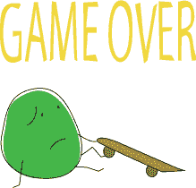
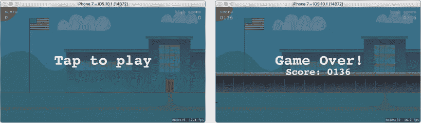
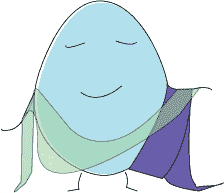
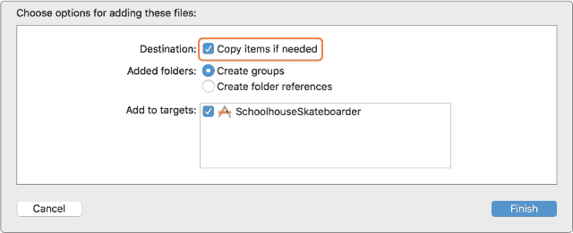
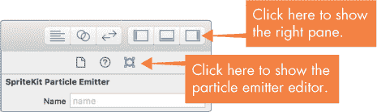
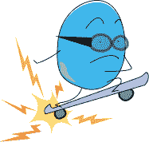
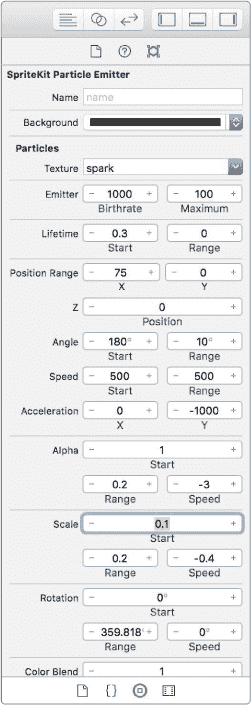
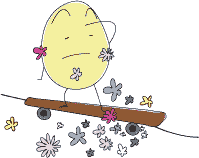
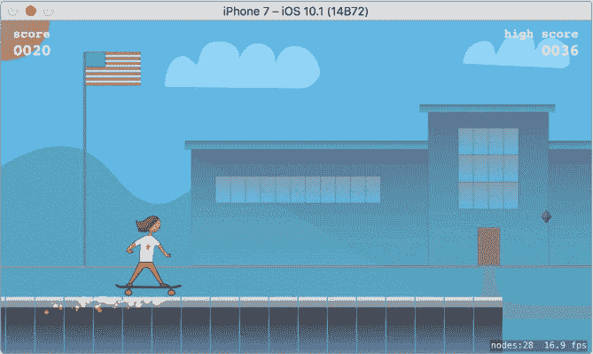

## 第十八章：## 游戏状态、菜单、声音和特效


在本章中，我们将为 Schoolhouse Skateboarder 添加 *状态* 概念。游戏的状态指的是游戏所处的模式，比如游戏是否正在进行，或已结束并正在等待重新开始。在此之前，游戏一直在运行，并且每次结束后都会立即重新开始。通过跟踪游戏的状态，我们可以添加一个简单的菜单系统，在游戏结束时显示。我们还将为游戏添加一些声音，并使用粒子发射器创建一些特效。

### 跟踪游戏状态

首先，我们将创建一个枚举，列出游戏可能处于的各种状态。将这个新枚举添加到 GameScene 类中，紧跟在 BrickLevel 枚举之后：

*GameScene.swift*

```
enum BrickLevel: CGFloat {

    --*snip*
 --

}

// This enum defines the states the game may be in

enum
 GameState {

    case
 notRunning

    case
 running

}
```

请注意，这个枚举被放置在 GameScene 类内部，因为它不会被 GameScene 外部的其他类使用。与我们为 BrickLevel 创建的枚举不同，这个枚举没有原始值。这个枚举只包含我们需要创建 GameState 数据类型的情况，我们不需要为每个情况关联任何值。当应用首次启动时，状态将为 notRunning。在游戏进行时，状态将为 running。当游戏结束并等待重新开始时，状态将重新设置为 notRunning。将这些状态放入枚举中可以使未来扩展游戏并添加更多状态变得更加容易。例如，如果我们添加了暂停按钮，我们可以在这个枚举中添加一个 paused 状态。

接下来，我们需要一个类属性来追踪游戏状态的当前值。我们将其命名为 gameState，并将其放在 GameScene 类中，紧跟在 brickLevel 声明之后，如下所示：

```
var brickLevel = BrickLevel.low

// The current game state is tracked

var
 gameState = GameState
 .notRunning

// Setting for how fast the game is scrolling to the right

```

这个新变量 gameState 将追踪游戏当前的状态。我们将其初始值设置为 notRunning，因为这是我们希望游戏在应用首次启动时所处的状态。

当游戏开始时，我们需要将 gameState 设置为 running。请在 startGame() 方法中添加以下代码：

```
func startGame() {

    // When a new game is started, reset to starting conditions

    gameState
 = .running

    resetSkater()

```

当游戏结束时，我们希望确保将状态重新设置为 notRunning。请在 gameOver() 方法中添加以下代码：

```
func gameOver() {

    // When the game ends, see if the player got a new high score

    gameState
 = .notRunning

   if score > highScore {

```

现在我们有了一个变量来跟踪游戏的状态，我们需要对其进行操作。如果此时运行游戏，你会看到在当前游戏结束后，新的游戏会立即开始。

要让游戏实际停止，首先从 gameOver() 方法中移除 startGame() 方法调用，这样就不会自动开始新游戏：

```
func gameOver() {

    --*snip*
 --

    if score > highScore {

        --*snip*
 --

    }

    startGame
 () // ← Remove this line of code

}

```

如果你现在运行游戏，当滑板手从屏幕上掉下来时，新的游戏不会自动开始。相反，砖块将继续移动。为了在游戏结束时停止更新，请在 update(_:) 方法中添加以下代码：

```
override func update(_ currentTime: TimeInterval) {

    if
 gameState
 != .running
 {

        return

    }

     // Slowly increase the scrollSpeed as the game progresses

```

现在我们的游戏循环只有在游戏运行时才会执行任何操作。这是因为方法在`return`关键字处结束，后面的代码将不会被执行。重新运行游戏，你会发现当滑板选手摔倒或被推出屏幕时，游戏会停止。不过，这并不是一个很友好的游戏结束画面。我们需要添加一个菜单系统来告诉玩家游戏结束，并让他们知道可以点击开始新游戏。



### 添加菜单系统

我们将向游戏中添加两个菜单屏幕：一个在游戏开始时显示，指示玩家点击开始游戏；另一个在游戏结束时显示，告知玩家游戏已经结束。

为了添加菜单屏幕，我们将创建一个名为`MenuLayer`的新类。然后我们将为每个屏幕创建一个`MenuLayer`对象，这样我们最终将拥有两个`MenuLayer`对象。这个类将是`SKSpriteNode`的子类，我们将使用它在屏幕上显示消息，比如“点击开始”或“游戏结束！”这个`MenuLayer`类本质上就是我们游戏的菜单系统。图 18-1 展示了完成后的菜单屏幕效果。



*图 18-1：应用首次运行时显示的“点击开始”菜单层，游戏结束时显示的“游戏结束！”层。*

菜单屏幕通常有多个选项供用户选择，但我们的菜单屏幕只用来显示简单的消息。如果我们要添加类似开启或关闭声音的选项，那么这个菜单层也是一个合适的地方来实现这一功能。

#### 创建 MenuLayer 类

要创建`MenuLayer`类，可以右键点击（或按住 CONTROL 点击）项目导航中的*SchoolhouseSkateboarder*文件夹，然后选择**新建文件…**。选择 iOS 源模板中的 Cocoa Touch Class，命名新类为`MenuLayer`，将其设置为`SKSpriteNode`的子类，并选择默认的文件位置创建新文件。你的新类应该如下所示：

*MenuLayer.swift*

```
import
 UIKit

class
 MenuLayer: SKSpriteNode
 {

}
```

就像我们创建`Skater`类时一样，首先需要做的是将导入语句更改为以下内容：

```
import
 SpriteKit
```

然后，在`MenuLayer`类中创建一个新方法，用来显示消息：

```
// Tells the MenuLayer to display a message and to

// optionally display a score

func
 display(message: String
 , score: Int
 ?) {

}
```

这个方法将用于在菜单层中显示消息——比如“游戏结束！”——它还允许我们（如果需要的话）显示玩家的分数，分数已被定义为可选的。首先，我们添加创建主消息标签的代码，将其放入`display(message:score:)`方法中：

```
func display(message: String, score: Int?) {

   // Create a message label using the passed-in message

➊
 let
 messageLabel: SKLabelNode
 = SKLabelNode
 (text: message)

   // Set the label's starting position to the left of the menu layer

➋
 let
 messageX = -frame
 .width

➌
 let
 messageY = frame
 .height
 / 2.0

   messageLabel.position
 = CGPoint
 (x: messageX, y: messageY)

➍
 messageLabel.horizontalAlignmentMode
 = .center

   messageLabel.fontName
 = "Courier-Bold"

   messageLabel.fontSize
 = 48.0

   messageLabel.zPosition
 = 20

   self
 .addChild
 (messageLabel)

}

```

这段代码应该很熟悉，因为它与我们在 GameScene 类中的 setUpLabels()方法中编写的代码非常相似，后者用于创建分数标签。在➊处，我们使用传入方法的 message 参数作为要显示的文本来创建标签。接下来，我们确定标签的起始位置。我们将使用一个动作来使标签从屏幕的左侧移动到屏幕的中心。为了实现这一点，我们需要首先将它的位置设置在屏幕左侧之外。

在➋处，我们使用-frame.width 作为 x 位置，将标签设置到屏幕左侧的一个完整宽度处。在➌处，我们使用 frame.height / 2.0 作为 y 位置，将标签垂直居中在屏幕上。我们还希望这个标签在其框架内水平居中，这样当我们将标签移到屏幕中心时，它会完全居中。为此，我们在➍处将标签的 horizontalAlignmentMode 设置为.center。现在我们已经确定了标签的位置，接着设置它的字体、字体大小和 zPosition，并将其添加为 MenuLayer 的子节点。

##### 使用动作来动画化标签

我们给标签设置了 x 位置，将其放置在屏幕的左侧，并设置 y 位置将其垂直居中在屏幕上，是有原因的。我们希望通过让标签从屏幕外缩放进来，增加一些效果！将以下动画代码添加到 display(message:score:)方法中：

*MenuLayer.swift*

```
   self.addChild(messageLabel)

   // Animate the message label to the center of the screen

 ➊
 let
 finalX = frame
 .width
 / 2.0

 ➋
 let
 messageAction = SKAction
 .moveTo
 (x: finalX, duration: 0.3
 )

 ➍
 messageLabel.run
 (messageAction)

}

```

➊处的代码计算了标签应该移动到的最终 x 位置，从而使标签最终位于屏幕中心。➋处的代码创建了一个名为 SKAction 的新对象。在 SpriteKit 中，你可以使用 SKAction 来对节点做很多有趣的事情——从旋转和淡出到沿路径移动。这里我们使用 moveTo(x:duration:)，它创建了一个将节点移动到新 x 位置的动作。我们传入了之前计算的 finalX 位置，并给它设置了一个持续时间值。持续时间值告诉这个动作动画应该持续多久。我们希望标签快速地缩放到屏幕上，因此设置了一个短暂的持续时间——0.3 秒。

最后，➌处的代码告诉消息标签执行这个动作。你创建的动作描述了节点应该做什么，但在你告诉节点执行该动作之前，什么都不会发生。

表格 18-1 描述了一些常用的动作方法。

**表格 18-1：** 常用的 SKAction 方法

| **SKAction 方法** | **作用** |
| --- | --- |
| move(to:duration:) | 将节点移动到一个新位置 |
| moveTo(x:duration:) | 将节点移动到新的 x 位置，保持相同的 y 位置 |
| moveTo(y:duration:) | 将节点移动到新的 y 位置，保持相同的 x 位置 |
| move(by:duration) | 将节点从当前位置按指定的数量移动 |
| rotate(toAngle:duration:) | 将节点旋转到一个新角度 |
| rotate(byAngle:duration:) | 将节点按指定角度旋转 |
| resize(toWidth:height:duration:) | 将节点调整为新的宽度和高度 |
| resize(byWidth:height:duration:) | 按给定的值调整节点的宽度和高度 |
| scale(to:duration:) | 将节点缩放到新的比例；例如，如果节点最初的比例是 1.0（默认值），将其缩放到 2.0 会使其大小翻倍 |
| fadeIn(withDuration:) | 让节点淡入 |
| fadeOut(withDuration:) | 让节点淡出 |
| playSoundFileNamed(_:waitForCompletion:) | 播放一个音频文件，例如 .wav 文件 |
| sequence(_:) | 将多个动作按顺序执行 |

如你所见，SKAction 可以做很多事情！你会注意到许多 SKAction 方法都有 *to* 版本和 *by* 版本，例如 move(to:duration:) 和 move(by:duration:)。*to* 版本的动作会无论节点原本的状态如何，都执行该动作。例如，如果你想将一个精灵移动到新的位置，比如屏幕中央，你会使用 *to* 版本并设置新的位置。节点会移动到该位置，无论它最初是否在屏幕外、屏幕内，还是位于新位置的左侧或右侧。如果你想让节点根据其当前的位置移动，你会使用 *by* 版本的动作。例如，如果你想让一个精灵向右移动 50.0 个单位，你会使用 move(by:duration:) 并设置 x 值为 50.0。

现在我们已经设置好了消息标签，让我们添加代码来可选地显示分数标签，这样玩家就可以在每场游戏结束时看到他们的最终得分。

##### 可选地显示分数标签

在我们的 display(message:score:) 方法中，score 参数是可选的。所以在显示玩家的分数之前，我们需要检查它是否存在。如果传入了分数且不为 nil，那么我们会显示一个分数标签，该标签会从屏幕右侧动画显示。如果 score 参数不存在，则不会创建分数标签。将以下代码添加到 display(message:score:) 方法中：

*MenuLayer.swift*

```
class MenuLayer: SKSpriteNode {

   // Tells the MenuLayer to display a message and to

   // optionally display a score

   func display(message: String, score: Int?) {

       --*snip*
 --

       messageLabel.run(messageAction)

       // If a score was passed in to the method, display it

       if let
 scoreToDisplay = score {

 // Create the score text from the score Int

       let
 scoreString = String
 (format: "Score: %04d"
 , scoreToDisplay)

       let
 scoreLabel: SKLabelNode
 = SKLabelNode
 (text: scoreString)

       // Set the label's starting position to the right

       // of the menu layer

     ➊
 let
 scoreLabelX = frame
 .width

     ➋
 let
 scoreLabelY = messageLabel.position
 .y
 - 

           messageLabel.frame
 .height

       scoreLabel.position
 = CGPoint
 (x: scoreLabelX, y: scoreLabelY)

       scoreLabel.horizontalAlignmentMode
 = .center

       scoreLabel.fontName
 = "Courier-Bold"

       scoreLabel.fontSize
 = 32.0

       scoreLabel.zPosition
 = 20

       addChild
 (scoreLabel)

       // Animate the score label to the center of the screen

     ➌
 let
 scoreAction = SKAction
 .moveTo
 (x: finalX, duration: 0.3
 )

       scoreLabel.run
 (scoreAction)

    }

  }

}

```

分数标签的代码与消息标签的代码几乎相同。唯一的区别是，分数标签首先被定位在菜单层的右边缘之外的 x 位置 ➊，并且 y 位置在消息标签的正下方 ➋。与 messageLabel 对象一样，在创建并将 scoreLabel 对象添加为 MenuLayer 类的子节点后，它会通过 SKAction 动画移动到屏幕中心 ➌。

#### 根据需要显示菜单层

现在我们已经设置了 MenuLayer 类，接下来需要实际使用它来创建菜单层。我们第一次想要显示菜单层的时机是在应用程序启动时。我们不再希望游戏自动开始，而是希望玩家看到一个菜单屏幕，提示他们点击屏幕开始游戏。因此，在 GameScene 的 didMove(to:) 方法中，*删除* 调用 startGame() 方法的那行代码，并在其位置添加以下代码来显示菜单层：

*GameScene.swift*

```
override func didMove(to view: SKView) {

    *--snip--*

    view.addGestureRecognizer(tapGesture)

    startGame
 () // ← Remove this line of code

    // Add a menu overlay with "Tap to play" text

 ➊
 let
 menuBackgroundColor = UIColor
 .black
 .withAlphaComponent
 (0.4
 )

 ➋
 let
 menuLayer = MenuLayer
 (color: menuBackgroundColor, size: frame
 .size
 )

  ➌
 menuLayer.anchorPoint
 = CGPoint
 (x: 0.0
 , y: 0.0
 )

   menuLayer.position
 = CGPoint
 (x: 0.0
 , y: 0.0
 )

   menuLayer.zPosition
 = 30

   menuLayer.name
 = "menuLayer"

 ➍
 menuLayer.display
 (message: "Tap to play"
 , score: nil
 )

   addChild
 (menuLayer)

}

```

这段代码创建了一个新的 MenuLayer 对象，标签中显示了“Tap to play”的消息。现在，游戏不会立即开始，而是会显示这个消息。➊ 这一行创建了一个 UIColor，以黑色为基础颜色，然后应用了一个 alpha 值为 0.4 的透明度组件。*Alpha* 设置了颜色的透明度，范围从 0.0 到 1.0。如果我们将 alpha 设置为 0.0，那么颜色将完全不可见或透明。alpha 值为 0.5 时，颜色半透明，就像薄纱一样。alpha 值为 1.0 时，颜色完全不透明—完全不透明。对于菜单层，设置一个部分透明的背景颜色将使得菜单文本看起来像是位于游戏之上。这一行只是设置了 UIColor。为了真正让屏幕变暗，我们需要将颜色应用到 MenuLayer 对象中。



➋ 这一行通过传入我们创建的颜色并将对象的大小设置为场景框架的大小，创建了一个新的 MenuLayer 对象。这使得菜单层与游戏场景一样大，因此当显示时能够完全覆盖场景。

➌ 这一行将菜单层节点的 anchorPoint 设置为 (0.0, 0.0)。正如你在第十四章中学到的，这些坐标将锚点设置在节点的左下角。接下来，我们将菜单层的位置也设置为 (0.0, 0.0)。由于菜单层和场景的大小相同，我们可以通过将锚点和位置都固定在 (0.0, 0.0) 来确保菜单层完美覆盖场景。

➍ 这一行调用了我们新创建的 menuLayer 对象的 display(message:score:) 方法。我们传递了字符串 "Tap to play" 作为要显示的消息，并传递了 nil 作为得分。我们不希望这个屏幕显示得分，因为玩家还没有得分。现在运行游戏，你应该会看到 “Tap to play” 的菜单层出现。

还有另一个时候我们需要显示菜单层：当游戏结束时。在 gameOver() 方法中添加以下代码：

```
func gameOver() {

    --*snip*
 --

    if score > highScore {

        --*snip*
 --

    }

    // Show the "Game Over!" menu overlay

    let
 menuBackgroundColor = UIColor
 .black
 .withAlphaComponent
 (0.4
 )

 let
 menuLayer = MenuLayer
 (color: menuBackgroundColor, size: frame
 .size
 )

    menuLayer.anchorPoint
 = CGPoint
 .zero

    menuLayer.position
 = CGPoint
 .zero

    menuLayer.zPosition
 = 30

    menuLayer.name
 = "menuLayer"

    menuLayer.display
 (➊
 message: "Game Over!"
 , ➋
 score: score
 )

    addChild
 (menuLayer)

}

```

这个菜单层与我们为游戏开始时创建的菜单层非常相似，不同之处在于它有一个不同的消息 ➊，并且我们传递了玩家的得分 ➋。因此，当游戏结束时，屏幕上会显示“Game Over！”消息以及玩家在游戏中获得的得分。

#### 移除菜单层

当玩家在“点击开始游戏”菜单上点击屏幕时，我们希望游戏开始运行。然而，我们的游戏当前只设置了在玩家点击屏幕时让滑冰者跳跃。让我们更新 handleTap(_:) 方法，使滑冰者仅在游戏运行时跳跃，并且如果有菜单正在显示，菜单会消失，游戏开始。

将 handleTap(_:) 方法修改为如下所示：

*GameScene.swift*

```
func handleTap(tapGesture: UITapGestureRecognizer) {

➊
 if
 gameState
 ==
 .running
 {

 // Make the skater jump if player taps while she is on the ground if skater.isOnGround {

          skater.physicsBody?.applyImpulse(CGVector(dx: 0.0, dy: 260.0))

      }

➋
 } else
 {

      // If the game is not running, tapping starts a new game

   ➌
 if let
 menuLayer: SKSpriteNode
 = childNode
 (withName: "menuLayer"
 ) 

         as
 ? SKSpriteNode
 {

       ➍
 menuLayer.removeFromParent
 ()

      }

   ➎
 startGame
 ()

  }

}

```

首先，我们将跳跃代码包装在一个 if 语句中，确保 gameState 等于 .running ➊ 。如果游戏没有运行，滑冰者就不应该跳跃！

接下来，我们添加一个 else 块 ➋ 来处理玩家点击时但游戏未运行的情况。目前我们只有两种游戏状态：running 和 notRunning 。所以，如果游戏未运行，那么它应该正在显示一个菜单层。

在这个 else 块中，我们需要通过名称从场景中获取菜单层的子节点。每次我们创建一个新的 MenuLayer 对象时，都会将其名称属性设置为 "menuLayer"，这样我们就可以通过 childNode(withName:) 方法通过名称检索它。在这里，我们使用 if-let 语句 ➌ 。在 if-let 语句内部，我们将菜单从其父节点中移除 ➍ ，这会使菜单消失。

最后，为了结束这个 else 块，我们调用 startGame() ➎ 。这样就完成了——现在运行游戏，你应该能看到一个完全功能的菜单系统！

### 播放声音

尽管我们新的菜单系统已经大大改善了游戏体验，但我们可以通过添加一些酷炫的音效让玩家玩得更开心。为 SpriteKit 游戏添加音效很简单。只需一行代码就能播放一个声音，而合适的音效可以让游戏更加生动。但首先我们需要将声音文件添加到项目中。我们准备了几个 *.wav* 文件——一个是当玩家跳跃时播放的，另一个是当玩家收集宝石时播放的。

#### 添加声音文件

你可以从本书的网页下载所需的声音文件，网址是 [*https://www.nostarch.com/iphoneappsforkids/*](https://www.nostarch.com/iphoneappsforkids/)。下载完成后，你会在 *Downloads* 文件夹中看到一个名为 *ch18-sounds* 的文件夹，里面包含了你所需的所有文件。

要将声音文件添加到项目中，你需要从 Finder 拖动它们到 Xcode，并将它们放在项目导航器中的 *Assets.xcassets* 附近。拖动后，导入选项窗口会弹出。确保选中 **如果需要，复制项目**，如图 18-2 所示。



*图 18-2：声音文件的导入选项*

现在你应该能在项目导航器中看到两个新文件：*jump.wav* 和 *gem.wav* 。现在声音文件已经添加到项目中，它们可以在游戏中使用了。

#### 在正确的时机播放声音

首先，当玩家跳跃时，我们添加代码来播放 *jump.wav* 。将以下代码添加到 handleTap(_:) 方法中：

*GameScene.swift*

```
func handleTap(tapGesture: UITapGestureRecognizer) {

    if gameState == .running {

       // Make the skater jump if player taps while she is on the ground if skater.isOnGround {

          skater.physicsBody?.applyImpulse(CGVector(dx: 0.0, dy: 260.0))

          run
 (SKAction
 .playSoundFileNamed
 ("jump.wav"
 , 

              waitForCompletion: false
 ))

       }

    }

```

由于我们已经在代码中有一个地方可以让玩家点击使滑板车手跳跃，我们所做的就是在场景上执行一个动作，播放正确的音频文件。SKAction 方法 playSoundFileNamed(_:waitForCompletion:)接受要播放的*.wav*文件的名称。我们将 waitForCompletion 设置为 false。这个属性只有在我们将多个动作按顺序执行时才会有意义。因为在这个例子中我们没有这样做，所以我们将其设置为 false。你将在下一节中创建粒子发射器时看到多个动作按顺序执行的示例。

当玩家收集宝石时，要播放*gem.wav*，请将以下代码行添加到 didBegin(_:)方法中：

```
func didBegin(_ contact: SKPhysicsContact) {

    --*snip*
 --

            updateScoreLabelText()

            run
 (SKAction
 .playSoundFileNamed
 ("gem.wav"
 , 

                waitForCompletion: false
 ))

        }

    }

}

```

现在，当玩家触碰到宝石并收集它时，除了获得 50 分额外积分外，他们还会听到宝石的声音。运行游戏，看看它听起来如何。

### 射出火花

现在是时候学习一些能让我们的游戏更加激动人心的东西了：粒子发射器。*粒子发射器*在游戏中用于创建特殊效果——雪、雨、火、爆炸等等！你可以将粒子发射器添加到游戏场景中，它会发射（或释放）粒子。这些粒子可以是任何图像，比如雪花、斑点或火焰，而粒子发射器将按照你指定的速度、方向和数量发射它们。例如，要创建爆炸效果，你可以告诉粒子发射器在所有方向上同时发射火焰粒子。或者，你可以告诉粒子发射器发射从屏幕顶部整个边缘飘落的雪花。对于《Schoolhouse Skateboarder》，我们将在滑板车手落地时从滑板的底部发射火花，因为这样看起来很酷。

幸运的是，Xcode 提供了一个很棒的内置方法来创建粒子发射器。在项目导航器中，按住 CONTROL 并点击*SchoolhouseSkateboarder*文件夹，然后选择**New File…**。接着选择**iOS**，向下滚动找到 Resource 部分，选择**SpriteKit Particle File**，然后点击**Next**。

Xcode 会询问你选择哪个粒子模板。有几个模板可供选择，每个模板都会为你想要创建的效果提供一个不错的起点。由于我们正在为滑板制作火花，请选择**Spark**，然后点击**Next**。

当 Xcode 询问文件名时，将其更改为*sparks.sks*，确保项目文件夹已被选中，然后点击**Create**。

现在你应该看到一个粒子发射器在各个方向上发射火花！这是内置的粒子编辑器，我们将使用它使这些火花看起来更像是从滑板车轮上射出的火花。首先，如图 18-3 所示，确保显示了实用工具面板。



*图 18-3：显示粒子编辑器实用工具面板*

粒子编辑器的乐趣之一就是你可以调整设置，看看能创造出什么有趣的发射器。对于滑板火花，我们已经做过这个实验，并找到了看起来合适的设置。请在右侧面板中更新发射器的数值，以使它们与 表 18-2 匹配。对于表中没有列出的任何值，保持不变。

**表 18-2：** 创建滑板火花的粒子发射器设置

| **设置** | **值** |
| --- | --- |
| 发射器，出生率 | 1000 |
| 发射器，最大值 | 100 |
| 生命周期，开始 | 0.3 |
| 位置范围，X | 75 |
| 角度，开始 | 180 |
| 角度，范围 | 10 |
| Alpha，速度 | -3 |
| 缩放，开始 | 0.1 |

完成此发射器的数值修改后，它应该看起来像 图 18-4 一样。



通过调整这些设置，粒子发射器可以创造出许多不同的特效，真是令人惊讶。表 18-3 解释了每个设置的作用。



*图 18-4：火花发射器设置*

**表 18-3：** 粒子发射器设置

| **设置** | **描述** |
| --- | --- |
| 名称 | 可以设置，以便稍后通过 childNode(withName:) 访问该发射器。 |
| 背景 | 可以在 .sks 编辑器中设置，以便更容易看到你正在处理的粒子发射器。当你在游戏代码中创建发射器时，此颜色将被忽略。 |
| 纹理 | 应用于粒子的图像文件。SpriteKit 在创建新的火花粒子发射器时会提供一个基本的 spark.png 图像作为默认设置，但你可以使用任何你想要的图像。 |
| 生命周期，开始 | 每个粒子发射后在屏幕上可见的时间（以秒为单位）。 |
| 生命周期，范围 | 粒子生命周期的变化量。值为 0 表示所有粒子都具有在“生命周期，开始”中指定的生命周期，而值为 1.0 表示粒子的生命周期可以随机变化，最多变化 1.0 秒。 |
| 位置范围，X | 粒子应生成的 x 轴位置范围。值为 0 表示所有粒子将从相同的 x 位置生成。值为 100.0 表示粒子可以在 100.0 的 x 位置范围内随机生成。 |
| 位置范围，Y | 粒子应生成的 y 轴位置范围。值为 0 表示所有粒子将从相同的 y 位置生成。值为 100.0 表示粒子可以在 100.0 的 y 位置范围内随机生成。 |
| 位置范围，Z | 粒子生成的 z 轴位置范围。Apple 已标记此属性为 *废弃* ，意味着这是一个旧的属性，不应再使用。 |
| 角度，开始 | 发射粒子的角度（以度为单位），0 表示向右，90 表示向上，180 表示向左，270 表示向下，360 表示向右。角度可以使用任何有效的 CGFloat 值。 |
| 角度，范围 | 发射角度的变化量。 |
| 速度，起始 | 粒子发射的速度。 |
| 速度，范围 | 发射速度的变化量。 |
| 加速度，X | 粒子在发射后应该在 x 方向上加速的程度。正值表示向右加速，负值表示向左加速。 |
| 加速度，Y | 粒子在发射后应该在 y 方向上加速的程度。正值表示向上加速，负值表示向下加速。 |
| 透明度，起始 | 粒子发射时的透明度。有效值是介于 0.0 和 1.0 之间的任意 CGFloat 值，其中 0.0 表示完全透明，1.0 表示完全不透明。 |
| 透明度，范围 | 透明度的变化量。 |
| 透明度，速度 | 粒子生命周期中透明度变化的速度。 |
| 缩放，起始 | 粒子的起始缩放值或大小。值为 1.0 表示正常大小，完全没有缩放。值为 2.0 表示双倍大小，0.5 表示一半大小，依此类推。 |
| 缩放，范围 | 粒子缩放或大小的变化量。 |
| 缩放，速度 | 粒子缩放的变化速度。 |
| 旋转，起始 | 粒子的旋转角度。对于像 *spark.png* 这样的纹理，旋转不会显著可见。但如果你使用 *skater.png* 图像作为纹理，你会注意到 0.0 表示正向，180.0 表示倒置。任何有效的 CGFloat 值都可以使用。 |
| 旋转，范围 | 粒子旋转的变化量。 |
| 旋转，速度 | 粒子旋转变化的速度。 |
| 颜色渐变 | 每个粒子在生命周期中应如何改变其颜色。例如，你可以指定粒子开始时是绿色，接着变为蓝色，最后变为黄色，再消失。 |
| 混合模式 | 允许你设置重叠粒子的颜色应该如何混合。 |

你可能已经注意到，当你选择了 Spark 模板时，一个新的图像文件被添加到项目导航器中，*spark.png*。这是一个单个火花的默认图像，用于火花发射器。你可以在发射器设置中更改该图像，使其发射花朵或任何你想要的东西。但目前，我们保持为火花效果。



在项目导航器中，你还会注意到有一个 *sparks.sks* 文件。这个文件描述了我们刚刚创建的发射器。所以要在我们的游戏中使用这个发射器，我们只需要编写一些代码来引用这个文件。切换到 *Skater.swift* 并在现有的 setupPhysicsBody() 方法下方添加以下方法：

*Skater.swift*

```
func setupPhysicsBody() {

    --*snip*
 --

}

func
 createSparks() {

 // Find the sparks emitter file in the project's bundle

  ➊
 let
 bundle = Bundle
 .main

  ➋
 if let
 sparksPath = bundle.path
 (forResource: "sparks"
 , ofType: "sks"
 ) {

       // Create a Sparks emitter node

     ➌
 let
 sparksNode = NSKeyedUnarchiver
 .unarchiveObject

            (withFile: sparksPath) as
 ! SKEmitterNode

     ➍
 sparksNode.position
 = CGPoint
 (x: 0.0
 , y: -50.0
 )

     ➎
 addChild
 (sparksNode)

 }

}

```

这段代码引用了我们通过查看项目的 *bundle* 文件夹中创建的 *sparks.sks* 文件——它是构成项目的文件和资源的集合——并用它创建了一个发射器，即 SKEmitterNode，命名为 sparksNode。为了访问 *sparks.sks* 文件（它是项目的一部分），我们需要先获取一个对应用程序主 bundle 的引用 ➊，这是所有项目文件所在的位置。获取了 bundle 后，我们调用它的 path(forResource:ofType:) 方法 ➋，以获取 *sparks.sks* 文件的路径或位置。➌ 这一行通过调用 NSKeyedUnarchiver.unarchiveObject(withFile:)，利用我们创建的 *sparks.sks* 文件创建了一个名为 sparksNode 的 SKEmitterNode。这个函数可以将某些文件（如 *.sks* 文件）转换为 Swift 对象。

一旦 sparksNode 被创建，我们设置它的位置 ➍，然后将其作为子节点添加到滑板者精灵 ➎ 中。由于这个发射器将成为滑板者精灵的子节点，它将随着滑板者一起移动，就像被粘在她身上一样。更重要的是，定位发射器非常容易，只需将其位置设置为 (0.0, -50.0)，这会将其放置在滑板者的底部中央。

和其他任何 SpriteKit 节点一样，一旦我们不再使用发射器，我们应该将其移除。这个火花发射器应该只需要半秒钟或更短的时间来发射几颗火花。之后，我们需要将其移除，以避免占用内存和其他系统资源。将以下代码添加到新的 createSparks() 方法中：

```
func createSparks() {

    --*snip*
 --

    if let sparksPath = bundle.path(forResource: "sparks", ofType: "sks") {

        --*snip*
 --

        addChild(sparksNode)

 // Run an action to wait half a second and then remove the emitter

     ➊
 let
 waitAction = SKAction
 .wait
 (forDuration: 0.5
 )

     ➋
 let
 removeAction = SKAction
 .removeFromParent
 ()

     ➌
 let
 waitThenRemove = SKAction
 .sequence
 ([waitAction, removeAction])

     ➍
 sparksNode.run
 (waitThenRemove)

 }

}

```

之前，我们使用了动作来动画化一些标签并播放一些声音。我们还可以用动作做一些很酷的事情：将它们按顺序排列。也就是说，我们可以让一个节点自动执行一系列动作，一个接一个。我们首先创建一些变量，用来存储我们想按顺序执行的动作，以便让代码更易读。➊ 这一行通过 SKAction.wait(forDuration:) 创建了 waitAction，指示节点在执行下一个动作之前等待 0.5 秒。➋ 这一行创建了下一个动作 removeAction，指示节点将自己从父节点中移除。

➌ 这一行创建了一个 waitThenRemove 动作，这是由那两个动作组成的一个序列。要创建一个序列动作，我们调用 SKAction.sequence() 并传递一个包含 SKAction 对象的数组。由于我们已经创建了 waitAction 和 removeAction，我们只需要将它们放入一个数组中，像这样：[waitAction, removeAction]。我们的序列中只需要两个动作，但通过这种方式连接的动作数量是没有限制的。最后，我们只需要告诉 sparksNode 执行这个动作序列 ➍，就完成了。

粒子发射器一旦创建并添加到场景中，就会不断地发射粒子。你对发射器执行的任何操作都会附加在节点已经执行的操作上，在这种情况下就是发射火花。所以如果你将粒子发射器动画化，让它在屏幕上移动，你并不会改变粒子的行为，只是改变了粒子发射的位置。

现在我们已经有了为滑板创建火花的方式，我们只需要添加代码来决定何时实际调用这个 createSparks()方法。

切换回*GameScene.swift*，并将 didBegin(_:)方法的前半部分更新为如下：

*GameScene.swift*

```
func didBegin(_ contact: SKPhysicsContact) {

    // Check if the contact is between the skater and a brick

    if contact.bodyA.categoryBitMask == PhysicsCategory.skater && 

        contact.bodyB.categoryBitMask == PhysicsCategory.brick {

     ➊
 if let
 velocityY = skater
 .physicsBody
 ?.velocity
 .dy
 {

         ➋
 if
 !skater
 .isOnGround
 && velocityY < 100.0
 {

            ➌
 skater
 .createSparks
 ()

           }

      }

      skater.isOnGround = true

    }

```

由于我们已经有了判断滑冰者何时落地的代码，我们只需要添加一个 if 语句来检查：

• 滑冰者*不*已经在地面上（注意在 skater.isOnGround 前有个感叹号，意味着我们在检查她是否不在地面上，因为！会反转布尔值的意义）。

• 滑冰者正在向下移动，而不是向上。

由于滑冰者的物理身体是一个可选项，且我们无法将一个可选项与像 100.0 这样的数字进行比较，所以我们首先需要解开滑冰者身体的 y 速度，如图➊所示。接着，图➋中的代码检查滑冰者是否已经不在地面上，并且她的 y 速度是否小于 100.0。如果这两个条件都成立，那么我们会调用滑冰者的 createSparks()方法 ➌ 来显示火花发射器。

我们通过查看滑冰者物理身体在 dy 方向上的速度来检查滑冰者的运动方向。对于速度，dx 表示水平方向（正值是向右，负值是向左），dy 表示垂直方向（正值是向上，负值是向下）。为了检查滑冰者是否向下移动，从技术上讲，我们应该检查她的 y 速度是否小于 0.0。但我们检查的是她的 y 速度是否小于 100.0，因为有时当她第一次碰到砖块时，她的 y 速度会稍微为正，因为她从砖块上弹起。因此，使用速度 Y < 100.0 的检查确保我们每次她落地时都会看到火花。

如果两个 if 条件都满足，火花将从滑冰者的滑板上飞溅出来，如图 18-5 所示。



*图 18-5：火花四溅！*

现在运行游戏，享受每次滑冰者落地时酷炫的火花效果吧！

**注意**

*Schoolhouse Skateboarder 项目现在已完成！请记住，最终的项目文件可以从*[`www.nostarch.com/iphoneappsforkids/`](https://www.nostarch.com/iphoneappsforkids/) *获取，因此你可以与自己的文件进行对比，以确保一切都在正确的位置。*

### 你学到了什么

在这一章中，你学习了几种方法来使游戏更加专业。你了解了游戏状态以及为什么跟踪游戏所处的状态如此重要。你为游戏添加了一个简单的菜单系统，并通过动作动画化了标签。接着，你学习了如何为游戏添加音效。最后，你了解了粒子发射器，并使用它从滑板的底部发射火花。

## 游戏状态、菜单、音效和特效


在这一章中，我们将为《学校滑板》添加 *状态* 的概念。游戏的状态表示游戏所处的模式，例如游戏是否正在进行，或者已经结束并等待重新开始。在此之前，游戏总是处于运行状态，且一旦结束便立即重新开始。跟踪游戏状态将使我们能够添加一个简单的菜单系统，以显示游戏结束时的界面。我们还将为游戏添加一些音效，并通过粒子发射器创建一些特效。

### 跟踪游戏状态

首先，我们将创建一个枚举，列出游戏可能处于的各种状态。将这个新的枚举添加到 GameScene 类中，紧跟在 BrickLevel 枚举之后：

*GameScene.swift*

```
enum BrickLevel: CGFloat {

    --*snip*
 --

}

// This enum defines the states the game may be in

enum
 GameState {

    case
 notRunning

    case
 running

}
```

请注意，这个枚举被放置在 GameScene 类内部，因为其他类在 GameScene 外部不需要它。与我们为 BrickLevel 创建的枚举不同，这个枚举没有原始值。这个枚举只包含我们需要的情况，用于创建一个 GameState 数据类型，并且我们不需要为每个情况关联任何值。当应用程序首次启动时，状态将是 notRunning。在游戏进行时，状态将是 running。当游戏结束并等待重新开始时，状态将被重置为 notRunning。将这些状态放在一个枚举中使得未来扩展游戏并添加更多状态变得更容易。例如，如果我们添加了暂停按钮，我们可以在这个枚举中添加一个 paused 的状态。

接下来，我们需要一个类属性来跟踪当前游戏状态的值。我们将其命名为 gameState，并将其放置在 GameScene 类中，紧跟在 brickLevel 声明之后，如下所示：

```
var brickLevel = BrickLevel.low

// The current game state is tracked

var
 gameState = GameState
 .notRunning

// Setting for how fast the game is scrolling to the right

```

这个新变量 gameState 将跟踪游戏所处的状态。我们将其初始值设置为 notRunning，因为这是应用程序首次启动时我们希望游戏处于的状态。

当游戏开始时，我们需要将 gameState 设置为 running。将这一行添加到 startGame() 方法中：

```
func startGame() {

    // When a new game is started, reset to starting conditions

    gameState
 = .running

    resetSkater()

```

当游戏结束时，我们要确保将状态重置为 notRunning。将这一行添加到 gameOver() 方法中：

```
func gameOver() {

    // When the game ends, see if the player got a new high score

    gameState
 = .notRunning

   if score > highScore {

```

现在我们有了一个变量来跟踪游戏的状态，我们需要对它进行操作。如果你现在运行游戏，你会看到当前游戏结束后，新的游戏仍然会立即开始。

要让游戏真正停止，首先从 gameOver() 方法中移除 startGame() 方法调用，以防止自动开始新游戏：

```
func gameOver() {

    --*snip*
 --

    if score > highScore {

        --*snip*
 --

    }

    startGame
 () // ← Remove this line of code

}

```

如果你现在运行游戏，当滑板车手摔出屏幕时，新游戏不会自动开始。相反，砖块会继续移动。为了在游戏结束时停止游戏更新，请将以下代码添加到 update(_:) 方法中：

```
override func update(_ currentTime: TimeInterval) {

    if
 gameState
 != .running
 {

        return

    }

     // Slowly increase the scrollSpeed as the game progresses

```

现在，除非游戏正在运行，否则我们的游戏循环不会执行任何操作。这是因为方法在 return 关键字处结束，后续的代码将不会被执行。再次运行游戏，你应该能看到，当滑板车手摔倒或被推出屏幕时，一切停止了。不过，这并不是一个很友好的游戏结束屏幕。我们需要添加一个菜单系统，告诉玩家游戏结束，并让他们知道可以点击开始新游戏。


### 添加菜单系统

我们将为游戏添加两个菜单屏幕：一个在游戏开始时显示，提示玩家点击开始游戏，另一个在游戏结束时显示，告诉玩家游戏结束。

为了添加菜单屏幕，我们将创建一个名为 MenuLayer 的新类。然后，我们将为每个屏幕创建一个 MenuLayer 对象，因此总共会有两个 MenuLayer 对象。该类将是 SKSpriteNode 的子类，我们将使用它来在屏幕上显示消息，如“点击开始”或“游戏结束！”这个 MenuLayer 类本质上就是我们的游戏菜单系统。图 18-1 显示了我们完成的菜单屏幕的样子。


*图 18-1：当应用首次运行时，会显示“点击开始”菜单层，游戏结束时会显示“游戏结束！”菜单层。*

菜单屏幕通常有多个选项供用户选择，但我们的菜单只用于显示简单的消息。如果我们要添加一个选项，比如开关声音功能，那么这个菜单层也是一个合适的位置来实现这一点。

#### 创建 MenuLayer 类

要创建 MenuLayer 类，请通过右键点击（或按 CONTROL -点击）项目导航器中的 *SchoolhouseSkateboarder* 文件夹，然后选择 **新建文件…** 。选择名为 Cocoa Touch Class 的 iOS Source 模板。命名新类为 MenuLayer，将其设置为 SKSpriteNode 的子类，并选择默认的文件位置来创建新文件。你的新类应如下所示：

*MenuLayer.swift*

```
import
 UIKit

class
 MenuLayer: SKSpriteNode
 {

}
```

就像我们创建 Skater 类时一样，首先需要做的是将导入语句更改为以下内容：

```
import
 SpriteKit
```

现在，在 MenuLayer 类中创建一个新方法，允许我们显示消息：

```
// Tells the MenuLayer to display a message and to

// optionally display a score

func
 display(message: String
 , score: Int
 ?) {

}
```

这个方法将用于在菜单层中展示消息，例如“游戏结束！”它还允许我们（如果希望的话）显示玩家的分数，这个分数我们已经定义为可选项。首先，让我们添加创建主消息标签的代码。将以下代码添加到 display(message:score:) 方法中：

```
func display(message: String, score: Int?) {

   // Create a message label using the passed-in message

➊
 let
 messageLabel: SKLabelNode
 = SKLabelNode
 (text: message)

   // Set the label's starting position to the left of the menu layer

➋
 let
 messageX = -frame
 .width

➌
 let
 messageY = frame
 .height
 / 2.0

   messageLabel.position
 = CGPoint
 (x: messageX, y: messageY)

➍
 messageLabel.horizontalAlignmentMode
 = .center

   messageLabel.fontName
 = "Courier-Bold"

   messageLabel.fontSize
 = 48.0

   messageLabel.zPosition
 = 20

   self
 .addChild
 (messageLabel)

}

```

这段代码应该很熟悉，因为它与我们在 GameScene 类的 `setUpLabels()` 方法中编写的代码非常相似，用于创建分数标签。在第➊行，我们使用传入方法的 message 参数来创建标签的文本内容。接下来，我们确定标签的起始位置。我们将使用一个动作来使标签从屏幕左侧移动到屏幕中央。为了实现这一点，我们首先将标签的位置设置到屏幕左侧。

在第➋行，我们使用 `-frame.width` 作为 x 位置，将标签设置为屏幕左侧一个完整宽度的地方。在第➌行，我们使用 `frame.height / 2.0` 作为 y 位置，将标签垂直居中放置在屏幕上。我们还希望标签在其框架内水平居中，这样当标签移动到屏幕中间时，就会完美对齐。为此，我们在第➍行将标签的 `horizontalAlignmentMode` 设置为 `.center`。现在我们已经设置了标签的位置，接下来设置它的字体、字号和 zPosition，并将其添加为 MenuLayer 的子节点。

##### 使用动作来动画化标签

我们将标签的 x 位置设置为屏幕左侧并将 y 位置设置为屏幕垂直中间，是有原因的。我们希望通过让标签快速缩放到屏幕上来增加一些效果！将这段动画代码添加到 `display(message:score:)` 方法中：

*MenuLayer.swift*

```
   self.addChild(messageLabel)

   // Animate the message label to the center of the screen

 ➊
 let
 finalX = frame
 .width
 / 2.0

 ➋
 let
 messageAction = SKAction
 .moveTo
 (x: finalX, duration: 0.3
 )

 ➍
 messageLabel.run
 (messageAction)

}

```

第➊行计算了标签应该移动到的最终 x 位置，以便将其定位到屏幕中心。第➋行创建了一个名为 SKAction 的新对象。在 SpriteKit 中，您可以使用 SKAction 来执行大量有趣的节点操作——从旋转、渐隐到沿路径移动都可以实现。这里我们使用 `moveTo(x:duration:)`，它创建了一个将节点移动到新 x 位置的动作。我们传入之前计算出的 finalX 位置，并设置一个持续时间值。这个持续时间值告诉动作动画应该持续多长时间。我们希望标签快速缩放到屏幕上，所以我们设置了一个较短的持续时间，0.3 秒。

最后，第➌行告诉消息标签执行这个动作。您创建的动作描述了节点应该做什么，但在您告诉节点执行该动作之前，什么都不会发生。

表 18-1 描述了一些常见的动作方法。

**表 18-1：** 常用 SKAction 方法

| **SKAction 方法** | **功能** |
| --- | --- |
| move(to:duration:) | 将节点移动到一个新的位置 |
| moveTo(x:duration:) | 将节点移动到新的 x 位置，保持 y 位置不变 |
| moveTo(y:duration:) | 将节点移动到新的 y 位置，保持 x 位置不变 |
| move(by:duration) | 将节点从当前位置移动指定的距离 |
| rotate(toAngle:duration:) | 将节点旋转到新的角度 |
| rotate(byAngle:duration:) | 按给定角度旋转节点 |
| resize(toWidth:height:duration:) | 将节点的宽度和高度调整到新的值 |
| resize(byWidth:height:duration:) | 按给定的宽度和高度调整节点大小 |
| scale(to:duration:) | 将节点缩放到新的比例；例如，如果节点原本的比例是 1.0（默认值），将其缩放到 2.0 将使其大小加倍 |
| fadeIn(withDuration:) | 淡入节点 |
| fadeOut(withDuration:) | 淡出节点 |
| playSoundFileNamed(_:waitForCompletion:) | 播放音频文件，如.wav 文件 |
| sequence(_:) | 将多个动作按顺序执行 |

如你所见，SKAction 可以做的事情非常多！你会注意到，许多 SKAction 方法有*to*版本和*by*版本，比如 move(to:duration:)和 move(by:duration:)。*to*版本的动作无论节点原本的状态如何，都会执行该动作。例如，如果你想将一个精灵移动到新位置，比如屏幕的中间，你就会使用*to*版本，并设置新位置。无论节点原本是在屏幕外，屏幕内，还是在新位置的左侧或右侧，节点都会移动到该位置。如果你希望节点根据当前的定位进行移动，则应使用*by*版本的动作。例如，如果你希望一个精灵从当前位置向右移动 50.0，你会使用 move(by:duration:)并设置 x 轴偏移量为 50.0。

现在我们已经设置好了消息标签，接下来添加代码以可选地显示分数标签，这样玩家就可以在每场游戏结束时看到他们的最终分数。

##### 可选地显示分数标签

在我们的 display(message:score:)方法中，score 参数是可选的。因此，在显示玩家的分数之前，我们需要检查它是否存在。如果分数存在且不为 nil，那么我们将显示一个从屏幕右侧动画出现的分数标签。如果 score 参数不存在，则不会创建分数标签。将以下代码添加到 display(message:score:)方法中：

*MenuLayer.swift*

```
class MenuLayer: SKSpriteNode {

   // Tells the MenuLayer to display a message and to

   // optionally display a score

   func display(message: String, score: Int?) {

       --*snip*
 --

       messageLabel.run(messageAction)

       // If a score was passed in to the method, display it

       if let
 scoreToDisplay = score {

 // Create the score text from the score Int

       let
 scoreString = String
 (format: "Score: %04d"
 , scoreToDisplay)

       let
 scoreLabel: SKLabelNode
 = SKLabelNode
 (text: scoreString)

       // Set the label's starting position to the right

       // of the menu layer

     ➊
 let
 scoreLabelX = frame
 .width

     ➋
 let
 scoreLabelY = messageLabel.position
 .y
 - 

           messageLabel.frame
 .height

       scoreLabel.position
 = CGPoint
 (x: scoreLabelX, y: scoreLabelY)

       scoreLabel.horizontalAlignmentMode
 = .center

       scoreLabel.fontName
 = "Courier-Bold"

       scoreLabel.fontSize
 = 32.0

       scoreLabel.zPosition
 = 20

       addChild
 (scoreLabel)

       // Animate the score label to the center of the screen

     ➌
 let
 scoreAction = SKAction
 .moveTo
 (x: finalX, duration: 0.3
 )

       scoreLabel.run
 (scoreAction)

    }

  }

}

```

分数标签的代码与消息标签的代码几乎相同。唯一的区别是，标签首先定位在菜单层的右边缘稍微偏右的 x 位置➊，并且 y 位置位于消息标签的正下方➋。与 messageLabel 对象一样，在创建并将 scoreLabel 对象作为 MenuLayer 类的子对象添加之后，它会通过 SKAction 动画移动到屏幕中心➌。

#### 根据需要显示菜单层

现在我们已经设置好了 MenuLayer 类，我们需要实际使用它来创建菜单层。第一次我们想要显示菜单层是在应用程序启动时。我们不再希望游戏自动开始，而是希望玩家看到一个菜单屏幕，提示他们点击屏幕开始游戏。所以，在 GameScene 的 didMove(to:)方法中，*移除*调用 startGame()方法的那行代码，并将其替换为以下代码来显示菜单层：

*GameScene.swift*

```
override func didMove(to view: SKView) {

    *--snip--*

    view.addGestureRecognizer(tapGesture)

    startGame
 () // ← Remove this line of code

    // Add a menu overlay with "Tap to play" text

 ➊
 let
 menuBackgroundColor = UIColor
 .black
 .withAlphaComponent
 (0.4
 )

 ➋
 let
 menuLayer = MenuLayer
 (color: menuBackgroundColor, size: frame
 .size
 )

  ➌
 menuLayer.anchorPoint
 = CGPoint
 (x: 0.0
 , y: 0.0
 )

   menuLayer.position
 = CGPoint
 (x: 0.0
 , y: 0.0
 )

   menuLayer.zPosition
 = 30

   menuLayer.name
 = "menuLayer"

 ➍
 menuLayer.display
 (message: "Tap to play"
 , score: nil
 )

   addChild
 (menuLayer)

}

```

这段代码创建了一个新的 MenuLayer 对象，并在其标签中显示消息“Tap to play”。现在，游戏不会立即开始，而是显示这条消息。➊行创建了一个 UIColor 对象，使用黑色作为起始点，然后应用一个透明度值（alpha）为 0.4。*Alpha*值设置了物体的透明度，范围从 0.0 到 1.0。如果我们将 alpha 值设置为 0.0，颜色就会完全不可见或透明。alpha 值为 0.5 时，颜色会半透明，像一层薄纱。alpha 值为 1.0 表示颜色完全不透明——完全不透明。对于菜单层，设置一个部分透明的背景颜色会让它看起来像菜单文本覆盖在游戏上方。此行代码仅设置了 UIColor。为了真正让屏幕变暗，我们需要将颜色应用到 MenuLayer 对象上。


➋行通过传入我们创建的颜色并将对象的大小设置为场景框架的大小，创建了一个新的 MenuLayer 对象。这样，菜单层的大小就与游戏场景相同，显示时可以完全覆盖整个场景。

➌行将菜单层节点的 anchorPoint 设置为(0.0, 0.0)。正如你在第十四章中学到的，这些坐标将锚点设置在节点的左下角。接下来，我们也将菜单层的位置设置为(0.0, 0.0)。因为菜单层和场景大小相同，所以通过将锚点和位置都固定在(0.0, 0.0)，我们可以确保菜单层完美地覆盖整个场景。

➍行调用了我们新的 menuLayer 对象的 display(message:score:)方法。我们传入字符串“Tap to play”作为消息，它将动态显示在屏幕上，并将 nil 传递给 score。我们不希望这个屏幕显示分数，因为玩家还没有分数。现在运行游戏，你应该能看到“Tap to play”菜单层出现。

还有一个时候我们需要显示菜单层：当游戏结束时。将以下代码添加到 gameOver()方法中：

```
func gameOver() {

    --*snip*
 --

    if score > highScore {

        --*snip*
 --

    }

    // Show the "Game Over!" menu overlay

    let
 menuBackgroundColor = UIColor
 .black
 .withAlphaComponent
 (0.4
 )

 let
 menuLayer = MenuLayer
 (color: menuBackgroundColor, size: frame
 .size
 )

    menuLayer.anchorPoint
 = CGPoint
 .zero

    menuLayer.position
 = CGPoint
 .zero

    menuLayer.zPosition
 = 30

    menuLayer.name
 = "menuLayer"

    menuLayer.display
 (➊
 message: "Game Over!"
 , ➋
 score: score
 )

    addChild
 (menuLayer)

}

```

这个菜单层就像我们为游戏开始时创建的菜单层，只不过它有不同的消息➊，并且我们传入了玩家的分数➋。因此，当游戏结束时，屏幕将显示“Game Over!”消息以及玩家在游戏中获得的分数。

#### 移除菜单层

当玩家在“点击开始游戏”菜单上点击屏幕时，我们希望游戏开始播放。然而，我们的游戏目前只设置为当玩家点击屏幕时让滑板选手跳跃。让我们更新 `handleTap(_:)` 方法，使得只有在游戏运行时滑板选手才会跳跃，并且如果菜单正在显示，菜单会消失并开始新的一局游戏。

将 `handleTap(_:)` 方法更改为如下所示：

*GameScene.swift*

```
func handleTap(tapGesture: UITapGestureRecognizer) {

➊
 if
 gameState
 ==
 .running
 {

 // Make the skater jump if player taps while she is on the ground if skater.isOnGround {

          skater.physicsBody?.applyImpulse(CGVector(dx: 0.0, dy: 260.0))

      }

➋
 } else
 {

      // If the game is not running, tapping starts a new game

   ➌
 if let
 menuLayer: SKSpriteNode
 = childNode
 (withName: "menuLayer"
 ) 

         as
 ? SKSpriteNode
 {

       ➍
 menuLayer.removeFromParent
 ()

      }

   ➎
 startGame
 ()

  }

}

```

首先，我们将跳跃代码包裹在一个 if 语句中，确保 `gameState` 等于 `.running` ➊ 。如果游戏没有运行，滑板选手就不应该跳跃！

接下来，我们添加一个 else 块 ➋ 来处理当玩家点击屏幕但游戏未运行时应该发生的事情。目前，我们只有两种游戏状态，运行中和未运行。所以如果游戏没有运行，它一定是在显示一个菜单层。

在这个 else 块内，我们需要通过名字向场景请求获取菜单层的子节点。每次我们创建新的 MenuLayer 对象时，都会将其 `name` 属性设置为 "menuLayer"，这样我们就可以通过 `childNode(withName:)` 方法使用这个名字来获取它。我们在这里使用 `if-let` 语句 ➌ 来实现。在 `if-let` 语句内，我们将菜单从它的父节点中移除 ➍ ，这样菜单就会消失。

最后，为了结束这个 else 块，我们调用 `startGame()` ➎ 。应该就这样了——现在运行游戏，你应该会看到一个完全功能的菜单系统！

### 制作音效

尽管我们的新菜单系统已经大大提升了游戏体验，但我们可以通过添加一些酷炫的音效来让游戏更加有趣。为 SpriteKit 游戏添加音效非常简单。只需要一行代码就能播放音效，合适的音效能够让游戏生动起来。但首先，我们需要将音效文件添加到项目中。我们已经准备了几个 *.wav* 文件——一个在玩家跳跃时播放，另一个在玩家收集到宝石时播放。

#### 添加音效文件

从书籍的网页下载你需要的音效文件，网址是 [*https://www.nostarch.com/iphoneappsforkids/*](https://www.nostarch.com/iphoneappsforkids/)。下载完成后，你会在 *Downloads* 文件夹内得到一个名为 *ch18-sounds* 的文件夹，里面包含你需要的所有文件。

要将音效文件添加到项目中，你需要将它们从 Finder 拖动到 Xcode 中，并将它们放在项目导航器中 *Assets.xcassets* 附近。将它们拖放后，会弹出一个导入选项窗口。确保选中 **Copy items if needed**，如 图 18-2 所示。


*图 18-2：音效文件的导入选项*

现在你应该在项目导航器中看到两个新文件：*jump.wav* 和 *gem.wav*。现在音效文件已经被添加到项目中，它们可以在游戏中使用了。

#### 在正确的时机播放音效

首先，让我们添加代码，当玩家跳跃时播放 *jump.wav*。将以下代码添加到 `handleTap(_:)` 方法中：

*GameScene.swift*

```
func handleTap(tapGesture: UITapGestureRecognizer) {

    if gameState == .running {

       // Make the skater jump if player taps while she is on the ground if skater.isOnGround {

          skater.physicsBody?.applyImpulse(CGVector(dx: 0.0, dy: 260.0))

          run
 (SKAction
 .playSoundFileNamed
 ("jump.wav"
 , 

              waitForCompletion: false
 ))

       }

    }

```

由于我们已经有了玩家点击让滑板手跳跃的代码位置，我们只需在场景上运行一个动作来播放正确的声音文件。SKAction 方法 playSoundFileNamed(_:waitForCompletion:) 被赋予了要播放的 *.wav* 文件名。我们将 waitForCompletion 设置为 false。如果我们要将多个动作串联在一起，这个属性才会重要。由于我们在这里没有这样做，所以设置为 false。你将在下一节创建粒子发射器时看到如何串联多个动作。

要在玩家收集宝石时播放 *gem.wav*，请将以下代码行添加到 didBegin(_:) 方法中：

```
func didBegin(_ contact: SKPhysicsContact) {

    --*snip*
 --

            updateScoreLabelText()

            run
 (SKAction
 .playSoundFileNamed
 ("gem.wav"
 , 

                waitForCompletion: false
 ))

        }

    }

}

```

现在，当玩家触碰宝石收集它时，除了获得 50 分外，他们还会听到宝石音效。运行游戏并听听它的声音。

### 发射火花

现在是时候学习一些能让我们的游戏更加精彩的东西了：粒子发射器。*粒子发射器*在游戏中用于创建特效——雪、雨、火焰、爆炸等！你将粒子发射器添加到游戏场景中，它会发射出（或释放）粒子。粒子可以是任何图像，比如雪花、一个小块或一点火焰，粒子发射器会按照你指定的速度、方向和数量将它们发射出去。例如，要创建爆炸效果，你可以告诉粒子发射器同时在所有方向上发射火焰粒子。或者，你可以告诉粒子发射器从屏幕顶部的整个边缘发射雪花，雪花慢慢飘落。对于《Schoolhouse Skateboarder》来说，我们会添加一个粒子发射器，当滑板手落地时，从滑板底部发射出火花，因为这样看起来很酷。

幸运的是，Xcode 提供了一个非常棒的内置方式来创建粒子发射器。按住 CONTROL 键并点击 *SchoolhouseSkateboarder* 文件夹，选择 **New File...**。然后选择 **iOS**，向下滚动找到 Resource 部分，选择 **SpriteKit Particle File**，点击 **Next**。

Xcode 会询问你使用哪个粒子模板。有一些模板可以选择，每个模板都会为你创建所需效果提供一个不错的起点。因为我们正在为滑板制作火花，所以选择 **Spark**，然后点击 **Next**。

当 Xcode 请求文件名时，将其更改为 *sparks.sks*，确保已经选择了你的项目文件夹，然后点击**创建**。

现在你应该能看到粒子发射器在各个方向发射出火花！这就是内置的粒子编辑器，我们将利用它来使这些火花看起来更像从滑板车轮上发射出来的火花。如图 18-3 所示，确保工具窗格已显示。


*图 18-3：显示粒子编辑器工具窗格*

粒子编辑器的一部分乐趣在于你可以调整设置并查看你能创造出什么有趣的发射器。对于滑板火花，我们已经做过这些操作，并找到了一些看起来合适的设置。更新右侧面板中的发射器值，使它们与表 18-2 匹配。对于表中未列出的任何值，请不要进行更改。 |

**表 18-2：** 创建滑板火花的粒子发射器设置 |

| **设置** | **值** |
| --- | --- |
| 发射器，出生率 | 1000 |
| 发射器，最大值 | 100 |
| 寿命，起始 | 0.3 |
| 位置范围，X | 75 |
| 角度，起始 | 180 |
| 角度，范围 | 10 |
| 透明度，速度 | –3 |
| 缩放，起始 | 0.1 |

当你完成了对这个发射器的值的更改后，它应该看起来像图 18-4 一样。 |

 |

通过调整这些设置，你可以创建多少种不同的特效真是令人惊讶。表 18-3 解释了每个设置的作用。 |

 |

*图 18-4：火花发射器设置* |

**表 18-3：** 粒子发射器设置 |

| **设置** | **描述** |
| --- | --- |
| 名称 | 可以设置以便通过 childNode(withName:)稍后访问发射器。 |
| 背景 | 可以在.sks 编辑器中设置，以便更容易查看你正在工作的粒子发射器。当你在游戏代码中创建发射器时，这个颜色将被忽略。 |
| 纹理 | 应该用作粒子的图像文件。SpriteKit 会在创建新的火花粒子发射器时提供一个基本的 spark.png 图像作为默认值，但你可以使用任何你想要的图像。 |
| 寿命，起始 | 每个粒子在发射后可见的时间（秒）。 |
| 寿命，范围 | 粒子寿命的变化量。值为 0 表示所有粒子的寿命都是在“寿命，起始”中指定的，而值为 1.0 表示粒子寿命可以随机变化，最大变化为 1.0 秒。 |
| 位置范围，X | 粒子应生成的 x 位置范围。0 表示所有粒子都将从相同的 x 位置生成。100.0 表示粒子可以在 100.0 的 x 位置范围内随机生成。 |
| 位置范围，Y | 粒子应生成的 y 位置范围。0 表示所有粒子都将从相同的 y 位置生成。100.0 表示粒子可以在 100.0 的 y 位置范围内随机生成。 |
| 位置范围，Z | 粒子生成的 z 位置范围。Apple 已将此属性标记为*已弃用*，这意味着它是一个不再应使用的旧属性。 |
| 角度，起始 | 粒子射出的角度，以度为单位，0 表示正向右，90 表示向上，180 表示向左，270 表示向下，360 表示向右。角度可以使用任何有效的 CGFloat 值。 |
| 角度，范围 | 发射角度的变化量。 |
| 速度，起始 | 粒子的发射速度。 |
| 速度，范围 | 发射速度的变化量。 |
| 加速度，X | 粒子发射后在 x 轴方向上的加速量。正值表示向右加速，负值表示向左加速。 |
| 加速度，Y | 粒子发射后在 y 轴方向上的加速量。正值表示向上加速，负值表示向下加速。 |
| Alpha，起始 | 粒子发射时的透明度。有效值是介于 0.0 和 1.0 之间的任何 CGFloat 值，0.0 表示完全透明，1.0 表示完全不透明。 |
| Alpha，范围 | Alpha 透明度的变化量。 |
| Alpha，速度 | 粒子生命周期内透明度的变化速度。 |
| 缩放，起始 | 粒子的起始缩放或大小。1.0 表示正常大小，没有放大或缩小。2.0 表示放大一倍，0.5 表示缩小一半，依此类推。 |
| 缩放，范围 | 粒子缩放或大小的变化量。 |
| 缩放，速度 | 粒子缩放变化的速度。 |
| 旋转，起始 | 粒子的旋转角度。对于像*spark.png*这样的默认纹理，旋转不太明显。但如果你使用*skater.png*作为纹理，你会发现 0.0 表示正向，180.0 表示倒转。允许任何有效的 CGFloat 值。 |
| 旋转，范围 | 粒子旋转的变化量。 |
| 旋转，速度 | 粒子的旋转变化速度。 |
| 颜色渐变 | 粒子在生命周期内的色调变化。例如，你可以指定粒子从绿色开始，转为蓝色，然后在消失前变成黄色。 |
| 混合模式 | 允许你设置重叠粒子的颜色如何混合。 |

你可能已经注意到，当你选择了 Spark 模板时，一个新的图像文件被添加到了项目导航器中，*spark.png*。这是单个火花的默认图像，供火花发射器使用。你可以在发射器设置中更改图像，让发射器发射花朵或任何你想要的东西。但现在，我们保持使用火花图像。


在项目导航器中，还可以看到一个*sparks.sks*文件。这个文件描述了我们刚刚创建的发射器。因此，要在游戏中使用这个发射器，我们只需要编写一些代码来引用这个文件。切换到*Skater.swift*并在 Skater 类中，现有的 setupPhysicsBody()方法下面添加以下方法：

*Skater.swift*

```
func setupPhysicsBody() {

    --*snip*
 --

}

func
 createSparks() {

 // Find the sparks emitter file in the project's bundle

  ➊
 let
 bundle = Bundle
 .main

  ➋
 if let
 sparksPath = bundle.path
 (forResource: "sparks"
 , ofType: "sks"
 ) {

       // Create a Sparks emitter node

     ➌
 let
 sparksNode = NSKeyedUnarchiver
 .unarchiveObject

            (withFile: sparksPath) as
 ! SKEmitterNode

     ➍
 sparksNode.position
 = CGPoint
 (x: 0.0
 , y: -50.0
 )

     ➎
 addChild
 (sparksNode)

 }

}

```

这段代码引用了我们在项目中创建的 *sparks.sks* 文件，通过查找项目的 *bundle* ——即组成项目的文件和资源——并利用它创建一个名为 `sparksNode` 的发射器（或 `SKEmitterNode`）。为了访问 *sparks.sks* 文件，我们需要首先获取 ➊ 对应用程序主包的引用，主包中包含了项目中的所有文件。一旦我们获得了包，我们就可以调用其 `path(forResource:ofType:)` 方法 ➋ 来获取 *sparks.sks* 文件的位置或路径。➌ 处的代码使用我们创建的 *sparks.sks* 文件，通过调用 `NSKeyedUnarchiver.unarchiveObject(withFile:)` 来创建一个名为 `sparksNode` 的 `SKEmitterNode`。这个函数可以将某些文件（例如 *.sks* 文件）转换为 Swift 对象。

一旦 `sparksNode` 被创建，我们设置它的位置 ➍，然后将其作为子节点添加到滑板精灵 ➎ 中。由于这个发射器将作为滑板精灵的子节点，它会随着滑板精灵一起移动，就像它被粘在滑板精灵身上一样。更重要的是，这样我们可以非常容易地将发射器定位在滑板精灵的底部。我们只需将它的位置设置为 `(0.0, -50.0)`，这样就将其放置在滑板精灵的底部中央。

就像任何其他的 SpriteKit 节点一样，一旦我们完成了粒子发射器的使用，我们应该将其移除。这个火花发射器应该在半秒钟或更短的时间内发射完几颗火花。之后，我们需要将其移除，以免占用内存和其他系统资源。将这段代码添加到新的 `createSparks()` 方法中：

```
func createSparks() {

    --*snip*
 --

    if let sparksPath = bundle.path(forResource: "sparks", ofType: "sks") {

        --*snip*
 --

        addChild(sparksNode)

 // Run an action to wait half a second and then remove the emitter

     ➊
 let
 waitAction = SKAction
 .wait
 (forDuration: 0.5
 )

     ➋
 let
 removeAction = SKAction
 .removeFromParent
 ()

     ➌
 let
 waitThenRemove = SKAction
 .sequence
 ([waitAction, removeAction])

     ➍
 sparksNode.run
 (waitThenRemove)

 }

}

```

之前，我们使用了动作来给一些标签添加动画并播放声音。还有一个很酷的功能我们可以通过动作实现：我们可以将它们按顺序组合在一起。这意味着我们可以让一个节点自动执行一系列动作，一个接一个。我们首先会创建一些变量来存储我们想要按顺序执行的动作，这样可以让代码更容易阅读。➊ 处的代码使用 `SKAction.wait(forDuration:)` 创建了 `waitAction`，这告诉节点在执行下一个动作之前等待 0.5 秒。➋ 处的代码创建了下一个动作 `removeAction`，它告诉节点从父节点中移除自己。

➌ 处的代码创建了一个 `waitThenRemove` 动作，它是那两个动作的序列。要创建一个序列动作，我们调用 `SKAction.sequence()` 并传递一个包含 `SKAction` 的数组。由于我们已经创建了 `waitAction` 和 `removeAction`，我们只需将它们放入一个数组中，如：`[waitAction, removeAction]`。我们只需要两个动作在序列中，但实际上可以将任意数量的动作串联在一起。最后，我们只需要告诉 `sparksNode` 执行这个动作序列 ➍，然后完成。

粒子发射器一旦创建并添加到场景中，就会一直发射粒子。你对发射器执行的任何操作都会发生在该节点正在做的事情之上，在本例中就是发射火花。因此，如果你将粒子发射器做动画使其在屏幕上移动，你并不会改变粒子行为的方式，你只是改变了粒子发射的位置。

现在我们有了一种方法来为滑板创建火花，我们只需要添加代码来决定何时实际调用 createSparks()方法。

切换回*GameScene.swift*，并更新 didBegin(_:)方法的前半部分，使其如下所示：

*GameScene.swift*

```
func didBegin(_ contact: SKPhysicsContact) {

    // Check if the contact is between the skater and a brick

    if contact.bodyA.categoryBitMask == PhysicsCategory.skater && 

        contact.bodyB.categoryBitMask == PhysicsCategory.brick {

     ➊
 if let
 velocityY = skater
 .physicsBody
 ?.velocity
 .dy
 {

         ➋
 if
 !skater
 .isOnGround
 && velocityY < 100.0
 {

            ➌
 skater
 .createSparks
 ()

           }

      }

      skater.isOnGround = true

    }

```

由于我们已经有代码来确定滑板手何时触地，我们只需要添加一个 if 语句来检查：

• 滑板手*尚未*着地（注意在 skater.isOnGround 前的感叹号，意味着我们在检查她是否没有着地，因为!会反转布尔值的意义）。

• 滑板手正在下落，而不是上升。

由于滑板手的物理体是一个可选项，我们不能将一个可选项与数字如 100.0 进行比较，因此我们首先需要解包滑板手身体的 y 轴速度，如➊所示。接下来，➋这一行检查滑板手是否已经在地面上，并且她的 y 轴速度小于 100.0。如果这两个条件都为真，那么我们调用滑板手的 createSparks()方法➌以显示火花发射器。

我们通过查看滑板手物理体在 dy 方向上的速度来检查她的运动方向。对于速度，dx 代表水平方向（正值向右，负值向左），而 dy 代表垂直方向（正值向上，负值向下）。为了检查滑板手是否下落，严格来说，我们应该检查她的 y 轴速度是否小于 0.0。但我们检查的是是否小于 100.0，因为有时她刚触及砖块时，她的 y 轴速度会略微为正，因为她从砖块上反弹。所以使用速度 Y < 100.0 的检查确保了每次她触地时我们都会看到火花。

如果 if 条件都满足，那么火花将从滑板手的滑板上飞溅出来，如图 18-5 所示。


*图 18-5：火花飞溅！*

现在运行游戏，并享受每次滑板手着陆时飞溅的酷炫火花！

**注意**

*Schoolhouse Skateboarder 现在已经完成！记得最终的项目文件可以从* [`www.nostarch.com/iphoneappsforkids/`](https://www.nostarch.com/iphoneappsforkids/) *获取，* 这样你可以将你的项目与其对比，确保一切都在正确的位置。

### 你学到了什么

在这一章中，你学习了多种方式来使游戏更加专业。你了解了游戏状态，并明白了为什么跟踪游戏的状态是非常重要的。你为游戏添加了一个简单的菜单系统，并使用动画来展示标签。然后，你学习了如何为游戏添加音效。最后，你了解了粒子发射器，并使用它从滑板底部发射火花。


在这一章中，我们将向《Schoolhouse Skateboarder》添加*状态*的概念。游戏的状态是指游戏当前的模式，例如游戏是正在运行还是已经结束并等待重新开始。在此之前，游戏一直处于运行状态，并且每当结束时会立即重新开始。跟踪游戏的状态将使我们能够添加一个简单的菜单系统，用于显示游戏结束时的提示。我们还将向游戏中添加一些声音效果，并使用粒子发射器创建一些特殊效果。

### 跟踪游戏状态

首先，我们将创建一个枚举，列出游戏可以处于的各种状态。将这个新的枚举添加到`GameScene`类中，紧接在`BrickLevel`枚举之后：

*GameScene.swift*

```
enum BrickLevel: CGFloat {

    --*snip*
 --

}

// This enum defines the states the game may be in

enum
 GameState {

    case
 notRunning

    case
 running

}
```

请注意，这个枚举被放置在`GameScene`类中，因为它不需要被`GameScene`之外的其他类使用。与我们为`BrickLevel`创建的枚举不同，这个枚举没有原始值。这个枚举只包含我们需要的状态来创建一个`GameState`数据类型，我们不需要为每个状态关联任何值。当应用程序首次启动时，状态将是 notRunning。在游戏进行时，状态将是 running。当游戏结束并等待重新开始时，状态将被重新设置为 notRunning。将这些状态放入枚举中使得将来扩展游戏、添加更多状态变得更加容易。例如，如果我们添加了暂停按钮，我们可以在这个枚举中添加一个`paused`状态。

接下来，我们需要一个类属性来跟踪游戏状态的当前值。我们将其命名为`gameState`，并将其放在`GameScene`类中，在`brickLevel`声明之后，如下所示：

```
var brickLevel = BrickLevel.low

// The current game state is tracked

var
 gameState = GameState
 .notRunning

// Setting for how fast the game is scrolling to the right

```

这个新的变量`gameState`将跟踪游戏当前的状态。我们将其初始值设置为 notRunning，因为这是我们希望应用程序首次启动时游戏所处的状态。

当游戏开始时，我们需要将`gameState`设置为 running。将这一行代码添加到`startGame()`方法中：

```
func startGame() {

    // When a new game is started, reset to starting conditions

    gameState
 = .running

    resetSkater()

```

当游戏结束时，我们希望确保将状态设置回 notRunning。将这一行代码添加到`gameOver()`方法中：

```
func gameOver() {

    // When the game ends, see if the player got a new high score

    gameState
 = .notRunning

   if score > highScore {

```

现在我们有了一个变量来跟踪游戏状态，我们需要对其进行操作。如果你现在运行游戏，你会看到一个新游戏在当前游戏结束后仍然会立即开始。

为了让游戏真正停止，首先从`gameOver()`方法中移除`startGame()`方法调用，这样它就不会自动开始一个新游戏：

```
func gameOver() {

    --*snip*
 --

    if score > highScore {

        --*snip*
 --

    }

    startGame
 () // ← Remove this line of code

}

```

如果你现在运行游戏，滑板者掉下屏幕后，游戏不会自动开始新的一局。相反，砖块会继续移动。为了在游戏结束时停止游戏更新，请将以下代码添加到 update(_:) 方法中：

```
override func update(_ currentTime: TimeInterval) {

    if
 gameState
 != .running
 {

        return

    }

     // Slowly increase the scrollSpeed as the game progresses

```

现在我们的游戏循环除非游戏正在运行，否则什么都不会做。这是因为方法在 return 关键字处结束，后面的代码将不会被执行。重新运行游戏，你应该会看到当滑板者掉下或被推出屏幕时，所有的动作都会停止。不过，这并不是一个很友好的游戏结束屏幕。我们需要添加一个菜单系统，告诉玩家游戏结束，并让他们知道可以点击开始新游戏。


### 添加菜单系统

我们将向游戏中添加两个菜单屏幕：一个在游戏开始时显示，提示玩家点击开始游戏，另一个在游戏结束时显示，告诉玩家游戏已结束。

为了添加菜单屏幕，我们将创建一个名为 MenuLayer 的新类。然后，我们将为每个屏幕创建一个 MenuLayer 对象，因此最终将有两个 MenuLayer 对象。这个类将是 SKSpriteNode 的子类，我们将用它在屏幕上显示消息，例如“点击开始游戏”或“游戏结束！”。这个 MenuLayer 类本质上就是我们游戏的菜单系统。图 18-1 展示了完成后的菜单屏幕效果。


*图 18-1：当应用首次运行时，将显示“点击开始游戏”菜单层，而当游戏结束时，将显示“游戏结束！”层。*

菜单屏幕通常有多个选项供用户选择，但我们的菜单将仅用于显示简单的消息。如果我们打算添加一个选项，比如打开或关闭声音的功能，这个菜单层也是一个很好的实现地点。

#### 创建 MenuLayer 类

要创建 MenuLayer 类，请通过右键点击（或 CONTROL -点击）项目导航器中的 *SchoolhouseSkateboarder* 文件夹，并选择 **新建文件...**。选择名为 Cocoa Touch Class 的 iOS 源文件模板。将新类命名为 MenuLayer，使其成为 SKSpriteNode 的子类，并选择默认的文件位置以创建新文件。你的新类应该如下所示：

*MenuLayer.swift*

```
import
 UIKit

class
 MenuLayer: SKSpriteNode
 {

}
```

就像我们创建 Skater 类时一样，首先我们需要做的是将导入语句更改为以下内容：

```
import
 SpriteKit
```

现在在 MenuLayer 类中创建一个新方法，允许我们显示消息：

```
// Tells the MenuLayer to display a message and to

// optionally display a score

func
 display(message: String
 , score: Int
 ?) {

}
```

这个方法将用于在菜单层中显示消息——比如“游戏结束！”——如果我们愿意，还可以显示玩家的分数（我们已经定义为可选项）。首先，让我们添加创建主消息标签的代码。将这段代码添加到 display(message:score:) 方法中：

```
func display(message: String, score: Int?) {

   // Create a message label using the passed-in message

➊
 let
 messageLabel: SKLabelNode
 = SKLabelNode
 (text: message)

   // Set the label's starting position to the left of the menu layer

➋
 let
 messageX = -frame
 .width

➌
 let
 messageY = frame
 .height
 / 2.0

   messageLabel.position
 = CGPoint
 (x: messageX, y: messageY)

➍
 messageLabel.horizontalAlignmentMode
 = .center

   messageLabel.fontName
 = "Courier-Bold"

   messageLabel.fontSize
 = 48.0

   messageLabel.zPosition
 = 20

   self
 .addChild
 (messageLabel)

}

```

这段代码应该看起来很熟悉，因为它非常类似于我们在 GameScene 类的 setUpLabels() 方法中编写的代码，用于创建得分标签。在 ➊ 处，我们使用传递给方法的 message 参数创建一个标签，将其作为显示的文本。接下来，我们确定标签的起始位置。我们将使用一个动作来动画化标签，从屏幕的左侧移动到屏幕的中心。为了实现这一点，我们需要先将它的位置设置到屏幕左侧之外。

在 ➋ 处，我们使用 -frame.width 作为 x 坐标，将标签设置到屏幕左侧一整屏的宽度。在 ➌ 处，我们使用 frame.height / 2.0 作为 y 坐标，将标签垂直居中显示在屏幕上。我们还希望这个标签在它的框架内水平居中，以便当我们将标签移动到屏幕中央时，它将完全居中。为此，我们在 ➍ 处将标签的 horizontalAlignmentMode 设置为 .center。现在我们已经定位了标签的位置，接下来我们设置它的字体、字号以及 zPosition，并将它添加为 MenuLayer 的子节点。

##### 使用动作动画化标签

我们之所以给标签设置一个 x 坐标来将其放置到屏幕左侧之外，并且设置一个 y 坐标将其垂直放置在屏幕中间，是有原因的。我们想要增加一些炫酷效果，让标签从屏幕外快速进入！将以下动画代码添加到 display(message:score:) 方法中：

*MenuLayer.swift*

```
   self.addChild(messageLabel)

   // Animate the message label to the center of the screen

 ➊
 let
 finalX = frame
 .width
 / 2.0

 ➋
 let
 messageAction = SKAction
 .moveTo
 (x: finalX, duration: 0.3
 )

 ➍
 messageLabel.run
 (messageAction)

}

```

在 ➊ 处的代码计算了标签应该移动的最终 x 坐标，以便最终到达屏幕的中心。 ➋ 处的代码创建了一个新的对象，叫做 SKAction。在 SpriteKit 中，你可以使用 SKAction 对节点执行大量有趣的操作——从旋转和淡出到沿路径移动。在这里，我们使用 moveTo(x:duration:) 方法，它创建了一个将节点移动到新的 x 坐标的动作。我们传入之前计算的 finalX 坐标并给定一个持续时间值。持续时间值告诉这个动作动画应该持续多长时间。为了让标签快速地出现在屏幕上，我们设置了一个短暂的持续时间 0.3 秒。

最后，在 ➌ 处的代码告诉消息标签执行这个动作。你创建的动作描述了节点应该做什么，但在你告诉节点执行这个动作之前，什么也不会发生。

Table 18-1 描述了一些常见的动作方法。

**Table 18-1：** 常见的 SKAction 方法

| **SKAction 方法** | **功能描述** |
| --- | --- |
| move(to:duration:) | 将节点移动到新的位置 |
| moveTo(x:duration:) | 将节点移动到新的 x 坐标位置，保持 y 坐标不变 |
| moveTo(y:duration:) | 将节点移动到新的 y 坐标位置，保持 x 坐标不变 |
| move(by:duration) | 将节点按给定的量从当前位置移动 |
| rotate(toAngle:duration:) | 将节点旋转到一个新角度 |
| rotate(byAngle:duration:) | 以给定的角度旋转节点 |
| resize(toWidth:height:duration:) | 将节点调整到新的宽度和高度 |
| resize(byWidth:height:duration:) | 根据给定的宽度和高度调整节点的大小 |
| scale(to:duration:) | 将节点缩放到一个新的比例；例如，如果节点的原始比例为 1.0（默认值），将其缩放到 2.0 将使其大小变为原来的两倍 |
| fadeIn(withDuration:) | 渐显节点 |
| fadeOut(withDuration:) | 渐隐节点 |
| playSoundFileNamed(_:waitForCompletion:) | 播放一个音频文件，例如 .wav 文件 |
| sequence(_:) | 将多个动作按顺序组合在一起 |

正如你所看到的，使用 SKAction 你可以做很多事情！你会注意到许多 SKAction 方法都有 *to* 版本和 *by* 版本，例如 move(to:duration:) 和 move(by:duration:)。*to* 版本的动作无论节点的初始状态如何都会执行该动作。例如，如果你想将精灵移动到一个新的位置，比如屏幕的中央，你可以使用 *to* 版本并设置新的位置。无论节点原本是否在屏幕上，或者它的位置是偏左还是偏右，它都会移动到新的位置。如果你希望节点根据它当前的位置移动，则可以使用 *by* 版本的动作。例如，如果你想让精灵在当前位置的基础上向右移动 50.0，你可以使用 move(by:duration:)，并设置 x 轴的位移为 50.0。

现在我们已经设置好消息标签，让我们添加代码，**可选**地显示分数标签，以便玩家在每场游戏结束时看到他们的最终得分。

##### 可选地显示分数标签

在我们的 display(message:score:) 方法中，score 参数是可选的。所以我们需要检查它是否存在，然后才能在游戏结束屏幕上显示玩家的得分。如果分数存在且不为 nil，那么我们将显示一个从屏幕右侧动画过来的分数标签。如果 score 参数不存在，那么分数标签将不会被创建。将以下代码添加到 display(message:score:) 方法中：

*MenuLayer.swift*

```
class MenuLayer: SKSpriteNode {

   // Tells the MenuLayer to display a message and to

   // optionally display a score

   func display(message: String, score: Int?) {

       --*snip*
 --

       messageLabel.run(messageAction)

       // If a score was passed in to the method, display it

       if let
 scoreToDisplay = score {

 // Create the score text from the score Int

       let
 scoreString = String
 (format: "Score: %04d"
 , scoreToDisplay)

       let
 scoreLabel: SKLabelNode
 = SKLabelNode
 (text: scoreString)

       // Set the label's starting position to the right

       // of the menu layer

     ➊
 let
 scoreLabelX = frame
 .width

     ➋
 let
 scoreLabelY = messageLabel.position
 .y
 - 

           messageLabel.frame
 .height

       scoreLabel.position
 = CGPoint
 (x: scoreLabelX, y: scoreLabelY)

       scoreLabel.horizontalAlignmentMode
 = .center

       scoreLabel.fontName
 = "Courier-Bold"

       scoreLabel.fontSize
 = 32.0

       scoreLabel.zPosition
 = 20

       addChild
 (scoreLabel)

       // Animate the score label to the center of the screen

     ➌
 let
 scoreAction = SKAction
 .moveTo
 (x: finalX, duration: 0.3
 )

       scoreLabel.run
 (scoreAction)

    }

  }

}

```

分数标签的代码几乎与消息标签的代码完全相同。唯一的区别是，标签首先被定位到菜单层右边缘外侧的 x 位置 ➊ 和消息标签正下方的 y 位置 ➋。就像 messageLabel 对象一样，在 scoreLabel 对象创建并作为 MenuLayer 类的子节点添加后，它将通过 SKAction 动画到屏幕的中央 ➌。

#### 在需要时显示菜单层

现在我们已经设置好了 MenuLayer 类，接下来需要实际使用它来创建菜单层。我们第一次显示菜单层的时机是在应用程序启动时。我们不希望游戏自动开始，而是希望玩家看到一个菜单屏幕，提示他们点击屏幕开始游戏。因此，在 GameScene 的 didMove(to:)方法中，*删除*调用 startGame()方法的那行代码，并用下面这段代码替换它来显示菜单层：

*GameScene.swift*

```
override func didMove(to view: SKView) {

    *--snip--*

    view.addGestureRecognizer(tapGesture)

    startGame
 () // ← Remove this line of code

    // Add a menu overlay with "Tap to play" text

 ➊
 let
 menuBackgroundColor = UIColor
 .black
 .withAlphaComponent
 (0.4
 )

 ➋
 let
 menuLayer = MenuLayer
 (color: menuBackgroundColor, size: frame
 .size
 )

  ➌
 menuLayer.anchorPoint
 = CGPoint
 (x: 0.0
 , y: 0.0
 )

   menuLayer.position
 = CGPoint
 (x: 0.0
 , y: 0.0
 )

   menuLayer.zPosition
 = 30

   menuLayer.name
 = "menuLayer"

 ➍
 menuLayer.display
 (message: "Tap to play"
 , score: nil
 )

   addChild
 (menuLayer)

}

```

这段代码创建了一个新的 MenuLayer 对象，并在其标签中显示“Tap to play”消息。现在，游戏不会立即开始，而是会显示这条消息。第➊行创建了一个 UIColor，使用黑色作为起点，并为其应用了 0.4 的 alpha 组件。*Alpha*值设置了透明度的程度，范围从 0.0 到 1.0。如果我们设置 alpha 为 0.0，那么颜色将完全透明。alpha 为 0.5 时，颜色会呈现半透明状态，就像一块薄纱。alpha 为 1.0 意味着颜色完全不透明。对于菜单层，设置一个部分透明的背景色将使菜单文字看起来像是覆盖在游戏上方。这行代码只是设置了 UIColor。为了实际使屏幕变暗，我们需要将该颜色应用到 MenuLayer 对象上。


第➋行通过传入我们创建的颜色并将对象的大小设置为场景框架的大小，创建了一个新的 MenuLayer 对象。这使得菜单层的大小与游戏场景相同，因此在显示时可以完全覆盖整个场景。

第➌行将菜单层节点的 anchorPoint 设置为(0.0, 0.0)。正如你在第十四章中学到的，这些坐标将锚点设置在节点的左下角。接下来，我们还将菜单层的位置设置为(0.0, 0.0)。由于菜单层和场景的大小相同，我们可以通过将锚点和位置都固定在(0.0, 0.0)来确保菜单层能够完美地覆盖场景。

第➍行调用了我们新创建的 menuLayer 上的 display(message:score:)方法。我们传入字符串“Tap to play”作为将在屏幕上显示的消息，并传入 nil 作为分数。我们不希望这个屏幕显示分数，因为玩家还没有得分。现在运行游戏，你应该可以看到“Tap to play”菜单层出现。

还有一次需要显示菜单层的情况：当游戏结束时。将以下代码添加到 gameOver()方法中：

```
func gameOver() {

    --*snip*
 --

    if score > highScore {

        --*snip*
 --

    }

    // Show the "Game Over!" menu overlay

    let
 menuBackgroundColor = UIColor
 .black
 .withAlphaComponent
 (0.4
 )

 let
 menuLayer = MenuLayer
 (color: menuBackgroundColor, size: frame
 .size
 )

    menuLayer.anchorPoint
 = CGPoint
 .zero

    menuLayer.position
 = CGPoint
 .zero

    menuLayer.zPosition
 = 30

    menuLayer.name
 = "menuLayer"

    menuLayer.display
 (➊
 message: "Game Over!"
 , ➋
 score: score
 )

    addChild
 (menuLayer)

}

```

这个菜单层就像我们为游戏开始时创建的那个一样，只是它显示了不同的消息➊，并且我们传入了玩家的得分➋。所以当游戏结束时，屏幕上将同时显示“Game Over！”的消息和玩家在本局游戏中的得分。

#### 移除菜单层

当玩家在“Tap to play”菜单上点击屏幕时，我们希望游戏开始播放。然而，我们的游戏仍然只设置为在玩家点击屏幕时让滑板者跳跃。让我们更新 handleTap(_:)方法，使得滑板者仅在游戏正在运行时才会跳跃，并且如果菜单正在显示，菜单会消失并开始一个新游戏。

将 handleTap(_:)方法更改为如下：

*GameScene.swift*

```
func handleTap(tapGesture: UITapGestureRecognizer) {

➊
 if
 gameState
 ==
 .running
 {

 // Make the skater jump if player taps while she is on the ground if skater.isOnGround {

          skater.physicsBody?.applyImpulse(CGVector(dx: 0.0, dy: 260.0))

      }

➋
 } else
 {

      // If the game is not running, tapping starts a new game

   ➌
 if let
 menuLayer: SKSpriteNode
 = childNode
 (withName: "menuLayer"
 ) 

         as
 ? SKSpriteNode
 {

       ➍
 menuLayer.removeFromParent
 ()

      }

   ➎
 startGame
 ()

  }

}

```

首先，我们将跳跃的代码包装在一个 if 语句中，确保 gameState 等于.running ➊。如果游戏没有运行，滑板者就不应该跳跃！

接下来，我们添加一个 else 代码块 ➋ 来处理当玩家点击但游戏未运行时应该发生的情况。目前，我们只有两种游戏状态，running 和 notRunning。因此，如果游戏没有运行，必定是在显示一个菜单层。

在这个 else 代码块中，我们需要通过向场景请求其子节点的名称来获取菜单层的引用。我们每次创建新的 MenuLayer 对象时，都将其 name 属性设置为"menuLayer"，这样我们就可以通过 childNode(withName:)方法按名称来检索它。我们在这里使用 if-let 语句 ➌。在 if-let 语句内部，我们从其父节点中移除菜单 ➍，这样菜单就会消失。

最后，为了关闭这个 else 代码块，我们调用 startGame() ➎。这样就完成了——现在运行游戏，你应该会看到一个完全功能的菜单系统！

### 制作声音

虽然我们新的菜单系统已经大大改善了游戏体验，但我们可以通过添加一些酷炫的音效，让玩家玩得更开心。为 SpriteKit 游戏添加音效非常简单。只需一行代码就能播放音效，合适的音效能让游戏更加生动。但首先我们需要将声音文件添加到项目中。我们已经准备了几个*.wav*文件——一个在玩家跳跃时播放，一个在玩家收集宝石时播放。

#### 添加声音文件

从书籍的网页上下载你需要的声音文件，网址是 [*https://www.nostarch.com/iphoneappsforkids/*](https://www.nostarch.com/iphoneappsforkids/)。下载完成后，你会在*Downloads*文件夹中看到一个名为*ch18-sounds*的文件夹，里面包含了所有需要的文件。

要将声音文件添加到项目中，你需要将它们从 Finder 拖到 Xcode 中，并放入项目导航器中，靠近*Assets.xcassets*。放置后，会弹出一个“导入选项”窗口。确保选中**如果需要则复制项目**，如图 18-2 所示。


*图 18-2：声音文件的导入选项*

现在你应该能在项目导航器中看到两个新文件：*jump.wav*和*gem.wav*。现在声音文件已经添加到项目中，可以在游戏中使用了。

#### 在正确的时间播放声音

首先，让我们添加代码，当玩家跳跃时播放*jump.wav*。将以下代码添加到 handleTap(_:)方法中：

*GameScene.swift*

```
func handleTap(tapGesture: UITapGestureRecognizer) {

    if gameState == .running {

       // Make the skater jump if player taps while she is on the ground if skater.isOnGround {

          skater.physicsBody?.applyImpulse(CGVector(dx: 0.0, dy: 260.0))

          run
 (SKAction
 .playSoundFileNamed
 ("jump.wav"
 , 

              waitForCompletion: false
 ))

       }

    }

```

由于我们已经在代码中有一个位置，玩家点击时滑板手会跳跃，所以我们只需在场景上运行一个动作来播放正确的声音文件。SKAction 方法 playSoundFileNamed(_:waitForCompletion:)会传入要播放的*.wav*文件名。我们将 waitForCompletion 设置为 false。这个属性只有在我们将多个动作按顺序执行时才重要。由于我们在此并未按顺序执行多个动作，所以设置为 false。当我们在下一节创建粒子发射器时，你会看到按顺序执行多个动作的例子。

要在玩家收集宝石时播放*gem.wav*，在 didBegin(_:)方法中添加这行代码：

```
func didBegin(_ contact: SKPhysicsContact) {

    --*snip*
 --

            updateScoreLabelText()

            run
 (SKAction
 .playSoundFileNamed
 ("gem.wav"
 , 

                waitForCompletion: false
 ))

        }

    }

}

```

现在，当玩家通过触摸收集宝石时，除了获得 50 额外积分，他们还会听到宝石音效。运行游戏并听听看效果如何。

### 发射火花

现在是时候了解一些让我们的游戏更加精彩的内容了：粒子发射器。*粒子发射器*在游戏中用于创建特殊效果——雪、雨、火、爆炸等等！你将一个粒子发射器添加到游戏场景中，它就会发射（或发出）粒子。这些粒子可以是任何图像，比如雪花、一个小团块，或者一点火焰，粒子发射器会按照你指定的速度、方向和数量发射它们。例如，要创建爆炸效果，你可以告诉粒子发射器朝所有方向同时发射火焰粒子，或者你可以告诉粒子发射器从屏幕的整个顶部边缘发射雪花，缓缓飘落。对于《滑板学校》，我们将添加一个粒子发射器，每当滑板手着陆时，从滑板底部发射火花，因为这样看起来很酷。

幸运的是，Xcode 提供了一个非常棒的内置方法来创建粒子发射器。按住 CONTROL 键并点击*SchoolhouseSkateboarder*文件夹，在项目导航器中选择**New File…**。然后选择**iOS**，向下滚动找到资源部分，选择**SpriteKit Particle File**，点击**Next**。

Xcode 会询问你选择哪个粒子模板。你可以选择几种模板，每个模板都会为你想要创建的效果提供一个不错的起点。由于我们要为滑板创建火花，选择**Spark**，然后点击**Next**。

当 Xcode 询问文件名时，将其更改为*sparks.sks*，确保项目文件夹已经选中，然后点击**Create**。

现在，你应该能看到一个粒子发射器朝各个方向发射火花！这是内置的粒子编辑器，我们将使用它让这些火花看起来更像是从滑板轮子上射出的火花。首先，参照图 18-3，确保显示了工具窗格。


*图 18-3：显示粒子编辑器工具窗格*

粒子编辑器的乐趣之一是你可以玩弄设置，看看能做出什么有趣的发射器。对于滑板火花，我们已经做过这一操作，并找到了看起来合适的设置。请更新右侧窗格中的发射器值，使其与表 18-2 中的设置匹配。对于表格中未列出的任何值，请不要做更改。

**表 18-2：** 用于创建滑板火花的粒子发射器设置

| **设置** | **值** |
| --- | --- |
| 发射器，出生率 | 1000 |
| 发射器，最大值 | 100 |
| 生命周期，开始 | 0.3 |
| 位置范围，X | 75 |
| 角度，开始 | 180 |
| 角度，范围 | 10 |
| Alpha, Speed | –3 |
| 缩放，开始 | 0.1 |

完成此发射器的值更改后，它应该看起来像图 18-4。


通过调整这些设置，粒子发射器可以创造出许多不同的特效，令人惊叹。表 18-3 解释了每个设置的作用。


*图 18-4：火花发射器设置*

**表 18-3：** 粒子发射器设置

| **设置** | **描述** |
| --- | --- |
| 名称 | 可以设置为稍后通过 childNode(withName:) 访问发射器。 |
| 背景 | 可以在 .sks 编辑器中设置，以便更容易看到你正在操作的粒子发射器。创建发射器时，这个颜色在你的游戏代码中会被忽略。 |
| 纹理 | 应该用作粒子的图像文件。SpriteKit 会在你创建新的火花粒子发射器时提供一个基本的 spark.png 图像作为默认值，但你可以使用任何你想要的图像。 |
| 生命周期，开始 | 每个粒子在发射后应可见的时间（以秒为单位）。 |
| 生命周期，范围 | 粒子生命周期的变化量。值为 0 表示所有粒子的生命周期都与“生命周期，开始”中指定的生命周期相同，而值为 1.0 表示粒子生命周期可以随机变化，最多变化 1.0 秒。 |
| 位置范围，X | 粒子生成的 x 位置范围。值为 0 表示粒子将从相同的 x 位置生成。值为 100.0 表示粒子应允许在 100.0 的 x 位置范围内随机生成。 |
| 位置范围，Y | 粒子生成的 y 位置范围。值为 0 表示粒子将从相同的 y 位置生成。值为 100.0 表示粒子应允许在 100.0 的 y 位置范围内随机生成。 |
| 位置范围，Z | 粒子生成的 z 位置范围。苹果已将此属性标记为 *已弃用*，这意味着它是一个旧属性，不应再使用。 |
| 角度，开始 | 粒子发射的角度，以度为单位，0 表示正右方，90 表示向上，180 表示向左，270 表示向下，360 表示向右。任何有效的 CGFloat 值都可以用作角度。 |
| 角度范围 | 发射角度变化的数量。 |
| 速度，起始 | 粒子发射的速度。 |
| 速度，范围 | 发射速度的变化量。 |
| 加速度，X | 粒子发射后，在 x 方向上加速的量。正值表示向右加速，负值表示向左加速。 |
| 加速度，Y | 粒子发射后，在 y 方向上加速的量。正值表示向上加速，负值表示向下加速。 |
| 透明度，起始 | 粒子发射时的透明度。有效值是介于 0.0 和 1.0 之间的任何 CGFloat，其中 0.0 表示完全透明，1.0 表示完全不透明。 |
| 透明度范围 | 透明度变化的数量。 |
| 透明度，速度 | 粒子生命周期中透明度变化的速度。 |
| 尺寸，起始 | 粒子的初始尺寸。值为 1.0 表示正常大小，没有任何放大或缩小。值为 2.0 表示两倍大，0.5 表示一半大，依此类推。 |
| 尺寸范围 | 粒子尺寸变化的数量。 |
| 尺寸，速度 | 粒子尺寸变化的速度。 |
| 旋转，起始 | 粒子的旋转角度。对于像 *spark.png* 这样的纹理，旋转可能不明显。但如果你使用 *skater.png* 图像作为纹理，你会注意到 0.0 表示正面朝上，180.0 表示上下颠倒。任何有效的 CGFloat 值都可以。 |
| 旋转范围 | 粒子旋转变化的数量。 |
| 旋转，速度 | 粒子旋转变化的速度。 |
| 颜色渐变 | 粒子生命周期中每个粒子色调的变化。你可以指定粒子开始时为绿色，例如，变成蓝色，然后变为黄色，最后消失。 |
| 混合模式 | 允许你设置重叠粒子颜色的混合方式。 |

你可能已经注意到，当你选择了 Spark 模板时，项目导航器中添加了一个新图像文件 *spark.png*。这是一个单一火花的默认图像，供火花发射器使用。你可以在发射器设置中更改图像，并让发射器发射花朵或任何你想要的东西。但现在，我们就保留为火花效果。 |

  

在项目导航器中，还请注意有一个 *sparks.sks* 文件。这个文件描述了我们刚刚创建的发射器。因此，要在我们的游戏中使用这个发射器，我们只需要编写一些引用这个文件的代码。切换到 *Skater.swift* 并在 Skater 类中的现有 setupPhysicsBody() 方法下方添加以下方法：  

*Skater.swift*  

```
func setupPhysicsBody() {

    --*snip*
 --

}

func
 createSparks() {

 // Find the sparks emitter file in the project's bundle

  ➊
 let
 bundle = Bundle
 .main

  ➋
 if let
 sparksPath = bundle.path
 (forResource: "sparks"
 , ofType: "sks"
 ) {

       // Create a Sparks emitter node

     ➌
 let
 sparksNode = NSKeyedUnarchiver
 .unarchiveObject

            (withFile: sparksPath) as
 ! SKEmitterNode

     ➍
 sparksNode.position
 = CGPoint
 (x: 0.0
 , y: -50.0
 )

     ➎
 addChild
 (sparksNode)

 }

}

```

这段代码引用了我们通过查找项目的*bundle*（项目中所有文件和资源的集合）创建的*sparks.sks*文件，并用它来创建一个发射器，或称为 SKEmitterNode，命名为 sparksNode。为了访问项目中的*sparks.sks*文件，我们需要获取应用程序主 bundle 的引用 ➊，该 bundle 中包含了项目中的所有文件。一旦获取了 bundle，我们调用它的 path(forResource:ofType:)方法 ➋ 来获取*sparks.sks*文件的路径。第➍行使用我们创建的*sparks.sks*文件，借助 NSKeyedUnarchiver.unarchiveObject(withFile:)函数创建一个名为 sparksNode 的 SKEmitterNode。这个函数可以将某些文件（如*.sks*文件）转换为 Swift 对象。

一旦创建了 sparksNode，我们设置它的位置 ➍ ，然后将其添加为滑行者精灵的子节点 ➎ 。由于这个发射器将成为滑行者精灵的子节点，它会随着滑行者一起移动，就像是粘在她身上一样。更重要的是，我们可以很容易地将发射器定位到底部，只需将其位置设置为(0.0, -50.0)，这将使其位于滑行者的底部中央。

就像任何其他的 SpriteKit 节点一样，一旦我们完成了发射器的使用，我们应该将其移除。这个火花发射器应该在半秒钟内或更短的时间内完成射出几个火花。之后，我们需要将其移除，以免它占用内存和其他系统资源。将这段代码添加到新的 createSparks()方法中：

```
func createSparks() {

    --*snip*
 --

    if let sparksPath = bundle.path(forResource: "sparks", ofType: "sks") {

        --*snip*
 --

        addChild(sparksNode)

 // Run an action to wait half a second and then remove the emitter

     ➊
 let
 waitAction = SKAction
 .wait
 (forDuration: 0.5
 )

     ➋
 let
 removeAction = SKAction
 .removeFromParent
 ()

     ➌
 let
 waitThenRemove = SKAction
 .sequence
 ([waitAction, removeAction])

     ➍
 sparksNode.run
 (waitThenRemove)

 }

}

```

之前，我们使用动作来为一些标签添加动画效果并播放声音。还有另一个很酷的功能我们可以用动作来实现：我们可以将动作按顺序排列。这意味着我们可以让一个节点自动依次执行一系列动作。我们将先创建一些变量来存储我们想要按顺序排列的动作，以便让代码更易于阅读。第➊行使用 SKAction.wait(forDuration:)创建了 waitAction，它告诉节点等待 0.5 秒后再进行下一个动作。第➋行创建了我们的下一个动作 removeAction，它告诉节点从其父节点中移除自己。

第➍行创建了一个 waitThenRemove 动作，这是由另外两个动作组成的序列。为了创建一个序列动作，我们调用 SKAction.sequence()并传递一个 SKAction 数组。由于我们已经创建了 waitAction 和 removeAction，我们只需将它们放入一个方括号中，像这样：[waitAction, removeAction]。我们只需要两个动作在序列中，但通过这种方式你可以连接任意数量的动作。最后，我们只需告诉 sparksNode 执行这个动作序列 ➍ ，然后完成。

粒子发射器一旦创建并添加到场景中，就会持续发射粒子。你对发射器所做的任何操作，都会在节点本身已经在做的事情（在这种情况下是发射火花）之外执行。因此，如果你让粒子发射器在屏幕上移动，你并不会改变粒子行为的方式，而只是改变粒子发射的起始位置。

现在我们有了为滑板创建火花的方法，我们只需添加代码来决定何时实际调用这个 createSparks() 方法。

切换回*GameScene.swift*，并更新 didBegin(_:) 方法的前半部分，使其看起来像这样：

*GameScene.swift*

```
func didBegin(_ contact: SKPhysicsContact) {

    // Check if the contact is between the skater and a brick

    if contact.bodyA.categoryBitMask == PhysicsCategory.skater && 

        contact.bodyB.categoryBitMask == PhysicsCategory.brick {

     ➊
 if let
 velocityY = skater
 .physicsBody
 ?.velocity
 .dy
 {

         ➋
 if
 !skater
 .isOnGround
 && velocityY < 100.0
 {

            ➌
 skater
 .createSparks
 ()

           }

      }

      skater.isOnGround = true

    }

```

由于我们已经有代码来判断滑冰者何时着地，我们只需添加一个 if 语句来检查是否满足：

• 该滑冰者*尚未*在地面上（注意 skater.isOnGround 前的感叹号，意味着我们在检查她是否不在地面上，因为 ! 会反转布尔值的含义）。

• 滑冰者正在下落，而不是上升。

由于滑冰者的物理体是一个可选值，且我们不能将可选值与数字如 100.0 进行比较，因此我们首先需要解包滑冰者身体的 y 轴速度，如 ➊ 所示。接下来，➋ 这一行检查滑冰者是否已经不在地面上，且她的 y 轴速度小于 100.0。如果这两个条件都满足，我们就会调用滑冰者的 createSparks() 方法 ➌ 以显示火花发射器。

我们通过查看滑冰者物理体在 dy 方向上的速度来判断她正在朝哪个方向移动。对于速度，dx 表示水平方向（正值向右，负值向左），dy 表示垂直方向（正值向上，负值向下）。要判断滑冰者是否正在下落，技术上我们应该检查她的 y 轴速度是否小于 0.0。但我们检查的是她的速度是否小于 100.0，因为有时候她刚撞到砖块时，y 轴速度会稍微为正，表现为她从砖块上弹起。因此，通过检查 velocityY < 100.0 确保每次她着地时，我们都能看到火花。

如果两个 if 条件都满足，那么火花就会从滑冰者的滑板上飞溅出来，如图 18-5 所示。


*图 18-5：火花四溅！*

现在运行游戏，每当滑冰者着地时，尽情享受那些酷炫的火花吧！

**注意**

*Schoolhouse Skateboarder 现在已经完成！请记住，最终的项目文件可以在* [`www.nostarch.com/iphoneappsforkids/`](https://www.nostarch.com/iphoneappsforkids/) *上找到，* *所以你可以与自己的文件进行对比，确保一切都在正确的位置。*

### 你学到了什么

在本章中，你学到了多种让游戏更专业的方法。你了解了游戏状态，并理解了为什么要跟踪游戏当前处于哪个状态。你为游戏添加了一个简单的菜单系统，并使用动画来展示标签。然后，你学会了如何为游戏添加音效。最后，你学习了粒子发射器，并使用它从滑板的底部发射火花。

在本章中，我们将 *状态* 的概念添加到 Schoolhouse Skateboarder 中。游戏的状态是游戏处于什么模式，例如游戏是否正在进行，还是已经结束并等待重新开始。到目前为止，游戏一直处于运行状态，并且每当结束时会立即重新开始。跟踪游戏的状态将使我们能够添加一个简单的菜单系统，显示游戏结束时的界面。我们还将为游戏添加一些音效，并使用粒子发射器创建一些特效。

### 跟踪游戏状态

首先，我们将创建一个枚举，列出游戏可能处于的各种状态。将这个新的枚举添加到 GameScene 类中，紧接着 BrickLevel 枚举：

*GameScene.swift*

```
enum BrickLevel: CGFloat {

    --*snip*
 --

}

// This enum defines the states the game may be in

enum
 GameState {

    case
 notRunning

    case
 running

}
```

请注意，这个枚举放在 GameScene 类中，因为其他任何类都不需要它。与我们为 BrickLevel 创建的枚举不同，这个枚举没有原始值。这个枚举仅包含我们需要的几个状态来创建一个 GameState 数据类型，我们不需要为每个状态关联任何值。当应用首次启动时，状态将是 notRunning 。当游戏正在进行时，状态将是 running 。当游戏结束并等待重新开始时，状态将被设置回 notRunning 。将这些状态放在一个枚举中可以让我们在未来更容易扩展游戏并添加更多状态。例如，如果我们添加了一个暂停按钮，我们可以在这个枚举中添加一个 paused 状态。

接下来，我们需要一个类属性来跟踪游戏状态的当前值。我们将其命名为 gameState 并将其放在 GameScene 类中，紧接着 brickLevel 声明，如下所示：

```
var brickLevel = BrickLevel.low

// The current game state is tracked

var
 gameState = GameState
 .notRunning

// Setting for how fast the game is scrolling to the right

```

这个新变量 gameState 将跟踪游戏当前处于哪个状态。我们将其初始值设置为 notRunning，因为这是应用首次启动时我们希望游戏处于的状态。

当游戏开始时，我们需要将 gameState 设置为 running 。在 startGame() 方法中添加这一行：

```
func startGame() {

    // When a new game is started, reset to starting conditions

    gameState
 = .running

    resetSkater()

```

当游戏结束时，我们希望确保将状态重新设置为 notRunning 。在 gameOver() 方法中添加这一行：

```
func gameOver() {

    // When the game ends, see if the player got a new high score

    gameState
 = .notRunning

   if score > highScore {

```

现在我们有了一个变量来跟踪游戏的状态，我们需要做点什么。如果你现在运行游戏，你会发现当前游戏结束后，新的游戏会立即开始。

为了让游戏真正停止，首先从 gameOver() 方法中移除 startGame() 方法的调用，这样它就不会自动开始新游戏：

```
func gameOver() {

    --*snip*
 --

    if score > highScore {

        --*snip*
 --

    }

    startGame
 () // ← Remove this line of code

}

```

如果现在运行游戏，当滑板者掉出屏幕时，新的游戏不会自动开始。相反，砖块会继续移动。为了在游戏结束时停止游戏更新，将以下代码添加到 update(_:) 方法中：

```
override func update(_ currentTime: TimeInterval) {

    if
 gameState
 != .running
 {

        return

    }

     // Slowly increase the scrollSpeed as the game progresses

```

现在我们的游戏循环在游戏没有运行时不会做任何事情。这是因为方法在 return 关键字处结束，后面的代码不会被执行。重新运行游戏，你应该会看到，当滑板者摔倒或被推出屏幕时，游戏会停止。不过，这并不是一个很友好的游戏结束画面。我们需要添加一个菜单系统，告诉玩家游戏结束，并让他们知道可以点击开始新游戏。


### 添加菜单系统

我们将向游戏中添加两个菜单屏幕：一个在游戏开始时出现，指示玩家点击开始，另一个在游戏结束时出现，告诉玩家游戏已经结束。

为了添加菜单屏幕，我们将创建一个名为 MenuLayer 的新类。然后，我们将为每个屏幕创建一个 MenuLayer 对象，因此最终我们将有两个 MenuLayer 对象。这个类将是 SKSpriteNode 的子类，我们将用它在屏幕上显示消息，比如“点击开始”或“游戏结束！”这个 MenuLayer 类基本上就是我们的游戏菜单系统。图 18-1 展示了我们完成的菜单屏幕的样子。


*图 18-1：“点击开始”菜单层将在应用程序首次运行时显示，而“游戏结束！”层将在游戏结束时显示。*

菜单屏幕通常会有多个选项供用户选择，但我们这里只是用来显示简单的消息。如果我们要添加像开启或关闭声音的选项，这个菜单层也是一个合适的地方来实现。

#### 创建 MenuLayer 类

要创建 MenuLayer 类，请右键点击（或按 CONTROL 点击）*SchoolhouseSkateboarder* 文件夹，在项目导航器中选择 **新建文件…**。选择 iOS 源模板中的 Cocoa Touch 类。将新类命名为 MenuLayer，设置为 SKSpriteNode 的子类，并选择默认文件位置创建新文件。你的新类应该如下所示：

*MenuLayer.swift*

```
import
 UIKit

class
 MenuLayer: SKSpriteNode
 {

}
```

就像我们创建 Skater 类时一样，首先我们需要做的是将导入语句更改为以下内容：

```
import
 SpriteKit
```

现在在 MenuLayer 类中创建一个新方法，用于显示消息：

```
// Tells the MenuLayer to display a message and to

// optionally display a score

func
 display(message: String
 , score: Int
 ?) {

}
```

这个方法将用于在菜单层中呈现消息——比如“游戏结束！”——它还将允许我们在需要时显示玩家的分数（我们已将其定义为可选项）。首先，让我们添加创建主消息标签的代码。将以下代码添加到 display(message:score:) 方法中：

```
func display(message: String, score: Int?) {

   // Create a message label using the passed-in message

➊
 let
 messageLabel: SKLabelNode
 = SKLabelNode
 (text: message)

   // Set the label's starting position to the left of the menu layer

➋
 let
 messageX = -frame
 .width

➌
 let
 messageY = frame
 .height
 / 2.0

   messageLabel.position
 = CGPoint
 (x: messageX, y: messageY)

➍
 messageLabel.horizontalAlignmentMode
 = .center

   messageLabel.fontName
 = "Courier-Bold"

   messageLabel.fontSize
 = 48.0

   messageLabel.zPosition
 = 20

   self
 .addChild
 (messageLabel)

}

```

这段代码应该很熟悉，因为它与我们在 GameScene 类的 setUpLabels() 方法中编写的用于创建分数标签的代码非常相似。在➊ 处，我们使用传递到方法中的 message 参数作为显示文本来创建标签。接下来，我们确定标签的起始位置。我们将使用一个动作来让标签从屏幕左侧移动到屏幕中央。为了实现这一点，我们需要先将标签的位置设置在屏幕左侧外面。

在 ➋ 处，我们使用 -frame.width 作为 x 坐标，将标签设置在屏幕左侧的完整宽度位置。➌ 处，我们使用 frame.height / 2.0 作为 y 坐标，将标签垂直设置在屏幕中央。我们还希望这个标签在其框架内水平居中，因此，当我们将标签移动到屏幕中央时，它会完全居中。为此，我们在 ➍ 处将标签的 horizontalAlignmentMode 设置为 .center。现在我们已经定位了标签，接下来设置它的字体、字体大小和 zPosition，并将其添加为 MenuLayer 的子节点。

##### 使用动作来动画化标签

我们将标签的 x 坐标设置为将其放置在屏幕左侧的原因，并且将 y 坐标设置为将其垂直放置在屏幕中间的原因是有目的的。我们想通过让标签快速缩放进入屏幕来增加一些炫酷效果！将以下动画代码添加到 display(message:score:) 方法中：

*MenuLayer.swift*

```
   self.addChild(messageLabel)

   // Animate the message label to the center of the screen

 ➊
 let
 finalX = frame
 .width
 / 2.0

 ➋
 let
 messageAction = SKAction
 .moveTo
 (x: finalX, duration: 0.3
 )

 ➍
 messageLabel.run
 (messageAction)

}

```

➊ 处的代码计算了标签应该移动到的最终 x 坐标，以便将其最终置于屏幕中央。➋ 处的代码创建了一个名为 SKAction 的新对象。在 SpriteKit 中，你可以使用 SKAction 对节点执行许多有趣的操作——从旋转和淡出到沿路径移动。在这里，我们使用 moveTo(x:duration:) ，它创建了一个将节点移动到新 x 坐标的动作。我们传入之前计算的 finalX 位置，并设置一个持续时间值。持续时间值告诉动作动画应该持续多长时间。我们希望标签快速缩放进入屏幕，所以我们设置了一个 0.3 秒的短暂持续时间。

最后，➌ 处的代码告诉消息标签运行这个动作。你创建的动作描述了节点应该做什么，但在你告诉节点运行这个动作之前，什么都不会发生。

表 18-1 描述了一些常见的动作方法。

**表 18-1：** 常用 SKAction 方法

| **SKAction 方法** | **它的作用** |
| --- | --- |
| move(to:duration:) | 将节点移动到新位置 |
| moveTo(x:duration:) | 将节点移动到新的 x 坐标，同时保持 y 坐标不变 |
| moveTo(y:duration:) | 将节点移动到新的 y 坐标，同时保持 x 坐标不变 |
| move(by:duration) | 将节点从当前位置移动给定的距离 |
| rotate(toAngle:duration:) | 将节点旋转到新角度 |
| rotate(byAngle:duration:) | 按给定角度旋转节点 |
| resize(toWidth:height:duration:) | 将节点的宽度和高度调整为新的值 |
| resize(byWidth:height:duration:) | 按给定的宽度和高度调整节点的大小 |
| scale(to:duration:) | 将节点缩放到新的比例；例如，如果节点原本的比例是 1.0（默认值），将其缩放到 2.0 就会使其大小加倍 |
| fadeIn(withDuration:) | 使节点逐渐显示 |
| fadeOut(withDuration:) | 使节点逐渐消失 |
| playSoundFileNamed(_:waitForCompletion:) | 播放音效文件，例如 .wav 文件 |
| sequence(_:) | 将多个动作组合在一起 |

如你所见，SKAction 可以做很多事情！你会注意到，许多 SKAction 方法都有 *to* 版本和 *by* 版本，例如 move(to:duration:) 和 move(by:duration:) 。*to* 版本的动作会直接执行该动作，不管节点最初的状态如何。例如，如果你想将精灵移动到一个新位置，比如屏幕中央，你就会使用 *to* 版本并设置新位置。节点将无论最初是否在屏幕外，或者位于新位置的左边或右边，都直接移动到该位置。如果你想让节点根据当前位置移动，则应使用 *by* 版本的动作。例如，如果你希望精灵从当前位置向右移动 50.0，你可以使用 move(by:duration:) 并设置 x 的值为 50.0 。

现在我们已经设置了消息标签，接下来让我们添加代码，选择性地显示得分标签，以便玩家在每局游戏结束时可以看到他们的最终得分。

##### 可选显示得分标签

在我们的 display(message:score:) 方法中，score 参数是可选的。因此，我们需要在显示玩家得分之前检查它是否存在。如果传入了得分并且不为 nil，那么我们将显示一个从屏幕右侧动画显示的得分标签。如果得分参数不存在，则不会创建得分标签。将以下代码添加到 display(message:score:) 方法中：

*MenuLayer.swift*

```
class MenuLayer: SKSpriteNode {

   // Tells the MenuLayer to display a message and to

   // optionally display a score

   func display(message: String, score: Int?) {

       --*snip*
 --

       messageLabel.run(messageAction)

       // If a score was passed in to the method, display it

       if let
 scoreToDisplay = score {

 // Create the score text from the score Int

       let
 scoreString = String
 (format: "Score: %04d"
 , scoreToDisplay)

       let
 scoreLabel: SKLabelNode
 = SKLabelNode
 (text: scoreString)

       // Set the label's starting position to the right

       // of the menu layer

     ➊
 let
 scoreLabelX = frame
 .width

     ➋
 let
 scoreLabelY = messageLabel.position
 .y
 - 

           messageLabel.frame
 .height

       scoreLabel.position
 = CGPoint
 (x: scoreLabelX, y: scoreLabelY)

       scoreLabel.horizontalAlignmentMode
 = .center

       scoreLabel.fontName
 = "Courier-Bold"

       scoreLabel.fontSize
 = 32.0

       scoreLabel.zPosition
 = 20

       addChild
 (scoreLabel)

       // Animate the score label to the center of the screen

     ➌
 let
 scoreAction = SKAction
 .moveTo
 (x: finalX, duration: 0.3
 )

       scoreLabel.run
 (scoreAction)

    }

  }

}

```

得分标签的代码与消息标签的代码几乎相同。唯一的不同是，得分标签首先被定位在菜单层的右边缘稍右的 x 坐标位置 ➊ ，并且 y 坐标位置刚好位于消息标签的下方 ➋ 。就像消息标签对象一样，在得分标签对象创建并作为 MenuLayer 类的子对象添加后，它会通过 SKAction 动画移动到屏幕中央 ➌ 。

#### 在需要时显示菜单层

现在我们已经设置好了 MenuLayer 类，接下来需要实际使用它来创建菜单层。我们第一次想要显示菜单层是在应用程序启动时。我们不再希望游戏自动开始，而是希望玩家看到一个菜单屏幕，提示他们点击屏幕开始游戏。因此，在 GameScene 的 didMove(to:)方法中，*移除*调用 startGame()方法的那一行代码，并用下面的代码替换它来显示菜单层：

*GameScene.swift*

```
override func didMove(to view: SKView) {

    *--snip--*

    view.addGestureRecognizer(tapGesture)

    startGame
 () // ← Remove this line of code

    // Add a menu overlay with "Tap to play" text

 ➊
 let
 menuBackgroundColor = UIColor
 .black
 .withAlphaComponent
 (0.4
 )

 ➋
 let
 menuLayer = MenuLayer
 (color: menuBackgroundColor, size: frame
 .size
 )

  ➌
 menuLayer.anchorPoint
 = CGPoint
 (x: 0.0
 , y: 0.0
 )

   menuLayer.position
 = CGPoint
 (x: 0.0
 , y: 0.0
 )

   menuLayer.zPosition
 = 30

   menuLayer.name
 = "menuLayer"

 ➍
 menuLayer.display
 (message: "Tap to play"
 , score: nil
 )

   addChild
 (menuLayer)

}

```

这段代码创建了一个新的 MenuLayer 对象，并在其标签上显示消息“Tap to play”。现在，游戏不会立即开始，而是会先显示这个消息。第➊行使用黑色作为起点创建一个 UIColor，并给它应用了 0.4 的透明度。*Alpha*决定了某个元素的透明度，范围从 0.0 到 1.0。如果我们设置 alpha 为 0.0，那么颜色会完全不可见或透明。alpha 为 0.5 时，颜色会半透明，就像薄纱一样。alpha 为 1.0 意味着颜色完全不透明，不透明的程度是最高的。对于菜单层，设置一个部分透明的背景色会使其看起来像是菜单文本在游戏上方。此行代码只是设置了 UIColor。为了真正使屏幕变暗，我们需要将颜色应用到 MenuLayer 对象上。


第➋行通过传入我们创建的颜色并将对象的大小设置为与场景的框架大小相等来创建一个新的 MenuLayer 对象。这样，菜单层就和游戏场景一样大，可以在显示时完全覆盖它。

第➌行将菜单层节点的 anchorPoint 设置为(0.0, 0.0)。正如你在第十四章中学到的，这些坐标将锚点设置在节点的左下角。接下来，我们将菜单层的位置也设置为(0.0, 0.0)。因为菜单层和场景的大小相同，我们可以通过将锚点和位置都固定在(0.0, 0.0)来确保菜单层完美地覆盖场景。

第➍行调用了我们新建的 menuLayer 上的 display(message:score:)方法。我们传递了字符串“Tap to play”作为将要动画显示到屏幕上的信息，同时传递了 nil 作为得分。我们不希望这个屏幕显示得分，因为玩家还没有得分。现在运行游戏，你应该会看到“Tap to play”菜单层出现。

还有另一个时候我们需要显示菜单层：当游戏结束时。将以下代码添加到 gameOver()方法中：

```
func gameOver() {

    --*snip*
 --

    if score > highScore {

        --*snip*
 --

    }

    // Show the "Game Over!" menu overlay

    let
 menuBackgroundColor = UIColor
 .black
 .withAlphaComponent
 (0.4
 )

 let
 menuLayer = MenuLayer
 (color: menuBackgroundColor, size: frame
 .size
 )

    menuLayer.anchorPoint
 = CGPoint
 .zero

    menuLayer.position
 = CGPoint
 .zero

    menuLayer.zPosition
 = 30

    menuLayer.name
 = "menuLayer"

    menuLayer.display
 (➊
 message: "Game Over!"
 , ➋
 score: score
 )

    addChild
 (menuLayer)

}

```

这个菜单层和我们在游戏开始时创建的菜单层非常相似，只是它有不同的消息➊，并且我们传入了玩家的得分➋。因此，当游戏结束时，屏幕将显示“Game Over！”消息以及玩家在游戏中取得的得分。

#### 移除菜单层

当玩家在“点击开始”菜单上点击屏幕时，我们希望游戏开始播放。然而，我们的游戏目前只设置了在玩家点击屏幕时让滑冰者跳跃。我们需要更新 handleTap(_:) 方法，让滑冰者仅在游戏运行时跳跃，如果显示了菜单，则菜单消失并开始新游戏。

将 handleTap(_:) 方法更改为如下所示：

*GameScene.swift*

```
func handleTap(tapGesture: UITapGestureRecognizer) {

➊
 if
 gameState
 ==
 .running
 {

 // Make the skater jump if player taps while she is on the ground if skater.isOnGround {

          skater.physicsBody?.applyImpulse(CGVector(dx: 0.0, dy: 260.0))

      }

➋
 } else
 {

      // If the game is not running, tapping starts a new game

   ➌
 if let
 menuLayer: SKSpriteNode
 = childNode
 (withName: "menuLayer"
 ) 

         as
 ? SKSpriteNode
 {

       ➍
 menuLayer.removeFromParent
 ()

      }

   ➎
 startGame
 ()

  }

}

```

首先，我们将跳跃代码包裹在一个 if 语句中，确保 gameState 等于 .running ➊。如果游戏没有运行，滑冰者就不应该跳跃！

接下来，我们添加一个 else 块 ➋ 来处理玩家点击时游戏未运行的情况。目前我们只有两种游戏状态，running 和 notRunning。所以如果游戏没有运行，它一定是在显示菜单层。

在这个 else 块中，我们需要通过向场景请求其子节点名称来获取菜单层的引用。每次我们创建一个新的 MenuLayer 对象时，都会将其 name 属性设置为 "menuLayer"，这样我们就可以通过 childNode(withName:) 方法按名称获取它。我们在这里使用 if-let 语句 ➌ 来实现这一点。在 if-let 语句内部，我们将菜单从其父节点中移除 ➍，这会使菜单消失。

最后，为了结束这个 else 块，我们调用 startGame() ➎。那样应该就可以了——现在运行游戏，你应该能看到一个完整运行的菜单系统！

### 制作音效

虽然我们新的菜单系统已经大大改善了游戏，但通过添加一些酷炫的音效，我们可以让游戏对玩家更加有趣。为 SpriteKit 游戏添加音效很简单。只需一行代码就能播放一个音效，而合适的音效可以让游戏更具生气。但首先，我们需要将音效文件添加到项目中。我们准备了几个 *.wav* 文件—一个在玩家跳跃时播放，另一个在玩家收集宝石时播放。

#### 添加音效文件

从本书网页下载你需要的音效文件，网址为 [*https://www.nostarch.com/iphoneappsforkids/*](https://www.nostarch.com/iphoneappsforkids/)。下载完成后，你将在 *Downloads* 文件夹中看到一个名为 *ch18-sounds* 的文件夹，其中包含你需要的所有文件。

要将音效文件添加到你的项目中，你需要从 Finder 拖动文件到 Xcode，并将其放到项目导航器中，接近 *Assets.xcassets*。拖动后，会弹出一个导入选项窗口。确保勾选了 **Copy items if needed**，如 图 18-2 所示。


*图 18-2：音效文件的导入选项*

现在你应该在项目导航器中看到两个新文件：*jump.wav* 和 *gem.wav*。现在这些音效文件已经添加到项目中，准备在游戏中使用。

#### 在正确的时机播放音效

首先，让我们添加代码，在玩家跳跃时播放 *jump.wav*。将以下代码行添加到 handleTap(_:) 方法中：

*GameScene.swift*

```
func handleTap(tapGesture: UITapGestureRecognizer) {

    if gameState == .running {

       // Make the skater jump if player taps while she is on the ground if skater.isOnGround {

          skater.physicsBody?.applyImpulse(CGVector(dx: 0.0, dy: 260.0))

          run
 (SKAction
 .playSoundFileNamed
 ("jump.wav"
 , 

              waitForCompletion: false
 ))

       }

    }

```

由于我们已经在代码中有一个玩家点击让滑板手跳跃的地方，我们所需要做的就是在场景上运行一个动作来播放正确的声音文件。SKAction 方法 playSoundFileNamed(_:waitForCompletion:)传入要播放的*.wav*文件名。我们将 waitForCompletion 设置为 false。这个属性只有在我们要将多个动作串联起来时才会影响到。由于我们在这种情况下没有这么做，所以我们将它设置为 false。你将在下一节中创建粒子发射器时看到多个动作串联的例子。

要在玩家收集宝石时播放*gem.wav*，请在 didBegin(_:)方法中添加以下代码：

```
func didBegin(_ contact: SKPhysicsContact) {

    --*snip*
 --

            updateScoreLabelText()

            run
 (SKAction
 .playSoundFileNamed
 ("gem.wav"
 , 

                waitForCompletion: false
 ))

        }

    }

}

```

现在，当玩家触摸宝石收集它时，除了获得 50 额外分数外，他们还会听到宝石的声音。运行游戏，看看效果如何。

### 射击火花

现在是时候学习一些能让我们的游戏更加激动人心的东西：粒子发射器了。*粒子发射器*用于游戏中创造特殊效果——雪花、雨水、火焰、爆炸等！你可以将粒子发射器添加到游戏场景中，它会发射（或发出）粒子。这些粒子可以是任何图像，比如雪花、液滴或火焰，粒子发射器会按照你设定的速度、方向和数量发射它们。例如，想要创建爆炸效果，你可以让粒子发射器在所有方向同时发射火焰粒子。或者你可以让粒子发射器从屏幕的顶部边缘发射飘落的雪花。对于《滑板学校》，我们会添加一个粒子发射器，每当滑板手着陆时，它会从滑板底部发射火花，因为这样看起来很酷。

幸运的是，Xcode 有一个非常棒的内建方式来创建粒子发射器。在项目导航器中 CONTROL -点击*SchoolhouseSkateboarder*文件夹，选择**新建文件…**，然后选择**iOS**，向下滚动找到资源部分，选择**SpriteKit 粒子文件**，点击**下一步**。

Xcode 会询问你选择哪个粒子模板。这里有几个模板可供选择，每个模板都会为你想要创建的效果提供一个不错的起点。由于我们要制作滑板的火花，选择**Spark**，然后点击**下一步**。

当 Xcode 要求输入文件名时，将其更改为*sparks.sks*，确保已选择你的项目文件夹，然后点击**创建**。

现在，你应该能看到一个粒子发射器在各个方向上发射火花！这是内建的粒子编辑器，我们将使用它来让这些火花看起来更像是从滑板车轮中射出的火花。首先，正如在图 18-3 所示，确保工具面板已显示。


*图 18-3：显示粒子编辑器工具面板*

粒子编辑器的乐趣之一是你可以调节设置，看看能做出什么有趣的发射器。对于滑板火花，我们已经做了这项工作，并找到了看起来合适的设置。更新右侧窗格中的发射器值，以使其与表 18-2 一致。对于表格中未列出的任何值，请不要更改。 |

**表 18-2：** 用于创建滑板火花的粒子发射器设置 |

| **设置** | **值** |
| --- | --- |
| 发射器，出生率 | 1000 |
| 发射器，最大值 | 100 |
| 生命周期，起始 | 0.3 |
| 位置范围，X | 75 |
| 角度，起始 | 180 |
| 角度，范围 | 10 |
| 透明度，速度 | –3 |
| 缩放，起始 | 0.1 |

当你完成这个发射器的值修改后，它应该看起来像图 18-4 。 |

 |

通过调整这些设置，你可以创造出许多不同的特效。 表 18-3 解释了每个设置的作用。 |

 |

*图 18-4：火花发射器设置*

**表 18-3：** 粒子发射器设置 |

| **设置** | **描述** |
| --- | --- |
| 名称 | 可以设置，以便以后通过 childNode(withName:)访问该发射器。 |
| 背景 | 可以在.sks 编辑器中设置，使得在你工作时更容易看到粒子发射器。当你在游戏代码中创建发射器时，这个颜色将被忽略。 |
| 纹理 | 应该作为粒子的图像文件。SpriteKit 在创建新的火花粒子发射器时将提供一个基本的 spark.png 图像作为默认值，但你可以使用任何你喜欢的图像。 |
| 生命周期，起始 | 每个粒子在发射后应该可见的时间（秒）。 |
| 生命周期，范围 | 粒子生命周期的变化量。值为 0 表示所有粒子的生命周期与“生命周期，起始”中指定的值相同，而值为 1.0 表示粒子生命周期可以随机变化，变化范围为最多 1.0 秒。 |
| 位置范围，X | 粒子应生成的 x 位置范围。值为 0 表示所有粒子都将从相同的 x 位置生成。值为 100.0 表示粒子可以在 100.0 的 x 位置范围内随机生成。 |
| 位置范围，Y | 粒子应生成的 y 位置范围。值为 0 表示所有粒子都将从相同的 y 位置生成。值为 100.0 表示粒子可以在 100.0 的 y 位置范围内随机生成。 |
| 位置范围，Z | 粒子生成的 z 位置范围。苹果公司已将此属性标记为*已废弃*，这意味着它是一个旧属性，不应该再使用。 |
| 角度，起始 | 粒子发射的角度，单位为度，0 表示完全向右，90 表示向上，180 表示向左，270 表示向下，360 表示向右。可以使用任何有效的 CGFloat 值作为角度。 |
| 角度，范围 | 发射角度的变化范围。 |
| 速度，起始 | 粒子应以什么速度被发射。 |
| 速度，范围 | 发射速度的变化范围。 |
| 加速度，X | 粒子发射后在 x 轴方向上应加速的程度。正值表示向右加速，负值表示向左加速。 |
| 加速度，Y | 粒子发射后在 y 轴方向上应加速的程度。正值表示向上加速，负值表示向下加速。 |
| 透明度，起始 | 粒子发射时应有的透明度。有效值为任何介于 0.0 和 1.0 之间的 CGFloat 值，0.0 表示完全透明，1.0 表示完全不透明。 |
| 透明度，范围 | 透明度变化的范围。 |
| 透明度，速度 | 粒子生命周期中透明度变化的速度。 |
| 缩放，起始 | 粒子的起始缩放或大小。值为 1.0 表示正常大小，完全没有缩放。值为 2.0 表示双倍大小，0.5 表示一半大小，依此类推。 |
| 缩放，范围 | 粒子缩放或大小的变化范围。 |
| 缩放，速度 | 粒子缩放变化的速度。 |
| 旋转，起始 | 粒子的旋转。对于像*spark.png*这样的默认纹理，旋转不会很明显。但如果你使用*skater.png*图像作为纹理，你会注意到 0.0 是正立的，180.0 是倒立的。任何有效的 CGFloat 值都可以。 |
| 旋转，范围 | 粒子旋转变化的范围。 |
| 旋转，速度 | 粒子的旋转变化速度。 |
| 颜色渐变 | 粒子在生命周期中颜色的变化方式。你可以指定粒子一开始是绿色的，接着变成蓝色，最后变成黄色，再消失。 |
| 混合模式 | 允许你设置重叠粒子颜色如何混合。 |

你可能注意到，当你选择了 Spark 模板时，一个新的图片文件被添加到项目导航器中，*spark.png*。这是一个单一火花的默认图像，用于 sparks 发射器。你可以在发射器设置中更改图像，使用开花等其他图像。但现在，我们将其保留为火花。


在项目导航器中，你还会注意到有一个*sparks.sks*文件。这个文件描述了我们刚刚创建的发射器。因此，为了在我们的游戏中使用这个发射器，我们只需要编写一些代码来引用这个文件。切换到*Skater.swift*，并在 Skater 类中现有的 setupPhysicsBody()方法下添加以下方法：

*Skater.swift*

```
func setupPhysicsBody() {

    --*snip*
 --

}

func
 createSparks() {

 // Find the sparks emitter file in the project's bundle

  ➊
 let
 bundle = Bundle
 .main

  ➋
 if let
 sparksPath = bundle.path
 (forResource: "sparks"
 , ofType: "sks"
 ) {

       // Create a Sparks emitter node

     ➌
 let
 sparksNode = NSKeyedUnarchiver
 .unarchiveObject

            (withFile: sparksPath) as
 ! SKEmitterNode

     ➍
 sparksNode.position
 = CGPoint
 (x: 0.0
 , y: -50.0
 )

     ➎
 addChild
 (sparksNode)

 }

}

```

这段代码引用了我们通过在项目的*bundle*中查找创建的*sparks.sks*文件——这个*bundle*是构成项目的文件和资源的集合——并用它来创建一个发射器，或者说是一个 SKEmitterNode，名为 sparksNode。为了访问这个作为项目一部分的*sparks.sks*文件，我们需要获取应用程序主*bundle*的引用 ➊，所有项目文件都会保存在这里。一旦获取到*bundle*，我们调用它的 path(forResource:ofType:)方法 ➋ 来获取*sparks.sks*文件的位置或路径。➌行代码使用我们创建的*sparks.sks*文件，通过调用 NSKeyedUnarchiver.unarchiveObject(withFile:)来创建一个名为 sparksNode 的 SKEmitterNode。这个函数可以将某些文件，如*.sks*文件，转换为 Swift 对象。

一旦创建了 sparksNode，我们设置它的位置 ➍ 然后将其添加为滑冰者精灵 ➎ 的子节点。由于这个发射器将作为滑冰者精灵的子节点，它将随着滑冰者一起移动，就像被粘在她身上一样。更重要的是，定位发射器非常简单，只需将其位置设置为(0.0, -50.0)，这样就把它放置在滑冰者精灵的底部中间。

就像其他任何 SpriteKit 节点一样，一旦我们完成了发射器的使用，就应该将其移除。这个 sparks 发射器只需要半秒钟或更短的时间来发射几个火花。之后，我们需要将其移除，以免它占用内存和其他系统资源。将以下代码添加到新的 createSparks()方法中：

```
func createSparks() {

    --*snip*
 --

    if let sparksPath = bundle.path(forResource: "sparks", ofType: "sks") {

        --*snip*
 --

        addChild(sparksNode)

 // Run an action to wait half a second and then remove the emitter

     ➊
 let
 waitAction = SKAction
 .wait
 (forDuration: 0.5
 )

     ➋
 let
 removeAction = SKAction
 .removeFromParent
 ()

     ➌
 let
 waitThenRemove = SKAction
 .sequence
 ([waitAction, removeAction])

     ➍
 sparksNode.run
 (waitThenRemove)

 }

}

```

之前，我们使用动作来动画化一些标签并播放一些声音。使用动作还有一个很酷的功能：我们可以将它们按顺序组合。也就是说，我们可以让一个节点自动执行一系列动作，一个接一个。我们首先创建一些变量来存储我们想要按顺序执行的动作，以使代码更易读。➊行代码使用 SKAction.wait(forDuration:)创建了 waitAction，它会让节点等待 0.5 秒钟后才进行下一个动作。➋行代码创建了我们的下一个动作 removeAction，它会告诉节点将自己从父节点中移除。

➌行代码创建了一个 waitThenRemove 动作，它是前面两个动作的序列。为了创建一个序列动作，我们调用 SKAction.sequence()并传递一个 SKAction 数组。由于我们已经创建了 waitAction 和 removeAction，我们只需将它们放入一个方括号数组中，像这样：[waitAction, removeAction]。我们的序列只需要两个动作，但可以将任意数量的动作串联起来。最后，我们只需告诉 sparksNode 执行这个动作序列 ➍，就完成了。

粒子发射器一旦创建并添加到场景中，就会一直发射粒子。你对发射器执行的任何操作都会与节点正在做的事情一起发生，在这种情况下，就是发射火花。所以如果你给粒子发射器加上动画让它在屏幕上移动，你不会改变粒子的行为，你只是改变了粒子的发射位置。

现在我们已经有了为滑板车创建火花的方式，接下来只需添加代码，决定何时真正调用 createSparks()方法。

切换回*GameScene.swift*，并更新 didBegin(_:)方法的前半部分，应该像这样：

*GameScene.swift*

```
func didBegin(_ contact: SKPhysicsContact) {

    // Check if the contact is between the skater and a brick

    if contact.bodyA.categoryBitMask == PhysicsCategory.skater && 

        contact.bodyB.categoryBitMask == PhysicsCategory.brick {

     ➊
 if let
 velocityY = skater
 .physicsBody
 ?.velocity
 .dy
 {

         ➋
 if
 !skater
 .isOnGround
 && velocityY < 100.0
 {

            ➌
 skater
 .createSparks
 ()

           }

      }

      skater.isOnGround = true

    }

```

由于我们已经有了代码来判断滑冰者何时触地，我们只需要添加一个 if 语句来检查：

• 滑冰者*还没有*在地面上（注意滑冰者.isOnGround 前面的感叹号，这意味着我们在检查她是否不在地面上，因为感叹号会反转布尔值的含义）。

• 滑冰者正在下落，而不是上升。

由于滑冰者的物理体是可选的，我们不能将可选值与数字如 100.0 进行比较，因此我们首先需要解开滑冰者身体的 y 速度，如➊所示。接下来，➋处的代码检查滑冰者是否已经在地面上，并且她的 y 速度是否小于 100.0。如果这两个条件都成立，我们就调用滑冰者的 createSparks()方法➌，以显示火花发射器。

我们通过查看滑冰者物理体在 dy 方向的速度来判断她的移动方向。对于速度，dx 表示水平方向（正值向右，负值向左），而 dy 表示垂直方向（正值向上，负值向下）。要检查滑冰者是否下落，严格来说我们应该检查她的 y 速度是否小于 0.0。但我们检查的是它是否小于 100.0，因为有时她刚撞到砖块时，她的 y 速度会略微为正，弹跳后才会反转。所以使用检查 velocityY < 100.0 可以确保我们每次看到她落地时都会看到火花。

如果两个 if 条件都满足，那么火花将从滑冰者的滑板上飞出，如图 18-5 所示。


*图 18-5：火花飞溅！*

现在运行游戏，每当滑冰者落地时，享受酷炫的火花效果吧！

**注意**

*Schoolhouse Skateboarder 现在完成了！记住，最终的项目文件可以从* [`www.nostarch.com/iphoneappsforkids/`](https://www.nostarch.com/iphoneappsforkids/) *获取，因此你可以对照检查，确保所有内容都在正确的位置。*

### 你学到了什么

在这一章中，你学习了多种让游戏更专业的方法。你了解了游戏状态，并知道了为何需要跟踪游戏当前的状态。你为游戏添加了一个简单的菜单系统，并使用动作来动画化标签。接着，你学习了如何为游戏添加音效。最后，你了解了粒子发射器，并使用它从滑板的底部发射火花。

### 跟踪游戏状态

首先，我们将创建一个枚举，列出游戏可能处于的各种状态。将这个新的枚举添加到 `GameScene` 类中，紧接着 `BrickLevel` 枚举之后：

*GameScene.swift*

```
enum BrickLevel: CGFloat {

    --*snip*
 --

}

// This enum defines the states the game may be in

enum
 GameState {

    case
 notRunning

    case
 running

}
```

请注意，这个枚举被放置在 `GameScene` 类中，因为它不会被 `GameScene` 之外的任何其他类使用。与我们为 `BrickLevel` 创建的枚举不同，这个枚举没有原始值（raw value）。这个枚举仅包含创建 `GameState` 数据类型所需的情况（cases），我们不需要为每个情况关联任何值。当应用程序第一次启动时，状态将是 `notRunning`。在游戏进行中，状态将是 `running`。当游戏结束并等待重新开始时，状态将被设置回 `notRunning`。将这些状态放入一个枚举中使得未来扩展游戏并添加更多状态变得更加容易。例如，如果我们添加了一个暂停按钮，我们可以向这个枚举中添加一个 `paused` 状态。

接下来，我们需要一个类属性来跟踪当前游戏状态的值。我们将其命名为 `gameState`，并将其放置在 `GameScene` 类中，紧接着 `brickLevel` 声明后，如下所示：

```
var brickLevel = BrickLevel.low

// The current game state is tracked

var
 gameState = GameState
 .notRunning

// Setting for how fast the game is scrolling to the right

```

这个新的变量 `gameState` 将跟踪游戏的当前状态。我们将其初始值设置为 `notRunning`，因为这是我们希望游戏在应用程序首次启动时处于的状态。

当游戏开始时，我们需要将游戏状态（gameState）设置为运行中（running）。在 `startGame()` 方法中添加这一行：

```
func startGame() {

    // When a new game is started, reset to starting conditions

    gameState
 = .running

    resetSkater()

```

当游戏结束时，我们希望确保将状态设置回 `notRunning`。在 `gameOver()` 方法中添加这一行：

```
func gameOver() {

    // When the game ends, see if the player got a new high score

    gameState
 = .notRunning

   if score > highScore {

```

现在，我们有了一个变量来跟踪游戏的状态，接下来我们需要处理它。如果你现在运行游戏，你会看到当前游戏结束后，新的游戏依然会立即开始。

为了让游戏真正停止，首先从 `gameOver()` 方法中移除 `startGame()` 方法的调用，以避免自动开始新的游戏：

```
func gameOver() {

    --*snip*
 --

    if score > highScore {

        --*snip*
 --

    }

    startGame
 () // ← Remove this line of code

}

```

如果你现在运行游戏，当滑板选手掉出屏幕时，新的游戏不会自动开始。相反，砖块会继续移动。为了在游戏结束时停止更新游戏，向 `update(_:)` 方法添加以下代码：

```
override func update(_ currentTime: TimeInterval) {

    if
 gameState
 != .running
 {

        return

    }

     // Slowly increase the scrollSpeed as the game progresses

```

现在，我们的游戏循环不会做任何事情，除非游戏正在运行。这是因为方法在 return 关键字处结束，后面的代码不会被执行。再次运行游戏，你应该会看到当滑板车手摔倒或被推出屏幕时，游戏停止了。不过，这并不是一个非常友好的游戏结束画面。我们需要添加一个菜单系统，告诉玩家游戏已经结束，并让他们知道可以点击开始新游戏。


### 添加菜单系统

我们将向游戏中添加两个菜单屏幕：一个在游戏开始时显示，提示玩家点击开始游戏；另一个在游戏结束时显示，告知玩家游戏已结束。

要添加菜单屏幕，我们将创建一个名为 MenuLayer 的新类。然后我们为每个屏幕创建一个 MenuLayer 对象，因此我们最终会得到两个 MenuLayer 对象。该类将是 SKSpriteNode 的子类，我们将用它在屏幕上显示消息，比如“点击开始”或“游戏结束！”这个 MenuLayer 类实际上将是我们游戏的菜单系统。图 18-1 展示了我们完成的菜单屏幕的效果。


*图 18-1：当应用程序首次运行时，将显示“点击开始”菜单层，而“游戏结束！”层将在游戏结束后显示。*

菜单屏幕通常有多个选项供用户选择，但我们这次的菜单仅用于显示简单的消息。如果我们要添加诸如开关声音功能等选项，那么这个菜单层也是一个合适的地方。

#### 创建 MenuLayer 类

要创建 MenuLayer 类，请右键点击（或 CONTROL -点击）Project 导航器中的 *SchoolhouseSkateboarder* 文件夹，选择 **新建文件…**。选择名为 Cocoa Touch Class 的 iOS 源代码模板。将新类命名为 MenuLayer，使其成为 SKSpriteNode 的子类，并选择默认的文件位置来创建新文件。你的新类应如下所示：

*MenuLayer.swift*

```
import
 UIKit

class
 MenuLayer: SKSpriteNode
 {

}
```

就像我们创建 Skater 类时一样，首先我们需要做的就是将导入语句改为以下内容：

```
import
 SpriteKit
```

现在在 MenuLayer 类中创建一个新方法，用于显示消息：

```
// Tells the MenuLayer to display a message and to

// optionally display a score

func
 display(message: String
 , score: Int
 ?) {

}
```

该方法将用于在菜单层中显示消息——例如“游戏结束！”——如果我们愿意，还可以显示玩家的分数，这个功能是可选的。首先，让我们添加创建主消息标签的代码。将以下代码添加到 `display(message:score:)` 方法中：

```
func display(message: String, score: Int?) {

   // Create a message label using the passed-in message

➊
 let
 messageLabel: SKLabelNode
 = SKLabelNode
 (text: message)

   // Set the label's starting position to the left of the menu layer

➋
 let
 messageX = -frame
 .width

➌
 let
 messageY = frame
 .height
 / 2.0

   messageLabel.position
 = CGPoint
 (x: messageX, y: messageY)

➍
 messageLabel.horizontalAlignmentMode
 = .center

   messageLabel.fontName
 = "Courier-Bold"

   messageLabel.fontSize
 = 48.0

   messageLabel.zPosition
 = 20

   self
 .addChild
 (messageLabel)

}

```

这段代码应该很熟悉，因为它与我们在 GameScene 类的 setUpLabels() 方法中编写的代码非常相似，用于创建得分标签。在 ➊ 处，我们使用传入方法的 message 参数创建一个标签，作为要显示的文本。接下来，我们确定标签的起始位置。我们将使用一个动作来动画化标签从屏幕左侧移动到屏幕中央。为了做到这一点，我们首先需要将它的位置设置到屏幕左侧之外。

在 ➋ 处，我们使用 -frame.width 作为 x 位置，将标签设置在屏幕左侧一个完整的宽度处。在 ➌ 处，我们使用 frame.height / 2.0 作为 y 位置，将标签垂直居中显示在屏幕上。我们还希望这个标签在其框架内水平居中，所以当我们将标签移动到屏幕中央时，它会完美居中。为了做到这一点，我们在 ➍ 处将标签的 horizontalAlignmentMode 设置为 .center。现在我们已经设置好了标签的位置，接下来设置它的字体、字体大小和 zPosition，并将其添加为 MenuLayer 的子节点。

##### 使用动作来动画化标签

我们之所以将标签的 x 位置设置为屏幕左侧之外，y 位置设置为屏幕垂直居中的原因是，我们想通过让标签快速出现来增添一些效果！将这段动画代码添加到 display(message:score:) 方法中：

*MenuLayer.swift*

```
   self.addChild(messageLabel)

   // Animate the message label to the center of the screen

 ➊
 let
 finalX = frame
 .width
 / 2.0

 ➋
 let
 messageAction = SKAction
 .moveTo
 (x: finalX, duration: 0.3
 )

 ➍
 messageLabel.run
 (messageAction)

}

```

➊ 处的代码计算了标签应该移动到的最终 x 位置，以便将其定位到屏幕中心。➋ 处的代码创建了一个新的对象，叫做 SKAction。在 SpriteKit 中，你可以使用 SKAction 来让节点做许多有趣的事情——从旋转、渐变消失到沿路径移动。在这里，我们使用 moveTo(x:duration:)，它创建了一个将节点移动到新 x 位置的动作。我们传入之前计算得到的 finalX 位置，并为其设置持续时间值。持续时间值告诉动作动画应持续多久。我们希望标签快速地出现，所以设置了 0.3 秒的短时间。

最后，➌ 处的代码告诉消息标签执行这个动作。你创建的动作描述了节点应该做什么，但在你告诉节点执行该动作之前，什么也不会发生。

表 18-1 描述了一些常用的动作方法。

**表 18-1：** 常用的 SKAction 方法

| **SKAction 方法** | **作用** |
| --- | --- |
| move(to:duration:) | 将节点移动到新的位置 |
| moveTo(x:duration:) | 将节点移动到新的 x 位置，保持原有的 y 位置 |
| moveTo(y:duration:) | 将节点移动到新的 y 位置，保持原有的 x 位置 |
| move(by:duration) | 将节点从当前位置按给定的量移动 |
| rotate(toAngle:duration:) | 将节点旋转到新的角度 |
| rotate(byAngle:duration:) | 将节点按给定的角度旋转 |
| resize(toWidth:height:duration:) | 调整节点的新宽度和高度 |
| resize(byWidth:height:duration:) | 根据给定的宽度和高度调整节点尺寸 |
| scale(to:duration:) | 缩放节点到新的尺寸；例如，如果节点原始的缩放比例为 1.0（默认值），将其缩放到 2.0 会使节点变大两倍 |
| fadeIn(withDuration:) | 让节点逐渐显现 |
| fadeOut(withDuration:) | 让节点逐渐消失 |
| playSoundFileNamed(_:waitForCompletion:) | 播放音频文件，例如.wav 文件 |
| sequence(_:) | 将多个动作组合在一起 |

如你所见，使用 SKAction 可以做很多事情！你会注意到许多 SKAction 方法都有一个*to*版本和一个*by*版本，例如 move(to:duration:)和 move(by:duration:)。*to*版本的动作无论节点原本的状态如何，都会执行该动作。例如，如果你想将一个精灵移动到新位置，比如屏幕中央，你就会使用*to*版本并设置新位置。节点会不管原本是否在屏幕外，还是在屏幕上，或者在新位置的左边或右边，都直接移动到该位置。如果你想让节点根据当前的位置进行移动，那么你就应该使用*by*版本的动作。例如，如果你想让精灵相对于当前位置向右移动 50.0，你可以使用 move(by:duration:)并设置 x 值为 50.0。

现在我们已经设置好了消息标签，接下来让我们添加代码以可选方式显示分数标签，方便玩家在每局游戏结束时查看自己的最终得分。

##### 可选显示分数标签

在我们的 display(message:score:)方法中，score 参数是可选的。因此，我们需要先检查它是否存在，才能在游戏结束屏幕上显示玩家的分数。如果分数被传入并且不为 nil，那么我们就会显示一个分数标签，该标签从屏幕右侧动画进入。如果 score 参数不存在，则分数标签不会被创建。将这段代码添加到 display(message:score:)方法中：

*MenuLayer.swift*

```
class MenuLayer: SKSpriteNode {

   // Tells the MenuLayer to display a message and to

   // optionally display a score

   func display(message: String, score: Int?) {

       --*snip*
 --

       messageLabel.run(messageAction)

       // If a score was passed in to the method, display it

       if let
 scoreToDisplay = score {

 // Create the score text from the score Int

       let
 scoreString = String
 (format: "Score: %04d"
 , scoreToDisplay)

       let
 scoreLabel: SKLabelNode
 = SKLabelNode
 (text: scoreString)

       // Set the label's starting position to the right

       // of the menu layer

     ➊
 let
 scoreLabelX = frame
 .width

     ➋
 let
 scoreLabelY = messageLabel.position
 .y
 - 

           messageLabel.frame
 .height

       scoreLabel.position
 = CGPoint
 (x: scoreLabelX, y: scoreLabelY)

       scoreLabel.horizontalAlignmentMode
 = .center

       scoreLabel.fontName
 = "Courier-Bold"

       scoreLabel.fontSize
 = 32.0

       scoreLabel.zPosition
 = 20

       addChild
 (scoreLabel)

       // Animate the score label to the center of the screen

     ➌
 let
 scoreAction = SKAction
 .moveTo
 (x: finalX, duration: 0.3
 )

       scoreLabel.run
 (scoreAction)

    }

  }

}

```

分数标签的代码几乎和消息标签的代码完全相同。唯一的区别在于，分数标签首先被放置在菜单层的右侧边缘稍外的位置➊，y 轴位置则位于消息标签的正下方➋。就像消息标签对象一样，分数标签对象创建并作为 MenuLayer 类的子节点添加后，会通过 SKAction 动画效果移动到屏幕中心➌。

#### 在需要时显示菜单层

现在我们已经设置好了 MenuLayer 类，接下来需要实际使用它来创建菜单层。第一次我们想要显示菜单层是在应用程序启动时。我们不希望游戏自动开始，而是希望玩家看到一个菜单界面，提示他们点击屏幕开始游戏。因此，在 GameScene 的`didMove(to:)`方法中，*移除*调用`startGame()`方法的那行代码，并在其位置添加以下代码来显示菜单层：

*GameScene.swift*

```
override func didMove(to view: SKView) {

    *--snip--*

    view.addGestureRecognizer(tapGesture)

    startGame
 () // ← Remove this line of code

    // Add a menu overlay with "Tap to play" text

 ➊
 let
 menuBackgroundColor = UIColor
 .black
 .withAlphaComponent
 (0.4
 )

 ➋
 let
 menuLayer = MenuLayer
 (color: menuBackgroundColor, size: frame
 .size
 )

  ➌
 menuLayer.anchorPoint
 = CGPoint
 (x: 0.0
 , y: 0.0
 )

   menuLayer.position
 = CGPoint
 (x: 0.0
 , y: 0.0
 )

   menuLayer.zPosition
 = 30

   menuLayer.name
 = "menuLayer"

 ➍
 menuLayer.display
 (message: "Tap to play"
 , score: nil
 )

   addChild
 (menuLayer)

}

```

这段代码创建了一个新的 MenuLayer 对象，并在其标签中显示了“Tap to play”消息。现在，游戏不会立即开始，而是显示这条消息。➊处的代码使用黑色作为起始颜色，然后应用了 0.4 的 alpha 值。*Alpha*值决定了物体的透明度，范围从 0.0 到 1.0。如果我们设置 alpha 为 0.0，颜色将完全不可见或透明。alpha 为 0.5 表示颜色半透明，像是薄纱布料。alpha 为 1.0 意味着颜色完全不透明——完全不透明。对于菜单层，设置部分透明的背景颜色会让菜单文本看起来像是在游戏之上。这行代码仅仅是设置 UIColor。为了让屏幕变暗，我们需要将这个颜色应用到 MenuLayer 对象上。


➋处的代码通过传入我们创建的颜色并将对象的大小设置为场景框架的大小，创建了一个新的 MenuLayer 对象。这使得菜单层的大小与游戏场景相同，因此它在显示时可以完全覆盖场景。

➋处的代码将菜单层节点的`anchorPoint`设置为(0.0, 0.0)。正如你在第十四章中学到的，这些坐标将锚点设置在节点的左下角。接着，我们将菜单层的位置也设置为(0.0, 0.0)。因为菜单层和场景的大小相同，我们可以通过将锚点和位置都设置为(0.0, 0.0)，确保菜单层完全覆盖场景。

➌处的代码调用了我们新的`menuLayer`对象的`display(message:score:)`方法。我们传入了字符串“Tap to play”作为将要动画显示的消息，并传入 nil 作为分数。我们不希望这个屏幕显示分数，因为玩家还没有分数。现在运行游戏，你应该会看到“Tap to play”菜单层出现。

还有一个时候我们需要显示菜单层：当游戏结束时。在`gameOver()`方法中添加以下代码：

```
func gameOver() {

    --*snip*
 --

    if score > highScore {

        --*snip*
 --

    }

    // Show the "Game Over!" menu overlay

    let
 menuBackgroundColor = UIColor
 .black
 .withAlphaComponent
 (0.4
 )

 let
 menuLayer = MenuLayer
 (color: menuBackgroundColor, size: frame
 .size
 )

    menuLayer.anchorPoint
 = CGPoint
 .zero

    menuLayer.position
 = CGPoint
 .zero

    menuLayer.zPosition
 = 30

    menuLayer.name
 = "menuLayer"

    menuLayer.display
 (➊
 message: "Game Over!"
 , ➋
 score: score
 )

    addChild
 (menuLayer)

}

```

这个菜单层与我们为游戏开始创建的菜单层类似，只不过它显示的是不同的消息➊，并且我们传入了玩家的分数➋。因此，当游戏结束时，屏幕将同时显示“Game Over!”消息和玩家在游戏中获得的分数。

#### 移除菜单层

当玩家在“点击开始”菜单上点击屏幕时，我们希望游戏开始播放。然而，目前我们的游戏设置仅在玩家点击屏幕时让滑冰者跳跃。让我们更新`handleTap(_:)`方法，使得滑冰者仅在游戏运行时跳跃，并且如果菜单正在显示，则菜单消失并开始新游戏。

将`handleTap(_:)`方法修改如下：

*GameScene.swift*

```
func handleTap(tapGesture: UITapGestureRecognizer) {

➊
 if
 gameState
 ==
 .running
 {

 // Make the skater jump if player taps while she is on the ground if skater.isOnGround {

          skater.physicsBody?.applyImpulse(CGVector(dx: 0.0, dy: 260.0))

      }

➋
 } else
 {

      // If the game is not running, tapping starts a new game

   ➌
 if let
 menuLayer: SKSpriteNode
 = childNode
 (withName: "menuLayer"
 ) 

         as
 ? SKSpriteNode
 {

       ➍
 menuLayer.removeFromParent
 ()

      }

   ➎
 startGame
 ()

  }

}

```

首先，我们将跳跃代码包裹在一个 if 语句中，确保`gameState`等于.running ➊。如果游戏没有运行，那么滑冰者就不应该跳跃！

接下来，我们添加一个 else 块 ➋ 来处理当玩家点击时但游戏未运行的情况。现在我们只有两种游戏状态：运行中和未运行。所以，如果游戏未运行，那肯定是在显示菜单层。

在这个 else 块中，我们需要通过名称询问场景来获取菜单层的引用。每次创建新的 MenuLayer 对象时，我们都将其名称属性设置为“menuLayer”，以便可以通过`childNode(withName:)`方法按名称获取它。我们在这里通过 if-let 语句 ➌ 实现这一点。在 if-let 语句内部，我们从父节点中移除菜单 ➍ ，这会使菜单消失。

最后，为了结束这个 else 块，我们调用`startGame()` ➎ 。应该可以了——现在运行游戏，你应该有一个完整功能的菜单系统！

### 制作音效

尽管我们的新菜单系统已经大大改善了游戏，但我们仍然可以通过添加一些酷炫的音效让玩家体验得更加有趣。为 SpriteKit 游戏添加音效非常简单。只需要一行代码来播放音效，合适的音效能让游戏真正活跃起来。但首先，我们需要将音频文件添加到项目中。我们准备了几种*.wav*文件——一个在玩家跳跃时播放，一个在玩家收集宝石时播放。

#### 添加音频文件

从本书的网页下载所需的音频文件，链接在这里：[*https://www.nostarch.com/iphoneappsforkids/*](https://www.nostarch.com/iphoneappsforkids/)。下载完成后，你将在*Downloads*文件夹内看到一个名为*ch18-sounds*的文件夹，里面包含了所有需要的文件。

要将音频文件添加到项目中，你需要从 Finder 中将它们拖动到 Xcode 中，并将它们放入项目导航器中的*Assets.xcassets*附近。一旦放下，导入选项窗口将弹出。确保勾选**需要时复制项目**，如图 18-2 所示。


*图 18-2：音频文件的导入选项*

现在你应该能在项目导航器中看到两个新文件：*jump.wav* 和 *gem.wav*。现在，音频文件已经添加到项目中，它们可以在游戏中使用了。

#### 在正确的时间播放音效

首先，让我们添加代码，在玩家跳跃时播放*jump.wav*。将这行代码添加到`handleTap(_:)`方法中：

*GameScene.swift*

```
func handleTap(tapGesture: UITapGestureRecognizer) {

    if gameState == .running {

       // Make the skater jump if player taps while she is on the ground if skater.isOnGround {

          skater.physicsBody?.applyImpulse(CGVector(dx: 0.0, dy: 260.0))

          run
 (SKAction
 .playSoundFileNamed
 ("jump.wav"
 , 

              waitForCompletion: false
 ))

       }

    }

```

由于我们在代码中已经有了玩家点击让滑冰者跳跃的地方，我们所要做的就是在场景中运行一个动作来播放正确的音效文件。SKAction 方法 `playSoundFileNamed(_:waitForCompletion:)` 接受一个要播放的 *.wav* 文件名。我们将 `waitForCompletion` 设置为 false。这个属性只有在我们需要将多个动作串联在一起时才会起作用。由于在这个情况下我们没有这样做，所以将其设置为 false。在下一节创建粒子发射器时，你会看到多个动作串联的示例。

要在玩家收集宝石时播放 *gem.wav*，在 `didBegin(_:)` 方法中添加以下代码：

```
func didBegin(_ contact: SKPhysicsContact) {

    --*snip*
 --

            updateScoreLabelText()

            run
 (SKAction
 .playSoundFileNamed
 ("gem.wav"
 , 

                waitForCompletion: false
 ))

        }

    }

}

```

现在，当玩家通过触碰宝石来收集它时，除了获得额外的 50 分外，他们还会听到宝石的音效。运行游戏并看看效果如何。

### 射击火花

现在是时候了解一种能让我们的游戏更具吸引力的技术了：粒子发射器。*粒子发射器* 在游戏中用于创建特效——雪、雨、火、爆炸等等！你可以将粒子发射器添加到游戏场景中，它会发射（或称释放）粒子。粒子可以是任何图像，例如雪花、圆点或火焰，而粒子发射器会按你指定的速度、方向和数量将它们发射出去。例如，要创建爆炸效果，你可以指示粒子发射器同时朝四面八方发射火焰粒子。或者你可以指示粒子发射器从屏幕的顶部边缘向下发射雪花。对于《学校滑板》，我们将在滑冰者落地时，从滑板底部发射出火花，因为那样看起来非常酷。

幸运的是，Xcode 提供了一种非常棒的内建方式来创建粒子发射器。在项目导航器中，按住 CONTROL 键点击 *SchoolhouseSkateboarder* 文件夹，然后选择 **New File…**。接着选择 **iOS**，向下滚动找到资源部分，选择 **SpriteKit Particle File**，然后点击 **Next**。

Xcode 会询问你选择使用哪种粒子模板。提供了几种模板可供选择，每一种都会为你想要创建的效果提供一个不错的起点。由于我们要为滑板制作火花，选择 **Spark** 然后点击 **Next**。

当 Xcode 提示输入文件名时，将其更改为 *sparks.sks*，确保你的项目文件夹已选中，然后点击 **Create**。

现在你应该能看到粒子发射器在各个方向上发射火花了！这就是内建的粒子编辑器，我们将使用它让这些火花看起来更像从滑板轮子上射出的火花。首先，如 图 18-3 所示，确保显示了工具面板。


*图 18-3：显示粒子编辑器工具面板*

粒子编辑器的乐趣之一就是你可以随意调整设置，看看能创造出什么有趣的发射器。对于滑板火花，我们已经做过这一步并找到了看起来合适的设置。请在右侧面板中更新发射器的数值，使其与表 18-2 一致。对于表中未列出的任何数值，请保持不变。

**表 18-2：** 创建滑板火花的粒子发射器设置

| **设置** | **值** |
| --- | --- |
| 发射器，出生率 | 1000 |
| 发射器，最大值 | 100 |
| 生命周期，开始 | 0.3 |
| 位置范围，X | 75 |
| 角度，开始 | 180 |
| 角度，范围 | 10 |
| Alpha，速度 | –3 |
| 缩放，开始 | 0.1 |

当你完成这个发射器的数值更改时，它应该像图 18-4 一样显示。


通过调整这些设置，你可以创造出许多不同的特殊效果，粒子发射器真是令人惊叹。表 18-3 解释了每个设置的作用。


*图 18-4：火花发射器设置*

**表 18-3：** 粒子发射器设置

| **设置** | **描述** |
| --- | --- |
| 名称 | 可以设置，以便以后通过 childNode(withName:)访问该发射器。 |
| 背景 | 可以在.sks 编辑器中设置，以便更容易看到你正在处理的粒子发射器。创建发射器时，游戏代码中的此颜色会被忽略。 |
| 纹理 | 应该作为粒子使用的图像文件。SpriteKit 在创建新的火花粒子发射器时会提供一个基本的 spark.png 图像作为默认图像，但你可以使用任何你想要的图像。 |
| 生命周期，开始 | 每个粒子在发射后应该可见的时间，以秒为单位。 |
| 生命周期，范围 | 粒子生命周期的变化量。值为 0 表示所有粒子的生命周期与“生命周期，开始”中指定的相同，而值为 1.0 表示粒子的生命周期可以随机变化，最大变化 1.0 秒。 |
| 位置范围，X | 粒子应生成的 x 位置范围。值为 0 表示粒子将从相同的 x 位置生成，值为 100.0 表示粒子应在 x 位置范围 100.0 内随机生成。 |
| 位置范围，Y | 粒子应生成的 y 位置范围。值为 0 表示粒子将从相同的 y 位置生成，值为 100.0 表示粒子应在 y 位置范围 100.0 内随机生成。 |
| 位置范围，Z | 粒子生成的 z 位置范围。苹果已标记此属性为*废弃*，意味着这是一个不再使用的旧属性。 |
| 角度，开始 | 发射粒子的角度，以度为单位，0 表示向右，90 表示向上，180 表示向左，270 表示向下，360 表示向右。角度可以使用任何有效的 CGFloat 值。 |
| 角度，范围 | 发射角度的变化量。 |
| 速度，起始 | 粒子发射的速度。 |
| 速度，范围 | 发射速度的变化量。 |
| 加速度，X | 粒子发射后，在 X 轴方向上的加速度。正值表示向右加速，负值表示向左加速。 |
| 加速度，Y | 粒子发射后，在 Y 轴方向上的加速度。正值表示加速向上，负值表示加速向下。 |
| 透明度，起始 | 粒子发射时的透明度。有效值是 0.0 到 1.0 之间的任何 CGFloat，其中 0.0 表示完全透明，1.0 表示完全不透明。 |
| 透明度，范围 | 透明度变化的量。 |
| 透明度，速度 | 粒子生命周期中透明度变化的速度。 |
| 缩放，起始 | 粒子的起始缩放或大小。1.0 表示正常大小，没有放大或缩小。2.0 表示双倍大小，0.5 表示一半大小，依此类推。 |
| 缩放，范围 | 粒子缩放或大小的变化量。 |
| 缩放，速度 | 粒子缩放变化的速度。 |
| 旋转，起始 | 粒子的旋转角度。对于像*spark.png*这样的默认纹理，旋转不会很明显。但如果你使用*skater.png*作为纹理，你会发现 0.0 是正立的，而 180.0 是倒立的。任何有效的 CGFloat 值都可以。 |
| 旋转，范围 | 粒子旋转的变化量。 |
| 旋转，速度 | 粒子旋转变化的速度。 |
| 颜色渐变 | 每个粒子在其生命周期中应该如何变化其颜色。你可以指定粒子一开始为绿色，例如，然后变为蓝色，最后变为黄色，最终消失。 |
| 混合模式 | 允许你设置重叠粒子的颜色如何混合。 |

你可能已经注意到，当你选择了 Spark 模板时，项目导航器中新增了一个图像文件*spark.png*。这是一个单个火花的默认图像，用于火花发射器。你可以在发射器设置中更改图像，让发射器发射花朵或任何你想要的东西。但目前，我们将其保持为火花。


在项目导航器中，你还会注意到有一个*sparks.sks*文件。这个文件描述了我们刚刚创建的发射器。因此，要在我们的游戏中使用这个发射器，我们只需编写一些引用这个文件的代码。切换到*Skater.swift*并在现有的 setupPhysicsBody()方法下方添加以下方法：

*Skater.swift*

```
func setupPhysicsBody() {

    --*snip*
 --

}

func
 createSparks() {

 // Find the sparks emitter file in the project's bundle

  ➊
 let
 bundle = Bundle
 .main

  ➋
 if let
 sparksPath = bundle.path
 (forResource: "sparks"
 , ofType: "sks"
 ) {

       // Create a Sparks emitter node

     ➌
 let
 sparksNode = NSKeyedUnarchiver
 .unarchiveObject

            (withFile: sparksPath) as
 ! SKEmitterNode

     ➍
 sparksNode.position
 = CGPoint
 (x: 0.0
 , y: -50.0
 )

     ➎
 addChild
 (sparksNode)

 }

}

```

这段代码引用了我们通过在项目的*bundle*中查找而创建的*sparks.sks*文件——*bundle*是组成项目的文件和资源的集合——并用它来创建一个发射器，或 SKEmitterNode，叫做 sparksNode。为了访问这个*sparks.sks*文件，它是项目的一部分，我们需要获取对应用程序主 bundle 的引用 ➊，主 bundle 中包含了项目中的所有文件。一旦我们获得了 bundle，我们调用其 path(forResource:ofType:)方法 ➋，以获取*sparks.sks*文件的位置或路径。➌行通过调用 NSKeyedUnarchiver.unarchiveObject(withFile:)来创建一个名为 sparksNode 的 SKEmitterNode。这个函数可以将某些文件（如*.sks*文件）转换为 Swift 对象。

一旦创建了 sparksNode，我们设置它的位置➍，然后将其添加为滑板角色精灵的子节点➎。由于这个发射器将是滑板角色精灵的子节点，它将随着滑板角色一起移动，就像粘在她身上一样。更重要的是，我们可以很容易地将发射器定位在滑板角色精灵的底部。我们只需将其位置设置为(0.0, -50.0)，这样它就会位于滑板角色的底部中间。

就像其他任何 SpriteKit 节点一样，一旦我们完成了发射器，我们应该将其移除。这个火花发射器应该只需要半秒钟或更少的时间来发射几个火花。之后，我们需要将其移除，以免它占用内存和其他系统资源。将以下代码添加到新的 createSparks()方法中：

```
func createSparks() {

    --*snip*
 --

    if let sparksPath = bundle.path(forResource: "sparks", ofType: "sks") {

        --*snip*
 --

        addChild(sparksNode)

 // Run an action to wait half a second and then remove the emitter

     ➊
 let
 waitAction = SKAction
 .wait
 (forDuration: 0.5
 )

     ➋
 let
 removeAction = SKAction
 .removeFromParent
 ()

     ➌
 let
 waitThenRemove = SKAction
 .sequence
 ([waitAction, removeAction])

     ➍
 sparksNode.run
 (waitThenRemove)

 }

}

```

之前，我们使用了动作来动画化一些标签并播放一些声音。还有一个很酷的功能是：我们可以将多个动作按顺序执行。也就是说，我们可以让一个节点自动执行一系列动作，一个接一个。我们首先会创建一些变量，用来存储我们想要按顺序执行的动作，这样代码会更容易阅读。➊行通过 SKAction.wait(forDuration:)创建了 waitAction，指示节点等待 0.5 秒后再执行下一个动作。➋行创建了下一个动作 removeAction，指示节点将自己从父节点中移除。

➌行创建了 waitThenRemove 动作，这是前两个动作的一个序列。要创建一个序列动作，我们调用 SKAction.sequence()并传递一个 SKAction 数组。由于我们已经创建了 waitAction 和 removeAction，我们只需将它们放入一个数组中，如：[waitAction, removeAction]。我们在序列中只需要两个动作，但你可以按这种方式将任意数量的动作串联起来。最后，我们只需要告诉 sparksNode 执行这段动作序列 ➍，这样就完成了。

粒子发射器在创建并添加到场景中后，会始终发射粒子。你对发射器进行的任何操作都会发生在节点当前正在做的事情之外，而此时节点的任务是发射火花。所以，如果你将粒子发射器设置为在屏幕上移动，你并不会改变粒子的行为方式，只会改变粒子发射的位置。

现在我们有了一种为滑板创建火花的方法，我们只需要添加代码来决定何时实际调用 createSparks() 方法。

切换回 *GameScene.swift* 文件，并将 didBegin(_:) 方法的前半部分更新为如下所示：

*GameScene.swift*

```
func didBegin(_ contact: SKPhysicsContact) {

    // Check if the contact is between the skater and a brick

    if contact.bodyA.categoryBitMask == PhysicsCategory.skater && 

        contact.bodyB.categoryBitMask == PhysicsCategory.brick {

     ➊
 if let
 velocityY = skater
 .physicsBody
 ?.velocity
 .dy
 {

         ➋
 if
 !skater
 .isOnGround
 && velocityY < 100.0
 {

            ➌
 skater
 .createSparks
 ()

           }

      }

      skater.isOnGround = true

    }

```

由于我们已经有了判断滑冰者何时碰到地面的代码，我们只需要添加一个 if 语句来检查：

• 滑冰者*并未*处于地面上（注意 skater.isOnGround 前面的感叹号，意味着我们在检查她是否不在地面上，因为 ! 会反转布尔值的含义）。

• 滑冰者正在向下移动，而不是向上。

由于滑冰者的物理体是一个可选类型，我们不能将其与像 100.0 这样的数字进行比较，因此我们首先需要解包滑冰者物理体的 y 速度，如 ➊ 所示。接着，➋ 这一行检查滑冰者是否不在地面上，并且她的 y 速度是否小于 100.0。如果这两个条件都为真，则我们会调用滑冰者的 createSparks() 方法 ➌ 来显示火花发射器。

我们通过查看滑冰者物理体的纵向速度（dy 方向）来判断她的移动方向。对于速度，dx 代表水平方向（正值为向右，负值为向左），dy 代表垂直方向（正值为向上，负值为向下）。为了检查滑冰者是否向下运动，理论上我们应该检查她的 y 速度是否小于 0.0。但我们检查的是是否小于 100.0，因为有时她刚碰到砖块时，由于反弹，y 速度略为正值。所以，使用 velocityY < 100.0 的检查可以确保每次她接触地面时都会看到火花。

如果满足两个 if 条件，那么火花就会从滑冰者的滑板上飞出，如 图 18-5 所示。


*图 18-5：火花飞溅！*

现在运行游戏，每当滑冰者着陆时，享受那些酷炫的火花吧！

**注意**

*Schoolhouse Skateboarder 现在完成了！记住，最终的项目文件可以从* [`www.nostarch.com/iphoneappsforkids/`](https://www.nostarch.com/iphoneappsforkids/) *下载，因此你可以与自己的项目对比，确保一切都在正确的位置。*

### 你学到了什么

在这一章中，你学到了多种方法，使得游戏看起来更专业。你了解了游戏状态以及为什么跟踪游戏的状态很重要。你为游戏添加了一个简单的菜单系统，并使用动作来给标签添加动画效果。然后，你学会了如何为游戏添加音效。最后，你学习了粒子发射器，并使用它从滑板底部发射火花。

首先，我们将创建一个枚举，列出游戏可能处于的各种状态。将这个新的枚举添加到`GameScene`类中，紧接在`BrickLevel`枚举之后：

*GameScene.swift*

```
enum BrickLevel: CGFloat {

    --*snip*
 --

}

// This enum defines the states the game may be in

enum
 GameState {

    case
 notRunning

    case
 running

}
```

请注意，这个枚举被放在`GameScene`类内部，因为它不需要被`GameScene`以外的任何其他类使用。与我们为`BrickLevel`创建的枚举不同，这个枚举没有原始值。这个枚举只包含我们需要的几种情况，以创建一个`GameState`数据类型，而且我们不需要为每个情况关联任何值。应用启动时，状态将是`notRunning`。在游戏进行时，状态将是`running`。当游戏结束并等待重新开始时，状态将被设置回`notRunning`。将这些状态放入枚举中，可以使将来扩展游戏时更容易添加更多状态。例如，如果我们添加了暂停按钮，可以在这个枚举中添加一个`paused`状态。

接下来，我们需要一个类属性来跟踪游戏状态的当前值。我们将其命名为`gameState`，并将其放在`GameScene`类中，紧接在`brickLevel`声明之后，如下所示：

```
var brickLevel = BrickLevel.low

// The current game state is tracked

var
 gameState = GameState
 .notRunning

// Setting for how fast the game is scrolling to the right

```

这个新变量`gameState`将跟踪游戏的当前状态。我们将它的初始值设置为`notRunning`，因为这就是我们希望在应用启动时游戏的状态。

当游戏开始时，我们需要将游戏的`gameState`设置为`running`。在`startGame()`方法中添加这一行：

```
func startGame() {

    // When a new game is started, reset to starting conditions

    gameState
 = .running

    resetSkater()

```

当游戏结束时，我们要确保将状态设置回`notRunning`。在`gameOver()`方法中添加这一行：

```
func gameOver() {

    // When the game ends, see if the player got a new high score

    gameState
 = .notRunning

   if score > highScore {

```

现在我们有了一个变量来跟踪游戏的状态，我们需要对它做些事情。如果你现在运行游戏，你会看到当前游戏结束后，新的游戏还是会立即开始。

为了让游戏真正停止，首先从`gameOver()`方法中移除`startGame()`方法调用，这样就不会自动开始新游戏：

```
func gameOver() {

    --*snip*
 --

    if score > highScore {

        --*snip*
 --

    }

    startGame
 () // ← Remove this line of code

}

```

如果你现在运行游戏，当滑冰者从屏幕上掉下来时，新游戏不会自动开始。相反，砖块将继续移动。为了在游戏结束时停止更新，请在`update(_:)`方法中添加以下代码：

```
override func update(_ currentTime: TimeInterval) {

    if
 gameState
 != .running
 {

        return

    }

     // Slowly increase the scrollSpeed as the game progresses

```

现在，除非游戏正在运行，否则我们的游戏循环不会执行任何操作。这是因为方法在`return`关键字处结束，后续的代码将不会被执行。重新运行游戏，当滑冰者跌倒或被推出屏幕时，你应该会看到一切停止。不过，这并不是一个非常友好的游戏结束画面。我们需要添加一个菜单系统，告诉玩家游戏结束，并让他们知道可以点击开始新游戏。


### 添加菜单系统

我们将向游戏中添加两个菜单屏幕：一个在游戏开始时出现，提示玩家点击开始游戏，另一个在游戏结束时出现，通知玩家游戏结束。

为了添加菜单屏幕，我们将创建一个名为 MenuLayer 的新类。然后我们会为每个屏幕创建一个 MenuLayer 对象，所以最终我们将有两个 MenuLayer 对象。该类将是 SKSpriteNode 的子类，我们将用它来在屏幕上显示消息，例如“点击开始游戏”或“游戏结束！”这个 MenuLayer 类本质上将是我们游戏的菜单系统。图 18-1 展示了我们完成的菜单屏幕的样子。


*图 18-1：“点击开始游戏”菜单层将在应用首次运行时显示，而“游戏结束！”层将在游戏结束时显示。*

菜单屏幕通常会提供多个选项供用户选择，但我们的菜单将仅用于显示简单的消息。如果我们要添加一个选项，比如打开或关闭声音功能，那么这个菜单层也是一个理想的地方。

#### 创建 MenuLayer 类

要创建 MenuLayer 类，请通过右键点击（或按 CONTROL 键点击）项目导航器中的*SchoolhouseSkateboarder*文件夹，然后选择**新建文件…**。选择名为 Cocoa Touch Class 的 iOS 源模板。命名新类为 MenuLayer，使其成为 SKSpriteNode 的子类，并选择默认的文件位置来创建新文件。你的新类应该如下所示：

*MenuLayer.swift*

```
import
 UIKit

class
 MenuLayer: SKSpriteNode
 {

}
```

就像我们创建 Skater 类时一样，首先需要做的是将 import 语句更改为以下内容：

```
import
 SpriteKit
```

现在在 MenuLayer 类中创建一个新方法，允许我们显示消息：

```
// Tells the MenuLayer to display a message and to

// optionally display a score

func
 display(message: String
 , score: Int
 ?) {

}
```

这个方法将用于在菜单层中展示消息——例如“游戏结束！”——如果我们愿意，它也将允许我们显示玩家的得分，我们已经将其定义为一个可选值。首先，让我们添加创建主要消息标签的代码。将以下代码添加到 display(message:score:)方法中：

```
func display(message: String, score: Int?) {

   // Create a message label using the passed-in message

➊
 let
 messageLabel: SKLabelNode
 = SKLabelNode
 (text: message)

   // Set the label's starting position to the left of the menu layer

➋
 let
 messageX = -frame
 .width

➌
 let
 messageY = frame
 .height
 / 2.0

   messageLabel.position
 = CGPoint
 (x: messageX, y: messageY)

➍
 messageLabel.horizontalAlignmentMode
 = .center

   messageLabel.fontName
 = "Courier-Bold"

   messageLabel.fontSize
 = 48.0

   messageLabel.zPosition
 = 20

   self
 .addChild
 (messageLabel)

}

```

这段代码应该看起来很熟悉，因为它与我们在 GameScene 类中的 setUpLabels()方法中编写的代码非常相似，用于创建得分标签。在➊处，我们使用传递给方法的 message 参数来创建标签，并将其作为显示的文本。接下来，我们确定标签的起始位置。我们将使用一个动作来使标签从屏幕左侧移动到屏幕中心。为了实现这一点，我们首先需要将它的位置设置在屏幕左侧。

在➋ 处，我们使用 -frame.width 作为 x 位置，将标签设置为屏幕宽度的左侧。➌ 处，我们使用 frame.height / 2.0 作为 y 位置，将标签垂直居中放置在屏幕上。我们还希望标签在其框架内水平居中，这样当我们将标签移动到屏幕中央时，它将完美居中。为此，我们在 ➍ 处将标签的 horizontalAlignmentMode 设置为 .center。现在我们已经定位了标签，接下来设置其字体、字体大小和 zPosition，并将其作为 MenuLayer 的子节点添加。

##### 使用动作来动画化标签

我们之所以给标签设置了一个 x 位置，将其放置在屏幕的左侧，以及一个 y 位置，将其垂直居中放置在屏幕上，是有原因的。我们希望通过让标签以缩放的方式出现在屏幕上，增加一些动态效果！将以下动画代码添加到 display(message:score:) 方法中：

*MenuLayer.swift*

```
   self.addChild(messageLabel)

   // Animate the message label to the center of the screen

 ➊
 let
 finalX = frame
 .width
 / 2.0

 ➋
 let
 messageAction = SKAction
 .moveTo
 (x: finalX, duration: 0.3
 )

 ➍
 messageLabel.run
 (messageAction)

}

```

➊ 处的代码计算了标签应移动到的最终 x 位置，以使其出现在屏幕的中央。➋ 处的代码创建了一个新的对象，称为 SKAction。在 SpriteKit 中，你可以使用 SKAction 对节点进行各种有趣的操作——从旋转和逐渐消失到沿路径移动等。这里我们使用 moveTo(x:duration:)，它创建一个将节点移动到新 x 位置的动作。我们传入之前计算的 finalX 位置，并设置一个持续时间值。持续时间值告诉动作动画应该持续多久。为了让标签迅速出现在屏幕上，我们设置了 0.3 秒的短时间。

最后，➌ 处的代码告诉消息标签执行这个动作。你创建的动作描述了节点应该做什么，但只有在你告诉节点执行该动作时，动作才会发生。

表 18-1 描述了一些常见的动作方法。

**表 18-1：** 常见的 SKAction 方法

| **SKAction 方法** | **它的功能** |
| --- | --- |
| move(to:duration:) | 将节点移动到一个新的位置 |
| moveTo(x:duration:) | 将节点移动到新的 x 位置，保持相同的 y 位置 |
| moveTo(y:duration:) | 将节点移动到新的 y 位置，保持相同的 x 位置 |
| move(by:duration) | 将节点从当前位置按给定的距离移动 |
| rotate(toAngle:duration:) | 使节点旋转到一个新的角度 |
| rotate(byAngle:duration:) | 使节点按给定的角度旋转 |
| resize(toWidth:height:duration:) | 调整节点的宽度和高度 |
| resize(byWidth:height:duration:) | 根据给定的宽度和高度调整节点大小 |
| scale(to:duration:) | 将节点缩放到一个新的比例；例如，如果节点的初始比例是 1.0（默认值），将其缩放到 2.0 将使其大小变为原来的两倍 |
| fadeIn(withDuration:) | 使节点逐渐出现 |
| fadeOut(withDuration:) | 使节点逐渐消失 |
| playSoundFileNamed(_:waitForCompletion:) | 播放一个声音文件，例如 .wav 文件 |
| sequence(_:) | 将多个动作按顺序组合在一起 |

如你所见，SKAction 有很多可以做的操作！你会注意到许多 SKAction 方法都有*to*版本和*by*版本，例如 move(to:duration:)和 move(by:duration:)。*to*版本的动作无论节点最初的状态如何，都会直接执行该动作。例如，如果你想将一个精灵移动到新位置，比如屏幕中央，你可以使用*to*版本并设置新位置。无论该节点最初是否在屏幕外，还是在屏幕上，或者是在新位置的左侧或右侧，节点都会移动到新位置。如果你希望节点根据当前所在位置进行移动，则可以使用*by*版本的动作。例如，如果你想让一个精灵从当前位置向右移动 50.0，你可以使用 move(by:duration:)方法并设置 x 为 50.0。

现在我们已经设置好了消息标签，让我们添加代码来可选地显示一个得分标签，这样玩家就可以在每场游戏结束时看到他们的最终得分。

##### 可选地显示得分标签

在我们的 display(message:score:)方法中，score 参数是可选的。因此，我们需要在显示玩家的得分之前检查它是否存在。如果得分被传入并且不为 nil，那么我们会显示一个得分标签，该标签会从屏幕右侧动画滑入。如果 score 参数不存在，那么得分标签将不会被创建。将以下代码添加到 display(message:score:)方法中：

*MenuLayer.swift*

```
class MenuLayer: SKSpriteNode {

   // Tells the MenuLayer to display a message and to

   // optionally display a score

   func display(message: String, score: Int?) {

       --*snip*
 --

       messageLabel.run(messageAction)

       // If a score was passed in to the method, display it

       if let
 scoreToDisplay = score {

 // Create the score text from the score Int

       let
 scoreString = String
 (format: "Score: %04d"
 , scoreToDisplay)

       let
 scoreLabel: SKLabelNode
 = SKLabelNode
 (text: scoreString)

       // Set the label's starting position to the right

       // of the menu layer

     ➊
 let
 scoreLabelX = frame
 .width

     ➋
 let
 scoreLabelY = messageLabel.position
 .y
 - 

           messageLabel.frame
 .height

       scoreLabel.position
 = CGPoint
 (x: scoreLabelX, y: scoreLabelY)

       scoreLabel.horizontalAlignmentMode
 = .center

       scoreLabel.fontName
 = "Courier-Bold"

       scoreLabel.fontSize
 = 32.0

       scoreLabel.zPosition
 = 20

       addChild
 (scoreLabel)

       // Animate the score label to the center of the screen

     ➌
 let
 scoreAction = SKAction
 .moveTo
 (x: finalX, duration: 0.3
 )

       scoreLabel.run
 (scoreAction)

    }

  }

}

```

得分标签的代码几乎和消息标签的代码完全相同。唯一的区别是，得分标签首先被定位到菜单层的右边缘稍微偏离的位置 ➊，y 位置则位于消息标签的下方 ➋。就像 messageLabel 对象一样，在 scoreLabel 对象创建并作为 MenuLayer 类的子节点添加后，它会通过 SKAction 动画移到屏幕中央 ➌。

#### 在需要时显示菜单层

现在我们已经设置好了 MenuLayer 类，我们需要实际使用它来创建菜单层。我们第一次想要显示菜单层是在应用程序启动时。我们不再希望游戏自动开始，而是希望玩家看到一个菜单界面，提示他们点击屏幕开始游戏。所以，在 GameScene 的 didMove(to:)方法中，*删除*调用 startGame()方法的那行代码，并在其位置添加以下代码来显示菜单层：

*GameScene.swift*

```
override func didMove(to view: SKView) {

    *--snip--*

    view.addGestureRecognizer(tapGesture)

    startGame
 () // ← Remove this line of code

    // Add a menu overlay with "Tap to play" text

 ➊
 let
 menuBackgroundColor = UIColor
 .black
 .withAlphaComponent
 (0.4
 )

 ➋
 let
 menuLayer = MenuLayer
 (color: menuBackgroundColor, size: frame
 .size
 )

  ➌
 menuLayer.anchorPoint
 = CGPoint
 (x: 0.0
 , y: 0.0
 )

   menuLayer.position
 = CGPoint
 (x: 0.0
 , y: 0.0
 )

   menuLayer.zPosition
 = 30

   menuLayer.name
 = "menuLayer"

 ➍
 menuLayer.display
 (message: "Tap to play"
 , score: nil
 )

   addChild
 (menuLayer)

}

```

这段代码创建了一个新的 MenuLayer 对象，并在其标签中显示消息“Tap to play”。现在，游戏不会立即开始，而是会先显示这一消息。➊ 这一行使用黑色作为起点创建一个 UIColor，然后应用一个 alpha 分量值为 0.4。*Alpha* 设置了物体的透明度，范围从 0.0 到 1.0。如果我们设置 alpha 为 0.0，那么颜色将完全不可见或透明。alpha 为 0.5 会让颜色半透明，就像一块薄纱布。alpha 为 1.0 表示颜色完全不透明——一点也不透明。对于菜单层，设置一个部分透明的背景色会让它看起来像是菜单文字位于游戏之上。这行代码只是设置了 UIColor。为了真正让屏幕变暗，我们需要将颜色应用到 MenuLayer 对象上。


➋ 这一行通过传入我们创建的颜色并将对象的大小设置为场景框架的大小来创建一个新的 MenuLayer 对象。这使得菜单层的大小和游戏场景一样大，因此它可以完全覆盖游戏场景。

➌ 这一行将菜单层节点的 anchorPoint 设置为 (0.0, 0.0)。正如你在第十四章中学到的，这些坐标设置了节点的锚点在左下角。接下来，我们也将菜单层的位置设置为 (0.0, 0.0)。由于菜单层和场景的大小相同，我们可以通过将锚点和位置都固定在 (0.0, 0.0) 来确保菜单层能够完美地覆盖整个场景。

➍ 这一行调用了我们新建的 menuLayer 上的 display(message:score:) 方法。我们传递字符串 "Tap to play" 作为要在屏幕上动画显示的消息，传递 nil 作为得分。我们不希望这个屏幕显示得分，因为玩家还没有得分。现在运行游戏，你应该能看到“Tap to play”菜单层出现。

还有一次我们需要显示菜单层：当游戏结束时。在 gameOver() 方法中添加以下代码：

```
func gameOver() {

    --*snip*
 --

    if score > highScore {

        --*snip*
 --

    }

    // Show the "Game Over!" menu overlay

    let
 menuBackgroundColor = UIColor
 .black
 .withAlphaComponent
 (0.4
 )

 let
 menuLayer = MenuLayer
 (color: menuBackgroundColor, size: frame
 .size
 )

    menuLayer.anchorPoint
 = CGPoint
 .zero

    menuLayer.position
 = CGPoint
 .zero

    menuLayer.zPosition
 = 30

    menuLayer.name
 = "menuLayer"

    menuLayer.display
 (➊
 message: "Game Over!"
 , ➋
 score: score
 )

    addChild
 (menuLayer)

}

```

这个菜单层就像我们为游戏开始时创建的那个，只不过它有一个不同的消息 ➊，并且我们传递了玩家在游戏中获得的得分 ➋。所以当游戏结束时，屏幕将显示“Game Over!”消息以及玩家在该局游戏中取得的得分。

#### 移除菜单层

当玩家在“Tap to play”菜单上点击屏幕时，我们希望游戏开始播放。然而，我们的游戏目前仅仅设置为当玩家点击屏幕时滑冰者才会跳跃。让我们更新 handleTap(_:) 方法，这样滑冰者只有在游戏正在进行时才会跳跃，并且如果菜单正在显示，菜单会消失并开始新游戏。

将 handleTap(_:) 方法修改为如下：

*GameScene.swift*

```
func handleTap(tapGesture: UITapGestureRecognizer) {

➊
 if
 gameState
 ==
 .running
 {

 // Make the skater jump if player taps while she is on the ground if skater.isOnGround {

          skater.physicsBody?.applyImpulse(CGVector(dx: 0.0, dy: 260.0))

      }

➋
 } else
 {

      // If the game is not running, tapping starts a new game

   ➌
 if let
 menuLayer: SKSpriteNode
 = childNode
 (withName: "menuLayer"
 ) 

         as
 ? SKSpriteNode
 {

       ➍
 menuLayer.removeFromParent
 ()

      }

   ➎
 startGame
 ()

  }

}

```

首先，我们将跳跃代码包裹在一个 if 语句中，确保 gameState 等于 .running ➊。如果游戏没有在运行，滑冰者就不应该跳跃！

接下来，我们添加一个 else 代码块 ➋ 来处理当玩家点击时游戏没有运行的情况。目前，我们只有两种游戏状态，running 和 notRunning。所以如果游戏没有运行，必定是在显示一个菜单层。

在这个 else 代码块内部，我们需要通过向场景请求其子节点来获取菜单层的引用。每次我们创建新的 MenuLayer 对象时，都将其 name 属性设置为"menuLayer"，这样我们就可以通过这个名字使用 childNode(withName:)方法来获取它。我们在这里使用 if-let 语句 ➌ 。在 if-let 语句内部，我们从父节点中移除菜单 ➍ ，这样菜单就会消失。

最后，为了关闭这个 else 代码块，我们调用 startGame() ➎ 。就这样—现在运行游戏，你应该能看到一个完整功能的菜单系统！

### 制作音效

虽然我们新的菜单系统已经大大改善了我们的游戏，但通过添加一些酷炫的音效，我们可以让游戏对玩家更加有趣。为 SpriteKit 游戏添加音效非常简单。只需要一行代码来播放音效，合适的音效能让游戏更加生动。但首先，我们需要将音频文件添加到项目中。我们准备了几个*.wav*文件—一个用于玩家跳跃时播放，另一个用于玩家收集宝石时播放。

#### 添加音频文件

从书籍的网页下载你需要的音频文件，网址是 [*https://www.nostarch.com/iphoneappsforkids/*](https://www.nostarch.com/iphoneappsforkids/) 。下载完成后，你将在*Downloads*文件夹内看到一个名为*ch18-sounds*的文件夹，里面包含所有需要的文件。

要将音频文件添加到项目中，你需要从 Finder 中拖动它们到 Xcode 中，并将它们放到项目导航器中，接近*Assets.xcassets*的位置。放下文件后，会弹出一个导入选项窗口。确保选中**Copy items if needed**，如图 18-2 所示。


*图 18-2：音频文件的导入选项*

现在你应该在项目导航器中看到两个新文件：*jump.wav*和*gem.wav*。音频文件已经添加到项目中，随时可以在游戏中使用。

#### 在正确的时机播放音效

首先，让我们添加代码，当玩家跳跃时播放*jump.wav*。将这行代码添加到 handleTap(_:)方法中：

*GameScene.swift*

```
func handleTap(tapGesture: UITapGestureRecognizer) {

    if gameState == .running {

       // Make the skater jump if player taps while she is on the ground if skater.isOnGround {

          skater.physicsBody?.applyImpulse(CGVector(dx: 0.0, dy: 260.0))

          run
 (SKAction
 .playSoundFileNamed
 ("jump.wav"
 , 

              waitForCompletion: false
 ))

       }

    }

```

由于我们已经在代码中有一个地方让玩家点击后让滑冰者跳跃，因此我们只需要在场景上运行一个动作来播放正确的音效文件。SKAction 方法 playSoundFileNamed(_:waitForCompletion:)接收一个*.wav*文件名作为参数来播放音效。我们将 waitForCompletion 设置为 false。这个属性只有在我们需要按顺序执行多个动作时才有意义。由于在这种情况下我们不需要这样做，所以我们将其设置为 false。在下一节中，当我们创建一个粒子发射器时，你将看到如何按顺序执行多个动作。

当玩家收集宝石时，要播放*gem.wav*，请在 didBegin(_:)方法中添加以下代码：

```
func didBegin(_ contact: SKPhysicsContact) {

    --*snip*
 --

            updateScoreLabelText()

            run
 (SKAction
 .playSoundFileNamed
 ("gem.wav"
 , 

                waitForCompletion: false
 ))

        }

    }

}

```

现在，当玩家通过触摸收集宝石时，除了获得 50 额外积分外，他们还会听到宝石发出的声音。运行游戏，看看它的声音如何。

### 喷射火花

现在是时候了解一些能让我们的游戏更加激动人心的东西了：粒子发射器。*粒子发射器*用于游戏中创建特效——雪、雨、火、爆炸等等！你将一个粒子发射器添加到游戏场景中，它会发射（或喷射）粒子。这些粒子可以是任何图像，比如雪花、一个小球，或者一片火焰，粒子发射器会按照你设定的速度、方向和数量发射它们。例如，要创建爆炸效果，你可以告诉粒子发射器一次性向四面八方发射火焰粒子。或者，你可以让粒子发射器从屏幕的整个上边缘发射下飘的雪花。对于《Schoolhouse Skateboarder》游戏，我们将添加一个粒子发射器，每当滑板手落地时，它就会从滑板底部喷射火花，因为那看起来会很酷。

幸运的是，Xcode 提供了一个非常棒的内建方式来创建粒子发射器。按住 CONTROL 键并点击*SchoolhouseSkateboarder*文件夹，在项目导航器中选择**新建文件…**。然后选择**iOS**，向下滚动找到资源部分，选择**SpriteKit 粒子文件**，点击**下一步**。

Xcode 会询问你使用哪种粒子模板。这里有一些模板可供选择，每个模板都可以为你想要创建的特效提供一个很好的起点。由于我们要为滑板制作火花，选择**火花**，然后点击**下一步**。

当 Xcode 要求输入文件名时，将其更改为*sparks.sks*，确保已选择你的项目文件夹，然后点击**创建**。

现在你应该能看到一个粒子发射器向各个方向喷射火花！这就是内建的粒子编辑器，我们将用它来让这些火花看起来更像从滑板车轮中喷射出来的火花。首先，如图 18-3 所示，确保显示工具面板。


*图 18-3：显示粒子编辑器工具面板*

粒子编辑器的乐趣之一是你可以玩转设置，看看能制作出什么有趣的发射器。对于滑板火花，我们已经做过这项工作，并找到了看起来合适的一些设置。请更新右侧窗格中的发射器数值，使其与表格 18-2 匹配。对于表格中未列出的任何数值，请不要进行更改。

**表格 18-2：创建滑板火花的粒子发射器设置**

| **设置** | **值** |
| --- | --- |
| 发射器，出生率 | 1000 |
| 发射器，最大值 | 100 |
| 生命周期，起始 | 0.3 |
| 位置范围，X | 75 |
| 角度，起始 | 180 |
| 角度，范围 | 10 |
| 透明度，速度 | -3 |
| 缩放，起始 | 0.1 |

完成所有设置修改后，发射器应如下所示：图 18-4 。 |


通过调整这些设置，你可以创造出各种不同的特效。 表 18-3 解释了每个设置的作用。


*图 18-4：火花发射器设置*

**表 18-3:** 粒子发射器设置

| **设置** | **描述** |
| --- | --- |
| 名称 | 可以设置，以便稍后通过 childNode(withName:)访问该发射器。 |
| 背景 | 可以在.sks 编辑器中设置，以便更容易看到正在编辑的粒子发射器。创建发射器时，这个颜色在游戏代码中会被忽略。 |
| 纹理 | 应该用作粒子的图像文件。当你创建一个新的火花粒子发射器时，SpriteKit 会提供一个默认的 spark.png 图像，但你可以使用任何你想要的图像。 |
| 生命周期，起始 | 每个粒子发射后应该可见多长时间，单位为秒。 |
| 生命周期，范围 | 粒子生命周期的变化量。值为 0 表示所有粒子的生命周期都与“生命周期，起始”中指定的相同，而值为 1.0 表示粒子的生命周期可以在最多 1.0 秒的范围内随机变化。 |
| 位置范围，X | 粒子应该生成的 x 轴位置范围。0 表示所有粒子将从相同的 x 位置生成。100.0 表示粒子将在 100.0 的 x 位置范围内随机生成。 |
| 位置范围，Y | 粒子应该生成的 y 轴位置范围。0 表示所有粒子将从相同的 y 位置生成。100.0 表示粒子将在 100.0 的 y 位置范围内随机生成。 |
| 位置范围，Z | 粒子产生的 z 轴位置范围。Apple 已将此属性标记为*已弃用*，意味着它是一个旧属性，不再推荐使用。 |
| 角度，起始 | 粒子发射的角度，单位为度，0 表示向右，90 表示向上，180 表示向左，270 表示向下，360 表示向右。角度可以使用任何有效的 CGFloat 值。 |
| 角度，范围 | 发射角度的变化量。 |
| 速度，起始 | 粒子发射的初始速度。 |
| 速度，范围 | 发射速度的变化量。 |
| 加速度，X | 粒子发射后，在 x 方向上加速的程度。正值表示加速向右，负值表示加速向左。 |
| 加速度，Y | 粒子发射后，在 y 方向上加速的程度。正值表示加速向上，负值表示加速向下。 |
| Alpha, 起始 | 粒子发射时的透明度。有效值是介于 0.0 和 1.0 之间的任何 CGFloat，其中 0.0 表示完全透明，1.0 表示完全不透明。 |
| Alpha, 范围 | 透明度变化的量。 |
| Alpha, 速度 | 粒子的透明度在其生命周期中的变化速度。 |
| Scale, 起始 | 粒子的初始缩放或大小。1.0 表示正常大小，没有放大或缩小。2.0 表示双倍大小，0.5 表示一半大小，依此类推。 |
| Scale, 范围 | 粒子缩放或大小的变化量。 |
| Scale, 速度 | 粒子缩放变化的速度。 |
| Rotation, 起始 | 粒子的旋转角度。对于像* spark.png* 这样的默认纹理，旋转不明显。但如果你使用* skater.png* 图像作为纹理，你会发现 0.0 是正向的，180.0 是倒转的。允许任何有效的 CGFloat 值。 |
| Rotation, 范围 | 粒子旋转的变化量。 |
| Rotation, 速度 | 粒子旋转变化的速度。 |
| 颜色渐变 | 粒子生命周期中，每个粒子色调颜色的变化。你可以指定粒子从绿色开始，例如，变为蓝色，然后最终变为黄色，最后消失。 |
| 混合模式 | 允许你设置重叠粒子的颜色如何混合。 |

你可能已经注意到，当你选择了 Spark 模板时，项目导航器中添加了一个新的图像文件 *spark.png*。这是单个火花的默认图像，供火花发射器使用。你可以在发射器设置中更改图像，让发射器发射花朵或你想要的任何东西。但现在，我们将其保留为火花效果。


在项目导航器中，还可以看到有一个 *sparks.sks* 文件。这个文件描述了我们刚刚创建的发射器。因此，要在我们的游戏中使用这个发射器，我们只需编写一些引用该文件的代码。切换到 *Skater.swift*，并在 Skater 类中的现有 setupPhysicsBody() 方法下面添加以下方法：

*Skater.swift*

```
func setupPhysicsBody() {

    --*snip*
 --

}

func
 createSparks() {

 // Find the sparks emitter file in the project's bundle

  ➊
 let
 bundle = Bundle
 .main

  ➋
 if let
 sparksPath = bundle.path
 (forResource: "sparks"
 , ofType: "sks"
 ) {

       // Create a Sparks emitter node

     ➌
 let
 sparksNode = NSKeyedUnarchiver
 .unarchiveObject

            (withFile: sparksPath) as
 ! SKEmitterNode

     ➍
 sparksNode.position
 = CGPoint
 (x: 0.0
 , y: -50.0
 )

     ➎
 addChild
 (sparksNode)

 }

}

```

这段代码引用了我们通过查看项目的*bundle*——即组成项目的文件和资源组——创建的*sparks.sks*文件，并使用它来创建一个名为 sparksNode 的发射器或 SKEmitterNode。为了访问*sparks.sks*文件，它是项目的一部分，我们需要获取应用程序主 bundle 的引用 ➊，其中包含项目中的所有文件。一旦获取了 bundle，我们调用它的 path(forResource:ofType:)方法 ➋ 来获取*sparks.sks*文件的位置或路径。在➌这一行，我们通过调用 NSKeyedUnarchiver.unarchiveObject(withFile:)创建一个名为 sparksNode 的 SKEmitterNode。这个函数可以将某些文件（如*.sks*文件）转换为 Swift 对象。

一旦创建了 sparksNode，我们设置它的位置➍，然后将其作为 skater sprite ➎ 的子节点添加。由于这个发射器将成为 skater sprite 的子节点，它将随着滑冰者的移动，就像被粘在她身上一样。更重要的是，定位发射器到滑冰者的底部非常容易。我们只需将其位置设置为(0.0, -50.0)，这样它就位于滑冰者的底部中央。

就像其他任何 SpriteKit 节点一样，一旦我们完成了发射器的使用，我们应该将其移除。这个 sparks 发射器应该在半秒或更短时间内完成发射一些火花。之后，我们需要将其移除，以免占用内存和其他系统资源。将这段代码添加到新的 createSparks()方法中：

```
func createSparks() {

    --*snip*
 --

    if let sparksPath = bundle.path(forResource: "sparks", ofType: "sks") {

        --*snip*
 --

        addChild(sparksNode)

 // Run an action to wait half a second and then remove the emitter

     ➊
 let
 waitAction = SKAction
 .wait
 (forDuration: 0.5
 )

     ➋
 let
 removeAction = SKAction
 .removeFromParent
 ()

     ➌
 let
 waitThenRemove = SKAction
 .sequence
 ([waitAction, removeAction])

     ➍
 sparksNode.run
 (waitThenRemove)

 }

}

```

之前，我们使用了 actions 来为一些标签做动画并播放一些声音。现在，我们还可以通过 actions 做一件很酷的事情：我们可以将它们按顺序执行。也就是说，我们可以让一个节点自动执行一系列动作，逐个执行。首先，我们会创建一些变量来存储我们想按顺序执行的动作，以便让代码更易读。➊这一行使用 SKAction.wait(forDuration:)创建了一个 waitAction，它告诉节点在进行下一个动作之前等待 0.5 秒。➋这一行创建了我们的下一个动作 removeAction，它告诉节点从父节点中移除自己。

➌这一行创建了一个 waitThenRemove 动作，它是前面两个动作的序列。要创建一个序列动作，我们调用 SKAction.sequence()并将一个 SKAction 数组传递给它。因为我们已经创建了 waitAction 和 removeAction，所以我们只需将它们放入一个方括号数组中，像这样：[waitAction, removeAction]。我们的序列中只需要两个动作，但你可以将任意数量的动作按这种方式串联在一起。最后，我们只需告诉 sparksNode 运行这串动作 ➍，就完成了。

粒子发射器一旦创建并添加到场景中，就会持续发射粒子。你对发射器执行的任何操作都会在节点已执行的操作基础上发生，在这个例子中就是发射火花。因此，如果你给粒子发射器做动画让它在屏幕上移动，你并不会改变粒子的行为，你只是改变了粒子发射的位置。

现在我们已经有了为滑板创建火花的方式，我们只需要添加代码来决定何时实际调用 createSparks() 方法。

切换回 *GameScene.swift*，并将 didBegin(_:) 方法的前半部分更新为如下所示：

*GameScene.swift*

```
func didBegin(_ contact: SKPhysicsContact) {

    // Check if the contact is between the skater and a brick

    if contact.bodyA.categoryBitMask == PhysicsCategory.skater && 

        contact.bodyB.categoryBitMask == PhysicsCategory.brick {

     ➊
 if let
 velocityY = skater
 .physicsBody
 ?.velocity
 .dy
 {

         ➋
 if
 !skater
 .isOnGround
 && velocityY < 100.0
 {

            ➌
 skater
 .createSparks
 ()

           }

      }

      skater.isOnGround = true

    }

```

由于我们已经有代码来判断滑板运动员是否着陆，我们只需要添加一个 if 语句来检查：

• 滑板运动员 *还没有* 着陆（注意 skater.isOnGround 前面的感叹号，意味着我们在检查她是否没有着陆，因为 ! 会反转布尔值的含义）。

• 滑板运动员是下落的，而不是上升的。

由于滑板运动员的物理体是可选类型，我们不能将可选类型与像 100.0 这样的数字进行比较，所以我们需要首先解包滑板运动员的 y 速度，如 ➊ 所示。接着，➋ 处的代码检查滑板运动员是否没有着陆，并且她的 y 速度是否小于 100.0。如果这两个条件都成立，那么我们调用滑板运动员的 createSparks() 方法 ➌ 来显示火花发射器。

我们通过查看滑板运动员物理体的速度（dy 方向）来检查她的运动方向。对于速度，dx 表示水平方向（正值表示向右，负值表示向左），dy 表示垂直方向（正值表示向上，负值表示向下）。为了检查滑板运动员是否在下落，技术上我们应该检查她的 y 速度是否小于 0.0。但我们检查的是是否小于 100.0，因为有时当她首次碰到砖块时，由于反弹，她的 y 速度会略为正值。因此，使用 velocityY < 100.0 的检查能确保每次她触地时我们都能看到火花。

如果满足两个 if 条件，则火花会从滑板运动员的滑板上飞溅，如图 18-5 所示。


*图 18-5：火花飞溅！*

现在运行游戏，享受每当滑板运动员着陆时，飞溅出的酷炫火花吧！

**注意**

*Schoolhouse Skateboarder 现在完成了！记住，最终项目文件可以从* [`www.nostarch.com/iphoneappsforkids/`](https://www.nostarch.com/iphoneappsforkids/) *获取，所以你可以对比你的项目，确保一切都放在正确的位置。*

### 你学到了什么

在这一章中，你学习了多种方法来使游戏更加专业。你了解了游戏状态，以及为什么跟踪游戏的状态是非常重要的。你为游戏添加了一个简单的菜单系统，并用动作来动画标签。接着，你学习了如何为游戏添加音效。最后，你了解了粒子发射器，并使用它从滑板底部射出火花。

*GameScene.swift*

```
enum BrickLevel: CGFloat {

    --*snip*
 --

}

// This enum defines the states the game may be in

enum
 GameState {

    case
 notRunning

    case
 running

}
```

请注意，这个枚举被放置在 GameScene 类内部，因为它不会被 GameScene 以外的其他类所需要。与我们为 BrickLevel 创建的枚举不同，这个枚举没有原始值。这个枚举只是包含了我们需要创建 GameState 数据类型的各个状态，我们不需要为每个状态关联任何值。当应用程序首次启动时，状态将是 notRunning。当游戏正在进行时，状态将是 running。当游戏结束并等待重新开始时，状态将被重置为 notRunning。将这些状态放在枚举中使得将来扩展游戏并添加更多状态变得更容易。例如，如果我们添加了一个暂停按钮，我们可以向这个枚举中添加一个 paused 状态。

接下来，我们需要一个类属性来跟踪游戏状态的当前值。我们将它命名为 gameState，并将它放在 GameScene 类中，在 brickLevel 声明之后，如下所示：

```
var brickLevel = BrickLevel.low

// The current game state is tracked

var
 gameState = GameState
 .notRunning

// Setting for how fast the game is scrolling to the right

```

这个新变量 gameState 将跟踪游戏当前的状态。我们将它的初始值设置为 notRunning，因为这是我们希望应用程序启动时游戏处于的状态。

当游戏开始时，我们需要将 gameState 设置为 running。在 startGame()方法中添加这一行代码：

```
func startGame() {

    // When a new game is started, reset to starting conditions

    gameState
 = .running

    resetSkater()

```

当游戏结束时，我们需要确保将状态重置为 notRunning。在 gameOver()方法中添加这一行代码：

```
func gameOver() {

    // When the game ends, see if the player got a new high score

    gameState
 = .notRunning

   if score > highScore {

```

现在我们有了一个变量来跟踪游戏的状态，我们需要对它进行一些操作。如果你现在运行游戏，你会发现当前游戏结束后仍然会立即开始新的一局。

要使游戏真正停止，首先从 gameOver()方法中移除 startGame()方法调用，以免它自动开始新游戏：

```
func gameOver() {

    --*snip*
 --

    if score > highScore {

        --*snip*
 --

    }

    startGame
 () // ← Remove this line of code

}

```

如果现在运行游戏，当滑板车手从屏幕上掉下时，新的游戏将不会自动开始。相反，砖块将继续移动。为了在游戏结束时停止更新游戏，向 update(_:)方法中添加以下代码：

```
override func update(_ currentTime: TimeInterval) {

    if
 gameState
 != .running
 {

        return

    }

     // Slowly increase the scrollSpeed as the game progresses

```

现在，除非游戏正在进行，否则我们的游戏循环将不会执行任何操作。这是因为方法在 return 关键字处结束，所有后续的代码将不会被执行。重新运行游戏，你应该看到当滑板车手掉下或被推离屏幕时，所有内容都停止了。然而，这个游戏结束画面并不友好。我们需要添加一个菜单系统，告诉玩家游戏已经结束，并让他们知道可以点击开始新游戏。


### 添加菜单系统

我们将为游戏添加两个菜单屏幕：一个在游戏开始时出现，指示玩家点击开始；另一个在游戏结束时出现，告知他们游戏已结束。

为了添加菜单屏幕，我们将创建一个名为 MenuLayer 的新类。然后我们将为每个屏幕创建一个 MenuLayer 对象，所以最终我们会有两个 MenuLayer 对象。该类将是 SKSpriteNode 的子类，我们将使用它在屏幕上显示消息，比如“点击开始”或“游戏结束！”这个 MenuLayer 类基本上就是我们游戏的菜单系统。图 18-1 展示了我们完成的菜单屏幕的样子。


*图 18-1：当应用首次运行时，将显示“点击开始”菜单层；而“游戏结束！”层将在游戏结束时显示。*

菜单屏幕通常有多个供用户选择的选项，但我们的菜单层将仅用于显示简单的消息。如果我们要添加一个选项，比如开关声音功能，这个菜单层也是一个合适的地方来实现这一点。

#### 创建 MenuLayer 类

要创建 MenuLayer 类，右键点击（或 CONTROL -点击）Project 导航器中的 *SchoolhouseSkateboarder* 文件夹，选择 **新建文件…**。选择名为 Cocoa Touch Class 的 iOS 源模板。将新类命名为 MenuLayer，作为 SKSpriteNode 的子类，并选择默认的文件位置来创建新文件。你创建的新类应该像这样：

*MenuLayer.swift*

```
import
 UIKit

class
 MenuLayer: SKSpriteNode
 {

}
```

就像我们创建 Skater 类时一样，首先我们需要做的是将导入语句更改为以下内容：

```
import
 SpriteKit
```

现在，在 MenuLayer 类中创建一个新方法，允许我们显示消息：

```
// Tells the MenuLayer to display a message and to

// optionally display a score

func
 display(message: String
 , score: Int
 ?) {

}
```

这种方法将用于在菜单层中显示消息——例如“游戏结束！”——如果我们愿意，它还可以显示玩家的分数，我们已将其定义为可选的。首先，让我们添加创建主消息标签的代码。将此代码添加到 display(message:score:) 方法中：

```
func display(message: String, score: Int?) {

   // Create a message label using the passed-in message

➊
 let
 messageLabel: SKLabelNode
 = SKLabelNode
 (text: message)

   // Set the label's starting position to the left of the menu layer

➋
 let
 messageX = -frame
 .width

➌
 let
 messageY = frame
 .height
 / 2.0

   messageLabel.position
 = CGPoint
 (x: messageX, y: messageY)

➍
 messageLabel.horizontalAlignmentMode
 = .center

   messageLabel.fontName
 = "Courier-Bold"

   messageLabel.fontSize
 = 48.0

   messageLabel.zPosition
 = 20

   self
 .addChild
 (messageLabel)

}

```

这段代码应该很熟悉，因为它与我们在 GameScene 类中的 setUpLabels() 方法中编写的代码非常相似，用于创建分数标签。在 ➊ 处，我们使用传入方法的 message 参数创建标签，并将其作为要显示的文本。接下来，我们确定标签的起始位置。我们将使用一个动作来使标签从屏幕的左侧移动到屏幕中央。为了做到这一点，我们需要首先将其位置设置在屏幕的左侧之外。

在 ➋ 这一行，我们使用 -frame.width 作为 x 位置，将标签设置为屏幕宽度的左边。 在 ➌ 这一行，我们使用 frame.height / 2.0 作为 y 位置，将标签设置为垂直居中于屏幕。我们还希望标签在其框架内水平居中，这样当我们将标签移动到屏幕中心时，它就能完美居中。为此，我们在 ➍ 设置标签的 horizontalAlignmentMode 为 .center。现在标签已经定位好，我们设置它的字体、字体大小以及 zPosition，并将其作为 MenuLayer 的子节点添加。

##### 使用动作来动画化标签

我们给标签设置了 x 位置，使其位于屏幕的左侧，并给它设置了 y 位置，使其垂直居中于屏幕。这是因为我们希望通过动画效果让标签从屏幕外“放大”进入！将以下动画代码添加到 display(message:score:) 方法中：

*MenuLayer.swift*

```
   self.addChild(messageLabel)

   // Animate the message label to the center of the screen

 ➊
 let
 finalX = frame
 .width
 / 2.0

 ➋
 let
 messageAction = SKAction
 .moveTo
 (x: finalX, duration: 0.3
 )

 ➍
 messageLabel.run
 (messageAction)

}

```

在 ➊ 这一行中，计算了标签应该移动到的最终 x 位置，以便将其置于屏幕中央。在 ➋ 这一行中，创建了一个名为 SKAction 的新对象。在 SpriteKit 中，你可以使用 SKAction 对象做很多有趣的操作——从旋转和淡出到沿路径移动。在这里，我们使用了 moveTo(x:duration:) ，它会创建一个动作，将节点移动到一个新的 x 位置。我们传入之前计算得出的 finalX 位置，并设置一个持续时间。持续时间值告诉动作动画应该持续多长时间。我们希望标签快速放大进入屏幕，所以设置了 0.3 秒的短时持续时间。

最后， ➌ 这一行告诉消息标签执行这个动作。你创建的动作描述了节点应该做什么，但只有在你告诉节点执行该动作时，才会发生任何事情。

表 18-1 描述了一些常用的动作方法。

**表 18-1:** 常用 SKAction 方法

| **SKAction 方法** | **功能描述** |
| --- | --- |
| move(to:duration:) | 将节点移动到新的位置 |
| moveTo(x:duration:) | 将节点移动到新的 x 位置，保持相同的 y 位置 |
| moveTo(y:duration:) | 将节点移动到新的 y 位置，保持相同的 x 位置 |
| move(by:duration) | 按给定的数值从当前位置移动节点 |
| rotate(toAngle:duration:) | 将节点旋转到新的角度 |
| rotate(byAngle:duration:) | 将节点按给定的角度旋转 |
| resize(toWidth:height:duration:) | 将节点调整为新的宽度和高度 |
| resize(byWidth:height:duration:) | 按给定的数值调整节点的大小 |
| scale(to:duration:) | 将节点缩放到新的比例；例如，如果节点的原始比例为 1.0（默认），将其缩放到 2.0 会使其大小翻倍 |
| fadeIn(withDuration:) | 让节点渐显 |
| fadeOut(withDuration:) | 让节点渐隐 |
| playSoundFileNamed(_:waitForCompletion:) | 播放一个音频文件，比如 .wav 文件 |
| sequence(_:) | 将多个动作顺序执行 |

如你所见，SKAction 提供了很多功能！你会注意到，许多 SKAction 方法都有 *to* 版本和 *by* 版本，例如 move(to:duration:) 和 move(by:duration:)。*to* 版本的动作无论节点的原始状态如何都会执行该动作。例如，如果你想将一个精灵移动到新位置，比如屏幕的中央，你会使用 *to* 版本并设置新位置。无论节点原来是屏幕外、屏幕内，还是位于新位置的左边或右边，节点都会移动到这个位置。如果你想让节点根据它当前的位置进行移动，你会使用 *by* 版本的动作。例如，如果你想让精灵向右移动 50.0，你会使用 move(by:duration:) 并设置 x 值为 50.0。

现在我们已经设置好了消息标签，让我们添加代码来选择性地显示得分标签，这样玩家就可以在每场游戏结束时看到他们的最终得分。

##### 选择性地显示得分标签

在我们的 display(message:score:) 方法中，得分参数是可选的。因此，我们需要在显示玩家得分之前检查它是否存在。如果得分被传入且不为 nil，那么我们将显示一个得分标签，该标签从屏幕右侧动画进入。如果得分参数不存在，则不会创建得分标签。将以下代码添加到 display(message:score:) 方法中：

*MenuLayer.swift*

```
class MenuLayer: SKSpriteNode {

   // Tells the MenuLayer to display a message and to

   // optionally display a score

   func display(message: String, score: Int?) {

       --*snip*
 --

       messageLabel.run(messageAction)

       // If a score was passed in to the method, display it

       if let
 scoreToDisplay = score {

 // Create the score text from the score Int

       let
 scoreString = String
 (format: "Score: %04d"
 , scoreToDisplay)

       let
 scoreLabel: SKLabelNode
 = SKLabelNode
 (text: scoreString)

       // Set the label's starting position to the right

       // of the menu layer

     ➊
 let
 scoreLabelX = frame
 .width

     ➋
 let
 scoreLabelY = messageLabel.position
 .y
 - 

           messageLabel.frame
 .height

       scoreLabel.position
 = CGPoint
 (x: scoreLabelX, y: scoreLabelY)

       scoreLabel.horizontalAlignmentMode
 = .center

       scoreLabel.fontName
 = "Courier-Bold"

       scoreLabel.fontSize
 = 32.0

       scoreLabel.zPosition
 = 20

       addChild
 (scoreLabel)

       // Animate the score label to the center of the screen

     ➌
 let
 scoreAction = SKAction
 .moveTo
 (x: finalX, duration: 0.3
 )

       scoreLabel.run
 (scoreAction)

    }

  }

}

```

得分标签的代码与消息标签的代码几乎相同。唯一的区别是，标签首先通过 x 位置定位，在菜单层的右边缘稍微偏移 ➊，并且 y 位置位于消息标签的正下方 ➋。与 messageLabel 对象一样，在创建并将 scoreLabel 对象添加为 MenuLayer 类的子对象后，它通过 SKAction 动画移动到屏幕中心 ➌。

#### 根据需要显示菜单层

现在我们已经设置好了 MenuLayer 类，接下来我们需要实际使用它来创建菜单层。我们第一次希望显示菜单层是在应用程序启动时。我们不再希望游戏自动开始。相反，我们希望玩家看到一个菜单屏幕，提示他们点击屏幕开始游戏。所以，在 GameScene 的 didMove(to:) 方法中，*移除*调用 startGame() 方法的那行代码，并在其位置添加以下代码来显示菜单层：

*GameScene.swift*

```
override func didMove(to view: SKView) {

    *--snip--*

    view.addGestureRecognizer(tapGesture)

    startGame
 () // ← Remove this line of code

    // Add a menu overlay with "Tap to play" text

 ➊
 let
 menuBackgroundColor = UIColor
 .black
 .withAlphaComponent
 (0.4
 )

 ➋
 let
 menuLayer = MenuLayer
 (color: menuBackgroundColor, size: frame
 .size
 )

  ➌
 menuLayer.anchorPoint
 = CGPoint
 (x: 0.0
 , y: 0.0
 )

   menuLayer.position
 = CGPoint
 (x: 0.0
 , y: 0.0
 )

   menuLayer.zPosition
 = 30

   menuLayer.name
 = "menuLayer"

 ➍
 menuLayer.display
 (message: "Tap to play"
 , score: nil
 )

   addChild
 (menuLayer)

}

```

这段代码创建了一个新的 MenuLayer 对象，标签上显示消息 “Tap to play”。现在，游戏不会立即开始，而是会显示这个消息。➊ 行创建了一个 UIColor 对象，使用黑色作为起始点，然后应用一个 0.4 的 alpha 组件。*Alpha* 设置了一个物体的透明度，范围从 0.0 到 1.0。如果我们将 alpha 设置为 0.0，颜色将完全透明或不可见。0.5 的 alpha 使颜色半透明，就像透明布料一样。1.0 的 alpha 则意味着颜色完全不透明。对于菜单层，设置部分透明的背景颜色会使菜单文本看起来像是在游戏上方。此行代码仅仅设置了 UIColor。为了真正使屏幕变暗，我们需要将该颜色应用到 MenuLayer 对象上。


➋ 行通过传入我们创建的颜色并将对象的大小设置为场景框架的大小，创建了一个新的 MenuLayer 对象。这样，菜单层的大小和游戏场景相同，显示时可以完全覆盖场景。

➌ 行设置了菜单层节点的 anchorPoint 为 (0.0, 0.0)。正如你在第十四章中学到的，这些坐标将锚点设置在节点的左下角。接下来，我们还将菜单层的位置设置为 (0.0, 0.0)。因为菜单层和场景的大小相同，我们可以通过将锚点和位置都固定在 (0.0, 0.0) 来确保菜单层完美地覆盖在场景上。

➌ 行调用了我们新菜单层上的 display(message:score:) 方法。我们传入字符串 "Tap to play" 作为将在屏幕上显示的消息，并传入 nil 作为得分。我们不希望这个屏幕显示得分，因为玩家还没有得分。现在运行游戏，你应该能看到 "Tap to play" 菜单层出现。

还有一次我们需要显示菜单层：游戏结束时。将以下代码添加到 gameOver() 方法中：

```
func gameOver() {

    --*snip*
 --

    if score > highScore {

        --*snip*
 --

    }

    // Show the "Game Over!" menu overlay

    let
 menuBackgroundColor = UIColor
 .black
 .withAlphaComponent
 (0.4
 )

 let
 menuLayer = MenuLayer
 (color: menuBackgroundColor, size: frame
 .size
 )

    menuLayer.anchorPoint
 = CGPoint
 .zero

    menuLayer.position
 = CGPoint
 .zero

    menuLayer.zPosition
 = 30

    menuLayer.name
 = "menuLayer"

    menuLayer.display
 (➊
 message: "Game Over!"
 , ➋
 score: score
 )

    addChild
 (menuLayer)

}

```

这个菜单层就像我们为游戏开始时创建的那个，只是它有一个不同的消息 ➊，并且我们传入了玩家的得分 ➋。所以当游戏结束时，屏幕将显示“游戏结束！”的消息，以及玩家在这局游戏中获得的得分。

#### 移除菜单层

当玩家在“Tap to play”菜单上点击屏幕时，我们希望游戏开始运行。然而，我们的游戏目前仅设置为当玩家点击屏幕时，滑板运动员跳跃。让我们更新 handleTap(_:) 方法，使得只有在游戏运行时，滑板运动员才会跳跃，并且如果有菜单正在显示，菜单会消失并开始一局新游戏。

将 handleTap(_:) 方法修改为如下所示：

*GameScene.swift*

```
func handleTap(tapGesture: UITapGestureRecognizer) {

➊
 if
 gameState
 ==
 .running
 {

 // Make the skater jump if player taps while she is on the ground if skater.isOnGround {

          skater.physicsBody?.applyImpulse(CGVector(dx: 0.0, dy: 260.0))

      }

➋
 } else
 {

      // If the game is not running, tapping starts a new game

   ➌
 if let
 menuLayer: SKSpriteNode
 = childNode
 (withName: "menuLayer"
 ) 

         as
 ? SKSpriteNode
 {

       ➍
 menuLayer.removeFromParent
 ()

      }

   ➎
 startGame
 ()

  }

}

```

首先，我们将跳跃代码包装在一个 if 语句中，确保 gameState 等于 .running ➊。如果游戏没有运行，滑板运动员就不应该跳跃！

接下来，我们添加一个 else 块 ➋ 来处理玩家点击但游戏未运行时应该发生的情况。现在，我们只有两种游戏状态，running 和 notRunning。所以如果游戏没有运行，它一定是显示了菜单层。

在这个 else 块内部，我们需要通过请求场景按名称获取菜单层的子节点来引用它。我们在两次创建新的 MenuLayer 对象时，都将其 name 属性设置为"menuLayer"，这样就可以通过 childNode(withName:)方法根据这个名字获取它。我们在这里用 if-let 语句 ➌ 处理。在 if-let 语句内，我们从父节点中移除菜单 ➍，这将使菜单消失。

最后，为了结束这个 else 块，我们调用 startGame() ➎。这样就完成了——现在运行游戏，你应该有一个完全功能的菜单系统！

### 制作声音

虽然我们的新菜单系统大大改善了游戏体验，但通过添加一些酷炫的音效，我们可以让玩家玩得更开心。将音效添加到 SpriteKit 游戏中非常简单。只需一行代码就能播放音效，合适的音效能让游戏更生动。但首先，我们需要将音频文件添加到项目中。我们已经准备好了几个*.wav*文件——一个是当玩家跳跃时播放，另一个是当玩家收集宝石时播放。

#### 添加音频文件

从书籍网页下载你需要的音频文件，网址为[*https://www.nostarch.com/iphoneappsforkids/*](https://www.nostarch.com/iphoneappsforkids/)。下载完成后，你会在*Downloads*文件夹内看到一个名为*ch18-sounds*的文件夹，里面包含所有需要的文件。

要将音频文件添加到项目中，你需要从 Finder 中将它们拖动到 Xcode，并将它们放入项目导航器，靠近*Assets.xcassets*。一旦放下，导入选项窗口将弹出。确保勾选**Copy items if needed**，如图 18-2 所示。


*图 18-2：音频文件的导入选项*

现在，您应该能在项目导航器中看到两个新文件：*jump.wav*和*gem.wav*。既然音频文件已经添加到项目中，它们就可以在游戏中使用了。

#### 在正确的时机播放音效

首先，让我们添加代码，当玩家跳跃时播放*jump.wav*。将以下代码添加到 handleTap(_:)方法中：

*GameScene.swift*

```
func handleTap(tapGesture: UITapGestureRecognizer) {

    if gameState == .running {

       // Make the skater jump if player taps while she is on the ground if skater.isOnGround {

          skater.physicsBody?.applyImpulse(CGVector(dx: 0.0, dy: 260.0))

          run
 (SKAction
 .playSoundFileNamed
 ("jump.wav"
 , 

              waitForCompletion: false
 ))

       }

    }

```

由于我们已经在代码中有了一个玩家点击使滑板车跳跃的位置，我们只需要在场景上运行一个动作来播放正确的音频文件。SKAction 方法 playSoundFileNamed(_:waitForCompletion:)接收一个*.wav*文件的名称来播放。我们将 waitForCompletion 设置为 false。这个属性只有在我们需要将多个动作按顺序执行时才重要。由于在这个例子中我们不需要，所以设置为 false。在下一节中，当我们创建粒子发射器时，你将看到如何将多个动作按顺序执行。

为了在玩家收集宝石时播放*gem.wav*音效，在 didBegin(_:)方法中添加以下代码：

```
func didBegin(_ contact: SKPhysicsContact) {

    --*snip*
 --

            updateScoreLabelText()

            run
 (SKAction
 .playSoundFileNamed
 ("gem.wav"
 , 

                waitForCompletion: false
 ))

        }

    }

}

```

现在，当玩家触碰到宝石时，除了获得额外的 50 分，他们还会听到宝石的音效。运行游戏，看看效果如何。

### 射出火花

现在是时候了解一些让我们的游戏更加激动人心的内容了：粒子发射器。*粒子发射器*在游戏中用于创建特效——雪、雨、火、爆炸等等！你将粒子发射器添加到游戏场景中，它会射出（或发射）粒子。这些粒子可以是任何图像，如雪花、一个小球或一团火，粒子发射器会根据你指定的速度、方向和数量将它们发射出去。例如，要创建爆炸效果，你可以告诉粒子发射器一次性向所有方向发射火焰粒子，或者你可以告诉粒子发射器从屏幕的整个顶部边缘发射下飘的雪花。对于《Schoolhouse Skateboarder》，我们将添加一个粒子发射器，在滑板手落地时从滑板底部射出火花，因为这样看起来非常酷。

幸运的是，Xcode 提供了一种极其出色的内置方法来创建粒子发射器。在项目导航器中，按住 CONTROL 键并点击*SchoolhouseSkateboarder*文件夹，选择**新建文件...**。然后选择**iOS**，向下滚动找到资源部分，选择**SpriteKit 粒子文件**，点击**下一步**。

Xcode 会询问你使用哪个粒子模板。这里有几个模板可供选择，每个模板都会为你想要创建的特效提供一个不错的起点。由于我们要为滑板创建火花，选择**火花**，然后点击**下一步**。

当 Xcode 提示你输入文件名时，将其更改为*sparks.sks*，确保你的项目文件夹已经选择，然后点击**创建**。

现在你应该看到一个粒子发射器在四面八方射出火花！这是内置的粒子编辑器，我们将利用它让这些火花看起来更像是从滑板轮子上射出的火花。首先，按照图 18-3 所示，确保实用工具面板已显示。


*图 18-3：显示粒子编辑器实用工具面板*

粒子编辑器的乐趣之一是你可以调整设置，看看能创造出哪些有趣的发射器。对于滑板火花，我们已经做过这个实验，并找到了看起来合适的设置。请更新右侧面板中发射器的数值，使其与表 18-2 中的数值相匹配。对于表格中没有列出的数值，请保持不变。

**表 18-2：创建滑板火花的粒子发射器设置**

| **设置** | **值** |
| --- | --- |
| 发射器，出生率 | 1000 |
| 发射器，最大值 | 100 |
| 生命周期，开始 | 0.3 |
| 位置范围，X | 75 |
| 角度，开始 | 180 |
| 角度，范围 | 10 |
| Alpha，速度 | –3 |
| 缩放，开始 | 0.1 |

当你完成此发射器的值更改后，它应该看起来像图 18-4。 |


令人惊讶的是，只通过调整这些设置，你就可以用一个粒子发射器创造出多种不同的特效。表 18-3 解释了每个设置的作用。


*图 18-4：火花发射器设置*

**表 18-3：** 粒子发射器设置

| **设置** | **描述** |
| --- | --- |
| 名称 | 可以设置，以便后续通过 childNode(withName:)访问发射器。 |
| 背景 | 可以在.sks 编辑器中设置，使得你可以更容易地看到正在处理的粒子发射器。此颜色在你在游戏代码中创建发射器时会被忽略。 |
| 纹理 | 应该用作粒子的图像文件。当你创建一个新的火花粒子发射器时，SpriteKit 会提供一个基本的 spark.png 图像作为默认图像，但你可以使用任何你想要的图像。 |
| 生命周期，起始 | 每个粒子在发射后应显示的秒数。 |
| 生命周期，范围 | 粒子生命周期的变化量。值为 0 意味着所有粒子都有“生命周期，起始”中指定的生命周期，而值为 1.0 则意味着粒子生命周期可以在最多 1.0 秒的范围内随机变化。 |
| 位置范围，X | 粒子应生成的 x 位置范围。值为 0 意味着所有粒子都会从完全相同的 x 位置生成。值为 100.0 意味着粒子将在 100.0 的 x 位置范围内随机生成。 |
| 位置范围，Y | 粒子应生成的 y 位置范围。值为 0 意味着所有粒子都会从完全相同的 y 位置生成。值为 100.0 意味着粒子将在 100.0 的 y 位置范围内随机生成。 |
| 位置范围，Z | 粒子生成的 z 位置范围。Apple 已经将此属性标记为*弃用*，这意味着它是一个不再推荐使用的旧属性。 |
| 角度，起始 | 发射粒子的角度（以度为单位），0 表示正右，90 表示向上，180 表示向左，270 表示向下，360 表示向右。任何有效的 CGFloat 值都可以用于角度。 |
| 角度，范围 | 发射角度的变化量。 |
| 速度，起始 | 粒子应该被发射的速度。 |
| 速度，范围 | 发射速度的变化量。 |
| 加速度，X | 粒子发射后在 x 方向上的加速量。正值意味着向右加速，负值意味着向左加速。 |
| 加速度，Y | 粒子发射后在 y 方向上的加速量。正值意味着向上加速，负值意味着向下加速。 |
| Alpha, 起始 | 粒子发射时的透明度。有效值是介于 0.0 和 1.0 之间的任何 CGFloat，其中 0.0 表示完全透明，1.0 表示完全不透明。 |
| Alpha, 范围 | 透明度变化的幅度。 |
| Alpha, 速度 | 粒子生命周期内透明度变化的速度。 |
| 缩放, 起始 | 粒子的初始缩放或大小。1.0 表示正常大小，没有任何缩放，2.0 表示双倍大小，0.5 表示一半大小，以此类推。 |
| 缩放, 范围 | 粒子缩放或大小的变化量。 |
| 缩放, 速度 | 粒子的缩放变化速度。 |
| 旋转, 起始 | 粒子的旋转。对于像*spark.png*这样的纹理，旋转不会显得特别明显。但如果你使用了*skater.png*作为纹理，你会注意到 0.0 是正立的，180.0 是倒立的。任何有效的 CGFloat 值都是允许的。 |
| 旋转, 范围 | 粒子旋转的变化量。 |
| 旋转, 速度 | 粒子的旋转变化速度。 |
| 颜色渐变 | 粒子的颜色在生命周期内如何变化。例如，你可以指定粒子从绿色开始，变为蓝色，最后变为黄色，然后消失。 |
| 混合模式 | 允许你设置重叠粒子的颜色应该如何混合在一起。 |

你可能注意到，当你选择了 Spark 模板时，一个新的图片文件被添加到了项目导航器中，*spark.png*。这就是单个火花的默认图像，用于火花发射器。你可以在发射器设置中更改图像，并让发射器发射花朵或任何你想要的东西。但现在，我们将保持使用火花图像。


在项目导航器中，你还会注意到有一个*sparks.sks*文件。这个文件描述了我们刚刚创建的发射器。所以，要在游戏中使用这个发射器，我们只需要写一些代码来引用这个文件。切换到*Skater.swift*并在 Skater 类中现有的 setupPhysicsBody()方法下面添加以下方法： 

*Skater.swift* 

```
func setupPhysicsBody() {

    --*snip*
 --

}

func
 createSparks() {

 // Find the sparks emitter file in the project's bundle

  ➊
 let
 bundle = Bundle
 .main

  ➋
 if let
 sparksPath = bundle.path
 (forResource: "sparks"
 , ofType: "sks"
 ) {

       // Create a Sparks emitter node

     ➌
 let
 sparksNode = NSKeyedUnarchiver
 .unarchiveObject

            (withFile: sparksPath) as
 ! SKEmitterNode

     ➍
 sparksNode.position
 = CGPoint
 (x: 0.0
 , y: -50.0
 )

     ➎
 addChild
 (sparksNode)

 }

}

```

这段代码引用了我们通过查找项目的*bundle*（项目中包含的文件和资源的集合）创建的*sparks.sks*文件，并使用它来创建一个名为 sparksNode 的发射器或 SKEmitterNode。为了访问项目中的*sparks.sks*文件，我们需要先获取一个对应用程序主 bundle 的引用 ➊，主 bundle 包含项目中的所有文件。一旦我们获取了 bundle，我们调用它的 path(forResource:ofType:)方法 ➋ 来获取*sparks.sks*文件的文件位置或路径。 ➌ 这一行通过调用 NSKeyedUnarchiver.unarchiveObject(withFile:)函数来创建一个名为 sparksNode 的 SKEmitterNode，该函数使用我们创建的*sparks.sks*文件。这个函数可以将某些文件（如*.sks*文件）转换为 Swift 对象。

一旦创建了 sparksNode，我们设置它的位置 ➍ ，然后将其添加为滑雪者精灵 ➎ 的子节点。由于这个发射器是滑雪者精灵的子节点，它将随着滑雪者一起移动，就像被粘在她身上一样。更重要的是，发射器的位置很容易设置，使其位于滑雪者精灵的底部。我们只需将位置设置为(0.0, -50.0)，这将把它放置在滑雪者的底部中间。

和其他任何 SpriteKit 节点一样，当我们完成发射器的使用后，应该将其移除。这个火花发射器应该只需要半秒钟或更短的时间来发射几个火花。之后，我们需要将其移除，以免它占用内存和其他系统资源。将以下代码添加到新的 createSparks()方法中：

```
func createSparks() {

    --*snip*
 --

    if let sparksPath = bundle.path(forResource: "sparks", ofType: "sks") {

        --*snip*
 --

        addChild(sparksNode)

 // Run an action to wait half a second and then remove the emitter

     ➊
 let
 waitAction = SKAction
 .wait
 (forDuration: 0.5
 )

     ➋
 let
 removeAction = SKAction
 .removeFromParent
 ()

     ➌
 let
 waitThenRemove = SKAction
 .sequence
 ([waitAction, removeAction])

     ➍
 sparksNode.run
 (waitThenRemove)

 }

}

```

之前，我们使用动作来动画化一些标签并播放一些声音。我们还可以用动作做一些很酷的事情：我们可以将它们顺序执行。这意味着我们可以让一个节点自动执行一系列动作，一个接一个。我们首先会创建一些变量来存储我们想要顺序执行的动作，以使代码更易于阅读。 ➊ 这一行使用 SKAction.wait(forDuration:)创建 waitAction，告诉节点在执行下一个动作之前等待 0.5 秒。 ➋ 这一行创建了我们的下一个动作 removeAction，告诉节点从它的父节点中移除自己。

➌ 这一行创建了一个 waitThenRemove 动作，它是上述两个动作的顺序。为了创建一个顺序动作，我们调用 SKAction.sequence()并传递一个包含 SKAction 的数组。由于我们已经创建了 waitAction 和 removeAction，我们只需将它们放入数组中，像这样：[waitAction, removeAction]。我们只需要两个动作来创建这个顺序，但你可以将任意数量的动作串联起来。最后，我们只需要告诉 sparksNode 执行这个动作顺序 ➍ ，就完成了。

粒子发射器一旦创建并添加到场景中，就会一直发射粒子。你对发射器所做的任何操作都会发生在发射器本来在做的事情之外，在这种情况下就是发射火花。所以如果你为粒子发射器设置动画，让它在屏幕上移动，你不会改变粒子的行为，只会改变粒子发射的位置。

现在我们有了为滑板创建火花的方式，接下来只需要添加代码来决定何时实际调用 createSparks()方法。

切换回*GameScene.swift*，并将 didBegin(_:)方法的前半部分更新为如下所示：

*GameScene.swift*

```
func didBegin(_ contact: SKPhysicsContact) {

    // Check if the contact is between the skater and a brick

    if contact.bodyA.categoryBitMask == PhysicsCategory.skater && 

        contact.bodyB.categoryBitMask == PhysicsCategory.brick {

     ➊
 if let
 velocityY = skater
 .physicsBody
 ?.velocity
 .dy
 {

         ➋
 if
 !skater
 .isOnGround
 && velocityY < 100.0
 {

            ➌
 skater
 .createSparks
 ()

           }

      }

      skater.isOnGround = true

    }

```

由于我们已经有代码来判断滑板者是否着地，我们只需添加一个 if 语句来检查：

• 滑板者*不*在地面上（注意在 skater.isOnGround 前的感叹号，意味着我们在检查她是否不在地面上，因为!会反转布尔值的含义）。

• 滑板者是下行的，不是上行的。

由于滑板者的物理体是一个可选项，我们无法将可选项与数字（如 100.0）进行比较，因此我们首先需要解包滑板者身体的 y 速度，如➊所示。接下来，➋处的代码检查滑板者是否已经不在地面上，并且她的 y 速度小于 100.0。如果这两个条件都满足，那么我们调用滑板者的 createSparks()方法➌，以显示火花发射器。

我们通过查看滑板者物理体的 dy 方向速度来判断她的移动方向。对于速度，dx 表示水平方向（正值向右，负值向左），dy 表示垂直方向（正值向上，负值向下）。为了判断滑板者是否在下行，严格来说我们应该检查她的 y 速度是否小于 0.0。但我们检查的是是否小于 100.0，因为有时候当她刚刚碰到砖块时，y 速度会稍微为正，因为她从砖块上反弹。所以使用 velocityY < 100.0 的检查可以确保她每次着地时我们都会看到火花。

如果两个 if 条件都满足，那么火花就会从滑板者的滑板上飞溅出来，如图 18-5 所示。


*图 18-5：火花飞溅！*

现在运行游戏，每当滑板者着地时，都能看到酷炫的火花！

**注意**

*Schoolhouse Skateboarder 现在完成了！请记住，最终的项目文件可以从* [`www.nostarch.com/iphoneappsforkids/`](https://www.nostarch.com/iphoneappsforkids/) *下载，因此你可以将你的代码与之对比，确保一切都放置在正确的位置。*

### 你学到了什么

在这一章中，你学到了许多使游戏更专业的方法。你了解了游戏状态以及为什么追踪游戏处于什么状态很重要。你向游戏中添加了一个简单的菜单系统，并使用动作来为标签添加动画。接着，你学会了如何为游戏添加音效。最后，你了解了粒子发射器，并使用它从滑板的底部发射火花。

```
enum BrickLevel: CGFloat {

    --*snip*
 --

}

// This enum defines the states the game may be in

enum
 GameState {

    case
 notRunning

    case
 running

}
```

请注意，这个枚举被放在 GameScene 类内部，因为它不会被 GameScene 类外的其他类需要。与我们为 BrickLevel 创建的枚举不同，这个枚举没有原始值。这个枚举只包含我们需要创建 GameState 数据类型的 case，并且我们不需要为每个 case 关联任何值。当应用首次启动时，状态将是 notRunning。游戏进行时，状态将是 running。当游戏结束并等待重新开始时，状态将重新设置为 notRunning。将这些状态放在枚举中使得将来扩展游戏并添加更多状态变得更加容易。例如，如果我们添加了一个暂停按钮，我们可以向这个枚举中添加一个 paused 的 case。

接下来，我们需要一个类属性来跟踪游戏当前的状态值。我们将其命名为 gameState，并将其放在 GameScene 类中，紧接着 brickLevel 声明，如下所示：

```
var brickLevel = BrickLevel.low

// The current game state is tracked

var
 gameState = GameState
 .notRunning

// Setting for how fast the game is scrolling to the right

```

这个新变量 gameState 将跟踪游戏的状态。我们将其初始值设置为 notRunning，因为这是我们希望应用首次启动时游戏所处的状态。

当游戏开始时，我们需要将我们的 gameState 设置为 running。将这一行添加到 startGame()方法中：

```
func startGame() {

    // When a new game is started, reset to starting conditions

    gameState
 = .running

    resetSkater()

```

当游戏结束时，我们希望确保将状态重新设置为 notRunning。将这一行添加到 gameOver()方法中：

```
func gameOver() {

    // When the game ends, see if the player got a new high score

    gameState
 = .notRunning

   if score > highScore {

```

现在我们有了一个变量来跟踪游戏的状态，我们需要对其进行处理。如果现在运行游戏，你会看到当前游戏结束后仍然会立即开始新游戏。

为了让游戏实际停止，首先从 gameOver()方法中移除 startGame()方法的调用，这样它就不会自动开始新游戏：

```
func gameOver() {

    --*snip*
 --

    if score > highScore {

        --*snip*
 --

    }

    startGame
 () // ← Remove this line of code

}

```

如果现在运行游戏，滑冰者从屏幕上掉下后不会自动开始新游戏。相反，砖块将继续移动。为了在游戏结束时停止游戏更新，将以下代码添加到 update(_:)方法中：

```
override func update(_ currentTime: TimeInterval) {

    if
 gameState
 != .running
 {

        return

    }

     // Slowly increase the scrollSpeed as the game progresses

```

现在，除非游戏正在运行，否则我们的游戏循环不会执行任何操作。这是因为方法在 return 关键字处结束，后续的代码将不会执行。重新运行游戏，你应该会看到当滑冰者摔倒或被推离屏幕时，所有内容都停止。不过，这个游戏结束界面并不是很友好。我们需要添加一个菜单系统，告诉玩家游戏结束，并让他们知道可以点击以开始新游戏。


### 添加菜单系统

我们将向游戏中添加两个菜单屏幕：一个在游戏开始时出现，提示玩家点击开始游戏；另一个在游戏结束时出现，通知他们游戏已经结束。

为了添加菜单屏幕，我们将创建一个新的类，叫做 MenuLayer。然后，我们将为每个屏幕创建一个 MenuLayer 对象，因此最终我们将有两个 MenuLayer 对象。这个类将是 SKSpriteNode 的子类，我们将使用它在屏幕上显示信息，比如“点击播放”或“游戏结束！”。这个 MenuLayer 类本质上将成为我们游戏的菜单系统。图 18-1 展示了我们完成的菜单屏幕的样子。


*图 18-1：当应用首次运行时，会显示“点击播放”菜单层，而当游戏结束时，则会显示“游戏结束！”菜单层。*

菜单屏幕通常有多个选项供用户选择，但我们的菜单屏幕仅用于显示简单的消息。如果我们要添加一个选项，比如开启或关闭声音，这个菜单层也是一个不错的地方来实现这一功能。

#### 创建 MenuLayer 类

要创建 MenuLayer 类，在项目导航器中右键单击（或按住 CONTROL 键点击）*SchoolhouseSkateboarder*文件夹，选择**新建文件...**。选择名为 Cocoa Touch Class 的 iOS 源模板。将新类命名为 MenuLayer，使其成为 SKSpriteNode 的子类，并选择默认的文件位置来创建新文件。新类应该如下所示：

*MenuLayer.swift*

```
import
 UIKit

class
 MenuLayer: SKSpriteNode
 {

}
```

就像我们创建 Skater 类时一样，首先需要做的事情是将导入语句更改为以下内容：

```
import
 SpriteKit
```

现在在 MenuLayer 类中创建一个新方法，用于显示消息：

```
// Tells the MenuLayer to display a message and to

// optionally display a score

func
 display(message: String
 , score: Int
 ?) {

}
```

这个方法将用于在菜单层中呈现消息——比如“游戏结束！”——如果需要的话，它还允许我们显示玩家的分数，分数已定义为可选项。首先，让我们添加创建主消息标签的代码。将这段代码添加到 display(message:score:)方法中：

```
func display(message: String, score: Int?) {

   // Create a message label using the passed-in message

➊
 let
 messageLabel: SKLabelNode
 = SKLabelNode
 (text: message)

   // Set the label's starting position to the left of the menu layer

➋
 let
 messageX = -frame
 .width

➌
 let
 messageY = frame
 .height
 / 2.0

   messageLabel.position
 = CGPoint
 (x: messageX, y: messageY)

➍
 messageLabel.horizontalAlignmentMode
 = .center

   messageLabel.fontName
 = "Courier-Bold"

   messageLabel.fontSize
 = 48.0

   messageLabel.zPosition
 = 20

   self
 .addChild
 (messageLabel)

}

```

这段代码应该很熟悉，因为它与我们在 GameScene 类的 setUpLabels()方法中编写的代码非常相似，用于创建分数标签。在➊处，我们使用传入方法的 message 参数来创建一个标签，将其作为要显示的文本。接下来，我们确定标签的起始位置。我们将使用一个动作来让标签从屏幕左侧移动到屏幕中央。为了做到这一点，我们需要首先将它的位置设置到屏幕左侧之外。

在 ➋ 处，我们使用 -frame.width 作为 x 位置，将标签设置在屏幕左侧一整屏的宽度。第 ➌ 行，我们使用 frame.height / 2.0 作为 y 位置，将标签设置为垂直居中。我们还希望这个标签在它的框架内水平居中，这样当我们将标签移动到屏幕中央时，它会正好居中。为了实现这一点，我们在 ➍ 处将标签的 horizontalAlignmentMode 设置为 .center。现在我们已经设置好标签的位置，接下来设置其字体、字体大小和 zPosition，并将其作为 MenuLayer 的子节点添加。

##### 使用动作来动画标签

我们之所以给标签设置一个 x 位置，使其位于屏幕左侧，并设置一个 y 位置使其垂直居中，是有原因的。我们希望通过让标签从屏幕上放大显示来增加一些动感！将这段动画代码添加到 display(message:score:) 方法中：

*MenuLayer.swift*

```
   self.addChild(messageLabel)

   // Animate the message label to the center of the screen

 ➊
 let
 finalX = frame
 .width
 / 2.0

 ➋
 let
 messageAction = SKAction
 .moveTo
 (x: finalX, duration: 0.3
 )

 ➍
 messageLabel.run
 (messageAction)

}

```

第 ➊ 行计算了标签应移动到的最终 x 位置，以便将其定位到屏幕中央。第 ➋ 行创建了一个名为 SKAction 的新对象。在 SpriteKit 中，你可以使用 SKAction 来让节点执行大量有趣的操作——从旋转和渐隐到沿路径移动。在这里，我们使用 moveTo(x:duration:) 方法，它创建了一个动作来将节点移动到新的 x 位置。我们传入了之前计算得到的 finalX 位置，并指定了持续时间。持续时间值告诉动作动画应持续多长时间。为了让标签快速放大显示，我们设置了一个较短的持续时间——0.3 秒。

最后一行（➌）告诉消息标签执行这个动作。你创建的动作描述了节点应该做什么，但在你告诉节点执行该动作之前，什么都不会发生。

表 18-1 描述了一些常见的动作方法。

**表 18-1：** 常见的 SKAction 方法

| **SKAction 方法** | **它的作用** |
| --- | --- |
| move(to:duration:) | 将节点移动到新位置 |
| moveTo(x:duration:) | 将节点移动到新的 x 位置，保持 y 位置不变 |
| moveTo(y:duration:) | 将节点移动到新的 y 位置，保持 x 位置不变 |
| move(by:duration) | 按给定的持续时间将节点从当前位置移动指定的距离 |
| rotate(toAngle:duration:) | 将节点旋转到一个新的角度 |
| rotate(byAngle:duration:) | 将节点旋转指定角度 |
| resize(toWidth:height:duration:) | 将节点调整到新的宽度和高度 |
| resize(byWidth:height:duration:) | 按给定的宽度和高度调整节点大小 |
| scale(to:duration:) | 将节点缩放到一个新的比例；例如，如果节点最初的比例是 1.0（默认值），将其缩放到 2.0 会使其大小变为原来的两倍 |
| fadeIn(withDuration:) | 让节点渐现 |
| fadeOut(withDuration:) | 让节点渐隐 |
| playSoundFileNamed(_:waitForCompletion:) | 播放一个声音文件，例如 .wav 文件 |
| sequence(_:) | 将多个动作串联在一起 |

如你所见，SKAction 的功能非常强大！你会注意到，许多 SKAction 方法都有一个*to*版本和一个*by*版本，比如 move(to:duration:)和 move(by:duration:)。*to*版本的动作无论节点的原始状态如何，都会执行这个动作。例如，如果你想将一个精灵移动到新的位置，比如屏幕中间，你会使用*to*版本并设置新的位置。无论节点最初是否位于屏幕外，屏幕内，或是新位置的左侧或右侧，节点都会移动到新位置。如果你希望节点根据当前位置移动，则应使用*by*版本的动作。例如，如果你想让一个精灵在当前的位置基础上向右移动 50.0，你可以使用 move(by:duration:)并设置 x 值为 50.0。

现在我们已经设置好了消息标签，接下来让我们添加代码来可选地显示得分标签，以便玩家在每场游戏结束时看到他们的最终得分。

##### 可选地显示得分标签

在我们的 display(message:score:)方法中，score 参数是可选的。所以我们需要在显示玩家的得分之前检查它是否存在。如果传入了得分并且不为 nil，我们将显示一个从屏幕右侧动画滑入的得分标签。如果 score 参数不存在，那么得分标签将不会被创建。将以下代码添加到 display(message:score:)方法中：

*MenuLayer.swift*

```
class MenuLayer: SKSpriteNode {

   // Tells the MenuLayer to display a message and to

   // optionally display a score

   func display(message: String, score: Int?) {

       --*snip*
 --

       messageLabel.run(messageAction)

       // If a score was passed in to the method, display it

       if let
 scoreToDisplay = score {

 // Create the score text from the score Int

       let
 scoreString = String
 (format: "Score: %04d"
 , scoreToDisplay)

       let
 scoreLabel: SKLabelNode
 = SKLabelNode
 (text: scoreString)

       // Set the label's starting position to the right

       // of the menu layer

     ➊
 let
 scoreLabelX = frame
 .width

     ➋
 let
 scoreLabelY = messageLabel.position
 .y
 - 

           messageLabel.frame
 .height

       scoreLabel.position
 = CGPoint
 (x: scoreLabelX, y: scoreLabelY)

       scoreLabel.horizontalAlignmentMode
 = .center

       scoreLabel.fontName
 = "Courier-Bold"

       scoreLabel.fontSize
 = 32.0

       scoreLabel.zPosition
 = 20

       addChild
 (scoreLabel)

       // Animate the score label to the center of the screen

     ➌
 let
 scoreAction = SKAction
 .moveTo
 (x: finalX, duration: 0.3
 )

       scoreLabel.run
 (scoreAction)

    }

  }

}

```

得分标签的代码与消息标签的代码几乎相同。唯一的区别是标签首先被定位到菜单层右侧外的 x 位置 ➊ 和消息标签正下方的 y 位置 ➋。就像 messageLabel 对象一样，在 scoreLabel 对象创建并作为 MenuLayer 类的子节点添加之后，它将通过 SKAction 动画滑动到屏幕的中心 ➌。

#### 根据需要显示菜单层

现在我们已经设置了 MenuLayer 类，我们需要实际使用它来制作菜单层。第一次显示菜单层的时机是在应用程序启动时。我们不希望游戏自动开始了。相反，我们希望玩家看到一个菜单屏幕，提示他们点击屏幕开始游戏。因此，在 GameScene 的 didMove(to:)方法中，*移除*调用 startGame()方法的那一行代码，并将以下代码替换进去以显示菜单层：

*GameScene.swift*

```
override func didMove(to view: SKView) {

    *--snip--*

    view.addGestureRecognizer(tapGesture)

    startGame
 () // ← Remove this line of code

    // Add a menu overlay with "Tap to play" text

 ➊
 let
 menuBackgroundColor = UIColor
 .black
 .withAlphaComponent
 (0.4
 )

 ➋
 let
 menuLayer = MenuLayer
 (color: menuBackgroundColor, size: frame
 .size
 )

  ➌
 menuLayer.anchorPoint
 = CGPoint
 (x: 0.0
 , y: 0.0
 )

   menuLayer.position
 = CGPoint
 (x: 0.0
 , y: 0.0
 )

   menuLayer.zPosition
 = 30

   menuLayer.name
 = "menuLayer"

 ➍
 menuLayer.display
 (message: "Tap to play"
 , score: nil
 )

   addChild
 (menuLayer)

}

```

这段代码创建了一个新的 MenuLayer 对象，显示消息“Tap to play”作为标签。现在，游戏不会立即开始，而是会显示这个消息。➊ 处的代码创建了一个使用黑色作为起始点的`UIColor`，然后应用了一个透明度值 0.4。*透明度*定义了物体的透明度，范围从 0.0 到 1.0。如果我们设置透明度为 0.0，那么颜色将完全透明。透明度为 0.5 表示颜色半透明，就像薄纱一样。透明度为 1.0 意味着颜色完全不透明——完全不可见。对于菜单层，设置一个部分透明的背景颜色将使它看起来像是菜单文本位于游戏之上。这行代码只是设置了`UIColor`，要实际使屏幕变暗，我们需要将颜色应用到 MenuLayer 对象上。


➋ 处的代码通过传入我们创建的颜色并设置对象的大小等于场景框架的大小来创建一个新的 MenuLayer 对象。这使得菜单层和游戏场景的大小相同，确保它在显示时能够完全覆盖场景。

➌ 处的代码将菜单层节点的`anchorPoint`设置为(0.0, 0.0)。正如你在第十四章中学到的，这些坐标将锚点设置在节点的左下角。接下来，我们将菜单层的位置也设置为(0.0, 0.0)。因为菜单层和场景的大小相同，所以通过将锚点和位置都固定在(0.0, 0.0)，我们可以确保菜单层完美地覆盖在场景上。

➊ 处的代码调用了新菜单层上的`display(message:score:)`方法。我们传递了字符串"Tap to play"作为将在屏幕上动画显示的消息，并且传入了 nil 作为得分。我们不希望这个屏幕显示得分，因为玩家还没有得分。现在运行游戏，你应该会看到“Tap to play”菜单层出现。

还有一次需要显示菜单层的情况：当游戏结束时。将以下代码添加到`gameOver()`方法中：

```
func gameOver() {

    --*snip*
 --

    if score > highScore {

        --*snip*
 --

    }

    // Show the "Game Over!" menu overlay

    let
 menuBackgroundColor = UIColor
 .black
 .withAlphaComponent
 (0.4
 )

 let
 menuLayer = MenuLayer
 (color: menuBackgroundColor, size: frame
 .size
 )

    menuLayer.anchorPoint
 = CGPoint
 .zero

    menuLayer.position
 = CGPoint
 .zero

    menuLayer.zPosition
 = 30

    menuLayer.name
 = "menuLayer"

    menuLayer.display
 (➊
 message: "Game Over!"
 , ➋
 score: score
 )

    addChild
 (menuLayer)

}

```

这个菜单层就像我们为游戏开始时创建的菜单层，只是它有不同的消息 ➊ 并且我们传入了玩家的得分 ➋ 。因此，当游戏结束时，屏幕将显示“Game Over!”消息以及玩家在该游戏中获得的得分。

#### 移除菜单层

当玩家在“Tap to play”菜单上点击屏幕时，我们希望游戏开始播放。然而，我们的游戏目前只设置了当玩家点击屏幕时让滑冰者跳跃。让我们更新`handleTap(_:)`方法，使得滑冰者只有在游戏运行时跳跃，并且如果显示了菜单，则菜单消失并开始新游戏。

将`handleTap(_:)`方法修改为如下所示：

*GameScene.swift*

```
func handleTap(tapGesture: UITapGestureRecognizer) {

➊
 if
 gameState
 ==
 .running
 {

 // Make the skater jump if player taps while she is on the ground if skater.isOnGround {

          skater.physicsBody?.applyImpulse(CGVector(dx: 0.0, dy: 260.0))

      }

➋
 } else
 {

      // If the game is not running, tapping starts a new game

   ➌
 if let
 menuLayer: SKSpriteNode
 = childNode
 (withName: "menuLayer"
 ) 

         as
 ? SKSpriteNode
 {

       ➍
 menuLayer.removeFromParent
 ()

      }

   ➎
 startGame
 ()

  }

}

```

首先，我们将跳跃代码包装在一个 if 语句中，确保`gameState`等于`.running` ➊ 。如果游戏没有在运行，那么滑冰者就不应该跳跃！

接下来，我们添加一个 else 块 ➋ 来处理当玩家点击但游戏未运行时应该发生的情况。目前我们只有两种游戏状态，运行和未运行。如果游戏未运行，它一定是在显示菜单层。

在这个 else 块中，我们需要通过询问场景获取菜单层的子节点引用，方法是通过名称获取。每次创建新的 MenuLayer 对象时，我们都会将其名称属性设置为"menuLayer"，这样我们就可以通过这个名称使用 childNode(withName:)方法来获取它。我们在这里通过 if-let 语句 ➌ 来实现。在 if-let 语句中，我们从父节点中移除菜单 ➍ ，这样菜单就会消失。

最后，为了结束这个 else 块，我们调用 startGame() ➎。完成后，运行游戏，你应该会看到一个完全功能的菜单系统！

### 制作声音

虽然我们新的菜单系统已经极大地提升了游戏的体验，但我们可以通过添加一些酷炫的音效让玩家的体验更有趣。为 SpriteKit 游戏添加音效很简单。只需要一行代码就能播放声音，而合适的音效可以让游戏更具活力。但首先，我们需要将声音文件添加到项目中。我们已经准备了几个*.wav*文件——一个是在玩家跳跃时播放，一个是在玩家收集宝石时播放。

#### 添加声音文件

从本书网页上下载你需要的声音文件，网址是[*https://www.nostarch.com/iphoneappsforkids/*](https://www.nostarch.com/iphoneappsforkids/)。下载完成后，你将在*Downloads*文件夹中找到一个名为*ch18-sounds*的文件夹，里面包含所有所需的文件。

要将声音文件添加到项目中，你需要将它们从 Finder 拖入 Xcode 并将其放入项目导航器中，靠近*Assets.xcassets*。一旦放置，导入选项窗口将弹出。确保选中**如果需要，复制项目**，如图 18-2 所示。


*图 18-2：声音文件的导入选项*

现在，你应该在项目导航器中看到两个新文件：*jump.wav*和*gem.wav*。现在声音文件已经添加到项目中，它们可以在游戏中使用了。

#### 在正确的时机播放声音

首先，让我们添加代码，在玩家跳跃时播放*jump.wav*。将以下代码添加到 handleTap(_:)方法中：

*GameScene.swift*

```
func handleTap(tapGesture: UITapGestureRecognizer) {

    if gameState == .running {

       // Make the skater jump if player taps while she is on the ground if skater.isOnGround {

          skater.physicsBody?.applyImpulse(CGVector(dx: 0.0, dy: 260.0))

          run
 (SKAction
 .playSoundFileNamed
 ("jump.wav"
 , 

              waitForCompletion: false
 ))

       }

    }

```

由于我们已经在代码中设置了一个位置，玩家点击时可以让滑冰者跳跃，我们只需在场景上执行一个动作来播放正确的声音文件。SKAction 方法 playSoundFileNamed(_:waitForCompletion:)会传入要播放的*.wav*文件的名称。我们将 waitForCompletion 设置为 false。这个属性只有在我们将多个动作排成序列时才有意义。由于在这种情况下我们没有使用多个动作序列，因此我们将它设置为 false。你将在下一节创建粒子发射器时看到多个动作序列的例子。

要在玩家收集宝石时播放 *gem.wav*，在 didBegin(_:) 方法中添加以下代码行：

```
func didBegin(_ contact: SKPhysicsContact) {

    --*snip*
 --

            updateScoreLabelText()

            run
 (SKAction
 .playSoundFileNamed
 ("gem.wav"
 , 

                waitForCompletion: false
 ))

        }

    }

}

```

现在，当玩家触摸到宝石时，除了获得 50 分外，他们还会听到宝石的声音。运行游戏，看看它的声音效果如何。

### 射击火花

现在是时候了解一些可以让我们的游戏更加激动人心的内容了：粒子发射器。*粒子发射器*在游戏中用于创建特殊效果——雪、雨、火、爆炸等！你将粒子发射器添加到游戏场景中，它就会发射（或发出）粒子。这些粒子可以是任何图像，比如雪花、一个小球或一块火焰，粒子发射器会按照你设定的速度、方向和数量将它们发射出去。例如，为了创建爆炸效果，你可以让粒子发射器在各个方向同时发射火焰粒子。或者，你也可以让粒子发射器发射雪花，从屏幕顶部的整个边缘缓慢飘落下来。对于 Schoolhouse Skateboarder，我们将在滑手每次着陆时从滑板底部发射火花，因为这看起来很酷。

幸运的是，Xcode 提供了一个非常棒的内置方式来创建粒子发射器。按住 CONTROL 键并点击*SchoolhouseSkateboarder* 文件夹，选择**新建文件...**。然后选择**iOS**，向下滚动找到资源部分，选择**SpriteKit 粒子文件**，点击**下一步**。

Xcode 会询问你选择使用哪个粒子模板。可以选择多个模板，每个模板都会为你想要创建的效果提供一个不错的起点。由于我们要为滑板制作火花，选择**火花**模板，然后点击**下一步**。

当 Xcode 提示输入文件名时，改为 *sparks.sks*，确保你的项目文件夹已经被选中，然后点击**创建**。

现在你应该能看到一个粒子发射器在各个方向发射火花！这是内置的粒子编辑器，我们将利用它让这些火花看起来更像从滑板车轮上飞出的火花。首先，如图 18-3 所示，确保工具窗格已显示。


*图 18-3：显示粒子编辑器工具窗格*

粒子编辑器的一大乐趣就是你可以调整设置，看看能制作出哪些有趣的发射器。对于滑板火花，我们已经完成了这一步，并找到了看起来合适的设置。更新右侧窗格中发射器的值，使其与表 18-2 中的内容匹配。对于表中未列出的任何值，不做更改。

**表 18-2：创建滑板火花的粒子发射器设置**

| **设置** | **值** |
| --- | --- |
| 发射器，出生率 | 1000 |
| 发射器，最大值 | 100 |
| 生命周期，开始 | 0.3 |
| 位置范围，X | 75 |
| 角度，开始 | 180 |
| 角度，范围 | 10 |
| Alpha，速度 | –3 |
| 缩放，开始 | 0.1 |

当你完成这个发射器的值更改后，它应该看起来像 图 18-4 一样。


真令人惊讶，调整这些设置后，你可以用粒子发射器创造出多少种不同的特效。表 18-3 解释了每个设置的作用。


*图 18-4：火花发射器设置*

**表 18-3：** 粒子发射器设置

| **设置** | **描述** |
| --- | --- |
| 名称 | 可以设置，以便稍后通过 childNode(withName:) 访问该发射器。 |
| 背景 | 可以在 .sks 编辑器中设置，以便更容易查看你正在工作的粒子发射器。当你在游戏代码中创建发射器时，这个颜色会被忽略。 |
| 纹理 | 应该用作粒子的图像文件。当你创建新的火花粒子发射器时，SpriteKit 会提供一个基本的 spark.png 图像作为默认值，但你可以使用任何你喜欢的图像。 |
| 寿命，开始 | 每个粒子发射后可见的时间，单位为秒。 |
| 寿命，范围 | 粒子寿命的变化量。值为 0 表示所有粒子具有“寿命，开始”中指定的寿命，而值为 1.0 表示粒子的寿命可以在随机范围内变化，最多变化 1.0 秒。 |
| 位置范围，X | 粒子应该生成的 X 轴位置范围。值为 0 表示所有粒子都从相同的 X 位置生成。值为 100.0 表示粒子可以在 X 轴上随机生成一个 100.0 的位置范围。 |
| 位置范围，Y | 粒子应该生成的 Y 轴位置范围。值为 0 表示所有粒子都从相同的 Y 位置生成。值为 100.0 表示粒子可以在 Y 轴上随机生成一个 100.0 的位置范围。 |
| 位置范围，Z | 粒子生成的 Z 轴位置范围。苹果已将此属性标记为 *已废弃*，意味着这是一个不推荐使用的旧属性。 |
| 角度，开始 | 粒子发射的角度，单位为度，0 表示正右，90 表示向上，180 表示向左，270 表示向下，360 表示向右。角度可以使用任何有效的 CGFloat 值。 |
| 角度，范围 | 发射角度的变化量。 |
| 速度，开始 | 粒子发射的速度。 |
| 速度，范围 | 发射速度的变化量。 |
| 加速度，X | 粒子发射后，应该在 X 方向上加速的程度。正值表示向右加速，负值表示向左加速。 |
| 加速度，Y | 粒子发射后，应该在 Y 方向上加速的程度。正值表示向上加速，负值表示向下加速。 |
| Alpha, Start | 粒子发射时的透明度。有效值是介于 0.0 和 1.0 之间的任何 CGFloat 值，其中 0.0 表示完全透明，1.0 表示完全不透明。 |
| Alpha, Range | 透明度的变化范围。 |
| Alpha, Speed | 粒子生命周期内透明度变化的速度。 |
| Scale, Start | 粒子的起始缩放或大小。值为 1.0 表示正常大小，未进行任何缩放。值为 2.0 表示双倍大小，0.5 表示一半大小，依此类推。 |
| Scale, Range | 粒子缩放或大小的变化范围。 |
| Scale, Speed | 粒子缩放变化的速度。 |
| Rotation, Start | 粒子的旋转角度。对于像 *spark.png* 这样的默认纹理，旋转效果不太明显。但如果你使用 *skater.png* 图像作为纹理，你会发现 0.0 是正立的，180.0 是倒立的。任何有效的 CGFloat 值都是允许的。 |
| Rotation, Range | 粒子旋转的变化范围。 |
| Rotation, Speed | 粒子旋转变化的速度。 |
| Color Ramp | 粒子生命周期中，每个粒子的色调如何变化。你可以指定粒子从绿色开始，然后变为蓝色，最后变为黄色，最后消失。 |
| Blend Mode | 允许你设置重叠粒子的颜色如何混合在一起。 |

你可能已经注意到，当你选择了 Spark 模板时，一个新的图像文件被添加到了项目导航器中，*spark.png*。这是一个单一火花的默认图像，用于火花发射器。你可以在发射器设置中更改图像，使发射器发射花朵或任何你想要的东西。但目前我们先保留火花图像。


在项目导航器中，你还会注意到有一个 *sparks.sks* 文件。这个文件描述了我们刚刚创建的发射器。所以，要在我们的游戏中使用这个发射器，我们只需写一些引用这个文件的代码。切换到 *Skater.swift*，并在 Skater 类中，现有的 setupPhysicsBody() 方法下方添加以下方法：

*Skater.swift*

```
func setupPhysicsBody() {

    --*snip*
 --

}

func
 createSparks() {

 // Find the sparks emitter file in the project's bundle

  ➊
 let
 bundle = Bundle
 .main

  ➋
 if let
 sparksPath = bundle.path
 (forResource: "sparks"
 , ofType: "sks"
 ) {

       // Create a Sparks emitter node

     ➌
 let
 sparksNode = NSKeyedUnarchiver
 .unarchiveObject

            (withFile: sparksPath) as
 ! SKEmitterNode

     ➍
 sparksNode.position
 = CGPoint
 (x: 0.0
 , y: -50.0
 )

     ➎
 addChild
 (sparksNode)

 }

}

```

这段代码引用了我们通过查找项目的*bundle*（即项目的文件和资源集合）创建的*sparks.sks*文件，并用它创建了一个发射器，或称为 SKEmitterNode，命名为 sparksNode。为了访问*sparks.sks*文件（它是项目的一部分），我们需要获取应用程序主 bundle 的引用 ➊，即项目中所有文件所在的地方。一旦获取了 bundle，我们调用它的 path(forResource:ofType:)方法 ➋来获取*sparks.sks*文件的位置或路径。➌行通过调用 NSKeyedUnarchiver.unarchiveObject(withFile:)来利用我们创建的*sparks.sks*文件创建一个名为 sparksNode 的 SKEmitterNode。这个函数能够将某些文件（如*.sks*文件）转换为 Swift 对象。

一旦创建了 sparksNode，我们设置它的位置 ➍，然后将其作为子节点添加到滑板精灵 ➎ 中。由于这个发射器是滑板精灵的子节点，它会随着滑板精灵一起移动，仿佛粘在她身上一样。更重要的是，我们可以很容易地将发射器定位到滑板精灵的底部。我们只需将它的位置设置为(0.0, -50.0)，这会将它放置在滑板精灵的底部中间。

和其他 SpriteKit 节点一样，发射器用完后，我们应该将其移除。这个火花发射器应该只需要半秒钟或更短的时间就能发射几个火花。之后，我们需要将其移除，以免占用内存和其他系统资源。将这段代码添加到新的 createSparks()方法中：

```
func createSparks() {

    --*snip*
 --

    if let sparksPath = bundle.path(forResource: "sparks", ofType: "sks") {

        --*snip*
 --

        addChild(sparksNode)

 // Run an action to wait half a second and then remove the emitter

     ➊
 let
 waitAction = SKAction
 .wait
 (forDuration: 0.5
 )

     ➋
 let
 removeAction = SKAction
 .removeFromParent
 ()

     ➌
 let
 waitThenRemove = SKAction
 .sequence
 ([waitAction, removeAction])

     ➍
 sparksNode.run
 (waitThenRemove)

 }

}

```

之前，我们使用了动作来动画化一些标签并播放了一些声音。使用动作还有一个很酷的功能：我们可以将它们串联在一起。这意味着我们可以让一个节点自动依次执行一系列动作。我们首先创建一些变量来存储我们想要顺序执行的动作，以便让代码更易读。➊行创建了 waitAction，使用 SKAction.wait(forDuration:)，它告诉节点等待 0.5 秒后执行下一个动作。➋行创建了我们的下一个动作 removeAction，它告诉节点从父节点中移除自己。

➌行创建了一个 waitThenRemove 动作，它是另外两个动作的顺序组合。要创建顺序动作，我们调用 SKAction.sequence()并传入一个 SKAction 数组。由于我们已经创建了 waitAction 和 removeAction，我们只需使用方括号将它们放入数组中，如下所示：[waitAction, removeAction]。我们的顺序中只需要两个动作，但通过这种方式，你可以将任意多个动作串联在一起。最后，我们只需告诉 sparksNode 执行这段动作序列 ➍，任务完成。

粒子发射器一旦创建并添加到场景中，就会一直发射粒子。你对发射器执行的任何操作都会与节点当前的行为一同发生，在这个案例中，节点正在发射火花。所以，如果你给粒子发射器添加了动画，使其在屏幕上移动，你并不会改变粒子的行为方式，而只是改变了粒子发射的地点。

现在我们已经有了为滑板车创建火花的方法，我们只需要添加代码来决定何时实际调用这个 createSparks() 方法。

切换回 *GameScene.swift*，并将 didBegin(_:) 方法的前半部分更新为如下内容：

*GameScene.swift*

```
func didBegin(_ contact: SKPhysicsContact) {

    // Check if the contact is between the skater and a brick

    if contact.bodyA.categoryBitMask == PhysicsCategory.skater && 

        contact.bodyB.categoryBitMask == PhysicsCategory.brick {

     ➊
 if let
 velocityY = skater
 .physicsBody
 ?.velocity
 .dy
 {

         ➋
 if
 !skater
 .isOnGround
 && velocityY < 100.0
 {

            ➌
 skater
 .createSparks
 ()

           }

      }

      skater.isOnGround = true

    }

```

由于我们已经有了代码来判断滑板车何时撞到地面，所以我们只是添加了一个 if 语句来检查：

• 滑板车*还没有*到达地面（注意 skater.isOnGround 前的感叹号，意味着我们在检查她是否不在地面上，因为 ! 会反转布尔值的意义）。

• 滑板车是下落的，而不是向上。

由于滑板车的物理体是一个可选类型，我们不能将可选类型与数字如 100.0 进行比较，因此我们首先需要解包滑板车物理体的 y 速度，如 ➊ 所示。接着，➋ 这一行检查滑板车是否已经不在地面上，并且她的 y 速度是否小于 100.0。如果这两个条件都为真，那么我们就调用滑板车的 createSparks() 方法 ➌ 来显示火花发射器。

我们通过查看滑板车精灵的物理体在 dy 方向上的速度来检查滑板车精灵的运动方向。对于速度，dx 表示水平方向（正值为向右，负值为向左），而 dy 表示垂直方向（正值为向上，负值为向下）。为了检查滑板车是否下落，理论上我们应该检查她的 y 速度是否小于 0.0。但我们检查的是是否小于 100.0，因为有时她刚撞到砖块时，y 速度会稍微为正值，因为她从砖块上弹开。所以使用 velocityY < 100.0 的检查可以确保我们每次她落地时都会看到火花。

如果两个 if 条件都满足，那么火花将从滑板车的滑板上飞溅出来，如图 18-5 所示。


*图 18-5：火花飞溅！*

现在运行游戏，享受每次滑板车落地时，火花飞溅的酷炫效果！

**注意**

*Schoolhouse Skateboarder 现在完成了！请记住，最终的项目文件可以在* [`www.nostarch.com/iphoneappsforkids/`](https://www.nostarch.com/iphoneappsforkids/) *下载，所以你可以与自己的项目进行对比，确保一切都在正确的位置。*

### 你学到了什么

在本章中，你学习了多种方法来让游戏变得更加专业。你了解了游戏状态以及为何跟踪游戏处于什么状态是很重要的。你为游戏添加了一个简单的菜单系统，并使用动作来动画化标签。然后你学会了如何为游戏添加音效。最后，你了解了粒子发射器，并使用它从滑板底部发射火花。

请注意，这个枚举放在 GameScene 类内部，因为它不会被 GameScene 类外的任何其他类所使用。与我们为 BrickLevel 创建的枚举不同，这个枚举没有原始值。这个枚举仅包含我们需要用来创建 GameState 数据类型的情况，我们不需要为每个情况关联任何值。当应用首次启动时，状态将为 notRunning。在游戏进行时，状态将为 running。当游戏结束并等待重新开始时，状态将被设置回 notRunning。将这些状态放入枚举中使得将来扩展游戏并添加更多状态变得更加容易。例如，如果我们添加了暂停按钮，我们可以向这个枚举中添加一个 paused 状态。

接下来，我们需要一个类属性来跟踪游戏当前状态的值。我们将其命名为 gameState，并将其放在 GameScene 类中，紧接着 brickLevel 声明，如下所示：

```
var brickLevel = BrickLevel.low

// The current game state is tracked

var
 gameState = GameState
 .notRunning

// Setting for how fast the game is scrolling to the right

```

这个新变量 gameState 将跟踪游戏当前的状态。我们将其初始值设置为 notRunning，因为这是我们希望应用首次启动时游戏处于的状态。

当游戏开始时，我们需要将 gameState 设置为 running。将这一行代码添加到 startGame() 方法中：

```
func startGame() {

    // When a new game is started, reset to starting conditions

    gameState
 = .running

    resetSkater()

```

当游戏结束时，我们需要确保将状态设置回 notRunning。将这一行代码添加到 gameOver() 方法中：

```
func gameOver() {

    // When the game ends, see if the player got a new high score

    gameState
 = .notRunning

   if score > highScore {

```

现在我们有了一个变量来跟踪游戏的状态，我们需要做点什么。如果现在运行游戏，你会看到一个新游戏会在当前游戏结束后立即开始。

要让游戏实际停止，首先从 gameOver() 方法中移除 startGame() 方法调用，以便它不会自动开始一个新游戏：

```
func gameOver() {

    --*snip*
 --

    if score > highScore {

        --*snip*
 --

    }

    startGame
 () // ← Remove this line of code

}

```

如果你现在运行游戏，当滑板车手掉出屏幕时，新游戏不会自动开始。相反，砖块将继续移动。为了让游戏更新在游戏结束时停止，向 update(_:) 方法中添加这段代码：

```
override func update(_ currentTime: TimeInterval) {

    if
 gameState
 != .running
 {

        return

    }

     // Slowly increase the scrollSpeed as the game progresses

```

现在我们的游戏循环不会做任何事情，除非游戏正在进行中。这是因为方法在 return 关键字处结束，所有后续代码将不会执行。再次运行游戏时，当滑板车手摔倒或被推出屏幕时，你应该会看到一切停止。不过，这并不是一个非常友好的游戏结束界面。我们需要添加一个菜单系统来告诉玩家游戏结束，并让他们知道可以点击重新开始游戏。


### 添加菜单系统

我们将向游戏中添加两个菜单屏幕：一个在游戏开始时出现，提示玩家点击开始游戏，另一个在游戏结束时出现，告诉玩家游戏结束。

为了添加菜单屏幕，我们将创建一个名为 MenuLayer 的新类。然后我们将为每个屏幕创建一个 MenuLayer 对象，所以最终我们将有两个 MenuLayer 对象。该类将是 SKSpriteNode 的子类，我们将使用它在屏幕上显示消息，例如“点击开始”或“游戏结束！”这个 MenuLayer 类将基本上是我们游戏的菜单系统。图 18-1 显示了我们完成的菜单屏幕效果。


*图 18-1：“点击开始”菜单层将在应用程序首次运行时显示，“游戏结束！”层将在游戏结束时显示。*

菜单屏幕通常有多个选项供用户选择，但我们的菜单只用于显示简单的消息。如果我们要添加一个选项，比如控制是否打开声音，那么这个菜单层也可以用来实现这一功能。

#### 创建 MenuLayer 类

创建 MenuLayer 类时，右键单击（或按 CONTROL 点击）项目导航器中的 *SchoolhouseSkateboarder* 文件夹，选择 **新建文件...**。选择 iOS 源模板中的 Cocoa Touch 类。将新类命名为 MenuLayer，使其成为 SKSpriteNode 的子类，并选择默认的文件位置来创建新文件。你的新类应如下所示：

*MenuLayer.swift*

```
import
 UIKit

class
 MenuLayer: SKSpriteNode
 {

}
```

就像我们创建 Skater 类时一样，首先需要做的事情是将导入语句更改为以下内容：

```
import
 SpriteKit
```

现在在 MenuLayer 类中创建一个新方法，让我们可以显示消息：

```
// Tells the MenuLayer to display a message and to

// optionally display a score

func
 display(message: String
 , score: Int
 ?) {

}
```

这个方法将用于在菜单层中显示消息——例如“游戏结束！”——如果需要的话，它还可以显示玩家的得分（我们将得分定义为可选项）。首先，让我们添加创建主消息标签的代码。将以下代码添加到 `display(message:score:)` 方法中：

```
func display(message: String, score: Int?) {

   // Create a message label using the passed-in message

➊
 let
 messageLabel: SKLabelNode
 = SKLabelNode
 (text: message)

   // Set the label's starting position to the left of the menu layer

➋
 let
 messageX = -frame
 .width

➌
 let
 messageY = frame
 .height
 / 2.0

   messageLabel.position
 = CGPoint
 (x: messageX, y: messageY)

➍
 messageLabel.horizontalAlignmentMode
 = .center

   messageLabel.fontName
 = "Courier-Bold"

   messageLabel.fontSize
 = 48.0

   messageLabel.zPosition
 = 20

   self
 .addChild
 (messageLabel)

}

```

这段代码应该很熟悉，因为它与我们在 GameScene 类中的 `setUpLabels()` 方法中编写的代码非常相似，用来创建得分标签。在 ➊ 处，我们使用传入方法的 `message` 参数来创建一个标签，并将其作为显示文本。接下来，我们确定标签的起始位置。我们将使用一个动作将标签从屏幕左侧移动到屏幕中心。为了实现这一点，我们需要先将标签的位置设置在屏幕左侧之外。

在第➋行，我们使用-frame.width 作为 x 位置，将标签设置在屏幕左侧一个完整的宽度。在第➌行，我们使用 frame.height / 2.0 作为 y 位置，将标签设置在屏幕的垂直中心。我们还希望这个标签在其框架内水平居中，以便当我们将标签移动到屏幕中央时，它能够完美对齐。为此，我们在第➍行将标签的 horizontalAlignmentMode 设置为.center。现在，我们已经确定了标签的位置，接着设置它的字体、字体大小和 zPosition，并将其作为 MenuLayer 的子节点添加。

##### 使用动作来动画化标签

我们之所以将标签的 x 位置设置为将其放置在屏幕左侧，并将 y 位置设置为垂直居中在屏幕中间，是有原因的。我们想通过让标签快速缩放到屏幕上来增添一些动感！将这段动画代码添加到 display(message:score:)方法中：

*MenuLayer.swift*

```
   self.addChild(messageLabel)

   // Animate the message label to the center of the screen

 ➊
 let
 finalX = frame
 .width
 / 2.0

 ➋
 let
 messageAction = SKAction
 .moveTo
 (x: finalX, duration: 0.3
 )

 ➍
 messageLabel.run
 (messageAction)

}

```

第➊行计算标签应该移动到的最终 x 位置，以便将其移到屏幕的中心。第➋行创建了一个新的对象，名为 SKAction。在 SpriteKit 中，你可以使用 SKAction 让节点做许多有趣的事情——从旋转、渐隐到沿路径移动。这里我们使用的是 moveTo(x:duration:)，它创建了一个将节点移动到新的 x 位置的动作。我们传入之前计算的 finalX 位置，并设置一个持续时间值。持续时间值告诉动作动画应该持续多长时间。我们希望标签快速缩放到屏幕上，所以我们设置了一个短的持续时间 0.3 秒。

最后，第➌行告诉消息标签执行这个动作。你创建的动作描述了节点应该做什么，但在你告诉节点执行该动作之前，什么都不会发生。

Table 18-1 描述了一些常见的动作方法。

**Table 18-1:** 常见的 SKAction 方法

| **SKAction 方法** | **作用** |
| --- | --- |
| move(to:duration:) | 将节点移动到新位置 |
| moveTo(x:duration:) | 将节点移动到新的 x 位置，保持相同的 y 位置 |
| moveTo(y:duration:) | 将节点移动到新的 y 位置，保持相同的 x 位置 |
| move(by:duration) | 将节点从当前位置移动给定的距离 |
| rotate(toAngle:duration:) | 将节点旋转到新的角度 |
| rotate(byAngle:duration:) | 将节点旋转给定的角度 |
| resize(toWidth:height:duration:) | 将节点调整为新的宽度和高度 |
| resize(byWidth:height:duration:) | 按给定的宽度和高度调整节点大小 |
| scale(to:duration:) | 将节点缩放到新的比例；例如，如果节点最初的比例是 1.0（默认），将其缩放到 2.0 将使其大小翻倍 |
| fadeIn(withDuration:) | 使节点淡入 |
| fadeOut(withDuration:) | 使节点淡出 |
| playSoundFileNamed(_:waitForCompletion:) | 播放一个声音文件，比如.wav 文件 |
| sequence(_:) | 将多个动作按顺序执行 |

如你所见，SKAction 提供了非常多的操作！你会注意到许多 SKAction 的方法都有一个*to*版本和一个*by*版本，例如 move(to:duration:)和 move(by:duration:)。*to*版本的动作无论节点原始状态如何都会执行。例如，如果你想将精灵移动到一个新的位置，比如屏幕中央，你会使用*to*版本并设置新的位置。无论节点最初是否在屏幕外、屏幕内，或位于新位置的左侧或右侧，节点都会移动到该位置。如果你想让节点根据当前所在的位置进行移动，你应该使用*by*版本的动作。例如，如果你希望精灵从当前位置向右移动 50.0，你会使用 move(by:duration:)并设置 x 值为 50.0。

现在我们已经设置好了消息标签，让我们添加代码来可选地显示得分标签，以便玩家在每局游戏结束时看到他们的最终得分。

##### 可选地显示得分标签

在我们的 display(message:score:)方法中，score 参数是可选的。因此，在显示玩家得分之前，我们需要检查它是否存在。如果得分被传递并且不为 nil，那么我们将显示一个从屏幕右侧动画进入的得分标签。如果 score 参数不存在，则不会创建得分标签。将以下代码添加到 display(message:score:)方法中：

*MenuLayer.swift*

```
class MenuLayer: SKSpriteNode {

   // Tells the MenuLayer to display a message and to

   // optionally display a score

   func display(message: String, score: Int?) {

       --*snip*
 --

       messageLabel.run(messageAction)

       // If a score was passed in to the method, display it

       if let
 scoreToDisplay = score {

 // Create the score text from the score Int

       let
 scoreString = String
 (format: "Score: %04d"
 , scoreToDisplay)

       let
 scoreLabel: SKLabelNode
 = SKLabelNode
 (text: scoreString)

       // Set the label's starting position to the right

       // of the menu layer

     ➊
 let
 scoreLabelX = frame
 .width

     ➋
 let
 scoreLabelY = messageLabel.position
 .y
 - 

           messageLabel.frame
 .height

       scoreLabel.position
 = CGPoint
 (x: scoreLabelX, y: scoreLabelY)

       scoreLabel.horizontalAlignmentMode
 = .center

       scoreLabel.fontName
 = "Courier-Bold"

       scoreLabel.fontSize
 = 32.0

       scoreLabel.zPosition
 = 20

       addChild
 (scoreLabel)

       // Animate the score label to the center of the screen

     ➌
 let
 scoreAction = SKAction
 .moveTo
 (x: finalX, duration: 0.3
 )

       scoreLabel.run
 (scoreAction)

    }

  }

}

```

得分标签的代码与消息标签的代码几乎相同。唯一的区别是，得分标签的初始位置是位于菜单层右边缘稍外的 x 坐标➊，并且 y 坐标位于消息标签的下方➋。与 messageLabel 对象一样，在创建并将 scoreLabel 对象添加为 MenuLayer 类的子节点后，它会通过 SKAction 动画移动到屏幕中央➌。

#### 在需要时显示菜单层

现在我们已经设置了 MenuLayer 类，我们需要实际使用它来创建菜单层。我们第一次需要显示菜单层时是在应用程序启动时。我们不希望游戏再自动开始。相反，我们希望玩家看到一个菜单屏幕，提示他们点击屏幕开始游戏。因此，在 GameScene 的 didMove(to:)方法中，*移除*调用 startGame()方法的代码，并用以下代码替代，以显示菜单层：

*GameScene.swift*

```
override func didMove(to view: SKView) {

    *--snip--*

    view.addGestureRecognizer(tapGesture)

    startGame
 () // ← Remove this line of code

    // Add a menu overlay with "Tap to play" text

 ➊
 let
 menuBackgroundColor = UIColor
 .black
 .withAlphaComponent
 (0.4
 )

 ➋
 let
 menuLayer = MenuLayer
 (color: menuBackgroundColor, size: frame
 .size
 )

  ➌
 menuLayer.anchorPoint
 = CGPoint
 (x: 0.0
 , y: 0.0
 )

   menuLayer.position
 = CGPoint
 (x: 0.0
 , y: 0.0
 )

   menuLayer.zPosition
 = 30

   menuLayer.name
 = "menuLayer"

 ➍
 menuLayer.display
 (message: "Tap to play"
 , score: nil
 )

   addChild
 (menuLayer)

}

```

这段代码创建了一个新的 MenuLayer 对象，标签上显示“Tap to play”消息。现在，游戏不会立刻开始，而是会显示这个消息。第➊行使用黑色作为起始点创建了一个 UIColor，并应用了 0.4 的 alpha 组件。*Alpha*设置了透明度，取值范围从 0.0 到 1.0。如果我们设置 alpha 为 0.0，那么颜色将完全透明。alpha 为 0.5 时，颜色是半透明的，就像一层薄纱。alpha 为 1.0 时，颜色是完全不透明的。对于菜单层，设置部分透明的背景色会让它看起来像是菜单文本覆盖在游戏之上。这行代码只是设置 UIColor。为了实际使屏幕变暗，我们需要将颜色应用到 MenuLayer 对象上。


第➋行通过传入我们创建的颜色，并将对象的大小设置为场景框架的大小，创建了一个新的 MenuLayer 对象。这样，菜单层的大小与游戏场景一样，因此它可以完全覆盖场景。

第➌行将菜单层节点的 anchorPoint 设置为(0.0, 0.0)。正如你在第十四章中学到的，这些坐标将锚点设置在节点的左下角。接下来，我们将菜单层的位置也设置为(0.0, 0.0)。由于菜单层和场景的大小相同，我们可以通过将锚点和位置都固定在(0.0, 0.0)来确保菜单层能够完美地覆盖场景。

第➍行调用了我们新创建的 menuLayer 上的 display(message:score:)方法。我们将“Tap to play”这个字符串作为消息传递给它，这个消息会动画般地出现在屏幕上，而我们将 score 设置为 nil。我们不希望这个屏幕显示得分，因为玩家还没有得分。现在运行游戏，你应该看到“Tap to play”菜单层出现。

还有另一个时候我们需要显示菜单层：当游戏结束时。将以下代码添加到 gameOver()方法中：

```
func gameOver() {

    --*snip*
 --

    if score > highScore {

        --*snip*
 --

    }

    // Show the "Game Over!" menu overlay

    let
 menuBackgroundColor = UIColor
 .black
 .withAlphaComponent
 (0.4
 )

 let
 menuLayer = MenuLayer
 (color: menuBackgroundColor, size: frame
 .size
 )

    menuLayer.anchorPoint
 = CGPoint
 .zero

    menuLayer.position
 = CGPoint
 .zero

    menuLayer.zPosition
 = 30

    menuLayer.name
 = "menuLayer"

    menuLayer.display
 (➊
 message: "Game Over!"
 , ➋
 score: score
 )

    addChild
 (menuLayer)

}

```

这个菜单层与我们为游戏开始时创建的菜单层类似，只不过它有不同的消息 ➊，并且我们传入了玩家的得分 ➋。所以当游戏结束时，屏幕将显示“Game Over！”消息以及玩家在游戏中获得的得分。

#### 移除菜单层

当玩家在“Tap to play”菜单上点击屏幕时，我们希望游戏开始。但是，我们的游戏目前仅设置为在玩家点击屏幕时让滑冰者跳跃。让我们更新 handleTap(_:)方法，确保只有当游戏正在运行时，滑冰者才会跳跃，如果菜单正在显示，菜单会消失并开始新游戏。

将 handleTap(_:)方法修改为如下所示：

*GameScene.swift*

```
func handleTap(tapGesture: UITapGestureRecognizer) {

➊
 if
 gameState
 ==
 .running
 {

 // Make the skater jump if player taps while she is on the ground if skater.isOnGround {

          skater.physicsBody?.applyImpulse(CGVector(dx: 0.0, dy: 260.0))

      }

➋
 } else
 {

      // If the game is not running, tapping starts a new game

   ➌
 if let
 menuLayer: SKSpriteNode
 = childNode
 (withName: "menuLayer"
 ) 

         as
 ? SKSpriteNode
 {

       ➍
 menuLayer.removeFromParent
 ()

      }

   ➎
 startGame
 ()

  }

}

```

首先，我们将跳跃的代码包装在一个 if 语句中，确保 gameState 等于.running ➊ 。如果游戏没有运行，那么滑冰者就不应该跳跃！

接下来，我们添加一个 else 代码块 ➋来处理当玩家点击但游戏没有运行时应该发生的情况。目前，我们只有两种游戏状态，running 和 notRunning。所以如果游戏没有运行，它一定是在显示一个菜单层。

在这个 else 代码块中，我们需要通过请求场景根据名称获取菜单层的子节点来获取对菜单层的引用。在两次创建新的 MenuLayer 对象时，我们都将其 name 属性设置为"menuLayer"，以便通过这个名称使用 childNode(withName:)方法来检索它。我们通过 if-let 语句 ➌来实现这一点。在 if-let 语句内部，我们将菜单从其父节点中移除 ➍，这会使菜单消失。

最后，为了结束这个 else 代码块，我们调用 startGame() ➎。应该没问题——现在运行游戏，你应该已经有了一个完全功能的菜单系统！

### 制作音效

虽然我们新的菜单系统已经大大改善了游戏体验，但通过添加一些酷炫的音效，我们可以让玩家的体验更加有趣。为 SpriteKit 游戏添加音效很简单。只需一行代码就能播放一个音效，正确的音效能够让游戏充满生气。但首先，我们需要将音频文件添加到项目中。我们已经准备了几个*.wav*文件——一个是在玩家跳跃时播放，另一个是在玩家收集宝石时播放。

#### 添加音频文件

从书本的网页下载你需要的音频文件，网址是[*https://www.nostarch.com/iphoneappsforkids/*](https://www.nostarch.com/iphoneappsforkids/)。下载完成后，你会在*Downloads*文件夹中找到一个名为*ch18-sounds*的文件夹，里面包含了你所需要的所有文件。

要将音频文件添加到项目中，你需要将它们从 Finder 拖入 Xcode 并放到项目导航栏中，接近*Assets.xcassets*的位置。放入后，会弹出一个导入选项窗口。确保勾选**Copy items if needed**，如图 18-2 所示。


*图 18-2：音频文件的导入选项*

现在你应该能在项目导航栏中看到两个新文件：*jump.wav*和*gem.wav*。现在音频文件已经添加到项目中，可以在游戏中使用了。

#### 在正确的时间播放声音

首先，让我们添加代码，在玩家跳跃时播放*jump.wav*。将这行代码添加到 handleTap(_:)方法中：

*GameScene.swift*

```
func handleTap(tapGesture: UITapGestureRecognizer) {

    if gameState == .running {

       // Make the skater jump if player taps while she is on the ground if skater.isOnGround {

          skater.physicsBody?.applyImpulse(CGVector(dx: 0.0, dy: 260.0))

          run
 (SKAction
 .playSoundFileNamed
 ("jump.wav"
 , 

              waitForCompletion: false
 ))

       }

    }

```

由于我们已经在代码中为玩家跳跃时设置了一个位置，所以我们只需要在场景上执行一个动作来播放正确的音频文件。SKAction 方法 playSoundFileNamed(_:waitForCompletion:)接收一个要播放的*.wav*文件名。我们将 waitForCompletion 设置为 false。如果我们要将多个动作连贯地执行，这个属性才会重要。由于在这个例子中我们并没有这样做，所以将其设置为 false。在接下来的章节中，我们将创建一个粒子发射器时，你会看到如何将多个动作串联起来。

为了在玩家收集宝石时播放*gem.wav*，在 didBegin(_:)方法中添加这一行代码：

```
func didBegin(_ contact: SKPhysicsContact) {

    --*snip*
 --

            updateScoreLabelText()

            run
 (SKAction
 .playSoundFileNamed
 ("gem.wav"
 , 

                waitForCompletion: false
 ))

        }

    }

}

```

现在，当玩家通过触碰收集宝石时，除了获得 50 个额外积分外，他们还会听到宝石音效。运行游戏，听听它的声音。

### 发射火花

现在是时候了解一些能让我们的游戏更加刺激的东西了：粒子发射器。*粒子发射器*在游戏中用于创建特效——雪、雨、火、爆炸等等！你将粒子发射器添加到游戏场景中，它会发射（或释放）粒子。这些粒子可以是任何图像，比如雪花、液体、火焰等，粒子发射器会按照你设定的速度、方向和数量发射它们。例如，为了创造爆炸效果，你可以指示粒子发射器向所有方向同时发射火焰粒子。或者，你可以让粒子发射器从屏幕的整个顶部边缘释放下雪花。对于《学园滑板》，我们将添加一个粒子发射器，每当滑板车手落地时，从滑板底部发射火花，因为那样看起来很酷。

幸运的是，Xcode 有一个非常棒的内建方式来创建粒子发射器。在项目导航器中按住 CONTROL 键点击*SchoolhouseSkateboarder*文件夹，并选择**新建文件...**。然后选择**iOS**，向下滚动找到资源部分，选择**SpriteKit 粒子文件**，然后点击**下一步**。

Xcode 会询问你使用哪种粒子模板。这里有几个模板可以选择，每个模板都会为你创建特效提供一个不错的起点。由于我们要制作滑板火花，选择**Spark**，然后点击**下一步**。

当 Xcode 请求文件名时，将其更改为*sparks.sks*，确保你的项目文件夹已被选中，然后点击**创建**。

现在你应该看到一个粒子发射器在各个方向发射火花！这是内建的粒子编辑器，我们将用它来让这些火花看起来更像从滑板轮子上发射出来的火花。首先，按照图 18-3 所示，确保工具面板已显示。


*图 18-3：显示粒子编辑器工具面板*

粒子编辑器的乐趣之一就是你可以调整设置，看看能做出什么有趣的发射器。对于滑板火花，我们已经做过这个，并找到了看起来合适的设置。在右侧面板中更新发射器的值，使其与表 18-2 一致。对于表格中没有列出的任何值，不要做更改。

**表 18-2：** 创建滑板火花的粒子发射器设置

| **设置** | **值** |
| --- | --- |
| 发射器，出生率 | 1000 |
| 发射器，最大值 | 100 |
| 生命周期，开始 | 0.3 |
| 位置范围，X | 75 |
| 角度，开始 | 180 |
| 角度，范围 | 10 |
| Alpha，速度 | –3 |
| 缩放，开始 | 0.1 |

完成对这个发射器的值修改后，它应该像 图 18-4 一样。


使用粒子发射器调整这些设置，你可以创建出多种不同的特殊效果。表 18-3 解释了每个设置的作用。


*图 18-4：火花发射器设置*

**表 18-3：** 粒子发射器设置

| **设置** | **描述** |
| --- | --- |
| 名称 | 可以设置，以便稍后通过 childNode(withName:) 访问发射器。 |
| 背景 | 可以在 .sks 编辑器中设置，以便更容易看到你正在操作的粒子发射器。当你在游戏代码中创建发射器时，这个颜色会被忽略。 |
| 纹理 | 应该用作粒子的图像文件。当你创建一个新的火花粒子发射器时，SpriteKit 会提供一个基本的 spark.png 图像作为默认图像，但你也可以使用任何你想要的图像。 |
| 生命周期，开始 | 每个粒子在发射后应该可见的时间（以秒为单位）。 |
| 生命周期，范围 | 粒子生命周期的变化量。值为 0 表示所有粒子的生命周期都按“生命周期，开始”中指定的时间；而值为 1.0 表示粒子生命周期可以在最多 1.0 秒的范围内随机变化。 |
| 位置范围，X | 粒子应该生成的 x 位置范围。值为 0 表示粒子将从完全相同的 x 位置生成。值为 100.0 表示粒子将在 100.0 的 x 位置范围内随机生成。 |
| 位置范围，Y | 粒子应该生成的 y 位置范围。值为 0 表示粒子将从完全相同的 y 位置生成。值为 100.0 表示粒子将在 100.0 的 y 位置范围内随机生成。 |
| 位置范围，Z | 粒子生成的 z 位置范围。苹果公司已标记此属性为 *弃用* ，意味着它是一个不再推荐使用的旧属性。 |
| 角度，开始 | 粒子发射的角度（以度为单位），其中 0 表示正右，90 表示上，180 表示左，270 表示下，360 表示右。角度可以使用任何有效的 CGFloat 值。 |
| 角度，范围 | 发射角度的变化量。 |
| 速度，开始 | 粒子发射的速度。 |
| 速度，范围 | 发射速度的变化量。 |
| 加速度，X | 粒子在发射后在 x 方向上应该加速多少。正值表示加速向右，负值表示加速向左。 |
| 加速度，Y | 粒子在发射后在 y 方向上应该加速多少。正值表示加速向上，负值表示加速向下。 |
| Alpha，起始 | 粒子发射时的透明度。有效值是 0.0 到 1.0 之间的任何 CGFloat 值，其中 0.0 表示完全透明，1.0 表示完全不透明。 |
| Alpha，范围 | alpha 透明度的变化量。 |
| Alpha，速度 | 粒子在生命周期中 alpha 透明度变化的速度。 |
| 缩放，起始 | 粒子的起始缩放或大小。值为 1.0 意味着正常大小，没有缩放。值为 2.0 表示双倍大小，0.5 表示一半大小，依此类推。 |
| 缩放，范围 | 粒子缩放或大小的变化量。 |
| 缩放，速度 | 粒子缩放变化的速度。 |
| 旋转，起始 | 粒子的旋转角度。对于像 *spark.png* 这样的默认纹理，旋转变化不明显。但如果你使用 *skater.png* 作为纹理，你会发现 0.0 代表正面朝上，而 180.0 代表倒立。任何有效的 CGFloat 值都是允许的。 |
| 旋转，范围 | 粒子旋转的变化量。 |
| 旋转，速度 | 粒子旋转变化的速度。 |
| 颜色渐变 | 粒子在生命周期中颜色的变化。你可以指定粒子一开始为绿色，接着变为蓝色，最后变为黄色，直到消失。 |
| 混合模式 | 允许你设置重叠粒子的颜色如何混合在一起。 |

你可能已经注意到，当你选择了 Spark 模板时，项目导航器中添加了一个新的图像文件，*spark.png*。这是单个火花的默认图像，用于火花发射器。你可以在发射器设置中更改图像，让发射器发射花朵或你想要的任何图像。但现在，我们暂时保持为火花。


在项目导航器中，你还会注意到有一个 *sparks.sks* 文件。这个文件描述了我们刚刚创建的发射器。所以，要在我们的游戏中使用这个发射器，我们只需要编写一些代码来引用这个文件。切换到 *Skater.swift*，并在 Skater 类中的现有 setupPhysicsBody() 方法下方添加以下方法：

*Skater.swift*

```
func setupPhysicsBody() {

    --*snip*
 --

}

func
 createSparks() {

 // Find the sparks emitter file in the project's bundle

  ➊
 let
 bundle = Bundle
 .main

  ➋
 if let
 sparksPath = bundle.path
 (forResource: "sparks"
 , ofType: "sks"
 ) {

       // Create a Sparks emitter node

     ➌
 let
 sparksNode = NSKeyedUnarchiver
 .unarchiveObject

            (withFile: sparksPath) as
 ! SKEmitterNode

     ➍
 sparksNode.position
 = CGPoint
 (x: 0.0
 , y: -50.0
 )

     ➎
 addChild
 (sparksNode)

 }

}

```

这段代码引用了我们通过查看项目的 *bundle* 文件夹——包含项目文件和资源的集合——创建的 *sparks.sks* 文件，并利用它创建了一个发射器，或者 SKEmitterNode，叫做 sparksNode。为了访问 *sparks.sks* 文件，它是项目的一部分，我们需要获取对应用程序主包的引用 ➊，这个包中包含了项目中的所有文件。一旦获得了包，我们调用它的 path(forResource:ofType:) 方法 ➋ 来获取 *sparks.sks* 文件的位置或路径。➌ 这一行使用我们创建的 *sparks.sks* 文件，通过调用 NSKeyedUnarchiver.unarchiveObject(withFile:) 来创建一个名为 sparksNode 的 SKEmitterNode。这个函数可以将某些文件（如 *.sks* 文件）转换为 Swift 对象。

一旦创建了 sparksNode，我们设置它的位置 ➍，然后将它添加为滑行者精灵的子节点 ➎。由于这个发射器是滑行者精灵的子节点，它将随着滑行者的移动，就像粘在她身上一样。更重要的是，我们可以很容易地将发射器定位在滑行者精灵的底部。我们只需将它的位置设置为 (0.0, -50.0)，这样就将它放置在滑行者的底部中间。

就像任何其他的 SpriteKit 节点一样，一旦我们完成了发射器的使用，我们应该将其移除。这个火花发射器只需要半秒钟或者更短的时间就能发射出几个火花。之后，我们需要将其移除，以免占用内存和其他系统资源。将以下代码添加到新的 createSparks() 方法中：

```
func createSparks() {

    --*snip*
 --

    if let sparksPath = bundle.path(forResource: "sparks", ofType: "sks") {

        --*snip*
 --

        addChild(sparksNode)

 // Run an action to wait half a second and then remove the emitter

     ➊
 let
 waitAction = SKAction
 .wait
 (forDuration: 0.5
 )

     ➋
 let
 removeAction = SKAction
 .removeFromParent
 ()

     ➌
 let
 waitThenRemove = SKAction
 .sequence
 ([waitAction, removeAction])

     ➍
 sparksNode.run
 (waitThenRemove)

 }

}

```

之前，我们使用动作来动画化一些标签并播放一些声音。我们还可以用动作做一些很酷的事情：我们可以将它们顺序执行。这意味着我们可以让一个节点自动依次执行一系列动作。首先，我们将创建一些变量来存储我们想要按顺序执行的动作，以使代码更易于阅读。➊ 这一行使用 SKAction.wait(forDuration:) 创建了 waitAction，告诉节点等待 0.5 秒后再执行下一个动作。➋ 这一行创建了我们的下一个动作 removeAction，告诉节点将自己从父节点中移除。

➌ 这一行创建了一个 waitThenRemove 动作，它是另外两个动作的顺序。要创建顺序动作，我们调用 SKAction.sequence() 并传入一个 SKAction 数组。由于我们已经创建了 waitAction 和 removeAction，我们只需将它们放入一个方括号数组中，像这样：[waitAction, removeAction]。我们的顺序中只需要两个动作，但通过这种方式，你可以将任意数量的动作串联起来。最后，我们只需告诉 sparksNode 执行这个动作序列 ➍，就完成了。

粒子发射器一旦创建并添加到场景中，就会一直发射粒子。你对发射器所做的任何操作，都会在该节点已经执行的操作基础上进行，也就是说，它会继续发射火花。所以，如果你为粒子发射器做了动画，使其在屏幕上移动，你并不会改变粒子的行为，而只是改变了粒子的发射位置。

现在我们已经有了为滑板创建火花的方式，我们只需要添加代码来决定何时真正调用这个 createSparks()方法。

切换回*GameScene.swift*，并更新 didBegin(_:)方法的前半部分，使其如下所示：

*GameScene.swift*

```
func didBegin(_ contact: SKPhysicsContact) {

    // Check if the contact is between the skater and a brick

    if contact.bodyA.categoryBitMask == PhysicsCategory.skater && 

        contact.bodyB.categoryBitMask == PhysicsCategory.brick {

     ➊
 if let
 velocityY = skater
 .physicsBody
 ?.velocity
 .dy
 {

         ➋
 if
 !skater
 .isOnGround
 && velocityY < 100.0
 {

            ➌
 skater
 .createSparks
 ()

           }

      }

      skater.isOnGround = true

    }

```

由于我们已经有了代码来判断滑板选手何时触地，我们只是添加了一个 if 语句来检查：

• 滑板选手*尚未*在地面上（注意在 skater.isOnGround 之前有一个感叹号，意味着我们在检查她是否不在地面上，因为!会反转布尔值的含义）。

• 滑板选手正在下坡，而不是上坡。

由于滑板选手的物理体积是可选的，我们不能将一个可选值与像 100.0 这样的数字进行比较，因此我们首先需要解包滑板选手身体的 y 轴速度，如➊所示。接下来，➋处的代码检查滑板选手是否已经在地面上，并且她的 y 轴速度是否小于 100.0。如果这两个条件都成立，那么我们调用滑板选手的 createSparks()方法➌，以显示火花发射器。

我们通过查看她物理体积的 dy 方向速度，来检查滑板选手的移动方向。对于速度，dx 表示水平方向（正值向右，负值向左），dy 表示垂直方向（正值向上，负值向下）。要检查滑板选手是否正在下坡，理论上我们应该检查她的 y 轴速度是否小于 0.0。但是我们检查的是它是否小于 100.0，因为有时当她刚撞到砖块时，她的 y 轴速度会有轻微的正值，因为她会从砖块上反弹。所以通过检查速度 Y < 100.0，我们可以确保每次她落地时都会看到火花。

如果满足这两个 if 条件，那么火花就会从滑板选手的滑板上飞出来，如图 18-5 所示。


*图 18-5：火花飞溅！*

现在运行游戏，每当滑板选手落地时，享受那些酷炫的火花效果！

**注意**

*Schoolhouse Skateboarder 现已完成！记住，最终的项目文件可以从* [`www.nostarch.com/iphoneappsforkids/`](https://www.nostarch.com/iphoneappsforkids/) *下载，因此你可以对比检查，确保一切都在正确的位置。*

### 你学到了什么

在本章中，你学习了多种让游戏看起来更专业的方法。你了解了游戏状态，以及为何保持游戏状态的跟踪如此重要。你为游戏添加了一个简单的菜单系统，并使用动作来为标签添加动画。然后，你学习了如何为游戏添加音效。最后，你了解了粒子发射器，并用它来从滑板的底部发射火花。

接下来，我们需要一个类属性来跟踪游戏状态的当前值。我们将其命名为 gameState，并将其放入 GameScene 类中，紧接着砖块等级（brickLevel）声明后，如下所示：

```
var brickLevel = BrickLevel.low

// The current game state is tracked

var
 gameState = GameState
 .notRunning

// Setting for how fast the game is scrolling to the right

```

这个新变量 gameState 将跟踪游戏当前的状态。我们将其初始值设置为 notRunning，因为这是应用程序启动时我们希望游戏处于的状态。

当游戏开始时，我们需要将 gameState 设置为 running。将此行代码添加到 startGame() 方法中：

```
func startGame() {

    // When a new game is started, reset to starting conditions

    gameState
 = .running

    resetSkater()

```

当游戏结束时，我们希望确保将状态重置为 notRunning。将此行代码添加到 gameOver() 方法中：

```
func gameOver() {

    // When the game ends, see if the player got a new high score

    gameState
 = .notRunning

   if score > highScore {

```

现在我们已经有了一个变量来跟踪游戏的状态，我们需要对其进行一些操作。如果你现在运行游戏，你会看到每次当前游戏结束后，新游戏会立刻开始。

为了让游戏真正停止，首先从 gameOver() 方法中移除 startGame() 方法的调用，这样就不会自动开始新游戏：

```
func gameOver() {

    --*snip*
 --

    if score > highScore {

        --*snip*
 --

    }

    startGame
 () // ← Remove this line of code

}

```

如果你现在运行游戏，滑板车手从屏幕上掉落后，新的游戏不会自动开始。相反，砖块会继续移动。为了在游戏结束时停止游戏更新，将此代码添加到 update(_:) 方法中：

```
override func update(_ currentTime: TimeInterval) {

    if
 gameState
 != .running
 {

        return

    }

     // Slowly increase the scrollSpeed as the game progresses

```

现在，除非游戏正在进行，否则我们的游戏循环不会做任何事情。这是因为该方法在 return 关键字处结束，之后的所有代码都不会被执行。再次运行游戏，你应该会看到当滑板车手跌倒或被推出屏幕时，所有动作都停止。不过，这并不是一个很友好的游戏结束界面。我们需要添加一个菜单系统，告诉玩家游戏已经结束，并让他们知道可以点击开始新游戏。


### 添加菜单系统

我们将为游戏添加两个菜单界面：一个在游戏开始时出现，提示玩家点击开始游戏，另一个在游戏结束时出现，告知玩家游戏已结束。

为了添加菜单界面，我们将创建一个新的类 MenuLayer。然后，我们将为每个界面创建一个 MenuLayer 对象，所以最终我们会有两个 MenuLayer 对象。该类将是 SKSpriteNode 的子类，我们将使用它在屏幕上显示消息，如“点击开始”或“游戏结束！”这个 MenuLayer 类基本上就是我们游戏的菜单系统。图 18-1 展示了我们完成的菜单界面样式。


*图 18-1：“点击开始”菜单层将在应用程序首次运行时显示，而“游戏结束！”层将在游戏结束后显示。*

菜单屏幕通常会有多个选项供用户选择，但我们的菜单将仅用于显示简单的信息。如果我们打算添加类似开启或关闭声音的选项，这个菜单层也是一个很好的实现场所。

#### 创建 MenuLayer 类

要创建 MenuLayer 类，请右键点击（或按 CONTROL-点击）*SchoolhouseSkateboarder*文件夹，在项目导航器中选择**新建文件…**。选择 iOS 源模板中的 Cocoa Touch Class。将新类命名为 MenuLayer，使其成为 SKSpriteNode 的子类，并选择默认文件位置创建新文件。你的新类应该像这样：

*MenuLayer.swift*

```
import
 UIKit

class
 MenuLayer: SKSpriteNode
 {

}
```

就像我们创建 Skater 类时一样，首先需要做的是将 import 语句更改为以下内容：

```
import
 SpriteKit
```

现在在 MenuLayer 类中创建一个新方法，用于显示信息：

```
// Tells the MenuLayer to display a message and to

// optionally display a score

func
 display(message: String
 , score: Int
 ?) {

}
```

这个方法将用于在菜单层中显示信息——比如“游戏结束！”——它还允许我们在需要时显示玩家的分数（我们将其定义为可选项）。首先，让我们添加创建主信息标签的代码。将以下代码添加到 display(message:score:)方法中：

```
func display(message: String, score: Int?) {

   // Create a message label using the passed-in message

➊
 let
 messageLabel: SKLabelNode
 = SKLabelNode
 (text: message)

   // Set the label's starting position to the left of the menu layer

➋
 let
 messageX = -frame
 .width

➌
 let
 messageY = frame
 .height
 / 2.0

   messageLabel.position
 = CGPoint
 (x: messageX, y: messageY)

➍
 messageLabel.horizontalAlignmentMode
 = .center

   messageLabel.fontName
 = "Courier-Bold"

   messageLabel.fontSize
 = 48.0

   messageLabel.zPosition
 = 20

   self
 .addChild
 (messageLabel)

}

```

这段代码应该很熟悉，因为它与我们在 GameScene 类的 setUpLabels()方法中编写的代码非常相似，用来创建分数标签。在➊ 处，我们使用传递给方法的 message 参数作为文本来创建一个标签。接下来，我们确定标签的起始位置。我们将使用一个动作来动画化标签，从屏幕的左侧移动到屏幕的中央。为了实现这一点，我们需要首先将标签的位置设置在屏幕外的左边。

在➋ 处，我们使用-frame.width 作为 x 位置，将标签设置为屏幕宽度的左边。 在➌ 处，我们使用 frame.height / 2.0 作为 y 位置，将标签设置为屏幕垂直居中。我们还希望标签在其框架内水平居中，这样当我们将标签移动到屏幕中央时，它会完美居中。为此，我们在➍ 处将标签的 horizontalAlignmentMode 设置为.center。现在我们已经定位了标签，接着设置它的字体、字号和 zPosition，并将其作为 MenuLayer 的子节点。

##### 使用动作来动画化标签

我们之所以将标签的 x 位置设置为屏幕左侧，并将 y 位置设置为屏幕垂直居中，是有原因的。我们希望通过让标签从屏幕上方缩放进来来增加一些动态效果！将这个动画代码添加到 display(message:score:)方法中：

*MenuLayer.swift*

```
   self.addChild(messageLabel)

   // Animate the message label to the center of the screen

 ➊
 let
 finalX = frame
 .width
 / 2.0

 ➋
 let
 messageAction = SKAction
 .moveTo
 (x: finalX, duration: 0.3
 )

 ➍
 messageLabel.run
 (messageAction)

}

```

➊ 处的代码计算出标签应该移动到的最终 x 位置，以便将其移到屏幕中央。➋ 处的代码创建了一个新的对象，称为 SKAction。在 SpriteKit 中，你可以使用 SKAction 来对节点进行各种有趣的操作——从旋转、渐变到沿路径移动。这里我们使用 `moveTo(x:duration:)`，它创建了一个动作将节点移动到新的 x 位置。我们传入之前计算出的 finalX 位置，并为其设置持续时间值。持续时间值告诉动作动画应该持续多久。我们希望标签迅速出现在屏幕上，所以设置了一个较短的 0.3 秒的持续时间。

最后，➌ 处的代码告诉消息标签执行这个动作。你创建的动作描述了节点应该做什么，但在你告诉节点执行这个动作之前，什么也不会发生。

表 18-1 描述了一些常见的动作方法。

**表 18-1：** 常见的 SKAction 方法

| **SKAction 方法** | **功能说明** |
| --- | --- |
| move(to:duration:) | 将节点移动到新位置 |
| moveTo(x:duration:) | 将节点移动到新的 x 位置，同时保持原来的 y 位置 |
| moveTo(y:duration:) | 将节点移动到新的 y 位置，同时保持原来的 x 位置 |
| move(by:duration) | 将节点按给定的距离从当前位置移动 |
| rotate(toAngle:duration:) | 将节点旋转到一个新的角度 |
| rotate(byAngle:duration:) | 将节点旋转指定的角度 |
| resize(toWidth:height:duration:) | 将节点调整到新的宽度和高度 |
| resize(byWidth:height:duration:) | 根据给定的尺寸调整节点的大小 |
| scale(to:duration:) | 将节点缩放到一个新的比例；例如，如果节点原来的比例是 1.0（默认值），将其缩放到 2.0 会使其大小变为原来的两倍 |
| fadeIn(withDuration:) | 使节点逐渐显现 |
| fadeOut(withDuration:) | 使节点逐渐消失 |
| playSoundFileNamed(_:waitForCompletion:) | 播放声音文件，如 .wav 文件 |
| sequence(_:) | 将多个动作按顺序执行 |

如你所见，SKAction 让你可以做很多事情！你会注意到，许多 SKAction 方法都有 *to* 版本和 *by* 版本，例如 `move(to:duration:)` 和 `move(by:duration:)`。动作的 *to* 版本会无论节点最初的状态如何都执行该动作。例如，如果你想将一个精灵移动到新位置，比如屏幕中央，你会使用 *to* 版本并设置新位置。无论节点最初是否在屏幕外，屏幕上，还是在新位置的左侧或右侧，节点都会移动到该位置。如果你想让节点根据当前位置进行移动，则应该使用 *by* 版本的动作。例如，如果你想让精灵从当前位置向右移动 50.0，可以使用 `move(by:duration:)`，并设置 x 值为 50.0。

现在我们已经设置好了消息标签，让我们添加代码来可选地显示分数标签，这样玩家就能在每局游戏结束时看到他们的最终得分。

##### 可选显示分数标签

在我们的 display(message:score:)方法中，score 参数是可选的。所以我们需要检查它是否存在，才能在游戏结束界面上显示玩家的分数。如果分数被传入且不为 nil，那么我们将显示一个从屏幕右侧动画出现的分数标签。如果 score 参数不存在，那么分数标签将不会被创建。将以下代码添加到 display(message:score:)方法中：

*MenuLayer.swift*

```
class MenuLayer: SKSpriteNode {

   // Tells the MenuLayer to display a message and to

   // optionally display a score

   func display(message: String, score: Int?) {

       --*snip*
 --

       messageLabel.run(messageAction)

       // If a score was passed in to the method, display it

       if let
 scoreToDisplay = score {

 // Create the score text from the score Int

       let
 scoreString = String
 (format: "Score: %04d"
 , scoreToDisplay)

       let
 scoreLabel: SKLabelNode
 = SKLabelNode
 (text: scoreString)

       // Set the label's starting position to the right

       // of the menu layer

     ➊
 let
 scoreLabelX = frame
 .width

     ➋
 let
 scoreLabelY = messageLabel.position
 .y
 - 

           messageLabel.frame
 .height

       scoreLabel.position
 = CGPoint
 (x: scoreLabelX, y: scoreLabelY)

       scoreLabel.horizontalAlignmentMode
 = .center

       scoreLabel.fontName
 = "Courier-Bold"

       scoreLabel.fontSize
 = 32.0

       scoreLabel.zPosition
 = 20

       addChild
 (scoreLabel)

       // Animate the score label to the center of the screen

     ➌
 let
 scoreAction = SKAction
 .moveTo
 (x: finalX, duration: 0.3
 )

       scoreLabel.run
 (scoreAction)

    }

  }

}

```

分数标签的代码与消息标签的代码几乎相同。唯一的区别是，标签首先以靠近菜单层右边缘的 x 位置和位于消息标签下方的 y 位置进行定位➋。就像 messageLabel 对象一样，在创建并将 scoreLabel 对象作为 MenuLayer 类的子对象添加后，它会通过 SKAction 动画移动到屏幕中央➌。

#### 在需要时显示菜单层

现在我们已经设置好了 MenuLayer 类，我们需要实际使用它来创建菜单层。我们第一次想显示菜单层时是在应用启动时。我们不希望游戏直接自动开始。相反，我们希望玩家看到一个菜单界面，提示他们点击屏幕开始游戏。所以，在 GameScene 的 didMove(to:)方法中，*删除*调用 startGame()方法的那行代码，并用这段代码替代它来显示菜单层：

*GameScene.swift*

```
override func didMove(to view: SKView) {

    *--snip--*

    view.addGestureRecognizer(tapGesture)

    startGame
 () // ← Remove this line of code

    // Add a menu overlay with "Tap to play" text

 ➊
 let
 menuBackgroundColor = UIColor
 .black
 .withAlphaComponent
 (0.4
 )

 ➋
 let
 menuLayer = MenuLayer
 (color: menuBackgroundColor, size: frame
 .size
 )

  ➌
 menuLayer.anchorPoint
 = CGPoint
 (x: 0.0
 , y: 0.0
 )

   menuLayer.position
 = CGPoint
 (x: 0.0
 , y: 0.0
 )

   menuLayer.zPosition
 = 30

   menuLayer.name
 = "menuLayer"

 ➍
 menuLayer.display
 (message: "Tap to play"
 , score: nil
 )

   addChild
 (menuLayer)

}

```

这段代码创建了一个新的 MenuLayer 对象，并在其标签中显示“Tap to play”消息。现在，游戏不会立刻开始，而是显示这条消息。第➊行使用黑色作为起始颜色，并应用透明度 0.4。*Alpha*设置了透明度的级别，范围从 0.0 到 1.0。如果我们设置透明度为 0.0，那么颜色将完全不可见或透明。透明度为 0.5 时，颜色半透明，就像薄纱一样。透明度为 1.0 时，颜色完全不透明，不透明。对于菜单层，设置一个部分透明的背景色将使菜单文字看起来像是在游戏之上。该行代码仅设置 UIColor。为了实际使屏幕变暗，我们需要将颜色应用于 MenuLayer 对象。


第➋行通过传入我们创建的颜色并将对象的大小设置为场景的框架大小，创建了一个新的 MenuLayer 对象。这使得菜单层的大小与游戏场景相同，以便它在显示时可以完全覆盖场景。

位置➌将菜单层节点的 anchorPoint 设置为(0.0, 0.0)。正如你在第十四章中学到的，这些坐标将锚点设置在节点的左下角。接下来，我们还将菜单层的位置设置为(0.0, 0.0)。因为菜单层和场景的大小相同，我们可以通过将锚点和位置都固定在(0.0, 0.0)，确保菜单层完美覆盖场景。

位置➍调用了我们新菜单层（menuLayer）上的 display(message:score:)方法。我们传递给它字符串"Tap to play"作为将要动画显示到屏幕上的消息，同时我们传递 nil 作为分数。我们不希望这个屏幕显示分数，因为玩家还没有得分。现在运行游戏，你应该看到“Tap to play”菜单层出现。

还有一个地方需要显示菜单层：当游戏结束时。将以下代码添加到 gameOver()方法中：

```
func gameOver() {

    --*snip*
 --

    if score > highScore {

        --*snip*
 --

    }

    // Show the "Game Over!" menu overlay

    let
 menuBackgroundColor = UIColor
 .black
 .withAlphaComponent
 (0.4
 )

 let
 menuLayer = MenuLayer
 (color: menuBackgroundColor, size: frame
 .size
 )

    menuLayer.anchorPoint
 = CGPoint
 .zero

    menuLayer.position
 = CGPoint
 .zero

    menuLayer.zPosition
 = 30

    menuLayer.name
 = "menuLayer"

    menuLayer.display
 (➊
 message: "Game Over!"
 , ➋
 score: score
 )

    addChild
 (menuLayer)

}

```

这个菜单层与我们为游戏开始时创建的菜单层类似，只不过它有不同的消息 ➊ 并且我们传入了玩家的分数 ➋ 。所以当游戏结束时，屏幕将显示“Game Over！”消息以及玩家在本场游戏中获得的分数。

#### 移除菜单层

当玩家在“Tap to play”菜单上点击屏幕时，我们希望游戏开始播放。然而，我们的游戏目前只设置为在玩家点击屏幕时让滑冰者跳跃。让我们更新 handleTap(_:)方法，使滑冰者仅在游戏运行时跳跃，如果显示菜单，菜单就会消失并开始新的游戏。

将 handleTap(_:)方法更改为如下所示：

*GameScene.swift*

```
func handleTap(tapGesture: UITapGestureRecognizer) {

➊
 if
 gameState
 ==
 .running
 {

 // Make the skater jump if player taps while she is on the ground if skater.isOnGround {

          skater.physicsBody?.applyImpulse(CGVector(dx: 0.0, dy: 260.0))

      }

➋
 } else
 {

      // If the game is not running, tapping starts a new game

   ➌
 if let
 menuLayer: SKSpriteNode
 = childNode
 (withName: "menuLayer"
 ) 

         as
 ? SKSpriteNode
 {

       ➍
 menuLayer.removeFromParent
 ()

      }

   ➎
 startGame
 ()

  }

}

```

首先，我们将跳跃代码包裹在一个 if 语句中，确保 gameState 等于.running ➊ 。如果游戏没有在运行，那么滑冰者就不应该跳跃！

接下来，我们添加了一个 else 块 ➋ 来处理当玩家点击但游戏没有在运行时应该发生的情况。现在我们只有两种游戏状态，running 和 notRunning。所以如果游戏没有运行，它必须是在显示一个菜单层。

在这个 else 块中，我们需要通过询问场景使用名称获取菜单层的子节点。我们在创建新 MenuLayer 对象的两次过程中，都将其 name 属性设置为"menuLayer"，这样我们就可以通过 childNode(withName:)方法按这个名字来获取它。我们在这里使用了 if-let 语句 ➌ 。在 if-let 语句中，我们从父节点中移除菜单 ➍ ，这将使菜单消失。

最后，为了关闭这个 else 块，我们调用了 startGame() ➎ 。就这样——现在运行游戏，你应该拥有一个完全正常工作的菜单系统！

### 播放声音

虽然我们新的菜单系统已经大大改善了游戏，但通过添加一些酷炫的音效，我们可以让游戏变得更加有趣。为 SpriteKit 游戏添加音效非常简单。只需要一行代码就能播放音效，合适的音效能够真正为游戏增色不少。但首先，我们需要将音效文件添加到项目中。我们准备了几个*.wav*文件——一个用于播放玩家跳跃时的音效，另一个用于播放玩家收集宝石时的音效。

#### 添加音效文件

从书籍的网页[*https://www.nostarch.com/iphoneappsforkids/*](https://www.nostarch.com/iphoneappsforkids/)下载所需的音效文件。下载完成后，你会在*Downloads*文件夹中看到一个名为*ch18-sounds*的文件夹，里面包含了你需要的所有文件。

要将音效文件添加到你的项目中，你需要将它们从 Finder 拖到 Xcode，并放置在项目导航器中，接近*Assets.xcassets*的位置。拖放之后，会弹出一个导入选项窗口。确保**需要时复制项目**已勾选，如图 18-2 所示。


*图 18-2：音效文件的导入选项*

你现在应该能在项目导航器中看到两个新文件：*jump.wav*和*gem.wav*。现在音效文件已经添加到项目中，随时可以在游戏中使用。

#### 在合适的时机播放音效

首先，让我们添加代码，使得玩家跳跃时播放*jump.wav*音效。将以下代码添加到 handleTap(_:)方法中：

*GameScene.swift*

```
func handleTap(tapGesture: UITapGestureRecognizer) {

    if gameState == .running {

       // Make the skater jump if player taps while she is on the ground if skater.isOnGround {

          skater.physicsBody?.applyImpulse(CGVector(dx: 0.0, dy: 260.0))

          run
 (SKAction
 .playSoundFileNamed
 ("jump.wav"
 , 

              waitForCompletion: false
 ))

       }

    }

```

由于我们已经在代码中找到了一处玩家点击以使滑冰者跳跃的地方，我们所需要做的就是在场景上运行一个动作来播放正确的音效文件。SKAction 方法 playSoundFileNamed(_:waitForCompletion:)接受要播放的*.wav*文件的名称。我们将 waitForCompletion 设置为 false。如果我们将多个动作按顺序排列，这个属性才会起作用。但在这个例子中，我们没有这样做，所以我们将其设置为 false。接下来在创建粒子发射器时，你会看到如何按顺序排列多个动作。

为了在玩家收集宝石时播放*gem.wav*音效，将以下代码添加到 didBegin(_:)方法中：

```
func didBegin(_ contact: SKPhysicsContact) {

    --*snip*
 --

            updateScoreLabelText()

            run
 (SKAction
 .playSoundFileNamed
 ("gem.wav"
 , 

                waitForCompletion: false
 ))

        }

    }

}

```

现在，当玩家通过触碰宝石来收集它时，除了获得 50 分额外积分外，他们还会听到宝石音效的播放。运行游戏并听听它的效果。

### 射击火花

现在是时候学习一些能让我们的游戏更加精彩的内容了：粒子发射器。*粒子发射器*在游戏中用于创建特效——雪、雨、火焰、爆炸等！你将粒子发射器添加到游戏场景中，它就会发射（或产生）粒子。粒子可以是任何图像，比如雪花、块状物或火焰，粒子发射器会根据你设置的速度、方向和数量发射它们。例如，为了创建爆炸效果，你可以指示粒子发射器向四面八方同时发射火焰粒子。或者，你可以指示粒子发射器发射雪花，这些雪花会从屏幕的顶部边缘向下飘落。对于《Schoolhouse Skateboarder》，我们将添加一个粒子发射器，在滑手落地时从滑板的底部发射火花，因为这看起来会很酷。

幸运的是，Xcode 有一个非常棒的内建方式来创建粒子发射器。在项目导航器中按住 CONTROL 键并点击*SchoolhouseSkateboarder*文件夹，然后选择**新建文件…**。接着选择**iOS**，向下滚动找到资源部分，选择**SpriteKit 粒子文件**，然后点击**下一步**。

Xcode 会询问你要使用哪种粒子模板。你可以选择几种模板，每种模板都会为你创建的效果提供一个很好的起点。由于我们是要为滑板制作火花，因此请选择**火花**，然后点击**下一步**。

当 Xcode 要求输入文件名时，将其更改为*sparks.sks*，确保已选择项目文件夹，然后点击**创建**。

现在你应该看到一个粒子发射器，向四面八方发射火花！这是内建的粒子编辑器，我们将使用它使这些火花看起来更像是从滑板轮子中射出的火花。首先，按照图 18-3 所示，确保显示了工具面板。


*图 18-3：显示粒子编辑器工具面板*

粒子编辑器的乐趣之一就是你可以随意调整设置，看看可以制作出哪些有趣的发射器。对于滑板火花，我们已经完成了这个过程，并找到了看起来合适的设置。请在右侧面板中更新发射器的值，使其与表 18-2 中的匹配。对于表中未列出的任何值，请保持不变。

**表 18-2：** 创建滑板火花的粒子发射器设置

| **设置** | **值** |
| --- | --- |
| 发射器，出生率 | 1000 |
| 发射器，最大值 | 100 |
| 生命周期，开始 | 0.3 |
| 位置范围，X | 75 |
| 角度，开始 | 180 |
| 角度，范围 | 10 |
| Alpha，速度 | -3 |
| 缩放，开始 | 0.1 |

完成对该发射器的值更改后，它应该像图 18-4 所示。


真令人惊讶的是，通过调整这些设置，你可以使用粒子发射器创建出如此多种不同的特效。表格 18-3 解释了每个设置的作用。 |


*图 18-4：火花发射器设置*

**表格 18-3：** 粒子发射器设置

| **设置** | **描述** |
| --- | --- |
| 名称 | 可以设置，以便稍后通过 childNode(withName:)访问发射器。 |
| 背景 | 可以在.sks 编辑器中设置，方便查看你正在工作的粒子发射器。此颜色在你在游戏代码中创建发射器时会被忽略。 |
| 纹理 | 应该用作粒子的图像文件。当你创建一个新的火花粒子发射器时，SpriteKit 会提供一个基本的 spark.png 图像作为默认设置，但你可以使用任何你喜欢的图像。 |
| 生命周期，开始 | 每个粒子在发射后应该显示的时间，单位为秒。 |
| 生命周期，范围 | 粒子生命周期的变化量。值为 0 表示所有粒子的生命周期都为“生命周期，开始”中指定的时间，而值为 1.0 表示粒子的生命周期允许随机变化，最大可变化 1.0 秒。 |
| 位置范围，X | 粒子应该生成的 x 位置范围。值为 0 表示粒子将从相同的 x 位置生成。值为 100.0 表示粒子将在 100.0 的 x 位置范围内随机生成。 |
| 位置范围，Y | 粒子应该生成的 y 位置范围。值为 0 表示粒子将从相同的 y 位置生成。值为 100.0 表示粒子将在 100.0 的 y 位置范围内随机生成。 |
| 位置范围，Z | 粒子生成的 z 位置范围。苹果已标记该属性为*已弃用*，意味着这是一个旧属性，不再推荐使用。 |
| 角度，开始 | 粒子发射的角度，以度为单位，其中 0 表示向右，90 表示向上，180 表示向左，270 表示向下，360 表示向右。角度可以使用任何有效的 CGFloat 值。 |
| 角度，范围 | 发射角度的变化量。 |
| 速度，开始 | 粒子应该以多快的速度发射。 |
| 速度，范围 | 发射速度的变化量。 |
| 加速度，X | 粒子在发射后应该在 x 方向上加速的程度。正值表示向右加速，负值表示向左加速。 |
| 加速度，Y | 粒子在发射后应该在 y 方向上加速的程度。正值表示向上加速，负值表示向下加速。 |
| Alpha，开始 | 粒子发射时的透明度。有效值是 0.0 到 1.0 之间的任何 CGFloat 值，其中 0.0 表示完全透明，1.0 表示完全不透明。 |
| Alpha，范围 | alpha 透明度的变化量。 |
| Alpha，速度 | 粒子透明度在生命周期内变化的速度。 |
| 缩放，起始 | 粒子的起始缩放比例或大小。值为 1.0 表示正常大小，没有缩放，值为 2.0 表示双倍大小，0.5 表示一半大小，以此类推。 |
| 缩放，范围 | 粒子尺度（或大小）的变化量。 |
| 缩放，速度 | 粒子尺度变化的速度。 |
| 旋转，起始 | 粒子的旋转角度。对于像*spark.png*这种默认纹理，旋转效果不会很明显。但如果使用*skater.png*作为纹理，你会注意到 0.0 表示正立，而 180.0 则是倒立。任何有效的 CGFloat 值都是允许的。 |
| 旋转，范围 | 粒子旋转的变化量。 |
| 旋转，速度 | 粒子旋转变化的速度。 |
| 颜色渐变 | 粒子生命周期内每个粒子的颜色变化方式。例如，你可以指定粒子从绿色开始，逐渐变成蓝色，然后最终变为黄色，最后消失。 |
| 混合模式 | 允许你设置重叠粒子的颜色应该如何混合。 |

你可能已经注意到，当你选择了 Spark 模板时，项目导航器中添加了一个新的图像文件*spark.png*。这就是用于 sparks 发射器的单个火花的默认图像。你可以在发射器设置中更改图像，使用任何你想要的图像，如发射花朵等。但现在，我们就保留火花效果。


在项目导航器中，你还会注意到有一个*sparks.sks*文件。这个文件描述了我们刚刚创建的发射器。所以，为了在游戏中使用这个发射器，我们只需写一些引用该文件的代码。切换到*Skater.swift*并在 Skater 类中现有的 setupPhysicsBody()方法下方添加以下方法：

*Skater.swift*

```
func setupPhysicsBody() {

    --*snip*
 --

}

func
 createSparks() {

 // Find the sparks emitter file in the project's bundle

  ➊
 let
 bundle = Bundle
 .main

  ➋
 if let
 sparksPath = bundle.path
 (forResource: "sparks"
 , ofType: "sks"
 ) {

       // Create a Sparks emitter node

     ➌
 let
 sparksNode = NSKeyedUnarchiver
 .unarchiveObject

            (withFile: sparksPath) as
 ! SKEmitterNode

     ➍
 sparksNode.position
 = CGPoint
 (x: 0.0
 , y: -50.0
 )

     ➎
 addChild
 (sparksNode)

 }

}

```

这段代码引用了我们通过查看项目的*bundle*（即构成项目的文件和资源的集合）所创建的*sparks.sks*文件，并使用该文件创建了一个发射器（SKEmitterNode），名为 sparksNode。为了访问这个项目中的*sparks.sks*文件，我们需要获取应用程序主 bundle 的引用 ➊，其中包含项目中的所有文件。一旦获取到 bundle，我们调用它的 path(forResource:ofType:)方法 ➋ 来获取*sparks.sks*文件的位置或路径。第三行代码 ➌ 利用我们创建的*sparks.sks*文件，通过调用 NSKeyedUnarchiver.unarchiveObject(withFile:)创建一个名为 sparksNode 的 SKEmitterNode。这个函数可以将某些文件（如*.sks*文件）转换为 Swift 对象。

一旦 sparksNode 被创建，我们设置它的位置 ➍ 然后将它作为滑冰者精灵的子节点 ➎。由于这个发射器将是滑冰者精灵的子节点，它将随着滑冰者一起移动，就像粘在她身上一样。更重要的是，定位发射器非常简单，使其位于滑冰者精灵的底部。我们只需将它的位置设置为(0.0, -50.0)，这将把它放置在滑冰者底部的中间。

就像任何其他 SpriteKit 节点一样，一旦我们完成了发射器，我们应该移除它。这个火花发射器应该在半秒钟或更短的时间内完成发射几颗火花。之后，我们需要移除它，以免占用内存和其他系统资源。将以下代码添加到新的 createSparks()方法中：

```
func createSparks() {

    --*snip*
 --

    if let sparksPath = bundle.path(forResource: "sparks", ofType: "sks") {

        --*snip*
 --

        addChild(sparksNode)

 // Run an action to wait half a second and then remove the emitter

     ➊
 let
 waitAction = SKAction
 .wait
 (forDuration: 0.5
 )

     ➋
 let
 removeAction = SKAction
 .removeFromParent
 ()

     ➌
 let
 waitThenRemove = SKAction
 .sequence
 ([waitAction, removeAction])

     ➍
 sparksNode.run
 (waitThenRemove)

 }

}

```

之前，我们使用动作来动画化一些标签并播放一些声音。我们还可以用动作做一些很酷的事情：我们可以将它们串联在一起。也就是说，我们可以让一个节点自动执行一系列动作，一个接一个。我们将首先创建一些变量来存储我们想要按顺序执行的动作，以便让代码更容易阅读。第➊行使用 SKAction.wait(forDuration:)创建了 waitAction，它告诉节点等待 0.5 秒后再执行下一个动作。第➋行创建了我们的下一个动作 removeAction，它告诉节点从其父节点中移除自己。

第➌行创建了一个 waitThenRemove 动作，它是另外两个动作的序列。要创建一个序列动作，我们调用 SKAction.sequence()并传递一个 SKAction 数组。由于我们已经创建了 waitAction 和 removeAction，我们只需将它们放入一个数组中，像这样：[waitAction, removeAction]。我们只需要两个动作在序列中，但通过这种方式连接动作的数量没有限制。最后，我们只需告诉 sparksNode 运行这个动作序列 ➍，就完成了。

粒子发射器一旦创建并添加到场景中，就会一直发射粒子。你对发射器执行的任何动作都将在节点已经在做的事情之上发生，在这种情况下就是发射火花。所以，如果你为一个粒子发射器做了动画效果使它在屏幕上移动，你并不会改变粒子行为的方式，你只是改变了粒子发射的地点。

现在我们有了为滑板车创造火花的方式，我们只需要添加代码来决定何时实际调用这个 createSparks()方法。

切换回*GameScene.swift*，并更新 didBegin(_:)方法的前半部分，使其看起来像这样：

*GameScene.swift*

```
func didBegin(_ contact: SKPhysicsContact) {

    // Check if the contact is between the skater and a brick

    if contact.bodyA.categoryBitMask == PhysicsCategory.skater && 

        contact.bodyB.categoryBitMask == PhysicsCategory.brick {

     ➊
 if let
 velocityY = skater
 .physicsBody
 ?.velocity
 .dy
 {

         ➋
 if
 !skater
 .isOnGround
 && velocityY < 100.0
 {

            ➌
 skater
 .createSparks
 ()

           }

      }

      skater.isOnGround = true

    }

```

由于我们已经有代码来确定滑冰者何时碰到地面，我们只需添加一个 if 语句来检查是否：

• 滑冰者*还没有*在地面上（注意在 skater.isOnGround 前的感叹号，意味着我们正在检查她是否不在地面上，因为！会反转布尔值的含义）。

• 滑冰者正在下坡，而不是上坡。

由于滑板女孩的物理体是可选的，我们无法将可选值与像 100.0 这样的数字进行比较，因此我们首先需要解包滑板女孩物理体的 y 速度，如➊所示。接下来，➋的代码检查滑板女孩是否已经不再着地，以及她的 y 速度是否小于 100.0。如果这两个条件都为真，那么我们调用滑板女孩的 createSparks()方法➌，以显示火花发射器。

我们通过查看滑板女孩的物理体在 dy 方向的速度来检查她的运动方向。对于速度，dx 表示水平方向（正值向右，负值向左），dy 表示垂直方向（正值向上，负值向下）。为了检查滑板女孩是否在下落，技术上我们应该检查她的 y 速度是否小于 0.0。但我们检查的是是否小于 100.0，因为有时当她第一次碰到砖块时，y 速度会略微为正，随着她从砖块上反弹。所以使用 velocityY < 100.0 的检查确保我们总能在她着地时看到火花。

如果两个 if 条件都满足，火花就会从滑板女孩的滑板上飞溅出来，如图 18-5 所示。


*图 18-5：火花飞溅！*

现在运行游戏，每当滑板女孩着地时，享受那些酷炫的火花效果吧！

**注意**

*Schoolhouse Skateboarder 现在已经完成！记得最终项目文件可以从* [`www.nostarch.com/iphoneappsforkids/`](https://www.nostarch.com/iphoneappsforkids/) *下载，* *这样你可以对照它确保一切都在正确的位置。*

### 你学到了什么

在本章中，你学到了多种使游戏更专业的方法。你了解了游戏状态以及为什么要追踪游戏当前的状态。你为游戏添加了一个简单的菜单系统，并使用了动作来动画化标签。接着你学习了如何为游戏添加音效。最后，你了解了粒子发射器，并用它来从滑板的底部发射火花。

```
var brickLevel = BrickLevel.low

// The current game state is tracked

var
 gameState = GameState
 .notRunning

// Setting for how fast the game is scrolling to the right

```

这个新变量 gameState 将追踪游戏的状态。我们将其初始值设置为 notRunning，因为这是我们希望游戏在应用程序启动时的状态。

当游戏开始时，我们需要将 gameState 设置为 running。将此行添加到 startGame()方法中：

```
func startGame() {

    // When a new game is started, reset to starting conditions

    gameState
 = .running

    resetSkater()

```

当游戏结束时，我们需要确保将状态重置为 notRunning。将此行添加到 gameOver()方法中：

```
func gameOver() {

    // When the game ends, see if the player got a new high score

    gameState
 = .notRunning

   if score > highScore {

```

现在我们有了一个变量来跟踪游戏的状态，我们需要对此进行处理。如果你现在运行游戏，你会看到当前游戏结束后新游戏会立即开始。

为了让游戏实际停止，首先从 gameOver()方法中删除 startGame()方法调用，这样就不会自动开始新游戏：

```
func gameOver() {

    --*snip*
 --

    if score > highScore {

        --*snip*
 --

    }

    startGame
 () // ← Remove this line of code

}

```

如果现在运行游戏，当滑冰者掉出屏幕时，游戏不会自动开始。相反，砖块将继续移动。为了在游戏结束时停止更新，添加以下代码到 `update(_:)` 方法中：

```
override func update(_ currentTime: TimeInterval) {

    if
 gameState
 != .running
 {

        return

    }

     // Slowly increase the scrollSpeed as the game progresses

```

现在我们的游戏循环只有在游戏运行时才会执行任何操作。这是因为方法在 `return` 关键字处结束，后面的代码将不会被执行。重新运行游戏，当滑冰者摔倒或被推出屏幕时，应该会看到一切停止。不过，这并不是一个很友好的游戏结束界面。我们需要添加一个菜单系统，告诉玩家游戏结束，并让他们知道可以点击重新开始一局游戏。


### 添加菜单系统

我们将为游戏添加两个菜单界面：一个在游戏开始时显示，提示玩家点击开始游戏，另一个在游戏结束时显示，告诉他们游戏结束。

为了添加菜单界面，我们将创建一个名为 MenuLayer 的新类。然后，我们将为每个界面创建一个 MenuLayer 对象，因此最终将会有两个 MenuLayer 对象。这个类将是 SKSpriteNode 的子类，我们将用它在屏幕上显示消息，比如“点击开始”或“游戏结束！”这个 MenuLayer 类将本质上是我们游戏的菜单系统。图 18-1 显示了我们完成的菜单界面效果。


*图 18-1：当应用首次运行时，将显示“点击开始”菜单层，而当游戏结束时，将显示“游戏结束！”菜单层。*

菜单界面通常会有多个选项供用户选择，但我们的菜单仅用于显示简单的消息。如果我们打算添加一个选项，比如开关声音功能，那么这个菜单层也是实现这一功能的好地方。

#### 创建 MenuLayer 类

为了创建 MenuLayer 类，右键点击（或按 CONTROL - 点击）项目导航器中的 *SchoolhouseSkateboarder* 文件夹，选择 **新建文件…**。选择 iOS Source 模板中的 Cocoa Touch Class。将新类命名为 MenuLayer，作为 SKSpriteNode 的子类，并选择默认文件位置来创建新文件。你的新类应该如下所示：

*MenuLayer.swift*

```
import
 UIKit

class
 MenuLayer: SKSpriteNode
 {

}
```

就像我们创建滑冰者类时一样，首先需要做的是将导入语句更改为如下：

```
import
 SpriteKit
```

现在，在 MenuLayer 类中创建一个新方法，用于显示消息：

```
// Tells the MenuLayer to display a message and to

// optionally display a score

func
 display(message: String
 , score: Int
 ?) {

}
```

这个方法将用于在菜单层中显示消息——例如“游戏结束！”——它还将允许我们（如果希望的话）显示玩家的分数，这个分数我们已经定义为一个可选值。首先，让我们添加用于创建主消息标签的代码，将其添加到 `display(message:score:)` 方法中：

```
func display(message: String, score: Int?) {

   // Create a message label using the passed-in message

➊
 let
 messageLabel: SKLabelNode
 = SKLabelNode
 (text: message)

   // Set the label's starting position to the left of the menu layer

➋
 let
 messageX = -frame
 .width

➌
 let
 messageY = frame
 .height
 / 2.0

   messageLabel.position
 = CGPoint
 (x: messageX, y: messageY)

➍
 messageLabel.horizontalAlignmentMode
 = .center

   messageLabel.fontName
 = "Courier-Bold"

   messageLabel.fontSize
 = 48.0

   messageLabel.zPosition
 = 20

   self
 .addChild
 (messageLabel)

}

```

这段代码应该很熟悉，因为它与我们在 GameScene 类的 setUpLabels() 方法中编写的代码非常相似，用于创建分数标签。在 ➊ 行，我们使用传递到方法中的 message 参数创建一个标签，作为要显示的文本。接下来，我们确定标签的起始位置。我们将使用一个动作来将标签从屏幕左侧移动到屏幕中央。为此，我们需要首先将它的位置设置在屏幕左侧。

在②行，我们使用 -frame.width 作为 x 位置，将标签设置为屏幕左侧一个屏幕宽度的位置。在③行，我们使用 frame.height / 2.0 作为 y 位置，将标签垂直居中于屏幕。我们还希望标签在其框架内水平居中，以便当标签移到屏幕中间时，它能完美居中。为此，我们在➍行设置标签的 horizontalAlignmentMode 为 .center。现在我们已经设置好了标签的位置，接下来设置它的字体、字号和 zPosition，并将其添加为 MenuLayer 的子节点。

##### 使用动作来动画化标签

我们之所以给标签设置一个 x 位置，将它放置在屏幕的左侧，并设置 y 位置，将它垂直居中，都是有原因的。我们希望通过让标签快速放大进入屏幕来增加一些效果！将以下动画代码添加到 display(message:score:) 方法中：

*MenuLayer.swift*

```
   self.addChild(messageLabel)

   // Animate the message label to the center of the screen

 ➊
 let
 finalX = frame
 .width
 / 2.0

 ➋
 let
 messageAction = SKAction
 .moveTo
 (x: finalX, duration: 0.3
 )

 ➍
 messageLabel.run
 (messageAction)

}

```

➊ 行计算了标签应该移动到的最终 x 位置，以便将其移到屏幕的中心。➋ 行创建了一个新的对象，叫做 SKAction。在 SpriteKit 中，你可以使用 SKAction 来做许多有趣的事情——从旋转、渐隐到沿路径移动等等。这里我们使用 moveTo(x:duration:) 方法，它创建了一个动作，将节点移动到新的 x 位置。我们传入之前计算的 finalX 位置，并给它设置一个持续时间。持续时间告诉动作动画应该花多长时间。我们希望标签迅速出现在屏幕上，所以我们设置了一个短的持续时间 0.3 秒。

最后，③行告诉消息标签执行此动作。你创建的动作描述了一个节点应该做什么，但只有在你告诉节点去执行该动作时，动作才会生效。

表 18-1 描述了一些常见的动作方法。

**表 18-1：** 常见的 SKAction 方法

| **SKAction 方法** | **功能描述** |
| --- | --- |
| move(to:duration:) | 将节点移动到一个新位置 |
| moveTo(x:duration:) | 将节点移动到新的 x 位置，保持相同的 y 位置 |
| moveTo(y:duration:) | 将节点移动到新的 y 位置，保持相同的 x 位置 |
| move(by:duration) | 将节点从当前位置移动指定的距离 |
| rotate(toAngle:duration:) | 将节点旋转到一个新的角度 |
| rotate(byAngle:duration:) | 将节点旋转指定的角度 |
| resize(toWidth:height:duration:) | 将节点调整为新的宽度和高度 |
| resize(byWidth:height:duration:) | 根据给定的尺寸调整节点大小 |
| scale(to:duration:) | 将节点缩放到新的比例；例如，如果节点最初的比例为 1.0（默认值），将其缩放到 2.0 会使其大小翻倍 |
| fadeIn(withDuration:) | 使节点淡入 |
| fadeOut(withDuration:) | 使节点淡出 |
| playSoundFileNamed(_:waitForCompletion:) | 播放声音文件，例如 .wav 文件 |
| sequence(_:) | 将多个动作串联在一起 |

如你所见，你可以使用 SKAction 做很多事情！你会注意到许多 SKAction 方法都有 *to* 版本和 *by* 版本，例如 move(to:duration:) 和 move(by:duration:)。*to* 版本的动作无论节点原始状态如何都会执行。例如，如果你想将一个精灵移动到一个新位置，比如屏幕中央，你就会使用 *to* 版本并设置新的位置。无论节点最初是在屏幕外、屏幕上，还是在新位置的左侧或右侧，节点都会移动到该位置。如果你想让节点根据它当前位置的偏移量来移动，则需要使用 *by* 版本的动作。例如，如果你想让一个精灵相对于当前位置向右移动 50.0，你就会使用 move(by:duration:) 并设置 x 值为 50.0。

现在我们已经设置好了消息标签，让我们添加代码以可选地显示分数标签，这样玩家就可以在每场游戏结束时看到他们的最终分数。

##### 可选显示分数标签

在我们的 display(message:score:) 方法中，score 参数是可选的。因此，我们需要在显示玩家的分数之前检查它是否存在。如果分数被传递且不为 nil，那么我们将显示一个从屏幕右侧动画出现的分数标签。如果没有传递 score 参数，那么分数标签将不会被创建。将以下代码添加到 display(message:score:) 方法中：

*MenuLayer.swift*

```
class MenuLayer: SKSpriteNode {

   // Tells the MenuLayer to display a message and to

   // optionally display a score

   func display(message: String, score: Int?) {

       --*snip*
 --

       messageLabel.run(messageAction)

       // If a score was passed in to the method, display it

       if let
 scoreToDisplay = score {

 // Create the score text from the score Int

       let
 scoreString = String
 (format: "Score: %04d"
 , scoreToDisplay)

       let
 scoreLabel: SKLabelNode
 = SKLabelNode
 (text: scoreString)

       // Set the label's starting position to the right

       // of the menu layer

     ➊
 let
 scoreLabelX = frame
 .width

     ➋
 let
 scoreLabelY = messageLabel.position
 .y
 - 

           messageLabel.frame
 .height

       scoreLabel.position
 = CGPoint
 (x: scoreLabelX, y: scoreLabelY)

       scoreLabel.horizontalAlignmentMode
 = .center

       scoreLabel.fontName
 = "Courier-Bold"

       scoreLabel.fontSize
 = 32.0

       scoreLabel.zPosition
 = 20

       addChild
 (scoreLabel)

       // Animate the score label to the center of the screen

     ➌
 let
 scoreAction = SKAction
 .moveTo
 (x: finalX, duration: 0.3
 )

       scoreLabel.run
 (scoreAction)

    }

  }

}

```

分数标签的代码与消息标签的代码几乎相同。唯一的区别是，标签首先被定位到菜单层的右边缘之外 ➊ 的 x 位置和消息标签 ➋ 下面的 y 位置。就像 messageLabel 对象一样，在创建并将 scoreLabel 对象作为 MenuLayer 类的子节点添加之后，它会通过 SKAction 动画移到屏幕中央 ➌。

#### 在需要时显示菜单层

现在我们已经设置好了 MenuLayer 类，我们需要实际使用它来创建菜单层。我们第一次想要显示菜单层是在应用程序启动时。我们不再希望游戏自动开始，而是希望玩家看到一个菜单屏幕，提示他们点击屏幕开始游戏。因此，在 GameScene 的 didMove(to:)方法中，*删除*调用 startGame()方法的那一行代码，并在其位置添加以下代码来显示菜单层：

*GameScene.swift*

```
override func didMove(to view: SKView) {

    *--snip--*

    view.addGestureRecognizer(tapGesture)

    startGame
 () // ← Remove this line of code

    // Add a menu overlay with "Tap to play" text

 ➊
 let
 menuBackgroundColor = UIColor
 .black
 .withAlphaComponent
 (0.4
 )

 ➋
 let
 menuLayer = MenuLayer
 (color: menuBackgroundColor, size: frame
 .size
 )

  ➌
 menuLayer.anchorPoint
 = CGPoint
 (x: 0.0
 , y: 0.0
 )

   menuLayer.position
 = CGPoint
 (x: 0.0
 , y: 0.0
 )

   menuLayer.zPosition
 = 30

   menuLayer.name
 = "menuLayer"

 ➍
 menuLayer.display
 (message: "Tap to play"
 , score: nil
 )

   addChild
 (menuLayer)

}

```

这段代码创建了一个新的 MenuLayer 对象，并在其标签中显示“Tap to play”消息。现在，游戏不会立即开始，而是会显示这个消息。➊行创建了一个 UIColor，使用黑色作为起始颜色，并应用一个 alpha 值为 0.4 的透明度。*Alpha*值决定了颜色的透明度，范围从 0.0 到 1.0。如果我们设置 alpha 为 0.0，颜色就会完全不可见或透明。alpha 为 0.5 会让颜色半透明，就像一块薄纱一样。alpha 为 1.0 意味着颜色完全不透明，完全不可见。对于菜单层，设置一个部分透明的背景颜色会让它看起来像是菜单文本在游戏之上。此行代码仅设置了 UIColor。为了实际让屏幕变暗，我们需要将颜色应用到 MenuLayer 对象。


➋行通过传入我们创建的颜色并将对象的大小设置为场景框架的大小来创建一个新的 MenuLayer 对象。这使得菜单层的大小与游戏场景相同，因此它显示时可以完全覆盖游戏场景。

➌行将菜单层节点的 anchorPoint 设置为(0.0, 0.0)。正如你在第十四章中学到的，这些坐标将锚点设置在节点的左下角。接下来，我们将菜单层的位置也设置为(0.0, 0.0)。因为菜单层和场景大小相同，我们可以通过将锚点和位置都固定在(0.0, 0.0)来确保菜单层完全适配场景。

④行调用了我们新创建的 menuLayer 上的 display(message:score:)方法。我们将“Tap to play”字符串传递给它作为显示在屏幕上的消息，同时将 nil 传递给 score。我们不希望这个屏幕显示分数，因为玩家还没有得分。现在运行游戏，你应该能看到“Tap to play”菜单层出现。

还有一次我们需要显示菜单层：当游戏结束时。在 gameOver()方法中添加以下代码：

```
func gameOver() {

    --*snip*
 --

    if score > highScore {

        --*snip*
 --

    }

    // Show the "Game Over!" menu overlay

    let
 menuBackgroundColor = UIColor
 .black
 .withAlphaComponent
 (0.4
 )

 let
 menuLayer = MenuLayer
 (color: menuBackgroundColor, size: frame
 .size
 )

    menuLayer.anchorPoint
 = CGPoint
 .zero

    menuLayer.position
 = CGPoint
 .zero

    menuLayer.zPosition
 = 30

    menuLayer.name
 = "menuLayer"

    menuLayer.display
 (➊
 message: "Game Over!"
 , ➋
 score: score
 )

    addChild
 (menuLayer)

}

```

这个菜单层和我们为游戏开始时创建的菜单层一样，只是它有不同的消息➊，并且我们传入了玩家的得分➋。因此，当游戏结束时，屏幕将显示“Game Over!”消息和玩家在该游戏中取得的分数。

#### 移除菜单层

当玩家在“点击开始”菜单中点击屏幕时，我们希望游戏开始运行。然而，目前我们的游戏仍然仅设置为在玩家点击屏幕时让滑板者跳跃。让我们更新 handleTap(_:) 方法，让滑板者仅在游戏运行时跳跃，并且如果菜单正在显示，菜单将消失并开始新游戏。

修改 handleTap(_:) 方法如下：

*GameScene.swift*

```
func handleTap(tapGesture: UITapGestureRecognizer) {

➊
 if
 gameState
 ==
 .running
 {

 // Make the skater jump if player taps while she is on the ground if skater.isOnGround {

          skater.physicsBody?.applyImpulse(CGVector(dx: 0.0, dy: 260.0))

      }

➋
 } else
 {

      // If the game is not running, tapping starts a new game

   ➌
 if let
 menuLayer: SKSpriteNode
 = childNode
 (withName: "menuLayer"
 ) 

         as
 ? SKSpriteNode
 {

       ➍
 menuLayer.removeFromParent
 ()

      }

   ➎
 startGame
 ()

  }

}

```

首先，我们将跳跃代码包裹在一个 if 语句中，确保 gameState 等于 .running ➊ 。如果游戏没有运行，那么滑板者就不应该跳跃！

接下来，我们添加一个 else 块 ➋ 来处理当玩家点击时游戏未运行的情况。目前我们只有两个游戏状态，running 和 notRunning。因此，如果游戏未运行，它一定是在显示一个菜单层。

在这个 else 块内，我们需要通过询问场景并按名称获取子节点的引用来获取菜单层。每次创建新的 MenuLayer 对象时，我们都将它的名称属性设置为“menuLayer”，这样我们就可以通过这个名称使用 childNode(withName:) 方法来检索它。我们在这里使用 if-let 语句 ➌ 来完成这个操作。在 if-let 语句内，我们将菜单从其父节点中移除 ➍ ，这将使菜单消失。

最后，为了结束这个 else 块，我们调用 startGame() ➎ 。就这样——现在运行游戏，您应该能看到一个完全正常工作的菜单系统！

### 制作音效

尽管我们的新菜单系统已大大改善了游戏体验，但我们可以通过添加一些酷炫的音效让游戏更加有趣。为 SpriteKit 游戏添加音效很简单。只需一行代码就能播放音效，正确的音效可以让游戏更加生动。但首先，我们需要将音效文件添加到项目中。我们准备了几个 *.wav* 文件——一个在玩家跳跃时播放，另一个在玩家收集宝石时播放。

#### 添加音效文件

从书籍的网页下载你需要的音效文件，网址为 [*https://www.nostarch.com/iphoneappsforkids/*](https://www.nostarch.com/iphoneappsforkids/)。下载完成后，你将在 *Downloads* 文件夹中找到一个名为 *ch18-sounds* 的文件夹，里面有你所需要的所有文件。

要将音效文件添加到你的项目中，你需要将它们从 Finder 拖动到 Xcode 中，并放入项目导航器中，靠近 *Assets.xcassets*。放置后，一个导入选项窗口将弹出。确保选中 **Copy items if needed**，如 图 18-2 所示。


*图 18-2：音效文件的导入选项*

现在你应该能在项目导航器中看到两个新文件：*jump.wav* 和 *gem.wav*。现在音效文件已被添加到项目中，可以在游戏中使用了。

#### 在正确的时机播放音效

首先，让我们添加代码来播放 *jump.wav*，当玩家跳跃时播放。将这行代码添加到 handleTap(_:) 方法中：

*GameScene.swift*

```
func handleTap(tapGesture: UITapGestureRecognizer) {

    if gameState == .running {

       // Make the skater jump if player taps while she is on the ground if skater.isOnGround {

          skater.physicsBody?.applyImpulse(CGVector(dx: 0.0, dy: 260.0))

          run
 (SKAction
 .playSoundFileNamed
 ("jump.wav"
 , 

              waitForCompletion: false
 ))

       }

    }

```

由于我们已经在代码中有一个玩家点击使滑板手跳跃的地方，我们只需在场景中运行一个动作来播放正确的声音文件。SKAction 方法 playSoundFileNamed(_:waitForCompletion:)会被传入要播放的*.wav*文件名。我们将 waitForCompletion 设置为 false。这个属性只有在我们需要将多个动作序列化时才有意义。在这个例子中，我们不需要，所以我们将它设置为 false。你将在下一节创建粒子发射器时看到如何将多个动作组合成序列。

要在玩家收集宝石时播放*gem.wav*，请将以下代码添加到 didBegin(_:)方法中：

```
func didBegin(_ contact: SKPhysicsContact) {

    --*snip*
 --

            updateScoreLabelText()

            run
 (SKAction
 .playSoundFileNamed
 ("gem.wav"
 , 

                waitForCompletion: false
 ))

        }

    }

}

```

现在，当玩家通过触碰宝石来收集它时，除了获得 50 个额外积分外，还会听到宝石的声音播放。运行游戏，看看它的声音如何。

### 发射火花

现在是时候了解一些将使我们的游戏更加精彩的内容了：粒子发射器。*粒子发射器*在游戏中用于创建特效——雪、雨、火、爆炸等！你可以将粒子发射器添加到游戏场景中，它会发射（或释放）粒子。这些粒子可以是任何图像，例如雪花、一个小球或一点火焰，粒子发射器会按照你指定的速度、方向和数量将它们发射出去。例如，为了创建一个爆炸效果，你可以让粒子发射器在所有方向同时发射火焰粒子。或者，你可以让粒子发射器从屏幕的顶部边缘向下发射雪花。对于《Schoolhouse Skateboarder》，我们将添加一个粒子发射器，在滑板手落地时从滑板的底部发射火花，因为这样看起来会很酷。

幸运的是，Xcode 有一个非常棒的内置方式来创建粒子发射器。在项目导航栏中 CONTROL-点击*SchoolhouseSkateboarder*文件夹，并选择**新建文件…**。然后选择**iOS**，向下滚动找到资源部分，选择**SpriteKit 粒子文件**，然后点击**下一步**。

Xcode 会询问你使用哪个粒子模板。这里有几个模板可以选择，每个模板都会为你想要创建的效果提供一个不错的起点。由于我们正在为滑板创建火花，选择**火花**，然后点击**下一步**。

当 Xcode 要求输入文件名时，将其更改为*sparks.sks*，确保已经选择了项目文件夹，然后点击**创建**。

现在，你应该能看到粒子发射器向各个方向发射火花！这是内置的粒子编辑器，我们将使用它使这些火花看起来更像从滑板车轮中射出的火花。如图 18-3 所示，确保显示了工具面板。


*图 18-3：显示粒子编辑器工具面板*

粒子编辑器的乐趣之一是，你可以通过调整设置来看到能创造出哪些有趣的发射器。对于滑板火花，我们已经做过这个实验并找到了一些看起来合适的设置。在右侧窗格中更新发射器的值，以使其与表 18-2 中的一致。对于表中没有列出的任何值，不要做任何更改。

**表 18-2：** 创建滑板火花的粒子发射器设置

| **设置** | **值** |
| --- | --- |
| 发射器，出生率 | 1000 |
| 发射器，最大值 | 100 |
| 生命周期，开始 | 0.3 |
| 位置范围，X | 75 |
| 角度，开始 | 180 |
| 角度，范围 | 10 |
| 透明度，速度 | –3 |
| 缩放，开始 | 0.1 |

当你完成了对该发射器的值的更改后，应该像图 18-4 一样。


真令人惊讶，你可以通过调整这些设置来创建多少不同的特殊效果。 表 18-3 解释了每个设置的作用。


*图 18-4：火花发射器设置*

**表 18-3：** 粒子发射器设置

| **设置** | **描述** |
| --- | --- |
| 名称 | 可以设置，以便稍后通过 childNode(withName:)访问该发射器。 |
| 背景 | 可以在.sks 编辑器中设置，以便更容易查看你正在处理的粒子发射器。创建发射器时，这个颜色在游戏代码中会被忽略。 |
| 纹理 | 应该用作粒子的图像文件。SpriteKit 会在创建新火花粒子发射器时提供一个基本的 spark.png 图像作为默认值，但你可以使用任何你喜欢的图像。 |
| 生命周期，开始 | 每个粒子从发射开始后，应可见的时间，单位为秒。 |
| 生命周期，范围 | 粒子生命周期的变化量。值为 0 表示所有粒子的生命周期都与“生命周期，开始”中指定的相同，而值为 1.0 则意味着粒子的生命周期可以随机变化，最大变化范围为 1.0 秒。 |
| 位置范围，X | 粒子应生成的 x 轴位置范围。值为 0 表示所有粒子将从相同的 x 轴位置生成。值为 100.0 表示粒子可以在 100.0 的 x 轴位置范围内随机生成。 |
| 位置范围，Y | 粒子应生成的 y 轴位置范围。值为 0 表示所有粒子都将从相同的 y 轴位置生成。值为 100.0 表示粒子可以在 100.0 的 y 轴位置范围内随机生成。 |
| 位置范围，Z | 粒子生成的 z 轴位置范围。Apple 已将此属性标记为*弃用*，意味着这是一个旧属性，不应该再使用。 |
| 角度，开始 | 粒子发射的角度，以度为单位，0 表示向右，90 表示向上，180 表示向左，270 表示向下，360 表示向右。角度可以使用任何有效的 CGFloat 值。 |
| 角度, 范围 | 发射角度的变化量。 |
| 速度, 开始 | 粒子发射的速度。 |
| 速度, 范围 | 发射速度的变化量。 |
| 加速度, X | 粒子发射后在 x 方向上的加速量。正值表示向右加速，负值表示向左加速。 |
| 加速度, Y | 粒子发射后在 y 方向上的加速量。正值表示向上加速，负值表示向下加速。 |
| Alpha, 开始 | 粒子在发射时的透明度。有效值是介于 0.0 和 1.0 之间的任何 CGFloat，其中 0.0 表示完全透明，1.0 表示完全不透明。 |
| Alpha, 范围 | alpha 透明度的变化量。 |
| Alpha, 速度 | 粒子生命周期中透明度变化的速度。 |
| 缩放, 开始 | 粒子的初始缩放或大小。值为 1.0 表示正常大小，没有放大或缩小。值为 2.0 表示两倍大小，0.5 表示一半大小，依此类推。 |
| 缩放, 范围 | 粒子缩放或大小的变化量。 |
| 缩放, 速度 | 粒子缩放变化的速度。 |
| 旋转, 开始 | 粒子的旋转。对于像*spark.png*这样的默认纹理，旋转可能不明显。但如果你使用*skater.png*图像作为纹理，你会注意到 0.0 是正面朝上，180.0 是倒立的。允许任何有效的 CGFloat 值。 |
| 旋转, 范围 | 粒子旋转的变化量。 |
| 旋转, 速度 | 粒子旋转变化的速度。 |
| 颜色渐变 | 每个粒子在生命周期中的色调变化。你可以指定粒子开始时为绿色，接着变为蓝色，最后变成黄色，然后消失。 |
| 混合模式 | 允许你设置重叠粒子颜色的混合方式。 |

你可能已经注意到，当你选择 Spark 模板时，一个新的图像文件被添加到项目导航器中，*spark.png*。这是单个火花的默认图像，由火花发射器使用。你可以在发射器设置中更改图像，并使用一个发射器发射花朵或任何你想要的东西。但现在，我们暂时保持使用火花图像。 |

 |

在项目导航器中，你还会注意到有一个*sparks.sks*文件。这个文件描述了我们刚刚创建的发射器。所以，要在游戏中使用这个发射器，我们只需要编写一些代码来引用这个文件。切换到*Skater.swift*并在 Skater 类中的现有 setupPhysicsBody()方法下方添加以下方法： |

*Skater.swift* |

```
func setupPhysicsBody() {

    --*snip*
 --

}

func
 createSparks() {

 // Find the sparks emitter file in the project's bundle

  ➊
 let
 bundle = Bundle
 .main

  ➋
 if let
 sparksPath = bundle.path
 (forResource: "sparks"
 , ofType: "sks"
 ) {

       // Create a Sparks emitter node

     ➌
 let
 sparksNode = NSKeyedUnarchiver
 .unarchiveObject

            (withFile: sparksPath) as
 ! SKEmitterNode

     ➍
 sparksNode.position
 = CGPoint
 (x: 0.0
 , y: -50.0
 )

     ➎
 addChild
 (sparksNode)

 }

}

```

这段代码引用了我们通过查找项目中的*bundle*（即组成项目的文件和资源的集合）创建的*sparks.sks*文件，并利用该文件创建了一个发射器，或称为 SKEmitterNode，命名为 sparksNode。为了访问项目中的*sparks.sks*文件，我们需要先获取到应用程序主 bundle 的引用 ➊，主 bundle 包含项目中的所有文件。获得 bundle 后，我们调用它的 path(forResource:ofType:)方法 ➋ 来获取*sparks.sks*文件的路径。 ➌ 这一行使用我们创建的*sparks.sks*文件，通过调用 NSKeyedUnarchiver.unarchiveObject(withFile:)来创建一个名为 sparksNode 的 SKEmitterNode。这个函数可以将某些文件（如*.sks*文件）转换为 Swift 对象。

一旦创建了 sparksNode，我们设置它的位置 ➍ 然后将其作为滑板精灵 ➎ 的子节点添加。由于这个发射器将成为滑板精灵的子节点，它将随滑板一起移动，就像被粘在她身上一样。更重要的是，将发射器定位到底部的滑板精灵上非常容易。我们只需将它的位置设置为 (0.0, -50.0)，这会将其放置在滑板精灵的底部中间。

就像任何其他 SpriteKit 节点一样，一旦我们完成了发射器的使用，就应该将其移除。这个 sparks 发射器应该只需要半秒钟或更少的时间来发射一些火花。之后，我们需要将其移除，以免它占用内存和其他系统资源。将以下代码添加到新的 createSparks()方法中：

```
func createSparks() {

    --*snip*
 --

    if let sparksPath = bundle.path(forResource: "sparks", ofType: "sks") {

        --*snip*
 --

        addChild(sparksNode)

 // Run an action to wait half a second and then remove the emitter

     ➊
 let
 waitAction = SKAction
 .wait
 (forDuration: 0.5
 )

     ➋
 let
 removeAction = SKAction
 .removeFromParent
 ()

     ➌
 let
 waitThenRemove = SKAction
 .sequence
 ([waitAction, removeAction])

     ➍
 sparksNode.run
 (waitThenRemove)

 }

}

```

之前，我们使用动作来动画化一些标签并播放一些声音。我们还可以通过动作做一件很酷的事：将它们按顺序排列。也就是说，我们可以让一个节点自动依次执行一系列动作。首先，我们创建一些变量来存储我们希望按顺序执行的动作，以便使代码更易读。 ➊ 这一行使用 SKAction.wait(forDuration:)创建 waitAction，告诉节点在执行下一个动作之前等待 0.5 秒。 ➋ 这一行创建我们的下一个动作 removeAction，告诉节点将自己从父节点中移除。

➌ 这一行创建了一个 waitThenRemove 动作，这是前两个动作的序列。为了创建一个序列动作，我们调用 SKAction.sequence()并传入一个 SKAction 数组。由于我们已经创建了 waitAction 和 removeAction，我们只需将它们放入一个数组中，如：[waitAction, removeAction]。我们的序列只需要两个动作，但没有限制可以将多少个动作串联在一起。最后，我们只需告诉 sparksNode 运行这个动作序列 ➍，我们就完成了。

粒子发射器一旦创建并添加到场景中，就会一直发射粒子。你对发射器进行的任何操作都会与节点已执行的操作一起发生，在此情况下是发射火花。因此，如果你将粒子发射器动画化以使其在屏幕上移动，你并不会改变粒子的行为方式，只是改变了粒子发射的位置。

既然我们已经有了为滑板创建火花的方式，我们只需要添加代码来决定何时实际调用这个 createSparks()方法。

切换回*GameScene.swift*，并更新 didBegin(_:)方法的前半部分，使其看起来像这样：

*GameScene.swift*

```
func didBegin(_ contact: SKPhysicsContact) {

    // Check if the contact is between the skater and a brick

    if contact.bodyA.categoryBitMask == PhysicsCategory.skater && 

        contact.bodyB.categoryBitMask == PhysicsCategory.brick {

     ➊
 if let
 velocityY = skater
 .physicsBody
 ?.velocity
 .dy
 {

         ➋
 if
 !skater
 .isOnGround
 && velocityY < 100.0
 {

            ➌
 skater
 .createSparks
 ()

           }

      }

      skater.isOnGround = true

    }

```

由于我们已经有代码来判断滑冰者何时触地，我们只需添加一个 if 语句来检查：

• 滑冰者*并未*已经在地面上（注意滑冰者.isOnGround 前的感叹号，表示我们在检查她是否不在地面上，因为!会反转布尔值的含义）。

• 滑冰者正在下落，而不是上升。

由于滑冰者的物理身体是一个可选类型，我们无法将可选值与 100.0 这样的数字进行比较，因此我们首先需要解包滑冰者身体的 y 速度，如➊所示。接下来，➋这一行检查滑冰者是否还未触地，并且她的 y 速度是否小于 100.0。如果这两个条件都为真，那么我们会调用滑冰者的 createSparks()方法➌来显示火花发射器。

我们通过查看她物理身体在 dy 方向上的速度来检查滑冰者的运动方向。对于速度，dx 表示水平方向（正值向右，负值向左），dy 表示垂直方向（正值向上，负值向下）。要检查滑冰者是否在下落，理论上我们应该检查她的 y 速度是否小于 0.0。但我们检查的是它是否小于 100.0，因为有时她刚碰到砖块时，她的 y 速度是略微正值的，因为她从砖块上弹起来。所以使用对速度 Y < 100.0 的检查可以确保每当她触地时，我们都会看到火花。

如果两个 if 条件都满足，那么火花将从滑冰者的滑板上飞溅出来，如图 18-5 所示。


*图 18-5：火花四溅！*

现在运行游戏，每当滑冰者落地时，就能欣赏到酷炫的火花效果！

**注意**

*Schoolhouse Skateboarder 现已完成！记得最终的项目文件可以从* [`www.nostarch.com/iphoneappsforkids/`](https://www.nostarch.com/iphoneappsforkids/) *下载，所以你可以对比检查确保所有内容都在正确的位置。*

### 你学到了什么

在本章中，你学习了多种方法来让游戏看起来更专业。你了解了游戏状态，以及为何追踪游戏所处的状态如此重要。你为游戏添加了一个简单的菜单系统，并使用动作来动画化标签。然后，你学习了如何为游戏添加音效。最后，你了解了粒子发射器，并使用它从滑板的底部射出火花。

这个新变量 gameState 将追踪游戏所处的状态。我们将它的初始值设置为 notRunning，因为这是应用首次启动时我们希望游戏处于的状态。

当游戏开始时，我们需要将 gameState 设置为 running。将以下代码添加到 startGame() 方法中：

```
func startGame() {

    // When a new game is started, reset to starting conditions

    gameState
 = .running

    resetSkater()

```

当游戏结束时，我们需要确保将状态重置为 notRunning。将以下代码添加到 gameOver() 方法中：

```
func gameOver() {

    // When the game ends, see if the player got a new high score

    gameState
 = .notRunning

   if score > highScore {

```

现在我们有了一个变量来追踪游戏的状态，我们需要对它进行操作。如果你现在运行游戏，你会看到在当前游戏结束后，新的游戏仍会立即开始。

为了让游戏真正停止，首先从 gameOver() 方法中移除 startGame() 方法调用，这样就不会自动开始新游戏：

```
func gameOver() {

    --*snip*
 --

    if score > highScore {

        --*snip*
 --

    }

    startGame
 () // ← Remove this line of code

}

```

如果你现在运行游戏，当滑板选手从屏幕上掉落时，游戏不会自动开始新的回合。相反，砖块会继续移动。为了在游戏结束时停止更新，可以在 update(_:) 方法中添加以下代码：

```
override func update(_ currentTime: TimeInterval) {

    if
 gameState
 != .running
 {

        return

    }

     // Slowly increase the scrollSpeed as the game progresses

```

现在，除非游戏正在进行，否则我们的游戏循环什么都不做。这是因为方法在 return 关键字处结束，所有后续代码将不会被执行。再次运行游戏，你应该会看到，当滑板选手摔倒或被推离屏幕时，所有内容都会停止。不过，这个游戏结束界面并不友好。我们需要添加一个菜单系统，告诉玩家游戏已结束，并告知他们可以点击开始新游戏。


### 添加菜单系统

我们将为游戏添加两个菜单屏幕：一个在游戏开始时出现，提示玩家点击开始游戏，另一个在游戏结束时出现，告知玩家游戏已结束。

为了添加菜单屏幕，我们将创建一个新的类，叫做 MenuLayer。然后，我们将为每个屏幕创建一个 MenuLayer 对象，因此最终会有两个 MenuLayer 对象。该类将是 SKSpriteNode 的子类，我们将使用它在屏幕上显示消息，例如“点击开始”或“游戏结束！”这个 MenuLayer 类将基本上成为我们的游戏菜单系统。图 18-1 展示了完成的菜单屏幕效果。


*图 18-1: 当应用首次运行时，会显示“点击开始”菜单层；游戏结束时，会显示“游戏结束！”菜单层。*

菜单屏幕通常有多个选项供用户选择，但我们的菜单只用于显示简单的消息。如果我们要添加一个选项，比如打开或关闭声音，这个菜单层也是一个很好的地方来实现。

#### 创建 MenuLayer 类

要创建 MenuLayer 类，在项目导航器中右键单击（或按 CONTROL - 单击）*SchoolhouseSkateboarder*文件夹，选择**新建文件…**。选择 iOS 源模板中的 Cocoa Touch 类。命名新类为 MenuLayer，将其设为 SKSpriteNode 的子类，并选择默认文件位置来创建新文件。你的新类应该如下所示：

*MenuLayer.swift*

```
import
 UIKit

class
 MenuLayer: SKSpriteNode
 {

}
```

就像我们创建 Skater 类时一样，首先需要做的是将导入语句改为以下内容：

```
import
 SpriteKit
```

现在在 MenuLayer 类中创建一个新方法，用于显示消息：

```
// Tells the MenuLayer to display a message and to

// optionally display a score

func
 display(message: String
 , score: Int
 ?) {

}
```

这个方法将用于在菜单层中呈现消息——例如“游戏结束！”——它还允许我们（如果愿意）显示玩家的得分，我们已经将其定义为一个可选项。首先，让我们添加创建主消息标签的代码。将以下代码添加到 display(message:score:)方法中：

```
func display(message: String, score: Int?) {

   // Create a message label using the passed-in message

➊
 let
 messageLabel: SKLabelNode
 = SKLabelNode
 (text: message)

   // Set the label's starting position to the left of the menu layer

➋
 let
 messageX = -frame
 .width

➌
 let
 messageY = frame
 .height
 / 2.0

   messageLabel.position
 = CGPoint
 (x: messageX, y: messageY)

➍
 messageLabel.horizontalAlignmentMode
 = .center

   messageLabel.fontName
 = "Courier-Bold"

   messageLabel.fontSize
 = 48.0

   messageLabel.zPosition
 = 20

   self
 .addChild
 (messageLabel)

}

```

这段代码应该很熟悉，因为它与我们在 GameScene 类中的 setUpLabels()方法中编写的创建得分标签的代码非常相似。在➊处，我们使用传入方法的 message 参数来创建一个标签，作为要显示的文本。接下来，我们确定标签的起始位置。我们将使用一个动作来将标签从屏幕左侧动画移动到屏幕中央。为了做到这一点，我们需要首先将它的位置设置为屏幕左侧的屏幕外位置。

在➋处，我们使用-frame.width 作为 x 轴位置，将标签设置到屏幕左侧的一个完整宽度。在➌处，我们使用 frame.height / 2.0 作为 y 轴位置，将标签垂直居中显示在屏幕上。我们还希望这个标签在其框架内水平居中，以便当我们将标签移到屏幕中央时，它将完美对齐。为此，我们在➍处将标签的 horizontalAlignmentMode 设置为.center。现在标签已定位，我们设置它的字体、字体大小和 zPosition，并将其添加为 MenuLayer 的子节点。

##### 使用动作来动画化标签

我们给标签设置 x 轴位置将其放置在屏幕左侧，设置 y 轴位置将其垂直居中在屏幕中间，这是有原因的。我们希望通过让标签从屏幕外放大进入来增添一些亮点！将以下动画代码添加到 display(message:score:)方法中：

*MenuLayer.swift*

```
   self.addChild(messageLabel)

   // Animate the message label to the center of the screen

 ➊
 let
 finalX = frame
 .width
 / 2.0

 ➋
 let
 messageAction = SKAction
 .moveTo
 (x: finalX, duration: 0.3
 )

 ➍
 messageLabel.run
 (messageAction)

}

```

第➊行计算了标签应该移动到的最终 x 位置，以便将其移动到屏幕的中心。第➋行创建了一个名为 SKAction 的新对象。在 SpriteKit 中，你可以使用 SKAction 对节点执行大量有趣的操作——从旋转和淡出到沿路径移动。在这里，我们使用的是 moveTo(x:duration:)，它创建了一个将节点移动到新 x 位置的动作。我们传入之前计算出的 finalX 位置，并为其设置了一个持续时间值。持续时间值告诉动作动画需要多长时间。我们希望标签快速地出现在屏幕上，因此设置了一个短暂的持续时间 0.3 秒。

最后，第➌行告诉消息标签执行这个动作。你创建的动作描述了节点应该做什么，但直到你告诉节点执行这个动作之前，什么都不会发生。

表 18-1 描述了一些常见的动作方法。

**表 18-1：** 常见的 SKAction 方法

| **SKAction 方法** | **作用** |
| --- | --- |
| move(to:duration:) | 将节点移动到一个新的位置 |
| moveTo(x:duration:) | 将节点移动到一个新的 x 位置，同时保持相同的 y 位置 |
| moveTo(y:duration:) | 将节点移动到一个新的 y 位置，同时保持相同的 x 位置 |
| move(by:duration) | 从当前节点位置按给定的量移动节点 |
| rotate(toAngle:duration:) | 将节点旋转到一个新的角度 |
| rotate(byAngle:duration:) | 按给定的角度旋转节点 |
| resize(toWidth:height:duration:) | 将节点调整为新的宽度和高度 |
| resize(byWidth:height:duration:) | 按给定的量调整节点的大小 |
| scale(to:duration:) | 将节点缩放到新的大小；例如，如果节点原本的大小是 1.0（默认值），将其缩放到 2.0 会使其大小变为原来的两倍 |
| fadeIn(withDuration:) | 淡入节点 |
| fadeOut(withDuration:) | 淡出节点 |
| playSoundFileNamed(_:waitForCompletion:) | 播放一个声音文件，例如 .wav 文件 |
| sequence(_:) | 将多个动作组合在一起 |

正如你所看到的，SKAction 可以做很多事情！你会注意到，许多 SKAction 方法都有 *to* 版本和 *by* 版本，例如 move(to:duration:) 和 move(by:duration:)。*to* 版本的动作会直接执行，不管节点原本的状态如何。例如，如果你想将一个精灵移动到一个新的位置，比如屏幕的中央，你可以使用 *to* 版本并设置新的位置。无论节点最初是否在屏幕上，或者是否在新位置的左侧或右侧，节点都会移动到该位置。如果你想让节点根据其当前位置来移动，则应使用 *by* 版本的动作。例如，如果你想让一个精灵从当前位置向右移动 50.0，你可以使用 move(by:duration:) 并设置 x 值为 50.0。

现在我们已经设置好了消息标签，让我们添加代码来选择性地显示分数标签，这样玩家就能在每场游戏结束时看到他们的最终得分。

##### 可选择显示分数标签

在我们的 display(message:score:) 方法中，score 参数是可选的。因此，我们需要检查它是否存在，然后才能在游戏结束画面上显示玩家的分数。如果传入了分数并且不为 nil，我们将显示一个从屏幕右侧动画显示的分数标签。如果 score 参数不存在，则不会创建分数标签。将以下代码添加到 display(message:score:) 方法中：

*MenuLayer.swift*

```
class MenuLayer: SKSpriteNode {

   // Tells the MenuLayer to display a message and to

   // optionally display a score

   func display(message: String, score: Int?) {

       --*snip*
 --

       messageLabel.run(messageAction)

       // If a score was passed in to the method, display it

       if let
 scoreToDisplay = score {

 // Create the score text from the score Int

       let
 scoreString = String
 (format: "Score: %04d"
 , scoreToDisplay)

       let
 scoreLabel: SKLabelNode
 = SKLabelNode
 (text: scoreString)

       // Set the label's starting position to the right

       // of the menu layer

     ➊
 let
 scoreLabelX = frame
 .width

     ➋
 let
 scoreLabelY = messageLabel.position
 .y
 - 

           messageLabel.frame
 .height

       scoreLabel.position
 = CGPoint
 (x: scoreLabelX, y: scoreLabelY)

       scoreLabel.horizontalAlignmentMode
 = .center

       scoreLabel.fontName
 = "Courier-Bold"

       scoreLabel.fontSize
 = 32.0

       scoreLabel.zPosition
 = 20

       addChild
 (scoreLabel)

       // Animate the score label to the center of the screen

     ➌
 let
 scoreAction = SKAction
 .moveTo
 (x: finalX, duration: 0.3
 )

       scoreLabel.run
 (scoreAction)

    }

  }

}

```

分数标签的代码几乎和消息标签的代码完全相同。唯一的区别在于，标签的 x 位置稍微偏离菜单层的右边缘 ➊，y 位置则位于消息标签的下方 ➋。和 messageLabel 对象一样，scoreLabel 对象在创建并作为 MenuLayer 类的子对象添加后，通过一个 SKAction 动画被移动到屏幕中心 ➌。

#### 在需要时显示菜单层

现在我们已经设置好了 MenuLayer 类，我们需要实际使用它来创建菜单层。我们希望第一次显示菜单层是在应用程序启动时。我们不再希望游戏自动开始，而是希望玩家看到一个菜单屏幕，提示他们点击屏幕开始游戏。因此，在 GameScene 的 didMove(to:) 方法中，*删除* 调用 startGame() 方法的那一行代码，并在其位置添加以下代码以显示菜单层：

*GameScene.swift*

```
override func didMove(to view: SKView) {

    *--snip--*

    view.addGestureRecognizer(tapGesture)

    startGame
 () // ← Remove this line of code

    // Add a menu overlay with "Tap to play" text

 ➊
 let
 menuBackgroundColor = UIColor
 .black
 .withAlphaComponent
 (0.4
 )

 ➋
 let
 menuLayer = MenuLayer
 (color: menuBackgroundColor, size: frame
 .size
 )

  ➌
 menuLayer.anchorPoint
 = CGPoint
 (x: 0.0
 , y: 0.0
 )

   menuLayer.position
 = CGPoint
 (x: 0.0
 , y: 0.0
 )

   menuLayer.zPosition
 = 30

   menuLayer.name
 = "menuLayer"

 ➍
 menuLayer.display
 (message: "Tap to play"
 , score: nil
 )

   addChild
 (menuLayer)

}

```

这段代码创建了一个新的 MenuLayer 对象，标签中显示了“点击开始游戏”的信息。现在，游戏不会立刻开始，而是会显示这条信息。➊ 这一行创建了一个 UIColor，以黑色为起点，然后应用了 0.4 的 alpha 值。*Alpha* 设置了物体的透明度，范围从 0.0 到 1.0。如果我们设置 alpha 为 0.0，颜色将完全不可见或透明。0.5 的 alpha 值使颜色半透明，就像一层薄纱。1.0 的 alpha 值意味着颜色完全不透明——完全不透明。对于菜单层，设置一个部分透明的背景颜色会让它看起来像是菜单文本叠加在游戏之上。这一行只是设置了 UIColor 。为了实际使屏幕变暗，我们需要将颜色应用到 MenuLayer 对象上。


➋ 这一行通过传入我们创建的颜色并将对象的大小设置为场景框架的大小来创建一个新的 MenuLayer 对象。这样，菜单层的大小就和游戏场景一样大，显示时可以完全覆盖游戏场景。

位置 ➌ 的代码将菜单层节点的 anchorPoint 设置为 (0.0, 0.0)。正如你在 第十四章 中学到的，这些坐标设置了节点的锚点在其左下角。接下来，我们还将菜单层的位置设置为 (0.0, 0.0)。因为菜单层和场景的大小相同，我们可以通过将锚点和位置都固定在 (0.0, 0.0)，来确保菜单层完美地覆盖整个场景。

位置 ➍ 的代码调用了我们新菜单层上的 display(message:score:) 方法。我们传递了字符串 "Tap to play" 作为要在屏幕上动画显示的消息，并且传递了 nil 作为分数。我们不希望此屏幕显示分数，因为玩家还没有得分。现在运行游戏，你应该能看到“点击开始游戏”菜单层出现。

还有一次我们需要显示菜单层的情况：当游戏结束时。请在 gameOver() 方法中添加以下代码：

```
func gameOver() {

    --*snip*
 --

    if score > highScore {

        --*snip*
 --

    }

    // Show the "Game Over!" menu overlay

    let
 menuBackgroundColor = UIColor
 .black
 .withAlphaComponent
 (0.4
 )

 let
 menuLayer = MenuLayer
 (color: menuBackgroundColor, size: frame
 .size
 )

    menuLayer.anchorPoint
 = CGPoint
 .zero

    menuLayer.position
 = CGPoint
 .zero

    menuLayer.zPosition
 = 30

    menuLayer.name
 = "menuLayer"

    menuLayer.display
 (➊
 message: "Game Over!"
 , ➋
 score: score
 )

    addChild
 (menuLayer)

}

```

这个菜单层就像我们在游戏开始时创建的那个，只是它显示了不同的消息 ➊，并且我们传入了玩家的分数 ➋。所以当游戏结束时，屏幕上将同时显示“游戏结束！”的消息和玩家在这局游戏中获得的分数。

#### 移除菜单层

当玩家在“点击开始游戏”菜单界面点击屏幕时，我们希望游戏开始播放。然而，我们的游戏目前设置为只有当玩家点击屏幕时，滑板选手才会跳跃。让我们更新 handleTap(_:) 方法，使得只有当游戏正在进行时，滑板选手才会跳跃；如果有菜单显示，菜单就会消失，并且开始新的一局游戏。

将 handleTap(_:) 方法改成如下：

*GameScene.swift*

```
func handleTap(tapGesture: UITapGestureRecognizer) {

➊
 if
 gameState
 ==
 .running
 {

 // Make the skater jump if player taps while she is on the ground if skater.isOnGround {

          skater.physicsBody?.applyImpulse(CGVector(dx: 0.0, dy: 260.0))

      }

➋
 } else
 {

      // If the game is not running, tapping starts a new game

   ➌
 if let
 menuLayer: SKSpriteNode
 = childNode
 (withName: "menuLayer"
 ) 

         as
 ? SKSpriteNode
 {

       ➍
 menuLayer.removeFromParent
 ()

      }

   ➎
 startGame
 ()

  }

}

```

首先，我们将跳跃代码包装在一个 if 语句中，确保 gameState 等于 .running ➊。如果游戏没有运行，那么滑板选手就不应该跳跃！

接下来，我们添加一个 else 块 ➋ 来处理当玩家点击屏幕但游戏未运行时应该发生的事情。现在我们只有两种游戏状态，running 和 notRunning。如果游戏未运行，那么它一定是在显示一个菜单层。

在这个 else 块内，我们需要通过向场景请求其子节点的名称来获取菜单层的引用。每次我们创建新的 MenuLayer 对象时，都将其名称属性设置为 "menuLayer"，以便我们能够通过这个名称使用 childNode(withName:) 方法来检索它。我们在这里使用 if-let 语句 ➌ 来完成这个操作。在 if-let 语句内，我们从其父节点中移除菜单 ➍，这将使菜单消失。

最后，为了关闭这个 else 块，我们调用 startGame() ➎。这样就完成了—现在运行游戏，你应该会看到一个完全功能的菜单系统！

### 制作声音

尽管我们新的菜单系统已经大大改善了游戏体验，但我们可以通过添加一些酷炫的音效让游戏对玩家更加有趣。为 SpriteKit 游戏添加音效很简单。只需一行代码即可播放声音，而合适的音效真的能让游戏充满活力。但首先我们需要将声音文件添加到项目中。我们准备了几个 *.wav* 文件——一个在玩家跳跃时播放，另一个在玩家收集到宝石时播放。

#### 添加声音文件

从本书的网页 [*https://www.nostarch.com/iphoneappsforkids/*](https://www.nostarch.com/iphoneappsforkids/) 下载你需要的声音文件。下载完成后，你将在 *Downloads* 文件夹中找到一个名为 *ch18-sounds* 的文件夹，里面包含了你需要的所有文件。

要将声音文件添加到你的项目中，你需要从 Finder 中拖动它们到 Xcode 中，并将它们放入项目导航栏，靠近 *Assets.xcassets*。放置后，会弹出一个导入选项窗口。确保勾选 **Copy items if needed**，如 图 18-2 所示。


*图 18-2：声音文件的导入选项*

现在你应该会在项目导航栏中看到两个新文件：*jump.wav* 和 *gem.wav*。现在，声音文件已经添加到项目中，准备在游戏中使用。

#### 在正确的时机播放声音

首先，让我们添加代码，在玩家跳跃时播放 *jump.wav*。将这一行代码添加到 handleTap(_:) 方法中：

*GameScene.swift*

```
func handleTap(tapGesture: UITapGestureRecognizer) {

    if gameState == .running {

       // Make the skater jump if player taps while she is on the ground if skater.isOnGround {

          skater.physicsBody?.applyImpulse(CGVector(dx: 0.0, dy: 260.0))

          run
 (SKAction
 .playSoundFileNamed
 ("jump.wav"
 , 

              waitForCompletion: false
 ))

       }

    }

```

由于我们已经在代码中有了一个位置，在玩家点击时让滑冰者跳跃，接下来我们只需在场景中运行一个动作来播放正确的声音文件。SKAction 方法 playSoundFileNamed(_:waitForCompletion:) 会接收要播放的 *.wav* 文件名。我们将 waitForCompletion 设置为 false。这个属性只有在我们要将多个动作组合在一起时才会有所作用。由于在这种情况下我们并没有这样做，所以将它设置为 false。你将在下一节创建粒子发射器时看到多个动作组合在一起的例子。

当玩家收集到宝石时，要播放 *gem.wav*，只需在 didBegin(_:) 方法中添加这一行代码：

```
func didBegin(_ contact: SKPhysicsContact) {

    --*snip*
 --

            updateScoreLabelText()

            run
 (SKAction
 .playSoundFileNamed
 ("gem.wav"
 , 

                waitForCompletion: false
 ))

        }

    }

}

```

现在，当玩家触碰宝石并收集时，除了获得 50 分额外奖励外，还能听到宝石的声音。运行游戏，看看效果如何。

### 射击火花

现在是时候了解一些将使我们的游戏更加激动人心的内容了：粒子发射器。*粒子发射器* 在游戏中用于创建特效——雪、雨、火焰、爆炸等等！你将粒子发射器添加到游戏场景中，它会发射出（或称“发射”）粒子。这些粒子可以是任何图像，比如雪花、粘液或火焰，粒子发射器会根据你指定的速度、方向和数量发射它们。例如，要创建爆炸效果，你可以告诉粒子发射器一次性向各个方向发射火焰粒子。或者，你可以告诉粒子发射器从屏幕的整个上边缘发射雪花，雪花向下飘落。对于《Schoolhouse Skateboarder》，我们将添加一个粒子发射器，当滑手落地时，从滑板底部射出火花，因为这样看起来很酷。

幸运的是，Xcode 提供了一个非常棒的内置方式来创建粒子发射器。在项目导航器中，按住 CONTROL 键并点击*SchoolhouseSkateboarder* 文件夹，选择**新建文件...**。然后选择**iOS**，向下滚动找到资源部分，选择**SpriteKit 粒子文件**，并点击**下一步**。

Xcode 会询问你选择使用哪个粒子模板。可以选择的模板不多，每个模板都能为你想要创建的效果提供一个不错的起点。由于我们要为滑板制作火花，选择**火花**，然后点击**下一步**。

当 Xcode 请求文件名时，将其更改为*sparks.sks*，确保已经选择了你的项目文件夹，然后点击**创建**。

现在你应该能看到一个粒子发射器，向各个方向发射火花！这就是内置的粒子编辑器，我们将使用它让这些火花看起来更像是从滑板轮子中射出的火花。首先，正如在图 18-3 中所示，确保工具面板已经显示。


*图 18-3：显示粒子编辑器工具面板*

粒子编辑器的乐趣之一是，你可以调整设置并查看能做出哪些有趣的发射器。对于滑板火花，我们已经完成了这一步并找到了看起来合适的设置。更新右侧面板中发射器的数值，使其与表 18-2 一致。对于表中没有列出的任何数值，保持不变。

**表 18-2：** 创建滑板火花的粒子发射器设置

| **设置** | **值** |
| --- | --- |
| 发射器，出生率 | 1000 |
| 发射器，最大值 | 100 |
| 生命周期，起始 | 0.3 |
| 位置范围，X | 75 |
| 角度，起始 | 180 |
| 角度，范围 | 10 |
| 透明度，速度 | –3 |
| 缩放，起始 | 0.1 |

当你完成了这个发射器的数值调整后，它应该看起来像图 18-4。


通过调整这些设置，你可以创建出令人惊叹的各种特效。表 18-3 解释了每个设置的作用。


*图 18-4：火花发射器设置*

**表 18-3：** 粒子发射器设置

| **设置** | **描述** |
| --- | --- |
| 名称 | 可以设置，使得发射器可以通过 childNode(withName:) 后续访问。 |
| 背景 | 可以在 .sks 编辑器中设置，方便查看正在使用的粒子发射器。创建发射器时，在游戏代码中此颜色将被忽略。 |
| 纹理 | 应该作为粒子的图像文件。SpriteKit 在创建新的火花粒子发射器时会提供一个基本的 spark.png 图像作为默认值，但你可以使用任何你想要的图像。 |
| 生命周期，起始 | 每个粒子在发射后应可见的时间（秒）。 |
| 生命周期，范围 | 粒子生命周期的变化量。0 的值表示所有粒子都具有在“生命周期，起始”中指定的生命周期，而 1.0 的值表示粒子的生命周期可以随机变化，最多变化 1.0 秒。 |
| 位置范围，X | 粒子应生成的 x 位置范围。0 的值表示所有粒子都会从同一个 x 位置生成。100.0 的值表示粒子可以在 x 位置范围内随机生成。 |
| 位置范围，Y | 粒子应生成的 y 位置范围。0 的值表示所有粒子都会从同一个 y 位置生成。100.0 的值表示粒子可以在 y 位置范围内随机生成。 |
| 位置范围，Z | 粒子生成的 z 位置范围。Apple 已将此属性标记为*已弃用*，意味着它是一个过时的属性，不应再使用。 |
| 角度，起始 | 粒子发射的角度，单位为度，0 表示直接向右，90 表示向上，180 表示向左，270 表示向下，360 表示向右。角度可以使用任何有效的 CGFloat 值。 |
| 角度，范围 | 发射角度的变化量。 |
| 速度，起始 | 粒子应以多大的速度被发射。 |
| 速度，范围 | 发射速度的变化量。 |
| 加速度，X | 粒子在发射后在 x 方向上的加速程度。正值表示向右加速，负值表示向左加速。 |
| 加速度，Y | 粒子在发射后在 y 方向上的加速程度。正值表示向上加速，负值表示向下加速。 |
| 透明度，起始 | 粒子在发射时应有的透明度。有效值为 0.0 到 1.0 之间的任何 CGFloat，其中 0.0 表示完全透明，1.0 表示完全不透明。 |
| 透明度，范围 | 透明度变化的量。 |
| Alpha、速度 | 粒子的透明度（Alpha）在生命周期中的变化速度。 |
| 尺度、起始 | 粒子的起始尺度或大小。值为 1.0 表示正常大小，没有放大或缩小。值为 2.0 表示双倍大小，0.5 表示一半大小，依此类推。 |
| 尺度、范围 | 粒子尺度或大小的变化量。 |
| 尺度、速度 | 粒子尺度变化的速度。 |
| 旋转、起始 | 粒子的旋转。对于像 *spark.png* 这样的默认纹理，旋转不会太明显。但如果你使用了 *skater.png* 图像作为纹理，你会注意到 0.0 是正立的，180.0 是倒立的。允许任何有效的 CGFloat 值。 |
| 旋转、范围 | 粒子旋转的变化量。 |
| 旋转、速度 | 粒子旋转变化的速度。 |
| 颜色渐变 | 粒子在生命周期中颜色的变化。你可以指定粒子从绿色开始，例如，变为蓝色，最后变为黄色，然后最终消失。 |
| 混合模式 | 允许你设置重叠粒子颜色的混合方式。 |

你可能已经注意到，当你选择了火花模板时，一个新的图像文件 *spark.png* 被添加到项目导航器中。这是单个火花的默认图像，供火花发射器使用。你可以在发射器设置中更改图像，使发射器发射花朵或任何你想要的东西。但现在，我们保持它为火花。


在项目导航器中，还注意到有一个 *sparks.sks* 文件。这个文件描述了我们刚刚创建的发射器。所以为了在我们的游戏中使用这个发射器，我们只需编写一些代码引用这个文件。切换到 *Skater.swift* 并在 Skater 类中现有的 setupPhysicsBody() 方法下方添加以下方法：

*Skater.swift*

```
func setupPhysicsBody() {

    --*snip*
 --

}

func
 createSparks() {

 // Find the sparks emitter file in the project's bundle

  ➊
 let
 bundle = Bundle
 .main

  ➋
 if let
 sparksPath = bundle.path
 (forResource: "sparks"
 , ofType: "sks"
 ) {

       // Create a Sparks emitter node

     ➌
 let
 sparksNode = NSKeyedUnarchiver
 .unarchiveObject

            (withFile: sparksPath) as
 ! SKEmitterNode

     ➍
 sparksNode.position
 = CGPoint
 (x: 0.0
 , y: -50.0
 )

     ➎
 addChild
 (sparksNode)

 }

}

```

这段代码引用了我们在项目的 *bundle* 中查找并创建的 *sparks.sks* 文件——这是组成项目的文件和资源的集合——并用它来创建一个名为 sparksNode 的发射器（SKEmitterNode）。为了访问作为项目一部分的 *sparks.sks* 文件，我们需要获取应用程序的主包的引用 ➊，所有项目中的文件都会包含在这个包中。一旦我们获得了包，我们调用它的 path(forResource:ofType:) 方法 ➋ 来获取 *sparks.sks* 文件的位置或路径。第 ➌ 行通过调用 NSKeyedUnarchiver.unarchiveObject(withFile:) 方法，利用我们创建的 *sparks.sks* 文件创建了一个名为 sparksNode 的 SKEmitterNode。此函数可以将某些文件（如 *.sks* 文件）转换为 Swift 对象。

一旦创建了 sparksNode，我们设置它的位置 ➍ ，然后将其添加为滑板车精灵的子节点 ➎ 。由于这个发射器将是滑板车精灵的子节点，它会随着滑板车一起移动，就像粘在她身上一样。更重要的是，定位发射器非常简单，确保它位于滑板车精灵的底部。我们只需将它的位置设置为(0.0, -50.0)，将其放置在滑板车的底部中央。

就像任何其他的 SpriteKit 节点一样，一旦我们完成了发射器的工作，就应该将其移除。这个火花发射器应该只需要半秒钟或更短的时间就能完成几次火花的发射。之后，我们需要将其移除，以免占用内存和其他系统资源。将以下代码添加到新的 createSparks()方法中：

```
func createSparks() {

    --*snip*
 --

    if let sparksPath = bundle.path(forResource: "sparks", ofType: "sks") {

        --*snip*
 --

        addChild(sparksNode)

 // Run an action to wait half a second and then remove the emitter

     ➊
 let
 waitAction = SKAction
 .wait
 (forDuration: 0.5
 )

     ➋
 let
 removeAction = SKAction
 .removeFromParent
 ()

     ➌
 let
 waitThenRemove = SKAction
 .sequence
 ([waitAction, removeAction])

     ➍
 sparksNode.run
 (waitThenRemove)

 }

}

```

之前，我们使用动作来为一些标签做动画并播放一些声音。还有一个我们可以用动作做的酷事：我们可以将它们按顺序连接起来。也就是说，我们可以让一个节点自动执行一系列动作，依次进行。我们首先创建一些变量来存储我们想按顺序执行的动作，以使代码更易读。在➊这一行，创建了 waitAction，使用 SKAction.wait(forDuration:)，告诉节点在进行下一个动作之前等待 0.5 秒。➋这一行创建了我们的下一个动作 removeAction，告诉节点从其父节点中移除自己。

➌这一行创建了一个 waitThenRemove 动作，它是另外两个动作的序列。要创建一个序列动作，我们调用 SKAction.sequence()并传递一个 SKAction 数组。由于我们已经创建了 waitAction 和 removeAction，我们只需将它们放入一个方括号数组中，像这样：[waitAction, removeAction]。我们只需要两个动作来组成序列，但你可以按这种方式串联任意数量的动作。最后，我们只是告诉 sparksNode 执行这个动作序列 ➍，然后就完成了。

粒子发射器一旦创建并添加到场景中，就会一直发射粒子。你对发射器执行的任何操作都会在节点已经执行的操作之外发生，在这种情况下就是发射火花。因此，如果你对粒子发射器进行了动画处理，使其在屏幕上移动，你并不会改变粒子的行为，只是改变了粒子的发射位置。

现在我们已经有了为滑板车创建火花的方法，我们只需要添加代码来决定何时真正调用这个 createSparks()方法。

切换回*GameScene.swift*，并更新 didBegin(_:)方法的前半部分，使其看起来像这样：

*GameScene.swift*

```
func didBegin(_ contact: SKPhysicsContact) {

    // Check if the contact is between the skater and a brick

    if contact.bodyA.categoryBitMask == PhysicsCategory.skater && 

        contact.bodyB.categoryBitMask == PhysicsCategory.brick {

     ➊
 if let
 velocityY = skater
 .physicsBody
 ?.velocity
 .dy
 {

         ➋
 if
 !skater
 .isOnGround
 && velocityY < 100.0
 {

            ➌
 skater
 .createSparks
 ()

           }

      }

      skater.isOnGround = true

    }

```

由于我们已经有代码来确定滑板车何时接触到地面，我们只需添加一个 if 语句来检查是否：

• 滑板车*不*在地面上（注意 skater.isOnGround 前面的感叹号，意味着我们在检查她是否不在地面上，因为!会反转布尔值的意义）。

• 滑板车正在下降，而不是上升。

由于滑板手的物理主体是可选项，我们无法将可选项与像 100.0 这样的数字进行比较，因此我们首先需要展开滑板手身体的 y 速度，如➊所示。接下来，➋处的代码检查滑板手是否已经在地面上，并且她的 y 速度是否小于 100.0。如果两者都成立，则调用滑板手的 createSparks()方法 ➌ 以显示火花发射器。

我们通过查看滑板手物理主体在 dy 方向上的速度来检查滑板手精灵移动的方向。对于速度，dx 表示水平方向（正值向右，负值向左），dy 表示垂直方向（正值向上，负值向下）。为了检查滑板手是否向下运动，从技术上讲，我们应该检查她的 y 速度是否小于 0.0。但我们检查它是否小于 100.0，因为有时当她第一次撞击砖块时，她的 y 速度可能略为正值，因为她从砖块上弹开。因此，使用 velocityY < 100.0 的检查确保我们在她着陆时总是能看到火花。

如果两个 if 条件都满足，则会从滑板手的滑板上发出火花，如图 18-5 所示。


*图 18-5：火花四溅！*

现在运行游戏，享受滑板手着陆时的酷炫火花吧！

**注意**

*《学校滑板手》现已完成！请记住，最终项目文件可从* [`www.nostarch.com/iphoneappsforkids/`](https://www.nostarch.com/iphoneappsforkids/) *获取，这样您可以对照您的项目以确保所有内容都放置正确。*

### 你学到了什么

在本章中，您学习了使游戏更加专业的几种方法。您了解了游戏状态以及为什么重要跟踪游戏处于何种状态。您为游戏添加了一个简单的菜单系统，并使用动作来动画标签。然后，您学习了如何向游戏添加音效。最后，您学习了有关粒子发射器的知识，并使用它从滑板底部射出火花。

游戏开始时，我们需要将游戏状态设置为 running。在 startGame()方法中添加以下行：

```
func startGame() {

    // When a new game is started, reset to starting conditions

    gameState
 = .running

    resetSkater()

```

游戏结束时，我们希望确保将状态设置回 notRunning。请将以下行添加到 gameOver()方法中：

```
func gameOver() {

    // When the game ends, see if the player got a new high score

    gameState
 = .notRunning

   if score > highScore {

```

现在我们有一个变量来跟踪游戏的状态，我们需要对其进行处理。如果现在运行游戏，你会发现当前游戏结束后仍会立即开始新游戏。

要使游戏真正停止，请先从 gameOver()方法中移除 startGame()方法的调用，这样就不会自动开始新游戏：

```
func gameOver() {

    --*snip*
 --

    if score > highScore {

        --*snip*
 --

    }

    startGame
 () // ← Remove this line of code

}

```

如果现在运行游戏，当滑板手从屏幕上掉下时，不会自动开始新游戏。相反，砖块将继续移动。为了在游戏结束时停止游戏更新，将以下代码添加到 update(_:)方法中：

```
override func update(_ currentTime: TimeInterval) {

    if
 gameState
 != .running
 {

        return

    }

     // Slowly increase the scrollSpeed as the game progresses

```

现在，除非游戏正在运行，否则我们的游戏循环什么也不会做。这是因为方法在 return 关键字处结束，所有后续的代码将不会被执行。再次运行游戏，你应该会看到当滑板运动员摔倒或被推出屏幕时，游戏会停止。不过，这并不是一个很友好的游戏结束画面。我们需要添加一个菜单系统，告诉玩家游戏已经结束，并让他们知道可以点击开始新游戏。


### 添加菜单系统

我们将在游戏中添加两个菜单界面：一个在游戏开始时出现，指示玩家点击开始，另一个在游戏结束时出现，告诉玩家游戏已经结束。

要添加菜单界面，我们将创建一个名为 MenuLayer 的新类。然后我们将为每个屏幕创建一个 MenuLayer 对象，因此我们最终将拥有两个 MenuLayer 对象。该类将是 SKSpriteNode 的子类，我们将使用它在屏幕上显示消息，例如“点击开始”或“游戏结束！”这个 MenuLayer 类基本上就是我们的游戏菜单系统。图 18-1 展示了我们完成的菜单界面效果。


*图 18-1：“点击开始”菜单层将在应用首次运行时显示，而“游戏结束！”菜单层将在游戏结束时显示。*

菜单界面通常会有多个选项供用户选择，但我们的菜单将仅用于显示简单的消息。如果我们要添加诸如开关音效之类的选项，这个菜单层也是一个不错的选择。

#### 创建 MenuLayer 类

要创建 MenuLayer 类，在项目导航器中右键点击（或按住 CONTROL 点击）*SchoolhouseSkateboarder*文件夹，然后选择**新建文件…**。选择名为 Cocoa Touch Class 的 iOS 源模板。将新类命名为 MenuLayer，使其成为 SKSpriteNode 的子类，并选择默认文件位置来创建新文件。你的新类应该像这样：

*MenuLayer.swift*

```
import
 UIKit

class
 MenuLayer: SKSpriteNode
 {

}
```

就像我们创建 Skater 类时一样，首先需要做的是将导入语句更改为以下内容：

```
import
 SpriteKit
```

现在，在 MenuLayer 类中创建一个新方法，允许我们显示消息：

```
// Tells the MenuLayer to display a message and to

// optionally display a score

func
 display(message: String
 , score: Int
 ?) {

}
```

这个方法将用于在菜单层中呈现消息，例如“游戏结束！”。它还将允许我们（如果愿意的话）显示玩家的得分，我们已经将其定义为可选项。首先，让我们添加创建主消息标签的代码。将以下代码添加到 display(message:score:)方法中：

```
func display(message: String, score: Int?) {

   // Create a message label using the passed-in message

➊
 let
 messageLabel: SKLabelNode
 = SKLabelNode
 (text: message)

   // Set the label's starting position to the left of the menu layer

➋
 let
 messageX = -frame
 .width

➌
 let
 messageY = frame
 .height
 / 2.0

   messageLabel.position
 = CGPoint
 (x: messageX, y: messageY)

➍
 messageLabel.horizontalAlignmentMode
 = .center

   messageLabel.fontName
 = "Courier-Bold"

   messageLabel.fontSize
 = 48.0

   messageLabel.zPosition
 = 20

   self
 .addChild
 (messageLabel)

}

```

这段代码应该很熟悉，因为它与我们在 GameScene 类中的 setUpLabels()方法中编写的代码非常相似，用于创建得分标签。在➊，我们使用传入方法的 message 参数作为要显示的文本来创建标签。接下来，我们确定标签的起始位置。我们将使用一个动作来动画化标签从屏幕左侧移动到屏幕中央。为了做到这一点，我们需要首先将标签的位置设置到屏幕外的左侧。

在➋，我们使用-frame.width 作为 x 位置，将标签设置到屏幕的最左侧一整屏宽的位置。然后在➌，我们使用 frame.height / 2.0 作为 y 位置，将标签设置在屏幕的垂直中间。我们还希望这个标签在其框架内水平居中，这样当我们将标签移到屏幕中央时，它将完全居中。为此，我们在➍将标签的 horizontalAlignmentMode 设置为.center。现在我们已经定位了标签，接下来设置它的字体、字体大小和 zPosition，并将其添加为 MenuLayer 的子节点。

##### 使用动作来动画化标签

我们之所以给标签设置 x 位置，将其放置在屏幕左侧，并设置 y 位置将其垂直居中，是有原因的。我们希望通过让标签从屏幕外放大进入来增加一些动态效果！将以下动画代码添加到 display(message:score:)方法中：

*MenuLayer.swift*

```
   self.addChild(messageLabel)

   // Animate the message label to the center of the screen

 ➊
 let
 finalX = frame
 .width
 / 2.0

 ➋
 let
 messageAction = SKAction
 .moveTo
 (x: finalX, duration: 0.3
 )

 ➍
 messageLabel.run
 (messageAction)

}

```

➊ 这一行计算了标签应移动到的最终 x 位置，以便将其放置在屏幕中心。➋ 这一行创建了一个新的对象，称为 SKAction。在 SpriteKit 中，你可以使用 SKAction 来对节点执行各种有趣的操作——从旋转、渐隐到沿路径移动等。在这里，我们使用 moveTo(x:duration:)，它创建一个动作，将节点移动到一个新的 x 位置。我们传入之前计算的 finalX 位置，并为其指定持续时间值。持续时间值告诉动作动画应该持续多久。我们希望标签快速放大进入屏幕，因此设置一个 0.3 秒的短暂持续时间。

最后，➌ 这一行指示消息标签执行这个动作。你创建的动作描述了一个节点应该做什么，但在你告诉节点执行该动作之前，什么也不会发生。

表 18-1 描述了一些常用的动作方法。

**表 18-1：** 常见的 SKAction 方法

| **SKAction 方法** | **作用** |
| --- | --- |
| move(to:duration:) | 将节点移动到一个新的位置 |
| moveTo(x:duration:) | 将节点移动到一个新的 x 位置，同时保持 y 位置不变 |
| moveTo(y:duration:) | 将节点移动到新的 y 位置，同时保持 x 位置不变 |
| move(by:duration) | 将节点从当前位置按给定的位移量移动 |
| rotate(toAngle:duration:) | 将节点旋转到一个新的角度 |
| rotate(byAngle:duration:) | 将节点旋转指定角度 |
| resize(toWidth:height:duration:) | 调整节点到新的宽度和高度 |
| resize(byWidth:height:duration:) | 根据给定的宽度和高度调整节点大小 |
| scale(to:duration:) | 将节点缩放到新的大小；例如，如果节点的初始缩放为 1.0（默认值），将其缩放到 2.0 会使节点的大小变为原来的两倍 |
| fadeIn(withDuration:) | 使节点淡入 |
| fadeOut(withDuration:) | 使节点淡出 |
| playSoundFileNamed(_:waitForCompletion:) | 播放音频文件，例如 .wav 文件 |
| sequence(_:) | 将多个动作组合在一起 |

正如你所看到的，使用 SKAction 可以做很多事情！你会注意到许多 SKAction 方法有 *to* 版本和 *by* 版本，比如 move(to:duration:) 和 move(by:duration:)。*to* 版本的动作会无论节点的原始状态如何，都会执行这个动作。例如，如果你想将一个精灵移动到新的位置，比如屏幕中央，你会使用 *to* 版本并设置新位置。无论节点原本是否在屏幕外，还是在屏幕上，或者是否在新位置的左边或右边，节点都会移动到这个位置。如果你想让节点根据当前位置移动，你会使用 *by* 版本的动作。例如，如果你想让精灵相对于当前位置向右移动 50.0，你可以使用 move(by:duration:) 并设置 x 的值为 50.0。

现在我们已经设置好了消息标签，让我们添加代码来可选地显示得分标签，以便玩家在每局游戏结束时看到他们的最终得分。

##### 可选显示得分标签

在我们的 display(message:score:) 方法中，score 参数是可选的。因此，我们需要先检查它是否存在，然后才能在游戏结束画面上显示玩家的得分。如果得分被传入且不为 nil，那么我们会显示一个从屏幕右侧淡入的得分标签。如果 score 参数不存在，那么得分标签将不会被创建。将以下代码添加到 display(message:score:) 方法中：

*MenuLayer.swift*

```
class MenuLayer: SKSpriteNode {

   // Tells the MenuLayer to display a message and to

   // optionally display a score

   func display(message: String, score: Int?) {

       --*snip*
 --

       messageLabel.run(messageAction)

       // If a score was passed in to the method, display it

       if let
 scoreToDisplay = score {

 // Create the score text from the score Int

       let
 scoreString = String
 (format: "Score: %04d"
 , scoreToDisplay)

       let
 scoreLabel: SKLabelNode
 = SKLabelNode
 (text: scoreString)

       // Set the label's starting position to the right

       // of the menu layer

     ➊
 let
 scoreLabelX = frame
 .width

     ➋
 let
 scoreLabelY = messageLabel.position
 .y
 - 

           messageLabel.frame
 .height

       scoreLabel.position
 = CGPoint
 (x: scoreLabelX, y: scoreLabelY)

       scoreLabel.horizontalAlignmentMode
 = .center

       scoreLabel.fontName
 = "Courier-Bold"

       scoreLabel.fontSize
 = 32.0

       scoreLabel.zPosition
 = 20

       addChild
 (scoreLabel)

       // Animate the score label to the center of the screen

     ➌
 let
 scoreAction = SKAction
 .moveTo
 (x: finalX, duration: 0.3
 )

       scoreLabel.run
 (scoreAction)

    }

  }

}

```

得分标签的代码与消息标签的代码几乎相同。唯一的区别是，得分标签首先被定位在菜单层的右边缘外侧 ➊ 和消息标签下方 ➋。就像消息标签对象一样，得分标签对象在创建并作为 MenuLayer 类的子节点添加后，会通过一个 SKAction 动画到屏幕中央 ➌。

#### 在需要时显示菜单层

现在我们已经设置好了 MenuLayer 类，接下来需要实际使用它来创建菜单层。我们第一次想显示菜单层是在应用程序启动时。我们不再希望游戏自动开始，而是希望玩家看到一个菜单屏幕，提示他们点击屏幕开始游戏。因此，在 GameScene 的 didMove(to:)方法中，*删除*调用 startGame()方法的那一行代码，并将以下代码添加到它的位置，以显示菜单层：

*GameScene.swift*

```
override func didMove(to view: SKView) {

    *--snip--*

    view.addGestureRecognizer(tapGesture)

    startGame
 () // ← Remove this line of code

    // Add a menu overlay with "Tap to play" text

 ➊
 let
 menuBackgroundColor = UIColor
 .black
 .withAlphaComponent
 (0.4
 )

 ➋
 let
 menuLayer = MenuLayer
 (color: menuBackgroundColor, size: frame
 .size
 )

  ➌
 menuLayer.anchorPoint
 = CGPoint
 (x: 0.0
 , y: 0.0
 )

   menuLayer.position
 = CGPoint
 (x: 0.0
 , y: 0.0
 )

   menuLayer.zPosition
 = 30

   menuLayer.name
 = "menuLayer"

 ➍
 menuLayer.display
 (message: "Tap to play"
 , score: nil
 )

   addChild
 (menuLayer)

}

```

这段代码创建了一个新的 MenuLayer 对象，其标签中显示“Tap to play”消息。现在，游戏不会立即开始，而是会显示这条消息。➊这一行使用黑色作为起始点创建了一个 UIColor，并给它应用了一个 alpha 分量为 0.4。*Alpha*设置了透明度，取值范围从 0.0 到 1.0。如果我们将 alpha 设置为 0.0，颜色将完全透明。如果设置为 0.5，颜色将半透明，就像薄纱一样。设置为 1.0 时，颜色完全不透明。对于菜单层，设置一个部分透明的背景颜色会让菜单文字看起来像是悬浮在游戏之上。这一行只是设置了 UIColor。为了实际使屏幕变暗，我们需要将该颜色应用于 MenuLayer 对象。


➋这一行通过传入我们创建的颜色并将对象的大小设置为场景框架的大小，创建了一个新的 MenuLayer 对象。这使得菜单层的大小和游戏场景一样大，以便在显示时能够完全覆盖场景。

➌这一行将菜单层节点的 anchorPoint 设置为(0.0, 0.0)。正如你在第十四章中学到的，这些坐标将锚点设置在节点的左下角。接下来，我们将菜单层的位置也设置为(0.0, 0.0)。由于菜单层和场景的大小相同，我们可以确保通过将锚点和位置都设置为(0.0, 0.0)，菜单层能够完美地覆盖场景。

➍这一行调用了我们新创建的 menuLayer 上的 display(message:score:)方法。我们传入“Tap to play”字符串作为将在屏幕上动画显示的消息，并将得分传入 nil。我们不希望这个屏幕显示得分，因为玩家还没有得分。现在运行游戏，你应该能看到“Tap to play”菜单层出现。

还有一个时候我们需要显示菜单层：当游戏结束时。将以下代码添加到 gameOver()方法中：

```
func gameOver() {

    --*snip*
 --

    if score > highScore {

        --*snip*
 --

    }

    // Show the "Game Over!" menu overlay

    let
 menuBackgroundColor = UIColor
 .black
 .withAlphaComponent
 (0.4
 )

 let
 menuLayer = MenuLayer
 (color: menuBackgroundColor, size: frame
 .size
 )

    menuLayer.anchorPoint
 = CGPoint
 .zero

    menuLayer.position
 = CGPoint
 .zero

    menuLayer.zPosition
 = 30

    menuLayer.name
 = "menuLayer"

    menuLayer.display
 (➊
 message: "Game Over!"
 , ➋
 score: score
 )

    addChild
 (menuLayer)

}

```

这个菜单层和我们为游戏开始时创建的菜单层类似，只是它显示了不同的消息➊，并且我们传入了玩家的得分➋。所以当游戏结束时，屏幕上将同时显示“Game Over！”消息和玩家在该游戏中取得的得分。

#### 移除菜单层

当玩家在“点击开始游戏”菜单上点击屏幕时，我们希望游戏开始播放。然而，当前我们的游戏只设置为在玩家点击屏幕时让滑板运动员跳跃。让我们更新 `handleTap(_:)` 方法，使滑板运动员只有在游戏运行时才跳跃，并且如果有菜单显示，菜单会消失并开始新游戏。

将 `handleTap(_:)` 方法修改成如下：

*GameScene.swift*

```
func handleTap(tapGesture: UITapGestureRecognizer) {

➊
 if
 gameState
 ==
 .running
 {

 // Make the skater jump if player taps while she is on the ground if skater.isOnGround {

          skater.physicsBody?.applyImpulse(CGVector(dx: 0.0, dy: 260.0))

      }

➋
 } else
 {

      // If the game is not running, tapping starts a new game

   ➌
 if let
 menuLayer: SKSpriteNode
 = childNode
 (withName: "menuLayer"
 ) 

         as
 ? SKSpriteNode
 {

       ➍
 menuLayer.removeFromParent
 ()

      }

   ➎
 startGame
 ()

  }

}

```

首先，我们将跳跃的代码放入一个 `if` 语句中，确保 `gameState` 等于 `.running` ➊ 。如果游戏没有在运行，那么滑板运动员就不应该跳跃！

接下来，我们添加一个 else 块 ➋ 来处理当玩家点击时，但游戏未运行的情况。目前我们只有两种游戏状态，`running` 和 `notRunning`。因此，如果游戏没有在运行，那么它必定是在显示一个菜单层。

在这个 else 块中，我们需要通过向场景请求按名称获取子节点，来获取菜单层的引用。我们在创建新的 `MenuLayer` 对象时，曾将它的名称属性设置为 "menuLayer"，以便通过这个名字使用 `childNode(withName:)` 方法检索它。我们在这里使用了 `if-let` 语句 ➌ 。在 `if-let` 语句内部，我们移除了菜单的父节点 ➍ ，使菜单消失。

最后，为了结束这个 else 块，我们调用 `startGame()` ➎ 。这应该就可以了——现在运行游戏，你应该能看到一个完全功能的菜单系统！

### 制作声音

虽然我们的新菜单系统大大提升了游戏体验，但通过添加一些酷炫的音效，我们可以让玩家的体验更加有趣。为 SpriteKit 游戏添加音效非常简单。只需要一行代码就能播放声音，而合适的音效能让游戏更生动。但首先，我们需要将音效文件添加到项目中。我们已经准备了几个 *.wav* 文件——一个用于玩家跳跃时播放，一个用于玩家收集宝石时播放。

#### 添加声音文件

从本书的网页下载所需的声音文件：[*https://www.nostarch.com/iphoneappsforkids/*](https://www.nostarch.com/iphoneappsforkids/)。下载完成后，你会在 *Downloads* 文件夹中看到一个名为 *ch18-sounds* 的文件夹，其中包含了所有所需的文件。

要将声音文件添加到你的项目中，你需要将它们从 Finder 拖动到 Xcode 并放入项目导航器中，放在 *Assets.xcassets* 附近。拖放后，会弹出一个导入选项窗口。确保勾选 **Copy items if needed**，如 图 18-2 所示。


*图 18-2：声音文件的导入选项*

现在你应该能在项目导航器中看到两个新文件：*jump.wav* 和 *gem.wav*。现在，音效文件已经添加到项目中，它们可以在游戏中使用了。

#### 在正确的时机播放声音

首先，让我们在玩家跳跃时添加播放 *jump.wav* 的代码。将以下代码添加到 `handleTap(_:)` 方法中：

*GameScene.swift*

```
func handleTap(tapGesture: UITapGestureRecognizer) {

    if gameState == .running {

       // Make the skater jump if player taps while she is on the ground if skater.isOnGround {

          skater.physicsBody?.applyImpulse(CGVector(dx: 0.0, dy: 260.0))

          run
 (SKAction
 .playSoundFileNamed
 ("jump.wav"
 , 

              waitForCompletion: false
 ))

       }

    }

```

由于我们已经在代码中有一个位置，玩家点击后可以让滑冰者跳跃，我们所要做的就是在场景上运行一个动作来播放正确的声音文件。SKAction 方法 `playSoundFileNamed(_:waitForCompletion:)` 被传入要播放的 *.wav* 文件名。我们将 `waitForCompletion` 设置为 false。这个属性只有在我们将多个动作组合成一个序列时才有意义。由于在本例中我们不需要这么做，所以我们将它设置为 false。在接下来的章节中，你将看到如何将多个动作组合成一个序列的示例，当我们创建粒子发射器时。

为了在玩家收集宝石时播放 *gem.wav*，在 `didBegin(_:)` 方法中添加以下代码行：

```
func didBegin(_ contact: SKPhysicsContact) {

    --*snip*
 --

            updateScoreLabelText()

            run
 (SKAction
 .playSoundFileNamed
 ("gem.wav"
 , 

                waitForCompletion: false
 ))

        }

    }

}

```

现在，当玩家触碰到宝石并收集时，除了获得额外的 50 分外，他们还会听到宝石的音效。运行游戏，听听它的效果如何。

### 发射火花

现在是时候学习一些能让我们的游戏更加刺激的东西了：粒子发射器。*粒子发射器*在游戏中用于创建特殊效果——雪、雨、火、爆炸等！你可以将粒子发射器添加到游戏场景中，它会发射出（或发射）粒子。这些粒子可以是任何图像，比如雪花、圆点或一小团火焰，粒子发射器会按你设定的速度、方向和数量发射它们。例如，要创建一个爆炸效果，你可以让粒子发射器朝四面八方发射火焰粒子。或者你可以让粒子发射器从屏幕的顶部边缘向下发射雪花。对于《Schoolhouse Skateboarder》来说，我们将在滑冰者每次着陆时从滑板的底部发射出火花，因为这样看起来很酷。

幸运的是，Xcode 提供了一种非常棒的内置方法来创建粒子发射器。按住 CONTROL 键点击 *SchoolhouseSkateboarder* 文件夹，在项目导航器中选择 **新建文件…**。然后选择 **iOS**，向下滚动找到资源部分，选择 **SpriteKit 粒子文件**，点击 **下一步**。

Xcode 会询问你要使用哪个粒子模板。这里有几个模板可以选择，每个模板都会为你创建你想要的效果提供一个不错的起点。由于我们要制作滑板的火花，选择 **Spark**，然后点击 **下一步**。

当 Xcode 提示你输入文件名时，将其改为 *sparks.sks*，确保你的项目文件夹已经被选中，然后点击 **创建**。

现在你应该能看到一个粒子发射器在各个方向上发射出火花！这是内置的粒子编辑器，我们将使用它让这些火花看起来更像是从滑板轮子上射出的火花。首先，如图 18-3 所示，确保实用工具面板已显示。


*图 18-3：显示粒子编辑器实用工具面板*

粒子编辑器的一部分乐趣在于你可以调整设置，看看可以制作出什么有趣的发射器。对于滑板火花，我们已经做过这个实验，并找到了一些看起来合适的设置。请在右侧窗格中更新发射器的数值，使其与表 18-2 中的设置相匹配。对于表格中未列出的任何值，请勿修改。

**表 18-2：** 创建滑板火花的粒子发射器设置

| **设置** | **值** |
| --- | --- |
| 发射器，出生率 | 1000 |
| 发射器，最大值 | 100 |
| 生命周期，起始 | 0.3 |
| 位置范围，X | 75 |
| 角度，起始 | 180 |
| 角度，范围 | 10 |
| Alpha，速度 | –3 |
| 缩放，起始 | 0.1 |

完成此发射器的数值修改后，它应如下所示：图 18-4。


通过调整这些设置，你可以创建多种不同的特效，粒子发射器的潜力真是惊人。表 18-3 解释了每个设置的作用。


*图 18-4：火花发射器设置*

**表 18-3：** 粒子发射器设置

| **设置** | **描述** |
| --- | --- |
| 名称 | 可以设置，以便以后通过 childNode(withName:)访问该发射器。 |
| 背景 | 可以在.sks 编辑器中设置，以便更容易看到你正在处理的粒子发射器。创建发射器时，这个颜色在游戏代码中会被忽略。 |
| 纹理 | 应该用作粒子的图像文件。SpriteKit 会在创建新的火花粒子发射器时提供一个默认的 spark.png 图像，但你也可以使用任何你想要的图像。 |
| 生命周期，起始 | 每个粒子从发射出来后，应该可见多长时间（单位：秒）。 |
| 生命周期，范围 | 粒子生命周期的变化量。值为 0 表示所有粒子的生命周期都按照“生命周期，起始”指定的时间来计算，而值为 1.0 则表示粒子生命周期可以随机变化，最大变化量为 1.0 秒。 |
| 位置范围，X | 粒子应该生成的 x 位置范围。值为 0 表示粒子将从完全相同的 x 位置生成，值为 100.0 表示粒子将在 100.0 的 x 位置范围内随机生成。 |
| 位置范围，Y | 粒子应该生成的 y 位置范围。值为 0 表示粒子将从完全相同的 y 位置生成，值为 100.0 表示粒子将在 100.0 的 y 位置范围内随机生成。 |
| 位置范围，Z | 粒子的 z 位置生成范围。苹果已将此属性标记为*废弃*，意味着这是一个不再推荐使用的旧属性。 |
| 角度，起始 | 发射粒子的角度，单位为度，其中 0 表示正右，90 表示上方，180 表示左，270 表示下方，360 表示右。角度可以使用任何有效的 CGFloat 值。 |
| 角度，范围 | 发射角度的变化量。 |
| 速度，开始 | 粒子发射的速度。 |
| 速度，范围 | 发射速度的变化量。 |
| 加速度，X | 粒子在发射后沿 X 轴加速的程度。正值表示向右加速，负值表示向左加速。 |
| 加速度，Y | 粒子在发射后沿 Y 轴加速的程度。正值表示向上加速，负值表示向下加速。 |
| Alpha，开始 | 粒子发射时的透明度。有效值是介于 0.0 和 1.0 之间的任何 CGFloat 值，其中 0.0 表示完全透明，1.0 表示完全不透明。 |
| Alpha，范围 | Alpha 透明度的变化量。 |
| Alpha，速度 | 粒子生命周期中 Alpha 透明度变化的速度。 |
| 缩放，开始 | 粒子的起始缩放或大小。值为 1.0 表示正常大小，没有放大或缩小。值为 2.0 表示双倍大小，0.5 表示半大小，依此类推。 |
| 缩放，范围 | 粒子缩放或大小的变化量。 |
| 缩放，速度 | 粒子缩放变化的速度。 |
| 旋转，开始 | 粒子的旋转。对于像*spark.png*这样的默认纹理，旋转不易察觉。但如果你使用*skater.png*图像作为纹理，你会注意到 0.0 是正面朝上，而 180.0 是倒过来的。任何有效的 CGFloat 值都是允许的。 |
| 旋转，范围 | 粒子旋转的变化量。 |
| 旋转，速度 | 粒子旋转变化的速度。 |
| 颜色渐变 | 粒子在生命周期中的色调变化。你可以指定粒子一开始为绿色，例如，接着变为蓝色，然后变为黄色，最终消失。 |
| 混合模式 | 允许你设置重叠粒子的颜色应该如何混合。 |

你可能注意到，当你选择了 Spark 模板时，一个新的图像文件被添加到了项目导航器中，*spark.png*。这是单个火花的默认图像，供火花发射器使用。你可以在发射器设置中更改图像，让发射器发射花朵或任何你想要的东西。但目前，我们保持使用火花。


在项目导航器中，你还会注意到有一个*sparks.sks*文件。这个文件描述了我们刚刚创建的发射器。所以要在我们的游戏中使用这个发射器，我们只需要编写一些引用这个文件的代码。切换到*Skater.swift*并在 Skater 类中现有的 setupPhysicsBody()方法下方添加以下方法：

*Skater.swift*

```
func setupPhysicsBody() {

    --*snip*
 --

}

func
 createSparks() {

 // Find the sparks emitter file in the project's bundle

  ➊
 let
 bundle = Bundle
 .main

  ➋
 if let
 sparksPath = bundle.path
 (forResource: "sparks"
 , ofType: "sks"
 ) {

       // Create a Sparks emitter node

     ➌
 let
 sparksNode = NSKeyedUnarchiver
 .unarchiveObject

            (withFile: sparksPath) as
 ! SKEmitterNode

     ➍
 sparksNode.position
 = CGPoint
 (x: 0.0
 , y: -50.0
 )

     ➎
 addChild
 (sparksNode)

 }

}

```

这段代码引用了我们通过在项目的*bundle*中查找来创建的*sparks.sks*文件——即构成项目的文件和资源的集合——并利用它创建了一个名为 sparksNode 的发射器，或者说是 SKEmitterNode。为了访问*sparks.sks*文件，它是项目的一部分，我们需要获取应用程序主 bundle 的引用➊，因为所有项目中的文件都在这里。一旦我们有了 bundle，我们调用它的 path(forResource:ofType:)方法➋来获取*sparks.sks*文件的位置或路径。➌行代码通过调用 NSKeyedUnarchiver.unarchiveObject(withFile:)来创建一个名为 sparksNode 的 SKEmitterNode，借助我们创建的*sparks.sks*文件。这个函数可以将某些文件（如*.sks*文件）转换为 Swift 对象。

一旦 sparksNode 被创建，我们设置它的位置➍，然后将其添加为滑冰者精灵的子节点➎。由于这个发射器将是滑冰者精灵的子节点，它将随着滑冰者的移动而一起移动，就像粘在她身上一样。更重要的是，定位发射器到滑冰者精灵的底部非常简单。我们只需将它的位置设置为(0.0, -50.0)，这样它就会位于滑冰者的底部中央。

就像任何其他的 SpriteKit 节点一样，一旦我们用完了发射器，就应该将其移除。这个火花发射器应该只需要半秒钟或者更短的时间就能发射出几个火花。之后，我们需要将其移除，以免它占用内存和其他系统资源。将以下代码添加到新的 createSparks()方法中：

```
func createSparks() {

    --*snip*
 --

    if let sparksPath = bundle.path(forResource: "sparks", ofType: "sks") {

        --*snip*
 --

        addChild(sparksNode)

 // Run an action to wait half a second and then remove the emitter

     ➊
 let
 waitAction = SKAction
 .wait
 (forDuration: 0.5
 )

     ➋
 let
 removeAction = SKAction
 .removeFromParent
 ()

     ➌
 let
 waitThenRemove = SKAction
 .sequence
 ([waitAction, removeAction])

     ➍
 sparksNode.run
 (waitThenRemove)

 }

}

```

之前，我们使用动作来为一些标签添加动画并播放一些声音。我们还可以用动作做一些很酷的事情：我们可以将它们串联在一起。这意味着我们可以让一个节点自动执行一系列动作，一个接一个地进行。首先，我们会创建一些变量来存储我们想要串联的动作，以便让代码更容易阅读。➊行代码使用 SKAction.wait(forDuration:)创建了 waitAction，告诉节点在继续执行下一个动作之前等待 0.5 秒。➋行代码创建了我们的下一个动作 removeAction，告诉节点将自己从父节点中移除。

➌行代码创建了一个 waitThenRemove 动作，它是那两个其他动作的一个序列。为了创建一个序列动作，我们调用 SKAction.sequence()并传入一个 SKAction 数组。由于我们已经创建了 waitAction 和 removeAction，我们只需将它们放入一个数组中，像这样：[waitAction, removeAction]。我们只需要两个动作来组成序列，但通过这种方式连接的动作数量没有限制。最后，我们只需要告诉 sparksNode 运行这个动作序列➍，就完成了。

粒子发射器一旦创建并添加到场景中，就会一直发射粒子。你对发射器执行的任何操作都会发生在该节点已在做的事情之上，在这种情况下就是发射火花。所以如果你让粒子发射器在屏幕上移动，你并不会改变粒子行为的方式，而只是改变粒子发射的地点。

现在我们已经有了创建滑板火花的方法，我们只需要添加代码来决定何时实际调用 createSparks()方法。

返回到*GameScene.swift*，并更新 didBegin(_:)方法的前半部分，使其看起来像这样：

*GameScene.swift*

```
func didBegin(_ contact: SKPhysicsContact) {

    // Check if the contact is between the skater and a brick

    if contact.bodyA.categoryBitMask == PhysicsCategory.skater && 

        contact.bodyB.categoryBitMask == PhysicsCategory.brick {

     ➊
 if let
 velocityY = skater
 .physicsBody
 ?.velocity
 .dy
 {

         ➋
 if
 !skater
 .isOnGround
 && velocityY < 100.0
 {

            ➌
 skater
 .createSparks
 ()

           }

      }

      skater.isOnGround = true

    }

```

由于我们已经有代码来判断滑冰者何时碰到地面，所以我们只需添加一个 if 语句来检查：

• 滑冰者*尚未*到达地面（注意在 skater.isOnGround 前面的感叹号，表示我们在检查她是否不在地面上，因为!会反转布尔值的含义）。

• 滑冰者正在下落，而不是上升。

由于滑冰者的物理身体是一个可选值，而我们不能将可选值与像 100.0 这样的数字进行比较，因此我们首先需要解开滑冰者身体的 y 速度，如➊所示。接下来，第➋行检查滑冰者是否还未到达地面，并且她的 y 速度小于 100.0。如果这两个条件都成立，那么我们调用滑冰者的 createSparks()方法➌来显示火花发射器。

我们通过查看她的物理身体在 dy 方向的速度来判断滑冰者精灵的移动方向。对于速度，dx 表示水平方向（正值表示右，负值表示左），dy 表示垂直方向（正值表示上，负值表示下）。要检查滑冰者是否正在下落，技术上我们应该检查她的 y 速度是否小于 0.0。但我们检查的是是否小于 100.0，因为有时当她第一次撞击砖块时，y 速度会稍微为正，因为她从砖块上反弹。因此，使用速度 Y < 100.0 的检查确保我们每次滑冰者撞击地面时都能看到火花。

如果两个 if 条件都满足，火花将从滑冰者的滑板上飞溅出来，如图 18-5 所示。


*图 18-5：火花飞溅！*

现在运行游戏，每当滑冰者落地时，你都能欣赏到炫酷的火花！

**注意**

*Schoolhouse Skateboarder 现已完成！请记住，最终项目文件可以从* [`www.nostarch.com/iphoneappsforkids/`](https://www.nostarch.com/iphoneappsforkids/) *获取，因此你可以对照检查，确保一切都放在正确的位置。*

### 你学到了什么

在本章中，你学习了多种使游戏更加专业的方法。你了解了游戏状态，并明白了追踪游戏当前状态的重要性。你为游戏添加了一个简单的菜单系统，并使用动作来动画化标签。接着，你学会了如何为游戏添加音效。最后，你了解了粒子发射器，并使用它从滑板底部射出火花。

```
func startGame() {

    // When a new game is started, reset to starting conditions

    gameState
 = .running

    resetSkater()

```

当游戏结束时，我们需要确保将状态重置为 notRunning。请在 gameOver()方法中添加这一行：

```
func gameOver() {

    // When the game ends, see if the player got a new high score

    gameState
 = .notRunning

   if score > highScore {

```

现在我们有了一个变量来追踪游戏状态，接下来需要处理它。如果现在运行游戏，你会看到新游戏仍然会在当前游戏结束后立即开始。

为了让游戏真正停止，首先从 gameOver()方法中移除 startGame()方法调用，这样就不会自动开始新游戏：

```
func gameOver() {

    --*snip*
 --

    if score > highScore {

        --*snip*
 --

    }

    startGame
 () // ← Remove this line of code

}

```

如果你现在运行游戏，当滑板选手掉出屏幕时，新游戏不会自动开始。相反，砖块将继续移动。为了在游戏结束时停止游戏更新，可以在 update(_:)方法中添加以下代码：

```
override func update(_ currentTime: TimeInterval) {

    if
 gameState
 != .running
 {

        return

    }

     // Slowly increase the scrollSpeed as the game progresses

```

现在，除非游戏正在运行，否则我们的游戏循环不会执行任何操作。这是因为方法在 return 关键字处结束，所有之后的代码都不会被执行。再次运行游戏，当滑板选手掉下或被推离屏幕时，你应该会看到游戏停止。不过，这还不是一个很友好的游戏结束屏幕。我们需要添加一个菜单系统，告诉玩家游戏已结束，并让他们知道可以点击重新开始新游戏。


### 添加菜单系统

我们将为游戏添加两个菜单屏幕：一个在游戏开始时出现，指导玩家点击开始，另一个在游戏结束时出现，告诉玩家游戏结束。

为了添加菜单屏幕，我们将创建一个新的类，名为 MenuLayer。然后我们将为每个屏幕创建一个 MenuLayer 对象，最终会有两个 MenuLayer 对象。这个类将是 SKSpriteNode 的子类，我们将用它在屏幕上显示信息，例如“点击开始”或“游戏结束！”这个 MenuLayer 类实际上就是我们游戏的菜单系统。图 18-1 展示了完成的菜单屏幕效果。


*图 18-1：应用首次运行时会显示“点击开始”菜单层，而游戏结束时则会显示“游戏结束！”层。*

菜单屏幕通常会有多个选项供用户选择，但我们这里只是用它来显示简单的消息。如果我们要添加一个选项，比如控制声音开关，那么这个菜单层也是一个不错的添加位置。

#### 创建 MenuLayer 类

要创建 MenuLayer 类，右键点击（或按住 CONTROL 键点击）Project 导航器中的*SchoolhouseSkateboarder*文件夹，并选择**新建文件...**。选择名为 Cocoa Touch Class 的 iOS 源模板。将新类命名为 MenuLayer，使其成为 SKSpriteNode 的子类，并选择默认文件位置来创建新文件。您的新类应该如下所示：

*MenuLayer.swift*

```
import
 UIKit

class
 MenuLayer: SKSpriteNode
 {

}
```

就像我们创建 Skater 类时一样，首先需要做的就是将导入语句更改为以下内容：

```
import
 SpriteKit
```

现在在 MenuLayer 类中创建一个新方法，允许我们显示消息：

```
// Tells the MenuLayer to display a message and to

// optionally display a score

func
 display(message: String
 , score: Int
 ?) {

}
```

这个方法将用于在菜单层中呈现消息——例如“游戏结束！”——它还将允许我们，如果愿意的话，显示玩家的得分，我们已经将其定义为可选项。首先，让我们添加创建主消息标签的代码。将以下代码添加到 display(message:score:)方法中：

```
func display(message: String, score: Int?) {

   // Create a message label using the passed-in message

➊
 let
 messageLabel: SKLabelNode
 = SKLabelNode
 (text: message)

   // Set the label's starting position to the left of the menu layer

➋
 let
 messageX = -frame
 .width

➌
 let
 messageY = frame
 .height
 / 2.0

   messageLabel.position
 = CGPoint
 (x: messageX, y: messageY)

➍
 messageLabel.horizontalAlignmentMode
 = .center

   messageLabel.fontName
 = "Courier-Bold"

   messageLabel.fontSize
 = 48.0

   messageLabel.zPosition
 = 20

   self
 .addChild
 (messageLabel)

}

```

这段代码应该很熟悉，因为它与我们在 GameScene 类中的 setUpLabels()方法中编写的代码非常相似，用于创建得分标签。在 ➊ 处，我们创建一个标签，使用传递给方法的 message 参数作为显示的文本。接下来，我们确定标签的起始位置。我们将使用一个动作来动画化标签从屏幕左侧移动到屏幕中央。为了做到这一点，我们需要先将其位置设置为屏幕左侧。

在 ➋ 处，我们使用-frame.width 作为 x 位置，将标签设置到屏幕左侧一整屏的宽度。 在 ➌ 处，我们使用 frame.height / 2.0 作为 y 位置，将标签垂直居中放置在屏幕上。我们还希望这个标签在其框架内水平居中，这样当我们将标签移到屏幕中央时，它将完美地居中。为了实现这一点，我们在 ➍ 处将标签的 horizontalAlignmentMode 设置为.center。现在我们已经定位了标签，我们设置了它的字体、字体大小和 zPosition，并将其作为 MenuLayer 的子项添加。

##### 使用动作来动画化标签

我们给标签设置 x 位置以将其放置在屏幕左侧并设置 y 位置以将其垂直居中是有原因的。我们想通过让标签从屏幕上放大显示来增加一些效果！将以下动画代码添加到 display(message:score:)方法中：

*MenuLayer.swift*

```
   self.addChild(messageLabel)

   // Animate the message label to the center of the screen

 ➊
 let
 finalX = frame
 .width
 / 2.0

 ➋
 let
 messageAction = SKAction
 .moveTo
 (x: finalX, duration: 0.3
 )

 ➍
 messageLabel.run
 (messageAction)

}

```

第 ➊ 行计算了标签应该移动到的最终 x 位置，以便使其位于屏幕的中心。第 ➋ 行创建了一个名为 SKAction 的新对象。在 SpriteKit 中，您可以使用 SKAction 来做许多有趣的事情——从旋转和渐隐到沿路径移动。这里我们使用 moveTo(x:duration:) ，它创建了一个动作，将节点移动到新的 x 位置。我们传入之前计算得到的 finalX 位置，并为其指定一个持续时间值。持续时间值告诉该动作动画应该持续多长时间。我们希望标签能迅速出现在屏幕上，因此设置了一个 0.3 秒的短暂持续时间。

最后，第 ➌ 行告诉消息标签执行此动作。您创建的动作描述了节点应该做什么，但在告诉节点运行该动作之前，什么都不会发生。

表格 18-1 描述了一些常见的动作方法。

**表格 18-1：** 常见的 SKAction 方法

| **SKAction 方法** | **它的功能** |
| --- | --- |
| move(to:duration:) | 将节点移动到新的位置 |
| moveTo(x:duration:) | 将节点移动到新的 x 位置，同时保持 y 位置不变 |
| moveTo(y:duration:) | 将节点移动到新的 y 位置，同时保持 x 位置不变 |
| move(by:duration) | 将节点从当前位置移动指定的距离 |
| rotate(toAngle:duration:) | 将节点旋转到新的角度 |
| rotate(byAngle:duration:) | 将节点按指定的角度旋转 |
| resize(toWidth:height:duration:) | 将节点调整为新的宽度和高度 |
| resize(byWidth:height:duration:) | 按指定的宽度和高度调整节点大小 |
| scale(to:duration:) | 将节点缩放到新的比例；例如，如果节点最初的比例为 1.0（默认值），将其缩放为 2.0 会使其大小翻倍 |
| fadeIn(withDuration:) | 将节点渐显 |
| fadeOut(withDuration:) | 将节点渐隐 |
| playSoundFileNamed(_:waitForCompletion:) | 播放音频文件，如 .wav 文件 |
| sequence(_:) | 将多个动作按顺序组合在一起 |

如您所见，使用 SKAction 可以做很多事情！您会注意到，许多 SKAction 方法都有 *to* 版本和 *by* 版本，例如 move(to:duration:) 和 move(by:duration:) 。动作的 *to* 版本会执行该动作，无论节点最初的状态如何。例如，如果您希望将一个精灵移动到新的位置，比如屏幕的中间，您可以使用 *to* 版本并设置新的位置。无论节点最初是否在屏幕上、是否在屏幕左侧或右侧，节点都会移动到该位置。如果您希望节点根据当前位置来移动，则可以使用 *by* 版本的动作。例如，如果您希望精灵从当前位置向右移动 50.0，您可以使用 move(by:duration:) 并设置 x 为 50.0。

现在我们已经设置好了消息标签，让我们添加代码来选择性地显示分数标签，这样玩家就能在每局游戏结束时看到他们的最终分数。

##### 选择性地显示分数标签

在我们的 display(message:score:)方法中，score 参数是可选的。因此，我们需要在显示玩家的游戏结束分数之前检查它是否存在。如果 score 被传递且不为 nil，那么我们会显示一个从屏幕右侧动画显示的分数标签。如果 score 参数不存在，则不会创建分数标签。将以下代码添加到 display(message:score:)方法中：

*MenuLayer.swift*

```
class MenuLayer: SKSpriteNode {

   // Tells the MenuLayer to display a message and to

   // optionally display a score

   func display(message: String, score: Int?) {

       --*snip*
 --

       messageLabel.run(messageAction)

       // If a score was passed in to the method, display it

       if let
 scoreToDisplay = score {

 // Create the score text from the score Int

       let
 scoreString = String
 (format: "Score: %04d"
 , scoreToDisplay)

       let
 scoreLabel: SKLabelNode
 = SKLabelNode
 (text: scoreString)

       // Set the label's starting position to the right

       // of the menu layer

     ➊
 let
 scoreLabelX = frame
 .width

     ➋
 let
 scoreLabelY = messageLabel.position
 .y
 - 

           messageLabel.frame
 .height

       scoreLabel.position
 = CGPoint
 (x: scoreLabelX, y: scoreLabelY)

       scoreLabel.horizontalAlignmentMode
 = .center

       scoreLabel.fontName
 = "Courier-Bold"

       scoreLabel.fontSize
 = 32.0

       scoreLabel.zPosition
 = 20

       addChild
 (scoreLabel)

       // Animate the score label to the center of the screen

     ➌
 let
 scoreAction = SKAction
 .moveTo
 (x: finalX, duration: 0.3
 )

       scoreLabel.run
 (scoreAction)

    }

  }

}

```

分数标签的代码与消息标签的代码几乎相同。唯一的区别是标签的 x 位置最初设置在菜单层右边缘外侧 ➊ ，y 位置则位于消息标签下方 ➋ 。就像 messageLabel 对象一样，scoreLabel 对象创建并作为 MenuLayer 类的子节点添加后，会通过 SKAction 动画过渡到屏幕中央 ➌ 。

#### 在需要时显示菜单层

现在我们已经设置好了 MenuLayer 类，我们需要实际使用它来创建菜单层。我们第一次想要显示菜单层的时机是在应用启动时。我们不希望游戏自动开始了。相反，我们希望玩家看到一个菜单屏幕，提示他们点击屏幕开始游戏。因此，在 GameScene 的 didMove(to:)方法中，*删除*调用 startGame()方法的那行代码，并将以下代码添加进去以显示菜单层：

*GameScene.swift*

```
override func didMove(to view: SKView) {

    *--snip--*

    view.addGestureRecognizer(tapGesture)

    startGame
 () // ← Remove this line of code

    // Add a menu overlay with "Tap to play" text

 ➊
 let
 menuBackgroundColor = UIColor
 .black
 .withAlphaComponent
 (0.4
 )

 ➋
 let
 menuLayer = MenuLayer
 (color: menuBackgroundColor, size: frame
 .size
 )

  ➌
 menuLayer.anchorPoint
 = CGPoint
 (x: 0.0
 , y: 0.0
 )

   menuLayer.position
 = CGPoint
 (x: 0.0
 , y: 0.0
 )

   menuLayer.zPosition
 = 30

   menuLayer.name
 = "menuLayer"

 ➍
 menuLayer.display
 (message: "Tap to play"
 , score: nil
 )

   addChild
 (menuLayer)

}

```

这段代码创建了一个新的 MenuLayer 对象，并在其标签中显示了“Tap to play”的信息。现在，游戏不会立即开始，而是显示这条信息。➊这一行使用黑色作为起始点，创建了一个 UIColor 对象，并为其应用了一个 alpha 组件值为 0.4。*Alpha*设置了物体的透明度，范围从 0.0 到 1.0。如果我们将 alpha 设置为 0.0，颜色将完全透明不可见。alpha 为 0.5 时，颜色是半透明的，像一块薄纱布。alpha 为 1.0 时，颜色完全不透明，毫无透明度。对于菜单层，设置一个部分透明的背景色将使它看起来像菜单文本悬浮在游戏之上。这一行仅设置了 UIColor。为了实际让屏幕变暗，我们需要将颜色应用到 MenuLayer 对象上。


➋这一行通过传入我们创建的颜色并将对象的大小设置为场景框架的大小，创建了一个新的 MenuLayer 对象。这使得菜单层的大小与游戏场景相同，从而可以在显示时完全覆盖场景。

第➌行将菜单层节点的 anchorPoint 设置为(0.0, 0.0)。正如你在第十四章中学到的，这些坐标将节点的锚点设置在其左下角。接下来，我们将菜单层的位置也设置为(0.0, 0.0)。因为菜单层和场景大小相同，我们可以通过将锚点和位置都固定在(0.0, 0.0)来确保菜单层完美覆盖在场景之上。

第➍行调用了我们新建的 menuLayer 上的 display(message:score:)方法。我们传入了字符串"Tap to play"作为将在屏幕上动画显示的消息，并且传入 nil 作为 score。我们不希望这个屏幕显示分数，因为玩家还没有得分。现在运行游戏，你应该能看到“Tap to play”菜单层出现。

还有一个需要显示菜单层的时机：当游戏结束时。将以下代码添加到 gameOver()方法中：

```
func gameOver() {

    --*snip*
 --

    if score > highScore {

        --*snip*
 --

    }

    // Show the "Game Over!" menu overlay

    let
 menuBackgroundColor = UIColor
 .black
 .withAlphaComponent
 (0.4
 )

 let
 menuLayer = MenuLayer
 (color: menuBackgroundColor, size: frame
 .size
 )

    menuLayer.anchorPoint
 = CGPoint
 .zero

    menuLayer.position
 = CGPoint
 .zero

    menuLayer.zPosition
 = 30

    menuLayer.name
 = "menuLayer"

    menuLayer.display
 (➊
 message: "Game Over!"
 , ➋
 score: score
 )

    addChild
 (menuLayer)

}

```

这个菜单层和我们在游戏开始时创建的那个类似，只是它有不同的消息 ➊，并且我们传入了玩家的分数 ➋。所以当游戏结束时，屏幕将显示“Game Over！”消息以及玩家在这局游戏中获得的分数。

#### 移除菜单层

当玩家在“Tap to play”菜单上点击屏幕时，我们希望游戏开始。可是，现在的游戏设置仅仅是当玩家点击屏幕时滑冰者会跳跃。让我们更新 handleTap(_:)方法，让滑冰者仅在游戏运行时跳跃，并且如果显示了菜单，菜单将消失并开始新的一局游戏。

将 handleTap(_:)方法改成如下所示：

*GameScene.swift*

```
func handleTap(tapGesture: UITapGestureRecognizer) {

➊
 if
 gameState
 ==
 .running
 {

 // Make the skater jump if player taps while she is on the ground if skater.isOnGround {

          skater.physicsBody?.applyImpulse(CGVector(dx: 0.0, dy: 260.0))

      }

➋
 } else
 {

      // If the game is not running, tapping starts a new game

   ➌
 if let
 menuLayer: SKSpriteNode
 = childNode
 (withName: "menuLayer"
 ) 

         as
 ? SKSpriteNode
 {

       ➍
 menuLayer.removeFromParent
 ()

      }

   ➎
 startGame
 ()

  }

}

```

首先，我们将跳跃代码包裹在一个 if 语句中，确保 gameState 等于.running ➊。如果游戏没有运行，滑冰者就不应该跳跃！

接下来，我们添加一个 else 块 ➋ 来处理当玩家点击但游戏未运行时该发生什么。现在我们只有两种游戏状态，running 和 notRunning。所以如果游戏未运行，屏幕上一定会显示菜单层。

在这个 else 块中，我们需要通过名称向场景请求其子节点来获取菜单层的引用。每次我们创建一个新的 MenuLayer 对象时，都将其 name 属性设置为"menuLayer"，这样我们就可以通过 childNode(withName:)方法按名称检索它。这里我们通过 if-let 语句 ➌ 来实现这一点。在 if-let 语句内，我们从父节点中移除菜单 ➍，这样菜单就会消失。

最后，为了结束这个 else 块，我们调用 startGame() ➎。应该没问题——现在运行游戏，你应该能看到一个完全功能的菜单系统！

### 播放声音

尽管我们的新菜单系统已经大大提升了游戏体验，但我们通过添加一些酷炫的音效，能让玩家的体验更加有趣。为 SpriteKit 游戏添加音效非常简单。只需一行代码就能播放一个声音，合适的音效能够让游戏栩栩如生。但在这之前，我们需要将声音文件添加到项目中。我们已经准备了几个*.wav*文件——一个是玩家跳跃时播放的，另一个是玩家收集宝石时播放的。

#### 添加声音文件

从本书的网页[*https://www.nostarch.com/iphoneappsforkids/*](https://www.nostarch.com/iphoneappsforkids/)下载所需的声音文件。下载完成后，你将在*Downloads*文件夹中看到一个名为*ch18-sounds*的文件夹，里面包含了所有需要的文件。

要将声音文件添加到项目中，你需要从 Finder 中拖动文件到 Xcode，并将它们放入项目导航器，靠近*Assets.xcassets*。一旦拖放完成，一个导入选项窗口会弹出。确保**如果需要，复制项目**选项被勾选，如图 18-2 所示。


*图 18-2：声音文件的导入选项*

现在你应该在项目导航器中看到两个新文件：*jump.wav*和*gem.wav*。现在声音文件已经被添加到项目中，准备在游戏中使用。

#### 在正确的时间播放声音

首先，让我们添加代码，在玩家跳跃时播放*jump.wav*。将以下代码行添加到 handleTap(_:)方法中：

*GameScene.swift*

```
func handleTap(tapGesture: UITapGestureRecognizer) {

    if gameState == .running {

       // Make the skater jump if player taps while she is on the ground if skater.isOnGround {

          skater.physicsBody?.applyImpulse(CGVector(dx: 0.0, dy: 260.0))

          run
 (SKAction
 .playSoundFileNamed
 ("jump.wav"
 , 

              waitForCompletion: false
 ))

       }

    }

```

由于我们已经在代码中有一个位置，玩家点击时让滑冰者跳跃，我们所需要做的就是在场景中执行一个动作来播放正确的声音文件。SKAction 方法 playSoundFileNamed(_:waitForCompletion:)会接受一个*.wav*文件的名称来播放。我们将 waitForCompletion 设置为 false。这个属性只有在我们将多个动作按顺序组合时才会重要。因为在此例中我们并没有这样做，所以将它设置为 false。你将在下一节创建粒子发射器时看到多个动作按顺序组合的例子。

要在玩家收集宝石时播放*gem.wav*，将以下代码行添加到 didBegin(_:)方法中：

```
func didBegin(_ contact: SKPhysicsContact) {

    --*snip*
 --

            updateScoreLabelText()

            run
 (SKAction
 .playSoundFileNamed
 ("gem.wav"
 , 

                waitForCompletion: false
 ))

        }

    }

}

```

现在，当玩家通过触碰收集宝石时，除了获得 50 额外分数外，他们还会听到宝石的声音。运行游戏，听听它的声音。

### 射击火花

现在是时候了解一些能让我们的游戏更有趣的内容了：粒子发射器。*粒子发射器*在游戏中用于创建特殊效果——如雪、雨、火、爆炸等！你将一个粒子发射器添加到游戏场景中，它就会发射（或发出）粒子。这些粒子可以是任何图像，比如雪花、一个小球，或者一团火焰，而粒子发射器会按照你设定的速度、方向和数量发射它们。例如，若要创建爆炸效果，你可以告诉粒子发射器在所有方向上同时发射火焰粒子。或者，你可以告诉粒子发射器从屏幕顶部的整个边缘发射飘落的雪花。对于《滑板学校》，我们将添加一个粒子发射器，当滑板手着陆时，它会从滑板底部发射出火花，因为那样看起来很酷。

幸运的是，Xcode 提供了一个非常棒的内建方法来创建粒子发射器。在项目导航器中，*SchoolhouseSkateboarder* 文件夹上按住 CONTROL 键并点击，选择**新建文件…**。然后选择**iOS**，向下滚动找到资源部分，选择**SpriteKit 粒子文件**，然后点击**下一步**。

Xcode 会询问你选择哪个粒子模板。你可以从多个模板中选择，每个模板都会为你想要创建的效果提供一个很好的起点。由于我们正在为滑板制作火花，选择**火花**，然后点击**下一步**。

当 Xcode 询问文件名时，将其更改为*sparks.sks*，确保你的项目文件夹已选中，然后点击**创建**。

现在，你应该看到一个粒子发射器在各个方向发射出火花！这是内建的粒子编辑器，我们将用它来让这些火花看起来更像是从滑板轮子上射出的火花。首先，如图 18-3 所示，确保工具面板已显示。


*图 18-3：显示粒子编辑器工具面板*

粒子编辑器的一部分乐趣是，你可以尝试不同的设置，看看能制作出什么有趣的发射器。对于滑板火花，我们已经做过这一点，并找到了一些合适的设置。请在右侧面板中更新发射器的值，使其与表 18-2 一致。对于表中未列出的任何值，请不要进行更改。

**表 18-2：** 创建滑板火花的粒子发射器设置

| **设置** | **值** |
| --- | --- |
| 发射器，出生率 | 1000 |
| 发射器，最大值 | 100 |
| 生命周期，起始值 | 0.3 |
| 位置范围，X | 75 |
| 角度，起始值 | 180 |
| 角度，范围 | 10 |
| 透明度，速度 | –3 |
| 缩放，起始值 | 0.1 |

完成对发射器值的更改后，它应该像图 18-4 一样显示。


调整这些设置，你可以用粒子发射器创造出许多不同的特效。 表 18-3 解释了每个设置的作用。


*图 18-4：火花发射器设置*

**表 18-3：** 粒子发射器设置

| **设置** | **描述** |
| --- | --- |
| 名称 | 可以设置，以便稍后通过 childNode(withName:) 访问发射器。 |
| 背景 | 可以在 .sks 编辑器中设置，以便更容易查看你正在工作的粒子发射器。创建发射器时，在游戏代码中会忽略这个颜色。 |
| 纹理 | 应该用作粒子的图像文件。当你创建新的火花粒子发射器时，SpriteKit 会提供一个基本的 spark.png 图像作为默认图像，但你可以使用任何你想要的图像。 |
| 生命周期，开始 | 粒子在发射后应可见的时间（秒）。 |
| 生命周期，范围 | 粒子生命周期的变化量。值为 0 表示所有粒子的生命周期为“生命周期，开始”中指定的值，值为 1.0 表示粒子生命周期允许随机变化，最多 1.0 秒。 |
| 位置范围，X | 粒子应该在哪些 x 位置范围内生成。值为 0 表示所有粒子都将在相同的 x 位置生成。值为 100.0 表示粒子应允许在 100.0 的 x 位置范围内随机生成。 |
| 位置范围，Y | 粒子应该在哪些 y 位置范围内生成。值为 0 表示所有粒子都将在相同的 y 位置生成。值为 100.0 表示粒子应允许在 100.0 的 y 位置范围内随机生成。 |
| 位置范围，Z | 粒子生成的 z 位置范围。Apple 已将此属性标记为 *已废弃*，这意味着它是一个旧属性，不应再使用。 |
| 角度，开始 | 粒子发射的角度，单位为度，0 表示正右，90 表示向上，180 表示向左，270 表示向下，360 表示向右。角度可以使用任何有效的 CGFloat 值。 |
| 角度，范围 | 发射角度的变化量。 |
| 速度，开始 | 粒子发射的速度。 |
| 速度，范围 | 发射速度的变化量。 |
| 加速度，X | 粒子在发射后在 x 方向上应加速的程度。正值表示向右加速，负值表示向左加速。 |
| 加速度，Y | 粒子在发射后在 y 方向上应加速的程度。正值表示向上加速，负值表示向下加速。 |
| Alpha，开始 | 粒子发射时的透明度。有效值为介于 0.0 和 1.0 之间的任意 CGFloat 值，0.0 表示完全透明，1.0 表示完全不透明。 |
| Alpha，范围 | Alpha 透明度的变化量。 |
| 透明度，速度 | 粒子的透明度在生命周期内变化的速度。 |
| 缩放，开始 | 粒子的初始缩放或大小。值为 1.0 表示正常大小，没有缩放，值为 2.0 表示双倍大小，0.5 表示半大小，依此类推。 |
| 缩放，范围 | 粒子缩放或大小的变化量。 |
| 缩放，速度 | 粒子的缩放变化的速度。 |
| 旋转，开始 | 粒子的旋转。对于像*spark.png*这种默认纹理，旋转不会很明显。但如果你使用*skater.png*图像作为纹理，你会发现 0.0 是正面朝上，180.0 是倒过来的。任何有效的 CGFloat 值都是允许的。 |
| 旋转，范围 | 粒子旋转的变化量。 |
| 旋转，速度 | 粒子的旋转变化速度。 |
| 颜色渐变 | 粒子在生命周期内的颜色变化方式。例如，你可以指定粒子一开始是绿色的，然后变成蓝色，最后变成黄色，直到消失。 |
| 混合模式 | 允许你设置重叠粒子的颜色如何混合在一起。 |

你可能已经注意到，当你选择了 Spark 模板时，一个新的图像文件被添加到项目导航器中，*spark.png*。这是默认的单个火花图像，供火花发射器使用。你可以在发射器设置中更改图像，并使发射器发射花朵或任何你想要的东西。但现在，我们保持使用火花图像。


在项目导航器中，还可以看到一个*sparks.sks*文件。这个文件描述了我们刚刚创建的发射器。所以，为了在我们的游戏中使用这个发射器，我们只需要写一些代码来引用这个文件。切换到*Skater.swift*，并在 Skater 类中现有的 setupPhysicsBody()方法下方添加以下方法：

*Skater.swift*

```
func setupPhysicsBody() {

    --*snip*
 --

}

func
 createSparks() {

 // Find the sparks emitter file in the project's bundle

  ➊
 let
 bundle = Bundle
 .main

  ➋
 if let
 sparksPath = bundle.path
 (forResource: "sparks"
 , ofType: "sks"
 ) {

       // Create a Sparks emitter node

     ➌
 let
 sparksNode = NSKeyedUnarchiver
 .unarchiveObject

            (withFile: sparksPath) as
 ! SKEmitterNode

     ➍
 sparksNode.position
 = CGPoint
 (x: 0.0
 , y: -50.0
 )

     ➎
 addChild
 (sparksNode)

 }

}

```

这段代码引用了我们通过在项目的*bundle*——即组成项目的文件和资源集合——中查找创建的*sparks.sks*文件，并用它创建了一个名为 sparksNode 的发射器或 SKEmitterNode。为了访问这个*sparks.sks*文件，我们需要获取一个对应用程序主 bundle 的引用➊，其中包含项目中的所有文件。一旦我们得到了 bundle，我们调用它的 path(forResource:ofType:)方法➋来获取*sparks.sks*文件的文件路径。➌行通过调用 NSKeyedUnarchiver.unarchiveObject(withFile:)来创建一个名为 sparksNode 的 SKEmitterNode。这个函数可以将某些文件，如*.sks*文件，转换为 Swift 对象。

一旦创建了 sparksNode，我们设置它的位置 ➍ 然后将其作为滑板车手精灵的子节点 ➎。由于这个发射器是滑板车手精灵的子节点，它会随着滑板车手一起移动，就像它粘在她身上一样。更重要的是，定位发射器非常简单，只需将其位置设置为 (0.0, -50.0)，就将它放置在滑板车手的底部中间。

就像其他任何 SpriteKit 节点一样，一旦我们完成了发射器的设置，就应该将其移除。这个火花发射器应该只需要半秒钟或更少的时间来发射几颗火花。之后，我们需要将其移除，这样它就不会占用内存和其他系统资源。将以下代码添加到新的 createSparks() 方法中：

```
func createSparks() {

    --*snip*
 --

    if let sparksPath = bundle.path(forResource: "sparks", ofType: "sks") {

        --*snip*
 --

        addChild(sparksNode)

 // Run an action to wait half a second and then remove the emitter

     ➊
 let
 waitAction = SKAction
 .wait
 (forDuration: 0.5
 )

     ➋
 let
 removeAction = SKAction
 .removeFromParent
 ()

     ➌
 let
 waitThenRemove = SKAction
 .sequence
 ([waitAction, removeAction])

     ➍
 sparksNode.run
 (waitThenRemove)

 }

}

```

之前，我们使用了动作来动画化一些标签并播放一些声音。还有一个很酷的事情我们可以做：我们可以将这些动作顺序连接起来。也就是说，我们可以让一个节点自动依次执行一系列动作。首先，我们会创建一些变量来存储我们想要按顺序执行的动作，这样代码更易于阅读。第 ➊ 行使用 SKAction.wait(forDuration:) 创建了 waitAction，它告诉节点等待 0.5 秒后再进行下一个动作。第 ➋ 行创建了我们的下一个动作 removeAction，它告诉节点从其父节点中移除自己。

第 ➌ 行创建了一个 waitThenRemove 动作，它是其他两个动作的顺序组合。要创建一个顺序动作，我们调用 SKAction.sequence() 并传递一个 SKAction 数组。由于我们已经创建了 waitAction 和 removeAction，我们只需将它们放入一个数组中，像这样：[waitAction, removeAction]。我们只需要在序列中使用两个动作，但通过这种方式你可以连接任意数量的动作。最后，我们只需要告诉 sparksNode 执行这个动作序列 ➍，就完成了。

粒子发射器一旦创建并添加到场景中，就会持续发射粒子。你对发射器所执行的任何动作都会附加到该节点本身已经在做的事情上，在这种情况下，就是发射火花。因此，如果你动画化一个粒子发射器让它在屏幕上移动，你并不会改变粒子行为的方式，只是改变了粒子发射的位置。

现在我们已经有了为滑板车创建火花的方式，我们只需要添加代码来决定何时实际调用这个 createSparks() 方法。

切换回 *GameScene.swift*，并将 didBegin(_:) 方法的前半部分更新为如下所示：

*GameScene.swift*

```
func didBegin(_ contact: SKPhysicsContact) {

    // Check if the contact is between the skater and a brick

    if contact.bodyA.categoryBitMask == PhysicsCategory.skater && 

        contact.bodyB.categoryBitMask == PhysicsCategory.brick {

     ➊
 if let
 velocityY = skater
 .physicsBody
 ?.velocity
 .dy
 {

         ➋
 if
 !skater
 .isOnGround
 && velocityY < 100.0
 {

            ➌
 skater
 .createSparks
 ()

           }

      }

      skater.isOnGround = true

    }

```

由于我们已经有了代码来判断滑板车手是否触地，我们只需要添加一个 if 语句来检查是否：

• 滑板车手*不*在地面上（注意 skater.isOnGround 前面的感叹号，意味着我们在检查她是否不在地面上，因为 ! 会反转布尔值的含义）。

• 滑板车手正在下坡，而不是上坡。

由于滑冰者的物理体积是一个可选值，我们不能将一个可选值与 100.0 这样的数字进行比较，因此我们首先需要解包滑冰者身体的 y 速度，如➊所示。接着，➋这一行检查滑冰者是否已经不在地面上，并且她的 y 速度小于 100.0。如果这两个条件都满足，我们就调用滑冰者的 createSparks()方法➌，以显示火花发射器。

我们通过查看滑冰者物理身体在 dy 方向的速度来检查滑冰者正在向哪个方向移动。对于速度，dx 表示水平方向（正值表示向右，负值表示向左），dy 表示垂直方向（正值表示向上，负值表示向下）。要检查滑冰者是否正在向下移动，技术上我们应该检查她的 y 速度是否小于 0.0。但我们检查的是 y 速度是否小于 100.0，因为有时当她第一次撞到砖块时，她的 y 速度会略微为正，因为她从砖块上反弹。所以使用检查 velocityY < 100.0 可以确保每当她触地时，我们都会看到火花。

如果满足两个 if 条件，那么火花就会从滑板上飞溅出来，如图 18-5 所示。


*图 18-5：火花四溅！*

现在运行游戏，享受每次滑冰者着地时出现的酷炫火花吧！

**注意**

*Schoolhouse Skateboarder 现在已经完成！记得最终的项目文件可以从* [`www.nostarch.com/iphoneappsforkids/`](https://www.nostarch.com/iphoneappsforkids/) *下载，这样你可以与自己的项目进行对比，确保一切都在正确的位置。*

### 你学到的内容

在本章中，你学习了多种方法来让游戏看起来更专业。你了解了游戏状态以及为什么跟踪游戏状态如此重要。你为游戏添加了一个简单的菜单系统，并使用动作来动画标签。接着，你学习了如何为游戏添加音效。最后，你了解了粒子发射器，并使用它从滑板底部射出火花。

当游戏结束时，我们需要确保将状态重置为 notRunning。将以下代码添加到 gameOver()方法中：

```
func gameOver() {

    // When the game ends, see if the player got a new high score

    gameState
 = .notRunning

   if score > highScore {

```

现在我们有了一个变量来跟踪游戏的状态，我们需要对其进行处理。如果你现在运行游戏，你会看到每次当前游戏结束后，新的游戏仍然会立即开始。

要使游戏真正停止，首先需要从 gameOver()方法中移除 startGame()方法调用，这样它就不会自动开始新游戏：

```
func gameOver() {

    --*snip*
 --

    if score > highScore {

        --*snip*
 --

    }

    startGame
 () // ← Remove this line of code

}

```

如果现在运行游戏，当滑冰者掉出屏幕时，新的游戏不会自动开始。相反，砖块会继续移动。为了让游戏在结束时停止更新，请将以下代码添加到 update(_:)方法中：

```
override func update(_ currentTime: TimeInterval) {

    if
 gameState
 != .running
 {

        return

    }

     // Slowly increase the scrollSpeed as the game progresses

```

现在，除非游戏正在运行，否则我们的游戏循环不会执行任何操作。这是因为方法在 return 关键字处结束，所有后续代码都不会执行。再次运行游戏，你应该会看到，当滑板运动员摔倒或被推离屏幕时，所有内容都停止了。不过，这并不是一个非常友好的游戏结束画面。我们需要添加一个菜单系统，告诉玩家游戏结束，并让他们知道可以点击开始新游戏。


### 添加菜单系统

我们将为游戏添加两个菜单屏幕：一个在游戏开始时显示，提示玩家点击开始游戏，另一个在游戏结束时显示，告诉玩家游戏已经结束。

为了添加这些菜单屏幕，我们将创建一个名为 MenuLayer 的新类。然后我们将为每个屏幕创建一个 MenuLayer 对象，因此最终我们将有两个 MenuLayer 对象。这个类将是 SKSpriteNode 的子类，我们将用它在屏幕上显示消息，例如“点击开始”或“游戏结束！”。这个 MenuLayer 类本质上将成为我们游戏的菜单系统。图 18-1 显示了我们完成的菜单屏幕的样子。


*图 18-1：当应用程序第一次运行时，会显示“点击开始”菜单层，而当游戏结束时，会显示“游戏结束！”菜单层。*

菜单屏幕通常会有多个选项供用户选择，但我们的菜单只是用来显示简单的消息。如果我们打算添加一个选项，比如开关声音的功能，那么这个菜单层也是添加这个功能的好地方。

#### 创建 MenuLayer 类

要创建 MenuLayer 类，请在项目导航器中右键点击（或按 CONTROL 键点击）*SchoolhouseSkateboarder* 文件夹，选择 **新建文件...**。选择 iOS 源模板中的 Cocoa Touch 类。命名新类为 MenuLayer，使其成为 SKSpriteNode 的子类，并选择默认的文件位置来创建新文件。你的新类应该如下所示：

*MenuLayer.swift*

```
import
 UIKit

class
 MenuLayer: SKSpriteNode
 {

}
```

就像我们创建 Skater 类时一样，首先需要做的是将导入语句更改为以下内容：

```
import
 SpriteKit
```

现在，在 MenuLayer 类中创建一个新方法，允许我们显示消息：

```
// Tells the MenuLayer to display a message and to

// optionally display a score

func
 display(message: String
 , score: Int
 ?) {

}
```

这个方法将用于在菜单层中展示消息，比如“游戏结束！”。它还允许我们（如果愿意的话）显示玩家的分数，我们已经将其定义为一个可选项。首先，让我们添加创建主消息标签的代码。将以下代码添加到 display(message:score:) 方法中：

```
func display(message: String, score: Int?) {

   // Create a message label using the passed-in message

➊
 let
 messageLabel: SKLabelNode
 = SKLabelNode
 (text: message)

   // Set the label's starting position to the left of the menu layer

➋
 let
 messageX = -frame
 .width

➌
 let
 messageY = frame
 .height
 / 2.0

   messageLabel.position
 = CGPoint
 (x: messageX, y: messageY)

➍
 messageLabel.horizontalAlignmentMode
 = .center

   messageLabel.fontName
 = "Courier-Bold"

   messageLabel.fontSize
 = 48.0

   messageLabel.zPosition
 = 20

   self
 .addChild
 (messageLabel)

}

```

这段代码应该很熟悉，因为它与我们在 GameScene 类中的 setUpLabels()方法中编写的代码非常相似，用于创建分数标签。在➊处，我们使用传递给方法的 message 参数来创建标签，并将其作为要显示的文本。接下来，我们确定标签的起始位置。我们将使用一个动作来使标签从屏幕的左侧移动到屏幕的中心。为此，我们需要先将标签的位置设置到屏幕外的左侧。

在➋处，我们使用-frame.width 作为 x 位置，将标签设置在屏幕左侧的整个宽度。 在➌处，我们使用 frame.height / 2.0 作为 y 位置，将标签垂直居中显示在屏幕上。我们还希望这个标签在其框架内水平居中，以便当我们将标签移动到屏幕中央时，它会完美对齐。为此，我们在➍处将标签的 horizontalAlignmentMode 设置为.center。现在，我们已经定位了标签，接下来设置其字体、字体大小和 zPosition，并将其作为 MenuLayer 的子节点添加。

##### 使用动作来动画标签

我们之所以给标签设置一个 x 位置，将其放置在屏幕左侧，并设置一个 y 位置，使其垂直居中，是有原因的。我们希望通过让标签快速出现在屏幕上来增加一些动感！将这段动画代码添加到 display(message:score:)方法中：

*MenuLayer.swift*

```
   self.addChild(messageLabel)

   // Animate the message label to the center of the screen

 ➊
 let
 finalX = frame
 .width
 / 2.0

 ➋
 let
 messageAction = SKAction
 .moveTo
 (x: finalX, duration: 0.3
 )

 ➍
 messageLabel.run
 (messageAction)

}

```

➊处的代码计算了标签应该移动到的最终 x 位置，以便将其放置到屏幕的中央。➋处的代码创建了一个新的对象，称为 SKAction。在 SpriteKit 中，你可以使用 SKAction 来对节点执行许多有趣的操作——从旋转、渐变到沿路径移动等。在这里，我们使用 moveTo(x:duration:)，它创建了一个将节点移动到新的 x 位置的动作。我们传入之前计算的 finalX 位置，并给出一个持续时间值。持续时间值告诉动作动画应该持续多久。我们希望标签能够快速显示到屏幕上，因此设置了一个短暂的持续时间 0.3 秒。

最后，在➌处的代码告诉消息标签运行此动作。你创建的动作描述了一个节点应该执行的内容，但在你告诉节点运行该动作之前，什么都不会发生。

表 18-1 描述了一些常见的动作方法。

**表 18-1：** 常见的 SKAction 方法

| **SKAction 方法** | **作用** |
| --- | --- |
| move(to:duration:) | 将节点移动到新的位置 |
| moveTo(x:duration:) | 将节点移动到新的 x 位置，同时保持 y 位置不变 |
| moveTo(y:duration:) | 将节点移动到新的 y 位置，同时保持 x 位置不变 |
| move(by:duration) | 将节点从当前位置移动指定的距离 |
| rotate(toAngle:duration:) | 将节点旋转到新的角度 |
| rotate(byAngle:duration:) | 使节点旋转指定角度 |
| resize(toWidth:height:duration:) | 将节点调整为新的宽度和高度 |
| resize(byWidth:height:duration:) | 按给定的宽度和高度调整节点大小 |
| scale(to:duration:) | 将节点缩放到新的大小；例如，如果节点的原始大小为 1.0（默认值），将其缩放到 2.0 将使其大小翻倍 |
| fadeIn(withDuration:) | 使节点逐渐显现 |
| fadeOut(withDuration:) | 使节点逐渐消失 |
| playSoundFileNamed(_:waitForCompletion:) | 播放音频文件，例如 .wav 文件 |
| sequence(_:) | 将多个动作按顺序组合在一起 |

正如你所看到的，SKAction 可以做很多事情！你会注意到许多 SKAction 方法都有 *to* 版本和 *by* 版本，比如 move(to:duration:) 和 move(by:duration:)。*to* 版本的动作会无论节点原本的状态如何都执行该动作。例如，如果你想将一个精灵移动到一个新位置，比如屏幕中央，你会使用 *to* 版本并设置新的位置。无论该节点原本是在屏幕外、屏幕内，还是在新位置的左侧或右侧，它都会移动到指定位置。如果你想让节点根据当前的位置移动，则应该使用 *by* 版本的动作。例如，如果你想让一个精灵从当前位置向右移动 50.0，你可以使用 move(by:duration:) 方法，并设置 x 的值为 50.0。

现在我们已经设置好了消息标签，接下来我们添加代码来可选地显示得分标签，以便玩家可以在每局游戏结束时查看他们的最终得分。

##### 可选地显示得分标签

在我们的 display(message:score:) 方法中，score 参数是可选的。因此，我们需要检查它是否存在，然后才能在游戏结束屏幕上显示玩家的得分。如果传入了得分且不为 nil，那么我们将显示一个从屏幕右侧动画滑入的得分标签。如果 score 参数不存在，则不会创建得分标签。将以下代码添加到 display(message:score:) 方法中：

*MenuLayer.swift*

```
class MenuLayer: SKSpriteNode {

   // Tells the MenuLayer to display a message and to

   // optionally display a score

   func display(message: String, score: Int?) {

       --*snip*
 --

       messageLabel.run(messageAction)

       // If a score was passed in to the method, display it

       if let
 scoreToDisplay = score {

 // Create the score text from the score Int

       let
 scoreString = String
 (format: "Score: %04d"
 , scoreToDisplay)

       let
 scoreLabel: SKLabelNode
 = SKLabelNode
 (text: scoreString)

       // Set the label's starting position to the right

       // of the menu layer

     ➊
 let
 scoreLabelX = frame
 .width

     ➋
 let
 scoreLabelY = messageLabel.position
 .y
 - 

           messageLabel.frame
 .height

       scoreLabel.position
 = CGPoint
 (x: scoreLabelX, y: scoreLabelY)

       scoreLabel.horizontalAlignmentMode
 = .center

       scoreLabel.fontName
 = "Courier-Bold"

       scoreLabel.fontSize
 = 32.0

       scoreLabel.zPosition
 = 20

       addChild
 (scoreLabel)

       // Animate the score label to the center of the screen

     ➌
 let
 scoreAction = SKAction
 .moveTo
 (x: finalX, duration: 0.3
 )

       scoreLabel.run
 (scoreAction)

    }

  }

}

```

得分标签的代码与消息标签的代码几乎相同。唯一的区别是，得分标签首先会被定位在菜单层的右边缘外 ➊，并且它的 y 坐标位于消息标签下方 ➋。与 messageLabel 对象类似，得分标签（scoreLabel）对象在创建并作为 MenuLayer 类的子节点添加后，会通过 SKAction 动画滑动到屏幕中央 ➌。

#### 在需要时显示菜单层

现在我们已经设置好了 MenuLayer 类，我们需要实际使用它来创建菜单层。我们第一次想要显示菜单层的时机是在应用程序启动时。我们不再希望游戏自动开始，而是希望玩家看到一个菜单屏幕，提示他们点击屏幕开始游戏。因此，在 GameScene 的 didMove(to:) 方法中，*删除* 调用 startGame() 方法的代码，并在其位置添加以下代码以显示菜单层：

*GameScene.swift*

```
override func didMove(to view: SKView) {

    *--snip--*

    view.addGestureRecognizer(tapGesture)

    startGame
 () // ← Remove this line of code

    // Add a menu overlay with "Tap to play" text

 ➊
 let
 menuBackgroundColor = UIColor
 .black
 .withAlphaComponent
 (0.4
 )

 ➋
 let
 menuLayer = MenuLayer
 (color: menuBackgroundColor, size: frame
 .size
 )

  ➌
 menuLayer.anchorPoint
 = CGPoint
 (x: 0.0
 , y: 0.0
 )

   menuLayer.position
 = CGPoint
 (x: 0.0
 , y: 0.0
 )

   menuLayer.zPosition
 = 30

   menuLayer.name
 = "menuLayer"

 ➍
 menuLayer.display
 (message: "Tap to play"
 , score: nil
 )

   addChild
 (menuLayer)

}

```

这段代码创建了一个新的 MenuLayer 对象，并在其标签中显示“点击开始”消息。现在，游戏不会立即开始，而是显示这条消息。➊ 处的代码使用黑色作为起始颜色，然后给它应用了一个 0.4 的 alpha 组件。*Alpha* 设置了透明度，范围从 0.0 到 1.0。如果我们设置 alpha 为 0.0，那么颜色将完全不可见或透明。alpha 为 0.5 时，颜色是半透明的，就像一块薄纱。alpha 为 1.0 时，颜色完全不透明，根本不可见。对于菜单层，设置一个部分透明的背景颜色将使它看起来像是菜单文本在游戏之上。该行代码只是设置了 UIColor。为了让屏幕实际变暗，我们需要将颜色应用到 MenuLayer 对象上。


➋ 处的代码创建了一个新的 MenuLayer 对象，通过传入我们创建的颜色，并将对象的大小设置为场景框架的大小。这使得菜单层和游戏场景一样大，因此它可以完全覆盖游戏场景。

➌ 处的代码将菜单层节点的 anchorPoint 设置为 (0.0, 0.0)。正如你在 第十四章 中学到的，这些坐标设置了节点的锚点位置在左下角。接下来，我们也将菜单层的位置设置为 (0.0, 0.0)。因为菜单层和场景的大小一样，所以通过将锚点和位置都固定在 (0.0, 0.0)，我们可以确保菜单层完美地覆盖场景。

➍ 处的代码调用了我们新创建的 menuLayer 上的 display(message:score:) 方法。我们传入字符串“点击开始”作为将在屏幕上动画显示的消息，并将 score 设为 nil。我们不希望这个屏幕显示分数，因为玩家还没有分数。现在运行游戏，你应该会看到“点击开始”菜单层出现。

还有一个时候我们需要显示菜单层：当游戏结束时。在 gameOver() 方法中添加以下代码：

```
func gameOver() {

    --*snip*
 --

    if score > highScore {

        --*snip*
 --

    }

    // Show the "Game Over!" menu overlay

    let
 menuBackgroundColor = UIColor
 .black
 .withAlphaComponent
 (0.4
 )

 let
 menuLayer = MenuLayer
 (color: menuBackgroundColor, size: frame
 .size
 )

    menuLayer.anchorPoint
 = CGPoint
 .zero

    menuLayer.position
 = CGPoint
 .zero

    menuLayer.zPosition
 = 30

    menuLayer.name
 = "menuLayer"

    menuLayer.display
 (➊
 message: "Game Over!"
 , ➋
 score: score
 )

    addChild
 (menuLayer)

}

```

这个菜单层就像我们为游戏开始时创建的菜单层，只不过它有一个不同的信息 ➊，并且我们传入了玩家的分数 ➋。所以当游戏结束时，屏幕将同时显示“游戏结束！”的信息以及玩家在该游戏中获得的分数。

#### 移除菜单层

当玩家在“点击开始游戏”菜单上点击屏幕时，我们希望游戏开始运行。然而，目前我们的游戏只设置为在玩家点击屏幕时让滑冰者跳跃。我们将更新 handleTap(_:)方法，使得滑冰者只在游戏正在运行时跳跃，如果菜单正在显示，菜单将消失并开始新游戏。

将 handleTap(_:)方法修改成如下：

*GameScene.swift*

```
func handleTap(tapGesture: UITapGestureRecognizer) {

➊
 if
 gameState
 ==
 .running
 {

 // Make the skater jump if player taps while she is on the ground if skater.isOnGround {

          skater.physicsBody?.applyImpulse(CGVector(dx: 0.0, dy: 260.0))

      }

➋
 } else
 {

      // If the game is not running, tapping starts a new game

   ➌
 if let
 menuLayer: SKSpriteNode
 = childNode
 (withName: "menuLayer"
 ) 

         as
 ? SKSpriteNode
 {

       ➍
 menuLayer.removeFromParent
 ()

      }

   ➎
 startGame
 ()

  }

}

```

首先，我们将跳跃代码包裹在一个 if 语句中，确保 gameState 等于.running ➊。如果游戏没有运行，那么滑冰者就不应该跳跃！

接下来，我们添加一个 else 代码块 ➋ 来处理玩家点击时，但游戏未运行的情况。目前，我们只有两种游戏状态，running 和 notRunning。所以，如果游戏没有运行，它一定是在显示一个菜单层。

在这个 else 代码块内，我们需要通过名称向场景请求其子节点来获取菜单层的引用。每次创建新 MenuLayer 对象时，我们都会将其名称属性设置为"menuLayer"，以便通过该名称使用 childNode(withName:)方法检索它。我们在这里使用 if-let 语句 ➌。在 if-let 语句内部，我们从父节点中移除菜单 ➍，这样菜单就会消失。

最后，为了结束这个 else 代码块，我们调用 startGame() ➎。这样就完成了——现在运行游戏，你应该会看到一个完全正常的菜单系统！

### 制作音效

虽然我们新的菜单系统大大提升了游戏体验，但我们可以通过添加一些酷炫的音效来让游戏更加有趣。为 SpriteKit 游戏添加音效非常简单。只需要一行代码就能播放音效，合适的音效能让游戏更加生动。但首先，我们需要将音频文件添加到项目中。我们准备了几个*.wav*文件——一个在玩家跳跃时播放，另一个在玩家收集到宝石时播放。

#### 添加音频文件

从书籍的网页下载你需要的音频文件，网址是[*https://www.nostarch.com/iphoneappsforkids/*](https://www.nostarch.com/iphoneappsforkids/)。下载完成后，你会在*Downloads*文件夹里看到一个名为*ch18-sounds*的文件夹，里面包含所有你需要的文件。

要将音频文件添加到你的项目中，你需要将它们从 Finder 中拖动到 Xcode，并放置在项目导航器中，靠近*Assets.xcassets*。一旦放下，导入选项窗口会弹出。确保勾选**Copy items if needed**，如图 18-2 所示。


*图 18-2：音频文件的导入选项*

现在，你应该在项目导航器中看到两个新文件：*jump.wav*和*gem.wav*。现在音频文件已经添加到项目中，它们可以在游戏中使用了。

#### 在正确的时机播放音效

首先，让我们添加代码，在玩家跳跃时播放*jump.wav*。将以下代码行添加到 handleTap(_:)方法中：

*GameScene.swift*

```
func handleTap(tapGesture: UITapGestureRecognizer) {

    if gameState == .running {

       // Make the skater jump if player taps while she is on the ground if skater.isOnGround {

          skater.physicsBody?.applyImpulse(CGVector(dx: 0.0, dy: 260.0))

          run
 (SKAction
 .playSoundFileNamed
 ("jump.wav"
 , 

              waitForCompletion: false
 ))

       }

    }

```

由于我们已经在代码中有了玩家点击使滑手跳跃的位置，因此只需要在场景上执行一个动作来播放正确的音效文件。SKAction 方法 `playSoundFileNamed(_:waitForCompletion:)` 接受一个 *.wav* 文件名作为参数来播放音效。我们将 `waitForCompletion` 设置为 false。如果我们要将多个动作连接在一起，这个属性才会起作用。但由于在本例中我们不需要，所以设置为 false。你将在下节创建粒子发射器时看到多个动作如何组合在一起。

要在玩家收集宝石时播放 *gem.wav*，请将这行代码添加到 `didBegin(_:)` 方法中：

```
func didBegin(_ contact: SKPhysicsContact) {

    --*snip*
 --

            updateScoreLabelText()

            run
 (SKAction
 .playSoundFileNamed
 ("gem.wav"
 , 

                waitForCompletion: false
 ))

        }

    }

}

```

现在，当玩家通过触摸收集宝石时，除了获得 50 分外，还会听到宝石的音效。运行游戏，看看效果如何。

### 射出火花

现在是时候了解一些能让我们的游戏更激动人心的东西了：粒子发射器。*粒子发射器*在游戏中用于创建特效——如雪、雨、火焰、爆炸等等！你可以在游戏场景中添加一个粒子发射器，它会喷射出（或发射）粒子。粒子可以是任何图像，如雪花、液滴或一小块火焰，粒子发射器会按照你设定的速度、方向和数量将它们发射出去。例如，要创建爆炸效果，你可以告诉粒子发射器一次性向各个方向发射火焰粒子。或者，你可以让粒子发射器发射雪花，从屏幕的顶部边缘漂浮下来。对于《滑板学校》游戏，我们将在滑手着地时，从滑板底部发射火花，因为那样看起来很酷。

幸运的是，Xcode 提供了一个非常棒的内置方法来创建粒子发射器。在项目导航栏中，**CONTROL** -点击 *SchoolhouseSkateboarder* 文件夹，然后选择 **New File...**。接着选择 **iOS**，向下滚动找到资源部分，选择 **SpriteKit Particle File**，然后点击 **Next**。

Xcode 会询问你选择哪种粒子模板。这里有一些模板可供选择，每个模板都会为你想要创建的效果提供一个不错的起点。由于我们正在为滑板创建火花，选择**Spark**，然后点击**Next**。

当 Xcode 请求文件名时，将其更改为 *sparks.sks*，确保已选择你的项目文件夹，然后点击 **Create**。

现在你应该能看到一个粒子发射器在各个方向上喷射火花！这是内置的粒子编辑器，我们将使用它让这些火花看起来更像是从滑板轮子上飞溅出来的火花。首先，如图 18-3 所示，确保显示出实用工具面板。


*图 18-3：显示粒子编辑器实用工具面板*

粒子编辑器的一大乐趣是，你可以调试设置并查看你能制作出什么有趣的发射器。对于滑板火花，我们已经这样做过，并找到了看起来合适的设置。更新右侧窗格中的发射器值，使其与 表 18-2 匹配。对于表中未列出的任何值，不要进行更改。

**表 18-2：** 用于创建滑板火花的粒子发射器设置

| **设置** | **值** |
| --- | --- |
| 发射器，出生率 | 1000 |
| 发射器，最大值 | 100 |
| 生命周期，开始 | 0.3 |
| 位置范围，X | 75 |
| 角度，开始 | 180 |
| 角度，范围 | 10 |
| Alpha，速度 | –3 |
| 缩放，开始 | 0.1 |

完成该发射器的值更改后，它应该像 图 18-4 一样。 


通过调节这些设置，你可以创建出许多不同的特效，粒子发射器的强大令人惊叹。表 18-3 解释了每个设置的作用。


*图 18-4：火花发射器设置*

**表 18-3：** 粒子发射器设置

| **设置** | **描述** |
| --- | --- |
| 名称 | 可以设置名称，以便稍后通过 childNode(withName:) 访问发射器。 |
| 背景 | 可以在 .sks 编辑器中设置，方便查看你正在操作的粒子发射器。此颜色在你创建发射器时在游戏代码中会被忽略。 |
| 纹理 | 应该用作粒子的图像文件。SpriteKit 在你创建新火花粒子发射器时会提供一个基本的 spark.png 图像作为默认值，但你可以使用任何你想要的图像。 |
| 生命周期，开始 | 每个粒子在发射后应该可见的时间，单位为秒。 |
| 生命周期，范围 | 粒子生命周期的变化量。值为 0 表示所有粒子的生命周期都是在“生命周期，开始”中指定的，而值为 1.0 表示粒子的生命周期可以随机变化，最大变化为 1.0 秒。 |
| 位置范围，X | 粒子应该生成的 x 位置范围。值为 0 表示粒子将从完全相同的 x 位置生成。值为 100.0 表示粒子将在 100.0 的 x 位置范围内随机生成。 |
| 位置范围，Y | 粒子应该生成的 y 位置范围。值为 0 表示粒子将从完全相同的 y 位置生成。值为 100.0 表示粒子将在 100.0 的 y 位置范围内随机生成。 |
| 位置范围，Z | 粒子生成的 z 位置范围。Apple 已标记该属性为 *弃用*，意味着它是一个旧的属性，不应再使用。 |
| 角度，开始 | 发射粒子的角度，以度为单位，0 表示向右，90 表示向上，180 表示向左，270 表示向下，360 表示向右。角度可以使用任何有效的 CGFloat 值。 |
| 角度, 范围 | 发射角度的变化量。 |
| 速度, 起始 | 粒子应以何种速度发射。 |
| 速度, 范围 | 发射速度的变化量。 |
| 加速度, X | 粒子在发射后在 x 方向上的加速程度。正值表示向右加速，负值表示向左加速。 |
| 加速度, Y | 粒子在发射后在 y 方向上的加速程度。正值表示向上加速，负值表示向下加速。 |
| Alpha, 起始 | 粒子在发射时应有多透明。有效值是 0.0 到 1.0 之间的任何 CGFloat，其中 0.0 表示完全透明，1.0 表示完全不透明。 |
| Alpha, 范围 | Alpha 透明度的变化量。 |
| Alpha, 速度 | 粒子生命周期中透明度变化的速度。 |
| 缩放, 起始 | 粒子的起始缩放或大小。1.0 表示正常大小，未缩放。2.0 表示双倍大小，0.5 表示一半大小，依此类推。 |
| 缩放, 范围 | 粒子缩放或大小的变化量。 |
| 缩放, 速度 | 粒子缩放变化的速度。 |
| 旋转, 起始 | 粒子的旋转。对于像 *spark.png* 这样的纹理，旋转不会很明显。但如果你使用 *skater.png* 作为纹理，你会发现 0.0 是正向，180.0 是倒转的。任何有效的 CGFloat 值都是允许的。 |
| 旋转, 范围 | 粒子旋转的变化量。 |
| 旋转, 速度 | 粒子旋转变化的速度。 |
| 颜色渐变 | 每个粒子在其生命周期中应如何改变色调。你可以指定粒子例如从绿色开始，变为蓝色，然后在消失之前变成黄色。 |
| 混合模式 | 允许你设置重叠粒子的颜色如何混合在一起。 |

你可能已经注意到，当你选择了 Spark 模板时，一个新的图像文件被添加到了项目导航器中，*spark.png*。这是一个单个火花的默认图像，火花发射器会使用它。你可以在发射器设置中更改图像，并使发射器发射花朵或任何你想要的东西。但现在，我们保持它为火花。


在项目导航器中，还可以注意到有一个 *sparks.sks* 文件。这个文件描述了我们刚刚创建的发射器。因此，要在我们的游戏中使用这个发射器，我们只需要写一些代码来引用这个文件。切换到 *Skater.swift* 并在现有的 setupPhysicsBody() 方法下面添加以下方法：

*Skater.swift*

```
func setupPhysicsBody() {

    --*snip*
 --

}

func
 createSparks() {

 // Find the sparks emitter file in the project's bundle

  ➊
 let
 bundle = Bundle
 .main

  ➋
 if let
 sparksPath = bundle.path
 (forResource: "sparks"
 , ofType: "sks"
 ) {

       // Create a Sparks emitter node

     ➌
 let
 sparksNode = NSKeyedUnarchiver
 .unarchiveObject

            (withFile: sparksPath) as
 ! SKEmitterNode

     ➍
 sparksNode.position
 = CGPoint
 (x: 0.0
 , y: -50.0
 )

     ➎
 addChild
 (sparksNode)

 }

}

```

这段代码引用了我们通过在项目的*bundle*（即构成项目的文件和资源的集合）中查找创建的*sparks.sks*文件，并利用该文件创建了一个名为 sparksNode 的发射器，或 SKEmitterNode。为了访问作为项目一部分的*sparks.sks*文件，我们需要先获取对应用程序主 bundle 的引用➊，该 bundle 中包含了项目中的所有文件。一旦获取到 bundle，我们调用其 path(forResource:ofType:)方法➋来获取*sparks.sks*文件的文件位置或路径。第➌行代码通过调用 NSKeyedUnarchiver.unarchiveObject(withFile:)来创建名为 sparksNode 的 SKEmitterNode，该方法利用我们创建的*sparks.sks*文件。这个函数可以将某些文件，如*.sks*文件，转换为 Swift 对象。

一旦创建了 sparksNode，我们会设置它的位置➍，然后将它作为子节点添加到滑冰者精灵 skater sprite 中➎。由于这个发射器是滑冰者精灵的子节点，因此它会随着滑冰者一起移动，就像被粘在她身上一样。更重要的是，定位发射器非常容易，我们只需将它的位置设置为(0.0, -50.0)，这样就将它放置在滑冰者精灵的底部中央。

就像任何其他 SpriteKit 节点一样，使用完发射器后，我们应该将它移除。这个 sparks 发射器应该只需要半秒钟或更短的时间就能完成喷射几颗火花。之后，我们需要移除它，以避免它占用内存和其他系统资源。将以下代码添加到新的 createSparks()方法中：

```
func createSparks() {

    --*snip*
 --

    if let sparksPath = bundle.path(forResource: "sparks", ofType: "sks") {

        --*snip*
 --

        addChild(sparksNode)

 // Run an action to wait half a second and then remove the emitter

     ➊
 let
 waitAction = SKAction
 .wait
 (forDuration: 0.5
 )

     ➋
 let
 removeAction = SKAction
 .removeFromParent
 ()

     ➌
 let
 waitThenRemove = SKAction
 .sequence
 ([waitAction, removeAction])

     ➍
 sparksNode.run
 (waitThenRemove)

 }

}

```

之前，我们使用动作来为一些标签添加动画效果并播放声音。使用动作还有另一个很酷的功能：我们可以将动作按顺序排列。也就是说，我们可以让一个节点自动按顺序执行一系列动作。首先，我们会创建一些变量来存储我们想要按顺序执行的动作，以使代码更易于阅读。第➊行代码通过 SKAction.wait(forDuration:)创建了 waitAction，它指示节点在执行下一个动作之前等待 0.5 秒。第➋行代码创建了下一个动作 removeAction，它指示节点从其父节点中移除自己。

第➌行代码创建了一个 waitThenRemove 动作，这是前面两个动作的序列。要创建一个序列动作，我们调用 SKAction.sequence()并传入一个 SKAction 数组。由于我们已经创建了 waitAction 和 removeAction，我们只需将它们放入一个方括号中，像这样：[waitAction, removeAction]。我们在序列中只需要两个动作，但没有限制可以将多少个动作连在一起。最后，我们只需要告诉 sparksNode 运行这个动作序列➍，就完成了。

粒子发射器一旦创建并添加到场景中，就会持续发射粒子。你对发射器执行的任何操作都会与节点已经在做的事情一同发生，在这种情况下，发射器正在发射火花。所以如果你将粒子发射器动画化使其横跨屏幕移动，你并不会改变粒子的行为，你只是在改变粒子发射的地点。

现在我们已经有了为滑板创建火花的方法，我们只需要添加代码来决定什么时候实际调用这个`createSparks()`方法。

返回到*GameScene.swift*，并将`didBegin(_:)`方法的前半部分更新为如下：

*GameScene.swift*

```
func didBegin(_ contact: SKPhysicsContact) {

    // Check if the contact is between the skater and a brick

    if contact.bodyA.categoryBitMask == PhysicsCategory.skater && 

        contact.bodyB.categoryBitMask == PhysicsCategory.brick {

     ➊
 if let
 velocityY = skater
 .physicsBody
 ?.velocity
 .dy
 {

         ➋
 if
 !skater
 .isOnGround
 && velocityY < 100.0
 {

            ➌
 skater
 .createSparks
 ()

           }

      }

      skater.isOnGround = true

    }

```

由于我们已经有了代码来判断滑冰者何时触地，我们只需要添加一个 if 语句来检查：

• 滑冰者*不*已经在地面上（注意`skater.isOnGround`前的感叹号，意味着我们在检查她是否不在地面上，因为`!`会反转布尔值的含义）。

• 滑冰者是向下移动，而不是向上。

由于滑冰者的物理体是一个可选值，我们不能将一个可选值与数字如 100.0 进行比较，因此我们需要首先解包滑冰者身体的 y 速度，如➊所示。接下来，➋这一行检查滑冰者是否已经在地面上，并且她的 y 速度是否小于 100.0。如果这两个条件都为真，那么我们就调用滑冰者的`createSparks()`方法➌来显示火花发射器。

我们通过查看滑冰者物理体的 dy 方向的速度来判断她的移动方向。对于速度，dx 代表水平方向（正值向右，负值向左），dy 代表垂直方向（正值向上，负值向下）。为了判断滑冰者是否正在下落，技术上我们应该检查她的 y 速度是否小于 0.0。但我们检查的是是否小于 100.0，因为有时当她第一次撞到砖块时，她的 y 速度会略微为正，因为她从砖块上弹起来。所以使用`velocityY < 100.0`的检查确保了我们每次她着陆时都会看到火花。

如果两个 if 条件都满足，那么火花就会从滑冰者的滑板上飞出，如图 18-5 所示。


*图 18-5：火花飞溅！*

现在运行游戏，每当滑冰者着陆时，享受那些酷炫的火花吧！

**注意**

*Schoolhouse Skateboarder 现在完成了！记住，最终的项目文件可以从* [`www.nostarch.com/iphoneappsforkids/`](https://www.nostarch.com/iphoneappsforkids/) *下载，因此你可以将你的项目与之对比，确保一切都放置正确。*

### 你学到了什么

在本章中，你学习了多种方法来使游戏更加专业。你了解了游戏状态以及为什么保持跟踪游戏状态非常重要。你向游戏中添加了一个简单的菜单系统，并使用动作来动画标签。然后，你学习了如何为游戏添加音效。最后，你了解了粒子发射器，并使用它从滑板的底部射出火花。

```
func gameOver() {

    // When the game ends, see if the player got a new high score

    gameState
 = .notRunning

   if score > highScore {

```

现在我们有一个变量来跟踪游戏状态，我们需要对其进行处理。如果你现在运行游戏，你会看到当前游戏结束后，新的游戏仍然会立即开始。

为了让游戏真正停止，首先从 gameOver() 方法中移除 startGame() 方法调用，这样就不会自动开始新游戏了：

```
func gameOver() {

    --*snip*
 --

    if score > highScore {

        --*snip*
 --

    }

    startGame
 () // ← Remove this line of code

}

```

如果现在运行游戏，滑板车手摔出屏幕后，新的游戏将不会自动开始。相反，砖块将继续移动。为了在游戏结束时停止游戏更新，请在 update(_:) 方法中添加以下代码：

```
override func update(_ currentTime: TimeInterval) {

    if
 gameState
 != .running
 {

        return

    }

     // Slowly increase the scrollSpeed as the game progresses

```

现在，除非游戏正在运行，否则我们的游戏循环什么也不会做。这是因为方法在 return 关键字处结束，所有后续代码将不会执行。重新运行游戏，你会看到当滑板车手摔倒或被推离屏幕时，所有内容都停止了。然而，这并不是一个很友好的游戏结束画面。我们需要添加一个菜单系统，告诉玩家游戏结束，并让他们知道可以点击开始新游戏。


### 添加菜单系统

我们将为游戏添加两个菜单画面：一个在游戏开始时显示，提示玩家点击开始游戏，另一个在游戏结束时显示，告诉玩家游戏结束。

为了添加菜单画面，我们将创建一个新的类，命名为 MenuLayer。然后我们将为每个画面创建一个 MenuLayer 对象，因此最终会有两个 MenuLayer 对象。这个类将是 SKSpriteNode 的子类，我们将使用它在屏幕上显示消息，例如“点击开始游戏”或“游戏结束！”这个 MenuLayer 类将基本上成为我们游戏的菜单系统。图 18-1 显示了我们完成的菜单画面效果。


*图 18-1：首次运行应用时将显示“点击开始游戏”菜单层，而游戏结束后将显示“游戏结束！”层。*

菜单画面通常有多个选项供用户选择，但我们的菜单系统将仅用于显示简单的消息。如果我们打算添加一个选项，例如打开或关闭声音的功能，那么这个菜单层也可以很好地实现这一点。

#### 创建 MENULAYER 类

要创建 MenuLayer 类，请在项目导航器中右键单击（或按 CONTROL -点击）*SchoolhouseSkateboarder* 文件夹，然后选择 **New File…**。选择 iOS Source 模板中的 Cocoa Touch Class。将新类命名为 MenuLayer，使其成为 SKSpriteNode 的子类，并选择默认的文件位置来创建新文件。你的新类应该如下所示：

*MenuLayer.swift*

```
import
 UIKit

class
 MenuLayer: SKSpriteNode
 {

}
```

就像我们创建 Skater 类时一样，首先需要做的是将导入语句更改为以下内容：

```
import
 SpriteKit
```

现在，在 MenuLayer 类中创建一个新方法，用于显示消息：

```
// Tells the MenuLayer to display a message and to

// optionally display a score

func
 display(message: String
 , score: Int
 ?) {

}
```

这个方法将用于在菜单层中展示消息，例如“游戏结束！”。如果我们愿意，它还允许我们显示玩家的得分，这是我们定义为可选值的。首先，让我们添加创建主消息标签的代码。将以下代码添加到 display(message:score:) 方法中：

```
func display(message: String, score: Int?) {

   // Create a message label using the passed-in message

➊
 let
 messageLabel: SKLabelNode
 = SKLabelNode
 (text: message)

   // Set the label's starting position to the left of the menu layer

➋
 let
 messageX = -frame
 .width

➌
 let
 messageY = frame
 .height
 / 2.0

   messageLabel.position
 = CGPoint
 (x: messageX, y: messageY)

➍
 messageLabel.horizontalAlignmentMode
 = .center

   messageLabel.fontName
 = "Courier-Bold"

   messageLabel.fontSize
 = 48.0

   messageLabel.zPosition
 = 20

   self
 .addChild
 (messageLabel)

}

```

这段代码应该很熟悉，因为它与我们在 GameScene 类的 setUpLabels() 方法中编写的代码非常相似，用于创建得分标签。在 ➊ 处，我们使用传递给方法的 message 参数作为显示文本来创建标签。接下来，我们确定标签的起始位置。我们将使用一个动作来动画化标签，从屏幕的左侧移动到屏幕的中央。为了做到这一点，我们需要先将其位置设置在屏幕的左侧，屏幕外。

在 ➋ 处，我们使用 -frame.width 作为 x 位置，将标签设置在屏幕左侧一个完整的屏幕宽度处。然后在 ➌ 处，我们使用 frame.height / 2.0 作为 y 位置，将标签设置为垂直居中在屏幕上。我们还希望这个标签在其框架内水平居中，以便当我们将标签移到屏幕中央时，它能够完全居中。为此，我们在 ➍ 处将标签的 horizontalAlignmentMode 设置为 .center。现在我们已经设置了标签的位置，接着设置其字体、字体大小和 zPosition，并将其作为 MenuLayer 的子节点添加进去。

##### 使用动作来动画化标签

我们之所以给标签设置一个 x 位置，目的是将它放置在屏幕的左侧，y 位置则是将它垂直居中在屏幕上。我们想要增加一些效果，让标签从屏幕外面迅速缩放进入！将以下动画代码添加到 display(message:score:) 方法中：

*MenuLayer.swift*

```
   self.addChild(messageLabel)

   // Animate the message label to the center of the screen

 ➊
 let
 finalX = frame
 .width
 / 2.0

 ➋
 let
 messageAction = SKAction
 .moveTo
 (x: finalX, duration: 0.3
 )

 ➍
 messageLabel.run
 (messageAction)

}

```

➊行计算了标签应该移动到的最终 x 位置，以便使其最终位于屏幕中央。➋行创建了一个新的对象，称为 SKAction。在 SpriteKit 中，您可以使用 SKAction 对节点执行大量有趣的操作——从旋转和渐隐到沿路径移动。这里我们使用的是 moveTo(x:duration:)方法，它创建了一个将节点移动到新 x 位置的动作。我们传入之前计算的 finalX 位置并设置一个持续时间值。持续时间值告诉动作动画应持续多久。我们希望标签快速地出现在屏幕上，因此设置了一个 0.3 秒的短持续时间。

最后，➌行告诉消息标签运行此动作。您创建的动作描述了节点应该做什么，但在告诉节点运行该动作之前，什么都不会发生。

表 18-1 描述了一些常见的动作方法。

**表 18-1：** 常见的 SKAction 方法

| **SKAction 方法** | **功能描述** |
| --- | --- |
| move(to:duration:) | 将节点移动到新位置 |
| moveTo(x:duration:) | 将节点移动到新的 x 位置，同时保持相同的 y 位置 |
| moveTo(y:duration:) | 将节点移动到新的 y 位置，同时保持相同的 x 位置 |
| move(by:duration) | 将节点按给定的位移量从当前位置移动 |
| rotate(toAngle:duration:) | 将节点旋转到新角度 |
| rotate(byAngle:duration:) | 按给定角度旋转节点 |
| resize(toWidth:height:duration:) | 将节点调整为新的宽度和高度 |
| resize(byWidth:height:duration:) | 按给定的宽度和高度调整节点大小 |
| scale(to:duration:) | 将节点缩放到新的尺寸；例如，如果节点的原始缩放值为 1.0（默认值），将其缩放到 2.0 会使其大小加倍 |
| fadeIn(withDuration:) | 使节点渐显 |
| fadeOut(withDuration:) | 使节点渐隐 |
| playSoundFileNamed(_:waitForCompletion:) | 播放音频文件，如.wav 文件 |
| sequence(_:) | 将多个动作顺序执行 |

正如您所看到的，使用 SKAction 可以做很多事情！您会注意到许多 SKAction 方法都有*to*版本和*by*版本，例如 move(to:duration:)和 move(by:duration:)。*to*版本的动作无论节点的初始状态如何都会执行该动作。例如，如果您想将一个精灵移动到新位置，例如屏幕中央，您将使用*to*版本并设置新位置。节点将无论其最初是否在屏幕上、是否偏离屏幕或在新位置的左边或右边，都会移动到该位置。如果您想根据节点当前的位置来移动节点，您将使用*by*版本的动作。例如，如果您想让一个精灵相对于当前位置向右移动 50.0，您可以使用 move(by:duration:)并设置 x 值为 50.0。

现在我们已经设置好了消息标签，让我们添加代码以可选地显示分数标签，这样玩家就能在每局游戏结束时看到他们的最终分数。

##### 可选地显示分数标签

在我们的 display(message:score:) 方法中，score 参数是可选的。因此，在显示玩家的分数之前，我们需要检查它是否存在。如果分数已经传入且不为 nil，我们将显示一个从屏幕右侧动画出现的分数标签。如果 score 参数不存在，则不会创建分数标签。将以下代码添加到 display(message:score:) 方法中：

*MenuLayer.swift*

```
class MenuLayer: SKSpriteNode {

   // Tells the MenuLayer to display a message and to

   // optionally display a score

   func display(message: String, score: Int?) {

       --*snip*
 --

       messageLabel.run(messageAction)

       // If a score was passed in to the method, display it

       if let
 scoreToDisplay = score {

 // Create the score text from the score Int

       let
 scoreString = String
 (format: "Score: %04d"
 , scoreToDisplay)

       let
 scoreLabel: SKLabelNode
 = SKLabelNode
 (text: scoreString)

       // Set the label's starting position to the right

       // of the menu layer

     ➊
 let
 scoreLabelX = frame
 .width

     ➋
 let
 scoreLabelY = messageLabel.position
 .y
 - 

           messageLabel.frame
 .height

       scoreLabel.position
 = CGPoint
 (x: scoreLabelX, y: scoreLabelY)

       scoreLabel.horizontalAlignmentMode
 = .center

       scoreLabel.fontName
 = "Courier-Bold"

       scoreLabel.fontSize
 = 32.0

       scoreLabel.zPosition
 = 20

       addChild
 (scoreLabel)

       // Animate the score label to the center of the screen

     ➌
 let
 scoreAction = SKAction
 .moveTo
 (x: finalX, duration: 0.3
 )

       scoreLabel.run
 (scoreAction)

    }

  }

}

```

分数标签的代码与消息标签的代码几乎相同。唯一的区别是标签的初始 x 位置位于菜单层右边缘之外 ➊，而 y 位置则位于消息标签的正下方 ➋。与 messageLabel 对象一样，scoreLabel 对象创建并作为 MenuLayer 类的子节点添加后，通过 SKAction 动画将其移到屏幕中央 ➌。

#### 在需要时显示菜单层

现在我们已经设置好了 MenuLayer 类，我们需要实际使用它来创建菜单层。我们第一次想要显示菜单层的时机是在应用程序启动时。我们不希望游戏再自动开始，而是希望玩家看到一个菜单界面，提示他们点击屏幕开始游戏。因此，在 GameScene 的 didMove(to:) 方法中，*删除*调用 startGame() 方法的那行代码，并在其位置添加以下代码以显示菜单层：

*GameScene.swift*

```
override func didMove(to view: SKView) {

    *--snip--*

    view.addGestureRecognizer(tapGesture)

    startGame
 () // ← Remove this line of code

    // Add a menu overlay with "Tap to play" text

 ➊
 let
 menuBackgroundColor = UIColor
 .black
 .withAlphaComponent
 (0.4
 )

 ➋
 let
 menuLayer = MenuLayer
 (color: menuBackgroundColor, size: frame
 .size
 )

  ➌
 menuLayer.anchorPoint
 = CGPoint
 (x: 0.0
 , y: 0.0
 )

   menuLayer.position
 = CGPoint
 (x: 0.0
 , y: 0.0
 )

   menuLayer.zPosition
 = 30

   menuLayer.name
 = "menuLayer"

 ➍
 menuLayer.display
 (message: "Tap to play"
 , score: nil
 )

   addChild
 (menuLayer)

}

```

这段代码创建了一个新的 MenuLayer 对象，并在其标签中显示“Tap to play”消息。现在，游戏不会立即开始，而是会显示这个消息。➊ 处的代码创建了一个 UIColor 对象，初始颜色为黑色，然后为其应用了 0.4 的 alpha 值。*Alpha* 设置了某物的透明度，范围从 0.0 到 1.0。如果我们将 alpha 设置为 0.0，则颜色将完全不可见或透明。0.5 的 alpha 值使颜色半透明，就像薄纱一样。1.0 的 alpha 值意味着颜色完全不透明——完全不可见。对于菜单层，设置一个部分透明的背景色将使菜单文本看起来像是覆盖在游戏上面。该行代码仅设置了 UIColor。为了实际使屏幕变暗，我们需要将颜色应用到 MenuLayer 对象上。


➋ 处的代码通过传入我们创建的颜色并将对象的大小设置为场景框架的大小来创建一个新的 MenuLayer 对象。这使得菜单层的大小与游戏场景相同，因此当显示时可以完全覆盖它。

➌ 行设置菜单层节点的 anchorPoint 为 (0.0, 0.0) 。正如你在第十四章中学到的，这些坐标将锚点设置在节点的左下角。接下来，我们还将菜单层的位置设置为 (0.0, 0.0) 。由于菜单层和场景大小相同，我们可以通过将锚点和位置都固定在 (0.0, 0.0) 来确保菜单层完美地覆盖在场景上。

➍ 行调用了我们新创建的 menuLayer 的 display(message:score:) 方法。我们传入字符串 "Tap to play" 作为将要显示在屏幕上的消息，并且传入 nil 作为分数。我们不希望这个屏幕显示分数，因为玩家还没有得分。现在运行游戏，你应该会看到 "Tap to play" 菜单层出现。

还有一个时候我们需要显示菜单层：当游戏结束时。将以下代码添加到 gameOver() 方法中：

```
func gameOver() {

    --*snip*
 --

    if score > highScore {

        --*snip*
 --

    }

    // Show the "Game Over!" menu overlay

    let
 menuBackgroundColor = UIColor
 .black
 .withAlphaComponent
 (0.4
 )

 let
 menuLayer = MenuLayer
 (color: menuBackgroundColor, size: frame
 .size
 )

    menuLayer.anchorPoint
 = CGPoint
 .zero

    menuLayer.position
 = CGPoint
 .zero

    menuLayer.zPosition
 = 30

    menuLayer.name
 = "menuLayer"

    menuLayer.display
 (➊
 message: "Game Over!"
 , ➋
 score: score
 )

    addChild
 (menuLayer)

}

```

这个菜单层和我们为游戏开始时创建的那个相似，不同之处在于它有不同的消息 ➊ ，并且我们传入了玩家的分数 ➋ 。所以，当游戏结束时，屏幕上将显示 "Game Over!" 消息以及玩家在该游戏中获得的分数。

#### 移除菜单层

当玩家在 "Tap to play" 菜单上点击屏幕时，我们希望游戏开始播放。然而，我们的游戏目前只设置为在玩家点击屏幕时让滑板运动员跳跃。让我们更新 handleTap(_:) 方法，使得滑板运动员只有在游戏正在运行时才会跳跃，如果显示了菜单，则菜单消失并开始新游戏。

将 handleTap(_:) 方法修改为如下所示：

*GameScene.swift*

```
func handleTap(tapGesture: UITapGestureRecognizer) {

➊
 if
 gameState
 ==
 .running
 {

 // Make the skater jump if player taps while she is on the ground if skater.isOnGround {

          skater.physicsBody?.applyImpulse(CGVector(dx: 0.0, dy: 260.0))

      }

➋
 } else
 {

      // If the game is not running, tapping starts a new game

   ➌
 if let
 menuLayer: SKSpriteNode
 = childNode
 (withName: "menuLayer"
 ) 

         as
 ? SKSpriteNode
 {

       ➍
 menuLayer.removeFromParent
 ()

      }

   ➎
 startGame
 ()

  }

}

```

首先，我们将跳跃代码包裹在一个 if 语句中，确保 gameState 等于 .running ➊ 。如果游戏没有在运行，那么滑板运动员就不应该跳跃！

接下来，我们添加一个 else 块 ➋ 来处理当玩家点击屏幕时，游戏没有在运行的情况。现在我们只有两种游戏状态，running 和 notRunning 。所以，如果游戏没有在运行，它一定是在显示一个菜单层。

在这个 else 块中，我们需要通过请求场景按名称获取菜单层的子节点来获取菜单层的引用。每次我们创建新的 MenuLayer 对象时，都将它的 name 属性设置为 "menuLayer"，这样就可以通过 childNode(withName:) 方法按名称来检索它。我们在这里使用 if-let 语句 ➌ 来实现这一点。在 if-let 语句内，我们从父节点中移除菜单 ➍ ，这将使菜单消失。

最后，为了关闭这个 else 块，我们调用了 startGame() ➎ 。应该没问题—现在运行游戏，你应该有一个完全可用的菜单系统！

### 制作声音

尽管我们新的菜单系统已经大大改善了我们的游戏，但我们可以通过添加一些酷炫的音效让游戏更有趣。为 SpriteKit 游戏添加音效非常简单。只需一行代码就可以播放音效，而合适的音效能够让游戏更加生动。但首先，我们需要将声音文件添加到项目中。我们已经准备了几个*.wav*文件——一个用于玩家跳跃时播放，另一个用于玩家收集宝石时播放。

#### 添加声音文件

从本书的网页[*https://www.nostarch.com/iphoneappsforkids/*](https://www.nostarch.com/iphoneappsforkids/)下载你需要的声音文件。下载完成后，你会在*Downloads*文件夹中找到一个名为*ch18-sounds*的文件夹，其中包含所有你需要的文件。

要将声音文件添加到你的项目中，你需要将它们从 Finder 拖入 Xcode，并将它们放置在项目导航器中，靠近*Assets.xcassets*的位置。拖放后，导入选项窗口将弹出。确保选中**Copy items if needed**，如图 18-2 所示。


*图 18-2：声音文件的导入选项*

现在你应该可以在项目导航器中看到两个新文件：*jump.wav* 和 *gem.wav*。现在这些声音文件已经添加到项目中，准备在游戏中使用。

#### 在正确的时间播放声音

首先，让我们添加代码，在玩家跳跃时播放*jump.wav*。将以下代码添加到 handleTap(_:)方法中：

*GameScene.swift*

```
func handleTap(tapGesture: UITapGestureRecognizer) {

    if gameState == .running {

       // Make the skater jump if player taps while she is on the ground if skater.isOnGround {

          skater.physicsBody?.applyImpulse(CGVector(dx: 0.0, dy: 260.0))

          run
 (SKAction
 .playSoundFileNamed
 ("jump.wav"
 , 

              waitForCompletion: false
 ))

       }

    }

```

由于我们已经有了一个在代码中用于玩家点击以使滑冰者跳跃的地方，我们只需要在场景中运行一个动作来播放正确的声音文件。SKAction 方法 playSoundFileNamed(_:waitForCompletion:)接收要播放的*.wav*文件的名称。我们将 waitForCompletion 设置为 false。如果我们将多个动作顺序排列，这个属性才会有意义。由于在这种情况下我们并没有这样做，所以设置为 false。你将在下一节创建粒子发射器时看到多个动作顺序排列的示例。

要在玩家收集宝石时播放*gem.wav*，将以下代码添加到 didBegin(_:)方法中：

```
func didBegin(_ contact: SKPhysicsContact) {

    --*snip*
 --

            updateScoreLabelText()

            run
 (SKAction
 .playSoundFileNamed
 ("gem.wav"
 , 

                waitForCompletion: false
 ))

        }

    }

}

```

现在，当玩家通过触摸收集宝石时，除了获得 50 分额外分数外，还会听到宝石的音效。运行游戏并听听效果如何。

### 射击火花

现在是时候了解一些会让我们的游戏更加精彩的内容了：粒子发射器。*粒子发射器*在游戏中用于创建特效——雪、雨、火焰、爆炸等！你将粒子发射器添加到游戏场景中，它就会发射（或释放）粒子。这些粒子可以是任何图像，比如雪花、一个小圆点或一些火焰，而粒子发射器会根据你的指示发射出它们，速度、方向和数量都可以自定义。例如，要创建爆炸效果，你可以让粒子发射器一次性向四面八方发射火焰粒子。或者，你可以让粒子发射器从屏幕顶部的整个边缘向下发射雪花。对于《Schoolhouse Skateboarder》，我们将添加一个粒子发射器，每当滑板手着地时，它会从滑板的底部发射出火花，因为这样看起来会很酷。

幸运的是，Xcode 提供了一个非常棒的内建工具来创建粒子发射器。在项目导航器中，CONTROL-点击 *SchoolhouseSkateboarder* 文件夹，选择 **新建文件...**。然后选择 **iOS**，向下滚动找到资源部分，选择 **SpriteKit 粒子文件**，点击 **下一步**。

Xcode 会问你选择哪个粒子模板。这里有几个模板可以选择，每个模板都会为你创建所需效果提供一个很好的起点。因为我们要为滑板制造火花，所以选择 **火花** ，然后点击 **下一步**。

当 Xcode 请求文件名时，将其更改为 *sparks.sks*，确保已选择项目文件夹，然后点击 **创建**。

现在你应该能看到一个粒子发射器在四面八方发射火花！这是内建的粒子编辑器，我们将使用它让这些火花看起来更像是从滑板轮子上飞溅出来的火花。首先，如图 18-3 所示，确保显示了实用工具窗格。


*图 18-3：显示粒子编辑器实用工具窗格*

粒子编辑器的一大乐趣是你可以随意调整设置，看看能创造出哪些有趣的发射器。对于滑板火花，我们已经做过这一操作，找到了看起来合适的设置。请在右侧窗格中更新发射器的值，使其与表 18-2 中的设置相符。对于表中未列出的任何值，不做更改。

**表 18-2：** 创建滑板火花的粒子发射器设置

| **设置** | **值** |
| --- | --- |
| 发射器，出生率 | 1000 |
| 发射器，最大值 | 100 |
| 生命周期，开始 | 0.3 |
| 位置范围，X | 75 |
| 角度，开始 | 180 |
| 角度，范围 | 10 |
| alpha，速度 | -3 |
| 缩放，开始 | 0.1 |

完成这个发射器的值更改后，它应该像图 18-4 中所示的样子。


使用粒子发射器调整这些设置后，你可以创造出许多不同的特殊效果。表 18-3 解释了每个设置的作用。


*图 18-4：火花发射器设置*

**表 18-3：** 粒子发射器设置

| **设置** | **描述** |
| --- | --- |
| 名称 | 可以设置，以便以后通过 childNode(withName:) 访问发射器。 |
| 背景 | 可以在 .sks 编辑器中设置，以便更容易看到正在工作的粒子发射器。创建发射器时，这个颜色在游戏代码中会被忽略。 |
| 纹理 | 应该用作粒子的图像文件。当你创建一个新的火花粒子发射器时，SpriteKit 会提供一个默认的 spark.png 图像，但你可以使用任何你想要的图像。 |
| 生命周期，开始 | 每个粒子发射后应保持可见的时间（单位：秒）。 |
| 生命周期，范围 | 粒子生命周期的变化量。0 表示所有粒子都有在“生命周期，开始”中指定的生命周期，1.0 表示粒子生命周期可以随机变化，最大变化量为 1.0 秒。 |
| 位置范围，X | 粒子应生成的 x 位置范围。0 表示所有粒子将从相同的 x 位置生成。100.0 表示粒子可以在 100.0 的 x 位置范围内随机生成。 |
| 位置范围，Y | 粒子应生成的 y 位置范围。0 表示所有粒子将从相同的 y 位置生成。100.0 表示粒子可以在 100.0 的 y 位置范围内随机生成。 |
| 位置范围，Z | 粒子生成的 z 位置范围。苹果已将此属性标记为 *已弃用*，这意味着它是一个不再推荐使用的旧属性。 |
| 角度，开始 | 粒子发射的角度（单位：度），0 表示水平向右，90 表示向上，180 表示向左，270 表示向下，360 表示向右。角度可以使用任何有效的 CGFloat 值。 |
| 角度，范围 | 发射角度的变化量。 |
| 速度，开始 | 粒子发射的速度。 |
| 速度，范围 | 发射速度的变化量。 |
| 加速度，X | 粒子发射后在 x 方向上的加速度。正值表示向右加速，负值表示向左加速。 |
| 加速度，Y | 粒子发射后在 y 方向上的加速度。正值表示向上加速，负值表示向下加速。 |
| Alpha，开始 | 粒子发射时的透明度。有效值是介于 0.0 和 1.0 之间的任何 CGFloat 值，其中 0.0 表示完全透明，1.0 表示完全不透明。 |
| Alpha，范围 | alpha 透明度的变化量。 |
| Alpha，速度 | 粒子的 alpha 透明度在其生命周期中变化的速度。 |
| 缩放，开始 | 粒子的初始缩放或大小。1.0 表示正常大小，没有缩放，2.0 表示双倍大小，0.5 表示半倍大小，依此类推。 |
| 缩放，范围 | 粒子大小或缩放的变化量。 |
| 缩放，速度 | 粒子缩放变化的速度。 |
| 旋转，开始 | 粒子的旋转。对于像 *spark.png* 这种默认纹理，旋转不会太明显。但如果使用 *skater.png* 图片作为纹理，你会注意到 0.0 是正立的，而 180.0 是倒立的。任何有效的 CGFloat 值都是允许的。 |
| 旋转，范围 | 粒子旋转的变化量。 |
| 旋转，速度 | 粒子旋转变化的速度。 |
| 颜色渐变 | 每个粒子在其生命周期中如何变化的颜色。你可以指定粒子从绿色开始，例如，变成蓝色，最后变成黄色，然后消失。 |
| 混合模式 | 允许你设置重叠粒子的颜色如何混合在一起。 |

你可能已经注意到，当你选择了 Spark 模板时，项目导航器中添加了一个新的图片文件，*spark.png*。这是一个单一火花的默认图片，供火花发射器使用。你可以在发射器设置中更改图片，使发射器发射花朵或任何你想要的东西。但目前，我们将其保持为火花效果。


在项目导航器中，也注意到有一个 *sparks.sks* 文件。这个文件描述了我们刚刚创建的发射器。所以，为了在我们的游戏中使用这个发射器，我们只需要编写一些引用该文件的代码。切换到 *Skater.swift*，并在现有的 setupPhysicsBody() 方法下方添加以下方法：

*Skater.swift*

```
func setupPhysicsBody() {

    --*snip*
 --

}

func
 createSparks() {

 // Find the sparks emitter file in the project's bundle

  ➊
 let
 bundle = Bundle
 .main

  ➋
 if let
 sparksPath = bundle.path
 (forResource: "sparks"
 , ofType: "sks"
 ) {

       // Create a Sparks emitter node

     ➌
 let
 sparksNode = NSKeyedUnarchiver
 .unarchiveObject

            (withFile: sparksPath) as
 ! SKEmitterNode

     ➍
 sparksNode.position
 = CGPoint
 (x: 0.0
 , y: -50.0
 )

     ➎
 addChild
 (sparksNode)

 }

}

```

这段代码引用了我们在项目的 *bundle* 中创建的 *sparks.sks* 文件——它是由构成项目的文件和资源的集合——并使用它创建了一个名为 sparksNode 的发射器或 SKEmitterNode。为了访问 *sparks.sks* 文件，它是项目的一部分，我们需要获取一个对应用程序主 bundle 的引用 ➊，这是项目中所有文件所在的地方。一旦我们获取了 bundle，我们调用它的 path(forResource:ofType:) 方法 ➋ 来获取 *sparks.sks* 文件的位置或路径。第 ➌ 行通过调用 NSKeyedUnarchiver.unarchiveObject(withFile:) 创建了一个名为 sparksNode 的 SKEmitterNode，并利用我们创建的 *sparks.sks* 文件。这个函数可以将某些文件（如 *.sks* 文件）转换为 Swift 对象。

一旦 sparksNode 被创建，我们设置它的位置 ➍，然后将其添加为滑冰者精灵的子节点 ➎。由于这个发射器将作为滑冰者精灵的子节点，它将随着滑冰者一起移动，就像粘在她身上一样。更重要的是，它很容易被定位到滑冰者精灵的底部。我们只需将它的位置设置为 (0.0, -50.0)，将其放置在滑冰者的底部中间。

和任何其他的 SpriteKit 节点一样，一旦我们完成了发射器，我们应该移除它。这个火花发射器应该只需要半秒钟或更短的时间来完成射出几个火花。之后，我们需要移除它，以避免它占用内存和其他系统资源。将这段代码添加到新的 createSparks() 方法中：

```
func createSparks() {

    --*snip*
 --

    if let sparksPath = bundle.path(forResource: "sparks", ofType: "sks") {

        --*snip*
 --

        addChild(sparksNode)

 // Run an action to wait half a second and then remove the emitter

     ➊
 let
 waitAction = SKAction
 .wait
 (forDuration: 0.5
 )

     ➋
 let
 removeAction = SKAction
 .removeFromParent
 ()

     ➌
 let
 waitThenRemove = SKAction
 .sequence
 ([waitAction, removeAction])

     ➍
 sparksNode.run
 (waitThenRemove)

 }

}

```

之前，我们使用动作来动画化一些标签并播放一些声音。还有一个酷的功能我们可以通过动作实现：我们可以将动作串联起来。这意味着我们可以让节点自动依次执行一系列动作。我们首先创建一些变量来存储我们希望串联的动作，以便让代码更易于阅读。➊ 处的代码创建了 waitAction，使用 SKAction.wait(forDuration:) ，它告诉节点在继续执行下一个动作之前等待 0.5 秒。➋ 处的代码创建了下一个动作 removeAction，它告诉节点从父节点中移除自己。

➌ 处的代码创建了一个 waitThenRemove 动作，它是前面两个动作的序列。要创建一个序列动作，我们调用 SKAction.sequence() 并传入一个 SKAction 数组。由于我们已经创建了 waitAction 和 removeAction，我们只需将它们放入一个数组中，像这样：[waitAction, removeAction]。我们的序列中只需要两个动作，但你可以通过这种方式将任意数量的动作串联起来。最后，我们简单地告诉 sparksNode 执行这个动作序列 ➍，然后就完成了。

粒子发射器一旦创建并添加到场景中，就会一直发射粒子。对发射器执行的任何动作都会发生在节点已在做的事情之外，在这个例子中就是发射火花。所以，如果你让粒子发射器在屏幕上移动，你不会改变粒子的行为，只是改变了粒子的发射位置。

现在我们有了为滑板创建火花的方式，我们只需要添加代码来决定何时实际调用这个 createSparks() 方法。

切换回 *GameScene.swift*，并更新 didBegin(_:) 方法的前半部分，使其看起来像这样：

*GameScene.swift*

```
func didBegin(_ contact: SKPhysicsContact) {

    // Check if the contact is between the skater and a brick

    if contact.bodyA.categoryBitMask == PhysicsCategory.skater && 

        contact.bodyB.categoryBitMask == PhysicsCategory.brick {

     ➊
 if let
 velocityY = skater
 .physicsBody
 ?.velocity
 .dy
 {

         ➋
 if
 !skater
 .isOnGround
 && velocityY < 100.0
 {

            ➌
 skater
 .createSparks
 ()

           }

      }

      skater.isOnGround = true

    }

```

由于我们已经有代码来确定滑冰者何时着地，我们只需要添加一个 if 语句来检查是否：

• 滑冰者*并没有*已经在地面上（注意 skater.isOnGround 前的感叹号，意味着我们正在检查她是否不在地面上，因为 ! 会反转布尔值的含义）。

• 滑冰者正在向下滑行，而不是向上。

由于滑板手的物理身体是可选的，我们不能将可选值与数字如 100.0 进行比较，因此我们首先需要解包滑板手身体的 y 速度，如 ➊ 所示。接下来，➋ 行代码检查滑板手是否已经在地面上，并且她的 y 速度是否小于 100.0。如果这两个条件都成立，那么我们调用滑板手的 createSparks() 方法 ➌ 来显示火花发射器。

我们通过查看滑板手物理身体的 dy 方向速度来检查滑板手的运动方向。对于速度，dx 表示水平方向（正值为右，负值为左），dy 表示垂直方向（正值为上，负值为下）。为了检查滑板手是否正在下降，技术上我们应该检查她的 y 速度是否小于 0.0。但我们检查的是是否小于 100.0，因为有时当她刚撞上砖块时，y 速度会略微为正，她会从砖块上弹起来。因此，使用检查 velocityY < 100.0 可以确保每次她着地时我们都能看到火花。

如果这两个 if 条件都成立，那么火花会从滑板手的滑板上飞出，如 图 18-5 所示。


*图 18-5：火花飞溅！*

现在运行游戏，每当滑板手着地时，你将看到酷炫的火花效果！

**注意**

*Schoolhouse Skateboarder 现在已经完成！请记住，最终的项目文件可以在* [`www.nostarch.com/iphoneappsforkids/`](https://www.nostarch.com/iphoneappsforkids/) *上找到，* *这样你可以与自己的项目进行对比，确保一切都在正确的位置。*

### 你学到了什么

在本章中，你学习了多种方法来使游戏更加专业。你了解了游戏状态，以及为什么跟踪游戏当前状态很重要。你为游戏添加了一个简单的菜单系统，并使用动作来为标签添加动画。然后，你学习了如何为游戏添加音效。最后，你了解了粒子发射器，并用它从滑板底部射出火花。

现在我们有了一个变量来跟踪游戏的状态，我们需要对它进行一些操作。如果你现在运行游戏，你会看到当前游戏结束后，新游戏会立即开始。

为了让游戏真正停止，首先从 gameOver() 方法中删除 startGame() 方法调用，以避免它自动启动新游戏：

```
func gameOver() {

    --*snip*
 --

    if score > highScore {

        --*snip*
 --

    }

    startGame
 () // ← Remove this line of code

}

```

如果你现在运行游戏，当滑板手从屏幕上掉下时，新游戏将不会自动开始。相反，砖块会继续移动。为了让游戏在结束时停止更新，请在 update(_:) 方法中添加以下代码：

```
override func update(_ currentTime: TimeInterval) {

    if
 gameState
 != .running
 {

        return

    }

     // Slowly increase the scrollSpeed as the game progresses

```

现在，除非游戏正在运行，否则我们的游戏循环将不会执行任何操作。这是因为方法在 return 关键字处结束，所有后续代码都不会被执行。重新运行游戏，你会看到当滑板选手摔倒或被推出屏幕时，一切都会停止。然而，这并不是一个非常友好的游戏结束界面。我们需要添加一个菜单系统，告诉玩家游戏已经结束，并让他们知道可以点击开始新的一局。


### 添加菜单系统

我们将向游戏中添加两个菜单屏幕：一个在游戏开始时显示，指导玩家点击开始游戏，另一个在游戏结束时显示，通知玩家游戏已结束。

为了添加菜单屏幕，我们将创建一个名为 MenuLayer 的新类。然后，我们将为每个屏幕创建一个 MenuLayer 对象，这样我们总共会有两个 MenuLayer 对象。这个类将是 SKSpriteNode 的子类，我们将用它来在屏幕上显示消息，例如“点击开始”或“游戏结束！”。这个 MenuLayer 类基本上就是我们游戏的菜单系统。图 18-1 展示了我们完成的菜单屏幕的样子。


*图 18-1：当应用首次运行时，将显示“点击开始”菜单层，游戏结束后，将显示“游戏结束！”菜单层。*

菜单屏幕通常有多个选项供用户选择，但我们的菜单将仅用于显示简单的消息。如果我们要添加一个选项，比如开启或关闭声音，这个菜单层也是一个不错的选择。

#### 创建 MenuLayer 类

要创建 MenuLayer 类，右键点击（或按 CONTROL-点击）*SchoolhouseSkateboarder*文件夹，在项目导航中选择**新建文件...**。选择 iOS 源模板中的 Cocoa Touch 类。将新类命名为 MenuLayer，使其成为 SKSpriteNode 的子类，并选择默认文件位置以创建新文件。你的新类应如下所示：

*MenuLayer.swift*

```
import
 UIKit

class
 MenuLayer: SKSpriteNode
 {

}
```

就像我们创建 Skater 类时一样，我们需要做的第一件事是将导入语句改为以下内容：

```
import
 SpriteKit
```

现在在 MenuLayer 类中创建一个新方法，允许我们显示消息：

```
// Tells the MenuLayer to display a message and to

// optionally display a score

func
 display(message: String
 , score: Int
 ?) {

}
```

这个方法将用于在菜单层中呈现消息——例如“游戏结束！”——它还将允许我们，如果愿意的话，显示玩家的分数，我们已经将其定义为可选的。首先，让我们添加用于创建主消息标签的代码。将以下代码添加到 display(message:score:)方法中：

```
func display(message: String, score: Int?) {

   // Create a message label using the passed-in message

➊
 let
 messageLabel: SKLabelNode
 = SKLabelNode
 (text: message)

   // Set the label's starting position to the left of the menu layer

➋
 let
 messageX = -frame
 .width

➌
 let
 messageY = frame
 .height
 / 2.0

   messageLabel.position
 = CGPoint
 (x: messageX, y: messageY)

➍
 messageLabel.horizontalAlignmentMode
 = .center

   messageLabel.fontName
 = "Courier-Bold"

   messageLabel.fontSize
 = 48.0

   messageLabel.zPosition
 = 20

   self
 .addChild
 (messageLabel)

}

```

这段代码应该很熟悉，因为它与我们在 GameScene 类中的 setUpLabels() 方法中写的代码非常相似，用来创建分数标签。在 ➊ 处，我们使用传入方法的 message 参数来创建一个标签，并将其作为要显示的文本。接下来，我们确定标签的起始位置。我们将使用一个动作来动画化标签从屏幕左侧移动到屏幕中央。为了实现这一点，我们需要先将其位置设置为屏幕外的左侧。

在 ➋ 处，我们使用 -frame.width 作为 x 位置，将标签设置为屏幕宽度的一整段到左侧。在 ➌ 处，我们使用 frame.height / 2.0 作为 y 位置，将标签垂直居中于屏幕。我们还希望该标签在其框架内水平居中，以便当我们将标签移动到屏幕中央时，它将完全居中。为此，我们在 ➍ 处将标签的 horizontalAlignmentMode 设置为 .center。现在我们已经设置了标签的位置，接下来设置其字体、字号和 zPosition，并将其添加为 MenuLayer 的子节点。

##### 使用动作动画化标签

我们给标签设置一个 x 位置，将其放置在屏幕左侧，并设置一个 y 位置，将其垂直居中在屏幕中间，这是有原因的。我们想要增加一些视觉效果，让标签快速地缩放到屏幕上！将以下动画代码添加到 display(message:score:) 方法中：

*MenuLayer.swift*

```
   self.addChild(messageLabel)

   // Animate the message label to the center of the screen

 ➊
 let
 finalX = frame
 .width
 / 2.0

 ➋
 let
 messageAction = SKAction
 .moveTo
 (x: finalX, duration: 0.3
 )

 ➍
 messageLabel.run
 (messageAction)

}

```

第 ➊ 行计算标签应该移动到的最终 x 位置，以便最终到达屏幕中心。第 ➋ 行创建了一个新的对象，叫做 SKAction。在 SpriteKit 中，你可以使用 SKAction 来实现大量有趣的节点操作——从旋转和淡出到沿路径移动。在这里，我们使用 moveTo(x:duration:)，它创建一个将节点移动到新 x 位置的动作。我们传入之前计算的 finalX 位置，并给它一个持续时间值。持续时间值告诉动作动画应该持续多久。我们希望标签快速地缩放到屏幕上，因此设置了短暂的 0.3 秒持续时间。

最后，第 ➌ 行告诉消息标签执行这个动作。你创建的动作描述了节点应该做什么，但在告诉节点执行该动作之前，什么也不会发生。

表 18-1 描述了一些常用的动作方法。

**表 18-1：** 常用的 SKAction 方法

| **SKAction 方法** | **功能** |
| --- | --- |
| move(to:duration:) | 将节点移动到新位置 |
| moveTo(x:duration:) | 将节点移动到新的 x 位置，保持相同的 y 位置 |
| moveTo(y:duration:) | 将节点移动到新的 y 位置，保持相同的 x 位置 |
| move(by:duration) | 将节点从当前位置移动给定的距离 |
| rotate(toAngle:duration:) | 将节点旋转到新的角度 |
| rotate(byAngle:duration:) | 按给定的角度旋转节点 |
| resize(toWidth:height:duration:) | 将节点调整为新的宽度和高度 |
| resize(byWidth:height:duration:) | 按给定的宽度和高度调整节点大小 |
| scale(to:duration:) | 将节点缩放到新的比例；例如，如果节点的原始比例是 1.0（默认），将其缩放到 2.0 将使其大小翻倍 |
| fadeIn(withDuration:) | 使节点渐显 |
| fadeOut(withDuration:) | 使节点渐隐 |
| playSoundFileNamed(_:waitForCompletion:) | 播放声音文件，如.wav 文件 |
| sequence(_:) | 将多个动作按顺序执行 |

如你所见，使用 SKAction 可以做很多事情！你会注意到许多 SKAction 方法都有*to*版本和*by*版本，比如 move(to:duration:)和 move(by:duration:)。*to*版本的动作无论节点的原始状态如何都会执行该动作。例如，如果你想将精灵移动到新位置，比如屏幕中间，你会使用*to*版本并设置新位置。节点将无论它最初是否在屏幕外、屏幕内，或是新位置的左侧或右侧，都移动到新位置。如果你希望节点根据当前位置移动，你应该使用*by*版本的动作。例如，如果你希望精灵在当前位置右侧移动 50.0，你将使用 move(by:duration:)并将 x 值设置为 50.0。

现在我们已经设置好了消息标签，让我们添加代码来可选地显示得分标签，这样玩家就可以在每场游戏结束时看到他们的最终得分。

##### 可选地显示得分标签

在我们的 display(message:score:)方法中，score 参数是可选的。因此，我们需要在显示玩家得分之前检查该参数是否存在。如果得分参数已传入且不为 nil，我们将显示一个得分标签，它会从屏幕右侧渐显。如果 score 参数不存在，则不会创建得分标签。将以下代码添加到 display(message:score:)方法中：

*MenuLayer.swift*

```
class MenuLayer: SKSpriteNode {

   // Tells the MenuLayer to display a message and to

   // optionally display a score

   func display(message: String, score: Int?) {

       --*snip*
 --

       messageLabel.run(messageAction)

       // If a score was passed in to the method, display it

       if let
 scoreToDisplay = score {

 // Create the score text from the score Int

       let
 scoreString = String
 (format: "Score: %04d"
 , scoreToDisplay)

       let
 scoreLabel: SKLabelNode
 = SKLabelNode
 (text: scoreString)

       // Set the label's starting position to the right

       // of the menu layer

     ➊
 let
 scoreLabelX = frame
 .width

     ➋
 let
 scoreLabelY = messageLabel.position
 .y
 - 

           messageLabel.frame
 .height

       scoreLabel.position
 = CGPoint
 (x: scoreLabelX, y: scoreLabelY)

       scoreLabel.horizontalAlignmentMode
 = .center

       scoreLabel.fontName
 = "Courier-Bold"

       scoreLabel.fontSize
 = 32.0

       scoreLabel.zPosition
 = 20

       addChild
 (scoreLabel)

       // Animate the score label to the center of the screen

     ➌
 let
 scoreAction = SKAction
 .moveTo
 (x: finalX, duration: 0.3
 )

       scoreLabel.run
 (scoreAction)

    }

  }

}

```

得分标签的代码与消息标签的代码几乎相同。唯一的区别是标签的初始位置是放置在菜单层右边缘稍微偏右的位置 ➊，并且 y 位置就在消息标签的下方 ➋。与 messageLabel 对象一样，在 scoreLabel 对象创建并作为 MenuLayer 类的子节点添加后，它将通过 SKAction 动画效果移动到屏幕中央 ➌。

#### 在需要时显示菜单层

现在我们已经设置了 MenuLayer 类，接下来需要实际使用它来制作菜单层。我们第一次想要显示菜单层是在应用启动时。我们不再希望游戏自动开始，而是希望玩家看到一个菜单屏幕，提示他们点击屏幕开始游戏。因此，在 GameScene 的 didMove(to:)方法中，*移除*调用 startGame()方法的那行代码，并将这段代码添加到其中以显示菜单层：

*GameScene.swift*

```
override func didMove(to view: SKView) {

    *--snip--*

    view.addGestureRecognizer(tapGesture)

    startGame
 () // ← Remove this line of code

    // Add a menu overlay with "Tap to play" text

 ➊
 let
 menuBackgroundColor = UIColor
 .black
 .withAlphaComponent
 (0.4
 )

 ➋
 let
 menuLayer = MenuLayer
 (color: menuBackgroundColor, size: frame
 .size
 )

  ➌
 menuLayer.anchorPoint
 = CGPoint
 (x: 0.0
 , y: 0.0
 )

   menuLayer.position
 = CGPoint
 (x: 0.0
 , y: 0.0
 )

   menuLayer.zPosition
 = 30

   menuLayer.name
 = "menuLayer"

 ➍
 menuLayer.display
 (message: "Tap to play"
 , score: nil
 )

   addChild
 (menuLayer)

}

```

这段代码创建了一个新的 MenuLayer 对象，显示消息“Tap to play”作为标签。现在，游戏不会立刻开始，而是会显示这条消息。➊这一行创建了一个 UIColor，以黑色为起点，并应用了一个 alpha 分量为 0.4。*Alpha*设置了某个物体的透明度，范围从 0.0 到 1.0。如果我们将 alpha 设置为 0.0，那么颜色将完全不可见或透明。alpha 为 0.5 时，颜色是半透明的，就像一块轻薄的布料。alpha 为 1.0 时，颜色完全不透明—完全不透明。对于菜单层，设置一个部分透明的背景色会让菜单文本看起来像是覆盖在游戏上的。这一行只是设置了 UIColor。为了真正使屏幕变暗，我们需要将颜色应用到 MenuLayer 对象上。


➋ 这一行通过传入我们创建的颜色并将对象的大小设置为场景框架的大小来创建一个新的 MenuLayer 对象。这样，菜单层的大小与游戏场景相同，以便在显示时能够完全覆盖场景。

➌ 这一行将菜单层节点的 anchorPoint 设置为(0.0, 0.0)。正如你在第十四章中学到的，这些坐标将锚点设置在节点的左下角。接下来，我们也将菜单层的位置设置为(0.0, 0.0)。因为菜单层和场景大小相同，我们可以确保通过将锚点和位置都设置为(0.0, 0.0)，菜单层能够完美地覆盖场景。

➊ 这一行调用了我们新创建的 menuLayer 上的 display(message:score:)方法。我们将字符串“Tap to play”传递给它，作为要动画展示到屏幕上的消息，并传递 nil 作为分数。我们不希望此屏幕显示分数，因为玩家还没有得分。现在运行游戏，你应该会看到“Tap to play”菜单层出现。

还有一次我们需要显示菜单层：当游戏结束时。在 gameOver()方法中添加以下代码：

```
func gameOver() {

    --*snip*
 --

    if score > highScore {

        --*snip*
 --

    }

    // Show the "Game Over!" menu overlay

    let
 menuBackgroundColor = UIColor
 .black
 .withAlphaComponent
 (0.4
 )

 let
 menuLayer = MenuLayer
 (color: menuBackgroundColor, size: frame
 .size
 )

    menuLayer.anchorPoint
 = CGPoint
 .zero

    menuLayer.position
 = CGPoint
 .zero

    menuLayer.zPosition
 = 30

    menuLayer.name
 = "menuLayer"

    menuLayer.display
 (➊
 message: "Game Over!"
 , ➋
 score: score
 )

    addChild
 (menuLayer)

}

```

这个菜单层与我们为游戏开始时创建的菜单层相同，只不过它显示的是不同的消息 ➊，并且我们传入了玩家的分数 ➋。所以当游戏结束时，屏幕将同时显示“Game Over!”消息和玩家在该游戏中获得的分数。

#### 移除菜单层

当玩家在“点击开始游戏”菜单上点击屏幕时，我们希望游戏开始播放。然而，我们的游戏目前只有在玩家点击屏幕时让滑板手跳跃。我们需要更新 handleTap(_:)方法，使得滑板手只在游戏运行时跳跃，如果显示了菜单，菜单会消失并开始一场新游戏。

将 handleTap(_:)方法修改为如下所示：

*GameScene.swift*

```
func handleTap(tapGesture: UITapGestureRecognizer) {

➊
 if
 gameState
 ==
 .running
 {

 // Make the skater jump if player taps while she is on the ground if skater.isOnGround {

          skater.physicsBody?.applyImpulse(CGVector(dx: 0.0, dy: 260.0))

      }

➋
 } else
 {

      // If the game is not running, tapping starts a new game

   ➌
 if let
 menuLayer: SKSpriteNode
 = childNode
 (withName: "menuLayer"
 ) 

         as
 ? SKSpriteNode
 {

       ➍
 menuLayer.removeFromParent
 ()

      }

   ➎
 startGame
 ()

  }

}

```

首先，我们将跳跃代码放入 if 语句中，确保 gameState 等于.running ➊。如果游戏未运行，滑板手就不应该跳跃！

接下来，我们添加一个 else 块 ➋ 来处理玩家点击但游戏未运行时应该发生的事情。现在我们只有两种游戏状态，running 和 notRunning。所以如果游戏没有运行，它一定在显示菜单层。

在这个 else 块中，我们需要通过名称向场景请求其子节点，以获取菜单层的引用。每次创建新的 MenuLayer 对象时，我们都会将其名称属性设置为“menuLayer”，这样就可以通过 childNode(withName:)方法使用此名称来获取它。我们在这里通过 if-let 语句 ➌ 实现这一点。在 if-let 语句内部，我们将菜单从其父节点移除 ➍，这会使菜单消失。

最后，为了结束这个 else 块，我们调用 startGame() ➎。完成了——现在运行游戏，你应该能看到一个完全功能的菜单系统！

### 制作音效

虽然我们新的菜单系统大大提升了游戏的体验，但我们可以通过添加一些酷炫的音效让玩家玩得更开心。为 SpriteKit 游戏添加音效非常简单，只需要一行代码就可以播放音效，合适的音效能够让游戏更生动。但首先，我们需要将音效文件添加到项目中。我们已经准备了几个*.wav*文件——一个用于玩家跳跃时播放，另一个用于玩家收集宝石时播放。

#### 添加音效文件

从书籍的网页[*https://www.nostarch.com/iphoneappsforkids/*](https://www.nostarch.com/iphoneappsforkids/)下载你需要的音效文件。下载完成后，你将在*Downloads*文件夹中找到一个名为*ch18-sounds*的文件夹，里面包含所有所需文件。

要将音效文件添加到你的项目中，需要从 Finder 中拖动它们到 Xcode，并将它们放在项目导航器中的*Assets.xcassets*附近。拖放后，导入选项窗口将弹出。确保勾选了**Copy items if needed**，如图 18-2 所示。


*图 18-2：音效文件的导入选项*

现在，你应该能在项目导航器中看到两个新文件：*jump.wav*和*gem.wav*。现在音效文件已被添加到项目中，可以在游戏中使用了。

#### 在正确的时机播放音效

首先，让我们添加一行代码，在玩家跳跃时播放*jump.wav*。将以下代码添加到 handleTap(_:)方法中：

*GameScene.swift*

```
func handleTap(tapGesture: UITapGestureRecognizer) {

    if gameState == .running {

       // Make the skater jump if player taps while she is on the ground if skater.isOnGround {

          skater.physicsBody?.applyImpulse(CGVector(dx: 0.0, dy: 260.0))

          run
 (SKAction
 .playSoundFileNamed
 ("jump.wav"
 , 

              waitForCompletion: false
 ))

       }

    }

```

由于我们已经在代码中有一个位置，玩家通过点击使滑手跳跃，我们只需在场景上运行一个动作来播放正确的音频文件。SKAction 方法 playSoundFileNamed(_:waitForCompletion:) 会传入要播放的*.wav*文件名。我们将 waitForCompletion 设置为 false。这个属性只有在我们将多个动作连接在一起时才会影响结果。因为在此例中我们不需要连接多个动作，所以我们将其设置为 false。你将会在接下来的章节中看到如何将多个动作组合起来，当我们创建粒子发射器时。

要在玩家收集宝石时播放*gem.wav*，在 didBegin(_:) 方法中添加以下代码：

```
func didBegin(_ contact: SKPhysicsContact) {

    --*snip*
 --

            updateScoreLabelText()

            run
 (SKAction
 .playSoundFileNamed
 ("gem.wav"
 , 

                waitForCompletion: false
 ))

        }

    }

}

```

现在，当玩家触碰到宝石时，除了获得 50 分额外分数外，他们还会听到宝石音效。运行游戏并听听效果。

### 发射火花

现在是时候了解一些会让我们的游戏更加精彩的东西了：粒子发射器。*粒子发射器*在游戏中用于创建特效——雪、雨、火焰、爆炸等等！你将粒子发射器添加到游戏场景中，它会发射（或释放）粒子。这些粒子可以是任何图像，比如雪花、气泡或火焰，粒子发射器会按照你设定的速度、方向和数量将它们发射出去。例如，要创建爆炸效果，你可以让粒子发射器同时向所有方向发射火焰粒子。或者你可以让粒子发射器从屏幕顶部的整个边缘发射雪花，雪花慢慢飘落。对于 Schoolhouse Skateboarder，我们将在滑手落地时从滑板的底部发射火花，因为那看起来很酷。

幸运的是，Xcode 提供了一个非常棒的内置方法来创建粒子发射器。在项目导航器中，按住 CONTROL 键点击*SchoolhouseSkateboarder*文件夹，选择**新建文件...**。然后选择**iOS**，向下滚动找到资源部分，选择**SpriteKit 粒子文件**，点击**下一步**。

Xcode 会询问你选择使用哪个粒子模板。这里有几个模板可以选择，每一个都能为你想要创建的效果提供一个不错的起点。由于我们要为滑板创建火花，选择**Spark**，然后点击**下一步**。

当 Xcode 请求文件名时，修改为*sparks.sks*，确保你的项目文件夹已经选中，然后点击**创建**。

现在你应该能看到粒子发射器在各个方向发射火花！这就是内置的粒子编辑器，我们将使用它使这些火花看起来更像是从滑板轮子上喷射出来的火花。首先，如图 18-3 所示，确保工具窗格已经显示。


*图 18-3：显示粒子编辑器工具窗格*

粒子编辑器的一大乐趣是，你可以调整设置，看看能创造出哪些有趣的发射器。对于滑板火花，我们已经做过这一点，并找到了一些看起来合适的设置。更新右侧面板中的发射器值，使其与表 18-2 中的内容匹配。对于表中未列出的任何值，无需做出更改。

**表 18-2：** 创建滑板火花的粒子发射器设置

| **设置** | **值** |
| --- | --- |
| 发射器，出生率 | 1000 |
| 发射器，最大值 | 100 |
| 生命周期，开始 | 0.3 |
| 位置范围，X | 75 |
| 角度，开始 | 180 |
| 角度，范围 | 10 |
| Alpha, Speed | –3 |
| 缩放，开始 | 0.1 |

当你完成该发射器的值更改时，它应该看起来像图 18-4。


调整这些设置后，你能创造出多少不同的特殊效果，真是令人惊叹。表 18-3 解释了每个设置的作用。


*图 18-4：火花发射器设置*

**表 18-3：** 粒子发射器设置

| **设置** | **描述** |
| --- | --- |
| 名称 | 可以设置，使得发射器以后可以通过 childNode(withName:) 访问。 |
| 背景 | 可以在 .sks 编辑器中设置，方便你查看正在编辑的粒子发射器。当你在游戏代码中创建发射器时，这个颜色将被忽略。 |
| 纹理 | 应该用作粒子的图像文件。当你创建一个新的火花粒子发射器时，SpriteKit 会提供一个基本的 spark.png 图像作为默认值，但你可以使用任何你想要的图像。 |
| 生命周期，开始 | 每个粒子在被发射后应可见的时间（以秒为单位）。 |
| 生命周期，范围 | 粒子生命周期的变化量。值为 0 表示所有粒子的生命周期都遵循“生命周期，开始”中指定的时间，而值为 1.0 表示粒子的生命周期可以随机变化，最大为 1.0 秒。 |
| 位置范围，X | 粒子应生成的 x 轴位置范围。值为 0 表示所有粒子将从相同的 x 轴位置生成。值为 100.0 表示粒子应允许在 100.0 的 x 轴位置范围内随机生成。 |
| 位置范围，Y | 粒子应生成的 y 轴位置范围。值为 0 表示所有粒子将从相同的 y 轴位置生成。值为 100.0 表示粒子应允许在 100.0 的 y 轴位置范围内随机生成。 |
| 位置范围，Z | 粒子生成的 z 轴位置范围。苹果已经将这个属性标记为*废弃*，意味着这是一个旧的属性，不应再使用。 |
| 角度，开始 | 粒子发射的角度，以度为单位，0 表示正右，90 表示向上，180 表示向左，270 表示向下，360 表示右侧。可以使用任何有效的 CGFloat 值来表示角度。 |
| 角度, 范围 | 发射角度的变化幅度。 |
| 速度, 起始 | 粒子发射的速度。 |
| 速度, 范围 | 发射速度变化的幅度。 |
| 加速度, X | 粒子在发射后在 x 轴方向的加速量。正值表示向右加速，负值表示向左加速。 |
| 加速度, Y | 粒子在发射后在 y 轴方向的加速量。正值表示向上加速，负值表示向下加速。 |
| 透明度, 起始 | 粒子在发射时应该有多透明。有效值是介于 0.0 和 1.0 之间的任何 CGFloat，其中 0.0 表示完全透明，1.0 表示完全不透明。 |
| 透明度, 范围 | 透明度变化的幅度。 |
| 透明度, 速度 | 透明度在粒子生命周期内变化的速度。 |
| 缩放, 起始 | 粒子的初始缩放或大小。值为 1.0 表示正常大小，没有缩放，值为 2.0 表示双倍大小，0.5 表示一半大小，依此类推。 |
| 缩放, 范围 | 粒子缩放或大小变化的幅度。 |
| 缩放, 速度 | 粒子缩放变化的速度。 |
| 旋转, 起始 | 粒子的旋转角度。对于像 *spark.png* 这样的默认纹理，旋转不会很明显。但如果使用 *skater.png* 图片作为纹理，你会注意到 0.0 是正向，180.0 是倒转的。任何有效的 CGFloat 值都是允许的。 |
| 旋转, 范围 | 粒子旋转变化的幅度。 |
| 旋转, 速度 | 粒子旋转变化的速度。 |
| 颜色渐变 | 粒子在其生命周期中色调的变化。你可以指定粒子应该从绿色开始，例如，变为蓝色，然后在消失之前变成黄色。 |
| 混合模式 | 允许您设置重叠粒子颜色的混合方式。 |

你可能已经注意到，当你选择了 Spark 模板时，项目导航器中添加了一个新的图片文件，*spark.png*。这是一个单独火花的默认图像，供火花发射器使用。你可以在发射器设置中更改图像，并让发射器发射花朵或你想要的任何东西。但现在，我们先保留它作为火花。


在项目导航器中，还可以注意到有一个 *sparks.sks* 文件。这个文件描述了我们刚刚创建的发射器。所以，要在我们的游戏中使用这个发射器，我们只需编写一些引用此文件的代码。切换到 *Skater.swift* 并在 Skater 类中现有的 setupPhysicsBody() 方法下面添加以下方法：

*Skater.swift*

```
func setupPhysicsBody() {

    --*snip*
 --

}

func
 createSparks() {

 // Find the sparks emitter file in the project's bundle

  ➊
 let
 bundle = Bundle
 .main

  ➋
 if let
 sparksPath = bundle.path
 (forResource: "sparks"
 , ofType: "sks"
 ) {

       // Create a Sparks emitter node

     ➌
 let
 sparksNode = NSKeyedUnarchiver
 .unarchiveObject

            (withFile: sparksPath) as
 ! SKEmitterNode

     ➍
 sparksNode.position
 = CGPoint
 (x: 0.0
 , y: -50.0
 )

     ➎
 addChild
 (sparksNode)

 }

}

```

这段代码引用了我们通过查找项目中的*bundle*（即构成项目的文件和资源的组合）所创建的*sparks.sks*文件，并利用它创建了一个名为 sparksNode 的发射器或 SKEmitterNode。为了访问*sparks.sks*文件，我们需要先获取应用程序的主 bundle 的引用➊，它包含了项目中的所有文件。一旦获得了 bundle，我们调用它的 path(forResource:ofType:)方法➋来获取*sparks.sks*文件的路径。➌处的代码通过调用 NSKeyedUnarchiver.unarchiveObject(withFile:)，使用我们创建的*sparks.sks*文件创建了一个名为 sparksNode 的 SKEmitterNode。这个函数可以将某些文件（如*.sks*文件）转换为 Swift 对象。

一旦 sparksNode 被创建，我们设置它的位置 ➍，然后将其作为子节点添加到滑冰者精灵 ➎ 中。由于这个发射器将成为滑冰者精灵的子节点，它会随着滑冰者一起移动，就像被粘在她身上一样。更重要的是，我们可以非常容易地将发射器定位到滑冰者精灵的底部。我们只需将它的位置设置为(0.0, -50.0)，这样它就会位于滑冰者的正下方。

就像其他任何 SpriteKit 节点一样，一旦我们完成了发射器的使用，我们应该将其移除。这个火花发射器应该只需要半秒钟或更短的时间就能发射出几个火花。之后，我们需要移除它，以避免占用内存和其他系统资源。将以下代码添加到新的 createSparks()方法中：

```
func createSparks() {

    --*snip*
 --

    if let sparksPath = bundle.path(forResource: "sparks", ofType: "sks") {

        --*snip*
 --

        addChild(sparksNode)

 // Run an action to wait half a second and then remove the emitter

     ➊
 let
 waitAction = SKAction
 .wait
 (forDuration: 0.5
 )

     ➋
 let
 removeAction = SKAction
 .removeFromParent
 ()

     ➌
 let
 waitThenRemove = SKAction
 .sequence
 ([waitAction, removeAction])

     ➍
 sparksNode.run
 (waitThenRemove)

 }

}

```

之前，我们使用了动作来为一些标签添加动画并播放一些声音。还有另一件很酷的事可以通过动作来做：我们可以将它们串联起来。这意味着我们可以让一个节点自动按顺序执行一系列动作。我们首先创建一些变量来存储我们想要按顺序执行的动作，以便让代码更易于阅读。➊处的代码使用 SKAction.wait(forDuration:)创建了 waitAction，它告诉节点等待 0.5 秒后再执行下一个动作。➋处的代码创建了我们的下一个动作 removeAction，它告诉节点从父节点中移除自己。

➌处的代码创建了一个 waitThenRemove 动作，这是由前面两个动作组成的一个序列动作。为了创建一个序列动作，我们调用 SKAction.sequence()并传递一个 SKAction 数组。因为我们已经创建了 waitAction 和 removeAction，所以我们只需将它们放在一个方括号数组中，如：[waitAction, removeAction]。我们在序列中只需要两个动作，但通过这种方式连接动作的数量没有限制。最后，我们只需告诉 sparksNode 执行这个动作序列 ➍，然后就完成了。

粒子发射器一旦创建并添加到场景中，就会一直发射粒子。你对发射器进行的任何操作都会在节点已执行的操作上继续进行，而在本例中，节点正在发射火花。所以，如果你对粒子发射器进行了动画处理，让它在屏幕上移动，你并不会改变粒子的行为，而只是改变了粒子的发射位置。

既然我们已经有了为滑板创造火花的方式，我们只需要添加代码来决定何时真正调用 createSparks() 方法。

切换回 *GameScene.swift* ，并将 didBegin(_:) 方法的前半部分更新为如下：

*GameScene.swift*

```
func didBegin(_ contact: SKPhysicsContact) {

    // Check if the contact is between the skater and a brick

    if contact.bodyA.categoryBitMask == PhysicsCategory.skater && 

        contact.bodyB.categoryBitMask == PhysicsCategory.brick {

     ➊
 if let
 velocityY = skater
 .physicsBody
 ?.velocity
 .dy
 {

         ➋
 if
 !skater
 .isOnGround
 && velocityY < 100.0
 {

            ➌
 skater
 .createSparks
 ()

           }

      }

      skater.isOnGround = true

    }

```

既然我们已经有了代码来判断滑板运动员何时触地，我们只是添加了一个 if 语句来检查：

• 滑板运动员 *不* 已经在地面上（注意 skater.isOnGround 前面的感叹号，意味着我们在检查她是否不在地面上，因为 ! 会反转布尔值的含义）。

• 滑板运动员正在下落，而不是上升。

由于滑板运动员的物理体是一个可选项，我们不能将可选项与像 100.0 这样的数字进行比较，因此我们首先需要解包滑板运动员的 y 速度，如 ➊ 所示。接下来，➋ 这一行检查滑板运动员是否已经不在地面上，并且她的 y 方向速度是否小于 100.0。如果这两个条件都成立，那么我们调用滑板运动员的 createSparks() 方法 ➌ 来显示火花发射器。

我们通过查看滑板运动员物理体的 dy 方向速度，来判断她移动的方向。对于速度，dx 表示水平方向（正值向右，负值向左），dy 表示垂直方向（正值向上，负值向下）。为了判断滑板运动员是否下落，从技术上讲，我们应该检查她的 y 方向速度是否小于 0.0。但我们检查的是是否小于 100.0，因为有时她刚碰到砖块时，y 方向速度会略为正向，因为她从砖块上反弹回来。因此，使用 velocityY < 100.0 的检查可以确保每次她触地时都会看到火花。

如果两个 if 条件都满足，那么火花就会从滑板运动员的滑板上飞溅出来，正如 图 18-5 所示。


*图 18-5：火花飞溅！*

现在运行游戏，每当滑板运动员落地时，享受那炫酷的火花效果吧！

**注意**

*Schoolhouse Skateboarder 现在已完成！请记得，最终的项目文件可以从* [`www.nostarch.com/iphoneappsforkids/`](https://www.nostarch.com/iphoneappsforkids/) *获取，*以便你可以与自己的项目进行对比，确保一切都在正确的位置。*

### 你学到了什么

在本章中，你学习了多种方法来使游戏看起来更专业。你学习了游戏状态以及为什么跟踪游戏当前状态很重要。你为游戏添加了一个简单的菜单系统，并使用动画来动态展示标签。然后，你学习了如何为游戏添加音效。最后，你了解了粒子发射器，并使用它从滑板底部射出火花。

为了让游戏真正停止，首先从 `gameOver()` 方法中删除 `startGame()` 的调用，以便它不会自动开始新游戏：

```
func gameOver() {

    --*snip*
 --

    if score > highScore {

        --*snip*
 --

    }

    startGame
 () // ← Remove this line of code

}

```

如果现在运行游戏，滑板选手掉出屏幕时，游戏不会自动开始新的一局。相反，砖块会继续移动。为了在游戏结束时停止更新，向 `update(_:)` 方法添加以下代码：

```
override func update(_ currentTime: TimeInterval) {

    if
 gameState
 != .running
 {

        return

    }

     // Slowly increase the scrollSpeed as the game progresses

```

现在，除非游戏正在运行，否则我们的游戏循环什么也不会做。这是因为方法在 `return` 关键字处结束，后面的所有代码都不会执行。再次运行游戏，你应该会看到当滑板选手摔倒或被推到屏幕外时，一切都会停止。不过，这并不是一个非常友好的游戏结束画面。我们需要添加一个菜单系统来告诉玩家游戏结束，并让他们知道可以点击开始新游戏。


### 添加菜单系统

我们将为游戏添加两个菜单画面：一个在游戏开始时出现，提示玩家点击开始游戏，另一个在游戏结束时出现，告诉玩家游戏已经结束。

为了添加菜单画面，我们将创建一个新的类，名为 `MenuLayer`。然后，我们将为每个画面创建一个 `MenuLayer` 对象，因此最终我们将得到两个 `MenuLayer` 对象。这个类将是 `SKSpriteNode` 的子类，我们将用它来在屏幕上显示消息，例如“点击开始”或“游戏结束！”这个 `MenuLayer` 类实际上就是我们游戏的菜单系统。图 18-1 展示了我们完成的菜单画面将会是什么样子。


*图 18-1：当应用程序首次运行时，将显示“点击开始”菜单层，而当游戏结束时，将显示“游戏结束！”菜单层。*

菜单画面通常会提供多个选项供用户选择，但我们的菜单画面只是用来显示简单的消息。如果我们打算添加一个选项，例如开关音效，那么这个菜单层也是一个合适的地方来做这件事。

#### 创建 MenuLayer 类

要创建 `MenuLayer` 类，右键点击（或按住 CONTROL - 点击）项目导航器中的 *SchoolhouseSkateboarder* 文件夹，选择 **New File…**。选择 iOS 源模板中的 Cocoa Touch Class。将新类命名为 `MenuLayer`，使其成为 `SKSpriteNode` 的子类，并选择默认文件位置以创建新文件。你的新类应该如下所示：

*MenuLayer.swift*

```
import
 UIKit

class
 MenuLayer: SKSpriteNode
 {

}
```

就像我们创建 `Skater` 类时一样，首先需要做的就是将导入语句更改为以下内容：

```
import
 SpriteKit
```

现在在 MenuLayer 类中创建一个新方法，这样我们就能显示消息了：

```
// Tells the MenuLayer to display a message and to

// optionally display a score

func
 display(message: String
 , score: Int
 ?) {

}
```

这个方法将用于在菜单层中呈现消息——比如“游戏结束！”——它还将允许我们在需要时显示玩家的分数，我们已经将其定义为可选项。首先，添加创建主消息标签的代码。将此代码添加到 display(message:score:) 方法中：

```
func display(message: String, score: Int?) {

   // Create a message label using the passed-in message

➊
 let
 messageLabel: SKLabelNode
 = SKLabelNode
 (text: message)

   // Set the label's starting position to the left of the menu layer

➋
 let
 messageX = -frame
 .width

➌
 let
 messageY = frame
 .height
 / 2.0

   messageLabel.position
 = CGPoint
 (x: messageX, y: messageY)

➍
 messageLabel.horizontalAlignmentMode
 = .center

   messageLabel.fontName
 = "Courier-Bold"

   messageLabel.fontSize
 = 48.0

   messageLabel.zPosition
 = 20

   self
 .addChild
 (messageLabel)

}

```

这段代码应该很熟悉，因为它与我们在 GameScene 类的 setUpLabels() 方法中编写的代码非常相似，用于创建分数标签。在 ➊ 处，我们使用传递给方法的 message 参数创建标签，并将其作为要显示的文本。接下来，我们确定标签的起始位置。我们将使用一个动作来使标签从屏幕左侧移动到屏幕中心。为此，我们需要先将其位置设置在屏幕左侧之外。

在 ➋ 处，我们使用 -frame.width 作为 x 位置，将标签设置到屏幕左侧一个完整的屏幕宽度的位置。在 ➌ 处，我们使用 frame.height / 2.0 作为 y 位置，将标签设置到屏幕垂直居中的位置。我们还希望这个标签在其框架内水平居中，这样当我们将标签移动到屏幕中央时，它就会完美居中。为此，我们在 ➍ 处将标签的 horizontalAlignmentMode 设置为 .center。现在我们已经定位了标签，接下来设置它的字体、字体大小和 zPosition，并将其作为 MenuLayer 的子节点添加进去。

##### 使用动作来为标签添加动画

我们之所以给标签设置一个 x 位置，将其放置在屏幕的左侧，并给它一个 y 位置，将其垂直居中，都是有原因的。我们希望通过让标签以缩放的方式进入屏幕来增加一些动感！将以下动画代码添加到 display(message:score:) 方法中：

*MenuLayer.swift*

```
   self.addChild(messageLabel)

   // Animate the message label to the center of the screen

 ➊
 let
 finalX = frame
 .width
 / 2.0

 ➋
 let
 messageAction = SKAction
 .moveTo
 (x: finalX, duration: 0.3
 )

 ➍
 messageLabel.run
 (messageAction)

}

```

行 ➊ 计算标签应移动到的最终 x 位置，以使其最终出现在屏幕的中心。行 ➋ 创建一个新的对象，叫做 SKAction。在 SpriteKit 中，你可以使用 SKAction 来让节点执行大量有趣的操作——从旋转、渐隐到沿路径移动等。在这里，我们使用 moveTo(x:duration:) ，它创建一个动作将节点移动到新的 x 位置。我们传入之前计算的 finalX 位置，并为其指定一个持续时间值。持续时间值告诉动作动画应持续多久。为了让标签快速地缩放到屏幕上，我们设置了一个较短的持续时间——0.3 秒。

最后一行 ➌ 告诉消息标签运行这个动作。你创建的动作描述了一个节点应该做什么，但在你告诉节点运行这个动作之前，什么都不会发生。

表 18-1 描述了一些常见的动作方法。

**表 18-1：** 常见的 SKAction 方法

| **SKAction 方法** | **作用** |
| --- | --- |
| move(to:duration:) | 将节点移动到新位置 |
| moveTo(x:duration:) | 将节点移动到新的 x 位置，保持相同的 y 位置 |
| moveTo(y:duration:) | 将节点移动到新的 y 位置，保持相同的 x 位置 |
| move(by:duration) | 将节点从当前位置移动指定的距离 |
| rotate(toAngle:duration:) | 将节点旋转到一个新的角度 |
| rotate(byAngle:duration:) | 将节点旋转给定的角度 |
| resize(toWidth:height:duration:) | 将节点的宽度和高度调整为新的值 |
| resize(byWidth:height:duration:) | 根据给定的宽度和高度调整节点的大小 |
| scale(to:duration:) | 将节点缩放到一个新的比例；例如，如果节点原本的缩放值是 1.0（默认值），将其缩放到 2.0 会使其大小翻倍 |
| fadeIn(withDuration:) | 让节点淡入 |
| fadeOut(withDuration:) | 让节点淡出 |
| playSoundFileNamed(_:waitForCompletion:) | 播放声音文件，例如.wav 文件 |
| sequence(_:) | 将多个动作按顺序执行 |

如你所见，使用 SKAction 可以做很多事情！你会注意到，许多 SKAction 方法都有*to*版本和*by*版本，例如 move(to:duration:)和 move(by:duration:)。*to*版本的动作无论节点原本的状态如何，都会执行该动作。例如，如果你想将一个精灵移动到新位置，比如屏幕的中间，你可以使用*to*版本并设置新位置。无论节点原本是屏幕外、屏幕上，还是左边或右边，节点都会移动到新位置。如果你想根据当前节点的位置来移动它，则可以使用*by*版本。例如，如果你想让一个精灵从当前位置向右移动 50.0，你可以使用 move(by:duration:)并将 x 值设置为 50.0。

现在我们已经设置好消息标签，让我们添加代码来可选地显示一个分数标签，这样玩家就可以在每场游戏结束时看到他们的最终得分。

##### 可选显示分数标签

在我们的 display(message:score:)方法中，score 参数是可选的。因此，我们需要在显示玩家的得分之前检查它是否存在。如果 score 参数存在并且不为 nil，那么我们会显示一个从屏幕右侧动画进入的分数标签。如果 score 参数不存在，则不会创建分数标签。将以下代码添加到 display(message:score:)方法中：

*MenuLayer.swift*

```
class MenuLayer: SKSpriteNode {

   // Tells the MenuLayer to display a message and to

   // optionally display a score

   func display(message: String, score: Int?) {

       --*snip*
 --

       messageLabel.run(messageAction)

       // If a score was passed in to the method, display it

       if let
 scoreToDisplay = score {

 // Create the score text from the score Int

       let
 scoreString = String
 (format: "Score: %04d"
 , scoreToDisplay)

       let
 scoreLabel: SKLabelNode
 = SKLabelNode
 (text: scoreString)

       // Set the label's starting position to the right

       // of the menu layer

     ➊
 let
 scoreLabelX = frame
 .width

     ➋
 let
 scoreLabelY = messageLabel.position
 .y
 - 

           messageLabel.frame
 .height

       scoreLabel.position
 = CGPoint
 (x: scoreLabelX, y: scoreLabelY)

       scoreLabel.horizontalAlignmentMode
 = .center

       scoreLabel.fontName
 = "Courier-Bold"

       scoreLabel.fontSize
 = 32.0

       scoreLabel.zPosition
 = 20

       addChild
 (scoreLabel)

       // Animate the score label to the center of the screen

     ➌
 let
 scoreAction = SKAction
 .moveTo
 (x: finalX, duration: 0.3
 )

       scoreLabel.run
 (scoreAction)

    }

  }

}

```

分数标签的代码与消息标签的代码几乎相同。唯一的区别是，分数标签首先被定位在菜单层的右边缘稍微外侧的位置➊，并且其 y 位置在消息标签的下方➋。就像消息标签对象一样，在 scoreLabel 对象创建并作为 MenuLayer 类的子对象添加后，它会通过 SKAction 动画效果移动到屏幕中心➌。

#### 在需要时显示菜单层

现在我们已经设置好了 MenuLayer 类，我们需要实际使用它来创建菜单层。我们第一次想要显示菜单层时是在应用启动时。我们不希望游戏再自动开始了。相反，我们希望玩家看到一个菜单屏幕，提示他们点击屏幕开始游戏。因此，在 GameScene 的 didMove(to:)方法中，*删除*调用 startGame()方法的那一行代码，并在其位置添加以下代码来显示菜单层：

*GameScene.swift*

```
override func didMove(to view: SKView) {

    *--snip--*

    view.addGestureRecognizer(tapGesture)

    startGame
 () // ← Remove this line of code

    // Add a menu overlay with "Tap to play" text

 ➊
 let
 menuBackgroundColor = UIColor
 .black
 .withAlphaComponent
 (0.4
 )

 ➋
 let
 menuLayer = MenuLayer
 (color: menuBackgroundColor, size: frame
 .size
 )

  ➌
 menuLayer.anchorPoint
 = CGPoint
 (x: 0.0
 , y: 0.0
 )

   menuLayer.position
 = CGPoint
 (x: 0.0
 , y: 0.0
 )

   menuLayer.zPosition
 = 30

   menuLayer.name
 = "menuLayer"

 ➍
 menuLayer.display
 (message: "Tap to play"
 , score: nil
 )

   addChild
 (menuLayer)

}

```

这段代码创建了一个新的 MenuLayer 对象，其中的标签显示了“Tap to play”消息。现在，游戏不会立即开始，而是会显示这条消息。➊这一行使用黑色创建了一个 UIColor 对象，并给它应用了 0.4 的透明度组件。*Alpha*设置了透明度的程度，范围从 0.0 到 1.0。如果我们设置 alpha 为 0.0，颜色就会完全透明。alpha 为 0.5 时，颜色会有一半透明，就像薄纱一样。alpha 为 1.0 时，颜色则完全不透明，完全不可见。对于菜单层，设置一个部分透明的背景颜色可以让菜单文本看起来像是悬浮在游戏之上。这一行仅仅是设置 UIColor。为了让屏幕变暗，我们还需要将颜色应用到 MenuLayer 对象上。


➋这一行通过传入我们创建的颜色并将对象的大小设置为场景框架的大小，创建了一个新的 MenuLayer 对象。这使得菜单层的大小与游戏场景一致，以便在显示时能够完全覆盖场景。

➌这一行将菜单层节点的 anchorPoint 设置为(0.0, 0.0)。正如你在第十四章中学到的，这些坐标将锚点设置在节点的左下角。接下来，我们也将菜单层的位置设置为(0.0, 0.0)。因为菜单层和场景的大小相同，我们可以通过将锚点和位置都固定在(0.0, 0.0)来确保菜单层完全适应场景。

➊这一行调用了我们新菜单层上的 display(message:score:)方法。我们传入了字符串“Tap to play”作为将显示在屏幕上的消息，并且传入了 nil 作为分数。我们不希望此屏幕显示分数，因为玩家尚未获得分数。现在运行游戏，你应该能看到“Tap to play”菜单层出现。

我们还需要在另一个时候显示菜单层：游戏结束时。将以下代码添加到 gameOver()方法中：

```
func gameOver() {

    --*snip*
 --

    if score > highScore {

        --*snip*
 --

    }

    // Show the "Game Over!" menu overlay

    let
 menuBackgroundColor = UIColor
 .black
 .withAlphaComponent
 (0.4
 )

 let
 menuLayer = MenuLayer
 (color: menuBackgroundColor, size: frame
 .size
 )

    menuLayer.anchorPoint
 = CGPoint
 .zero

    menuLayer.position
 = CGPoint
 .zero

    menuLayer.zPosition
 = 30

    menuLayer.name
 = "menuLayer"

    menuLayer.display
 (➊
 message: "Game Over!"
 , ➋
 score: score
 )

    addChild
 (menuLayer)

}

```

这个菜单层就像我们为游戏开始时创建的那个一样，只不过它有不同的消息➊，并且我们传入了玩家的分数➋。因此，当游戏结束时，屏幕会显示“Game Over！”消息以及玩家在该游戏中获得的分数。

#### 移除菜单层

当玩家在“Tap to play”菜单上点击屏幕时，我们希望游戏开始运行。然而，目前我们的游戏仅设置为在玩家点击屏幕时让滑冰者跳跃。让我们更新 handleTap(_:)方法，使得滑冰者只在游戏运行时跳跃，如果有菜单正在显示，则菜单会消失，游戏开始新的一轮。

将 handleTap(_:)方法修改为如下所示：

*GameScene.swift*

```
func handleTap(tapGesture: UITapGestureRecognizer) {

➊
 if
 gameState
 ==
 .running
 {

 // Make the skater jump if player taps while she is on the ground if skater.isOnGround {

          skater.physicsBody?.applyImpulse(CGVector(dx: 0.0, dy: 260.0))

      }

➋
 } else
 {

      // If the game is not running, tapping starts a new game

   ➌
 if let
 menuLayer: SKSpriteNode
 = childNode
 (withName: "menuLayer"
 ) 

         as
 ? SKSpriteNode
 {

       ➍
 menuLayer.removeFromParent
 ()

      }

   ➎
 startGame
 ()

  }

}

```

首先，我们将跳跃代码包裹在一个 if 语句中，确保 gameState 等于.running ➊。如果游戏没有在运行，那么滑冰者就不应该跳跃！

接下来，我们添加一个 else 代码块 ➋，处理当玩家点击屏幕但游戏没有运行时应该发生的事情。现在我们只有两个游戏状态，running 和 notRunning。所以如果游戏没有在运行，肯定是在显示一个菜单层。

在这个 else 代码块中，我们需要通过询问场景的子节点名称来获取菜单层的引用。每次我们创建一个新的 MenuLayer 对象时，都会将其 name 属性设置为“menuLayer”，这样我们就可以通过 childNode(withName:)方法使用这个名称来获取它。在这里我们使用了 if-let 语句 ➌。在 if-let 语句内部，我们将菜单从它的父节点中移除 ➍，这会让菜单消失。

最后，为了结束这个 else 代码块，我们调用 startGame() ➎。这样就完成了——现在运行游戏，您应该可以看到一个完全正常的菜单系统！

### 制作声音

虽然我们的新菜单系统已经大大改善了游戏体验，但我们可以通过添加一些酷炫的音效让游戏对玩家更加有趣。为 SpriteKit 游戏添加音效很简单。只需要一行代码就能播放音效，正确的音效能够真正让游戏充满活力。但是首先，我们需要将音效文件添加到项目中。我们已经准备了几个*.wav*文件——一个在玩家跳跃时播放，另一个在玩家收集到宝石时播放。

#### 添加音效文件

从书籍的网页[*https://www.nostarch.com/iphoneappsforkids/*](https://www.nostarch.com/iphoneappsforkids/)下载您需要的音效文件。下载完成后，您会在*Downloads*文件夹中看到一个名为*ch18-sounds*的文件夹，里面包含所有您需要的文件。

要将音效文件添加到项目中，您需要将它们从 Finder 拖入 Xcode，并将其放在项目导航器中，靠近*Assets.xcassets*的位置。放置后，导入选项窗口会弹出。确保选中**Copy items if needed**，如图 18-2 所示。


*图 18-2：音效文件的导入选项*

您现在应该在项目导航器中看到两个新文件：*jump.wav*和*gem.wav*。现在音效文件已经添加到项目中，它们可以在游戏中使用了。

#### 在正确的时间播放音效

首先，让我们添加代码，在玩家跳跃时播放*jump.wav*。将这行代码添加到 handleTap(_:)方法中：

*GameScene.swift*

```
func handleTap(tapGesture: UITapGestureRecognizer) {

    if gameState == .running {

       // Make the skater jump if player taps while she is on the ground if skater.isOnGround {

          skater.physicsBody?.applyImpulse(CGVector(dx: 0.0, dy: 260.0))

          run
 (SKAction
 .playSoundFileNamed
 ("jump.wav"
 , 

              waitForCompletion: false
 ))

       }

    }

```

由于我们已经在代码中设置了玩家点击让滑板车手跳跃的部分，我们只需要在场景上执行一个动作来播放正确的声音文件。SKAction 方法 playSoundFileNamed(_:waitForCompletion:)会传入一个*.wav*文件的名称。我们将 waitForCompletion 设置为 false。这个属性只有在我们将多个动作串联在一起时才会起作用。由于在这个例子中我们没有串联多个动作，所以将其设置为 false。在下一节中，我们创建粒子发射器时，你将看到多个动作的串联示例。

为了在玩家收集宝石时播放*gem.wav*，将这一行代码添加到 didBegin(_:)方法中：

```
func didBegin(_ contact: SKPhysicsContact) {

    --*snip*
 --

            updateScoreLabelText()

            run
 (SKAction
 .playSoundFileNamed
 ("gem.wav"
 , 

                waitForCompletion: false
 ))

        }

    }

}

```

现在，当玩家通过触碰收集宝石时，除了获得 50 额外积分外，他们还会听到宝石的声音播放。运行游戏，看看它的效果如何。

### 发射火花

现在是时候了解一些可以让我们的游戏更有趣的东西了：粒子发射器。*粒子发射器*在游戏中用于创建特效——雪、雨、火、爆炸等等！你可以将粒子发射器添加到游戏场景中，它会发射（或产生）粒子。这些粒子可以是任何图像，比如雪花、液体块或一团火，粒子发射器会按照你设定的速度、方向和数量将它们发射出去。例如，为了创建爆炸效果，你可以让粒子发射器一次性向各个方向发射火焰粒子。或者，你可以让粒子发射器从屏幕的顶部边缘发射飘落的雪花。对于《滑板学校》，我们将添加一个粒子发射器，当滑板车手着陆时，它会从滑板的底部发射火花，因为这样看起来很酷。

幸运的是，Xcode 提供了一个非常棒的内置方式来创建粒子发射器。在项目导航器中 CONTROL -点击*SchoolhouseSkateboarder*文件夹，选择**New File…**。然后选择**iOS**，向下滚动找到资源部分，选择**SpriteKit Particle File**，并点击**Next**。

Xcode 会询问你要使用哪种粒子模板。这里有几个模板可供选择，每个模板都能为你想要创建的特效提供一个不错的起点。由于我们要为滑板车制作火花，选择**Spark**，然后点击**Next**。

当 Xcode 要求输入文件名时，将其更改为*sparks.sks*，确保你的项目文件夹已经选择，然后点击**Create**。

现在你应该看到一个粒子发射器正在四面八方地发射火花！这是内置的粒子编辑器，我们将使用它使这些火花看起来更像是从滑板轮子上飞溅出来的火花。首先，如图 18-3 所示，确保显示了工具面板。


*图 18-3：显示粒子编辑器工具面板*

粒子编辑器的乐趣之一是你可以调整设置，看看能做出哪些有趣的发射器。对于滑板火花，我们已经做过这项工作，并找到了一些看起来合适的设置。请在右侧窗格中更新发射器的值，使其与表 18-2 一致。对于表中未列出的任何值，请勿更改。

**表 18-2：** 创建滑板火花的粒子发射器设置

| **设置** | **数值** |
| --- | --- |
| 发射器，出生率 | 1000 |
| 发射器，最大值 | 100 |
| 生命周期、开始 | 0.3 |
| 位置范围，X | 75 |
| 角度、开始 | 180 |
| 角度、范围 | 10 |
| Alpha、速度 | –3 |
| 缩放、开始 | 0.1 |

当你完成了这个发射器的值更改时，它应该像图 18-4 一样。


通过调整这些设置，你能创造出多少不同的特效真是太神奇了。表 18-3 解释了每个设置的作用。


*图 18-4：火花发射器设置*

**表 18-3：** 粒子发射器设置

| **设置** | **描述** |
| --- | --- |
| 名称 | 可以设置，使得发射器之后通过 childNode(withName:) 访问。 |
| 背景 | 可以在 .sks 编辑器中设置，使得更容易查看你正在处理的粒子发射器。当你在游戏代码中创建发射器时，这个颜色会被忽略。 |
| 纹理 | 应该用作粒子的图像文件。SpriteKit 在创建新火花粒子发射器时会提供一个基本的 spark.png 图像作为默认值，但你也可以使用任何你想要的图像。 |
| 生命周期、开始 | 每个粒子发射后可见的时长（单位：秒）。 |
| 生命周期、范围 | 粒子生命周期变化的数量。值为 0 表示所有粒子具有“生命周期，开始”中指定的生命周期，而值为 1.0 表示粒子生命周期可以随机变化，最多变化 1.0 秒。 |
| 位置范围，X | 粒子应该生成的 x 位置范围。值为 0 表示所有粒子将从完全相同的 x 位置生成。值为 100.0 表示粒子可以在 x 位置范围 100.0 内随机生成。 |
| 位置范围，Y | 粒子应该生成的 y 位置范围。值为 0 表示所有粒子将从完全相同的 y 位置生成。值为 100.0 表示粒子可以在 y 位置范围 100.0 内随机生成。 |
| 位置范围，Z | 粒子的 z 位置生成范围。苹果已将此属性标记为*弃用*，意味着它是一个过时的属性，不应该再使用。 |
| 角度、开始 | 粒子发射的角度，单位为度，0 表示向右，90 表示向上，180 表示向左，270 表示向下，360 表示向右。角度可以使用任何有效的 CGFloat 值。 |
| Angle, Range | 发射角度的变化范围。 |
| Speed, Start | 粒子发射的速度。 |
| Speed, Range | 发射速度的变化范围。 |
| Acceleration, X | 粒子发射后，在 x 方向上加速的程度。正值表示向右加速，负值表示向左加速。 |
| Acceleration, Y | 粒子发射后，在 y 方向上加速的程度。正值表示向上加速，负值表示向下加速。 |
| Alpha, Start | 粒子发射时的透明度。有效值是介于 0.0 和 1.0 之间的任何 CGFloat，其中 0.0 表示完全透明，1.0 表示完全不透明。 |
| Alpha, Range | 透明度变化的范围。 |
| Alpha, Speed | 粒子生命周期内透明度变化的速度。 |
| Scale, Start | 粒子的初始缩放或大小。值为 1.0 表示正常大小，既不放大也不缩小。值为 2.0 表示双倍大小，0.5 表示半大小，依此类推。 |
| Scale, Range | 粒子缩放或大小变化的范围。 |
| Scale, Speed | 粒子缩放变化的速度。 |
| Rotation, Start | 粒子的旋转角度。对于像 *spark.png* 这样的默认纹理，旋转变化不明显。但如果你使用 *skater.png* 作为纹理，你会注意到 0.0 表示正常方向，而 180.0 表示倒立。任何有效的 CGFloat 值都可以使用。 |
| Rotation, Range | 粒子旋转的变化范围。 |
| Rotation, Speed | 粒子旋转变化的速度。 |
| Color Ramp | 粒子生命周期内每个粒子的颜色变化。你可以指定粒子从绿色开始，变为蓝色，最终变为黄色，然后消失。 |
| Blend Mode | 允许你设置重叠粒子的颜色如何混合。 |

你可能已经注意到，当你选择了 Spark 模板时，项目导航器中添加了一个新的图片文件 *spark.png*。这是单个火花的默认图像，由火花发射器使用。你可以在发射器设置中更改图像，并让发射器发射花朵或任何你想要的物品。但现在，我们先保留为火花效果。 |

 

在项目导航器中，注意到有一个 *sparks.sks* 文件。这个文件描述了我们刚刚创建的发射器。因此，要在我们的游戏中使用这个发射器，我们只需编写一些引用该文件的代码。切换到 *Skater.swift* 并在现有的 setupPhysicsBody() 方法下方添加以下方法： 

*Skater.swift* 

```
func setupPhysicsBody() {

    --*snip*
 --

}

func
 createSparks() {

 // Find the sparks emitter file in the project's bundle

  ➊
 let
 bundle = Bundle
 .main

  ➋
 if let
 sparksPath = bundle.path
 (forResource: "sparks"
 , ofType: "sks"
 ) {

       // Create a Sparks emitter node

     ➌
 let
 sparksNode = NSKeyedUnarchiver
 .unarchiveObject

            (withFile: sparksPath) as
 ! SKEmitterNode

     ➍
 sparksNode.position
 = CGPoint
 (x: 0.0
 , y: -50.0
 )

     ➎
 addChild
 (sparksNode)

 }

}

```

这段代码引用了我们通过在项目的*bundle*中查找*sparks.sks*文件而创建的文件——*bundle*是构成项目的文件和资源的集合——并利用它创建了一个发射器，即 SKEmitterNode，命名为 sparksNode。为了访问*sparks.sks*文件（它是项目的一部分），我们需要首先获取对应用程序主 bundle 的引用➊，所有项目中的文件都会在这里。一旦我们获得了 bundle，我们调用其 path(forResource:ofType:)方法➋，以获取*sparks.sks*文件的位置或路径。第➌行通过调用 NSKeyedUnarchiver.unarchiveObject(withFile:)，使用我们创建的*sparks.sks*文件来创建一个名为 sparksNode 的 SKEmitterNode。这个函数可以将某些文件（如*.sks*文件）转换为 Swift 对象。

一旦创建了 sparksNode，我们设置它的位置➍，然后将其作为子节点添加到滑雪者精灵➎中。由于这个发射器将作为滑雪者精灵的子节点，它将随着滑雪者一起移动，就像被粘在她身上一样。更重要的是，我们可以非常容易地将发射器放置在滑雪者精灵的底部。我们只需将它的位置设置为(0.0, -50.0)，这样就可以将它放置在滑雪者的底部中央。

就像任何其他 SpriteKit 节点一样，一旦我们完成了发射器的使用，就应该将其移除。这个 sparks 发射器应该只需要半秒钟或更短的时间来完成射出几个火花。之后，我们需要将其移除，以免占用内存和其他系统资源。将以下代码添加到新的 createSparks()方法中：

```
func createSparks() {

    --*snip*
 --

    if let sparksPath = bundle.path(forResource: "sparks", ofType: "sks") {

        --*snip*
 --

        addChild(sparksNode)

 // Run an action to wait half a second and then remove the emitter

     ➊
 let
 waitAction = SKAction
 .wait
 (forDuration: 0.5
 )

     ➋
 let
 removeAction = SKAction
 .removeFromParent
 ()

     ➌
 let
 waitThenRemove = SKAction
 .sequence
 ([waitAction, removeAction])

     ➍
 sparksNode.run
 (waitThenRemove)

 }

}

```

之前，我们使用动作来动画化一些标签并播放一些声音。我们还可以用动作做一些有趣的事情：我们可以将它们串联起来。那意味着我们可以让一个节点自动执行一系列动作，动作之间按顺序进行。我们首先创建一些变量来存储我们想要按顺序执行的动作，这样可以让代码更容易阅读。第➊行使用 SKAction.wait(forDuration:)创建了 waitAction，指示节点等待 0.5 秒钟后再执行下一个动作。第➋行创建了我们的下一个动作 removeAction，指示节点从其父节点中移除自己。

第➍行创建了一个 waitThenRemove 动作，它是其他两个动作的序列。要创建一个序列动作，我们调用 SKAction.sequence()并传入一个 SKAction 的数组。由于我们已经创建了 waitAction 和 removeAction，我们只需要将它们放入一个数组中，如下所示：[waitAction, removeAction]。我们只需要两个动作在序列中，但通过这种方式可以将任意数量的动作串联起来。最后，我们只需要告诉 sparksNode 运行这组动作➍，这样就完成了。

粒子发射器一旦创建并添加到场景中，就会持续发射粒子。你对发射器执行的任何操作，都会在节点原本执行的操作（即发射火花）之外发生。所以如果你为粒子发射器设置了动画，让它在屏幕上移动，你并不会改变粒子的行为方式，只是改变了粒子发射的位置。

既然我们已经有了为滑板车创建火花的方法，我们只需要添加代码来决定何时实际调用这个 createSparks()方法。

切换回*GameScene.swift*，并将 didBegin(_:)方法的前半部分更新为如下所示：

*GameScene.swift*

```
func didBegin(_ contact: SKPhysicsContact) {

    // Check if the contact is between the skater and a brick

    if contact.bodyA.categoryBitMask == PhysicsCategory.skater && 

        contact.bodyB.categoryBitMask == PhysicsCategory.brick {

     ➊
 if let
 velocityY = skater
 .physicsBody
 ?.velocity
 .dy
 {

         ➋
 if
 !skater
 .isOnGround
 && velocityY < 100.0
 {

            ➌
 skater
 .createSparks
 ()

           }

      }

      skater.isOnGround = true

    }

```

由于我们已经有代码来判断滑手何时着陆，所以我们只需要添加一个 if 语句来检查是否：

• 滑手*还没有*在地面上（注意 skater.isOnGround 前的感叹号，这意味着我们在检查她是否不在地面上，因为!会反转布尔值的意义）。

• 滑手正在下落，而不是上升。

由于滑手的物理体是一个可选值，我们不能将一个可选值与像 100.0 这样的数字进行比较，因此我们首先需要解包滑手身体的 y 速度，如➊所示。接下来，➋行代码检查滑手是否已经不在地面上，并且她的 y 速度是否小于 100.0。如果这两个条件都成立，那么我们会调用滑手的 createSparks()方法➌来显示火花发射器。

我们通过查看滑手物理体的 dy 方向速度来检查滑手精灵的移动方向。对于速度，dx 表示水平方向（正值为右，负值为左），dy 表示垂直方向（正值为上，负值为下）。为了检查滑手是否下落，严格来说我们应该检查她的 y 速度是否小于 0.0。但我们检查的是 y 速度是否小于 100.0，因为有时她刚碰到砖块时，y 速度略微为正值，当她从砖块上弹起来时。所以使用一个检查条件`velocityY < 100.0`可以确保每次她触地时，我们都会看到火花。

如果两个 if 条件都满足，那么滑板上的火花就会飞出，如图 18-5 所示。


*图 18-5：火花飞溅！*

现在运行游戏，享受每当滑手着陆时飞出的酷炫火花吧！

**注意**

*“Schoolhouse Skateboarder”现在已经完成！记住，最终的项目文件可以从* [`www.nostarch.com/iphoneappsforkids/`](https://www.nostarch.com/iphoneappsforkids/) *下载，*以便你可以对比检查，确保所有内容都放在正确的位置。*

### 你学到了什么

在本章中，你学习了多种方法来让游戏变得更专业。你了解了游戏状态，以及为什么跟踪游戏所处状态很重要。你为游戏添加了一个简单的菜单系统，并使用动作来为标签添加动画效果。然后，你学习了如何为游戏添加音效。最后，你了解了粒子发射器，并用它从滑板的底部发射火花。

```
func gameOver() {

    --*snip*
 --

    if score > highScore {

        --*snip*
 --

    }

    startGame
 () // ← Remove this line of code

}

```

如果你现在运行游戏，滑板车手掉出屏幕时，游戏不会自动开始新的一局。相反，砖块会继续移动。为了在游戏结束时停止游戏更新，可以在 update(_:) 方法中添加以下代码：

```
override func update(_ currentTime: TimeInterval) {

    if
 gameState
 != .running
 {

        return

    }

     // Slowly increase the scrollSpeed as the game progresses

```

现在，除非游戏正在运行，否则我们的游戏循环什么也不做。这是因为该方法在 return 关键字处结束，后续的代码不会执行。再次运行游戏，当滑板车手掉下来或被推离屏幕时，你应该会看到一切停止。不过，这并不是一个很友好的游戏结束界面。我们需要添加一个菜单系统，告诉玩家游戏结束，并让他们知道可以点击开始新游戏。


### 添加菜单系统

我们将为游戏添加两个菜单界面：一个在游戏开始时显示，提示玩家点击开始游戏；另一个在游戏结束时显示，告诉玩家游戏结束。

为了添加菜单界面，我们将创建一个名为 MenuLayer 的新类。然后我们将为每个界面创建一个 MenuLayer 对象，因此我们总共会得到两个 MenuLayer 对象。这个类将是 SKSpriteNode 的子类，我们将用它在屏幕上显示信息，例如“点击开始游戏”或“游戏结束！”这个 MenuLayer 类将基本上成为我们的游戏菜单系统。图 18-1 展示了我们完成的菜单界面效果。


*图 18-1: “点击开始游戏”菜单层将在应用首次运行时显示，而“游戏结束！”菜单层将在游戏结束时显示。*

菜单界面通常有多个选项供用户选择，但我们的菜单将只用于显示简单的消息。如果我们要添加诸如开关音效等选项，这个菜单层也会是一个不错的地方来实现。

#### 创建 MENU 层类

为了创建 MenuLayer 类，在项目导航器中右键单击（或按 CONTROL -点击）*SchoolhouseSkateboarder* 文件夹，选择 **新建文件...**。选择 iOS 源模板中的 Cocoa Touch 类。将新类命名为 MenuLayer，使其成为 SKSpriteNode 的子类，并选择默认的文件位置以创建新文件。你的新类应该如下所示：

*MenuLayer.swift*

```
import
 UIKit

class
 MenuLayer: SKSpriteNode
 {

}
```

就像我们创建 Skater 类时一样，首先需要做的是将导入语句更改为以下内容：

```
import
 SpriteKit
```

现在，在 MenuLayer 类中创建一个新方法，用于显示消息：

```
// Tells the MenuLayer to display a message and to

// optionally display a score

func
 display(message: String
 , score: Int
 ?) {

}
```

这个方法将用于在菜单层中显示信息——例如“游戏结束！”——它还允许我们（如果需要的话）显示玩家的分数，我们将其定义为可选的。首先，添加创建主消息标签的代码。将以下代码添加到 `display(message:score:)` 方法中：

```
func display(message: String, score: Int?) {

   // Create a message label using the passed-in message

➊
 let
 messageLabel: SKLabelNode
 = SKLabelNode
 (text: message)

   // Set the label's starting position to the left of the menu layer

➋
 let
 messageX = -frame
 .width

➌
 let
 messageY = frame
 .height
 / 2.0

   messageLabel.position
 = CGPoint
 (x: messageX, y: messageY)

➍
 messageLabel.horizontalAlignmentMode
 = .center

   messageLabel.fontName
 = "Courier-Bold"

   messageLabel.fontSize
 = 48.0

   messageLabel.zPosition
 = 20

   self
 .addChild
 (messageLabel)

}

```

这段代码应该很熟悉，因为它与我们在 `GameScene` 类中的 `setUpLabels()` 方法中编写的代码非常相似，用于创建分数标签。在 ➊ 处，我们使用传入方法的 `message` 参数创建一个标签，作为要显示的文本。接下来，我们确定标签的起始位置。我们将使用一个动作来动画化标签从屏幕左侧移动到屏幕中心。为了实现这一点，我们需要先将其位置设置在屏幕外的左侧。

在 ➋ 处，我们使用 `-frame.width` 作为 x 坐标，将标签设置为在屏幕左侧一整屏的宽度位置。➌ 处，我们使用 `frame.height / 2.0` 作为 y 坐标，将标签垂直居中于屏幕。我们还希望这个标签在其框架内水平居中，这样当我们将标签移到屏幕中央时，它就能完美居中。为此，我们在 ➍ 处将标签的 `horizontalAlignmentMode` 设置为 `.center`。现在我们已经设置了标签的位置，接着设置它的字体、字体大小和 zPosition，并将其作为 `MenuLayer` 的子节点添加。

##### 使用动作来动画化标签

我们给标签设置 x 坐标的位置，使它位于屏幕的左侧，同时设置 y 坐标的位置，使它垂直居中于屏幕。我们希望通过让标签从屏幕外缩放进来，为它添加一些视觉效果！将这段动画代码添加到 `display(message:score:)` 方法中：

*MenuLayer.swift*

```
   self.addChild(messageLabel)

   // Animate the message label to the center of the screen

 ➊
 let
 finalX = frame
 .width
 / 2.0

 ➋
 let
 messageAction = SKAction
 .moveTo
 (x: finalX, duration: 0.3
 )

 ➍
 messageLabel.run
 (messageAction)

}

```

➊ 处的代码计算了标签应该移动到的最终 x 坐标，从而使其最终位于屏幕的中央。➋ 处的代码创建了一个新的对象，叫做 SKAction。在 SpriteKit 中，你可以使用 SKAction 对节点执行大量有趣的操作——从旋转、渐变到沿路径移动。这里我们使用 `moveTo(x:duration:)`，它创建一个动作，使节点移动到新的 x 坐标。我们传入之前计算的 `finalX` 坐标，并给定一个持续时间值。这个持续时间值告诉动画应该持续多久。我们希望标签快速缩放到屏幕上，所以设置了一个较短的持续时间 0.3 秒。

最后，➌ 处的代码告诉消息标签执行这个动作。你创建的动作描述了节点应该做什么，但在你告诉节点去执行这个动作之前，什么都不会发生。

表 18-1 描述了一些常见的动作方法。

**表 18-1：** 常见的 SKAction 方法

| **SKAction 方法** | **作用** |
| --- | --- |
| move(to:duration:) | 将节点移动到一个新的位置 |
| moveTo(x:duration:) | 将节点移动到新的 x 坐标，保持 y 坐标不变 |
| moveTo(y:duration:) | 将节点移动到新的 y 位置，保持相同的 x 位置 |
| move(by:duration) | 将节点根据当前的位置移动指定的距离 |
| rotate(toAngle:duration:) | 将节点旋转到新角度 |
| rotate(byAngle:duration:) | 将节点旋转指定的角度 |
| resize(toWidth:height:duration:) | 将节点调整为新的宽度和高度 |
| resize(byWidth:height:duration:) | 按给定的宽度和高度调整节点的大小 |
| scale(to:duration:) | 将节点缩放到新的比例；例如，如果节点的初始比例是 1.0（默认值），将其缩放到 2.0 会使其大小翻倍 |
| fadeIn(withDuration:) | 让节点淡入 |
| fadeOut(withDuration:) | 让节点淡出 |
| playSoundFileNamed(_:waitForCompletion:) | 播放音频文件，如.wav 文件 |
| sequence(_:) | 将多个动作按顺序组合 |

正如你所看到的，使用 SKAction 可以做很多事情！你会注意到，许多 SKAction 方法有一个*to*版本和一个*by*版本，例如 move(to:duration:)和 move(by:duration:)。*to*版本的动作会无视节点原始的状态，直接执行该动作。例如，如果你想将一个精灵移动到一个新位置，比如屏幕的中央，你可以使用*to*版本并设置新位置。无论该节点原本是否在屏幕外、在屏幕上，或是在新位置的左侧或右侧，节点都会移动到指定位置。如果你想让节点根据其当前位置进行移动，则可以使用*by*版本的动作。例如，如果你想让精灵从当前的位置向右移动 50.0，你可以使用 move(by:duration:)并设置 x 的值为 50.0。

现在我们已经设置好了消息标签，接下来让我们添加代码，**可选地**显示一个分数标签，以便玩家在每场游戏结束时查看他们的最终分数。

##### 可选地显示分数标签

在我们的 display(message:score:)方法中，score 参数是可选的。所以我们需要先检查它是否存在，然后才能在游戏结束界面上显示玩家的分数。如果传入了 score 并且它不为 nil，那么我们就会显示一个从屏幕右侧动画滑入的分数标签。如果 score 参数不存在，那么分数标签就不会被创建。将这段代码添加到 display(message:score:)方法中：

*MenuLayer.swift*

```
class MenuLayer: SKSpriteNode {

   // Tells the MenuLayer to display a message and to

   // optionally display a score

   func display(message: String, score: Int?) {

       --*snip*
 --

       messageLabel.run(messageAction)

       // If a score was passed in to the method, display it

       if let
 scoreToDisplay = score {

 // Create the score text from the score Int

       let
 scoreString = String
 (format: "Score: %04d"
 , scoreToDisplay)

       let
 scoreLabel: SKLabelNode
 = SKLabelNode
 (text: scoreString)

       // Set the label's starting position to the right

       // of the menu layer

     ➊
 let
 scoreLabelX = frame
 .width

     ➋
 let
 scoreLabelY = messageLabel.position
 .y
 - 

           messageLabel.frame
 .height

       scoreLabel.position
 = CGPoint
 (x: scoreLabelX, y: scoreLabelY)

       scoreLabel.horizontalAlignmentMode
 = .center

       scoreLabel.fontName
 = "Courier-Bold"

       scoreLabel.fontSize
 = 32.0

       scoreLabel.zPosition
 = 20

       addChild
 (scoreLabel)

       // Animate the score label to the center of the screen

     ➌
 let
 scoreAction = SKAction
 .moveTo
 (x: finalX, duration: 0.3
 )

       scoreLabel.run
 (scoreAction)

    }

  }

}

```

分数标签的代码与消息标签的代码几乎相同。唯一的区别是，分数标签首先被定位在菜单层右边缘稍微偏右的位置➊，并且 y 坐标位于消息标签的正下方➋。就像 messageLabel 对象一样，在创建并将 scoreLabel 对象作为 MenuLayer 类的子对象添加后，它会通过 SKAction 动画移动到屏幕的中央➌。

#### 在需要时显示菜单层

现在我们已经设置好了 MenuLayer 类，我们需要实际使用它来创建菜单图层。我们第一次想要显示菜单图层时是在应用启动时。我们不希望游戏再自动开始了，而是希望玩家看到一个菜单屏幕，提示他们点击屏幕开始游戏。所以，在 GameScene 的 didMove(to:) 方法中，*删除* 调用 startGame() 方法的那行代码，并用以下代码替换它来显示菜单图层：

*GameScene.swift*

```
override func didMove(to view: SKView) {

    *--snip--*

    view.addGestureRecognizer(tapGesture)

    startGame
 () // ← Remove this line of code

    // Add a menu overlay with "Tap to play" text

 ➊
 let
 menuBackgroundColor = UIColor
 .black
 .withAlphaComponent
 (0.4
 )

 ➋
 let
 menuLayer = MenuLayer
 (color: menuBackgroundColor, size: frame
 .size
 )

  ➌
 menuLayer.anchorPoint
 = CGPoint
 (x: 0.0
 , y: 0.0
 )

   menuLayer.position
 = CGPoint
 (x: 0.0
 , y: 0.0
 )

   menuLayer.zPosition
 = 30

   menuLayer.name
 = "menuLayer"

 ➍
 menuLayer.display
 (message: "Tap to play"
 , score: nil
 )

   addChild
 (menuLayer)

}

```

这段代码创建了一个新的 MenuLayer 对象，并在其标签中显示了消息“Tap to play”。现在，游戏不会立即开始，而是会显示这条消息。第 ➊ 行使用黑色作为起始点创建了一个 UIColor，然后将其 alpha 组件设置为 0.4。*Alpha* 值决定了物体的透明度，范围从 0.0 到 1.0。如果我们将 alpha 设置为 0.0，颜色将完全不可见或透明。alpha 为 0.5 时，颜色会变得半透明，就像薄纱一样。alpha 为 1.0 时，颜色完全不透明——完全不透明。对于菜单图层，设置部分透明的背景颜色会让菜单文本看起来像是在游戏之上。该行只是设置了 UIColor。为了实际让屏幕变暗，我们需要将颜色应用到 MenuLayer 对象上。


第 ➋ 行通过传入我们创建的颜色并将对象的大小设置为场景框架的大小，创建了一个新的 MenuLayer 对象。这使得菜单图层的大小与游戏场景相同，因此它可以完全覆盖场景。

第 ➌ 行将菜单图层节点的 anchorPoint 设置为 (0.0, 0.0)。正如你在 第十四章 中学到的，这些坐标将锚点设置在节点的左下角。接下来，我们也将菜单图层的位置设置为 (0.0, 0.0)。因为菜单图层和场景的大小相同，所以通过将锚点和位置都固定在 (0.0, 0.0)，我们可以确保菜单图层与场景完美重合。

第 ➍ 行在我们的新菜单图层（menuLayer）上调用了 display(message:score:) 方法。我们传入了字符串 "Tap to play" 作为将要显示的消息，并且传入了 nil 作为分数。我们不希望这个屏幕显示分数，因为玩家还没有得分。现在运行游戏，你应该能看到“Tap to play”菜单图层出现。

还有另一个时候我们需要显示菜单图层：当游戏结束时。将以下代码添加到 gameOver() 方法中：

```
func gameOver() {

    --*snip*
 --

    if score > highScore {

        --*snip*
 --

    }

    // Show the "Game Over!" menu overlay

    let
 menuBackgroundColor = UIColor
 .black
 .withAlphaComponent
 (0.4
 )

 let
 menuLayer = MenuLayer
 (color: menuBackgroundColor, size: frame
 .size
 )

    menuLayer.anchorPoint
 = CGPoint
 .zero

    menuLayer.position
 = CGPoint
 .zero

    menuLayer.zPosition
 = 30

    menuLayer.name
 = "menuLayer"

    menuLayer.display
 (➊
 message: "Game Over!"
 , ➋
 score: score
 )

    addChild
 (menuLayer)

}

```

这个菜单图层和我们为游戏开始时创建的图层类似，只是它显示了不同的消息 ➊ 并且我们传入了玩家的分数 ➋。所以当游戏结束时，屏幕上会显示“Game Over!”消息和玩家在游戏中获得的分数。

#### 移除菜单图层

当玩家在“点击播放”菜单上点击屏幕时，我们希望游戏开始播放。然而，我们的游戏目前只设置为在玩家点击屏幕时让滑板者跳跃。我们需要更新`handleTap(_:)`方法，使得滑板者只有在游戏正在运行时才会跳跃，如果显示了菜单，则菜单消失并开始新游戏。

修改`handleTap(_:)`方法，使其如下所示：

*GameScene.swift*

```
func handleTap(tapGesture: UITapGestureRecognizer) {

➊
 if
 gameState
 ==
 .running
 {

 // Make the skater jump if player taps while she is on the ground if skater.isOnGround {

          skater.physicsBody?.applyImpulse(CGVector(dx: 0.0, dy: 260.0))

      }

➋
 } else
 {

      // If the game is not running, tapping starts a new game

   ➌
 if let
 menuLayer: SKSpriteNode
 = childNode
 (withName: "menuLayer"
 ) 

         as
 ? SKSpriteNode
 {

       ➍
 menuLayer.removeFromParent
 ()

      }

   ➎
 startGame
 ()

  }

}

```

首先，我们将跳跃代码包装在一个 if 语句中，确保`gameState`等于.running ➊ 。如果游戏未运行，滑板者就不应该跳跃！

接下来，我们添加一个 else 代码块 ➋ 来处理玩家点击但游戏未运行时应该发生的情况。目前，我们只有两种游戏状态：正在运行和未运行。因此，如果游戏未运行，那么一定是显示了菜单层。

在这个 else 代码块中，我们需要通过询问场景来获取菜单层的引用，按名称获取其子节点。每次我们创建新的`MenuLayer`对象时，都会将其 name 属性设置为"menuLayer"，以便通过这个名称使用`childNode(withName:)`方法来获取它。在这里，我们用一个 if-let 语句 ➌ 来实现这一点。在 if-let 语句内部，我们从其父节点中移除菜单 ➍ ，这将使菜单消失。

最后，为了关闭这个 else 代码块，我们调用`startGame()` ➎ 。应该就这样——现在运行游戏，你应该能看到一个完全功能的菜单系统！

### 制作音效

虽然我们新的菜单系统已经大大改善了游戏，但我们可以通过添加一些酷炫的音效让玩家体验更加有趣。为 SpriteKit 游戏添加音效非常简单。只需要一行代码就能播放音效，而合适的音效可以让游戏更加生动。但首先我们需要将音频文件添加到项目中。我们准备了几个*.wav*文件——一个用于玩家跳跃时播放，另一个用于玩家收集宝石时播放。

#### 添加音频文件

从书籍的网页[*https://www.nostarch.com/iphoneappsforkids/*](https://www.nostarch.com/iphoneappsforkids/)下载你所需要的音频文件。下载完成后，你将在*Downloads*文件夹中看到一个名为*ch18-sounds*的文件夹，里面包含了所有需要的文件。

要将音频文件添加到你的项目中，你需要将它们从 Finder 拖到 Xcode 并放到项目导航器中，靠近*Assets.xcassets*。一旦你放下文件，会弹出一个“导入选项”窗口。确保勾选了**Copy items if needed**，如下图 Figure 18-2 所示。


*图 18-2：音频文件的导入选项*

现在你应该能在项目导航器中看到两个新文件：*jump.wav*和*gem.wav*。音频文件已添加到项目中，可以在游戏中使用了。

#### 在正确的时机播放音效

首先，我们在玩家跳跃时播放*jump.wav*，在`handleTap(_:)`方法中添加以下代码：

*GameScene.swift*

```
func handleTap(tapGesture: UITapGestureRecognizer) {

    if gameState == .running {

       // Make the skater jump if player taps while she is on the ground if skater.isOnGround {

          skater.physicsBody?.applyImpulse(CGVector(dx: 0.0, dy: 260.0))

          run
 (SKAction
 .playSoundFileNamed
 ("jump.wav"
 , 

              waitForCompletion: false
 ))

       }

    }

```

由于我们已经在代码中有了一个位置，玩家点击时可以让滑板选手跳跃，我们所要做的就是在场景上运行一个动作来播放正确的音频文件。SKAction 方法 playSoundFileNamed(_:waitForCompletion:)会接受一个*.wav*文件的文件名。我们将 waitForCompletion 设置为 false。这个属性只有在我们要将多个动作顺序执行时才会有意义。由于在这种情况下我们不需要顺序执行多个动作，因此将其设置为 false。你将在下一节创建粒子发射器时看到如何顺序执行多个动作的示例。

要在玩家收集宝石时播放*gem.wav*，请将以下代码行添加到 didBegin(_:)方法中：

```
func didBegin(_ contact: SKPhysicsContact) {

    --*snip*
 --

            updateScoreLabelText()

            run
 (SKAction
 .playSoundFileNamed
 ("gem.wav"
 , 

                waitForCompletion: false
 ))

        }

    }

}

```

现在，当玩家通过触摸收集宝石时，除了获得 50 分额外积分外，他们还会听到宝石声音的播放。运行游戏并看看它的声音效果。

### 射出火花

现在是时候了解一些能让我们的游戏更加激动人心的东西了：粒子发射器。*粒子发射器*在游戏中用于创建特殊效果——雪、雨、火、爆炸等等！你将粒子发射器添加到游戏场景中，它会发射出（或产生）粒子。这些粒子可以是任何图像，比如雪花、气泡或火焰，粒子发射器会按你设定的速度、方向和数量将它们发射出去。例如，要创建爆炸效果，你可以告诉粒子发射器在所有方向上同时发射火焰粒子。或者，你可以告诉粒子发射器从屏幕的整个上边缘向下发射雪花。对于《Schoolhouse Skateboarder》，我们会添加一个粒子发射器，当滑板选手落地时，它会从滑板底部发射火花，因为这样看起来很酷。

幸运的是，Xcode 有一个极好的内置方法来创建粒子发射器。在项目导航器中按住 CONTROL 键点击*SchoolhouseSkateboarder*文件夹，选择**新建文件…**。然后选择**iOS**，向下滚动找到资源部分，选择**SpriteKit 粒子文件**，并点击**下一步**。

Xcode 会询问你使用哪个粒子模板。有几个模板可供选择，每个模板都会为你想要创建的效果提供一个不错的起点。由于我们正在为滑板制作火花，选择**Spark**，然后点击**下一步**。

当 Xcode 要求输入文件名时，将其更改为*sparks.sks*，确保你的项目文件夹已经选中，然后点击**创建**。

现在你应该能看到一个粒子发射器在各个方向发射火花！这是内置的粒子编辑器，我们将使用它让这些火花看起来更像是从滑板车轮中射出的火花。首先，正如在图 18-3 中所示，确保显示工具窗格。


*图 18-3：显示粒子编辑器工具窗格*

粒子编辑器的一大乐趣是你可以玩弄设置，看看能做出什么有趣的发射器。对于滑板火花，我们已经做了这个，并找到了一些合适的设置。更新右侧面板中的发射器值，使其与表 18-2 一致。对于表格中没有列出的任何值，请勿更改。

**表 18-2：** 创建滑板火花的粒子发射器设置

| **设置** | **值** |
| --- | --- |
| 发射器，出生率 | 1000 |
| 发射器，最大值 | 100 |
| 生命周期，开始 | 0.3 |
| 位置范围，X | 75 |
| 角度，开始 | 180 |
| 角度，范围 | 10 |
| Alpha，速度 | –3 |
| 比例，开始 | 0.1 |

完成这个发射器的值更改后，它应该像图 18-4 一样。


通过调整这些设置，你可以创造出多少种不同的特效真是令人惊叹。表 18-3 解释了每个设置的作用。


*图 18-4：火花发射器设置*

**表 18-3：** 粒子发射器设置

| **设置** | **描述** |
| --- | --- |
| 名称 | 可以设置，以便稍后通过 childNode(withName:) 访问发射器。 |
| 背景 | 可以在 .sks 编辑器中设置，以便更容易看到你正在处理的粒子发射器。创建发射器时，游戏代码中将忽略此颜色设置。 |
| 纹理 | 应作为粒子使用的图像文件。SpriteKit 在创建新火花粒子发射器时会提供一个基本的 spark.png 图像作为默认图像，但你可以使用任何你想要的图像。 |
| 生命周期，开始 | 每个粒子从发射后可见的时间，以秒为单位。 |
| 生命周期，范围 | 粒子生命周期的变化量。值为 0 表示所有粒子的生命周期都与“生命周期，开始”中指定的时间相同，而值为 1.0 表示粒子的生命周期可以随机变化，最多 1.0 秒。 |
| 位置范围，X | 粒子应生成的 x 位置范围。值为 0 表示所有粒子都将在相同的 x 位置生成。值为 100.0 表示粒子应允许在 100.0 的 x 位置范围内随机生成。 |
| 位置范围，Y | 粒子应生成的 y 位置范围。值为 0 表示所有粒子都将在相同的 y 位置生成。值为 100.0 表示粒子应允许在 100.0 的 y 位置范围内随机生成。 |
| 位置范围，Z | 粒子生成的 z 位置范围。Apple 已将此属性标记为*废弃*，这意味着它是一个不再推荐使用的旧属性。 |
| 角度，开始 | 粒子发射的角度，以度为单位，0 表示正右方，90 表示上方，180 表示左方，270 表示下方，360 表示右方。角度可以使用任何有效的 CGFloat 值。 |
| 角度，范围 | 发射角度的变化量。 |
| 速度，开始 | 粒子发射的速度。 |
| 速度，范围 | 发射速度的变化量。 |
| 加速度，X | 粒子发射后在 x 方向上加速的程度。正值表示向右加速，负值表示向左加速。 |
| 加速度，Y | 粒子发射后在 y 方向上加速的程度。正值表示向上加速，负值表示向下加速。 |
| alpha，开始 | 粒子发射时的透明度。有效值是 0.0 到 1.0 之间的任何 CGFloat 值，其中 0.0 表示完全透明，1.0 表示完全不透明。 |
| alpha，范围 | alpha 透明度的变化量。 |
| alpha，速度 | 粒子生命周期内 alpha 透明度变化的速度。 |
| 缩放，开始 | 粒子的起始缩放或大小。1.0 表示正常大小，没有缩放；2.0 表示双倍大小，0.5 表示一半大小，依此类推。 |
| 缩放，范围 | 粒子缩放或大小的变化量。 |
| 缩放，速度 | 粒子缩放变化的速度。 |
| 旋转，开始 | 粒子的旋转。对于像 *spark.png* 这样的默认纹理，旋转不会很明显。但如果你使用 *skater.png* 作为纹理，你会发现 0.0 表示正面朝上，180.0 表示倒过来。任何有效的 CGFloat 值都可以。 |
| 旋转，范围 | 粒子旋转的变化量。 |
| 旋转，速度 | 粒子旋转变化的速度。 |
| 色彩渐变 | 每个粒子在其生命周期内的颜色变化方式。你可以指定粒子从绿色开始，例如，然后变为蓝色，最后在消失前变为黄色。 |
| 混合模式 | 允许你设置重叠粒子的颜色如何混合。 |

你可能已经注意到，当你选择了 Spark 模板时，一个新的图像文件 *spark.png* 被添加到项目导航器中。这是单个火花的默认图像，供火花发射器使用。你可以在发射器设置中更改图像，制作一个发射花朵或任何你想要的东西的发射器。但现在，我们先保持使用火花效果。


在项目导航器中，你还会注意到有一个 *sparks.sks* 文件。这个文件描述了我们刚才创建的发射器。因此，要在我们的游戏中使用这个发射器，我们只需要写一些引用这个文件的代码。切换到 *Skater.swift* 并在 Skater 类中现有的 setupPhysicsBody() 方法下方添加以下方法：

*Skater.swift*

```
func setupPhysicsBody() {

    --*snip*
 --

}

func
 createSparks() {

 // Find the sparks emitter file in the project's bundle

  ➊
 let
 bundle = Bundle
 .main

  ➋
 if let
 sparksPath = bundle.path
 (forResource: "sparks"
 , ofType: "sks"
 ) {

       // Create a Sparks emitter node

     ➌
 let
 sparksNode = NSKeyedUnarchiver
 .unarchiveObject

            (withFile: sparksPath) as
 ! SKEmitterNode

     ➍
 sparksNode.position
 = CGPoint
 (x: 0.0
 , y: -50.0
 )

     ➎
 addChild
 (sparksNode)

 }

}

```

这段代码引用了我们通过在项目的*bundle*（组成项目的文件和资源的集合）中查找创建的*sparks.sks*文件，并利用它创建一个发射器，或者说是 SKEmitterNode，名为 sparksNode。为了访问项目中的*sparks.sks*文件，我们需要获取应用程序主 bundle 的引用 ➊，所有项目中的文件都在其中。一旦我们拥有了 bundle，我们调用它的 path(forResource:ofType:)方法 ➋ 来获取*sparks.sks*文件的位置或路径。➌ 处的代码通过调用 NSKeyedUnarchiver.unarchiveObject(withFile:)，利用我们创建的*sparks.sks*文件来创建一个名为 sparksNode 的 SKEmitterNode。这个函数可以将某些文件（例如*.sks*文件）转换为 Swift 对象。

一旦创建了 sparksNode，我们设置它的位置 ➍ 然后将其添加为滑行者精灵 ➎ 的子节点。由于该发射器将是滑行者精灵的子节点，它将随着滑行者一起移动，就像粘在她身上一样。更重要的是，将发射器放置在滑行者精灵的底部非常简单。我们只需将它的位置设置为(0.0, -50.0)，这样它就会位于滑行者的底部中央。

就像其他任何 SpriteKit 节点一样，一旦我们完成了发射器，我们应该将其移除。这个 sparks 发射器应该在半秒钟内或更短的时间内完成射出几个火花。之后，我们需要将其移除，以免占用内存和其他系统资源。将以下代码添加到新的 createSparks()方法中：

```
func createSparks() {

    --*snip*
 --

    if let sparksPath = bundle.path(forResource: "sparks", ofType: "sks") {

        --*snip*
 --

        addChild(sparksNode)

 // Run an action to wait half a second and then remove the emitter

     ➊
 let
 waitAction = SKAction
 .wait
 (forDuration: 0.5
 )

     ➋
 let
 removeAction = SKAction
 .removeFromParent
 ()

     ➌
 let
 waitThenRemove = SKAction
 .sequence
 ([waitAction, removeAction])

     ➍
 sparksNode.run
 (waitThenRemove)

 }

}

```

之前，我们使用了动作来动画化一些标签并播放一些声音。我们还可以通过动作做另一件酷事：我们可以将它们串联起来。也就是说，我们可以让一个节点自动执行一系列的动作，一个接一个。我们首先创建一些变量来存储我们想要串联的动作，以便让代码更易读。➊ 处的代码创建了 waitAction，使用 SKAction.wait(forDuration:)，它告诉节点在进行下一个动作之前等待 0.5 秒。➋ 处的代码创建了下一个动作 removeAction，它告诉节点将自身从父节点中移除。

➌ 处的代码创建了一个 waitThenRemove 动作，它是另外两个动作的顺序。要创建一个顺序动作，我们调用 SKAction.sequence()并传入一个 SKAction 数组。由于我们已经创建了 waitAction 和 removeAction，我们只需将它们放入一个数组中，像这样：[waitAction, removeAction]。我们只需要两个动作在序列中，但通过这种方式你可以将任意多个动作串联在一起。最后，我们只需告诉 sparksNode 运行该动作序列 ➍ ，就完成了。

粒子发射器一旦创建并添加到场景中，就会一直发射粒子。你对发射器所做的任何操作都会与节点原本的行为并行发生，在这种情况下就是发射火花。因此，如果你让粒子发射器在屏幕上移动，你并不会改变粒子的行为，只会改变粒子发射的来源位置。

现在我们有了为滑板车创建火花的方法，我们只需要添加代码来决定何时真正调用 `createSparks()` 方法。

切换回 *GameScene.swift*，并更新 `didBegin(_:)` 方法的前半部分，使其看起来像这样：

*GameScene.swift*

```
func didBegin(_ contact: SKPhysicsContact) {

    // Check if the contact is between the skater and a brick

    if contact.bodyA.categoryBitMask == PhysicsCategory.skater && 

        contact.bodyB.categoryBitMask == PhysicsCategory.brick {

     ➊
 if let
 velocityY = skater
 .physicsBody
 ?.velocity
 .dy
 {

         ➋
 if
 !skater
 .isOnGround
 && velocityY < 100.0
 {

            ➌
 skater
 .createSparks
 ()

           }

      }

      skater.isOnGround = true

    }

```

由于我们已经有代码来判断滑板手何时接触地面，所以我们只是添加了一个 if 语句来检查是否：

• 滑板手*并没有*已经在地面上（注意 `skater.isOnGround` 前的感叹号，意味着我们在检查她是否不在地面上，因为 `!` 会反转布尔值的含义）。

• 滑板手是下落的，而不是上升的。

由于滑板手的物理体是可选的，我们不能将可选值与数字如 100.0 进行比较，因此我们首先需要解包滑板手身体的 y 速度，如➊所示。接下来，➋的这一行检查滑板手是否不在地面上，并且她的 y 速度小于 100.0。如果这两个条件都成立，那么我们调用滑板手的 `createSparks()` 方法➌，以显示火花发射器。

我们通过查看她的物理体在 dy 方向的速度来检查滑板手的运动方向。对于速度，dx 代表水平方向（正值向右，负值向左），dy 代表垂直方向（正值向上，负值向下）。要检查滑板手是否下落，从技术上讲，我们应该检查她的 y 速度是否小于 0.0。但我们检查的是是否小于 100.0，因为有时她刚接触到砖块时，y 速度会略微为正，反弹后再下落。因此，使用检查 `velocityY < 100.0` 可以确保我们在她接触地面时始终看到火花。

如果两个 if 条件都满足，那么火花将从滑板手的滑板上飞出，如 图 18-5 所示。


*图 18-5：火花飞舞！*

现在运行游戏，每当滑板手着地时，享受那些酷炫的火花吧！

**注意**

*“Schoolhouse Skateboarder” 现在完成了！记得最终的项目文件可以从* [`www.nostarch.com/iphoneappsforkids/`](https://www.nostarch.com/iphoneappsforkids/) *下载，* *这样你可以与自己的代码进行对比，确保一切都在正确的位置。*

### 你学到了什么

在这一章中，你学习了多种让游戏更加专业的方法。你了解了游戏状态以及为什么跟踪游戏的状态是如此重要。你为游戏添加了一个简单的菜单系统，并使用动作来动画化标签。然后，你学习了如何为游戏添加音效。最后，你学习了粒子发射器，并使用它从滑板车底部发射火花。

如果现在运行游戏，当滑手掉出屏幕时，新的游戏不会自动开始。相反，砖块会继续移动。为了在游戏结束时停止游戏更新，将以下代码添加到`update(_:)`方法中：

```
override func update(_ currentTime: TimeInterval) {

    if
 gameState
 != .running
 {

        return

    }

     // Slowly increase the scrollSpeed as the game progresses

```

现在，除非游戏正在运行，否则我们的游戏循环不会执行任何操作。这是因为方法在`return`关键字处结束，所有后续代码将不会执行。再次运行游戏，你应该能看到滑手摔倒或被推出屏幕时，所有内容都会停止。然而，这并不是一个很友好的游戏结束画面。我们需要添加一个菜单系统，告诉玩家游戏已经结束，并让他们知道可以点击开始新游戏。


### 添加菜单系统

我们将向游戏中添加两个菜单屏幕：一个在游戏开始时显示，提示玩家点击开始游戏，另一个在游戏结束时显示，告诉玩家游戏已经结束。

为了添加菜单屏幕，我们将创建一个名为 MenuLayer 的新类。然后，我们将为每个屏幕创建一个 MenuLayer 对象，因此最终我们将拥有两个 MenuLayer 对象。该类将是 SKSpriteNode 的子类，我们将用它在屏幕上显示消息，如“点击开始”或“游戏结束！”这个 MenuLayer 类将本质上是我们游戏的菜单系统。图 18-1 展示了我们完成的菜单屏幕将如何呈现。


*图 18-1：当应用程序首次运行时，会显示“点击开始”菜单层，而“游戏结束！”层会在游戏结束后显示。*

菜单屏幕通常有多个选项供用户选择，但我们的菜单将仅用于显示简单的消息。如果我们打算添加一个选项，比如打开或关闭音效，这个菜单层也是添加该功能的好地方。

#### 创建 MenuLayer 类

要创建 MenuLayer 类，右键单击（或按住 CONTROL 点击）项目导航中的*SchoolhouseSkateboarder*文件夹，选择**新建文件…**。选择 iOS 源模板中的 Cocoa Touch Class。将新类命名为 MenuLayer，设为 SKSpriteNode 的子类，并选择默认文件位置来创建新文件。你的新类应该如下所示：

*MenuLayer.swift*

```
import
 UIKit

class
 MenuLayer: SKSpriteNode
 {

}
```

就像我们创建 Skater 类时一样，首先需要做的是将导入语句更改为以下内容：

```
import
 SpriteKit
```

现在，在 MenuLayer 类中创建一个新方法，使我们能够显示消息：

```
// Tells the MenuLayer to display a message and to

// optionally display a score

func
 display(message: String
 , score: Int
 ?) {

}
```

这个方法将用于在菜单层中显示消息，例如“游戏结束！”。如果我们愿意，它还可以显示玩家的得分，我们将得分定义为一个可选值。首先，让我们添加创建主消息标签的代码。将这段代码添加到 display(message:score:) 方法中：

```
func display(message: String, score: Int?) {

   // Create a message label using the passed-in message

➊
 let
 messageLabel: SKLabelNode
 = SKLabelNode
 (text: message)

   // Set the label's starting position to the left of the menu layer

➋
 let
 messageX = -frame
 .width

➌
 let
 messageY = frame
 .height
 / 2.0

   messageLabel.position
 = CGPoint
 (x: messageX, y: messageY)

➍
 messageLabel.horizontalAlignmentMode
 = .center

   messageLabel.fontName
 = "Courier-Bold"

   messageLabel.fontSize
 = 48.0

   messageLabel.zPosition
 = 20

   self
 .addChild
 (messageLabel)

}

```

这段代码应该很熟悉，因为它与我们在 GameScene 类的 setUpLabels() 方法中编写的代码非常相似，用于创建分数标签。在 ➊ 处，我们使用传递到方法中的 message 参数创建一个标签，将其作为要显示的文本。接下来，我们确定标签的起始位置。我们将使用一个动作来动画化标签，从屏幕的左侧移动到屏幕的中央。为了做到这一点，我们需要先将其位置设置在屏幕左侧之外。

在 ➋ 处，我们使用 -frame.width 作为 x 坐标，将标签放置在屏幕的最左侧，宽度相当于一个完整的屏幕。在 ➌ 处，我们使用 frame.height / 2.0 作为 y 坐标，将标签垂直居中显示在屏幕上。我们还希望这个标签在其框架内水平居中，因此当我们将标签移动到屏幕中央时，它将完美对齐。为此，我们在 ➍ 处将标签的 horizontalAlignmentMode 设置为 .center。现在我们已经定位了标签，接下来设置其字体、字号和 zPosition，并将其作为 MenuLayer 的子节点添加。

##### 使用动作来动画化标签

我们将标签的 x 坐标设置为屏幕左侧的原因是，它将标签放置到屏幕左边，而 y 坐标则将其垂直居中显示在屏幕上。我们想要通过让标签从屏幕外快速放大到屏幕上来增加一些效果！将以下动画代码添加到 display(message:score:) 方法中：

*MenuLayer.swift*

```
   self.addChild(messageLabel)

   // Animate the message label to the center of the screen

 ➊
 let
 finalX = frame
 .width
 / 2.0

 ➋
 let
 messageAction = SKAction
 .moveTo
 (x: finalX, duration: 0.3
 )

 ➍
 messageLabel.run
 (messageAction)

}

```

在 ➊ 处的代码计算了标签应该移动到的最终 x 坐标，以便将其定位到屏幕的中央。在 ➋ 处的代码创建了一个新的对象，叫做 SKAction。在 SpriteKit 中，你可以使用 SKAction 对节点执行许多有趣的操作——从旋转、渐隐到沿路径移动等。这里我们使用 moveTo(x:duration:) 方法，创建了一个将节点移动到新 x 坐标的动作。我们传入之前计算的 finalX 坐标，并给定一个持续时间值。持续时间值告诉动作动画应持续多长时间。我们希望标签能够快速地进入屏幕，因此设置了 0.3 秒的短暂持续时间。

最后，在 ➌ 处的代码指示消息标签运行此动作。你创建的动作描述了节点应该做什么，但直到你指示节点运行该动作时，才会发生实际的变化。

表 18-1 描述了一些常见的动作方法。

**表 18-1：** 常见的 SKAction 方法

| **SKAction 方法** | **作用** |
| --- | --- |
| move(to:duration:) | 将节点移动到一个新位置 |
| moveTo(x:duration:) | 将节点移动到一个新的 x 坐标，同时保持 y 坐标不变 |
| moveTo(y:duration:) | 将节点移动到新的 y 位置，保持相同的 x 位置 |
| move(by:duration) | 将节点从当前位置移动指定的距离 |
| rotate(toAngle:duration:) | 将节点旋转到新的角度 |
| rotate(byAngle:duration:) | 旋转节点指定的角度 |
| resize(toWidth:height:duration:) | 将节点调整为新的宽度和高度 |
| resize(byWidth:height:duration:) | 将节点按给定的宽度和高度进行调整 |
| scale(to:duration:) | 将节点缩放到新的比例；例如，如果节点原始的缩放比例为 1.0（默认值），则缩放到 2.0 会使其大小变为原来的两倍 |
| fadeIn(withDuration:) | 使节点逐渐显现 |
| fadeOut(withDuration:) | 使节点逐渐消失 |
| playSoundFileNamed(_:waitForCompletion:) | 播放音频文件，例如 .wav 文件 |
| sequence(_:) | 将多个动作按顺序排列 |

如你所见，SKAction 可以做很多事情！你会注意到许多 SKAction 方法都有一个 *to* 版本和一个 *by* 版本，例如 move(to:duration:) 和 move(by:duration:)。*to* 版本的动作无论节点的初始状态如何，都会执行该动作。例如，如果你想将精灵移动到一个新位置，比如屏幕的中间，你会使用 *to* 版本并设置新位置。无论节点最初是否位于屏幕外、屏幕上，或是位于新位置的左侧或右侧，节点都会移动到该位置。如果你希望节点根据当前的位置移动，则应使用 *by* 版本的动作。例如，如果你想让精灵向右移动 50.0 个单位，你可以使用 move(by:duration:) 并将 x 值设置为 50.0。

现在我们已经设置好了消息标签，让我们添加代码以可选的方式显示分数标签，这样玩家可以在每个游戏结束时看到他们的最终分数。

##### 可选地显示分数标签

在我们的 display(message:score:) 方法中，score 参数是可选的。因此，我们需要在显示玩家的分数之前检查它是否存在。如果分数被传递并且不为 nil，那么我们将显示一个从屏幕右侧动画出现的分数标签。如果 score 参数不存在，则不会创建分数标签。将以下代码添加到 display(message:score:) 方法中：

*MenuLayer.swift*

```
class MenuLayer: SKSpriteNode {

   // Tells the MenuLayer to display a message and to

   // optionally display a score

   func display(message: String, score: Int?) {

       --*snip*
 --

       messageLabel.run(messageAction)

       // If a score was passed in to the method, display it

       if let
 scoreToDisplay = score {

 // Create the score text from the score Int

       let
 scoreString = String
 (format: "Score: %04d"
 , scoreToDisplay)

       let
 scoreLabel: SKLabelNode
 = SKLabelNode
 (text: scoreString)

       // Set the label's starting position to the right

       // of the menu layer

     ➊
 let
 scoreLabelX = frame
 .width

     ➋
 let
 scoreLabelY = messageLabel.position
 .y
 - 

           messageLabel.frame
 .height

       scoreLabel.position
 = CGPoint
 (x: scoreLabelX, y: scoreLabelY)

       scoreLabel.horizontalAlignmentMode
 = .center

       scoreLabel.fontName
 = "Courier-Bold"

       scoreLabel.fontSize
 = 32.0

       scoreLabel.zPosition
 = 20

       addChild
 (scoreLabel)

       // Animate the score label to the center of the screen

     ➌
 let
 scoreAction = SKAction
 .moveTo
 (x: finalX, duration: 0.3
 )

       scoreLabel.run
 (scoreAction)

    }

  }

}

```

分数标签的代码几乎与消息标签的代码完全相同。唯一的区别是，分数标签首先被定位在菜单层右边缘稍外的位置 ➊，并且 y 位置位于消息标签的正下方 ➋。就像 messageLabel 对象一样，scoreLabel 对象在创建并作为 MenuLayer 类的子对象添加后，会通过 SKAction 动画移动到屏幕中央 ➌。

#### 在需要时显示菜单层

现在我们已经设置好了 MenuLayer 类，我们需要实际使用它来创建菜单层。我们第一次想要显示菜单层是在应用程序启动时。我们不希望游戏自动开始。相反，我们希望玩家看到一个菜单屏幕，提示他们点击屏幕开始游戏。所以，在 GameScene 的 didMove(to:)方法中，*移除* 调用 startGame()方法的那行代码，并用以下代码代替它来显示菜单层：

*GameScene.swift*

```
override func didMove(to view: SKView) {

    *--snip--*

    view.addGestureRecognizer(tapGesture)

    startGame
 () // ← Remove this line of code

    // Add a menu overlay with "Tap to play" text

 ➊
 let
 menuBackgroundColor = UIColor
 .black
 .withAlphaComponent
 (0.4
 )

 ➋
 let
 menuLayer = MenuLayer
 (color: menuBackgroundColor, size: frame
 .size
 )

  ➌
 menuLayer.anchorPoint
 = CGPoint
 (x: 0.0
 , y: 0.0
 )

   menuLayer.position
 = CGPoint
 (x: 0.0
 , y: 0.0
 )

   menuLayer.zPosition
 = 30

   menuLayer.name
 = "menuLayer"

 ➍
 menuLayer.display
 (message: "Tap to play"
 , score: nil
 )

   addChild
 (menuLayer)

}

```

这段代码创建了一个新的 MenuLayer 对象，并在其标签中显示“Tap to play”消息。现在，游戏不会立即开始，而是会显示这条消息。第➊行使用黑色作为起始点创建了一个 UIColor，并为其应用了一个 alpha 值为 0.4 的组件。*Alpha* 设置了透明度，范围从 0.0 到 1.0。如果我们将 alpha 设置为 0.0，颜色将完全不可见或透明。alpha 为 0.5 时，颜色半透明，就像一块薄纱。alpha 为 1.0 时，颜色完全不透明——根本不透明。对于菜单层，设置一个部分透明的背景颜色会让它看起来像是菜单文本覆盖在游戏之上。这行代码只是设置 UIColor。为了实际让屏幕变暗，我们需要将颜色应用到 MenuLayer 对象上。


第➋行通过传入我们创建的颜色并将对象的大小设置为场景框架的大小，创建了一个新的 MenuLayer 对象。这样，菜单层的大小和游戏场景一样，因此可以在显示时完全覆盖它。

第➌行将菜单层节点的 anchorPoint 设置为(0.0, 0.0)。正如你在第十四章中学到的，这些坐标将锚点设置在节点的左下角。接下来，我们也将菜单层的位置设置为(0.0, 0.0)。因为菜单层和场景大小相同，所以通过将锚点和位置都固定在(0.0, 0.0)，我们可以确保菜单层完美地覆盖整个场景。

第➍行调用我们新创建的 menuLayer 上的 display(message:score:)方法。我们传入字符串“Tap to play”作为要显示在屏幕上的消息，并传入 nil 作为分数。我们不想在此屏幕上显示分数，因为玩家还没有分数。现在运行游戏，你应该能看到“Tap to play”菜单层出现。

还有一个时候我们需要显示菜单层：当游戏结束时。将以下代码添加到 gameOver()方法中：

```
func gameOver() {

    --*snip*
 --

    if score > highScore {

        --*snip*
 --

    }

    // Show the "Game Over!" menu overlay

    let
 menuBackgroundColor = UIColor
 .black
 .withAlphaComponent
 (0.4
 )

 let
 menuLayer = MenuLayer
 (color: menuBackgroundColor, size: frame
 .size
 )

    menuLayer.anchorPoint
 = CGPoint
 .zero

    menuLayer.position
 = CGPoint
 .zero

    menuLayer.zPosition
 = 30

    menuLayer.name
 = "menuLayer"

    menuLayer.display
 (➊
 message: "Game Over!"
 , ➋
 score: score
 )

    addChild
 (menuLayer)

}

```

这个菜单层就像我们为游戏开始时创建的那个，只不过它有不同的消息➊，并且我们传入了玩家的分数➋。所以当游戏结束时，屏幕将显示“Game Over!”消息以及玩家在这场游戏中获得的分数。

#### 移除菜单层

当玩家在“点击开始”菜单界面点击屏幕时，我们希望游戏开始播放。但是，目前游戏只设置了在玩家点击屏幕时让滑冰者跳跃。让我们更新 `handleTap(_:)` 方法，这样只有在游戏运行时滑冰者才会跳跃，并且如果菜单正在显示，菜单会消失并开始新游戏。

将 `handleTap(_:)` 方法修改为如下所示：

*GameScene.swift*

```
func handleTap(tapGesture: UITapGestureRecognizer) {

➊
 if
 gameState
 ==
 .running
 {

 // Make the skater jump if player taps while she is on the ground if skater.isOnGround {

          skater.physicsBody?.applyImpulse(CGVector(dx: 0.0, dy: 260.0))

      }

➋
 } else
 {

      // If the game is not running, tapping starts a new game

   ➌
 if let
 menuLayer: SKSpriteNode
 = childNode
 (withName: "menuLayer"
 ) 

         as
 ? SKSpriteNode
 {

       ➍
 menuLayer.removeFromParent
 ()

      }

   ➎
 startGame
 ()

  }

}

```

首先，我们将跳跃代码包裹在一个 if 语句中，确保 `gameState` 等于 .running ➊ 。如果游戏没有运行，滑冰者就不应该跳跃！

接下来，我们添加一个 else 块 ➋ 来处理玩家点击时游戏未运行的情况。目前我们的游戏只有两种状态：运行中和未运行。所以，如果游戏未运行，应该是显示着一个菜单层。

在这个 else 块中，我们需要通过询问场景的子节点名称来获取菜单层的引用。我们每次创建新的 `MenuLayer` 对象时，都会将它的 `name` 属性设置为 "menuLayer"，以便我们通过 `childNode(withName:)` 方法使用这个名字来获取它。在这里，我们使用 if-let 语句 ➌ 。在 if-let 语句内部，我们从父节点中移除菜单 ➍ ，这样菜单就会消失。

最后，为了结束这个 else 块，我们调用 `startGame()` ➎ 。这样就完成了——现在运行游戏，你应该能看到一个完整的菜单系统！

### 制作声音

虽然我们的新菜单系统已经让游戏体验有了很大提升，但我们可以通过添加一些酷炫的音效来让游戏更加有趣。为 SpriteKit 游戏添加音效非常简单。只需要一行代码就能播放音效，合适的音效能让游戏更加生动。但首先，我们需要将声音文件添加到项目中。我们已经准备了几个 *.wav* 文件——一个在玩家跳跃时播放，另一个在玩家收集到宝石时播放。

#### 添加声音文件

从书籍的网页 [*https://www.nostarch.com/iphoneappsforkids/*](https://www.nostarch.com/iphoneappsforkids/) 下载你需要的声音文件。一旦下载完成，你会在 *Downloads* 文件夹中看到一个名为 *ch18-sounds* 的文件夹，里面包含了你所需的所有文件。

要将声音文件添加到项目中，你需要将它们从 Finder 拖入 Xcode，并将其放置在项目导航器中，靠近 *Assets.xcassets*。一旦你放下它们，就会弹出一个导入选项窗口。确保勾选 **如果需要，复制项目**，如 图 18-2 所示。


*图 18-2：声音文件的导入选项*

现在你应该在项目导航器中看到两个新文件：*jump.wav* 和 *gem.wav*。现在，声音文件已经添加到项目中，可以在游戏中使用了。

#### 在合适的时机播放声音

首先，让我们添加代码，在玩家跳跃时播放 *jump.wav*。将以下代码添加到 `handleTap(_:)` 方法中：

*GameScene.swift*

```
func handleTap(tapGesture: UITapGestureRecognizer) {

    if gameState == .running {

       // Make the skater jump if player taps while she is on the ground if skater.isOnGround {

          skater.physicsBody?.applyImpulse(CGVector(dx: 0.0, dy: 260.0))

          run
 (SKAction
 .playSoundFileNamed
 ("jump.wav"
 , 

              waitForCompletion: false
 ))

       }

    }

```

由于我们已经在代码中有一个位置，玩家点击后滑板车手就会跳跃，我们所需要做的就是在场景上运行一个动作来播放正确的音效文件。SKAction 方法 playSoundFileNamed(_:waitForCompletion:)会给定要播放的*.wav*文件的名称。我们将 waitForCompletion 设置为 false。如果我们要将多个动作组合在一起，这个属性才会有作用。由于我们在这个例子中并没有将多个动作组合在一起，所以将其设置为 false。你将在下一节创建粒子发射器时看到如何将多个动作组合在一起的例子。

当玩家收集宝石时播放*gem.wav*，在 didBegin(_:)方法中添加以下代码：

```
func didBegin(_ contact: SKPhysicsContact) {

    --*snip*
 --

            updateScoreLabelText()

            run
 (SKAction
 .playSoundFileNamed
 ("gem.wav"
 , 

                waitForCompletion: false
 ))

        }

    }

}

```

现在，当玩家触碰宝石收集它时，除了获得 50 个额外积分外，还会听到宝石音效的播放。运行游戏，看看效果如何。

### 射击火花

现在是时候了解一些能让我们的游戏更具激情的内容了：粒子发射器。*粒子发射器*在游戏中用于创建特殊效果——如雪、雨、火、爆炸等！你可以在游戏场景中添加粒子发射器，它会发射出（或喷射出）粒子。这些粒子可以是任何图像，例如雪花、液滴或火焰，而粒子发射器会按照你指定的速度、方向和数量将它们发射出去。例如，为了创建爆炸效果，你可以让粒子发射器在所有方向同时发射火焰粒子。或者你可以让粒子发射器发射雪花，从屏幕的顶部边缘向下飘落。对于《学校滑板车》，我们将添加一个粒子发射器，每当滑板车手落地时，它会从滑板的底部喷射出火花，因为那样看起来很酷。

幸运的是，Xcode 有一个非常棒的内置工具来创建粒子发射器。在项目导航器中，按住 CONTROL 键并点击*SchoolhouseSkateboarder*文件夹，然后选择**新建文件…**。接着选择**iOS**，向下滚动找到资源部分，选择**SpriteKit 粒子文件**，然后点击**下一步**。

Xcode 会询问你使用哪种粒子模板。可以选择一些模板，每个模板都能为你提供一个不错的起点，帮助你创建所需的效果。由于我们要为滑板车制作火花，选择**Spark**，然后点击**下一步**。

当 Xcode 要求输入文件名时，将其更改为*sparks.sks*，确保你的项目文件夹已经选中，然后点击**创建**。

现在你应该能看到一个粒子发射器在各个方向发射火花！这是内置的粒子编辑器，我们将用它来让这些火花看起来更像是从滑板车的轮子上射出的火花。首先，如图 18-3 所示，确保显示了工具面板。


*图 18-3：显示粒子编辑器工具面板*

粒子编辑器的乐趣之一就是你可以调整设置，看看能创造出什么有趣的发射器。对于滑板火花，我们已经做了这个工作，并找到了看起来合适的设置。更新右侧面板中的发射器值，使其与表 18-2 匹配。对于表格中未列出的任何值，不要进行更改。

**表 18-2：** 创建滑板火花的粒子发射器设置

| **设置** | **值** |
| --- | --- |
| 发射器, 出生率 | 1000 |
| 发射器, 最大值 | 100 |
| 生命周期, 开始 | 0.3 |
| 位置范围, X | 75 |
| 角度, 开始 | 180 |
| 角度, 范围 | 10 |
| Alpha, 速度 | –3 |
| 缩放, 开始 | 0.1 |

当你完成这个发射器的值更改后，它应该像图 18-4 一样。 |


通过调整这些设置，你能创造出多少不同的特效，真是令人惊讶。表 18-3 解释了每个设置的作用。


*图 18-4：火花发射器设置*

**表 18-3：** 粒子发射器设置

| **设置** | **描述** |
| --- | --- |
| 名称 | 可以设置，以便以后通过 childNode(withName:) 访问该发射器。 |
| 背景 | 可以在 .sks 编辑器中设置，以便更容易看到正在工作的粒子发射器。当你在游戏代码中创建发射器时，这个颜色会被忽略。 |
| 纹理 | 应用作粒子的图像文件。SpriteKit 在你创建一个新的火花粒子发射器时，会提供一个基本的 spark.png 图像作为默认值，但你可以使用任何你想要的图像。 |
| 生命周期, 开始 | 每个粒子发射后应该可见的时间，单位为秒。 |
| 生命周期, 范围 | 粒子生命周期的变化量。值为 0 表示所有粒子的生命周期与“生命周期, 开始”中指定的值相同，而值为 1.0 表示粒子生命周期允许随机变化，最多变化 1.0 秒。 |
| 位置范围, X | 粒子应生成的 x 位置范围。值为 0 表示粒子将全部从相同的 x 位置生成。值为 100.0 表示粒子可以在 100.0 的 x 位置范围内随机生成。 |
| 位置范围, Y | 粒子应生成的 y 位置范围。值为 0 表示粒子将全部从相同的 y 位置生成。值为 100.0 表示粒子可以在 100.0 的 y 位置范围内随机生成。 |
| 位置范围, Z | 粒子生成的 z 位置范围。Apple 已将此属性标记为 *废弃* ，意味着这是一个旧的属性，不应该再使用。 |
| 角度, 开始 | 发射粒子的角度，单位为度，其中 0 表示正右方，90 表示向上，180 表示向左，270 表示向下，360 表示向右。角度可以使用任何有效的 CGFloat 值。 |
| 角度, 范围 | 发射角度的变化量。 |
| 速度, 起始 | 粒子发射的速度。 |
| 速度, 范围 | 发射速度的变化量。 |
| 加速度, X | 粒子发射后在 x 方向上的加速量。正值表示向右加速，负值表示向左加速。 |
| 加速度, Y | 粒子发射后在 y 方向上的加速量。正值表示向上加速，负值表示向下加速。 |
| Alpha, 起始 | 粒子发射时的透明度。有效值是介于 0.0 和 1.0 之间的任何 CGFloat 值，其中 0.0 表示完全透明，1.0 表示完全不透明。 |
| Alpha, 范围 | alpha 透明度的变化量。 |
| Alpha, 速度 | 粒子生命周期中透明度变化的速度。 |
| 尺寸, 起始 | 粒子的起始尺寸或大小。1.0 表示正常大小，没有放大或缩小。2.0 表示双倍大小，0.5 表示一半大小，依此类推。 |
| 尺寸范围 | 粒子尺寸或大小的变化量。 |
| 尺寸, 速度 | 粒子尺寸变化的速度。 |
| 旋转, 起始 | 粒子的旋转角度。对于像 *spark.png* 这样的纹理，旋转效果不明显。但如果你使用 *skater.png* 作为纹理，你会注意到 0.0 表示正面朝上，180.0 表示倒立。任何有效的 CGFloat 值都可以。 |
| 旋转, 范围 | 粒子旋转的变化量。 |
| 旋转, 速度 | 粒子旋转变化的速度。 |
| 颜色渐变 | 每个粒子在生命周期中的颜色变化。你可以指定粒子从绿色开始，例如，变为蓝色，然后变为黄色，最后消失。 |
| 混合模式 | 允许你设置重叠粒子颜色如何混合在一起。 |

你可能已经注意到，当你选择了 Spark 模板时，一个新的图像文件被添加到了项目导航器中，*spark.png* 。这是一个单一火花的默认图像，用于火花发射器。你可以在发射器设置中更改图像，制作一个发射花朵或任何你想要的效果。但现在，我们先保留火花效果。


在项目导航器中，你还会注意到有一个 *sparks.sks* 文件。这个文件描述了我们刚才创建的发射器。所以，要在我们的游戏中使用这个发射器，我们只需编写一些代码引用这个文件。切换到 *Skater.swift* 文件，在现有的 setupPhysicsBody() 方法下方添加以下方法：

*Skater.swift*

```
func setupPhysicsBody() {

    --*snip*
 --

}

func
 createSparks() {

 // Find the sparks emitter file in the project's bundle

  ➊
 let
 bundle = Bundle
 .main

  ➋
 if let
 sparksPath = bundle.path
 (forResource: "sparks"
 , ofType: "sks"
 ) {

       // Create a Sparks emitter node

     ➌
 let
 sparksNode = NSKeyedUnarchiver
 .unarchiveObject

            (withFile: sparksPath) as
 ! SKEmitterNode

     ➍
 sparksNode.position
 = CGPoint
 (x: 0.0
 , y: -50.0
 )

     ➎
 addChild
 (sparksNode)

 }

}

```

这段代码引用了我们通过查看项目的*bundle*（即构成项目的文件和资源的集合）而创建的*sparks.sks*文件，并利用它来创建一个发射器，或者 SKEmitterNode，名为 sparksNode。为了访问这个项目中的*sparks.sks*文件，我们需要获取应用程序主 bundle 的引用➊，所有项目文件都将存储在这里。一旦我们得到了 bundle，我们调用它的 path(forResource:ofType:)方法➋来获取*sparks.sks*文件的位置或路径。➌处的代码通过调用 NSKeyedUnarchiver.unarchiveObject(withFile:)，借助我们创建的*sparks.sks*文件，创建了一个名为 sparksNode 的 SKEmitterNode。这个函数可以将某些文件（如*.sks*文件）转换为 Swift 对象。

一旦 sparksNode 被创建，我们设置它的位置➍，然后将它添加为滑冰者精灵的子节点➎。由于这个发射器将是滑冰者精灵的子节点，它会随着滑冰者一起移动，就像它被粘在她身上一样。更重要的是，定位发射器的位置非常容易，使其位于滑冰者精灵的底部。我们只需将其位置设置为(0.0, -50.0)，这将它放置在滑冰者精灵的底部中间。

就像其他任何 SpriteKit 节点一样，一旦我们完成了发射器的使用，就应该将其移除。这个火花发射器应该只需要半秒钟或更少的时间来发射一些火花。之后，我们需要将它移除，以免它占用内存和其他系统资源。将这段代码添加到新的 createSparks()方法中：

```
func createSparks() {

    --*snip*
 --

    if let sparksPath = bundle.path(forResource: "sparks", ofType: "sks") {

        --*snip*
 --

        addChild(sparksNode)

 // Run an action to wait half a second and then remove the emitter

     ➊
 let
 waitAction = SKAction
 .wait
 (forDuration: 0.5
 )

     ➋
 let
 removeAction = SKAction
 .removeFromParent
 ()

     ➌
 let
 waitThenRemove = SKAction
 .sequence
 ([waitAction, removeAction])

     ➍
 sparksNode.run
 (waitThenRemove)

 }

}

```

之前，我们使用了动作来为一些标签添加动画效果并播放声音。还有一件我们可以用动作做的很酷的事情：我们可以将它们串联起来。这意味着我们可以让一个节点自动执行一系列动作，按顺序一个接一个地执行。我们首先创建一些变量，用来存储我们想要串联的动作，从而使代码更易读。➊处的代码创建了 waitAction，它使用 SKAction.wait(forDuration:)，告诉节点在执行下一个动作之前等待 0.5 秒。➋处的代码创建了我们的下一个动作 removeAction，它告诉节点从父节点中移除自己。

➌处的代码创建了一个 waitThenRemove 动作，它是这两个动作的序列。要创建一个序列动作，我们调用 SKAction.sequence()并传入一个包含 SKAction 的数组。由于我们已经创建了 waitAction 和 removeAction，我们只需将它们放入一个数组中，如：[waitAction, removeAction]。我们只需要两个动作在我们的序列中，但通过这种方式你可以串联任意数量的动作。最后，我们只需告诉 sparksNode 执行这个动作序列➍，然后就完成了。

粒子发射器一旦创建并添加到场景中，它们会一直发射粒子。你对发射器进行的任何操作都会在发射器已经执行的动作之外发生，在本例中，发射器正在发射火花。因此，如果你给粒子发射器设置动画让它在屏幕上移动，你不会改变粒子的行为，而只是改变粒子发射的起始位置。

现在我们有了为滑板产生火花的方法，我们只需要添加代码来决定何时实际调用这个 createSparks() 方法。

切换回 *GameScene.swift*，并将 didBegin(_:) 方法的前半部分更新为如下：

*GameScene.swift*

```
func didBegin(_ contact: SKPhysicsContact) {

    // Check if the contact is between the skater and a brick

    if contact.bodyA.categoryBitMask == PhysicsCategory.skater && 

        contact.bodyB.categoryBitMask == PhysicsCategory.brick {

     ➊
 if let
 velocityY = skater
 .physicsBody
 ?.velocity
 .dy
 {

         ➋
 if
 !skater
 .isOnGround
 && velocityY < 100.0
 {

            ➌
 skater
 .createSparks
 ()

           }

      }

      skater.isOnGround = true

    }

```

由于我们已经有代码来判断滑冰者是否触地，我们只需添加一个 if 语句来检查是否满足：

• 滑冰者*不*已经在地面上（注意滑冰者.isOnGround 前的感叹号，表示我们在检查她是否不在地面上，因为！会反转布尔值的意义）。

• 滑冰者是往下走的，而不是往上走的。

由于滑冰者的物理体是一个可选值，我们不能将一个可选值与 100.0 这样的数字进行比较，因此我们首先需要解包滑冰者身体的 y 速度，如 ➊ 所示。接着，➋ 这一行检查滑冰者是否已经不在地面上，并且她的 y 速度是否小于 100.0。如果这两者都成立，那么我们就调用滑冰者的 createSparks() 方法 ➌ 来显示火花发射器。

我们通过查看滑冰者物理体的 dy 方向的速度，来判断她的运动方向。对于速度，dx 代表水平方向（正值表示右，负值表示左），dy 代表垂直方向（正值表示上，负值表示下）。为了检查滑冰者是否正在往下走，技术上我们应该检查她的 y 速度是否小于 0.0。但是我们检查的是是否小于 100.0，因为有时她刚接触砖块时，y 速度会稍微为正，表示她从砖块上反弹出去。所以，使用 velocityY < 100.0 来检查，确保每次她触地时都能看到火花。

如果两个 if 条件都满足，火花就会从滑板上飞溅出来，如 图 18-5 所示。


*图 18-5：火花四溅！*

现在运行游戏，每当滑冰者落地时，尽情享受那些酷炫的火花吧！

**注意**

*Schoolhouse Skateboarder 现在完成了！请记住，最终项目文件可以从* [`www.nostarch.com/iphoneappsforkids/`](https://www.nostarch.com/iphoneappsforkids/) *下载，因此你可以对照它来确认所有内容是否都放在了正确的位置。*

### 你学到了什么

在本章中，你学习了多种让游戏更专业的方法。你了解了游戏状态以及为何跟踪游戏当前的状态非常重要。你为游戏添加了一个简单的菜单系统，并使用动作来为标签添加动画效果。接着，你学习了如何为游戏添加音效。最后，你了解了粒子发射器，并使用它从滑板的底部发射火花。

```
override func update(_ currentTime: TimeInterval) {

    if
 gameState
 != .running
 {

        return

    }

     // Slowly increase the scrollSpeed as the game progresses

```

现在，除非游戏正在运行，否则我们的游戏循环将不会做任何事情。这是因为方法在 return 关键字处结束，所有后续的代码将不会被执行。再次运行游戏，你应该会看到当滑板手跌倒或被推出屏幕时，一切都会停止。然而，这并不是一个很友好的游戏结束屏幕。我们需要添加一个菜单系统，告诉玩家游戏已经结束，并让他们知道可以点击开始新游戏。


### 添加菜单系统

我们将向游戏中添加两个菜单屏幕：一个在游戏开始时显示，指导玩家点击开始；另一个在游戏结束时显示，告知玩家游戏已经结束。

为了添加菜单屏幕，我们将创建一个新的类，名为 MenuLayer。然后我们将为每个屏幕创建一个 MenuLayer 对象，最终我们将拥有两个 MenuLayer 对象。该类将是 SKSpriteNode 的子类，我们将使用它来在屏幕上显示消息，例如“点击开始”或“游戏结束！”。这个 MenuLayer 类本质上将是我们游戏的菜单系统。图 18-1 展示了我们完成的菜单屏幕的样子。


*图 18-1：当应用程序首次运行时，将显示“点击开始”菜单层，而当游戏结束时，将显示“游戏结束！”层。*

菜单屏幕通常有多个选项供用户选择，但我们这里只用来显示简单的消息。如果我们打算添加一些选项，例如开关音效的功能，那么这个菜单层也是添加这些功能的好地方。

#### 创建 MenuLayer 类

要创建 MenuLayer 类，首先通过右键点击（或按 CONTROL -点击）Project navigator 中的 *SchoolhouseSkateboarder* 文件夹，选择 **新建文件…**。选择名为 Cocoa Touch Class 的 iOS 源代码模板。将新类命名为 MenuLayer，继承自 SKSpriteNode，并选择默认文件位置来创建新文件。你的新类应如下所示：

*MenuLayer.swift*

```
import
 UIKit

class
 MenuLayer: SKSpriteNode
 {

}
```

就像我们创建 Skater 类时一样，首先我们需要做的是将导入语句更改为以下内容：

```
import
 SpriteKit
```

现在，在 MenuLayer 类中创建一个新方法，允许我们显示消息：

```
// Tells the MenuLayer to display a message and to

// optionally display a score

func
 display(message: String
 , score: Int
 ?) {

}
```

这种方法将用于在菜单层中显示消息——例如“游戏结束！”——它还允许我们在需要时显示玩家的得分，我们将其定义为可选的。首先，让我们添加创建主消息标签的代码。将此代码添加到`display(message:score:)`方法中：

```
func display(message: String, score: Int?) {

   // Create a message label using the passed-in message

➊
 let
 messageLabel: SKLabelNode
 = SKLabelNode
 (text: message)

   // Set the label's starting position to the left of the menu layer

➋
 let
 messageX = -frame
 .width

➌
 let
 messageY = frame
 .height
 / 2.0

   messageLabel.position
 = CGPoint
 (x: messageX, y: messageY)

➍
 messageLabel.horizontalAlignmentMode
 = .center

   messageLabel.fontName
 = "Courier-Bold"

   messageLabel.fontSize
 = 48.0

   messageLabel.zPosition
 = 20

   self
 .addChild
 (messageLabel)

}

```

这段代码应该很熟悉，因为它与我们在 GameScene 类的 `setUpLabels()` 方法中编写的代码非常相似，用于创建得分标签。在 ➊ 处，我们使用作为参数传入方法的 message 参数来创建标签，并将其设置为显示的文本。接下来，我们确定标签的起始位置。我们将使用一个动作来让标签从屏幕左侧移动到屏幕中间。为了做到这一点，我们首先需要将标签的位置设置在屏幕左侧以外。

在 ➋ 处，我们使用 `-frame.width` 作为 x 坐标，将标签设置到屏幕左侧一个屏幕宽度的位置。在 ➌ 处，我们使用 `frame.height / 2.0` 作为 y 坐标，将标签设置在屏幕垂直居中的位置。我们还希望这个标签在其框架内水平居中，这样当我们将标签移到屏幕中间时，它会完美居中。为此，我们在 ➍ 处将标签的 `horizontalAlignmentMode` 设置为 `.center`。现在我们已经定位了标签，接下来设置其字体、字号和 zPosition，并将其添加为 MenuLayer 的子节点。

##### 使用动作来动画化标签

我们将标签的 x 坐标设置在屏幕左侧，并将 y 坐标设置在屏幕垂直居中位置是有原因的。我们希望通过让标签快速缩放进入屏幕来增加一些视觉效果！将以下动画代码添加到`display(message:score:)`方法中：

*MenuLayer.swift*

```
   self.addChild(messageLabel)

   // Animate the message label to the center of the screen

 ➊
 let
 finalX = frame
 .width
 / 2.0

 ➋
 let
 messageAction = SKAction
 .moveTo
 (x: finalX, duration: 0.3
 )

 ➍
 messageLabel.run
 (messageAction)

}

```

➊ 处的代码计算了标签应该移动到的最终 x 坐标，以便将标签定位到屏幕中心。➋ 处的代码创建了一个名为 SKAction 的新对象。在 SpriteKit 中，你可以使用 SKAction 对节点进行大量有趣的操作——从旋转、渐隐到沿路径移动。在这里，我们使用 `moveTo(x:duration:)`，它创建了一个将节点移动到新的 x 坐标的动作。我们传入之前计算的 finalX 坐标，并给定持续时间值。持续时间值告诉动作动画应持续多长时间。我们希望标签快速缩放进入屏幕，因此设置一个 0.3 秒的短持续时间。

最后，➌ 处的代码告诉消息标签执行此动作。你创建的动作描述了节点应该做什么，但在你告诉节点执行该动作之前，什么都不会发生。

Table 18-1 描述了一些常见的动作方法。

**Table 18-1:** 常见的 SKAction 方法

| **SKAction 方法** | **功能说明** |
| --- | --- |
| move(to:duration:) | 将节点移动到新位置 |
| moveTo(x:duration:) | 将节点移动到新的 x 坐标，保持 y 坐标不变 |
| moveTo(y:duration:) | 将节点移动到新的 y 位置，保持原来的 x 位置 |
| move(by:duration) | 将节点从当前位置按给定的距离移动 |
| rotate(toAngle:duration:) | 将节点旋转到新的角度 |
| rotate(byAngle:duration:) | 以给定的角度旋转节点 |
| resize(toWidth:height:duration:) | 将节点调整到新的宽度和高度 |
| resize(byWidth:height:duration:) | 按给定的宽度和高度调整节点大小 |
| scale(to:duration:) | 将节点缩放到新的尺寸；例如，如果节点原来的缩放比例为 1.0（默认），将其缩放到 2.0 将使节点大小翻倍 |
| fadeIn(withDuration:) | 使节点逐渐显现 |
| fadeOut(withDuration:) | 使节点逐渐消失 |
| playSoundFileNamed(_:waitForCompletion:) | 播放一个音频文件，例如 .wav 文件 |
| sequence(_:) | 将多个动作按顺序组合 |

如你所见，使用 SKAction 可以做很多事情！你会注意到许多 SKAction 方法都有 *to* 版本和 *by* 版本，例如 move(to:duration:) 和 move(by:duration:)。*to* 版本的动作无论节点的原始状态如何，都会执行该动作。例如，如果你想将一个精灵移动到新位置，比如屏幕中间，你会使用 *to* 版本并设置新位置。节点将无论原来是否在屏幕内、外，或者是否在新位置的左侧或右侧，都移动到这个位置。如果你想让节点根据当前位置进行移动，你应使用 *by* 版本的动作。例如，如果你想让一个精灵向右移动 50.0 的距离，你可以使用 move(by:duration:) 并设置 x 方向为 50.0。

现在我们已经设置好了消息标签，让我们添加代码来选择性地显示得分标签，这样玩家就能在每场游戏结束时看到他们的最终得分。

##### 可选地显示得分标签

在我们的 display(message:score:) 方法中，得分参数是可选的。所以我们需要检查它是否存在，然后才能在游戏结束屏幕上显示玩家的得分。如果得分被传递并且不为 nil，我们将显示一个从屏幕右侧动画出现的得分标签。如果得分参数不存在，则不会创建得分标签。将以下代码添加到 display(message:score:) 方法中：

*MenuLayer.swift*

```
class MenuLayer: SKSpriteNode {

   // Tells the MenuLayer to display a message and to

   // optionally display a score

   func display(message: String, score: Int?) {

       --*snip*
 --

       messageLabel.run(messageAction)

       // If a score was passed in to the method, display it

       if let
 scoreToDisplay = score {

 // Create the score text from the score Int

       let
 scoreString = String
 (format: "Score: %04d"
 , scoreToDisplay)

       let
 scoreLabel: SKLabelNode
 = SKLabelNode
 (text: scoreString)

       // Set the label's starting position to the right

       // of the menu layer

     ➊
 let
 scoreLabelX = frame
 .width

     ➋
 let
 scoreLabelY = messageLabel.position
 .y
 - 

           messageLabel.frame
 .height

       scoreLabel.position
 = CGPoint
 (x: scoreLabelX, y: scoreLabelY)

       scoreLabel.horizontalAlignmentMode
 = .center

       scoreLabel.fontName
 = "Courier-Bold"

       scoreLabel.fontSize
 = 32.0

       scoreLabel.zPosition
 = 20

       addChild
 (scoreLabel)

       // Animate the score label to the center of the screen

     ➌
 let
 scoreAction = SKAction
 .moveTo
 (x: finalX, duration: 0.3
 )

       scoreLabel.run
 (scoreAction)

    }

  }

}

```

得分标签的代码几乎与消息标签的代码完全相同。唯一的区别是，得分标签首先定位于菜单层的右边缘稍微偏右的 x 坐标位置 ➊，并且 y 坐标位置在消息标签的下方 ➋。与 messageLabel 对象类似，得分标签对象在创建并添加为 MenuLayer 类的子节点后，会通过 SKAction 动画效果被移动到屏幕中央 ➌。

#### 在需要时显示菜单层

现在我们已经设置好了 MenuLayer 类，我们需要实际使用它来创建菜单层。我们第一次想要显示菜单层是在应用程序启动时。我们不再希望游戏自动开始。相反，我们希望玩家看到一个菜单屏幕，要求他们点击屏幕开始游戏。因此，在 GameScene 的 didMove(to:)方法中，*移除*调用 startGame()方法的那一行代码，并在其位置添加以下代码来显示菜单层：

*GameScene.swift*

```
override func didMove(to view: SKView) {

    *--snip--*

    view.addGestureRecognizer(tapGesture)

    startGame
 () // ← Remove this line of code

    // Add a menu overlay with "Tap to play" text

 ➊
 let
 menuBackgroundColor = UIColor
 .black
 .withAlphaComponent
 (0.4
 )

 ➋
 let
 menuLayer = MenuLayer
 (color: menuBackgroundColor, size: frame
 .size
 )

  ➌
 menuLayer.anchorPoint
 = CGPoint
 (x: 0.0
 , y: 0.0
 )

   menuLayer.position
 = CGPoint
 (x: 0.0
 , y: 0.0
 )

   menuLayer.zPosition
 = 30

   menuLayer.name
 = "menuLayer"

 ➍
 menuLayer.display
 (message: "Tap to play"
 , score: nil
 )

   addChild
 (menuLayer)

}

```

这段代码创建了一个新的 MenuLayer 对象，消息“Tap to play”将显示在它的标签上。现在，游戏不会立即开始，而是显示这个消息。第➊行通过使用黑色作为起始点来创建一个 UIColor，并对其应用了 0.4 的透明度。*Alpha*设置了一个东西的透明度，范围从 0.0 到 1.0。如果我们设置 alpha 为 0.0，那么颜色将完全不可见或透明。alpha 为 0.5 时，颜色半透明，像薄纱一样。alpha 为 1.0 时，颜色完全不透明，完全不可透过。对于菜单层，设置部分透明的背景色将使得菜单文本看起来像是在游戏之上。这一行只是设置了 UIColor。为了真正让屏幕变暗，我们需要将颜色应用到 MenuLayer 对象。


第➋行通过传入我们创建的颜色并将对象的大小设置为场景框架的大小来创建一个新的 MenuLayer 对象。这样，菜单层的大小就和游戏场景一样大，它可以完全覆盖游戏场景。

第➌行将菜单层节点的 anchorPoint 设置为(0.0, 0.0)。正如你在第十四章中学到的，这些坐标将锚点设置在节点的左下角。接下来，我们将菜单层的位置也设置为(0.0, 0.0)。由于菜单层和场景的大小相同，通过将锚点和位置都固定在(0.0, 0.0)，我们可以确保菜单层完美覆盖整个场景。

第➍行调用了我们新建的 menuLayer 上的 display(message:score:)方法。我们传递了字符串"Tap to play"作为将会在屏幕上动画显示的消息，同时传递了 nil 作为分数。我们不希望此屏幕显示分数，因为玩家还没有得分。现在运行游戏，你应该能看到“Tap to play”菜单层出现。

还有一个需要显示菜单层的时机：当游戏结束时。在 gameOver()方法中添加以下代码：

```
func gameOver() {

    --*snip*
 --

    if score > highScore {

        --*snip*
 --

    }

    // Show the "Game Over!" menu overlay

    let
 menuBackgroundColor = UIColor
 .black
 .withAlphaComponent
 (0.4
 )

 let
 menuLayer = MenuLayer
 (color: menuBackgroundColor, size: frame
 .size
 )

    menuLayer.anchorPoint
 = CGPoint
 .zero

    menuLayer.position
 = CGPoint
 .zero

    menuLayer.zPosition
 = 30

    menuLayer.name
 = "menuLayer"

    menuLayer.display
 (➊
 message: "Game Over!"
 , ➋
 score: score
 )

    addChild
 (menuLayer)

}

```

这个菜单层和我们为游戏开始时创建的那个类似，不同之处在于它显示了不同的消息➊，并且我们传入了玩家的分数➋。因此，当游戏结束时，屏幕将显示“Game Over!”消息以及玩家在游戏中获得的分数。

#### 移除菜单层

当玩家在“点击开始游戏”菜单界面点击屏幕时，我们希望游戏开始运行。不过，目前游戏仍然只设置为在玩家点击屏幕时让滑冰者跳跃。接下来，我们将更新 handleTap(_:)方法，让滑冰者只在游戏正在运行时跳跃；如果菜单正在显示，则菜单消失并开始一局新游戏。

将 handleTap(_:)方法修改成如下样式：

*GameScene.swift*

```
func handleTap(tapGesture: UITapGestureRecognizer) {

➊
 if
 gameState
 ==
 .running
 {

 // Make the skater jump if player taps while she is on the ground if skater.isOnGround {

          skater.physicsBody?.applyImpulse(CGVector(dx: 0.0, dy: 260.0))

      }

➋
 } else
 {

      // If the game is not running, tapping starts a new game

   ➌
 if let
 menuLayer: SKSpriteNode
 = childNode
 (withName: "menuLayer"
 ) 

         as
 ? SKSpriteNode
 {

       ➍
 menuLayer.removeFromParent
 ()

      }

   ➎
 startGame
 ()

  }

}

```

首先，我们将跳跃代码包裹在一个 if 语句中，确保 gameState 等于.running ➊ 。如果游戏没有运行，滑冰者就不应该跳跃！

接下来，我们添加一个 else 块 ➋ 来处理玩家点击屏幕但游戏没有运行时应该发生的情况。目前我们只有两种游戏状态，running 和 notRunning。因此，如果游戏没有运行，它一定是在显示菜单层。

在这个 else 块内，我们需要通过场景的子节点名称来获取菜单层的引用。我们创建 MenuLayer 对象时，都将其 name 属性设置为"menuLayer"，这样就可以通过 childNode(withName:)方法按名称获取到它。我们在这里使用 if-let 语句来实现这一点 ➌ 。在 if-let 语句中，我们将菜单从其父节点移除 ➍ ，这样菜单就会消失。

最后，为了结束这个 else 块，我们调用 startGame() ➎ 。应该就这样了—现在运行游戏，你应该会看到一个完全正常运行的菜单系统！

### 添加声音

虽然我们的新菜单系统已经大大提升了游戏体验，但我们可以通过添加一些酷炫的音效让玩家的体验更加有趣。为 SpriteKit 游戏添加音效非常简单。只需要一行代码就可以播放一个声音，而合适的音效能让游戏更生动。不过，首先我们需要将音频文件添加到项目中。我们准备了几个*.wav*文件—一个是在玩家跳跃时播放，另一个是在玩家收集宝石时播放。

#### 添加音频文件

从本书的网页上下载你需要的音频文件，网址是[*https://www.nostarch.com/iphoneappsforkids/*](https://www.nostarch.com/iphoneappsforkids/)。下载完成后，你会在*Downloads*文件夹中看到一个名为*ch18-sounds*的文件夹，里面包含了所有所需的文件。

要将音频文件添加到项目中，你需要将它们从 Finder 拖入 Xcode，并将其放置在项目导航器中的*Assets.xcassets*附近。一旦你放置文件，导入选项窗口会弹出。确保勾选了**如果需要，复制项目**，如图 18-2 所示。


*图 18-2：音频文件的导入选项*

现在，你应该能在项目导航器中看到两个新文件：*jump.wav*和*gem.wav*。现在音频文件已经被添加到项目中，可以在游戏中使用了。

#### 在合适的时机播放声音

首先，让我们添加代码，在玩家跳跃时播放*jump.wav*。将以下这行代码添加到 handleTap(_:)方法中：

*GameScene.swift*

```
func handleTap(tapGesture: UITapGestureRecognizer) {

    if gameState == .running {

       // Make the skater jump if player taps while she is on the ground if skater.isOnGround {

          skater.physicsBody?.applyImpulse(CGVector(dx: 0.0, dy: 260.0))

          run
 (SKAction
 .playSoundFileNamed
 ("jump.wav"
 , 

              waitForCompletion: false
 ))

       }

    }

```

由于我们已经在代码中有一个地方让玩家点击以使滑板手跳跃，我们所要做的就是在场景中运行一个动作来播放正确的音效文件。SKAction 方法 playSoundFileNamed(_:waitForCompletion:)会传入要播放的*.wav*文件的名称。我们将 waitForCompletion 设置为 false。这个属性只有在我们将多个动作按顺序组合时才有意义。由于在本例中我们没有这样做，所以我们将其设置为 false。你将在下节创建粒子发射器时看到如何将多个动作组合在一起。

要在玩家收集宝石时播放*gem.wav*，请在 didBegin(_:)方法中添加这一行代码：

```
func didBegin(_ contact: SKPhysicsContact) {

    --*snip*
 --

            updateScoreLabelText()

            run
 (SKAction
 .playSoundFileNamed
 ("gem.wav"
 , 

                waitForCompletion: false
 ))

        }

    }

}

```

现在，当玩家触摸宝石并收集时，除了获得 50 个额外积分外，他们还会听到宝石声音的播放。运行游戏并听听效果。

### 射击火花

现在是时候学习一些能让我们的游戏更加激动人心的内容了：粒子发射器。*粒子发射器*在游戏中用于创建特殊效果——雪、雨、火焰、爆炸等等！你可以在游戏场景中添加一个粒子发射器，它会发射（或发出）粒子。这些粒子可以是任何图像，比如雪花、云团或一点火焰，粒子发射器会按你指定的速度、方向和数量发射它们。例如，要创建一个爆炸效果，你可以让粒子发射器同时向四面八方发射火焰粒子。或者，你可以让粒子发射器发射雪花，雪花从屏幕的顶部边缘向下飘落。对于《学校滑板手》游戏，我们会添加一个粒子发射器，当滑板手落地时，从滑板底部发射火花，因为那样看起来很酷。

幸运的是，Xcode 提供了一个极好的内置方式来创建粒子发射器。在项目导航器中，按住 CONTROL 键点击*SchoolhouseSkateboarder*文件夹，并选择**New File…**。然后选择**iOS**，向下滚动找到 Resource 部分，选择**SpriteKit Particle File**，并点击**Next**。

Xcode 会询问你选择使用哪个粒子模板。你可以选择几个模板，每个模板都会为你创建想要的效果提供一个很好的起点。由于我们要为滑板制造火花，选择**Spark**，然后点击**Next**。

当 Xcode 询问文件名时，修改为*sparks.sks*，确保项目文件夹已选择，然后点击**Create**。

现在你应该看到一个粒子发射器向各个方向发射火花！这是内置的粒子编辑器，我们将利用它来让这些火花看起来更像是从滑板车轮中射出的火花。如图 18-3 所示，确保工具面板被显示出来。


*图 18-3：显示粒子编辑器工具面板*

粒子编辑器的乐趣之一就是你可以调整设置，看看能创造出什么有趣的发射器。对于滑板火花，我们已经做了这些调整，并找到了一些合适的设置。更新右侧面板中的发射器值，使其与表 18-2 匹配。对于表中未列出的任何值，请保持不变。

**表 18-2：** 创建滑板火花的粒子发射器设置

| **设置** | **值** |
| --- | --- |
| 发射器，出生率 | 1000 |
| 发射器，最大值 | 100 |
| 寿命，开始 | 0.3 |
| 位置范围, X | 75 |
| 角度，开始 | 180 |
| 角度范围 | 10 |
| Alpha, 速度 | –3 |
| 缩放，开始 | 0.1 |

当你完成对该发射器的值修改后，它应该看起来像图 18-4 那样。


调整这些设置后，你可以创造出各种不同的特效。 表 18-3 解释了每个设置的作用。


*图 18-4：火花发射器设置*

**表 18-3：** 粒子发射器设置

| **设置** | **描述** |
| --- | --- |
| 名称 | 可以设置，以便后续通过 childNode(withName:) 访问发射器。 |
| 背景 | 可以在.sks 编辑器中设置，方便查看你正在编辑的粒子发射器。这个颜色在你在游戏代码中创建发射器时会被忽略。 |
| 纹理 | 应该用作粒子的图像文件。SpriteKit 在你创建新的火花粒子发射器时会提供一个基本的 spark.png 图像作为默认，但你可以使用任何你想要的图像。 |
| 寿命，开始 | 每个粒子在发射后应该可见的时间，单位为秒。 |
| 寿命范围 | 粒子寿命的变化量。值为 0 意味着所有粒子的寿命都与“寿命，开始”中指定的值相同，而值为 1.0 则意味着粒子寿命可以随机变化，最多变化 1.0 秒。 |
| 位置范围, X | 粒子生成的 x 坐标范围。值为 0 意味着所有粒子将从同一个 x 坐标位置生成。值为 100.0 表示粒子将在 100.0 的 x 坐标范围内随机生成。 |
| 位置范围, Y | 粒子生成的 y 坐标范围。值为 0 表示所有粒子将从同一个 y 坐标位置生成。值为 100.0 表示粒子将在 100.0 的 y 坐标范围内随机生成。 |
| 位置范围, Z | 粒子的 z 坐标生成范围。Apple 标记此属性为*已废弃*，意味着这是一个旧属性，不应再使用。 |
| 角度，开始 | 粒子发射的角度，单位为度，0 表示正右，90 表示向上，180 表示向左，270 表示向下，360 表示向右。可以使用任何有效的 CGFloat 值来设置角度。 |
| 角度，范围 | 发射角度的变化量。 |
| 速度，起始 | 粒子发射的速度。 |
| 速度，范围 | 发射速度的变化量。 |
| 加速度，X | 粒子在发射后在 X 方向上的加速量。正值表示向右加速，负值表示向左加速。 |
| 加速度，Y | 粒子在发射后在 Y 方向上的加速量。正值表示向上加速，负值表示向下加速。 |
| Alpha，起始 | 粒子发射时的透明度。有效值为介于 0.0 和 1.0 之间的任何 CGFloat 值，其中 0.0 表示完全透明，1.0 表示完全不透明。 |
| Alpha，范围 | Alpha 透明度的变化量。 |
| Alpha，速度 | 粒子生命周期中透明度变化的速度。 |
| 缩放，起始 | 粒子的初始缩放或大小。值为 1.0 表示正常大小，没有放大或缩小，值为 2.0 表示双倍大小，0.5 表示一半大小，以此类推。 |
| 缩放，范围 | 粒子缩放或大小的变化量。 |
| 缩放，速度 | 粒子缩放变化的速度。 |
| 旋转，起始 | 粒子的旋转角度。对于像 *spark.png* 这样的纹理，旋转效果不会很明显。但如果你使用了 *skater.png* 作为纹理，你会注意到 0.0 是正常的，180.0 是倒立的。任何有效的 CGFloat 值都可以使用。 |
| 旋转，范围 | 粒子旋转的变化量。 |
| 旋转，速度 | 粒子旋转变化的速度。 |
| 颜色渐变 | 粒子生命周期中每个粒子的色调如何变化。例如，你可以指定粒子开始时是绿色，然后变成蓝色，最后变成黄色，直到消失。 |
| 混合模式 | 允许你设置重叠粒子的颜色如何混合在一起。 |

你可能已经注意到，当你选择了 Spark 模板时，一个新的图片文件被添加到了项目导航器中，*spark.png* 。这是用于火花发射器的默认单一火花图像。你可以在发射器设置中更改图像，并使用一个发射器来发射花朵或任何你想要的东西。但现在，我们暂时保持火花图像不变。


在项目导航器中，还可以看到一个 *sparks.sks* 文件。这个文件描述了我们刚刚创建的发射器。因此，要在游戏中使用这个发射器，我们只需要编写一些代码来引用这个文件。切换到 *Skater.swift* 并在现有的 setupPhysicsBody() 方法下方的 Skater 类中添加以下方法：

*Skater.swift*

```
func setupPhysicsBody() {

    --*snip*
 --

}

func
 createSparks() {

 // Find the sparks emitter file in the project's bundle

  ➊
 let
 bundle = Bundle
 .main

  ➋
 if let
 sparksPath = bundle.path
 (forResource: "sparks"
 , ofType: "sks"
 ) {

       // Create a Sparks emitter node

     ➌
 let
 sparksNode = NSKeyedUnarchiver
 .unarchiveObject

            (withFile: sparksPath) as
 ! SKEmitterNode

     ➍
 sparksNode.position
 = CGPoint
 (x: 0.0
 , y: -50.0
 )

     ➎
 addChild
 (sparksNode)

 }

}

```

这段代码引用了我们通过查看项目中的*bundle*（文件和资产的集合）创建的*sparks.sks*文件，并使用它来创建一个发射器，或者叫做 SKEmitterNode，命名为 sparksNode。为了访问项目中的*sparks.sks*文件，我们需要获取应用程序主 bundle 的引用➊，它包含了项目中的所有文件。拿到 bundle 后，我们调用它的 path(forResource:ofType:)方法➋来获取*sparks.sks*文件的路径。➌处的代码利用我们创建的*sparks.sks*文件，通过调用 NSKeyedUnarchiver.unarchiveObject(withFile:)来创建一个名为 sparksNode 的 SKEmitterNode。这个函数可以将某些文件（比如*.sks*文件）转换为 Swift 对象。

一旦创建了 sparksNode，我们设置它的位置➍，然后将它添加为滑板精灵的子节点➎。由于这个发射器将作为滑板精灵的子节点，它将随着滑板精灵一起移动，仿佛它被粘在她身上一样。更重要的是，定位发射器非常简单，只需将它的位置设置为(0.0, -50.0)，这就将它放置在滑板精灵的底部中心位置。

就像任何其他 SpriteKit 节点一样，发射器使用完后我们应该将其移除。这个 sparks 发射器应该在半秒钟内或更短时间内完成射出一些火花。之后，我们需要移除它，以免它占用内存和其他系统资源。将以下代码添加到新的 createSparks()方法中：

```
func createSparks() {

    --*snip*
 --

    if let sparksPath = bundle.path(forResource: "sparks", ofType: "sks") {

        --*snip*
 --

        addChild(sparksNode)

 // Run an action to wait half a second and then remove the emitter

     ➊
 let
 waitAction = SKAction
 .wait
 (forDuration: 0.5
 )

     ➋
 let
 removeAction = SKAction
 .removeFromParent
 ()

     ➌
 let
 waitThenRemove = SKAction
 .sequence
 ([waitAction, removeAction])

     ➍
 sparksNode.run
 (waitThenRemove)

 }

}

```

之前，我们使用了动作来为一些标签做动画并播放一些声音。还有一个很酷的功能，我们可以使用动作来串联它们。这意味着我们可以让一个节点自动依次执行一系列动作。我们首先创建一些变量来存储我们希望串联的动作，以便代码更易读。➊处的代码使用 SKAction.wait(forDuration:)创建了 waitAction，它会让节点等待 0.5 秒再继续执行下一个动作。➋处的代码创建了下一个动作 removeAction，它会让节点从父节点中移除自己。

➌处的代码创建了一个 waitThenRemove 动作，它是那两个动作的组合。为了创建一个顺序动作，我们调用 SKAction.sequence()并传入一个包含 SKAction 的数组。由于我们已经创建了 waitAction 和 removeAction，我们只需将它们放入一个数组中，像这样：[waitAction, removeAction]。我们只需要两个动作来组成顺序，但你可以将任意数量的动作按这种方式连接起来。最后，我们只需要告诉 sparksNode 执行这个动作序列➍，就完成了。

粒子发射器一旦创建并添加到场景中，就会持续发射粒子。你对发射器所做的任何操作，都会在节点已经在做的事情上发生，在这种情况下就是发射火花。所以如果你对粒子发射器进行了动画设置，让它在屏幕上移动，你不会改变粒子的行为方式，而只是改变了粒子发射的位置。

现在我们已经有了创建滑板火花的方式，我们只需要添加代码来决定何时实际调用这个 createSparks()方法。

切换回*GameScene.swift*，并将 didBegin(_:)方法的前半部分更新为如下所示：

*GameScene.swift*

```
func didBegin(_ contact: SKPhysicsContact) {

    // Check if the contact is between the skater and a brick

    if contact.bodyA.categoryBitMask == PhysicsCategory.skater && 

        contact.bodyB.categoryBitMask == PhysicsCategory.brick {

     ➊
 if let
 velocityY = skater
 .physicsBody
 ?.velocity
 .dy
 {

         ➋
 if
 !skater
 .isOnGround
 && velocityY < 100.0
 {

            ➌
 skater
 .createSparks
 ()

           }

      }

      skater.isOnGround = true

    }

```

由于我们已经有了判断滑板选手是否着地的代码，所以我们只需要添加一个 if 语句来检查是否：

• 滑板选手*还没有*到达地面（注意 skater.isOnGround 前的感叹号，意味着我们正在检查她是否不在地面上，因为!会反转布尔值的含义）。

• 滑板选手正在下降，而不是上升。

由于滑板选手的物理体积是一个可选值，我们不能将可选值与像 100.0 这样的数字进行比较，因此我们首先需要解包滑板选手的 y 速度，如➊所示。接下来，➋这一行检查滑板选手是否还没有到达地面，并且她的 y 速度小于 100.0。如果这两个条件都成立，那么我们将调用滑板选手的 createSparks()方法➌，以便显示火花发射器。

我们通过查看滑板选手物理体积在 dy 方向的速度，来判断她的移动方向。对于速度来说，dx 表示水平方向（正值向右，负值向左），而 dy 表示垂直方向（正值向上，负值向下）。要检查滑板选手是否正在下降，严格来说，我们应该检查她的 y 速度是否小于 0.0。但我们检查的是是否小于 100.0，因为有时当她第一次撞到砖块时，她的 y 速度会稍微为正，反弹后就会出现这种情况。所以使用速度 Y < 100.0 的检查可以确保我们每次滑板选手着地时都会看到火花效果。

如果满足两个 if 条件，那么火花将从滑板选手的滑板上飞溅出来，如图 18-5 所示。


*图 18-5：火花四溅！*

现在运行游戏，每当滑板选手着陆时，享受那些炫酷的火花效果吧！

**注意**

*Schoolhouse Skateboarder 现在完成了！请记住，最终的项目文件可以在* [`www.nostarch.com/iphoneappsforkids/`](https://www.nostarch.com/iphoneappsforkids/) *下载，因此你可以对照检查确保一切都在正确的位置。*

### 你学到了什么

在这一章中，你学习了多种方法来让游戏看起来更加专业。你了解了游戏状态，并明白了追踪游戏当前状态的重要性。你为游戏添加了一个简单的菜单系统，并使用动作来动画标签。接着，你学习了如何为游戏添加音效。最后，你学习了粒子发射器，并用它从滑板的底部发射火花。

现在，除非游戏正在运行，否则我们的游戏循环不会执行任何操作。这是因为方法在 return 关键字处结束，所有后续代码都不会被执行。再次运行游戏，你应该会看到当滑板者摔倒或被推出屏幕时，所有内容都会停止。不过，这个游戏结束画面并不太友好。我们需要添加一个菜单系统，告诉玩家游戏结束，并让他们知道可以点击开始新的游戏。


### 添加菜单系统

我们将为游戏添加两个菜单界面：一个在游戏开始时出现，提示玩家点击开始，另一个在游戏结束时出现，告知他们游戏结束。

为了添加菜单界面，我们将创建一个新的类，命名为 MenuLayer。然后，我们将为每个屏幕创建一个 MenuLayer 对象，最终会得到两个 MenuLayer 对象。该类将是 SKSpriteNode 的子类，我们将使用它在屏幕上显示信息，如“点击开始”或“游戏结束！”这个 MenuLayer 类本质上就是我们游戏的菜单系统。图 18-1 展示了我们完成的菜单界面应该是什么样子。


*图 18-1：“点击开始”菜单界面将在应用首次运行时显示，而“游戏结束！”界面则会在游戏结束后显示。*

菜单界面通常有多个选项供用户选择，但我们的菜单界面将仅用于显示简单的信息。如果我们要添加一个选项，比如开启或关闭音效，这个菜单界面也是一个合适的地方。

#### 创建 MenuLayer 类

要创建 MenuLayer 类，请右键单击（或按 CONTROL 键单击）项目导航器中的*SchoolhouseSkateboarder*文件夹，然后选择**新建文件…**。选择名为 Cocoa Touch Class 的 iOS 源文件模板。将新类命名为 MenuLayer，将其设置为 SKSpriteNode 的子类，并选择默认文件位置来创建新文件。你的新类应该如下所示：

*MenuLayer.swift*

```
import
 UIKit

class
 MenuLayer: SKSpriteNode
 {

}
```

就像我们创建 Skater 类时一样，首先需要做的就是将导入语句改为以下内容：

```
import
 SpriteKit
```

现在，在 MenuLayer 类中创建一个新方法，让我们能够显示信息：

```
// Tells the MenuLayer to display a message and to

// optionally display a score

func
 display(message: String
 , score: Int
 ?) {

}
```

这个方法将用于在菜单层中呈现消息——比如“游戏结束！”——它还允许我们，如果需要，可以显示玩家的分数，我们已经将其定义为可选项。首先，让我们添加创建主消息标签的代码。将此代码添加到 `display(message:score:)` 方法中：

```
func display(message: String, score: Int?) {

   // Create a message label using the passed-in message

➊
 let
 messageLabel: SKLabelNode
 = SKLabelNode
 (text: message)

   // Set the label's starting position to the left of the menu layer

➋
 let
 messageX = -frame
 .width

➌
 let
 messageY = frame
 .height
 / 2.0

   messageLabel.position
 = CGPoint
 (x: messageX, y: messageY)

➍
 messageLabel.horizontalAlignmentMode
 = .center

   messageLabel.fontName
 = "Courier-Bold"

   messageLabel.fontSize
 = 48.0

   messageLabel.zPosition
 = 20

   self
 .addChild
 (messageLabel)

}

```

这段代码应该看起来很熟悉，因为它和我们在 `GameScene` 类中的 `setUpLabels()` 方法里写的代码非常相似，用于创建分数标签。在 ➊ 处，我们使用传递到方法中的 `message` 参数创建一个标签，作为显示的文本。接下来，我们确定标签的起始位置。我们将使用一个动作来动画化标签从屏幕左侧移动到屏幕中央。为了做到这一点，我们需要首先将其位置设置在屏幕左侧之外。

在 ➋ 处，我们使用 `-frame.width` 作为 x 位置，将标签设置在屏幕左侧一整屏的宽度之外。在 ➌ 处，我们使用 `frame.height / 2.0` 作为 y 位置，将标签垂直居中放置在屏幕中。我们还希望此标签在其框架内水平居中，以便当我们将标签移动到屏幕中央时，它会完美居中。为此，我们在 ➍ 处将标签的 `horizontalAlignmentMode` 设置为 `.center`。现在，我们已经定位了标签，接着设置它的字体、字体大小和 `zPosition`，并将其作为 `MenuLayer` 的子节点添加。

##### 使用动作动画化标签

我们将标签的 x 位置设置在屏幕左侧之外，y 位置设置在屏幕垂直中间是有原因的。我们想要通过让标签快速从屏幕外部进入，增添一些动态效果！将以下动画代码添加到 `display(message:score:)` 方法中：

*MenuLayer.swift*

```
   self.addChild(messageLabel)

   // Animate the message label to the center of the screen

 ➊
 let
 finalX = frame
 .width
 / 2.0

 ➋
 let
 messageAction = SKAction
 .moveTo
 (x: finalX, duration: 0.3
 )

 ➍
 messageLabel.run
 (messageAction)

}

```

➊ 处的代码计算了标签应该移动的最终 x 位置，以便最终位于屏幕中央。➋ 处的代码创建了一个名为 SKAction 的新对象。在 SpriteKit 中，您可以使用 SKAction 对节点执行大量有趣的操作——从旋转、淡出到沿路径移动。这里我们使用 `moveTo(x:duration:)`，它创建了一个将节点移动到新 x 位置的动作。我们传入之前计算的 `finalX` 位置，并指定一个持续时间值。持续时间值告诉动作动画应持续多久。我们希望标签快速地显示在屏幕上，因此设置了一个短的持续时间，0.3 秒。

最后，➌ 处的代码告诉消息标签运行此动作。您创建的动作描述了节点应该做什么，但在您告诉节点运行该动作之前，什么也不会发生。

表 18-1 描述了一些常见的动作方法。

**表 18-1：** 常见的 SKAction 方法

| **SKAction 方法** | **功能描述** |
| --- | --- |
| move(to:duration:) | 将节点移动到新的位置 |
| moveTo(x:duration:) | 将节点移动到新的 x 位置，保持相同的 y 位置 |
| moveTo(y:duration:) | 将节点移动到新的 y 位置，同时保持 x 位置不变 |
| move(by:duration) | 按给定的距离从节点当前位置移动节点 |
| rotate(toAngle:duration:) | 将节点旋转到新的角度 |
| rotate(byAngle:duration:) | 按给定的角度旋转节点 |
| resize(toWidth:height:duration:) | 将节点的宽度和高度调整为新的数值 |
| resize(byWidth:height:duration:) | 按给定的宽度、高度和持续时间调整节点大小 |
| scale(to:duration:) | 将节点缩放到新的大小；例如，如果节点原本的缩放比例是 1.0（默认值），缩放到 2.0 会使其大小增加一倍 |
| fadeIn(withDuration:) | 让节点淡入 |
| fadeOut(withDuration:) | 让节点淡出 |
| playSoundFileNamed(_:waitForCompletion:) | 播放一个音频文件，比如.wav 文件 |
| sequence(_:) | 将多个动作按顺序组合在一起 |

正如你所看到的，使用 SKAction 可以做很多事情！你会注意到，许多 SKAction 方法都有一个*to*版本和一个*by*版本，例如 move(to:duration:)和 move(by:duration:)。*to*版本的动作无论节点原本的状态如何，都会执行动作。例如，如果你想将一个精灵移动到新的位置，比如屏幕的中间，你会使用*to*版本并设置新位置。无论节点原本是否在屏幕外、屏幕内，还是在新位置的左边或右边，节点都会移动到该位置。如果你想根据节点当前的位置来移动节点，你应该使用*by*版本的动作。例如，如果你想让一个精灵向右移动 50.0 个单位，你可以使用 move(by:duration:)并设置 x 值为 50.0。

现在我们已经设置好了消息标签，让我们添加代码以可选地显示积分标签，以便玩家在每局游戏结束时看到他们的最终得分。

##### 可选显示积分标签

在我们的 display(message:score:)方法中，score 参数是可选的。所以我们需要先检查它是否存在，然后才能在游戏结束屏幕上显示玩家的得分。如果 score 参数传入且不为 nil，则会显示一个从屏幕右侧动画出现的积分标签。如果 score 参数不存在，则不会创建积分标签。将以下代码添加到 display(message:score:)方法中：

*MenuLayer.swift*

```
class MenuLayer: SKSpriteNode {

   // Tells the MenuLayer to display a message and to

   // optionally display a score

   func display(message: String, score: Int?) {

       --*snip*
 --

       messageLabel.run(messageAction)

       // If a score was passed in to the method, display it

       if let
 scoreToDisplay = score {

 // Create the score text from the score Int

       let
 scoreString = String
 (format: "Score: %04d"
 , scoreToDisplay)

       let
 scoreLabel: SKLabelNode
 = SKLabelNode
 (text: scoreString)

       // Set the label's starting position to the right

       // of the menu layer

     ➊
 let
 scoreLabelX = frame
 .width

     ➋
 let
 scoreLabelY = messageLabel.position
 .y
 - 

           messageLabel.frame
 .height

       scoreLabel.position
 = CGPoint
 (x: scoreLabelX, y: scoreLabelY)

       scoreLabel.horizontalAlignmentMode
 = .center

       scoreLabel.fontName
 = "Courier-Bold"

       scoreLabel.fontSize
 = 32.0

       scoreLabel.zPosition
 = 20

       addChild
 (scoreLabel)

       // Animate the score label to the center of the screen

     ➌
 let
 scoreAction = SKAction
 .moveTo
 (x: finalX, duration: 0.3
 )

       scoreLabel.run
 (scoreAction)

    }

  }

}

```

积分标签的代码几乎与消息标签的代码完全相同。唯一的区别是，标签首先定位在菜单层右边缘外的位置 ➊，并且 y 位置位于消息标签的下方 ➋。与 messageLabel 对象一样，在创建 scoreLabel 对象并将其作为 MenuLayer 类的子节点添加后，它会通过 SKAction 动画移动到屏幕的中央 ➌。

#### 在需要时显示菜单层

现在我们已经设置了 MenuLayer 类，接下来需要实际使用它来创建菜单层。我们第一次希望显示菜单层是在应用程序启动时。我们不希望游戏自动开始了。相反，我们希望玩家看到一个菜单界面，提示他们点击屏幕开始游戏。所以，在 GameScene 的 didMove(to:)方法中，*删除*调用 startGame()方法的那一行代码，并用以下代码替代，以显示菜单层：

*GameScene.swift*

```
override func didMove(to view: SKView) {

    *--snip--*

    view.addGestureRecognizer(tapGesture)

    startGame
 () // ← Remove this line of code

    // Add a menu overlay with "Tap to play" text

 ➊
 let
 menuBackgroundColor = UIColor
 .black
 .withAlphaComponent
 (0.4
 )

 ➋
 let
 menuLayer = MenuLayer
 (color: menuBackgroundColor, size: frame
 .size
 )

  ➌
 menuLayer.anchorPoint
 = CGPoint
 (x: 0.0
 , y: 0.0
 )

   menuLayer.position
 = CGPoint
 (x: 0.0
 , y: 0.0
 )

   menuLayer.zPosition
 = 30

   menuLayer.name
 = "menuLayer"

 ➍
 menuLayer.display
 (message: "Tap to play"
 , score: nil
 )

   addChild
 (menuLayer)

}

```

这段代码创建了一个新的 MenuLayer 对象，标签中显示“Tap to play”消息。现在，游戏不会立即开始，而是显示这个消息。➊这一行使用黑色作为起始颜色，然后为其应用 0.4 的 alpha 组件。*Alpha*设置了从 0.0 到 1.0 的透明度。如果我们设置 alpha 为 0.0，那么颜色将完全不可见或透明。alpha 为 0.5 时，颜色会半透明，就像一层薄纱。alpha 为 1.0 表示颜色完全不透明——完全不可见。对于菜单层，设置部分透明的背景色可以让菜单文本看起来像是在游戏之上。此行只是设置 UIColor。为了真正使屏幕变暗，我们需要将颜色应用到 MenuLayer 对象上。


➋这一行通过传入我们创建的颜色，并将对象的大小设置为场景框架的大小，从而创建一个新的 MenuLayer 对象。这使得菜单层与游戏场景的大小相同，能够在显示时完全覆盖场景。

➌这一行将菜单层节点的 anchorPoint 设置为(0.0, 0.0)。正如你在第十四章中学到的，这些坐标将锚点设置在节点的左下角。接下来，我们将菜单层的位置也设置为(0.0, 0.0)。由于菜单层和场景的大小相同，我们可以确保通过将锚点和位置都设置为(0.0, 0.0)，菜单层完美地覆盖在场景之上。

➍这一行调用了新创建的 menuLayer 的 display(message:score:)方法。我们传入字符串“Tap to play”作为将动画显示在屏幕上的消息，并传入 nil 作为得分。我们不希望此屏幕显示得分，因为玩家尚未获得得分。现在运行游戏，你应该看到“Tap to play”菜单层出现。

还有另一个时候我们需要显示菜单层：当游戏结束时。将以下代码添加到 gameOver()方法中：

```
func gameOver() {

    --*snip*
 --

    if score > highScore {

        --*snip*
 --

    }

    // Show the "Game Over!" menu overlay

    let
 menuBackgroundColor = UIColor
 .black
 .withAlphaComponent
 (0.4
 )

 let
 menuLayer = MenuLayer
 (color: menuBackgroundColor, size: frame
 .size
 )

    menuLayer.anchorPoint
 = CGPoint
 .zero

    menuLayer.position
 = CGPoint
 .zero

    menuLayer.zPosition
 = 30

    menuLayer.name
 = "menuLayer"

    menuLayer.display
 (➊
 message: "Game Over!"
 , ➋
 score: score
 )

    addChild
 (menuLayer)

}

```

这个菜单层与我们为游戏开始时创建的菜单层非常相似，唯一不同的是它有一个不同的消息➊，并且我们传入了玩家的得分➋。所以当游戏结束时，屏幕将显示“Game Over!”消息和玩家在该游戏中获得的得分。

#### 移除菜单层

当玩家在“点击播放”菜单上点击屏幕时，我们希望游戏开始运行。然而，目前我们的游戏设置只会在玩家点击屏幕时让滑板者跳跃。让我们更新 handleTap(_:)方法，确保只有在游戏运行时，滑板者才会跳跃。如果显示了菜单，则菜单会消失并开始新游戏。

修改 handleTap(_:)方法，使其如下所示：

*GameScene.swift*

```
func handleTap(tapGesture: UITapGestureRecognizer) {

➊
 if
 gameState
 ==
 .running
 {

 // Make the skater jump if player taps while she is on the ground if skater.isOnGround {

          skater.physicsBody?.applyImpulse(CGVector(dx: 0.0, dy: 260.0))

      }

➋
 } else
 {

      // If the game is not running, tapping starts a new game

   ➌
 if let
 menuLayer: SKSpriteNode
 = childNode
 (withName: "menuLayer"
 ) 

         as
 ? SKSpriteNode
 {

       ➍
 menuLayer.removeFromParent
 ()

      }

   ➎
 startGame
 ()

  }

}

```

首先，我们将跳跃代码包装在一个 if 语句中，确保 gameState 等于.running ➊。如果游戏没有运行，那么滑板者就不应该跳跃！

接下来，我们添加一个 else 代码块 ➋来处理玩家点击时游戏没有运行的情况。目前我们只有两个游戏状态，running 和 notRunning。所以如果游戏没有运行，必须显示菜单层。

在这个 else 代码块中，我们需要通过向场景请求其子节点来获取菜单层的引用。每次我们创建新的 MenuLayer 对象时，都将其名称属性设置为"menuLayer"，这样就可以通过 childNode(withName:)方法使用这个名称来获取它。在这里，我们使用 if-let 语句 ➌来实现这一点。在 if-let 语句内部，我们从父节点中移除菜单 ➍，这会使菜单消失。

最后，为了结束这个 else 代码块，我们调用 startGame() ➎。应该没问题——现在运行游戏，你应该能看到一个完全正常的菜单系统！

### 制作声音

尽管我们新的菜单系统已经大大改善了游戏体验，但我们可以通过添加一些有趣的音效让游戏对玩家更加有趣。为 SpriteKit 游戏添加音效很简单，只需要一行代码就能播放声音，正确的音效可以让游戏更加生动。但首先，我们需要将声音文件添加到项目中。我们已经准备好了几个*.wav*文件——一个用于玩家跳跃时播放，另一个用于玩家收集宝石时播放。

#### 添加声音文件

从书籍的网页上下载你需要的声音文件，网址是 [*https://www.nostarch.com/iphoneappsforkids/*](https://www.nostarch.com/iphoneappsforkids/)。下载完成后，你将在*Downloads*文件夹中看到一个名为*ch18-sounds*的文件夹，里面包含所有所需的文件。

要将声音文件添加到你的项目中，你需要将它们从 Finder 拖入 Xcode，并将它们放在项目导航器中，靠近*Assets.xcassets*的位置。拖动后，一个导入选项窗口会弹出。确保勾选了**如果需要，复制项目**，如图 18-2 所示。


*图 18-2：声音文件的导入选项*

现在你应该能在项目导航器中看到两个新文件：*jump.wav*和*gem.wav*。现在这些声音文件已添加到项目中，准备在游戏中使用。

#### 在正确的时间播放声音

首先，让我们在玩家跳跃时播放*jump.wav*。在 handleTap(_:)方法中添加这行代码：

*GameScene.swift*

```
func handleTap(tapGesture: UITapGestureRecognizer) {

    if gameState == .running {

       // Make the skater jump if player taps while she is on the ground if skater.isOnGround {

          skater.physicsBody?.applyImpulse(CGVector(dx: 0.0, dy: 260.0))

          run
 (SKAction
 .playSoundFileNamed
 ("jump.wav"
 , 

              waitForCompletion: false
 ))

       }

    }

```

由于我们已经在代码中有一个位置，玩家点击时滑手会跳跃，我们只需在场景上执行一个动作来播放正确的音频文件。SKAction 方法 playSoundFileNamed(_:waitForCompletion:)会接收一个*.wav*文件的名称来播放。我们将 waitForCompletion 设置为 false。如果我们将多个动作串联在一起，这个属性才会有意义。但在此案例中，我们不需要，因此将其设置为 false。当我们在下一节中创建粒子发射器时，你将看到多个动作如何串联在一起的示例。

若要在玩家收集到宝石时播放*gem.wav*，请将以下代码添加到 didBegin(_:)方法中：

```
func didBegin(_ contact: SKPhysicsContact) {

    --*snip*
 --

            updateScoreLabelText()

            run
 (SKAction
 .playSoundFileNamed
 ("gem.wav"
 , 

                waitForCompletion: false
 ))

        }

    }

}

```

现在，当玩家触摸到宝石并收集它时，除了获得 50 个额外积分外，他们还会听到宝石音效。运行游戏，看看效果如何。

### 发射火花

现在是时候了解一些让我们的游戏更激动人心的东西了：粒子发射器。*粒子发射器*用于游戏中创造特效——雪、雨、火、爆炸等！你可以将粒子发射器添加到游戏场景中，它会发射（或散发）粒子。粒子可以是任何图像，比如雪花、泡沫或一团火，粒子发射器会按照你指定的速度、方向和数量发射它们。例如，为了创建爆炸效果，你可以让粒子发射器向四面八方发射火焰粒子。或者你可以让粒子发射器从屏幕顶部的整个边缘发射雪花，向下飘落。对于《滑板学校》，我们将添加一个粒子发射器，每当滑手落地时，都会从滑板底部发射火花，因为这样看起来很酷。

幸运的是，Xcode 提供了一个非常棒的内置方式来创建粒子发射器。在项目导航器中按住 CONTROL 键点击*SchoolhouseSkateboarder*文件夹，选择**新建文件…**。然后选择**iOS**，滚动到资源部分，选择**SpriteKit 粒子文件**，并点击**下一步**。

Xcode 会询问你使用哪个粒子模板。你可以从多个模板中选择，每个模板都会为你创建所需效果提供一个不错的起点。由于我们正在为滑板制作火花，选择**Spark**，然后点击**下一步**。

当 Xcode 请求文件名时，将其更改为*sparks.sks*，确保项目文件夹已经选中，然后点击**创建**。

现在，你应该看到一个粒子发射器向各个方向发射火花！这是内置的粒子编辑器，我们将使用它让这些火花看起来更像是从滑板车轮上喷射出来的火花。首先，如图 18-3 所示，确保显示了实用工具面板。


*图 18-3：显示粒子编辑器实用工具面板*

粒子编辑器的乐趣之一是你可以调整设置并看到你可以制作出哪些有趣的发射器。对于滑板火花，我们已经做了这些设置，并找到了看起来合适的配置。请在右侧面板更新发射器的值，使其与表 18-2 匹配。对于表中未列出的任何值，请保持不变。

**表 18-2：** 创建滑板火花的粒子发射器设置

| **设置** | **值** |
| --- | --- |
| 发射器，出生率 | 1000 |
| 发射器，最大值 | 100 |
| 生命周期，开始 | 0.3 |
| 位置范围，X | 75 |
| 角度，开始 | 180 |
| 角度，范围 | 10 |
| 透明度，速度 | –3 |
| 缩放，开始 | 0.1 |

完成此发射器的值更改后，应该看起来像图 18-4。


通过调整这些设置，你可以创建出如此多种不同的特效，真是太神奇了。表 18-3 解释了每个设置的作用。


*图 18-4：火花发射器设置*

**表 18-3：** 粒子发射器设置

| **设置** | **描述** |
| --- | --- |
| 名称 | 可以设置，以便以后通过 childNode(withName:)访问该发射器。 |
| 背景 | 可以在.sks 编辑器中设置，使得在编辑粒子发射器时更容易看到。创建发射器时，在游戏代码中将忽略此颜色。 |
| 纹理 | 应用作粒子的图像文件。当你创建一个新的火花粒子发射器时，SpriteKit 会提供一个基本的 spark.png 图像作为默认值，但你可以使用任何你想要的图像。 |
| 生命周期，开始 | 每个粒子在发射后应该可见的时间（单位：秒）。 |
| 生命周期、范围 | 粒子生命周期变化的幅度。值为 0 表示所有粒子的生命周期都为“生命周期，开始”中指定的值，而值为 1.0 表示粒子生命周期可以随机变化，最大变化为 1.0 秒。 |
| 位置范围，X | 粒子生成的 x 轴位置范围。值为 0 表示粒子将从完全相同的 x 位置生成，值为 100.0 表示粒子应允许在 x 轴范围为 100.0 的区域内随机生成。 |
| 位置范围，Y | 粒子生成的 y 轴位置范围。值为 0 表示粒子将从完全相同的 y 位置生成，值为 100.0 表示粒子应允许在 y 轴范围为 100.0 的区域内随机生成。 |
| 位置范围，Z | 粒子的 z 轴位置范围。Apple 已将此属性标记为*不推荐使用*，这意味着它是一个旧属性，不应再使用。 |
| 角度，开始 | 粒子发射的角度（单位：度），0 表示正右，90 表示向上，180 表示向左，270 表示向下，360 表示向右。角度可以使用任何有效的 CGFloat 值。 |
| 角度，范围 | 发射角度的变化量。 |
| 速度，起始 | 粒子发射的速度。 |
| 速度，范围 | 发射速度的变化量。 |
| 加速度，X | 粒子在发射后沿 X 轴的加速程度。正值表示向右加速，负值表示向左加速。 |
| 加速度，Y | 粒子在发射后沿 Y 轴的加速程度。正值表示向上加速，负值表示向下加速。 |
| Alpha，起始 | 粒子发射时的透明度。有效值是介于 0.0 和 1.0 之间的任何 CGFloat 值，其中 0.0 表示完全透明，1.0 表示完全不透明。 |
| Alpha，范围 | alpha 透明度的变化量。 |
| Alpha，速度 | alpha 透明度在粒子生命周期中变化的速度。 |
| 尺度，起始 | 粒子的起始尺度或大小。值为 1.0 意味着正常大小，完全没有缩放。值为 2.0 意味着双倍大小，0.5 意味着半倍大小，以此类推。 |
| 尺度，范围 | 粒子尺度或大小的变化量。 |
| 尺度，速度 | 粒子尺度变化的速度。 |
| 旋转，起始 | 粒子的旋转。对于像 *spark.png* 这样的默认纹理，旋转是不可见的。但如果你使用 *skater.png* 作为纹理，你会注意到 0.0 表示正立，180.0 表示颠倒。任何有效的 CGFloat 值都可以使用。 |
| 旋转，范围 | 粒子旋转的变化量。 |
| 旋转，速度 | 粒子旋转变化的速度。 |
| 颜色渐变 | 每个粒子的色调颜色在粒子生命周期中的变化方式。例如，你可以指定粒子一开始为绿色，然后变为蓝色，最后变为黄色，最终消失。 |
| 混合模式 | 允许你设置重叠粒子的颜色应该如何混合。 |

你可能已经注意到，当你选择了 Spark 模板时，一个新的图像文件 *spark.png* 被添加到了项目导航器中。这是单个火花的默认图像，sparks 发射器使用它。你可以在发射器设置中更改图像，制作出射击花朵或任何你想要的效果。但现在，我们还是保持默认的火花效果。 |


在项目导航器中，还可以看到有一个 *sparks.sks* 文件。这个文件描述了我们刚刚创建的发射器。所以要在游戏中使用这个发射器，我们只需要编写一些引用该文件的代码。切换到 *Skater.swift*，并在现有的 setupPhysicsBody() 方法下面添加以下方法： |

*Skater.swift*

```
func setupPhysicsBody() {

    --*snip*
 --

}

func
 createSparks() {

 // Find the sparks emitter file in the project's bundle

  ➊
 let
 bundle = Bundle
 .main

  ➋
 if let
 sparksPath = bundle.path
 (forResource: "sparks"
 , ofType: "sks"
 ) {

       // Create a Sparks emitter node

     ➌
 let
 sparksNode = NSKeyedUnarchiver
 .unarchiveObject

            (withFile: sparksPath) as
 ! SKEmitterNode

     ➍
 sparksNode.position
 = CGPoint
 (x: 0.0
 , y: -50.0
 )

     ➎
 addChild
 (sparksNode)

 }

}

```

这段代码引用了我们通过查看项目的*bundle*——即组成项目的文件和资源的集合——创建的*sparks.sks*文件，并利用它来创建一个发射器，或者叫 SKEmitterNode，名为 sparksNode。为了访问*sparks.sks*文件，它是项目的一部分，我们需要先获取对应用程序主 bundle 的引用 ➊，该 bundle 包含了项目中的所有文件。一旦我们获得了 bundle，我们调用它的 path(forResource:ofType:)方法 ➋，获取*sparks.sks*文件的路径或位置。➌处的代码通过调用 NSKeyedUnarchiver.unarchiveObject(withFile:)，借助我们创建的*sparks.sks*文件，创建了一个名为 sparksNode 的 SKEmitterNode。这个函数可以将某些文件，如*.sks*文件，转换为 Swift 对象。

一旦创建了 sparksNode，我们设置它的位置➍，然后将其作为 skater 精灵的子节点添加到场景中 ➎ 。由于这个发射器是 skater 精灵的子节点，它将随 skater 一起移动，就像是粘在她身上一样。更重要的是，定位发射器非常容易，我们只需将它的位置设置为(0.0, -50.0)，这样就将它放置在 skater 的底部中间。

和其他 SpriteKit 节点一样，一旦我们完成了发射器的使用，就应该将其移除。这个 sparks 发射器应该在半秒钟或更短的时间内完成发射一些火花。之后，我们需要将其移除，以避免占用内存和其他系统资源。将这段代码添加到新的 createSparks()方法中：

```
func createSparks() {

    --*snip*
 --

    if let sparksPath = bundle.path(forResource: "sparks", ofType: "sks") {

        --*snip*
 --

        addChild(sparksNode)

 // Run an action to wait half a second and then remove the emitter

     ➊
 let
 waitAction = SKAction
 .wait
 (forDuration: 0.5
 )

     ➋
 let
 removeAction = SKAction
 .removeFromParent
 ()

     ➌
 let
 waitThenRemove = SKAction
 .sequence
 ([waitAction, removeAction])

     ➍
 sparksNode.run
 (waitThenRemove)

 }

}

```

之前，我们使用了动作来为一些标签添加动画并播放声音。我们还可以用动作做一些很酷的事情：我们可以将它们顺序执行。这意味着我们可以让一个节点自动执行一系列动作，按顺序进行。我们首先创建一些变量来存储我们想要顺序执行的动作，以便让代码更易读。➊处的代码创建了 waitAction，它是通过 SKAction.wait(forDuration:)方法创建的，告诉节点等待 0.5 秒后再执行下一个动作。➋处的代码创建了我们的下一个动作 removeAction，告诉节点从其父节点中移除自己。

➌处的代码创建了一个 waitThenRemove 动作，它是另外两个动作的序列。要创建一个序列动作，我们调用 SKAction.sequence()并传递一个 SKAction 数组。由于我们已经创建了 waitAction 和 removeAction，我们只需将它们放入一个方括号数组中，像这样：[waitAction, removeAction]。我们只需要两个动作来构成序列，但没有限制可以将多少个动作串联在一起。最后，我们只需告诉 sparksNode 执行这个动作序列 ➍，就完成了。

粒子发射器一旦创建并添加到场景中，就会持续发射粒子。你对发射器进行的任何操作都会在节点已执行的操作之外发生，而此时节点的操作就是发射火花。所以，如果你对粒子发射器进行动画处理让它在屏幕上移动，你不会改变粒子行为的方式，只是改变了粒子从哪里发射。

现在我们已经有了制造滑板火花的方法，接下来只需要添加代码来决定何时实际调用这个 `createSparks()` 方法。

切换回 *GameScene.swift* ，并更新 didBegin(_:) 方法的前半部分，像这样：

*GameScene.swift*

```
func didBegin(_ contact: SKPhysicsContact) {

    // Check if the contact is between the skater and a brick

    if contact.bodyA.categoryBitMask == PhysicsCategory.skater && 

        contact.bodyB.categoryBitMask == PhysicsCategory.brick {

     ➊
 if let
 velocityY = skater
 .physicsBody
 ?.velocity
 .dy
 {

         ➋
 if
 !skater
 .isOnGround
 && velocityY < 100.0
 {

            ➌
 skater
 .createSparks
 ()

           }

      }

      skater.isOnGround = true

    }

```

由于我们已经有了检测滑手何时接触地面的代码，因此我们只需添加一个 if 语句来检查是否：

• 滑手 *并未* 已经接触地面（注意在 skater.isOnGround 前面的感叹号，表示我们在检查她是否没有接触地面，因为 ! 会反转布尔值的含义）。

• 滑手正在下落，而不是上升。

由于滑手的物理体是一个可选类型，我们不能将可选类型与像 100.0 这样的数字进行比较，因此我们首先需要解包滑手身体的 y 轴速度，如 ➊ 所示。接下来，➋ 行代码检查滑手是否尚未接触地面，以及她的 y 轴速度是否小于 100.0。如果这两个条件都成立，我们就会调用滑手的 `createSparks()` 方法 ➌ 来显示火花发射器。

我们通过查看滑手物理体的垂直速度（dy 方向），来判断她的移动方向。对于速度，dx 表示水平方向（正值表示右，负值表示左），而 dy 表示垂直方向（正值表示上，负值表示下）。为了判断滑手是否正在下落，技术上我们应该检查她的 y 轴速度是否小于 0.0。但我们检查的是是否小于 100.0，因为有时滑手刚撞到砖块时，她的 y 轴速度会稍微是正的，因为她会从砖块上弹起。因此，使用 velocityY < 100.0 作为检查，确保每次她接触地面时都会看到火花。

如果这两个 if 条件都成立，火花就会从滑手的滑板上飞溅出来，如 图 18-5 所示。


*图 18-5：火花飞溅！*

现在运行游戏，滑手每次落地时，你都可以看到那些酷炫的火花！

**注意**

*Schoolhouse Skateboarder 现在已经完成！记住，最终的项目文件可以在* [`www.nostarch.com/iphoneappsforkids/`](https://www.nostarch.com/iphoneappsforkids/) *找到，*因此你可以将你的文件与之进行对比，确保一切都放在正确的位置。*

### 你学到了什么

在本章中，你学习了多种让游戏更专业的方法。你了解了游戏状态以及为什么保持跟踪游戏当前状态如此重要。你为游戏添加了一个简单的菜单系统，并使用动作来动画化标签。接着，你学习了如何为游戏添加音效。最后，你了解了粒子发射器，并使用它从滑板底部发射火花。


### 添加菜单系统

我们将为游戏添加两个菜单屏幕：一个在游戏开始时出现，指示玩家点击开始，另一个在游戏结束时出现，告诉玩家游戏结束。

为了添加菜单屏幕，我们将创建一个新的类，名为 MenuLayer。然后我们会为每个屏幕创建一个 MenuLayer 对象，最终我们将总共得到两个 MenuLayer 对象。这个类将是 SKSpriteNode 的子类，我们将用它在屏幕上显示消息，例如“点击开始”或“游戏结束！”。这个 MenuLayer 类实际上就是我们游戏的菜单系统。图 18-1 展示了完成后的菜单屏幕效果。


*图 18-1：应用首次运行时会显示“点击开始”菜单层，游戏结束后会显示“游戏结束！”层。*

菜单屏幕通常会提供多个选项供用户选择，但我们的菜单将仅用于显示简单的消息。如果我们打算添加像开关声音的选项，那么这个菜单层也是一个很好的实现位置。

#### 创建 MenuLayer 类

要创建 MenuLayer 类，在项目导航器中右键单击（或按 CONTROL + 单击）*SchoolhouseSkateboarder* 文件夹，并选择 **新建文件…**。选择 iOS 源代码模板中的 Cocoa Touch 类。将新类命名为 MenuLayer，使其成为 SKSpriteNode 的子类，并选择默认的文件位置来创建新文件。你的新类应该如下所示：

*MenuLayer.swift*

```
import
 UIKit

class
 MenuLayer: SKSpriteNode
 {

}
```

就像我们创建 Skater 类时一样，我们需要做的第一件事是将导入语句改为以下内容：

```
import
 SpriteKit
```

现在在 MenuLayer 类中创建一个新方法，用于显示消息：

```
// Tells the MenuLayer to display a message and to

// optionally display a score

func
 display(message: String
 , score: Int
 ?) {

}
```

这个方法将用于在菜单层中展示消息，例如“游戏结束！”。它还允许我们在需要时显示玩家的得分，我们将得分定义为一个可选项。首先，让我们添加创建主消息标签的代码。将以下代码添加到 display(message:score:) 方法中：

```
func display(message: String, score: Int?) {

   // Create a message label using the passed-in message

➊
 let
 messageLabel: SKLabelNode
 = SKLabelNode
 (text: message)

   // Set the label's starting position to the left of the menu layer

➋
 let
 messageX = -frame
 .width

➌
 let
 messageY = frame
 .height
 / 2.0

   messageLabel.position
 = CGPoint
 (x: messageX, y: messageY)

➍
 messageLabel.horizontalAlignmentMode
 = .center

   messageLabel.fontName
 = "Courier-Bold"

   messageLabel.fontSize
 = 48.0

   messageLabel.zPosition
 = 20

   self
 .addChild
 (messageLabel)

}

```

这段代码应该很熟悉，因为它和我们在 GameScene 类的 setUpLabels() 方法中编写的代码非常相似，用于创建分数标签。在 ➊ 处，我们使用传入方法的 message 参数来创建一个标签，作为显示的文本。接下来，我们确定标签的起始位置。我们将使用一个动作来动画化标签从屏幕的左侧移动到屏幕的中心。为此，我们需要先将它的位置设置在屏幕左侧之外。

在 ➋ 处，我们使用 -frame.width 作为 x 坐标，将标签设置在屏幕左侧一整屏的位置。在 ➌ 处，我们使用 frame.height / 2.0 作为 y 坐标，将标签设置为垂直居中于屏幕。我们还希望这个标签在其框架内水平居中，因此，当我们将标签移到屏幕中央时，它将完美居中。为此，我们在 ➍ 处将标签的 horizontalAlignmentMode 设置为 .center。现在我们已经设置好了标签的位置，接下来设置它的字体、字体大小和 zPosition，并将其作为 MenuLayer 的子节点添加。

##### 使用动作来动画化标签

我们给标签设置了一个 x 坐标，以便将其放置在屏幕的左侧，并设置一个 y 坐标，使其垂直居中于屏幕。我们希望通过让标签快速进入屏幕来增添一些动感！将以下动画代码添加到 display(message:score:) 方法中：

*MenuLayer.swift*

```
   self.addChild(messageLabel)

   // Animate the message label to the center of the screen

 ➊
 let
 finalX = frame
 .width
 / 2.0

 ➋
 let
 messageAction = SKAction
 .moveTo
 (x: finalX, duration: 0.3
 )

 ➍
 messageLabel.run
 (messageAction)

}

```

➊ 这一行计算了标签应该移动到的最终 x 坐标，以使其位于屏幕的中央。➋ 这一行创建了一个名为 SKAction 的新对象。在 SpriteKit 中，你可以使用 SKAction 对节点执行大量有趣的操作——从旋转、渐变消失到沿路径移动。这里我们使用的是 moveTo(x:duration:)，它创建了一个将节点移动到新的 x 坐标位置的动作。我们传入之前计算的 finalX 位置，并给它一个持续时间值。持续时间值告诉动作动画应该持续多久。我们希望标签能快速地出现在屏幕上，所以我们设置了一个 0.3 秒的短时间持续。

最后，➌ 这一行告诉消息标签执行这个动作。你创建的动作描述了节点应该做什么，但在你告诉节点执行该动作之前，什么也不会发生。

表 18-1 描述了一些常见的动作方法。

**表 18-1：** 常见的 SKAction 方法

| **SKAction 方法** | **作用** |
| --- | --- |
| move(to:duration:) | 将节点移动到一个新的位置 |
| moveTo(x:duration:) | 将节点移动到新的 x 坐标位置，同时保持相同的 y 坐标位置 |
| moveTo(y:duration:) | 将节点移动到新的 y 坐标位置，同时保持相同的 x 坐标位置 |
| move(by:duration) | 将节点从当前位置按指定的量移动 |
| rotate(toAngle:duration:) | 将节点旋转到新的角度 |
| rotate(byAngle:duration:) | 按给定的角度量旋转节点 |
| resize(toWidth:height:duration:) | 将节点调整到新的宽度和高度 |
| resize(byWidth:height:duration:) | 按给定的宽度和高度调整节点大小 |
| scale(to:duration:) | 将节点缩放到一个新的比例；例如，如果节点最初的比例是 1.0（默认值），将其缩放到 2.0 将使其大小加倍 |
| fadeIn(withDuration:) | 使节点淡入 |
| fadeOut(withDuration:) | 使节点淡出 |
| playSoundFileNamed(_:waitForCompletion:) | 播放一个声音文件，例如 .wav 文件 |
| sequence(_:) | 将多个动作按顺序执行 |

如你所见，SKAction 提供了很多可以做的事情！你会注意到，许多 SKAction 方法都有 *to* 版本和 *by* 版本，例如 move(to:duration:) 和 move(by:duration:) 。动作的 *to* 版本会执行该动作，无论节点最初的状态是什么。例如，如果你想将一个精灵移动到一个新的位置，比如屏幕的中间，你就会使用 *to* 版本并设置新位置。无论节点最初是在屏幕外、在屏幕上，还是位于新位置的左侧或右侧，节点都会移动到该位置。如果你希望节点根据它当前的位置移动，则应该使用 *by* 版本的动作。例如，如果你想让一个精灵向右移动 50.0 的距离，你可以使用 move(by:duration:)，并将 x 的值设置为 50.0。

现在我们已经设置了消息标签，接下来让我们添加代码，以便在每局游戏结束时可选地显示分数标签，玩家可以看到他们的最终得分。

##### 可选地显示分数标签

在我们的 display(message:score:) 方法中，score 参数是可选的。所以在显示玩家的分数之前，我们需要检查它是否存在。如果分数已经传入并且不为 nil，那么我们将显示一个从屏幕右侧动画出来的分数标签。如果 score 参数不存在，则不会创建分数标签。将以下代码添加到 display(message:score:) 方法中：

*MenuLayer.swift*

```
class MenuLayer: SKSpriteNode {

   // Tells the MenuLayer to display a message and to

   // optionally display a score

   func display(message: String, score: Int?) {

       --*snip*
 --

       messageLabel.run(messageAction)

       // If a score was passed in to the method, display it

       if let
 scoreToDisplay = score {

 // Create the score text from the score Int

       let
 scoreString = String
 (format: "Score: %04d"
 , scoreToDisplay)

       let
 scoreLabel: SKLabelNode
 = SKLabelNode
 (text: scoreString)

       // Set the label's starting position to the right

       // of the menu layer

     ➊
 let
 scoreLabelX = frame
 .width

     ➋
 let
 scoreLabelY = messageLabel.position
 .y
 - 

           messageLabel.frame
 .height

       scoreLabel.position
 = CGPoint
 (x: scoreLabelX, y: scoreLabelY)

       scoreLabel.horizontalAlignmentMode
 = .center

       scoreLabel.fontName
 = "Courier-Bold"

       scoreLabel.fontSize
 = 32.0

       scoreLabel.zPosition
 = 20

       addChild
 (scoreLabel)

       // Animate the score label to the center of the screen

     ➌
 let
 scoreAction = SKAction
 .moveTo
 (x: finalX, duration: 0.3
 )

       scoreLabel.run
 (scoreAction)

    }

  }

}

```

分数标签的代码与消息标签的代码几乎完全相同。唯一的区别是标签首先会被定位在菜单层右边缘稍外的位置 ➊，并且 y 位置位于消息标签的正下方 ➋。就像 messageLabel 对象一样，scoreLabel 对象在创建并作为 MenuLayer 类的子节点添加之后，会通过 SKAction 动画移动到屏幕的中心 ➌。

#### 在需要时显示菜单层

现在我们已经设置了 MenuLayer 类，接下来需要实际使用它来创建菜单层。我们第一次想要显示菜单层时是在应用程序启动时。我们不希望游戏自动开始，而是希望玩家看到一个菜单界面，提示他们点击屏幕开始游戏。因此，在 GameScene 的 didMove(to:) 方法中，*删除* 调用 startGame() 方法的那一行代码，并将下面的代码添加到该位置以显示菜单层：

*GameScene.swift*

```
override func didMove(to view: SKView) {

    *--snip--*

    view.addGestureRecognizer(tapGesture)

    startGame
 () // ← Remove this line of code

    // Add a menu overlay with "Tap to play" text

 ➊
 let
 menuBackgroundColor = UIColor
 .black
 .withAlphaComponent
 (0.4
 )

 ➋
 let
 menuLayer = MenuLayer
 (color: menuBackgroundColor, size: frame
 .size
 )

  ➌
 menuLayer.anchorPoint
 = CGPoint
 (x: 0.0
 , y: 0.0
 )

   menuLayer.position
 = CGPoint
 (x: 0.0
 , y: 0.0
 )

   menuLayer.zPosition
 = 30

   menuLayer.name
 = "menuLayer"

 ➍
 menuLayer.display
 (message: "Tap to play"
 , score: nil
 )

   addChild
 (menuLayer)

}

```

这段代码创建了一个新的 MenuLayer 对象，并在其标签中显示消息 “Tap to play”。现在，游戏不会立即开始，而是会显示这个消息。第 ➊ 行通过使用黑色作为起始点来创建 UIColor，并为其应用一个 alpha 分量 0.4。*Alpha* 设置了透明度，范围从 0.0 到 1.0。如果我们将 alpha 设置为 0.0，颜色将完全不可见或透明。alpha 为 0.5 时，颜色是半透明的，像是薄纱。alpha 为 1.0 时，颜色完全不透明，完全不透明。对于菜单层，设置一个部分透明的背景颜色将使其看起来像是菜单文本在游戏上方。此行代码仅设置了 UIColor。为了实际使屏幕变暗，我们需要将颜色应用到 MenuLayer 对象上。


第 ➋ 行通过传入我们创建的颜色并将对象的大小设置为场景框架的大小，创建了一个新的 MenuLayer 对象。这使得菜单层与游戏场景一样大，因此在显示时可以完全覆盖它。

第 ➌ 行将菜单层节点的 anchorPoint 设置为 (0.0, 0.0)。正如你在 第十四章 中学到的，这些坐标将锚点设置在节点的左下角。接下来，我们将菜单层的位置也设置为 (0.0, 0.0)。由于菜单层和场景大小相同，我们可以通过将锚点和位置都设置为 (0.0, 0.0) 来确保菜单层完全覆盖场景。

第 ➍ 行调用了我们新创建的 menuLayer 上的 display(message:score:) 方法。我们传入字符串 "Tap to play" 作为将要动画显示在屏幕上的消息，传入 nil 作为得分。我们不希望这个界面显示得分，因为玩家还没有得分。现在运行游戏，你应该能看到“Tap to play”菜单层出现。

还有一次我们需要显示菜单层：游戏结束时。将以下代码添加到 gameOver() 方法中：

```
func gameOver() {

    --*snip*
 --

    if score > highScore {

        --*snip*
 --

    }

    // Show the "Game Over!" menu overlay

    let
 menuBackgroundColor = UIColor
 .black
 .withAlphaComponent
 (0.4
 )

 let
 menuLayer = MenuLayer
 (color: menuBackgroundColor, size: frame
 .size
 )

    menuLayer.anchorPoint
 = CGPoint
 .zero

    menuLayer.position
 = CGPoint
 .zero

    menuLayer.zPosition
 = 30

    menuLayer.name
 = "menuLayer"

    menuLayer.display
 (➊
 message: "Game Over!"
 , ➋
 score: score
 )

    addChild
 (menuLayer)

}

```

这个菜单层就像我们为游戏开始时创建的菜单层，只是它有不同的消息 ➊，并且我们传入了玩家的得分 ➋。所以当游戏结束时，屏幕将同时显示“Game Over!”消息和玩家在这场游戏中的得分。

#### 移除菜单层

当玩家在“Tap to play”菜单上点击屏幕时，我们希望游戏开始运行。然而，目前我们的游戏只设置了当玩家点击屏幕时滑板车手跳跃。让我们更新 handleTap(_:)方法，使得只有在游戏运行时，滑板车手才跳跃，如果正在显示菜单，则菜单消失并开始新游戏。

将 handleTap(_:)方法更改为如下所示：

*GameScene.swift*

```
func handleTap(tapGesture: UITapGestureRecognizer) {

➊
 if
 gameState
 ==
 .running
 {

 // Make the skater jump if player taps while she is on the ground if skater.isOnGround {

          skater.physicsBody?.applyImpulse(CGVector(dx: 0.0, dy: 260.0))

      }

➋
 } else
 {

      // If the game is not running, tapping starts a new game

   ➌
 if let
 menuLayer: SKSpriteNode
 = childNode
 (withName: "menuLayer"
 ) 

         as
 ? SKSpriteNode
 {

       ➍
 menuLayer.removeFromParent
 ()

      }

   ➎
 startGame
 ()

  }

}

```

首先，我们将跳跃的代码放入 if 语句中，确保 gameState 等于.running ➊ 。如果游戏没有运行，那么滑板车手就不应该跳跃！

接下来，我们添加一个 else 代码块 ➋ 来处理当玩家点击时，游戏未运行的情况。现在，我们只有两种游戏状态，running 和 notRunning。如果游戏没有在运行，那么它一定是在显示菜单层。

在这个 else 代码块内，我们需要通过名称向场景请求其子节点，从而获取菜单层的引用。每次创建新的 MenuLayer 对象时，我们都会将它的 name 属性设置为“menuLayer”，以便我们可以通过 childNode(withName:)方法使用这个名称来检索它。我们在这里通过 if-let 语句 ➌ 来实现这一点。在 if-let 语句内部，我们将菜单从其父节点中移除 ➍ ，这样菜单就会消失。

最后，为了结束这个 else 代码块，我们调用 startGame() ➎ 。就这样——现在运行游戏，你应该能看到一个完整的菜单系统！

### 制作声音

尽管我们新的菜单系统已经大大改善了游戏体验，但我们可以通过添加一些酷炫的音效，让玩家的游戏体验更加有趣。为 SpriteKit 游戏添加音效很简单。只需一行代码就能播放一个声音，而合适的音效能够让游戏更加生动。但首先，我们需要将声音文件添加到项目中。我们已经准备了几个*.wav*文件——一个用于玩家跳跃时播放，另一个用于玩家收集宝石时播放。

#### 添加声音文件

从书籍的网页下载你所需要的声音文件，网址是[*https://www.nostarch.com/iphoneappsforkids/*](https://www.nostarch.com/iphoneappsforkids/)。下载完成后，你会在*Downloads*文件夹中看到一个名为*ch18-sounds*的文件夹，其中包含所有所需的文件。

要将声音文件添加到你的项目中，你需要将它们从 Finder 拖入 Xcode，并将它们放在项目导航栏中，接近*Assets.xcassets* 。一旦放入，导入选项窗口将弹出。确保勾选**需要时复制项目**，如图 18-2 所示。


*图 18-2：声音文件的导入选项*

现在你应该在项目导航栏中看到两个新文件：*jump.wav*和*gem.wav* 。现在，声音文件已经添加到项目中，可以在游戏中使用。

#### 在正确的时间播放声音

首先，让我们添加代码，在玩家跳跃时播放*jump.wav*。将以下代码添加到 handleTap(_:)方法中：

*GameScene.swift*

```
func handleTap(tapGesture: UITapGestureRecognizer) {

    if gameState == .running {

       // Make the skater jump if player taps while she is on the ground if skater.isOnGround {

          skater.physicsBody?.applyImpulse(CGVector(dx: 0.0, dy: 260.0))

          run
 (SKAction
 .playSoundFileNamed
 ("jump.wav"
 , 

              waitForCompletion: false
 ))

       }

    }

```

由于我们已经在代码中设置了玩家点击使滑板车手跳跃的地方，所以我们只需在场景上执行一个动作来播放正确的音效文件。SKAction 方法 playSoundFileNamed(_:waitForCompletion:) 被传入要播放的*.wav*文件名。我们将 waitForCompletion 设置为 false。这个属性只有在我们将多个动作按顺序执行时才有意义。由于我们在这里并不需要按顺序执行多个动作，因此将其设置为 false。你将在下一部分创建粒子发射器时看到多个动作按顺序执行的例子。

要在玩家收集宝石时播放*gem.wav*，请将以下代码行添加到 didBegin(_:) 方法中：

```
func didBegin(_ contact: SKPhysicsContact) {

    --*snip*
 --

            updateScoreLabelText()

            run
 (SKAction
 .playSoundFileNamed
 ("gem.wav"
 , 

                waitForCompletion: false
 ))

        }

    }

}

```

现在，当玩家通过触摸收集宝石时，除了获得额外的 50 分之外，他们还会听到宝石的声音。运行游戏，听听看效果如何。

### 发射火花

现在是时候了解一些能让我们的游戏更加激动人心的内容了：粒子发射器。*粒子发射器*在游戏中用于创建特效——雪、雨、火、爆炸等！你将粒子发射器添加到游戏场景中，它会发射（或产生）粒子。粒子可以是任何图像，比如雪花、气泡或一点火焰，粒子发射器会根据你指定的速度、方向和数量发射它们。例如，要创建爆炸效果，你可以告诉粒子发射器一次性向各个方向发射火焰粒子。或者你可以告诉粒子发射器从屏幕顶部的整个边缘发射向下漂浮的雪花。对于《滑板学校》，我们将添加一个粒子发射器，每当滑板车手着陆时，从滑板底部发射出火花，因为那样看起来很酷。

幸运的是，Xcode 提供了一个非常棒的内置方式来创建粒子发射器。按住 CONTROL 键并点击*SchoolhouseSkateboarder*文件夹，在项目导航器中选择**新建文件...**。然后选择**iOS**，向下滚动找到资源部分，选择**SpriteKit 粒子文件**，并点击**下一步**。

Xcode 会询问你使用哪个粒子模板。有几个模板可以选择，每个模板都会为你想要创建的效果提供一个不错的起点。由于我们要为滑板制作火花，选择**Spark**，然后点击**下一步**。

当 Xcode 请求文件名时，将其更改为*sparks.sks*，确保已经选择了项目文件夹，然后点击**创建**。

现在，你应该看到一个粒子发射器向各个方向发射火花！这是内置的粒子编辑器，我们将使用它让这些火花看起来更像是从滑板轮子上喷射出来的火花。首先，如图 18-3 所示，确保显示实用工具窗格。


*图 18-3：显示粒子编辑器实用工具窗格*

粒子编辑器的乐趣之一是你可以玩弄这些设置，看看能创造出哪些有趣的发射器。对于滑板火花，我们已经做了这些并找到了看起来合适的设置。请更新右侧面板中的发射器值，使它们与表 18-2 匹配。对于表格中未列出的任何值，请不要修改。

**表 18-2:** 创建滑板火花的粒子发射器设置

| **设置** | **值** |
| --- | --- |
| 发射器, 出生率 | 1000 |
| 发射器, 最大值 | 100 |
| 生命周期, 开始 | 0.3 |
| 位置范围, X | 75 |
| 角度, 开始 | 180 |
| 角度, 范围 | 10 |
| Alpha, 速度 | –3 |
| 缩放, 开始 | 0.1 |

当你完成了这个发射器的值的修改，它应该看起来像是图 18-4。


通过调整这些设置，你会惊讶于粒子发射器能创造出多少不同的特效。表 18-3 解释了每个设置的作用。


*图 18-4：火花发射器设置*

**表 18-3:** 粒子发射器设置

| **设置** | **描述** |
| --- | --- |
| 名称 | 可以设置，以便稍后通过 childNode(withName:)访问该发射器。 |
| 背景 | 可以在.sks 编辑器中设置，以便更容易看到你正在编辑的粒子发射器。当你在游戏代码中创建发射器时，这个颜色会被忽略。 |
| 纹理 | 应该用作粒子的图像文件。当你创建一个新的火花粒子发射器时，SpriteKit 会提供一个默认的 spark.png 图像，但你可以使用任何你喜欢的图像。 |
| 生命周期, 开始 | 每个粒子发射后应可见的时间，单位为秒。 |
| 生命周期, 范围 | 粒子生命周期的变化范围。值为 0 表示所有粒子都有在“生命周期, 开始”中指定的生命周期，而值为 1.0 表示粒子的生命周期可以随机变化，最多变化 1.0 秒。 |
| 位置范围, X | 粒子应生成的 x 坐标范围。0 表示粒子将从同一个 x 坐标位置生成，100.0 表示粒子将在 100.0 范围内随机生成。 |
| 位置范围, Y | 粒子应生成的 y 坐标范围。0 表示粒子将从同一个 y 坐标位置生成，100.0 表示粒子将在 100.0 范围内随机生成。 |
| 位置范围, Z | 粒子生成的 z 坐标范围。Apple 已标记此属性为*弃用*，意味着这是一个不再推荐使用的旧属性。 |
| 角度, 开始 | 发射粒子的角度，单位为度，其中 0 表示正右，90 表示上，180 表示左，270 表示下，360 表示右。角度可以使用任何有效的 CGFloat 值。 |
| 角度，范围 | 发射角度的变化量。 |
| 速度，开始 | 粒子发射的速度。 |
| 速度，范围 | 发射速度的变化量。 |
| 加速度，X | 粒子发射后在 X 方向上加速的程度。正值表示向右加速，负值表示向左加速。 |
| 加速度，Y | 粒子发射后在 Y 方向上加速的程度。正值表示向上加速，负值表示向下加速。 |
| Alpha，开始 | 粒子发射时的透明度。有效值为 0.0 到 1.0 之间的任何 CGFloat 值，0.0 表示完全透明，1.0 表示完全不透明。 |
| Alpha，范围 | alpha 透明度的变化量。 |
| Alpha，速度 | 粒子生命周期内 alpha 透明度变化的速度。 |
| 尺度，开始 | 粒子的起始尺度或大小。1.0 表示正常大小，不放大也不缩小。2.0 表示双倍大小，0.5 表示一半大小，以此类推。 |
| 尺度，范围 | 粒子尺度或大小的变化量。 |
| 尺度，速度 | 粒子尺度变化的速度。 |
| 旋转，开始 | 粒子的旋转。对于像 *spark.png* 这样的默认纹理，旋转不太明显。但如果你使用 *skater.png* 作为纹理，你会发现 0.0 是正立的，180.0 是倒立的。允许任何有效的 CGFloat 值。 |
| 旋转，范围 | 粒子旋转的变化量。 |
| 旋转，速度 | 粒子旋转变化的速度。 |
| 颜色渐变 | 粒子生命周期内每个粒子的颜色变化。你可以指定粒子从绿色开始，接着变成蓝色，然后变成黄色，最后消失。 |
| 混合模式 | 允许你设置重叠粒子的颜色如何混合。 |

你可能注意到，当你选择 Spark 模板时，项目导航器中添加了一个新的图片文件 *spark.png*。这是单个火花的默认图像，供 sparks 发射器使用。你可以在发射器设置中更改图像，让发射器发射花朵或任何你想要的东西。但目前，我们将其保持为火花效果。 |


在项目导航器中，还注意到有一个 *sparks.sks* 文件。这个文件描述了我们刚刚创建的发射器。所以，为了在游戏中使用这个发射器，我们只需要编写一些代码来引用这个文件。切换到 *Skater.swift* 并在 Skater 类中现有的 setupPhysicsBody() 方法下面添加以下方法：

*Skater.swift*

```
func setupPhysicsBody() {

    --*snip*
 --

}

func
 createSparks() {

 // Find the sparks emitter file in the project's bundle

  ➊
 let
 bundle = Bundle
 .main

  ➋
 if let
 sparksPath = bundle.path
 (forResource: "sparks"
 , ofType: "sks"
 ) {

       // Create a Sparks emitter node

     ➌
 let
 sparksNode = NSKeyedUnarchiver
 .unarchiveObject

            (withFile: sparksPath) as
 ! SKEmitterNode

     ➍
 sparksNode.position
 = CGPoint
 (x: 0.0
 , y: -50.0
 )

     ➎
 addChild
 (sparksNode)

 }

}

```

这段代码引用了我们通过在项目的*bundle*中查找并创建的*sparks.sks*文件——即组成项目的文件和资源的集合——并用它来创建一个名为 sparksNode 的发射器，或者 SKEmitterNode。为了访问项目中的*sparks.sks*文件，我们需要获取应用程序主 bundle 的引用 ➊，它包含项目中的所有文件。一旦我们获得了 bundle，我们调用其 path(forResource:ofType:)方法 ➋ 来获取*sparks.sks*文件的位置或路径。➌这一行使用我们创建的*sparks.sks*文件，通过调用 NSKeyedUnarchiver.unarchiveObject(withFile:)来创建一个名为 sparksNode 的 SKEmitterNode。这个函数可以将某些文件（如*.sks*文件）转换为 Swift 对象。

一旦创建了 sparksNode，我们设置它的位置 ➍，然后将其作为子节点添加到滑冰者精灵 ➎。由于这个发射器将作为滑冰者精灵的子节点，它将与滑冰者一起移动，就像它被粘在她身上一样。更重要的是，它的位置非常容易设置，使其位于滑冰者精灵的底部。我们只需将其位置设置为(0.0, -50.0)，这样就可以将它放置在滑冰者的底部中央。

和其他任何 SpriteKit 节点一样，一旦我们完成了发射器的使用，我们应该将其移除。这个 sparks 发射器应该在半秒钟或更短的时间内完成发射几个火花。之后，我们需要将它移除，以免它占用内存和其他系统资源。将这段代码添加到新的 createSparks()方法中：

```
func createSparks() {

    --*snip*
 --

    if let sparksPath = bundle.path(forResource: "sparks", ofType: "sks") {

        --*snip*
 --

        addChild(sparksNode)

 // Run an action to wait half a second and then remove the emitter

     ➊
 let
 waitAction = SKAction
 .wait
 (forDuration: 0.5
 )

     ➋
 let
 removeAction = SKAction
 .removeFromParent
 ()

     ➌
 let
 waitThenRemove = SKAction
 .sequence
 ([waitAction, removeAction])

     ➍
 sparksNode.run
 (waitThenRemove)

 }

}

```

之前，我们使用了动作来动画化一些标签并播放一些声音。还有另一件很酷的事情我们可以用动作做：我们可以将它们串联起来。这意味着我们可以让一个节点自动执行一系列动作，一个接一个地。我们首先创建一些变量来存储我们想要串联的动作，以便让代码更易读。➊这一行使用 SKAction.wait(forDuration:)创建了 waitAction，这告诉节点等待 0.5 秒后再执行下一个动作。➋这一行创建了我们的下一个动作 removeAction，它告诉节点将自身从父节点中移除。

➌这一行创建了一个 waitThenRemove 动作，它是另外两个动作的序列。要创建一个序列动作，我们调用 SKAction.sequence()并传入一个包含 SKAction 对象的数组。由于我们已经创建了 waitAction 和 removeAction，我们只需将它们放入一个数组中，像这样：[waitAction, removeAction]。我们只需要两个动作在序列中，但通过这种方式你可以将任意多个动作串联在一起。最后，我们简单地告诉 sparksNode 执行这一系列动作 ➍，然后就完成了。

粒子发射器一旦创建并添加到场景中，就会不断发射粒子。你在发射器上执行的任何操作，都会与节点本身已经在做的事情叠加，这里是发射火花。所以如果你给粒子发射器添加了动画，使其在屏幕上移动，你并不会改变粒子的行为方式，只是改变了粒子发射的起点位置。

现在我们已经有了为滑板创建火花的方式，我们只需要添加代码来决定何时实际调用这个 createSparks()方法。

切换回*GameScene.swift*，并将 didBegin(_:)方法的前半部分更新为如下所示：

*GameScene.swift*

```
func didBegin(_ contact: SKPhysicsContact) {

    // Check if the contact is between the skater and a brick

    if contact.bodyA.categoryBitMask == PhysicsCategory.skater && 

        contact.bodyB.categoryBitMask == PhysicsCategory.brick {

     ➊
 if let
 velocityY = skater
 .physicsBody
 ?.velocity
 .dy
 {

         ➋
 if
 !skater
 .isOnGround
 && velocityY < 100.0
 {

            ➌
 skater
 .createSparks
 ()

           }

      }

      skater.isOnGround = true

    }

```

由于我们已经有了判断滑板选手何时撞击地面的代码，我们只需要添加一个 if 语句来检查：

• 滑板选手*不*已经在地面上（注意在 skater.isOnGround 前面的感叹号，意味着我们在检查她是否不在地面上，因为！会反转布尔值的意义）。

• 滑板选手正在下坡，而不是上坡。

由于滑板选手的物理体是一个可选值，我们不能将一个可选值与像 100.0 这样的数字进行比较，因此我们首先需要解包滑板选手的 y 速度，如➊所示。接下来，➋行代码检查滑板选手是否已经在地面上，并且她的 y 速度是否小于 100.0。如果这两个条件都成立，那么我们调用滑板选手的 createSparks()方法➌来显示火花发射器。

我们通过查看滑板选手物理体在 dy 方向上的速度，来检查她的移动方向。对于速度，dx 表示水平方向（正值表示向右，负值表示向左），而 dy 表示垂直方向（正值表示向上，负值表示向下）。为了判断滑板选手是否正在下坡，技术上我们应该检查她的 y 速度是否小于 0.0。但我们检查的是是否小于 100.0，因为有时当她第一次撞到砖块时，她的 y 速度会略微为正，因为她会从砖块上反弹。所以使用一个检查 velocityY < 100.0 的条件确保我们每次她撞到地面时都能看到火花。

如果 if 条件都满足，那么火花将从滑板选手的滑板上飞溅出来，如图 18-5 所示。


*图 18-5：火花飞溅！*

现在运行游戏，每当滑板选手落地时，享受那些酷炫的火花吧！

**注意**

*Schoolhouse Skateboarder 现在完成了！记住，最终的项目文件可以从* [`www.nostarch.com/iphoneappsforkids/`](https://www.nostarch.com/iphoneappsforkids/) *下载，* 这样你可以与自己的项目进行对比，确保一切都放在正确的位置。

### 你学到了什么

在本章中，你学习了多种方法来让游戏看起来更专业。你了解了游戏状态以及为什么保持追踪游戏状态如此重要。你向游戏中添加了一个简单的菜单系统，并使用动作来给标签添加动画效果。然后你学习了如何为游戏添加音效。最后，你学习了粒子发射器，并使用它从滑板底部发射火花。

### 添加菜单系统

我们将向游戏中添加两个菜单屏幕：一个在游戏开始时出现，提示玩家点击播放，另一个在游戏结束时出现，告知玩家游戏结束。

为了添加菜单屏幕，我们将创建一个名为 `MenuLayer` 的新类。然后，我们将为每个屏幕创建一个 `MenuLayer` 对象，所以我们将最终得到两个 `MenuLayer` 对象。这个类将是 `SKSpriteNode` 的子类，我们将使用它在屏幕上显示消息，例如“点击播放”或“游戏结束！”这个 `MenuLayer` 类将基本上成为我们游戏的菜单系统。图 18-1 显示了完成后的菜单屏幕样式。


*图 18-1：当应用首次运行时，将显示“点击播放”菜单层，而当游戏结束时，将显示“游戏结束！”层。*

菜单屏幕通常会有多个选项供用户选择，但我们的菜单仅用于显示简单的消息。如果我们要添加一个选项，比如打开或关闭声音的功能，这个菜单层也是一个合适的地方来实现。

#### 创建 MenuLayer 类

要创建 `MenuLayer` 类，在项目导航器中右键点击（或按住 CONTROL 键点击）*SchoolhouseSkateboarder* 文件夹，然后选择 **新建文件…** 。选择 iOS 源模板中的 Cocoa Touch Class。将新类命名为 `MenuLayer`，使其成为 `SKSpriteNode` 的子类，并选择默认的文件位置来创建新文件。新类应如下所示：

*MenuLayer.swift*

```
import
 UIKit

class
 MenuLayer: SKSpriteNode
 {

}
```

就像我们创建 `Skater` 类时一样，第一件需要做的事是将导入语句改为以下内容：

```
import
 SpriteKit
```

现在在 `MenuLayer` 类中创建一个新方法，允许我们显示消息：

```
// Tells the MenuLayer to display a message and to

// optionally display a score

func
 display(message: String
 , score: Int
 ?) {

}
```

这个方法将用于在菜单层中显示消息——例如“游戏结束！”——它还将允许我们（如果愿意的话）显示玩家的得分，这个得分我们定义为一个可选项。首先，让我们添加创建主消息标签的代码。将以下代码添加到 `display(message:score:)` 方法中：

```
func display(message: String, score: Int?) {

   // Create a message label using the passed-in message

➊
 let
 messageLabel: SKLabelNode
 = SKLabelNode
 (text: message)

   // Set the label's starting position to the left of the menu layer

➋
 let
 messageX = -frame
 .width

➌
 let
 messageY = frame
 .height
 / 2.0

   messageLabel.position
 = CGPoint
 (x: messageX, y: messageY)

➍
 messageLabel.horizontalAlignmentMode
 = .center

   messageLabel.fontName
 = "Courier-Bold"

   messageLabel.fontSize
 = 48.0

   messageLabel.zPosition
 = 20

   self
 .addChild
 (messageLabel)

}

```

这段代码应该很熟悉，因为它与我们在 GameScene 类中的 setUpLabels() 方法中编写的代码非常相似，用于创建得分标签。在 ➊ 处，我们使用传递给方法的 message 参数作为要显示的文本来创建标签。接下来，我们确定标签的起始位置。我们将使用一个动作来动画标签从屏幕左侧移动到屏幕中心。为了做到这一点，我们首先需要将其位置设置到屏幕外的左侧。

在 ➋ 处，我们使用 -frame.width 作为 x 位置，将标签设置到屏幕左侧的整个宽度。在 ➌ 处，我们使用 frame.height / 2.0 作为 y 位置，将标签垂直居中显示在屏幕上。我们还希望该标签在其框架内水平居中，这样当我们将标签移到屏幕中间时，它将完全居中。为此，我们在 ➍ 处将标签的 horizontalAlignmentMode 设置为 .center。现在我们已经定位了标签，接下来设置它的字体、字体大小和 zPosition，并将其作为 MenuLayer 的子节点添加。

##### 使用动作来动画标签

我们之所以将标签的 x 位置设置为位于屏幕左侧，y 位置设置为位于屏幕垂直中间，是有原因的。我们希望通过让标签快速出现屏幕来增加一些动态效果！将这个动画代码添加到 display(message:score:) 方法中：

*MenuLayer.swift*

```
   self.addChild(messageLabel)

   // Animate the message label to the center of the screen

 ➊
 let
 finalX = frame
 .width
 / 2.0

 ➋
 let
 messageAction = SKAction
 .moveTo
 (x: finalX, duration: 0.3
 )

 ➍
 messageLabel.run
 (messageAction)

}

```

在 ➊ 处的代码计算了标签应该移动到的最终 x 位置，以使其最终停留在屏幕中心。接下来，➋ 处的代码创建了一个新的对象，称为 SKAction。在 SpriteKit 中，你可以使用 SKAction 来实现许多有趣的功能，涉及节点的操作，从旋转、淡出到沿路径移动。这里我们使用 moveTo(x:duration:)，它创建了一个将节点移动到新 x 位置的动作。我们传入之前计算的 finalX 位置，并指定一个持续时间。持续时间值告诉动作动画应该持续多久。我们希望标签快速地出现在屏幕上，因此设置了一个短暂的持续时间 0.3 秒。

最后，在 ➌ 处的代码告诉消息标签执行这个动作。你创建的动作描述了节点应该做什么，但在你告诉节点执行该动作之前，什么都不会发生。

表 18-1 描述了一些常见的动作方法。

**表 18-1：** 常见的 SKAction 方法

| **SKAction 方法** | **它的功能** |
| --- | --- |
| move(to:duration:) | 将节点移动到新的位置 |
| moveTo(x:duration:) | 将节点移动到新的 x 位置，同时保持 y 位置不变 |
| moveTo(y:duration:) | 将节点移动到新的 y 位置，同时保持 x 位置不变 |
| move(by:duration) | 将节点从当前位置按给定的偏移量移动 |
| rotate(toAngle:duration:) | 将节点旋转到新的角度 |
| rotate(byAngle:duration:) | 将节点按给定角度旋转 |
| resize(toWidth:height:duration:) | 将节点调整到新的宽度和高度 |
| resize(byWidth:height:duration:) | 按给定的宽度和高度调整节点大小 |
| scale(to:duration:) | 将节点缩放到一个新的大小；例如，如果节点最初的缩放比例为 1.0（默认值），将其缩放到 2.0 将使其大小加倍 |
| fadeIn(withDuration:) | 使节点渐变显示 |
| fadeOut(withDuration:) | 使节点渐变消失 |
| playSoundFileNamed(_:waitForCompletion:) | 播放一个声音文件，例如 .wav 文件 |
| sequence(_:) | 将多个动作按顺序组合在一起 |

如你所见，使用 SKAction 你可以做很多事情！你会注意到，许多 SKAction 方法有 *to* 版本和 *by* 版本，例如 move(to:duration:) 和 move(by:duration:)。动作的 *to* 版本会无论节点的原始状态如何，都执行该动作。例如，如果你想将精灵移动到一个新的位置，比如屏幕中央，你会使用 *to* 版本并设置新位置。无论该节点最初是否在屏幕外、屏幕内，或位于新位置的左侧或右侧，节点都会移动到新位置。如果你希望节点根据它当前的位置进行移动，则应使用动作的 *by* 版本。例如，如果你想将一个精灵向右移动 50.0，你可以使用 move(by:duration:) 并设置 x 为 50.0。

现在我们已经设置好了消息标签，让我们添加代码来选择性地显示分数标签，以便玩家在每局游戏结束时看到他们的最终得分。

##### 选择性地显示分数标签

在我们的 display(message:score:) 方法中，score 参数是可选的。因此，在我们可以显示玩家的分数之前，需要检查它是否存在。如果分数已传入且不为 nil，那么我们会显示一个从屏幕右侧动画滑入的分数标签。如果 score 参数不存在，那么分数标签将不会被创建。将以下代码添加到 display(message:score:) 方法中：

*MenuLayer.swift*

```
class MenuLayer: SKSpriteNode {

   // Tells the MenuLayer to display a message and to

   // optionally display a score

   func display(message: String, score: Int?) {

       --*snip*
 --

       messageLabel.run(messageAction)

       // If a score was passed in to the method, display it

       if let
 scoreToDisplay = score {

 // Create the score text from the score Int

       let
 scoreString = String
 (format: "Score: %04d"
 , scoreToDisplay)

       let
 scoreLabel: SKLabelNode
 = SKLabelNode
 (text: scoreString)

       // Set the label's starting position to the right

       // of the menu layer

     ➊
 let
 scoreLabelX = frame
 .width

     ➋
 let
 scoreLabelY = messageLabel.position
 .y
 - 

           messageLabel.frame
 .height

       scoreLabel.position
 = CGPoint
 (x: scoreLabelX, y: scoreLabelY)

       scoreLabel.horizontalAlignmentMode
 = .center

       scoreLabel.fontName
 = "Courier-Bold"

       scoreLabel.fontSize
 = 32.0

       scoreLabel.zPosition
 = 20

       addChild
 (scoreLabel)

       // Animate the score label to the center of the screen

     ➌
 let
 scoreAction = SKAction
 .moveTo
 (x: finalX, duration: 0.3
 )

       scoreLabel.run
 (scoreAction)

    }

  }

}

```

分数标签的代码与消息标签的代码几乎相同。唯一的区别是，标签首先会被定位到菜单层的右边缘稍外的位置 ➊，并且 y 位置会位于消息标签的正下方 ➋。就像 messageLabel 对象一样，在创建并将 scoreLabel 对象作为 MenuLayer 类的子对象添加后，它会通过 SKAction 动画效果移动到屏幕中心 ➌。

#### 当需要时显示菜单层

现在我们已经设置好了 MenuLayer 类，我们需要实际使用它来创建菜单层。我们第一次显示菜单层的时机是在应用程序启动时。我们不希望游戏自动开始了。相反，我们希望玩家看到一个菜单屏幕，提示他们点击屏幕开始游戏。因此，在 GameScene 的 didMove(to:) 方法中，*移除* 调用 startGame() 方法的那一行代码，并在其位置添加以下代码来显示菜单层：

*GameScene.swift*

```
override func didMove(to view: SKView) {

    *--snip--*

    view.addGestureRecognizer(tapGesture)

    startGame
 () // ← Remove this line of code

    // Add a menu overlay with "Tap to play" text

 ➊
 let
 menuBackgroundColor = UIColor
 .black
 .withAlphaComponent
 (0.4
 )

 ➋
 let
 menuLayer = MenuLayer
 (color: menuBackgroundColor, size: frame
 .size
 )

  ➌
 menuLayer.anchorPoint
 = CGPoint
 (x: 0.0
 , y: 0.0
 )

   menuLayer.position
 = CGPoint
 (x: 0.0
 , y: 0.0
 )

   menuLayer.zPosition
 = 30

   menuLayer.name
 = "menuLayer"

 ➍
 menuLayer.display
 (message: "Tap to play"
 , score: nil
 )

   addChild
 (menuLayer)

}

```

这段代码创建了一个新的 MenuLayer 对象，并在其标签中显示消息“点击开始游戏”。现在，游戏不会立即开始，而是会显示此消息。➊ 处的代码使用黑色作为起始点创建了一个 UIColor 对象，并为其应用了 0.4 的 alpha 组件。*Alpha* 设置了物体的透明度，范围从 0.0 到 1.0。如果我们将 alpha 设置为 0.0，那么颜色将完全透明。alpha 为 0.5 时，颜色半透明，就像薄纱一样。alpha 为 1.0 表示颜色完全不透明——完全不透明。对于菜单层，设置一个部分透明的背景颜色将使其看起来像是菜单文本位于游戏上方。这一行代码只是设置了 UIColor 对象。为了让屏幕变暗，我们需要将颜色应用到 MenuLayer 对象上。


➋ 处的代码通过传入我们创建的颜色并将对象的大小设置为场景框架的大小来创建一个新的 MenuLayer 对象。这样，菜单层的大小就和游戏场景一样大，这样它在显示时就可以完全覆盖游戏场景。

➌ 处的代码将菜单层节点的 anchorPoint 设置为 (0.0, 0.0)。正如你在 第十四章 中学到的，这些坐标将锚点设置在节点的左下角。接下来，我们将菜单层的位置也设置为 (0.0, 0.0)。由于菜单层和场景的大小相同，我们可以通过将锚点和位置都固定在 (0.0, 0.0) 来确保菜单层完美地覆盖整个场景。

➍ 处的代码调用了我们新创建的 menuLayer 的 display(message:score:) 方法。我们传递了字符串 "Tap to play" 作为将要显示在屏幕上的消息，并将 score 设置为 nil。我们不希望此屏幕显示分数，因为玩家还没有得分。现在运行游戏，你应该看到“点击开始游戏”的菜单层出现。

还有一个时候需要显示菜单层：当游戏结束时。在 gameOver() 方法中添加以下代码：

```
func gameOver() {

    --*snip*
 --

    if score > highScore {

        --*snip*
 --

    }

    // Show the "Game Over!" menu overlay

    let
 menuBackgroundColor = UIColor
 .black
 .withAlphaComponent
 (0.4
 )

 let
 menuLayer = MenuLayer
 (color: menuBackgroundColor, size: frame
 .size
 )

    menuLayer.anchorPoint
 = CGPoint
 .zero

    menuLayer.position
 = CGPoint
 .zero

    menuLayer.zPosition
 = 30

    menuLayer.name
 = "menuLayer"

    menuLayer.display
 (➊
 message: "Game Over!"
 , ➋
 score: score
 )

    addChild
 (menuLayer)

}

```

这个菜单层和我们在游戏开始时创建的菜单层非常相似，只不过它显示了不同的消息 ➊，并传入了玩家的分数 ➋。所以当游戏结束时，屏幕将显示“游戏结束！”的消息以及玩家在该局游戏中获得的分数。

#### 移除菜单层

当玩家在“Tap to play”菜单上点击屏幕时，我们希望游戏开始播放。然而，我们的游戏目前只设置了当玩家点击屏幕时让滑冰者跳跃。我们将更新 handleTap(_:) 方法，使得只有在游戏运行时，滑冰者才会跳跃。如果正在显示菜单，菜单将消失，并开始一个新游戏。

将 handleTap(_:) 方法更改为如下所示：

*GameScene.swift*

```
func handleTap(tapGesture: UITapGestureRecognizer) {

➊
 if
 gameState
 ==
 .running
 {

 // Make the skater jump if player taps while she is on the ground if skater.isOnGround {

          skater.physicsBody?.applyImpulse(CGVector(dx: 0.0, dy: 260.0))

      }

➋
 } else
 {

      // If the game is not running, tapping starts a new game

   ➌
 if let
 menuLayer: SKSpriteNode
 = childNode
 (withName: "menuLayer"
 ) 

         as
 ? SKSpriteNode
 {

       ➍
 menuLayer.removeFromParent
 ()

      }

   ➎
 startGame
 ()

  }

}

```

首先，我们将跳跃的代码包裹在一个 if 语句中，确保 gameState 等于 .running ➊ 。如果游戏没有运行，那么滑冰者就不应该跳跃！

接下来，我们添加一个 else 块 ➋ 来处理当玩家点击屏幕但游戏没有运行时应该发生的情况。现在，我们只有两种游戏状态：running 和 notRunning。如果游戏没有运行，它应该显示一个菜单层。

在这个 else 块内部，我们需要通过名称向场景请求其子节点来获取菜单层的引用。每次我们创建新的 MenuLayer 对象时，都将其名称属性设置为“menuLayer”，以便我们可以通过 childNode(withName:) 方法按此名称检索它。我们在这里使用 if-let 语句 ➌ 来实现这一点。在 if-let 语句内部，我们从其父节点中移除菜单 ➍ ，这将使菜单消失。

最后，为了结束这个 else 块，我们调用 startGame() ➎ 。这应该完成了——现在运行游戏，你应该有一个完全功能的菜单系统！

### 制作声音

尽管我们新的菜单系统已经大大改善了游戏，但我们通过添加一些酷炫的音效，还可以让玩家体验更有趣的游戏。为 SpriteKit 游戏添加音效非常简单，只需要一行代码就能播放声音，而恰当的音效可以让游戏更具生动感。但首先，我们需要将声音文件添加到项目中。我们已经准备了几个 *.wav* 文件——一个是玩家跳跃时播放的，另一个是玩家收集宝石时播放的。

#### 添加声音文件

从本书的网页下载所需的声音文件，网址为 [*https://www.nostarch.com/iphoneappsforkids/*](https://www.nostarch.com/iphoneappsforkids/)。下载完成后，你会在 *Downloads* 文件夹中看到一个名为 *ch18-sounds* 的文件夹，里面包含了所有所需的文件。

要将声音文件添加到项目中，您需要将它们从 Finder 拖到 Xcode 并放置在项目导航器中，靠近 *Assets.xcassets* 。一旦放下文件，导入选项窗口将会弹出。确保选中 **Copy items if needed**，如 图 18-2 所示。


*图 18-2：声音文件的导入选项*

现在，您应该可以在项目导航器中看到两个新文件：*jump.wav* 和 *gem.wav* 。现在声音文件已经添加到项目中，它们已经可以在游戏中使用了。

#### 在正确的时间播放声音

首先，让我们添加代码在玩家跳跃时播放 *jump.wav*。将以下代码行添加到 handleTap(_:) 方法中：

*GameScene.swift*

```
func handleTap(tapGesture: UITapGestureRecognizer) {

    if gameState == .running {

       // Make the skater jump if player taps while she is on the ground if skater.isOnGround {

          skater.physicsBody?.applyImpulse(CGVector(dx: 0.0, dy: 260.0))

          run
 (SKAction
 .playSoundFileNamed
 ("jump.wav"
 , 

              waitForCompletion: false
 ))

       }

    }

```

由于我们已经在代码中设置了玩家点击让滑板手跳跃的地方，接下来我们只需要在场景上运行一个动作来播放正确的声音文件。SKAction 方法 playSoundFileNamed(_:waitForCompletion:)被传入要播放的*.wav*文件名。我们将 waitForCompletion 设置为 false。这个属性只有在我们将多个动作组合在一起时才会有意义。由于我们在此情况下并不需要组合多个动作，所以设置为 false。你将在下一节创建粒子发射器时看到如何组合多个动作。

为了在玩家收集宝石时播放*gem.wav*，在 didBegin(_:)方法中添加这一行代码：

```
func didBegin(_ contact: SKPhysicsContact) {

    --*snip*
 --

            updateScoreLabelText()

            run
 (SKAction
 .playSoundFileNamed
 ("gem.wav"
 , 

                waitForCompletion: false
 ))

        }

    }

}

```

现在，当玩家触摸到宝石时，除了获得 50 分外，他们还会听到宝石的音效。运行游戏，听听它的声音。

### 射出火花

现在是时候学习一些能让我们的游戏更刺激的东西：粒子发射器了。*粒子发射器*在游戏中用于创建特效——雪、雨、火焰、爆炸等等！你将粒子发射器添加到游戏场景中，它就会射出（或发射）粒子。粒子可以是任何图像，比如雪花、气泡或一团火焰，粒子发射器会按照你指定的速度、方向和数量射出它们。例如，为了创建爆炸效果，你可以告诉粒子发射器一次性朝四面八方发射火焰粒子。或者，你可以告诉粒子发射器从屏幕顶部整个边缘发射雪花向下飘落。对于*Schoolhouse Skateboarder*，我们将添加一个粒子发射器，在滑板手落地时，从滑板底部射出火花，因为这看起来很酷。

幸运的是，Xcode 提供了一个非常棒的内建方法来创建粒子发射器。在项目导航器中**CONTROL**-点击*SchoolhouseSkateboarder*文件夹，然后选择**新建文件…**。接着选择**iOS**，向下滚动找到资源部分，选择**SpriteKit 粒子文件**，然后点击**下一步**。

Xcode 会询问你使用哪个粒子模板。你可以从多个模板中选择，每个模板都能为你创建所需效果提供一个很好的起点。由于我们要为滑板制造火花，选择**Spark**，然后点击**下一步**。

当 Xcode 提示你输入文件名时，将其改为*sparks.sks*，确保你的项目文件夹已被选中，然后点击**创建**。

现在你应该看到一个粒子发射器在各个方向射出火花！这是内建的粒子编辑器，我们将使用它让这些火花看起来更像从滑板轮子上飞出的火花。首先，如图 18-3 所示，确保工具面板被显示出来。


*图 18-3：显示粒子编辑器工具面板*

粒子编辑器的乐趣之一就是你可以尝试不同的设置，看看能做出哪些有趣的发射器。对于滑板火花，我们已经做过这项工作，并找到了看起来合适的设置。请在右侧面板中更新发射器的值，使其与表 18-2 匹配。对于表中未列出的任何值，请不要做任何更改。

**表 18-2：** 创建滑板火花的粒子发射器设置

| **设置** | **值** |
| --- | --- |
| 发射器，出生率 | 1000 |
| 发射器，最大值 | 100 |
| 生命周期，开始 | 0.3 |
| 位置范围，X | 75 |
| 角度，开始 | 180 |
| 角度，范围 | 10 |
| Alpha，速度 | –3 |
| 缩放，开始 | 0.1 |

完成此发射器的值更改后，它应类似于图 18-4。


粒子发射器的有趣之处在于，你可以通过调整这些设置创造出许多不同的特效。表 18-3 解释了每个设置的作用。


*图 18-4：火花发射器设置*

**表 18-3：** 粒子发射器设置

| **设置** | **描述** |
| --- | --- |
| 名称 | 可以设置，以便稍后通过 childNode(withName:) 访问该发射器。 |
| 背景 | 可以在 .sks 编辑器中设置，以便更容易查看你正在编辑的粒子发射器。这个颜色在你在游戏代码中创建发射器时会被忽略。 |
| 纹理 | 应该用作粒子的图像文件。SpriteKit 在创建新的火花粒子发射器时会提供一个基本的 spark.png 图像作为默认值，但你可以使用任何你想要的图像。 |
| 生命周期，开始 | 每个粒子发射后可见的时长，单位为秒。 |
| 生命周期，范围 | 粒子生命周期的变化量。值为 0 表示所有粒子的生命周期都与“生命周期，开始”中指定的值相同，而值为 1.0 表示粒子生命周期可以随机变化，最多变化 1.0 秒。 |
| 位置范围，X | 粒子应生成的 x 位置范围。值为 0 表示粒子将在相同的 x 位置生成。值为 100.0 表示粒子可以在 100.0 的 x 位置范围内随机生成。 |
| 位置范围，Y | 粒子应该生成的 y 位置范围。值为 0 表示粒子将在相同的 y 位置生成。值为 100.0 表示粒子可以在 100.0 的 y 位置范围内随机生成。 |
| 位置范围，Z | 粒子生成的 z 位置范围。Apple 已标记此属性为*已弃用*，这意味着它是一个旧属性，不应再使用。 |
| 角度，开始 | 粒子发射的角度，单位为度，0 表示正右方，90 表示向上，180 表示向左，270 表示向下，360 表示右方。角度可以使用任何有效的 CGFloat 值。 |
| Angle, Range | 发射角度的变化量。 |
| Speed, Start | 粒子发射的速度。 |
| Speed, Range | 发射速度的变化量。 |
| Acceleration, X | 粒子发射后在 x 方向的加速度。正值表示向右加速，负值表示向左加速。 |
| Acceleration, Y | 粒子发射后在 y 方向的加速度。正值表示向上加速，负值表示向下加速。 |
| Alpha, Start | 粒子发射时的透明度。有效值是介于 0.0 和 1.0 之间的任何 CGFloat 值，其中 0.0 表示完全透明，1.0 表示完全不透明。 |
| Alpha, Range | alpha 透明度的变化量。 |
| Alpha, Speed | alpha 透明度在粒子生命周期中的变化速度。 |
| Scale, Start | 粒子的初始缩放或大小。值为 1.0 表示正常大小，没有缩放，2.0 表示双倍大小，0.5 表示一半大小，依此类推。 |
| Scale, Range | 粒子缩放或大小的变化量。 |
| Scale, Speed | 粒子缩放变化的速度。 |
| Rotation, Start | 粒子的旋转角度。对于像*spark.png*这样的默认纹理，旋转不会太明显。但如果你使用*skater.png*图像作为纹理，你会注意到 0.0 表示正面朝上，180.0 表示倒立。任何有效的 CGFloat 值都可以。 |
| Rotation, Range | 粒子旋转的变化量。 |
| Rotation, Speed | 粒子的旋转速度变化。 |
| Color Ramp | 每个粒子在生命周期中的色调变化。你可以指定粒子一开始是绿色，接着变成蓝色，最后变为黄色，然后消失。 |
| Blend Mode | 允许你设置重叠粒子的颜色混合方式。 |

你可能已经注意到，当你选择了 Spark 模板时，一个新的图像文件被添加到了项目导航器中，*spark.png*。这是一个单个火花的默认图像，sparks 发射器使用它。你可以在发射器设置中更改图像，制作一个发射花朵或任何你想要的东西的发射器。但现在，我们将其保持为火花效果。


在项目导航器中，你还会注意到有一个*sparks.sks*文件。这个文件描述了我们刚刚创建的发射器。所以，要在我们的游戏中使用这个发射器，我们只需要写一些引用这个文件的代码。切换到*Skater.swift*并在 Skater 类中现有的 setupPhysicsBody()方法下面添加以下方法：

*Skater.swift*

```
func setupPhysicsBody() {

    --*snip*
 --

}

func
 createSparks() {

 // Find the sparks emitter file in the project's bundle

  ➊
 let
 bundle = Bundle
 .main

  ➋
 if let
 sparksPath = bundle.path
 (forResource: "sparks"
 , ofType: "sks"
 ) {

       // Create a Sparks emitter node

     ➌
 let
 sparksNode = NSKeyedUnarchiver
 .unarchiveObject

            (withFile: sparksPath) as
 ! SKEmitterNode

     ➍
 sparksNode.position
 = CGPoint
 (x: 0.0
 , y: -50.0
 )

     ➎
 addChild
 (sparksNode)

 }

}

```

这段代码引用了我们通过查找项目中的 *bundle* 文件（即构成项目的文件和资源的组合）创建的 *sparks.sks* 文件，并用它来创建一个发射器或 SKEmitterNode，命名为 sparksNode。为了访问 *sparks.sks* 文件，我们需要获取应用程序的主 bundle ➊，在该 bundle 中包含了项目中的所有文件。一旦我们得到了 bundle，我们调用它的 path(forResource:ofType:) 方法 ➋ 来获取 *sparks.sks* 文件的文件位置或路径。➌ 这一行通过调用 NSKeyedUnarchiver.unarchiveObject(withFile:) 方法，利用我们创建的 *sparks.sks* 文件来创建一个名为 sparksNode 的 SKEmitterNode。这个函数可以将某些文件（如 *.sks* 文件）转换为 Swift 对象。

一旦创建了 sparksNode，我们设置它的位置 ➍，然后将它作为子节点添加到滑冰者精灵 ➎ 中。由于这个发射器将是滑冰者精灵的子节点，它将随着滑冰者一起移动，就像被粘在她身上一样。更重要的是，定位发射器非常简单，我们只需将它的位置设置为 (0.0, -50.0)，这样它就会出现在滑冰者精灵的底部中间。

就像其他任何 SpriteKit 节点一样，一旦我们完成了发射器的使用，就应该将其移除。这个火花发射器应该在半秒钟或更短时间内完成射出几个火花。之后，我们需要将其移除，以免它占用内存和其他系统资源。将这段代码添加到新的 createSparks() 方法中：

```
func createSparks() {

    --*snip*
 --

    if let sparksPath = bundle.path(forResource: "sparks", ofType: "sks") {

        --*snip*
 --

        addChild(sparksNode)

 // Run an action to wait half a second and then remove the emitter

     ➊
 let
 waitAction = SKAction
 .wait
 (forDuration: 0.5
 )

     ➋
 let
 removeAction = SKAction
 .removeFromParent
 ()

     ➌
 let
 waitThenRemove = SKAction
 .sequence
 ([waitAction, removeAction])

     ➍
 sparksNode.run
 (waitThenRemove)

 }

}

```

之前，我们通过动作来为一些标签添加动画并播放一些声音。还有一个我们可以通过动作实现的很酷的功能：我们可以将它们按顺序排列。也就是说，我们可以让一个节点自动执行一系列动作，一个接一个。首先，我们创建一些变量来存储我们想要按顺序执行的动作，这样可以让代码更易读。➊ 这一行通过 SKAction.wait(forDuration:) 创建了 waitAction，它指示节点在执行下一个动作之前等待 0.5 秒。➋ 这一行创建了我们的下一个动作，removeAction，它指示节点从其父节点中移除自己。

➌ 这一行创建了一个 waitThenRemove 动作，它是另外两个动作的序列。要创建一个序列动作，我们调用 SKAction.sequence() 并传递一个 SKAction 数组。由于我们已经创建了 waitAction 和 removeAction，我们只需将它们放入一个数组中，如下所示：[waitAction, removeAction]。我们只需要两个动作在序列中，但你可以按这种方式串联任意数量的动作。最后，我们只需告诉 sparksNode 执行这个动作序列 ➍，就完成了。

粒子发射器一旦创建并添加到场景中，就会持续发射粒子。你对发射器执行的任何操作都会加上该节点已经在做的事情，这种情况下就是发射火花。所以，如果你将粒子发射器动画化并让它横跨屏幕移动，你不会改变粒子的行为，只是改变了粒子发射的起点。

现在我们有了为滑板创建火花的方式，我们只需要添加代码来决定何时实际调用 createSparks() 方法。

切换回 *GameScene.swift*，并更新 didBegin(_:) 方法的前半部分，使其如下所示：

*GameScene.swift*

```
func didBegin(_ contact: SKPhysicsContact) {

    // Check if the contact is between the skater and a brick

    if contact.bodyA.categoryBitMask == PhysicsCategory.skater && 

        contact.bodyB.categoryBitMask == PhysicsCategory.brick {

     ➊
 if let
 velocityY = skater
 .physicsBody
 ?.velocity
 .dy
 {

         ➋
 if
 !skater
 .isOnGround
 && velocityY < 100.0
 {

            ➌
 skater
 .createSparks
 ()

           }

      }

      skater.isOnGround = true

    }

```

由于我们已经有代码来判断滑冰者何时撞击地面，我们只是添加了一个 if 语句来检查是否：

• 滑冰者*尚未*着地（注意 skater.isOnGround 前的感叹号，表示我们在检查她是否没有着地，因为 ! 会反转布尔值的意义）。

• 滑冰者正在下坡，而不是上坡。

由于滑冰者的物理体是可选类型，我们不能将可选类型与数字（如 100.0）进行比较，因此我们需要首先解开滑冰者物理体的 y 速度，如 ➊ 所示。接下来，➋ 处的代码检查滑冰者是否还没有着地，并且她的 y 速度是否小于 100.0。如果这两个条件都为真，那么我们会调用滑冰者的 createSparks() 方法 ➌ 来显示火花发射器。

我们通过查看滑冰者物理体的 dy 方向速度来检查她的移动方向。对于速度，dx 代表水平方向（正值表示向右，负值表示向左），dy 代表垂直方向（正值表示向上，负值表示向下）。为了检查滑冰者是否在下坡，技术上我们应该检查她的 y 速度是否小于 0.0。但我们检查的是是否小于 100.0，因为有时当她第一次碰到砖块时，她的 y 速度会稍微为正，因为她从砖块上反弹。所以使用 velocityY < 100.0 的检查可以确保我们每次看到她撞击地面时都会看到火花。

如果两个 if 条件都满足，那么火花就会从滑冰者的滑板上飞溅出来，如 图 18-5 所示。


*图 18-5：火花飞溅！*

现在运行游戏，享受每次滑冰者着地时飞溅的酷炫火花吧！

**注意**

*Schoolhouse Skateboarder 已经完成！请记住，最终的项目文件可以在* [`www.nostarch.com/iphoneappsforkids/`](https://www.nostarch.com/iphoneappsforkids/) *上获取，这样你可以对照检查确保一切都在正确的位置。*

### 你学到了什么

在本章中，您学习了多种方法来使游戏更具专业性。您了解了游戏状态以及为什么跟踪游戏的状态非常重要。您为游戏添加了一个简单的菜单系统，并使用动作来动画化标签。接着，您学会了如何为游戏添加音效。最后，您了解了粒子发射器，并使用它从滑板的底部发射火花。

我们将为游戏添加两个菜单屏幕：一个在游戏开始时显示，提示玩家点击开始游戏，另一个在游戏结束时显示，告诉玩家游戏已结束。

为了添加菜单屏幕，我们将创建一个名为 MenuLayer 的新类。然后，我们将为每个屏幕创建一个 MenuLayer 对象，因此我们将最终得到两个 MenuLayer 对象。该类将是 SKSpriteNode 的子类，我们将使用它在屏幕上显示消息，例如“点击开始游戏”或“游戏结束！”图 18-1 展示了我们完成的菜单屏幕的样子。


*图 18-1：当应用程序首次运行时，将显示“点击开始游戏”菜单层，而“游戏结束！”菜单层将在游戏结束时显示。*

菜单屏幕通常会提供多个选项供用户选择，但我们的菜单仅用于显示简单的消息。如果我们要添加一个选项，例如开启或关闭声音，这个菜单层也是一个合适的位置。

#### 创建 MenuLayer 类

要创建 MenuLayer 类，请右键点击（或按住 CONTROL 键点击）项目导航器中的*SchoolhouseSkateboarder*文件夹，然后选择**新建文件…**。选择 iOS 源代码模板中的 Cocoa Touch Class。将新类命名为 MenuLayer，使其成为 SKSpriteNode 的子类，并选择默认的文件位置以创建新文件。您的新类应如下所示：

*MenuLayer.swift*

```
import
 UIKit

class
 MenuLayer: SKSpriteNode
 {

}
```

就像我们创建 Skater 类时一样，首先需要做的就是将导入语句更改为以下内容：

```
import
 SpriteKit
```

现在在 MenuLayer 类中创建一个新方法，以便我们能够显示消息：

```
// Tells the MenuLayer to display a message and to

// optionally display a score

func
 display(message: String
 , score: Int
 ?) {

}
```

该方法将用于在菜单层中显示消息——例如“游戏结束！”——如果我们愿意，它还将允许我们显示玩家的得分（我们已将其定义为可选项）。首先，让我们在 display(message:score:)方法中添加创建主消息标签的代码：

```
func display(message: String, score: Int?) {

   // Create a message label using the passed-in message

➊
 let
 messageLabel: SKLabelNode
 = SKLabelNode
 (text: message)

   // Set the label's starting position to the left of the menu layer

➋
 let
 messageX = -frame
 .width

➌
 let
 messageY = frame
 .height
 / 2.0

   messageLabel.position
 = CGPoint
 (x: messageX, y: messageY)

➍
 messageLabel.horizontalAlignmentMode
 = .center

   messageLabel.fontName
 = "Courier-Bold"

   messageLabel.fontSize
 = 48.0

   messageLabel.zPosition
 = 20

   self
 .addChild
 (messageLabel)

}

```

这段代码应该很熟悉，因为它与我们在 GameScene 类的 setUpLabels() 方法中编写的代码非常相似，用于创建得分标签。在 ➊ 处，我们使用传入方法的 message 参数来创建一个标签，作为要显示的文本。接下来，我们确定标签的起始位置。我们将使用一个动作来动画化标签，从屏幕的左侧移动到屏幕的中央。为了实现这一点，我们首先需要将其位置设置在屏幕左侧。

在 ➋ 处，我们使用 -frame.width 作为 x 位置，将标签设置在屏幕左侧一个完整的宽度。➌ 处，我们使用 frame.height / 2.0 作为 y 位置，将标签垂直居中放置在屏幕上。我们还希望这个标签在其框架内水平居中，以便当我们将标签移到屏幕中间时，它将完美居中。为此，我们在 ➍ 处将标签的 horizontalAlignmentMode 设置为 .center。现在我们已经确定了标签的位置，接下来设置它的字体、字体大小和 zPosition，并将其添加为 MenuLayer 的子节点。

##### 使用动作来动画化标签

我们将标签设置为 x 位置在屏幕左侧，y 位置在屏幕垂直中间的原因是为了给它添加一些动感，使标签能够迅速出现在屏幕上！将以下动画代码添加到 display(message:score:) 方法中：

*MenuLayer.swift*

```
   self.addChild(messageLabel)

   // Animate the message label to the center of the screen

 ➊
 let
 finalX = frame
 .width
 / 2.0

 ➋
 let
 messageAction = SKAction
 .moveTo
 (x: finalX, duration: 0.3
 )

 ➍
 messageLabel.run
 (messageAction)

}

```

➊ 处的代码计算了标签应该移动到的最终 x 位置，以便最终位于屏幕的中央。➋ 处的代码创建了一个新的对象，叫做 SKAction。在 SpriteKit 中，你可以使用 SKAction 来做很多有趣的事情，比如旋转、淡出或沿路径移动。这里我们使用 moveTo(x:duration:) ，它创建一个将节点移动到新 x 位置的动作。我们传入之前计算的 finalX 位置，并设置一个持续时间值。持续时间值告诉动作动画应该持续多长时间。我们希望标签快速地出现在屏幕上，所以设置了一个短暂的持续时间 0.3 秒。

最后，➌ 处的代码告诉消息标签执行此动作。你创建的动作描述了一个节点应该做什么，但在你告诉节点执行该动作之前，什么也不会发生。

表 18-1 描述了一些常见的动作方法。

**表 18-1：** 常见的 SKAction 方法

| **SKAction 方法** | **方法功能** |
| --- | --- |
| move(to:duration:) | 将节点移动到一个新位置 |
| moveTo(x:duration:) | 将节点移动到新的 x 位置，保持 y 位置不变 |
| moveTo(y:duration:) | 将节点移动到新的 y 位置，保持 x 位置不变 |
| move(by:duration) | 将节点从当前位置按给定的偏移量移动 |
| rotate(toAngle:duration:) | 将节点旋转到一个新的角度 |
| rotate(byAngle:duration:) | 将节点旋转给定的角度 |
| resize(toWidth:height:duration:) | 将节点的大小调整为新的宽度和高度 |
| resize(byWidth:height:duration:) | 根据给定的数值调整节点的大小 |
| scale(to:duration:) | 将节点缩放到一个新的大小；例如，如果节点原本的缩放比例为 1.0（默认），将其缩放到 2.0 会使其大小加倍 |
| fadeIn(withDuration:) | 使节点逐渐显现 |
| fadeOut(withDuration:) | 使节点逐渐消失 |
| playSoundFileNamed(_:waitForCompletion:) | 播放声音文件，如.wav 文件 |
| sequence(_:) | 将多个动作按顺序组合在一起 |

如你所见，使用 SKAction 可以做很多事情！你会注意到许多 SKAction 方法都有*to*版本和*by*版本，例如 move(to:duration:)和 move(by:duration:)。动作的*to*版本无论节点的原始状态如何，都会执行该动作。例如，如果你想把一个精灵移到一个新位置，比如屏幕的中间，你将使用*to*版本并设置新位置。节点会移动到该位置，无论它最初是在屏幕外、屏幕上，还是在新位置的左侧或右侧。如果你希望节点根据它当前的位置进行移动，你将使用动作的*by*版本。例如，如果你想让精灵在当前的位置右移 50.0，你将使用 move(by:duration:)并设置 x 值为 50.0。

现在我们已经设置好了消息标签，接下来添加代码来选择性地显示一个分数标签，这样玩家在每局游戏结束时就能看到自己的最终分数。

##### 可选地显示分数标签

在我们的 display(message:score:)方法中，score 参数是可选的。因此，在我们显示玩家在游戏结束屏幕上的分数之前，需要检查它是否存在。如果分数已传入且不为 nil，那么我们将显示一个从屏幕右侧渐显的分数标签。如果 score 参数不存在，那么分数标签将不会被创建。将此代码添加到 display(message:score:)方法中：

*MenuLayer.swift*

```
class MenuLayer: SKSpriteNode {

   // Tells the MenuLayer to display a message and to

   // optionally display a score

   func display(message: String, score: Int?) {

       --*snip*
 --

       messageLabel.run(messageAction)

       // If a score was passed in to the method, display it

       if let
 scoreToDisplay = score {

 // Create the score text from the score Int

       let
 scoreString = String
 (format: "Score: %04d"
 , scoreToDisplay)

       let
 scoreLabel: SKLabelNode
 = SKLabelNode
 (text: scoreString)

       // Set the label's starting position to the right

       // of the menu layer

     ➊
 let
 scoreLabelX = frame
 .width

     ➋
 let
 scoreLabelY = messageLabel.position
 .y
 - 

           messageLabel.frame
 .height

       scoreLabel.position
 = CGPoint
 (x: scoreLabelX, y: scoreLabelY)

       scoreLabel.horizontalAlignmentMode
 = .center

       scoreLabel.fontName
 = "Courier-Bold"

       scoreLabel.fontSize
 = 32.0

       scoreLabel.zPosition
 = 20

       addChild
 (scoreLabel)

       // Animate the score label to the center of the screen

     ➌
 let
 scoreAction = SKAction
 .moveTo
 (x: finalX, duration: 0.3
 )

       scoreLabel.run
 (scoreAction)

    }

  }

}

```

分数标签的代码与消息标签的代码几乎完全相同。唯一的区别是，标签首先被定位在菜单层右边缘之外的 x 位置➊，并且 y 位置就在消息标签的下方➋。与 messageLabel 对象一样，scoreLabel 对象创建后被添加为 MenuLayer 类的子节点，然后通过 SKAction 动画将其移动到屏幕中心➌。

#### 在需要时显示菜单层

现在我们已经设置了 MenuLayer 类，接下来需要实际使用它来制作菜单层。我们第一次想要显示菜单层是在应用程序启动时。我们不再希望游戏自动开始。相反，我们希望玩家看到一个菜单屏幕，提示他们点击屏幕开始游戏。所以，在 GameScene 的 didMove(to:)方法中，*删除*调用 startGame()方法的代码，并将以下代码添加进去以显示菜单层：

*GameScene.swift*

```
override func didMove(to view: SKView) {

    *--snip--*

    view.addGestureRecognizer(tapGesture)

    startGame
 () // ← Remove this line of code

    // Add a menu overlay with "Tap to play" text

 ➊
 let
 menuBackgroundColor = UIColor
 .black
 .withAlphaComponent
 (0.4
 )

 ➋
 let
 menuLayer = MenuLayer
 (color: menuBackgroundColor, size: frame
 .size
 )

  ➌
 menuLayer.anchorPoint
 = CGPoint
 (x: 0.0
 , y: 0.0
 )

   menuLayer.position
 = CGPoint
 (x: 0.0
 , y: 0.0
 )

   menuLayer.zPosition
 = 30

   menuLayer.name
 = "menuLayer"

 ➍
 menuLayer.display
 (message: "Tap to play"
 , score: nil
 )

   addChild
 (menuLayer)

}

```

这段代码创建了一个新的 MenuLayer 对象，显示消息“Tap to play”在其标签上。现在，游戏不会立刻开始，而是显示这个消息。➊行创建了一个 UIColor，以黑色作为起始颜色，并应用了一个 0.4 的 alpha 值。*Alpha*定义了透明度，范围从 0.0 到 1.0。如果我们设置 alpha 为 0.0，颜色将完全不可见或透明。alpha 为 0.5 时，颜色半透明，就像一层薄纱。alpha 为 1.0 时，颜色完全不透明——完全不透明。对于菜单层，设置部分透明的背景颜色会使菜单文本看起来像是覆盖在游戏上方。该行只是设置了 UIColor。为了实际使屏幕变暗，我们需要将颜色应用到 MenuLayer 对象上。


➋行创建了一个新的 MenuLayer 对象，传入我们创建的颜色并将对象的大小设置为场景框架的大小。这使得菜单层与游戏场景一样大，从而在显示时可以完全覆盖游戏场景。

➌行将菜单层节点的 anchorPoint 设置为(0.0, 0.0)。正如你在第十四章中学到的，这些坐标将锚点设置为节点的左下角。接下来，我们将菜单层的位置也设置为(0.0, 0.0)。因为菜单层和场景的大小相同，所以通过将锚点和位置都固定在(0.0, 0.0)，可以确保菜单层完全适合场景。

➍行调用了我们新创建的 menuLayer 上的 display(message:score:)方法。我们传入字符串“Tap to play”作为将在屏幕上动画显示的消息，并将 score 传入 nil。我们不希望这个屏幕显示分数，因为玩家尚未获得分数。现在运行游戏，你应该能看到“Tap to play”菜单层出现。

我们还需要在另一个时机显示菜单层：当游戏结束时。将以下代码添加到 gameOver()方法中：

```
func gameOver() {

    --*snip*
 --

    if score > highScore {

        --*snip*
 --

    }

    // Show the "Game Over!" menu overlay

    let
 menuBackgroundColor = UIColor
 .black
 .withAlphaComponent
 (0.4
 )

 let
 menuLayer = MenuLayer
 (color: menuBackgroundColor, size: frame
 .size
 )

    menuLayer.anchorPoint
 = CGPoint
 .zero

    menuLayer.position
 = CGPoint
 .zero

    menuLayer.zPosition
 = 30

    menuLayer.name
 = "menuLayer"

    menuLayer.display
 (➊
 message: "Game Over!"
 , ➋
 score: score
 )

    addChild
 (menuLayer)

}

```

这个菜单层就像我们为游戏开始时创建的那个，只不过它显示了不同的消息➊，并且我们传入了玩家的分数➋。所以，当游戏结束时，屏幕上将显示“Game Over!”消息以及玩家在该游戏中获得的分数。

#### 移除菜单层

当玩家在“点击开始”菜单中点击屏幕时，我们希望游戏开始运行。然而，我们的游戏目前只有在玩家点击屏幕时让滑冰者跳跃。让我们更新 `handleTap(_:)` 方法，以便只有在游戏运行时滑冰者才跳跃，如果显示了菜单，则菜单消失并开始新游戏。

将 `handleTap(_:)` 方法更改为如下所示：

*GameScene.swift*

```
func handleTap(tapGesture: UITapGestureRecognizer) {

➊
 if
 gameState
 ==
 .running
 {

 // Make the skater jump if player taps while she is on the ground if skater.isOnGround {

          skater.physicsBody?.applyImpulse(CGVector(dx: 0.0, dy: 260.0))

      }

➋
 } else
 {

      // If the game is not running, tapping starts a new game

   ➌
 if let
 menuLayer: SKSpriteNode
 = childNode
 (withName: "menuLayer"
 ) 

         as
 ? SKSpriteNode
 {

       ➍
 menuLayer.removeFromParent
 ()

      }

   ➎
 startGame
 ()

  }

}

```

首先，我们将跳跃的代码包装在一个 if 语句中，确保 `gameState` 等于 `.running` ➊ 。如果游戏没有运行，那么滑冰者就不应该跳跃！

接下来，我们添加一个 else 块 ➋ 来处理当玩家点击时游戏没有运行的情况。目前我们只有两种游戏状态：运行中和未运行。如果游戏没有运行，那它一定在显示菜单层。

在这个 else 块中，我们需要通过询问场景获取其子节点的引用来获取菜单层。每次创建新的 MenuLayer 对象时，我们都将其名称属性设置为 "menuLayer"，这样我们就可以通过 `childNode(withName:)` 方法按名称检索它。我们在这里使用 `if-let` 语句 ➌ 。在 `if-let` 语句内部，我们从其父节点移除菜单 ➍ ，这将使菜单消失。

最后，为了关闭这个 else 块，我们调用 `startGame()` ➎ 。这应该就完成了——现在运行游戏，你应该能够看到一个完整的菜单系统！

### 制作声音

虽然我们新的菜单系统大大改善了游戏体验，但通过添加一些酷炫的音效，我们可以让它对玩家更加有趣。为 SpriteKit 游戏添加音效非常简单。只需要一行代码就能播放音效，合适的音效能让游戏更加生动。但是，首先我们需要将音频文件添加到项目中。我们准备了几个 *.wav* 文件——一个是在玩家跳跃时播放，另一个是在玩家收集宝石时播放。

#### 添加音频文件

从书本的网页下载你需要的音频文件：[ *https://www.nostarch.com/iphoneappsforkids/*](https://www.nostarch.com/iphoneappsforkids/) 。下载完成后，你将在 *Downloads* 文件夹中找到一个名为 *ch18-sounds* 的文件夹，里面包含你所需的所有文件。

要将音频文件添加到项目中，你需要从 Finder 拖动它们到 Xcode 中，并将它们放到项目导航器中，靠近 *Assets.xcassets* 。拖动后，会弹出一个导入选项窗口。确保勾选了 **Copy items if needed**，如 图 18-2 所示。


*图 18-2：音频文件的导入选项*

你现在应该能在项目导航器中看到两个新文件：*jump.wav* 和 *gem.wav* 。现在音频文件已经添加到项目中，它们准备在游戏中使用了。

#### 在正确的时机播放声音

首先，让我们在玩家跳跃时添加播放 *jump.wav* 的代码。将以下代码添加到 `handleTap(_:)` 方法中：

*GameScene.swift*

```
func handleTap(tapGesture: UITapGestureRecognizer) {

    if gameState == .running {

       // Make the skater jump if player taps while she is on the ground if skater.isOnGround {

          skater.physicsBody?.applyImpulse(CGVector(dx: 0.0, dy: 260.0))

          run
 (SKAction
 .playSoundFileNamed
 ("jump.wav"
 , 

              waitForCompletion: false
 ))

       }

    }

```

由于我们已经有了代码中玩家点击使滑板手跳跃的地方，我们只需在场景上运行一个动作来播放正确的音效文件。SKAction 方法 playSoundFileNamed(_:waitForCompletion:) 会传入要播放的 *.wav* 文件名。我们将 waitForCompletion 设置为 false 。这个属性只有在我们将多个动作组合在一起时才会有意义。由于在此情况下我们并没有这么做，所以设置为 false 。在下一节中创建粒子发射器时，你将看到多个动作组合在一起的示例。

为了在玩家收集宝石时播放 *gem.wav* ，将以下代码行添加到 didBegin(_:) 方法中：

```
func didBegin(_ contact: SKPhysicsContact) {

    --*snip*
 --

            updateScoreLabelText()

            run
 (SKAction
 .playSoundFileNamed
 ("gem.wav"
 , 

                waitForCompletion: false
 ))

        }

    }

}

```

现在，当玩家通过触碰收集宝石时，除了获得 50 分额外分数外，他们还会听到宝石的音效。运行游戏，看看效果如何。

### 发射火花

现在是时候了解一些能让我们的游戏更加刺激的东西了：粒子发射器。*粒子发射器* 在游戏中用于创建特效——雪、雨、火、爆炸等！你可以将粒子发射器添加到游戏场景中，它会发射出（或产生）粒子。这些粒子可以是任何图像，比如雪花、一个小团块或者一团火，粒子发射器会按照你指定的速度、方向和数量将它们发射出去。例如，想要创建爆炸效果，你可以让粒子发射器朝各个方向同时发射火焰粒子。或者你可以让粒子发射器发射雪花，让它们从屏幕顶部的整个边缘向下飘落。对于 Schoolhouse Skateboarder，我们会添加一个粒子发射器，当滑板手落地时，从滑板底部发射火花，因为那样看起来会很酷。

幸运的是，Xcode 提供了一种非常棒的内置方式来创建粒子发射器。在项目导航器中，按住 CONTROL 键并点击 *SchoolhouseSkateboarder* 文件夹，选择 **新建文件…** 。然后选择 **iOS** ，向下滚动找到资源部分，选择 **SpriteKit 粒子文件** ，点击 **下一步**。

Xcode 会询问你使用哪种粒子模板。有几个模板可以选择，每个模板都会为你想要创建的特效提供一个很好的起点。由于我们正在为滑板制作火花，选择 **Spark** 然后点击 **下一步**。

当 Xcode 提示输入文件名时，将其更改为 *sparks.sks* ，确保你的项目文件夹已被选中，然后点击 **创建**。

现在你应该看到粒子发射器在各个方向上发射火花！这是内置的粒子编辑器，我们将使用它使这些火花看起来更像是滑板轮子上可能发射出来的火花。首先，如 图 18-3 所示，确保工具面板被显示出来。


*图 18-3：显示粒子编辑器工具面板*

粒子编辑器的乐趣之一就是你可以调整设置，看看可以创造出什么有趣的发射器。对于滑板火花，我们已经进行了调整，并找到了合适的设置。更新右侧面板中的发射器值，使其与 表格 18-2 一致。对于表格中未列出的任何值，不进行更改。

**表格 18-2：** 创建滑板火花的粒子发射器设置

| **设置** | **值** |
| --- | --- |
| 发射器，出生率 | 1000 |
| 发射器，最大值 | 100 |
| 生命周期，开始 | 0.3 |
| 位置范围，X | 75 |
| 角度，开始 | 180 |
| 角度，范围 | 10 |
| 透明度，速度 | –3 |
| 缩放，开始 | 0.1 |

当你完成对这个发射器的值更改后，它应该像 图 18-4 那样显示。


粒子发射器的特殊效果真是令人惊叹，只需调整这些设置，你就能创造出不同的效果。表格 18-3 解释了每个设置的作用。


*图 18-4：火花发射器设置*

**表格 18-3：** 粒子发射器设置

| **设置** | **描述** |
| --- | --- |
| 名称 | 可以设置名称，以便稍后通过 childNode(withName:) 访问该发射器。 |
| 背景 | 可以在 .sks 编辑器中设置，以便更容易查看你正在编辑的粒子发射器。这个颜色在你在游戏代码中创建发射器时会被忽略。 |
| 纹理 | 应该用作粒子的图像文件。SpriteKit 在你创建新的火花粒子发射器时会提供一个基本的 spark.png 图像作为默认值，但你可以使用任何你想要的图像。 |
| 生命周期，开始 | 每个粒子从发射到消失的时间，单位为秒。 |
| 生命周期，范围 | 粒子生命周期的变化量。值为 0 表示所有粒子的生命周期都与“生命周期，开始”中指定的相同，而值为 1.0 表示粒子的生命周期可以随机变化，最大变化为 1.0 秒。 |
| 位置范围，X | 粒子应该生成的 x 位置范围。值为 0 表示粒子将从完全相同的 x 位置生成。值为 100.0 表示粒子将在 100.0 的 x 位置范围内随机生成。 |
| 位置范围，Y | 粒子应该生成的 y 位置范围。值为 0 表示粒子将从完全相同的 y 位置生成。值为 100.0 表示粒子将在 100.0 的 y 位置范围内随机生成。 |
| 位置范围，Z | 粒子的 z 位置生成范围。苹果已将此属性标记为 *弃用*，意味着它是一个旧属性，不应再使用。 |
| 角度，开始 | 粒子发射的角度，单位为度，0 表示正右，90 表示上，180 表示左，270 表示下，360 表示右。角度可以使用任何有效的 CGFloat 值。 |
| 角度，范围 | 发射角度的变化量。 |
| 速度，起始 | 粒子发射的速度。 |
| 速度，范围 | 发射速度的变化量。 |
| 加速度，X | 粒子在发射后在 X 轴方向加速的程度。正值表示向右加速，负值表示向左加速。 |
| 加速度，Y | 粒子在发射后在 Y 轴方向加速的程度。正值表示向上加速，负值表示向下加速。 |
| Alpha，起始 | 粒子发射时的透明度。有效值是介于 0.0 和 1.0 之间的任何 CGFloat 值，其中 0.0 表示完全透明，1.0 表示完全不透明。 |
| Alpha，范围 | 透明度变化的量。 |
| Alpha，速度 | 粒子在其生命周期内透明度变化的速度。 |
| 尺寸，起始 | 粒子的起始尺寸或大小。值为 1.0 表示正常大小，完全没有缩放。值为 2.0 表示双倍大小，0.5 表示半倍大小，依此类推。 |
| 尺寸，范围 | 粒子尺寸（或大小）的变化量。 |
| 尺寸，速度 | 粒子尺寸变化的速度。 |
| 旋转，起始 | 粒子的旋转角度。对于像*spark.png*这样的纹理，旋转不会很明显。但如果你使用*skater.png*图像作为纹理，你会注意到 0.0 表示正立，180.0 表示倒立。任何有效的 CGFloat 值都可以。 |
| 旋转，范围 | 粒子旋转的变化量。 |
| 旋转，速度 | 粒子旋转变化的速度。 |
| 颜色渐变 | 粒子在其生命周期内的颜色变化。你可以指定粒子从绿色开始，然后变成蓝色，最后变成黄色，在消失之前。 |
| 混合模式 | 允许你设置重叠粒子的颜色如何混合。 |

你可能已经注意到，当你选择了 Spark 模板时，一个新的图像文件被添加到了项目导航器中，*spark.png*。这是一个单一火花的默认图像，供火花发射器使用。你可以在发射器设置中更改图像，使用花朵或任何你想要的图像。但目前我们暂时保留火花图像。


在项目导航器中，还可以注意到有一个*sparks.sks*文件。这个文件描述了我们刚刚创建的发射器。因此，要在我们的游戏中使用这个发射器，我们只需要编写一些代码来引用这个文件。切换到*Skater.swift*，并在 Skater 类中现有的 setupPhysicsBody()方法下方添加以下方法：

*Skater.swift*

```
func setupPhysicsBody() {

    --*snip*
 --

}

func
 createSparks() {

 // Find the sparks emitter file in the project's bundle

  ➊
 let
 bundle = Bundle
 .main

  ➋
 if let
 sparksPath = bundle.path
 (forResource: "sparks"
 , ofType: "sks"
 ) {

       // Create a Sparks emitter node

     ➌
 let
 sparksNode = NSKeyedUnarchiver
 .unarchiveObject

            (withFile: sparksPath) as
 ! SKEmitterNode

     ➍
 sparksNode.position
 = CGPoint
 (x: 0.0
 , y: -50.0
 )

     ➎
 addChild
 (sparksNode)

 }

}

```

这段代码引用了我们通过在项目的 *bundle* 中查找而创建的 *sparks.sks* 文件——即构成项目的文件和资源的集合——并利用它创建一个发射器，或者 SKEmitterNode，名为 sparksNode。为了访问 *sparks.sks* 文件，它是项目的一部分，我们需要先获取应用程序的主 *bundle* 的引用 ➊，这个 *bundle* 包含了项目中的所有文件。一旦我们得到了 *bundle*，我们调用它的 path(forResource:ofType:) 方法 ➋ 来获取 *sparks.sks* 文件的路径。第 ➌ 行通过调用 NSKeyedUnarchiver.unarchiveObject(withFile:) 使用我们创建的 *sparks.sks* 文件来创建一个名为 sparksNode 的 SKEmitterNode。这个函数可以将某些文件（如 *.sks* 文件）转换为 Swift 对象。

一旦 sparksNode 被创建，我们设置它的位置 ➍，然后将其作为子节点添加到滑冰者精灵 ➎ 中。由于这个发射器将作为滑冰者精灵的子节点，它会随着滑冰者一起移动，就像它被粘在她身上一样。更重要的是，将发射器放置在滑冰者精灵的底部非常容易。我们只需将其位置设置为 (0.0, -50.0)，这样就将它放在了滑冰者的底部中间位置。

就像任何其他的 SpriteKit 节点一样，一旦我们完成了发射器的工作，我们应该将其移除。这个火花发射器应该只需要半秒钟或更少的时间来发射几个火花。之后，我们需要将其移除，以免占用内存和其他系统资源。将以下代码添加到新的 createSparks() 方法中：

```
func createSparks() {

    --*snip*
 --

    if let sparksPath = bundle.path(forResource: "sparks", ofType: "sks") {

        --*snip*
 --

        addChild(sparksNode)

 // Run an action to wait half a second and then remove the emitter

     ➊
 let
 waitAction = SKAction
 .wait
 (forDuration: 0.5
 )

     ➋
 let
 removeAction = SKAction
 .removeFromParent
 ()

     ➌
 let
 waitThenRemove = SKAction
 .sequence
 ([waitAction, removeAction])

     ➍
 sparksNode.run
 (waitThenRemove)

 }

}

```

之前，我们用动作来为一些标签添加动画并播放一些声音。我们还可以用动作做一件很酷的事：我们可以将它们按顺序排列。这意味着我们可以让一个节点自动执行一系列动作，一个接一个地。我们首先会创建一些变量来存储我们希望按顺序执行的动作，以便使代码更易于阅读。第 ➊ 行使用 SKAction.wait(forDuration:) 创建了 waitAction，它告诉节点等待 0.5 秒后再执行下一个动作。第 ➋ 行创建了我们的下一个动作 removeAction，它告诉节点将自己从父节点中移除。

第 ➌ 行创建了一个 waitThenRemove 动作，这是其他两个动作的顺序。要创建一个顺序动作，我们调用 SKAction.sequence() 并传入一个 SKAction 数组。由于我们已经创建了 waitAction 和 removeAction，我们只需将它们放入一个数组中，如下所示：[waitAction, removeAction]。我们只需要在顺序中放两个动作，但你可以按这种方式将任意多个动作连接在一起。最后，我们只是告诉 sparksNode 运行这个动作序列 ➍，这样就完成了。

粒子发射器一旦创建并添加到场景中，就会持续发射粒子。你对发射器执行的任何操作都会加到它本身的行为上，在这个例子中，它正在发射火花。因此，如果你为粒子发射器设置了动画，使它在屏幕上移动，你不会改变粒子的行为，只是改变了粒子的发射位置。

现在我们已经有了为滑板车手创建火花的方式，接下来只需要添加代码来决定何时调用这个 createSparks()方法。

切换回*GameScene.swift*，并更新 didBegin(_:)方法的前半部分，使其看起来像这样：

*GameScene.swift*

```
func didBegin(_ contact: SKPhysicsContact) {

    // Check if the contact is between the skater and a brick

    if contact.bodyA.categoryBitMask == PhysicsCategory.skater && 

        contact.bodyB.categoryBitMask == PhysicsCategory.brick {

     ➊
 if let
 velocityY = skater
 .physicsBody
 ?.velocity
 .dy
 {

         ➋
 if
 !skater
 .isOnGround
 && velocityY < 100.0
 {

            ➌
 skater
 .createSparks
 ()

           }

      }

      skater.isOnGround = true

    }

```

由于我们已经有代码来判断滑板车手是否触地，我们只需要添加一个 if 语句来检查是否：

• 滑板车手*尚未*着陆（注意在 skater.isOnGround 前有一个感叹号，意味着我们在检查她是否不在地面上，因为!会反转布尔值的含义）。

• 滑板车手正在向下移动，而不是向上。

由于滑板车手的物理体是一个可选类型，而我们不能将可选类型与像 100.0 这样的数字进行比较，因此我们需要首先解开滑板车手物理体的 y 速度，如➊所示。接下来，➋行代码检查滑板车手是否还没有着陆，并且她的 y 速度是否小于 100.0。如果这两个条件都成立，那么我们调用滑板车手的 createSparks()方法➌来显示火花发射器。

我们通过查看滑板车手物理体的 dy 方向的速度来检查她移动的方向。对于速度，dx 表示水平方向（正值为右，负值为左），dy 表示垂直方向（正值为上，负值为下）。要检查滑板车手是否向下移动，技术上我们应该检查她的 y 速度是否小于 0.0。但我们检查的是是否小于 100.0，因为有时她刚碰到砖块时，y 速度会稍微是正的，弹起后才开始下降。因此，使用速度 Y < 100.0 的检查可以确保每次她触地时都能看到火花效果。

如果两个 if 条件都满足，那么火花就会从滑板车手的滑板上飞溅出来，如图 18-5 所示。


*图 18-5：火花飞溅！*

现在运行游戏，每当滑板车手着陆时，享受那些酷炫的火花效果吧！

**注意**

*Schoolhouse Skateboarder 现在已经完成！请记住，最终的项目文件可以从* [`www.nostarch.com/iphoneappsforkids/`](https://www.nostarch.com/iphoneappsforkids/) *下载，*这样你就可以将你的代码与之对比，确保一切都在正确的位置。*

### 你学到了什么

在本章中，你学习了多种使游戏更加专业的方法。你了解了游戏状态以及为什么保持跟踪游戏所处的状态是重要的。你为游戏添加了一个简单的菜单系统，并使用动作来动画化标签。接着，你学习了如何为游戏添加音效。最后，你了解了粒子发射器，并使用一个粒子发射器从滑板底部射出火花。

为了添加菜单屏幕，我们将创建一个新的类叫做 MenuLayer。然后，我们会为每个屏幕创建一个 MenuLayer 对象，所以总共会有两个 MenuLayer 对象。该类将是 SKSpriteNode 的子类，我们将用它在屏幕上显示消息，比如“点击开始”或“游戏结束！”这个 MenuLayer 类本质上就是我们游戏的菜单系统。图 18-1 展示了我们完成的菜单屏幕的样子。


*图 18-1：当应用首次运行时，会显示“点击开始”菜单层，而当游戏结束时，会显示“游戏结束！”层。*

菜单屏幕通常会有多个供用户选择的选项，但我们的菜单只是用来显示简单的消息。如果我们要添加一个选项，比如打开或关闭声音的功能，那么这个菜单层也很适合做这个操作。

#### 创建 MenuLayer 类

要创建 MenuLayer 类，在 Project 导航器中右键单击（或按 CONTROL - 单击）*SchoolhouseSkateboarder* 文件夹，选择 **新建文件...** 。选择 iOS Source 模板中的 Cocoa Touch Class。将新类命名为 MenuLayer，设置为 SKSpriteNode 的子类，并选择默认文件位置以创建新文件。你的新类应该如下所示：

*MenuLayer.swift*

```
import
 UIKit

class
 MenuLayer: SKSpriteNode
 {

}
```

就像我们在创建 Skater 类时做的那样，首先需要做的是将导入语句改为如下所示：

```
import
 SpriteKit
```

现在在 MenuLayer 类中创建一个新方法，使我们能够显示消息：

```
// Tells the MenuLayer to display a message and to

// optionally display a score

func
 display(message: String
 , score: Int
 ?) {

}
```

这个方法将用来在菜单层中显示消息——比如“游戏结束！”——如果我们愿意，也可以显示玩家的得分，这个得分我们已定义为一个可选项。首先，让我们添加创建主消息标签的代码。将这段代码添加到 display(message:score:) 方法中：

```
func display(message: String, score: Int?) {

   // Create a message label using the passed-in message

➊
 let
 messageLabel: SKLabelNode
 = SKLabelNode
 (text: message)

   // Set the label's starting position to the left of the menu layer

➋
 let
 messageX = -frame
 .width

➌
 let
 messageY = frame
 .height
 / 2.0

   messageLabel.position
 = CGPoint
 (x: messageX, y: messageY)

➍
 messageLabel.horizontalAlignmentMode
 = .center

   messageLabel.fontName
 = "Courier-Bold"

   messageLabel.fontSize
 = 48.0

   messageLabel.zPosition
 = 20

   self
 .addChild
 (messageLabel)

}

```

这段代码应该很熟悉，因为它与我们在 GameScene 类中的 setUpLabels() 方法中编写的代码非常相似，都是用来创建得分标签的。在 ➊ 处，我们使用传入方法的消息参数创建一个标签，将其作为要显示的文本。接下来，我们确定标签的起始位置。我们将使用一个动作来使标签从屏幕左侧移动到屏幕中央。为了做到这一点，我们需要先将标签的位置设置到屏幕左侧之外。

在 ➋ 处，我们使用 -frame.width 作为 x 位置，将标签设置为屏幕宽度的一倍到左边。第 ➌ 处，我们使用 frame.height / 2.0 作为 y 位置，将标签垂直居中显示在屏幕上。我们还希望这个标签在其框架内水平居中，这样当我们将标签移动到屏幕中央时，它将完全居中。为了实现这一点，我们在 ➍ 处将标签的 horizontalAlignmentMode 设置为 .center。现在我们已经定位好了标签，接下来设置它的字体、字体大小和 zPosition，并将其作为 MenuLayer 的子节点添加。

##### 使用动作来动画化标签

我们之所以给标签设置一个 x 位置，将其放置在屏幕左侧，并设置一个 y 位置将其垂直居中，是有原因的。我们希望通过动画效果让标签快速放大显示！将这段动画代码添加到 display(message:score:) 方法中：

*MenuLayer.swift*

```
   self.addChild(messageLabel)

   // Animate the message label to the center of the screen

 ➊
 let
 finalX = frame
 .width
 / 2.0

 ➋
 let
 messageAction = SKAction
 .moveTo
 (x: finalX, duration: 0.3
 )

 ➍
 messageLabel.run
 (messageAction)

}

```

第 ➊ 行计算了标签应该移动到的最终 x 位置，以便使其最终居中显示在屏幕上。第 ➋ 行创建了一个新的 SKAction 对象。在 SpriteKit 中，你可以使用 SKAction 对节点执行许多有趣的操作——从旋转和渐隐到沿路径移动等。在这里，我们使用 moveTo(x:duration:)，它创建了一个将节点移动到新的 x 位置的动作。我们传入了之前计算出的 finalX 位置，并给它指定了一个持续时间值。持续时间值告诉动作动画应持续多久。我们希望标签快速显示到屏幕上，所以设置了一个短暂的 0.3 秒的持续时间。

最后，第 ➌ 行指示消息标签执行此动作。你创建的动作描述了节点应该做什么，但在你告诉节点执行该动作之前，什么也不会发生。

表格 18-1 描述了一些常见的动作方法。

**表格 18-1：** 常见的 SKAction 方法

| **SKAction 方法** | **功能** |
| --- | --- |
| move(to:duration:) | 将节点移动到一个新位置 |
| moveTo(x:duration:) | 将节点移动到一个新的 x 位置，同时保持相同的 y 位置 |
| moveTo(y:duration:) | 将节点移动到新的 y 位置，同时保持相同的 x 位置 |
| move(by:duration) | 将节点从当前位置按给定的距离移动 |
| rotate(toAngle:duration:) | 将节点旋转到一个新的角度 |
| rotate(byAngle:duration:) | 按给定角度旋转节点 |
| resize(toWidth:height:duration:) | 将节点调整为新的宽度和高度 |
| resize(byWidth:height:duration:) | 根据给定的宽度和高度调整节点大小 |
| scale(to:duration:) | 将节点缩放到一个新的比例；例如，如果节点最初的比例为 1.0（默认值），将其缩放到 2.0 会使其大小翻倍 |
| fadeIn(withDuration:) | 使节点渐显 |
| fadeOut(withDuration:) | 使节点渐隐 |
| playSoundFileNamed(_:waitForCompletion:) | 播放一个音频文件，例如 .wav 文件 |
| sequence(_:) | 将多个动作组合在一起 |

如你所见，使用 SKAction 可以做很多事情！你会注意到，许多 SKAction 方法都有一个*to*版本和一个*by*版本，比如 move(to:duration:)和 move(by:duration:)。*to*版本的动作会执行该动作，无论节点最初的状态如何。例如，如果你想将一个精灵移动到一个新的位置，比如屏幕中央，你会使用*to*版本并设置新位置。节点将无论最初是在屏幕外、屏幕内，还是在新位置的左侧或右侧，都会移动到指定位置。如果你想让节点根据它当前的位置移动，你会使用*by*版本的动作。例如，如果你想让一个精灵向右移动 50.0 的位置，你会使用 move(by:duration:)，并设置 x 值为 50.0。

既然我们已经设置了消息标签，接下来我们需要添加代码来可选地显示得分标签，这样玩家就能在每局游戏结束时看到他们的最终得分。

##### 可选地显示得分标签

在我们的 display(message:score:)方法中，得分参数是可选的。因此，我们需要在显示玩家的得分之前检查得分是否存在。如果得分已传入且不为 nil，那么我们将显示一个得分标签，并让它从屏幕右侧动画滑入。如果得分参数不存在，那么得分标签将不会被创建。将以下代码添加到 display(message:score:)方法中：

*MenuLayer.swift*

```
class MenuLayer: SKSpriteNode {

   // Tells the MenuLayer to display a message and to

   // optionally display a score

   func display(message: String, score: Int?) {

       --*snip*
 --

       messageLabel.run(messageAction)

       // If a score was passed in to the method, display it

       if let
 scoreToDisplay = score {

 // Create the score text from the score Int

       let
 scoreString = String
 (format: "Score: %04d"
 , scoreToDisplay)

       let
 scoreLabel: SKLabelNode
 = SKLabelNode
 (text: scoreString)

       // Set the label's starting position to the right

       // of the menu layer

     ➊
 let
 scoreLabelX = frame
 .width

     ➋
 let
 scoreLabelY = messageLabel.position
 .y
 - 

           messageLabel.frame
 .height

       scoreLabel.position
 = CGPoint
 (x: scoreLabelX, y: scoreLabelY)

       scoreLabel.horizontalAlignmentMode
 = .center

       scoreLabel.fontName
 = "Courier-Bold"

       scoreLabel.fontSize
 = 32.0

       scoreLabel.zPosition
 = 20

       addChild
 (scoreLabel)

       // Animate the score label to the center of the screen

     ➌
 let
 scoreAction = SKAction
 .moveTo
 (x: finalX, duration: 0.3
 )

       scoreLabel.run
 (scoreAction)

    }

  }

}

```

得分标签的代码与消息标签的代码几乎相同。唯一的区别是，得分标签首先被定位在菜单层的右边缘略偏右的 x 坐标处➊，并且 y 坐标位于消息标签的正下方➋。就像消息标签对象一样，得分标签对象创建并作为 MenuLayer 类的子节点添加后，它会通过一个 SKAction 动画效果移动到屏幕中心➌。

#### 根据需要显示菜单层

现在我们已经设置了 MenuLayer 类，我们需要实际使用它来创建菜单层。我们第一次显示菜单层时是在应用启动时。我们不再希望游戏自动开始，而是希望玩家看到一个菜单界面，提示他们点击屏幕开始游戏。因此，在 GameScene 的 didMove(to:)方法中，*删除*调用 startGame()方法的那行代码，并用以下代码代替它来显示菜单层：

*GameScene.swift*

```
override func didMove(to view: SKView) {

    *--snip--*

    view.addGestureRecognizer(tapGesture)

    startGame
 () // ← Remove this line of code

    // Add a menu overlay with "Tap to play" text

 ➊
 let
 menuBackgroundColor = UIColor
 .black
 .withAlphaComponent
 (0.4
 )

 ➋
 let
 menuLayer = MenuLayer
 (color: menuBackgroundColor, size: frame
 .size
 )

  ➌
 menuLayer.anchorPoint
 = CGPoint
 (x: 0.0
 , y: 0.0
 )

   menuLayer.position
 = CGPoint
 (x: 0.0
 , y: 0.0
 )

   menuLayer.zPosition
 = 30

   menuLayer.name
 = "menuLayer"

 ➍
 menuLayer.display
 (message: "Tap to play"
 , score: nil
 )

   addChild
 (menuLayer)

}

```

这段代码创建了一个新的 MenuLayer 对象，并在其标签中显示消息“Tap to play”。现在，游戏不会立刻开始，而是会显示这条消息。第➊行创建了一个 UIColor 对象，起始色为黑色，并应用了 0.4 的 alpha 值。*Alpha*设置了物体的透明度，范围从 0.0 到 1.0。如果我们设置 alpha 为 0.0，那么颜色将完全不可见或透明。alpha 为 0.5 时，颜色会半透明，就像透视布料一样。alpha 为 1.0 表示颜色完全不透明——完全没有透明感。对于菜单层，设置一个部分透明的背景颜色可以让它看起来像菜单文字在游戏画面上方。这行代码只是设置了 UIColor。为了实际使屏幕变暗，我们需要将这个颜色应用到 MenuLayer 对象上。


第➋行通过传入我们创建的颜色并将对象的大小设置为场景框架的大小来创建一个新的 MenuLayer 对象。这使得菜单层和游戏场景一样大，以便它在显示时可以完全覆盖场景。

第➌行将菜单层节点的 anchorPoint 设置为(0.0, 0.0)。正如你在第十四章中学到的，这些坐标将锚点设置在节点的左下角。接下来，我们也将菜单层的位置设置为(0.0, 0.0)。因为菜单层和场景的大小相同，我们可以通过将锚点和位置都固定在(0.0, 0.0)来确保菜单层完美地覆盖在场景上。

第➍行调用了我们新创建的 menuLayer 上的 display(message:score:)方法。我们传入字符串“Tap to play”作为将在屏幕上动画显示的消息，并传入 nil 作为分数。我们不希望这个屏幕显示分数，因为玩家还没有得分。现在运行游戏，你应该会看到“Tap to play”菜单层显示出来。

还有另一个需要显示菜单层的时机：当游戏结束时。将以下代码添加到 gameOver()方法中：

```
func gameOver() {

    --*snip*
 --

    if score > highScore {

        --*snip*
 --

    }

    // Show the "Game Over!" menu overlay

    let
 menuBackgroundColor = UIColor
 .black
 .withAlphaComponent
 (0.4
 )

 let
 menuLayer = MenuLayer
 (color: menuBackgroundColor, size: frame
 .size
 )

    menuLayer.anchorPoint
 = CGPoint
 .zero

    menuLayer.position
 = CGPoint
 .zero

    menuLayer.zPosition
 = 30

    menuLayer.name
 = "menuLayer"

    menuLayer.display
 (➊
 message: "Game Over!"
 , ➋
 score: score
 )

    addChild
 (menuLayer)

}

```

这个菜单层和我们为游戏开始时创建的菜单层一样，只是它显示的是不同的消息➊，并且我们传入了玩家的分数➋。因此，当游戏结束时，屏幕将显示“Game Over!”消息和玩家在该游戏中获得的分数。

#### 移除菜单层

当玩家在“Tap to play”菜单上点击屏幕时，我们希望游戏开始运行。然而，我们的游戏当前只设置了在玩家点击屏幕时让滑板选手跳跃。让我们更新 handleTap(_:)方法，使得只有当游戏正在运行时，滑板选手才会跳跃；如果显示着菜单，菜单将消失并开始新游戏。

将 handleTap(_:)方法更改为如下：

*GameScene.swift*

```
func handleTap(tapGesture: UITapGestureRecognizer) {

➊
 if
 gameState
 ==
 .running
 {

 // Make the skater jump if player taps while she is on the ground if skater.isOnGround {

          skater.physicsBody?.applyImpulse(CGVector(dx: 0.0, dy: 260.0))

      }

➋
 } else
 {

      // If the game is not running, tapping starts a new game

   ➌
 if let
 menuLayer: SKSpriteNode
 = childNode
 (withName: "menuLayer"
 ) 

         as
 ? SKSpriteNode
 {

       ➍
 menuLayer.removeFromParent
 ()

      }

   ➎
 startGame
 ()

  }

}

```

首先，我们将跳跃代码包裹在一个 if 语句中，确保 gameState 等于.running➊。如果游戏没有运行，滑板选手就不应该跳跃！

接下来，我们添加一个 else 块 ➋ 来处理当玩家点击时游戏没有运行的情况。目前我们只有两种游戏状态，running 和 notRunning。如果游戏没有运行，它一定是在显示菜单层。

在这个 else 块内，我们需要通过按名称请求场景的子节点来获取菜单层的引用。每次我们创建一个新的 MenuLayer 对象时，都将它的 name 属性设置为"menuLayer"，这样我们就可以通过这个名称使用 childNode(withName:)方法获取它。我们在这里使用 if-let 语句 ➌。在 if-let 语句内部，我们将菜单从它的父节点中移除 ➍，这样菜单就会消失。

最后，为了关闭这个 else 块，我们调用 startGame() ➎。这样就完成了——现在运行游戏，您应该能看到一个完全功能的菜单系统！

### 制作声音

尽管我们的新菜单系统大大改善了游戏，但通过添加一些酷炫的音效，我们可以让玩家的体验更加有趣。为 SpriteKit 游戏添加音效非常简单。只需一行代码即可播放声音，合适的音效可以让游戏更生动。但首先，我们需要将声音文件添加到项目中。我们准备了几个*.wav*文件——一个是在玩家跳跃时播放，另一个是在玩家收集宝石时播放。

#### 添加声音文件

从本书的网页[*https://www.nostarch.com/iphoneappsforkids/*](https://www.nostarch.com/iphoneappsforkids/)下载所需的声音文件。下载完成后，您将在*Downloads*文件夹中找到一个名为*ch18-sounds*的文件夹，里面包含所有需要的文件。

要将声音文件添加到项目中，您需要将它们从 Finder 拖动到 Xcode，并将它们放在项目导航器中，靠近*Assets.xcassets*。一旦拖放完成，会弹出一个导入选项窗口。确保勾选**Copy items if needed**，如图 18-2 所示。


*图 18-2：声音文件的导入选项*

现在，您应该能在项目导航器中看到两个新文件：*jump.wav*和*gem.wav*。现在，声音文件已经添加到项目中，您可以在游戏中使用它们了。

#### 在正确的时机播放声音

首先，让我们添加代码，在玩家跳跃时播放*jump.wav*。将以下代码行添加到 handleTap(_:)方法中：

*GameScene.swift*

```
func handleTap(tapGesture: UITapGestureRecognizer) {

    if gameState == .running {

       // Make the skater jump if player taps while she is on the ground if skater.isOnGround {

          skater.physicsBody?.applyImpulse(CGVector(dx: 0.0, dy: 260.0))

          run
 (SKAction
 .playSoundFileNamed
 ("jump.wav"
 , 

              waitForCompletion: false
 ))

       }

    }

```

由于我们已经有了一个位置，玩家点击后会让滑冰者跳跃，所以我们只需在场景上运行一个动作来播放正确的声音文件。SKAction 方法 playSoundFileNamed(_:waitForCompletion:)接受一个要播放的*.wav*文件名。我们将 waitForCompletion 设置为 false。如果我们要将多个动作按顺序执行，waitForCompletion 属性才会有意义。但在这个例子中我们没有，所以将其设置为 false。在下一节创建粒子发射器时，您将看到如何按顺序执行多个动作。

要在玩家收集宝石时播放*gem.wav*，请将以下代码添加到 didBegin(_:)方法中：

```
func didBegin(_ contact: SKPhysicsContact) {

    --*snip*
 --

            updateScoreLabelText()

            run
 (SKAction
 .playSoundFileNamed
 ("gem.wav"
 , 

                waitForCompletion: false
 ))

        }

    }

}

```

现在，当玩家触碰到宝石时，除了获得 50 分额外积分外，还会听到宝石的音效。运行游戏，看看它听起来如何。

### 喷射火花

现在是时候了解一些能让我们的游戏更刺激的内容了：粒子发射器。*粒子发射器*在游戏中用于创造特殊效果——雪、雨、火、爆炸等等！你将粒子发射器添加到游戏场景中，它就会发射（或喷射）粒子。这些粒子可以是任何图像，例如雪花、泡沫或一小片火焰，粒子发射器会按照你设定的速度、方向和数量将它们发射出去。例如，要创建爆炸效果，你可以告诉粒子发射器一次性向所有方向发射火焰粒子。或者你可以告诉粒子发射器从屏幕顶部的整个边缘向下飘落雪花。对于《学堂滑板手》，我们将添加一个粒子发射器，每当滑板手着陆时，它会从滑板底部喷射出火花，因为这样看起来很酷。

幸运的是，Xcode 提供了一个非常棒的内置方式来创建粒子发射器。在项目导航器中**控制**-点击*SchoolhouseSkateboarder*文件夹，选择**新建文件...**。然后选择**iOS**，向下滚动找到资源部分，选择**SpriteKit 粒子文件**，点击**下一步**。

Xcode 会询问你要使用哪个粒子模板。这里有几个模板可以选择，每个模板都会为你想要创建的效果提供一个不错的起点。因为我们要为滑板制作火花，所以选择**火花**，然后点击**下一步**。

当 Xcode 提示输入文件名时，将其更改为*sparks.sks*，确保已经选择了你的项目文件夹，然后点击**创建**。

现在你应该看到一个粒子发射器，它在各个方向上喷射出火花！这是内置的粒子编辑器，我们将使用它使这些火花看起来更像是从滑板车轮上飞溅出来的火花。首先，如图 18-3 所示，确保工具面板已显示。


*图 18-3：显示粒子编辑器工具面板*

粒子编辑器的乐趣之一就是你可以尝试调整设置，看看能创造出什么有趣的发射器。对于滑板火花，我们已经做过这些调整，并找到了看起来合适的设置。在右侧面板中更新发射器的值，使其与表 18-2 一致。对于表中未列出的任何值，不做更改。

**表 18-2：** 创建滑板火花的粒子发射器设置

| **设置** | **值** |
| --- | --- |
| 发射器，出生率 | 1000 |
| 发射器，最大值 | 100 |
| 生命周期，起始 | 0.3 |
| 位置范围，X | 75 |
| 角度，起始 | 180 |
| 角度，范围 | 10 |
| 透明度，速度 | –3 |
| 缩放，起始 | 0.1 |

完成此发射器的值更改后，它应该看起来像图 18-4。


调整这些设置，你可以创造出许多不同的特效，粒子发射器真是太神奇了。表格 18-3 解释了每个设置的作用。


*图 18-4：火花发射器设置*

**表格 18-3：** 粒子发射器设置

| **设置** | **描述** |
| --- | --- |
| 名称 | 可以设置该属性，以便以后通过 childNode(withName:) 访问该发射器。 |
| 背景 | 可以在 .sks 编辑器中设置，以便更容易看到你正在处理的粒子发射器。当你在游戏代码中创建发射器时，这个颜色会被忽略。 |
| 纹理 | 应该作为粒子使用的图像文件。SpriteKit 在创建新的火花粒子发射器时会提供一个基本的 spark.png 图像作为默认值，但你可以使用任何你想要的图像。 |
| 生命周期，开始 | 每个粒子发射后，应该显示的时间（单位：秒）。 |
| 生命周期，范围 | 粒子生命周期的变化量。值为 0 表示所有粒子的生命周期都与“生命周期，开始”中指定的值相同，而值为 1.0 表示粒子生命周期可以在随机范围内变化，最多变化 1.0 秒。 |
| 位置范围，X | 粒子应从哪个 x 位置范围内生成。值为 0 表示所有粒子都将从相同的 x 位置生成。值为 100.0 表示粒子应允许在 100.0 的 x 位置范围内随机生成。 |
| 位置范围，Y | 粒子应从哪个 y 位置范围内生成。值为 0 表示所有粒子都将从相同的 y 位置生成。值为 100.0 表示粒子应允许在 100.0 的 y 位置范围内随机生成。 |
| 位置范围，Z | 粒子生成的 z 位置范围。苹果已经标记此属性为 *已弃用*，意味着它是一个旧的属性，应该不再使用。 |
| 角度，开始 | 粒子发射角度（单位：度），0 表示正右，90 表示向上，180 表示向左，270 表示向下，360 表示正右。角度可以使用任何有效的 CGFloat 值。 |
| 角度，范围 | 发射角度的变化量。 |
| 速度，开始 | 粒子应发射的速度。 |
| 速度，范围 | 发射速度的变化量。 |
| 加速度，X | 粒子在 x 方向上的加速量。正值表示加速向右，负值表示加速向左。 |
| 加速度，Y | 粒子在 y 方向上的加速量。正值表示加速向上，负值表示加速向下。 |
| 透明度，起始 | 粒子发射时的透明度。有效值为 0.0 到 1.0 之间的任何 CGFloat 值，其中 0.0 表示完全透明，1.0 表示完全不透明。 |
| 透明度，范围 | 透明度变化量。 |
| 透明度，速度 | 粒子生命周期中透明度变化的速度。 |
| 尺寸，起始 | 粒子的起始尺寸。值为 1.0 表示正常大小，完全没有缩放。值为 2.0 表示双倍大小，0.5 表示半大小，以此类推。 |
| 尺寸，范围 | 粒子尺寸的变化量。 |
| 尺寸，速度 | 粒子尺寸变化的速度。 |
| 旋转，起始 | 粒子的旋转。对于像 *spark.png* 这种默认纹理，旋转不会特别明显。但是如果你使用 *skater.png* 作为纹理，你会发现 0.0 是正立的，180.0 是倒立的。任何有效的 CGFloat 值都是允许的。 |
| 旋转，范围 | 粒子旋转变化的量。 |
| 旋转，速度 | 粒子旋转变化的速度。 |
| 颜色渐变 | 每个粒子的色调如何在粒子的生命周期内变化。你可以指定粒子一开始是绿色的，接着变为蓝色，然后变为黄色，最后消失。 |
| 混合模式 | 允许你设置重叠粒子的颜色应如何混合。 |

你可能注意到，当你选择了 Spark 模板时，一个新的图像文件 *spark.png* 被添加到了项目导航器中。这是发射器使用的单个火花的默认图像。你可以在发射器设置中更改图像，使发射器发射花朵或任何你想要的东西。但目前，我们将其保留为火花。


在项目导航器中，还可以注意到有一个 *sparks.sks* 文件。这个文件描述了我们刚刚创建的发射器。所以，为了在游戏中使用这个发射器，我们只需要编写一些引用该文件的代码。切换到 *Skater.swift* 并在 Skater 类中现有的 setupPhysicsBody() 方法下方添加以下方法：

*Skater.swift*

```
func setupPhysicsBody() {

    --*snip*
 --

}

func
 createSparks() {

 // Find the sparks emitter file in the project's bundle

  ➊
 let
 bundle = Bundle
 .main

  ➋
 if let
 sparksPath = bundle.path
 (forResource: "sparks"
 , ofType: "sks"
 ) {

       // Create a Sparks emitter node

     ➌
 let
 sparksNode = NSKeyedUnarchiver
 .unarchiveObject

            (withFile: sparksPath) as
 ! SKEmitterNode

     ➍
 sparksNode.position
 = CGPoint
 (x: 0.0
 , y: -50.0
 )

     ➎
 addChild
 (sparksNode)

 }

}

```

这段代码引用了我们在项目的*bundle*中查找并创建的*sparks.sks*文件——即构成项目的文件和资源的集合——并用它来创建一个名为 sparksNode 的发射器，或者 SKEmitterNode。为了访问项目中的*sparks.sks*文件，我们需要先获取对应用程序主 bundle 的引用 ➊，因为项目中的所有文件都包含在其中。一旦我们拥有了这个 bundle，我们就可以调用它的 path(forResource:ofType:)方法 ➋ 来获取*sparks.sks*文件的位置或路径。第 ➌ 行通过调用 NSKeyedUnarchiver.unarchiveObject(withFile:) 创建了一个名为 sparksNode 的 SKEmitterNode，它是通过我们创建的*sparks.sks*文件来实现的。这个函数可以将某些文件（如*.sks*文件）转换为 Swift 对象。

一旦创建了 sparksNode，我们设置它的位置 ➍ 然后将其添加为滑雪者精灵 ➎ 的子节点。由于这个发射器是滑雪者精灵的子节点，它将随着滑雪者一起移动，就像粘在她身上一样。更重要的是，我们可以很容易地将发射器定位在滑雪者精灵的底部。我们只需将其位置设置为(0.0, -50.0)，这样它就会位于滑雪者的底部中间。

就像其他任何 SpriteKit 节点一样，一旦我们完成了发射器的使用，我们应该将其移除。这个火花发射器只需要半秒钟或更短的时间就能发射几个火花。之后，我们需要将其移除，以免它占用内存和其他系统资源。将以下代码添加到新的 createSparks()方法中：

```
func createSparks() {

    --*snip*
 --

    if let sparksPath = bundle.path(forResource: "sparks", ofType: "sks") {

        --*snip*
 --

        addChild(sparksNode)

 // Run an action to wait half a second and then remove the emitter

     ➊
 let
 waitAction = SKAction
 .wait
 (forDuration: 0.5
 )

     ➋
 let
 removeAction = SKAction
 .removeFromParent
 ()

     ➌
 let
 waitThenRemove = SKAction
 .sequence
 ([waitAction, removeAction])

     ➍
 sparksNode.run
 (waitThenRemove)

 }

}

```

之前，我们使用动作来动画化一些标签并播放一些声音。我们还可以用动作做一些很酷的事情：将它们按顺序排列。也就是说，我们可以让一个节点自动执行一系列的动作，一个接一个。为了让代码更易于阅读，我们首先创建一些变量来存储我们想要按顺序执行的动作。第 ➊ 行使用 SKAction.wait(forDuration:) 创建了 waitAction，指示节点等待 0.5 秒后再进行下一个动作。第 ➋ 行创建了我们的下一个动作 removeAction，指示节点将自身从父节点中移除。

第 ➌ 行创建了一个名为 waitThenRemove 的动作序列，这是由前面两个动作组成的。为了创建一个序列动作，我们调用 SKAction.sequence()并传递一个包含 SKAction 对象的数组。由于我们已经创建了 waitAction 和 removeAction，我们只需将它们放入一个数组中，像这样：[waitAction, removeAction]。我们只需要两个动作来构成序列，但实际上可以将任意数量的动作按这种方式串联起来。最后，我们只需告诉 sparksNode 运行这组动作 ➍，就完成了。

粒子发射器一旦创建并添加到场景中，就会不断发射粒子。对发射器执行的任何操作都会发生在节点已经在做的事情之上，在这种情况下，就是发射火花。因此，如果你为粒子发射器添加动画，使其在屏幕上移动，你并不会改变粒子的行为方式，而只是改变粒子发射的地方。

现在我们已经有了为滑板创建火花的方法，我们只需要添加代码来决定何时实际调用这个 createSparks()方法。

切换回*GameScene.swift*，并将 didBegin(_:)方法的前半部分更新为如下所示：

*GameScene.swift*

```
func didBegin(_ contact: SKPhysicsContact) {

    // Check if the contact is between the skater and a brick

    if contact.bodyA.categoryBitMask == PhysicsCategory.skater && 

        contact.bodyB.categoryBitMask == PhysicsCategory.brick {

     ➊
 if let
 velocityY = skater
 .physicsBody
 ?.velocity
 .dy
 {

         ➋
 if
 !skater
 .isOnGround
 && velocityY < 100.0
 {

            ➌
 skater
 .createSparks
 ()

           }

      }

      skater.isOnGround = true

    }

```

由于我们已经有了代码来判断滑板手何时接触地面，我们只需添加一个 if 语句来检查是否：

• 滑板手*尚未*接触地面（请注意滑板手.isOnGround 前的感叹号，意味着我们正在检查她是否没有接触地面，因为!会反转布尔值的意义）。

• 滑板手正在下降，而不是上升。

由于滑板手的物理体是可选的，而我们不能将可选值与数字如 100.0 进行比较，所以我们首先需要解包滑板手身体的 y 速度，如➊所示。接着，➋这一行检查滑板手是否已经不在地面上，并且她的 y 速度是否小于 100.0。如果这两个条件都为真，那么我们会调用滑板手的 createSparks()方法➌，以显示火花发射器。

我们通过查看滑板手物理体的速度在 dy 方向上的值来判断滑板手的移动方向。对于速度，dx 表示水平方向（正值表示向右，负值表示向左），dy 表示垂直方向（正值表示向上，负值表示向下）。为了检查滑板手是否下落，严格来说我们应该检查她的 y 速度是否小于 0.0。但是我们检查的是是否小于 100.0，因为有时候当她第一次碰到砖块时，y 速度会略微为正，随着她从砖块上反弹。因此，使用 velocityY < 100.0 的检查可以确保每次她接触地面时，我们都能看到火花。

如果两个条件都满足，那么滑板手的滑板上就会冒出火花，如图 18-5 所示。


*图 18-5：火花飞溅！*

现在运行游戏，每当滑板手接触地面时，就可以享受酷炫的火花效果了！

**注意**

*Schoolhouse Skateboarder 现在完成了！请记住，最终的项目文件可以在* [`www.nostarch.com/iphoneappsforkids/`](https://www.nostarch.com/iphoneappsforkids/) *下载，所以你可以将你的文件与之进行对比，确保一切都在正确的位置。*

### 你学到了什么

在本章中，你学习了多种使游戏更具专业性的方式。你了解了游戏状态以及为什么跟踪游戏状态很重要。你为游戏添加了一个简单的菜单系统，并使用动作来动画标签。接着，你学会了如何为游戏添加音效。最后，你了解了粒子发射器，并用它从滑板的底部发射火花。


*图 18-1：应用程序首次运行时将显示“点击开始”菜单层，游戏结束后将显示“游戏结束！”层。*

菜单屏幕通常会有多个选项供用户选择，但我们的菜单将仅用于显示简单的消息。如果我们要添加一个选项，例如开启或关闭声音功能，那么这个菜单层也是一个合适的地方来实现这个功能。

#### 创建 MenuLayer 类

要创建 MenuLayer 类，请通过右键点击（或按住 CONTROL 键点击）项目导航器中的*SchoolhouseSkateboarder*文件夹，然后选择**新建文件…**。选择 iOS 源模板中的 Cocoa Touch Class，命名新类为 MenuLayer，将其设置为 SKSpriteNode 的子类，并选择默认文件位置来创建新文件。你的新类应如下所示：

*MenuLayer.swift*

```
import
 UIKit

class
 MenuLayer: SKSpriteNode
 {

}
```

就像我们创建 Skater 类时一样，我们需要做的第一件事是将导入语句更改为以下内容：

```
import
 SpriteKit
```

现在在 MenuLayer 类中创建一个新方法，以便我们可以显示消息：

```
// Tells the MenuLayer to display a message and to

// optionally display a score

func
 display(message: String
 , score: Int
 ?) {

}
```

这个方法将用于在菜单层中展示消息——例如“游戏结束！”——如果我们愿意，也可以显示玩家的分数，这已被定义为一个可选值。首先，让我们添加创建主消息标签的代码。将以下代码添加到 display(message:score:)方法中：

```
func display(message: String, score: Int?) {

   // Create a message label using the passed-in message

➊
 let
 messageLabel: SKLabelNode
 = SKLabelNode
 (text: message)

   // Set the label's starting position to the left of the menu layer

➋
 let
 messageX = -frame
 .width

➌
 let
 messageY = frame
 .height
 / 2.0

   messageLabel.position
 = CGPoint
 (x: messageX, y: messageY)

➍
 messageLabel.horizontalAlignmentMode
 = .center

   messageLabel.fontName
 = "Courier-Bold"

   messageLabel.fontSize
 = 48.0

   messageLabel.zPosition
 = 20

   self
 .addChild
 (messageLabel)

}

```

这段代码应该很熟悉，因为它与我们在 GameScene 类中的 setUpLabels()方法中编写的代码非常相似，用于创建分数标签。在➊处，我们使用传入方法的 message 参数创建一个标签，并将其作为显示的文本。接下来，我们确定标签的起始位置。我们将使用一个动作来动画标签从屏幕左侧移动到屏幕中央。为了做到这一点，我们需要先将标签的位置设置到屏幕左侧之外。

在➋处，我们使用-frame.width 作为 x 轴位置，将标签设置到屏幕左侧一个完整宽度的位置。在➌处，我们使用 frame.height / 2.0 作为 y 轴位置，将标签垂直居中显示在屏幕上。我们还希望该标签在其框架内水平居中，以便当我们将标签移动到屏幕中央时，它能够完全居中。为此，我们在➍处将标签的 horizontalAlignmentMode 设置为.center。现在我们已经定位了标签，接着设置它的字体、字号和 zPosition，并将其作为 MenuLayer 的子节点添加进去。

##### 使用动作来动画标签

我们为标签设置了 x 位置，使其位于屏幕的左侧，并设置了 y 位置，使其垂直居中。我们希望通过让标签快速缩放到屏幕上来增加一些动感！将以下动画代码添加到 display(message:score:) 方法中：

*MenuLayer.swift*

```
   self.addChild(messageLabel)

   // Animate the message label to the center of the screen

 ➊
 let
 finalX = frame
 .width
 / 2.0

 ➋
 let
 messageAction = SKAction
 .moveTo
 (x: finalX, duration: 0.3
 )

 ➍
 messageLabel.run
 (messageAction)

}

```

第➊行计算了标签应该移动到的最终 x 位置，以便将其置于屏幕的中心。第➋行创建了一个新的对象，称为 SKAction。在 SpriteKit 中，你可以使用 SKAction 来执行许多有趣的操作，比如旋转、淡出或沿路径移动。在这里，我们使用 moveTo(x:duration:) ，它创建了一个将节点移动到新 x 位置的动作。我们传入之前计算的 finalX 位置，并为其设置了持续时间值。持续时间值告诉该动作动画应持续多久。由于我们希望标签快速地缩放到屏幕上，因此设置了一个较短的持续时间 0.3 秒。

最后，第➌行告诉消息标签执行这个动作。你创建的动作描述了节点应该做什么，但直到你告诉节点去执行该动作，什么也不会发生。

表 18-1 描述了一些常见的动作方法。

**表 18-1：** 常见的 SKAction 方法

| **SKAction 方法** | **它的作用** |
| --- | --- |
| move(to:duration:) | 将节点移动到一个新的位置 |
| moveTo(x:duration:) | 将节点移动到新的 x 位置，同时保持 y 位置不变 |
| moveTo(y:duration:) | 将节点移动到新的 y 位置，同时保持 x 位置不变 |
| move(by:duration) | 将节点从当前位置按给定的量移动 |
| rotate(toAngle:duration:) | 将节点旋转到一个新的角度 |
| rotate(byAngle:duration:) | 按给定角度旋转节点 |
| resize(toWidth:height:duration:) | 将节点调整到新的宽度和高度 |
| resize(byWidth:height:duration:) | 根据给定的宽度和高度调整节点的大小 |
| scale(to:duration:) | 将节点缩放到新的尺寸；例如，如果节点的初始缩放比例为 1.0（默认值），将其缩放到 2.0 会使其大小变为原来的两倍 |
| fadeIn(withDuration:) | 使节点淡入 |
| fadeOut(withDuration:) | 使节点淡出 |
| playSoundFileNamed(_:waitForCompletion:) | 播放音频文件，例如 .wav 文件 |
| sequence(_:) | 将多个动作顺序执行 |

如你所见，SKAction 可以做很多事情！你会注意到许多 SKAction 方法都有 *to* 版本和 *by* 版本，例如 move(to:duration:) 和 move(by:duration:)。*to* 版本的动作会无论节点的原始状态如何都执行该动作。例如，如果你想将精灵移动到一个新的位置，比如屏幕的中间，你应该使用 *to* 版本并设置新的位置。节点将无论原始位置是否在屏幕外，屏幕内，或是在新的位置的左侧或右侧，都会移动到新的位置。如果你想让节点根据其当前的位置来移动，你应该使用 *by* 版本的动作。例如，如果你想让精灵相对于当前的位置向右移动 50.0，你可以使用 move(by:duration:) 并设置 x 值为 50.0。

现在我们已经设置好了消息标签，让我们添加代码来可选地显示分数标签，这样玩家可以在每局游戏结束时看到他们的最终得分。

##### 可选地显示分数标签

在我们的 display(message:score:) 方法中，score 参数是可选的。所以我们需要在显示玩家的分数之前检查它是否存在。如果传入了 score 并且它不为 nil，那么我们将显示一个从屏幕右侧动画滑入的分数标签。如果 score 参数不存在，那么分数标签将不会被创建。将以下代码添加到 display(message:score:) 方法中：

*MenuLayer.swift*

```
class MenuLayer: SKSpriteNode {

   // Tells the MenuLayer to display a message and to

   // optionally display a score

   func display(message: String, score: Int?) {

       --*snip*
 --

       messageLabel.run(messageAction)

       // If a score was passed in to the method, display it

       if let
 scoreToDisplay = score {

 // Create the score text from the score Int

       let
 scoreString = String
 (format: "Score: %04d"
 , scoreToDisplay)

       let
 scoreLabel: SKLabelNode
 = SKLabelNode
 (text: scoreString)

       // Set the label's starting position to the right

       // of the menu layer

     ➊
 let
 scoreLabelX = frame
 .width

     ➋
 let
 scoreLabelY = messageLabel.position
 .y
 - 

           messageLabel.frame
 .height

       scoreLabel.position
 = CGPoint
 (x: scoreLabelX, y: scoreLabelY)

       scoreLabel.horizontalAlignmentMode
 = .center

       scoreLabel.fontName
 = "Courier-Bold"

       scoreLabel.fontSize
 = 32.0

       scoreLabel.zPosition
 = 20

       addChild
 (scoreLabel)

       // Animate the score label to the center of the screen

     ➌
 let
 scoreAction = SKAction
 .moveTo
 (x: finalX, duration: 0.3
 )

       scoreLabel.run
 (scoreAction)

    }

  }

}

```

分数标签的代码与消息标签的代码几乎完全相同。唯一的区别是，标签首先被定位在菜单层的右边缘之外的 x 位置 ➊，并且 y 位置位于消息标签的正下方 ➋。就像 messageLabel 对象一样，scoreLabel 对象在创建并作为 MenuLayer 类的子项添加后，通过 SKAction 动画滑动到屏幕中心 ➌。

#### 根据需要显示菜单层

现在我们已经设置好了 MenuLayer 类，我们需要实际使用它来创建菜单层。我们第一次想要显示菜单层是在应用程序启动时。我们不希望游戏再自动开始。相反，我们希望玩家看到一个菜单界面，提示他们点击屏幕开始游戏。因此，在 GameScene 的 didMove(to:) 方法中，*移除* 调用 startGame() 方法的那行代码，并用以下代码代替，来显示菜单层：

*GameScene.swift*

```
override func didMove(to view: SKView) {

    *--snip--*

    view.addGestureRecognizer(tapGesture)

    startGame
 () // ← Remove this line of code

    // Add a menu overlay with "Tap to play" text

 ➊
 let
 menuBackgroundColor = UIColor
 .black
 .withAlphaComponent
 (0.4
 )

 ➋
 let
 menuLayer = MenuLayer
 (color: menuBackgroundColor, size: frame
 .size
 )

  ➌
 menuLayer.anchorPoint
 = CGPoint
 (x: 0.0
 , y: 0.0
 )

   menuLayer.position
 = CGPoint
 (x: 0.0
 , y: 0.0
 )

   menuLayer.zPosition
 = 30

   menuLayer.name
 = "menuLayer"

 ➍
 menuLayer.display
 (message: "Tap to play"
 , score: nil
 )

   addChild
 (menuLayer)

}

```

这段代码创建了一个新的 MenuLayer 对象，显示消息“Tap to play”在其标签中。现在，游戏不会立即开始，而是会显示这个消息。第➊行创建了一个 UIColor 对象，起始颜色为黑色，然后为其应用了一个透明度值（alpha）为 0.4 的组件。*Alpha*定义了某物的透明度，范围从 0.0 到 1.0。如果我们将 alpha 设置为 0.0，那么颜色将完全不可见或透明。alpha 值为 0.5 时，颜色将半透明，就像一块薄纱一样。alpha 值为 1.0 意味着颜色完全不透明，完全没有透明感。对于菜单层，设置一个部分透明的背景颜色将使得菜单文本看起来像是显示在游戏之上。这一行只是设置了 UIColor。为了实际使屏幕变暗，我们需要将这个颜色应用到 MenuLayer 对象上。


第➋行通过传入我们创建的颜色并设置对象的大小为场景的框架大小，从而创建了一个新的 MenuLayer 对象。这使得菜单层和游戏场景的大小相同，因此它可以在显示时完全覆盖场景。

第➌行将菜单层节点的 anchorPoint 设置为(0.0, 0.0)。正如你在第十四章中学到的，这些坐标将节点的锚点设置在左下角。接下来，我们将菜单层的位置也设置为(0.0, 0.0)。因为菜单层和场景的大小相同，我们可以通过将锚点和位置都固定在(0.0, 0.0)来确保菜单层完美地覆盖场景。

第➍行调用了我们新的 menuLayer 的 display(message:score:)方法。我们传入了字符串“Tap to play”作为要显示的消息，并传入 nil 作为得分。我们不希望这个屏幕显示得分，因为玩家还没有得分。现在运行游戏，你应该能看到“Tap to play”菜单层出现。

还有另一个时候我们需要显示菜单层：当游戏结束时。将以下代码添加到 gameOver()方法中：

```
func gameOver() {

    --*snip*
 --

    if score > highScore {

        --*snip*
 --

    }

    // Show the "Game Over!" menu overlay

    let
 menuBackgroundColor = UIColor
 .black
 .withAlphaComponent
 (0.4
 )

 let
 menuLayer = MenuLayer
 (color: menuBackgroundColor, size: frame
 .size
 )

    menuLayer.anchorPoint
 = CGPoint
 .zero

    menuLayer.position
 = CGPoint
 .zero

    menuLayer.zPosition
 = 30

    menuLayer.name
 = "menuLayer"

    menuLayer.display
 (➊
 message: "Game Over!"
 , ➋
 score: score
 )

    addChild
 (menuLayer)

}

```

这个菜单层就像我们为游戏开始时创建的那个，只不过它有一个不同的消息➊，并且我们传入了玩家的得分➋。所以，当游戏结束时，屏幕将同时显示“Game Over！”消息和玩家在这场游戏中取得的得分。

#### 移除菜单层

当玩家在“Tap to play”菜单上点击屏幕时，我们希望游戏开始运行。然而，我们的游戏目前只设置为当玩家点击屏幕时让滑冰者跳跃。让我们更新 handleTap(_:)方法，使得滑冰者只有在游戏运行时才会跳跃，并且如果显示了菜单，则菜单消失并开始新的一局游戏。

将 handleTap(_:)方法修改为如下所示：

*GameScene.swift*

```
func handleTap(tapGesture: UITapGestureRecognizer) {

➊
 if
 gameState
 ==
 .running
 {

 // Make the skater jump if player taps while she is on the ground if skater.isOnGround {

          skater.physicsBody?.applyImpulse(CGVector(dx: 0.0, dy: 260.0))

      }

➋
 } else
 {

      // If the game is not running, tapping starts a new game

   ➌
 if let
 menuLayer: SKSpriteNode
 = childNode
 (withName: "menuLayer"
 ) 

         as
 ? SKSpriteNode
 {

       ➍
 menuLayer.removeFromParent
 ()

      }

   ➎
 startGame
 ()

  }

}

```

首先，我们将跳跃代码放入一个 if 语句中，确保 gameState 等于.running➊。如果游戏没有运行，滑冰者就不应该跳跃！

接下来，我们添加一个 else 块 ➋ 来处理玩家点击时游戏未运行的情况。目前我们只有两种游戏状态：running 和 notRunning。如果游戏没有运行，它肯定是在显示菜单层。

在这个 else 块内部，我们需要通过询问场景的子节点名称来获取菜单层的引用。每次创建新的 MenuLayer 对象时，我们都会将其 name 属性设置为 "menuLayer"，这样就可以通过 childNode(withName:) 方法按名称检索它。在这里，我们使用 if-let 语句 ➌ 来实现这一点。在 if-let 语句内部，我们从父节点中移除菜单 ➍，这将使菜单消失。

最后，为了结束这个 else 块，我们调用 startGame() ➎。这样就完成了——现在运行游戏，你应该会看到一个完全功能的菜单系统！

### 制作声音

尽管我们的新菜单系统已经大大改善了游戏，但我们可以通过添加一些酷炫的音效让游戏更加有趣。为 SpriteKit 游戏添加音效非常简单。只需要一行代码就能播放音效，合适的音效能真正让游戏充满生气。但首先，我们需要将音频文件添加到项目中。我们已经准备了几个 *.wav* 文件——一个用于玩家跳跃时播放，另一个用于玩家收集宝石时播放。

#### 添加声音文件

从书籍的网页 [*https://www.nostarch.com/iphoneappsforkids/*](https://www.nostarch.com/iphoneappsforkids/) 下载所需的音频文件。下载完成后，你会在 *Downloads* 文件夹内看到一个名为 *ch18-sounds* 的文件夹，里面包含了所有需要的文件。

要将音频文件添加到你的项目中，你需要从 Finder 中将它们拖入 Xcode，并将它们放置在项目导航器中，接近 *Assets.xcassets*。拖入后，会弹出一个导入选项窗口。确保勾选了 **Copy items if needed**，如 图 18-2 所示。


*图 18-2：声音文件的导入选项*

现在，你应该能在项目导航器中看到两个新文件：*jump.wav* 和 *gem.wav*。现在这些音频文件已经添加到项目中，准备在游戏中使用。

#### 在合适的时机播放声音

首先，我们将代码添加到 handleTap(_:) 方法中，使玩家跳跃时播放 *jump.wav*。将以下代码行添加到该方法中：

*GameScene.swift*

```
func handleTap(tapGesture: UITapGestureRecognizer) {

    if gameState == .running {

       // Make the skater jump if player taps while she is on the ground if skater.isOnGround {

          skater.physicsBody?.applyImpulse(CGVector(dx: 0.0, dy: 260.0))

          run
 (SKAction
 .playSoundFileNamed
 ("jump.wav"
 , 

              waitForCompletion: false
 ))

       }

    }

```

由于我们已经在代码中有一个位置，玩家点击时会让滑冰者跳跃，所以我们所要做的就是在场景上运行一个动作来播放正确的音频文件。SKAction 方法 playSoundFileNamed(_:waitForCompletion:) 被传入 *.wav* 文件的名称。我们将 waitForCompletion 设置为 false。如果我们在这里需要将多个动作顺序执行，这个属性才会起作用。由于在本例中我们不需要顺序执行多个动作，所以将它设置为 false。你将在下一节创建粒子发射器时看到如何顺序执行多个动作的例子。

要在玩家收集宝石时播放*gem.wav*，在 didBegin(_:)方法中添加以下代码行：

```
func didBegin(_ contact: SKPhysicsContact) {

    --*snip*
 --

            updateScoreLabelText()

            run
 (SKAction
 .playSoundFileNamed
 ("gem.wav"
 , 

                waitForCompletion: false
 ))

        }

    }

}

```

现在，当玩家通过触碰收集宝石时，除了获得 50 额外积分外，还会听到宝石的声音播放。运行游戏并听听声音效果。

### 射击火花

现在是时候学习一些可以让我们的游戏更有趣的东西：粒子发射器了。*粒子发射器*在游戏中用于创建特殊效果——雪、雨、火焰、爆炸等等！你可以将粒子发射器添加到游戏场景中，它会发射（或释放）粒子。这些粒子可以是任何图像，比如雪花、块状物或一点火焰，粒子发射器会按你告诉它的速度、方向和数量将其发射出去。例如，为了创造一个爆炸效果，你可以告诉粒子发射器一次性向各个方向发射火焰粒子。或者，你可以告诉粒子发射器从屏幕的顶部边缘发射雪花，雪花会慢慢下落。对于《滑板学校》游戏，我们将添加一个粒子发射器，每当滑板手落地时，都会从滑板的底部射出火花，因为那样看起来很酷。

幸运的是，Xcode 提供了一个非常棒的内置方法来创建粒子发射器。在项目导航器中 CONTROL-点击*SchoolhouseSkateboarder*文件夹，选择**新建文件…**。然后选择**iOS**，向下滚动找到资源部分，选择**SpriteKit 粒子文件**，并点击**下一步**。

Xcode 会询问你选择哪个粒子模板。可以选择多个模板，每个模板都会为你创建想要的效果提供一个不错的起点。由于我们要制作滑板的火花，选择**火花**，然后点击**下一步**。

当 Xcode 要求输入文件名时，将其更改为*sparks.sks*，确保已经选择了你的项目文件夹，然后点击**创建**。

现在你应该能看到一个粒子发射器从各个方向射出火花！这是内置的粒子编辑器，我们将利用它使这些火花看起来更像是从滑板车轮上射出的火花。首先，如图 18-3 所示，确保显示实用工具面板。


*图 18-3：显示粒子编辑器实用工具面板*

粒子编辑器的一部分乐趣在于，你可以随意调整设置，看看能制作出哪些有趣的发射器。对于滑板火花，我们已经完成了这个步骤，并找到了合适的设置。更新右侧面板中的发射器值，使其与表 18-2 一致。对于表中未列出的任何值，不要做更改。

**表 18-2：** 创建滑板火花的粒子发射器设置

| **设置** | **值** |
| --- | --- |
| 发射器，出生率 | 1000 |
| 发射器，最大值 | 100 |
| 寿命，起始 | 0.3 |
| 位置范围，X | 75 |
| 角度，起始 | 180 |
| 角度，范围 | 10 |
| Alpha，速度 | –3 |
| 缩放，起始 | 0.1 |

完成更改此发射器的值后，结果应如 图 18-4 所示。


通过调整这些设置，你可以创建出许多不同的特效，粒子发射器的使用真是太神奇了。表 18-3 解释了每个设置的作用。


*图 18-4：火花发射器设置*

**表 18-3：** 粒子发射器设置

| **设置** | **描述** |
| --- | --- |
| 名称 | 可以设置，使得发射器可以通过 childNode(withName:) 在之后被访问。 |
| 背景 | 可以在 .sks 编辑器中设置，以便更容易看到你正在处理的粒子发射器。当你在游戏代码中创建发射器时，此颜色将被忽略。 |
| 纹理 | 应该作为粒子的图像文件。当你创建一个新的火花粒子发射器时，SpriteKit 会提供一个基本的 spark.png 图像作为默认值，但你可以使用任何你想要的图像。 |
| 生命周期，开始 | 每个粒子发射后应该可见的时间（以秒为单位）。 |
| 生命周期，范围 | 粒子生命周期的变化量。值为 0 表示所有粒子的生命周期都与“生命周期，开始”中指定的时间相同，而值为 1.0 表示粒子的生命周期可以随机变化，最多变化 1.0 秒。 |
| 位置范围，X | 粒子应该生成的 x 位置范围。值为 0 意味着所有粒子将从相同的 x 位置生成。值为 100.0 意味着粒子将在 100.0 的 x 位置范围内随机生成。 |
| 位置范围，Y | 粒子应该生成的 y 位置范围。值为 0 意味着所有粒子将从相同的 y 位置生成。值为 100.0 意味着粒子将在 100.0 的 y 位置范围内随机生成。 |
| 位置范围，Z | 粒子生成的 z 位置范围。苹果公司已将此属性标记为 *弃用*，这意味着这是一个旧的属性，不应该再使用。 |
| 角度，开始 | 粒子发射的角度，以度为单位，0 表示正右，90 表示向上，180 表示向左，270 表示向下，360 表示向右。角度可以使用任何有效的 CGFloat 值。 |
| 角度，范围 | 发射角度的变化量。 |
| 速度，开始 | 粒子发射的速度。 |
| 速度，范围 | 发射速度的变化量。 |
| 加速度，X | 粒子发射后在 x 方向上加速的程度。正值表示向右加速，负值表示向左加速。 |
| 加速度，Y | 粒子发射后在 y 方向上加速的程度。正值表示向上加速，负值表示向下加速。 |
| Alpha，起始 | 粒子发射时的透明度。有效值为 0.0 到 1.0 之间的任何 CGFloat 值，其中 0.0 表示完全透明，1.0 表示完全不透明。 |
| Alpha，范围 | Alpha 透明度变化的范围。 |
| Alpha，速度 | 粒子生命周期内透明度变化的速度。 |
| 缩放，起始 | 粒子的初始缩放或大小。值为 1.0 表示正常大小，没有缩放；2.0 表示双倍大小，0.5 表示半倍大小，以此类推。 |
| 缩放，范围 | 粒子大小变化的范围。 |
| 缩放，速度 | 粒子缩放变化的速度。 |
| 旋转，起始 | 粒子的旋转角度。对于像 *spark.png* 默认纹理这样的纹理，旋转不会很明显。但如果你使用了 *skater.png* 图片作为纹理，你会发现 0.0 是正立的，而 180.0 是倒立的。任何有效的 CGFloat 值都可以。 |
| 旋转，范围 | 粒子旋转变化的范围。 |
| 旋转，速度 | 粒子旋转变化的速度。 |
| 颜色渐变 | 每个粒子在生命周期中的颜色变化方式。你可以指定粒子从绿色开始，例如，转为蓝色，最后变为黄色，最后消失。 |
| 混合模式 | 允许你设置重叠粒子颜色的混合方式。 |

你可能已经注意到，当你选择了 Spark 模板时，项目导航器中添加了一个新的图像文件 *spark.png*。这是单个火花的默认图像，由 sparks 发射器使用。你可以在发射器设置中更改图像，制作发射花朵或任何你想要的效果。但现在，我们先保留火花效果。


在项目导航器中，还可以看到一个 *sparks.sks* 文件。这个文件描述了我们刚刚创建的发射器。因此，要在我们的游戏中使用这个发射器，我们只需要编写一些引用这个文件的代码。切换到 *Skater.swift* 文件，并在 Skater 类中的现有 setupPhysicsBody() 方法下方添加以下方法：

*Skater.swift*

```
func setupPhysicsBody() {

    --*snip*
 --

}

func
 createSparks() {

 // Find the sparks emitter file in the project's bundle

  ➊
 let
 bundle = Bundle
 .main

  ➋
 if let
 sparksPath = bundle.path
 (forResource: "sparks"
 , ofType: "sks"
 ) {

       // Create a Sparks emitter node

     ➌
 let
 sparksNode = NSKeyedUnarchiver
 .unarchiveObject

            (withFile: sparksPath) as
 ! SKEmitterNode

     ➍
 sparksNode.position
 = CGPoint
 (x: 0.0
 , y: -50.0
 )

     ➎
 addChild
 (sparksNode)

 }

}

```

这段代码引用了我们通过在项目的 *bundle*（即组成项目的文件和资源的集合）中查找 *sparks.sks* 文件而创建的文件，并用它来创建一个发射器，或者叫做 `SKEmitterNode`，名为 `sparksNode`。为了访问 *sparks.sks* 文件（它是项目的一部分），我们需要获取应用程序的主 *bundle* 引用 ➊，它包含了项目中的所有文件。拿到 *bundle* 后，我们调用它的 `path(forResource:ofType:)` 方法 ➋ 来获取 *sparks.sks* 文件的位置或路径。➌ 处的代码借助我们创建的 *sparks.sks* 文件，通过调用 `NSKeyedUnarchiver.unarchiveObject(withFile:)` 创建了一个名为 `sparksNode` 的 `SKEmitterNode`。这个函数可以将某些文件，如 *.sks* 文件，转换为 Swift 对象。

一旦创建了 `sparksNode`，我们设置它的位置 ➍ 然后将其添加为滑板精灵的子节点 ➎。由于这个发射器将是滑板精灵的子节点，它会随着滑板精灵一起移动，就像它粘在她身上一样。更重要的是，定位发射器非常简单，只需将其位置设置为 (0.0, -50.0)，这样它就会出现在滑板精灵的底部中央。

就像任何其他的 SpriteKit 节点一样，一旦我们完成了发射器的使用，就应该将其移除。这个火花发射器应该只需要不到半秒的时间来发射几个火花。之后，我们需要将其移除，以免它占用内存和其他系统资源。将这段代码添加到新的 `createSparks()` 方法中：

```
func createSparks() {

    --*snip*
 --

    if let sparksPath = bundle.path(forResource: "sparks", ofType: "sks") {

        --*snip*
 --

        addChild(sparksNode)

 // Run an action to wait half a second and then remove the emitter

     ➊
 let
 waitAction = SKAction
 .wait
 (forDuration: 0.5
 )

     ➋
 let
 removeAction = SKAction
 .removeFromParent
 ()

     ➌
 let
 waitThenRemove = SKAction
 .sequence
 ([waitAction, removeAction])

     ➍
 sparksNode.run
 (waitThenRemove)

 }

}

```

之前，我们使用了动作来动画化一些标签并播放一些声音。还有一个很酷的功能可以通过动作实现：我们可以将动作串联在一起。这意味着我们可以让一个节点自动按顺序执行一系列动作。我们首先创建一些变量来存储我们想要串联的动作，以便让代码更易于阅读。➊ 处的代码使用 `SKAction.wait(forDuration:)` 创建了 `waitAction`，它告诉节点等待 0.5 秒，然后再进行下一个动作。➋ 处的代码创建了下一个动作 `removeAction`，它告诉节点将自己从父节点中移除。

➌ 处的代码创建了一个 `waitThenRemove` 动作，它是另外两个动作的序列。要创建一个序列动作，我们调用 `SKAction.sequence()` 并传入一个 `SKAction` 数组。由于我们已经创建了 `waitAction` 和 `removeAction`，所以我们只需将它们放入一个数组中，像这样：[waitAction, removeAction]。我们只需要两个动作在序列中，但没有限制可以将多少个动作串联在一起。最后，我们只需要告诉 `sparksNode` 运行这个动作序列 ➍，然后就完成了。

粒子发射器一旦创建并添加到场景中，就会持续不断地发射粒子。你对发射器所做的任何操作都会在节点已经在做的事情之外发生，在本例中就是发射火花。所以，如果你将粒子发射器动画化，使其横跨屏幕移动，你并不会改变粒子的行为方式，你只是改变了粒子发射的位置。

现在我们已经有了为滑板车制造火花的方法，我们只需要添加代码来决定何时真正调用这个 createSparks()方法。

返回到 *GameScene.swift* ，并更新 didBegin(_:)方法的前半部分，使其如下所示：

*GameScene.swift*

```
func didBegin(_ contact: SKPhysicsContact) {

    // Check if the contact is between the skater and a brick

    if contact.bodyA.categoryBitMask == PhysicsCategory.skater && 

        contact.bodyB.categoryBitMask == PhysicsCategory.brick {

     ➊
 if let
 velocityY = skater
 .physicsBody
 ?.velocity
 .dy
 {

         ➋
 if
 !skater
 .isOnGround
 && velocityY < 100.0
 {

            ➌
 skater
 .createSparks
 ()

           }

      }

      skater.isOnGround = true

    }

```

由于我们已经有了判断滑板车手是否落地的代码，我们只需要添加一个 if 语句来检查是否满足：

• 滑板车手*尚未*落地（注意在 skater.isOnGround 前的感叹号，表示我们检查的是她是否没有落地，因为!会反转布尔值的含义）。

• 滑板车手正在下坡，而不是上坡。

由于滑板车手的物理身体是一个可选类型，且我们不能将可选类型与像 100.0 这样的数字进行比较，因此我们首先需要解包滑板车手身体的 y 速度，如➊所示。接下来，➋这一行检查滑板车手是否还未落地，并且她的 y 速度是否小于 100.0。如果这两个条件都满足，我们就调用滑板车手的 createSparks()方法➌来展示火花发射器。

我们通过查看滑板车手物理身体在 dy 方向上的速度来判断她的运动方向。对于速度，dx 表示水平方向（正值为右，负值为左），dy 表示垂直方向（正值为上，负值为下）。为了判断滑板车手是否下坡，技术上我们应该检查她的 y 速度是否小于 0.0。然而我们检查的是 y 速度是否小于 100.0，因为有时当她刚落在砖块上时，她的 y 速度会稍微为正，伴随着反弹。所以使用检查 velocityY < 100.0 可以确保我们在她触地时总是能看到火花。

如果满足两个 if 条件，火花就会从滑板车手的滑板上飞溅，如图 18-5 所示。


*图 18-5：火花飞溅！*

现在运行游戏，每当滑板车手落地时，享受酷炫的火花效果吧！

**注意**

*Schoolhouse Skateboarder 现在完成了！请记住，最终的项目文件可以在* [`www.nostarch.com/iphoneappsforkids/`](https://www.nostarch.com/iphoneappsforkids/) *上找到，这样你就可以对照检查，确保一切都在正确的位置。*

### 你学到了什么

在本章中，你学到了多种方法来使游戏更加专业。你学习了游戏状态及其重要性，了解了为何跟踪游戏处于什么状态至关重要。你为游戏添加了一个简单的菜单系统，并使用动作来动画化标签。接着，你学习了如何为游戏添加音效。最后，你学习了粒子发射器，并使用它从滑板的底部射出火花。

*图 18-1：当应用程序首次运行时，会显示“点击播放”菜单层，而当游戏结束时，会显示“游戏结束！”层。*

菜单屏幕通常有多个供用户选择的选项，但我们的菜单层仅用于显示简单的消息。如果我们打算添加诸如开启或关闭声音的选项，这个菜单层也是一个很好的选择。

#### 创建 MenuLayer 类

要创建 MenuLayer 类，请右键单击（或按 CONTROL 键点击）项目导航器中的*SchoolhouseSkateboarder*文件夹，然后选择**新建文件...**。选择 iOS 源模板中的 Cocoa Touch 类。命名新类为 MenuLayer，设置它为 SKSpriteNode 的子类，并选择默认的文件位置来创建新文件。你的新类应该如下所示：

*MenuLayer.swift*

```
import
 UIKit

class
 MenuLayer: SKSpriteNode
 {

}
```

就像我们在创建 Skater 类时做的一样，首先需要做的是将导入语句更改为以下内容：

```
import
 SpriteKit
```

现在，在 MenuLayer 类中创建一个新方法，让我们可以显示消息：

```
// Tells the MenuLayer to display a message and to

// optionally display a score

func
 display(message: String
 , score: Int
 ?) {

}
```

这个方法将用于在菜单层中显示消息，例如“游戏结束！”。如果我们愿意，它还可以显示玩家的分数，我们将其定义为一个可选值。首先，让我们添加用于创建主消息标签的代码。将以下代码添加到 display(message:score:)方法中：

```
func display(message: String, score: Int?) {

   // Create a message label using the passed-in message

➊
 let
 messageLabel: SKLabelNode
 = SKLabelNode
 (text: message)

   // Set the label's starting position to the left of the menu layer

➋
 let
 messageX = -frame
 .width

➌
 let
 messageY = frame
 .height
 / 2.0

   messageLabel.position
 = CGPoint
 (x: messageX, y: messageY)

➍
 messageLabel.horizontalAlignmentMode
 = .center

   messageLabel.fontName
 = "Courier-Bold"

   messageLabel.fontSize
 = 48.0

   messageLabel.zPosition
 = 20

   self
 .addChild
 (messageLabel)

}

```

这段代码应该看起来很熟悉，因为它与我们在 GameScene 类中的 setUpLabels()方法中编写的代码非常相似，用于创建分数标签。在➊处，我们使用传递到方法中的 message 参数创建一个标签，作为要显示的文本。接下来，我们确定标签的起始位置。我们将使用一个动作来动画化标签从屏幕左侧移动到屏幕中心。为了做到这一点，我们需要先将它的位置设置到屏幕左侧之外。

在➋处，我们使用-frame.width 作为 x 位置，将标签设置为屏幕宽度的左侧。在➌处，我们使用 frame.height / 2.0 作为 y 位置，将标签设置为垂直居中。我们还希望该标签在其框架内水平居中，因此当我们将标签移动到屏幕中心时，它将完美对齐。为此，我们在➍处将标签的 horizontalAlignmentMode 设置为.center。现在我们已经定位了标签，我们设置它的字体、字号和 zPosition，并将其作为 MenuLayer 的子节点添加。

##### 使用动作来动画化标签

我们将标签的 x 位置设置在屏幕左侧，y 位置设置在屏幕中间，是有原因的。我们希望通过让标签快速出现在屏幕上，增加一些动态效果！将这段动画代码添加到 display(message:score:) 方法中：

*MenuLayer.swift*

```
   self.addChild(messageLabel)

   // Animate the message label to the center of the screen

 ➊
 let
 finalX = frame
 .width
 / 2.0

 ➋
 let
 messageAction = SKAction
 .moveTo
 (x: finalX, duration: 0.3
 )

 ➍
 messageLabel.run
 (messageAction)

}

```

第➊行计算了标签应该移动到的最终 x 位置，以便将其定位到屏幕的中心。第➋行创建了一个新的对象，名为 SKAction。在 SpriteKit 中，你可以使用 SKAction 来执行许多有趣的操作，涉及节点的各类操作——从旋转和渐变消失，到沿路径移动。在这里，我们使用了 moveTo(x:duration:) ，它创建了一个移动节点到新的 x 位置的动作。我们传入之前计算出的 finalX 位置，并设置了一个持续时间值。持续时间值告诉动作动画需要多长时间。我们希望标签能够迅速地进入屏幕，因此设置了一个短暂的持续时间 0.3 秒。

最后，第➌行告诉消息标签执行这个动作。你创建的动作描述了一个节点应该做什么，但在你告诉节点去执行该动作之前，什么也不会发生。

表 18-1 描述了一些常见的动作方法。

**表 18-1:** 常见的 SKAction 方法

| **SKAction 方法** | **功能描述** |
| --- | --- |
| move(to:duration:) | 将节点移动到新位置 |
| moveTo(x:duration:) | 将节点移动到新的 x 位置，保持 y 位置不变 |
| moveTo(y:duration:) | 将节点移动到新的 y 位置，保持 x 位置不变 |
| move(by:duration) | 将节点从当前位置移动指定的距离 |
| rotate(toAngle:duration:) | 将节点旋转到新的角度 |
| rotate(byAngle:duration:) | 旋转节点指定角度 |
| resize(toWidth:height:duration:) | 调整节点的宽度和高度 |
| resize(byWidth:height:duration:) | 按给定的宽度和高度调整节点大小 |
| scale(to:duration:) | 将节点缩放到新的比例；例如，如果节点最初的比例为 1.0（默认值），将其缩放到 2.0 会使其大小翻倍 |
| fadeIn(withDuration:) | 使节点渐显 |
| fadeOut(withDuration:) | 使节点渐隐 |
| playSoundFileNamed(_:waitForCompletion:) | 播放音效文件，例如 .wav 文件 |
| sequence(_:) | 将多个动作按顺序组合 |

正如你所看到的，`SKAction`可以做很多事情！你会注意到许多`SKAction`方法有*to*版本和*by*版本，比如`move(to:duration:)`和`move(by:duration:)`。*to*版本的动作会无论节点最初的状态如何都执行这个动作。例如，如果你想将一个精灵移动到一个新的位置，比如屏幕中央，你会使用*to*版本并设置新位置。无论原本是否在屏幕上，或者位于屏幕的左边还是右边，节点都会移动到新位置。如果你希望节点根据其当前的位置来移动，那么你应该使用*by*版本的动作。例如，如果你想让精灵相对于当前位置向右移动 50.0，你会使用`move(by:duration:)`并设置 x 的值为 50.0。

现在我们已经设置好了消息标签，接下来让我们添加代码以可选地显示分数标签，这样玩家就可以在每场游戏结束时看到他们的最终分数。

##### 可选显示分数标签

在我们的`display(message:score:)`方法中，score 参数是可选的。因此，我们需要在显示玩家的分数之前检查它是否存在。如果传入了分数且不为 nil，那么我们会显示一个从屏幕右侧动画进入的分数标签。如果 score 参数不存在，则不会创建分数标签。将以下代码添加到`display(message:score:)`方法中：

*MenuLayer.swift*

```
class MenuLayer: SKSpriteNode {

   // Tells the MenuLayer to display a message and to

   // optionally display a score

   func display(message: String, score: Int?) {

       --*snip*
 --

       messageLabel.run(messageAction)

       // If a score was passed in to the method, display it

       if let
 scoreToDisplay = score {

 // Create the score text from the score Int

       let
 scoreString = String
 (format: "Score: %04d"
 , scoreToDisplay)

       let
 scoreLabel: SKLabelNode
 = SKLabelNode
 (text: scoreString)

       // Set the label's starting position to the right

       // of the menu layer

     ➊
 let
 scoreLabelX = frame
 .width

     ➋
 let
 scoreLabelY = messageLabel.position
 .y
 - 

           messageLabel.frame
 .height

       scoreLabel.position
 = CGPoint
 (x: scoreLabelX, y: scoreLabelY)

       scoreLabel.horizontalAlignmentMode
 = .center

       scoreLabel.fontName
 = "Courier-Bold"

       scoreLabel.fontSize
 = 32.0

       scoreLabel.zPosition
 = 20

       addChild
 (scoreLabel)

       // Animate the score label to the center of the screen

     ➌
 let
 scoreAction = SKAction
 .moveTo
 (x: finalX, duration: 0.3
 )

       scoreLabel.run
 (scoreAction)

    }

  }

}

```

分数标签的代码几乎与消息标签的代码完全相同。唯一的区别是，标签首先被定位在菜单层的右边缘之外的 x 位置 ➊ 和消息标签正下方的 y 位置 ➋。就像`messageLabel`对象一样，在创建并将`scoreLabel`对象作为`MenuLayer`类的子对象添加后，它会通过`SKAction`动画移动到屏幕中心 ➌。

#### 在需要时显示菜单层

现在我们已经设置好了`MenuLayer`类，我们需要实际使用它来制作菜单层。我们希望第一次显示菜单层是在应用启动时。我们不再希望游戏自动开始。相反，我们希望玩家看到一个菜单屏幕，提示他们点击屏幕开始游戏。因此，在`GameScene`的`didMove(to:)`方法中，*移除*调用`startGame()`方法的那行代码，并将以下代码替换进去，以显示菜单层：

*GameScene.swift*

```
override func didMove(to view: SKView) {

    *--snip--*

    view.addGestureRecognizer(tapGesture)

    startGame
 () // ← Remove this line of code

    // Add a menu overlay with "Tap to play" text

 ➊
 let
 menuBackgroundColor = UIColor
 .black
 .withAlphaComponent
 (0.4
 )

 ➋
 let
 menuLayer = MenuLayer
 (color: menuBackgroundColor, size: frame
 .size
 )

  ➌
 menuLayer.anchorPoint
 = CGPoint
 (x: 0.0
 , y: 0.0
 )

   menuLayer.position
 = CGPoint
 (x: 0.0
 , y: 0.0
 )

   menuLayer.zPosition
 = 30

   menuLayer.name
 = "menuLayer"

 ➍
 menuLayer.display
 (message: "Tap to play"
 , score: nil
 )

   addChild
 (menuLayer)

}

```

这段代码创建了一个新的 MenuLayer 对象，并在其标签中显示了消息 “Tap to play”。现在，游戏不会立即开始，而是会显示这个消息。➊ 这一行创建了一个 UIColor ，以黑色为起点，然后应用了一个 alpha 组件值 0.4 。*Alpha* 用于设置透明度，范围从 0.0 到 1.0 。如果我们将 alpha 设置为 0.0，那么颜色将完全不可见或透明。alpha 为 0.5 时，颜色呈半透明状态，就像透明布料一样。alpha 为 1.0 时，颜色完全不透明，完全不可见。对于菜单层，设置一个部分透明的背景颜色会让它看起来像是菜单文本覆盖在游戏之上。这行代码只是设置了 UIColor 。为了真正使屏幕变暗，我们需要将这个颜色应用到 MenuLayer 对象上。


➋ 这一行通过传入我们创建的颜色并将对象的大小设置为场景框架的大小，来创建一个新的 MenuLayer 对象。这使得菜单层的大小和游戏场景一样大，因此在显示时可以完全覆盖它。

➌ 这一行将菜单层节点的 anchorPoint 设置为 (0.0, 0.0) 。正如你在第十四章中学到的，这些坐标将锚点设置为节点的左下角。接下来，我们也将菜单层的位置设置为 (0.0, 0.0) 。因为菜单层和场景的大小相同，我们可以通过将锚点和位置都固定在 (0.0, 0.0) 来确保菜单层完全覆盖场景。

➍ 这一行调用了我们新创建的 menuLayer 上的 display(message:score:) 方法。我们将字符串 "Tap to play" 作为要显示的消息传递给它，并将 score 设置为 nil 。我们不希望这个画面显示分数，因为玩家还没有分数。现在运行游戏，你应该会看到 “Tap to play” 菜单层出现。

还有一次我们需要显示菜单层：当游戏结束时。将以下代码添加到 gameOver() 方法中：

```
func gameOver() {

    --*snip*
 --

    if score > highScore {

        --*snip*
 --

    }

    // Show the "Game Over!" menu overlay

    let
 menuBackgroundColor = UIColor
 .black
 .withAlphaComponent
 (0.4
 )

 let
 menuLayer = MenuLayer
 (color: menuBackgroundColor, size: frame
 .size
 )

    menuLayer.anchorPoint
 = CGPoint
 .zero

    menuLayer.position
 = CGPoint
 .zero

    menuLayer.zPosition
 = 30

    menuLayer.name
 = "menuLayer"

    menuLayer.display
 (➊
 message: "Game Over!"
 , ➋
 score: score
 )

    addChild
 (menuLayer)

}

```

这个菜单层和我们为游戏开始时创建的菜单层类似，只是它显示了不同的消息 ➊ ，并且我们传入了玩家的分数 ➋ 。因此，当游戏结束时，屏幕会显示 “Game Over!” 消息，并且显示玩家在游戏中获得的分数。

#### 移除菜单层

当玩家在 “Tap to play” 菜单界面点击屏幕时，我们希望游戏开始运行。然而，我们的游戏目前只设置为在玩家点击屏幕时让滑冰者跳跃。让我们更新 handleTap(_:) 方法，使得只有在游戏正在运行时，滑冰者才跳跃；如果有菜单正在显示，菜单会消失，并且游戏会重新开始。

将 handleTap(_:) 方法修改为如下所示：

*GameScene.swift*

```
func handleTap(tapGesture: UITapGestureRecognizer) {

➊
 if
 gameState
 ==
 .running
 {

 // Make the skater jump if player taps while she is on the ground if skater.isOnGround {

          skater.physicsBody?.applyImpulse(CGVector(dx: 0.0, dy: 260.0))

      }

➋
 } else
 {

      // If the game is not running, tapping starts a new game

   ➌
 if let
 menuLayer: SKSpriteNode
 = childNode
 (withName: "menuLayer"
 ) 

         as
 ? SKSpriteNode
 {

       ➍
 menuLayer.removeFromParent
 ()

      }

   ➎
 startGame
 ()

  }

}

```

首先，我们将跳跃代码包装在一个 if 语句中，确保 gameState 等于.running ➊ 。如果游戏没有在运行状态，那么滑冰者就不应该跳跃！

接下来，我们添加一个 else 块➋来处理玩家点击时但游戏未运行的情况。目前我们只有两种游戏状态：running 和 notRunning。所以，如果游戏未运行，那必定是在显示菜单层。

在这个 else 块中，我们需要通过名称向场景请求它的子节点来获取菜单层的引用。每次创建新的 MenuLayer 对象时，我们都会将它的 name 属性设置为“menuLayer”，这样我们就能通过 childNode(withName:)方法按名称检索它。我们在这里使用 if-let 语句➌来实现这一点。在 if-let 语句中，我们从父节点中移除菜单 ➍，这会让菜单消失。

最后，为了结束这个 else 块，我们调用 startGame() ➎。应该就这样了——现在运行游戏，你应该会看到一个完全功能的菜单系统！

### 制作音效

尽管我们的新菜单系统已经大大改善了游戏体验，但通过添加一些酷炫的音效，我们可以让玩家的游戏体验变得更加有趣。为 SpriteKit 游戏添加音效非常简单。只需一行代码就能播放音效，合适的音效真的可以让游戏更加生动。但首先，我们需要将音频文件添加到项目中。我们准备了几个*.wav*文件——一个是玩家跳跃时播放，另一个是玩家收集宝石时播放。

#### 添加音效文件

从本书的网页[**https://www.nostarch.com/iphoneappsforkids/**](https://www.nostarch.com/iphoneappsforkids/)下载你需要的音效文件。下载完成后，你将在*Downloads*文件夹内找到一个名为*ch18-sounds*的文件夹，里面包含了你需要的所有文件。

要将音效文件添加到你的项目中，你需要将它们从 Finder 拖到 Xcode 中，并将它们放置在项目导航器中，接近*Assets.xcassets*的位置。放下文件后，会弹出一个导入选项窗口。确保勾选了**Copy items if needed**，如图 18-2 所示。


*图 18-2：音效文件的导入选项*

现在你应该能在项目导航器中看到两个新文件：*jump.wav*和*gem.wav*。现在，音效文件已经添加到项目中，它们可以在游戏中使用了。

#### 在合适的时机播放音效

首先，让我们添加代码，在玩家跳跃时播放*jump.wav*。将以下代码行添加到 handleTap(_:)方法中：

*GameScene.swift*

```
func handleTap(tapGesture: UITapGestureRecognizer) {

    if gameState == .running {

       // Make the skater jump if player taps while she is on the ground if skater.isOnGround {

          skater.physicsBody?.applyImpulse(CGVector(dx: 0.0, dy: 260.0))

          run
 (SKAction
 .playSoundFileNamed
 ("jump.wav"
 , 

              waitForCompletion: false
 ))

       }

    }

```

由于我们已经在代码中找到玩家点击让滑板运动员跳跃的位置，我们只需要在场景中执行一个动作来播放正确的音效文件。SKAction 方法 playSoundFileNamed(_:waitForCompletion:)接受一个要播放的*.wav*文件名作为参数。我们将 waitForCompletion 设置为 false。这个属性只有在我们将多个动作按顺序排列时才会起作用。由于在这个案例中我们没有这么做，所以设置为 false。你将在下节中创建粒子发射器时看到多个动作的顺序执行示例。

为了在玩家收集宝石时播放 *gem.wav*，在 didBegin(_:) 方法中添加以下代码行：

```
func didBegin(_ contact: SKPhysicsContact) {

    --*snip*
 --

            updateScoreLabelText()

            run
 (SKAction
 .playSoundFileNamed
 ("gem.wav"
 , 

                waitForCompletion: false
 ))

        }

    }

}

```

现在，当玩家通过接触宝石来收集时，除了获得 50 分额外奖励，他们还会听到宝石的音效。运行游戏，看看它的效果如何。

### 发射火花

现在是时候了解一些让我们的游戏更加精彩的东西了：粒子发射器。*粒子发射器*在游戏中用于创建特效——雪、雨、火、爆炸等等！你将粒子发射器添加到游戏场景中，它就会发射（或称为发射）粒子。这些粒子可以是任何图像，例如雪花、一个小块物体或者一点火焰，而粒子发射器会按照你设定的速度、方向和数量发射它们。例如，为了创建爆炸效果，你可以让粒子发射器将火焰粒子同时向各个方向发射。或者，你可以让粒子发射器从屏幕的顶部边缘发射雪花，雪花会向下飘落。对于《Schoolhouse Skateboarder》，我们将在滑手着陆时从滑板底部发射火花，因为那样看起来很酷。

幸运的是，Xcode 提供了一个极好的内建方法来创建粒子发射器。按住 CONTROL 键并点击 *SchoolhouseSkateboarder* 文件夹，在项目导航器中选择 **新建文件…**。然后选择 **iOS**，向下滚动找到资源部分，选择 **SpriteKit 粒子文件**，然后点击 **下一步**。

Xcode 会询问你选择使用哪个粒子模板。这里有几个模板可以选择，每一个都能为你想要创建的效果提供一个很好的起点。由于我们要为滑板制造火花，选择**火花**，然后点击**下一步**。

当 Xcode 要求你输入文件名时，将其更改为 *sparks.sks*，确保已选择项目文件夹，然后点击 **创建**。

现在，你应该能看到粒子发射器在各个方向发射火花！这就是内建的粒子编辑器，我们将使用它使这些火花看起来更像是从滑板车轮上射出的火花。首先，按照图 18-3 所示，确保实用工具面板已显示。


*图 18-3：显示粒子编辑器实用工具面板*

粒子编辑器的乐趣之一是你可以调整设置，看看能做出哪些有趣的发射器。对于滑板火花，我们已经进行了这些操作并找到了合适的设置。更新右侧面板中的发射器值，使其与表 18-2 一致。对于表中未列出的任何值，不要进行更改。

**表 18-2：** 创建滑板火花的粒子发射器设置

| **设置** | **值** |
| --- | --- |
| 发射器，出生率 | 1000 |
| 发射器，最大值 | 100 |
| 生命周期，开始 | 0.3 |
| 位置范围，X | 75 |
| 角度，开始 | 180 |
| 角度，范围 | 10 |
| 透明度，速度 | –3 |
| 缩放，开始 | 0.1 |

当您完成对此发射器的值更改后，它应该看起来像图 18-4。


通过微调这些设置，您可以创建许多不同的特效，这是多么令人惊奇的事情。表 18-3 解释了每个设置的作用。


*图 18-4：火花发射器设置*

**表 18-3：** 粒子发射器设置

| **设置** | **描述** |
| --- | --- |
| 名称 | 可以设置以便稍后通过 childNode(withName:)访问发射器。 |
| 背景 | 可以在.sks 编辑器中设置，以便更容易查看您正在操作的粒子发射器。创建游戏代码中的发射器时会忽略此颜色。 |
| 纹理 | 应该用作粒子的图像文件。当您创建新的火花粒子发射器时，SpriteKit 将提供一个基本的 spark.png 图像作为默认值，但您可以使用任何您想要的图像。 |
| 生命周期，起始 | 每个粒子发射后可见的时间长度，以秒为单位。 |
| 生命周期，范围 | 粒子寿命的变化量。值为 0 意味着所有粒子具有“生命周期，起始”中指定的寿命，而值为 1.0 意味着粒子寿命可以随机变化，最多 1.0 秒。 |
| 位置范围，X | 粒子应该生成的 x 位置范围。值为 0 意味着所有粒子都从完全相同的 x 位置生成。值为 100.0 意味着粒子应该在 100.0 的 x 位置范围内随机生成。 |
| 位置范围，Y | 粒子应该生成的 y 位置范围。值为 0 意味着所有粒子都从完全相同的 y 位置生成。值为 100.0 意味着粒子应该在 100.0 的 y 位置范围内随机生成。 |
| 位置范围，Z | 粒子生成的 z 位置范围。Apple 已将此属性标记为*已弃用*，意味着这是一个不应再使用的旧属性。 |
| 角度，起始 | 发射粒子的角度，以度为单位，0 表示正向右，90 表示向上，180 表示向左，270 表示向下，360 表示向右。角度可以使用任何有效的 CGFloat 值。 |
| 角度，范围 | 发射角度的变化量。 |
| 速度，起始 | 粒子应该被发射的速度。 |
| 速度，范围 | 发射速度的变化量。 |
| 加速度，X | 粒子发射后在 x 方向上加速的程度。正值表示向右加速，负值表示向左加速。 |
| 加速度，Y | 粒子发射后在 y 方向上加速的程度。正值表示向上加速，负值表示向下加速。 |
| Alpha，开始 | 粒子在发射时应有的透明度。有效值为介于 0.0 和 1.0 之间的任何 CGFloat 值，其中 0.0 表示完全透明，1.0 表示完全不透明。 |
| Alpha，范围 | 透明度变化的量。 |
| Alpha，速度 | 粒子在生命周期中透明度变化的速度。 |
| 缩放，开始 | 粒子的起始缩放或大小。值为 1.0 表示正常大小，没有任何缩放。值为 2.0 表示双倍大小，0.5 表示一半大小，以此类推。 |
| 缩放，范围 | 粒子大小变化的量。 |
| 缩放，速度 | 粒子大小变化的速度。 |
| 旋转，开始 | 粒子的旋转角度。对于像 *spark.png* 这样的纹理，旋转不明显。但如果你使用了 *skater.png* 图像作为纹理，你会注意到 0.0 表示正立，180.0 表示倒立。任何有效的 CGFloat 值都可以。 |
| 旋转，范围 | 粒子旋转的变化量。 |
| 旋转，速度 | 粒子旋转变化的速度。 |
| 颜色渐变 | 粒子在生命周期中应如何变化其色调颜色。例如，你可以指定粒子开始时为绿色，接着变为蓝色，最后在消失之前变为黄色。 |
| 混合模式 | 允许你设置重叠粒子的颜色如何混合。 |

你可能注意到，当你选择了 Spark 模板时，一个新的图像文件被添加到了项目导航器中，*spark.png*。这是一个单一火花的默认图像，供火花发射器使用。你可以在发射器设置中更改图像，使发射器发射花朵或任何你想要的东西。但目前，我们将其保留为火花。


在项目导航器中，还注意到有一个 *sparks.sks* 文件。这个文件描述了我们刚刚创建的发射器。所以要在我们的游戏中使用这个发射器，我们只需要写一些引用该文件的代码。切换到 *Skater.swift*，并在现有的 setupPhysicsBody() 方法下添加以下方法：

*Skater.swift*

```
func setupPhysicsBody() {

    --*snip*
 --

}

func
 createSparks() {

 // Find the sparks emitter file in the project's bundle

  ➊
 let
 bundle = Bundle
 .main

  ➋
 if let
 sparksPath = bundle.path
 (forResource: "sparks"
 , ofType: "sks"
 ) {

       // Create a Sparks emitter node

     ➌
 let
 sparksNode = NSKeyedUnarchiver
 .unarchiveObject

            (withFile: sparksPath) as
 ! SKEmitterNode

     ➍
 sparksNode.position
 = CGPoint
 (x: 0.0
 , y: -50.0
 )

     ➎
 addChild
 (sparksNode)

 }

}

```

这段代码引用了我们通过在项目的 *bundle*（即包含所有文件和资源的项目文件集合）中查找并创建的 *sparks.sks* 文件，并用它来创建一个发射器，或者 SKEmitterNode，叫做 sparksNode。为了访问 *sparks.sks* 文件（它是项目的一部分），我们需要先获取应用程序的主 bundle 引用 ➊，该 bundle 包含项目中的所有文件。获得 bundle 后，我们调用它的 path(forResource:ofType:) 方法 ➋ 来获取 *sparks.sks* 文件的位置或路径。➌ 这一行通过调用 NSKeyedUnarchiver.unarchiveObject(withFile:) 函数，借助我们创建的 *sparks.sks* 文件，创建了一个名为 sparksNode 的 SKEmitterNode。这个函数可以将某些文件（如 *.sks* 文件）转换成 Swift 对象。

一旦创建了 sparksNode，我们设置它的位置 ➍，然后将其作为 skater sprite 的子节点 ➎ 添加进去。由于这个发射器将作为滑冰者精灵的子节点，它会随着滑冰者一起移动，仿佛它被粘在她身上一样。更重要的是，将发射器定位在滑冰者精灵的底部非常简单。我们只需将它的位置设置为 (0.0, -50.0)，就可以将其放置在滑冰者精灵的底部中间。

和任何其他的 SpriteKit 节点一样，当我们完成了发射器的使用后，应该将其移除。这个火花发射器应该只需要半秒钟或更少的时间就能射出几个火花。之后，我们需要将其移除，以免它占用内存和其他系统资源。将以下代码添加到新的 createSparks() 方法中：

```
func createSparks() {

    --*snip*
 --

    if let sparksPath = bundle.path(forResource: "sparks", ofType: "sks") {

        --*snip*
 --

        addChild(sparksNode)

 // Run an action to wait half a second and then remove the emitter

     ➊
 let
 waitAction = SKAction
 .wait
 (forDuration: 0.5
 )

     ➋
 let
 removeAction = SKAction
 .removeFromParent
 ()

     ➌
 let
 waitThenRemove = SKAction
 .sequence
 ([waitAction, removeAction])

     ➍
 sparksNode.run
 (waitThenRemove)

 }

}

```

之前，我们使用了动作来动画化一些标签并播放一些声音。我们还可以用动作做一些很酷的事情：我们可以将它们顺序执行。也就是说，我们可以让一个节点自动按顺序执行一系列的动作。首先，我们会创建一些变量，用来存储我们想要顺序执行的动作，以使代码更易读。➊ 这一行通过 SKAction.wait(forDuration:) 创建了一个 waitAction，指示节点在继续执行下一个动作之前等待 0.5 秒。➋ 这一行创建了我们的下一个动作 removeAction，指示节点从其父节点中移除自己。

➌ 这一行创建了一个 waitThenRemove 动作，它是之前两个动作的顺序组合。要创建一个顺序动作，我们调用 SKAction.sequence() 并传入一个包含 SKAction 的数组。由于我们已经创建了 waitAction 和 removeAction，我们只需使用方括号将它们放入数组中，像这样：[waitAction, removeAction]。我们的顺序中只需要两个动作，但你可以任意串联多个动作。最后，我们只需要告诉 sparksNode 执行这个动作序列 ➍，这样就完成了。

粒子发射器一旦创建并添加到场景中，就会不断发射粒子。你对发射器执行的任何操作，都会在发射器原本行为的基础上进行，即发射火花。所以，如果你让一个粒子发射器在屏幕上移动，你并不会改变粒子的行为，而只是改变了粒子发射的来源位置。

现在我们有了为滑板生成火花的方法，我们只需要添加代码来决定何时真正调用这个 createSparks()方法。

切换回*GameScene.swift*，并将 didBegin(_:)方法的前半部分更新为如下所示：

*GameScene.swift*

```
func didBegin(_ contact: SKPhysicsContact) {

    // Check if the contact is between the skater and a brick

    if contact.bodyA.categoryBitMask == PhysicsCategory.skater && 

        contact.bodyB.categoryBitMask == PhysicsCategory.brick {

     ➊
 if let
 velocityY = skater
 .physicsBody
 ?.velocity
 .dy
 {

         ➋
 if
 !skater
 .isOnGround
 && velocityY < 100.0
 {

            ➌
 skater
 .createSparks
 ()

           }

      }

      skater.isOnGround = true

    }

```

由于我们已经有代码来判断滑冰者何时接触地面，我们只需要添加一个 if 语句来检查：

• 滑冰者*尚未*在地面上（请注意滑冰者.isOnGround 前的感叹号，这意味着我们在检查她是否不在地面上，因为!会反转布尔值的含义）。

• 滑冰者正在下落，而不是上升。

由于滑冰者的物理体是一个可选值，我们不能将可选值与像 100.0 这样的数字进行比较，因此我们首先需要解包滑冰者物理体的 y 轴速度，如➊所示。接下来，➋处的代码检查滑冰者是否已经在地面上，并且她的 y 轴速度是否小于 100.0。如果这两个条件都为真，那么我们会调用滑冰者的 createSparks()方法➌，以显示火花发射器。

我们通过查看滑冰者物理体在 dy 方向上的速度来判断她的运动方向。对于速度，dx 表示水平方向（正值为右，负值为左），dy 表示垂直方向（正值为上，负值为下）。为了检查滑冰者是否正在下落，从技术上讲，我们应该检查她的 y 轴速度是否小于 0.0。但我们检查的是是否小于 100.0，因为有时她刚接触到砖块时，她的 y 轴速度会略微为正，因为她从砖块上弹起。所以使用检查 velocityY < 100.0 可以确保每次她接触地面时我们都会看到火花。

如果两个 if 条件都满足，那么火花将从滑冰者的滑板上飞溅出来，如图 18-5 所示。


*图 18-5：火花飞溅！*

现在运行游戏，享受每次滑冰者着陆时飞溅的酷炫火花吧！

**注意**

*Schoolhouse Skateboarder 现在完成了！请记得，最终的项目文件可以在* [`www.nostarch.com/iphoneappsforkids/`](https://www.nostarch.com/iphoneappsforkids/) *找到，所以你可以与自己的代码进行对比，确保一切都在正确的位置。*

### 你学到了什么

在这一章中，你学习了多种方法，使游戏看起来更加专业。你了解了游戏状态，并明白了为什么保持游戏当前状态很重要。你为游戏添加了一个简单的菜单系统，并使用动作来动画标签。然后，你学习了如何为游戏添加音效。最后，你了解了粒子发射器，并使用它从滑板的底部射出火花。

菜单屏幕通常有多个选项供用户选择，但我们的菜单只用于显示简单的消息。如果我们要添加一个选项，比如开启或关闭声音，这个菜单层也是一个理想的地方。

#### 创建 MenuLayer 类

为了创建`MenuLayer`类，右键单击（或按住 CONTROL 点击）`*SchoolhouseSkateboarder*`文件夹，在项目导航器中选择**新建文件…**。选择 iOS 源模板中的`Cocoa Touch Class`。命名新类为`MenuLayer`，将其作为`SKSpriteNode`的子类，并选择默认文件位置来创建新文件。你的新类应如下所示：

*MenuLayer.swift*

```
import
 UIKit

class
 MenuLayer: SKSpriteNode
 {

}
```

就像我们创建`Skater`类时一样，首先我们需要做的是修改导入语句为以下内容：

```
import
 SpriteKit
```

现在在`MenuLayer`类中创建一个新方法，允许我们显示消息：

```
// Tells the MenuLayer to display a message and to

// optionally display a score

func
 display(message: String
 , score: Int
 ?) {

}
```

这个方法将用于在菜单层中显示消息——例如“游戏结束！”——它还将允许我们（如果愿意的话）显示玩家的分数，我们将分数定义为一个可选值。首先，让我们添加创建主消息标签的代码。将以下代码添加到`display(message:score:)`方法中：

```
func display(message: String, score: Int?) {

   // Create a message label using the passed-in message

➊
 let
 messageLabel: SKLabelNode
 = SKLabelNode
 (text: message)

   // Set the label's starting position to the left of the menu layer

➋
 let
 messageX = -frame
 .width

➌
 let
 messageY = frame
 .height
 / 2.0

   messageLabel.position
 = CGPoint
 (x: messageX, y: messageY)

➍
 messageLabel.horizontalAlignmentMode
 = .center

   messageLabel.fontName
 = "Courier-Bold"

   messageLabel.fontSize
 = 48.0

   messageLabel.zPosition
 = 20

   self
 .addChild
 (messageLabel)

}

```

这段代码应该看起来很熟悉，因为它与我们在`GameScene`类中的`setUpLabels()`方法中编写的代码非常相似，用于创建分数标签。在➊，我们使用传递给方法的`message`参数创建一个标签，将其作为显示的文本。接下来，我们确定标签的起始位置。我们将使用一个动作来使标签从屏幕左侧移动到屏幕中央。为了实现这一点，我们首先需要将标签的位置设置到屏幕左侧之外。

在➋，我们使用`-frame.width`作为 x 位置，将标签设置为屏幕宽度的左边一整屏。在➌，我们使用`frame.height / 2.0`作为 y 位置，将标签垂直居中显示在屏幕上。我们还希望这个标签在其框架内水平居中，以便当我们将标签移动到屏幕中间时，它能完美居中。为此，在➍，我们将标签的`horizontalAlignmentMode`设置为`.center`。现在我们已经确定了标签的位置，接着设置其字体、字号和 zPosition，并将其作为`MenuLayer`的子节点添加进去。

##### 使用动作来动画标签

我们给标签设置了一个 x 位置，使其位于屏幕的左侧，并设置了一个 y 位置，使其垂直居中。我们想要通过让标签快速进入屏幕来增加一些动感！将此动画代码添加到 display(message:score:) 方法中：

*MenuLayer.swift*

```
   self.addChild(messageLabel)

   // Animate the message label to the center of the screen

 ➊
 let
 finalX = frame
 .width
 / 2.0

 ➋
 let
 messageAction = SKAction
 .moveTo
 (x: finalX, duration: 0.3
 )

 ➍
 messageLabel.run
 (messageAction)

}

```

第 ➊ 行计算了标签应该移动到的最终 x 位置，以便将其移动到屏幕的中心。第 ➋ 行创建了一个新的对象，称为 SKAction。在 SpriteKit 中，你可以使用 SKAction 来对节点执行大量有趣的操作——从旋转和淡出到沿路径移动。在这里，我们使用 moveTo(x:duration:)，它创建一个动作，将节点移动到新的 x 位置。我们传入之前计算的 finalX 位置，并给定一个持续时间值。持续时间值告诉该动作动画应持续多久。我们希望标签快速出现在屏幕上，因此设置了一个较短的持续时间为 0.3 秒。

最后，第 ➌ 行告诉消息标签运行这个动作。你创建的动作描述了节点应该做什么，但在你告诉节点运行该动作之前，什么都不会发生。

表 18-1 描述了一些常见的动作方法。

**表 18-1：** 常用 SKAction 方法

| **SKAction 方法** | **功能说明** |
| --- | --- |
| move(to:duration:) | 将节点移动到新的位置 |
| moveTo(x:duration:) | 将节点移动到新的 x 位置，保持原来的 y 位置 |
| moveTo(y:duration:) | 将节点移动到新的 y 位置，保持原来的 x 位置 |
| move(by:duration) | 将节点从当前位置移动指定的距离 |
| rotate(toAngle:duration:) | 将节点旋转到新的角度 |
| rotate(byAngle:duration:) | 使节点旋转指定的角度 |
| resize(toWidth:height:duration:) | 将节点调整为新的宽度和高度 |
| resize(byWidth:height:duration:) | 按给定的宽度和高度调整节点大小 |
| scale(to:duration:) | 将节点缩放到新的比例；例如，如果节点最初的缩放比例为 1.0（默认值），将其缩放到 2.0 会使其大小翻倍 |
| fadeIn(withDuration:) | 使节点渐显 |
| fadeOut(withDuration:) | 使节点渐隐 |
| playSoundFileNamed(_:waitForCompletion:) | 播放声音文件，例如 .wav 文件 |
| sequence(_:) | 将多个动作组合在一起 |

如你所见，SKAction 可以做的事情非常多！你会注意到，很多 SKAction 方法都有 *to* 版本和 *by* 版本，例如 move(to:duration:) 和 move(by:duration:)。*to* 版本的动作会无论节点原本的状态如何都直接执行这个动作。例如，如果你想把精灵移动到一个新位置，比如屏幕中央，你就会使用 *to* 版本，并设置新位置。无论节点原本是否在屏幕外，屏幕上，还是位于新位置的左侧或右侧，节点都会移动到这个位置。如果你想让节点根据它当前的位置来移动，你应该使用 *by* 版本的动作。例如，如果你想让精灵相对于当前的位置向右移动 50.0，你就会使用 move(by:duration:) 并设置 x 的值为 50.0。

现在我们已经设置好了消息标签，让我们添加代码来可选地显示得分标签，这样玩家就可以在每局游戏结束时看到他们的最终得分。

##### 可选地显示得分标签

在我们的 display(message:score:) 方法中，score 参数是可选的。因此，我们需要先检查它是否存在，才能在游戏结束屏幕上显示玩家的得分。如果 score 参数有值并且不为 nil，我们就会显示一个得分标签，并从屏幕的右侧动画滑入。如果 score 参数不存在，则不会创建得分标签。将以下代码添加到 display(message:score:) 方法中：

*MenuLayer.swift*

```
class MenuLayer: SKSpriteNode {

   // Tells the MenuLayer to display a message and to

   // optionally display a score

   func display(message: String, score: Int?) {

       --*snip*
 --

       messageLabel.run(messageAction)

       // If a score was passed in to the method, display it

       if let
 scoreToDisplay = score {

 // Create the score text from the score Int

       let
 scoreString = String
 (format: "Score: %04d"
 , scoreToDisplay)

       let
 scoreLabel: SKLabelNode
 = SKLabelNode
 (text: scoreString)

       // Set the label's starting position to the right

       // of the menu layer

     ➊
 let
 scoreLabelX = frame
 .width

     ➋
 let
 scoreLabelY = messageLabel.position
 .y
 - 

           messageLabel.frame
 .height

       scoreLabel.position
 = CGPoint
 (x: scoreLabelX, y: scoreLabelY)

       scoreLabel.horizontalAlignmentMode
 = .center

       scoreLabel.fontName
 = "Courier-Bold"

       scoreLabel.fontSize
 = 32.0

       scoreLabel.zPosition
 = 20

       addChild
 (scoreLabel)

       // Animate the score label to the center of the screen

     ➌
 let
 scoreAction = SKAction
 .moveTo
 (x: finalX, duration: 0.3
 )

       scoreLabel.run
 (scoreAction)

    }

  }

}

```

得分标签的代码几乎与消息标签的代码相同。唯一的区别是得分标签的 x 坐标初始位置位于菜单层右边缘稍外的位置 ➊，而 y 坐标则位于消息标签的正下方 ➋。就像 messageLabel 对象一样，scoreLabel 对象在创建并添加为 MenuLayer 类的子节点后，会通过 SKAction 动画过渡到屏幕中央 ➌。

#### 根据需要显示菜单层

现在我们已经设置好了 MenuLayer 类，接下来需要实际使用它来创建菜单层。我们第一次想要显示菜单层是在应用程序启动时。我们不希望游戏再自动开始，而是希望玩家看到一个菜单画面，提示他们点击屏幕开始游戏。因此，在 GameScene 的 didMove(to:) 方法中，*删除* 调用 startGame() 方法的那行代码，并在其位置添加以下代码来显示菜单层：

*GameScene.swift*

```
override func didMove(to view: SKView) {

    *--snip--*

    view.addGestureRecognizer(tapGesture)

    startGame
 () // ← Remove this line of code

    // Add a menu overlay with "Tap to play" text

 ➊
 let
 menuBackgroundColor = UIColor
 .black
 .withAlphaComponent
 (0.4
 )

 ➋
 let
 menuLayer = MenuLayer
 (color: menuBackgroundColor, size: frame
 .size
 )

  ➌
 menuLayer.anchorPoint
 = CGPoint
 (x: 0.0
 , y: 0.0
 )

   menuLayer.position
 = CGPoint
 (x: 0.0
 , y: 0.0
 )

   menuLayer.zPosition
 = 30

   menuLayer.name
 = "menuLayer"

 ➍
 menuLayer.display
 (message: "Tap to play"
 , score: nil
 )

   addChild
 (menuLayer)

}

```

这段代码创建了一个新的 MenuLayer 对象，并在其标签中显示“Tap to play”消息。现在，游戏不会立刻开始，而是会显示这条消息。➊ 这一行使用黑色作为起始点创建一个 UIColor 对象，然后应用一个透明度为 0.4 的 alpha 分量。*Alpha* 设置了透明度，范围从 0.0 到 1.0。如果我们设置 alpha 为 0.0，那么颜色将完全不可见或透明。alpha 为 0.5 时，颜色将半透明，类似于薄纱。alpha 为 1.0 表示颜色完全不透明，完全不透明。对于菜单层，设置一个部分透明的背景颜色会使它看起来像是菜单文本在游戏上方。此行仅设置了 UIColor。为了实际使屏幕变暗，我们需要将颜色应用到 MenuLayer 对象上。


➋ 这一行通过传入我们创建的颜色并将对象的大小设置为场景框架的大小来创建一个新的 MenuLayer 对象。这使得菜单层和游戏场景一样大，因此可以在显示时完全覆盖场景。

➌ 这一行将菜单层节点的 anchorPoint 设置为 (0.0, 0.0)。正如你在第十四章学到的，这些坐标将锚点设置在节点的左下角。接下来，我们将菜单层的位置也设置为 (0.0, 0.0)。因为菜单层和场景大小相同，所以通过将锚点和位置都固定在 (0.0, 0.0)，我们可以确保菜单层完美覆盖场景。

➍ 这一行在我们的新 menuLayer 上调用 display(message:score:) 方法。我们传入字符串 "Tap to play" 作为将在屏幕上动画显示的消息，并传入 nil 作为分数。我们不希望这个屏幕显示分数，因为玩家还没有得分。现在运行游戏，你应该能看到“Tap to play”菜单层出现。

还有一个时候我们需要显示菜单层：当游戏结束时。在 gameOver() 方法中添加以下代码：

```
func gameOver() {

    --*snip*
 --

    if score > highScore {

        --*snip*
 --

    }

    // Show the "Game Over!" menu overlay

    let
 menuBackgroundColor = UIColor
 .black
 .withAlphaComponent
 (0.4
 )

 let
 menuLayer = MenuLayer
 (color: menuBackgroundColor, size: frame
 .size
 )

    menuLayer.anchorPoint
 = CGPoint
 .zero

    menuLayer.position
 = CGPoint
 .zero

    menuLayer.zPosition
 = 30

    menuLayer.name
 = "menuLayer"

    menuLayer.display
 (➊
 message: "Game Over!"
 , ➋
 score: score
 )

    addChild
 (menuLayer)

}

```

这个菜单层就像我们为游戏开始时创建的那个一样，只是它有不同的消息 ➊ 并且我们传入了玩家的分数 ➋ 。所以当游戏结束时，屏幕将同时显示“Game Over!”消息和玩家在该游戏中获得的分数。

#### 移除菜单层

当玩家在“Tap to play”菜单上点击屏幕时，我们希望游戏开始播放。然而，我们的游戏目前只设置为当玩家点击屏幕时，滑冰者才会跳跃。让我们更新 handleTap(_:) 方法，这样滑冰者只有在游戏运行时才会跳跃，并且如果显示了菜单，菜单会消失并开始新的一局。

将 handleTap(_:) 方法修改为如下所示：

*GameScene.swift*

```
func handleTap(tapGesture: UITapGestureRecognizer) {

➊
 if
 gameState
 ==
 .running
 {

 // Make the skater jump if player taps while she is on the ground if skater.isOnGround {

          skater.physicsBody?.applyImpulse(CGVector(dx: 0.0, dy: 260.0))

      }

➋
 } else
 {

      // If the game is not running, tapping starts a new game

   ➌
 if let
 menuLayer: SKSpriteNode
 = childNode
 (withName: "menuLayer"
 ) 

         as
 ? SKSpriteNode
 {

       ➍
 menuLayer.removeFromParent
 ()

      }

   ➎
 startGame
 ()

  }

}

```

首先，我们将跳跃代码包裹在一个 if 语句中，确保 gameState 等于 .running ➊ 。如果游戏没有在运行，那么滑冰者就不应该跳跃！

接下来，我们添加一个 else 代码块 ➋ 来处理玩家点击但游戏未运行时应该发生的情况。现在我们只有两种游戏状态，运行和未运行。因此，如果游戏没有运行，必定是在显示菜单层。

在这个 else 代码块中，我们需要通过请求场景的子节点来获取菜单层的引用。每次创建新的 MenuLayer 对象时，我们都将它的 name 属性设置为 "menuLayer"，以便通过该名称使用 childNode(withName:) 方法获取它。我们在这里通过 if-let 语句 ➌ 来实现。通过 if-let 语句，我们从父节点中移除菜单 ➍，这将使菜单消失。

最后，为了结束这个 else 代码块，我们调用 startGame() ➎ 。应该没问题——现在运行游戏，你应该能看到一个完全功能的菜单系统！

### 制作音效

虽然我们的新菜单系统大大改善了游戏体验，但通过添加一些酷炫的音效，我们可以让玩家的体验更加有趣。将音效添加到 SpriteKit 游戏中非常简单。只需要一行代码就能播放音效，合适的音效能够让游戏更加生动。但首先，我们需要将音效文件添加到项目中。我们已经准备了几个 *.wav* 文件——一个是玩家跳跃时播放的音效，另一个是玩家收集宝石时播放的音效。

#### 添加音效文件

从本书的网页 [*https://www.nostarch.com/iphoneappsforkids/*](https://www.nostarch.com/iphoneappsforkids/) 下载所需的音效文件。下载完成后，你会在 *Downloads* 文件夹中看到一个名为 *ch18-sounds* 的文件夹，其中包含所有所需的文件。

为了将音效文件添加到项目中，你需要将它们从 Finder 拖动到 Xcode 中，并将它们放置在项目导航器中的 *Assets.xcassets* 附近。放置后，会弹出一个导入选项窗口。确保选中 **Copy items if needed**，如 图 18-2 所示。


*图 18-2：音效文件的导入选项*

现在，你应该在项目导航器中看到两个新文件：*jump.wav* 和 *gem.wav*。现在，音效文件已经添加到项目中，可以在游戏中使用了。

#### 在正确的时机播放音效

首先，让我们添加代码，在玩家跳跃时播放 *jump.wav*。将以下代码添加到 handleTap(_:) 方法中：

*GameScene.swift*

```
func handleTap(tapGesture: UITapGestureRecognizer) {

    if gameState == .running {

       // Make the skater jump if player taps while she is on the ground if skater.isOnGround {

          skater.physicsBody?.applyImpulse(CGVector(dx: 0.0, dy: 260.0))

          run
 (SKAction
 .playSoundFileNamed
 ("jump.wav"
 , 

              waitForCompletion: false
 ))

       }

    }

```

由于我们已经在代码中找到了玩家点击后使滑板者跳跃的位置，我们所需要做的就是在场景上执行一个动作来播放正确的音效文件。SKAction 方法 playSoundFileNamed(_:waitForCompletion:) 接受要播放的 *.wav* 文件名作为参数。我们将 waitForCompletion 设置为 false。这个属性只有在我们将多个动作串联在一起时才会影响结果。由于在此情况下我们并没有串联多个动作，因此我们将其设置为 false。你将在下一节创建粒子发射器时看到如何串联多个动作的示例。

要在玩家收集宝石时播放*gem.wav*，请在 didBegin(_:) 方法中添加这一行代码：

```
func didBegin(_ contact: SKPhysicsContact) {

    --*snip*
 --

            updateScoreLabelText()

            run
 (SKAction
 .playSoundFileNamed
 ("gem.wav"
 , 

                waitForCompletion: false
 ))

        }

    }

}

```

现在，当玩家通过触摸收集宝石时，除了获得 50 个额外积分外，他们还会听到宝石声音播放。运行游戏，看看效果如何。

### 射击火花

现在是时候了解一些能让我们的游戏更加刺激的东西了：粒子发射器。*粒子发射器*在游戏中用于创建特殊效果——雪、雨、火、爆炸等等！你可以将粒子发射器添加到游戏场景中，它会发射（或产生）粒子。粒子可以是任何图像，比如雪花、斑点或火焰，粒子发射器会按照你设定的速度、方向和数量将它们发射出去。例如，要创建一个爆炸效果，你可以告诉粒子发射器一次性朝各个方向发射火焰粒子。或者你可以告诉粒子发射器发射雪花，它们会从屏幕的顶部边缘向下飘落。对于《学校滑板者》，我们将在滑手着地时从滑板底部发射火花，因为那样看起来很酷。

幸运的是，Xcode 有一个非常棒的内置方法来创建粒子发射器。在项目导航器中，CONTROL -点击*SchoolhouseSkateboarder*文件夹，选择**新建文件…**。然后选择**iOS**，向下滚动找到资源部分，选择**SpriteKit 粒子文件**，点击**下一步**。

Xcode 会询问你要使用哪个粒子模板。有几个模板可以选择，每一个都会为你想要创建的效果类型提供一个不错的起点。由于我们要为滑板制作火花，选择**火花**，然后点击**下一步**。

当 Xcode 请求文件名时，将其更改为*sparks.sks*，确保你的项目文件夹已经选择，然后点击**创建**。

现在你应该能看到一个粒子发射器从各个方向发射出火花！这是内置的粒子编辑器，我们将使用它让这些火花看起来更像是可能从滑板轮子上飞溅出来的火花。首先，如图 18-3 所示，确保工具面板已显示。


*图 18-3：显示粒子编辑器工具面板*

粒子编辑器的乐趣之一就是你可以随意调整设置，看看能做出什么有趣的发射器。对于滑板火花，我们已经做过这个并找到了看起来合适的设置。请在右侧面板中更新发射器的值，以便它们与表格 18-2 匹配。对于表格中没有列出的任何值，请不要做任何更改。

**表格 18-2：创建滑板火花的粒子发射器设置**

| **设置** | **值** |
| --- | --- |
| 发射器，出生率 | 1000 |
| 发射器，最大值 | 100 |
| 生命周期，起始 | 0.3 |
| 位置范围，X | 75 |
| 角度，起始 | 180 |
| 角度，范围 | 10 |
| Alpha，速度 | –3 |
| 缩放，起始 | 0.1 |

当你完成对该发射器的值更改后，结果应该类似于图 18-4。


通过调整这些设置，你可以用粒子发射器创建出许多不同的特效，真是令人惊叹。表 18-3 解释了每个设置的作用。


*图 18-4：火花发射器设置*

**表 18-3：** 粒子发射器设置

| **设置** | **描述** |
| --- | --- |
| 名称 | 可以设置，使发射器稍后通过 childNode(withName:) 进行访问。 |
| 背景 | 可以在 .sks 编辑器中设置，以便更容易看到你正在处理的粒子发射器。这个颜色在你在游戏代码中创建发射器时会被忽略。 |
| 纹理 | 应该用作粒子的图像文件。当你创建一个新的火花粒子发射器时，SpriteKit 会提供一个基础的 spark.png 图像作为默认值，但你可以使用任何你想要的图像。 |
| 生命周期，开始 | 每个粒子发射后应可见的时间，单位为秒。 |
| 生命周期，范围 | 粒子生命周期的变化量。值为 0 表示所有粒子的生命周期都与“生命周期，开始”中指定的值相同，而值为 1.0 表示粒子的生命周期可以随机变化，最多变化 1.0 秒。 |
| 位置范围，X | 粒子应该生成的 x 位置范围。值为 0 表示粒子将从完全相同的 x 位置生成。值为 100.0 表示粒子应该在 100.0 的 x 位置范围内随机生成。 |
| 位置范围，Y | 粒子应该生成的 y 位置范围。值为 0 表示粒子将从完全相同的 y 位置生成。值为 100.0 表示粒子应该在 100.0 的 y 位置范围内随机生成。 |
| 位置范围，Z | 粒子生成的 z 位置范围。苹果公司将此属性标记为 *已弃用*，意味着这是一个不再推荐使用的旧属性。 |
| 角度，开始 | 粒子发射的角度，单位为度，0 表示正右，90 表示向上，180 表示向左，270 表示向下，360 表示向右。可以使用任何有效的 CGFloat 值作为角度。 |
| 角度，范围 | 发射角度的变化量。 |
| 速度，开始 | 粒子应以何种速度发射。 |
| 速度，范围 | 发射速度的变化量。 |
| 加速度，X | 粒子发射后在 x 方向上的加速度。正值表示向右加速，负值表示向左加速。 |
| 加速度，Y | 粒子发射后在 y 方向上的加速度。正值表示向上加速，负值表示向下加速。 |
| Alpha, Start | 粒子发射时的透明度。有效值为介于 0.0 和 1.0 之间的任何 CGFloat 值，其中 0.0 表示完全透明，1.0 表示完全不透明。 |
| Alpha, Range | alpha 透明度的变化量。 |
| Alpha, Speed | 粒子生命周期内 alpha 透明度变化的速度。 |
| Scale, Start | 粒子的初始缩放或大小。值为 1.0 表示正常大小，未进行缩放。值为 2.0 表示双倍大小，0.5 表示一半大小，以此类推。 |
| Scale, Range | 粒子大小的变化量。 |
| Scale, Speed | 粒子大小变化的速度。 |
| Rotation, Start | 粒子的旋转角度。对于像 *spark.png* 这样的默认纹理，旋转效果不会显著。但如果你使用 *skater.png* 作为纹理，你会发现 0.0 是正面朝上，180.0 是倒过来的。任何有效的 CGFloat 值都可以使用。 |
| Rotation, Range | 粒子旋转角度的变化量。 |
| Rotation, Speed | 粒子旋转变化的速度。 |
| Color Ramp | 每个粒子在其生命周期内颜色的变化。你可以指定粒子从绿色开始，例如，变为蓝色，然后变为黄色，最后消失。 |
| Blend Mode | 允许你设置重叠粒子的颜色如何混合在一起。 |

你可能已经注意到，当你选择了 Spark 模板时，一个新的图像文件被添加到了项目导航器中，*spark.png*。这是一个单一火花的默认图像，被 spark 发射器使用。你可以在发射器设置中更改图像，使用发射器发射花朵或任何你想要的东西。但现在，我们暂时将其保留为火花。


在项目导航器中，还可以注意到有一个 *sparks.sks* 文件。这个文件描述了我们刚刚创建的发射器。所以为了在我们的游戏中使用这个发射器，我们只需要编写一些代码来引用这个文件。切换到 *Skater.swift* 并在 Skater 类中现有的 setupPhysicsBody() 方法下面添加以下方法： 

*Skater.swift*

```
func setupPhysicsBody() {

    --*snip*
 --

}

func
 createSparks() {

 // Find the sparks emitter file in the project's bundle

  ➊
 let
 bundle = Bundle
 .main

  ➋
 if let
 sparksPath = bundle.path
 (forResource: "sparks"
 , ofType: "sks"
 ) {

       // Create a Sparks emitter node

     ➌
 let
 sparksNode = NSKeyedUnarchiver
 .unarchiveObject

            (withFile: sparksPath) as
 ! SKEmitterNode

     ➍
 sparksNode.position
 = CGPoint
 (x: 0.0
 , y: -50.0
 )

     ➎
 addChild
 (sparksNode)

 }

}

```

这段代码引用了我们通过在项目的*bundle*（项目的文件和资源集合）中查找而创建的*sparks.sks*文件，并用它来创建一个名为 sparksNode 的发射器或 SKEmitterNode。为了访问*sparks.sks*文件，这个文件是项目的一部分，我们需要获取应用程序主 bundle 的引用 ➊，该 bundle 包含项目中的所有文件。一旦我们获得了 bundle，我们调用它的 path(forResource:ofType:)方法 ➋ 来获取*sparks.sks*文件的文件位置或路径。➌这一行代码通过调用 NSKeyedUnarchiver.unarchiveObject(withFile:)，利用我们创建的*sparks.sks*文件，创建了一个名为 sparksNode 的 SKEmitterNode。此函数可以将某些文件（如*.sks*文件）转换为 Swift 对象。

一旦创建了 sparksNode，我们设置它的位置 ➍，然后将它添加为滑冰者精灵 ➎ 的子节点。由于这个发射器将作为滑冰者精灵的子节点，它会随着滑冰者一起移动，就像粘在她身上一样。更重要的是，定位发射器使其位于滑冰者精灵的底部非常简单。我们只需将其位置设置为(0.0, -50.0)，这样它就位于滑冰者的底部中间。

就像其他任何 SpriteKit 节点一样，一旦我们完成了发射器的使用，我们应该将其移除。这个 sparks 发射器应该只需半秒钟或更少的时间来发射几颗火花。之后，我们需要将其移除，以免占用内存和其他系统资源。将以下代码添加到新的 createSparks()方法中：

```
func createSparks() {

    --*snip*
 --

    if let sparksPath = bundle.path(forResource: "sparks", ofType: "sks") {

        --*snip*
 --

        addChild(sparksNode)

 // Run an action to wait half a second and then remove the emitter

     ➊
 let
 waitAction = SKAction
 .wait
 (forDuration: 0.5
 )

     ➋
 let
 removeAction = SKAction
 .removeFromParent
 ()

     ➌
 let
 waitThenRemove = SKAction
 .sequence
 ([waitAction, removeAction])

     ➍
 sparksNode.run
 (waitThenRemove)

 }

}

```

之前，我们使用动作来为一些标签做动画并播放一些声音。还有一个很酷的功能，我们可以使用动作：将它们顺序执行。这意味着我们可以让一个节点自动执行一系列动作，按顺序进行。我们首先创建一些变量，用来存储我们想要按顺序执行的动作，以便使代码更易于阅读。➊这一行使用 SKAction.wait(forDuration:)创建 waitAction，它告诉节点在执行下一个动作之前等待 0.5 秒。➋这一行创建我们的下一个动作 removeAction，它告诉节点从其父节点中移除自己。

➌这一行创建了一个 waitThenRemove 动作，这是另外两个动作的顺序。要创建一个顺序动作，我们调用 SKAction.sequence()并将一个 SKAction 数组传递给它。由于我们已经创建了 waitAction 和 removeAction，我们只需将它们放入一个数组中，如下所示：[waitAction, removeAction]。我们的顺序只需要两个动作，但你可以根据需要将更多动作串在一起。最后，我们只需告诉 sparksNode 执行这个动作顺序 ➍，就完成了。

粒子发射器一旦创建并添加到场景中，就会不断发射粒子。你对发射器所做的任何操作都会与节点当前正在做的事情一起发生，在这种情况下，就是发射火花。因此，如果你让粒子发射器在屏幕上移动，你不会改变粒子行为的方式，而只是改变粒子从哪里发射。

现在我们已经有了为滑板创建火花的方式，我们只需要添加代码来决定何时实际调用 createSparks()方法。

切换回*GameScene.swift*，并更新 didBegin(_:)方法的前半部分，使其如下所示：

*GameScene.swift*

```
func didBegin(_ contact: SKPhysicsContact) {

    // Check if the contact is between the skater and a brick

    if contact.bodyA.categoryBitMask == PhysicsCategory.skater && 

        contact.bodyB.categoryBitMask == PhysicsCategory.brick {

     ➊
 if let
 velocityY = skater
 .physicsBody
 ?.velocity
 .dy
 {

         ➋
 if
 !skater
 .isOnGround
 && velocityY < 100.0
 {

            ➌
 skater
 .createSparks
 ()

           }

      }

      skater.isOnGround = true

    }

```

由于我们已经有了代码来判断滑板车手何时触地，我们只需要添加一个 if 语句来检查：

• 滑板车手*尚未*落地（注意滑板车手.isOnGround 前的感叹号，意味着我们正在检查她是否没有在地面上，因为！会反转布尔值的含义）。

• 滑板车手正在下落，而不是上升。

由于滑板车手的物理体是一个可选值，我们不能像 100.0 那样将可选值与数字进行比较，因此我们首先需要解包滑板车手身体的 y 速度，如➊所示。接下来，➋行代码检查滑板车手是否尚未落地，并且她的 y 速度小于 100.0。如果这两个条件都为真，那么我们调用滑板车手的 createSparks()方法➌，以便显示火花发射器。

我们通过查看滑板车手物理体在 dy 方向上的速度，来检查她的运动方向。对于速度，dx 表示水平方向（正值为右，负值为左），dy 表示垂直方向（正值为上，负值为下）。要检查滑板车手是否正在向下移动，从技术上讲，我们应该检查她的 y 速度是否小于 0.0。但我们检查的是是否小于 100.0，因为有时当她第一次触及砖块时，她的 y 速度会稍微为正，因为她从砖块上反弹。因此，使用速度 Y < 100.0 的检查可以确保每次她落地时，我们都能看到火花。

如果两个条件都满足，那么火花将从滑板车手的滑板上飞出，如图 18-5 所示。


*图 18-5：火花飞舞！*

现在运行游戏，每当滑板车手落地时，享受那些酷炫的火花吧！

**注意**

*Schoolhouse Skateboarder 现在已经完成！记住，最终的项目文件可以从* [`www.nostarch.com/iphoneappsforkids/`](https://www.nostarch.com/iphoneappsforkids/) *获取，所以你可以与自己的项目进行对比，确保一切都在正确的位置。*

### 你学到的内容

在本章中，你学习了多种方法来让游戏更加专业。你了解了游戏状态以及为何保持跟踪游戏的当前状态如此重要。你为游戏添加了一个简单的菜单系统，并使用动作来动画化标签。接着，你学习了如何为游戏添加音效。最后，你了解了粒子发射器，并使用它从滑板底部射出火花。

#### 创建 MenuLayer 类

要创建 `MenuLayer` 类，请在项目导航器中右键单击（或按住 CONTROL -点击）`*SchoolhouseSkateboarder*` 文件夹，选择 **新建文件…**。选择名为 Cocoa Touch Class 的 iOS 源文件模板。将新类命名为 `MenuLayer`，使其成为 `SKSpriteNode` 的子类，并选择默认文件位置来创建新文件。你的新类应该如下所示：

*MenuLayer.swift*

```
import
 UIKit

class
 MenuLayer: SKSpriteNode
 {

}
```

就像我们创建 `Skater` 类时一样，首先我们需要做的是将导入语句改为以下内容：

```
import
 SpriteKit
```

现在，在 `MenuLayer` 类中创建一个新方法，以便我们能够显示消息：

```
// Tells the MenuLayer to display a message and to

// optionally display a score

func
 display(message: String
 , score: Int
 ?) {

}
```

这个方法将用于在菜单层中呈现消息——例如“游戏结束！”——它还将允许我们（如果需要的话）显示玩家的得分，得分已被定义为可选项。首先，让我们添加创建主消息标签的代码。将以下代码添加到 `display(message:score:)` 方法中：

```
func display(message: String, score: Int?) {

   // Create a message label using the passed-in message

➊
 let
 messageLabel: SKLabelNode
 = SKLabelNode
 (text: message)

   // Set the label's starting position to the left of the menu layer

➋
 let
 messageX = -frame
 .width

➌
 let
 messageY = frame
 .height
 / 2.0

   messageLabel.position
 = CGPoint
 (x: messageX, y: messageY)

➍
 messageLabel.horizontalAlignmentMode
 = .center

   messageLabel.fontName
 = "Courier-Bold"

   messageLabel.fontSize
 = 48.0

   messageLabel.zPosition
 = 20

   self
 .addChild
 (messageLabel)

}

```

这段代码应该看起来很熟悉，因为它与我们在 `GameScene` 类的 `setUpLabels()` 方法中编写的代码非常相似，后者用于创建得分标签。在 ➊ 处，我们使用传入方法的 `message` 参数作为显示文本来创建一个标签。接下来，我们确定标签的起始位置。我们将使用一个动作来动画化标签从屏幕左侧移动到屏幕中心。为了做到这一点，我们需要先将其位置设置到屏幕外的左侧。

在 ➋ 处，我们使用 `-frame.width` 作为 x 位置，将标签设置为屏幕宽度的左边。接着，在 ➌ 处，我们使用 `frame.height / 2.0` 作为 y 位置，将标签垂直居中显示在屏幕上。我们还希望这个标签在水平位置上也能居中，这样当我们将标签移动到屏幕中间时，它会正好居中。为此，在 ➍ 处我们将标签的 `horizontalAlignmentMode` 设置为 `.center`。现在，我们已经设置了标签的位置，接下来设置它的字体、字体大小和 `zPosition`，并将其作为 MenuLayer 的子节点添加。

##### 使用动作来动画化标签

我们之所以给标签设置 x 位置，将其放置在屏幕左侧，y 位置将其垂直居中，是有原因的。我们希望通过让标签快速缩放进入屏幕，增加一些亮点！将以下动画代码添加到 `display(message:score:)` 方法中：

*MenuLayer.swift*

```
   self.addChild(messageLabel)

   // Animate the message label to the center of the screen

 ➊
 let
 finalX = frame
 .width
 / 2.0

 ➋
 let
 messageAction = SKAction
 .moveTo
 (x: finalX, duration: 0.3
 )

 ➍
 messageLabel.run
 (messageAction)

}

```

第➊行计算标签应该移动到的最终 x 位置，以便最终位于屏幕中心。第➋行创建了一个新的对象，叫做 SKAction。在 SpriteKit 中，你可以使用 SKAction 来实现许多有趣的操作，涉及节点的旋转、淡出、路径移动等。这里我们使用的是 moveTo(x:duration:)，它创建了一个将节点移动到新 x 位置的动作。我们传入之前计算的 finalX 位置，并为其设置一个持续时间值。持续时间值告诉动作动画需要多久完成。为了让标签快速出现在屏幕上，我们设置了 0.3 秒的短时间持续。

最后，第➌行告诉消息标签运行这个动作。你创建的动作描述了节点应该做什么，但只有在你告诉节点运行这个动作时，才会有实际的效果。

表格 18-1 描述了一些常用的动作方法。

**表格 18-1：** 常用 SKAction 方法

| **SKAction 方法** | **它的功能** |
| --- | --- |
| move(to:duration:) | 将节点移动到新位置 |
| moveTo(x:duration:) | 将节点移动到新的 x 位置，同时保持原有的 y 位置 |
| moveTo(y:duration:) | 将节点移动到新的 y 位置，同时保持原有的 x 位置 |
| move(by:duration) | 将节点从当前位置移动给定的距离 |
| rotate(toAngle:duration:) | 将节点旋转到一个新的角度 |
| rotate(byAngle:duration:) | 按给定的角度旋转节点 |
| resize(toWidth:height:duration:) | 将节点调整为新的宽度和高度 |
| resize(byWidth:height:duration:) | 按给定的宽度和高度调整节点大小 |
| scale(to:duration:) | 将节点缩放到新的比例；例如，如果节点最初的比例是 1.0（默认值），将其缩放到 2.0 会使其大小翻倍 |
| fadeIn(withDuration:) | 让节点淡入 |
| fadeOut(withDuration:) | 让节点淡出 |
| playSoundFileNamed(_:waitForCompletion:) | 播放声音文件，如.wav 文件 |
| sequence(_:) | 将多个动作顺序组合在一起 |

如你所见，SKAction 有很多功能！你会注意到，许多 SKAction 方法都有*to*版本和*by*版本，比如 move(to:duration:)和 move(by:duration:)。*to*版本的动作无论节点最初状态如何都会执行这个动作。例如，如果你想将一个精灵移动到屏幕中央，你可以使用*to*版本并设置新的位置。无论节点最初是离屏、在屏幕上，还是在新位置的左侧或右侧，节点都会移动到目标位置。如果你希望节点根据当前的位置来移动，可以使用*by*版本的动作。例如，如果你希望精灵在当前位置右移 50.0，你可以使用 move(by:duration:)并设置 x 值为 50.0。

现在我们已经设置了消息标签，让我们添加代码来可选地显示分数标签，以便玩家在每场游戏结束时可以看到他们的最终得分。

##### 可选显示分数标签

在我们的 display(message:score:)方法中，score 参数是可选的。所以我们需要检查它是否存在，才能在游戏结束画面上显示玩家的分数。如果 score 存在且不为 nil，我们就会显示一个从屏幕右侧动画进入的分数标签。如果 score 参数不存在，则分数标签不会被创建。将以下代码添加到 display(message:score:)方法中：

*MenuLayer.swift*

```
class MenuLayer: SKSpriteNode {

   // Tells the MenuLayer to display a message and to

   // optionally display a score

   func display(message: String, score: Int?) {

       --*snip*
 --

       messageLabel.run(messageAction)

       // If a score was passed in to the method, display it

       if let
 scoreToDisplay = score {

 // Create the score text from the score Int

       let
 scoreString = String
 (format: "Score: %04d"
 , scoreToDisplay)

       let
 scoreLabel: SKLabelNode
 = SKLabelNode
 (text: scoreString)

       // Set the label's starting position to the right

       // of the menu layer

     ➊
 let
 scoreLabelX = frame
 .width

     ➋
 let
 scoreLabelY = messageLabel.position
 .y
 - 

           messageLabel.frame
 .height

       scoreLabel.position
 = CGPoint
 (x: scoreLabelX, y: scoreLabelY)

       scoreLabel.horizontalAlignmentMode
 = .center

       scoreLabel.fontName
 = "Courier-Bold"

       scoreLabel.fontSize
 = 32.0

       scoreLabel.zPosition
 = 20

       addChild
 (scoreLabel)

       // Animate the score label to the center of the screen

     ➌
 let
 scoreAction = SKAction
 .moveTo
 (x: finalX, duration: 0.3
 )

       scoreLabel.run
 (scoreAction)

    }

  }

}

```

分数标签的代码几乎与消息标签的代码相同。唯一的区别是，标签首先以一个 x 位置稍微偏离菜单层的右边缘➊，y 位置则位于消息标签的下方➋。就像 messageLabel 对象一样，在创建并将 scoreLabel 对象添加为 MenuLayer 类的子对象后，它将通过 SKAction 动画效果移动到屏幕的中心➌。

#### 在需要时显示菜单层

现在我们已经设置好了 MenuLayer 类，我们需要实际使用它来创建菜单层。第一次想要显示菜单层是在应用程序启动时。我们不希望游戏自动开始了。相反，我们希望玩家看到一个菜单屏幕，提示他们点击屏幕开始游戏。因此，在 GameScene 的 didMove(to:)方法中，*移除*调用 startGame()方法的那行代码，并在其位置添加以下代码来显示菜单层：

*GameScene.swift*

```
override func didMove(to view: SKView) {

    *--snip--*

    view.addGestureRecognizer(tapGesture)

    startGame
 () // ← Remove this line of code

    // Add a menu overlay with "Tap to play" text

 ➊
 let
 menuBackgroundColor = UIColor
 .black
 .withAlphaComponent
 (0.4
 )

 ➋
 let
 menuLayer = MenuLayer
 (color: menuBackgroundColor, size: frame
 .size
 )

  ➌
 menuLayer.anchorPoint
 = CGPoint
 (x: 0.0
 , y: 0.0
 )

   menuLayer.position
 = CGPoint
 (x: 0.0
 , y: 0.0
 )

   menuLayer.zPosition
 = 30

   menuLayer.name
 = "menuLayer"

 ➍
 menuLayer.display
 (message: "Tap to play"
 , score: nil
 )

   addChild
 (menuLayer)

}

```

这段代码创建了一个新的 MenuLayer 对象，并在其标签中显示“Tap to play”消息。现在，游戏不会立即开始，而是会显示这条消息。在➊处的代码创建了一个 UIColor，起始颜色为黑色，并对其应用了 0.4 的透明度。*Alpha*值设置了一个物体的透明度，范围从 0.0 到 1.0。如果我们将 Alpha 设置为 0.0，颜色将完全不可见或透明。Alpha 为 0.5 时，颜色将是半透明的，就像一层薄纱。Alpha 为 1.0 时，颜色将完全不透明。对于菜单层，设置一个部分透明的背景色会让它看起来像是菜单文本覆盖在游戏界面上。这行代码仅仅是设置 UIColor。为了让屏幕变暗，我们需要将该颜色应用到 MenuLayer 对象上。


在➋处的代码通过传入我们创建的颜色并将对象的大小设置为场景框架的大小，来创建一个新的 MenuLayer 对象。这样菜单层就和游戏场景一样大，显示时可以完全覆盖场景。

③ 行将菜单层节点的 anchorPoint 设置为 (0.0, 0.0) 。正如你在 第十四章 中学到的，这些坐标将锚点设置在节点的左下角。接下来，我们也将菜单层的位置设置为 (0.0, 0.0) 。由于菜单层和场景的大小相同，我们可以通过将锚点和位置都固定在 (0.0, 0.0) 来确保菜单层完全覆盖在场景上。

④ 行调用了我们新创建的 menuLayer 上的 display(message:score:) 方法。我们传递给它字符串 "Tap to play" 作为将会动画显示到屏幕上的消息，传递 nil 作为 score 。我们不希望这个屏幕显示分数，因为玩家还没有分数。现在运行游戏，你应该能看到“Tap to play”菜单层出现。

还有一次我们需要显示菜单层：当游戏结束时。将以下代码添加到 gameOver() 方法中：

```
func gameOver() {

    --*snip*
 --

    if score > highScore {

        --*snip*
 --

    }

    // Show the "Game Over!" menu overlay

    let
 menuBackgroundColor = UIColor
 .black
 .withAlphaComponent
 (0.4
 )

 let
 menuLayer = MenuLayer
 (color: menuBackgroundColor, size: frame
 .size
 )

    menuLayer.anchorPoint
 = CGPoint
 .zero

    menuLayer.position
 = CGPoint
 .zero

    menuLayer.zPosition
 = 30

    menuLayer.name
 = "menuLayer"

    menuLayer.display
 (➊
 message: "Game Over!"
 , ➋
 score: score
 )

    addChild
 (menuLayer)

}

```

这个菜单层就像我们为游戏开始时创建的那个，只不过它有不同的消息 ➊ ，并且我们传入了玩家的分数 ➋ 。所以当游戏结束时，屏幕上会同时显示“Game Over!”消息和玩家在这局游戏中获得的分数。

#### 移除菜单层

当玩家在“Tap to play”菜单上点击屏幕时，我们希望游戏开始播放。然而，我们的游戏目前设置为只有当玩家点击屏幕时滑板运动员才会跳跃。让我们更新 handleTap(_:) 方法，使滑板运动员仅在游戏运行时跳跃，如果有菜单正在显示，菜单会消失并开始新游戏。

将 handleTap(_:) 方法改成如下：

*GameScene.swift*

```
func handleTap(tapGesture: UITapGestureRecognizer) {

➊
 if
 gameState
 ==
 .running
 {

 // Make the skater jump if player taps while she is on the ground if skater.isOnGround {

          skater.physicsBody?.applyImpulse(CGVector(dx: 0.0, dy: 260.0))

      }

➋
 } else
 {

      // If the game is not running, tapping starts a new game

   ➌
 if let
 menuLayer: SKSpriteNode
 = childNode
 (withName: "menuLayer"
 ) 

         as
 ? SKSpriteNode
 {

       ➍
 menuLayer.removeFromParent
 ()

      }

   ➎
 startGame
 ()

  }

}

```

首先，我们将跳跃代码包裹在一个 if 语句中，确保 gameState 等于 .running ➊ 。如果游戏没有在运行，那么滑板运动员就不应该跳跃！

接下来，我们添加一个 else 语句块 ➋ 来处理当玩家点击但游戏没有运行时应该发生的事情。现在我们只有两种游戏状态，running 和 notRunning 。所以如果游戏没有在运行，它一定在显示一个菜单层。

在这个 else 语句块中，我们需要通过请求场景按名称获取它的子节点来获得菜单层的引用。每次我们创建一个新的 MenuLayer 对象时，都将它的 name 属性设置为 "menuLayer"，这样我们就可以通过 childNode(withName:) 方法按名称检索它。我们在这里使用 if-let 语句 ➌ 。在 if-let 语句中，我们从它的父节点中移除菜单 ➍ ，这会使菜单消失。

最后，为了关闭这个 else 语句块，我们调用 startGame() ➎ 。这应该就完成了——现在运行游戏，你应该有一个完全正常工作的菜单系统！

### 制作声音

虽然我们的新菜单系统已经大大改善了游戏，但我们通过添加一些酷炫的音效，可以让玩家玩得更有趣。为 SpriteKit 游戏添加音效非常简单。只需要一行代码就能播放声音，而合适的音效能真正为游戏带来生气。但首先，我们需要将音频文件添加到项目中。我们已经准备了几个 *.wav* 文件——一个在玩家跳跃时播放，另一个在玩家收集宝石时播放。

#### 添加音频文件

从本书的网页 [*https://www.nostarch.com/iphoneappsforkids/*](https://www.nostarch.com/iphoneappsforkids/) 下载你需要的音频文件。下载完成后，你将在 *Downloads* 文件夹中找到一个名为 *ch18-sounds* 的文件夹，里面包含了你需要的所有文件。

要将音频文件添加到你的项目中，你需要从 Finder 拖动它们到 Xcode，并将它们放到项目导航器中，靠近 *Assets.xcassets* 。一旦放置，导入选项窗口将会弹出。确保勾选了 **Copy items if needed**，如 图 18-2 所示。


*图 18-2：音频文件的导入选项*

现在你应该能在项目导航器中看到两个新文件：*jump.wav* 和 *gem.wav*。现在音频文件已经添加到项目中，它们可以在游戏中使用了。

#### 在正确的时机播放声音

首先，让我们添加代码，当玩家跳跃时播放 *jump.wav*。在 handleTap(_:) 方法中添加以下代码：

*GameScene.swift*

```
func handleTap(tapGesture: UITapGestureRecognizer) {

    if gameState == .running {

       // Make the skater jump if player taps while she is on the ground if skater.isOnGround {

          skater.physicsBody?.applyImpulse(CGVector(dx: 0.0, dy: 260.0))

          run
 (SKAction
 .playSoundFileNamed
 ("jump.wav"
 , 

              waitForCompletion: false
 ))

       }

    }

```

由于我们已经在代码中有一个位置，让玩家点击让滑冰者跳跃，我们所要做的就是在场景中执行一个操作来播放正确的音频文件。SKAction 方法 playSoundFileNamed(_:waitForCompletion:) 会接收一个 *.wav* 文件的名称来播放。我们将 waitForCompletion 设置为 false。这个属性只有在我们需要将多个动作按顺序执行时才有用。由于在这种情况下我们不需要，所以将其设置为 false。你将在下一节中创建粒子发射器时看到多个动作按顺序执行的示例。

当玩家收集宝石时，要播放 *gem.wav*，请在 didBegin(_:) 方法中添加以下代码：

```
func didBegin(_ contact: SKPhysicsContact) {

    --*snip*
 --

            updateScoreLabelText()

            run
 (SKAction
 .playSoundFileNamed
 ("gem.wav"
 , 

                waitForCompletion: false
 ))

        }

    }

}

```

现在，当玩家通过触摸收集宝石时，除了获得额外的 50 分，他们还会听到宝石的音效。运行游戏，听听效果如何。

### 发射火花

现在是时候了解一些能让我们的游戏更加激动人心的内容了：粒子发射器。*粒子发射器*在游戏中用于创建特殊效果——雪、雨、火、爆炸等等！你将粒子发射器添加到游戏场景中，它就会发射（或释放）粒子。这些粒子可以是任何图像，比如雪花、一团物体或一点火焰，粒子发射器会按照你设定的速度、方向和数量将它们发射出去。例如，要创建爆炸效果，你可以告诉粒子发射器将火焰粒子向所有方向同时发射。或者，你可以告诉粒子发射器将雪花从屏幕的整个上边缘向下方飘落。对于《滑板学校》，我们将添加一个粒子发射器，每当滑手落地时，它会从滑板的底部喷出火花，因为这样看起来很酷。

幸运的是，Xcode 提供了一个非常棒的内置方式来创建粒子发射器。在项目导航器中，CONTROL-点击*SchoolhouseSkateboarder*文件夹，选择**新建文件…**。然后选择**iOS**，滚动到资源部分，选择**SpriteKit 粒子文件**，点击**下一步**。

Xcode 会询问你使用哪个粒子模板。这里有几个模板可以选择，每一个都能为你创建所需效果提供一个不错的起点。由于我们要为滑板制作火花，选择**火花**，然后点击**下一步**。

当 Xcode 要求输入文件名时，将其更改为*sparks.sks*，确保项目文件夹已选择，然后点击**创建**。

现在，你应该能看到一个粒子发射器向各个方向发射火花！这就是内置的粒子编辑器，我们将利用它让这些火花看起来更像是从滑板轮子上射出的火花。首先，正如图 18-3 所示，确保工具窗格被显示出来。


*图 18-3：显示粒子编辑器工具窗格*

粒子编辑器的乐趣之一就是你可以调整设置，看看能制作出哪些有趣的发射器。对于滑板火花，我们已经做过这些调整，并找到了一些看起来合适的设置。更新右侧窗格中发射器的值，使其与表 18-2 中的设置一致。对于表格中没有列出的任何值，请保持不变。

**表 18-2：** 创建滑板火花的粒子发射器设置

| **设置** | **值** |
| --- | --- |
| 发射器, 出生率 | 1000 |
| 发射器, 最大值 | 100 |
| 生命周期, 起始 | 0.3 |
| 位置范围, X | 75 |
| 角度, 起始 | 180 |
| 角度, 范围 | 10 |
| 阿尔法, 速度 | -3 |
| 缩放, 起始 | 0.1 |

当你完成对这个发射器的值进行更改后，它应该像图 18-4 那样。


通过调整这些设置，你可以创造出许多不同的特效，真是太神奇了。表 18-3 解释了每个设置的作用。


*图 18-4：火花发射器设置*

**表 18-3：** 粒子发射器设置

| **设置** | **描述** |
| --- | --- |
| 名称 | 可以设置名称，以便以后通过 childNode(withName:)访问该发射器。 |
| 背景 | 可以在.sks 编辑器中设置，以便更容易查看你正在处理的粒子发射器。当你在游戏代码中创建发射器时，此颜色会被忽略。 |
| 纹理 | 应该用作粒子的图像文件。当你创建一个新的火花粒子发射器时，SpriteKit 会提供一个基本的 spark.png 图像作为默认值，但你可以使用任何你想要的图像。 |
| 生命周期，起始 | 每个粒子从发射到消失的时间，单位为秒。 |
| 生命周期，范围 | 粒子生命周期的变化量。0 表示所有粒子的生命周期都与“生命周期，起始”中指定的相同，而 1.0 表示粒子生命周期可以随机变化，最大可变化 1.0 秒。 |
| 位置范围，X | 粒子应生成的 x 坐标范围。0 表示粒子将从相同的 x 位置生成。100.0 表示粒子应允许在 100.0 的 x 坐标范围内随机生成。 |
| 位置范围，Y | 粒子应生成的 y 坐标范围。0 表示粒子将从相同的 y 位置生成。100.0 表示粒子应允许在 100.0 的 y 坐标范围内随机生成。 |
| 位置范围，Z | 粒子生成的 z 坐标范围。Apple 已标记此属性为*废弃*，意味着这是一个不再推荐使用的旧属性。 |
| 角度，起始 | 粒子发射的角度，单位为度，其中 0 表示向右，90 表示向上，180 表示向左，270 表示向下，360 表示向右。角度可以使用任何有效的 CGFloat 值。 |
| 角度，范围 | 发射角度的变化量。 |
| 速度，起始 | 粒子发射的速度。 |
| 速度，范围 | 发射速度的变化量。 |
| 加速度，X | 粒子发射后在 x 方向上加速的程度。正值表示向右加速，负值表示向左加速。 |
| 加速度，Y | 粒子发射后在 y 方向上加速的程度。正值表示向上加速，负值表示向下加速。 |
| 阿尔法，起始 | 粒子发射时的透明度。有效值是 0.0 到 1.0 之间的任何 CGFloat 值，其中 0.0 表示完全透明，1.0 表示完全不透明。 |
| 阿尔法，范围 | 阿尔法透明度的变化量。 |
| Alpha，速度 | 粒子生命周期内透明度变化的速度。 |
| 缩放，起始 | 粒子的起始缩放或大小。值为 1.0 表示正常大小，完全没有缩放；值为 2.0 表示双倍大小，0.5 表示半倍大小，以此类推。 |
| 缩放，范围 | 粒子缩放或大小的变化量。 |
| 缩放，速度 | 粒子缩放变化的速度。 |
| 旋转，起始 | 粒子的旋转角度。对于像 *spark.png* 这样的默认纹理，旋转效果不会很明显。但如果您使用 *skater.png* 图像作为纹理，您会发现 0.0 是正面朝上，而 180.0 是倒置的。任何有效的 CGFloat 值都是允许的。 |
| 旋转，范围 | 粒子旋转的变化量。 |
| 旋转，速度 | 粒子旋转变化的速度。 |
| 色调渐变 | 粒子在生命周期内色调的变化方式。例如，您可以指定粒子从绿色开始，接着变为蓝色，最后变为黄色，然后消失。 |
| 混合模式 | 允许您设置重叠粒子的颜色如何混合在一起。 |

您可能已经注意到，当您选择了 Spark 模板时，一个新的图像文件被添加到了项目导航器中，*spark.png*。这是一个单个火花的默认图像，供火花发射器使用。您可以在发射器设置中更改该图像，使用发射器发射花朵或任何您想要的东西。但目前，我们将其保留为火花效果。


在项目导航器中，您还会注意到有一个 *sparks.sks* 文件。这个文件描述了我们刚刚创建的发射器。因此，为了在我们的游戏中使用这个发射器，我们只需要编写一些代码来引用这个文件。切换到 *Skater.swift*，并在现有的 setupPhysicsBody() 方法下方添加以下方法：

*Skater.swift*

```
func setupPhysicsBody() {

    --*snip*
 --

}

func
 createSparks() {

 // Find the sparks emitter file in the project's bundle

  ➊
 let
 bundle = Bundle
 .main

  ➋
 if let
 sparksPath = bundle.path
 (forResource: "sparks"
 , ofType: "sks"
 ) {

       // Create a Sparks emitter node

     ➌
 let
 sparksNode = NSKeyedUnarchiver
 .unarchiveObject

            (withFile: sparksPath) as
 ! SKEmitterNode

     ➍
 sparksNode.position
 = CGPoint
 (x: 0.0
 , y: -50.0
 )

     ➎
 addChild
 (sparksNode)

 }

}

```

这段代码通过查找项目的 *bundle* ——构成项目的文件和资源的集合——来引用我们创建的 *sparks.sks* 文件，并使用它来创建一个发射器，或称为 SKEmitterNode，名为 sparksNode。为了访问 *sparks.sks* 文件，作为项目的一部分，我们需要获取应用程序主 bundle 的引用 ➊，其中包含项目中的所有文件。一旦我们得到了 bundle，就调用它的 path(forResource:ofType:) 方法 ➋ 来获取 *sparks.sks* 文件的位置或路径。第 ➌ 行通过调用 NSKeyedUnarchiver.unarchiveObject(withFile:) 来创建一个名为 sparksNode 的 SKEmitterNode，它使用我们创建的 *sparks.sks* 文件。此函数可以将某些文件（例如 *.sks* 文件）转换为 Swift 对象。

一旦 sparksNode 创建完成，我们设置它的位置 ➍，然后将其作为滑冰者精灵的子节点 ➎。由于这个发射器将是滑冰者精灵的子节点，它会随滑冰者一起移动，就像它被粘在她身上一样。更重要的是，我们可以很容易地将发射器放置在滑冰者精灵的底部。我们只需将它的位置设置为 (0.0, -50.0)，这样它就位于滑冰者的正下方。

就像任何其他的 SpriteKit 节点一样，一旦我们完成了发射器的使用，我们应该移除它。这个火花发射器应该只需要半秒钟或更短时间就能发射几颗火花。之后，我们需要将其移除，以免它占用内存和其他系统资源。将以下代码添加到新的 createSparks() 方法中：

```
func createSparks() {

    --*snip*
 --

    if let sparksPath = bundle.path(forResource: "sparks", ofType: "sks") {

        --*snip*
 --

        addChild(sparksNode)

 // Run an action to wait half a second and then remove the emitter

     ➊
 let
 waitAction = SKAction
 .wait
 (forDuration: 0.5
 )

     ➋
 let
 removeAction = SKAction
 .removeFromParent
 ()

     ➌
 let
 waitThenRemove = SKAction
 .sequence
 ([waitAction, removeAction])

     ➍
 sparksNode.run
 (waitThenRemove)

 }

}

```

之前，我们使用动作来动画化一些标签并播放一些声音。我们可以用动作做的另一件酷事是：我们可以将它们按顺序排列。也就是说，我们可以让节点自动执行一系列动作，一个接一个。我们先创建一些变量来存储我们希望按顺序执行的动作，以便让代码更易读。➊ 这一行使用 SKAction.wait(forDuration:) 创建了 waitAction，它告诉节点在执行下一个动作之前等待 0.5 秒。➋ 这一行创建了我们的下一个动作 removeAction，它告诉节点从父节点中移除自己。

➌ 这一行创建了一个 waitThenRemove 动作，它是之前两个动作的序列。要创建一个序列动作，我们调用 SKAction.sequence() 并传入一个 SKAction 数组。由于我们已经创建了 waitAction 和 removeAction，我们只需将它们放入一个数组中，如下所示：[waitAction, removeAction]。我们的序列中只需要两个动作，但没有限制可以将多少个动作按这种方式串在一起。最后，我们简单地告诉 sparksNode 执行这串动作 ➍，然后完成。

粒子发射器一旦创建并添加到场景中，就会持续发射粒子。你在发射器上执行的任何动作都会与节点正在做的事情一起发生，在这种情况下，就是发射火花。所以，如果你让一个粒子发射器在屏幕上移动，你并不会改变粒子本身的行为，你只会改变粒子发射的来源位置。

现在我们有了为滑板车创造火花的方法，我们只需要添加代码来决定何时真正调用这个 createSparks() 方法。

切换回 *GameScene.swift*，并更新 didBegin(_:) 方法的前半部分，应该像这样：

*GameScene.swift*

```
func didBegin(_ contact: SKPhysicsContact) {

    // Check if the contact is between the skater and a brick

    if contact.bodyA.categoryBitMask == PhysicsCategory.skater && 

        contact.bodyB.categoryBitMask == PhysicsCategory.brick {

     ➊
 if let
 velocityY = skater
 .physicsBody
 ?.velocity
 .dy
 {

         ➋
 if
 !skater
 .isOnGround
 && velocityY < 100.0
 {

            ➌
 skater
 .createSparks
 ()

           }

      }

      skater.isOnGround = true

    }

```

由于我们已经有了代码来确定滑冰者何时触地，我们只需添加一个 if 语句来检查是否：

• 滑冰者*不*在地面上（注意 skater.isOnGround 前面的感叹号，意味着我们在检查她是否不在地面上，因为 ! 会反转布尔值的含义）。

• 滑冰者正在下坡，而不是上坡。

由于滑板车手的物理身体是可选的，我们不能将一个可选值与像 100.0 这样的数字进行比较，因此我们首先需要解包滑板车手身体的 y 方向速度，如➊所示。接下来，➋这一行检查滑板车手是否已经不在地面上，并且她的 y 方向速度小于 100.0。如果这两个条件都成立，则调用滑板车手的 createSparks()方法➌以显示火花发射器。

我们通过查看滑板车手物理身体在 dy 方向上的速度来判断她在朝哪个方向移动。对于速度，dx 表示水平方向（正值为右，负值为左），dy 表示垂直方向（正值为上，负值为下）。为了检查滑板车手是否在下落，理论上我们应该检查她的 y 方向速度是否小于 0.0。但是我们检查的是是否小于 100.0，因为有时候当她第一次撞到砖块时，她的 y 方向速度会略为正向，因为她从砖块上反弹。所以通过检查 velocityY < 100.0，确保我们在她着地时总能看到火花。

如果两个 if 条件都满足，则会从滑板车手的滑板上飞出火花，如图 18-5 所示。


*图 18-5：火花飞舞！*

现在运行游戏，每当滑板车手落地时，享受那些酷炫的火花效果吧！

**注意**

*Schoolhouse Skateboarder 现在已完成！请记住，最终的项目文件可以从* [`www.nostarch.com/iphoneappsforkids/`](https://www.nostarch.com/iphoneappsforkids/) *获取，因此你可以对照文件，确保一切都在正确的位置。*

### 你学到了什么

在本章中，你学到了多种让游戏更具专业感的方法。你了解了游戏状态以及为什么跟踪游戏当前状态如此重要。你向游戏添加了一个简单的菜单系统，并使用动作来动画化标签。然后，你学会了如何为游戏添加音效。最后，你了解了粒子发射器，并使用它从滑板的底部发射火花。

要创建 MenuLayer 类，请通过右键点击（或 CONTROL 点击）*SchoolhouseSkateboarder*文件夹，在项目导航器中选择**新建文件...**。选择 iOS 源模板中的 Cocoa Touch 类。将新类命名为 MenuLayer，使其成为 SKSpriteNode 的子类，并选择默认文件位置以创建新文件。你的新类应该如下所示：

*MenuLayer.swift*

```
import
 UIKit

class
 MenuLayer: SKSpriteNode
 {

}
```

就像我们创建 Skater 类时一样，我们首先需要做的就是将导入语句更改为以下内容：

```
import
 SpriteKit
```

现在在 MenuLayer 类中创建一个新方法，以便显示消息：

```
// Tells the MenuLayer to display a message and to

// optionally display a score

func
 display(message: String
 , score: Int
 ?) {

}
```

这个方法将用于在菜单层中显示消息，例如“游戏结束！”它还允许我们（如果愿意的话）显示玩家的得分，我们将其定义为一个可选值。首先，让我们添加创建主要消息标签的代码。将此代码添加到`display(message:score:)`方法中：

```
func display(message: String, score: Int?) {

   // Create a message label using the passed-in message

➊
 let
 messageLabel: SKLabelNode
 = SKLabelNode
 (text: message)

   // Set the label's starting position to the left of the menu layer

➋
 let
 messageX = -frame
 .width

➌
 let
 messageY = frame
 .height
 / 2.0

   messageLabel.position
 = CGPoint
 (x: messageX, y: messageY)

➍
 messageLabel.horizontalAlignmentMode
 = .center

   messageLabel.fontName
 = "Courier-Bold"

   messageLabel.fontSize
 = 48.0

   messageLabel.zPosition
 = 20

   self
 .addChild
 (messageLabel)

}

```

这段代码应该很熟悉，因为它与我们在`GameScene`类中的`setUpLabels()`方法中编写的代码非常相似，都是用来创建得分标签的。在➊处，我们使用传递给方法的`message`参数创建一个标签，并将其作为要显示的文本。接下来，我们确定标签的起始位置。我们将使用一个动作来让标签从屏幕的左侧移动到屏幕的中央。为了实现这一点，我们需要首先将其位置设置在屏幕的左侧。

在➋处，我们使用`-frame.width`作为 x 位置，将标签设置在屏幕的左侧，偏移一个完整的屏幕宽度。在➌处，我们使用`frame.height / 2.0`作为 y 位置，将标签垂直居中在屏幕上。我们还希望这个标签在其框架内水平居中，以便当我们将标签移动到屏幕中央时，它将完美对齐。为此，我们在➍处将标签的`horizontalAlignmentMode`设置为`.center`。现在我们已经设置了标签的位置，接下来设置它的字体、字体大小和 z 轴位置，并将其作为`MenuLayer`的子节点添加。

##### 使用动作来动画化标签

我们将标签的 x 位置设置为屏幕左侧，y 位置设置为屏幕中间，是有原因的。我们希望通过让标签迅速出现在屏幕上，给它增加一些动感！将此动画代码添加到`display(message:score:)`方法中：

*MenuLayer.swift*

```
   self.addChild(messageLabel)

   // Animate the message label to the center of the screen

 ➊
 let
 finalX = frame
 .width
 / 2.0

 ➋
 let
 messageAction = SKAction
 .moveTo
 (x: finalX, duration: 0.3
 )

 ➍
 messageLabel.run
 (messageAction)

}

```

➊处的代码计算了标签应该移动到的最终 x 位置，以便它能够居中显示在屏幕上。➋处的代码创建了一个名为`SKAction`的新对象。在 SpriteKit 中，你可以使用`SKAction`来让节点做很多有趣的事情——从旋转、渐隐到沿路径移动。在这里，我们使用`moveTo(x:duration:)`，它创建了一个将节点移动到新 x 位置的动作。我们传入之前计算出的`finalX`位置，并给它一个持续时间。持续时间值告诉动作动画需要多长时间。我们希望标签快速出现在屏幕上，因此设置一个短暂的持续时间 0.3 秒。

最后，➌处的代码告诉消息标签执行这个动作。你创建的动作描述了一个节点应该做什么，但在你告诉节点去执行这个动作之前，什么都不会发生。

表格 18-1 描述了一些常见的动作方法。

**表格 18-1：** 常见的 SKAction 方法

| **SKAction 方法** | **它的功能** |
| --- | --- |
| move(to:duration:) | 将节点移动到一个新的位置 |
| moveTo(x:duration:) | 将节点移动到新的 x 位置，同时保持 y 位置不变 |
| moveTo(y:duration:) | 将节点移动到新的 y 位置，同时保持 x 位置不变 |
| move(by:duration) | 将节点从当前位置移动指定的距离 |
| rotate(toAngle:duration:) | 将节点旋转到新的角度 |
| rotate(byAngle:duration:) | 将节点旋转给定角度 |
| resize(toWidth:height:duration:) | 将节点调整为新的宽度和高度 |
| resize(byWidth:height:duration:) | 按给定的宽度和高度调整节点的大小 |
| scale(to:duration:) | 将节点缩放到新的比例；例如，如果节点最初的比例为 1.0（默认值），将其缩放到 2.0 则会将其大小加倍 |
| fadeIn(withDuration:) | 使节点淡入 |
| fadeOut(withDuration:) | 使节点淡出 |
| playSoundFileNamed(_:waitForCompletion:) | 播放声音文件，例如.wav 文件 |
| sequence(_:) | 将多个动作按顺序组合在一起 |

如你所见，使用 SKAction 可以做很多事情！你会注意到许多 SKAction 方法都有*to*版本和*by*版本，比如 move(to:duration:)和 move(by:duration:)。*to*版本的动作会无论节点原始状态如何都执行动作。例如，如果你想将精灵移动到新位置，比如屏幕中央，你会使用*to*版本并设置新的位置。无论该节点最初是否在屏幕外，或者位于新位置的左侧或右侧，它都会移动到新位置。如果你想让节点根据它当前的位置进行移动，你会使用*by*版本的动作。例如，如果你想让精灵向右移动 50.0，可以使用 move(by:duration:)并指定 x 的位移量为 50.0。

现在我们已经设置好了消息标签，接下来让我们添加代码，选择性地显示得分标签，以便玩家在每局游戏结束时看到最终得分。

##### 选择性地显示得分标签

在我们的 display(message:score:)方法中，得分参数是可选的。所以我们需要检查它是否存在，才能在游戏结束界面上显示玩家的得分。如果得分被传入且不为 nil，那么我们将显示一个从屏幕右侧淡入的得分标签。如果得分参数不存在，则不会创建得分标签。将以下代码添加到 display(message:score:)方法中：

*MenuLayer.swift*

```
class MenuLayer: SKSpriteNode {

   // Tells the MenuLayer to display a message and to

   // optionally display a score

   func display(message: String, score: Int?) {

       --*snip*
 --

       messageLabel.run(messageAction)

       // If a score was passed in to the method, display it

       if let
 scoreToDisplay = score {

 // Create the score text from the score Int

       let
 scoreString = String
 (format: "Score: %04d"
 , scoreToDisplay)

       let
 scoreLabel: SKLabelNode
 = SKLabelNode
 (text: scoreString)

       // Set the label's starting position to the right

       // of the menu layer

     ➊
 let
 scoreLabelX = frame
 .width

     ➋
 let
 scoreLabelY = messageLabel.position
 .y
 - 

           messageLabel.frame
 .height

       scoreLabel.position
 = CGPoint
 (x: scoreLabelX, y: scoreLabelY)

       scoreLabel.horizontalAlignmentMode
 = .center

       scoreLabel.fontName
 = "Courier-Bold"

       scoreLabel.fontSize
 = 32.0

       scoreLabel.zPosition
 = 20

       addChild
 (scoreLabel)

       // Animate the score label to the center of the screen

     ➌
 let
 scoreAction = SKAction
 .moveTo
 (x: finalX, duration: 0.3
 )

       scoreLabel.run
 (scoreAction)

    }

  }

}

```

得分标签的代码与消息标签的代码几乎相同。唯一的区别是，得分标签首先被定位在菜单层右侧边缘稍微偏移的 x 位置 ➊ ，以及位于消息标签下方的 y 位置 ➋ 。就像 messageLabel 对象一样，得分标签对象在创建并作为 MenuLayer 类的子节点添加后，会通过一个 SKAction 动画移动到屏幕中心 ➌ 。

#### 在需要时显示菜单层

现在我们已经设置好了 MenuLayer 类，我们需要实际使用它来创建菜单层。我们第一次想要显示菜单层是在应用程序启动时。我们不希望游戏自动开始了。相反，我们希望玩家看到一个菜单屏幕，提示他们点击屏幕开始游戏。因此，在 GameScene 的 didMove(to:)方法中，*删除*调用 startGame()方法的那一行代码，并在其位置添加以下代码来显示菜单层：

*GameScene.swift*

```
override func didMove(to view: SKView) {

    *--snip--*

    view.addGestureRecognizer(tapGesture)

    startGame
 () // ← Remove this line of code

    // Add a menu overlay with "Tap to play" text

 ➊
 let
 menuBackgroundColor = UIColor
 .black
 .withAlphaComponent
 (0.4
 )

 ➋
 let
 menuLayer = MenuLayer
 (color: menuBackgroundColor, size: frame
 .size
 )

  ➌
 menuLayer.anchorPoint
 = CGPoint
 (x: 0.0
 , y: 0.0
 )

   menuLayer.position
 = CGPoint
 (x: 0.0
 , y: 0.0
 )

   menuLayer.zPosition
 = 30

   menuLayer.name
 = "menuLayer"

 ➍
 menuLayer.display
 (message: "Tap to play"
 , score: nil
 )

   addChild
 (menuLayer)

}

```

这段代码创建了一个新的 MenuLayer 对象，并在其标签中显示消息“Tap to play”。现在，游戏不会立即开始，而是会显示这个消息。第➊行创建了一个 UIColor 对象，以黑色为起点，然后应用了一个透明度值（alpha）为 0.4 的颜色。*Alpha*设置了物体的透明度，范围从 0.0 到 1.0。如果设置 alpha 为 0.0，那么颜色将完全透明。alpha 为 0.5 时，颜色是半透明的，就像轻薄的布料。alpha 为 1.0 时，颜色完全不透明，毫无透明感。对于菜单层，设置一个部分透明的背景颜色会让它看起来像是菜单文本覆盖在游戏之上。这一行只是设置了 UIColor。为了实际让屏幕变暗，我们需要将该颜色应用到 MenuLayer 对象上。


第➋行通过传入我们创建的颜色并设置对象的大小等于场景框架的大小，创建了一个新的 MenuLayer 对象。这样，菜单层的大小就和游戏场景一样，可以在显示时完全覆盖场景。

第➌行将菜单层节点的 anchorPoint 设置为(0.0, 0.0)。正如你在第十四章中学到的，这些坐标将锚点设置在节点的左下角。接下来，我们将菜单层的位置也设置为(0.0, 0.0)。因为菜单层和场景的大小相同，我们可以通过将锚点和位置都固定在(0.0, 0.0)来确保菜单层能完美覆盖场景。

第➍行调用了我们新建的 menuLayer 上的`display(message:score:)`方法。我们传入了字符串“Tap to play”作为要显示在屏幕上的消息，并传入 nil 作为分数。我们不希望这个屏幕显示分数，因为玩家还没有分数。现在运行游戏，你应该能看到“Tap to play”菜单层出现。

还有另一个时候我们需要显示菜单层：当游戏结束时。将以下代码添加到 gameOver()方法中：

```
func gameOver() {

    --*snip*
 --

    if score > highScore {

        --*snip*
 --

    }

    // Show the "Game Over!" menu overlay

    let
 menuBackgroundColor = UIColor
 .black
 .withAlphaComponent
 (0.4
 )

 let
 menuLayer = MenuLayer
 (color: menuBackgroundColor, size: frame
 .size
 )

    menuLayer.anchorPoint
 = CGPoint
 .zero

    menuLayer.position
 = CGPoint
 .zero

    menuLayer.zPosition
 = 30

    menuLayer.name
 = "menuLayer"

    menuLayer.display
 (➊
 message: "Game Over!"
 , ➋
 score: score
 )

    addChild
 (menuLayer)

}

```

这个菜单层和我们为游戏开始时创建的菜单层一样，只是它显示了不同的消息➊，并传入了玩家的分数➋。所以当游戏结束时，屏幕将显示“Game Over！”消息和玩家在该游戏中的分数。

#### 移除菜单层

当玩家在“点击开始游戏”菜单上点击屏幕时，我们希望游戏开始播放。但是，我们的游戏目前设置的是只有当玩家点击屏幕时，滑冰者才会跳跃。让我们更新 `handleTap(_:)` 方法，使滑冰者只有在游戏运行时才跳跃，并且如果菜单正在显示，菜单会消失，游戏会开始。

将 `handleTap(_:)` 方法更改为如下所示：

*GameScene.swift*

```
func handleTap(tapGesture: UITapGestureRecognizer) {

➊
 if
 gameState
 ==
 .running
 {

 // Make the skater jump if player taps while she is on the ground if skater.isOnGround {

          skater.physicsBody?.applyImpulse(CGVector(dx: 0.0, dy: 260.0))

      }

➋
 } else
 {

      // If the game is not running, tapping starts a new game

   ➌
 if let
 menuLayer: SKSpriteNode
 = childNode
 (withName: "menuLayer"
 ) 

         as
 ? SKSpriteNode
 {

       ➍
 menuLayer.removeFromParent
 ()

      }

   ➎
 startGame
 ()

  }

}

```

首先，我们将跳跃代码包裹在一个 `if` 语句中，确保 `gameState` 等于 `.running` ➊。如果游戏没有运行，滑冰者就不应该跳跃！

接下来，我们添加一个 `else` 块 ➋ 来处理当玩家点击但游戏没有运行时应该发生的事情。现在，我们只有两种游戏状态：running 和 notRunning。所以，如果游戏没有运行，它一定是在显示一个菜单层。

在这个 `else` 块中，我们需要通过请求场景的子节点名称来获取菜单层的引用。我们每次创建新的 `MenuLayer` 对象时，都将它的 `name` 属性设置为 "menuLayer"，以便我们可以通过这个名称使用 `childNode(withName:)` 方法来获取它。我们在这里使用 `if-let` 语句 ➌ 。在 `if-let` 语句内部，我们将菜单从其父节点中移除 ➍，这样菜单就会消失。

最后，为了结束这个 `else` 块，我们调用 `startGame()` ➎。这样应该就完成了——现在运行游戏，你应该能够看到一个完全功能的菜单系统！

### 制作声音

虽然我们新的菜单系统已经大大改善了我们的游戏，但我们可以通过添加一些酷炫的音效来让它变得更加有趣。为 SpriteKit 游戏添加音效很简单。只需要一行代码就能播放一个声音，正确的音效可以让游戏更具活力。但首先，我们需要将音频文件添加到项目中。我们已经准备了几种 *.wav* 文件——一个用于玩家跳跃时播放，另一个用于玩家收集宝石时播放。

#### 添加音频文件

从书籍的网页 [*https://www.nostarch.com/iphoneappsforkids/*](https://www.nostarch.com/iphoneappsforkids/) 下载所需的音频文件。一旦下载完成，你将在 *Downloads* 文件夹内得到一个名为 *ch18-sounds* 的文件夹，其中包含你需要的所有文件。

要将音频文件添加到你的项目中，你需要将它们从 Finder 拖入 Xcode，并放到项目导航器中，靠近 *Assets.xcassets*。一旦拖入，弹出一个“导入选项”窗口。确保勾选 **Copy items if needed**，如图 18-2 所示。


*图 18-2：音频文件的导入选项*

现在你应该在项目导航器中看到两个新文件：*jump.wav* 和 *gem.wav*。现在，音频文件已经添加到项目中，准备在游戏中使用。

#### 在正确的时机播放声音

首先，让我们添加代码，在玩家跳跃时播放 *jump.wav*。将以下代码添加到 `handleTap(_:)` 方法中：

*GameScene.swift*

```
func handleTap(tapGesture: UITapGestureRecognizer) {

    if gameState == .running {

       // Make the skater jump if player taps while she is on the ground if skater.isOnGround {

          skater.physicsBody?.applyImpulse(CGVector(dx: 0.0, dy: 260.0))

          run
 (SKAction
 .playSoundFileNamed
 ("jump.wav"
 , 

              waitForCompletion: false
 ))

       }

    }

```

由于我们已经在代码中有了玩家点击让滑手跳跃的位置，我们所需要做的就是在场景中运行一个动作来播放正确的声音文件。SKAction 方法 playSoundFileNamed(_:waitForCompletion:)会传入要播放的*.wav*文件的名称。我们将 waitForCompletion 设置为 false。如果我们要将多个动作组合在一起，这个属性才会有意义。因为在此情况下我们并不需要组合多个动作，所以我们将其设置为 false。你将在下一节创建粒子发射器时看到多个动作组合的示例。

要在玩家收集宝石时播放*gem.wav*，请将以下代码添加到 didBegin(_:)方法中：

```
func didBegin(_ contact: SKPhysicsContact) {

    --*snip*
 --

            updateScoreLabelText()

            run
 (SKAction
 .playSoundFileNamed
 ("gem.wav"
 , 

                waitForCompletion: false
 ))

        }

    }

}

```

现在，当玩家通过触碰获得宝石时，除了获得 50 额外积分外，他们还会听到宝石的声音。运行游戏，看看它的声音。

### 喷射火花

现在是时候了解一些能让我们的游戏更加精彩的东西了：粒子发射器。*粒子发射器*在游戏中用来创建特殊效果——雪、雨、火、爆炸等等！你可以将粒子发射器添加到游戏场景中，它会发射（或喷射）粒子。粒子可以是任何图像，例如雪花、圆点或一小块火焰，粒子发射器会根据你设置的速度、方向和数量发射它们。例如，要创建爆炸效果，你可以让粒子发射器在所有方向同时发射火焰粒子，或者你可以让粒子发射器从屏幕的顶部边缘向下发射雪花。对于《Schoolhouse Skateboarder》，我们将添加一个粒子发射器，每当滑手落地时，它会从滑板的底部喷射出火花，因为那看起来很酷。

幸运的是，Xcode 提供了一种非常棒的内置方式来创建粒子发射器。在项目导航器中，按住 CONTROL 键并点击*SchoolhouseSkateboarder*文件夹，选择**新建文件…**。然后选择**iOS**，向下滚动找到资源部分，选择**SpriteKit 粒子文件**，点击**下一步**。

Xcode 会询问你选择哪个粒子模板。有几个模板可供选择，每个模板都能为你想要创建的效果提供一个很好的起点。由于我们要制作滑板的火花效果，选择**火花**，然后点击**下一步**。

当 Xcode 要求输入文件名时，将其更改为*sparks.sks*，确保已经选择了你的项目文件夹，然后点击**创建**。

现在你应该能看到一个粒子发射器，在各个方向上喷射火花！这是内置的粒子编辑器，我们将用它来让这些火花看起来更像是滑板轮子上可能喷出的火花。首先，按照图 18-3 所示，确保工具面板已显示。


*图 18-3：显示粒子编辑器工具面板*

粒子编辑器的乐趣之一就是你可以玩弄这些设置，看看可以做出哪些有趣的发射器。对于滑板火花，我们已经做过这些操作并找到了看起来合适的设置。请在右侧面板中更新发射器的值，使其与表 18-2 匹配。对于表中未列出的任何值，不要做任何更改。

**表 18-2：** 创建滑板火花的粒子发射器设置

| **设置** | **值** |
| --- | --- |
| 发射器，出生率 | 1000 |
| 发射器，最大值 | 100 |
| 生命周期，开始 | 0.3 |
| 位置范围，X | 75 |
| 角度，开始 | 180 |
| 角度，范围 | 10 |
| Alpha，速度 | –3 |
| 缩放，开始 | 0.1 |

完成为这个发射器修改值之后，它应该看起来像图 18-4。


通过调整这些设置，你可以用一个粒子发射器创造出很多不同的特效，真是太神奇了。表 18-3 解释了每个设置的作用。


*图 18-4：火花发射器设置*

**表 18-3：** 粒子发射器设置

| **设置** | **描述** |
| --- | --- |
| 名称 | 可以设置，以便稍后通过 childNode(withName:)访问发射器。 |
| 背景 | 可以在.sks 编辑器中设置，以便更容易看到正在操作的粒子发射器。这个颜色在你在游戏代码中创建发射器时会被忽略。 |
| 纹理 | 应该用作粒子的图像文件。当你创建一个新的火花粒子发射器时，SpriteKit 会提供一个基本的 spark.png 图像作为默认值，但你也可以使用任何你想要的图像。 |
| 生命周期，开始 | 每个粒子发射后应该可见的时间，单位为秒。 |
| 生命周期，范围 | 粒子生命周期的变化量。值为 0 表示所有粒子的生命周期都为“生命周期，开始”中指定的值，而值为 1.0 表示粒子的生命周期可以随机变化，最多变化 1.0 秒。 |
| 位置范围，X | 粒子生成的 x 位置范围。值为 0 表示所有粒子将从相同的 x 位置生成。值为 100.0 表示粒子应在 100.0 的 x 位置范围内随机生成。 |
| 位置范围，Y | 粒子生成的 y 位置范围。值为 0 表示所有粒子将从相同的 y 位置生成。值为 100.0 表示粒子应在 100.0 的 y 位置范围内随机生成。 |
| 位置范围，Z | 粒子生成的 z 位置范围。Apple 已将此属性标记为*弃用*，这意味着它是一个旧属性，不应再使用。 |
| 角度，开始 | 发射粒子的角度，单位为度，0 表示正右，90 表示向上，180 表示向左，270 表示向下，360 表示右。角度可以使用任何有效的 CGFloat 值。 |
| 角度，范围 | 发射角度变化的幅度。 |
| 速度，起始 | 粒子发射的速度。 |
| 速度，范围 | 发射速度变化的幅度。 |
| 加速度，X | 粒子发射后在 x 方向上的加速度。正值表示向右加速，负值表示向左加速。 |
| 加速度，Y | 粒子发射后在 y 方向上的加速度。正值表示向上加速，负值表示向下加速。 |
| Alpha，起始 | 粒子发射时的透明度。有效值为介于 0.0 和 1.0 之间的任何 CGFloat，其中 0.0 表示完全透明，1.0 表示完全不透明。 |
| Alpha，范围 | 透明度变化的幅度。 |
| Alpha，速度 | 粒子生命周期中透明度变化的速度。 |
| 缩放，起始 | 粒子的起始缩放或大小。值为 1.0 表示正常大小，完全没有缩放。值为 2.0 表示双倍大小，0.5 表示半倍大小，以此类推。 |
| 缩放，范围 | 粒子缩放或大小变化的幅度。 |
| 缩放，速度 | 粒子缩放变化的速度。 |
| 旋转，起始 | 粒子的旋转角度。对于像 *spark.png* 这样的默认纹理，旋转不会很明显。但如果你使用 *skater.png* 作为纹理，你会注意到 0.0 是正立的，180.0 是倒立的。任何有效的 CGFloat 值都是允许的。 |
| 旋转，范围 | 粒子旋转变化的幅度。 |
| 旋转，速度 | 粒子旋转变化的速度。 |
| 颜色渐变 | 粒子生命周期中每个粒子颜色的变化方式。例如，你可以指定粒子从绿色开始，然后变成蓝色，最后变成黄色再消失。 |
| 混合模式 | 允许你设置重叠粒子的颜色应该如何混合在一起。 |

你可能已经注意到，当你选择了 Spark 模板时，一个新的图片文件 *spark.png* 被添加到了项目导航器中。这是一个单个火花的默认图像，sparks 发射器使用它。你可以在发射器设置中更改图像，并让发射器发射花朵或任何你想要的东西。但目前我们就保持它是火花。


在项目导航器中，还可以注意到有一个 *sparks.sks* 文件。这个文件描述了我们刚刚创建的发射器。所以，要在游戏中使用这个发射器，我们只需要写一些代码来引用这个文件。切换到 *Skater.swift*，并在 Skater 类中现有的 setupPhysicsBody() 方法下方添加以下方法： 

*Skater.swift* 

```
func setupPhysicsBody() {

    --*snip*
 --

}

func
 createSparks() {

 // Find the sparks emitter file in the project's bundle

  ➊
 let
 bundle = Bundle
 .main

  ➋
 if let
 sparksPath = bundle.path
 (forResource: "sparks"
 , ofType: "sks"
 ) {

       // Create a Sparks emitter node

     ➌
 let
 sparksNode = NSKeyedUnarchiver
 .unarchiveObject

            (withFile: sparksPath) as
 ! SKEmitterNode

     ➍
 sparksNode.position
 = CGPoint
 (x: 0.0
 , y: -50.0
 )

     ➎
 addChild
 (sparksNode)

 }

}

```

这段代码引用了我们通过在项目的*bundle*中查找所创建的*sparks.sks*文件，并使用它来创建一个发射器，或 SKEmitterNode，叫做 sparksNode。为了访问这个项目的一部分*sparks.sks*文件，我们需要首先获取一个对应用程序主 bundle 的引用 ➊，这个 bundle 包含了项目中的所有文件。一旦我们得到了 bundle，我们调用它的 path(forResource:ofType:)方法 ➋ 来获取*sparks.sks*文件的位置，或路径。➌这一行使用我们创建的*sparks.sks*文件，通过调用 NSKeyedUnarchiver.unarchiveObject(withFile:)来创建一个名为 sparksNode 的 SKEmitterNode。这个函数可以将某些文件（比如*.sks*文件）转换为 Swift 对象。

一旦创建了 sparksNode，我们设置它的位置 ➍，然后将它作为 skater sprite ➎ 的子节点添加进去。由于这个发射器是 skater sprite 的子节点，它会随 skater 一起移动，就像粘在她身上一样。更重要的是，定位发射器到 skater sprite 的底部非常简单。我们只需要将它的位置设置为 (0.0, -50.0)，这会将它放置在 skater 的底部中央。

就像任何其他的 SpriteKit 节点一样，一旦我们完成了发射器的任务，我们应该将它移除。这个 sparks 发射器应该在半秒钟或更短的时间内完成射出几个火花的任务。之后，我们需要移除它，这样它就不会占用内存和其他系统资源。将这段代码添加到新的 createSparks()方法中：

```
func createSparks() {

    --*snip*
 --

    if let sparksPath = bundle.path(forResource: "sparks", ofType: "sks") {

        --*snip*
 --

        addChild(sparksNode)

 // Run an action to wait half a second and then remove the emitter

     ➊
 let
 waitAction = SKAction
 .wait
 (forDuration: 0.5
 )

     ➋
 let
 removeAction = SKAction
 .removeFromParent
 ()

     ➌
 let
 waitThenRemove = SKAction
 .sequence
 ([waitAction, removeAction])

     ➍
 sparksNode.run
 (waitThenRemove)

 }

}

```

之前，我们使用动作来为一些标签进行动画，播放一些声音。还有一个很酷的功能是，我们可以将多个动作连在一起。这意味着我们可以让一个节点自动依次执行一系列的动作。为了让代码更易读，我们首先定义一些变量来存储我们希望按顺序执行的动作。➊这一行使用 SKAction.wait(forDuration:)创建了 waitAction，它会让节点等待 0.5 秒后再进行下一个动作。➋这一行创建了我们的下一个动作 removeAction，它告诉节点从父节点中移除自己。

➌ 这一行创建了一个 waitThenRemove 动作，它是另外两个动作的序列。要创建一个序列动作，我们调用 SKAction.sequence()并传入一个包含 SKAction 对象的数组。由于我们已经创建了 waitAction 和 removeAction，我们只需要把它们放进一个数组，用方括号表示，像这样：[waitAction, removeAction]。我们的序列中只需要两个动作，但你可以按这种方式将任意数量的动作串联在一起。最后，我们只需告诉 sparksNode 执行这个动作序列 ➍，这样就完成了。

粒子发射器一旦创建并添加到场景中，就会持续发射粒子。你对发射器执行的任何操作都会发生在该节点已在执行的动作之上，在这个例子中，发射器正在发射火花。因此，如果你给粒子发射器设置了动画让它在屏幕上移动，你并不会改变粒子行为的方式，而只是改变了粒子发射的位置。

现在我们已经有了为滑板创建火花的方法，我们只需要添加代码来决定何时调用这个 createSparks() 方法。

切换回*GameScene.swift*，并将 didBegin(_:) 方法的前半部分更新为如下：

*GameScene.swift*

```
func didBegin(_ contact: SKPhysicsContact) {

    // Check if the contact is between the skater and a brick

    if contact.bodyA.categoryBitMask == PhysicsCategory.skater && 

        contact.bodyB.categoryBitMask == PhysicsCategory.brick {

     ➊
 if let
 velocityY = skater
 .physicsBody
 ?.velocity
 .dy
 {

         ➋
 if
 !skater
 .isOnGround
 && velocityY < 100.0
 {

            ➌
 skater
 .createSparks
 ()

           }

      }

      skater.isOnGround = true

    }

```

由于我们已经有代码来判断滑板车手何时着地，我们只是添加了一个 if 语句来检查是否满足以下条件：

• 滑板车手*还没有*在地面上（注意 skater.isOnGround 前面的感叹号，意味着我们在检查她是否不在地面上，因为 ! 会反转布尔值的含义）。

• 滑板车手正在下落，而不是上升。

由于滑板车手的物理体积是可选的，我们不能将可选值与数字如 100.0 进行比较，因此我们首先需要解包滑板车手身体的 y 速度，如 ➊ 所示。接下来，第 ➋ 行检查滑板车手是否已经不在地面上，并且她的 y 速度小于 100.0。如果这两个条件都满足，我们就会调用滑板车手的 createSparks() 方法 ➌ 来显示火花发射器。

我们通过查看滑板车手物理体积在 dy 方向上的速度来检查她的移动方向。对于速度，dx 代表水平方向（正值为右，负值为左），dy 代表垂直方向（正值为上，负值为下）。为了检查滑板车手是否正在向下移动，从技术上讲，我们应该检查她的 y 速度是否小于 0.0。但是我们检查的是她的 y 速度是否小于 100.0，因为有时当她刚着地时，她的 y 速度会略微为正，像是反弹开来。因此，使用检查 velocityY < 100.0 能确保我们在她落地时总是能看到火花效果。

如果两个 if 条件都满足，那么火花将从滑板车手的滑板上飞出，如图 18-5 所示。


*图 18-5：火花飞溅！*

现在运行游戏，每当滑板车手落地时，就会看到酷炫的火花效果！

**注意**

*Schoolhouse Skateboarder 现在完成了！请记住，最终的项目文件可以从* [`www.nostarch.com/iphoneappsforkids/`](https://www.nostarch.com/iphoneappsforkids/) *下载，因此你可以将自己的文件与之对比，确保一切都放置在正确的位置。*

### 你学到了什么

在这一章中，你学习了多种方法来使游戏更具专业感。你了解了游戏状态以及为什么追踪游戏当前状态如此重要。你为游戏添加了一个简单的菜单系统，并使用动作来动画化标签。然后，你学习了如何为游戏添加音效。最后，你了解了粒子发射器，并用它来从滑板底部发射火花。

*MenuLayer.swift*

```
import
 UIKit

class
 MenuLayer: SKSpriteNode
 {

}
```

就像我们创建 Skater 类时一样，首先我们需要做的是将导入语句更改为以下内容：

```
import
 SpriteKit
```

现在在 MenuLayer 类中创建一个新方法，用来显示消息：

```
// Tells the MenuLayer to display a message and to

// optionally display a score

func
 display(message: String
 , score: Int
 ?) {

}
```

这个方法将用于在菜单层中呈现消息——比如“游戏结束！”——它还将允许我们在需要时显示玩家的分数，这是我们定义为可选项。首先，让我们添加创建主消息标签的代码。将此代码添加到 display(message:score:)方法中：

```
func display(message: String, score: Int?) {

   // Create a message label using the passed-in message

➊
 let
 messageLabel: SKLabelNode
 = SKLabelNode
 (text: message)

   // Set the label's starting position to the left of the menu layer

➋
 let
 messageX = -frame
 .width

➌
 let
 messageY = frame
 .height
 / 2.0

   messageLabel.position
 = CGPoint
 (x: messageX, y: messageY)

➍
 messageLabel.horizontalAlignmentMode
 = .center

   messageLabel.fontName
 = "Courier-Bold"

   messageLabel.fontSize
 = 48.0

   messageLabel.zPosition
 = 20

   self
 .addChild
 (messageLabel)

}

```

这段代码应该很熟悉，因为它与我们在 GameScene 类的 setUpLabels()方法中编写的代码非常相似，用来创建分数标签。在 ➊ 处，我们使用传递到方法中的 message 参数创建一个标签作为要显示的文本。接下来，我们确定标签的起始位置。我们将使用一个动作来动画化标签从屏幕左侧移动到屏幕中心。为了做到这一点，我们需要首先将其位置设置到屏幕左侧外面。

在 ➋ 处，我们使用 -frame.width 作为 x 位置，将标签设置为屏幕左侧的完整宽度。在 ➌ 处，我们使用 frame.height / 2.0 作为 y 位置，将标签垂直居中放置在屏幕上。我们还希望该标签在其框架内水平居中，以便当我们将标签移动到屏幕中央时，它会完全居中。为此，我们在 ➍ 处将标签的 horizontalAlignmentMode 设置为.center。现在我们已经定位了标签，接下来设置其字体、字体大小和 zPosition，并将其添加为 MenuLayer 的子节点。

##### 使用动作来动画化标签

我们给标签设置 x 位置，将其放置在屏幕左侧外部，并设置 y 位置使其垂直居中在屏幕上的位置，是有原因的。我们希望通过让标签以缩放的方式出现在屏幕上来增加一些亮点！将此动画代码添加到 display(message:score:)方法中：

*MenuLayer.swift*

```
   self.addChild(messageLabel)

   // Animate the message label to the center of the screen

 ➊
 let
 finalX = frame
 .width
 / 2.0

 ➋
 let
 messageAction = SKAction
 .moveTo
 (x: finalX, duration: 0.3
 )

 ➍
 messageLabel.run
 (messageAction)

}

```

第➊行计算了标签应该移动到的最终 x 位置，以便将其移至屏幕中央。第➋行创建了一个新的对象，称为 SKAction。在 SpriteKit 中，你可以使用 SKAction 对节点执行许多有趣的操作——从旋转、淡出到沿路径移动。在这里，我们使用 moveTo(x:duration:)，它创建一个将节点移动到新的 x 位置的动作。我们传入之前计算出的 finalX 位置，并给它设置一个持续时间值。持续时间值告诉动作动画应持续多长时间。我们希望标签快速出现在屏幕上，所以我们设置了一个短时间的持续时间 0.3 秒。

最后，第➌行告诉消息标签执行这个动作。你创建的动作描述了节点应该做什么，但在你告诉节点执行该动作之前，什么都不会发生。

Table 18-1 描述了一些常见的动作方法。

**Table 18-1:** 常见的 SKAction 方法

| **SKAction 方法** | **它的作用** |
| --- | --- |
| move(to:duration:) | 将节点移动到新位置 |
| moveTo(x:duration:) | 将节点移动到新的 x 位置，同时保持相同的 y 位置 |
| moveTo(y:duration:) | 将节点移动到新的 y 位置，同时保持相同的 x 位置 |
| move(by:duration) | 将节点从当前位置移动指定的距离 |
| rotate(toAngle:duration:) | 将节点旋转到一个新的角度 |
| rotate(byAngle:duration:) | 将节点旋转指定角度 |
| resize(toWidth:height:duration:) | 将节点调整到新的宽度和高度 |
| resize(byWidth:height:duration:) | 根据给定的宽度和高度调整节点的大小 |
| scale(to:duration:) | 将节点缩放到新的比例；例如，如果节点原本的比例是 1.0（默认值），将其缩放到 2.0 将使其尺寸变为原来的两倍 |
| fadeIn(withDuration:) | 使节点淡入 |
| fadeOut(withDuration:) | 使节点淡出 |
| playSoundFileNamed(_:waitForCompletion:) | 播放音频文件，例如.wav 文件 |
| sequence(_:) | 将多个动作按顺序连接起来 |

如你所见，你可以使用 SKAction 做很多事情！你会注意到，许多 SKAction 方法都有*to*版本和*by*版本，比如 move(to:duration:)和 move(by:duration:)。动作的*to*版本会无论节点最初状态如何，直接执行该动作。例如，如果你想将精灵移动到新的位置，比如屏幕中央，你就使用*to*版本，并设置新的位置。无论节点最初是在屏幕外、屏幕内，还是在新位置的左侧或右侧，节点都会移动到指定位置。如果你希望节点根据当前位置来移动，那么你应该使用*by*版本的动作。例如，如果你希望精灵在当前位置的基础上向右移动 50.0，你可以使用 move(by:duration:)并传入 x 的值为 50.0。

现在我们已经设置了消息标签，接下来添加代码来可选地显示分数标签，以便玩家在每局游戏结束时看到他们的最终得分。

##### 可选显示分数标签

在我们的 display(message:score:)方法中，score 参数是可选的。因此，我们需要检查它是否存在，然后才能在游戏结束屏幕上显示玩家的分数。如果 score 参数存在且不为 nil，那么我们会显示一个从屏幕右侧动画滑入的分数标签。如果 score 参数不存在，则不会创建分数标签。将以下代码添加到 display(message:score:)方法中：

*MenuLayer.swift*

```
class MenuLayer: SKSpriteNode {

   // Tells the MenuLayer to display a message and to

   // optionally display a score

   func display(message: String, score: Int?) {

       --*snip*
 --

       messageLabel.run(messageAction)

       // If a score was passed in to the method, display it

       if let
 scoreToDisplay = score {

 // Create the score text from the score Int

       let
 scoreString = String
 (format: "Score: %04d"
 , scoreToDisplay)

       let
 scoreLabel: SKLabelNode
 = SKLabelNode
 (text: scoreString)

       // Set the label's starting position to the right

       // of the menu layer

     ➊
 let
 scoreLabelX = frame
 .width

     ➋
 let
 scoreLabelY = messageLabel.position
 .y
 - 

           messageLabel.frame
 .height

       scoreLabel.position
 = CGPoint
 (x: scoreLabelX, y: scoreLabelY)

       scoreLabel.horizontalAlignmentMode
 = .center

       scoreLabel.fontName
 = "Courier-Bold"

       scoreLabel.fontSize
 = 32.0

       scoreLabel.zPosition
 = 20

       addChild
 (scoreLabel)

       // Animate the score label to the center of the screen

     ➌
 let
 scoreAction = SKAction
 .moveTo
 (x: finalX, duration: 0.3
 )

       scoreLabel.run
 (scoreAction)

    }

  }

}

```

分数标签的代码与消息标签的代码几乎相同。唯一的区别是，标签首先定位在菜单层的右侧稍外的位置➊，并且 y 位置略低于消息标签的位置➋。就像 messageLabel 对象一样，在 scoreLabel 对象被创建并作为 MenuLayer 类的子节点添加之后，它会通过 SKAction 动画滑动到屏幕中央➌。

#### 根据需要显示菜单层

现在我们已经设置好了 MenuLayer 类，我们需要实际使用它来创建菜单层。我们第一次希望显示菜单层是在应用程序启动时。我们不希望游戏自动开始，而是希望玩家看到一个菜单屏幕，提示他们点击屏幕开始游戏。因此，在 GameScene 的 didMove(to:)方法中，*移除*调用 startGame()方法的那行代码，并在其位置添加以下代码以显示菜单层：

*GameScene.swift*

```
override func didMove(to view: SKView) {

    *--snip--*

    view.addGestureRecognizer(tapGesture)

    startGame
 () // ← Remove this line of code

    // Add a menu overlay with "Tap to play" text

 ➊
 let
 menuBackgroundColor = UIColor
 .black
 .withAlphaComponent
 (0.4
 )

 ➋
 let
 menuLayer = MenuLayer
 (color: menuBackgroundColor, size: frame
 .size
 )

  ➌
 menuLayer.anchorPoint
 = CGPoint
 (x: 0.0
 , y: 0.0
 )

   menuLayer.position
 = CGPoint
 (x: 0.0
 , y: 0.0
 )

   menuLayer.zPosition
 = 30

   menuLayer.name
 = "menuLayer"

 ➍
 menuLayer.display
 (message: "Tap to play"
 , score: nil
 )

   addChild
 (menuLayer)

}

```

这段代码创建了一个新的 MenuLayer 对象，并显示“Tap to play”消息在标签中。现在，游戏不会立即开始，而是会显示这条消息。➊处的代码使用黑色作为起始颜色，并应用一个 alpha 值为 0.4 的透明度。*Alpha*定义了某物的透明度，取值范围从 0.0 到 1.0。如果我们将 alpha 设置为 0.0，那么颜色将完全透明；alpha 为 0.5 时，颜色将半透明，像一块薄纱；alpha 为 1.0 时，颜色完全不透明，不透明。对于菜单层，设置部分透明的背景颜色会使菜单文本看起来像是在游戏之上。此行代码只是设置 UIColor。为了实际使屏幕变暗，我们需要将此颜色应用到 MenuLayer 对象上。


➋处的代码通过传入我们创建的颜色并将对象的大小设置为场景帧的大小，创建了一个新的 MenuLayer 对象。这使得菜单层的大小与游戏场景相同，因此可以在显示时完全覆盖游戏场景。

位置➌的代码将菜单层节点的 anchorPoint 设置为(0.0, 0.0)。正如你在第十四章中学到的，这些坐标将锚点设置为节点的左下角。接下来，我们将菜单层的位置也设置为(0.0, 0.0)。因为菜单层和场景大小相同，我们可以通过将锚点和位置都固定在(0.0, 0.0)来确保菜单层完美覆盖在场景上。

位置➍的代码调用了我们新的 menuLayer 的 display(message:score:)方法。我们传入了字符串"Tap to play"作为将要显示在屏幕上的信息，并且传入 nil 作为分数。我们不希望这个屏幕显示分数，因为玩家还没有分数。现在运行游戏，你应该能看到“Tap to play”菜单层出现。

还有一次我们需要显示菜单层：当游戏结束时。在 gameOver()方法中添加以下代码：

```
func gameOver() {

    --*snip*
 --

    if score > highScore {

        --*snip*
 --

    }

    // Show the "Game Over!" menu overlay

    let
 menuBackgroundColor = UIColor
 .black
 .withAlphaComponent
 (0.4
 )

 let
 menuLayer = MenuLayer
 (color: menuBackgroundColor, size: frame
 .size
 )

    menuLayer.anchorPoint
 = CGPoint
 .zero

    menuLayer.position
 = CGPoint
 .zero

    menuLayer.zPosition
 = 30

    menuLayer.name
 = "menuLayer"

    menuLayer.display
 (➊
 message: "Game Over!"
 , ➋
 score: score
 )

    addChild
 (menuLayer)

}

```

这个菜单层和我们在游戏开始时创建的菜单层类似，只是它显示的是不同的信息 ➊ ，并且我们传入了玩家的分数 ➋ 。因此，当游戏结束时，屏幕上会显示“Game Over！”的信息以及玩家在这场游戏中获得的分数。

#### 移除菜单层

当玩家在“Tap to play”菜单上点击屏幕时，我们希望游戏开始播放。然而，我们的游戏目前只设置了在玩家点击屏幕时让滑冰者跳跃。让我们更新 handleTap(_:)方法，使得只有在游戏正在运行时滑冰者才会跳跃。如果有菜单显示，菜单会消失并开始新的一局游戏。

将 handleTap(_:)方法修改为如下所示：

*GameScene.swift*

```
func handleTap(tapGesture: UITapGestureRecognizer) {

➊
 if
 gameState
 ==
 .running
 {

 // Make the skater jump if player taps while she is on the ground if skater.isOnGround {

          skater.physicsBody?.applyImpulse(CGVector(dx: 0.0, dy: 260.0))

      }

➋
 } else
 {

      // If the game is not running, tapping starts a new game

   ➌
 if let
 menuLayer: SKSpriteNode
 = childNode
 (withName: "menuLayer"
 ) 

         as
 ? SKSpriteNode
 {

       ➍
 menuLayer.removeFromParent
 ()

      }

   ➎
 startGame
 ()

  }

}

```

首先，我们将跳跃代码包裹在一个 if 语句内，确保 gameState 等于.running ➊ 。如果游戏没有运行，滑冰者就不应该跳跃！

接下来，我们添加一个 else 语句块 ➋ 来处理当玩家点击屏幕但游戏没有运行时应该发生的事情。目前我们只有两种游戏状态，running 和 notRunning。如果游戏没有运行，它一定是在显示菜单层。

在这个 else 语句块中，我们需要通过请求场景的子节点来获取菜单层的引用，使用节点名称来查找。在我们两次创建新的 MenuLayer 对象时，都将它的 name 属性设置为"menuLayer"，这样我们就可以通过这个名称使用 childNode(withName:)方法来检索它。我们在这里使用了 if-let 语句 ➌ 。在 if-let 语句内部，我们从父节点中移除菜单 ➍ ，这将使菜单消失。

最后，为了结束这个 else 语句块，我们调用了 startGame() ➎ 。这样应该就完成了——现在运行游戏，你应该会看到一个完全正常工作的菜单系统！

### 制作声音

虽然我们的新菜单系统已经大大改善了游戏，但通过添加一些酷炫的音效，我们可以让游戏对玩家更加有趣。为 SpriteKit 游戏添加音效很简单。只需要一行代码就可以播放音效，而正确的音效能让游戏更加生动。但首先我们需要将音频文件添加到项目中。我们准备了几个*.wav*文件——一个在玩家跳跃时播放，另一个在玩家收集到宝石时播放。

#### 添加音频文件

从书本的网页上下载你需要的音频文件，网址是[*https://www.nostarch.com/iphoneappsforkids/*](https://www.nostarch.com/iphoneappsforkids/)。下载完成后，你将在*Downloads*文件夹内找到一个名为*ch18-sounds*的文件夹，里面包含了所有你需要的文件。

要将音频文件添加到你的项目中，你需要将它们从 Finder 中拖到 Xcode，并将它们放入项目导航器中，靠近*Assets.xcassets*的位置。一旦你放下文件，一个导入选项窗口将弹出。确保勾选**如果需要则复制项目**，如图 18-2 所示。


*图 18-2：音频文件的导入选项*

现在你应该能在项目导航器中看到两个新文件：*jump.wav*和*gem.wav*。现在音频文件已经添加到项目中，可以在游戏中使用了。

#### 在正确的时机播放音效

首先，让我们添加代码，在玩家跳跃时播放*jump.wav*。将以下代码行添加到 handleTap(_:)方法中：

*GameScene.swift*

```
func handleTap(tapGesture: UITapGestureRecognizer) {

    if gameState == .running {

       // Make the skater jump if player taps while she is on the ground if skater.isOnGround {

          skater.physicsBody?.applyImpulse(CGVector(dx: 0.0, dy: 260.0))

          run
 (SKAction
 .playSoundFileNamed
 ("jump.wav"
 , 

              waitForCompletion: false
 ))

       }

    }

```

由于我们已经在代码中为玩家触摸跳跃指定了位置，我们只需在场景上运行一个动作来播放正确的音频文件。SKAction 方法 playSoundFileNamed(_:waitForCompletion:)传入要播放的*.wav*文件名。我们将 waitForCompletion 设置为 false。这个属性只有在我们将多个动作串联在一起时才重要。由于在此情况下不需要，我们将它设置为 false。你将在下一个部分创建粒子发射器时看到多个动作串联在一起的例子。

当玩家收集到宝石时播放*gem.wav*，请将以下代码行添加到 didBegin(_:)方法中：

```
func didBegin(_ contact: SKPhysicsContact) {

    --*snip*
 --

            updateScoreLabelText()

            run
 (SKAction
 .playSoundFileNamed
 ("gem.wav"
 , 

                waitForCompletion: false
 ))

        }

    }

}

```

现在，当玩家通过触摸收集到宝石时，除了获得 50 分额外分数外，他们还会听到宝石的声音。运行游戏，看看效果如何。

### 射击火花

现在是时候了解一些能让我们的游戏更激动人心的内容了：粒子发射器。*粒子发射器*在游戏中用于创建特效——雪、雨、火、爆炸等！你将粒子发射器添加到游戏场景中，它会发射（或释放）粒子。这些粒子可以是任何图像，比如雪花、泡沫或一点火焰，粒子发射器会按你设置的速度、方向和数量发射它们。例如，要创建爆炸效果，你可以让粒子发射器一次性向各个方向发射火焰粒子。或者，你可以让粒子发射器从屏幕的顶部边缘发射飘落的雪花。对于《滑板学校》，我们将添加一个粒子发射器，每当滑手落地时，它会从滑板底部发射火花，因为这样看起来很酷。

幸运的是，Xcode 提供了一种非常棒的内置方法来创建粒子发射器。按住 CONTROL 键点击*SchoolhouseSkateboarder*文件夹，在项目导航器中选择**新建文件…**。然后选择**iOS**，向下滚动找到资源部分，选择**SpriteKit 粒子文件**，点击**下一步**。

Xcode 会询问你使用哪种粒子模板。这里有一些模板可以选择，每个模板都会为你想要创建的特效提供一个不错的起点。由于我们要为滑板制作火花，选择**火花**，然后点击**下一步**。

当 Xcode 请求文件名时，将其更改为*sparks.sks*，确保已选择你的项目文件夹，然后点击**创建**。

现在你应该能看到粒子发射器朝各个方向发射火花！这就是内置的粒子编辑器，我们将用它来让这些火花看起来更像是从滑板轮子上射出的火花。首先，按照图 18-3 所示，确保显示了工具面板。


*图 18-3：显示粒子编辑器工具面板*

粒子编辑器的乐趣之一就是你可以调整设置，看看能创建出什么有趣的发射器。对于滑板火花，我们已经做过这个实验，找到了几个合适的设置。请在右侧面板中更新发射器的值，使其与表 18-2 一致。对于表格中没有列出的任何值，请保持不变。

**表 18-2：** 创建滑板火花的粒子发射器设置

| **设置** | **值** |
| --- | --- |
| 发射器，出生率 | 1000 |
| 发射器，最大 | 100 |
| 生命周期，开始 | 0.3 |
| 位置范围，X | 75 |
| 角度，开始 | 180 |
| 角度，范围 | 10 |
| Alpha，速度 | –3 |
| 缩放，开始 | 0.1 |

当你完成了该发射器的值更改后，它应该像图 18-4 一样。


利用这些设置调整，你可以创造出多种不同的特殊效果，粒子发射器真是令人惊叹。表 18-3 解释了每个设置的作用。


*图 18-4: 火花发射器设置*

**表 18-3：** 粒子发射器设置

| **设置** | **描述** |
| --- | --- |
| 名称 | 可以设置，以便稍后通过 childNode(withName:) 访问该发射器。 |
| 背景 | 可以在 .sks 编辑器中设置，以便更容易看到你正在处理的粒子发射器。创建粒子发射器时，游戏代码中会忽略此颜色设置。 |
| 纹理 | 应用于粒子的图像文件。SpriteKit 会在你创建新的火花粒子发射器时提供一个默认的 spark.png 图像，但你可以使用任何你想要的图像。 |
| 生命周期，起始 | 每个粒子在发射后应可见的时间（单位：秒）。 |
| 生命周期，范围 | 粒子生命周期的变化量。值为 0 表示所有粒子的生命周期均为“生命周期，起始”中指定的时间，而值为 1.0 表示粒子的生命周期可以随机变化，最多 1.0 秒。 |
| 位置范围，X | 粒子生成的 x 位置范围。值为 0 表示所有粒子将在完全相同的 x 位置生成。值为 100.0 表示粒子可以在 100.0 的 x 位置范围内随机生成。 |
| 位置范围，Y | 粒子生成的 y 位置范围。值为 0 表示所有粒子将在完全相同的 y 位置生成。值为 100.0 表示粒子可以在 100.0 的 y 位置范围内随机生成。 |
| 位置范围，Z | 粒子生成的 z 位置范围。Apple 已将此属性标记为 *废弃*，意味着这是一个不再推荐使用的旧属性。 |
| 角度，起始 | 粒子发射的角度（单位：度），其中 0 表示正右，90 表示向上，180 表示向左，270 表示向下，360 表示向右。角度可以使用任何有效的 CGFloat 值。 |
| 角度，范围 | 发射角度的变化量。 |
| 速度，起始 | 粒子发射的速度。 |
| 速度，范围 | 发射速度的变化量。 |
| 加速度，X | 粒子发射后在 x 方向上的加速量。正值表示向右加速，负值表示向左加速。 |
| 加速度，Y | 粒子发射后在 y 方向上的加速量。正值表示向上加速，负值表示向下加速。 |
| Alpha，起始 | 粒子发射时的透明度。有效值为 0.0 到 1.0 之间的任意 CGFloat 值，其中 0.0 表示完全透明，1.0 表示完全不透明。 |
| Alpha，范围 | Alpha 透明度的变化量。 |
| 透明度，速度 | 粒子生命周期内透明度变化的速度。 |
| 缩放，开始 | 粒子的起始缩放或大小。值为 1.0 表示正常大小，完全没有缩放。值为 2.0 表示双倍大小，0.5 表示一半大小，以此类推。 |
| 缩放，范围 | 粒子缩放或大小的变化量。 |
| 缩放，速度 | 粒子的缩放变化速度。 |
| 旋转，开始 | 粒子的旋转。对于像 *spark.png* 默认纹理这样的纹理，旋转不太明显。但如果你使用 *skater.png* 图片作为纹理，你会注意到 0.0 是正向，180.0 是倒立的。允许任何有效的 CGFloat 值。 |
| 旋转，范围 | 粒子旋转的变化量。 |
| 旋转，速度 | 粒子旋转变化的速度。 |
| 颜色渐变 | 每个粒子在生命周期内的色调变化方式。例如，你可以指定粒子从绿色开始，变成蓝色，然后变为黄色，最终消失。 |
| 混合模式 | 允许你设置重叠粒子的颜色如何融合在一起。 |

你可能注意到，当你选择了 Spark 模板时，一个新的图像文件 *spark.png* 被添加到了项目导航器中。这是一个单一火花的默认图像，供 sparks 发射器使用。你可以在发射器设置中更改图像，制作一个发射花朵或任何你想要的东西的发射器。但目前，我们将其保留为火花效果。 |

 |

在项目导航器中，你还会注意到有一个 *sparks.sks* 文件。这个文件描述了我们刚刚创建的发射器。所以，为了在我们的游戏中使用这个发射器，我们只需要写一些代码引用这个文件。切换到 *Skater.swift* 并在 Skater 类中的现有 setupPhysicsBody() 方法下方添加以下方法： |

*Skater.swift* |

```
func setupPhysicsBody() {

    --*snip*
 --

}

func
 createSparks() {

 // Find the sparks emitter file in the project's bundle

  ➊
 let
 bundle = Bundle
 .main

  ➋
 if let
 sparksPath = bundle.path
 (forResource: "sparks"
 , ofType: "sks"
 ) {

       // Create a Sparks emitter node

     ➌
 let
 sparksNode = NSKeyedUnarchiver
 .unarchiveObject

            (withFile: sparksPath) as
 ! SKEmitterNode

     ➍
 sparksNode.position
 = CGPoint
 (x: 0.0
 , y: -50.0
 )

     ➎
 addChild
 (sparksNode)

 }

}

```

这段代码引用了我们在项目的 *bundle* 中查找并创建的 *sparks.sks* 文件——即构成项目的文件和资源的集合——并利用它来创建一个发射器，或称 SKEmitterNode，命名为 sparksNode。为了访问 *sparks.sks* 文件，它是项目的一部分，我们需要获取应用程序的主 bundle ➊，所有项目文件都在其中。获取到 bundle 后，我们调用其 path(forResource:ofType:) 方法 ➋ 来获取 *sparks.sks* 文件的位置或路径。➌ 处的代码通过调用 NSKeyedUnarchiver.unarchiveObject(withFile:) 来使用我们创建的 *sparks.sks* 文件，创建一个名为 sparksNode 的 SKEmitterNode。此函数可以将某些文件（如 *.sks* 文件）转换为 Swift 对象。 |

一旦创建了 sparksNode，我们设置它的位置 ➍ 然后将它作为子节点添加到滑板角色精灵 ➎ 中。由于这个发射器是滑板角色精灵的子节点，它会随着滑板角色一起移动，就像粘在她身上一样。更重要的是，定位发射器非常简单，只需将它的位置设置为(0.0, -50.0)，这样就把它放置在滑板角色精灵的底部中间。

就像其他任何 SpriteKit 节点一样，一旦我们完成了发射器的工作，就应该将其移除。这个火花发射器应该只需要半秒钟或更短的时间来发射几颗火花。之后，我们需要将它移除，以免它占用内存和其他系统资源。将以下代码添加到新的 createSparks()方法中：

```
func createSparks() {

    --*snip*
 --

    if let sparksPath = bundle.path(forResource: "sparks", ofType: "sks") {

        --*snip*
 --

        addChild(sparksNode)

 // Run an action to wait half a second and then remove the emitter

     ➊
 let
 waitAction = SKAction
 .wait
 (forDuration: 0.5
 )

     ➋
 let
 removeAction = SKAction
 .removeFromParent
 ()

     ➌
 let
 waitThenRemove = SKAction
 .sequence
 ([waitAction, removeAction])

     ➍
 sparksNode.run
 (waitThenRemove)

 }

}

```

之前，我们使用了动作来给一些标签做动画和播放声音。还有一个我们可以通过动作做到的酷炫的事：我们可以将它们按顺序排列。这意味着我们可以让一个节点自动执行一系列的动作，一个接一个。我们首先会创建一些变量来存储我们想要按顺序执行的动作，以便让代码更易读。第➊行使用 SKAction.wait(forDuration:)创建了 waitAction，告诉节点在执行下一个动作前等待 0.5 秒。第➋行创建了我们的下一个动作 removeAction，告诉节点将自己从父节点中移除。

第➍行创建了一个 waitThenRemove 动作，这是其他两个动作的序列。要创建一个序列动作，我们调用 SKAction.sequence()并传入一个 SKAction 数组。由于我们已经创建了 waitAction 和 removeAction，我们只需将它们放入一个数组中，如：[waitAction, removeAction]。我们只需要两个动作在序列中，但通过这种方式，你可以将任意多个动作连接在一起。最后，我们只需要告诉 sparksNode 执行这个动作序列 ➍ ，这样就完成了。

粒子发射器一旦创建并添加到场景中，就会持续发射粒子。你对发射器执行的任何动作，都会在节点本身已有的动作之外发生，在这种情况下就是发射火花。所以，如果你给粒子发射器做了动画，使它在屏幕上移动，你不会改变粒子行为的方式，只是改变了粒子的发射位置。

现在我们有了为滑板创建火花的方法，我们只需要添加代码来决定何时实际调用 createSparks()方法。

切换回 *GameScene.swift* ，并更新 didBegin(_:)方法的前半部分，使其如下所示：

*GameScene.swift*

```
func didBegin(_ contact: SKPhysicsContact) {

    // Check if the contact is between the skater and a brick

    if contact.bodyA.categoryBitMask == PhysicsCategory.skater && 

        contact.bodyB.categoryBitMask == PhysicsCategory.brick {

     ➊
 if let
 velocityY = skater
 .physicsBody
 ?.velocity
 .dy
 {

         ➋
 if
 !skater
 .isOnGround
 && velocityY < 100.0
 {

            ➌
 skater
 .createSparks
 ()

           }

      }

      skater.isOnGround = true

    }

```

由于我们已经有了代码来判断滑板角色何时触地，我们只需要添加一个 if 语句来检查：

• 滑板角色*不*已经在地面上（注意 skater.isOnGround 前面的感叹号，这意味着我们在检查她是否没有在地面上，因为!反转了布尔值的意义）。

• 滑板角色正在下落，而不是上升。

由于滑板选手的物理体是一个可选值，我们不能将一个可选值与数字 100.0 进行比较，因此我们首先需要解包滑板选手物理体的 y 速度，如➊所示。接着，➋行代码检查滑板选手是否尚未着陆，并且她的 y 速度小于 100.0。如果这两个条件都成立，我们就调用滑板选手的 createSparks()方法➌来显示火花发射器。

我们通过查看滑板选手物理体在 dy 方向的速度，来判断她的移动方向。对于速度，dx 表示水平方向（正值表示向右，负值表示向左），dy 表示垂直方向（正值表示向上，负值表示向下）。为了检查滑板选手是否下落，从技术上讲，我们应该检查她的 y 速度是否小于 0.0。但我们检查的是是否小于 100.0，因为有时当她刚碰到砖块时，她的 y 速度会略为正值，弹跳离开砖块。因此，使用检查 velocityY < 100.0 可以确保每次她着陆时，我们都能看到火花。

如果满足两个 if 条件，火花就会从滑板选手的滑板上飞出，如图 18-5 所示。


*图 18-5：火花飞溅！*

现在运行游戏，每当滑板选手着陆时，尽情享受酷炫的火花效果吧！

**注意**

*《学校滑板手》已经完成！请记住，最终项目文件可以从* [`www.nostarch.com/iphoneappsforkids/`](https://www.nostarch.com/iphoneappsforkids/) *下载，所以你可以将你的作品与它进行对比，确保一切都在正确的位置。*

### 你学到了什么

在本章中，你学习了多种方法，使游戏看起来更加专业。你了解了游戏状态以及为什么跟踪游戏的状态是很重要的。你为游戏添加了一个简单的菜单系统，并使用动作来动画化标签。接着，你学习了如何为游戏添加音效。最后，你了解了粒子发射器，并使用它从滑板的底部发射火花。

```
import
 UIKit

class
 MenuLayer: SKSpriteNode
 {

}
```

就像我们创建 Skater 类时一样，首先我们需要修改导入语句，改成以下内容：

```
import
 SpriteKit
```

现在，在 MenuLayer 类中创建一个新方法，用于显示消息：

```
// Tells the MenuLayer to display a message and to

// optionally display a score

func
 display(message: String
 , score: Int
 ?) {

}
```

这个方法将用于在菜单层中显示消息——比如“游戏结束！”——它还允许我们（如果愿意的话）显示玩家的分数，这个分数我们已经定义为一个可选值。首先，让我们添加创建主消息标签的代码。将以下代码添加到 display(message:score:)方法中：

```
func display(message: String, score: Int?) {

   // Create a message label using the passed-in message

➊
 let
 messageLabel: SKLabelNode
 = SKLabelNode
 (text: message)

   // Set the label's starting position to the left of the menu layer

➋
 let
 messageX = -frame
 .width

➌
 let
 messageY = frame
 .height
 / 2.0

   messageLabel.position
 = CGPoint
 (x: messageX, y: messageY)

➍
 messageLabel.horizontalAlignmentMode
 = .center

   messageLabel.fontName
 = "Courier-Bold"

   messageLabel.fontSize
 = 48.0

   messageLabel.zPosition
 = 20

   self
 .addChild
 (messageLabel)

}

```

这段代码应该看起来很熟悉，因为它与我们在 GameScene 类的 setUpLabels()方法中为创建分数标签所写的代码非常相似。在➊处，我们使用传入方法的 message 参数来创建一个标签，作为要显示的文本。接下来，我们确定标签的起始位置。我们将使用一个动作来动画化标签从屏幕左侧移动到屏幕中央。为了做到这一点，我们首先需要将标签的位置设置到屏幕左侧。

在➋处，我们使用-frame.width 作为 x 位置，将标签设置到屏幕左侧的一个完整宽度的位置。在➌处，我们使用 frame.height / 2.0 作为 y 位置，将标签垂直居中显示在屏幕上。我们还希望这个标签在其框架内水平居中，这样当我们将标签移动到屏幕中央时，它就会完美地居中。为此，我们在➍处将标签的 horizontalAlignmentMode 设置为.center。现在标签已经定位好了，我们设置它的字体、字号和 zPosition，并将其作为 MenuLayer 的子节点添加。

##### 使用动作来动画化标签

我们之所以给标签设置一个 x 位置，将其放置在屏幕左侧，并设置一个 y 位置将其垂直居中，是有原因的。我们想通过让标签从屏幕外缩放进来来增添一些动感！将这段动画代码添加到 display(message:score:)方法中：

*MenuLayer.swift*

```
   self.addChild(messageLabel)

   // Animate the message label to the center of the screen

 ➊
 let
 finalX = frame
 .width
 / 2.0

 ➋
 let
 messageAction = SKAction
 .moveTo
 (x: finalX, duration: 0.3
 )

 ➍
 messageLabel.run
 (messageAction)

}

```

➊行计算标签应该移动到的最终 x 位置，以便将标签定位到屏幕的中央。➋行创建了一个新的对象，叫做 SKAction。在 SpriteKit 中，您可以使用 SKAction 对节点执行许多有趣的操作——从旋转和淡出到沿路径移动。在这里，我们使用 moveTo(x:duration:)，它创建了一个将节点移动到新的 x 位置的动作。我们传入之前计算的 finalX 位置，并给定一个持续时间值。持续时间值告诉动作动画应该持续多久。我们希望标签快速地缩放进屏幕，所以我们设置了一个短暂的持续时间 0.3 秒。

最后，➌行告诉消息标签运行这个动作。你创建的动作描述了节点应该做什么，但直到你告诉节点执行该动作，什么事情才会发生。

表 18-1 描述了一些常见的动作方法。

**表 18-1：** 常见的 SKAction 方法

| **SKAction 方法** | **作用** |
| --- | --- |
| move(to:duration:) | 将节点移动到一个新位置 |
| moveTo(x:duration:) | 将节点移动到新的 x 位置，保持相同的 y 位置 |
| moveTo(y:duration:) | 将节点移动到新的 y 位置，保持相同的 x 位置 |
| move(by:duration) | 将节点按照给定的距离从当前位置移动 |
| rotate(toAngle:duration:) | 将节点旋转到一个新的角度 |
| rotate(byAngle:duration:) | 将节点旋转指定角度 |
| resize(toWidth:height:duration:) | 将节点的大小调整为新的宽度和高度 |
| resize(byWidth:height:duration:) | 按给定的宽度和高度调整节点大小 |
| scale(to:duration:) | 将节点缩放到新的大小；例如，如果节点原始的缩放比例为 1.0（默认值），则将其缩放到 2.0 将使其尺寸加倍 |
| fadeIn(withDuration:) | 使节点渐显 |
| fadeOut(withDuration:) | 使节点渐隐 |
| playSoundFileNamed(_:waitForCompletion:) | 播放一个音频文件，例如 .wav 文件 |
| sequence(_:) | 将多个动作按顺序组合在一起 |

如你所见，SKAction 提供了许多功能！你会注意到，许多 SKAction 方法都有 *to* 版本和 *by* 版本，例如 move(to:duration:) 和 move(by:duration:)。*to* 版本的动作会执行操作，无论节点最初的状态如何。例如，如果你想将精灵移动到新位置，比如屏幕中间，你就会使用 *to* 版本并设置新位置。无论节点最初是否在屏幕外、屏幕上，还是在新位置的左边或右边，节点都会移动到该位置。如果你希望节点根据当前的位置来移动，则会使用 *by* 版本的动作。例如，如果你想将精灵向右移动 50.0，你会使用 move(by:duration:) 并设置 x 值为 50.0。

现在我们已经设置好了消息标签，让我们添加代码来可选地显示分数标签，以便玩家在每个游戏结束时可以看到他们的最终得分。

##### 可选显示分数标签

在我们的 display(message:score:) 方法中，score 参数是可选的。因此，我们需要在显示玩家的游戏结束分数之前检查它是否存在。如果分数已传入并且不为 nil，那么我们将显示一个从屏幕右侧动画进入的分数标签。如果 score 参数不存在，则不会创建分数标签。将以下代码添加到 display(message:score:) 方法中：

*MenuLayer.swift*

```
class MenuLayer: SKSpriteNode {

   // Tells the MenuLayer to display a message and to

   // optionally display a score

   func display(message: String, score: Int?) {

       --*snip*
 --

       messageLabel.run(messageAction)

       // If a score was passed in to the method, display it

       if let
 scoreToDisplay = score {

 // Create the score text from the score Int

       let
 scoreString = String
 (format: "Score: %04d"
 , scoreToDisplay)

       let
 scoreLabel: SKLabelNode
 = SKLabelNode
 (text: scoreString)

       // Set the label's starting position to the right

       // of the menu layer

     ➊
 let
 scoreLabelX = frame
 .width

     ➋
 let
 scoreLabelY = messageLabel.position
 .y
 - 

           messageLabel.frame
 .height

       scoreLabel.position
 = CGPoint
 (x: scoreLabelX, y: scoreLabelY)

       scoreLabel.horizontalAlignmentMode
 = .center

       scoreLabel.fontName
 = "Courier-Bold"

       scoreLabel.fontSize
 = 32.0

       scoreLabel.zPosition
 = 20

       addChild
 (scoreLabel)

       // Animate the score label to the center of the screen

     ➌
 let
 scoreAction = SKAction
 .moveTo
 (x: finalX, duration: 0.3
 )

       scoreLabel.run
 (scoreAction)

    }

  }

}

```

分数标签的代码与消息标签的代码几乎相同。唯一的区别在于，标签首先通过 x 位置将其定位在菜单层的右边缘之外 ➊，并且 y 位置位于消息标签的正下方 ➋。就像 messageLabel 对象一样，创建并将 scoreLabel 对象作为 MenuLayer 类的子节点添加后，它会通过 SKAction 动画移动到屏幕中央 ➌。

#### 在需要时显示菜单层

现在我们已经设置好了 MenuLayer 类，我们需要实际使用它来创建菜单层。我们希望在应用程序启动时首次显示菜单层。我们不再希望游戏自动开始。相反，我们希望玩家看到一个菜单屏幕，要求他们点击屏幕开始游戏。因此，在 GameScene 的 didMove(to:) 方法中，*删除*调用 startGame() 方法的代码行，并替换为以下代码以显示菜单层：

*GameScene.swift*

```
override func didMove(to view: SKView) {

    *--snip--*

    view.addGestureRecognizer(tapGesture)

    startGame
 () // ← Remove this line of code

    // Add a menu overlay with "Tap to play" text

 ➊
 let
 menuBackgroundColor = UIColor
 .black
 .withAlphaComponent
 (0.4
 )

 ➋
 let
 menuLayer = MenuLayer
 (color: menuBackgroundColor, size: frame
 .size
 )

  ➌
 menuLayer.anchorPoint
 = CGPoint
 (x: 0.0
 , y: 0.0
 )

   menuLayer.position
 = CGPoint
 (x: 0.0
 , y: 0.0
 )

   menuLayer.zPosition
 = 30

   menuLayer.name
 = "menuLayer"

 ➍
 menuLayer.display
 (message: "Tap to play"
 , score: nil
 )

   addChild
 (menuLayer)

}

```

使用这段代码创建一个新的 MenuLayer 对象，并在其标签中显示“点击开始游戏”的消息。现在，不再立即开始游戏，而是显示这条消息。在 ➊ 处创建一个 UIColor 对象，使用黑色作为起点，然后将 alpha 分量设为 0.4。*Alpha* 设置了物体在透明度方面的表现，取值范围为 0.0 到 1.0 。如果将 alpha 设置为 0.0，则颜色将完全透明或透明。alpha 值为 0.5 会使颜色半透明，就像半透明的纱织物一样。alpha 值为 1.0 表示颜色完全不透明——完全不透明。对于菜单层，设置部分透明的背景色将使其看起来像是菜单文本覆盖在游戏上。这一行只是设置了 UIColor 。为了实际使屏幕变暗，我们需要将颜色应用到 MenuLayer 对象上。


➋ 处创建一个新的 MenuLayer 对象，传入我们创建的颜色，并将对象的大小设置为场景框架的大小 。这使得菜单层与游戏场景一样大，因此在显示时可以完全覆盖它。

➌ 处设置菜单层节点的 anchorPoint 为 (0.0, 0.0) 。正如你在 第十四章 中学到的，这些坐标将锚点设置在节点的左下角。接下来，我们也将菜单层的位置设置为 (0.0, 0.0) 。由于菜单层和场景的大小相同，我们可以通过将锚点和位置都固定在 (0.0, 0.0) 来确保菜单层完全覆盖场景。

➍ 处调用我们的新 menuLayer 的 display(message:score:) 方法。我们向其传递字符串 "点击开始游戏" 作为屏幕上动画显示的消息，并为分数传递 nil 。我们不希望此屏幕显示分数，因为玩家还没有分数。现在运行游戏，您应该看到“点击开始游戏”菜单层出现。

还有另一个时间需要显示菜单层：游戏结束时。将以下代码添加到 gameOver() 方法中：

```
func gameOver() {

    --*snip*
 --

    if score > highScore {

        --*snip*
 --

    }

    // Show the "Game Over!" menu overlay

    let
 menuBackgroundColor = UIColor
 .black
 .withAlphaComponent
 (0.4
 )

 let
 menuLayer = MenuLayer
 (color: menuBackgroundColor, size: frame
 .size
 )

    menuLayer.anchorPoint
 = CGPoint
 .zero

    menuLayer.position
 = CGPoint
 .zero

    menuLayer.zPosition
 = 30

    menuLayer.name
 = "menuLayer"

    menuLayer.display
 (➊
 message: "Game Over!"
 , ➋
 score: score
 )

    addChild
 (menuLayer)

}

```

此菜单层与我们为游戏开始创建的菜单层类似，只是消息不同 ➊，并传入玩家的分数 ➋ 。因此，当游戏结束时，屏幕将显示“游戏结束！”消息以及玩家在该游戏中获得的分数。

#### 移除菜单层

当玩家在“Tap to play”菜单上点击屏幕时，我们希望游戏开始播放。然而，目前我们的游戏仅在玩家点击屏幕时让滑冰者跳跃。让我们更新 handleTap(_:)方法，确保只有当游戏正在运行时，滑冰者才会跳跃；如果正在显示菜单，菜单将消失并开始新游戏。

将 handleTap(_:)方法修改为如下所示：

*GameScene.swift*

```
func handleTap(tapGesture: UITapGestureRecognizer) {

➊
 if
 gameState
 ==
 .running
 {

 // Make the skater jump if player taps while she is on the ground if skater.isOnGround {

          skater.physicsBody?.applyImpulse(CGVector(dx: 0.0, dy: 260.0))

      }

➋
 } else
 {

      // If the game is not running, tapping starts a new game

   ➌
 if let
 menuLayer: SKSpriteNode
 = childNode
 (withName: "menuLayer"
 ) 

         as
 ? SKSpriteNode
 {

       ➍
 menuLayer.removeFromParent
 ()

      }

   ➎
 startGame
 ()

  }

}

```

首先，我们将跳跃的代码包装在一个 if 语句中，确保 gameState 等于.running ➊ 。如果游戏没有运行，滑冰者就不应该跳跃！

接下来，我们添加一个 else 语句块 ➋ 处理玩家点击但游戏没有运行时应该发生的事情。目前，我们只有两种游戏状态：运行和未运行。如果游戏没有运行，肯定是正在显示菜单层。

在这个 else 语句块中，我们需要通过询问场景的子节点名称来获取菜单层的引用。每次我们创建一个新的 MenuLayer 对象时，都会将它的 name 属性设置为"menuLayer"，以便通过 childNode(withName:)方法根据这个名称检索它。我们在这里使用 if-let 语句 ➌ 。在 if-let 语句中，我们从父节点移除菜单 ➍ ，这样菜单就会消失。

最后，为了结束这个 else 语句块，我们调用 startGame() ➎ 。这样就完成了——现在运行游戏，你应该会看到一个完全功能的菜单系统！

### 制作声音

尽管我们新的菜单系统大大改善了游戏体验，但我们通过添加一些酷炫的音效，可以让玩家玩得更加有趣。为 SpriteKit 游戏添加音效非常简单。只需要一行代码就能播放音效，而合适的音效可以让游戏更具生动感。但首先，我们需要将音频文件添加到项目中。我们准备了几个*.wav*文件——一个用于玩家跳跃时播放，一个用于玩家收集宝石时播放。

#### 添加音频文件

从本书的网页下载所需的音频文件，网址是 [*https://www.nostarch.com/iphoneappsforkids/*](https://www.nostarch.com/iphoneappsforkids/) 。下载完成后，你会在*Downloads*文件夹中看到一个名为*ch18-sounds*的文件夹，里面包含所有所需的文件。

要将音频文件添加到你的项目中，你需要从 Finder 将它们拖入 Xcode，并将其放入 Project navigator 中，靠近*Assets.xcassets*的位置。拖入后，会弹出一个导入选项窗口。确保勾选**Copy items if needed**，如图 18-2 所示。


*图 18-2：音频文件的导入选项*

现在你应该在 Project navigator 中看到两个新文件：*jump.wav*和*gem.wav* 。现在音频文件已经被添加到项目中，它们可以在游戏中使用了。

#### 在正确的时间播放声音

首先让我们添加播放*jump.wav*的代码，当玩家跳跃时播放。将以下代码行添加到 handleTap(_:)方法中：

*GameScene.swift*

```
func handleTap(tapGesture: UITapGestureRecognizer) {

    if gameState == .running {

       // Make the skater jump if player taps while she is on the ground if skater.isOnGround {

          skater.physicsBody?.applyImpulse(CGVector(dx: 0.0, dy: 260.0))

          run
 (SKAction
 .playSoundFileNamed
 ("jump.wav"
 , 

              waitForCompletion: false
 ))

       }

    }

```

由于我们已经在代码中有一个位置，玩家点击该位置使滑冰者跳跃，我们所要做的就是在场景上执行一个动作，播放正确的音频文件。SKAction 方法 playSoundFileNamed(_:waitForCompletion:) 被赋予了要播放的*.wav* 文件名。我们将 waitForCompletion 设置为 false。如果我们将多个动作组合在一起，才会考虑这个属性的作用。因为在这个情况下我们没有这样做，所以将其设置为 false。你将在下一节创建粒子发射器时看到多个动作组合在一起的例子。

要在玩家收集宝石时播放*gem.wav*，在 didBegin(_:) 方法中添加以下代码行：

```
func didBegin(_ contact: SKPhysicsContact) {

    --*snip*
 --

            updateScoreLabelText()

            run
 (SKAction
 .playSoundFileNamed
 ("gem.wav"
 , 

                waitForCompletion: false
 ))

        }

    }

}

```

现在，当玩家通过触碰收集宝石时，除了获得额外的 50 分，他们还会听到宝石音效。运行游戏，听听它的声音。

### 发射火花

现在是时候了解一些能让我们的游戏更加精彩的内容了：粒子发射器。*粒子发射器* 在游戏中用于创建特效——雪、雨、火、爆炸等！你将粒子发射器添加到游戏场景中，它会发射出（或称“发射”）粒子。这些粒子可以是任何图像，例如雪花、一个小球或一团火，粒子发射器会按照你指定的速度、方向和数量发射它们。例如，为了创建爆炸效果，你可以让粒子发射器朝各个方向同时发射火焰粒子。或者你可以让粒子发射器从屏幕顶部的整个边缘发射飘落的雪花。对于《滑板学校》，我们将添加一个粒子发射器，每当滑冰者落地时，从滑板的底部发射出火花，因为那看起来很酷。

幸运的是，Xcode 提供了一个非常棒的内置方式来创建粒子发射器。在项目导航器中按住 CONTROL 键点击*SchoolhouseSkateboarder*文件夹，选择**新建文件…**。然后选择**iOS**，向下滚动找到资源部分，选择**SpriteKit 粒子文件**，点击**下一步**。

Xcode 会询问你选择哪个粒子模板。有几种模板可以选择，每个模板都会为你想要创建的特效提供一个不错的起点。由于我们要为滑板创建火花，选择**火花**，然后点击**下一步**。

当 Xcode 要求输入文件名时，将其更改为*sparks.sks*，确保已选择你的项目文件夹，然后点击**创建**。

现在你应该看到一个粒子发射器朝各个方向发射火花！这是内置的粒子编辑器，我们将用它来让这些火花看起来更像是从滑板轮子上射出的火花。首先，如图 18-3 所示，确保显示了工具窗格。


*图 18-3：显示粒子编辑器工具窗格*

粒子编辑器的乐趣之一是你可以尝试各种设置，看看能做出什么有趣的发射器。对于滑板火花，我们已经做过这种尝试，并找到了一些看起来合适的设置。更新右侧窗格中的发射器值，使其与 表格 18-2 相符。对于表格中未列出的任何值，请保持不变。

**表格 18-2：** 创建滑板火花的粒子发射器设置

| **设置** | **值** |
| --- | --- |
| 发射器，出生率 | 1000 |
| 发射器，最大值 | 100 |
| 生命周期，起始 | 0.3 |
| 位置范围，X | 75 |
| 角度，起始 | 180 |
| 角度，范围 | 10 |
| Alpha，速度 | –3 |
| 缩放，起始 | 0.1 |

完成此发射器的值更改后，它应与 图 18-4 中的样式相同。


使用粒子发射器调整这些设置，你可以创造出如此多不同的特效，简直令人惊叹。表格 18-3 解释了每个设置的作用。


*图 18-4：火花发射器设置*

**表格 18-3：** 粒子发射器设置

| **设置** | **描述** |
| --- | --- |
| 名称 | 可以设置，以便稍后通过 childNode(withName:) 访问该发射器。 |
| 背景 | 可以在 .sks 编辑器中设置，以便更容易看到你正在处理的粒子发射器。创建游戏代码中的发射器时会忽略此颜色。 |
| 纹理 | 应该用作粒子的图像文件。SpriteKit 会在你创建新的火花粒子发射器时提供一个基本的 spark.png 图像作为默认值，但你可以使用任何你想要的图像。 |
| 生命周期，起始 | 每个粒子在发射后应该可见的时间，单位为秒。 |
| 生命周期，范围 | 粒子生命周期的变化量。值为 0 表示所有粒子的生命周期都按“生命周期，起始”中指定的时间来设置，而值为 1.0 则表示粒子生命周期允许随机变化，最多变化 1.0 秒。 |
| 位置范围，X | 粒子应该生成的 x 位置范围。值为 0 表示粒子将从同一个 x 位置生成。值为 100.0 表示粒子应允许在 100.0 的 x 位置范围内随机生成。 |
| 位置范围，Y | 粒子应该生成的 y 位置范围。值为 0 表示粒子将从同一个 y 位置生成。值为 100.0 表示粒子应允许在 100.0 的 y 位置范围内随机生成。 |
| 位置范围，Z | 粒子生成的 z 位置范围。Apple 已将此属性标记为 *弃用*，这意味着它是一个旧的属性，不再推荐使用。 |
| 角度，起始 | 粒子发射的角度，单位为度，其中 0 表示完全向右，90 表示向上，180 表示向左，270 表示向下，360 表示向右。任何有效的 CGFloat 值都可以作为角度使用。 |
| 角度，范围 | 发射角度的变化幅度。 |
| 速度，开始 | 粒子发射的速度。 |
| 速度，范围 | 发射速度的变化幅度。 |
| 加速度，X | 粒子发射后在 x 轴方向上的加速量。正值表示向右加速，负值表示向左加速。 |
| 加速度，Y | 粒子发射后在 y 轴方向上的加速量。正值表示向上加速，负值表示向下加速。 |
| Alpha，开始 | 粒子发射时的透明度。有效值是介于 0.0 和 1.0 之间的任何 CGFloat 值，其中 0.0 表示完全透明，1.0 表示完全不透明。 |
| Alpha，范围 | 透明度变化的幅度。 |
| Alpha，速度 | 粒子生命周期中透明度变化的速度。 |
| 缩放，开始 | 粒子的初始缩放或大小。1.0 表示正常大小，没有缩放，2.0 表示两倍大小，0.5 表示一半大小，依此类推。 |
| 缩放，范围 | 粒子缩放或大小的变化幅度。 |
| 缩放，速度 | 粒子缩放变化的速度。 |
| 旋转，开始 | 粒子的旋转。对于像 *spark.png* 这样的默认纹理，旋转不容易察觉。但如果你使用 *skater.png* 作为纹理，你会注意到 0.0 表示正立，180.0 表示倒立。任何有效的 CGFloat 值都是允许的。 |
| 旋转，范围 | 粒子旋转的变化幅度。 |
| 旋转，速度 | 粒子旋转变化的速度。 |
| 颜色渐变 | 粒子在生命周期中颜色的变化。你可以指定粒子从绿色开始，例如，转为蓝色，最后变为黄色，然后消失。 |
| 混合模式 | 允许你设置重叠粒子的颜色如何混合。 |

你可能已经注意到，当你选择了 Spark 模板时，一个新的图像文件被添加到项目导航器中，*spark.png*。这是一个单独火花的默认图像，被火花发射器使用。你可以在发射器设置中更改图像，创建发射器发射花朵或任何你想要的东西。但现在，我们将其保留为火花。


在项目导航器中，还可以看到一个 *sparks.sks* 文件。该文件描述了我们刚刚创建的发射器。所以，要在游戏中使用这个发射器，我们只需编写一些引用这个文件的代码。切换到 *Skater.swift* 并在 Skater 类中现有的 setupPhysicsBody() 方法下添加以下方法：

*Skater.swift*

```
func setupPhysicsBody() {

    --*snip*
 --

}

func
 createSparks() {

 // Find the sparks emitter file in the project's bundle

  ➊
 let
 bundle = Bundle
 .main

  ➋
 if let
 sparksPath = bundle.path
 (forResource: "sparks"
 , ofType: "sks"
 ) {

       // Create a Sparks emitter node

     ➌
 let
 sparksNode = NSKeyedUnarchiver
 .unarchiveObject

            (withFile: sparksPath) as
 ! SKEmitterNode

     ➍
 sparksNode.position
 = CGPoint
 (x: 0.0
 , y: -50.0
 )

     ➎
 addChild
 (sparksNode)

 }

}

```

这段代码引用了我们通过在项目的*bundle*中查找创建的*sparks.sks*文件——这个 bundle 是构成项目的文件和资源的集合——并使用它创建了一个发射器，或者叫做 SKEmitterNode，命名为 sparksNode。为了访问项目中的*sparks.sks*文件，我们需要先获取一个对应用程序主 bundle 的引用 ➊，这个 bundle 包含项目中的所有文件。获取到 bundle 后，我们调用它的 path(forResource:ofType:)方法 ➋ 来获取*sparks.sks*文件的位置，或者说路径。第➍行通过调用 NSKeyedUnarchiver.unarchiveObject(withFile:)方法，借助我们创建的*sparks.sks*文件，创建了一个名为 sparksNode 的 SKEmitterNode。这个函数可以将某些文件（例如*.sks*文件）转换为 Swift 对象。

一旦 sparksNode 被创建，我们会设置它的位置 ➍ 然后将其添加为滑冰者精灵 ➎ 的子节点。由于这个发射器是滑冰者精灵的子节点，它将随着滑冰者一起移动，就像它被粘在她身上一样。更重要的是，将发射器定位到滑冰者精灵的底部非常容易。我们只需将其位置设置为(0.0, -50.0)，这将它放置在滑冰者的底部中央。

就像其他任何 SpriteKit 节点一样，当我们完成了发射器的使用后，应该将其移除。这个火花发射器应该只需要半秒钟或更短的时间来发射几个火花。之后，我们需要将其移除，以免占用内存和其他系统资源。将以下代码添加到新的 createSparks()方法中：

```
func createSparks() {

    --*snip*
 --

    if let sparksPath = bundle.path(forResource: "sparks", ofType: "sks") {

        --*snip*
 --

        addChild(sparksNode)

 // Run an action to wait half a second and then remove the emitter

     ➊
 let
 waitAction = SKAction
 .wait
 (forDuration: 0.5
 )

     ➋
 let
 removeAction = SKAction
 .removeFromParent
 ()

     ➌
 let
 waitThenRemove = SKAction
 .sequence
 ([waitAction, removeAction])

     ➍
 sparksNode.run
 (waitThenRemove)

 }

}

```

之前，我们用动作来动画化一些标签并播放一些声音。我们还可以用动作做一件很酷的事情：将它们按顺序排列。也就是说，我们可以让一个节点自动执行一系列动作，一个接一个地进行。为了让代码更易读，我们首先定义一些变量来存储我们想要按顺序执行的动作。第➍行使用 SKAction.wait(forDuration:)创建了 waitAction，告诉节点等待 0.5 秒后再执行下一个动作。第➍行创建了我们的下一个动作 removeAction，告诉节点将自己从父节点中移除。

第➍行创建了一个 waitThenRemove 动作，这是其他两个动作的序列。为了创建一个序列动作，我们调用 SKAction.sequence()并传递一个 SKAction 数组。由于我们已经创建了 waitAction 和 removeAction，我们只需将它们放入一个数组中，像这样：[waitAction, removeAction]。我们在序列中只需要两个动作，但你可以将任意数量的动作串联起来。最后，我们只需要告诉 sparksNode 执行这个动作序列 ➍，就完成了。

粒子发射器一旦创建并添加到场景中，就会一直发射粒子。你对发射器执行的任何操作都将加在发射器本来已经在做的事情上，这个例子中就是发射火花。因此，如果你让粒子发射器在屏幕上移动，你不会改变粒子的行为，只是改变了粒子发射的位置。

现在我们已经有了生成滑板火花的方法，我们只需要添加代码来决定何时调用`createSparks()`方法。

切换回*GameScene.swift*，并将 didBegin(_:)方法的前半部分更新为如下所示：

*GameScene.swift*

```
func didBegin(_ contact: SKPhysicsContact) {

    // Check if the contact is between the skater and a brick

    if contact.bodyA.categoryBitMask == PhysicsCategory.skater && 

        contact.bodyB.categoryBitMask == PhysicsCategory.brick {

     ➊
 if let
 velocityY = skater
 .physicsBody
 ?.velocity
 .dy
 {

         ➋
 if
 !skater
 .isOnGround
 && velocityY < 100.0
 {

            ➌
 skater
 .createSparks
 ()

           }

      }

      skater.isOnGround = true

    }

```

由于我们已经有代码来判断滑板者何时碰到地面，我们只是添加了一个 if 语句来检查：

• 滑板者*尚未*着地（请注意在`skater.isOnGround`前面的感叹号，意味着我们正在检查她是否没有着地，因为`!`会反转布尔值的含义）。

• 滑板者是否是向下而不是向上移动。

由于滑板者的物理体是一个可选值，我们无法将可选值与数字如 100.0 进行比较，因此我们首先需要解包滑板者身体的 y 速度，如➊所示。接下来，➋处的代码检查滑板者是否尚未着地，并且她的 y 速度是否小于 100.0。如果这两者都为真，那么我们会调用滑板者的`createSparks()`方法➌来显示火花发射器。

我们通过查看滑板者物理体的 dy 方向速度来检查滑板者正在朝哪个方向移动。对于速度，dx 代表水平方向（正值向右，负值向左），dy 代表垂直方向（正值向上，负值向下）。要检查滑板者是否正在下落，理论上我们应该检查她的 y 速度是否小于 0.0。但我们检查的是是否小于 100.0，因为有时她刚碰到砖块时，她的 y 速度会稍微为正，随着她反弹离开砖块。所以使用一个速度检查`velocityY < 100.0`可以确保每次她触地时，我们都会看到火花。

如果满足两个条件，那么滑板上的火花将会飞出，正如图 18-5 所示。


*图 18-5：火花飞溅！*

现在运行游戏，享受每当滑板者着陆时，看到的酷炫火花！

**注意事项**

*Schoolhouse Skateboarder 现在已经完成！请记住，最终的项目文件可以从* [`www.nostarch.com/iphoneappsforkids/`](https://www.nostarch.com/iphoneappsforkids/) *下载，因此你可以将自己的代码与之对比，确保一切都放在正确的位置。*

### 你学到了什么

在本章中，你学习了多种让游戏更专业的方法。你了解了游戏状态，并且为什么保持跟踪游戏所处状态是很重要的。你为游戏添加了一个简单的菜单系统，并使用动作来为标签添加动画。接着，你学习了如何为游戏添加音效。最后，你了解了粒子发射器，并使用它从滑板的底部发射火花。

就像我们创建 Skater 类时一样，首先我们需要做的是将导入语句更改为以下内容：

```
import
 SpriteKit
```

现在，在 MenuLayer 类中创建一个新方法，允许我们显示消息：

```
// Tells the MenuLayer to display a message and to

// optionally display a score

func
 display(message: String
 , score: Int
 ?) {

}
```

这个方法将用于在菜单层中展示信息——比如“游戏结束！”——它还允许我们（如果希望的话）显示玩家的得分，这个得分我们已定义为一个可选值。首先，让我们添加创建主消息标签的代码。将此代码添加到 display(message:score:)方法中：

```
func display(message: String, score: Int?) {

   // Create a message label using the passed-in message

➊
 let
 messageLabel: SKLabelNode
 = SKLabelNode
 (text: message)

   // Set the label's starting position to the left of the menu layer

➋
 let
 messageX = -frame
 .width

➌
 let
 messageY = frame
 .height
 / 2.0

   messageLabel.position
 = CGPoint
 (x: messageX, y: messageY)

➍
 messageLabel.horizontalAlignmentMode
 = .center

   messageLabel.fontName
 = "Courier-Bold"

   messageLabel.fontSize
 = 48.0

   messageLabel.zPosition
 = 20

   self
 .addChild
 (messageLabel)

}

```

这段代码应该看起来很熟悉，因为它与我们在 GameScene 类中的 setUpLabels()方法中编写的代码非常相似，用来创建得分标签。在 ➊ 处，我们使用传递给方法的 message 参数来创建一个显示的标签文本。接下来，我们确定标签的起始位置。我们将使用一个动作来为标签添加动画，从屏幕的左侧移动到屏幕的中间。为了做到这一点，我们需要首先将其位置设置到屏幕左侧以外。

在 ➋ 处，我们使用-frame.width 作为 x 轴位置，设置标签离屏幕左边一整屏的宽度。然后在 ➌ 处，我们使用 frame.height / 2.0 作为 y 轴位置，将标签垂直居中显示在屏幕上。我们还希望这个标签在其框架内水平居中显示，因此当我们将标签移动到屏幕中间时，它将完美地居中。为了实现这一点，我们在 ➍ 处将标签的 horizontalAlignmentMode 设置为.center。现在我们已经定位了标签，接下来设置它的字体、字号和 zPosition，并将其添加为 MenuLayer 的子节点。

##### 使用动作为标签添加动画

我们将标签的 x 位置设置在屏幕左侧并设置 y 位置使其垂直居中是有原因的。我们希望通过让标签迅速出现屏幕来增加一些动感！将以下动画代码添加到 display(message:score:)方法中：

*MenuLayer.swift*

```
   self.addChild(messageLabel)

   // Animate the message label to the center of the screen

 ➊
 let
 finalX = frame
 .width
 / 2.0

 ➋
 let
 messageAction = SKAction
 .moveTo
 (x: finalX, duration: 0.3
 )

 ➍
 messageLabel.run
 (messageAction)

}

```

➊ 这一行计算了标签应该移动到的最终 x 坐标，以便最终到达屏幕的中心。➋ 这一行创建了一个名为 SKAction 的新对象。在 SpriteKit 中，你可以使用 SKAction 来实现很多有趣的节点操作——从旋转、淡出到沿路径移动等。这里我们使用 moveTo(x:duration:) 方法，它创建了一个移动节点到新 x 坐标的动作。我们传入之前计算得到的 finalX 位置，并给它设定一个持续时间。持续时间值告诉动作动画应该持续多长时间。我们希望标签能够快速地缩放到屏幕上，因此我们设置了一个短暂的持续时间 0.3 秒。

最后，➌ 这一行告诉消息标签执行这个动作。你创建的动作描述了节点应该做什么，但在你告诉节点执行这个动作之前，什么都不会发生。

表格 18-1 描述了一些常用的动作方法。

**表格 18-1:** 常用 SKAction 方法

| **SKAction 方法** | **作用** |
| --- | --- |
| move(to:duration:) | 将节点移动到新的位置 |
| moveTo(x:duration:) | 将节点移动到新的 x 坐标，同时保持原来的 y 坐标 |
| moveTo(y:duration:) | 将节点移动到新的 y 坐标，同时保持原来的 x 坐标 |
| move(by:duration) | 根据给定的位移从当前位置移动节点 |
| rotate(toAngle:duration:) | 将节点旋转到新的角度 |
| rotate(byAngle:duration:) | 按给定的角度旋转节点 |
| resize(toWidth:height:duration:) | 将节点调整为新的宽度和高度 |
| resize(byWidth:height:duration:) | 按给定的宽度和高度调整节点大小 |
| scale(to:duration:) | 将节点缩放到新的大小；例如，如果节点原始缩放为 1.0（默认值），将其缩放到 2.0 会将其大小加倍 |
| fadeIn(withDuration:) | 使节点淡入 |
| fadeOut(withDuration:) | 使节点淡出 |
| playSoundFileNamed(_:waitForCompletion:) | 播放一个音频文件，如 .wav 文件 |
| sequence(_:) | 将多个动作顺序执行 |

如你所见，SKAction 可以做的事情非常多！你会注意到，很多 SKAction 方法都有 *to* 版本和 *by* 版本，比如 move(to:duration:) 和 move(by:duration:)。动作的 *to* 版本会直接执行该动作，无论节点的原始状态如何。例如，如果你想将一个精灵移动到新位置，比如屏幕的中心，你会使用 *to* 版本并设定新的位置。无论该节点最初是否在屏幕外、屏幕内，或者在新位置的左侧或右侧，节点都会移动到新的位置。如果你希望节点根据其当前位置移动，则使用 *by* 版本的动作。例如，如果你想让精灵从当前位置向右移动 50.0 单位，你可以使用 move(by:duration:) 并设置 x 值为 50.0。

现在我们已经设置了消息标签，让我们添加代码来选择性地显示得分标签，这样玩家可以在每局游戏结束时看到他们的最终得分。

##### 选择性地显示得分标签

在我们的 display(message:score:)方法中，score 参数是可选的。因此，我们需要检查它是否存在，才能在游戏结束屏幕上显示玩家的得分。如果 score 被传入且不为 nil，则会显示一个从屏幕右侧动画进入的得分标签。如果 score 参数不存在，则得分标签不会被创建。将这段代码添加到 display(message:score:)方法中：

*MenuLayer.swift*

```
class MenuLayer: SKSpriteNode {

   // Tells the MenuLayer to display a message and to

   // optionally display a score

   func display(message: String, score: Int?) {

       --*snip*
 --

       messageLabel.run(messageAction)

       // If a score was passed in to the method, display it

       if let
 scoreToDisplay = score {

 // Create the score text from the score Int

       let
 scoreString = String
 (format: "Score: %04d"
 , scoreToDisplay)

       let
 scoreLabel: SKLabelNode
 = SKLabelNode
 (text: scoreString)

       // Set the label's starting position to the right

       // of the menu layer

     ➊
 let
 scoreLabelX = frame
 .width

     ➋
 let
 scoreLabelY = messageLabel.position
 .y
 - 

           messageLabel.frame
 .height

       scoreLabel.position
 = CGPoint
 (x: scoreLabelX, y: scoreLabelY)

       scoreLabel.horizontalAlignmentMode
 = .center

       scoreLabel.fontName
 = "Courier-Bold"

       scoreLabel.fontSize
 = 32.0

       scoreLabel.zPosition
 = 20

       addChild
 (scoreLabel)

       // Animate the score label to the center of the screen

     ➌
 let
 scoreAction = SKAction
 .moveTo
 (x: finalX, duration: 0.3
 )

       scoreLabel.run
 (scoreAction)

    }

  }

}

```

得分标签的代码与消息标签的代码几乎相同。唯一的区别是标签首先定位在菜单层右侧边缘稍微偏移的 x 位置 ➊ 和位于消息标签下方的 y 位置 ➋。与 messageLabel 对象一样，在 scoreLabel 对象创建并作为 MenuLayer 类的子节点添加后，它会通过 SKAction 动画移动到屏幕中心 ➌。

#### 在需要时显示菜单层

现在我们已经设置了 MenuLayer 类，我们需要实际使用它来创建菜单层。我们第一次想显示菜单层是在应用程序启动时。我们不希望游戏再自动开始，而是希望玩家看到一个菜单屏幕，提示他们点击屏幕开始游戏。因此，在 GameScene 的 didMove(to:)方法中，*删除*调用 startGame()方法的那一行代码，并在其位置添加这段代码来显示菜单层：

*GameScene.swift*

```
override func didMove(to view: SKView) {

    *--snip--*

    view.addGestureRecognizer(tapGesture)

    startGame
 () // ← Remove this line of code

    // Add a menu overlay with "Tap to play" text

 ➊
 let
 menuBackgroundColor = UIColor
 .black
 .withAlphaComponent
 (0.4
 )

 ➋
 let
 menuLayer = MenuLayer
 (color: menuBackgroundColor, size: frame
 .size
 )

  ➌
 menuLayer.anchorPoint
 = CGPoint
 (x: 0.0
 , y: 0.0
 )

   menuLayer.position
 = CGPoint
 (x: 0.0
 , y: 0.0
 )

   menuLayer.zPosition
 = 30

   menuLayer.name
 = "menuLayer"

 ➍
 menuLayer.display
 (message: "Tap to play"
 , score: nil
 )

   addChild
 (menuLayer)

}

```

这段代码创建了一个新的 MenuLayer 对象，并在其标签中显示“Tap to play”的消息。现在，游戏不会立即开始，而是显示这条消息。➊处的代码创建了一个使用黑色作为起始颜色的 UIColor，并将其 alpha 值设置为 0.4。*Alpha*设置了一个颜色的透明度，范围从 0.0 到 1.0。如果我们将 alpha 设置为 0.0，那么颜色将完全不可见或透明。alpha 值为 0.5 时，颜色是半透明的，就像一块薄纱。alpha 值为 1.0 意味着颜色完全不透明。对于菜单层，设置一个部分透明的背景颜色会使菜单文本看起来像是在游戏上方。此行代码仅设置了 UIColor。为了实际使屏幕变暗，我们需要将颜色应用到 MenuLayer 对象上。


➋处的代码通过传入我们创建的颜色并将对象的大小设置为场景帧的大小来创建一个新的 MenuLayer 对象。这使得菜单层的大小与游戏场景相同，因此它可以在显示时完全覆盖游戏场景。

第➌行将菜单层节点的 anchorPoint 设置为(0.0, 0.0)。正如你在第十四章中学到的，这些坐标将锚点设置在节点的左下角。接下来，我们将菜单层的位置也设置为(0.0, 0.0)。因为菜单层和场景的大小相同，我们可以通过将锚点和位置都设置为(0.0, 0.0)来确保菜单层完美覆盖场景。

第➍行调用了我们新建的 menuLayer 上的 display(message:score:)方法。我们将“Tap to play”字符串作为消息传递给它，消息将会在屏幕上进行动画显示，传递 nil 作为分数。我们不希望这个屏幕显示分数，因为玩家还没有得分。现在运行游戏，你应该能看到“Tap to play”菜单层出现。

还有一次需要显示菜单层：当游戏结束时。在 gameOver()方法中添加以下代码：

```
func gameOver() {

    --*snip*
 --

    if score > highScore {

        --*snip*
 --

    }

    // Show the "Game Over!" menu overlay

    let
 menuBackgroundColor = UIColor
 .black
 .withAlphaComponent
 (0.4
 )

 let
 menuLayer = MenuLayer
 (color: menuBackgroundColor, size: frame
 .size
 )

    menuLayer.anchorPoint
 = CGPoint
 .zero

    menuLayer.position
 = CGPoint
 .zero

    menuLayer.zPosition
 = 30

    menuLayer.name
 = "menuLayer"

    menuLayer.display
 (➊
 message: "Game Over!"
 , ➋
 score: score
 )

    addChild
 (menuLayer)

}

```

这个菜单层就像我们在游戏开始时创建的菜单层，只不过它有不同的消息➊，并且我们传入了玩家的分数➋。所以当游戏结束时，屏幕将同时显示“Game Over！”消息和玩家在那场游戏中取得的分数。

#### 移除菜单层

当玩家在“Tap to play”菜单上点击屏幕时，我们希望游戏开始运行。然而，我们的游戏目前只在玩家点击屏幕时让滑冰者跳跃。让我们更新 handleTap(_:)方法，使得只有在游戏运行时滑冰者才会跳跃，并且如果有菜单显示，菜单将消失并开始新的一局游戏。

将 handleTap(_:)方法修改如下：

*GameScene.swift*

```
func handleTap(tapGesture: UITapGestureRecognizer) {

➊
 if
 gameState
 ==
 .running
 {

 // Make the skater jump if player taps while she is on the ground if skater.isOnGround {

          skater.physicsBody?.applyImpulse(CGVector(dx: 0.0, dy: 260.0))

      }

➋
 } else
 {

      // If the game is not running, tapping starts a new game

   ➌
 if let
 menuLayer: SKSpriteNode
 = childNode
 (withName: "menuLayer"
 ) 

         as
 ? SKSpriteNode
 {

       ➍
 menuLayer.removeFromParent
 ()

      }

   ➎
 startGame
 ()

  }

}

```

首先，我们将跳跃代码包装在一个 if 语句中，确保 gameState 等于.running➊。如果游戏没有运行，那么滑冰者就不应该跳跃！

接下来，我们添加一个 else 块➋来处理当玩家点击但游戏未运行时应发生的情况。目前我们只有两种游戏状态，running 和 notRunning。因此，如果游戏未运行，它一定是在显示菜单层。

在这个 else 块中，我们需要通过向场景请求其子节点来获取菜单层的引用，方法是通过名称获取。我们每次创建新的 MenuLayer 对象时，都将它的 name 属性设置为“menuLayer”，这样我们就可以通过 childNode(withName:)方法按名称检索它。在这里，我们使用 if-let 语句➌来实现这一点。在 if-let 语句内部，我们通过第➍行将菜单从其父节点中移除，从而使菜单消失。

最后，为了结束这个 else 块，我们调用 startGame()➎。这样就完成了——现在运行游戏，你应该能看到一个完全正常工作的菜单系统！

### 添加音效

尽管我们的新菜单系统大大改善了游戏体验，但通过加入一些酷炫的音效，我们可以让游戏更加有趣。为 SpriteKit 游戏添加音效非常简单。只需一行代码就可以播放声音，合适的音效能够让游戏更加生动。但首先，我们需要将声音文件添加到项目中。我们已经准备了几个 *.wav* 文件——一个用于玩家跳跃时播放，另一个用于玩家收集宝石时播放。

#### 添加声音文件

从书籍的网页 [*https://www.nostarch.com/iphoneappsforkids/*](https://www.nostarch.com/iphoneappsforkids/) 下载所需的声音文件。下载完成后，你将在 *Downloads* 文件夹中看到一个名为 *ch18-sounds* 的文件夹，其中包含所有需要的文件。

要将声音文件添加到你的项目中，你需要将它们从 Finder 拖到 Xcode，并将它们放入项目导航器中，靠近 *Assets.xcassets*。拖放后，会弹出一个导入选项窗口。确保选中 **Copy items if needed**，如 图 18-2 所示。


*图 18-2：声音文件的导入选项*

现在你应该能在项目导航器中看到两个新文件：*jump.wav* 和 *gem.wav*。现在声音文件已经添加到项目中，它们可以在游戏中使用了。

#### 在正确的时间播放声音

首先，让我们添加代码，在玩家跳跃时播放 *jump.wav*。将以下代码添加到 handleTap(_:) 方法中：

*GameScene.swift*

```
func handleTap(tapGesture: UITapGestureRecognizer) {

    if gameState == .running {

       // Make the skater jump if player taps while she is on the ground if skater.isOnGround {

          skater.physicsBody?.applyImpulse(CGVector(dx: 0.0, dy: 260.0))

          run
 (SKAction
 .playSoundFileNamed
 ("jump.wav"
 , 

              waitForCompletion: false
 ))

       }

    }

```

由于我们已经在代码中为玩家点击使滑板者跳跃设置了位置，因此我们只需要在场景中运行一个动作来播放正确的声音文件。SKAction 方法 playSoundFileNamed(_:waitForCompletion:) 被传入要播放的 *.wav* 文件的名称。我们将 waitForCompletion 设置为 false。如果我们要将多个动作串联在一起，这个属性才会有意义。由于在这个情况下不需要，所以我们将其设置为 false。你将在下一节创建粒子发射器时看到如何将多个动作串联起来的示例。

当玩家收集到宝石时，播放 *gem.wav*，将以下代码添加到 didBegin(_:) 方法中：

```
func didBegin(_ contact: SKPhysicsContact) {

    --*snip*
 --

            updateScoreLabelText()

            run
 (SKAction
 .playSoundFileNamed
 ("gem.wav"
 , 

                waitForCompletion: false
 ))

        }

    }

}

```

现在，当玩家触摸宝石并收集它时，除了获得 50 分额外积分外，他们还会听到宝石声音的播放。运行游戏并听听效果如何。

### 射击火花

现在是时候学习一些能让我们的游戏更加刺激的内容了：粒子发射器。*粒子发射器*在游戏中用于创建特效——雪、雨、火、爆炸等等！你可以将粒子发射器添加到游戏场景中，它就会发射（或释放）粒子。这些粒子可以是任何图像，例如雪花、一个小块、或者一团火焰，粒子发射器会根据你指定的速度、方向和数量将它们发射出去。例如，要创建爆炸效果，你可以让粒子发射器一次性向四面八方发射火焰粒子。或者，你可以让粒子发射器从屏幕顶部的整个边缘发射雪花，雪花向下飘落。对于《Schoolhouse Skateboarder》游戏，我们将添加一个粒子发射器，当滑板手落地时，从滑板的底部发射火花，因为这样看起来会很酷。

幸运的是，Xcode 提供了一个极好的内置方法来创建粒子发射器。按住 CONTROL 键并点击*SchoolhouseSkateboarder*文件夹，在项目导航器中选择**新建文件…**。然后选择**iOS**，滚动下来找到资源部分，选择**SpriteKit 粒子文件**，并点击**下一步**。

Xcode 会询问你要使用哪个粒子模板。这里有一些模板可以选择，每个模板都会为你创建的特效提供一个很好的起点。由于我们要为滑板创建火花，选择**火花**，然后点击**下一步**。

当 Xcode 要求输入文件名时，将其更改为*sparks.sks*，确保已经选择了你的项目文件夹，然后点击**创建**。

现在你应该能看到一个粒子发射器从各个方向发射火花！这是内置的粒子编辑器，我们将使用它使这些火花看起来更像从滑板轮子上发射出来的火花。首先，如图 18-3 所示，确保工具面板被显示出来。


*图 18-3：显示粒子编辑器工具面板*

粒子编辑器的乐趣之一是，你可以通过调整设置，看看能创造出哪些有趣的发射器。对于滑板火花，我们已经做过这个实验，并找到了几个合适的设置。请在右侧面板更新发射器的数值，使其与表 18-2 一致。对于表中未列出的任何数值，保持不变。

**表 18-2：** 创建滑板火花的粒子发射器设置

| **设置** | **数值** |
| --- | --- |
| 发射器，出生率 | 1000 |
| 发射器，最大值 | 100 |
| 生命周期，起始 | 0.3 |
| 位置范围，X | 75 |
| 角度，起始 | 180 |
| 角度，范围 | 10 |
| 透明度，速度 | –3 |
| 缩放，起始 | 0.1 |

完成对这个发射器的数值修改后，它应该像图 18-4 一样。


惊人的是，你可以通过调整这些设置，用粒子发射器创建出许多不同的特效。表 18-3 解释了每个设置的功能。


*图 18-4: 火花发射器设置*

**表 18-3:** 粒子发射器设置

| **设置** | **描述** |
| --- | --- |
| 名称 | 可以设置使发射器稍后通过 childNode(withName:) 访问。 |
| 背景 | 可以在 .sks 编辑器中设置，以便更容易看到你正在操作的粒子发射器。这个颜色在你在游戏代码中创建发射器时会被忽略。 |
| 纹理 | 应作为粒子的图像文件。SpriteKit 在创建新的火花粒子发射器时会提供一个基本的 spark.png 图像作为默认值，但你可以使用任何你想要的图像。 |
| 生命周期, 起始 | 每个粒子在发射后应可见的时间，单位为秒。 |
| 生命周期, 范围 | 粒子生命周期的变化量。值为 0 表示所有粒子的生命周期均为“生命周期, 起始”中指定的时间，值为 1.0 表示粒子生命周期可随机变化，最大变化为 1.0 秒。 |
| 位置范围, X | 粒子生成的 x 位置范围。值为 0 表示所有粒子将在相同的 x 位置生成。值为 100.0 表示粒子应在 100.0 的 x 位置范围内随机生成。 |
| 位置范围, Y | 粒子生成的 y 位置范围。值为 0 表示所有粒子将在相同的 y 位置生成。值为 100.0 表示粒子应在 100.0 的 y 位置范围内随机生成。 |
| 位置范围, Z | 粒子生成的 z 位置范围。苹果已经标记此属性为 *已弃用*，意味着这是一个旧的属性，不应再使用。 |
| 角度, 起始 | 发射粒子的角度，单位为度，其中 0 表示向右，90 表示向上，180 表示向左，270 表示向下，360 表示向右。角度可以使用任何有效的 CGFloat 值。 |
| 角度, 范围 | 发射角度的变化量。 |
| 速度, 起始 | 粒子发射的速度。 |
| 速度, 范围 | 发射速度的变化量。 |
| 加速度, X | 粒子在发射后在 x 方向上的加速程度。正值表示向右加速，负值表示向左加速。 |
| 加速度, Y | 粒子在发射后在 y 方向上的加速程度。正值表示向上加速，负值表示向下加速。 |
| 透明度, 起始 | 粒子在发射时的透明度。有效值为 0.0 到 1.0 之间的任意 CGFloat，其中 0.0 表示完全透明，1.0 表示完全不透明。 |
| 透明度, 范围 | 透明度的变化量。 |
| Alpha，速度 | 粒子生命周期中，透明度应该改变的速度。 |
| 缩放，起始 | 粒子的起始缩放或大小。值为 1.0 表示正常大小，完全没有缩放。值为 2.0 表示两倍大，0.5 表示一半大小，依此类推。 |
| 缩放，范围 | 粒子缩放或大小的变化幅度。 |
| 缩放，速度 | 粒子的缩放应该改变的速度。 |
| 旋转，起始 | 粒子的旋转角度。对于像* spark.png *默认纹理这样的贴图，旋转不会明显可见。但如果你使用*skater.png*作为纹理，你会发现 0.0 是正立的，180.0 是倒立的。任何有效的 CGFloat 值都可以。 |
| 旋转，范围 | 粒子旋转的变化幅度。 |
| 旋转，速度 | 粒子旋转应该改变的速度。 |
| 颜色渐变 | 粒子生命周期中，每个粒子的颜色应该如何变化。你可以指定粒子从绿色开始，例如，变成蓝色，然后最终变成黄色，最后消失。 |
| 混合模式 | 允许你设置重叠粒子颜色的混合方式。 |

你可能注意到，当你选择了 Spark 模板时，一个新的图像文件被添加到了项目导航器中，*spark.png*。这是单个火花的默认图像，用于火花发射器。你可以在发射器设置中更改图像，拥有一个发射花朵或任何你想要的发射器。但现在，我们将其保持为火花。


在项目导航器中，你还会注意到有一个*sparks.sks*文件。这个文件描述了我们刚刚创建的发射器。所以要在我们的游戏中使用这个发射器，我们只需要写一些引用这个文件的代码。切换到*Skater.swift*并在 Skater 类中现有的 setupPhysicsBody()方法下方添加以下方法：

*Skater.swift*

```
func setupPhysicsBody() {

    --*snip*
 --

}

func
 createSparks() {

 // Find the sparks emitter file in the project's bundle

  ➊
 let
 bundle = Bundle
 .main

  ➋
 if let
 sparksPath = bundle.path
 (forResource: "sparks"
 , ofType: "sks"
 ) {

       // Create a Sparks emitter node

     ➌
 let
 sparksNode = NSKeyedUnarchiver
 .unarchiveObject

            (withFile: sparksPath) as
 ! SKEmitterNode

     ➍
 sparksNode.position
 = CGPoint
 (x: 0.0
 , y: -50.0
 )

     ➎
 addChild
 (sparksNode)

 }

}

```

这段代码引用了我们通过在项目的*bundle*中查找的*sparks.sks*文件—*bundle*是组成项目的文件和资源的集合—并使用它来创建一个发射器，或称为 SKEmitterNode，命名为 sparksNode。为了访问项目中的*sparks.sks*文件，我们需要获取对应用程序主 bundle 的引用➊，它包含了项目中的所有文件。一旦我们拥有了 bundle，我们调用它的 path(forResource:ofType:)方法➋来获取*sparks.sks*文件的位置或路径。在➌行，借助我们创建的*sparks.sks*文件，调用 NSKeyedUnarchiver.unarchiveObject(withFile:)来创建一个名为 sparksNode 的 SKEmitterNode。这个函数可以将某些文件（如*.sks*文件）转换为 Swift 对象。

一旦 sparksNode 被创建，我们设置它的位置 ➍ 然后将它作为滑手精灵的子节点 ➎ 添加。由于这个发射器将成为滑手精灵的子节点，它会随着滑手的移动而一起移动，好像它被粘在她身上一样。更重要的是，定位发射器的位置非常容易，确保它在滑手精灵的底部。我们只需将它的位置设置为 (0.0, -50.0)，这样就将它放置在滑手的底部中央。

就像任何其他的 SpriteKit 节点一样，一旦我们完成了发射器的使用，我们应该将其移除。这个火花发射器应该只需要半秒钟或更短的时间就能射出一些火花。之后，我们需要将其移除，以免它占用内存和其他系统资源。将以下代码添加到新的 createSparks() 方法中：

```
func createSparks() {

    --*snip*
 --

    if let sparksPath = bundle.path(forResource: "sparks", ofType: "sks") {

        --*snip*
 --

        addChild(sparksNode)

 // Run an action to wait half a second and then remove the emitter

     ➊
 let
 waitAction = SKAction
 .wait
 (forDuration: 0.5
 )

     ➋
 let
 removeAction = SKAction
 .removeFromParent
 ()

     ➌
 let
 waitThenRemove = SKAction
 .sequence
 ([waitAction, removeAction])

     ➍
 sparksNode.run
 (waitThenRemove)

 }

}

```

之前，我们使用动作来动画化一些标签并播放一些声音。我们还可以用动作做一件很酷的事：我们可以将它们按顺序排列。也就是说，我们可以让一个节点自动执行一系列的动作，一个接一个地进行。我们首先创建一些变量来存储我们想按顺序排列的动作，以使代码更易读。第 ➊ 行通过 SKAction.wait(forDuration:) 创建了 waitAction，它告诉节点等待 0.5 秒再进行下一个动作。第 ➋ 行创建了我们的下一个动作，removeAction，它告诉节点从父节点中移除自己。

第 ➌ 行创建了一个 waitThenRemove 动作，这是另外两个动作的顺序。要创建一个顺序动作，我们调用 SKAction.sequence() 并传入一个 SKAction 数组。由于我们已经创建了 waitAction 和 removeAction，我们只需将它们放入一个数组中，像这样：[waitAction, removeAction]。我们只需要两个动作在顺序中，但没有限制可以将多少个动作串在一起。最后，我们简单地告诉 sparksNode 执行这个动作序列 ➍，然后完成。

粒子发射器一旦被创建并添加到场景中，就会一直发射粒子。你对发射器执行的任何动作都会在它本身已经执行的事情之外发生，在这个情况下就是发射火花。因此，如果你动画化一个粒子发射器使其在屏幕上移动，你不会改变粒子的行为，只是改变粒子发射的地点。

既然我们已经有了为滑板车创造火花的方法，我们只需要添加代码来决定何时实际调用这个 createSparks() 方法。

切换回 *GameScene.swift*，并将 didBegin(_:) 方法的前半部分更新为如下所示：

*GameScene.swift*

```
func didBegin(_ contact: SKPhysicsContact) {

    // Check if the contact is between the skater and a brick

    if contact.bodyA.categoryBitMask == PhysicsCategory.skater && 

        contact.bodyB.categoryBitMask == PhysicsCategory.brick {

     ➊
 if let
 velocityY = skater
 .physicsBody
 ?.velocity
 .dy
 {

         ➋
 if
 !skater
 .isOnGround
 && velocityY < 100.0
 {

            ➌
 skater
 .createSparks
 ()

           }

      }

      skater.isOnGround = true

    }

```

由于我们已经有了代码来判断滑手何时撞击地面，我们只需添加一个 if 语句来检查是否：

• 滑手*不是*已经在地面上（注意 skater.isOnGround 前面的感叹号，意味着我们在检查她是否不在地面上，因为 ! 会反转布尔值的含义）。

• 滑手正在下坡，而不是上坡。

由于滑冰者的物理体是一个可选项，我们不能将可选项与数字如 100.0 进行比较，因此我们首先需要解包滑冰者身体的 y 速度，如➊所示。接下来，➋行检查滑冰者是否已经在地面上，并且她的 y 速度是否小于 100.0。如果这两个条件都为真，那么我们调用滑冰者的`createSparks()`方法➌来显示火花发射器。

我们通过查看滑冰者物理体的 dy 方向的速度来检查她正在朝哪个方向移动。对于速度，dx 表示水平方向（正值为向右，负值为向左），dy 表示垂直方向（正值为向上，负值为向下）。要检查滑冰者是否在下落，技术上我们应该检查她的 y 速度是否小于 0.0。然而，我们检查的是它是否小于 100.0，因为有时候她刚接触到砖块时，y 速度会略为正值，因为她会从砖块上反弹。因此，使用检查`velocityY < 100.0`可以确保每次她落地时，我们都能看到火花。

如果两个条件都满足，那么火花将从滑板上的滑冰者的滑板上飞出，如图 18-5 所示。


*图 18-5：火花飞溅！*

现在运行游戏，每当滑冰者落地时，尽情享受那些酷炫的火花吧！

**注意**

*Schoolhouse Skateboarder 现在已经完成！记住，最终的项目文件可以从* [`www.nostarch.com/iphoneappsforkids/`](https://www.nostarch.com/iphoneappsforkids/) *下载，这样你就可以对照检查，确保一切都在正确的位置。*

### 你学到了什么

在本章中，你学习了多种让游戏更加专业的方法。你学习了游戏状态以及为什么跟踪游戏当前状态如此重要。你向游戏中添加了一个简单的菜单系统，并使用动作来动画化标签。接着，你学会了如何向游戏中添加音效。最后，你了解了粒子发射器，并使用它从滑板的底部射出火花。

```
import
 SpriteKit
```

现在，在`MenuLayer`类中创建一个新的方法，用来显示消息：

```
// Tells the MenuLayer to display a message and to

// optionally display a score

func
 display(message: String
 , score: Int
 ?) {

}
```

这个方法将用于在菜单层中显示消息——例如“游戏结束！”——它还允许我们在需要时显示玩家的分数，我们已经将其定义为可选项。首先，让我们添加创建主消息标签的代码。将以下代码添加到`display(message:score:)`方法内部：

```
func display(message: String, score: Int?) {

   // Create a message label using the passed-in message

➊
 let
 messageLabel: SKLabelNode
 = SKLabelNode
 (text: message)

   // Set the label's starting position to the left of the menu layer

➋
 let
 messageX = -frame
 .width

➌
 let
 messageY = frame
 .height
 / 2.0

   messageLabel.position
 = CGPoint
 (x: messageX, y: messageY)

➍
 messageLabel.horizontalAlignmentMode
 = .center

   messageLabel.fontName
 = "Courier-Bold"

   messageLabel.fontSize
 = 48.0

   messageLabel.zPosition
 = 20

   self
 .addChild
 (messageLabel)

}

```

这段代码应该很熟悉，因为它与我们在 GameScene 类的 setUpLabels() 方法中编写的代码非常相似，用于创建得分标签。在 ➊ 处，我们使用传入方法的 message 参数作为文本创建标签。接下来，我们确定标签的起始位置。我们将使用一个动作来动画化标签从屏幕左侧移动到屏幕中心。为此，我们需要先将标签的位置设置到屏幕左侧之外。

在 ➋ 处，我们使用 -frame.width 作为 x 位置，将标签设置到屏幕左侧的一个完整宽度。在 ➌ 处，我们使用 frame.height / 2.0 作为 y 位置，将标签垂直居中。我们还希望标签在其框架内水平居中，这样当我们将标签移动到屏幕中央时，它将完美居中。为此，我们在 ➍ 处将标签的 horizontalAlignmentMode 设置为 .center。现在，我们已经定位了标签，接下来设置它的字体、字体大小和 zPosition，并将其作为 MenuLayer 的子节点添加。

##### 使用动作来动画化标签

我们将标签的 x 位置设置到屏幕左侧并将 y 位置设置到屏幕垂直中间是有原因的。我们想要为标签添加一些动感效果，让它从屏幕外放大进入！将这个动画代码添加到 display(message:score:) 方法中：

*MenuLayer.swift*

```
   self.addChild(messageLabel)

   // Animate the message label to the center of the screen

 ➊
 let
 finalX = frame
 .width
 / 2.0

 ➋
 let
 messageAction = SKAction
 .moveTo
 (x: finalX, duration: 0.3
 )

 ➍
 messageLabel.run
 (messageAction)

}

```

➊ 处的代码计算了标签应该移动到的最终 x 位置，以便最终位于屏幕中心。➋ 处的代码创建了一个名为 SKAction 的新对象。在 SpriteKit 中，你可以使用 SKAction 对节点进行大量有趣的操作——从旋转和渐隐到沿路径移动。这里我们使用 moveTo(x:duration:)，它创建了一个动作来将节点移动到新的 x 位置。我们传入之前计算的 finalX 位置并指定一个持续时间值。持续时间值告诉动作动画应该持续多久。我们希望标签快速放大进入屏幕，所以设置了一个较短的持续时间 0.3 秒。

最后，➌ 处的代码告诉消息标签运行这个动作。你创建的动作描述了一个节点应该做什么，但在你告诉节点运行这个动作之前，什么也不会发生。

表 18-1 描述了一些常用的动作方法。

**表 18-1：** 常见的 SKAction 方法

| **SKAction 方法** | **作用** |
| --- | --- |
| move(to:duration:) | 将节点移动到新的位置 |
| moveTo(x:duration:) | 将节点移动到新的 x 位置，同时保持 y 位置不变 |
| moveTo(y:duration:) | 将节点移动到新的 y 位置，同时保持 x 位置不变 |
| move(by:duration) | 将节点从当前位置移动指定的距离 |
| rotate(toAngle:duration:) | 将节点旋转到新的角度 |
| rotate(byAngle:duration:) | 按给定的角度旋转节点 |
| resize(toWidth:height:duration:) | 将节点调整为新的宽度和高度 |
| resize(byWidth:height:duration:) | 根据给定的尺寸调整节点大小 |
| scale(to:duration:) | 将节点缩放到一个新的比例；例如，如果节点原本的比例是 1.0（默认值），将其缩放到 2.0 会使其大小加倍 |
| fadeIn(withDuration:) | 使节点渐现 |
| fadeOut(withDuration:) | 使节点渐隐 |
| playSoundFileNamed(_:waitForCompletion:) | 播放一个音频文件，比如.wav 文件 |
| sequence(_:) | 将多个动作连接在一起 |

如你所见，`SKAction`可以做很多事情！你会发现，很多`SKAction`方法都有`*to*`版本和`*by*`版本，比如`move(to:duration:)`和`move(by:duration:)`。`*to*`版本的动作无论节点的原始状态如何，都会执行该动作。例如，如果你想将一个精灵移动到新位置，比如屏幕的中央，你会使用`*to*`版本并设置新位置。节点将无论原本是否在屏幕外，或位于新位置的左侧或右侧，都会移动到该位置。如果你希望节点根据其当前位置移动，则使用`*by*`版本的动作。例如，如果你想让一个精灵向右移动 50.0 单位，你会使用`move(by:duration:)`，并将 x 的值设置为 50.0。

现在我们已经设置了消息标签，让我们添加代码，选择性地显示得分标签，以便玩家在每个游戏结束时看到他们的最终得分。

##### 可选地显示得分标签

在我们的`display(message:score:)`方法中，score 参数是可选的。所以我们需要在显示玩家得分前检查它是否存在。如果 score 被传入且不为 nil，那么我们将显示一个从屏幕右侧动画滑入的得分标签。如果 score 参数不存在，则不会创建得分标签。将以下代码添加到`display(message:score:)`方法中：

*MenuLayer.swift*

```
class MenuLayer: SKSpriteNode {

   // Tells the MenuLayer to display a message and to

   // optionally display a score

   func display(message: String, score: Int?) {

       --*snip*
 --

       messageLabel.run(messageAction)

       // If a score was passed in to the method, display it

       if let
 scoreToDisplay = score {

 // Create the score text from the score Int

       let
 scoreString = String
 (format: "Score: %04d"
 , scoreToDisplay)

       let
 scoreLabel: SKLabelNode
 = SKLabelNode
 (text: scoreString)

       // Set the label's starting position to the right

       // of the menu layer

     ➊
 let
 scoreLabelX = frame
 .width

     ➋
 let
 scoreLabelY = messageLabel.position
 .y
 - 

           messageLabel.frame
 .height

       scoreLabel.position
 = CGPoint
 (x: scoreLabelX, y: scoreLabelY)

       scoreLabel.horizontalAlignmentMode
 = .center

       scoreLabel.fontName
 = "Courier-Bold"

       scoreLabel.fontSize
 = 32.0

       scoreLabel.zPosition
 = 20

       addChild
 (scoreLabel)

       // Animate the score label to the center of the screen

     ➌
 let
 scoreAction = SKAction
 .moveTo
 (x: finalX, duration: 0.3
 )

       scoreLabel.run
 (scoreAction)

    }

  }

}

```

得分标签的代码与消息标签的代码几乎完全相同。唯一的区别是，标签首先会被定位到菜单层右侧边缘刚好外部的 x 位置 ➊ 和位于消息标签下方的 y 位置 ➋ 。与`messageLabel`对象一样，在`scoreLabel`对象被创建并作为`MenuLayer`类的子节点添加后，它会通过`SKAction`动画滑动到屏幕中央 ➌ 。

#### 根据需要显示菜单层

现在我们已经设置好了 MenuLayer 类，我们需要实际使用它来创建菜单层。我们第一次显示菜单层时是在应用程序启动时。我们不希望游戏再自动开始，而是希望玩家看到一个菜单屏幕，提示他们点击屏幕开始游戏。所以，在 GameScene 的 didMove(to:)方法中，*删除*调用 startGame()方法的那一行，并将下面的代码添加进去，以显示菜单层：

*GameScene.swift*

```
override func didMove(to view: SKView) {

    *--snip--*

    view.addGestureRecognizer(tapGesture)

    startGame
 () // ← Remove this line of code

    // Add a menu overlay with "Tap to play" text

 ➊
 let
 menuBackgroundColor = UIColor
 .black
 .withAlphaComponent
 (0.4
 )

 ➋
 let
 menuLayer = MenuLayer
 (color: menuBackgroundColor, size: frame
 .size
 )

  ➌
 menuLayer.anchorPoint
 = CGPoint
 (x: 0.0
 , y: 0.0
 )

   menuLayer.position
 = CGPoint
 (x: 0.0
 , y: 0.0
 )

   menuLayer.zPosition
 = 30

   menuLayer.name
 = "menuLayer"

 ➍
 menuLayer.display
 (message: "Tap to play"
 , score: nil
 )

   addChild
 (menuLayer)

}

```

这段代码创建了一个新的 MenuLayer 对象，并在其标签中显示“Tap to play”消息。现在，游戏不会立即开始，而是显示这一消息。第➊行使用黑色作为起始点创建一个 UIColor，并应用一个 alpha 值为 0.4 的透明度。*Alpha*设置了从 0.0 到 1.0 的透明度范围。如果我们将 alpha 设置为 0.0，那么颜色将完全不可见或透明。alpha 为 0.5 时，颜色将半透明，类似薄纱。alpha 为 1.0 时，颜色完全不透明，完全不透明。对于菜单层，设置一个部分透明的背景色会使菜单文本看起来像是在游戏上方。此行仅设置 UIColor。为了真正让屏幕变暗，我们需要将颜色应用到 MenuLayer 对象上。


第➋行通过传入我们创建的颜色并将对象的大小设置为场景框架的大小，创建了一个新的 MenuLayer 对象。这使得菜单层与游戏场景的大小相同，从而在显示时能够完全覆盖场景。

第➌行将菜单层节点的 anchorPoint 设置为(0.0, 0.0)。正如你在第十四章中学到的，这些坐标将节点的锚点设置在左下角。接下来，我们将菜单层的位置也设置为(0.0, 0.0)。由于菜单层和场景的大小相同，我们通过将锚点和位置都设置为(0.0, 0.0)，可以确保菜单层完美覆盖场景。

第➍行在我们的新 menuLayer 上调用了 display(message:score:)方法。我们传入字符串"Tap to play"作为将要显示在屏幕上的消息，并传入 nil 作为得分。我们不希望此屏幕显示得分，因为玩家还没有得分。现在运行游戏，你应该能看到“Tap to play”菜单层出现。

还有一个时候我们需要显示菜单层：就是游戏结束时。将以下代码添加到 gameOver()方法中：

```
func gameOver() {

    --*snip*
 --

    if score > highScore {

        --*snip*
 --

    }

    // Show the "Game Over!" menu overlay

    let
 menuBackgroundColor = UIColor
 .black
 .withAlphaComponent
 (0.4
 )

 let
 menuLayer = MenuLayer
 (color: menuBackgroundColor, size: frame
 .size
 )

    menuLayer.anchorPoint
 = CGPoint
 .zero

    menuLayer.position
 = CGPoint
 .zero

    menuLayer.zPosition
 = 30

    menuLayer.name
 = "menuLayer"

    menuLayer.display
 (➊
 message: "Game Over!"
 , ➋
 score: score
 )

    addChild
 (menuLayer)

}

```

这个菜单层与我们为游戏开始时创建的菜单层类似，只不过它显示的是不同的消息➊，并且我们传入了玩家的得分➋。因此，当游戏结束时，屏幕将显示“Game Over!”消息以及玩家在这局游戏中的得分。

#### 移除菜单层

当玩家在“点击开始游戏”菜单时点击屏幕时，我们希望游戏开始运行。然而，我们的游戏目前设置仅当玩家点击屏幕时让滑冰者跳跃。让我们更新 handleTap(_:)方法，让滑冰者只有在游戏运行时才会跳跃，并且如果有菜单显示，则菜单消失并开始一个新游戏。

将 handleTap(_:)方法更改为如下所示：

*GameScene.swift*

```
func handleTap(tapGesture: UITapGestureRecognizer) {

➊
 if
 gameState
 ==
 .running
 {

 // Make the skater jump if player taps while she is on the ground if skater.isOnGround {

          skater.physicsBody?.applyImpulse(CGVector(dx: 0.0, dy: 260.0))

      }

➋
 } else
 {

      // If the game is not running, tapping starts a new game

   ➌
 if let
 menuLayer: SKSpriteNode
 = childNode
 (withName: "menuLayer"
 ) 

         as
 ? SKSpriteNode
 {

       ➍
 menuLayer.removeFromParent
 ()

      }

   ➎
 startGame
 ()

  }

}

```

首先，我们将跳跃代码包裹在一个 if 语句中，确保 gameState 等于.running ➊。如果游戏没有运行，滑冰者就不应该跳跃！

接下来，我们添加一个 else 代码块➋来处理当玩家点击但游戏没有运行时应该发生的事情。目前我们只有两种游戏状态，运行和未运行。所以如果游戏没有运行，它一定是在显示一个菜单层。

在这个 else 代码块中，我们需要通过向场景请求按名称查找其子节点来获取菜单层的引用。每次我们创建一个新的 MenuLayer 对象时，都会将其名称属性设置为"menuLayer"，以便我们能够使用 childNode(withName:)方法通过这个名字来检索它。我们在这里使用 if-let 语句➌。在 if-let 语句内部，我们从父节点中移除菜单➍，这将使菜单消失。

最后，为了结束这个 else 代码块，我们调用 startGame() ➎。应该就绪了——现在运行游戏，您应该能看到一个完全正常运行的菜单系统！

### 制作声音

虽然我们新的菜单系统已经大大改善了游戏，但我们可以通过添加一些酷炫的音效使游戏更加有趣。为 SpriteKit 游戏添加音效非常简单。只需要一行代码就能播放一个音效，而合适的音效能真正为游戏注入生命。但首先，我们需要将音频文件添加到项目中。我们准备了几个*.wav*文件——一个用于玩家跳跃时播放，另一个用于玩家收集宝石时播放。

#### 添加音频文件

从本书的网页[*https://www.nostarch.com/iphoneappsforkids/*](https://www.nostarch.com/iphoneappsforkids/)下载您需要的音频文件。一旦下载完成，您将在*Downloads*文件夹中看到一个名为*ch18-sounds*的文件夹，其中包含您需要的所有文件。

要将音频文件添加到项目中，您需要将它们从 Finder 拖放到 Xcode 中，并将它们放置在项目导航器中，靠近*Assets.xcassets*。一旦拖放，导入选项窗口将弹出。确保**复制项目如果需要**已勾选，如图 18-2 所示。


*图 18-2：音频文件的导入选项*

现在，您应该能在项目导航器中看到两个新文件：*jump.wav*和*gem.wav*。现在音频文件已添加到项目中，它们可以在游戏中使用了。

#### 在正确的时间播放声音

首先，让我们添加代码，在玩家跳跃时播放*jump.wav*。将以下代码添加到 handleTap(_:)方法中：

*GameScene.swift*

```
func handleTap(tapGesture: UITapGestureRecognizer) {

    if gameState == .running {

       // Make the skater jump if player taps while she is on the ground if skater.isOnGround {

          skater.physicsBody?.applyImpulse(CGVector(dx: 0.0, dy: 260.0))

          run
 (SKAction
 .playSoundFileNamed
 ("jump.wav"
 , 

              waitForCompletion: false
 ))

       }

    }

```

由于我们已经在代码中有一个玩家点击使滑板车手跳跃的位置，接下来我们只需在场景上执行一个动作来播放正确的音效文件。SKAction 方法 `playSoundFileNamed(_:waitForCompletion:)` 接收要播放的 *.wav* 文件名。我们将 `waitForCompletion` 设置为 false。这个属性仅在我们将多个动作组合在一起时才有意义。由于在此情况下我们并没有这样做，因此将其设置为 false。你将在下一个章节创建粒子发射器时看到如何将多个动作组合在一起。

为了在玩家收集到宝石时播放*gem.wav*，在 `didBegin(_:)` 方法中添加这一行代码：

```
func didBegin(_ contact: SKPhysicsContact) {

    --*snip*
 --

            updateScoreLabelText()

            run
 (SKAction
 .playSoundFileNamed
 ("gem.wav"
 , 

                waitForCompletion: false
 ))

        }

    }

}

```

现在，当玩家触碰到宝石并收集它时，除了获得 50 分额外分数，他们还会听到宝石音效。运行游戏，看看效果如何。

### 发射火花

现在是时候学习一些能让我们的游戏更加刺激的东西了：粒子发射器。*粒子发射器* 在游戏中用于创建特殊效果——雪、雨、火、爆炸等！你可以将粒子发射器添加到游戏场景中，它会发射（或喷射）粒子。这些粒子可以是任何图像，如雪花、气泡或火焰，粒子发射器会按照你指定的速度、方向和数量将它们发射出去。例如，要创建爆炸效果，你可以让粒子发射器向四面八方发射火焰粒子。或者，你可以让粒子发射器从屏幕顶部的整个边缘向下发射雪花。对于 *Schoolhouse Skateboarder*，我们将在滑板车手落地时从滑板底部发射火花，因为这样看起来很酷。

幸运的是，Xcode 提供了一种非常棒的内置方式来创建粒子发射器。在项目导航器中，按住 CONTROL 键并点击*SchoolhouseSkateboarder*文件夹，然后选择**New File…**。接着选择**iOS**，向下滚动找到资源部分，选择**SpriteKit Particle File**，然后点击**Next**。

Xcode 会询问你选择哪个粒子模板。你可以从几个模板中选择，每一个都能为你创建所需效果提供一个很好的起点。由于我们要为滑板制作火花，选择**Spark**，然后点击**Next**。

当 Xcode 要求输入文件名时，将其更改为*sparks.sks*，确保你的项目文件夹已经被选中，然后点击**Create**。

现在你应该看到一个粒子发射器在四面八方发射火花！这就是内置的粒子编辑器，我们将用它让这些火花看起来更像是从滑板车轮上发射出的火花。首先，如图 18-3 所示，确保工具面板已显示。


*图 18-3：显示粒子编辑器工具面板*

粒子编辑器的乐趣之一就是你可以调整设置，看看能创造出哪些有趣的发射器。对于滑板火花，我们已经做过调整，并找到了看起来合适的设置。在右侧窗格中更新发射器的值，使其与表格 18-2 匹配。对于表格中未列出的任何值，请保持不变。 |

**Table 18-2:** 创建滑板火花的粒子发射器设置

| **Setting** | **Value** |
| --- | --- |
| Emitter, Birthrate | 1000 |
| Emitter, Maximum | 100 |
| Lifetime, Start | 0.3 |
| Position Range, X | 75 |
| Angle, Start | 180 |
| Angle, Range | 10 |
| Alpha, Speed | –3 |
| Scale, Start | 0.1 |

当你完成此发射器的值更改后，它应该像图 18-4 一样显示。


调整这些设置后，你可以用粒子发射器创建出各种各样的特殊效果。表格 18-3 解释了每个设置的作用。


*图 18-4：火花发射器设置*

**Table 18-3:** 粒子发射器设置

| **Setting** | **Description** |
| --- | --- |
| Name | 可以设置使得以后通过 childNode(withName:)访问该发射器。 |
| Background | 可以在.sks 编辑器中设置，以便更容易查看你正在工作的粒子发射器。当你在游戏代码中创建发射器时，这种颜色将被忽略。 |
| Texture | 应该作为粒子使用的图像文件。当你创建一个新的火花粒子发射器时，SpriteKit 会提供一个基本的 spark.png 图像作为默认值，但你可以使用任何你想要的图像。 |
| Lifetime, Start | 每个粒子发射后可见的时间（秒）。 |
| Lifetime, Range | 粒子寿命的变化范围。0 表示所有粒子的寿命与“Lifetime, Start”中指定的值相同，而 1.0 表示粒子的寿命可以随机变化，最多变化 1.0 秒。 |
| Position Range, X | 粒子应生成的 x 轴位置范围。0 表示所有粒子都将从相同的 x 位置生成。100.0 表示粒子将在 100.0 的 x 轴位置范围内随机生成。 |
| Position Range, Y | 粒子应生成的 y 轴位置范围。0 表示所有粒子都将从相同的 y 位置生成。100.0 表示粒子将在 100.0 的 y 轴位置范围内随机生成。 |
| Position Range, Z | 粒子的 z 轴位置生成范围。Apple 已经标记此属性为*已废弃*，意味着这是一个旧属性，不应再使用。 |
| Angle, Start | 粒子发射的角度，单位为度，0 表示向右，90 表示向上，180 表示向左，270 表示向下，360 表示向右。角度可以使用任何有效的 CGFloat 值。 |
| 角度，范围 | 发射角度的变化量。 |
| 速度，起始 | 粒子发射的速度。 |
| 速度，范围 | 发射速度的变化量。 |
| 加速度，X | 粒子发射后在 x 轴方向上的加速量。正值表示向右加速，负值表示向左加速。 |
| 加速度，Y | 粒子发射后在 y 轴方向上的加速量。正值表示向上加速，负值表示向下加速。 |
| 透明度，起始 | 粒子发射时的透明度。有效值是介于 0.0 和 1.0 之间的任何 CGFloat 值，其中 0.0 表示完全透明，1.0 表示完全不透明。 |
| 透明度，范围 | 透明度的变化量。 |
| 透明度，速度 | 粒子生命周期中透明度变化的速度。 |
| 尺度，起始 | 粒子的初始尺度或大小。值为 1.0 表示正常大小，完全没有缩放。值为 2.0 表示双倍大小，0.5 表示半大小，依此类推。 |
| 尺度，范围 | 粒子尺度或大小的变化量。 |
| 尺度，速度 | 粒子尺度变化的速度。 |
| 旋转，起始 | 粒子的旋转角度。对于像* spark.png*这样的纹理，旋转可能不太明显。但如果你使用*skater.png*作为纹理，你会发现 0.0 是正常方向，180.0 是倒置的。任何有效的 CGFloat 值都可以。 |
| 旋转，范围 | 粒子旋转的变化量。 |
| 旋转，速度 | 粒子旋转变化的速度。 |
| 颜色渐变 | 粒子生命周期中每个粒子颜色的变化方式。例如，你可以设置粒子从绿色开始，变成蓝色，然后最终变成黄色，最后消失。 |
| 混合模式 | 允许你设置重叠粒子颜色的混合方式。 |

你可能已经注意到，当你选择了 Spark 模板时，一个新的图片文件被添加到项目导航器中，*spark.png*。这是默认的单一火花图像，用于火花发射器。你可以在发射器设置中更改图像，制作出发射花朵或任何你想要的效果。但目前我们就保留火花效果。


在项目导航器中，还可以注意到有一个*sparks.sks*文件。这个文件描述了我们刚刚创建的发射器。因此，要在游戏中使用这个发射器，我们只需要编写一些代码，引用这个文件。切换到*Skater.swift*，并在 Skater 类中现有的 setupPhysicsBody()方法下添加以下方法：

*Skater.swift*

```
func setupPhysicsBody() {

    --*snip*
 --

}

func
 createSparks() {

 // Find the sparks emitter file in the project's bundle

  ➊
 let
 bundle = Bundle
 .main

  ➋
 if let
 sparksPath = bundle.path
 (forResource: "sparks"
 , ofType: "sks"
 ) {

       // Create a Sparks emitter node

     ➌
 let
 sparksNode = NSKeyedUnarchiver
 .unarchiveObject

            (withFile: sparksPath) as
 ! SKEmitterNode

     ➍
 sparksNode.position
 = CGPoint
 (x: 0.0
 , y: -50.0
 )

     ➎
 addChild
 (sparksNode)

 }

}

```

这段代码引用了我们通过在项目的*bundle*中查找而创建的*sparks.sks*文件——bundle 是组成项目的文件和资源的集合——并用它创建了一个发射器，或者叫 SKEmitterNode，名为 sparksNode。为了访问项目中的*sparks.sks*文件，我们需要先获取对应用程序主 bundle 的引用 ➊，所有项目中的文件都将位于该位置。一旦获得 bundle，我们调用它的 path(forResource:ofType:)方法 ➋，以获取*sparks.sks*文件的文件位置或路径。➌这一行使用我们创建的*sparks.sks*文件，通过调用 NSKeyedUnarchiver.unarchiveObject(withFile:)来创建名为 sparksNode 的 SKEmitterNode。此函数可以将某些文件，如*.sks*文件，转换为 Swift 对象。

一旦 sparksNode 创建完成，我们设置它的位置 ➍，然后将它作为滑冰精灵的子节点添加 ➎。由于这个发射器将是滑冰精灵的子节点，它将随着滑冰精灵一起移动，就像粘在她身上一样。更重要的是，将发射器定位在滑冰精灵的底部非常简单。我们只需将它的位置设置为(0.0, -50.0)，这样它就会位于滑冰精灵的底部中间。

就像其他任何 SpriteKit 节点一样，一旦我们完成了发射器的使用，我们应该将它移除。这个 sparks 发射器应该只需要半秒钟或更短的时间来完成发射一些火花。之后，我们需要移除它，以免它占用内存和其他系统资源。将这段代码添加到新的 createSparks()方法中：

```
func createSparks() {

    --*snip*
 --

    if let sparksPath = bundle.path(forResource: "sparks", ofType: "sks") {

        --*snip*
 --

        addChild(sparksNode)

 // Run an action to wait half a second and then remove the emitter

     ➊
 let
 waitAction = SKAction
 .wait
 (forDuration: 0.5
 )

     ➋
 let
 removeAction = SKAction
 .removeFromParent
 ()

     ➌
 let
 waitThenRemove = SKAction
 .sequence
 ([waitAction, removeAction])

     ➍
 sparksNode.run
 (waitThenRemove)

 }

}

```

之前，我们使用动作来动画化一些标签并播放一些声音。使用动作还有一个很酷的功能：我们可以将它们串联在一起。这意味着我们可以让一个节点自动依次执行一系列动作。我们首先创建一些变量来存储我们想要串联的动作，以便让代码更易读。➊这一行使用 SKAction.wait(forDuration:)创建了 waitAction，它会告诉节点等待 0.5 秒后再执行下一个动作。➋这一行创建了我们的下一个动作 removeAction，它会告诉节点从父节点中移除自己。

➌这一行创建了一个 waitThenRemove 动作，它是另外两个动作的序列。为了创建一个序列动作，我们调用 SKAction.sequence()并传入一个 SKAction 的数组。由于我们已经创建了 waitAction 和 removeAction，我们只需将它们放入一个方括号数组中，像这样：[waitAction, removeAction]。我们在序列中只需要两个动作，但你可以通过这种方式连接任意数量的动作。最后，我们只需要告诉 sparksNode 执行这段动作序列 ➍，这样就完成了。

粒子发射器一旦创建并添加到场景中，就会持续不断地发射粒子。你对发射器所做的任何操作，都会在节点已经执行的操作之外发生，在这个例子中，就是发射火花。因此，如果你为粒子发射器设置了动画，让它在屏幕上移动，你不会改变粒子的行为方式，而只是改变粒子发射的位置。

现在我们已经有了为滑板创建火花的方式，接下来只需要添加代码来决定何时实际调用这个 createSparks()方法。

切换回*GameScene.swift*，并将 didBegin(_:)方法的前半部分更新如下：

*GameScene.swift*

```
func didBegin(_ contact: SKPhysicsContact) {

    // Check if the contact is between the skater and a brick

    if contact.bodyA.categoryBitMask == PhysicsCategory.skater && 

        contact.bodyB.categoryBitMask == PhysicsCategory.brick {

     ➊
 if let
 velocityY = skater
 .physicsBody
 ?.velocity
 .dy
 {

         ➋
 if
 !skater
 .isOnGround
 && velocityY < 100.0
 {

            ➌
 skater
 .createSparks
 ()

           }

      }

      skater.isOnGround = true

    }

```

由于我们已经有代码来判断滑冰者何时碰到地面，我们只是添加了一个 if 语句来检查是否：

• 滑冰者*并非*已经在地面上（注意 skater.isOnGround 前的感叹号，这意味着我们在检查她是否不在地面上，因为!会反转布尔值的含义）。

• 滑冰者正在下坡，而不是上坡。

由于滑冰者的物理体积是一个可选值，并且我们无法将可选值与像 100.0 这样的数字进行比较，因此我们首先需要解包滑冰者身体的 y 速度，如➊所示。接下来，➋的代码会检查滑冰者是否已经不在地面上，并且她的 y 速度小于 100.0。如果这两个条件都成立，那么我们会调用滑冰者的 createSparks()方法➌，以显示火花发射器。

我们通过查看滑冰者物理体积在 dy 方向上的速度来判断滑冰者的运动方向。对于速度，dx 代表水平方向（正值向右，负值向左），dy 代表垂直方向（正值向上，负值向下）。要检查滑冰者是否正在下坡，严格来说我们应该检查她的 y 速度是否小于 0.0。但我们检查的是是否小于 100.0，因为有时当她第一次碰到砖块时，y 速度会稍微为正，随着她从砖块上反弹。所以，使用速度 Y < 100.0 的检查，能确保每当她撞到地面时，我们总能看到火花。

如果两个 if 条件都成立，那么火花就会从滑冰者的滑板上飞溅出来，如图 18-5 所示。


*图 18-5：火花飞溅！*

现在运行游戏，每当滑冰者落地时，欣赏那些炫酷的火花吧！

**注意**

*Schoolhouse Skateboarder 现在完成了！记住，最终的项目文件可以从* [`www.nostarch.com/iphoneappsforkids/`](https://www.nostarch.com/iphoneappsforkids/) *下载，这样你就可以对照检查，确保一切都放在正确的位置。*

### 你学到了什么

在本章中，你学到了多种方法来使游戏更具专业感。你了解了游戏状态以及为什么跟踪游戏状态很重要。你为游戏添加了一个简单的菜单系统，并使用动作来动画化标签。然后你学会了如何为游戏添加音效。最后，你学习了粒子发射器，并使用它从滑板的底部发射火花。

现在，在 MenuLayer 类中创建一个新方法，以便我们可以显示消息：

```
// Tells the MenuLayer to display a message and to

// optionally display a score

func
 display(message: String
 , score: Int
 ?) {

}
```

这个方法将用于在菜单层中显示消息——例如“游戏结束！”——如果我们愿意，它还可以显示玩家的得分，我们将其定义为一个可选值。首先，让我们添加创建主消息标签的代码。将以下代码添加到 display(message:score:) 方法中：

```
func display(message: String, score: Int?) {

   // Create a message label using the passed-in message

➊
 let
 messageLabel: SKLabelNode
 = SKLabelNode
 (text: message)

   // Set the label's starting position to the left of the menu layer

➋
 let
 messageX = -frame
 .width

➌
 let
 messageY = frame
 .height
 / 2.0

   messageLabel.position
 = CGPoint
 (x: messageX, y: messageY)

➍
 messageLabel.horizontalAlignmentMode
 = .center

   messageLabel.fontName
 = "Courier-Bold"

   messageLabel.fontSize
 = 48.0

   messageLabel.zPosition
 = 20

   self
 .addChild
 (messageLabel)

}

```

这段代码应该很熟悉，因为它与我们在 GameScene 类的 setUpLabels() 方法中编写的代码非常相似，用来创建得分标签。在 ➊ 处，我们使用传递给方法的 message 参数来创建一个标签，并将其作为显示的文本。接下来，我们确定标签的起始位置。我们将使用一个动作来动画化标签从屏幕的左侧移动到屏幕的中心。为了做到这一点，我们需要先将其位置设置到屏幕左侧之外。

在 ➋ 处，我们使用 -frame.width 作为 x 位置，将标签设置到屏幕宽度的左侧。➌ 处，我们使用 frame.height / 2.0 作为 y 位置，将标签垂直居中于屏幕。我们还希望该标签在其框架内水平居中，以便当我们将标签移动到屏幕中间时，它会完全居中。为此，我们在 ➍ 处将标签的 horizontalAlignmentMode 设置为 .center。现在我们已经确定了标签的位置，接下来设置它的字体、字体大小和 zPosition，并将其作为 MenuLayer 的子节点添加。

##### 使用动作来动画化标签

我们之所以给标签设置一个 x 位置，将其放置在屏幕的左侧，并设置一个 y 位置，将其垂直居中，是有原因的。我们希望通过让标签快速显示在屏幕上来增加一些视觉效果！将以下动画代码添加到 display(message:score:) 方法中：

*MenuLayer.swift*

```
   self.addChild(messageLabel)

   // Animate the message label to the center of the screen

 ➊
 let
 finalX = frame
 .width
 / 2.0

 ➋
 let
 messageAction = SKAction
 .moveTo
 (x: finalX, duration: 0.3
 )

 ➍
 messageLabel.run
 (messageAction)

}

```

➊ 处的代码计算了标签应该移动的最终 x 位置，以使其最终位于屏幕中央。➋ 处的代码创建了一个名为 SKAction 的新对象。在 SpriteKit 中，你可以使用 SKAction 对节点执行许多有趣的操作——从旋转和渐变消失到沿路径移动。在这里，我们使用 moveTo(x:duration:)，它创建一个将节点移动到新 x 位置的动作。我们传入之前计算的 finalX 位置，并指定一个持续时间值。持续时间值告诉动作动画应该持续多久。我们希望标签快速显示在屏幕上，所以设置了一个短的持续时间 0.3 秒。

最后，第 ➌ 行告诉消息标签执行这个动作。你创建的动作描述了节点应该做什么，但在你告诉节点执行该动作之前，什么也不会发生。

表 18-1 描述了一些常见的动作方法。

**表 18-1：** 常见的 SKAction 方法

| **SKAction 方法** | **功能说明** |
| --- | --- |
| move(to:duration:) | 将节点移动到新位置 |
| moveTo(x:duration:) | 将节点移动到新的 x 位置，保持相同的 y 位置 |
| moveTo(y:duration:) | 将节点移动到新的 y 位置，保持相同的 x 位置 |
| move(by:duration) | 将节点从当前位置移动指定的距离 |
| rotate(toAngle:duration:) | 将节点旋转到新的角度 |
| rotate(byAngle:duration:) | 将节点按指定角度旋转 |
| resize(toWidth:height:duration:) | 将节点大小调整为新的宽度和高度 |
| resize(byWidth:height:duration:) | 按指定的宽度和高度调整节点大小 |
| scale(to:duration:) | 将节点缩放到新的比例；例如，如果节点的初始比例为 1.0（默认值），将其缩放到 2.0 将使其大小变为原来的两倍 |
| fadeIn(withDuration:) | 使节点渐显 |
| fadeOut(withDuration:) | 使节点渐隐 |
| playSoundFileNamed(_:waitForCompletion:) | 播放音频文件，如 .wav 文件 |
| sequence(_:) | 将多个动作组合在一起 |

如你所见，SKAction 可以做的事情非常多！你会注意到，许多 SKAction 方法都有 *to* 版本和 *by* 版本，例如 move(to:duration:) 和 move(by:duration:)。*to* 版本的动作会将节点移动到指定位置，无论节点原来的状态如何。例如，如果你想将精灵移动到屏幕中间，你会使用 *to* 版本并设置新位置。节点将会移动到指定位置，不管它原来是否在屏幕外，还是在屏幕内，或者位置是左边还是右边。如果你希望节点根据当前位置进行移动，你应使用 *by* 版本的动作。例如，如果你想让精灵向右移动 50.0，应该使用 move(by:duration:) 并设置 x 值为 50.0。

现在我们已经设置好了消息标签，接下来添加代码来可选地显示分数标签，这样玩家就能在每场游戏结束时看到他们的最终分数。

##### 可选地显示分数标签

在我们的 display(message:score:) 方法中，score 参数是可选的。所以在显示玩家的分数之前，我们需要检查它是否存在。如果分数被传递且不为 nil，我们将显示一个从屏幕右侧动画进入的分数标签。如果 score 参数不存在，则不会创建分数标签。将这段代码添加到 display(message:score:) 方法中：

*MenuLayer.swift*

```
class MenuLayer: SKSpriteNode {

   // Tells the MenuLayer to display a message and to

   // optionally display a score

   func display(message: String, score: Int?) {

       --*snip*
 --

       messageLabel.run(messageAction)

       // If a score was passed in to the method, display it

       if let
 scoreToDisplay = score {

 // Create the score text from the score Int

       let
 scoreString = String
 (format: "Score: %04d"
 , scoreToDisplay)

       let
 scoreLabel: SKLabelNode
 = SKLabelNode
 (text: scoreString)

       // Set the label's starting position to the right

       // of the menu layer

     ➊
 let
 scoreLabelX = frame
 .width

     ➋
 let
 scoreLabelY = messageLabel.position
 .y
 - 

           messageLabel.frame
 .height

       scoreLabel.position
 = CGPoint
 (x: scoreLabelX, y: scoreLabelY)

       scoreLabel.horizontalAlignmentMode
 = .center

       scoreLabel.fontName
 = "Courier-Bold"

       scoreLabel.fontSize
 = 32.0

       scoreLabel.zPosition
 = 20

       addChild
 (scoreLabel)

       // Animate the score label to the center of the screen

     ➌
 let
 scoreAction = SKAction
 .moveTo
 (x: finalX, duration: 0.3
 )

       scoreLabel.run
 (scoreAction)

    }

  }

}

```

得分标签的代码与消息标签的代码几乎相同。唯一的区别在于，得分标签首先被定位，x 位置位于菜单层的右边缘附近 ➊，y 位置则位于消息标签的下方 ➋。与 messageLabel 对象一样，在创建并将 scoreLabel 对象作为 MenuLayer 类的子节点添加后，它会通过 SKAction 动画效果被移动到屏幕中央 ➌。

#### 在需要时显示菜单层

现在我们已经设置好了 MenuLayer 类，接下来需要实际使用它来制作菜单层。我们第一次想要显示菜单层是在应用程序启动时。我们不再希望游戏自动开始，而是希望玩家看到一个菜单屏幕，提示他们点击屏幕开始游戏。因此，在 GameScene 的 didMove(to:) 方法中，*移除*调用 startGame() 方法的那行代码，并用以下代码来显示菜单层：

*GameScene.swift*

```
override func didMove(to view: SKView) {

    *--snip--*

    view.addGestureRecognizer(tapGesture)

    startGame
 () // ← Remove this line of code

    // Add a menu overlay with "Tap to play" text

 ➊
 let
 menuBackgroundColor = UIColor
 .black
 .withAlphaComponent
 (0.4
 )

 ➋
 let
 menuLayer = MenuLayer
 (color: menuBackgroundColor, size: frame
 .size
 )

  ➌
 menuLayer.anchorPoint
 = CGPoint
 (x: 0.0
 , y: 0.0
 )

   menuLayer.position
 = CGPoint
 (x: 0.0
 , y: 0.0
 )

   menuLayer.zPosition
 = 30

   menuLayer.name
 = "menuLayer"

 ➍
 menuLayer.display
 (message: "Tap to play"
 , score: nil
 )

   addChild
 (menuLayer)

}

```

这段代码创建了一个新的 MenuLayer 对象，并在其标签中显示了“Tap to play”的消息。现在，游戏不会立即开始，而是显示这条消息。➊ 处的代码使用黑色作为起始点来创建一个 UIColor 对象，并为其应用 0.4 的透明度值。*Alpha* 设置了透明度的程度，范围从 0.0 到 1.0。如果我们将 alpha 设置为 0.0，颜色将完全透明。alpha 设置为 0.5 时，颜色会有一半的透明度，像轻薄的布料一样。alpha 为 1.0 时，颜色完全不透明，不透明度为 0%。对于菜单层，设置部分透明的背景颜色会让它看起来像是菜单文本覆盖在游戏画面之上。这一行代码只是设置了 UIColor。为了实际让屏幕变暗，我们需要将颜色应用到 MenuLayer 对象上。


➋ 处的代码通过传入我们创建的颜色并设置对象的大小等于场景框架的大小来创建一个新的 MenuLayer 对象。这样，菜单层的大小与游戏场景相同，确保显示时能够完全覆盖游戏场景。

➌ 处的代码将菜单层节点的 anchorPoint 设置为 (0.0, 0.0)。正如你在 第十四章 中学到的，这些坐标将锚点设置为节点的左下角。接下来，我们也将菜单层的位置设置为 (0.0, 0.0)。由于菜单层和场景的大小相同，我们可以确保通过将锚点和位置都固定在 (0.0, 0.0)，菜单层能够完美覆盖场景。

➍ 处的代码调用了我们新创建的 menuLayer 的 display(message:score:) 方法。我们传入字符串“Tap to play”作为显示的消息，传入 nil 作为得分。我们不希望这个屏幕显示分数，因为玩家还没有得分。现在运行游戏，你应该能看到“Tap to play”菜单层的出现。

我们还需要在另一个时候显示菜单层：当游戏结束时。在 `gameOver()` 方法中添加以下代码：

```
func gameOver() {

    --*snip*
 --

    if score > highScore {

        --*snip*
 --

    }

    // Show the "Game Over!" menu overlay

    let
 menuBackgroundColor = UIColor
 .black
 .withAlphaComponent
 (0.4
 )

 let
 menuLayer = MenuLayer
 (color: menuBackgroundColor, size: frame
 .size
 )

    menuLayer.anchorPoint
 = CGPoint
 .zero

    menuLayer.position
 = CGPoint
 .zero

    menuLayer.zPosition
 = 30

    menuLayer.name
 = "menuLayer"

    menuLayer.display
 (➊
 message: "Game Over!"
 , ➋
 score: score
 )

    addChild
 (menuLayer)

}

```

这个菜单层和我们在游戏开始时创建的菜单层类似，只是它显示的是不同的消息 ➊，并且我们传入了玩家的得分 ➋。所以当游戏结束时，屏幕将同时显示“游戏结束！”的信息和玩家在该游戏中取得的分数。

#### 移除菜单层

当玩家在“点击开始游戏”菜单上点击屏幕时，我们希望游戏开始播放。然而，我们的游戏目前只设置了在玩家点击屏幕时让滑冰者跳跃。让我们更新 `handleTap(_:)` 方法，这样滑冰者只有在游戏正在进行时才跳跃，并且如果显示了菜单，菜单将消失并开始新游戏。

将 `handleTap(_:)` 方法更改为如下所示：

*GameScene.swift*

```
func handleTap(tapGesture: UITapGestureRecognizer) {

➊
 if
 gameState
 ==
 .running
 {

 // Make the skater jump if player taps while she is on the ground if skater.isOnGround {

          skater.physicsBody?.applyImpulse(CGVector(dx: 0.0, dy: 260.0))

      }

➋
 } else
 {

      // If the game is not running, tapping starts a new game

   ➌
 if let
 menuLayer: SKSpriteNode
 = childNode
 (withName: "menuLayer"
 ) 

         as
 ? SKSpriteNode
 {

       ➍
 menuLayer.removeFromParent
 ()

      }

   ➎
 startGame
 ()

  }

}

```

首先，我们将跳跃代码包装在一个 `if` 语句中，确保 `gameState` 等于 `.running` ➊。如果游戏没有运行，那么滑冰者就不应该跳跃！

接下来，我们添加一个 `else` 块 ➋ 来处理玩家点击但游戏没有运行时应该发生的情况。目前我们只有两种游戏状态，`running` 和 `notRunning`。所以如果游戏没有运行，它一定是在显示一个菜单层。

在这个 `else` 块内部，我们需要通过请求场景的子节点来获取菜单层的引用。我们每次创建新的 `MenuLayer` 对象时，都将其名称属性设置为 "menuLayer"，这样我们就可以通过这个名称使用 `childNode(withName:)` 方法检索它。在这里我们通过 `if-let` 语句来实现这一点 ➌。在 `if-let` 语句内部，我们将菜单从其父节点中移除 ➍，这将使菜单消失。

最后，为了关闭这个 `else` 块，我们调用 `startGame()` ➎。那应该就好了——现在运行游戏，你应该会看到一个功能完整的菜单系统！

### 制作声音

尽管我们新的菜单系统已经大大改善了游戏体验，但通过添加一些酷炫的音效，可以让游戏对玩家来说更有趣。为 SpriteKit 游戏添加音效非常简单。只需一行代码就能播放音效，正确的音效能够让游戏更加生动。但首先我们需要将音效文件添加到项目中。我们准备了几个 *.wav* 文件——一个是玩家跳跃时播放的音效，另一个是玩家收集宝石时播放的音效。

#### 添加音效文件

从本书的网页下载你所需的音效文件，网址是 [*https://www.nostarch.com/iphoneappsforkids/*](https://www.nostarch.com/iphoneappsforkids/)。下载完成后，你将在 *Downloads* 文件夹中找到一个名为 *ch18-sounds* 的文件夹，其中包含所有所需的文件。

要将音频文件添加到项目中，你需要将它们从 Finder 拖到 Xcode 中，并放到项目导航栏中，接近 *Assets.xcassets*。一旦拖入，导入选项窗口会弹出。确保勾选 **如果需要，复制项目**，如 图 18-2 所示。


*图 18-2：声音文件的导入选项*

现在，你应该能在项目导航器中看到两个新文件：*jump.wav*和*gem.wav*。现在，音效文件已经添加到项目中，可以在游戏中使用了。

#### 在正确的时机播放声音

首先，让我们添加代码，使玩家跳跃时播放*jump.wav*音效。在`handleTap(_:)`方法中添加以下代码：

*GameScene.swift*

```
func handleTap(tapGesture: UITapGestureRecognizer) {

    if gameState == .running {

       // Make the skater jump if player taps while she is on the ground if skater.isOnGround {

          skater.physicsBody?.applyImpulse(CGVector(dx: 0.0, dy: 260.0))

          run
 (SKAction
 .playSoundFileNamed
 ("jump.wav"
 , 

              waitForCompletion: false
 ))

       }

    }

```

由于我们已经有一个代码位置，玩家点击时使滑板车手跳跃，所以我们做的就是在场景中执行一个动作来播放正确的声音文件。`SKAction`方法`playSoundFileNamed(_:waitForCompletion:)`会传入要播放的*.wav*文件名。我们将`waitForCompletion`设置为`false`。如果我们要将多个动作组合在一起，这个属性才会有意义。在这种情况下，因为我们不需要组合多个动作，所以将其设置为`false`。当我们在下一部分创建粒子发射器时，你会看到如何将多个动作组合在一起。

要在玩家收集宝石时播放*gem.wav*，请在`didBegin(_:)`方法中添加以下代码：

```
func didBegin(_ contact: SKPhysicsContact) {

    --*snip*
 --

            updateScoreLabelText()

            run
 (SKAction
 .playSoundFileNamed
 ("gem.wav"
 , 

                waitForCompletion: false
 ))

        }

    }

}

```

现在，当玩家通过触碰宝石收集时，除了获得 50 个额外积分外，还会听到宝石的音效。运行游戏并听听效果如何。

### 射击火花

现在是时候了解一些让我们的游戏更加刺激的东西：粒子发射器了。*粒子发射器*在游戏中用于创建特殊效果——雪、雨、火、爆炸等等！你将一个粒子发射器添加到游戏场景中，它会发射（或排放）粒子。粒子可以是任何图像，如雪花、一个小球或一团火焰，粒子发射器会按照你设定的速度、方向和数量发射这些粒子。例如，要创建爆炸效果，你可以告诉粒子发射器一次性向各个方向发射火焰粒子。或者，你可以告诉粒子发射器从屏幕的整个顶部边缘发射雪花，雪花缓慢飘落。对于 Schoolhouse Skateboarder，我们将添加一个粒子发射器，当滑板车手落地时，从滑板的底部发射火花，因为这样看起来很酷。

幸运的是，Xcode 有一个非常棒的内建方式来创建粒子发射器。CONTROL-点击项目导航中的*SchoolhouseSkateboarder*文件夹，选择**新建文件...**。然后选择**iOS**，向下滚动找到资源部分，选择**SpriteKit 粒子文件**，然后点击**下一步**。

Xcode 会询问你选择哪个粒子模板。有几个模板可以选择，每个模板都会为你想要创建的效果提供一个很好的起点。由于我们正在为滑板车创建火花，因此选择**Spark**，然后点击**下一步**。

当 Xcode 要求输入文件名时，将其更改为*sparks.sks*，确保已经选择了项目文件夹，然后点击**创建**。

现在，你应该能看到粒子发射器在四面八方发射出火花！这是内置的粒子编辑器，我们将利用它让这些火花看起来更像是从滑板轮子上飞出来的火花。首先，如图 18-3 所示，确保显示了实用面板。


*图 18-3：显示粒子编辑器实用面板*

粒子编辑器的乐趣之一就是你可以调整设置，看看能制作出什么有趣的发射器。对于滑板火花，我们已经做了这一步并找到了一些合适的设置。在右侧窗格中更新发射器的值，使其与表格 18-2 中的一致。对于表中未列出的任何值，不做更改。

**表格 18-2：** 创建滑板火花的粒子发射器设置

| **设置** | **值** |
| --- | --- |
| 发射器，出生率 | 1000 |
| 发射器，最大 | 100 |
| 生命周期，起始 | 0.3 |
| 位置范围，X | 75 |
| 角度，起始 | 180 |
| 角度，范围 | 10 |
| Alpha，速度 | –3 |
| 缩放，起始 | 0.1 |

当你完成此发射器的值更改后，它应该看起来像图 18-4 所示。


通过微调这些设置，你可以创造出许多不同的特效，粒子发射器真是太神奇了。表格 18-3 解释了每个设置的作用。


*图 18-4：火花发射器设置*

**表格 18-3：** 粒子发射器设置

| **设置** | **描述** |
| --- | --- |
| 名称 | 可以设置，以便以后通过 childNode(withName:)访问该发射器。 |
| 背景 | 可以在.sks 编辑器中设置，以便更容易看到你正在操作的粒子发射器。当你在游戏代码中创建发射器时，此颜色会被忽略。 |
| 纹理 | 应该作为粒子使用的图像文件。SpriteKit 在你创建新的火花粒子发射器时会提供一个默认的 spark.png 图像，但你可以使用任何你想要的图像。 |
| 生命周期，起始 | 每个粒子在发射后应该可见多长时间，以秒为单位。 |
| 生命周期，范围 | 粒子生命周期的变化量。值为 0 表示所有粒子都具有在“生命周期，起始”中指定的生命周期，而值为 1.0 则意味着粒子的生命周期可以随机变化，最多变化 1.0 秒。 |
| 位置范围，X | 粒子应该生成的 x 轴位置范围。值为 0 表示粒子将从完全相同的 x 位置生成。值为 100.0 表示粒子应当在 100.0 的 x 位置范围内随机生成。 |
| 位置范围，Y | 粒子应该生成的 y 轴位置范围。值为 0 表示粒子将从完全相同的 y 位置生成。值为 100.0 表示粒子应当在 100.0 的 y 位置范围内随机生成。 |
| 位置范围，Z | 粒子在 Z 轴方向的生成范围。苹果已经将此属性标记为*弃用*，意味着这是一个旧属性，不再推荐使用。 |
| 角度，起始 | 粒子发射的角度，以度为单位，其中 0 表示水平向右，90 表示向上，180 表示向左，270 表示向下，360 表示向右。角度可以使用任何有效的 CGFloat 值。 |
| 角度，范围 | 发射角度的变化量。 |
| 速度，起始 | 粒子发射的速度。 |
| 速度，范围 | 发射速度的变化量。 |
| 加速度，X | 粒子在发射后在 X 方向上的加速程度。正值表示向右加速，负值表示向左加速。 |
| 加速度，Y | 粒子在发射后在 Y 方向上的加速程度。正值表示向上加速，负值表示向下加速。 |
| 透明度，起始 | 粒子发射时的透明度。有效值为 0.0 到 1.0 之间的任何 CGFloat 值，其中 0.0 表示完全透明，1.0 表示完全不透明。 |
| 透明度，范围 | 透明度的变化量。 |
| 透明度，速度 | 粒子生命周期内透明度变化的速度。 |
| 缩放，起始 | 粒子的起始缩放或大小。值为 1.0 表示正常大小，没有放大或缩小。值为 2.0 表示双倍大小，0.5 表示半倍大小，以此类推。 |
| 缩放，范围 | 粒子缩放或大小的变化量。 |
| 缩放，速度 | 粒子缩放变化的速度。 |
| 旋转，起始 | 粒子的旋转角度。对于像* spark.png*这样的纹理，旋转效果不太明显。但如果你使用*skater.png*作为纹理，你会注意到 0.0 表示正立，180.0 表示倒立。任何有效的 CGFloat 值都可以使用。 |
| 旋转，范围 | 粒子旋转的变化量。 |
| 旋转，速度 | 粒子旋转的变化速度。 |
| 颜色渐变 | 每个粒子在其生命周期内颜色的变化方式。你可以指定粒子从绿色开始，例如，变为蓝色，最后变为黄色然后消失。 |
| 混合模式 | 允许你设置重叠粒子颜色的混合方式。 |

你可能已经注意到，当你选择了 Spark 模板时，一个新的图像文件被添加到了项目导航器中，*spark.png*。这是一个单个火花的默认图像，供火花发射器使用。你可以在发射器设置中更改图像，设置发射器发射花朵或任何你想要的东西。但目前，我们会将其保留为火花效果。


在项目导航器中，还可以看到一个 *sparks.sks* 文件。这个文件描述了我们刚才创建的发射器。因此，为了在我们的游戏中使用这个发射器，我们只需要写一些代码来引用这个文件。切换到 *Skater.swift*，并在 Skater 类中现有的 setupPhysicsBody() 方法下方添加以下方法：

*Skater.swift*

```
func setupPhysicsBody() {

    --*snip*
 --

}

func
 createSparks() {

 // Find the sparks emitter file in the project's bundle

  ➊
 let
 bundle = Bundle
 .main

  ➋
 if let
 sparksPath = bundle.path
 (forResource: "sparks"
 , ofType: "sks"
 ) {

       // Create a Sparks emitter node

     ➌
 let
 sparksNode = NSKeyedUnarchiver
 .unarchiveObject

            (withFile: sparksPath) as
 ! SKEmitterNode

     ➍
 sparksNode.position
 = CGPoint
 (x: 0.0
 , y: -50.0
 )

     ➎
 addChild
 (sparksNode)

 }

}

```

这段代码引用了我们通过在项目的 *bundle* 中查找而创建的 *sparks.sks* 文件——即构成项目的文件和资源的集合——并利用它来创建一个发射器，或者叫 SKEmitterNode，名为 sparksNode。为了访问 *sparks.sks* 文件，我们需要获取应用程序主 bundle 的引用 ➊，这是项目中所有文件所在的地方。一旦我们获得了这个 bundle，我们调用它的 path(forResource:ofType:) 方法 ➋ 来获取 *sparks.sks* 文件的位置，或者说路径。第 ➌ 行通过调用 NSKeyedUnarchiver.unarchiveObject(withFile:) 函数，借助我们创建的 *sparks.sks* 文件，创建了一个名为 sparksNode 的 SKEmitterNode。这个函数可以将某些文件，如 *.sks* 文件，转换为 Swift 对象。

一旦 sparksNode 被创建，我们设置它的位置 ➍，然后将其添加为滑冰者精灵的子节点 ➎。由于这个发射器将是滑冰者精灵的子节点，它将随着滑冰者一起移动，仿佛它粘在她身上一样。更重要的是，定位发射器到滑冰者精灵的底部非常简单。我们只需将它的位置设置为 (0.0, -50.0)，这将把它放置在滑冰者的底部中央。

和其他任何 SpriteKit 节点一样，一旦我们完成了发射器的使用，我们应该将其移除。这个火花发射器应该只需要半秒钟或者更短的时间就能发射出几个火花。之后，我们需要将其移除，以免占用内存和其他系统资源。将以下代码添加到新的 createSparks() 方法中：

```
func createSparks() {

    --*snip*
 --

    if let sparksPath = bundle.path(forResource: "sparks", ofType: "sks") {

        --*snip*
 --

        addChild(sparksNode)

 // Run an action to wait half a second and then remove the emitter

     ➊
 let
 waitAction = SKAction
 .wait
 (forDuration: 0.5
 )

     ➋
 let
 removeAction = SKAction
 .removeFromParent
 ()

     ➌
 let
 waitThenRemove = SKAction
 .sequence
 ([waitAction, removeAction])

     ➍
 sparksNode.run
 (waitThenRemove)

 }

}

```

之前，我们使用了动作来为一些标签添加动画并播放一些声音。还有一件很酷的事情可以通过动作来实现：我们可以将它们串联在一起。这意味着我们可以让一个节点自动依次执行一系列动作。我们首先创建一些变量来存储我们希望串联的动作，以便代码更易于阅读。第 ➊ 行通过 SKAction.wait(forDuration:) 创建了 waitAction，告诉节点等待 0.5 秒后再进行下一个动作。第 ➋ 行创建了我们的下一个动作 removeAction，告诉节点从其父节点中移除自己。

➌行创建了一个 waitThenRemove 动作，它是其他两个动作的序列。要创建一个序列动作，我们调用 SKAction.sequence()并传递一个 SKAction 数组。由于我们已经创建了 waitAction 和 removeAction，我们只需要用方括号将它们放入数组中，如[waitAction, removeAction]。我们只需要两个动作来组成序列，但你可以通过这种方式将任意数量的动作连接在一起。最后，我们只需要告诉 sparksNode 执行这个动作序列➍，这样就完成了。

粒子发射器一旦创建并添加到场景中，就会持续发射粒子。你对发射器所做的任何操作都会在发射器已经执行的操作之外发生，在这个例子中，发射器已经在发射火花。所以，如果你动画化一个粒子发射器让它在屏幕上移动，你并不会改变粒子的行为方式，只是改变了粒子发射的地点。

现在我们已经有了在滑板上制造火花的方法，接下来只需要添加代码来决定何时调用这个 createSparks()方法。

切换回*GameScene.swift*，并更新 didBegin(_:)方法的前半部分，使其如下所示：

*GameScene.swift*

```
func didBegin(_ contact: SKPhysicsContact) {

    // Check if the contact is between the skater and a brick

    if contact.bodyA.categoryBitMask == PhysicsCategory.skater && 

        contact.bodyB.categoryBitMask == PhysicsCategory.brick {

     ➊
 if let
 velocityY = skater
 .physicsBody
 ?.velocity
 .dy
 {

         ➋
 if
 !skater
 .isOnGround
 && velocityY < 100.0
 {

            ➌
 skater
 .createSparks
 ()

           }

      }

      skater.isOnGround = true

    }

```

由于我们已经有代码来判断滑板手何时碰到地面，因此我们只需要添加一个 if 语句来检查：

• 滑板手*并未*已经在地面上（注意在 skater.isOnGround 前面有一个感叹号，这意味着我们正在检查她是否没有在地面上，因为！会反转布尔值的含义）。

• 滑板手正在下坡，而不是上坡。

由于滑板手的物理体是一个可选值，我们不能将可选值与像 100.0 这样的数字进行比较，所以我们首先需要解包滑板手物理体的 y 速度，如➊所示。接下来，➋行检查滑板手是否已经在地面上，并且她的 y 速度是否小于 100.0。如果这两个条件都满足，那么我们就调用滑板手的 createSparks()方法➌来显示火花发射器。

我们通过查看滑板手物理体在 dy 方向上的速度来检查她正在朝哪个方向移动。对于速度，dx 表示水平方向（正值表示向右，负值表示向左），dy 表示垂直方向（正值表示向上，负值表示向下）。要检查滑板手是否在下坡，理论上我们应该检查她的 y 速度是否小于 0.0。但我们检查的是是否小于 100.0，因为有时当她刚接触到砖块时，她的 y 速度会稍微为正，弹起时会有一点向上的速度。所以，使用检查 velocityY < 100.0 可以确保每次她触地时我们都能看到火花。

如果满足两个 if 条件，火花将从滑板手的滑板上飞出，如图 18-5 所示。


*图 18-5：火花飞溅！*

现在运行游戏，每当滑板手落地时，享受酷炫的火花效果！

**注意**

*Schoolhouse Skateboarder 现在已经完成！记住，最终的项目文件可以从* [`www.nostarch.com/iphoneappsforkids/`](https://www.nostarch.com/iphoneappsforkids/) *获取，这样你可以对照检查，确保一切都在正确的位置。*

### 你学到了什么

在这一章中，你学到了很多让游戏更具专业感的方法。你了解了游戏状态以及为什么跟踪游戏所处的状态很重要。你向游戏中添加了一个简单的菜单系统，并使用动作来动画化标签。接着，你学会了如何为游戏添加音效。最后，你了解了粒子发射器，并使用它从滑板底部射出火花。

```
// Tells the MenuLayer to display a message and to

// optionally display a score

func
 display(message: String
 , score: Int
 ?) {

}
```

这个方法将用于在菜单层中显示消息，例如“游戏结束！”它还允许我们（如果愿意的话）显示玩家的分数，这个分数我们已经定义为一个可选值。首先，让我们添加创建主消息标签的代码。将以下代码添加到 display(message:score:) 方法中：

```
func display(message: String, score: Int?) {

   // Create a message label using the passed-in message

➊
 let
 messageLabel: SKLabelNode
 = SKLabelNode
 (text: message)

   // Set the label's starting position to the left of the menu layer

➋
 let
 messageX = -frame
 .width

➌
 let
 messageY = frame
 .height
 / 2.0

   messageLabel.position
 = CGPoint
 (x: messageX, y: messageY)

➍
 messageLabel.horizontalAlignmentMode
 = .center

   messageLabel.fontName
 = "Courier-Bold"

   messageLabel.fontSize
 = 48.0

   messageLabel.zPosition
 = 20

   self
 .addChild
 (messageLabel)

}

```

这段代码应该很熟悉，因为它与我们在 GameScene 类的 setUpLabels() 方法中编写的代码非常相似，后者用来创建分数标签。在 ➊ 处，我们使用传入方法的 message 参数来创建一个标签，并将其作为要显示的文本。接下来，我们确定标签的起始位置。我们将使用一个动作来动画化标签，从屏幕左侧移动到屏幕中央。为了做到这一点，我们首先需要将标签的位置设置到屏幕左侧之外。

在 ➋ 处，我们使用 -frame.width 作为 x 位置，将标签设置到屏幕左侧一整屏的宽度处。在 ➌ 处，我们使用 frame.height / 2.0 作为 y 位置，将标签垂直居中在屏幕上。我们还希望标签在其框架内水平居中，这样当我们将标签移动到屏幕中央时，它会完美地居中。为此，我们在 ➍ 处将标签的 horizontalAlignmentMode 设置为 .center。现在我们已经定位了标签，接下来设置它的字体、字体大小和 zPosition，并将其作为 MenuLayer 的子节点。

##### 使用动作来动画化标签

我们之所以将标签的 x 位置设置到屏幕左侧之外，并将 y 位置设置到屏幕垂直中间，是有原因的。我们想通过让标签快速缩放进入屏幕来增加一些炫酷效果！将以下动画代码添加到 display(message:score:) 方法中：

*MenuLayer.swift*

```
   self.addChild(messageLabel)

   // Animate the message label to the center of the screen

 ➊
 let
 finalX = frame
 .width
 / 2.0

 ➋
 let
 messageAction = SKAction
 .moveTo
 (x: finalX, duration: 0.3
 )

 ➍
 messageLabel.run
 (messageAction)

}

```

➊ 这一行计算了标签应该移动到的最终 x 位置，以便使其出现在屏幕中心。➋ 这一行创建了一个名为 SKAction 的新对象。在 SpriteKit 中，你可以使用 SKAction 来对节点执行大量有趣的操作——从旋转和淡出到沿路径移动。这里我们使用 moveTo(x:duration:)，它创建一个动作将节点移动到一个新的 x 位置。我们传入之前计算得出的 finalX 位置，并设置一个持续时间值。持续时间值告诉动作动画应持续多久。我们希望标签能快速地进入屏幕，因此设置了一个短暂的持续时间 0.3 秒。

最后，➌ 这一行告诉消息标签运行这个动作。你创建的动作描述了一个节点应该做什么，但在你指示节点执行该动作之前，什么也不会发生。

表 18-1 描述了一些常见的动作方法。

**表 18-1：** 常见的 SKAction 方法

| **SKAction 方法** | **功能** |
| --- | --- |
| move(to:duration:) | 将节点移动到一个新位置 |
| moveTo(x:duration:) | 将节点移动到一个新的 x 位置，同时保持 y 位置不变 |
| moveTo(y:duration:) | 将节点移动到一个新的 y 位置，同时保持 x 位置不变 |
| move(by:duration) | 将节点按给定的距离从当前位置移动 |
| rotate(toAngle:duration:) | 将节点旋转到一个新的角度 |
| rotate(byAngle:duration:) | 按给定角度旋转节点 |
| resize(toWidth:height:duration:) | 将节点的宽度和高度调整为新的值 |
| resize(byWidth:height:duration:) | 按给定的尺寸调整节点的宽度和高度 |
| scale(to:duration:) | 将节点缩放到一个新的比例；例如，如果节点的原始比例是 1.0（默认值），将其缩放到 2.0 将使其大小变为原来的两倍 |
| fadeIn(withDuration:) | 使节点逐渐显现 |
| fadeOut(withDuration:) | 使节点逐渐消失 |
| playSoundFileNamed(_:waitForCompletion:) | 播放一个音频文件，例如 .wav 文件 |
| sequence(_:) | 将多个动作按顺序组合在一起 |

如你所见，使用 SKAction 可以做很多事情！你会注意到许多 SKAction 方法都有 *to* 版本和 *by* 版本，例如 move(to:duration:) 和 move(by:duration:)。*to* 版本的动作会直接执行，不管节点的初始状态如何。例如，如果你想将一个精灵移动到一个新位置，比如屏幕中央，你会使用 *to* 版本并设置新的位置。无论节点最初是屏幕外、屏幕内，还是在新位置的左侧或右侧，节点都会移动到该位置。如果你希望节点根据当前位置移动，你会使用 *by* 版本的动作。例如，如果你想让一个精灵从当前位置向右移动 50.0，你会使用 move(by:duration:) 并设置 x 的值为 50.0。

现在我们已经设置好了消息标签，接下来添加代码以可选地显示得分标签，让玩家在每局游戏结束时看到他们的最终得分。

##### 可选地显示得分标签

在我们的 display(message:score:)方法中，score 参数是可选的。因此，在我们显示玩家的得分之前，需要检查它是否存在。如果 score 被传入且不为 nil，我们将显示一个得分标签，该标签将从屏幕的右侧动画滑入。如果 score 参数不存在，则不会创建得分标签。将以下代码添加到 display(message:score:)方法中：

*MenuLayer.swift*

```
class MenuLayer: SKSpriteNode {

   // Tells the MenuLayer to display a message and to

   // optionally display a score

   func display(message: String, score: Int?) {

       --*snip*
 --

       messageLabel.run(messageAction)

       // If a score was passed in to the method, display it

       if let
 scoreToDisplay = score {

 // Create the score text from the score Int

       let
 scoreString = String
 (format: "Score: %04d"
 , scoreToDisplay)

       let
 scoreLabel: SKLabelNode
 = SKLabelNode
 (text: scoreString)

       // Set the label's starting position to the right

       // of the menu layer

     ➊
 let
 scoreLabelX = frame
 .width

     ➋
 let
 scoreLabelY = messageLabel.position
 .y
 - 

           messageLabel.frame
 .height

       scoreLabel.position
 = CGPoint
 (x: scoreLabelX, y: scoreLabelY)

       scoreLabel.horizontalAlignmentMode
 = .center

       scoreLabel.fontName
 = "Courier-Bold"

       scoreLabel.fontSize
 = 32.0

       scoreLabel.zPosition
 = 20

       addChild
 (scoreLabel)

       // Animate the score label to the center of the screen

     ➌
 let
 scoreAction = SKAction
 .moveTo
 (x: finalX, duration: 0.3
 )

       scoreLabel.run
 (scoreAction)

    }

  }

}

```

得分标签的代码与消息标签的代码几乎相同。唯一的区别是，标签首先被定位在菜单层的右边缘外侧的 x 位置➊，以及在消息标签下方的 y 位置➋。就像 messageLabel 对象一样，scoreLabel 对象在创建并添加为 MenuLayer 类的子节点后，通过 SKAction 动画将其移到屏幕中心➌。

#### 根据需要显示菜单层

现在我们已经设置好了 MenuLayer 类，接下来需要实际使用它来制作菜单层。我们第一次想要显示菜单层是在应用程序启动时。我们不再希望游戏自动开始，而是希望玩家看到一个菜单屏幕，提示他们点击屏幕开始游戏。因此，在 GameScene 的 didMove(to:)方法中，*移除*调用 startGame()方法的那行代码，并用以下代码替换它，以显示菜单层：

*GameScene.swift*

```
override func didMove(to view: SKView) {

    *--snip--*

    view.addGestureRecognizer(tapGesture)

    startGame
 () // ← Remove this line of code

    // Add a menu overlay with "Tap to play" text

 ➊
 let
 menuBackgroundColor = UIColor
 .black
 .withAlphaComponent
 (0.4
 )

 ➋
 let
 menuLayer = MenuLayer
 (color: menuBackgroundColor, size: frame
 .size
 )

  ➌
 menuLayer.anchorPoint
 = CGPoint
 (x: 0.0
 , y: 0.0
 )

   menuLayer.position
 = CGPoint
 (x: 0.0
 , y: 0.0
 )

   menuLayer.zPosition
 = 30

   menuLayer.name
 = "menuLayer"

 ➍
 menuLayer.display
 (message: "Tap to play"
 , score: nil
 )

   addChild
 (menuLayer)

}

```

这段代码创建了一个新的 MenuLayer 对象，并在其标签中显示“Tap to play”消息。现在，游戏不会立即开始，而是会显示这条消息。第➊行使用黑色作为起始点创建了一个 UIColor，并对其应用了 0.4 的 alpha 组件。*Alpha*决定了某物的透明度，范围从 0.0 到 1.0。如果我们将 alpha 设置为 0.0，颜色将完全不可见或透明。alpha 为 0.5 表示颜色半透明，像是薄纱。alpha 为 1.0 表示颜色完全不透明—完全不透明。对于菜单层，设置部分透明的背景颜色会使其看起来像是菜单文本覆盖在游戏上面。此行代码仅设置了 UIColor。为了实际让屏幕变暗，我们需要将颜色应用到 MenuLayer 对象上。


第➋行通过传入我们创建的颜色并设置对象的大小等于场景的框架大小，创建了一个新的 MenuLayer 对象。这使得菜单层的大小和游戏场景一样，因此在显示时可以完全覆盖场景。

➌处的代码将菜单层节点的 anchorPoint 设置为(0.0, 0.0)。正如你在第十四章中学到的，这些坐标将锚点设置在节点的左下角。接下来，我们将菜单层的位置也设置为(0.0, 0.0)。因为菜单层和场景大小相同，所以通过将锚点和位置都设置为(0.0, 0.0)，我们可以确保菜单层完全覆盖场景。

➍处的代码调用了新菜单层上的 display(message:score:)方法。我们传递字符串“点击开始”作为将动画显示到屏幕上的消息，并且传递 nil 作为分数。我们不希望这个屏幕显示分数，因为玩家还没有分数。现在运行游戏，你应该能看到“点击开始”菜单层出现。

还有一次我们需要显示菜单层：当游戏结束时。在 gameOver()方法中添加以下代码：

```
func gameOver() {

    --*snip*
 --

    if score > highScore {

        --*snip*
 --

    }

    // Show the "Game Over!" menu overlay

    let
 menuBackgroundColor = UIColor
 .black
 .withAlphaComponent
 (0.4
 )

 let
 menuLayer = MenuLayer
 (color: menuBackgroundColor, size: frame
 .size
 )

    menuLayer.anchorPoint
 = CGPoint
 .zero

    menuLayer.position
 = CGPoint
 .zero

    menuLayer.zPosition
 = 30

    menuLayer.name
 = "menuLayer"

    menuLayer.display
 (➊
 message: "Game Over!"
 , ➋
 score: score
 )

    addChild
 (menuLayer)

}

```

这个菜单层与我们为游戏开始时创建的菜单层非常相似，不同之处在于它有一个不同的消息 ➊ ，并且我们传入了玩家的得分 ➋ 。所以当游戏结束时，屏幕将显示“游戏结束！”的消息，并且显示玩家在游戏中获得的分数。

#### 移除菜单层

当玩家在“点击开始”菜单界面点击屏幕时，我们希望游戏开始播放。然而，目前我们的游戏仅设置为当玩家点击屏幕时，滑板手才会跳跃。让我们更新 handleTap(_:)方法，使滑板手只有在游戏运行时才跳跃，并且如果菜单正在显示，则菜单消失并开始新游戏。

将 handleTap(_:)方法修改为如下所示：

*GameScene.swift*

```
func handleTap(tapGesture: UITapGestureRecognizer) {

➊
 if
 gameState
 ==
 .running
 {

 // Make the skater jump if player taps while she is on the ground if skater.isOnGround {

          skater.physicsBody?.applyImpulse(CGVector(dx: 0.0, dy: 260.0))

      }

➋
 } else
 {

      // If the game is not running, tapping starts a new game

   ➌
 if let
 menuLayer: SKSpriteNode
 = childNode
 (withName: "menuLayer"
 ) 

         as
 ? SKSpriteNode
 {

       ➍
 menuLayer.removeFromParent
 ()

      }

   ➎
 startGame
 ()

  }

}

```

首先，我们将跳跃代码包装在一个 if 语句中，确保 gameState 等于.running ➊ 。如果游戏没有运行，滑板手就不应该跳跃！

接下来，我们添加一个 else 代码块 ➋ 来处理玩家点击时但游戏未运行的情况。目前我们只有两种游戏状态，running 和 notRunning。所以如果游戏没有运行，肯定是显示着菜单层。

在这个 else 代码块中，我们需要通过请求场景的子节点来获取菜单层的引用。我们在创建新的 MenuLayer 对象时，都将其 name 属性设置为“menuLayer”，以便可以通过 childNode(withName:)方法通过名称检索它。我们在这里使用 if-let 语句来实现这一点 ➌ 。在 if-let 语句内部，我们将菜单从其父节点中移除 ➍ ，这样菜单就会消失。

最后，为了结束这个 else 代码块，我们调用 startGame() ➎ 。应该就这样——现在运行游戏，你应该能看到一个完全功能的菜单系统！

### 播放声音

尽管我们的新菜单系统已经大大改进了游戏，但通过添加一些酷炫的音效，我们可以让玩家的体验更加有趣。为 SpriteKit 游戏添加音效非常简单。只需一行代码就能播放声音，合适的音效可以让游戏更加生动。但首先，我们需要将声音文件添加到项目中。我们准备了几个*.wav*文件——一个用于玩家跳跃时播放，另一个用于玩家收集宝石时播放。

#### 添加声音文件

从书籍的网页下载你需要的声音文件，网址为[*https://www.nostarch.com/iphoneappsforkids/*](https://www.nostarch.com/iphoneappsforkids/)。下载完成后，你会在*Downloads*文件夹内看到一个名为*ch18-sounds*的文件夹，里面包含所有所需的文件。

要将声音文件添加到项目中，你需要将它们从 Finder 中拖入 Xcode，并将其放置在项目导航器中，接近*Assets.xcassets*的位置。拖放后，会弹出一个导入选项窗口。确保勾选**如果需要则复制项目**，如图 18-2 所示。


*图 18-2：声音文件的导入选项*

现在，你应该能在项目导航器中看到两个新文件：*jump.wav* 和 *gem.wav*。现在，声音文件已经添加到项目中，它们准备好在游戏中使用了。

#### 在正确的时机播放声音

首先，让我们添加代码，当玩家跳跃时播放*jump.wav*。将以下代码添加到 handleTap(_:)方法中：

*GameScene.swift*

```
func handleTap(tapGesture: UITapGestureRecognizer) {

    if gameState == .running {

       // Make the skater jump if player taps while she is on the ground if skater.isOnGround {

          skater.physicsBody?.applyImpulse(CGVector(dx: 0.0, dy: 260.0))

          run
 (SKAction
 .playSoundFileNamed
 ("jump.wav"
 , 

              waitForCompletion: false
 ))

       }

    }

```

由于我们已经有了一个处理玩家点击使滑板车跳跃的代码位置，因此我们所需要做的就是在场景中执行一个动作来播放正确的声音文件。SKAction 方法 playSoundFileNamed(_:waitForCompletion:)需要传入要播放的*.wav*文件名。我们将 waitForCompletion 设置为 false。如果我们要将多个动作顺序执行，这个属性才会有意义。由于在这里不需要顺序执行多个动作，所以我们将其设置为 false。接下来，我们将在下一节中创建粒子发射器时看到多个动作的顺序执行示例。

要在玩家收集宝石时播放*gem.wav*，请将以下代码添加到 didBegin(_:)方法中：

```
func didBegin(_ contact: SKPhysicsContact) {

    --*snip*
 --

            updateScoreLabelText()

            run
 (SKAction
 .playSoundFileNamed
 ("gem.wav"
 , 

                waitForCompletion: false
 ))

        }

    }

}

```

现在，当玩家收集到宝石时，除了获得 50 额外积分，他们还会听到宝石音效的播放。运行游戏，看看效果如何。

### 射击火花

现在是时候了解一些能让我们的游戏更加精彩的内容了：粒子发射器。*粒子发射器*在游戏中用于创建特效——雪、雨、火、爆炸等！你可以将粒子发射器添加到游戏场景中，它会发射（或释放）粒子。这些粒子可以是任何图像，比如雪花、一个小球或一团火，粒子发射器会按照你设定的速度、方向和数量将它们发射出去。例如，要创建爆炸效果，你可以告诉粒子发射器同时朝各个方向发射火焰粒子。或者，你可以让粒子发射器从屏幕的顶部边缘发射雪花，雪花飘落下来。对于《Schoolhouse Skateboarder》游戏，我们将添加一个粒子发射器，在滑板手落地时从滑板底部发射火花，因为那看起来很酷。

幸运的是，Xcode 提供了一种非常棒的内置方式来创建粒子发射器。按住 CONTROL 并点击 *SchoolhouseSkateboarder* 文件夹，在项目导航器中选择 **新建文件…**。然后选择 **iOS**，向下滚动找到资源部分，选择 **SpriteKit 粒子文件**，点击 **下一步**。

Xcode 会询问你使用哪种粒子模板。有几个模板可供选择，每个模板都会为你想要创建的特效提供一个不错的起点。由于我们要做滑板火花，选择 **火花**，然后点击 **下一步**。

当 Xcode 提示你选择文件名时，将其更改为*sparks.sks*，确保已选择你的项目文件夹，然后点击**创建**。

现在，你应该能看到粒子发射器从各个方向发射火花！这是内置的粒子编辑器，我们将使用它来调整这些火花，使它们更像从滑板车轮中发射出来的火花。首先，如 图 18-3 所示，确保显示了工具面板。


*图 18-3：显示粒子编辑器工具面板*

使用粒子编辑器的一大乐趣是，你可以调试设置，看看能做出哪些有趣的发射器。对于滑板火花，我们已经进行了尝试并找到了一些合适的设置。更新右侧面板中的发射器值，使其与 表 18-2 中的设置一致。对于表中未列出的任何值，不做更改。

**表 18-2：** 创建滑板火花的粒子发射器设置

| **设置** | **值** |
| --- | --- |
| 发射器, 生成率 | 1000 |
| 发射器, 最大值 | 100 |
| 生命周期, 起始 | 0.3 |
| 位置范围, X | 75 |
| 角度, 起始 | 180 |
| 角度, 范围 | 10 |
| 角度, 速度 | –3 |
| 比例, 起始 | 0.1 |

当你完成了发射器的值更改后，它应该看起来像 图 18-4。


通过调整这些设置，使用粒子发射器可以创造出许多不同的特效，令人惊叹。表 18-3 解释了每个设置的作用。


*图 18-4：火花发射器设置*

**表 18-3：粒子发射器设置**

| **设置** | **描述** |
| --- | --- |
| 名称 | 可以设置，以便稍后通过 childNode(withName:)访问发射器。 |
| 背景 | 可以在.sks 编辑器中设置，使得您正在处理的粒子发射器更容易看到。这个颜色在您在游戏代码中创建发射器时会被忽略。 |
| 纹理 | 应该作为粒子的图像文件。SpriteKit 在您创建一个新的火花粒子发射器时会提供一个默认的 spark.png 图像，但您可以使用任何您想要的图像。 |
| 生命周期，起始 | 每个粒子在被发射后应该可见的时间，单位为秒。 |
| 生命周期，范围 | 粒子生命周期的变化量。值为 0 表示所有粒子的生命周期都是“生命周期，起始”中指定的值，而值为 1.0 表示粒子生命周期可以随机变化，最多变化 1.0 秒。 |
| 位置范围，X | 粒子应该生成的 x 位置范围。值为 0 表示所有粒子都将在相同的 x 位置生成。值为 100.0 表示粒子可以在 100.0 的 x 位置范围内随机生成。 |
| 位置范围，Y | 粒子应该生成的 y 位置范围。值为 0 表示所有粒子都将在相同的 y 位置生成。值为 100.0 表示粒子可以在 100.0 的 y 位置范围内随机生成。 |
| 位置范围，Z | 粒子生成的 z 位置范围。苹果已标记此属性为*已弃用*，这意味着它是一个不再建议使用的旧属性。 |
| 角度，起始 | 粒子发射的角度，单位为度，0 表示正右，90 表示向上，180 表示向左，270 表示向下，360 表示向右。角度可以使用任何有效的 CGFloat 值。 |
| 角度，范围 | 发射角度的变化量。 |
| 速度，起始 | 粒子发射的速度。 |
| 速度，范围 | 发射速度的变化量。 |
| 加速度，X | 粒子发射后，在 x 方向上的加速量。正值表示向右加速，负值表示向左加速。 |
| 加速度，Y | 粒子发射后，在 y 方向上的加速量。正值表示向上加速，负值表示向下加速。 |
| 透明度，起始 | 粒子发射时的透明度。有效值为 0.0 到 1.0 之间的任何 CGFloat 值，其中 0.0 表示完全透明，1.0 表示完全不透明。 |
| 透明度，范围 | 透明度的变化量。 |
| Alpha，速度 | 粒子生命周期中，alpha 透明度变化的速度。 |
| 缩放，起始 | 粒子的初始缩放或大小。值为 1.0 表示正常大小，完全没有缩放。值为 2.0 表示双倍大小，0.5 表示一半大小，依此类推。 |
| 缩放，范围 | 粒子缩放或大小的变化量。 |
| 缩放，速度 | 粒子的缩放变化速度。 |
| 旋转，起始 | 粒子旋转的角度。对于像 *spark.png* 这样的默认纹理，旋转效果不明显。但是，如果你使用 *skater.png* 作为纹理，你会发现 0.0 表示正常朝上，而 180.0 是倒过来的。任何有效的 CGFloat 值都是允许的。 |
| 旋转，范围 | 粒子旋转的变化量。 |
| 旋转，速度 | 粒子旋转变化的速度。 |
| 颜色渐变 | 粒子在生命周期中，色调颜色如何变化。例如，你可以指定粒子开始时是绿色，接着变为蓝色，最后变为黄色，然后消失。 |
| 混合模式 | 允许你设置重叠粒子的颜色如何混合在一起。 |

你可能已经注意到，当你选择了 Spark 模板时，一个新的图像文件 *spark.png* 被添加到了项目导航器中。这是单个火花的默认图像，供火花发射器使用。你可以在发射器设置中更改图像，制作发射花朵或其他任何你想要的效果。但现在，我们保持使用火花效果。


在项目导航器中，你还会注意到有一个 *sparks.sks* 文件。这个文件描述了我们刚刚创建的发射器。所以，要在我们的游戏中使用这个发射器，我们只需要写一些代码来引用这个文件。切换到 *Skater.swift*，并在现有的 setupPhysicsBody() 方法下方添加以下方法： 

*Skater.swift*

```
func setupPhysicsBody() {

    --*snip*
 --

}

func
 createSparks() {

 // Find the sparks emitter file in the project's bundle

  ➊
 let
 bundle = Bundle
 .main

  ➋
 if let
 sparksPath = bundle.path
 (forResource: "sparks"
 , ofType: "sks"
 ) {

       // Create a Sparks emitter node

     ➌
 let
 sparksNode = NSKeyedUnarchiver
 .unarchiveObject

            (withFile: sparksPath) as
 ! SKEmitterNode

     ➍
 sparksNode.position
 = CGPoint
 (x: 0.0
 , y: -50.0
 )

     ➎
 addChild
 (sparksNode)

 }

}

```

这段代码引用了我们通过查找项目的 *bundle*（项目文件和资源的组合）而创建的 *sparks.sks* 文件，并使用它来创建一个名为 sparksNode 的发射器，或 SKEmitterNode。为了访问 *sparks.sks* 文件（它是项目的一部分），我们需要获取一个对应用程序主 bundle 的引用 ➊，其中包含项目中的所有文件。一旦我们得到了 bundle，我们调用其 path(forResource:ofType:) 方法 ➋ 来获取 *sparks.sks* 文件的位置或路径。第 ➌ 行使用我们创建的 *sparks.sks* 文件，通过调用 NSKeyedUnarchiver.unarchiveObject(withFile:) 来创建一个名为 sparksNode 的 SKEmitterNode。这个函数可以将某些文件（如 *.sks* 文件）转换为 Swift 对象。

一旦 sparksNode 创建完毕，我们设置它的位置 ➍，然后将其作为滑冰者精灵的子节点 ➎。由于这个发射器是滑冰者精灵的子节点，它将随滑冰者一起移动，仿佛与她粘在一起。更重要的是，我们可以很容易地将发射器定位在滑冰者精灵的底部。我们只需将其位置设置为(0.0, -50.0)，这将使它位于滑冰者的底部中央。

就像其他任何 SpriteKit 节点一样，一旦我们完成了发射器的使用，我们应该将其移除。这个火花发射器应该在不到半秒钟的时间内完成射出几颗火花。之后，我们需要将其移除，以避免占用内存和其他系统资源。将以下代码添加到新的 createSparks()方法中：

```
func createSparks() {

    --*snip*
 --

    if let sparksPath = bundle.path(forResource: "sparks", ofType: "sks") {

        --*snip*
 --

        addChild(sparksNode)

 // Run an action to wait half a second and then remove the emitter

     ➊
 let
 waitAction = SKAction
 .wait
 (forDuration: 0.5
 )

     ➋
 let
 removeAction = SKAction
 .removeFromParent
 ()

     ➌
 let
 waitThenRemove = SKAction
 .sequence
 ([waitAction, removeAction])

     ➍
 sparksNode.run
 (waitThenRemove)

 }

}

```

之前，我们使用了动作来动画化一些标签并播放一些声音。我们还可以使用动作做一些酷炫的事情：我们可以将它们串联起来。也就是说，我们可以让一个节点自动依次执行一系列动作。我们首先创建一些变量来存储我们想要按顺序执行的动作，以便代码更易读。➊处的这一行创建了 waitAction，使用 SKAction.wait(forDuration:)，告诉节点在继续执行下一个动作之前等待 0.5 秒。➋处的这一行创建了我们的下一个动作 removeAction，告诉节点将自己从父节点中移除。

➌处的这一行创建了一个 waitThenRemove 动作，它是其他两个动作的序列。要创建一个序列动作，我们调用 SKAction.sequence()并传入一个 SKAction 数组。由于我们已经创建了 waitAction 和 removeAction，我们只需将它们放入一个数组中，如下所示：[waitAction, removeAction]。我们在序列中只需要两个动作，但可以按这种方式将任意数量的动作串联起来。最后，我们只需要告诉 sparksNode 执行这个动作序列 ➍，就完成了。

粒子发射器一旦创建并添加到场景中，它就会一直发射粒子。你对发射器执行的任何动作都将与该节点当前正在执行的行为一起发生，而在本例中是发射火花。所以如果你为粒子发射器做了动画让它在屏幕上移动，你不会改变粒子的行为，只是改变了粒子的发射位置。

现在我们已经有了为滑板车创建火花的方式，我们只需要添加代码来决定何时实际调用这个 createSparks()方法。

切换回*GameScene.swift*，并更新 didBegin(_:)方法的前半部分，使其如下所示：

*GameScene.swift*

```
func didBegin(_ contact: SKPhysicsContact) {

    // Check if the contact is between the skater and a brick

    if contact.bodyA.categoryBitMask == PhysicsCategory.skater && 

        contact.bodyB.categoryBitMask == PhysicsCategory.brick {

     ➊
 if let
 velocityY = skater
 .physicsBody
 ?.velocity
 .dy
 {

         ➋
 if
 !skater
 .isOnGround
 && velocityY < 100.0
 {

            ➌
 skater
 .createSparks
 ()

           }

      }

      skater.isOnGround = true

    }

```

由于我们已经有了代码来判断滑冰者何时撞到地面，我们只是添加了一个 if 语句来检查是否：

• 滑冰者*不*已经在地面上（注意滑冰者.isOnGround 前的感叹号，意味着我们在检查她是否不在地面上，因为!会反转布尔值的含义）。

• 滑冰者正往下滑，而不是往上滑。

由于滑冰者的物理身体是一个可选值，且我们不能将可选值与像 100.0 这样的数字进行比较，因此我们首先需要解包滑冰者身体的 y 速度，如➊所示。接下来，➋处的代码检查滑冰者是否已经在地面上，并且她的 y 速度是否小于 100.0。如果这两者都成立，那么我们会调用滑冰者的 createSparks()方法➌来显示火花发射器。

我们通过查看滑冰者物理身体在 dy 方向的速度来检查她的移动方向。对于速度，dx 表示水平方向（正值为右，负值为左），dy 表示垂直方向（正值为上，负值为下）。要检查滑冰者是否正在下坡，技术上我们应该检查她的 y 速度是否小于 0.0。但我们检查的是是否小于 100.0，因为有时当她刚刚碰到砖块时，她的 y 速度会略微为正，因为她从砖块上反弹。所以使用速度 Y < 100.0 的检查可以确保我们每次滑冰者着陆时都能看到火花。

如果两个 if 条件都满足，那么火花将从滑冰者的滑板上飞溅出来，如图 18-5 所示。


*图 18-5：火花四溅！*

现在运行游戏，每当滑冰者着陆时，享受那些酷炫的火花吧！

**注意**

*Schoolhouse Skateboarder 现在已经完成！记住，最终的项目文件可以从* [`www.nostarch.com/iphoneappsforkids/`](https://www.nostarch.com/iphoneappsforkids/) *下载，*  *这样你就可以对照检查，确保一切都在正确的位置。*

### 你学到了什么

在本章中，你学习了多种方法，使游戏看起来更专业。你了解了游戏状态以及为什么跟踪游戏当前状态非常重要。你为游戏添加了一个简单的菜单系统，并使用动作来动画标签。接着，你学习了如何为游戏添加音效。最后，你了解了粒子发射器，并使用它来从滑板的底部发射火花。

这个方法将用于在菜单层中显示消息——例如“游戏结束！”——如果需要，还可以显示玩家的得分，我们将得分定义为一个可选值。首先，让我们添加创建主消息标签的代码。将以下代码添加到 display(message:score:)方法内部：

```
func display(message: String, score: Int?) {

   // Create a message label using the passed-in message

➊
 let
 messageLabel: SKLabelNode
 = SKLabelNode
 (text: message)

   // Set the label's starting position to the left of the menu layer

➋
 let
 messageX = -frame
 .width

➌
 let
 messageY = frame
 .height
 / 2.0

   messageLabel.position
 = CGPoint
 (x: messageX, y: messageY)

➍
 messageLabel.horizontalAlignmentMode
 = .center

   messageLabel.fontName
 = "Courier-Bold"

   messageLabel.fontSize
 = 48.0

   messageLabel.zPosition
 = 20

   self
 .addChild
 (messageLabel)

}

```

这段代码看起来应该很熟悉，因为它与我们在 GameScene 类中的 setUpLabels()方法中编写的代码非常相似，用来创建得分标签。在➊处，我们使用传入方法的 message 参数来创建一个标签，作为要显示的文本。接下来，我们确定标签的起始位置。我们将使用一个动作来让标签从屏幕的左侧移动到屏幕的中央。为了做到这一点，我们首先需要将其位置设置到屏幕左侧之外。

在第➋行，我们使用-frame.width 作为 x 位置，将标签设置在屏幕左侧一整屏宽的位置。在第➌行，我们使用 frame.height / 2.0 作为 y 位置，将标签垂直放置在屏幕中央。我们还希望这个标签在它的框架内水平居中，以便当我们将标签移动到屏幕中间时，它会完美地居中。为此，我们在第➍行将标签的 horizontalAlignmentMode 设置为.center。现在我们已经定位好了标签，接着设置它的字体、字体大小和 zPosition，并将其作为 MenuLayer 的子节点添加。

##### 使用动作来动画标签

我们之所以为标签设置一个 x 位置，将其放置在屏幕的左侧，设置一个 y 位置将其垂直放置在屏幕中央，是有原因的。我们希望通过让标签快速缩放进入屏幕来增加一些效果！将这个动画代码添加到 display(message:score:)方法中：

*MenuLayer.swift*

```
   self.addChild(messageLabel)

   // Animate the message label to the center of the screen

 ➊
 let
 finalX = frame
 .width
 / 2.0

 ➋
 let
 messageAction = SKAction
 .moveTo
 (x: finalX, duration: 0.3
 )

 ➍
 messageLabel.run
 (messageAction)

}

```

第➊行计算标签应该移动到的最终 x 位置，以便最终位于屏幕中心。第➋行创建了一个名为 SKAction 的新对象。在 SpriteKit 中，你可以使用 SKAction 来执行许多有趣的操作，涉及节点的各种操作——从旋转和渐隐到沿路径移动。在这里，我们使用 moveTo(x:duration:)，它创建一个动作来将节点移动到新的 x 位置。我们传入之前计算的 finalX 位置，并为其设置一个持续时间值。持续时间值告诉动作动画应该持续多长时间。我们希望标签快速地缩放到屏幕上，所以设置了一个短的持续时间 0.3 秒。

最后，第➌行告诉消息标签执行这个动作。你创建的动作描述了节点应该做什么，但只有当你告诉节点执行该动作时，才会发生任何事情。

表 18-1 描述了一些常见的动作方法。

**表 18-1：** 常见的 SKAction 方法

| **SKAction 方法** | **它的作用** |
| --- | --- |
| move(to:duration:) | 将节点移动到新位置 |
| moveTo(x:duration:) | 将节点移动到新的 x 位置，保持 y 位置不变 |
| moveTo(y:duration:) | 将节点移动到新的 y 位置，保持 x 位置不变 |
| move(by:duration) | 按给定的量从当前地点移动节点 |
| rotate(toAngle:duration:) | 将节点旋转到一个新角度 |
| rotate(byAngle:duration:) | 按给定的角度旋转节点 |
| resize(toWidth:height:duration:) | 调整节点的宽度和高度 |
| resize(byWidth:height:duration:) | 按给定的宽度和高度调整节点的大小 |
| scale(to:duration:) | 将节点缩放到新的比例；例如，如果节点的初始比例是 1.0（默认值），将其缩放到 2.0 将使其大小加倍 |
| fadeIn(withDuration:) | 使节点渐显 |
| fadeOut(withDuration:) | 使节点渐隐 |
| playSoundFileNamed(_:waitForCompletion:) | 播放声音文件，如.wav 文件 |
| sequence(_:) | 将多个动作顺序执行 |

如你所见，`SKAction` 可以做很多事情！你会注意到，许多 `SKAction` 方法都有 *to* 版本和 *by* 版本，例如 `move(to:duration:)` 和 `move(by:duration:)`。*to* 版本的动作会执行该动作，无论节点最初的状态如何。例如，如果你想将一个精灵移动到一个新的位置，比如屏幕的中间，你将使用 *to* 版本并设置新的位置。无论节点最初是位于屏幕外、屏幕内，还是左侧或右侧，节点都会移动到该位置。如果你想让节点根据它当前的位置移动，你将使用 *by* 版本的动作。例如，如果你想让精灵向右移动 50.0，你可以使用 `move(by:duration:)` 并设置 x 值为 50.0。

现在我们已经设置好了消息标签，接下来添加代码来可选地显示积分标签，以便玩家在每场游戏结束时看到他们的最终得分。

##### 可选地显示积分标签

在我们的 `display(message:score:)` 方法中，`score` 参数是可选的。因此，在显示玩家的得分之前，我们需要检查它是否存在。如果 `score` 被传入且不为 `nil`，那么我们将显示一个从屏幕右侧动画过渡进来的积分标签。如果 `score` 参数不存在，则不会创建积分标签。将以下代码添加到 `display(message:score:)` 方法中：

*MenuLayer.swift*

```
class MenuLayer: SKSpriteNode {

   // Tells the MenuLayer to display a message and to

   // optionally display a score

   func display(message: String, score: Int?) {

       --*snip*
 --

       messageLabel.run(messageAction)

       // If a score was passed in to the method, display it

       if let
 scoreToDisplay = score {

 // Create the score text from the score Int

       let
 scoreString = String
 (format: "Score: %04d"
 , scoreToDisplay)

       let
 scoreLabel: SKLabelNode
 = SKLabelNode
 (text: scoreString)

       // Set the label's starting position to the right

       // of the menu layer

     ➊
 let
 scoreLabelX = frame
 .width

     ➋
 let
 scoreLabelY = messageLabel.position
 .y
 - 

           messageLabel.frame
 .height

       scoreLabel.position
 = CGPoint
 (x: scoreLabelX, y: scoreLabelY)

       scoreLabel.horizontalAlignmentMode
 = .center

       scoreLabel.fontName
 = "Courier-Bold"

       scoreLabel.fontSize
 = 32.0

       scoreLabel.zPosition
 = 20

       addChild
 (scoreLabel)

       // Animate the score label to the center of the screen

     ➌
 let
 scoreAction = SKAction
 .moveTo
 (x: finalX, duration: 0.3
 )

       scoreLabel.run
 (scoreAction)

    }

  }

}

```

积分标签的代码与消息标签几乎完全相同。唯一的区别是，标签首先被定位在菜单层的右边缘外侧 ➊，并且 y 位置位于消息标签的下方 ➋。就像 `messageLabel` 对象一样，`scoreLabel` 对象被创建并添加为 `MenuLayer` 类的子节点后，它会通过 `SKAction` 动画过渡到屏幕的中心 ➌。

#### 在需要时显示菜单层

现在我们已经设置了 `MenuLayer` 类，接下来需要实际使用它来制作菜单层。我们第一次想要显示菜单层是在应用启动时。我们不再希望游戏自动开始，而是希望玩家看到一个菜单屏幕，提示他们点击屏幕开始游戏。因此，在 `GameScene` 的 `didMove(to:)` 方法中，*删除* 调用 `startGame()` 方法的那行代码，并在其位置添加以下代码来显示菜单层：

*GameScene.swift*

```
override func didMove(to view: SKView) {

    *--snip--*

    view.addGestureRecognizer(tapGesture)

    startGame
 () // ← Remove this line of code

    // Add a menu overlay with "Tap to play" text

 ➊
 let
 menuBackgroundColor = UIColor
 .black
 .withAlphaComponent
 (0.4
 )

 ➋
 let
 menuLayer = MenuLayer
 (color: menuBackgroundColor, size: frame
 .size
 )

  ➌
 menuLayer.anchorPoint
 = CGPoint
 (x: 0.0
 , y: 0.0
 )

   menuLayer.position
 = CGPoint
 (x: 0.0
 , y: 0.0
 )

   menuLayer.zPosition
 = 30

   menuLayer.name
 = "menuLayer"

 ➍
 menuLayer.display
 (message: "Tap to play"
 , score: nil
 )

   addChild
 (menuLayer)

}

```

这段代码创建了一个新的 MenuLayer 对象，并在其标签中显示“Tap to play”消息。现在，游戏不会立即开始，而是显示此消息。第➊行创建了一个 UIColor 对象，以黑色为起点，并给它应用了一个透明度值为 0.4 的 alpha 分量。*Alpha*控制一个物体的透明度，范围从 0.0 到 1.0。如果我们将 alpha 设置为 0.0，那么颜色将完全不可见或透明。alpha 为 0.5 意味着颜色半透明，像薄纱一样。alpha 为 1.0 意味着颜色完全不透明——一点都不透明。对于菜单层，设置一个部分透明的背景颜色将使它看起来像是菜单文本覆盖在游戏之上。这行代码只是设置了 UIColor。为了实际使屏幕变暗，我们需要将颜色应用到 MenuLayer 对象上。


第➋行通过传入我们创建的颜色并将对象的大小设置为场景的框架大小来创建一个新的 MenuLayer 对象。这样，菜单层的大小就和游戏场景一样大，可以在显示时完全覆盖场景。

第➌行将菜单层节点的 anchorPoint 设置为(0.0, 0.0)。正如你在第十四章中学到的，这些坐标将节点的锚点设置为其左下角。接下来，我们也将菜单层的位置设置为(0.0, 0.0)。因为菜单层和场景的大小相同，所以我们可以通过将锚点和位置都固定在(0.0, 0.0)，确保菜单层能够完美地覆盖在场景上。

第➍行调用了我们新创建的 menuLayer 上的 display(message:score:)方法。我们传入字符串"Tap to play"作为将要在屏幕上显示的消息，传入 nil 作为 score。我们不希望此屏幕显示分数，因为玩家还没有分数。现在运行游戏，你应该会看到“Tap to play”菜单层出现。

还有另一个需要显示菜单层的时机：当游戏结束时。将以下代码添加到 gameOver()方法中：

```
func gameOver() {

    --*snip*
 --

    if score > highScore {

        --*snip*
 --

    }

    // Show the "Game Over!" menu overlay

    let
 menuBackgroundColor = UIColor
 .black
 .withAlphaComponent
 (0.4
 )

 let
 menuLayer = MenuLayer
 (color: menuBackgroundColor, size: frame
 .size
 )

    menuLayer.anchorPoint
 = CGPoint
 .zero

    menuLayer.position
 = CGPoint
 .zero

    menuLayer.zPosition
 = 30

    menuLayer.name
 = "menuLayer"

    menuLayer.display
 (➊
 message: "Game Over!"
 , ➋
 score: score
 )

    addChild
 (menuLayer)

}

```

这个菜单层就像我们为游戏开始时创建的那个，只不过它有不同的消息➊，并且我们传入了玩家的分数➋。因此，当游戏结束时，屏幕上会同时显示“Game Over！”消息和玩家在游戏中获得的分数。

#### 移除菜单层

当玩家在“Tap to play”菜单上点击屏幕时，我们希望游戏开始播放。然而，我们的游戏目前只设置为在玩家点击屏幕时让滑板运动员跳跃。让我们更新 handleTap(_:)方法，确保滑板运动员仅在游戏运行时跳跃，并且如果有菜单正在显示，菜单会消失并开始一局新游戏。

将 handleTap(_:)方法更改为如下所示：

*GameScene.swift*

```
func handleTap(tapGesture: UITapGestureRecognizer) {

➊
 if
 gameState
 ==
 .running
 {

 // Make the skater jump if player taps while she is on the ground if skater.isOnGround {

          skater.physicsBody?.applyImpulse(CGVector(dx: 0.0, dy: 260.0))

      }

➋
 } else
 {

      // If the game is not running, tapping starts a new game

   ➌
 if let
 menuLayer: SKSpriteNode
 = childNode
 (withName: "menuLayer"
 ) 

         as
 ? SKSpriteNode
 {

       ➍
 menuLayer.removeFromParent
 ()

      }

   ➎
 startGame
 ()

  }

}

```

首先，我们将跳跃的代码包装在一个 if 语句中，确保 gameState 等于.running➊。如果游戏没有运行，那么滑板运动员就不应该跳跃！

接下来，我们添加一个 else 块 ➋ 来处理当玩家点击时游戏未运行的情况。目前我们只有两种游戏状态：运行中和未运行。如果游戏未运行，那么它一定是在显示菜单层。

在这个 else 块中，我们需要通过向场景请求其子节点的名称来引用菜单层。每次我们创建一个新的 MenuLayer 对象时，我们都会将它的 name 属性设置为"menuLayer"，这样我们就可以通过这个名称使用 childNode(withName:)方法来获取它。我们在这里使用 if-let 语句 ➌ 来实现这一点。在 if-let 语句中，我们将菜单从其父节点中移除 ➍，这将使菜单消失。

最后，为了结束这个 else 块，我们调用 startGame() ➎。应该就这样了——现在运行游戏，你应该有一个完全功能的菜单系统！

### 制作声音

虽然我们的新菜单系统已经大大提升了游戏的体验，但我们可以通过添加一些炫酷的音效让游戏更加有趣。为 SpriteKit 游戏添加音效非常简单。只需要一行代码就能播放一个声音，而合适的音效能让游戏更有生命力。但是首先，我们需要将声音文件添加到项目中。我们已经准备了几个*.wav*文件——一个用于玩家跳跃时播放，一个用于玩家收集宝石时播放。

#### 添加声音文件

从书籍的网页[*https://www.nostarch.com/iphoneappsforkids/*](https://www.nostarch.com/iphoneappsforkids/)下载你需要的声音文件。下载完成后，你将在*Downloads*文件夹中看到一个名为*ch18-sounds*的文件夹，里面包含了所有需要的文件。

要将声音文件添加到项目中，你需要从 Finder 中将它们拖入 Xcode，并将其放到项目导航器中，接近*Assets.xcassets*的位置。拖放之后，会弹出一个导入选项窗口。确保勾选了**Copy items if needed**，如图 18-2 所示。


*图 18-2：声音文件的导入选项*

现在你应该能在项目导航器中看到两个新文件：*jump.wav*和*gem.wav*。现在声音文件已经被添加到项目中，可以在游戏中使用了。

#### 在正确的时机播放声音

首先，让我们添加代码，在玩家跳跃时播放*jump.wav*。将以下代码行添加到 handleTap(_:)方法中：

*GameScene.swift*

```
func handleTap(tapGesture: UITapGestureRecognizer) {

    if gameState == .running {

       // Make the skater jump if player taps while she is on the ground if skater.isOnGround {

          skater.physicsBody?.applyImpulse(CGVector(dx: 0.0, dy: 260.0))

          run
 (SKAction
 .playSoundFileNamed
 ("jump.wav"
 , 

              waitForCompletion: false
 ))

       }

    }

```

由于我们已经在代码中找到玩家点击使滑板者跳跃的位置，所以我们只需在场景上运行一个动作来播放正确的声音文件。SKAction 方法 playSoundFileNamed(_:waitForCompletion:)接受要播放的*.wav*文件名。我们将 waitForCompletion 设置为 false。如果我们将多个动作按顺序执行，这个属性才会起作用。但在这种情况下，我们不需要按顺序执行动作，所以将其设置为 false。你将在下一部分创建粒子发射器时看到多个动作按顺序执行的示例。

当玩家收集宝石时，播放 *gem.wav* 音效，在 didBegin(_:) 方法中添加以下代码行：

```
func didBegin(_ contact: SKPhysicsContact) {

    --*snip*
 --

            updateScoreLabelText()

            run
 (SKAction
 .playSoundFileNamed
 ("gem.wav"
 , 

                waitForCompletion: false
 ))

        }

    }

}

```

现在，当玩家触碰到宝石并收集时，除了获得 50 个额外积分外，他们还会听到宝石音效。运行游戏并听听效果如何。

### 射击火花

现在，是时候了解一下能够让我们的游戏更加精彩的东西：粒子发射器了。*粒子发射器* 在游戏中用于创建特殊效果——雪、雨、火、爆炸等！你可以将粒子发射器添加到游戏场景中，它会喷射（或发射）粒子。这些粒子可以是任何图像，例如雪花、一个小球或一点火焰，粒子发射器会按照你指定的速度、方向和数量发射它们。例如，要创建一个爆炸效果，你可以告诉粒子发射器一次性向所有方向发射火焰粒子。或者，你可以告诉粒子发射器从屏幕的顶部边缘向下飘洒雪花。对于《Schoolhouse Skateboarder》，我们将添加一个粒子发射器，每当滑板车手着陆时，从滑板的底部喷射出火花，因为那样看起来很酷。

幸运的是，Xcode 提供了一个非常棒的内置方式来创建粒子发射器。按住 CONTROL 键并点击项目导航器中的 *SchoolhouseSkateboarder* 文件夹，然后选择 **新建文件...**。接着选择 **iOS**，向下滚动找到资源部分，选择 **SpriteKit 粒子文件**，然后点击 **下一步**。

Xcode 会询问你选择哪种粒子模板。这里有一些模板可以选择，每个模板都可以为你想要创建的效果提供一个不错的起点。由于我们正在为滑板创建火花，请选择 **Spark**，然后点击 **下一步**。

当 Xcode 要求输入文件名时，将其更改为 *sparks.sks*，确保项目文件夹已被选中，然后点击 **创建**。

现在，你应该能看到一个粒子发射器向四面八方喷射火花！这就是内置的粒子编辑器，我们将利用它让这些火花看起来更像从滑板轮子中飞溅出来的火花。首先，如图 18-3 所示，确保显示了工具面板。


*图 18-3：显示粒子编辑器工具面板*

粒子编辑器的乐趣之一在于，你可以调整设置并查看能创建出哪些有趣的发射器。对于滑板火花，我们已经做过这一步，找到了看起来合适的设置。请在右侧面板中更新发射器的值，使其与表 18-2 匹配。对于表格中没有列出的任何值，请保持不变。

**表 18-2：** 创建滑板火花的粒子发射器设置

| **设置** | **值** |
| --- | --- |
| 发射器，出生率 | 1000 |
| 发射器，最大值 | 100 |
| 生命周期，起始 | 0.3 |
| 位置范围，X | 75 |
| 角度，起始 | 180 |
| 角度，范围 | 10 |
| Alpha，速度 | -3 |
| 缩放，起始 | 0.1 |

当你完成此发射器的值更改后，应该像图 18-4 那样显示。


通过调整这些设置，你可以用粒子发射器创造出许多不同的特效。 表 18-3 解释了每个设置的作用。


*图 18-4：火花发射器设置*

**表 18-3：** 粒子发射器设置

| **设置** | **描述** |
| --- | --- |
| 名称 | 可以设置以便稍后通过 childNode(withName:)访问发射器。 |
| 背景 | 可以在.sks 编辑器中设置，以便更容易看到你正在处理的粒子发射器。此颜色在你在游戏代码中创建发射器时会被忽略。 |
| 纹理 | 应该用作粒子的图像文件。SpriteKit 在你创建新的火花粒子发射器时，会提供一个基本的 spark.png 图像作为默认值，但你也可以使用任何你想要的图像。 |
| 生命周期，开始 | 每个粒子发射后可见的时间，单位为秒。 |
| 生命周期，范围 | 粒子生命周期的变化量。值为 0 表示所有粒子都有在“生命周期，开始”中指定的生命周期，而值为 1.0 表示粒子的生命周期可以随机变化，最多变化 1.0 秒。 |
| 位置范围，X | 粒子生成的 x 位置范围。值为 0 表示粒子将全部从相同的 x 位置生成。值为 100.0 表示粒子可以在 100.0 的 x 位置范围内随机生成。 |
| 位置范围，Y | 粒子生成的 y 位置范围。值为 0 表示粒子将全部从相同的 y 位置生成。值为 100.0 表示粒子可以在 100.0 的 y 位置范围内随机生成。 |
| 位置范围，Z | 粒子生成的 z 位置范围。苹果已经标记此属性为*废弃*，意味着它是一个不再推荐使用的旧属性。 |
| 角度，开始 | 粒子发射的角度，以度为单位，0 表示正右方，90 表示向上，180 表示向左，270 表示向下，360 表示右方。角度可以使用任何有效的 CGFloat 值。 |
| 角度，范围 | 发射角度的变化量。 |
| 速度，开始 | 粒子发射的速度。 |
| 速度，范围 | 发射速度的变化量。 |
| 加速度，X | 粒子发射后在 x 方向上加速的程度。正值表示向右加速，负值表示向左加速。 |
| 加速度，Y | 粒子发射后在 y 方向上加速的程度。正值表示向上加速，负值表示向下加速。 |
| Alpha，开始 | 粒子发射时的透明度。有效值是介于 0.0 和 1.0 之间的任意 CGFloat 值，其中 0.0 表示完全透明，1.0 表示完全不透明。 |
| Alpha，范围 | 透明度变化的量。 |
| Alpha，速度 | 粒子生命周期内透明度变化的速度。 |
| 缩放，开始 | 粒子的初始缩放或大小。1.0 表示正常大小，没有缩放，2.0 表示双倍大小，0.5 表示一半大小，依此类推。 |
| 缩放，范围 | 粒子缩放或大小的变化量。 |
| 缩放，速度 | 粒子缩放变化的速度。 |
| 旋转，开始 | 粒子的初始旋转。对于像 *spark.png* 默认纹理这样的纹理，旋转不会显著显示出来。但如果你使用 *skater.png* 作为纹理，你会发现 0.0 是正常的朝上，180.0 是倒立的。任何有效的 CGFloat 值都是允许的。 |
| 旋转，范围 | 粒子旋转的变化量。 |
| 旋转，速度 | 粒子旋转变化的速度。 |
| 颜色渐变 | 粒子生命周期内每个粒子色调的变化方式。例如，你可以指定粒子开始时为绿色，接着变为蓝色，最后变为黄色，然后最终消失。 |
| 混合模式 | 允许你设置重叠粒子的颜色应该如何混合在一起。 |

你可能已经注意到，当你选择了 Spark 模板时，一个新的图片文件被添加到项目导航器中，*spark.png*。这是单个火花的默认图片，供火花发射器使用。你可以在发射器设置中更改图片，使用发射器发射花朵或任何你想要的物体。但目前，我们将其保留为火花。


在项目导航器中，还可以注意到有一个 *sparks.sks* 文件。这个文件描述了我们刚刚创建的发射器。所以要在游戏中使用这个发射器，我们只需要编写一些代码来引用这个文件。切换到 *Skater.swift*，并在 Skater 类中现有的 setupPhysicsBody() 方法下方添加以下方法：

*Skater.swift*

```
func setupPhysicsBody() {

    --*snip*
 --

}

func
 createSparks() {

 // Find the sparks emitter file in the project's bundle

  ➊
 let
 bundle = Bundle
 .main

  ➋
 if let
 sparksPath = bundle.path
 (forResource: "sparks"
 , ofType: "sks"
 ) {

       // Create a Sparks emitter node

     ➌
 let
 sparksNode = NSKeyedUnarchiver
 .unarchiveObject

            (withFile: sparksPath) as
 ! SKEmitterNode

     ➍
 sparksNode.position
 = CGPoint
 (x: 0.0
 , y: -50.0
 )

     ➎
 addChild
 (sparksNode)

 }

}

```

这段代码引用了我们通过查找项目中的 *bundle*（即组成项目的文件和资源的集合）创建的 *sparks.sks* 文件，并利用它创建了一个发射器，即 SKEmitterNode，名为 sparksNode。为了访问 *sparks.sks* 文件，这个文件是项目的一部分，我们需要获取应用程序的主 bundle 的引用 ➊，在这个 bundle 中会包含项目中的所有文件。一旦我们获得了这个 bundle，我们调用它的 path(forResource:ofType:) 方法 ➋ 来获取 *sparks.sks* 文件的位置，或路径。➌这一行通过我们创建的 *sparks.sks* 文件，利用 NSKeyedUnarchiver.unarchiveObject(withFile:) 创建了一个名为 sparksNode 的 SKEmitterNode。这个函数可以将某些文件（如 *.sks* 文件）转换为 Swift 对象。

一旦创建了 sparksNode，我们设置它的位置 ➍，然后将其作为子节点添加到滑冰者精灵 ➎ 中。因为这个发射器将作为滑冰者精灵的子节点，它会随着滑冰者一起移动，就像是粘在她身上一样。更重要的是，定位发射器非常简单，只需要将它的位置设置为 (0.0, -50.0)，这样它就会位于滑冰者精灵的底部中间。

就像任何其他的 SpriteKit 节点一样，一旦我们完成了发射器的使用，我们应该将其移除。这个火花发射器应该只需要半秒钟或更短的时间来发射几个火花。之后，我们需要将其移除，以免占用内存和其他系统资源。将以下代码添加到新的 createSparks() 方法中：

```
func createSparks() {

    --*snip*
 --

    if let sparksPath = bundle.path(forResource: "sparks", ofType: "sks") {

        --*snip*
 --

        addChild(sparksNode)

 // Run an action to wait half a second and then remove the emitter

     ➊
 let
 waitAction = SKAction
 .wait
 (forDuration: 0.5
 )

     ➋
 let
 removeAction = SKAction
 .removeFromParent
 ()

     ➌
 let
 waitThenRemove = SKAction
 .sequence
 ([waitAction, removeAction])

     ➍
 sparksNode.run
 (waitThenRemove)

 }

}

```

之前，我们使用了动作来动画化一些标签并播放一些声音。还有一件我们可以用动作做的很酷的事：我们可以将它们按顺序组合。这意味着我们可以让一个节点自动依次执行一系列动作。我们首先会创建一些变量来存储我们想要按顺序执行的动作，以便使代码更易读。在➊这一行，我们创建了 waitAction，它是通过 SKAction.wait(forDuration:) 创建的，告诉节点在进行下一个动作之前等待 0.5 秒。➋这一行创建了我们的下一个动作，removeAction，告诉节点将自身从父节点移除。

➌这一行创建了 waitThenRemove 动作，它是这两个其他动作的顺序。为了创建一个顺序动作，我们调用 SKAction.sequence() 并传入一个 SKAction 数组。因为我们已经创建了 waitAction 和 removeAction，所以我们只需将它们放入一个数组中，像这样：[waitAction, removeAction]。我们在顺序中只需要两个动作，但你可以将任意数量的动作串联在一起。最后，我们只需告诉 sparksNode 执行这个动作顺序 ➍，然后就完成了。

粒子发射器一旦创建并添加到场景中，就会一直发射粒子。你对发射器所执行的任何操作都会在节点已经执行的操作基础上发生，在这种情况下是发射火花。因此，如果你为粒子发射器添加了一个动画，使其在屏幕上移动，你不会改变粒子的行为方式，只会改变粒子发射的位置。

现在我们有了为滑板创造火花的方法，我们只需要添加代码来决定何时实际调用 createSparks() 方法。

返回到 *GameScene.swift*，并更新 didBegin(_:) 方法的前半部分，使其看起来像这样：

*GameScene.swift*

```
func didBegin(_ contact: SKPhysicsContact) {

    // Check if the contact is between the skater and a brick

    if contact.bodyA.categoryBitMask == PhysicsCategory.skater && 

        contact.bodyB.categoryBitMask == PhysicsCategory.brick {

     ➊
 if let
 velocityY = skater
 .physicsBody
 ?.velocity
 .dy
 {

         ➋
 if
 !skater
 .isOnGround
 && velocityY < 100.0
 {

            ➌
 skater
 .createSparks
 ()

           }

      }

      skater.isOnGround = true

    }

```

由于我们已经有了代码来判断滑冰者何时触地，我们只是添加了一个 if 语句来检查是否：

• 滑冰者*不*已经在地面上（注意在 skater.isOnGround 前面的感叹号，意味着我们正在检查她是否不在地面上，因为 ! 会反转布尔值的含义）。

• 滑冰者正在下落，而不是上升。

由于滑冰者的物理体是一个可选值，我们不能将可选值与像 100.0 这样的数字进行比较，因此我们首先需要解包滑冰者物理体的 y 轴速度，如 ➊ 所示。接下来，第 ➋ 行检查滑冰者是否尚未在地面上，并且她的 y 轴速度是否小于 100.0。如果这两个条件都满足，那么我们调用滑冰者的 createSparks() 方法 ➌ 来显示火花发射器。

我们通过查看滑冰者物理体在 dy 方向的速度来检查她正在朝哪个方向移动。对于速度，dx 表示水平方向（正值为向右，负值为向左），dy 表示垂直方向（正值为向上，负值为向下）。要检查滑冰者是否在下落，技术上我们应该检查她的 y 轴速度是否小于 0.0。但是我们检查的是它是否小于 100.0，因为有时候当她刚碰到砖块时，她的 y 轴速度会稍微为正，因为她会从砖块上反弹。因此，使用一个检查 velocityY < 100.0 可以确保每次她落地时都会看到火花。

如果两个 if 条件都满足，那么火花就会从滑冰者的滑板上飞溅出来，如图 18-5 所示。


*图 18-5：火花飞溅！*

现在运行游戏，每当滑冰者落地时，尽情享受那些酷炫的火花吧！

**注意**

*Schoolhouse Skateboarder 已经完成！记得最终的项目文件可以从* [`www.nostarch.com/iphoneappsforkids/`](https://www.nostarch.com/iphoneappsforkids/) *下载，这样你就可以对照检查确保一切都在正确的位置。*

### 你学到了什么

在这一章中，你学习了多种方法来使游戏更具专业感。你了解了游戏状态以及为什么跟踪游戏状态很重要。你为游戏添加了一个简单的菜单系统，并使用动作来动画标签。然后你学习了如何为游戏添加音效。最后，你学习了粒子发射器，并用它从滑板的底部发射火花。

```
func display(message: String, score: Int?) {

   // Create a message label using the passed-in message

➊
 let
 messageLabel: SKLabelNode
 = SKLabelNode
 (text: message)

   // Set the label's starting position to the left of the menu layer

➋
 let
 messageX = -frame
 .width

➌
 let
 messageY = frame
 .height
 / 2.0

   messageLabel.position
 = CGPoint
 (x: messageX, y: messageY)

➍
 messageLabel.horizontalAlignmentMode
 = .center

   messageLabel.fontName
 = "Courier-Bold"

   messageLabel.fontSize
 = 48.0

   messageLabel.zPosition
 = 20

   self
 .addChild
 (messageLabel)

}

```

这段代码应该很熟悉，因为它与我们在 GameScene 类的 setUpLabels()方法中编写的代码非常相似，用于创建得分标签。在➊处，我们使用传递到方法中的 message 参数创建一个标签，将其作为要显示的文本。接下来，我们确定标签的起始位置。我们将使用一个动作来动画标签从屏幕左侧移动到屏幕中央。为了做到这一点，我们需要先将它的位置设置到屏幕左侧外。

在➋处，我们使用-frame.width 作为 x 位置，将标签设置在屏幕左侧一整屏的宽度处。在➌处，我们使用 frame.height / 2.0 作为 y 位置，将标签垂直居中放置在屏幕上。我们还希望这个标签在它的框架内水平居中，这样当我们将标签移动到屏幕中央时，它将完美居中。为此，我们在➍处将标签的 horizontalAlignmentMode 设置为.center。现在我们已经确定了标签的位置，接下来设置它的字体、字体大小和 zPosition，并将其添加为 MenuLayer 的子节点。

##### 使用动作来动画标签

我们之所以将标签的 x 位置设置为屏幕左侧，y 位置设置为屏幕中间，是有原因的。我们想通过让标签快速出现来增加一些效果！将这段动画代码添加到 display(message:score:)方法中：

*MenuLayer.swift*

```
   self.addChild(messageLabel)

   // Animate the message label to the center of the screen

 ➊
 let
 finalX = frame
 .width
 / 2.0

 ➋
 let
 messageAction = SKAction
 .moveTo
 (x: finalX, duration: 0.3
 )

 ➍
 messageLabel.run
 (messageAction)

}

```

➊处的代码计算了标签应该移动的最终 x 位置，以便将其放置在屏幕中心。➋处的代码创建了一个名为 SKAction 的新对象。在 SpriteKit 中，你可以使用 SKAction 做许多有趣的事情——从旋转和淡出到沿路径移动。在这里，我们使用 moveTo(x:duration:)，它创建一个动作，将节点移动到新的 x 位置。我们传入之前计算的 finalX 位置，并给它一个持续时间值。持续时间值告诉动作动画应该持续多久。我们希望标签快速地出现在屏幕上，因此我们设置了 0.3 秒的短暂持续时间。

最后，➌处的代码告诉消息标签执行这个动作。你创建的动作描述了节点应该做什么，但在你告诉节点运行该动作之前，什么都不会发生。

表 18-1 描述了一些常见的动作方法。

**表 18-1：** 常见的 SKAction 方法

| **SKAction 方法** | **作用** |
| --- | --- |
| move(to:duration:) | 将节点移动到新位置 |
| moveTo(x:duration:) | 将节点移动到新的 x 坐标，保持 y 坐标不变 |
| moveTo(y:duration:) | 将节点移动到新的 y 坐标，保持 x 坐标不变 |
| move(by:duration) | 将节点按给定的距离从当前位置移动 |
| rotate(toAngle:duration:) | 将节点旋转到一个新的角度 |
| rotate(byAngle:duration:) | 将节点按指定角度旋转 |
| resize(toWidth:height:duration:) | 将节点调整为新的宽度和高度 |
| resize(byWidth:height:duration:) | 按指定的宽度和高度调整节点大小 |
| scale(to:duration:) | 将节点缩放到新的大小；例如，如果节点原始的缩放比例是 1.0（默认值），将其缩放到 2.0 会使其大小增加一倍 |
| fadeIn(withDuration:) | 让节点渐显 |
| fadeOut(withDuration:) | 让节点渐隐 |
| playSoundFileNamed(_:waitForCompletion:) | 播放一个声音文件，比如 .wav 文件 |
| sequence(_:) | 将多个动作串联在一起 |

如你所见，使用 SKAction 可以做很多事情！你会注意到许多 SKAction 方法都有 *to* 版本和 *by* 版本，例如 move(to:duration:) 和 move(by:duration:)。*to* 版本的动作会无论节点的原始状态如何，直接执行该动作。例如，如果你想将一个精灵移动到新位置，比如屏幕的中央，你会使用 *to* 版本并设置新的位置。无论节点原本是否在屏幕外，屏幕内，还是位于新位置的左侧或右侧，它都会移动到新位置。如果你想让节点根据当前位置进行移动，则应使用 *by* 版本的动作。例如，如果你想让一个精灵在当前位置基础上向右移动 50.0，你可以使用 move(by:duration:) 并设置 x 值为 50.0。

现在我们已经设置好了消息标签，让我们添加代码以可选的方式显示分数标签，这样玩家就能在每局游戏结束时看到他们的最终得分。

##### 可选显示分数标签

在我们的 display(message:score:) 方法中，score 参数是可选的。因此，在显示玩家的得分之前，我们需要检查该参数是否存在。如果得分被传入并且不为 nil，那么我们会显示一个从屏幕右侧动画出现的分数标签。如果 score 参数不存在，那么分数标签将不会被创建。将以下代码添加到 display(message:score:) 方法中：

*MenuLayer.swift*

```
class MenuLayer: SKSpriteNode {

   // Tells the MenuLayer to display a message and to

   // optionally display a score

   func display(message: String, score: Int?) {

       --*snip*
 --

       messageLabel.run(messageAction)

       // If a score was passed in to the method, display it

       if let
 scoreToDisplay = score {

 // Create the score text from the score Int

       let
 scoreString = String
 (format: "Score: %04d"
 , scoreToDisplay)

       let
 scoreLabel: SKLabelNode
 = SKLabelNode
 (text: scoreString)

       // Set the label's starting position to the right

       // of the menu layer

     ➊
 let
 scoreLabelX = frame
 .width

     ➋
 let
 scoreLabelY = messageLabel.position
 .y
 - 

           messageLabel.frame
 .height

       scoreLabel.position
 = CGPoint
 (x: scoreLabelX, y: scoreLabelY)

       scoreLabel.horizontalAlignmentMode
 = .center

       scoreLabel.fontName
 = "Courier-Bold"

       scoreLabel.fontSize
 = 32.0

       scoreLabel.zPosition
 = 20

       addChild
 (scoreLabel)

       // Animate the score label to the center of the screen

     ➌
 let
 scoreAction = SKAction
 .moveTo
 (x: finalX, duration: 0.3
 )

       scoreLabel.run
 (scoreAction)

    }

  }

}

```

分数标签的代码与消息标签的代码几乎完全相同。唯一的区别是，标签首先会被定位到菜单层的右边缘外的某个 x 坐标➊，并且 y 坐标位于消息标签的正下方➋。就像 messageLabel 对象一样，scoreLabel 对象在创建并作为 MenuLayer 类的子对象添加之后，会通过 SKAction 动画效果被移动到屏幕中心➌。

#### 根据需要显示菜单层

现在我们已经设置好了 MenuLayer 类，我们需要实际使用它来创建菜单层。我们第一次想要显示菜单层是在应用程序启动时。我们不再希望游戏自动开始，而是希望玩家看到一个菜单屏幕，提示他们点击屏幕开始游戏。因此，在 GameScene 的 didMove(to:)方法中，*移除*那行调用 startGame()方法的代码，并将以下代码替换进去以显示菜单层：

*GameScene.swift*

```
override func didMove(to view: SKView) {

    *--snip--*

    view.addGestureRecognizer(tapGesture)

    startGame
 () // ← Remove this line of code

    // Add a menu overlay with "Tap to play" text

 ➊
 let
 menuBackgroundColor = UIColor
 .black
 .withAlphaComponent
 (0.4
 )

 ➋
 let
 menuLayer = MenuLayer
 (color: menuBackgroundColor, size: frame
 .size
 )

  ➌
 menuLayer.anchorPoint
 = CGPoint
 (x: 0.0
 , y: 0.0
 )

   menuLayer.position
 = CGPoint
 (x: 0.0
 , y: 0.0
 )

   menuLayer.zPosition
 = 30

   menuLayer.name
 = "menuLayer"

 ➍
 menuLayer.display
 (message: "Tap to play"
 , score: nil
 )

   addChild
 (menuLayer)

}

```

这段代码创建了一个新的 MenuLayer 对象，并在其标签上显示“点击播放”消息。现在，游戏不会立即开始，而是会显示这个消息。➊ 这一行使用黑色作为起始点创建了一个 UIColor 对象，并为其应用了 0.4 的透明度组件。*Alpha*设置了透明度的程度，范围从 0.0 到 1.0。如果我们将透明度设置为 0.0，则颜色完全不可见或透明。透明度为 0.5 时，颜色呈半透明，像一块薄纱。透明度为 1.0 时，颜色完全不透明——完全不透明。对于菜单层，设置一个部分透明的背景颜色会使它看起来像是菜单文字浮在游戏之上。这一行代码只是设置 UIColor。为了真正让屏幕变暗，我们需要将这个颜色应用到 MenuLayer 对象上。


➋ 这一行通过传入我们创建的颜色并将对象的大小设置为场景框架的大小，创建了一个新的 MenuLayer 对象。这样，菜单层的大小就和游戏场景一样大，以便在显示时能够完全覆盖整个场景。

➌ 这一行将菜单层节点的 anchorPoint 设置为(0.0, 0.0)。正如你在第十四章中学到的，这些坐标将锚点设置在节点的左下角。接下来，我们将菜单层的位置也设置为(0.0, 0.0)。因为菜单层和场景的大小相同，我们可以通过将锚点和位置都固定在(0.0, 0.0)来确保菜单层完美覆盖场景。

➊ 这一行调用了我们新创建的 menuLayer 对象的 display(message:score:)方法。我们传入了字符串“点击播放”作为消息，这条消息将会动画显示在屏幕上，同时传入 nil 作为分数。我们不希望这个屏幕显示分数，因为玩家还没有得分。现在运行游戏，你应该能看到“点击播放”菜单层出现。

还有另一个时候我们需要显示菜单层：当游戏结束时。将以下代码添加到 gameOver()方法中：

```
func gameOver() {

    --*snip*
 --

    if score > highScore {

        --*snip*
 --

    }

    // Show the "Game Over!" menu overlay

    let
 menuBackgroundColor = UIColor
 .black
 .withAlphaComponent
 (0.4
 )

 let
 menuLayer = MenuLayer
 (color: menuBackgroundColor, size: frame
 .size
 )

    menuLayer.anchorPoint
 = CGPoint
 .zero

    menuLayer.position
 = CGPoint
 .zero

    menuLayer.zPosition
 = 30

    menuLayer.name
 = "menuLayer"

    menuLayer.display
 (➊
 message: "Game Over!"
 , ➋
 score: score
 )

    addChild
 (menuLayer)

}

```

这个菜单层与我们为游戏开始时创建的菜单层类似，不同之处在于它显示了不同的消息➊，并且我们传入了玩家的分数➋。因此，当游戏结束时，屏幕会显示“游戏结束！”的消息以及玩家在游戏中获得的分数。

#### 移除菜单层

当玩家在“Tap to play”菜单界面点击屏幕时，我们希望游戏开始播放。然而，我们的游戏目前设置为当玩家点击屏幕时，滑冰者才会跳跃。让我们更新 handleTap(_:) 方法，使滑冰者仅在游戏运行时跳跃，如果正在显示菜单，则菜单消失并开始新游戏。

将 handleTap(_:) 方法修改为如下所示：

*GameScene.swift*

```
func handleTap(tapGesture: UITapGestureRecognizer) {

➊
 if
 gameState
 ==
 .running
 {

 // Make the skater jump if player taps while she is on the ground if skater.isOnGround {

          skater.physicsBody?.applyImpulse(CGVector(dx: 0.0, dy: 260.0))

      }

➋
 } else
 {

      // If the game is not running, tapping starts a new game

   ➌
 if let
 menuLayer: SKSpriteNode
 = childNode
 (withName: "menuLayer"
 ) 

         as
 ? SKSpriteNode
 {

       ➍
 menuLayer.removeFromParent
 ()

      }

   ➎
 startGame
 ()

  }

}

```

首先，我们将跳跃代码包裹在一个 if 语句中，确保游戏状态等于 .running ➊ 。如果游戏没有运行，滑冰者就不应该跳跃！

接下来，我们添加一个 else 块 ➋ 来处理当玩家点击时但游戏未运行的情况。目前，我们只有两种游戏状态：running 和 notRunning 。因此，如果游戏没有运行，那么它一定在显示一个菜单层。

在这个 else 块内部，我们需要通过询问场景获取其子节点的名称来获取菜单层的引用。每次我们创建新的 MenuLayer 对象时，都会将其名称属性设置为 "menuLayer"，这样我们就可以通过子节点方法 childNode(withName:) 按名称获取它。我们在这里通过 if-let 语句 ➌ 来实现。在 if-let 语句内部，我们从其父节点移除菜单 ➍ ，这将使菜单消失。

最后，为了关闭这个 else 块，我们调用 startGame() ➎ 。这样就完成了——现在运行游戏，您应该能看到一个完全功能的菜单系统！

### 制作声音

尽管我们的新菜单系统已经大大改善了游戏，但通过添加一些酷炫的音效，我们还能让游戏对玩家更加有趣。为 SpriteKit 游戏添加音效很简单。只需一行代码即可播放音效，而合适的音效能真正为游戏增添生气。但首先，我们需要将音频文件添加到项目中。我们已经准备了几个 *.wav* 文件——一个是在玩家跳跃时播放，另一个是在玩家收集宝石时播放。

#### 添加音频文件

从本书的网页上下载您需要的音频文件，网址为 [*https://www.nostarch.com/iphoneappsforkids/*](https://www.nostarch.com/iphoneappsforkids/) 。下载完成后，您将会在 *Downloads* 文件夹中找到一个名为 *ch18-sounds* 的文件夹，里面包含了所有您需要的文件。

要将音频文件添加到您的项目中，您需要从 Finder 中将它们拖到 Xcode 并放入项目导航器中，靠近 *Assets.xcassets* 。一旦放下文件，会弹出一个导入选项窗口。确保勾选了**如果需要，复制项目**，如图 18-2 所示。


*图 18-2：音频文件的导入选项*

现在，您应该能在项目导航器中看到两个新文件：*jump.wav* 和 *gem.wav* 。现在音频文件已添加到项目中，它们可以在游戏中使用了。

#### 在正确的时间播放声音

首先，让我们添加代码，当玩家跳跃时播放 *jump.wav*。将以下代码行添加到 handleTap(_:) 方法中：

*GameScene.swift*

```
func handleTap(tapGesture: UITapGestureRecognizer) {

    if gameState == .running {

       // Make the skater jump if player taps while she is on the ground if skater.isOnGround {

          skater.physicsBody?.applyImpulse(CGVector(dx: 0.0, dy: 260.0))

          run
 (SKAction
 .playSoundFileNamed
 ("jump.wav"
 , 

              waitForCompletion: false
 ))

       }

    }

```

由于我们已经在代码中找到了一个玩家点击让滑板手跳跃的位置，我们所要做的就是在场景上执行一个动作来播放正确的声音文件。SKAction 方法 playSoundFileNamed(_:waitForCompletion:) 会传入要播放的 *.wav* 文件的名称。我们将 waitForCompletion 设置为 false。这个属性只有在我们需要将多个动作串联在一起时才有意义。由于我们在这种情况下不需要，所以设置为 false。你将在下一部分创建粒子发射器时看到多个动作串联在一起的示例。

要在玩家收集宝石时播放 *gem.wav*，请在 didBegin(_:) 方法中添加以下代码：

```
func didBegin(_ contact: SKPhysicsContact) {

    --*snip*
 --

            updateScoreLabelText()

            run
 (SKAction
 .playSoundFileNamed
 ("gem.wav"
 , 

                waitForCompletion: false
 ))

        }

    }

}

```

现在，当玩家触摸宝石时，除了获得 50 分额外积分外，他们还会听到宝石的声音。运行游戏并听听它的效果。

### 射击火花

现在是时候了解一些能让我们的游戏更加精彩的内容了：粒子发射器。*粒子发射器* 在游戏中用于创建特效——雪、雨、火焰、爆炸等等！你可以将粒子发射器添加到游戏场景中，它会发射（或释放）粒子。粒子可以是任何图像，比如雪花、一个小球，或者一点火焰，粒子发射器会根据你设定的速度、方向和数量发射它们。例如，要创建爆炸效果，你可以让粒子发射器同时向各个方向发射火焰粒子。或者，你可以让粒子发射器从屏幕的整个顶部边缘发射飘落的雪花。对于 Schoolhouse Skateboarder，我们会添加一个粒子发射器，当滑板手落地时，从滑板的底部射出火花，因为那样看起来很酷。

幸运的是，Xcode 提供了一种非常棒的内置方式来创建粒子发射器。在项目导航器中，按住 **CONTROL** 键并点击 *SchoolhouseSkateboarder* 文件夹，选择 **新建文件…**。然后选择 **iOS**，向下滚动找到资源部分，选择 **SpriteKit 粒子文件**，点击 **下一步**。

Xcode 会询问你选择哪种粒子模板。你可以选择多个模板，每个模板都可以为你提供一个不错的起点，以便创建你想要的效果。因为我们是为滑板制作火花，所以选择 **火花**，然后点击 **下一步**。

当 Xcode 要求你输入文件名时，将其更改为 *sparks.sks*，确保已选择你的项目文件夹，然后点击 **创建**。

现在，你应该看到粒子发射器在各个方向上射出火花！这就是内置的粒子编辑器，我们将使用它使这些火花看起来更像是从滑板轮子上射出来的火花。首先，按照 图 18-3 中所示，确保工具面板已显示。


*图 18-3：显示粒子编辑器工具面板*

粒子编辑器的一部分乐趣在于，你可以调整设置，看看能创造出什么有趣的发射器。对于滑板火花，我们已经做了这些调整，并找到了合适的设置。更新右侧面板中的发射器值，使其与表 18-2 一致。对于表格中没有列出的任何值，请不要做更改。

**表 18-2：** 创建滑板火花的粒子发射器设置

| **设置** | **值** |
| --- | --- |
| 发射器，出生率 | 1000 |
| 发射器，最大值 | 100 |
| 生命周期，起始 | 0.3 |
| 位置范围，X | 75 |
| 角度，起始 | 180 |
| 角度，范围 | 10 |
| 透明度，速度 | –3 |
| 缩放，起始 | 0.1 |

完成这个发射器的值更改后，它应该看起来像图 18-4。


通过调整这些设置，你可以创造出多种不同的特效。 表 18-3 解释了每个设置的作用。


*图 18-4：火花发射器设置*

**表 18-3：** 粒子发射器设置

| **设置** | **描述** |
| --- | --- |
| 名称 | 可以设置，以便以后通过 childNode(withName:)访问该发射器。 |
| 背景 | 可以在.sks 编辑器中设置，帮助更容易查看你正在编辑的粒子发射器。当你在游戏代码中创建发射器时，这个颜色会被忽略。 |
| 纹理 | 应该作为粒子使用的图像文件。SpriteKit 会在创建新火花粒子发射器时提供一个基础的 spark.png 图像，但你也可以使用任何你喜欢的图像。 |
| 生命周期，起始 | 每个粒子在发射后应显示的时间，单位为秒。 |
| 生命周期，范围 | 粒子生命周期的变化范围。值为 0 表示所有粒子的生命周期都是“生命周期，起始”中指定的值，而值为 1.0 表示粒子的生命周期可以在 1.0 秒范围内随机变化。 |
| 位置范围，X | 粒子应该生成的 x 轴位置范围。值为 0 表示所有粒子都会从相同的 x 位置生成。值为 100.0 表示粒子可以在 x 轴位置范围 100.0 内随机生成。 |
| 位置范围，Y | 粒子应该生成的 y 轴位置范围。值为 0 表示所有粒子都会从相同的 y 位置生成。值为 100.0 表示粒子可以在 y 轴位置范围 100.0 内随机生成。 |
| 位置范围，Z | 粒子生成的 z 轴位置范围。Apple 已将此属性标记为*已废弃*，意味着它是一个旧属性，不应再使用。 |
| 角度，起始 | 发射粒子的角度，单位为度，0 表示正右，90 表示向上，180 表示向左，270 表示向下，360 表示正右。角度可以使用任何有效的 CGFloat 值。 |
| 角度，范围 | 发射角度的变化量。 |
| 速度，起始 | 粒子发射的速度。 |
| 速度，范围 | 发射速度的变化量。 |
| 加速度，X | 粒子发射后在 x 方向上的加速量。正值表示向右加速，负值表示向左加速。 |
| 加速度，Y | 粒子发射后在 y 方向上的加速量。正值表示向上加速，负值表示向下加速。 |
| 阿尔法，起始 | 粒子发射时的透明度。有效值是 0.0 到 1.0 之间的任何 CGFloat 值，其中 0.0 表示完全透明，1.0 表示完全不透明。 |
| 阿尔法，范围 | 透明度变化的量。 |
| 阿尔法，速度 | 粒子生命周期内透明度变化的速度。 |
| 缩放，起始 | 粒子起始时的缩放或大小。1.0 表示正常大小，没有放大或缩小。2.0 表示双倍大小，0.5 表示半倍大小，以此类推。 |
| 缩放，范围 | 粒子缩放或大小的变化量。 |
| 缩放，速度 | 粒子缩放变化的速度。 |
| 旋转，起始 | 粒子的旋转。对于像*spark.png*这样的默认纹理，旋转不容易察觉。但如果你使用*skater.png*图像作为纹理，你会注意到 0.0 是正立的，180.0 是倒立的。任何有效的 CGFloat 值都可以使用。 |
| 旋转，范围 | 粒子旋转的变化量。 |
| 旋转，速度 | 粒子旋转变化的速度。 |
| 颜色渐变 | 每个粒子的色调颜色在其生命周期内如何变化。你可以指定粒子从绿色开始，例如，然后变成蓝色，最后变成黄色，最终消失。 |
| 混合模式 | 允许你设置重叠粒子的颜色如何混合。 |

你可能已经注意到，当你选择了 Spark 模板时，一个新的图像文件被添加到了项目导航器中，*spark.png*。这是单个火花的默认图像，供火花发射器使用。你可以在发射器设置中更改图像，使用其他你想要的图像，比如花朵等。但现在，我们先保持默认的火花效果。 |

 |

在项目导航器中，你还会注意到有一个*sparks.sks*文件。这个文件描述了我们刚刚创建的发射器。所以，要在我们的游戏中使用这个发射器，我们只需要编写一些引用这个文件的代码。切换到*Skater.swift*并在现有的 setupPhysicsBody()方法下方添加以下方法： |

*Skater.swift* |

```
func setupPhysicsBody() {

    --*snip*
 --

}

func
 createSparks() {

 // Find the sparks emitter file in the project's bundle

  ➊
 let
 bundle = Bundle
 .main

  ➋
 if let
 sparksPath = bundle.path
 (forResource: "sparks"
 , ofType: "sks"
 ) {

       // Create a Sparks emitter node

     ➌
 let
 sparksNode = NSKeyedUnarchiver
 .unarchiveObject

            (withFile: sparksPath) as
 ! SKEmitterNode

     ➍
 sparksNode.position
 = CGPoint
 (x: 0.0
 , y: -50.0
 )

     ➎
 addChild
 (sparksNode)

 }

}

```

这段代码引用了我们通过查找项目中的*bundle*（即构成项目的文件和资源的集合）创建的*sparks.sks*文件，并用它创建了一个名为 sparksNode 的发射器，或者 SKEmitterNode。为了访问项目中的*sparks.sks*文件，我们需要获取应用程序的主 bundle 的引用➊，在这里所有项目文件都会存放。一旦我们有了 bundle，我们调用它的 path(forResource:ofType:)方法➋来获取*sparks.sks*文件的路径。第➍行通过调用 NSKeyedUnarchiver.unarchiveObject(withFile:)方法，借助我们创建的*sparks.sks*文件，创建了一个名为 sparksNode 的 SKEmitterNode。此函数可以将某些文件（如*.sks*文件）转换为 Swift 对象。

一旦创建了 sparksNode，我们设置其位置➍，然后将其添加为滑板精灵➎的子节点。由于这个发射器将成为滑板精灵的子节点，它会随着滑板精灵一起移动，就像它被粘在她身上一样。更重要的是，定位发射器到滑板精灵的底部非常容易。我们只需将其位置设置为(0.0, -50.0)，这样它就位于滑板精灵的底部中间。

就像其他任何 SpriteKit 节点一样，一旦我们完成了发射器的使用，我们应该将其移除。这个火花发射器应该只用不到半秒的时间就能发射几颗火花。之后，我们需要移除它，以免它占用内存和其他系统资源。将以下代码添加到新的 createSparks()方法中：

```
func createSparks() {

    --*snip*
 --

    if let sparksPath = bundle.path(forResource: "sparks", ofType: "sks") {

        --*snip*
 --

        addChild(sparksNode)

 // Run an action to wait half a second and then remove the emitter

     ➊
 let
 waitAction = SKAction
 .wait
 (forDuration: 0.5
 )

     ➋
 let
 removeAction = SKAction
 .removeFromParent
 ()

     ➌
 let
 waitThenRemove = SKAction
 .sequence
 ([waitAction, removeAction])

     ➍
 sparksNode.run
 (waitThenRemove)

 }

}

```

之前，我们使用了动作来动画化一些标签并播放一些声音。还有一件很酷的事我们可以用动作做：我们可以将它们串联在一起。也就是说，我们可以让一个节点自动执行一系列的动作，一个接一个。我们首先创建一些变量来存储我们想要串联的动作，以便使代码更易读。第➊行使用 SKAction.wait(forDuration:)创建了 waitAction，告诉节点等待 0.5 秒后再进行下一个动作。第➋行创建了我们的下一个动作 removeAction，告诉节点将自己从父节点中移除。

第➍行创建了一个 waitThenRemove 动作，这是其他两个动作的序列。要创建一个序列动作，我们调用 SKAction.sequence()并传入一个 SKAction 数组。由于我们已经创建了 waitAction 和 removeAction，我们只需用方括号将它们放入数组中，像这样：[waitAction, removeAction]。我们的序列中只需要两个动作，但通过这种方式，你可以将任意数量的动作串联在一起。最后，我们只需告诉 sparksNode 运行这个动作序列➍，就完成了。

粒子发射器一旦创建并添加到场景中，就会持续发射粒子。你对发射器所做的任何操作都会与该节点原本的行为叠加进行，在此情况下就是发射火花。因此，如果你将一个粒子发射器动画化使其在屏幕上移动，你并不会改变粒子行为，只是改变了粒子发射的来源位置。

现在我们已经有了为滑板创建火花的方法，我们只需要添加代码来决定何时实际调用 createSparks()方法。

切换回*GameScene.swift*，并更新 didBegin(_:)方法的前半部分，使其如下所示：

*GameScene.swift*

```
func didBegin(_ contact: SKPhysicsContact) {

    // Check if the contact is between the skater and a brick

    if contact.bodyA.categoryBitMask == PhysicsCategory.skater && 

        contact.bodyB.categoryBitMask == PhysicsCategory.brick {

     ➊
 if let
 velocityY = skater
 .physicsBody
 ?.velocity
 .dy
 {

         ➋
 if
 !skater
 .isOnGround
 && velocityY < 100.0
 {

            ➌
 skater
 .createSparks
 ()

           }

      }

      skater.isOnGround = true

    }

```

由于我们已经有代码来判断滑板选手何时接触到地面，我们只需要添加一个 if 语句来检查：

• 滑板选手*还未*着地（注意 skater.isOnGround 前的感叹号，意味着我们在检查她是否未着地，因为！会反转布尔值的含义）。

• 滑板选手正在下坡，而不是上坡。

由于滑板选手的物理体是一个可选项，我们不能将一个可选项与像 100.0 这样的数字进行比较，因此我们首先需要解包滑板选手的 y 速度，如➊所示。接着，➋的代码行会检查滑板选手是否还未着地，并且她的 y 速度小于 100.0。如果这两个条件都成立，那么我们会调用滑板选手的 createSparks()方法➌，以便展示火花发射器。

我们通过查看滑板选手物理体在 dy 方向的速度来检查她正在朝哪个方向移动。对于速度来说，dx 代表水平方向（正值表示向右，负值表示向左），dy 代表垂直方向（正值表示向上，负值表示向下）。为了判断滑板选手是否向下移动，从技术上讲，我们应该检查她的 y 速度是否小于 0.0。但是我们检查的是是否小于 100.0，因为有时当她刚接触到砖块时，她的 y 速度会稍微为正，这时她会从砖块上反弹。因此，使用 velocityY < 100.0 的检查可以确保每次她触地时都能看到火花。

如果两个条件都满足，那么火花就会从滑板选手的滑板上飞出，如图 18-5 所示。


*图 18-5：火花飞舞！*

现在运行游戏，享受每当滑板选手着地时所出现的酷炫火花吧！

**注意**

*Schoolhouse Skateboarder 现在已经完成！记住，最终的项目文件可以从* [`www.nostarch.com/iphoneappsforkids/`](https://www.nostarch.com/iphoneappsforkids/) *获取，*因此你可以将自己的代码与其对比，确保一切都在正确的位置。*

### 你学到了什么

在本章中，你学习了许多让游戏看起来更专业的方法。你了解了游戏状态以及为什么追踪游戏所处的状态很重要。你为游戏添加了一个简单的菜单系统，并使用动作来动画标签。接着，你学习了如何为游戏添加音效。最后，你了解了粒子发射器，并使用它从滑板的底部发射火花。

这段代码应该很熟悉，因为它与我们在 GameScene 类的 setUpLabels() 方法中编写的代码非常相似，用于创建分数标签。在 ➊ 处，我们使用传入方法的 message 参数来创建一个标签，作为显示的文本。接下来，我们确定标签的起始位置。我们将使用一个动作来动画标签从屏幕左侧移动到屏幕中心。为了做到这一点，我们需要首先将其位置设置到屏幕左侧之外。

在 ➋ 处，我们使用 -frame.width 作为 x 位置，将标签设置为位于屏幕左侧一个完整的屏幕宽度之外。在 ➌ 处，我们使用 frame.height / 2.0 作为 y 位置，将标签设置为垂直居中于屏幕。我们还希望该标签在其框架内水平居中，这样当我们将标签移动到屏幕中间时，它将完美居中。为此，我们在 ➍ 处将标签的 horizontalAlignmentMode 设置为 .center。现在标签已定位，我们设置了它的字体、字体大小和 zPosition，并将其作为 MenuLayer 的子节点添加。

##### 使用动作来动画标签

我们将标签的 x 位置设置在屏幕左侧之外，y 位置设置在屏幕垂直居中，是有原因的。我们想通过让标签快速出现来增加一些动感！将这段动画代码添加到 display(message:score:) 方法中：

*MenuLayer.swift*

```
   self.addChild(messageLabel)

   // Animate the message label to the center of the screen

 ➊
 let
 finalX = frame
 .width
 / 2.0

 ➋
 let
 messageAction = SKAction
 .moveTo
 (x: finalX, duration: 0.3
 )

 ➍
 messageLabel.run
 (messageAction)

}

```

➊ 处的代码计算了标签应该移动到的最终 x 位置，以便最终到达屏幕中央。➋ 处的代码创建了一个新的对象，称为 SKAction。在 SpriteKit 中，你可以使用 SKAction 对节点进行各种有趣的操作——从旋转、淡出到沿路径移动等。这里我们使用 moveTo(x:duration:) 方法，创建一个动作将节点移动到新的 x 位置。我们传入之前计算的 finalX 位置，并指定一个持续时间值。持续时间值告诉动作动画应该持续多长时间。我们希望标签快速地出现在屏幕上，所以设置了一个短暂的持续时间 0.3 秒。

最后，➌ 处的代码告诉消息标签执行这个动作。你创建的动作描述了节点应该做什么，但直到你告诉节点执行该动作时，才会发生任何事情。

表 18-1 描述了一些常见的动作方法。

**表 18-1：** 常见的 SKAction 方法

| **SKAction 方法** | **功能** |
| --- | --- |
| move(to:duration:) | 将节点移动到新的位置 |
| moveTo(x:duration:) | 将节点移动到新的 x 位置，保持相同的 y 位置 |
| moveTo(y:duration:) | 将节点移动到新的 y 位置，保持相同的 x 位置 |
| move(by:duration) | 将节点从当前位置按给定的量移动 |
| rotate(toAngle:duration:) | 将节点旋转到新的角度 |
| rotate(byAngle:duration:) | 将节点按给定的角度旋转 |
| resize(toWidth:height:duration:) | 将节点调整为新的宽度和高度 |
| resize(byWidth:height:duration:) | 按给定的宽度和高度调整节点的大小 |
| scale(to:duration:) | 将节点缩放到新的大小；例如，如果节点原本的大小是 1.0（默认值），将其缩放到 2.0 将使其大小加倍 |
| fadeIn(withDuration:) | 使节点逐渐出现 |
| fadeOut(withDuration:) | 使节点逐渐消失 |
| playSoundFileNamed(_:waitForCompletion:) | 播放一个声音文件，例如.wav 文件 |
| sequence(_:) | 将多个动作顺序组合在一起 |

正如你所看到的，使用 SKAction 可以做很多事情！你会注意到许多 SKAction 方法都有*to*版本和*by*版本，例如 move(to:duration:)和 move(by:duration:)。*to*版本的动作会执行该动作，不管节点原来的状态如何。例如，如果你想将精灵移动到一个新位置，比如屏幕中央，你就会使用*to*版本并设置新的位置。无论节点原本是否在屏幕外、屏幕内，还是在新位置的左边或右边，节点都会移动到新位置。如果你想让节点根据当前位置进行移动，你就会使用*by*版本的动作。例如，如果你想让精灵向右移动 50.0 个单位，你可以使用 move(by:duration:)并将 x 的值设置为 50.0。

现在我们已经设置了消息标签，让我们添加代码来可选地显示一个分数标签，以便玩家在每局游戏结束时看到他们的最终得分。

##### 可选地显示分数标签

在我们的 display(message:score:)方法中，score 参数是可选的。所以我们需要在显示玩家分数之前检查它是否存在。如果传入了分数并且不为 nil，那么我们将显示一个从屏幕右侧动画滑入的分数标签。如果 score 参数不存在，则不会创建分数标签。将以下代码添加到 display(message:score:)方法中：

*MenuLayer.swift*

```
class MenuLayer: SKSpriteNode {

   // Tells the MenuLayer to display a message and to

   // optionally display a score

   func display(message: String, score: Int?) {

       --*snip*
 --

       messageLabel.run(messageAction)

       // If a score was passed in to the method, display it

       if let
 scoreToDisplay = score {

 // Create the score text from the score Int

       let
 scoreString = String
 (format: "Score: %04d"
 , scoreToDisplay)

       let
 scoreLabel: SKLabelNode
 = SKLabelNode
 (text: scoreString)

       // Set the label's starting position to the right

       // of the menu layer

     ➊
 let
 scoreLabelX = frame
 .width

     ➋
 let
 scoreLabelY = messageLabel.position
 .y
 - 

           messageLabel.frame
 .height

       scoreLabel.position
 = CGPoint
 (x: scoreLabelX, y: scoreLabelY)

       scoreLabel.horizontalAlignmentMode
 = .center

       scoreLabel.fontName
 = "Courier-Bold"

       scoreLabel.fontSize
 = 32.0

       scoreLabel.zPosition
 = 20

       addChild
 (scoreLabel)

       // Animate the score label to the center of the screen

     ➌
 let
 scoreAction = SKAction
 .moveTo
 (x: finalX, duration: 0.3
 )

       scoreLabel.run
 (scoreAction)

    }

  }

}

```

分数标签的代码与消息标签的代码几乎完全相同。唯一的区别是，标签首先定位在菜单层的右边缘稍微偏离的 x 位置 ➊ 和消息标签下方的 y 位置 ➋。就像 messageLabel 对象一样，在 scoreLabel 对象创建并作为 MenuLayer 类的子对象添加之后，它通过 SKAction 动画滑动到屏幕中心 ➌。

#### 在需要时显示菜单层

现在我们已经设置好了 MenuLayer 类，我们需要实际使用它来制作菜单层。第一次显示菜单层是在应用程序启动时。我们不再希望游戏自动开始，而是希望玩家看到一个菜单屏幕，提示他们点击屏幕开始游戏。因此，在 GameScene 的 didMove(to:)方法中，*删除*调用 startGame()方法的那一行代码，并在其位置添加这段代码来显示菜单层：

*GameScene.swift*

```
override func didMove(to view: SKView) {

    *--snip--*

    view.addGestureRecognizer(tapGesture)

    startGame
 () // ← Remove this line of code

    // Add a menu overlay with "Tap to play" text

 ➊
 let
 menuBackgroundColor = UIColor
 .black
 .withAlphaComponent
 (0.4
 )

 ➋
 let
 menuLayer = MenuLayer
 (color: menuBackgroundColor, size: frame
 .size
 )

  ➌
 menuLayer.anchorPoint
 = CGPoint
 (x: 0.0
 , y: 0.0
 )

   menuLayer.position
 = CGPoint
 (x: 0.0
 , y: 0.0
 )

   menuLayer.zPosition
 = 30

   menuLayer.name
 = "menuLayer"

 ➍
 menuLayer.display
 (message: "Tap to play"
 , score: nil
 )

   addChild
 (menuLayer)

}

```

这段代码创建了一个新的 MenuLayer 对象，并在其标签中显示消息“Tap to play”（点击开始游戏）。现在，游戏不会立即开始，而是显示这条消息。➊ 这一行使用黑色作为起始点创建了一个 UIColor，并对其应用了一个 alpha 分量为 0.4 的值。*Alpha*设置了透明度，范围从 0.0 到 1.0。如果我们将 alpha 设置为 0.0，颜色将完全透明或不可见。alpha 值为 0.5 时，颜色是半透明的，类似于薄纱。alpha 为 1.0 时，颜色是完全不透明的——完全不透明。对于菜单层，设置一个部分透明的背景色会让菜单文字看起来像是在游戏之上。这一行只是设置了 UIColor。为了实际使屏幕变暗，我们需要将颜色应用到 MenuLayer 对象上。


➋ 这一行通过传入我们创建的颜色并将对象的大小设置为场景框架的大小，从而创建了一个新的 MenuLayer 对象。这使得菜单层的大小与游戏场景相同，因此在显示时可以完全覆盖游戏场景。

➌ 这一行将菜单层节点的 anchorPoint 设置为(0.0, 0.0)。正如你在第十四章中学到的，这些坐标将锚点设置为节点的左下角。接下来，我们将菜单层的位置也设置为(0.0, 0.0)。由于菜单层和场景大小相同，我们可以确保通过将锚点和位置都固定在(0.0, 0.0)，菜单层完美覆盖场景。

➍ 这一行在我们新的 menuLayer 上调用了 display(message:score:)方法。我们传递了字符串“Tap to play”作为将要显示在屏幕上的消息，传递 nil 作为分数。我们不希望此屏幕显示分数，因为玩家还没有分数。现在运行游戏，你应该能看到“Tap to play”菜单层出现。

还有另一个需要显示菜单层的时刻：当游戏结束时。将以下代码添加到 gameOver()方法中：

```
func gameOver() {

    --*snip*
 --

    if score > highScore {

        --*snip*
 --

    }

    // Show the "Game Over!" menu overlay

    let
 menuBackgroundColor = UIColor
 .black
 .withAlphaComponent
 (0.4
 )

 let
 menuLayer = MenuLayer
 (color: menuBackgroundColor, size: frame
 .size
 )

    menuLayer.anchorPoint
 = CGPoint
 .zero

    menuLayer.position
 = CGPoint
 .zero

    menuLayer.zPosition
 = 30

    menuLayer.name
 = "menuLayer"

    menuLayer.display
 (➊
 message: "Game Over!"
 , ➋
 score: score
 )

    addChild
 (menuLayer)

}

```

这个菜单层和我们为游戏开始时创建的菜单层非常相似，唯一不同的是它有一个不同的消息 ➊ ，并且我们传递了玩家的分数 ➋ 。因此，当游戏结束时，屏幕将显示“Game Over!”的消息和玩家在该游戏中获得的分数。

#### 移除菜单层

当玩家在“点击播放”菜单上点击屏幕时，我们希望游戏开始播放。然而，目前我们的游戏只在玩家点击屏幕时让滑冰者跳跃。让我们更新 handleTap(_:) 方法，这样滑冰者只有在游戏运行时才跳跃，如果菜单正在显示，则菜单消失并开始新游戏。

将 handleTap(_:) 方法更改为如下所示：

*GameScene.swift*

```
func handleTap(tapGesture: UITapGestureRecognizer) {

➊
 if
 gameState
 ==
 .running
 {

 // Make the skater jump if player taps while she is on the ground if skater.isOnGround {

          skater.physicsBody?.applyImpulse(CGVector(dx: 0.0, dy: 260.0))

      }

➋
 } else
 {

      // If the game is not running, tapping starts a new game

   ➌
 if let
 menuLayer: SKSpriteNode
 = childNode
 (withName: "menuLayer"
 ) 

         as
 ? SKSpriteNode
 {

       ➍
 menuLayer.removeFromParent
 ()

      }

   ➎
 startGame
 ()

  }

}

```

首先，我们将跳跃的代码包裹在一个 if 语句中，确保 gameState 等于 .running ➊ 。如果游戏没有在运行，那么滑冰者就不应该跳跃！

接下来，我们添加一个 else 块 ➋ 来处理当玩家点击屏幕但游戏没有运行时应该发生的情况。目前我们只有两种游戏状态，running 和 notRunning。如果游戏没有运行，那它一定是在显示一个菜单层。

在这个 else 块内部，我们需要通过场景按名称请求子节点，来获取菜单层的引用。每次创建新的 MenuLayer 对象时，我们都将它的 name 属性设置为 "menuLayer"，这样我们就可以通过 childNode(withName:) 方法按这个名称检索它。我们在这里使用 if-let 语句 ➌ 来实现这一点。在 if-let 语句内部，我们从父节点中移除菜单 ➍ ，这会让菜单消失。

最后，为了关闭这个 else 块，我们调用 startGame() ➎ 。这样应该就完成了——现在运行游戏，你应该会看到一个完全正常的菜单系统！

### 制作声音

虽然我们的新菜单系统已经极大地改善了游戏，但我们通过添加一些酷炫的音效，可以让它变得更加有趣。为 SpriteKit 游戏添加音效非常简单。只需一行代码就能播放声音，而合适的音效能让游戏更加生动。但首先，我们需要将声音文件添加到项目中。我们已经准备了几个 *.wav* 文件——一个在玩家跳跃时播放，另一个在玩家收集宝石时播放。

#### 添加声音文件

从书籍的网页上下载你需要的声音文件，网址是 [*https://www.nostarch.com/iphoneappsforkids/*](https://www.nostarch.com/iphoneappsforkids/)。下载完成后，你会在 *Downloads* 文件夹中看到一个名为 *ch18-sounds* 的文件夹，里面有你需要的所有文件。

要将声音文件添加到你的项目中，你需要将它们从 Finder 拖到 Xcode 中，并将它们放入项目导航器，靠近 *Assets.xcassets* 。一旦你放下文件，会弹出一个导入选项窗口。确保勾选了 **Copy items if needed**，如 图 18-2 所示。


*图 18-2：声音文件的导入选项*

现在，你应该能在项目导航器中看到两个新文件：*jump.wav* 和 *gem.wav*。既然声音文件已经添加到项目中，它们已经准备好在游戏中使用了。

#### 在正确的时机播放声音

首先，我们来添加代码，当玩家跳跃时播放 *jump.wav*。将这行代码添加到 handleTap(_:) 方法中：

*GameScene.swift*

```
func handleTap(tapGesture: UITapGestureRecognizer) {

    if gameState == .running {

       // Make the skater jump if player taps while she is on the ground if skater.isOnGround {

          skater.physicsBody?.applyImpulse(CGVector(dx: 0.0, dy: 260.0))

          run
 (SKAction
 .playSoundFileNamed
 ("jump.wav"
 , 

              waitForCompletion: false
 ))

       }

    }

```

由于我们已经在代码中有一个位置，玩家点击以让滑板车手跳跃，我们所需要做的就是在场景上运行一个动作来播放正确的音效文件。SKAction 方法 playSoundFileNamed(_:waitForCompletion:) 会接收一个*.wav* 文件的名称来播放。我们将 waitForCompletion 设置为 false。如果我们将多个动作组合在一起，这个属性才会有影响。由于我们在这种情况下并没有将动作组合，所以我们将其设置为 false。你将在下一节创建粒子发射器时看到如何将多个动作组合在一起的示例。

要在玩家收集到宝石时播放*gem.wav*，将这行代码添加到 didBegin(_:) 方法中：

```
func didBegin(_ contact: SKPhysicsContact) {

    --*snip*
 --

            updateScoreLabelText()

            run
 (SKAction
 .playSoundFileNamed
 ("gem.wav"
 , 

                waitForCompletion: false
 ))

        }

    }

}

```

现在，当玩家触摸宝石并收集时，除了获得 50 分额外积分外，他们还会听到宝石的声音。运行游戏，听听效果如何。

### 射击火花

现在是时候学习一些能让我们的游戏更激动人心的内容了：粒子发射器。*粒子发射器*在游戏中用来创建特殊效果——雪、雨、火、爆炸等等！你可以将粒子发射器添加到游戏场景中，它会向外发射（或发出）粒子。这些粒子可以是任何图像，比如雪花、圆点或火焰等，而粒子发射器会根据你的指示，以你设定的速度、方向和数量将它们发射出去。例如，要创建爆炸效果，你可以让粒子发射器在所有方向同时发射火焰粒子。或者，你也可以让粒子发射器从屏幕顶部的整个边缘发射下落的雪花。对于《Schoolhouse Skateboarder》，我们会添加一个粒子发射器，当滑板车手着陆时，从滑板底部射出火花，因为那样看起来很酷。

幸运的是，Xcode 提供了一个非常棒的内置方式来创建粒子发射器。在项目导航栏中，按住 CONTROL 键点击*SchoolhouseSkateboarder*文件夹，然后选择**新建文件...**。接着选择**iOS**，向下滚动找到资源部分，选择**SpriteKit 粒子文件**，点击**下一步**。

Xcode 会询问你使用哪个粒子模板。你可以从多个模板中选择，每个模板都会为你想要创建的效果提供一个不错的起点。由于我们正在为滑板制作火花，选择**火花**，然后点击**下一步**。

当 Xcode 提示你输入文件名时，将其更改为*sparks.sks*，确保项目文件夹已选中，然后点击**创建**。

现在你应该能看到粒子发射器向四面八方射出火花！这是内置的粒子编辑器，我们将利用它让这些火花看起来更像从滑板车轮上射出的火花。首先，如图 18-3 所示，确保显示了实用工具窗格。


*图 18-3：显示粒子编辑器实用工具窗格*

粒子编辑器的乐趣之一是你可以调整设置，看看能制作出哪些有趣的发射器。对于滑板火花，我们已经完成了这一步，并找到了一些看起来合适的设置。请在右侧窗格中更新发射器的值，以便它们与表 18-2 匹配。对于表格中没有列出的任何值，不要做任何更改。

**表 18-2：** 创建滑板火花的粒子发射器设置

| **设置** | **值** |
| --- | --- |
| 发射器，出生率 | 1000 |
| 发射器，最大值 | 100 |
| 生命周期，开始 | 0.3 |
| 位置范围，X | 75 |
| 角度，开始 | 180 |
| 角度，范围 | 10 |
| Alpha，速度 | –3 |
| 缩放，开始 | 0.1 |

当你完成对这个发射器的值修改时，它应该像图 18-4 一样。 |


通过调整这些设置，你能创建出如此多种不同的特效，真是令人惊叹。表 18-3 解释了每个设置的作用。


*图 18-4：火花发射器设置*

**表 18-3：** 粒子发射器设置

| **设置** | **描述** |
| --- | --- |
| 名称 | 可以设置，使得该发射器稍后通过 childNode(withName:) 访问。 |
| 背景 | 可以在 .sks 编辑器中设置，以便更容易查看你正在操作的粒子发射器。创建发射器时，游戏代码中的背景颜色将被忽略。 |
| 纹理 | 应该作为粒子使用的图像文件。SpriteKit 在你创建一个新的火花粒子发射器时会提供一个基础的 spark.png 图像作为默认图像，但你也可以使用任何你想要的图像。 |
| 生命周期，开始 | 每个粒子在发射后应该可见多长时间（以秒为单位）。 |
| 生命周期，范围 | 粒子生命周期的变化量。值为 0 表示所有粒子的生命周期都为“生命周期，开始”中指定的时间，而值为 1.0 表示粒子生命周期的变化是随机的，最多可变化 1.0 秒。 |
| 位置范围，X | 粒子生成的 x 轴位置范围。值为 0 表示所有粒子将从完全相同的 x 位置生成。值为 100.0 表示粒子可以在 x 轴位置范围 100.0 内随机生成。 |
| 位置范围，Y | 粒子生成的 y 轴位置范围。值为 0 表示所有粒子将从完全相同的 y 位置生成。值为 100.0 表示粒子可以在 y 轴位置范围 100.0 内随机生成。 |
| 位置范围，Z | 粒子生成的 z 轴位置范围。苹果已将此属性标记为*已废弃*，这意味着它是一个旧属性，不再建议使用。 |
| 角度，开始 | 发射粒子的角度，以度为单位，0 表示向右，90 表示向上，180 表示向左，270 表示向下，360 表示右。角度可以使用任何有效的 CGFloat 值。 |
| 角度，范围 | 发射角度变化的量。 |
| 速度，起始 | 粒子发射的速度。 |
| 速度，范围 | 发射速度变化的量。 |
| 加速度，X | 粒子发射后在 X 方向上应加速多少。正值表示向右加速，负值表示向左加速。 |
| 加速度，Y | 粒子发射后在 Y 方向上应加速多少。正值表示向上加速，负值表示向下加速。 |
| 透明度，起始 | 粒子发射时的透明度。有效值为 0.0 到 1.0 之间的任何 CGFloat 值，其中 0.0 表示完全透明，1.0 表示完全不透明。 |
| 透明度，范围 | 透明度变化的量。 |
| 透明度，速度 | 粒子生命周期中透明度变化的速度。 |
| 缩放，起始 | 粒子的初始缩放或大小。1.0 表示正常大小，未缩放。2.0 表示双倍大小，0.5 表示一半大小，依此类推。 |
| 缩放，范围 | 粒子缩放或大小变化的量。 |
| 缩放，速度 | 粒子缩放变化的速度。 |
| 旋转，起始 | 粒子的旋转角度。对于像*spark.png*这样的默认纹理，旋转不会显著可见。但如果你使用*skater.png*图像作为纹理，你会注意到 0.0 表示正立，180.0 表示倒立。任何有效的 CGFloat 值都可以。 |
| 旋转，范围 | 粒子旋转变化的量。 |
| 旋转，速度 | 粒子旋转变化的速度。 |
| 色调渐变 | 粒子在生命周期中色调颜色的变化方式。你可以指定粒子一开始为绿色，然后变为蓝色，最后变为黄色，然后消失。 |
| 混合模式 | 允许你设置如何混合重叠粒子的颜色。 |

你可能已经注意到，当你选择了火花模板时，项目导航器中添加了一个新的图像文件，*spark.png*。这是一个单个火花的默认图像，用于火花发射器。你可以在发射器设置中更改图像，拥有一个发射花朵或任何你想要的图像的发射器。但现在，我们将其保持为火花效果。


在项目导航器中，你还会注意到有一个*sparks.sks*文件。这个文件描述了我们刚刚创建的发射器。所以，为了在游戏中使用这个发射器，我们只需要写一些引用这个文件的代码。切换到*Skater.swift*，并在 Skater 类中现有的 setupPhysicsBody()方法下方添加以下方法：

*Skater.swift*

```
func setupPhysicsBody() {

    --*snip*
 --

}

func
 createSparks() {

 // Find the sparks emitter file in the project's bundle

  ➊
 let
 bundle = Bundle
 .main

  ➋
 if let
 sparksPath = bundle.path
 (forResource: "sparks"
 , ofType: "sks"
 ) {

       // Create a Sparks emitter node

     ➌
 let
 sparksNode = NSKeyedUnarchiver
 .unarchiveObject

            (withFile: sparksPath) as
 ! SKEmitterNode

     ➍
 sparksNode.position
 = CGPoint
 (x: 0.0
 , y: -50.0
 )

     ➎
 addChild
 (sparksNode)

 }

}

```

这段代码引用了我们之前创建的*sparks.sks*文件，通过查找项目的*bundle*（即项目中的文件和资源的集合）来使用它创建一个发射器，或者叫 SKEmitterNode，命名为 sparksNode。为了访问项目中的*sparks.sks*文件，我们需要获取对应用程序主 bundle 的引用 ➊，即项目中的所有文件所在的位置。获取到 bundle 后，我们调用它的 path(forResource:ofType:)方法 ➋ 来获取*sparks.sks*文件的位置，或者说路径。➌ 这一行通过调用 NSKeyedUnarchiver.unarchiveObject(withFile:)方法，使用我们创建的*sparks.sks*文件来创建一个名为 sparksNode 的 SKEmitterNode。这个函数可以将某些文件（如*.sks*文件）转换为 Swift 对象。

一旦创建了 sparksNode，我们设置它的位置 ➍，然后将它作为子节点添加到滑冰者精灵 ➎ 上。由于这个发射器是滑冰者精灵的子节点，它将随滑冰者一起移动，就像它被粘在滑冰者身上一样。更重要的是，定位发射器非常简单，我们只需将其位置设置为(0.0, -50.0)，这样它就会位于滑冰者的下方正中。

就像任何其他的 SpriteKit 节点一样，一旦我们完成了发射器的使用，应该将它移除。这个 sparks 发射器只需要半秒钟或者更少的时间来发射几颗火花。之后，我们需要将它移除，以免占用内存和其他系统资源。将这段代码添加到新的 createSparks()方法中：

```
func createSparks() {

    --*snip*
 --

    if let sparksPath = bundle.path(forResource: "sparks", ofType: "sks") {

        --*snip*
 --

        addChild(sparksNode)

 // Run an action to wait half a second and then remove the emitter

     ➊
 let
 waitAction = SKAction
 .wait
 (forDuration: 0.5
 )

     ➋
 let
 removeAction = SKAction
 .removeFromParent
 ()

     ➌
 let
 waitThenRemove = SKAction
 .sequence
 ([waitAction, removeAction])

     ➍
 sparksNode.run
 (waitThenRemove)

 }

}

```

之前，我们通过动作来为一些标签添加动画效果并播放声音。我们还可以用动作做一些更酷的事情：我们可以将它们串联起来。也就是说，我们可以让一个节点自动依次执行一系列动作。首先，我们需要创建一些变量来存储我们想要按顺序执行的动作，这样代码会更易读。➊ 这一行创建了一个 waitAction，使用了 SKAction.wait(forDuration:)方法，这意味着节点会在执行下一个动作前等待 0.5 秒。➋ 这一行创建了下一个动作 removeAction，指示节点从其父节点中移除自己。

➌ 这一行创建了一个 waitThenRemove 动作，它是上面两个动作的序列。要创建一个序列动作，我们调用 SKAction.sequence()并传入一个 SKAction 数组。由于我们已经创建了 waitAction 和 removeAction，所以我们只需要像这样将它们放入一个数组中：[waitAction, removeAction]。我们的序列中只需要两个动作，但你可以按这种方式将多个动作连接在一起，数量没有限制。最后，我们只需要告诉 sparksNode 执行这组动作 ➍，然后就完成了。

粒子发射器一旦创建并添加到场景中，就会持续发射粒子。你对发射器执行的任何操作都会加到发射器当前的行为上，在这个例子中就是发射火花。所以，如果你将一个粒子发射器做动画让它横穿屏幕，你不会改变粒子的行为，只会改变粒子从哪里发射。

现在我们已经有了为滑板车创造火花的方法，我们只需要添加代码来决定何时实际调用这个 createSparks() 方法。

切换回 *GameScene.swift*，并更新 didBegin(_:) 方法的前半部分，代码应该如下所示：

*GameScene.swift*

```
func didBegin(_ contact: SKPhysicsContact) {

    // Check if the contact is between the skater and a brick

    if contact.bodyA.categoryBitMask == PhysicsCategory.skater && 

        contact.bodyB.categoryBitMask == PhysicsCategory.brick {

     ➊
 if let
 velocityY = skater
 .physicsBody
 ?.velocity
 .dy
 {

         ➋
 if
 !skater
 .isOnGround
 && velocityY < 100.0
 {

            ➌
 skater
 .createSparks
 ()

           }

      }

      skater.isOnGround = true

    }

```

由于我们已经有代码来判断滑板车手是否撞击地面，我们只需要添加一个 if 语句来检查：

• 滑板车手*不*已经在地面上（注意 skater.isOnGround 前面的感叹号，意味着我们在检查她是否不在地面上，因为！会反转布尔值的含义）。

• 滑板车手正在下落，而不是上升。

由于滑板车手的物理体是一个可选值，不能直接将可选值与像 100.0 这样的数字进行比较，所以我们首先需要解包滑板车手身体的 y 方向速度，如 ➊ 所示。接下来，第 ➋ 行检查滑板车手是否已经不在地面上，并且她的 y 速度小于 100.0。如果这两个条件都满足，我们就调用滑板车手的 createSparks() 方法 ➌ 来显示火花发射器。

我们通过查看滑板车手物理体的 y 方向速度来判断她正在朝哪个方向移动。对于速度，dx 代表水平方向（正值为右，负值为左），dy 代表垂直方向（正值为上，负值为下）。为了判断滑板车手是否在下落，理论上我们应该检查她的 y 速度是否小于 0.0。但我们检查的是是否小于 100.0，因为有时当她第一次撞击地面时，她的 y 速度会略微为正，像是从砖块上反弹开来。因此，使用 velocityY < 100.0 作为检查条件可以确保每次她着陆时都会看到火花。

如果两个 if 条件都满足，滑板车手的滑板上就会飞出火花，如 图 18-5 所示。


*图 18-5：火花飞溅！*

现在运行游戏，每当滑板车手着陆时，你就能享受那些酷炫的火花效果！

**注意**

*Schoolhouse Skateboarder 现在已经完成！记得最终项目文件可以从* [`www.nostarch.com/iphoneappsforkids/`](https://www.nostarch.com/iphoneappsforkids/) *下载，这样你可以与自己的项目进行比较，确保一切都在正确的位置。*

### 你学到了什么

在本章中，您学习了多种方法使游戏更加专业。您了解了游戏状态以及为什么跟踪游戏的状态非常重要。您为游戏添加了一个简单的菜单系统，并使用动作来动画化标签。然后，您学习了如何为游戏添加音效。最后，您了解了粒子发射器，并使用它从滑板的底部发射火花。

在➋处，我们使用-frame.width 作为 x 位置，将标签设置为完全在屏幕左侧。 在➌处，我们使用 frame.height / 2.0 作为 y 位置，将标签垂直居中显示在屏幕上。我们还希望标签在其框架内水平居中，这样当我们将标签移到屏幕中央时，它将完美居中。为此，我们在➍处将标签的 horizontalAlignmentMode 设置为.center。现在我们已经定位了标签，接下来设置其字体、字号和 zPosition，并将其作为 MenuLayer 的子节点添加。

##### 使用动作来动画化标签

我们给标签设置 x 位置，使其位于屏幕左侧，并设置 y 位置使其垂直居中，是有原因的。我们希望通过让标签从屏幕外快速缩放进来来增加一些效果！将以下动画代码添加到 display(message:score:)方法中：

*MenuLayer.swift*

```
   self.addChild(messageLabel)

   // Animate the message label to the center of the screen

 ➊
 let
 finalX = frame
 .width
 / 2.0

 ➋
 let
 messageAction = SKAction
 .moveTo
 (x: finalX, duration: 0.3
 )

 ➍
 messageLabel.run
 (messageAction)

}

```

在➊处的代码计算出标签应该移动到的最终 x 位置，以便标签最终位于屏幕中央。在➋处的代码创建了一个新的对象，称为 SKAction。在 SpriteKit 中，您可以使用 SKAction 来执行许多有趣的操作——从旋转、淡出到沿路径移动。在这里，我们使用 moveTo(x:duration:)方法，它创建一个将节点移动到新的 x 位置的动作。我们传入之前计算的 finalX 位置，并设置一个持续时间值。持续时间值告诉动作动画应持续多长时间。我们希望标签快速地缩放到屏幕上，因此设置了一个短暂的 0.3 秒的持续时间。

最后，➌处的代码告诉消息标签运行此动作。您创建的动作描述了节点应执行的操作，但只有在您告诉节点运行该动作时，才会发生任何事情。

表 18-1 描述了一些常见的动作方法。

**表 18-1：** 常见的 SKAction 方法

| **SKAction 方法** | **功能** |
| --- | --- |
| move(to:duration:) | 将节点移动到新的位置 |
| moveTo(x:duration:) | 将节点移动到新的 x 位置，同时保持相同的 y 位置 |
| moveTo(y:duration:) | 将节点移动到新的 y 位置，同时保持相同的 x 位置 |
| move(by:duration) | 将节点从当前位置移动给定的距离 |
| rotate(toAngle:duration:) | 将节点旋转到新的角度 |
| rotate(byAngle:duration:) | 将节点旋转给定的角度 |
| resize(toWidth:height:duration:) | 调整节点的新宽度和高度 |
| resize(byWidth:height:duration:) | 按给定的宽度和高度调整节点大小 |
| scale(to:duration:) | 将节点缩放到一个新比例；例如，如果节点原本的比例是 1.0（默认），将其缩放到 2.0 会使其大小变为原来的两倍 |
| fadeIn(withDuration:) | 使节点淡入 |
| fadeOut(withDuration:) | 使节点淡出 |
| playSoundFileNamed(_:waitForCompletion:) | 播放一个音频文件，例如.wav 文件 |
| sequence(_:) | 将多个动作顺序执行 |

如你所见，使用 SKAction 可以做很多事情！你会注意到许多 SKAction 方法都有*to*版本和*by*版本，例如 move(to:duration:)和 move(by:duration:)。*to*版本的动作会直接执行该动作，无论节点最初的状态如何。例如，如果你想把一个精灵移动到一个新位置，比如屏幕的中央，你会使用*to*版本并设置新的位置。无论节点最初是否在屏幕外，还是屏幕内，或是新的位置的左边或右边，节点都会移动到该位置。如果你想让节点根据当前位置移动，则需要使用*by*版本的动作。例如，如果你想让一个精灵向右移动 50.0，你可以使用 move(by:duration:)并设置 x 值为 50.0。

现在我们已经设置好消息标签，接下来让我们添加代码来可选地显示分数标签，这样玩家就可以在每场游戏结束时看到他们的最终得分。

##### 可选地显示分数标签

在我们的 display(message:score:)方法中，score 参数是可选的。所以我们需要在显示玩家的得分之前检查它是否存在。如果 score 有值且不为 nil，那么我们将显示一个从屏幕右侧动画出现的分数标签。如果 score 参数不存在，那么分数标签将不会被创建。将以下代码添加到 display(message:score:)方法中：

*MenuLayer.swift*

```
class MenuLayer: SKSpriteNode {

   // Tells the MenuLayer to display a message and to

   // optionally display a score

   func display(message: String, score: Int?) {

       --*snip*
 --

       messageLabel.run(messageAction)

       // If a score was passed in to the method, display it

       if let
 scoreToDisplay = score {

 // Create the score text from the score Int

       let
 scoreString = String
 (format: "Score: %04d"
 , scoreToDisplay)

       let
 scoreLabel: SKLabelNode
 = SKLabelNode
 (text: scoreString)

       // Set the label's starting position to the right

       // of the menu layer

     ➊
 let
 scoreLabelX = frame
 .width

     ➋
 let
 scoreLabelY = messageLabel.position
 .y
 - 

           messageLabel.frame
 .height

       scoreLabel.position
 = CGPoint
 (x: scoreLabelX, y: scoreLabelY)

       scoreLabel.horizontalAlignmentMode
 = .center

       scoreLabel.fontName
 = "Courier-Bold"

       scoreLabel.fontSize
 = 32.0

       scoreLabel.zPosition
 = 20

       addChild
 (scoreLabel)

       // Animate the score label to the center of the screen

     ➌
 let
 scoreAction = SKAction
 .moveTo
 (x: finalX, duration: 0.3
 )

       scoreLabel.run
 (scoreAction)

    }

  }

}

```

分数标签的代码几乎与消息标签的代码相同。唯一的区别是，标签的初始位置是 x 坐标位于菜单层的右边缘之外 ➊，并且 y 坐标位于消息标签的正下方 ➋。就像消息标签对象一样，分数标签对象创建并作为 MenuLayer 类的子节点添加后，它会通过 SKAction 动画移动到屏幕的中心 ➌。

#### 在需要时显示菜单层

现在我们已经设置好了 MenuLayer 类，接下来需要实际使用它来制作菜单层。我们第一次想显示菜单层是在应用程序启动时。我们不希望游戏自动开始。相反，我们希望玩家看到一个菜单屏幕，提示他们点击屏幕开始游戏。所以，在 GameScene 的 didMove(to:)方法中，*删除*调用 startGame()方法的那一行代码，并在此位置添加代码来显示菜单层：

*GameScene.swift*

```
override func didMove(to view: SKView) {

    *--snip--*

    view.addGestureRecognizer(tapGesture)

    startGame
 () // ← Remove this line of code

    // Add a menu overlay with "Tap to play" text

 ➊
 let
 menuBackgroundColor = UIColor
 .black
 .withAlphaComponent
 (0.4
 )

 ➋
 let
 menuLayer = MenuLayer
 (color: menuBackgroundColor, size: frame
 .size
 )

  ➌
 menuLayer.anchorPoint
 = CGPoint
 (x: 0.0
 , y: 0.0
 )

   menuLayer.position
 = CGPoint
 (x: 0.0
 , y: 0.0
 )

   menuLayer.zPosition
 = 30

   menuLayer.name
 = "menuLayer"

 ➍
 menuLayer.display
 (message: "Tap to play"
 , score: nil
 )

   addChild
 (menuLayer)

}

```

这段代码创建了一个新的 MenuLayer 对象，并在其标签上显示消息“Tap to play”。现在，游戏不会立即开始，而是会显示这条消息。➊处的代码使用黑色作为起始颜色，并将其透明度设置为 0.4。*Alpha*设置了透明度，范围从 0.0 到 1.0。如果我们设置透明度为 0.0，那么颜色将完全不可见或透明。透明度为 0.5 表示颜色半透明，就像薄纱一样。透明度为 1.0 表示颜色完全不透明——完全不可见。对于菜单层，设置一个部分透明的背景颜色会使菜单文本看起来像是浮现在游戏之上。这行代码只是设置了 UIColor。为了真正使屏幕变暗，我们需要将颜色应用到 MenuLayer 对象上。


➋处的代码通过传入我们创建的颜色并将对象的大小设置为场景框架的大小，来创建一个新的 MenuLayer 对象。这使得菜单层的大小与游戏场景相同，因此它可以在显示时完全覆盖场景。

➌处的代码将菜单层节点的 anchorPoint 设置为(0.0, 0.0)。正如你在第十四章中学到的，这些坐标将锚点设置在节点的左下角。接下来，我们将菜单层的位置也设置为(0.0, 0.0)。因为菜单层和场景大小相同，所以我们可以通过将锚点和位置都固定在(0.0, 0.0)，确保菜单层完美地覆盖场景。

➊处的代码调用了我们的新 menuLayer 的 display(message:score:)方法。我们传入字符串"Tap to play"作为将要显示的消息，并传入 nil 作为得分。我们不希望此屏幕显示得分，因为玩家还没有得分。现在运行游戏，你应该能看到“Tap to play”菜单层出现。

还有另一个时候我们需要显示菜单层：当游戏结束时。将以下代码添加到 gameOver()方法中：

```
func gameOver() {

    --*snip*
 --

    if score > highScore {

        --*snip*
 --

    }

    // Show the "Game Over!" menu overlay

    let
 menuBackgroundColor = UIColor
 .black
 .withAlphaComponent
 (0.4
 )

 let
 menuLayer = MenuLayer
 (color: menuBackgroundColor, size: frame
 .size
 )

    menuLayer.anchorPoint
 = CGPoint
 .zero

    menuLayer.position
 = CGPoint
 .zero

    menuLayer.zPosition
 = 30

    menuLayer.name
 = "menuLayer"

    menuLayer.display
 (➊
 message: "Game Over!"
 , ➋
 score: score
 )

    addChild
 (menuLayer)

}

```

这个菜单层就像我们在游戏开始时创建的那个，只是它显示的是不同的消息 ➊，并且我们传入了玩家的得分 ➋。所以当游戏结束时，屏幕将显示“Game Over！”消息和玩家在这场游戏中取得的得分。

#### 移除菜单层

当玩家在“Tap to play”菜单上点击屏幕时，我们希望游戏开始。但是，我们的游戏目前只设置为在玩家点击屏幕时让滑板手跳跃。让我们更新 handleTap(_:)方法，使得只有在游戏运行时，滑板手才会跳跃；如果菜单正在显示，菜单会消失，新的游戏会开始。

将 handleTap(_:)方法修改为如下：

*GameScene.swift*

```
func handleTap(tapGesture: UITapGestureRecognizer) {

➊
 if
 gameState
 ==
 .running
 {

 // Make the skater jump if player taps while she is on the ground if skater.isOnGround {

          skater.physicsBody?.applyImpulse(CGVector(dx: 0.0, dy: 260.0))

      }

➋
 } else
 {

      // If the game is not running, tapping starts a new game

   ➌
 if let
 menuLayer: SKSpriteNode
 = childNode
 (withName: "menuLayer"
 ) 

         as
 ? SKSpriteNode
 {

       ➍
 menuLayer.removeFromParent
 ()

      }

   ➎
 startGame
 ()

  }

}

```

首先，我们将跳跃代码包装在一个 if 语句中，确保 gameState 等于.running ➊。如果游戏没有运行，那么滑板手就不应该跳跃！

接下来，我们添加一个 else 块 ➋ 来处理当玩家点击时但游戏没有运行的情况。现在我们只有两种游戏状态，运行和未运行。所以如果游戏没有运行，它必定在显示一个菜单层。

在这个 else 块中，我们需要通过按名称请求场景的子节点来获取菜单层的引用。每次我们创建新的 MenuLayer 对象时，我们都将它的名称属性设置为 "menuLayer"，以便我们可以通过这个名称使用 childNode(withName:) 方法来获取它。在这里，我们使用 if-let 语句 ➌ 来完成这件事。在 if-let 语句内部，我们将菜单从父节点中移除 ➍ ，这会使菜单消失。

最后，为了关闭这个 else 块，我们调用 startGame() ➎ 。这样就完成了——现在运行游戏，你应该能看到一个完全正常的菜单系统！

### 制作声音

尽管我们的新菜单系统已经大大改善了游戏体验，但通过添加一些酷炫的音效，我们可以让游戏对玩家来说更加有趣。为 SpriteKit 游戏添加音效非常简单。只需要一行代码就可以播放音效，而合适的音效可以让游戏栩栩如生。但首先，我们需要将声音文件添加到项目中。我们已经准备了几个 *.wav* 文件——一个是玩家跳跃时播放，另一个是玩家收集宝石时播放。

#### 添加声音文件

从本书的网页 [*https://www.nostarch.com/iphoneappsforkids/*](https://www.nostarch.com/iphoneappsforkids/) 下载你需要的声音文件。下载完成后，你将在 *Downloads* 文件夹中看到一个名为 *ch18-sounds* 的文件夹，里面包含了所有需要的文件。

要将声音文件添加到项目中，你需要从 Finder 拖动它们到 Xcode 并放到项目导航器中，靠近 *Assets.xcassets* 。一旦你放下文件，一个导入选项窗口会弹出。确保勾选了 **如果需要，复制项目**，如 图 18-2 所示。


*图 18-2: 声音文件的导入选项*

现在你应该能在项目导航器中看到两个新文件：*jump.wav* 和 *gem.wav*。现在声音文件已经添加到项目中，它们准备好在游戏中使用了。

#### 在正确的时机播放声音

首先，让我们添加代码，当玩家跳跃时播放 *jump.wav*。将这行代码添加到 handleTap(_:) 方法中：

*GameScene.swift*

```
func handleTap(tapGesture: UITapGestureRecognizer) {

    if gameState == .running {

       // Make the skater jump if player taps while she is on the ground if skater.isOnGround {

          skater.physicsBody?.applyImpulse(CGVector(dx: 0.0, dy: 260.0))

          run
 (SKAction
 .playSoundFileNamed
 ("jump.wav"
 , 

              waitForCompletion: false
 ))

       }

    }

```

由于我们已经在代码中为玩家点击跳跃设置了位置，所以我们所需要做的就是在场景上运行一个动作来播放正确的声音文件。SKAction 方法 playSoundFileNamed(_:waitForCompletion:) 接受一个 *.wav* 文件的名称来播放声音。我们将 waitForCompletion 设置为 false。这个属性只有在我们需要将多个动作按顺序执行时才重要。因为在这种情况下我们没有按顺序执行，所以设置为 false。你将在下一个小节中看到如何将多个动作按顺序执行，当我们创建粒子发射器时。

要在玩家收集到宝石时播放*gem.wav*，在 didBegin(_:) 方法中添加以下代码：

```
func didBegin(_ contact: SKPhysicsContact) {

    --*snip*
 --

            updateScoreLabelText()

            run
 (SKAction
 .playSoundFileNamed
 ("gem.wav"
 , 

                waitForCompletion: false
 ))

        }

    }

}

```

现在，当玩家触碰到宝石并收集时，除了获得 50 分额外分数外，他们还会听到宝石的声音。运行游戏，看看它的声音效果。

### 射出火花

现在是时候了解一些将使我们的游戏更加激动人心的东西了：粒子发射器。*粒子发射器*用于游戏中创建特效——如雪、雨、火、爆炸等等！你可以将粒子发射器添加到游戏场景中，它会发射（或发射）粒子。粒子可以是任何图像，比如雪花、气泡或火焰，粒子发射器会按照你指定的速度、方向和数量发射这些粒子。例如，要创建一个爆炸效果，你可以告诉粒子发射器在所有方向同时发射火焰粒子。或者你可以告诉粒子发射器从屏幕的顶部边缘发射下落的雪花。对于《滑板学校》，我们将添加一个粒子发射器，当滑手落地时，滑板底部会发射火花，因为那看起来很酷。

幸运的是，Xcode 提供了一个非常棒的内建方式来创建粒子发射器。在项目导航器中，按住 CONTROL 键点击*SchoolhouseSkateboarder*文件夹，选择**新建文件…**，然后选择**iOS**，向下滚动找到资源部分，选择**SpriteKit 粒子文件**，点击**下一步**。

Xcode 会询问你选择使用哪个粒子模板。你可以选择几种模板，每个模板都会为你创建效果提供一个很好的起点。由于我们要为滑板制作火花，请选择**火花**，然后点击**下一步**。

当 Xcode 提示你输入文件名时，将其更改为*sparks.sks*，确保已经选择了项目文件夹，然后点击**创建**。

现在你应该能看到粒子发射器向四面八方发射火花！这是内建的粒子编辑器，我们将使用它让这些火花看起来更像是从滑板轮子中发射出来的火花。首先，如图 18-3 所示，确保工具面板已显示。


*图 18-3：显示粒子编辑器工具面板*

粒子编辑器的一大乐趣就是你可以调整设置，看看能制作出哪些有趣的发射器。对于滑板火花，我们已经做过这些设置，并找到了一些合适的设置。更新右侧面板中的发射器值，使其与表 18-2 一致。对于表中未列出的任何值，无需进行更改。

**表 18-2：** 创建滑板火花的粒子发射器设置

| **设置** | **值** |
| --- | --- |
| 发射器，出生率 | 1000 |
| 发射器，最大值 | 100 |
| 生命周期，开始 | 0.3 |
| 位置范围，X | 75 |
| 角度，开始 | 180 |
| 角度，范围 | 10 |
| Alpha，速度 | –3 |
| 缩放，开始 | 0.1 |

当你完成对这个发射器的数值更改后，效果应如图 18-4 所示。


只需调整这些设置，你就能创建出如此多不同的特效。表 18-3 解释了每个设置的作用。


*图 18-4：火花发射器设置*

**表 18-3：** 粒子发射器设置

| **设置** | **描述** |
| --- | --- |
| 名称 | 可以设置，以便以后通过 childNode(withName:) 访问该发射器。 |
| 背景 | 可以在 .sks 编辑器中设置，以便更容易看到你正在编辑的粒子发射器。此颜色在你在游戏代码中创建发射器时会被忽略。 |
| 纹理 | 应用于粒子的图像文件。当你创建新的火花粒子发射器时，SpriteKit 会提供一个基本的 spark.png 图像作为默认值，但你可以使用任何你喜欢的图像。 |
| 生命周期，开始 | 每个粒子在发射后应该可见的时间（秒）。 |
| 生命周期，范围 | 粒子生命周期的变化量。值为 0 表示所有粒子的生命周期都与“生命周期，开始”中指定的值相同，而值为 1.0 则表示粒子生命周期可随机变化，变化幅度最大为 1.0 秒。 |
| 位置范围，X | 粒子应生成的 x 轴位置范围。值为 0 表示所有粒子将从完全相同的 x 位置生成。值为 100.0 表示粒子将在 x 轴范围 100.0 内随机生成。 |
| 位置范围，Y | 粒子应生成的 y 轴位置范围。值为 0 表示所有粒子将从完全相同的 y 位置生成。值为 100.0 表示粒子将在 y 轴范围 100.0 内随机生成。 |
| 位置范围，Z | 粒子生成的 z 轴位置范围。苹果公司已标记此属性为*废弃*，这意味着它是一个旧属性，不再建议使用。 |
| 角度，开始 | 粒子发射的角度，单位为度，其中 0 表示向右发射，90 表示向上，180 表示向左，270 表示向下，360 表示向右。角度可以使用任何有效的 CGFloat 值。 |
| 角度，范围 | 发射角度的变化量。 |
| 速度，开始 | 粒子发射时的速度。 |
| 速度，范围 | 发射速度的变化量。 |
| 加速度，X | 粒子发射后在 x 轴方向上应加速多少。正值表示向右加速，负值表示向左加速。 |
| 加速度，Y | 粒子发射后在 y 轴方向上应加速多少。正值表示向上加速，负值表示向下加速。 |
| Alpha, 起始 | 粒子在发射时的透明度。有效值是 0.0 到 1.0 之间的任何 CGFloat 值，其中 0.0 表示完全透明，1.0 表示完全不透明。 |
| Alpha, 范围 | 透明度变化的量。 |
| Alpha, 速度 | 粒子生命周期中透明度变化的速度。 |
| 尺度, 起始 | 粒子的起始尺度或大小。值为 1.0 表示正常大小，没有缩放；值为 2.0 表示双倍大小，0.5 表示一半大小，依此类推。 |
| 尺度, 范围 | 粒子尺度或大小的变化量。 |
| 尺度, 速度 | 粒子尺度变化的速度。 |
| 旋转, 起始 | 粒子的旋转角度。对于像*spark.png*这样的纹理，旋转可能不太明显。但如果你使用*skater.png*图像作为纹理，你会注意到 0.0 是正立的，而 180.0 是倒立的。任何有效的 CGFloat 值都是允许的。 |
| 旋转范围 | 粒子旋转的变化量。 |
| 旋转, 速度 | 粒子旋转变化的速度。 |
| 颜色渐变 | 每个粒子在其生命周期中颜色的变化方式。例如，你可以指定粒子开始时是绿色，然后变为蓝色，最后变成黄色，最后消失。 |
| 混合模式 | 允许你设置重叠粒子颜色的混合方式。 |

你可能已经注意到，当你选择了火花模板时，一个新的图像文件被添加到了项目导航器中，*spark.png*。这是单个火花的默认图像，供火花发射器使用。你可以在发射器设置中更改图像，制作发射出花朵或任何你想要的效果。但现在，我们将其保持为火花效果。


在项目导航器中，你还会注意到有一个*sparks.sks*文件。这个文件描述了我们刚才创建的发射器。所以，要在我们的游戏中使用这个发射器，我们只需要编写一些引用这个文件的代码。切换到*Skater.swift*并在现有的 setupPhysicsBody()方法下方添加以下方法：

*Skater.swift*

```
func setupPhysicsBody() {

    --*snip*
 --

}

func
 createSparks() {

 // Find the sparks emitter file in the project's bundle

  ➊
 let
 bundle = Bundle
 .main

  ➋
 if let
 sparksPath = bundle.path
 (forResource: "sparks"
 , ofType: "sks"
 ) {

       // Create a Sparks emitter node

     ➌
 let
 sparksNode = NSKeyedUnarchiver
 .unarchiveObject

            (withFile: sparksPath) as
 ! SKEmitterNode

     ➍
 sparksNode.position
 = CGPoint
 (x: 0.0
 , y: -50.0
 )

     ➎
 addChild
 (sparksNode)

 }

}

```

这段代码引用了我们通过查找项目的 *bundle*（项目中所有文件和资源的集合）所创建的 *sparks.sks* 文件，并使用它来创建一个发射器，或称为 SKEmitterNode，名为 `sparksNode`。为了访问项目中的 *sparks.sks* 文件，我们需要获取应用程序的主包 ➊ 的引用，所有项目中的文件都会包含在主包中。一旦我们得到了主包，我们调用它的 `path(forResource:ofType:)` 方法 ➋ 来获取 *sparks.sks* 文件的位置或路径。第 ➌ 行通过调用 `NSKeyedUnarchiver.unarchiveObject(withFile:)` 来利用我们创建的 *sparks.sks* 文件创建一个名为 `sparksNode` 的 SKEmitterNode。这个函数可以将某些文件（如 *.sks* 文件）转换为 Swift 对象。

一旦 `sparksNode` 被创建，我们设置它的位置 ➍，然后将其作为子节点添加到 `skater` 精灵 ➎ 中。由于这个发射器将作为 `skater` 精灵的子节点，它将随 `skater` 一起移动，就像是粘在她身上一样。更重要的是，我们可以很容易地将发射器定位到 `skater` 精灵的底部。我们只需将它的位置设置为 (0.0, -50.0)，这将把它放置在 `skater` 的底部中央。

就像其他任何 SpriteKit 节点一样，当我们完成了发射器的任务后，应该将其移除。这个火花发射器应该只需要半秒钟或更少的时间来完成几次火花的发射。之后，我们需要将其移除，以免占用内存和其他系统资源。将以下代码添加到新的 `createSparks()` 方法中：

```
func createSparks() {

    --*snip*
 --

    if let sparksPath = bundle.path(forResource: "sparks", ofType: "sks") {

        --*snip*
 --

        addChild(sparksNode)

 // Run an action to wait half a second and then remove the emitter

     ➊
 let
 waitAction = SKAction
 .wait
 (forDuration: 0.5
 )

     ➋
 let
 removeAction = SKAction
 .removeFromParent
 ()

     ➌
 let
 waitThenRemove = SKAction
 .sequence
 ([waitAction, removeAction])

     ➍
 sparksNode.run
 (waitThenRemove)

 }

}

```

之前，我们使用了动作来为一些标签做动画并播放一些声音。我们还可以用动作做另一件很酷的事：我们可以将它们串联在一起。也就是说，我们可以让一个节点自动执行一系列动作，一个接一个。我们首先会创建一些变量，用来存储我们想要串联的动作，这样代码会更容易阅读。第 ➊ 行使用 SKAction.wait(forDuration:) 创建了 `waitAction`，它告诉节点在进行下一个动作之前等待 0.5 秒。第 ➋ 行创建了我们的下一个动作 `removeAction`，它告诉节点从父节点中移除自己。

第 ➌ 行创建了一个 `waitThenRemove` 动作，它是另外两个动作的序列。要创建一个序列动作，我们调用 SKAction.sequence() 并传递一个 SKAction 数组。因为我们已经创建了 `waitAction` 和 `removeAction`，所以我们只需使用方括号将它们放入数组中，像这样：[waitAction, removeAction]。我们在序列中只需要两个动作，但通过这种方式，你可以将任意多个动作串联在一起。最后，我们只需要告诉 `sparksNode` 执行这个动作序列 ➍，然后就完成了。

粒子发射器一旦创建并添加到场景中，就会持续发射粒子。你对发射器执行的任何操作，都会在发射器原本的行为上叠加，本例中发射器的原本行为是发射火花。因此，如果你为粒子发射器设置了动画，使其在屏幕上移动，你不会改变粒子的行为，只是改变了粒子发射的位置。

现在我们有了为滑板创建火花的方法，我们只需要添加代码来决定何时实际调用`createSparks()`方法。

切换回*GameScene.swift*，并将`didBegin(_:)`方法的前半部分更新为如下所示：

*GameScene.swift*

```
func didBegin(_ contact: SKPhysicsContact) {

    // Check if the contact is between the skater and a brick

    if contact.bodyA.categoryBitMask == PhysicsCategory.skater && 

        contact.bodyB.categoryBitMask == PhysicsCategory.brick {

     ➊
 if let
 velocityY = skater
 .physicsBody
 ?.velocity
 .dy
 {

         ➋
 if
 !skater
 .isOnGround
 && velocityY < 100.0
 {

            ➌
 skater
 .createSparks
 ()

           }

      }

      skater.isOnGround = true

    }

```

由于我们已经有了判断滑冰者何时接触地面的代码，我们只需要添加一个`if`语句来检查：

• 滑冰者*尚未*在地面上（注意`skater.isOnGround`前的感叹号，表示我们在检查她是否不在地面上，因为感叹号会反转布尔值的含义）。

• 滑冰者正在下降，而不是上升。

由于滑冰者的物理体积是可选值，且我们无法将可选值与像 100.0 这样的数字进行比较，因此我们首先需要解包滑冰者身体的 y 轴速度，如➊所示。接下来，➋处的代码检查滑冰者是否已经不在地面上，以及她的 y 轴速度是否小于 100.0。如果这两个条件都成立，那么我们会调用滑冰者的`createSparks()`方法➌以显示火花发射器。

我们通过查看滑冰者物理体的 y 方向速度来判断她在朝哪个方向移动。对于速度，`dx`表示水平方向（正值向右，负值向左），`dy`表示垂直方向（正值向上，负值向下）。要检查滑冰者是否在下落，理论上我们应该检查她的 y 轴速度是否小于 0.0。但我们检查的是是否小于 100.0，因为有时当她刚接触到砖块时，她的 y 轴速度会稍微是正值，因为她会从砖块上反弹。因此，使用`velocityY < 100.0`的检查可以确保我们每次看到她接触地面时都会看到火花。

如果满足两个`if`条件，那么滑冰者的滑板上就会飞出火花，正如图 18-5 所示。


*图 18-5：火花四射！*

现在运行游戏，每当滑冰者落地时，享受酷炫的火花效果！

**注意**

*《滑板学校》现已完成！请记住，最终的项目文件可以在* [`www.nostarch.com/iphoneappsforkids/`](https://www.nostarch.com/iphoneappsforkids/) *下载，因此你可以对照检查，确保一切都在正确的位置。*

### 你学到了什么

在本章中，你学习了多种使游戏更加专业的方法。你了解了游戏状态以及为什么跟踪游戏所处状态很重要。你为游戏添加了一个简单的菜单系统，并使用动作来动画化标签。接着，你学习了如何为游戏添加音效。最后，你了解了粒子发射器，并使用它从滑板的底部射出火花。

##### 使用动作来动画化标签

我们给标签设置 x 位置，使它位于屏幕左侧，y 位置使它垂直居中。我们希望通过让标签快速缩放进屏幕来增加一些亮点！将以下动画代码添加到 display(message:score:) 方法中：

*MenuLayer.swift*

```
   self.addChild(messageLabel)

   // Animate the message label to the center of the screen

 ➊
 let
 finalX = frame
 .width
 / 2.0

 ➋
 let
 messageAction = SKAction
 .moveTo
 (x: finalX, duration: 0.3
 )

 ➍
 messageLabel.run
 (messageAction)

}

```

➊ 这一行计算了标签应该移动到的最终 x 位置，以便它最终位于屏幕的中央。➋ 这一行创建了一个名为 SKAction 的新对象。在 SpriteKit 中，你可以使用 SKAction 来让节点执行各种有趣的操作——从旋转、渐隐到沿路径移动。在这里，我们使用的是 moveTo(x:duration:) ，它创建了一个让节点移动到新 x 位置的动作。我们传入之前计算的 finalX 位置，并指定持续时间。持续时间告诉动作动画需要多久完成。我们希望标签迅速出现在屏幕上，因此设置了短暂的 0.3 秒时长。

最后，➌ 这一行指示消息标签运行该动作。你创建的动作描述了节点应该做什么，但只有在你告诉节点运行这个动作时，才会发生实际效果。

Table 18-1 描述了一些常见的动作方法。

**Table 18-1:** 常见的 SKAction 方法

| **SKAction 方法** | **作用** |
| --- | --- |
| move(to:duration:) | 将节点移动到一个新位置 |
| moveTo(x:duration:) | 将节点移动到新的 x 位置，保持 y 位置不变 |
| moveTo(y:duration:) | 将节点移动到新的 y 位置，保持 x 位置不变 |
| move(by:duration) | 将节点从当前位置移动指定的距离 |
| rotate(toAngle:duration:) | 将节点旋转到一个新的角度 |
| rotate(byAngle:duration:) | 将节点旋转指定角度 |
| resize(toWidth:height:duration:) | 调整节点的宽度和高度 |
| resize(byWidth:height:duration:) | 根据给定的宽度和高度调整节点大小 |
| scale(to:duration:) | 缩放节点到新比例；例如，如果节点的原始比例为 1.0（默认值），将其缩放到 2.0 会使其大小翻倍 |
| fadeIn(withDuration:) | 使节点渐显 |
| fadeOut(withDuration:) | 使节点渐隐 |
| playSoundFileNamed(_:waitForCompletion:) | 播放音频文件，例如 .wav 文件 |
| sequence(_:) | 将多个动作顺序执行 |

如你所见，使用 SKAction 可以做很多事情！你会注意到许多 SKAction 方法有*to*版本和*by*版本，例如 move(to:duration:)和 move(by:duration:)。*to*版本的动作无论节点最初的状态如何，都会执行该动作。例如，如果你想将一个精灵移动到新位置，比如屏幕中央，你会使用*to*版本并设置新位置。无论该节点最初是在屏幕外、屏幕内，还是位于新位置的左侧或右侧，节点都会移动到该位置。如果你希望节点根据当前的位置进行移动，则应使用*by*版本的动作。例如，如果你想让精灵从当前位置向右移动 50.0，你会使用 move(by:duration:)并设置 x 值为 50.0。

现在我们已经设置了消息标签，让我们添加代码来可选地显示得分标签，这样玩家就能在每局游戏结束时看到他们的最终得分。

##### 可选地显示得分标签

在我们的 display(message:score:)方法中，score 参数是可选的。因此，在显示玩家的得分之前，我们需要检查它是否存在。如果传入了得分且不为 nil，那么我们将在游戏结束画面上显示一个得分标签，该标签会从屏幕右侧动画显示进来。如果 score 参数不存在，那么得分标签将不会被创建。将以下代码添加到 display(message:score:)方法中：

*MenuLayer.swift*

```
class MenuLayer: SKSpriteNode {

   // Tells the MenuLayer to display a message and to

   // optionally display a score

   func display(message: String, score: Int?) {

       --*snip*
 --

       messageLabel.run(messageAction)

       // If a score was passed in to the method, display it

       if let
 scoreToDisplay = score {

 // Create the score text from the score Int

       let
 scoreString = String
 (format: "Score: %04d"
 , scoreToDisplay)

       let
 scoreLabel: SKLabelNode
 = SKLabelNode
 (text: scoreString)

       // Set the label's starting position to the right

       // of the menu layer

     ➊
 let
 scoreLabelX = frame
 .width

     ➋
 let
 scoreLabelY = messageLabel.position
 .y
 - 

           messageLabel.frame
 .height

       scoreLabel.position
 = CGPoint
 (x: scoreLabelX, y: scoreLabelY)

       scoreLabel.horizontalAlignmentMode
 = .center

       scoreLabel.fontName
 = "Courier-Bold"

       scoreLabel.fontSize
 = 32.0

       scoreLabel.zPosition
 = 20

       addChild
 (scoreLabel)

       // Animate the score label to the center of the screen

     ➌
 let
 scoreAction = SKAction
 .moveTo
 (x: finalX, duration: 0.3
 )

       scoreLabel.run
 (scoreAction)

    }

  }

}

```

得分标签的代码与消息标签的代码几乎完全相同。唯一的区别是，标签首先以 x 坐标位于菜单层的右侧外面 ➊，y 坐标则位于消息标签的正下方 ➋。与 messageLabel 对象一样，scoreLabel 对象创建并作为 MenuLayer 类的子节点添加后，它会通过一个 SKAction 动画移到屏幕中心 ➌。

#### 在需要时显示菜单层

现在我们已经设置好了 MenuLayer 类，我们需要实际使用它来创建菜单层。我们第一次想显示菜单层时，是在应用程序启动时。我们不再希望游戏自动开始。相反，我们希望玩家看到一个菜单屏幕，提示他们点击屏幕开始游戏。因此，在 GameScene 的 didMove(to:)方法中，*移除*调用 startGame()方法的代码，并用以下代码替换它以显示菜单层：

*GameScene.swift*

```
override func didMove(to view: SKView) {

    *--snip--*

    view.addGestureRecognizer(tapGesture)

    startGame
 () // ← Remove this line of code

    // Add a menu overlay with "Tap to play" text

 ➊
 let
 menuBackgroundColor = UIColor
 .black
 .withAlphaComponent
 (0.4
 )

 ➋
 let
 menuLayer = MenuLayer
 (color: menuBackgroundColor, size: frame
 .size
 )

  ➌
 menuLayer.anchorPoint
 = CGPoint
 (x: 0.0
 , y: 0.0
 )

   menuLayer.position
 = CGPoint
 (x: 0.0
 , y: 0.0
 )

   menuLayer.zPosition
 = 30

   menuLayer.name
 = "menuLayer"

 ➍
 menuLayer.display
 (message: "Tap to play"
 , score: nil
 )

   addChild
 (menuLayer)

}

```

这段代码创建了一个新的 MenuLayer 对象，并在其标签中显示了消息“Tap to play”。现在，游戏不会立即开始，而是显示这条消息。➊ 处的代码使用黑色作为起点创建一个 UIColor 对象，并将 alpha 组件设置为 0.4。*Alpha* 设置了透明度，范围从 0.0 到 1.0。如果我们设置 alpha 为 0.0，那么颜色将完全不可见或透明。alpha 为 0.5 会使颜色半透明，就像一块薄纱。alpha 为 1.0 意味着颜色完全不透明——完全不透明。对于菜单层，设置一个部分透明的背景色将使其看起来像是菜单文本浮在游戏之上。这行代码仅仅是设置了 UIColor 。为了实际让屏幕变暗，我们需要将颜色应用到 MenuLayer 对象上。


➋ 处的代码通过传入我们创建的颜色并将对象的大小设置为场景框架的大小来创建一个新的 MenuLayer 对象。这样，菜单层的大小就和游戏场景一样大，因此在显示时可以完全覆盖场景。

➌ 处的代码将菜单层节点的 anchorPoint 设置为 (0.0, 0.0) 。正如你在 第十四章 中学到的，这些坐标将锚点设置在节点的左下角。接下来，我们将菜单层的位置也设置为 (0.0, 0.0) 。由于菜单层和场景的大小相同，我们可以通过将锚点和位置都固定在 (0.0, 0.0) 来确保菜单层完美覆盖场景。

➍ 处的代码调用了我们新创建的 menuLayer 的 display(message:score:) 方法。我们将字符串 "Tap to play" 作为要显示的消息传入，并将 score 设置为 nil 。我们不希望这个屏幕显示分数，因为玩家还没有分数。现在运行游戏，你应该看到 “Tap to play” 菜单层出现。

还有一次我们需要显示菜单层：当游戏结束时。将以下代码添加到 gameOver() 方法中：

```
func gameOver() {

    --*snip*
 --

    if score > highScore {

        --*snip*
 --

    }

    // Show the "Game Over!" menu overlay

    let
 menuBackgroundColor = UIColor
 .black
 .withAlphaComponent
 (0.4
 )

 let
 menuLayer = MenuLayer
 (color: menuBackgroundColor, size: frame
 .size
 )

    menuLayer.anchorPoint
 = CGPoint
 .zero

    menuLayer.position
 = CGPoint
 .zero

    menuLayer.zPosition
 = 30

    menuLayer.name
 = "menuLayer"

    menuLayer.display
 (➊
 message: "Game Over!"
 , ➋
 score: score
 )

    addChild
 (menuLayer)

}

```

这个菜单层和我们为游戏开始时创建的菜单层一样，只是它有不同的消息 ➊ ，并且我们传入了玩家的分数 ➋ 。所以当游戏结束时，屏幕将显示“Game Over!”消息以及玩家在该游戏中获得的分数。

#### 移除菜单层

当玩家在“Tap to play”菜单屏幕上点击时，我们希望游戏开始播放。然而，我们的游戏目前只在玩家点击屏幕时让滑冰者跳跃。让我们更新 handleTap(_:) 方法，使滑冰者仅在游戏正在运行时跳跃，并且如果有菜单在显示，菜单会消失并开始一局新游戏。

将 handleTap(_:) 方法更改为如下所示：

*GameScene.swift*

```
func handleTap(tapGesture: UITapGestureRecognizer) {

➊
 if
 gameState
 ==
 .running
 {

 // Make the skater jump if player taps while she is on the ground if skater.isOnGround {

          skater.physicsBody?.applyImpulse(CGVector(dx: 0.0, dy: 260.0))

      }

➋
 } else
 {

      // If the game is not running, tapping starts a new game

   ➌
 if let
 menuLayer: SKSpriteNode
 = childNode
 (withName: "menuLayer"
 ) 

         as
 ? SKSpriteNode
 {

       ➍
 menuLayer.removeFromParent
 ()

      }

   ➎
 startGame
 ()

  }

}

```

首先，我们将跳跃的代码包装在一个 if 语句中，确保 gameState 等于 .running ➊ 。如果游戏没有在运行，那么滑冰者就不应该跳跃！

接下来，我们添加一个 else 块 ➋ 来处理玩家点击但游戏未运行时应发生的情况。目前我们只有两个游戏状态，running 和 notRunning。所以如果游戏没有运行，它必定显示的是一个菜单层。

在这个 else 块中，我们需要通过向场景请求其子节点名称来获取菜单层的引用。每次我们创建新的 MenuLayer 对象时，都将其名称属性设置为 "menuLayer"，以便我们能够通过该名称使用 childNode(withName:) 方法来获取它。我们在这里通过 if-let 语句 ➌ 来实现这一点。在 if-let 语句内部，我们将菜单从其父节点中移除 ➍，这样菜单就会消失。

最后，为了结束这个 else 块，我们调用 startGame() ➎。就这样—现在运行游戏，你应该会看到一个完全功能的菜单系统！

### 制造声音

尽管我们新的菜单系统大大改善了游戏，但通过添加一些酷炫的音效，我们可以让玩家玩得更开心。给 SpriteKit 游戏添加音效非常简单。只需一行代码就能播放一个音效，合适的音效可以让游戏更有生气。但首先，我们需要将音频文件添加到项目中。我们已经准备了几个 *.wav* 文件—一个是在玩家跳跃时播放，一个是在玩家收集到宝石时播放。

#### 添加音频文件

从书籍的网页 [*https://www.nostarch.com/iphoneappsforkids/*](https://www.nostarch.com/iphoneappsforkids/) 下载你需要的音频文件。下载完成后，你将在 *Downloads* 文件夹中看到一个名为 *ch18-sounds* 的文件夹，里面包含了你所需的所有文件。

要将音频文件添加到项目中，你需要将它们从 Finder 拖入 Xcode，并将它们放入项目导航器中，靠近 *Assets.xcassets*。一旦你放入，导入选项窗口将弹出。确保选中 **Copy items if needed**，如 图 18-2 所示。


*图 18-2：音频文件的导入选项*

现在你应该能在项目导航器中看到两个新文件：*jump.wav* 和 *gem.wav*。现在这些音频文件已经添加到项目中，准备在游戏中使用。

#### 在正确的时间播放声音

首先，让我们添加代码，在玩家跳跃时播放 *jump.wav*。将以下代码行添加到 handleTap(_:) 方法中：

*GameScene.swift*

```
func handleTap(tapGesture: UITapGestureRecognizer) {

    if gameState == .running {

       // Make the skater jump if player taps while she is on the ground if skater.isOnGround {

          skater.physicsBody?.applyImpulse(CGVector(dx: 0.0, dy: 260.0))

          run
 (SKAction
 .playSoundFileNamed
 ("jump.wav"
 , 

              waitForCompletion: false
 ))

       }

    }

```

由于我们已经有了玩家点击让滑冰者跳跃的代码位置，因此我们只需在场景上运行一个动作来播放正确的音频文件。SKAction 方法 playSoundFileNamed(_:waitForCompletion:) 被传入要播放的 *.wav* 文件名。我们将 waitForCompletion 设置为 false。如果我们需要将多个动作串联在一起，这个属性才会起作用。但在这种情况下，我们不需要，因此将其设置为 false。你将在下一节创建粒子发射器时看到多个动作串联在一起的例子。

当玩家收集宝石时播放*gem.wav*，请将以下代码行添加到 didBegin(_:)方法中：

```
func didBegin(_ contact: SKPhysicsContact) {

    --*snip*
 --

            updateScoreLabelText()

            run
 (SKAction
 .playSoundFileNamed
 ("gem.wav"
 , 

                waitForCompletion: false
 ))

        }

    }

}

```

现在，当玩家通过触摸宝石来收集时，除了获得 50 分额外积分外，他们还会听到宝石的声音。运行游戏并看看它的声音如何。

### 发射火花

现在是时候了解一些可以让我们的游戏更加激动人心的东西了：粒子发射器。*粒子发射器*在游戏中用于创建特效——雪、雨、火、爆炸等等！你将粒子发射器添加到游戏场景中，它就会发射（或发出）粒子。粒子可以是任何图像，例如雪花、斑点或一小团火，粒子发射器会按照你指定的速度、方向和数量发射它们。例如，要创建一个爆炸效果，你可以告诉粒子发射器同时向所有方向发射火焰粒子。或者，你可以告诉粒子发射器从屏幕顶部的整个边缘向下发射雪花。在《Schoolhouse Skateboarder》中，我们会添加一个粒子发射器，当滑板手着陆时，它会从滑板的底部发射出火花，因为那样看起来很酷。

幸运的是，Xcode 有一个出色的内置方式来创建粒子发射器。在项目导航器中按住 CONTROL 键点击*SchoolhouseSkateboarder*文件夹，选择**New File…**。然后选择**iOS**，向下滚动找到资源部分，选择**SpriteKit Particle File**，点击**Next**。

Xcode 会询问你选择哪个粒子模板。有几种模板可供选择，每个模板都能为你想要创建的效果提供一个不错的起点。由于我们要制作滑板火花，选择**Spark**，然后点击**Next**。

当 Xcode 要求输入文件名时，将其更改为*sparks.sks*，确保项目文件夹已经选择，然后点击**Create**。

现在你应该看到一个粒子发射器向四面八方发射火花！这是内置的粒子编辑器，我们将使用它使这些火花看起来更像是从滑板轮子上发射出来的火花。首先，正如图 18-3 所示，确保显示了工具面板。


*图 18-3：显示粒子编辑器的工具面板*

粒子编辑器的一部分乐趣在于，你可以随意调整设置，看看能制作出什么有趣的发射器。对于滑板火花，我们已经完成了这个过程，并找到了一些看起来合适的设置。请在右侧面板中更新发射器的数值，使其与表 18-2 中的值相匹配。对于表中未列出的任何数值，请不要更改。

**表 18-2：** 创建滑板火花的粒子发射器设置

| **设置** | **数值** |
| --- | --- |
| Emitter, Birthrate | 1000 |
| Emitter, Maximum | 100 |
| Lifetime, Start | 0.3 |
| Position Range, X | 75 |
| Angle, Start | 180 |
| Angle, Range | 10 |
| Alpha, Speed | –3 |
| Scale, Start | 0.1 |

当你完成了此发射器的值的更改后，它应该像图 18-4 所示一样。 |


只需调整这些设置，你就能创造出如此多不同的特效。表 18-3 解释了每个设置的作用。 |


*图 18-4：火花发射器设置*

**表 18-3：** 粒子发射器设置

| **设置** | **描述** |
| --- | --- |
| 名称 | 可以设置，以便稍后通过 childNode(withName:)访问该发射器。 |
| 背景 | 可以在.sks 编辑器中设置，以便更容易查看你正在处理的粒子发射器。创建发射器时，在游戏代码中会忽略这个颜色设置。 |
| 纹理 | 应该用作粒子的图像文件。当你创建新的火花粒子发射器时，SpriteKit 会提供一个基本的 spark.png 图像作为默认值，但你可以使用任何你想要的图像。 |
| 生命周期, 起始 | 每个粒子在发射后可见的时间，单位为秒。 |
| 生命周期, 范围 | 粒子生命周期的变化量。0 的值表示所有粒子的生命周期都是在“生命周期, 起始”中指定的，而 1.0 的值表示粒子的生命周期可以随机变化，最多变化 1.0 秒。 |
| 位置范围, X | 粒子生成的 x 轴位置范围。值为 0 表示所有粒子都会从相同的 x 位置生成。值为 100.0 表示粒子应允许在 100.0 的 x 位置范围内随机生成。 |
| 位置范围, Y | 粒子生成的 y 轴位置范围。值为 0 表示所有粒子都会从相同的 y 位置生成。值为 100.0 表示粒子应允许在 100.0 的 y 位置范围内随机生成。 |
| 位置范围, Z | 粒子生成的 z 轴位置范围。Apple 已标记此属性为*已弃用*，意味着它是一个不再推荐使用的旧属性。 |
| 角度, 起始 | 粒子发射的角度，单位为度，0 表示向右，90 表示向上，180 表示向左，270 表示向下，360 表示向右。可以使用任何有效的 CGFloat 值作为角度。 |
| 角度, 范围 | 发射角度的变化量。 |
| 速度, 起始 | 粒子发射的速度。 |
| 速度, 范围 | 发射速度的变化量。 |
| 加速度, X | 粒子发射后在 x 方向上加速的程度。正值表示向右加速，负值表示向左加速。 |
| 加速度, Y | 粒子发射后在 y 方向上加速的程度。正值表示向上加速，负值表示向下加速。 |
| 透明度，开始 | 粒子在发射时应该有多透明。有效值是介于 0.0 和 1.0 之间的任何 CGFloat，其中 0.0 表示完全透明，1.0 表示完全不透明。 |
| 透明度，范围 | 透明度变化的幅度。 |
| 透明度，速度 | 粒子生命周期中透明度变化的速度。 |
| 缩放，开始 | 粒子的起始缩放或大小。1.0 表示正常大小，完全没有放大或缩小。2.0 表示双倍大小，0.5 表示半大小，依此类推。 |
| 缩放，范围 | 粒子缩放或大小变化的幅度。 |
| 缩放，速度 | 粒子的缩放变化速度。 |
| 旋转，开始 | 粒子的旋转角度。对于像 *spark.png* 这样的默认纹理，旋转不明显。但如果你使用 *skater.png* 作为纹理，你会注意到 0.0 表示正立，180.0 表示倒立。任何有效的 CGFloat 值都是允许的。 |
| 旋转，范围 | 粒子旋转变化的幅度。 |
| 旋转，速度 | 粒子旋转变化的速度。 |
| 颜色渐变 | 粒子在生命周期内的色调变化。你可以指定粒子从绿色开始，例如，变为蓝色，最后变成黄色再消失。 |
| 混合模式 | 允许你设置重叠粒子如何混合其颜色。 |

你可能已经注意到，当你选择了 Spark 模板时，项目导航器中添加了一个新的图片文件 *spark.png*。这是一个默认的单个火花图像，供火花发射器使用。你可以在发射器设置中更改图像，制作发射花朵或任何你想要的效果。但现在，我们将保持默认的火花图像。


在项目导航器中，注意到有一个 *sparks.sks* 文件。这个文件描述了我们刚刚创建的发射器。所以要在我们的游戏中使用这个发射器，我们只需要写一些代码来引用这个文件。切换到 *Skater.swift* 并在 Skater 类中现有的 setupPhysicsBody() 方法下添加以下方法：

*Skater.swift*

```
func setupPhysicsBody() {

    --*snip*
 --

}

func
 createSparks() {

 // Find the sparks emitter file in the project's bundle

  ➊
 let
 bundle = Bundle
 .main

  ➋
 if let
 sparksPath = bundle.path
 (forResource: "sparks"
 , ofType: "sks"
 ) {

       // Create a Sparks emitter node

     ➌
 let
 sparksNode = NSKeyedUnarchiver
 .unarchiveObject

            (withFile: sparksPath) as
 ! SKEmitterNode

     ➍
 sparksNode.position
 = CGPoint
 (x: 0.0
 , y: -50.0
 )

     ➎
 addChild
 (sparksNode)

 }

}

```

这段代码引用了我们通过在项目的 *bundle* 中查找而创建的 *sparks.sks* 文件 —— *bundle* 是构成项目的文件和资源的集合 —— 并利用它创建了一个名为 sparksNode 的发射器，或 SKEmitterNode。为了访问 *sparks.sks* 文件，它是项目的一部分，我们需要获取 ➊ 应用程序主 bundle 的引用，所有项目中的文件都会存放在这里。拿到 bundle 后，我们调用它的 path(forResource:ofType:) 方法 ➋ 来获取 *sparks.sks* 文件的位置或路径。➌ 这一行通过调用 NSKeyedUnarchiver.unarchiveObject(withFile:) 方法，借助我们创建的 *sparks.sks* 文件，创建了一个名为 sparksNode 的 SKEmitterNode。这个函数可以将某些文件（如 *.sks* 文件）转换为 Swift 对象。

一旦 sparksNode 创建完成，我们设置其位置 ➍，然后将其添加为滑冰者精灵 ➎ 的子节点。由于这个发射器是滑冰者精灵的子节点，它会随着滑冰者一起移动，就像它粘在她身上一样。更重要的是，我们可以很容易地将发射器放置在滑冰者精灵的底部。我们只需将其位置设置为 (0.0, -50.0)，这样它就位于滑冰者的底部中间。

就像任何其他的 SpriteKit 节点一样，一旦我们完成了发射器的使用，就应该将其移除。这个 sparks 发射器应该只需要半秒钟或更短的时间来完成几次火花的发射。之后，我们需要将其移除，以避免占用内存和其他系统资源。将这段代码添加到新的 createSparks() 方法中：

```
func createSparks() {

    --*snip*
 --

    if let sparksPath = bundle.path(forResource: "sparks", ofType: "sks") {

        --*snip*
 --

        addChild(sparksNode)

 // Run an action to wait half a second and then remove the emitter

     ➊
 let
 waitAction = SKAction
 .wait
 (forDuration: 0.5
 )

     ➋
 let
 removeAction = SKAction
 .removeFromParent
 ()

     ➌
 let
 waitThenRemove = SKAction
 .sequence
 ([waitAction, removeAction])

     ➍
 sparksNode.run
 (waitThenRemove)

 }

}

```

之前，我们使用了动作来动画化一些标签并播放声音。另一个我们可以通过动作实现的酷炫功能是：我们可以将它们按顺序组合在一起。这意味着我们可以让一个节点自动按顺序执行一系列动作。为了使代码更易读，我们首先创建一些变量来存储我们想要按顺序执行的动作。➊ 这一行使用 SKAction.wait(forDuration:) 创建了 waitAction，指示节点在继续执行下一个动作之前等待 0.5 秒。➋ 这一行创建了我们的下一个动作 removeAction，指示节点从其父节点中移除自己。

➌ 这一行创建了一个 waitThenRemove 动作，这是由另外两个动作组成的序列动作。要创建一个序列动作，我们调用 SKAction.sequence() 并传入一个包含 SKAction 的数组。由于我们已经创建了 waitAction 和 removeAction，我们只需将它们放入一个数组中，如 [waitAction, removeAction]。我们的序列中只需要两个动作，但没有限制可以将多少个动作串联在一起。最后，我们简单地告诉 sparksNode 执行这一系列动作 ➍，就完成了。

粒子发射器一旦创建并添加到场景中，就会持续发射粒子。你对发射器执行的任何操作，都会发生在该节点已经在做的事情之上，在这个例子中就是发射火花。因此，如果你为粒子发射器添加了动画，使其在屏幕上移动，你并不会改变粒子的行为方式，只是改变了粒子发射的来源位置。

现在我们已经有了为滑板创造火花的方法，我们只需要添加代码来决定何时真正调用`createSparks()`方法。

切换回*GameScene.swift*，并更新`didBegin(_:)`方法的前半部分，使其如下所示：

*GameScene.swift*

```
func didBegin(_ contact: SKPhysicsContact) {

    // Check if the contact is between the skater and a brick

    if contact.bodyA.categoryBitMask == PhysicsCategory.skater && 

        contact.bodyB.categoryBitMask == PhysicsCategory.brick {

     ➊
 if let
 velocityY = skater
 .physicsBody
 ?.velocity
 .dy
 {

         ➋
 if
 !skater
 .isOnGround
 && velocityY < 100.0
 {

            ➌
 skater
 .createSparks
 ()

           }

      }

      skater.isOnGround = true

    }

```

由于我们已经有代码来判断滑冰者是否接触到地面，我们只需添加一个`if`语句来检查：

• 滑冰者*不*已经在地面上（注意滑冰者的`isOnGround`前的感叹号，表示我们在检查她是否不在地面上，因为`!`会反转布尔值的含义）。

• 滑冰者正在下坡，而不是上坡。

由于滑冰者的物理体是可选类型，我们不能将可选类型与数字（如 100.0）进行比较，因此我们首先需要解包滑冰者身体的 y 轴速度，如➊所示。接着，➋这行代码检查滑冰者是否不在地面上，以及她的 y 轴速度是否小于 100.0。如果这两个条件都满足，那么我们就调用滑冰者的`createSparks()`方法➌，以显示火花发射器。

我们通过查看滑冰者物理体在 dy 方向的速度，来判断她的滑行方向。对于速度，dx 表示水平方向（正值向右，负值向左），dy 表示垂直方向（正值向上，负值向下）。为了检查滑冰者是否正在下坡，严格来说我们应该检查她的 y 轴速度是否小于 0.0。但我们检查的是是否小于 100.0，因为有时她刚接触到地面时，y 轴速度会稍微为正，随着她从地面弹起。因此，使用`y 速度 < 100.0`的检查可以确保每当她着地时，我们总能看到火花。

如果两个`if`条件都满足，火花将从滑冰者的滑板上飞溅出来，正如图 18-5 所示。


*图 18-5：火花飞溅！*

现在运行游戏，每当滑冰者着陆时，享受那些酷炫的火花吧！

**注意**

*Schoolhouse Skateboarder 现在完成了！记住，最终项目文件可以从* [`www.nostarch.com/iphoneappsforkids/`](https://www.nostarch.com/iphoneappsforkids/) *下载，这样你可以与自己的项目进行对比，确保一切都在正确的位置。*

### 你学到了什么

在本章中，您学会了多种方法，使游戏更具专业感。您了解了游戏状态，以及为什么要跟踪游戏所处的状态。您为游戏添加了一个简单的菜单系统，并使用动作动画化标签。然后，您学习了如何为游戏添加音效。最后，您了解了粒子发射器，并使用它从滑板底部发射火花。

我们将标签的 x 位置设置在屏幕的左侧，y 位置设置在屏幕的垂直中间是有原因的。我们希望通过让标签快速缩放到屏幕上，增加一些亮点！将以下动画代码添加到 display(message:score:) 方法中：

*MenuLayer.swift*

```
   self.addChild(messageLabel)

   // Animate the message label to the center of the screen

 ➊
 let
 finalX = frame
 .width
 / 2.0

 ➋
 let
 messageAction = SKAction
 .moveTo
 (x: finalX, duration: 0.3
 )

 ➍
 messageLabel.run
 (messageAction)

}

```

第 ➊ 行计算了标签最终的 x 位置，使其移动到屏幕中央。第 ➋ 行创建了一个名为 SKAction 的新对象。在 SpriteKit 中，您可以使用 SKAction 对节点进行许多有趣的操作——从旋转、渐变到沿路径移动。在这里，我们使用 moveTo(x:duration:) 方法，这会创建一个将节点移动到新 x 位置的动作。我们传入之前计算出的 finalX 位置，并为其指定一个持续时间。持续时间值告诉动作动画应该持续多久。由于我们希望标签快速出现在屏幕上，因此设置了一个短暂的 0.3 秒持续时间。

最后，第 ➌ 行告诉消息标签运行这个动作。您创建的动作描述了节点应该做什么，但在您告诉节点执行这个动作之前，什么都不会发生。

表 18-1 描述了一些常见的动作方法。

**表 18-1：** 常见的 SKAction 方法 |

| **SKAction 方法** | **功能** |
| --- | --- |
| move(to:duration:) | 将节点移动到一个新位置 |
| moveTo(x:duration:) | 将节点移动到新的 x 位置，保持相同的 y 位置 |
| moveTo(y:duration:) | 将节点移动到新的 y 位置，保持相同的 x 位置 |
| move(by:duration) | 按给定的数量从当前位置移动节点 |
| rotate(toAngle:duration:) | 将节点旋转到一个新的角度 |
| rotate(byAngle:duration:) | 按给定角度旋转节点 |
| resize(toWidth:height:duration:) | 将节点的宽度和高度调整为新的数值 |
| resize(byWidth:height:duration:) | 根据给定的数值调整节点的大小 |
| scale(to:duration:) | 将节点缩放到新的比例；例如，如果节点原本的比例是 1.0（默认值），缩放到 2.0 会将其大小加倍 |
| fadeIn(withDuration:) | 使节点渐显 |
| fadeOut(withDuration:) | 使节点渐隐 |
| playSoundFileNamed(_:waitForCompletion:) | 播放一个音频文件，例如 .wav 文件 |
| sequence(_:) | 将多个动作按顺序组合在一起 |

正如你所看到的，SKAction 可以做很多事情！你会注意到，许多 SKAction 方法都有*to*版本和*by*版本，例如 move(to:duration:)和 move(by:duration:)。*to*版本的动作会直接执行该动作，无论节点最初的状态如何。例如，如果你想将一个精灵移动到新位置，比如屏幕中央，你会使用*to*版本并设置新位置。无论它最初是处于屏幕外、屏幕内，还是在新位置的左侧或右侧，节点都会移动到指定的位置。如果你希望节点根据当前的位置进行移动，则会使用*by*版本的动作。例如，如果你想让一个精灵相对于当前位置向右移动 50.0，你可以使用 move(by:duration:)并设置 x 值为 50.0。

现在我们已经设置好了消息标签，接下来让我们添加代码，*可选*地显示得分标签，这样玩家就能在每场游戏结束时看到他们的最终得分。

##### 可选显示得分标签

在我们的 display(message:score:)方法中，score 参数是可选的。所以我们需要先检查它是否存在，然后才能在游戏结束画面上显示玩家的得分。如果得分存在且不为 nil，那么我们将显示一个从屏幕右侧动画出现的得分标签。如果 score 参数不存在，则不会创建得分标签。将以下代码添加到 display(message:score:)方法中：

*MenuLayer.swift*

```
class MenuLayer: SKSpriteNode {

   // Tells the MenuLayer to display a message and to

   // optionally display a score

   func display(message: String, score: Int?) {

       --*snip*
 --

       messageLabel.run(messageAction)

       // If a score was passed in to the method, display it

       if let
 scoreToDisplay = score {

 // Create the score text from the score Int

       let
 scoreString = String
 (format: "Score: %04d"
 , scoreToDisplay)

       let
 scoreLabel: SKLabelNode
 = SKLabelNode
 (text: scoreString)

       // Set the label's starting position to the right

       // of the menu layer

     ➊
 let
 scoreLabelX = frame
 .width

     ➋
 let
 scoreLabelY = messageLabel.position
 .y
 - 

           messageLabel.frame
 .height

       scoreLabel.position
 = CGPoint
 (x: scoreLabelX, y: scoreLabelY)

       scoreLabel.horizontalAlignmentMode
 = .center

       scoreLabel.fontName
 = "Courier-Bold"

       scoreLabel.fontSize
 = 32.0

       scoreLabel.zPosition
 = 20

       addChild
 (scoreLabel)

       // Animate the score label to the center of the screen

     ➌
 let
 scoreAction = SKAction
 .moveTo
 (x: finalX, duration: 0.3
 )

       scoreLabel.run
 (scoreAction)

    }

  }

}

```

得分标签的代码与消息标签的代码几乎完全相同。唯一的区别是，标签首先被定位在菜单层右边缘稍微偏离的位置➊，并且其 y 坐标在消息标签下方➋。与 messageLabel 对象类似，scoreLabel 对象创建并作为 MenuLayer 类的子对象添加后，它会通过 SKAction 动画移动到屏幕中心➌。

#### 在需要时显示菜单层

现在我们已经设置好了 MenuLayer 类，接下来需要实际使用它来制作菜单层。我们第一次想要显示菜单层时，就是应用程序启动的时候。我们不再希望游戏自动开始，而是希望玩家看到一个菜单屏幕，提示他们点击屏幕开始游戏。所以，在 GameScene 的 didMove(to:)方法中，*删除*调用 startGame()方法的代码，并将以下代码添加进去，以显示菜单层：

*GameScene.swift*

```
override func didMove(to view: SKView) {

    *--snip--*

    view.addGestureRecognizer(tapGesture)

    startGame
 () // ← Remove this line of code

    // Add a menu overlay with "Tap to play" text

 ➊
 let
 menuBackgroundColor = UIColor
 .black
 .withAlphaComponent
 (0.4
 )

 ➋
 let
 menuLayer = MenuLayer
 (color: menuBackgroundColor, size: frame
 .size
 )

  ➌
 menuLayer.anchorPoint
 = CGPoint
 (x: 0.0
 , y: 0.0
 )

   menuLayer.position
 = CGPoint
 (x: 0.0
 , y: 0.0
 )

   menuLayer.zPosition
 = 30

   menuLayer.name
 = "menuLayer"

 ➍
 menuLayer.display
 (message: "Tap to play"
 , score: nil
 )

   addChild
 (menuLayer)

}

```

这段代码创建了一个新的 MenuLayer 对象，并在其标签中显示“Tap to play”信息。现在，游戏不会立即开始，而是会显示这个信息。第➊行创建了一个 UIColor，使用黑色作为起始颜色，然后应用 0.4 的 alpha 值。*Alpha*设置了物体的透明度，范围从 0.0 到 1.0。如果我们将 alpha 设置为 0.0，那么颜色就会完全不可见或透明。alpha 为 0.5 时，颜色是半透明的，就像一块薄纱。alpha 为 1.0 时，颜色是完全不透明的—完全不透明。对于菜单层，设置一个部分透明的背景色会让菜单文本看起来像是浮在游戏上方。此行仅设置 UIColor。为了实际让屏幕变暗，我们需要将颜色应用到 MenuLayer 对象上。


第➋行通过传入我们创建的颜色并将对象的大小设置为场景框架的大小来创建一个新的 MenuLayer 对象。这样，菜单层的大小和游戏场景相同，在显示时可以完全覆盖场景。

第➌行将菜单层节点的 anchorPoint 设置为(0.0, 0.0)。正如你在第十四章中学到的，这些坐标将锚点设置在节点的左下角。接下来，我们将菜单层的位置也设置为(0.0, 0.0)。由于菜单层和场景的大小相同，我们可以通过将锚点和位置都固定在(0.0, 0.0)来确保菜单层完美地覆盖场景。

第➍行调用了我们新创建的 menuLayer 的 display(message:score:)方法。我们传入字符串“Tap to play”作为要动画显示的消息，并传入 nil 作为分数。我们不希望这个屏幕显示分数，因为玩家还没有分数。现在运行游戏，你应该能看到“Tap to play”菜单层出现。

还有一个时候我们需要显示菜单层：游戏结束时。在 gameOver()方法中添加以下代码：

```
func gameOver() {

    --*snip*
 --

    if score > highScore {

        --*snip*
 --

    }

    // Show the "Game Over!" menu overlay

    let
 menuBackgroundColor = UIColor
 .black
 .withAlphaComponent
 (0.4
 )

 let
 menuLayer = MenuLayer
 (color: menuBackgroundColor, size: frame
 .size
 )

    menuLayer.anchorPoint
 = CGPoint
 .zero

    menuLayer.position
 = CGPoint
 .zero

    menuLayer.zPosition
 = 30

    menuLayer.name
 = "menuLayer"

    menuLayer.display
 (➊
 message: "Game Over!"
 , ➋
 score: score
 )

    addChild
 (menuLayer)

}

```

这个菜单层和我们为游戏开始时创建的菜单层类似，只是它显示了不同的信息 ➊，并且我们传入了玩家的分数 ➋。所以，当游戏结束时，屏幕会显示“Game Over!”信息和玩家在游戏中获得的分数。

#### 移除菜单层

当玩家在“Tap to play”菜单上点击屏幕时，我们希望游戏开始播放。然而，我们的游戏目前设置为只有玩家点击屏幕时滑板选手才会跳跃。让我们更新 handleTap(_:)方法，使得滑板选手只有在游戏运行时才会跳跃，并且如果菜单正在显示，菜单会消失并开始新游戏。

将 handleTap(_:)方法更改为如下所示：

*GameScene.swift*

```
func handleTap(tapGesture: UITapGestureRecognizer) {

➊
 if
 gameState
 ==
 .running
 {

 // Make the skater jump if player taps while she is on the ground if skater.isOnGround {

          skater.physicsBody?.applyImpulse(CGVector(dx: 0.0, dy: 260.0))

      }

➋
 } else
 {

      // If the game is not running, tapping starts a new game

   ➌
 if let
 menuLayer: SKSpriteNode
 = childNode
 (withName: "menuLayer"
 ) 

         as
 ? SKSpriteNode
 {

       ➍
 menuLayer.removeFromParent
 ()

      }

   ➎
 startGame
 ()

  }

}

```

首先，我们将跳跃的代码包裹在一个 if 语句中，确保 gameState 等于.running ➊。如果游戏没有运行，滑板选手就不应该跳跃！

接下来，我们添加一个 else 块 ➋ 来处理玩家点击时但游戏未运行的情况。现在我们只有两种游戏状态，running 和 notRunning。因此，如果游戏未运行，必定显示的是菜单层。

在这个 else 块中，我们需要通过向场景请求它的子节点来获取菜单层的引用。我们在创建新 MenuLayer 对象时，都将其 name 属性设置为 "menuLayer"，以便我们可以通过这个名称使用 childNode(withName:) 方法来检索它。我们在这里通过 if-let 语句 ➌ 来实现这一点。在 if-let 语句内，我们将菜单从其父节点中移除 ➍，这样菜单就会消失。

最后，为了结束这个 else 块，我们调用 startGame() ➎。这样就完成了——现在运行游戏，你应该拥有一个完全正常的菜单系统！

### 制作音效

虽然我们的新菜单系统已经大大提升了游戏体验，但通过加入一些酷炫的音效，我们可以让玩家的体验更加有趣。为 SpriteKit 游戏添加音效非常简单。只需一行代码就能播放音效，合适的音效可以让游戏更具活力。但首先我们需要将音频文件添加到项目中。我们准备了几个 *.wav* 文件—一个用于玩家跳跃时播放，另一个用于玩家收集宝石时播放。

#### 添加音频文件

从书籍的网页[**https://www.nostarch.com/iphoneappsforkids/**](https://www.nostarch.com/iphoneappsforkids/)下载你需要的音频文件。下载完成后，你会在 *Downloads* 文件夹内看到一个名为 *ch18-sounds* 的文件夹，里面包含了你需要的所有文件。

要将音频文件添加到你的项目中，你需要将它们从 Finder 拖到 Xcode 中，并将它们放在项目导航器中，靠近 *Assets.xcassets*。放置后，一个导入选项窗口会弹出。确保选中 **Copy items if needed**，如图 18-2 所示。


*图 18-2：音频文件的导入选项*

现在你应该能在项目导航器中看到两个新文件：*jump.wav* 和 *gem.wav*。现在音频文件已经添加到项目中，准备在游戏中使用了。

#### 在正确的时机播放音效

首先，让我们添加代码，当玩家跳跃时播放 *jump.wav*。将以下代码添加到 handleTap(_:) 方法中：

*GameScene.swift*

```
func handleTap(tapGesture: UITapGestureRecognizer) {

    if gameState == .running {

       // Make the skater jump if player taps while she is on the ground if skater.isOnGround {

          skater.physicsBody?.applyImpulse(CGVector(dx: 0.0, dy: 260.0))

          run
 (SKAction
 .playSoundFileNamed
 ("jump.wav"
 , 

              waitForCompletion: false
 ))

       }

    }

```

由于我们已经在代码中为玩家点击跳跃设置了位置，所以我们只需在场景上运行一个动作来播放正确的音频文件。SKAction 方法 playSoundFileNamed(_:waitForCompletion:) 接收要播放的 *.wav* 文件名。我们将 waitForCompletion 设置为 false。这个属性仅在我们将多个动作串联在一起时才有意义。由于本例中我们并没有这么做，因此将其设置为 false。你将在下一节中创建粒子发射器时看到如何将多个动作串联在一起的例子。

要在玩家收集宝石时播放*gem.wav*，在 didBegin(_:) 方法中添加以下代码行：

```
func didBegin(_ contact: SKPhysicsContact) {

    --*snip*
 --

            updateScoreLabelText()

            run
 (SKAction
 .playSoundFileNamed
 ("gem.wav"
 , 

                waitForCompletion: false
 ))

        }

    }

}

```

现在，当玩家通过触摸收集宝石时，除了获得 50 分额外积分，他们还会听到宝石的声音。运行游戏，看看它是如何发出的。

### 射击火花

现在是时候了解一些能让我们的游戏更加精彩的东西了：粒子发射器。*粒子发射器*用于游戏中创建特效——雪、雨、火焰、爆炸等！你可以将粒子发射器添加到游戏场景中，它会发射（或释放）粒子。粒子可以是任何图像，比如雪花、图块或火焰，粒子发射器会按照你设定的速度、方向和数量来发射它们。例如，要创建一个爆炸效果，你可以让粒子发射器朝四面八方发射火焰粒子。或者，你可以让粒子发射器从屏幕的顶部边缘发射雪花，雪花飘落下来。对于 Schoolhouse Skateboarder 游戏，我们将在滑板底部添加一个粒子发射器，每当滑手着陆时，发射火花，这样看起来会很酷。

幸运的是，Xcode 提供了一个非常棒的内建方法来创建粒子发射器。在项目导航器中按住 CONTROL - 点击*SchoolhouseSkateboarder* 文件夹，选择**New File…**。然后选择**iOS**，向下滚动找到资源部分，选择**SpriteKit Particle File**，然后点击**Next**。

Xcode 会询问你选择哪个粒子模板。有一些模板可以选择，每个模板都能为你想要创建的效果提供一个很好的起点。由于我们要为滑板创建火花，选择**Spark**，然后点击**Next**。

当 Xcode 提示输入文件名时，将其更改为*sparks.sks*，确保已选择你的项目文件夹，然后点击**Create**。

现在你应该能看到一个粒子发射器向各个方向发射火花！这就是内建的粒子编辑器，我们将使用它来让这些火花看起来更像是从滑板车轮上射出来的火花。首先，如图 18-3 所示，确保显示了实用工具面板。


*图 18-3：显示粒子编辑器实用工具面板*

粒子编辑器的一部分乐趣在于，你可以尝试不同的设置，看看能做出哪些有趣的发射器。对于滑板火花，我们已经尝试过并找到了合适的设置。请在右侧面板中更新发射器的值，使其与表 18-2 匹配。对于表格中未列出的任何值，不做更改。

**表 18-2：** 创建滑板火花的粒子发射器设置

| **设置** | **值** |
| --- | --- |
| 发射器，出生率 | 1000 |
| 发射器，最大值 | 100 |
| 生命周期，开始 | 0.3 |
| 位置范围，X | 75 |
| 角度，开始 | 180 |
| 角度，范围 | 10 |
| Alpha，速度 | –3 |
| 缩放，开始 | 0.1 |

当你完成该发射器的值修改时，它应该像图 18-4 一样显示。


通过调整这些设置，你可以创造出许多不同的特效，粒子发射器真是令人惊叹。表 18-3 解释了每个设置的作用。


*图 18-4：火花发射器设置*

**表 18-3：** 粒子发射器设置

| **设置** | **描述** |
| --- | --- |
| 名称 | 可以设置，以便稍后通过 childNode(withName:)访问该发射器。 |
| 背景 | 可以在.sks 编辑器中设置，以便更容易查看你正在编辑的粒子发射器。当你在游戏代码中创建发射器时，这个颜色会被忽略。 |
| 纹理 | 应该用作粒子的图像文件。SpriteKit 会在你创建新的火花粒子发射器时提供一个默认的 spark.png 图像，但你可以使用任何你想要的图像。 |
| 生命周期，开始 | 每个粒子发射后可见的时间，单位为秒。 |
| 生命周期，范围 | 粒子生命周期的变化量。0 的值意味着所有粒子的生命周期都与“生命周期，开始”中指定的相同，而 1.0 的值意味着粒子的生命周期允许随机变化，最大可变 1.0 秒。 |
| 位置范围，X | 粒子应生成的 x 位置范围。0 的值意味着所有粒子将从相同的 x 位置生成。100.0 的值意味着粒子应该允许在 x 位置范围 100.0 内随机生成。 |
| 位置范围，Y | 粒子应生成的 y 位置范围。0 的值意味着所有粒子将从相同的 y 位置生成。100.0 的值意味着粒子应该允许在 y 位置范围 100.0 内随机生成。 |
| 位置范围，Z | 粒子生成的 z 位置范围。苹果已将此属性标记为*不推荐使用*，这意味着它是一个旧属性，不再应使用。 |
| 角度，开始 | 粒子发射的角度，单位为度，其中 0 表示正右，90 表示向上，180 表示向左，270 表示向下，360 表示向右。角度可以使用任何有效的 CGFloat 值。 |
| 角度，范围 | 发射角度的变化量。 |
| 速度，开始 | 粒子发射的速度。 |
| 速度，范围 | 发射速度的变化量。 |
| 加速度，X | 粒子发射后在 x 方向上的加速量。正值意味着向右加速，负值意味着向左加速。 |
| 加速度，Y | 粒子发射后在 y 方向上的加速量。正值意味着向上加速，负值意味着向下加速。 |
| 透明度，起始 | 粒子发射时的透明度。有效值是介于 0.0 和 1.0 之间的任何 CGFloat 值，其中 0.0 表示完全透明，1.0 表示完全不透明。 |
| 透明度，范围 | 透明度变化的量。 |
| 透明度，速度 | 粒子生命周期内，透明度变化的速度。 |
| 尺寸，起始 | 粒子的起始尺寸或大小。值为 1.0 表示正常大小，完全不缩放。值为 2.0 表示双倍大小，0.5 表示半倍大小，以此类推。 |
| 尺寸，范围 | 粒子尺寸或大小的变化量。 |
| 尺寸，速度 | 粒子尺寸变化的速度。 |
| 旋转，起始 | 粒子的旋转角度。对于像 *spark.png* 这样的默认纹理，旋转效果不明显。但如果你使用 *skater.png* 作为纹理，你会注意到 0.0 表示正常方向，180.0 表示倒立。任何有效的 CGFloat 值都是允许的。 |
| 旋转，范围 | 粒子旋转变化的量。 |
| 旋转，速度 | 粒子旋转变化的速度。 |
| 颜色渐变 | 粒子在生命周期内，颜色的变化方式。你可以指定粒子从绿色开始，例如，变为蓝色，最后变为黄色，然后消失。 |
| 混合模式 | 允许你设置重叠粒子的颜色如何混合。 |

你可能已经注意到，当你选择了 Spark 模板时，一个新的图像文件被添加到了项目导航器中，*spark.png* 。这是一个单个火花的默认图像，用于火花发射器。你可以在发射器设置中更改图像，创建一个发射花朵或任何你想要的效果。但现在，我们将它保持为火花效果。


在项目导航器中，你还会注意到有一个 *sparks.sks* 文件。这个文件描述了我们刚刚创建的发射器。所以，要在我们的游戏中使用这个发射器，我们只需要编写一些代码来引用这个文件。切换到 *Skater.swift* 并在 Skater 类中现有的 setupPhysicsBody() 方法下添加以下方法：

*Skater.swift*

```
func setupPhysicsBody() {

    --*snip*
 --

}

func
 createSparks() {

 // Find the sparks emitter file in the project's bundle

  ➊
 let
 bundle = Bundle
 .main

  ➋
 if let
 sparksPath = bundle.path
 (forResource: "sparks"
 , ofType: "sks"
 ) {

       // Create a Sparks emitter node

     ➌
 let
 sparksNode = NSKeyedUnarchiver
 .unarchiveObject

            (withFile: sparksPath) as
 ! SKEmitterNode

     ➍
 sparksNode.position
 = CGPoint
 (x: 0.0
 , y: -50.0
 )

     ➎
 addChild
 (sparksNode)

 }

}

```

这段代码引用了我们通过在项目的 *bundle* 中查找创建的 *sparks.sks* 文件——*bundle* 是构成项目的文件和资源的集合——并使用它来创建一个发射器，或者说是一个名为 `sparksNode` 的 `SKEmitterNode`。为了访问 *sparks.sks* 文件，它是项目的一部分，我们需要获取对应用程序主 *bundle* 的引用 ➊，它包含项目中的所有文件。获得 *bundle* 后，我们调用其 `path(forResource:ofType:)` 方法 ➋ 来获取 *sparks.sks* 文件的位置或路径。③ 这一行使用我们创建的 *sparks.sks* 文件，通过调用 `NSKeyedUnarchiver.unarchiveObject(withFile:)` 创建了一个名为 `sparksNode` 的 `SKEmitterNode`。此函数可以将某些文件（如 *.sks* 文件）转换为 Swift 对象。

一旦 `sparksNode` 被创建，我们设置它的位置 ➍ ，然后将其作为滑冰者精灵 ➎ 的子节点添加。由于这个发射器将作为滑冰者精灵的子节点，它会随着滑冰者一起移动，就好像它被粘在她身上一样。更重要的是，定位发射器到滑冰者精灵的底部非常简单。我们只需将其位置设置为 (0.0, -50.0)，这将把它放置在滑冰者的正下方。

就像其他任何 SpriteKit 节点一样，一旦我们完成了发射器的使用，就应该将其移除。这个火花发射器应该在**半秒钟**或更短的时间内完成发射几颗火花。之后，我们需要移除它，以免它占用内存和其他系统资源。将以下代码添加到新的 `createSparks()` 方法中：

```
func createSparks() {

    --*snip*
 --

    if let sparksPath = bundle.path(forResource: "sparks", ofType: "sks") {

        --*snip*
 --

        addChild(sparksNode)

 // Run an action to wait half a second and then remove the emitter

     ➊
 let
 waitAction = SKAction
 .wait
 (forDuration: 0.5
 )

     ➋
 let
 removeAction = SKAction
 .removeFromParent
 ()

     ➌
 let
 waitThenRemove = SKAction
 .sequence
 ([waitAction, removeAction])

     ➍
 sparksNode.run
 (waitThenRemove)

 }

}

```

之前，我们使用了动作来动画化一些标签并播放一些声音。我们还可以用动作做一些很酷的事情：我们可以将它们串联起来。也就是说，我们可以让一个节点自动按顺序执行一系列动作。首先，我们会创建一些变量来存储我们想要串联的动作，以使代码更易于阅读。➊ 这一行使用 `SKAction.wait(forDuration:)` 创建了 `waitAction`，它告诉节点等待 0.5 秒后再进行下一个动作。➋ 这一行创建了我们的下一个动作 `removeAction`，它告诉节点将自己从父节点中移除。

③ 这一行创建了一个 `waitThenRemove` 动作，它是其他两个动作的序列。要创建一个序列动作，我们调用 `SKAction.sequence()` 并传入一个包含 `SKAction` 的数组。由于我们已经创建了 `waitAction` 和 `removeAction`，我们只需将它们放入一个数组中，像这样：[waitAction, removeAction]。我们只需要两个动作在序列中，但通过这种方式可以将任意数量的动作连接在一起。最后，我们只需告诉 `sparksNode` 执行该序列动作 ➍，就完成了。

粒子发射器一旦创建并添加到场景中，就会持续发射粒子。你对发射器执行的任何操作都将与节点本身的行为一起发生，在这种情况下，节点已经在发射火花。因此，如果你将一个粒子发射器设置为在屏幕上移动，你不会改变粒子的行为，只是改变了粒子发射的位置。

现在我们已经有了为滑板创建火花的方法，我们只需要添加代码来决定何时实际调用这个 createSparks() 方法。

返回到 *GameScene.swift* ，并更新 didBegin(_:) 方法的前半部分，使其看起来像这样：

*GameScene.swift*

```
func didBegin(_ contact: SKPhysicsContact) {

    // Check if the contact is between the skater and a brick

    if contact.bodyA.categoryBitMask == PhysicsCategory.skater && 

        contact.bodyB.categoryBitMask == PhysicsCategory.brick {

     ➊
 if let
 velocityY = skater
 .physicsBody
 ?.velocity
 .dy
 {

         ➋
 if
 !skater
 .isOnGround
 && velocityY < 100.0
 {

            ➌
 skater
 .createSparks
 ()

           }

      }

      skater.isOnGround = true

    }

```

由于我们已经有了判断滑板手是否接触地面的代码，我们只是添加了一个 if 语句来检查是否：

• 滑板手 *还没*到达地面（注意 skater.isOnGround 前的感叹号，意味着我们在检查她是否没有在地面上，因为 ! 会反转布尔值的含义）。

• 滑板手是下坡而不是上坡。

由于滑板手的物理体是可选类型，我们不能将可选值与像 100.0 这样的数字进行比较，所以我们首先需要解包滑板手身体的 y 轴速度，如 ➊ 所示。接下来，➋ 这一行检查滑板手是否还没有到达地面，并且她的 y 轴速度是否小于 100.0 。如果这两个条件都为真，则我们调用滑板手的 createSparks() 方法 ➌ 来显示火花发射器。

我们通过查看滑板手物理体的 dy 方向的速度来判断滑板手精灵的运动方向。对于速度，dx 代表水平方向（正值表示右，负值表示左），dy 代表垂直方向（正值表示上，负值表示下）。要检查滑板手是否向下移动，技术上我们应该检查她的 y 速度是否小于 0.0 。但我们检查的是是否小于 100.0 ，因为有时当她第一次接触到砖块时，她的 y 速度会稍微为正，像是从砖块上反弹。因此，使用 velocityY < 100.0 的检查可以确保每当她落地时，我们总能看到火花。

如果两个 if 条件都满足，那么滑板手的滑板上就会飞出火花，如图 18-5 所示。


*图 18-5：火花飞溅！*

现在运行游戏，并享受每当滑板手落地时，酷炫的火花效果！

**注意**

*Schoolhouse Skateboarder 现在完成了！记住，最终的项目文件可以从* [`www.nostarch.com/iphoneappsforkids/`](https://www.nostarch.com/iphoneappsforkids/) *获取，因此你可以将你的文件与之对比，确保一切都在正确的位置。*

### 你学到了什么

在本章中，你学习了多种方法来让游戏更加专业。你了解了游戏状态以及为什么保持追踪游戏的状态很重要。你为游戏添加了一个简单的菜单系统，并使用动作来给标签添加动画。接着，你学习了如何为游戏添加音效。最后，你学习了粒子发射器，并使用它从滑板底部发射火花。

*MenuLayer.swift*

```
   self.addChild(messageLabel)

   // Animate the message label to the center of the screen

 ➊
 let
 finalX = frame
 .width
 / 2.0

 ➋
 let
 messageAction = SKAction
 .moveTo
 (x: finalX, duration: 0.3
 )

 ➍
 messageLabel.run
 (messageAction)

}

```

➊行计算了标签应移动到的最终 x 位置，以使其最终位于屏幕的中心。➋行创建了一个名为 SKAction 的新对象。在 SpriteKit 中，你可以使用 SKAction 来对节点进行大量有趣的操作——从旋转和淡出到沿路径移动。在这里，我们使用 moveTo(x:duration:)方法，它创建一个将节点移动到新 x 位置的动作。我们传入之前计算的 finalX 位置，并设置一个持续时间值。持续时间值告诉该动作动画应该持续多久。我们希望标签快速地出现在屏幕上，所以设置了短暂的 0.3 秒持续时间。

最后，➌行告诉消息标签执行这个动作。你创建的动作描述了节点应该做什么，但在你告诉节点执行这个动作之前，什么也不会发生。

表 18-1 描述了一些常见的动作方法。

**表 18-1：** 常见的 SKAction 方法

| **SKAction 方法** | **它的作用** |
| --- | --- |
| move(to:duration:) | 将节点移动到新位置 |
| moveTo(x:duration:) | 将节点移动到新的 x 位置，同时保持相同的 y 位置 |
| moveTo(y:duration:) | 将节点移动到新的 y 位置，同时保持相同的 x 位置 |
| move(by:duration) | 将节点按指定的量从当前位置移动 |
| rotate(toAngle:duration:) | 将节点旋转到新的角度 |
| rotate(byAngle:duration:) | 将节点旋转指定角度 |
| resize(toWidth:height:duration:) | 将节点的宽度和高度调整为新的值 |
| resize(byWidth:height:duration:) | 根据给定的值调整节点的宽度和高度 |
| scale(to:duration:) | 将节点缩放到新的比例；例如，如果节点最初的比例为 1.0（默认值），将其缩放到 2.0 将使其大小加倍 |
| fadeIn(withDuration:) | 使节点淡入 |
| fadeOut(withDuration:) | 使节点淡出 |
| playSoundFileNamed(_:waitForCompletion:) | 播放一个音效文件，如.wav 文件 |
| sequence(_:) | 将多个动作顺序排列在一起 |

如你所见，SKAction 有很多可以使用的功能！你会注意到许多 SKAction 方法都有一个*to*版本和一个*by*版本，例如 move(to:duration:)和 move(by:duration:)。*to*版本的动作会根据节点最初的状态执行该动作。例如，如果你想将一个精灵移动到一个新位置，比如屏幕中央，你会使用*to*版本并设置新的位置。节点将移动到该位置，无论它最初是否在屏幕外、屏幕内，或是在新位置的左侧或右侧。如果你想让节点根据它当前的位置移动，你会使用*by*版本的动作。例如，如果你想让精灵相对于当前位置向右移动 50.0，你会使用 move(by:duration:)并设置 x 值为 50.0。

现在我们已经设置好了消息标签，让我们添加代码来可选地显示分数标签，这样玩家就可以在每个游戏结束时看到他们的最终得分。

##### 可选显示分数标签

在我们的 display(message:score:)方法中，score 参数是可选的。所以我们需要在显示玩家的分数之前检查它是否存在。如果传入了分数并且不为 nil，我们将显示一个从屏幕右侧动画滑入的分数标签。如果 score 参数不存在，那么分数标签将不会被创建。将以下代码添加到 display(message:score:)方法中：

*MenuLayer.swift*

```
class MenuLayer: SKSpriteNode {

   // Tells the MenuLayer to display a message and to

   // optionally display a score

   func display(message: String, score: Int?) {

       --*snip*
 --

       messageLabel.run(messageAction)

       // If a score was passed in to the method, display it

       if let
 scoreToDisplay = score {

 // Create the score text from the score Int

       let
 scoreString = String
 (format: "Score: %04d"
 , scoreToDisplay)

       let
 scoreLabel: SKLabelNode
 = SKLabelNode
 (text: scoreString)

       // Set the label's starting position to the right

       // of the menu layer

     ➊
 let
 scoreLabelX = frame
 .width

     ➋
 let
 scoreLabelY = messageLabel.position
 .y
 - 

           messageLabel.frame
 .height

       scoreLabel.position
 = CGPoint
 (x: scoreLabelX, y: scoreLabelY)

       scoreLabel.horizontalAlignmentMode
 = .center

       scoreLabel.fontName
 = "Courier-Bold"

       scoreLabel.fontSize
 = 32.0

       scoreLabel.zPosition
 = 20

       addChild
 (scoreLabel)

       // Animate the score label to the center of the screen

     ➌
 let
 scoreAction = SKAction
 .moveTo
 (x: finalX, duration: 0.3
 )

       scoreLabel.run
 (scoreAction)

    }

  }

}

```

分数标签的代码与消息标签的代码几乎完全相同。唯一的区别是，标签首先被定位在菜单层的右边缘稍偏右的 x 位置 ➊，以及位于消息标签下方的 y 位置 ➋。就像 messageLabel 对象一样，在创建并将 scoreLabel 对象添加为 MenuLayer 类的子类后，它通过 SKAction 动画从屏幕外移动到屏幕中心 ➌。

#### 在需要时显示菜单层

现在我们已经设置好了 MenuLayer 类，我们需要实际使用它来制作菜单层。我们第一次想要显示菜单层时是在应用程序启动时。我们不希望游戏自动开始。相反，我们希望玩家看到一个菜单屏幕，要求他们点击屏幕开始游戏。因此，在 GameScene 的 didMove(to:)方法中，*删除*调用 startGame()方法的那一行代码，并将以下代码添加到该位置以显示菜单层：

*GameScene.swift*

```
override func didMove(to view: SKView) {

    *--snip--*

    view.addGestureRecognizer(tapGesture)

    startGame
 () // ← Remove this line of code

    // Add a menu overlay with "Tap to play" text

 ➊
 let
 menuBackgroundColor = UIColor
 .black
 .withAlphaComponent
 (0.4
 )

 ➋
 let
 menuLayer = MenuLayer
 (color: menuBackgroundColor, size: frame
 .size
 )

  ➌
 menuLayer.anchorPoint
 = CGPoint
 (x: 0.0
 , y: 0.0
 )

   menuLayer.position
 = CGPoint
 (x: 0.0
 , y: 0.0
 )

   menuLayer.zPosition
 = 30

   menuLayer.name
 = "menuLayer"

 ➍
 menuLayer.display
 (message: "Tap to play"
 , score: nil
 )

   addChild
 (menuLayer)

}

```

这段代码创建了一个新的 MenuLayer 对象，并在其标签中显示了“Tap to play”信息。现在，游戏不会立即开始，而是会显示这个信息。➊ 这一行创建了一个 UIColor，以黑色作为起点，并为其应用了 0.4 的 alpha 组件。*Alpha* 设置了物体的透明度，范围从 0.0 到 1.0。如果我们设置 alpha 为 0.0，颜色将完全不可见或透明。alpha 为 0.5 时，颜色是半透明的，就像一层薄纱。alpha 为 1.0 时，颜色完全不透明——完全没有透明度。对于菜单层，设置部分透明的背景色可以使得菜单文本看起来像是在游戏上方。这一行仅仅是设置了 UIColor。为了真正使屏幕变暗，我们需要将这个颜色应用到 MenuLayer 对象上。


➋ 这一行通过传入我们创建的颜色来创建一个新的 MenuLayer 对象，并将对象的大小设置为场景的框架大小。这样，菜单层的大小与游戏场景相同，可以完全覆盖场景显示出来。

➌ 这一行将菜单层节点的 anchorPoint 设置为 (0.0, 0.0)。正如你在 第十四章 中学到的，这些坐标将锚点设置在节点的左下角。接下来，我们将菜单层的位置也设置为 (0.0, 0.0)。由于菜单层和场景的大小相同，我们可以确保通过将锚点和位置都设置为 (0.0, 0.0)，菜单层可以完美地覆盖在场景上。

➊ 这一行调用了我们新的 menuLayer 上的 display(message:score:) 方法。我们将字符串 "Tap to play" 作为信息传入，该信息将会动画显示到屏幕上，并且传入 nil 作为得分。我们不希望在这个屏幕上显示得分，因为玩家还没有得分。现在运行游戏，你应该会看到“Tap to play”菜单层显示出来。

还有一种情况我们需要显示菜单层：当游戏结束时。将以下代码添加到 gameOver() 方法中：

```
func gameOver() {

    --*snip*
 --

    if score > highScore {

        --*snip*
 --

    }

    // Show the "Game Over!" menu overlay

    let
 menuBackgroundColor = UIColor
 .black
 .withAlphaComponent
 (0.4
 )

 let
 menuLayer = MenuLayer
 (color: menuBackgroundColor, size: frame
 .size
 )

    menuLayer.anchorPoint
 = CGPoint
 .zero

    menuLayer.position
 = CGPoint
 .zero

    menuLayer.zPosition
 = 30

    menuLayer.name
 = "menuLayer"

    menuLayer.display
 (➊
 message: "Game Over!"
 , ➋
 score: score
 )

    addChild
 (menuLayer)

}

```

这个菜单层与我们为游戏开始时创建的菜单层类似，只是它显示了不同的信息 ➊，并且我们传入了玩家的得分 ➋。因此，当游戏结束时，屏幕会显示“Game Over!”的信息和玩家在游戏中获得的分数。

#### 移除菜单层

当玩家在“Tap to play”菜单界面点击屏幕时，我们希望游戏开始播放。然而，我们的游戏目前设置为仅在玩家点击屏幕时让滑冰者跳跃。我们需要更新 handleTap(_:) 方法，使得只有在游戏运行时，滑冰者才会跳跃，并且如果显示了菜单，则菜单会消失并开始新的一局游戏。

将 handleTap(_:) 方法修改为如下：

*GameScene.swift*

```
func handleTap(tapGesture: UITapGestureRecognizer) {

➊
 if
 gameState
 ==
 .running
 {

 // Make the skater jump if player taps while she is on the ground if skater.isOnGround {

          skater.physicsBody?.applyImpulse(CGVector(dx: 0.0, dy: 260.0))

      }

➋
 } else
 {

      // If the game is not running, tapping starts a new game

   ➌
 if let
 menuLayer: SKSpriteNode
 = childNode
 (withName: "menuLayer"
 ) 

         as
 ? SKSpriteNode
 {

       ➍
 menuLayer.removeFromParent
 ()

      }

   ➎
 startGame
 ()

  }

}

```

首先，我们将跳跃的代码包裹在一个 if 语句中，确保 gameState 等于 .running ➊。如果游戏没有运行，滑冰者就不应该跳跃！

接下来，我们添加一个 else 代码块 ➋ 来处理当玩家点击时但游戏未运行的情况。现在我们只有两种游戏状态，running 和 notRunning。所以，如果游戏没有运行，它肯定是在显示一个菜单层。

在这个 else 代码块内部，我们需要通过名称向场景请求其子节点，从而获取菜单层的引用。我们每次创建新的 MenuLayer 对象时，都将其 name 属性设置为"menuLayer"，这样就可以通过这个名称使用 childNode(withName:)方法获取它。我们在这里使用 if-let 语句 ➌ 来实现。在 if-let 语句内部，我们将菜单从其父节点中移除 ➍，这样菜单就会消失。

最后，为了关闭这个 else 代码块，我们调用 startGame() ➎。应该没问题——现在运行游戏，你应该能看到一个完全功能的菜单系统！

### 制作声音

尽管我们的新菜单系统已经大大改善了游戏，但通过加入一些酷炫的音效，我们可以让玩家玩得更开心。为 SpriteKit 游戏添加音效非常简单。只需一行代码播放声音，合适的音效真的能让游戏更加生动。但首先，我们需要将声音文件添加到项目中。我们已经准备好了几个*.wav*文件——一个用于玩家跳跃时播放，另一个用于玩家收集宝石时播放。

#### 添加声音文件

从书籍的网页下载你所需要的声音文件，网址是[*https://www.nostarch.com/iphoneappsforkids/*](https://www.nostarch.com/iphoneappsforkids/)。下载完成后，你会在*Downloads*文件夹中看到一个名为*ch18-sounds*的文件夹，其中包含所有需要的文件。

要将声音文件添加到你的项目中，你需要将它们从 Finder 拖到 Xcode，并放入项目导航器中，靠近*Assets.xcassets*。一旦放下，它会弹出一个导入选项窗口。确保**需要时复制项目**选项被勾选，如图 18-2 所示。


*图 18-2：声音文件的导入选项*

现在你应该在项目导航器中看到两个新文件：*jump.wav* 和 *gem.wav*。现在这些声音文件已经添加到项目中，准备在游戏中使用。

#### 在正确的时间播放声音

首先让我们添加代码，在玩家跳跃时播放*jump.wav*。将这行代码添加到 handleTap(_:)方法中：

*GameScene.swift*

```
func handleTap(tapGesture: UITapGestureRecognizer) {

    if gameState == .running {

       // Make the skater jump if player taps while she is on the ground if skater.isOnGround {

          skater.physicsBody?.applyImpulse(CGVector(dx: 0.0, dy: 260.0))

          run
 (SKAction
 .playSoundFileNamed
 ("jump.wav"
 , 

              waitForCompletion: false
 ))

       }

    }

```

由于我们已经有一个代码部分，用于玩家点击让滑冰者跳跃，所以我们要做的就是在场景上运行一个动作来播放正确的声音文件。SKAction 方法 playSoundFileNamed(_:waitForCompletion:)将被赋予要播放的*.wav*文件的名称。我们将 waitForCompletion 设置为 false。这个属性只有在我们需要将多个动作按顺序执行时才重要。由于在这种情况下我们并不需要，所以将其设置为 false。在接下来的章节中，我们将在创建粒子发射器时看到多个动作按顺序执行的例子。

当玩家收集到宝石时，要播放*gem.wav*，在 didBegin(_:) 方法中添加以下代码行：

```
func didBegin(_ contact: SKPhysicsContact) {

    --*snip*
 --

            updateScoreLabelText()

            run
 (SKAction
 .playSoundFileNamed
 ("gem.wav"
 , 

                waitForCompletion: false
 ))

        }

    }

}

```

现在，当玩家通过触摸宝石来收集它时，除了获得 50 分额外积分外，还会听到宝石音效。运行游戏，听听看效果如何。

### 射出火花

现在是时候了解一些能让我们游戏更刺激的东西了：粒子发射器。*粒子发射器*在游戏中用于创建特殊效果——雪、雨、火、爆炸等等！你将粒子发射器添加到游戏场景中，它就会喷射（或发射）粒子。这些粒子可以是任何图像，比如雪花、气泡或者火焰，而粒子发射器会根据你设定的速度、方向和数量喷射它们。例如，要创造爆炸效果，你可以告诉粒子发射器一次性向四面八方发射火焰粒子。或者，你可以告诉粒子发射器从屏幕顶部的整个边缘向下发射雪花。对于《滑板学校》，我们会添加一个粒子发射器，每当滑板车手着地时，从滑板底部喷射出火花，因为这样看起来很酷。

幸运的是，Xcode 有一个非常棒的内置功能来创建粒子发射器。按住 CONTROL 键并点击*SchoolhouseSkateboarder* 文件夹，在项目导航器中选择**新建文件…**，然后选择**iOS**，滚动下方找到资源部分，选择**SpriteKit 粒子文件**，点击**下一步**。

Xcode 会询问你选择哪个粒子模板。可以选择多个模板，每个模板都会为你想要创建的效果提供一个很好的起点。由于我们要为滑板制作火花，选择**火花**，然后点击**下一步**。

当 Xcode 提示你输入文件名时，将其更改为*sparks.sks*，确保你的项目文件夹已经选中，然后点击**创建**。

现在你应该看到一个粒子发射器在各个方向上喷射出火花！这是内置的粒子编辑器，我们将利用它让这些火花看起来更像是从滑板轮子上喷射出来的火花。首先，如图 18-3 所示，确保显示了工具面板。


*图 18-3：显示粒子编辑器工具面板*

粒子编辑器的乐趣之一就是你可以尝试不同的设置，看看能制作出什么有趣的发射器。对于滑板火花，我们已经这样做过，并找到了几种看起来合适的设置。更新右侧面板中的发射器数值，使其与表 18-2 中的一致。对于表格中未列出的任何值，无需更改。

**表 18-2：** 创建滑板火花的粒子发射器设置

| **设置** | **值** |
| --- | --- |
| 发射器，出生率 | 1000 |
| 发射器，最大值 | 100 |
| 寿命，起始 | 0.3 |
| 位置范围，X | 75 |
| 角度，起始 | 180 |
| 角度，范围 | 10 |
| Alpha, Speed | –3 |
| 缩放，起始 | 0.1 |

完成粒子发射器的设置后，效果应该如图 18-4 所示。


通过调整这些设置，你可以创造出许多不同的特殊效果，这真是令人惊叹。表 18-3 解释了每个设置的功能。


*图 18-4：火花发射器设置*

**表 18-3：** 粒子发射器设置

| **设置** | **描述** |
| --- | --- |
| 名称 | 可以设置该值，以便稍后通过 childNode(withName:)访问该发射器。 |
| 背景 | 可以在.sks 编辑器中设置，以便更容易看到正在使用的粒子发射器。创建粒子发射器时，这种颜色在游戏代码中不会被考虑。 |
| 纹理 | 应用作粒子的图像文件。SpriteKit 在创建新火花粒子发射器时会提供一个默认的 spark.png 图像，但你可以使用任何图像。 |
| 生命周期，起始 | 每个粒子从发射到消失的时间，单位为秒。 |
| 生命周期，范围 | 粒子生命周期的变化范围。0 表示所有粒子的生命周期都与“生命周期，起始”设置的值相同，而 1.0 表示粒子的生命周期可以随机变化，最大可变幅度为 1.0 秒。 |
| 位置范围，X | 粒子生成的 x 位置范围。0 的值表示所有粒子将从相同的 x 位置生成。100.0 的值表示粒子将在 100.0 的 x 位置范围内随机生成。 |
| 位置范围，Y | 粒子生成的 y 位置范围。0 的值表示所有粒子将从相同的 y 位置生成。100.0 的值表示粒子将在 100.0 的 y 位置范围内随机生成。 |
| 位置范围，Z | 粒子生成的 z 位置范围。苹果公司已将此属性标记为*已弃用*，意味着它是一个不再推荐使用的旧属性。 |
| 角度，起始 | 粒子发射的角度，单位为度数，其中 0 表示水平向右，90 表示向上，180 表示向左，270 表示向下，360 表示向右。角度可以使用任何有效的 CGFloat 值。 |
| 角度，范围 | 发射角度的变化范围。 |
| 速度，起始 | 粒子发射的初始速度。 |
| 速度，范围 | 粒子发射速度的变化范围。 |
| 加速度，X | 粒子发射后在 x 方向上的加速程度。正值表示向右加速，负值表示向左加速。 |
| 加速度，Y | 粒子发射后在 y 方向上的加速程度。正值表示向上加速，负值表示向下加速。 |
| Alpha, Start | 粒子发射时的透明度。有效值是介于 0.0 和 1.0 之间的任意 CGFloat 值，其中 0.0 表示完全透明，1.0 表示完全不透明。 |
| Alpha, Range | alpha 透明度变化的量。 |
| Alpha, Speed | alpha 透明度在粒子生命周期内变化的速度。 |
| Scale, Start | 粒子的初始尺度或大小。值为 1.0 表示正常大小，完全没有缩放。值为 2.0 表示双倍大小，0.5 表示一半大小，以此类推。 |
| Scale, Range | 粒子尺度或大小的变化量。 |
| Scale, Speed | 粒子尺度变化的速度。 |
| Rotation, Start | 粒子的旋转角度。对于像*spark.png*这样的默认纹理，旋转不会显得很明显。但如果你使用*skater.png*作为纹理，你会注意到 0.0 是正立的，180.0 是倒立的。任何有效的 CGFloat 值都可以。 |
| Rotation, Range | 粒子旋转的变化量。 |
| Rotation, Speed | 粒子旋转变化的速度。 |
| Color Ramp | 粒子在生命周期内的色调变化。你可以指定粒子开始时为绿色，然后变为蓝色，最后变为黄色后消失。 |
| Blend Mode | 允许你设置重叠粒子的颜色如何融合在一起。 |

你可能已经注意到，当你选择了 Spark 模板时，一个新的图片文件被添加到了项目导航器中，*spark.png*。这是一个单一火花的默认图像，sparks 发射器使用它。你可以在发射器设置中更改图片，并让发射器发射花朵或任何你想要的东西。但现在，我们先保留火花效果。


在项目导航器中，你还会注意到有一个*sparks.sks*文件。这个文件描述了我们刚才创建的发射器。所以要在游戏中使用这个发射器，我们只需要编写一些引用该文件的代码。切换到*Skater.swift*，并在现有的 setupPhysicsBody()方法下方添加以下方法：

*Skater.swift*

```
func setupPhysicsBody() {

    --*snip*
 --

}

func
 createSparks() {

 // Find the sparks emitter file in the project's bundle

  ➊
 let
 bundle = Bundle
 .main

  ➋
 if let
 sparksPath = bundle.path
 (forResource: "sparks"
 , ofType: "sks"
 ) {

       // Create a Sparks emitter node

     ➌
 let
 sparksNode = NSKeyedUnarchiver
 .unarchiveObject

            (withFile: sparksPath) as
 ! SKEmitterNode

     ➍
 sparksNode.position
 = CGPoint
 (x: 0.0
 , y: -50.0
 )

     ➎
 addChild
 (sparksNode)

 }

}

```

这段代码引用了我们通过查找项目中的*bundle*文件（即组成项目的文件和资源的集合）创建的*sparks.sks*文件，并使用它来创建一个名为 sparksNode 的发射器，或者说 SKEmitterNode。为了访问项目中的*sparks.sks*文件，我们需要获取应用程序主 bundle 的引用 ➊，该 bundle 中包含了项目中的所有文件。获得 bundle 后，我们调用它的 path(forResource:ofType:)方法 ➋，来获取*sparks.sks*文件的位置或路径。在 ➌ 这一行，我们通过调用 NSKeyedUnarchiver.unarchiveObject(withFile:)来帮助创建一个名为 sparksNode 的 SKEmitterNode，这个函数可以将某些文件（如*.sks*文件）转换为 Swift 对象。

一旦创建了 sparksNode，我们设置它的位置 ➍，然后将其作为 skater sprite ➎ 的子节点添加。由于这个发射器将作为 skater sprite 的子节点，它会随着滑冰者的动作一起移动，就像它被粘在她身上一样。更重要的是，设置发射器的位置非常简单，只需要将其位置设置为(0.0, -50.0)，这样它就位于滑冰者的底部中央。

就像任何其他的 SpriteKit 节点一样，一旦我们完成了发射器的使用，我们应该将其移除。这个火花发射器应该在半秒钟内完成发射几个火花。之后，我们需要将其移除，以避免占用内存和其他系统资源。将以下代码添加到新的 createSparks()方法中：

```
func createSparks() {

    --*snip*
 --

    if let sparksPath = bundle.path(forResource: "sparks", ofType: "sks") {

        --*snip*
 --

        addChild(sparksNode)

 // Run an action to wait half a second and then remove the emitter

     ➊
 let
 waitAction = SKAction
 .wait
 (forDuration: 0.5
 )

     ➋
 let
 removeAction = SKAction
 .removeFromParent
 ()

     ➌
 let
 waitThenRemove = SKAction
 .sequence
 ([waitAction, removeAction])

     ➍
 sparksNode.run
 (waitThenRemove)

 }

}

```

之前，我们使用动作来为一些标签做动画并播放声音。还有一个我们可以用动作做的酷事：我们可以将它们串联起来。也就是说，我们可以让一个节点自动依次执行一系列动作。我们将首先创建一些变量来存储我们想要串联的动作，以使代码更易于阅读。在 ➊ 这一行，我们使用 SKAction.wait(forDuration:)创建了 waitAction，这告诉节点在执行下一个动作之前等待 0.5 秒。 ➋ 这一行创建了下一个动作 removeAction，这告诉节点从其父节点中移除自己。

在 ➌ 这一行，我们创建了一个 waitThenRemove 动作，这是先前两个动作的组合。为了创建一个序列动作，我们调用 SKAction.sequence()并传入一个 SKAction 数组。由于我们已经创建了 waitAction 和 removeAction，我们只需将它们放入一个方括号数组中，像这样：[waitAction, removeAction]。我们的序列中只需要两个动作，但你可以任意多地串联动作。最后，我们只需要告诉 sparksNode 执行这个动作序列 ➍，就完成了。

粒子发射器一旦创建并添加到场景中，就会持续发射粒子。你对发射器进行的任何操作都会在节点原本的行为基础上发生，这里指的是发射火花。所以如果你给粒子发射器设置动画，使它在屏幕上移动，你并不会改变粒子的行为方式，你只是改变了粒子的发射位置。

现在我们已经有了为滑板生成火花的方法，我们只需要添加代码来决定何时真正调用 createSparks()方法。

切换回*GameScene.swift*，并更新 didBegin(_:)方法的前半部分，代码应如下所示：

*GameScene.swift*

```
func didBegin(_ contact: SKPhysicsContact) {

    // Check if the contact is between the skater and a brick

    if contact.bodyA.categoryBitMask == PhysicsCategory.skater && 

        contact.bodyB.categoryBitMask == PhysicsCategory.brick {

     ➊
 if let
 velocityY = skater
 .physicsBody
 ?.velocity
 .dy
 {

         ➋
 if
 !skater
 .isOnGround
 && velocityY < 100.0
 {

            ➌
 skater
 .createSparks
 ()

           }

      }

      skater.isOnGround = true

    }

```

由于我们已经有代码来判断滑冰者何时着地，我们只需要添加一个 if 语句来检查：

• 滑冰者*并未*已经在地面上（注意滑冰者.isOnGround 前的感叹号，这意味着我们在检查她是否不在地面上，因为!会反转布尔值的意义）。

• 滑冰者正在向下，而不是向上。

由于滑冰者的物理体是可选的，且我们不能将可选项与数字如 100.0 进行比较，因此我们首先需要解包滑冰者身体的 y 速度，如➊所示。接下来，➋处的代码检查滑冰者是否已不在地面上，且她的 y 速度小于 100.0。如果这两个条件都成立，那么我们调用滑冰者的 createSparks()方法➌来显示火花发射器。

我们通过查看滑冰者物理体在 dy 方向的速度来检查她正在朝哪个方向移动。对于速度，dx 表示水平方向（正值表示向右，负值表示向左），而 dy 表示垂直方向（正值表示向上，负值表示向下）。为了检查滑冰者是否向下，严格来说我们应该检查她的 y 速度是否小于 0.0。但我们检查的是是否小于 100.0，因为有时当她第一次撞到砖块时，她的 y 速度会略微为正值，因为她会从砖块上反弹。因此，使用速度 Y < 100.0 的检查确保我们每次她着地时都能看到火花。

如果两个 if 条件都满足，那么火花将从滑冰者的滑板上飞出，如图 18-5 所示。


*图 18-5：火花飞舞！*

现在运行游戏，每当滑冰者着陆时，享受酷炫的火花效果吧！

**注意**

*Schoolhouse Skateboarder 现在完成了！记得最终的项目文件可以在* [`www.nostarch.com/iphoneappsforkids/`](https://www.nostarch.com/iphoneappsforkids/) *找到，您可以与自己的项目进行对比，确保一切都放在正确的位置。*

### 你学到了什么

在本章中，您学到了多种方法，使游戏更加专业。您了解了游戏状态，以及为什么追踪游戏的状态很重要。您为游戏添加了一个简单的菜单系统，并使用动作来动画化标签。然后，您学习了如何为游戏添加音效。最后，您了解了粒子发射器，并使用它从滑板的底部发射火花。

```
   self.addChild(messageLabel)

   // Animate the message label to the center of the screen

 ➊
 let
 finalX = frame
 .width
 / 2.0

 ➋
 let
 messageAction = SKAction
 .moveTo
 (x: finalX, duration: 0.3
 )

 ➍
 messageLabel.run
 (messageAction)

}

```

第➊行计算标签应该移动到的最终 x 位置，以便它最终位于屏幕的中心。第➋行创建了一个名为 SKAction 的新对象。在 SpriteKit 中，您可以使用 SKAction 对节点执行大量有趣的操作——从旋转和淡出到沿路径移动。在这里，我们使用 moveTo(x:duration:)，它创建一个动作，将节点移动到一个新的 x 位置。我们传入之前计算的 finalX 位置，并为其设置持续时间值。持续时间值告诉动作动画需要多长时间。我们希望标签迅速出现在屏幕上，因此设置了 0.3 秒的短时间。

最后，第➌行告诉消息标签执行这个动作。您创建的动作描述了节点应该做什么，但在您告诉节点执行该动作之前，什么都不会发生。

表 18-1 描述了一些常见的动作方法。

**表 18-1：** 常见的 SKAction 方法

| **SKAction 方法** | **它的功能** |
| --- | --- |
| move(to:duration:) | 将节点移动到新位置 |
| moveTo(x:duration:) | 将节点移动到新的 x 位置，保持相同的 y 位置 |
| moveTo(y:duration:) | 将节点移动到新的 y 位置，保持相同的 x 位置 |
| move(by:duration) | 将节点从当前位置移动给定的距离 |
| rotate(toAngle:duration:) | 将节点旋转到一个新的角度 |
| rotate(byAngle:duration:) | 按给定的角度旋转节点 |
| resize(toWidth:height:duration:) | 将节点的宽度和高度调整为新的值 |
| resize(byWidth:height:duration:) | 根据给定的数值调整节点的大小 |
| scale(to:duration:) | 将节点缩放到新的比例；例如，如果节点的初始比例是 1.0（默认值），将其缩放到 2.0 将使其大小增加一倍 |
| fadeIn(withDuration:) | 使节点淡入 |
| fadeOut(withDuration:) | 使节点淡出 |
| playSoundFileNamed(_:waitForCompletion:) | 播放一个音频文件，如.wav 文件 |
| sequence(_:) | 将多个动作按顺序组合在一起 |

如你所见，使用 SKAction 可以做的事情非常多！你会注意到，许多 SKAction 方法有 *to* 版本和 *by* 版本，比如 move(to:duration:) 和 move(by:duration:)。*to* 版本的动作会直接执行该动作，无论节点最初的状态如何。例如，如果你想将一个精灵移动到新位置，比如屏幕中央，你就会使用 *to* 版本并设置新位置。无论节点最初是屏幕外、屏幕内，还是在新位置的左边或右边，节点都会移动到这个位置。如果你想让节点根据当前位置移动，你则会使用 *by* 版本的动作。例如，如果你想让一个精灵相对当前位置向右移动 50.0，你就会使用 move(by:duration:) 方法，设置 x 为 50.0。

现在我们已经设置了消息标签，让我们添加代码以可选地显示一个分数标签，这样玩家就能在每局游戏结束时看到他们的最终分数。

##### 可选显示分数标签

在我们的 display(message:score:) 方法中，score 参数是可选的。因此，我们需要检查它是否存在，然后才能在游戏结束屏幕上显示玩家的分数。如果传入了 score 且不为 nil，那么我们将显示一个从屏幕右侧动画滑入的分数标签。如果 score 参数不存在，则不会创建分数标签。将以下代码添加到 display(message:score:) 方法中：

*MenuLayer.swift*

```
class MenuLayer: SKSpriteNode {

   // Tells the MenuLayer to display a message and to

   // optionally display a score

   func display(message: String, score: Int?) {

       --*snip*
 --

       messageLabel.run(messageAction)

       // If a score was passed in to the method, display it

       if let
 scoreToDisplay = score {

 // Create the score text from the score Int

       let
 scoreString = String
 (format: "Score: %04d"
 , scoreToDisplay)

       let
 scoreLabel: SKLabelNode
 = SKLabelNode
 (text: scoreString)

       // Set the label's starting position to the right

       // of the menu layer

     ➊
 let
 scoreLabelX = frame
 .width

     ➋
 let
 scoreLabelY = messageLabel.position
 .y
 - 

           messageLabel.frame
 .height

       scoreLabel.position
 = CGPoint
 (x: scoreLabelX, y: scoreLabelY)

       scoreLabel.horizontalAlignmentMode
 = .center

       scoreLabel.fontName
 = "Courier-Bold"

       scoreLabel.fontSize
 = 32.0

       scoreLabel.zPosition
 = 20

       addChild
 (scoreLabel)

       // Animate the score label to the center of the screen

     ➌
 let
 scoreAction = SKAction
 .moveTo
 (x: finalX, duration: 0.3
 )

       scoreLabel.run
 (scoreAction)

    }

  }

}

```

分数标签的代码几乎与消息标签的代码完全相同。唯一的区别是，分数标签首先被定位在菜单层右边缘略微偏外的 x 位置 ➊，并且 y 位置稍微低于消息标签 ➋。就像 messageLabel 对象一样，创建并将 scoreLabel 对象作为 MenuLayer 类的子对象添加后，它通过 SKAction 动画移动到屏幕中心 ➌。

#### 在需要时显示菜单层

现在我们已经设置了 MenuLayer 类，我们需要实际使用它来创建菜单层。我们第一次想要显示菜单层是在应用启动时。我们不希望游戏直接自动开始了。相反，我们希望玩家看到一个菜单屏幕，提示他们点击屏幕开始游戏。所以，在 GameScene 的 didMove(to:) 方法中，*删除*调用 startGame() 方法的那行代码，并在其位置添加以下代码以显示菜单层：

*GameScene.swift*

```
override func didMove(to view: SKView) {

    *--snip--*

    view.addGestureRecognizer(tapGesture)

    startGame
 () // ← Remove this line of code

    // Add a menu overlay with "Tap to play" text

 ➊
 let
 menuBackgroundColor = UIColor
 .black
 .withAlphaComponent
 (0.4
 )

 ➋
 let
 menuLayer = MenuLayer
 (color: menuBackgroundColor, size: frame
 .size
 )

  ➌
 menuLayer.anchorPoint
 = CGPoint
 (x: 0.0
 , y: 0.0
 )

   menuLayer.position
 = CGPoint
 (x: 0.0
 , y: 0.0
 )

   menuLayer.zPosition
 = 30

   menuLayer.name
 = "menuLayer"

 ➍
 menuLayer.display
 (message: "Tap to play"
 , score: nil
 )

   addChild
 (menuLayer)

}

```

这段代码创建了一个新的 MenuLayer 对象，并在其标签中显示“Tap to play”消息。现在，游戏不会立即开始，而是会显示此消息。➊这一行使用黑色作为起点创建了一个 UIColor，并应用了 0.4 的 alpha 值。*Alpha*设置了物体透明度的程度，范围从 0.0 到 1.0。如果我们将 alpha 设置为 0.0，颜色将完全不可见或透明。alpha 为 0.5 时，颜色会变得半透明，就像薄纱一样。alpha 为 1.0 意味着颜色完全不透明—完全不透明。对于菜单层，设置部分透明的背景颜色会使菜单文本看起来像是在游戏之上。这一行只是设置 UIColor。为了真正让屏幕变暗，我们需要将该颜色应用到 MenuLayer 对象上。


➋这一行通过传入我们创建的颜色并将对象的大小设置为场景框架的大小，创建了一个新的 MenuLayer 对象。这使得菜单层的大小和游戏场景一样大，以便它在显示时能够完全覆盖场景。

➊这一行将菜单层节点的 anchorPoint 设置为(0.0, 0.0)。正如你在第十四章中学到的，这些坐标将锚点设置在节点的左下角。接下来，我们也将菜单层的位置设置为(0.0, 0.0)。因为菜单层和场景的大小相同，我们可以通过将锚点和位置都设置为(0.0, 0.0)，确保菜单层能够完美地覆盖整个场景。

➌这一行调用了我们新的 menuLayer 的 display(message:score:)方法。我们将“Tap to play”传递给 message 参数，这个消息会在屏幕上进行动画显示，并且将 nil 传递给 score 参数。我们不希望这个屏幕显示得分，因为玩家还没有得分。现在运行游戏，你应该能看到“Tap to play”菜单层出现。

还有一个我们需要显示菜单层的时机：游戏结束时。将以下代码添加到 gameOver()方法中：

```
func gameOver() {

    --*snip*
 --

    if score > highScore {

        --*snip*
 --

    }

    // Show the "Game Over!" menu overlay

    let
 menuBackgroundColor = UIColor
 .black
 .withAlphaComponent
 (0.4
 )

 let
 menuLayer = MenuLayer
 (color: menuBackgroundColor, size: frame
 .size
 )

    menuLayer.anchorPoint
 = CGPoint
 .zero

    menuLayer.position
 = CGPoint
 .zero

    menuLayer.zPosition
 = 30

    menuLayer.name
 = "menuLayer"

    menuLayer.display
 (➊
 message: "Game Over!"
 , ➋
 score: score
 )

    addChild
 (menuLayer)

}

```

这个菜单层和我们为游戏开始时创建的菜单层一样，只是它显示了不同的消息➊，并且我们传入了玩家的得分➋。所以当游戏结束时，屏幕会显示“Game Over!”的消息，并显示玩家在该游戏中的得分。

#### 移除菜单层

当玩家在“Tap to play”菜单上点击屏幕时，我们希望游戏开始播放。然而，我们的游戏目前仅设置为在玩家点击屏幕时让滑冰者跳跃。让我们更新 handleTap(_:)方法，使得滑冰者仅在游戏运行时跳跃，如果菜单正在显示，则菜单消失并开始新游戏。

将 handleTap(_:)方法更改为如下所示：

*GameScene.swift*

```
func handleTap(tapGesture: UITapGestureRecognizer) {

➊
 if
 gameState
 ==
 .running
 {

 // Make the skater jump if player taps while she is on the ground if skater.isOnGround {

          skater.physicsBody?.applyImpulse(CGVector(dx: 0.0, dy: 260.0))

      }

➋
 } else
 {

      // If the game is not running, tapping starts a new game

   ➌
 if let
 menuLayer: SKSpriteNode
 = childNode
 (withName: "menuLayer"
 ) 

         as
 ? SKSpriteNode
 {

       ➍
 menuLayer.removeFromParent
 ()

      }

   ➎
 startGame
 ()

  }

}

```

首先，我们将跳跃代码包裹在一个 if 语句中，确保 gameState 等于.running➊。如果游戏没有运行，滑冰者就不应该跳跃！

接下来，我们添加一个 else 块➋来处理玩家点击但游戏未运行时应该发生的事情。目前，我们只有两种游戏状态，运行中和未运行中。因此，如果游戏未运行，那么它一定是在显示菜单层。

在这个 else 块中，我们需要通过场景按名称请求其子节点来获取菜单层的引用。每次创建新的 MenuLayer 对象时，我们都将其 name 属性设置为"menuLayer"，这样就可以通过 childNode(withName:)方法按名称检索它。我们在这里使用 if-let 语句➌。在 if-let 语句内部，我们从父节点中移除菜单➍，这样菜单就会消失。

最后，为了关闭这个 else 块，我们调用 startGame()➎。应该完成了——现在运行游戏，你应该能看到一个完全功能的菜单系统！

### 制作声音

尽管我们的新菜单系统已经大大提升了游戏体验，但我们通过添加一些酷炫的音效，可以让玩家的体验更加有趣。为 SpriteKit 游戏添加音效很简单。只需一行代码就能播放声音，合适的音效可以让游戏更加生动。但首先，我们需要将音频文件添加到项目中。我们准备了几个*.wav*文件——一个是玩家跳跃时播放，另一个是玩家收集宝石时播放。

#### 添加音频文件

从本书网页下载所需的音频文件，网址是[*https://www.nostarch.com/iphoneappsforkids/*](https://www.nostarch.com/iphoneappsforkids/)。下载完成后，你会在*Downloads*文件夹内找到一个名为*ch18-sounds*的文件夹，里面包含所有需要的文件。

要将音频文件添加到项目中，你需要从 Finder 中将它们拖到 Xcode 中，并将它们放到项目导航器中，靠近*Assets.xcassets*。放下后，会弹出一个导入选项窗口。确保勾选**Copy items if needed**，如图 18-2 所示。


*图 18-2：音频文件的导入选项*

现在你应该能在项目导航器中看到两个新文件：*jump.wav*和*gem.wav*。既然音频文件已添加到项目中，它们就可以在游戏中使用了。

#### 在正确的时机播放声音

首先，让我们添加代码来在玩家跳跃时播放*jump.wav*。将这行代码添加到 handleTap(_:)方法中：

*GameScene.swift*

```
func handleTap(tapGesture: UITapGestureRecognizer) {

    if gameState == .running {

       // Make the skater jump if player taps while she is on the ground if skater.isOnGround {

          skater.physicsBody?.applyImpulse(CGVector(dx: 0.0, dy: 260.0))

          run
 (SKAction
 .playSoundFileNamed
 ("jump.wav"
 , 

              waitForCompletion: false
 ))

       }

    }

```

由于我们已经有了一个玩家点击让滑板手跳跃的代码位置，我们只需要在场景上运行一个动作来播放正确的音频文件。SKAction 方法 playSoundFileNamed(_:waitForCompletion:)传入要播放的*.wav*文件名。我们将 waitForCompletion 设置为 false。这个属性只有在我们将多个动作串联在一起时才会影响到。因为在这个情况下我们没有串联动作，所以将其设置为 false。你将在下一节创建粒子发射器时看到如何串联多个动作。

要在玩家收集宝石时播放 *gem.wav* ，请在 didBegin(_:) 方法中添加以下代码行：

```
func didBegin(_ contact: SKPhysicsContact) {

    --*snip*
 --

            updateScoreLabelText()

            run
 (SKAction
 .playSoundFileNamed
 ("gem.wav"
 , 

                waitForCompletion: false
 ))

        }

    }

}

```

现在，当玩家通过触摸收集宝石时，除了获得 50 分额外积分外，他们还会听到宝石的声音播放。运行游戏，听听它的声音。

### 射击火花

现在是学习一些让我们的游戏更加刺激的东西的时候了：粒子发射器。*粒子发射器* 在游戏中用于创建特效——雪、雨、火、爆炸等！你将粒子发射器添加到游戏场景中，它会发射（或发出）粒子。这些粒子可以是任何图像，例如雪花、圆点或火焰，粒子发射器会按照你设定的速度、方向和数量将它们发射出去。例如，要创建爆炸效果，你可以告诉粒子发射器同时向所有方向发射火焰粒子。或者，你可以告诉粒子发射器让雪花从屏幕的顶部边缘飘落下来。对于《Schoolhouse Skateboarder》，我们将添加一个粒子发射器，在滑板运动员落地时从滑板的底部发射火花，因为那样看起来很酷。

幸运的是，Xcode 提供了一个非常棒的内置方法来创建粒子发射器。在项目导航器中，按住 CONTROL 键并点击 *SchoolhouseSkateboarder* 文件夹，然后选择 **New File…** 。接着选择 **iOS**，向下滚动找到资源部分，选择 **SpriteKit Particle File**，然后点击 **Next** 。

Xcode 会询问你要使用哪个粒子模板。你可以选择几种模板，每种模板都能为你想要创建的效果提供一个很好的起点。由于我们要为滑板制作火花，选择 **Spark** 然后点击 **Next** 。

当 Xcode 提示输入文件名时，将其更改为 *sparks.sks* ，确保已经选择了你的项目文件夹，然后点击 **Create** 。

现在你应该看到一个粒子发射器从各个方向发射出火花！这是内置的粒子编辑器，我们将使用它来让这些火花看起来更像从滑板轮子上喷射出来的火花。首先，如 图 18-3 所示，确保显示了工具面板。


*图 18-3：显示粒子编辑器工具面板*

粒子编辑器的一部分乐趣是你可以玩弄设置，看看能做出什么有趣的发射器。对于滑板火花，我们已经做过这个，找到了看起来合适的设置。更新右侧面板中发射器的值，使其与 表格 18-2 中的值匹配。对于表格中未列出的任何值，请不要进行更改。

**表格 18-2：** 创建滑板火花的粒子发射器设置

| **设置** | **值** |
| --- | --- |
| 发射器，出生率 | 1000 |
| 发射器，最大值 | 100 |
| 生命周期，开始 | 0.3 |
| 位置范围，X | 75 |
| 角度，开始 | 180 |
| 角度，范围 | 10 |
| Alpha，速度 | –3 |
| 缩放，开始 | 0.1 |

完成对该发射器的值更改后，效果应该类似于 图 18-4。


令人惊叹的是，通过调整这些设置，你可以用粒子发射器创造出如此多不同的特效。表 18-3 解释了每个设置的作用。


*图 18-4：火花发射器设置*

**表 18-3：** 粒子发射器设置

| **设置** | **描述** |
| --- | --- |
| 名称 | 可以设置名称，以便后续通过 childNode(withName:) 访问该发射器。 |
| 背景 | 可以在 .sks 编辑器中设置，以便更容易看到你正在使用的粒子发射器。当你在游戏代码中创建发射器时，这个颜色会被忽略。 |
| 纹理 | 应用作粒子的图像文件。SpriteKit 在创建新火花粒子发射器时会提供一个默认的 spark.png 图像，但你可以使用任何你喜欢的图像。 |
| 寿命，开始 | 每个粒子在发射后可见的时间，单位为秒。 |
| 寿命，范围 | 粒子寿命的变化量。值为 0 表示所有粒子的寿命与“寿命，开始”中指定的时间相同，而值为 1.0 表示粒子的寿命可以随机变化，最大变化时间为 1.0 秒。 |
| 位置范围，X | 粒子应当生成的 x 位置范围。值为 0 表示粒子将从相同的 x 位置生成。值为 100.0 表示粒子将在 100.0 的 x 位置范围内随机生成。 |
| 位置范围，Y | 粒子应当生成的 y 位置范围。值为 0 表示粒子将从相同的 y 位置生成。值为 100.0 表示粒子将在 100.0 的 y 位置范围内随机生成。 |
| 位置范围，Z | 粒子生成的 z 位置范围。Apple 已标记此属性为 *已弃用*，这意味着它是一个过时的属性，不再推荐使用。 |
| 角度，开始 | 发射粒子的角度，以度为单位，0 表示向右，90 表示向上，180 表示向左，270 表示向下，360 表示向右。任何有效的 CGFloat 值都可以用作角度。 |
| 角度，范围 | 发射角度的变化量。 |
| 速度，开始 | 粒子发射的初速度。 |
| 速度，范围 | 发射速度的变化量。 |
| 加速度，X | 粒子发射后在 x 方向上的加速程度。正值表示向右加速，负值表示向左加速。 |
| 加速度，Y | 粒子发射后在 y 方向上的加速程度。正值表示向上加速，负值表示向下加速。 |
| Alpha，起始 | 粒子发射时的透明度。有效值是 0.0 到 1.0 之间的任何 CGFloat 值，0.0 表示完全透明，1.0 表示完全不透明。 |
| Alpha，范围 | alpha 透明度的变化量。 |
| Alpha，速度 | 粒子生命周期中，alpha 透明度变化的速度。 |
| 缩放，起始 | 粒子的初始缩放或大小。值为 1.0 表示正常大小，没有任何缩放。值为 2.0 表示双倍大小，0.5 表示半大小，依此类推。 |
| 缩放，范围 | 粒子缩放或大小变化的量。 |
| 缩放，速度 | 粒子缩放变化的速度。 |
| 旋转，起始 | 粒子的旋转。对于像*spark.png*这样的默认纹理，旋转变化不会太明显。但如果你使用*skater.png*图像作为纹理，你会注意到 0.0 是正面朝上的，180.0 是倒过来的。允许任何有效的 CGFloat 值。 |
| 旋转，范围 | 粒子旋转的变化量。 |
| 旋转，速度 | 粒子旋转变化的速度。 |
| 颜色渐变 | 每个粒子在生命周期中应该如何改变其色调颜色。你可以指定粒子开始时是绿色的，接着变为蓝色，最终变为黄色，最后消失。 |
| 混合模式 | 允许你设置重叠粒子的颜色如何混合。 |

你可能已经注意到，当你选择了 Spark 模板时，一个新的图像文件被添加到了项目导航器中，*spark.png*。这是一个单个火花的默认图像，供火花发射器使用。你可以在发射器设置中更改图像，并使发射器发射花朵或任何你想要的东西。但现在，我们保持它为火花。


在项目导航器中，你还会注意到有一个*sparks.sks*文件。这个文件描述了我们刚刚创建的发射器。因此，要在游戏中使用这个发射器，我们只需要写一些引用此文件的代码。切换到*Skater.swift*并在现有的 setupPhysicsBody()方法下方添加以下方法：

*Skater.swift*

```
func setupPhysicsBody() {

    --*snip*
 --

}

func
 createSparks() {

 // Find the sparks emitter file in the project's bundle

  ➊
 let
 bundle = Bundle
 .main

  ➋
 if let
 sparksPath = bundle.path
 (forResource: "sparks"
 , ofType: "sks"
 ) {

       // Create a Sparks emitter node

     ➌
 let
 sparksNode = NSKeyedUnarchiver
 .unarchiveObject

            (withFile: sparksPath) as
 ! SKEmitterNode

     ➍
 sparksNode.position
 = CGPoint
 (x: 0.0
 , y: -50.0
 )

     ➎
 addChild
 (sparksNode)

 }

}

```

这段代码引用了我们通过在项目的*bundle*（即构成项目的文件和资源的集合）中查找所创建的*sparks.sks*文件，并利用它来创建一个发射器，或者称为 SKEmitterNode，名为 sparksNode。为了访问项目中的*sparks.sks*文件，我们需要首先获取对应用程序主 bundle 的引用➊，它包含项目中的所有文件。获取 bundle 之后，我们调用它的 path(forResource:ofType:)方法➋，获取*sparks.sks*文件的路径。➌ 这一行利用我们创建的*sparks.sks*文件，通过调用 NSKeyedUnarchiver.unarchiveObject(withFile:)来创建一个名为 sparksNode 的 SKEmitterNode。这个函数能够将某些文件（如*.sks*文件）转换为 Swift 对象。

一旦 sparksNode 创建完成，我们设置它的位置➍，然后将其作为子节点添加到滑板角色精灵中➎。由于这个发射器将成为滑板角色精灵的子节点，它将随着滑板角色一起移动，就像它被粘在角色身上一样。更重要的是，定位发射器的位置非常简单，只需要将它的位置设置为(0.0, -50.0)，这样就能将它放置在滑板角色的下方中间。

和任何其他 SpriteKit 节点一样，一旦我们完成了发射器，就应该将其移除。这个火花发射器应该只需要半秒钟或更短的时间来发射几个火花。之后，我们需要将其移除，以避免占用内存和其他系统资源。将以下代码添加到新的 createSparks()方法中：

```
func createSparks() {

    --*snip*
 --

    if let sparksPath = bundle.path(forResource: "sparks", ofType: "sks") {

        --*snip*
 --

        addChild(sparksNode)

 // Run an action to wait half a second and then remove the emitter

     ➊
 let
 waitAction = SKAction
 .wait
 (forDuration: 0.5
 )

     ➋
 let
 removeAction = SKAction
 .removeFromParent
 ()

     ➌
 let
 waitThenRemove = SKAction
 .sequence
 ([waitAction, removeAction])

     ➍
 sparksNode.run
 (waitThenRemove)

 }

}

```

之前，我们使用了动作来使一些标签动画化并播放声音。我们还可以做另一件很酷的事情：将动作按顺序排列。这意味着我们可以让节点自动执行一系列动作，依次进行。我们首先创建一些变量来存储我们想要按顺序执行的动作，以使代码更易读。➊ 这一行创建了 waitAction，使用 SKAction.wait(forDuration:)，它告诉节点在进行下一个动作之前等待 0.5 秒。➋ 这一行创建了我们的下一个动作 removeAction，它告诉节点从父节点中移除自己。

➌ 这一行创建了一个 waitThenRemove 动作，它是前面两个动作的组合。为了创建一个顺序动作，我们调用 SKAction.sequence()并传递一个 SKAction 数组。由于我们已经创建了 waitAction 和 removeAction，我们只需将它们放入一个数组中，如[waitAction, removeAction]。我们只需要两个动作，但没有限制你可以按这种方式将多少个动作串联在一起。最后，我们只是简单地告诉 sparksNode 运行这个动作序列➍，然后就完成了。

粒子发射器一旦创建并添加到场景中，就会一直发射粒子。你对发射器执行的任何操作，都会与节点当前的行为一起发生，而当前节点的行为是发射火花。因此，如果你给粒子发射器添加动画使它在屏幕上移动，你并不会改变粒子的行为方式，只是改变了粒子的发射位置。

现在我们已经有了为滑板创建火花的方式，接下来只需要添加代码来决定何时实际调用 createSparks()方法。

切换回*GameScene.swift*，并更新 didBegin(_:)方法的前半部分，使其看起来像这样：

*GameScene.swift*

```
func didBegin(_ contact: SKPhysicsContact) {

    // Check if the contact is between the skater and a brick

    if contact.bodyA.categoryBitMask == PhysicsCategory.skater && 

        contact.bodyB.categoryBitMask == PhysicsCategory.brick {

     ➊
 if let
 velocityY = skater
 .physicsBody
 ?.velocity
 .dy
 {

         ➋
 if
 !skater
 .isOnGround
 && velocityY < 100.0
 {

            ➌
 skater
 .createSparks
 ()

           }

      }

      skater.isOnGround = true

    }

```

由于我们已经有代码来判断滑板女孩何时着地，我们只需要添加一个 if 语句来检查：

• 滑板女孩*没有*已经在地面上（注意在 skater.isOnGround 前面的感叹号，意味着我们正在检查她是否没有在地面上，因为!会反转布尔值的意义）。

• 滑板女孩正在下落，而不是上升。

由于滑板女孩的物理体是可选的，而我们不能将可选值与像 100.0 这样的数字进行比较，因此我们首先需要解包滑板女孩物理体的 y 速度，如➊所示。接下来，➋行检查滑板女孩是否没有在地面上，且她的 y 速度小于 100.0。如果这两个条件都为真，那么我们会调用滑板女孩的 createSparks()方法➌，以便显示火花发射器。

我们通过检查滑板女孩物理体的 dy 方向速度来判断她正在朝哪个方向移动。对于速度，dx 表示水平方向（正值向右，负值向左），而 dy 表示垂直方向（正值向上，负值向下）。为了检查滑板女孩是否正在下落，理论上我们应该检查她的 y 速度是否小于 0.0。但是我们检查的是是否小于 100.0，因为有时她第一次撞击砖块时，她的 y 速度会稍微为正，弹跳离开砖块。因此，使用速度 Y < 100.0 的检查能确保我们在她着地时总能看到火花。

如果满足两个 if 条件，火花就会从滑板女孩的滑板上飞溅出来，如图 18-5 所示。


*图 18-5：火花飞溅！*

现在运行游戏，享受滑板女孩每次着地时都会迸发出酷炫火花的效果！

**注意**

*Schoolhouse Skateboarder 现在完成了！记得最终的项目文件可以从* [`www.nostarch.com/iphoneappsforkids/`](https://www.nostarch.com/iphoneappsforkids/) *下载，这样你可以对比一下，确保一切都放在了正确的位置。*

### 你学到了什么

在本章中，你学习了多种使游戏更加专业化的方法。你了解了游戏状态及其重要性，为什么要跟踪游戏的当前状态。你为游戏添加了一个简单的菜单系统，并使用动作来为标签添加动画。然后，你学习了如何为游戏添加音效。最后，你了解了粒子发射器，并使用它从滑板的底部发射火花。

第➊行计算了标签应该移动到的最终 x 位置，以便将其放置在屏幕中央。第➋行创建了一个新的对象，名为 SKAction。在 SpriteKit 中，你可以使用 SKAction 对节点执行大量有趣的操作——从旋转、渐隐到沿路径移动。在这里，我们使用的是 moveTo(x:duration:)方法，它创建一个动作将节点移动到一个新的 x 位置。我们传入之前计算的 finalX 位置，并为其设置一个持续时间值。持续时间值告诉动作动画应该持续多长时间。我们希望标签快速出现，因此设置了 0.3 秒的短时间。

最后，第➌行指示消息标签执行这个动作。你创建的动作描述了节点应该执行的操作，但在你告诉节点执行这个动作之前，什么也不会发生。

表 18-1 描述了一些常见的动作方法。

**表 18-1：** 常见的 SKAction 方法

| **SKAction 方法** | **功能说明** |
| --- | --- |
| move(to:duration:) | 将节点移动到一个新的位置 |
| moveTo(x:duration:) | 将节点移动到一个新的 x 位置，保持 y 位置不变 |
| moveTo(y:duration:) | 将节点移动到一个新的 y 位置，保持 x 位置不变 |
| move(by:duration) | 将节点从当前位置移动指定的距离 |
| rotate(toAngle:duration:) | 将节点旋转到一个新的角度 |
| rotate(byAngle:duration:) | 将节点旋转指定的角度 |
| resize(toWidth:height:duration:) | 将节点调整为新的宽度和高度 |
| resize(byWidth:height:duration:) | 按给定的宽度和高度调整节点的大小 |
| scale(to:duration:) | 将节点缩放到一个新的大小；例如，如果节点原本的缩放比例是 1.0（默认值），将其缩放到 2.0 会使其尺寸加倍 |
| fadeIn(withDuration:) | 使节点渐显 |
| fadeOut(withDuration:) | 使节点渐隐 |
| playSoundFileNamed(_:waitForCompletion:) | 播放音频文件，如.wav 文件 |
| sequence(_:) | 将多个动作串联起来 |

正如你所看到的，使用 SKAction 可以做很多事情！你会注意到，许多 SKAction 方法都有一个*to*版本和一个*by*版本，比如 move(to:duration:)和 move(by:duration:)。*to*版本的动作会执行该动作，无论节点的初始状态如何。例如，如果你想将一个精灵移动到一个新位置，比如屏幕的中间，你应该使用*to*版本并设置新位置。无论节点最初是在屏幕外、屏幕上，还是在新位置的左侧或右侧，节点都会移动到指定位置。如果你希望节点根据它当前的位置进行移动，你应该使用*by*版本的动作。例如，如果你想让一个精灵从当前位置向右移动 50.0，你应该使用 move(by:duration:)，并设置 x 值为 50.0。

现在我们已经设置了消息标签，让我们添加代码来可选地显示分数标签，以便玩家在每局游戏结束时看到最终得分。

##### 可选地显示分数标签

在我们的 display(message:score:)方法中，score 参数是可选的。因此，我们需要检查它是否存在，然后才能在游戏结束屏幕上显示玩家的得分。如果得分存在并且不为 nil，那么我们将显示一个分数标签，动画从屏幕右侧滑入。如果 score 参数不存在，那么分数标签就不会被创建。将以下代码添加到 display(message:score:)方法中：

*MenuLayer.swift*

```
class MenuLayer: SKSpriteNode {

   // Tells the MenuLayer to display a message and to

   // optionally display a score

   func display(message: String, score: Int?) {

       --*snip*
 --

       messageLabel.run(messageAction)

       // If a score was passed in to the method, display it

       if let
 scoreToDisplay = score {

 // Create the score text from the score Int

       let
 scoreString = String
 (format: "Score: %04d"
 , scoreToDisplay)

       let
 scoreLabel: SKLabelNode
 = SKLabelNode
 (text: scoreString)

       // Set the label's starting position to the right

       // of the menu layer

     ➊
 let
 scoreLabelX = frame
 .width

     ➋
 let
 scoreLabelY = messageLabel.position
 .y
 - 

           messageLabel.frame
 .height

       scoreLabel.position
 = CGPoint
 (x: scoreLabelX, y: scoreLabelY)

       scoreLabel.horizontalAlignmentMode
 = .center

       scoreLabel.fontName
 = "Courier-Bold"

       scoreLabel.fontSize
 = 32.0

       scoreLabel.zPosition
 = 20

       addChild
 (scoreLabel)

       // Animate the score label to the center of the screen

     ➌
 let
 scoreAction = SKAction
 .moveTo
 (x: finalX, duration: 0.3
 )

       scoreLabel.run
 (scoreAction)

    }

  }

}

```

分数标签的代码与消息标签的代码几乎相同。唯一的区别是，分数标签首先被定位在菜单层右侧边缘刚好外面的位置➊，并且 y 位置设置在消息标签正下方➋。就像 messageLabel 对象一样，scoreLabel 对象在创建并作为 MenuLayer 类的子节点添加后，会通过 SKAction 动画移动到屏幕中心➌。

#### 在需要时显示菜单层

现在我们已经设置了 MenuLayer 类，我们需要实际使用它来创建菜单层。第一次显示菜单层是在应用程序启动时。我们不希望游戏自动开始。相反，我们希望玩家看到一个菜单屏幕，提示他们点击屏幕开始游戏。因此，在 GameScene 的 didMove(to:)方法中，*删除*调用 startGame()方法的代码，并在其位置添加以下代码以显示菜单层：

*GameScene.swift*

```
override func didMove(to view: SKView) {

    *--snip--*

    view.addGestureRecognizer(tapGesture)

    startGame
 () // ← Remove this line of code

    // Add a menu overlay with "Tap to play" text

 ➊
 let
 menuBackgroundColor = UIColor
 .black
 .withAlphaComponent
 (0.4
 )

 ➋
 let
 menuLayer = MenuLayer
 (color: menuBackgroundColor, size: frame
 .size
 )

  ➌
 menuLayer.anchorPoint
 = CGPoint
 (x: 0.0
 , y: 0.0
 )

   menuLayer.position
 = CGPoint
 (x: 0.0
 , y: 0.0
 )

   menuLayer.zPosition
 = 30

   menuLayer.name
 = "menuLayer"

 ➍
 menuLayer.display
 (message: "Tap to play"
 , score: nil
 )

   addChild
 (menuLayer)

}

```

这段代码创建了一个新的 MenuLayer 对象，并在其标签中显示消息“Tap to play”。现在，游戏不会立即开始，而是显示这个消息。第➊行创建了一个 UIColor，以黑色为基础，然后应用了 0.4 的透明度值。*Alpha* 设置了物体的透明度，范围从 0.0 到 1.0。如果我们将 alpha 设置为 0.0，那么颜色将完全透明或不可见。设置 alpha 为 0.5 会使颜色半透明，就像透明的布料一样。将 alpha 设置为 1.0 表示颜色完全不透明。对于菜单层，设置一个部分透明的背景颜色会使菜单文本看起来像是在游戏之上。此行代码只是设置了 UIColor，要实际使屏幕变暗，我们需要将颜色应用到 MenuLayer 对象上。


第➋行通过传入我们创建的颜色并将对象的大小设置为与场景的框架大小相等，创建了一个新的 MenuLayer 对象。这样，菜单层就和游戏场景一样大，以便在显示时可以完全覆盖场景。

第➌行将菜单层节点的 anchorPoint 设置为 (0.0, 0.0)。正如你在第十四章中学到的，这些坐标将锚点设置在节点的左下角。接下来，我们将菜单层的位置也设置为 (0.0, 0.0)。因为菜单层和场景的大小相同，所以我们可以通过将锚点和位置都固定在 (0.0, 0.0) 来确保菜单层完美地覆盖在场景上。

第➍行调用了我们新的 menuLayer 上的 display(message:score:) 方法。我们传入字符串 "Tap to play" 作为将在屏幕上显示的消息，并传入 nil 作为分数。我们不希望此屏幕显示分数，因为玩家还没有得分。现在运行游戏，你应该会看到“Tap to play”菜单层出现。

还有一次我们需要显示菜单层：当游戏结束时。在 gameOver() 方法中添加以下代码：

```
func gameOver() {

    --*snip*
 --

    if score > highScore {

        --*snip*
 --

    }

    // Show the "Game Over!" menu overlay

    let
 menuBackgroundColor = UIColor
 .black
 .withAlphaComponent
 (0.4
 )

 let
 menuLayer = MenuLayer
 (color: menuBackgroundColor, size: frame
 .size
 )

    menuLayer.anchorPoint
 = CGPoint
 .zero

    menuLayer.position
 = CGPoint
 .zero

    menuLayer.zPosition
 = 30

    menuLayer.name
 = "menuLayer"

    menuLayer.display
 (➊
 message: "Game Over!"
 , ➋
 score: score
 )

    addChild
 (menuLayer)

}

```

这个菜单层和我们在游戏开始时创建的菜单层类似，唯一不同的是它有一个不同的消息➊，并且我们传入了玩家的分数➋。因此，当游戏结束时，屏幕会显示“Game Over！”的消息以及玩家在游戏中获得的分数。

#### 移除菜单层

当玩家在“Tap to play”菜单上点击屏幕时，我们希望游戏开始播放。然而，我们的游戏目前只设置了在玩家点击屏幕时让滑冰者跳跃。我们来更新 handleTap(_:) 方法，使得滑冰者只有在游戏正在运行时才会跳跃，并且如果正在显示菜单，则菜单会消失并开始新游戏。

将 handleTap(_:) 方法修改为如下：

*GameScene.swift*

```
func handleTap(tapGesture: UITapGestureRecognizer) {

➊
 if
 gameState
 ==
 .running
 {

 // Make the skater jump if player taps while she is on the ground if skater.isOnGround {

          skater.physicsBody?.applyImpulse(CGVector(dx: 0.0, dy: 260.0))

      }

➋
 } else
 {

      // If the game is not running, tapping starts a new game

   ➌
 if let
 menuLayer: SKSpriteNode
 = childNode
 (withName: "menuLayer"
 ) 

         as
 ? SKSpriteNode
 {

       ➍
 menuLayer.removeFromParent
 ()

      }

   ➎
 startGame
 ()

  }

}

```

首先，我们将跳跃代码包装在一个 if 语句中，确保 gameState 等于 .running➊。如果游戏没有在运行，那么滑冰者就不应该跳跃！

接下来，我们添加一个 else 块 ➋，处理玩家点击时游戏没有运行的情况。现在我们的游戏状态只有两种：running 和 notRunning。因此，如果游戏没有运行，它一定是在显示菜单层。

在这个 else 块中，我们需要通过名称向场景请求其子节点，从而获取菜单层的引用。我们每次创建新的 MenuLayer 对象时，都会将它的 name 属性设置为"menuLayer"，这样就可以通过 childNode(withName:)方法按名称获取它。我们在这里通过 if-let 语句实现这一操作 ➌。在 if-let 语句内部，我们将菜单从其父节点中移除 ➍，这样菜单就会消失。

最后，为了关闭这个 else 块，我们调用 startGame() ➎。应该就这样了——现在运行游戏，您应该能够看到一个完全正常的菜单系统！

### 制作音效

尽管我们新的菜单系统大大改善了游戏，但我们仍然可以通过添加一些酷炫的音效让玩家玩得更开心。为 SpriteKit 游戏添加音效非常简单，只需一行代码就能播放声音，合适的音效能真正让游戏充满活力。但在此之前，我们需要将音频文件添加到项目中。我们已经准备好了几个*.wav*文件——一个用于玩家跳跃时播放，另一个用于玩家收集宝石时播放。

#### 添加音效文件

从本书网页下载所需的音效文件，网址是[*https://www.nostarch.com/iphoneappsforkids/*](https://www.nostarch.com/iphoneappsforkids/)。下载完成后，您将在*Downloads*文件夹内得到一个名为*ch18-sounds*的文件夹，里面包含所有需要的文件。

要将音效文件添加到项目中，您需要从 Finder 中拖动它们到 Xcode 中，并将它们放在项目导航器中，靠近*Assets.xcassets*。一旦您放下文件，一个导入选项窗口将弹出。确保勾选了**Copy items if needed**，如图 18-2 所示。


*图 18-2：音效文件的导入选项*

现在，您应该能在项目导航器中看到两个新文件：*jump.wav*和*gem.wav*。现在，音效文件已被添加到项目中，准备在游戏中使用。

#### 在正确的时机播放音效

首先，让我们添加代码，在玩家跳跃时播放*jump.wav*。在 handleTap(_:)方法中添加以下代码：

*GameScene.swift*

```
func handleTap(tapGesture: UITapGestureRecognizer) {

    if gameState == .running {

       // Make the skater jump if player taps while she is on the ground if skater.isOnGround {

          skater.physicsBody?.applyImpulse(CGVector(dx: 0.0, dy: 260.0))

          run
 (SKAction
 .playSoundFileNamed
 ("jump.wav"
 , 

              waitForCompletion: false
 ))

       }

    }

```

由于我们已经在代码中有一个位置，当玩家点击时让滑冰者跳跃，我们所要做的就是在场景上运行一个动作来播放正确的音效文件。SKAction 方法 playSoundFileNamed(_:waitForCompletion:)会接收要播放的*.wav*文件的名称。我们将 waitForCompletion 设置为 false。这个属性只有在我们将多个动作按顺序组合时才会重要，因为在这个例子中我们没有这么做，所以我们将其设置为 false。您将在下一节创建粒子发射器时看到如何按顺序组合多个动作的例子。

当玩家收集到宝石时播放*gem.wav*，请在 didBegin(_:)方法中添加以下代码行：

```
func didBegin(_ contact: SKPhysicsContact) {

    --*snip*
 --

            updateScoreLabelText()

            run
 (SKAction
 .playSoundFileNamed
 ("gem.wav"
 , 

                waitForCompletion: false
 ))

        }

    }

}

```

现在，当玩家通过触碰收集宝石时，除了获得额外的 50 分外，他们还会听到宝石的声音。运行游戏，看看效果如何。

### 发射火花

现在是时候学习一些可以让我们的游戏更加精彩的东西：粒子发射器了。*粒子发射器*在游戏中用于创建特效——如雪、雨、火、爆炸等等！你可以将粒子发射器添加到游戏场景中，它会发射（或发出）粒子。这些粒子可以是任何图像，例如雪花、圆点或一小段火焰，粒子发射器会根据你的设置发射出这些粒子，无论是速度、方向还是数量。例如，要创建一个爆炸效果，你可以告诉粒子发射器在所有方向同时发射火焰粒子。或者你可以告诉粒子发射器发射雪花，从屏幕的顶部边缘向下飘落。对于《滑板学校》，我们会添加一个粒子发射器，每当滑手落地时，就会从滑板的底部发射火花，因为这会看起来很酷。

幸运的是，Xcode 有一个非常棒的内置方式来创建粒子发射器。在项目导航器中按住 CONTROL 键点击*SchoolhouseSkateboarder*文件夹，并选择**新建文件…**。然后选择**iOS**，向下滚动找到资源部分，选择**SpriteKit 粒子文件**，点击**下一步**。

Xcode 会询问你选择使用哪个粒子模板。有几个模板可以选择，每个模板都会为你想要创建的特效提供一个不错的起点。由于我们要为滑板创建火花，选择**火花**，然后点击**下一步**。

当 Xcode 询问文件名时，将其更改为*sparks.sks*，确保已经选择了项目文件夹，然后点击**创建**。

现在，你应该能看到一个粒子发射器在各个方向发射火花！这是内置的粒子编辑器，我们将使用它让这些火花看起来更像是从滑板轮子上喷射出来的火花。首先，如图 18-3 所示，确保显示了工具面板。


*图 18-3：显示粒子编辑器工具面板*

粒子编辑器的乐趣之一就是你可以调整设置，看看能创造出什么有趣的发射器。对于滑板火花，我们已经这样做过，并找到了看起来合适的一些设置。更新右侧面板中的发射器值，使其与表 18-2 中的设置匹配。对于表中未列出的任何值，不要做修改。

**表 18-2：** 创建滑板火花的粒子发射器设置

| **设置** | **值** |
| --- | --- |
| 发射器，出生率 | 1000 |
| 发射器，最大 | 100 |
| 寿命，起始 | 0.3 |
| 位置范围，X | 75 |
| 角度，起始 | 180 |
| 角度，范围 | 10 |
| 透明度，速度 | -3 |
| 缩放，起始 | 0.1 |

当你完成这个发射器的值更改时，它应该像图 18-4 一样显示。


通过调整这些设置，能创建出多种不同的特效，粒子发射器真是太神奇了。表 18-3 解释了每个设置的作用。


*图 18-4: 火花发射器设置*

**表 18-3:** 粒子发射器设置

| **设置** | **描述** |
| --- | --- |
| 名称 | 可以设置，以便稍后通过 childNode(withName:) 访问该发射器。 |
| 背景 | 可以在 .sks 编辑器中设置，以便更容易查看你正在处理的粒子发射器。这个颜色在你在游戏代码中创建发射器时会被忽略。 |
| 纹理 | 应该作为粒子使用的图像文件。当你创建一个新的火花粒子发射器时，SpriteKit 会提供一个基本的 spark.png 图像作为默认值，但你可以使用任何你想要的图像。 |
| 生命周期, 开始 | 每个粒子在发射后应该可见的时间，单位为秒。 |
| 生命周期, 范围 | 粒子生命周期的变化幅度。值为 0 表示所有粒子的生命周期与“生命周期, 开始”中指定的值相同，而值为 1.0 表示粒子的生命周期可以随机变化，最多变化 1.0 秒。 |
| 位置范围, X | 粒子应该生成的 x 位置范围。值为 0 表示粒子将从完全相同的 x 位置生成。值为 100.0 表示粒子将在一个 100.0 的 x 位置范围内随机生成。 |
| 位置范围, Y | 粒子应该生成的 y 位置范围。值为 0 表示粒子将从完全相同的 y 位置生成。值为 100.0 表示粒子将在一个 100.0 的 y 位置范围内随机生成。 |
| 位置范围, Z | 粒子的 z 位置生成范围。苹果已将此属性标记为 *已废弃*，意味着这是一个不再推荐使用的旧属性。 |
| 角度, 开始 | 发射粒子的角度，单位为度，其中 0 表示正右方，90 表示向上，180 表示向左，270 表示向下，360 表示向右。角度可以使用任何有效的 CGFloat 值。 |
| 角度, 范围 | 发射角度变化的幅度。 |
| 速度, 开始 | 粒子发射的速度。 |
| 速度, 范围 | 发射速度变化的幅度。 |
| 加速度, X | 粒子在发射后在 x 轴方向上的加速程度。正值表示向右加速，负值表示向左加速。 |
| 加速度, Y | 粒子在发射后在 y 轴方向上的加速程度。正值表示向上加速，负值表示向下加速。 |
| Alpha, Start | 粒子发射时的透明度。有效值是介于 0.0 和 1.0 之间的任何 CGFloat，其中 0.0 表示完全透明，1.0 表示完全不透明。 |
| Alpha, Range | 透明度变化的范围。 |
| Alpha, Speed | 粒子生命周期中透明度变化的速度。 |
| Scale, Start | 粒子开始时的大小或缩放比例。值为 1.0 表示正常大小，完全没有缩放。值为 2.0 表示双倍大小，0.5 表示一半大小，以此类推。 |
| Scale, Range | 粒子大小变化的范围。 |
| Scale, Speed | 粒子大小变化的速度。 |
| Rotation, Start | 粒子的初始旋转角度。对于像 *spark.png* 这样的默认纹理，旋转效果不太明显。但如果你使用 *skater.png* 图像作为纹理，你会发现 0.0 是正向的，180.0 是倒置的。允许任何有效的 CGFloat 值。 |
| Rotation, Range | 粒子旋转的变化量。 |
| Rotation, Speed | 粒子旋转变化的速度。 |
| Color Ramp | 每个粒子在其生命周期中颜色变化的方式。例如，你可以指定粒子开始时是绿色，接着变为蓝色，然后最终变成黄色，最后消失。 |
| Blend Mode | 允许你设置重叠粒子的颜色如何混合在一起。 |

你可能已经注意到，当你选择了 Spark 模板时，一个新的图片文件 *spark.png* 被添加到项目导航器中。这是一个单个火花的默认图像，供火花发射器使用。你可以在发射器设置中更改图像，制作发射花朵或任何你想要的效果。但现在，我们将它保留为火花效果。


在项目导航器中，你还会注意到有一个 *sparks.sks* 文件。这个文件描述了我们刚才创建的发射器。因此，要在我们的游戏中使用这个发射器，我们只需编写一些引用此文件的代码。切换到 *Skater.swift* 并在 Skater 类中现有的 setupPhysicsBody() 方法下面添加以下方法：  

*Skater.swift*

```
func setupPhysicsBody() {

    --*snip*
 --

}

func
 createSparks() {

 // Find the sparks emitter file in the project's bundle

  ➊
 let
 bundle = Bundle
 .main

  ➋
 if let
 sparksPath = bundle.path
 (forResource: "sparks"
 , ofType: "sks"
 ) {

       // Create a Sparks emitter node

     ➌
 let
 sparksNode = NSKeyedUnarchiver
 .unarchiveObject

            (withFile: sparksPath) as
 ! SKEmitterNode

     ➍
 sparksNode.position
 = CGPoint
 (x: 0.0
 , y: -50.0
 )

     ➎
 addChild
 (sparksNode)

 }

}

```

这段代码引用了我们通过查找项目的*bundle*（即组成项目的文件和资源的集合）所创建的*sparks.sks*文件，并利用它创建了一个发射器或 SKEmitterNode，名为 sparksNode。为了访问这个*sparks.sks*文件，它是项目的一部分，我们需要先获取一个对应用程序主 bundle 的引用 ➊，这是所有项目文件所在的地方。一旦获取到 bundle，我们调用其 path(forResource:ofType:)方法 ➋来获取*sparks.sks*文件的位置或路径。➌这一行通过调用 NSKeyedUnarchiver.unarchiveObject(withFile:)，借助我们创建的*sparks.sks*文件，创建了一个名为 sparksNode 的 SKEmitterNode。这个函数可以将某些文件（如*.sks*文件）转换为 Swift 对象。

一旦 sparksNode 被创建，我们设置它的位置 ➍，然后将其作为子节点添加到滑冰者精灵 ➎中。由于这个发射器将是滑冰者精灵的一个子节点，它将随着滑冰者一起移动，就像它被粘在她身上一样。更重要的是，它非常容易被定位到滑冰者精灵的底部。我们只需将它的位置设置为(0.0, -50.0)，就能将其放置在滑冰者的底部中间。

就像任何其他 SpriteKit 节点一样，一旦我们完成了发射器的使用，就应该将其移除。这个火花发射器应该只需要半秒钟或更短时间来发射几颗火花。之后，我们需要移除它，以免它占用内存和其他系统资源。将以下代码添加到新的 createSparks()方法中：

```
func createSparks() {

    --*snip*
 --

    if let sparksPath = bundle.path(forResource: "sparks", ofType: "sks") {

        --*snip*
 --

        addChild(sparksNode)

 // Run an action to wait half a second and then remove the emitter

     ➊
 let
 waitAction = SKAction
 .wait
 (forDuration: 0.5
 )

     ➋
 let
 removeAction = SKAction
 .removeFromParent
 ()

     ➌
 let
 waitThenRemove = SKAction
 .sequence
 ([waitAction, removeAction])

     ➍
 sparksNode.run
 (waitThenRemove)

 }

}

```

之前，我们使用动作来为一些标签做动画和播放声音。我们还可以用动作做另一件酷事：将它们串联起来。也就是说，我们可以让一个节点自动执行一系列动作，一个接一个地进行。我们首先创建一些变量来存储我们想要按顺序执行的动作，以使代码更易读。➊这一行使用 SKAction.wait(forDuration:)创建了 waitAction，告诉节点在执行下一个动作之前等待 0.5 秒。➋这一行创建了我们的下一个动作 removeAction，告诉节点从其父节点中移除自己。

➌这一行创建了一个 waitThenRemove 动作，这是由另外两个动作组成的序列。要创建一个序列动作，我们调用 SKAction.sequence()并传入一个 SKAction 数组。由于我们已经创建了 waitAction 和 removeAction，我们只需将它们放入一个数组中，像这样：[waitAction, removeAction]。我们在序列中只需要两个动作，但你可以将任意数量的动作按这种方式连接起来。最后，我们只需告诉 sparksNode 执行这个动作序列 ➍，然后完成。

粒子发射器一旦创建并添加到场景中，就会一直发射粒子。你对发射器所做的任何操作都将在节点已做的事情之外发生，而在这个例子中，它已经在发射火花。所以，如果你将一个粒子发射器动画化使其在屏幕上移动，你并不会改变粒子的行为，而只是改变粒子的发射位置。

现在我们已经有了为滑板创建火花的方法，我们只需要添加代码来决定何时真正调用 createSparks() 方法。

切换回 *GameScene.swift*，并将 didBegin(_:) 方法的前半部分更新为如下所示：

*GameScene.swift*

```
func didBegin(_ contact: SKPhysicsContact) {

    // Check if the contact is between the skater and a brick

    if contact.bodyA.categoryBitMask == PhysicsCategory.skater && 

        contact.bodyB.categoryBitMask == PhysicsCategory.brick {

     ➊
 if let
 velocityY = skater
 .physicsBody
 ?.velocity
 .dy
 {

         ➋
 if
 !skater
 .isOnGround
 && velocityY < 100.0
 {

            ➌
 skater
 .createSparks
 ()

           }

      }

      skater.isOnGround = true

    }

```

由于我们已经有了判断滑冰者何时接触地面的代码，我们只需要添加一个 if 语句来检查是否：

• 滑冰者*不*已经在地面上（注意在 skater.isOnGround 前的感叹号，表示我们在检查她是否不在地面上，因为 ! 会反转布尔值的含义）。

• 滑冰者正在下落，而不是上升。

由于滑冰者的物理体是一个可选值，我们不能将可选值与 100.0 这样的数字进行比较，因此我们需要首先解包滑冰者身体的 y 速度，如➊所示。接下来，➋中的代码检查滑冰者是否已经不在地面上，以及她的 y 速度是否小于 100.0。如果这两个条件都成立，那么我们调用滑冰者的 createSparks() 方法 ➌ 来显示火花发射器。

我们通过查看她的物理体的 dy 方向速度来检查滑冰者精灵的运动方向。对于速度，dx 表示水平方向（正值为右，负值为左），dy 表示垂直方向（正值为上，负值为下）。要检查滑冰者是否下落，从技术上讲，我们应该检查她的 y 速度是否小于 0.0。但是我们检查的是是否小于 100.0，因为有时候当她刚碰到砖块时，她的 y 速度会略微为正，因为她从砖块上反弹回来。所以使用速度 Y < 100.0 的检查可以确保我们每次她接触地面时都能看到火花。

如果两个 if 条件都满足，那么火花将从滑板上飞溅出来，如图 18-5 所示。


*图 18-5：火花飞溅！*

现在运行游戏，享受每次滑冰者着陆时，都会看到酷炫的火花！

**注意**

*Schoolhouse Skateboarder 现在完成了！记住，最终的项目文件可以从* [`www.nostarch.com/iphoneappsforkids/`](https://www.nostarch.com/iphoneappsforkids/) *下载，因此你可以与自己的代码进行对比，确保一切都在正确的位置。*

### 你学到了什么

本章中，你学习了多种方法来使游戏更专业。你学习了游戏状态以及为什么保持追踪游戏的状态非常重要。你为游戏添加了一个简单的菜单系统，并使用动作来为标签添加动画。然后，你学习了如何为游戏添加音效。最后，你了解了粒子发射器，并使用它从滑板底部发射火花。

最后，➌ 这一行命令消息标签执行该动作。你创建的动作描述了节点应该做什么，但在你告诉节点执行该动作之前，什么都不会发生。

表 18-1 描述了一些常见的动作方法。

**表 18-1：** 常见的 SKAction 方法

| **SKAction 方法** | **它的功能** |
| --- | --- |
| move(to:duration:) | 将节点移动到新的位置 |
| moveTo(x:duration:) | 将节点移动到新的 x 位置，同时保持相同的 y 位置 |
| moveTo(y:duration:) | 将节点移动到新的 y 位置，同时保持相同的 x 位置 |
| move(by:duration) | 将节点从当前位置按给定的距离移动 |
| rotate(toAngle:duration:) | 将节点旋转到一个新的角度 |
| rotate(byAngle:duration:) | 将节点按给定角度旋转 |
| resize(toWidth:height:duration:) | 将节点调整为新的宽度和高度 |
| resize(byWidth:height:duration:) | 根据给定的宽度和高度调整节点大小 |
| scale(to:duration:) | 将节点缩放到新的比例；例如，如果节点的初始比例为 1.0（默认），将其缩放到 2.0 会使其大小变为原来的两倍 |
| fadeIn(withDuration:) | 使节点逐渐显现 |
| fadeOut(withDuration:) | 使节点逐渐消失 |
| playSoundFileNamed(_:waitForCompletion:) | 播放声音文件，例如 .wav 文件 |
| sequence(_:) | 将多个动作按顺序组合在一起 |

如你所见，使用 SKAction 可以做很多事情！你会注意到许多 SKAction 方法都有 *to* 版本和 *by* 版本，例如 move(to:duration:) 和 move(by:duration:)。*to* 版本的动作会根据节点的初始状态执行动作。例如，如果你想将一个精灵移动到一个新位置，比如屏幕的中央，你将使用 *to* 版本并设置新的位置。无论该节点最初是否在屏幕外、屏幕上，或者位于新位置的左侧或右侧，节点都会移动到指定位置。如果你希望节点根据其当前位置进行移动，则应使用 *by* 版本的动作。例如，如果你希望精灵向右移动 50.0 的距离，你可以使用 move(by:duration:) 并设置 x 值为 50.0。

现在我们已经设置好消息标签，让我们添加代码，以可选的方式显示分数标签，这样玩家就可以在每个游戏结束时看到自己的最终得分。

##### 可选地显示分数标签

在我们的 display(message:score:) 方法中，score 参数是可选的。所以在显示玩家的游戏结束分数之前，我们需要检查它是否存在。如果 score 被传入且不为 nil ，那么我们将显示一个从屏幕右侧动画滑入的分数标签。如果 score 参数不存在，则不会创建分数标签。将以下代码添加到 display(message:score:) 方法中：

*MenuLayer.swift*

```
class MenuLayer: SKSpriteNode {

   // Tells the MenuLayer to display a message and to

   // optionally display a score

   func display(message: String, score: Int?) {

       --*snip*
 --

       messageLabel.run(messageAction)

       // If a score was passed in to the method, display it

       if let
 scoreToDisplay = score {

 // Create the score text from the score Int

       let
 scoreString = String
 (format: "Score: %04d"
 , scoreToDisplay)

       let
 scoreLabel: SKLabelNode
 = SKLabelNode
 (text: scoreString)

       // Set the label's starting position to the right

       // of the menu layer

     ➊
 let
 scoreLabelX = frame
 .width

     ➋
 let
 scoreLabelY = messageLabel.position
 .y
 - 

           messageLabel.frame
 .height

       scoreLabel.position
 = CGPoint
 (x: scoreLabelX, y: scoreLabelY)

       scoreLabel.horizontalAlignmentMode
 = .center

       scoreLabel.fontName
 = "Courier-Bold"

       scoreLabel.fontSize
 = 32.0

       scoreLabel.zPosition
 = 20

       addChild
 (scoreLabel)

       // Animate the score label to the center of the screen

     ➌
 let
 scoreAction = SKAction
 .moveTo
 (x: finalX, duration: 0.3
 )

       scoreLabel.run
 (scoreAction)

    }

  }

}

```

分数标签的代码与消息标签的代码几乎完全相同。唯一的区别是，分数标签首先被定位在菜单层的右边缘外 ➊ 处，并且 y 位置略低于消息标签 ➋ 。就像 messageLabel 对象一样，在创建并将 scoreLabel 对象作为 MenuLayer 类的子对象添加后，它会通过 SKAction 动画滑动到屏幕中心 ➌ 。

#### 在需要时显示菜单层

现在我们已经设置好了 MenuLayer 类，我们需要实际使用它来创建菜单层。第一次我们想要显示菜单层是在应用程序启动时。我们不再希望游戏自动开始，而是希望玩家看到一个菜单界面，提示他们点击屏幕开始游戏。所以，在 GameScene 的 didMove(to:) 方法中，*移除*调用 startGame() 方法的那一行代码，并在其位置添加以下代码来显示菜单层：

*GameScene.swift*

```
override func didMove(to view: SKView) {

    *--snip--*

    view.addGestureRecognizer(tapGesture)

    startGame
 () // ← Remove this line of code

    // Add a menu overlay with "Tap to play" text

 ➊
 let
 menuBackgroundColor = UIColor
 .black
 .withAlphaComponent
 (0.4
 )

 ➋
 let
 menuLayer = MenuLayer
 (color: menuBackgroundColor, size: frame
 .size
 )

  ➌
 menuLayer.anchorPoint
 = CGPoint
 (x: 0.0
 , y: 0.0
 )

   menuLayer.position
 = CGPoint
 (x: 0.0
 , y: 0.0
 )

   menuLayer.zPosition
 = 30

   menuLayer.name
 = "menuLayer"

 ➍
 menuLayer.display
 (message: "Tap to play"
 , score: nil
 )

   addChild
 (menuLayer)

}

```

这段代码创建了一个新的 MenuLayer 对象，并在其标签中显示消息“点击开始游戏”。现在，游戏不会立刻开始，而是会显示这条消息。➊ 处的代码使用黑色作为起始颜色，然后应用一个 alpha 值为 0.4 的透明度。*Alpha* 设置了透明度，范围从 0.0 到 1.0。如果设置 alpha 为 0.0 ，那么颜色将完全不可见或透明；如果 alpha 为 0.5 ，颜色则是半透明的，就像一层薄纱。alpha 为 1.0 意味着颜色完全不透明。对于菜单层，设置一个部分透明的背景颜色将使菜单文本看起来像是在游戏上方。这行代码只是设置了 UIColor 。为了实际让屏幕变暗，我们需要将颜色应用到 MenuLayer 对象上。


➋ 处的代码通过传入我们创建的颜色并将对象的大小设置为场景框架的大小，从而创建了一个新的 MenuLayer 对象。这使得菜单层和游戏场景一样大，当显示时可以完全覆盖场景。

第➌行将菜单层节点的 anchorPoint 设置为(0.0, 0.0)。正如你在第十四章中学到的，这些坐标将锚点设置在节点的左下角。接下来，我们将菜单层的位置也设置为(0.0, 0.0)。因为菜单层和场景的大小相同，所以通过将锚点和位置都固定在(0.0, 0.0)，可以确保菜单层完美地覆盖在场景上。

第➍行调用了我们新的 menuLayer 上的 display(message:score:)方法。我们传递了字符串“点击开始”作为将要显示在屏幕上的消息，并且传递了 nil 作为分数。我们不希望这个屏幕显示分数，因为玩家还没有分数。现在运行游戏，你应该能看到“点击开始”菜单层出现。

还有一个我们需要显示菜单层的时机：游戏结束时。将以下代码添加到 gameOver()方法中：

```
func gameOver() {

    --*snip*
 --

    if score > highScore {

        --*snip*
 --

    }

    // Show the "Game Over!" menu overlay

    let
 menuBackgroundColor = UIColor
 .black
 .withAlphaComponent
 (0.4
 )

 let
 menuLayer = MenuLayer
 (color: menuBackgroundColor, size: frame
 .size
 )

    menuLayer.anchorPoint
 = CGPoint
 .zero

    menuLayer.position
 = CGPoint
 .zero

    menuLayer.zPosition
 = 30

    menuLayer.name
 = "menuLayer"

    menuLayer.display
 (➊
 message: "Game Over!"
 , ➋
 score: score
 )

    addChild
 (menuLayer)

}

```

这个菜单层就像我们为游戏开始时创建的那个，只是它有不同的消息➊，并且我们传入了玩家的分数➋。因此，当游戏结束时，屏幕将显示“游戏结束！”的消息以及玩家在这场游戏中获得的分数。

#### 移除菜单层

当玩家在“点击开始”菜单上点击屏幕时，我们希望游戏开始播放。然而，我们的游戏目前只设置为在玩家点击屏幕时让滑冰者跳跃。让我们更新 handleTap(_:)方法，使滑冰者只在游戏正在运行时跳跃，并且如果显示了菜单，菜单会消失并开始一场新游戏。

将 handleTap(_:)方法修改为如下所示：

*GameScene.swift*

```
func handleTap(tapGesture: UITapGestureRecognizer) {

➊
 if
 gameState
 ==
 .running
 {

 // Make the skater jump if player taps while she is on the ground if skater.isOnGround {

          skater.physicsBody?.applyImpulse(CGVector(dx: 0.0, dy: 260.0))

      }

➋
 } else
 {

      // If the game is not running, tapping starts a new game

   ➌
 if let
 menuLayer: SKSpriteNode
 = childNode
 (withName: "menuLayer"
 ) 

         as
 ? SKSpriteNode
 {

       ➍
 menuLayer.removeFromParent
 ()

      }

   ➎
 startGame
 ()

  }

}

```

首先，我们将跳跃代码包装在一个 if 语句中，确保 gameState 等于.running➊。如果游戏没有在运行，那么滑冰者就不应该跳跃！

接下来，我们添加一个 else 块➋来处理当玩家点击时但游戏没有在运行的情况。目前我们只有两种游戏状态，running 和 notRunning。所以，如果游戏没有在运行，它一定是在显示一个菜单层。

在这个 else 块内部，我们需要通过询问场景获取它的子节点来获取菜单层的引用。我们在创建新的 MenuLayer 对象时，都会将其 name 属性设置为“menuLayer”，这样我们就可以通过 childNode(withName:)方法按这个名称检索它。我们在这里使用 if-let 语句➌来实现这个操作。在 if-let 语句内部，我们从父节点中移除菜单层➍，这将使菜单消失。

最后，为了结束这个 else 块，我们调用了 startGame()➎。应该就这样——现在运行游戏，你应该会看到一个完全正常工作的菜单系统！

### 制作声音

尽管我们的新菜单系统已经大大改善了游戏，但我们通过添加一些酷炫的音效，能让游戏更加有趣。为 SpriteKit 游戏添加音效非常简单。只需要一行代码就能播放声音，合适的音效可以让游戏更加生动。但首先，我们需要将声音文件添加到项目中。我们已经准备好了几个*.wav*文件—一个在玩家跳跃时播放，另一个在玩家收集宝石时播放。

#### 添加声音文件

从书籍的网页下载你需要的声音文件，网址是[*https://www.nostarch.com/iphoneappsforkids/*](https://www.nostarch.com/iphoneappsforkids/)。下载完成后，你将在*Downloads*文件夹中得到一个名为*ch18-sounds*的文件夹，其中包含所有需要的文件。

要将声音文件添加到你的项目中，你需要从 Finder 中将它们拖动到 Xcode，并放入项目导航器，靠近*Assets.xcassets*。将它们放入后，会弹出一个导入选项窗口。确保勾选了**如果需要，复制项目**，如图 18-2 所示。


*图 18-2：声音文件的导入选项*

现在，你应该能在项目导航器中看到两个新文件：*jump.wav*和*gem.wav*。既然声音文件已经添加到项目中，它们就可以在游戏中使用了。

#### 在正确的时间播放声音

首先，让我们添加代码，在玩家跳跃时播放*jump.wav*。将以下代码添加到 handleTap(_:)方法中：

*GameScene.swift*

```
func handleTap(tapGesture: UITapGestureRecognizer) {

    if gameState == .running {

       // Make the skater jump if player taps while she is on the ground if skater.isOnGround {

          skater.physicsBody?.applyImpulse(CGVector(dx: 0.0, dy: 260.0))

          run
 (SKAction
 .playSoundFileNamed
 ("jump.wav"
 , 

              waitForCompletion: false
 ))

       }

    }

```

由于我们已经在代码中有一个位置用于玩家点击使滑冰者跳跃，接下来我们做的就是在场景中运行一个动作来播放正确的声音文件。SKAction 方法 playSoundFileNamed(_:waitForCompletion:)会传入要播放的*.wav*文件的名称。我们将 waitForCompletion 设置为 false。这个属性只有在我们将多个动作按顺序组合时才会起作用。在这种情况下，由于我们没有这样做，所以将其设置为 false。在下节中，当我们创建粒子发射器时，你将看到多个动作按顺序执行的示例。

要在玩家收集宝石时播放*gem.wav*，将以下代码添加到 didBegin(_:)方法中：

```
func didBegin(_ contact: SKPhysicsContact) {

    --*snip*
 --

            updateScoreLabelText()

            run
 (SKAction
 .playSoundFileNamed
 ("gem.wav"
 , 

                waitForCompletion: false
 ))

        }

    }

}

```

现在，当玩家通过触摸收集宝石时，除了获得 50 额外积分外，还会听到宝石的声音播放。运行游戏，听听它的声音。

### 发射火花

现在是时候了解一些将使我们的游戏更加刺激的东西：粒子发射器了。*粒子发射器*在游戏中用于创建特效——雪、雨、火、爆炸等等！你将粒子发射器添加到游戏场景中，它会射出（或发射）粒子。粒子可以是任何图像，比如雪花、斑点或一点火焰，粒子发射器会按照你指定的速度、方向和数量将它们发射出去。例如，要创建爆炸效果，你可以告诉粒子发射器一次性向所有方向发射火焰粒子。或者，你可以告诉粒子发射器从屏幕顶部边缘发射雪花，雪花会向下飘落。对于《Schoolhouse Skateboarder》，我们将在滑手每次落地时添加一个粒子发射器，从滑板底部射出火花，因为这样看起来很酷。

幸运的是，Xcode 提供了一种非常棒的内置方式来创建粒子发射器。在项目导航器中 CONTROL-点击*SchoolhouseSkateboarder*文件夹，选择**新建文件...**。然后选择**iOS**，滚动下来找到资源部分，选择**SpriteKit 粒子文件**，点击**下一步**。

Xcode 会询问你选择哪个粒子模板。有几种模板可以选择，每个模板都会为你想要创建的效果提供一个很好的起点。由于我们正在为滑板制作火花，选择**Spark**，然后点击**下一步**。

当 Xcode 询问文件名时，将其更改为*sparks.sks*，确保你的项目文件夹已经被选择，然后点击**创建**。

现在你应该能看到一个粒子发射器在各个方向上射出火花！这是内置的粒子编辑器，我们将用它使这些火花看起来更像是从滑板轮子上射出的火花。首先，如图 18-3 所示，确保实用工具面板已经显示出来。


*图 18-3：显示粒子编辑器实用工具面板*

粒子编辑器的乐趣之一就是你可以尝试各种设置，看看能做出什么有趣的发射器。对于滑板火花，我们已经做过这个并找到了看起来合适的设置。在右侧面板中更新发射器的数值，使其与表 18-2 匹配。对于表中未列出的任何数值，不要做更改。

**表 18-2：** 创建滑板火花的粒子发射器设置

| **设置** | **数值** |
| --- | --- |
| 发射器，出生率 | 1000 |
| 发射器，最大值 | 100 |
| 寿命，开始 | 0.3 |
| 位置范围，X | 75 |
| 角度，开始 | 180 |
| 角度，范围 | 10 |
| 阿尔法，速度 | –3 |
| 缩放，开始 | 0.1 |

完成此发射器的数值更改后，应该会像图 18-4 所示。


通过调整这些设置，你可以创建各种不同的特效，粒子发射器真是令人惊叹。 表 18-3 解释了每个设置的作用。


*图 18-4：火花发射器设置*

**表 18-3：** 粒子发射器设置

| **Setting** | **Description** |
| --- | --- |
| Name | 可以设置，以便通过 childNode(withName:)稍后访问发射器。 |
| Background | 可以在.sks 编辑器中设置，以便更容易看到你正在操作的粒子发射器。当你在游戏代码中创建发射器时，此颜色会被忽略。 |
| Texture | 应该用作粒子的图像文件。当你创建新的火花粒子发射器时，SpriteKit 会提供一个默认的 spark.png 图像，但你可以使用任何你想要的图像。 |
| Lifetime, Start | 每个粒子发射后，应该持续多少秒可见。 |
| Lifetime, Range | 粒子寿命的变化量。0 值表示所有粒子都具有“Lifetime, Start”中指定的寿命，而 1.0 值表示粒子寿命可以随机变化，最多变化 1.0 秒。 |
| Position Range, X | 粒子应生成的 x 轴位置范围。0 值表示粒子将从相同的 x 位置生成，100.0 值表示粒子将在 100.0 的 x 位置范围内随机生成。 |
| Position Range, Y | 粒子应生成的 y 轴位置范围。0 值表示粒子将从相同的 y 位置生成，100.0 值表示粒子将在 100.0 的 y 位置范围内随机生成。 |
| Position Range, Z | 粒子生成的 z 轴位置范围。Apple 已标记此属性为*废弃*，这意味着这是一个旧属性，不应再使用。 |
| Angle, Start | 粒子发射的角度，以度为单位，其中 0 度表示向右发射，90 度表示向上，180 度表示向左，270 度表示向下，360 度表示向右。可以使用任何有效的 CGFloat 值作为角度。 |
| Angle, Range | 发射角度的变化量。 |
| Speed, Start | 粒子应以多快的速度发射。 |
| Speed, Range | 发射速度的变化量。 |
| Acceleration, X | 粒子发射后，在 x 轴方向上的加速度。正值表示向右加速，负值表示向左加速。 |
| Acceleration, Y | 粒子发射后，在 y 轴方向上的加速度。正值表示向上加速，负值表示向下加速。 |
| Alpha, Start | 当粒子发射时，透明度应有多高。有效值是介于 0.0 和 1.0 之间的任何 CGFloat 值，其中 0.0 表示完全透明，1.0 表示完全不透明。 |
| Alpha, Range | 透明度变化量。 |
| Alpha，速度 | 粒子生命周期内 alpha 透明度变化的速度。 |
| 缩放，开始 | 粒子的起始缩放或大小。值为 1.0 表示正常大小，完全没有放大或缩小。值为 2.0 表示双倍大小，0.5 表示一半大小，依此类推。 |
| 缩放，范围 | 粒子缩放或大小的变化量。 |
| 缩放，速度 | 粒子缩放变化的速度。 |
| 旋转，开始 | 粒子的旋转。对于像*spark.png*这种默认纹理，旋转不会特别明显。但如果你使用*skater.png*作为纹理，你会注意到 0.0 是正立的，180.0 是倒立的。允许任何有效的 CGFloat 值。 |
| 旋转，范围 | 粒子旋转的变化量。 |
| 旋转，速度 | 粒子旋转变化的速度。 |
| 颜色渐变 | 每个粒子在生命周期中的色调变化。你可以指定粒子一开始是绿色的，例如，然后变成蓝色，最后变成黄色，最终消失。 |
| 混合模式 | 允许你设置重叠粒子的颜色如何混合在一起。 |

你可能注意到，当你选择了 Spark 模板时，一个新的图像文件被添加到了项目导航器中，*spark.png*。这是单个火花的默认图像，供 sparks 发射器使用。你可以在发射器设置中更改图像，并让发射器发射花朵或任何你想要的东西。但现在，我们保持它为火花。


在项目导航器中，你还会看到一个*sparks.sks*文件。这个文件描述了我们刚才创建的发射器。所以为了在我们的游戏中使用这个发射器，我们只需编写一些引用此文件的代码。切换到*Skater.swift*并在现有的 setupPhysicsBody()方法下方添加以下方法：

*Skater.swift*

```
func setupPhysicsBody() {

    --*snip*
 --

}

func
 createSparks() {

 // Find the sparks emitter file in the project's bundle

  ➊
 let
 bundle = Bundle
 .main

  ➋
 if let
 sparksPath = bundle.path
 (forResource: "sparks"
 , ofType: "sks"
 ) {

       // Create a Sparks emitter node

     ➌
 let
 sparksNode = NSKeyedUnarchiver
 .unarchiveObject

            (withFile: sparksPath) as
 ! SKEmitterNode

     ➍
 sparksNode.position
 = CGPoint
 (x: 0.0
 , y: -50.0
 )

     ➎
 addChild
 (sparksNode)

 }

}

```

这段代码引用了我们在项目的*bundle*中查找并创建的*sparks.sks*文件——即组成项目的文件和资源的集合——并使用它来创建一个发射器（SKEmitterNode），名为 sparksNode。为了访问项目中的*sparks.sks*文件，我们需要获取应用程序的主 bundle 的引用➊，所有项目文件都将存储在其中。获取到 bundle 后，我们调用其 path(forResource:ofType:)方法➋来获取*sparks.sks*文件的位置或路径。➌处的代码利用我们创建的*sparks.sks*文件，通过调用 NSKeyedUnarchiver.unarchiveObject(withFile:)创建一个名为 sparksNode 的 SKEmitterNode。这个函数可以将某些文件（如*.sks*文件）转换为 Swift 对象。

一旦创建了 sparksNode，我们设置它的位置 ➍ 然后将其作为滑冰者精灵的子节点 ➎。由于这个发射器将成为滑冰者精灵的子节点，它会随滑冰者一起移动，仿佛它被粘在她身上一样。更重要的是，定位发射器到滑冰者精灵的底部是非常简单的。我们只需将其位置设置为(0.0, -50.0)，这会将它放置在滑冰者的底部中央。

和其他 SpriteKit 节点一样，一旦我们使用完发射器，就应该将其移除。这个火花发射器应该在半秒钟或更短的时间内完成发射几个火花。之后，我们需要将其移除，以免占用内存和其他系统资源。将以下代码添加到新的 createSparks()方法中：

```
func createSparks() {

    --*snip*
 --

    if let sparksPath = bundle.path(forResource: "sparks", ofType: "sks") {

        --*snip*
 --

        addChild(sparksNode)

 // Run an action to wait half a second and then remove the emitter

     ➊
 let
 waitAction = SKAction
 .wait
 (forDuration: 0.5
 )

     ➋
 let
 removeAction = SKAction
 .removeFromParent
 ()

     ➌
 let
 waitThenRemove = SKAction
 .sequence
 ([waitAction, removeAction])

     ➍
 sparksNode.run
 (waitThenRemove)

 }

}

```

之前，我们使用动作来动画化一些标签并播放一些声音。我们可以使用动作做一些很酷的事情：我们可以将它们串联在一起。也就是说，我们可以让一个节点自动执行一系列动作，一个接一个地进行。我们首先创建一些变量来存储我们想要串联的动作，以使代码更易读。第➊行使用 SKAction.wait(forDuration:)创建了 waitAction，它告诉节点等待 0.5 秒后再执行下一个动作。第➋行创建了我们的下一个动作 removeAction，它告诉节点将自己从父节点中移除。

第➌行创建了一个 waitThenRemove 动作，它是另外两个动作的序列。为了创建一个序列动作，我们调用 SKAction.sequence()并传入一个 SKAction 数组。由于我们已经创建了 waitAction 和 removeAction，我们只需要将它们放入一个方括号数组中，像这样：[waitAction, removeAction]。我们只需要两个动作在序列中，但没有限制可以将多少个动作以这种方式串联在一起。最后，我们只需告诉 sparksNode 运行这个动作序列 ➍，就完成了。

粒子发射器一旦创建并添加到场景中，就会一直发射粒子。对发射器执行的任何动作都将在节点已经在做的事情的基础上发生，在这种情况下，发射器会发射火花。所以如果你为粒子发射器做了动画效果让它在屏幕上移动，你不会改变粒子的行为，你只是改变了粒子发射的地方。

现在我们有了创建滑板火花的方式，我们只需要添加代码来决定何时真正调用 createSparks()方法。

切换回*GameScene.swift*，并将`didBegin(_:)`方法的前半部分更新为如下内容：

*GameScene.swift*

```
func didBegin(_ contact: SKPhysicsContact) {

    // Check if the contact is between the skater and a brick

    if contact.bodyA.categoryBitMask == PhysicsCategory.skater && 

        contact.bodyB.categoryBitMask == PhysicsCategory.brick {

     ➊
 if let
 velocityY = skater
 .physicsBody
 ?.velocity
 .dy
 {

         ➋
 if
 !skater
 .isOnGround
 && velocityY < 100.0
 {

            ➌
 skater
 .createSparks
 ()

           }

      }

      skater.isOnGround = true

    }

```

由于我们已经有代码来判断滑冰者何时触地，我们只需要添加一个 if 语句来检查：

• 滑冰者*并没有*已经在地面上（注意 skater.isOnGround 前的感叹号，表示我们在检查她是否不在地面上，因为！会反转布尔值的含义）。

• 滑冰者正在下坡，而不是上坡。

由于滑冰者的物理体是一个可选值，我们不能将可选值与像 100.0 这样的数字进行比较，因此我们首先需要解包滑冰者身体的 y 速度，如➊所示。接下来，➋行检查滑冰者是否已经在地面上，以及她的 y 速度是否小于 100.0。如果这两个条件都成立，那么我们将调用滑冰者的 createSparks()方法➌以显示火花发射器。

我们通过查看滑冰者物理体在 dy 方向上的速度来检查她的移动方向。对于速度，dx 表示水平方向（正值向右，负值向左），dy 表示垂直方向（正值向上，负值向下）。要检查滑冰者是否下落，从技术上讲，我们应该检查她的 y 速度是否小于 0.0。但我们检查的是它是否小于 100.0，因为有时当她第一次撞到砖块时，因反弹，她的 y 速度可能略为正数。所以使用 velocityY < 100.0 的检查确保我们每次她撞到地面时都能看到火花。

如果满足两个 if 条件，那么火花将从滑冰者的滑板上飞出，如图 18-5 所示。


*图 18-5：火花四溅！*

现在运行游戏，每当滑冰者着陆时，尽情享受炫酷的火花吧！

**注意**

*Schoolhouse Skateboarder 现在已完成！请记住，最终的项目文件可以在* [`www.nostarch.com/iphoneappsforkids/`](https://www.nostarch.com/iphoneappsforkids/) *上找到，* *你可以对照它们，确保一切都在正确的位置。*

### 你学到了什么

在本章中，你学到了多种方法来使游戏更加专业。你了解了游戏状态以及为什么追踪游戏的状态很重要。你为游戏添加了一个简单的菜单系统，并使用动作来动画化标签。接着，你学习了如何为游戏添加音效。最后，你了解了粒子发射器，并使用它从滑板底部发射火花。

表 18-1 描述了一些常见的动作方法。

**表 18-1：** 常见的 SKAction 方法

| **SKAction 方法** | **作用** |
| --- | --- |
| move(to:duration:) | 将节点移动到一个新位置 |
| moveTo(x:duration:) | 将节点移动到新的 x 位置，保持相同的 y 位置 |
| moveTo(y:duration:) | 将节点移动到新的 y 位置，保持相同的 x 位置 |
| move(by:duration) | 将节点从当前位置移动给定的距离 |
| rotate(toAngle:duration:) | 将节点旋转到新的角度 |
| rotate(byAngle:duration:) | 将节点旋转指定角度 |
| resize(toWidth:height:duration:) | 调整节点的宽度和高度 |
| resize(byWidth:height:duration:) | 按给定的数值调整节点的宽度和高度 |
| scale(to:duration:) | 将节点缩放到新的比例；例如，如果节点原始比例为 1.0（默认值），将其缩放到 2.0 则会使节点大小变为原来的两倍 |
| fadeIn(withDuration:) | 使节点淡入 |
| fadeOut(withDuration:) | 使节点淡出 |
| playSoundFileNamed(_:waitForCompletion:) | 播放音频文件，例如.wav 文件 |
| sequence(_:) | 将多个动作组合成一个顺序动作 |

如你所见，SKAction 有很多操作可以做！你会注意到，许多 SKAction 方法有一个*to*版本和一个*by*版本，例如 move(to:duration:)和 move(by:duration:)。*to*版本的动作会直接执行该动作，不管节点最初的状态如何。例如，如果你想把一个精灵移动到一个新位置，比如屏幕的中间，你会使用*to*版本并设置新位置。无论节点最初是否在屏幕外、屏幕内，还是位于新位置的左侧或右侧，节点都会移动到该位置。如果你希望节点根据它当前的位置进行移动，你应该使用*by*版本的动作。例如，如果你想让精灵从当前位置向右移动 50.0，可以使用 move(by:duration:)并设置 x 值为 50.0。

现在我们已经设置了消息标签，接下来让我们添加代码来可选地显示得分标签，以便玩家在每场游戏结束时看到他们的最终得分。

##### 可选地显示得分标签

在我们的 display(message:score:)方法中，score 参数是可选的。因此，在我们显示玩家的得分之前，需要检查它是否存在。如果得分已经传入并且不为 nil，那么我们将显示一个得分标签，该标签会从屏幕右侧动画进入。如果 score 参数不存在，那么得分标签将不会被创建。将以下代码添加到 display(message:score:)方法中：

*MenuLayer.swift*

```
class MenuLayer: SKSpriteNode {

   // Tells the MenuLayer to display a message and to

   // optionally display a score

   func display(message: String, score: Int?) {

       --*snip*
 --

       messageLabel.run(messageAction)

       // If a score was passed in to the method, display it

       if let
 scoreToDisplay = score {

 // Create the score text from the score Int

       let
 scoreString = String
 (format: "Score: %04d"
 , scoreToDisplay)

       let
 scoreLabel: SKLabelNode
 = SKLabelNode
 (text: scoreString)

       // Set the label's starting position to the right

       // of the menu layer

     ➊
 let
 scoreLabelX = frame
 .width

     ➋
 let
 scoreLabelY = messageLabel.position
 .y
 - 

           messageLabel.frame
 .height

       scoreLabel.position
 = CGPoint
 (x: scoreLabelX, y: scoreLabelY)

       scoreLabel.horizontalAlignmentMode
 = .center

       scoreLabel.fontName
 = "Courier-Bold"

       scoreLabel.fontSize
 = 32.0

       scoreLabel.zPosition
 = 20

       addChild
 (scoreLabel)

       // Animate the score label to the center of the screen

     ➌
 let
 scoreAction = SKAction
 .moveTo
 (x: finalX, duration: 0.3
 )

       scoreLabel.run
 (scoreAction)

    }

  }

}

```

得分标签的代码几乎与消息标签的代码完全相同。唯一的区别是，标签的 x 坐标最初设置在菜单层右侧的边缘之外 ➊ ，y 坐标则设置在消息标签的正下方 ➋ 。就像 messageLabel 对象一样，scoreLabel 对象在创建并作为 MenuLayer 类的子节点添加后，通过 SKAction 动画移动到屏幕中心 ➌ 。

#### 在需要时显示菜单层

现在我们已经设置好了 MenuLayer 类，我们需要实际使用它来创建菜单层。我们第一次想要显示菜单层时，是在应用程序启动时。我们不希望游戏直接自动开始，而是希望玩家看到一个菜单界面，提示他们点击屏幕开始游戏。因此，在 GameScene 的 didMove(to:)方法中，*删除*调用 startGame()方法的那一行代码，并将以下代码添加到其位置来显示菜单层：

*GameScene.swift*

```
override func didMove(to view: SKView) {

    *--snip--*

    view.addGestureRecognizer(tapGesture)

    startGame
 () // ← Remove this line of code

    // Add a menu overlay with "Tap to play" text

 ➊
 let
 menuBackgroundColor = UIColor
 .black
 .withAlphaComponent
 (0.4
 )

 ➋
 let
 menuLayer = MenuLayer
 (color: menuBackgroundColor, size: frame
 .size
 )

  ➌
 menuLayer.anchorPoint
 = CGPoint
 (x: 0.0
 , y: 0.0
 )

   menuLayer.position
 = CGPoint
 (x: 0.0
 , y: 0.0
 )

   menuLayer.zPosition
 = 30

   menuLayer.name
 = "menuLayer"

 ➍
 menuLayer.display
 (message: "Tap to play"
 , score: nil
 )

   addChild
 (menuLayer)

}

```

这段代码创建了一个新的 MenuLayer 对象，其标签上显示着“点击开始游戏”的消息。现在，游戏不会立刻开始，而是会显示这个消息。➊ 这一行使用黑色创建了一个 UIColor，并且对它应用了一个 alpha 组件值为 0.4。*Alpha* 设置了透明度，范围从 0.0 到 1.0。如果我们将 alpha 设置为 0.0，那么颜色将完全透明。alpha 为 0.5 时，颜色会半透明，就像薄纱一样。alpha 为 1.0 时，颜色完全不透明。对于菜单层，设置部分透明的背景颜色将使菜单文本看起来像是在游戏的上方。此行只是设置了 UIColor。为了真正使屏幕变暗，我们需要将颜色应用到 MenuLayer 对象上。


➋ 这一行通过传递我们创建的颜色并将对象的大小设置为场景的帧大小，创建了一个新的 MenuLayer 对象。这样，菜单层的大小就和游戏场景一样大，因此它可以在显示时完全覆盖场景。

➌ 这一行将菜单层节点的 anchorPoint 设置为 (0.0, 0.0)。正如你在 第十四章 中学到的，这些坐标将锚点设置在节点的左下角。接下来，我们将菜单层的位置也设置为 (0.0, 0.0)。因为菜单层和场景的大小相同，我们可以通过将锚点和位置都固定在 (0.0, 0.0)，确保菜单层完美覆盖在场景上。

➍ 这一行调用了新创建的 menuLayer 上的 display(message:score:) 方法。我们传递了字符串 "点击开始游戏" 作为将要动画显示到屏幕上的消息，并传递了 nil 作为分数。我们不希望这个屏幕显示分数，因为玩家还没有分数。现在运行游戏，你应该能看到“点击开始游戏”菜单层出现。

另一个需要显示菜单层的时机是：当游戏结束时。将以下代码添加到 gameOver() 方法中：

```
func gameOver() {

    --*snip*
 --

    if score > highScore {

        --*snip*
 --

    }

    // Show the "Game Over!" menu overlay

    let
 menuBackgroundColor = UIColor
 .black
 .withAlphaComponent
 (0.4
 )

 let
 menuLayer = MenuLayer
 (color: menuBackgroundColor, size: frame
 .size
 )

    menuLayer.anchorPoint
 = CGPoint
 .zero

    menuLayer.position
 = CGPoint
 .zero

    menuLayer.zPosition
 = 30

    menuLayer.name
 = "menuLayer"

    menuLayer.display
 (➊
 message: "Game Over!"
 , ➋
 score: score
 )

    addChild
 (menuLayer)

}

```

这个菜单层和我们为游戏开始创建的菜单层类似，只不过它有不同的消息 ➊，并且我们传递了玩家的分数 ➋ 。所以当游戏结束时，屏幕将显示“游戏结束！”的信息，以及玩家在该游戏中获得的分数。

#### 移除菜单层

当玩家在“点击开始游戏”菜单上点击屏幕时，我们希望游戏开始播放。然而，当前我们的游戏仅设置为当玩家点击屏幕时让滑板选手跳跃。我们需要更新 handleTap(_:) 方法，使得滑板选手只有在游戏进行时才跳跃，并且如果正在显示菜单，则菜单消失并开始新游戏。

将 handleTap(_:) 方法更改为如下所示：

*GameScene.swift*

```
func handleTap(tapGesture: UITapGestureRecognizer) {

➊
 if
 gameState
 ==
 .running
 {

 // Make the skater jump if player taps while she is on the ground if skater.isOnGround {

          skater.physicsBody?.applyImpulse(CGVector(dx: 0.0, dy: 260.0))

      }

➋
 } else
 {

      // If the game is not running, tapping starts a new game

   ➌
 if let
 menuLayer: SKSpriteNode
 = childNode
 (withName: "menuLayer"
 ) 

         as
 ? SKSpriteNode
 {

       ➍
 menuLayer.removeFromParent
 ()

      }

   ➎
 startGame
 ()

  }

}

```

首先，我们将跳跃代码包裹在一个 if 语句中，确保 gameState 等于 .running ➊ 。如果游戏没有运行，那么滑板选手就不应该跳跃！

接下来，我们添加一个 else 块 ➋ 来处理玩家点击时但游戏没有运行的情况。目前我们只有两种游戏状态：运行和未运行。如果游戏未运行，那么一定是在显示菜单层。

在这个 else 块中，我们需要通过请求场景按名称获取菜单层的子节点来引用菜单层。在我们创建新的 MenuLayer 对象时，每次都将其名称属性设置为 "menuLayer"，这样我们就可以通过这个名称使用 childNode(withName:) 方法来获取它。我们在这里使用 if-let 语句 ➌ 。在 if-let 语句中，我们从父节点中移除菜单 ➍ ，这将使菜单消失。

最后，为了关闭这个 else 块，我们调用 startGame() ➎ 。这样就完成了——现在运行游戏，你应该有一个完全功能的菜单系统！

### 制作声音

尽管我们新的菜单系统已经大大提升了游戏的体验，但我们可以通过添加一些炫酷的音效让游戏变得更加有趣。为 SpriteKit 游戏添加音效很简单。只需一行代码就可以播放音效，合适的音效可以让游戏更生动。但首先，我们需要将声音文件添加到项目中。我们准备了几个 *.wav* 文件——一个是当玩家跳跃时播放的，另一个是当玩家收集宝石时播放的。

#### 添加声音文件

从本书网页下载你需要的声音文件：[*https://www.nostarch.com/iphoneappsforkids/*](https://www.nostarch.com/iphoneappsforkids/) 。下载完成后，你会在 *Downloads* 文件夹中看到一个名为 *ch18-sounds* 的文件夹，其中包含你所需的所有文件。

要将声音文件添加到项目中，你需要从 Finder 中将它们拖动到 Xcode 中，并将它们放置在项目导航器中，接近 *Assets.xcassets* 。放置后，会弹出一个导入选项窗口。确保选中 **Copy items if needed**，如图 18-2 所示。


*图 18-2：声音文件的导入选项*

现在你应该在项目导航器中看到两个新文件：*jump.wav* 和 *gem.wav* 。现在，声音文件已添加到项目中，可以在游戏中使用了。

#### 在正确的时间播放声音

首先，让我们在玩家跳跃时添加播放 *jump.wav* 的代码。将这一行代码添加到 handleTap(_:) 方法中：

*GameScene.swift*

```
func handleTap(tapGesture: UITapGestureRecognizer) {

    if gameState == .running {

       // Make the skater jump if player taps while she is on the ground if skater.isOnGround {

          skater.physicsBody?.applyImpulse(CGVector(dx: 0.0, dy: 260.0))

          run
 (SKAction
 .playSoundFileNamed
 ("jump.wav"
 , 

              waitForCompletion: false
 ))

       }

    }

```

由于我们已经在代码中找到了玩家点击使滑冰者跳跃的地方，我们只需在场景上运行一个动作来播放正确的声音文件。SKAction 方法 playSoundFileNamed(_:waitForCompletion:) 会接收一个 *.wav* 文件名来播放。我们将 waitForCompletion 设置为 false。这个属性只有在我们将多个动作串联在一起时才有意义。由于在这个例子中我们并没有这样做，所以将它设置为 false。你将在下一节中创建粒子发射器时看到多个动作的串联示例。

要在玩家收集宝石时播放*gem.wav*音效，请将以下代码行添加到 didBegin(_:)方法中：

```
func didBegin(_ contact: SKPhysicsContact) {

    --*snip*
 --

            updateScoreLabelText()

            run
 (SKAction
 .playSoundFileNamed
 ("gem.wav"
 , 

                waitForCompletion: false
 ))

        }

    }

}

```

现在，当玩家通过触碰宝石来收集时，除了获得 50 分额外分数外，还会听到宝石音效。运行游戏，听听看效果如何。

### 发射火花

现在是时候学习一些能让我们的游戏更加精彩的内容了：粒子发射器。*粒子发射器*在游戏中用于创建特殊效果——雪、雨、火、爆炸等等！你可以将粒子发射器添加到游戏场景中，然后它会发射出（或释放）粒子。粒子可以是任何图像，例如雪花、泡沫或火焰，粒子发射器会按你指定的速度、方向和数量发射它们。例如，要创建一个爆炸效果，你可以指示粒子发射器同时向四面八方发射火焰粒子。或者，你可以指示粒子发射器从屏幕的整个上边缘向下方发射雪花。对于《学校滑板手》，我们将添加一个粒子发射器，每当滑手落地时，从滑板底部发射出火花，因为这看起来非常酷。

幸运的是，Xcode 提供了一个非常棒的内置方式来创建粒子发射器。在项目导航器中，**CONTROL** -点击*SchoolhouseSkateboarder*文件夹，然后选择**新建文件...**。接着选择**iOS**，滚动下来找到资源部分，选择**SpriteKit 粒子文件**，然后点击**下一步**。

Xcode 会询问你要使用哪个粒子模板。有几个模板可以选择，每个模板都会为你创建想要的效果提供一个很好的起点。由于我们正在为滑板创建火花，选择**火花**，然后点击**下一步**。

当 Xcode 提示输入文件名时，将其更改为*sparks.sks*，确保已选择你的项目文件夹，然后点击**创建**。

现在你应该能看到一个粒子发射器在四面八方发射火花！这就是内置的粒子编辑器，我们将使用它来使这些火花看起来更像从滑板轮子上飞溅出来的火花。首先，如图 18-3 所示，确保显示了实用工具面板。


*图 18-3：显示粒子编辑器实用工具面板*

粒子编辑器的乐趣之一是，你可以随意调整设置，看看能创造出什么有趣的发射器。对于滑板火花，我们已经进行了调整，并找到了看起来合适的设置。请在右侧面板中更新发射器的值，以便它们与表格 18-2 匹配。对于表格中未列出的任何值，请保持不变。

**表格 18-2：创建滑板火花的粒子发射器设置**

| **设置** | **值** |
| --- | --- |
| 发射器，出生率 | 1000 |
| 发射器，最大值 | 100 |
| 生命周期，起始 | 0.3 |
| 位置范围，X | 75 |
| 角度，起始 | 180 |
| 角度，范围 | 10 |
| 透明度，速度 | –3 |
| 缩放，起始 | 0.1 |

完成此发射器的值更改后，应该类似于图 18-4。


你可以通过调整这些设置，创造出许多不同的特效，真是令人惊叹。表 18-3 解释了每个设置的作用。


*图 18-4：火花发射器设置*

**表 18-3：** 粒子发射器设置

| **设置** | **描述** |
| --- | --- |
| 名称 | 可以设置，以便稍后通过 childNode(withName:)访问发射器。 |
| 背景 | 可以在.sks 编辑器中设置，以便更容易看到你正在使用的粒子发射器。创建发射器时，这个颜色在游戏代码中会被忽略。 |
| 纹理 | 应该作为粒子使用的图像文件。当你创建新的火花粒子发射器时，SpriteKit 会提供一个基本的 spark.png 图像作为默认值，但你可以使用任何你想要的图像。 |
| 生命周期，开始 | 每个粒子在发射后应可见的时间（以秒为单位）。 |
| 生命周期，范围 | 粒子生命周期的变化量。值为 0 意味着所有粒子都具有“生命周期，开始”中指定的生命周期，而值为 1.0 意味着粒子生命周期允许随机变化，最多 1.0 秒。 |
| 位置范围，X | 粒子应生成的 x 位置范围。值为 0 意味着所有粒子将从相同的 x 位置生成。值为 100.0 意味着粒子应允许在 100.0 的 x 位置范围内随机生成。 |
| 位置范围，Y | 粒子应生成的 y 位置范围。值为 0 意味着所有粒子将从相同的 y 位置生成。值为 100.0 意味着粒子应允许在 100.0 的 y 位置范围内随机生成。 |
| 位置范围，Z | 粒子生成的 z 位置范围。Apple 已标记此属性为*已废弃*，这意味着它是一个不再推荐使用的旧属性。 |
| 角度，开始 | 粒子发射的角度，单位为度，其中 0 表示直向右，90 表示向上，180 表示向左，270 表示向下，360 表示向右。角度可以使用任何有效的 CGFloat 值。 |
| 角度，范围 | 发射角度的变化量。 |
| 速度，开始 | 粒子发射的速度。 |
| 速度，范围 | 发射速度的变化量。 |
| 加速度，X | 粒子发射后在 x 方向上的加速程度。正值表示向右加速，负值表示向左加速。 |
| 加速度，Y | 粒子发射后在 y 方向上的加速程度。正值表示向上加速，负值表示向下加速。 |
| 透明度，起始 | 粒子发射时的透明度。有效值是 0.0 到 1.0 之间的任何 CGFloat 值，其中 0.0 表示完全透明，1.0 表示完全不透明。 |
| 透明度，范围 | 透明度变化的量。 |
| 透明度，速度 | 粒子生命周期内透明度变化的速度。 |
| 缩放，起始 | 粒子的起始缩放或大小。1.0 表示正常大小，没有任何放大或缩小。2.0 表示双倍大小，0.5 表示半倍大小，依此类推。 |
| 缩放，范围 | 粒子缩放或大小的变化量。 |
| 缩放，速度 | 粒子缩放变化的速度。 |
| 旋转，起始 | 粒子的旋转。对于像*spark.png*这样的默认纹理，旋转不会显得特别明显。但是，如果你使用*skater.png*图像作为纹理，你会注意到 0.0 是正立的，180.0 是倒立的。任何有效的 CGFloat 值都是允许的。 |
| 旋转，范围 | 粒子旋转的变化量。 |
| 旋转，速度 | 粒子旋转变化的速度。 |
| 颜色渐变 | 每个粒子的色调如何在粒子生命周期内变化。例如，你可以指定粒子从绿色开始，变为蓝色，最后变为黄色，最终消失。 |
| 混合模式 | 允许你设置重叠粒子的颜色如何混合。 |

你可能已经注意到，当你选择 Spark 模板时，一个新的图像文件被添加到项目导航器中，*spark.png*。这是由火花发射器使用的单个火花的默认图像。你可以在发射器设置中更改图像，使发射器发射花朵或任何你想要的东西。但现在，我们将它保持为火花。


在项目导航器中，你还会注意到有一个*sparks.sks*文件。这个文件描述了我们刚刚创建的发射器。因此，要在我们的游戏中使用这个发射器，我们只需要编写一些引用这个文件的代码。切换到*Skater.swift*并在现有的 setupPhysicsBody()方法下添加以下方法：

*Skater.swift*

```
func setupPhysicsBody() {

    --*snip*
 --

}

func
 createSparks() {

 // Find the sparks emitter file in the project's bundle

  ➊
 let
 bundle = Bundle
 .main

  ➋
 if let
 sparksPath = bundle.path
 (forResource: "sparks"
 , ofType: "sks"
 ) {

       // Create a Sparks emitter node

     ➌
 let
 sparksNode = NSKeyedUnarchiver
 .unarchiveObject

            (withFile: sparksPath) as
 ! SKEmitterNode

     ➍
 sparksNode.position
 = CGPoint
 (x: 0.0
 , y: -50.0
 )

     ➎
 addChild
 (sparksNode)

 }

}

```

这段代码引用了我们通过查看项目的*bundle*（即构成项目的文件和资源的集合）所创建的*sparks.sks*文件，并使用它来创建一个发射器或 SKEmitterNode，名为 sparksNode。为了访问*sparks.sks*文件（它是项目的一部分），我们需要首先获取对应用程序主 bundle 的引用 ➊，其中包含项目中的所有文件。一旦获取到 bundle，我们调用它的 path(forResource:ofType:)方法 ➋ 来获取*sparks.sks*文件的文件路径。③这一行通过调用 NSKeyedUnarchiver.unarchiveObject(withFile:)使用我们创建的*sparks.sks*文件，创建了一个名为 sparksNode 的 SKEmitterNode。这个函数可以将某些文件（如*.sks*文件）转换为 Swift 对象。

一旦创建了 sparksNode，我们设置其位置 ➍ 然后将其添加为滑冰者精灵 ➎ 的子节点。由于该发射器将成为滑冰者精灵的子节点，因此它会随着滑冰者一起移动，就像被粘在她身上一样。更重要的是，定位发射器到滑冰者精灵的底部非常简单。我们只需将其位置设置为(0.0, -50.0)，这样它就会位于滑冰者的底部中央。

就像其他任何 SpriteKit 节点一样，一旦我们不再需要发射器时，就应该将其移除。这个火花发射器应该只需要半秒钟或更短的时间就能射出几颗火花。之后，我们需要将其移除，以免占用内存和其他系统资源。将以下代码添加到新的 createSparks()方法中：

```
func createSparks() {

    --*snip*
 --

    if let sparksPath = bundle.path(forResource: "sparks", ofType: "sks") {

        --*snip*
 --

        addChild(sparksNode)

 // Run an action to wait half a second and then remove the emitter

     ➊
 let
 waitAction = SKAction
 .wait
 (forDuration: 0.5
 )

     ➋
 let
 removeAction = SKAction
 .removeFromParent
 ()

     ➌
 let
 waitThenRemove = SKAction
 .sequence
 ([waitAction, removeAction])

     ➍
 sparksNode.run
 (waitThenRemove)

 }

}

```

之前，我们使用了动作来为一些标签添加动画并播放一些声音。我们还可以用动作做一些很酷的事：我们可以将它们串联在一起。这意味着我们可以让一个节点自动依次执行一系列动作。为了让代码更易读，我们首先定义一些变量来存储我们想要按顺序执行的动作。在 ➊ 这一行中，我们使用 SKAction.wait(forDuration:) 创建了 waitAction，告诉节点等待 0.5 秒钟再执行下一个动作。接下来的 ➋ 这一行创建了我们的下一个动作 removeAction，告诉节点从父节点中移除自己。

③ 这一行创建了一个 waitThenRemove 动作，这是另外两个动作的组合。要创建一个序列动作，我们调用 SKAction.sequence()并传入一个 SKAction 数组。由于我们已经创建了 waitAction 和 removeAction，所以我们只需将它们放入一个数组中，像这样：[waitAction, removeAction]。我们只需要两个动作在序列中，但没有限制你可以串联多少个动作。最后，我们只需告诉 sparksNode 执行这个动作序列 ➍ ，就完成了。

粒子发射器一旦创建并添加到场景中，就会持续发射粒子。你对发射器进行的任何操作都会在节点已经执行的动作之外发生，在本例中是发射火花。因此，如果你为粒子发射器设置了动画，使其在屏幕上移动，你并不会改变粒子的行为，只是改变了粒子发射的位置。

现在我们有了为滑板车创建火花的方法，我们只需要添加代码来决定何时调用这个 createSparks()方法。

切换回*GameScene.swift*，并将`didBegin(_:)`方法的前半部分更新为如下所示：

*GameScene.swift*

```
func didBegin(_ contact: SKPhysicsContact) {

    // Check if the contact is between the skater and a brick

    if contact.bodyA.categoryBitMask == PhysicsCategory.skater && 

        contact.bodyB.categoryBitMask == PhysicsCategory.brick {

     ➊
 if let
 velocityY = skater
 .physicsBody
 ?.velocity
 .dy
 {

         ➋
 if
 !skater
 .isOnGround
 && velocityY < 100.0
 {

            ➌
 skater
 .createSparks
 ()

           }

      }

      skater.isOnGround = true

    }

```

由于我们已经有代码来判断滑板手何时触地，我们只是添加了一个`if`语句来检查：

• 滑板手*并未*已在地面上（注意`skater.isOnGround`前的感叹号，意味着我们正在检查她是否不在地面上，因为`!`会反转布尔值的含义）。

• 滑板手正在下落，而不是上升。

由于滑板手的物理体是可选的，我们不能将可选值与数字如 100.0 进行比较，因此我们首先需要解包滑板手身体的 y 速度，如➊所示。接下来，➋这一行检查滑板手是否不在地面上，并且她的 y 速度是否小于 100.0。如果这两个条件都为真，那么我们就调用滑板手的 createSparks()方法➌来显示火花发射器。

我们通过查看滑板手物理体的 dy 方向速度来检查滑板手的运动方向。对于速度，dx 表示水平方向（正值表示向右，负值表示向左），dy 表示垂直方向（正值表示向上，负值表示向下）。为了检查滑板手是否向下，我们应该检查她的 y 速度是否小于 0.0。但我们检查的是是否小于 100.0，因为有时她刚碰到砖块时，她的 y 速度会稍微为正，因她从砖块上反弹。因此，使用速度 Y < 100.0 的检查确保我们每次滑板手触地时都能看到火花。

如果满足两个`if`条件，那么火花就会从滑板车上飞溅出来，如图 18-5 所示。


*图 18-5：火花飞溅！*

现在运行游戏，每当滑板手着陆时，你就能看到炫酷的火花！

**注意**

*Schoolhouse Skateboarder 现已完成！请记得，最终的项目文件可以从* [`www.nostarch.com/iphoneappsforkids/`](https://www.nostarch.com/iphoneappsforkids/) *下载，*这样你就可以与自己的项目进行对比，确保一切都在正确的位置。*

### 你学到了什么

在本章中，你学到了多种方法来使游戏更加专业。你了解了游戏状态以及为什么跟踪游戏状态很重要。你为游戏添加了一个简单的菜单系统，并使用动作来动画化标签。然后，你学习了如何为游戏添加音效。最后，你了解了粒子发射器，并使用它从滑板的底部发射火花。

**表 18-1:** 常见的 SKAction 方法

| **SKAction 方法** | **它的作用** |
| --- | --- |
| move(to:duration:) | 将节点移动到一个新的位置 |
| moveTo(x:duration:) | 将节点移动到新的 x 坐标，同时保持相同的 y 坐标 |
| moveTo(y:duration:) | 将节点移动到新的 y 坐标，同时保持相同的 x 坐标 |
| move(by:duration) | 将节点从当前的位置按给定的量移动 |
| rotate(toAngle:duration:) | 将节点旋转到一个新的角度 |
| rotate(byAngle:duration:) | 将节点旋转指定的角度 |
| resize(toWidth:height:duration:) | 将节点调整到新的宽度和高度 |
| resize(byWidth:height:duration:) | 按给定的宽度和高度调整节点的大小 |
| scale(to:duration:) | 将节点缩放到一个新的尺度；例如，如果节点原始的缩放值为 1.0（默认值），将其缩放到 2.0 会将其大小加倍 |
| fadeIn(withDuration:) | 使节点渐显 |
| fadeOut(withDuration:) | 使节点渐隐 |
| playSoundFileNamed(_:waitForCompletion:) | 播放一个声音文件，例如 .wav 文件 |
| sequence(_:) | 将多个动作按顺序组合在一起 |

如你所见，使用 SKAction 可以做很多事情！你会注意到许多 SKAction 方法都有 *to* 版本和 *by* 版本，例如 move(to:duration:) 和 move(by:duration:)。动作的 *to* 版本会无论节点最初的状态如何，都执行该动作。例如，如果你想将一个精灵移动到一个新的位置，比如屏幕中间，你可以使用 *to* 版本并设置新的位置。无论节点最初是离屏、在屏幕上，还是在新位置的左边或右边，节点都会移动到该位置。如果你想根据节点当前的位置来移动它，你应该使用 *by* 版本的动作。例如，如果你想让一个精灵从当前位置向右移动 50.0，你可以使用 move(by:duration:) 并设置 x 值为 50.0。

现在我们已经设置好了消息标签，接下来让我们添加代码，选择性地显示一个得分标签，这样玩家可以在每个游戏结束时看到他们的最终得分。

##### 选择性地显示得分标签

在我们的 display(message:score:)方法中，score 参数是可选的。因此，在显示玩家的得分之前，我们需要检查它是否存在。如果得分被传入并且不为 nil，那么我们会显示一个得分标签，得分标签会从屏幕的右侧动画进入。如果 score 参数不存在，那么得分标签就不会被创建。将这段代码添加到 display(message:score:)方法中：

*MenuLayer.swift*

```
class MenuLayer: SKSpriteNode {

   // Tells the MenuLayer to display a message and to

   // optionally display a score

   func display(message: String, score: Int?) {

       --*snip*
 --

       messageLabel.run(messageAction)

       // If a score was passed in to the method, display it

       if let
 scoreToDisplay = score {

 // Create the score text from the score Int

       let
 scoreString = String
 (format: "Score: %04d"
 , scoreToDisplay)

       let
 scoreLabel: SKLabelNode
 = SKLabelNode
 (text: scoreString)

       // Set the label's starting position to the right

       // of the menu layer

     ➊
 let
 scoreLabelX = frame
 .width

     ➋
 let
 scoreLabelY = messageLabel.position
 .y
 - 

           messageLabel.frame
 .height

       scoreLabel.position
 = CGPoint
 (x: scoreLabelX, y: scoreLabelY)

       scoreLabel.horizontalAlignmentMode
 = .center

       scoreLabel.fontName
 = "Courier-Bold"

       scoreLabel.fontSize
 = 32.0

       scoreLabel.zPosition
 = 20

       addChild
 (scoreLabel)

       // Animate the score label to the center of the screen

     ➌
 let
 scoreAction = SKAction
 .moveTo
 (x: finalX, duration: 0.3
 )

       scoreLabel.run
 (scoreAction)

    }

  }

}

```

得分标签的代码几乎与消息标签的代码相同。唯一的区别是，得分标签首先以 x 坐标稍微偏移菜单层的右边缘➊，y 坐标则位于消息标签的下方➋。与 messageLabel 对象一样，在得分标签对象创建并作为 MenuLayer 类的子对象添加后，它会通过 SKAction 动画效果移动到屏幕中央➌。

#### 根据需要显示菜单层

现在我们已经设置好了 MenuLayer 类，接下来需要实际使用它来创建菜单层。我们第一次想要显示菜单层的时机是应用程序启动时。我们不希望游戏自动开始了，而是希望玩家看到一个菜单屏幕，提示他们点击屏幕开始游戏。所以，在 GameScene 的 didMove(to:)方法中，*删除*调用 startGame()方法的那行代码，并将以下代码添加到其中以显示菜单层：

*GameScene.swift*

```
override func didMove(to view: SKView) {

    *--snip--*

    view.addGestureRecognizer(tapGesture)

    startGame
 () // ← Remove this line of code

    // Add a menu overlay with "Tap to play" text

 ➊
 let
 menuBackgroundColor = UIColor
 .black
 .withAlphaComponent
 (0.4
 )

 ➋
 let
 menuLayer = MenuLayer
 (color: menuBackgroundColor, size: frame
 .size
 )

  ➌
 menuLayer.anchorPoint
 = CGPoint
 (x: 0.0
 , y: 0.0
 )

   menuLayer.position
 = CGPoint
 (x: 0.0
 , y: 0.0
 )

   menuLayer.zPosition
 = 30

   menuLayer.name
 = "menuLayer"

 ➍
 menuLayer.display
 (message: "Tap to play"
 , score: nil
 )

   addChild
 (menuLayer)

}

```

这段代码创建了一个新的 MenuLayer 对象，并在其标签中显示消息“Tap to play”。现在，游戏不会立即开始，而是会显示此消息。➊处的代码使用黑色作为起始点创建一个 UIColor，并为其应用透明度值 0.4。*Alpha*控制物体的透明度，范围从 0.0 到 1.0。如果我们设置透明度为 0.0，那么颜色将完全不可见或透明。透明度为 0.5 则使颜色半透明，就像薄纱布料一样。透明度为 1.0 意味着颜色完全不透明，根本不可见。对于菜单层，设置部分透明的背景颜色会使菜单文本看起来像是覆盖在游戏上方。这行代码只是设置了 UIColor。为了真正使屏幕变暗，我们需要将颜色应用于 MenuLayer 对象。


➋处的代码通过传入我们创建的颜色并将对象的大小设置为场景框架的大小，创建了一个新的 MenuLayer 对象。这使得菜单层与游戏场景的大小一致，这样在显示时它就可以完全覆盖整个游戏场景。

位置 ➌ 这一行将菜单层节点的`anchorPoint`设置为(0.0, 0.0)。正如你在第十四章中学到的，这些坐标将锚点设置在节点的左下角。接下来，我们也将菜单层的位置设置为(0.0, 0.0)。因为菜单层和场景的大小相同，所以通过将锚点和位置都设置为(0.0, 0.0)，我们可以确保菜单层完美地覆盖在场景上。

位置 ➍ 这一行调用了我们新菜单层的`display(message:score:)`方法。我们将字符串“Tap to play”作为信息传递给它，信息将在屏幕上动画显示，并且我们传递 nil 作为 score。我们不希望这个屏幕显示分数，因为玩家还没有分数。现在运行游戏，你应该能看到“Tap to play”菜单层出现。

还有一次我们需要显示菜单层：当游戏结束时。将以下代码添加到`gameOver()`方法中：

```
func gameOver() {

    --*snip*
 --

    if score > highScore {

        --*snip*
 --

    }

    // Show the "Game Over!" menu overlay

    let
 menuBackgroundColor = UIColor
 .black
 .withAlphaComponent
 (0.4
 )

 let
 menuLayer = MenuLayer
 (color: menuBackgroundColor, size: frame
 .size
 )

    menuLayer.anchorPoint
 = CGPoint
 .zero

    menuLayer.position
 = CGPoint
 .zero

    menuLayer.zPosition
 = 30

    menuLayer.name
 = "menuLayer"

    menuLayer.display
 (➊
 message: "Game Over!"
 , ➋
 score: score
 )

    addChild
 (menuLayer)

}

```

这个菜单层和我们为游戏开始时创建的菜单层相似，唯一不同的是它有不同的信息 ➊，并且我们传递了玩家的分数 ➋。所以当游戏结束时，屏幕将显示“Game Over!”信息和玩家在本场游戏中获得的分数。

#### 移除菜单层

当玩家在“Tap to play”菜单上点击屏幕时，我们希望游戏开始播放。然而，我们的游戏目前只设置了在玩家点击屏幕时让滑冰者跳跃。让我们更新`handleTap(_:)`方法，这样只有在游戏正在运行时，滑冰者才会跳跃，并且如果菜单正在显示，菜单就会消失，并且开始一局新游戏。

将`handleTap(_:)`方法修改为如下所示：

*GameScene.swift*

```
func handleTap(tapGesture: UITapGestureRecognizer) {

➊
 if
 gameState
 ==
 .running
 {

 // Make the skater jump if player taps while she is on the ground if skater.isOnGround {

          skater.physicsBody?.applyImpulse(CGVector(dx: 0.0, dy: 260.0))

      }

➋
 } else
 {

      // If the game is not running, tapping starts a new game

   ➌
 if let
 menuLayer: SKSpriteNode
 = childNode
 (withName: "menuLayer"
 ) 

         as
 ? SKSpriteNode
 {

       ➍
 menuLayer.removeFromParent
 ()

      }

   ➎
 startGame
 ()

  }

}

```

首先，我们将跳跃的代码包裹在一个 if 语句中，以确保 gameState 等于.running ➊。如果游戏没有在运行，那么滑冰者就不应该跳跃！

接下来，我们添加了一个 else 块 ➋ 来处理当玩家点击时，但游戏没有在运行的情况。目前我们只有两种游戏状态，running 和 notRunning。如果游戏没有在运行，那么它一定在显示菜单层。

在这个 else 块中，我们需要通过场景的`childNode(withName:)`方法，通过名称获取菜单层的引用。每次创建新的 MenuLayer 对象时，我们都会将其 name 属性设置为“menuLayer”，这样就可以通过这个名称获取它。在这里，我们通过 if-let 语句来实现这一点 ➌。在 if-let 语句内部，我们将菜单从其父节点中移除 ➍，这将使菜单消失。

最后，为了结束这个 else 块，我们调用`startGame()` ➎。这应该可以了——现在运行游戏，你应该能看到一个完全功能的菜单系统！

### 播放声音

尽管我们的新菜单系统已经大大提升了游戏体验，但通过添加一些酷炫的音效，我们可以让玩家的体验更加有趣。为 SpriteKit 游戏添加音效非常简单。只需一行代码即可播放音效，而合适的音效能让游戏更具活力。但首先，我们需要将音频文件添加到项目中。我们准备了几个 *.wav* 文件——一个是玩家跳跃时播放的，一个是玩家收集宝石时播放的。

#### 添加音频文件

从书籍的网页[*https://www.nostarch.com/iphoneappsforkids/*](https://www.nostarch.com/iphoneappsforkids/) 下载所需的音频文件。下载完成后，你会在 *Downloads* 文件夹内找到一个名为 *ch18-sounds* 的文件夹，里面包含所有需要的文件。

要将音频文件添加到你的项目中，你需要从 Finder 中将它们拖入 Xcode，并将其放入项目导航栏，靠近 *Assets.xcassets* 的位置。拖放后，会弹出一个导入选项窗口。确保选中 **Copy items if needed**，如图 18-2 所示。


*图 18-2：音频文件的导入选项*

你现在应该能在项目导航栏中看到两个新文件：*jump.wav* 和 *gem.wav*。现在，音频文件已经添加到项目中，准备在游戏中使用了。

#### 在正确的时间播放声音

首先，让我们添加代码，在玩家跳跃时播放 *jump.wav*。在 handleTap(_:) 方法中加入这一行代码：

*GameScene.swift*

```
func handleTap(tapGesture: UITapGestureRecognizer) {

    if gameState == .running {

       // Make the skater jump if player taps while she is on the ground if skater.isOnGround {

          skater.physicsBody?.applyImpulse(CGVector(dx: 0.0, dy: 260.0))

          run
 (SKAction
 .playSoundFileNamed
 ("jump.wav"
 , 

              waitForCompletion: false
 ))

       }

    }

```

由于我们已经在代码中设置了玩家点击的地方，使得滑冰者能够跳跃，因此我们只需在场景中运行一个动作来播放正确的音频文件。SKAction 方法 playSoundFileNamed(_:waitForCompletion:) 会传入 *.wav* 文件的名称来播放。我们将 waitForCompletion 设置为 false。这个属性只有在我们要将多个动作按顺序执行时才会起作用。由于在这个例子中我们并不需要，所以将其设置为 false。稍后当我们在下一节创建粒子发射器时，你将看到如何将多个动作按顺序执行。

当玩家收集宝石时，要播放 *gem.wav*，请在 didBegin(_:) 方法中添加这一行代码：

```
func didBegin(_ contact: SKPhysicsContact) {

    --*snip*
 --

            updateScoreLabelText()

            run
 (SKAction
 .playSoundFileNamed
 ("gem.wav"
 , 

                waitForCompletion: false
 ))

        }

    }

}

```

现在，当玩家通过触摸收集宝石时，除了获得 50 分额外积分外，他们还会听到宝石的音效。运行游戏，看看声音效果如何。

### 射击火花

现在是学习一些能让我们游戏更有趣的内容的时候了：粒子发射器。*粒子发射器*在游戏中用于创建特效——雪、雨、火焰、爆炸等！你将粒子发射器添加到游戏场景中，它就会射出（或发射）粒子。粒子可以是任何图像，比如雪花、一个小球或一团火，粒子发射器会按你指定的速度、方向和数量将它们射出。例如，要创建爆炸效果，你可以让粒子发射器同时向四面八方发射火焰粒子。或者，你可以让粒子发射器从屏幕顶部的整个边缘发射雪花，雪花缓缓飘落。对于《滑板学校》，我们会添加一个粒子发射器，每当滑手落地时，就从滑板底部射出火花，因为那样看起来很酷。

幸运的是，Xcode 提供了一个非常棒的内置方式来创建粒子发射器。在项目导航器中，按住 CONTROL 键点击*SchoolhouseSkateboarder*文件夹，然后选择**新建文件…**。接着选择**iOS**，滚动到资源部分，选择**SpriteKit 粒子文件**，然后点击**下一步**。

Xcode 会询问你要使用哪个粒子模板。这里有几个模板可以选择，每一个都能为你想要创建的效果提供一个不错的起点。由于我们要为滑板创建火花，选择**火花**，然后点击**下一步**。

当 Xcode 提示文件名时，将其改为*sparks.sks*，确保已经选择了你的项目文件夹，然后点击**创建**。

现在你应该能看到一个粒子发射器，向各个方向射出火花！这是内置的粒子编辑器，我们将使用它使这些火花看起来更像是从滑板轮子上射出的火花。如图 18-3 所示，确保显示工具面板。


*图 18-3：显示粒子编辑器工具面板*

粒子编辑器的乐趣之一是，你可以尝试不同的设置，看看能做出哪些有趣的发射器。对于滑板火花，我们已经做过这些尝试，并找到了看起来合适的设置。请在右侧面板中更新发射器的值，使其与表 18-2 中的值匹配。对于表中未列出的任何值，不要做任何更改。

**表 18-2：** 创建滑板火花的粒子发射器设置

| **设置** | **值** |
| --- | --- |
| 发射器，出生率 | 1000 |
| 发射器，最大值 | 100 |
| 生命周期，起始 | 0.3 |
| 位置范围，X | 75 |
| 角度，起始 | 180 |
| 角度，范围 | 10 |
| 透明度，速度 | –3 |
| 缩放，起始 | 0.1 |

当你完成这个发射器的值更改后，它应该看起来像图 18-4。


令人惊讶的是，通过调整这些设置，你可以用粒子发射器创造出许多不同的特效。表 18-3 解释了每个设置的作用。 |


*图 18-4：火花发射器设置*

**表 18-3：** 粒子发射器设置 |

| **设置** | **描述** |
| --- | --- |
| 名称 | 可以设置，以便以后通过 childNode(withName:)访问发射器。 |
| 背景 | 可以在.sks 编辑器中设置，以便更容易看到你正在处理的粒子发射器。当你在游戏代码中创建发射器时，这个颜色将被忽略。 |
| 纹理 | 应用作粒子的图像文件。SpriteKit 在创建新火花粒子发射器时会提供一个基本的 spark.png 图像作为默认值，但你可以使用任何图像。 |
| 生命周期，开始 | 每个粒子在发射后应可见的秒数。 |
| 生命周期，范围 | 粒子生命周期的变化量。值为 0 意味着所有粒子都具有“生命周期，开始”中指定的生命周期，而值为 1.0 则意味着粒子生命周期可以随机变化，最多变化 1.0 秒。 |
| 位置范围，X | 粒子应生成的 x 位置范围。值为 0 意味着粒子将全部从相同的 x 位置生成。值为 100.0 意味着粒子可以在 100.0 的 x 位置范围内随机生成。 |
| 位置范围，Y | 粒子应生成的 y 位置范围。值为 0 意味着粒子将全部从相同的 y 位置生成。值为 100.0 意味着粒子可以在 100.0 的 y 位置范围内随机生成。 |
| 位置范围，Z | 粒子生成的 z 位置范围。Apple 已将此属性标记为*已弃用*，意味着它是一个不再推荐使用的旧属性。 |
| 角度，开始 | 粒子发射的角度，以度为单位，其中 0 度是向右，90 度是向上，180 度是向左，270 度是向下，360 度是向右。可以使用任何有效的 CGFloat 值来设置角度。 |
| 角度，范围 | 发射角度的变化量。 |
| 速度，开始 | 粒子发射的速度。 |
| 速度，范围 | 发射速度的变化量。 |
| 加速度，X | 粒子发射后在 x 方向上的加速量。正值意味着向右加速，负值意味着向左加速。 |
| 加速度，Y | 粒子发射后在 y 方向上的加速量。正值意味着向上加速，负值意味着向下加速。 |
| 透明度，开始 | 粒子发射时的透明度。有效值是介于 0.0 和 1.0 之间的任何 CGFloat 值，其中 0.0 表示完全透明，1.0 表示完全不透明。 |
| 透明度，范围 | 透明度的变化量。 |
| 透明度，速度 | 粒子生命周期中透明度变化的速度。 |
| 缩放，开始 | 粒子的起始缩放或大小。值为 1.0 表示正常大小，没有放大或缩小。值为 2.0 表示放大两倍，0.5 表示缩小一半，以此类推。 |
| 缩放，范围 | 粒子缩放或大小的变化量。 |
| 缩放，速度 | 粒子缩放变化的速度。 |
| 旋转，开始 | 粒子的旋转。对于像*spark.png*这样的默认纹理，旋转不会显著可见。但如果你使用*skater.png*作为纹理，你会发现 0.0 是正立的，180.0 是倒立的。任何有效的 CGFloat 值都是允许的。 |
| 旋转，范围 | 粒子旋转的变化量。 |
| 旋转，速度 | 粒子旋转变化的速度。 |
| 颜色渐变 | 粒子在生命周期内颜色的变化方式。例如，你可以指定粒子从绿色开始，变为蓝色，然后变为黄色，最后消失。 |
| 混合模式 | 允许你设置重叠粒子颜色如何混合。 |

你可能已经注意到，当你选择了 Spark 模板时，一个新的图像文件*spark.png*被添加到了项目导航器中。这是一个用于 sparks 发射器的单个火花默认图像。你可以在发射器设置中更改图像，使用发射器发射花朵或任何你想要的东西。但现在，我们保持使用火花图像。


在项目导航器中，还可以看到一个*sparks.sks*文件。这个文件描述了我们刚刚创建的发射器。所以，要在我们的游戏中使用这个发射器，我们只需要编写一些代码来引用这个文件。切换到*Skater.swift*并在现有的 setupPhysicsBody()方法下添加以下方法：

*Skater.swift*

```
func setupPhysicsBody() {

    --*snip*
 --

}

func
 createSparks() {

 // Find the sparks emitter file in the project's bundle

  ➊
 let
 bundle = Bundle
 .main

  ➋
 if let
 sparksPath = bundle.path
 (forResource: "sparks"
 , ofType: "sks"
 ) {

       // Create a Sparks emitter node

     ➌
 let
 sparksNode = NSKeyedUnarchiver
 .unarchiveObject

            (withFile: sparksPath) as
 ! SKEmitterNode

     ➍
 sparksNode.position
 = CGPoint
 (x: 0.0
 , y: -50.0
 )

     ➎
 addChild
 (sparksNode)

 }

}

```

这段代码引用了我们通过查找项目的*bundle*（包含项目所有文件和资源的集合）创建的*sparks.sks*文件，并使用它来创建一个发射器，或称为 SKEmitterNode，名为 sparksNode。为了访问项目中的*sparks.sks*文件，我们需要获得应用程序主 bundle 的引用 ➊，在那里项目中的所有文件都会存放。一旦我们获得了 bundle，我们调用其 path(forResource:ofType:)方法 ➋ 来获取*sparks.sks*文件的位置或路径。第 ➌ 行通过调用 NSKeyedUnarchiver.unarchiveObject(withFile:)，借助我们创建的*sparks.sks*文件来创建一个名为 sparksNode 的 SKEmitterNode。此功能可以将某些文件（如*.sks*文件）转换为 Swift 对象。

一旦 sparksNode 创建完成，我们设置其位置 ➍ 然后将其添加为滑冰者精灵的子节点 ➎。由于这个发射器将成为滑冰者精灵的子节点，它会随着滑冰者一起移动，就像是粘在她身上一样。更重要的是，定位发射器使其位于滑冰者精灵的底部非常容易。我们只需将其位置设置为(0.0, -50.0)，这样它就位于滑冰者的底部中央。

就像其他任何 SpriteKit 节点一样，一旦我们完成了发射器的工作，就应该将其移除。这个火花发射器应该只需要半秒钟或更短时间就能完成发射几颗火花。之后，我们需要将其移除，以免它占用内存和其他系统资源。将以下代码添加到新的 createSparks()方法中：

```
func createSparks() {

    --*snip*
 --

    if let sparksPath = bundle.path(forResource: "sparks", ofType: "sks") {

        --*snip*
 --

        addChild(sparksNode)

 // Run an action to wait half a second and then remove the emitter

     ➊
 let
 waitAction = SKAction
 .wait
 (forDuration: 0.5
 )

     ➋
 let
 removeAction = SKAction
 .removeFromParent
 ()

     ➌
 let
 waitThenRemove = SKAction
 .sequence
 ([waitAction, removeAction])

     ➍
 sparksNode.run
 (waitThenRemove)

 }

}

```

之前，我们使用了动作来为一些标签做动画并播放一些声音。我们还可以用动作做一件很酷的事情：我们可以将它们串联起来。这意味着我们可以让一个节点自动执行一系列动作，一个接一个。我们首先创建一些变量来存储我们想要按顺序执行的动作，以使代码更易读。➊行使用 SKAction.wait(forDuration:)创建了 waitAction，这告诉节点在继续执行下一个动作之前等待 0.5 秒。➋行创建了我们的下一个动作 removeAction，这告诉节点从其父节点中移除自己。

➌行创建了一个 waitThenRemove 动作，这是另外两个动作的序列。要创建一个序列动作，我们调用 SKAction.sequence()并传递一个 SKAction 数组。因为我们已经创建了 waitAction 和 removeAction，所以我们只需将它们放入一个数组中，像这样：[waitAction, removeAction]。我们在序列中只需要两个动作，但没有限制可以将多少个动作串联在一起。最后，我们只需告诉 sparksNode 执行该动作序列 ➍，就完成了。

粒子发射器一旦创建并添加到场景中，就会一直发射粒子。你对发射器执行的任何动作都将与节点已经在做的事情一起发生，在这种情况下，就是发射火花。所以，如果你将一个粒子发射器做动画以在屏幕上移动，你不会改变粒子的行为方式，你只是在改变粒子发射的位置。

现在我们有了创建滑板火花的方式，我们只需添加代码来决定何时实际调用这个 createSparks()方法。

切换回*GameScene.swift*，并将 didBegin(_:)方法的前半部分更新为如下所示：

*GameScene.swift*

```
func didBegin(_ contact: SKPhysicsContact) {

    // Check if the contact is between the skater and a brick

    if contact.bodyA.categoryBitMask == PhysicsCategory.skater && 

        contact.bodyB.categoryBitMask == PhysicsCategory.brick {

     ➊
 if let
 velocityY = skater
 .physicsBody
 ?.velocity
 .dy
 {

         ➋
 if
 !skater
 .isOnGround
 && velocityY < 100.0
 {

            ➌
 skater
 .createSparks
 ()

           }

      }

      skater.isOnGround = true

    }

```

由于我们已经有了代码来确定滑冰者何时撞击地面，我们只需添加一个 if 语句来检查是否：

• 该滑冰者*不*已经在地面上（注意滑冰者.isOnGround 前的感叹号，意味着我们在检查她是否不在地面上，因为！会反转布尔值的含义）。

• 滑冰者正在向下移动，而不是向上。

由于滑冰者的物理体是可选的，我们不能将可选值与像 100.0 这样的数字进行比较，所以我们需要首先解开滑冰者物理体的 y 速度，如 ➊ 所示。接下来，➋ 这一行检查滑冰者是否已经不在地面上，并且她的 y 速度是否小于 100.0。如果这两个条件都为真，那么我们调用滑冰者的 createSparks() 方法 ➌ 来显示火花发射器。

我们通过查看滑冰者精灵在 dy 方向上的物理体速度来判断她正在向哪个方向移动。对于速度，dx 表示水平方向（正值向右，负值向左），dy 表示垂直方向（正值向上，负值向下）。要检查滑冰者是否在下落，从技术上讲，我们应该检查她的 y 速度是否小于 0.0。但我们检查的是是否小于 100.0，因为有时她刚撞到砖块时，y 速度会略微为正，表示她从砖块上弹起。所以，使用检查 velocityY < 100.0 确保我们每次她触地时都能看到火花。

如果两个条件都满足，那么火花将从滑冰者的滑板上飞出，如 图 18-5 所示。


*图 18-5：火花飞溅！*

现在运行游戏，每当滑冰者着陆时，享受酷炫的火花效果吧！

**注意**

*《学校滑板者》现在完成了！记住，最终的项目文件可以从* [`www.nostarch.com/iphoneappsforkids/`](https://www.nostarch.com/iphoneappsforkids/) *下载，所以你可以将自己的项目与其进行对比，确保一切都在正确的位置。*

### 你学到了什么

在这一章中，你学习了多种使游戏更加专业的方法。你了解了游戏状态，并且为什么追踪游戏所处的状态非常重要。你为游戏添加了一个简单的菜单系统，并使用动作来动画化标签。接着，你学习了如何为游戏添加音效。最后，你了解了粒子发射器，并使用它来从滑板底部发射火花。

| **SKAction 方法** | **它的功能** |
| --- | --- |
| move(to:duration:) | 将节点移动到新的位置 |
| moveTo(x:duration:) | 将节点移动到新的 x 位置，保持相同的 y 位置 |
| moveTo(y:duration:) | 将节点移动到新的 y 位置，保持相同的 x 位置 |
| move(by:duration) | 将节点从当前的位置按给定的距离移动 |
| rotate(toAngle:duration:) | 将节点旋转到新的角度 |
| rotate(byAngle:duration:) | 将节点旋转指定的角度 |
| resize(toWidth:height:duration:) | 将节点的宽度和高度调整为新值 |
| resize(byWidth:height:duration:) | 按给定的量调整节点的大小 |
| scale(to:duration:) | 将节点缩放到新的比例；例如，如果节点最初的比例是 1.0（默认值），将其缩放到 2.0 将使其大小变为原来的两倍 |
| fadeIn(withDuration:) | 使节点淡入 |
| fadeOut(withDuration:) | 使节点逐渐消失 |
| playSoundFileNamed(_:waitForCompletion:) | 播放一个音频文件，例如 .wav 文件 |
| sequence(_:) | 将多个动作串联在一起 |

如你所见，SKAction 可以做的事情相当多！你会注意到，许多 SKAction 方法有 *to* 版本和 *by* 版本，比如 move(to:duration:) 和 move(by:duration:)。*to* 版本的动作会直接执行该动作，无论节点原本的状态如何。例如，如果你想将一个精灵移动到新的位置，比如屏幕的中间，你可以使用 *to* 版本并设置新位置。无论节点原本是屏幕外、屏幕内，还是位于新位置的左侧或右侧，节点都会移动到新位置。如果你希望节点根据它当前的位置进行移动，你应该使用 *by* 版本的动作。例如，如果你想让一个精灵向右移动 50.0，可以使用 move(by:duration:) 方法并设置 x 值为 50.0。

现在我们已经设置了消息标签，让我们添加代码来可选地显示分数标签，以便玩家在每局游戏结束时看到他们的最终分数。

##### 可选地显示分数标签

在我们的 display(message:score:) 方法中，score 参数是可选的。所以我们需要在显示玩家分数之前检查它是否存在。如果传入了分数并且不为 nil，那么我们将显示一个从屏幕右侧动画进入的分数标签。如果 score 参数不存在，则不会创建分数标签。将以下代码添加到 display(message:score:) 方法中：

*MenuLayer.swift*

```
class MenuLayer: SKSpriteNode {

   // Tells the MenuLayer to display a message and to

   // optionally display a score

   func display(message: String, score: Int?) {

       --*snip*
 --

       messageLabel.run(messageAction)

       // If a score was passed in to the method, display it

       if let
 scoreToDisplay = score {

 // Create the score text from the score Int

       let
 scoreString = String
 (format: "Score: %04d"
 , scoreToDisplay)

       let
 scoreLabel: SKLabelNode
 = SKLabelNode
 (text: scoreString)

       // Set the label's starting position to the right

       // of the menu layer

     ➊
 let
 scoreLabelX = frame
 .width

     ➋
 let
 scoreLabelY = messageLabel.position
 .y
 - 

           messageLabel.frame
 .height

       scoreLabel.position
 = CGPoint
 (x: scoreLabelX, y: scoreLabelY)

       scoreLabel.horizontalAlignmentMode
 = .center

       scoreLabel.fontName
 = "Courier-Bold"

       scoreLabel.fontSize
 = 32.0

       scoreLabel.zPosition
 = 20

       addChild
 (scoreLabel)

       // Animate the score label to the center of the screen

     ➌
 let
 scoreAction = SKAction
 .moveTo
 (x: finalX, duration: 0.3
 )

       scoreLabel.run
 (scoreAction)

    }

  }

}

```

分数标签的代码与消息标签的代码几乎相同。唯一的区别是，分数标签首先被定位在菜单层的右侧边缘稍微偏离的位置 ➊，并且其 y 坐标位于消息标签的下方 ➋。就像 messageLabel 对象一样，在创建并将 scoreLabel 对象作为 MenuLayer 类的子项添加后，它通过 SKAction 动画移动到屏幕中心 ➌。

#### 在需要时显示菜单层

现在我们已经设置好了 MenuLayer 类，我们需要实际使用它来创建菜单层。我们第一次想要显示菜单层是在应用程序启动时。我们不再希望游戏自动开始。相反，我们希望玩家看到一个菜单屏幕，提示他们点击屏幕开始游戏。因此，在 GameScene 的 didMove(to:) 方法中，*移除* 调用 startGame() 方法的那一行代码，并用以下代码来显示菜单层：

*GameScene.swift*

```
override func didMove(to view: SKView) {

    *--snip--*

    view.addGestureRecognizer(tapGesture)

    startGame
 () // ← Remove this line of code

    // Add a menu overlay with "Tap to play" text

 ➊
 let
 menuBackgroundColor = UIColor
 .black
 .withAlphaComponent
 (0.4
 )

 ➋
 let
 menuLayer = MenuLayer
 (color: menuBackgroundColor, size: frame
 .size
 )

  ➌
 menuLayer.anchorPoint
 = CGPoint
 (x: 0.0
 , y: 0.0
 )

   menuLayer.position
 = CGPoint
 (x: 0.0
 , y: 0.0
 )

   menuLayer.zPosition
 = 30

   menuLayer.name
 = "menuLayer"

 ➍
 menuLayer.display
 (message: "Tap to play"
 , score: nil
 )

   addChild
 (menuLayer)

}

```

这段代码创建了一个新的 MenuLayer 对象，其中显示了消息“Tap to play”作为标签。现在，游戏不会立即开始，而是显示此消息。➊ 这一行使用黑色作为起始点创建了一个 UIColor，然后为其应用了 0.4 的 alpha 组件。*Alpha* 设置了某物的透明度，范围从 0.0 到 1.0。如果我们设置 alpha 为 0.0，那么颜色将完全不可见或透明。alpha 为 0.5 时，颜色是半透明的，像一层薄纱。alpha 为 1.0 时，颜色完全不透明——完全不透明。对于菜单层，设置一个部分透明的背景颜色将使得菜单文本看起来像是显示在游戏的上方。这一行只是设置了 UIColor。为了真正让屏幕变暗，我们需要将颜色应用到 MenuLayer 对象上。


➋ 这一行通过传入我们创建的颜色并设置对象的大小等于场景框架的大小来创建一个新的 MenuLayer 对象。这使得菜单层的大小和游戏场景相同，因此它可以在显示时完全覆盖场景。

➌ 这一行设置菜单层节点的 anchorPoint 为 (0.0, 0.0)。正如你在第十四章中学到的，这些坐标将锚点设置在节点的左下角。接下来，我们将菜单层的位置也设置为 (0.0, 0.0)。由于菜单层和场景大小相同，我们可以通过将锚点和位置都固定在 (0.0, 0.0) 来确保菜单层能够完美覆盖场景。

➍ 这一行调用了我们新的 menuLayer 上的 display(message:score:) 方法。我们传递了字符串“Tap to play”作为要显示在屏幕上的消息，并传递 nil 作为分数。我们不希望此屏幕显示分数，因为玩家还没有得分。现在运行游戏，你应该能看到“Tap to play”菜单层显示出来。

还有一次我们需要显示菜单层：当游戏结束时。将以下代码添加到 gameOver() 方法中：

```
func gameOver() {

    --*snip*
 --

    if score > highScore {

        --*snip*
 --

    }

    // Show the "Game Over!" menu overlay

    let
 menuBackgroundColor = UIColor
 .black
 .withAlphaComponent
 (0.4
 )

 let
 menuLayer = MenuLayer
 (color: menuBackgroundColor, size: frame
 .size
 )

    menuLayer.anchorPoint
 = CGPoint
 .zero

    menuLayer.position
 = CGPoint
 .zero

    menuLayer.zPosition
 = 30

    menuLayer.name
 = "menuLayer"

    menuLayer.display
 (➊
 message: "Game Over!"
 , ➋
 score: score
 )

    addChild
 (menuLayer)

}

```

这个菜单层就像我们为游戏开始时创建的菜单层，只是它显示了不同的消息 ➊，并且我们传入了玩家的得分 ➋。因此，当游戏结束时，屏幕将同时显示“Game Over！”消息和玩家在该游戏中获得的分数。

#### 移除菜单层

当玩家在“Tap to play”菜单上点击屏幕时，我们希望游戏开始播放。然而，我们的游戏仍然只设置为当玩家点击屏幕时让滑板运动员跳跃。让我们更新 handleTap(_:) 方法，使滑板运动员仅在游戏运行时跳跃，如果显示了菜单，菜单将消失并开始一局新游戏。

将 handleTap(_:) 方法修改为如下：

*GameScene.swift*

```
func handleTap(tapGesture: UITapGestureRecognizer) {

➊
 if
 gameState
 ==
 .running
 {

 // Make the skater jump if player taps while she is on the ground if skater.isOnGround {

          skater.physicsBody?.applyImpulse(CGVector(dx: 0.0, dy: 260.0))

      }

➋
 } else
 {

      // If the game is not running, tapping starts a new game

   ➌
 if let
 menuLayer: SKSpriteNode
 = childNode
 (withName: "menuLayer"
 ) 

         as
 ? SKSpriteNode
 {

       ➍
 menuLayer.removeFromParent
 ()

      }

   ➎
 startGame
 ()

  }

}

```

首先，我们将跳跃代码包裹在一个 if 语句中，确保 gameState 等于 .running ➊。如果游戏没有运行，那么滑板运动员就不应该跳跃！

接下来，我们添加一个 else 块 ➋ 来处理当玩家点击时但游戏未运行的情况。现在我们只有两种游戏状态，运行和未运行。因此，如果游戏未运行，它一定是在显示一个菜单层。

在这个 else 块中，我们需要通过向场景请求其子节点的名称来获取菜单层的引用。每次创建新的 MenuLayer 对象时，我们都会将它的 name 属性设置为 "menuLayer"，以便通过这个名称使用 childNode(withName:) 方法来检索它。在这里我们使用了一个 if-let 语句 ➌ 。在 if-let 语句内部，我们将菜单从它的父节点中移除 ➍ ，这将使菜单消失。

最后，为了结束这个 else 块，我们调用 startGame() ➎ 。这应该就行了——现在运行游戏，你应该能够看到一个完全正常工作的菜单系统！

### 制作声音

尽管我们新的菜单系统已经大大改善了游戏，但我们可以通过添加一些酷炫的音效来让游戏更有趣。为 SpriteKit 游戏添加音效非常简单。只需一行代码就能播放声音，合适的音效可以让游戏更加生动。但首先，我们需要将声音文件添加到项目中。我们已经准备了几个 *.wav* 文件——一个是在玩家跳跃时播放，一个是在玩家收集宝石时播放。

#### 添加声音文件

从书籍的网页 [*https://www.nostarch.com/iphoneappsforkids/*](https://www.nostarch.com/iphoneappsforkids/) 下载你需要的声音文件。下载完成后，你将在 *Downloads* 文件夹中看到一个名为 *ch18-sounds* 的文件夹，里面包含所有需要的文件。

要将声音文件添加到项目中，你需要将它们从 Finder 拖入 Xcode 并放到项目导航器中，靠近 *Assets.xcassets* 。一旦拖入，导入选项窗口将会弹出。确保选中 **Copy items if needed**，如 图 18-2 所示。


*图 18-2：声音文件的导入选项*

现在你应该能在项目导航器中看到两个新文件：*jump.wav* 和 *gem.wav* 。现在声音文件已被添加到项目中，它们可以在游戏中使用了。

#### 在正确的时机播放声音

首先让我们添加代码，在玩家跳跃时播放 *jump.wav*。将这行代码添加到 handleTap(_:) 方法中：

*GameScene.swift*

```
func handleTap(tapGesture: UITapGestureRecognizer) {

    if gameState == .running {

       // Make the skater jump if player taps while she is on the ground if skater.isOnGround {

          skater.physicsBody?.applyImpulse(CGVector(dx: 0.0, dy: 260.0))

          run
 (SKAction
 .playSoundFileNamed
 ("jump.wav"
 , 

              waitForCompletion: false
 ))

       }

    }

```

由于我们已经有一段代码处理玩家点击让滑冰者跳跃的操作，我们所做的就是在场景上运行一个动作来播放正确的声音文件。SKAction 方法 playSoundFileNamed(_:waitForCompletion:) 会传入要播放的 *.wav* 文件的名称。我们将 waitForCompletion 设置为 false 。这个属性只有在我们将多个动作顺序执行时才会有影响。因为在这个情况下我们没有这么做，所以设置为 false 。在下一节中创建粒子发射器时，你将看到多个动作按顺序执行的示例。

要在玩家收集到宝石时播放*gem.wav*，请将以下代码行添加到 didBegin(_:)方法中：

```
func didBegin(_ contact: SKPhysicsContact) {

    --*snip*
 --

            updateScoreLabelText()

            run
 (SKAction
 .playSoundFileNamed
 ("gem.wav"
 , 

                waitForCompletion: false
 ))

        }

    }

}

```

现在，当玩家触摸到宝石并收集时，除了获得 50 分外，还能听到宝石的声音。运行游戏，看看效果如何。

### 发射火花

现在是时候了解一些能让我们的游戏更加激动人心的东西：粒子发射器了。*粒子发射器*在游戏中用于创建特殊效果——雪、雨、火、爆炸等等！你可以将粒子发射器添加到游戏场景中，它会发射出（或排放）粒子。粒子可以是任何图像，例如雪花、一个小圆球或一团火，粒子发射器会按你设定的速度、方向和数量发射它们。例如，要创建爆炸效果，你可以让粒子发射器一次性向各个方向发射火焰粒子。或者你可以让粒子发射器发射雪花，从屏幕的顶部边缘缓缓飘落下来。对于滑板游戏，我们将添加一个粒子发射器，每当滑板手着陆时，它会从滑板底部发射出火花，因为这样看起来很酷。

幸运的是，Xcode 有一个非常棒的内置方法来创建粒子发射器。按住 CONTROL 键并点击*SchoolhouseSkateboarder*文件夹，在项目导航器中选择**新建文件...**。然后选择**iOS**，向下滚动找到资源部分，选择**SpriteKit 粒子文件**，点击**下一步**。

Xcode 会询问你使用哪种粒子模板。这里有一些模板可以选择，每个模板都能为你想要创建的效果提供一个不错的起点。由于我们要为滑板制作火花，选择**Spark**，然后点击**下一步**。

当 Xcode 要求输入文件名时，将其更改为*sparks.sks*，确保你的项目文件夹已经选中，然后点击**创建**。

现在你应该看到一个粒子发射器向各个方向发射火花！这就是内置的粒子编辑器，我们将使用它让这些火花看起来更像是从滑板车轮上飞溅出来的火花。首先，如图 18-3 所示，确保工具面板已经显示。


*图 18-3：显示粒子编辑器工具面板*

粒子编辑器的乐趣之一在于你可以调整设置，看看能做出什么有趣的发射器。对于滑板火花，我们已经做过这个调整，并找到了看起来合适的设置。请在右侧面板中更新发射器的值，使其与表 18-2 一致。对于表格中没有列出的任何值，请保持不变。

**表 18-2：创建滑板火花的粒子发射器设置**

| **设置** | **值** |
| --- | --- |
| 发射器，出生率 | 1000 |
| 发射器，最大值 | 100 |
| 生命周期，起始 | 0.3 |
| 位置范围，X | 75 |
| 角度，起始 | 180 |
| 角度，范围 | 10 |
| 透明度，速度 | –3 |
| 缩放，起始 | 0.1 |

完成对该发射器的值更改后，它应该像图 18-4 一样显示。


通过调整这些设置，使用粒子发射器可以创建许多不同的特殊效果。表格 18-3 解释了每个设置的作用。


*图 18-4：火花发射器设置*

**表格 18-3：** 粒子发射器设置

| **设置** | **描述** |
| --- | --- |
| 名称 | 可以设置，以便以后通过 childNode(withName:) 访问该发射器。 |
| 背景 | 可以在 .sks 编辑器中设置，以便更容易查看你正在处理的粒子发射器。创建发射器时，在游戏代码中会忽略此颜色。 |
| 纹理 | 应该作为粒子使用的图像文件。SpriteKit 在创建新的火花粒子发射器时，会提供一个基本的 spark.png 图像作为默认设置，但你可以使用任何图像。 |
| 生命周期，开始 | 每个粒子在发射后应显示的秒数。 |
| 生命周期，范围 | 粒子生命周期的变化量。值为 0 表示所有粒子的生命周期与“生命周期，开始”中指定的相同，而值为 1.0 表示粒子的生命周期可以随机变化，最多变化 1.0 秒。 |
| 位置范围，X | 粒子生成的 x 轴位置范围。值为 0 表示粒子将从相同的 x 位置生成。值为 100.0 表示粒子将在 100.0 范围内随机生成。 |
| 位置范围，Y | 粒子生成的 y 轴位置范围。值为 0 表示粒子将从相同的 y 位置生成。值为 100.0 表示粒子将在 100.0 范围内随机生成。 |
| 位置范围，Z | 粒子生成的 z 轴位置范围。苹果已标记此属性为 *deprecated*，意味着它是一个不再建议使用的旧属性。 |
| 角度，开始 | 粒子发射的角度（单位：度），0 表示直向右，90 表示向上，180 表示向左，270 表示向下，360 表示向右。角度可以使用任何有效的 CGFloat 值。 |
| 角度，范围 | 发射角度的变化量。 |
| 速度，开始 | 粒子发射的速度。 |
| 速度，范围 | 发射速度的变化量。 |
| 加速度，X | 粒子发射后在 x 方向上加速的程度。正值表示向右加速，负值表示向左加速。 |
| 加速度，Y | 粒子发射后在 y 方向上加速的程度。正值表示向上加速，负值表示向下加速。 |
| 透明度, 开始 | 粒子在发射时的透明度。有效值是 0.0 到 1.0 之间的任何 CGFloat，其中 0.0 表示完全透明，1.0 表示完全不透明。 |
| 透明度, 范围 | 透明度变化的量。 |
| 透明度, 速度 | 粒子生命周期内透明度变化的速度。 |
| 缩放, 开始 | 粒子的起始缩放或大小。值为 1.0 表示正常大小，没有缩放，值为 2.0 表示双倍大小，0.5 表示半倍大小，依此类推。 |
| 缩放, 范围 | 粒子缩放或大小变化的量。 |
| 缩放, 速度 | 粒子缩放变化的速度。 |
| 旋转, 开始 | 粒子的旋转。对于像 *spark.png* 这样的默认纹理，旋转不会很明显。但如果你使用 *skater.png* 图像作为纹理，你会注意到 0.0 是正立的，180.0 是倒立的。允许任何有效的 CGFloat 值。 |
| 旋转, 范围 | 粒子旋转的变化量。 |
| 旋转, 速度 | 粒子旋转变化的速度。 |
| 颜色渐变 | 粒子在生命周期内的颜色变化。你可以指定粒子从绿色开始，变为蓝色，最后变成黄色，然后消失。 |
| 混合模式 | 允许你设置重叠粒子的颜色如何混合。 |

你可能已经注意到，当你选择了火花模板时，项目导航器中添加了一个新的图像文件 *spark.png*。这是单个火花的默认图像，供火花发射器使用。你可以在发射器设置中更改图像，让发射器发射花朵或任何你想要的东西。但现在，我们先保持使用火花。


在项目导航器中，你还会注意到有一个 *sparks.sks* 文件。这个文件描述了我们刚刚创建的发射器。因此，要在我们的游戏中使用这个发射器，我们只需编写一些代码来引用这个文件。切换到 *Skater.swift* 并在 Skater 类中现有的 setupPhysicsBody() 方法下方添加以下方法： 

*Skater.swift*

```
func setupPhysicsBody() {

    --*snip*
 --

}

func
 createSparks() {

 // Find the sparks emitter file in the project's bundle

  ➊
 let
 bundle = Bundle
 .main

  ➋
 if let
 sparksPath = bundle.path
 (forResource: "sparks"
 , ofType: "sks"
 ) {

       // Create a Sparks emitter node

     ➌
 let
 sparksNode = NSKeyedUnarchiver
 .unarchiveObject

            (withFile: sparksPath) as
 ! SKEmitterNode

     ➍
 sparksNode.position
 = CGPoint
 (x: 0.0
 , y: -50.0
 )

     ➎
 addChild
 (sparksNode)

 }

}

```

这段代码引用了我们通过查找项目的*bundle*（即构成项目的文件和资源的集合）创建的*sparks.sks*文件，并用它来创建一个发射器，或者说是一个名为 sparksNode 的 SKEmitterNode。为了访问作为项目一部分的*sparks.sks*文件，我们需要获取应用程序主 bundle 的引用 ➊，所有项目中的文件都会在这里。一旦我们获得了 bundle，就可以调用它的 path(forResource:ofType:)方法 ➋ 来获取*sparks.sks*文件的路径。第 ➌ 行通过调用 NSKeyedUnarchiver.unarchiveObject(withFile:)，借助我们创建的*sparks.sks*文件，创建了一个名为 sparksNode 的 SKEmitterNode。这个方法可以将某些文件（如*.sks*文件）转换为 Swift 对象。

一旦 sparksNode 被创建，我们设置它的位置 ➍，然后将它作为 skater sprite 的子节点添加 ➎。由于这个发射器是 skater sprite 的子节点，它将随着滑冰者一起移动，就像粘在她身上一样。更重要的是，我们可以很容易地将发射器放置在滑冰者精灵的底部。我们只需要将它的位置设置为(0.0, -50.0)，这样就把它放在滑冰者的底部中间。

就像任何其他 SpriteKit 节点一样，一旦我们完成了发射器的工作，我们应该将它移除。这个火花发射器应该只需要不到半秒的时间来发射几个火花。之后，我们需要移除它，以免它占用内存和其他系统资源。将这段代码添加到新的 createSparks()方法中：

```
func createSparks() {

    --*snip*
 --

    if let sparksPath = bundle.path(forResource: "sparks", ofType: "sks") {

        --*snip*
 --

        addChild(sparksNode)

 // Run an action to wait half a second and then remove the emitter

     ➊
 let
 waitAction = SKAction
 .wait
 (forDuration: 0.5
 )

     ➋
 let
 removeAction = SKAction
 .removeFromParent
 ()

     ➌
 let
 waitThenRemove = SKAction
 .sequence
 ([waitAction, removeAction])

     ➍
 sparksNode.run
 (waitThenRemove)

 }

}

```

之前，我们使用了动作来为一些标签做动画并播放一些声音。我们还可以用动作做一些很酷的事情：我们可以将它们按顺序排列。这意味着我们可以让一个节点自动依次执行一系列动作。首先，我们创建一些变量来存储我们想要按顺序执行的动作，以便代码更容易阅读。第 ➊ 行使用 SKAction.wait(forDuration:)创建了 waitAction，它告诉节点等待 0.5 秒后再进行下一个动作。第 ➋ 行创建了我们的下一个动作 removeAction，它告诉节点将自己从父节点中移除。

第 ➌ 行创建了一个 waitThenRemove 动作，这是前面两个动作的序列。要创建一个序列动作，我们调用 SKAction.sequence()并传入一个 SKAction 数组。由于我们已经创建了 waitAction 和 removeAction，我们只需要像这样把它们放进一个数组：[waitAction, removeAction]。我们的序列中只需要两个动作，但你可以将任意数量的动作按这种方式串联起来。最后，我们只需要告诉 sparksNode 运行这个动作序列 ➍，然后就完成了。

粒子发射器一旦创建并添加到场景中，就会持续发射粒子。你对发射器的任何操作都会在节点原有行为的基础上进行，这里原有行为是发射火花。所以如果你让粒子发射器在屏幕上移动，你并不会改变粒子的行为，只是改变了粒子发射的位置。

现在我们已经有了为滑板车创建火花的方法，接下来只需要添加代码来决定何时实际调用 createSparks()方法。

切换回*GameScene.swift*，并将 didBegin(_:)方法的前半部分更新为如下：

*GameScene.swift*

```
func didBegin(_ contact: SKPhysicsContact) {

    // Check if the contact is between the skater and a brick

    if contact.bodyA.categoryBitMask == PhysicsCategory.skater && 

        contact.bodyB.categoryBitMask == PhysicsCategory.brick {

     ➊
 if let
 velocityY = skater
 .physicsBody
 ?.velocity
 .dy
 {

         ➋
 if
 !skater
 .isOnGround
 && velocityY < 100.0
 {

            ➌
 skater
 .createSparks
 ()

           }

      }

      skater.isOnGround = true

    }

```

由于我们已经有代码来确定滑冰者何时撞击地面，我们只需添加一个 if 语句来检查是否：

• 滑冰者*还没有*到达地面（注意 skater.isOnGround 前的感叹号，意味着我们在检查她是否不在地面上，因为!会反转布尔值的意义）。

• 滑冰者是向下运动，而不是向上。

由于滑冰者的物理体是可选的，我们不能将可选值与像 100.0 这样的数字进行比较，因此我们首先需要解开滑冰者物理体的 y 速度，如➊所示。接下来，➋行代码检查滑冰者是否已经不在地面上，并且她的 y 速度小于 100.0。如果这两个条件都为真，我们就调用滑冰者的 createSparks()方法➌以显示火花发射器。

我们通过查看滑冰者物理体的 dy 方向速度来检查她的滑行方向。对于速度，dx 表示水平方向（正值为右，负值为左），dy 表示垂直方向（正值为上，负值为下）。要检查滑冰者是否向下移动，从技术上讲，我们应该检查她的 y 速度是否小于 0.0。但我们检查的是是否小于 100.0，因为有时她刚撞到砖块时，y 速度会略微为正，随着反弹离开砖块。所以使用 velocityY < 100.0 的检查可以确保每次她撞击地面时，我们都能看到火花。

如果两个 if 条件都满足，火花就会从滑冰者的滑板上飞溅，如图 18-5 所示。


*图 18-5：火花飞溅！*

现在运行游戏，每当滑冰者着陆时，享受那些酷炫的火花吧！

**注意**

*Schoolhouse Skateboarder 现在完成了！记住，最终的项目文件可以从* [`www.nostarch.com/iphoneappsforkids/`](https://www.nostarch.com/iphoneappsforkids/) *获取，*这样你可以与自己的文件进行对比，确保一切都在正确的位置。*

### 你学到了什么

在本章中，你学到了许多使游戏更专业的方法。你了解了游戏状态及其重要性，并学会了如何跟踪游戏的状态。你为游戏添加了一个简单的菜单系统，并使用动作来动画化标签。接着，你学习了如何为游戏添加音效。最后，你了解了粒子发射器，并使用它从滑板底部发射火花。

如你所见，使用 SKAction 你可以做很多事情！你会注意到很多 SKAction 方法有 *to* 版本和 *by* 版本，例如 move(to:duration:) 和 move(by:duration:)。*to* 版本的动作无论节点的初始状态如何，都会执行该动作。例如，如果你想将一个精灵移动到一个新的位置，比如屏幕的中央，你就使用 *to* 版本并设置新的位置。无论节点最初是在屏幕外、屏幕内，还是位于新位置的左侧或右侧，节点都会移动到该位置。如果你想让节点根据它当前的位置移动，你就使用 *by* 版本的动作。例如，如果你想让精灵相对于当前的位置向右移动 50.0，你就使用 move(by:duration:) 并将 x 轴的值设为 50.0。

现在我们已经设置好了消息标签，让我们添加代码来可选地显示分数标签，这样玩家就能在每局游戏结束时看到他们的最终得分。

##### 可选显示分数标签

在我们的 display(message:score:) 方法中，score 参数是可选的。所以我们需要检查它是否存在，然后才能在游戏结束屏幕上显示玩家的分数。如果传入了 score 并且它不为 nil，那么我们将显示一个分数标签，并让它从屏幕右侧动画进入。如果 score 参数不存在，那么分数标签将不会被创建。将以下代码添加到 display(message:score:) 方法中：

*MenuLayer.swift*

```
class MenuLayer: SKSpriteNode {

   // Tells the MenuLayer to display a message and to

   // optionally display a score

   func display(message: String, score: Int?) {

       --*snip*
 --

       messageLabel.run(messageAction)

       // If a score was passed in to the method, display it

       if let
 scoreToDisplay = score {

 // Create the score text from the score Int

       let
 scoreString = String
 (format: "Score: %04d"
 , scoreToDisplay)

       let
 scoreLabel: SKLabelNode
 = SKLabelNode
 (text: scoreString)

       // Set the label's starting position to the right

       // of the menu layer

     ➊
 let
 scoreLabelX = frame
 .width

     ➋
 let
 scoreLabelY = messageLabel.position
 .y
 - 

           messageLabel.frame
 .height

       scoreLabel.position
 = CGPoint
 (x: scoreLabelX, y: scoreLabelY)

       scoreLabel.horizontalAlignmentMode
 = .center

       scoreLabel.fontName
 = "Courier-Bold"

       scoreLabel.fontSize
 = 32.0

       scoreLabel.zPosition
 = 20

       addChild
 (scoreLabel)

       // Animate the score label to the center of the screen

     ➌
 let
 scoreAction = SKAction
 .moveTo
 (x: finalX, duration: 0.3
 )

       scoreLabel.run
 (scoreAction)

    }

  }

}

```

分数标签的代码几乎与消息标签的代码相同。唯一的区别是，标签首先被定位在菜单层的右边缘外侧 ➊，y 位置则在消息标签的下方 ➋。就像 messageLabel 对象一样，分数标签对象创建并添加为 MenuLayer 类的子节点后，它会通过 SKAction 动画移动到屏幕中央 ➌。

#### 在需要时显示菜单层

现在我们已经设置好了 MenuLayer 类，我们需要实际使用它来制作菜单层。我们第一次想显示菜单层是在应用程序启动时。我们不再希望游戏自动开始，而是希望玩家看到一个菜单屏幕，提示他们点击屏幕开始游戏。所以，在 GameScene 的 didMove(to:) 方法中，*删除* 调用 startGame() 方法的那行代码，并将以下代码添加到该位置，以显示菜单层：

*GameScene.swift*

```
override func didMove(to view: SKView) {

    *--snip--*

    view.addGestureRecognizer(tapGesture)

    startGame
 () // ← Remove this line of code

    // Add a menu overlay with "Tap to play" text

 ➊
 let
 menuBackgroundColor = UIColor
 .black
 .withAlphaComponent
 (0.4
 )

 ➋
 let
 menuLayer = MenuLayer
 (color: menuBackgroundColor, size: frame
 .size
 )

  ➌
 menuLayer.anchorPoint
 = CGPoint
 (x: 0.0
 , y: 0.0
 )

   menuLayer.position
 = CGPoint
 (x: 0.0
 , y: 0.0
 )

   menuLayer.zPosition
 = 30

   menuLayer.name
 = "menuLayer"

 ➍
 menuLayer.display
 (message: "Tap to play"
 , score: nil
 )

   addChild
 (menuLayer)

}

```

这段代码创建了一个新的 MenuLayer 对象，并在其标签中显示消息"Tap to play"。现在，游戏不会立即开始，而是会显示这条消息。位置在 ➊ 的那一行创建了一个 UIColor，使用黑色作为起点，然后给它应用了一个 alpha 值为 0.4 的组件。*Alpha*设置了从 0.0 到 1.0 的透明度。如果我们设置 alpha 为 0.0，那么颜色将完全不可见或透明。alpha 为 0.5 时，颜色是半透明的，就像一块薄纱。alpha 为 1.0 时，颜色完全不透明，根本没有透明度。对于菜单层，设置一个部分透明的背景颜色将使它看起来像菜单文字在游戏上方。这一行只是设置了 UIColor。为了让屏幕变暗，我们需要将颜色应用到 MenuLayer 对象上。


位置在 ➋ 的那一行通过传递我们创建的颜色并将对象的大小设置为场景的框架大小，创建了一个新的 MenuLayer 对象。这使得菜单层的大小和游戏场景一样大，以便它可以在显示时完全覆盖场景。

位置在 ➌ 的那一行将菜单层节点的 anchorPoint 设置为(0.0, 0.0)。正如你在第十四章中学到的，这些坐标设置了节点的锚点在其左下角。接下来，我们将菜单层的位置也设置为(0.0, 0.0)。由于菜单层和场景大小相同，我们可以通过将锚点和位置都固定在(0.0, 0.0)来确保菜单层完美地覆盖整个场景。

位置在 ➍ 的那一行调用了我们的新菜单层的 display(message:score:)方法。我们传递了字符串"Tap to play"作为将要显示在屏幕上的消息，并且将 score 传递为 nil。我们不希望这个屏幕显示分数，因为玩家还没有分数。现在运行游戏，你应该能看到"Tap to play"菜单层出现。

还有一个时候我们需要显示菜单层：当游戏结束时。将以下代码添加到 gameOver()方法中：

```
func gameOver() {

    --*snip*
 --

    if score > highScore {

        --*snip*
 --

    }

    // Show the "Game Over!" menu overlay

    let
 menuBackgroundColor = UIColor
 .black
 .withAlphaComponent
 (0.4
 )

 let
 menuLayer = MenuLayer
 (color: menuBackgroundColor, size: frame
 .size
 )

    menuLayer.anchorPoint
 = CGPoint
 .zero

    menuLayer.position
 = CGPoint
 .zero

    menuLayer.zPosition
 = 30

    menuLayer.name
 = "menuLayer"

    menuLayer.display
 (➊
 message: "Game Over!"
 , ➋
 score: score
 )

    addChild
 (menuLayer)

}

```

这个菜单层就像我们为游戏开始时创建的那个，只不过它有不同的消息 ➊，并且我们传递了玩家的分数 ➋ 。所以当游戏结束时，屏幕将显示"Game Over!"消息和玩家在该游戏中获得的分数。

#### 移除菜单层

当玩家在"Tap to play"菜单上点击屏幕时，我们希望游戏开始播放。然而，我们的游戏目前只设置为当玩家点击屏幕时让滑冰者跳跃。让我们更新 handleTap(_:)方法，使得滑冰者仅在游戏运行时跳跃，并且如果有菜单显示，菜单将消失并且开始一个新游戏。

将 handleTap(_:)方法更改为如下所示：

*GameScene.swift*

```
func handleTap(tapGesture: UITapGestureRecognizer) {

➊
 if
 gameState
 ==
 .running
 {

 // Make the skater jump if player taps while she is on the ground if skater.isOnGround {

          skater.physicsBody?.applyImpulse(CGVector(dx: 0.0, dy: 260.0))

      }

➋
 } else
 {

      // If the game is not running, tapping starts a new game

   ➌
 if let
 menuLayer: SKSpriteNode
 = childNode
 (withName: "menuLayer"
 ) 

         as
 ? SKSpriteNode
 {

       ➍
 menuLayer.removeFromParent
 ()

      }

   ➎
 startGame
 ()

  }

}

```

首先，我们将跳跃的代码包裹在一个 if 语句中，该语句确保 gameState 等于.running ➊。如果游戏没有运行，那么滑冰者就不应该跳跃！

接下来，我们添加一个 else 代码块 ➋ 来处理玩家点击时但游戏没有运行的情况。目前我们只有两个游戏状态：运行和未运行。如果游戏没有运行，那它一定是在显示菜单层。

在这个 else 代码块内部，我们需要通过场景的子节点名称来获取菜单层的引用。每次创建新的 MenuLayer 对象时，我们都会将它的 name 属性设置为"menuLayer"，这样就能通过 childNode(withName:)方法按名称检索到它。在这里我们使用 if-let 语句 ➌ 来实现这一点。在 if-let 语句内部，我们将菜单从它的父节点中移除 ➍，这会让菜单消失。

最后，为了结束这个 else 代码块，我们调用 startGame() ➎。就这样——现在运行游戏，你应该能够看到一个完全功能的菜单系统！

### 制作声音

虽然我们的新菜单系统已经大大改善了游戏，但我们可以通过添加一些炫酷的音效让游戏对玩家更有趣。给 SpriteKit 游戏添加音效非常简单。只需一行代码就能播放声音，而合适的音效可以让游戏充满活力。但首先我们需要将声音文件添加到项目中。我们已经准备了一些*.wav*文件——一个是玩家跳跃时播放的，另一个是玩家收集宝石时播放的。

#### 添加声音文件

从书籍的网页下载你需要的声音文件，网址是[*https://www.nostarch.com/iphoneappsforkids/*](https://www.nostarch.com/iphoneappsforkids/)。下载完成后，你会在*Downloads*文件夹内找到一个名为*ch18-sounds*的文件夹，其中包含你所需要的所有文件。

要将声音文件添加到你的项目中，你需要从 Finder 中将它们拖动到 Xcode，并将它们放到项目导航器中的*Assets.xcassets*附近。放下之后，会弹出一个导入选项窗口。确保**需要时复制项目**选项已选中，如图 18-2 所示。


*图 18-2：声音文件的导入选项*

现在你应该能在项目导航器中看到两个新文件：*jump.wav* 和 *gem.wav*。现在声音文件已经添加到项目中，它们准备好在游戏中使用了。

#### 在正确的时间播放声音

首先，让我们添加代码来在玩家跳跃时播放*jump.wav*。将这行代码添加到 handleTap(_:)方法中：

*GameScene.swift*

```
func handleTap(tapGesture: UITapGestureRecognizer) {

    if gameState == .running {

       // Make the skater jump if player taps while she is on the ground if skater.isOnGround {

          skater.physicsBody?.applyImpulse(CGVector(dx: 0.0, dy: 260.0))

          run
 (SKAction
 .playSoundFileNamed
 ("jump.wav"
 , 

              waitForCompletion: false
 ))

       }

    }

```

由于我们已经有一个位置可以让玩家点击来让滑冰者跳跃，所以我们只需在场景上运行一个动作来播放正确的声音文件。SKAction 方法 playSoundFileNamed(_:waitForCompletion:)接受一个*.wav*文件的名称来播放。我们将 waitForCompletion 设置为 false。这个属性只有在我们将多个动作串联时才有意义。由于在这里我们并没有串联多个动作，所以将它设置为 false。你将在下节创建粒子发射器时看到如何将多个动作串联在一起的示例。

为了在玩家收集宝石时播放*gem.wav*，在 didBegin(_:) 方法中添加这一行代码：

```
func didBegin(_ contact: SKPhysicsContact) {

    --*snip*
 --

            updateScoreLabelText()

            run
 (SKAction
 .playSoundFileNamed
 ("gem.wav"
 , 

                waitForCompletion: false
 ))

        }

    }

}

```

现在，当玩家通过触碰宝石来收集时，除了获得 50 分额外积分外，他们还会听到宝石发出的声音。运行游戏，看看听起来怎么样。

### 射击火花

现在是时候了解一些将使我们的游戏更加刺激的东西了：粒子发射器。*粒子发射器*用于游戏中创建特效——雪、雨、火、爆炸等等！你可以将粒子发射器添加到游戏场景中，它会发射出（或喷射）粒子。粒子可以是任何图像，例如雪花、斑点或一小团火焰，粒子发射器会根据你给定的速度、方向和数量发射它们。例如，要创建爆炸效果，你可以指示粒子发射器一次性发射火焰粒子向四面八方喷射。或者，你可以指示粒子发射器发射雪花，这些雪花会从屏幕的整个顶部边缘向下飘落。对于 Schoolhouse Skateboarder，我们将添加一个粒子发射器，每当滑板车手落地时，从滑板的底部喷射出火花，因为这样看起来很酷。

幸运的是，Xcode 提供了一个非常棒的内建方式来创建粒子发射器。CONTROL -点击 Project navigator 中的*SchoolhouseSkateboarder*文件夹，然后选择**新建文件…**。接着选择**iOS**，向下滚动找到资源部分，选择**SpriteKit 粒子文件**，点击**下一步**。

Xcode 会询问你使用哪个粒子模板。有一些模板可以选择，每一个都会为你想要创建的效果提供一个不错的起点。由于我们要为滑板车制造火花，选择**火花**，然后点击**下一步**。

当 Xcode 请求文件名时，将其更改为*sparks.sks*，确保项目文件夹已经选择，然后点击**创建**。

现在你应该看到一个粒子发射器，从各个方向射出火花！这是内建的粒子编辑器，我们将使用它来使这些火花看起来更像是从滑板车轮子上喷射出来的火花。首先，如图 Figure 18-3 所示，确保工具面板显示出来。


*图 18-3：显示粒子编辑器工具面板*

粒子编辑器的乐趣之一是你可以尝试不同的设置，看看能做出哪些有趣的发射器。对于滑板车的火花，我们已经这样做过，并找到了一些看起来合适的设置。请在右侧面板中更新发射器的数值，使其与表格 18-2 中的一致。对于表格中未列出的任何数值，不要做任何更改。

**表 18-2：创建滑板火花的粒子发射器设置**

| **设置** | **数值** |
| --- | --- |
| 发射器，出生率 | 1000 |
| 发射器，最大值 | 100 |
| 生命周期，开始 | 0.3 |
| 位置范围，X | 75 |
| 角度，开始 | 180 |
| 角度，范围 | 10 |
| Alpha，速度 | –3 |
| 缩放，开始 | 0.1 |

完成对该发射器进行值的修改后，它应如下所示：图 18-4。


通过调整这些设置，你可以创造出多种不同的特效。 表 18-3 解释了每个设置的作用。


*图 18-4：火花发射器设置*

**表 18-3：** 粒子发射器设置

| **设置** | **描述** |
| --- | --- |
| 名称 | 可以设置，以便通过 childNode(withName:)稍后访问发射器。 |
| 背景 | 可以在.sks 编辑器中设置，以便更容易看到你正在处理的粒子发射器。创建发射器时，游戏代码会忽略此颜色。 |
| 纹理 | 应该用作粒子的图像文件。当你创建一个新的火花粒子发射器时，SpriteKit 会提供一个基础的 spark.png 图像作为默认值，但你可以使用任何你想要的图像。 |
| 生命周期，开始 | 每个粒子发射后应该可见的时长（以秒为单位）。 |
| 生命周期，范围 | 粒子生命周期的变化量。0 表示所有粒子的生命周期与“生命周期，开始”中指定的时间相同，而 1.0 表示粒子的生命周期可以随机变化，最多变化 1.0 秒。 |
| 位置范围，X | 粒子应该生成的 x 位置范围。0 表示所有粒子将在完全相同的 x 位置生成。100.0 表示粒子可以在 100.0 的 x 位置范围内随机生成。 |
| 位置范围，Y | 粒子应该生成的 y 位置范围。0 表示所有粒子将在完全相同的 y 位置生成。100.0 表示粒子可以在 100.0 的 y 位置范围内随机生成。 |
| 位置范围，Z | 粒子生成的 z 位置范围。Apple 已将此属性标记为*已弃用*，这意味着这是一个旧的属性，应该不再使用。 |
| 角度，开始 | 粒子发射的角度，以度为单位，其中 0 表示向右发射，90 表示向上，180 表示向左，270 表示向下，360 表示向右。角度可以使用任何有效的 CGFloat 值。 |
| 角度，范围 | 发射角度的变化量。 |
| 速度，开始 | 粒子发射的速度。 |
| 速度，范围 | 发射速度的变化量。 |
| 加速度，X | 粒子发射后在 x 方向上的加速量。正值表示向右加速，负值表示向左加速。 |
| 加速度，Y | 粒子发射后在 y 方向上的加速量。正值表示向上加速，负值表示向下加速。 |
| 阿尔法，起始 | 粒子发射时的透明度。有效值是介于 0.0 和 1.0 之间的任何 CGFloat 值，其中 0.0 表示完全透明，1.0 表示完全不透明。 |
| 阿尔法，范围 | 透明度变化的量。 |
| 阿尔法，速度 | 粒子生命周期中，透明度变化的速度。 |
| 缩放，起始 | 粒子的起始缩放或大小。值为 1.0 表示正常大小，完全没有缩放。值为 2.0 表示双倍大小，0.5 表示一半大小，以此类推。 |
| 缩放，范围 | 粒子缩放或大小的变化量。 |
| 缩放，速度 | 粒子缩放变化的速度。 |
| 旋转，起始 | 粒子的旋转角度。对于像*spark.png*这样的默认纹理，旋转不会明显可见。但如果你使用*skater.png*作为纹理，你会注意到 0.0 表示正常朝上，而 180.0 表示倒立。任何有效的 CGFloat 值都是允许的。 |
| 旋转，范围 | 粒子旋转的变化量。 |
| 旋转，速度 | 粒子旋转的变化速度。 |
| 颜色渐变 | 粒子生命周期中，每个粒子的颜色渐变方式。你可以指定粒子开始时为绿色，例如，然后变为蓝色，最后在消失之前变为黄色。 |
| 混合模式 | 允许你设置重叠粒子的颜色如何混合。 |

你可能已经注意到，当你选择了 Spark 模板时，一个新的图像文件被添加到项目导航器中，*spark.png*。这是单个火花的默认图像，供火花发射器使用。你可以在发射器设置中更改图像，使用发射器发射花朵或任何你想要的东西。但现在，我们将保持为火花效果。


在项目导航器中，还可以注意到有一个*sparks.sks*文件。这个文件描述了我们刚刚创建的发射器。因此，要在我们的游戏中使用这个发射器，我们只需要写一些代码来引用这个文件。切换到*Skater.swift*，并在 Skater 类中，现有的 setupPhysicsBody()方法下方添加以下方法：

*Skater.swift*

```
func setupPhysicsBody() {

    --*snip*
 --

}

func
 createSparks() {

 // Find the sparks emitter file in the project's bundle

  ➊
 let
 bundle = Bundle
 .main

  ➋
 if let
 sparksPath = bundle.path
 (forResource: "sparks"
 , ofType: "sks"
 ) {

       // Create a Sparks emitter node

     ➌
 let
 sparksNode = NSKeyedUnarchiver
 .unarchiveObject

            (withFile: sparksPath) as
 ! SKEmitterNode

     ➍
 sparksNode.position
 = CGPoint
 (x: 0.0
 , y: -50.0
 )

     ➎
 addChild
 (sparksNode)

 }

}

```

这段代码引用了我们通过查看项目的 *bundle* ——组成项目的文件和资源集合——创建的 *sparks.sks* 文件，并使用它来创建一个发射器，或者 SKEmitterNode，名为 sparksNode。为了访问 *sparks.sks* 文件，我们需要获取应用程序的主 bundle 的引用 ➊，因为所有项目文件都会保存在其中。获得 bundle 后，我们调用它的 path(forResource:ofType:) 方法 ➋ 来获取 *sparks.sks* 文件的位置或路径。➌ 这一行通过调用 NSKeyedUnarchiver.unarchiveObject(withFile:) 来创建一个名为 sparksNode 的 SKEmitterNode，利用我们创建的 *sparks.sks* 文件。这个函数可以将某些文件（如 *.sks* 文件）转换为 Swift 对象。

一旦创建了 sparksNode，我们设置它的位置 ➍，然后将它作为 skater sprite 的子节点添加 ➎。由于这个发射器将作为 skater sprite 的子节点，它会随着滑冰者一起移动，就像粘在她身上一样。更重要的是，将发射器定位在滑冰者精灵的底部非常容易。我们只需要将它的位置设置为 (0.0, -50.0)，这样它就会位于滑冰者的底部中间。

就像任何其他 SpriteKit 节点一样，一旦我们完成了发射器的使用，就应该将其移除。这个火花发射器应该在不到半秒的时间内完成发射几颗火花。之后，我们需要将其移除，以免占用内存和其他系统资源。将这段代码添加到新的 createSparks() 方法中：

```
func createSparks() {

    --*snip*
 --

    if let sparksPath = bundle.path(forResource: "sparks", ofType: "sks") {

        --*snip*
 --

        addChild(sparksNode)

 // Run an action to wait half a second and then remove the emitter

     ➊
 let
 waitAction = SKAction
 .wait
 (forDuration: 0.5
 )

     ➋
 let
 removeAction = SKAction
 .removeFromParent
 ()

     ➌
 let
 waitThenRemove = SKAction
 .sequence
 ([waitAction, removeAction])

     ➍
 sparksNode.run
 (waitThenRemove)

 }

}

```

之前，我们使用了动作来为一些标签添加动画并播放一些声音。还有一个很酷的功能可以用动作来实现：我们可以将它们按顺序排列。这意味着我们可以让一个节点自动执行一系列动作，一个接一个地进行。为了使代码更易于阅读，我们先创建一些变量来存储我们想要按顺序执行的动作。➊ 这一行使用 SKAction.wait(forDuration:) 创建了 waitAction，它告诉节点在继续执行下一个动作之前等待 0.5 秒。➋ 这一行创建了我们的下一个动作，removeAction，它告诉节点从父节点中移除自己。

➌ 这一行创建了一个 waitThenRemove 动作，这是前两个动作的组合。要创建一个顺序动作，我们调用 SKAction.sequence() 并传入一个 SKAction 数组。由于我们已经创建了 waitAction 和 removeAction，我们只需将它们放入一个数组中，如下所示：[waitAction, removeAction]。我们的顺序中只需要两个动作，但你可以将任意数量的动作串联在一起。最后，我们简单地告诉 sparksNode 执行这个动作序列 ➍，然后就完成了。

粒子发射器，一旦创建并添加到场景中，便会持续发射粒子。你对发射器所做的任何操作，都会在节点已经执行的动作之外发生，在这种情况下，就是发射火花。因此，如果你让粒子发射器在屏幕上移动，你不会改变粒子行为的方式，你只是改变了粒子的发射位置。

现在我们已经有了为滑板车手生成火花的方法，我们只需要添加代码来决定何时实际调用 createSparks()方法。

切换回*GameScene.swift*，并将 didBegin(_:)方法的前半部分更新为如下所示：

*GameScene.swift*

```
func didBegin(_ contact: SKPhysicsContact) {

    // Check if the contact is between the skater and a brick

    if contact.bodyA.categoryBitMask == PhysicsCategory.skater && 

        contact.bodyB.categoryBitMask == PhysicsCategory.brick {

     ➊
 if let
 velocityY = skater
 .physicsBody
 ?.velocity
 .dy
 {

         ➋
 if
 !skater
 .isOnGround
 && velocityY < 100.0
 {

            ➌
 skater
 .createSparks
 ()

           }

      }

      skater.isOnGround = true

    }

```

由于我们已经有代码来确定滑板车手何时触地，我们只需添加一个 if 语句来检查：

• 滑板车手*并未*已经在地面上（注意 skater.isOnGround 前的感叹号，意味着我们在检查她是否没有在地面上，因为！会反转布尔值的含义）。

• 滑板车手是否是下落而不是上升。

由于滑板车手的物理体是一个可选项，我们不能将一个可选值与像 100.0 这样的数字进行比较，因此我们首先需要解包滑板车手的 y 速度，如➊所示。接下来，➋处的代码检查滑板车手是否已经不在地面上，以及她的 y 速度是否小于 100.0。如果这两个条件都成立，那么我们调用滑板车手的 createSparks()方法➌来显示火花发射器。

我们通过查看滑板车手物理体的 dy 方向速度来检查她的移动方向。对于速度，dx 表示水平方向（正值表示右，负值表示左），dy 表示垂直方向（正值表示上，负值表示下）。要检查滑板车手是否下落，技术上我们应该检查她的 y 速度是否小于 0.0。但我们检查的是是否小于 100.0，因为有时候当她第一次接触砖块时，她的 y 速度略为正值，表示她从砖块上反弹出来。因此，使用 velocityY < 100.0 的检查可以确保我们每次她触地时都能看到火花。

如果 if 条件都满足，那么火花将从滑板车手的滑板上飞溅出来，如图 18-5 所示。


*图 18-5：火花飞溅！*

现在运行游戏，每当滑板车手落地时，你都可以看到酷炫的火花效果！

**注意**

*Schoolhouse Skateboarder 现已完成！请记住，最终的项目文件可以从* [`www.nostarch.com/iphoneappsforkids/`](https://www.nostarch.com/iphoneappsforkids/) *下载，* 这样你就可以将自己的项目与之进行比较，以确保一切都在正确的位置。*

### 你学到了什么

在本章中，你学习了几种使游戏更加专业的方法。你了解了游戏状态以及为什么跟踪游戏所处状态非常重要。你为游戏添加了一个简单的菜单系统，并使用动作动画化标签。然后，你学习了如何为游戏添加音效。最后，你了解了粒子发射器，并使用它从滑板的底部发射火花。

现在我们已经设置了消息标签，让我们添加代码以可选地显示得分标签，让玩家可以在每局游戏结束时看到他们的最终得分。

##### 可选地显示得分标签

在我们的 display(message:score:)方法中，score 参数是可选的。因此，在显示玩家得分之前，我们需要检查它是否存在。如果 score 参数传入并且不为 nil，那么我们将显示一个从屏幕右侧动画滑入的得分标签。如果 score 参数不存在，则不会创建得分标签。将以下代码添加到 display(message:score:)方法中：

*MenuLayer.swift*

```
class MenuLayer: SKSpriteNode {

   // Tells the MenuLayer to display a message and to

   // optionally display a score

   func display(message: String, score: Int?) {

       --*snip*
 --

       messageLabel.run(messageAction)

       // If a score was passed in to the method, display it

       if let
 scoreToDisplay = score {

 // Create the score text from the score Int

       let
 scoreString = String
 (format: "Score: %04d"
 , scoreToDisplay)

       let
 scoreLabel: SKLabelNode
 = SKLabelNode
 (text: scoreString)

       // Set the label's starting position to the right

       // of the menu layer

     ➊
 let
 scoreLabelX = frame
 .width

     ➋
 let
 scoreLabelY = messageLabel.position
 .y
 - 

           messageLabel.frame
 .height

       scoreLabel.position
 = CGPoint
 (x: scoreLabelX, y: scoreLabelY)

       scoreLabel.horizontalAlignmentMode
 = .center

       scoreLabel.fontName
 = "Courier-Bold"

       scoreLabel.fontSize
 = 32.0

       scoreLabel.zPosition
 = 20

       addChild
 (scoreLabel)

       // Animate the score label to the center of the screen

     ➌
 let
 scoreAction = SKAction
 .moveTo
 (x: finalX, duration: 0.3
 )

       scoreLabel.run
 (scoreAction)

    }

  }

}

```

得分标签的代码与消息标签的代码几乎相同。唯一的区别是得分标签首先被定位在菜单层的右边缘之外的 x 坐标位置➊，并且 y 坐标位置稍微低于消息标签的位置➋。就像 messageLabel 对象一样，在创建 scoreLabel 对象并将其添加为 MenuLayer 类的子对象后，它通过 SKAction ➌动画化到屏幕中央。

#### 在需要时显示菜单层

现在我们已经设置了 MenuLayer 类，我们需要实际使用它来创建菜单层。我们第一次显示菜单层是在应用程序启动时。我们不希望游戏自动开始了，而是希望玩家看到一个菜单屏幕，提示他们点击屏幕开始游戏。因此，在 GameScene 的 didMove(to:)方法中，*移除*调用 startGame()方法的代码，并在其位置添加这段代码以显示菜单层：

*GameScene.swift*

```
override func didMove(to view: SKView) {

    *--snip--*

    view.addGestureRecognizer(tapGesture)

    startGame
 () // ← Remove this line of code

    // Add a menu overlay with "Tap to play" text

 ➊
 let
 menuBackgroundColor = UIColor
 .black
 .withAlphaComponent
 (0.4
 )

 ➋
 let
 menuLayer = MenuLayer
 (color: menuBackgroundColor, size: frame
 .size
 )

  ➌
 menuLayer.anchorPoint
 = CGPoint
 (x: 0.0
 , y: 0.0
 )

   menuLayer.position
 = CGPoint
 (x: 0.0
 , y: 0.0
 )

   menuLayer.zPosition
 = 30

   menuLayer.name
 = "menuLayer"

 ➍
 menuLayer.display
 (message: "Tap to play"
 , score: nil
 )

   addChild
 (menuLayer)

}

```

这段代码创建了一个新的 MenuLayer 对象，并在其标签中显示“Tap to play”消息。现在，游戏不会立刻开始，而是会显示这个消息。➊行创建了一个 UIColor，使用黑色作为起始颜色，并应用了透明度值 0.4。*Alpha*值设置了某物的透明度，范围从 0.0 到 1.0。如果我们将 alpha 设置为 0.0，则颜色完全不可见或透明。alpha 为 0.5 时，颜色是半透明的，像薄纱一样。alpha 为 1.0 时，颜色完全不透明——完全不透明。对于菜单层，设置部分透明的背景色将使菜单文本看起来像是浮在游戏之上。这一行只是设置了 UIColor。为了实际让屏幕变暗，我们需要将颜色应用到 MenuLayer 对象上。


位置在 ➋ 的那一行创建了一个新的 MenuLayer 对象，通过传入我们创建的颜色并将对象的大小设置为场景框架的大小。这使得菜单层的大小与游戏场景一致，这样它在显示时就能完全覆盖整个场景。

位置在 ➌ 的那一行将菜单层节点的 anchorPoint 设置为(0.0, 0.0) 。正如你在第十四章中学到的，这些坐标设置了节点的锚点在左下角。接着我们将菜单层的位置也设置为(0.0, 0.0)。由于菜单层和场景的大小一致，我们可以通过将锚点和位置都设置为(0.0, 0.0)，确保菜单层完美地覆盖场景。

位置在 ➍ 的那一行调用了我们新创建的 menuLayer 上的 display(message:score:)方法。我们传入了字符串“Tap to play”作为将在屏幕上动画显示的消息，并且传入 nil 作为得分。我们不希望这个屏幕显示得分，因为玩家还没有得分。现在运行游戏，你应该能看到“Tap to play”菜单层出现。

还有一种情况需要显示菜单层：当游戏结束时。将以下代码添加到 gameOver()方法中：

```
func gameOver() {

    --*snip*
 --

    if score > highScore {

        --*snip*
 --

    }

    // Show the "Game Over!" menu overlay

    let
 menuBackgroundColor = UIColor
 .black
 .withAlphaComponent
 (0.4
 )

 let
 menuLayer = MenuLayer
 (color: menuBackgroundColor, size: frame
 .size
 )

    menuLayer.anchorPoint
 = CGPoint
 .zero

    menuLayer.position
 = CGPoint
 .zero

    menuLayer.zPosition
 = 30

    menuLayer.name
 = "menuLayer"

    menuLayer.display
 (➊
 message: "Game Over!"
 , ➋
 score: score
 )

    addChild
 (menuLayer)

}

```

这个菜单层就像我们为游戏开始时创建的菜单层一样，只不过它显示的是不同的消息 ➊ ，并且我们传入了玩家的得分 ➋ 。因此，当游戏结束时，屏幕将显示“游戏结束！”的消息以及玩家在该局游戏中获得的分数。

#### 移除菜单层

当玩家在“Tap to play”菜单上点击屏幕时，我们希望游戏开始运行。然而，现在我们的游戏只设置了当玩家点击屏幕时，滑冰者才会跳跃。让我们更新 handleTap(_:)方法，确保只有当游戏运行时，滑冰者才跳跃；并且如果有菜单正在显示，菜单会消失并且新游戏开始。

将 handleTap(_:)方法修改为如下：

*GameScene.swift*

```
func handleTap(tapGesture: UITapGestureRecognizer) {

➊
 if
 gameState
 ==
 .running
 {

 // Make the skater jump if player taps while she is on the ground if skater.isOnGround {

          skater.physicsBody?.applyImpulse(CGVector(dx: 0.0, dy: 260.0))

      }

➋
 } else
 {

      // If the game is not running, tapping starts a new game

   ➌
 if let
 menuLayer: SKSpriteNode
 = childNode
 (withName: "menuLayer"
 ) 

         as
 ? SKSpriteNode
 {

       ➍
 menuLayer.removeFromParent
 ()

      }

   ➎
 startGame
 ()

  }

}

```

首先，我们将跳跃的代码包装在一个 if 语句中，以确保 gameState 等于.running ➊ 。如果游戏没有运行，那么滑冰者就不应该跳跃！

接下来，我们添加一个 else 块 ➋ 来处理当玩家点击屏幕但游戏没有运行时应该发生的情况。目前我们只有两种游戏状态，running 和 notRunning。所以如果游戏没有运行，它一定是在显示一个菜单层。

在这个 else 块中，我们需要通过名称从场景中获取菜单层的引用。每次创建新的 MenuLayer 对象时，我们都将它的 name 属性设置为"menuLayer"，以便通过 childNode(withName:)方法根据名称来获取它。我们在这里使用 if-let 语句 ➌ 来实现这个功能。在 if-let 语句内部，我们将菜单从它的父节点中移除 ➍ ，这样菜单就会消失。

最后，为了结束这个 else 块，我们调用 startGame() ➎ 。这样就完成了—现在运行游戏，你应该能看到一个完全功能的菜单系统！

### 添加声音

尽管我们新的菜单系统已经大大提升了游戏体验，但通过加入一些酷炫的音效，我们可以让游戏对玩家来说更加有趣。为 SpriteKit 游戏添加音效非常简单。只需一行代码即可播放音效，合适的音效能让游戏更加生动。但首先，我们需要将音频文件添加到项目中。我们已经准备了几个 *.wav* 文件——一个在玩家跳跃时播放，一个在玩家收集宝石时播放。

#### 添加音频文件

从本书网页下载你需要的音频文件，网址是 [*https://www.nostarch.com/iphoneappsforkids/*](https://www.nostarch.com/iphoneappsforkids/)。下载完成后，你将在 *Downloads* 文件夹中看到一个名为 *ch18-sounds* 的文件夹，里面包含所有需要的文件。

要将音频文件添加到项目中，你需要从 Finder 拖动文件到 Xcode，并将它们放到项目导航器中，接近 *Assets.xcassets*。放下文件后，会弹出一个导入选项窗口。确保勾选 **如果需要，复制项目**，如 图 18-2 所示。


*图 18-2：音频文件的导入选项*

现在你应该能在项目导航器中看到两个新文件：*jump.wav* 和 *gem.wav*。现在音频文件已经添加到项目中，准备在游戏中使用。

#### 在正确的时机播放音效

首先，让我们在玩家跳跃时播放 *jump.wav*。将以下代码添加到 handleTap(_:) 方法中：

*GameScene.swift*

```
func handleTap(tapGesture: UITapGestureRecognizer) {

    if gameState == .running {

       // Make the skater jump if player taps while she is on the ground if skater.isOnGround {

          skater.physicsBody?.applyImpulse(CGVector(dx: 0.0, dy: 260.0))

          run
 (SKAction
 .playSoundFileNamed
 ("jump.wav"
 , 

              waitForCompletion: false
 ))

       }

    }

```

由于我们已经在代码中有一个位置，玩家点击后会让滑冰者跳跃，我们所要做的就是在场景中运行一个动作来播放正确的音频文件。SKAction 方法 playSoundFileNamed(_:waitForCompletion:) 会给定要播放的 *.wav* 文件名。我们将 waitForCompletion 设置为 false。这个属性只有在我们需要将多个动作顺序执行时才重要。由于在这种情况下我们不需要顺序执行，所以将其设置为 false。你将在下节创建粒子发射器时看到如何顺序执行多个动作的例子。

要在玩家收集宝石时播放 *gem.wav*，请将以下代码添加到 didBegin(_:) 方法中：

```
func didBegin(_ contact: SKPhysicsContact) {

    --*snip*
 --

            updateScoreLabelText()

            run
 (SKAction
 .playSoundFileNamed
 ("gem.wav"
 , 

                waitForCompletion: false
 ))

        }

    }

}

```

现在，当玩家通过触碰收集宝石时，除了获得 50 分外，还会听到宝石的音效。运行游戏，看看效果如何。

### 发射火花

现在是时候了解一些能让我们的游戏更加精彩的东西了：粒子发射器。*粒子发射器*在游戏中用于创建特效——雪、雨、火、爆炸等等！你可以将粒子发射器添加到游戏场景中，它会发射出（或释放）粒子。这些粒子可以是任何图像，比如雪花、斑点或火焰，粒子发射器会按照你指定的速度、方向和数量发射它们。例如，为了创建爆炸效果，你可以告诉粒子发射器一次性向各个方向发射火焰粒子。或者，你可以告诉粒子发射器发射从屏幕顶部边缘漂落下来的雪花。对于 Schoolhouse Skateboarder，我们将在每次滑板手落地时，添加一个粒子发射器，从滑板的底部射出火花，因为那样看起来会很酷。

幸运的是，Xcode 提供了一种出色的内建方式来创建粒子发射器。在项目导航器中，**CONTROL** -点击*SchoolhouseSkateboarder*文件夹，选择**新建文件...**。然后选择**iOS**，向下滚动找到资源部分，选择**SpriteKit 粒子文件**，点击**下一步**。

Xcode 会询问你要使用哪个粒子模板。这里有几个模板可以选择，每个模板都能为你想要创建的效果提供一个不错的起点。由于我们要制作滑板的火花，选择**火花**，然后点击**下一步**。

当 Xcode 请求文件名时，将其更改为*sparks.sks*，确保已选择你的项目文件夹，然后点击**创建**。

现在你应该能看到一个粒子发射器，向各个方向喷射火花！这就是内建的粒子编辑器，我们将利用它让这些火花看起来更像是从滑板轮子中喷射出来的火花。首先，如图 18-3 所示，确保显示了工具窗格。


*图 18-3：显示粒子编辑器工具窗格*

粒子编辑器的乐趣之一就是你可以玩转设置，看看能做出哪些有趣的发射器。对于滑板火花，我们已经进行了这项操作并找到了合适的设置。请在右侧窗格中更新发射器的数值，使其与表 18-2 一致。对于表中未列出的任何数值，保持不变。

**表 18-2：** 创建滑板火花的粒子发射器设置

| **设置** | **数值** |
| --- | --- |
| 发射器，出生率 | 1000 |
| 发射器，最大值 | 100 |
| 生命周期，开始 | 0.3 |
| 位置范围，X | 75 |
| 角度，开始 | 180 |
| 角度，范围 | 10 |
| 透明度，速度 | –3 |
| 缩放，开始 | 0.1 |

当你完成为这个发射器修改数值后，它应该看起来像图 18-4。


通过调整这些设置，能创造出多少不同的特效真是令人惊叹。表 18-3 解释了每个设置的作用。


*图 18-4：火花发射器设置*

**表 18-3：** 粒子发射器设置

| **设置** | **描述** |
| --- | --- |
| 名称 | 可以设置，以便之后通过 childNode(withName:)访问该发射器。 |
| 背景 | 可以在.sks 编辑器中设置，以便更容易看到正在编辑的粒子发射器。当你在游戏代码中创建发射器时，这个颜色会被忽略。 |
| 纹理 | 用作粒子的图像文件。当你创建一个新的火花粒子发射器时，SpriteKit 会提供一个基本的 spark.png 图像作为默认值，但你也可以使用任何你想要的图像。 |
| 生命周期，起始 | 每个粒子在发射后应可见的时间，单位为秒。 |
| 生命周期，范围 | 粒子生命周期的变化量。值为 0 时，所有粒子的生命周期都按照“生命周期，起始”中的设定；值为 1.0 时，粒子的生命周期可以随机变化，最多可变化 1.0 秒。 |
| 位置范围，X | 粒子应生成的 x 轴位置范围。值为 0 表示所有粒子都从相同的 x 位置生成。值为 100.0 表示粒子将在 x 位置范围内随机生成，范围为 100.0。 |
| 位置范围，Y | 粒子应生成的 y 轴位置范围。值为 0 表示所有粒子都从相同的 y 位置生成。值为 100.0 表示粒子将在 y 位置范围内随机生成，范围为 100.0。 |
| 位置范围，Z | 粒子生成的 z 轴位置范围。Apple 已将此属性标记为*已弃用*，意味着这是一个过时的属性，不应再使用。 |
| 角度，起始 | 发射粒子的角度，以度为单位，0 表示完全向右，90 表示向上，180 表示向左，270 表示向下，360 表示向右。可以使用任何有效的 CGFloat 值作为角度。 |
| 角度，范围 | 发射角度的变化量。 |
| 速度，起始 | 粒子发射的速度。 |
| 速度，范围 | 发射速度的变化量。 |
| 加速度，X | 粒子发射后，在 x 轴方向上的加速度。正值表示向右加速，负值表示向左加速。 |
| 加速度，Y | 粒子发射后，在 y 轴方向上的加速度。正值表示向上加速，负值表示向下加速。 |
| Alpha，起始 | 粒子发射时的透明度。有效值是介于 0.0 和 1.0 之间的任何 CGFloat 值，其中 0.0 表示完全透明，1.0 表示完全不透明。 |
| Alpha，范围 | alpha 透明度的变化量。 |
| Alpha, Speed | 粒子在生命周期中透明度变化的速度。 |
| Scale, Start | 粒子的初始缩放或大小。值为 1.0 表示正常大小，没有任何缩放。值为 2.0 表示双倍大小，0.5 表示一半大小，依此类推。 |
| Scale, Range | 粒子缩放或大小的变化幅度。 |
| Scale, Speed | 粒子缩放变化的速度。 |
| Rotation, Start | 粒子的初始旋转。对于像*spark.png*这样的默认纹理，旋转不会显得很明显。但如果你使用*skater.png*图像作为纹理，你会发现 0.0 是正常方向，180.0 是倒立的。任何有效的 CGFloat 值都可以。 |
| Rotation, Range | 粒子旋转的变化幅度。 |
| Rotation, Speed | 粒子旋转变化的速度。 |
| Color Ramp | 粒子生命周期中每个粒子色调的变化。你可以指定粒子从绿色开始，例如，变成蓝色，然后变成黄色，最后消失。 |
| Blend Mode | 允许你设置重叠粒子的颜色如何混合。 |

你可能已经注意到，当你选择了 Spark 模板时，一个新的图像文件被添加到项目导航器中，*spark.png*。这是单个火花的默认图像，供火花发射器使用。你可以在发射器设置中更改图像，使发射器发射花朵或任何你想要的东西。但现在，我们暂时保留它作为火花。


在项目导航器中，还可以注意到有一个*sparks.sks*文件。这个文件描述了我们刚刚创建的发射器。所以，要在我们的游戏中使用这个发射器，我们只需要写一些代码来引用这个文件。切换到*Skater.swift*，并在 Skater 类中现有的 setupPhysicsBody()方法下面添加以下方法：

*Skater.swift*

```
func setupPhysicsBody() {

    --*snip*
 --

}

func
 createSparks() {

 // Find the sparks emitter file in the project's bundle

  ➊
 let
 bundle = Bundle
 .main

  ➋
 if let
 sparksPath = bundle.path
 (forResource: "sparks"
 , ofType: "sks"
 ) {

       // Create a Sparks emitter node

     ➌
 let
 sparksNode = NSKeyedUnarchiver
 .unarchiveObject

            (withFile: sparksPath) as
 ! SKEmitterNode

     ➍
 sparksNode.position
 = CGPoint
 (x: 0.0
 , y: -50.0
 )

     ➎
 addChild
 (sparksNode)

 }

}

```

这段代码通过查找项目的*bundle*（项目文件和资源的集合）来引用我们创建的*sparks.sks*文件，并利用它创建一个发射器，或者 SKEmitterNode，名为 sparksNode。为了访问*sparks.sks*文件，我们需要获取一个对应用程序主 bundle 的引用➊，在那里存放了项目中的所有文件。一旦我们有了 bundle，我们调用它的 path(forResource:ofType:)方法➋来获取*sparks.sks*文件的位置或路径。➌这一行通过调用 NSKeyedUnarchiver.unarchiveObject(withFile:)方法，利用我们创建的*sparks.sks*文件创建了一个名为 sparksNode 的 SKEmitterNode。这个函数可以将某些文件，比如*.sks*文件，转换成 Swift 对象。

一旦`sparksNode`被创建，我们设置它的位置 ➍，然后将其作为滑冰者精灵的子节点 ➎。由于这个发射器将是滑冰者精灵的子节点，它将随着滑冰者一起移动，就像被粘在她身上一样。更重要的是，设置发射器的位置非常简单，我们只需将其位置设置为(0.0, -50.0)，这将其放置在滑冰者的底部中间。

就像任何其他 SpriteKit 节点一样，一旦我们完成了发射器的使用，我们应该将其移除。这个火花发射器应该只需要半秒钟或更短的时间来发射几颗火花。之后，我们需要将其移除，以免占用内存和其他系统资源。将以下代码添加到新的`createSparks()`方法中：

```
func createSparks() {

    --*snip*
 --

    if let sparksPath = bundle.path(forResource: "sparks", ofType: "sks") {

        --*snip*
 --

        addChild(sparksNode)

 // Run an action to wait half a second and then remove the emitter

     ➊
 let
 waitAction = SKAction
 .wait
 (forDuration: 0.5
 )

     ➋
 let
 removeAction = SKAction
 .removeFromParent
 ()

     ➌
 let
 waitThenRemove = SKAction
 .sequence
 ([waitAction, removeAction])

     ➍
 sparksNode.run
 (waitThenRemove)

 }

}

```

之前，我们使用了动作来动画化一些标签和播放一些声音。还有一个我们可以用动作做的酷炫的事情：我们可以将动作按顺序排列。也就是说，我们可以让一个节点自动执行一系列动作，一项接一项。我们先创建一些变量来存储我们希望按顺序执行的动作，以便让代码更易于阅读。➊ 这一行创建了`waitAction`，使用了 SKAction.wait(forDuration:)，它告诉节点在进行下一个动作之前等待 0.5 秒。➋ 这一行创建了我们的下一个动作`removeAction`，它告诉节点将自己从父节点中移除。

➌ 这一行创建了一个`waitThenRemove`动作，它是其他两个动作的顺序。要创建顺序动作，我们调用 SKAction.sequence()并传入一个 SKAction 数组。由于我们已经创建了`waitAction`和`removeAction`，所以我们将它们放入一个方括号数组中，像这样：[waitAction, removeAction]。我们在顺序中只需要两个动作，但通过这种方式，你可以将任意数量的动作串联起来。最后，我们只是告诉`sparksNode`运行这个动作顺序 ➍，然后完成了。

粒子发射器一旦创建并添加到场景中，就会不断发射粒子。你对发射器所执行的任何操作都会发生在节点已经执行的操作之外，而该节点当前的操作是发射火花。因此，如果你对粒子发射器进行了动画处理，使其在屏幕上移动，你并不会改变粒子的行为，只是改变了粒子发射的位置。

现在我们有了一种为滑板车创建火花的方式，我们只需要添加代码来决定何时实际调用`createSparks()`方法。

切换回*GameScene.swift*，并更新`didBegin(_:)`方法的前半部分，使其如下所示：

*GameScene.swift*

```
func didBegin(_ contact: SKPhysicsContact) {

    // Check if the contact is between the skater and a brick

    if contact.bodyA.categoryBitMask == PhysicsCategory.skater && 

        contact.bodyB.categoryBitMask == PhysicsCategory.brick {

     ➊
 if let
 velocityY = skater
 .physicsBody
 ?.velocity
 .dy
 {

         ➋
 if
 !skater
 .isOnGround
 && velocityY < 100.0
 {

            ➌
 skater
 .createSparks
 ()

           }

      }

      skater.isOnGround = true

    }

```

由于我们已经有了代码来确定滑冰者何时接触到地面，我们只需添加一个`if`语句来检查：

• 滑冰者*尚未*落地（注意滑冰者.isOnGround 前的感叹号，表示我们正在检查她是否没有在地面上，因为!会反转布尔值的含义）。

• 滑冰者正在下坡，而不是上坡。

由于滑板运动员的物理身体是可选的，且我们不能将可选值与像 100.0 这样的数字进行比较，因此我们首先需要解包滑板运动员身体的 y 方向速度，如➊所示。接着，➋处的代码检查滑板运动员是否已经在地面上，并且她的 y 方向速度是否小于 100.0。如果这两个条件都成立，那么我们会调用滑板运动员的 createSparks()方法➌，以显示火花发射器。

我们通过查看滑板运动员物理身体在 dy 方向的速度来检查她朝哪个方向移动。对于速度，dx 表示水平方向（正值向右，负值向左），dy 表示垂直方向（正值向上，负值向下）。要检查滑板运动员是否正在下落，从技术上讲，我们应该检查她的 y 方向速度是否小于 0.0。但我们检查的是是否小于 100.0，因为有时她第一次撞到砖块时，y 方向速度会略微为正，因为她从砖块上弹起。所以使用检查 velocityY < 100.0 可以确保每次她落地时，我们都能看到火花。

如果两个 if 条件都满足，那么火花会从滑板运动员的滑板上飞出，如图 18-5 所示。


*图 18-5：火花飞溅！*

现在运行游戏，每当滑板运动员落地时，尽情享受那些酷炫的火花吧！

**注意**

*Schoolhouse Skateboarder 现在完成了！记住，最终的项目文件可以从* [`www.nostarch.com/iphoneappsforkids/`](https://www.nostarch.com/iphoneappsforkids/) *下载，所以你可以对照检查，确保一切都在正确的位置。*

### 你学到了什么

在这一章中，你学到了多种让游戏更加专业的方法。你了解了游戏状态及其重要性，为什么要追踪游戏所处的状态。你为游戏添加了一个简单的菜单系统，并用动作来动画标签。然后你学会了如何为游戏添加音效。最后，你了解了粒子发射器，并使用它从滑板的底部发射火花。

##### 可选显示得分标签

在我们的 display(message:score:)方法中，score 参数是可选的。因此我们需要在显示玩家的得分之前检查它是否存在。如果得分存在且不为 nil，那么我们会显示一个得分标签，并从屏幕的右侧动画进入。如果 score 参数不存在，则不会创建得分标签。将以下代码添加到 display(message:score:)方法中：

*MenuLayer.swift*

```
class MenuLayer: SKSpriteNode {

   // Tells the MenuLayer to display a message and to

   // optionally display a score

   func display(message: String, score: Int?) {

       --*snip*
 --

       messageLabel.run(messageAction)

       // If a score was passed in to the method, display it

       if let
 scoreToDisplay = score {

 // Create the score text from the score Int

       let
 scoreString = String
 (format: "Score: %04d"
 , scoreToDisplay)

       let
 scoreLabel: SKLabelNode
 = SKLabelNode
 (text: scoreString)

       // Set the label's starting position to the right

       // of the menu layer

     ➊
 let
 scoreLabelX = frame
 .width

     ➋
 let
 scoreLabelY = messageLabel.position
 .y
 - 

           messageLabel.frame
 .height

       scoreLabel.position
 = CGPoint
 (x: scoreLabelX, y: scoreLabelY)

       scoreLabel.horizontalAlignmentMode
 = .center

       scoreLabel.fontName
 = "Courier-Bold"

       scoreLabel.fontSize
 = 32.0

       scoreLabel.zPosition
 = 20

       addChild
 (scoreLabel)

       // Animate the score label to the center of the screen

     ➌
 let
 scoreAction = SKAction
 .moveTo
 (x: finalX, duration: 0.3
 )

       scoreLabel.run
 (scoreAction)

    }

  }

}

```

得分标签的代码与消息标签的代码几乎完全相同。唯一的区别是，标签首先通过设置 x 坐标位置，使其位于菜单层的右侧边缘旁边 ➊ ，并设置 y 坐标位置，使其位于消息标签的正下方 ➋ 。就像 messageLabel 对象一样，在创建并将 scoreLabel 对象添加为 MenuLayer 类的子节点后，它会通过 SKAction 动画效果被移动到屏幕中央 ➌ 。

#### 在需要时显示菜单层

现在我们已经设置好了 MenuLayer 类，接下来我们需要实际使用它来创建菜单层。我们第一次希望显示菜单层是在应用程序启动时。我们不再希望游戏立即自动开始，而是希望玩家看到一个菜单屏幕，要求他们点击屏幕开始游戏。因此，在 GameScene 的 didMove(to:) 方法中，*删除* 调用 startGame() 方法的那行代码，并在其位置添加以下代码来显示菜单层：

*GameScene.swift*

```
override func didMove(to view: SKView) {

    *--snip--*

    view.addGestureRecognizer(tapGesture)

    startGame
 () // ← Remove this line of code

    // Add a menu overlay with "Tap to play" text

 ➊
 let
 menuBackgroundColor = UIColor
 .black
 .withAlphaComponent
 (0.4
 )

 ➋
 let
 menuLayer = MenuLayer
 (color: menuBackgroundColor, size: frame
 .size
 )

  ➌
 menuLayer.anchorPoint
 = CGPoint
 (x: 0.0
 , y: 0.0
 )

   menuLayer.position
 = CGPoint
 (x: 0.0
 , y: 0.0
 )

   menuLayer.zPosition
 = 30

   menuLayer.name
 = "menuLayer"

 ➍
 menuLayer.display
 (message: "Tap to play"
 , score: nil
 )

   addChild
 (menuLayer)

}

```

这段代码创建了一个新的 MenuLayer 对象，并在其标签中显示消息“Tap to play”。现在，游戏不会立即开始，而是会显示这条消息。➊ 处的代码创建了一个 UIColor，使用黑色作为起始颜色，并应用了 0.4 的 alpha 透明度。*Alpha* 设置了透明度，范围从 0.0 到 1.0 。如果我们将 alpha 设置为 0.0 ，则颜色完全不可见或透明。alpha 为 0.5 时，颜色呈半透明状态，就像一块薄纱布。alpha 为 1.0 时，颜色完全不透明——完全不透明。对于菜单层，设置部分透明的背景色会让它看起来像菜单文本位于游戏上方。这行代码只是设置了 UIColor 。为了真正让屏幕变暗，我们需要将该颜色应用于 MenuLayer 对象。


➋ 处的代码创建了一个新的 MenuLayer 对象，通过传入我们创建的颜色并将对象的大小设置为场景框架的大小。这使得菜单层的大小与游戏场景相同，因此当显示时，它可以完全覆盖游戏场景。

➌ 处的代码将菜单层节点的 anchorPoint 设置为 (0.0, 0.0)。正如你在 第十四章 中学到的，这些坐标将锚点设置在节点的左下角。接下来，我们还将菜单层的位置设置为 (0.0, 0.0)。由于菜单层和场景的大小相同，因此通过将锚点和位置都固定在 (0.0, 0.0)，我们可以确保菜单层完美地覆盖场景。

➔ 处的代码调用了我们新的 menuLayer 上的 display(message:score:) 方法。我们将字符串“Tap to play”作为消息传递给该方法，让它在屏幕上动画显示，同时传递 nil 作为得分。我们不希望此屏幕显示得分，因为玩家还没有得分。现在运行游戏，应该能看到“Tap to play”菜单层出现。

还有一次我们需要显示菜单层：当游戏结束时。将以下代码添加到 gameOver()方法中：

```
func gameOver() {

    --*snip*
 --

    if score > highScore {

        --*snip*
 --

    }

    // Show the "Game Over!" menu overlay

    let
 menuBackgroundColor = UIColor
 .black
 .withAlphaComponent
 (0.4
 )

 let
 menuLayer = MenuLayer
 (color: menuBackgroundColor, size: frame
 .size
 )

    menuLayer.anchorPoint
 = CGPoint
 .zero

    menuLayer.position
 = CGPoint
 .zero

    menuLayer.zPosition
 = 30

    menuLayer.name
 = "menuLayer"

    menuLayer.display
 (➊
 message: "Game Over!"
 , ➋
 score: score
 )

    addChild
 (menuLayer)

}

```

这个菜单层就像我们为游戏开始时创建的菜单层一样，只是它显示了不同的信息➊，并且我们传入了玩家的得分➋。所以当游戏结束时，屏幕会同时显示“Game Over！”的信息和玩家在这场游戏中取得的分数。

#### 移除菜单层

当玩家在“Tap to play”菜单上点击屏幕时，我们希望游戏开始运行。然而，目前游戏的设置只会在玩家点击屏幕时让滑冰者跳跃。让我们更新 handleTap(_:)方法，使得滑冰者只有在游戏运行时才跳跃，并且如果显示了菜单层，菜单会消失并开始一场新游戏。

将 handleTap(_:)方法更改为如下：

*GameScene.swift*

```
func handleTap(tapGesture: UITapGestureRecognizer) {

➊
 if
 gameState
 ==
 .running
 {

 // Make the skater jump if player taps while she is on the ground if skater.isOnGround {

          skater.physicsBody?.applyImpulse(CGVector(dx: 0.0, dy: 260.0))

      }

➋
 } else
 {

      // If the game is not running, tapping starts a new game

   ➌
 if let
 menuLayer: SKSpriteNode
 = childNode
 (withName: "menuLayer"
 ) 

         as
 ? SKSpriteNode
 {

       ➍
 menuLayer.removeFromParent
 ()

      }

   ➎
 startGame
 ()

  }

}

```

首先，我们将跳跃代码包裹在一个 if 语句中，确保游戏状态为.running➊。如果游戏没有运行，滑冰者就不应该跳跃！

接下来，我们添加一个 else 代码块➋来处理当玩家点击屏幕时但游戏没有运行的情况。目前游戏只有两个状态，正在运行和未运行。所以如果游戏没有运行，屏幕上应该显示菜单层。

在这个 else 代码块中，我们需要通过请求场景的子节点来获取菜单层的引用。每次我们创建新的 MenuLayer 对象时，都会将它的 name 属性设置为"menuLayer"，以便通过 childNode(withName:)方法按名称检索到它。在这里我们使用 if-let 语句➌来完成这个操作。在 if-let 语句内部，我们从其父节点移除菜单层 ➍，这会使菜单层消失。

最后，为了结束这个 else 代码块，我们调用 startGame() ➎。这样就完成了——现在运行游戏，你应该能看到一个完全功能的菜单系统！

### 制作音效

虽然我们新的菜单系统大大改善了游戏体验，但我们通过添加一些酷炫的音效可以让玩家玩的更开心。为 SpriteKit 游戏添加音效非常简单。只需要一行代码就能播放音效，合适的音效能够让游戏更加生动。但首先，我们需要将音频文件添加到项目中。我们已经准备了几个*.wav*文件——一个用于播放玩家跳跃时的音效，另一个用于播放玩家收集宝石时的音效。

#### 添加音频文件

从本书的网页[*https://www.nostarch.com/iphoneappsforkids/*](https://www.nostarch.com/iphoneappsforkids/)下载你需要的音频文件。下载完成后，你将在*Downloads*文件夹内找到一个名为*ch18-sounds*的文件夹，其中包含所有需要的文件。

要将音频文件添加到项目中，你需要从 Finder 中将它们拖入 Xcode，并将它们放置在 Project navigator 中的*Assets.xcassets*附近。拖动完成后，会弹出一个导入选项窗口。确保勾选了**Copy items if needed**，如图 18-2 所示。


*图 18-2：声音文件的导入选项*

现在，你应该能在项目导航器中看到两个新文件：*jump.wav*和*gem.wav*。现在，声音文件已被添加到项目中，准备在游戏中使用。

#### 在正确的时间播放声音

首先，我们来添加代码，当玩家跳跃时播放*jump.wav*。将以下代码行添加到 handleTap(_:)方法中：

*GameScene.swift*

```
func handleTap(tapGesture: UITapGestureRecognizer) {

    if gameState == .running {

       // Make the skater jump if player taps while she is on the ground if skater.isOnGround {

          skater.physicsBody?.applyImpulse(CGVector(dx: 0.0, dy: 260.0))

          run
 (SKAction
 .playSoundFileNamed
 ("jump.wav"
 , 

              waitForCompletion: false
 ))

       }

    }

```

由于我们已经在代码中有了玩家点击使滑板运动员跳跃的地方，所以我们只需要在场景上运行一个动作来播放正确的声音文件。SKAction 方法 playSoundFileNamed(_:waitForCompletion:)需要指定要播放的*.wav*文件的名称。我们将 waitForCompletion 设置为 false。如果我们要将多个动作串联起来执行，这个属性才会起作用。由于在这种情况下我们并不需要串联多个动作，所以我们将其设置为 false。你将在下一部分创建粒子发射器时看到多个动作如何组合的示例。

要在玩家收集宝石时播放*gem.wav*，将以下代码行添加到 didBegin(_:)方法中：

```
func didBegin(_ contact: SKPhysicsContact) {

    --*snip*
 --

            updateScoreLabelText()

            run
 (SKAction
 .playSoundFileNamed
 ("gem.wav"
 , 

                waitForCompletion: false
 ))

        }

    }

}

```

现在，当玩家通过触碰宝石来收集它时，除了获得 50 额外分数外，他们还会听到宝石的声音。运行游戏，听听看效果如何。

### 发射火花

现在是时候了解一些能让我们的游戏更加精彩的东西了：粒子发射器。*粒子发射器*在游戏中用于创建特殊效果——雪、雨、火、爆炸等！你将粒子发射器添加到游戏场景中，它就会发射出（或发出）粒子。这些粒子可以是任何图像，比如雪花、一个小块或一些火焰，而粒子发射器会根据你设定的速度、方向和数量将它们发射出去。例如，要创建爆炸效果，你可以让粒子发射器向四面八方同时发射火焰粒子。或者，你可以让粒子发射器从屏幕的上边缘整体向下方发射雪花。对于《Schoolhouse Skateboarder》游戏，我们将添加一个粒子发射器，每当滑板运动员落地时，发射器会从滑板的底部发射火花，因为这样看起来很酷。

幸运的是，Xcode 有一个非常棒的内置方式来创建粒子发射器。CTRL-点击项目导航器中的*SchoolhouseSkateboarder*文件夹，然后选择**新建文件…**。接着选择**iOS**，滚动到底部找到资源部分，选择**SpriteKit 粒子文件**，然后点击**下一步**。

Xcode 会询问你要使用哪个粒子模板。这里有一些模板可供选择，每个模板都会为你提供一个不错的起点，以便创建你想要的效果。由于我们要制作滑板的火花，选择**Spark**，然后点击**下一步**。

当 Xcode 要求输入文件名时，将其更改为*sparks.sks*，确保你的项目文件夹已经被选中，然后点击**创建**。

现在你应该看到一个粒子发射器在各个方向上发射火花！这是内置的粒子编辑器，我们将使用它来使这些火花看起来更像从滑板轮子上飞溅出来的火花。首先，如图 18-3 所示，确保显示实用面板。


*图 18-3：显示粒子编辑器实用面板*

粒子编辑器的乐趣之一就是你可以调整设置，看看可以创造出哪些有趣的发射器。对于滑板火花，我们已经做过这个实验，并找到了一些看起来合适的设置。请在右侧面板中更新发射器的值，使其与表格 18-2 中的值匹配。对于表格中没有列出的值，不要进行更改。

**表格 18-2：** 创建滑板火花的粒子发射器设置

| **设置** | **值** |
| --- | --- |
| 发射器，出生率 | 1000 |
| 发射器，最大值 | 100 |
| 寿命，起始 | 0.3 |
| 位置范围，X | 75 |
| 角度，起始 | 180 |
| 角度，范围 | 10 |
| Alpha，速度 | –3 |
| 比例，起始 | 0.1 |

当你完成了此发射器的值更改后，它应该看起来像 图 18-4 一样。


通过调整这些设置，你可以使用粒子发射器创造出如此多不同的特效，真是令人惊讶。表格 18-3 解释了每个设置的作用。


*图 18-4：火花发射器设置*

**表格 18-3：** 粒子发射器设置

| **设置** | **描述** |
| --- | --- |
| 名称 | 可以设置，以便稍后通过 childNode(withName:) 访问发射器。 |
| 背景 | 可以在 .sks 编辑器中设置，以便更容易看到你正在处理的粒子发射器。当你在游戏代码中创建发射器时，这个颜色将被忽略。 |
| 纹理 | 应该用作粒子的图像文件。当你创建一个新的火花粒子发射器时，SpriteKit 会提供一个基本的 spark.png 图像作为默认值，但你可以使用任何你想要的图像。 |
| 寿命，起始 | 每个粒子在发射后应可见的时间（秒）。 |
| 寿命，范围 | 粒子寿命的变化量。值为 0 意味着所有粒子的寿命与“寿命，起始”中指定的值相同，而值为 1.0 意味着粒子的寿命可以随机变化，最大变化为 1.0 秒。 |
| 位置范围，X | 粒子应生成的 x 位置范围。值为 0 意味着所有粒子将从相同的 x 位置生成。值为 100.0 意味着粒子应该在 x 位置范围 100.0 内随机生成。 |
| 位置范围，Y | 粒子应生成的 y 位置范围。值为 0 意味着所有粒子将从相同的 y 位置生成。值为 100.0 意味着粒子应该在 y 位置范围 100.0 内随机生成。 |
| 位置范围，Z | 粒子生成的 Z 轴位置范围。苹果已将此属性标记为 *废弃*，这意味着这是一个旧属性，不再推荐使用。 |
| 角度，开始 | 发射粒子的角度（单位：度），0 表示正右，90 表示上，180 表示左，270 表示下，360 表示右。可以使用任何有效的 CGFloat 值作为角度。 |
| 角度，范围 | 发射角度的变化量。 |
| 速度，开始 | 粒子发射的速度。 |
| 速度，范围 | 发射速度的变化量。 |
| 加速度，X | 粒子发射后在 X 方向上的加速程度。正值表示向右加速，负值表示向左加速。 |
| 加速度，Y | 粒子发射后在 Y 方向上的加速程度。正值表示向上加速，负值表示向下加速。 |
| alpha，开始 | 粒子发射时的透明度。有效值是介于 0.0 和 1.0 之间的任何 CGFloat 值，0.0 表示完全透明，1.0 表示完全不透明。 |
| alpha，范围 | alpha 透明度的变化量。 |
| alpha，速度 | 粒子生命周期中 alpha 透明度的变化速度。 |
| 缩放，开始 | 粒子的起始缩放或大小。值为 1.0 表示正常大小，完全没有缩放。值为 2.0 表示双倍大小，0.5 表示半倍大小，以此类推。 |
| 缩放，范围 | 粒子缩放或大小的变化量。 |
| 缩放，速度 | 粒子缩放的变化速度。 |
| 旋转，开始 | 粒子的旋转角度。对于像 *spark.png* 这样的纹理，旋转不会明显看到效果。但如果你使用 *skater.png* 作为纹理，你会发现 0.0 是正立的，180.0 是倒立的。任何有效的 CGFloat 值都是允许的。 |
| 旋转，范围 | 粒子旋转的变化量。 |
| 旋转，速度 | 粒子旋转的变化速度。 |
| 颜色渐变 | 粒子生命周期中每个粒子的色调变化。你可以指定粒子从绿色开始，例如，变为蓝色，然后变为黄色，最后消失。 |
| 混合模式 | 允许你设置重叠粒子的颜色如何混合在一起。 |

你可能已经注意到，当你选择了 Spark 模板时，项目导航器中会添加一个新的图像文件，*spark.png*。这是一个单一火花的默认图像，被火花发射器使用。你可以在发射器设置中更改图像，使其发射花朵或任何你想要的东西。但现在，我们暂时保留为火花。


在项目导航器中，还可以注意到有一个*sparks.sks*文件。这个文件描述了我们刚刚创建的发射器。所以，为了在游戏中使用这个发射器，我们只需要编写一些代码来引用这个文件。切换到*Skater.swift*，并在现有的 setupPhysicsBody()方法下方添加以下方法：

*Skater.swift*

```
func setupPhysicsBody() {

    --*snip*
 --

}

func
 createSparks() {

 // Find the sparks emitter file in the project's bundle

  ➊
 let
 bundle = Bundle
 .main

  ➋
 if let
 sparksPath = bundle.path
 (forResource: "sparks"
 , ofType: "sks"
 ) {

       // Create a Sparks emitter node

     ➌
 let
 sparksNode = NSKeyedUnarchiver
 .unarchiveObject

            (withFile: sparksPath) as
 ! SKEmitterNode

     ➍
 sparksNode.position
 = CGPoint
 (x: 0.0
 , y: -50.0
 )

     ➎
 addChild
 (sparksNode)

 }

}

```

这段代码引用了我们通过在项目的*bundle*（即构成项目的文件和资源的集合）中查找并创建的*sparks.sks*文件，并用它来创建一个名为 sparksNode 的发射器，或称为 SKEmitterNode。为了访问项目中的*sparks.sks*文件，我们需要获取对应用程序主 bundle 的引用 ➊，所有项目中的文件都会包含在这个 bundle 中。一旦获取了 bundle，我们调用它的 path(forResource:ofType:)方法 ➋来获取*sparks.sks*文件的位置或路径。➌行代码通过调用 NSKeyedUnarchiver.unarchiveObject(withFile:)，借助我们创建的*sparks.sks*文件，创建了一个名为 sparksNode 的 SKEmitterNode。这个函数可以将某些文件，如*.sks*文件，转换为 Swift 对象。

一旦 sparksNode 被创建，我们设置它的位置 ➍，然后将其添加为滑冰者精灵的子节点 ➎。由于这个发射器将作为滑冰者精灵的子节点，它将随着滑冰者一起移动，就像粘在她身上一样。更重要的是，我们可以很容易地将发射器定位在滑冰者精灵的底部。我们只需将它的位置设置为(0.0, -50.0)，这样就将其放置在滑冰者的底部中间。

就像任何其他 SpriteKit 节点一样，一旦我们完成了发射器的使用，我们应该将其移除。这个 sparks 发射器应该只需要半秒钟或更少的时间来射出几颗火花。之后，我们需要将其移除，以免它占用内存和其他系统资源。将以下代码添加到新的 createSparks()方法中：

```
func createSparks() {

    --*snip*
 --

    if let sparksPath = bundle.path(forResource: "sparks", ofType: "sks") {

        --*snip*
 --

        addChild(sparksNode)

 // Run an action to wait half a second and then remove the emitter

     ➊
 let
 waitAction = SKAction
 .wait
 (forDuration: 0.5
 )

     ➋
 let
 removeAction = SKAction
 .removeFromParent
 ()

     ➌
 let
 waitThenRemove = SKAction
 .sequence
 ([waitAction, removeAction])

     ➍
 sparksNode.run
 (waitThenRemove)

 }

}

```

之前，我们使用动作来为一些标签动画并播放一些声音。现在，我们还可以做一个很酷的事情：我们可以将多个动作按顺序排列。这意味着我们可以让一个节点自动按顺序执行一系列动作。为了让代码更易于阅读，我们先创建一些变量来存储我们想要按顺序执行的动作。➊行代码使用 SKAction.wait(forDuration:)创建了 waitAction，指示节点在继续执行下一个动作之前等待 0.5 秒。➋行代码创建了下一个动作 removeAction，指示节点将自己从父节点中移除。

➌这一行创建了一个 waitThenRemove 动作，这是由另外两个动作组成的序列。为了创建一个序列动作，我们调用 SKAction.sequence()并传递一个包含 SKAction 对象的数组。由于我们已经创建了 waitAction 和 removeAction，我们只需要将它们放入一个数组中，如[waitAction, removeAction]。我们只需要两个动作，但通过这种方式可以连接任意多个动作。最后，我们只需要告诉 sparksNode 执行这一系列动作➍，就完成了。

粒子发射器一旦创建并添加到场景中，就会一直发射粒子。对发射器进行的任何操作都会在节点已经执行的操作基础上发生，在本例中，就是发射火花。因此，如果你动画化了一个粒子发射器，使其在屏幕上移动，你并不会改变粒子的行为方式，你只是在改变粒子发射的位置。

现在我们已经有了为滑板创建火花的方法，接下来只需要添加代码来决定何时真正调用这个 createSparks()方法。

切换回*GameScene.swift*，并更新 didBegin(_:)方法的前半部分，使其如下所示：

*GameScene.swift*

```
func didBegin(_ contact: SKPhysicsContact) {

    // Check if the contact is between the skater and a brick

    if contact.bodyA.categoryBitMask == PhysicsCategory.skater && 

        contact.bodyB.categoryBitMask == PhysicsCategory.brick {

     ➊
 if let
 velocityY = skater
 .physicsBody
 ?.velocity
 .dy
 {

         ➋
 if
 !skater
 .isOnGround
 && velocityY < 100.0
 {

            ➌
 skater
 .createSparks
 ()

           }

      }

      skater.isOnGround = true

    }

```

由于我们已经有了判断滑冰者何时接触地面的代码，所以我们只是添加了一个 if 语句来检查：

• 滑冰者*不*在地面上（注意在 skater.isOnGround 前面的感叹号，这意味着我们正在检查她是否不在地面上，因为!会反转布尔值的意义）。

• 滑冰者正在下降，而不是上升。

由于滑冰者的物理体是一个可选值，我们无法将可选值与像 100.0 这样的数字进行比较，因此我们首先需要解包滑冰者身体的 y 速度，如➊所示。接下来，➋这一行检查滑冰者是否还没有在地面上，并且她的 y 速度小于 100.0。如果这两个条件都为真，那么我们调用滑冰者的 createSparks()方法➌来显示火花发射器。

我们通过查看滑冰者物理体的 dy 方向速度来检查她的移动方向。对于速度，dx 表示水平方向（正值向右，负值向左），而 dy 表示垂直方向（正值向上，负值向下）。要检查滑冰者是否正在下降，从技术上讲，我们应该检查她的 y 速度是否小于 0.0。但是我们检查的是它是否小于 100.0，因为有时候当她第一次碰到砖块时，她的 y 速度会稍微为正，因为她从砖块上弹起。因此，使用对速度 Y < 100.0 的检查可以确保每次她落地时都会看到火花。

如果两个 if 条件都满足，火花将从滑冰者的滑板上飞出，如图 18-5 所示。


*图 18-5：火花飞舞！*

现在运行游戏，每当滑冰者落地时，尽情享受那些酷炫的火花吧！

**注意**

*Schoolhouse Skateboarder 现在已经完成！请记得，最终的项目文件可以从* [`www.nostarch.com/iphoneappsforkids/`](https://www.nostarch.com/iphoneappsforkids/) *获取，因此你可以与自己的文件进行对比，确保一切都在正确的位置。*

### 你学到了什么

在本章中，你学习了多种方法使游戏看起来更专业。你了解了游戏状态，并明白了为什么跟踪游戏的状态如此重要。你为游戏添加了一个简单的菜单系统，并使用动作来为标签添加动画效果。接着，你学会了如何为游戏添加音效。最后，你了解了粒子发射器，并使用它从滑板底部发射火花。

在我们的 display(message:score:) 方法中，score 参数是可选的。因此，我们需要检查它是否存在，才能在游戏结束屏幕上显示玩家的得分。如果得分参数存在且不为 nil，那么我们将显示一个从屏幕右侧动画出现的得分标签。如果得分参数不存在，则不会创建得分标签。将以下代码添加到 display(message:score:) 方法中：

*MenuLayer.swift*

```
class MenuLayer: SKSpriteNode {

   // Tells the MenuLayer to display a message and to

   // optionally display a score

   func display(message: String, score: Int?) {

       --*snip*
 --

       messageLabel.run(messageAction)

       // If a score was passed in to the method, display it

       if let
 scoreToDisplay = score {

 // Create the score text from the score Int

       let
 scoreString = String
 (format: "Score: %04d"
 , scoreToDisplay)

       let
 scoreLabel: SKLabelNode
 = SKLabelNode
 (text: scoreString)

       // Set the label's starting position to the right

       // of the menu layer

     ➊
 let
 scoreLabelX = frame
 .width

     ➋
 let
 scoreLabelY = messageLabel.position
 .y
 - 

           messageLabel.frame
 .height

       scoreLabel.position
 = CGPoint
 (x: scoreLabelX, y: scoreLabelY)

       scoreLabel.horizontalAlignmentMode
 = .center

       scoreLabel.fontName
 = "Courier-Bold"

       scoreLabel.fontSize
 = 32.0

       scoreLabel.zPosition
 = 20

       addChild
 (scoreLabel)

       // Animate the score label to the center of the screen

     ➌
 let
 scoreAction = SKAction
 .moveTo
 (x: finalX, duration: 0.3
 )

       scoreLabel.run
 (scoreAction)

    }

  }

}

```

得分标签的代码几乎与消息标签的代码相同。唯一的区别是，得分标签首先会定位在菜单层右边缘外的 x 位置 ➊ 和消息标签下方的 y 位置 ➋。与 messageLabel 对象一样，在创建并将 scoreLabel 对象作为 MenuLayer 类的子对象添加后，它会通过 SKAction 动画效果移动到屏幕中心 ➌。

#### 在需要时显示菜单层

现在我们已经设置了 MenuLayer 类，接下来需要实际使用它来创建菜单层。我们希望在应用程序启动时第一次显示菜单层。我们不希望游戏自动开始。相反，我们希望玩家看到一个菜单屏幕，提示他们点击屏幕开始游戏。因此，在 GameScene 的 didMove(to:) 方法中，*删除*调用 startGame() 方法的那一行代码，并用以下代码替换它，以显示菜单层：

*GameScene.swift*

```
override func didMove(to view: SKView) {

    *--snip--*

    view.addGestureRecognizer(tapGesture)

    startGame
 () // ← Remove this line of code

    // Add a menu overlay with "Tap to play" text

 ➊
 let
 menuBackgroundColor = UIColor
 .black
 .withAlphaComponent
 (0.4
 )

 ➋
 let
 menuLayer = MenuLayer
 (color: menuBackgroundColor, size: frame
 .size
 )

  ➌
 menuLayer.anchorPoint
 = CGPoint
 (x: 0.0
 , y: 0.0
 )

   menuLayer.position
 = CGPoint
 (x: 0.0
 , y: 0.0
 )

   menuLayer.zPosition
 = 30

   menuLayer.name
 = "menuLayer"

 ➍
 menuLayer.display
 (message: "Tap to play"
 , score: nil
 )

   addChild
 (menuLayer)

}

```

这段代码创建了一个新的 MenuLayer 对象，标签中显示消息“点击开始”。现在，游戏不会立即开始，而是显示这条消息。➊这一行使用黑色作为起始点创建了一个 UIColor，并且应用了一个 alpha 值为 0.4 的透明度。*Alpha*控制透明度，范围从 0.0 到 1.0。如果我们设置 alpha 为 0.0，颜色将完全不可见或透明。alpha 为 0.5 时，颜色是半透明的，就像一层薄纱。alpha 为 1.0 时，颜色完全不透明。对于菜单图层，设置一个部分透明的背景色会让菜单文字看起来像是在游戏上方。这一行只是设置了 UIColor。为了让屏幕变暗，我们还需要将这个颜色应用到 MenuLayer 对象上。


➋这一行通过传入我们创建的颜色并将对象的大小设置为场景框架的大小，来创建一个新的 MenuLayer 对象。这使得菜单图层的大小和游戏场景一样大，从而在显示时可以完全覆盖场景。

➌这一行将菜单图层节点的 anchorPoint 设置为(0.0, 0.0)。正如你在第十四章中学到的，这些坐标将锚点设置为节点的左下角。接下来，我们还将菜单图层的位置设置为(0.0, 0.0)。由于菜单图层和场景的大小相同，我们可以通过将锚点和位置都固定在(0.0, 0.0)来确保菜单图层完美覆盖整个场景。

➍这一行调用了新创建的 menuLayer 上的 display(message:score:)方法。我们传入字符串“点击开始”作为消息，它将动画显示在屏幕上，并且传入 nil 作为得分。我们不希望这个屏幕显示得分，因为玩家还没有得分。现在运行游戏，你应该能看到“点击开始”菜单图层出现在屏幕上。

还有一个时候我们需要显示菜单图层：当游戏结束时。将以下代码添加到 gameOver()方法中：

```
func gameOver() {

    --*snip*
 --

    if score > highScore {

        --*snip*
 --

    }

    // Show the "Game Over!" menu overlay

    let
 menuBackgroundColor = UIColor
 .black
 .withAlphaComponent
 (0.4
 )

 let
 menuLayer = MenuLayer
 (color: menuBackgroundColor, size: frame
 .size
 )

    menuLayer.anchorPoint
 = CGPoint
 .zero

    menuLayer.position
 = CGPoint
 .zero

    menuLayer.zPosition
 = 30

    menuLayer.name
 = "menuLayer"

    menuLayer.display
 (➊
 message: "Game Over!"
 , ➋
 score: score
 )

    addChild
 (menuLayer)

}

```

这个菜单图层就像我们为游戏开始时创建的那个，只是它有一个不同的消息 ➊，并且我们传入了玩家的得分 ➋。因此，当游戏结束时，屏幕上会同时显示“游戏结束！”的消息和玩家在本场游戏中获得的得分。

#### 移除菜单图层

当玩家在“点击开始”菜单上点击屏幕时，我们希望游戏开始。然而，我们的游戏目前只设置为当玩家点击屏幕时滑冰者跳跃。让我们更新 handleTap(_:)方法，使滑冰者仅在游戏运行时跳跃，如果显示了菜单，则菜单消失并开始新游戏。

将 handleTap(_:)方法修改为如下所示：

*GameScene.swift*

```
func handleTap(tapGesture: UITapGestureRecognizer) {

➊
 if
 gameState
 ==
 .running
 {

 // Make the skater jump if player taps while she is on the ground if skater.isOnGround {

          skater.physicsBody?.applyImpulse(CGVector(dx: 0.0, dy: 260.0))

      }

➋
 } else
 {

      // If the game is not running, tapping starts a new game

   ➌
 if let
 menuLayer: SKSpriteNode
 = childNode
 (withName: "menuLayer"
 ) 

         as
 ? SKSpriteNode
 {

       ➍
 menuLayer.removeFromParent
 ()

      }

   ➎
 startGame
 ()

  }

}

```

首先，我们将跳跃代码包装在一个 if 语句中，确保 gameState 等于.running ➊。如果游戏没有运行，那么滑冰者就不应该跳跃！

接下来，我们添加一个 else 块 ➋，处理当玩家点击时但游戏没有运行的情况。目前我们只有两种游戏状态，running 和 notRunning。所以，如果游戏没有运行，它一定是在显示菜单层。

在这个 else 块中，我们需要通过询问场景的子节点名称来获取菜单层的引用。每次我们创建一个新的 MenuLayer 对象时，都将它的 name 属性设置为"menuLayer"，这样就可以通过 childNode(withName:)方法按名称检索到它。在这里，我们通过 if-let 语句 ➌来完成这个操作。在 if-let 语句内部，我们将菜单从其父节点中移除 ➍，这样菜单就会消失。

最后，为了结束这个 else 块，我们调用 startGame() ➎。应该没问题——现在运行游戏，你应该会看到一个完全功能的菜单系统！

### 制作声音

尽管我们的新菜单系统已经大大提升了游戏体验，但我们可以通过添加一些酷炫的音效让游戏更加有趣。为 SpriteKit 游戏添加音效很简单。只需要一行代码就能播放音效，正确的音效能使游戏栩栩如生。但首先，我们需要将音频文件添加到项目中。我们准备了几个*.wav*文件，一个用于播放玩家跳跃时的音效，另一个用于玩家收集宝石时的音效。

#### 添加音频文件

从本书的网页下载所需的音频文件，网址为[*https://www.nostarch.com/iphoneappsforkids/*](https://www.nostarch.com/iphoneappsforkids/)。下载完成后，你将在*Downloads*文件夹中看到一个名为*ch18-sounds*的文件夹，里面包含所有所需的文件。

要将音频文件添加到你的项目中，你需要将它们从 Finder 拖入 Xcode，并将其放置在 Project navigator 中，靠近*Assets.xcassets*。拖入后，系统会弹出一个导入选项窗口。确保选中**Copy items if needed**，如图 18-2 所示。


*图 18-2：音频文件的导入选项*

现在，你应该会在 Project navigator 中看到两个新文件：*jump.wav*和*gem.wav*。音频文件添加到项目中后，它们已经准备好在游戏中使用。

#### 在正确的时间播放音效

首先，让我们添加代码，当玩家跳跃时播放*jump.wav*。在 handleTap(_:)方法中添加以下代码：

*GameScene.swift*

```
func handleTap(tapGesture: UITapGestureRecognizer) {

    if gameState == .running {

       // Make the skater jump if player taps while she is on the ground if skater.isOnGround {

          skater.physicsBody?.applyImpulse(CGVector(dx: 0.0, dy: 260.0))

          run
 (SKAction
 .playSoundFileNamed
 ("jump.wav"
 , 

              waitForCompletion: false
 ))

       }

    }

```

由于我们已经在代码中有了一个玩家点击后让滑冰者跳跃的位置，所以我们只需在场景中运行一个动作来播放正确的音频文件。SKAction 方法 playSoundFileNamed(_:waitForCompletion:)接受一个*.wav*文件的名称。我们将 waitForCompletion 设置为 false。如果我们要将多个动作按顺序执行，这个属性才会起作用。但在本例中，我们没有进行多重动作的顺序执行，因此将其设置为 false。下一节创建粒子发射器时，你将看到多个动作按顺序执行的示例。

要在玩家收集宝石时播放*gem.wav*，在 didBegin(_:)方法中添加这一行代码：

```
func didBegin(_ contact: SKPhysicsContact) {

    --*snip*
 --

            updateScoreLabelText()

            run
 (SKAction
 .playSoundFileNamed
 ("gem.wav"
 , 

                waitForCompletion: false
 ))

        }

    }

}

```

现在，当玩家通过触摸收集宝石时，除了获得 50 个额外积分外，还会听到宝石的声音。运行游戏，看看它听起来怎么样。

### 射击火花

现在是时候了解一些能让我们的游戏更激动人心的东西了：粒子发射器。*粒子发射器*在游戏中用于创建特殊效果——雪、雨、火、爆炸等！你将粒子发射器添加到游戏场景中，它就会发射出（或释放）粒子。这些粒子可以是任何图像，比如雪花、一个小球或一团火，粒子发射器会按你指定的速度、方向和数量发射它们。例如，为了创建一个爆炸效果，你可以告诉粒子发射器让火粒子向四面八方发射。或者你可以告诉粒子发射器从屏幕顶部的整个边缘发射飘落的雪花。对于《滑板学校》来说，我们将在滑手着地时从滑板底部发射火花，因为那样看起来很酷。

幸运的是，Xcode 提供了一个非常棒的内置方式来创建粒子发射器。在项目导航器中按住 CONTROL 键点击*SchoolhouseSkateboarder*文件夹，选择**新建文件…**。然后选择**iOS**，向下滚动找到资源部分，选择**SpriteKit 粒子文件**，点击**下一步**。

Xcode 会询问你使用哪种粒子模板。你可以选择几种模板，每一种都会为你想要创建的效果提供一个很好的起点。因为我们要为滑板创建火花，所以选择**火花**，然后点击**下一步**。

当 Xcode 要求输入文件名时，将其更改为*sparks.sks*，确保已选择你的项目文件夹，然后点击**创建**。

现在你应该能看到一个粒子发射器在各个方向发射火花了！这是内置的粒子编辑器，我们将使用它来让这些火花看起来更像是从滑板轮子上飞溅出来的火花。首先，如图 18-3 所示，确保显示了工具面板。


*图 18-3：显示粒子编辑器工具面板*

粒子编辑器的乐趣之一就是你可以随意调整设置，看看能做出什么有趣的发射器。对于滑板火花，我们已经做过这些调整，并找到了看起来合适的设置。更新右侧面板中的发射器数值，使其与表 18-2 中的值匹配。对于表中未列出的任何值，不要进行更改。

**表 18-2：创建滑板火花的粒子发射器设置**

| **设置** | **值** |
| --- | --- |
| 发射器，出生率 | 1000 |
| 发射器，最大值 | 100 |
| 生命周期，开始 | 0.3 |
| 位置范围，X | 75 |
| 角度，开始 | 180 |
| 角度，范围 | 10 |
| 透明度，速度 | –3 |
| 缩放，开始 | 0.1 |

当你完成这个发射器的值更改时，它应类似于 图 18-4。


真是令人惊叹，你可以通过微调这些设置，用粒子发射器创建各种不同的特殊效果。表 18-3 解释了每个设置的作用。


*图 18-4：火花发射器设置*

**表 18-3：** 粒子发射器设置

| **设置** | **描述** |
| --- | --- |
| 名称 | 可以设置，以便以后通过 childNode(withName:) 访问该发射器。 |
| 背景 | 可以在 .sks 编辑器中设置，以便更容易看到你正在处理的粒子发射器。这个颜色在你在游戏代码中创建发射器时会被忽略。 |
| 纹理 | 应该用作粒子的图像文件。SpriteKit 在创建新的火花粒子发射器时将提供一个基本的 spark.png 图像作为默认值，但你可以使用任何你喜欢的图像。 |
| 生命周期，开始 | 每个粒子从发射后应可见的时间，单位为秒。 |
| 生命周期，范围 | 粒子生命周期的变化量。值为 0 表示所有粒子具有在“生命周期，开始”中指定的生命周期，而值为 1.0 表示粒子生命周期允许最多随机变化 1.0 秒。 |
| 位置范围，X | 粒子应该生成的 x 位置范围。值为 0 表示粒子将从完全相同的 x 位置生成。值为 100.0 表示粒子应允许在 100.0 的 x 位置范围内随机生成。 |
| 位置范围，Y | 粒子应该生成的 y 位置范围。值为 0 表示粒子将从完全相同的 y 位置生成。值为 100.0 表示粒子应允许在 100.0 的 y 位置范围内随机生成。 |
| 位置范围，Z | 粒子的 z 位置生成范围。Apple 已标记此属性为 *已弃用*，这意味着它是一个旧属性，不应再使用。 |
| 角度，开始 | 发射粒子的角度，单位为度，其中 0 表示正右，90 表示向上，180 表示向左，270 表示向下，360 表示向右。角度可以使用任何有效的 CGFloat 值。 |
| 角度，范围 | 发射角度的变化量。 |
| 速度，开始 | 粒子应以多快的速度发射。 |
| 速度，范围 | 发射速度的变化量。 |
| 加速度，X | 粒子在发射后应在 x 方向上加速的程度。正值表示加速向右，负值表示加速向左。 |
| 加速度，Y | 粒子在发射后应在 y 方向上加速的程度。正值表示加速向上，负值表示加速向下。 |
| 透明度，起始 | 粒子发射时的透明度。有效值为介于 0.0 和 1.0 之间的任何 CGFloat 值，其中 0.0 表示完全透明，1.0 表示完全不透明。 |
| 透明度，范围 | 透明度变化的量。 |
| 透明度，速度 | 粒子生命周期中透明度变化的速度。 |
| 缩放，起始 | 粒子的起始缩放或大小。值为 1.0 表示正常大小，不放大也不缩小。值为 2.0 表示双倍大小，0.5 表示一半大小，依此类推。 |
| 缩放，范围 | 粒子缩放或大小的变化量。 |
| 缩放，速度 | 粒子缩放变化的速度。 |
| 旋转，起始 | 粒子的旋转角度。对于像 *spark.png* 这样的默认纹理，旋转效果不明显。但如果你使用了 *skater.png* 作为纹理，你会注意到 0.0 是正立的，而 180.0 是倒立的。任何有效的 CGFloat 值都可以。 |
| 旋转，范围 | 粒子旋转的变化量。 |
| 旋转，速度 | 粒子旋转变化的速度。 |
| 颜色渐变 | 粒子在其生命周期中如何变化颜色。例如，你可以指定粒子开始时为绿色，然后变为蓝色，最后变为黄色，最终消失。 |
| 混合模式 | 允许你设置重叠粒子的颜色如何混合在一起。 |

你可能已经注意到，当你选择了 Spark 模板时，项目导航器中新增了一个图片文件，*spark.png*。这是一个用于火花发射器的单个火花的默认图片。你可以在发射器设置中更改图片，并让发射器发射花朵或任何你想要的东西。但现在，我们先保留它作为火花。


在项目导航器中，你还会注意到有一个 *sparks.sks* 文件。这个文件描述了我们刚刚创建的发射器。所以，要在我们的游戏中使用这个发射器，我们只需要写一些引用这个文件的代码。切换到 *Skater.swift*，并在 Skater 类中现有的 setupPhysicsBody() 方法下面添加以下方法：

*Skater.swift*

```
func setupPhysicsBody() {

    --*snip*
 --

}

func
 createSparks() {

 // Find the sparks emitter file in the project's bundle

  ➊
 let
 bundle = Bundle
 .main

  ➋
 if let
 sparksPath = bundle.path
 (forResource: "sparks"
 , ofType: "sks"
 ) {

       // Create a Sparks emitter node

     ➌
 let
 sparksNode = NSKeyedUnarchiver
 .unarchiveObject

            (withFile: sparksPath) as
 ! SKEmitterNode

     ➍
 sparksNode.position
 = CGPoint
 (x: 0.0
 , y: -50.0
 )

     ➎
 addChild
 (sparksNode)

 }

}

```

这段代码通过查找项目的*bundle*（即构成项目的文件和资源的集合）引用了我们之前创建的*sparks.sks*文件，并用它来创建一个发射器，或 SKEmitterNode，名为 sparksNode。为了访问项目中的*sparks.sks*文件，我们需要先获取应用程序的主 bundle 的引用➊，该 bundle 包含项目中的所有文件。获得 bundle 后，我们调用它的 path(forResource:ofType:)方法➋，以获取*sparks.sks*文件的路径。➌行代码通过调用 NSKeyedUnarchiver.unarchiveObject(withFile:)方法，使用我们创建的*sparks.sks*文件创建一个名为 sparksNode 的 SKEmitterNode。这个函数可以将某些文件（如*.sks*文件）转换为 Swift 对象。

一旦创建了 sparksNode，我们设置其位置➍，然后将其作为滑行器精灵的子节点➎。由于这个发射器将是滑行器精灵的子节点，它会随滑行器一起移动，就像粘在她身上一样。更重要的是，它的定位非常简单，我们只需将其位置设置为(0.0, -50.0)，这样它就会位于滑行器的底部中央。

就像其他任何 SpriteKit 节点一样，发射器使用完后我们也应该将其移除。这个 sparks 发射器应该只需半秒钟或更短的时间来完成发射几个火花。之后，我们需要将其移除，以免占用内存和其他系统资源。将以下代码添加到新的 createSparks()方法中：

```
func createSparks() {

    --*snip*
 --

    if let sparksPath = bundle.path(forResource: "sparks", ofType: "sks") {

        --*snip*
 --

        addChild(sparksNode)

 // Run an action to wait half a second and then remove the emitter

     ➊
 let
 waitAction = SKAction
 .wait
 (forDuration: 0.5
 )

     ➋
 let
 removeAction = SKAction
 .removeFromParent
 ()

     ➌
 let
 waitThenRemove = SKAction
 .sequence
 ([waitAction, removeAction])

     ➍
 sparksNode.run
 (waitThenRemove)

 }

}

```

之前，我们使用了动作来为一些标签添加动画并播放一些声音。我们还可以用动作做一件很酷的事情：我们可以将它们串联起来。也就是说，我们可以让一个节点自动执行一系列动作，一个接一个地。为了让代码更易于阅读，我们首先创建一些变量来存储我们希望串联的动作。➊行代码创建了 waitAction，使用了 SKAction.wait(forDuration:)方法，这告诉节点在继续执行下一个动作之前等待 0.5 秒。➋行代码创建了下一个动作 removeAction，告诉节点从其父节点中移除自己。

➌行代码创建了一个 waitThenRemove 动作，这是另外两个动作的序列。为了创建一个序列动作，我们调用 SKAction.sequence()并传入一个 SKAction 数组。由于我们已经创建了 waitAction 和 removeAction，我们只需将它们放入一个方括号数组中，如：[waitAction, removeAction]。我们只需要在序列中包含两个动作，但没有限制可以串联的动作数量。最后，我们只需告诉 sparksNode 执行这个动作序列➍，就完成了。

粒子发射器一旦创建并添加到场景中，就会持续发射粒子。你对发射器所执行的任何操作都会附加到节点已经执行的操作上，在这种情况下就是发射火花。因此，如果你让粒子发射器在屏幕上移动，实际上你并没有改变粒子的行为，而只是改变了粒子发射的位置。

现在我们已经有了为滑板创建火花的方式，我们只需要添加代码来决定何时实际调用这个 createSparks()方法。

切换回*GameScene.swift*，并将 didBegin(_:)方法的前半部分更新为如下：

*GameScene.swift*

```
func didBegin(_ contact: SKPhysicsContact) {

    // Check if the contact is between the skater and a brick

    if contact.bodyA.categoryBitMask == PhysicsCategory.skater && 

        contact.bodyB.categoryBitMask == PhysicsCategory.brick {

     ➊
 if let
 velocityY = skater
 .physicsBody
 ?.velocity
 .dy
 {

         ➋
 if
 !skater
 .isOnGround
 && velocityY < 100.0
 {

            ➌
 skater
 .createSparks
 ()

           }

      }

      skater.isOnGround = true

    }

```

由于我们已经有代码来判断滑冰者何时触地，所以我们只是添加了一个 if 语句来检查是否：

• 滑冰者*不*已经在地面上（注意 skater.isOnGround 前的感叹号，意味着我们在检查她是否不在地面上，因为!会反转布尔值的含义）。

• 滑冰者正在下落，而不是上升。

由于滑冰者的物理体是一个可选项，我们不能将一个可选项与像 100.0 这样的数字进行比较，所以我们首先需要解包滑冰者身体的 y 速度，如➊所示。接下来，➋行代码检查滑冰者是否不在地面上，并且她的 y 速度小于 100.0。如果这两者都为真，那么我们调用滑冰者的 createSparks()方法➌，以显示火花发射器。

我们通过查看滑冰者物理体在 dy 方向上的速度来检查她的运动方向。对于速度，dx 表示水平方向（正值表示向右，负值表示向左），dy 表示垂直方向（正值表示向上，负值表示向下）。要检查滑冰者是否在下落，技术上我们应该检查她的 y 速度是否小于 0.0。但是我们检查的是是否小于 100.0，因为有时当她第一次撞到砖块时，反弹时她的 y 速度会稍微为正。因此，使用速度 Y < 100.0 的检查可以确保每次她触地时，我们都能看到火花。

如果满足两个 if 条件，那么火花将从滑板上飞出，如图 18-5 所示。


*图 18-5：火花飞溅！*

现在运行游戏，每当滑冰者着陆时，享受那些酷炫的火花吧！

**注意**

*Schoolhouse Skateboarder 现在已经完成！记得最终的项目文件可以从* [`www.nostarch.com/iphoneappsforkids/`](https://www.nostarch.com/iphoneappsforkids/) *下载，* 这样你可以对照自己的代码，确保一切都在正确的位置。*

### 你学到了什么

在这一章中，你学习了多种方法来让游戏看起来更加专业。你了解了游戏状态以及为什么跟踪游戏当前状态如此重要。你为游戏添加了一个简单的菜单系统，并使用动作动画化了标签。接着，你学习了如何为游戏添加音效。最后，你了解了粒子发射器，并使用它从滑板底部发射火花。

*MenuLayer.swift*

```
class MenuLayer: SKSpriteNode {

   // Tells the MenuLayer to display a message and to

   // optionally display a score

   func display(message: String, score: Int?) {

       --*snip*
 --

       messageLabel.run(messageAction)

       // If a score was passed in to the method, display it

       if let
 scoreToDisplay = score {

 // Create the score text from the score Int

       let
 scoreString = String
 (format: "Score: %04d"
 , scoreToDisplay)

       let
 scoreLabel: SKLabelNode
 = SKLabelNode
 (text: scoreString)

       // Set the label's starting position to the right

       // of the menu layer

     ➊
 let
 scoreLabelX = frame
 .width

     ➋
 let
 scoreLabelY = messageLabel.position
 .y
 - 

           messageLabel.frame
 .height

       scoreLabel.position
 = CGPoint
 (x: scoreLabelX, y: scoreLabelY)

       scoreLabel.horizontalAlignmentMode
 = .center

       scoreLabel.fontName
 = "Courier-Bold"

       scoreLabel.fontSize
 = 32.0

       scoreLabel.zPosition
 = 20

       addChild
 (scoreLabel)

       // Animate the score label to the center of the screen

     ➌
 let
 scoreAction = SKAction
 .moveTo
 (x: finalX, duration: 0.3
 )

       scoreLabel.run
 (scoreAction)

    }

  }

}

```

得分标签的代码几乎和消息标签的代码完全相同。唯一的区别是，得分标签首先被定位在菜单层右边缘稍微偏移的 x 位置，并且 y 位置就在消息标签的正下方 ➋。就像 messageLabel 对象一样，在 scoreLabel 对象被创建并作为 MenuLayer 类的子对象添加后，它会通过 SKAction ➌动画化到屏幕中央。

#### 在需要时显示菜单层

现在我们已经设置好了 MenuLayer 类，我们需要实际使用它来创建菜单层。我们第一次想要显示菜单层是在应用程序启动时。我们不再希望游戏自动开始，而是希望玩家看到一个菜单屏幕，提示他们点击屏幕开始游戏。因此，在 GameScene 的 didMove(to:)方法中，*移除*调用 startGame()方法的代码，并在其位置添加这段代码来显示菜单层：

*GameScene.swift*

```
override func didMove(to view: SKView) {

    *--snip--*

    view.addGestureRecognizer(tapGesture)

    startGame
 () // ← Remove this line of code

    // Add a menu overlay with "Tap to play" text

 ➊
 let
 menuBackgroundColor = UIColor
 .black
 .withAlphaComponent
 (0.4
 )

 ➋
 let
 menuLayer = MenuLayer
 (color: menuBackgroundColor, size: frame
 .size
 )

  ➌
 menuLayer.anchorPoint
 = CGPoint
 (x: 0.0
 , y: 0.0
 )

   menuLayer.position
 = CGPoint
 (x: 0.0
 , y: 0.0
 )

   menuLayer.zPosition
 = 30

   menuLayer.name
 = "menuLayer"

 ➍
 menuLayer.display
 (message: "Tap to play"
 , score: nil
 )

   addChild
 (menuLayer)

}

```

这段代码创建了一个新的 MenuLayer 对象，并在其标签中显示“Tap to play”的消息。现在，游戏不会立即开始，而是会显示这条消息。➊处的代码使用黑色作为起始点创建了一个 UIColor，并应用了一个透明度为 0.4 的 alpha 组件。*Alpha*决定了物体的透明度，范围从 0.0 到 1.0。如果我们设置 alpha 为 0.0，那么颜色就会完全不可见或透明。alpha 为 0.5 时，颜色呈半透明状态，就像一层薄纱。alpha 为 1.0 时，颜色完全不透明—完全不透明。对于菜单层，设置一个部分透明的背景颜色将使它看起来像是菜单文本覆盖在游戏之上。这行代码只是设置了 UIColor。为了实际让屏幕变暗，我们需要将该颜色应用于 MenuLayer 对象。


➋处的代码通过传入我们创建的颜色并将对象的大小设置为场景框架的大小，创建了一个新的 MenuLayer 对象。这样，菜单层就和游戏场景一样大，能够完全覆盖游戏场景。

➌行设置了菜单层节点的 anchorPoint 为(0.0, 0.0)。正如你在第十四章中学到的，这些坐标将锚点设置在节点的左下角。接下来，我们也将菜单层的位置设置为(0.0, 0.0)。由于菜单层和场景的大小相同，我们可以通过将锚点和位置都固定在(0.0, 0.0)来确保菜单层完美覆盖场景。

➍行调用了我们新菜单层上的 display(message:score:)方法。我们传递了字符串"Tap to play"作为要显示在屏幕上的消息，传递 nil 作为得分。我们不希望这个屏幕显示得分，因为玩家还没有得分。现在运行游戏，你应该能看到“Tap to play”菜单层出现。

还有一次我们需要显示菜单层：游戏结束时。将以下代码添加到 gameOver()方法中：

```
func gameOver() {

    --*snip*
 --

    if score > highScore {

        --*snip*
 --

    }

    // Show the "Game Over!" menu overlay

    let
 menuBackgroundColor = UIColor
 .black
 .withAlphaComponent
 (0.4
 )

 let
 menuLayer = MenuLayer
 (color: menuBackgroundColor, size: frame
 .size
 )

    menuLayer.anchorPoint
 = CGPoint
 .zero

    menuLayer.position
 = CGPoint
 .zero

    menuLayer.zPosition
 = 30

    menuLayer.name
 = "menuLayer"

    menuLayer.display
 (➊
 message: "Game Over!"
 , ➋
 score: score
 )

    addChild
 (menuLayer)

}

```

这个菜单层与我们为游戏开始创建的菜单层相似，只是它显示的是不同的消息 ➊，并且我们传递了玩家的得分 ➋。因此，当游戏结束时，屏幕上将显示“Game Over！”消息以及玩家在游戏中获得的分数。

#### 移除菜单层

当玩家在“点击开始游戏”菜单上点击屏幕时，我们希望游戏开始运行。然而，目前我们的游戏设置仅在玩家点击屏幕时让滑板者跳跃。让我们更新 handleTap(_:)方法，确保只有在游戏运行时滑板者才会跳跃，并且如果显示了菜单，菜单会消失并开始新游戏。

将 handleTap(_:)方法改成这样：

*GameScene.swift*

```
func handleTap(tapGesture: UITapGestureRecognizer) {

➊
 if
 gameState
 ==
 .running
 {

 // Make the skater jump if player taps while she is on the ground if skater.isOnGround {

          skater.physicsBody?.applyImpulse(CGVector(dx: 0.0, dy: 260.0))

      }

➋
 } else
 {

      // If the game is not running, tapping starts a new game

   ➌
 if let
 menuLayer: SKSpriteNode
 = childNode
 (withName: "menuLayer"
 ) 

         as
 ? SKSpriteNode
 {

       ➍
 menuLayer.removeFromParent
 ()

      }

   ➎
 startGame
 ()

  }

}

```

首先，我们将跳跃代码包裹在一个 if 语句中，确保 gameState 等于.running ➊。如果游戏没有运行，滑板者就不应该跳跃！

接下来，我们添加一个 else 块 ➋ 来处理当玩家点击时游戏未运行的情况。目前我们只有两种游戏状态，运行中和未运行。如果游戏没有运行，那么它一定会显示一个菜单层。

在这个 else 块中，我们需要通过名字从场景中获取菜单层的引用。每次创建新的 MenuLayer 对象时，我们都会将它的 name 属性设置为"menuLayer"，这样我们就可以通过 childNode(withName:)方法按名字获取它。我们在这里通过 if-let 语句 ➌ 来做这件事。在 if-let 语句中，我们从父节点中移除菜单层 ➍，这将使菜单消失。

最后，为了结束这个 else 块，我们调用 startGame() ➎ 。这样就完成了——现在运行游戏，你应该能够看到一个完全功能的菜单系统！

### 添加声音

虽然我们新的菜单系统已经大大改善了我们的游戏，但通过添加一些酷炫的音效，我们还能让游戏变得更加有趣。为 SpriteKit 游戏添加音效非常简单。只需要一行代码来播放声音，合适的音效可以让游戏更具活力。但首先，我们需要将声音文件添加到项目中。我们准备了几个*.wav*文件——一个是在玩家跳跃时播放，另一个是在玩家收集宝石时播放。

#### 添加声音文件

从本书的网页下载你需要的声音文件，网址为[*https://www.nostarch.com/iphoneappsforkids/*](https://www.nostarch.com/iphoneappsforkids/)。下载完成后，你将在*Downloads*文件夹中找到一个名为*ch18-sounds*的文件夹，里面包含所有所需的文件。

要将声音文件添加到你的项目中，你需要从 Finder 中将它们拖入 Xcode，并将它们放在项目导航器中，靠近*Assets.xcassets*的位置。将文件放入后，导入选项窗口会弹出。确保选中**如果需要，复制项目**，如图 18-2 所示。


*图 18-2：声音文件的导入选项*

现在你应该能在项目导航器中看到两个新文件：*jump.wav*和*gem.wav*。现在，声音文件已经添加到项目中，准备在游戏中使用了。

#### 在正确的时间播放声音

首先让我们添加代码，在玩家跳跃时播放*jump.wav*。在`handleTap(_:)`方法中添加以下代码：

*GameScene.swift*

```
func handleTap(tapGesture: UITapGestureRecognizer) {

    if gameState == .running {

       // Make the skater jump if player taps while she is on the ground if skater.isOnGround {

          skater.physicsBody?.applyImpulse(CGVector(dx: 0.0, dy: 260.0))

          run
 (SKAction
 .playSoundFileNamed
 ("jump.wav"
 , 

              waitForCompletion: false
 ))

       }

    }

```

既然我们已经在代码中为玩家点击使滑冰者跳跃的部分设置了位置，我们所要做的就是在场景上运行一个动作来播放正确的声音文件。SKAction 方法`playSoundFileNamed(_:waitForCompletion:)`接受一个*.wav*文件的名称来播放。我们将`waitForCompletion`设置为 false。这个属性只有在我们将多个动作顺序执行时才会影响到。由于在此情况下我们不需要这样做，因此我们将其设置为 false。在下一节中，当我们创建粒子发射器时，你将看到如何顺序执行多个动作的示例。

要在玩家收集宝石时播放*gem.wav*，在`didBegin(_:)`方法中添加以下代码：

```
func didBegin(_ contact: SKPhysicsContact) {

    --*snip*
 --

            updateScoreLabelText()

            run
 (SKAction
 .playSoundFileNamed
 ("gem.wav"
 , 

                waitForCompletion: false
 ))

        }

    }

}

```

现在，当玩家触摸宝石并收集它时，除了获得 50 额外积分外，他们还会听到宝石的音效。运行游戏，听听效果如何。

### 射击火花

现在是时候了解一些能让我们的游戏更精彩的东西了：粒子发射器。*粒子发射器*在游戏中用于创建特效——如雪、雨、火、爆炸等！你可以将粒子发射器添加到游戏场景中，它会发射（或喷射）粒子。这些粒子可以是任何图像，比如雪花、斑点或火焰，粒子发射器会按照你设定的速度、方向和数量发射它们。例如，为了创建爆炸效果，你可以让粒子发射器一次性向各个方向发射火焰粒子。或者，你可以让粒子发射器从屏幕的顶部边缘发射雪花，雪花会向下飘落。对于《滑板学校》这款游戏，我们将添加一个粒子发射器，每当滑板手着陆时，它会从滑板底部发射火花，这样看起来会很酷。

幸运的是，Xcode 提供了一个非常棒的内置方法来创建粒子发射器。在项目导航器中，CONTROL-点击 *SchoolhouseSkateboarder* 文件夹，然后选择 **新建文件…**。接着选择 **iOS**，向下滚动找到资源部分，选择 **SpriteKit 粒子文件**，然后点击 **下一步**。

Xcode 会询问你选择使用哪个粒子模板。有几个模板可以选择，每个模板都会为你想要创建的效果提供一个不错的起点。由于我们要为滑板创建火花，选择 **火花**，然后点击 **下一步**。

当 Xcode 提示你输入文件名时，将其更改为 *sparks.sks*，确保已选择你的项目文件夹，然后点击 **创建**。

现在你应该能看到粒子发射器在各个方向发射火花！这是内置的粒子编辑器，我们将使用它来调整这些火花，使其更像从滑板轮子上飞溅出来的火花。首先，如图 18-3 所示，确保实用工具窗格已显示。


*图 18-3：显示粒子编辑器实用工具窗格*

粒子编辑器的一大乐趣是，你可以随意调整设置，看看能创建出什么有趣的发射器。对于滑板火花，我们已经做过这些调整，并找到了合适的设置。请更新右侧窗格中发射器的数值，使其与 表 18-2 中的设置一致。对于表中未列出的任何数值，请保持不变。

**表 18-2：** 创建滑板火花的粒子发射器设置

| **设置** | **数值** |
| --- | --- |
| 发射器，出生率 | 1000 |
| 发射器，最大值 | 100 |
| 生命周期，起始 | 0.3 |
| 位置范围，X | 75 |
| 角度，起始 | 180 |
| 角度，范围 | 10 |
| 透明度，速度 | –3 |
| 缩放，起始 | 0.1 |

当你完成了这个发射器的数值调整后，它应该看起来像 图 18-4。


通过调整这些设置，你可以用粒子发射器创建许多不同的特效，真是令人惊讶。表 18-3 解释了每个设置的作用。


*图 18-4：火花发射器设置*

**表 18-3：** 粒子发射器设置

| **设置** | **描述** |
| --- | --- |
| 名称 | 可以设置为稍后通过 childNode(withName:) 访问该发射器。 |
| 背景 | 可以在 .sks 编辑器中设置，以便更容易看到你正在编辑的粒子发射器。此颜色在你在游戏代码中创建发射器时会被忽略。 |
| 纹理 | 应该作为粒子使用的图像文件。SpriteKit 在你创建新的火花粒子发射器时，会提供一个基本的 spark.png 图像作为默认值，但你可以使用任何你想要的图像。 |
| 生命周期，起始 | 每个粒子发射后应显示的时长（单位：秒）。 |
| 生命周期，范围 | 粒子生命周期的变化量。值为 0 表示所有粒子具有在“生命周期，起始”中指定的生命周期，而值为 1.0 表示粒子生命周期可以随机变化，最多变化 1.0 秒。 |
| 位置范围，X | 粒子生成的 x 位置范围。值为 0 表示粒子将从完全相同的 x 位置生成。值为 100.0 表示粒子可以在 100.0 范围内随机生成 x 位置。 |
| 位置范围，Y | 粒子生成的 y 位置范围。值为 0 表示粒子将从完全相同的 y 位置生成。值为 100.0 表示粒子可以在 100.0 范围内随机生成 y 位置。 |
| 位置范围，Z | 粒子生成的 z 位置范围。Apple 已将此属性标记为 *已弃用*，这意味着它是一个不再推荐使用的旧属性。 |
| 角度，起始 | 粒子发射的角度，单位为度，其中 0 表示正右，90 表示向上，180 表示向左，270 表示向下，360 表示向右。角度可以使用任何有效的 CGFloat 值。 |
| 角度，范围 | 发射角度的变化量。 |
| 速度，起始 | 粒子发射的速度。 |
| 速度，范围 | 发射速度的变化量。 |
| 加速度，X | 粒子发射后在 x 方向上的加速程度。正值表示向右加速，负值表示向左加速。 |
| 加速度，Y | 粒子发射后在 y 方向上的加速程度。正值表示向上加速，负值表示向下加速。 |
| 透明度，起始 | 粒子发射时的透明度。有效值是介于 0.0 和 1.0 之间的任意 CGFloat 值，其中 0.0 表示完全透明，1.0 表示完全不透明。 |
| 透明度，范围 | 透明度变化的量。 |
| 透明度速度 | 粒子生命周期内透明度变化的速度。 |
| 尺寸起始 | 粒子的起始尺寸，或者说大小。值为 1.0 表示正常大小，没有放大或缩小，值为 2.0 表示双倍大，0.5 表示一半大，依此类推。 |
| 尺寸范围 | 粒子尺寸变化的程度。 |
| 尺寸速度 | 粒子尺寸变化的速度。 |
| 旋转起始 | 粒子的旋转角度。对于像*spark.png*这样的默认纹理，旋转不太显眼。但如果你使用*skater.png*图像作为纹理，你会注意到 0.0 表示正立，180.0 表示倒立。任何有效的 CGFloat 值都可以。 |
| 旋转范围 | 粒子旋转的变化程度。 |
| 旋转速度 | 粒子旋转变化的速度。 |
| 颜色渐变 | 每个粒子生命周期中颜色的变化。你可以指定粒子从绿色开始，接着变蓝，最后变黄，直到消失。 |
| 混合模式 | 允许你设置重叠粒子的颜色如何融合在一起。 |

你可能注意到，当你选择了 Spark 模板时，一个新的图像文件*spark.png*被添加到项目导航器中。这是一个单一火花的默认图像，供 sparks 发射器使用。你可以在发射器设置中更改图像，使发射器发射花朵或任何你想要的东西。但现在，我们就先保持为火花。


在项目导航器中，还可以看到一个*sparks.sks*文件。这个文件描述了我们刚才创建的发射器。所以，为了在我们的游戏中使用这个发射器，我们只需要写一些代码来引用这个文件。切换到*Skater.swift*，并在现有的 setupPhysicsBody()方法下方的 Skater 类中添加以下方法：

*Skater.swift*

```
func setupPhysicsBody() {

    --*snip*
 --

}

func
 createSparks() {

 // Find the sparks emitter file in the project's bundle

  ➊
 let
 bundle = Bundle
 .main

  ➋
 if let
 sparksPath = bundle.path
 (forResource: "sparks"
 , ofType: "sks"
 ) {

       // Create a Sparks emitter node

     ➌
 let
 sparksNode = NSKeyedUnarchiver
 .unarchiveObject

            (withFile: sparksPath) as
 ! SKEmitterNode

     ➍
 sparksNode.position
 = CGPoint
 (x: 0.0
 , y: -50.0
 )

     ➎
 addChild
 (sparksNode)

 }

}

```

这段代码引用了我们通过在项目的*bundle*（项目中包含的文件和资源的集合）中查找创建的*sparks.sks*文件，并用它来创建一个发射器，或者叫 SKEmitterNode，名为 sparksNode。为了访问这个作为项目一部分的*sparks.sks*文件，我们需要获取应用程序主 bundle 的引用 ➊，在这里存放着项目中的所有文件。一旦我们获取到 bundle，我们调用它的 path(forResource:ofType:)方法 ➋ 来获取*sparks.sks*文件的文件位置或路径。➌ 处的代码通过调用 NSKeyedUnarchiver.unarchiveObject(withFile:)来创建一个名为 sparksNode 的 SKEmitterNode，利用我们创建的*sparks.sks*文件。这个函数可以将某些文件，如*.sks*文件，转换为 Swift 对象。

一旦创建了 sparksNode，我们设置它的位置➍，然后将它添加为滑冰者精灵的子节点➎。由于这个发射器将成为滑冰者精灵的子节点，它将随着滑冰者一起移动，就像它粘在她身上一样。更重要的是，我们可以很容易地将发射器的位置设置在滑冰者精灵的底部。我们只需将它的位置设置为(0.0, -50.0)，这样它就会出现在滑冰者的底部中央。

就像任何其他 SpriteKit 节点一样，一旦我们完成了发射器的使用，我们应该将其移除。这个火花发射器应该只需要半秒钟或者更短的时间来发射一些火花。之后，我们需要将其移除，以免占用内存和其他系统资源。将以下代码添加到新的 createSparks()方法中：

```
func createSparks() {

    --*snip*
 --

    if let sparksPath = bundle.path(forResource: "sparks", ofType: "sks") {

        --*snip*
 --

        addChild(sparksNode)

 // Run an action to wait half a second and then remove the emitter

     ➊
 let
 waitAction = SKAction
 .wait
 (forDuration: 0.5
 )

     ➋
 let
 removeAction = SKAction
 .removeFromParent
 ()

     ➌
 let
 waitThenRemove = SKAction
 .sequence
 ([waitAction, removeAction])

     ➍
 sparksNode.run
 (waitThenRemove)

 }

}

```

之前，我们使用动作来动画一些标签并播放声音。还有另一种很酷的事情我们可以通过动作实现：我们可以将它们按顺序排列。这意味着我们可以让一个节点自动执行一系列动作，按顺序进行。我们首先创建一些变量来存储我们希望按顺序执行的动作，这样可以使代码更易读。在➊行，我们使用 SKAction.wait(forDuration:)创建了 waitAction，这会告诉节点等待 0.5 秒后再继续执行下一个动作。在➋行，我们创建了下一个动作 removeAction，告诉节点将自己从父节点中移除。

➌行创建了一个 waitThenRemove 动作，它是另外两个动作的序列。为了创建一个序列动作，我们调用 SKAction.sequence()并传递一个 SKAction 数组。由于我们已经创建了 waitAction 和 removeAction，我们只需将它们放入一个方括号数组中，如下所示：[waitAction, removeAction]。我们只需要两个动作在序列中，但你可以通过这种方式将任意多个动作连接起来。最后，我们只需告诉 sparksNode 运行这个动作序列➍，这样就完成了。

粒子发射器一旦创建并添加到场景中，就会持续发射粒子。你对发射器执行的任何动作，都会在节点原本的行为（即发射火花）之外发生。因此，如果你给粒子发射器动画，移动它到屏幕上，你不会改变粒子的行为，只是改变了粒子的发射位置。

现在我们已经有了为滑板创建火花的方法，我们只需要添加代码来决定何时实际调用 createSparks()方法。

切换回*GameScene.swift*，并将 didBegin(_:)方法的前半部分更新为如下：

*GameScene.swift*

```
func didBegin(_ contact: SKPhysicsContact) {

    // Check if the contact is between the skater and a brick

    if contact.bodyA.categoryBitMask == PhysicsCategory.skater && 

        contact.bodyB.categoryBitMask == PhysicsCategory.brick {

     ➊
 if let
 velocityY = skater
 .physicsBody
 ?.velocity
 .dy
 {

         ➋
 if
 !skater
 .isOnGround
 && velocityY < 100.0
 {

            ➌
 skater
 .createSparks
 ()

           }

      }

      skater.isOnGround = true

    }

```

由于我们已经有了代码来判断滑冰者何时碰到地面，我们只需要添加一个 if 语句来检查：

• 滑冰者*不*在地面上（注意滑冰者.isOnGround 前的感叹号，表示我们在检查她是否不在地面上，因为!会反转布尔值的意义）。

• 滑冰者正在下坡，而不是上坡。

由于滑板角色的物理体是一个可选值，我们不能将可选值与像 100.0 这样的数字进行比较，因此我们需要先解包滑板角色物理体的 y 速度，如 ➊ 所示。接着，第 ➋ 行检查滑板角色是否已经不在地面上，并且她的 y 速度是否小于 100.0。如果这两个条件都为真，则调用滑板角色的 createSparks() 方法➌，以显示火花发射器。

我们通过检查滑板角色物理体的 dy 方向速度来判断她的移动方向。对于速度，dx 代表水平方向（正值为右，负值为左），dy 代表垂直方向（正值为上，负值为下）。为了判断滑板角色是否在下落，技术上我们应该检查她的 y 速度是否小于 0.0。但我们检查的是 y 速度是否小于 100.0，因为有时她刚碰到砖块时，y 速度会略为正值，当她从砖块上反弹时也会发生这种情况。因此，使用 velocityY < 100.0 的检查可以确保每当她落地时，火花都会出现。

如果两个 if 条件都满足，那么火花将从滑板角色的滑板上飞溅出来，如 图 18-5 所示。


*图 18-5：火花飞溅！*

现在运行游戏，享受每当滑板角色落地时，火花飞溅的酷炫效果！

**注意**

*Schoolhouse Skateboarder 现在已经完成！请记住，最终的项目文件可以从* [`www.nostarch.com/iphoneappsforkids/`](https://www.nostarch.com/iphoneappsforkids/) *下载，因此你可以与自己的项目对比，确保一切都放在正确的位置。*

### 你学到了什么

在本章中，你学习了多种方法来使游戏更加专业。你了解了游戏状态，以及为什么保持追踪游戏的当前状态是重要的。你为游戏添加了一个简单的菜单系统，并使用动作来动画化标签。接着，你学习了如何为游戏添加音效。最后，你了解了粒子发射器，并使用它从滑板的底部发射火花。

```
class MenuLayer: SKSpriteNode {

   // Tells the MenuLayer to display a message and to

   // optionally display a score

   func display(message: String, score: Int?) {

       --*snip*
 --

       messageLabel.run(messageAction)

       // If a score was passed in to the method, display it

       if let
 scoreToDisplay = score {

 // Create the score text from the score Int

       let
 scoreString = String
 (format: "Score: %04d"
 , scoreToDisplay)

       let
 scoreLabel: SKLabelNode
 = SKLabelNode
 (text: scoreString)

       // Set the label's starting position to the right

       // of the menu layer

     ➊
 let
 scoreLabelX = frame
 .width

     ➋
 let
 scoreLabelY = messageLabel.position
 .y
 - 

           messageLabel.frame
 .height

       scoreLabel.position
 = CGPoint
 (x: scoreLabelX, y: scoreLabelY)

       scoreLabel.horizontalAlignmentMode
 = .center

       scoreLabel.fontName
 = "Courier-Bold"

       scoreLabel.fontSize
 = 32.0

       scoreLabel.zPosition
 = 20

       addChild
 (scoreLabel)

       // Animate the score label to the center of the screen

     ➌
 let
 scoreAction = SKAction
 .moveTo
 (x: finalX, duration: 0.3
 )

       scoreLabel.run
 (scoreAction)

    }

  }

}

```

分数标签的代码与消息标签的代码几乎相同。唯一的区别是，分数标签首先被定位在菜单层的右边缘之外的 x 位置➊，y 位置则位于消息标签的下方➋。就像 messageLabel 对象一样，scoreLabel 对象在创建并作为 MenuLayer 类的子项添加后，都会通过 SKAction 动画化到屏幕中心➌。

#### 根据需要显示菜单层

现在我们已经设置了 MenuLayer 类，接下来需要实际使用它来创建菜单层。我们希望第一次显示菜单层的时机是在应用程序启动时。我们不再希望游戏自动开始，而是希望玩家看到一个菜单屏幕，提示他们点击屏幕开始游戏。因此，在 GameScene 的 didMove(to:)方法中，*删除*调用 startGame()方法的那一行代码，并用以下代码代替，以显示菜单层：

*GameScene.swift*

```
override func didMove(to view: SKView) {

    *--snip--*

    view.addGestureRecognizer(tapGesture)

    startGame
 () // ← Remove this line of code

    // Add a menu overlay with "Tap to play" text

 ➊
 let
 menuBackgroundColor = UIColor
 .black
 .withAlphaComponent
 (0.4
 )

 ➋
 let
 menuLayer = MenuLayer
 (color: menuBackgroundColor, size: frame
 .size
 )

  ➌
 menuLayer.anchorPoint
 = CGPoint
 (x: 0.0
 , y: 0.0
 )

   menuLayer.position
 = CGPoint
 (x: 0.0
 , y: 0.0
 )

   menuLayer.zPosition
 = 30

   menuLayer.name
 = "menuLayer"

 ➍
 menuLayer.display
 (message: "Tap to play"
 , score: nil
 )

   addChild
 (menuLayer)

}

```

这段代码创建了一个新的 MenuLayer 对象，消息“Tap to play”会显示在其标签中。现在，游戏不会立即开始，而是显示这个消息。第➊行创建了一个 UIColor，以黑色为起点，然后应用了 0.4 的 alpha 值。*Alpha*设置了透明度，范围从 0.0 到 1.0。如果我们设置 alpha 为 0.0，那么颜色将完全不可见或透明。alpha 为 0.5 时，颜色会有一半的透明度，像薄纱一样。alpha 为 1.0 时，颜色将完全不透明，不会有任何透明度。对于菜单层，设置一个部分透明的背景颜色将使菜单文本看起来像是在游戏之上。此行代码只是设置了 UIColor。为了实际让屏幕变暗，我们需要将该颜色应用于 MenuLayer 对象。


第➋行通过传入我们创建的颜色并设置对象的大小与场景的框架大小相等，创建了一个新的 MenuLayer 对象。这样，菜单层的大小就和游戏场景一样大，因此在显示时可以完全覆盖它。

第➌行将菜单层节点的 anchorPoint 设置为(0.0, 0.0)。正如你在第十四章中学到的，这些坐标设置了节点的锚点在其左下角。接着，我们将菜单层的位置也设置为(0.0, 0.0)。因为菜单层和场景的大小相同，我们可以通过将锚点和位置都固定在(0.0, 0.0)，确保菜单层完美地覆盖场景。

第➍行在我们的新菜单层上调用了 display(message:score:)方法。我们传入字符串“Tap to play”作为将在屏幕上动画显示的消息，并传入 nil 作为得分。我们不希望这个屏幕显示得分，因为玩家尚未获得得分。现在运行游戏，你应该会看到“Tap to play”菜单层出现。

还有一次需要显示菜单层的时机：当游戏结束时。将以下代码添加到 gameOver()方法中：

```
func gameOver() {

    --*snip*
 --

    if score > highScore {

        --*snip*
 --

    }

    // Show the "Game Over!" menu overlay

    let
 menuBackgroundColor = UIColor
 .black
 .withAlphaComponent
 (0.4
 )

 let
 menuLayer = MenuLayer
 (color: menuBackgroundColor, size: frame
 .size
 )

    menuLayer.anchorPoint
 = CGPoint
 .zero

    menuLayer.position
 = CGPoint
 .zero

    menuLayer.zPosition
 = 30

    menuLayer.name
 = "menuLayer"

    menuLayer.display
 (➊
 message: "Game Over!"
 , ➋
 score: score
 )

    addChild
 (menuLayer)

}

```

这个菜单层与我们在游戏开始时创建的菜单层非常相似，唯一不同的是它显示了不同的消息➊，并且我们传入了玩家的得分➋。因此，当游戏结束时，屏幕将同时显示“Game Over!”消息和玩家在该游戏中获得的得分。

#### 移除菜单层

当玩家在“点击开始”菜单上点击屏幕时，我们希望游戏开始运行。然而，我们的游戏目前只设置为在玩家点击屏幕时让滑冰者跳跃。让我们更新 handleTap(_:) 方法，确保滑冰者只在游戏运行时跳跃，并且如果显示了菜单，菜单将消失并开始一个新游戏。

将 handleTap(_:) 方法修改为如下所示：

*GameScene.swift*

```
func handleTap(tapGesture: UITapGestureRecognizer) {

➊
 if
 gameState
 ==
 .running
 {

 // Make the skater jump if player taps while she is on the ground if skater.isOnGround {

          skater.physicsBody?.applyImpulse(CGVector(dx: 0.0, dy: 260.0))

      }

➋
 } else
 {

      // If the game is not running, tapping starts a new game

   ➌
 if let
 menuLayer: SKSpriteNode
 = childNode
 (withName: "menuLayer"
 ) 

         as
 ? SKSpriteNode
 {

       ➍
 menuLayer.removeFromParent
 ()

      }

   ➎
 startGame
 ()

  }

}

```

首先，我们将跳跃代码包装在一个 if 语句中，确保 gameState 等于 .running ➊。如果游戏没有运行，那么滑冰者就不应该跳跃！

接下来，我们添加一个 else 块 ➋ 来处理当玩家点击屏幕时但游戏没有运行的情况。现在我们的游戏只有两种状态，running 和 notRunning。所以如果游戏没有运行，它一定是在显示菜单层。

在这个 else 块中，我们需要通过向场景请求其子节点来获取菜单层的引用，使用子节点的名称来获取。我们每次创建新的 MenuLayer 对象时，都会将其名称属性设置为 "menuLayer"，这样就可以通过这个名称使用 childNode(withName:) 方法来获取它。我们在这里通过 if-let 语句 ➌ 来实现这一点。在 if-let 语句内部，我们将菜单从其父节点中移除 ➍，这将使菜单消失。

最后，为了结束这个 else 块，我们调用 startGame() ➎。这样就完成了——现在运行游戏，你应该能看到一个完全正常工作的菜单系统！

### 制作音效

虽然我们新的菜单系统已经大大改善了游戏体验，但我们可以通过添加一些酷炫的音效让玩家的游戏体验更有趣。为 SpriteKit 游戏添加音效很简单。只需要一行代码来播放音效，合适的音效可以让游戏更生动。但首先，我们需要将音频文件添加到项目中。我们准备了几个 *.wav* 文件——一个是在玩家跳跃时播放，另一个是在玩家收集宝石时播放。

#### 添加音频文件

从本书的网页 [*https://www.nostarch.com/iphoneappsforkids/*](https://www.nostarch.com/iphoneappsforkids/) 下载所需的音频文件。下载完成后，你将在 *Downloads* 文件夹内看到一个名为 *ch18-sounds* 的文件夹，里面包含所有需要的文件。

要将音频文件添加到项目中，你需要将它们从 Finder 拖动到 Xcode，并将它们放到项目导航器中，靠近 *Assets.xcassets*。将文件拖入后，会弹出一个导入选项窗口。确保选中 **如果需要，复制项目**，如 图 18-2 所示。


*图 18-2：音频文件的导入选项*

现在你应该能在项目导航器中看到两个新文件：*jump.wav* 和 *gem.wav*。现在音频文件已添加到项目中，可以在游戏中使用它们了。

#### 在正确的时机播放音效

首先，让我们添加代码来播放玩家跳跃时的 *jump.wav*。将以下代码添加到 handleTap(_:) 方法中：

*GameScene.swift*

```
func handleTap(tapGesture: UITapGestureRecognizer) {

    if gameState == .running {

       // Make the skater jump if player taps while she is on the ground if skater.isOnGround {

          skater.physicsBody?.applyImpulse(CGVector(dx: 0.0, dy: 260.0))

          run
 (SKAction
 .playSoundFileNamed
 ("jump.wav"
 , 

              waitForCompletion: false
 ))

       }

    }

```

由于我们已经在代码中设置了玩家点击的地方以让滑板手跳跃，我们只需在场景上运行一个动作来播放正确的音效文件。SKAction 方法 playSoundFileNamed(_:waitForCompletion:)接受要播放的*.wav*文件名。我们将 waitForCompletion 设置为 false。这个属性只有在我们要将多个动作顺序执行时才有意义。因为在这个情况下我们不需要顺序执行，所以将其设置为 false。接下来在创建粒子发射器时，你将看到如何顺序执行多个动作的示例。

当玩家收集到宝石时，要播放*gem.wav*，请将这行代码添加到 didBegin(_:)方法中：

```
func didBegin(_ contact: SKPhysicsContact) {

    --*snip*
 --

            updateScoreLabelText()

            run
 (SKAction
 .playSoundFileNamed
 ("gem.wav"
 , 

                waitForCompletion: false
 ))

        }

    }

}

```

现在，当玩家通过触摸收集宝石时，除了获得 50 额外积分外，还会听到宝石音效。运行游戏，听听它的声音。

### 射出火花

现在是时候了解一些可以让我们的游戏更有趣的东西了：粒子发射器。*粒子发射器*在游戏中用于创建特效——如雪、雨、火、爆炸等！你可以将粒子发射器添加到游戏场景中，它会发射出（或发射）粒子。这些粒子可以是任何图像，例如雪花、一个小球，或者一团火，粒子发射器会根据你告诉它的速度、方向和数量将它们发射出去。例如，要创建爆炸效果，你可以告诉粒子发射器将火焰粒子朝四面八方同时发射。或者你可以告诉粒子发射器发射雪花，雪花从屏幕顶部的整个边缘缓慢飘落。对于《Schoolhouse Skateboarder》来说，我们将添加一个粒子发射器，当滑板手落地时，它会从滑板底部射出火花，因为这会看起来很酷。

幸运的是，Xcode 提供了一种出色的内置方式来创建粒子发射器。在项目导航器中，按住 CONTROL 键点击*SchoolhouseSkateboarder*文件夹，选择**New File…**。然后选择**iOS**，向下滚动找到 Resource 部分，选择**SpriteKit Particle File**，点击**Next**。

Xcode 会询问你选择哪种粒子模板。提供了几种模板可供选择，每个模板都会为你想要创建的效果类型提供一个很好的起点。由于我们要为滑板车制作火花，选择**Spark**，然后点击**Next**。

当 Xcode 要求输入文件名时，将其更改为*sparks.sks*，确保已选择你的项目文件夹，然后点击**Create**。

现在你应该能看到一个粒子发射器向各个方向射出火花！这是内置的粒子编辑器，我们将使用它使这些火花看起来更像是可能从滑板车轮中飞溅出来的火花。首先，如图 18-3 所示，确保工具面板已显示。


*图 18-3：显示粒子编辑器工具面板*

粒子编辑器的乐趣之一在于，你可以尝试不同的设置，看看能创造出什么有趣的发射器。对于滑板火花，我们已经尝试过并找到了合适的设置。请在右侧窗格中更新发射器的值，使其与 表 18-2 匹配。对于表中没有列出的任何值，请保持不变。

**表 18-2：** 创建滑板火花的粒子发射器设置

| **Setting** | **Value** |
| --- | --- |
| Emitter, Birthrate | 1000 |
| Emitter, Maximum | 100 |
| Lifetime, Start | 0.3 |
| Position Range, X | 75 |
| Angle, Start | 180 |
| Angle, Range | 10 |
| Alpha, Speed | –3 |
| Scale, Start | 0.1 |

当你完成这个发射器的值更改后，效果应该像 图 18-4 所示。


使用粒子发射器时，只需要调整这些设置，就能创建许多不同的特效。表 18-3 解释了每个设置的作用。


*图 18-4：火花发射器设置*

**表 18-3：** 粒子发射器设置

| **Setting** | **Description** |
| --- | --- |
| Name | 可以设置，使得该发射器以后可以通过 childNode(withName:) 来访问。 |
| Background | 可以在 .sks 编辑器中设置，以便更容易看到你正在调整的粒子发射器。这个颜色在你将发射器应用到游戏代码时会被忽略。 |
| Texture | 应该用作粒子的图像文件。SpriteKit 在你创建新的火花粒子发射器时会提供一个默认的 spark.png 图像，但你可以使用任何你想要的图像。 |
| Lifetime, Start | 每个粒子在发射后可见的时间（单位：秒）。 |
| Lifetime, Range | 粒子生命周期的变化量。值为 0 时表示所有粒子的生命周期都为“Lifetime, Start”中指定的值；值为 1.0 时表示粒子生命周期可以随机变化，最多变化 1.0 秒。 |
| Position Range, X | 粒子生成的 x 轴位置范围。值为 0 时表示所有粒子都从相同的 x 位置生成。值为 100.0 时表示粒子可以在 100.0 的 x 轴范围内随机生成。 |
| Position Range, Y | 粒子生成的 y 轴位置范围。值为 0 时表示所有粒子都从相同的 y 位置生成。值为 100.0 时表示粒子可以在 100.0 的 y 轴范围内随机生成。 |
| Position Range, Z | 粒子的 z 轴生成位置范围。Apple 已将此属性标记为 *弃用*，意味着这是一个旧的属性，不应该再使用。 |
| Angle, Start | 粒子发射的角度，单位为度，0 表示向右发射，90 表示向上，180 表示向左，270 表示向下，360 表示向右。可以使用任何有效的 CGFloat 值来设置角度。 |
| 角度，范围 | 发射角度的变化量。 |
| 速度，起始 | 粒子发射的速度。 |
| 速度，范围 | 发射速度的变化量。 |
| 加速度，X | 粒子发射后，在 x 方向上的加速度。正值表示加速向右，负值表示加速向左。 |
| 加速度，Y | 粒子发射后，在 y 方向上的加速度。正值表示加速向上，负值表示加速向下。 |
| Alpha，起始 | 粒子发射时的透明度。有效值是介于 0.0 和 1.0 之间的任何 CGFloat 值，其中 0.0 表示完全透明，1.0 表示完全不透明。 |
| Alpha，范围 | Alpha 透明度的变化量。 |
| Alpha，速度 | 粒子在其生命周期中，透明度变化的速度。 |
| 缩放，起始 | 粒子的起始缩放值或大小。值为 1.0 表示正常大小，未进行缩放；2.0 表示双倍大小，0.5 表示一半大小，依此类推。 |
| 缩放，范围 | 粒子缩放或大小的变化量。 |
| 缩放，速度 | 粒子的缩放变化速度。 |
| 旋转，起始 | 粒子的旋转角度。对于像 *spark.png* 这样的默认纹理，旋转变化不明显。但如果你使用 *skater.png* 作为纹理，你会发现 0.0 是正立的，180.0 是倒立的。允许任何有效的 CGFloat 值。 |
| 旋转，范围 | 粒子旋转的变化量。 |
| 旋转，速度 | 粒子旋转变化的速度。 |
| 颜色渐变 | 每个粒子在其生命周期中，颜色如何变化。你可以指定粒子从绿色开始，接着变成蓝色，最后变成黄色，然后消失。 |
| 混合模式 | 允许你设置重叠粒子的颜色如何混合。 |

你可能已经注意到，当你选择了 Spark 模板时，一个新的图像文件 *spark.png* 被添加到了项目导航器中。这是一个单个火花的默认图像，供火花发射器使用。你可以在发射器设置中更改图像，使用开花图案或任何你想要的图像。但是现在，我们暂时保持使用火花图像。


在项目导航器中，你还会注意到有一个 *sparks.sks* 文件。这个文件描述了我们刚才创建的发射器。所以，要在我们的游戏中使用这个发射器，我们只需要写一些代码来引用这个文件。切换到 *Skater.swift* 并在 Skater 类中现有的 setupPhysicsBody() 方法下面添加以下方法：

*Skater.swift*

```
func setupPhysicsBody() {

    --*snip*
 --

}

func
 createSparks() {

 // Find the sparks emitter file in the project's bundle

  ➊
 let
 bundle = Bundle
 .main

  ➋
 if let
 sparksPath = bundle.path
 (forResource: "sparks"
 , ofType: "sks"
 ) {

       // Create a Sparks emitter node

     ➌
 let
 sparksNode = NSKeyedUnarchiver
 .unarchiveObject

            (withFile: sparksPath) as
 ! SKEmitterNode

     ➍
 sparksNode.position
 = CGPoint
 (x: 0.0
 , y: -50.0
 )

     ➎
 addChild
 (sparksNode)

 }

}

```

这段代码引用了我们在项目中创建的 *sparks.sks* 文件，它通过查找项目的 *bundle*（即组成项目的文件和资源集合）来使用该文件，并用它创建一个发射器或 `SKEmitterNode`，名为 `sparksNode`。为了访问 *sparks.sks* 文件（它是项目的一部分），我们需要获取应用程序主 *bundle* 的引用 ➊，其中包含项目中的所有文件。获取到 *bundle* 后，我们调用它的 `path(forResource:ofType:)` 方法 ➋ 来获取 *sparks.sks* 文件的路径。➌ 处的代码通过调用 `NSKeyedUnarchiver.unarchiveObject(withFile:)`，利用我们创建的 *sparks.sks* 文件，创建了一个名为 `sparksNode` 的 `SKEmitterNode`。该函数可以将某些文件（如 *.sks* 文件）转换为 Swift 对象。

一旦 `sparksNode` 被创建，我们设置它的位置 ➍，然后将其作为子节点添加到滑冰者精灵 ➎ 上。由于这个发射器是滑冰者精灵的子节点，它将随着滑冰者一起移动，就像粘在她身上一样。更重要的是，它很容易定位发射器，使其位于滑冰者精灵的底部。我们只需要将它的位置设置为 (0.0, -50.0)，这样就将它放在滑冰者的底部中间位置。

就像任何其他 SpriteKit 节点一样，完成发射器的使用后，我们应该将其移除。这个火花发射器应该只需要半秒钟或更短时间完成发射几颗火花。之后，我们需要将其移除，以免占用内存和其他系统资源。将以下代码添加到新的 `createSparks()` 方法中：

```
func createSparks() {

    --*snip*
 --

    if let sparksPath = bundle.path(forResource: "sparks", ofType: "sks") {

        --*snip*
 --

        addChild(sparksNode)

 // Run an action to wait half a second and then remove the emitter

     ➊
 let
 waitAction = SKAction
 .wait
 (forDuration: 0.5
 )

     ➋
 let
 removeAction = SKAction
 .removeFromParent
 ()

     ➌
 let
 waitThenRemove = SKAction
 .sequence
 ([waitAction, removeAction])

     ➍
 sparksNode.run
 (waitThenRemove)

 }

}

```

之前，我们使用了动作来为一些标签添加动画效果并播放声音。还有一个我们可以用动作做的酷事：我们可以将它们按顺序排列。这意味着我们可以让一个节点自动执行一系列的动作，一个接一个地执行。我们首先会创建一些变量，用来存储我们想要按顺序排列的动作，这样代码更容易阅读。➊ 处的代码通过 `SKAction.wait(forDuration:)` 创建了 `waitAction`，它告诉节点等待 0.5 秒钟后再执行下一个动作。➋ 处的代码创建了下一个动作 `removeAction`，它告诉节点从父节点中移除自己。

➌ 处的代码创建了一个 `waitThenRemove` 动作，它是另外两个动作的顺序组合。为了创建一个顺序动作，我们调用 `SKAction.sequence()` 并传入一个 `SKAction` 数组。由于我们已经创建了 `waitAction` 和 `removeAction`，我们只需要将它们放入一个方括号数组中，如下所示：[waitAction, removeAction]。我们在顺序中只需要两个动作，但没有限制你可以将多少个动作串在一起。最后，我们只是简单地告诉 `sparksNode` 执行该动作序列 ➍，完成操作。

粒子发射器一旦创建并添加到场景中，就会一直发射粒子。你对发射器执行的任何操作都会在发射器已经在做的事情的基础上发生，在这个案例中就是发射火花。因此，如果你让一个粒子发射器在屏幕上移动，你不会改变粒子的行为，只会改变粒子发射的地点。

现在我们已经有了一种方法来为滑板生成火花，我们只需要添加代码来决定何时实际调用这个 createSparks()方法。

切换回*GameScene.swift*，并将 didBegin(_:)方法的前半部分更新为如下所示：

*GameScene.swift*

```
func didBegin(_ contact: SKPhysicsContact) {

    // Check if the contact is between the skater and a brick

    if contact.bodyA.categoryBitMask == PhysicsCategory.skater && 

        contact.bodyB.categoryBitMask == PhysicsCategory.brick {

     ➊
 if let
 velocityY = skater
 .physicsBody
 ?.velocity
 .dy
 {

         ➋
 if
 !skater
 .isOnGround
 && velocityY < 100.0
 {

            ➌
 skater
 .createSparks
 ()

           }

      }

      skater.isOnGround = true

    }

```

由于我们已经有代码来判断滑冰者何时撞到地面，我们只需添加一个 if 语句来检查是否：

• 滑冰者*还没有*在地面上（注意滑冰者.isOnGround 前面的感叹号，意味着我们正在检查她是否没有在地面上，因为！会反转布尔值的含义）。

• 滑冰者正在下落，而不是上升。

由于滑冰者的物理体是一个可选项，而我们不能将一个可选项与像 100.0 这样的数字进行比较，因此我们需要首先解开滑冰者身体的 y 速度，如➊所示。接下来，➋行代码检查滑冰者是否没有在地面上，并且她的 y 速度是否小于 100.0。如果这两个条件都成立，那么我们会调用滑冰者的 createSparks()方法➌，以显示火花发射器。

我们通过查看滑冰者物理体的 dy 方向速度来检查她的运动方向。对于速度，dx 表示水平方向（正值为右，负值为左），dy 表示垂直方向（正值为上，负值为下）。为了检查滑冰者是否正在下落，从技术上讲，我们应该检查她的 y 速度是否小于 0.0。但是我们检查的是是否小于 100.0，因为有时当她第一次撞到砖块时，她的 y 速度会略微为正，导致她从砖块上反弹。所以使用速度 Y < 100.0 的检查可以确保我们每次看到她撞到地面时都会有火花。

如果两个 if 条件都满足，那么火花将从滑冰者的滑板上飞溅出来，如图 18-5 所示。


*图 18-5：火花飞溅！*

现在运行游戏，每当滑冰者落地时，享受那些酷炫的火花吧！

**注意**

*Schoolhouse Skateboarder 现在已完成！记住，最终的项目文件可以从* [`www.nostarch.com/iphoneappsforkids/`](https://www.nostarch.com/iphoneappsforkids/) *获取，因此你可以与自己的项目对比，确保一切都在正确的位置。*

### 你学到了什么

在这一章中，你学习了多种使游戏更加专业的方法。你了解了游戏状态以及为什么跟踪游戏状态非常重要。你为游戏添加了一个简单的菜单系统，并使用动作来动画化标签。接着，你学习了如何为游戏添加音效。最后，你了解了粒子发射器，并使用它从滑板底部发射火花。

分数标签的代码与消息标签的代码几乎完全相同。唯一的区别是标签首先被定位，x 坐标稍微偏离菜单层的右边缘 ➊，y 坐标则位于消息标签的正下方 ➋。就像 messageLabel 对象一样，在创建并将 scoreLabel 对象作为 MenuLayer 类的子对象添加后，它通过 SKAction 动画效果被移动到屏幕中心 ➌。

#### 根据需要显示菜单层

现在我们已经设置好了 MenuLayer 类，接下来需要真正使用它来创建菜单层。我们第一次想要显示菜单层时是在应用程序启动时。我们不希望游戏自动开始。相反，我们希望玩家看到一个菜单屏幕，提示他们点击屏幕开始游戏。因此，在 GameScene 的 didMove(to:) 方法中，*移除*调用 startGame() 方法的代码行，并将以下代码添加到该位置以显示菜单层：

*GameScene.swift*

```
override func didMove(to view: SKView) {

    *--snip--*

    view.addGestureRecognizer(tapGesture)

    startGame
 () // ← Remove this line of code

    // Add a menu overlay with "Tap to play" text

 ➊
 let
 menuBackgroundColor = UIColor
 .black
 .withAlphaComponent
 (0.4
 )

 ➋
 let
 menuLayer = MenuLayer
 (color: menuBackgroundColor, size: frame
 .size
 )

  ➌
 menuLayer.anchorPoint
 = CGPoint
 (x: 0.0
 , y: 0.0
 )

   menuLayer.position
 = CGPoint
 (x: 0.0
 , y: 0.0
 )

   menuLayer.zPosition
 = 30

   menuLayer.name
 = "menuLayer"

 ➍
 menuLayer.display
 (message: "Tap to play"
 , score: nil
 )

   addChild
 (menuLayer)

}

```

这段代码创建了一个新的 MenuLayer 对象，并在其标签中显示“Tap to play”消息。现在，游戏不会立即开始，而是会先显示这条消息。在 ➊ 处的代码行创建了一个 UIColor，并以黑色作为起始色，然后应用了 0.4 的透明度值。*Alpha* 控制物体的透明度，范围从 0.0 到 1.0。如果我们将 alpha 设置为 0.0，那么颜色将完全不可见或透明。设置 alpha 为 0.5 时，颜色将半透明，就像薄纱一样。设置 alpha 为 1.0 时，颜色将完全不透明——根本没有透明感。对于菜单层，设置部分透明的背景颜色会让它看起来像是菜单文本位于游戏之上。这行代码只是设置了 UIColor。为了实际让屏幕变暗，我们需要将该颜色应用到 MenuLayer 对象上。


在 ➋ 处的代码行通过传入我们创建的颜色并设置对象的大小与场景的框架大小相等，从而创建了一个新的 MenuLayer 对象。这使得菜单层的大小与游戏场景相同，能够在显示时完全覆盖整个场景。

➌ 这一行将菜单层节点的 `anchorPoint` 设置为 (0.0, 0.0)。正如你在第十四章中学到的，这些坐标将锚点设置在节点的左下角。接下来，我们也将菜单层的位置设置为 (0.0, 0.0)。由于菜单层和场景的大小相同，我们可以通过将锚点和位置都设置为 (0.0, 0.0) 来确保菜单层完全覆盖场景。

➍ 这一行调用了我们新的 `menuLayer` 上的 `display(message:score:)` 方法。我们传递了字符串 "Tap to play" 作为将要动画显示在屏幕上的消息，传递了 nil 作为分数。我们不希望这个界面显示分数，因为玩家还没有得分。现在运行游戏，你应该会看到“点击开始游戏”菜单层显示出来。

还有另外一个时候需要显示菜单层：当游戏结束时。将以下代码添加到 `gameOver()` 方法中：

```
func gameOver() {

    --*snip*
 --

    if score > highScore {

        --*snip*
 --

    }

    // Show the "Game Over!" menu overlay

    let
 menuBackgroundColor = UIColor
 .black
 .withAlphaComponent
 (0.4
 )

 let
 menuLayer = MenuLayer
 (color: menuBackgroundColor, size: frame
 .size
 )

    menuLayer.anchorPoint
 = CGPoint
 .zero

    menuLayer.position
 = CGPoint
 .zero

    menuLayer.zPosition
 = 30

    menuLayer.name
 = "menuLayer"

    menuLayer.display
 (➊
 message: "Game Over!"
 , ➋
 score: score
 )

    addChild
 (menuLayer)

}

```

这个菜单层就像我们为游戏开始时创建的菜单层，只是它显示的是不同的信息➊，并且我们传入了玩家的得分➋。所以当游戏结束时，屏幕将同时显示“游戏结束！”的信息以及玩家在该局游戏中取得的分数。

#### 移除菜单层

当玩家在“点击开始游戏”菜单界面点击屏幕时，我们希望游戏开始播放。然而，当前游戏仅设置为当玩家点击屏幕时让滑冰者跳跃。让我们更新 `handleTap(_:)` 方法，使得滑冰者仅在游戏运行时跳跃，如果显示了菜单，则菜单消失并开始新游戏。

将 `handleTap(_:)` 方法更改为如下所示：

*GameScene.swift*

```
func handleTap(tapGesture: UITapGestureRecognizer) {

➊
 if
 gameState
 ==
 .running
 {

 // Make the skater jump if player taps while she is on the ground if skater.isOnGround {

          skater.physicsBody?.applyImpulse(CGVector(dx: 0.0, dy: 260.0))

      }

➋
 } else
 {

      // If the game is not running, tapping starts a new game

   ➌
 if let
 menuLayer: SKSpriteNode
 = childNode
 (withName: "menuLayer"
 ) 

         as
 ? SKSpriteNode
 {

       ➍
 menuLayer.removeFromParent
 ()

      }

   ➎
 startGame
 ()

  }

}

```

首先，我们将跳跃代码包裹在一个 `if` 语句中，确保 `gameState` 等于 `.running` ➊。如果游戏没有运行，那么滑冰者就不应该跳跃！

接下来，我们添加一个 `else` 块➋，处理当玩家点击屏幕但游戏没有运行时应该发生的事情。现在我们只有两种游戏状态，运行和未运行。所以如果游戏没有运行，它一定是在显示一个菜单层。

在这个 `else` 块内部，我们需要通过名称请求场景的子节点，以获取菜单层的引用。每次我们创建新的 `MenuLayer` 对象时，都将它的 `name` 属性设置为 "menuLayer"，这样我们就可以通过 `childNode(withName:)` 方法按名称检索它。我们在这里通过 `if-let` 语句➌ 实现这一点。在 `if-let` 语句内，我们从其父节点移除菜单 ➍，这将使菜单消失。

最后，为了结束这个 `else` 块，我们调用了 `startGame()` ➎。现在运行游戏，你应该会有一个完全功能的菜单系统！

### 发出声音

虽然我们的新菜单系统已经大大改善了游戏体验，但我们可以通过添加一些酷炫的音效让玩家的体验更加有趣。为 SpriteKit 游戏添加音效非常简单。只需一行代码即可播放声音，而合适的音效可以让游戏更加生动。 但首先，我们需要将声音文件添加到项目中。我们已经准备了几个*.wav*文件—一个用于玩家跳跃时播放，另一个用于玩家收集宝石时播放。

#### 添加声音文件

从本书的网页[/*https://www.nostarch.com/iphoneappsforkids/*](https://www.nostarch.com/iphoneappsforkids/)下载所需的声音文件。下载完成后，你会在*Downloads*文件夹内找到一个名为*ch18-sounds*的文件夹，其中包含所有需要的文件。

要将声音文件添加到项目中，你需要从 Finder 中将它们拖入 Xcode，并将其放置在项目导航器中，接近*Assets.xcassets*。一旦你放下它们，导入选项窗口将弹出。确保选中**Copy items if needed**，如图 18-2 所示。


*图 18-2：声音文件的导入选项*

现在你应该能在项目导航器中看到两个新文件：*jump.wav*和*gem.wav*。现在，声音文件已经添加到项目中，可以在游戏中使用了。

#### 在正确的时机播放声音

首先，让我们添加播放*jump.wav*的代码，当玩家跳跃时播放。将以下代码行添加到 handleTap(_:)方法中：

*GameScene.swift*

```
func handleTap(tapGesture: UITapGestureRecognizer) {

    if gameState == .running {

       // Make the skater jump if player taps while she is on the ground if skater.isOnGround {

          skater.physicsBody?.applyImpulse(CGVector(dx: 0.0, dy: 260.0))

          run
 (SKAction
 .playSoundFileNamed
 ("jump.wav"
 , 

              waitForCompletion: false
 ))

       }

    }

```

由于我们已经在代码中有一个玩家点击跳跃的地方，所以我们只需在场景上执行一个动作来播放正确的声音文件。SKAction 方法 playSoundFileNamed(_:waitForCompletion:)将传入要播放的*.wav*文件的名称。我们将 waitForCompletion 设置为 false。如果我们要将多个动作按顺序组合在一起，这个属性才会有意义。由于在这个情况下我们不需要，所以设置为 false。你将在下一节中创建粒子发射器时看到多个动作按顺序组合的例子。

要在玩家收集宝石时播放*gem.wav*，请将以下代码行添加到 didBegin(_:)方法中：

```
func didBegin(_ contact: SKPhysicsContact) {

    --*snip*
 --

            updateScoreLabelText()

            run
 (SKAction
 .playSoundFileNamed
 ("gem.wav"
 , 

                waitForCompletion: false
 ))

        }

    }

}

```

现在，当玩家触碰到宝石并收集时，除了获得 50 个额外积分外，还能听到宝石的声音。运行游戏，听听看效果如何。

### 射击火花

现在是时候学习一些能让我们的游戏更加刺激的内容了：粒子发射器。*粒子发射器*在游戏中用于创建特殊效果——雪、雨、火、爆炸等等！你将粒子发射器添加到游戏场景中，它就会发射（或释放）粒子。这些粒子可以是任何图像，比如雪花、一个小球，或者一小块火焰，粒子发射器会按你设置的速度、方向和数量发射它们。例如，要创建爆炸效果，你可以让粒子发射器向四面八方发射火焰粒子。或者，你可以让粒子发射器从屏幕顶部的整个边缘释放雪花，雪花缓缓下落。对于《学校滑板少年》来说，我们会添加一个粒子发射器，每当滑板手落地时，从滑板的底部射出火花，因为那样看起来很酷。

幸运的是，Xcode 有一个很棒的内置方式来创建粒子发射器。在项目导航器中按住 CONTROL 键点击*SchoolhouseSkateboarder*文件夹，选择**新建文件…**。然后选择**iOS**，向下滚动找到资源部分，选择**SpriteKit 粒子文件**，点击**下一步**。

Xcode 会询问你使用哪个粒子模板。你可以选择多个模板，每个模板都为你要创建的效果提供了一个很好的起点。由于我们要为滑板制作火花，选择**火花**模板，然后点击**下一步**。

当 Xcode 询问文件名时，将其更改为*sparks.sks*，确保项目文件夹已经选中，然后点击**创建**。

现在你应该能看到粒子发射器在各个方向上射出火花了！这是内置的粒子编辑器，我们将使用它来使这些火花看起来更像是从滑板轮子上射出的火花。首先，如图 18-3 所示，确保实用工具窗格已显示。


*图 18-3：显示粒子编辑器实用工具窗格*

粒子编辑器的乐趣之一是，你可以随意调整设置，看看能创造出哪些有趣的发射器。对于滑板火花，我们已经做了这些调整并找到了合适的设置。更新右侧窗格中的发射器值，使它们与表 18-2 一致。对于表格中未列出的值，不做任何更改。

**表 18-2：创建滑板火花的粒子发射器设置**

| **设置** | **值** |
| --- | --- |
| 发射器，出生率 | 1000 |
| 发射器，最大值 | 100 |
| 生命周期，起始 | 0.3 |
| 位置范围，X | 75 |
| 角度，起始 | 180 |
| 角度，范围 | 10 |
| 透明度，速度 | –3 |
| 缩放，起始 | 0.1 |

当你完成粒子发射器的值设置后，它应该像图 18-4 所示。


通过调整这些设置，你可以创造出许多不同的特效，粒子发射器的功能真是令人惊叹。表格 18-3 解释了每个设置的作用。


*图 18-4：火花发射器设置*

**表格 18-3：** 粒子发射器设置

| **设置** | **描述** |
| --- | --- |
| 名称 | 可以设置，以便稍后通过 childNode(withName:) 访问该发射器。 |
| 背景 | 可以在 .sks 编辑器中设置，以便更容易看到你正在处理的粒子发射器。创建发射器时，这个颜色在你的游戏代码中会被忽略。 |
| 纹理 | 应该作为粒子的图像文件。SpriteKit 会在你创建新的火花粒子发射器时提供一个基本的 spark.png 图像，但你可以使用任何你想要的图像。 |
| 生命周期，开始 | 每个粒子发射后可见的时间，单位是秒。 |
| 生命周期，范围 | 粒子生命周期的变化量。值为 0 表示所有粒子的生命周期都是在“生命周期，开始”中指定的，而值为 1.0 表示粒子生命周期可以随机变化，最多变化 1.0 秒。 |
| 位置范围，X | 粒子生成的 x 位置范围。值为 0 表示粒子将从相同的 x 位置生成。值为 100.0 表示粒子应该在 100.0 的 x 位置范围内随机生成。 |
| 位置范围，Y | 粒子生成的 y 位置范围。值为 0 表示粒子将从相同的 y 位置生成。值为 100.0 表示粒子应该在 100.0 的 y 位置范围内随机生成。 |
| 位置范围，Z | 粒子生成的 z 位置范围。Apple 已将此属性标记为 *不推荐使用*，这意味着它是一个旧属性，不应该再使用。 |
| 角度，开始 | 粒子发射的角度，单位是度，0 表示正右，90 表示向上，180 表示向左，270 表示向下，360 表示向右。可以使用任何有效的 CGFloat 值作为角度。 |
| 角度，范围 | 发射角度的变化量。 |
| 速度，开始 | 粒子发射的速度。 |
| 速度，范围 | 发射速度的变化量。 |
| 加速度，X | 粒子发射后，在 x 方向上的加速量。正值表示向右加速，负值表示向左加速。 |
| 加速度，Y | 粒子发射后，在 y 方向上的加速量。正值表示向上加速，负值表示向下加速。 |
| Alpha，开始 | 粒子发射时的透明度。有效值是 0.0 到 1.0 之间的任意 CGFloat 值，其中 0.0 表示完全透明，1.0 表示完全不透明。 |
| Alpha，范围 | 透明度的变化量。 |
| Alpha, Speed | 粒子生命周期内 alpha 透明度变化的速度。 |
| Scale, Start | 粒子开始时的大小。值为 1.0 表示正常大小，未放大或缩小。值为 2.0 表示两倍大小，0.5 表示半倍大小，以此类推。 |
| Scale, Range | 粒子大小的变化范围。 |
| Scale, Speed | 粒子大小变化的速度。 |
| Rotation, Start | 粒子的初始旋转角度。对于像 *spark.png* 这样的默认纹理，旋转效果不太明显。但是如果你使用 *skater.png* 作为纹理，你会发现 0.0 是正立的，180.0 是倒立的。任何有效的 CGFloat 值都是允许的。 |
| Rotation, Range | 粒子旋转的变化范围。 |
| Rotation, Speed | 粒子旋转变化的速度。 |
| Color Ramp | 粒子生命周期中每个粒子的色调变化方式。例如，你可以指定粒子从绿色开始，接着变为蓝色，最后变成黄色，然后消失。 |
| Blend Mode | 允许你设置重叠粒子的颜色混合方式。 |

你可能注意到，在选择 Spark 模板时，新的图像文件 *spark.png* 被添加到了项目导航器中。这是一个单个火花的默认图像，用于火花发射器。你可以在发射器设置中更改图像，制作出发射花朵或任何你想要的效果。但目前，我们就保持它为火花效果。


在项目导航器中，你还会注意到有一个 *sparks.sks* 文件。这个文件描述了我们刚刚创建的发射器。所以为了在游戏中使用这个发射器，我们只需写一些代码引用这个文件。切换到 *Skater.swift*，并在 Skater 类的现有 setupPhysicsBody() 方法下方添加以下方法：

*Skater.swift*

```
func setupPhysicsBody() {

    --*snip*
 --

}

func
 createSparks() {

 // Find the sparks emitter file in the project's bundle

  ➊
 let
 bundle = Bundle
 .main

  ➋
 if let
 sparksPath = bundle.path
 (forResource: "sparks"
 , ofType: "sks"
 ) {

       // Create a Sparks emitter node

     ➌
 let
 sparksNode = NSKeyedUnarchiver
 .unarchiveObject

            (withFile: sparksPath) as
 ! SKEmitterNode

     ➍
 sparksNode.position
 = CGPoint
 (x: 0.0
 , y: -50.0
 )

     ➎
 addChild
 (sparksNode)

 }

}

```

这段代码引用了我们通过在项目的*bundle*（即文件和资源的集合）中查找并创建的*sparks.sks* 文件，用它来创建一个发射器，或者称作 SKEmitterNode，命名为 sparksNode。为了访问这个属于项目的*sparks.sks* 文件，我们需要获取应用程序的主 bundle 的引用 ➊，该 bundle 包含了项目中的所有文件。获取到 bundle 后，我们调用它的路径方法(forResource:ofType:) ➋ 来获取 *sparks.sks* 文件的文件位置或路径。➌ 这一行使用我们创建的 *sparks.sks* 文件，通过调用 NSKeyedUnarchiver.unarchiveObject(withFile:) 来创建名为 sparksNode 的 SKEmitterNode。这个函数可以将某些文件（例如 *.sks* 文件）转换为 Swift 对象。

一旦 sparksNode 被创建，我们设置它的位置 ➍，然后将它添加为滑板车手精灵的子节点 ➎。因为这个发射器将成为滑板车手精灵的子节点，它会随着滑板车手一起移动，就像它被粘在她身上一样。更重要的是，我们可以很容易地将发射器定位到滑板车手精灵的底部。我们只需将它的位置设置为(0.0, -50.0)，这样它就位于滑板车手的底部中间。

和任何其他 SpriteKit 节点一样，一旦我们完成了发射器的任务，就应该将其移除。这个火花发射器应该只用半秒钟或更短的时间来发射几颗火花。之后，我们需要将其移除，以免它占用内存和其他系统资源。将以下代码添加到新的 createSparks()方法中：

```
func createSparks() {

    --*snip*
 --

    if let sparksPath = bundle.path(forResource: "sparks", ofType: "sks") {

        --*snip*
 --

        addChild(sparksNode)

 // Run an action to wait half a second and then remove the emitter

     ➊
 let
 waitAction = SKAction
 .wait
 (forDuration: 0.5
 )

     ➋
 let
 removeAction = SKAction
 .removeFromParent
 ()

     ➌
 let
 waitThenRemove = SKAction
 .sequence
 ([waitAction, removeAction])

     ➍
 sparksNode.run
 (waitThenRemove)

 }

}

```

之前，我们使用了动作来为一些标签做动画并播放一些声音。使用动作还有一个酷炫的功能：我们可以将它们串联起来。也就是说，我们可以让一个节点自动依次执行一系列动作。我们将先创建一些变量来存储我们希望串联的动作，这样可以让代码更易于阅读。第➊行通过 SKAction.wait(forDuration:)创建了 waitAction，它告诉节点等待 0.5 秒后再执行下一个动作。第➋行创建了我们的下一个动作 removeAction，它告诉节点将自己从父节点中移除。

第➌行创建了一个 waitThenRemove 动作，这是另外两个动作的一个序列。为了创建一个序列动作，我们调用 SKAction.sequence()并传入一个 SKAction 数组。因为我们已经创建了 waitAction 和 removeAction，所以我们只需用方括号将它们放入一个数组中，像这样：[waitAction, removeAction]。我们只需要两个动作来构成序列，但你可以通过这种方式串联任意数量的动作。最后，我们只需告诉 sparksNode 执行这个动作序列 ➍，就完成了。

粒子发射器一旦创建并添加到场景中，就会一直发射粒子。你对发射器进行的任何操作都会在节点已经执行的动作之外进行，在这个案例中，就是发射火花。因此，如果你将一个粒子发射器动画化以在屏幕上移动，你并不会改变粒子的行为，你只是改变了粒子发射的地点。

现在我们已经有了创建滑板火花的方式，我们只需要添加代码来决定何时实际调用这个 createSparks()方法。

切换回*GameScene.swift*，并更新 didBegin(_:)方法的前半部分，使其看起来像这样：

*GameScene.swift*

```
func didBegin(_ contact: SKPhysicsContact) {

    // Check if the contact is between the skater and a brick

    if contact.bodyA.categoryBitMask == PhysicsCategory.skater && 

        contact.bodyB.categoryBitMask == PhysicsCategory.brick {

     ➊
 if let
 velocityY = skater
 .physicsBody
 ?.velocity
 .dy
 {

         ➋
 if
 !skater
 .isOnGround
 && velocityY < 100.0
 {

            ➌
 skater
 .createSparks
 ()

           }

      }

      skater.isOnGround = true

    }

```

由于我们已经有了代码来判断滑板车手是否触地，我们只需添加一个 if 语句来检查是否：

• 滑板车手*没有*已经在地面上（注意 skater.isOnGround 前的感叹号，意味着我们在检查她没有在地面上，因为!会反转布尔值的含义）。

• 滑板车手正在下降，而不是上升。

由于滑板运动员的物理身体是一个可选项，而我们不能将可选项与像 100.0 这样的数字进行比较，因此我们需要首先解包滑板运动员的 y 速度，如 ➊ 所示。接下来，第 ➋ 行检查滑板运动员是否已经落地，并且她的 y 速度是否小于 100.0。如果这两个条件都成立，那么我们调用滑板运动员的 createSparks() 方法 ➌ 来显示火花发射器。

我们通过查看滑板运动员物理身体在 dy 方向的速度来判断她的运动方向。对于速度，dx 表示水平方向（正值向右，负值向左），dy 表示垂直方向（正值向上，负值向下）。要检查滑板运动员是否正在下落，从技术上讲，我们应该检查她的 y 速度是否小于 0.0。但我们检查的是是否小于 100.0，因为有时当她第一次碰到砖块时，跳跃的反弹使得她的 y 速度会稍微为正。因此，使用 velocityY < 100.0 的检查可以确保每次她落地时都能看到火花。

如果满足两个 if 条件，火花就会从滑板运动员的滑板上飞溅出来，如图 18-5 所示。


*图 18-5：火花飞溅！*

现在运行游戏，当滑板运动员落地时，享受那些酷炫的火花效果吧！

**注意**

*《Schoolhouse Skateboarder》现在已完成！请记住，最终项目文件可以从* [`www.nostarch.com/iphoneappsforkids/`](https://www.nostarch.com/iphoneappsforkids/) *下载，因此你可以将自己的文件与之对比，确保一切都放在正确的位置。*

### 你学到了什么

在本章中，你学习了多种让游戏更加专业化的方法。你了解了游戏状态及其重要性，知道了为什么要跟踪游戏的当前状态。你为游戏添加了一个简单的菜单系统，并使用动作来动画化标签。然后，你学习了如何为游戏添加音效。最后，你了解了粒子发射器，并用它从滑板的底部发射火花。

#### 在需要时显示菜单层

现在我们已经设置好了 MenuLayer 类，我们需要实际使用它来创建菜单层。我们第一次需要显示菜单层是在应用程序启动时。我们不再希望游戏自动开始，而是希望玩家看到一个菜单屏幕，提示他们点击屏幕开始游戏。因此，在 GameScene 的 didMove(to:) 方法中，*删除* 调用 startGame() 方法的代码行，并在此处添加以下代码以显示菜单层：

*GameScene.swift*

```
override func didMove(to view: SKView) {

    *--snip--*

    view.addGestureRecognizer(tapGesture)

    startGame
 () // ← Remove this line of code

    // Add a menu overlay with "Tap to play" text

 ➊
 let
 menuBackgroundColor = UIColor
 .black
 .withAlphaComponent
 (0.4
 )

 ➋
 let
 menuLayer = MenuLayer
 (color: menuBackgroundColor, size: frame
 .size
 )

  ➌
 menuLayer.anchorPoint
 = CGPoint
 (x: 0.0
 , y: 0.0
 )

   menuLayer.position
 = CGPoint
 (x: 0.0
 , y: 0.0
 )

   menuLayer.zPosition
 = 30

   menuLayer.name
 = "menuLayer"

 ➍
 menuLayer.display
 (message: "Tap to play"
 , score: nil
 )

   addChild
 (menuLayer)

}

```

这段代码创建了一个新的 MenuLayer 对象，并在其标签中显示“Tap to play”消息。现在，游戏不会立即开始，而是会显示这条消息。第➊行使用黑色作为起始颜色，并为其应用一个透明度值（alpha 值）为 0.4。*Alpha*控制透明度，范围从 0.0 到 1.0。如果我们设置 alpha 为 0.0，那么颜色将完全透明或不可见；alpha 为 0.5 时，颜色是半透明的，就像一块薄纱；alpha 为 1.0 时，颜色完全不透明，完全不透明。对于菜单图层，设置一个部分透明的背景色会使菜单文本看起来像是叠加在游戏之上。这一行代码只是设置了 UIColor。为了实际让屏幕变暗，我们需要将此颜色应用于 MenuLayer 对象。


第➋行通过传入我们创建的颜色并将对象的大小设置为场景框架的大小，创建了一个新的 MenuLayer 对象。这样，菜单图层的大小与游戏场景一样大，因此在显示时可以完全覆盖游戏场景。

第➌行将菜单图层节点的 anchorPoint 设置为(0.0, 0.0)。正如你在第十四章中学到的，这些坐标将锚点设置在节点的左下角。接下来，我们还将菜单图层的位置设置为(0.0, 0.0)。因为菜单图层和场景的大小相同，所以我们可以通过将锚点和位置都固定在(0.0, 0.0)来确保菜单图层完全覆盖场景。

第➍行调用了我们新创建的 menuLayer 的 display(message:score:)方法。我们传入了字符串“Tap to play”作为要在屏幕上显示的消息，并将 score 传入 nil。我们不希望此屏幕显示分数，因为玩家还没有分数。现在运行游戏，你应该看到“Tap to play”菜单图层出现。

还有另一个时候我们需要显示菜单图层：当游戏结束时。将以下代码添加到 gameOver()方法中：

```
func gameOver() {

    --*snip*
 --

    if score > highScore {

        --*snip*
 --

    }

    // Show the "Game Over!" menu overlay

    let
 menuBackgroundColor = UIColor
 .black
 .withAlphaComponent
 (0.4
 )

 let
 menuLayer = MenuLayer
 (color: menuBackgroundColor, size: frame
 .size
 )

    menuLayer.anchorPoint
 = CGPoint
 .zero

    menuLayer.position
 = CGPoint
 .zero

    menuLayer.zPosition
 = 30

    menuLayer.name
 = "menuLayer"

    menuLayer.display
 (➊
 message: "Game Over!"
 , ➋
 score: score
 )

    addChild
 (menuLayer)

}

```

这个菜单图层就像我们为游戏开始时创建的那个，只是它显示了不同的消息➊，并且我们传入了玩家的分数➋。所以当游戏结束时，屏幕上会显示“Game Over！”消息和玩家在该局游戏中获得的分数。

#### 移除菜单图层

当玩家在“Tap to play”菜单上点击屏幕时，我们希望游戏开始播放。然而，目前游戏仅设置为当玩家点击屏幕时让滑冰者跳跃。让我们更新 handleTap(_:)方法，使得滑冰者只有在游戏运行时才跳跃，并且如果正在显示菜单，则菜单消失，新的游戏开始。

将 handleTap(_:)方法更改为如下所示：

*GameScene.swift*

```
func handleTap(tapGesture: UITapGestureRecognizer) {

➊
 if
 gameState
 ==
 .running
 {

 // Make the skater jump if player taps while she is on the ground if skater.isOnGround {

          skater.physicsBody?.applyImpulse(CGVector(dx: 0.0, dy: 260.0))

      }

➋
 } else
 {

      // If the game is not running, tapping starts a new game

   ➌
 if let
 menuLayer: SKSpriteNode
 = childNode
 (withName: "menuLayer"
 ) 

         as
 ? SKSpriteNode
 {

       ➍
 menuLayer.removeFromParent
 ()

      }

   ➎
 startGame
 ()

  }

}

```

首先，我们将跳跃代码包装在一个 if 语句中，确保 gameState 等于.running➊。如果游戏没有运行，滑冰者就不应该跳跃！

接下来，我们添加一个 else 块 ➋ 来处理当玩家点击但游戏未运行时应该发生的情况。目前我们只有两种游戏状态，running 和 notRunning。如果游戏没有在运行，它肯定在显示菜单层。

在这个 else 块中，我们需要通过询问场景获取其子节点来获取菜单层的引用。每次我们创建新的 MenuLayer 对象时，我们都会将它的 name 属性设置为“menuLayer”，这样就可以通过 childNode(withName:)方法按名称检索它。我们在这里通过 if-let 语句 ➌ 来做到这一点。在 if-let 语句内部，我们从其父节点中移除菜单 ➍，这样菜单就会消失。

最后，为了关闭这个 else 块，我们调用 startGame() ➎。这样就完成了——现在运行游戏，你应该能看到一个完全功能的菜单系统！

### 制作声音

虽然我们新的菜单系统已经大大改善了游戏体验，但通过添加一些酷炫的音效，我们可以让玩家的体验更加有趣。为 SpriteKit 游戏添加音效非常简单。只需要一行代码就能播放声音，而合适的音效可以让游戏更具生命力。但首先，我们需要将声音文件添加到项目中。我们已经准备好了几个 *.wav* 文件——一个是在玩家跳跃时播放，另一个是在玩家收集宝石时播放。

#### 添加声音文件

从本书的网页[*https://www.nostarch.com/iphoneappsforkids/*](https://www.nostarch.com/iphoneappsforkids/)下载你需要的声音文件。下载完成后，你将在*Downloads*文件夹中看到一个名为*ch18-sounds*的文件夹，其中包含所有所需的文件。

要将声音文件添加到你的项目中，你需要从 Finder 中将它们拖到 Xcode，并将它们放置在项目导航器中，靠近*Assets.xcassets*。一旦你放下文件，系统会弹出一个导入选项窗口。确保勾选了**如果需要则复制项目**，如图 18-2 所示。


*图 18-2：声音文件的导入选项*

现在你应该可以在项目导航器中看到两个新文件：*jump.wav*和*gem.wav*。现在声音文件已经添加到项目中，准备在游戏中使用了。

#### 在正确的时间播放声音

首先，让我们添加代码，当玩家跳跃时播放*jump.wav*。将以下代码添加到 handleTap(_:)方法中：

*GameScene.swift*

```
func handleTap(tapGesture: UITapGestureRecognizer) {

    if gameState == .running {

       // Make the skater jump if player taps while she is on the ground if skater.isOnGround {

          skater.physicsBody?.applyImpulse(CGVector(dx: 0.0, dy: 260.0))

          run
 (SKAction
 .playSoundFileNamed
 ("jump.wav"
 , 

              waitForCompletion: false
 ))

       }

    }

```

由于我们已经在代码中有了一个让玩家点击使滑冰者跳跃的地方，因此我们只需在场景中运行一个操作来播放正确的声音文件。SKAction 方法 playSoundFileNamed(_:waitForCompletion:)接收要播放的*.wav*文件的名称。我们将 waitForCompletion 设置为 false。这个属性只有在我们将多个动作按顺序执行时才会起作用。由于在这个例子中我们并没有这样做，所以将其设置为 false。在下一节创建粒子发射器时，你将看到如何按顺序执行多个动作的示例。

要在玩家收集宝石时播放*gem.wav*，在 didBegin(_:) 方法中添加以下代码：

```
func didBegin(_ contact: SKPhysicsContact) {

    --*snip*
 --

            updateScoreLabelText()

            run
 (SKAction
 .playSoundFileNamed
 ("gem.wav"
 , 

                waitForCompletion: false
 ))

        }

    }

}

```

现在，当玩家通过触摸宝石收集它时，除了获得 50 分外，他们还会听到宝石音效。运行游戏并查看它的效果。

### 射出火花

现在是时候了解一些能让我们的游戏更加刺激的东西了：粒子发射器。*粒子发射器*在游戏中用于创建特殊效果——雪、雨、火、爆炸等等！你可以将粒子发射器添加到游戏场景中，它会发射出（或释放）粒子。这些粒子可以是任何图像，如雪花、斑点或一小块火焰，粒子发射器会根据你设定的速度、方向和数量将它们发射出去。例如，要创建爆炸效果，你可以指示粒子发射器将火焰粒子向所有方向同时发射。或者，你可以指示粒子发射器发射雪花，这些雪花从屏幕的整个顶部边缘飘落。对于《Schoolhouse Skateboarder》，我们将添加一个粒子发射器，每当滑手着陆时，发射器就会从滑板底部射出火花，因为这看起来很酷。

幸运的是，Xcode 提供了一个非常棒的内置方式来创建粒子发射器。按住 CONTROL 键并点击*SchoolhouseSkateboarder* 文件夹，选择**新建文件...**。然后选择**iOS**，向下滚动找到资源部分，选择**SpriteKit 粒子文件**，点击**下一步**。

Xcode 会问你选择使用哪种粒子模板。有一些模板可以选择，每个模板都会为你想要创建的效果提供一个不错的起点。因为我们要为滑板制作火花，所以选择**火花**，然后点击**下一步**。

当 Xcode 提示输入文件名时，将其更改为*sparks.sks*，确保你的项目文件夹已被选中，然后点击**创建**。

现在你应该看到粒子发射器向各个方向射出火花！这是内置的粒子编辑器，我们将使用它让这些火花看起来更像是滑板轮子射出的火花。如图 18-3 所示，首先确保显示了工具面板。


*图 18-3：显示粒子编辑器工具面板*

粒子编辑器的乐趣之一是，你可以随意调整设置，看看能创造出哪些有趣的发射器。对于滑板火花，我们已经进行了调整，并找到了一些合适的设置。请在右侧面板中更新发射器的值，以便它们与表 18-2 中的值匹配。对于表中未列出的任何值，不做更改。

**表 18-2：** 创建滑板火花的粒子发射器设置

| **设置** | **值** |
| --- | --- |
| 发射器，出生率 | 1000 |
| 发射器，最大值 | 100 |
| 生命周期，起始 | 0.3 |
| 位置范围，X | 75 |
| 角度，起始 | 180 |
| 角度，范围 | 10 |
| 透明度，速度 | –3 |
| 尺度，起始 | 0.1 |

当你完成此发射器的值更改时，应该会像图 18-4 所示。


使用粒子发射器调整这些设置，你能创造出许多不同的特效。表 18-3 解释了每个设置的作用。 |


*图 18-4：火花发射器设置*

**表 18-3:** 粒子发射器设置

| **设置** | **描述** |
| --- | --- |
| 名称 | 可以设置以便稍后通过 childNode(withName:)访问发射器。 |
| 背景 | 可以在.sks 编辑器中设置，以便更容易查看你正在编辑的粒子发射器。创建发射器时，游戏代码中的背景颜色将被忽略。 |
| 纹理 | 应用作为粒子的图像文件。当你创建一个新的火花粒子发射器时，SpriteKit 会提供一个默认的 spark.png 图像，但你可以使用任何你喜欢的图像。 |
| 生命周期，开始 | 每个粒子在发射后应可见的时间，单位为秒。 |
| 生命周期，范围 | 粒子生命周期的变化量。值为 0 表示所有粒子的生命周期都与“生命周期，开始”中指定的相同，而值为 1.0 则表示粒子的生命周期可以在 1.0 秒范围内随机变化。 |
| 位置范围，X | 粒子应当生成的 x 位置范围。值为 0 表示所有粒子都将在同一个 x 位置生成。值为 100.0 表示粒子可以在 100.0 的 x 位置范围内随机生成。 |
| 位置范围，Y | 粒子应当生成的 y 位置范围。值为 0 表示所有粒子都将在同一个 y 位置生成。值为 100.0 表示粒子可以在 100.0 的 y 位置范围内随机生成。 |
| 位置范围，Z | 粒子生成的 z 位置范围。苹果已将此属性标记为*弃用*，意味着这是一个不再推荐使用的旧属性。 |
| 角度，开始 | 粒子发射的角度，单位为度，0 表示向右，90 表示向上，180 表示向左，270 表示向下，360 表示向右。角度可以使用任何有效的 CGFloat 值。 |
| 角度，范围 | 发射角度的变化量。 |
| 速度，开始 | 粒子应以何种速度发射。 |
| 速度，范围 | 发射速度的变化量。 |
| 加速度，X | 粒子在发射后在 x 方向上应该加速多少。正值表示向右加速，负值表示向左加速。 |
| 加速度，Y | 粒子在发射后在 y 方向上应该加速多少。正值表示向上加速，负值表示向下加速。 |
| 透明度，开始 | 粒子发射时的透明度。有效值是介于 0.0 和 1.0 之间的任意 CGFloat 值，其中 0.0 表示完全透明，1.0 表示完全不透明。 |
| 透明度，范围 | 透明度变化的幅度。 |
| 透明度，速度 | 粒子生命周期中透明度变化的速度。 |
| 缩放，开始 | 粒子的起始缩放或大小。1.0 表示正常大小，完全没有缩放，2.0 表示双倍大小，0.5 表示半倍大小，依此类推。 |
| 缩放，范围 | 粒子缩放或大小的变化幅度。 |
| 缩放，速度 | 粒子缩放变化的速度。 |
| 旋转，开始 | 粒子的旋转角度。对于像 *spark.png* 这样的默认纹理，旋转不会很明显。但如果你使用了 *skater.png* 作为纹理，你会发现 0.0 表示正立，180.0 表示倒立。任何有效的 CGFloat 值都可以使用。 |
| 旋转，范围 | 粒子旋转的变化量。 |
| 旋转，速度 | 粒子旋转变化的速度。 |
| 色彩渐变 | 粒子生命周期中每个粒子的颜色变化。你可以指定粒子从绿色开始，例如，变成蓝色，然后最终变为黄色，最后消失。 |
| 混合模式 | 允许你设置重叠粒子颜色如何混合在一起。 |

你可能已经注意到，当你选择了 Spark 模板时，一个新的图像文件被添加到了项目导航器中，*spark.png* 。这是一个单一火花的默认图像，供火花发射器使用。你可以在发射器设置中更改该图像，制作一个发射花朵或任何你想要的东西的发射器。但现在，我们暂时保持为火花。


在项目导航器中，你还会注意到有一个 *sparks.sks* 文件。这个文件描述了我们刚刚创建的发射器。因此，要在我们的游戏中使用这个发射器，我们只需要编写一些代码来引用这个文件。切换到 *Skater.swift*，并在 Skater 类中现有的 setupPhysicsBody() 方法下方添加以下方法：

*Skater.swift*

```
func setupPhysicsBody() {

    --*snip*
 --

}

func
 createSparks() {

 // Find the sparks emitter file in the project's bundle

  ➊
 let
 bundle = Bundle
 .main

  ➋
 if let
 sparksPath = bundle.path
 (forResource: "sparks"
 , ofType: "sks"
 ) {

       // Create a Sparks emitter node

     ➌
 let
 sparksNode = NSKeyedUnarchiver
 .unarchiveObject

            (withFile: sparksPath) as
 ! SKEmitterNode

     ➍
 sparksNode.position
 = CGPoint
 (x: 0.0
 , y: -50.0
 )

     ➎
 addChild
 (sparksNode)

 }

}

```

这段代码引用了我们通过查找项目的 *bundle*（项目文件和资源的集合）创建的 *sparks.sks* 文件，并使用它创建了一个发射器（或 `SKEmitterNode`），命名为 `sparksNode`。为了访问 *sparks.sks* 文件，我们需要首先获取对应用程序主包的引用 ➊，即项目中所有文件所在的位置。一旦我们有了这个包，我们调用它的 `path(forResource:ofType:)` 方法 ➋ 来获取 *sparks.sks* 文件的路径。➌ 处的代码通过调用 `NSKeyedUnarchiver.unarchiveObject(withFile:)` 使用我们创建的 *sparks.sks* 文件来创建一个名为 `sparksNode` 的 `SKEmitterNode`。这个函数可以将某些文件（如 *.sks* 文件）转换为 Swift 对象。

一旦 `sparksNode` 被创建，我们设置它的位置 ➍ 然后将它作为 `skater` 精灵的子节点 ➎。由于这个发射器将是 `skater` 精灵的子节点，它会随着 `skater` 移动，就像粘在她身上一样。更重要的是，定位发射器使其位于 `skater` 精灵的底部非常简单。我们只需将其位置设置为 (0.0, -50.0)，这样它就会位于 `skater` 的底部中间。

就像任何其他 SpriteKit 节点一样，一旦我们完成了发射器的使用，我们应该将其移除。这个火花发射器只需要半秒钟或更短的时间就能完成发射一些火花。之后，我们需要移除它，以免它占用内存和其他系统资源。将这段代码添加到新的 `createSparks()` 方法中：

```
func createSparks() {

    --*snip*
 --

    if let sparksPath = bundle.path(forResource: "sparks", ofType: "sks") {

        --*snip*
 --

        addChild(sparksNode)

 // Run an action to wait half a second and then remove the emitter

     ➊
 let
 waitAction = SKAction
 .wait
 (forDuration: 0.5
 )

     ➋
 let
 removeAction = SKAction
 .removeFromParent
 ()

     ➌
 let
 waitThenRemove = SKAction
 .sequence
 ([waitAction, removeAction])

     ➍
 sparksNode.run
 (waitThenRemove)

 }

}

```

之前，我们使用了动作来给一些标签添加动画效果并播放一些声音。还有一种很酷的方式可以使用动作：我们可以将它们按顺序排列。这意味着我们可以让一个节点自动依次执行一系列动作。为了使代码更易读，我们首先创建一些变量来存储我们想要按顺序执行的动作。➊ 处的代码使用 `SKAction.wait(forDuration:)` 创建了 `waitAction`，它告诉节点在继续执行下一个动作之前等待 0.5 秒。➋ 处的代码创建了下一个动作 `removeAction`，它告诉节点从其父节点中移除自己。

➌ 处的代码创建了一个 `waitThenRemove` 动作，它是另外两个动作的序列。要创建一个序列动作，我们调用 `SKAction.sequence()` 并传递一个包含 `SKAction` 的数组。由于我们已经创建了 `waitAction` 和 `removeAction`，我们只需将它们放入一个数组中，像这样：[waitAction, removeAction]。我们在序列中只需要两个动作，但通过这种方式，你可以将任意数量的动作串联起来。最后，我们只需要告诉 `sparksNode` 执行这一动作序列 ➍，然后就完成了。

粒子发射器一旦创建并添加到场景中，就会持续发射粒子。你对发射器执行的任何操作，都会在节点已经在做的事情上执行，这个例子中就是发射火花。因此，如果你对粒子发射器进行了动画处理，使其在屏幕上移动，你并不会改变粒子的行为，只是改变了粒子发射的位置。

现在我们已经有了为滑板创建火花的方法，接下来只需添加代码来决定何时实际调用这个 createSparks()方法。

切换回*GameScene.swift*，并将 didBegin(_:)方法的前半部分更新为如下所示：

*GameScene.swift*

```
func didBegin(_ contact: SKPhysicsContact) {

    // Check if the contact is between the skater and a brick

    if contact.bodyA.categoryBitMask == PhysicsCategory.skater && 

        contact.bodyB.categoryBitMask == PhysicsCategory.brick {

     ➊
 if let
 velocityY = skater
 .physicsBody
 ?.velocity
 .dy
 {

         ➋
 if
 !skater
 .isOnGround
 && velocityY < 100.0
 {

            ➌
 skater
 .createSparks
 ()

           }

      }

      skater.isOnGround = true

    }

```

由于我们已经有代码来判断滑板选手何时接触地面，我们只是添加了一个 if 语句来检查是否：

• 滑板选手*还没有*在地面上（注意滑板选手的 isOnGround 前的感叹号，表示我们正在检查她是否不在地面上，因为！反转了布尔值的含义）。

• 滑板选手正在下降，而不是上升。

由于滑板选手的物理体是一个可选值，我们不能将一个可选值与像 100.0 这样的数字进行比较，所以我们首先需要解包滑板选手物理体的 y 速度，如➊所示。接下来，➋这一行检查滑板选手是否不在地面上，且她的 y 速度小于 100.0。如果这两个条件都成立，那么我们调用滑板选手的 createSparks()方法➌，以显示火花发射器。

我们通过查看滑板选手物理体的 dy 方向的速度来检查她正在朝哪个方向移动。对于速度，dx 表示水平方向（正值为右，负值为左），dy 表示垂直方向（正值为上，负值为下）。为了检查滑板选手是否正在下降，从技术上讲，我们应该检查她的 y 速度是否小于 0.0。但我们检查的是是否小于 100.0，因为有时当她首次撞击砖块时，她的 y 速度会略微为正值，因为她会反弹。所以，使用检查 velocityY < 100.0 可以确保每次她接触地面时，我们都会看到火花。

如果两个 if 条件都满足，那么火花就会从滑板选手的滑板上飞溅出来，如图 18-5 所示。


*图 18-5：火花飞溅！*

现在运行游戏，每当滑板选手落地时，享受那些酷炫的火花效果！

**注意**

*Schoolhouse Skateboarder 现在完成了！记得最终的项目文件可以从* [`www.nostarch.com/iphoneappsforkids/`](https://www.nostarch.com/iphoneappsforkids/) *下载，这样你就可以对比检查，确保一切都在正确的位置。*

### 你学到了什么

在本章中，你学习了多种让游戏更专业的方式。你了解了游戏状态以及为什么跟踪游戏的状态很重要。你为游戏添加了一个简单的菜单系统，并使用动作来动画标签。然后，你学会了如何为游戏添加音效。最后，你了解了粒子发射器，并使用它从滑板的底部发射火花。

现在我们已经设置好了 MenuLayer 类，接下来需要真正使用它来创建菜单层。我们第一次想要显示菜单层是在应用启动时。我们不再希望游戏自动开始，而是希望玩家看到一个菜单屏幕，提示他们点击屏幕开始游戏。因此，在 GameScene 的 didMove(to:)方法中，*删除*调用 startGame()方法的那行代码，并用以下代码来替代，显示一个菜单层：

*GameScene.swift*

```
override func didMove(to view: SKView) {

    *--snip--*

    view.addGestureRecognizer(tapGesture)

    startGame
 () // ← Remove this line of code

    // Add a menu overlay with "Tap to play" text

 ➊
 let
 menuBackgroundColor = UIColor
 .black
 .withAlphaComponent
 (0.4
 )

 ➋
 let
 menuLayer = MenuLayer
 (color: menuBackgroundColor, size: frame
 .size
 )

  ➌
 menuLayer.anchorPoint
 = CGPoint
 (x: 0.0
 , y: 0.0
 )

   menuLayer.position
 = CGPoint
 (x: 0.0
 , y: 0.0
 )

   menuLayer.zPosition
 = 30

   menuLayer.name
 = "menuLayer"

 ➍
 menuLayer.display
 (message: "Tap to play"
 , score: nil
 )

   addChild
 (menuLayer)

}

```

这段代码创建了一个新的 MenuLayer 对象，并在其标签中显示消息“Tap to play”。现在，游戏不会立即开始，而是会显示这个消息。第➊行通过使用黑色作为起始点来创建一个 UIColor，然后为其应用透明度值 0.4。*透明度*（Alpha）设置了物体的透明度，范围从 0.0 到 1.0。如果我们设置透明度为 0.0，那么颜色将完全不可见或透明；透明度为 0.5 则意味着颜色半透明，就像薄纱一样；而透明度为 1.0 则意味着颜色完全不透明——完全不透明。对于菜单层，设置一个部分透明的背景颜色可以使菜单文本看起来像是覆盖在游戏之上。这行代码只是设置了 UIColor。为了真正使屏幕变暗，我们需要将颜色应用到 MenuLayer 对象上。


第➋行通过传入我们创建的颜色并设置对象的大小等于场景框架的大小，来创建一个新的 MenuLayer 对象。这使得菜单层与游戏场景的大小相同，以便在显示时能够完全覆盖场景。

第➌行将菜单层节点的 anchorPoint 设置为(0.0, 0.0)。正如你在第十四章中学到的，这些坐标将节点的锚点设置在左下角。接下来，我们还将菜单层的位置设置为(0.0, 0.0)。由于菜单层和场景的大小相同，我们可以确保通过将锚点和位置都设置为(0.0, 0.0)，让菜单层完全适应场景。

第➍行调用了我们新建的 menuLayer 的 display(message:score:)方法。我们将字符串“Tap to play”传递给它，作为将要动画显示在屏幕上的消息，并且将 nil 传递给 score。我们不希望这个屏幕显示分数，因为玩家还没有分数。现在运行游戏，你应该会看到“Tap to play”菜单层出现。

还有另一个时候我们需要显示菜单层：当游戏结束时。将以下代码添加到 gameOver()方法中：

```
func gameOver() {

    --*snip*
 --

    if score > highScore {

        --*snip*
 --

    }

    // Show the "Game Over!" menu overlay

    let
 menuBackgroundColor = UIColor
 .black
 .withAlphaComponent
 (0.4
 )

 let
 menuLayer = MenuLayer
 (color: menuBackgroundColor, size: frame
 .size
 )

    menuLayer.anchorPoint
 = CGPoint
 .zero

    menuLayer.position
 = CGPoint
 .zero

    menuLayer.zPosition
 = 30

    menuLayer.name
 = "menuLayer"

    menuLayer.display
 (➊
 message: "Game Over!"
 , ➋
 score: score
 )

    addChild
 (menuLayer)

}

```

这个菜单层就像我们为游戏开始时创建的菜单层一样，只不过它显示了不同的信息➊，并且我们传入了玩家的得分➋。所以当游戏结束时，屏幕将同时显示“游戏结束！”的信息和玩家在这场游戏中获得的分数。

#### 移除菜单层

当玩家在“点击开始游戏”菜单上点击屏幕时，我们希望游戏开始播放。然而，我们的游戏目前只设置了在玩家点击屏幕时让滑冰者跳跃。让我们更新 handleTap(_:)方法，使滑冰者仅在游戏运行时跳跃，如果显示的是菜单，菜单则会消失并开始一场新游戏。

将 handleTap(_:)方法修改为如下所示：

*GameScene.swift*

```
func handleTap(tapGesture: UITapGestureRecognizer) {

➊
 if
 gameState
 ==
 .running
 {

 // Make the skater jump if player taps while she is on the ground if skater.isOnGround {

          skater.physicsBody?.applyImpulse(CGVector(dx: 0.0, dy: 260.0))

      }

➋
 } else
 {

      // If the game is not running, tapping starts a new game

   ➌
 if let
 menuLayer: SKSpriteNode
 = childNode
 (withName: "menuLayer"
 ) 

         as
 ? SKSpriteNode
 {

       ➍
 menuLayer.removeFromParent
 ()

      }

   ➎
 startGame
 ()

  }

}

```

首先，我们将跳跃代码包装在一个 if 语句中，确保 gameState 等于.running➊。如果游戏没有在运行，那么滑冰者就不应该跳跃！

接下来，我们添加一个 else 代码块➋，处理当玩家点击屏幕时但游戏没有运行的情况。目前我们只有两种游戏状态：running 和 notRunning。如果游戏没有在运行，它一定是在显示菜单层。

在这个 else 代码块内，我们需要通过请求场景按名称获取菜单层的引用。在我们每次创建新 MenuLayer 对象时，都将它的 name 属性设置为“menuLayer”，这样我们就可以通过 childNode(withName:)方法用这个名称检索它。我们在这里使用 if-let 语句➌来完成这一操作。在 if-let 语句内，我们从父节点中移除菜单➍，这样菜单就会消失。

最后，为了结束这个 else 代码块，我们调用了 startGame()➎。这样就完成了——现在运行游戏，你应该拥有一个完全正常工作的菜单系统！

### 制作音效

虽然我们的新菜单系统已经大大改善了游戏，但我们可以通过添加一些酷炫的音效，让游戏对玩家更有趣。为 SpriteKit 游戏添加音效非常简单。只需要一行代码就能播放一个声音，而合适的音效能让游戏更加生动。不过，首先我们需要将声音文件添加到项目中。我们准备了几个*.wav*文件——一个是玩家跳跃时播放的，一个是玩家收集宝石时播放的。

#### 添加声音文件

从本书网页[**https://www.nostarch.com/iphoneappsforkids/**](https://www.nostarch.com/iphoneappsforkids/)下载你所需要的声音文件。下载完成后，你将在*Downloads*文件夹中得到一个名为*ch18-sounds*的文件夹，其中包含了所有你需要的文件。

为了将声音文件添加到你的项目中，你需要将它们从 Finder 拖到 Xcode 中，并放到 Project navigator 中的*Assets.xcassets*附近。将文件拖放后，会弹出一个 Import Options 窗口。确保选中**Copy items if needed**，如图 18-2 所示。


*图 18-2：声音文件的导入选项*

现在你应该能在项目导航器中看到两个新文件：*jump.wav*和*gem.wav*。既然这些声音文件已经被添加到项目中，它们就可以在游戏中使用了。

#### 在正确的时机播放声音

首先让我们添加代码，在玩家跳跃时播放*jump.wav*。在 handleTap(_:)方法中添加以下代码：

*GameScene.swift*

```
func handleTap(tapGesture: UITapGestureRecognizer) {

    if gameState == .running {

       // Make the skater jump if player taps while she is on the ground if skater.isOnGround {

          skater.physicsBody?.applyImpulse(CGVector(dx: 0.0, dy: 260.0))

          run
 (SKAction
 .playSoundFileNamed
 ("jump.wav"
 , 

              waitForCompletion: false
 ))

       }

    }

```

由于我们已经有了一个玩家点击以让滑板手跳跃的代码位置，我们所要做的就是在场景中运行一个动作来播放正确的声音文件。SKAction 方法 playSoundFileNamed(_:waitForCompletion:)会被传入要播放的*.wav*文件的名称。我们将 waitForCompletion 设置为 false。这个属性只有在我们需要将多个动作按顺序执行时才有意义。由于我们在这个例子中不需要按顺序执行多个动作，所以将它设置为 false。在下一节创建粒子发射器时，你将看到如何按顺序执行多个动作的示例。

当玩家收集到宝石时播放*gem.wav*，在 didBegin(_:)方法中添加以下代码：

```
func didBegin(_ contact: SKPhysicsContact) {

    --*snip*
 --

            updateScoreLabelText()

            run
 (SKAction
 .playSoundFileNamed
 ("gem.wav"
 , 

                waitForCompletion: false
 ))

        }

    }

}

```

现在，当玩家通过触碰宝石来收集它时，除了获得 50 个额外积分，他们还会听到宝石声音的播放。运行游戏，看看它是怎么响的。

### 发射火花

现在是时候了解一些能让我们的游戏更加刺激的东西了：粒子发射器。*粒子发射器*在游戏中用于创造特效——雪、雨、火、爆炸等等！你可以将粒子发射器添加到游戏场景中，它会向外发射（或释放）粒子。这些粒子可以是任何图像，比如雪花、一个小圆块或一团火，粒子发射器会按照你设定的速度、方向和数量将它们发射出去。例如，创建爆炸效果时，你可以让粒子发射器一次性向四面八方发射火粒子。或者你可以让粒子发射器从屏幕的整个上边缘发射下飘的雪花。对于 Schoolhouse Skateboarder，我们将添加一个粒子发射器，每当滑板手落地时，从滑板底部发射出火花，因为那样看起来非常酷。

幸运的是，Xcode 有一个非常棒的内建方式来创建粒子发射器。在项目导航器中，按住 CONTROL 键并点击*SchoolhouseSkateboarder*文件夹，然后选择**新建文件...**。接着选择**iOS**，向下滚动找到资源部分，选择**SpriteKit 粒子文件**，然后点击**下一步**。

Xcode 会询问你使用哪个粒子模板。有一些模板供你选择，每一个模板都会为你提供一个很好的起点，帮助你创建你想要的效果。由于我们要为滑板制造火花，选择**火花**，然后点击**下一步**。

当 Xcode 要求输入文件名时，将其更改为*sparks.sks*，确保你的项目文件夹已经被选择，然后点击**创建**。

现在你应该看到一个粒子发射器向各个方向发射火花！这是内置的粒子编辑器，我们将使用它来让这些火花看起来更像是从滑板车轮中射出的火花。首先，如图 18-3 所示，确保显示了工具面板。


*图 18-3：显示粒子编辑器工具面板*

粒子编辑器的乐趣之一就是你可以调整设置，看看能创造出什么有趣的发射器。对于滑板火花，我们已经做了这些调整，并找到了看起来合适的设置。请更新右侧面板中发射器的值，使其与表格 18-2 一致。对于表格中未列出的任何值，保持不变。

**表格 18-2：** 用于创建滑板火花的粒子发射器设置

| **设置** | **值** |
| --- | --- |
| 发射器，出生率 | 1000 |
| 发射器，最大值 | 100 |
| 生命周期，开始 | 0.3 |
| 位置范围，X | 75 |
| 角度，开始 | 180 |
| 角度，范围 | 10 |
| 透明度，速度 | –3 |
| 缩放，开始 | 0.1 |

完成对该发射器的值更改后，它应该看起来像图 18-4 一样。


调整这些设置后，你会惊讶于粒子发射器可以创造出多少不同的特效。表格 18-3 解释了每个设置的作用。


*图 18-4：火花发射器设置*

**表格 18-3：** 粒子发射器设置

| **设置** | **描述** |
| --- | --- |
| 名称 | 可以设置，以便稍后通过 childNode(withName:)访问该发射器。 |
| 背景 | 可以在.sks 编辑器中设置，以便更容易看到你正在操作的粒子发射器。创建发射器时，游戏代码中的背景颜色将被忽略。 |
| 纹理 | 应该作为粒子使用的图像文件。当你创建新的火花粒子发射器时，SpriteKit 将提供一个默认的 spark.png 图像，但你可以使用任何你想要的图像。 |
| 生命周期，开始 | 每个粒子从发射开始后，在多少秒内应该是可见的。 |
| 生命周期，范围 | 粒子生命周期的变化量。值为 0 意味着所有粒子的生命周期都与“生命周期，开始”中指定的值相同，而值为 1.0 意味着粒子的生命周期允许在最大 1.0 秒内随机变化。 |
| 位置范围，X | 粒子应该生成的 x 轴位置范围。值为 0 意味着所有粒子将从完全相同的 x 位置生成。值为 100.0 意味着粒子可以在 x 轴位置范围为 100.0 的范围内随机生成。 |
| 位置范围，Y | 粒子应该生成的 y 轴位置范围。值为 0 意味着所有粒子将从完全相同的 y 位置生成。值为 100.0 意味着粒子可以在 y 轴位置范围为 100.0 的范围内随机生成。 |
| 位置范围, Z | 粒子发射的 z 轴位置范围。苹果已将此属性标记为 *弃用*，意味着它是一个旧属性，应该不再使用。 |
| 角度, 起始 | 粒子发射的角度，单位为度，其中 0 表示正右方，90 表示向上，180 表示向左，270 表示向下，360 表示右方。角度可以使用任何有效的 CGFloat 值。 |
| 角度, 范围 | 发射角度的变化量。 |
| 速度, 起始 | 粒子发射的速度。 |
| 速度, 范围 | 发射速度的变化量。 |
| 加速度, X | 粒子发射后在 x 方向上的加速程度。正值表示向右加速，负值表示向左加速。 |
| 加速度, Y | 粒子发射后在 y 方向上的加速程度。正值表示向上加速，负值表示向下加速。 |
| 透明度, 起始 | 粒子发射时的透明度。有效值为 0.0 到 1.0 之间的任何 CGFloat 值，0.0 表示完全透明，1.0 表示完全不透明。 |
| 透明度, 范围 | 透明度变化的量。 |
| 透明度, 速度 | 粒子生命周期中透明度变化的速度。 |
| 尺度, 起始 | 粒子的起始尺度或大小。值为 1.0 表示正常大小，没有任何放大或缩小。值为 2.0 表示双倍大小，0.5 表示一半大小，以此类推。 |
| 尺度, 范围 | 粒子尺度或大小的变化量。 |
| 尺度, 速度 | 粒子尺度变化的速度。 |
| 旋转, 起始 | 粒子的初始旋转角度。对于像 *spark.png* 这样的默认纹理，旋转不太明显。但如果你使用 *skater.png* 作为纹理，你会发现 0.0 表示正立，180.0 表示倒立。任何有效的 CGFloat 值都是允许的。 |
| 旋转, 范围 | 粒子旋转的变化量。 |
| 旋转, 速度 | 粒子旋转变化的速度。 |
| 颜色渐变 | 粒子在生命周期中应该如何变化其色调。例如，你可以指定粒子从绿色开始，接着变为蓝色，最后变为黄色，然后消失。 |
| 混合模式 | 允许你设置重叠粒子的颜色如何混合。 |

你可能已经注意到，当你选择了 Spark 模板时，项目导航器中添加了一个新的图像文件 *spark.png*。这是单个火花的默认图像，供火花发射器使用。你可以在发射器设置中更改图像，创建一个发射花朵或任何你想要的图像的发射器。但目前我们暂时保留它作为火花。


在项目导航器中，注意到有一个 *sparks.sks* 文件。这个文件描述了我们刚刚创建的发射器。因此，要在我们的游戏中使用这个发射器，我们只需要编写一些代码来引用这个文件。切换到 *Skater.swift* 并在 Skater 类中现有的 setupPhysicsBody() 方法下方添加以下方法：

*Skater.swift*

```
func setupPhysicsBody() {

    --*snip*
 --

}

func
 createSparks() {

 // Find the sparks emitter file in the project's bundle

  ➊
 let
 bundle = Bundle
 .main

  ➋
 if let
 sparksPath = bundle.path
 (forResource: "sparks"
 , ofType: "sks"
 ) {

       // Create a Sparks emitter node

     ➌
 let
 sparksNode = NSKeyedUnarchiver
 .unarchiveObject

            (withFile: sparksPath) as
 ! SKEmitterNode

     ➍
 sparksNode.position
 = CGPoint
 (x: 0.0
 , y: -50.0
 )

     ➎
 addChild
 (sparksNode)

 }

}

```

这段代码通过查找项目的 *bundle* ——项目中所有文件和资源的集合——来引用我们创建的 *sparks.sks* 文件，并用它来创建一个发射器，或者 SKEmitterNode，称为 sparksNode 。为了访问项目中的 *sparks.sks* 文件，我们需要先获取应用程序的主 bundle 的引用 ➊，该 bundle 包含项目中的所有文件。一旦我们有了 bundle，我们调用它的 path(forResource:ofType:) 方法 ➋ 来获取 *sparks.sks* 文件的位置或路径。第 ➌ 行通过调用 NSKeyedUnarchiver.unarchiveObject(withFile:) 使用我们创建的 *sparks.sks* 文件来创建一个名为 sparksNode 的 SKEmitterNode 。这个函数可以将某些文件，如 *.sks* 文件，转换为 Swift 对象。

一旦 sparksNode 被创建，我们设置它的位置 ➍ ，然后将其作为 skater sprite 的子节点 ➎ 。由于这个发射器将是 skater sprite 的子节点，它将随着 skater 一起移动，就像粘在她身上一样。更重要的是，将发射器定位到 skater sprite 底部非常简单。我们只需将它的位置设置为 (0.0, -50.0)，这样就能将它放置在 skater 的底部中央。

就像任何其他的 SpriteKit 节点一样，一旦我们完成了发射器的使用，就应该将其移除。这个火花发射器应该只需要半秒钟或者更短的时间来发射几个火花。之后，我们需要将其移除，以免占用内存和其他系统资源。将以下代码添加到新的 createSparks() 方法中：

```
func createSparks() {

    --*snip*
 --

    if let sparksPath = bundle.path(forResource: "sparks", ofType: "sks") {

        --*snip*
 --

        addChild(sparksNode)

 // Run an action to wait half a second and then remove the emitter

     ➊
 let
 waitAction = SKAction
 .wait
 (forDuration: 0.5
 )

     ➋
 let
 removeAction = SKAction
 .removeFromParent
 ()

     ➌
 let
 waitThenRemove = SKAction
 .sequence
 ([waitAction, removeAction])

     ➍
 sparksNode.run
 (waitThenRemove)

 }

}

```

之前，我们使用了动作来动画化一些标签并播放一些声音。我们还可以使用动作做一些很酷的事：我们可以将它们组合成一个序列。也就是说，我们可以让一个节点自动执行一系列动作，依次进行。我们首先会创建一些变量来存储我们想要按顺序执行的动作，以便使代码更易读。第 ➊ 行通过使用 SKAction.wait(forDuration:) 创建了 waitAction，告诉节点在执行下一个动作之前等待 0.5 秒。第 ➋ 行创建了我们的下一个动作 removeAction，告诉节点从父节点中移除自己。

➌处的代码创建了一个 waitThenRemove 动作，这是其他两个动作的序列。要创建一个序列动作，我们调用 SKAction.sequence()并传入一个 SKAction 数组。由于我们已经创建了 waitAction 和 removeAction，我们只需将它们放入一个数组中，像这样：[waitAction, removeAction]。我们的序列中只需要两个动作，但没有限制你可以将多少个动作连接在一起。最后，我们只需告诉 sparksNode 运行这个动作序列 ➍，这样就完成了。

粒子发射器一旦创建并添加到场景中，就会持续发射粒子。你对发射器执行的任何动作都将在节点已经执行的操作之外进行，而在本例中，这就是发射火花。因此，如果你让粒子发射器在屏幕上移动，你不会改变粒子的行为，只会改变粒子发射的位置。

现在我们已经有了为滑板创建火花的方法，接下来只需添加代码来决定何时真正调用这个 createSparks()方法。

切换回*GameScene.swift*，并更新 didBegin(_:)方法的前半部分，使其看起来像这样：

*GameScene.swift*

```
func didBegin(_ contact: SKPhysicsContact) {

    // Check if the contact is between the skater and a brick

    if contact.bodyA.categoryBitMask == PhysicsCategory.skater && 

        contact.bodyB.categoryBitMask == PhysicsCategory.brick {

     ➊
 if let
 velocityY = skater
 .physicsBody
 ?.velocity
 .dy
 {

         ➋
 if
 !skater
 .isOnGround
 && velocityY < 100.0
 {

            ➌
 skater
 .createSparks
 ()

           }

      }

      skater.isOnGround = true

    }

```

由于我们已经有代码来确定滑冰者何时接触地面，因此我们只需添加一个 if 语句来检查以下情况：

• 滑冰者*尚未*接触地面（注意 skater.isOnGround 前的感叹号，表示我们在检查她是否未到达地面，因为!会反转布尔值的含义）。

• 滑冰者正在下落，而不是上升。

由于滑冰者的物理体是一个可选值，我们不能将一个可选值与像 100.0 这样的数字进行比较，因此我们首先需要解包滑冰者身体的 y 速度，如➊所示。接下来，➋处的代码检查滑冰者是否还没有到达地面，并且她的 y 速度是否小于 100.0。如果这两个条件都成立，则调用滑冰者的 createSparks()方法 ➌，以显示火花发射器。

我们通过查看她物理体的 dy 方向的速度来检查滑冰者精灵的运动方向。对于速度，dx 表示水平方向（正值表示向右，负值表示向左），而 dy 表示垂直方向（正值表示向上，负值表示向下）。为了检查滑冰者是否正在下落，从技术上讲，我们应该检查她的 y 速度是否小于 0.0。但我们检查的是是否小于 100.0，因为有时当她第一次碰到砖块时，y 速度会略微为正值，随着她从砖块上弹起。所以使用速度 Y < 100.0 的检查可以确保我们每次看到她触地时都会出现火花。

如果两个 if 条件都满足，则火花将从滑冰者的滑板上飞溅出来，如图 18-5 所示。


*图 18-5：火花飞溅！*

现在运行游戏，每当滑冰者着陆时，享受酷炫的火花效果！

**注意**

*Schoolhouse Skateboarder 现在已经完成！记住，最终项目文件可以从* [`www.nostarch.com/iphoneappsforkids/`](https://www.nostarch.com/iphoneappsforkids/) *下载，这样你可以与自己的文件进行对比，确保一切都在正确的位置。*

### 你学到了什么

在本章中，你学到了多种使游戏更加专业的方法。你了解了游戏状态以及为什么跟踪游戏状态很重要。你向游戏中添加了一个简单的菜单系统，并使用动作来为标签添加动画。然后，你学会了如何为游戏添加音效。最后，你了解了粒子发射器，并使用它从滑板的底部射出火花。

*GameScene.swift*

```
override func didMove(to view: SKView) {

    *--snip--*

    view.addGestureRecognizer(tapGesture)

    startGame
 () // ← Remove this line of code

    // Add a menu overlay with "Tap to play" text

 ➊
 let
 menuBackgroundColor = UIColor
 .black
 .withAlphaComponent
 (0.4
 )

 ➋
 let
 menuLayer = MenuLayer
 (color: menuBackgroundColor, size: frame
 .size
 )

  ➌
 menuLayer.anchorPoint
 = CGPoint
 (x: 0.0
 , y: 0.0
 )

   menuLayer.position
 = CGPoint
 (x: 0.0
 , y: 0.0
 )

   menuLayer.zPosition
 = 30

   menuLayer.name
 = "menuLayer"

 ➍
 menuLayer.display
 (message: "Tap to play"
 , score: nil
 )

   addChild
 (menuLayer)

}

```

这段代码创建了一个新的 MenuLayer 对象，并在其标签中显示消息“Tap to play”。现在，游戏不会立即开始，而是会显示此消息。➊这一行使用黑色作为起始点创建了一个 UIColor，并将其 alpha 组件设置为 0.4。*Alpha*表示透明度的设置，范围从 0.0 到 1.0。如果我们将 alpha 设置为 0.0，颜色将完全透明。alpha 为 0.5 时，颜色呈现半透明，就像薄纱一样。alpha 为 1.0 意味着颜色完全不透明——完全没有透明度。对于菜单层，设置一个部分透明的背景颜色将使得菜单文本看起来像是覆盖在游戏之上。这一行只是设置了 UIColor。为了实际使屏幕变暗，我们需要将这个颜色应用到 MenuLayer 对象上。


➋这一行通过传入我们创建的颜色并设置对象的大小等于场景框架的大小，创建了一个新的 MenuLayer 对象。这使得菜单层的大小与游戏场景相同，从而在显示时能够完全覆盖游戏场景。

➌这一行将菜单层节点的 anchorPoint 设置为(0.0, 0.0)。正如你在第十四章中学到的，这些坐标将节点的锚点设置为左下角。接下来，我们将菜单层的位置也设置为(0.0, 0.0)。由于菜单层和场景大小相同，我们可以通过将锚点和位置都固定在(0.0, 0.0)，确保菜单层能完美地覆盖场景。

➍这一行调用了我们新创建的 menuLayer 对象的 display(message:score:)方法。我们传入字符串“Tap to play”作为将显示在屏幕上的消息，并传入 nil 作为分数。我们不希望这个屏幕显示分数，因为玩家还没有得分。现在运行游戏，你应该能看到“Tap to play”菜单层出现。

我们还需要在另一个时刻显示菜单层：当游戏结束时。将以下代码添加到 gameOver()方法中：

```
func gameOver() {

    --*snip*
 --

    if score > highScore {

        --*snip*
 --

    }

    // Show the "Game Over!" menu overlay

    let
 menuBackgroundColor = UIColor
 .black
 .withAlphaComponent
 (0.4
 )

 let
 menuLayer = MenuLayer
 (color: menuBackgroundColor, size: frame
 .size
 )

    menuLayer.anchorPoint
 = CGPoint
 .zero

    menuLayer.position
 = CGPoint
 .zero

    menuLayer.zPosition
 = 30

    menuLayer.name
 = "menuLayer"

    menuLayer.display
 (➊
 message: "Game Over!"
 , ➋
 score: score
 )

    addChild
 (menuLayer)

}

```

这个菜单层就像我们为游戏开始时创建的那个，只不过它有不同的消息 ➊ 并且我们传入了玩家的分数 ➋。所以，当游戏结束时，屏幕将显示“Game Over!”的信息以及玩家在那一局中获得的分数。

#### 移除菜单层

当玩家在“Tap to play”菜单上点击屏幕时，我们希望游戏开始播放。然而，我们的游戏目前只设置为当玩家点击屏幕时让滑冰者跳跃。让我们更新 handleTap(_:) 方法，让滑冰者仅在游戏进行时才跳跃，并且如果有菜单显示，菜单会消失并开始一局新游戏。

将 handleTap(_:) 方法修改为如下所示：

*GameScene.swift*

```
func handleTap(tapGesture: UITapGestureRecognizer) {

➊
 if
 gameState
 ==
 .running
 {

 // Make the skater jump if player taps while she is on the ground if skater.isOnGround {

          skater.physicsBody?.applyImpulse(CGVector(dx: 0.0, dy: 260.0))

      }

➋
 } else
 {

      // If the game is not running, tapping starts a new game

   ➌
 if let
 menuLayer: SKSpriteNode
 = childNode
 (withName: "menuLayer"
 ) 

         as
 ? SKSpriteNode
 {

       ➍
 menuLayer.removeFromParent
 ()

      }

   ➎
 startGame
 ()

  }

}

```

首先，我们将跳跃代码包裹在一个 if 语句中，确保 gameState 等于 .running ➊。如果游戏没有运行，滑冰者就不应该跳跃！

接下来，我们添加一个 else 块 ➋ 来处理玩家点击时游戏未运行的情况。目前我们只有两种游戏状态，running 和 notRunning。所以，如果游戏没有运行，它一定是在显示一个菜单层。

在这个 else 块中，我们需要通过询问场景的子节点来引用菜单层。我们每次创建新的 MenuLayer 对象时，都将其 name 属性设置为 "menuLayer"，以便通过 childNode(withName:) 方法按名称获取它。我们在这里使用 if-let 语句 ➌ 来实现这一点。在 if-let 语句内部，我们将菜单从它的父节点中移除 ➍，这会让菜单消失。

最后，为了关闭这个 else 块，我们调用 startGame() ➎。这样就完成了——现在运行游戏，你应该会看到一个完全正常的菜单系统！

### 添加声音

尽管我们的新菜单系统已经大大改善了游戏体验，但通过添加一些酷炫的音效，我们还能让游戏更加有趣。给 SpriteKit 游戏添加音效非常简单。只需要一行代码就能播放一个音效，合适的音效可以让游戏更加生动。不过，首先我们需要将声音文件添加到项目中。我们已经准备了几个 *.wav* 文件——一个是在玩家跳跃时播放，另一个是在玩家收集宝石时播放。

#### 添加声音文件

从书籍的网页 [*https://www.nostarch.com/iphoneappsforkids/*](https://www.nostarch.com/iphoneappsforkids/) 下载你需要的声音文件。下载完成后，你将在 *Downloads* 文件夹中找到一个名为 *ch18-sounds* 的文件夹，里面包含了你需要的所有文件。

要将声音文件添加到项目中，你需要从 Finder 中拖动它们到 Xcode，并将它们放入项目导航器中的 *Assets.xcassets* 附近。一旦你放下文件，导入选项窗口将会弹出。确保选中 **Copy items if needed**，如 图 18-2 所示。


*图 18-2：声音文件的导入选项*

现在你应该能在项目导航器中看到两个新文件：*jump.wav*和*gem.wav*。既然音效文件已经添加到项目中，它们就可以在游戏中使用了。

#### 在正确的时机播放声音

首先，让我们添加代码，当玩家跳跃时播放*jump.wav*。将以下代码添加到 handleTap(_:)方法中：

*GameScene.swift*

```
func handleTap(tapGesture: UITapGestureRecognizer) {

    if gameState == .running {

       // Make the skater jump if player taps while she is on the ground if skater.isOnGround {

          skater.physicsBody?.applyImpulse(CGVector(dx: 0.0, dy: 260.0))

          run
 (SKAction
 .playSoundFileNamed
 ("jump.wav"
 , 

              waitForCompletion: false
 ))

       }

    }

```

由于我们已经在代码中有一个位置，玩家点击后让滑冰者跳跃，接下来只需要在场景上执行一个动作来播放正确的音效文件。SKAction 方法 playSoundFileNamed(_:waitForCompletion:)接受要播放的*.wav*文件名。我们将 waitForCompletion 设置为 false。如果我们要将多个动作按顺序执行，这个属性才有意义。因为在这个情况下我们不需要，所以将其设置为 false。你将在下一节创建粒子发射器时看到如何将多个动作按顺序执行的例子。

为了在玩家收集宝石时播放*gem.wav*，将以下代码添加到 didBegin(_:)方法中：

```
func didBegin(_ contact: SKPhysicsContact) {

    --*snip*
 --

            updateScoreLabelText()

            run
 (SKAction
 .playSoundFileNamed
 ("gem.wav"
 , 

                waitForCompletion: false
 ))

        }

    }

}

```

现在，当玩家通过触碰收集宝石时，除了获得 50 额外积分，他们还会听到宝石的音效。运行游戏，看看效果如何。

### 发射火花

现在是时候了解一些能让我们的游戏更加刺激的内容了：粒子发射器。*粒子发射器*在游戏中用于创建特效——雪、雨、火、爆炸等等！你可以将粒子发射器添加到游戏场景中，然后它会发射（或发出）粒子。粒子可以是任何图像，比如雪花、一个小球或者一片火焰，粒子发射器会按照你设定的速度、方向和数量发射它们。例如，要创建爆炸效果，你可以告诉粒子发射器一次性向各个方向发射火焰粒子。或者，你可以告诉粒子发射器从屏幕顶部边缘的整个区域发射雪花，雪花缓缓下落。对于 Schoolhouse Skateboarder，我们将在滑冰者着地时从滑板底部发射火花，因为这会看起来很酷。

幸运的是，Xcode 有一个非常棒的内建方法来创建粒子发射器。在项目导航器中，按住 CONTROL 键点击*SchoolhouseSkateboarder*文件夹，选择**新建文件...**。然后选择**iOS**，向下滚动找到资源部分，选择**SpriteKit 粒子文件**，点击**下一步**。

Xcode 会问你选择哪个粒子模板。有几个模板可供选择，每一个都能为你想要创建的效果提供一个不错的起点。因为我们要为滑板创建火花效果，所以选择**Spark**，然后点击**下一步**。

当 Xcode 要求你输入文件名时，将其更改为*sparks.sks*，确保你的项目文件夹已经被选择，然后点击**创建**。

现在你应该能看到一个粒子发射器在各个方向上发射火花！这是内置的粒子编辑器，我们将使用它使这些火花看起来更像是从滑板轮子上喷射出来的火花。首先，如图 18-3 所示，确保实用工具面板已经显示。


*图 18-3：显示粒子编辑器实用工具面板*

粒子编辑器的乐趣之一就是你可以调整设置，看看能创造出什么有趣的发射器。对于滑板火花，我们已经做过这个实验，并找到了看起来合适的设置。请更新右侧面板中发射器的值，使其与表 18-2 中的设置相匹配。对于表格中未列出的任何值，请勿做更改。

**表 18-2：** 创建滑板火花的粒子发射器设置

| **设置** | **值** |
| --- | --- |
| 发射器, 出生率 | 1000 |
| 发射器, 最大值 | 100 |
| 寿命, 开始 | 0.3 |
| 位置范围, X | 75 |
| 角度, 开始 | 180 |
| 角度, 范围 | 10 |
| Alpha, 速度 | –3 |
| 缩放, 开始 | 0.1 |

当你完成这些发射器的值更改后，它应该看起来像图 18-4。


粒子发射器能创造出这么多不同的特效，真是令人惊叹，只需调整这些设置。表 18-3 解释了每个设置的作用。


*图 18-4：火花发射器设置*

**表 18-3：** 粒子发射器设置

| **设置** | **描述** |
| --- | --- |
| 名称 | 可以设置，使得发射器稍后可以通过 childNode(withName:) 访问。 |
| 背景 | 可以在 .sks 编辑器中设置，使得你更容易看到正在工作的粒子发射器。此颜色在你在游戏代码中创建发射器时会被忽略。 |
| 纹理 | 应该作为粒子使用的图像文件。SpriteKit 在你创建新的火花粒子发射器时，会提供一个基础的 spark.png 图像作为默认值，但你可以使用任何你想要的图像。 |
| 寿命, 开始 | 每个粒子发射后应可见的时间（以秒为单位）。 |
| 寿命, 范围 | 粒子寿命的变化量。值为 0 意味着所有粒子都拥有“寿命, 开始”中指定的寿命，而值为 1.0 意味着粒子的寿命可以随机变化，最多变化 1.0 秒。 |
| 位置范围, X | 粒子应该生成的 x 位置范围。值为 0 意味着所有粒子都从相同的 x 位置生成。值为 100.0 意味着粒子应该在 100.0 的 x 位置范围内随机生成。 |
| 位置范围, Y | 粒子应该生成的 y 位置范围。值为 0 意味着所有粒子都从相同的 y 位置生成。值为 100.0 意味着粒子应该在 100.0 的 y 位置范围内随机生成。 |
| 位置范围，Z | 粒子发射的 Z 位置范围。苹果公司已将此属性标记为 *已弃用*，意味着这是一个不应再使用的旧属性。 |
| 角度，起始 | 粒子发射的角度，单位为度，0 表示向右，90 表示向上，180 表示向左，270 表示向下，360 表示右。可以使用任何有效的 CGFloat 值作为角度。 |
| 角度，范围 | 发射角度的变化量。 |
| 速度，起始 | 粒子发射的速度。 |
| 速度，范围 | 发射速度的变化量。 |
| 加速度，X | 粒子发射后在 X 方向上的加速度。正值表示向右加速，负值表示向左加速。 |
| 加速度，Y | 粒子发射后在 Y 方向上的加速度。正值表示向上加速，负值表示向下加速。 |
| 透明度，起始 | 粒子发射时的透明度。有效值是 0.0 到 1.0 之间的任何 CGFloat 值，其中 0.0 表示完全透明，1.0 表示完全不透明。 |
| 透明度，范围 | 透明度变化的量。 |
| 透明度，速度 | 粒子生命周期内透明度变化的速度。 |
| 缩放，起始 | 粒子的初始缩放或大小。值为 1.0 表示正常大小，没有缩放；值为 2.0 表示双倍大小，0.5 表示半倍大小，依此类推。 |
| 缩放，范围 | 粒子缩放或大小的变化量。 |
| 缩放，速度 | 粒子缩放变化的速度。 |
| 旋转，起始 | 粒子的旋转角度。对于像 *spark.png* 这样的默认纹理，旋转不会很明显。但如果你使用 *skater.png* 图像作为纹理，你会发现 0.0 是正面朝上，180.0 是倒立的。任何有效的 CGFloat 值都可以。 |
| 旋转，范围 | 粒子旋转的变化量。 |
| 旋转，速度 | 粒子旋转的变化速度。 |
| 颜色渐变 | 粒子在生命周期内的颜色渐变。你可以指定粒子从绿色开始，逐渐变为蓝色，最后变成黄色，然后消失。 |
| 混合模式 | 允许你设置重叠粒子的颜色如何混合在一起。 |

你可能已经注意到，当你选择了 Spark 模板时，一个新的图像文件被添加到了项目导航器中，*spark.png*。这是一个单一火花的默认图像，通常由火花发射器使用。你可以在发射器设置中更改图像，并使发射器发射花朵或任何你想要的东西。但现在，我们将其保留为火花。


在项目导航器中，还可以注意到有一个 *sparks.sks* 文件。这个文件描述了我们刚刚创建的发射器。因此，要在我们的游戏中使用这个发射器，我们只需要编写一些代码来引用这个文件。切换到 *Skater.swift*，并在 Skater 类中现有的 setupPhysicsBody() 方法下面添加以下方法：

*Skater.swift*

```
func setupPhysicsBody() {

    --*snip*
 --

}

func
 createSparks() {

 // Find the sparks emitter file in the project's bundle

  ➊
 let
 bundle = Bundle
 .main

  ➋
 if let
 sparksPath = bundle.path
 (forResource: "sparks"
 , ofType: "sks"
 ) {

       // Create a Sparks emitter node

     ➌
 let
 sparksNode = NSKeyedUnarchiver
 .unarchiveObject

            (withFile: sparksPath) as
 ! SKEmitterNode

     ➍
 sparksNode.position
 = CGPoint
 (x: 0.0
 , y: -50.0
 )

     ➎
 addChild
 (sparksNode)

 }

}

```

这段代码通过查找项目中的 *bundle*（即构成项目的文件和资源的集合）来引用我们创建的 *sparks.sks* 文件，并使用它来创建一个名为 sparksNode 的发射器或 SKEmitterNode。为了访问 *sparks.sks* 文件，我们需要获取一个对应用程序主 bundle 的引用 ➊，主 bundle 中包含了项目中的所有文件。获得 bundle 后，我们调用它的 path(forResource:ofType:) 方法 ➋ 来获取 *sparks.sks* 文件的位置或路径。➌ 这一行使用我们创建的 *sparks.sks* 文件，通过调用 NSKeyedUnarchiver.unarchiveObject(withFile:) 来创建一个名为 sparksNode 的 SKEmitterNode。这个函数可以将某些文件（如 *.sks* 文件）转换为 Swift 对象。

一旦 sparksNode 被创建，我们设置它的位置 ➍，然后将其作为子节点添加到滑冰者精灵 ➎ 中。由于这个发射器是滑冰者精灵的子节点，它会随着滑冰者一起移动，仿佛它粘在了她身上。更重要的是，定位发射器到滑冰者精灵的底部非常简单。我们只需要将它的位置设置为 (0.0, -50.0)，这样它就会被放置在滑冰者的正下方。

就像其他任何 SpriteKit 节点一样，当我们完成粒子发射器的使用后，我们应该将其移除。这个火花发射器只需要半秒钟或更短时间来发射几个火花。之后，我们需要移除它，以免占用内存和其他系统资源。将以下代码添加到新的 createSparks() 方法中：

```
func createSparks() {

    --*snip*
 --

    if let sparksPath = bundle.path(forResource: "sparks", ofType: "sks") {

        --*snip*
 --

        addChild(sparksNode)

 // Run an action to wait half a second and then remove the emitter

     ➊
 let
 waitAction = SKAction
 .wait
 (forDuration: 0.5
 )

     ➋
 let
 removeAction = SKAction
 .removeFromParent
 ()

     ➌
 let
 waitThenRemove = SKAction
 .sequence
 ([waitAction, removeAction])

     ➍
 sparksNode.run
 (waitThenRemove)

 }

}

```

之前，我们使用了动作来为一些标签添加动画并播放声音。还有一件很酷的事我们可以用动作来做：我们可以将它们串联在一起。也就是说，我们可以让一个节点自动执行一系列动作，一个接一个。我们先创建一些变量来存储我们想要串联的动作，这样代码会更加易读。➊ 这一行使用 SKAction.wait(forDuration:) 创建了 waitAction，它让节点在进行下一个动作之前等待 0.5 秒。➋ 这一行创建了我们的下一个动作 removeAction，告诉节点从其父节点中移除自己。

第 ➌ 行创建了一个 waitThenRemove 动作，它是其他两个动作的序列。要创建一个序列动作，我们调用 SKAction.sequence() 并传入一个 SKAction 数组。由于我们已经创建了 waitAction 和 removeAction，我们只需将它们放入一个数组中，如下所示：[waitAction, removeAction]。我们在序列中只需要两个动作，但通过这种方式你可以将任意数量的动作连接在一起。最后，我们只需告诉 sparksNode 执行这个动作序列 ➍，然后完成操作。

粒子发射器一旦创建并添加到场景中，就会一直发射粒子。对发射器进行的任何操作都会在节点已经执行的操作基础上发生，在这个例子中就是发射火花。因此，如果你将一个粒子发射器动画设置为在屏幕上移动，你不会改变粒子的行为方式，你只是改变了粒子发射的位置。

现在我们有了为滑板车手创建火花的方法，我们只需要添加代码来决定何时实际调用这个 createSparks() 方法。

切换回 *GameScene.swift*，并更新 didBegin(_:) 方法的前半部分，修改如下：

*GameScene.swift*

```
func didBegin(_ contact: SKPhysicsContact) {

    // Check if the contact is between the skater and a brick

    if contact.bodyA.categoryBitMask == PhysicsCategory.skater && 

        contact.bodyB.categoryBitMask == PhysicsCategory.brick {

     ➊
 if let
 velocityY = skater
 .physicsBody
 ?.velocity
 .dy
 {

         ➋
 if
 !skater
 .isOnGround
 && velocityY < 100.0
 {

            ➌
 skater
 .createSparks
 ()

           }

      }

      skater.isOnGround = true

    }

```

由于我们已经有代码来确定滑板车手何时接触地面，我们只需要添加一个 if 语句来检查是否：

• 滑板车手*尚未*接触地面（注意 skater.isOnGround 前的感叹号，表示我们在检查她是否不在地面上，因为 ! 会反转布尔值的含义）。

• 滑板车手正在下落，而不是上升。

由于滑板车手的物理体是一个可选值，我们不能将可选值与像 100.0 这样的数字进行比较，因此我们首先需要解包滑板车手物理体的 y 速度，如 ➊ 所示。接下来，第 ➋ 行检查滑板车手是否尚未接触地面，并且她的 y 速度小于 100.0。如果这两个条件都满足，我们就调用滑板车手的 createSparks() 方法 ➌ 来显示火花发射器。

我们通过查看滑板车手物理体的 dy 方向速度来检查她的运动方向。对于速度，dx 代表水平方向（正值为向右，负值为向左），dy 代表垂直方向（正值为向上，负值为向下）。为了检查滑板车手是否正在下降，从技术上讲，我们应该检查她的 y 速度是否小于 0.0。但是我们检查的是是否小于 100.0，因为有时当她刚接触到砖块时，她的 y 速度会略微为正，因为她从砖块上弹起来。因此，使用 velocityY < 100.0 的检查可以确保每次她接触地面时，我们都会看到火花。

如果满足两个 if 条件，那么火花将从滑板车手的滑板上飞溅，如 图 18-5 所示。


*图 18-5：火花飞溅！*

现在运行游戏，每当滑板车手着地时，你就能看到酷炫的火花效果！

**注意**

*Schoolhouse Skateboarder 现在已经完成！记住，最终的项目文件可以从* [`www.nostarch.com/iphoneappsforkids/`](https://www.nostarch.com/iphoneappsforkids/) *下载，因此你可以将自己的项目与之对比，检查一切是否在正确的位置。*

### 你学到了什么

在这一章中，你学习了多种方法来让游戏更加专业。你了解了游戏状态，以及为什么跟踪游戏的状态非常重要。你向游戏中添加了一个简单的菜单系统，并使用动作来动画标签。然后，你学会了如何为游戏添加音效。最后，你学习了粒子发射器，并使用它从滑板的底部射出火花。

```
override func didMove(to view: SKView) {

    *--snip--*

    view.addGestureRecognizer(tapGesture)

    startGame
 () // ← Remove this line of code

    // Add a menu overlay with "Tap to play" text

 ➊
 let
 menuBackgroundColor = UIColor
 .black
 .withAlphaComponent
 (0.4
 )

 ➋
 let
 menuLayer = MenuLayer
 (color: menuBackgroundColor, size: frame
 .size
 )

  ➌
 menuLayer.anchorPoint
 = CGPoint
 (x: 0.0
 , y: 0.0
 )

   menuLayer.position
 = CGPoint
 (x: 0.0
 , y: 0.0
 )

   menuLayer.zPosition
 = 30

   menuLayer.name
 = "menuLayer"

 ➍
 menuLayer.display
 (message: "Tap to play"
 , score: nil
 )

   addChild
 (menuLayer)

}

```

这段代码创建了一个新的 MenuLayer 对象，并在其标签中显示“Tap to play”消息。现在，游戏不会立即开始，而是会显示这条消息。➊处的代码使用黑色作为起始点创建了一个 UIColor，然后为其应用了 0.4 的 alpha 值。*Alpha*表示透明度，范围从 0.0 到 1.0。如果我们将 alpha 设置为 0.0，那么颜色将完全不可见或透明。alpha 值为 0.5 时，颜色会半透明，就像一块薄纱。alpha 值为 1.0 时，颜色完全不透明——完全不透明。对于菜单层，设置部分透明的背景颜色会使菜单文本看起来像是在游戏之上。这行代码只是设置了 UIColor。为了真正使屏幕变暗，我们需要将该颜色应用到 MenuLayer 对象上。


➋处的代码通过传入我们创建的颜色并将对象的大小设置为场景框架的大小，创建了一个新的 MenuLayer 对象。这使得菜单层与游戏场景的大小相同，以便在显示时可以完全覆盖场景。

➌处的代码将菜单层节点的 anchorPoint 设置为(0.0, 0.0)。正如你在第十四章中学到的，这些坐标将锚点设置在节点的左下角。接下来，我们将菜单层的位置也设置为(0.0, 0.0)。因为菜单层和场景大小相同，我们可以通过将锚点和位置都固定在(0.0, 0.0)来确保菜单层完美地覆盖在场景上。

➍处的代码调用了我们新的 menuLayer 的 display(message:score:)方法。我们将“Tap to play”字符串传递给它，作为将在屏幕上动画显示的消息，同时将 nil 传递给 score。我们不希望这个屏幕显示得分，因为玩家还没有得分。现在运行游戏，你应该会看到“Tap to play”菜单层出现。

还有一个时候我们需要显示菜单层：当游戏结束时。将以下代码添加到 gameOver()方法中：

```
func gameOver() {

    --*snip*
 --

    if score > highScore {

        --*snip*
 --

    }

    // Show the "Game Over!" menu overlay

    let
 menuBackgroundColor = UIColor
 .black
 .withAlphaComponent
 (0.4
 )

 let
 menuLayer = MenuLayer
 (color: menuBackgroundColor, size: frame
 .size
 )

    menuLayer.anchorPoint
 = CGPoint
 .zero

    menuLayer.position
 = CGPoint
 .zero

    menuLayer.zPosition
 = 30

    menuLayer.name
 = "menuLayer"

    menuLayer.display
 (➊
 message: "Game Over!"
 , ➋
 score: score
 )

    addChild
 (menuLayer)

}

```

这个菜单层就像我们为游戏开始创建的菜单层，只是它有不同的消息 ➊ ，并且我们传入了玩家的得分 ➋ 。因此，当游戏结束时，屏幕上将显示“游戏结束！”的信息，并显示玩家在该游戏中获得的得分。

#### 移除菜单层

当玩家在“点击开始游戏”菜单上点击屏幕时，我们希望游戏开始运行。然而，我们的游戏当前设置只是让滑板者在玩家点击屏幕时跳跃。让我们更新 handleTap(_:)方法，这样只有当游戏在运行时，滑板者才会跳跃，并且如果显示着菜单，菜单就会消失并开始一场新的游戏。

将 handleTap(_:)方法更改为如下所示：

*GameScene.swift*

```
func handleTap(tapGesture: UITapGestureRecognizer) {

➊
 if
 gameState
 ==
 .running
 {

 // Make the skater jump if player taps while she is on the ground if skater.isOnGround {

          skater.physicsBody?.applyImpulse(CGVector(dx: 0.0, dy: 260.0))

      }

➋
 } else
 {

      // If the game is not running, tapping starts a new game

   ➌
 if let
 menuLayer: SKSpriteNode
 = childNode
 (withName: "menuLayer"
 ) 

         as
 ? SKSpriteNode
 {

       ➍
 menuLayer.removeFromParent
 ()

      }

   ➎
 startGame
 ()

  }

}

```

首先，我们将跳跃代码包裹在一个 if 语句中，确保 gameState 等于.running ➊ 。如果游戏没有运行，那么滑板者就不应该跳跃！

接下来，我们添加一个 else 块 ➋ 来处理当玩家点击时，但游戏没有运行的情况。现在我们只有两种游戏状态，running 和 notRunning。因此，如果游戏没有运行，它一定是显示着菜单层。

在这个 else 块中，我们需要通过请求场景的子节点来获取菜单层的引用。每次创建新的 MenuLayer 对象时，我们都将它的 name 属性设置为"menuLayer"，这样我们就可以通过这个名字，使用 childNode(withName:)方法来检索它。我们在这里使用 if-let 语句 ➌ 来实现这一点。在 if-let 语句内部，我们从其父节点中移除菜单 ➍ ，这将使菜单消失。

最后，为了结束这个 else 块，我们调用 startGame() ➎ 。这样应该可以了——现在运行游戏，你应该会看到一个完全正常运行的菜单系统！

### 添加声音

尽管我们的新菜单系统已经大大提升了游戏体验，但我们可以通过添加一些酷炫的音效，让玩家的体验更加有趣。为 SpriteKit 游戏添加音效非常简单。只需要一行代码播放一个声音，而合适的音效真的能让游戏更加生动。但首先我们需要将声音文件添加到项目中。我们准备了几个*.wav*文件——一个是在玩家跳跃时播放，另一个是在玩家收集到宝石时播放。

#### 添加声音文件

从书籍的网页下载你需要的声音文件，网址是[*https://www.nostarch.com/iphoneappsforkids/*](https://www.nostarch.com/iphoneappsforkids/)。下载完成后，你会在*Downloads*文件夹内看到一个名为*ch18-sounds*的文件夹，里面包含了你需要的所有文件。

要将声音文件添加到你的项目中，你需要从 Finder 中将它们拖入 Xcode，并将它们放置在项目导航栏中，靠近*Assets.xcassets*。放置后，一个导入选项窗口将会弹出。确保**如果需要，复制项目**选项被选中，如图 18-2 所示。


*图 18-2：声音文件的导入选项*

现在你应该能在项目导航器中看到两个新文件：*jump.wav* 和 *gem.wav*。现在，声音文件已被添加到项目中，它们已准备好在游戏中使用。

#### 在正确的时机播放声音

首先，让我们添加代码，在玩家跳跃时播放*jump.wav*。将以下代码添加到 handleTap(_:) 方法中：

*GameScene.swift*

```
func handleTap(tapGesture: UITapGestureRecognizer) {

    if gameState == .running {

       // Make the skater jump if player taps while she is on the ground if skater.isOnGround {

          skater.physicsBody?.applyImpulse(CGVector(dx: 0.0, dy: 260.0))

          run
 (SKAction
 .playSoundFileNamed
 ("jump.wav"
 , 

              waitForCompletion: false
 ))

       }

    }

```

由于我们已经在代码中有一个玩家点击以让滑板车手跳跃的位置，接下来只需在场景上运行一个动作来播放正确的声音文件。SKAction 方法 playSoundFileNamed(_:waitForCompletion:) 会提供一个 *.wav* 文件的名称来播放。我们将 waitForCompletion 设置为 false。这个属性只有在我们将多个动作串联时才会有意义。由于此时我们不需要，因此将其设置为 false。接下来我们在创建粒子发射器时会展示如何将多个动作串联。

要在玩家收集宝石时播放*gem.wav*，将以下代码添加到 didBegin(_:) 方法中：

```
func didBegin(_ contact: SKPhysicsContact) {

    --*snip*
 --

            updateScoreLabelText()

            run
 (SKAction
 .playSoundFileNamed
 ("gem.wav"
 , 

                waitForCompletion: false
 ))

        }

    }

}

```

现在，当玩家通过触碰收集宝石时，除了获得 50 分额外积分外，他们还会听到宝石的声音播放。运行游戏，看看效果如何。

### 射击火花

现在是时候了解一些让我们的游戏更加激动人心的内容了：粒子发射器。*粒子发射器*在游戏中用于创建特效——雪、雨、火、爆炸等等！你可以在游戏场景中添加一个粒子发射器，它会发射出（或称“发射”）粒子。粒子可以是任何图像，比如雪花、液滴或火焰，而粒子发射器会按照你设定的速度、方向和数量将它们发射出去。例如，要创建爆炸效果，你可以告诉粒子发射器朝四面八方发射火焰粒子。或者你可以让粒子发射器从屏幕的整个上边缘发射下落的雪花。对于《学校滑板车手》游戏，我们会添加一个粒子发射器，每当滑板车手着陆时，从滑板的底部发射出火花，因为这样看起来会很酷。

幸运的是，Xcode 提供了一个非常棒的内置方法来创建粒子发射器。在项目导航器中，按住 CONTROL 键点击*SchoolhouseSkateboarder*文件夹，选择**新建文件…**。然后选择**iOS**，向下滚动找到资源部分，选择**SpriteKit 粒子文件**，点击**下一步**。

Xcode 会询问你使用哪个粒子模板。这里有几个模板可以选择，每个模板都会为你想要创建的特效提供一个不错的起点。由于我们要为滑板车创建火花，选择**Spark**，然后点击**下一步**。

当 Xcode 请求文件名时，改为*sparks.sks*，确保已经选择了项目文件夹，然后点击**创建**。

现在你应该看到一个粒子发射器正在向四面八方发射火花！这是内置的粒子编辑器，我们将使用它来使这些火花看起来更像是从滑板轮子上射出的火花。如图 18-3 所示，确保工具面板已显示。


*图 18-3：显示粒子编辑器工具面板*

粒子编辑器的乐趣之一是你可以调整这些设置，看看能创造出什么有趣的发射器。对于滑板火花，我们已经做过这一步，并找到了看起来合适的设置。在右侧面板中更新发射器的值，使其与表 18-2 相匹配。对于表格中未列出的任何值，不要进行更改。

**表 18-2：** 创建滑板火花的粒子发射器设置

| **设置** | **值** |
| --- | --- |
| 发射器，出生率 | 1000 |
| 发射器，最大值 | 100 |
| 生命周期，开始 | 0.3 |
| 位置范围，X | 75 |
| 角度，开始 | 180 |
| 角度，范围 | 10 |
| Alpha，速度 | –3 |
| 缩放，开始 | 0.1 |

当你完成了这个发射器的值更改后，它应该像图 18-4 所示。


通过调整这些设置，你能用粒子发射器创造出多少种不同的特效，真是令人惊叹。表 18-3 解释了每个设置的作用。


*图 18-4：火花发射器设置*

**表 18-3：** 粒子发射器设置

| **设置** | **描述** |
| --- | --- |
| 名称 | 可以设置，以便稍后通过 childNode(withName:) 访问该发射器。 |
| 背景 | 可以在 .sks 编辑器中设置，以便更容易看到你正在处理的粒子发射器。创建发射器时，这个颜色在游戏代码中会被忽略。 |
| 纹理 | 应该用作粒子的图像文件。SpriteKit 在创建新的火花粒子发射器时，会提供一个基本的 spark.png 图像作为默认值，但你可以使用任何你想要的图像。 |
| 生命周期，开始 | 每个粒子在发射后应可见的秒数。 |
| 生命周期，范围 | 粒子生命周期的变化量。0 表示所有粒子都具有“生命周期，开始”中指定的生命周期，而 1.0 表示粒子的生命周期可以随机变化，最多为 1.0 秒。 |
| 位置范围，X | 粒子应生成的 x 位置范围。0 表示所有粒子都将在完全相同的 x 位置生成。100.0 表示粒子应该允许在 100.0 的 x 位置范围内随机生成。 |
| 位置范围，Y | 粒子应生成的 y 位置范围。0 表示所有粒子都将在完全相同的 y 位置生成。100.0 表示粒子应该允许在 100.0 的 y 位置范围内随机生成。 |
| 位置范围, Z | 粒子 z 轴位置的范围。苹果标记此属性为 *已废弃*，这意味着它是一个不再推荐使用的旧属性。 |
| 角度, 开始 | 粒子发射的角度，单位为度，其中 0 表示正右，90 表示向上，180 表示向左，270 表示向下，360 表示向右。可以使用任何有效的 CGFloat 值作为角度。 |
| 角度, 范围 | 发射角度的变化量。 |
| 速度, 开始 | 粒子发射的速度。 |
| 速度, 范围 | 发射速度的变化量。 |
| 加速度, X | 粒子发射后在 x 方向上加速的程度。正值表示向右加速，负值表示向左加速。 |
| 加速度, Y | 粒子发射后在 y 方向上加速的程度。正值表示向上加速，负值表示向下加速。 |
| Alpha, 开始 | 粒子发射时的透明度。有效值为介于 0.0 到 1.0 之间的任何 CGFloat 值，0.0 表示完全透明，1.0 表示完全不透明。 |
| Alpha, 范围 | Alpha 透明度的变化量。 |
| Alpha, 速度 | 粒子的透明度在生命周期内变化的速度。 |
| 缩放, 开始 | 粒子的初始缩放或大小。值为 1.0 表示正常大小，没有缩放，2.0 表示双倍大小，0.5 表示一半大小，依此类推。 |
| 缩放, 范围 | 粒子缩放或大小的变化量。 |
| 缩放, 速度 | 粒子的缩放变化速度。 |
| 旋转, 开始 | 粒子的旋转角度。对于像 *spark.png* 这样的默认纹理，旋转不太明显。但如果使用 *skater.png* 作为纹理，你会发现 0.0 是正立的，180.0 是倒立的。任何有效的 CGFloat 值都可以使用。 |
| 旋转, 范围 | 粒子旋转的变化量。 |
| 旋转, 速度 | 粒子旋转变化的速度。 |
| 颜色渐变 | 粒子在生命周期内的色调变化。你可以指定粒子一开始是绿色的，接着变成蓝色，最后变成黄色，再消失。 |
| 混合模式 | 允许你设置重叠粒子颜色如何混合。 |

你可能已经注意到，当你选择了火花模板时，项目导航器中添加了一个新图像文件，*spark.png*。这是用于火花发射器的单个火花的默认图像。你可以在发射器设置中更改图像，制作发射器发射花朵或其他任何你想要的东西。但现在，我们将它保持为火花效果。 |

 |

在项目导航器中，还可以看到一个*sparks.sks*文件。这个文件描述了我们刚刚创建的发射器。因此，为了在我们的游戏中使用这个发射器，我们只需要编写一些引用此文件的代码。切换到*Skater.swift*，并在现有的 setupPhysicsBody()方法下方添加以下方法：

*Skater.swift*

```
func setupPhysicsBody() {

    --*snip*
 --

}

func
 createSparks() {

 // Find the sparks emitter file in the project's bundle

  ➊
 let
 bundle = Bundle
 .main

  ➋
 if let
 sparksPath = bundle.path
 (forResource: "sparks"
 , ofType: "sks"
 ) {

       // Create a Sparks emitter node

     ➌
 let
 sparksNode = NSKeyedUnarchiver
 .unarchiveObject

            (withFile: sparksPath) as
 ! SKEmitterNode

     ➍
 sparksNode.position
 = CGPoint
 (x: 0.0
 , y: -50.0
 )

     ➎
 addChild
 (sparksNode)

 }

}

```

这段代码引用了我们通过在项目的*bundle*（即构成项目的文件和资源的集合）中查找创建的*sparks.sks*文件，并利用该文件创建了一个发射器（SKEmitterNode），命名为 sparksNode。为了访问项目中的*sparks.sks*文件，我们需要获取应用程序的主 bundle 的引用➊，因为所有项目中的文件都存储在这里。一旦我们获取了 bundle，我们就可以调用它的 path(forResource:ofType:)方法➋，以获取*sparks.sks*文件的文件位置或路径。➌这一行通过调用 NSKeyedUnarchiver.unarchiveObject(withFile:)，利用我们创建的*sparks.sks*文件来创建名为 sparksNode 的 SKEmitterNode。这个方法可以将某些文件（如*.sks*文件）转换为 Swift 对象。

一旦 sparksNode 创建完成，我们设置它的位置➍，然后将其添加为滑冰者精灵的子节点➎。由于这个发射器将作为滑冰者精灵的子节点，它将与滑冰者一起移动，就像粘在她身上一样。更重要的是，我们可以很容易地将发射器定位到滑冰者精灵的底部。我们只需将它的位置设置为(0.0, -50.0)，这样它就位于滑冰者的底部中间。

和其他 SpriteKit 节点一样，一旦我们完成了发射器的使用，就应该将其移除。这个 sparks 发射器应在不到半秒的时间内完成射出一些火花。之后，我们需要将其移除，以避免占用内存和其他系统资源。将这段代码添加到新创建的 createSparks()方法中：

```
func createSparks() {

    --*snip*
 --

    if let sparksPath = bundle.path(forResource: "sparks", ofType: "sks") {

        --*snip*
 --

        addChild(sparksNode)

 // Run an action to wait half a second and then remove the emitter

     ➊
 let
 waitAction = SKAction
 .wait
 (forDuration: 0.5
 )

     ➋
 let
 removeAction = SKAction
 .removeFromParent
 ()

     ➌
 let
 waitThenRemove = SKAction
 .sequence
 ([waitAction, removeAction])

     ➍
 sparksNode.run
 (waitThenRemove)

 }

}

```

之前，我们使用了动作来为一些标签添加动画并播放声音。现在我们可以用动作做一些更酷的事情：我们可以将它们按顺序排列。也就是说，我们可以让一个节点自动执行一系列动作，一项接一项。为了让代码更易读，我们首先会创建一些变量来存储我们想要按顺序执行的动作。➊这一行通过使用 SKAction.wait(forDuration:)创建了 waitAction，它告诉节点在执行下一个动作之前等待 0.5 秒。➋这一行创建了我们的下一个动作 removeAction，它告诉节点从其父节点中移除自己。

➌这一行创建了一个 waitThenRemove 动作，它是其他两个动作的序列。要创建一个序列动作，我们调用 SKAction.sequence()并传入一个 SKAction 数组。由于我们已经创建了 waitAction 和 removeAction，我们只需将它们放入一个数组中，像这样：[waitAction, removeAction]。我们只需要两个动作来构成我们的序列，但没有限制可以将多少个动作串联在一起。最后，我们简单地告诉 sparksNode 执行这个动作序列 ➍，然后完成。

粒子发射器一旦创建并添加到场景中，就会持续发射粒子。你对发射器所做的任何操作都会在节点已经执行的动作之外进行，在这种情况下，节点正在发射火花。所以如果你对粒子发射器做动画，让它在屏幕上移动，你并不会改变粒子的行为方式，你只是在改变粒子从哪里发射出来。

现在我们有了一种为滑板创建火花的方法，我们只需要添加代码来决定何时实际调用 createSparks()方法。

切换回*GameScene.swift*，并更新 didBegin(_:)方法的前半部分，使其如下所示：

*GameScene.swift*

```
func didBegin(_ contact: SKPhysicsContact) {

    // Check if the contact is between the skater and a brick

    if contact.bodyA.categoryBitMask == PhysicsCategory.skater && 

        contact.bodyB.categoryBitMask == PhysicsCategory.brick {

     ➊
 if let
 velocityY = skater
 .physicsBody
 ?.velocity
 .dy
 {

         ➋
 if
 !skater
 .isOnGround
 && velocityY < 100.0
 {

            ➌
 skater
 .createSparks
 ()

           }

      }

      skater.isOnGround = true

    }

```

由于我们已经有了代码来判断滑手何时碰到地面，我们只需添加一个 if 语句来检查：

• 滑手*没有*已经在地面上（注意滑手.isOnGround 前面的感叹号，表示我们在检查她是否没有在地面上，因为!会反转布尔值的含义）。

• 滑手正在下降，而不是上升。

由于滑手的物理体是一个可选值，我们不能将可选值与像 100.0 这样的数字进行比较，因此我们首先需要解包滑手身体的 y 轴速度，如➊所示。接下来，➋这一行检查滑手是否还没有接触地面，并且她的 y 轴速度小于 100.0。如果这两者都为真，那么我们调用滑手的 createSparks()方法➌来显示火花发射器。

我们通过查看滑手物理体在 dy 方向的速度来判断滑手的精灵正在朝哪个方向移动。对于速度，dx 表示水平方向（正值为向右，负值为向左），dy 表示垂直方向（正值为向上，负值为向下）。要检查滑手是否正在下降，从技术上讲，我们应该检查她的 y 轴速度是否小于 0.0。但是我们检查的是是否小于 100.0，因为有时候她第一次撞到砖块时，y 轴速度略为正值，因为她会从砖块上反弹。所以使用速度 Y < 100.0 的检查可以确保我们每次她落地时都会看到火花。

如果满足两个 if 条件，火花将从滑板滑手的滑板上飞出，如图 18-5 所示。


*图 18-5：火花飞溅！*

现在运行游戏，并享受每次滑手落地时出现的酷炫火花吧！

**注意**

*Schoolhouse Skateboarder 现在完成了！请记住，最终的项目文件可以在* [`www.nostarch.com/iphoneappsforkids/`](https://www.nostarch.com/iphoneappsforkids/) *找到，*因此你可以将自己的项目与其进行比较，确保一切都放置在正确的位置。*

### 你学到了什么

在本章中，你学习了多种方法来使游戏更专业。你了解了游戏状态，并知道了跟踪游戏当前状态为何如此重要。你为游戏添加了一个简单的菜单系统，并使用动作来动画化标签。然后你学习了如何为游戏添加音效。最后，你了解了粒子发射器，并用它来从滑板的底部射出火花。

这段代码创建了一个新的 MenuLayer 对象，标签上显示消息“Tap to play”。现在，游戏不会立即开始，而是会显示这一消息。➊ 这一行创建了一个 UIColor 对象，使用黑色作为起始点，然后应用了透明度为 0.4 的 alpha 组件。*Alpha*设置了透明度，从 0.0 到 1.0 不等。如果我们设置 alpha 为 0.0，颜色将完全不可见或透明。alpha 为 0.5 时，颜色会半透明，就像薄纱一样。alpha 为 1.0 时，颜色则完全不透明——完全不透明。对于菜单层，设置一个部分透明的背景色会使菜单文本看起来像是在游戏之上。这一行只是设置了 UIColor。为了让屏幕实际变暗，我们需要将颜色应用到 MenuLayer 对象上。


➋ 这一行通过传入我们创建的颜色并将对象的大小设置为场景框架的大小，创建了一个新的 MenuLayer 对象。这使得菜单层与游戏场景的大小相同，以便它在显示时能够完全覆盖场景。

➌ 这一行将菜单层节点的 anchorPoint 设置为(0.0, 0.0)。正如你在第十四章中学到的，这些坐标设置了节点的锚点在左下角。接下来，我们将菜单层的位置也设置为(0.0, 0.0)。因为菜单层和场景的大小相同，所以我们可以通过将锚点和位置都固定在(0.0, 0.0)来确保菜单层完美覆盖场景。

➍ 这一行调用了我们新创建的 menuLayer 的 display(message:score:)方法。我们传入了字符串“Tap to play”作为动画显示在屏幕上的消息，并传入了 nil 作为分数。我们不希望这个屏幕显示分数，因为玩家还没有分数。现在运行游戏，你应该能看到“Tap to play”菜单层出现。

还有一个我们需要显示菜单层的时刻：游戏结束时。将以下代码添加到 gameOver()方法中：

```
func gameOver() {

    --*snip*
 --

    if score > highScore {

        --*snip*
 --

    }

    // Show the "Game Over!" menu overlay

    let
 menuBackgroundColor = UIColor
 .black
 .withAlphaComponent
 (0.4
 )

 let
 menuLayer = MenuLayer
 (color: menuBackgroundColor, size: frame
 .size
 )

    menuLayer.anchorPoint
 = CGPoint
 .zero

    menuLayer.position
 = CGPoint
 .zero

    menuLayer.zPosition
 = 30

    menuLayer.name
 = "menuLayer"

    menuLayer.display
 (➊
 message: "Game Over!"
 , ➋
 score: score
 )

    addChild
 (menuLayer)

}

```

这个菜单层与我们在游戏开始时创建的菜单层类似，只是它显示了不同的信息 ➊ 并且我们传入了玩家的得分 ➋ 。所以当游戏结束时，屏幕将显示“游戏结束！”的消息以及玩家在这局游戏中的得分。

#### 移除菜单层

当玩家在“点击开始”菜单中点击屏幕时，我们希望游戏开始播放。然而，目前我们的游戏只设置为在玩家点击屏幕时让滑冰者跳跃。我们需要更新`handleTap(_:)`方法，使得滑冰者仅在游戏运行时才跳跃，如果显示的是菜单，则菜单消失并开始新游戏。

将`handleTap(_:)`方法改成如下：

*GameScene.swift*

```
func handleTap(tapGesture: UITapGestureRecognizer) {

➊
 if
 gameState
 ==
 .running
 {

 // Make the skater jump if player taps while she is on the ground if skater.isOnGround {

          skater.physicsBody?.applyImpulse(CGVector(dx: 0.0, dy: 260.0))

      }

➋
 } else
 {

      // If the game is not running, tapping starts a new game

   ➌
 if let
 menuLayer: SKSpriteNode
 = childNode
 (withName: "menuLayer"
 ) 

         as
 ? SKSpriteNode
 {

       ➍
 menuLayer.removeFromParent
 ()

      }

   ➎
 startGame
 ()

  }

}

```

首先，我们将跳跃的代码包裹在一个`if`语句中，确保`gameState`等于.running ➊ 。如果游戏没有运行，那么滑冰者就不应该跳跃！

接下来，我们添加一个`else`块 ➋ 来处理当玩家点击屏幕但游戏没有运行时应发生的情况。目前我们只有两种游戏状态：running 和 notRunning。因此，如果游戏没有运行，它一定是在显示菜单层。

在这个`else`块中，我们需要通过询问场景获取菜单层的引用，使用`childNode(withName:)`方法通过名称获取其子节点。当我们创建新的`MenuLayer`对象时，我们将其`name`属性设置为"menuLayer"，这样我们就可以通过这个名称来检索它。我们在这里使用`if-let`语句 ➌ 。在`if-let`语句中，我们从父节点中移除菜单 ➍ ，这会使菜单消失。

最后，为了结束这个`else`块，我们调用`startGame()` ➎ 。这样就完成了——现在运行游戏，你应该能看到一个完全正常工作的菜单系统！

### 制作音效

虽然我们新添加的菜单系统已经大大改善了游戏体验，但我们还可以通过加入一些酷炫的音效让游戏更有趣。为 SpriteKit 游戏添加音效非常简单，只需要一行代码就能播放音效，正确的音效能让游戏更加生动。但在此之前，我们需要先将音频文件添加到项目中。我们准备了几个*.wav*文件——一个在玩家跳跃时播放，另一个在玩家收集宝石时播放。

#### 添加音频文件

从书籍的网页下载你需要的音频文件，网址是[*https://www.nostarch.com/iphoneappsforkids/*](https://www.nostarch.com/iphoneappsforkids/)。下载完成后，你会在*Downloads*文件夹中看到一个名为*ch18-sounds*的文件夹，里面包含了你需要的所有文件。

要将音频文件添加到你的项目中，你需要将它们从 Finder 中拖动到 Xcode，并将它们放到项目导航器中，接近*Assets.xcassets*的位置。拖动后，系统会弹出一个导入选项窗口。确保勾选了**需要时复制项目**，如图 18-2 所示。


*图 18-2：音频文件的导入选项*

现在你应该在项目导航器中看到两个新文件：*jump.wav* 和 *gem.wav*。现在，音频文件已经添加到项目中，可以在游戏中使用了。

#### 在正确的时机播放声音

首先，让我们在玩家跳跃时播放*jump.wav*，在 handleTap(_:)方法中添加这一行代码：

*GameScene.swift*

```
func handleTap(tapGesture: UITapGestureRecognizer) {

    if gameState == .running {

       // Make the skater jump if player taps while she is on the ground if skater.isOnGround {

          skater.physicsBody?.applyImpulse(CGVector(dx: 0.0, dy: 260.0))

          run
 (SKAction
 .playSoundFileNamed
 ("jump.wav"
 , 

              waitForCompletion: false
 ))

       }

    }

```

由于我们已经在代码中找到了玩家点击使滑板者跳跃的地方，我们只需要在场景上运行一个动作来播放正确的音效文件。SKAction 方法 playSoundFileNamed(_:waitForCompletion:)会接受一个*.wav*文件名作为参数来播放音效。我们将 waitForCompletion 设置为 false。这个属性只有在我们将多个动作串联起来时才会起作用。由于本例中没有，所以我们将其设置为 false。你将在下一部分创建粒子发射器时看到多个动作串联在一起的示例。

当玩家收集宝石时播放*gem.wav*，在 didBegin(_:)方法中添加这一行代码：

```
func didBegin(_ contact: SKPhysicsContact) {

    --*snip*
 --

            updateScoreLabelText()

            run
 (SKAction
 .playSoundFileNamed
 ("gem.wav"
 , 

                waitForCompletion: false
 ))

        }

    }

}

```

现在，当玩家通过触摸收集宝石时，除了获得额外的 50 分，他们还会听到宝石音效播放。运行游戏，看看效果如何。

### 发射火花

现在是时候了解一些能让我们的游戏更加精彩的内容：粒子发射器。*粒子发射器*在游戏中用于创建特效——雪花、雨、火焰、爆炸等！你将粒子发射器添加到游戏场景中，它会发射（或喷射）粒子。粒子可以是任何图像，比如雪花、气泡或一小团火焰，粒子发射器会按照你设定的速度、方向和数量将它们喷射出去。例如，要创建一个爆炸效果，你可以让粒子发射器同时向四面八方发射火焰粒子。或者你可以让粒子发射器从屏幕的上边缘发射雪花，雪花缓缓飘落。对于《Schoolhouse Skateboarder》来说，我们将添加一个粒子发射器，在滑板者落地时，从滑板底部发射火花，因为这样看起来很酷。

幸运的是，Xcode 有一个内建的极好工具来创建粒子发射器。在项目导航器中，按住 CONTROL 键点击*SchoolhouseSkateboarder*文件夹，选择**新建文件…**。然后选择**iOS**，向下滚动找到资源部分，选择**SpriteKit 粒子文件**，点击**下一步**。

Xcode 会询问你使用哪个粒子模板。你可以选择几个模板，每个模板都会为你提供一个很好的起点，用于创建你想要的效果。由于我们要为滑板车制作火花，选择**Spark**，然后点击**下一步**。

当 Xcode 要求输入文件名时，将其更改为*sparks.sks*，确保已经选择了你的项目文件夹，然后点击**创建**。

现在你应该能看到一个粒子发射器朝各个方向射出火花！这是内置的粒子编辑器，我们将使用它让这些火花看起来更像是从滑板轮子中射出的火花。首先，如图 18-3 所示，确保显示了工具面板。


*图 18-3：显示粒子编辑器工具面板*

粒子编辑器的乐趣之一就是你可以调节设置并看到你能制作出哪些有趣的发射器。对于滑板火花，我们已经完成了这一过程，并找到了看起来合适的设置。更新右侧面板中发射器的值，使其与表 18-2 中的设置匹配。对于表中未列出的任何值，无需进行更改。

**表 18-2：** 创建滑板火花的粒子发射器设置

| **设置** | **值** |
| --- | --- |
| 发射器，出生率 | 1000 |
| 发射器，最大值 | 100 |
| 生命周期，起始 | 0.3 |
| 位置范围，X | 75 |
| 角度，起始 | 180 |
| 角度，范围 | 10 |
| Alpha，速度 | –3 |
| 缩放，起始 | 0.1 |

当你完成对这个发射器的值的修改后，它应该像图 18-4 所示。


通过调整这些设置，使用粒子发射器你可以创造出许多不同的特效，真是太神奇了。表 18-3 解释了每个设置的作用。


*图 18-4：火花发射器设置*

**表 18-3：** 粒子发射器设置

| **设置** | **描述** |
| --- | --- |
| 名称 | 可以设置以便稍后通过 childNode(withName:)访问该发射器。 |
| 背景 | 可以在.sks 编辑器中设置，以便更容易看到你正在操作的粒子发射器。当你在游戏代码中创建发射器时，这个颜色会被忽略。 |
| 纹理 | 应该作为粒子的图像文件。SpriteKit 在创建新的火花粒子发射器时会提供一个基本的 spark.png 图像作为默认值，但你可以使用任何你喜欢的图像。 |
| 生命周期，起始 | 每个粒子发射后应该可见的时间，单位为秒。 |
| 生命周期，范围 | 粒子生命周期的变化量。值为 0 表示所有粒子的生命周期都与“生命周期，起始”中指定的值相同，而值为 1.0 表示粒子的生命周期可以随机变化，最大变化为 1.0 秒。 |
| 位置范围，X | 粒子应该生成的 x 位置范围。值为 0 表示所有粒子将从同一个 x 位置生成。值为 100.0 表示粒子将在 100.0 的 x 位置范围内随机生成。 |
| 位置范围，Y | 粒子应该生成的 y 位置范围。值为 0 表示所有粒子将从同一个 y 位置生成。值为 100.0 表示粒子将在 100.0 的 y 位置范围内随机生成。 |
| Position Range, Z | 粒子生成的 z 轴位置范围。Apple 已经将此属性标记为*deprecated*，这意味着它是一个旧属性，应该避免使用。 |
| Angle, Start | 粒子发射的角度（以度为单位），其中 0 表示向右发射，90 表示向上，180 表示向左，270 表示向下，360 表示向右。角度可以使用任何有效的 CGFloat 值。 |
| Angle, Range | 发射角度的变化范围。 |
| Speed, Start | 粒子发射的速度。 |
| Speed, Range | 粒子发射速度的变化范围。 |
| Acceleration, X | 粒子发射后在 x 轴方向上加速的程度。正值表示向右加速，负值表示向左加速。 |
| Acceleration, Y | 粒子发射后在 y 轴方向上加速的程度。正值表示向上加速，负值表示向下加速。 |
| Alpha, Start | 粒子发射时的透明度。有效值是介于 0.0 和 1.0 之间的任何 CGFloat 值，其中 0.0 表示完全透明，1.0 表示完全不透明。 |
| Alpha, Range | 透明度的变化范围。 |
| Alpha, Speed | 粒子生命周期中透明度变化的速度。 |
| Scale, Start | 粒子的初始缩放或大小。值为 1.0 表示正常大小，没有缩放，2.0 表示双倍大小，0.5 表示一半大小，以此类推。 |
| Scale, Range | 粒子大小的变化范围。 |
| Scale, Speed | 粒子大小变化的速度。 |
| Rotation, Start | 粒子的旋转角度。对于像*spark.png*这样的默认纹理，旋转效果不太明显。但如果你使用*skater.png*作为纹理，你会注意到 0.0 是正向，180.0 是倒向。任何有效的 CGFloat 值都可以使用。 |
| Rotation, Range | 粒子旋转角度的变化范围。 |
| Rotation, Speed | 粒子旋转变化的速度。 |
| Color Ramp | 粒子的颜色变化方式。例如，你可以指定粒子从绿色开始，然后变为蓝色，最后变为黄色，再消失。 |
| Blend Mode | 允许你设置重叠粒子的颜色混合方式。 |

你可能已经注意到，当你选择了 Spark 模板时，一个新的图像文件被添加到项目导航器中，*spark.png*。这就是单个火花的默认图像，供火花发射器使用。你可以在发射器设置中更改图像，使发射器发射花朵或任何你想要的物体。但现在，我们暂时保持它为火花。


在项目导航器中，还可以注意到有一个 *sparks.sks* 文件。这个文件描述了我们刚刚创建的发射器。因此，要在我们的游戏中使用这个发射器，我们只需要编写一些代码来引用这个文件。切换到 *Skater.swift*，并在 Skater 类中现有的 setupPhysicsBody() 方法下方添加以下方法：

*Skater.swift*

```
func setupPhysicsBody() {

    --*snip*
 --

}

func
 createSparks() {

 // Find the sparks emitter file in the project's bundle

  ➊
 let
 bundle = Bundle
 .main

  ➋
 if let
 sparksPath = bundle.path
 (forResource: "sparks"
 , ofType: "sks"
 ) {

       // Create a Sparks emitter node

     ➌
 let
 sparksNode = NSKeyedUnarchiver
 .unarchiveObject

            (withFile: sparksPath) as
 ! SKEmitterNode

     ➍
 sparksNode.position
 = CGPoint
 (x: 0.0
 , y: -50.0
 )

     ➎
 addChild
 (sparksNode)

 }

}

```

这段代码通过查找项目中的 *bundle* ——即组成项目的文件和资源——引用了我们创建的 *sparks.sks* 文件，并用它来创建一个发射器，或者 SKEmitterNode，名为 sparksNode。为了访问 *sparks.sks* 文件，它是项目的一部分，我们需要首先获取对应用程序主 bundle 的引用 ➊，所有项目文件都在其中。获得 bundle 后，我们调用它的 path(forResource:ofType:) 方法 ➋ 来获取 *sparks.sks* 文件的位置或路径。➌ 这一行通过调用 NSKeyedUnarchiver.unarchiveObject(withFile:) 使用我们创建的 *sparks.sks* 文件来创建一个名为 sparksNode 的 SKEmitterNode。这个函数可以将某些文件（如 *.sks* 文件）转换为 Swift 对象。

一旦创建了 sparksNode，我们设置它的位置 ➍ ，然后将其作为子节点添加到滑冰者精灵 ➎ 中。由于这个发射器是滑冰者精灵的子节点，它会随着滑冰者一起移动，就像粘在她身上一样。更重要的是，我们可以很容易地将发射器放置在滑冰者精灵的底部。我们只需要将它的位置设置为 (0.0, -50.0)，这样它就会被放置在滑冰者的底部中心。

就像任何其他 SpriteKit 节点一样，一旦我们完成了发射器的使用，我们应该将其移除。这个 sparks 发射器应该只需要半秒钟或更少的时间来发射几颗火花。之后，我们需要将其移除，以免占用内存和其他系统资源。将以下代码添加到新创建的 createSparks() 方法中：

```
func createSparks() {

    --*snip*
 --

    if let sparksPath = bundle.path(forResource: "sparks", ofType: "sks") {

        --*snip*
 --

        addChild(sparksNode)

 // Run an action to wait half a second and then remove the emitter

     ➊
 let
 waitAction = SKAction
 .wait
 (forDuration: 0.5
 )

     ➋
 let
 removeAction = SKAction
 .removeFromParent
 ()

     ➌
 let
 waitThenRemove = SKAction
 .sequence
 ([waitAction, removeAction])

     ➍
 sparksNode.run
 (waitThenRemove)

 }

}

```

之前，我们通过动作来为一些标签添加动画并播放声音。还有另一个很酷的功能我们可以用动作来实现：我们可以将它们串联起来。也就是说，我们可以让一个节点自动依次执行一系列动作。为了让代码更易读，我们先创建一些变量来存储我们想要串联的动作。➊ 这一行使用 SKAction.wait(forDuration:) 创建了 waitAction，它告诉节点在执行下一个动作之前等待 0.5 秒。➋ 这一行创建了下一个动作 removeAction，它告诉节点将自身从父节点中移除。

➌处的代码创建了一个 waitThenRemove 动作，这是由另外两个动作组成的序列。要创建一个序列动作，我们调用 SKAction.sequence()并传递一个 SKAction 数组。由于我们已经创建了 waitAction 和 removeAction，我们只需要将它们放入数组中，像这样：[waitAction, removeAction]。我们只需要两个动作，但实际上没有限制你可以串联多少个动作。最后，我们只需要告诉 sparksNode 执行这个动作序列➍，就完成了。

粒子发射器一旦创建并添加到场景中，就会持续发射粒子。对发射器进行的任何操作，都会在节点已经执行的动作基础上发生，在这种情况下就是发射火花。所以，如果你让粒子发射器在屏幕上移动，你并不会改变粒子的行为方式，只是改变了粒子发射的位置。

现在我们已经有了为滑板车创建火花的方法，我们只需要添加代码来决定何时实际调用 createSparks()方法。

切换回*GameScene.swift*，并将 didBegin(_:)方法的前半部分更新为如下：

*GameScene.swift*

```
func didBegin(_ contact: SKPhysicsContact) {

    // Check if the contact is between the skater and a brick

    if contact.bodyA.categoryBitMask == PhysicsCategory.skater && 

        contact.bodyB.categoryBitMask == PhysicsCategory.brick {

     ➊
 if let
 velocityY = skater
 .physicsBody
 ?.velocity
 .dy
 {

         ➋
 if
 !skater
 .isOnGround
 && velocityY < 100.0
 {

            ➌
 skater
 .createSparks
 ()

           }

      }

      skater.isOnGround = true

    }

```

由于我们已经有代码来判断滑板车手何时着陆，我们只需要添加一个 if 语句来检查：

• 滑板车手*还没有*在地面上（注意 skater.isOnGround 前的感叹号，这意味着我们在检查她是否不在地面上，因为!会反转布尔值的含义）。

• 滑板车手正在下落，而不是上升。

由于滑板车手的物理体是一个可选值，我们不能将可选值与像 100.0 这样的数字进行比较，因此我们首先需要解包滑板车手物理体的 y 速度，如➊所示。接着，➋处的代码检查滑板车手是否还没有在地面上，并且她的 y 速度小于 100.0。如果这两个条件都成立，我们就会调用滑板车手的 createSparks()方法➌，以显示火花发射器。

我们通过查看滑板车手物理体的 dy 方向速度来判断她的移动方向。对于速度，dx 表示水平方向（正值为右，负值为左），dy 表示垂直方向（正值为上，负值为下）。为了检查滑板车手是否下落，理论上我们应该检查她的 y 速度是否小于 0.0。但是我们检查的是是否小于 100.0，因为有时候她第一次碰到砖块时，她的 y 速度略为正，随着她从砖块上反弹出来。因此，使用检查 velocityY < 100.0 可以确保每次她触地时都会看到火花。

如果两个 if 条件都满足，火花将从滑板车手的滑板上飞溅出来，如图 18-5 所示。


*图 18-5：火花飞溅！*

现在运行游戏，每当滑板车手着陆时，尽情享受那些酷炫的火花吧！

**注意**

*Schoolhouse Skateboarder 现在已完成！请记住，最终的项目文件可以从* [`www.nostarch.com/iphoneappsforkids/`](https://www.nostarch.com/iphoneappsforkids/) *下载，因此你可以与自己的代码进行对比，确保一切就绪。*

### 你学到了什么

在本章中，你学习了许多使游戏更加专业的方法。你了解了游戏状态以及为什么要跟踪游戏所处的状态。你为游戏添加了一个简单的菜单系统，并使用动作动画化了标签。接着，你学习了如何为游戏添加音效。最后，你了解了粒子发射器，并使用它从滑板的底部发射火花。


➋ 这一行通过传入我们创建的颜色并将对象的大小设置为场景框架的大小来创建一个新的 `MenuLayer` 对象。这样，菜单层的大小就与游戏场景一样大，因此当显示时，它可以完全覆盖整个场景。

➌ 这一行将菜单层节点的 `anchorPoint` 设置为 (0.0, 0.0) 。正如你在第十四章中学到的，这些坐标将锚点设置在节点的左下角。接下来，我们还将菜单层的位置设置为 (0.0, 0.0) 。由于菜单层和场景的大小相同，我们可以通过将锚点和位置都固定在 (0.0, 0.0) 来确保菜单层完全适配场景。

➍ 这一行调用我们新创建的 `menuLayer` 上的 `display(message:score:)` 方法。我们传入字符串“Tap to play”作为要在屏幕上显示的消息，并传入 `nil` 作为分数。我们不希望此屏幕显示分数，因为玩家还没有得分。现在运行游戏，你应该能看到“Tap to play”菜单层出现。

还有一种情况需要显示菜单层：游戏结束时。请在 `gameOver()` 方法中添加以下代码：

```
func gameOver() {

    --*snip*
 --

    if score > highScore {

        --*snip*
 --

    }

    // Show the "Game Over!" menu overlay

    let
 menuBackgroundColor = UIColor
 .black
 .withAlphaComponent
 (0.4
 )

 let
 menuLayer = MenuLayer
 (color: menuBackgroundColor, size: frame
 .size
 )

    menuLayer.anchorPoint
 = CGPoint
 .zero

    menuLayer.position
 = CGPoint
 .zero

    menuLayer.zPosition
 = 30

    menuLayer.name
 = "menuLayer"

    menuLayer.display
 (➊
 message: "Game Over!"
 , ➋
 score: score
 )

    addChild
 (menuLayer)

}

```

这个菜单层就像我们在游戏开始时创建的菜单层，只不过它有不同的消息 ➊ ，并且我们传入玩家的得分 ➋ 。因此，当游戏结束时，屏幕将显示“游戏结束！”消息以及玩家在该游戏中获得的分数。

#### 移除菜单层

当玩家在“点击开始”菜单上点击屏幕时，我们希望游戏开始播放。然而，我们的游戏目前只设置为当玩家点击屏幕时让滑板车手跳跃。让我们更新 `handleTap(_:)` 方法，使得滑板车手仅在游戏进行时跳跃，并且如果显示了菜单，菜单会消失并开始新游戏。

将 `handleTap(_:)` 方法修改如下：

*GameScene.swift*

```
func handleTap(tapGesture: UITapGestureRecognizer) {

➊
 if
 gameState
 ==
 .running
 {

 // Make the skater jump if player taps while she is on the ground if skater.isOnGround {

          skater.physicsBody?.applyImpulse(CGVector(dx: 0.0, dy: 260.0))

      }

➋
 } else
 {

      // If the game is not running, tapping starts a new game

   ➌
 if let
 menuLayer: SKSpriteNode
 = childNode
 (withName: "menuLayer"
 ) 

         as
 ? SKSpriteNode
 {

       ➍
 menuLayer.removeFromParent
 ()

      }

   ➎
 startGame
 ()

  }

}

```

首先，我们将跳跃代码包裹在一个 `if` 语句中，确保 `gameState` 等于 `.running` ➊ 。如果游戏没有运行，那么滑板车手就不应该跳跃！

接下来，我们添加一个 else 块 ➋ 来处理玩家点击但游戏未运行时应该发生的情况。目前我们只有两种游戏状态：运行和未运行。因此，如果游戏没有运行，它必须正在显示一个菜单层。

在这个 else 块中，我们需要通过请求场景按名称获取子节点来获取菜单层的引用。每次我们创建新的 MenuLayer 对象时，都会将其名称属性设置为 "menuLayer"，这样就可以通过这个名称使用 childNode(withName:) 方法来检索它。我们在这里使用 if-let 语句 ➌ 来完成这个操作。在 if-let 语句中，我们将菜单从其父节点中移除 ➍ ，这会使菜单消失。

最后，为了结束这个 else 块，我们调用 startGame() ➎ 。这样应该就完成了——现在运行游戏，你应该有一个完全功能的菜单系统！

### 制作声音效果

尽管我们新的菜单系统大大改善了游戏，但通过添加一些酷炫的音效，我们可以让玩家的体验更加有趣。为 SpriteKit 游戏添加音效非常简单。只需要一行代码就可以播放声音，而合适的音效可以真正让游戏焕发生机。但首先我们需要将声音文件添加到项目中。我们准备了几个 *.wav* 文件——一个用于玩家跳跃时播放，一个用于玩家收集宝石时播放。

#### 添加声音文件

从本书的网页[*https://www.nostarch.com/iphoneappsforkids/*](https://www.nostarch.com/iphoneappsforkids/) 下载所需的声音文件。下载完成后，你会在 *Downloads* 文件夹中得到一个名为 *ch18-sounds* 的文件夹，里面包含了你需要的所有文件。

要将声音文件添加到你的项目中，你需要将它们从 Finder 拖动到 Xcode 中，并将它们放置在项目导航器中，靠近 *Assets.xcassets* 。一旦放置，导入选项窗口将弹出。确保选中 **如有需要，复制项目**，如图 18-2 所示。


*图 18-2：声音文件的导入选项*

现在你应该能在项目导航器中看到两个新文件：*jump.wav* 和 *gem.wav* 。现在，声音文件已经添加到项目中，它们已经准备好在游戏中使用。

#### 在正确的时机播放声音

首先，让我们添加代码，在玩家跳跃时播放 *jump.wav* 。将以下代码添加到 handleTap(_:) 方法中：

*GameScene.swift*

```
func handleTap(tapGesture: UITapGestureRecognizer) {

    if gameState == .running {

       // Make the skater jump if player taps while she is on the ground if skater.isOnGround {

          skater.physicsBody?.applyImpulse(CGVector(dx: 0.0, dy: 260.0))

          run
 (SKAction
 .playSoundFileNamed
 ("jump.wav"
 , 

              waitForCompletion: false
 ))

       }

    }

```

由于我们已经有了一个代码位置，用于处理玩家点击让滑冰者跳跃的操作，我们只需在场景上运行一个动作来播放正确的声音文件。SKAction 方法 playSoundFileNamed(_:waitForCompletion:) 会接收一个 *.wav* 文件的名称来播放。我们将 waitForCompletion 设置为 false 。这个属性只有在我们按顺序执行多个动作时才会起作用。由于在这个情况下不需要，我们将其设置为 false 。你将在下一节创建粒子发射器时看到按顺序执行多个动作的示例。

要在玩家收集到宝石时播放 *gem.wav*，在 didBegin(_:) 方法中添加以下代码：

```
func didBegin(_ contact: SKPhysicsContact) {

    --*snip*
 --

            updateScoreLabelText()

            run
 (SKAction
 .playSoundFileNamed
 ("gem.wav"
 , 

                waitForCompletion: false
 ))

        }

    }

}

```

现在，当玩家触碰到宝石时，他们不仅能获得额外的 50 分，还会听到宝石的声音。运行游戏，听听效果如何。

### 发射火花

现在是时候学习一些让我们的游戏更加精彩的内容了：粒子发射器。*粒子发射器* 在游戏中用于创建特效——如雪、雨、火、爆炸等！你可以将粒子发射器添加到游戏场景中，它会发射出（或排放）粒子。这些粒子可以是任何图像，比如雪花、污点或火焰，粒子发射器会按照你指定的速度、方向和数量将其发射出去。例如，为了创建爆炸效果，你可以告诉粒子发射器同时向所有方向发射火焰粒子。或者，你可以告诉粒子发射器发射从屏幕上边缘漂浮下来的雪花。对于 Schoolhouse Skateboarder，我们将添加一个粒子发射器，每当滑板车手着陆时，它会从滑板的底部发射出火花，因为这样看起来很酷。

幸运的是，Xcode 提供了一种非常棒的内建方法来创建粒子发射器。在项目导航器中，按住 CONTROL 键并点击 *SchoolhouseSkateboarder* 文件夹，选择 **新建文件…**。然后选择 **iOS**，向下滚动找到资源部分，选择 **SpriteKit 粒子文件**，点击 **下一步**。

Xcode 会询问你要使用哪个粒子模板。这里有几个模板可供选择，每一个模板都会为你创建你想要的效果提供一个不错的起点。由于我们要为滑板车制作火花，选择 **火花**，然后点击 **下一步**。

当 Xcode 要求输入文件名时，将其更改为 *sparks.sks*，确保项目文件夹已被选中，然后点击 **创建**。

现在你应该能看到一个粒子发射器从各个方向发射出火花！这是内建的粒子编辑器，我们将利用它使这些火花看起来更像从滑板车轮上飞出的火花。首先，如图 18-3 所示，确保实用工具窗格已经显示。


*图 18-3：显示粒子编辑器实用工具窗格*

粒子编辑器的乐趣之一在于你可以调整设置，看看能制作出什么有趣的发射器。对于滑板火花，我们已经做了这个并找到了几个看起来合适的设置。请更新右侧窗格中发射器的数值，使其与表 18-2 中的数值匹配。对于表中没有列出的任何数值，不要做修改。

**表 18-2：** 创建滑板火花的粒子发射器设置

| **设置** | **值** |
| --- | --- |
| 发射器，出生率 | 1000 |
| 发射器，最大值 | 100 |
| 生命周期，开始 | 0.3 |
| 位置范围，X | 75 |
| 角度，开始 | 180 |
| 角度，范围 | 10 |
| 角度，速度 | –3 |
| 缩放，开始 | 0.1 |

当你完成这个发射器的值更改时，它应该看起来像图 18-4。


通过调整这些设置，你可以创建出许多不同的特效，真是令人惊叹。表 18-3 解释了每个设置的作用。


*图 18-4：火花发射器设置*

**表 18-3：** 粒子发射器设置

| **设置** | **描述** |
| --- | --- |
| 名称 | 可以设置，以便稍后通过 childNode(withName:)访问该发射器。 |
| 背景 | 可以在.sks 编辑器中设置，以便更容易看到你正在处理的粒子发射器。这个颜色在你在游戏代码中创建发射器时会被忽略。 |
| 纹理 | 应该作为粒子的图像文件。当你创建一个新的火花粒子发射器时，SpriteKit 会提供一个基本的 spark.png 图像作为默认值，但你可以使用任何你想要的图像。 |
| 生命周期，起始 | 每个粒子在发射后应该可见的时间，单位为秒。 |
| 生命周期，范围 | 粒子生命周期的变化量。值为 0 表示所有粒子的生命周期都使用“生命周期，起始”中指定的值，而值为 1.0 表示粒子生命周期会随机变化，最大变化为 1.0 秒。 |
| 位置范围，X | 粒子应生成的 x 位置范围。值为 0 表示粒子将全部从相同的 x 位置生成。值为 100.0 表示粒子应该在 x 位置范围 100.0 内随机生成。 |
| 位置范围，Y | 粒子应生成的 y 位置范围。值为 0 表示粒子将全部从相同的 y 位置生成。值为 100.0 表示粒子应该在 y 位置范围 100.0 内随机生成。 |
| 位置范围，Z | 粒子生成的 z 位置范围。Apple 已将此属性标记为*已弃用*，意味着这是一个不应再使用的旧属性。 |
| 角度，起始 | 粒子发射的角度，单位为度，0 表示正右，90 表示向上，180 表示向左，270 表示向下，360 表示右侧。角度可以使用任何有效的 CGFloat 值。 |
| 角度，范围 | 发射角度的变化量。 |
| 速度，起始 | 粒子发射的速度。 |
| 速度，范围 | 发射速度的变化量。 |
| 加速度，X | 粒子发射后在 x 方向上的加速量。正值表示向右加速，负值表示向左加速。 |
| 加速度，Y | 粒子发射后在 y 方向上的加速量。正值表示向上加速，负值表示向下加速。 |
| 透明度，起始 | 粒子发射时的透明度。有效值为介于 0.0 和 1.0 之间的任何 CGFloat 值，其中 0.0 表示完全透明，1.0 表示完全不透明。 |
| 透明度，范围 | 透明度的变化量。 |
| 透明度，速度 | 粒子在其生命周期中透明度变化的速度。 |
| 缩放，起始 | 粒子的起始缩放或大小。值为 1.0 表示正常大小，没有任何缩放。值为 2.0 表示双倍大小，0.5 表示一半大小，依此类推。 |
| 缩放，范围 | 粒子缩放或大小的变化量。 |
| 缩放，速度 | 粒子缩放变化的速度。 |
| 旋转，起始 | 粒子的旋转。对于像*spark.png*这样的默认纹理，旋转效果不明显。但如果你使用了*skater.png*作为纹理，你会发现 0.0 时是正立的，180.0 时是倒立的。任何有效的 CGFloat 值都可以。 |
| 旋转，范围 | 粒子旋转的变化量。 |
| 旋转，速度 | 粒子旋转变化的速度。 |
| 色彩渐变 | 粒子在其生命周期中色调的变化。你可以指定粒子从绿色开始，例如，然后变成蓝色，最后变成黄色，最终消失。 |
| 混合模式 | 允许你设置重叠粒子的颜色应如何融合在一起。 |

你可能已经注意到，当你选择了 Spark 模板时，一个新的图像文件被添加到项目导航器中，*spark.png*。这是一个单一火花的默认图像，供火花发射器使用。你可以在发射器设置中更改图像，让发射器发射花朵或任何你想要的东西。但现在，我们将其保留为火花效果。


在项目导航器中，你还会注意到有一个*sparks.sks*文件。这个文件描述了我们刚刚创建的发射器。所以要在我们的游戏中使用这个发射器，我们只需要编写一些引用该文件的代码。切换到*Skater.swift*并在现有的 setupPhysicsBody()方法下方添加以下方法：

*Skater.swift*

```
func setupPhysicsBody() {

    --*snip*
 --

}

func
 createSparks() {

 // Find the sparks emitter file in the project's bundle

  ➊
 let
 bundle = Bundle
 .main

  ➋
 if let
 sparksPath = bundle.path
 (forResource: "sparks"
 , ofType: "sks"
 ) {

       // Create a Sparks emitter node

     ➌
 let
 sparksNode = NSKeyedUnarchiver
 .unarchiveObject

            (withFile: sparksPath) as
 ! SKEmitterNode

     ➍
 sparksNode.position
 = CGPoint
 (x: 0.0
 , y: -50.0
 )

     ➎
 addChild
 (sparksNode)

 }

}

```

这段代码引用了我们通过在项目的*bundle*（即项目的文件和资源组）中查找并创建的*sparks.sks*文件，并利用它来创建一个发射器，或者称为 SKEmitterNode，名为 sparksNode。为了访问这个*sparks.sks*文件，我们需要获取应用程序主 bundle 的引用 ➊，它包含项目中的所有文件。拿到 bundle 后，我们调用它的 path(forResource:ofType:)方法 ➋来获取*sparks.sks*文件的路径。第➌行通过调用 NSKeyedUnarchiver.unarchiveObject(withFile:)，借助我们创建的*sparks.sks*文件，创建了一个名为 sparksNode 的 SKEmitterNode。这个函数可以将某些文件，如*.sks*文件，转换为 Swift 对象。

一旦创建了 sparksNode，我们设置它的位置 ➍，然后将其作为 skater sprite 的子节点添加 ➎。由于这个发射器将作为 skater sprite 的子节点，它将随着滑冰者一起移动，就像粘在她身上一样。更重要的是，将发射器放置在滑冰者精灵的底部非常容易。我们只需将其位置设置为(0.0, -50.0)，这样就把它放置在滑冰者的底部中央。

就像其他任何 SpriteKit 节点一样，一旦我们完成了发射器的使用，就应该将其移除。这个火花发射器应该只需要半秒钟或更短的时间来发射几个火花。之后，我们需要移除它，以免它占用内存和其他系统资源。将以下代码添加到新的 createSparks()方法中：

```
func createSparks() {

    --*snip*
 --

    if let sparksPath = bundle.path(forResource: "sparks", ofType: "sks") {

        --*snip*
 --

        addChild(sparksNode)

 // Run an action to wait half a second and then remove the emitter

     ➊
 let
 waitAction = SKAction
 .wait
 (forDuration: 0.5
 )

     ➋
 let
 removeAction = SKAction
 .removeFromParent
 ()

     ➌
 let
 waitThenRemove = SKAction
 .sequence
 ([waitAction, removeAction])

     ➍
 sparksNode.run
 (waitThenRemove)

 }

}

```

在之前，我们使用了动作来为一些标签添加动画并播放一些声音。还有一件很酷的事情我们可以用动作做：我们可以将它们按顺序排列。也就是说，我们可以让一个节点自动执行一系列动作，依次进行。首先，我们会创建一些变量来存储我们希望按顺序执行的动作，以便代码更加清晰易读。第➊行使用 SKAction.wait(forDuration:)创建了 waitAction，这告诉节点在继续执行下一个动作之前等待 0.5 秒。第➋行创建了我们的下一个动作 removeAction，它告诉节点从其父节点中移除自己。

第➌行创建了一个 waitThenRemove 动作，这是由另外两个动作按顺序组成的。为了创建一个顺序动作，我们调用 SKAction.sequence()并传入一个包含 SKAction 的数组。由于我们已经创建了 waitAction 和 removeAction，我们只需将它们放入一个数组中，如下所示：[waitAction, removeAction]。我们在顺序中只需要两个动作，但通过这种方式，你可以将任意数量的动作串联起来。最后，我们只需告诉 sparksNode 执行这个动作序列 ➍，然后就完成了。

粒子发射器，一旦创建并添加到场景中，就会不断地发射粒子。你对发射器执行的任何操作都会在节点已经进行的操作基础上进行，在这种情况下，就是发射火花。所以，如果你让粒子发射器在屏幕上移动，你并不会改变粒子的行为方式，而只是改变粒子发射的位置。

现在我们已经有了为滑板车创建火花的方法，我们只需要添加代码来决定何时实际调用 createSparks()方法。

切换回*GameScene.swift*，并更新 didBegin(_:)方法的前半部分，使其看起来像这样：

*GameScene.swift*

```
func didBegin(_ contact: SKPhysicsContact) {

    // Check if the contact is between the skater and a brick

    if contact.bodyA.categoryBitMask == PhysicsCategory.skater && 

        contact.bodyB.categoryBitMask == PhysicsCategory.brick {

     ➊
 if let
 velocityY = skater
 .physicsBody
 ?.velocity
 .dy
 {

         ➋
 if
 !skater
 .isOnGround
 && velocityY < 100.0
 {

            ➌
 skater
 .createSparks
 ()

           }

      }

      skater.isOnGround = true

    }

```

由于我们已经有代码来判断滑板车手何时着陆，我们只需要添加一个 if 语句来检查以下条件：

• 滑板车手*还没有*着地（注意在 skater.isOnGround 前的感叹号，表示我们在检查她是否未着地，因为!会反转布尔值的含义）。

• 滑板车手正在下降，而不是上升。

由于滑板车手的物理体是可选类型，我们不能将可选类型与数字 100.0 进行比较，所以我们需要先解包滑板车手物理体的 y 速度，如➊所示。接下来，➋行代码检查滑板车手是否还未着地，并且她的 y 速度是否小于 100.0。如果这两个条件都满足，我们就调用滑板车手的 createSparks()方法➌来显示火花发射器。

我们通过查看滑板车手物理体的 dy 方向速度来检查滑板车手的运动方向。对于速度，dx 表示水平方向（正值向右，负值向左），而 dy 表示垂直方向（正值向上，负值向下）。要检查滑板车手是否在下降，技术上我们应该检查她的 y 速度是否小于 0.0。为了避免滑板车手刚着地时 y 速度略为正值的情况，我们检查 y 速度是否小于 100.0。这样可以确保在她着陆时总是看到火花。

如果两个条件都满足，火花将从滑板车手的滑板上飞溅出来，如图 18-5 所示。


*图 18-5：火花飞溅！*

现在运行游戏，每当滑板车手着陆时，享受那些酷炫的火花效果吧！

**注意**

*Schoolhouse Skateboarder 现在完成了！记得，最终的项目文件可以在* [`www.nostarch.com/iphoneappsforkids/`](https://www.nostarch.com/iphoneappsforkids/) *下载，你可以对照检查，确保一切都放在了正确的位置。*

### 你学到了什么

在本章中，你学到了许多使游戏更专业的方法。你了解了游戏状态以及为什么保持跟踪游戏所处状态很重要。你向游戏中添加了一个简单的菜单系统，并使用动作来动画化标签。接着你学会了如何向游戏中添加音效。最后，你了解了粒子发射器，并使用它从滑板的底部发射火花。

➋ 这一行通过传入我们创建的颜色并将对象的大小设置为场景框架的大小，来创建一个新的 MenuLayer 对象。这使得菜单层的大小和游戏场景一样大，从而可以在显示时完全覆盖场景。

➌ 这一行将菜单层节点的 anchorPoint 设置为 (0.0, 0.0) 。正如你在第十四章中学到的，这些坐标将锚点设置在节点的左下角。接下来，我们将菜单层的位置也设置为 (0.0, 0.0) 。由于菜单层和场景的大小相同，我们可以通过将锚点和位置都固定在 (0.0, 0.0) 来确保菜单层完美覆盖场景。

➍ 这一行调用了我们新创建的 menuLayer 的 display(message:score:) 方法。我们传递了字符串 "Tap to play" 作为将要动画化显示在屏幕上的消息，并传递了 nil 作为分数。我们不希望这个屏幕显示分数，因为玩家还没有分数。现在运行游戏，你应该能看到“Tap to play”菜单层出现。

还有一个时候我们需要显示菜单层：当游戏结束时。在 gameOver() 方法中添加以下代码：

```
func gameOver() {

    --*snip*
 --

    if score > highScore {

        --*snip*
 --

    }

    // Show the "Game Over!" menu overlay

    let
 menuBackgroundColor = UIColor
 .black
 .withAlphaComponent
 (0.4
 )

 let
 menuLayer = MenuLayer
 (color: menuBackgroundColor, size: frame
 .size
 )

    menuLayer.anchorPoint
 = CGPoint
 .zero

    menuLayer.position
 = CGPoint
 .zero

    menuLayer.zPosition
 = 30

    menuLayer.name
 = "menuLayer"

    menuLayer.display
 (➊
 message: "Game Over!"
 , ➋
 score: score
 )

    addChild
 (menuLayer)

}

```

这个菜单层就像我们在游戏开始时创建的那个，只不过它有一个不同的消息 ➊ 并且我们传入了玩家的分数 ➋ 。所以当游戏结束时，屏幕将同时显示“游戏结束！”消息和玩家在这场游戏中获得的分数。

#### 移除菜单层

当玩家在“Tap to play”菜单上点击屏幕时，我们希望游戏开始运行。然而，我们的游戏目前仅在玩家点击屏幕时让滑板车手跳跃。让我们更新 handleTap(_:) 方法，使得只有当游戏正在运行时滑板车手才跳跃，并且如果正在显示菜单，菜单会消失，新的游戏开始。

将 handleTap(_:) 方法更改为如下：

*GameScene.swift*

```
func handleTap(tapGesture: UITapGestureRecognizer) {

➊
 if
 gameState
 ==
 .running
 {

 // Make the skater jump if player taps while she is on the ground if skater.isOnGround {

          skater.physicsBody?.applyImpulse(CGVector(dx: 0.0, dy: 260.0))

      }

➋
 } else
 {

      // If the game is not running, tapping starts a new game

   ➌
 if let
 menuLayer: SKSpriteNode
 = childNode
 (withName: "menuLayer"
 ) 

         as
 ? SKSpriteNode
 {

       ➍
 menuLayer.removeFromParent
 ()

      }

   ➎
 startGame
 ()

  }

}

```

首先，我们将跳跃代码包装在一个 if 语句中，确保游戏状态等于 .running ➊ 。如果游戏没有运行，那么滑板车手就不应该跳跃！

接下来，我们添加一个 else 块 ➋ 来处理当玩家点击但游戏未运行时应发生的情况。目前我们只有两种游戏状态，running 和 notRunning 。因此，如果游戏未运行，它必须显示一个菜单层。

在这个 else 块中，我们需要通过名称请求场景的子节点，以获取菜单层的引用。当我们创建新的 MenuLayer 对象时，我们将其名称属性设置为"menuLayer"，这样就能通过 childNode(withName:)方法根据名称获取它。我们在这里使用 if-let 语句 ➌。通过 if-let 语句，我们从父节点移除菜单 ➍，这会使菜单消失。

最后，为了结束这个 else 块，我们调用 startGame() ➎。就这样——现在运行游戏，你应该能看到一个完全正常的菜单系统！

### 制作音效

虽然我们的新菜单系统已经大大改善了游戏体验，但通过添加一些酷炫的音效，我们可以让玩家的体验更加有趣。为 SpriteKit 游戏添加音效非常简单。只需一行代码就能播放声音，合适的音效可以让游戏更生动。但首先，我们需要将音频文件添加到项目中。我们准备了几个*.wav*文件——一个是在玩家跳跃时播放，另一个是在玩家收集宝石时播放。

#### 添加音频文件

从书籍网页下载你需要的音频文件，网址是[*https://www.nostarch.com/iphoneappsforkids/*](https://www.nostarch.com/iphoneappsforkids/)。下载完成后，你将在*Downloads*文件夹中找到一个名为*ch18-sounds*的文件夹，里面包含所有需要的文件。

要将音频文件添加到项目中，你需要从 Finder 中拖动它们到 Xcode，然后将它们放入项目导航器中的*Assets.xcassets*附近。放置后，会弹出一个导入选项窗口。确保选中**Copy items if needed**，如图 18-2 所示。


*图 18-2：音频文件的导入选项*

现在，你应该在项目导航器中看到两个新文件：*jump.wav*和*gem.wav*。现在音频文件已被添加到项目中，可以在游戏中使用了。

#### 在正确的时机播放音效

首先，让我们添加代码，当玩家跳跃时播放*jump.wav*。将以下代码添加到 handleTap(_:)方法中：

*GameScene.swift*

```
func handleTap(tapGesture: UITapGestureRecognizer) {

    if gameState == .running {

       // Make the skater jump if player taps while she is on the ground if skater.isOnGround {

          skater.physicsBody?.applyImpulse(CGVector(dx: 0.0, dy: 260.0))

          run
 (SKAction
 .playSoundFileNamed
 ("jump.wav"
 , 

              waitForCompletion: false
 ))

       }

    }

```

由于我们在代码中已经有一个位置，玩家点击时会让滑冰者跳跃，我们只需在场景上运行一个动作来播放正确的音效文件。SKAction 方法 playSoundFileNamed(_:waitForCompletion:)会传入要播放的*.wav*文件的名称。我们将 waitForCompletion 设置为 false。如果我们要将多个动作排成序列，这个属性才会起作用。因为在这种情况下我们不需要，所以设置为 false。在下一节创建粒子发射器时，你将看到如何将多个动作连接在一起。

要在玩家收集宝石时播放*gem.wav*，请将以下代码添加到 didBegin(_:)方法中：

```
func didBegin(_ contact: SKPhysicsContact) {

    --*snip*
 --

            updateScoreLabelText()

            run
 (SKAction
 .playSoundFileNamed
 ("gem.wav"
 , 

                waitForCompletion: false
 ))

        }

    }

}

```

现在，当玩家触碰宝石收集它时，除了获得 50 分额外积分外，他们还会听到宝石音效的播放。运行游戏并看看效果如何。

### 射击火花

现在是时候了解一些能让我们的游戏更加刺激的东西了：粒子发射器。*粒子发射器*在游戏中用于创建特效——雪花、雨滴、火焰、爆炸等！你将粒子发射器添加到游戏场景中，它就会发射（或释放）粒子。这些粒子可以是任何图像，如雪花、斑点或火焰，并且粒子发射器会按照你指定的速度、方向和数量发射它们。例如，要创建爆炸效果，你可以告诉粒子发射器同时向四面八方发射火焰粒子，或者你可以告诉粒子发射器从屏幕顶部的整个边缘发射飘落的雪花。对于《Schoolhouse Skateboarder》游戏，我们将在滑板车手落地时，在滑板的底部添加一个粒子发射器，发射火花，这样看起来会很酷。

幸运的是，Xcode 提供了一个非常棒的内置方法来创建粒子发射器。在项目导航器中，**按住 CONTROL 键点击** *SchoolhouseSkateboarder* 文件夹，然后选择 **新建文件...** 。接着选择 **iOS**，向下滚动找到资源部分，选择 **SpriteKit 粒子文件**，然后点击 **下一步**。

Xcode 会询问你使用哪种粒子模板。你可以选择几个模板，每个模板都会为你想要创建的效果提供一个不错的起点。由于我们要制作滑板火花，选择 **Spark**，然后点击 **下一步**。

当 Xcode 询问文件名时，将其更改为 *sparks.sks*，确保已选择你的项目文件夹，然后点击 **创建**。

现在你应该能看到粒子发射器在各个方向发射火花！这是内置的粒子编辑器，我们将使用它让这些火花看起来更像是从滑板车轮上发射出来的火花。首先，如图 18-3 所示，确保工具面板已经显示。


*图 18-3：显示粒子编辑器工具面板*

粒子编辑器的乐趣之一就是你可以玩弄各种设置，看看能创建出哪些有趣的发射器。对于滑板的火花，我们已经做过这个，并找到了看起来合适的设置。更新右侧面板中的发射器值，使其与表 18-2 一致。对于表中未列出的任何值，不要做更改。

**表 18-2：** 创建滑板火花的粒子发射器设置

| **设置** | **值** |
| --- | --- |
| 发射器，出生率 | 1000 |
| 发射器，最大值 | 100 |
| 生命周期，起始值 | 0.3 |
| 位置范围，X | 75 |
| 角度，起始值 | 180 |
| 角度，范围 | 10 |
| Alpha，速度 | –3 |
| 缩放，起始值 | 0.1 |

当你完成该发射器的值更改后，它应该看起来像图 18-4。


调整这些设置，你可以创造出多种不同的特效，粒子发射器真是令人惊叹。表 18-3 解释了每个设置的作用。


*图 18-4：火花发射器设置*

**表 18-3：** 粒子发射器设置

| **设置** | **描述** |
| --- | --- |
| 名称 | 可以设置，以便稍后通过 childNode(withName:) 访问该发射器。 |
| 背景 | 可以在 .sks 编辑器中设置，以便更容易看到你正在处理的粒子发射器。当你在游戏代码中创建发射器时，这个颜色会被忽略。 |
| 纹理 | 应该用作粒子的图像文件。当你创建一个新的火花粒子发射器时，SpriteKit 会提供一个基本的 spark.png 图像作为默认值，但你可以使用任何你想要的图像。 |
| 生命周期，开始 | 每个粒子在发射后应保持可见的时间，单位为秒。 |
| 生命周期，范围 | 粒子生命周期的变化量。值为 0 表示所有粒子的生命周期都与“生命周期，开始”中指定的时间相同，而值为 1.0 表示粒子的生命周期可以随机变化，最大变化为 1.0 秒。 |
| 位置范围，X | 粒子应生成的 x 轴位置范围。值为 0 表示所有粒子都将在同一个 x 位置生成。值为 100.0 表示粒子可以在 100.0 的 x 位置范围内随机生成。 |
| 位置范围，Y | 粒子应生成的 y 轴位置范围。值为 0 表示所有粒子都将在同一个 y 位置生成。值为 100.0 表示粒子可以在 100.0 的 y 位置范围内随机生成。 |
| 位置范围，Z | 粒子生成的 z 轴位置范围。苹果已将此属性标记为*废弃*，意味着它是一个不再推荐使用的旧属性。 |
| 角度，开始 | 粒子发射的角度，单位为度，0 表示直接向右，90 表示向上，180 表示向左，270 表示向下，360 表示向右。可以使用任何有效的 CGFloat 值作为角度。 |
| 角度，范围 | 发射角度的变化量。 |
| 速度，开始 | 粒子发射的速度。 |
| 速度，范围 | 发射速度的变化量。 |
| 加速度，X | 粒子发射后在 x 方向上的加速量。正值表示向右加速，负值表示向左加速。 |
| 加速度，Y | 粒子发射后在 y 方向上的加速量。正值表示向上加速，负值表示向下加速。 |
| 透明度，开始 | 粒子发射时的透明度。有效值是介于 0.0 和 1.0 之间的任何 CGFloat 值，0.0 表示完全透明，1.0 表示完全不透明。 |
| 透明度，范围 | 透明度的变化量。 |
| 透明度，速度 | 粒子生命周期内透明度变化的速度。 |
| 缩放，开始 | 粒子的起始缩放或大小。1.0 表示正常大小，没有缩放，2.0 表示两倍大小，0.5 表示半大小，依此类推。 |
| 缩放，范围 | 粒子缩放或大小的变化范围。 |
| 缩放，速度 | 粒子的缩放变化速度。 |
| 旋转，开始 | 粒子的旋转。对于像 *spark.png* 这种默认纹理，旋转变化不明显。但如果你使用 *skater.png* 图片作为纹理，你会注意到 0.0 表示正立，180.0 表示倒立。任何有效的 CGFloat 值都是允许的。 |
| 旋转，范围 | 粒子旋转的变化范围。 |
| 旋转，速度 | 粒子旋转变化的速度。 |
| 颜色渐变 | 粒子生命周期内的色调变化。例如，你可以指定粒子从绿色开始，变为蓝色，然后最终变为黄色，最后消失。 |
| 混合模式 | 允许你设置重叠粒子的颜色如何混合在一起。 |

你可能已经注意到，当你选择了 Spark 模板时，一个新的图片文件 *spark.png* 被添加到项目导航器中。这是单个火花的默认图像，供火花发射器使用。你可以在发射器设置中更改图像，并让发射器发射花朵或任何你想要的东西。但现在，我们将保持为火花效果。


在项目导航器中，另外注意到有一个 *sparks.sks* 文件。这个文件描述了我们刚刚创建的发射器。所以，要在我们的游戏中使用这个发射器，我们只需要编写一些代码，引用这个文件。切换到 *Skater.swift* 并在 Skater 类中现有的 setupPhysicsBody() 方法下添加以下方法：

*Skater.swift*

```
func setupPhysicsBody() {

    --*snip*
 --

}

func
 createSparks() {

 // Find the sparks emitter file in the project's bundle

  ➊
 let
 bundle = Bundle
 .main

  ➋
 if let
 sparksPath = bundle.path
 (forResource: "sparks"
 , ofType: "sks"
 ) {

       // Create a Sparks emitter node

     ➌
 let
 sparksNode = NSKeyedUnarchiver
 .unarchiveObject

            (withFile: sparksPath) as
 ! SKEmitterNode

     ➍
 sparksNode.position
 = CGPoint
 (x: 0.0
 , y: -50.0
 )

     ➎
 addChild
 (sparksNode)

 }

}

```

这段代码通过在项目的 *bundle*（构成项目的文件和资源的集合）中查找，引用了我们创建的 *sparks.sks* 文件，并用它来创建一个名为 sparksNode 的发射器（或 SKEmitterNode）。为了访问 *sparks.sks* 文件——这是项目的一部分——我们需要获取应用程序的主 bundle 的引用 ➊，其中包含项目中的所有文件。一旦我们拥有了这个 bundle，我们就可以调用它的 path(forResource:ofType:) 方法 ➋ 来获取 *sparks.sks* 文件的位置或路径。第 ➌ 行通过调用 NSKeyedUnarchiver.unarchiveObject(withFile:) 来创建一个名为 sparksNode 的 SKEmitterNode，并使用我们创建的 *sparks.sks* 文件。此函数可以将某些文件（如 *.sks* 文件）转换为 Swift 对象。

一旦 sparksNode 被创建，我们设置它的位置 ➍，然后将它作为滑板人物精灵的子节点 ➎。由于这个发射器将作为滑板人物精灵的子节点，它将随着滑板人物一起移动，就像它粘在她身上一样。更重要的是，定位发射器使其位于滑板人物精灵的底部非常简单。我们只需将它的位置设置为(0.0, -50.0)，这样它就会位于滑板人物的底部中央。

就像其他任何 SpriteKit 节点一样，一旦我们完成了发射器的使用，我们应该将其移除。这个火花发射器应该只需要半秒钟或更短的时间就能射出几颗火花。之后，我们需要移除它，以免它占用内存和其他系统资源。将以下代码添加到新的 createSparks()方法中：

```
func createSparks() {

    --*snip*
 --

    if let sparksPath = bundle.path(forResource: "sparks", ofType: "sks") {

        --*snip*
 --

        addChild(sparksNode)

 // Run an action to wait half a second and then remove the emitter

     ➊
 let
 waitAction = SKAction
 .wait
 (forDuration: 0.5
 )

     ➋
 let
 removeAction = SKAction
 .removeFromParent
 ()

     ➌
 let
 waitThenRemove = SKAction
 .sequence
 ([waitAction, removeAction])

     ➍
 sparksNode.run
 (waitThenRemove)

 }

}

```

之前，我们使用了动作来动画化一些标签并播放了一些声音。我们还可以通过动作做另一件很酷的事：我们可以将它们串联起来。这意味着我们可以让一个节点自动按顺序执行一系列动作。首先，我们会创建一些变量来存储我们想要串联的动作，以便让代码更易读。➊行创建了 waitAction，使用了 SKAction.wait(forDuration:)，它告诉节点等待 0.5 秒，然后再执行下一个动作。➋行创建了我们的下一个动作 removeAction，告诉节点从其父节点中移除自己。

➌行创建了一个 waitThenRemove 动作，它是另外两个动作的序列。要创建一个序列动作，我们调用 SKAction.sequence()并传入一个 SKAction 数组。由于我们已经创建了 waitAction 和 removeAction，我们只需使用方括号将它们放入数组中，像这样：[waitAction, removeAction]。我们只需要两个动作在序列中，但通过这种方式，你可以将任意数量的动作串联起来。最后，我们只需告诉 sparksNode 执行该动作序列 ➍，这样就完成了。

粒子发射器一旦创建并添加到场景中，就会持续发射粒子。你对发射器执行的任何动作都会与节点当前正在做的事情一起发生，在这种情况下就是发射火花。所以如果你让粒子发射器在屏幕上移动，你并不会改变粒子行为的方式，只会改变粒子发射的地点。

现在我们已经有了一种创建滑板火花的方法，我们只需要添加代码来决定何时实际调用这个 createSparks()方法。

切换回*GameScene.swift*，并更新 didBegin(_:)方法的前半部分，如下所示：

*GameScene.swift*

```
func didBegin(_ contact: SKPhysicsContact) {

    // Check if the contact is between the skater and a brick

    if contact.bodyA.categoryBitMask == PhysicsCategory.skater && 

        contact.bodyB.categoryBitMask == PhysicsCategory.brick {

     ➊
 if let
 velocityY = skater
 .physicsBody
 ?.velocity
 .dy
 {

         ➋
 if
 !skater
 .isOnGround
 && velocityY < 100.0
 {

            ➌
 skater
 .createSparks
 ()

           }

      }

      skater.isOnGround = true

    }

```

由于我们已经有了代码来判断滑板人物是否触地，我们只需要添加一个 if 语句来检查：

• 滑板人物*没有*已经在地面上（注意 skater.isOnGround 前面的感叹号，表示我们在检查她是否不在地面上，因为!会反转布尔值的含义）。

• 滑板人物正在下落，而不是上升。

由于滑冰者的物理体是一个可选值，我们不能将可选值与像 100.0 这样的数字进行比较，所以我们首先需要解包滑冰者身体的 y 速度，如➊所示。接下来，➋行检查滑冰者是否还没有着陆，并且她的 y 速度是否小于 100.0。如果这两个条件都成立，那么我们调用滑冰者的 createSparks()方法➌，以显示火花发射器。

我们通过查看滑冰者精灵在 dy 方向上的速度，来检查她正朝哪个方向移动。对于速度，dx 表示水平方向（正值表示向右，负值表示向左），dy 表示垂直方向（正值表示向上，负值表示向下）。为了检查滑冰者是否向下移动，理论上我们应该检查她的 y 速度是否小于 0.0。但我们检查的是是否小于 100.0，因为有时当她第一次撞到砖块时，y 速度会略微为正，因为她从砖块上弹开。所以通过检查 velocityY < 100.0，可以确保每次她触地时都会看到火花。

如果两个 if 条件都满足，那么火花会从滑板的底部飞出，如图 18-5 所示。


*图 18-5：火花飞溅！*

现在运行游戏，享受每次滑冰者落地时的炫酷火花吧！

**注意**

*Schoolhouse Skateboarder 现在完成了！记住，最终的项目文件可以在* [`www.nostarch.com/iphoneappsforkids/`](https://www.nostarch.com/iphoneappsforkids/) *下载，因此你可以对照自己的文件，确保一切都在正确的位置。*

### 你学到了什么

在本章中，你学到了多种让游戏看起来更加专业的方法。你了解了游戏状态以及为什么跟踪游戏的当前状态如此重要。你为游戏添加了一个简单的菜单系统，并使用动作来动画化标签。接着你学会了如何为游戏添加音效。最后，你了解了粒子发射器，并用它从滑板底部发射火花。

第➌行将菜单层节点的 anchorPoint 设置为(0.0, 0.0)。正如你在第十四章中学到的，这些坐标将节点的锚点设置在节点的左下角。接下来，我们也将菜单层的位置设置为(0.0, 0.0)。由于菜单层和场景大小相同，我们可以通过将锚点和位置都固定在(0.0, 0.0)来确保菜单层能够完美覆盖场景。

第➍行调用了我们新菜单层的 display(message:score:)方法。我们传入字符串"Tap to play"作为将要显示在屏幕上的消息，并传入 nil 作为分数。我们不希望这个屏幕显示分数，因为玩家还没有得分。现在运行游戏，你应该会看到“Tap to play”菜单层出现。

还有另一个需要显示菜单层的时机：当游戏结束时。在 `gameOver()` 方法中添加以下代码：

```
func gameOver() {

    --*snip*
 --

    if score > highScore {

        --*snip*
 --

    }

    // Show the "Game Over!" menu overlay

    let
 menuBackgroundColor = UIColor
 .black
 .withAlphaComponent
 (0.4
 )

 let
 menuLayer = MenuLayer
 (color: menuBackgroundColor, size: frame
 .size
 )

    menuLayer.anchorPoint
 = CGPoint
 .zero

    menuLayer.position
 = CGPoint
 .zero

    menuLayer.zPosition
 = 30

    menuLayer.name
 = "menuLayer"

    menuLayer.display
 (➊
 message: "Game Over!"
 , ➋
 score: score
 )

    addChild
 (menuLayer)

}

```

这个菜单层与我们为游戏开始时创建的菜单层类似，不同之处在于它有不同的消息 ➊，并且我们传入了玩家的分数 ➋。因此，当游戏结束时，屏幕将显示“Game Over!”信息和玩家在这局游戏中获得的分数。

#### 移除菜单层

当玩家在“Tap to play”菜单上点击屏幕时，我们希望游戏开始播放。然而，我们的游戏目前只设置了当玩家点击屏幕时让滑冰者跳跃。让我们更新 `handleTap(_:)` 方法，使得只有在游戏正在运行时，滑冰者才跳跃。如果菜单正在显示，则菜单消失并开始新游戏。

将 `handleTap(_:)` 方法修改为如下所示：

*GameScene.swift*

```
func handleTap(tapGesture: UITapGestureRecognizer) {

➊
 if
 gameState
 ==
 .running
 {

 // Make the skater jump if player taps while she is on the ground if skater.isOnGround {

          skater.physicsBody?.applyImpulse(CGVector(dx: 0.0, dy: 260.0))

      }

➋
 } else
 {

      // If the game is not running, tapping starts a new game

   ➌
 if let
 menuLayer: SKSpriteNode
 = childNode
 (withName: "menuLayer"
 ) 

         as
 ? SKSpriteNode
 {

       ➍
 menuLayer.removeFromParent
 ()

      }

   ➎
 startGame
 ()

  }

}

```

首先，我们将跳跃代码包装在一个 if 语句中，确保 `gameState` 等于 `.running` ➊。如果游戏没有运行，那么滑冰者就不应该跳跃！

接下来，我们添加一个 else 块 ➋ 来处理当玩家点击时但游戏没有运行的情况。目前我们只有两种游戏状态，running 和 notRunning。因此，如果游戏没有运行，它必须显示一个菜单层。

在这个 else 块内部，我们需要通过场景请求它的子节点来获取菜单层的引用。我们创建新 `MenuLayer` 对象的两次操作中，都将它的 `name` 属性设置为 "menuLayer"，以便通过此名称使用 `childNode(withName:)` 方法检索它。我们在这里通过一个 if-let 语句 ➌ 来实现这一点。在 if-let 语句内，我们将菜单从它的父节点中移除 ➍，这将使菜单消失。

最后，为了关闭这个 else 块，我们调用 `startGame()` ➎。就这样—现在运行游戏，你应该拥有一个完全功能的菜单系统！

### 添加声音效果

尽管我们新的菜单系统大大改进了游戏，但我们可以通过添加一些酷炫的音效，让玩家玩得更开心。为 SpriteKit 游戏添加音效非常简单。只需一行代码就能播放一个声音，合适的音效可以让游戏更有活力。但首先我们需要将音效文件添加到项目中。我们准备了几个 *.wav* 文件—一个是在玩家跳跃时播放，一个是在玩家收集宝石时播放。

#### 添加音效文件

从书籍的网页下载你需要的音效文件，链接为 [*https://www.nostarch.com/iphoneappsforkids/*](https://www.nostarch.com/iphoneappsforkids/)。下载完成后，你会在 *Downloads* 文件夹内得到一个名为 *ch18-sounds* 的文件夹，其中包含所有你需要的文件。

要将音效文件添加到你的项目中，你需要从 Finder 中拖动它们到 Xcode，并将它们放入项目导航栏，靠近 *Assets.xcassets*。一旦放下，导入选项窗口会弹出。确保选中 **Copy items if needed**，如图 Figure 18-2 所示。


*图 18-2：音效文件的导入选项*

现在，你应该在项目导航器中看到两个新文件：*jump.wav*和*gem.wav*。现在，音效文件已经添加到项目中，可以在游戏中使用了。

#### 在正确的时机播放音效

首先，让我们添加代码，当玩家跳跃时播放*jump.wav*。在 handleTap(_:)方法中添加这一行代码：

*GameScene.swift*

```
func handleTap(tapGesture: UITapGestureRecognizer) {

    if gameState == .running {

       // Make the skater jump if player taps while she is on the ground if skater.isOnGround {

          skater.physicsBody?.applyImpulse(CGVector(dx: 0.0, dy: 260.0))

          run
 (SKAction
 .playSoundFileNamed
 ("jump.wav"
 , 

              waitForCompletion: false
 ))

       }

    }

```

由于我们已经有一个代码位置，让玩家点击使滑板车跳跃，我们只需要在场景中运行一个动作来播放正确的音效文件。SKAction 方法 playSoundFileNamed(_:waitForCompletion:)会接收一个*.wav*文件的名称进行播放。我们将 waitForCompletion 设置为 false。这个属性仅在我们将多个动作组合在一起时才有意义。由于我们在此情况中并不需要组合多个动作，所以将其设置为 false。接下来，在我们创建粒子发射器的部分，你将看到如何将多个动作组合在一起。

当玩家收集宝石时播放*gem.wav*，请在 didBegin(_:)方法中添加这一行代码：

```
func didBegin(_ contact: SKPhysicsContact) {

    --*snip*
 --

            updateScoreLabelText()

            run
 (SKAction
 .playSoundFileNamed
 ("gem.wav"
 , 

                waitForCompletion: false
 ))

        }

    }

}

```

现在，当玩家通过触摸收集宝石时，除了获得 50 额外积分外，他们还会听到宝石的音效。运行游戏，听听效果如何。

### 射击火花

现在是时候了解一些能让我们游戏更有趣的东西了：粒子发射器。*粒子发射器*在游戏中用于创建特殊效果——雪、雨、火、爆炸等等！你可以将粒子发射器添加到游戏场景中，它会发射出（或发射）粒子。这些粒子可以是任何图像，比如雪花、一个小球或一些火焰，粒子发射器会根据你设定的速度、方向和数量发射它们。例如，要创建爆炸效果，你可以让粒子发射器向四面八方发射火焰粒子。或者你可以让粒子发射器发射雪花，雪花从屏幕顶部的整个边缘飘落下来。在《Schoolhouse Skateboarder》游戏中，我们将添加一个粒子发射器，当滑板车着陆时，从滑板车的底部射出火花，因为这样看起来很酷。

幸运的是，Xcode 有一个非常棒的内建方式来创建粒子发射器。在项目导航器中，按住 CONTROL 键点击*SchoolhouseSkateboarder*文件夹，选择**New File…**。然后选择**iOS**，向下滚动找到资源部分，选择**SpriteKit Particle File**，并点击**Next**。

Xcode 会询问你选择哪个粒子模板。你可以选择多个模板，每个模板都能为你想要创建的效果提供一个不错的起点。因为我们要为滑板车创建火花，选择**Spark**，然后点击**Next**。

当 Xcode 要求输入文件名时，将其更改为*sparks.sks*，确保已选择你的项目文件夹，然后点击**Create**。

现在你应该能看到发射器向各个方向喷射火花！这是内置的粒子编辑器，我们将利用它让这些火花看起来更像是从滑板轮子中喷射出来的火花。首先，像图 18-3 所示，确保显示了工具面板。


*图 18-3：显示粒子编辑器工具面板*

粒子编辑器的乐趣之一是你可以通过调整设置来查看能做出哪些有趣的发射器。对于滑板火花，我们已经做过这一步，并找到了一些合适的设置。更新右侧面板中的发射器值，使其与表 18-2 一致。对于表中未列出的任何值，保持不变。

**表 18-2：** 创建滑板火花的粒子发射器设置

| **设置** | **值** |
| --- | --- |
| 发射器，出生率 | 1000 |
| 发射器，最大值 | 100 |
| 生命周期，开始 | 0.3 |
| 位置范围，X | 75 |
| 角度，开始 | 180 |
| 角度，范围 | 10 |
| 透明度，速度 | –3 |
| 缩放，开始 | 0.1 |

当你完成这个发射器的值更改后，应该会像图 18-4 那样显示。


通过调整这些设置，你可以用粒子发射器创建出许多不同的特效。 表 18-3 解释了每个设置的作用。


*图 18-4：火花发射器设置*

**表 18-3：** 粒子发射器设置

| **设置** | **描述** |
| --- | --- |
| 名称 | 可以设置，使得发射器以后可以通过 childNode(withName:)访问。 |
| 背景 | 可以在.sks 编辑器中设置，以便更容易看到你正在处理的粒子发射器。当你在游戏代码中创建发射器时，这个颜色会被忽略。 |
| 纹理 | 应该用作粒子的图像文件。当你创建一个新的火花粒子发射器时，SpriteKit 会提供一个基本的 spark.png 图像作为默认值，但你也可以使用任何你想要的图像。 |
| 生命周期，开始 | 每个粒子发射后应该可见的时间（秒）。 |
| 生命周期，范围 | 粒子生命周期的变化量。值为 0 表示所有粒子的生命周期都与“生命周期，开始”中指定的一致，而值为 1.0 表示粒子的生命周期可以随机变化，最大变化量为 1.0 秒。 |
| 位置范围，X | 粒子应该生成的 x 轴位置范围。值为 0 表示粒子将从完全相同的 x 位置生成。值为 100.0 表示粒子将在 100.0 的 x 轴位置范围内随机生成。 |
| 位置范围，Y | 粒子应该生成的 y 轴位置范围。值为 0 表示粒子将从完全相同的 y 位置生成。值为 100.0 表示粒子将在 100.0 的 y 轴位置范围内随机生成。 |
| Position Range, Z | 粒子 z 轴位置的生成范围。苹果已将此属性标记为*deprecated*，这意味着它是一个旧属性，不再使用。 |
| Angle, Start | 粒子发射的角度，单位是度，其中 0 表示向右，90 表示向上，180 表示向左，270 表示向下，360 表示向右。角度可以使用任何有效的 CGFloat 值。 |
| Angle, Range | 发射角度变化的量。 |
| Speed, Start | 粒子发射的速度。 |
| Speed, Range | 发射速度变化的量。 |
| Acceleration, X | 粒子发射后在 x 方向加速的程度。正值表示向右加速，负值表示向左加速。 |
| Acceleration, Y | 粒子发射后在 y 方向加速的程度。正值表示向上加速，负值表示向下加速。 |
| Alpha, Start | 粒子发射时的透明度。有效值是 0.0 到 1.0 之间的任何 CGFloat 值，其中 0.0 表示完全透明，1.0 表示完全不透明。 |
| Alpha, Range | alpha 透明度变化的量。 |
| Alpha, Speed | 粒子生命周期内 alpha 透明度变化的速度。 |
| Scale, Start | 粒子的起始缩放或大小。值为 1.0 表示正常大小，完全没有放大或缩小。值为 2.0 表示双倍大小，0.5 表示一半大小，依此类推。 |
| Scale, Range | 粒子大小或缩放变化的量。 |
| Scale, Speed | 粒子缩放变化的速度。 |
| Rotation, Start | 粒子的旋转角度。对于像* spark.png* 默认纹理的图像，旋转变化可能不太明显。但如果你使用了*skater.png* 作为纹理，你会发现 0.0 是正立的，而 180.0 是倒立的。任何有效的 CGFloat 值都可以使用。 |
| Rotation, Range | 粒子旋转变化的量。 |
| Rotation, Speed | 粒子旋转变化的速度。 |
| Color Ramp | 每个粒子在生命周期内的色调变化。你可以指定粒子一开始是绿色，接着变成蓝色，最后变成黄色，最终消失。 |
| Blend Mode | 允许你设置重叠粒子的颜色如何混合。 |

你可能已经注意到，当你选择了 Spark 模板时，一个新的图像文件被添加到了项目导航器中，*spark.png*。这是默认的单个火花图像，供火花发射器使用。你可以在发射器设置中更改图像，使用花朵或任何你想要的图像作为发射器的效果。但现在，我们将其保留为火花效果。 |


在项目导航器中，还需要注意到有一个 *sparks.sks* 文件。这个文件描述了我们刚刚创建的发射器。因此，为了在我们的游戏中使用这个发射器，我们只需编写一些引用该文件的代码。切换到 *Skater.swift* 并在 Skater 类中现有的 setupPhysicsBody() 方法下方添加以下方法：

*Skater.swift*

```
func setupPhysicsBody() {

    --*snip*
 --

}

func
 createSparks() {

 // Find the sparks emitter file in the project's bundle

  ➊
 let
 bundle = Bundle
 .main

  ➋
 if let
 sparksPath = bundle.path
 (forResource: "sparks"
 , ofType: "sks"
 ) {

       // Create a Sparks emitter node

     ➌
 let
 sparksNode = NSKeyedUnarchiver
 .unarchiveObject

            (withFile: sparksPath) as
 ! SKEmitterNode

     ➍
 sparksNode.position
 = CGPoint
 (x: 0.0
 , y: -50.0
 )

     ➎
 addChild
 (sparksNode)

 }

}

```

这段代码引用了我们通过查找项目的 *bundle*（项目文件和资源的集合）所创建的 *sparks.sks* 文件，并利用它创建了一个发射器，或称为 SKEmitterNode，名为 sparksNode。为了访问 *sparks.sks* 文件，这是项目的一部分，我们需要先获得对应用程序主捆绑包 ➊ 的引用，所有项目中的文件都会在其中。获得捆绑包后，我们调用它的 path(forResource:ofType:) 方法 ➋ 来获取 *sparks.sks* 文件的位置或路径。接下来的 ➌ 行通过调用 NSKeyedUnarchiver.unarchiveObject(withFile:) 来创建名为 sparksNode 的 SKEmitterNode，利用我们创建的 *sparks.sks* 文件。这个函数可以将某些文件（如 *.sks* 文件）转换为 Swift 对象。

一旦创建了 sparksNode，我们设置它的位置 ➍ 然后将其作为 skater 精灵的子节点 ➎ 添加。由于这个发射器将是 skater 精灵的子节点，它会随着 skater 一起移动，就像是粘在她身上一样。更重要的是，我们可以非常容易地将发射器定位到 skater 精灵的底部。我们只需将它的位置设置为 (0.0, -50.0)，这将把它放置在 skater 的底部中间位置。

就像任何其他的 SpriteKit 节点一样，一旦我们完成了发射器的使用，就应该将其移除。这个火花发射器应该只需要半秒钟或更短时间来发射几颗火花。之后，我们需要移除它，以避免它占用内存和其他系统资源。将以下代码添加到新的 createSparks() 方法中：

```
func createSparks() {

    --*snip*
 --

    if let sparksPath = bundle.path(forResource: "sparks", ofType: "sks") {

        --*snip*
 --

        addChild(sparksNode)

 // Run an action to wait half a second and then remove the emitter

     ➊
 let
 waitAction = SKAction
 .wait
 (forDuration: 0.5
 )

     ➋
 let
 removeAction = SKAction
 .removeFromParent
 ()

     ➌
 let
 waitThenRemove = SKAction
 .sequence
 ([waitAction, removeAction])

     ➍
 sparksNode.run
 (waitThenRemove)

 }

}

```

之前，我们使用了动作来动画化一些标签并播放一些声音。还有另一件我们可以使用动作做的酷事：我们可以将它们串联在一起。这意味着我们可以让一个节点自动执行一系列动作，一个接一个。我们首先将创建一些变量来存储我们希望串联的动作，以便让代码更易于阅读。在 ➊ 行，我们使用 SKAction.wait(forDuration:) 创建了 waitAction，它告诉节点等待 0.5 秒钟后再执行下一个动作。接下来的 ➋ 行创建了我们的下一个动作，removeAction，它告诉节点从其父节点中移除自己。

第 ➌ 行创建了一个 waitThenRemove 动作，这是其他两个动作的序列。要创建一个序列动作，我们调用 SKAction.sequence() 并传入一个 SKAction 数组。由于我们已经创建了 waitAction 和 removeAction，我们只需将它们放入一个数组中，像这样：[waitAction, removeAction]。我们只需要两个动作，但你可以通过这种方式将任意数量的动作串联在一起。最后，我们只需告诉 sparksNode 执行这个动作序列 ➍，就完成了。

粒子发射器一旦创建并添加到场景中，就会一直发射粒子。你对发射器执行的任何操作都会加在节点原本的行为上，这个节点本来的行为就是发射火花。所以，如果你对粒子发射器进行动画，使它在屏幕上移动，你不会改变粒子的行为，只是改变了粒子发射的位置。

现在我们已经有了在滑板上制造火花的方法，我们只需要添加代码来决定何时实际调用这个 createSparks() 方法。

切换回 *GameScene.swift*，并更新 didBegin(_:) 方法的前半部分，如下所示：

*GameScene.swift*

```
func didBegin(_ contact: SKPhysicsContact) {

    // Check if the contact is between the skater and a brick

    if contact.bodyA.categoryBitMask == PhysicsCategory.skater && 

        contact.bodyB.categoryBitMask == PhysicsCategory.brick {

     ➊
 if let
 velocityY = skater
 .physicsBody
 ?.velocity
 .dy
 {

         ➋
 if
 !skater
 .isOnGround
 && velocityY < 100.0
 {

            ➌
 skater
 .createSparks
 ()

           }

      }

      skater.isOnGround = true

    }

```

由于我们已经有了代码来判断滑板选手何时接触地面，我们只需添加一个 if 语句来检查：

• 滑板选手 *还没* 在地面上（注意 skater.isOnGround 前面的感叹号，表示我们在检查她是否不在地面上，因为 ! 会反转布尔值的含义）。

• 滑板选手正在下落，而不是上升。

由于滑板选手的物理身体是一个可选值，我们不能将可选值与像 100.0 这样的数字进行比较，因此我们首先需要解包滑板选手身体的 y 速度，如 ➊ 所示。接下来，第 ➋ 行检查滑板选手是否不在地面上，并且她的 y 速度小于 100.0。如果这两个条件都为真，那么我们调用滑板选手的 createSparks() 方法 ➌ 以显示火花发射器。

我们通过查看她的物理身体在 dy 方向的速度来检查滑板选手的移动方向。对于速度，dx 表示水平方向（正值表示向右，负值表示向左），dy 表示垂直方向（正值表示向上，负值表示向下）。为了判断滑板选手是否在下落，技术上我们应该检查她的 y 速度是否小于 0.0。但我们检查的是是否小于 100.0，因为有时她刚触及砖块时，y 速度会稍微为正，导致她从砖块上反弹。所以使用检查 velocityY < 100.0 可以确保我们每次看到她落地时都会看到火花。

如果这两个 if 条件都满足，那么火花就会从滑板选手的滑板上飞溅出来，如 图 18-5 所示。


*图 18-5：火花飞溅！*

现在运行游戏，每当滑板选手落地时，享受那些酷炫的火花效果吧！

**注意**

*《学校滑板》现在已经完成！记住，最终项目文件可以从* [`www.nostarch.com/iphoneappsforkids/`](https://www.nostarch.com/iphoneappsforkids/) *下载，以便你对比自己的代码，确保一切都在正确的位置。*

### 你学到了什么

在本章中，你学到了多种使游戏更专业的方法。你了解了游戏状态以及为什么跟踪游戏状态很重要。你为游戏添加了一个简单的菜单系统，并使用动作来动画化标签。接着，你学习了如何为游戏添加音效。最后，你了解了粒子发射器，并使用它从滑板底部射出火花。

第➍行调用了我们新菜单层的`display(message:score:)`方法。我们传递了字符串“点击开始游戏”作为将在屏幕上显示的消息，并将 nil 传递给得分。我们不希望这个屏幕显示得分，因为玩家还没有得分。现在运行游戏，你应该会看到“点击开始游戏”菜单层出现。

还有一次我们需要显示菜单层：当游戏结束时。将以下代码添加到`gameOver()`方法中：

```
func gameOver() {

    --*snip*
 --

    if score > highScore {

        --*snip*
 --

    }

    // Show the "Game Over!" menu overlay

    let
 menuBackgroundColor = UIColor
 .black
 .withAlphaComponent
 (0.4
 )

 let
 menuLayer = MenuLayer
 (color: menuBackgroundColor, size: frame
 .size
 )

    menuLayer.anchorPoint
 = CGPoint
 .zero

    menuLayer.position
 = CGPoint
 .zero

    menuLayer.zPosition
 = 30

    menuLayer.name
 = "menuLayer"

    menuLayer.display
 (➊
 message: "Game Over!"
 , ➋
 score: score
 )

    addChild
 (menuLayer)

}

```

这个菜单层和我们为游戏开始时创建的菜单层非常相似，只不过它有不同的消息 ➊，并且我们传入了玩家的得分 ➋。所以，当游戏结束时，屏幕将显示“游戏结束！”消息和玩家在这局游戏中的得分。

#### 移除菜单层

当玩家在“点击开始游戏”菜单界面点击屏幕时，我们希望游戏开始运行。然而，我们的游戏目前只设置了在玩家点击屏幕时让滑板运动员跳跃。我们需要更新`handleTap(_:)`方法，使滑板运动员仅在游戏运行时跳跃，如果当前显示的是菜单，菜单应消失并开始一个新游戏。

将`handleTap(_:)`方法修改如下：

*GameScene.swift*

```
func handleTap(tapGesture: UITapGestureRecognizer) {

➊
 if
 gameState
 ==
 .running
 {

 // Make the skater jump if player taps while she is on the ground if skater.isOnGround {

          skater.physicsBody?.applyImpulse(CGVector(dx: 0.0, dy: 260.0))

      }

➋
 } else
 {

      // If the game is not running, tapping starts a new game

   ➌
 if let
 menuLayer: SKSpriteNode
 = childNode
 (withName: "menuLayer"
 ) 

         as
 ? SKSpriteNode
 {

       ➍
 menuLayer.removeFromParent
 ()

      }

   ➎
 startGame
 ()

  }

}

```

首先，我们将跳跃代码包装在一个`if`语句中，确保`gameState`等于.running ➊。如果游戏没有运行，那么滑板运动员不应该跳跃！

接下来，我们添加了一个`else`代码块 ➋ 来处理当玩家点击屏幕但游戏未运行时应该发生的情况。现在我们只有两种游戏状态：运行和未运行。所以如果游戏没有运行，那一定是正在显示菜单层。

在这个`else`代码块内，我们需要通过场景的`childNode(withName:)`方法按名称获取菜单层的引用。我们创建新`MenuLayer`对象时，将其`name`属性设置为"menuLayer"，这样我们就可以通过这个名字来检索它。我们在这里使用`if-let`语句 ➌，并在`if-let`语句内，我们从父节点中移除菜单 ➍，这样菜单就会消失。

最后，为了结束这个`else`代码块，我们调用`startGame()` ➎。这样就完成了——现在运行游戏，你应该会看到一个完全功能的菜单系统！

### 制作声音

尽管我们的新菜单系统已经极大地改善了游戏，但我们可以通过添加一些酷炫的音效来让玩家体验更有趣。为 SpriteKit 游戏添加音效非常简单。只需要一行代码就可以播放声音，正确的音效能让游戏更具生命力。但首先我们需要将声音文件添加到项目中。我们已经准备了几个 *.wav* 文件——一个是玩家跳跃时播放，另一个是玩家收集宝石时播放。

#### 添加声音文件

从书本的网页上下载你需要的声音文件，链接为 [*https://www.nostarch.com/iphoneappsforkids/*](https://www.nostarch.com/iphoneappsforkids/)。下载完成后，你会在 *Downloads* 文件夹中看到一个名为 *ch18-sounds* 的文件夹，里面包含所有你需要的文件。

要将声音文件添加到你的项目中，你需要从 Finder 中将它们拖动到 Xcode，并将它们放置在项目导航器中，靠近 *Assets.xcassets*。放下文件后，会弹出一个导入选项窗口。确保选中**如果需要，复制项目**，如 图 18-2 所示。


*图 18-2：声音文件的导入选项*

你现在应该能在项目导航器中看到两个新文件：*jump.wav* 和 *gem.wav*。现在，声音文件已经添加到项目中，随时可以在游戏中使用。

#### 在正确的时机播放声音

首先，让我们在玩家跳跃时添加播放 *jump.wav* 的代码。将以下代码添加到 handleTap(_:) 方法中：

*GameScene.swift*

```
func handleTap(tapGesture: UITapGestureRecognizer) {

    if gameState == .running {

       // Make the skater jump if player taps while she is on the ground if skater.isOnGround {

          skater.physicsBody?.applyImpulse(CGVector(dx: 0.0, dy: 260.0))

          run
 (SKAction
 .playSoundFileNamed
 ("jump.wav"
 , 

              waitForCompletion: false
 ))

       }

    }

```

由于我们已经有了代码中的位置，玩家点击时让滑板选手跳跃，我们只需在场景上运行一个动作来播放正确的声音文件。SKAction 方法 playSoundFileNamed(_:waitForCompletion:) 接受一个 *.wav* 文件的名称来播放。我们将 waitForCompletion 设置为 false。这个属性仅在我们将多个动作按顺序执行时才有影响。因为在这种情况下我们不需要按顺序执行动作，所以将它设置为 false。你将在下一节创建粒子发射器时看到按顺序执行多个动作的例子。

要在玩家收集宝石时播放 *gem.wav*，请在 didBegin(_:) 方法中添加以下代码：

```
func didBegin(_ contact: SKPhysicsContact) {

    --*snip*
 --

            updateScoreLabelText()

            run
 (SKAction
 .playSoundFileNamed
 ("gem.wav"
 , 

                waitForCompletion: false
 ))

        }

    }

}

```

现在，当玩家通过触摸收集宝石时，除了获得额外的 50 分，他们还会听到宝石音效的播放。运行游戏，看看效果如何。

### 发射火花

现在是时候了解一些能让我们的游戏更加精彩的内容了：粒子发射器。*粒子发射器*在游戏中用于创建特殊效果——雪、雨、火、爆炸等等！你可以将粒子发射器添加到游戏场景中，它会发射（或释放）粒子。粒子可以是任何图像，比如雪花、液滴或一小块火焰，粒子发射器会按照你设定的速度、方向和数量将它们发射出去。例如，为了创建爆炸效果，你可以指示粒子发射器同时向各个方向发射火焰粒子。或者你可以指示粒子发射器发射雪花，让它们从屏幕顶部的整个边缘向下飘落。对于《学校滑板》，我们将添加一个粒子发射器，每当滑板手落地时，它会从滑板底部射出火花，因为那样看起来很酷。

幸运的是，Xcode 有一个非常棒的内置方式来创建粒子发射器。在项目导航器中，*控制+点击* *SchoolhouseSkateboarder* 文件夹并选择**新建文件…**。然后选择**iOS**，向下滚动找到资源部分，选择**SpriteKit 粒子文件**，并点击**下一步**。

Xcode 会询问你选择哪个粒子模板。这里有几个模板可以选择，每个模板都能为你想要创建的效果提供一个不错的起点。由于我们要为滑板创建火花，请选择**火花**，然后点击**下一步**。

当 Xcode 询问文件名时，将其更改为*sparks.sks*，确保你的项目文件夹已经被选中，然后点击**创建**。

现在你应该能看到粒子发射器从各个方向射出火花！这就是内置的粒子编辑器，我们将用它来让这些火花看起来更像是从滑板车轮上射出的火花。首先，按照图 18-3 所示，确保显示了工具面板。


*图 18-3：显示粒子编辑器工具面板*

粒子编辑器的一大乐趣是你可以随意调整设置，看看能做出哪些有趣的发射器。对于滑板火花，我们已经做过这些并找到了看起来合适的设置。在右侧面板中更新发射器的值，使其与表 18-2 一致。对于表中未列出的任何值，请保持不变。

**表 18-2：** 创建滑板火花的粒子发射器设置

| **设置** | **值** |
| --- | --- |
| 发射器，出生率 | 1000 |
| 发射器，最大值 | 100 |
| 生命周期，起始 | 0.3 |
| 位置范围，X | 75 |
| 角度，起始 | 180 |
| 角度，范围 | 10 |
| Alpha，速度 | –3 |
| 缩放，起始 | 0.1 |

完成粒子发射器的值修改后，应该会像图 18-4 所示。


只需要调整这些设置，就能创造出很多不同的特殊效果，粒子发射器的强大功能令人惊叹。表 18-3 解释了每个设置的作用。


*图 18-4: 火花发射器设置*

**表 18-3：** 粒子发射器设置

| **设置** | **描述** |
| --- | --- |
| Name | 可设置此属性，使得以后可以通过 childNode(withName:) 访问发射器。 |
| Background | 可在 .sks 编辑器中设置，使你在工作时更容易看到粒子发射器。创建发射器时，这个颜色在游戏代码中会被忽略。 |
| Texture | 用作粒子的图像文件。SpriteKit 在创建新火花粒子发射器时，会提供一个基本的 spark.png 图像作为默认设置，但你可以使用任何你想要的图像。 |
| Lifetime, Start | 每个粒子发射后可见的持续时间（秒）。 |
| Lifetime, Range | 粒子寿命变化的幅度。值为 0 表示所有粒子的寿命都与“Lifetime, Start”中指定的寿命相同，而值为 1.0 表示粒子寿命可以随机变化，最大变化幅度为 1.0 秒。 |
| Position Range, X | 粒子生成的 x 位置范围。值为 0 表示所有粒子将在相同的 x 位置生成，值为 100.0 表示粒子将在 x 位置范围内随机生成，范围为 100.0。 |
| Position Range, Y | 粒子生成的 y 位置范围。值为 0 表示所有粒子将在相同的 y 位置生成，值为 100.0 表示粒子将在 y 位置范围内随机生成，范围为 100.0。 |
| Position Range, Z | 粒子生成的 z 位置范围。苹果公司已标记此属性为 *弃用*，意味着这是一个旧属性，不再建议使用。 |
| Angle, Start | 发射粒子的角度，单位为度，其中 0 表示正右，90 表示向上，180 表示向左，270 表示向下，360 表示向右。角度可以使用任何有效的 CGFloat 值。 |
| Angle, Range | 发射角度的变化幅度。 |
| Speed, Start | 粒子发射的速度。 |
| Speed, Range | 发射速度变化的幅度。 |
| Acceleration, X | 粒子发射后，在 x 方向上加速的程度。正值表示向右加速，负值表示向左加速。 |
| Acceleration, Y | 粒子发射后，在 y 方向上加速的程度。正值表示向上加速，负值表示向下加速。 |
| Alpha, Start | 粒子发射时的透明度。有效值是介于 0.0 和 1.0 之间的任何 CGFloat 值，其中 0.0 表示完全透明，1.0 表示完全不透明。 |
| Alpha, Range | 透明度变化的幅度。 |
| Alpha，速度 | 粒子透明度在生命周期中变化的速度。 |
| 缩放，开始 | 粒子的初始缩放或大小。值为 1.0 表示正常大小，未缩放。值为 2.0 表示两倍大小，0.5 表示半大小，依此类推。 |
| 缩放，范围 | 粒子缩放或大小的变化量。 |
| 缩放，速度 | 粒子缩放变化的速度。 |
| 旋转，开始 | 粒子的旋转。对于像*spark.png*默认纹理这样的纹理，旋转不会明显。但如果你使用*skater.png*作为纹理，你会注意到 0.0 是正向的，180.0 是倒置的。任何有效的 CGFloat 值都是允许的。 |
| 旋转，范围 | 粒子旋转变化的量。 |
| 旋转，速度 | 粒子旋转变化的速度。 |
| 颜色渐变 | 粒子在生命周期中颜色的变化。你可以指定粒子开始时是绿色的，例如，然后变为蓝色，最后变为黄色，直到消失。 |
| 混合模式 | 允许你设置重叠粒子的颜色如何混合在一起。 |

你可能已经注意到，当你选择了 Spark 模板时，一个新的图像文件* spark.png*被添加到了项目导航器中。这是一个单个火花的默认图像，用于火花发射器。你可以在发射器设置中更改图像，制作发射花朵或任何你想要的效果。但目前，我们将其保持为火花效果。


在项目导航器中，还可以注意到有一个*sparks.sks*文件。这个文件描述了我们刚才创建的发射器。所以，要在我们的游戏中使用这个发射器，我们只需要编写一些代码来引用这个文件。切换到*Skater.swift*，并在现有的 setupPhysicsBody()方法下方添加以下方法：

*Skater.swift*

```
func setupPhysicsBody() {

    --*snip*
 --

}

func
 createSparks() {

 // Find the sparks emitter file in the project's bundle

  ➊
 let
 bundle = Bundle
 .main

  ➋
 if let
 sparksPath = bundle.path
 (forResource: "sparks"
 , ofType: "sks"
 ) {

       // Create a Sparks emitter node

     ➌
 let
 sparksNode = NSKeyedUnarchiver
 .unarchiveObject

            (withFile: sparksPath) as
 ! SKEmitterNode

     ➍
 sparksNode.position
 = CGPoint
 (x: 0.0
 , y: -50.0
 )

     ➎
 addChild
 (sparksNode)

 }

}

```

这段代码引用了我们通过查找项目的*bundle*（包含项目文件和资源的集合）创建的*sparks.sks*文件，并使用它来创建一个发射器，或者 SKEmitterNode，名为 sparksNode。为了访问项目中的*sparks.sks*文件，我们需要获取对应用程序主 bundle 的引用➊，该 bundle 中包含项目中的所有文件。获取 bundle 后，我们调用其 path(forResource:ofType:)方法➋，获取*sparks.sks*文件的位置或路径。➌处的代码通过调用 NSKeyedUnarchiver.unarchiveObject(withFile:)，使用我们创建的*sparks.sks*文件来创建一个名为 sparksNode 的 SKEmitterNode。这个函数可以将某些文件（如*.sks*文件）转换为 Swift 对象。

一旦创建了`sparksNode`，我们设置它的位置➍，然后将它添加为滑板手精灵的子节点➎。由于这个发射器将作为滑板手精灵的子节点，它会随着滑板手一起移动，就像粘在她身上一样。更重要的是，设置发射器的位置非常简单，只需将其位置设置为(0.0, -50.0)，这会将它放置在滑板手精灵的底部中间。

就像任何其他 SpriteKit 节点一样，一旦我们完成了发射器的使用，就应该将其移除。这个火花发射器应该只需要半秒钟或更短的时间来发射几颗火花。之后，我们需要将其移除，以免占用内存和其他系统资源。将以下代码添加到新的`createSparks()`方法中：

```
func createSparks() {

    --*snip*
 --

    if let sparksPath = bundle.path(forResource: "sparks", ofType: "sks") {

        --*snip*
 --

        addChild(sparksNode)

 // Run an action to wait half a second and then remove the emitter

     ➊
 let
 waitAction = SKAction
 .wait
 (forDuration: 0.5
 )

     ➋
 let
 removeAction = SKAction
 .removeFromParent
 ()

     ➌
 let
 waitThenRemove = SKAction
 .sequence
 ([waitAction, removeAction])

     ➍
 sparksNode.run
 (waitThenRemove)

 }

}

```

之前，我们用动作来动画化一些标签并播放一些声音。使用动作还有一个很酷的功能：我们可以将它们顺序执行。这意味着我们可以让一个节点自动依次执行一系列动作。为了让代码更易读，我们首先创建一些变量来存储我们希望顺序执行的动作。第➊行通过`SKAction.wait(forDuration:)`创建了`waitAction`，这告诉节点在执行下一个动作之前等待 0.5 秒。第➋行创建了我们的下一个动作`removeAction`，它告诉节点从父节点中移除自己。

第➌行创建了一个`waitThenRemove`动作，这是这两个动作的序列。要创建一个序列动作，我们调用`SKAction.sequence()`并传入一个`SKAction`数组。由于我们已经创建了`waitAction`和`removeAction`，我们只需要将它们放入方括号中，像这样：[waitAction, removeAction]。我们只需要两个动作在序列中，但没有限制可以将多少个动作串联在一起。最后，我们简单地告诉`sparksNode`执行这一动作序列➍，就完成了。

粒子发射器一旦创建并添加到场景中，就会一直发射粒子。你对发射器执行的任何操作，都会在节点原本的行为基础上发生，在这种情况下就是发射火花。所以，如果你为粒子发射器设置了动画让它横跨屏幕移动，你并不会改变粒子的行为方式，而只是改变了粒子的发射位置。

现在我们已经有了为滑板车创建火花的方式，我们只需要添加代码来决定何时真正调用`createSparks()`方法。

切换回*GameScene.swift*，并更新`didBegin(_:)`方法的前半部分，代码应该是这样的：

*GameScene.swift*

```
func didBegin(_ contact: SKPhysicsContact) {

    // Check if the contact is between the skater and a brick

    if contact.bodyA.categoryBitMask == PhysicsCategory.skater && 

        contact.bodyB.categoryBitMask == PhysicsCategory.brick {

     ➊
 if let
 velocityY = skater
 .physicsBody
 ?.velocity
 .dy
 {

         ➋
 if
 !skater
 .isOnGround
 && velocityY < 100.0
 {

            ➌
 skater
 .createSparks
 ()

           }

      }

      skater.isOnGround = true

    }

```

由于我们已经有了代码来判断滑板手是否接触到地面，我们只需要添加一个`if`语句来检查是否：

• 滑板手*还没有*在地面上（注意`skater.isOnGround`前面的感叹号，表示我们在检查她是否不在地面上，因为`!`会反转布尔值的意义）。

• 滑板手正在下坡，而不是上坡。

由于滑板选手的物理体是可选的，我们不能将一个可选值与像 100.0 这样的数字进行比较，因此我们首先需要解开滑板选手身体的 y 速度，如➊所示。接下来，➋处的代码检查滑板选手是否已经在地面上，并且她的 y 速度是否小于 100.0。如果这两个条件都为真，那么我们调用滑板选手的 createSparks()方法➌，以便显示火花发射器。

我们通过查看滑板选手物理体在 dy 方向上的速度来检查她的运动方向。对于速度，dx 表示水平方向（正值为右，负值为左），dy 表示垂直方向（正值为上，负值为下）。要检查滑板选手是否在下落，技术上我们应该检查她的 y 速度是否小于 0.0。但是我们检查的是是否小于 100.0，因为有时她刚接触到砖块时，y 速度会稍微为正，反弹后才开始下落。因此，使用速度 Y < 100.0 的检查可以确保我们每次她接触地面时都能看到火花。

如果两个条件都满足，那么火花将从滑板选手的滑板上飞出，如图 18-5 所示。


*图 18-5：火花飞溅！*

现在运行游戏，并享受每当滑板选手落地时产生的炫酷火花！

**注意**

*Schoolhouse Skateboarder 现在已经完成！记得最终的项目文件可以从* [`www.nostarch.com/iphoneappsforkids/`](https://www.nostarch.com/iphoneappsforkids/) *下载，所以你可以对照检查确保一切都在正确的位置。*

### 你学到了什么

在这一章中，你学到了多种方法来让游戏更具专业性。你了解了游戏状态以及为什么要跟踪游戏处于哪种状态。你为游戏添加了一个简单的菜单系统，并使用动作来动画化标签。然后，你学会了如何为游戏添加音效。最后，你了解了粒子发射器，并使用它从滑板底部射出火花。

还有另一个需要显示菜单层的时机：当游戏结束时。在 gameOver()方法中添加以下代码：

```
func gameOver() {

    --*snip*
 --

    if score > highScore {

        --*snip*
 --

    }

    // Show the "Game Over!" menu overlay

    let
 menuBackgroundColor = UIColor
 .black
 .withAlphaComponent
 (0.4
 )

 let
 menuLayer = MenuLayer
 (color: menuBackgroundColor, size: frame
 .size
 )

    menuLayer.anchorPoint
 = CGPoint
 .zero

    menuLayer.position
 = CGPoint
 .zero

    menuLayer.zPosition
 = 30

    menuLayer.name
 = "menuLayer"

    menuLayer.display
 (➊
 message: "Game Over!"
 , ➋
 score: score
 )

    addChild
 (menuLayer)

}

```

这个菜单层就像我们为游戏开始时创建的菜单层一样，只是它显示了不同的消息➊，并且我们传递了玩家的得分➋。所以当游戏结束时，屏幕上将同时显示“游戏结束！”消息和玩家在该局游戏中获得的得分。

#### 移除菜单层

当玩家在“点击开始”菜单时点击屏幕时，我们希望游戏开始运行。然而，我们的游戏目前只设置为在玩家点击屏幕时让滑板选手跳跃。让我们更新 handleTap(_:)方法，使得只有在游戏运行时滑板选手才会跳跃，如果菜单正在显示，菜单将消失并开始新游戏。

将 handleTap(_:)方法更改为如下所示：

*GameScene.swift*

```
func handleTap(tapGesture: UITapGestureRecognizer) {

➊
 if
 gameState
 ==
 .running
 {

 // Make the skater jump if player taps while she is on the ground if skater.isOnGround {

          skater.physicsBody?.applyImpulse(CGVector(dx: 0.0, dy: 260.0))

      }

➋
 } else
 {

      // If the game is not running, tapping starts a new game

   ➌
 if let
 menuLayer: SKSpriteNode
 = childNode
 (withName: "menuLayer"
 ) 

         as
 ? SKSpriteNode
 {

       ➍
 menuLayer.removeFromParent
 ()

      }

   ➎
 startGame
 ()

  }

}

```

首先，我们将跳跃的代码包裹在一个 if 语句中，确保 gameState 等于 .running ➊。如果游戏没有运行，那么滑冰者就不应该跳跃！

接下来，我们添加一个 else 块 ➋，来处理当玩家点击但游戏没有运行时应该发生的事情。目前我们只有两种游戏状态：running 和 notRunning。所以如果游戏没有运行，它肯定在显示一个菜单层。

在这个 else 块内部，我们需要通过询问场景来获取菜单层的引用，使用子节点名称来获取它。每次我们创建一个新的 MenuLayer 对象时，都将其名称属性设置为 "menuLayer"，以便通过这个名称使用 childNode(withName:) 方法来检索它。在这里，我们通过 if-let 语句 ➌ 来完成这个操作。在 if-let 语句内部，我们从父节点中移除菜单 ➍，这将使菜单消失。

最后，为了结束这个 else 块，我们调用 startGame() ➎。应该就这样了——现在运行游戏，你应该有一个完全可用的菜单系统！

### 制作声音

虽然我们新的菜单系统已经大大改进了我们的游戏，但通过添加一些酷炫的音效，我们可以让玩家体验得更有趣。给 SpriteKit 游戏添加音效非常简单。只需要一行代码就能播放音效，合适的音效能让游戏更加生动。不过，首先我们需要将音频文件添加到项目中。我们准备了几个 *.wav* 文件——一个是在玩家跳跃时播放，另一个是在玩家收集宝石时播放。

#### 添加音频文件

从书籍的网页 [*https://www.nostarch.com/iphoneappsforkids/*](https://www.nostarch.com/iphoneappsforkids/) 下载你需要的音频文件。下载完成后，你会在 *Downloads* 文件夹中看到一个名为 *ch18-sounds* 的文件夹，里面包含了你需要的所有文件。

要将音频文件添加到你的项目中，你需要从 Finder 中将它们拖到 Xcode 中，并将它们放到项目导航器中，靠近 *Assets.xcassets*。当你放置文件后，一个导入选项窗口将会弹出。确保勾选 **Copy items if needed**，如 图 18-2 所示。


*图 18-2：音频文件的导入选项*

现在你应该能在项目导航器中看到两个新文件：*jump.wav* 和 *gem.wav*。现在音频文件已经添加到项目中，它们可以在游戏中使用了。

#### 在正确的时间播放声音

首先，让我们添加代码，在玩家跳跃时播放 *jump.wav*。在 handleTap(_:) 方法中加入以下代码：

*GameScene.swift*

```
func handleTap(tapGesture: UITapGestureRecognizer) {

    if gameState == .running {

       // Make the skater jump if player taps while she is on the ground if skater.isOnGround {

          skater.physicsBody?.applyImpulse(CGVector(dx: 0.0, dy: 260.0))

          run
 (SKAction
 .playSoundFileNamed
 ("jump.wav"
 , 

              waitForCompletion: false
 ))

       }

    }

```

由于我们已经有一个代码位置，玩家通过点击使滑板车手跳跃，我们所要做的就是在场景上运行一个动作，播放正确的音效文件。SKAction 方法 playSoundFileNamed(_:waitForCompletion:) 被传入要播放的 *.wav* 文件名。我们将 waitForCompletion 设置为 false。这个属性只有在我们将多个动作按顺序执行时才有意义。由于在这种情况下我们没有按顺序执行多个动作，因此将其设置为 false。你将在下一节创建粒子发射器时看到多个动作按顺序执行的示例。

当玩家收集宝石时播放*gem.wav*，请将以下代码行添加到 didBegin(_:) 方法中：

```
func didBegin(_ contact: SKPhysicsContact) {

    --*snip*
 --

            updateScoreLabelText()

            run
 (SKAction
 .playSoundFileNamed
 ("gem.wav"
 , 

                waitForCompletion: false
 ))

        }

    }

}

```

现在，当玩家触摸宝石收集时，除了获得额外的 50 分，他们还会听到宝石音效。运行游戏并看看它的声音效果如何。

### 射击火花

现在是时候了解一些能让我们的游戏更加激动人心的东西了：粒子发射器。*粒子发射器*在游戏中用于创建特殊效果——雪、雨、火、爆炸等！你将粒子发射器添加到游戏场景中，它会射出（或发射）粒子。这些粒子可以是任何图像，比如雪花、一个小圆点或一团火焰，粒子发射器会根据你设置的速度、方向和数量将它们发射出去。例如，要创建爆炸效果，你可以告诉粒子发射器一次性在各个方向发射火焰粒子。或者，你可以告诉粒子发射器从屏幕的整个顶部边缘发射飘落的雪花。对于《Schoolhouse Skateboarder》，我们将在滑板车手每次落地时添加一个粒子发射器，向滑板的底部发射火花，因为那样看起来会很酷。

幸运的是，Xcode 提供了一个非常棒的内置方式来创建粒子发射器。CONTROL-点击 *SchoolhouseSkateboarder* 文件夹，在项目导航栏中选择**新建文件...**。然后选择**iOS**，向下滚动找到资源部分，选择**SpriteKit 粒子文件**，点击**Next**。

Xcode 会询问你选择哪种粒子模板。有几个模板可以选择，每个模板都能为你想要创建的效果提供一个很好的起点。由于我们要为滑板制作火花，因此请选择**Spark**，然后点击**Next**。

当 Xcode 请求文件名时，将其更改为 *sparks.sks*，确保已经选择了你的项目文件夹，然后点击**Create**。

现在你应该能看到粒子发射器在各个方向射出火花！这是内置的粒子编辑器，我们将使用它让这些火花看起来更像是滑板轮子上射出的火花。首先，正如图 18-3 所示，确保工具面板已显示。


*图 18-3：显示粒子编辑器工具面板*

粒子编辑器的乐趣之一就是你可以调整这些设置，看看能制作出什么有趣的发射器。对于滑板火花，我们已经做过这些调整，并找到了一些合适的设置。更新右侧面板中发射器的值，使其与 表 18-2 中的值匹配。对于表中未列出的值，不进行更改。

**表 18-2：** 创建滑板火花的粒子发射器设置

| **设置** | **值** |
| --- | --- |
| 发射器, 出生率 | 1000 |
| 发射器, 最大值 | 100 |
| 生命周期, 起始 | 0.3 |
| 位置范围, X | 75 |
| 角度, 起始 | 180 |
| 角度, 范围 | 10 |
| Alpha, 速度 | –3 |
| 缩放, 起始 | 0.1 |

当你完成此发射器的值更改后，它应该看起来像 图 18-4。


通过仅调整这些设置，你能创造出如此多不同的特效，真是令人惊叹。表 18-3 解释了每个设置的作用。


*图 18-4：火花发射器设置*

**表 18-3：** 粒子发射器设置

| **设置** | **描述** |
| --- | --- |
| 名称 | 可以设置，以便稍后通过 childNode(withName:) 访问发射器。 |
| 背景 | 可以在 .sks 编辑器中设置，使得你正在处理的粒子发射器更容易看到。当你在游戏代码中创建发射器时，这个颜色会被忽略。 |
| 纹理 | 应该用作粒子的图像文件。当你创建一个新的火花粒子发射器时，SpriteKit 会提供一个基本的 spark.png 图像作为默认图像，但你可以使用任何你想要的图像。 |
| 生命周期, 起始 | 每个粒子发射后应该可见的时间，单位为秒。 |
| 生命周期, 范围 | 粒子生命周期的变化量。值为 0 表示所有粒子的生命周期都是在“生命周期, 起始”中指定的，而值为 1.0 表示粒子的生命周期可以随机变化，最大变化为 1.0 秒。 |
| 位置范围, X | 粒子应该生成的 x 位置范围。值为 0 表示所有粒子都会从相同的 x 位置生成。值为 100.0 表示粒子应允许在 100.0 的 x 位置范围内随机生成。 |
| 位置范围, Y | 粒子应该生成的 y 位置范围。值为 0 表示所有粒子都会从相同的 y 位置生成。值为 100.0 表示粒子应允许在 100.0 的 y 位置范围内随机生成。 |
| 位置范围, Z | 粒子生成的 z 位置范围。Apple 已将此属性标记为 *已弃用*，这意味着它是一个旧属性，不应再使用。 |
| 角度, 起始 | 粒子发射的角度，单位为度，其中 0 是正右方向，90 是向上，180 是向左，270 是向下，360 是向右。可以使用任何有效的 CGFloat 值作为角度。 |
| 角度，范围 | 发射角度的变化量。 |
| 速度，起始 | 粒子发射的速度。 |
| 速度，范围 | 发射速度的变化量。 |
| 加速度，X | 粒子发射后在 X 轴方向的加速程度。正值表示向右加速，负值表示向左加速。 |
| 加速度，Y | 粒子发射后在 Y 轴方向的加速程度。正值表示向上加速，负值表示向下加速。 |
| 透明度，起始 | 粒子发射时的透明度。有效值是介于 0.0 和 1.0 之间的任何 CGFloat 值，其中 0.0 表示完全透明，1.0 表示完全不透明。 |
| 透明度，范围 | 透明度的变化量。 |
| 透明度，速度 | 粒子生命周期内透明度变化的速度。 |
| 尺度，起始 | 粒子的起始尺度或大小。值为 1.0 表示正常大小，没有任何缩放，2.0 表示两倍大小，0.5 表示一半大小，依此类推。 |
| 尺度，范围 | 粒子尺度或大小的变化量。 |
| 尺度，速度 | 粒子尺度变化的速度。 |
| 旋转，起始 | 粒子的旋转角度。对于像* spark.png* 这样的默认纹理，旋转效果不明显。但如果你使用* skater.png* 作为纹理，你会发现 0.0 是正常方向，180.0 是倒置方向。任何有效的 CGFloat 值都是允许的。 |
| 旋转，范围 | 粒子旋转的变化量。 |
| 旋转，速度 | 粒子旋转变化的速度。 |
| 颜色渐变 | 粒子在生命周期内的颜色变化。你可以指定粒子从绿色开始，变为蓝色，然后在最终消失前变为黄色。 |
| 混合模式 | 允许你设置重叠粒子的颜色如何混合。 |

你可能注意到，当你选择了 Spark 模板时，项目导航器中添加了一个新的图像文件*spark.png*。这是单个火花的默认图像，sparks 发射器会使用它。你可以在发射器设置中更改图像，使发射器发射花朵或任何你想要的东西。但现在，我们暂时保持为火花。 |

 |

在项目导航器中，你还会注意到有一个*sparks.sks* 文件。这个文件描述了我们刚刚创建的发射器。所以要在我们的游戏中使用这个发射器，我们只需要编写一些引用这个文件的代码。切换到*Skater.swift* 并在现有的 setupPhysicsBody()方法下方添加以下方法： |

*Skater.swift* |

```
func setupPhysicsBody() {

    --*snip*
 --

}

func
 createSparks() {

 // Find the sparks emitter file in the project's bundle

  ➊
 let
 bundle = Bundle
 .main

  ➋
 if let
 sparksPath = bundle.path
 (forResource: "sparks"
 , ofType: "sks"
 ) {

       // Create a Sparks emitter node

     ➌
 let
 sparksNode = NSKeyedUnarchiver
 .unarchiveObject

            (withFile: sparksPath) as
 ! SKEmitterNode

     ➍
 sparksNode.position
 = CGPoint
 (x: 0.0
 , y: -50.0
 )

     ➎
 addChild
 (sparksNode)

 }

}

```

这段代码引用了我们在项目的 *bundle* 中查找并创建的 *sparks.sks* 文件——这是组成项目的文件和资源的集合——并利用它创建了一个发射器，或者叫 SKEmitterNode，名为 sparksNode。为了访问 *sparks.sks* 文件，这是项目的一部分，我们需要获取应用程序的主 bundle 的引用 ➊，它包含了项目中的所有文件。获得 bundle 后，我们调用它的 path(forResource:ofType:) 方法 ➋ 来获取 *sparks.sks* 文件的位置或路径。➌ 这一行通过调用 NSKeyedUnarchiver.unarchiveObject(withFile:) 利用我们创建的 *sparks.sks* 文件来创建一个名为 sparksNode 的 SKEmitterNode。这个函数可以将某些文件（如 *.sks* 文件）转换为 Swift 对象。

一旦创建了 sparksNode，我们设置它的位置 ➍，然后将它添加为滑行者精灵的子节点 ➎。因为这个发射器将作为滑行者精灵的子节点，它会随着滑行者一起移动，好像它被粘在她身上一样。更重要的是，它的定位非常简单，我们只需将它的位置设置为 (0.0, -50.0)，这样它就会位于滑行者的下方中央。

就像其他任何 SpriteKit 节点一样，一旦我们完成了发射器的使用，我们应该将其移除。这个火花发射器应该只需要半秒钟或更少的时间来完成发射几个火花。之后，我们需要移除它，以免它占用内存和其他系统资源。将这段代码添加到新的 createSparks() 方法中：

```
func createSparks() {

    --*snip*
 --

    if let sparksPath = bundle.path(forResource: "sparks", ofType: "sks") {

        --*snip*
 --

        addChild(sparksNode)

 // Run an action to wait half a second and then remove the emitter

     ➊
 let
 waitAction = SKAction
 .wait
 (forDuration: 0.5
 )

     ➋
 let
 removeAction = SKAction
 .removeFromParent
 ()

     ➌
 let
 waitThenRemove = SKAction
 .sequence
 ([waitAction, removeAction])

     ➍
 sparksNode.run
 (waitThenRemove)

 }

}

```

之前，我们使用了动作来为一些标签添加动画并播放一些声音。我们可以用动作做的另一件很酷的事情是：将它们串联起来。也就是说，我们可以让一个节点自动依次执行一系列动作。我们首先创建一些变量来存储我们想要串联的动作，以使代码更易于阅读。➊ 这一行使用 SKAction.wait(forDuration:) 创建了 waitAction，它告诉节点在执行下一个动作之前等待 0.5 秒。➋ 这一行创建了我们的下一个动作，removeAction，它告诉节点从它的父节点中移除自己。

➌ 这一行创建了一个 waitThenRemove 动作，它是另外两个动作的序列。为了创建一个序列动作，我们调用 SKAction.sequence() 并传入一个 SKAction 数组。因为我们已经创建了 waitAction 和 removeAction，所以我们只需将它们放入一个数组中，像这样：[waitAction, removeAction]。我们只需要两个动作，但通过这种方式连接起来的动作数没有限制。最后，我们只需告诉 sparksNode 执行这一动作序列 ➍，就完成了。

粒子发射器一旦创建并添加到场景中，就会一直发射粒子。你对发射器所做的任何操作都会发生在节点已经在做的事情之外，在这个情况下就是发射火花。所以，如果你为粒子发射器做了动画以让它在屏幕上移动，你不会改变粒子的行为，你只是改变了粒子发射的位置。

现在我们已经有了为滑板创建火花的方式，我们只需添加代码来决定何时实际调用`createSparks()`方法。

切换回*GameScene.swift*，并更新`didBegin(_:)`方法的前半部分，使其看起来像这样：

*GameScene.swift*

```
func didBegin(_ contact: SKPhysicsContact) {

    // Check if the contact is between the skater and a brick

    if contact.bodyA.categoryBitMask == PhysicsCategory.skater && 

        contact.bodyB.categoryBitMask == PhysicsCategory.brick {

     ➊
 if let
 velocityY = skater
 .physicsBody
 ?.velocity
 .dy
 {

         ➋
 if
 !skater
 .isOnGround
 && velocityY < 100.0
 {

            ➌
 skater
 .createSparks
 ()

           }

      }

      skater.isOnGround = true

    }

```

由于我们已经有代码来确定滑冰者何时落地，我们只需添加一个 if 语句来检查：

• 滑冰者*尚未*落地（注意`skater.isOnGround`前的感叹号，意味着我们在检查她是否没有落地，因为`!`会反转布尔值的意义）。

• 滑冰者是下落而不是上升。

由于滑冰者的物理体是一个可选值，我们不能将可选值与像 100.0 这样的数字进行比较，因此我们首先需要解包滑冰者身体的 y 速度，如➊所示。接下来，➋这一行检查滑冰者是否尚未落地，并且她的 y 速度是否小于 100.0。如果这两个条件都为真，那么我们调用滑冰者的`createSparks()`方法➌，以显示火花发射器。

我们通过查看滑冰者物理体的 dy 方向速度来检查她的移动方向。对于速度，dx 表示水平方向（正值表示向右，负值表示向左），dy 表示垂直方向（正值表示向上，负值表示向下）。为了检查滑冰者是否正在下落，技术上我们应该检查她的 y 速度是否小于 0.0。但是我们检查的是是否小于 100.0，因为有时候当她第一次撞到砖块时，她的 y 速度会稍微为正，因为她从砖块上弹起。所以使用速度 Y < 100.0 的检查可以确保我们每次她落地时都能看到火花。

如果两个 if 条件都满足，那么火花就会从滑冰者的滑板上飞溅出来，如图 18-5 所示。


*图 18-5：火花飞溅！*

现在运行游戏，每当滑冰者落地时，享受酷炫的火花效果吧！

**注意**

*Schoolhouse Skateboarder 现在已经完成！记得最终的项目文件可以从* [`www.nostarch.com/iphoneappsforkids/`](https://www.nostarch.com/iphoneappsforkids/) *下载，这样你可以对照检查，确保一切都在正确的位置。*

### 你学到了什么

在这一章中，你学习了多种使游戏更加专业的方法。你了解了游戏状态以及为什么保持追踪游戏所处状态是很重要的。你为游戏添加了一个简单的菜单系统，并使用动作来动画化标签。然后，你学习了如何为游戏添加音效。最后，你了解了粒子发射器，并使用它从滑板底部发射火花。

```
func gameOver() {

    --*snip*
 --

    if score > highScore {

        --*snip*
 --

    }

    // Show the "Game Over!" menu overlay

    let
 menuBackgroundColor = UIColor
 .black
 .withAlphaComponent
 (0.4
 )

 let
 menuLayer = MenuLayer
 (color: menuBackgroundColor, size: frame
 .size
 )

    menuLayer.anchorPoint
 = CGPoint
 .zero

    menuLayer.position
 = CGPoint
 .zero

    menuLayer.zPosition
 = 30

    menuLayer.name
 = "menuLayer"

    menuLayer.display
 (➊
 message: "Game Over!"
 , ➋
 score: score
 )

    addChild
 (menuLayer)

}

```

这个菜单层和我们为游戏开始时创建的菜单层类似，只是它显示了不同的信息 ➊，并且我们传入了玩家的得分 ➋。因此，当游戏结束时，屏幕将显示 “Game Over!” 信息以及玩家在游戏中获得的分数。

#### 移除菜单层

当玩家在“Tap to play”菜单上点击屏幕时，我们希望游戏开始播放。然而，我们的游戏当前只设置为当玩家点击屏幕时让滑板者跳跃。让我们更新 handleTap(_:) 方法，使得只有在游戏运行时滑板者才会跳跃，如果正在显示菜单，菜单将消失并开始新游戏。

将 handleTap(_:) 方法修改为如下所示：

*GameScene.swift*

```
func handleTap(tapGesture: UITapGestureRecognizer) {

➊
 if
 gameState
 ==
 .running
 {

 // Make the skater jump if player taps while she is on the ground if skater.isOnGround {

          skater.physicsBody?.applyImpulse(CGVector(dx: 0.0, dy: 260.0))

      }

➋
 } else
 {

      // If the game is not running, tapping starts a new game

   ➌
 if let
 menuLayer: SKSpriteNode
 = childNode
 (withName: "menuLayer"
 ) 

         as
 ? SKSpriteNode
 {

       ➍
 menuLayer.removeFromParent
 ()

      }

   ➎
 startGame
 ()

  }

}

```

首先，我们将跳跃代码包裹在一个 if 语句中，确保 gameState 等于 .running ➊。如果游戏没有运行，滑板者就不应该跳跃！

接下来，我们添加一个 else 块 ➋ 来处理当玩家点击时但游戏未运行的情况。现在我们只有两种游戏状态：running 和 notRunning。如果游戏未运行，它一定是在显示菜单层。

在这个 else 块中，我们需要通过向场景请求其子节点的名称来获取菜单层的引用。每次我们创建一个新的 MenuLayer 对象时，我们都将其名称属性设置为 "menuLayer"，这样我们就可以通过 childNode(withName:) 方法按名称检索它。我们在这里使用 if-let 语句 ➌ 来做到这一点。在 if-let 语句内部，我们从其父节点中移除菜单 ➍，这将使菜单消失。

最后，为了结束这个 else 块，我们调用 startGame() ➎。这样就完成了——现在运行游戏，你应该能看到一个完全正常工作的菜单系统！

### 制作音效

尽管我们的新菜单系统已经大大改善了游戏，但通过添加一些酷炫的音效，我们可以让游戏对玩家来说更加有趣。为 SpriteKit 游戏添加音效很简单。只需要一行代码播放音效，而合适的音效可以让游戏更具活力。但首先，我们需要将音频文件添加到项目中。我们已经准备了几个 *.wav* 文件——一个用于播放玩家跳跃时的音效，一个用于播放玩家收集宝石时的音效。

#### 添加音频文件

从书籍的网页下载你需要的音频文件，网址是 [*https://www.nostarch.com/iphoneappsforkids/*](https://www.nostarch.com/iphoneappsforkids/)。下载完成后，你将在 *Downloads* 文件夹内得到一个名为 *ch18-sounds* 的文件夹，里面包含你所需要的所有文件。

要将声音文件添加到你的项目中，你需要从 Finder 中拖动它们到 Xcode，并将它们放到项目导航器中的 *Assets.xcassets* 附近。一旦拖放完成，会弹出一个导入选项窗口。确保选中 **如果需要，复制项目**，如图 18-2 所示。


*图 18-2：声音文件的导入选项*

现在你应该在项目导航器中看到两个新文件：*jump.wav*和*gem.wav*。既然声音文件已经添加到项目中，它们就可以在游戏中使用了。

#### 在正确的时机播放声音

首先，让我们添加代码，当玩家跳跃时播放 *jump.wav*。将以下代码添加到 handleTap(_:) 方法中：

*GameScene.swift*

```
func handleTap(tapGesture: UITapGestureRecognizer) {

    if gameState == .running {

       // Make the skater jump if player taps while she is on the ground if skater.isOnGround {

          skater.physicsBody?.applyImpulse(CGVector(dx: 0.0, dy: 260.0))

          run
 (SKAction
 .playSoundFileNamed
 ("jump.wav"
 , 

              waitForCompletion: false
 ))

       }

    }

```

由于我们已经在代码中有一个位置，玩家点击时会让滑板运动员跳跃，我们要做的就是在场景中运行一个动作来播放正确的声音文件。SKAction 方法 playSoundFileNamed(_:waitForCompletion:) 会传入要播放的 *.wav* 文件名。我们将 waitForCompletion 设置为 false。如果我们需要将多个动作按顺序执行，才会涉及到这个属性。由于我们在这里不需要这样做，所以将其设置为 false。你将在下一节中创建粒子发射器时看到如何按顺序执行多个动作的示例。

当玩家收集到宝石时播放 *gem.wav*，请将以下代码添加到 didBegin(_:) 方法中：

```
func didBegin(_ contact: SKPhysicsContact) {

    --*snip*
 --

            updateScoreLabelText()

            run
 (SKAction
 .playSoundFileNamed
 ("gem.wav"
 , 

                waitForCompletion: false
 ))

        }

    }

}

```

现在，当玩家触碰到宝石并收集它时，除了获得额外的 50 分外，他们还会听到宝石的声音。运行游戏看看效果如何。

### 发射火花

现在是时候了解一些能让我们的游戏更加刺激的东西了：粒子发射器。*粒子发射器* 在游戏中用于创建特效——如雪、雨、火焰、爆炸等！你可以将粒子发射器添加到游戏场景中，它会发射出（或产生）粒子。这些粒子可以是任何图像，例如雪花、气泡或火焰的一部分，粒子发射器会按照你设定的速度、方向和数量发射它们。例如，要创建爆炸效果，你可以让粒子发射器一次性向四面八方发射火焰粒子。或者，你可以让粒子发射器从屏幕顶部边缘发射雪花，雪花会缓缓飘落。对于 Schoolhouse Skateboarder，我们将添加一个粒子发射器，每当滑板运动员着陆时，从滑板底部发射火花，因为这样看起来很酷。

幸运的是，Xcode 提供了一个非常棒的内置方法来创建粒子发射器。按住 CONTROL 键点击 *SchoolhouseSkateboarder* 文件夹，在项目导航器中选择 **新建文件...**。然后选择 **iOS**，向下滚动找到 Resource 部分，选择 **SpriteKit 粒子文件**，点击 **下一步**。

Xcode 会询问你使用哪个粒子模板。你可以选择几个模板，每个模板都会为你创建想要效果提供一个很好的起点。由于我们是在为滑板制作火花，选择**火花**，然后点击**下一步**。

当 Xcode 请求文件名时，将其更改为*sparks.sks*，确保你的项目文件夹已被选中，然后点击**创建**。

现在你应该能看到一个粒子发射器向各个方向发射火花！这是内置的粒子编辑器，我们将利用它使这些火花看起来更像是从滑板车轮中射出的火花。首先，按照图 18-3 所示，确保工具面板已显示。


*图 18-3：显示粒子编辑器工具面板*

粒子编辑器的乐趣之一是你可以调整设置，看看能创造出什么有趣的发射器。对于滑板火花，我们已经做过这一操作，并找到了看起来合适的设置。更新右侧面板中的发射器值，使其与表 18-2 匹配。对于表中未列出的任何值，无需更改。

**表 18-2：** 创建滑板火花的粒子发射器设置

| **设置** | **值** |
| --- | --- |
| 发射器, 出生率 | 1000 |
| 发射器, 最大 | 100 |
| 寿命, 起始 | 0.3 |
| 位置范围, X | 75 |
| 角度, 起始 | 180 |
| 角度, 范围 | 10 |
| Alpha, Speed | –3 |
| 缩放, 起始 | 0.1 |

当你完成这个发射器的值更改后，它应该会像图 18-4 那样显示。


调整这些设置后，你可以用粒子发射器创建出许多不同的特效。表 18-3 解释了每个设置的作用。


*图 18-4：火花发射器设置*

**表 18-3：** 粒子发射器设置

| **设置** | **描述** |
| --- | --- |
| 名称 | 可以设置，以便稍后通过 childNode(withName:) 访问发射器。 |
| 背景 | 可以在 .sks 编辑器中设置，以便更容易看到你正在操作的粒子发射器。此颜色在你在游戏代码中创建发射器时会被忽略。 |
| 纹理 | 应该用作粒子的图像文件。SpriteKit 在你创建新的火花粒子发射器时会提供一个基本的 spark.png 图像作为默认，但你可以使用任何你想要的图像。 |
| 寿命, 起始 | 每个粒子在发射后应可见的时间（单位：秒）。 |
| 寿命, 范围 | 粒子寿命的变化量。值为 0 表示所有粒子的寿命与“寿命，起始”中指定的相同，而值为 1.0 表示粒子的寿命可以随机变化，最多 1.0 秒。 |
| Position Range, X | 粒子应生成的 x 位置范围。值为 0 表示所有粒子将从完全相同的 x 位置生成。值为 100.0 表示粒子应允许在 100.0 的 x 位置范围内随机生成。 |
| Position Range, Y | 粒子应生成的 y 位置范围。值为 0 表示所有粒子将从完全相同的 y 位置生成。值为 100.0 表示粒子应允许在 100.0 的 y 位置范围内随机生成。 |
| Position Range, Z | 粒子生成的 z 位置范围。Apple 已标记此属性为*过时*，意味着它是一个旧属性，不应再使用。 |
| Angle, Start | 粒子发射的角度，单位为度，其中 0 表示向右，90 表示向上，180 表示向左，270 表示向下，360 表示向右。可以使用任何有效的 CGFloat 值作为角度。 |
| Angle, Range | 发射角度的变化量。 |
| Speed, Start | 粒子发射的速度。 |
| Speed, Range | 发射速度的变化量。 |
| Acceleration, X | 粒子发射后在 x 方向上的加速量。正值表示向右加速，负值表示向左加速。 |
| Acceleration, Y | 粒子发射后在 y 方向上的加速量。正值表示向上加速，负值表示向下加速。 |
| Alpha, Start | 粒子发射时的透明度。有效值是介于 0.0 和 1.0 之间的任何 CGFloat，其中 0.0 表示完全透明，1.0 表示完全不透明。 |
| Alpha, Range | alpha 透明度的变化量。 |
| Alpha, Speed | 粒子生命周期中 alpha 透明度变化的速度。 |
| Scale, Start | 粒子的起始缩放或大小。值为 1.0 表示正常大小，既不放大也不缩小。值为 2.0 表示双倍大小，0.5 表示一半大小，以此类推。 |
| Scale, Range | 粒子缩放或大小的变化量。 |
| Scale, Speed | 粒子缩放变化的速度。 |
| Rotation, Start | 粒子的旋转。对于像 *spark.png* 这样的默认纹理，旋转不容易察觉。但如果你使用了 *skater.png* 作为纹理，你会注意到 0.0 是正面朝上，而 180.0 是倒立的。允许使用任何有效的 CGFloat 值。 |
| Rotation, Range | 粒子旋转的变化量。 |
| Rotation, Speed | 粒子旋转变化的速度。 |
| Color Ramp | 每个粒子在其生命周期中如何变化颜色。你可以指定粒子一开始为绿色，例如，然后变成蓝色，最后变成黄色再消失。 |
| 混合模式 | 允许你设置重叠粒子的颜色如何混合在一起。 |

你可能已经注意到，当你选择了 Spark 模板时，一个新的图像文件*spark.png*被添加到了项目导航器中。这是一个单一火花的默认图像，供火花发射器使用。你可以在发射器设置中更改该图像，制作出发射花朵或任何你想要的效果。但目前，我们将其保留为火花。


在项目导航器中，还可以注意到有一个*sparks.sks*文件。这个文件描述了我们刚刚创建的发射器。因此，要在我们的游戏中使用这个发射器，我们只需编写一些代码来引用该文件。切换到*Skater.swift*并在 Skater 类中现有的 setupPhysicsBody()方法下方添加以下方法：

*Skater.swift*

```
func setupPhysicsBody() {

    --*snip*
 --

}

func
 createSparks() {

 // Find the sparks emitter file in the project's bundle

  ➊
 let
 bundle = Bundle
 .main

  ➋
 if let
 sparksPath = bundle.path
 (forResource: "sparks"
 , ofType: "sks"
 ) {

       // Create a Sparks emitter node

     ➌
 let
 sparksNode = NSKeyedUnarchiver
 .unarchiveObject

            (withFile: sparksPath) as
 ! SKEmitterNode

     ➍
 sparksNode.position
 = CGPoint
 (x: 0.0
 , y: -50.0
 )

     ➎
 addChild
 (sparksNode)

 }

}

```

这段代码引用了我们通过查看项目的*bundle*（包含项目文件和资源的分组）创建的*sparks.sks*文件，并使用它创建了一个发射器，或称 SKEmitterNode，名为 sparksNode。为了访问作为项目一部分的*sparks.sks*文件，我们需要获取应用程序的主 bundle 的引用 ➊，在这里项目中的所有文件都会存放。一旦获取到 bundle，我们调用它的 path(forResource:ofType:)方法 ➋来获取*sparks.sks*文件的文件位置或路径。➌行通过调用 NSKeyedUnarchiver.unarchiveObject(withFile:)使用我们创建的*sparks.sks*文件来创建一个名为 sparksNode 的 SKEmitterNode。此函数可以将某些文件（如*.sks*文件）转换为 Swift 对象。

一旦创建了 sparksNode，我们设置它的位置 ➍，然后将其添加为滑板角色精灵的子节点 ➎。由于这个发射器将作为滑板精灵的子节点，它会随着滑板角色一起移动，好像粘在她身上一样。更重要的是，定位发射器到滑板精灵的底部非常简单。我们只需将其位置设置为(0.0, -50.0)，这样就把它放置在滑板角色的底部中央。

就像任何其他 SpriteKit 节点一样，一旦我们完成了发射器的使用，我们应该将其移除。这个火花发射器应该只需要半秒钟或更短的时间来完成发射几个火花。之后，我们需要将其移除，以免占用内存和其他系统资源。将以下代码添加到新的 createSparks()方法中：

```
func createSparks() {

    --*snip*
 --

    if let sparksPath = bundle.path(forResource: "sparks", ofType: "sks") {

        --*snip*
 --

        addChild(sparksNode)

 // Run an action to wait half a second and then remove the emitter

     ➊
 let
 waitAction = SKAction
 .wait
 (forDuration: 0.5
 )

     ➋
 let
 removeAction = SKAction
 .removeFromParent
 ()

     ➌
 let
 waitThenRemove = SKAction
 .sequence
 ([waitAction, removeAction])

     ➍
 sparksNode.run
 (waitThenRemove)

 }

}

```

早些时候，我们使用了动作来动画化一些标签并播放了一些声音。使用动作还有一个很酷的功能：我们可以将它们串联起来。这意味着我们可以让一个节点自动执行一系列动作，一个接一个地。为了让代码更易于阅读，我们首先创建一些变量来存储我们想要串联的动作。➊行使用 SKAction.wait(forDuration:)创建了 waitAction，这个动作会告诉节点在继续执行下一个动作之前等待 0.5 秒。➋行创建了我们的下一个动作 removeAction，告诉节点将自己从父节点中移除。

➌行创建了一个`waitThenRemove`动作，这是由其他两个动作组成的一个序列。为了创建序列动作，我们调用`SKAction.sequence()`并传入一个`SKAction`数组。由于我们已经创建了`waitAction`和`removeAction`，我们只需将它们放入数组中，如：[waitAction, removeAction]。我们序列中只需要两个动作，但没有限制你可以通过这种方式将多少个动作串联在一起。最后，我们只需告诉`sparksNode`运行这个动作序列 ➍，就完成了。

粒子发射器一旦创建并添加到场景中，就会持续发射粒子。对发射器执行的任何操作都将与节点当前的行为同时发生，在这种情况下就是发射火花。因此，如果你给粒子发射器添加了动画，使其在屏幕上移动，你并不会改变粒子的行为，而只是改变了粒子的发射位置。

现在我们有了为滑板创建火花的方式，我们只需添加代码来决定何时调用`createSparks()`方法。

切换回*GameScene.swift*，并更新`didBegin(_:)`方法的前半部分，使其看起来像这样：

*GameScene.swift*

```
func didBegin(_ contact: SKPhysicsContact) {

    // Check if the contact is between the skater and a brick

    if contact.bodyA.categoryBitMask == PhysicsCategory.skater && 

        contact.bodyB.categoryBitMask == PhysicsCategory.brick {

     ➊
 if let
 velocityY = skater
 .physicsBody
 ?.velocity
 .dy
 {

         ➋
 if
 !skater
 .isOnGround
 && velocityY < 100.0
 {

            ➌
 skater
 .createSparks
 ()

           }

      }

      skater.isOnGround = true

    }

```

由于我们已经有代码来判断滑板选手是否触地，我们只需要添加一个`if`语句来检查是否：

• 滑板选手*没有*已经在地面上（注意`skater.isOnGround`前面的感叹号，表示我们检查的是她是否不在地面上，因为`!`会反转布尔值的意义）。

• 滑板选手在下落，而不是上升。

由于滑板选手的物理体是一个可选值，我们不能将一个可选值与像 100.0 这样的数字进行比较，因此我们首先需要解包滑板选手物理体的 y 速度，如➊所示。接着，➋行检查滑板选手是否已经不在地面上，并且她的 y 速度小于 100.0。如果这两个条件都为真，那么我们调用滑板选手的`createSparks()`方法 ➌，以显示火花发射器。

我们通过查看滑板选手物理体的 dy 方向速度来检查她的移动方向。对于速度，dx 表示水平方向（正值表示右，负值表示左），dy 表示垂直方向（正值表示上，负值表示下）。要检查滑板选手是否在下落，技术上我们应该检查她的 y 速度是否小于 0.0。但我们检查的是是否小于 100.0，因为有时当她刚触及砖块时，她的 y 速度会略微为正，随着她从砖块上反弹而出现这种情况。所以，使用`velocityY < 100.0`的检查可以确保每次她触地时我们都能看到火花。

如果两个`if`条件都满足，那么滑板上的火花将飞溅出来，如图 18-5 所示。


*图 18-5：火花飞溅！*

现在运行游戏，每当滑板选手落地时，就能看到炫酷的火花效果！

**注意**

*Schoolhouse Skateboarder 现在已经完成！记得，最终的项目文件可以从* [`www.nostarch.com/iphoneappsforkids/`](https://www.nostarch.com/iphoneappsforkids/) *下载，你可以对照检查，确保所有内容都在正确的位置。*

### 你学到了什么

在本章中，你学到了多种让游戏更专业的方法。你了解了游戏状态以及为什么跟踪游戏状态非常重要。你为游戏添加了一个简单的菜单系统，并使用动画来展示标签。接着，你学会了如何为游戏添加音效。最后，你了解了粒子发射器，并使用它来从滑板的底部发射火花。

这个菜单层就像我们为游戏开始时创建的菜单层，只不过它显示的是不同的信息 ➊，并且我们传入了玩家的得分 ➋。所以当游戏结束时，屏幕会显示“Game Over！”的消息以及玩家在这局游戏中取得的得分。

#### 移除菜单层

当玩家在“Tap to play”菜单中点击屏幕时，我们希望游戏开始播放。然而，我们的游戏目前只设置了在玩家点击屏幕时让滑板者跳跃。让我们更新 handleTap(_:) 方法，使得滑板者只有在游戏运行时才会跳跃，如果显示了菜单，菜单将消失并开始新游戏。

将 handleTap(_:) 方法更改为如下所示：

*GameScene.swift*

```
func handleTap(tapGesture: UITapGestureRecognizer) {

➊
 if
 gameState
 ==
 .running
 {

 // Make the skater jump if player taps while she is on the ground if skater.isOnGround {

          skater.physicsBody?.applyImpulse(CGVector(dx: 0.0, dy: 260.0))

      }

➋
 } else
 {

      // If the game is not running, tapping starts a new game

   ➌
 if let
 menuLayer: SKSpriteNode
 = childNode
 (withName: "menuLayer"
 ) 

         as
 ? SKSpriteNode
 {

       ➍
 menuLayer.removeFromParent
 ()

      }

   ➎
 startGame
 ()

  }

}

```

首先，我们将跳跃的代码放入一个 if 语句中，确保 gameState 等于 .running ➊。如果游戏没有运行，那么滑板者就不应该跳跃！

接下来，我们添加一个 else 块 ➋ 来处理玩家点击时游戏未运行的情况。目前我们只有两种游戏状态，运行和未运行。如果游戏没有运行，说明它一定在显示菜单层。

在这个 else 块中，我们需要通过询问场景的子节点名称来获取菜单层的引用。当我们创建新的 MenuLayer 对象时，曾将其名称属性设置为“menuLayer”，这样我们就可以通过子节点方法 childNode(withName:) 来根据名称获取它。我们通过 if-let 语句来完成这一操作 ➌。在 if-let 语句内部，我们从父节点中移除菜单 ➍，这样菜单就会消失。

最后，为了结束这个 else 块，我们调用 startGame() ➎。这样就完成了——现在运行游戏，你应该可以看到一个完全功能的菜单系统！

### 制作音效

虽然我们新的菜单系统已经大大改善了游戏，但我们通过添加一些酷炫的音效可以让玩家玩得更开心。为 SpriteKit 游戏添加音效非常简单。只需一行代码就能播放音效，合适的音效能让游戏更具生命力。但首先，我们需要将音效文件添加到项目中。我们已经准备了几个 *.wav* 文件——一个是玩家跳跃时播放的，一个是玩家收集宝石时播放的。

#### 添加音效文件

从本书的网页上下载你需要的音效文件，链接是[*https://www.nostarch.com/iphoneappsforkids/*](https://www.nostarch.com/iphoneappsforkids/)。下载完成后，你将在 *Downloads* 文件夹中看到一个名为 *ch18-sounds* 的文件夹，里面包含了你需要的所有文件。

要将音效文件添加到你的项目中，你需要将它们从 Finder 拖动到 Xcode 中，并将它们放在项目导航器中的 *Assets.xcassets* 附近。放下后，会弹出一个导入选项窗口。确保选中 **如果需要，复制项目**，如 图 18-2 所示。


*图 18-2：音效文件的导入选项*

现在，你应该能在项目导航器中看到两个新文件：*jump.wav* 和 *gem.wav* 。音效文件已经添加到项目中，准备在游戏中使用了。

#### 在正确的时机播放音效

首先，我们来添加代码，使得玩家跳跃时播放 *jump.wav*。将以下代码添加到 handleTap(_:) 方法中：

*GameScene.swift*

```
func handleTap(tapGesture: UITapGestureRecognizer) {

    if gameState == .running {

       // Make the skater jump if player taps while she is on the ground if skater.isOnGround {

          skater.physicsBody?.applyImpulse(CGVector(dx: 0.0, dy: 260.0))

          run
 (SKAction
 .playSoundFileNamed
 ("jump.wav"
 , 

              waitForCompletion: false
 ))

       }

    }

```

由于我们已经在代码中为玩家点击以让滑板选手跳跃设置了位置，所以我们只需要在场景上运行一个动作来播放正确的音效文件。SKAction 方法 playSoundFileNamed(_:waitForCompletion:) 会接收一个 *.wav* 文件的文件名。我们将 waitForCompletion 设置为 false 。这个属性只有在我们需要按顺序执行多个动作时才会起作用。由于在这个例子中我们并不需要按顺序执行动作，所以将其设置为 false 。当我们在下一节创建粒子发射器时，你将看到如何将多个动作组合在一起。

为了在玩家收集到宝石时播放 *gem.wav*，将以下代码添加到 didBegin(_:) 方法中：

```
func didBegin(_ contact: SKPhysicsContact) {

    --*snip*
 --

            updateScoreLabelText()

            run
 (SKAction
 .playSoundFileNamed
 ("gem.wav"
 , 

                waitForCompletion: false
 ))

        }

    }

}

```

现在，当玩家通过触摸收集宝石时，除了获得额外的 50 分外，还会听到宝石的音效。运行游戏并听听它的声音吧。

### 射击火花

现在是时候了解一些能让我们的游戏更加精彩的东西了：粒子发射器。*粒子发射器* 用于在游戏中创建特殊效果——雪、雨、火、爆炸等！你将粒子发射器添加到游戏场景中，它会发射出（或发射）粒子。这些粒子可以是任何图像，例如雪花、圆点或火焰，而粒子发射器会根据你指定的速度、方向和数量发射它们。例如，要创建一个爆炸效果，你可以让粒子发射器向四面八方发射火焰粒子。或者，你可以让粒子发射器从屏幕的顶部边缘发射向下飘落的雪花。对于《Schoolhouse Skateboarder》游戏，我们将添加一个粒子发射器，当滑板选手着陆时，发射出从滑板底部喷出的火花，这样看起来会很酷。

幸运的是，Xcode 提供了一个非常棒的内置方式来创建粒子发射器。在项目导航器中，**CONTROL**-点击*SchoolhouseSkateboarder*文件夹，选择**新建文件…**。然后选择**iOS**，向下滚动找到资源部分，选择**SpriteKit 粒子文件**，点击**下一步**。

Xcode 会问你选择哪个粒子模板。你可以选择几个模板，每个模板都会为你创建想要的效果提供一个不错的起点。由于我们是在为滑板制作火花，选择**火花**，然后点击**下一步**。

当 Xcode 要求输入文件名时，将其更改为*sparks.sks*，确保已经选择了你的项目文件夹，然后点击**创建**。

现在你应该看到一个粒子发射器，向各个方向喷射火花！这就是内置的粒子编辑器，我们将用它让这些火花看起来更像从滑板轮子上飞溅出的火花。首先，如图 18-3 所示，确保工具面板已显示。


*图 18-3：显示粒子编辑器工具面板*

粒子编辑器的一部分乐趣在于，你可以随意调整设置，看看能做出什么有趣的发射器。对于滑板火花，我们已经做过这些并找到了合适的设置。更新右侧面板中的发射器值，使其与表格 18-2 一致。对于表格中未列出的任何值，不做更改。

**表格 18-2：** 创建滑板火花的粒子发射器设置

| **设置** | **值** |
| --- | --- |
| 发射器，出生率 | 1000 |
| 发射器，最大值 | 100 |
| 生命周期，开始 | 0.3 |
| 位置范围，X | 75 |
| 角度，开始 | 180 |
| 角度范围 | 10 |
| 透明度，速度 | –3 |
| 缩放，开始 | 0.1 |

当你完成了这个发射器的值更改后，它应该像图 18-4 那样显示。


通过调整这些设置，你可以创建出许多不同的特效，粒子发射器真是太神奇了。表格 18-3 解释了每个设置的作用。


*图 18-4：火花发射器设置*

**表格 18-3：** 粒子发射器设置

| **设置** | **描述** |
| --- | --- |
| 名称 | 可以设置，以便以后通过 childNode(withName:)访问该发射器。 |
| 背景 | 可以在.sks 编辑器中设置，以便更容易查看你正在处理的粒子发射器。当你在游戏代码中创建发射器时，这个颜色会被忽略。 |
| 纹理 | 应该用作粒子的图像文件。SpriteKit 在你创建新的火花粒子发射器时，会提供一个默认的 spark.png 图像，但你可以使用任何你想要的图像。 |
| 生命周期，开始 | 每个粒子从发射后应可见的时间，单位为秒。 |
| Lifetime, Range | 粒子生命周期的变化量。值为 0 表示所有粒子的生命周期都是“Lifetime, Start”中指定的值，而值为 1.0 表示粒子生命周期可以随机变化，最大变化为 1.0 秒。 |
| Position Range, X | 粒子在 x 轴上生成的位置范围。值为 0 表示所有粒子都会从同一个 x 位置生成。值为 100.0 表示粒子可以在一个 100.0 的 x 位置范围内随机生成。 |
| Position Range, Y | 粒子在 y 轴上生成的位置范围。值为 0 表示所有粒子都会从同一个 y 位置生成。值为 100.0 表示粒子可以在一个 100.0 的 y 位置范围内随机生成。 |
| Position Range, Z | 粒子在 z 轴上的位置范围。Apple 已经将此属性标记为*deprecated*，这意味着它是一个不再建议使用的旧属性。 |
| Angle, Start | 粒子发射的角度，以度为单位，其中 0 表示正右，90 表示向上，180 表示向左，270 表示向下，360 表示向右。角度可以是任何有效的 CGFloat 值。 |
| Angle, Range | 发射角度的变化量。 |
| Speed, Start | 粒子发射时的初始速度。 |
| Speed, Range | 发射速度的变化量。 |
| Acceleration, X | 粒子发射后，在 x 轴方向上加速的程度。正值表示向右加速，负值表示向左加速。 |
| Acceleration, Y | 粒子发射后，在 y 轴方向上加速的程度。正值表示向上加速，负值表示向下加速。 |
| Alpha, Start | 粒子发射时的透明度。有效值是 0.0 到 1.0 之间的任何 CGFloat 值，其中 0.0 表示完全透明，1.0 表示完全不透明。 |
| Alpha, Range | alpha 透明度的变化量。 |
| Alpha, Speed | alpha 透明度在粒子生命周期内变化的速度。 |
| Scale, Start | 粒子的初始大小或比例。值为 1.0 表示正常大小，没有任何放大或缩小。值为 2.0 表示双倍大小，0.5 表示一半大小，以此类推。 |
| Scale, Range | 粒子大小（或比例）的变化量。 |
| Scale, Speed | 粒子大小变化的速度。 |
| Rotation, Start | 粒子的初始旋转角度。对于像*spark.png*这样的默认纹理，旋转不会很明显。但如果使用*skater.png*图像作为纹理，你会发现 0.0 表示正立，180.0 表示倒立。任何有效的 CGFloat 值都可以使用。 |
| Rotation, Range | 粒子旋转的变化量。 |
| Rotation, Speed | 粒子旋转变化的速度。 |
| 颜色渐变 | 控制每个粒子在生命周期内的颜色变化。你可以指定粒子开始时为绿色，例如，接着变为蓝色，最后变为黄色，然后消失。 |
| 混合模式 | 允许你设置重叠粒子颜色的混合方式。 |

你可能注意到，当你选择 Spark 模板时，一个新的图像文件*spark.png*被添加到项目导航器中。这是一个单一火花的默认图像，用于火花发射器。你可以在发射器设置中更改图像，使发射器发射花朵或其他你想要的东西。但现在，我们将保持默认的火花效果。


在项目导航器中，还注意到有一个*sparks.sks*文件。这个文件描述了我们刚刚创建的发射器。因此，要在我们的游戏中使用这个发射器，我们只需要编写一些引用这个文件的代码。切换到*Skater.swift*并在 Skater 类中现有的 setupPhysicsBody()方法下方添加以下方法：

*Skater.swift*

```
func setupPhysicsBody() {

    --*snip*
 --

}

func
 createSparks() {

 // Find the sparks emitter file in the project's bundle

  ➊
 let
 bundle = Bundle
 .main

  ➋
 if let
 sparksPath = bundle.path
 (forResource: "sparks"
 , ofType: "sks"
 ) {

       // Create a Sparks emitter node

     ➌
 let
 sparksNode = NSKeyedUnarchiver
 .unarchiveObject

            (withFile: sparksPath) as
 ! SKEmitterNode

     ➍
 sparksNode.position
 = CGPoint
 (x: 0.0
 , y: -50.0
 )

     ➎
 addChild
 (sparksNode)

 }

}

```

这段代码引用了我们通过查找项目的*bundle*（即组成项目的文件和资源的集合）创建的*sparks.sks*文件，并使用它创建一个发射器，或者称为 SKEmitterNode，命名为 sparksNode。为了访问项目中的*sparks.sks*文件，我们需要获取应用程序主 bundle 的引用➊，这是项目中所有文件所在的地方。一旦获得 bundle，我们调用它的 path(forResource:ofType:)方法➋来获取*sparks.sks*文件的位置或路径。➌行通过调用 NSKeyedUnarchiver.unarchiveObject(withFile:)，借助我们创建的*sparks.sks*文件，创建了一个名为 sparksNode 的 SKEmitterNode。这个函数可以将某些文件（例如*.sks*文件）转换为 Swift 对象。

一旦 sparksNode 被创建，我们设置它的位置 ➍，然后将其作为子节点添加到滑冰者精灵 ➎ 中。由于这个发射器将是滑冰者精灵的子节点，它将随着滑冰者一起移动，仿佛它被粘在她身上一样。更重要的是，将发射器定位到滑冰者精灵的底部非常容易。我们只需将它的位置设置为(0.0, -50.0)，这样它就会位于滑冰者的底部中间。

和其他任何 SpriteKit 节点一样，发射器使用完后我们应该将其移除。这个火花发射器应该只需要半秒钟或更短时间来发射几个火花。之后，我们需要将其移除，以避免占用内存和其他系统资源。将以下代码添加到新创建的 createSparks()方法中：

```
func createSparks() {

    --*snip*
 --

    if let sparksPath = bundle.path(forResource: "sparks", ofType: "sks") {

        --*snip*
 --

        addChild(sparksNode)

 // Run an action to wait half a second and then remove the emitter

     ➊
 let
 waitAction = SKAction
 .wait
 (forDuration: 0.5
 )

     ➋
 let
 removeAction = SKAction
 .removeFromParent
 ()

     ➌
 let
 waitThenRemove = SKAction
 .sequence
 ([waitAction, removeAction])

     ➍
 sparksNode.run
 (waitThenRemove)

 }

}

```

之前，我们使用了动作来动画化一些标签并播放一些声音。还有一个很酷的事情我们可以用动作来做：我们可以将动作序列化在一起。这意味着我们可以让一个节点自动按顺序执行一系列动作。我们首先会创建一些变量来存储我们想要按顺序执行的动作，以便使代码更易于阅读。➊处的代码使用 SKAction.wait(forDuration:)创建了 waitAction，它告诉节点等待 0.5 秒后再执行下一个动作。➋处的代码创建了我们的下一个动作 removeAction，它告诉节点从其父节点中移除自己。

➌处的代码创建了一个 waitThenRemove 动作，这是另外两个动作的序列。要创建一个序列动作，我们调用 SKAction.sequence()并传入一个包含 SKAction 的数组。由于我们已经创建了 waitAction 和 removeAction，我们只需将它们放入一个数组中，如[waitAction, removeAction]。我们只需要两个动作，但没有限制可以将多少个动作按这种方式连接在一起。最后，我们告诉 sparksNode 执行这个动作序列➍，就完成了。

粒子发射器，一旦创建并添加到场景中，就会不断发射粒子。你对发射器执行的任何操作都会发生在节点已经在做的事情上，在这个例子中就是发射火花。因此，如果你让粒子发射器在屏幕上移动，你不会改变粒子的行为，只是改变了粒子发射的来源位置。

现在我们已经有了为滑板创建火花的方法，我们只需要添加代码来决定何时实际调用这个 createSparks()方法。

切换回*GameScene.swift*，并更新 didBegin(_:)方法的前半部分，如下所示：

*GameScene.swift*

```
func didBegin(_ contact: SKPhysicsContact) {

    // Check if the contact is between the skater and a brick

    if contact.bodyA.categoryBitMask == PhysicsCategory.skater && 

        contact.bodyB.categoryBitMask == PhysicsCategory.brick {

     ➊
 if let
 velocityY = skater
 .physicsBody
 ?.velocity
 .dy
 {

         ➋
 if
 !skater
 .isOnGround
 && velocityY < 100.0
 {

            ➌
 skater
 .createSparks
 ()

           }

      }

      skater.isOnGround = true

    }

```

既然我们已经有了判断滑冰者何时撞到地面的代码，我们只需添加一个 if 语句来检查：

• 滑冰者*不*已经在地面上（注意滑冰者.isOnGround 前的感叹号，表示我们在检查她是否不在地面上，因为感叹号会反转布尔值的含义）。

• 滑冰者正在向下走，而不是向上走。

由于滑冰者的物理体积是一个可选值，我们不能将一个可选值与数字 100.0 进行比较，因此我们首先需要解包滑冰者身体的 y 速度，如➊所示。接下来，➋处的代码检查滑冰者是否还不在地面上，并且她的 y 速度小于 100.0。如果这两个条件都满足，我们就会调用滑冰者的 createSparks()方法➌来显示火花发射器。

我们通过查看滑板运动员的物理身体在 `dy` 方向上的速度来判断她的移动方向。对于速度，`dx` 代表水平方向（正值向右，负值向左），而 `dy` 代表垂直方向（正值向上，负值向下）。要检查滑板运动员是否向下移动，技术上我们应该检查她的 `y` 速度是否小于 `0.0` 。但我们检查的是是否小于 `100.0` ，因为有时候当她第一次撞到砖块时，反弹后她的 `y` 速度会稍微是正值。所以，使用 `velocityY < 100.0` 的检查可以确保我们每次她落地时都会看到火花。

如果满足两个 `if` 条件，那么火花就会从滑板运动员的滑板上飞溅出来，如 图 18-5 所示。


*图 18-5：火花飞溅！*

现在运行游戏，每当滑板运动员着陆时，享受那些酷炫的火花效果吧！

**注意**

*Schoolhouse Skateboarder 现在已经完成！请记得，最终的项目文件可以从* [`www.nostarch.com/iphoneappsforkids/`](https://www.nostarch.com/iphoneappsforkids/) *获取，所以你可以对比一下，确保一切都在正确的位置。*

### 你学到了什么

在本章中，你学到了多种方法来让游戏更加专业。你了解了游戏状态，并学习了为什么跟踪游戏的状态非常重要。你为游戏添加了一个简单的菜单系统，并使用动作来动画化标签。接着，你学会了如何为游戏添加音效。最后，你了解了粒子发射器，并使用它从滑板的底部发射火花。

#### 移除菜单层

当玩家在“点击开始”菜单中点击屏幕时，我们希望游戏开始运行。然而，我们的游戏目前设置为只有当玩家点击屏幕时滑板运动员才会跳跃。让我们更新 `handleTap(_:)` 方法，使得滑板运动员只有在游戏运行时才会跳跃，并且如果菜单正在显示，菜单将消失并开始新游戏。

将 `handleTap(_:)` 方法修改为如下所示：

*GameScene.swift*

```
func handleTap(tapGesture: UITapGestureRecognizer) {

➊
 if
 gameState
 ==
 .running
 {

 // Make the skater jump if player taps while she is on the ground if skater.isOnGround {

          skater.physicsBody?.applyImpulse(CGVector(dx: 0.0, dy: 260.0))

      }

➋
 } else
 {

      // If the game is not running, tapping starts a new game

   ➌
 if let
 menuLayer: SKSpriteNode
 = childNode
 (withName: "menuLayer"
 ) 

         as
 ? SKSpriteNode
 {

       ➍
 menuLayer.removeFromParent
 ()

      }

   ➎
 startGame
 ()

  }

}

```

首先，我们将跳跃的代码包裹在一个 `if` 语句中，确保 `gameState` 等于 `.running` ➊ 。如果游戏没有运行，那么滑板运动员就不应该跳跃！

接下来，我们添加一个 `else` 块 ➋ 来处理当玩家点击时但游戏没有运行的情况。目前，我们只有两种游戏状态：`running` 和 `notRunning` 。所以，如果游戏没有运行，那肯定是在显示一个菜单层。

在这个 else 代码块中，我们需要通过请求场景按名称查找子节点来获取菜单层的引用。当我们创建新的 MenuLayer 对象时，我们将其 name 属性设置为"menuLayer"，以便通过 childNode(withName:)方法按这个名称获取它。我们在这里使用 if-let 语句 ➌来实现这一点。在 if-let 语句中，我们从父节点中移除菜单 ➍，这将使菜单消失。

最后，为了结束这个 else 代码块，我们调用 startGame() ➎。这样应该就完成了——现在运行游戏，你应该会看到一个完全功能的菜单系统！

### 制作声音

尽管我们新的菜单系统已经大大改善了游戏，但通过添加一些酷炫的音效，我们可以让游戏对玩家来说更加有趣。为 SpriteKit 游戏添加音效非常简单。只需要一行代码就能播放声音，合适的音效可以真正让游戏栩栩如生。但首先我们需要将音频文件添加到项目中。我们准备了几个*.wav*文件——一个是在玩家跳跃时播放，另一个是在玩家收集宝石时播放。

#### 添加音频文件

从书籍的网页[*https://www.nostarch.com/iphoneappsforkids/*](https://www.nostarch.com/iphoneappsforkids/)下载你需要的音频文件。下载完成后，你将在*Downloads*文件夹中找到一个名为*ch18-sounds*的文件夹，里面包含了所有所需的文件。

要将音频文件添加到项目中，您需要从 Finder 中将它们拖入 Xcode，并将它们放置在项目导航器中，靠近*Assets.xcassets*。放置后，会弹出一个导入选项窗口。确保勾选了**Copy items if needed**，如图 18-2 所示。


*图 18-2：音频文件的导入选项*

现在你应该在项目导航器中看到两个新文件：*jump.wav*和*gem.wav*。现在音频文件已经添加到项目中，它们可以在游戏中使用了。

#### 在正确的时间播放声音

首先，让我们添加代码，当玩家跳跃时播放*jump.wav*。将以下代码添加到 handleTap(_:)方法中：

*GameScene.swift*

```
func handleTap(tapGesture: UITapGestureRecognizer) {

    if gameState == .running {

       // Make the skater jump if player taps while she is on the ground if skater.isOnGround {

          skater.physicsBody?.applyImpulse(CGVector(dx: 0.0, dy: 260.0))

          run
 (SKAction
 .playSoundFileNamed
 ("jump.wav"
 , 

              waitForCompletion: false
 ))

       }

    }

```

由于我们已经在代码中有一个位置，玩家点击后让滑冰者跳跃，因此我们只需在场景中运行一个动作来播放正确的音频文件。SKAction 方法 playSoundFileNamed(_:waitForCompletion:)接收要播放的*.wav*文件的名称。我们将 waitForCompletion 设置为 false。这个属性只有在我们要将多个动作连贯执行时才有意义。由于在这种情况下我们不需要，所以我们将其设置为 false。你将在下一节中创建粒子发射器时看到多个动作连贯执行的示例。

为了在玩家收集宝石时播放*gem.wav*，将以下代码添加到 didBegin(_:)方法中：

```
func didBegin(_ contact: SKPhysicsContact) {

    --*snip*
 --

            updateScoreLabelText()

            run
 (SKAction
 .playSoundFileNamed
 ("gem.wav"
 , 

                waitForCompletion: false
 ))

        }

    }

}

```

现在，当玩家通过触碰宝石来收集它时，除了获得 50 额外积分外，他们还会听到宝石的声音。运行游戏并听听效果。

### 射击火花

现在是时候了解一些能让我们的游戏更加刺激的东西了：粒子发射器。*粒子发射器*在游戏中用于创建特殊效果——雪、雨、火、爆炸等等！你将一个粒子发射器添加到游戏场景中，它就会发射（或喷射）出粒子。粒子可以是任何图像，如雪花、泡沫或一小块火焰，粒子发射器会按照你设定的速度、方向和数量发射它们。例如，要创建爆炸效果，你可以让粒子发射器朝所有方向发射火焰粒子。或者，你可以让粒子发射器发射雪花，从屏幕顶部的整个边缘漂落下来。对于《滑板学校》，我们将添加一个粒子发射器，每当滑板手着陆时，它会从滑板底部射出火花，因为这样看起来很酷。

幸运的是，Xcode 提供了一个非常棒的内置方法来创建粒子发射器。在项目导航器中按住 CONTROL 并点击*SchoolhouseSkateboarder*文件夹，然后选择**新建文件...**。接着选择**iOS**，向下滚动找到资源部分，选择**SpriteKit 粒子文件**，然后点击**下一步**。

Xcode 会询问你要使用哪个粒子模板。有一些模板可供选择，每一个都可以为你想要创建的效果提供一个很好的起点。由于我们要为滑板制作火花，选择**火花**，然后点击**下一步**。

当 Xcode 提示输入文件名时，将其改为*sparks.sks*，确保已经选择了你的项目文件夹，然后点击**创建**。

现在你应该能看到一个粒子发射器向各个方向射出火花！这是内置的粒子编辑器，我们将用它让这些火花看起来更像从滑板轮子上射出的火花。首先，如图 18-3 所示，确保工具面板已经显示。


*图 18-3：显示粒子编辑器工具面板*

粒子编辑器的乐趣之一在于你可以随意调整设置，看看能创建出哪些有趣的发射器。对于滑板火花，我们已经做过这个实验，并找到了看起来合适的设置。更新右侧面板中发射器的值，使其与表 18-2 中的匹配。对于表格中没有列出的值，不要做任何更改。

**表 18-2：** 创建滑板火花的粒子发射器设置

| **设置** | **值** |
| --- | --- |
| 发射器，出生率 | 1000 |
| 发射器，最大 | 100 |
| 生命周期，起始 | 0.3 |
| 位置范围，X | 75 |
| 角度，起始 | 180 |
| 角度，范围 | 10 |
| Alpha，速度 | –3 |
| 缩放，起始 | 0.1 |

当你完成了这个发射器的值更改后，它应该看起来像图 18-4。


令人惊讶的是，仅通过调整这些设置，就能创建出如此多不同的特殊效果。表 18-3 解释了每个设置的作用。


*图 18-4：火花发射器设置*

**表 18-3：** 粒子发射器设置

| **设置** | **描述** |
| --- | --- |
| 名称 | 可以设置，使得发射器以后可以通过 childNode(withName:) 进行访问。 |
| 背景 | 可以在 .sks 编辑器中设置，以便更容易看到你正在处理的粒子发射器。创建粒子发射器时，游戏代码中的该颜色会被忽略。 |
| 纹理 | 用作粒子的图像文件。当你创建一个新的火花粒子发射器时，SpriteKit 会提供一个基础的 spark.png 作为默认图像，但你也可以使用任何你想要的图像。 |
| 生命周期，起始 | 每个粒子在发射后可见的时间，单位为秒。 |
| 生命周期，范围 | 粒子生命周期的变化量。值为 0 表示所有粒子的生命周期按照“生命周期，起始”指定的时间，而值为 1.0 表示粒子的生命周期可以随机变化，变化范围为最多 1.0 秒。 |
| 位置范围，X | 粒子生成的 x 位置范围。值为 0 表示粒子将从完全相同的 x 位置生成。值为 100.0 表示粒子可以在 x 位置范围 100.0 内随机生成。 |
| 位置范围，Y | 粒子生成的 y 位置范围。值为 0 表示粒子将从完全相同的 y 位置生成。值为 100.0 表示粒子可以在 y 位置范围 100.0 内随机生成。 |
| 位置范围，Z | 粒子生成的 z 位置范围。Apple 标记此属性为 *已弃用*，意味着这是一个旧属性，应该不再使用。 |
| 角度，起始 | 粒子发射的角度，以度为单位，其中 0 表示正右方向，90 表示向上，180 表示左，270 表示向下，360 表示右。可以使用任何有效的 CGFloat 值作为角度。 |
| 角度，范围 | 发射角度的变化量。 |
| 速度，起始 | 粒子发射的速度。 |
| 速度，范围 | 发射速度的变化量。 |
| 加速度，X | 粒子在发射后在 x 方向上的加速度。正值表示向右加速，负值表示向左加速。 |
| 加速度，Y | 粒子在发射后在 y 方向上的加速度。正值表示向上加速，负值表示向下加速。 |
| 透明度，起始 | 粒子发射时的透明度。有效值是介于 0.0 和 1.0 之间的任何 CGFloat 值，其中 0.0 表示完全透明，1.0 表示完全不透明。 |
| 透明度，范围 | 透明度的变化量。 |
| alpha，速度 | 粒子生命周期内 alpha 透明度的变化速度。 |
| 缩放，起始 | 粒子的起始缩放或大小。值为 1.0 表示正常大小，没有缩放；值为 2.0 表示双倍大小，0.5 表示一半大小，依此类推。 |
| 缩放，范围 | 粒子缩放或大小的变化范围。 |
| 缩放，速度 | 粒子缩放变化的速度。 |
| 旋转，起始 | 粒子的旋转角度。对于像 *spark.png* 这样的默认纹理，旋转不会太明显。但如果您使用 *skater.png* 图像作为纹理，您会注意到 0.0 是正面朝上，180.0 是倒立的。任何有效的 CGFloat 值都可以使用。 |
| 旋转，范围 | 粒子旋转的变化范围。 |
| 旋转，速度 | 粒子旋转变化的速度。 |
| 颜色渐变 | 每个粒子在其生命周期内的着色变化方式。例如，您可以指定粒子一开始是绿色的，然后变成蓝色，最后变成黄色，再消失。 |
| 混合模式 | 允许您设置重叠粒子的颜色如何混合。 |

您可能已经注意到，当您选择了 Spark 模板时，项目导航器中添加了一个新的图像文件 *spark.png*。这是单个火花的默认图像，用于火花发射器。您可以在发射器设置中更改图像，使其发射花朵或任何您想要的东西。但目前，我们将其保持为火花。


在项目导航器中，还可以看到一个 *sparks.sks* 文件。这个文件描述了我们刚刚创建的发射器。因此，要在我们的游戏中使用这个发射器，我们只需要编写一些引用此文件的代码。切换到 *Skater.swift*，并在 Skater 类中现有的 setupPhysicsBody() 方法下面添加以下方法：

*Skater.swift*

```
func setupPhysicsBody() {

    --*snip*
 --

}

func
 createSparks() {

 // Find the sparks emitter file in the project's bundle

  ➊
 let
 bundle = Bundle
 .main

  ➋
 if let
 sparksPath = bundle.path
 (forResource: "sparks"
 , ofType: "sks"
 ) {

       // Create a Sparks emitter node

     ➌
 let
 sparksNode = NSKeyedUnarchiver
 .unarchiveObject

            (withFile: sparksPath) as
 ! SKEmitterNode

     ➍
 sparksNode.position
 = CGPoint
 (x: 0.0
 , y: -50.0
 )

     ➎
 addChild
 (sparksNode)

 }

}

```

这段代码通过查找项目的 *bundle*（即组成项目的文件和资源的集合），引用了我们创建的 *sparks.sks* 文件，并使用它来创建一个发射器，或称为 SKEmitterNode，名为 sparksNode。为了访问 *sparks.sks* 文件（这是项目的一部分），我们需要先获取应用程序的主 bundle 的引用 ➊，即项目中所有文件所在的地方。一旦获取了 bundle，我们调用它的 path(forResource:ofType:) 方法 ➋ 来获取 *sparks.sks* 文件的文件位置或路径。第 ➌ 行代码通过调用 NSKeyedUnarchiver.unarchiveObject(withFile:) 使用我们创建的 *sparks.sks* 文件，创建了一个名为 sparksNode 的 SKEmitterNode。这个函数可以将某些文件（例如 *.sks* 文件）转换为 Swift 对象。

一旦 sparksNode 被创建，我们设置它的位置 ➍，然后将其作为子节点添加到滑冰者精灵 ➎。由于这个发射器将是滑冰者精灵的子节点，它会随着滑冰者一起移动，就像它被粘在她身上一样。更重要的是，我们可以很容易地设置发射器的位置，使其位于滑冰者精灵的底部。我们只需要将位置设置为 (0.0, -50.0)，这样就能将它放置在滑冰者的底部中央。

就像任何其他的 SpriteKit 节点一样，一旦我们完成了发射器的使用，我们应该将其移除。这个火花发射器应该只需要半秒钟或更短时间来完成发射几个火花。之后，我们需要将其移除，以避免占用内存和其他系统资源。将以下代码添加到新的 createSparks() 方法中：

```
func createSparks() {

    --*snip*
 --

    if let sparksPath = bundle.path(forResource: "sparks", ofType: "sks") {

        --*snip*
 --

        addChild(sparksNode)

 // Run an action to wait half a second and then remove the emitter

     ➊
 let
 waitAction = SKAction
 .wait
 (forDuration: 0.5
 )

     ➋
 let
 removeAction = SKAction
 .removeFromParent
 ()

     ➌
 let
 waitThenRemove = SKAction
 .sequence
 ([waitAction, removeAction])

     ➍
 sparksNode.run
 (waitThenRemove)

 }

}

```

之前，我们使用了动作来为一些标签设置动画并播放一些声音。我们还可以用动作做一件很酷的事情：我们可以将它们串联起来。这意味着我们可以让一个节点自动执行一系列动作，一个接一个地进行。我们首先会创建一些变量来存储我们希望按顺序执行的动作，以便让代码更易于阅读。第 ➊ 行使用 SKAction.wait(forDuration:) 创建了 waitAction，它会让节点在继续执行下一个动作之前等待 0.5 秒。第 ➋ 行创建了下一个动作，removeAction，它会告诉节点从父节点中移除自己。

第 ➌ 行创建了一个 waitThenRemove 动作，这是一个由另外两个动作组成的序列。要创建一个序列动作，我们调用 SKAction.sequence() 并传递一个 SKAction 数组。由于我们已经创建了 waitAction 和 removeAction，我们只需将它们放入一个数组中，像这样：[waitAction, removeAction]。我们只需要两个动作来组成序列，但你可以将任意多个动作连接在一起。最后，我们只需要告诉 sparksNode 执行这个动作序列 ➍，就完成了。

粒子发射器一旦创建并添加到场景中，它会一直发射粒子。你对发射器执行的任何动作都会在其原本的行为基础上发生，在这个例子中就是发射火花。因此，如果你为粒子发射器设置动画让它在屏幕上移动，你并不会改变粒子的行为，只是改变了粒子发射的位置。

现在我们已经有了为滑板创建火花的方法，我们只需要添加代码来决定什么时候真正调用这个 createSparks() 方法。

切换回 *GameScene.swift*，并将 didBegin(_:) 方法的前半部分更新为如下所示：

*GameScene.swift*

```
func didBegin(_ contact: SKPhysicsContact) {

    // Check if the contact is between the skater and a brick

    if contact.bodyA.categoryBitMask == PhysicsCategory.skater && 

        contact.bodyB.categoryBitMask == PhysicsCategory.brick {

     ➊
 if let
 velocityY = skater
 .physicsBody
 ?.velocity
 .dy
 {

         ➋
 if
 !skater
 .isOnGround
 && velocityY < 100.0
 {

            ➌
 skater
 .createSparks
 ()

           }

      }

      skater.isOnGround = true

    }

```

由于我们已经有了代码来确定滑冰者何时触地，我们只需要添加一个 if 语句来检查是否：

• 滑冰者*并没有*已经在地面上（注意 skater.isOnGround 前面的感叹号，意味着我们在检查她是否不在地面上，因为 ! 会反转布尔值的含义）。

• 滑冰者正在下坡，而不是上坡。

由于滑板运动员的物理体是一个可选类型，我们不能将可选类型与 100.0 这样数字进行比较，所以我们首先需要解开滑板运动员物理体的 y 速度，如 ➊ 所示。接着，第 ➋ 行检查滑板运动员是否还没有落地，并且她的 y 速度是否小于 100.0 。如果这两个条件都为真，那么我们调用滑板运动员的 createSparks() 方法 ➌ 来显示火花发射器。

我们通过查看滑板运动员物理体的垂直方向速度来判断她的运动方向。对于速度，dx 代表水平方向（正值向右，负值向左），dy 代表垂直方向（正值向上，负值向下）。为了检查滑板运动员是否向下运动，技术上我们应该检查她的 y 速度是否小于 0.0 。但我们检查的是是否小于 100.0 ，因为有时当她第一次碰到砖块时，y 速度会略微为正，因为她从砖块上反弹。所以使用 velocityY < 100.0 的检查确保每次她触地时都会看到火花。

如果两个 if 条件都满足，那么火花将从滑板运动员的滑板上飞溅出来，如 图 18-5 所示。


*图 18-5：火花飞溅！*

现在运行游戏，每当滑板运动员着陆时，享受那些酷炫的火花效果吧！

**注意**

*Schoolhouse Skateboarder 现在完成了！记得最终的项目文件可以从* [`www.nostarch.com/iphoneappsforkids/`](https://www.nostarch.com/iphoneappsforkids/) *下载，这样你可以与自己的代码进行对比，确保一切都在正确的位置。*

### 你学到了什么

在本章中，你学习了许多方法来使游戏更专业。你了解了游戏状态以及为什么跟踪游戏的当前状态很重要。你为游戏添加了一个简单的菜单系统，并使用动作来动画化标签。接着，你学会了如何为游戏添加音效。最后，你学习了粒子发射器，并使用它从滑板的底部发射火花。

当玩家在“点击开始游戏”菜单上点击屏幕时，我们希望游戏开始播放。然而，我们的游戏目前仅设置为在玩家点击屏幕时让滑板运动员跳跃。让我们更新 handleTap(_:) 方法，确保只有当游戏正在运行时，滑板运动员才跳跃。如果有菜单显示出来，则菜单消失，新的游戏开始。

将 handleTap(_:) 方法改为如下：

*GameScene.swift*

```
func handleTap(tapGesture: UITapGestureRecognizer) {

➊
 if
 gameState
 ==
 .running
 {

 // Make the skater jump if player taps while she is on the ground if skater.isOnGround {

          skater.physicsBody?.applyImpulse(CGVector(dx: 0.0, dy: 260.0))

      }

➋
 } else
 {

      // If the game is not running, tapping starts a new game

   ➌
 if let
 menuLayer: SKSpriteNode
 = childNode
 (withName: "menuLayer"
 ) 

         as
 ? SKSpriteNode
 {

       ➍
 menuLayer.removeFromParent
 ()

      }

   ➎
 startGame
 ()

  }

}

```

首先，我们将跳跃代码包装在一个 if 语句中，确保 gameState 等于 .running ➊ 。如果游戏没有运行，滑板运动员就不应该跳跃！

接下来，我们添加一个 else 块 ➋ 来处理当玩家点击屏幕但游戏没有运行时应该发生的情况。目前我们只有两种游戏状态：running 和 notRunning 。所以，如果游戏没有运行，它一定是在显示菜单层。

在这个 else 块中，我们需要通过向场景请求子节点的名字来获取菜单层的引用。在我们创建新的 MenuLayer 对象时，我们将它的 name 属性设置为"menuLayer"，以便我们能够通过 childNode(withName:)方法通过这个名字获取它。我们在这里通过 if-let 语句 ➌ 来实现。在 if-let 语句内，我们将菜单从其父节点中移除 ➍，这样菜单就会消失。

最后，为了结束这个 else 块，我们调用 startGame() ➎。应该就这样了——现在运行游戏，你应该有一个完全功能的菜单系统！

### 制作音效

虽然我们的新菜单系统大大改善了游戏体验，但我们可以通过添加一些酷炫的音效使游戏更加有趣。为 SpriteKit 游戏添加音效很简单。只需要一行代码就能播放音效，合适的音效能让游戏更生动。但首先，我们需要将音效文件添加到项目中。我们准备了几个*.wav*文件——一个是在玩家跳跃时播放，另一个是在玩家收集宝石时播放。

#### 添加音效文件

从本书的网页上下载你需要的音效文件，网址是[*https://www.nostarch.com/iphoneappsforkids/*](https://www.nostarch.com/iphoneappsforkids/)。下载完成后，你将在*Downloads*文件夹内找到一个名为*ch18-sounds*的文件夹，里面包含了你需要的所有文件。

要将音效文件添加到项目中，你需要将它们从 Finder 拖动到 Xcode，并放到项目导航器中，靠近*Assets.xcassets*。放下文件后，会弹出一个导入选项窗口。确保勾选**Copy items if needed**，如图 18-2 所示。


*图 18-2：音效文件的导入选项*

现在，你应该能在项目导航器中看到两个新文件：*jump.wav*和*gem.wav*。现在音效文件已经添加到项目中，它们可以在游戏中使用了。

#### 在正确的时机播放音效

首先，让我们添加代码，当玩家跳跃时播放*jump.wav*。请将这行代码添加到 handleTap(_:)方法中：

*GameScene.swift*

```
func handleTap(tapGesture: UITapGestureRecognizer) {

    if gameState == .running {

       // Make the skater jump if player taps while she is on the ground if skater.isOnGround {

          skater.physicsBody?.applyImpulse(CGVector(dx: 0.0, dy: 260.0))

          run
 (SKAction
 .playSoundFileNamed
 ("jump.wav"
 , 

              waitForCompletion: false
 ))

       }

    }

```

由于我们已经在代码中找到了一个玩家点击使滑冰者跳跃的地方，我们只需在场景上运行一个动作来播放正确的音效文件。SKAction 方法 playSoundFileNamed(_:waitForCompletion:)被赋予了要播放的*.wav*文件的名称。我们将 waitForCompletion 设置为 false。如果我们要将多个动作按顺序执行，这个属性才会起作用。因为在这个例子中我们没有，所以我们将其设置为 false。在接下来的章节中，我们会创建一个粒子发射器时看到如何按顺序执行多个动作的示例。

要在玩家收集宝石时播放*gem.wav*，请在 didBegin(_:)方法中添加这一行代码：

```
func didBegin(_ contact: SKPhysicsContact) {

    --*snip*
 --

            updateScoreLabelText()

            run
 (SKAction
 .playSoundFileNamed
 ("gem.wav"
 , 

                waitForCompletion: false
 ))

        }

    }

}

```

现在，当玩家通过触摸收集到宝石时，除了获得 50 分额外积分外，他们还会听到宝石的音效。运行游戏，看看它的声音效果如何。

### 发射火花

现在是时候了解一些能让我们的游戏更加刺激的东西了：粒子发射器。*粒子发射器*用于游戏中创建特效——雪、雨、火焰、爆炸等等！你可以将粒子发射器添加到游戏场景中，它会发射（或发出）粒子。这些粒子可以是任何图像，比如雪花、一个小团块或一小块火焰，粒子发射器会按照你设定的速度、方向和数量将它们发射出去。例如，要创建爆炸效果，你可以让粒子发射器向四面八方发射火焰粒子。或者你可以让粒子发射器从屏幕上方的整个边缘向下发射雪花。对于《学校滑板手》，我们将在滑手每次落地时，从滑板的底部发射火花，因为这样看起来很酷。

幸运的是，Xcode 提供了一个非常棒的内置方法来创建粒子发射器。在项目导航器中，**控制**-点击*SchoolhouseSkateboarder*文件夹，选择**新建文件...**。然后选择**iOS**，向下滚动找到资源部分，选择**SpriteKit 粒子文件**，点击**下一步**。

Xcode 会询问你使用哪种粒子模板。这里有几个模板可供选择，每个模板都会为你创建想要的效果提供一个很好的起点。由于我们要制作的是滑板火花，选择**Spark**模板，然后点击**下一步**。

当 Xcode 请求文件名时，改为*sparks.sks*，确保你的项目文件夹已经选中，然后点击**创建**。

现在你应该能看到一个粒子发射器从各个方向发射火花！这是内置的粒子编辑器，我们将使用它来让这些火花看起来更像是从滑板轮子上喷射出来的火花。如图 18-3 所示，确保工具窗格已经显示。


*图 18-3：显示粒子编辑器工具窗格*

粒子编辑器的乐趣之一就是你可以调整设置，看看能制作出哪些有趣的发射器。对于滑板火花，我们已经进行过调整并找到了合适的设置。更新右侧窗格中的发射器数值，使其与表 18-2 中的一致。对于表中没有列出的数值，请保持不变。

**表 18-2：** 创建滑板火花的粒子发射器设置

| **设置** | **数值** |
| --- | --- |
| 发射器，出生率 | 1000 |
| 发射器，最大 | 100 |
| 生命周期，起始 | 0.3 |
| 位置范围，X | 75 |
| 角度，起始 | 180 |
| 角度，范围 | 10 |
| 透明度，速度 | -3 |
| 缩放，起始 | 0.1 |

当你完成了这个发射器的数值修改后，应该会看到类似于图 18-4 的效果。


令人惊讶的是，通过调整这些设置，你可以创建如此多不同的特效。Table 18-3 解释了每个设置的作用。 |


*Figure 18-4: 火花发射器设置*

**Table 18-3:** 粒子发射器设置

| **Setting** | **Description** |
| --- | --- |
| Name | 可以设置使得发射器能够通过 childNode(withName:) 后续访问。 |
| Background | 可以在 .sks 编辑器中设置，方便查看正在编辑的粒子发射器。创建发射器时，游戏代码中的该颜色会被忽略。 |
| Texture | 应该用作粒子的图像文件。当你创建新的火花粒子发射器时，SpriteKit 会提供一个默认的 spark.png 图像，但你可以使用任何你想要的图像。 |
| Lifetime, Start | 每个粒子在发射后可见的时间，单位为秒。 |
| Lifetime, Range | 粒子生命周期变化的程度。值为 0 表示所有粒子的生命周期与“Lifetime, Start”中指定的相同，而值为 1.0 表示粒子生命周期可以随机变化，最多变化 1.0 秒。 |
| Position Range, X | 粒子生成的 x 轴位置范围。值为 0 表示所有粒子将从完全相同的 x 位置生成。值为 100.0 表示粒子可以在 100.0 范围内随机生成 x 位置。 |
| Position Range, Y | 粒子生成的 y 轴位置范围。值为 0 表示所有粒子将从完全相同的 y 位置生成。值为 100.0 表示粒子可以在 100.0 范围内随机生成 y 位置。 |
| Position Range, Z | 粒子生成的 z 轴位置范围。Apple 已标记该属性为 *deprecated*，意味着这是一个旧的属性，不应再使用。 |
| Angle, Start | 粒子发射的角度，单位为度，0 表示向右，90 表示向上，180 表示向左，270 表示向下，360 表示向右。角度可以使用任何有效的 CGFloat 值。 |
| Angle, Range | 发射角度的变化范围。 |
| Speed, Start | 粒子发射的速度。 |
| Speed, Range | 发射速度的变化范围。 |
| Acceleration, X | 粒子发射后在 x 方向上加速的程度。正值表示向右加速，负值表示向左加速。 |
| Acceleration, Y | 粒子发射后在 y 方向上加速的程度。正值表示向上加速，负值表示向下加速。 |
| Alpha, Start | 粒子发射时的透明度。有效值是 0.0 到 1.0 之间的任何 CGFloat 值，其中 0.0 表示完全透明，1.0 表示完全不透明。 |
| Alpha, Range | Alpha 透明度变化的范围。 |
| Alpha，速度 | 粒子生命周期内透明度变化的速度。 |
| 缩放，起始 | 粒子的起始缩放或大小。值为 1.0 表示正常大小，没有放大或缩小。值为 2.0 表示双倍大小，0.5 表示半倍大小，以此类推。 |
| 缩放，范围 | 粒子缩放或大小的变化幅度。 |
| 缩放，速度 | 粒子缩放变化的速度。 |
| 旋转，起始 | 粒子的旋转角度。对于像 *spark.png* 这样的默认纹理，旋转效果不会特别明显。但如果你使用 *skater.png* 图像作为纹理，你会注意到 0.0 是正常方向，180.0 是倒置方向。任何有效的 CGFloat 值都可以使用。 |
| 旋转，范围 | 粒子旋转的变化幅度。 |
| 旋转，速度 | 粒子旋转变化的速度。 |
| 颜色渐变 | 每个粒子在其生命周期中的色调变化。你可以指定粒子从绿色开始，例如，然后变为蓝色，最后变为黄色，最后消失。 |
| 混合模式 | 允许你设置重叠粒子颜色的混合方式。 |

你可能注意到，当你选择了 Spark 模板时，一个新的图像文件被添加到了项目导航器中，*spark.png*。这是单个火花的默认图像，供火花发射器使用。你可以在发射器设置中更改该图像，让发射器发射花朵或任何你想要的东西。但现在，我们先保留为火花效果。


在项目导航器中，你还会看到有一个 *sparks.sks* 文件。该文件描述了我们刚刚创建的发射器。因此，要在游戏中使用这个发射器，我们只需编写一些代码来引用这个文件。切换到 *Skater.swift*，并在 Skater 类中现有的 setupPhysicsBody() 方法下添加以下方法：

*Skater.swift*

```
func setupPhysicsBody() {

    --*snip*
 --

}

func
 createSparks() {

 // Find the sparks emitter file in the project's bundle

  ➊
 let
 bundle = Bundle
 .main

  ➋
 if let
 sparksPath = bundle.path
 (forResource: "sparks"
 , ofType: "sks"
 ) {

       // Create a Sparks emitter node

     ➌
 let
 sparksNode = NSKeyedUnarchiver
 .unarchiveObject

            (withFile: sparksPath) as
 ! SKEmitterNode

     ➍
 sparksNode.position
 = CGPoint
 (x: 0.0
 , y: -50.0
 )

     ➎
 addChild
 (sparksNode)

 }

}

```

这段代码引用了我们通过在项目的*bundle*中查找来创建的*sparks.sks*文件——*bundle*是构成项目的文件和资源的集合——并使用它来创建一个发射器，或者叫 SKEmitterNode，命名为 sparksNode。为了访问*sparks.sks*文件，它是项目的一部分，我们需要先获得对应用程序主包的引用 ➊，所有项目中的文件都位于此包中。一旦获得了包，我们调用其 path(forResource:ofType:) 方法 ➋ 获取*sparks.sks*文件的文件位置或路径。在 ➌ 处的代码创建了一个名为 sparksNode 的 SKEmitterNode，利用我们创建的*sparks.sks*文件，通过调用 NSKeyedUnarchiver.unarchiveObject(withFile:) 方法。这一函数能够将某些文件（如 *.sks* 文件）转换为 Swift 对象。

一旦创建了 sparksNode，我们设置它的位置 ➍ ，然后将其作为滑板角色精灵的子节点 ➎ 。由于这个发射器将成为滑板角色精灵的子节点，它会随着滑板角色一起移动，就像被粘在她身上一样。更重要的是，定位发射器非常简单，我们只需将其位置设置为(0.0, -50.0)，这样它就会位于滑板角色的底部中央。

就像其他任何 SpriteKit 节点一样，一旦我们完成了发射器的使用，就应该将其移除。这个火花发射器应该只需要半秒或更短的时间来发射一些火花。之后，我们需要将其移除，以避免占用内存和其他系统资源。将以下代码添加到新的 createSparks()方法中：

```
func createSparks() {

    --*snip*
 --

    if let sparksPath = bundle.path(forResource: "sparks", ofType: "sks") {

        --*snip*
 --

        addChild(sparksNode)

 // Run an action to wait half a second and then remove the emitter

     ➊
 let
 waitAction = SKAction
 .wait
 (forDuration: 0.5
 )

     ➋
 let
 removeAction = SKAction
 .removeFromParent
 ()

     ➌
 let
 waitThenRemove = SKAction
 .sequence
 ([waitAction, removeAction])

     ➍
 sparksNode.run
 (waitThenRemove)

 }

}

```

之前，我们使用了动作来动画化一些标签并播放了一些声音。我们还可以用动作做另一件很酷的事：将它们按顺序排列。这意味着我们可以让一个节点自动执行一系列动作，依次执行。我们首先创建一些变量来存储我们想要按顺序执行的动作，以便让代码更容易阅读。➊处的代码创建了 waitAction，使用 SKAction.wait(forDuration:)，它告诉节点等待 0.5 秒后再进行下一步动作。➋处的代码创建了我们的下一个动作 removeAction，告诉节点从其父节点中移除自己。

➌处的代码创建了 waitThenRemove 动作，它是前面两个动作的一个顺序。要创建一个顺序动作，我们调用 SKAction.sequence()并传入一个 SKAction 数组。由于我们已经创建了 waitAction 和 removeAction，所以我们只需要将它们放入一个数组中，像这样：[waitAction, removeAction]。我们的顺序中只需要两个动作，但没有限制可以按这种方式连接多少个动作。最后，我们只需告诉 sparksNode 执行这个动作序列 ➍ ，就完成了。

粒子发射器一旦创建并添加到场景中，就会持续发射粒子。你对发射器执行的任何动作，都会在节点原本的行为（此情况下是发射火花）之外发生。所以，如果你对粒子发射器进行了动画处理，让它在屏幕上移动，你并不会改变粒子的行为，而只是改变粒子发射的位置。

现在我们有了为滑板创建火花的方法，接下来只需要添加代码来决定何时实际调用这个 createSparks()方法。

切换回*GameScene.swift*，并将 didBegin(_:)方法的前半部分更新为如下所示：

*GameScene.swift*

```
func didBegin(_ contact: SKPhysicsContact) {

    // Check if the contact is between the skater and a brick

    if contact.bodyA.categoryBitMask == PhysicsCategory.skater && 

        contact.bodyB.categoryBitMask == PhysicsCategory.brick {

     ➊
 if let
 velocityY = skater
 .physicsBody
 ?.velocity
 .dy
 {

         ➋
 if
 !skater
 .isOnGround
 && velocityY < 100.0
 {

            ➌
 skater
 .createSparks
 ()

           }

      }

      skater.isOnGround = true

    }

```

由于我们已经有代码来确定滑板角色何时触地，我们只需添加一个 if 语句来检查是否：

• 滑板角色*不*已经在地面上（注意 skater.isOnGround 前面的感叹号，意味着我们正在检查她是否不在地面上，因为！会反转布尔值的含义）。

• 滑板角色正在下坡，而不是上坡。

由于滑冰者的物理体是一个可选值，我们不能将可选值与像 100.0 这样的数字进行比较，因此我们首先需要解包滑冰者身体的 y 速度，如➊所示。接下来，➋的代码行检查滑冰者是否已经在地面上，并且她的 y 速度是否小于 100.0。如果这两个条件都成立，我们就调用滑冰者的 createSparks()方法 ➌ 来显示火花发射器。

我们通过查看滑冰者物理体在 dy 方向上的速度，来检查滑冰者的运动方向。对于速度，dx 表示水平方向（正值向右，负值向左），dy 表示垂直方向（正值向上，负值向下）。要检查滑冰者是否正在下落，理论上我们应该检查她的 y 速度是否小于 0.0。但我们检查的是是否小于 100.0，因为有时她第一次撞到砖块时，y 速度会略微为正，因为她从砖块上反弹。所以使用 velocityY < 100.0 的检查可以确保每次她落地时我们都能看到火花。

如果 if 语句中的两个条件都满足，火花就会从滑冰者的滑板上飞溅出来，正如图 18-5 所示。


*图 18-5：火花飞溅！*

现在运行游戏，每当滑冰者落地时，享受那些酷炫的火花效果！

**注意**

*Schoolhouse Skateboarder 现在已完成！记得最终的项目文件可以从* [`www.nostarch.com/iphoneappsforkids/`](https://www.nostarch.com/iphoneappsforkids/) *获取，* *这样你可以对照检查，确保一切都在正确的位置。*

### 你学到了什么

在本章中，你学习了多种方法来使游戏更具专业性。你了解了游戏状态以及为什么跟踪游戏的当前状态至关重要。你为游戏添加了一个简单的菜单系统，并使用动作来动画化标签。接着，你学习了如何为游戏添加音效。最后，你了解了粒子发射器，并用它从滑板底部发射火花。

将 handleTap(_:)方法修改为如下所示：

*GameScene.swift*

```
func handleTap(tapGesture: UITapGestureRecognizer) {

➊
 if
 gameState
 ==
 .running
 {

 // Make the skater jump if player taps while she is on the ground if skater.isOnGround {

          skater.physicsBody?.applyImpulse(CGVector(dx: 0.0, dy: 260.0))

      }

➋
 } else
 {

      // If the game is not running, tapping starts a new game

   ➌
 if let
 menuLayer: SKSpriteNode
 = childNode
 (withName: "menuLayer"
 ) 

         as
 ? SKSpriteNode
 {

       ➍
 menuLayer.removeFromParent
 ()

      }

   ➎
 startGame
 ()

  }

}

```

首先，我们将跳跃代码包装在一个 if 语句中，确保 gameState 等于.running ➊。如果游戏没有运行，滑冰者就不应该跳跃！

接下来，我们添加一个 else 块 ➋ 来处理当玩家点击时但游戏没有运行的情况。目前我们只有两种游戏状态，running 和 notRunning。如果游戏没有运行，那么它一定是在显示菜单层。

在这个 else 块中，我们需要通过请求场景按名称获取它的子节点来获取菜单层的引用。每次创建新的 MenuLayer 对象时，我们都会将其 name 属性设置为"menuLayer"，以便可以使用 childNode(withName:)方法按此名称检索它。我们在这里使用 if-let 语句 ➌ 来实现。进入 if-let 语句后，我们从父节点中移除菜单 ➍ ，这会让菜单消失。

最后，为了结束这个 else 块，我们调用 startGame() ➎ 。就这样——现在运行游戏，你应该拥有一个功能完整的菜单系统！

### 制作声音

虽然我们的新菜单系统大大改善了游戏体验，但我们可以通过添加一些酷炫的音效让游戏变得更加有趣。为 SpriteKit 游戏添加音效非常简单。只需要一行代码播放声音，合适的音效能为游戏带来生动的氛围。但首先，我们需要将音效文件添加到项目中。我们准备了几个*.wav*文件——一个用于玩家跳跃时播放，另一个用于玩家收集宝石时播放。

#### 添加音效文件

从本书的网页[*https://www.nostarch.com/iphoneappsforkids/*](https://www.nostarch.com/iphoneappsforkids/) 下载你需要的音效文件。下载完成后，你将在*Downloads*文件夹中看到一个名为*ch18-sounds*的文件夹，里面包含你所需的所有文件。

要将声音文件添加到你的项目中，你需要从 Finder 中将它们拖动到 Xcode，并将它们放置在项目导航器中，靠近*Assets.xcassets*。一旦你放下文件，导入选项窗口将会弹出。确保**如有需要，复制项目**选项被勾选，如图 18-2 所示。


*图 18-2：声音文件的导入选项*

现在，你应该在项目导航器中看到两个新文件：*jump.wav*和*gem.wav*。现在，声音文件已经添加到项目中，准备在游戏中使用。

#### 在正确的时间播放声音

首先，让我们添加代码，在玩家跳跃时播放*jump.wav*。将以下代码添加到 handleTap(_:)方法中：

*GameScene.swift*

```
func handleTap(tapGesture: UITapGestureRecognizer) {

    if gameState == .running {

       // Make the skater jump if player taps while she is on the ground if skater.isOnGround {

          skater.physicsBody?.applyImpulse(CGVector(dx: 0.0, dy: 260.0))

          run
 (SKAction
 .playSoundFileNamed
 ("jump.wav"
 , 

              waitForCompletion: false
 ))

       }

    }

```

由于我们已经在代码中找到了一个让玩家点击以让滑冰者跳跃的位置，我们所做的就是在场景上运行一个动作来播放正确的音效文件。SKAction 方法 playSoundFileNamed(_:waitForCompletion:)会接收要播放的*.wav*文件名。我们将 waitForCompletion 设置为 false。这个属性只有在我们将多个动作组合在一起时才重要，因为在本例中我们没有这么做，所以将其设置为 false。你将在下一节中看到如何组合多个动作一起执行，当我们创建粒子发射器时。

要在玩家收集宝石时播放*gem.wav*，将以下代码添加到 didBegin(_:)方法中：

```
func didBegin(_ contact: SKPhysicsContact) {

    --*snip*
 --

            updateScoreLabelText()

            run
 (SKAction
 .playSoundFileNamed
 ("gem.wav"
 , 

                waitForCompletion: false
 ))

        }

    }

}

```

现在，当玩家通过触摸收集宝石时，除了获得 50 额外积分外，他们还会听到宝石的声音。运行游戏，听听它的效果。

### 发射火花

现在是时候了解一些能让我们的游戏更加精彩的东西：粒子发射器了。*粒子发射器*在游戏中用于创建特殊效果——雪、雨、火、爆炸等！你将一个粒子发射器添加到游戏场景中，它就会发射出（或释放）粒子。这些粒子可以是任何图像，比如雪花、一个小球或一团火，粒子发射器会根据你设置的速度、方向和数量发射它们。例如，为了创建爆炸效果，你可以告诉粒子发射器向四面八方发射火焰粒子。或者，你可以告诉粒子发射器从屏幕顶部的整个边缘发射下雪的雪花。对于《Schoolhouse Skateboarder》游戏，我们将添加一个粒子发射器，在滑板运动员落地时从滑板的底部发射火花，因为这样看起来非常酷。

幸运的是，Xcode 有一个非常棒的内置功能，可以创建粒子发射器。按住 CONTROL 键，点击 *SchoolhouseSkateboarder* 文件夹，在项目导航器中选择**新建文件…**。然后选择**iOS**，向下滚动找到资源部分，选择**SpriteKit 粒子文件**，点击**下一步**。

Xcode 会询问你选择使用哪个粒子模板。你可以选择几个模板，每个模板都能为你创建所需效果提供一个很好的起点。由于我们要为滑板制作火花，请选择**火花**，然后点击**下一步**。

当 Xcode 提示输入文件名时，将文件名更改为*sparks.sks*，确保你的项目文件夹已经被选中，然后点击**创建**。

现在你应该能看到一个粒子发射器在四面八方发射火花！这是内置的粒子编辑器，我们将用它来让这些火花看起来更像从滑板轮子上飞出来的火花。首先，如图 18-3 所示，确保工具面板已经显示出来。


*图 18-3：显示粒子编辑器工具面板*

粒子编辑器的乐趣之一是你可以调整设置，看看可以制作出什么有趣的发射器。对于滑板火花，我们已经做过这些设置，并找到了合适的参数。在右侧面板中更新发射器的数值，使其与表 18-2 一致。对于表中未列出的任何数值，不要做修改。

**表 18-2：** 创建滑板火花的粒子发射器设置

| **设置** | **值** |
| --- | --- |
| 发射器，出生率 | 1000 |
| 发射器，最大值 | 100 |
| 生命周期，起始 | 0.3 |
| 位置范围，X | 75 |
| 角度，起始 | 180 |
| 角度，范围 | 10 |
| alpha，速度 | -3 |
| 缩放，起始 | 0.1 |

当你完成为这个发射器做完所有的数值修改时，它应该看起来像图 18-4 那样。


通过调整这些设置，你可以创造出如此多不同的特殊效果，粒子发射器的强大真是让人惊叹。表 18-3 解释了每个设置的作用。


*图 18-4：火花发射器设置*

**表 18-3：粒子发射器设置**

| **设置** | **描述** |
| --- | --- |
| 名称 | 可以设置以便稍后通过 childNode(withName:)访问该发射器。 |
| 背景 | 可以在.sks 编辑器中设置，方便查看你正在编辑的粒子发射器。这个颜色在你在游戏代码中创建发射器时会被忽略。 |
| 纹理 | 用作粒子的图像文件。SpriteKit 会在你创建新的火花粒子发射器时提供一个基本的 spark.png 图像作为默认值，但你可以使用任何你想要的图像。 |
| 生命周期，开始 | 粒子在发射后可见的持续时间，单位为秒。 |
| 生命周期，范围 | 粒子生命周期的变化量。0 表示所有粒子的生命周期都与“生命周期，开始”中指定的相同，而 1.0 表示粒子的生命周期可以随机变化，最大范围为 1.0 秒。 |
| 位置范围，X | 粒子应当在 x 轴上的生成范围。0 的值表示粒子将从相同的 x 位置生成，100.0 表示粒子应在 x 轴上 100.0 范围内随机生成。 |
| 位置范围，Y | 粒子应当在 y 轴上的生成范围。0 的值表示粒子将从相同的 y 位置生成，100.0 表示粒子应在 y 轴上 100.0 范围内随机生成。 |
| 位置范围，Z | 粒子生成的 z 轴位置范围。Apple 已将此属性标记为*已废弃*，意味着它是一个不再推荐使用的旧属性。 |
| 角度，开始 | 发射粒子的角度，单位为度，0 表示水平向右，90 表示向上，180 表示向左，270 表示向下，360 表示向右。角度可以使用任何有效的 CGFloat 值。 |
| 角度，范围 | 发射角度的变化量。 |
| 速度，开始 | 粒子发射的初速度。 |
| 速度，范围 | 发射速度的变化量。 |
| 加速度，X | 粒子发射后在 x 方向上的加速度。正值表示向右加速，负值表示向左加速。 |
| 加速度，Y | 粒子发射后在 y 方向上的加速度。正值表示向上加速，负值表示向下加速。 |
| Alpha，开始 | 粒子发射时的透明度。有效值为介于 0.0 和 1.0 之间的任何 CGFloat 值，其中 0.0 表示完全透明，1.0 表示完全不透明。 |
| Alpha，范围 | Alpha 透明度的变化量。 |
| 透明度，速度 | 粒子的透明度在生命周期内变化的速度。 |
| 缩放，起始 | 粒子的初始缩放或大小。值为 1.0 表示正常大小，没有缩放；值为 2.0 表示双倍大小，0.5 表示半倍大小，依此类推。 |
| 缩放，范围 | 粒子缩放或大小的变化量。 |
| 缩放，速度 | 粒子缩放变化的速度。 |
| 旋转，起始 | 粒子的旋转角度。对于像*spark.png*这样的默认纹理，旋转效果不太明显。但如果你使用*skater.png*作为纹理，你会发现 0.0 是正立的，180.0 是倒立的。任何有效的 CGFloat 值都是允许的。 |
| 旋转，范围 | 粒子旋转的变化量。 |
| 旋转，速度 | 粒子旋转变化的速度。 |
| 颜色渐变 | 每个粒子在生命周期内的颜色变化。你可以指定粒子一开始为绿色，例如，然后变为蓝色，最后变为黄色，直到消失。 |
| 混合模式 | 允许你设置重叠粒子颜色如何混合在一起。 |

你可能已经注意到，当你选择了 Spark 模板时，*spark.png*这一新的图像文件被添加到了项目导航器中。这是一个单一火花的默认图像，供 sparks 发射器使用。你可以在发射器设置中更改图像，让发射器发射花朵或任何你想要的东西。但现在，我们将保持默认的火花图像。 |

 |

在项目导航器中，还可以注意到有一个*sparks.sks*文件。这个文件描述了我们刚刚创建的发射器。所以，为了在我们的游戏中使用这个发射器，我们只需要编写一些代码来引用这个文件。切换到*Skater.swift*，并在 Skater 类中现有的 setupPhysicsBody()方法下添加以下方法： |

*Skater.swift* |

```
func setupPhysicsBody() {

    --*snip*
 --

}

func
 createSparks() {

 // Find the sparks emitter file in the project's bundle

  ➊
 let
 bundle = Bundle
 .main

  ➋
 if let
 sparksPath = bundle.path
 (forResource: "sparks"
 , ofType: "sks"
 ) {

       // Create a Sparks emitter node

     ➌
 let
 sparksNode = NSKeyedUnarchiver
 .unarchiveObject

            (withFile: sparksPath) as
 ! SKEmitterNode

     ➍
 sparksNode.position
 = CGPoint
 (x: 0.0
 , y: -50.0
 )

     ➎
 addChild
 (sparksNode)

 }

}

```

这段代码引用了我们在项目的*bundle*中查找并创建的*sparks.sks*文件—*bundle*是构成项目的文件和资源的集合—并使用该文件创建一个发射器，或称为 SKEmitterNode，名为 sparksNode。为了访问项目中的*sparks.sks*文件，我们需要获取应用程序主 bundle 的引用 ➊，其中包含项目中的所有文件。获取到 bundle 后，我们调用其 path(forResource:ofType:)方法 ➋，以获取*sparks.sks*文件的文件位置或路径。➌处的代码通过调用 NSKeyedUnarchiver.unarchiveObject(withFile:)创建了一个名为 sparksNode 的 SKEmitterNode，该方法使用我们创建的*sparks.sks*文件。此函数可以将某些文件（例如*.sks*文件）转换为 Swift 对象。 |

一旦 sparksNode 被创建，我们设置它的位置 ➍，然后将它添加为滑板角色精灵 ➎ 的子节点。由于这个发射器是滑板角色精灵的子节点，它将随着滑板角色一起移动，就像它被粘在她身上一样。更重要的是，它很容易定位到滑板角色精灵的底部。我们只需将其位置设置为 (0.0, -50.0)，这将把它放置在滑板角色的底部中间。

就像其他任何 SpriteKit 节点一样，一旦我们完成了发射器的使用，就应该将其移除。这个火花发射器应该只需要半秒钟或更短的时间来完成几次火花的发射。之后，我们需要将其移除，以避免占用内存和其他系统资源。将以下代码添加到新的 createSparks() 方法中：

```
func createSparks() {

    --*snip*
 --

    if let sparksPath = bundle.path(forResource: "sparks", ofType: "sks") {

        --*snip*
 --

        addChild(sparksNode)

 // Run an action to wait half a second and then remove the emitter

     ➊
 let
 waitAction = SKAction
 .wait
 (forDuration: 0.5
 )

     ➋
 let
 removeAction = SKAction
 .removeFromParent
 ()

     ➌
 let
 waitThenRemove = SKAction
 .sequence
 ([waitAction, removeAction])

     ➍
 sparksNode.run
 (waitThenRemove)

 }

}

```

之前，我们使用动作来动画化一些标签并播放一些声音。还有一件很酷的事可以通过动作来做：我们可以将它们串联在一起。这意味着我们可以让一个节点自动执行一系列动作，一个接一个。我们将先创建一些变量来存储我们想要顺序执行的动作，这样代码会更容易阅读。第 ➊ 行使用 SKAction.wait(forDuration:) 创建了 waitAction，它告诉节点等待 0.5 秒后再执行下一个动作。第 ➋ 行创建了我们的下一个动作 removeAction，它告诉节点将自己从父节点中移除。

③ 行创建了一个 waitThenRemove 动作，它是其他两个动作的序列。为了创建一个序列动作，我们调用 SKAction.sequence() 并传入一个 SKAction 数组。由于我们已经创建了 waitAction 和 removeAction，我们只需将它们放入一个数组中，像这样：[waitAction, removeAction]。我们只需要两个动作在序列中，但通过这种方式，你可以将任意多个动作串联在一起。最后，我们只需告诉 sparksNode 执行这个动作序列 ➍，这样就完成了。

粒子发射器一旦创建并添加到场景中，就会一直发射粒子。你对发射器所做的任何操作都会在节点已经在做的事情（在这个例子中是发射火花）之外发生。所以，如果你对粒子发射器进行了动画处理，使其穿越屏幕，你并不会改变粒子的行为，而只是改变粒子发射的位置。

现在我们有了创建滑板火花的方法，我们只需要添加代码来决定何时实际调用这个 createSparks() 方法。

切换回 *GameScene.swift*，并更新 didBegin(_:) 方法的前半部分，使其看起来像这样：

*GameScene.swift*

```
func didBegin(_ contact: SKPhysicsContact) {

    // Check if the contact is between the skater and a brick

    if contact.bodyA.categoryBitMask == PhysicsCategory.skater && 

        contact.bodyB.categoryBitMask == PhysicsCategory.brick {

     ➊
 if let
 velocityY = skater
 .physicsBody
 ?.velocity
 .dy
 {

         ➋
 if
 !skater
 .isOnGround
 && velocityY < 100.0
 {

            ➌
 skater
 .createSparks
 ()

           }

      }

      skater.isOnGround = true

    }

```

由于我们已经有了代码来判断滑板角色何时撞击地面，我们只是添加了一个 if 语句来检查：

• 滑板角色*不*已经在地面上（注意 skater.isOnGround 前的感叹号，意味着我们在检查她是否不在地面上，因为 ! 会反转布尔值的含义）。

• 滑板角色正在下降，而不是上升。

由于滑冰者的物理身体是一个可选值，我们无法将一个可选值与像 100.0 这样的数字进行比较，因此我们首先需要解包滑冰者身体的 y 速度，如➊所示。接下来，➋这一行检查滑冰者是否已经在地面上，并且她的 y 速度是否小于 100.0。如果这两个条件都为真，那么我们调用滑冰者的 createSparks()方法 ➌ 来显示火花发射器。

我们通过查看滑冰者物理身体在 dy 方向的速度来检查她的移动方向。对于速度，dx 表示水平方向（正值向右，负值向左），dy 表示垂直方向（正值向上，负值向下）。要检查滑冰者是否下落，技术上我们应该检查她的 y 速度是否小于 0.0。但我们检查的是是否小于 100.0，因为有时她刚碰到砖块时，y 速度会稍微为正，因为她从砖块上反弹。所以，使用检查 velocityY < 100.0 可以确保每次她触地时我们都会看到火花。

如果两个 if 条件都满足，那么火花就会从滑冰者的滑板上飞溅出来，如图 18-5 所示。


*图 18-5：火花飞溅！*

现在运行游戏，每当滑冰者落地时，享受那些酷炫的火花效果！

**注意**

*Schoolhouse Skateboarder 现在完成了！记住，最终的项目文件可以从* [`www.nostarch.com/iphoneappsforkids/`](https://www.nostarch.com/iphoneappsforkids/) *下载，这样你可以对比检查一切是否都放在正确的位置。*

### 你学到的内容

在本章中，你学习了多种方法来让游戏看起来更专业。你了解了游戏状态，并知道了为什么跟踪游戏状态非常重要。你为游戏添加了一个简单的菜单系统，并使用动作动画化了标签。然后你学习了如何为游戏添加音效。最后，你学习了粒子发射器，并用它来从滑板的底部发射火花。

*GameScene.swift*

```
func handleTap(tapGesture: UITapGestureRecognizer) {

➊
 if
 gameState
 ==
 .running
 {

 // Make the skater jump if player taps while she is on the ground if skater.isOnGround {

          skater.physicsBody?.applyImpulse(CGVector(dx: 0.0, dy: 260.0))

      }

➋
 } else
 {

      // If the game is not running, tapping starts a new game

   ➌
 if let
 menuLayer: SKSpriteNode
 = childNode
 (withName: "menuLayer"
 ) 

         as
 ? SKSpriteNode
 {

       ➍
 menuLayer.removeFromParent
 ()

      }

   ➎
 startGame
 ()

  }

}

```

首先，我们将跳跃代码包装在一个 if 语句中，确保游戏状态等于.running ➊ 。如果游戏没有运行，那么滑冰者就不应该跳跃！

接下来，我们添加一个 else 块 ➋ 来处理玩家点击时游戏未运行的情况。现在我们只有两种游戏状态，running 和 notRunning。因此，如果游戏没有运行，它一定会显示一个菜单层。

在这个 else 块中，我们需要通过场景按名称请求其子节点来引用菜单层。每次我们创建新的 MenuLayer 对象时，都会将它的 name 属性设置为"menuLayer"，这样我们就可以通过这个名字使用 childNode(withName:)方法来获取它。我们在这里用 if-let 语句 ➌ 来做到这一点。在 if-let 语句内部，我们从父节点中移除菜单 ➍ ，这会让菜单消失。

最后，为了结束这个 else 块，我们调用 startGame() ➎。完成后，运行游戏，你应该能看到一个完全功能的菜单系统！

### 制作声音

尽管我们的新菜单系统已经大大提升了游戏体验，但通过加入一些酷炫的音效，我们可以让游戏变得更加有趣。为 SpriteKit 游戏添加音效非常简单。只需要一行代码就能播放声音，而合适的音效可以让游戏更加生动。但首先我们需要将音效文件添加到项目中。我们准备了几个*.wav*文件，一个用于玩家跳跃时播放，另一个用于玩家收集宝石时播放。

#### 添加声音文件

从本书的网页下载你所需的声音文件，网址为[*https://www.nostarch.com/iphoneappsforkids/*](https://www.nostarch.com/iphoneappsforkids/)。下载完成后，你会在*Downloads*文件夹中找到一个名为*ch18-sounds*的文件夹，里面包含了所有需要的文件。

为了将声音文件添加到项目中，你需要将它们从 Finder 拖入 Xcode，并将其放置在项目导航器中，接近*Assets.xcassets*。拖放后，会弹出一个导入选项窗口。确保选中**Copy items if needed**，如图 18-2 所示。


*图 18-2：声音文件的导入选项*

现在，你应该可以在项目导航器中看到两个新文件：*jump.wav*和*gem.wav*。现在这些声音文件已经添加到项目中，准备在游戏中使用。

#### 在正确的时机播放声音

首先让我们添加代码，在玩家跳跃时播放*jump.wav*。将以下代码添加到 handleTap(_:)方法中：

*GameScene.swift*

```
func handleTap(tapGesture: UITapGestureRecognizer) {

    if gameState == .running {

       // Make the skater jump if player taps while she is on the ground if skater.isOnGround {

          skater.physicsBody?.applyImpulse(CGVector(dx: 0.0, dy: 260.0))

          run
 (SKAction
 .playSoundFileNamed
 ("jump.wav"
 , 

              waitForCompletion: false
 ))

       }

    }

```

由于我们已经在代码中为玩家点击以让滑冰者跳跃留出了位置，接下来我们只需要在场景上执行一个动作来播放正确的声音文件。SKAction 方法 playSoundFileNamed(_:waitForCompletion:)会播放指定的*.wav*文件。我们将 waitForCompletion 设置为 false。这个属性只有在我们需要按顺序执行多个动作时才会影响到效果。由于在此案例中并不需要，所以我们设置为 false。稍后当我们在下一节创建粒子发射器时，你会看到如何将多个动作按顺序组合。

为了在玩家收集到宝石时播放*gem.wav*，将以下代码添加到 didBegin(_:)方法中：

```
func didBegin(_ contact: SKPhysicsContact) {

    --*snip*
 --

            updateScoreLabelText()

            run
 (SKAction
 .playSoundFileNamed
 ("gem.wav"
 , 

                waitForCompletion: false
 ))

        }

    }

}

```

现在，当玩家通过触摸收集到一个宝石时，除了获得 50 分外，还会听到宝石音效。运行游戏，看看它的声音效果。

### 射击火花

现在是时候了解一些会让我们的游戏更加刺激的东西了：粒子发射器。*粒子发射器*用于游戏中创建特效——雪、雨、火、爆炸等等！你将一个粒子发射器添加到游戏场景中，它会发射（或喷射）粒子。这些粒子可以是任何图像，比如雪花、胶团或一小块火焰，粒子发射器会按照你指定的速度、方向和数量喷射它们。例如，要创建爆炸效果，你可以告诉粒子发射器一次性向四面八方发射火焰粒子。或者你可以告诉粒子发射器从屏幕顶部的整个边缘向下发射雪花。对于《Schoolhouse Skateboarder》，我们将添加一个粒子发射器，每当滑板车手着陆时，从滑板的底部喷射火花，因为那样看起来很酷。

幸运的是，Xcode 提供了一个极好的内置方式来创建粒子发射器。在项目导航器中，按住 CONTROL 键点击*SchoolhouseSkateboarder*文件夹并选择**新建文件…**。然后选择**iOS**，向下滚动找到资源部分，选择**SpriteKit 粒子文件**，点击**下一步**。

Xcode 会询问你选择哪个粒子模板。有一些模板可供选择，每一个都会为你想要创建的特效提供一个不错的起点。由于我们是在制作滑板火花，选择**火花**然后点击**下一步**。

当 Xcode 要求输入文件名时，将其更改为*sparks.sks*，确保已经选择了你的项目文件夹，然后点击**创建**。

现在你应该看到一个粒子发射器，向四面八方喷射火花！这是内置的粒子编辑器，我们将使用它来让这些火花看起来更像是可能从滑板车轮上飞出的火花。如图 18-3 所示，确保显示了实用面板。


*图 18-3：显示粒子编辑器的实用面板*

粒子编辑器的乐趣之一是你可以玩弄设置，看看能做出什么有趣的发射器。对于滑板火花，我们已经这样做并找到了一些看起来合适的设置。在右侧面板中更新发射器的值，使其与表 18-2 中的值匹配。对于表中未列出的任何值，不进行更改。

**表 18-2:** 创建滑板火花的粒子发射器设置

| **设置** | **值** |
| --- | --- |
| 发射器，出生率 | 1000 |
| 发射器，最大值 | 100 |
| 生命周期，起始 | 0.3 |
| 位置范围，X | 75 |
| 角度，起始 | 180 |
| 角度，范围 | 10 |
| 阿尔法，速度 | –3 |
| 比例，起始 | 0.1 |

完成此发射器的值更改后，它应该看起来像图 18-4 所示。


令人惊讶的是，通过调整这些设置，你可以使用粒子发射器创建如此多不同的特效。表 18-3 解释了每个设置的作用。


*图 18-4：火花发射器设置*

**表 18-3：** 粒子发射器设置

| **设置** | **描述** |
| --- | --- |
| 名称 | 可以设置，使得以后可以通过 childNode(withName:) 访问该发射器。 |
| 背景 | 可以在 .sks 编辑器中设置，以便更容易查看正在编辑的粒子发射器。这个颜色在游戏代码中创建发射器时会被忽略。 |
| 纹理 | 应该作为粒子使用的图像文件。SpriteKit 在创建新的火花粒子发射器时，会提供一个基本的 spark.png 图像作为默认值，但你可以使用任何你想要的图像。 |
| 生命周期，起始 | 每个粒子发射后应显示的时间（以秒为单位）。 |
| 生命周期，范围 | 粒子生命周期的变化量。值为 0 表示所有粒子都具有“生命周期，起始”中指定的生命周期，而值为 1.0 表示粒子的生命周期可以最多随机变化 1.0 秒。 |
| 位置范围，X | 粒子应该生成的 x 轴位置范围。值为 0 表示所有粒子都将在完全相同的 x 位置生成。值为 100.0 表示粒子应该允许在 x 轴范围 100.0 内随机生成。 |
| 位置范围，Y | 粒子应该生成的 y 轴位置范围。值为 0 表示所有粒子都将在完全相同的 y 位置生成。值为 100.0 表示粒子应该允许在 y 轴范围 100.0 内随机生成。 |
| 位置范围，Z | 粒子生成的 z 轴位置范围。Apple 已标记此属性为 *已废弃*，这意味着这是一个旧的属性，不再建议使用。 |
| 角度，起始 | 发射粒子的角度（以度为单位），0 表示向右，90 表示向上，180 表示向左，270 表示向下，360 表示向右。可以使用任何有效的 CGFloat 值来设置角度。 |
| 角度，范围 | 发射角度的变化量。 |
| 速度，起始 | 粒子应该发射的速度。 |
| 速度，范围 | 发射速度的变化量。 |
| 加速度，X | 粒子发射后在 x 轴方向的加速量。正值表示向右加速，负值表示向左加速。 |
| 加速度，Y | 粒子发射后在 y 轴方向的加速量。正值表示向上加速，负值表示向下加速。 |
| 透明度，起始 | 粒子发射时的透明度。有效值为介于 0.0 和 1.0 之间的任何 CGFloat 值，其中 0.0 表示完全透明，1.0 表示完全不透明。 |
| 透明度，范围 | 透明度变化量。 |
| Alpha，速度 | 粒子生命周期中的透明度变化速度。 |
| 缩放，起始 | 粒子的初始缩放大小。值为 1.0 表示正常大小，既不放大也不缩小。值为 2.0 表示双倍大小，0.5 表示一半大小，以此类推。 |
| 缩放，范围 | 粒子大小变化的幅度。 |
| 缩放，速度 | 粒子缩放变化的速度。 |
| 旋转，起始 | 粒子的旋转。对于像*spark.png*这样的默认纹理，旋转不会明显。但是，如果你使用*skater.png*作为纹理，你会发现 0.0 表示正面朝上，180.0 表示倒立。任何有效的 CGFloat 值都是允许的。 |
| 旋转，范围 | 粒子旋转变化的幅度。 |
| 旋转，速度 | 粒子旋转变化的速度。 |
| 色彩渐变 | 粒子在生命周期中的色彩变化。你可以指定粒子从绿色开始，例如，变成蓝色，最后变成黄色，最终消失。 |
| 混合模式 | 允许你设置重叠粒子的颜色如何混合。 |

你可能注意到，当你选择了 Spark 模板时，一个新的图像文件*spark.png*被添加到了项目导航器中。这是用于 spark 发射器的单个火花的默认图像。你可以在发射器设置中更改图像，让发射器发射花朵或任何你想要的东西。但是现在，我们将保持它为火花。


在项目导航器中，还可以看到有一个*sparks.sks*文件。这个文件描述了我们刚刚创建的发射器。因此，为了在我们的游戏中使用这个发射器，我们只需要编写一些引用这个文件的代码。切换到*Skater.swift*文件，并在 Skater 类中现有的 setupPhysicsBody()方法下面添加以下方法：

*Skater.swift*

```
func setupPhysicsBody() {

    --*snip*
 --

}

func
 createSparks() {

 // Find the sparks emitter file in the project's bundle

  ➊
 let
 bundle = Bundle
 .main

  ➋
 if let
 sparksPath = bundle.path
 (forResource: "sparks"
 , ofType: "sks"
 ) {

       // Create a Sparks emitter node

     ➌
 let
 sparksNode = NSKeyedUnarchiver
 .unarchiveObject

            (withFile: sparksPath) as
 ! SKEmitterNode

     ➍
 sparksNode.position
 = CGPoint
 (x: 0.0
 , y: -50.0
 )

     ➎
 addChild
 (sparksNode)

 }

}

```

这段代码通过在项目的*bundle*中查找并引用我们创建的*sparks.sks*文件，使用它来创建一个名为 sparksNode 的发射器或 SKEmitterNode。为了访问项目中的*sparks.sks*文件，我们需要获取应用程序主 bundle 的引用 ➊，所有项目中的文件都会在该 bundle 中。获取 bundle 之后，我们调用其 path(forResource:ofType:)方法 ➋来获取*sparks.sks*文件的位置或路径。➌处的代码利用我们创建的*sparks.sks*文件，通过调用 NSKeyedUnarchiver.unarchiveObject(withFile:)创建一个名为 sparksNode 的 SKEmitterNode。这个函数可以将某些文件，如*.sks*文件，转换为 Swift 对象。

一旦 sparksNode 被创建，我们设置它的位置➍，然后将其作为滑冰者精灵的子节点添加➎。由于这个发射器将是滑冰者精灵的子节点，它将随着滑冰者一起移动，就像被粘在她身上一样。更重要的是，我们可以很容易地将发射器定位在滑冰者精灵的底部。我们只需将其位置设置为(0.0, -50.0)，这将其放置在滑冰者的底部中央。

就像其他任何 SpriteKit 节点一样，一旦我们完成了发射器的使用，我们应该将其移除。这个火花发射器应该在半秒或更短的时间内完成发射几个火花。之后，我们需要将其移除，以避免占用内存和其他系统资源。将以下代码添加到新的 createSparks()方法中：

```
func createSparks() {

    --*snip*
 --

    if let sparksPath = bundle.path(forResource: "sparks", ofType: "sks") {

        --*snip*
 --

        addChild(sparksNode)

 // Run an action to wait half a second and then remove the emitter

     ➊
 let
 waitAction = SKAction
 .wait
 (forDuration: 0.5
 )

     ➋
 let
 removeAction = SKAction
 .removeFromParent
 ()

     ➌
 let
 waitThenRemove = SKAction
 .sequence
 ([waitAction, removeAction])

     ➍
 sparksNode.run
 (waitThenRemove)

 }

}

```

之前，我们使用了动作来动画一些标签并播放一些声音。我们还可以用动作做一件很酷的事：我们可以将它们串联起来。这意味着我们可以让一个节点自动依次执行一系列动作。我们将先创建一些变量，用来存储我们想要串联的动作，以便让代码更易读。➊行创建了 waitAction，它使用 SKAction.wait(forDuration:)，告诉节点等待 0.5 秒后再进行下一个动作。➋行创建了我们的下一个动作 removeAction，告诉节点从它的父节点中移除自己。

➌行创建了一个 waitThenRemove 动作，它是这两个动作的序列。要创建一个序列动作，我们调用 SKAction.sequence()并传入一个 SKAction 数组。由于我们已经创建了 waitAction 和 removeAction，我们只需将它们放入一个数组中，如[waitAction, removeAction]。我们在序列中只需要两个动作，但你可以将任意数量的动作按这种方式连接在一起。最后，我们只需告诉 sparksNode 执行这一系列动作➍，就完成了。

粒子发射器，一旦创建并添加到场景中，就会持续发射粒子。你对发射器所做的任何操作都会发生在节点已经在做的事情之外，在这种情况下就是发射火花。因此，如果你给粒子发射器做了动画效果，让它在屏幕上移动，你并不会改变粒子的行为方式，你只是在改变粒子从哪里发射。

现在我们有了一种为滑板创建火花的方法，我们只需要添加代码来决定何时实际调用这个 createSparks()方法。

切换回*GameScene.swift*，并更新 didBegin(_:)方法的前半部分，使其看起来像这样：

*GameScene.swift*

```
func didBegin(_ contact: SKPhysicsContact) {

    // Check if the contact is between the skater and a brick

    if contact.bodyA.categoryBitMask == PhysicsCategory.skater && 

        contact.bodyB.categoryBitMask == PhysicsCategory.brick {

     ➊
 if let
 velocityY = skater
 .physicsBody
 ?.velocity
 .dy
 {

         ➋
 if
 !skater
 .isOnGround
 && velocityY < 100.0
 {

            ➌
 skater
 .createSparks
 ()

           }

      }

      skater.isOnGround = true

    }

```

由于我们已经有了判断滑冰者何时触地的代码，我们只是添加了一个 if 语句来检查是否：

• 滑冰者*还没有*在地面上（注意滑冰者.isOnGround 前的感叹号，这意味着我们在检查她是否不在地面上，因为！会反转布尔值的含义）。

• 滑冰者正在下坡，而不是上坡。

由于滑冰者的物理体是可选的，我们无法将可选值与 100.0 这样的数字进行比较，因此我们首先需要解包滑冰者物理体的 y 速度，如 ➊ 所示。接下来，➋ 这一行检查滑冰者是否已经不在地面上，并且她的 y 速度小于 100.0。如果这两者都为真，那么我们就调用滑冰者的 createSparks() 方法 ➌ 来显示火花发射器。

我们通过查看滑冰者物理体的垂直速度来判断她是否在移动。对于速度，dx 表示水平方向（正值表示向右，负值表示向左），dy 表示垂直方向（正值表示向上，负值表示向下）。为了检查滑冰者是否下落，严格来说，我们应该检查她的 y 速度是否小于 0.0。但我们检查的是是否小于 100.0，因为有时候当她第一次撞到砖块时，由于弹起，她的 y 速度可能会略为正值。所以通过检查 velocityY < 100.0，我们可以确保每次她撞到地面时都会看到火花。

如果 if 语句的两个条件都满足，那么火花将从滑冰者的滑板上飞溅出来，如图 18-5 所示。


*图 18-5: 火花飞溅！*

现在运行游戏，每次滑冰者落地时，尽情享受那些酷炫的火花吧！

**注意**

*Schoolhouse Skateboarder 项目现在已经完成！请记住，最终的项目文件可以从* [`www.nostarch.com/iphoneappsforkids/`](https://www.nostarch.com/iphoneappsforkids/) *下载，你可以与自己的代码进行对比，确保一切都在正确的位置。*

### 你学到了什么

在本章中，你学到了很多让游戏更加专业的方法。你了解了游戏状态及其为何重要，要跟踪游戏的当前状态。你向游戏中添加了一个简单的菜单系统，并使用动作来动画化标签。然后你学会了如何为游戏添加音效。最后，你了解了粒子发射器，并使用它从滑板的底部发射火花。

```
func handleTap(tapGesture: UITapGestureRecognizer) {

➊
 if
 gameState
 ==
 .running
 {

 // Make the skater jump if player taps while she is on the ground if skater.isOnGround {

          skater.physicsBody?.applyImpulse(CGVector(dx: 0.0, dy: 260.0))

      }

➋
 } else
 {

      // If the game is not running, tapping starts a new game

   ➌
 if let
 menuLayer: SKSpriteNode
 = childNode
 (withName: "menuLayer"
 ) 

         as
 ? SKSpriteNode
 {

       ➍
 menuLayer.removeFromParent
 ()

      }

   ➎
 startGame
 ()

  }

}

```

首先，我们将跳跃代码包裹在一个 if 语句中，确保 gameState 等于 .running ➊。如果游戏没有运行，那么滑冰者就不应该跳跃！

接下来，我们添加一个 else 块 ➋ 来处理当玩家点击但游戏没有运行时应该发生的情况。目前我们只有两种游戏状态，running 和 notRunning。因此，如果游戏没有运行，肯定是显示了菜单层。

在这个 else 块中，我们需要通过询问场景来获取菜单层的引用，方法是通过名称获取它的子节点。我们每次创建新的 MenuLayer 对象时，都将它的名称属性设置为 "menuLayer"，这样就可以通过这个名称使用 childNode(withName:) 方法来检索它。在这里，我们使用 if-let 语句 ➌ 来实现这一点。在 if-let 语句内部，我们从它的父节点中移除菜单 ➍，这将使菜单消失。

最后，为了结束这个 else 块，我们调用 startGame() ➎。现在可以运行游戏了，你应该能够看到一个完全功能的菜单系统！

### 制作声音

尽管我们的新菜单系统已经大大改善了游戏体验，但通过添加一些酷炫的音效，我们可以让游戏变得更加有趣。给 SpriteKit 游戏添加音效非常简单。只需要一行代码就可以播放声音，正确的音效能让游戏充满活力。但首先，我们需要将声音文件添加到项目中。我们已经准备了几个*.wav*文件——一个是在玩家跳跃时播放，另一个是在玩家收集宝石时播放。

#### 添加声音文件

从本书的网页下载你所需要的声音文件，网址为[*https://www.nostarch.com/iphoneappsforkids/*](https://www.nostarch.com/iphoneappsforkids/)。下载完成后，你将在*Downloads*文件夹中找到一个名为*ch18-sounds*的文件夹，里面包含所有你需要的文件。

要将声音文件添加到项目中，你需要将它们从 Finder 中拖动到 Xcode 中，并将它们放入项目导航器中，靠近*Assets.xcassets*的位置。一旦放下，导入选项窗口将会弹出。确保选中**Copy items if needed**，如图 18-2 所示。


*图 18-2：声音文件的导入选项*

现在你应该可以在项目导航器中看到两个新文件：*jump.wav*和*gem.wav*。既然声音文件已经添加到项目中，它们就可以在游戏中使用了。

#### 在合适的时机播放声音

首先，让我们添加代码，在玩家跳跃时播放*jump.wav*。将以下代码添加到 handleTap(_:)方法中：

*GameScene.swift*

```
func handleTap(tapGesture: UITapGestureRecognizer) {

    if gameState == .running {

       // Make the skater jump if player taps while she is on the ground if skater.isOnGround {

          skater.physicsBody?.applyImpulse(CGVector(dx: 0.0, dy: 260.0))

          run
 (SKAction
 .playSoundFileNamed
 ("jump.wav"
 , 

              waitForCompletion: false
 ))

       }

    }

```

由于我们已经在代码中有一个位置，玩家点击后会让滑板运动员跳跃，所以我们只需在场景上执行一个动作，播放正确的声音文件。SKAction 方法 playSoundFileNamed(_:waitForCompletion:)接受要播放的*.wav*文件的名称。我们将 waitForCompletion 设置为 false。如果我们要将多个动作组合在一起，这个属性才有意义。由于在此情况下不需要组合多个动作，所以我们将其设置为 false。在下一节创建粒子发射器时，你将看到如何将多个动作组合在一起。

要在玩家收集宝石时播放*gem.wav*，请将以下代码添加到 didBegin(_:)方法中：

```
func didBegin(_ contact: SKPhysicsContact) {

    --*snip*
 --

            updateScoreLabelText()

            run
 (SKAction
 .playSoundFileNamed
 ("gem.wav"
 , 

                waitForCompletion: false
 ))

        }

    }

}

```

现在，当玩家触摸宝石收集宝石时，除了获得 50 个额外积分外，还会听到宝石音效。运行游戏并听听效果如何。

### 射击火花

现在是时候了解一些将使我们的游戏更加精彩的东西了：粒子发射器。*粒子发射器* 在游戏中用于创建特殊效果——雪、雨、火、爆炸等等！你将粒子发射器添加到游戏场景中，它会发射（或发出）粒子。粒子可以是任何图像，例如雪花、液滴或火焰，而粒子发射器会按照你设置的速度、方向和数量将其发射出来。例如，要创建爆炸效果，你可以让粒子发射器在所有方向上同时发射火焰粒子。或者你可以让粒子发射器发射从屏幕顶部整个边缘飘落的雪花。对于《Schoolhouse Skateboarder》游戏，我们将添加一个粒子发射器，当滑板手着地时，发射出滑板底部的火花，这样看起来会很酷。

幸运的是，Xcode 提供了一种非常棒的内置方法来创建粒子发射器。按住 CONTROL 键点击项目导航器中的*SchoolhouseSkateboarder*文件夹，然后选择**新建文件…**。接着选择**iOS**，滚动找到资源部分，选择**SpriteKit 粒子文件**，然后点击**下一步**。

Xcode 会询问你使用哪个粒子模板。可以选择几个模板，每个模板都能为你想要创建的效果提供一个不错的起点。由于我们正在为滑板制作火花，选择**火花**，然后点击**下一步**。

当 Xcode 请求文件名时，将其更改为*sparks.sks*，确保你的项目文件夹已经选择，然后点击**创建**。

现在你应该能看到一个粒子发射器在各个方向上喷射出火花！这就是内置的粒子编辑器，我们将利用它使这些火花看起来更像是从滑板的轮子上喷射出来的火花。首先，如图 18-3 所示，确保显示了实用窗格。


*图 18-3：显示粒子编辑器实用窗格*

粒子编辑器的一部分乐趣在于，你可以尝试调整设置，看看能制作出什么有趣的发射器。对于滑板火花，我们已经做过一次尝试，并找到了看起来合适的设置。请在右侧窗格中更新发射器的数值，使其与表 18-2 中的数值一致。对于表格中未列出的任何数值，保持不变。

**表 18-2：** 创建滑板火花的粒子发射器设置

| **设置** | **数值** |
| --- | --- |
| 发射器，出生率 | 1000 |
| 发射器，最大值 | 100 |
| 生命周期，起始 | 0.3 |
| 位置范围，X | 75 |
| 角度，起始 | 180 |
| 角度，范围 | 10 |
| Alpha，速度 | –3 |
| 缩放，起始 | 0.1 |

当你完成此发射器的数值修改后，它应当像图 18-4 那样显示。


只需调整这些设置，就能创造出各种不同的特效，粒子发射器的可能性真是令人惊叹。表 18-3 解释了每个设置的功能。 |


*图 18-4：火花发射器设置*

**表 18-3：** 粒子发射器设置

| **设置** | **描述** |
| --- | --- |
| 名称 | 可以设置，以便通过 childNode(withName:) 后续访问发射器。 |
| 背景 | 可以在 .sks 编辑器中设置，方便查看正在使用的粒子发射器。创建发射器时，这个颜色会被忽略。 |
| 纹理 | 应该用作粒子的图像文件。SpriteKit 在创建新火花粒子发射器时会提供一个基本的 spark.png 图像作为默认值，但你可以使用任何你想要的图像。 |
| 生命周期，开始 | 每个粒子在发射后应显示的时间，单位为秒。 |
| 生命周期，范围 | 粒子生命周期变化的量。值为 0 意味着所有粒子都具有“生命周期，开始”中指定的生命周期，而值为 1.0 意味着粒子生命周期可以随机变化，最大变化范围为 1.0 秒。 |
| 位置范围，X | 粒子生成时的 x 位置范围。值为 0 意味着所有粒子都会从相同的 x 位置生成。值为 100.0 意味着粒子应在 100.0 的 x 位置范围内随机生成。 |
| 位置范围，Y | 粒子生成时的 y 位置范围。值为 0 意味着所有粒子都会从相同的 y 位置生成。值为 100.0 意味着粒子应在 100.0 的 y 位置范围内随机生成。 |
| 位置范围，Z | 粒子生成的 z 位置范围。苹果已将此属性标记为 *废弃*，意味着这是一个旧的属性，不应再使用。 |
| 角度，开始 | 发射粒子的角度，单位为度，其中 0 表示向右，90 表示向上，180 表示向左，270 表示向下，360 表示向右。可以使用任何有效的 CGFloat 值作为角度。 |
| 角度，范围 | 发射角度的变化量。 |
| 速度，开始 | 粒子发射的速度。 |
| 速度，范围 | 发射速度变化的量。 |
| 加速度，X | 粒子发射后在 x 方向的加速量。正值表示向右加速，负值表示向左加速。 |
| 加速度，Y | 粒子发射后在 y 方向的加速量。正值表示向上加速，负值表示向下加速。 |
| 透明度，开始 | 粒子发射时的透明度。有效值为 0.0 到 1.0 之间的任何 CGFloat 值，其中 0.0 表示完全透明，1.0 表示完全不透明。 |
| 透明度，范围 | 透明度变化的量。 |
| alpha，速度 | 粒子的透明度在生命周期内变化的速度。 |
| 缩放，开始 | 粒子的初始缩放或大小。1.0 表示正常大小，没有放大或缩小。2.0 表示双倍大，0.5 表示一半大，依此类推。 |
| 缩放，范围 | 粒子缩放或大小的变化量。 |
| 缩放，速度 | 粒子大小变化的速度。 |
| 旋转，开始 | 粒子的旋转角度。对于像 *spark.png* 这样的默认纹理，旋转不太容易察觉。但如果你使用 *skater.png* 图像作为纹理，你会注意到 0.0 是正常的朝上方向，而 180.0 是倒立的。任何有效的 CGFloat 值都是允许的。 |
| 旋转，范围 | 粒子旋转的变化量。 |
| 旋转，速度 | 粒子旋转变化的速度。 |
| 颜色渐变 | 每个粒子在生命周期内的颜色变化方式。你可以指定粒子从绿色开始，接着变成蓝色，最后变成黄色，直到消失。 |
| 混合模式 | 允许你设置重叠粒子的颜色应该如何混合。 |

你可能已经注意到，当你选择了 Spark 模板时，一个新的图像文件 *spark.png* 被添加到了项目导航器中。这是单个火花的默认图像，供 sparks 发射器使用。你可以在发射器设置中更改图像，让发射器发射花朵或任何你想要的东西。但现在，我们暂时保留火花图像。


在项目导航器中，还注意到有一个 *sparks.sks* 文件。这个文件描述了我们刚刚创建的发射器。所以要在游戏中使用这个发射器，我们只需要写一些代码来引用这个文件。切换到 *Skater.swift*，并在现有的 setupPhysicsBody() 方法下方添加以下方法：

*Skater.swift*

```
func setupPhysicsBody() {

    --*snip*
 --

}

func
 createSparks() {

 // Find the sparks emitter file in the project's bundle

  ➊
 let
 bundle = Bundle
 .main

  ➋
 if let
 sparksPath = bundle.path
 (forResource: "sparks"
 , ofType: "sks"
 ) {

       // Create a Sparks emitter node

     ➌
 let
 sparksNode = NSKeyedUnarchiver
 .unarchiveObject

            (withFile: sparksPath) as
 ! SKEmitterNode

     ➍
 sparksNode.position
 = CGPoint
 (x: 0.0
 , y: -50.0
 )

     ➎
 addChild
 (sparksNode)

 }

}

```

这段代码通过在项目的 *bundle* 中查找我们创建的 *sparks.sks* 文件来引用它——*bundle* 是构成项目的文件和资源的集合——并用它来创建一个发射器，或者说是一个叫做 sparksNode 的 SKEmitterNode。为了访问 *sparks.sks* 文件，我们需要先获取到应用程序的主 bundle 的引用 ➊，因为所有项目中的文件都存放在其中。一旦我们获取了 bundle，我们调用它的 path(forResource:ofType:) 方法 ➋ 来获取 *sparks.sks* 文件的文件位置或路径。➌ 处的代码通过调用 NSKeyedUnarchiver.unarchiveObject(withFile:) 来创建一个名为 sparksNode 的 SKEmitterNode，这个过程使用了我们创建的 *sparks.sks* 文件。这个函数可以将某些文件，如 *.sks* 文件，转换为 Swift 对象。

一旦创建了 sparksNode，我们设置它的位置 ➍，然后将其添加为滑板精灵 ➎ 的子节点。由于这个发射器将作为滑板精灵的子节点，它将随着滑板一起移动，就像它被粘在滑板上一样。更重要的是，它非常容易定位发射器，使其位于滑板精灵的底部。我们只需将其位置设置为(0.0, -50.0)，这样它就会被放置在滑板精灵的底部中央。

就像其他任何 SpriteKit 节点一样，一旦我们完成了发射器的使用，就应该将其移除。这个火花发射器应该只需半秒钟或更短时间就能完成发射几颗火花。之后，我们需要移除它，以免它占用内存和其他系统资源。将以下代码添加到新的 createSparks()方法中：

```
func createSparks() {

    --*snip*
 --

    if let sparksPath = bundle.path(forResource: "sparks", ofType: "sks") {

        --*snip*
 --

        addChild(sparksNode)

 // Run an action to wait half a second and then remove the emitter

     ➊
 let
 waitAction = SKAction
 .wait
 (forDuration: 0.5
 )

     ➋
 let
 removeAction = SKAction
 .removeFromParent
 ()

     ➌
 let
 waitThenRemove = SKAction
 .sequence
 ([waitAction, removeAction])

     ➍
 sparksNode.run
 (waitThenRemove)

 }

}

```

之前，我们使用了动作来动画化一些标签并播放一些声音。还有一个很酷的功能可以通过动作实现：我们可以将动作串联在一起。也就是说，我们可以让一个节点自动执行一系列动作，一个接一个地进行。我们首先创建一些变量来存储我们想要串联的动作，以便让代码更容易阅读。➊ 这一行创建了 waitAction，使用 SKAction.wait(forDuration:)，告诉节点等待 0.5 秒后再进行下一个动作。➋ 这一行创建了我们的下一个动作 removeAction，告诉节点从其父节点移除自己。

➌ 这一行创建了一个 waitThenRemove 动作，它是另外两个动作的序列。为了创建一个序列动作，我们调用 SKAction.sequence()并传递一个 SKAction 数组。由于我们已经创建了 waitAction 和 removeAction，我们只需将它们放入一个数组中，像这样：[waitAction, removeAction]。我们在序列中只需要两个动作，但你可以通过这种方式串联任意多个动作。最后，我们只需告诉 sparksNode 执行这个动作序列 ➍，就完成了。

粒子发射器一旦创建并添加到场景中，就会不断发射粒子。你对发射器执行的任何动作都会与节点本身已经在做的事情并行发生，在这个例子中就是发射火花。因此，如果你让粒子发射器在屏幕上移动，你并不会改变粒子的行为，而只是改变了粒子发射的位置。

现在我们已经有了创建滑板火花的方法，我们只需要添加代码来决定何时实际调用这个 createSparks()方法。

切换回 *GameScene.swift*，并更新 didBegin(_:)方法的前半部分，使其看起来像这样：

*GameScene.swift*

```
func didBegin(_ contact: SKPhysicsContact) {

    // Check if the contact is between the skater and a brick

    if contact.bodyA.categoryBitMask == PhysicsCategory.skater && 

        contact.bodyB.categoryBitMask == PhysicsCategory.brick {

     ➊
 if let
 velocityY = skater
 .physicsBody
 ?.velocity
 .dy
 {

         ➋
 if
 !skater
 .isOnGround
 && velocityY < 100.0
 {

            ➌
 skater
 .createSparks
 ()

           }

      }

      skater.isOnGround = true

    }

```

由于我们已经有代码来判断滑板是否接触地面，我们只需添加一个 if 语句来检查是否：

• 滑板*并没有*在地面上（注意在 skater.isOnGround 前的感叹号，意味着我们在检查她是否不在地面上，因为!会反转布尔值的含义）。

• 滑板正在下落，而不是上升。

由于滑板运动员的物理体是一个可选值，并且我们不能将可选值与像 100.0 这样的数字进行比较，所以我们首先需要解包滑板运动员物理体的 y 速度，如 ➊ 所示。接着，第 ➋ 行检查滑板运动员是否已经不在地面上，以及她的 y 速度是否小于 100.0。如果这两个条件都满足，那么我们调用滑板运动员的 createSparks() 方法 ➌ 来显示火花发射器。

我们通过查看滑板运动员物理体的垂直方向速度（dy）来检查她在什么方向上移动。对于速度，dx 代表水平方向（正值为向右，负值为向左），而 dy 代表垂直方向（正值为向上，负值为向下）。要检查滑板运动员是否正在下落，技术上我们应该检查她的 y 速度是否小于 0.0。但我们检查的是她的 y 速度是否小于 100.0，因为有时候当她第一次撞到砖块时，她的 y 速度会略微为正，因为她从砖块上反弹。所以使用速度 Y < 100.0 的检查可以确保我们每次她触地时都能看到火花。

如果两个 if 条件都满足，那么火花就会从滑板运动员的滑板上飞溅出来，如 图 18-5 所示。


*图 18-5：火花飞溅！*

现在运行游戏，享受每次滑板运动员着陆时，炫酷的火花效果吧！

**注意**

*Schoolhouse Skateboarder 现在已经完成！请记住，最终的项目文件可以从* [`www.nostarch.com/iphoneappsforkids/`](https://www.nostarch.com/iphoneappsforkids/) *获取，这样你可以与自己的代码进行对比，确保一切都在正确的位置。*

### 你学到了什么

在本章中，你学到了多种让游戏更专业的方式。你了解了游戏状态以及为什么保持追踪游戏所处的状态如此重要。你为游戏添加了一个简单的菜单系统，并使用动作来为标签添加动画。然后，你学会了如何为游戏添加音效。最后，你了解了粒子发射器，并使用它从滑板的底部发射火花。

首先，我们将跳跃代码包裹在一个 if 语句中，该语句确保 gameState 等于.running ➊。如果游戏没有在运行，那么滑板运动员就不应该跳跃！

接下来，我们添加一个 else 块 ➋ 来处理当玩家点击时但游戏未运行的情况。现在我们只有两种游戏状态：running 和 notRunning。所以如果游戏没有在运行，它肯定是在显示一个菜单图层。

在这个 else 块内，我们需要通过询问场景的子节点名称来获取菜单图层的引用。每次创建新的 MenuLayer 对象时，我们都会将它的 name 属性设置为 "menuLayer"，这样就可以通过子节点方法 childNode(withName:) 使用这个名称来检索它。在这里，我们使用 if-let 语句 ➌ 来实现这一点。在 if-let 语句内部，我们通过 ➍ 将菜单从它的父节点中移除，这样菜单就会消失。

最后，为了关闭这个 else 块，我们调用 startGame() ➎。就这样——现在运行游戏，您应该能看到一个完全功能的菜单系统！

### 制作声音

尽管我们新的菜单系统大大改善了游戏，但我们可以通过添加一些酷炫的音效来让玩家的体验更有趣。为 SpriteKit 游戏添加音效非常简单。只需一行代码即可播放音效，合适的音效能够让游戏更加生动。但在此之前，我们需要先将音频文件添加到项目中。我们准备了几个 *.wav* 文件——一个在玩家跳跃时播放，一个在玩家收集宝石时播放。

#### 添加音频文件

从书籍的网页 [*https://www.nostarch.com/iphoneappsforkids/*](https://www.nostarch.com/iphoneappsforkids/) 下载您需要的音频文件。下载完成后，您将在 *Downloads* 文件夹内看到一个名为 *ch18-sounds* 的文件夹，里面包含所有所需的文件。

要将音频文件添加到项目中，您需要从 Finder 中拖动它们到 Xcode 并将它们放置在项目导航器中，靠近 *Assets.xcassets*。一旦放下，它将弹出一个导入选项窗口。确保**如果需要，复制项目**选项已被选中，如图 18-2 所示。


*图 18-2：音频文件的导入选项*

现在您应该在项目导航器中看到两个新文件：*jump.wav* 和 *gem.wav*。音频文件已成功添加到项目中，可以在游戏中使用了。

#### 在正确的时机播放音效

首先，让我们添加代码，以便玩家跳跃时播放 *jump.wav*。将以下代码行添加到 handleTap(_:) 方法中：

*GameScene.swift*

```
func handleTap(tapGesture: UITapGestureRecognizer) {

    if gameState == .running {

       // Make the skater jump if player taps while she is on the ground if skater.isOnGround {

          skater.physicsBody?.applyImpulse(CGVector(dx: 0.0, dy: 260.0))

          run
 (SKAction
 .playSoundFileNamed
 ("jump.wav"
 , 

              waitForCompletion: false
 ))

       }

    }

```

由于我们已经在代码中有了玩家点击让滑板手跳跃的地方，我们只需要在场景中运行一个动作来播放正确的音频文件。SKAction 方法 playSoundFileNamed(_:waitForCompletion:) 被赋予要播放的 *.wav* 文件的名称。我们将 waitForCompletion 设置为 false。这个属性只有在我们需要将多个动作连贯地执行时才重要。由于在此情况下我们不需要这么做，因此我们将其设置为 false。您将在下一节创建粒子发射器时看到将多个动作连贯地执行的例子。

当玩家收集宝石时播放 *gem.wav*，将以下代码行添加到 didBegin(_:) 方法中：

```
func didBegin(_ contact: SKPhysicsContact) {

    --*snip*
 --

            updateScoreLabelText()

            run
 (SKAction
 .playSoundFileNamed
 ("gem.wav"
 , 

                waitForCompletion: false
 ))

        }

    }

}

```

现在，当玩家通过触摸宝石来收集时，除了获得 50 个额外积分外，还会听到宝石的音效。运行游戏并看看效果如何。

### 射击火花

现在是时候学习一些让我们的游戏更加激动人心的内容了：粒子发射器。*粒子发射器*在游戏中用于创建特殊效果——雪、雨、火、爆炸等！你将粒子发射器添加到游戏场景中，它会发射（或释放）粒子。粒子可以是任何图像，比如雪花、一个小团块或一小片火焰，粒子发射器会根据你设置的速度、方向和数量发射它们。例如，要创建爆炸效果，你可以让粒子发射器同时向所有方向发射火焰粒子。或者，你可以让粒子发射器从屏幕的顶部边缘向下发射雪花。对于《Schoolhouse Skateboarder》游戏，我们将添加一个粒子发射器，每当滑板手着地时，它会从滑板底部发射出火花，因为那样看起来很酷。

幸运的是，Xcode 提供了一个极为出色的内置方法来创建粒子发射器。在项目导航器中，按住 CONTROL 键并点击 *SchoolhouseSkateboarder* 文件夹，然后选择 **新建文件…**。接着选择 **iOS**，向下滚动找到资源部分，选择 **SpriteKit 粒子文件**，然后点击 **下一步**。

Xcode 会询问你要使用哪个粒子模板。这里有一些模板可以选择，每个模板都会为你想要创建的效果提供一个不错的起点。由于我们要为滑板创建火花，选择 **火花** 然后点击 **下一步**。

当 Xcode 要求输入文件名时，将其更改为 *sparks.sks*，确保已选择项目文件夹，然后点击 **创建**。

现在你应该能看到一个粒子发射器在各个方向发射火花了！这是内置的粒子编辑器，我们将使用它使这些火花看起来更像是从滑板轮子上发射出来的火花。首先，正如图 18-3 所示，确保显示了工具面板。


*图 18-3：显示粒子编辑器工具面板*

粒子编辑器的乐趣之一是你可以玩转各种设置，看看能制作出哪些有趣的发射器。对于滑板火花，我们已经做过这些，并找到了看起来合适的设置。在右侧面板中更新发射器的值，使其与表格 18-2 一致。对于表格中没有列出的任何值，不需要做任何更改。

**表 18-2：创建滑板火花的粒子发射器设置**

| **设置** | **值** |
| --- | --- |
| 发射器，出生率 | 1000 |
| 发射器，最大值 | 100 |
| 生命周期，开始 | 0.3 |
| 位置范围，X | 75 |
| 角度，开始 | 180 |
| 角度，范围 | 10 |
| Alpha，速度 | –3 |
| 缩放，开始 | 0.1 |

当你完成了该发射器的值更改后，它应该像图 18-4 所示的样子。


真令人惊讶的是，通过调整这些设置，你可以用粒子发射器创造出如此多种不同的特殊效果。表 18-3 解释了每个设置的作用。


*图 18-4：火花发射器设置*

**表 18-3：** 粒子发射器设置

| **设置** | **描述** |
| --- | --- |
| 名称 | 可以设置，以便稍后通过 childNode(withName:) 访问发射器。 |
| 背景 | 可以在 .sks 编辑器中设置，以便更容易看到你正在工作的粒子发射器。创建发射器时，在游戏代码中会忽略此颜色。 |
| 纹理 | 应该用作粒子的图像文件。SpriteKit 在创建新火花粒子发射器时会提供一个基本的 spark.png 图像作为默认值，但你可以使用任何你想要的图像。 |
| 寿命，起始 | 每个粒子在发射后应可见的时间，单位为秒。 |
| 寿命，范围 | 粒子寿命的变化量。值为 0 表示所有粒子的寿命与“寿命，起始”中指定的一致，而值为 1.0 表示粒子寿命可以随机变化，最多 1.0 秒。 |
| 位置范围，X | 粒子生成的 x 位置范围。值为 0 表示所有粒子从相同的 x 位置生成。值为 100.0 表示粒子将在 100.0 的 x 位置范围内随机生成。 |
| 位置范围，Y | 粒子生成的 y 位置范围。值为 0 表示所有粒子从相同的 y 位置生成。值为 100.0 表示粒子将在 100.0 的 y 位置范围内随机生成。 |
| 位置范围，Z | 粒子生成的 z 位置范围。苹果已将此属性标记为 *已弃用*，意味着这是一个过时的属性，不应再使用。 |
| 角度，起始 | 粒子发射的角度，单位为度，0 表示正右，90 表示向上，180 表示向左，270 表示向下，360 表示右侧。角度可以使用任何有效的 CGFloat 值。 |
| 角度，范围 | 发射角度的变化量。 |
| 速度，起始 | 粒子发射的速度。 |
| 速度，范围 | 发射速度的变化量。 |
| 加速度，X | 粒子发射后在 x 方向上应该加速多少。正值表示向右加速，负值表示向左加速。 |
| 加速度，Y | 粒子发射后在 y 方向上应该加速多少。正值表示向上加速，负值表示向下加速。 |
| 阿尔法，起始 | 粒子发射时的透明度。有效值是 0.0 到 1.0 之间的任何 CGFloat，其中 0.0 表示完全透明，1.0 表示完全不透明。 |
| 阿尔法，范围 | 透明度的变化范围。 |
| Alpha，速度 | 粒子生命周期中 alpha 透明度变化的速度。 |
| 缩放，起始 | 粒子的初始缩放或大小。1.0 表示正常大小，没有缩放，2.0 表示双倍大小，0.5 表示一半大小，依此类推。 |
| 缩放，范围 | 粒子缩放或大小的变化量。 |
| 缩放，速度 | 粒子缩放变化的速度。 |
| 旋转，起始 | 粒子的旋转角度。对于像 *spark.png* 默认纹理这样的纹理，旋转可能不太明显。但如果您使用 *skater.png* 作为纹理，您会注意到 0.0 是正立的，而 180.0 是倒立的。任何有效的 CGFloat 值都是允许的。 |
| 旋转，范围 | 粒子旋转的变化量。 |
| 旋转，速度 | 粒子旋转变化的速度。 |
| 颜色渐变 | 每个粒子在生命周期内的颜色变化方式。例如，您可以指定粒子一开始是绿色的，接着变成蓝色，然后变成黄色，最后消失。 |
| 混合模式 | 允许您设置重叠粒子的颜色应如何混合在一起。 |

你可能已经注意到，当你选择了 Spark 模板时，一个新的图像文件被添加到了项目导航器中，叫做 *spark.png*。这是单个火花的默认图像，供 sparks 发射器使用。您可以在发射器设置中更改图像，使其发射花朵或任何您想要的东西。但现在，我们就保持为火花效果。

 

在项目导航器中，还可以看到有一个 *sparks.sks* 文件。这个文件描述了我们刚刚创建的发射器。所以，要在我们的游戏中使用这个发射器，我们只需编写一些引用该文件的代码。切换到 *Skater.swift* 文件，并在 Skater 类中现有的 setupPhysicsBody() 方法下方添加以下方法： 

*Skater.swift* 

```
func setupPhysicsBody() {

    --*snip*
 --

}

func
 createSparks() {

 // Find the sparks emitter file in the project's bundle

  ➊
 let
 bundle = Bundle
 .main

  ➋
 if let
 sparksPath = bundle.path
 (forResource: "sparks"
 , ofType: "sks"
 ) {

       // Create a Sparks emitter node

     ➌
 let
 sparksNode = NSKeyedUnarchiver
 .unarchiveObject

            (withFile: sparksPath) as
 ! SKEmitterNode

     ➍
 sparksNode.position
 = CGPoint
 (x: 0.0
 , y: -50.0
 )

     ➎
 addChild
 (sparksNode)

 }

}

```

这段代码引用了我们通过在项目的 *bundle* ——即组成项目的文件和资源集合——中查找 *sparks.sks* 文件，使用该文件来创建一个发射器，或称 SKEmitterNode，名为 sparksNode。为了访问 *sparks.sks* 文件，它是项目的一部分，我们需要获取对应用程序主 bundle 的引用 ➊，其中包含项目中的所有文件。获得 bundle 后，我们调用它的 path(forResource:ofType:) 方法 ➋ 来获取 *sparks.sks* 文件的位置或路径。➌ 这一行代码通过调用 NSKeyedUnarchiver.unarchiveObject(withFile:) 来创建一个名为 sparksNode 的 SKEmitterNode，并利用我们创建的 *sparks.sks* 文件。这个函数可以将某些文件（如 *.sks* 文件）转换为 Swift 对象。

一旦 sparksNode 创建完成，我们设置它的位置 ➍，然后将其添加为滑冰者精灵的子节点 ➎。由于这个发射器将是滑冰者精灵的子节点，它会随着滑冰者一起移动，就像被粘在她身上一样。更重要的是，它很容易被定位到滑冰者精灵的底部。我们只需要将它的位置设置为 (0.0, -50.0)，这会将其放置在滑冰者底部的中央。

就像其他任何 SpriteKit 节点一样，一旦我们完成了发射器的使用，就应该将其移除。这个火花发射器应该只需要半秒钟或更短时间就能射出几颗火花。之后，我们需要将其移除，以免占用内存和其他系统资源。将以下代码添加到新的 createSparks() 方法中：

```
func createSparks() {

    --*snip*
 --

    if let sparksPath = bundle.path(forResource: "sparks", ofType: "sks") {

        --*snip*
 --

        addChild(sparksNode)

 // Run an action to wait half a second and then remove the emitter

     ➊
 let
 waitAction = SKAction
 .wait
 (forDuration: 0.5
 )

     ➋
 let
 removeAction = SKAction
 .removeFromParent
 ()

     ➌
 let
 waitThenRemove = SKAction
 .sequence
 ([waitAction, removeAction])

     ➍
 sparksNode.run
 (waitThenRemove)

 }

}

```

之前，我们用动作动画了一些标签并播放了一些声音。我们还可以用动作做一些很酷的事情：我们可以将它们按顺序排列。也就是说，我们可以让一个节点自动执行一系列动作，一个接一个。首先，我们会创建一些变量来存储我们想要按顺序执行的动作，以便代码更加简洁易读。➊ 这一行创建了一个 waitAction，使用 SKAction.wait(forDuration:) 方法，这告诉节点等待 0.5 秒后再进行下一个动作。➋ 这一行创建了下一个动作 removeAction，告诉节点从父节点中移除自己。

➌ 这一行创建了一个 waitThenRemove 动作，它是另外两个动作的序列。要创建一个序列动作，我们调用 SKAction.sequence() 并传递一个 SKAction 数组。由于我们已经创建了 waitAction 和 removeAction，我们只需要将它们放入一个数组中，如下所示：[waitAction, removeAction]。我们只需要两个动作，但你可以通过这种方式将多个动作串联在一起。最后，我们只需告诉 sparksNode 执行这个动作序列 ➍，就完成了。

粒子发射器一旦创建并添加到场景中，就会持续发射粒子。你对发射器执行的任何操作都将在节点原本行为的基础上进行，也就是说，它依然会继续发射火花。所以，如果你为粒子发射器添加了动画效果，让它在屏幕上移动，你并不会改变粒子的行为，只会改变粒子的发射位置。

现在我们已经有了为滑板车创建火花的方法，接下来只需添加代码来决定什么时候实际调用 createSparks() 方法。

切换回 *GameScene.swift*，并更新 didBegin(_:) 方法的前半部分，使其如下所示：

*GameScene.swift*

```
func didBegin(_ contact: SKPhysicsContact) {

    // Check if the contact is between the skater and a brick

    if contact.bodyA.categoryBitMask == PhysicsCategory.skater && 

        contact.bodyB.categoryBitMask == PhysicsCategory.brick {

     ➊
 if let
 velocityY = skater
 .physicsBody
 ?.velocity
 .dy
 {

         ➋
 if
 !skater
 .isOnGround
 && velocityY < 100.0
 {

            ➌
 skater
 .createSparks
 ()

           }

      }

      skater.isOnGround = true

    }

```

由于我们已经有了代码来判断滑冰者何时撞击地面，我们只需要添加一个 if 语句来检查是否：

• 滑冰者*并没有*站在地面上（注意 skater.isOnGround 前的感叹号，意味着我们在检查她是否不在地面上，因为感叹号会反转布尔值的含义）。

• 滑冰者正在向下移动，而不是向上。

由于滑板手的物理体是一个可选值，我们无法将可选值与像 100.0 这样的数字进行比较，所以我们需要先解包滑板手物理体的 y 速度，如 ➊ 所示。接下来，第 ➋ 行检查滑板手是否已经不在地面上，并且她的 y 速度是否小于 100.0。如果这两者都为真，那么我们就调用滑板手的 createSparks() 方法 ➌ 来显示火花发射器。

我们通过查看滑板手物理体的 dy 方向的速度来检查滑板手的移动方向。对于速度，dx 表示水平方向（正值向右，负值向左），dy 表示垂直方向（正值向上，负值向下）。为了检查滑板手是否正在下落，技术上我们应该检查她的 y 速度是否小于 0.0。但我们检查的是是否小于 100.0，因为有时她在第一次撞到砖块时，y 速度会稍微为正，因为她从砖块上反弹。因此，使用速度 Y < 100.0 的检查可以确保每次她落地时我们都能看到火花。

如果满足两个 if 条件，那么火花将会从滑板手的滑板上飞溅出来，如 图 18-5 所示。


*图 18-5：火花飞溅！*

现在运行游戏，每当滑板手落地时，享受那些酷炫的火花效果吧！

**注意**

*Schoolhouse Skateboarder 现在完成了！请记住，最终项目文件可以从* [`www.nostarch.com/iphoneappsforkids/`](https://www.nostarch.com/iphoneappsforkids/) *下载，* *你可以与自己的版本进行对比，确保一切都放在正确的位置。*

### 你学到了什么

在本章中，你学到了多种方法来使游戏更具专业性。你了解了游戏状态，并知道为什么跟踪游戏所在状态如此重要。你为游戏添加了一个简单的菜单系统，并使用动作来动画化标签。然后，你学会了如何为游戏添加音效。最后，你了解了粒子发射器，并使用一个来从滑板底部发射火花。

接下来，我们添加一个 else 块 ➋ 来处理玩家点击时但游戏未运行的情况。目前，我们只有两种游戏状态，运行中和未运行。因此，如果游戏未运行，它一定会显示一个菜单层。

在这个 else 块中，我们需要通过询问场景获取菜单层的引用，方法是通过名称请求其子节点。每次我们创建新的 MenuLayer 对象时，我们都会将其名称属性设置为“menuLayer”，这样我们就可以通过这个名称使用 childNode(withName:) 方法来检索它。我们在这里使用了 if-let 语句 ➌。在 if-let 语句内部，我们从其父节点中移除菜单 ➍ ，这样菜单就会消失。

最后，为了结束这个 else 块，我们调用 startGame() ➎ 。这样就完成了——现在运行游戏，你应该拥有一个功能完善的菜单系统了！

### 发出声音

虽然我们的新菜单系统已经大大改善了游戏，但我们可以通过添加一些酷炫的音效来让游戏更加有趣。为 SpriteKit 游戏添加音效非常简单。只需要一行代码就可以播放声音，而合适的音效可以让游戏更加生动。不过，首先我们需要将音频文件添加到项目中。我们已经准备了几个 *.wav* 文件，一个是在玩家跳跃时播放，另一个是在玩家收集宝石时播放。

#### 添加音频文件

从书籍网页 [*https://www.nostarch.com/iphoneappsforkids/*](https://www.nostarch.com/iphoneappsforkids/) 下载你需要的音频文件。下载完成后，你将在 *Downloads* 文件夹内看到一个名为 *ch18-sounds* 的文件夹，其中包含所有需要的文件。

要将音频文件添加到项目中，你需要将它们从 Finder 拖到 Xcode，并将其放在项目导航器中的 *Assets.xcassets* 附近。放下后，会弹出一个导入选项窗口。确保选中 **Copy items if needed**，如 图 18-2 所示。


*图 18-2：音频文件的导入选项*

现在，你应该能在项目导航器中看到两个新文件：*jump.wav* 和 *gem.wav*。现在，音频文件已经添加到项目中，可以在游戏中使用了。

#### 在正确的时机播放声音

首先，让我们添加代码，在玩家跳跃时播放 *jump.wav*。将以下代码添加到 handleTap(_:) 方法中：

*GameScene.swift*

```
func handleTap(tapGesture: UITapGestureRecognizer) {

    if gameState == .running {

       // Make the skater jump if player taps while she is on the ground if skater.isOnGround {

          skater.physicsBody?.applyImpulse(CGVector(dx: 0.0, dy: 260.0))

          run
 (SKAction
 .playSoundFileNamed
 ("jump.wav"
 , 

              waitForCompletion: false
 ))

       }

    }

```

由于我们已经在代码中有一个玩家点击让滑冰者跳跃的位置，我们只需在场景上执行一个动作来播放正确的音频文件。SKAction 方法 playSoundFileNamed(_:waitForCompletion:) 会接收一个 *.wav* 文件的名称进行播放。我们将 waitForCompletion 设置为 false。这个属性只有在我们将多个动作按顺序执行时才会影响结果。由于在这种情况下我们并不需要，所以将它设置为 false。你将在下一节创建粒子发射器时看到按顺序执行多个动作的示例。

为了在玩家收集宝石时播放 *gem.wav*，请将以下代码添加到 didBegin(_:) 方法中：

```
func didBegin(_ contact: SKPhysicsContact) {

    --*snip*
 --

            updateScoreLabelText()

            run
 (SKAction
 .playSoundFileNamed
 ("gem.wav"
 , 

                waitForCompletion: false
 ))

        }

    }

}

```

现在，当玩家通过触摸收集宝石时，除了获得额外的 50 分，他们还会听到宝石的声音。运行游戏，看看效果如何。

### 发射火花

现在是时候了解一些能让我们的游戏更加刺激的东西了：粒子发射器。*粒子发射器*在游戏中用于创建特效——雪、雨、火、爆炸等！你将一个粒子发射器添加到游戏场景中，它就会发射（或释放）粒子。这些粒子可以是任何图像，比如雪花、气泡或者一点火焰，而粒子发射器会根据你设定的速度、方向和数量发射它们。例如，要创建爆炸效果，你可以告诉粒子发射器在所有方向同时发射火焰粒子。或者，你可以告诉粒子发射器发射雪花，雪花从屏幕的顶部边缘缓缓飘落。对于《Schoolhouse Skateboarder》游戏，我们将添加一个粒子发射器，每当滑板运动员着地时，就会从滑板的底部发射出火花，因为这样看起来很酷。

幸运的是，Xcode 提供了一个非常棒的内置方式来创建粒子发射器。在项目导航器中按住 CONTROL 键并点击*SchoolhouseSkateboarder*文件夹，然后选择**新建文件…**。接着选择**iOS**，向下滚动找到资源部分，选择**SpriteKit 粒子文件**，然后点击**下一步**。

Xcode 会询问你要使用哪个粒子模板。有几个模板可供选择，每一个都会为你想要创建的效果提供一个不错的起点。由于我们要为滑板创建火花，选择**火花**然后点击**下一步**。

当 Xcode 提示你输入文件名时，将其更改为*sparks.sks*，确保已选择你的项目文件夹，然后点击**创建**。

现在你应该能看到粒子发射器向各个方向发射火花！这就是内置的粒子编辑器，我们将使用它让这些火花看起来更像是从滑板轮子中射出的火花。首先，如图 18-3 所示，确保显示了工具面板。


*图 18-3：显示粒子编辑器工具面板*

粒子编辑器的乐趣之一就是你可以随意调整设置，看看能做出什么有趣的发射器。对于滑板火花，我们已经做过这些调整并找到了合适的设置。在右侧面板中更新发射器的数值，使其与表 18-2 一致。对于表格中没有列出的任何数值，请不要做任何更改。

**表 18-2：** 创建滑板火花的粒子发射器设置

| **设置** | **值** |
| --- | --- |
| 发射器，出生率 | 1000 |
| 发射器，最大值 | 100 |
| 生命周期，起始 | 0.3 |
| 位置范围，X | 75 |
| 角度，起始 | 180 |
| 角度，范围 | 10 |
| Alpha，速度 | –3 |
| 缩放，起始 | 0.1 |

当你完成此发射器的数值更改后，它应该像图 18-4 一样。


真令人惊讶，通过调整这些设置，你可以用粒子发射器创建出许多不同的特效。表 18-3 解释了每个设置的作用。


*图 18-4：火花发射器设置*

**表 18-3：** 粒子发射器设置

| **设置** | **描述** |
| --- | --- |
| 名称 | 可以设置，以便稍后通过 childNode(withName:)访问发射器。 |
| 背景 | 可以在.sks 编辑器中设置，使你更容易看到正在处理的粒子发射器。此颜色在你在游戏代码中创建发射器时会被忽略。 |
| 纹理 | 应该用作粒子的图像文件。当你创建一个新的火花粒子发射器时，SpriteKit 将提供一个基础的 spark.png 图像作为默认值，但你可以使用任何你想要的图像。 |
| 生命周期，开始 | 每个粒子在发射后应该显示多少秒。 |
| 生命周期，范围 | 粒子生命周期的变化量。值为 0 表示所有粒子的生命周期都与“生命周期，开始”中指定的相同，而值为 1.0 表示粒子生命周期可以随机变化，最多变化 1.0 秒。 |
| 位置范围，X | 粒子应该生成的 x 位置范围。值为 0 表示粒子将在完全相同的 x 位置生成。值为 100.0 表示粒子应该允许在 100.0 的 x 位置范围内随机生成。 |
| 位置范围，Y | 粒子应该生成的 y 位置范围。值为 0 表示粒子将在完全相同的 y 位置生成。值为 100.0 表示粒子应该允许在 100.0 的 y 位置范围内随机生成。 |
| 位置范围，Z | 粒子生成的 z 位置范围。Apple 已经标记此属性为*已弃用*，意味着它是一个旧属性，不应再使用。 |
| 角度，开始 | 粒子发射的角度，以度为单位，其中 0 表示直接向右，90 表示向上，180 表示向左，270 表示向下，360 表示右侧。可以使用任何有效的 CGFloat 值来设置角度。 |
| 角度，范围 | 发射角度的变化量。 |
| 速度，开始 | 粒子发射的速度。 |
| 速度，范围 | 发射速度变化的量。 |
| 加速度，X | 粒子在发射后应该在 x 方向上加速多少。正值表示向右加速，负值表示向左加速。 |
| 加速度，Y | 粒子在发射后应该在 y 方向上加速多少。正值表示向上加速，负值表示向下加速。 |
| 透明度，开始 | 粒子发射时应该有多透明。有效值是 0.0 到 1.0 之间的任何 CGFloat，其中 0.0 表示完全透明，1.0 表示完全不透明。 |
| 透明度，范围 | 透明度变化的量。 |
| 透明度、速度 | 粒子的透明度变化速度。 |
| 尺寸、开始 | 粒子的起始尺寸或大小。值为 1.0 表示正常大小，完全没有放大或缩小。值为 2.0 表示双倍大小，0.5 表示半倍大小，依此类推。 |
| 尺寸、范围 | 粒子尺寸或大小的变化量。 |
| 尺寸、速度 | 粒子尺寸变化的速度。 |
| 旋转、开始 | 粒子的旋转角度。对于像 *spark.png* 这样的默认纹理，旋转不会很明显。但如果使用 *skater.png* 图像作为纹理，您会注意到 0.0 代表正立，180.0 代表倒立。任何有效的 CGFloat 值都是允许的。 |
| 旋转、范围 | 粒子旋转的变化量。 |
| 旋转、速度 | 粒子旋转变化的速度。 |
| 颜色渐变 | 粒子在其生命周期内的色调变化方式。例如，您可以指定粒子从绿色开始，接着变为蓝色，最后变为黄色，然后消失。 |
| 混合模式 | 允许您设置重叠粒子的颜色应如何混合。 |

您可能注意到，当您选择了 Spark 模板时，一个新的图像文件被添加到了项目导航器中，*spark.png*。这是单个火花的默认图像，火花发射器使用这个图像。您可以在发射器设置中更改图像，并让发射器发射花朵或任何您想要的东西。但目前，我们将保持使用火花图像。


在项目导航器中，还注意到有一个 *sparks.sks* 文件。该文件描述了我们刚才创建的发射器。因此，要在游戏中使用这个发射器，我们只需要编写一些代码来引用这个文件。切换到 *Skater.swift* 并在现有的 setupPhysicsBody() 方法下方添加以下方法：

*Skater.swift*

```
func setupPhysicsBody() {

    --*snip*
 --

}

func
 createSparks() {

 // Find the sparks emitter file in the project's bundle

  ➊
 let
 bundle = Bundle
 .main

  ➋
 if let
 sparksPath = bundle.path
 (forResource: "sparks"
 , ofType: "sks"
 ) {

       // Create a Sparks emitter node

     ➌
 let
 sparksNode = NSKeyedUnarchiver
 .unarchiveObject

            (withFile: sparksPath) as
 ! SKEmitterNode

     ➍
 sparksNode.position
 = CGPoint
 (x: 0.0
 , y: -50.0
 )

     ➎
 addChild
 (sparksNode)

 }

}

```

这段代码引用了我们通过查找项目的 *bundle* ——构成项目的文件和资源的集合——创建的 *sparks.sks* 文件，并使用它创建了一个名为 sparksNode 的发射器或 SKEmitterNode。为了访问 *sparks.sks* 文件，我们需要先获取应用程序的主包的引用 ➊，该包包含项目中的所有文件。一旦获取到包，我们调用它的 path(forResource:ofType:) 方法 ➋ 来获取 *sparks.sks* 文件的位置或路径。➌ 处的代码通过调用 NSKeyedUnarchiver.unarchiveObject(withFile:) 函数，利用我们创建的 *sparks.sks* 文件，创建了一个名为 sparksNode 的 SKEmitterNode。这个函数可以将某些文件（如 *.sks* 文件）转换为 Swift 对象。

一旦 sparksNode 创建完成，我们设置它的位置 ➍，然后将其作为滑冰者精灵的子节点 ➎。由于这个发射器是滑冰者精灵的子节点，它会随着滑冰者一起移动，就像是粘在她身上一样。更重要的是，定位发射器在滑冰者精灵的底部非常容易。我们只需将其位置设置为(0.0, -50.0)，这样它就会位于滑冰者的底部中央。

就像任何其他的 SpriteKit 节点一样，一旦我们完成了发射器的工作，我们应该将其移除。这个火花发射器只需要不到半秒钟的时间就能完成几次火花的发射。之后，我们需要将其移除，以避免占用内存和其他系统资源。将这段代码添加到新的 createSparks()方法中：

```
func createSparks() {

    --*snip*
 --

    if let sparksPath = bundle.path(forResource: "sparks", ofType: "sks") {

        --*snip*
 --

        addChild(sparksNode)

 // Run an action to wait half a second and then remove the emitter

     ➊
 let
 waitAction = SKAction
 .wait
 (forDuration: 0.5
 )

     ➋
 let
 removeAction = SKAction
 .removeFromParent
 ()

     ➌
 let
 waitThenRemove = SKAction
 .sequence
 ([waitAction, removeAction])

     ➍
 sparksNode.run
 (waitThenRemove)

 }

}

```

之前，我们使用动作来动画化一些标签并播放一些声音。还有一个我们可以用动作实现的酷炫功能：我们可以将它们按顺序排列。也就是说，我们可以让一个节点自动执行一系列动作，一个接一个地。我们首先创建一些变量来存储我们想要按顺序排列的动作，以便让代码更易读。➊ 处的代码使用 SKAction.wait(forDuration:)创建了 waitAction，这告诉节点在进行下一个动作之前等待 0.5 秒。➋ 处的代码创建了下一个动作 removeAction，这告诉节点从父节点中移除自己。

➌ 处的代码创建了一个 waitThenRemove 动作，这是由另外两个动作组成的一个序列动作。要创建一个序列动作，我们使用 SKAction.sequence()并传入一个 SKAction 数组。由于我们已经创建了 waitAction 和 removeAction，我们只需要将它们放入一个方括号数组中，像这样：[waitAction, removeAction]。我们的序列只需要两个动作，但没有限制可以将多少个动作串联在一起。最后，我们只需告诉 sparksNode 运行这个动作序列 ➍，然后就完成了。

粒子发射器一旦创建并添加到场景中，就会一直发射粒子。你对发射器执行的任何操作都会在发射器已经执行的动作基础上发生，在这个例子中就是发射火花。所以，如果你给粒子发射器设置了动画，让它在屏幕上移动，你并不会改变粒子的行为，只是改变了粒子的发射位置。

现在我们已经有了为滑板车创建火花的方法，我们只需要添加代码来决定何时实际调用这个 createSparks()方法。

切换回*GameScene.swift*，并更新 didBegin(_:)方法的前半部分，使其如下所示：

*GameScene.swift*

```
func didBegin(_ contact: SKPhysicsContact) {

    // Check if the contact is between the skater and a brick

    if contact.bodyA.categoryBitMask == PhysicsCategory.skater && 

        contact.bodyB.categoryBitMask == PhysicsCategory.brick {

     ➊
 if let
 velocityY = skater
 .physicsBody
 ?.velocity
 .dy
 {

         ➋
 if
 !skater
 .isOnGround
 && velocityY < 100.0
 {

            ➌
 skater
 .createSparks
 ()

           }

      }

      skater.isOnGround = true

    }

```

由于我们已经有了代码来判断滑冰者何时撞到地面，我们只需要添加一个 if 语句来检查：

• 滑冰者*不*已经在地面上（注意滑冰者.isOnGround 前的感叹号，意味着我们在检查她是否不在地面上，因为！会反转布尔值的意义）。

• 这名滑冰者正在下坡，而不是上坡。

由于滑板车角色的物理体是可选的，我们无法将一个可选类型与 100.0 这样一个数字进行比较，因此我们需要首先解包滑板车角色的 y 速度，如➊所示。接着，➋处的代码检查滑板车角色是否已经在地面上，以及她的 y 速度是否小于 100.0。如果这两个条件都成立，那么我们调用滑板车角色的 createSparks()方法➌来显示火花发射器。

我们通过查看滑板车角色物理体在 dy 方向上的速度来判断角色的移动方向。对于速度，dx 表示水平方向（正值向右，负值向左），dy 表示垂直方向（正值向上，负值向下）。为了检查滑板车角色是否正在下落，从技术上讲，我们应该检查她的 y 速度是否小于 0.0。但是我们检查的是是否小于 100.0，因为有时她刚接触到砖块时，y 速度会稍微为正，表现为从砖块反弹。因此，使用检查 velocityY < 100.0 可以确保每次她触地时都会看到火花。

如果两个 if 条件都满足，滑板上的火花就会飞溅，如图 18-5 所示。


*图 18-5：火花飞溅！*

现在运行游戏，每当滑板车角色落地时，享受酷炫的火花效果吧！

**注意**

*Schoolhouse Skateboarder 现在已经完成！记住，最终的项目文件可以从* [`www.nostarch.com/iphoneappsforkids/`](https://www.nostarch.com/iphoneappsforkids/) *获取，因此你可以与自己的文件进行对比，确保一切都在正确的位置。*

### 你学到了什么

在这一章中，你学习了多种让游戏更加专业的方法。你了解了游戏状态以及为什么跟踪游戏的状态如此重要。你为游戏添加了一个简单的菜单系统，并通过动作动画化了标签。接着，你学习了如何为游戏添加音效。最后，你学习了粒子发射器，并用它来从滑板底部射出火花。

在这个 else 代码块中，我们需要通过名称向场景请求它的子节点，从而获取菜单层的引用。每次创建新的 MenuLayer 对象时，我们都将其 name 属性设置为"menuLayer"，以便通过 childNode(withName:)方法按名称获取它。我们在这里通过 if-let 语句➌来实现这一点。在 if-let 语句内部，我们从父节点中移除菜单 ➍，使菜单消失。

最后，为了结束这个 else 代码块，我们调用了 startGame() ➎。这样就完成了——现在运行游戏，你应该会看到一个完全功能的菜单系统！

### 发出声音

虽然我们的新菜单系统已经大大改善了游戏，但通过添加一些酷炫的音效，我们还可以让玩家的体验更加有趣。为 SpriteKit 游戏添加音效非常简单。只需一行代码就能播放音效，合适的音效可以让游戏更加生动。但首先，我们需要将音效文件添加到项目中。我们准备了几个 *.wav* 文件——一个用于玩家跳跃时播放，另一个用于玩家收集宝石时播放。

#### 添加音效文件

从书籍的网页 [*https://www.nostarch.com/iphoneappsforkids/*](https://www.nostarch.com/iphoneappsforkids/) 下载所需的音效文件。下载完成后，你会在 *Downloads* 文件夹中看到一个名为 *ch18-sounds* 的文件夹，里面包含了所有所需的文件。

要将音效文件添加到你的项目中，你需要从 Finder 中将它们拖动到 Xcode 中，并将它们放置在项目导航器中，靠近 *Assets.xcassets*。一旦放置，导入选项窗口将弹出。确保勾选了 **Copy items if needed**，如 图 18-2 所示。


*图 18-2：音效文件的导入选项*

现在你应该能在项目导航器中看到两个新文件：*jump.wav* 和 *gem.wav*。音效文件已经添加到项目中，随时可以在游戏中使用。

#### 在正确的时机播放声音

首先，让我们添加代码，在玩家跳跃时播放 *jump.wav*。将以下代码添加到 handleTap(_:) 方法中：

*GameScene.swift*

```
func handleTap(tapGesture: UITapGestureRecognizer) {

    if gameState == .running {

       // Make the skater jump if player taps while she is on the ground if skater.isOnGround {

          skater.physicsBody?.applyImpulse(CGVector(dx: 0.0, dy: 260.0))

          run
 (SKAction
 .playSoundFileNamed
 ("jump.wav"
 , 

              waitForCompletion: false
 ))

       }

    }

```

由于我们已经在代码中为玩家点击以让滑冰者跳跃设置了一个位置，我们所需要做的就是在场景上执行一个动作来播放正确的音效文件。SKAction 方法 playSoundFileNamed(_:waitForCompletion:) 接受一个 *.wav* 文件名作为参数。我们将 waitForCompletion 设置为 false。这个属性只有在我们需要将多个动作排队执行时才会有所作用。由于在本例中我们没有这样的需求，因此将它设置为 false。接下来的部分中，我们将在创建粒子发射器时看到如何将多个动作排队执行的示例。

为了在玩家收集宝石时播放 *gem.wav*，将以下代码添加到 didBegin(_:) 方法中：

```
func didBegin(_ contact: SKPhysicsContact) {

    --*snip*
 --

            updateScoreLabelText()

            run
 (SKAction
 .playSoundFileNamed
 ("gem.wav"
 , 

                waitForCompletion: false
 ))

        }

    }

}

```

现在，当玩家触摸宝石并收集时，除了获得额外的 50 分，他们还会听到宝石音效播放。运行游戏并听听它的声音。

### 发射火花

现在是时候了解一些能让我们的游戏更加激动人心的东西了：粒子发射器。*粒子发射器*在游戏中用于创建特殊效果——雪、雨、火、爆炸等！你将粒子发射器添加到游戏场景中，它会发射（或喷射）出粒子。这些粒子可以是任何图像，例如雪花、泡沫或一点火焰，粒子发射器会根据你设定的速度、方向和数量将它们喷射出去。例如，要创建爆炸效果，你可以让粒子发射器一次性向各个方向发射火焰粒子。或者你可以让粒子发射器发射雪花，雪花从屏幕顶部的整个边缘缓缓飘落。对于 Schoolhouse Skateboarder，我们将在滑板下方添加一个粒子发射器，每当滑板运动员着地时，它就会发射火花，因为那看起来非常酷。

幸运的是，Xcode 提供了一种非常棒的内置方式来创建粒子发射器。在项目导航栏中，按住 CONTROL 键并点击*SchoolhouseSkateboarder*文件夹，选择**新建文件...**。然后选择**iOS**，向下滚动找到资源部分，选择**SpriteKit 粒子文件**，并点击**下一步**。

Xcode 会询问你选择使用哪种粒子模板。你可以从多个模板中进行选择，每个模板都会为你想要创建的效果提供一个不错的起点。因为我们正在为滑板制作火花，所以请选择**火花**，然后点击**下一步**。

当 Xcode 提示输入文件名时，将其更改为*sparks.sks*，确保项目文件夹已被选中，然后点击**创建**。

现在你应该看到一个粒子发射器，向各个方向发射火花！这是内置的粒子编辑器，我们将使用它来让这些火花看起来更像是从滑板轮子上喷射出来的火花。首先，如图 18-3 所示，确保显示了工具窗格。


*图 18-3：显示粒子编辑器工具窗格*

粒子编辑器的乐趣之一是你可以随意调整设置，看看能创造出什么有趣的发射器。对于滑板的火花，我们已经进行了一些实验，并找到了看起来合适的设置。请在右侧窗格中更新发射器的值，使其与表 18-2 一致。对于表中未列出的任何值，保持不变。

**表 18-2：** 创建滑板火花的粒子发射器设置

| **设置** | **值** |
| --- | --- |
| 发射器，出生率 | 1000 |
| 发射器，最大值 | 100 |
| 生命周期，起始 | 0.3 |
| 位置范围，X | 75 |
| 角度，起始 | 180 |
| 角度，范围 | 10 |
| 透明度，速度 | –3 |
| 缩放，起始 | 0.1 |

当你完成了对该发射器的值进行更改后，它应该像图 18-4 一样。


你会惊讶于仅通过调整这些设置，粒子发射器可以创造出多么不同的特效。表 18-3 解释了每个设置的作用。


*图 18-4: 火花发射器设置*

**表 18-3:** 粒子发射器设置

| **设置** | **描述** |
| --- | --- |
| 名称 | 可以设置名称，以便以后通过 childNode(withName:)访问该发射器。 |
| 背景 | 可以在.sks 编辑器中设置，以便更容易查看你正在处理的粒子发射器。创建发射器时，游戏代码中会忽略此颜色。 |
| 纹理 | 应该用作粒子的图像文件。当你创建一个新的火花粒子发射器时，SpriteKit 会提供一个默认的 spark.png 图像，但你可以使用任何你喜欢的图像。 |
| 寿命，开始 | 每个粒子在发射后应保持可见的时间（秒）。 |
| 寿命，范围 | 粒子寿命的变化量。值为 0 表示所有粒子的寿命都按照“寿命，开始”中指定的值，而值为 1.0 则表示粒子的寿命允许随机变化，最多 1.0 秒。 |
| 位置范围，X | 粒子应生成的 x 位置范围。值为 0 表示粒子将从相同的 x 位置生成。值为 100.0 表示粒子应允许在 x 位置范围内随机生成，范围为 100.0。 |
| 位置范围，Y | 粒子应生成的 y 位置范围。值为 0 表示粒子将从相同的 y 位置生成。值为 100.0 表示粒子应允许在 y 位置范围内随机生成，范围为 100.0。 |
| 位置范围，Z | 粒子生成的 z 位置范围。苹果已经标记此属性为*弃用*，这意味着它是一个旧属性，不再建议使用。 |
| 角度，开始 | 发射粒子的角度，单位为度，0 表示正右，90 表示向上，180 表示向左，270 表示向下，360 表示右。角度可以使用任何有效的 CGFloat 值。 |
| 角度，范围 | 发射角度的变化量。 |
| 速度，开始 | 粒子发射的速度。 |
| 速度，范围 | 发射速度的变化量。 |
| 加速度，X | 粒子在发射后在 x 方向上的加速量。正值表示向右加速，负值表示向左加速。 |
| 加速度，Y | 粒子在发射后在 y 方向上的加速量。正值表示向上加速，负值表示向下加速。 |
| Alpha，开始 | 粒子发射时的透明度。有效值为 0.0 到 1.0 之间的任何 CGFloat 值，0.0 表示完全透明，1.0 表示完全不透明。 |
| Alpha，范围 | 透明度的变化量。 |
| 透明度，速度 | 粒子生命周期中透明度变化的速度。 |
| 缩放，起始 | 粒子的起始缩放或大小。值为 1.0 表示正常大小，没有放大或缩小。值为 2.0 表示双倍大小，0.5 表示半倍大小，依此类推。 |
| 缩放，范围 | 粒子缩放或大小的变化量。 |
| 缩放，速度 | 粒子缩放变化的速度。 |
| 旋转，起始 | 粒子的旋转角度。对于像 *spark.png* 这样的默认纹理，旋转不会很明显。但如果你使用 *skater.png* 图像作为纹理，你会注意到 0.0 是正向，180.0 是倒置的。任何有效的 CGFloat 值都可以。 |
| 旋转，范围 | 粒子旋转的变化量。 |
| 旋转，速度 | 粒子旋转变化的速度。 |
| 颜色渐变 | 粒子颜色的渐变变化。你可以指定粒子开始时是绿色，接着变为蓝色，最后变成黄色，最终消失。 |
| 混合模式 | 允许你设置重叠粒子颜色如何混合在一起。 |

你可能已经注意到，当你选择了 Spark 模板时，一个新的图像文件被添加到了项目导航器中，*spark.png*。这是一个单一火花的默认图像，用于火花发射器。你可以在发射器设置中更改图像，使其发射花朵或任何你想要的东西。但现在，我们暂时保持为火花。


在项目导航器中，还可以注意到有一个 *sparks.sks* 文件。这个文件描述了我们刚刚创建的发射器。因此，要在我们的游戏中使用这个发射器，我们只需编写一些代码来引用这个文件。切换到 *Skater.swift* 并在现有的 setupPhysicsBody() 方法下方添加以下方法：

*Skater.swift*

```
func setupPhysicsBody() {

    --*snip*
 --

}

func
 createSparks() {

 // Find the sparks emitter file in the project's bundle

  ➊
 let
 bundle = Bundle
 .main

  ➋
 if let
 sparksPath = bundle.path
 (forResource: "sparks"
 , ofType: "sks"
 ) {

       // Create a Sparks emitter node

     ➌
 let
 sparksNode = NSKeyedUnarchiver
 .unarchiveObject

            (withFile: sparksPath) as
 ! SKEmitterNode

     ➍
 sparksNode.position
 = CGPoint
 (x: 0.0
 , y: -50.0
 )

     ➎
 addChild
 (sparksNode)

 }

}

```

这段代码引用了我们通过在项目的 *bundle* 中查找来创建的 *sparks.sks* 文件——即组成项目的文件和资源的集合——并用它来创建一个名为 sparksNode 的发射器，或者 SKEmitterNode。为了访问 *sparks.sks* 文件，我们需要获取应用程序主 bundle 的引用 ➊，其中包含项目中的所有文件。一旦我们获得了 bundle，我们调用它的 path(forResource:ofType:) 方法 ➋ 来获取 *sparks.sks* 文件的位置或路径。第 ➌ 行通过调用 NSKeyedUnarchiver.unarchiveObject(withFile:) 创建了一个名为 sparksNode 的 SKEmitterNode，利用我们创建的 *sparks.sks* 文件。这个函数可以将某些文件（如 *.sks* 文件）转换为 Swift 对象。

一旦 sparksNode 创建完成，我们设置它的位置 ➍，然后将其添加为滑冰者精灵的子节点 ➎。由于这个发射器是滑冰者精灵的子节点，它会随着滑冰者一起移动，就像被粘在她身上一样。更重要的是，我们可以很容易地将发射器定位在滑冰者精灵的底部。我们只需将其位置设置为 (0.0, -50.0)，这样它就会位于滑冰者的底部中央。

和其他任何 SpriteKit 节点一样，一旦我们完成了发射器的使用，就应该将其移除。这个火花发射器应该只需要半秒钟或更少的时间就能完成发射几个火花。之后，我们需要移除它，以免它占用内存和其他系统资源。将这段代码添加到新的 createSparks() 方法中：

```
func createSparks() {

    --*snip*
 --

    if let sparksPath = bundle.path(forResource: "sparks", ofType: "sks") {

        --*snip*
 --

        addChild(sparksNode)

 // Run an action to wait half a second and then remove the emitter

     ➊
 let
 waitAction = SKAction
 .wait
 (forDuration: 0.5
 )

     ➋
 let
 removeAction = SKAction
 .removeFromParent
 ()

     ➌
 let
 waitThenRemove = SKAction
 .sequence
 ([waitAction, removeAction])

     ➍
 sparksNode.run
 (waitThenRemove)

 }

}

```

之前，我们使用动作来为一些标签添加动画并播放一些声音。我们还可以用动作做一些很酷的事情：我们可以将它们串联在一起。这意味着我们可以让一个节点自动依次执行一系列动作。我们首先创建一些变量，用来存储我们想要按顺序执行的动作，以便让代码更易读。➊ 这一行通过 SKAction.wait(forDuration:) 创建了 waitAction，告诉节点等待 0.5 秒后再执行下一个动作。➋ 这一行创建了我们的下一个动作 removeAction，告诉节点将自己从父节点中移除。

➌ 这一行创建了一个 waitThenRemove 动作，这是另两个动作的一个序列。要创建一个序列动作，我们调用 SKAction.sequence() 并传入一个 SKAction 数组。由于我们已经创建了 waitAction 和 removeAction，我们只需将它们放入数组中，如下所示：[waitAction, removeAction]。我们的序列中只需要两个动作，但你可以将任意多个动作按这种方式串联在一起。最后，我们只需告诉 sparksNode 执行该动作序列 ➍，这样就完成了。

粒子发射器一旦创建并添加到场景中，就会持续发射粒子。你对发射器所做的任何操作，都会在该节点已经执行的操作基础上进行，也就是说，它仍会发射火花。因此，如果你为粒子发射器设置了动画，使其在屏幕上移动，你并不会改变粒子行为的方式，而只是改变粒子发射的位置。

现在我们有了为滑板车创建火花的方式，我们只需要添加代码来决定什么时候实际调用这个 createSparks() 方法。

切换回 *GameScene.swift*，并将 didBegin(_:) 方法的前半部分更新为如下所示：

*GameScene.swift*

```
func didBegin(_ contact: SKPhysicsContact) {

    // Check if the contact is between the skater and a brick

    if contact.bodyA.categoryBitMask == PhysicsCategory.skater && 

        contact.bodyB.categoryBitMask == PhysicsCategory.brick {

     ➊
 if let
 velocityY = skater
 .physicsBody
 ?.velocity
 .dy
 {

         ➋
 if
 !skater
 .isOnGround
 && velocityY < 100.0
 {

            ➌
 skater
 .createSparks
 ()

           }

      }

      skater.isOnGround = true

    }

```

由于我们已经有了判断滑冰者是否触地的代码，我们只需添加一个 if 语句来检查是否：

• 滑冰者*尚未*触地（注意 skater.isOnGround 前面的感叹号，表示我们在检查她是否没有触地，因为 ! 会反转布尔值的意义）。

• 滑冰者正在下坡，而不是上坡。

由于滑板手的物理体是一个可选项，我们不能直接将可选项与 100.0 这样的数字进行比较，因此我们需要先解包滑板手物理体的 y 速度，如➊所示。接下来，第➋行代码检查滑板手是否还没有落地，以及她的 y 速度是否小于 100.0。如果这两个条件都为真，那么我们就调用滑板手的 createSparks()方法➌来显示火花发射器。

我们通过查看滑板手物理体的 dy 方向速度来判断她的移动方向。对于速度，dx 表示水平方向（正值表示右，负值表示左），dy 表示垂直方向（正值表示上，负值表示下）。为了检查滑板手是否在下落，从技术上讲，我们应该检查她的 y 速度是否小于 0.0。但我们检查的是是否小于 100.0，因为有时当她第一次撞到砖块时，y 速度会稍微为正，因为她会从砖块上弹起来。所以使用检查 velocityY < 100.0 能确保我们每次看到她落地时都会看到火花。

如果满足这两个 if 条件，那么火花就会从滑板手的滑板上飞出，如图 18-5 所示。


*图 18-5：火花飞溅！*

现在运行游戏，滑板手每次落地时都能看到酷炫的火花效果！

**注意**

*《学校滑板少年》现在完成了！记得最终的项目文件可以从* [`www.nostarch.com/iphoneappsforkids/`](https://www.nostarch.com/iphoneappsforkids/) *下载，* *这样你可以将你的项目与之进行对比，确保一切都放在了正确的位置。*

### 你学到了什么

在本章中，你学到了多种方法来让游戏更加专业。你了解了游戏状态，以及为什么保持跟踪游戏的状态非常重要。你为游戏添加了一个简单的菜单系统，并使用动作来为标签添加动画效果。接着你学会了如何为游戏添加音效。最后，你了解了粒子发射器，并使用它来从滑板底部发射火花。

最后，为了关闭这个 else 语句块，我们调用 startGame() ➎ 。这样应该就完成了——现在运行游戏，你应该能看到一个完全功能的菜单系统！

### 添加音效

虽然我们的新菜单系统已经大大提升了游戏的体验，但我们通过添加一些酷炫的音效，可以让游戏对玩家更加有趣。为 SpriteKit 游戏添加音效非常简单。只需要一行代码就能播放声音，合适的音效能让游戏生动起来。但首先，我们需要将音效文件添加到项目中。我们准备了几个*.wav*文件——一个是在玩家跳跃时播放，一个是在玩家收集宝石时播放。

#### 添加声音文件

从本书的网页上下载你需要的音频文件，网址是 [*https://www.nostarch.com/iphoneappsforkids/*](https://www.nostarch.com/iphoneappsforkids/)。下载完成后，你会在 *Downloads* 文件夹中看到一个名为 *ch18-sounds* 的文件夹，里面包含了你需要的所有文件。

要将音频文件添加到你的项目中，你需要从 Finder 中拖动它们到 Xcode 中，并将它们放在项目导航器中，接近 *Assets.xcassets* 处。放下后，会弹出一个导入选项窗口。确保选中 **Copy items if needed**，如 图 18-2 所示。


*图 18-2：音频文件的导入选项*

现在你应该能在项目导航器中看到两个新文件：*jump.wav* 和 *gem.wav*。现在音频文件已经添加到项目中，准备好在游戏中使用了。

#### 在正确的时间播放声音

首先，让我们添加代码，当玩家跳跃时播放 *jump.wav*。在 handleTap(_:) 方法中添加这一行代码：

*GameScene.swift*

```
func handleTap(tapGesture: UITapGestureRecognizer) {

    if gameState == .running {

       // Make the skater jump if player taps while she is on the ground if skater.isOnGround {

          skater.physicsBody?.applyImpulse(CGVector(dx: 0.0, dy: 260.0))

          run
 (SKAction
 .playSoundFileNamed
 ("jump.wav"
 , 

              waitForCompletion: false
 ))

       }

    }

```

由于我们已经在代码中为玩家点击使滑板车跳跃设置了一个位置，所以我们只需要在场景上执行一个动作来播放正确的音频文件。SKAction 方法 playSoundFileNamed(_:waitForCompletion:) 接收一个 *.wav* 文件的名称来播放。我们将 waitForCompletion 设置为 false。这个属性只有在我们要将多个动作连贯地执行时才会有所影响。由于在这个例子中我们并没有这样做，所以将其设置为 false。你将在下一个部分中看到如何将多个动作连贯执行，我们将创建一个粒子发射器。

要在玩家收集宝石时播放 *gem.wav*，请在 didBegin(_:) 方法中添加这一行代码：

```
func didBegin(_ contact: SKPhysicsContact) {

    --*snip*
 --

            updateScoreLabelText()

            run
 (SKAction
 .playSoundFileNamed
 ("gem.wav"
 , 

                waitForCompletion: false
 ))

        }

    }

}

```

现在，当玩家通过触碰收集到一个宝石时，除了获得 50 分额外奖励，他们还会听到宝石的音效。运行游戏，听听看效果如何。

### 射击火花

现在是时候学习一些让我们的游戏更加激动人心的东西了：粒子发射器。*粒子发射器* 在游戏中用于创建特殊效果——如雪、雨、火焰、爆炸等！你可以将粒子发射器添加到游戏场景中，它会发射（或释放）粒子。粒子可以是任何图像，比如雪花、圆点或一小块火焰，粒子发射器会根据你设定的速度、方向和数量将它们发射出去。例如，要创建爆炸效果，你可以让粒子发射器同时向四面八方发射火焰粒子。或者，你可以让粒子发射器从屏幕顶部的整个边缘发射雪花，雪花会慢慢飘落。对于《Schoolhouse Skateboarder》来说，我们将添加一个粒子发射器，每当滑板车手着陆时，从滑板的底部发射火花，因为那样看起来很酷。

幸运的是，Xcode 提供了一个非常棒的内置方式来创建粒子发射器。按住 CONTROL 键点击 *SchoolhouseSkateboarder* 文件夹，在项目导航器中选择 **新建文件...**，然后选择 **iOS**，向下滚动找到资源部分，选择 **SpriteKit 粒子文件**，点击 **下一步**。

Xcode 会问你选择使用哪个粒子模板。有几种模板可供选择，每个模板都会为你提供一个不错的起点，帮助你创建你想要的效果。由于我们要为滑板创建火花，选择 **火花** 然后点击 **下一步**。

当 Xcode 请求文件名时，将其更改为 *sparks.sks*，确保你的项目文件夹已经选择，然后点击 **创建**。

现在你应该能看到一个粒子发射器从各个方向喷射火花！这是内置的粒子编辑器，我们将使用它使这些火花看起来更像是从滑板车轮上喷出的火花。首先，按照图 18-3 所示，确保工具面板已显示。


*图 18-3：显示粒子编辑器工具面板*

粒子编辑器的乐趣之一在于，你可以调整设置并查看能制作出什么有趣的发射器。对于滑板火花，我们已经做过这个实验，找到了合适的设置。请更新右侧面板中发射器的值，使其与表 18-2 一致。对于表格中没有列出的值，不做任何更改。

**表 18-2：** 创建滑板火花的粒子发射器设置

| **设置** | **值** |
| --- | --- |
| 发射器, 出生率 | 1000 |
| 发射器, 最大值 | 100 |
| 生命周期, 开始 | 0.3 |
| 位置范围, X | 75 |
| 角度, 开始 | 180 |
| 角度, 范围 | 10 |
| 透明度, 速度 | –3 |
| 缩放, 开始 | 0.1 |

完成对这个发射器的值进行更改后，它应该看起来像图 18-4。


通过调整这些设置，你可以创建多少不同的特殊效果，真是令人惊叹。表 18-3 解释了每个设置的作用。


*图 18-4：火花发射器设置*

**表 18-3：** 粒子发射器设置

| **设置** | **描述** |
| --- | --- |
| 名称 | 可以设置，以便通过 childNode(withName:) 后续访问发射器。 |
| 背景 | 可以在 .sks 编辑器中设置，以便更容易看到你正在操作的粒子发射器。当你在游戏代码中创建发射器时，这个颜色会被忽略。 |
| 纹理 | 应该用作粒子的图像文件。SpriteKit 在你创建一个新的火花粒子发射器时会提供一个基本的 spark.png 图像作为默认值，但你可以使用任何你想要的图像。 |
| 生命周期, 开始 | 每个粒子被发射后应该显示多长时间（单位：秒）。 |
| 寿命，范围 | 粒子寿命的变化量。值为 0 时表示所有粒子的寿命都为“寿命，开始”中指定的值，而值为 1.0 时表示粒子寿命允许随机变化，最多变化 1.0 秒。 |
| 位置范围，X | 粒子生成的 X 位置范围。值为 0 时表示所有粒子从相同的 X 位置生成。值为 100.0 时表示粒子可以在 100.0 的 X 位置范围内随机生成。 |
| 位置范围，Y | 粒子生成的 Y 位置范围。值为 0 时表示所有粒子从相同的 Y 位置生成。值为 100.0 时表示粒子可以在 100.0 的 Y 位置范围内随机生成。 |
| 位置范围，Z | 粒子生成的 Z 位置范围。苹果公司已将该属性标记为 *不推荐使用*，意味着这是一个过时的属性，不再推荐使用。 |
| 角度，开始 | 粒子发射角度，单位为度，0 表示正右方，90 表示上方，180 表示左方，270 表示下方，360 表示右方。角度可以使用任何有效的 CGFloat 值。 |
| 角度，范围 | 发射角度的变化量。 |
| 速度，开始 | 粒子发射的速度。 |
| 速度，范围 | 发射速度的变化量。 |
| 加速度，X | 粒子发射后在 X 方向上的加速度。正值表示加速向右，负值表示加速向左。 |
| 加速度，Y | 粒子发射后在 Y 方向上的加速度。正值表示加速向上，负值表示加速向下。 |
| 透明度，开始 | 粒子发射时的透明度。有效值为介于 0.0 和 1.0 之间的任何 CGFloat 值，0.0 表示完全透明，1.0 表示完全不透明。 |
| 透明度，范围 | 透明度变化的量。 |
| 透明度，速度 | 粒子寿命过程中透明度变化的速度。 |
| 缩放，开始 | 粒子初始的缩放（或大小）值。值为 1.0 表示正常大小，没有缩放，2.0 表示两倍大小，0.5 表示一半大小，以此类推。 |
| 缩放，范围 | 粒子缩放（或大小）的变化量。 |
| 缩放，速度 | 粒子缩放变化的速度。 |
| 旋转，开始 | 粒子的旋转角度。对于像 *spark.png* 这样的默认纹理，旋转效果不明显。但如果使用 *skater.png* 作为纹理，你会发现 0.0 表示正面朝上，180.0 表示倒立。任何有效的 CGFloat 值都可以使用。 |
| 旋转，范围 | 粒子旋转的变化量。 |
| 旋转，速度 | 粒子旋转变化的速度。 |
| 色彩渐变 | 每个粒子在其生命周期中颜色如何变化。你可以指定粒子开始时为绿色，例如，变为蓝色，然后最终变为黄色，最后消失。 |
| 混合模式 | 允许你设置如何混合重叠粒子的颜色。 |

你可能已经注意到，当你选择了 Spark 模板时，一个新的图片文件被添加到了项目导航器中，*spark.png*。这是单个火花的默认图像，用于火花发射器。你可以在发射器设置中更改图像，甚至可以让发射器发射花朵或任何你想要的东西。但目前，我们将其保持为火花。


在项目导航器中，还注意到有一个 *sparks.sks* 文件。这个文件描述了我们刚才创建的发射器。因此，要在我们的游戏中使用这个发射器，我们只需要编写一些代码来引用这个文件。切换到 *Skater.swift*，并在 Skater 类中现有的 setupPhysicsBody() 方法下方添加以下方法：

*Skater.swift*

```
func setupPhysicsBody() {

    --*snip*
 --

}

func
 createSparks() {

 // Find the sparks emitter file in the project's bundle

  ➊
 let
 bundle = Bundle
 .main

  ➋
 if let
 sparksPath = bundle.path
 (forResource: "sparks"
 , ofType: "sks"
 ) {

       // Create a Sparks emitter node

     ➌
 let
 sparksNode = NSKeyedUnarchiver
 .unarchiveObject

            (withFile: sparksPath) as
 ! SKEmitterNode

     ➍
 sparksNode.position
 = CGPoint
 (x: 0.0
 , y: -50.0
 )

     ➎
 addChild
 (sparksNode)

 }

}

```

这段代码通过查找项目的 *bundle*（即构成项目的文件和资源的集合）来引用我们创建的 *sparks.sks* 文件，并使用它创建一个名为 sparksNode 的发射器（或 SKEmitterNode）。为了访问 *sparks.sks* 文件，我们需要先获取应用程序主包的引用 ➊，该包包含项目中的所有文件。一旦我们获得了这个包，我们就可以调用其 path(forResource:ofType:) 方法 ➋ 来获取 *sparks.sks* 文件的路径。第 ➌ 行代码通过调用 NSKeyedUnarchiver.unarchiveObject(withFile:) 使用我们创建的 *sparks.sks* 文件来创建一个名为 sparksNode 的 SKEmitterNode。这个函数可以将某些文件（例如 *.sks* 文件）转换为 Swift 对象。

一旦创建了 sparksNode，我们设置其位置 ➍，然后将其作为 skater 精灵的子节点 ➎。由于这个发射器将成为 skater 精灵的子节点，它将随着 skater 一起移动，就像被粘在她身上一样。更重要的是，我们可以很容易地将发射器定位到 skater 精灵的底部。我们只需要将它的位置设置为 (0.0, -50.0)，这会将其放置在 skater 的底部中央。

就像任何其他的 SpriteKit 节点一样，发射器使用完毕后，我们应该将其移除。这个火花发射器应该只需半秒钟或更短的时间就能发射几颗火花。之后，我们需要将其移除，以免它占用内存和其他系统资源。将以下代码添加到新的 createSparks() 方法中：

```
func createSparks() {

    --*snip*
 --

    if let sparksPath = bundle.path(forResource: "sparks", ofType: "sks") {

        --*snip*
 --

        addChild(sparksNode)

 // Run an action to wait half a second and then remove the emitter

     ➊
 let
 waitAction = SKAction
 .wait
 (forDuration: 0.5
 )

     ➋
 let
 removeAction = SKAction
 .removeFromParent
 ()

     ➌
 let
 waitThenRemove = SKAction
 .sequence
 ([waitAction, removeAction])

     ➍
 sparksNode.run
 (waitThenRemove)

 }

}

```

之前，我们使用了动作来动画一些标签并播放一些声音。还有一件酷事我们可以用动作来实现：我们可以将它们串联起来。这意味着我们可以让一个节点自动依次执行一系列的动作。为了使代码更易读，我们首先创建一些变量来存储我们想要串联的动作。➊ 这一行使用 SKAction.wait(forDuration:) 创建了 waitAction，它告诉节点在执行下一个动作之前等待 0.5 秒。➋ 这一行创建了我们的下一个动作 removeAction，它告诉节点将自己从父节点中移除。

➌ 这一行创建了一个 waitThenRemove 动作，这是那两个动作的一个序列。为了创建一个序列动作，我们调用 SKAction.sequence()并传入一个 SKAction 的数组。由于我们已经创建了 waitAction 和 removeAction，我们只需将它们放在一个数组中，像这样：[waitAction, removeAction]。我们的序列中只需要两个动作，但没有限制可以将多少个动作串联在一起。最后，我们只需告诉 sparksNode 执行这个动作序列 ➍，就完成了。

粒子发射器一旦创建并添加到场景中，就会持续发射粒子。你对发射器执行的任何动作都将在节点已经执行的操作的基础上发生，在这种情况下就是发射火花。所以，如果你对粒子发射器进行了动画处理，使其在屏幕上移动，你并不会改变粒子的行为，而只是改变粒子发射的位置。

现在我们已经有了为滑板车创建火花的方法，我们只需要添加代码来决定何时实际调用这个 createSparks()方法。

切换回*GameScene.swift*，并更新 didBegin(_:)方法的前半部分，使其看起来像这样：

*GameScene.swift*

```
func didBegin(_ contact: SKPhysicsContact) {

    // Check if the contact is between the skater and a brick

    if contact.bodyA.categoryBitMask == PhysicsCategory.skater && 

        contact.bodyB.categoryBitMask == PhysicsCategory.brick {

     ➊
 if let
 velocityY = skater
 .physicsBody
 ?.velocity
 .dy
 {

         ➋
 if
 !skater
 .isOnGround
 && velocityY < 100.0
 {

            ➌
 skater
 .createSparks
 ()

           }

      }

      skater.isOnGround = true

    }

```

由于我们已经有代码来判断滑板车何时碰到地面，我们只是添加了一个 if 语句来检查是否：

• 滑板车*不*已经在地面上（注意在 skater.isOnGround 前面的感叹号，意味着我们在检查她是否不在地面上，因为!会反转布尔值的意义）。

• 滑板车正在下降，而不是上升。

由于滑板车的物理体是一个可选值，我们不能将可选值与像 100.0 这样的数字进行比较，所以我们首先需要解包滑板车物理体的 y 速度，如➊所示。接下来，➋ 这一行检查滑板车是否不在地面上，并且她的 y 速度小于 100.0。如果这两个条件都成立，那么我们调用滑板车的 createSparks()方法 ➌ 来显示火花发射器。

我们通过查看滑冰者物理体在 dy 方向的速度来检查她的运动方向。对于速度，dx 表示水平方向（正值向右，负值向左），dy 表示垂直方向（正值向上，负值向下）。要检查滑冰者是否向下移动，技术上我们应该检查她的 y 速度是否小于 0.0。但我们检查的是是否小于 100.0，因为有时她在第一次撞到砖块时，y 速度会略微为正，当她从砖块上反弹时。因此，使用检查 velocityY < 100.0 可以确保每次她接触地面时都会看到火花。

如果满足两个 if 条件，火花就会从滑冰者的滑板上飞溅出来，如图 18-5 所示。


*图 18-5：火花飞溅！*

现在运行游戏，每当滑冰者着陆时，尽情享受那些酷炫的火花吧！

**注意**

*Schoolhouse Skateboarder 现在已完成！请记住，最终的项目文件可以从* [`www.nostarch.com/iphoneappsforkids/`](https://www.nostarch.com/iphoneappsforkids/) *下载，这样你可以对照检查确保一切都在正确的位置。*

### 你学到了什么

在本章中，你学习了多种让游戏看起来更专业的方法。你了解了游戏状态，并且知道了为什么跟踪游戏所处的状态是很重要的。你为游戏添加了一个简单的菜单系统，并使用动作来为标签添加动画。接着，你学习了如何为游戏添加音效。最后，你了解了粒子发射器，并使用它从滑板的底部发射火花。

### 制作声音

尽管我们新的菜单系统已经让游戏变得更加完善，但我们还可以通过添加一些酷炫的音效来让游戏变得更加有趣。为 SpriteKit 游戏添加音效非常简单。只需一行代码就能播放音效，正确的音效能够真正让游戏栩栩如生。但在此之前，我们需要将音频文件添加到项目中。我们已经准备了几个*.wav*文件—一个在玩家跳跃时播放，另一个在玩家收集宝石时播放。

#### 添加音频文件

从书籍的网页上下载所需的音频文件，网址为[*https://www.nostarch.com/iphoneappsforkids/*](https://www.nostarch.com/iphoneappsforkids/)。下载完成后，你会在*Downloads*文件夹中看到一个名为*ch18-sounds*的文件夹，里面包含了所有需要的文件。

要将音频文件添加到项目中，你需要将它们从 Finder 拖放到 Xcode 中，并将它们放在项目导航器中，靠近*Assets.xcassets*。拖放后，会弹出一个导入选项窗口。确保选中**如有需要则复制项目**，如图 18-2 所示。


*图 18-2：音频文件的导入选项*

现在你应该在项目导航器中看到两个新文件：*jump.wav* 和 *gem.wav*。既然音效文件已经添加到项目中，它们就可以在游戏中使用了。

#### 在正确的时机播放声音

首先，让我们添加代码，在玩家跳跃时播放*jump.wav*。将这行代码添加到 handleTap(_:)方法中：

*GameScene.swift*

```
func handleTap(tapGesture: UITapGestureRecognizer) {

    if gameState == .running {

       // Make the skater jump if player taps while she is on the ground if skater.isOnGround {

          skater.physicsBody?.applyImpulse(CGVector(dx: 0.0, dy: 260.0))

          run
 (SKAction
 .playSoundFileNamed
 ("jump.wav"
 , 

              waitForCompletion: false
 ))

       }

    }

```

由于我们已经在代码中设置了一个位置，玩家点击使滑手跳跃，所以我们只需在场景中执行一个动作来播放正确的音效文件。SKAction 方法 playSoundFileNamed(_:waitForCompletion:)会传入要播放的*.wav*文件的名称。我们将 waitForCompletion 设置为 false。这个属性只有在我们要将多个动作排成序列时才会有影响。因为在这个例子中我们没有这么做，所以将其设置为 false。你将在下一部分创建粒子发射器时看到如何将多个动作排成序列的示例。

要在玩家收集宝石时播放*gem.wav*，将这行代码添加到 didBegin(_:)方法中：

```
func didBegin(_ contact: SKPhysicsContact) {

    --*snip*
 --

            updateScoreLabelText()

            run
 (SKAction
 .playSoundFileNamed
 ("gem.wav"
 , 

                waitForCompletion: false
 ))

        }

    }

}

```

现在，当玩家通过触碰收集宝石时，除了获得 50 分额外的积分，他们还会听到宝石的音效。运行游戏并听听它的声音。

### 喷射火花

现在是时候了解一些能让我们游戏更加激动人心的东西了：粒子发射器。*粒子发射器*在游戏中用于创建特殊效果——雪、雨、火、爆炸等等！你可以将粒子发射器添加到游戏场景中，它会发射（或喷射）粒子。这些粒子可以是任何图像，比如雪花、气泡或火焰，粒子发射器会按照你指定的速度、方向和数量发射它们。例如，要创建爆炸效果，你可以让粒子发射器向所有方向同时发射火焰粒子，或者你可以让粒子发射器从屏幕顶部的整个边缘发射飘落的雪花。对于《滑板学校》，我们将添加一个粒子发射器，每当滑手落地时，它会从滑板底部喷射火花，因为那样看起来非常酷。

幸运的是，Xcode 提供了一个非常棒的内建方式来创建粒子发射器。在项目导航器中按住**CONTROL**键点击*SchoolhouseSkateboarder*文件夹，选择**新建文件…**。然后选择**iOS**，向下滚动找到资源部分，选择**SpriteKit 粒子文件**，点击**下一步**。

Xcode 会询问你使用哪个粒子模板。你可以选择多个模板，每个模板都会为你想要创建的效果提供一个很好的起点。因为我们要为滑板创建火花，所以选择**火花**然后点击**下一步**。

当 Xcode 要求输入文件名时，将其改为*sparks.sks*，确保已经选择了你的项目文件夹，然后点击**创建**。

现在，您应该看到一个粒子发射器向各个方向发射火花！这是内置的粒子编辑器，我们将使用它使这些火花看起来更像从滑板车轮上射出的火花。首先，如图 18-3 所示，确保显示实用程序窗格。


*图 18-3：显示粒子编辑器实用程序窗格*

粒子编辑器的乐趣之一是您可以调整设置并查看您可以制作的有趣发射器。对于滑板车火花，我们已经这样做了，并找到了一些看起来正确的设置。在右窗格中更新发射器的值，使其与表 18-2 相匹配。对于表中未列出的任何值，请不要更改。

**表 18-2：** 创建滑板火花的粒子发射器设置

| **设置** | **值** |
| --- | --- |
| 发射器，出生率 | 1000 |
| 发射器，最大 | 100 |
| 寿命，起始 | 0.3 |
| 位置范围，X | 75 |
| 角度，起始 | 180 |
| 角度，范围 | 10 |
| 透明度，速度 | -3 |
| 缩放，起始 | 0.1 |

当您完成对此发射器进行值更改时，它应该看起来像图 18-4。


通过微调这些设置，您可以创建许多不同的特效发射器。表 18-3 解释了每个设置的作用。


*图 18-4：火花发射器设置*

**表 18-3：** 粒子发射器设置

| **设置** | **描述** |
| --- | --- |
| 名称 | 可以设置，以便稍后可以通过 childNode(withName:)访问发射器。 |
| 背景 | 可以在.sks 编辑器中设置，以便更容易看到您正在操作的粒子发射器。在您的游戏代码中创建发射器时，此颜色将被忽略。 |
| 纹理 | 应用于粒子的图像文件。当您创建新的火花粒子发射器时，SpriteKit 将提供一个基本的 spark.png 图像作为默认值，但您可以使用任何您想要的图像。 |
| 寿命，起始 | 每个粒子发射后应可见的时间，以秒为单位。 |
| 寿命，范围 | 粒子寿命的变化量。值为 0 表示所有粒子的寿命与“寿命，起始”中指定的相同，而值为 1.0 表示粒子寿命可以随机变化，最多 1.0 秒。 |
| 位置范围，X | 粒子应生成的 x 位置范围。值为 0 表示所有粒子将从完全相同的 x 位置生成。值为 100.0 表示粒子应允许在 100.0 的 x 位置范围内随机生成。 |
| 位置范围，Y | 粒子应生成的 y 位置范围。值为 0 表示所有粒子将从完全相同的 y 位置生成。值为 100.0 表示粒子应允许在 100.0 的 y 位置范围内随机生成。 |
| 位置范围，Z | 粒子 z 轴位置的生成范围。苹果已将此属性标记为*不推荐使用*，这意味着这是一个旧属性，应该避免使用。 |
| 角度，起始 | 粒子发射的角度，单位为度，其中 0 表示正右，90 表示上方，180 表示左侧，270 表示下方，360 表示右侧。可以使用任何有效的 CGFloat 值作为角度。 |
| 角度，范围 | 发射角度的变化量。 |
| 速度，起始 | 粒子发射的速度。 |
| 速度，范围 | 发射速度的变化量。 |
| 加速度，X | 粒子在发射后应在 x 方向上加速多少。正值表示向右加速，负值表示向左加速。 |
| 加速度，Y | 粒子在发射后应在 y 方向上加速多少。正值表示向上加速，负值表示向下加速。 |
| 透明度，起始 | 粒子在发射时的透明度。有效值为 0.0 到 1.0 之间的任意 CGFloat 值，其中 0.0 表示完全透明，1.0 表示完全不透明。 |
| 透明度，范围 | 透明度 alpha 的变化量。 |
| 透明度，速度 | 粒子在生命周期内透明度变化的速度。 |
| 缩放，起始 | 粒子的起始缩放或大小。值为 1.0 表示正常大小，不进行缩放。值为 2.0 表示双倍大小，0.5 表示半倍大小，以此类推。 |
| 缩放，范围 | 粒子缩放或大小变化的量。 |
| 缩放，速度 | 粒子缩放的变化速度。 |
| 旋转，起始 | 粒子的旋转角度。对于像* spark.png* 这样的默认纹理，旋转不会很明显。但如果你使用*skater.png*作为纹理，你会发现 0.0 是正向的，180.0 是倒立的。任何有效的 CGFloat 值都可以使用。 |
| 旋转，范围 | 粒子旋转变化的量。 |
| 旋转，速度 | 粒子旋转变化的速度。 |
| 颜色渐变 | 每个粒子在其生命周期内颜色的变化方式。例如，你可以指定粒子开始时为绿色，接着变为蓝色，最后变为黄色再消失。 |
| 混合模式 | 允许你设置重叠粒子的颜色应如何混合。 |

你可能已经注意到，当你选择了 Spark 模板时，一个新的图像文件被添加到项目导航器中，*spark.png*。这是用于火花发射器的单个火花的默认图像。你可以在发射器设置中更改图像，并让发射器发射花朵或任何你想要的东西。但现在，我们将保持它作为火花效果。


在项目导航器中，你还会看到一个 *sparks.sks* 文件。这个文件描述了我们刚刚创建的发射器。因此，要在我们的游戏中使用这个发射器，我们只需要编写一些代码来引用这个文件。切换到 *Skater.swift*，并在 Skater 类中现有的 setupPhysicsBody() 方法下方添加以下方法：

*Skater.swift*

```
func setupPhysicsBody() {

    --*snip*
 --

}

func
 createSparks() {

 // Find the sparks emitter file in the project's bundle

  ➊
 let
 bundle = Bundle
 .main

  ➋
 if let
 sparksPath = bundle.path
 (forResource: "sparks"
 , ofType: "sks"
 ) {

       // Create a Sparks emitter node

     ➌
 let
 sparksNode = NSKeyedUnarchiver
 .unarchiveObject

            (withFile: sparksPath) as
 ! SKEmitterNode

     ➍
 sparksNode.position
 = CGPoint
 (x: 0.0
 , y: -50.0
 )

     ➎
 addChild
 (sparksNode)

 }

}

```

这段代码引用了我们在项目的 *bundle* 中查找并创建的 *sparks.sks* 文件 —— 这是组成项目的文件和资源的集合 —— 并使用该文件创建一个发射器，或者 SKEmitterNode，名为 sparksNode。为了访问 *sparks.sks* 文件，它是项目的一部分，我们需要获得应用程序主 *bundle* 的引用 ➊，其中包含项目中的所有文件。一旦我们获得了 bundle，我们调用其 path(forResource:ofType:) 方法 ➋ 来获取 *sparks.sks* 文件的位置，或者说路径。➌ 处的代码通过调用 NSKeyedUnarchiver.unarchiveObject(withFile:) 来创建一个名为 sparksNode 的 SKEmitterNode，并使用我们创建的 *sparks.sks* 文件。这个函数可以将某些文件（如 *.sks* 文件）转换为 Swift 对象。

一旦创建了 sparksNode，我们设置它的位置 ➍，然后将其作为 skater sprite 的子节点添加 ➎。由于这个发射器将作为 skater sprite 的子节点，它会随着滑板运动员一起移动，仿佛它被粘在她身上一样。更重要的是，我们可以非常容易地将发射器定位到滑板运动员的底部。我们只需将其位置设置为 (0.0, -50.0)，这样它就会出现在滑板运动员的底部中间。

就像任何其他的 SpriteKit 节点一样，一旦我们完成了发射器的使用，我们应该将其移除。这个火花发射器应该只需要半秒钟或更短的时间就能完成发射几个火花。之后，我们需要将其移除，以免占用内存和其他系统资源。将以下代码添加到新的 createSparks() 方法中：

```
func createSparks() {

    --*snip*
 --

    if let sparksPath = bundle.path(forResource: "sparks", ofType: "sks") {

        --*snip*
 --

        addChild(sparksNode)

 // Run an action to wait half a second and then remove the emitter

     ➊
 let
 waitAction = SKAction
 .wait
 (forDuration: 0.5
 )

     ➋
 let
 removeAction = SKAction
 .removeFromParent
 ()

     ➌
 let
 waitThenRemove = SKAction
 .sequence
 ([waitAction, removeAction])

     ➍
 sparksNode.run
 (waitThenRemove)

 }

}

```

之前，我们使用了动作来为一些标签做动画并播放一些声音。还有一个很酷的事情可以通过动作来实现：我们可以将它们组合成一个序列。这意味着我们可以让一个节点自动执行一系列动作，一个接一个。我们首先创建一些变量，用来存储我们想要按顺序执行的动作，以便使代码更易于阅读。➊ 处的代码创建了 waitAction，使用 SKAction.wait(forDuration:)，它告诉节点等待 0.5 秒钟后再执行下一个动作。➋ 处的代码创建了下一个动作 removeAction，告诉节点将自己从父节点中移除。

在➌这一行，创建了一个`waitThenRemove`动作，这是由其他两个动作组成的序列。为了创建一个序列动作，我们调用`SKAction.sequence()`并传入一个`SKAction`数组。由于我们已经创建了`waitAction`和`removeAction`，我们只需将它们放入一个数组中，如下所示：[waitAction, removeAction]。我们只需要两个动作在序列中，但你可以将任意数量的动作串联在一起。最后，我们告诉`sparksNode`执行该动作序列➍，完成任务。

粒子发射器一旦创建并添加到场景中，就会不断地发射粒子。对发射器所执行的任何操作都会加在该节点已经在做的事情上，在这个案例中就是发射火花。因此，如果你为粒子发射器设置了动画，让它在屏幕上移动，你并不会改变粒子的行为方式，你只是在改变粒子发射的位置。

现在我们有了为滑板创建火花的方式，只需要添加代码来决定何时实际调用`createSparks()`方法。

切换回*GameScene.swift*，并将`didBegin(_:)`方法的前半部分更新为如下：

*GameScene.swift*

```
func didBegin(_ contact: SKPhysicsContact) {

    // Check if the contact is between the skater and a brick

    if contact.bodyA.categoryBitMask == PhysicsCategory.skater && 

        contact.bodyB.categoryBitMask == PhysicsCategory.brick {

     ➊
 if let
 velocityY = skater
 .physicsBody
 ?.velocity
 .dy
 {

         ➋
 if
 !skater
 .isOnGround
 && velocityY < 100.0
 {

            ➌
 skater
 .createSparks
 ()

           }

      }

      skater.isOnGround = true

    }

```

由于我们已经有了代码来判断滑冰者何时撞击地面，我们只是添加了一个`if`语句来检查是否：

• 滑冰者*并未*在地面上（注意在`skater.isOnGround`前的感叹号，意味着我们在检查她是否不在地面上，因为感叹号会反转布尔值的含义）。

• 滑冰者正在下坡，而不是上坡。

由于滑冰者的物理体积是可选的，我们不能将可选值与像`100.0`这样的数字进行比较，因此我们首先需要解包滑冰者物理体的 y 轴速度，如➊所示。接着，➋这一行检查滑冰者是否不在地面上，并且她的 y 轴速度小于`100.0`。如果这两个条件都为真，那么我们调用滑冰者的`createSparks()`方法➌来显示火花发射器。

我们通过查看滑冰者物理体在`dy`方向上的速度来判断滑冰者的移动方向。对于速度，`dx`表示水平方向（正值为右，负值为左），`dy`表示垂直方向（正值为上，负值为下）。要检查滑冰者是否在下坡，技术上我们应该检查她的 y 轴速度是否小于`0.0`。但我们检查的是是否小于`100.0`，因为有时候当她刚碰到砖块时，她的 y 轴速度会稍微为正，因为她从砖块上反弹。所以使用`velocityY < 100.0`的检查可以确保每次她撞到地面时都能看到火花。

如果两个条件都满足，那么火花将从滑冰者的滑板上飞出，如图 18-5 所示。


*图 18-5：火花飞溅！*

现在运行游戏，每当滑冰者落地时，你就可以看到酷炫的火花效果！

**注意**

*Schoolhouse Skateboarder 已完成！记住，最终的项目文件可以从* [`www.nostarch.com/iphoneappsforkids/`](https://www.nostarch.com/iphoneappsforkids/) *下载，这样你可以对比自己的项目，确保一切都在正确的位置。*

### 你学到的内容

在本章中，你学到了多种让游戏更加专业的方法。你了解了游戏状态，以及为什么追踪游戏状态非常重要。你为游戏添加了一个简单的菜单系统，并使用动作来动画化标签。然后你学习了如何为游戏添加音效。最后，你了解了粒子发射器，并使用它从滑板的底部发射火花。

尽管我们新的菜单系统已经大大提升了游戏体验，但通过添加一些炫酷的音效，我们可以让游戏对玩家更加有趣。为 SpriteKit 游戏添加音效非常简单。只需要一行代码就能播放音效，合适的音效能让游戏更加生动。但首先，我们需要将音频文件添加到项目中。我们已经准备了几个 *.wav* 文件——一个在玩家跳跃时播放，一个在玩家收集宝石时播放。

#### 添加音频文件

从本书的网页 [*https://www.nostarch.com/iphoneappsforkids/*](https://www.nostarch.com/iphoneappsforkids/) 下载你需要的音频文件。下载完成后，你将在 *Downloads* 文件夹中找到一个名为 *ch18-sounds* 的文件夹，里面包含了你需要的所有文件。

要将音频文件添加到你的项目中，你需要将它们从 Finder 拖入 Xcode，并将它们放到项目导航器中，接近 *Assets.xcassets* 位置。拖放后，系统会弹出一个导入选项窗口。确保选中 **Copy items if needed**，如 图 18-2 所示。


*图 18-2：音频文件的导入选项*

现在你应该在项目导航器中看到两个新文件：*jump.wav* 和 *gem.wav*。现在音频文件已经添加到项目中，它们已经准备好在游戏中使用。

#### 在正确的时机播放音效

首先，我们将添加代码，当玩家跳跃时播放 *jump.wav*。将以下代码添加到 handleTap(_:) 方法中：

*GameScene.swift*

```
func handleTap(tapGesture: UITapGestureRecognizer) {

    if gameState == .running {

       // Make the skater jump if player taps while she is on the ground if skater.isOnGround {

          skater.physicsBody?.applyImpulse(CGVector(dx: 0.0, dy: 260.0))

          run
 (SKAction
 .playSoundFileNamed
 ("jump.wav"
 , 

              waitForCompletion: false
 ))

       }

    }

```

由于我们已经在代码中为玩家点击让滑板手跳跃预留了位置，所以我们只需要在场景上执行一个动作，播放正确的音频文件。SKAction 方法 playSoundFileNamed(_:waitForCompletion:) 会给出要播放的 *.wav* 文件的名称。我们将 waitForCompletion 设置为 false。如果我们要将多个动作组合在一起，这个属性才会起作用。由于在这个例子中我们不需要这样做，所以我们将它设置为 false。在下一节中，当我们创建粒子发射器时，你会看到多个动作组合的例子。

要在玩家收集宝石时播放 *gem.wav*，将以下代码添加到 didBegin(_:) 方法中：

```
func didBegin(_ contact: SKPhysicsContact) {

    --*snip*
 --

            updateScoreLabelText()

            run
 (SKAction
 .playSoundFileNamed
 ("gem.wav"
 , 

                waitForCompletion: false
 ))

        }

    }

}

```

现在，当玩家通过触碰宝石收集它时，除了获得 50 分额外奖励外，他们还会听到宝石音效。运行游戏，看看它的声音如何。

### 射出火花

现在是时候了解一些让我们的游戏更加刺激的东西了：粒子发射器。*粒子发射器*在游戏中用于创建特效——雪、雨、火焰、爆炸等！你可以将粒子发射器添加到游戏场景中，它会发射（或喷射）粒子。粒子可以是任何图像，例如雪花、球体或火焰，粒子发射器会按照你设定的速度、方向和数量发射它们。例如，要创建爆炸效果，你可以告诉粒子发射器一次性朝四面八方发射火焰粒子。或者你可以告诉粒子发射器从屏幕顶部的整个边缘发射飘落的雪花。对于《学校滑板手》游戏，我们将添加一个粒子发射器，每当滑板手着陆时，从滑板的底部喷射出火花，因为这样看起来很酷。

幸运的是，Xcode 提供了一个非常棒的内置方法来创建粒子发射器。按住 **CONTROL** 键并点击 *SchoolhouseSkateboarder* 文件夹，选择**新建文件…**。然后选择 **iOS**，向下滚动找到资源部分，选择**SpriteKit 粒子文件**，点击**下一步**。

Xcode 会询问你选择使用哪个粒子模板。你可以从几个模板中选择，每个模板都会为你创建想要效果提供一个不错的起点。由于我们要制作滑板的火花，所以选择**火花**，然后点击**下一步**。

当 Xcode 请求文件名时，将其更改为 *sparks.sks*，确保你的项目文件夹已被选择，然后点击**创建**。

现在你应该看到一个粒子发射器在各个方向上喷射火花！这是内置的粒子编辑器，我们将利用它使这些火花看起来更像是从滑板轮子上射出的火花。如图 18-3 所示，确保工具面板已显示。


*图 18-3：显示粒子编辑器工具面板*

粒子编辑器的一大乐趣在于，你可以调整设置并观察可以创建出哪些有趣的发射器。对于滑板火花，我们已经做过这个实验并找到了看起来合适的设置。更新右侧面板中的发射器值，使其与表格 18-2 匹配。对于表格中没有列出的值，请保持不变。

**表格 18-2：** 创建滑板火花的粒子发射器设置

| **设置** | **值** |
| --- | --- |
| 发射器，出生率 | 1000 |
| 发射器，最大值 | 100 |
| 寿命，起始 | 0.3 |
| 位置范围，X | 75 |
| 角度，起始 | 180 |
| 角度，范围 | 10 |
| 透明度，速度 | –3 |
| 缩放，起始 | 0.1 |

当你完成了此发射器的值更改后，它应该看起来像图 18-4。 |


使用粒子发射器并通过调整这些设置，你可以创造出各种各样的特殊效果。表 18-3 解释了每个设置的功能。 |


*图 18-4：火花发射器设置*

**表 18-3：** 粒子发射器设置

| **设置** | **描述** |
| --- | --- |
| 名称 | 可以设置，使得后续可以通过 childNode(withName:)访问发射器。 |
| 背景 | 可以在.sks 编辑器中设置，以便更容易看到你正在操作的粒子发射器。此颜色在你在游戏代码中创建发射器时会被忽略。 |
| 纹理 | 应该作为粒子使用的图像文件。SpriteKit 会在你创建新火花粒子发射器时提供一个默认的 spark.png 图像，但你可以使用任何你喜欢的图像。 |
| 生命周期、开始 | 每个粒子从发射开始后，应该可见多长时间（秒）。 |
| 生命周期、范围 | 粒子生命周期变化的范围。值为 0 表示所有粒子都具有在“生命周期、开始”中指定的生命周期，而值为 1.0 表示粒子的生命周期可以随机变化，最多变化 1.0 秒。 |
| 位置范围，X | 粒子生成的 x 位置范围。值为 0 表示所有粒子将从相同的 x 位置生成。值为 100.0 表示粒子可以在 100.0 的 x 位置范围内随机生成。 |
| 位置范围，Y | 粒子生成的 y 位置范围。值为 0 表示所有粒子将从相同的 y 位置生成。值为 100.0 表示粒子可以在 100.0 的 y 位置范围内随机生成。 |
| 位置范围，Z | 粒子生成的 z 位置范围。苹果公司已标记该属性为*弃用*，意味着这是一个不应再使用的旧属性。 |
| 角度，开始 | 粒子发射的角度，单位为度，其中 0 表示向右发射，90 表示向上，180 表示向左，270 表示向下，360 表示右。角度可以使用任何有效的 CGFloat 值。 |
| 角度，范围 | 发射角度的变化范围。 |
| 速度，开始 | 粒子发射的初始速度。 |
| 速度，范围 | 发射速度变化的范围。 |
| 加速度，X | 粒子发射后在 x 方向上的加速度。正值表示向右加速，负值表示向左加速。 |
| 加速度，Y | 粒子发射后在 y 方向上的加速度。正值表示向上加速，负值表示向下加速。 |
| 透明度，开始 | 粒子发射时的透明度。有效值是 0.0 到 1.0 之间的任何 CGFloat 值，0.0 表示完全透明，1.0 表示完全不透明。 |
| 透明度，范围 | 透明度变化的量。 |
| 透明度，速度 | 粒子生命周期内透明度变化的速度。 |
| 缩放，开始 | 粒子的起始缩放或大小。值为 1.0 表示正常大小，没有缩放，值为 2.0 表示双倍大，0.5 表示一半大，以此类推。 |
| 缩放，范围 | 粒子缩放或大小的变化量。 |
| 缩放，速度 | 粒子缩放的变化速度。 |
| 旋转，开始 | 粒子的旋转。对于像 *spark.png* 这样的默认纹理，旋转效果不明显。但如果你使用 *skater.png* 图片作为纹理，你会发现 0.0 是正立的，180.0 是倒立的。任何有效的 CGFloat 值都可以。 |
| 旋转，范围 | 粒子旋转的变化量。 |
| 旋转，速度 | 粒子旋转变化的速度。 |
| 颜色渐变 | 每个粒子在生命周期内的色调变化。你可以指定粒子开始时为绿色，接着变成蓝色，然后最终变为黄色，在消失之前完成这个过程。 |
| 混合模式 | 允许你设置重叠粒子的颜色如何混合在一起。 |

你可能已经注意到，当你选择了 Spark 模板时，一个新的图片文件被添加到了项目导航器中，*spark.png*。这是一个单一火花的默认图像，通常被火花发射器使用。你可以在发射器设置中更改图片，并让发射器发射花朵或你想要的任何东西。但现在，我们还是保留火花效果。


在项目导航器中，你还会注意到有一个 *sparks.sks* 文件。这个文件描述了我们刚刚创建的发射器。所以为了在我们的游戏中使用这个发射器，我们只需要编写一些引用这个文件的代码。切换到 *Skater.swift* 并在现有的 setupPhysicsBody() 方法下面添加以下方法：

*Skater.swift*

```
func setupPhysicsBody() {

    --*snip*
 --

}

func
 createSparks() {

 // Find the sparks emitter file in the project's bundle

  ➊
 let
 bundle = Bundle
 .main

  ➋
 if let
 sparksPath = bundle.path
 (forResource: "sparks"
 , ofType: "sks"
 ) {

       // Create a Sparks emitter node

     ➌
 let
 sparksNode = NSKeyedUnarchiver
 .unarchiveObject

            (withFile: sparksPath) as
 ! SKEmitterNode

     ➍
 sparksNode.position
 = CGPoint
 (x: 0.0
 , y: -50.0
 )

     ➎
 addChild
 (sparksNode)

 }

}

```

这段代码引用了我们通过查看项目的*bundle*（文件和资源的集合，构成项目）创建的*sparks.sks*文件，并利用该文件创建了一个发射器（SKEmitterNode），命名为 sparksNode。为了访问作为项目一部分的*sparks.sks*文件，我们需要获取对应用程序主 bundle 的引用 ➊，该 bundle 包含项目中的所有文件。获取 bundle 后，我们调用它的 path(forResource:ofType:)方法 ➋，以获取*sparks.sks*文件的文件位置或路径。第➌行通过调用 NSKeyedUnarchiver.unarchiveObject(withFile:)，借助我们创建的*sparks.sks*文件，创建了一个名为 sparksNode 的 SKEmitterNode。该函数可以将某些文件（例如*.sks*文件）转换为 Swift 对象。

一旦 sparksNode 创建完成，我们设置它的位置 ➍，然后将其作为子节点添加到滑冰者精灵 ➎ 中。由于这个发射器将成为滑冰者精灵的子节点，它会随着滑冰者一起移动，就像粘在她身上一样。更重要的是，定位发射器到滑冰者精灵的底部非常容易。我们只需将它的位置设置为(0.0, -50.0)，这样它就会被放置在滑冰者的底部中间。

就像其他任何 SpriteKit 节点一样，一旦我们完成了发射器的任务，就应该将其移除。这个 sparks 发射器应该在半秒钟或更短的时间内完成射击几个火花。之后，我们需要移除它，以免它占用内存和其他系统资源。将此代码添加到新的 createSparks()方法中：

```
func createSparks() {

    --*snip*
 --

    if let sparksPath = bundle.path(forResource: "sparks", ofType: "sks") {

        --*snip*
 --

        addChild(sparksNode)

 // Run an action to wait half a second and then remove the emitter

     ➊
 let
 waitAction = SKAction
 .wait
 (forDuration: 0.5
 )

     ➋
 let
 removeAction = SKAction
 .removeFromParent
 ()

     ➌
 let
 waitThenRemove = SKAction
 .sequence
 ([waitAction, removeAction])

     ➍
 sparksNode.run
 (waitThenRemove)

 }

}

```

之前，我们使用动作来为一些标签添加动画和播放声音。还有一个我们可以使用动作做的酷事：我们可以将它们串联起来。也就是说，我们可以让一个节点自动按顺序执行一系列动作。我们首先创建一些变量来存储我们希望按顺序执行的动作，以使代码更易读。第➊行使用 SKAction.wait(forDuration:)创建了 waitAction，它告诉节点等待 0.5 秒后再执行下一个动作。第➋行创建了我们的下一个动作 removeAction，它告诉节点将自身从父节点中移除。

第➌行创建了一个 waitThenRemove 动作，它是另外两个动作的顺序。为了创建顺序动作，我们调用 SKAction.sequence()并传入一个 SKAction 数组。由于我们已经创建了 waitAction 和 removeAction，我们只需将它们放入一个数组中，如：[waitAction, removeAction]。我们的顺序中只需要两个动作，但你可以将任意数量的动作串联在一起。最后，我们简单地告诉 sparksNode 执行这个动作序列 ➍，然后就完成了。

粒子发射器一旦创建并添加到场景中，就会持续发射粒子。你对发射器所执行的任何操作都会在节点已经做的事情之外发生，在本例中就是发射火花。所以如果你让粒子发射器动画化并在屏幕上移动，你并不会改变粒子的行为，只是改变了粒子发射的位置。

现在我们已经有了创建滑板火花的方法，我们只需要添加代码来决定何时实际调用这个 createSparks() 方法。

切换回 *GameScene.swift*，并将 didBegin(_:) 方法的前半部分更新如下：

*GameScene.swift*

```
func didBegin(_ contact: SKPhysicsContact) {

    // Check if the contact is between the skater and a brick

    if contact.bodyA.categoryBitMask == PhysicsCategory.skater && 

        contact.bodyB.categoryBitMask == PhysicsCategory.brick {

     ➊
 if let
 velocityY = skater
 .physicsBody
 ?.velocity
 .dy
 {

         ➋
 if
 !skater
 .isOnGround
 && velocityY < 100.0
 {

            ➌
 skater
 .createSparks
 ()

           }

      }

      skater.isOnGround = true

    }

```

由于我们已经有代码来判断滑冰者何时撞到地面，我们只需要添加一个 if 语句来检查：

• 滑冰者*尚未*在地面上（注意 skater.isOnGround 前的感叹号，意味着我们在检查她是否不在地面上，因为 ! 会反转布尔值的意义）。

• 滑冰者正在向下移动，而不是向上。

由于滑冰者的物理身体是一个可选项，我们不能将可选项与数字如 100.0 进行比较，所以我们首先需要解开滑冰者身体的 y 轴速度，如 ➊ 所示。接下来，➋ 这一行检查滑冰者是否已经在地面上，并且她的 y 轴速度是否小于 100.0。如果这两个条件都为真，那么我们调用滑冰者的 createSparks() 方法 ➌ 来显示火花发射器。

我们通过查看滑冰者物理身体的速度在 dy 方向上的表现来检查她在移动的方向。对于速度，dx 代表水平方向（正值向右，负值向左），dy 代表垂直方向（正值向上，负值向下）。要检查滑冰者是否向下，技术上我们应该检查她的 y 轴速度是否小于 0.0。但我们检查的是是否小于 100.0，因为有时当她刚刚接触到砖块时，她的 y 轴速度会略为正值，因为她会从砖块上弹起来。所以使用检查 velocityY < 100.0 可以确保我们每次看到她接触地面时都会看到火花。

如果 if 条件都满足，那么火花将从滑冰者的滑板上飞溅出来，如 图 18-5 所示。


*图 18-5：火花四溅！*

现在运行游戏，每当滑冰者着陆时，享受那些酷炫的火花吧！

**注意**

*Schoolhouse Skateboarder 现在完成了！记得最终的项目文件可以在* [`www.nostarch.com/iphoneappsforkids/`](https://www.nostarch.com/iphoneappsforkids/) *找到，所以你可以将自己的代码与它进行对比，确保一切都在正确的位置。*

### 你学到了什么

在本章中，你学会了多种让游戏更专业的方法。你了解了游戏状态，并明白了为什么跟踪游戏的状态非常重要。你为游戏添加了一个简单的菜单系统，并使用动作来动画化标签。接着，你学会了如何为游戏添加音效。最后，你了解了粒子发射器，并使用它从滑板底部发射火花。

#### 添加音效文件

从本书的网页下载所需的音频文件，网址是[*https://www.nostarch.com/iphoneappsforkids/*](https://www.nostarch.com/iphoneappsforkids/)。下载完成后，你会在*Downloads*文件夹中找到一个名为*ch18-sounds*的文件夹，里面包含所有需要的文件。

要将音效文件添加到项目中，你需要从 Finder 中将它们拖入 Xcode，并将它们放置在项目导航器中，靠近*Assets.xcassets*的位置。放置后，一个导入选项窗口会弹出。确保勾选**如果需要则复制项目**，如图 18-2 所示。


*图 18-2：音频文件的导入选项*

现在你应该能在项目导航器中看到两个新文件：*jump.wav*和*gem.wav*。这些音效文件已经成功添加到项目中，随时可以在游戏中使用。

#### 在正确的时机播放音效

首先，我们来添加代码，使得玩家跳跃时播放*jump.wav*。将以下代码添加到 handleTap(_:)方法中：

*GameScene.swift*

```
func handleTap(tapGesture: UITapGestureRecognizer) {

    if gameState == .running {

       // Make the skater jump if player taps while she is on the ground if skater.isOnGround {

          skater.physicsBody?.applyImpulse(CGVector(dx: 0.0, dy: 260.0))

          run
 (SKAction
 .playSoundFileNamed
 ("jump.wav"
 , 

              waitForCompletion: false
 ))

       }

    }

```

由于我们已经在代码中找到玩家点击使滑板人物跳跃的位置，因此我们只需在场景上运行一个动作来播放正确的音效文件。SKAction 方法 playSoundFileNamed(_:waitForCompletion:)接受一个要播放的*.wav*文件名作为参数。我们将 waitForCompletion 设置为 false。这个属性只有在我们要将多个动作排成序列时才有意义。由于此时并没有这样的需求，所以我们将它设置为 false。你将在下一节创建粒子发射器时看到如何将多个动作串联在一起。

要在玩家收集宝石时播放*gem.wav*，请将以下代码添加到 didBegin(_:)方法中：

```
func didBegin(_ contact: SKPhysicsContact) {

    --*snip*
 --

            updateScoreLabelText()

            run
 (SKAction
 .playSoundFileNamed
 ("gem.wav"
 , 

                waitForCompletion: false
 ))

        }

    }

}

```

现在，当玩家触碰到宝石时，除了获得 50 分外，还会听到宝石的音效。运行游戏，看看效果如何。

### 发射火花

现在是时候了解一些能让我们的游戏更加刺激的东西了：粒子发射器。*粒子发射器* 在游戏中用来创建特殊效果——如雪、雨、火、爆炸等！你可以将粒子发射器添加到游戏场景中，它会发射（或发出）粒子。粒子可以是任何图像，比如雪花、斑点或火焰，粒子发射器会按照你指定的速度、方向和数量发射它们。例如，要创建爆炸效果，你可以让粒子发射器同时朝各个方向发射火焰粒子。或者你可以让粒子发射器从屏幕的整个顶部边缘发射下落的雪花。对于 Schoolhouse Skateboarder，我们将添加一个粒子发射器，每当滑板运动员着陆时，它会从滑板底部射出火花，因为这样看起来非常酷。

幸运的是，Xcode 提供了一种非常棒的内置方式来创建粒子发射器。在项目导航器中，按住 CONTROL 键点击 *SchoolhouseSkateboarder* 文件夹，然后选择 **新建文件…**。接着选择 **iOS**，向下滚动找到资源部分，选择 **SpriteKit 粒子文件**，然后点击 **下一步**。

Xcode 会询问你使用哪个粒子模板。有几个模板可以选择，每个模板都会为你想要创建的效果提供一个不错的起点。因为我们要为滑板制作火花，所以选择 **火花**，然后点击 **下一步**。

当 Xcode 提示你输入文件名时，将其改为 *sparks.sks*，确保已经选择了项目文件夹，然后点击 **创建**。

现在你应该能看到一个粒子发射器朝各个方向射出火花！这是内置的粒子编辑器，我们将使用它来让这些火花看起来更像是可能从滑板轮子上射出的火花。如图 18-3 所示，确保实用工具面板已显示。


*图 18-3：显示粒子编辑器实用工具面板*

粒子编辑器的乐趣之一是你可以尝试各种设置，看看你能制作出什么有趣的发射器。对于滑板火花，我们已经做过这些并找到了看起来合适的设置。请在右侧面板中更新发射器的值，使其与表 18-2 相符。对于表中未列出的任何值，请保持不变。

**表 18-2：** 创建滑板火花的粒子发射器设置

| **设置** | **值** |
| --- | --- |
| 发射器，出生率 | 1000 |
| 发射器，最大值 | 100 |
| 生命周期，开始 | 0.3 |
| 位置范围，X | 75 |
| 角度，开始 | 180 |
| 角度，范围 | 10 |
| 阿尔法，速度 | –3 |
| 缩放，开始 | 0.1 |

当你完成该发射器的值更改时，它应该像图 18-4 所示。


通过调整这些设置，你可以创造出许多不同的特殊效果。 表 18-3 解释了每个设置的作用。


*图 18-4：火花发射器设置*

**表 18-3：** 粒子发射器设置

| **设置** | **描述** |
| --- | --- |
| 名称 | 可以设置，以便以后通过 childNode(withName:)访问发射器。 |
| 背景 | 可以在.sks 编辑器中设置，以便更容易看到你正在处理的粒子发射器。创建发射器时，游戏代码中的背景颜色将被忽略。 |
| 纹理 | 应该用作粒子的图像文件。当你创建一个新的火花粒子发射器时，SpriteKit 会提供一个基本的 spark.png 图像作为默认值，但你可以使用任何你想要的图像。 |
| 生命周期，开始 | 每个粒子在发射后应可见的时间，单位为秒。 |
| 生命周期，范围 | 粒子生命周期的变化量。值为 0 意味着所有粒子的生命周期与“生命周期，开始”中指定的相同，而值为 1.0 意味着粒子的生命周期可以随机变化，最多变化 1.0 秒。 |
| 位置范围，X | 粒子应生成的 x 轴位置范围。值为 0 意味着所有粒子将在同一个 x 位置生成。值为 100.0 意味着粒子可以在 x 轴范围 100.0 内随机生成。 |
| 位置范围，Y | 粒子应生成的 y 轴位置范围。值为 0 意味着所有粒子将在同一个 y 位置生成。值为 100.0 意味着粒子可以在 y 轴范围 100.0 内随机生成。 |
| 位置范围，Z | 粒子生成的 z 轴位置范围。苹果已经将此属性标记为*已弃用*，意味着这是一个过时的属性，不应该再使用。 |
| 角度，开始 | 发射粒子的角度，单位为度，其中 0 表示正右，90 表示上，180 表示左，270 表示下，360 表示右。可以使用任何有效的 CGFloat 值表示角度。 |
| 角度，范围 | 发射角度的变化量。 |
| 速度，开始 | 粒子发射的速度。 |
| 速度，范围 | 发射速度的变化量。 |
| 加速度，X | 粒子发射后在 x 方向上的加速度。正值表示向右加速，负值表示向左加速。 |
| 加速度，Y | 粒子发射后在 y 方向上的加速度。正值表示向上加速，负值表示向下加速。 |
| 透明度，开始 | 粒子在发射时的透明度。有效值是 0.0 到 1.0 之间的任何 CGFloat 值，其中 0.0 表示完全透明，1.0 表示完全不透明。 |
| 透明度，范围 | 透明度的变化量。 |
| 透明度、速度 | 粒子生命周期内透明度变化的速度。 |
| 缩放、开始 | 粒子的起始缩放或大小。值为 1.0 意味着正常大小，完全没有缩放。值为 2.0 意味着是双倍大小，0.5 意味着是半大小，依此类推。 |
| 缩放、范围 | 粒子缩放或大小的变化量。 |
| 缩放、速度 | 粒子缩放变化的速度。 |
| 旋转、开始 | 粒子的旋转角度。对于像 *spark.png* 这样的默认纹理，旋转变化不会显著。但如果你使用 *skater.png* 图像作为纹理，你会注意到 0.0 是正立的，180.0 是倒立的。任何有效的 CGFloat 值都是允许的。 |
| 旋转、范围 | 粒子旋转的变化量。 |
| 旋转、速度 | 粒子旋转变化的速度。 |
| 颜色渐变 | 粒子生命周期内颜色的渐变方式。例如，你可以指定粒子一开始是绿色的，然后变成蓝色，最后变成黄色再消失。 |
| 混合模式 | 允许你设置重叠粒子的颜色如何混合在一起。 |

你可能已经注意到，当你选择了 Spark 模板时，一个新的图像文件被添加到了项目导航器中，*spark.png*。这是一个默认的单一火花图像，用于火花发射器。你可以在发射器设置中更改图像，让发射器发射花朵或任何你想要的东西。但现在，我们将其保留为火花。


在项目导航器中，你还会注意到有一个 *sparks.sks* 文件。这个文件描述了我们刚刚创建的发射器。所以，要在游戏中使用这个发射器，我们只需要编写一些引用此文件的代码。切换到 *Skater.swift* 并在 Skater 类中现有的 setupPhysicsBody() 方法下方添加以下方法：

*Skater.swift*

```
func setupPhysicsBody() {

    --*snip*
 --

}

func
 createSparks() {

 // Find the sparks emitter file in the project's bundle

  ➊
 let
 bundle = Bundle
 .main

  ➋
 if let
 sparksPath = bundle.path
 (forResource: "sparks"
 , ofType: "sks"
 ) {

       // Create a Sparks emitter node

     ➌
 let
 sparksNode = NSKeyedUnarchiver
 .unarchiveObject

            (withFile: sparksPath) as
 ! SKEmitterNode

     ➍
 sparksNode.position
 = CGPoint
 (x: 0.0
 , y: -50.0
 )

     ➎
 addChild
 (sparksNode)

 }

}

```

这段代码引用了我们通过查找项目的 *bundle*（即组成项目的文件和资源的集合）而创建的 *sparks.sks* 文件，并使用它来创建一个名为 sparksNode 的发射器（或 SKEmitterNode）。为了访问 *sparks.sks* 文件，它是项目的一部分，我们需要先获取应用程序的主 bundle 引用 ➊，所有项目中的文件都会保存在这里。获取到 bundle 后，我们调用它的 path(forResource:ofType:) 方法 ➋，以获取 *sparks.sks* 文件的位置或路径。➌ 处的代码创建了一个名为 sparksNode 的 SKEmitterNode，并通过调用 NSKeyedUnarchiver.unarchiveObject(withFile:) 使用我们创建的 *sparks.sks* 文件。这个函数可以将某些文件（如 *.sks* 文件）转换为 Swift 对象。

一旦创建了 sparksNode，我们设置其位置 ➍ 然后将其添加为滑冰者精灵的子节点 ➎ 。由于这个发射器是滑冰者精灵的子节点，它会随滑冰者一起移动，仿佛它被粘在她身上。更重要的是，我们可以很容易地将发射器放置在滑冰者精灵的底部。我们只需要将它的位置设置为(0.0, -50.0)，这将其放置在滑冰者精灵的底部中间。

就像任何其他的 SpriteKit 节点一样，一旦我们完成了发射器的使用，我们应该将其移除。这个火花发射器应该只需要半秒钟或更少的时间来发射一些火花。之后，我们需要将其移除，以免占用内存和其他系统资源。将以下代码添加到新的 createSparks()方法中：

```
func createSparks() {

    --*snip*
 --

    if let sparksPath = bundle.path(forResource: "sparks", ofType: "sks") {

        --*snip*
 --

        addChild(sparksNode)

 // Run an action to wait half a second and then remove the emitter

     ➊
 let
 waitAction = SKAction
 .wait
 (forDuration: 0.5
 )

     ➋
 let
 removeAction = SKAction
 .removeFromParent
 ()

     ➌
 let
 waitThenRemove = SKAction
 .sequence
 ([waitAction, removeAction])

     ➍
 sparksNode.run
 (waitThenRemove)

 }

}

```

之前，我们使用动作来动画化一些标签并播放一些声音。还有另一种酷炫的方式可以用动作实现：我们可以将它们按顺序排列。也就是说，我们可以让一个节点自动依次执行一系列动作。我们首先会创建一些变量来存储我们想按顺序执行的动作，以便使代码更易读。第 ➊ 行通过 SKAction.wait(forDuration:)创建了 waitAction，这会告诉节点在继续执行下一个动作之前等待 0.5 秒。第 ➋ 行创建了我们的下一个动作 removeAction，这会告诉节点从它的父节点中移除自己。

第 ➌ 行创建了 waitThenRemove 动作，这是由前两个动作组成的序列动作。为了创建序列动作，我们调用 SKAction.sequence()并传入一个 SKAction 数组。由于我们已经创建了 waitAction 和 removeAction，我们只需将它们放入数组中，像这样：[waitAction, removeAction]。我们序列中只需要两个动作，但你可以无限地将动作串在一起。最后，我们只需告诉 sparksNode 运行这组动作 ➍ ，这样就完成了。

粒子发射器一旦创建并添加到场景中，就会持续发射粒子。你对发射器执行的任何操作都会在该节点已经在做的事情上进行补充，在这个例子中就是发射火花。因此，如果你给粒子发射器设置了动画，使其在屏幕上移动，你并不会改变粒子的行为，只是改变了粒子发射的位置。

现在我们已经有了为滑板创建火花的方式，我们只需要添加代码来决定何时实际调用这个 createSparks()方法。

切换回*GameScene.swift*，并更新 didBegin(_:)方法的前半部分，使其如下所示：

*GameScene.swift*

```
func didBegin(_ contact: SKPhysicsContact) {

    // Check if the contact is between the skater and a brick

    if contact.bodyA.categoryBitMask == PhysicsCategory.skater && 

        contact.bodyB.categoryBitMask == PhysicsCategory.brick {

     ➊
 if let
 velocityY = skater
 .physicsBody
 ?.velocity
 .dy
 {

         ➋
 if
 !skater
 .isOnGround
 && velocityY < 100.0
 {

            ➌
 skater
 .createSparks
 ()

           }

      }

      skater.isOnGround = true

    }

```

由于我们已经有代码来确定滑冰者何时撞到地面，我们只是添加了一个 if 语句来检查是否：

• 滑冰者*还没有*在地面上（注意 skater.isOnGround 前的感叹号，意味着我们在检查她是否不在地面上，因为！会反转布尔值的意义）。

• 滑冰者正在下坡，而不是上坡。

由于滑板运动员的物理身体是可选的，并且我们不能将可选项与像 100.0 这样的数字进行比较，因此我们首先需要解开滑板运动员身体的 y 方向速度，如➊所示。接下来，➋这一行检查滑板运动员是否已经在地面上，并且她的 y 方向速度小于 100.0。如果这两个条件都为真，那么我们会调用滑板运动员的 createSparks()方法➌，以显示火花发射器。

我们通过查看滑板运动员精灵在 dy 方向上的物理身体速度来检查她的运动方向。对于速度，dx 表示水平方向（正值向右，负值向左），dy 表示垂直方向（正值向上，负值向下）。为了检查滑板运动员是否在下落，理论上我们应该检查她的 y 速度是否小于 0.0。但我们检查的是是否小于 100.0，因为有时她刚碰到砖块时，y 速度会略为正值，弹跳离开砖块。所以使用一个检查条件`velocityY < 100.0`可以确保每当她落地时，我们都能看到火花。

如果两个条件都满足，火花将从滑板运动员的滑板上飞溅出来，如图 18-5 所示。


*图 18-5：火花飞溅！*

现在运行游戏，每当滑板运动员落地时，享受那酷炫的火花效果吧！

**注意**

*Schoolhouse Skateboarder 现在已完成！请记住，最终的项目文件可以从* [`www.nostarch.com/iphoneappsforkids/`](https://www.nostarch.com/iphoneappsforkids/) *下载，所以你可以将自己的与之对比，确保一切都在正确的位置。*

### 你学到了什么

在本章中，你学习了多种让游戏更加专业化的方法。你了解了游戏状态，以及为何跟踪游戏的状态如此重要。你为游戏添加了一个简单的菜单系统，并使用动作来动画化标签。然后你学习了如何为游戏添加音效。最后，你学习了粒子发射器，并用它从滑板的底部射出火花。

从书籍的网页[*https://www.nostarch.com/iphoneappsforkids/*](https://www.nostarch.com/iphoneappsforkids/)下载你需要的音频文件。下载完成后，你的*Downloads*文件夹中会有一个名为*ch18-sounds*的文件夹，里面包含了你需要的所有文件。

要将音频文件添加到你的项目中，你需要从 Finder 中将它们拖入 Xcode，并将它们放到项目导航器中，靠近*Assets.xcassets*。放入后，一个导入选项窗口将弹出。确保选中**如果需要，复制项目**，如图 18-2 所示。


*图 18-2：音频文件的导入选项*

现在，你应该会在项目导航器中看到两个新文件：*jump.wav*和*gem.wav*。现在音频文件已经添加到项目中，它们可以在游戏中使用了。

#### 在正确的时机播放声音

首先，让我们添加代码，在玩家跳跃时播放 *jump.wav*。将以下代码添加到 handleTap(_:) 方法中：

*GameScene.swift*

```
func handleTap(tapGesture: UITapGestureRecognizer) {

    if gameState == .running {

       // Make the skater jump if player taps while she is on the ground if skater.isOnGround {

          skater.physicsBody?.applyImpulse(CGVector(dx: 0.0, dy: 260.0))

          run
 (SKAction
 .playSoundFileNamed
 ("jump.wav"
 , 

              waitForCompletion: false
 ))

       }

    }

```

由于我们已经在代码中有了玩家点击以让滑板手跳跃的位置，我们只需在场景上执行一个动作来播放正确的声音文件。SKAction 方法 playSoundFileNamed(_:waitForCompletion:) 会传入要播放的 *.wav* 文件名。我们将 waitForCompletion 设置为 false。这个属性只有在我们将多个动作连接在一起时才重要。因为在这种情况下我们没有这样做，所以将其设置为 false。稍后我们会在下一节中创建粒子发射器时看到如何将多个动作连接在一起。

要在玩家收集到宝石时播放 *gem.wav*，请将以下代码添加到 didBegin(_:) 方法中：

```
func didBegin(_ contact: SKPhysicsContact) {

    --*snip*
 --

            updateScoreLabelText()

            run
 (SKAction
 .playSoundFileNamed
 ("gem.wav"
 , 

                waitForCompletion: false
 ))

        }

    }

}

```

现在，当玩家通过触摸收集到宝石时，除了获得 50 分额外积分外，还会听到宝石的声音。运行游戏并听听它的声音。

### 射击火花

现在是时候了解一些能让我们的游戏更加刺激的内容了：粒子发射器。*粒子发射器* 在游戏中用于创建特效——如雪、雨、火、爆炸等等！你将粒子发射器添加到游戏场景中，它就会发射（或释放）粒子。这些粒子可以是任何图像，例如雪花、气泡或火焰，粒子发射器会按照你指定的速度、方向和数量发射它们。例如，要创建爆炸效果，你可以指示粒子发射器向四面八方发射火焰粒子。或者你可以指示粒子发射器发射从屏幕顶部边缘漂浮下来的雪花。对于 Schoolhouse Skateboarder，我们将添加一个粒子发射器，每当滑板手落地时，就会从滑板的底部发射火花，因为这样看起来很酷。

幸运的是，Xcode 提供了一种出色的内建方式来创建粒子发射器。按住 CONTROL 键并点击项目导航器中的 *SchoolhouseSkateboarder* 文件夹，然后选择 **新建文件…**。接着选择 **iOS**，向下滚动找到资源部分，选择 **SpriteKit 粒子文件**，然后点击 **下一步**。

Xcode 会询问你要使用哪个粒子模板。你可以从多个模板中进行选择，每个模板都能为你想要创建的效果提供一个不错的起点。由于我们要为滑板制作火花，选择 **Spark**，然后点击 **下一步**。

当 Xcode 请求文件名时，将其更改为 *sparks.sks*，确保已经选择了项目文件夹，然后点击 **创建**。

现在，你应该看到一个粒子发射器正在向各个方向发射火花！这是内建的粒子编辑器，我们将用它来让这些火花看起来更像是从滑板轮子上喷射出来的火花。首先，如 图 18-3 所示，确保显示了实用工具窗格。


*图 18-3：显示粒子编辑器工具面板*

粒子编辑器的乐趣之一是你可以调整这些设置并查看你可以制作出哪些有趣的发射器。对于滑板火花，我们已经做了这个，并找到了看起来合适的设置。更新右侧面板中的发射器值，使其与表 18-2 中的匹配。对于表中未列出的任何值，请不要更改。

**表 18-2：** 用于创建滑板火花的粒子发射器设置

| **Setting** | **值** |
| --- | --- |
| Emitter, Birthrate | 1000 |
| Emitter, Maximum | 100 |
| Lifetime, Start | 0.3 |
| Position Range, X | 75 |
| Angle, Start | 180 |
| Angle, Range | 10 |
| Alpha, Speed | –3 |
| Scale, Start | 0.1 |

完成对该发射器的值更改后，它应该看起来像图 18-4。


真令人惊讶的是，通过调整这些设置，你可以用粒子发射器创造出许多不同的特效。表 18-3 解释了每个设置的作用。


*图 18-4：火花发射器设置*

**表 18-3：** 粒子发射器设置

| **Setting** | **描述** |
| --- | --- |
| Name | 可以设置，以便稍后通过 childNode(withName:)访问该发射器。 |
| Background | 可以在.sks 编辑器中设置，使你更容易看到正在处理的粒子发射器。此颜色在你在游戏代码中创建发射器时会被忽略。 |
| Texture | 应该用作粒子的图像文件。当你创建一个新的火花粒子发射器时，SpriteKit 会提供一个基本的 spark.png 图像作为默认值，但你可以使用任何你想要的图像。 |
| Lifetime, Start | 每个粒子发射后在屏幕上可见的时间（秒）。 |
| Lifetime, Range | 粒子寿命的变化量。值为 0 表示所有粒子都有“Lifetime, Start”中指定的寿命，而值为 1.0 表示粒子的寿命可以随机变化，变化幅度最大为 1.0 秒。 |
| Position Range, X | 粒子应该生成的 x 坐标范围。值为 0 表示粒子将全部从相同的 x 坐标位置生成。值为 100.0 表示粒子应允许在 100.0 的 x 坐标范围内随机生成。 |
| Position Range, Y | 粒子应该生成的 y 坐标范围。值为 0 表示粒子将全部从相同的 y 坐标位置生成。值为 100.0 表示粒子应允许在 100.0 的 y 坐标范围内随机生成。 |
| Position Range, Z | 粒子生成的 z 坐标范围。Apple 已将此属性标记为*废弃*，意味着这是一个旧的属性，不再推荐使用。 |
| Angle, Start | 发射粒子的角度（以度为单位），其中 0 表示向右，90 表示向上，180 表示向左，270 表示向下，360 表示向右。角度可以使用任何有效的 CGFloat 值。 |
| 角度，范围 | 发射角度的变化量。 |
| 速度，起始 | 粒子发射的速度。 |
| 速度，范围 | 发射速度的变化量。 |
| 加速度，X | 粒子发射后在 x 方向上的加速量。正值表示向右加速，负值表示向左加速。 |
| 加速度，Y | 粒子发射后在 y 方向上的加速量。正值表示向上加速，负值表示向下加速。 |
| Alpha，起始 | 粒子发射时的透明度。有效值为介于 0.0 和 1.0 之间的任何 CGFloat 值，其中 0.0 表示完全透明，1.0 表示完全不透明。 |
| Alpha，范围 | Alpha 透明度的变化量。 |
| Alpha，速度 | 粒子生命周期中透明度变化的速度。 |
| 缩放，起始 | 粒子的起始缩放或大小。值为 1.0 表示正常大小，完全没有缩放。值为 2.0 表示双倍大小，0.5 表示一半大小，依此类推。 |
| 缩放，范围 | 粒子缩放或大小的变化量。 |
| 缩放，速度 | 粒子缩放变化的速度。 |
| 旋转，起始 | 粒子的旋转。对于像 *spark.png* 这样的默认纹理，旋转不会明显可见。但如果你使用 *skater.png* 图像作为纹理，你会注意到 0.0 是正面朝上，180.0 是倒立的。任何有效的 CGFloat 值都是允许的。 |
| 旋转，范围 | 粒子旋转的变化量。 |
| 旋转，速度 | 粒子旋转变化的速度。 |
| 颜色渐变 | 每个粒子在其生命周期内的色调变化。你可以指定粒子开始时为绿色，接着变成蓝色，最后变为黄色，然后消失。 |
| 混合模式 | 允许你设置重叠粒子颜色如何混合在一起。 |

你可能已经注意到，当你选择了 Spark 模板时，一个新的图像文件被添加到了项目导航器中，*spark.png*。这是单个火花的默认图像，它被用作火花发射器的纹理。你可以在发射器设置中更改图像，让发射器发射花朵或任何你想要的东西。但现在，我们将其保留为火花。


在项目导航器中，还可以注意到有一个 *sparks.sks* 文件。这个文件描述了我们刚刚创建的发射器。所以要在我们的游戏中使用这个发射器，我们只需要写一些代码来引用这个文件。切换到 *Skater.swift* 并在 Skater 类中现有的 setupPhysicsBody() 方法下方添加以下方法：

*Skater.swift*

```
func setupPhysicsBody() {

    --*snip*
 --

}

func
 createSparks() {

 // Find the sparks emitter file in the project's bundle

  ➊
 let
 bundle = Bundle
 .main

  ➋
 if let
 sparksPath = bundle.path
 (forResource: "sparks"
 , ofType: "sks"
 ) {

       // Create a Sparks emitter node

     ➌
 let
 sparksNode = NSKeyedUnarchiver
 .unarchiveObject

            (withFile: sparksPath) as
 ! SKEmitterNode

     ➍
 sparksNode.position
 = CGPoint
 (x: 0.0
 , y: -50.0
 )

     ➎
 addChild
 (sparksNode)

 }

}

```

这段代码引用了我们通过查看项目的*bundle*——即组成项目的文件和资源的集合——而创建的*sparks.sks*文件，并利用它来创建一个发射器，或称为 SKEmitterNode，名为 sparksNode。为了访问*sparks.sks*文件，我们需要获取应用程序主 bundle 的引用 ➊，它包含了项目中的所有文件。一旦获取到 bundle，我们调用它的 path(forResource:ofType:)方法 ➋来获取*sparks.sks*文件的文件路径。➌处的代码通过调用 NSKeyedUnarchiver.unarchiveObject(withFile:)方法利用我们创建的*sparks.sks*文件来创建一个名为 sparksNode 的 SKEmitterNode。这个函数可以将某些文件（如*.sks*文件）转换为 Swift 对象。

一旦 sparksNode 创建完成，我们设置它的位置 ➍，然后将它作为 skater sprite 的子节点添加 ➎。由于这个发射器将是 skater sprite 的子节点，它将随着 skater 一起移动，仿佛它被粘在她身上一样。更重要的是，定位发射器在 skater sprite 的底部非常容易。我们只需要将它的位置设置为(0.0, -50.0)，这将使它位于 skater 的底部中央。

和其他 SpriteKit 节点一样，一旦我们不再使用发射器时，就应该将其移除。这个火花发射器应该只需要不到半秒钟的时间来射出几颗火花。之后，我们需要将其移除，以免它占用内存和其他系统资源。将以下代码添加到新的 createSparks()方法中：

```
func createSparks() {

    --*snip*
 --

    if let sparksPath = bundle.path(forResource: "sparks", ofType: "sks") {

        --*snip*
 --

        addChild(sparksNode)

 // Run an action to wait half a second and then remove the emitter

     ➊
 let
 waitAction = SKAction
 .wait
 (forDuration: 0.5
 )

     ➋
 let
 removeAction = SKAction
 .removeFromParent
 ()

     ➌
 let
 waitThenRemove = SKAction
 .sequence
 ([waitAction, removeAction])

     ➍
 sparksNode.run
 (waitThenRemove)

 }

}

```

之前，我们通过动作来动画化一些标签并播放声音。还有另一种很酷的事情我们可以用动作来实现：我们可以将它们串联起来。这意味着我们可以让一个节点自动依次执行一系列动作。为了让代码更易于阅读，我们首先会创建一些变量来存储我们想要串联的动作。➊处的代码通过 SKAction.wait(forDuration:)创建了 waitAction，它告诉节点在执行下一个动作之前等待 0.5 秒。➋处的代码创建了我们的下一个动作 removeAction，它告诉节点从其父节点中移除自己。

➌处的代码创建了 waitThenRemove 动作，它是前面两个动作的组合。要创建一个顺序动作，我们调用 SKAction.sequence()并传入一个 SKAction 数组。由于我们已经创建了 waitAction 和 removeAction，我们只需要将它们放入一个方括号数组中，如[waitAction, removeAction]。我们在顺序中只需要两个动作，但你可以通过这种方式将任意数量的动作串联在一起。最后，我们只需要告诉 sparksNode 执行这个动作序列 ➍，就完成了。

粒子发射器一旦创建并添加到场景中，就会一直发射粒子。你对发射器执行的任何操作，都会在节点原本的操作基础上发生，在这种情况下就是发射火花。因此，如果你让粒子发射器在屏幕上移动，你并不会改变粒子的行为，只是改变了粒子发射的位置。

现在我们已经有了为滑板创建火花的方式，我们只需要添加代码来决定何时实际调用 createSparks()方法。

切换回*GameScene.swift*，并更新 didBegin(_:)方法的前半部分，使其如下所示：

*GameScene.swift*

```
func didBegin(_ contact: SKPhysicsContact) {

    // Check if the contact is between the skater and a brick

    if contact.bodyA.categoryBitMask == PhysicsCategory.skater && 

        contact.bodyB.categoryBitMask == PhysicsCategory.brick {

     ➊
 if let
 velocityY = skater
 .physicsBody
 ?.velocity
 .dy
 {

         ➋
 if
 !skater
 .isOnGround
 && velocityY < 100.0
 {

            ➌
 skater
 .createSparks
 ()

           }

      }

      skater.isOnGround = true

    }

```

由于我们已经有代码来判断滑板者何时触地，我们只是添加了一个 if 语句来检查：

• 滑板者*不*在地面上（注意滑板者.isOnGround 前面的感叹号，意味着我们在检查她是否不在地面上，因为!会反转布尔值的含义）。

• 滑板者正在下落，而不是上升。

由于滑板者的物理体是可选的，我们不能直接将一个可选值与 100.0 这样的数字进行比较，所以我们首先需要解包滑板者物理体的 y 速度，如➊所示。接下来，➋处的代码检查滑板者是否还没有着地，以及她的 y 速度是否小于 100.0。如果这两个条件都满足，那么我们会调用滑板者的 createSparks()方法➌，以显示火花发射器。

我们通过查看滑板者物理体的 dy 方向速度来检查她移动的方向。对于速度，dx 代表水平方向（正值表示右，负值表示左），dy 代表垂直方向（正值表示上，负值表示下）。为了检查滑板者是否下落，技术上我们应该检查她的 y 速度是否小于 0.0。但我们检查的是是否小于 100.0，因为有时候当她第一次碰到砖块时，她的 y 速度会稍微为正，随着弹起，她的 y 速度才会变为负数。因此，使用速度 Y < 100.0 的检查可以确保每次她接触地面时，我们都会看到火花。

如果这两个 if 条件都满足，那么火花就会从滑板者的滑板上飞溅出来，如图 18-5 所示。


*图 18-5：火花飞溅！*

现在运行游戏，每当滑板者着陆时，你就能欣赏到那些酷炫的火花效果！

**注意**

*“滑板学校”项目现已完成！记得最终的项目文件可以从* [`www.nostarch.com/iphoneappsforkids/`](https://www.nostarch.com/iphoneappsforkids/) *下载，这样你可以与自己的项目进行对比，确保一切都在正确的位置。*

### 你学到了什么

在本章中，你学习了许多让游戏更专业的方法。你了解了游戏状态以及为什么跟踪游戏状态很重要。你为游戏添加了一个简单的菜单系统，并使用动作来动画标签。然后你学会了如何为游戏添加音效。最后，你了解了粒子发射器，并使用它来从滑板的底部发射火花。

要将音频文件添加到项目中，你需要将它们从 Finder 中拖到 Xcode 中，并放到项目导航器中，靠近*Assets.xcassets*的位置。一旦拖入，导入选项窗口会弹出。确保勾选了**Copy items if needed**，如图 18-2 所示。


*图 18-2：音频文件的导入选项*

现在，你应该能在项目导航器中看到两个新文件：*jump.wav*和*gem.wav*。现在，音频文件已添加到项目中，可以在游戏中使用了。

#### 在正确的时机播放音效

首先，让我们添加代码来播放*jump.wav*，当玩家跳跃时播放此音效。将以下代码添加到 handleTap(_:)方法中：

*GameScene.swift*

```
func handleTap(tapGesture: UITapGestureRecognizer) {

    if gameState == .running {

       // Make the skater jump if player taps while she is on the ground if skater.isOnGround {

          skater.physicsBody?.applyImpulse(CGVector(dx: 0.0, dy: 260.0))

          run
 (SKAction
 .playSoundFileNamed
 ("jump.wav"
 , 

              waitForCompletion: false
 ))

       }

    }

```

由于我们已经在代码中有了玩家点击让滑板者跳跃的地方，所以我们所做的就是在场景中运行一个动作来播放正确的音频文件。SKAction 方法 playSoundFileNamed(_:waitForCompletion:)接收要播放的*.wav*文件名。我们将 waitForCompletion 设置为 false。这个属性只有在我们将多个动作按顺序执行时才重要。因为在这个例子中我们没有这么做，所以我们将其设置为 false。你将在下一节创建粒子发射器时看到多个动作顺序执行的例子。

当玩家收集到宝石时播放*gem.wav*，请将以下代码添加到 didBegin(_:)方法中：

```
func didBegin(_ contact: SKPhysicsContact) {

    --*snip*
 --

            updateScoreLabelText()

            run
 (SKAction
 .playSoundFileNamed
 ("gem.wav"
 , 

                waitForCompletion: false
 ))

        }

    }

}

```

现在，当玩家通过触摸收集宝石时，除了获得 50 分额外积分外，他们还会听到宝石的音效。运行游戏，看看效果如何。

### 发射火花

现在是时候了解一些能让我们的游戏更刺激的内容了：粒子发射器。*粒子发射器*在游戏中用于创建特效——雪、雨、火、爆炸等等！你将粒子发射器添加到游戏场景中，它会发射（或喷射）粒子。粒子可以是任何图像，如雪花、斑点或一团火焰，粒子发射器会根据你告诉它的速度、方向和数量将它们发射出去。例如，要创建爆炸效果，你可以告诉粒子发射器同时向所有方向发射火焰粒子。或者，你可以告诉粒子发射器从屏幕顶部的整个边缘发射飘落的雪花。对于《滑板学校》，我们将添加一个粒子发射器，当滑板者着陆时，它会从滑板的底部喷射出火花，因为这看起来非常酷。

幸运的是，Xcode 提供了一个极好的内置方法来创建粒子发射器。在项目导航器中 CONTROL -点击 *SchoolhouseSkateboarder* 文件夹，选择 **新建文件...**，然后选择 **iOS**，向下滚动找到资源部分，选择 **SpriteKit 粒子文件**，点击 **下一步**。

Xcode 会询问你使用哪个粒子模板。你可以选择多个模板，每个模板都会为你想要创建的效果提供一个不错的起点。由于我们要为滑板制作火花，选择 **火花**，然后点击 **下一步**。

当 Xcode 提示输入文件名时，将其更改为 *sparks.sks*，确保你的项目文件夹已经选择，然后点击 **创建**。

现在你应该看到粒子发射器在各个方向上喷射火花！这是内置的粒子编辑器，我们将使用它来使这些火花看起来更像是从滑板轮子中喷射出来的火花。首先，正如 图 18-3 所示，确保显示了工具面板。


*图 18-3：显示粒子编辑器工具面板*

粒子编辑器的乐趣之一是，你可以调整设置，看看可以做出哪些有趣的发射器。对于滑板火花，我们已经完成了这个过程，并找到了看起来合适的设置。请更新右侧面板中的发射器值，使其与 表 18-2 中的值匹配。对于表格中未列出的任何值，无需更改。

**表 18-2：** 创建滑板火花的粒子发射器设置

| **设置** | **值** |
| --- | --- |
| 发射器，出生率 | 1000 |
| 发射器，最大值 | 100 |
| 寿命，开始 | 0.3 |
| 位置范围，X | 75 |
| 角度，开始 | 180 |
| 角度，范围 | 10 |
| 透明度，速度 | –3 |
| 缩放，开始 | 0.1 |

当你完成这个发射器的值更改后，它应该像 图 18-4 一样。


通过调整这些设置，粒子发射器能够创造出多种不同的特效，令人惊叹。表 18-3 解释了每个设置的作用。


*图 18-4：火花发射器设置*

**表 18-3：** 粒子发射器设置

| **设置** | **描述** |
| --- | --- |
| 名称 | 可以设置以便以后通过 childNode(withName:) 来访问该发射器。 |
| 背景 | 可以在 .sks 编辑器中设置，以便更容易看到你正在处理的粒子发射器。在你在游戏代码中创建发射器时，这个颜色会被忽略。 |
| 纹理 | 应该作为粒子使用的图像文件。SpriteKit 会提供一个基本的 spark.png 图像作为创建新火花粒子发射器时的默认图像，但你可以使用任何你喜欢的图像。 |
| 寿命，开始 | 每个粒子发射后应该可见的时间，单位为秒。 |
| Lifetime, Range | 粒子生命周期的变化量。值为 0 时表示所有粒子都具有“Lifetime, Start”中指定的生命周期，而值为 1.0 时表示粒子的生命周期可以随机变化，最多变化 1.0 秒。 |
| Position Range, X | 粒子应生成的 x 位置范围。值为 0 表示所有粒子将从相同的 x 位置生成。值为 100.0 表示粒子将在 100.0 的 x 位置范围内随机生成。 |
| Position Range, Y | 粒子应生成的 y 位置范围。值为 0 表示所有粒子将从相同的 y 位置生成。值为 100.0 表示粒子将在 100.0 的 y 位置范围内随机生成。 |
| Position Range, Z | 粒子生成的 z 位置范围。Apple 已标记此属性为 *已弃用*，意味着这是一个旧属性，不应再使用。 |
| Angle, Start | 粒子发射的角度，以度为单位，其中 0 表示正右，90 表示向上，180 表示向左，270 表示向下，360 表示右。可以使用任何有效的 CGFloat 值作为角度。 |
| Angle, Range | 发射角度的变化量。 |
| Speed, Start | 粒子发射的速度。 |
| Speed, Range | 发射速度的变化量。 |
| Acceleration, X | 粒子发射后在 x 方向上的加速度。正值表示向右加速，负值表示向左加速。 |
| Acceleration, Y | 粒子发射后在 y 方向上的加速度。正值表示向上加速，负值表示向下加速。 |
| Alpha, Start | 发射时粒子的透明度应为多少。有效值是介于 0.0 和 1.0 之间的任何 CGFloat 值，其中 0.0 表示完全透明，1.0 表示完全不透明。 |
| Alpha, Range | 透明度的变化量。 |
| Alpha, Speed | 粒子生命周期内透明度变化的速度。 |
| Scale, Start | 粒子的初始缩放或大小。值为 1.0 表示正常大小，不进行缩放。值为 2.0 表示双倍大小，0.5 表示一半大小，依此类推。 |
| Scale, Range | 粒子缩放或大小的变化量。 |
| Scale, Speed | 粒子缩放变化的速度。 |
| Rotation, Start | 粒子的初始旋转角度。对于像 *spark.png* 这样的默认纹理，旋转效果不会很明显。但如果使用 *skater.png* 图像作为纹理，你会发现 0.0 表示正向，180.0 表示倒立。任何有效的 CGFloat 值都可以用于旋转角度。 |
| Rotation, Range | 粒子旋转的变化量。 |
| Rotation, Speed | 粒子旋转变化的速度。 |
| 色彩渐变 | 描述每个粒子在其生命周期中如何变化其颜色。你可以指定粒子一开始为绿色，例如，变为蓝色，然后在最终消失之前变为黄色。 |
| 混合模式 | 允许你设置重叠粒子的颜色应如何混合在一起。 |

你可能注意到，当你选择了 Spark 模板时，一个新的图像文件 *spark.png* 被添加到了项目导航器中。这是一个单个火花的默认图像，供 sparks 发射器使用。你可以在发射器设置中更改图像，创建一个射击花朵或任何你想要的发射器。但目前，我们保持使用火花图像。


在项目导航器中，还注意到有一个 *sparks.sks* 文件。这个文件描述了我们刚刚创建的发射器。所以，要在游戏中使用这个发射器，我们只需要编写一些代码来引用这个文件。切换到 *Skater.swift* 并在 Skater 类中现有的 setupPhysicsBody() 方法下方添加以下方法：

*Skater.swift*

```
func setupPhysicsBody() {

    --*snip*
 --

}

func
 createSparks() {

 // Find the sparks emitter file in the project's bundle

  ➊
 let
 bundle = Bundle
 .main

  ➋
 if let
 sparksPath = bundle.path
 (forResource: "sparks"
 , ofType: "sks"
 ) {

       // Create a Sparks emitter node

     ➌
 let
 sparksNode = NSKeyedUnarchiver
 .unarchiveObject

            (withFile: sparksPath) as
 ! SKEmitterNode

     ➍
 sparksNode.position
 = CGPoint
 (x: 0.0
 , y: -50.0
 )

     ➎
 addChild
 (sparksNode)

 }

}

```

这段代码通过查找项目的 *bundle*（包含项目文件和资源的集合）来引用我们创建的 *sparks.sks* 文件，并利用它创建一个名为 sparksNode 的发射器，或称为 SKEmitterNode。为了访问 *sparks.sks* 文件（这是项目的一部分），我们需要获取 ➊ 应用程序主包的引用，所有项目文件都会包含在其中。获取主包后，我们调用其 path(forResource:ofType:) 方法 ➋ 来获取 *sparks.sks* 文件的路径。➌ 这一行通过调用 NSKeyedUnarchiver.unarchiveObject(withFile:) 来创建一个名为 sparksNode 的 SKEmitterNode，这个函数可以将某些文件（如 *.sks* 文件）转换为 Swift 对象。

一旦创建了 sparksNode，我们设置它的位置 ➍，然后将其作为 skater sprite 的子节点 ➎。由于这个发射器是 skater sprite 的子节点，它会随着滑板车的移动，就像是粘在她身上一样。更重要的是，定位发射器到滑板车底部非常容易。我们只需将它的位置设置为 (0.0, -50.0)，这样它就会位于滑板车的底部中央。

就像任何其他的 SpriteKit 节点一样，一旦我们完成了发射器的使用，我们应该将其移除。这个 sparks 发射器只需不到半秒的时间就能完成发射几个火花。之后，我们需要移除它，以避免它占用内存和其他系统资源。将以下代码添加到新的 createSparks() 方法中：

```
func createSparks() {

    --*snip*
 --

    if let sparksPath = bundle.path(forResource: "sparks", ofType: "sks") {

        --*snip*
 --

        addChild(sparksNode)

 // Run an action to wait half a second and then remove the emitter

     ➊
 let
 waitAction = SKAction
 .wait
 (forDuration: 0.5
 )

     ➋
 let
 removeAction = SKAction
 .removeFromParent
 ()

     ➌
 let
 waitThenRemove = SKAction
 .sequence
 ([waitAction, removeAction])

     ➍
 sparksNode.run
 (waitThenRemove)

 }

}

```

之前，我们使用了动作来动画化一些标签和播放一些声音。还有一个酷炫的功能是，我们可以将多个动作组合成一个序列。这样我们就可以让节点自动依次执行一系列动作。我们首先会创建一些变量，用来存储我们想要按顺序执行的动作，这样代码会更易于阅读。➊这一行使用 SKAction.wait(forDuration:) 创建了 waitAction，指示节点等待 0.5 秒后再执行下一个动作。➋这一行创建了我们的下一个动作，removeAction，指示节点将自己从父节点中移除。

➌这一行创建了一个 waitThenRemove 动作，它是另外两个动作的序列。为了创建一个序列动作，我们调用 SKAction.sequence() 并传递一个 SKAction 数组。由于我们已经创建了 waitAction 和 removeAction，我们只需将它们放入一个数组中，像这样：[waitAction, removeAction]。我们的序列中只需要两个动作，但你可以将任意数量的动作串联起来。最后，我们只需告诉 sparksNode 执行这一序列动作➍，然后就完成了。

粒子发射器一旦创建并添加到场景中，它就会不断地发射粒子。你对发射器执行的任何操作都会在其已经进行的操作基础上发生，在这个案例中，就是发射火花。所以，如果你让粒子发射器在屏幕上移动，实际上并不会改变粒子的行为，只会改变粒子发射的位置。

现在我们已经有了为滑板创建火花的方法，我们只需要添加代码来决定何时实际调用 createSparks() 方法。

切换回 *GameScene.swift*，并更新 didBegin(_:) 方法的前半部分，使其如下所示：

*GameScene.swift*

```
func didBegin(_ contact: SKPhysicsContact) {

    // Check if the contact is between the skater and a brick

    if contact.bodyA.categoryBitMask == PhysicsCategory.skater && 

        contact.bodyB.categoryBitMask == PhysicsCategory.brick {

     ➊
 if let
 velocityY = skater
 .physicsBody
 ?.velocity
 .dy
 {

         ➋
 if
 !skater
 .isOnGround
 && velocityY < 100.0
 {

            ➌
 skater
 .createSparks
 ()

           }

      }

      skater.isOnGround = true

    }

```

由于我们已经有了判断滑冰者何时着陆的代码，所以我们只需要添加一个 if 语句来检查：

• 滑冰者*还没有*着陆（注意 skater.isOnGround 前的感叹号，意味着我们在检查她是否没有在地面上，因为 ! 会反转布尔值的含义）。

• 滑冰者正在下落，而不是上升。

由于滑冰者的物理身体是一个可选类型（optional），我们不能直接将可选类型与数字如 100.0 进行比较，所以我们首先需要解包滑冰者身体的 y 速度，如➊所示。接下来，➋这一行检查滑冰者是否已经在地面上，并且她的 y 速度小于 100.0。如果这两个条件都满足，那么我们会调用滑冰者的 createSparks() 方法➌，以显示火花发射器。

我们通过查看滑冰者物理体的 dy 方向速度来判断她的移动方向。对于速度，dx 表示水平方向（正值向右，负值向左），dy 表示垂直方向（正值向上，负值向下）。要检查滑冰者是否在下落，从技术上讲，我们应该检查她的 y 速度是否小于 0.0。但我们检查的是她的速度是否小于 100.0，因为有时她第一次碰到砖块时，y 速度会略微为正，反弹离开砖块。所以使用 velocityY < 100.0 来做检查，确保她每次着地时都会看到火花。

如果两个 if 条件都满足，那么火花将从滑冰者的滑板上飞出，如 图 18-5 所示。


*图 18-5：火花飞溅！*

现在运行游戏，尽情享受滑冰者每次落地时飞溅的酷炫火花！

**注意**

*Schoolhouse Skateboarder 现在已经完成！记得最终的项目文件可以从* [`www.nostarch.com/iphoneappsforkids/`](https://www.nostarch.com/iphoneappsforkids/) *获取，方便你对照检查一切是否到位。*

### 你学到了什么

在本章中，你学到了多种使游戏更加专业的方法。你了解了游戏状态，并知道了为什么跟踪游戏所处的状态很重要。你为游戏添加了一个简单的菜单系统，并用动作来动画化标签。然后，你学习了如何为游戏添加音效。最后，你了解了粒子发射器，并用它从滑板的底部发射火花。


*图 18-2：音效文件的导入选项*

现在，你应该能在项目导航器中看到两个新文件：*jump.wav* 和 *gem.wav*。现在，音效文件已经添加到项目中，可以在游戏中使用了。

#### 在正确的时间播放音效

首先，让我们添加代码，在玩家跳跃时播放 *jump.wav*。将以下代码添加到 handleTap(_:) 方法中：

*GameScene.swift*

```
func handleTap(tapGesture: UITapGestureRecognizer) {

    if gameState == .running {

       // Make the skater jump if player taps while she is on the ground if skater.isOnGround {

          skater.physicsBody?.applyImpulse(CGVector(dx: 0.0, dy: 260.0))

          run
 (SKAction
 .playSoundFileNamed
 ("jump.wav"
 , 

              waitForCompletion: false
 ))

       }

    }

```

由于我们已经在代码中设置了玩家点击的地方来让滑冰者跳跃，接下来我们只需要在场景上执行一个动作来播放正确的音效文件。SKAction 方法 playSoundFileNamed(_:waitForCompletion:) 被赋予了要播放的 *.wav* 文件的名称。我们将 waitForCompletion 设置为 false。如果我们将多个动作排成序列，这个属性才会有影响。因为在这个例子中我们并没有这么做，所以我们将其设置为 false。接下来，在我们创建粒子发射器时，你将看到如何将多个动作组合在一起。

要在玩家收集宝石时播放 *gem.wav*，请将以下代码添加到 didBegin(_:) 方法中：

```
func didBegin(_ contact: SKPhysicsContact) {

    --*snip*
 --

            updateScoreLabelText()

            run
 (SKAction
 .playSoundFileNamed
 ("gem.wav"
 , 

                waitForCompletion: false
 ))

        }

    }

}

```

现在，当玩家通过触摸收集宝石时，除了获得额外的 50 分外，还会听到宝石的音效。运行游戏，听听看效果如何。

### 射击火花

现在是时候了解一些能让我们的游戏更加刺激的东西了：粒子发射器。*粒子发射器*在游戏中用于创建特效——雪、雨、火焰、爆炸等！你将粒子发射器添加到游戏场景中，它会发射出（或产生）粒子。这些粒子可以是任何图像，比如雪花、圆点或火焰，粒子发射器会根据你设置的速度、方向和数量发射它们。例如，要创建爆炸效果，你可以告诉粒子发射器同时在所有方向发射火焰粒子。或者，你可以让粒子发射器发射雪花，从屏幕顶部的整个边缘飘落下来。对于《Schoolhouse Skateboarder》，我们将添加一个粒子发射器，每当滑板手落地时，滑板底部就会发射火花，因为这样看起来非常酷。

幸运的是，Xcode 提供了一个极为便捷的内置方式来创建粒子发射器。在项目导航栏中，按住 CONTROL 键并点击 *SchoolhouseSkateboarder* 文件夹，选择 **新建文件...**，然后选择 **iOS**，向下滚动找到资源部分，选择 **SpriteKit 粒子文件**，点击 **下一步**。

Xcode 会询问你选择使用哪个粒子模板。有几种模板可供选择，每种模板都会为你提供一个相当不错的起点，用来创建你想要的特效。由于我们正在为滑板制作火花，选择 **火花**，然后点击 **下一步**。

当 Xcode 要求输入文件名时，将其更改为 *sparks.sks*，确保你的项目文件夹已经选中，然后点击 **创建**。

现在你应该能看到一个粒子发射器向四面八方发射火花！这就是内置的粒子编辑器，我们将用它来让这些火花看起来更像从滑板轮子上飞溅出来的火花。首先，如图 18-3 所示，确保工具窗格已经显示。


*图 18-3：显示粒子编辑器工具窗格*

粒子编辑器的乐趣之一就是你可以随意调整设置，看看能做出什么有趣的发射器。对于滑板火花，我们已经做过这些调整，并找到了合适的设置。更新右侧窗格中发射器的值，使其与表 18-2 一致。对于表格中未列出的任何值，请不要做任何更改。

**表 18-2：** 创建滑板火花的粒子发射器设置

| **设置** | **值** |
| --- | --- |
| 发射器，出生率 | 1000 |
| 发射器，最大值 | 100 |
| 生命周期，开始 | 0.3 |
| 位置范围，X | 75 |
| 角度，开始 | 180 |
| 角度，范围 | 10 |
| 不透明度，速度 | –3 |
| 缩放，开始 | 0.1 |

当你完成了这个发射器的值更改后，它应该像图 18-4 所示。


令人惊讶的是，通过调整这些设置，你可以使用粒子发射器创造出如此多不同的特效。表格 18-3 解释了每个设置的作用。


*图 18-4：火花发射器设置*

**表格 18-3:** 粒子发射器设置

| **设置** | **描述** |
| --- | --- |
| Name | 可以设置，以便稍后通过 childNode(withName:) 访问该发射器。 |
| Background | 可以在 .sks 编辑器中设置，方便查看你正在处理的粒子发射器。当你在游戏代码中创建发射器时，这个颜色会被忽略。 |
| Texture | 用作粒子的图像文件。当你创建一个新的 spark 粒子发射器时，SpriteKit 会提供一个默认的 spark.png 图像，但你可以使用任何你想要的图像。 |
| Lifetime, Start | 每个粒子在被发射后应该可见的时间（以秒为单位）。 |
| Lifetime, Range | 粒子生命周期的变化量。值为 0 表示所有粒子都具有在“Lifetime, Start”中指定的生命周期，而值为 1.0 表示粒子的生命周期最多可以随机变化 1.0 秒。 |
| Position Range, X | 粒子应生成的 x 轴位置范围。值为 0 表示粒子将从完全相同的 x 位置生成。值为 100.0 表示粒子可以在 100.0 的 x 位置范围内随机生成。 |
| Position Range, Y | 粒子应生成的 y 轴位置范围。值为 0 表示粒子将从完全相同的 y 位置生成。值为 100.0 表示粒子可以在 100.0 的 y 位置范围内随机生成。 |
| Position Range, Z | 粒子生成的 z 轴位置范围。苹果已将此属性标记为 *已弃用*，这意味着它是一个旧属性，不应再使用。 |
| Angle, Start | 粒子发射的角度，以度为单位，其中 0 表示完全向右，90 表示向上，180 表示向左，270 表示向下，360 表示向右。角度可以使用任何有效的 CGFloat 值。 |
| Angle, Range | 发射角度的变化量。 |
| Speed, Start | 粒子被发射时的速度。 |
| Speed, Range | 发射速度的变化量。 |
| Acceleration, X | 粒子在 x 方向上发射后应加速的程度。正值表示向右加速，负值表示向左加速。 |
| Acceleration, Y | 粒子在 y 方向上发射后应加速的程度。正值表示向上加速，负值表示向下加速。 |
| Alpha, Start | 粒子发射时的透明度。有效值是介于 0.0 和 1.0 之间的任何 CGFloat 值，其中 0.0 表示完全透明，1.0 表示完全不透明。 |
| Alpha, Range | alpha 透明度的变化量。 |
| Alpha, Speed |  alpha 透明度在粒子生命周期内变化的速度。 |
| Scale, Start | 粒子的初始缩放或大小。1.0 表示正常大小，既不放大也不缩小。2.0 表示双倍大小，0.5 表示一半大小，依此类推。 |
| Scale, Range | 粒子缩放或大小的变化范围。 |
| Scale, Speed | 粒子缩放变化的速度。 |
| Rotation, Start | 粒子的旋转。对于像 *spark.png* 这样的默认纹理，旋转可能不容易察觉。但如果你使用 *skater.png* 作为纹理，你会发现 0.0 是正立的，180.0 是倒立的。任何有效的 CGFloat 值都是允许的。 |
| Rotation, Range | 粒子旋转的变化范围。 |
| Rotation, Speed | 粒子旋转变化的速度。 |
| Color Ramp | 每个粒子在生命周期内颜色变化的方式。你可以指定粒子一开始为绿色，例如，变为蓝色，然后在消失之前变成黄色。 |
| Blend Mode | 允许你设置重叠粒子的颜色如何混合。 |

你可能已经注意到，当你选择了 Spark 模板时，一个新的图片文件被添加到了项目导航栏中，*spark.png*。这是单个火花的默认图像，被火花发射器使用。你可以在发射器设置中更改图像，使用发射器发射花朵或任何你想要的东西。但现在，我们将其保留为火花。


在项目导航栏中，还可以看到一个 *sparks.sks* 文件。这个文件描述了我们刚刚创建的发射器。所以，要在我们的游戏中使用这个发射器，我们只需要编写一些代码来引用这个文件。切换到 *Skater.swift*，并在 Skater 类中现有的 setupPhysicsBody() 方法下方添加以下方法：

*Skater.swift*

```
func setupPhysicsBody() {

    --*snip*
 --

}

func
 createSparks() {

 // Find the sparks emitter file in the project's bundle

  ➊
 let
 bundle = Bundle
 .main

  ➋
 if let
 sparksPath = bundle.path
 (forResource: "sparks"
 , ofType: "sks"
 ) {

       // Create a Sparks emitter node

     ➌
 let
 sparksNode = NSKeyedUnarchiver
 .unarchiveObject

            (withFile: sparksPath) as
 ! SKEmitterNode

     ➍
 sparksNode.position
 = CGPoint
 (x: 0.0
 , y: -50.0
 )

     ➎
 addChild
 (sparksNode)

 }

}

```

这段代码通过在项目的 *bundle* 中查找 *sparks.sks* 文件来引用我们创建的文件，并用它来创建一个发射器，或者叫做 SKEmitterNode，名为 sparksNode。为了访问项目中的 *sparks.sks* 文件，我们需要获取应用程序的主 bundle ➊，它包含项目中的所有文件。一旦我们获得了这个 bundle，我们调用它的 path(forResource:ofType:) 方法 ➋ 来获取 *sparks.sks* 文件的路径。➌ 这一行使用我们创建的 *sparks.sks* 文件，借助 NSKeyedUnarchiver.unarchiveObject(withFile:) 方法创建了一个名为 sparksNode 的 SKEmitterNode。这个函数可以将某些文件，比如 *.sks* 文件，转换为 Swift 对象。

一旦创建了 sparksNode，我们就设置它的位置 ➍ 然后将其作为滑板车精灵的子节点 ➎ 。由于这个发射器将成为滑板车精灵的子节点，它将随滑板车一起移动，就像它被粘在她身上一样。更重要的是，将发射器定位在滑板车精灵的底部非常容易。我们只需将其位置设置为 (0.0, -50.0) ，这样就可以将它放在滑板车底部中央。

就像其他任何 SpriteKit 节点一样，一旦我们完成了发射器的使用，我们应该将其移除。这个火花发射器应该只需要半秒钟或更短的时间来射出几颗火花。之后，我们需要将其移除，以免它占用内存和其他系统资源。将以下代码添加到新的 createSparks() 方法中：

```
func createSparks() {

    --*snip*
 --

    if let sparksPath = bundle.path(forResource: "sparks", ofType: "sks") {

        --*snip*
 --

        addChild(sparksNode)

 // Run an action to wait half a second and then remove the emitter

     ➊
 let
 waitAction = SKAction
 .wait
 (forDuration: 0.5
 )

     ➋
 let
 removeAction = SKAction
 .removeFromParent
 ()

     ➌
 let
 waitThenRemove = SKAction
 .sequence
 ([waitAction, removeAction])

     ➍
 sparksNode.run
 (waitThenRemove)

 }

}

```

之前，我们用动作来动画化一些标签和播放一些声音。我们还可以用动作做一些很酷的事情：我们可以将它们串联在一起。也就是说，我们可以让一个节点自动依次执行一系列动作。我们首先会创建一些变量来存储我们想要串联的动作，以便让代码更易读。➊ 这一行使用 SKAction.wait(forDuration:) 创建了 waitAction ，它告诉节点在继续执行下一个动作之前等待 0.5 秒。➋ 这一行创建了下一个动作 removeAction ，它告诉节点从其父节点中移除自己。

➌ 这一行创建了一个 waitThenRemove 动作，这是其他两个动作的序列。要创建一个序列动作，我们调用 SKAction.sequence() 并传递一个 SKAction 数组。由于我们已经创建了 waitAction 和 removeAction ，所以我们只需将它们放入一个数组中，像这样：[waitAction, removeAction] 。我们只需要两个动作在序列中，但你可以将任意数量的动作串联在一起。最后，我们只需要告诉 sparksNode 执行这个动作序列 ➍ ，然后我们就完成了。

粒子发射器一旦创建并添加到场景中，就会一直发射粒子。你对发射器执行的任何动作都会发生在该节点本来在做的事情之外，在这个例子中，它是在发射火花。所以，如果你让粒子发射器在屏幕上移动，你不会改变粒子的行为，只是改变粒子的发射位置。

现在我们已经有了为滑板车创建火花的方法，我们只需要添加代码来决定何时实际调用这个 createSparks() 方法。

切换回 *GameScene.swift* ，并将 didBegin(_:) 方法的前半部分更新为如下所示：

*GameScene.swift*

```
func didBegin(_ contact: SKPhysicsContact) {

    // Check if the contact is between the skater and a brick

    if contact.bodyA.categoryBitMask == PhysicsCategory.skater && 

        contact.bodyB.categoryBitMask == PhysicsCategory.brick {

     ➊
 if let
 velocityY = skater
 .physicsBody
 ?.velocity
 .dy
 {

         ➋
 if
 !skater
 .isOnGround
 && velocityY < 100.0
 {

            ➌
 skater
 .createSparks
 ()

           }

      }

      skater.isOnGround = true

    }

```

由于我们已经有了代码来判断滑板车是否接触到地面，我们只需添加一个 if 语句来检查是否：

• 滑板车*并非*已经在地面上（注意 skater.isOnGround 前面的感叹号，表示我们在检查她是否没有在地面上，因为 ! 会反转布尔值的含义）。

• 滑板车正在向下滑动，而不是向上。

由于滑冰者的物理身体是可选的，并且我们不能将一个可选值与像 100.0 这样的数字进行比较，因此我们首先需要展开滑冰者身体的 y 速度，如➊所示。接下来，➋处的代码检查滑冰者是否已经不在地面上，并且她的 y 速度是否小于 100.0。如果这两个条件都为真，那么我们调用滑冰者的 createSparks()方法➌，以显示火花发射器。

我们通过查看滑冰者物理身体在 dy 方向上的速度来检查滑冰者精灵的运动方向。对于速度，dx 表示水平方向（正值向右，负值向左），dy 表示垂直方向（正值向上，负值向下）。要检查滑冰者是否正在下落，技术上我们应该检查她的 y 速度是否小于 0.0。但我们检查的是是否小于 100.0，因为有时当她第一次撞到砖块时，y 速度会稍微为正，随着她从砖块上弹起。所以，使用速度 Y < 100.0 的检查可以确保每次她撞到地面时我们都能看到火花。

如果两个 if 条件都满足，那么火花将从滑冰者的滑板上飞出，如图 18-5 所示。


*图 18-5：火花飞溅！*

现在运行游戏，每当滑冰者落地时，享受那些酷炫的火花效果！

**注意**

*Schoolhouse Skateboarder 现在已完成！请记住，最终的项目文件可以从* [`www.nostarch.com/iphoneappsforkids/`](https://www.nostarch.com/iphoneappsforkids/) *下载，所以你可以与自己的项目进行对比，确保一切都在正确的位置。*

### 你学到了什么

在本章中，你学到了多种方法来让游戏更具专业性。你了解了游戏状态，并知道为什么跟踪游戏的状态很重要。你为游戏添加了一个简单的菜单系统，并使用动作来动画化标签。然后你学会了如何为游戏添加音效。最后，你了解了粒子发射器，并使用一个发射器从滑板底部发射火花。

*图 18-2：声音文件的导入选项*

现在你应该能在项目导航器中看到两个新文件：*jump.wav* 和 *gem.wav*。现在，音频文件已经添加到项目中，它们已经准备好在游戏中使用。

#### 在正确的时机播放音效

首先，让我们添加代码，在玩家跳跃时播放*jump.wav*。将以下代码行添加到 handleTap(_:)方法中：

*GameScene.swift*

```
func handleTap(tapGesture: UITapGestureRecognizer) {

    if gameState == .running {

       // Make the skater jump if player taps while she is on the ground if skater.isOnGround {

          skater.physicsBody?.applyImpulse(CGVector(dx: 0.0, dy: 260.0))

          run
 (SKAction
 .playSoundFileNamed
 ("jump.wav"
 , 

              waitForCompletion: false
 ))

       }

    }

```

由于我们已经在代码中有一个位置，当玩家点击时会使滑板车手跳跃，所以我们只需在场景上运行一个操作来播放正确的声音文件。SKAction 方法 playSoundFileNamed(_:waitForCompletion:) 会接收一个要播放的 *.wav* 文件名。我们将 waitForCompletion 设置为 false。这个属性仅在我们将多个操作串联时才重要。在这种情况下，由于我们没有串联多个操作，所以设置为 false。你将在下一节中创建粒子发射器时看到多个操作串联的示例。

要在玩家收集宝石时播放 *gem.wav*，请将此行代码添加到 didBegin(_:) 方法中：

```
func didBegin(_ contact: SKPhysicsContact) {

    --*snip*
 --

            updateScoreLabelText()

            run
 (SKAction
 .playSoundFileNamed
 ("gem.wav"
 , 

                waitForCompletion: false
 ))

        }

    }

}

```

现在，当玩家触摸宝石并收集它时，除了获得 50 额外积分外，他们还会听到宝石的声音。运行游戏，听听它的声音如何。

### 射击火花

现在是时候了解一些能让我们游戏更加激动人心的东西了：粒子发射器。*粒子发射器* 在游戏中用于创建特殊效果——雪、雨、火、爆炸等等！你可以将粒子发射器添加到游戏场景中，它会发射（或喷射）粒子。这些粒子可以是任何图像，比如雪花、一个小球或者一簇火焰，粒子发射器会根据你告诉它的速度、方向和数量将它们喷射出去。例如，要创建爆炸效果，你可以告诉粒子发射器一次性向四面八方喷射火焰粒子。或者，你可以让粒子发射器从屏幕顶部的整个边缘喷射雪花，雪花缓慢下落。对于《滑板学校》，我们将添加一个粒子发射器，每当滑板车手落地时，它会从滑板的底部喷射火花，因为那样看起来非常酷。

幸运的是，Xcode 提供了一个极为强大的内建方式来创建粒子发射器。按住 **CONTROL** 键并点击 *SchoolhouseSkateboarder* 文件夹，在项目导航器中选择 **新建文件…**，然后选择 **iOS**，向下滚动找到资源部分，选择 **SpriteKit 粒子文件**，点击 **下一步**。

Xcode 会询问你使用哪种粒子模板。这里有几个模板可以选择，每个模板都会为你想要创建的效果提供一个不错的起点。由于我们要为滑板制作火花，所以选择 **Spark**，然后点击 **下一步**。

当 Xcode 提示你输入文件名时，将文件名改为 *sparks.sks*，确保你的项目文件夹已选中，然后点击 **创建**。

现在你应该能看到一个粒子发射器在四面八方喷射火花！这是内置的粒子编辑器，我们将使用它使这些火花看起来更像是从滑板车轮上喷射出来的火花。首先，如图 18-3 所示，确保显示实用工具窗格。


*图 18-3：显示粒子编辑器实用工具窗格*

粒子编辑器的乐趣之一就是你可以调整设置，看看能创造出哪些有趣的发射器。对于滑板火花，我们已经做过这个，并找到了一些看起来合适的设置。更新右侧面板中发射器的值，使其与表 18-2 一致。对于表中没有列出的任何值，不要进行更改。

**表 18-2：** 创建滑板火花的粒子发射器设置

| **设置** | **值** |
| --- | --- |
| 发射器，出生率 | 1000 |
| 发射器，最大值 | 100 |
| 生命周期，起始 | 0.3 |
| 位置范围，X | 75 |
| 角度，起始 | 180 |
| 角度，范围 | 10 |
| 透明度，速度 | –3 |
| 缩放，起始 | 0.1 |

完成此发射器的值更改后，它应该类似于图 18-4。


通过调整这些设置，你可以用粒子发射器创造出许多不同的特效，真是太神奇了。表 18-3 解释了每个设置的作用。


*图 18-4：火花发射器设置*

**表 18-3：** 粒子发射器设置

| **设置** | **描述** |
| --- | --- |
| 名称 | 可以设置，以便稍后通过 childNode(withName:)访问发射器。 |
| 背景 | 可以在.sks 编辑器中设置，以便更容易查看你正在处理的粒子发射器。创建发射器时，这个颜色在你的游戏代码中会被忽略。 |
| 纹理 | 应用作粒子的图像文件。SpriteKit 会在你创建新的火花粒子发射器时提供一个基本的 spark.png 图像作为默认值，但你可以使用任何你想要的图像。 |
| 生命周期，起始 | 每个粒子从发射后应保持可见的时间，以秒为单位。 |
| 生命周期，范围 | 粒子生命周期的变化量。值为 0 表示所有粒子都具有在“生命周期，起始”中指定的生命周期，而值为 1.0 表示粒子的生命周期可以随机变化，最大变化为 1.0 秒。 |
| 位置范围，X | 粒子应生成的 x 位置范围。值为 0 表示粒子将从完全相同的 x 位置生成。值为 100.0 表示粒子可以在 100.0 的 x 位置范围内随机生成。 |
| 位置范围，Y | 粒子应生成的 y 位置范围。值为 0 表示粒子将从完全相同的 y 位置生成。值为 100.0 表示粒子可以在 100.0 的 y 位置范围内随机生成。 |
| 位置范围，Z | 粒子 z 位置生成的范围。Apple 已标记此属性为*已弃用*，意味着这是一个旧属性，不应该再使用。 |
| 角度，起始 | 粒子发射的角度，以度为单位，0 表示直接向右，90 表示向上，180 表示向左，270 表示向下，360 表示向右。角度可以使用任何有效的 CGFloat 值。 |
| 角度，范围 | 发射角度的变化量。 |
| 速度，开始 | 粒子发射的速度。 |
| 速度，范围 | 发射速度的变化量。 |
| 加速度，X | 粒子发射后，在 X 方向上应该加速的程度。正值表示向右加速，负值表示向左加速。 |
| 加速度，Y | 粒子发射后，在 Y 方向上应该加速的程度。正值表示向上加速，负值表示向下加速。 |
| Alpha，开始 | 粒子发射时的透明度。有效值是介于 0.0 和 1.0 之间的任何 CGFloat，其中 0.0 表示完全透明，1.0 表示完全不透明。 |
| Alpha，范围 | Alpha 透明度的变化量。 |
| Alpha，速度 | Alpha 透明度在粒子生命周期中变化的速度。 |
| 缩放，开始 | 粒子的初始缩放或大小。值为 1.0 表示正常大小，没有任何缩放；值为 2.0 表示双倍大小，0.5 表示半倍大小，以此类推。 |
| 缩放，范围 | 粒子缩放或大小的变化量。 |
| 缩放，速度 | 粒子缩放变化的速度。 |
| 旋转，开始 | 粒子的旋转角度。对于像 *spark.png* 这样的纹理，旋转效果不明显。但如果你使用 *skater.png* 作为纹理，你会发现 0.0 表示正立，而 180.0 表示倒立。任何有效的 CGFloat 值都是允许的。 |
| 旋转，范围 | 粒子旋转的变化量。 |
| 旋转，速度 | 粒子旋转变化的速度。 |
| 颜色渐变 | 每个粒子在生命周期中的颜色变化方式。你可以指定粒子一开始是绿色的，例如，接着变成蓝色，最后变成黄色，然后消失。 |
| 混合模式 | 允许你设置重叠粒子的颜色如何融合。 |

你可能已经注意到，当你选择了 Spark 模板时，一个新的图像文件被添加到项目导航器中，*spark.png*。这是一个单个火花的默认图像，用于火花发射器。你可以在发射器设置中更改图像，使用花朵或任何你想要的图像。但是现在，我们将其保留为火花。


在项目导航器中，注意还有一个 *sparks.sks* 文件。这个文件描述了我们刚才创建的发射器。所以，为了在游戏中使用这个发射器，我们只需要编写一些代码来引用这个文件。切换到 *Skater.swift* 并在 Skater 类中现有的 setupPhysicsBody() 方法下添加以下方法：

*Skater.swift*

```
func setupPhysicsBody() {

    --*snip*
 --

}

func
 createSparks() {

 // Find the sparks emitter file in the project's bundle

  ➊
 let
 bundle = Bundle
 .main

  ➋
 if let
 sparksPath = bundle.path
 (forResource: "sparks"
 , ofType: "sks"
 ) {

       // Create a Sparks emitter node

     ➌
 let
 sparksNode = NSKeyedUnarchiver
 .unarchiveObject

            (withFile: sparksPath) as
 ! SKEmitterNode

     ➍
 sparksNode.position
 = CGPoint
 (x: 0.0
 , y: -50.0
 )

     ➎
 addChild
 (sparksNode)

 }

}

```

这段代码引用了我们通过查找项目的*bundle*（即构成项目的文件和资源的集合）创建的*sparks.sks*文件，并使用它来创建一个发射器，或者称为 SKEmitterNode，名为 sparksNode。为了访问项目中的*sparks.sks*文件，我们需要获取对应用程序主 bundle 的引用➊，它包含了项目中的所有文件。获取到 bundle 后，我们调用它的 path(forResource:ofType:)方法➋来获取*sparks.sks*文件的位置或路径。➌ 这一行通过调用 NSKeyedUnarchiver.unarchiveObject(withFile:)方法，借助我们创建的*sparks.sks*文件，创建了一个名为 sparksNode 的 SKEmitterNode。这个函数可以将某些文件（如*.sks*文件）转换为 Swift 对象。

一旦 sparksNode 被创建，我们设置它的位置➍，然后将其作为子节点添加到滑行者精灵中➎。由于这个发射器是滑行者精灵的子节点，它将随着滑行者一起移动，就像它被粘在滑行者身上一样。更重要的是，定位发射器非常简单，只需将它的位置设置为(0.0, -50.0)，就将它放置在滑行者精灵的底部中央。

和其他任何 SpriteKit 节点一样，一旦我们完成了发射器的使用，我们应该将其移除。这个火花发射器应该只需要半秒钟或更短的时间来射出几个火花。之后，我们需要将其移除，以避免占用内存和其他系统资源。将这段代码添加到新的 createSparks()方法中：

```
func createSparks() {

    --*snip*
 --

    if let sparksPath = bundle.path(forResource: "sparks", ofType: "sks") {

        --*snip*
 --

        addChild(sparksNode)

 // Run an action to wait half a second and then remove the emitter

     ➊
 let
 waitAction = SKAction
 .wait
 (forDuration: 0.5
 )

     ➋
 let
 removeAction = SKAction
 .removeFromParent
 ()

     ➌
 let
 waitThenRemove = SKAction
 .sequence
 ([waitAction, removeAction])

     ➍
 sparksNode.run
 (waitThenRemove)

 }

}

```

之前，我们使用了动作来使一些标签动画化并播放一些声音。我们还可以用动作做一些很酷的事情：我们可以将它们按顺序排列。这意味着我们可以让一个节点自动执行一系列动作，一个接一个地进行。我们首先创建一些变量来存储我们想要按顺序执行的动作，这样可以使代码更易读。➊ 这一行创建了一个 waitAction，它使用 SKAction.wait(forDuration:)方法，指示节点等待 0.5 秒钟后再执行下一个动作。➋ 这一行创建了我们的下一个动作 removeAction，它告诉节点从其父节点中移除自己。

➌ 这一行创建了一个 waitThenRemove 动作，它是由前面两个动作组成的一个动作序列。为了创建一个序列动作，我们调用 SKAction.sequence()并传入一个 SKAction 数组。由于我们已经创建了 waitAction 和 removeAction，我们只需将它们放入一个方括号数组中，如下所示：[waitAction, removeAction]。我们只需要在序列中添加两个动作，但你可以通过这种方式将任意数量的动作串联在一起。最后，我们只需告诉 sparksNode 执行这个动作序列➍，这样就完成了。

粒子发射器一旦创建并添加到场景中，就会不断发射粒子。你对发射器执行的任何操作都会在节点已经在做的事情基础上进行，也就是说，在本例中，它会发射火花。所以，如果你让粒子发射器在屏幕上移动，你并不会改变粒子的行为，只是改变了粒子发射的位置。

现在我们有了为滑板创建火花的方法，我们只需要添加代码来决定何时实际调用这个 createSparks()方法。

切换回*GameScene.swift*，并更新 didBegin(_:)方法的前半部分，使其如下所示：

*GameScene.swift*

```
func didBegin(_ contact: SKPhysicsContact) {

    // Check if the contact is between the skater and a brick

    if contact.bodyA.categoryBitMask == PhysicsCategory.skater && 

        contact.bodyB.categoryBitMask == PhysicsCategory.brick {

     ➊
 if let
 velocityY = skater
 .physicsBody
 ?.velocity
 .dy
 {

         ➋
 if
 !skater
 .isOnGround
 && velocityY < 100.0
 {

            ➌
 skater
 .createSparks
 ()

           }

      }

      skater.isOnGround = true

    }

```

由于我们已经有代码来判断滑板运动员是否撞到地面，我们只是添加了一个 if 语句来检查：

• 滑板运动员*不*已经在地面上（注意滑板运动员.isOnGround 前面的感叹号，表示我们在检查她是否不在地面上，因为!会反转布尔值的意义）。

• 滑板运动员正在下落，而不是上升。

由于滑板运动员的物理身体是一个可选值，我们不能将一个可选值与像 100.0 这样的数字进行比较，所以我们首先需要解包滑板运动员身体的 y 速度，如➊所示。接下来，➋的代码检查滑板运动员是否已经不在地面上，并且她的 y 速度是否小于 100.0。如果这两个条件都满足，那么我们就调用滑板运动员的 createSparks()方法➌来显示火花发射器。

我们通过查看她物理身体在 dy 方向的速度来判断滑板运动员的移动方向。对于速度，dx 表示水平方向（正值表示右，负值表示左），dy 表示垂直方向（正值表示上，负值表示下）。为了检查滑板运动员是否正在向下移动，理论上我们应该检查她的 y 速度是否小于 0.0。但我们检查的是是否小于 100.0，因为有时她刚撞到砖块时，她的 y 速度可能稍微为正，因为她从砖块上反弹。因此，使用速度 Y < 100.0 的检查确保我们每次她撞到地面时都会看到火花。

如果满足两个 if 条件，那么火花将从滑板运动员的滑板上飞溅出来，如图 18-5 所示。


*图 18-5：火花飞溅！*

现在运行游戏，享受每当滑板运动员落地时那些酷炫的火花吧！

**注意**

*Schoolhouse Skateboarder 现在已经完成！记住，最终的项目文件可以从* [`www.nostarch.com/iphoneappsforkids/`](https://www.nostarch.com/iphoneappsforkids/) *下载，以便你对比检查确保一切都在正确的位置。*

### 你学到了什么

在本章中，你学习了许多使游戏更专业的方法。你了解了游戏状态以及为什么跟踪游戏当前状态非常重要。你为游戏添加了一个简单的菜单系统，并使用动作来动画化标签。接着，你学习了如何为游戏添加声音效果。最后，你了解了粒子发射器，并使用它从滑板的底部发射火花。

现在你应该在项目导航器中看到两个新文件：*jump.wav*和*gem.wav*。现在，声音文件已被添加到项目中，准备在游戏中使用。

#### 在正确的时机播放声音

首先，让我们添加代码，使得玩家跳跃时播放 *jump.wav*。将这行代码添加到 handleTap(_:) 方法中：

*GameScene.swift*

```
func handleTap(tapGesture: UITapGestureRecognizer) {

    if gameState == .running {

       // Make the skater jump if player taps while she is on the ground if skater.isOnGround {

          skater.physicsBody?.applyImpulse(CGVector(dx: 0.0, dy: 260.0))

          run
 (SKAction
 .playSoundFileNamed
 ("jump.wav"
 , 

              waitForCompletion: false
 ))

       }

    }

```

由于我们已经有一个代码位置，用于玩家点击时让滑板手跳跃，我们只需在场景上运行一个动作来播放正确的声音文件。SKAction 方法 playSoundFileNamed(_:waitForCompletion:) 接收要播放的 *.wav* 文件的名称。我们将 waitForCompletion 设置为 false。如果我们要将多个动作连在一起，这个属性才会有意义。由于在这种情况下我们不需要，所以将其设置为 false。你将在下一个章节创建粒子发射器时看到如何将多个动作连接在一起的示例。

为了在玩家收集宝石时播放 *gem.wav*，请将这行代码添加到 didBegin(_:) 方法中：

```
func didBegin(_ contact: SKPhysicsContact) {

    --*snip*
 --

            updateScoreLabelText()

            run
 (SKAction
 .playSoundFileNamed
 ("gem.wav"
 , 

                waitForCompletion: false
 ))

        }

    }

}

```

现在，当玩家触摸宝石并收集它时，除了获得 50 分额外分数外，他们还会听到宝石声音的播放。运行游戏，看看它的效果。

### 射击火花

现在是时候学习一种能让我们的游戏更具吸引力的技术：粒子发射器。*粒子发射器*在游戏中用于创建特效——雪、雨、火、爆炸等等！你可以将粒子发射器添加到游戏场景中，它会发射出（或释放）粒子。这些粒子可以是任何图像，例如雪花、一个小球或一点火焰，粒子发射器将根据你设置的速度、方向和数量发射它们。例如，要创建爆炸效果，你可以让粒子发射器向各个方向同时发射火焰粒子。或者，你可以让粒子发射器发射雪花，让它们从屏幕的整个顶部边缘缓缓飘落。对于 Schoolhouse Skateboarder，我们将添加一个粒子发射器，每当滑板手着陆时，从滑板的底部发射火花，因为那看起来很酷。

幸运的是，Xcode 提供了一种非常棒的内置方法来创建粒子发射器。在项目导航器中按住 CONTROL 键并点击 *SchoolhouseSkateboarder* 文件夹，选择 **新建文件…**。然后选择 **iOS**，向下滚动找到资源部分，选择 **SpriteKit 粒子文件**，并点击 **下一步**。

Xcode 会询问你选择使用哪个粒子模板。有一些模板供你选择，每一个都会为你想要创建的效果提供一个很好的起点。因为我们要为滑板制作火花，所以请选择**火花**，然后点击**下一步**。

当 Xcode 提示你输入文件名时，将其更改为*sparks.sks*，确保你的项目文件夹已被选中，然后点击**创建**。

现在你应该能看到一个粒子发射器在各个方向上喷射火花！这是内置的粒子编辑器，我们将使用它来让这些火花看起来更像是从滑板的轮子中喷射出来的火花。首先，如图 18-3 所示，确保工具面板已显示。


*图 18-3：显示粒子编辑器工具面板*

粒子编辑器的一部分乐趣在于，你可以玩弄这些设置，看看能创建出什么有趣的发射器。对于滑板火花，我们已经做了这些调整，并找到了看起来合适的设置。请更新右侧面板中的发射器数值，使其与表 18-2 匹配。对于表中未列出的任何值，不要做更改。

**表 18-2：** 创建滑板火花的粒子发射器设置

| **设置** | **值** |
| --- | --- |
| 发射器，出生率 | 1000 |
| 发射器，最大值 | 100 |
| 寿命，起始 | 0.3 |
| 位置范围，X | 75 |
| 角度，起始 | 180 |
| 角度，范围 | 10 |
| 角度，速度 | –3 |
| 缩放，起始 | 0.1 |

当你完成这个发射器的数值更改时，它应该像图 18-4 那样显示。


粒子发射器通过调整这些设置可以创建出如此多种不同的特效，真是太神奇了。表 18-3 解释了每个设置的作用。


*图 18-4：火花发射器设置*

**表 18-3：** 粒子发射器设置

| **设置** | **描述** |
| --- | --- |
| 名称 | 可以设置，以便稍后通过 childNode(withName:) 访问发射器。 |
| 背景 | 可以在.sks 编辑器中设置，以便更容易看到你正在工作的粒子发射器。当你在游戏代码中创建发射器时，这个颜色会被忽略。 |
| 纹理 | 应该用作粒子的图像文件。当你创建新的火花粒子发射器时，SpriteKit 会提供一个默认的 spark.png 图像，但你也可以使用任何你想要的图像。 |
| 寿命，起始 | 每个粒子发射后应显示的时间，单位为秒。 |
| 寿命，范围 | 粒子寿命的变化量。值为 0 意味着所有粒子的寿命都与“寿命，起始”中指定的相同，而值为 1.0 意味着粒子寿命可以随机变化，最多变化 1.0 秒。 |
| Position Range, X | 粒子生成的 x 位置范围。值为 0 表示粒子将在相同的 x 位置生成。值为 100.0 表示粒子将在 100.0 范围内的 x 位置随机生成。 |
| Position Range, Y | 粒子生成的 y 位置范围。值为 0 表示粒子将在相同的 y 位置生成。值为 100.0 表示粒子将在 100.0 范围内的 y 位置随机生成。 |
| Position Range, Z | 粒子生成的 z 位置范围。Apple 已将此属性标记为 *deprecated* ，表示这是一个不推荐使用的旧属性。 |
| Angle, Start | 粒子发射的角度，单位为度，0 表示正右，90 表示向上，180 表示向左，270 表示向下，360 表示向右。可以使用任何有效的 CGFloat 值表示角度。 |
| Angle, Range | 发射角度的变化范围。 |
| Speed, Start | 粒子发射时的初始速度。 |
| Speed, Range | 发射速度的变化范围。 |
| Acceleration, X | 粒子发射后在 x 方向上加速的程度。正值表示向右加速，负值表示向左加速。 |
| Acceleration, Y | 粒子发射后在 y 方向上加速的程度。正值表示向上加速，负值表示向下加速。 |
| Alpha, Start | 粒子发射时的透明度。有效值为介于 0.0 和 1.0 之间的任何 CGFloat 值，其中 0.0 表示完全透明，1.0 表示完全不透明。 |
| Alpha, Range | 透明度变化的范围。 |
| Alpha, Speed | 粒子生命周期中透明度变化的速度。 |
| Scale, Start | 粒子的初始缩放或大小。值为 1.0 表示正常大小，完全没有缩放；值为 2.0 表示双倍大小，0.5 表示一半大小，依此类推。 |
| Scale, Range | 粒子大小或缩放的变化范围。 |
| Scale, Speed | 粒子缩放变化的速度。 |
| Rotation, Start | 粒子的初始旋转角度。对于像 *spark.png* 这样的纹理，旋转可能不明显。但如果使用 *skater.png* 作为纹理，则会注意到 0.0 是正向，180.0 是倒置的。任何有效的 CGFloat 值都可以使用。 |
| Rotation, Range | 粒子旋转的变化范围。 |
| Rotation, Speed | 粒子旋转变化的速度。 |
| Color Ramp | 粒子生命周期中颜色渐变的方式。例如，可以指定粒子从绿色开始，变成蓝色，最后变成黄色，再消失。 |
| 混合模式 | 允许你设置如何混合重叠粒子的颜色。 |

你可能注意到，当你选择了 Spark 模板时，一个新的图像文件被添加到了项目导航器中，*spark.png*。这就是一个单个火花的默认图像，供 sparks 发射器使用。你可以在发射器设置中更改图像，使发射器发射花朵或你想要的任何东西。但现在，我们将其保持为火花。


在项目导航器中，还可以看到有一个*sparks.sks*文件。这个文件描述了我们刚刚创建的发射器。因此，为了在游戏中使用这个发射器，我们只需要写一些代码来引用这个文件。切换到*Skater.swift*，然后在 Skater 类中的 setupPhysicsBody()方法下面添加以下方法：

*Skater.swift*

```
func setupPhysicsBody() {

    --*snip*
 --

}

func
 createSparks() {

 // Find the sparks emitter file in the project's bundle

  ➊
 let
 bundle = Bundle
 .main

  ➋
 if let
 sparksPath = bundle.path
 (forResource: "sparks"
 , ofType: "sks"
 ) {

       // Create a Sparks emitter node

     ➌
 let
 sparksNode = NSKeyedUnarchiver
 .unarchiveObject

            (withFile: sparksPath) as
 ! SKEmitterNode

     ➍
 sparksNode.position
 = CGPoint
 (x: 0.0
 , y: -50.0
 )

     ➎
 addChild
 (sparksNode)

 }

}

```

这段代码通过查找项目的*bundle*（即构成项目的文件和资源的组合）来引用我们创建的*sparks.sks*文件，并用它来创建一个发射器，或者说是一个名为 sparksNode 的 SKEmitterNode。为了访问*sparks.sks*文件（它是项目的一部分），我们需要获取对应用程序主 bundle 的引用 ➊，主 bundle 包含了项目中的所有文件。一旦我们得到了 bundle，我们调用它的 path(forResource:ofType:)方法 ➋ 来获取*sparks.sks*文件的位置，或者说是路径。➌这一行通过调用 NSKeyedUnarchiver.unarchiveObject(withFile:)，利用我们创建的*sparks.sks*文件来创建一个名为 sparksNode 的 SKEmitterNode。这个函数可以将某些文件（比如*.sks*文件）转换成 Swift 对象。

一旦 sparksNode 创建完成，我们设置其位置➍，然后将其作为子节点添加到 skater 精灵➎中。由于这个发射器将是 skater 精灵的子节点，它将随 skater 一起移动，仿佛它粘在了她身上。更重要的是，它的位置非常容易设置，只需将其位置设置为(0.0, -50.0)，这样就将其放置在 skater 的底部中心。

就像其他任何 SpriteKit 节点一样，一旦我们完成了发射器的设置，我们应该将其移除。这个 sparks 发射器应该只需要半秒钟或更短时间就能发射几个火花。之后，我们需要将其移除，以免占用内存和其他系统资源。将以下代码添加到新创建的 createSparks()方法中：

```
func createSparks() {

    --*snip*
 --

    if let sparksPath = bundle.path(forResource: "sparks", ofType: "sks") {

        --*snip*
 --

        addChild(sparksNode)

 // Run an action to wait half a second and then remove the emitter

     ➊
 let
 waitAction = SKAction
 .wait
 (forDuration: 0.5
 )

     ➋
 let
 removeAction = SKAction
 .removeFromParent
 ()

     ➌
 let
 waitThenRemove = SKAction
 .sequence
 ([waitAction, removeAction])

     ➍
 sparksNode.run
 (waitThenRemove)

 }

}

```

之前，我们使用了动作来动画化一些标签并播放一些声音。我们还可以用动作做另一件很酷的事情：将它们顺序排列。这意味着我们可以让一个节点自动执行一系列动作，一个接一个。我们首先创建一些变量来存储我们希望顺序执行的动作，以便让代码更容易阅读。在➊这一行，我们使用 SKAction.wait(forDuration:)创建了一个 waitAction，告诉节点在进行下一个动作之前等待 0.5 秒。➋这一行创建了我们的下一个动作 removeAction，告诉节点从其父节点中移除自己。

➌行创建了一个 waitThenRemove 动作，这是这两个其他动作的序列。要创建一个序列动作，我们调用 SKAction.sequence()并传递一个包含 SKAction 对象的数组。因为我们已经创建了 waitAction 和 removeAction，所以我们只需要把它们放进数组里，用方括号表示，如： [waitAction, removeAction]。我们只需要两个动作在序列中，但实际上可以将任意数量的动作串联在一起。最后，我们只是告诉 sparksNode 运行这段动作序列 ➍，这样就完成了。

粒子发射器一旦被创建并添加到场景中，它们就会持续发射粒子。你对发射器执行的任何动作都会在该节点已经进行的操作的基础上发生，在这种情况下，就是发射火花。因此，如果你将粒子发射器动画化并让它在屏幕上移动，你不会改变粒子的行为，只会改变粒子发射的位置。

现在我们已经有了为滑板创造火花的方法，接下来只需要添加代码来决定何时真正调用这个 createSparks()方法。

切换回*GameScene.swift*，并更新 didBegin(_:)方法的前半部分，代码应如下所示：

*GameScene.swift*

```
func didBegin(_ contact: SKPhysicsContact) {

    // Check if the contact is between the skater and a brick

    if contact.bodyA.categoryBitMask == PhysicsCategory.skater && 

        contact.bodyB.categoryBitMask == PhysicsCategory.brick {

     ➊
 if let
 velocityY = skater
 .physicsBody
 ?.velocity
 .dy
 {

         ➋
 if
 !skater
 .isOnGround
 && velocityY < 100.0
 {

            ➌
 skater
 .createSparks
 ()

           }

      }

      skater.isOnGround = true

    }

```

由于我们已经有了代码来判断滑冰者何时着陆，我们只是添加了一个 if 语句来检查是否：

• 滑冰者*并没有*已经在地面上（注意在 skater.isOnGround 前有个感叹号，这表示我们在检查她是否不在地面上，因为!会反转布尔值的意义）。

• 滑冰者正在下坡，而不是上坡。

由于滑冰者的物理体是一个可选项，而我们不能将可选项与数字如 100.0 进行比较，因此我们首先需要解包滑冰者身体的 y 速度，如➊所示。接着，➋行检查滑冰者是否尚未在地面上，并且她的 y 速度小于 100.0。如果这两个条件都成立，那么我们就调用滑冰者的 createSparks()方法 ➌，以显示火花发射器。

我们通过查看滑冰者物理体在 dy 方向上的速度来判断她在朝哪个方向移动。对于速度，dx 表示水平方向（正值向右，负值向左），而 dy 表示垂直方向（正值向上，负值向下）。为了检查滑冰者是否在下坡，技术上我们应该检查她的 y 速度是否小于 0.0。但我们检查的是是否小于 100.0，因为有时她刚接触到砖块时，y 速度会稍微为正，因为她从砖块上反弹。因此，使用检查 velocityY < 100.0 可以确保我们在她着陆时总能看到火花。

如果满足两个 if 条件，那么火花将从滑冰者的滑板上飞溅出来，正如图 18-5 所示。


*图 18-5：火花飞溅！*

现在运行游戏，每当滑冰者着陆时，享受那些看起来很酷的火花吧！

**注意**

*Schoolhouse Skateboarder 现在完成了！请记住，最终的项目文件可以从* [`www.nostarch.com/iphoneappsforkids/`](https://www.nostarch.com/iphoneappsforkids/) *下载，因此你可以与自己的文件进行对比，确保所有内容都在正确的位置。*

### 你学到的内容

在本章中，你学习了许多方法来让游戏看起来更专业。你了解了游戏状态，并理解了跟踪游戏状态的重要性。你为游戏添加了一个简单的菜单系统，并使用动作来动画化标签。接着，你学会了如何为游戏添加音效。最后，你了解了粒子发射器，并使用它来从滑板底部射出火花。

#### 在正确的时机播放音效

首先，让我们添加代码，在玩家跳跃时播放*jump.wav*。将以下代码行添加到 handleTap(_:)方法中：

*GameScene.swift*

```
func handleTap(tapGesture: UITapGestureRecognizer) {

    if gameState == .running {

       // Make the skater jump if player taps while she is on the ground if skater.isOnGround {

          skater.physicsBody?.applyImpulse(CGVector(dx: 0.0, dy: 260.0))

          run
 (SKAction
 .playSoundFileNamed
 ("jump.wav"
 , 

              waitForCompletion: false
 ))

       }

    }

```

由于我们已经在代码中为玩家点击使滑板手跳跃设置了位置，我们所做的只是运行一个动作来播放正确的音效文件。SKAction 方法 playSoundFileNamed(_:waitForCompletion:)会给出要播放的*.wav*文件的名称。我们将 waitForCompletion 设置为 false。如果我们将多个动作组合在一起，这个属性才会起作用。由于在这个例子中我们并没有将多个动作组合在一起，所以我们将其设置为 false。你将在下一节创建粒子发射器时看到如何将多个动作组合在一起的示例。

在玩家收集宝石时播放*gem.wav*，请将以下代码行添加到 didBegin(_:)方法中：

```
func didBegin(_ contact: SKPhysicsContact) {

    --*snip*
 --

            updateScoreLabelText()

            run
 (SKAction
 .playSoundFileNamed
 ("gem.wav"
 , 

                waitForCompletion: false
 ))

        }

    }

}

```

现在，当玩家通过触摸收集宝石时，除了获得 50 额外的积分，他们还会听到宝石音效。运行游戏看看它的声音效果如何。

### 射出火花

现在是学习一些能让我们的游戏更激动人心的内容的时候了：粒子发射器。*粒子发射器*在游戏中用于创建特殊效果——雪、雨、火、爆炸等！你将粒子发射器添加到游戏场景中，它会发射（或产生）粒子。这些粒子可以是任何图像，比如雪花、一个小球或一团火，粒子发射器会根据你设置的速度、方向和数量发射它们。例如，为了创建爆炸效果，你可以告诉粒子发射器一次性向四面八方发射火焰粒子。或者，你可以让粒子发射器从屏幕的顶部边缘发射下落的雪花。对于《Schoolhouse Skateboarder》游戏，我们会添加一个粒子发射器，每当滑板手落地时，从滑板底部射出火花，因为那样看起来很酷。

幸运的是，Xcode 有一个非常棒的内置方法来创建粒子发射器。CONTROL -点击 Project Navigator 中的*SchoolhouseSkateboarder*文件夹，选择**New File...**。然后选择**iOS**，向下滚动找到 Resource 部分，选择**SpriteKit Particle File**，点击**Next**。

Xcode 会询问你使用哪种粒子模板。你可以从几个模板中进行选择，每个模板都会为你想要创建的效果提供一个不错的起点。由于我们正在为滑板制作火花，选择**Spark**，然后点击**Next**。

当 Xcode 提示你输入文件名时，将其更改为 *sparks.sks*，确保你的项目文件夹已被选中，然后点击**Create**。

现在你应该看到粒子发射器在各个方向上喷射出火花！这是内置的粒子编辑器，我们将使用它使这些火花看起来更像滑板轮子上可能喷射出来的火花。首先，如图 18-3 所示，确保显示了工具窗格。


*图 18-3：显示粒子编辑器工具窗格*

使用粒子编辑器的乐趣之一就是你可以调整设置，看看能创造出什么有趣的发射器。对于滑板火花，我们已经进行了这些调整并找到了合适的设置。更新右侧窗格中的发射器值，使其与表 18-2 一致。对于表中未列出的任何值，不进行更改。

**表 18-2：** 创建滑板火花的粒子发射器设置

| **设置** | **值** |
| --- | --- |
| 发射器，出生率 | 1000 |
| 发射器，最大值 | 100 |
| 生命周期，开始 | 0.3 |
| 位置范围，X | 75 |
| 角度，开始 | 180 |
| 角度，范围 | 10 |
| 透明度，速度 | –3 |
| 尺寸，开始 | 0.1 |

当你完成此发射器的值更改后，它应该像图 18-4 一样。


通过调整这些设置，你可以创造出许多不同的特殊效果，粒子发射器的功能真是令人惊讶。表 18-3 解释了每个设置的作用。


*图 18-4：火花发射器设置*

**表 18-3：** 粒子发射器设置

| **设置** | **描述** |
| --- | --- |
| 名称 | 可以设置，以便稍后通过 childNode(withName:) 访问发射器。 |
| 背景 | 可以在 .sks 编辑器中设置，以便更容易看到你正在处理的粒子发射器。当你在游戏代码中创建发射器时，此颜色将被忽略。 |
| 纹理 | 应该用作粒子的图像文件。当你创建一个新的火花粒子发射器时，SpriteKit 会提供一个基本的 spark.png 图像作为默认值，但你可以使用任何你喜欢的图像。 |
| 生命周期，开始 | 每个粒子发射后可见的时间（以秒为单位）。 |
| 生命周期，范围 | 粒子生命周期的变化量。值为 0 表示所有粒子的生命周期都与“生命周期，开始”中指定的时间相同，而值为 1.0 则表示粒子生命周期可以随机变化，最多变化 1.0 秒。 |
| 位置范围, X | 粒子生成的 x 位置范围。值为 0 表示所有粒子将从同一 x 位置生成。值为 100.0 表示粒子可以在 100.0 范围内随机生成 x 位置。 |
| 位置范围, Y | 粒子生成的 y 位置范围。值为 0 表示所有粒子将从同一 y 位置生成。值为 100.0 表示粒子可以在 100.0 范围内随机生成 y 位置。 |
| 位置范围, Z | 粒子生成的 z 位置范围。Apple 标记此属性为 *已废弃*，意味着这是一个旧属性，应该不再使用。 |
| 角度, 起始 | 发射粒子的角度，单位为度，0 表示正右，90 表示向上，180 表示向左，270 表示向下，360 表示右侧。任何有效的 CGFloat 值都可以用于角度。 |
| 角度, 范围 | 发射角度的变化量。 |
| 速度, 起始 | 粒子发射的速度。 |
| 速度, 范围 | 发射速度变化的量。 |
| 加速度, X | 粒子发射后在 x 方向加速的程度。正值表示向右加速，负值表示向左加速。 |
| 加速度, Y | 粒子发射后在 y 方向加速的程度。正值表示向上加速，负值表示向下加速。 |
| alpha, 起始 | 粒子发射时的透明度。有效值为 0.0 到 1.0 之间的任何 CGFloat，其中 0.0 表示完全透明，1.0 表示完全不透明。 |
| alpha, 范围 | alpha 透明度的变化量。 |
| alpha, 速度 | 粒子生命周期中 alpha 透明度变化的速度。 |
| 尺度, 起始 | 粒子的起始尺度或大小。值为 1.0 表示正常大小，没有缩放；值为 2.0 表示双倍大小，0.5 表示一半大小，以此类推。 |
| 尺度, 范围 | 粒子尺度或大小变化的量。 |
| 尺度, 速度 | 粒子尺度变化的速度。 |
| 旋转, 起始 | 粒子的旋转。对于像 *spark.png* 这样的默认纹理，旋转不容易察觉。但如果使用 *skater.png* 作为纹理，你会注意到 0.0 是正面朝上，180.0 是倒立的。任何有效的 CGFloat 值都可以。 |
| 旋转, 范围 | 粒子旋转变化的量。 |
| 旋转, 速度 | 粒子旋转变化的速度。 |
| 颜色渐变 | 每个粒子的色调如何随生命周期变化。例如，你可以指定粒子从绿色开始，变成蓝色，然后最终变为黄色，最后消失。 |
| 混合模式 | 允许你设置重叠粒子的颜色应如何混合在一起。 |

你可能已经注意到，当你选择了 Spark 模板时，一个新的图片文件被添加到了项目导航器中，*spark.png*。这是单个火花的默认图片，用于火花发射器。你可以在发射器设置中更改图片，并让发射器发射花朵或你想要的任何东西。但目前，我们将其保持为火花。


在项目导航器中，还可以看到有一个*sparks.sks*文件。这个文件描述了我们刚刚创建的发射器。因此，要在我们的游戏中使用这个发射器，我们只需要编写一些引用此文件的代码。切换到*Skater.swift*并在现有的 setupPhysicsBody()方法下方添加以下方法：

*Skater.swift*

```
func setupPhysicsBody() {

    --*snip*
 --

}

func
 createSparks() {

 // Find the sparks emitter file in the project's bundle

  ➊
 let
 bundle = Bundle
 .main

  ➋
 if let
 sparksPath = bundle.path
 (forResource: "sparks"
 , ofType: "sks"
 ) {

       // Create a Sparks emitter node

     ➌
 let
 sparksNode = NSKeyedUnarchiver
 .unarchiveObject

            (withFile: sparksPath) as
 ! SKEmitterNode

     ➍
 sparksNode.position
 = CGPoint
 (x: 0.0
 , y: -50.0
 )

     ➎
 addChild
 (sparksNode)

 }

}

```

这段代码引用了我们通过查找项目的*bundle*—即构成项目的文件和资源组—创建的*sparks.sks*文件，并利用它来创建一个名为 sparksNode 的发射器（或 SKEmitterNode）。为了访问*sparks.sks*文件，我们需要获取对应用程序主 bundle 的引用 ➊，这是项目中所有文件所在的地方。获取 bundle 后，我们调用它的 path(forResource:ofType:)方法 ➋ 来获取*sparks.sks*文件的位置或路径。第➌行通过调用 NSKeyedUnarchiver.unarchiveObject(withFile:)来创建一个名为 sparksNode 的 SKEmitterNode，利用我们创建的*sparks.sks*文件。这个函数可以将某些文件（如*.sks*文件）转换为 Swift 对象。

一旦创建了 sparksNode，我们设置它的位置 ➍ ，然后将其添加为滑冰者精灵的子节点 ➎ 。由于这个发射器将作为滑冰者精灵的子节点，它将随着滑冰者一起移动，就像它被粘在她身上一样。更重要的是，设置发射器的位置非常容易，我们只需要将其位置设置为(0.0, -50.0)，这样它就会出现在滑冰者精灵的下方中间。

就像其他任何 SpriteKit 节点一样，一旦我们完成了发射器的使用，就应该将其移除。这个火花发射器应该只需要半秒钟或更少的时间来发射一些火花。之后，我们需要将其移除，以避免占用内存和其他系统资源。将以下代码添加到新的 createSparks()方法中：

```
func createSparks() {

    --*snip*
 --

    if let sparksPath = bundle.path(forResource: "sparks", ofType: "sks") {

        --*snip*
 --

        addChild(sparksNode)

 // Run an action to wait half a second and then remove the emitter

     ➊
 let
 waitAction = SKAction
 .wait
 (forDuration: 0.5
 )

     ➋
 let
 removeAction = SKAction
 .removeFromParent
 ()

     ➌
 let
 waitThenRemove = SKAction
 .sequence
 ([waitAction, removeAction])

     ➍
 sparksNode.run
 (waitThenRemove)

 }

}

```

之前，我们使用动作来动画化一些标签并播放一些声音。还有一个很酷的功能是我们可以将动作序列化。也就是说，我们可以让一个节点自动执行一系列的动作，依次进行。我们首先创建一些变量来存储我们想要顺序执行的动作，以便让代码更容易阅读。第➊行使用 SKAction.wait(forDuration:)创建 waitAction，告诉节点在执行下一个动作之前等待 0.5 秒。第➋行创建我们的下一个动作 removeAction，告诉节点从其父节点中移除自己。

➌行创建了一个 waitThenRemove 动作，它是另外两个动作的序列。为了创建一个序列动作，我们调用 SKAction.sequence()并传入一个 SKAction 数组。因为我们已经创建了 waitAction 和 removeAction，所以我们只需使用方括号将它们放入数组中，像这样：[waitAction, removeAction]。我们只需要两个动作，但你可以通过这种方式将任意数量的动作串联在一起。最后，我们只需告诉 sparksNode 执行这个动作序列➍，然后完成。

粒子发射器一旦创建并添加到场景中，便会持续发射粒子。对发射器执行的任何操作都会在节点已经执行的操作的基础上发生，在本例中即发射火花。所以如果你让粒子发射器在屏幕上移动，你并不会改变粒子的行为，只是改变了粒子的发射位置。

现在我们已经有了创建滑板火花的方法，接下来只需要添加代码来决定何时真正调用这个 createSparks()方法。

切换回*GameScene.swift*，并更新 didBegin(_:)方法的前半部分，像这样：

*GameScene.swift*

```
func didBegin(_ contact: SKPhysicsContact) {

    // Check if the contact is between the skater and a brick

    if contact.bodyA.categoryBitMask == PhysicsCategory.skater && 

        contact.bodyB.categoryBitMask == PhysicsCategory.brick {

     ➊
 if let
 velocityY = skater
 .physicsBody
 ?.velocity
 .dy
 {

         ➋
 if
 !skater
 .isOnGround
 && velocityY < 100.0
 {

            ➌
 skater
 .createSparks
 ()

           }

      }

      skater.isOnGround = true

    }

```

由于我们已经有代码来判断滑手何时触地，我们只需添加一个 if 语句来检查：

• 滑手*尚未*处于地面上（注意在 skater.isOnGround 前有感叹号，这表示我们在检查她是否不在地面上，因为“!”会反转布尔值的含义）。

• 滑手正在下降，而不是上升。

由于滑手的物理体积是可选的，我们不能将可选值与像 100.0 这样的数字进行比较，因此我们首先需要解包滑手身体的 y 速度，如➊所示。接下来，➋行检查滑手是否已经不在地面上，并且她的 y 速度小于 100.0。如果这两个条件都成立，那么我们调用滑手的 createSparks()方法➌以显示火花发射器。

我们通过查看滑手物理体的 dy 方向速度来检查她的滑行方向。对于速度，dx 表示水平方向（正值表示向右，负值表示向左），dy 表示垂直方向（正值表示向上，负值表示向下）。为了检查滑手是否正在下降，技术上我们应该检查她的 y 速度是否小于 0.0。但是我们检查的是是否小于 100.0，因为有时她刚接触到砖块时，y 速度会略微为正，因为她会反弹开来。因此，使用 velocityY < 100.0 的检查确保每次滑手触地时我们都会看到火花。

如果满足两个条件，那么火花将从滑板上的滑手滑板上飞溅出来，如图 18-5 所示。


*图 18-5：火花飞溅！*

现在运行游戏，享受每当滑手触地时出现的酷炫火花！

**注意**

*《学校滑板》现在已经完成！记得最终项目文件可以从* [`www.nostarch.com/iphoneappsforkids/`](https://www.nostarch.com/iphoneappsforkids/) *获取，以便你对照检查，确保一切都在正确的位置。*

### 你学到了什么

在本章中，你学习了许多方法来使游戏更具专业感。你了解了游戏状态以及为什么跟踪游戏所处的状态非常重要。你为游戏添加了一个简单的菜单系统，并使用动作来为标签添加动画。接着，你学会了如何为游戏添加音效。最后，你了解了粒子发射器，并使用它从滑板的底部发射火花。

首先，让我们添加代码，当玩家跳跃时播放*jump.wav*。将以下代码添加到 handleTap(_:)方法中：

*GameScene.swift*

```
func handleTap(tapGesture: UITapGestureRecognizer) {

    if gameState == .running {

       // Make the skater jump if player taps while she is on the ground if skater.isOnGround {

          skater.physicsBody?.applyImpulse(CGVector(dx: 0.0, dy: 260.0))

          run
 (SKAction
 .playSoundFileNamed
 ("jump.wav"
 , 

              waitForCompletion: false
 ))

       }

    }

```

由于我们已经在代码中有一个玩家点击使滑板手跳跃的部分，现在我们只需在场景中运行一个动作来播放正确的声音文件。SKAction 方法 playSoundFileNamed(_:waitForCompletion:)会传入要播放的*.wav*文件名。我们将 waitForCompletion 设置为 false。这个属性只有在我们要将多个动作串联在一起时才会起作用。由于在本例中没有，我们将其设置为 false。你将在下一个章节创建粒子发射器时看到多个动作串联在一起的例子。

要在玩家收集宝石时播放*gem.wav*，请将以下代码添加到 didBegin(_:)方法中：

```
func didBegin(_ contact: SKPhysicsContact) {

    --*snip*
 --

            updateScoreLabelText()

            run
 (SKAction
 .playSoundFileNamed
 ("gem.wav"
 , 

                waitForCompletion: false
 ))

        }

    }

}

```

现在，当玩家通过触碰宝石来收集它时，除了获得额外的 50 分外，他们还会听到宝石音效的播放。运行游戏，看看它是如何发出的声音的。

### 射击火花

现在是时候学习一些能让我们的游戏更加激动人心的内容了：粒子发射器。*粒子发射器*在游戏中用于创建特殊效果——如雪、雨、火、爆炸等！你将粒子发射器添加到游戏场景中，它会发射出（或释放）粒子。这些粒子可以是任何图像，如雪花、斑点或火焰，粒子发射器会按照你指定的速度、方向和数量发射它们。例如，为了创造爆炸效果，你可以告诉粒子发射器在所有方向同时发射火焰粒子。或者，你可以让粒子发射器从屏幕顶部的整个边缘发射飘落的雪花。对于《学校滑板》，我们将添加一个粒子发射器，每当滑板手着地时，它会从滑板的底部射出火花，因为那样看起来很酷。

幸运的是，Xcode 有一个出色的内置方式来创建粒子发射器。在项目导航器中，按住 CONTROL 键点击*SchoolhouseSkateboarder*文件夹，并选择**新建文件…**。然后选择**iOS**，向下滚动找到资源部分，选择**SpriteKit 粒子文件**，点击**下一步**。

Xcode 会询问你选择哪个粒子模板。你可以选择几种模板，每个模板都会为你想要创建的效果提供一个很好的起点。因为我们要为滑板制作火花，所以选择**火花**然后点击**下一步**。

当 Xcode 要求输入文件名时，将其更改为*sparks.sks*，确保你的项目文件夹已被选择，然后点击**创建**。

现在，你应该看到一个粒子发射器向各个方向射出火花！这是内置的粒子编辑器，我们将使用它来让这些火花看起来更像是从滑板轮子上射出的火花。首先，按照图 18-3 所示，确保工具窗格已显示。


*图 18-3：显示粒子编辑器工具窗格*

粒子编辑器的乐趣之一是你可以调整设置并查看你能制作出哪些有趣的发射器。对于滑板火花，我们已经完成了这一过程并找到了看起来合适的设置。更新右侧窗格中发射器的值，使其与表 18-2 一致。对于表中未列出的任何值，不要进行更改。

**表 18-2：** 创建滑板火花的粒子发射器设置

| **设置** | **值** |
| --- | --- |
| 发射器，出生率 | 1000 |
| 发射器，最大值 | 100 |
| 生命周期，开始 | 0.3 |
| 位置范围，X | 75 |
| 角度，开始 | 180 |
| 角度，范围 | 10 |
| 透明度，速度 | –3 |
| 缩放，开始 | 0.1 |

当你完成此发射器的值更改后，它应该像图 18-4 一样。


通过调整这些设置，你可以创造出各种不同的特殊效果，这真的很令人惊讶。表 18-3 解释了每个设置的作用。


*图 18-4：火花发射器设置*

**表 18-3：** 粒子发射器设置

| **设置** | **描述** |
| --- | --- |
| 名称 | 可以设置，以便稍后通过 childNode(withName:)访问发射器。 |
| 背景 | 可以在.sks 编辑器中设置，以便更容易查看你正在操作的粒子发射器。创建游戏代码中的发射器时，此颜色会被忽略。 |
| 纹理 | 应作为粒子使用的图像文件。当你创建一个新的火花粒子发射器时，SpriteKit 会提供一个基本的 spark.png 图像作为默认值，但你可以使用任何你想要的图像。 |
| 生命周期，开始 | 每个粒子在发射后应可见的时间（以秒为单位）。 |
| 生命周期，范围 | 粒子生命周期的变化量。值为 0 表示所有粒子的生命周期都与“生命周期，开始”中指定的值相同，而值为 1.0 表示粒子的生命周期可以随机变化，最多变化 1.0 秒。 |
| 位置范围，X | 粒子生成的 x 位置范围。值为 0 意味着所有粒子将从同一个 x 位置生成。值为 100.0 意味着粒子应当在 100.0 的 x 位置范围内随机生成。 |
| 位置范围，Y | 粒子生成的 y 位置范围。值为 0 意味着所有粒子将从同一个 y 位置生成。值为 100.0 意味着粒子应当在 100.0 的 y 位置范围内随机生成。 |
| 位置范围，Z | 粒子生成的 z 位置范围。苹果标记了此属性为 *已弃用*，意味着这是一个旧的属性，应该不再使用。 |
| 角度，起始 | 粒子发射的角度，以度数为单位，其中 0 表示向右，90 表示向上，180 表示向左，270 表示向下，360 表示向右。可以使用任何有效的 CGFloat 值作为角度。 |
| 角度，范围 | 发射角度的变化量。 |
| 速度，起始 | 粒子发射的速度。 |
| 速度，范围 | 发射速度的变化量。 |
| 加速度，X | 粒子发射后在 x 方向的加速程度。正值表示向右加速，负值表示向左加速。 |
| 加速度，Y | 粒子发射后在 y 方向的加速程度。正值表示向上加速，负值表示向下加速。 |
| Alpha，起始 | 粒子发射时的透明度。有效值是介于 0.0 和 1.0 之间的任何 CGFloat 值，其中 0.0 表示完全透明，1.0 表示完全不透明。 |
| Alpha，范围 | 透明度变化的量。 |
| Alpha，速度 | 粒子生命周期内透明度变化的速度。 |
| 缩放，起始 | 粒子的初始缩放或大小。值为 1.0 表示正常大小，没有任何缩放。值为 2.0 表示双倍大小，0.5 表示一半大小，依此类推。 |
| 缩放，范围 | 粒子缩放或大小的变化量。 |
| 缩放，速度 | 粒子缩放变化的速度。 |
| 旋转，起始 | 粒子的旋转角度。例如，对于像 *spark.png* 这样的默认纹理，旋转不会明显。但如果你使用了 *skater.png* 作为纹理，你会注意到 0.0 是正向，180.0 是倒立。任何有效的 CGFloat 值都是允许的。 |
| 旋转，范围 | 粒子旋转的变化量。 |
| 旋转，速度 | 粒子旋转变化的速度。 |
| 颜色渐变 | 粒子生命周期内每个粒子的颜色变化方式。例如，你可以指定粒子从绿色开始，变为蓝色，然后在消失之前变为黄色。 |
| 混合模式 | 允许你设置重叠的粒子颜色应如何混合在一起。 |

你可能已经注意到，当你选择了 Spark 模板时，一个新的图片文件被添加到了项目导航器中，*spark.png*。这是一个单个火花的默认图片，用于火花发射器。你可以在发射器设置中更改图片，让发射器发射花朵或其他任何你想要的东西。但现在，我们暂时保留它作为火花。


在项目导航器中，还可以看到一个 *sparks.sks* 文件。这个文件描述了我们刚刚创建的发射器。因此，要在我们的游戏中使用这个发射器，我们只需编写一些引用这个文件的代码。切换到 *Skater.swift* 并在 Skater 类中现有的 setupPhysicsBody() 方法下方添加以下方法：

*Skater.swift*

```
func setupPhysicsBody() {

    --*snip*
 --

}

func
 createSparks() {

 // Find the sparks emitter file in the project's bundle

  ➊
 let
 bundle = Bundle
 .main

  ➋
 if let
 sparksPath = bundle.path
 (forResource: "sparks"
 , ofType: "sks"
 ) {

       // Create a Sparks emitter node

     ➌
 let
 sparksNode = NSKeyedUnarchiver
 .unarchiveObject

            (withFile: sparksPath) as
 ! SKEmitterNode

     ➍
 sparksNode.position
 = CGPoint
 (x: 0.0
 , y: -50.0
 )

     ➎
 addChild
 (sparksNode)

 }

}

```

这段代码引用了我们通过查找项目的 *bundle*——即构成项目的文件和资源的集合——而创建的 *sparks.sks* 文件，并使用它来创建一个名为 sparksNode 的发射器或 SKEmitterNode。为了访问 *sparks.sks* 文件（这是项目的一部分），我们需要首先获取应用程序的主 bundle 的引用 ➊，这个 bundle 中包含了项目的所有文件。一旦我们有了 bundle，就可以调用它的 path(forResource:ofType:) 方法 ➋ 来获取 *sparks.sks* 文件的位置或路径。➌ 这一行通过调用 NSKeyedUnarchiver.unarchiveObject(withFile:) 创建了一个名为 sparksNode 的 SKEmitterNode，它利用我们创建的 *sparks.sks* 文件。这个函数可以将某些文件（例如 *.sks* 文件）转换为 Swift 对象。

一旦创建了 sparksNode，我们设置它的位置 ➍ 然后将其添加为滑板角色精灵 ➎ 的子节点。由于这个发射器将作为滑板角色精灵的子节点，它将随滑板角色一起移动，仿佛粘在了她身上一样。更重要的是，我们可以很容易地将发射器定位在滑板角色精灵的底部。我们只需将其位置设置为 (0.0, -50.0)，这样就把它放在了滑板角色的底部中央。

就像其他任何 SpriteKit 节点一样，一旦我们完成了发射器的使用，我们应该将其移除。这个火花发射器应该只需要半秒钟或更短时间就能发射几颗火花。之后，我们需要将其移除，以免它占用内存和其他系统资源。将以下代码添加到新的 createSparks() 方法中：

```
func createSparks() {

    --*snip*
 --

    if let sparksPath = bundle.path(forResource: "sparks", ofType: "sks") {

        --*snip*
 --

        addChild(sparksNode)

 // Run an action to wait half a second and then remove the emitter

     ➊
 let
 waitAction = SKAction
 .wait
 (forDuration: 0.5
 )

     ➋
 let
 removeAction = SKAction
 .removeFromParent
 ()

     ➌
 let
 waitThenRemove = SKAction
 .sequence
 ([waitAction, removeAction])

     ➍
 sparksNode.run
 (waitThenRemove)

 }

}

```

之前，我们使用了动作来动画化一些标签并播放一些声音。我们还可以通过动作做一些很酷的事情：我们可以将它们按顺序排列。也就是说，我们可以让一个节点自动执行一系列动作，一个接一个地进行。我们首先创建一些变量来存储我们想要按顺序排列的动作，这样可以使代码更易读。➊ 这一行创建了 waitAction，使用了 SKAction.wait(forDuration:)，它告诉节点在执行下一个动作之前等待 0.5 秒。➋ 这一行创建了我们的下一个动作 removeAction，它告诉节点从父节点中移除自己。

➌行代码创建了一个`waitThenRemove`动作，它是另外两个动作的一个序列。为了创建一个序列动作，我们调用`SKAction.sequence()`并传入一个`SKAction`数组。由于我们已经创建了`waitAction`和`removeAction`，我们只需要将它们放入一个数组中，像这样：[waitAction, removeAction]。我们在序列中只需要两个动作，但没有限制可以将多少个动作串联在一起。最后，我们只需告诉`sparksNode`执行这个动作序列➍，然后就完成了。

粒子发射器一旦创建并添加到场景中，就会一直发射粒子。你对发射器所做的任何操作，都会在它已经进行的操作基础上发生，在这种情况下，就是发射火花。所以，如果你为粒子发射器设置了动画，让它在屏幕上移动，你并不会改变粒子的行为，只是改变了粒子发射的地点。

现在我们已经有了为滑板创建火花的方法，我们只需要添加代码来决定何时真正调用这个`createSparks()`方法。

切换回*GameScene.swift*，并更新`didBegin(_:)`方法的前半部分，使其如下所示：

*GameScene.swift*

```
func didBegin(_ contact: SKPhysicsContact) {

    // Check if the contact is between the skater and a brick

    if contact.bodyA.categoryBitMask == PhysicsCategory.skater && 

        contact.bodyB.categoryBitMask == PhysicsCategory.brick {

     ➊
 if let
 velocityY = skater
 .physicsBody
 ?.velocity
 .dy
 {

         ➋
 if
 !skater
 .isOnGround
 && velocityY < 100.0
 {

            ➌
 skater
 .createSparks
 ()

           }

      }

      skater.isOnGround = true

    }

```

由于我们已经有代码来判断滑冰者何时撞击地面，我们只需要添加一个 if 语句来检查：

• 滑冰者*还没有*在地面上（注意`skater.isOnGround`前的感叹号，表示我们在检查她是否不在地面上，因为`!`会反转布尔值的含义）。

• 滑冰者正在下落，而不是上升。

由于滑冰者的物理体是一个可选项，我们不能将可选项与像 100.0 这样的数字进行比较，因此我们首先需要解包滑冰者身体的 y 速度，如➊所示。接下来，➋行代码检查滑冰者是否已经不在地面上，并且她的 y 速度是否小于 100.0。如果这两个条件都成立，我们就调用滑冰者的`createSparks()`方法➌来显示火花发射器。

我们通过查看滑冰者物理体的 dy 方向的速度来判断她的移动方向。对于速度，dx 表示水平方向（正值表示右，负值表示左），dy 表示垂直方向（正值表示上，负值表示下）。要判断滑冰者是否正在下落，理论上我们应该检查她的 y 速度是否小于 0.0。但是我们检查的是是否小于 100.0，因为有时她刚撞到砖块时，她的 y 速度会略微为正，随着她从砖块上反弹。所以使用`velocityY < 100.0`的检查可以确保每次她触地时我们都会看到火花。

如果两个 if 条件都满足，那么火花将从滑冰者的滑板上飞溅出来，如图 18-5 所示。


*图 18-5：火花飞溅！*

现在运行游戏，并享受每次滑冰者落地时，出现的炫酷火花效果！

**注意**

*Schoolhouse Skateboarder 现在已经完成！记住，最终的项目文件可以从* [`www.nostarch.com/iphoneappsforkids/`](https://www.nostarch.com/iphoneappsforkids/) *下载，这样你可以对比你的文件，确保一切都在正确的位置。*

### 你学到了什么

在本章中，你学习了多种使游戏更加专业化的方法。你了解了游戏状态，以及为什么跟踪游戏所处的状态如此重要。你为游戏添加了一个简单的菜单系统，并使用动作来动画标签。接着你学习了如何为游戏添加音效。最后，你了解了粒子发射器，并用它从滑板底部发射火花。

*GameScene.swift*

```
func handleTap(tapGesture: UITapGestureRecognizer) {

    if gameState == .running {

       // Make the skater jump if player taps while she is on the ground if skater.isOnGround {

          skater.physicsBody?.applyImpulse(CGVector(dx: 0.0, dy: 260.0))

          run
 (SKAction
 .playSoundFileNamed
 ("jump.wav"
 , 

              waitForCompletion: false
 ))

       }

    }

```

由于我们已经在代码中有一个位置，玩家点击它就能让滑板手跳跃，因此我们只需要在场景上运行一个动作来播放正确的音效文件。SKAction 方法 playSoundFileNamed(_:waitForCompletion:)会传入需要播放的*.wav*文件名。我们将 waitForCompletion 设置为 false。这个属性只有在我们要将多个动作串联起来时才会起作用。由于在这个例子中我们没有串联多个动作，所以我们将其设置为 false。你将在下一个章节中创建粒子发射器时看到多个动作串联的例子。

要在玩家收集宝石时播放*gem.wav*，请在 didBegin(_:)方法中添加这一行代码：

```
func didBegin(_ contact: SKPhysicsContact) {

    --*snip*
 --

            updateScoreLabelText()

            run
 (SKAction
 .playSoundFileNamed
 ("gem.wav"
 , 

                waitForCompletion: false
 ))

        }

    }

}

```

现在，当玩家通过触摸收集宝石时，除了获得 50 个额外分数外，他们还会听到宝石音效。运行游戏，听听效果如何。

### 射击火花

现在是时候了解一些能让我们的游戏更加刺激的内容了：粒子发射器。*粒子发射器*在游戏中用于创建特殊效果——雪、雨、火、爆炸等！你将粒子发射器添加到游戏场景中，它就会射出（或发射）粒子。这些粒子可以是任何图像，比如雪花、一个小球或一小团火，粒子发射器会根据你给定的速度、方向和数量发射它们。例如，要创建爆炸效果，你可以告诉粒子发射器一次性向所有方向发射火焰粒子。或者你可以让粒子发射器从屏幕的整个顶部边缘发射下落的雪花。对于《Schoolhouse Skateboarder》游戏，我们会添加一个粒子发射器，每当滑板手落地时，就从滑板的底部发射出火花，因为那样看起来很酷。

幸运的是，Xcode 提供了一种极好的内建方式来创建粒子发射器。在项目导航器中 CONTROL 点击*SchoolhouseSkateboarder*文件夹，选择**新建文件…**。然后选择**iOS**，向下滚动找到资源部分，选择**SpriteKit 粒子文件**，点击**下一步**。

Xcode 会询问你选择使用哪个粒子模板。这里有几个模板可以选择，每个模板都会为你创建所需效果提供一个不错的起点。由于我们正在为滑板制作火花，请选择**Spark**，然后点击**Next**。

当 Xcode 提示输入文件名时，将其更改为*sparks.sks*，确保你的项目文件夹已被选中，然后点击**创建**。

现在你应该能看到一个粒子发射器在各个方向上发射火花！这是内置的粒子编辑器，我们将使用它来使这些火花看起来更像是从滑板轮子上喷射出的火花。首先，如图 18-3 所示，确保显示了工具面板。


*图 18-3：显示粒子编辑器工具面板*

粒子编辑器的一部分乐趣在于，你可以尝试不同的设置，看看能制作出什么有趣的发射器。对于滑板火花，我们已经这样做并找到了几个看起来合适的设置。更新右侧面板中发射器的值，使其与表 18-2 中的值一致。对于表格中没有列出的任何值，不要做更改。

**表 18-2：** 创建滑板火花的粒子发射器设置

| **设置** | **值** |
| --- | --- |
| 发射器，出生率 | 1000 |
| 发射器，最大值 | 100 |
| 生命周期，开始 | 0.3 |
| 位置范围，X | 75 |
| 角度，开始 | 180 |
| 角度，范围 | 10 |
| Alpha，速度 | –3 |
| Scale, Start | 0.1 |

当你完成了这个发射器的值的更改后，它应该像图 18-4 一样。


通过调整这些设置，你可以创建出多种不同的特效，粒子发射器的功能真是令人惊叹。表 18-3 解释了每个设置的作用。


*图 18-4：火花发射器设置*

**表 18-3：** 粒子发射器设置

| **设置** | **描述** |
| --- | --- |
| 名称 | 可以设置，以便稍后通过 childNode(withName:) 访问该发射器。 |
| 背景 | 可以在 .sks 编辑器中设置，以便更容易查看你正在处理的粒子发射器。创建发射器时，游戏代码中会忽略这个颜色。 |
| 纹理 | 应该用作粒子的图像文件。当你创建新的火花粒子发射器时，SpriteKit 会提供一个默认的 spark.png 图像，但你也可以使用任何你想要的图像。 |
| 生命周期，开始 | 每个粒子在发射后应该可见的时间，单位为秒。 |
| 生命周期，范围 | 粒子生命周期的变化量。值为 0 意味着所有粒子都具有在“生命周期，开始”中指定的生命周期，而值为 1.0 意味着粒子的生命周期可以随机变化，最多变化 1.0 秒。 |
| 位置范围，X | 粒子生成的 x 位置范围。值为 0 表示粒子将从完全相同的 x 位置生成。值为 100.0 表示粒子应允许在 100.0 范围内随机生成 x 位置。 |
| 位置范围，Y | 粒子生成的 y 位置范围。值为 0 表示粒子将从完全相同的 y 位置生成。值为 100.0 表示粒子应允许在 100.0 范围内随机生成 y 位置。 |
| 位置范围，Z | 粒子生成的 z 位置范围。苹果已标记该属性为*已弃用*，意味着这是一个不应再使用的旧属性。 |
| 角度，起始 | 发射粒子的角度，以度为单位，其中 0 表示正右，90 表示上，180 表示左，270 表示下，360 表示右。角度可以使用任何有效的 CGFloat 值。 |
| 角度，范围 | 发射角度变化的程度。 |
| 速度，起始 | 粒子发射时的速度。 |
| 速度，范围 | 发射速度变化的程度。 |
| 加速度，X | 粒子发射后在 x 方向上应加速的程度。正值表示向右加速，负值表示向左加速。 |
| 加速度，Y | 粒子发射后在 y 方向上应加速的程度。正值表示向上加速，负值表示向下加速。 |
| 透明度，起始 | 粒子发射时的透明度。有效值为介于 0.0 和 1.0 之间的任何 CGFloat 值，其中 0.0 表示完全透明，1.0 表示完全不透明。 |
| 透明度，范围 | 透明度变化的程度。 |
| 透明度，速度 | 粒子生命周期内透明度变化的速度。 |
| 缩放，起始 | 粒子初始的缩放或大小。值为 1.0 表示正常大小，既没有缩放。值为 2.0 表示双倍大小，0.5 表示半倍大小，依此类推。 |
| 缩放，范围 | 粒子缩放或大小变化的程度。 |
| 缩放，速度 | 粒子缩放变化的速度。 |
| 旋转，起始 | 粒子的旋转。对于像*spark.png*这样的默认纹理，旋转不会显著可见。但如果使用*skater.png*图像作为纹理，你会注意到 0.0 表示正面朝上，而 180.0 表示倒置。任何有效的 CGFloat 值都是允许的。 |
| 旋转，范围 | 粒子旋转变化的程度。 |
| 旋转，速度 | 粒子旋转变化的速度。 |
| 颜色渐变 | 粒子生命周期内每个粒子的色调变化。你可以指定粒子开始时为绿色，例如，转为蓝色，然后最终变成黄色，最后消失。 |
| 混合模式 | 允许你设置重叠粒子的颜色应该如何融合在一起。 |

你可能已经注意到，当你选择了 Spark 模板时，一个新的图像文件*spark.png*被添加到了项目导航器中。这是一个用于 spark 发射器的单个火花的默认图像。你可以在发射器的设置中更改图像，让发射器发射花朵或任何你想要的东西。但现在，我们暂时保持它为火花。


在项目导航器中，还注意到有一个*sparks.sks*文件。这个文件描述了我们刚刚创建的发射器。所以，要在我们的游戏中使用这个发射器，我们只需要写一些代码来引用这个文件。切换到*Skater.swift*，并在 Skater 类中现有的 setupPhysicsBody()方法下添加以下方法：

*Skater.swift*

```
func setupPhysicsBody() {

    --*snip*
 --

}

func
 createSparks() {

 // Find the sparks emitter file in the project's bundle

  ➊
 let
 bundle = Bundle
 .main

  ➋
 if let
 sparksPath = bundle.path
 (forResource: "sparks"
 , ofType: "sks"
 ) {

       // Create a Sparks emitter node

     ➌
 let
 sparksNode = NSKeyedUnarchiver
 .unarchiveObject

            (withFile: sparksPath) as
 ! SKEmitterNode

     ➍
 sparksNode.position
 = CGPoint
 (x: 0.0
 , y: -50.0
 )

     ➎
 addChild
 (sparksNode)

 }

}

```

这段代码引用了我们通过在项目的*bundle*（构成项目的文件和资源的集合）中查找而创建的*sparks.sks*文件，并用它来创建一个发射器，或者叫做 SKEmitterNode，名为 sparksNode。为了访问这个作为项目一部分的*sparks.sks*文件，我们需要获取应用程序主 bundle 的引用➊，所有项目中的文件都会存储在这个 bundle 里。一旦我们获得了 bundle，我们调用它的 path(forResource:ofType:)方法➋来获取*sparks.sks*文件的文件位置或路径。➌行通过调用 NSKeyedUnarchiver.unarchiveObject(withFile:)来创建一个名为 sparksNode 的 SKEmitterNode，这个方法利用我们创建的*sparks.sks*文件。这个函数可以将某些文件（如*.sks*文件）转换成 Swift 对象。

一旦 sparksNode 创建完成，我们设置它的位置➍，然后将它作为子节点添加到滑板精灵➎中。由于这个发射器是滑板精灵的子节点，它将与滑板精灵一起移动，就像它被粘在她身上一样。更重要的是，将发射器定位到滑板精灵的底部非常简单。我们只需将它的位置设置为(0.0, -50.0)，这样它就会位于滑板精灵的底部中间。

和其他任何 SpriteKit 节点一样，一旦我们完成了发射器的使用，就应该将其移除。这个火花发射器应该在半秒钟或更短的时间内完成发射一些火花。之后，我们需要移除它，以避免它占用内存和其他系统资源。将这段代码添加到新的 createSparks()方法中：

```
func createSparks() {

    --*snip*
 --

    if let sparksPath = bundle.path(forResource: "sparks", ofType: "sks") {

        --*snip*
 --

        addChild(sparksNode)

 // Run an action to wait half a second and then remove the emitter

     ➊
 let
 waitAction = SKAction
 .wait
 (forDuration: 0.5
 )

     ➋
 let
 removeAction = SKAction
 .removeFromParent
 ()

     ➌
 let
 waitThenRemove = SKAction
 .sequence
 ([waitAction, removeAction])

     ➍
 sparksNode.run
 (waitThenRemove)

 }

}

```

之前，我们使用动作来动画化一些标签并播放一些声音。我们还可以通过动作做一些很酷的事情：我们可以将它们按顺序排列。也就是说，我们可以让一个节点自动执行一系列动作，一个接一个地进行。我们首先创建一些变量来存储我们想要按顺序执行的动作，以使代码更易于阅读。➊行通过 SKAction.wait(forDuration:)创建了 waitAction，告诉节点在执行下一个动作之前等待 0.5 秒。➋行创建了我们的下一个动作 removeAction，告诉节点从其父节点中移除自己。

➌处的代码创建了一个 waitThenRemove 动作，这是另外两个动作的顺序。为了创建顺序动作，我们调用 SKAction.sequence()并传入一个 SKAction 数组。由于我们已经创建了 waitAction 和 removeAction，我们只需要将它们放入一个数组中，像这样：[waitAction, removeAction]。我们只需要在顺序中两个动作，但你可以用这种方式将任意多个动作连接在一起。最后，我们告诉 sparksNode 运行这个动作序列 ➍，然后就完成了。

粒子发射器一旦创建并添加到场景中，就会一直发射粒子。你对发射器所做的任何操作都会与节点当前的行为一起发生，在本例中，就是发射火花。所以如果你让粒子发射器在屏幕上移动，你不会改变粒子的行为，只会改变粒子发射的来源位置。

现在我们已经有了为滑板创建火花的方法，我们只需要添加代码来决定什么时候实际调用这个 createSparks()方法。

切换回*GameScene.swift*，并更新 didBegin(_:)方法的前半部分，使其看起来像这样：

*GameScene.swift*

```
func didBegin(_ contact: SKPhysicsContact) {

    // Check if the contact is between the skater and a brick

    if contact.bodyA.categoryBitMask == PhysicsCategory.skater && 

        contact.bodyB.categoryBitMask == PhysicsCategory.brick {

     ➊
 if let
 velocityY = skater
 .physicsBody
 ?.velocity
 .dy
 {

         ➋
 if
 !skater
 .isOnGround
 && velocityY < 100.0
 {

            ➌
 skater
 .createSparks
 ()

           }

      }

      skater.isOnGround = true

    }

```

由于我们已经有了判断滑冰者是否着地的代码，我们只需要添加一个 if 语句来检查是否：

• 滑冰者*不*已经在地面上（注意 skater.isOnGround 前面的感叹号，表示我们在检查她是否不在地面上，因为！反转了布尔值的含义）。

• 滑冰者正在下落，而不是上升。

由于滑冰者的物理体是一个可选项，我们不能将可选项与像 100.0 这样的数字进行比较，因此我们首先需要解包滑冰者物理体的 y 速度，如➊所示。接下来，➋处的代码检查滑冰者是否还未着地，以及她的 y 速度是否小于 100.0。如果这两个条件都满足，那么我们会调用滑冰者的 createSparks()方法 ➌来显示火花发射器。

我们通过查看滑冰者物理体的 dy 方向速度来判断她在朝哪个方向移动。对于速度，dx 表示水平方向（正值向右，负值向左），dy 表示垂直方向（正值向上，负值向下）。为了检查滑冰者是否正在下落，从技术上讲，我们应该检查她的 y 速度是否小于 0.0。但我们检查的是是否小于 100.0，因为有时她刚碰到砖块时，y 速度会略微为正，因为她会从砖块上反弹。所以，使用速度 Y < 100.0 的检查可以确保每次她接触地面时，我们都能看到火花。

如果 if 语句中的两个条件都满足，那么火花将从滑冰者的滑板上飞出，如图 18-5 所示。


*图 18-5：火花飞溅！*

现在运行游戏，每当滑冰者落地时，享受那酷炫的火花效果！

**注意**

*Schoolhouse Skateboarder 现在完成了！记住，最终的项目文件可以从* [`www.nostarch.com/iphoneappsforkids/`](https://www.nostarch.com/iphoneappsforkids/) *获取，因此你可以与自己的项目进行比较，确保一切都在正确的位置。*

### 你学到了什么

在本章中，你学习了多种让游戏更专业的方法。你了解了游戏状态及其为何重要，知道了如何跟踪游戏的当前状态。你为游戏添加了一个简单的菜单系统，并使用动作动画标签。然后，你学习了如何为游戏添加音效。最后，你了解了粒子发射器，并使用它从滑板的底部发射火花。

```
func handleTap(tapGesture: UITapGestureRecognizer) {

    if gameState == .running {

       // Make the skater jump if player taps while she is on the ground if skater.isOnGround {

          skater.physicsBody?.applyImpulse(CGVector(dx: 0.0, dy: 260.0))

          run
 (SKAction
 .playSoundFileNamed
 ("jump.wav"
 , 

              waitForCompletion: false
 ))

       }

    }

```

由于我们已经在代码中为玩家点击使滑板运动员跳跃的地方设置了一个位置，我们所做的就是在场景中运行一个动作来播放正确的声音文件。SKAction 方法 `playSoundFileNamed(_:waitForCompletion:)` 被赋予了要播放的 *.wav* 文件的名称。我们将 `waitForCompletion` 设置为 false 。只有在将多个动作组合在一起时，这个属性才会起作用。因为在这个情况下我们不需要组合多个动作，所以我们将其设置为 false 。当我们在下一节创建粒子发射器时，你将看到一个组合多个动作的例子。

要在玩家收集宝石时播放 *gem.wav*，请将以下代码添加到 `didBegin(_:)` 方法中：

```
func didBegin(_ contact: SKPhysicsContact) {

    --*snip*
 --

            updateScoreLabelText()

            run
 (SKAction
 .playSoundFileNamed
 ("gem.wav"
 , 

                waitForCompletion: false
 ))

        }

    }

}

```

现在，当玩家通过触摸收集宝石时，除了获得 50 分额外分数外，他们还会听到宝石的声音播放。运行游戏并听听它的声音。

### 发射火花

现在是时候了解一些能让我们的游戏更加激动人心的东西了：粒子发射器。*粒子发射器* 是在游戏中创建特效的工具——如雪、雨、火、爆炸等等！你将粒子发射器添加到游戏场景中，它会发射（或发出）粒子。这些粒子可以是任何图像，比如雪花、一个小球，或者一丝火焰，而粒子发射器会按照你指定的速度、方向和数量发射它们。例如，要创建爆炸效果，你可以告诉粒子发射器同时向四面八方发射火焰粒子。或者，你可以告诉粒子发射器从屏幕的顶部边缘向下发射飘落的雪花。对于 *Schoolhouse Skateboarder*，我们将添加一个粒子发射器，每当滑板运动员落地时，它就会从滑板的底部发射出火花，因为这样看起来很酷。

幸运的是，Xcode 提供了一个非常棒的内建方式来创建粒子发射器。在项目导航器中，按住 CONTROL 键点击 *SchoolhouseSkateboarder* 文件夹并选择 **新建文件...** 。然后选择 **iOS**，向下滚动找到资源部分，选择 **SpriteKit 粒子文件**，点击 **下一步**。

Xcode 会询问你要使用哪个粒子模板。你可以从几个模板中进行选择，每个模板都能为你想要创建的效果提供一个很好的起点。由于我们要为滑板制作火花，选择**火花**然后点击**下一步**。

当 Xcode 要求输入文件名时，将其更改为*sparks.sks*，确保已选择你的项目文件夹，然后点击**创建**。

现在，你应该能看到一个粒子发射器向各个方向喷射火花！这就是内置的粒子编辑器，我们将使用它使这些火花看起来更像是从滑板车轮中喷出的火花。首先，如图 18-3 所示，确保实用面板已显示。


*图 18-3：显示粒子编辑器实用面板*

粒子编辑器的一部分乐趣在于你可以玩转各种设置，看看能制作出什么有趣的发射器。对于滑板火花，我们已经完成了这个过程，并找到了看起来合适的设置。更新右侧面板中发射器的数值，使其与表格 18-2 中的一致。对于表格中未列出的任何数值，无需做出更改。

**表格 18-2：** 创建滑板火花的粒子发射器设置

| **设置** | **值** |
| --- | --- |
| 发射器，出生率 | 1000 |
| 发射器，最大值 | 100 |
| 生命周期，开始 | 0.3 |
| 位置范围，X | 75 |
| 角度，开始 | 180 |
| 角度，范围 | 10 |
| 透明度，速度 | –3 |
| 缩放，开始 | 0.1 |

当你完成该发射器的数值更改后，应该像图 18-4 一样。


通过微调这些设置，你可以创建出许多不同的特效，真是太神奇了。表格 18-3 解释了每个设置的作用。


*图 18-4：火花发射器设置*

**表格 18-3：** 粒子发射器设置

| **设置** | **描述** |
| --- | --- |
| 名称 | 可以设置为以后通过 childNode(withName:)访问发射器。 |
| 背景 | 可以在.sks 编辑器中设置，以便更容易查看正在编辑的粒子发射器。此颜色在你在游戏代码中创建发射器时会被忽略。 |
| 纹理 | 应该用作粒子的图像文件。SpriteKit 会在你创建新的火花粒子发射器时提供一个基本的 spark.png 图像作为默认值，但你可以使用任何你想要的图像。 |
| 生命周期，开始 | 每个粒子发射后可见的时间，单位为秒。 |
| 生命周期，范围 | 粒子生命周期的变化量。值为 0 表示所有粒子的生命周期都遵循“生命周期，开始”中指定的时间，而值为 1.0 则表示粒子的生命周期可以随机变化，最多变化 1.0 秒。 |
| 位置范围，X | 粒子应生成的 x 轴位置范围。值为 0 表示所有粒子将从相同的 x 位置生成。值为 100.0 表示粒子应该允许在 100.0 的 x 轴范围内随机生成。 |
| 位置范围，Y | 粒子应生成的 y 轴位置范围。值为 0 表示所有粒子将从相同的 y 位置生成。值为 100.0 表示粒子应该允许在 100.0 的 y 轴范围内随机生成。 |
| 位置范围，Z | 粒子在 z 轴位置上生成的范围。苹果已将此属性标记为*不推荐使用*，这意味着它是一个旧属性，不应再使用。 |
| 角度，起始 | 粒子发射的角度（以度为单位），其中 0 表示直接向右，90 表示向上，180 表示向左，270 表示向下，360 表示向右。可以使用任何有效的 CGFloat 值来设置角度。 |
| 角度，范围 | 发射角度的变化量。 |
| 速度，起始 | 粒子发射的速度。 |
| 速度，范围 | 发射速度的变化量。 |
| 加速度，X | 粒子在发射后在 x 方向上的加速量。正值表示向右加速，负值表示向左加速。 |
| 加速度，Y | 粒子在发射后在 y 方向上的加速量。正值表示向上加速，负值表示向下加速。 |
| Alpha, 起始 | 粒子在发射时的透明度。有效值是 0.0 到 1.0 之间的任何 CGFloat 值，其中 0.0 表示完全透明，1.0 表示完全不透明。 |
| Alpha, 范围 | alpha 透明度的变化量。 |
| Alpha, 速度 | 粒子生命周期中 alpha 透明度变化的速度。 |
| 缩放，起始 | 粒子的起始缩放或大小。值为 1.0 表示正常大小，不进行缩放；值为 2.0 表示双倍大小，0.5 表示一半大小，依此类推。 |
| 缩放，范围 | 粒子缩放或大小的变化量。 |
| 缩放，速度 | 粒子缩放变化的速度。 |
| 旋转，起始 | 粒子的旋转角度。对于像 *spark.png* 默认纹理的贴图，旋转效果不明显。但如果使用了 *skater.png* 作为纹理，你会发现 0.0 是正立的，180.0 是倒立的。任何有效的 CGFloat 值都可以使用。 |
| 旋转，范围 | 粒子旋转的变化量。 |
| 旋转，速度 | 粒子旋转变化的速度。 |
| 颜色渐变 | 粒子在生命周期中颜色的变化方式。例如，可以指定粒子一开始为绿色，接着变为蓝色，最后变为黄色然后消失。 |
| 混合模式 | 允许你设置重叠的粒子颜色如何融合在一起。 |

你可能已经注意到，当你选择了 Spark 模板时，一个新的图像文件*spark.png*被添加到了项目导航器中。这个文件是一个单个火花的默认图像，供火花发射器使用。你可以在发射器设置中更改图像，并让发射器发射花朵或任何你想要的东西。但现在，我们将其保持为火花。


在项目导航器中，你还会注意到有一个*sparks.sks*文件。这个文件描述了我们刚才创建的发射器。所以，要在我们的游戏中使用这个发射器，我们只需要编写一些引用这个文件的代码。切换到*Skater.swift*并在现有的 setupPhysicsBody()方法下方添加以下方法：

*Skater.swift*

```
func setupPhysicsBody() {

    --*snip*
 --

}

func
 createSparks() {

 // Find the sparks emitter file in the project's bundle

  ➊
 let
 bundle = Bundle
 .main

  ➋
 if let
 sparksPath = bundle.path
 (forResource: "sparks"
 , ofType: "sks"
 ) {

       // Create a Sparks emitter node

     ➌
 let
 sparksNode = NSKeyedUnarchiver
 .unarchiveObject

            (withFile: sparksPath) as
 ! SKEmitterNode

     ➍
 sparksNode.position
 = CGPoint
 (x: 0.0
 , y: -50.0
 )

     ➎
 addChild
 (sparksNode)

 }

}

```

这段代码引用了我们通过在项目的*bundle*中查找创建的*sparks.sks*文件——即构成项目的文件和资源的集合——并使用它来创建一个名为 sparksNode 的发射器或 SKEmitterNode。为了访问作为项目一部分的*sparks.sks*文件，我们需要获取对应用程序主 bundle 的引用 ➊，这个 bundle 中包含了项目中的所有文件。获取 bundle 后，我们调用它的 path(forResource:ofType:)方法 ➋ 来获取*sparks.sks*文件的文件位置或路径。第➌行通过调用 NSKeyedUnarchiver.unarchiveObject(withFile:)方法，使用我们创建的*sparks.sks*文件，创建了一个名为 sparksNode 的 SKEmitterNode。这个函数可以将某些文件，如*.sks*文件，转换为 Swift 对象。

一旦 sparksNode 创建完成，我们设置它的位置 ➍，然后将它作为 skater 精灵的子节点添加 ➎。由于这个发射器将是 skater 精灵的子节点，它会随着 skater 一起移动，就像粘在她身上一样。更重要的是，定位发射器非常简单，我们只需要将它的位置设置为(0.0, -50.0)，这会把它放在 skater 精灵的底部中间。

就像任何其他 SpriteKit 节点一样，一旦我们完成了发射器，我们应该将其移除。这个火花发射器应该只需要半秒或更短的时间来发射几个火花。之后，我们需要移除它，以免占用内存和其他系统资源。将以下代码添加到新的 createSparks()方法中：

```
func createSparks() {

    --*snip*
 --

    if let sparksPath = bundle.path(forResource: "sparks", ofType: "sks") {

        --*snip*
 --

        addChild(sparksNode)

 // Run an action to wait half a second and then remove the emitter

     ➊
 let
 waitAction = SKAction
 .wait
 (forDuration: 0.5
 )

     ➋
 let
 removeAction = SKAction
 .removeFromParent
 ()

     ➌
 let
 waitThenRemove = SKAction
 .sequence
 ([waitAction, removeAction])

     ➍
 sparksNode.run
 (waitThenRemove)

 }

}

```

之前，我们使用了动作来动画化一些标签并播放一些声音。还有一个我们可以通过动作做的酷事：我们可以将它们按顺序组合在一起。这意味着我们可以让节点自动执行一系列动作，一个接一个。我们首先会创建一些变量来存储我们希望按顺序执行的动作，以便让代码更易读。第➊行使用 SKAction.wait(forDuration:)创建了 waitAction，告诉节点在继续下一个动作之前等待 0.5 秒。第➋行创建了我们的下一个动作 removeAction，告诉节点将自己从其父节点中移除。

➌这一行创建了一个 waitThenRemove 动作，这是其他两个动作的序列。为了创建一个序列动作，我们调用 SKAction.sequence()并传递一个 SKAction 数组。由于我们已经创建了 waitAction 和 removeAction，我们只需将它们放入一个数组中，像这样：[waitAction, removeAction]。我们在序列中只需要两个动作，但你可以将任意多个动作串联在一起。最后，我们只需告诉 sparksNode 执行该动作序列 ➍，然后就完成了。

粒子发射器一旦创建并添加到场景中，就会一直发射粒子。你对发射器执行的任何动作都会在节点已经执行的操作基础上发生，在这种情况下，就是发射火花。所以，如果你将一个粒子发射器做成动画让它在屏幕上移动，你不会改变粒子的行为，只会改变粒子发射的位置。

现在我们已经有了一种为滑板创建火花的方法，我们只需要添加代码来决定何时实际调用这个 createSparks()方法。

切换回*GameScene.swift*，并更新 didBegin(_:)方法的前半部分，像这样：

*GameScene.swift*

```
func didBegin(_ contact: SKPhysicsContact) {

    // Check if the contact is between the skater and a brick

    if contact.bodyA.categoryBitMask == PhysicsCategory.skater && 

        contact.bodyB.categoryBitMask == PhysicsCategory.brick {

     ➊
 if let
 velocityY = skater
 .physicsBody
 ?.velocity
 .dy
 {

         ➋
 if
 !skater
 .isOnGround
 && velocityY < 100.0
 {

            ➌
 skater
 .createSparks
 ()

           }

      }

      skater.isOnGround = true

    }

```

由于我们已经有代码来确定滑冰者何时触地，我们只需要添加一个 if 语句来检查：

• 滑冰者*不是*已经在地面上（注意滑冰者.isOnGround 前面的感叹号，表示我们在检查她是否不在地面上，因为!反转了布尔值的含义）。

• 滑冰者正在下落，而不是上升。

由于滑冰者的物理体是一个可选类型，而我们不能将可选类型与像 100.0 这样的数字进行比较，因此我们首先需要解包滑冰者物理体的 y 速度，如➊所示。接下来，➋这一行检查滑冰者是否已经不在地面上，并且她的 y 速度是否小于 100.0。如果这两者都成立，那么我们就调用滑冰者的 createSparks()方法 ➌，以显示火花发射器。

我们通过查看滑冰者物理体的垂直速度（dy 方向）来检查她的运动方向。对于速度，dx 表示水平方向（正值表示向右，负值表示向左），而 dy 表示垂直方向（正值表示向上，负值表示向下）。为了检查滑冰者是否下落，从技术上讲，我们应该检查她的 y 速度是否小于 0.0。但我们检查的是是否小于 100.0，因为有时她刚接触到砖块时，y 速度会稍微为正，随着她从砖块上反弹。因此，使用检查 velocityY < 100.0 可以确保每次她触地时都会看到火花。

如果 if 条件都满足，那么火花就会从滑冰者的滑板上飞出，如图 18-5 所示。


*图 18-5：火花飞舞！*

现在运行游戏，每当滑冰者着陆时，尽情享受那些酷炫的火花吧！

**注意**

*《学校滑板手》现在完成了！记住，最终的项目文件可以从* [`www.nostarch.com/iphoneappsforkids/`](https://www.nostarch.com/iphoneappsforkids/) *下载，所以你可以对照文件检查你的代码是否正确。*

### 你学到了什么

在这一章中，你学到了多种让游戏更具专业性的方式。你了解了游戏状态，并且明白了为什么保持追踪游戏的状态如此重要。你为游戏添加了一个简单的菜单系统，并使用动作来为标签添加动画效果。接着，你学会了如何为游戏添加音效。最后，你了解了粒子发射器，并用它来从滑板的底部射出火花。

由于我们已经在代码中有一个位置，玩家通过点击让滑板手跳跃，我们只需在场景上运行一个动作来播放正确的音效文件。SKAction 方法 playSoundFileNamed(_:waitForCompletion:)接收要播放的*.wav*文件的名称。我们将 waitForCompletion 设置为 false。这个属性仅在我们要将多个动作按顺序执行时才有意义。由于在这个例子中我们并不需要顺序执行多个动作，因此我们将其设置为 false。你将在下一个部分中创建粒子发射器时看到多个动作按顺序执行的示例。

当玩家收集到宝石时播放*gem.wav*，只需在 didBegin(_:)方法中添加以下代码：

```
func didBegin(_ contact: SKPhysicsContact) {

    --*snip*
 --

            updateScoreLabelText()

            run
 (SKAction
 .playSoundFileNamed
 ("gem.wav"
 , 

                waitForCompletion: false
 ))

        }

    }

}

```

现在，当玩家通过触摸宝石收集到它时，除了获得 50 额外积分外，他们还会听到宝石的音效。运行游戏，听听它的效果。

### 射出火花

现在是时候了解一些让游戏更加激动人心的内容了：粒子发射器。*粒子发射器*在游戏中用于创建特效——雪、雨、火、爆炸等！你可以将粒子发射器添加到游戏场景中，它会射出（或发射）粒子。这些粒子可以是任何图像，比如雪花、气泡或火焰，粒子发射器会按照你设定的速度、方向和数量发射它们。例如，要创建爆炸效果，你可以让粒子发射器朝各个方向同时发射火焰粒子。或者，你可以让粒子发射器发射从屏幕顶部边缘飘落的雪花。对于《学校滑板手》这个游戏，我们将添加一个粒子发射器，每当滑板手落地时，它就会从滑板的底部射出火花，这样看起来会很酷。

幸运的是，Xcode 有一个非常棒的内置工具来创建粒子发射器。在项目导航器中，按住 CONTROL 键点击*SchoolhouseSkateboarder*文件夹，然后选择**新建文件…**。接着选择**iOS**，滚动下方找到资源部分，选择**SpriteKit 粒子文件**，然后点击**下一步**。

Xcode 会询问你选择使用哪个粒子模板。可以选择几个模板，每个模板都会为你想要创建的效果提供一个不错的起点。由于我们正在为滑板制作火花，选择**火花**，然后点击**下一步**。

当 Xcode 提示输入文件名时，将其更改为*sparks.sks*，确保已经选择了你的项目文件夹，然后点击**创建**。

现在你应该能看到一个粒子发射器在各个方向上发射火花！这是内置的粒子编辑器，我们将使用它使这些火花看起来更像从滑板车轮上射出的火花。首先，如图 18-3 所示，确保显示了工具面板。


*图 18-3：显示粒子编辑器工具面板*

粒子编辑器的乐趣之一是你可以调整设置，看看能创造出哪些有趣的发射器。对于滑板火花，我们已经完成了这个过程，并找到了看起来合适的设置。更新右侧面板中发射器的值，使它们与表 18-2 一致。对于表格中未列出的任何值，不要做任何更改。

**表 18-2:** 创建滑板火花的粒子发射器设置

| **设置** | **值** |
| --- | --- |
| 发射器，出生率 | 1000 |
| 发射器，最大 | 100 |
| 生命周期，开始 | 0.3 |
| 位置范围，X | 75 |
| 角度，开始 | 180 |
| 角度，范围 | 10 |
| 透明度，速度 | –3 |
| 缩放，开始 | 0.1 |

当你完成该发射器的值更改时，它应该像图 18-4 所示的那样。


通过调整这些设置，真是令人惊讶，你可以创建出多少不同的特殊效果。 表 18-3 解释了每个设置的作用。


*图 18-4：火花发射器设置*

**表 18-3:** 粒子发射器设置

| **设置** | **描述** |
| --- | --- |
| 名称 | 可以设置为稍后通过 childNode(withName:) 访问发射器。 |
| 背景 | 可以在.sks 编辑器中设置，以便更容易看到你正在处理的粒子发射器。创建发射器时，这种颜色在你的游戏代码中会被忽略。 |
| 纹理 | 应该用作粒子的图像文件。SpriteKit 在你创建新的火花粒子发射器时会提供一个基本的 spark.png 图像作为默认值，但你可以使用任何你想要的图像。 |
| 生命周期，开始 | 每个粒子在发射后应该显示的时间，单位为秒。 |
| 生命周期，范围 | 粒子生命周期的变化量。值为 0 表示所有粒子的生命周期都遵循“生命周期，开始”中指定的值，而值为 1.0 则表示粒子的生命周期可以随机变化，最多变化 1.0 秒。 |
| Position Range, X | 粒子生成的 x 位置范围。值为 0 表示粒子将从完全相同的 x 位置生成。值为 100.0 表示粒子将在 100.0 的 x 位置范围内随机生成。 |
| Position Range, Y | 粒子生成的 y 位置范围。值为 0 表示粒子将从完全相同的 y 位置生成。值为 100.0 表示粒子将在 100.0 的 y 位置范围内随机生成。 |
| Position Range, Z | 粒子生成的 z 位置范围。Apple 已标记此属性为 *废弃*，意味着这是一个不再推荐使用的旧属性。 |
| Angle, Start | 发射粒子的角度，以度为单位，0 表示向右，90 表示向上，180 表示向左，270 表示向下，360 表示向右。角度可以使用任何有效的 CGFloat 值。 |
| Angle, Range | 发射角度变化的范围。 |
| Speed, Start | 粒子发射的初始速度。 |
| Speed, Range | 发射速度的变化范围。 |
| Acceleration, X | 粒子发射后在 x 方向上的加速度。正值表示向右加速，负值表示向左加速。 |
| Acceleration, Y | 粒子发射后在 y 方向上的加速度。正值表示向上加速，负值表示向下加速。 |
| Alpha, Start | 粒子发射时的透明度。有效值是介于 0.0 和 1.0 之间的任意 CGFloat 值，其中 0.0 表示完全透明，1.0 表示完全不透明。 |
| Alpha, Range | 透明度变化的范围。 |
| Alpha, Speed | 粒子透明度在其生命周期内变化的速度。 |
| Scale, Start | 粒子的初始缩放或大小。值为 1.0 表示正常大小，未进行任何缩放。值为 2.0 表示双倍大小，0.5 表示半倍大小，以此类推。 |
| Scale, Range | 粒子缩放或大小的变化范围。 |
| Scale, Speed | 粒子缩放变化的速度。 |
| Rotation, Start | 粒子的旋转角度。对于像 *spark.png* 这样的默认纹理，旋转不会显现出来。但如果使用 *skater.png* 图片作为纹理，你会发现 0.0 是正立的，180.0 是倒立的。任何有效的 CGFloat 值都可以用作旋转角度。 |
| Rotation, Range | 粒子旋转的变化范围。 |
| Rotation, Speed | 粒子旋转在其生命周期内变化的速度。 |
| Color Ramp | 粒子在其生命周期内的色调变化。例如，你可以指定粒子从绿色开始，变为蓝色，然后最终变为黄色后消失。 |
| 混合模式 | 允许你设置重叠粒子的颜色如何进行混合。 |

你可能已经注意到，当你选择了 Spark 模板时，一个新的图像文件被添加到项目导航器中，*spark.png*。这就是单个火花的默认图像，被火花发射器使用。你可以在发射器设置中更改图像，让发射器射出花朵或你想要的任何东西。但现在，我们就保持火花图像不变。


在项目导航器中，还会注意到有一个*sparks.sks*文件。这个文件描述了我们刚刚创建的发射器。所以，要在我们的游戏中使用这个发射器，我们只需编写一些引用此文件的代码。切换到*Skater.swift*并在现有的 setupPhysicsBody()方法下方添加以下方法：

*Skater.swift*

```
func setupPhysicsBody() {

    --*snip*
 --

}

func
 createSparks() {

 // Find the sparks emitter file in the project's bundle

  ➊
 let
 bundle = Bundle
 .main

  ➋
 if let
 sparksPath = bundle.path
 (forResource: "sparks"
 , ofType: "sks"
 ) {

       // Create a Sparks emitter node

     ➌
 let
 sparksNode = NSKeyedUnarchiver
 .unarchiveObject

            (withFile: sparksPath) as
 ! SKEmitterNode

     ➍
 sparksNode.position
 = CGPoint
 (x: 0.0
 , y: -50.0
 )

     ➎
 addChild
 (sparksNode)

 }

}

```

这段代码引用了我们之前创建的*sparks.sks*文件，通过查看项目的*bundle*——即构成项目的文件和资源集合——并利用它来创建一个发射器，或者 SKEmitterNode，称为 sparksNode。为了访问*sparks.sks*文件，它是项目的一部分，我们需要获取对应用程序主 bundle 的引用 ➊，主 bundle 中包含项目的所有文件。一旦我们得到了 bundle，就调用它的 path(forResource:ofType:)方法 ➋ 来获取*sparks.sks*文件的位置或路径。第➌行通过调用 NSKeyedUnarchiver.unarchiveObject(withFile:)来创建一个名为 sparksNode 的 SKEmitterNode，利用我们创建的*sparks.sks*文件。这个函数可以将某些文件，如*.sks*文件，转换为 Swift 对象。

一旦 sparksNode 被创建，我们设置它的位置 ➍ ，然后将其作为滑冰者精灵的子节点 ➎ 。由于这个发射器是滑冰者精灵的子节点，它会随滑冰者一起移动，就像粘在她身上一样。更重要的是，定位发射器到滑冰者精灵的底部非常容易。我们只需将其位置设置为(0.0, -50.0)，这将使其位于滑冰者的底部中央。

就像其他任何 SpriteKit 节点一样，一旦我们完成了发射器的使用，就应该将其移除。这个火花发射器应该只需要半秒钟或更短的时间来射出几个火花。之后，我们需要将其移除，以免占用内存和其他系统资源。将以下代码添加到新的 createSparks()方法中：

```
func createSparks() {

    --*snip*
 --

    if let sparksPath = bundle.path(forResource: "sparks", ofType: "sks") {

        --*snip*
 --

        addChild(sparksNode)

 // Run an action to wait half a second and then remove the emitter

     ➊
 let
 waitAction = SKAction
 .wait
 (forDuration: 0.5
 )

     ➋
 let
 removeAction = SKAction
 .removeFromParent
 ()

     ➌
 let
 waitThenRemove = SKAction
 .sequence
 ([waitAction, removeAction])

     ➍
 sparksNode.run
 (waitThenRemove)

 }

}

```

之前，我们使用了动作来动画化一些标签并播放一些声音。还有一件我们可以通过动作做的酷事：我们可以将它们按顺序排列。也就是说，我们可以让一个节点自动执行一系列动作，依次进行。首先，我们将创建一些变量，用于存储我们希望按顺序执行的动作，这样代码会更易于阅读。第➊行使用 SKAction.wait(forDuration:)创建了 waitAction，它告诉节点等待 0.5 秒后再执行下一个动作。第➋行创建了我们的下一个动作 removeAction，它告诉节点从其父节点中移除自己。

➌处的代码创建了一个 waitThenRemove 动作，它是另外两个动作的顺序。为了创建顺序动作，我们调用 SKAction.sequence()并传递一个 SKAction 数组。由于我们已经创建了 waitAction 和 removeAction，我们只需将它们放入一个数组中，像这样：[waitAction, removeAction]。我们只需要两个动作在序列中，但通过这种方式你可以将任意多个动作串联在一起。最后，我们只需要告诉 sparksNode 运行这个动作序列 ➍，这样就完成了。

粒子发射器一旦创建并添加到场景中，就会持续发射粒子。你对发射器所做的任何操作都会在它已经在做的事情之外进行，也就是说，发射器正在发射火花。所以，如果你给粒子发射器添加了动画来让它移动到屏幕上，你并不会改变粒子的行为，只会改变粒子从哪里发射。

现在我们已经有了一种方法来为滑板创建火花，我们只需要添加代码来决定何时实际调用 createSparks()方法。

切换回*GameScene.swift*，并更新 didBegin(_:)方法的前半部分，使其看起来像这样：

*GameScene.swift*

```
func didBegin(_ contact: SKPhysicsContact) {

    // Check if the contact is between the skater and a brick

    if contact.bodyA.categoryBitMask == PhysicsCategory.skater && 

        contact.bodyB.categoryBitMask == PhysicsCategory.brick {

     ➊
 if let
 velocityY = skater
 .physicsBody
 ?.velocity
 .dy
 {

         ➋
 if
 !skater
 .isOnGround
 && velocityY < 100.0
 {

            ➌
 skater
 .createSparks
 ()

           }

      }

      skater.isOnGround = true

    }

```

由于我们已经有代码来确定滑板车手何时触地，我们只需要添加一个 if 语句来检查：

• 滑板车手*并未*已经在地面上（注意 skater.isOnGround 前的感叹号，意味着我们正在检查她是否不在地面上，因为!会反转布尔值的含义）。

• 滑板车手正在下坡，而不是上坡。

由于滑板车手的物理体是一个可选值，我们不能将可选值与数字 100.0 进行比较，因此我们首先需要解包滑板车手物理体的 y 速度，如➊所示。接下来，➋处的代码检查滑板车手是否已经不在地面上，并且她的 y 速度是否小于 100.0。如果这两者都为真，则我们调用滑板车手的 createSparks()方法 ➌来显示火花发射器。

我们通过查看滑板车手物理体在 dy 方向上的速度来检查她的移动方向。对于速度，dx 表示水平方向（正值为右，负值为左），dy 表示垂直方向（正值为上，负值为下）。为了检查滑板车手是否在下坡，理论上我们应该检查她的 y 速度是否小于 0.0。但我们检查的是是否小于 100.0，因为有时她刚碰到砖块时，y 速度会稍微为正，因为她会从砖块上反弹。因此，使用检查 velocityY < 100.0 可以确保每次她落地时都能看到火花。

如果满足两个条件，滑板车手的滑板上将会有火花飞溅，如图 18-5 所示。


*图 18-5：火花飞溅！*

现在运行游戏，每当滑板车手落地时，你就能看到酷炫的火花效果！

**注意**

*Schoolhouse Skateboarder 现在已经完成！记住，最终的项目文件可以从* [`www.nostarch.com/iphoneappsforkids/`](https://www.nostarch.com/iphoneappsforkids/) *下载，所以你可以将你的项目与其对比，确保一切都在正确的位置。*

### 你学到的内容

在这一章节中，你学习了多种方法让游戏看起来更专业。你了解了游戏状态以及为什么跟踪游戏状态非常重要。你为游戏添加了一个简单的菜单系统，并使用动作来动画化标签。接着，你学习了如何为游戏添加音效。最后，你了解了粒子发射器，并使用它从滑板的底部发射火花。

要在玩家收集宝石时播放*gem.wav*，请在 didBegin(_:)方法中添加这一行代码：

```
func didBegin(_ contact: SKPhysicsContact) {

    --*snip*
 --

            updateScoreLabelText()

            run
 (SKAction
 .playSoundFileNamed
 ("gem.wav"
 , 

                waitForCompletion: false
 ))

        }

    }

}

```

现在，当玩家通过触摸宝石收集它时，除了获得 50 分额外积分外，他们还会听到宝石的声音。运行游戏，听听看它的声音如何。

### 发射火花

现在是时候学习一些让我们的游戏更加激动人心的内容了：粒子发射器。*粒子发射器*在游戏中用于创建特效——雪、雨、火、爆炸等等！你可以将粒子发射器添加到游戏场景中，它会发射（或排放）粒子。这些粒子可以是任何图像，例如雪花、一个小块或者一团火，粒子发射器会根据你指定的速度、方向和数量发射它们。例如，要创建爆炸效果，你可以让粒子发射器同时在各个方向发射火焰粒子。或者你可以让粒子发射器从屏幕的整个顶部边缘发射飘落的雪花。对于《Schoolhouse Skateboarder》，我们将添加一个粒子发射器，当滑板手着地时，它会从滑板的底部发射火花，因为这样看起来会很酷。

幸运的是，Xcode 有一个非常棒的内置方式来创建粒子发射器。在项目导航器中按住 CONTROL 键并点击*SchoolhouseSkateboarder*文件夹，选择**新建文件...**。然后选择**iOS**，向下滚动找到资源部分，选择**SpriteKit 粒子文件**，点击**下一步**。

Xcode 会询问你使用哪种粒子模板。你可以选择多个模板，每一个都会为你创建想要的效果提供一个很好的起点。由于我们要为滑板制作火花，选择**火花**，然后点击**下一步**。

当 Xcode 提示输入文件名时，将其更改为*sparks.sks*，确保你的项目文件夹已经选择，然后点击**创建**。

现在，你应该能看到一个粒子发射器在各个方向上发射火花！这是内置的粒子编辑器，我们将使用它让这些火花看起来更像从滑板轮子中射出的火花。首先，正如图 18-3 所示，确保显示了工具面板。


*图 18-3: 显示粒子编辑器工具面板*

粒子编辑器的乐趣之一在于，你可以调整设置，看看能制作出哪些有趣的发射器。对于滑板火花，我们已经做过这个实验，并找到了看起来合适的设置。请在右侧面板中更新发射器的值，使其与表 18-2 一致。对于表格中没有列出的任何值，请不要做修改。

**表 18-2：** 创建滑板火花的粒子发射器设置

| **设置** | **值** |
| --- | --- |
| 发射器，出生率 | 1000 |
| 发射器，最大值 | 100 |
| 寿命，开始 | 0.3 |
| 位置范围，X | 75 |
| 角度，开始 | 180 |
| 角度，范围 | 10 |
| 透明度，速度 | –3 |
| 比例，开始 | 0.1 |

当你完成了该发射器的值修改后，它应当像图 18-4 所示的那样。


通过微调这些设置，使用粒子发射器能创造出各种不同的特效，真是令人惊叹。表 18-3 解释了每个设置的作用。


*图 18-4: 火花发射器设置*

**表 18-3：** 粒子发射器设置

| **设置** | **描述** |
| --- | --- |
| 名称 | 可以设置，以便稍后通过 childNode(withName:)访问该发射器。 |
| 背景 | 可以在 .sks 编辑器中设置，以便更容易查看你正在处理的粒子发射器。创建发射器时，这个颜色在游戏代码中会被忽略。 |
| 纹理 | 应该作为粒子使用的图像文件。SpriteKit 会在你创建新的火花粒子发射器时提供一个默认的 spark.png 图像，但你也可以使用任何你想要的图像。 |
| 寿命，开始 | 每个粒子从发射到消失所需的时间，单位为秒。 |
| 寿命，范围 | 粒子寿命的变化范围。值为 0 表示所有粒子的寿命都与“寿命，开始”中指定的寿命相同，而值为 1.0 表示粒子寿命允许随机变化，最大可变 1.0 秒。 |
| 位置范围，X | 粒子生成的 x 轴位置范围。值为 0 表示所有粒子都会从完全相同的 x 位置生成。值为 100.0 表示粒子可以在 100.0 的 x 轴位置范围内随机生成。 |
| 位置范围，Y | 粒子生成的 y 轴位置范围。值为 0 表示所有粒子都会从完全相同的 y 位置生成。值为 100.0 表示粒子可以在 100.0 的 y 轴位置范围内随机生成。 |
| 位置范围，Z | 粒子的 z 轴位置生成范围。Apple 已将此属性标记为*已废弃*，意味着这是一个已过时的属性，不应再使用。 |
| 角度，开始 | 发射粒子的角度，单位为度，0 表示水平向右，90 表示向上，180 表示向左，270 表示向下，360 表示向右。角度可以使用任何有效的 CGFloat 值。 |
| 角度，范围 | 发射角度的变化量。 |
| 速度，起始 | 粒子发射的速度。 |
| 速度，范围 | 发射速度的变化量。 |
| 加速度，X | 粒子发射后在 x 方向上加速的程度。正值表示向右加速，负值表示向左加速。 |
| 加速度，Y | 粒子发射后在 y 方向上加速的程度。正值表示向上加速，负值表示向下加速。 |
| 透明度，起始 | 粒子发射时的透明度。有效值是介于 0.0 和 1.0 之间的任何 CGFloat 值，其中 0.0 表示完全透明，1.0 表示完全不透明。 |
| 透明度，范围 | 透明度的变化量。 |
| 透明度，速度 | 粒子生命周期中透明度变化的速度。 |
| 尺寸，起始 | 粒子的起始尺寸或大小。值为 1.0 表示正常大小，没有放大或缩小。值为 2.0 表示双倍大小，0.5 表示一半大小，以此类推。 |
| 尺寸，范围 | 粒子尺寸或大小的变化量。 |
| 尺寸，速度 | 粒子尺寸变化的速度。 |
| 旋转，起始 | 粒子的旋转角度。对于像 *spark.png* 这样的默认纹理，旋转效果不会明显。但如果你使用 *skater.png* 作为纹理，你会发现 0.0 表示正面朝上，180.0 表示倒过来。任何有效的 CGFloat 值都可以。 |
| 旋转，范围 | 粒子旋转的变化量。 |
| 旋转，速度 | 粒子旋转变化的速度。 |
| 颜色渐变 | 粒子在生命周期中如何改变其颜色。例如，你可以指定粒子从绿色开始，变成蓝色，然后变成黄色，最后消失。 |
| 混合模式 | 允许你设置重叠粒子的颜色如何混合。 |

你可能注意到，当你选择了 Spark 模板时，项目导航器中添加了一个新的图片文件 *spark.png*。这是单个火花的默认图像，供火花发射器使用。你可以在发射器设置中更改图像，使用其他图像来发射花朵或任何你想要的东西。但现在，我们保持使用火花图像。


在项目导航器中，还可以看到有一个 *sparks.sks* 文件。这个文件描述了我们刚才创建的发射器。所以，要在我们的游戏中使用这个发射器，我们只需要写一些代码来引用这个文件。切换到 *Skater.swift* 并在 Skater 类中现有的 setupPhysicsBody() 方法下方添加以下方法：

*Skater.swift*

```
func setupPhysicsBody() {

    --*snip*
 --

}

func
 createSparks() {

 // Find the sparks emitter file in the project's bundle

  ➊
 let
 bundle = Bundle
 .main

  ➋
 if let
 sparksPath = bundle.path
 (forResource: "sparks"
 , ofType: "sks"
 ) {

       // Create a Sparks emitter node

     ➌
 let
 sparksNode = NSKeyedUnarchiver
 .unarchiveObject

            (withFile: sparksPath) as
 ! SKEmitterNode

     ➍
 sparksNode.position
 = CGPoint
 (x: 0.0
 , y: -50.0
 )

     ➎
 addChild
 (sparksNode)

 }

}

```

这段代码引用了我们通过查看项目的*bundle*（文件和资源的集合，构成了项目）创建的*sparks.sks*文件，并使用它创建了一个名为 sparksNode 的发射器（SKEmitterNode）。为了访问项目中的*sparks.sks*文件，我们需要获取应用程序主 bundle 的引用➊，因为所有项目文件都存放在这个 bundle 中。一旦我们获得了 bundle，就可以调用其 path(forResource:ofType:)方法➋来获取*sparks.sks*文件的位置或路径。第➌行通过调用 NSKeyedUnarchiver.unarchiveObject(withFile:)，使用我们创建的*sparks.sks*文件来创建一个名为 sparksNode 的 SKEmitterNode。这个函数可以将某些文件（如*.sks*文件）转换为 Swift 对象。

一旦 sparksNode 被创建，我们设置它的位置 ➍，然后将它添加为滑行者精灵的子节点 ➎。由于这个发射器将作为滑行者精灵的子节点，它将随着滑行者一起移动，就像是被粘在她身上一样。更重要的是，定位发射器非常简单，我们只需将它的位置设置为(0.0, -50.0)，这样它就位于滑行者的底部中间。

就像其他任何 SpriteKit 节点一样，一旦我们完成了发射器的使用，就应该将其移除。这个火花发射器只需要半秒钟或更短时间来完成几次火花的发射。之后，我们需要将它移除，以免占用内存和其他系统资源。将这段代码添加到新的 createSparks()方法中：

```
func createSparks() {

    --*snip*
 --

    if let sparksPath = bundle.path(forResource: "sparks", ofType: "sks") {

        --*snip*
 --

        addChild(sparksNode)

 // Run an action to wait half a second and then remove the emitter

     ➊
 let
 waitAction = SKAction
 .wait
 (forDuration: 0.5
 )

     ➋
 let
 removeAction = SKAction
 .removeFromParent
 ()

     ➌
 let
 waitThenRemove = SKAction
 .sequence
 ([waitAction, removeAction])

     ➍
 sparksNode.run
 (waitThenRemove)

 }

}

```

之前，我们使用动作来动画化一些标签并播放一些声音。我们还可以通过动作做一些很酷的事情：将它们串联起来。也就是说，我们可以让一个节点自动执行一系列动作，一个接一个。为了让代码更易读，我们首先创建一些变量来存储我们想要串联的动作。第➊行使用 SKAction.wait(forDuration:)创建了 waitAction，它告诉节点等待 0.5 秒再进行下一个动作。第➋行创建了我们的下一个动作 removeAction，它告诉节点从父节点中移除自己。

第➌行创建了一个 waitThenRemove 动作，这是由另外两个动作组成的一个动作序列。为了创建一个动作序列，我们调用 SKAction.sequence()并传入一个 SKAction 数组。由于我们已经创建了 waitAction 和 removeAction，我们只需要将它们放入数组中，像这样：[waitAction, removeAction]。我们只需要两个动作，但你可以将任意数量的动作串联起来。最后，我们只需告诉 sparksNode 执行这个动作序列 ➍，完成了。

粒子发射器一旦创建并添加到场景中，就会一直发射粒子。你对发射器所做的任何操作都会在节点已经执行的操作基础上发生，在这种情况下就是发射火花。因此，如果你为粒子发射器添加了动画使其在屏幕上移动，你并不会改变粒子的行为方式，只是改变了粒子发射的地点。

现在我们已经有了创建滑板火花的方法，接下来只需要添加代码来决定何时真正调用这个 createSparks() 方法。

切换回 *GameScene.swift*，并将 didBegin(_:) 方法的前半部分更新为如下所示：

*GameScene.swift*

```
func didBegin(_ contact: SKPhysicsContact) {

    // Check if the contact is between the skater and a brick

    if contact.bodyA.categoryBitMask == PhysicsCategory.skater && 

        contact.bodyB.categoryBitMask == PhysicsCategory.brick {

     ➊
 if let
 velocityY = skater
 .physicsBody
 ?.velocity
 .dy
 {

         ➋
 if
 !skater
 .isOnGround
 && velocityY < 100.0
 {

            ➌
 skater
 .createSparks
 ()

           }

      }

      skater.isOnGround = true

    }

```

由于我们已经有代码来判断滑板车手是否触地，因此我们只需要添加一个 if 语句来检查是否：

• 滑板车手*并未*已经着陆（注意 skater.isOnGround 前面的感叹号，意味着我们在检查她是否没有着陆，因为 ! 会反转布尔值的含义）。

• 滑板车手正在下落，而不是上升。

由于滑板车手的物理体积是一个可选值，并且我们不能将可选值与像 100.0 这样的数字进行比较，我们首先需要解开滑板车手身体的 y 轴速度，如 ➊ 所示。接下来， ➋ 这一行检查滑板车手是否还没有着陆，并且她的 y 轴速度小于 100.0。如果这两个条件都成立，那么我们就会调用滑板车手的 createSparks() 方法 ➌ 来显示火花发射器。

我们通过查看滑板车手物理体的 y 轴速度来判断她的运动方向。对于速度，dx 表示水平运动方向（正值向右，负值向左），dy 表示垂直运动方向（正值向上，负值向下）。为了检查滑板车手是否下落，技术上我们应该检查她的 y 轴速度是否小于 0.0。但我们检查的是它是否小于 100.0，因为有时她刚撞到砖块时，y 轴速度会略微为正，这时她会反弹离开砖块。所以，使用速度 Y < 100.0 的检查可以确保每次她着陆时都会看到火花。

如果两个 if 条件都满足，火花就会从滑板车手的滑板上飞出，如 图 18-5 所示。


*图 18-5: 火花飞溅！*

现在运行游戏，每当滑板车手着陆时，享受那些酷炫的火花吧！

**注意**

*Schoolhouse Skateboarder 现在已经完成！请记住，最终的项目文件可以从* [`www.nostarch.com/iphoneappsforkids/`](https://www.nostarch.com/iphoneappsforkids/) *获取，这样你可以将自己的文件与它进行比较，确保一切都在正确的位置。*

### 你学到了什么

在本章中，你学到了多种让游戏更专业的方法。你了解了游戏状态以及为什么保持跟踪游戏所处状态的重要性。你为游戏添加了一个简单的菜单系统，并使用动作来动画化标签。接着，你学会了如何为游戏添加音效。最后，你了解了粒子发射器，并使用它从滑板底部发射火花。

```
func didBegin(_ contact: SKPhysicsContact) {

    --*snip*
 --

            updateScoreLabelText()

            run
 (SKAction
 .playSoundFileNamed
 ("gem.wav"
 , 

                waitForCompletion: false
 ))

        }

    }

}

```

现在，当玩家通过触碰宝石来收集它时，除了获得额外的 50 分外，还会听到宝石的音效。运行游戏，看看它的声音如何。

### 发射火花

现在是时候了解一些能让我们的游戏更刺激的东西了：粒子发射器。*粒子发射器*在游戏中用于创建特殊效果——雪、雨、火、爆炸等！你可以将粒子发射器添加到游戏场景中，它会发射（或产生）粒子。这些粒子可以是任何图像，例如雪花、气泡或火焰，粒子发射器会按照你设定的速度、方向和数量发射它们。例如，为了创建爆炸效果，你可以让粒子发射器向四面八方发射火焰粒子。或者你可以让粒子发射器从屏幕的顶部边缘发射下飘的雪花。对于《滑板学校》，我们将在滑板手着地时，让粒子发射器从滑板底部发射火花，因为那样看起来很酷。

幸运的是，Xcode 提供了一个非常棒的内置方式来创建粒子发射器。在项目导航器中，按住 CONTROL 键点击*SchoolhouseSkateboarder*文件夹，选择**新建文件...**。然后选择**iOS**，向下滚动找到资源部分，选择**SpriteKit 粒子文件**，点击**下一步**。

Xcode 会询问你使用哪种粒子模板。你可以选择一些模板，每个模板都会为你想要创建的效果提供一个不错的起点。由于我们要制作滑板的火花，选择**火花**，然后点击**下一步**。

当 Xcode 提示输入文件名时，将其更改为*sparks.sks*，确保已选择项目文件夹，然后点击**创建**。

现在你应该能看到粒子发射器向四面八方发射火花！这是内置的粒子编辑器，我们将使用它让这些火花看起来更像是从滑板轮子上发射出来的火花。首先，如图 18-3 所示，确保工具面板已显示。


*图 18-3：显示粒子编辑器工具面板*

粒子编辑器的乐趣之一是，你可以调整设置，看看能创建出哪些有趣的发射器。对于滑板火花，我们已经做过这个并找到了一些看起来合适的设置。请在右侧面板更新发射器的数值，使其与表 18-2 匹配。对于表格中未列出的任何数值，不做更改。

**表 18-2：** 创建滑板火花的粒子发射器设置

| **设置** | **值** |
| --- | --- |
| 发射器，出生率 | 1000 |
| 发射器，最大值 | 100 |
| 生命周期，开始 | 0.3 |
| 位置范围，X | 75 |
| 角度，开始 | 180 |
| 角度，范围 | 10 |
| 阿尔法，速度 | –3 |
| 缩放，开始 | 0.1 |

完成此发射器的数值更改后，它应该像图 18-4 一样。 |


通过调整这些设置，你可以创建出许多不同的特效，粒子发射器的使用真的很神奇。表 18-3 解释了每个设置的作用。


*图 18-4：火花发射器设置*

**表 18-3：** 粒子发射器设置

| **设置** | **描述** |
| --- | --- |
| 名称 | 可以设置，以便通过 childNode(withName:) 后续访问发射器。 |
| 背景 | 可以在 .sks 编辑器中设置，以便更容易查看正在编辑的粒子发射器。创建游戏代码中的发射器时，此颜色将被忽略。 |
| 纹理 | 应用作粒子的图像文件。SpriteKit 在创建新的火花粒子发射器时会提供一个默认的 spark.png 图像，但你可以使用任何你喜欢的图像。 |
| 生命周期，开始 | 每个粒子从发射到消失时可见的时间，单位为秒。 |
| 生命周期，范围 | 粒子生命周期的变化量。值为 0 表示所有粒子的生命周期都为“生命周期，开始”中指定的值，而值为 1.0 则表示粒子的生命周期可以随机变化，最多变化 1.0 秒。 |
| 位置范围，X | 粒子生成的 x 轴位置范围。值为 0 表示所有粒子将从相同的 x 轴位置生成。值为 100.0 表示粒子可以在 x 轴范围内随机生成，范围为 100.0。 |
| 位置范围，Y | 粒子应该生成的 y 轴位置范围。值为 0 表示所有粒子将从相同的 y 轴位置生成。值为 100.0 表示粒子可以在 y 轴范围内随机生成，范围为 100.0。 |
| 位置范围，Z | 粒子生成的 z 轴位置范围。苹果已将此属性标记为*已弃用*，意味着它是一个不应再使用的旧属性。 |
| 角度，开始 | 发射粒子的角度，单位为度，其中 0 表示水平向右，90 表示向上，180 表示向左，270 表示向下，360 表示向右。可以使用任何有效的 CGFloat 值作为角度。 |
| 角度，范围 | 发射角度的变化量。 |
| 速度，起始 | 粒子发射的速度。 |
| 速度，范围 | 发射速度的变化量。 |
| 加速度，X | 粒子发射后，在 X 方向上的加速度。正值表示向右加速，负值表示向左加速。 |
| 加速度，Y | 粒子发射后，在 Y 方向上的加速度。正值表示向上加速，负值表示向下加速。 |
| 阿尔法，起始 | 粒子发射时的透明度。有效值为介于 0.0 和 1.0 之间的任何 CGFloat，其中 0.0 表示完全透明，1.0 表示完全不透明。 |
| 阿尔法，范围 | 阿尔法透明度的变化量。 |
| 阿尔法，速度 | 粒子生命周期中，阿尔法透明度变化的速度。 |
| 缩放，起始 | 粒子的初始缩放或大小。值为 1.0 表示正常大小，没有任何缩放。值为 2.0 表示双倍大小，0.5 表示半大小，依此类推。 |
| 缩放，范围 | 粒子缩放或大小的变化量。 |
| 缩放，速度 | 粒子缩放变化的速度。 |
| 旋转，起始 | 粒子的旋转。对于像 *spark.png* 这样的默认纹理，旋转不会特别明显。但如果你使用 *skater.png* 图像作为纹理，你会发现 0.0 是正向的，而 180.0 是颠倒的。任何有效的 CGFloat 值都是允许的。 |
| 旋转，范围 | 粒子旋转的变化量。 |
| 旋转，速度 | 粒子旋转变化的速度。 |
| 颜色渐变 | 每个粒子在生命周期中颜色的变化。你可以指定粒子从绿色开始，例如，变成蓝色，然后在消失之前变成黄色。 |
| 混合模式 | 允许你设置重叠粒子的颜色如何混合在一起。 |

你可能已经注意到，当你选择了 Spark 模板时，一个新的图像文件被添加到了项目导航器中，*spark.png*。这是单个火花的默认图像，用于火花发射器。你可以在发射器设置中更改图像，使发射器发射花朵或任何你想要的东西。但目前，我们将其保留为火花。


在项目导航器中，还可以注意到有一个 *sparks.sks* 文件。这个文件描述了我们刚刚创建的发射器。所以，为了在我们的游戏中使用这个发射器，我们只需要编写一些引用这个文件的代码。切换到 *Skater.swift*，并在 Skater 类中现有的 setupPhysicsBody() 方法下方添加以下方法：

*Skater.swift*

```
func setupPhysicsBody() {

    --*snip*
 --

}

func
 createSparks() {

 // Find the sparks emitter file in the project's bundle

  ➊
 let
 bundle = Bundle
 .main

  ➋
 if let
 sparksPath = bundle.path
 (forResource: "sparks"
 , ofType: "sks"
 ) {

       // Create a Sparks emitter node

     ➌
 let
 sparksNode = NSKeyedUnarchiver
 .unarchiveObject

            (withFile: sparksPath) as
 ! SKEmitterNode

     ➍
 sparksNode.position
 = CGPoint
 (x: 0.0
 , y: -50.0
 )

     ➎
 addChild
 (sparksNode)

 }

}

```

这段代码引用了我们通过在项目的*bundle*（构成项目的文件和资源的集合）中查找来创建的*sparks.sks*文件，并利用它创建了一个发射器（或 SKEmitterNode），命名为 sparksNode。为了访问作为项目一部分的*sparks.sks*文件，我们需要首先获取应用程序的主 bundle 的引用 ➊，该 bundle 中包含了项目中的所有文件。一旦我们获得了 bundle，我们调用其 path(forResource:ofType:)方法 ➋ 来获取*sparks.sks*文件的位置或路径。第➌行通过调用 NSKeyedUnarchiver.unarchiveObject(withFile:)函数创建了一个名为 sparksNode 的 SKEmitterNode。这个函数可以将某些文件（如*.sks*文件）转换为 Swift 对象。

一旦 sparksNode 被创建，我们设置它的位置 ➍，然后将它作为子节点添加到 skater 精灵 ➎ 中。由于这个发射器将作为 skater 精灵的子节点，它会随 skater 一起移动，就像粘在她身上一样。更重要的是，设置发射器的位置非常容易，只需将其位置设置为(0.0, -50.0)，这会将它放置在 skater 的底部中央。

就像其他任何 SpriteKit 节点一样，一旦我们完成了发射器的使用，就应该将它移除。这个 sparks 发射器应该在半秒钟或更短的时间内完成发射一些火花。之后，我们需要将其移除，以免它占用内存和其他系统资源。将这段代码添加到新的 createSparks()方法中：

```
func createSparks() {

    --*snip*
 --

    if let sparksPath = bundle.path(forResource: "sparks", ofType: "sks") {

        --*snip*
 --

        addChild(sparksNode)

 // Run an action to wait half a second and then remove the emitter

     ➊
 let
 waitAction = SKAction
 .wait
 (forDuration: 0.5
 )

     ➋
 let
 removeAction = SKAction
 .removeFromParent
 ()

     ➌
 let
 waitThenRemove = SKAction
 .sequence
 ([waitAction, removeAction])

     ➍
 sparksNode.run
 (waitThenRemove)

 }

}

```

之前，我们用动作来动画化一些标签并播放一些声音。还有另一个很酷的功能我们可以使用：将动作串联起来。也就是说，我们可以让一个节点自动依次执行一系列动作。我们首先会创建一些变量来存储我们想要按顺序执行的动作，以便让代码更易读。第➊行使用 SKAction.wait(forDuration:)创建了 waitAction，它告诉节点等待 0.5 秒后再执行下一个动作。第➋行创建了我们的下一个动作 removeAction，它告诉节点从父节点中移除自己。

第➌行创建了一个 waitThenRemove 动作，它是另外两个动作的序列。为了创建一个序列动作，我们调用 SKAction.sequence()并传入一个 SKAction 数组。因为我们已经创建了 waitAction 和 removeAction，所以我们只需使用方括号将它们放入一个数组中，像这样：[waitAction, removeAction]。我们只需要两个动作在序列中，但通过这种方式你可以将任意数量的动作串联在一起。最后，我们只需告诉 sparksNode 执行这组动作 ➍，就完成了。

粒子发射器一旦创建并添加到场景中，始终会发射粒子。你对发射器的任何操作都会发生在节点本身已在做的事情之外，在这种情况下就是发射火花。因此，如果你将粒子发射器做成动画，移动到屏幕上，你并不会改变粒子行为的方式，只是改变了粒子发射的位置。

现在我们已经有了为滑板创建火花的方法，我们只需要添加代码来决定何时真正调用这个 createSparks() 方法。

切换回 *GameScene.swift*，并更新 didBegin(_:) 方法的前半部分，使其看起来像这样：

*GameScene.swift*

```
func didBegin(_ contact: SKPhysicsContact) {

    // Check if the contact is between the skater and a brick

    if contact.bodyA.categoryBitMask == PhysicsCategory.skater && 

        contact.bodyB.categoryBitMask == PhysicsCategory.brick {

     ➊
 if let
 velocityY = skater
 .physicsBody
 ?.velocity
 .dy
 {

         ➋
 if
 !skater
 .isOnGround
 && velocityY < 100.0
 {

            ➌
 skater
 .createSparks
 ()

           }

      }

      skater.isOnGround = true

    }

```

由于我们已经有代码来判断滑冰者何时接触地面，我们只需添加一个 if 语句来检查是否：

• 滑冰者*不*在地面上（请注意 skater.isOnGround 前面的感叹号，表示我们在检查她是否不在地面上，因为 ! 会反转布尔值的含义）。

• 滑冰者正在下落，而不是上升。

由于滑冰者的物理身体是一个可选值，我们不能将可选值与 100.0 这样的数字进行比较，因此我们需要先解包滑冰者身体的 y 速度，如 ➊ 所示。接下来，第 ➋ 行检查滑冰者是否已经不在地面上，并且她的 y 速度是否小于 100.0。如果这两个条件都为真，我们就会调用滑冰者的 createSparks() 方法 ➌ 来显示火花发射器。

我们通过查看滑冰者物理身体在 dy 方向上的速度来检查她的运动方向。对于速度，dx 代表水平方向（正值表示右，负值表示左），而 dy 代表垂直方向（正值表示上，负值表示下）。要检查滑冰者是否正在下落，技术上我们应该检查她的 y 速度是否小于 0.0。但是我们检查的是是否小于 100.0，因为有时她第一次接触到砖块时，y 速度会略微为正值，因为她会从砖块上反弹。因此，使用 velocityY < 100.0 的检查可以确保我们每次看到她接触地面时都会看到火花。

如果两个 if 条件都满足，火花就会从滑冰者的滑板上飞出，如 图 18-5 所示。


*图 18-5：火花飞溅！*

现在运行游戏，每当滑冰者接触地面时，享受那些酷炫的火花效果！

**注意**

*Schoolhouse Skateboarder 现在完成了！记住，最终的项目文件可以从* [`www.nostarch.com/iphoneappsforkids/`](https://www.nostarch.com/iphoneappsforkids/) *下载，这样你可以对照检查确保一切都在正确的位置。*

### 你学到了什么

在本章中，你学习了许多方法来使游戏更加专业。你了解了游戏状态以及为什么跟踪游戏当前状态如此重要。你为游戏添加了一个简单的菜单系统，并使用动作来给标签添加动画效果。然后，你学习了如何为游戏添加音效。最后，你了解了粒子发射器，并使用它从滑板的底部发射火花。

现在，当玩家通过触摸收集宝石时，除了获得 50 分额外积分外，他们还会听到宝石的音效。运行游戏，看看它的效果。

### 发射火花

现在是时候学习一些让我们游戏更加激动人心的东西：粒子发射器了。*粒子发射器* 在游戏中用于创造特殊效果——雪、雨、火焰、爆炸等！你将粒子发射器添加到游戏场景中，它会发射（或释放）粒子。这些粒子可以是任何图像，例如雪花、气泡或一点火焰，粒子发射器会按你指定的速度、方向和数量发射它们。例如，为了创造爆炸效果，你可以告诉粒子发射器朝各个方向同时发射火焰粒子。或者，你可以告诉粒子发射器从屏幕顶部的整个边缘发射下飘的雪花。对于 Schoolhouse Skateboarder，我们会添加一个粒子发射器，每当滑手落地时，它会从滑板的底部发射火花，因为那样看起来非常酷。

幸运的是，Xcode 提供了一个非常棒的内置方式来创建粒子发射器。在项目导航器中，按住 **CONTROL** 键点击 *SchoolhouseSkateboarder* 文件夹，选择 **新建文件…**。然后选择 **iOS**，向下滚动找到资源部分，选择 **SpriteKit 粒子文件**，点击 **下一步**。

Xcode 会询问你选择哪个粒子模板。你可以选择一些模板，每个模板都会为你想要创建的效果提供一个不错的起点。因为我们要做的是滑板的火花效果，所以选择 **火花**，然后点击 **下一步**。

当 Xcode 要求输入文件名时，将其更改为 *sparks.sks*，确保已经选择了你的项目文件夹，然后点击 **创建**。

现在你应该能看到粒子发射器向各个方向发射火花！这是内置的粒子编辑器，我们将利用它使这些火花看起来更像是从滑板轮子中飞出的火花。首先，按照 图 18-3 所示，确保工具窗格已经显示。


*图 18-3：显示粒子编辑器工具窗格*

使用粒子编辑器的一大乐趣就是你可以调整设置，看看能做出哪些有趣的发射器。对于滑板火花，我们已经完成了这一操作并找到了一些合适的设置。更新右侧面板中的发射器数值，使其与 表 18-2 中的设置匹配。对于表中未列出的任何数值，不做更改。

**表 18-2：** 创建滑板火花的粒子发射器设置

| **设置** | **值** |
| --- | --- |
| 发射器，出生率 | 1000 |
| 发射器，最大值 | 100 |
| 生命周期，起始 | 0.3 |
| 位置范围，X | 75 |
| 角度，起始 | 180 |
| 角度，范围 | 10 |
| 透明度，速度 | –3 |
| 缩放，起始 | 0.1 |

完成该发射器数值的更改后，它应该像 图 18-4 中的那样。


调整这些设置后，你可以用一个粒子发射器创造出如此多不同的特效。 表 18-3 解释了每个设置的作用。


*图 18-4：火花发射器设置*

**表 18-3：** 粒子发射器设置

| **设置** | **描述** |
| --- | --- |
| 名称 | 可以设置，以便稍后通过 childNode(withName:) 访问该发射器。 |
| 背景 | 可以在 .sks 编辑器中设置，以便更容易看到你正在处理的粒子发射器。当你在游戏代码中创建发射器时，这个颜色会被忽略。 |
| 纹理 | 应该用作粒子的图像文件。SpriteKit 会为你提供一个基本的 spark.png 图像作为默认纹理，当你创建新的火花粒子发射器时，但你可以使用任何你想要的图像。 |
| 生命周期，起始 | 粒子发射后，粒子应可见的时长，单位为秒。 |
| 生命周期、范围 | 粒子生命周期变化的量。值为 0 意味着所有粒子的生命周期都与“生命周期，起始”中指定的相同，而值为 1.0 则意味着粒子生命周期可以随机变化，最大变化量为 1.0 秒。 |
| 位置范围，X | 粒子应该生成的 x 位置范围。值为 0 意味着所有粒子将在相同的 x 位置生成。值为 100.0 意味着粒子可以在 x 位置范围 100.0 内随机生成。 |
| 位置范围，Y | 粒子应该生成的 y 位置范围。值为 0 意味着所有粒子将在相同的 y 位置生成。值为 100.0 意味着粒子可以在 y 位置范围 100.0 内随机生成。 |
| 位置范围，Z | 粒子生成的 z 位置范围。Apple 已将此属性标记为 *废弃*，意味着这是一个旧的属性，不应该再使用。 |
| 角度，起始 | 粒子发射的角度，单位为度，0 表示水平向右，90 表示向上，180 表示向左，270 表示向下，360 表示向右。角度可以使用任何有效的 CGFloat 值。 |
| 角度，范围 | 发射角度的变化量。 |
| 速度，起始 | 粒子发射时的速度。 |
| 速度，范围 | 发射速度的变化量。 |
| 加速度，X | 粒子发射后在 x 方向的加速度。正值表示加速向右，负值表示加速向左。 |
| 加速度，Y | 粒子发射后在 y 方向的加速度。正值表示加速向上，负值表示加速向下。 |
| 透明度，起始 | 粒子发射时的透明度。有效值为任何介于 0.0 和 1.0 之间的 CGFloat 值，0.0 表示完全透明，1.0 表示完全不透明。 |
| 透明度，范围 | 透明度（Alpha）的变化量。 |
| 透明度，速度 | 粒子生命周期中透明度变化的速度。 |
| 缩放，起始 | 粒子的起始缩放或大小。1.0 表示正常大小，没有放大或缩小。2.0 表示双倍大小，0.5 表示一半大小，依此类推。 |
| 缩放，范围 | 粒子缩放或大小的变化量。 |
| 缩放，速度 | 粒子缩放变化的速度。 |
| 旋转，起始 | 粒子的旋转角度。对于像 *spark.png* 这样的默认纹理，旋转不明显。但如果你使用 *skater.png* 作为纹理，0.0 表示正面朝上，180.0 表示倒立。任何有效的 CGFloat 值都可以使用。 |
| 旋转，范围 | 粒子旋转的变化量。 |
| 旋转，速度 | 粒子旋转变化的速度。 |
| 颜色渐变 | 粒子生命周期中颜色的变化方式。你可以指定粒子从绿色开始，例如，逐渐变为蓝色，然后变为黄色，最后消失。 |
| 混合模式 | 允许你设置重叠粒子的颜色混合方式。 |

你可能已经注意到，当你选择了 Spark 模板时，项目导航器中添加了一个新的图片文件 *spark.png*。这是一个单一火花的默认图像，被 sparks 发射器使用。你可以在发射器设置中更改图片，制作发射花朵或任何你想要的效果。但现在，我们将其保持为火花效果。


在项目导航器中，你还会看到一个 *sparks.sks* 文件。这个文件描述了我们刚才创建的发射器。因此，为了在游戏中使用这个发射器，我们只需要编写一些代码来引用这个文件。切换到 *Skater.swift*，并在 Skater 类中现有的 setupPhysicsBody() 方法下添加以下方法：

*Skater.swift*

```
func setupPhysicsBody() {

    --*snip*
 --

}

func
 createSparks() {

 // Find the sparks emitter file in the project's bundle

  ➊
 let
 bundle = Bundle
 .main

  ➋
 if let
 sparksPath = bundle.path
 (forResource: "sparks"
 , ofType: "sks"
 ) {

       // Create a Sparks emitter node

     ➌
 let
 sparksNode = NSKeyedUnarchiver
 .unarchiveObject

            (withFile: sparksPath) as
 ! SKEmitterNode

     ➍
 sparksNode.position
 = CGPoint
 (x: 0.0
 , y: -50.0
 )

     ➎
 addChild
 (sparksNode)

 }

}

```

这段代码引用了我们通过在项目的*bundle*中查找创建的*sparks.sks*文件——即构成项目的文件和资源的集合——并使用它来创建一个名为 sparksNode 的发射器，或者叫做 SKEmitterNode。为了访问*sparks.sks*文件，这个文件是项目的一部分，我们需要获取应用程序主 bundle 的引用➊，其中包含项目中的所有文件。一旦我们获得了 bundle，就可以调用它的 path(forResource:ofType:)方法➋，以获取*sparks.sks*文件的文件位置或路径。➌的这一行通过调用 NSKeyedUnarchiver.unarchiveObject(withFile:)来创建一个名为 sparksNode 的 SKEmitterNode，并利用我们创建的*sparks.sks*文件。此函数可以将某些文件（例如*.sks*文件）转换为 Swift 对象。

一旦 sparksNode 被创建，我们设置它的位置➍，然后将其添加为滑冰者精灵的子节点➎。由于这个发射器将成为滑冰者精灵的子节点，它将与滑冰者一起移动，就像它被粘在她身上一样。更重要的是，我们可以很容易地将发射器定位在滑冰者精灵的底部。我们只需将它的位置设置为(0.0, -50.0)，这将把它放置在滑冰者的底部中央。

就像其他任何 SpriteKit 节点一样，一旦我们完成了发射器的使用，我们应该将其移除。这个火花发射器应该只需半秒钟或更短时间就能发射几颗火花。之后，我们需要将其移除，以免它占用内存和其他系统资源。将这段代码添加到新的 createSparks()方法中：

```
func createSparks() {

    --*snip*
 --

    if let sparksPath = bundle.path(forResource: "sparks", ofType: "sks") {

        --*snip*
 --

        addChild(sparksNode)

 // Run an action to wait half a second and then remove the emitter

     ➊
 let
 waitAction = SKAction
 .wait
 (forDuration: 0.5
 )

     ➋
 let
 removeAction = SKAction
 .removeFromParent
 ()

     ➌
 let
 waitThenRemove = SKAction
 .sequence
 ([waitAction, removeAction])

     ➍
 sparksNode.run
 (waitThenRemove)

 }

}

```

之前，我们使用动作来动画化一些标签并播放一些声音。使用动作还有另一种酷炫的方式：我们可以将它们按顺序排列。这意味着我们可以让一个节点自动执行一系列动作，一个接一个。为了使代码更易读，我们首先创建一些变量来存储我们想要按顺序执行的动作。➊的这一行使用 SKAction.wait(forDuration:)创建了 waitAction，它告诉节点等待 0.5 秒钟，然后继续执行下一个动作。➋的这一行创建了我们的下一个动作 removeAction，它告诉节点从父节点中移除自己。

➌的这一行创建了一个 waitThenRemove 动作，这是其他两个动作的序列。要创建一个序列动作，我们调用 SKAction.sequence()并传入一个 SKAction 数组。由于我们已经创建了 waitAction 和 removeAction，我们只需将它们放入一个数组中，像这样：[waitAction, removeAction]。我们在序列中只需要两个动作，但你可以将任意数量的动作按这种方式串联起来。最后，我们只是告诉 sparksNode 运行这组动作序列➍，就完成了。

粒子发射器一旦创建并添加到场景中，就会一直发射粒子。你对发射器所做的任何操作都会与节点当前的行为一起执行，而在这种情况下，节点正在发射火花。因此，如果你让粒子发射器在屏幕上移动，你并不会改变粒子的行为方式，只是改变了粒子的发射位置。

现在我们已经有了生成滑板火花的方式，接下来只需要添加代码来决定什么时候真正调用这个 `createSparks()` 方法。

切换回 *GameScene.swift* 文件，并更新 `didBegin(_:)` 方法的前半部分，如下所示：

*GameScene.swift*

```
func didBegin(_ contact: SKPhysicsContact) {

    // Check if the contact is between the skater and a brick

    if contact.bodyA.categoryBitMask == PhysicsCategory.skater && 

        contact.bodyB.categoryBitMask == PhysicsCategory.brick {

     ➊
 if let
 velocityY = skater
 .physicsBody
 ?.velocity
 .dy
 {

         ➋
 if
 !skater
 .isOnGround
 && velocityY < 100.0
 {

            ➌
 skater
 .createSparks
 ()

           }

      }

      skater.isOnGround = true

    }

```

由于我们已经有了判断滑板选手是否触地的代码，所以我们只需添加一个 `if` 语句来检查是否：

• 滑板选手*不是*已经在地面上（注意在 `skater.isOnGround` 前面的感叹号，这表示我们正在检查她是否不在地面上，因为 `!` 会反转布尔值的意义）。

• 滑板选手正在下落，而不是上升。

由于滑板选手的物理体积是可选类型，不能将可选类型与像 100.0 这样的数字进行比较，因此我们首先需要解包滑板选手身体的 y 方向速度，如 ➊ 所示。接下来，第 ➋ 行检查滑板选手是否尚未落地，以及她的 y 速度是否小于 100.0。如果这两者都为真，那么我们就调用滑板选手的 `createSparks()` 方法 ➌ 以展示火花发射器。

我们通过查看她物理体积在 `dy` 方向的速度来判断滑板选手的移动方向。对于速度，`dx` 表示水平方向（正值为向右，负值为向左），而 `dy` 表示垂直方向（正值为向上，负值为向下）。为了判断滑板选手是否在下落，严格来说我们应该检查她的 y 速度是否小于 0.0。但我们检查的是是否小于 100.0，因为有时她刚触碰到砖块时，她的 y 速度会稍微为正，伴随反弹。因此，使用检查 `velocityY < 100.0` 可以确保每次她触地时都会看到火花。

如果满足两个 `if` 条件，火花就会从滑板选手的滑板上飞出，如 图 18-5 所示。


*图 18-5：火花飞舞！*

现在运行游戏，每当滑板选手落地时，享受那些酷炫的火花效果！

**注意**

*Schoolhouse Skateboarder 现在完成了！记住，最终的项目文件可以从* [`www.nostarch.com/iphoneappsforkids/`](https://www.nostarch.com/iphoneappsforkids/) *下载，* 这样你就可以与自己的版本进行对比，确保一切都在正确的位置。

### 你学到了什么

在本章中，你学习了多种方法来让游戏更加专业。你了解了游戏状态以及为什么追踪游戏状态如此重要。你为游戏添加了一个简单的菜单系统，并使用动作来动画化标签。接着，你学习了如何为游戏添加音效。最后，你了解了粒子发射器，并用它来从滑板的底部发射火花。

### 发射火花

现在是时候了解一些让我们的游戏更有趣的内容了：粒子发射器。*粒子发射器* 在游戏中用于创建特殊效果——如雪、雨、火、爆炸等等！你可以将粒子发射器添加到游戏场景中，它会发射（或喷射）粒子。粒子可以是任何图像，例如雪花、污点或火焰，粒子发射器会根据你设置的速度、方向和数量来发射它们。例如，要创建爆炸效果，你可以让粒子发射器同时向四面八方发射火焰粒子。或者你可以让粒子发射器从屏幕的上边缘发射雪花，雪花向下飘落。对于 Schoolhouse Skateboarder，我们将在滑板车手落地时，添加一个粒子发射器，从滑板的底部喷射出火花，因为这样看起来会很酷。

幸运的是，Xcode 提供了一种出色的内置方式来创建粒子发射器。在项目导航器中，按住 CONTROL 键并点击 *SchoolhouseSkateboarder* 文件夹，选择 **New File…**。然后选择 **iOS**，向下滚动找到 Resource 部分，选择 **SpriteKit Particle File**，并点击 **Next**。

Xcode 会询问你选择使用哪种粒子模板。你可以从多种模板中进行选择，每个模板都能为你想要创建的效果提供一个不错的起点。由于我们要为滑板制作火花，请选择 **Spark**，然后点击 **Next**。

当 Xcode 提示输入文件名时，将其改为 *sparks.sks*，确保已经选择了你的项目文件夹，然后点击 **Create**。

现在，你应该看到一个粒子发射器正在四面八方地喷射火花！这是内置的粒子编辑器，我们将用它让这些火花看起来更像是从滑板车轮上喷射出来的火花。首先，如 图 18-3 所示，确保工具面板已显示。


*图 18-3：显示粒子编辑器工具面板*

粒子编辑器的一部分乐趣是，你可以调整设置并查看能创造出哪些有趣的发射器。对于滑板火花，我们已经进行过此操作并找到了合适的设置。在右侧面板中更新发射器的值，使其与 表 18-2 中的设置相匹配。对于表格中未列出的任何值，保持不变。

**表 18-2：** 创建滑板火花的粒子发射器设置

| **设置** | **值** |
| --- | --- |
| 发射器，出生率 | 1000 |
| 发射器，最大值 | 100 |
| 生命周期，起始 | 0.3 |
| 位置范围，X | 75 |
| 角度，起始 | 180 |
| 角度，范围 | 10 |
| 透明度，速度 | –3 |
| 缩放，起始 | 0.1 |

当你完成这个发射器的值更改后，它应该看起来像图 18-4。


通过调整这些设置，你可以创造出许多不同的特效，粒子发射器的潜力令人惊叹。表 18-3 解释了每个设置的作用。


*图 18-4：火花发射器设置*

**表 18-3：** 粒子发射器设置

| **设置** | **描述** |
| --- | --- |
| 名称 | 可以设置，以便以后通过 childNode(withName:)访问该发射器。 |
| 背景 | 可以在.sks 编辑器中设置，以便更容易查看你正在处理的粒子发射器。当你在游戏代码中创建发射器时，这个颜色会被忽略。 |
| 纹理 | 应该用作粒子的图像文件。当你创建新的火花粒子发射器时，SpriteKit 会提供一个基础的 spark.png 图像作为默认值，但你可以使用任何你想要的图像。 |
| 生命周期，起始 | 每个粒子发射后可见的时间，以秒为单位。 |
| 生命周期，范围 | 粒子生命周期的变化量。值为 0 表示所有粒子的生命周期都与“生命周期，起始”中指定的相同，而值为 1.0 表示粒子生命周期可以随机变化，最多变化 1.0 秒。 |
| 位置范围，X | 粒子应该生成的 x 位置范围。值为 0 表示粒子将从完全相同的 x 位置生成。值为 100.0 表示粒子可以在 x 位置范围内随机生成，范围为 100.0。 |
| 位置范围，Y | 粒子应该生成的 y 位置范围。值为 0 表示粒子将从完全相同的 y 位置生成。值为 100.0 表示粒子可以在 y 位置范围内随机生成，范围为 100.0。 |
| 位置范围，Z | 粒子在 z 位置上的生成范围。苹果已将此属性标记为*废弃*，这意味着它是一个过时的属性，不应该再使用。 |
| 角度，起始 | 粒子发射的角度，以度为单位，0 表示正右，90 表示向上，180 表示向左，270 表示向下，360 表示右。角度可以使用任何有效的 CGFloat 值。 |
| 角度，范围 | 发射角度的变化量。 |
| 速度，起始 | 粒子应该发射的速度。 |
| 速度，范围 | 发射速度的变化量。 |
| 加速度，X | 粒子发射后在 x 方向上的加速量。正值表示向右加速，负值表示向左加速。 |
| Acceleration, Y | 粒子在发射后沿 y 轴加速的程度。正值表示向上加速，负值表示向下加速。 |
| Alpha, Start | 粒子发射时的透明度。有效值为介于 0.0 和 1.0 之间的任何 CGFloat 值，其中 0.0 表示完全透明，1.0 表示完全不透明。 |
| Alpha, Range | 透明度变化的幅度。 |
| Alpha, Speed | 控制粒子生命周期中透明度变化的速度。 |
| Scale, Start | 粒子起始的缩放比例或大小。1.0 表示正常大小，没有放大或缩小，2.0 表示双倍大小，0.5 表示半倍大小，以此类推。 |
| Scale, Range | 粒子大小变化的幅度。 |
| Scale, Speed | 粒子大小变化的速度。 |
| Rotation, Start | 粒子的旋转角度。对于像 *spark.png* 这样的默认纹理，旋转效果不明显。但如果你使用 *skater.png* 图像作为纹理，你会发现 0.0 表示正立，180.0 表示倒立。任何有效的 CGFloat 值都可以。 |
| Rotation, Range | 粒子旋转变化的幅度。 |
| Rotation, Speed | 粒子旋转变化的速度。 |
| Color Ramp | 粒子颜色在生命周期中的变化方式。你可以指定粒子开始时是绿色，接着变为蓝色，最后变成黄色然后消失。 |
| Blend Mode | 允许你设置重叠粒子的颜色如何混合。 |

你可能已经注意到，当你选择了 Spark 模板时，一个新的图片文件 *spark.png* 被添加到了项目导航器中。这是一个默认的单一火花图像，用于 sparks 发射器。你可以在发射器设置中更改图像，使发射器发射花朵或任何你想要的东西。但现在，我们保持默认设置为火花。


在项目导航器中，还可以看到有一个 *sparks.sks* 文件。这个文件描述了我们刚才创建的发射器。因此，为了在我们的游戏中使用这个发射器，我们只需编写一些代码来引用这个文件。切换到 *Skater.swift* 并在 Skater 类中现有的 setupPhysicsBody() 方法下方添加以下方法：

*Skater.swift*

```
func setupPhysicsBody() {

    --*snip*
 --

}

func
 createSparks() {

 // Find the sparks emitter file in the project's bundle

  ➊
 let
 bundle = Bundle
 .main

  ➋
 if let
 sparksPath = bundle.path
 (forResource: "sparks"
 , ofType: "sks"
 ) {

       // Create a Sparks emitter node

     ➌
 let
 sparksNode = NSKeyedUnarchiver
 .unarchiveObject

            (withFile: sparksPath) as
 ! SKEmitterNode

     ➍
 sparksNode.position
 = CGPoint
 (x: 0.0
 , y: -50.0
 )

     ➎
 addChild
 (sparksNode)

 }

}

```

这段代码引用了我们在项目的*bundle*中创建的*sparks.sks*文件——即构成项目的文件和资源的集合——并利用它创建了一个名为 sparksNode 的发射器，或者叫做 SKEmitterNode。为了访问项目中的*sparks.sks*文件，我们需要先获取一个对应用程序主 bundle 的引用➊，这个 bundle 包含了项目中的所有文件。一旦获得了 bundle，我们调用它的 path(forResource:ofType:)方法➋来获取*sparks.sks*文件的路径。➌这一行通过调用 NSKeyedUnarchiver.unarchiveObject(withFile:)来创建一个名为 sparksNode 的 SKEmitterNode，并使用我们创建的*sparks.sks*文件。这个函数能够将某些文件（比如*.sks*文件）转换为 Swift 对象。

一旦创建了 sparksNode，我们设置它的位置➍，然后将其添加为滑冰者精灵的子节点➎。由于这个发射器将作为滑冰者精灵的子节点，它会随着滑冰者一起移动，就像被粘在她身上一样。更重要的是，定位发射器到滑冰者精灵的底部非常简单。我们只需将它的位置设置为(0.0, -50.0)，这样就将它放置在滑冰者的底部中央。

就像任何其他的 SpriteKit 节点一样，一旦我们完成了发射器的使用，就应该将其移除。这个火花发射器应该只需要半秒钟或者更短的时间来发射几个火花。之后，我们需要将其移除，以免它占用内存和其他系统资源。将以下代码添加到新的 createSparks()方法中：

```
func createSparks() {

    --*snip*
 --

    if let sparksPath = bundle.path(forResource: "sparks", ofType: "sks") {

        --*snip*
 --

        addChild(sparksNode)

 // Run an action to wait half a second and then remove the emitter

     ➊
 let
 waitAction = SKAction
 .wait
 (forDuration: 0.5
 )

     ➋
 let
 removeAction = SKAction
 .removeFromParent
 ()

     ➌
 let
 waitThenRemove = SKAction
 .sequence
 ([waitAction, removeAction])

     ➍
 sparksNode.run
 (waitThenRemove)

 }

}

```

之前，我们使用动作来给一些标签添加动画效果并播放声音。我们还可以用动作做一些很酷的事情：将它们按顺序组合起来。也就是说，我们可以让节点自动依次执行一系列动作。为了让代码更易读，我们首先创建一些变量来存储我们希望按顺序执行的动作。在➊这一行，我们通过 SKAction.wait(forDuration:)创建了一个 waitAction，这个动作会告诉节点等待 0.5 秒后再执行下一个动作。➋这一行创建了下一个动作 removeAction，这个动作告诉节点从它的父节点中移除自己。

➌这一行创建了一个 waitThenRemove 动作，它是上述两个动作的序列。要创建一个序列动作，我们调用 SKAction.sequence()并传递一个 SKAction 数组。由于我们已经创建了 waitAction 和 removeAction，我们只需将它们放在一个数组中，像这样：[waitAction, removeAction]。我们只需要两个动作在序列中，但可以任意多个动作连在一起。最后，我们只需要告诉 sparksNode 执行这个动作序列➍，就完成了。

粒子发射器一旦创建并添加到场景中，便会不断地发射粒子。你对发射器执行的任何操作都将在节点已经进行的操作基础上发生，在这种情况下就是发射火花。因此，如果你为一个粒子发射器设置动画让它在屏幕上移动，你不会改变粒子行为的方式，你只是改变了粒子发射的地点。

现在我们有了创建滑板火花的方式，只需要添加代码来决定何时实际调用`createSparks()`方法。

切换回*GameScene.swift*，并将`didBegin(_:)`方法的前半部分更新为如下：

*GameScene.swift*

```
func didBegin(_ contact: SKPhysicsContact) {

    // Check if the contact is between the skater and a brick

    if contact.bodyA.categoryBitMask == PhysicsCategory.skater && 

        contact.bodyB.categoryBitMask == PhysicsCategory.brick {

     ➊
 if let
 velocityY = skater
 .physicsBody
 ?.velocity
 .dy
 {

         ➋
 if
 !skater
 .isOnGround
 && velocityY < 100.0
 {

            ➌
 skater
 .createSparks
 ()

           }

      }

      skater.isOnGround = true

    }

```

由于我们已经有了判断滑板手何时触地的代码，我们只需要添加一个`if`语句来检查以下条件：

• 滑板手*还没有*在地面上（注意`skater.isOnGround`前面的感叹号，表示我们在检查她是否不在地面上，因为感叹号会反转布尔值的含义）。

• 滑板手是下落的，而不是上升的。

由于滑板手的物理体是一个可选值，我们不能将一个可选值与像 100.0 这样的数字进行比较，因此我们首先需要解包滑板手身体的 y 速度，如➊所示。接下来，➋这一行检查滑板手是否还没有在地面上，并且她的 y 速度是否小于 100.0。如果这两个条件都为真，则我们调用滑板手的`createSparks()`方法➌以显示火花发射器。

我们通过查看滑板手物理体的 dy 方向速度来检查她正在朝哪个方向移动。对于速度，dx 表示水平方向（正值表示向右，负值表示向左），dy 表示垂直方向（正值表示向上，负值表示向下）。要检查滑板手是否正在下降，从技术上讲，我们应该检查她的 y 速度是否小于 0.0。但是我们检查的是它是否小于 100.0，因为有时当她刚碰到砖块时，她的 y 速度会略为正值，因为她从砖块上反弹起来。因此，使用`velocityY < 100.0`的检查确保我们总是能在她触地时看到火花。

如果满足两个`if`条件，则火花会从滑板手的滑板上飞出，如图 18-5 所示。


*图 18-5：火花飞溅！*

现在运行游戏，当滑板手着地时，享受那些酷炫的火花效果！

**注意**

*Schoolhouse Skateboarder 现在完成了！请记住，最终的项目文件可以从* [`www.nostarch.com/iphoneappsforkids/`](https://www.nostarch.com/iphoneappsforkids/) *获取，这样你就可以与自己的项目进行对比，确保一切都在正确的位置。*

### 你学到了什么

在本章中，你学习了多种让游戏更专业的方法。你了解了游戏状态以及为何保持跟踪游戏当前状态如此重要。你为游戏添加了一个简单的菜单系统，并使用动作来动画化标签。接着，你学习了如何为游戏添加音效。最后，你了解了粒子发射器，并使用它从滑板的底部发射火花。

现在是时候学习一些让我们的游戏更加精彩的东西了：粒子发射器。*粒子发射器* 在游戏中用于创建特效——雪、雨、火、爆炸等！你将粒子发射器添加到游戏场景中，它就会发射（或生成）粒子。这些粒子可以是任何图像，例如雪花、斑点或一小段火焰，粒子发射器会按照你指定的速度、方向和数量发射它们。例如，要创建一个爆炸效果，你可以让粒子发射器向所有方向发射火焰粒子。或者你可以让粒子发射器发射雪花，从屏幕顶部的整个边缘缓缓飘落。对于 *Schoolhouse Skateboarder*，我们将在滑板底部添加一个粒子发射器，每当滑板手落地时，就发射火花，因为那样看起来很酷。

幸运的是，Xcode 提供了一种出色的内置方法来创建粒子发射器。按住 CONTROL 键并点击项目导航器中的 *SchoolhouseSkateboarder* 文件夹，然后选择 **新建文件…**。接着选择 **iOS**，向下滚动找到资源部分，选择 **SpriteKit 粒子文件**，然后点击 **下一步**。

Xcode 会问你选择哪种粒子模板。有几个模板可供选择，每个模板都会为你想要创建的效果提供一个很好的起点。由于我们需要制作滑板的火花，选择 **火花**，然后点击 **下一步**。

当 Xcode 提示你输入文件名时，将其更改为 *sparks.sks*，确保你的项目文件夹已经被选择，然后点击 **创建**。

现在你应该能看到一个粒子发射器，向各个方向发射火花！这是内置的粒子编辑器，我们将使用它来让这些火花看起来更像从滑板轮子中射出的火花。首先，如图 18-3 所示，确保工具窗格已显示。


*图 18-3：显示粒子编辑器工具窗格*

使用粒子编辑器的一部分乐趣在于，你可以尝试各种设置，看看能制作出什么有趣的发射器。对于滑板火花，我们已经做了这些工作并找到了一些合适的设置。更新右窗格中发射器的值，使其与表 18-2 中的内容一致。对于表中未列出的任何值，保持不变。

**表 18-2：** 创建滑板火花的粒子发射器设置

| **设置** | **值** |
| --- | --- |
| 发射器，出生率 | 1000 |
| 发射器，最大值 | 100 |
| 生命周期, 开始 | 0.3 |
| 位置范围, X | 75 |
| 角度, 开始 | 180 |
| 角度, 范围 | 10 |
| alpha, 速度 | –3 |
| 缩放, 开始 | 0.1 |

完成所有更改后，这个发射器的设置应该类似于 图 18-4。


通过微调这些设置，你可以创造出许多不同的特殊效果，真是令人惊叹。表 18-3 解释了每个设置的作用。


*图 18-4: 火花发射器设置*

**表 18-3:** 粒子发射器设置

| **设置** | **描述** |
| --- | --- |
| 名称 | 可以设置，以便稍后通过 childNode(withName:) 访问该发射器。 |
| 背景 | 可以在 .sks 编辑器中设置，帮助更好地查看你正在编辑的粒子发射器。此颜色在你在游戏代码中创建发射器时会被忽略。 |
| 纹理 | 应用作粒子的图像文件。当你创建一个新的火花粒子发射器时，SpriteKit 会提供一个默认的 spark.png 图像，但你也可以使用任何你想要的图像。 |
| 生命周期, 开始 | 每个粒子从发射到消失的时间，单位为秒。 |
| 生命周期, 范围 | 粒子生命周期的变化量。值为 0 表示所有粒子具有“生命周期, 开始”中指定的生命周期，而值为 1.0 表示粒子生命周期可随机变化，最大变化范围为 1.0 秒。 |
| 位置范围, X | 粒子应生成的 x 位置范围。值为 0 表示所有粒子将从相同的 x 位置生成。值为 100.0 表示粒子应允许在 100.0 的 x 位置范围内随机生成。 |
| 位置范围, Y | 粒子应生成的 y 位置范围。值为 0 表示所有粒子将从相同的 y 位置生成。值为 100.0 表示粒子应允许在 100.0 的 y 位置范围内随机生成。 |
| 位置范围, Z | 粒子生成的 z 位置范围。Apple 已将此属性标记为 *弃用*，意味着这是一个旧属性，不应再使用。 |
| 角度, 开始 | 发射粒子的角度，单位为度，其中 0 表示正右，90 表示正上，180 表示左，270 表示下，360 表示右。角度可以使用任何有效的 CGFloat 值。 |
| 角度, 范围 | 发射角度的变化量。 |
| 速度, 开始 | 粒子发射的速度。 |
| 速度, 范围 | 发射速度的变化量。 |
| 加速度, X | 粒子在发射后在 x 方向上的加速量。正值表示向右加速，负值表示向左加速。 |
| 加速度，Y | 粒子在发射后应在 y 轴方向上的加速程度。正值表示向上加速，负值表示向下加速。 |
| 透明度，起始 | 粒子在发射时应有多透明。有效值是介于 0.0 和 1.0 之间的任意 CGFloat 值，0.0 表示完全透明，1.0 表示完全不透明。 |
| 透明度，范围 | 透明度变化的范围。 |
| 透明度，速度 | 粒子生命周期内透明度变化的速度。 |
| 缩放，起始 | 粒子初始的缩放或大小。1.0 表示正常大小，没有任何缩放，2.0 表示双倍大小，0.5 表示一半大小，以此类推。 |
| 缩放，范围 | 粒子缩放或大小的变化量。 |
| 缩放，速度 | 粒子缩放变化的速度。 |
| 旋转，起始 | 粒子的旋转角度。对于像*spark.png*这样的默认纹理，旋转效果不明显。但如果你使用*skater.png*图像作为纹理，你会注意到 0.0 表示正向，180.0 表示颠倒。允许任何有效的 CGFloat 值。 |
| 旋转，范围 | 粒子旋转的变化量。 |
| 旋转，速度 | 粒子旋转变化的速度。 |
| 色彩渐变 | 粒子在生命周期中如何变化其颜色。例如，你可以指定粒子开始时为绿色，然后变为蓝色，最后变为黄色，最终消失。 |
| 混合模式 | 允许你设置重叠粒子的颜色应该如何融合。 |

你可能已经注意到，当你选择了 Spark 模板时，项目导航器中添加了一个新的图片文件，*spark.png*。这是单个火花的默认图像，供火花发射器使用。你可以在发射器设置中更改图像，让发射器发射花朵或任何你想要的东西。但目前，我们将其保持为火花效果。


在项目导航器中，还可以注意到有一个*sparks.sks*文件。这个文件描述了我们刚刚创建的发射器。所以，要在游戏中使用这个发射器，我们只需要写一些代码来引用这个文件。切换到*Skater.swift*，并在 Skater 类中现有的 setupPhysicsBody()方法下添加以下方法：

*Skater.swift*

```
func setupPhysicsBody() {

    --*snip*
 --

}

func
 createSparks() {

 // Find the sparks emitter file in the project's bundle

  ➊
 let
 bundle = Bundle
 .main

  ➋
 if let
 sparksPath = bundle.path
 (forResource: "sparks"
 , ofType: "sks"
 ) {

       // Create a Sparks emitter node

     ➌
 let
 sparksNode = NSKeyedUnarchiver
 .unarchiveObject

            (withFile: sparksPath) as
 ! SKEmitterNode

     ➍
 sparksNode.position
 = CGPoint
 (x: 0.0
 , y: -50.0
 )

     ➎
 addChild
 (sparksNode)

 }

}

```

这段代码引用了我们通过查找项目的*bundle*（文件和资源的集合，构成项目）创建的*sparks.sks*文件，并利用该文件创建了一个发射器（SKEmitterNode），命名为 sparksNode。为了访问项目中的*sparks.sks*文件，我们需要获取应用程序主 bundle 的引用 ➊，其中包含项目中的所有文件。一旦获取到 bundle，我们调用它的 path(forResource:ofType:)方法 ➋ 来获取*sparks.sks*文件的路径。第 ➌ 行使用我们创建的*sparks.sks*文件，通过调用 NSKeyedUnarchiver.unarchiveObject(withFile:)方法创建了名为 sparksNode 的 SKEmitterNode。该函数可以将某些文件（例如*.sks*文件）转换为 Swift 对象。

创建了 sparksNode 后，我们设置了它的位置 ➍，然后将其作为滑行精灵的子节点添加 ➎。由于该发射器是滑行精灵的子节点，它将随着滑行精灵一起移动，就像它被粘在了她身上一样。更重要的是，定位发射器非常简单，使它位于滑行精灵的底部。我们只需将它的位置设置为(0.0, -50.0)，这会将它放置在滑行精灵的底部中间。

就像任何其他 SpriteKit 节点一样，发射器完成任务后，我们应该将其移除。这个 sparks 发射器应该只需要半秒钟或更短时间来完成几次发射。之后，我们需要将其移除，以免占用内存和其他系统资源。将此代码添加到新的 createSparks()方法中：

```
func createSparks() {

    --*snip*
 --

    if let sparksPath = bundle.path(forResource: "sparks", ofType: "sks") {

        --*snip*
 --

        addChild(sparksNode)

 // Run an action to wait half a second and then remove the emitter

     ➊
 let
 waitAction = SKAction
 .wait
 (forDuration: 0.5
 )

     ➋
 let
 removeAction = SKAction
 .removeFromParent
 ()

     ➌
 let
 waitThenRemove = SKAction
 .sequence
 ([waitAction, removeAction])

     ➍
 sparksNode.run
 (waitThenRemove)

 }

}

```

之前，我们使用了动作来给一些标签做动画并播放声音。还有一件有趣的事情是：我们可以将动作串联在一起。这意味着我们可以让一个节点自动按顺序执行一系列动作。我们首先创建一些变量来存储我们想要串联的动作，这样可以让代码更加易读。第 ➊ 行使用 SKAction.wait(forDuration:)创建了 waitAction，指示节点等待 0.5 秒后继续执行下一个动作。第 ➋ 行创建了下一个动作 removeAction，指示节点从父节点中移除自己。

第 ➌ 行创建了一个 waitThenRemove 动作，它是由另外两个动作组成的序列。要创建序列动作，我们调用 SKAction.sequence()并传递一个 SKAction 数组。由于我们已经创建了 waitAction 和 removeAction，我们只需使用方括号将它们放入数组中，像这样：[waitAction, removeAction]。我们只需要两个动作，但实际上可以将任意数量的动作串联在一起。最后，我们只需告诉 sparksNode 执行这个动作序列 ➍，然后就完成了。

粒子发射器一旦创建并添加到场景中，就会持续发射粒子。你对发射器进行的任何操作都会在节点已经执行的操作基础上发生，在这种情况下就是发射火花。所以，如果你为粒子发射器设置了动画让它在屏幕上移动，你并不会改变粒子的行为方式，你只是改变了粒子从哪里发射。

现在我们已经有了为滑板创建火花的方法，我们只需要添加代码来决定何时实际调用这个 createSparks()方法。

切换回*GameScene.swift*，并更新 didBegin(_:)方法的前半部分，应该像这样：

*GameScene.swift*

```
func didBegin(_ contact: SKPhysicsContact) {

    // Check if the contact is between the skater and a brick

    if contact.bodyA.categoryBitMask == PhysicsCategory.skater && 

        contact.bodyB.categoryBitMask == PhysicsCategory.brick {

     ➊
 if let
 velocityY = skater
 .physicsBody
 ?.velocity
 .dy
 {

         ➋
 if
 !skater
 .isOnGround
 && velocityY < 100.0
 {

            ➌
 skater
 .createSparks
 ()

           }

      }

      skater.isOnGround = true

    }

```

由于我们已经有代码来判断滑板选手何时着地，我们只需添加一个 if 语句来检查是否：

• 滑板选手*尚未*落地（注意滑板选手.isOnGround 前的感叹号，意味着我们在检查她是否不在地面上，因为!会反转布尔值的意义）。

• 滑板选手正在下落，而不是上升。

由于滑板选手的物理体是一个可选项，我们不能将一个可选项与像 100.0 这样的数字进行比较，因此我们首先需要解开滑板选手身体的 y 速度，如➊所示。接下来，➋的代码行检查滑板选手尚未落地且她的 y 速度小于 100.0。如果这两个条件都为真，则我们调用滑板选手的 createSparks()方法➌来显示火花发射器。

我们通过查看滑板选手物理体的 dy 方向速度来检查她的移动方向。对于速度，dx 表示水平方向（正值表示向右，负值表示向左），dy 表示垂直方向（正值表示向上，负值表示向下）。为了检查滑板选手是否正在下落，技术上我们应该检查她的 y 速度是否小于 0.0。但我们检查的是是否小于 100.0，因为有时她第一次撞到砖块时，y 速度会稍微为正，因为她从砖块上弹起。所以使用 velocityY < 100.0 的检查可以确保我们在她着地时总是看到火花。

如果两个 if 条件都满足，那么火花将从滑板选手的滑板上飞出，如图 18-5 所示。


*图 18-5：火花飞溅！*

现在运行游戏，每当滑板选手落地时，享受那些酷炫的火花吧！

**注意**

*Schoolhouse Skateboarder 现在已完成！记住，最终项目文件可以从* [`www.nostarch.com/iphoneappsforkids/`](https://www.nostarch.com/iphoneappsforkids/) *获取，* 以便你可以对比检查，确保一切都在正确的位置。*

### 你学到了什么

在本章中，你学习了多种方法，使游戏看起来更加专业。你了解了游戏状态以及为什么跟踪游戏所处的状态如此重要。你为游戏添加了一个简单的菜单系统，并使用动作来动画化标签。接着，你学习了如何为游戏添加音效。最后，你学习了粒子发射器，并使用它从滑板底部发射火花。

幸运的是，Xcode 提供了一个极其方便的内置方式来创建粒子发射器。在项目导航器中，**CONTROL** -点击*SchoolhouseSkateboarder*文件夹并选择**新建文件…**。然后选择**iOS**，向下滚动找到资源部分，选择**SpriteKit 粒子文件**，并点击**下一步**。

Xcode 会询问你选择使用哪个粒子模板。提供了几个模板供选择，每个模板都能为你想要创建的效果提供一个不错的起点。由于我们要为滑板制作火花，选择**Spark**，然后点击**下一步**。

当 Xcode 提示输入文件名时，将其更改为*sparks.sks*，确保项目文件夹已选中，然后点击**创建**。

现在你应该能看到粒子发射器四面八方地发射火花！这是内置的粒子编辑器，我们将利用它让这些火花看起来更像是从滑板轮子中射出的火花。首先，如图 18-3 所示，确保实用工具面板已显示。


*图 18-3：显示粒子编辑器实用工具面板*

粒子编辑器的乐趣之一就是你可以玩弄设置，看看能做出哪些有趣的发射器。对于滑板火花，我们已经做过这些设置，并找到了合适的参数。更新右侧面板中的发射器值，使其与表 18-2 一致。对于表中没有列出的值，不要做任何更改。

**表 18-2：** 创建滑板火花的粒子发射器设置

| **设置** | **值** |
| --- | --- |
| 发射器，出生率 | 1000 |
| 发射器，最大值 | 100 |
| 生命周期，起始 | 0.3 |
| 位置范围，X | 75 |
| 角度，起始 | 180 |
| 角度，范围 | 10 |
| 透明度，速度 | –3 |
| 缩放，起始 | 0.1 |

当你完成这个发射器的值更改时，它应该看起来像图 18-4 那样。


粒子发射器仅通过调整这些设置，就能创造出多种不同的特效，真是令人惊讶。表 18-3 解释了每个设置的作用。


*图 18-4：火花发射器设置*

**表 18-3：** 粒子发射器设置

| **设置** | **描述** |
| --- | --- |
| 名称 | 可以设置，以便稍后通过 childNode(withName:)访问该发射器。 |
| 背景 | 可以在.sks 编辑器中设置，以便更容易看到你正在操作的粒子发射器。创建发射器时，这个颜色会被忽略。 |
| 纹理 | 用作粒子的图像文件。SpriteKit 在创建新的火花粒子发射器时会提供一个基本的 spark.png 图像作为默认图像，但你可以使用任何你想要的图像。 |
| 寿命，开始 | 每个粒子发射后在屏幕上可见的时长（以秒为单位）。 |
| 寿命，范围 | 粒子寿命的变化量。值为 0 表示所有粒子都有“寿命，开始”中指定的寿命，而值为 1.0 表示粒子的寿命可以随机变化，最大变化范围为 1.0 秒。 |
| 位置范围，X | 粒子应生成的 x 位置范围。值为 0 表示粒子将从相同的 x 位置生成。值为 100.0 表示粒子应在 x 位置范围内随机生成，范围为 100.0。 |
| 位置范围，Y | 粒子应生成的 y 位置范围。值为 0 表示粒子将从相同的 y 位置生成。值为 100.0 表示粒子应在 y 位置范围内随机生成，范围为 100.0。 |
| 位置范围，Z | 粒子在 z 位置上的生成范围。苹果已将此属性标记为*弃用*，意味着这是一个不再推荐使用的旧属性。 |
| 角度，开始 | 发射粒子的角度（以度为单位），其中 0 表示正右，90 表示向上，180 表示向左，270 表示向下，360 表示向右。角度可以使用任何有效的 CGFloat 值。 |
| 角度范围 | 发射角度的变化量。 |
| 速度，开始 | 粒子发射的速度。 |
| 速度范围 | 发射速度的变化量。 |
| 加速度，X | 粒子在发射后在 x 方向上应加速的程度。正值表示向右加速，负值表示向左加速。 |
| 加速度，Y | 粒子在发射后在 y 方向上应加速的程度。正值表示向上加速，负值表示向下加速。 |
| 透明度，开始 | 粒子发射时的透明度。有效值为 0.0 到 1.0 之间的任何 CGFloat 值，其中 0.0 表示完全透明，1.0 表示完全不透明。 |
| 透明度，范围 | 透明度变化量。 |
| 透明度，速度 | 粒子在其生命周期内透明度变化的速度。 |
| 缩放，开始 | 粒子的初始缩放或大小。值为 1.0 表示正常大小，不放大也不缩小。值为 2.0 表示两倍大小，0.5 表示一半大小，依此类推。 |
| 缩放，范围 | 粒子缩放或大小的变化量。 |
| 缩放，速度 | 粒子缩放变化的速度。 |
| 旋转，开始 | 粒子的初始旋转。对于像*spark.png*这样的纹理，旋转不会很明显。但如果你使用*skater.png*图像作为纹理，你会注意到 0.0 是正立的，180.0 是倒立的。任何有效的 CGFloat 值都可以。 |
| 旋转，范围 | 粒子旋转的变化量。 |
| 旋转，速度 | 粒子旋转变化的速度。 |
| 颜色渐变 | 每个粒子在生命周期中应该如何变化其着色颜色。你可以指定粒子从绿色开始，例如，变成蓝色，然后在最终消失之前变成黄色。 |
| 混合模式 | 允许你设置重叠粒子的颜色如何混合。 |

你可能已经注意到，当你选择 Spark 模板时，一个新的图像文件被添加到项目导航器中，*spark.png*。这是单个火花的默认图像，由火花发射器使用。你可以在发射器设置中更改图像，让发射器发射花朵或任何你想要的东西。但现在，我们将它保持为火花。 |

 |

在项目导航器中，你还会注意到有一个*sparks.sks*文件。这个文件描述了我们刚刚创建的发射器。因此，为了在游戏中使用这个发射器，我们只需编写一些代码来引用这个文件。切换到*Skater.swift*并在现有的 setupPhysicsBody()方法下方添加以下方法： |

*Skater.swift* |

```
func setupPhysicsBody() {

    --*snip*
 --

}

func
 createSparks() {

 // Find the sparks emitter file in the project's bundle

  ➊
 let
 bundle = Bundle
 .main

  ➋
 if let
 sparksPath = bundle.path
 (forResource: "sparks"
 , ofType: "sks"
 ) {

       // Create a Sparks emitter node

     ➌
 let
 sparksNode = NSKeyedUnarchiver
 .unarchiveObject

            (withFile: sparksPath) as
 ! SKEmitterNode

     ➍
 sparksNode.position
 = CGPoint
 (x: 0.0
 , y: -50.0
 )

     ➎
 addChild
 (sparksNode)

 }

}

```

这段代码通过查找项目中的*bundle*（构成项目的文件和资产的集合）来引用我们创建的*sparks.sks*文件，并使用它来创建一个名为 sparksNode 的发射器或 SKEmitterNode。为了访问*sparks.sks*文件，它是项目的一部分，我们需要获取对应用程序主包的引用➊，其中包含项目中的所有文件。一旦我们拥有了包，我们调用它的 path(forResource:ofType:)方法➋来获取*sparks.sks*文件的位置或路径。➌处的代码通过调用 NSKeyedUnarchiver.unarchiveObject(withFile:)来创建一个名为 sparksNode 的 SKEmitterNode。这个函数可以将某些文件，如*.sks*文件，转换为 Swift 对象。 |

一旦创建了 sparksNode，我们设置它的位置➍，然后将其作为滑行者精灵的子节点➎添加。由于这个发射器将是滑行者精灵的子节点，它将与滑行者一起移动，就像粘在她身上一样。更重要的是，设置发射器的位置非常容易，只需将其位置设置为(0.0, -50.0)，就可以将其放置在滑行者精灵的底部中心。 |

就像其他任何 SpriteKit 节点一样，一旦我们完成了发射器的使用，就应该将其移除。这个火花发射器应该只需要半秒钟或更少的时间来完成发射一些火花。之后，我们需要将其移除，以避免占用内存和其他系统资源。将以下代码添加到新的`createSparks()`方法中：

```
func createSparks() {

    --*snip*
 --

    if let sparksPath = bundle.path(forResource: "sparks", ofType: "sks") {

        --*snip*
 --

        addChild(sparksNode)

 // Run an action to wait half a second and then remove the emitter

     ➊
 let
 waitAction = SKAction
 .wait
 (forDuration: 0.5
 )

     ➋
 let
 removeAction = SKAction
 .removeFromParent
 ()

     ➌
 let
 waitThenRemove = SKAction
 .sequence
 ([waitAction, removeAction])

     ➍
 sparksNode.run
 (waitThenRemove)

 }

}

```

之前，我们使用了动作来为一些标签添加动画并播放声音。我们还可以通过动作做一些很酷的事情：我们可以将多个动作按顺序排列。这意味着我们可以让一个节点自动依次执行一系列动作。我们会先创建一些变量来存储我们想要按顺序执行的动作，以使代码更易于阅读。➊处的代码使用`SKAction.wait(forDuration:)`创建了一个`waitAction`，它告诉节点在进行下一个动作之前等待 0.5 秒。➋处的代码创建了我们的下一个动作`removeAction`，它告诉节点从父节点中移除自己。

➌处的代码创建了一个`waitThenRemove`动作，这是由另外两个动作组成的一个序列。为了创建一个序列动作，我们调用`SKAction.sequence()`并传递一个包含`SKAction`的数组。由于我们已经创建了`waitAction`和`removeAction`，我们只需将它们放入一个数组中，如下所示：[waitAction, removeAction]。我们的序列中只需要两个动作，但没有限制可以将多少个动作串联在一起。最后，我们只需告诉`sparksNode`执行这个动作序列➍，就完成了。

粒子发射器一旦创建并添加到场景中，就会持续发射粒子。你对发射器进行的任何操作都会在该节点已经执行的操作基础上进行，这种操作就是发射火花。所以，如果你给粒子发射器添加了移动动画，实际上你并没有改变粒子的行为方式，你只是改变了粒子的发射位置。

现在我们有了为滑板创建火花的方法，我们只需要添加代码来决定什么时候真正调用`createSparks()`方法。

切换回*GameScene.swift*，并将`didBegin(_:)`方法的前半部分更新为如下：

*GameScene.swift*

```
func didBegin(_ contact: SKPhysicsContact) {

    // Check if the contact is between the skater and a brick

    if contact.bodyA.categoryBitMask == PhysicsCategory.skater && 

        contact.bodyB.categoryBitMask == PhysicsCategory.brick {

     ➊
 if let
 velocityY = skater
 .physicsBody
 ?.velocity
 .dy
 {

         ➋
 if
 !skater
 .isOnGround
 && velocityY < 100.0
 {

            ➌
 skater
 .createSparks
 ()

           }

      }

      skater.isOnGround = true

    }

```

由于我们已经有了检测滑冰者何时触地的代码，我们只需添加一个`if`语句来检查是否：

• 滑冰者*并没有*已经在地面上（注意滑冰者的`isOnGround`前面有感叹号，这表示我们在检查她是否不在地面上，因为`!`会反转布尔值的含义）。

• 滑冰者是下坡，而不是上坡。

由于滑冰者的物理体是可选类型，我们不能将可选类型与数字如 100.0 进行比较，因此我们首先需要解开滑冰者身体的 y 轴速度，如➊所示。接着，➋处的代码检查滑冰者是否不在地面上，并且她的 y 轴速度小于 100.0。如果这两个条件都为真，我们就会调用滑冰者的`createSparks()`方法➌，以显示火花发射器。

我们通过查看滑板运动员物理体的 dy 方向速度来检查她的移动方向。对于速度，dx 表示水平方向（正值为右，负值为左），dy 表示垂直方向（正值为上，负值为下）。为了检查滑板运动员是否在下落，技术上我们应该检查她的 y 速度是否小于 0.0。但我们检查的是是否小于 100.0，因为有时当她第一次撞到砖块时，她的 y 速度会略为正值，像是从砖块上反弹。所以，使用 velocityY < 100.0 的检查确保我们每次她落地时都会看到火花。

如果两个条件都满足，那么火花将从滑板运动员的滑板上飞出，如图 18-5 所示。


*图 18-5：火花四溅！*

现在运行游戏，享受每当滑板运动员落地时，那些酷炫的火花效果吧！

**注意**

*Schoolhouse Skateboarder 现在已经完成！请记住，最终的项目文件可以从* [`www.nostarch.com/iphoneappsforkids/`](https://www.nostarch.com/iphoneappsforkids/) *下载，你可以与自己的项目进行对比，确保一切都在正确的位置。*

### 你学到了什么

在这一章中，你学到了多种让游戏更加专业化的方法。你了解了游戏状态以及为什么跟踪游戏所处的状态很重要。你为游戏添加了一个简单的菜单系统，并使用动作来为标签添加动画。接着你学会了如何为游戏添加音效。最后，你了解了粒子发射器，并用它从滑板的底部发射火花。

Xcode 会询问你选择使用哪个粒子模板。你可以选择多个模板，每个模板都会为你想要创建的效果提供一个很好的起点。由于我们要为滑板制作火花，选择**火花**模板，然后点击**下一步**。

当 Xcode 要求输入文件名时，将其更改为*sparks.sks*，确保已选择你的项目文件夹，然后点击**创建**。

现在你应该能看到一个粒子发射器，在各个方向上发射出火花！这是内置的粒子编辑器，我们将使用它来让这些火花看起来更像是从滑板轮子上射出来的火花。首先，如图 18-3 所示，确保实用工具面板已显示。


*图 18-3：显示粒子编辑器实用工具面板*

粒子编辑器的一部分乐趣在于你可以调整设置，看看能制作出哪些有趣的发射器。对于滑板火花，我们已经完成了这个过程，并找到了看起来合适的设置。在右侧面板中更新发射器的值，使其与表 18-2 中的值一致。对于表中没有列出的任何值，保持不变。

**表 18-2：** 创建滑板火花的粒子发射器设置

| **设置** | **值** |
| --- | --- |
| 发射器，出生率 | 1000 |
| 发射器，最大值 | 100 |
| 生命周期，开始 | 0.3 |
| 位置范围，X | 75 |
| 角度，开始 | 180 |
| 角度，范围 | 10 |
| Alpha，速度 | –3 |
| 缩放，开始 | 0.1 |

当你完成对该发射器的值更改时，应该类似于 图 18-4 的样子。 |

 |

真令人惊讶的是，通过调整这些设置，你可以使用粒子发射器创造出多少不同的特效。表 18-3 解释了每个设置的作用。 |


*图 18-4：火花发射器设置* |

**表 18-3:** 粒子发射器设置 |

| **设置** | **描述** |
| --- | --- |
| 名称 | 可以设置为稍后通过 childNode(withName:) 访问发射器。 |
| 背景 | 可以在 .sks 编辑器中设置，以便更容易看到你正在处理的粒子发射器。此颜色在你在游戏代码中创建发射器时会被忽略。 |
| 纹理 | 应作为粒子使用的图像文件。SpriteKit 在你创建新的火花粒子发射器时会提供一个基本的 spark.png 图像作为默认值，但你也可以使用任何你喜欢的图像。 |
| 生命周期，开始 | 每个粒子从发射开始后应可见的时间（秒）。 |
| 生命周期，范围 | 粒子生命周期的变化量。值为 0 意味着所有粒子的生命周期都是“生命周期，开始”中指定的值，而值为 1.0 意味着粒子的生命周期可以在最多 1.0 秒的范围内随机变化。 |
| 位置范围，X | 粒子应生成的 x 位置范围。值为 0 意味着所有粒子将在相同的 x 位置生成。值为 100.0 意味着粒子应在 100.0 的 x 位置范围内随机生成。 |
| 位置范围，Y | 粒子应生成的 y 位置范围。值为 0 意味着所有粒子将在相同的 y 位置生成。值为 100.0 意味着粒子应在 100.0 的 y 位置范围内随机生成。 |
| 位置范围，Z | 粒子生成的 z 位置范围。苹果已将此属性标记为 *已弃用*，这意味着它是一个不再推荐使用的旧属性。 |
| 角度，开始 | 发射粒子的角度，单位为度，其中 0 是正右，90 是向上，180 是向左，270 是向下，360 是向右。角度可以使用任何有效的 CGFloat 值。 |
| 角度，范围 | 发射角度的变化量。 |
| 速度，开始 | 粒子发射的速度。 |
| 速度，范围 | 发射速度的变化量。 |
| 加速度，X | 粒子发射后在 x 方向上的加速量。正值意味着向右加速，负值意味着向左加速。 |
| 加速度，Y | 粒子发射后在 y 方向上应该加速多少。正值表示向上加速，负值表示向下加速。 |
| alpha 开始 | 粒子发射时应该有多透明。有效值是介于 0.0 和 1.0 之间的任何 CGFloat 值，其中 0.0 表示完全透明，1.0 表示完全不透明。 |
| alpha 范围 | alpha 透明度的变化量。 |
| alpha 速度 | 粒子生命周期中 alpha 透明度的变化速度。 |
| 缩放开始 | 粒子的初始缩放或大小。1.0 表示正常大小，完全没有放大或缩小。2.0 表示双倍大小，0.5 表示一半大小，依此类推。 |
| 缩放范围 | 粒子缩放或大小的变化量。 |
| 缩放速度 | 粒子的缩放变化速度。 |
| 旋转，开始 | 粒子的旋转。对于像 *spark.png* 这样的默认纹理，旋转不容易被察觉。但如果你使用了 *skater.png* 图像作为纹理，你会注意到 0.0 是正立的，180.0 是倒立的。任何有效的 CGFloat 值都是允许的。 |
| 旋转范围 | 粒子旋转的变化量。 |
| 旋转速度 | 粒子旋转的变化速度。 |
| 颜色渐变 | 粒子在其生命周期中颜色的变化方式。你可以指定粒子从绿色开始，例如，变成蓝色，然后在消失之前变成黄色。 |
| 混合模式 | 允许你设置重叠粒子的颜色应该如何混合在一起。 |

你可能已经注意到，当你选择了 Spark 模板时，一个新的图像文件被添加到了项目导航器中，*spark.png*。这是一个单个火花的默认图像，它被 sparks 发射器使用。你可以在发射器设置中更改图像，使发射器发射花朵或任何你想要的东西。但目前，我们将其保持为火花。


在项目导航器中，你还会注意到有一个 *sparks.sks* 文件。这个文件描述了我们刚刚创建的发射器。所以，要在我们的游戏中使用这个发射器，我们只需要编写一些引用这个文件的代码。切换到 *Skater.swift*，并在 Skater 类中现有的 setupPhysicsBody() 方法下方添加以下方法：

*Skater.swift*

```
func setupPhysicsBody() {

    --*snip*
 --

}

func
 createSparks() {

 // Find the sparks emitter file in the project's bundle

  ➊
 let
 bundle = Bundle
 .main

  ➋
 if let
 sparksPath = bundle.path
 (forResource: "sparks"
 , ofType: "sks"
 ) {

       // Create a Sparks emitter node

     ➌
 let
 sparksNode = NSKeyedUnarchiver
 .unarchiveObject

            (withFile: sparksPath) as
 ! SKEmitterNode

     ➍
 sparksNode.position
 = CGPoint
 (x: 0.0
 , y: -50.0
 )

     ➎
 addChild
 (sparksNode)

 }

}

```

这段代码引用了我们通过在项目的*bundle*中查找创建的*sparks.sks*文件——*bundle*是组成项目的文件和资源的集合——并使用它来创建一个发射器，或称 SKEmitterNode，名为 sparksNode。为了访问项目中的*sparks.sks*文件，我们需要获取一个引用 ➊ 到应用程序的主 bundle，那里包含了项目中的所有文件。获取到 bundle 后，我们调用它的 path(forResource:ofType:)方法 ➋ 来获取*sparks.sks*文件的位置或路径。第➌行通过调用 NSKeyedUnarchiver.unarchiveObject(withFile:)，利用我们创建的*sparks.sks*文件来创建一个名为 sparksNode 的 SKEmitterNode。这个函数可以将某些文件（如*.sks*文件）转换为 Swift 对象。

一旦 sparksNode 被创建，我们设置它的位置 ➍ 然后将其添加为滑冰者精灵的子节点 ➎。由于这个发射器将成为滑冰者精灵的子节点，它会随滑冰者一起移动，就像它被粘在她身上一样。更重要的是，我们可以很容易地将发射器定位到滑冰者精灵的底部。我们只需将它的位置设置为(0.0, -50.0)，这样它就会位于滑冰者的底部中间。

就像任何其他 SpriteKit 节点一样，一旦我们完成了发射器的使用，我们应该将其移除。这个火花发射器应该只需半秒钟或更短的时间来发射几个火花。之后，我们需要将其移除，以免占用内存和其他系统资源。将此代码添加到新的 createSparks()方法中：

```
func createSparks() {

    --*snip*
 --

    if let sparksPath = bundle.path(forResource: "sparks", ofType: "sks") {

        --*snip*
 --

        addChild(sparksNode)

 // Run an action to wait half a second and then remove the emitter

     ➊
 let
 waitAction = SKAction
 .wait
 (forDuration: 0.5
 )

     ➋
 let
 removeAction = SKAction
 .removeFromParent
 ()

     ➌
 let
 waitThenRemove = SKAction
 .sequence
 ([waitAction, removeAction])

     ➍
 sparksNode.run
 (waitThenRemove)

 }

}

```

之前，我们使用动作来为一些标签制作动画并播放一些声音。还有另一件我们可以通过动作完成的酷事：我们可以将它们顺序排列。那意味着我们可以让一个节点自动执行一系列动作，依次进行。我们首先会创建一些变量来存储我们想要顺序执行的动作，以便让代码更易读。第➊行通过 SKAction.wait(forDuration:)创建了 waitAction，告诉节点等待 0.5 秒后再进行下一个动作。第➋行创建了我们的下一个动作 removeAction，告诉节点从它的父节点中移除自己。

第➌行创建了一个 waitThenRemove 动作，它是另外两个动作的顺序组合。为了创建一个顺序动作，我们调用 SKAction.sequence()并传入一个 SKAction 数组。由于我们已经创建了 waitAction 和 removeAction，我们只需使用方括号将它们放入数组中，像这样：[waitAction, removeAction]。我们只需要两个动作在顺序中，但没有限制你可以将多少个动作组合在一起。最后，我们只需告诉 sparksNode 运行这个动作序列 ➍，就完成了。

粒子发射器一旦创建并添加到场景中，就会一直发射粒子。你对发射器执行的任何操作都会与节点已经在做的事情并行进行，在这种情况下，节点会发射火花。因此，如果你让粒子发射器在屏幕上移动，你并不会改变粒子行为的方式，而只是改变粒子发射的位置。

现在我们已经有了为滑板创建火花的方法，我们只需要添加代码来决定何时真正调用这个 createSparks() 方法。

切换回 *GameScene.swift*，并将 didBegin(_:) 方法的前半部分更新为如下所示：

*GameScene.swift*

```
func didBegin(_ contact: SKPhysicsContact) {

    // Check if the contact is between the skater and a brick

    if contact.bodyA.categoryBitMask == PhysicsCategory.skater && 

        contact.bodyB.categoryBitMask == PhysicsCategory.brick {

     ➊
 if let
 velocityY = skater
 .physicsBody
 ?.velocity
 .dy
 {

         ➋
 if
 !skater
 .isOnGround
 && velocityY < 100.0
 {

            ➌
 skater
 .createSparks
 ()

           }

      }

      skater.isOnGround = true

    }

```

由于我们已经有代码来判断滑冰者何时接触地面，因此我们只需添加一个 if 语句来检查：

• 滑冰者*并未*已经在地面上（注意在 skater.isOnGround 前有一个感叹号，这意味着我们在检查她是否不在地面上，因为 ! 会反转布尔值的含义）。

• 滑冰者正在下坡，而不是上坡。

由于滑冰者的物理体是一个可选类型，我们不能将可选类型与数字（如 100.0）进行比较，因此我们首先需要解包滑冰者物理体的 y 速度，如 ➊ 所示。接下来，位于 ➋ 的代码检查滑冰者是否未在地面上，且她的 y 速度小于 100.0。如果这两个条件都满足，我们就会调用滑冰者的 createSparks() 方法 ➌ 来显示火花发射器。

我们通过查看滑冰者物理体在 dy 方向上的速度来检查她的移动方向。对于速度，dx 代表水平方向（正值表示右，负值表示左），dy 代表垂直方向（正值表示上，负值表示下）。为了检查滑冰者是否下坡，理论上我们应该检查她的 y 速度是否小于 0.0。但我们检查的是是否小于 100.0，因为有时她刚接触到砖块时，y 速度会略微为正，弹开后才变为负值。因此，使用 velocityY < 100.0 来检查，可以确保每当她落地时，我们都会看到火花。

如果两个 if 条件都满足，那么火花就会从滑冰者的滑板上飞溅出来，如 图 18-5 所示。


*图 18-5：火花飞溅！*

现在运行游戏，每当滑冰者落地时，享受炫酷的火花效果吧！

**注意**

*Schoolhouse Skateboarder 已完成！记得最终的项目文件可以从* [`www.nostarch.com/iphoneappsforkids/`](https://www.nostarch.com/iphoneappsforkids/) *下载，这样你可以对照检查你的文件是否都放置正确。*

### 你学到了什么

本章中，你学习了多种让游戏更加专业的方法。你了解了游戏状态以及为什么跟踪游戏处于何种状态很重要。你为游戏添加了一个简单的菜单系统，并使用动作来动画化标签。然后，你学习了如何为游戏添加音效。最后，你了解了粒子发射器，并使用它从滑板车的底部喷射火花。

当 Xcode 请求文件名时，将其更改为*sparks.sks*，确保已经选择了项目文件夹，然后点击**创建**。

现在，你应该看到一个粒子发射器朝各个方向喷射火花！这是内置的粒子编辑器，我们将使用它让这些火花看起来更像是从滑板车的轮子上飞溅出来的火花。首先，如图 18-3 所示，确保实用工具面板已显示。


*图 18-3：显示粒子编辑器实用工具面板*

粒子编辑器的乐趣之一在于，你可以调整设置并查看可以制作出哪些有趣的发射器。对于滑板车的火花，我们已经进行了调整，并找到了看起来合适的设置。更新右侧面板中的发射器值，使其与表 18-2 中的设置一致。对于表格中未列出的任何值，不要做更改。

**表 18-2：** 创建滑板车火花的粒子发射器设置

| **设置** | **值** |
| --- | --- |
| 发射器, 出生率 | 1000 |
| 发射器, 最大值 | 100 |
| 寿命, 开始 | 0.3 |
| 位置范围, X | 75 |
| 角度, 开始 | 180 |
| 角度, 范围 | 10 |
| Alpha, Speed | –3 |
| 缩放, 开始 | 0.1 |

当你完成此发射器的值更改时，它应该看起来像图 18-4 所示。


令人惊讶的是，你可以通过调整这些设置创建这么多不同的特效。表 18-3 解释了每个设置的作用。


*图 18-4：火花发射器设置*

**表 18-3：** 粒子发射器设置

| **设置** | **描述** |
| --- | --- |
| 名称 | 可以设置，以便稍后通过 childNode(withName:) 访问该发射器。 |
| 背景 | 可以在 .sks 编辑器中设置，使你更容易看到正在编辑的粒子发射器。这个颜色在你在游戏代码中创建发射器时会被忽略。 |
| 纹理 | 应该用作粒子的图像文件。SpriteKit 在你创建一个新的火花粒子发射器时会提供一个基本的 spark.png 图像作为默认值，但你可以使用任何你想要的图像。 |
| 寿命, 开始 | 每个粒子在发射后应该可见的时间，单位为秒。 |
| 寿命, 范围 | 粒子寿命的变化量。值为 0 表示所有粒子的寿命都与“寿命, 开始”中指定的相同，而值为 1.0 表示粒子的寿命可以在随机范围内变化，最多变化 1.0 秒。 |
| 位置范围，X | 粒子应生成的 x 位置范围。0 的值表示粒子将从完全相同的 x 位置生成。100.0 的值表示粒子应允许在 100.0 的 x 位置范围内随机生成。 |
| 位置范围，Y | 粒子生成的 y 位置范围。0 的值表示粒子将从完全相同的 y 位置生成。100.0 的值表示粒子应允许在 100.0 的 y 位置范围内随机生成。 |
| 位置范围，Z | 粒子生成的 z 位置范围。Apple 已将此属性标记为 *弃用*，这意味着它是一个旧属性，不应该再使用。 |
| 角度，起始 | 粒子发射的角度，以度为单位，其中 0 表示向右，90 表示向上，180 表示向左，270 表示向下，360 表示向右。角度可以使用任何有效的 CGFloat 值。 |
| 角度，范围 | 发射角度的变化量。 |
| 速度，起始 | 粒子发射的速度。 |
| 速度，范围 | 发射速度的变化量。 |
| 加速度，X | 粒子发射后在 x 方向上加速的程度。正值表示向右加速，负值表示向左加速。 |
| 加速度，Y | 粒子发射后在 y 方向上加速的程度。正值表示向上加速，负值表示向下加速。 |
| 透明度，起始 | 粒子发射时的透明度。有效值是介于 0.0 和 1.0 之间的任何 CGFloat 值，其中 0.0 表示完全透明，1.0 表示完全不透明。 |
| 透明度，范围 | 透明度变化量。 |
| 透明度，速度 | 粒子生命周期内透明度变化的速度。 |
| 尺寸，起始 | 粒子的初始尺寸或大小。1.0 的值表示正常大小，没有缩放。2.0 表示双倍大小，0.5 表示一半大小，以此类推。 |
| 尺寸，范围 | 粒子尺度或大小的变化量。 |
| 尺寸，速度 | 粒子尺寸变化的速度。 |
| 旋转，起始 | 粒子的旋转角度。对于像 *spark.png* 这样的默认纹理，旋转不易察觉。但如果你使用 *skater.png* 图像作为纹理，你会发现 0.0 是正立的，180.0 是倒立的。允许任何有效的 CGFloat 值。 |
| 旋转，范围 | 粒子旋转的变化量。 |
| 旋转，速度 | 粒子旋转变化的速度。 |
| 颜色渐变 | 粒子生命周期内每个粒子的色调变化。你可以指定粒子从绿色开始，例如，变为蓝色，然后变为黄色，最后消失。 |
| 混合模式 | 允许你设置重叠粒子的颜色如何混合在一起。 |

你可能已经注意到，当你选择了 Spark 模板时，项目导航器中添加了一个新的图像文件 *spark.png*。这是火花发射器使用的单个火花的默认图像。你可以在发射器设置中更改图像，创建一个发射花朵或任何你想要的效果的发射器。但现在，我们将其保留为火花。


在项目导航器中，还可以注意到有一个 *sparks.sks* 文件。这个文件描述了我们刚刚创建的发射器。因此，为了在我们的游戏中使用这个发射器，我们只需要写一些引用这个文件的代码。切换到 *Skater.swift*，然后在 Skater 类中现有的 setupPhysicsBody() 方法下方添加以下方法：

*Skater.swift*

```
func setupPhysicsBody() {

    --*snip*
 --

}

func
 createSparks() {

 // Find the sparks emitter file in the project's bundle

  ➊
 let
 bundle = Bundle
 .main

  ➋
 if let
 sparksPath = bundle.path
 (forResource: "sparks"
 , ofType: "sks"
 ) {

       // Create a Sparks emitter node

     ➌
 let
 sparksNode = NSKeyedUnarchiver
 .unarchiveObject

            (withFile: sparksPath) as
 ! SKEmitterNode

     ➍
 sparksNode.position
 = CGPoint
 (x: 0.0
 , y: -50.0
 )

     ➎
 addChild
 (sparksNode)

 }

}

```

这段代码引用了我们通过在项目的 *bundle* 中查找创建的 *sparks.sks* 文件——即组成项目的文件和资源的集合——并利用它来创建一个发射器，或者 SKEmitterNode，称为 sparksNode。为了访问 *sparks.sks* 文件（它是项目的一部分），我们需要获取 ➊ 应用程序的主 bundle 的引用，所有项目中的文件都存放在其中。获得 bundle 后，我们调用它的 path(forResource:ofType:) 方法 ➋ 来获取 *sparks.sks* 文件的位置或路径。➌ 处的代码通过调用 NSKeyedUnarchiver.unarchiveObject(withFile:) 使用我们创建的 *sparks.sks* 文件，创建了一个名为 sparksNode 的 SKEmitterNode。这个函数可以将某些文件（如 *.sks* 文件）转换为 Swift 对象。

一旦创建了 sparksNode，我们设置它的位置 ➍，然后将其作为 skater 精灵的子节点添加 ➎。由于这个发射器将成为 skater 精灵的子节点，它将随着 skater 一起移动，就像被粘在她身上一样。更重要的是，定位发射器非常简单，只需要将其位置设置为 (0.0, -50.0)，这将它放置在 skater 精灵的下方中央。

就像任何其他的 SpriteKit 节点一样，一旦我们完成了发射器的工作，我们应该将其移除。这个火花发射器应该只需要半秒钟或更短的时间来发射几个火花。之后，我们需要将其移除，以免占用内存和其他系统资源。将以下代码添加到新的 createSparks() 方法中：

```
func createSparks() {

    --*snip*
 --

    if let sparksPath = bundle.path(forResource: "sparks", ofType: "sks") {

        --*snip*
 --

        addChild(sparksNode)

 // Run an action to wait half a second and then remove the emitter

     ➊
 let
 waitAction = SKAction
 .wait
 (forDuration: 0.5
 )

     ➋
 let
 removeAction = SKAction
 .removeFromParent
 ()

     ➌
 let
 waitThenRemove = SKAction
 .sequence
 ([waitAction, removeAction])

     ➍
 sparksNode.run
 (waitThenRemove)

 }

}

```

之前，我们使用了动作来动画化一些标签并播放一些声音。我们还可以用动作做一些很酷的事情：我们可以将它们排成一个序列。这意味着我们可以让一个节点自动执行一系列动作，一个接一个。我们首先会创建一些变量来存储我们想要排列的动作，这样代码更易读。➊ 处的代码通过 SKAction.wait(forDuration:) 创建了 waitAction，这告诉节点等待 0.5 秒钟后再执行下一个动作。➋ 处的代码创建了我们的下一个动作 removeAction，告诉节点从父节点中移除自己。

➌处的代码创建了一个 waitThenRemove 动作，它是另外两个动作的序列。要创建序列动作，我们调用 SKAction.sequence()并传入一个包含 SKAction 的数组。由于我们已经创建了 waitAction 和 removeAction，我们只需将它们放入一个方括号数组中，如：[waitAction, removeAction]。我们只需要两个动作来组成序列，但你可以根据需要将更多的动作串联在一起。最后，我们只需告诉 sparksNode 执行这个动作序列➍，然后就完成了。

粒子发射器一旦创建并添加到场景中，就会持续发射粒子。你对发射器的任何操作都会发生在节点已经在做的事情之外，在这个例子中就是发射火花。所以如果你给粒子发射器做了动画让它在屏幕上移动，你并不会改变粒子的行为，而只是改变了粒子的发射位置。

现在我们已经有了为滑板车创造火花的方法，我们只需要添加代码来决定何时实际调用这个 createSparks()方法。

切换回*GameScene.swift*，并更新 didBegin(_:)方法的前半部分，使其看起来像这样：

*GameScene.swift*

```
func didBegin(_ contact: SKPhysicsContact) {

    // Check if the contact is between the skater and a brick

    if contact.bodyA.categoryBitMask == PhysicsCategory.skater && 

        contact.bodyB.categoryBitMask == PhysicsCategory.brick {

     ➊
 if let
 velocityY = skater
 .physicsBody
 ?.velocity
 .dy
 {

         ➋
 if
 !skater
 .isOnGround
 && velocityY < 100.0
 {

            ➌
 skater
 .createSparks
 ()

           }

      }

      skater.isOnGround = true

    }

```

由于我们已经有了代码来判断滑手何时碰到地面，我们只需添加一个 if 语句来检查：

• 滑手*并没有*已经到达地面（注意在 skater.isOnGround 前面有个感叹号，这意味着我们在检查她是否不在地面上，因为！会反转布尔值的含义）。

• 滑手是向下移动，而不是向上。

由于滑手的物理体是一个可选值，我们不能将一个可选值与 100.0 这样的数字进行比较，所以我们首先需要解包滑手身体的 y 速度，如➊所示。接下来，➋处的代码检查滑手是否还没有到达地面，并且她的 y 速度小于 100.0。如果这两个条件都为真，那么我们就调用滑手的 createSparks()方法➌来显示火花发射器。

我们通过查看滑手物理体在 dy 方向上的速度来检查她的移动方向。对于速度，dx 表示水平方向（正值为右，负值为左），dy 表示垂直方向（正值为上，负值为下）。为了判断滑手是否向下移动，理论上我们应该检查她的 y 速度是否小于 0.0。但是我们检查的是是否小于 100.0，因为有时候当她第一次撞到砖块时，她的 y 速度会略微为正，因为她会从砖块上弹起。所以，使用速度 Y < 100.0 的检查确保我们每次滑手落地时都能看到火花。

如果两个 if 条件都满足，那么火花就会从滑手的滑板上飞出，如图 18-5 所示。


*图 18-5：火花飞溅！*

现在运行游戏，每当滑手落地时，享受那些酷炫的火花吧！

**注意**

*Schoolhouse Skateboarder 现在完成了！请记住，最终的项目文件可以从* [`www.nostarch.com/iphoneappsforkids/`](https://www.nostarch.com/iphoneappsforkids/) *下载，所以你可以对照检查，确保一切都在正确的位置。*

### 你学到了什么

在本章中，你学习了多种方法让游戏更具专业性。你了解了游戏状态，以及为什么跟踪游戏的当前状态非常重要。你为游戏添加了一个简单的菜单系统，并使用动作来动画化标签。接着，你学习了如何为游戏添加音效。最后，你学习了粒子发射器，并使用它从滑板底部发射火花。

现在你应该看到一个粒子发射器，在各个方向上发射火花！这是内置的粒子编辑器，我们将使用它让这些火花看起来更像是从滑板轮子上射出的火花。首先，按照图 18-3 所示，确保工具面板已显示。


*图 18-3：显示粒子编辑器工具面板*

粒子编辑器的一部分乐趣在于你可以调整设置，看看能制作出什么有趣的发射器。对于滑板火花，我们已经这样做过，并找到了一些合适的设置。更新右侧面板中发射器的值，使其与表 18-2 匹配。对于表格中未列出的任何值，请不要更改。

**表 18-2：** 用于创建滑板火花的粒子发射器设置

| **设置** | **值** |
| --- | --- |
| 发射器，出生率 | 1000 |
| 发射器，最大值 | 100 |
| 生命周期，开始 | 0.3 |
| 位置范围，X | 75 |
| 角度，开始 | 180 |
| 角度，范围 | 10 |
| Alpha，速度 | –3 |
| 缩放，开始 | 0.1 |

当你完成此发射器的值更改后，它应该像图 18-4 那样。


粒子发射器可以通过调整这些设置来创造出多种不同的特效，真是令人惊叹。表 18-3 解释了每个设置的作用。


*图 18-4：火花发射器设置*

**表 18-3：** 粒子发射器设置

| **设置** | **描述** |
| --- | --- |
| 名称 | 可以设置为稍后通过 childNode(withName:) 访问发射器。 |
| 背景 | 可以在 .sks 编辑器中设置，以便更容易查看你正在使用的粒子发射器。创建发射器时，此颜色在游戏代码中会被忽略。 |
| 纹理 | 应该用作粒子的图像文件。当你创建一个新的火花粒子发射器时，SpriteKit 会提供一个基本的 spark.png 图像作为默认值，但你可以使用任何你想要的图像。 |
| 生命周期，开始 | 每个粒子发射后，应该在多少秒内可见。 |
| 生命周期，范围 | 粒子生命周期的变化量。值为 0 表示所有粒子具有“生命周期，起始”中指定的生命周期，而值为 1.0 表示粒子生命周期可以在最多 1.0 秒的范围内随机变化。 |
| 位置范围，X | 粒子生成的 x 位置范围。值为 0 表示所有粒子将在完全相同的 x 位置生成。值为 100.0 表示粒子可以在 x 位置范围 100.0 内随机生成。 |
| 位置范围，Y | 粒子生成的 y 位置范围。值为 0 表示所有粒子将在完全相同的 y 位置生成。值为 100.0 表示粒子可以在 y 位置范围 100.0 内随机生成。 |
| 位置范围，Z | 粒子 z 位置生成的范围。苹果已标记此属性为*deprecated*，意味着它是一个不再使用的旧属性。 |
| 角度，起始 | 发射粒子的角度，单位为度，0 表示正右，90 表示向上，180 表示向左，270 表示向下，360 表示右。角度可以使用任何有效的 CGFloat 值。 |
| 角度，范围 | 发射角度的变化量。 |
| 速度，起始 | 粒子发射的速度。 |
| 速度，范围 | 发射速度的变化量。 |
| 加速度，X | 粒子在发射后，x 方向上的加速量。正值表示向右加速，负值表示向左加速。 |
| 加速度，Y | 粒子在发射后，y 方向上的加速量。正值表示加速向上，负值表示加速向下。 |
| Alpha，起始 | 粒子发射时的透明度。有效值是介于 0.0 和 1.0 之间的任何 CGFloat 值，其中 0.0 表示完全透明，1.0 表示完全不透明。 |
| Alpha，范围 | alpha 透明度的变化量。 |
| Alpha，速度 | 粒子在生命周期内透明度变化的速度。 |
| 缩放，起始 | 粒子的初始缩放或大小。值为 1.0 表示正常大小，没有缩放；值为 2.0 表示双倍大小，0.5 表示半大小，以此类推。 |
| 缩放，范围 | 粒子缩放或大小的变化量。 |
| 缩放，速度 | 粒子缩放的变化速度。 |
| 旋转，起始 | 粒子的旋转。对于像*spark.png*这样的默认纹理，旋转不会特别明显。但如果使用*skater.png*图像作为纹理，你会发现 0.0 表示正立，180.0 表示倒立。任何有效的 CGFloat 值都可以使用。 |
| 旋转，范围 | 粒子旋转的变化量。 |
| 旋转，速度 | 粒子旋转变化的速度。 |
| 颜色渐变 | 每个粒子在生命周期内应该如何变化颜色。你可以指定粒子从绿色开始，例如，变为蓝色，然后最终变为黄色，最后消失。 |
| 混合模式 | 允许你设置重叠粒子的颜色如何融合在一起。 |

你可能已经注意到，当你选择了 Spark 模板时，一个新的图像文件*spark.png*被添加到了项目导航器中。这是一个用于 spark 发射器的单个火花的默认图像。你可以在发射器设置中更改图像，并让发射器发射花朵或其他任何你想要的东西。但现在，我们还是保持火花图像不变。


在项目导航器中，你还会注意到有一个*sparks.sks*文件。这个文件描述了我们刚刚创建的发射器。所以，要在游戏中使用这个发射器，我们只需要编写一些代码来引用这个文件。切换到*Skater.swift*，并在 Skater 类中现有的 setupPhysicsBody()方法下方添加以下方法：

*Skater.swift*

```
func setupPhysicsBody() {

    --*snip*
 --

}

func
 createSparks() {

 // Find the sparks emitter file in the project's bundle

  ➊
 let
 bundle = Bundle
 .main

  ➋
 if let
 sparksPath = bundle.path
 (forResource: "sparks"
 , ofType: "sks"
 ) {

       // Create a Sparks emitter node

     ➌
 let
 sparksNode = NSKeyedUnarchiver
 .unarchiveObject

            (withFile: sparksPath) as
 ! SKEmitterNode

     ➍
 sparksNode.position
 = CGPoint
 (x: 0.0
 , y: -50.0
 )

     ➎
 addChild
 (sparksNode)

 }

}

```

这段代码引用了我们通过在项目的*bundle*（由构成项目的文件和资源组成的文件夹）中查找来创建的*sparks.sks*文件，并用它创建了一个名为 sparksNode 的发射器（SKEmitterNode）。为了访问*sparks.sks*文件，我们需要首先获取应用程序的主 bundle 的引用 ➊，这个 bundle 中包含了项目中的所有文件。一旦我们获取到 bundle，就可以调用其 path(forResource:ofType:)方法 ➋来获取*sparks.sks*文件的位置，或者说路径。第 ➌ 行通过调用 NSKeyedUnarchiver.unarchiveObject(withFile:)方法，使用我们创建的*sparks.sks*文件来创建一个名为 sparksNode 的 SKEmitterNode。这个函数可以将某些文件（如*.sks*文件）转换成 Swift 对象。

一旦 sparksNode 被创建，我们设置它的位置 ➍，然后将它添加为滑板角色精灵的子节点 ➎。因为这个发射器将作为滑板角色精灵的子节点，它会随着滑板角色一起移动，就好像它被粘在她身上一样。更重要的是，定位发射器使其位于滑板角色精灵的底部非常容易。我们只需将其位置设置为(0.0, -50.0)，这样它就会位于滑板角色的底部中间。

就像任何其他 SpriteKit 节点一样，一旦我们完成了发射器的使用，就应该将其移除。这个火花发射器应该只需要半秒钟或更少的时间来发射一些火花。之后，我们需要将其移除，以免占用内存和其他系统资源。将以下代码添加到新的 createSparks()方法中：

```
func createSparks() {

    --*snip*
 --

    if let sparksPath = bundle.path(forResource: "sparks", ofType: "sks") {

        --*snip*
 --

        addChild(sparksNode)

 // Run an action to wait half a second and then remove the emitter

     ➊
 let
 waitAction = SKAction
 .wait
 (forDuration: 0.5
 )

     ➋
 let
 removeAction = SKAction
 .removeFromParent
 ()

     ➌
 let
 waitThenRemove = SKAction
 .sequence
 ([waitAction, removeAction])

     ➍
 sparksNode.run
 (waitThenRemove)

 }

}

```

之前，我们使用了动作来为一些标签添加动画并播放声音。还有一个酷炫的功能可以通过动作实现：我们可以将它们顺序排列。也就是说，我们可以让一个节点自动执行一系列动作，一个接一个地进行。我们首先会创建一些变量来存储我们想要排列顺序的动作，这样代码会更易读。在➊这一行，创建了 waitAction，使用 SKAction.wait(forDuration:)，它告诉节点在进行下一个动作之前等待 0.5 秒。➋这一行创建了我们的下一个动作 removeAction，它告诉节点将自己从父节点中移除。

➌这一行创建了 waitThenRemove 动作，这是上述两个动作的序列。要创建一个序列动作，我们调用 SKAction.sequence()并传入一个 SKAction 数组。由于我们已经创建了 waitAction 和 removeAction，我们只需要用方括号将它们放入数组中，像这样：[waitAction, removeAction]。我们只需要两个动作在序列中，但没有限制你可以将多少个动作按这种方式连接在一起。最后，我们简单地告诉 sparksNode 执行这个动作序列➍，就完成了。

粒子发射器一旦创建并添加到场景中，就会一直发射粒子。对发射器执行的任何动作都会与节点当前正在做的事情一起发生，在这个案例中就是发射火花。所以如果你为一个粒子发射器做了动画，使它在屏幕上移动，你不会改变粒子的行为，你只是改变了粒子发射的来源位置。

既然我们已经有了为滑板创建火花的方式，我们只需要添加代码来决定何时真正调用这个 createSparks()方法。

切换回*GameScene.swift*，并更新 didBegin(_:)方法的前半部分，使其如下所示：

*GameScene.swift*

```
func didBegin(_ contact: SKPhysicsContact) {

    // Check if the contact is between the skater and a brick

    if contact.bodyA.categoryBitMask == PhysicsCategory.skater && 

        contact.bodyB.categoryBitMask == PhysicsCategory.brick {

     ➊
 if let
 velocityY = skater
 .physicsBody
 ?.velocity
 .dy
 {

         ➋
 if
 !skater
 .isOnGround
 && velocityY < 100.0
 {

            ➌
 skater
 .createSparks
 ()

           }

      }

      skater.isOnGround = true

    }

```

由于我们已经有代码来判断滑冰者何时触地，我们只需要添加一个 if 语句来检查：

• 滑冰者*不*在地面上（注意在 skater.isOnGround 前的感叹号，这意味着我们在检查她是否不在地面上，因为!会反转布尔值的含义）。

• 滑冰者正在下降，而不是上升。

由于滑冰者的物理体是一个可选值，我们不能将可选值与数字 100.0 进行比较，所以我们首先需要解包滑冰者身体的 y 速度，如➊所示。接下来，➋这一行检查滑冰者是否不在地面上，并且她的 y 速度小于 100.0。如果这两个条件都成立，那么我们调用滑冰者的 createSparks()方法➌，以显示火花发射器。

我们通过查看滑板选手物理身体在 dy 方向上的速度来判断她的运动方向。对于速度，dx 表示水平方向（正值为右，负值为左），dy 表示垂直方向（正值为上，负值为下）。要判断滑板选手是否下落，从技术上讲，我们应该检查她的 y 轴速度是否小于 0.0。但我们检查的是是否小于 100.0，因为有时她刚接触到砖块时，她的 y 轴速度会稍微是正值，因为她从砖块上反弹。因此，使用速度 Y < 100.0 的检查可以确保她落地时我们总能看到火花效果。

如果满足两个 if 条件，那么火花就会从滑板选手的滑板上飞溅出来，如图 18-5 所示。


*图 18-5：火花飞溅！*

现在运行游戏，每当滑板选手落地时，你会看到酷炫的火花效果！

**注意**

*“学校滑板选手”现在完成了！记住，最终的项目文件可以从* [`www.nostarch.com/iphoneappsforkids/`](https://www.nostarch.com/iphoneappsforkids/) , *下载，方便你与自己的项目对比，确保一切都在正确的位置。*

### 你学到的内容

本章中，你学到了多种方法来让游戏更具专业感。你了解了游戏状态，并明白了为什么跟踪游戏的状态如此重要。你为游戏添加了一个简单的菜单系统，并使用动作来为标签添加动画效果。接着，你学会了如何为游戏添加音效。最后，你了解了粒子发射器，并使用它从滑板底部发射火花。


*图 18-3：显示粒子编辑器工具面板*

粒子编辑器的乐趣之一就是你可以玩弄设置，看看能创造出什么有趣的发射器。对于滑板火花，我们已经做过了，并找到了合适的设置。更新右侧面板中的发射器数值，使其与表 18-2 中的一致。对于表中未列出的数值，无需修改。

**表 18-2：** 创建滑板火花的粒子发射器设置

| **设置** | **值** |
| --- | --- |
| 发射器，出生率 | 1000 |
| 发射器，最大值 | 100 |
| 寿命，起始 | 0.3 |
| 位置范围，X | 75 |
| 角度，起始 | 180 |
| 角度，范围 | 10 |
| 透明度，速度 | –3 |
| 缩放，起始 | 0.1 |

完成发射器的值更改后，它应该像图 18-4 所示。


真令人惊讶，通过微调这些设置，你可以用一个粒子发射器创造出许多不同的特效。表 18-3 解释了每个设置的作用。


*图 18-4：火花发射器设置*

**表 18-3：** 粒子发射器设置

| **设置** | **描述** |
| --- | --- |
| 名称 | 可以设置，以便稍后通过 childNode(withName:)访问发射器。 |
| 背景 | 可以在.sks 编辑器中设置，以便更容易查看你正在处理的粒子发射器。当你在游戏代码中创建发射器时，此颜色会被忽略。 |
| 纹理 | 应该用作粒子的图像文件。当你创建一个新的火花粒子发射器时，SpriteKit 会提供一个基础的 spark.png 图像作为默认，但你可以使用任何你喜欢的图像。 |
| 生命周期，起始 | 每个粒子发射后可见的时间，单位为秒。 |
| 生命周期，范围 | 粒子生命周期变化的量。值为 0 表示所有粒子的生命周期都与“生命周期，起始”中指定的相同，而值为 1.0 表示粒子的生命周期可以随机变化，最多变化 1.0 秒。 |
| 位置范围，X | 粒子应生成的 x 位置范围。值为 0 表示所有粒子将在相同的 x 位置生成。值为 100.0 表示粒子可以在 100.0 范围内随机生成 x 位置。 |
| 位置范围，Y | 粒子应生成的 y 位置范围。值为 0 表示所有粒子将在相同的 y 位置生成。值为 100.0 表示粒子可以在 100.0 范围内随机生成 y 位置。 |
| 位置范围，Z | 粒子生成的 z 位置范围。苹果已将此属性标记为*废弃*，这意味着它是一个旧属性，不应再使用。 |
| 角度，起始 | 发射粒子的角度，单位为度，0 表示正右，90 表示向上，180 表示向左，270 表示向下，360 表示右。可以使用任何有效的 CGFloat 值来设置角度。 |
| 角度，范围 | 发射角度的变化量。 |
| 速度，起始 | 粒子发射的速度。 |
| 速度，范围 | 发射速度的变化量。 |
| 加速度，X | 粒子发射后在 x 方向上的加速量。正值表示向右加速，负值表示向左加速。 |
| 加速度，Y | 粒子发射后在 y 方向上的加速量。正值表示向上加速，负值表示向下加速。 |
| 透明度，起始 | 粒子发射时的透明度。有效值为 0.0 到 1.0 之间的任意 CGFloat 值，其中 0.0 表示完全透明，1.0 表示完全不透明。 |
| 透明度，范围 | 透明度变化的量。 |
| 透明度，速度 | 粒子生命周期内透明度变化的速度。 |
| 缩放，起始 | 粒子的初始缩放大小。值为 1.0 表示正常大小，没有任何缩放，值为 2.0 表示双倍大小，0.5 表示一半大小，依此类推。 |
| 缩放，范围 | 粒子缩放（大小）的变化量。 |
| 缩放，速度 | 粒子缩放的变化速度。 |
| 旋转，起始 | 粒子的旋转角度。对于像*spark.png*这样的默认纹理，旋转效果不明显。但如果你使用*skater.png*图像作为纹理，你会发现 0.0 表示正常方向，180.0 表示倒立。任何有效的 CGFloat 值都是允许的。 |
| 旋转，范围 | 粒子旋转的变化量。 |
| 旋转，速度 | 粒子的旋转变化速度。 |
| 颜色渐变 | 每个粒子在其生命周期中颜色变化的方式。例如，你可以指定粒子从绿色开始，接着变成蓝色，最后在消失之前变为黄色。 |
| 混合模式 | 允许你设置重叠粒子颜色的混合方式。 |

你可能已经注意到，当你选择了火花模板时，一个新的图像文件*spark.png*被添加到了项目导航器中。这是一个单个火花的默认图像，用于火花发射器。你可以在发射器设置中更改图像，并让发射器发射花朵或任何你想要的东西。但目前，我们保持使用火花图像。


在项目导航器中，还可以看到有一个*sparks.sks*文件。这个文件描述了我们刚刚创建的发射器。因此，要在我们的游戏中使用这个发射器，我们只需要编写一些代码来引用这个文件。切换到*Skater.swift*并在 Skater 类中，现有的 setupPhysicsBody()方法下方添加以下方法：

*Skater.swift*

```
func setupPhysicsBody() {

    --*snip*
 --

}

func
 createSparks() {

 // Find the sparks emitter file in the project's bundle

  ➊
 let
 bundle = Bundle
 .main

  ➋
 if let
 sparksPath = bundle.path
 (forResource: "sparks"
 , ofType: "sks"
 ) {

       // Create a Sparks emitter node

     ➌
 let
 sparksNode = NSKeyedUnarchiver
 .unarchiveObject

            (withFile: sparksPath) as
 ! SKEmitterNode

     ➍
 sparksNode.position
 = CGPoint
 (x: 0.0
 , y: -50.0
 )

     ➎
 addChild
 (sparksNode)

 }

}

```

这段代码引用了我们在项目的*bundle*中查找并创建的*sparks.sks*文件——这是构成项目的文件和资源的集合——并使用它来创建一个发射器，或称为 SKEmitterNode，命名为 sparksNode。为了访问这个项目中的*sparks.sks*文件，我们需要先获取应用程序的主 bundle 的引用➊，在这个 bundle 中包含了项目中的所有文件。一旦我们获得了 bundle，就可以调用它的 path(forResource:ofType:)方法➋来获取*sparks.sks*文件的文件路径或位置。➌行代码通过调用 NSKeyedUnarchiver.unarchiveObject(withFile:)，利用我们创建的*sparks.sks*文件来创建一个名为 sparksNode 的 SKEmitterNode。这个函数可以将某些文件（如*.sks*文件）转换为 Swift 对象。

一旦创建了 sparksNode，我们设置它的位置➍，然后将其作为子节点添加到滑冰者精灵 skater sprite 中➎。由于这个发射器将是滑冰者精灵的子节点，它将随着滑冰者一起移动，就像粘在她身上一样。更重要的是，将发射器定位在滑冰者精灵的底部非常简单。我们只需将它的位置设置为(0.0, -50.0)，这样它就会位于滑冰者的底部中间。

就像任何其他 SpriteKit 节点一样，一旦我们使用完发射器，就应该将其移除。这个火花发射器应该在半秒钟内或更短时间内完成射出几个火花。之后，我们需要移除它，以免它占用内存和其他系统资源。将以下代码添加到新的 createSparks()方法中：

```
func createSparks() {

    --*snip*
 --

    if let sparksPath = bundle.path(forResource: "sparks", ofType: "sks") {

        --*snip*
 --

        addChild(sparksNode)

 // Run an action to wait half a second and then remove the emitter

     ➊
 let
 waitAction = SKAction
 .wait
 (forDuration: 0.5
 )

     ➋
 let
 removeAction = SKAction
 .removeFromParent
 ()

     ➌
 let
 waitThenRemove = SKAction
 .sequence
 ([waitAction, removeAction])

     ➍
 sparksNode.run
 (waitThenRemove)

 }

}

```

之前，我们使用动作来给一些标签添加动画效果并播放一些声音。还有一个很酷的事情我们可以用动作来做：我们可以将它们顺序执行。也就是说，我们可以让一个节点自动按顺序执行一系列动作。我们先定义一些变量来存储我们希望按顺序执行的动作，以便让代码更易读。➊处的代码使用 SKAction.wait(forDuration:)创建了一个 waitAction，表示该节点在执行下一个动作之前等待 0.5 秒。➋处的代码创建了我们的下一个动作 removeAction，指示该节点从其父节点中移除自己。

➌处的代码创建了一个 waitThenRemove 动作，它是前两个动作的顺序。为了创建一个顺序动作，我们调用 SKAction.sequence()并传递一个 SKAction 数组。由于我们已经创建了 waitAction 和 removeAction，我们只需将它们放入一个方括号数组中，像这样：[waitAction, removeAction]。我们只需要两个动作在顺序中，但没有限制你可以将多少个动作串联在一起。最后，我们只需告诉 sparksNode 运行这个动作序列 ➍，这样就完成了。

粒子发射器一旦创建并添加到场景中，就会一直发射粒子。你对发射器执行的任何动作都会发生在节点原本行为的基础上，在这种情况下，节点正在发射火花。所以，如果你给粒子发射器添加动画使其在屏幕上移动，你不会改变粒子的行为，而只是改变粒子发射的位置。

现在我们已经有了为滑板车创建火花的方式，我们只需要添加代码来决定何时实际调用这个 createSparks()方法。

切换回*GameScene.swift*，并更新 didBegin(_:)方法的前半部分，使其如下所示：

*GameScene.swift*

```
func didBegin(_ contact: SKPhysicsContact) {

    // Check if the contact is between the skater and a brick

    if contact.bodyA.categoryBitMask == PhysicsCategory.skater && 

        contact.bodyB.categoryBitMask == PhysicsCategory.brick {

     ➊
 if let
 velocityY = skater
 .physicsBody
 ?.velocity
 .dy
 {

         ➋
 if
 !skater
 .isOnGround
 && velocityY < 100.0
 {

            ➌
 skater
 .createSparks
 ()

           }

      }

      skater.isOnGround = true

    }

```

由于我们已经有了判断滑冰者是否接触地面的代码，我们只需添加一个 if 语句来检查是否：

• 滑冰者*还没有*接触地面（注意在 skater.isOnGround 前面的感叹号，表示我们在检查她是否不在地面上，因为！会反转布尔值的意义）。

• 滑冰者正在下坡，而不是上坡。

由于滑冰者的物理体是可选的，我们不能像比较数字 100.0 那样比较一个可选项，所以我们首先需要解包滑冰者身体的 y 速度，如➊所示。接下来，➋处的代码检查滑冰者是否已经不在地面上，并且她的 y 速度小于 100.0。如果这两个条件都成立，我们就调用滑冰者的 createSparks()方法➌来显示火花发射器。

我们通过查看滑板者物理体的 dy 方向速度来检查她的移动方向。对于速度，dx 表示水平方向（正值向右，负值向左），dy 表示垂直方向（正值向上，负值向下）。要检查滑板者是否向下移动，严格来说我们应该检查她的 y 速度是否小于 0.0。但我们检查的是是否小于 100.0，因为有时她刚接触到砖块时，她的 y 速度会稍微为正，反弹后再下降。所以使用检查 velocityY < 100.0 确保每次她接触地面时，我们都会看到火花效果。

如果满足两个 if 条件，那么火花将从滑板者的滑板上飞出，如图 18-5 所示。


*图 18-5: 火花飞溅！*

现在运行游戏，享受当滑板者落地时，炫酷的火花效果吧！

**注意**

*Schoolhouse Skateboarder 现在已完成！请记住，最终的项目文件可以从* [`www.nostarch.com/iphoneappsforkids/`](https://www.nostarch.com/iphoneappsforkids/) *下载，* *这样你可以对照检查，确保一切就位。*

### 你学到了什么

在本章中，你学习了多种方法来让游戏更加专业。你学习了游戏状态，并了解了跟踪游戏状态的重要性。你为游戏添加了一个简单的菜单系统，并使用动作动画化标签。然后你学习了如何为游戏添加音效。最后，你学习了粒子发射器，并使用它从滑板的底部射出火花。

*图 18-3: 显示粒子编辑器工具面板*

粒子编辑器的乐趣之一就是你可以玩转这些设置，看看能制作出什么有趣的发射器。对于滑板火花，我们已经完成了这个步骤，并找到了看起来合适的设置。更新右侧面板中发射器的数值，使其与表 18-2 一致。对于表格中未列出的任何数值，不要做更改。

**表 18-2:** 创建滑板火花的粒子发射器设置

| **设置** | **数值** |
| --- | --- |
| 发射器，出生率 | 1000 |
| 发射器，最大值 | 100 |
| 生命周期，开始 | 0.3 |
| 位置范围，X | 75 |
| 角度，开始 | 180 |
| 角度，范围 | 10 |
| Alpha，速度 | –3 |
| 缩放，开始 | 0.1 |

完成该发射器的数值更改后，它应该像图 18-4 一样。


通过调整这些设置，你能用一个粒子发射器创造出多少不同的特效真令人惊讶。表 18-3 解释了每个设置的作用。


*图 18-4: 火花发射器设置*

**表 18-3:** 粒子发射器设置

| **设置** | **描述** |
| --- | --- |
| Name | 可以设置，以便以后通过 childNode(withName:) 访问发射器。 |
| Background | 可以在 .sks 编辑器中设置，便于查看你正在使用的粒子发射器。在游戏代码中创建发射器时，这个颜色会被忽略。 |
| Texture | 应该用作粒子的图像文件。SpriteKit 在你创建新粒子发射器时会提供一个默认的基本 spark.png 图像，但你可以使用任何你想要的图像。 |
| Lifetime, Start | 每个粒子在发射后应该可见的时间，单位为秒。 |
| Lifetime, Range | 粒子生命周期的变化量。值为 0 意味着所有粒子都具有“Lifetime, Start”中指定的生命周期，而值为 1.0 意味着粒子生命周期可以随机变化，最大变化为 1.0 秒。 |
| Position Range, X | 粒子应该生成的 x 位置范围。值为 0 意味着所有粒子都将在同一个 x 位置生成。值为 100.0 意味着粒子应该允许在 100.0 的 x 位置范围内随机生成。 |
| Position Range, Y | 粒子应该生成的 y 位置范围。值为 0 意味着所有粒子都将在同一个 y 位置生成。值为 100.0 意味着粒子应该允许在 100.0 的 y 位置范围内随机生成。 |
| Position Range, Z | 粒子生成的 z 位置范围。Apple 已将此属性标记为 *deprecated*，意味着这是一个旧的属性，不再推荐使用。 |
| Angle, Start | 粒子发射的角度，单位为度，0 表示直接向右，90 表示向上，180 表示向左，270 表示向下，360 表示向右。可以使用任何有效的 CGFloat 值来设置角度。 |
| Angle, Range | 发射角度的变化量。 |
| Speed, Start | 粒子发射的速度。 |
| Speed, Range | 发射速度的变化量。 |
| Acceleration, X | 粒子在发射后在 x 方向上的加速量。正值表示向右加速，负值表示向左加速。 |
| Acceleration, Y | 粒子在发射后在 y 方向上的加速量。正值表示向上加速，负值表示向下加速。 |
| Alpha, Start | 粒子发射时的透明度。有效值为介于 0.0 和 1.0 之间的任何 CGFloat 值，其中 0.0 表示完全透明，1.0 表示完全不透明。 |
| Alpha, Range | alpha 透明度的变化量。 |
| Alpha, Speed | alpha 透明度在粒子生命周期中变化的速度。 |
| Scale, Start | 粒子的初始缩放比例或大小。值为 1.0 表示正常大小，完全没有缩放。值为 2.0 表示两倍大，0.5 表示一半大小，依此类推。 |
| 尺寸，范围 | 粒子尺度或大小的变化量。 |
| 尺寸，速度 | 粒子尺度变化的速度。 |
| 旋转，起始 | 粒子的旋转。对于像 *spark.png* 这样的纹理，旋转效果并不明显。但如果你使用 *skater.png* 作为纹理，你会注意到 0.0 表示正立，180.0 表示倒立。任何有效的 CGFloat 值都是允许的。 |
| 旋转，范围 | 粒子旋转的变化量。 |
| 旋转，速度 | 粒子旋转变化的速度。 |
| 颜色渐变 | 每个粒子在生命周期中应该如何变化其着色。你可以指定粒子开始时是绿色的，例如，变为蓝色，然后变成黄色，最后消失。 |
| 混合模式 | 允许你设置重叠粒子的颜色应该如何混合在一起。 |

你可能已经注意到，当你选择了 Spark 模板时，一个新的图像文件 *spark.png* 被添加到了项目导航器中。这是一个单一火花的默认图像，供 sparks 发射器使用。你可以在发射器设置中更改图像，制作出发射花朵或任何你想要的效果。但现在，我们保持使用火花效果。


在项目导航器中，还可以看到有一个 *sparks.sks* 文件。这个文件描述了我们刚刚创建的发射器。所以为了在游戏中使用这个发射器，我们只需要写一些引用该文件的代码。切换到 *Skater.swift* 文件，在现有的 setupPhysicsBody() 方法下方添加以下方法：

*Skater.swift*

```
func setupPhysicsBody() {

    --*snip*
 --

}

func
 createSparks() {

 // Find the sparks emitter file in the project's bundle

  ➊
 let
 bundle = Bundle
 .main

  ➋
 if let
 sparksPath = bundle.path
 (forResource: "sparks"
 , ofType: "sks"
 ) {

       // Create a Sparks emitter node

     ➌
 let
 sparksNode = NSKeyedUnarchiver
 .unarchiveObject

            (withFile: sparksPath) as
 ! SKEmitterNode

     ➍
 sparksNode.position
 = CGPoint
 (x: 0.0
 , y: -50.0
 )

     ➎
 addChild
 (sparksNode)

 }

}

```

这段代码通过查看项目的 *bundle*（包含项目文件和资源的文件夹），引用了我们创建的 *sparks.sks* 文件，并使用它创建了一个发射器，或者说是一个叫做 sparksNode 的 SKEmitterNode。为了访问项目中的 *sparks.sks* 文件，我们需要获取一个对应用程序主包的引用 ➊，这个主包包含项目中的所有文件。一旦我们获取到这个包，我们就调用它的 path(forResource:ofType:) 方法 ➋，以获取 *sparks.sks* 文件的位置或路径。行 ➌ 通过调用 NSKeyedUnarchiver.unarchiveObject(withFile:) 创建了一个名为 sparksNode 的 SKEmitterNode，利用我们创建的 *sparks.sks* 文件。这个函数可以将某些文件，如 *.sks* 文件，转换为 Swift 对象。

一旦创建了 sparksNode，我们设置它的位置 ➍ ，然后将其作为 skater 精灵的子节点 ➎ 添加。由于这个发射器将成为 skater 精灵的子节点，它会随着 skater 一起移动，就像被粘在她身上一样。更重要的是，定位发射器非常容易，只需将其位置设置为 (0.0, -50.0)，就可以将它放置在 skater 精灵的底部中间。

就像任何其他 SpriteKit 节点一样，一旦我们完成了发射器的工作，就应该将其移除。这个火花发射器应该只需要半秒钟或更短的时间来射出几颗火花。之后，我们需要移除它，以免它占用内存和其他系统资源。将以下代码添加到新的 createSparks() 方法中：

```
func createSparks() {

    --*snip*
 --

    if let sparksPath = bundle.path(forResource: "sparks", ofType: "sks") {

        --*snip*
 --

        addChild(sparksNode)

 // Run an action to wait half a second and then remove the emitter

     ➊
 let
 waitAction = SKAction
 .wait
 (forDuration: 0.5
 )

     ➋
 let
 removeAction = SKAction
 .removeFromParent
 ()

     ➌
 let
 waitThenRemove = SKAction
 .sequence
 ([waitAction, removeAction])

     ➍
 sparksNode.run
 (waitThenRemove)

 }

}

```

之前，我们使用动作来为一些标签设置动画并播放一些声音。我们还可以做一些很酷的事：我们可以将动作顺序执行。这意味着我们可以让一个节点自动依次执行一系列动作。为了让代码更易读，我们首先会创建一些变量来存储我们想要按顺序执行的动作。➊ 这一行创建了 waitAction，使用 SKAction.wait(forDuration:)，它告诉节点等待 0.5 秒，然后再执行下一个动作。➋ 这一行创建了我们的下一个动作 removeAction，它告诉节点将自己从父节点中移除。

➌ 这一行创建了一个 waitThenRemove 动作，它是其他两个动作的序列。为了创建一个序列动作，我们调用 SKAction.sequence() 并传入一个 SKAction 数组。因为我们已经创建了 waitAction 和 removeAction，我们只需将它们放入一个数组中，如： [waitAction, removeAction] 。我们只需要两个动作，但没有限制你可以将多少个动作串联在一起。最后，我们只需告诉 sparksNode 执行这个动作序列 ➍ ，就完成了。

粒子发射器一旦创建并添加到场景中，就会一直发射粒子。你对发射器执行的任何操作都会在节点本身已经执行的动作之外发生，在这种情况下，就是发射火花。因此，如果你为粒子发射器设置动画，让它在屏幕上移动，你并不会改变粒子的行为方式，而只是改变粒子发射的地点。

现在我们有了一种为滑板制造火花的方法，我们只需要添加代码来决定何时实际调用这个 createSparks() 方法。

切换回 *GameScene.swift*，并更新 didBegin(_:) 方法的前半部分，使其看起来像这样：

*GameScene.swift*

```
func didBegin(_ contact: SKPhysicsContact) {

    // Check if the contact is between the skater and a brick

    if contact.bodyA.categoryBitMask == PhysicsCategory.skater && 

        contact.bodyB.categoryBitMask == PhysicsCategory.brick {

     ➊
 if let
 velocityY = skater
 .physicsBody
 ?.velocity
 .dy
 {

         ➋
 if
 !skater
 .isOnGround
 && velocityY < 100.0
 {

            ➌
 skater
 .createSparks
 ()

           }

      }

      skater.isOnGround = true

    }

```

由于我们已经有代码来确定滑手何时碰到地面，我们只需添加一个 if 语句来检查是否：

• 滑手*不*在地面上（注意 skater.isOnGround 前的感叹号，表示我们正在检查她是否不在地面上，因为 ! 会反转布尔值的意义）。

• 滑手正在下降，而不是上升。

由于滑手的物理体是一个可选类型，我们不能将可选类型与像 100.0 这样的数字进行比较，因此我们首先需要解包滑手身体的 y 速度，如 ➊ 所示。接着，➋ 这一行检查滑手是否已经不在地面上，并且她的 y 速度小于 100.0。如果这两个条件都成立，我们就调用滑手的 createSparks() 方法 ➌ 来显示火花发射器。

我们通过观察滑冰者精灵在 dy 方向的物理体速度来检查她移动的方向。对于速度，dx 表示水平方向（正值为向右，负值为向左），dy 表示垂直方向（正值为向上，负值为向下）。为了检查滑冰者是否正在下落，技术上我们应该检查她的 y 速度是否小于 0.0 。但我们检查的是是否小于 100.0 ，因为有时她刚接触到砖块时，y 速度稍微是正值，因为她从砖块上反弹下来。因此，使用速度 Y < 100.0 的检查确保了每次她接触地面时都会看到火花。

如果两个 if 条件都满足，那么火花将从滑板上的滑冰者的滑板飞出，如图 18-5 所示。


*图 18-5：火花飞溅！*

现在运行游戏，享受每当滑冰者着陆时出现的酷炫火花！

**注意**

*Schoolhouse Skateboarder 现在已经完成！记得最终的项目文件可以从* [`www.nostarch.com/iphoneappsforkids/`](https://www.nostarch.com/iphoneappsforkids/) *获取，所以你可以对照检查，确保一切都在正确的位置。*

### 你学到了什么

在本章中，你学到了许多让游戏更具专业性的方式。你了解了游戏状态，并且明白了为什么跟踪游戏所处的状态是重要的。你为游戏添加了一个简单的菜单系统，并使用动作来动画化标签。然后你学会了如何为游戏添加音效。最后，你了解了粒子发射器，并用它从滑板的底部射出火花。

粒子编辑器的一部分乐趣在于你可以通过调整设置来查看可以创建哪些有趣的发射器。对于滑板火花，我们已经做过这个，并找到了看起来合适的设置。更新右侧窗格中的发射器值，使其与表 18-2 中的值匹配。对于表中未列出的任何值，不进行更改。

**表 18-2：** 创建滑板火花的粒子发射器设置

| **设置** | **值** |
| --- | --- |
| 发射器，出生率 | 1000 |
| 发射器，最大值 | 100 |
| 生命周期，起始 | 0.3 |
| 位置范围，X | 75 |
| 角度，起始 | 180 |
| 角度，范围 | 10 |
| 透明度，速度 | –3 |
| 缩放，起始 | 0.1 |

当你完成这个发射器的值更改时，它应该像图 18-4 那样看起来。


真令人惊讶的是，只通过调整这些设置，你可以用粒子发射器创造出多少不同的特效。表 18-3 解释了每个设置的作用。


*图 18-4：火花发射器设置*

**表 18-3：** 粒子发射器设置

| **设置** | **描述** |
| --- | --- |
| 名称 | 可以设置，以便以后通过 childNode(withName:) 访问发射器。 |
| Background | 可以在 .sks 编辑器中设置，帮助更容易看到你正在处理的粒子发射器。创建发射器时，在游戏代码中该颜色将被忽略。 |
| Texture | 用作粒子的图像文件。当你创建一个新的火花粒子发射器时，SpriteKit 会提供一个默认的 spark.png 图像，但你可以使用任何你想要的图像。 |
| Lifetime, Start | 每个粒子发射后可见的时长，单位为秒。 |
| Lifetime, Range | 粒子寿命的变化范围。值为 0 表示所有粒子的寿命都为“Lifetime, Start”中指定的值，而值为 1.0 表示粒子的寿命会在最多 1.0 秒的范围内随机变化。 |
| Position Range, X | 粒子生成的 x 轴位置范围。值为 0 表示粒子将从完全相同的 x 位置生成。值为 100.0 表示粒子将在 100.0 范围内的随机 x 位置生成。 |
| Position Range, Y | 粒子生成的 y 轴位置范围。值为 0 表示粒子将从完全相同的 y 位置生成。值为 100.0 表示粒子将在 100.0 范围内的随机 y 位置生成。 |
| Position Range, Z | 粒子生成的 z 轴位置范围。苹果已标记此属性为 *deprecated* ，意味着这是一个旧属性，不应再使用。 |
| Angle, Start | 粒子发射的角度，单位为度数，其中 0 表示正右，90 表示向上，180 表示向左，270 表示向下，360 表示右侧。角度可以使用任何有效的 CGFloat 值。 |
| Angle, Range | 发射角度的变化范围。 |
| Speed, Start | 粒子发射时的速度。 |
| Speed, Range | 发射速度的变化范围。 |
| Acceleration, X | 粒子发射后在 x 轴方向上的加速度。正值表示向右加速，负值表示向左加速。 |
| Acceleration, Y | 粒子发射后在 y 轴方向上的加速度。正值表示向上加速，负值表示向下加速。 |
| Alpha, Start | 粒子发射时的透明度。有效值为 0.0 到 1.0 之间的任何 CGFloat 值，0.0 表示完全透明，1.0 表示完全不透明。 |
| Alpha, Range | alpha 透明度的变化范围。 |
| Alpha, Speed | 粒子生命周期内 alpha 透明度变化的速度。 |
| Scale, Start | 粒子的初始缩放或大小。值为 1.0 表示正常大小，未进行缩放。值为 2.0 表示双倍大小，0.5 表示一半大小，依此类推。 |
| Scale, Range | 粒子缩放或大小的变化范围。 |
| 缩放，速度 | 粒子缩放变化的速度。 |
| 旋转，开始 | 粒子的旋转。对于像 *spark.png* 这样的默认纹理，旋转不会特别明显。但如果你使用 *skater.png* 图像作为纹理，你会注意到 0.0 是正立的，180.0 是倒立的。任何有效的 CGFloat 值都可以。 |
| 旋转，范围 | 粒子旋转的变化量。 |
| 旋转，速度 | 粒子旋转变化的速度。 |
| 颜色渐变 | 每个粒子在其生命周期中颜色变化的方式。例如，你可以指定粒子开始时是绿色，接着变成蓝色，最后变为黄色，然后消失。 |
| 混合模式 | 允许你设置重叠粒子颜色的混合方式。 |

你可能已经注意到，当你选择了 Spark 模板时，一个新的图像文件 *spark.png* 被添加到了项目导航器中。这个文件是一个单一火花的默认图像，它会被 sparks 发射器使用。你可以在发射器设置中更改图像，使发射器发射花朵或其他任何你想要的东西。但现在，我们暂时保持它为火花。


在项目导航器中，你还会注意到有一个 *sparks.sks* 文件。这个文件描述了我们刚刚创建的发射器。所以为了在游戏中使用这个发射器，我们只需要写一些引用该文件的代码。切换到 *Skater.swift* 文件，并在 Skater 类中现有的 setupPhysicsBody() 方法下面添加以下方法：

*Skater.swift*

```
func setupPhysicsBody() {

    --*snip*
 --

}

func
 createSparks() {

 // Find the sparks emitter file in the project's bundle

  ➊
 let
 bundle = Bundle
 .main

  ➋
 if let
 sparksPath = bundle.path
 (forResource: "sparks"
 , ofType: "sks"
 ) {

       // Create a Sparks emitter node

     ➌
 let
 sparksNode = NSKeyedUnarchiver
 .unarchiveObject

            (withFile: sparksPath) as
 ! SKEmitterNode

     ➍
 sparksNode.position
 = CGPoint
 (x: 0.0
 , y: -50.0
 )

     ➎
 addChild
 (sparksNode)

 }

}

```

这段代码通过查找项目的 *bundle*（即项目中组成文件和资源的集合）来引用我们创建的 *sparks.sks* 文件，并利用它创建一个发射器，或者叫做 SKEmitterNode，命名为 sparksNode。为了访问项目中的 *sparks.sks* 文件，我们需要首先获取应用程序的主 bundle 引用 ➊，因为所有文件都会包含在其中。一旦获取了 bundle，我们调用它的 path(forResource:ofType:) 方法 ➋ 来获取 *sparks.sks* 文件的路径或位置。 ➌ 处的代码通过调用 NSKeyedUnarchiver.unarchiveObject(withFile:) 使用我们创建的 *sparks.sks* 文件来创建一个名为 sparksNode 的 SKEmitterNode。这个函数可以将某些文件，如 *.sks* 文件，转换为 Swift 对象。

一旦创建了 sparksNode，我们设置它的位置 ➍，然后将其作为 skater 精灵的子节点 ➎ 添加。由于这个发射器将成为 skater 精灵的子节点，它会随着 skater 一起移动，就像是粘在她身上一样。更重要的是，将发射器放置到 skater 精灵的底部非常简单。我们只需将其位置设置为 (0.0, -50.0)，这样它就会出现在 skater 精灵的底部中间。

就像其他任何 SpriteKit 节点一样，一旦我们完成了发射器的使用，我们应该将其移除。这个火花发射器应该只需要半秒或更短的时间来发射一些火花。之后，我们需要将其移除，以免占用内存和其他系统资源。将以下代码添加到新的 createSparks() 方法中：

```
func createSparks() {

    --*snip*
 --

    if let sparksPath = bundle.path(forResource: "sparks", ofType: "sks") {

        --*snip*
 --

        addChild(sparksNode)

 // Run an action to wait half a second and then remove the emitter

     ➊
 let
 waitAction = SKAction
 .wait
 (forDuration: 0.5
 )

     ➋
 let
 removeAction = SKAction
 .removeFromParent
 ()

     ➌
 let
 waitThenRemove = SKAction
 .sequence
 ([waitAction, removeAction])

     ➍
 sparksNode.run
 (waitThenRemove)

 }

}

```

之前，我们使用动作来动画化一些标签并播放一些声音。我们还可以用动作做一件很酷的事：将它们串联起来。也就是说，我们可以让一个节点自动执行一系列动作，一个接一个地进行。我们首先会创建一些变量来存储我们想要串联的动作，以便让代码更易读。➊ 处的代码创建了 waitAction，使用 SKAction.wait(forDuration:)，它告诉节点在执行下一个动作前等待 0.5 秒。➋ 处的代码创建了我们的下一个动作 removeAction，它告诉节点将自己从父节点中移除。

➌ 处的代码创建了一个 waitThenRemove 动作，这是这两个其他动作的序列。为了创建一个序列动作，我们调用 SKAction.sequence() 并传入一个 SKAction 数组。由于我们已经创建了 waitAction 和 removeAction，我们只需将它们放入一个数组中，像这样：[waitAction, removeAction]。我们的序列中只需要两个动作，但你可以将任意数量的动作按这种方式连接在一起。最后，我们只需告诉 sparksNode 执行这一系列动作 ➍，就完成了。

粒子发射器一旦创建并添加到场景中，就会一直发射粒子。你对发射器执行的任何动作都会在发射器当前正在做的事情基础上发生，在本例中是发射火花。因此，如果你为粒子发射器制作动画，使其在屏幕上移动，你并不会改变粒子的行为，只是改变了粒子发射的位置。

现在我们有了为滑板车创建火花的方法，我们只需添加代码来决定何时实际调用 createSparks() 方法。

切换回 *GameScene.swift*，并将 didBegin(_:) 方法的前半部分更新为如下所示：

*GameScene.swift*

```
func didBegin(_ contact: SKPhysicsContact) {

    // Check if the contact is between the skater and a brick

    if contact.bodyA.categoryBitMask == PhysicsCategory.skater && 

        contact.bodyB.categoryBitMask == PhysicsCategory.brick {

     ➊
 if let
 velocityY = skater
 .physicsBody
 ?.velocity
 .dy
 {

         ➋
 if
 !skater
 .isOnGround
 && velocityY < 100.0
 {

            ➌
 skater
 .createSparks
 ()

           }

      }

      skater.isOnGround = true

    }

```

由于我们已经有了代码来判断滑冰者何时着地，所以我们只需添加一个 if 语句来检查是否：

• 滑冰者*还没有*着地（注意 skater.isOnGround 前的感叹号，意味着我们在检查她是否没有着地，因为 ! 会反转布尔值的含义）。

• 滑冰者正在下坡，而不是上坡。

由于滑冰者的物理体是一个可选值，且我们不能将一个可选值与数字如 100.0 进行比较，所以我们首先需要解包滑冰者身体的 y 轴速度，如 ➊ 所示。接下来，➋ 处的代码检查滑冰者是否尚未着地，并且她的 y 轴速度小于 100.0。如果这两个条件都成立，我们便调用滑冰者的 createSparks() 方法 ➌ 来显示火花发射器。

我们通过查看滑冰者物理体的 dy 方向速度来检查她的运动方向。对于速度，dx 表示水平方向（正值向右，负值向左），dy 表示垂直方向（正值向上，负值向下）。要检查滑冰者是否向下运动，技术上我们应该检查她的 y 速度是否小于 0.0。但我们检查的是是否小于 100.0，因为有时当她刚碰到砖块时，她的 y 速度会略微为正，因为她从砖块上反弹回来。所以使用速度 Y < 100.0 的检查可以确保每次她触地时，我们都会看到火花。

如果两个 if 条件都满足，滑冰者的滑板就会喷出火花，如图 18-5 所示。


*图 18-5：火花飞溅！*

现在运行游戏，享受每次滑冰者着陆时出现的酷炫火花吧！

**注意**

*Schoolhouse 滑板者现在完成了！记得最终的项目文件可以从* [`www.nostarch.com/iphoneappsforkids/`](https://www.nostarch.com/iphoneappsforkids/) *下载，这样你可以对比检查所有内容是否放置正确。*

### 你学到了什么

在这一章中，你学习了多种方法来使游戏更具专业感。你了解了游戏状态及其为何如此重要，知道如何跟踪游戏的当前状态。你向游戏中添加了一个简单的菜单系统，并使用动作来动画化标签。然后你学习了如何为游戏添加音效。最后，你学习了粒子发射器，并用它从滑板底部发射火花。

**表 18-2：** 用于创建滑板火花的粒子发射器设置

| **设置** | **值** |
| --- | --- |
| 发射器，出生率 | 1000 |
| 发射器，最大值 | 100 |
| 生命周期，起始 | 0.3 |
| 位置范围，X | 75 |
| 角度，起始 | 180 |
| 角度，范围 | 10 |
| 透明度，速度 | –3 |
| 缩放，起始 | 0.1 |

当你完成了这个发射器的值更改后，它应该像图 18-4 一样。


通过调整这些设置，你可以创造出多种不同的特效，粒子发射器真是太神奇了。表 18-3 解释了每个设置的作用。


*图 18-4：火花发射器设置*

**表 18-3：** 粒子发射器设置

| **设置** | **描述** |
| --- | --- |
| 名称 | 可以设置，以便后续通过 childNode(withName:)访问该发射器。 |
| 背景 | 可以在.sks 编辑器中设置，使你更容易看到正在使用的粒子发射器。当你在游戏代码中创建发射器时，这个颜色将被忽略。 |
| 纹理 | 应该用作粒子的图像文件。SpriteKit 在你创建新的火花粒子发射器时会提供一个基本的 spark.png 图像作为默认值，但你可以使用任何你想要的图像。 |
| 生命周期，起始 | 每个粒子在发射后可见的时间（秒）。 |
| 生命周期，范围 | 粒子生命周期的变化量。值为 0 表示所有粒子的生命周期都遵循“生命周期，起始”中指定的值，而值为 1.0 则表示粒子的生命周期在最大 1.0 秒的范围内随机变化。 |
| 位置范围，X | 粒子应当生成的 x 位置范围。值为 0 表示所有粒子都将从同一个 x 位置生成。值为 100.0 表示粒子将在 100.0 的 x 位置范围内随机生成。 |
| 位置范围，Y | 粒子应当生成的 y 位置范围。值为 0 表示所有粒子都将从同一个 y 位置生成。值为 100.0 表示粒子将在 100.0 的 y 位置范围内随机生成。 |
| 位置范围，Z | 粒子生成的 z 位置范围。Apple 已将此属性标记为 *已弃用*，意味着它是一个不再推荐使用的旧属性。 |
| 角度，起始 | 粒子发射的角度，以度为单位，0 表示向右，90 表示向上，180 表示向左，270 表示向下，360 表示向右。角度可以使用任何有效的 CGFloat 值。 |
| 角度，范围 | 发射角度的变化量。 |
| 速度，起始 | 粒子发射的速度。 |
| 速度，范围 | 发射速度的变化量。 |
| 加速度，X | 粒子发射后在 x 方向上的加速量。正值表示向右加速，负值表示向左加速。 |
| 加速度，Y | 粒子发射后在 y 方向上的加速量。正值表示向上加速，负值表示向下加速。 |
| 透明度，起始 | 粒子发射时的透明度。有效值是介于 0.0 和 1.0 之间的任意 CGFloat 值，其中 0.0 表示完全透明，1.0 表示完全不透明。 |
| 透明度，范围 | 透明度的变化量。 |
| 透明度，速度 | 粒子生命周期内透明度变化的速度。 |
| 缩放，起始 | 粒子的起始缩放或大小。值为 1.0 表示正常大小，完全没有放大或缩小。值为 2.0 表示放大为双倍，0.5 表示缩小为一半，依此类推。 |
| 缩放，范围 | 粒子缩放或大小的变化量。 |
| 缩放，速度 | 粒子缩放变化的速度。 |
| 旋转，起始 | 粒子的旋转。对于像 *spark.png* 这样的纹理，旋转可能不太显眼。但如果使用 *skater.png* 作为纹理，就能发现 0.0 表示正面朝上，180.0 表示倒立。允许使用任何有效的 CGFloat 值。 |
| 旋转，范围 | 粒子旋转的变化量。 |
| 旋转、速度 | 粒子旋转变化的速度。 |
| 颜色渐变 | 每个粒子在其生命周期中应该如何变化其颜色。你可以指定粒子例如从绿色开始，然后变为蓝色，最后变为黄色，最后消失。 |
| 混合模式 | 允许你设置重叠粒子的颜色如何混合在一起。 |

你可能已经注意到，当你选择 Spark 模板时，一个新的图像文件 *spark.png* 被添加到了项目导航器中。这是一个单个火花的默认图像，用于火花发射器。你可以在发射器设置中更改这个图像，并让发射器发射花朵或任何你想要的东西。但现在，我们就保持它为火花。


在项目导航器中，你还会注意到有一个 *sparks.sks* 文件。这个文件描述了我们刚刚创建的发射器。所以要在游戏中使用这个发射器，我们只需要写一些引用这个文件的代码。切换到 *Skater.swift* 并在 Skater 类中现有的 setupPhysicsBody() 方法下面添加以下方法：

*Skater.swift*

```
func setupPhysicsBody() {

    --*snip*
 --

}

func
 createSparks() {

 // Find the sparks emitter file in the project's bundle

  ➊
 let
 bundle = Bundle
 .main

  ➋
 if let
 sparksPath = bundle.path
 (forResource: "sparks"
 , ofType: "sks"
 ) {

       // Create a Sparks emitter node

     ➌
 let
 sparksNode = NSKeyedUnarchiver
 .unarchiveObject

            (withFile: sparksPath) as
 ! SKEmitterNode

     ➍
 sparksNode.position
 = CGPoint
 (x: 0.0
 , y: -50.0
 )

     ➎
 addChild
 (sparksNode)

 }

}

```

这段代码通过在项目的 *bundle* 中查找我们创建的 *sparks.sks* 文件，并使用它来创建一个发射器或 SKEmitterNode，称为 sparksNode。为了访问 *sparks.sks* 文件（它是项目的一部分），我们需要获取对应用程序主 bundle 的引用 ➊，即项目中的所有文件都会存放的地方。获得 bundle 后，我们调用它的 path(forResource:ofType:) 方法 ➋ 来获取 *sparks.sks* 文件的文件位置或路径。第 ➌ 行使用我们创建的 *sparks.sks* 文件，通过调用 NSKeyedUnarchiver.unarchiveObject(withFile:) 来创建一个名为 sparksNode 的 SKEmitterNode。这个函数可以将某些文件（如 *.sks* 文件）转换为 Swift 对象。

一旦创建了 sparksNode，我们设置它的位置 ➍，然后将其添加为滑冰者精灵的子节点 ➎。由于这个发射器将是滑冰者精灵的子节点，它将随着滑冰者一起移动，就像它被粘在她身上一样。更重要的是，它的位置很容易设置，以便将发射器放置在滑冰者精灵的底部。我们只需将其位置设置为 (0.0, -50.0)，这将把它放置在滑冰者的底部中间。

就像任何其他的 SpriteKit 节点一样，一旦我们完成了发射器的设置，我们应该将其移除。这个火花发射器应该只需要半秒钟或更短的时间来发射几个火花。之后，我们需要将其移除，以免占用内存和其他系统资源。将以下代码添加到新的 createSparks() 方法中：

```
func createSparks() {

    --*snip*
 --

    if let sparksPath = bundle.path(forResource: "sparks", ofType: "sks") {

        --*snip*
 --

        addChild(sparksNode)

 // Run an action to wait half a second and then remove the emitter

     ➊
 let
 waitAction = SKAction
 .wait
 (forDuration: 0.5
 )

     ➋
 let
 removeAction = SKAction
 .removeFromParent
 ()

     ➌
 let
 waitThenRemove = SKAction
 .sequence
 ([waitAction, removeAction])

     ➍
 sparksNode.run
 (waitThenRemove)

 }

}

```

之前，我们使用动作来动画化一些标签并播放一些声音。我们还可以做一些很酷的事情：将动作顺序化。也就是说，我们可以让一个节点自动执行一系列动作，一个接一个地。我们首先创建一些变量来存储我们想要按顺序执行的动作，以便让代码更容易阅读。➊这一行使用 SKAction.wait(forDuration:) 创建了 waitAction，告诉节点在执行下一个动作前等待 0.5 秒。➋这一行创建了我们的下一个动作 removeAction，告诉节点从其父节点中移除自己。

➌ 这一行创建了一个 waitThenRemove 动作，这是另外两个动作的顺序。为了创建一个顺序动作，我们调用 SKAction.sequence() 并传入一个 SKAction 数组。由于我们已经创建了 waitAction 和 removeAction，我们只需要将它们放入一个数组中，如：[waitAction, removeAction]。我们只需要两个动作在顺序中，但你可以通过这种方式将任意数量的动作串联在一起。最后，我们只需要告诉 sparksNode 执行这个动作顺序 ➍，然后就完成了。

粒子发射器一旦创建并添加到场景中，就会一直发射粒子。你对发射器执行的任何动作都会在节点已经在做的事情的基础上发生，在这种情况下，节点正在发射火花。所以，如果你动画化了一个粒子发射器让它穿越屏幕，你并不会改变粒子的行为，而只是改变粒子发射的位置。

现在我们已经有了为滑板车创建火花的方式，我们只需要添加代码来决定什么时候真正调用这个 createSparks() 方法。

切换回 *GameScene.swift*，并更新 didBegin(_:) 方法的前半部分，使其看起来像这样：

*GameScene.swift*

```
func didBegin(_ contact: SKPhysicsContact) {

    // Check if the contact is between the skater and a brick

    if contact.bodyA.categoryBitMask == PhysicsCategory.skater && 

        contact.bodyB.categoryBitMask == PhysicsCategory.brick {

     ➊
 if let
 velocityY = skater
 .physicsBody
 ?.velocity
 .dy
 {

         ➋
 if
 !skater
 .isOnGround
 && velocityY < 100.0
 {

            ➌
 skater
 .createSparks
 ()

           }

      }

      skater.isOnGround = true

    }

```

由于我们已经有代码来判断滑冰者何时触地，我们只是添加了一个 if 语句来检查是否：

• 滑冰者*不*已经在地面上（注意 skater.isOnGround 前的感叹号，表示我们在检查她是否不在地面上，因为 ! 会反转布尔值的意义）。

• 滑冰者正在下坡，而不是上坡。

由于滑冰者的物理体是一个可选类型，我们不能将可选类型与像 100.0 这样的数字进行比较，所以我们首先需要解包滑冰者身体的 y 速度，如➊所示。接下来，➋这一行检查滑冰者是否已经不在地面上，以及她的 y 速度是否小于 100.0。如果这两者都为真，那么我们调用滑冰者的 createSparks() 方法 ➌ 以显示火花发射器。

我们通过查看滑板选手物理体的 dy 方向速度来判断她的运动方向。对于速度，dx 表示水平方向（正值向右，负值向左），dy 表示垂直方向（正值向上，负值向下）。要检查滑板选手是否向下，我们应该检查她的 y 速度是否小于 0.0。但由于她首次撞击砖块时，y 速度可能会稍微为正，因此我们检查 y 速度是否小于 100.0，以确保每次她落地时都会看到火花效果。

如果满足两个 if 条件，火花将会从滑板选手的滑板上飞溅出来，如图 18-5 所示。


*图 18-5：火花飞溅！*

现在运行游戏，每当滑板选手落地时，就可以看到酷炫的火花效果！

**注意**

*Schoolhouse Skateboarder 项目现已完成！记住，最终的项目文件可以从* [`www.nostarch.com/iphoneappsforkids/`](https://www.nostarch.com/iphoneappsforkids/) *下载，所以你可以与自己的项目进行比较，确保一切都在正确的位置。*

### 你学到了什么

在本章中，你学习了多种让游戏更具专业感的方法。你了解了游戏状态，以及为什么跟踪游戏当前状态如此重要。你为游戏添加了一个简单的菜单系统，并使用动作来动画化标签。接着，你学习了如何为游戏添加音效。最后，你学习了粒子发射器，并使用它从滑板的底部发射火花。

| **设置** | **值** |
| --- | --- |
| 发射器，出生率 | 1000 |
| 发射器，最大值 | 100 |
| 寿命，开始 | 0.3 |
| 位置范围，X | 75 |
| 角度，开始 | 180 |
| 角度，范围 | 10 |
| 透明度，速度 | –3 |
| 缩放，开始 | 0.1 |

当你完成此发射器的值更改后，它应该像图 18-4 那样显示。


通过调整这些设置，使用粒子发射器可以创造出多种不同的特效，真是令人惊讶。表 18-3 解释了每个设置的作用。


*图 18-4：火花发射器设置*

**表 18-3：** 粒子发射器设置

| **设置** | **描述** |
| --- | --- |
| 名称 | 可以设置，使得稍后通过 childNode(withName:)访问该发射器。 |
| 背景 | 可以在.sks 编辑器中设置，以便更容易查看你正在处理的粒子发射器。当你在游戏代码中创建发射器时，这种颜色会被忽略。 |
| 纹理 | 应该用作粒子的图像文件。SpriteKit 会在你创建新火花粒子发射器时提供一个基本的 spark.png 图像作为默认值，但你可以使用任何你喜欢的图像。 |
| 寿命，开始 | 每个粒子被发射后，应该在多长时间内可见，单位为秒。 |
| 生命周期，范围 | 粒子生命周期的变化量。值为 0 表示所有粒子都有“生命周期，开始”中指定的生命周期，而值为 1.0 表示粒子的生命周期可以随机变化，最多 1.0 秒。 |
| 位置范围，X | 粒子生成的 x 轴位置范围。值为 0 表示所有粒子将从完全相同的 x 位置生成。值为 100.0 表示粒子可以在 100.0 的 x 轴位置范围内随机生成。 |
| 位置范围，Y | 粒子生成的 y 轴位置范围。值为 0 表示所有粒子将从完全相同的 y 位置生成。值为 100.0 表示粒子可以在 100.0 的 y 轴位置范围内随机生成。 |
| 位置范围，Z | 粒子生成的 z 轴位置范围。苹果已标记此属性为*弃用*，这意味着它是一个旧属性，不再建议使用。 |
| 角度，开始 | 粒子发射的角度（以度为单位），0 表示正右，90 表示向上，180 表示向左，270 表示向下，360 表示正右。角度可以使用任何有效的 CGFloat 值。 |
| 角度，范围 | 发射角度的变化量。 |
| 速度，开始 | 粒子发射的速度。 |
| 速度，范围 | 发射速度的变化量。 |
| 加速度，X | 粒子发射后在 x 方向上的加速度。正值表示向右加速，负值表示向左加速。 |
| 加速度，Y | 粒子发射后在 y 方向上的加速度。正值表示向上加速，负值表示向下加速。 |
| Alpha，开始 | 粒子发射时的透明度。有效值为介于 0.0 和 1.0 之间的任何 CGFloat 值，其中 0.0 表示完全透明，1.0 表示完全不透明。 |
| Alpha，范围 | Alpha 透明度的变化量。 |
| Alpha，速度 | 粒子生命周期中，Alpha 透明度变化的速度。 |
| 尺寸，开始 | 粒子的初始尺寸。值为 1.0 表示正常大小，既不放大也不缩小。值为 2.0 表示双倍大小，0.5 表示一半大小，以此类推。 |
| 尺寸，范围 | 粒子尺寸（或大小）的变化量。 |
| 尺寸，速度 | 粒子尺寸变化的速度。 |
| 旋转，开始 | 粒子的旋转角度。对于像 *spark.png* 这样的默认纹理，旋转不太明显。但如果你使用 *skater.png* 图片作为纹理，你会发现 0.0 是正立的，180.0 是倒立的。任何有效的 CGFloat 值都可以使用。 |
| 旋转，范围 | 粒子旋转的变化量。 |
| 旋转，速度 | 粒子旋转变化的速度。 |
| 颜色渐变 | 粒子在其生命周期内的色调颜色变化方式。例如，你可以指定粒子一开始为绿色，然后变成蓝色，最后变成黄色，最后消失。 |
| 混合模式 | 允许您设置重叠粒子颜色的混合方式。 |

你可能已经注意到，当你选择了 Spark 模板时，一个新的图像文件 *spark.png* 被添加到了项目导航器中。这是一个单个火花的默认图像，供火花发射器使用。你可以在发射器设置中更改图像，使发射器发射花朵或任何你想要的东西。但现在，我们将保持它为火花。


在项目导航器中，您还会注意到有一个 *sparks.sks* 文件。这个文件描述了我们刚刚创建的发射器。因此，要在游戏中使用这个发射器，我们只需要编写一些代码来引用这个文件。切换到 *Skater.swift*，然后在 Skater 类中，在现有的 setupPhysicsBody() 方法下添加以下方法：

*Skater.swift*

```
func setupPhysicsBody() {

    --*snip*
 --

}

func
 createSparks() {

 // Find the sparks emitter file in the project's bundle

  ➊
 let
 bundle = Bundle
 .main

  ➋
 if let
 sparksPath = bundle.path
 (forResource: "sparks"
 , ofType: "sks"
 ) {

       // Create a Sparks emitter node

     ➌
 let
 sparksNode = NSKeyedUnarchiver
 .unarchiveObject

            (withFile: sparksPath) as
 ! SKEmitterNode

     ➍
 sparksNode.position
 = CGPoint
 (x: 0.0
 , y: -50.0
 )

     ➎
 addChild
 (sparksNode)

 }

}

```

这段代码引用了我们通过在项目的 *bundle* 中查找创建的 *sparks.sks* 文件 —— *bundle* 是组成项目的文件和资源的集合 —— 并使用它来创建一个发射器，或者说 SKEmitterNode，名为 sparksNode。为了访问 *sparks.sks* 文件，作为项目的一部分，我们需要获取对应用程序主 *bundle* 的引用 ➊，这个 *bundle* 包含了项目中的所有文件。一旦获取到 *bundle*，我们调用它的 path(forResource:ofType:) 方法 ➋ 来获取 *sparks.sks* 文件的文件位置或路径。第 ➌ 行通过调用 NSKeyedUnarchiver.unarchiveObject(withFile:) 来创建一个名为 sparksNode 的 SKEmitterNode，借助我们创建的 *sparks.sks* 文件。这个函数可以将某些文件（如 *.sks* 文件）转换为 Swift 对象。

一旦创建了 sparksNode，我们就设置它的位置 ➍，然后将它作为 skater 精灵的子节点 ➎ 添加。由于这个发射器将是 skater 精灵的子节点，它将随着 skater 一起移动，仿佛被粘在她身上一样。更重要的是，定位发射器到 skater 精灵的底部非常容易。我们只需要将它的位置设置为 (0.0, -50.0)，这会将它放置在 skater 的底部中央。

就像任何其他的 SpriteKit 节点一样，一旦我们完成了发射器的使用，就应该将其移除。这个火花发射器应该只需要半秒钟或者更短的时间来发射几个火花。之后，我们需要将其移除，以免占用内存和其他系统资源。将以下代码添加到新的 createSparks() 方法中：

```
func createSparks() {

    --*snip*
 --

    if let sparksPath = bundle.path(forResource: "sparks", ofType: "sks") {

        --*snip*
 --

        addChild(sparksNode)

 // Run an action to wait half a second and then remove the emitter

     ➊
 let
 waitAction = SKAction
 .wait
 (forDuration: 0.5
 )

     ➋
 let
 removeAction = SKAction
 .removeFromParent
 ()

     ➌
 let
 waitThenRemove = SKAction
 .sequence
 ([waitAction, removeAction])

     ➍
 sparksNode.run
 (waitThenRemove)

 }

}

```

之前，我们使用了动作来动画化一些标签并播放一些声音。还有一个酷炫的功能我们可以通过动作来实现：我们可以将它们串联起来。这意味着我们可以让一个节点自动依次执行一系列动作。我们首先创建一些变量来存储我们想要串联的动作，以便让代码更易读。➊ 这一行通过 `SKAction.wait(forDuration:)` 创建了 `waitAction`，它告诉节点等待 0.5 秒后再执行下一个动作。➋ 这一行创建了我们的下一个动作 `removeAction`，它告诉节点从其父节点中移除自己。

➌ 这一行创建了一个 `waitThenRemove` 动作，这是前两个动作的组合。为了创建一个序列动作，我们调用 `SKAction.sequence()` 并传入一个 `SKAction` 数组。由于我们已经创建了 `waitAction` 和 `removeAction`，我们只需将它们放入一个数组中，像这样：[waitAction, removeAction]。我们序列中只需要两个动作，但你可以无限制地将多个动作串联在一起。最后，我们只需要告诉 `sparksNode` 执行这一动作序列 ➍，就完成了。

粒子发射器一旦创建并添加到场景中，它们就会一直发射粒子。你对发射器执行的任何操作都会附加到该节点已经在做的事情上，在这种情况下就是发射火花。所以，如果你将一个粒子发射器动画化，让它在屏幕上移动，你并不会改变粒子的行为方式，只是改变了粒子从哪里发射。

现在我们已经有了为滑板车创建火花的方式，我们只需要添加代码来决定什么时候实际调用 `createSparks()` 方法。

切换回 *GameScene.swift*，并将 `didBegin(_:)` 方法的前半部分更新为如下所示：

*GameScene.swift*

```
func didBegin(_ contact: SKPhysicsContact) {

    // Check if the contact is between the skater and a brick

    if contact.bodyA.categoryBitMask == PhysicsCategory.skater && 

        contact.bodyB.categoryBitMask == PhysicsCategory.brick {

     ➊
 if let
 velocityY = skater
 .physicsBody
 ?.velocity
 .dy
 {

         ➋
 if
 !skater
 .isOnGround
 && velocityY < 100.0
 {

            ➌
 skater
 .createSparks
 ()

           }

      }

      skater.isOnGround = true

    }

```

由于我们已经有了代码来判断滑冰者何时接触地面，我们只需要添加一个 `if` 语句来检查是否：

• 滑冰者*并没有*在地面上（注意 `skater.isOnGround` 前面的感叹号，表示我们在检查她是否不在地面上，因为 `!` 会反转布尔值的含义）。

• 滑冰者正在下坡，而不是上坡。

由于滑冰者的物理体是一个可选项，且我们不能将可选项与数字（如 100.0）进行比较，我们首先需要解包滑冰者体的 y 速度，如 ➊ 所示。接着，➋ 这一行会检查滑冰者是否已经不在地面上，并且她的 y 速度小于 100.0。如果这两者都为真，那么我们调用滑冰者的 `createSparks()` 方法 ➌ 来显示火花发射器。

我们通过查看滑板滑行者物理体的 dy 方向的速度来检查她正在朝哪个方向移动。对于速度，dx 表示水平方向（正值为右，负值为左），dy 表示垂直方向（正值为上，负值为下）。为了检查滑板者是否正在下落，从技术上讲，我们应该检查她的 y 速度是否小于 0.0。但我们检查的是是否小于 100.0，因为有时候她刚撞到砖块时，y 速度会略微为正，导致她从砖块上反弹。因此，使用检查 velocityY < 100.0 可以确保每当她触地时，我们总能看到火花。

如果满足两个条件，则火花将从滑板滑行者的滑板上飞出，如图 18-5 所示。


*图 18-5：火花飞溅！*

现在运行游戏，享受每当滑板滑行者落地时，炫酷的火花效果吧！

**注意**

*Schoolhouse Skateboarder 现在完成了！记住，最终的项目文件可以从* [`www.nostarch.com/iphoneappsforkids/`](https://www.nostarch.com/iphoneappsforkids/) *下载，因此你可以对照检查，确保一切都在正确的位置。*

### 你学到了什么

在本章中，你学到了许多让游戏更加专业的方法。你了解了游戏状态，以及为什么追踪游戏处于什么状态非常重要。你为游戏添加了一个简单的菜单系统，并使用动作来动画化标签。然后，你学会了如何为游戏添加音效。最后，你了解了粒子发射器，并使用它从滑板底部射出火花。

当你完成这个发射器的值修改时，它应该像图 18-4 一样。


通过微调这些设置，你可以创造出许多不同的特效，粒子发射器的使用真是太神奇了。表格 18-3 解释了每个设置的作用。


*图 18-4：火花发射器设置*

**表格 18-3：** 粒子发射器设置

| **设置** | **描述** |
| --- | --- |
| 名称 | 可以设置以便以后通过 childNode(withName:)访问该发射器。 |
| 背景 | 可以在.sks 编辑器中设置，以便更容易看到你正在使用的粒子发射器。当你在游戏代码中创建发射器时，这个颜色会被忽略。 |
| 纹理 | 应该用作粒子的图像文件。SpriteKit 会在你创建新的火花粒子发射器时提供一个默认的 spark.png 图像，但你可以使用任何你喜欢的图像。 |
| 生命周期，开始 | 每个粒子发射后应可见的时间，单位为秒。 |
| 生命周期，范围 | 粒子生命周期的变化量。值为 0 表示所有粒子的生命周期都与“生命周期，开始”中指定的相同，而值为 1.0 表示粒子的生命周期可以随机变化，最多变化 1.0 秒。 |
| 位置范围，X | 粒子生成的 x 坐标范围。值为 0 表示粒子会从完全相同的 x 坐标位置生成。值为 100.0 表示粒子会在 x 坐标范围 100.0 内随机生成。 |
| 位置范围，Y | 粒子生成的 y 坐标范围。值为 0 表示粒子会从完全相同的 y 坐标位置生成。值为 100.0 表示粒子会在 y 坐标范围 100.0 内随机生成。 |
| 位置范围，Z | 粒子生成的 z 坐标范围。苹果标记了此属性为*废弃*，这意味着这是一个旧属性，不应再使用。 |
| 角度，开始 | 发射粒子的角度，单位为度，0 表示向右，90 表示向上，180 表示向左，270 表示向下，360 表示向右。角度可以使用任何有效的 CGFloat 值。 |
| 角度，范围 | 发射角度的变化量。 |
| 速度，开始 | 粒子发射的速度。 |
| 速度，范围 | 发射速度的变化量。 |
| 加速度，X | 粒子发射后在 x 方向上的加速量。正值表示向右加速，负值表示向左加速。 |
| 加速度，Y | 粒子发射后在 y 方向上的加速量。正值表示向上加速，负值表示向下加速。 |
| 透明度，开始 | 粒子发射时的透明度。有效值为 0.0 到 1.0 之间的任何 CGFloat 值，其中 0.0 表示完全透明，1.0 表示完全不透明。 |
| 透明度，范围 | 透明度的变化量。 |
| 透明度，速度 | 粒子生命周期内透明度变化的速度。 |
| 缩放，开始 | 粒子的起始缩放或大小。值为 1.0 表示正常大小，没有放大或缩小。值为 2.0 表示双倍大小，0.5 表示半倍大小，依此类推。 |
| 缩放，范围 | 粒子缩放或大小的变化量。 |
| 缩放，速度 | 粒子缩放变化的速度。 |
| 旋转，开始 | 粒子的旋转角度。对于像* spark.png* 这样的默认纹理，旋转不会显得明显。但如果你使用了* skater.png* 图像作为纹理，你会注意到 0.0 是正立的，而 180.0 是倒立的。任何有效的 CGFloat 值都是允许的。 |
| 旋转，范围 | 粒子旋转的变化量。 |
| 旋转，速度 | 粒子旋转变化的速度。 |
| 颜色渐变 | 设定每个粒子在生命周期中的颜色变化方式。例如，你可以指定粒子从绿色开始，变成蓝色，最后变成黄色，然后消失。 |
| 混合模式 | 允许你设置重叠粒子的颜色如何混合在一起。 |

你可能已经注意到，当你选择了火花模板时，一个新的图像文件*spark.png*被添加到了项目导航器中。这是火花发射器使用的单个火花的默认图像。你可以在发射器设置中更改图像，使发射器射出花朵或任何你想要的东西。但现在，我们保持使用火花图像。


在项目导航器中，你还会注意到有一个*sparks.sks*文件。这个文件描述了我们刚刚创建的发射器。因此，要在我们的游戏中使用这个发射器，我们只需要编写一些引用该文件的代码。切换到*Skater.swift*，并在现有的 setupPhysicsBody()方法下添加以下方法：

*Skater.swift*

```
func setupPhysicsBody() {

    --*snip*
 --

}

func
 createSparks() {

 // Find the sparks emitter file in the project's bundle

  ➊
 let
 bundle = Bundle
 .main

  ➋
 if let
 sparksPath = bundle.path
 (forResource: "sparks"
 , ofType: "sks"
 ) {

       // Create a Sparks emitter node

     ➌
 let
 sparksNode = NSKeyedUnarchiver
 .unarchiveObject

            (withFile: sparksPath) as
 ! SKEmitterNode

     ➍
 sparksNode.position
 = CGPoint
 (x: 0.0
 , y: -50.0
 )

     ➎
 addChild
 (sparksNode)

 }

}

```

这段代码引用了我们通过在项目的*bundle*（文件和资源的集合）中查找创建的*sparks.sks*文件，并使用它来创建一个发射器，或称为 SKEmitterNode，名为 sparksNode。为了访问项目中的*sparks.sks*文件，我们需要获取对应用程序主 bundle 的引用 ➊，所有项目文件都会保存在这个位置。一旦我们获得了 bundle，我们调用其 path(forResource:ofType:)方法 ➋ 来获取*sparks.sks*文件的位置或路径。第 ➌ 行代码通过调用 NSKeyedUnarchiver.unarchiveObject(withFile:)，借助我们创建的*sparks.sks*文件，创建了一个名为 sparksNode 的 SKEmitterNode。这个函数可以将某些文件（如*.sks*文件）转换为 Swift 对象。

一旦 sparksNode 被创建，我们设置它的位置 ➍，然后将其添加为滑冰精灵的子节点 ➎。由于这个发射器将是滑冰精灵的子节点，它将随着滑冰精灵一起移动，就像被粘在她身上一样。更重要的是，设置发射器位置非常简单，只需将其位置设置为(0.0, -50.0)，即可将其放置在滑冰精灵的底部中间。

就像其他任何 SpriteKit 节点一样，一旦我们完成了发射器的使用，我们应该将其移除。这个火花发射器应该只需半秒钟或更少的时间就能发射出几颗火花。之后，我们需要将其移除，以避免占用内存和其他系统资源。将以下代码添加到新的 createSparks()方法中：

```
func createSparks() {

    --*snip*
 --

    if let sparksPath = bundle.path(forResource: "sparks", ofType: "sks") {

        --*snip*
 --

        addChild(sparksNode)

 // Run an action to wait half a second and then remove the emitter

     ➊
 let
 waitAction = SKAction
 .wait
 (forDuration: 0.5
 )

     ➋
 let
 removeAction = SKAction
 .removeFromParent
 ()

     ➌
 let
 waitThenRemove = SKAction
 .sequence
 ([waitAction, removeAction])

     ➍
 sparksNode.run
 (waitThenRemove)

 }

}

```

之前，我们使用动作来给一些标签添加动画并播放声音。还有一个我们可以通过动作做的酷事：我们可以将它们顺序执行。也就是说，我们可以让一个节点自动执行一系列动作，一个接一个。为了让代码更易读，我们首先创建一些变量来存储我们想要顺序执行的动作。➊ 处的代码创建了 `waitAction`，使用 `SKAction.wait(forDuration:)`，它告诉节点等待 0.5 秒钟，然后再执行下一个动作。➋ 处的代码创建了我们的下一个动作 `removeAction`，它告诉节点从父节点中移除自己。

➌ 处的代码创建了一个 `waitThenRemove` 动作，这是另外两个动作的顺序组合。为了创建一个顺序动作，我们调用 `SKAction.sequence()` 并传入一个 `SKAction` 数组。由于我们已经创建了 `waitAction` 和 `removeAction`，我们只需使用方括号将它们放入数组中，像这样：[waitAction, removeAction]。我们在序列中只需要两个动作，但通过这种方式，你可以串联任意数量的动作。最后，我们只需告诉 `sparksNode` 执行这组动作 ➍，就完成了。

粒子发射器一旦创建并添加到场景中，就会一直发射粒子。你对发射器执行的任何动作都会发生在节点已经在做的事情上，在这种情况下就是发射火花。因此，如果你让粒子发射器在屏幕上移动，你并不会改变粒子的行为，而只是改变粒子的发射位置。

现在我们有了为滑板车创建火花的方法，接下来只需要添加代码来决定何时实际调用这个 `createSparks()` 方法。

切换回 *GameScene.swift*，并更新 `didBegin(_:)` 方法的前半部分，使其看起来像这样：

*GameScene.swift*

```
func didBegin(_ contact: SKPhysicsContact) {

    // Check if the contact is between the skater and a brick

    if contact.bodyA.categoryBitMask == PhysicsCategory.skater && 

        contact.bodyB.categoryBitMask == PhysicsCategory.brick {

     ➊
 if let
 velocityY = skater
 .physicsBody
 ?.velocity
 .dy
 {

         ➋
 if
 !skater
 .isOnGround
 && velocityY < 100.0
 {

            ➌
 skater
 .createSparks
 ()

           }

      }

      skater.isOnGround = true

    }

```

由于我们已经有代码来判断滑板者何时撞击地面，因此我们只是添加了一个 if 语句来检查是否：

• 滑板者*不*在地面上（注意 `skater.isOnGround` 前的感叹号，这意味着我们在检查她是否不在地面上，因为 `!` 会反转布尔值的含义）。

• 滑板者正在下坡，而不是上坡。

由于滑板者的物理身体是一个可选值，我们不能将可选值与像 `100.0` 这样的数字进行比较，因此我们首先需要解包滑板者身体的 y 速度，如 ➊ 所示。接下来，➋ 处的代码检查滑板者是否已经不在地面上，并且她的 y 速度小于 `100.0`。如果这两个条件都为真，那么我们会调用滑板者的 `createSparks()` 方法 ➌ 来显示火花发射器。

我们通过查看滑板车手的物理体在 dy 方向上的速度来检查她的移动方向。对于速度，dx 表示水平方向（正值为右，负值为左），dy 表示垂直方向（正值为上，负值为下）。为了检查滑板车手是否正在下坡，技术上我们应该检查她的 y 速度是否小于 0.0。但我们检查的是是否小于 100.0，因为有时她刚碰到砖块时，y 速度会略微为正值，因为她从砖块上反弹。因此，使用速度 Y < 100.0 的检查可以确保我们每次看到她落地时都会看到火花。

如果满足两个 if 条件，则火花将从滑板车手的滑板上飞溅，如 图 18-5 所示。


*图 18-5：火花飞溅！*

现在运行游戏，每当滑板车手着陆时，尽情享受那些酷炫的火花吧！

**注意**

*滑板车手现在完成了！记住，最终的项目文件可以从* [`www.nostarch.com/iphoneappsforkids/`](https://www.nostarch.com/iphoneappsforkids/) *获取，因此你可以与自己的项目进行比较，确保一切都放置在正确的位置。*

### 你学到了什么

在这一章中，你学到了很多让游戏更专业的方法。你了解了游戏状态，并且明白了为什么保持追踪游戏当前状态很重要。你为游戏添加了一个简单的菜单系统，并使用动作来动画化标签。然后，你学会了如何为游戏添加音效。最后，你了解了粒子发射器，并使用它从滑板的底部发射火花。


真让人惊讶，使用粒子发射器只需调整这些设置，你就能创建出如此多不同的特效。表 18-3 解释了每个设置的作用。


*图 18-4：火花发射器设置*

**表 18-3：** 粒子发射器设置

| **设置** | **描述** |
| --- | --- |
| 名称 | 可以设置，使得发射器以后可以通过 childNode(withName:) 访问。 |
| 背景 | 可以在 .sks 编辑器中设置，以便更容易看到你正在工作的粒子发射器。当你在游戏代码中创建发射器时，此颜色将被忽略。 |
| 纹理 | 应该用作粒子的图像文件。当你创建一个新的火花粒子发射器时，SpriteKit 会提供一个基本的 spark.png 图像作为默认图像，但你可以使用任何你想要的图像。 |
| 生命周期，起始 | 每个粒子发射后应在多少秒内可见。 |
| 生命周期，范围 | 粒子生命周期的变化量。值为 0 表示所有粒子具有“生命周期，起始”中指定的生命周期，而值为 1.0 表示粒子的生命周期可以最多随机变化 1.0 秒。 |
| 位置范围，X | 粒子生成的 X 轴位置范围。0 表示粒子都从相同的 X 位置生成。100.0 表示粒子可以在 100.0 的 X 位置范围内随机生成。 |
| 位置范围，Y | 粒子生成的 Y 轴位置范围。0 表示粒子都从相同的 Y 位置生成。100.0 表示粒子可以在 100.0 的 Y 位置范围内随机生成。 |
| 位置范围，Z | 粒子生成的 Z 轴位置范围。Apple 已标记此属性为 *弃用*，意味着这是一个不再使用的旧属性。 |
| 角度，起始 | 粒子发射的角度，以度为单位，其中 0 是水平向右，90 是向上，180 是向左，270 是向下，360 是向右。角度可以使用任何有效的 CGFloat 值。 |
| 角度，范围 | 发射角度的变化量。 |
| 速度，起始 | 粒子发射的速度。 |
| 速度，范围 | 发射速度的变化量。 |
| 加速度，X | 粒子发射后在 X 方向上的加速量。正值表示向右加速，负值表示向左加速。 |
| 加速度，Y | 粒子发射后在 Y 方向上的加速量。正值表示向上加速，负值表示向下加速。 |
| 透明度，起始 | 粒子发射时的透明度。有效值是 0.0 到 1.0 之间的任何 CGFloat 值，其中 0.0 表示完全透明，1.0 表示完全不透明。 |
| 透明度，范围 | 透明度的变化量。 |
| 透明度，速度 | 粒子生命周期内透明度变化的速度。 |
| 缩放，起始 | 粒子的起始缩放或大小。1.0 表示正常大小，没有放大或缩小。2.0 表示双倍大小，0.5 表示半倍大小，依此类推。 |
| 缩放，范围 | 粒子缩放或大小的变化量。 |
| 缩放，速度 | 粒子缩放变化的速度。 |
| 旋转，起始 | 粒子的旋转。对于像 *spark.png* 默认纹理这样的纹理，旋转变化不明显。但如果使用 *skater.png* 作为纹理，你会注意到 0.0 是正面朝上，180.0 是倒立的。允许任何有效的 CGFloat 值。 |
| 旋转，范围 | 粒子旋转的变化量。 |
| 旋转，速度 | 粒子旋转变化的速度。 |
| 颜色渐变 | 粒子在生命周期内的颜色变化方式。例如，你可以设置粒子从绿色开始，变成蓝色，然后最终变成黄色再消失。 |
| 混合模式 | 允许你设置重叠的粒子颜色应该如何混合在一起。 |

你可能已经注意到，当你选择火花模板时，一个新的图像文件 *spark.png* 被添加到了项目导航器中。这是单个火花的默认图像，用于火花发射器。你可以在发射器设置中更改图像，使用发射器发射花朵或任何你想要的东西。但现在，我们先将其保留为火花。


在项目导航器中，你还会注意到有一个 *sparks.sks* 文件。这个文件描述了我们刚才创建的发射器。所以，要在我们的游戏中使用这个发射器，我们只需要写一些引用这个文件的代码。切换到 *Skater.swift* 文件，并在现有的 setupPhysicsBody() 方法下方添加以下方法：

*Skater.swift*

```
func setupPhysicsBody() {

    --*snip*
 --

}

func
 createSparks() {

 // Find the sparks emitter file in the project's bundle

  ➊
 let
 bundle = Bundle
 .main

  ➋
 if let
 sparksPath = bundle.path
 (forResource: "sparks"
 , ofType: "sks"
 ) {

       // Create a Sparks emitter node

     ➌
 let
 sparksNode = NSKeyedUnarchiver
 .unarchiveObject

            (withFile: sparksPath) as
 ! SKEmitterNode

     ➍
 sparksNode.position
 = CGPoint
 (x: 0.0
 , y: -50.0
 )

     ➎
 addChild
 (sparksNode)

 }

}

```

这段代码引用了我们通过查找项目中的 *bundle*（即构成项目的文件和资源的集合）所创建的 *sparks.sks* 文件，并使用它来创建一个名为 sparksNode 的发射器（或 SKEmitterNode）。为了访问 *sparks.sks* 文件，我们需要首先获取应用程序主包的引用 ➊，即项目中所有文件所在的位置。一旦我们获得了包，我们调用它的 path(forResource:ofType:) 方法 ➋ 来获取 *sparks.sks* 文件的文件路径。➌ 这一行通过调用 NSKeyedUnarchiver.unarchiveObject(withFile:) 使用我们创建的 *sparks.sks* 文件来创建一个名为 sparksNode 的 SKEmitterNode。这个函数可以将某些文件（例如 *.sks* 文件）转换为 Swift 对象。

一旦 sparksNode 被创建，我们设置它的位置 ➍，然后将它作为子节点添加到滑板精灵 ➎ 中。由于这个发射器将作为滑板精灵的子节点，它将随着滑板精灵一起移动，就像粘在她身上一样。更重要的是，设置发射器的位置非常简单，只需将其位置设置为 (0.0, -50.0)，这将其放置在滑板精灵的底部中央。

就像其他任何 SpriteKit 节点一样，一旦我们完成了发射器的使用，就应该将其移除。这个火花发射器应该只需要半秒钟或更短的时间来发射几个火花。之后，我们需要将其移除，以免占用内存和其他系统资源。将以下代码添加到新的 createSparks() 方法中：

```
func createSparks() {

    --*snip*
 --

    if let sparksPath = bundle.path(forResource: "sparks", ofType: "sks") {

        --*snip*
 --

        addChild(sparksNode)

 // Run an action to wait half a second and then remove the emitter

     ➊
 let
 waitAction = SKAction
 .wait
 (forDuration: 0.5
 )

     ➋
 let
 removeAction = SKAction
 .removeFromParent
 ()

     ➌
 let
 waitThenRemove = SKAction
 .sequence
 ([waitAction, removeAction])

     ➍
 sparksNode.run
 (waitThenRemove)

 }

}

```

之前，我们使用了动作来动画化一些标签并播放了一些声音。我们可以用动作做的另一件酷事是：我们可以将它们按顺序排列。也就是说，我们可以让一个节点自动按顺序执行一系列动作。为了让代码更易读，我们首先创建一些变量来存储我们想要按顺序执行的动作。➊ 这一行使用 SKAction.wait(forDuration:) 创建了 waitAction，这会让节点在执行下一个动作之前等待 0.5 秒。➋ 这一行创建了我们的下一个动作 removeAction，它告诉节点从父节点中移除自己。

➌ 这一行创建了一个 waitThenRemove 动作，它是其他两个动作的顺序。要创建一个顺序动作，我们调用 SKAction.sequence() 并传递一个 SKAction 数组。由于我们已经创建了 waitAction 和 removeAction，我们只需将它们放入一个数组中，如下所示：[waitAction, removeAction]。我们只需要两个动作在顺序中，但通过这种方式，你可以将任意数量的动作串联起来。最后，我们只需告诉 sparksNode 运行这个动作序列 ➍，然后就完成了。

粒子发射器一旦创建并添加到场景中，就会一直发射粒子。你对发射器执行的任何操作都会与节点当前的行为一起发生，在这个例子中就是发射火花。因此，如果你让粒子发射器在屏幕上移动，你不会改变粒子的行为方式，而只是改变粒子的发射位置。

现在我们已经有了创建滑板火花的方式，我们只需要添加代码来决定何时实际调用这个 createSparks() 方法。

切换回*GameScene.swift*，并将 didBegin(_:) 方法的前半部分更新为如下：

*GameScene.swift*

```
func didBegin(_ contact: SKPhysicsContact) {

    // Check if the contact is between the skater and a brick

    if contact.bodyA.categoryBitMask == PhysicsCategory.skater && 

        contact.bodyB.categoryBitMask == PhysicsCategory.brick {

     ➊
 if let
 velocityY = skater
 .physicsBody
 ?.velocity
 .dy
 {

         ➋
 if
 !skater
 .isOnGround
 && velocityY < 100.0
 {

            ➌
 skater
 .createSparks
 ()

           }

      }

      skater.isOnGround = true

    }

```

由于我们已经有代码来确定滑板车手何时接触到地面，我们只需要添加一个 if 语句来检查：

• 滑板车手*不*在地面上（注意滑板车手.isOnGround 前的感叹号，表示我们正在检查她是否不在地面上，因为 ! 会反转布尔值的含义）。

• 滑板车手正在下落，而不是上升。

由于滑板车手的物理体是一个可选类型，我们不能将一个可选值与像 100.0 这样的数字进行比较，因此我们首先需要解开滑板车手身体的 y 速度，如 ➊ 所示。接下来，➋ 这一行检查滑板车手是否不在地面上，并且她的 y 速度小于 100.0。如果这两个条件都为真，那么我们就会调用滑板车手的 createSparks() 方法 ➌ 来显示火花发射器。

我们通过查看她的物理身体在 dy 方向上的速度来判断滑板车手的运动方向。对于速度，dx 表示水平方向（正值向右，负值向左），dy 表示垂直方向（正值向上，负值向下）。要检查滑板车手是否在下落，严格来说我们应该检查她的 y 速度是否小于 0.0。但是我们检查的是是否小于 100.0，因为有时候当她刚刚接触到砖块时，她的 y 速度会略微为正，因为她会从砖块上弹起。因此，使用 velocityY < 100.0 的检查确保了每次她接触地面时我们都会看到火花。

如果两个 if 条件都满足，火花将会从滑板车的滑板上飞溅出来，如图 18-5 所示。


*图 18-5：火花飞溅！*

现在运行游戏，享受每次滑板车手着陆时飞溅的酷炫火花！

**注意**

*Schoolhouse Skateboarder 现在完成了！请记住，最终的项目文件可以从* [`www.nostarch.com/iphoneappsforkids/`](https://www.nostarch.com/iphoneappsforkids/) *获取，因此你可以与自己的项目进行对比，确保一切都在正确的位置。*

### 你学到了什么

在本章中，你学习了多种方法使游戏更具专业性。你了解了游戏状态以及为什么跟踪游戏的状态非常重要。你为游戏添加了一个简单的菜单系统，并使用动作来动画化标签。然后，你学习了如何为游戏添加音效。最后，你学习了粒子发射器，并使用一个发射器从滑板的底部发射火花。

通过调整这些设置，使用粒子发射器可以创造出许多不同的特效，真是令人惊叹。表 18-3 解释了每个设置的作用。


*图 18-4：火花发射器设置*

**表 18-3：** 粒子发射器设置

| **设置** | **描述** |
| --- | --- |
| 名称 | 可以设置，以便稍后通过 childNode(withName:) 访问该发射器。 |
| 背景 | 可以在 .sks 编辑器中设置，便于查看正在编辑的粒子发射器。创建发射器时，游戏代码中会忽略此颜色设置。 |
| 纹理 | 应该用作粒子的图像文件。SpriteKit 在创建新的火花粒子发射器时会提供一个基本的 spark.png 图像作为默认图像，但你可以使用任何你想要的图像。 |
| 生命周期，开始 | 每个粒子发射后可见的时间，单位为秒。 |
| 生命周期，范围 | 粒子生命周期的变化量。值为 0 表示所有粒子的生命周期都为“生命周期，开始”中指定的值，而值为 1.0 表示粒子的生命周期可以在最大 1.0 秒内随机变化。 |
| 位置范围，X | 粒子应该生成的 x 轴位置范围。值为 0 表示粒子将从完全相同的 x 位置生成。值为 100.0 表示粒子应允许在 100.0 的 x 轴范围内随机生成。 |
| 位置范围，Y | 粒子应该生成的 y 轴位置范围。值为 0 表示粒子将从完全相同的 y 位置生成。值为 100.0 表示粒子应允许在 100.0 的 y 轴范围内随机生成。 |
| 位置范围，Z | 粒子生成的 z 轴位置范围。Apple 已将此属性标记为 *弃用*，这意味着这是一个旧的属性，不再推荐使用。 |
| 角度，开始 | 发射粒子的角度，单位为度，其中 0 表示水平向右，90 表示向上，180 表示向左，270 表示向下，360 表示向右。角度可以使用任何有效的 CGFloat 值。 |
| 角度，范围 | 发射角度的变化量。 |
| 速度，开始 | 粒子发射的速度。 |
| 速度，范围 | 发射速度的变化量。 |
| 加速度，X | 粒子发射后在 X 方向上的加速程度。正值表示向右加速，负值表示向左加速。 |
| 加速度，Y | 粒子发射后在 Y 方向上的加速程度。正值表示向上加速，负值表示向下加速。 |
| Alpha，起始 | 粒子发射时的透明度。有效值为任何介于 0.0 和 1.0 之间的 CGFloat，其中 0.0 表示完全透明，1.0 表示完全不透明。 |
| Alpha，范围 | Alpha 透明度的变化量。 |
| Alpha，速度 | Alpha 透明度在粒子生命周期内变化的速度。 |
| 缩放，起始 | 粒子的初始缩放或大小。值为 1.0 表示正常大小，没有缩放，值为 2.0 表示双倍大小，0.5 表示一半大小，以此类推。 |
| 缩放，范围 | 粒子缩放或大小的变化量。 |
| 缩放，速度 | 粒子缩放变化的速度。 |
| 旋转，起始 | 粒子的旋转。对于像 *spark.png* 这样的默认纹理，旋转不会很明显。但如果你使用 *skater.png* 图像作为纹理，你会注意到 0.0 是正常正向，180.0 是倒立的。任何有效的 CGFloat 值都可以。 |
| 旋转，范围 | 粒子旋转的变化量。 |
| 旋转，速度 | 粒子旋转变化的速度。 |
| 颜色渐变 | 每个粒子的色调在粒子生命周期内的变化方式。你可以指定粒子一开始是绿色的，然后变成蓝色，最后变成黄色再消失。 |
| 混合模式 | 允许你设置重叠粒子的颜色如何混合。 |

你可能注意到，当你选择了 Spark 模板时，一个新的图像文件 *spark.png* 被添加到了项目导航器中。这是一个单个火花的默认图像，sparks 发射器使用该图像。你可以在发射器设置中更改图像，使其发射花朵或其他任何你想要的东西。但现在，我们将其保持为火花效果。


在项目导航器中，还可以注意到有一个 *sparks.sks* 文件。这个文件描述了我们刚刚创建的发射器。因此，要在我们的游戏中使用这个发射器，我们只需要编写一些引用该文件的代码。切换到 *Skater.swift* 文件，并在现有的 setupPhysicsBody() 方法下面添加以下方法： 

*Skater.swift*

```
func setupPhysicsBody() {

    --*snip*
 --

}

func
 createSparks() {

 // Find the sparks emitter file in the project's bundle

  ➊
 let
 bundle = Bundle
 .main

  ➋
 if let
 sparksPath = bundle.path
 (forResource: "sparks"
 , ofType: "sks"
 ) {

       // Create a Sparks emitter node

     ➌
 let
 sparksNode = NSKeyedUnarchiver
 .unarchiveObject

            (withFile: sparksPath) as
 ! SKEmitterNode

     ➍
 sparksNode.position
 = CGPoint
 (x: 0.0
 , y: -50.0
 )

     ➎
 addChild
 (sparksNode)

 }

}

```

这段代码引用了我们通过查看项目中的*bundle*——即组成项目的文件和资源的集合——而创建的*sparks.sks*文件，并利用它创建了一个发射器（或 SKEmitterNode），命名为 sparksNode。为了访问项目中的*sparks.sks*文件，我们需要获取一个引用 ➊ 到应用程序的主 bundle，其中包含项目中的所有文件。拿到 bundle 后，我们调用它的 path(forResource:ofType:)方法 ➋ 来获取*sparks.sks*文件的路径或位置。➌行创建了一个名为 sparksNode 的 SKEmitterNode，它通过调用 NSKeyedUnarchiver.unarchiveObject(withFile:)，利用我们创建的*sparks.sks*文件。这个函数可以将某些文件（如*.sks*文件）转换为 Swift 对象。

一旦 sparksNode 被创建，我们设置它的位置 ➍，然后将它作为子节点添加到滑冰者精灵 ➎ 中。由于这个发射器将是滑冰者精灵的子节点，它会随着滑冰者一起移动，就像粘在她身上一样。更重要的是，我们可以很容易地将发射器定位到滑冰者精灵的底部。我们只需将其位置设置为(0.0, -50.0)，这样它就会被放置在滑冰者精灵的底部中心位置。

和其他任何 SpriteKit 节点一样，一旦我们完成了发射器的使用，我们应该将其移除。这个火花发射器应该只需半秒钟或更少的时间就能发射出几颗火花。之后，我们需要将其移除，以免占用内存和其他系统资源。将以下代码添加到新的 createSparks()方法中：

```
func createSparks() {

    --*snip*
 --

    if let sparksPath = bundle.path(forResource: "sparks", ofType: "sks") {

        --*snip*
 --

        addChild(sparksNode)

 // Run an action to wait half a second and then remove the emitter

     ➊
 let
 waitAction = SKAction
 .wait
 (forDuration: 0.5
 )

     ➋
 let
 removeAction = SKAction
 .removeFromParent
 ()

     ➌
 let
 waitThenRemove = SKAction
 .sequence
 ([waitAction, removeAction])

     ➍
 sparksNode.run
 (waitThenRemove)

 }

}

```

之前，我们使用了动作来动画化一些标签并播放一些声音。还有另一件酷事可以通过动作实现：我们可以将它们串联在一起。也就是说，我们可以让一个节点自动执行一系列动作，一个接一个。我们首先创建一些变量，用来存储我们想要串联的动作，以便让代码更易读。在➊行，我们创建了一个 waitAction，使用了 SKAction.wait(forDuration:)，它告诉节点等待 0.5 秒，然后再执行下一个动作。在➋行，我们创建了下一个动作 removeAction，它告诉节点从其父节点中移除自己。

在➌行，我们创建了一个 waitThenRemove 动作，它是那两个动作的组合。为了创建一个序列动作，我们调用 SKAction.sequence()并传递一个 SKAction 数组。由于我们已经创建了 waitAction 和 removeAction，所以我们只需将它们放入一个数组中，如下所示：[waitAction, removeAction]。我们只需要两个动作在序列中，但没有限制你可以串联多少个动作。最后，我们简单地告诉 sparksNode 运行那个动作序列 ➍，这样就完成了。

粒子发射器一旦创建并添加到场景中，就会持续发射粒子。对发射器执行的任何操作都会在节点本身已有的行为之外发生，在此情况下就是发射火花。所以，如果你为粒子发射器添加动画使其在屏幕上移动，你并不会改变粒子的行为方式，只是改变了粒子发射的位置。

现在我们已经有了为滑板车创建火花的方法，接下来只需添加代码来决定何时实际调用 createSparks()方法。

切换回*GameScene.swift*，并将 didBegin(_:)方法的前半部分更新为如下所示：

*GameScene.swift*

```
func didBegin(_ contact: SKPhysicsContact) {

    // Check if the contact is between the skater and a brick

    if contact.bodyA.categoryBitMask == PhysicsCategory.skater && 

        contact.bodyB.categoryBitMask == PhysicsCategory.brick {

     ➊
 if let
 velocityY = skater
 .physicsBody
 ?.velocity
 .dy
 {

         ➋
 if
 !skater
 .isOnGround
 && velocityY < 100.0
 {

            ➌
 skater
 .createSparks
 ()

           }

      }

      skater.isOnGround = true

    }

```

由于我们已经有代码来判断滑板车手何时撞击地面，因此我们仅添加了一个 if 语句来检查是否：

• 滑板车手*不*已经在地面上（注意 skater.isOnGround 前的感叹号，意味着我们在检查她是否不在地面上，因为！会反转布尔值的意义）。

• 滑板车手正在下落，而不是上升。

由于滑板车手的物理体是一个可选值，我们不能将可选值与数字 100.0 进行比较，因此我们需要首先解包滑板车手物理体的 y 速度，如➊所示。接下来，➋的代码行检查滑板车手是否不在地面上，并且她的 y 速度是否小于 100.0。如果这两个条件都成立，那么我们调用滑板车手的 createSparks()方法➌来显示火花发射器。

我们通过查看滑板车手物理体的 dy 方向速度来判断她正在朝哪个方向移动。对于速度，dx 表示水平方向（正值向右，负值向左），dy 表示垂直方向（正值向上，负值向下）。为了判断滑板车手是否正在下落，技术上我们应该检查她的 y 速度是否小于 0.0。但我们检查的是是否小于 100.0，因为有时当她第一次碰到砖块时，她的 y 速度会略微为正，因为她会从砖块上反弹。所以使用一个判断速度 Y < 100.0 可以确保我们每次她触地时都会看到火花。

如果满足这两个 if 条件，那么火花将从滑板车手的滑板上飞溅，如图 18-5 所示。


*图 18-5：火花飞溅！*

现在运行游戏，每当滑板车手落地时，享受那些酷炫的火花吧！

**注意**

*Schoolhouse Skateboarder 现在已经完成！记得，最终的项目文件可以在* [`www.nostarch.com/iphoneappsforkids/`](https://www.nostarch.com/iphoneappsforkids/) *找到，* 这样你可以对照检查，确保一切都在正确的位置。*

### 你学到了什么

在本章中，你学习了多种方法来使游戏更加专业。你了解了游戏状态以及为何跟踪游戏所处的状态如此重要。你为游戏添加了一个简单的菜单系统，并使用动作来为标签添加动画效果。接着，你学习了如何为游戏添加音效。最后，你了解了粒子发射器，并使用一个发射器从滑板底部射出火花。


*图 18-4：火花发射器设置*

**表 18-3：** 粒子发射器设置

| **设置** | **描述** |
| --- | --- |
| 名称 | 可以设置名称，以便之后通过 childNode(withName:)访问该发射器。 |
| 背景 | 可以在.sks 编辑器中设置，以便更容易看到正在处理的粒子发射器。当你在游戏代码中创建发射器时，这个颜色会被忽略。 |
| 纹理 | 用作粒子的图像文件。当你创建一个新的火花粒子发射器时，SpriteKit 会提供一个默认的 spark.png 图像，但你可以使用任何你喜欢的图像。 |
| 生命周期，起始 | 每个粒子在发射后可见的时间，单位为秒。 |
| 生命周期，范围 | 粒子生命周期的变化量。值为 0 表示所有粒子的生命周期都是“生命周期，起始”中指定的时间，而值为 1.0 表示粒子的生命周期可随机变化，最多为 1.0 秒。 |
| 位置范围，X | 粒子生成的 x 位置范围。值为 0 表示粒子将从相同的 x 位置生成。值为 100.0 表示粒子应该在 100.0 的 x 位置范围内随机生成。 |
| 位置范围，Y | 粒子生成的 y 位置范围。值为 0 表示粒子将从相同的 y 位置生成。值为 100.0 表示粒子应该在 100.0 的 y 位置范围内随机生成。 |
| 位置范围，Z | 粒子生成的 z 位置范围。苹果已经标记此属性为*不推荐使用*，这意味着这是一个过时的属性，不应再使用。 |
| 角度，起始 | 粒子发射的角度，单位为度，0 表示向右，90 表示向上，180 表示向左，270 表示向下，360 表示向右。可以使用任何有效的 CGFloat 值作为角度。 |
| 角度，范围 | 发射角度的变化量。 |
| 速度，起始 | 粒子发射的速度。 |
| 速度，范围 | 发射速度的变化量。 |
| 加速度，X | 粒子发射后在 x 方向上的加速度。正值表示向右加速，负值表示向左加速。 |
| 加速度，Y | 粒子发射后在 y 方向上的加速度。正值表示向上加速，负值表示向下加速。 |
| 透明度，起始 | 粒子发射时应该有多透明。有效值是 0.0 到 1.0 之间的任何 CGFloat，其中 0.0 表示完全透明，1.0 表示完全不透明。 |
| 透明度，范围 | 透明度变化的量。 |
| 透明度，速度 | 粒子生命周期内透明度变化的速度。 |
| 尺寸，起始 | 粒子的初始尺寸或大小。值为 1.0 表示正常大小，没有缩放。值为 2.0 表示双倍大，0.5 表示一半大小，依此类推。 |
| 尺寸，范围 | 粒子尺寸或大小的变化量。 |
| 尺寸，速度 | 粒子尺寸变化的速度。 |
| 旋转，起始 | 粒子的旋转。对于像 *spark.png* 这样的默认纹理，旋转效果不明显。但如果你使用了 *skater.png* 图像作为纹理，你会注意到 0.0 是正向，180.0 是倒置的。任何有效的 CGFloat 值都是允许的。 |
| 旋转，范围 | 粒子旋转的变化量。 |
| 旋转，速度 | 粒子旋转变化的速度。 |
| 颜色渐变 | 粒子在生命周期内的颜色变化。你可以指定粒子一开始是绿色的，例如，然后变成蓝色，最后变成黄色，最终消失。 |
| 混合模式 | 允许你设置重叠粒子的颜色如何融合在一起。 |

你可能已经注意到，当你选择了 Spark 模板时，一个新的图像文件 *spark.png* 被添加到了项目导航器中。这是一个单个火花的默认图像，用于火花发射器。你可以在发射器设置中更改图像，并让发射器发射花朵或任何你想要的东西。但现在，我们暂时保持它为火花。


在项目导航器中，注意还有一个 *sparks.sks* 文件。这个文件描述了我们刚刚创建的发射器。所以，要在我们的游戏中使用这个发射器，我们只需要编写一些代码来引用这个文件。切换到 *Skater.swift*，并在现有的 setupPhysicsBody() 方法下方添加以下方法：

*Skater.swift*

```
func setupPhysicsBody() {

    --*snip*
 --

}

func
 createSparks() {

 // Find the sparks emitter file in the project's bundle

  ➊
 let
 bundle = Bundle
 .main

  ➋
 if let
 sparksPath = bundle.path
 (forResource: "sparks"
 , ofType: "sks"
 ) {

       // Create a Sparks emitter node

     ➌
 let
 sparksNode = NSKeyedUnarchiver
 .unarchiveObject

            (withFile: sparksPath) as
 ! SKEmitterNode

     ➍
 sparksNode.position
 = CGPoint
 (x: 0.0
 , y: -50.0
 )

     ➎
 addChild
 (sparksNode)

 }

}

```

这段代码引用了我们通过查看项目的*bundle*（项目中的文件和资源的集合）而创建的*sparks.sks*文件，并使用它来创建一个发射器，即 SKEmitterNode，名为 sparksNode。为了访问作为项目一部分的*sparks.sks*文件，我们需要获取应用程序的主 bundle 的引用 ➊，即项目中所有文件所在的地方。一旦我们有了 bundle，我们就可以调用其 path(forResource:ofType:)方法 ➋ 来获取*sparks.sks*文件的位置或路径。➌ 行通过调用 NSKeyedUnarchiver.unarchiveObject(withFile:)，借助我们创建的*sparks.sks*文件，创建了一个名为 sparksNode 的 SKEmitterNode。这个函数可以将某些文件（如*.sks*文件）转换为 Swift 对象。

一旦创建了 sparksNode，我们设置它的位置 ➍，然后将其添加为滑冰者精灵 ➎ 的子节点。由于这个发射器将是滑冰者精灵的子节点，它将随着滑冰者一起移动，就像粘在她身上一样。更重要的是，定位发射器到滑冰者精灵的底部非常容易。我们只需将其位置设置为(0.0, -50.0)，这样它就会位于滑冰者的底部中心。

就像任何其他的 SpriteKit 节点一样，一旦我们完成了发射器的使用，我们应该将其移除。这个 sparks 发射器应该只需要半秒钟或更短的时间就能完成发射几个火花。之后，我们需要将其移除，以免它占用内存和其他系统资源。将以下代码添加到新的 createSparks()方法中：

```
func createSparks() {

    --*snip*
 --

    if let sparksPath = bundle.path(forResource: "sparks", ofType: "sks") {

        --*snip*
 --

        addChild(sparksNode)

 // Run an action to wait half a second and then remove the emitter

     ➊
 let
 waitAction = SKAction
 .wait
 (forDuration: 0.5
 )

     ➋
 let
 removeAction = SKAction
 .removeFromParent
 ()

     ➌
 let
 waitThenRemove = SKAction
 .sequence
 ([waitAction, removeAction])

     ➍
 sparksNode.run
 (waitThenRemove)

 }

}

```

之前，我们使用了动作来动画化一些标签并播放一些声音。我们还可以用动作做一些很酷的事情：我们可以将它们串联起来。这意味着我们可以让一个节点自动执行一系列动作，一个接一个。我们首先会创建一些变量，用来存储我们想要按顺序执行的动作，这样代码会更易读。➊ 行使用 SKAction.wait(forDuration:) 创建了一个 waitAction，指示节点在执行下一个动作之前等待 0.5 秒。➋ 行创建了我们的下一个动作 removeAction，指示节点从其父节点中移除自己。

➌ 行创建了一个 waitThenRemove 动作，这是另外两个动作的序列。要创建一个序列动作，我们调用 SKAction.sequence()并传入一个 SKAction 数组。由于我们已经创建了 waitAction 和 removeAction，我们只需将它们放入一个数组中，像这样：[waitAction, removeAction]。我们只需要两个动作在序列中，但通过这种方式连接的动作数量没有限制。最后，我们只需告诉 sparksNode 运行这个动作序列 ➍，然后完成。

粒子发射器一旦创建并添加到场景中，就会一直发射粒子。你对发射器所执行的任何操作，都会在节点原本的行为上进行额外操作，在本例中就是发射火花。因此，如果你对粒子发射器进行了动画处理，使其在屏幕上移动，你并不会改变粒子的行为，只是改变了粒子的发射位置。

现在我们已经有了为滑板创建火花的方法，只需要添加代码来决定何时实际调用这个 createSparks()方法。

切换回*GameScene.swift*，并更新 didBegin(_:)方法的前半部分，像这样：

*GameScene.swift*

```
func didBegin(_ contact: SKPhysicsContact) {

    // Check if the contact is between the skater and a brick

    if contact.bodyA.categoryBitMask == PhysicsCategory.skater && 

        contact.bodyB.categoryBitMask == PhysicsCategory.brick {

     ➊
 if let
 velocityY = skater
 .physicsBody
 ?.velocity
 .dy
 {

         ➋
 if
 !skater
 .isOnGround
 && velocityY < 100.0
 {

            ➌
 skater
 .createSparks
 ()

           }

      }

      skater.isOnGround = true

    }

```

由于我们已经有代码来判断滑冰者何时接触到地面，因此我们只是添加了一个 if 语句来检查是否：

• 滑冰者*还没有*接触到地面（注意滑冰者.isOnGround 前的感叹号，意味着我们在检查她是否未接触地面，因为!会反转布尔值的含义）。

• 滑冰者正在下坡，而不是上坡。

由于滑冰者的物理体是一个可选值，我们不能将可选值与像 100.0 这样的数字进行比较，因此我们首先需要解包滑冰者物理体的 y 速度，如➊所示。接下来，➋的代码检查滑冰者是否还未接触地面，并且她的 y 速度小于 100.0。如果这两个条件都为真，我们就调用滑冰者的 createSparks()方法➌，以便显示火花发射器。

我们通过查看滑冰者物理体的 dy 方向的速度来判断她的运动方向。对于速度，dx 表示水平方向（正值为向右，负值为向左），而 dy 表示垂直方向（正值为向上，负值为向下）。为了检查滑冰者是否正在下坡，理论上我们应该检查她的 y 速度是否小于 0.0。但我们检查的是是否小于 100.0，因为有时当她刚接触到砖块时，由于反弹，她的 y 速度略微为正值。所以使用 velocityY < 100.0 的检查可以确保我们在她接触地面时总是看到火花。

如果满足两个 if 条件，则滑冰者的滑板上会飞溅出火花，如图 18-5 所示。


*图 18-5：火花飞溅！*

现在运行游戏，每当滑冰者着陆时，就会看到酷炫的火花效果！

**注意**

*Schoolhouse Skateboarder 现在已完成！记得最终的项目文件可以从*[`www.nostarch.com/iphoneappsforkids/`](https://www.nostarch.com/iphoneappsforkids/)*下载，因此你可以对比自己的代码，确保一切都在正确的位置。*

### 你学到了什么

在本章中，你学到了许多让游戏更专业的方法。你学习了游戏状态以及为什么追踪游戏的状态如此重要。你为游戏添加了一个简单的菜单系统，并使用动作来为标签添加动画。接着，你学会了如何为游戏添加音效。最后，你了解了粒子发射器，并使用它从滑板的底部发射火花。

*图 18-4：火花发射器设置*

**表 18-3：** 粒子发射器设置

| **设置** | **描述** |
| --- | --- |
| 名称 | 可以设置名称，以便稍后通过 childNode(withName:) 访问该发射器。 |
| 背景 | 可以在 .sks 编辑器中设置，帮助你更容易地看到正在工作的粒子发射器。这个颜色在你在游戏代码中创建发射器时会被忽略。 |
| 纹理 | 应该用作粒子的图像文件。SpriteKit 在创建新火花粒子发射器时会提供一个默认的 spark.png 图像，但你可以使用任何你想要的图像。 |
| 生命周期，开始 | 每个粒子在发射后应该显示的时间，单位为秒。 |
| 生命周期，范围 | 粒子生命周期的变化量。值为 0 表示所有粒子的生命周期都按照“生命周期，开始”中指定的值；而值为 1.0 则表示粒子生命周期允许随机变化，最大变化幅度为 1.0 秒。 |
| 位置范围，X | 粒子应该生成的 x 轴位置范围。值为 0 表示粒子将从相同的 x 位置生成。值为 100.0 表示粒子可以在 100.0 的 x 轴范围内随机生成。 |
| 位置范围，Y | 粒子应该生成的 y 轴位置范围。值为 0 表示粒子将从相同的 y 位置生成。值为 100.0 表示粒子可以在 100.0 的 y 轴范围内随机生成。 |
| 位置范围，Z | 粒子在 z 轴位置上的生成范围。苹果已标记此属性为 *不推荐使用*，这意味着它是一个旧属性，不再推荐使用。 |
| 角度，开始 | 粒子发射的角度，单位为度，0 表示正右方，90 表示向上，180 表示向左，270 表示向下，360 表示向右。角度可以使用任何有效的 CGFloat 值。 |
| 角度，范围 | 发射角度的变化量。 |
| 速度，开始 | 粒子发射时的速度。 |
| 速度，范围 | 发射速度的变化量。 |
| 加速度，X | 粒子在发射后应该在 x 方向上加速多少。正值表示向右加速，负值表示向左加速。 |
| 加速度，Y | 粒子在发射后应该在 y 方向上加速多少。正值表示向上加速，负值表示向下加速。 |
| 透明度, 起始 | 粒子发射时的透明度。有效值为介于 0.0 和 1.0 之间的任何 CGFloat 值，其中 0.0 表示完全透明，1.0 表示完全不透明。 |
| 透明度, 范围 | 透明度的变化范围。 |
| 透明度, 速度 | 粒子在生命周期中透明度变化的速度。 |
| 尺寸, 起始 | 粒子的起始尺寸或大小。值为 1.0 表示正常大小，没有任何缩放。值为 2.0 表示双倍大小，0.5 表示一半大小，依此类推。 |
| 尺寸, 范围 | 粒子大小或尺寸的变化范围。 |
| 尺寸, 速度 | 粒子大小变化的速度。 |
| 旋转, 起始 | 粒子的旋转角度。对于像 *spark.png* 这样的默认纹理，旋转不会很明显。但是，如果您使用 *skater.png* 图像作为纹理，您会注意到 0.0 是正立的，180.0 是倒立的。任何有效的 CGFloat 值都是允许的。 |
| 旋转, 范围 | 粒子旋转的变化范围。 |
| 旋转, 速度 | 粒子的旋转变化速度。 |
| 颜色渐变 | 每个粒子在生命周期中的颜色变化。您可以指定粒子从绿色开始，例如，变成蓝色，然后变黄，最后消失。 |
| 混合模式 | 允许您设置重叠粒子的颜色如何混合在一起。 |

您可能已经注意到，当您选择了 Spark 模板时，项目导航器中添加了一个新的图像文件，*spark.png*。这是单个火花的默认图像，供火花发射器使用。您可以在发射器设置中更改图像，制作发射花朵或任何您想要的效果。但现在，我们将其保持为火花效果。


在项目导航器中，您还会注意到有一个 *sparks.sks* 文件。此文件描述了我们刚刚创建的发射器。因此，要在我们的游戏中使用此发射器，我们只需编写一些代码引用该文件即可。切换到 *Skater.swift*，并在 Skater 类中现有的 setupPhysicsBody() 方法下添加以下方法：

*Skater.swift*

```
func setupPhysicsBody() {

    --*snip*
 --

}

func
 createSparks() {

 // Find the sparks emitter file in the project's bundle

  ➊
 let
 bundle = Bundle
 .main

  ➋
 if let
 sparksPath = bundle.path
 (forResource: "sparks"
 , ofType: "sks"
 ) {

       // Create a Sparks emitter node

     ➌
 let
 sparksNode = NSKeyedUnarchiver
 .unarchiveObject

            (withFile: sparksPath) as
 ! SKEmitterNode

     ➍
 sparksNode.position
 = CGPoint
 (x: 0.0
 , y: -50.0
 )

     ➎
 addChild
 (sparksNode)

 }

}

```

这段代码引用了我们在项目的 *bundle*（文件和资源的集合）中创建的 *sparks.sks* 文件，并使用它来创建一个发射器，或者说一个 SKEmitterNode，名为 sparksNode。为了访问 *sparks.sks* 文件，它是项目的一部分，我们需要获取对应用程序主 bundle 的引用 ➊，这个 bundle 包含了项目中的所有文件。获取到 bundle 后，我们调用它的 path(forResource:ofType:) 方法 ➋ 来获取 *sparks.sks* 文件的路径。➌ 处的代码通过调用 NSKeyedUnarchiver.unarchiveObject(withFile:) 函数，利用我们创建的 *sparks.sks* 文件来创建一个名为 sparksNode 的 SKEmitterNode。这个函数可以将某些文件（例如 *.sks* 文件）转换为 Swift 对象。

一旦创建了 sparksNode，我们会设置它的位置 ➍，然后将它作为 skater 精灵的子节点 ➎。由于这个发射器将作为 skater 精灵的子节点，它会随着 skater 的移动而移动，就像它被粘在她身上一样。更重要的是，我们可以很容易地将发射器的位置设置到 skater 精灵的底部。我们只需将它的位置设置为 (0.0, -50.0)，这样就把它放置在 skater 的底部中间。

就像任何其他的 SpriteKit 节点一样，一旦我们完成了发射器的使用，就应该将其移除。这个火花发射器应该只需要半秒钟或更短的时间来发射几颗火花。之后，我们需要将其移除，以免它占用内存和其他系统资源。将以下代码添加到新的 createSparks() 方法中：

```
func createSparks() {

    --*snip*
 --

    if let sparksPath = bundle.path(forResource: "sparks", ofType: "sks") {

        --*snip*
 --

        addChild(sparksNode)

 // Run an action to wait half a second and then remove the emitter

     ➊
 let
 waitAction = SKAction
 .wait
 (forDuration: 0.5
 )

     ➋
 let
 removeAction = SKAction
 .removeFromParent
 ()

     ➌
 let
 waitThenRemove = SKAction
 .sequence
 ([waitAction, removeAction])

     ➍
 sparksNode.run
 (waitThenRemove)

 }

}

```

之前，我们使用了动作来动画化一些标签并播放一些声音。我们还可以用动作做一些很酷的事情：我们可以将它们串联起来。也就是说，我们可以让一个节点自动按顺序执行一系列动作。为了让代码更易读，我们首先会创建一些变量来存储我们想要按顺序执行的动作。➊ 处的代码创建了一个 waitAction，使用 SKAction.wait(forDuration:) 方法，告诉节点等待 0.5 秒后再执行下一个动作。➋ 处的代码创建了我们的下一个动作 removeAction，告诉节点将自己从父节点中移除。

➌ 处的代码创建了一个 waitThenRemove 动作，这是前两个动作的序列。为了创建一个序列动作，我们调用 SKAction.sequence() 并传入一个包含 SKAction 的数组。由于我们已经创建了 waitAction 和 removeAction，我们只需将它们放入一个方括号数组中，如：[waitAction, removeAction]。我们只需要两个动作在序列中，但通过这种方式，你可以连接任意数量的动作。最后，我们只是简单地告诉 sparksNode 执行这个动作序列 ➍，就完成了。

粒子发射器一旦创建并添加到场景中，就会一直发射粒子。你对发射器进行的任何操作都会发生在节点已经在做的事情之上，在本例中就是发射火花。所以，如果你动画化一个粒子发射器让它在屏幕上移动，你不会改变粒子的行为，而只是改变粒子发射的位置。

现在我们有了一种为滑板车创造火花的方法，我们只需要添加代码来决定何时实际调用这个 createSparks() 方法。

切换回 *GameScene.swift*，并更新 didBegin(_:) 方法的前半部分，使其如下所示：

*GameScene.swift*

```
func didBegin(_ contact: SKPhysicsContact) {

    // Check if the contact is between the skater and a brick

    if contact.bodyA.categoryBitMask == PhysicsCategory.skater && 

        contact.bodyB.categoryBitMask == PhysicsCategory.brick {

     ➊
 if let
 velocityY = skater
 .physicsBody
 ?.velocity
 .dy
 {

         ➋
 if
 !skater
 .isOnGround
 && velocityY < 100.0
 {

            ➌
 skater
 .createSparks
 ()

           }

      }

      skater.isOnGround = true

    }

```

由于我们已经有了判断滑板车手何时着地的代码，我们只需要添加一个 if 语句来检查：

• 滑板车手 *不* 已经在地面上（注意在 skater.isOnGround 前有一个感叹号，意味着我们在检查她是否不在地面上，因为 ! 会反转布尔值的含义）。

• 滑板车手正在下落，而不是上升。

由于滑板车手的物理体是一个可选项，我们不能将可选项与像 100.0 这样的数字进行比较，所以我们首先需要解包滑板车手身体的 y 速度，如 ➊ 所示。接下来，第 ➋ 行检查滑板车手是否还未到地面，并且她的 y 速度小于 100.0。如果这两个条件都成立，我们就调用滑板车手的 createSparks() 方法 ➌ 来显示火花发射器。

我们通过查看她的物理体的 dy 方向速度来检查滑板车手精灵的运动方向。对于速度，dx 表示水平方向（正值向右，负值向左），dy 表示垂直方向（正值向上，负值向下）。要检查滑板车手是否在下落，技术上我们应该检查她的 y 速度是否小于 0.0。但我们检查的是是否小于 100.0，因为有时当她第一次撞到砖块时，她的 y 速度会稍微为正，导致她从砖块上反弹。因此，使用 velocityY < 100.0 来检查，可以确保我们每次她着地时都能看到火花。

如果满足两个 if 条件，火花就会从滑板车手的滑板上飞出，如图 18-5 所示。


*图 18-5：火花飞溅！*

现在运行游戏，每当滑板车手着地时，就可以享受那些酷炫的火花了！

**注意**

*Schoolhouse Skateboarder 现在完成了！记住，最终的项目文件可以从* [`www.nostarch.com/iphoneappsforkids/`](https://www.nostarch.com/iphoneappsforkids/) *获取，因此你可以将自己的文件与之对比，确保所有内容都在正确的位置。*

### 你学到了什么

在本章中，你学习了多种使游戏更具专业性的方式。你了解了游戏状态以及为什么跟踪游戏所处的状态很重要。你为游戏添加了一个简单的菜单系统，并使用动作来动画化标签。然后你学会了如何为游戏添加音效。最后，你了解了粒子发射器，并使用它从滑板底部发射火花。

**表格 18-3：** 粒子发射器设置

| **设置** | **描述** |
| --- | --- |
| 名称 | 可以设置，以便稍后通过 childNode(withName:)访问发射器。 |
| 背景 | 可以在.sks 编辑器中设置，使你在工作时更容易看到粒子发射器。创建发射器时在游戏代码中会忽略此颜色。 |
| 纹理 | 应该作为粒子的图像文件。SpriteKit 在你创建新火花粒子发射器时会提供一个基本的 spark.png 图像作为默认值，但你可以使用任何你想要的图像。 |
| 寿命，开始 | 每个粒子发射后应该可见的时间（以秒为单位）。 |
| 寿命、范围 | 粒子寿命的变化量。0 的值意味着所有粒子都具有在“寿命，开始”中指定的寿命，而 1.0 的值意味着粒子寿命允许随机变化，变化幅度最多为 1.0 秒。 |
| 位置范围，X | 粒子应该生成的 x 位置范围。0 的值意味着粒子将从完全相同的 x 位置生成。100.0 的值意味着粒子应该允许在 x 位置范围为 100.0 的范围内随机生成。 |
| 位置范围，Y | 粒子应该生成的 y 位置范围。0 的值意味着粒子将从完全相同的 y 位置生成。100.0 的值意味着粒子应该允许在 y 位置范围为 100.0 的范围内随机生成。 |
| 位置范围，Z | 粒子生成的 z 位置范围。Apple 已标记此属性为*已弃用*，意味着它是一个旧的属性，不应该再使用。 |
| 角度，开始 | 发射粒子的角度（以度为单位），0 表示向右，90 表示向上，180 表示向左，270 表示向下，360 表示向右。任何有效的 CGFloat 值都可以用作角度。 |
| 角度，范围 | 发射角度的变化量。 |
| 速度，开始 | 粒子应该发射的速度。 |
| 速度，范围 | 发射速度的变化量。 |
| 加速度，X | 粒子发射后在 x 方向上的加速程度。正值意味着向右加速，负值意味着向左加速。 |
| 加速度，Y | 粒子发射后在 y 方向上的加速程度。正值意味着向上加速，负值意味着向下加速。 |
| Alpha，起始 | 粒子发射时的透明度。有效值是介于 0.0 和 1.0 之间的任何 CGFloat 值，其中 0.0 表示完全透明，1.0 表示完全不透明。 |
| Alpha，范围 | Alpha 透明度的变化量。 |
| Alpha，速度 | 粒子生命周期内透明度变化的速度。 |
| 缩放，起始 | 粒子的初始缩放或大小。1.0 表示正常大小，完全没有缩放。2.0 表示两倍大小，0.5 表示半大小，依此类推。 |
| 缩放，范围 | 粒子缩放或大小的变化量。 |
| 缩放，速度 | 粒子的缩放变化速度。 |
| 旋转，起始 | 粒子的旋转角度。对于像* spark.png*这样的默认纹理，旋转不太明显。但如果你使用* skater.png*图像作为纹理，你会注意到 0.0 表示正立，180.0 表示倒立。任何有效的 CGFloat 值都是允许的。 |
| 旋转，范围 | 粒子旋转的变化量。 |
| 旋转，速度 | 粒子的旋转变化速度。 |
| 颜色渐变 | 每个粒子在生命周期内的色调变化。你可以指定粒子一开始是绿色的，例如，变为蓝色，然后变为黄色，最后消失。 |
| 混合模式 | 允许你设置重叠粒子的颜色如何混合在一起。 |

你可能已经注意到，当你选择了 Spark 模板时，一个新的图像文件被添加到了项目导航器中，*spark.png*。这就是单个火花的默认图像，它被一个火花发射器使用。你可以在发射器设置中更改图像，并创建一个发射花朵或任何你想要的东西的发射器。但现在，我们暂时保持为火花。 |

 |

在项目导航器中，还可以看到有一个*sparks.sks*文件。这个文件描述了我们刚才创建的发射器。所以为了在我们的游戏中使用这个发射器，我们只需写一些代码来引用这个文件。切换到*Skater.swift*，并在现有的 setupPhysicsBody()方法下方的 Skater 类中添加以下方法： |

*Skater.swift* |

```
func setupPhysicsBody() {

    --*snip*
 --

}

func
 createSparks() {

 // Find the sparks emitter file in the project's bundle

  ➊
 let
 bundle = Bundle
 .main

  ➋
 if let
 sparksPath = bundle.path
 (forResource: "sparks"
 , ofType: "sks"
 ) {

       // Create a Sparks emitter node

     ➌
 let
 sparksNode = NSKeyedUnarchiver
 .unarchiveObject

            (withFile: sparksPath) as
 ! SKEmitterNode

     ➍
 sparksNode.position
 = CGPoint
 (x: 0.0
 , y: -50.0
 )

     ➎
 addChild
 (sparksNode)

 }

}

```

这段代码引用了我们通过查找项目的*bundle*——项目文件和资源的集合——而创建的*sparks.sks*文件，并用它创建了一个发射器，即一个 SKEmitterNode，命名为 sparksNode。为了访问*sparks.sks*文件，它是项目的一部分，我们需要先获取对应用程序主 bundle 的引用 ➊，这是所有项目文件所在的位置。一旦获得 bundle，我们调用它的 path(forResource:ofType:)方法 ➋ 来获取*sparks.sks*文件的路径。➌行代码通过调用 NSKeyedUnarchiver.unarchiveObject(withFile:)，利用我们创建的*sparks.sks*文件来创建一个名为 sparksNode 的 SKEmitterNode。这个函数可以将某些文件，如*.sks*文件，转换为 Swift 对象。

一旦创建了 sparksNode，我们设置它的位置 ➍ 然后将其作为滑板精灵 ➎ 的子节点添加进去。由于这个发射器将作为滑板精灵的子节点，它将随滑板精灵一起移动，就像它被粘在她身上一样。更重要的是，定位发射器使其位于滑板精灵的底部非常简单。我们只需将其位置设置为(0.0, -50.0)，这样就能将它放置在滑板精灵的底部中间。

就像其他任何 SpriteKit 节点一样，一旦我们完成了发射器的使用，我们应该将其移除。这个 sparks 发射器应该在半秒钟内或者更短的时间内完成发射几个火花。之后，我们需要将其移除，以免它占用内存和其他系统资源。将这段代码添加到新的 createSparks()方法中：

```
func createSparks() {

    --*snip*
 --

    if let sparksPath = bundle.path(forResource: "sparks", ofType: "sks") {

        --*snip*
 --

        addChild(sparksNode)

 // Run an action to wait half a second and then remove the emitter

     ➊
 let
 waitAction = SKAction
 .wait
 (forDuration: 0.5
 )

     ➋
 let
 removeAction = SKAction
 .removeFromParent
 ()

     ➌
 let
 waitThenRemove = SKAction
 .sequence
 ([waitAction, removeAction])

     ➍
 sparksNode.run
 (waitThenRemove)

 }

}

```

之前，我们使用动作来动画化一些标签并播放一些声音。我们还可以用动作做一件酷事：我们可以将它们按顺序排列。这意味着我们可以让一个节点自动按顺序执行一系列动作。我们首先创建一些变量来存储我们想按顺序执行的动作，以便使代码更易读。➊行代码创建了 waitAction，使用了 SKAction.wait(forDuration:)，这告诉节点等待 0.5 秒，然后再进行下一个动作。➋行代码创建了我们的下一个动作 removeAction，它告诉节点从父节点中移除自己。

➌行代码创建了 waitThenRemove 动作，它是这两个动作的一个序列。要创建一个序列动作，我们调用 SKAction.sequence()并传入一个 SKAction 的数组。由于我们已经创建了 waitAction 和 removeAction，我们只需将它们放入一个数组中，像这样：[waitAction, removeAction]。我们在序列中只需要两个动作，但你可以根据需要将任意数量的动作串在一起。最后，我们只需要告诉 sparksNode 执行这个动作序列 ➍ ，就完成了。

粒子发射器一旦创建并添加到场景中，就会持续发射粒子。你对发射器所做的任何操作，都会附加到该节点已经在做的事情上，在这种情况下，就是发射火花。因此，如果你给粒子发射器设置了动画，使其在屏幕上移动，你并不会改变粒子的行为方式，而只是改变粒子发射的来源位置。

现在我们已经有了为滑板车创建火花的方法，我们只需要添加代码来决定何时实际调用这个 createSparks() 方法。

切换回 *GameScene.swift*，并将 didBegin(_:) 方法的前半部分更新为如下所示：

*GameScene.swift*

```
func didBegin(_ contact: SKPhysicsContact) {

    // Check if the contact is between the skater and a brick

    if contact.bodyA.categoryBitMask == PhysicsCategory.skater && 

        contact.bodyB.categoryBitMask == PhysicsCategory.brick {

     ➊
 if let
 velocityY = skater
 .physicsBody
 ?.velocity
 .dy
 {

         ➋
 if
 !skater
 .isOnGround
 && velocityY < 100.0
 {

            ➌
 skater
 .createSparks
 ()

           }

      }

      skater.isOnGround = true

    }

```

由于我们已经有了判断滑手是否着地的代码，我们只需要添加一个 if 语句来检查以下条件：

• 滑手 *尚未* 着地（注意 skater.isOnGround 前的感叹号，这表示我们正在检查她是否不在地面上，因为 ! 会反转布尔值的含义）。

• 滑手正在下落，而不是上升。

由于滑手的物理体是可选类型，而我们不能将可选类型与数字（如 100.0）进行比较，因此我们首先需要解包滑手物理体的 y 速度，如 ➊ 所示。接下来，➋ 这一行检查滑手是否尚未着地，并且她的 y 速度小于 100.0。如果这两个条件都为真，那么我们就会调用滑手的 createSparks() 方法 ➌ 来显示火花发射器。

我们通过查看滑手物理体的 dy 方向的速度来检查滑手精灵的移动方向。对于速度，dx 表示水平方向（正值向右，负值向左），dy 表示垂直方向（正值向上，负值向下）。为了检查滑手是否在下落，从技术上讲，我们应该检查她的 y 速度是否小于 0.0。但我们检查的是它是否小于 100.0，因为有时当她刚刚碰到砖块时，她的 y 速度会稍微为正，弹起时会有一点点向上。所以使用 velocityY < 100.0 的检查可以确保每次她着地时我们都能看到火花。

如果满足两个 if 条件，那么火花将从滑手的滑板上飞出，如图 18-5 所示。


*图 18-5：火花飞溅！*

现在运行游戏，每当滑手着地时，就能享受酷炫的火花效果！

**注意**

*Schoolhouse Skateboarder 现在已经完成！请记得最终的项目文件可以从* [`www.nostarch.com/iphoneappsforkids/`](https://www.nostarch.com/iphoneappsforkids/) *下载，因此你可以与自己的代码进行对比，确保一切都在正确的位置。*

### 你学到了什么

本章中，你学习了多种方法来让游戏看起来更加专业。你了解了游戏状态以及为什么跟踪游戏所处的状态非常重要。你向游戏中添加了一个简单的菜单系统，并使用动作来为标签添加动画。接着你学习了如何为游戏添加音效。最后，你了解了粒子发射器，并使用它从滑板的底部发射火花。 |

| **设置** | **描述** |
| --- | --- |
| 名称 | 可以设置，以便以后通过 childNode(withName:) 访问该发射器。 |
| 背景 | 可以在 .sks 编辑器中设置，以便更容易看到正在处理的粒子发射器。当你在游戏代码中创建发射器时，此颜色会被忽略。 |
| 纹理 | 应该用作粒子的图像文件。SpriteKit 在创建新的火花粒子发射器时会提供一个基本的 spark.png 图像作为默认值，但你可以使用任何你想要的图像。 |
| 寿命，起始 | 每个粒子发射后可见的时间，以秒为单位。 |
| 寿命，范围 | 粒子寿命的变化量。值为 0 表示所有粒子的寿命都与“寿命，起始”中指定的相同，而值为 1.0 表示粒子的寿命可以随机变化，最大变化为 1.0 秒。 |
| 位置范围，X | 粒子应从其生成的 x 位置范围。值为 0 表示所有粒子都将从完全相同的 x 位置生成。值为 100.0 表示粒子可以在 x 位置范围内随机生成，范围为 100.0。 |
| 位置范围，Y | 粒子应从其生成的 y 位置范围。值为 0 表示所有粒子都将从完全相同的 y 位置生成。值为 100.0 表示粒子可以在 y 位置范围内随机生成，范围为 100.0。 |
| 位置范围，Z | 粒子生成的 z 位置范围。Apple 已将此属性标记为 *已弃用*，意味着这是一个旧的属性，不应再使用。 |
| 角度，起始 | 粒子发射的角度，以度为单位，0 表示正右，90 表示向上，180 表示向左，270 表示向下，360 表示正右。任何有效的 CGFloat 值都可以用作角度。 |
| 角度，范围 | 发射角度的变化量。 |
| 速度，起始 | 粒子应该被发射的速度。 |
| 速度，范围 | 发射速度的变化量。 |
| 加速度，X | 粒子发射后在 x 方向上的加速量。正值表示向右加速，负值表示向左加速。 |
| 加速度，Y | 粒子发射后在 y 方向上的加速量。正值表示向上加速，负值表示向下加速。 |
| Alpha, Start | 粒子发射时的透明度。有效值是 0.0 到 1.0 之间的任何 CGFloat 值，其中 0.0 表示完全透明，1.0 表示完全不透明。 |
| Alpha, Range | alpha 透明度的变化量。 |
| Alpha, Speed | 粒子在生命周期内透明度变化的速度。 |
| Scale, Start | 粒子的初始缩放（或大小）。值为 1.0 表示正常大小，不做任何缩放。值为 2.0 表示两倍大，0.5 表示一半大小，依此类推。 |
| Scale, Range | 粒子缩放（或大小）的变化量。 |
| Scale, Speed | 粒子缩放变化的速度。 |
| Rotation, Start | 粒子的初始旋转角度。对于像 *spark.png* 这样的纹理，旋转可能不太明显。但是，如果你使用 *skater.png* 作为纹理，你会发现 0.0 是正立的，180.0 是倒立的。任何有效的 CGFloat 值都可以使用。 |
| Rotation, Range | 粒子旋转角度的变化量。 |
| Rotation, Speed | 粒子旋转角度变化的速度。 |
| Color Ramp | 粒子在生命周期内的颜色渐变。你可以指定粒子从绿色开始，例如，然后变为蓝色，最后变为黄色，再消失。 |
| Blend Mode | 允许你设置重叠粒子颜色的混合方式。 |

你可能注意到，当你选择了 Spark 模板时，项目导航器中添加了一个新图像文件，*spark.png*。这是发射器使用的单个火花的默认图像。你可以在发射器设置中更改图像，制作出发射花朵或任何你想要的效果。但现在，我们保持使用火花。


在项目导航器中，你还会注意到有一个 *sparks.sks* 文件。这个文件描述了我们刚刚创建的发射器。因此，为了在我们的游戏中使用这个发射器，我们只需要写一些引用这个文件的代码。切换到 *Skater.swift*，并在 Skater 类中现有的 setupPhysicsBody() 方法下方添加以下方法：

*Skater.swift*

```
func setupPhysicsBody() {

    --*snip*
 --

}

func
 createSparks() {

 // Find the sparks emitter file in the project's bundle

  ➊
 let
 bundle = Bundle
 .main

  ➋
 if let
 sparksPath = bundle.path
 (forResource: "sparks"
 , ofType: "sks"
 ) {

       // Create a Sparks emitter node

     ➌
 let
 sparksNode = NSKeyedUnarchiver
 .unarchiveObject

            (withFile: sparksPath) as
 ! SKEmitterNode

     ➍
 sparksNode.position
 = CGPoint
 (x: 0.0
 , y: -50.0
 )

     ➎
 addChild
 (sparksNode)

 }

}

```

这段代码引用了我们通过查看项目的 *bundle*（即构成项目的文件和资源的集合）创建的 *sparks.sks* 文件，并使用它来创建一个发射器，或者说是一个 SKEmitterNode，名为 sparksNode。为了访问 *sparks.sks* 文件，它是项目的一部分，我们需要获取应用程序主 bundle 的引用 ➊，主 bundle 包含项目中的所有文件。一旦获取了 bundle，我们调用它的 path(forResource:ofType:) 方法 ➋ 来获取 *sparks.sks* 文件的位置或路径。➌ 这一行通过调用 NSKeyedUnarchiver.unarchiveObject(withFile:) 来创建一个名为 sparksNode 的 SKEmitterNode，利用我们创建的 *sparks.sks* 文件。这个函数可以将某些文件（例如 *.sks* 文件）转换为 Swift 对象。

一旦创建了 sparksNode，我们设置它的位置 ➍，然后将它添加为滑板角色精灵的子节点 ➎。由于这个发射器将是滑板角色精灵的子节点，它将随滑板角色一起移动，仿佛是粘在她身上一样。更重要的是，我们可以非常容易地将发射器定位到滑板角色精灵的底部。我们只需将它的位置设置为 (0.0, -50.0)，这将它放置在滑板角色的底部中央。

就像其他任何 SpriteKit 节点一样，一旦我们完成了发射器的工作，就应该将其移除。这个火花发射器应该只需要不到半秒钟就能发射出几颗火花。之后，我们需要移除它，以免它占用内存和其他系统资源。将以下代码添加到新的 createSparks() 方法中：

```
func createSparks() {

    --*snip*
 --

    if let sparksPath = bundle.path(forResource: "sparks", ofType: "sks") {

        --*snip*
 --

        addChild(sparksNode)

 // Run an action to wait half a second and then remove the emitter

     ➊
 let
 waitAction = SKAction
 .wait
 (forDuration: 0.5
 )

     ➋
 let
 removeAction = SKAction
 .removeFromParent
 ()

     ➌
 let
 waitThenRemove = SKAction
 .sequence
 ([waitAction, removeAction])

     ➍
 sparksNode.run
 (waitThenRemove)

 }

}

```

之前，我们使用了动作来动画化一些标签并播放一些声音。另一个我们可以通过动作实现的酷功能是：我们可以将它们按顺序排列。这意味着我们可以让一个节点自动依次执行一系列动作。我们首先创建一些变量，用来存储我们希望按顺序执行的动作，以便让代码更容易阅读。➊ 这一行使用 SKAction.wait(forDuration:) 创建了一个 waitAction，它告诉节点在执行下一个动作之前等待 0.5 秒。➋ 这一行创建了我们的下一个动作 removeAction，它告诉节点从父节点中移除自己。

➌ 这一行创建了一个 waitThenRemove 动作，它是这两个动作的顺序组合。要创建一个顺序动作，我们调用 SKAction.sequence() 并传入一个 SKAction 数组。由于我们已经创建了 waitAction 和 removeAction，我们只需将它们放入一个数组中，如下所示：[waitAction, removeAction]。我们只需要两个动作在序列中，但通过这种方式，串联的动作数量没有限制。最后，我们只需告诉 sparksNode 执行这个动作序列 ➍，就完成了。

粒子发射器一旦创建并添加到场景中，它们就会一直发射粒子。你对发射器所执行的任何操作，都会在节点已经进行的操作的基础上发生，这里的操作就是发射火花。所以如果你让粒子发射器在屏幕上移动，你并不会改变粒子的行为，只是改变了粒子的发射位置。

现在我们已经有了一种方法来为滑板车创建火花，我们只需要添加代码来决定什么时候实际调用这个 `createSparks()` 方法。

切换回 *GameScene.swift* ，并更新 `didBegin(_:)` 方法的前半部分，像这样：

*GameScene.swift*

```
func didBegin(_ contact: SKPhysicsContact) {

    // Check if the contact is between the skater and a brick

    if contact.bodyA.categoryBitMask == PhysicsCategory.skater && 

        contact.bodyB.categoryBitMask == PhysicsCategory.brick {

     ➊
 if let
 velocityY = skater
 .physicsBody
 ?.velocity
 .dy
 {

         ➋
 if
 !skater
 .isOnGround
 && velocityY < 100.0
 {

            ➌
 skater
 .createSparks
 ()

           }

      }

      skater.isOnGround = true

    }

```

由于我们已经有了判断滑手是否触地的代码，我们只需要添加一个 if 语句来检查是否：

• 滑手*不*已经在地面上（注意 `skater.isOnGround` 前面的感叹号，表示我们在检查她是否不在地面上，因为 `!` 会反转布尔值的含义）。

• 滑手正在下落，而不是上升。

由于滑手的物理体是一个可选值，我们不能直接将可选值与数字 100.0 比较，因此我们首先需要解包滑手物理体的 y 速度，如 ➊ 所示。接下来， ➋ 这一行检查滑手是否已经不在地面上，以及她的 y 速度是否小于 100.0 。如果这两个条件都成立，那么我们就会调用滑手的 `createSparks()` 方法 ➌ 来显示火花发射器。

我们通过查看滑手物理体在 dy 方向上的速度来判断滑手精灵的移动方向。对于速度，dx 代表水平方向（正值为右，负值为左），dy 代表垂直方向（正值为上，负值为下）。为了检查滑手是否下落，技术上来说，我们应该检查她的 y 速度是否小于 0.0 。但我们检查的是是否小于 100.0 ，因为有时在她刚碰到砖块时，由于反弹，她的 y 速度会稍微是正的。因此，使用检查 `velocityY < 100.0` 可以确保每次她触地时，我们都会看到火花。

如果两个 if 条件都满足，那么火花将会从滑手的滑板上飞溅出来，如 图 18-5 所示。


*图 18-5：火花飞溅！*

现在运行游戏，每当滑手落地时，享受酷炫的火花效果吧！

**注意**

*Schoolhouse Skateboarder 现在完成了！请记得，最终的项目文件可以从* [`www.nostarch.com/iphoneappsforkids/`](https://www.nostarch.com/iphoneappsforkids/) *获取，所以你可以与自己的项目进行对比，确保一切都在正确的位置。*

### 你学到了什么

在这一章中，你学习了多种让游戏看起来更专业的方法。你了解了游戏状态，以及为什么追踪游戏当前状态很重要。你为游戏添加了一个简单的菜单系统，并使用动作来动画化标签。接着，你学习了如何为游戏添加音效。最后，你学习了粒子发射器，并使用它从滑板的底部发射火花。

你可能已经注意到，当你选择 Spark 模板时，一个新的图像文件 *spark.png* 被添加到了项目导航器中。这是一个火花发射器使用的单个火花的默认图像。你可以在发射器设置中更改图像，制作发射花朵或者你想要的任何效果。但现在，我们暂时保留为火花。


在项目导航器中，还可以看到一个 *sparks.sks* 文件。这个文件描述了我们刚刚创建的发射器。因此，要在我们的游戏中使用这个发射器，我们只需要写一些引用这个文件的代码。切换到 *Skater.swift* 并在 Skater 类中现有的 setupPhysicsBody() 方法下面添加以下方法：

*Skater.swift*

```
func setupPhysicsBody() {

    --*snip*
 --

}

func
 createSparks() {

 // Find the sparks emitter file in the project's bundle

  ➊
 let
 bundle = Bundle
 .main

  ➋
 if let
 sparksPath = bundle.path
 (forResource: "sparks"
 , ofType: "sks"
 ) {

       // Create a Sparks emitter node

     ➌
 let
 sparksNode = NSKeyedUnarchiver
 .unarchiveObject

            (withFile: sparksPath) as
 ! SKEmitterNode

     ➍
 sparksNode.position
 = CGPoint
 (x: 0.0
 , y: -50.0
 )

     ➎
 addChild
 (sparksNode)

 }

}

```

这段代码引用了我们通过查找项目中的 *bundle* ——即构成项目的文件和资源集合——来创建的 *sparks.sks* 文件，并用它来创建一个名为 sparksNode 的发射器，或者说是 SKEmitterNode。为了访问 *sparks.sks* 文件，它是项目的一部分，我们需要获取应用程序主 bundle 的引用 ➊，即项目中所有文件所在的位置。一旦我们获取了 bundle，就调用它的 path(forResource:ofType:) 方法 ➋ 来获取 *sparks.sks* 文件的文件位置或路径。在 ➌ 这一行，利用我们创建的 *sparks.sks* 文件，通过调用 NSKeyedUnarchiver.unarchiveObject(withFile:) 创建了一个名为 sparksNode 的 SKEmitterNode。这个方法可以将某些文件（如 *.sks* 文件）转换为 Swift 对象。

一旦创建了 sparksNode，我们设置它的位置 ➍，然后将其作为 skater 精灵的子节点 ➎ 添加。由于这个发射器是 skater 精灵的子节点，它会和 skater 一起移动，就像粘在她身上一样。更重要的是，定位发射器到 skater 精灵的底部非常简单。我们只需将它的位置设置为 (0.0, -50.0)，这样它就会出现在 skater 精灵的底部中间。

就像其他任何 SpriteKit 节点一样，发射器使用完后我们应该将其移除。这个火花发射器只需半秒钟或更短的时间就能发射出一些火花。之后，我们需要将其移除，以避免占用内存和其他系统资源。将以下代码添加到新的 createSparks() 方法中：

```
func createSparks() {

    --*snip*
 --

    if let sparksPath = bundle.path(forResource: "sparks", ofType: "sks") {

        --*snip*
 --

        addChild(sparksNode)

 // Run an action to wait half a second and then remove the emitter

     ➊
 let
 waitAction = SKAction
 .wait
 (forDuration: 0.5
 )

     ➋
 let
 removeAction = SKAction
 .removeFromParent
 ()

     ➌
 let
 waitThenRemove = SKAction
 .sequence
 ([waitAction, removeAction])

     ➍
 sparksNode.run
 (waitThenRemove)

 }

}

```

之前，我们使用了动作来给一些标签添加动画并播放声音。我们还能用动作做一些很酷的事情：我们可以将它们按顺序排列。这意味着我们可以让一个节点自动按顺序执行一系列动作。我们首先创建一些变量，用来存储我们想要按顺序执行的动作，这样可以使代码更易于阅读。在➊这一行，我们使用 SKAction.wait(forDuration:)创建了 waitAction，告诉节点等待 0.5 秒后再执行下一个动作。➋这一行创建了我们的下一个动作 removeAction，告诉节点将自己从父节点中移除。

➌这一行创建了一个 waitThenRemove 动作，它是前面两个动作的序列。要创建一个序列动作，我们调用 SKAction.sequence()并传入一个 SKAction 数组。由于我们已经创建了 waitAction 和 removeAction，我们只需要将它们放入一个数组中，像这样：[waitAction, removeAction]。我们只需要两个动作在序列中，但实际上你可以将任意数量的动作按这种方式串联起来。最后，我们只需要告诉 sparksNode 执行这个动作序列 ➍，就完成了。

粒子发射器一旦创建并添加到场景中，就会持续发射粒子。你对发射器执行的任何操作都会在节点已经执行的操作基础上进行，这个操作在本例中是发射火花。所以，如果你对粒子发射器进行了动画处理，使其在屏幕上移动，你并不会改变粒子的行为方式，而只是改变粒子发射的位置。

现在我们已经有了为滑板创建火花的方法，我们只需要添加代码来决定何时真正调用这个 createSparks()方法。

切换回*GameScene.swift*，并更新 didBegin(_:)方法的前半部分，使其看起来像这样：

*GameScene.swift*

```
func didBegin(_ contact: SKPhysicsContact) {

    // Check if the contact is between the skater and a brick

    if contact.bodyA.categoryBitMask == PhysicsCategory.skater && 

        contact.bodyB.categoryBitMask == PhysicsCategory.brick {

     ➊
 if let
 velocityY = skater
 .physicsBody
 ?.velocity
 .dy
 {

         ➋
 if
 !skater
 .isOnGround
 && velocityY < 100.0
 {

            ➌
 skater
 .createSparks
 ()

           }

      }

      skater.isOnGround = true

    }

```

由于我们已经有代码来判断滑冰者何时碰到地面，我们只需要添加一个 if 语句来检查是否：

• 滑冰者*没有*已经在地面上（注意 skater.isOnGround 前面的感叹号，这意味着我们在检查她是否不在地面上，因为！会反转布尔值的意义）。

• 滑冰者正在下坡，而不是上坡。

由于滑冰者的物理体是一个可选项，我们不能将一个可选项与像 100.0 这样的数字进行比较，因此我们首先需要解包滑冰者身体的 y 轴速度，如➊所示。接下来，➋这一行检查滑冰者是否不在地面上，并且她的 y 轴速度小于 100.0。如果这两个条件都成立，那么我们就调用滑冰者的 createSparks()方法 ➌，以显示火花发射器。

我们通过查看滑板车精灵在 dy 方向上的物理体速度来判断她的移动方向。对于速度，dx 表示水平方向（正值向右，负值向左），而 dy 表示垂直方向（正值向上，负值向下）。为了检查滑板车是否下落，技术上我们应该检查她的 y 速度是否小于 0.0。但我们检查的是是否小于 100.0，因为有时当她第一次撞击砖块时，她的 y 速度会略微为正，因为她会从砖块上反弹。因此，使用 velocityY < 100.0 的检查可以确保每次她着陆时，我们都能看到火花。

如果两个 if 条件都满足，那么火花将从滑板车的滑板上飞出，如图 18-5 所示。


*图 18-5：火花飞舞！*

现在运行游戏，每当滑板车着陆时，尽情享受那些酷炫的火花吧！

**注意**

*Schoolhouse Skateboarder 已经完成！记住，最终的项目文件可以从* [`www.nostarch.com/iphoneappsforkids/`](https://www.nostarch.com/iphoneappsforkids/) *下载，因此你可以与自己的文件进行比较，确保一切都放在正确的位置。*

### 你学到了什么

在这一章中，你学到了多种方法来使游戏更具专业性。你了解了游戏状态以及为什么跟踪游戏当前状态是很重要的。你为游戏添加了一个简单的菜单系统，并使用动作来动画化标签。接着，你学习了如何为游戏添加音效。最后，你了解了粒子发射器，并使用它从滑板的底部发射火花。


在项目导航器中，你还会看到一个 *sparks.sks* 文件。这个文件描述了我们刚刚创建的发射器。所以，为了在游戏中使用这个发射器，我们只需写一些代码来引用这个文件。切换到 *Skater.swift*，然后在 Skater 类中现有的 setupPhysicsBody() 方法下面添加以下方法：

*Skater.swift*

```
func setupPhysicsBody() {

    --*snip*
 --

}

func
 createSparks() {

 // Find the sparks emitter file in the project's bundle

  ➊
 let
 bundle = Bundle
 .main

  ➋
 if let
 sparksPath = bundle.path
 (forResource: "sparks"
 , ofType: "sks"
 ) {

       // Create a Sparks emitter node

     ➌
 let
 sparksNode = NSKeyedUnarchiver
 .unarchiveObject

            (withFile: sparksPath) as
 ! SKEmitterNode

     ➍
 sparksNode.position
 = CGPoint
 (x: 0.0
 , y: -50.0
 )

     ➎
 addChild
 (sparksNode)

 }

}

```

这段代码通过查找项目的 *bundle*（即构成项目的文件和资源的集合）来引用我们创建的 *sparks.sks* 文件，并使用它来创建一个发射器或 SKEmitterNode，命名为 sparksNode。为了访问项目中的 *sparks.sks* 文件，我们需要获取 ➊ 应用程序主包的引用，在该包中包含了项目的所有文件。一旦我们获得了该包，我们调用它的 path(forResource:ofType:) 方法 ➋ 来获取 *sparks.sks* 文件的文件位置或路径。➌ 处的代码则通过调用 NSKeyedUnarchiver.unarchiveObject(withFile:) 使用我们创建的 *sparks.sks* 文件，创建了一个名为 sparksNode 的 SKEmitterNode。这个函数可以将某些文件，如 *.sks* 文件，转换为 Swift 对象。

一旦创建了 sparksNode，我们设置它的位置 ➍，然后将其作为滑冰者精灵的子节点 ➎。由于这个发射器将作为滑冰者精灵的子节点，它将随着滑冰者一起移动，就像它粘在她身上一样。更重要的是，它非常容易定位发射器，使其位于滑冰者精灵的底部。我们只需将其位置设置为(0.0, -50.0)，将其放置在滑冰者的底部中央。

就像任何其他 SpriteKit 节点一样，一旦我们完成了发射器的使用，我们应该将其移除。这个火花发射器应该只需要半秒钟或更短的时间来发射几颗火花。之后，我们需要将其移除，以免占用内存和其他系统资源。将以下代码添加到新的 createSparks()方法中：

```
func createSparks() {

    --*snip*
 --

    if let sparksPath = bundle.path(forResource: "sparks", ofType: "sks") {

        --*snip*
 --

        addChild(sparksNode)

 // Run an action to wait half a second and then remove the emitter

     ➊
 let
 waitAction = SKAction
 .wait
 (forDuration: 0.5
 )

     ➋
 let
 removeAction = SKAction
 .removeFromParent
 ()

     ➌
 let
 waitThenRemove = SKAction
 .sequence
 ([waitAction, removeAction])

     ➍
 sparksNode.run
 (waitThenRemove)

 }

}

```

之前，我们使用了动作来动画化一些标签并播放声音。还有一件很酷的事，我们可以用动作做：我们可以将它们按顺序排列。也就是说，我们可以让一个节点自动执行一系列动作，一个接一个。我们首先创建一些变量来存储我们想要按顺序执行的动作，以使代码更易读。➊处的这一行创建了 waitAction，使用 SKAction.wait(forDuration:)，它告诉节点在执行下一个动作之前等待 0.5 秒。➋处的这一行创建了我们的下一个动作 removeAction，它告诉节点从父节点中移除自己。

➌处的这一行创建了 waitThenRemove 动作，它是这两个其他动作的序列。要创建一个序列动作，我们调用 SKAction.sequence()并传入一个 SKAction 数组。由于我们已经创建了 waitAction 和 removeAction，我们只是将它们放入一个数组中，像这样：[waitAction, removeAction]。我们只需要两个动作来组成序列，但没有限制你可以将多少个动作按这种方式串联在一起。最后，我们只是告诉 sparksNode 执行这个动作序列 ➍，然后就完成了。

粒子发射器一旦创建并添加到场景中，就会一直发射粒子。对发射器执行的任何动作都会在节点已经执行的操作基础上发生，在这种情况下就是发射火花。所以，如果你动画化了一个粒子发射器让它在屏幕上移动，你不会改变粒子的行为，而只是改变了粒子发射的位置。

现在我们已经有了为滑板车创建火花的方法，我们只需要添加代码来决定什么时候实际调用这个 createSparks()方法。

切换回*GameScene.swift*，并将 didBegin(_:)方法的前半部分更新为如下所示：

*GameScene.swift*

```
func didBegin(_ contact: SKPhysicsContact) {

    // Check if the contact is between the skater and a brick

    if contact.bodyA.categoryBitMask == PhysicsCategory.skater && 

        contact.bodyB.categoryBitMask == PhysicsCategory.brick {

     ➊
 if let
 velocityY = skater
 .physicsBody
 ?.velocity
 .dy
 {

         ➋
 if
 !skater
 .isOnGround
 && velocityY < 100.0
 {

            ➌
 skater
 .createSparks
 ()

           }

      }

      skater.isOnGround = true

    }

```

由于我们已经有代码来判断滑冰者何时接触地面，我们只是添加了一个 if 语句来检查是否：

• 这位滑冰者*尚未*在地面上（注意滑冰者.isOnGround 前的感叹号，意味着我们在检查她是否不在地面上，因为!会反转布尔值的含义）。

• 这位滑冰者正在向下滑动，而不是向上滑动。

由于滑板车的物理体是一个可选项（optional），而且我们不能将可选项与数字 100.0 进行比较，因此我们首先需要解包（unwrap）滑板车物理体的 y 轴速度，如 ➊ 所示。接下来，第 ➋ 行代码检查滑板车是否还未落地，并且她的 y 轴速度小于 100.0。如果这两个条件都成立，我们就调用滑板车的 createSparks() 方法 ➌ 来显示火花发射器。

我们通过查看滑板车角色物理体的纵向速度（dy 方向）来判断她的移动方向。对于速度，dx 表示水平方向（正值为右，负值为左），dy 表示垂直方向（正值为上，负值为下）。为了检查滑板车是否向下移动，技术上我们应该检查她的 y 轴速度是否小于 0.0。但是我们检查的是她的 y 轴速度是否小于 100.0，因为有时她刚接触砖块时，y 轴速度会稍微为正，导致她反弹。因此，使用 velocityY < 100.0 来确保我们在她着地时总能看到火花。

如果满足两个 if 条件，那么滑板上的火花就会飞出来，如图 18-5 所示。


*图 18-5：火花飞溅！*

现在运行游戏，每当滑板车落地时，尽情享受那些酷炫的火花吧！

**注意事项**

*Schoolhouse Skateboarder 现在已经完成！记住，最终的项目文件可以从* [`www.nostarch.com/iphoneappsforkids/`](https://www.nostarch.com/iphoneappsforkids/) *下载，因此你可以与自己的项目文件进行比较，确保一切都在正确的位置。*

### 你学到了什么

在本章中，你学习了多种方法来使游戏更具专业性。你了解了游戏状态以及为什么跟踪游戏的状态如此重要。你为游戏添加了一个简单的菜单系统，并使用动作来动画标签。然后，你学习了如何为游戏添加音效。最后，你了解了粒子发射器，并使用它从滑板的底部发射火花。

在项目导航器中，你还会看到一个 *sparks.sks* 文件。这个文件描述了我们刚刚创建的发射器。因此，要在游戏中使用这个发射器，我们只需要写一些代码来引用这个文件。切换到 *Skater.swift*，并在 Skater 类中现有的 setupPhysicsBody() 方法下方添加以下方法：

*Skater.swift*

```
func setupPhysicsBody() {

    --*snip*
 --

}

func
 createSparks() {

 // Find the sparks emitter file in the project's bundle

  ➊
 let
 bundle = Bundle
 .main

  ➋
 if let
 sparksPath = bundle.path
 (forResource: "sparks"
 , ofType: "sks"
 ) {

       // Create a Sparks emitter node

     ➌
 let
 sparksNode = NSKeyedUnarchiver
 .unarchiveObject

            (withFile: sparksPath) as
 ! SKEmitterNode

     ➍
 sparksNode.position
 = CGPoint
 (x: 0.0
 , y: -50.0
 )

     ➎
 addChild
 (sparksNode)

 }

}

```

这段代码引用了我们在项目的*bundle*中创建的*sparks.sks*文件 —— *bundle*是构成项目的文件和资源的集合——并使用它来创建一个名为 sparksNode 的发射器或 SKEmitterNode。为了访问项目中的*sparks.sks*文件，我们需要先获取到应用程序主 bundle 的引用 ➊，它包含了项目中的所有文件。一旦获取到 bundle，我们调用它的 path(forResource:ofType:)方法 ➋，以获取*sparks.sks*文件的位置或路径。在➌行，我们通过调用 NSKeyedUnarchiver.unarchiveObject(withFile:)方法，使用我们创建的*sparks.sks*文件，创建了一个名为 sparksNode 的 SKEmitterNode。这个函数可以将某些文件，如*.sks*文件，转换为 Swift 对象。

一旦 sparksNode 创建完成，我们设置它的位置➍，然后将它添加为滑冰者精灵的子节点➎。由于这个发射器将作为滑冰者精灵的子节点，它将随着滑冰者一起移动，就像被粘在她身上一样。更重要的是，将发射器放置在滑冰者精灵的底部非常简单。我们只需将它的位置设置为(0.0, -50.0)，这样它就会位于滑冰者的底部中间。

就像其他任何 SpriteKit 节点一样，发射器使用完后，我们应该将其移除。这个火花发射器应该只需要半秒钟或更短时间，就能完成发射几个火花。之后，我们需要将其移除，以免占用内存和其他系统资源。将以下代码添加到新的 createSparks()方法中：

```
func createSparks() {

    --*snip*
 --

    if let sparksPath = bundle.path(forResource: "sparks", ofType: "sks") {

        --*snip*
 --

        addChild(sparksNode)

 // Run an action to wait half a second and then remove the emitter

     ➊
 let
 waitAction = SKAction
 .wait
 (forDuration: 0.5
 )

     ➋
 let
 removeAction = SKAction
 .removeFromParent
 ()

     ➌
 let
 waitThenRemove = SKAction
 .sequence
 ([waitAction, removeAction])

     ➍
 sparksNode.run
 (waitThenRemove)

 }

}

```

之前，我们使用了动作来为一些标签添加动画效果并播放声音。我们可以通过动作做一些更酷的事情：我们可以将它们按顺序排列。这意味着我们可以让一个节点自动依次执行一系列动作。为了让代码更易于阅读，我们首先创建一些变量来存储我们想要按顺序执行的动作。在➊行，我们创建了 waitAction，使用了 SKAction.wait(forDuration:)，它告诉节点在执行下一个动作之前等待 0.5 秒。➋行创建了我们的下一个动作 removeAction，它告诉节点将自己从父节点中移除。

在➌行，我们创建了一个 waitThenRemove 动作，它是那两个动作的顺序组合。为了创建一个顺序动作，我们调用 SKAction.sequence()并传入一个 SKAction 数组。由于我们已经创建了 waitAction 和 removeAction，我们只需将它们放入一个方括号数组中，像这样：[waitAction, removeAction]。我们只需要两个动作组成一个顺序，但你可以按这种方式将任意数量的动作串联在一起。最后，我们只需告诉 sparksNode 运行这个动作序列 ➍，就完成了。

粒子发射器一旦创建并添加到场景中，就会持续发射粒子。你对发射器执行的任何操作都会与节点当前的行为一起发生，在这种情况下就是发射火花。所以，如果你让粒子发射器在屏幕上移动，你并不会改变粒子的行为方式，而只是改变粒子从哪里发射出来。

现在我们已经有了为滑板创建火花的方法，我们只需要添加代码来决定何时实际调用`createSparks()`方法。

切换回*GameScene.swift*，并更新`didBegin(_:)`方法的前半部分，使其如下所示：

*GameScene.swift*

```
func didBegin(_ contact: SKPhysicsContact) {

    // Check if the contact is between the skater and a brick

    if contact.bodyA.categoryBitMask == PhysicsCategory.skater && 

        contact.bodyB.categoryBitMask == PhysicsCategory.brick {

     ➊
 if let
 velocityY = skater
 .physicsBody
 ?.velocity
 .dy
 {

         ➋
 if
 !skater
 .isOnGround
 && velocityY < 100.0
 {

            ➌
 skater
 .createSparks
 ()

           }

      }

      skater.isOnGround = true

    }

```

由于我们已经有代码来判断滑冰者何时接触地面，我们只是添加了一个`if`语句来检查：

• 滑冰者*并没有*在地面上（注意`skater.isOnGround`前的感叹号，表示我们在检查她是否不在地面上，因为感叹号会反转布尔值的意义）。

• 滑冰者正在下落，而不是上升。

由于滑冰者的物理体是一个可选值，我们不能将可选值与像 100.0 这样的数字进行比较，所以我们首先需要解包滑冰者物理体的 y 速度，如➊所示。接着，➋这一行检查滑冰者是否已经不在地面上，并且她的 y 速度是否小于 100.0。如果这两个条件都为真，那么我们会调用滑冰者的`createSparks()`方法➌来显示火花发射器。

我们通过查看滑冰者物理体的 dy 方向速度来判断滑冰者精灵的运动方向。对于速度，dx 表示水平方向（正值为右，负值为左），dy 表示垂直方向（正值为上，负值为下）。为了检查滑冰者是否下落，技术上我们应该检查她的 y 速度是否小于 0.0。但是我们检查的是是否小于 100.0，因为有时候当她第一次接触砖块时，她的 y 速度会略微为正，表示她从砖块上弹起。所以，使用`velocityY < 100.0`的检查确保我们在她接触地面时总能看到火花。

如果两个`if`条件都满足，那么火花就会从滑冰者的滑板上飞溅出来，如图 18-5 所示。


*图 18-5：火花四溅！*

现在运行游戏，每当滑冰者着陆时，尽情享受那些酷炫的火花吧！

**注意**

*Schoolhouse Skateboarder 现在已经完成！记得最终的项目文件可以从* [`www.nostarch.com/iphoneappsforkids/`](https://www.nostarch.com/iphoneappsforkids/) *下载，这样你可以对照检查，确保一切都在正确的位置。*

### 你学到了什么

在本章中，你学习了许多使游戏更专业的方法。你了解了游戏状态以及为何追踪游戏当前状态非常重要。你为游戏添加了一个简单的菜单系统，并使用动作来动画化标签。然后，你学会了如何为游戏添加音效。最后，你了解了粒子发射器，并使用它从滑板的底部发射火花。

*Skater.swift*

```
func setupPhysicsBody() {

    --*snip*
 --

}

func
 createSparks() {

 // Find the sparks emitter file in the project's bundle

  ➊
 let
 bundle = Bundle
 .main

  ➋
 if let
 sparksPath = bundle.path
 (forResource: "sparks"
 , ofType: "sks"
 ) {

       // Create a Sparks emitter node

     ➌
 let
 sparksNode = NSKeyedUnarchiver
 .unarchiveObject

            (withFile: sparksPath) as
 ! SKEmitterNode

     ➍
 sparksNode.position
 = CGPoint
 (x: 0.0
 , y: -50.0
 )

     ➎
 addChild
 (sparksNode)

 }

}

```

这段代码引用了我们通过查找项目的*bundle*（即构成项目的文件和资源的集合）创建的*sparks.sks*文件，并使用它来创建一个名为 sparksNode 的发射器或 SKEmitterNode。为了访问项目中的*sparks.sks*文件，我们需要获取应用程序的主 bundle 的引用 ➊，这是项目中所有文件所在的地方。获得 bundle 后，我们调用它的 path(forResource:ofType:)方法 ➋ 来获取*sparks.sks*文件的位置或路径。➌行通过调用 NSKeyedUnarchiver.unarchiveObject(withFile:)方法，使用我们创建的*sparks.sks*文件来创建一个名为 sparksNode 的 SKEmitterNode。这个函数可以将某些文件（例如*.sks*文件）转换为 Swift 对象。

一旦创建了 sparksNode，我们设置它的位置➍，然后将它作为子节点添加到滑板精灵 skater sprite ➎。由于这个发射器将成为滑板精灵的子节点，它将与滑板一起移动，就像是粘在她身上一样。更重要的是，我们可以很容易地设置发射器的位置，使其位于滑板精灵的底部。我们只需要将它的位置设置为(0.0, -50.0)，这样就将它放置在滑板精灵的底部中央。

就像其他任何 SpriteKit 节点一样，一旦我们完成了发射器的使用，就应该将其移除。这个 sparks 发射器应该只需要半秒钟或更短的时间来完成发射几颗火花。之后，我们需要将其移除，以免占用内存和其他系统资源。将以下代码添加到新的 createSparks()方法中：

```
func createSparks() {

    --*snip*
 --

    if let sparksPath = bundle.path(forResource: "sparks", ofType: "sks") {

        --*snip*
 --

        addChild(sparksNode)

 // Run an action to wait half a second and then remove the emitter

     ➊
 let
 waitAction = SKAction
 .wait
 (forDuration: 0.5
 )

     ➋
 let
 removeAction = SKAction
 .removeFromParent
 ()

     ➌
 let
 waitThenRemove = SKAction
 .sequence
 ([waitAction, removeAction])

     ➍
 sparksNode.run
 (waitThenRemove)

 }

}

```

之前，我们使用了动作来动画化一些标签并播放一些声音。还有一件很酷的事情我们可以用动作做：我们可以将它们串联在一起。这意味着我们可以让一个节点自动执行一系列的动作，一个接一个。我们首先创建一些变量来存储我们想要按顺序执行的动作，以便让代码更容易阅读。➊行创建了 waitAction，使用 SKAction.wait(forDuration:)方法，这告诉节点等待 0.5 秒，然后再执行下一个动作。➋行创建了我们的下一个动作 removeAction，这告诉节点将自己从父节点中移除。

第➌行创建了一个 waitThenRemove 动作，它是另外两个动作的序列。要创建一个序列动作，我们调用 SKAction.sequence()并传入一个 SKAction 数组。由于我们已经创建了 waitAction 和 removeAction，我们只需要将它们放入一个数组中，像这样：[waitAction, removeAction]。我们的序列中只需要两个动作，但没有限制可以将多少个动作串联在一起。最后，我们只需告诉 sparksNode 执行这个动作序列➍，就完成了。

粒子发射器一旦创建并添加到场景中，就会一直发射粒子。你对发射器所做的任何操作都会在节点已经进行的操作之外发生，在这个案例中就是发射火花。所以，如果你为粒子发射器做了一个动画让它在屏幕上移动，你不会改变粒子的行为，只是改变了粒子从哪里发射出来。

现在我们已经有了为滑板创建火花的方法，我们只需要添加代码来决定何时实际调用这个 createSparks()方法。

切换回*GameScene.swift*，并更新 didBegin(_:)方法的前半部分，像这样：

*GameScene.swift*

```
func didBegin(_ contact: SKPhysicsContact) {

    // Check if the contact is between the skater and a brick

    if contact.bodyA.categoryBitMask == PhysicsCategory.skater && 

        contact.bodyB.categoryBitMask == PhysicsCategory.brick {

     ➊
 if let
 velocityY = skater
 .physicsBody
 ?.velocity
 .dy
 {

         ➋
 if
 !skater
 .isOnGround
 && velocityY < 100.0
 {

            ➌
 skater
 .createSparks
 ()

           }

      }

      skater.isOnGround = true

    }

```

由于我们已经有了代码来判断滑冰者何时落地，我们只需要添加一个 if 语句来检查：

• 滑冰者*尚未*在地面上（注意在 skater.isOnGround 前面的感叹号，表示我们在检查她是否不在地面上，因为!会反转布尔值的含义）。

• 滑冰者正在下落，而不是上升。

由于滑冰者的物理体是一个可选类型，并且我们不能将可选类型与 100.0 这样的数字进行比较，因此我们首先需要解开滑冰者物理体的 y 速度，如➊所示。接下来，第➋行检查滑冰者是否尚未在地面上，并且她的 y 速度小于 100.0。如果这两个条件都为真，我们就会调用滑冰者的 createSparks()方法➌以显示火花发射器。

我们通过查看滑冰者物理体的 dy 方向速度来判断她的运动方向。对于速度，dx 表示水平方向（正值为右，负值为左），dy 表示垂直方向（正值为上，负值为下）。为了检查滑冰者是否在下落，技术上我们应该检查她的 y 速度是否小于 0.0。但我们检查的是它是否小于 100.0，因为有时候当她第一次撞到砖块时，她的 y 速度会略微为正，像是从砖块上反弹。所以，使用检查 velocityY < 100.0 确保我们总是能看到滑冰者撞击地面时的火花。

如果两个 if 条件都满足，那么火花将从滑冰者的滑板上飞出，如图 18-5 所示。


*图 18-5：火花飞舞！*

现在运行游戏，每当滑冰者落地时，就会看到酷炫的火花效果！

**注意**

*Schoolhouse Skateboarder 现在已经完成！请记住，最终的项目文件可以从* [`www.nostarch.com/iphoneappsforkids/`](https://www.nostarch.com/iphoneappsforkids/) *下载，因此你可以对照检查，确保所有内容都在正确的位置。*

### 你学到了什么

在本章中，你学到了多种方法来使游戏更具专业性。你了解了游戏状态以及为什么跟踪游戏当前状态如此重要。你为游戏添加了一个简单的菜单系统，并使用动作来为标签做动画。接着你学习了如何为游戏添加音效。最后，你了解了粒子发射器，并使用它从滑板的底部发射火花。

```
func setupPhysicsBody() {

    --*snip*
 --

}

func
 createSparks() {

 // Find the sparks emitter file in the project's bundle

  ➊
 let
 bundle = Bundle
 .main

  ➋
 if let
 sparksPath = bundle.path
 (forResource: "sparks"
 , ofType: "sks"
 ) {

       // Create a Sparks emitter node

     ➌
 let
 sparksNode = NSKeyedUnarchiver
 .unarchiveObject

            (withFile: sparksPath) as
 ! SKEmitterNode

     ➍
 sparksNode.position
 = CGPoint
 (x: 0.0
 , y: -50.0
 )

     ➎
 addChild
 (sparksNode)

 }

}

```

这段代码引用了我们通过查找项目的*bundle*（项目中所有文件和资源的集合）创建的*sparks.sks*文件，并利用它来创建一个发射器，或者叫做 SKEmitterNode，命名为 sparksNode。为了访问项目中的*sparks.sks*文件，我们需要获取应用程序主 bundle 的引用➊，所有项目中的文件都在这里。一旦获取到 bundle，我们调用它的 path(forResource:ofType:)方法➋来获取*sparks.sks*文件的位置或路径。➌行代码通过调用 NSKeyedUnarchiver.unarchiveObject(withFile:)，利用我们创建的*sparks.sks*文件来创建一个名为 sparksNode 的 SKEmitterNode。这个函数可以将某些文件，如*.sks*文件，转换为 Swift 对象。

一旦 sparksNode 被创建，我们设置它的位置➍，然后将其添加为滑板精灵的子节点➎。由于这个发射器将成为滑板精灵的子节点，它会随着滑板精灵一起移动，就像被粘在她身上一样。更重要的是，将发射器定位到滑板精灵的底部非常容易。我们只需将其位置设置为(0.0, -50.0)，这将把它放置在滑板精灵的底部中央。

和其他 SpriteKit 节点一样，一旦我们完成了发射器的使用，就应该将其移除。这个火花发射器应该只需要半秒钟或更短时间来发射几个火花。之后，我们需要将其移除，以避免占用内存和其他系统资源。将以下代码添加到新的 createSparks()方法中：

```
func createSparks() {

    --*snip*
 --

    if let sparksPath = bundle.path(forResource: "sparks", ofType: "sks") {

        --*snip*
 --

        addChild(sparksNode)

 // Run an action to wait half a second and then remove the emitter

     ➊
 let
 waitAction = SKAction
 .wait
 (forDuration: 0.5
 )

     ➋
 let
 removeAction = SKAction
 .removeFromParent
 ()

     ➌
 let
 waitThenRemove = SKAction
 .sequence
 ([waitAction, removeAction])

     ➍
 sparksNode.run
 (waitThenRemove)

 }

}

```

之前，我们使用动作为一些标签做动画并播放声音。我们还可以用动作做一件很酷的事：将它们按顺序排列。这意味着我们可以让一个节点自动依次执行一系列动作。我们首先会创建一些变量来存储我们希望按顺序执行的动作，以使代码更易于阅读。➊行代码使用 SKAction.wait(forDuration:)创建 waitAction，指示节点在继续执行下一个动作之前等待 0.5 秒。➋行代码创建了我们的下一个动作 removeAction，指示节点从其父节点中移除自己。

➌这一行创建了一个`waitThenRemove`动作，这是其他两个动作的序列。要创建一个序列动作，我们调用`SKAction.sequence()`并传入一个`SKAction`数组。由于我们已经创建了`waitAction`和`removeAction`，我们只需将它们放入一个方括号数组中，如：[waitAction, removeAction]。我们只需要两个动作，但没有限制可以将多少个动作串在一起。最后，我们简单地告诉`sparksNode`运行这一系列动作➍，我们就完成了。

粒子发射器一旦创建并添加到场景中，就会持续发射粒子。你对发射器执行的任何动作都会在节点已经在做的事情之外发生，在这种情况下，就是发射火花。所以，如果你对粒子发射器进行了动画处理，使其在屏幕上移动，你不会改变粒子的行为方式，而只是改变粒子发射的地方。

现在我们有了为滑板创建火花的方式，我们只需要添加代码来决定什么时候真正调用这个`createSparks()`方法。

切换回*GameScene.swift*，并更新`didBegin(_:)`方法的前半部分，使其如下所示：

*GameScene.swift*

```
func didBegin(_ contact: SKPhysicsContact) {

    // Check if the contact is between the skater and a brick

    if contact.bodyA.categoryBitMask == PhysicsCategory.skater && 

        contact.bodyB.categoryBitMask == PhysicsCategory.brick {

     ➊
 if let
 velocityY = skater
 .physicsBody
 ?.velocity
 .dy
 {

         ➋
 if
 !skater
 .isOnGround
 && velocityY < 100.0
 {

            ➌
 skater
 .createSparks
 ()

           }

      }

      skater.isOnGround = true

    }

```

由于我们已经有了代码来判断滑冰者何时触地，我们只需要添加一个 if 语句来检查：

• 滑冰者*不*已经在地面上（注意滑冰者是否在地面上的检查是通过在`skater.isOnGround`前加上感叹号实现的，这意味着我们正在检查她是否不在地面上，因为感叹号反转了布尔值的含义）。

• 滑冰者正在下落，而不是上升。

由于滑冰者的物理体是可选的，我们不能将可选值与数字（如 100.0）进行比较，因此我们首先需要解包滑冰者物理体的 y 速度，如➊所示。接着，➋这一行检查滑冰者是否还不在地面上，以及她的 y 速度是否小于 100.0。如果这两个条件都成立，那么我们调用滑冰者的`createSparks()`方法➌，以显示火花发射器。

我们通过查看滑冰者物理体的 dy 方向速度来检查滑冰者精灵的移动方向。对于速度，dx 表示水平方向（正值向右，负值向左），dy 表示垂直方向（正值向上，负值向下）。要检查滑冰者是否在下落，从技术上讲，我们应该检查她的 y 速度是否小于 0.0。但我们检查的是它是否小于 100.0，因为有时当她刚碰到砖块时，她的 y 速度会略微为正，因为她从砖块上反弹回来。所以使用`velocityY < 100.0`的检查确保我们在她触地时总能看到火花。

如果两个 if 条件都满足，那么火花将从滑冰者的滑板上飞出，如图 18-5 所示。


*图 18-5：火花飞溅！*

现在运行游戏，每当滑冰者落地时，就能享受酷炫的火花效果！

**注意**

*Schoolhouse Skateboarder 现在已经完成！请记住，最终的项目文件可以从* [`www.nostarch.com/iphoneappsforkids/`](https://www.nostarch.com/iphoneappsforkids/) *下载，这样你就可以与自己的文件进行对比，确保一切都在正确的位置。*

### 你学到了什么

在这一章中，你学到了多种方法来使游戏更加专业。你学习了游戏状态及其重要性，了解了为何跟踪游戏的状态非常重要。你为游戏添加了一个简单的菜单系统并使用动作为标签添加了动画。然后，你学会了如何为游戏添加音效。最后，你了解了粒子发射器，并使用它从滑板车底部发射火花。

这段代码引用了我们通过在项目的*bundle*（即组成项目的文件和资源的集合）中查找并创建的*sparks.sks*文件，并使用它来创建一个发射器（或 SKEmitterNode），名为 sparksNode。为了访问这个项目中的*sparks.sks*文件，我们需要获取应用程序的主 bundle 的引用 ➊，所有项目文件都将存放在其中。一旦我们获得了 bundle，我们调用它的 path(forResource:ofType:)方法 ➋，以获取*sparks.sks*文件的文件位置或路径。➌行通过调用 NSKeyedUnarchiver.unarchiveObject(withFile:)来创建一个名为 sparksNode 的 SKEmitterNode，使用我们创建的*sparks.sks*文件。这个函数可以将某些文件，如*.sks*文件，转换为 Swift 对象。

一旦 sparksNode 被创建，我们设置它的位置 ➍，然后将它作为滑板角色精灵的子节点添加 ➎。由于这个发射器将是滑板角色精灵的子节点，它将随着滑板角色一起移动，就像被粘在她身上一样。更重要的是，我们可以很容易地将发射器定位在滑板角色精灵的底部。我们只需要将它的位置设置为(0.0, -50.0)，这样它就会位于滑板角色的底部中间。

就像其他任何 SpriteKit 节点一样，一旦我们完成了发射器的使用，我们应该将它移除。这个火花发射器应该在半秒钟内或更短时间内完成发射几颗火花。之后，我们需要将它移除，以免它占用内存和其他系统资源。将这段代码添加到新的 createSparks()方法中：

```
func createSparks() {

    --*snip*
 --

    if let sparksPath = bundle.path(forResource: "sparks", ofType: "sks") {

        --*snip*
 --

        addChild(sparksNode)

 // Run an action to wait half a second and then remove the emitter

     ➊
 let
 waitAction = SKAction
 .wait
 (forDuration: 0.5
 )

     ➋
 let
 removeAction = SKAction
 .removeFromParent
 ()

     ➌
 let
 waitThenRemove = SKAction
 .sequence
 ([waitAction, removeAction])

     ➍
 sparksNode.run
 (waitThenRemove)

 }

}

```

之前，我们使用了动作来为一些标签添加动画并播放声音。还有一件很酷的事可以用动作来实现：我们可以将它们按顺序排列。也就是说，我们可以让一个节点自动按顺序执行一系列动作。首先，我们会创建一些变量来存储我们想按顺序排列的动作，以使代码更易读。➊行通过 SKAction.wait(forDuration:)创建了 waitAction，它指示节点在继续执行下一个动作之前等待 0.5 秒。➋行创建了我们的下一个动作 removeAction，它指示节点从其父节点中移除自己。

➌ 处的代码创建了一个 waitThenRemove 动作，它是另外两个动作的顺序。要创建一个顺序动作，我们调用 SKAction.sequence()并传入一个 SKAction 数组。因为我们已经创建了 waitAction 和 removeAction，所以只需用方括号将它们放入数组中，如：[waitAction, removeAction]。我们只需要两个动作，但你可以将任意数量的动作串联在一起。最后，我们只需告诉 sparksNode 运行这个动作序列 ➍ ，就完成了。

粒子发射器一旦创建并添加到场景中，就会持续发射粒子。你对发射器执行的任何操作都会在节点已经执行的操作基础上进行，也就是说，在这个例子中它会继续发射火花。因此，如果你让粒子发射器在屏幕上移动，你不会改变粒子行为，只是改变了粒子的发射位置。

现在我们已经有了创建滑板火花的方法，我们只需要添加代码来决定何时实际调用这个 createSparks()方法。

切换回*GameScene.swift*，并将 didBegin(_:)方法的前半部分更新为如下所示：

*GameScene.swift*

```
func didBegin(_ contact: SKPhysicsContact) {

    // Check if the contact is between the skater and a brick

    if contact.bodyA.categoryBitMask == PhysicsCategory.skater && 

        contact.bodyB.categoryBitMask == PhysicsCategory.brick {

     ➊
 if let
 velocityY = skater
 .physicsBody
 ?.velocity
 .dy
 {

         ➋
 if
 !skater
 .isOnGround
 && velocityY < 100.0
 {

            ➌
 skater
 .createSparks
 ()

           }

      }

      skater.isOnGround = true

    }

```

由于我们已经有代码来判断滑冰者何时接触地面，我们只需要添加一个 if 语句来检查：

• 滑冰者*不*已经在地面上（注意在 skater.isOnGround 前的感叹号，表示我们在检查她是否不在地面上，因为!会反转布尔值的含义）。

• 滑冰者正在下落，而不是上升。

由于滑冰者的物理体积是一个可选值，并且我们不能将可选值与像 100.0 这样的数字进行比较，我们首先需要解包滑冰者身体的 y 轴速度，如➊ 所示。接下来，➋ 处的代码检查滑冰者是否已经在地面上，并且她的 y 轴速度是否小于 100.0。如果这两个条件都成立，那么我们会调用滑冰者的 createSparks()方法 ➌ 来显示火花发射器。

我们通过查看滑冰者物理体的 dy 方向速度来判断她的滑行方向。对于速度，dx 表示水平方向（正值为向右，负值为向左），dy 表示垂直方向（正值为向上，负值为向下）。为了检查滑冰者是否正在下落，技术上我们应该检查她的 y 轴速度是否小于 0.0。但我们检查的是是否小于 100.0，因为有时候当她刚撞到砖块时，她的 y 轴速度会稍微为正，反弹后才会变为负值。所以使用速度 Y < 100.0 的检查可以确保每次她接触地面时都能看到火花。

如果满足这两个 if 条件，那么火花将会从滑冰者的滑板上飞溅出来，如图 18-5 所示。


*图 18-5：火花飞溅！*

现在运行游戏，每当滑冰者着陆时，享受那些炫酷的火花效果吧！

**注意**

*Schoolhouse Skateboarder 现在完成了！请记住，最终的项目文件可以从* [`www.nostarch.com/iphoneappsforkids/`](https://www.nostarch.com/iphoneappsforkids/) *获取，所以你可以将你的项目与它进行对比，确保一切都在正确的位置。*

### 你学到了什么

在这一章中，你学习了多种让游戏更加专业的方法。你了解了游戏状态以及为什么跟踪游戏所处状态很重要。你为游戏添加了一个简单的菜单系统，并使用动作来动画化标签。接着你学习了如何为游戏添加音效。最后，你了解了粒子发射器，并使用它从滑板的底部射出火花。

一旦创建了 sparksNode，我们设置它的位置 ➍ 然后将其作为滑板人物精灵的子节点 ➎ 添加进去。由于这个发射器将成为滑板人物精灵的子节点，它将随滑板人物一起移动，就像是粘在她身上一样。更重要的是，定位发射器到滑板人物精灵的底部非常容易。我们只需将其位置设置为(0.0, -50.0)，这将把它放置在滑板人物的正下方。

就像其他任何 SpriteKit 节点一样，一旦我们完成了发射器的使用，就应该将其移除。这个 sparks 发射器应该只需要半秒钟或更短的时间就能完成射出几个火花。之后，我们需要将其移除，以免占用内存和其他系统资源。将以下代码添加到新的 createSparks()方法中：

```
func createSparks() {

    --*snip*
 --

    if let sparksPath = bundle.path(forResource: "sparks", ofType: "sks") {

        --*snip*
 --

        addChild(sparksNode)

 // Run an action to wait half a second and then remove the emitter

     ➊
 let
 waitAction = SKAction
 .wait
 (forDuration: 0.5
 )

     ➋
 let
 removeAction = SKAction
 .removeFromParent
 ()

     ➌
 let
 waitThenRemove = SKAction
 .sequence
 ([waitAction, removeAction])

     ➍
 sparksNode.run
 (waitThenRemove)

 }

}

```

之前，我们使用动作来动画化一些标签并播放一些声音。还有另一件酷事我们可以用动作来做：我们可以将它们按顺序组合。这意味着我们可以让一个节点自动按顺序执行一系列动作。我们首先创建一些变量来存储我们想要按顺序执行的动作，以便使代码更易于阅读。➊这一行使用 SKAction.wait(forDuration:)创建了 waitAction，它告诉节点等待 0.5 秒后再执行下一个动作。➋这一行创建了我们的下一个动作 removeAction，它告诉节点从父节点中移除自己。

➌这一行创建了一个 waitThenRemove 动作，这是由其他两个动作组成的序列。要创建一个序列动作，我们调用 SKAction.sequence()并传入一个包含 SKAction 对象的数组。由于我们已经创建了 waitAction 和 removeAction，我们只需将它们放入一个方括号数组中，像这样：[waitAction, removeAction]。我们只需要两个动作组成序列，但你可以将更多的动作按这种方式连接在一起。最后，我们只需告诉 sparksNode 运行这个动作序列 ➍，然后就完成了。

粒子发射器一旦创建并添加到场景中，就会一直发射粒子。你对发射器的任何操作都会在节点已经执行的操作基础上发生，在这种情况下就是发射火花。所以，如果你让粒子发射器在屏幕上移动，你不会改变粒子的行为，你只是改变了粒子的发射位置。

现在我们已经有了为滑板创建火花的方法，我们只需要添加代码来决定何时实际调用这个 `createSparks()` 方法。

切换回 *GameScene.swift*，并更新 `didBegin(_:)` 方法的前半部分，如下所示：

*GameScene.swift*

```
func didBegin(_ contact: SKPhysicsContact) {

    // Check if the contact is between the skater and a brick

    if contact.bodyA.categoryBitMask == PhysicsCategory.skater && 

        contact.bodyB.categoryBitMask == PhysicsCategory.brick {

     ➊
 if let
 velocityY = skater
 .physicsBody
 ?.velocity
 .dy
 {

         ➋
 if
 !skater
 .isOnGround
 && velocityY < 100.0
 {

            ➌
 skater
 .createSparks
 ()

           }

      }

      skater.isOnGround = true

    }

```

由于我们已经有代码来确定滑冰者何时着地，我们只需添加一个 if 语句来检查：

• 滑冰者*尚未*着地（请注意 `skater.isOnGround` 前面的感叹号，表示我们在检查她是否没有着地，因为感叹号会反转布尔值的含义）。

• 滑冰者正在下降，而不是上升。

由于滑冰者的物理身体是一个可选值，我们不能将一个可选值与数字如 100.0 进行比较，因此我们首先需要解包滑冰者身体的 y 速度，如 ➊ 所示。接下来，➋ 这一行检查滑冰者是否已经着地，以及她的 y 速度是否小于 100.0。如果这两个条件都为真，则我们调用滑冰者的 `createSparks()` 方法 ➌ 来显示火花发射器。

我们通过查看她物理身体在 dy 方向上的速度来检查滑冰者的运动方向。对于速度，dx 表示水平方向（正值向右，负值向左），dy 表示垂直方向（正值向上，负值向下）。为了检查滑冰者是否在下降，技术上我们应该检查她的 y 速度是否小于 0.0。但我们检查的是是否小于 100.0，因为有时当她第一次撞到砖块时，她的 y 速度会略为正向，因为她从砖块上反弹。所以使用 `velocityY < 100.0` 的检查可以确保我们在她着地时总能看到火花。

如果两个 if 条件都满足，那么火花将从滑冰者的滑板上飞溅出来，如图 18-5 所示。


*图 18-5：火花飞溅！*

现在运行游戏，每当滑冰者落地时，享受酷炫的火花效果吧！

**注意**

*Schoolhouse Skateboarder 现在已经完成！记住，最终的项目文件可以从* [`www.nostarch.com/iphoneappsforkids/`](https://www.nostarch.com/iphoneappsforkids/) *下载，* 这样你可以将自己的项目与其进行对比，确保一切都在正确的位置。*

### 你学到了什么

在这一章中，你学习了多种使游戏更加专业的方法。你学习了游戏状态以及为什么追踪游戏所处状态很重要。你为游戏添加了一个简单的菜单系统，并使用动作给标签添加动画。接着，你学会了如何为游戏添加音效。最后，你了解了粒子发射器，并使用它从滑板底部发射火花。

就像其他任何 SpriteKit 节点一样，一旦我们用完了发射器，应该将其移除。这个火花发射器应该只需半秒钟或更短时间来完成几次火花的发射。之后，我们需要将其移除，以免占用内存和其他系统资源。将以下代码添加到新的 createSparks() 方法中：

```
func createSparks() {

    --*snip*
 --

    if let sparksPath = bundle.path(forResource: "sparks", ofType: "sks") {

        --*snip*
 --

        addChild(sparksNode)

 // Run an action to wait half a second and then remove the emitter

     ➊
 let
 waitAction = SKAction
 .wait
 (forDuration: 0.5
 )

     ➋
 let
 removeAction = SKAction
 .removeFromParent
 ()

     ➌
 let
 waitThenRemove = SKAction
 .sequence
 ([waitAction, removeAction])

     ➍
 sparksNode.run
 (waitThenRemove)

 }

}

```

之前，我们通过动作来给一些标签添加动画效果并播放一些声音。动作还有另一个酷炫的用法：我们可以将它们按顺序排列在一起。也就是说，我们可以让一个节点自动依次执行一系列动作。为了让代码更易读，我们首先会创建一些变量来存储我们想要按顺序执行的动作。➊ 这一行使用 SKAction.wait(forDuration:) 创建了 waitAction，它让节点在执行下一个动作前等待 0.5 秒。➋ 这一行创建了我们的下一个动作 removeAction，告诉节点从其父节点中移除自己。

➌ 这一行创建了一个 waitThenRemove 动作，这是将之前两个动作组合成的序列。要创建一个序列动作，我们使用 SKAction.sequence() 并传入一个 SKAction 数组。由于我们已经创建了 waitAction 和 removeAction，我们只需像这样将它们放入数组中：[waitAction, removeAction]。我们序列中只需要两个动作，但实际上你可以将任意数量的动作按这种方式串联起来。最后，我们只需告诉 sparksNode 执行这个动作序列 ➍，就完成了。

粒子发射器一旦创建并添加到场景中，就会一直发射粒子。你在发射器上执行的任何动作，都会在节点已经在做的事情（在这种情况下是发射火花）的基础上发生。所以，如果你为粒子发射器添加了移动屏幕的动画，你并不会改变粒子的行为，只是改变了粒子发射的地点。

现在我们已经有了为滑板创建火花的方式，接下来只需要添加代码来决定何时实际调用这个 createSparks() 方法。

切换回 *GameScene.swift*，并更新 didBegin(_:) 方法的前半部分，使其像这样：

*GameScene.swift*

```
func didBegin(_ contact: SKPhysicsContact) {

    // Check if the contact is between the skater and a brick

    if contact.bodyA.categoryBitMask == PhysicsCategory.skater && 

        contact.bodyB.categoryBitMask == PhysicsCategory.brick {

     ➊
 if let
 velocityY = skater
 .physicsBody
 ?.velocity
 .dy
 {

         ➋
 if
 !skater
 .isOnGround
 && velocityY < 100.0
 {

            ➌
 skater
 .createSparks
 ()

           }

      }

      skater.isOnGround = true

    }

```

由于我们已经有代码来判断滑手何时接触地面，我们只需要添加一个 if 语句来检查：

• 滑手*还没有*在地面上（注意 skater.isOnGround 前面的感叹号，意味着我们在检查她是否不在地面上，因为 ! 会反转布尔值的含义）。

• 滑手正在下坡，而不是上坡。

由于滑板运动员的物理身体是一个可选类型，我们不能将可选类型与像 100.0 这样的数字进行比较，因此我们首先需要解包滑板运动员身体的 y 速度，如➊所示。接下来，➋的代码检查滑板运动员是否已经不在地面上，并且她的 y 速度小于 100.0。如果这两个条件都为真，那么我们调用滑板运动员的 createSparks()方法➌，以便显示火花发射器。

我们通过查看滑板运动员物理身体在 dy 方向上的速度，来判断她的移动方向。对于速度，dx 表示水平方向（正值表示向右，负值表示向左），dy 表示垂直方向（正值表示向上，负值表示向下）。为了检查滑板运动员是否正在下落，从技术上讲，我们应该检查她的 y 速度是否小于 0.0。但是我们检查的是是否小于 100.0，因为有时当她第一次碰到砖块时，她的 y 速度会略微为正，因为她从砖块上反弹。所以，使用检查 velocityY < 100.0 可以确保每次她落地时都会看到火花。

如果两个 if 条件都满足，那么火花将从滑板运动员的滑板上飞出，如图 18-5 所示。


*图 18-5：火花四溅！*

现在运行游戏，每当滑板运动员落地时，享受那些酷炫的火花效果吧！

**注意**

*Schoolhouse Skateboarder 现在已经完成！记住，最终的项目文件可以从* [`www.nostarch.com/iphoneappsforkids/`](https://www.nostarch.com/iphoneappsforkids/) *下载，因此你可以与自己的文件进行对比，确保一切都在正确的位置。*

### 你学到的知识

在本章中，你学习了多种方法来使游戏更加专业。你了解了游戏状态以及为什么追踪游戏当前的状态如此重要。你为游戏添加了一个简单的菜单系统，并使用动作来动画标签。接着，你学习了如何为游戏添加音效。最后，你了解了粒子发射器，并使用它来从滑板的底部射出火花。

```
func createSparks() {

    --*snip*
 --

    if let sparksPath = bundle.path(forResource: "sparks", ofType: "sks") {

        --*snip*
 --

        addChild(sparksNode)

 // Run an action to wait half a second and then remove the emitter

     ➊
 let
 waitAction = SKAction
 .wait
 (forDuration: 0.5
 )

     ➋
 let
 removeAction = SKAction
 .removeFromParent
 ()

     ➌
 let
 waitThenRemove = SKAction
 .sequence
 ([waitAction, removeAction])

     ➍
 sparksNode.run
 (waitThenRemove)

 }

}

```

之前，我们使用动作来动画一些标签并播放音效。还有一个我们可以用动作做的酷事：我们可以将多个动作按顺序组合起来。这意味着我们可以让一个节点自动执行一系列动作，依次进行。我们首先创建一些变量来存储我们想要按顺序执行的动作，以便使代码更易读。➊的代码使用 SKAction.wait(forDuration:)创建了一个 waitAction，表示节点在执行下一个动作前要等待 0.5 秒。➋的代码创建了下一个动作 removeAction，表示节点会从它的父节点中移除自己。

第➌行创建了一个 waitThenRemove 动作，这是另外两个动作的一个顺序。要创建一个顺序动作，我们调用 SKAction.sequence()并传递一个 SKAction 数组。由于我们已经创建了 waitAction 和 removeAction，我们只需将它们放入一个方括号数组中，像这样：[waitAction, removeAction]。我们只需要两个动作在序列中，但你可以按这种方式将任意数量的动作串联起来。最后，我们只需告诉 sparksNode 运行这个动作序列 ➍，然后就完成了。

粒子发射器一旦创建并添加到场景中，就会始终发射粒子。你对发射器所执行的任何操作都会在节点已经做的事情之外发生，在这种情况下就是发射火花。所以如果你让一个粒子发射器在屏幕上移动，你不会改变粒子的行为，只会改变粒子发射的地方。

现在我们已经有了为滑板创建火花的方法，我们只需要添加代码来决定何时实际调用这个 createSparks()方法。

切换回*GameScene.swift*，并更新 didBegin(_:)方法的前半部分，使其看起来像这样：

*GameScene.swift*

```
func didBegin(_ contact: SKPhysicsContact) {

    // Check if the contact is between the skater and a brick

    if contact.bodyA.categoryBitMask == PhysicsCategory.skater && 

        contact.bodyB.categoryBitMask == PhysicsCategory.brick {

     ➊
 if let
 velocityY = skater
 .physicsBody
 ?.velocity
 .dy
 {

         ➋
 if
 !skater
 .isOnGround
 && velocityY < 100.0
 {

            ➌
 skater
 .createSparks
 ()

           }

      }

      skater.isOnGround = true

    }

```

由于我们已经有代码来判断滑冰者何时接触地面，我们只是添加了一个 if 语句来检查是否：

• 滑冰者*不*已经在地面上（注意 skater.isOnGround 前的感叹号，表示我们检查的是她是否不在地面上，因为!会反转布尔值的含义）。

• 滑冰者是下坡的，而不是上坡的。

由于滑冰者的物理体是一个可选值，并且我们不能将可选值与像 100.0 这样的数字进行比较，因此我们首先需要解包滑冰者物理体的 y 速度，如第➊行所示。接着，第➋行检查滑冰者是否不在地面上，且她的 y 速度是否小于 100.0。如果这两个条件都为真，那么我们调用滑冰者的 createSparks()方法 ➌ 来显示火花发射器。

我们通过查看滑冰者物理体的 dy 方向的速度来判断她的精灵在朝哪个方向移动。对于速度，dx 表示水平方向（正值表示向右，负值表示向左），而 dy 表示垂直方向（正值表示向上，负值表示向下）。要检查滑冰者是否正在下坡，从技术上讲，我们应该检查她的 y 速度是否小于 0.0。但我们检查的是是否小于 100.0，因为有时候当她第一次撞到砖块时，碰撞反弹后她的 y 速度略为正值。所以使用 velocityY < 100.0 的检查可以确保我们在她落地时总能看到火花。

如果 if 条件都满足，那么火花将从滑冰者的滑板上飞溅出来，如图 18-5 所示。


*图 18-5：火花飞溅！*

现在运行游戏，享受每当滑冰者着陆时酷炫的火花效果！

**注意**

*Schoolhouse Skateboarder 现在完成了！记得最终的项目文件可以从* [`www.nostarch.com/iphoneappsforkids/`](https://www.nostarch.com/iphoneappsforkids/) *下载，*这样你就可以对比自己的代码，确认一切是否都在正确的位置。*

### 你学到了什么

在这一章中，你学到了许多让游戏更专业的方法。你了解了游戏状态以及为什么跟踪游戏所处的状态很重要。你向游戏中添加了一个简单的菜单系统，并使用动作来动画化标签。然后，你学会了如何为游戏添加音效。最后，你了解了粒子发射器，并使用它从滑板底部发射火花。

之前，我们使用动作来动画化一些标签并播放声音。还有一件酷事我们可以通过动作实现：我们可以将多个动作串联起来。也就是说，我们可以让一个节点自动执行一系列动作，一个接一个。我们首先会创建一些变量来存储我们想要串联的动作，以便代码更易于阅读。➊行创建了`waitAction`，使用`SKAction.wait(forDuration:)`，它告诉节点等待 0.5 秒钟再执行下一个动作。➋行创建了下一个动作`removeAction`，它告诉节点从其父节点中移除自己。

➌行创建了一个`waitThenRemove`动作，它是另两个动作的序列。要创建一个序列动作，我们调用`SKAction.sequence()`并传递一个`SKAction`数组。由于我们已经创建了`waitAction`和`removeAction`，我们只需将它们放入一个数组中，像这样：[waitAction, removeAction]。我们只需要两个动作在序列中，但通过这种方式，你可以将任意数量的动作串联起来。最后，我们只需告诉`sparksNode`运行这一序列动作 ➍，就完成了。

粒子发射器一旦被创建并添加到场景中，它就会一直发射粒子。你对发射器所做的任何操作都会在节点已经执行的行为基础上进行，这里的行为是发射火花。所以，如果你动画化一个粒子发射器让它在屏幕上移动，你并不会改变粒子的行为方式，你只是改变了粒子从哪里发射。

现在我们有了为滑板创建火花的方法，接下来只需要添加代码来决定何时实际调用这个`createSparks()`方法。

切换回*GameScene.swift*，并将`didBegin(_:)`方法的前半部分更新为如下所示：

*GameScene.swift*

```
func didBegin(_ contact: SKPhysicsContact) {

    // Check if the contact is between the skater and a brick

    if contact.bodyA.categoryBitMask == PhysicsCategory.skater && 

        contact.bodyB.categoryBitMask == PhysicsCategory.brick {

     ➊
 if let
 velocityY = skater
 .physicsBody
 ?.velocity
 .dy
 {

         ➋
 if
 !skater
 .isOnGround
 && velocityY < 100.0
 {

            ➌
 skater
 .createSparks
 ()

           }

      }

      skater.isOnGround = true

    }

```

由于我们已经有了判断滑冰者何时碰到地面的代码，所以我们只需要添加一个`if`语句来检查是否：

• 滑冰者*并没有*已经在地面上（注意`skater.isOnGround`前面的感叹号，意味着我们在检查她是否不在地面上，因为`!`会反转布尔值的含义）。

• 滑冰者是下落的，而不是上升的。

由于滑冰者的物理身体是可选的，我们不能将可选值与像 100.0 这样的数字进行比较，因此我们首先需要解包滑冰者身体的 y 轴速度，如➊所示。接下来，➋处的代码检查滑冰者是否还没有着地，并且她的 y 轴速度小于 100.0。如果这两个条件都成立，那么我们调用滑冰者的 createSparks()方法➌来显示火花发射器。

我们通过查看滑冰者物理身体在 dy 方向上的速度来判断她正在朝哪个方向移动。对于速度，dx 表示水平方向（正值为右，负值为左），而 dy 表示垂直方向（正值为上，负值为下）。要检查滑冰者是否下落，从技术上讲，我们应该检查她的 y 轴速度是否小于 0.0。但我们检查的是是否小于 100.0，因为有时当她第一次碰到砖块时，由于弹跳，她的 y 轴速度会略微为正。因此，使用检查 velocityY < 100.0 可以确保每次她着地时我们都会看到火花。

如果两个 if 条件都满足，那么火花会从滑板上飞溅出来，如图 18-5 所示。


*图 18-5：火花飞溅！*

现在运行游戏，享受每当滑冰者着地时飞溅出来的酷炫火花吧！

**注意**

*Schoolhouse Skateboarder 现在完成了！记住，最终的项目文件可以从* [`www.nostarch.com/iphoneappsforkids/`](https://www.nostarch.com/iphoneappsforkids/) *获取，* *这样你就可以对比一下，确保一切都放在正确的位置。*

### 你学到了什么

在本章中，你学习了多种方法来让游戏更具专业性。你学习了游戏状态及其为何重要，并了解了如何追踪游戏当前处于哪个状态。你为游戏添加了一个简单的菜单系统，并使用动作来动画化标签。接着，你学习了如何为游戏添加音效。最后，你了解了粒子发射器，并使用它从滑板底部发射火花。

➌处的代码创建了一个 waitThenRemove 动作，这是这两个其他动作的一个序列。要创建一个序列动作，我们调用 SKAction.sequence()并传入一个 SKAction 数组。由于我们已经创建了 waitAction 和 removeAction，我们只需要将它们放入一个方括号数组中，如[waitAction, removeAction]。我们在序列中只需要两个动作，但没有限制你可以将多少个动作串联在一起。最后，我们只需告诉 sparksNode 执行该动作序列➍，就完成了。

粒子发射器一旦创建并添加到场景中，它们就会一直发射粒子。你对发射器执行的任何操作都会附加在节点本来正在做的事情上，在这种情况下就是发射火花。所以，如果你为粒子发射器制作了动画使其横跨屏幕，你并不会改变粒子的行为，而只是改变粒子发射的起点。

现在我们已经有了为滑板创建火花的方法，我们只需要添加代码来决定何时实际调用这个 createSparks() 方法。

切换回 *GameScene.swift*，并更新 didBegin(_:) 方法的前半部分，使其如下所示：

*GameScene.swift*

```
func didBegin(_ contact: SKPhysicsContact) {

    // Check if the contact is between the skater and a brick

    if contact.bodyA.categoryBitMask == PhysicsCategory.skater && 

        contact.bodyB.categoryBitMask == PhysicsCategory.brick {

     ➊
 if let
 velocityY = skater
 .physicsBody
 ?.velocity
 .dy
 {

         ➋
 if
 !skater
 .isOnGround
 && velocityY < 100.0
 {

            ➌
 skater
 .createSparks
 ()

           }

      }

      skater.isOnGround = true

    }

```

由于我们已经有代码来判断滑冰者何时触地，我们只需要添加一个 if 语句来检查是否：

• 滑冰者*并没有*已经接触地面（注意 skater.isOnGround 前面的感叹号，这意味着我们正在检查她是否没有接触地面，因为 ! 会反转布尔值的意义）。

• 滑冰者正在下落，而不是上升。

由于滑冰者的物理体是一个可选类型，我们不能将可选类型与像 100.0 这样的数字进行比较，因此我们首先需要解包滑冰者身体的 y 轴速度，如➊所示。接下来，➋处的代码检查滑冰者是否尚未接触地面，并且她的 y 轴速度小于 100.0。如果这两个条件都为真，那么我们调用滑冰者的 createSparks() 方法➌，以显示火花发射器。

我们通过查看滑冰者物理体在 dy 方向上的速度来判断她在移动的方向。对于速度，dx 表示水平方向（正值为右，负值为左），dy 表示垂直方向（正值为上，负值为下）。为了检查滑冰者是否正在下落，严格来说我们应该检查她的 y 轴速度是否小于 0.0。但我们检查的是是否小于 100.0，因为有时她刚触地时，她的 y 轴速度略为正向，因为她会从砖块上反弹。所以通过检查 velocityY < 100.0 确保了我们在她触地时总能看到火花。

如果两个 if 条件都满足，那么火花将从滑冰者的滑板上飞出，如图 18-5 所示。


*图 18-5：火花飞舞！*

现在运行游戏，每当滑冰者落地时，你可以享受那些酷炫的火花效果！

**注意**

*Schoolhouse Skateboarder 现在已经完成！记住，最终的项目文件可以从* [`www.nostarch.com/iphoneappsforkids/`](https://www.nostarch.com/iphoneappsforkids/) *获取，* *这样你就可以对比你的项目，确保一切都在正确的位置。*

### 你学到了什么

在本章中，你学习了多种使游戏更专业的方法。你了解了游戏状态，以及为什么追踪游戏当前状态是非常重要的。你为游戏添加了一个简单的菜单系统，并使用动作来动画化标签。接着，你学习了如何为游戏添加音效。最后，你了解了粒子发射器，并使用一个发射器从滑板的底部发射火花。

一旦粒子发射器被创建并添加到场景中，它总是会持续发射粒子。你对发射器执行的任何动作，都会与节点已经在做的事情同时发生，在这个例子中就是发射火花。所以，如果你为粒子发射器添加了一个动画，使它在屏幕上移动，你不会改变粒子行为的方式，只是改变粒子发射的位置。

现在我们已经有了为滑板创建火花的方式，我们只需要添加代码来决定何时实际调用这个 createSparks()方法。

切换回*GameScene.swift*，并更新 didBegin(_:)方法的前半部分，使其如下所示：

*GameScene.swift*

```
func didBegin(_ contact: SKPhysicsContact) {

    // Check if the contact is between the skater and a brick

    if contact.bodyA.categoryBitMask == PhysicsCategory.skater && 

        contact.bodyB.categoryBitMask == PhysicsCategory.brick {

     ➊
 if let
 velocityY = skater
 .physicsBody
 ?.velocity
 .dy
 {

         ➋
 if
 !skater
 .isOnGround
 && velocityY < 100.0
 {

            ➌
 skater
 .createSparks
 ()

           }

      }

      skater.isOnGround = true

    }

```

由于我们已经有了判断滑板手是否触地的代码，我们只需添加一个 if 语句来检查是否满足：

• 滑板手*还没有*着地（注意 skater.isOnGround 前面的感叹号，意味着我们在检查她是否没有着地，因为！会反转布尔值的含义）。

• 滑板手是向下的，而不是向上的。

由于滑板手的物理身体是一个可选项，我们不能将可选项与像 100.0 这样的数字进行比较，因此我们需要首先解包滑板手身体的 y 速度，如➊所示。接着，➋这一行检查滑板手是否已经着地，以及她的 y 速度是否小于 100.0。如果这两者都成立，那么我们就调用滑板手的 createSparks()方法➌，以显示火花发射器。

我们通过查看滑板手物理身体在 dy 方向的速度来判断她的移动方向。对于速度，dx 表示水平方向（正值是向右，负值是向左），dy 表示垂直方向（正值是向上，负值是向下）。要检查滑板手是否正在下落，严格来说，我们应该检查她的 y 速度是否小于 0.0。但我们检查的是 y 速度是否小于 100.0，因为有时候当她第一次接触到砖块时，她的 y 速度会稍微为正，作为反弹的效果。所以，使用 velocityY < 100.0 的检查能确保每次她触地时都能看到火花。

如果两个 if 条件都成立，火花就会从滑板手的滑板上飞溅出来，如图 18-5 所示。


*图 18-5：火花飞溅！*

现在运行游戏，每当滑板手着地时，享受那些酷炫的火花吧！

**注意**

*Schoolhouse Skateboarder 现在完成了！请记住，最终项目文件可以从* [`www.nostarch.com/iphoneappsforkids/`](https://www.nostarch.com/iphoneappsforkids/) *下载，* 以便你可以对照检查确保一切都在正确的位置。

### 你学到了什么

在这一章中，你学习了多种方法来使游戏更具专业性。你了解了游戏状态以及为什么跟踪游戏所处的状态如此重要。你为游戏添加了一个简单的菜单系统，并使用动作来动画化标签。接着，你学习了如何为游戏添加音效。最后，你了解了粒子发射器，并使用它从滑板底部射出火花。

现在我们已经有了创建滑板火花的方式，我们只需要添加代码来决定何时实际调用这个 createSparks() 方法。

返回到 *GameScene.swift* ，并将 didBegin(_:) 方法的前半部分更新为如下所示：

*GameScene.swift*

```
func didBegin(_ contact: SKPhysicsContact) {

    // Check if the contact is between the skater and a brick

    if contact.bodyA.categoryBitMask == PhysicsCategory.skater && 

        contact.bodyB.categoryBitMask == PhysicsCategory.brick {

     ➊
 if let
 velocityY = skater
 .physicsBody
 ?.velocity
 .dy
 {

         ➋
 if
 !skater
 .isOnGround
 && velocityY < 100.0
 {

            ➌
 skater
 .createSparks
 ()

           }

      }

      skater.isOnGround = true

    }

```

由于我们已经有了代码来判断滑板选手何时接触地面，我们只是添加了一个 if 语句来检查：

• 滑板选手*不*已经在地面上（注意 skater.isOnGround 前的感叹号，意味着我们检查她是否不在地面上，因为！会反转布尔值的意义）。

• 滑板选手是下坡而不是上坡。

由于滑板选手的物理身体是一个可选项，我们不能直接将可选项与像 100.0 这样的数字进行比较，因此我们首先需要解包滑板选手身体的 y 速度，如 ➊ 所示。接下来，➋ 处的代码检查滑板选手是否不在地面上，以及她的 y 速度是否小于 100.0。如果这两者都为真，那么我们就调用滑板选手的 createSparks() 方法 ➌ 来显示火花发射器。

我们通过查看滑板选手物理身体在 dy 方向上的速度来检查她的运动方向。对于速度，dx 代表水平方向（正值表示向右，负值表示向左），dy 代表垂直方向（正值表示向上，负值表示向下）。要检查滑板选手是否下坡，技术上我们应该检查她的 y 速度是否小于 0.0。但我们检查的是是否小于 100.0，因为有时她刚触及砖块时，y 速度会略微为正，当她从砖块上反弹时。因此，使用检查 velocityY < 100.0 可以确保她触地时我们总能看到火花。

如果满足两个 if 条件，那么火花将从滑板选手的滑板上飞溅，如 图 18-5 所示。


*图 18-5：火花飞溅！*

现在运行游戏，并享受每当滑板选手着陆时，火花飞溅的酷炫效果！

**注释**

*Schoolhouse Skateboarder 现在完成了！记住，最终项目文件可以从* [`www.nostarch.com/iphoneappsforkids/`](https://www.nostarch.com/iphoneappsforkids/) *获取，*因此你可以与自己的代码进行对比，确保一切都在正确的位置。*

### 你学到了什么

在本章中，你学习了许多使游戏更具专业性的方式。你了解了游戏状态以及为什么跟踪游戏的状态是如此重要。你为游戏添加了一个简单的菜单系统，并使用动作来动画化标签。接着，你学习了如何为游戏添加音效。最后，你了解了粒子发射器，并使用它从滑板的底部射出火花。

切换回*GameScene.swift*，并将 didBegin(_:)方法的前半部分更新为如下所示：

*GameScene.swift*

```
func didBegin(_ contact: SKPhysicsContact) {

    // Check if the contact is between the skater and a brick

    if contact.bodyA.categoryBitMask == PhysicsCategory.skater && 

        contact.bodyB.categoryBitMask == PhysicsCategory.brick {

     ➊
 if let
 velocityY = skater
 .physicsBody
 ?.velocity
 .dy
 {

         ➋
 if
 !skater
 .isOnGround
 && velocityY < 100.0
 {

            ➌
 skater
 .createSparks
 ()

           }

      }

      skater.isOnGround = true

    }

```

由于我们已经有代码来判断滑板手是否碰到地面，因此我们只需要添加一个 if 语句来检查：

• 滑板手*没有*已经在地面上（注意滑板手.isOnGround 前的感叹号，表示我们在检查她是否不在地面上，因为!会反转布尔值的意义）。

• 滑板手正在下落，而不是上升。

由于滑板手的物理体是一个可选值，而我们不能将可选值与像 100.0 这样的数字进行比较，因此我们首先需要解包滑板手身体的 y 速度，如➊所示。接下来，➋行代码检查滑板手是否已经不在地面上，并且她的 y 速度小于 100.0。如果这两个条件都为真，那么我们调用滑板手的 createSparks()方法➌来显示火花发射器。

我们通过查看滑板手物理体的 dy 方向的速度来判断她正在朝哪个方向移动。对于速度，dx 表示水平方向（正值向右，负值向左），dy 表示垂直方向（正值向上，负值向下）。要检查滑板手是否在下落，技术上我们应该检查她的 y 速度是否小于 0.0。但我们检查的是是否小于 100.0，因为有时她刚接触到砖块时，y 速度会稍微为正，因为她会从砖块上弹起。因此，使用检查 velocityY < 100.0 可以确保每次她着地时都会看到火花。

如果两个 if 条件都满足，那么火花将从滑板手的滑板上飞出，如图 18-5 所示。


*图 18-5：火花飞溅！*

现在运行游戏，每当滑板手着陆时，享受酷炫的火花效果吧！

**注意**

*Schoolhouse Skateboarder 现在完成了！记住，最终项目文件可以从* [`www.nostarch.com/iphoneappsforkids/`](https://www.nostarch.com/iphoneappsforkids/) *获取，*因此你可以与自己的代码进行对比，确保一切都在正确的位置。*

### 你学到了什么

在本章中，你学习了多种方法来使游戏更加专业。你了解了游戏状态以及为什么跟踪游戏所处的状态如此重要。你为游戏添加了一个简单的菜单系统，并使用动作来动画化标签。接着，你学习了如何为游戏添加音效。最后，你了解了粒子发射器，并使用一个发射器从滑板底部射出火花。

*GameScene.swift*

```
func didBegin(_ contact: SKPhysicsContact) {

    // Check if the contact is between the skater and a brick

    if contact.bodyA.categoryBitMask == PhysicsCategory.skater && 

        contact.bodyB.categoryBitMask == PhysicsCategory.brick {

     ➊
 if let
 velocityY = skater
 .physicsBody
 ?.velocity
 .dy
 {

         ➋
 if
 !skater
 .isOnGround
 && velocityY < 100.0
 {

            ➌
 skater
 .createSparks
 ()

           }

      }

      skater.isOnGround = true

    }

```

由于我们已经有代码来判断滑板手何时触地，我们只是添加了一个 if 语句来检查：

• 滑板手*不是*已经在地面上（注意滑板手是否在地面上的判断条件前有一个感叹号，这意味着我们在检查她是否不在地面上，因为!反转了布尔值的意义）。

• 滑板手是下坡，而不是上坡。

由于滑板手的物理体是一个可选值，我们不能将可选值与数字 100.0 进行比较，所以我们首先需要解包滑板手物理体的 y 速度，如➊所示。接下来，➋处的代码检查滑板手是否不在地面上，并且她的 y 速度小于 100.0。如果这两个条件都为真，那么我们就调用滑板手的 createSparks()方法➌来显示火花发射器。

我们通过查看滑板手物理体在 dy 方向上的速度来判断她正在朝哪个方向移动。对于速度，dx 代表水平方向（正值向右，负值向左），dy 代表垂直方向（正值向上，负值向下）。为了检查滑板手是否正在下坡，技术上我们应该检查她的 y 速度是否小于 0.0。但我们检查的是是否小于 100.0，因为有时当她第一次撞到砖块时，她的 y 速度会略微为正，因为她从砖块上反弹。因此，使用速度 Y < 100.0 的检查可以确保每次她触地时，我们都能看到火花。

如果两个 if 条件都满足，火花就会从滑板手的滑板上飞出，如图 18-5 所示。


*图 18-5：火花飞舞！*

现在运行游戏，享受每次滑板手落地时，都会看到那些酷炫的火花！

**注意**

*Schoolhouse Skateboarder 现在已经完成！记住，最终的项目文件可以在* [`www.nostarch.com/iphoneappsforkids/`](https://www.nostarch.com/iphoneappsforkids/) *下载，因此你可以与自己的项目进行对比，确保一切都在正确的位置。*

### 你学到了什么

在本章中，你学习了多种方法来使游戏更加专业。你了解了游戏状态以及为什么跟踪游戏所处的状态如此重要。你为游戏添加了一个简单的菜单系统，并使用动作来动画化标签。接着，你学习了如何为游戏添加音效。最后，你了解了粒子发射器，并使用一个发射器从滑板底部射出火花。

```
func didBegin(_ contact: SKPhysicsContact) {

    // Check if the contact is between the skater and a brick

    if contact.bodyA.categoryBitMask == PhysicsCategory.skater && 

        contact.bodyB.categoryBitMask == PhysicsCategory.brick {

     ➊
 if let
 velocityY = skater
 .physicsBody
 ?.velocity
 .dy
 {

         ➋
 if
 !skater
 .isOnGround
 && velocityY < 100.0
 {

            ➌
 skater
 .createSparks
 ()

           }

      }

      skater.isOnGround = true

    }

```

由于我们已经有代码来确定滑冰者何时接触地面，我们只需添加一个 if 语句来检查：

• 滑冰者*并未*已经在地面上（注意 skater.isOnGround 前面的感叹号，意味着我们正在检查她是否不在地面上，因为！会反转布尔值的意义）。

• 滑冰者正在下落，而不是上升。

由于滑冰者的物理体是可选的，我们不能将可选值与 100.0 等数字进行比较，因此我们首先需要解包滑冰者物理体的 y 速度，如➊所示。接下来，➋行代码检查滑冰者是否不在地面上，并且她的 y 速度是否小于 100.0。如果这两个条件都满足，则我们调用滑冰者的 createSparks()方法➌来显示火花发射器。

我们通过查看滑冰者物理体的 dy 方向速度来检查她的运动方向。对于速度，dx 表示水平方向（正值向右，负值向左），而 dy 表示垂直方向（正值向上，负值向下）。为了检查滑冰者是否正在下降，从技术上讲，我们应该检查她的 y 速度是否小于 0.0。但我们检查的是它是否小于 100.0，因为有时她刚碰到砖块时，y 速度会稍微为正，导致她从砖块上弹起。因此，使用检查 velocityY < 100.0 可以确保我们在她接触地面时总能看到火花。

如果满足两个 if 条件，则会有火花从滑冰者的滑板上飞溅，如图 18-5 所示。


*图 18-5：火花飞溅！*

现在运行游戏，每当滑冰者着陆时，享受酷炫的火花效果吧！

**注意**

*Schoolhouse Skateboarder 现在完成了！请记住，最终项目文件可以从* [`www.nostarch.com/iphoneappsforkids/`](https://www.nostarch.com/iphoneappsforkids/) *下载，因此你可以将你的项目与之对比，确保一切都在正确的位置。*

### 你学到了什么

在本章中，你学习了多种方法来使游戏更专业。你了解了游戏状态以及为什么追踪游戏所处的状态非常重要。你为游戏添加了一个简单的菜单系统，并使用动作来动画化标签。然后，你学会了如何为游戏添加音效。最后，你了解了粒子发射器，并用它从滑板的底部发射火花。

由于我们已经有代码来确定滑冰者何时接触地面，我们只需添加一个 if 语句来检查：

• 滑冰者*并未*已经在地面上（注意 skater.isOnGround 前面的感叹号，意味着我们正在检查她是否不在地面上，因为！会反转布尔值的意义）。

• 滑冰者正在下落，而不是上升。

由于滑冰者的物理体是一个可选项，我们不能将一个可选项与像 100.0 这样的数字进行比较，因此我们首先需要解包滑冰者身体的 y 轴速度，如➊所示。接下来，➋这一行检查滑冰者是否已经不在地面上，并且她的 y 轴速度是否小于 100.0。如果这两个条件都成立，那么我们调用滑冰者的 createSparks()方法➌来显示火花发射器。

我们通过查看滑冰者物理体在 dy 方向的速度来检查滑冰者的移动方向。对于速度，dx 表示水平方向（正值表示右，负值表示左），而 dy 表示垂直方向（正值表示上，负值表示下）。要检查滑冰者是否正在下坡，理论上我们应该检查她的 y 轴速度是否小于 0.0。但我们检查的是是否小于 100.0，因为有时当她第一次碰到砖块时，反弹时她的 y 轴速度可能略为正值。所以，使用检查 velocityY < 100.0 可以确保每次她接触地面时都能看到火花。

如果两个条件都满足，那么火花会从滑板上飞溅出来，如图 18-5 所示。


*图 18-5：火花飞溅！*

现在运行游戏，享受每次滑冰者落地时都会出现的酷炫火花效果！

**注意**

*学校滑板者现在完成了！请记住，最终的项目文件可以从* [`www.nostarch.com/iphoneappsforkids/`](https://www.nostarch.com/iphoneappsforkids/) *下载，这样你可以与自己的项目进行对比，确保一切都在正确的位置。*

### 你学到了什么

在这一章中，你学到了多种方式来使游戏更加专业。你了解了游戏状态，并明白了为何跟踪游戏所处状态非常重要。你为游戏添加了一个简单的菜单系统，并使用动作来为标签添加动画效果。然后，你学习了如何为游戏添加音效。最后，你了解了粒子发射器，并使用它从滑板底部发射火花。

• 滑冰者*并没有*在地面上（注意滑冰者.isOnGround 前面的感叹号，意味着我们在检查她是否不在地面上，因为!会反转布尔值的含义）。

• 滑冰者正在下坡，而不是上坡。

由于滑冰者的物理体是一个可选项，我们不能将一个可选项与像 100.0 这样的数字进行比较，因此我们首先需要解包滑冰者身体的 y 轴速度，如➊所示。接下来，➋这一行检查滑冰者是否已经不在地面上，并且她的 y 轴速度是否小于 100.0。如果这两个条件都成立，那么我们调用滑冰者的 createSparks()方法➌来显示火花发射器。

我们通过查看滑冰者物理体在 dy 方向的速度来检查滑冰者精灵的运动方向。对于速度，dx 表示水平方向（正值表示右，负值表示左），dy 表示垂直方向（正值表示上，负值表示下）。要检查滑冰者是否正在下落，技术上我们应该检查她的 y 速度是否小于 0.0。但我们检查的是它是否小于 100.0，因为有时候她第一次撞到砖块时，y 速度会稍微为正，因为她从砖块上反弹。所以使用 velocityY < 100.0 的检查可以确保我们每次她着陆时都会看到火花。

如果两个 if 条件都满足，火花将从滑冰者的滑板上飞出，如图 18-5 所示。


*图 18-5：火花飞溅！*

现在运行游戏，每当滑冰者着陆时，你将看到炫酷的火花！

**注意**

*Schoolhouse Skateboarder 现在已完成！请记住，最终的项目文件可以在*[`www.nostarch.com/iphoneappsforkids/`](https://www.nostarch.com/iphoneappsforkids/) *下载，因此你可以与自己的文件进行对比，确保一切都放在正确的位置。*

### 你学到了什么

在本章中，你学到了许多使游戏更加专业的方法。你了解了游戏状态以及为什么跟踪游戏状态很重要。你为游戏添加了一个简单的菜单系统，并使用动作动画化了标签。然后你学会了如何为游戏添加音效。最后，你了解了粒子发射器，并使用它从滑板底部发射火花。

• 滑冰者正在下落，而不是上升。

由于滑冰者的物理体是一个可选值，而我们不能将一个可选值与数字如 100.0 进行比较，因此我们首先需要解包滑冰者身体的 y 速度，如图➊所示。接下来，图➋中的代码检查滑冰者是否尚未接触地面，并且她的 y 速度是否小于 100.0。如果这两个条件都成立，那么我们调用滑冰者的 createSparks()方法➌，以便显示火花发射器。

我们通过查看滑冰者物理体在 dy 方向的速度来检查滑冰者精灵的运动方向。对于速度，dx 表示水平方向（正值表示右，负值表示左），dy 表示垂直方向（正值表示上，负值表示下）。要检查滑冰者是否正在下落，技术上我们应该检查她的 y 速度是否小于 0.0。但我们检查的是它是否小于 100.0，因为有时候她第一次撞到砖块时，y 速度会稍微为正，因为她从砖块上反弹。所以使用 velocityY < 100.0 的检查可以确保我们每次她着陆时都会看到火花。

如果两个 if 条件都满足，火花将从滑冰者的滑板上飞出，如图 18-5 所示。


*图 18-5：火花四溅！*

现在运行游戏，每当滑冰者着陆时，享受那些酷炫的火花吧！

**注意**

*Schoolhouse Skateboarder 现在完成了！请记住，最终的项目文件可以从* [`www.nostarch.com/iphoneappsforkids/`](https://www.nostarch.com/iphoneappsforkids/) *下载，所以你可以对照检查，确保一切都在正确的位置。*

### 你学到的内容

在本章中，你学习了多种方法来让游戏更具专业性。你了解了游戏状态以及为什么保持追踪游戏当前状态是如此重要。你为游戏添加了一个简单的菜单系统，并使用动作来动画标签。接着，你学习了如何为游戏添加音效。最后，你学习了粒子发射器，并使用它从滑板的底部发射火花。

由于滑冰者的物理体是一个可选类型，我们不能将可选类型与数字如 100.0 进行比较，因此我们需要首先解包滑冰者身体的 y 速度，如➊所示。接下来，➋处的代码检查滑冰者是否还没有着陆，并且她的 y 速度是否小于 100.0。如果这两个条件都满足，那么我们会调用滑冰者的`createSparks()`方法➌来显示火花发射器。

我们通过查看滑冰者物理体的垂直速度来检查她朝哪个方向移动。对于速度，dx 表示水平方向（正值向右，负值向左），dy 表示垂直方向（正值向上，负值向下）。为了检查滑冰者是否正在下落，从技术上讲，我们应该检查她的 y 速度是否小于 0.0。但我们检查的是是否小于 100.0，因为有时当她第一次撞到砖块时，她的 y 速度会稍微为正，当她从砖块上弹起时就是这种情况。因此，使用`velocityY < 100.0`的检查可以确保每次她触地时我们都能看到火花。

如果满足两个`if`条件，那么火花将从滑冰者的滑板上飞溅出来，如图 18-5 所示。


*图 18-5：火花四溅！*

现在运行游戏，每当滑冰者着陆时，享受那些酷炫的火花吧！

**注意**

*Schoolhouse Skateboarder 现在完成了！请记住，最终的项目文件可以从* [`www.nostarch.com/iphoneappsforkids/`](https://www.nostarch.com/iphoneappsforkids/) *下载，所以你可以对照检查，确保一切都在正确的位置。*

### 你学到的内容

在本章中，你学习了多种方法来让游戏更具专业性。你了解了游戏状态以及为什么保持追踪游戏当前状态是如此重要。你为游戏添加了一个简单的菜单系统，并使用动作来动画标签。接着，你学习了如何为游戏添加音效。最后，你学习了粒子发射器，并使用它从滑板的底部发射火花。

我们通过查看滑板手物理身体的 dy 方向速度来检查她的滑行方向。对于速度，dx 表示水平方向（正值向右，负值向左），dy 表示垂直方向（正值向上，负值向下）。为了检查滑板手是否下落，技术上我们应该检查她的 y 速度是否小于 0.0。但我们检查的是 y 速度是否小于 100.0，因为有时当她第一次碰到砖块时，y 速度会稍微为正，她会从砖块上反弹。因此，使用检查 velocityY < 100.0 可以确保每次她落地时我们都能看到火花。

如果两个 if 条件都满足，那么火花将从滑板手的滑板上飞溅出来，如图 18-5 所示。


*图 18-5：火花飞溅！*

现在运行游戏，每当滑板手落地时，享受那炫酷的火花效果！

**注意**

*Schoolhouse Skateboarder 现在完成了！请记住，最终的项目文件可以从* [`www.nostarch.com/iphoneappsforkids/`](https://www.nostarch.com/iphoneappsforkids/) *获取，这样你可以与自己的项目进行对比，确保一切都在正确的位置。*

### 你学到了什么

在本章中，你学到了多种方法，使游戏更加专业。你了解了游戏状态以及为什么跟踪游戏状态如此重要。你为游戏添加了一个简单的菜单系统，并使用动作来动画标签。然后，你学习了如何为游戏添加音效。最后，你了解了粒子发射器，并使用它从滑板的底部发射火花。

如果两个 if 条件都满足，那么火花将从滑板手的滑板上飞溅出来，如图 18-5 所示。


*图 18-5：火花飞溅！*

现在运行游戏，每当滑板手落地时，享受那炫酷的火花效果！

**注意**

*Schoolhouse Skateboarder 现在完成了！请记住，最终的项目文件可以从* [`www.nostarch.com/iphoneappsforkids/`](https://www.nostarch.com/iphoneappsforkids/) *获取，这样你可以与自己的项目进行对比，确保一切都在正确的位置。*

### 你学到了什么

在本章中，你学到了多种方法，使游戏更加专业。你了解了游戏状态以及为什么跟踪游戏状态如此重要。你为游戏添加了一个简单的菜单系统，并使用动作来动画标签。然后，你学习了如何为游戏添加音效。最后，你了解了粒子发射器，并使用它从滑板的底部发射火花。


*图 18-5：火花飞溅！*

现在运行游戏，每当滑板手落地时，享受那炫酷的火花效果！

**注意**

*《学校滑板手》现在完成了！记住，最终的项目文件可以从* [`www.nostarch.com/iphoneappsforkids/`](https://www.nostarch.com/iphoneappsforkids/) *下载，因此你可以对比自己的文件，确保一切都在正确的位置。*

### 你学到了什么

在本章中，你学习了多种方法来使游戏更加专业。你了解了游戏状态以及为什么跟踪游戏的状态是如此重要。你为游戏添加了一个简单的菜单系统，并使用动作来给标签添加动画效果。然后，你学习了如何为游戏添加音效。最后，你了解了粒子发射器，并使用它从滑板的底部射出火花。

*图 18-5：火花四溅！*

现在运行游戏，并享受每次滑板手落地时那些酷炫的火花效果！

**注意事项**

*《学校滑板手》现在完成了！记住，最终的项目文件可以从* [`www.nostarch.com/iphoneappsforkids/`](https://www.nostarch.com/iphoneappsforkids/) *下载，因此你可以对比自己的文件，确保一切都在正确的位置。*

### 你学到了什么

在本章中，你学习了多种方法来使游戏更加专业。你了解了游戏状态以及为什么跟踪游戏的状态是如此重要。你为游戏添加了一个简单的菜单系统，并使用动作来给标签添加动画效果。然后，你学习了如何为游戏添加音效。最后，你了解了粒子发射器，并使用它从滑板的底部射出火花。

现在运行游戏，并享受每次滑板手落地时那些酷炫的火花效果！

**注意事项**

*《学校滑板手》现在完成了！记住，最终的项目文件可以从* [`www.nostarch.com/iphoneappsforkids/`](https://www.nostarch.com/iphoneappsforkids/) *下载，因此你可以对比自己的文件，确保一切都在正确的位置。*

### 你学到了什么

在本章中，你学习了多种方法来使游戏更加专业。你了解了游戏状态以及为什么跟踪游戏的状态是如此重要。你为游戏添加了一个简单的菜单系统，并使用动作来给标签添加动画效果。然后，你学习了如何为游戏添加音效。最后，你了解了粒子发射器，并使用它从滑板的底部射出火花。

**注意事项**

*《学校滑板手》现在完成了！记住，最终的项目文件可以从* [`www.nostarch.com/iphoneappsforkids/`](https://www.nostarch.com/iphoneappsforkids/) *下载，因此你可以对比自己的文件，确保一切都在正确的位置。*

### 你学到了什么

在本章中，你学习了多种方法来使游戏更加专业。你了解了游戏状态，并知道为什么跟踪游戏当前的状态是很重要的。你为游戏添加了一个简单的菜单系统，并使用动作来动画化标签。接着，你学习了如何为游戏添加音效。最后，你了解了粒子发射器，并使用它从滑板底部发射火花。

### 你所学的内容

在本章中，你学习了多种方法来使游戏更加专业。你了解了游戏状态，并知道为什么跟踪游戏当前的状态是很重要的。你为游戏添加了一个简单的菜单系统，并使用动作来动画化标签。接着，你学习了如何为游戏添加音效。最后，你了解了粒子发射器，并使用它从滑板底部发射火花。

在本章中，你学习了多种方法来使游戏更加专业。你了解了游戏状态，并知道为什么跟踪游戏当前的状态是很重要的。你为游戏添加了一个简单的菜单系统，并使用动作来动画化标签。接着，你学习了如何为游戏添加音效。最后，你了解了粒子发射器，并使用它从滑板底部发射火花。
