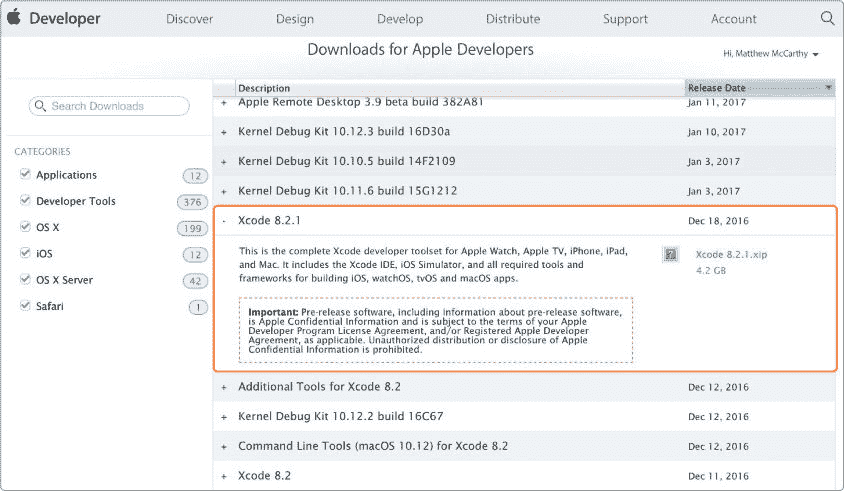

## 第十九章：资源

你在 iOS 编程技能上已经取得了长足的进展，这意味着你现在具备了从零开始制作自己的应用的能力。提高制作应用的最佳方法就是多做应用。想想看你想要做的一个应用，然后去做它！选择一个让你兴奋的项目将使你保持动力。在你做的每个应用中，都会有你之前从未做过的事情，这也为你提供了新的学习机会。一旦你探索了一些应用想法并写了大量的代码，你就能更清楚地知道该关注哪些方面。

本附录提供了一些资源，帮助你在制作自己的应用时，包括故障排除错误的提示、如何找到有用的文档、便捷的快捷键以及关于 Xcode 版本的信息。

### 故障排除错误

我们无法涵盖所有可能出现的错误。但是，如果你在构建或运行应用时遇到困难，有一些步骤可以帮助你弄清楚发生了什么。以下是一些寻找问题解决方案的建议：

• 检查 Xcode 给出的错误信息。如果你切换到“问题导航器”（⌘ -4），你可以查看当前的错误和警告列表。警告是黄色的，通常不需要修复（尽管强烈建议你*修复*它们，因为它们往往会变成错误）。错误是红色的，必须在项目构建之前解决。有时错误信息会告诉你如何解决问题，所以一定要仔细阅读并尽量理解问题的原因。

• 如果问题的原因不明确，通常可以通过让 Xcode 清理一下并重新尝试来解决问题。当你在 Xcode 中构建一个项目时，它会创建一些临时文件，这些文件用于加快未来构建的速度。有时这些文件需要被删除，以便构建过程可以重新从头开始创建它们。在 Xcode 中有两种方式可以“清理”。你可以使用 ⌘ -SHIFT -K 清理项目，或者使用 ⌘ -OPTION -SHIFT -K 清理构建文件夹。两种方法的作用是一样的，但清理构建文件夹更为彻底。试试其中一种或两种方法，然后重新构建项目，看看错误是否消失。

• 在网上搜索你遇到的问题。搜索 Xcode 给出的确切错误信息是一个好主意，这样你可以找到其他遇到相同问题的人，看看他们是如何解决的。这些搜索通常会引导你到一个叫做 Stack Overflow 的网站（ [*http://www.stackoverflow.com/*](http://www.stackoverflow.com) ），这是一个专门解决编程问题、错误和解决方案的网站。

• 尝试关闭并重新打开 Xcode，如果仍然没有解决问题，重新启动你的计算机。

• 阅读文档！下一节会告诉你在哪里可以找到你可能需要的文档。

### 苹果文档

苹果为你想了解的所有 iOS、Swift 等内容提供了便捷的文档。你可以通过登录你的 Apple Developer Center 账户并访问以下链接来获取：

• **API 参考文档**（[*https://developer.apple.com/reference/*](https://developer.apple.com/reference/)）包含了 iOS SDK 的完整文档。在这里，你可以查找 iOS SDK 中的任何方法、属性或类，并了解其使用方法。要在 Xcode 中访问这些文档，选择**Window ▸ Documentation and API Reference**，或者使用键盘快捷键⌘ -SHIFT -0。

• **指南和示例代码**（[*https://developer.apple.com/library/content/navigation/*](https://developer.apple.com/library/prerelease/content/navigation/)）包含了数百个由苹果开发者编写的教程和示例，涵盖了所有 iOS 相关主题。

• **苹果开发者论坛**（[*https://forums.developer.apple.com/*](https://forums.developer.apple.com/welcome)）是一个很好的地方，你可以在这里找到许多问题的答案。

• **iOS 人机界面指南**（[*https://developer.apple.com/ios/human-interface-guidelines/overview/design-principles/*](https://developer.apple.com/ios/human-interface-guidelines/overview/design-principles/)）是苹果公司详细解释如何设计出优秀应用的地方，并提供了设计应用时的指导方针。

• **应用分发指南**（[*https://developer.apple.com/library/content/documentation/IDEs/Conceptual/AppDistributionGuide/Introduction/Introduction.html*](https://developer.apple.com/library/content/documentation/IDEs/Conceptual/AppDistributionGuide/Introduction/Introduction.html)）是苹果公司关于如何在 App Store 分发应用的指南。

**注意**

*Apple 文档的链接时常会发生变化。你可以在书籍的官方网站找到更新的链接列表*，[`www.nostarch.com/iphoneappsforkids/`](https://www.nostarch.com/iphoneappsforkids/)。

### XCODE 键盘快捷键

你可以通过菜单项或点击图标在 Xcode 中完成你需要做的一切。但一旦你在 Xcode 中编程时间够长，你会发现掌握一些键盘快捷键能节省大量时间。表 A-1 列出了你可能会用到的一些常见快捷键。

**表 A-1：** Xcode 键盘快捷键

| **快捷键** | **操作** |
| --- | --- |
| ⌘ -B | 构建项目。这是一个很好的方式来检查代码是否正常构建且没有错误。 |
| ⌘ -R | 运行项目。这会构建项目并在当前选择的模拟器中运行（如果有设备连接并选择了它，也会在设备上运行）。 |
| ⌘ - -. | 停止正在运行的项目或取消当前进行中的构建。 |
| ⌘ -SHIFT -Y | 显示或隐藏调试区域。 |
| ⌘ -0 | 显示或隐藏屏幕左侧的导航面板。 |
| ⌘ -1 到⌘ -8 | 选择不同的导航面板，例如项目导航器和问题导航器。 |
| ⌘ -OPTION -0, -1 等 | 选择不同的工具窗格。 |
| ⌘ -SHIFT -K | 清理项目。 |
| ⌘ -OPTION -SHIFT -K | 清理构建文件夹。 |
| ⌘ -SHIFT -0 | 访问文档。 |

**表 A-2：**

| **快捷键** | **操作** |
| --- | --- |
| ⌘ -/ | 注释掉选中的代码行（如果已经注释，则取消注释）。 |
| ⌘ -[ | 减少一行或多行代码的缩进级别。 |
| ⌘ -] | 增加一行或多行代码的缩进级别。 |
| ⌘ -F | 在当前窗格中查找某些内容。 |
| ⌘ -OPTION -F | 在当前窗格中查找并*替换*某些内容。 |
| ⌘ -SHIFT -F | 在整个项目中查找某些内容，通过搜索所有项目文件。 |
| ⌘ -OPTION -SHIFT -F | 在整个项目中查找并*替换*某些内容。 |
| ⌘ -CONTROL -左箭头 | 返回到之前选中的文件。 |

### iOS 模拟器快捷键

iOS 模拟器还提供了一些有用的快捷键，如 表 A-2 所示。所有这些快捷键都可以在模拟器的菜单项中轻松找到。

**表 A-3：** iOS 模拟器快捷键

| **快捷键** | **操作** |
| --- | --- |
| ⌘ -1 | 缩放到 100%（如果你有一台大屏幕电脑，这个缩放比例非常合适）。 |
| ⌘ -2 | 缩放到 75%（适合较大的屏幕）。 |
| ⌘ -3 | 缩放到 50%（适合中等大小的屏幕）。 |
| ⌘ -4 | 缩放到 33%（适用于屏幕较大的电脑）。 |
| ⌘ -5 | 缩放到 25%（适用于屏幕较小的电脑）。 |
| ⌘ -左箭头 | 将设备旋转至左侧。 |
| ⌘ -右箭头 | 将设备旋转至右侧。 |
| ⌘ -SHIFT -H | 模拟点击设备上的主页按钮。 |
| ⌘ -K | 切换屏幕键盘的开关。仅在选中使用键盘的控件时有效，如文本字段。 |
| ⌘ -S | 截取模拟器屏幕的截图，并将其保存到桌面。这对创建应用商店的应用截图很有用。 |

### XCODE 版本

本书中的代码是使用 Xcode 8.2.1 构建的，因此在跟随本书内容时，你可能需要使用该版本的 Xcode，即使有更新的版本可用。若要下载旧版本的 Xcode，请登录到 Apple Developer Center 帐户并访问 [*https://developer.apple.com/download/*](https://developer.apple.com/download/)。在该页面底部，点击链接 **查看更多下载**。在这里，你应该能找到 *Xcode 8.2.1.xip* 的下载链接，如 图 A-1 所示。

*图 A-1：查找 Xcode 8.2.1 的下载链接*

如果你想使用本书项目的更新版 Xcode，可以访问本书的官方网站（[*https://www.nostarch.com/iphoneappsforkids/*](https://www.nostarch.com/iphoneappsforkids/)）查找任何需要修改的代码。

你在开发 iOS 编程技能方面已经走了很长一段路，这意味着你现在具备了从零开始制作自己应用的能力。提高应用制作技能的最佳方式就是做更多的应用。想想一个你想做的应用，然后去做吧！选择一个令你兴奋的项目，这样就能轻松保持动力。每一个你参与的应用项目，都将带来新的挑战和学习机会。你会发现很多新的东西，而这些正是你以前从未遇到过的，进而让你有了新的学习点。经过一段时间的应用开发，你会更加清楚自己应该专注的领域。

本附录提供了一些资源，帮助你在制作自己应用时解决问题，包括故障排除技巧、如何查找有用的文档、实用的快捷键以及 Xcode 版本的信息。

### 故障排除错误

我们无法覆盖所有可能出现的问题。但如果你在构建或运行应用时遇到困难，可以采取一些步骤来找出问题所在。以下是一些寻找解决方案的提示：

• 检查 Xcode 给出的错误信息。如果你切换到问题导航器（⌘ -4），你可以查看当前的错误和警告列表。警告是黄色的，通常不需要修复（尽管强烈建议你*修复*它们，因为它们通常会在以后变成错误）。错误是红色的，必须在项目构建之前修复。有时错误信息会告诉你如何修复问题，因此一定要阅读它，并尽量理解问题的根本原因。

• 如果问题的原因不清楚，通常可以尝试让 Xcode 清理一下并重新尝试。当你在 Xcode 中构建项目时，它会创建一些临时文件，以加快未来构建的速度。有时这些文件需要被删除，以便构建过程能够从头开始重新创建它们。有两种方式可以在 Xcode 中进行“清理”。你可以使用 ⌘ -SHIFT -K 清理项目，或者使用 ⌘ -OPTION -SHIFT -K 清理构建文件夹。两种方法的效果相同，但清理构建文件夹会更彻底。尝试这两种方法中的一种或两种，然后重新构建项目，看看错误是否消失。

• 在网上搜索你遇到的问题。最好搜索 Xcode 给出的确切错误信息，这样你可以找到遇到相同问题的其他人，并了解他们是如何解决的。这些网络搜索通常会将你带到一个叫做 Stack Overflow 的网站（[*http://www.stackoverflow.com/*](http://www.stackoverflow.com)），该网站专注于编程问题、错误和解决方案。

• 尝试关闭并重新打开 Xcode，如果这样没有帮助，重启你的计算机。

• 阅读文档！下一节将告诉你在哪里可以找到你需要的文档。

### 苹果文档

苹果提供了易于访问的文档，涵盖了你可能希望了解的关于 iOS、Swift 等方面的一切。要访问这些文档，请登录你的 Apple Developer Center 账户并访问以下链接：

• **API 参考文档** ( [*https://developer.apple.com/reference/*](https://developer.apple.com/reference/) ) 包含了 iOS SDK 的完整文档。在这里，你可以研究 iOS SDK 中的任何方法、属性或类，并了解其使用方式。要从 Xcode 内部访问此文档，可以从菜单中选择 **Window ▸ Documentation and API Reference**，或者使用快捷键 ⌘ -SHIFT -0。

• **指南与示例代码** ( [*https://developer.apple.com/library/content/navigation/*](https://developer.apple.com/library/prerelease/content/navigation/) ) 提供了数百个教程和示例，全部由苹果开发者编写，涵盖了几乎所有 iOS 主题。

• **Apple Developer Forum** ( [*https://forums.developer.apple.com/*](https://forums.developer.apple.com/welcome) ) 是一个寻找许多问题答案的好地方。

• **iOS 人机界面指南** ( [*https://developer.apple.com/ios/human-interface-guidelines/overview/design-principles/*](https://developer.apple.com/ios/human-interface-guidelines/overview/design-principles/) ) 解释了苹果如何定义一个优秀的应用，并提供了关于如何设计应用的指导。

• **应用分发指南** ( [*https://developer.apple.com/library/content/documentation/IDEs/Conceptual/AppDistributionGuide/Introduction/Introduction.html*](https://developer.apple.com/library/content/documentation/IDEs/Conceptual/AppDistributionGuide/Introduction/Introduction.html) ) 是苹果关于如何在 App Store 上分发应用的指南。

**注意**

*苹果文档的链接可能会不时更改。你可以在本书的网站找到更新的链接列表* ，[`www.nostarch.com/iphoneappsforkids/`](https://www.nostarch.com/iphoneappsforkids/) 。

### XCODE 快捷键

你可以通过菜单项或点击图标在 Xcode 中完成所有需要做的事情。但一旦你花费大量时间在 Xcode 中编程，你会发现了解一些快捷键真的能节省很多时间。表 A-1 显示了你可能会觉得有用的几个常用快捷键。

**表 A-1：** Xcode 快捷键

| **快捷键** | **操作** |
| --- | --- |
| ⌘ -B | 构建项目。这是测试代码是否正确构建、没有错误的好方法。 |
| ⌘ -R | 运行项目。此操作会构建项目并在当前选择的模拟器（或者如果有连接并选中的设备）中运行。 |
| ⌘ -. | 停止正在运行的项目或取消正在进行的构建。 |
| ⌘ -SHIFT -Y | 显示或隐藏调试区域。 |
| ⌘ -0 | 显示或隐藏屏幕左侧的导航窗格。 |
| ⌘ -1 到 ⌘ -8 | 选择不同的导航窗格，如项目导航器和问题导航器。 |
| ⌘ -OPTION -0、-1 等 | 选择不同的工具窗格。 |
| ⌘ -SHIFT -K | 清理项目。 |
| ⌘ -OPTION -SHIFT -K | 清理构建文件夹。 |
| ⌘ -SHIFT -0 | 访问文档。 |

**表 A-2：**

| **快捷键** | **操作** |
| --- | --- |
| ⌘ -/ | 注释掉选中的代码行（或如果它们已经被注释，则取消注释）。 |
| ⌘ -[ | 减少一行或多行代码的缩进级别。 |
| ⌘ -] | 增加一行或多行代码的缩进级别。 |
| ⌘ -F | 在当前窗格中查找内容。 |
| ⌘ -OPTION -F | 查找并在当前窗格中*替换*内容。 |
| ⌘ -SHIFT -F | 在整个项目中查找内容，跨所有项目文件进行搜索。 |
| ⌘ -OPTION -SHIFT -F | 在整个项目中查找并*替换*内容。 |
| ⌘ -CONTROL -左箭头 | 返回到先前选择的文件。 |

### iOS 模拟器键盘快捷键

iOS 模拟器也有一些有用的键盘快捷键，如 表 A-2 所示。这些快捷键都可以在模拟器的菜单项中轻松找到。

**表 A-3：** iOS 模拟器键盘快捷键

| **快捷键** | **操作** |
| --- | --- |
| ⌘ -1 | 放大至 100% 的比例（如果你的电脑屏幕较大，这个比例很合适）。 |
| ⌘ -2 | 放大至 75% 的比例。 |
| ⌘ -3 | 放大至 50% 的比例。 |
| ⌘ -4 | 放大至 33% 的比例。 |
| ⌘ -5 | 放大至 25% 的比例（如果你的电脑屏幕较小，这个比例很合适）。 |
| ⌘ -左箭头 | 将设备旋转到左侧。 |
| ⌘ -右箭头 | 将设备旋转到右侧。 |
| ⌘ -SHIFT -H | 模拟点击设备上的主页按钮。 |
| ⌘ -K | 切换屏幕上的键盘开关。仅在选中使用键盘的控件（如文本字段）时有效。 |
| ⌘ -S | 截取模拟器屏幕的截图并保存到桌面。这对于为 App Store 创建应用截图非常有用。 |

### Xcode 版本

本书中的代码是使用 Xcode 8.2.1 版本构建的，因此当你跟随本书进行操作时，建议使用该版本的 Xcode，即使有更高版本可用。要下载较旧版本的 Xcode，请登录到你的 Apple Developer Center 账户，并访问 [*https://developer.apple.com/download/*](https://developer.apple.com/download/) 。在该页面底部，点击链接 **查看更多下载内容** 。从那里，你应该能找到 *Xcode 8.2.1.xip* 的下载链接，如 图 A-1 所示。

*图 A-1：查找 Xcode 8.2.1 的下载链接*

如果你想在本书中的项目中使用更新版本的 Xcode，请查看本书网站（ [*https://www.nostarch.com/iphoneappsforkids/*](https://www.nostarch.com/iphoneappsforkids/) ），查看你需要对代码做的任何更改。

你在开发 iOS 编程技能方面已经走了很长一段路，这意味着你现在有能力从零开始制作自己的应用。提高制作应用技能的最好方法就是制作更多的应用。想一想一个你非常想做的应用，然后去做吧！选择一个让你激动的项目，将使你容易保持动力。在你做的每个应用中，都有一些新的事情是你以前没做过的，因此也是一个新的学习机会。一旦你探索了一些应用创意并写了很多代码，你会更清楚自己该关注哪些方面。

本附录提供了一些资源，帮助你在开发自己的应用时，包括故障排除错误的技巧、查找有用文档的地方、实用的快捷键，以及关于 Xcode 版本的信息。

### 故障排除错误

我们无法涵盖可能出现的所有问题。但如果你在构建或运行应用时遇到问题，你可以采取一些步骤来弄清楚发生了什么。以下是一些寻找解决方案的建议：

• 查看 Xcode 给出的错误信息。如果你切换到“问题导航器”（⌘ -4），你可以查看当前的错误和警告列表。警告以黄色显示，通常不需要修复（尽管强烈建议你*修复*它们，因为它们常常会变成错误）。错误以红色显示，必须在项目构建之前修复。有时候，错误信息会告诉你如何解决问题，所以一定要阅读它并尝试理解问题的原因。

• 如果问题的原因不明确，通常可以尝试让 Xcode 清理一下，然后重新尝试。当你在 Xcode 中构建项目时，它会创建一些临时文件，用来加速未来的构建。有时候，这些文件需要被删除，以便重新从头开始创建。你可以通过 ⌘ -SHIFT -K 清理项目，或者通过 ⌘ -OPTION -SHIFT -K 清理构建文件夹。两种方法做的事情相同，但清理构建文件夹更彻底。试试这两种方法，然后重新构建项目，看看错误是否消失。

• 在网上搜索你遇到的问题。最好搜索 Xcode 给出的确切错误信息，这样你可以找到其他遇到相同问题的人，看看他们是如何解决的。这些网上搜索通常会把你带到一个名为 Stack Overflow 的网站（[*http://www.stackoverflow.com/*](http://www.stackoverflow.com)），该网站专门解决编程问题、错误和解决方案。

• 尝试关闭并重新打开 Xcode，如果这还不行，可以重启电脑。

• 阅读文档！接下来的部分会告诉你在哪里可以找到你可能需要的任何文档。

### 苹果文档

苹果提供了易于访问的文档，涵盖你可能想知道的关于 iOS、Swift 等的所有内容。要访问这些文档，请登录你的 Apple Developer Center 帐户并访问以下链接：

• **API 参考**（[*https://developer.apple.com/reference/*](https://developer.apple.com/reference/)）包含了 iOS SDK 的完整文档。在这里，你可以研究 iOS SDK 中的任何方法、属性或类，并了解如何使用它们。要从 Xcode 中访问此文档，请在菜单中选择 **窗口 ▸ 文档与 API 参考**，或使用快捷键 ⌘ -SHIFT -0。

• **指南与示例代码**（[*https://developer.apple.com/library/content/navigation/*](https://developer.apple.com/library/prerelease/content/navigation/)）包含了数百个教程和示例，均由苹果开发者编写，涵盖了所有 iOS 相关的主题。

• **Apple 开发者论坛**（[*https://forums.developer.apple.com/*](https://forums.developer.apple.com/welcome)）是一个寻找许多问题答案的好地方。

• **iOS 人机界面指南**（[*https://developer.apple.com/ios/human-interface-guidelines/overview/design-principles/*](https://developer.apple.com/ios/human-interface-guidelines/overview/design-principles/)）是苹果公司阐述优秀应用标准并提供如何设计应用的指导的地方。

• **应用分发指南**（[*https://developer.apple.com/library/content/documentation/IDEs/Conceptual/AppDistributionGuide/Introduction/Introduction.html*](https://developer.apple.com/library/content/documentation/IDEs/Conceptual/AppDistributionGuide/Introduction/Introduction.html)）是苹果关于如何在 App Store 上分发应用的指南。

**注意**

*苹果文档的链接有时会发生变化。你可以在本书网站找到更新的链接列表*，[`www.nostarch.com/iphoneappsforkids/`](https://www.nostarch.com/iphoneappsforkids/)。

### XCODE 快捷键

你可以通过菜单项或点击图标在 Xcode 中完成所有需要做的事情。但一旦你在 Xcode 中花费了大量时间编程，你会发现知道一些快捷键可以节省大量时间。表 A-1 显示了几个你可能会觉得有用的常见快捷键。

**表 A-1：** Xcode 快捷键

| **快捷键** | **操作** |
| --- | --- |
| ⌘ -B | 构建项目。这是测试代码是否正确构建且没有错误的好方法。 |
| ⌘ -R | 运行项目。此操作会构建项目并在当前选定的模拟器（或设备，如果你有连接并选择了设备）中运行它。 |
| ⌘ -. | 停止项目运行或取消正在进行的构建。 |
| ⌘ -SHIFT -Y | 显示或隐藏调试区域。 |
| ⌘ -0 | 显示或隐藏屏幕左侧的导航面板。 |
| ⌘ -1 到 ⌘ -8 | 选择不同的导航面板，如项目导航器和问题导航器。 |
| ⌘ -OPTION -0、-1，依此类推 | 选择不同的实用工具面板。 |
| ⌘ -SHIFT -K | 清理项目。 |
| ⌘ -OPTION -SHIFT -K | 清理构建文件夹。 |
| ⌘ -SHIFT -0 | 访问文档。 |

**表 A-2：**

| **快捷键** | **操作** |
| --- | --- |
| ⌘ -/ | 注释掉选中的代码行（如果已注释，则取消注释）。 |
| ⌘ -[ | 减少一行或多行代码的缩进级别。 |
| ⌘ -] | 增加一行或多行代码的缩进级别。 |
| ⌘ -F | 在当前面板中查找某些内容。 |
| ⌘ -OPTION -F | 在当前面板中查找并*替换*某些内容。 |
| ⌘ -SHIFT -F | 在整个项目中查找并通过搜索所有项目文件来*替换*某些内容。 |
| ⌘ -OPTION -SHIFT -F | 在整个项目中查找并*替换*某些内容。 |
| ⌘ -CONTROL -左箭头 | 返回到之前选择的文件。 |

### iOS 模拟器快捷键

iOS 模拟器也有一些有用的快捷键，如表 A-2 所示。所有这些快捷键都可以在模拟器的菜单项中轻松找到。

**表 A-3：** iOS 模拟器快捷键

| **快捷键** | **操作** |
| --- | --- |
| ⌘ -1 | 缩放至 100%的比例（如果你使用的是大屏幕电脑，这个比例适合）。 |
| ⌘ -2 | 缩放至 75%的比例。 |
| ⌘ -3 | 缩放至 50%的比例。 |
| ⌘ -4 | 缩放至 33%的比例。 |
| ⌘ -5 | 缩放至 25%的比例（如果你使用的是小型电脑屏幕，这个比例适合）。 |
| ⌘ -左箭头 | 将设备旋转至左侧。 |
| ⌘ -右箭头 | 将设备旋转至右侧。 |
| ⌘ -SHIFT -H | 模拟点击设备的主屏幕按钮。 |
| ⌘ -K | 切换屏幕键盘的开关。仅当选中了使用键盘的控件（例如文本字段）时有效。 |
| ⌘ -S | 截取模拟器屏幕的截图，并将其保存到桌面。这对于为 App Store 创建应用截图非常有用。 |

### XCODE 版本

这本书中的代码是使用 Xcode 8.2.1 构建的，因此当你跟随本书时，可能需要使用该版本的 Xcode，即使有更新的版本可用。要下载旧版本的 Xcode，请登录到你的 Apple Developer Center 账户，并访问[*https://developer.apple.com/download/*](https://developer.apple.com/download/) 。在该页面底部，点击链接**查看更多下载内容**。从那里，你应该能够找到*Xcode 8.2.1.xip*的下载链接，如图 A-1 所示。 |

*图 A-1：查找 Xcode 8.2.1 的下载链接*

如果你希望使用更新版本的 Xcode 来处理本书中的项目，请访问本书的网站（[*https://www.nostarch.com/iphoneappsforkids/*](https://www.nostarch.com/iphoneappsforkids/)），查看你需要对代码做出的任何更改。

本附录提供了一些资源，帮助你在开发自己的应用时，包括故障排除技巧、在哪里可以找到有用的文档、方便的快捷键以及关于 Xcode 版本的信息。

### 故障排除错误

我们无法覆盖所有可能出现的错误。但如果你在构建或运行应用时遇到问题，可以采取一些步骤来找出问题所在。以下是一些查找解决问题的方法：

• 检查 Xcode 给出的错误信息。如果你切换到问题导航器（⌘ -4），你可以查看当前的错误和警告列表。警告显示为黄色，通常不需要修复（但强烈建议你*修复*它们，因为它们通常会在以后变成错误）。错误显示为红色，必须在项目构建之前修复。有时错误信息会告诉你如何修复问题，所以一定要阅读并理解问题的根本原因。

• 如果问题的原因不明确，通常可以尝试让 Xcode 清理项目并重新构建。当你在 Xcode 中构建项目时，它会创建一些临时文件，用于加速后续的构建过程。有时，这些文件需要被删除，以便构建过程可以重新从头创建它们。在 Xcode 中，有两种方式可以“清理”。你可以通过 ⌘ -SHIFT -K 清理项目，或者通过 ⌘ -OPTION -SHIFT -K 清理构建文件夹。两种方法做的是同样的事情，但清理构建文件夹会更加彻底。尝试其中一种或两种方法，然后重新构建项目，看看错误是否消失。

• 在网上搜索你遇到的问题。搜索 Xcode 给出的确切错误信息是个好主意，这样你可以找到遇到相同问题的人，看看他们是如何解决的。这些搜索通常会将你引导到一个名为 Stack Overflow 的网站 ([*http://www.stackoverflow.com/*](http://www.stackoverflow.com))，该网站专门解决编程问题、错误和解决方案。

• 尝试关闭并重新打开 Xcode，如果这没有帮助，重新启动你的计算机。

• 阅读文档！下一节将告诉你在哪里找到你可能需要的任何文档。

### 苹果文档

苹果提供了容易访问的文档，涵盖你可能希望了解的关于 iOS、Swift 等的所有内容。要访问这些文档，请登录到你的 Apple Developer Center 账户并访问以下链接：

• **API 参考文档** ([*https://developer.apple.com/reference/*](https://developer.apple.com/reference/)) 包含了 iOS SDK 的完整文档。在这里，你可以查找 iOS SDK 中的任何方法、属性或类，并了解它们的用法。要从 Xcode 中访问此文档，请在菜单中选择 **窗口 ▸ 文档和 API 参考**，或者使用快捷键 ⌘ -SHIFT -0。

• **指南和示例代码** ( [*https://developer.apple.com/library/content/navigation/*](https://developer.apple.com/library/prerelease/content/navigation/) ) 包含了成百上千个如何做的教程和示例，全部由苹果开发者编写，涵盖了所有 iOS 相关的主题。

• **Apple 开发者论坛** ( [*https://forums.developer.apple.com/*](https://forums.developer.apple.com/welcome) ) 是一个寻找许多问题答案的好地方。

• **iOS 人机界面指南** ( [*https://developer.apple.com/ios/human-interface-guidelines/overview/design-principles/*](https://developer.apple.com/ios/human-interface-guidelines/overview/design-principles/) ) 是苹果公司解释如何打造优秀应用的地方，并提供如何设计应用的指导。

• **应用分发指南** ( [*https://developer.apple.com/library/content/documentation/IDEs/Conceptual/AppDistributionGuide/Introduction/Introduction.html*](https://developer.apple.com/library/content/documentation/IDEs/Conceptual/AppDistributionGuide/Introduction/Introduction.html) ) 是苹果公司关于如何在 App Store 上分发应用的指南。

**注意**

*苹果文档的链接偶尔会发生变化。你可以在本书网站找到更新的链接列表*， [`www.nostarch.com/iphoneappsforkids/`](https://www.nostarch.com/iphoneappsforkids/) 。

### XCODE 键盘快捷键

你可以通过菜单项或点击图标完成在 Xcode 中需要做的所有操作。但一旦你在 Xcode 中花费了大量时间编程，你会发现掌握一些键盘快捷键能节省大量时间。表 A-1 显示了一些你可能会觉得有用的常见快捷键。

**表 A-1：** Xcode 键盘快捷键

| **快捷键** | **操作** |
| --- | --- |
| ⌘ -B | 构建项目。这是测试代码是否正确构建且没有错误的好方法。 |
| ⌘ -R | 运行项目。这会构建项目并在当前选中的模拟器中运行它（如果你有连接并选择了设备，则会在设备上运行）。 |
| ⌘ -. | 停止项目运行或取消正在进行的构建。 |
| ⌘ -SHIFT -Y | 显示或隐藏调试区域。 |
| ⌘ -0 | 显示或隐藏屏幕左侧的导航面板。 |
| ⌘ -1 到 ⌘ -8 | 选择不同的导航面板，如项目导航器和问题导航器。 |
| ⌘ -OPTION -0, -1 等 | 选择不同的工具面板。 |
| ⌘ -SHIFT -K | 清理项目。 |
| ⌘ -OPTION -SHIFT -K | 清理构建文件夹。 |
| ⌘ -SHIFT -0 | 访问文档。 |

**表 A-2:**

| **快捷键** | **操作** |
| --- | --- |
| ⌘ -/ | 注释选中的代码行（如果已注释则取消注释）。 |
| ⌘ -[ | 减少一行或多行代码的缩进级别。 |
| ⌘ -] | 增加一行或多行代码的缩进级别。 |
| ⌘ -F | 在当前面板中查找某些内容。 |
| ⌘ -OPTION -F | 在当前面板中查找并*替换*某些内容。 |
| ⌘ -SHIFT -F | 在整个项目中查找任何内容，通过搜索所有项目文件来完成。 |
| ⌘ -OPTION -SHIFT -F | 查找并*替换*整个项目中的内容。 |
| ⌘ -CONTROL -左箭头 | 返回到之前选择的文件。 |

### iOS 模拟器键盘快捷键

iOS 模拟器还提供了一些有用的键盘快捷键，如 表 A-2 所示。这些快捷键都可以在模拟器的菜单项中轻松找到。

**表 A-3：** iOS 模拟器键盘快捷键

| **快捷键** | **操作** |
| --- | --- |
| ⌘ -1 | 放大到 100%比例（如果你有一个大屏幕，这个设置很适合）。 |
| ⌘ -2 | 放大到 75%比例。 |
| ⌘ -3 | 放大到 50%比例。 |
| ⌘ -4 | 放大到 33%比例。 |
| ⌘ -5 | 放大到 25%比例（如果你有一个小屏幕，这个设置很适合）。 |
| ⌘ -左箭头 | 将设备旋转到左侧。 |
| ⌘ -右箭头 | 将设备旋转到右侧。 |
| ⌘ -SHIFT -H | 模拟点击设备上的主页按钮。 |
| ⌘ -K | 切换屏幕键盘的显示或隐藏。只有在选中使用键盘的控件时（例如文本字段）才有效。 |
| ⌘ -S | 截取模拟器屏幕截图并保存到桌面。这对制作应用程序的 App Store 截图很有用。 |

### XCODE 版本

本书中的代码是使用 Xcode 8.2.1 构建的，因此即使有更新版本的 Xcode，跟随本书时你可能仍然需要使用该版本的 Xcode。要下载旧版本的 Xcode，请登录你的 Apple Developer Center 账户并访问 [*https://developer.apple.com/download/*](https://developer.apple.com/download/) 。在页面底部，点击 **查看更多下载** 链接。从那里，你应该能够找到 *Xcode 8.2.1.xip* 的下载链接，如 图 A-1 所示。

*图 A-1：查找 Xcode 8.2.1 的下载链接*

如果你想使用更新版本的 Xcode 来开发本书中的项目，可以访问本书的网站（ [*https://www.nostarch.com/iphoneappsforkids/*](https://www.nostarch.com/iphoneappsforkids/) ）查看需要修改的代码。

### 故障排除错误

我们无法涵盖所有可能出错的情况。但如果你在构建或运行应用程序时遇到问题，可以采取一些步骤来弄清楚发生了什么。以下是一些寻找解决方案的提示：

• 查看 Xcode 给出的错误信息。如果你切换到问题导航器（⌘ -4），你可以查看当前的错误和警告列表。警告以黄色显示，通常不需要修复（尽管强烈建议你*修复*它们，因为它们通常会在以后变成错误）。错误以红色显示，必须在项目构建之前修复。有时错误信息会告诉你如何修复问题，所以一定要阅读它并尽量理解问题的根源。

• 如果问题的原因不明确，通常可以通过告诉 Xcode 清理一下再试来帮助解决问题。当你在 Xcode 中构建项目时，它会创建一些临时文件，这些文件用于加速未来的构建过程。有时这些文件需要被删除，以便构建过程可以重新从头开始创建它们。你可以通过两种方式在 Xcode 中“清理”项目。你可以用⌘ -SHIFT -K 清理项目，或者用⌘ -OPTION -SHIFT -K 清理构建文件夹。两种方法执行的操作相同，但清理构建文件夹会更彻底。尝试其中一种或两种方法，然后重新构建项目，看看错误是否消失。

• 在网上搜索你遇到的问题。最好搜索 Xcode 给出的具体错误信息，这样你可以找到遇到相同问题的其他人，并查看他们是如何解决的。这些网页搜索通常会带你到一个叫做 Stack Overflow 的网站（[*http://www.stackoverflow.com/*](http://www.stackoverflow.com)），这是一个专门解答编程问题、错误和解决方案的网站。

• 尝试关闭并重新打开 Xcode，如果这样没有效果，可以重启你的电脑。

• 阅读文档！下一节会告诉你在哪里找到你可能需要的文档。

### APPLE 文档

苹果提供了非常易于访问的文档，涵盖了你可能想要了解的 iOS、Swift 等所有相关内容。要访问这些文档，登录到你的苹果开发者中心账户，并访问以下链接：

• **API 参考**（[*https://developer.apple.com/reference/*](https://developer.apple.com/reference/)）包含了 iOS SDK 的完整文档。在这里，你可以研究 iOS SDK 中的任何方法、属性或类，了解它们是如何使用的。要在 Xcode 中访问此文档，选择**窗口 ▸ 文档和 API 参考**，或者使用快捷键⌘ -SHIFT -0。

• **指南和示例代码**（[*https://developer.apple.com/library/content/navigation/*](https://developer.apple.com/library/prerelease/content/navigation/)）包含了数百个操作方法和示例，所有内容都是由苹果开发者编写，涵盖了所有 iOS 相关主题。

• **苹果开发者论坛**（[*https://forums.developer.apple.com/*](https://forums.developer.apple.com/welcome)）是一个很好的地方，可以找到许多问题的答案。

• **iOS 人机界面指南**（[*https://developer.apple.com/ios/human-interface-guidelines/overview/design-principles/*](https://developer.apple.com/ios/human-interface-guidelines/overview/design-principles/)）是苹果用来解释什么是优秀应用程序的地方，并提供了关于如何设计应用的指导。

• **应用分发指南** ( [*https://developer.apple.com/library/content/documentation/IDEs/Conceptual/AppDistributionGuide/Introduction/Introduction.html*](https://developer.apple.com/library/content/documentation/IDEs/Conceptual/AppDistributionGuide/Introduction/Introduction.html) ) 是 Apple 关于在 App Store 上分发应用的指南。

**注意**

*Apple 文档的链接时常会发生变化。你可以在本书的网站上找到更新的链接列表*，[`www.nostarch.com/iphoneappsforkids/`](https://www.nostarch.com/iphoneappsforkids/)。

### XCODE 键盘快捷键

你可以通过菜单项或点击图标在 Xcode 中完成所有需要做的事情。但一旦你花了大量时间在 Xcode 中编程，你会发现，了解一些键盘快捷键可以节省大量时间。表 A-1 显示了你可能会发现有用的一些常见快捷键。

**表 A-1：** Xcode 键盘快捷键

| **快捷键** | **操作** |
| --- | --- |
| ⌘ -B | 构建项目。这是测试代码是否正确构建且没有错误的好方法。 |
| ⌘ -R | 运行项目。它会构建项目并在当前选择的模拟器中运行（如果你有已连接并选中的设备，也会在设备上运行）。 |
| ⌘ - . | 停止项目运行或取消正在进行的构建。 |
| ⌘ -SHIFT -Y | 显示或隐藏调试区域。 |
| ⌘ -0 | 显示或隐藏屏幕左侧的导航窗格。 |
| ⌘ -1 到 ⌘ -8 | 选择不同的导航窗格，例如项目导航器和问题导航器。 |
| ⌘ -OPTION -0、-1 等 | 选择不同的工具窗格。 |
| ⌘ -SHIFT -K | 清理项目。 |
| ⌘ -OPTION -SHIFT -K | 清理构建文件夹。 |
| ⌘ -SHIFT -0 | 访问文档。 |

**表 A-2：**

| **快捷键** | **操作** |
| --- | --- |
| ⌘ -/ | 注释掉高亮的代码行（如果已经注释掉，则取消注释）。 |
| ⌘ -[ | 减少一行或多行代码的缩进级别。 |
| ⌘ -] | 增加一行或多行代码的缩进级别。 |
| ⌘ -F | 在当前窗格中查找某些内容。 |
| ⌘ -OPTION -F | 在当前窗格中查找并*替换*某些内容。 |
| ⌘ -SHIFT -F | 在整个项目中查找某些内容，搜索所有项目文件。 |
| ⌘ -OPTION -SHIFT -F | 在整个项目中查找并*替换*某些内容。 |
| ⌘ -CONTROL -左箭头 | 返回到之前选定的文件。 |

### iOS 模拟器键盘快捷键

iOS 模拟器也有一些有用的键盘快捷键，如表 A-2 所示。所有这些快捷键都可以在模拟器的菜单项中轻松找到。

**表 A-3：** iOS 模拟器键盘快捷键

| **快捷键** | **操作** |
| --- | --- |
| ⌘ -1 | 缩放到 100% 的比例（如果你有一台大屏幕电脑，这个比例非常合适）。 |
| ⌘ -2 | 缩放到 75% 的比例。 |
| ⌘ -3 | 缩放到 50% 的比例。 |
| ⌘ -4 | 缩放到 33% 的比例。 |
| ⌘ -5 | 将缩放比例设置为 25%（如果你的计算机屏幕较小，这个比例很适合）。 |
| ⌘ -左箭头 | 将设备旋转到左边。 |
| ⌘ -右箭头 | 将设备旋转到右边。 |
| ⌘ -SHIFT -H | 模拟点击设备上的主页按钮。 |
| ⌘ -K | 切换屏幕键盘的开关。仅当选择了使用键盘的控件时（如文本框），此功能才有效。 |
| ⌘ -S | 截取模拟器屏幕的截图并将其保存到桌面。这对为 App Store 创建应用截图非常有用。 |

### XCODE 版本

本书中的代码是使用 Xcode 8.2.1 构建的，因此在跟随学习时，即使有更新的版本，你可能也想使用该版本的 Xcode。要下载旧版本的 Xcode，请登录你的 Apple Developer Center 账户并访问 [*https://developer.apple.com/download/*](https://developer.apple.com/download/)。在该页面底部，点击链接 **查看更多下载**。在这里，你应该能够找到 *Xcode 8.2.1.xip* 的下载链接，如 图 A-1 所示。

*图 A-1：查找 Xcode 8.2.1 下载链接*

如果你想在本书中的项目中使用更新版本的 Xcode，请访问本书网站（ [*https://www.nostarch.com/iphoneappsforkids/*](https://www.nostarch.com/iphoneappsforkids/) ）查看需要对代码进行的任何更改。

我们无法覆盖所有可能出现的问题。但如果你在构建或运行应用时遇到困难，还是有一些步骤可以帮助你找出问题所在。以下是一些解决问题的建议：

• 检查 Xcode 给出的错误信息。如果你切换到问题导航器（⌘ -4），你可以查看当前的错误和警告列表。警告用黄色显示，通常不需要修复（尽管强烈建议你 *修复* 它们，因为它们经常会在之后转化为错误）。错误用红色显示，必须在项目构建之前修复。有时错误信息会告诉你如何修复问题，所以一定要阅读错误信息并尝试理解问题的根本原因。

• 如果问题的原因不明确，通常让 Xcode 清理一下然后再试会有所帮助。当你在 Xcode 中构建项目时，它会创建一些临时文件，用来加速未来的构建。有时这些文件需要被移除，以便构建过程可以重新从头开始创建它们。有两种方法可以在 Xcode 中“清理”。你可以使用 ⌘ -SHIFT -K 来清理项目，或者使用 ⌘ -OPTION -SHIFT -K 来清理构建文件夹。这两种方法做的是同样的事，但清理构建文件夹更彻底。试试其中一种或两种方法，然后重新构建项目，看看错误是否消失。

• 在网上搜索你遇到的问题。建议搜索 Xcode 给出的具体错误信息，这样你可以找到其他遇到同样问题的人，看看他们是如何解决的。这些网页搜索通常会将你带到一个名为 Stack Overflow 的网站 ( [*http://www.stackoverflow.com/*](http://www.stackoverflow.com) )，这是一个专门讨论编程问题、错误和解决方案的网站。

• 尝试关闭并重新打开 Xcode，如果那样不行，重新启动你的计算机。

• 阅读文档！下一节将告诉你在哪里可以找到你可能需要的任何文档。

### 苹果文档

苹果公司为你想要了解的所有关于 iOS、Swift 等内容提供了易于访问的文档。要访问这些文档，请登录你的 Apple Developer Center 账户并访问以下链接：

• **API 参考** ( [*https://developer.apple.com/reference/*](https://developer.apple.com/reference/) ) 包含了 iOS SDK 的完整文档。在这里，你可以查阅 iOS SDK 中的任何方法、属性或类，并学习它们是如何使用的。要从 Xcode 中访问此文档，选择菜单中的**窗口 ▸ 文档和 API 参考**，或者使用快捷键 ⌘ -SHIFT -0。

• **指南和示例代码** ( [*https://developer.apple.com/library/content/navigation/*](https://developer.apple.com/library/prerelease/content/navigation/) ) 提供了数百个教程和示例，全部由苹果开发者编写，涵盖了所有 iOS 主题。

• **苹果开发者论坛** ( [*https://forums.developer.apple.com/*](https://forums.developer.apple.com/welcome) ) 是一个很好的地方，你可以在这里找到许多问题的答案。

• **iOS 人机界面指南** ( [*https://developer.apple.com/ios/human-interface-guidelines/overview/design-principles/*](https://developer.apple.com/ios/human-interface-guidelines/overview/design-principles/) ) 是苹果公司解释什么构成一个优秀应用的地方，并提供了如何设计应用的指导。

• **应用分发指南** ( [*https://developer.apple.com/library/content/documentation/IDEs/Conceptual/AppDistributionGuide/Introduction/Introduction.html*](https://developer.apple.com/library/content/documentation/IDEs/Conceptual/AppDistributionGuide/Introduction/Introduction.html) ) 是苹果公司关于在 App Store 上分发应用的指南。

**注意**

*苹果文档的链接可能会不时变动。你可以在本书的网站上找到更新的链接列表* ，[`www.nostarch.com/iphoneappsforkids/`](https://www.nostarch.com/iphoneappsforkids/) 。

### XCODE 快捷键

你可以通过菜单项或点击图标在 Xcode 中完成所有操作。但一旦你在 Xcode 中编程很长时间，你会发现掌握一些快捷键可以节省很多时间。表 A-1 展示了一些常用的快捷键，你可能会觉得它们很有帮助。

**表 A-1：** Xcode 快捷键

| **快捷键** | **操作** |
| --- | --- |
| ⌘ -B | 构建项目。这是测试代码是否正确构建且没有错误的好方法。 |
| ⌘ -R | 运行项目。此操作将构建项目并在当前选择的模拟器中运行（如果你连接了设备并选中了设备，也会运行在该设备上）。 |
| ⌘ -. | 停止项目运行或取消正在进行的构建。 |
| ⌘ -SHIFT -Y | 显示或隐藏调试区域。 |
| ⌘ -0 | 显示或隐藏屏幕左侧的导航面板。 |
| ⌘ -1 至 ⌘ -8 | 选择不同的导航面板，例如项目导航器和问题导航器。 |
| ⌘ -OPTION -0、-1 等 | 选择不同的工具面板。 |
| ⌘ -SHIFT -K | 清理项目。 |
| ⌘ -OPTION -SHIFT -K | 清理构建文件夹。 |
| ⌘ -SHIFT -0 | 访问文档。 |

**表 A-2：**

| **快捷键** | **操作** |
| --- | --- |
| ⌘ -/ | 注释掉高亮的代码行（如果已被注释，则取消注释）。 |
| ⌘ -[ | 减少一行或多行代码的缩进级别。 |
| ⌘ -] | 增加一行或多行代码的缩进级别。 |
| ⌘ -F | 在当前面板中查找某个内容。 |
| ⌘ -OPTION -F | 在当前面板中查找并*替换*某个内容。 |
| ⌘ -SHIFT -F | 在整个项目中查找某个内容，搜索所有项目文件。 |
| ⌘ -OPTION -SHIFT -F | 在整个项目中查找并*替换*某个内容。 |
| ⌘ -CONTROL -左箭头 | 返回到先前选择的文件。 |

### iOS 模拟器键盘快捷键

iOS 模拟器还有一些有用的键盘快捷键，如 表 A-2 所示。所有这些快捷键都可以在模拟器的菜单项中轻松找到。

**表 A-3：** iOS 模拟器键盘快捷键

| **快捷键** | **操作** |
| --- | --- |
| ⌘ -1 | 缩放至 100% 比例（如果你有一个大屏幕电脑，这个比例很好）。 |
| ⌘ -2 | 缩放至 75% 比例。 |
| ⌘ -3 | 缩放至 50% 比例。 |
| ⌘ -4 | 缩放至 33% 比例。 |
| ⌘ -5 | 缩放至 25% 比例（如果你有一个小屏幕电脑，这个比例很好）。 |
| ⌘ -左箭头 | 将设备旋转到左侧。 |
| ⌘ -右箭头 | 将设备旋转到右侧。 |
| ⌘ -SHIFT -H | 模拟点击设备上的 Home 按钮。 |
| ⌘ -K | 切换屏幕键盘的开关。仅在选中的控件需要键盘时有效，例如文本字段。 |
| ⌘ -S | 截取模拟器屏幕截图并保存到桌面。这对于为 App Store 创建应用截图非常有用。 |

### XCODE 版本

本书中的代码是使用 Xcode 8.2.1 构建的，因此在跟随本书时，你可能希望使用该版本的 Xcode，即使有更新的版本可用。要下载旧版本的 Xcode，请登录你的 Apple Developer Center 账户，并访问 [*https://developer.apple.com/download/*](https://developer.apple.com/download/) 。在该页面底部，点击链接 **See more downloads** 。在那里，你应该能够找到 *Xcode 8.2.1.xip* 的下载链接，如 图 A-1 所示。

*图 A-1：查找 Xcode 8.2.1 下载链接*

如果你想使用更新版本的 Xcode 来进行本书中的项目，检查本书的网站 ([*https://www.nostarch.com/iphoneappsforkids/*](https://www.nostarch.com/iphoneappsforkids/))，看看你需要对代码做出哪些更改。

• 检查 Xcode 给出的错误信息。如果你切换到问题导航器（⌘ -4），你可以查看当前的错误和警告列表。警告是黄色的，通常不需要修复（尽管强烈建议你 *修复* 它们，因为它们通常会在以后变成错误）。错误是红色的，必须修复才能继续构建项目。有时错误信息会告诉你如何修复问题，所以一定要阅读它并尽量理解问题的根本原因。

• 如果问题的原因不明确，通常建议告诉 Xcode 清理一下再试。当你在 Xcode 中构建项目时，它会创建一些临时文件，这些文件用于加速未来的构建过程。有时这些文件需要被删除，以便构建过程可以从头开始重新创建它们。在 Xcode 中有两种“清理”方法。你可以通过 ⌘ -SHIFT -K 清理项目，或者通过 ⌘ -OPTION -SHIFT -K 清理构建文件夹。这两种方法执行的操作相同，但清理构建文件夹会更彻底。尝试其中一种或两种方法，然后重新构建项目，看看错误是否消失。

• 在网上搜索你遇到的问题。最好搜索 Xcode 给出的准确错误信息，这样你可以找到遇到相同问题的其他人，并查看他们是如何解决的。这些网页搜索通常会将你带到一个名为 Stack Overflow 的网站 ([*http://www.stackoverflow.com/*](http://www.stackoverflow.com))，该网站专门处理编程问题、错误和解决方案。

• 尝试关闭并重新打开 Xcode，如果这没有帮助，重启你的电脑。

• 阅读文档！下一部分将告诉你在哪里可以找到任何你可能需要的文档。

### APPLE DOCUMENTATION

Apple 提供了易于访问的文档，涵盖了你可能希望了解的关于 iOS、Swift 等的一切内容。要访问它，登录你的 Apple Developer Center 账户并访问以下链接：

• **API 参考**（ [*https://developer.apple.com/reference/*](https://developer.apple.com/reference/) ）包含 iOS SDK 的完整文档。在这里，你可以研究 iOS SDK 中的任何方法、属性或类，并学习如何使用它们。要从 Xcode 内访问此文档，请从菜单中选择 **窗口 ▸ 文档和 API 参考**，或使用快捷键 ⌘ -SHIFT -0。

• **指南和示例代码**（ [*https://developer.apple.com/library/content/navigation/*](https://developer.apple.com/library/prerelease/content/navigation/) ）包含数百个操作指南和示例，全部由苹果开发者编写，涵盖了所有 iOS 相关话题。

• **苹果开发者论坛**（ [*https://forums.developer.apple.com/*](https://forums.developer.apple.com/welcome) ）是一个寻找许多问题答案的好地方。

• **iOS 人机界面指南**（ [*https://developer.apple.com/ios/human-interface-guidelines/overview/design-principles/*](https://developer.apple.com/ios/human-interface-guidelines/overview/design-principles/) ）是苹果解释什么构成一个优秀应用，并提供有关如何设计应用的指导。

• **应用分发指南**（ [*https://developer.apple.com/library/content/documentation/IDEs/Conceptual/AppDistributionGuide/Introduction/Introduction.html*](https://developer.apple.com/library/content/documentation/IDEs/Conceptual/AppDistributionGuide/Introduction/Introduction.html) ）是苹果关于如何在 App Store 上分发应用的指南。

**注意**

*指向苹果文档的链接可能会不时更改。你可以在本书的官方网站上找到更新的链接列表*， [`www.nostarch.com/iphoneappsforkids/`](https://www.nostarch.com/iphoneappsforkids/) 。

### XCODE 键盘快捷键

你可以通过菜单项或点击图标在 Xcode 中完成所有需要的操作。但一旦你在 Xcode 中编程了很长时间，你会发现，掌握一些键盘快捷键真的能节省大量时间。表 A-1 显示了你可能会觉得有用的一些常用快捷键。

**表 A-1：** Xcode 键盘快捷键

| **快捷键** | **操作** |
| --- | --- |
| ⌘ -B | 构建项目。这是测试代码是否正确构建且没有错误的好方法。 |
| ⌘ -R | 运行项目。这会构建项目并在当前选定的模拟器中运行（如果你连接了设备并选中了它，也会运行设备上的项目）。 |
| ⌘ - . | 停止项目运行或取消正在进行的构建。 |
| ⌘ -SHIFT -Y | 显示或隐藏调试区域。 |
| ⌘ -0 | 显示或隐藏屏幕左侧的导航面板。 |
| ⌘ -1 到 ⌘ -8 | 选择不同的导航面板，如项目导航器和问题导航器。 |
| ⌘ -OPTION -0, -1，依此类推 | 选择不同的实用工具面板。 |
| ⌘ -SHIFT -K | 清理项目。 |
| ⌘ -OPTION -SHIFT -K | 清理构建文件夹。 |
| ⌘ -SHIFT -0 | 访问文档。 |

**表 A-2：**

| **快捷键** | **操作** |
| --- | --- |
| ⌘ -/ | 注释掉高亮的代码行（如果已经注释掉，则取消注释）。 |
| ⌘ -[ | 减少一行或多行代码的缩进级别。 |
| ⌘ -] | 增加一行或多行代码的缩进级别。 |
| ⌘ -F | 在当前窗格中查找某些内容。 |
| ⌘ -OPTION -F | 在当前窗格中查找并*替换*某些内容。 |
| ⌘ -SHIFT -F | 在整个项目中查找某些内容，搜索所有项目文件。 |
| ⌘ -OPTION -SHIFT -F | 在整个项目中查找并*替换*某些内容。 |
| ⌘ -CONTROL -left arrow | 返回到先前选择的文件。 |

### iOS 模拟器键盘快捷键

iOS 模拟器也有一些有用的快捷键，如表 A-2 所示。所有这些快捷键都可以在模拟器的菜单项中轻松找到。

**表 A-3：** iOS 模拟器键盘快捷键

| **快捷键** | **操作** |
| --- | --- |
| ⌘ -1 | 缩放到 100%大小（如果你有一个大屏幕电脑，这个很有用）。 |
| ⌘ -2 | 缩放到 75%的大小。 |
| ⌘ -3 | 缩放到 50%的大小。 |
| ⌘ -4 | 缩放到 33%的大小。 |
| ⌘ -5 | 缩放到 25%的大小（如果你有一个小屏幕电脑，这个很有用）。 |
| ⌘ -left arrow | 将设备向左旋转。 |
| ⌘ -right arrow | 将设备向右旋转。 |
| ⌘ -SHIFT -H | 模拟设备上点击主页按钮的操作。 |
| ⌘ -K | 开关屏幕上的键盘。仅在选中使用键盘的控件（如文本字段）时有效。 |
| ⌘ -S | 截取模拟器屏幕的截图并保存到桌面。这对于为 App Store 创建应用截图很有用。 |

### XCODE 版本

本书中的代码是使用 Xcode 8.2.1 构建的，因此即使有更新版本的 Xcode，你可能还是希望使用该版本进行跟随。要下载旧版本的 Xcode，请登录你的 Apple Developer Center 账户，并访问[*https://developer.apple.com/download/*](https://developer.apple.com/download/)。在该页面底部，点击链接**查看更多下载内容**。从那里，你应该能找到*Xcode 8.2.1.xip*的下载，如图 A-1 所示。

*图 A-1：查找 Xcode 8.2.1 的下载链接*

如果你希望为本书中的项目使用更新版本的 Xcode，请查看本书的网站（ [*https://www.nostarch.com/iphoneappsforkids/*](https://www.nostarch.com/iphoneappsforkids/) ）了解你需要对代码进行的更改。

• 如果问题的原因不明确，通常可以尝试让 Xcode 清理并重新尝试。当你在 Xcode 中构建项目时，它会创建一些临时文件，以加快未来构建的速度。有时候，这些文件需要被删除，这样构建过程才能重新从头开始创建它们。在 Xcode 中有两种“清理”方法。你可以使用⌘ -SHIFT -K 来清理项目，或者使用⌘ -OPTION -SHIFT -K 来清理构建文件夹。这两种方法是做同样的事情，但清理构建文件夹更加彻底。尝试其中一种或两种方法，然后重新构建项目，看看错误是否消失。

• 在网上搜索你遇到的问题。最好搜索 Xcode 给出的具体错误信息，这样你可以找到其他遇到相同问题的人，并查看他们是如何解决的。这些网络搜索通常会将你带到一个叫做 Stack Overflow 的网站（[*http://www.stackoverflow.com/*](http://www.stackoverflow.com)），这个网站专门用于编程问题、错误和解决方案。

• 尝试关闭并重新打开 Xcode，如果这样不行，可以重启你的电脑。

• 阅读文档！下一节会告诉你在哪里可以找到你可能需要的任何文档。

### 苹果文档

Apple 为你提供了易于访问的关于 iOS、Swift 等所有你可能想知道的文档。要访问这些文档，请登录到你的 Apple Developer Center 账户并访问以下链接：

• **API 参考**（[*https://developer.apple.com/reference/*](https://developer.apple.com/reference/)）包含了完整的 iOS SDK 文档。在这里，你可以查找任何 iOS SDK 中的方法、属性或类，并了解它们是如何使用的。要从 Xcode 中访问这些文档，可以在菜单中选择**Window ▸ Documentation and API Reference**，或者使用快捷键⌘ -SHIFT -0。

• **指南和示例代码**（[*https://developer.apple.com/library/content/navigation/*](https://developer.apple.com/library/prerelease/content/navigation/)）包含了数百个由 Apple 开发者编写的教程和示例，覆盖了所有 iOS 相关主题。

• **Apple 开发者论坛**（[*https://forums.developer.apple.com/*](https://forums.developer.apple.com/welcome)）是一个寻找问题答案的好地方。

• **iOS 人机界面指南**（[*https://developer.apple.com/ios/human-interface-guidelines/overview/design-principles/*](https://developer.apple.com/ios/human-interface-guidelines/overview/design-principles/)）是 Apple 解释什么构成一款出色应用的地方，并提供了关于如何设计应用的指导。

• **应用分发指南**（ [*https://developer.apple.com/library/content/documentation/IDEs/Conceptual/AppDistributionGuide/Introduction/Introduction.html*](https://developer.apple.com/library/content/documentation/IDEs/Conceptual/AppDistributionGuide/Introduction/Introduction.html) ）是苹果公司关于在 App Store 上分发应用的指南。

**注意**

*链接到苹果文档的网址有时会发生变化。你可以在本书的网站上找到更新的列表*，[`www.nostarch.com/iphoneappsforkids/`](https://www.nostarch.com/iphoneappsforkids/) 。

### XCODE 键盘快捷键

你可以通过菜单项或点击图标在 Xcode 中完成所有操作。但一旦你在 Xcode 中编程时间久了，你会发现了解一些键盘快捷键可以节省大量时间。表 A-1 显示了一些你可能会觉得有用的常见快捷键。

**表 A-1：** Xcode 键盘快捷键

| **快捷键** | **操作** |
| --- | --- |
| ⌘ -B | 构建项目。这是检查代码是否正确构建且没有错误的好方法。 |
| ⌘ -R | 运行项目。这会构建项目并在当前选中的模拟器（或设备，如果你已连接并选择了设备）中运行它。 |
| ⌘ -. | 停止项目运行或取消正在进行的构建。 |
| ⌘ -SHIFT -Y | 显示或隐藏调试区域。 |
| ⌘ -0 | 显示或隐藏屏幕左侧的导航窗格。 |
| ⌘ -1 到 ⌘ -8 | 选择不同的导航窗格，例如项目导航器和问题导航器。 |
| ⌘ -OPTION -0, -1 等 | 选择不同的工具窗格。 |
| ⌘ -SHIFT -K | 清理项目。 |
| ⌘ -OPTION -SHIFT -K | 清理构建文件夹。 |
| ⌘ -SHIFT -0 | 访问文档。 |

**表 A-2：**

| **快捷键** | **操作** |
| --- | --- |
| ⌘ -/ | 注释掉选中的代码行（或者如果已经注释过，则取消注释）。 |
| ⌘ -[ | 减少一行或多行代码的缩进级别。 |
| ⌘ -] | 增加一行或多行代码的缩进级别。 |
| ⌘ -F | 在当前窗格中查找某个内容。 |
| ⌘ -OPTION -F | 在当前窗格中查找并*替换*某个内容。 |
| ⌘ -SHIFT -F | 在整个项目中查找某个内容，通过搜索所有项目文件。 |
| ⌘ -OPTION -SHIFT -F | 在整个项目中查找并*替换*某个内容。 |
| ⌘ -CONTROL -左箭头 | 返回到之前选择的文件。 |

### iOS 模拟器键盘快捷键

iOS 模拟器也有一些有用的键盘快捷键，如 表 A-2 所示。所有这些快捷键都可以在模拟器的菜单项中轻松找到。

**表 A-3：** iOS 模拟器键盘快捷键

| **快捷键** | **操作** |
| --- | --- |
| ⌘ -1 | 缩放至 100% 比例（如果你有一台大屏幕电脑，这个比例非常合适）。 |
| ⌘ -2 | 缩放至 75% 比例。 |
| ⌘ -3 | 缩放至 50% 比例。 |
| ⌘ -4 | 缩放至 33% 比例。 |
| ⌘ -5 | 缩放至 25% 的比例（如果你使用的是小型电脑屏幕，这个比例很适合）。 |
| ⌘ -left arrow | 将设备旋转至左侧。 |
| ⌘ -right arrow | 将设备旋转至右侧。 |
| ⌘ -SHIFT -H | 模拟点击设备的主页按钮。 |
| ⌘ -K | 切换屏幕键盘的开关。只有在选中一个需要使用键盘的控件（例如文本字段）时才有效。 |
| ⌘ -S | 截取模拟器屏幕的截图并将其保存到桌面。这对于为应用商店创建应用截图非常有用。 |

### XCODE 版本

本书中的代码是使用 Xcode 8.2.1 构建的，因此即使有更新的版本可用，你也可能想在跟随本书时使用该版本的 Xcode。要下载旧版本的 Xcode，请登录你的 Apple Developer Center 账户并访问 [*https://developer.apple.com/download/*](https://developer.apple.com/download/) 。在页面底部，点击 **See more downloads** 链接。然后，你应该能找到 *Xcode 8.2.1.xip* 的下载链接，如 图 A-1 所示。

*图 A-1：查找 Xcode 8.2.1 下载链接*

如果你希望在本书中的项目中使用更新版本的 Xcode，可以查看本书的网站（ [*https://www.nostarch.com/iphoneappsforkids/*](https://www.nostarch.com/iphoneappsforkids/) ）了解需要对代码做出的任何更改。

• 在网上搜索你遇到的问题。最好搜索 Xcode 给出的确切错误信息，这样你可以找到遇到相同问题并解决它的其他人。这些网络搜索通常会将你引导到一个名为 Stack Overflow 的网站（ [*http://www.stackoverflow.com/*](http://www.stackoverflow.com) ），这是一个专注于编程问题、错误和解决方案的网站。

• 尝试关闭并重新打开 Xcode，如果这没有帮助，可以重启你的电脑。

• 阅读文档！接下来的部分将告诉你如何找到你可能需要的任何文档。

### 苹果文档

苹果为你希望了解的有关 iOS、Swift 等所有内容提供了易于访问的文档。要访问这些文档，请登录到你的 Apple Developer Center 账户并访问以下链接：

• **API 参考**（ [*https://developer.apple.com/reference/*](https://developer.apple.com/reference/) ）包含了 iOS SDK 的完整文档。在这里，你可以查找 iOS SDK 中的任何方法、属性或类，了解它们是如何使用的。要在 Xcode 中访问此文档，请从菜单中选择 **Window ▸ Documentation and API Reference**，或使用快捷键 ⌘ -SHIFT -0。

• **指南和示例代码**（ [*https://developer.apple.com/library/content/navigation/*](https://developer.apple.com/library/prerelease/content/navigation/) ）提供了数百个操作教程和示例，所有内容均由苹果开发者编写，涵盖了所有 iOS 相关话题。

• **苹果开发者论坛** ( [*https://forums.developer.apple.com/*](https://forums.developer.apple.com/welcome) ) 是一个寻找许多问题答案的好地方。

• **iOS 人机界面指南** ( [*https://developer.apple.com/ios/human-interface-guidelines/overview/design-principles/*](https://developer.apple.com/ios/human-interface-guidelines/overview/design-principles/) ) 是苹果公司详细说明出色应用的标准，并提供如何设计应用的指导。

• **应用分发指南** ( [*https://developer.apple.com/library/content/documentation/IDEs/Conceptual/AppDistributionGuide/Introduction/Introduction.html*](https://developer.apple.com/library/content/documentation/IDEs/Conceptual/AppDistributionGuide/Introduction/Introduction.html) ) 是苹果公司关于在 App Store 上分发应用程序的指南。

**注意**

*Apple 文档的链接偶尔会发生变化。你可以在本书的官方网站上找到更新的链接列表*， [`www.nostarch.com/iphoneappsforkids/`](https://www.nostarch.com/iphoneappsforkids/) 。

### XCODE 快捷键

你可以通过菜单项或点击图标完成你在 Xcode 中需要做的所有操作。但一旦你在 Xcode 中编程花费了大量时间，你会发现，掌握一些快捷键能大大节省时间。表 A-1 展示了几个你可能会觉得有用的常见快捷键。

**表 A-1：** Xcode 快捷键

| **快捷键** | **操作** |
| --- | --- |
| ⌘ -B | 构建项目。这是测试代码是否正常构建、没有错误的好方法。 |
| ⌘ -R | 运行项目。此操作会构建项目并在当前选择的模拟器（或如果已连接并选择设备，则在设备上）中运行。 |
| ⌘ -. | 停止正在运行的项目或取消正在进行的构建。 |
| ⌘ -SHIFT -Y | 显示或隐藏调试区域。 |
| ⌘ -0 | 显示或隐藏屏幕左侧的导航面板。 |
| ⌘ -1 到 ⌘ -8 | 选择不同的导航面板，如项目导航器和问题导航器。 |
| ⌘ -OPTION -0, -1，依此类推 | 选择不同的工具面板。 |
| ⌘ -SHIFT -K | 清理项目。 |
| ⌘ -OPTION -SHIFT -K | 清理构建文件夹。 |
| ⌘ -SHIFT -0 | 访问文档。 |

**表 A-2：**

| **快捷键** | **操作** |
| --- | --- |
| ⌘ -/ | 注释掉选中的代码行（如果已经注释掉，则取消注释）。 |
| ⌘ -[ | 减少一行或多行代码的缩进级别。 |
| ⌘ -] | 增加一行或多行代码的缩进级别。 |
| ⌘ -F | 在当前面板中查找某些内容。 |
| ⌘ -OPTION -F | 在当前面板中查找并*替换*某些内容。 |
| ⌘ -SHIFT -F | 在整个项目中查找某些内容，跨所有项目文件进行搜索。 |
| ⌘ -OPTION -SHIFT -F | 在整个项目中查找并*替换*某些内容。 |
| ⌘ -CONTROL -左箭头 | 返回到之前选择的文件。 |

### IOS 模拟器键盘快捷键

iOS 模拟器还提供了一些有用的键盘快捷键，如 表 A-2 所示。所有这些快捷键都可以在模拟器的菜单项中轻松找到。

**表 A-3：** iOS 模拟器键盘快捷键

| **快捷键** | **操作** |
| --- | --- |
| ⌘ -1 | 放大到 100% 比例（如果你有一个大屏幕电脑，这个比例非常合适）。 |
| ⌘ -2 | 放大到 75% 比例。 |
| ⌘ -3 | 放大到 50% 比例。 |
| ⌘ -4 | 放大到 33% 比例。 |
| ⌘ -5 | 放大到 25% 比例（如果你有一个小屏幕电脑，这个比例非常合适）。 |
| ⌘ -左箭头 | 将设备旋转到左侧。 |
| ⌘ -右箭头 | 将设备旋转到右侧。 |
| ⌘ -SHIFT -H | 模拟点击设备上的主页按钮。 |
| ⌘ -K | 切换屏幕上的键盘显示或隐藏。仅当选中一个使用键盘的控件（如文本字段）时，该功能才有效。 |
| ⌘ -S | 截取模拟器屏幕的截图并保存到桌面。这对于为您的应用程序创建应用商店截图非常有用。 |

### XCODE 版本

本书中的代码是使用 Xcode 8.2.1 构建的，因此在跟随本书的步骤时，您可能希望使用该版本的 Xcode，即使有更新的版本可用。要下载旧版本的 Xcode，请登录您的 Apple Developer Center 账户并访问 [*https://developer.apple.com/download/*](https://developer.apple.com/download/)。在该页面底部，点击链接 **See more downloads** 。从那里，您应该能够找到 *Xcode 8.2.1.xip* 的下载链接，如 图 A-1 所示。

*图 A-1：找到 Xcode 8.2.1 下载链接*

如果您想在本书中的项目中使用更新版本的 Xcode，请访问本书的网站（ [*https://www.nostarch.com/iphoneappsforkids/*](https://www.nostarch.com/iphoneappsforkids/) ），查看您需要对代码进行的任何更改。

• 尝试关闭并重新打开 Xcode，如果这样不行，再重启计算机。

• 阅读文档！下一节将告诉您如何找到所需的文档。

### APPLE 文档

Apple 提供了易于访问的文档，涵盖了有关 iOS、Swift 等方面的所有信息。要访问这些文档，请登录您的 Apple Developer Center 账户并访问以下链接：

• **API 参考**（ [*https://developer.apple.com/reference/*](https://developer.apple.com/reference/) ）包含 iOS SDK 的完整文档。在这里，您可以查找任何方法、属性或类，并了解如何使用它。要在 Xcode 中访问此文档，请从菜单中选择 **窗口 ▸ 文档与 API 参考**，或使用快捷键 ⌘ -SHIFT -0。

• **指南和示例代码**（ [*https://developer.apple.com/library/content/navigation/*](https://developer.apple.com/library/prerelease/content/navigation/) ）提供了成百上千的操作指南和示例，全部由 Apple 开发人员编写，涵盖了所有 iOS 主题。

• **苹果开发者论坛**（[ *https://forums.developer.apple.com/*](https://forums.developer.apple.com/welcome) ）是一个寻找问题答案的好地方。

• **iOS 人机界面指南**（[ *https://developer.apple.com/ios/human-interface-guidelines/overview/design-principles/*](https://developer.apple.com/ios/human-interface-guidelines/overview/design-principles/) ）是苹果解释优秀应用特点并提供设计指导的地方。

• **应用分发指南**（[ *https://developer.apple.com/library/content/documentation/IDEs/Conceptual/AppDistributionGuide/Introduction/Introduction.html*](https://developer.apple.com/library/content/documentation/IDEs/Conceptual/AppDistributionGuide/Introduction/Introduction.html) ）是苹果提供的关于如何在 App Store 上分发应用的指南。

**注意**

*苹果文档的链接有时会发生变化。你可以在本书的官方网站上找到更新的链接列表*，[`www.nostarch.com/iphoneappsforkids/`](https://www.nostarch.com/iphoneappsforkids/)。

### XCODE 键盘快捷键

你可以通过菜单项或点击图标完成在 Xcode 中需要做的所有操作。但一旦你在 Xcode 中编程的时间久了，你会发现掌握一些键盘快捷键可以节省大量时间。表 A-1 列出了几种你可能觉得有用的常见快捷键。

**表 A-1：** Xcode 键盘快捷键

| **快捷键** | **操作** |
| --- | --- |
| ⌘ -B | 构建项目。这是检查代码是否正确构建、没有错误的好方法。 |
| ⌘ -R | 运行项目。此操作会构建项目，并在当前选定的模拟器（或设备，如果你已连接并选择了设备）中运行它。 |
| ⌘ - . | 停止正在运行的项目或取消进行中的构建。 |
| ⌘ -SHIFT -Y | 显示或隐藏调试区域。 |
| ⌘ -0 | 显示或隐藏屏幕左侧的导航面板。 |
| ⌘ -1 到 ⌘ -8 | 选择不同的导航面板，如项目导航器和问题导航器。 |
| ⌘ -OPTION -0、-1 等 | 选择不同的实用工具面板。 |
| ⌘ -SHIFT -K | 清理项目。 |
| ⌘ -OPTION -SHIFT -K | 清理构建文件夹。 |
| ⌘ -SHIFT -0 | 访问文档。 |

**表 A-2：**

| **快捷键** | **操作** |
| --- | --- |
| ⌘ -/ | 注释掉选中的代码行（如果已注释则取消注释）。 |
| ⌘ -[ | 减少一行或多行代码的缩进级别。 |
| ⌘ -] | 增加一行或多行代码的缩进级别。 |
| ⌘ -F | 在当前面板中查找内容。 |
| ⌘ -OPTION -F | 在当前面板中查找并*替换*内容。 |
| ⌘ -SHIFT -F | 在整个项目中查找某个内容，搜索所有项目文件。 |
| ⌘ -OPTION -SHIFT -F | 在整个项目中查找并*替换*某个内容。 |
| ⌘ -CONTROL -左箭头 | 返回到之前选定的文件。 |

### iOS 模拟器键盘快捷键

iOS 模拟器也有一些有用的键盘快捷键，如 表 A-2 所示。所有这些快捷键都可以在模拟器的菜单中轻松找到。

**表 A-3：** iOS 模拟器键盘快捷键

| **快捷键** | **操作** |
| --- | --- |
| ⌘ -1 | 缩放至 100%比例（如果你有一个大屏幕的电脑，这个比例比较合适）。 |
| ⌘ -2 | 缩放至 75%比例。 |
| ⌘ -3 | 缩放至 50%比例。 |
| ⌘ -4 | 缩放至 33%比例。 |
| ⌘ -5 | 缩放至 25%比例（如果你有一个小屏幕的电脑，这个比例比较合适）。 |
| ⌘ -left arrow | 将设备向左旋转。 |
| ⌘ -right arrow | 将设备向右旋转。 |
| ⌘ -SHIFT -H | 模拟点击设备的主页按钮。 |
| ⌘ -K | 切换屏幕键盘的开关。只有在选择了需要使用键盘的控件时才有效，比如文本字段。 |
| ⌘ -S | 截取模拟器屏幕的截图并保存到你的桌面。这对于为 App Store 创建应用截图非常有用。 |

### Xcode 版本

本书中的代码是使用 Xcode 8.2.1 构建的，因此在跟随本书内容时，你可能希望使用该版本的 Xcode，即使有更新的版本也可以。要下载旧版本的 Xcode，请登录你的 Apple Developer Center 账户并访问 [*https://developer.apple.com/download/*](https://developer.apple.com/download/) 。在该页面底部，点击**查看更多下载**的链接。然后，你应该能找到 *Xcode 8.2.1.xip* 的下载链接，如 图 A-1 所示。

*图 A-1：查找 Xcode 8.2.1 的下载链接*

如果你希望使用更新版本的 Xcode 来进行本书中的项目，可以查看本书的网站（[*https://www.nostarch.com/iphoneappsforkids/*](https://www.nostarch.com/iphoneappsforkids/)），查看你需要对代码进行的任何更改。

• 阅读文档！下一节会告诉你在哪里可以找到你可能需要的任何文档。

### 苹果文档

苹果提供了易于访问的文档，涵盖了你可能想了解的关于 iOS、Swift 等的所有内容。要访问这些文档，请登录你的 Apple Developer Center 账户并访问以下链接：

• **API 参考** ([*https://developer.apple.com/reference/*](https://developer.apple.com/reference/)) 包含了 iOS SDK 的完整文档。在这里，你可以研究 iOS SDK 中的任何方法、属性或类，并了解它们的使用方式。要从 Xcode 中访问此文档，可以从菜单中选择**窗口 ▸ 文档和 API 参考**，或使用键盘快捷键 ⌘ -SHIFT -0。

• **指南和示例代码** ([*https://developer.apple.com/library/content/navigation/*](https://developer.apple.com/library/prerelease/content/navigation/)) 提供了数百个由苹果开发者编写的操作指南和示例，涵盖了所有 iOS 主题。

• **苹果开发者论坛**（[`forums.developer.apple.com/`](https://forums.developer.apple.com/welcome)）是一个解决许多问题的好地方。

• **iOS 人机界面指南**（[`developer.apple.com/ios/human-interface-guidelines/overview/design-principles/`](https://developer.apple.com/ios/human-interface-guidelines/overview/design-principles/)）是苹果公司解释什么构成一款优秀应用的地方，并提供如何设计应用的指导。

• **应用分发指南**（[`developer.apple.com/library/content/documentation/IDEs/Conceptual/AppDistributionGuide/Introduction/Introduction.html`](https://developer.apple.com/library/content/documentation/IDEs/Conceptual/AppDistributionGuide/Introduction/Introduction.html)）是苹果公司关于如何在 App Store 上分发应用的指南。

**注意**

*苹果文档的链接有时会发生变化。你可以在本书的网站上找到更新的链接列表*，[`www.nostarch.com/iphoneappsforkids/`](https://www.nostarch.com/iphoneappsforkids/)。

### XCODE 键盘快捷键

你可以通过菜单项或点击图标来完成在 Xcode 中需要做的所有操作。但一旦你在 Xcode 中编程一段时间，你会发现掌握一些键盘快捷键可以节省大量时间。表 A-1 列出了一些常用的快捷键，可能会对你有所帮助。

**表 A-1：** Xcode 键盘快捷键

| **快捷键** | **操作** |
| --- | --- |
| ⌘ -B | 构建项目。这是测试代码是否正常构建且没有错误的好方法。 |
| ⌘ -R | 运行项目。它会先构建项目，然后在当前选择的模拟器（或设备，如果有连接并已选择）中运行。 |
| ⌘ -. | 停止项目的运行或取消正在进行的构建。 |
| ⌘ -SHIFT -Y | 显示或隐藏调试区域。 |
| ⌘ -0 | 显示或隐藏屏幕左侧的导航面板。 |
| ⌘ -1 至 ⌘ -8 | 选择不同的导航面板，如项目导航器和问题导航器。 |
| ⌘ -OPTION -0、-1 等 | 选择不同的工具面板。 |
| ⌘ -SHIFT -K | 清理项目。 |
| ⌘ -OPTION -SHIFT -K | 清理构建文件夹。 |
| ⌘ -SHIFT -0 | 访问文档。 |

**表 A-2：**

| **快捷键** | **操作** |
| --- | --- |
| ⌘ -/ | 注释掉高亮显示的代码行（或取消注释，如果它们已经被注释掉）。 |
| ⌘ -[ | 减少一行或多行代码的缩进级别。 |
| ⌘ -] | 增加一行或多行代码的缩进级别。 |
| ⌘ -F | 在当前面板中查找内容。 |
| ⌘ -OPTION -F | 在当前面板中查找并*替换*某个内容。 |
| ⌘ -SHIFT -F | 在整个项目中查找某个内容，搜索所有项目文件。 |
| ⌘ -OPTION -SHIFT -F | 在整个项目中查找并*替换*某个内容。 |
| ⌘ -CONTROL -左箭头 | 返回到之前选择的文件。 |

### iOS 模拟器键盘快捷键

iOS 模拟器还有一些有用的键盘快捷键，如 表 A-2 所示。所有这些快捷键都可以在模拟器的菜单项中轻松找到。

**表 A-3:** iOS 模拟器键盘快捷键

| **快捷键** | **操作** |
| --- | --- |
| ⌘ -1 | 缩放至 100%（如果你有大屏幕电脑，这个设置非常适用）。 |
| ⌘ -2 | 缩放至 75%。 |
| ⌘ -3 | 缩放至 50%。 |
| ⌘ -4 | 缩放至 33%。 |
| ⌘ -5 | 缩放至 25%（如果你有小屏幕电脑，这个设置非常适用）。 |
| ⌘ -左箭头 | 将设备旋转到左侧。 |
| ⌘ -右箭头 | 将设备旋转到右侧。 |
| ⌘ -SHIFT -H | 模拟点击设备上的主屏按钮。 |
| ⌘ -K | 切换屏幕键盘的开关。只有在选中了使用键盘的控件时，例如文本框，才能使用此快捷键。 |
| ⌘ -S | 截取模拟器屏幕的截图并保存到桌面。这对于为 App Store 创建应用截图非常有用。 |

### XCODE 版本

本书中的代码是使用 Xcode 8.2.1 构建的，因此即使有更新版本的 Xcode，跟随本书时你可能还是希望使用该版本。要下载较旧版本的 Xcode，请登录你的 Apple Developer Center 账户并访问 [*https://developer.apple.com/download/*](https://developer.apple.com/download/) 。在页面底部，点击链接 **查看更多下载**。在那里，你应该能找到 *Xcode 8.2.1.xip* 的下载链接，如 图 A-1 所示。

*图 A-1：查找 Xcode 8.2.1 的下载链接*

如果你希望使用更新版的 Xcode 来进行本书中的项目，请访问本书的网站 ( [*https://www.nostarch.com/iphoneappsforkids/*](https://www.nostarch.com/iphoneappsforkids/) ) 查看你需要修改的代码。

### APPLE 文档

Apple 提供了易于访问的文档，涵盖你可能想了解的关于 iOS、Swift 等所有内容。要访问这些文档，请登录你的 Apple Developer Center 账户并访问以下链接：

• **API 参考** ( [*https://developer.apple.com/reference/*](https://developer.apple.com/reference/) ) 包含了 iOS SDK 的完整文档。在这里，你可以研究 iOS SDK 中的任何方法、属性或类，并学习如何使用它们。要从 Xcode 中访问此文档，请从菜单中选择 **Window ▸ Documentation and API Reference**，或使用快捷键 ⌘ -SHIFT -0。

• **指南和示例代码** ( [*https://developer.apple.com/library/content/navigation/*](https://developer.apple.com/library/prerelease/content/navigation/) ) 提供了数百个教程和示例，全部由 Apple 开发者编写，涵盖了所有 iOS 主题。

• **Apple Developer Forum** ( [*https://forums.developer.apple.com/*](https://forums.developer.apple.com/welcome) ) 是一个查找许多问题答案的好地方。

• **iOS 人机界面指南** ([*https://developer.apple.com/ios/human-interface-guidelines/overview/design-principles/*](https://developer.apple.com/ios/human-interface-guidelines/overview/design-principles/)) 是 Apple 解释什么是优秀应用并提供如何设计应用的指导的地方。

• **应用分发指南** ([*https://developer.apple.com/library/content/documentation/IDEs/Conceptual/AppDistributionGuide/Introduction/Introduction.html*](https://developer.apple.com/library/content/documentation/IDEs/Conceptual/AppDistributionGuide/Introduction/Introduction.html)) 是 Apple 关于如何在 App Store 上分发应用程序的指南。

**注意**

*Apple 文档的链接时不时会发生变化。你可以在本书的网站上找到更新的链接列表*， [`www.nostarch.com/iphoneappsforkids/`](https://www.nostarch.com/iphoneappsforkids/)。

### XCODE 键盘快捷键

你可以通过菜单项或点击图标完成在 Xcode 中需要做的所有操作。但一旦你在 Xcode 中花费了大量时间进行编程，你会发现，掌握一些键盘快捷键可以节省大量时间。表 A-1 显示了你可能会觉得有用的一些常见快捷键。

**表 A-1：** Xcode 键盘快捷键

| **快捷键** | **操作** |
| --- | --- |
| ⌘ -B | 构建项目。这是测试代码是否正确构建且没有错误的好方法。 |
| ⌘ -R | 运行项目。该操作会构建项目并在当前选中的模拟器（或如果你连接了设备并选中了它的话）中运行它。 |
| ⌘ -. | 停止项目运行或取消正在进行的构建。 |
| ⌘ -SHIFT -Y | 显示或隐藏调试区域。 |
| ⌘ -0 | 显示或隐藏屏幕左侧的导航器窗格。 |
| ⌘ -1 至 ⌘ -8 | 选择不同的导航器窗格，如项目导航器和问题导航器。 |
| ⌘ -OPTION -0, -1 等 | 选择不同的实用程序窗格。 |
| ⌘ -SHIFT -K | 清理项目。 |
| ⌘ -OPTION -SHIFT -K | 清理构建文件夹。 |
| ⌘ -SHIFT -0 | 访问文档。 |

**表 A-2：**

| **快捷键** | **操作** |
| --- | --- |
| ⌘ -/ | 注释选中的代码行（如果已注释则取消注释）。 |
| ⌘ -[ | 减少一行或多行代码的缩进级别。 |
| ⌘ -] | 增加一行或多行代码的缩进级别。 |
| ⌘ -F | 在当前窗格中查找某个内容。 |
| ⌘ -OPTION -F | 在当前窗格中查找并*替换*某些内容。 |
| ⌘ -SHIFT -F | 在整个项目中查找某个内容，通过搜索所有项目文件。 |
| ⌘ -OPTION -SHIFT -F | 在整个项目中查找并*替换*某些内容。 |
| ⌘ -CONTROL -左箭头 | 返回到之前选中的文件。 |

### iOS 模拟器键盘快捷键

iOS 模拟器还提供了一些有用的快捷键，如表 A-2 所示。这些快捷键都可以在模拟器的菜单项中轻松找到。

**表 A-3：iOS 模拟器快捷键**

| **快捷键** | **操作** |
| --- | --- |
| ⌘ -1 | 缩放到 100%的比例（如果你的计算机屏幕较大，这个比例适用）。 |
| ⌘ -2 | 缩放到 75%的比例。 |
| ⌘ -3 | 缩放到 50%的比例。 |
| ⌘ -4 | 缩放到 33%的比例。 |
| ⌘ -5 | 缩放到 25%的比例（如果你的计算机屏幕较小，这个比例适用）。 |
| ⌘ -左箭头 | 将设备旋转到左侧。 |
| ⌘ -右箭头 | 将设备旋转到右侧。 |
| ⌘ -SHIFT -H | 模拟点击设备上的主屏幕按钮。 |
| ⌘ -K | 切换屏幕键盘的显示或隐藏。仅在选中的控件需要键盘时有效，比如文本字段。 |
| ⌘ -S | 截取模拟器屏幕的截图并保存到桌面。这个功能在为 App Store 创建应用截图时很有用。 |

### XCODE 版本

本书中的代码是使用 Xcode 8.2.1 版本构建的，因此，即使有更新版本的 Xcode，也建议在跟随本书时使用该版本。要下载旧版本的 Xcode，请登录你的 Apple Developer Center 账户，并访问 [*https://developer.apple.com/download/*](https://developer.apple.com/download/) 。在页面底部，点击链接**查看更多下载**。在这里，你应该能够找到*Xcode 8.2.1.xip*的下载链接，如图 A-1 所示。

*图 A-1：找到 Xcode 8.2.1 的下载链接*

如果你希望在本书中的项目中使用更新版的 Xcode，可以查看本书网站 ( [*https://www.nostarch.com/iphoneappsforkids/*](https://www.nostarch.com/iphoneappsforkids/) ) 以获取任何需要修改的代码。

苹果提供了易于访问的文档，涵盖了你可能想了解的 iOS、Swift 等所有内容。要访问这些文档，请登录你的 Apple Developer Center 账户，并访问以下链接：

• **API 参考** ( [*https://developer.apple.com/reference/*](https://developer.apple.com/reference/) ) 包含了完整的 iOS SDK 文档。在这里，你可以查阅 iOS SDK 中的任何方法、属性或类，了解它们的使用方式。要从 Xcode 中访问此文档，请从菜单中选择**窗口 ▸ 文档和 API 参考**，或使用快捷键⌘ -SHIFT -0。

• **指南和示例代码** ( [*https://developer.apple.com/library/content/navigation/*](https://developer.apple.com/library/prerelease/content/navigation/) ) 提供了成百上千的教程和示例，所有内容均由苹果开发者编写，涵盖了所有 iOS 相关主题。

• **苹果开发者论坛** ( [*https://forums.developer.apple.com/*](https://forums.developer.apple.com/welcome) ) 是一个很好地寻找答案的地方，解答了很多问题。

• **iOS 人机界面指南** ([*https://developer.apple.com/ios/human-interface-guidelines/overview/design-principles/*](https://developer.apple.com/ios/human-interface-guidelines/overview/design-principles/)) 是 Apple 解释什么构成一个优秀应用的地方，并提供了设计应用时的指导。

• **应用分发指南** ([*https://developer.apple.com/library/content/documentation/IDEs/Conceptual/AppDistributionGuide/Introduction/Introduction.html*](https://developer.apple.com/library/content/documentation/IDEs/Conceptual/AppDistributionGuide/Introduction/Introduction.html)) 是 Apple 关于如何在 App Store 上分发应用的指南。

**注意**

*链接到 Apple 文档时常会有所更动。你可以在本书的官方网站找到更新的列表*，[`www.nostarch.com/iphoneappsforkids/`](https://www.nostarch.com/iphoneappsforkids/)。

### XCODE 键盘快捷键

你可以通过菜单项或点击图标在 Xcode 中完成所有需要做的事情。但一旦你花费大量时间在 Xcode 中编程，你会发现掌握一些键盘快捷键确实能节省不少时间。表 A-1 显示了一些你可能会觉得有用的常见快捷键。

**表 A-1：** Xcode 键盘快捷键

| **快捷键** | **操作** |
| --- | --- |
| ⌘ -B | 构建项目。这是测试代码是否正确构建且没有错误的好方法。 |
| ⌘ -R | 运行项目。这将构建项目并在当前选中的模拟器（或设备，如果你有连接并选中）中运行它。 |
| ⌘ -. | 停止项目运行或取消正在进行的构建。 |
| ⌘ -SHIFT -Y | 显示或隐藏调试区域。 |
| ⌘ -0 | 显示或隐藏屏幕左侧的导航面板。 |
| ⌘ -1 到 ⌘ -8 | 选择不同的导航面板，如项目导航器和问题导航器。 |
| ⌘ -OPTION -0, -1，依此类推 | 选择不同的实用工具面板。 |
| ⌘ -SHIFT -K | 清理项目。 |
| ⌘ -OPTION -SHIFT -K | 清理构建文件夹。 |
| ⌘ -SHIFT -0 | 访问文档。 |

**表 A-2：**

| **快捷键** | **操作** |
| --- | --- |
| ⌘ -/ | 注释掉选中的代码行（如果已注释，则取消注释）。 |
| ⌘ -[ | 减少一行或多行代码的缩进级别。 |
| ⌘ -] | 增加一行或多行代码的缩进级别。 |
| ⌘ -F | 在当前面板中查找内容。 |
| ⌘ -OPTION -F | 在当前面板中查找并*替换*某些内容。 |
| ⌘ -SHIFT -F | 在整个项目中查找某些内容，通过搜索所有项目文件。 |
| ⌘ -OPTION -SHIFT -F | 在整个项目中查找并*替换*某些内容。 |
| ⌘ -CONTROL -左箭头 | 返回到上一个选择的文件。 |

### IOS 模拟器键盘快捷键

iOS 模拟器还有一些有用的键盘快捷键，如 表格 A-2 所示。所有这些快捷键都可以在模拟器的菜单项中轻松找到。

**表格 A-3：** iOS 模拟器快捷键

| **快捷键** | **操作** |
| --- | --- |
| ⌘ -1 | 缩放到 100% （如果你有一台大屏幕电脑，这个缩放比例比较合适）。 |
| ⌘ -2 | 缩放到 75% 。 |
| ⌘ -3 | 缩放到 50% 。 |
| ⌘ -4 | 缩放到 33% 。 |
| ⌘ -5 | 缩放到 25% （如果你有一台小屏幕电脑，这个缩放比例比较合适）。 |
| ⌘ -左箭头 | 将设备旋转到左侧。 |
| ⌘ -右箭头 | 将设备旋转到右侧。 |
| ⌘ -SHIFT -H | 模拟点击设备的主页按钮。 |
| ⌘ -K | 切换屏幕上的键盘显示或隐藏。它仅在选中使用键盘的控件时有效，例如文本框。 |
| ⌘ -S | 截取模拟器屏幕的截图并保存到桌面。这对于创建你的应用程序在 App Store 上的截图很有帮助。 |

### XCODE 版本

本书中的代码是使用 Xcode 8.2.1 构建的，因此在跟随学习时，你可能想使用该版本的 Xcode，即使有更新版本可用。要下载旧版本的 Xcode，请登录到你的 Apple Developer Center 账户并访问 [*https://developer.apple.com/download/*](https://developer.apple.com/download/) 。在该页面底部，点击链接 **查看更多下载** 。从那里，你应该能够找到 *Xcode 8.2.1.xip* 的下载链接，如 图 A-1 所示。

*图 A-1：查找 Xcode 8.2.1 的下载链接*

如果你想使用本书中的项目并采用更新版本的 Xcode，可以访问本书的官方网站（ [*https://www.nostarch.com/iphoneappsforkids/*](https://www.nostarch.com/iphoneappsforkids/) ）查看你需要在代码中做的更改。

• **API 参考**（ [*https://developer.apple.com/reference/*](https://developer.apple.com/reference/) ）包含了 iOS SDK 的完整文档。在这里，你可以查询 iOS SDK 中的任何方法、属性或类，并了解其使用方式。要从 Xcode 内部访问这些文档，选择菜单中的 **窗口 ▸ 文档和 API 参考**，或者使用快捷键 ⌘ -SHIFT -0。

• **指南和示例代码**（ [*https://developer.apple.com/library/content/navigation/*](https://developer.apple.com/library/prerelease/content/navigation/) ）包含了数百个如何操作和示例，所有内容都由 Apple 开发者编写，涵盖了所有 iOS 相关的主题。

• **Apple 开发者论坛**（ [*https://forums.developer.apple.com/*](https://forums.developer.apple.com/welcome) ）是一个寻找许多问题答案的好地方。

• **iOS 人机界面指南**（[ *https://developer.apple.com/ios/human-interface-guidelines/overview/design-principles/*](https://developer.apple.com/ios/human-interface-guidelines/overview/design-principles/) ）是苹果解释如何打造一款优秀应用，并提供设计应用时应遵循的指导方针的地方。

• **应用分发指南**（[ *https://developer.apple.com/library/content/documentation/IDEs/Conceptual/AppDistributionGuide/Introduction/Introduction.html*](https://developer.apple.com/library/content/documentation/IDEs/Conceptual/AppDistributionGuide/Introduction/Introduction.html) ）是苹果用于指导如何在 App Store 上分发应用的指南。

**注意**

*Apple 文档的链接时常会发生变化。你可以在本书的网站上找到更新的链接列表*，[`www.nostarch.com/iphoneappsforkids/`](https://www.nostarch.com/iphoneappsforkids/)。

### XCODE 键盘快捷键

你可以通过菜单项或点击图标在 Xcode 中完成所有需要做的事。但是一旦你在 Xcode 中编程很长时间，你会发现，掌握一些键盘快捷键真的能节省大量时间。表 A-1 显示了一些你可能会觉得有用的常见快捷键。

**表 A-1：** Xcode 键盘快捷键

| **快捷键** | **操作** |
| --- | --- |
| ⌘ -B | 构建项目。这是测试代码是否正确构建且没有错误的好方法。 |
| ⌘ -R | 运行项目。这将构建项目并在当前选定的模拟器中运行（如果你有设备并已连接并选择，它也会运行在设备上）。 |
| ⌘ -. | 停止项目运行或取消正在进行的构建。 |
| ⌘ -SHIFT -Y | 显示或隐藏调试区域。 |
| ⌘ -0 | 显示或隐藏屏幕左侧的导航窗格。 |
| ⌘ -1 到 ⌘ -8 | 选择不同的导航窗格，如项目导航器和问题导航器。 |
| ⌘ -OPTION -0, -1，依此类推 | 选择不同的工具窗格。 |
| ⌘ -SHIFT -K | 清理项目。 |
| ⌘ -OPTION -SHIFT -K | 清理构建文件夹。 |
| ⌘ -SHIFT -0 | 访问文档。 |

**表 A-2：**

| **快捷键** | **操作** |
| --- | --- |
| ⌘ -/ | 注释掉选中的行代码（如果已经注释，则取消注释）。 |
| ⌘ -[ | 减少一行或多行代码的缩进级别。 |
| ⌘ -] | 增加一行或多行代码的缩进级别。 |
| ⌘ -F | 在当前窗格中查找内容。 |
| ⌘ -OPTION -F | 在当前窗格中查找并*替换*内容。 |
| ⌘ -SHIFT -F | 在整个项目中查找内容，通过搜索所有项目文件。 |
| ⌘ -OPTION -SHIFT -F | 在整个项目中查找并*替换*内容。 |
| ⌘ -CONTROL -left arrow | 返回到之前选中的文件。 |

### iOS 模拟器键盘快捷键

iOS 模拟器还有一些有用的键盘快捷键，如 表 A-2 所示。所有这些快捷键都可以在模拟器的菜单项中轻松找到。

**表 A-3：** iOS 模拟器键盘快捷键

| **快捷键** | **操作** |
| --- | --- |
| ⌘ -1 | 缩放到 100% 的比例（如果你有一个大屏幕的电脑，这个比例很好）。 |
| ⌘ -2 | 缩放到 75% 的比例。 |
| ⌘ -3 | 缩放到 50% 的比例。 |
| ⌘ -4 | 缩放到 33% 的比例。 |
| ⌘ -5 | 缩放到 25% 的比例（如果你有一个小屏幕的电脑，这个比例很好）。 |
| ⌘ -left arrow | 将设备旋转到左边。 |
| ⌘ -right arrow | 将设备旋转到右边。 |
| ⌘ -SHIFT -H | 模拟点击设备的主页按钮。 |
| ⌘ -K | 开关屏幕上的虚拟键盘。它只在选中了需要使用键盘的控件（如文本框）时有效。 |
| ⌘ -S | 截取模拟器屏幕截图并保存到桌面。这对于为 App Store 创建应用截图非常有用。 |

### XCODE 版本

本书中的代码是使用 Xcode 8.2.1 构建的，因此即使有更新的版本，跟随本书操作时，你可能还是想使用该版本的 Xcode。要下载旧版本的 Xcode，请登录你的 Apple Developer Center 账户，并访问 [*https://developer.apple.com/download/*](https://developer.apple.com/download/) 。在该页面的底部，点击 **查看更多下载** 的链接。从那里，你应该能够找到 *Xcode 8.2.1.xip* 的下载链接，如 图 A-1 所示。

*图 A-1：查找 Xcode 8.2.1 的下载链接*

如果你想在本书的项目中使用更新版本的 Xcode，请查看本书的网站 ( [*https://www.nostarch.com/iphoneappsforkids/*](https://www.nostarch.com/iphoneappsforkids/) ) 获取需要对代码做的任何更改。

• **指南和示例代码** ( [*https://developer.apple.com/library/content/navigation/*](https://developer.apple.com/library/prerelease/content/navigation/) ) 包含数百个操作指南和示例，全部由苹果开发者编写，涵盖了所有 iOS 相关话题。

• **苹果开发者论坛** ( [*https://forums.developer.apple.com/*](https://forums.developer.apple.com/welcome) ) 是一个很好的地方，可以找到许多问题的答案。

• **iOS 人机界面指南** ( [*https://developer.apple.com/ios/human-interface-guidelines/overview/design-principles/*](https://developer.apple.com/ios/human-interface-guidelines/overview/design-principles/) ) 是苹果公司解释优秀应用标准的地方，并提供关于如何设计应用的指导。

• **应用分发指南** ( [*https://developer.apple.com/library/content/documentation/IDEs/Conceptual/AppDistributionGuide/Introduction/Introduction.html*](https://developer.apple.com/library/content/documentation/IDEs/Conceptual/AppDistributionGuide/Introduction/Introduction.html) ) 是苹果公司关于在 App Store 上分发应用的指南。

**注意**

*Apple 文档的链接有时会发生变化。你可以在本书的网站上找到更新的链接列表*，[`www.nostarch.com/iphoneappsforkids/`](https://www.nostarch.com/iphoneappsforkids/)。

### XCODE 键盘快捷键

你可以通过菜单项或点击图标在 Xcode 中完成所有需要做的事情。但一旦你在 Xcode 中编程的时间足够长，你会发现掌握一些键盘快捷键可以大大节省时间。表 A-1 显示了一些常用的快捷键，你可能会觉得它们很有帮助。

**表 A-1：** Xcode 键盘快捷键

| **快捷键** | **操作** |
| --- | --- |
| ⌘ -B | 构建项目。这是测试代码是否正确构建且没有错误的好方法。 |
| ⌘ -R | 运行项目。这会构建项目并在当前选中的模拟器（或连接并选择的设备）中运行它。 |
| ⌘ -. | 停止项目的运行或取消正在进行的构建。 |
| ⌘ -SHIFT -Y | 显示或隐藏调试区域。 |
| ⌘ -0 | 显示或隐藏屏幕左侧的导航面板。 |
| ⌘ -1 到 ⌘ -8 | 选择不同的导航面板，例如项目导航器和问题导航器。 |
| ⌘ -OPTION -0、-1 等 | 选择不同的实用工具面板。 |
| ⌘ -SHIFT -K | 清理项目。 |
| ⌘ -OPTION -SHIFT -K | 清理构建文件夹。 |
| ⌘ -SHIFT -0 | 访问文档。 |

**表 A-2：**

| **快捷键** | **操作** |
| --- | --- |
| ⌘ -/ | 注释掉选中的代码行（或如果它们已被注释，则取消注释）。 |
| ⌘ -[ | 减少一行或多行代码的缩进级别。 |
| ⌘ -] | 增加一行或多行代码的缩进级别。 |
| ⌘ -F | 在当前面板中查找某些内容。 |
| ⌘ -OPTION -F | 在当前面板中查找并*替换*某些内容。 |
| ⌘ -SHIFT -F | 在整个项目中查找某些内容，跨所有项目文件进行搜索。 |
| ⌘ -OPTION -SHIFT -F | 在整个项目中查找并*替换*某些内容。 |
| ⌘ -CONTROL -left arrow | 返回到先前选择的文件。 |

### iOS 模拟器键盘快捷键

iOS 模拟器也有一些有用的键盘快捷键，如表 A-2 所示。所有这些都可以在模拟器的菜单项中轻松找到。

**表 A-3：** iOS 模拟器键盘快捷键

| **快捷键** | **操作** |
| --- | --- |
| ⌘ -1 | 缩放到 100%的比例（如果你的电脑屏幕较大，这个比例很好）。 |
| ⌘ -2 | 缩放到 75%的比例。 |
| ⌘ -3 | 缩放到 50%的比例。 |
| ⌘ -4 | 缩放到 33%的比例。 |
| ⌘ -5 | 缩放到 25%的比例（如果你的电脑屏幕较小，这个比例很好）。 |
| ⌘ -left arrow | 将设备旋转到左侧。 |
| ⌘ -right arrow | 将设备旋转到右侧。 |
| ⌘ -SHIFT -H | 模拟点击设备上的主页按钮。 |
| ⌘ -K | 切换屏幕键盘的开关。仅当选中使用键盘的控件时（如文本框）才有效。 |
| ⌘ -S | 截取模拟器屏幕的截图并将其保存到桌面。这对于为应用商店创建应用截图非常有用。 |

### XCODE 版本

本书中的代码是使用 Xcode 8.2.1 构建的，所以你可能会想在跟随本书的过程中使用这个版本的 Xcode，即使有更高版本可用。要下载旧版本的 Xcode，请登录你的 Apple Developer Center 账户并访问 [*https://developer.apple.com/download/*](https://developer.apple.com/download/) 。在页面底部，点击链接 **查看更多下载** 。在那里，你应该能够找到 *Xcode 8.2.1.xip* 的下载链接，如 图 A-1 所示。

*图 A-1：找到 Xcode 8.2.1 下载链接*

如果你想使用更新版本的 Xcode 来完成本书中的项目，可以查看本书的网站（ [*https://www.nostarch.com/iphoneappsforkids/*](https://www.nostarch.com/iphoneappsforkids/) ）以获取你需要对代码做的任何更改。

• **Apple 开发者论坛**（ [*https://forums.developer.apple.com/*](https://forums.developer.apple.com/welcome) ）是一个找到许多问题答案的好地方。

• **iOS 人机界面指南**（ [*https://developer.apple.com/ios/human-interface-guidelines/overview/design-principles/*](https://developer.apple.com/ios/human-interface-guidelines/overview/design-principles/) ）是苹果公司解释什么是优秀应用程序的地方，并提供了关于如何设计应用程序的指导。

• **应用分发指南**（ [*https://developer.apple.com/library/content/documentation/IDEs/Conceptual/AppDistributionGuide/Introduction/Introduction.html*](https://developer.apple.com/library/content/documentation/IDEs/Conceptual/AppDistributionGuide/Introduction/Introduction.html) ）是苹果公司关于如何在应用商店分发应用的指南。

**注意**

*链接到苹果文档的地址有时会发生变化。你可以在本书的网站上找到更新的列表*， [`www.nostarch.com/iphoneappsforkids/`](https://www.nostarch.com/iphoneappsforkids/) 。

### XCODE 键盘快捷键

你可以通过菜单项或点击图标在 Xcode 中完成你需要做的所有事情。但是一旦你花了大量时间在 Xcode 中编程，你会发现了解一些键盘快捷键可以节省大量时间。表 A-1 显示了你可能会觉得有用的一些常见快捷键。

**表 A-1：** Xcode 键盘快捷键

| **快捷键** | **操作** |
| --- | --- |
| ⌘ -B | 构建项目。这是测试代码是否正确构建、没有错误的好方法。 |
| ⌘ -R | 运行项目。这将构建项目并在当前选择的模拟器（或设备，如果有连接并已选择）中运行它。 |
| ⌘ -. | 停止项目运行或取消正在进行的构建。 |
| ⌘ -SHIFT -Y | 显示或隐藏调试区域。 |
| ⌘ -0 | 显示或隐藏屏幕左侧的导航窗格。 |
| ⌘ -1 至 ⌘ -8 | 选择不同的导航窗格，例如项目导航器和问题导航器。 |
| ⌘ -OPTION -0、-1，依此类推 | 选择不同的实用工具窗格。 |
| ⌘ -SHIFT -K | 清理项目。 |
| ⌘ -OPTION -SHIFT -K | 清理构建文件夹。 |
| ⌘ -SHIFT -0 | 访问文档。 |

**表 A-2：**

| **快捷键** | **操作** |
| --- | --- |
| ⌘ -/ | 注释掉选中的代码行（如果已经注释，则取消注释）。 |
| ⌘ -[ | 减少一行或多行代码的缩进级别。 |
| ⌘ -] | 增加一行或多行代码的缩进级别。 |
| ⌘ -F | 在当前窗格中查找内容。 |
| ⌘ -OPTION -F | 在当前窗格中查找并*替换*任何内容。 |
| ⌘ -SHIFT -F | 在整个项目中查找任何内容，通过搜索所有项目文件。 |
| ⌘ -OPTION -SHIFT -F | 在整个项目中查找并*替换*任何内容。 |
| ⌘ -CONTROL -左箭头 | 返回到之前选择的文件。 |

### iOS 模拟器快捷键

iOS 模拟器还有一些有用的键盘快捷键，如 表 A-2 所示。所有这些快捷键都可以在模拟器的菜单项中轻松找到。 |

**表 A-3：** iOS 模拟器快捷键

| **快捷键** | **操作** |
| --- | --- |
| ⌘ -1 | 缩放至 100% 的比例（适用于大屏幕电脑）。 |
| ⌘ -2 | 缩放至 75% 的比例。 |
| ⌘ -3 | 缩放至 50% 的比例。 |
| ⌘ -4 | 缩放至 33% 的比例。 |
| ⌘ -5 | 缩放至 25% 的比例（适用于小屏幕电脑）。 |
| ⌘ -左箭头 | 将设备旋转到左侧。 |
| ⌘ -右箭头 | 将设备旋转到右侧。 |
| ⌘ -SHIFT -H | 模拟点击设备的主屏按钮。 |
| ⌘ -K | 切换屏幕键盘的开关。仅在选中一个需要使用键盘的控件时有效，例如文本框。 |
| ⌘ -S | 截取模拟器屏幕的截图并保存到桌面。这对于为 App Store 创建应用截图非常有用。 |

### XCODE 版本

本书中的代码是使用 Xcode 8.2.1 构建的，因此即使有更新版本的 Xcode，你也可能需要使用该版本的 Xcode 进行跟随。要下载旧版本的 Xcode，请登录到你的 Apple Developer Center 账户并访问 [*https://developer.apple.com/download/*](https://developer.apple.com/download/)。在该页面底部，点击 **查看更多下载** 链接。从那里，你应该能够找到 *Xcode 8.2.1.xip* 的下载链接，如 图 A-1 所示。 |

*图 A-1：查找 Xcode 8.2.1 的下载链接*

如果你希望使用更新版本的 Xcode 来处理本书中的项目，可以查看本书的官网 ([*https://www.nostarch.com/iphoneappsforkids/*](https://www.nostarch.com/iphoneappsforkids/))，了解你需要对代码进行的任何更改。 |

• **iOS 人机界面指南**（ [*https://developer.apple.com/ios/human-interface-guidelines/overview/design-principles/*](https://developer.apple.com/ios/human-interface-guidelines/overview/design-principles/) ）是苹果解释优秀应用的标准，并提供如何设计应用的指导。

• **应用分发指南**（ [*https://developer.apple.com/library/content/documentation/IDEs/Conceptual/AppDistributionGuide/Introduction/Introduction.html*](https://developer.apple.com/library/content/documentation/IDEs/Conceptual/AppDistributionGuide/Introduction/Introduction.html) ）是苹果提供的应用分发到 App Store 的指南。

**注意**

*苹果文档的链接时常会发生变化。你可以在本书的官网找到更新的链接列表*，[`www.nostarch.com/iphoneappsforkids/`](https://www.nostarch.com/iphoneappsforkids/) 。  

### XCODE 快捷键

你可以通过菜单项或点击图标在 Xcode 中完成所有操作。但一旦你在 Xcode 中编程的时间长了，你会发现，知道一些快捷键能极大地节省时间。表 A-1 展示了几种你可能会觉得有用的常见快捷键。

**表 A-1:** Xcode 快捷键

| **快捷键** | **操作** |
| --- | --- |
| ⌘ -B | 构建项目。这是测试代码是否正确构建且没有错误的好方法。 |
| ⌘ -R | 运行项目。它会先构建项目，然后在当前选中的模拟器中运行它（如果你有附加并选中了设备，也会在设备上运行）。 |
| ⌘ -. | 停止项目运行或取消正在进行的构建。 |
| ⌘ -SHIFT -Y | 显示或隐藏调试区域。 |
| ⌘ -0 | 显示或隐藏屏幕左侧的导航窗格。 |
| ⌘ -1 到 ⌘ -8 | 选择不同的导航窗格，如项目导航器和问题导航器。 |
| ⌘ -OPTION -0、-1 等 | 选择不同的工具窗格。 |
| ⌘ -SHIFT -K | 清理项目。 |
| ⌘ -OPTION -SHIFT -K | 清理构建文件夹。 |
| ⌘ -SHIFT -0 | 访问文档。 |

**表 A-2:**

| **快捷键** | **操作** |
| --- | --- |
| ⌘ -/ | 注释掉选中的代码行（如果已经注释过，则取消注释）。 |
| ⌘ -[ | 减少一行或多行代码的缩进级别。 |
| ⌘ -] | 增加一行或多行代码的缩进级别。 |
| ⌘ -F | 在当前窗格中查找某些内容。 |
| ⌘ -OPTION -F | 在当前窗格中查找并*替换*某些内容。 |
| ⌘ -SHIFT -F | 在整个项目中查找某些内容，搜索所有项目文件。 |
| ⌘ -OPTION -SHIFT -F | 在整个项目中查找并*替换*某些内容。 |
| ⌘ -CONTROL -左箭头 | 返回到之前选择的文件。 |

### IOS 模拟器快捷键

iOS 模拟器也有一些有用的键盘快捷键，如 表 A-2 所示。这些快捷键都可以在模拟器的菜单项中轻松找到。

**表 A-3:** iOS 模拟器键盘快捷键

| **快捷键** | **操作** |
| --- | --- |
| ⌘ -1 | 缩放至 100% 大小（如果你有一个大屏幕电脑，这个设置比较合适）。 |
| ⌘ -2 | 缩放至 75% 大小。 |
| ⌘ -3 | 缩放至 50% 大小。 |
| ⌘ -4 | 缩放至 33% 大小。 |
| ⌘ -5 | 缩放至 25% 大小（如果你有一个小屏幕电脑，这个设置比较合适）。 |
| ⌘ -左箭头 | 将设备旋转到左侧。 |
| ⌘ -右箭头 | 将设备旋转到右侧。 |
| ⌘ -SHIFT -H | 模拟点击设备上的主页按钮。 |
| ⌘ -K | 切换屏幕键盘的开关。仅在选择了使用键盘的控件时有效，例如文本字段。 |
| ⌘ -S | 截取模拟器屏幕截图并保存到桌面。这对于为你的应用在 App Store 创建截图非常有用。 |

### XCODE 版本

本书中的代码是使用 Xcode 8.2.1 构建的，因此即使有更新版本的 Xcode，跟着本书的步骤时，你可能仍然需要使用该版本。要下载旧版本的 Xcode，请登录到你的 Apple Developer Center 账户并访问 [*https://developer.apple.com/download/*](https://developer.apple.com/download/)。在该页面的底部，点击链接**查看更多下载**。从那里，你应该能找到 *Xcode 8.2.1.xip* 的下载链接，如 图 A-1 所示。

*图 A-1: 查找 Xcode 8.2.1 下载链接*

如果你希望使用本书中的项目使用更新版本的 Xcode，请查看本书的网站（ [*https://www.nostarch.com/iphoneappsforkids/*](https://www.nostarch.com/iphoneappsforkids/) ）以了解需要对代码进行的任何更改。

• **应用分发指南**（ [*https://developer.apple.com/library/content/documentation/IDEs/Conceptual/AppDistributionGuide/Introduction/Introduction.html*](https://developer.apple.com/library/content/documentation/IDEs/Conceptual/AppDistributionGuide/Introduction/Introduction.html) ）是 Apple 用于分发应用到 App Store 的指南。

**注意**

*Apple 文档的链接可能会时常更改。你可以在本书的网站找到更新的链接列表*， [`www.nostarch.com/iphoneappsforkids/`](https://www.nostarch.com/iphoneappsforkids/) 。

### XCODE 键盘快捷键

你可以通过菜单项或点击图标在 Xcode 中完成所有需要做的事情。但是，一旦你在 Xcode 中编程了很长时间，你会发现掌握一些键盘快捷键能节省大量时间。表 A-1 展示了一些你可能会觉得有用的常用快捷键。

**表 A-1:** Xcode 键盘快捷键

| **快捷键** | **操作** |
| --- | --- |
| ⌘ -B | 构建项目。这是测试代码是否正确构建并且没有错误的好方法。 |
| ⌘ -R | 运行项目。它会构建项目并在当前选中的模拟器中运行（如果你有连接并选中的设备，也会在设备上运行）。 |
| ⌘ -. | 停止正在运行的项目或取消进行中的构建。 |
| ⌘ -SHIFT -Y | 显示或隐藏调试区域。 |
| ⌘ -0 | 显示或隐藏屏幕左侧的导航面板。 |
| ⌘ -1 到 ⌘ -8 | 选择不同的导航面板，如项目导航器和问题导航器。 |
| ⌘ -OPTION -0、-1 等 | 选择不同的工具面板。 |
| ⌘ -SHIFT -K | 清理项目。 |
| ⌘ -OPTION -SHIFT -K | 清理构建文件夹。 |
| ⌘ -SHIFT -0 | 访问文档。 |

**表 A-2：**

| **快捷键** | **操作** |
| --- | --- |
| ⌘ -/ | 注释掉当前高亮的代码行（或者如果它们已被注释，则取消注释）。 |
| ⌘ -[ | 减少一行或多行代码的缩进级别。 |
| ⌘ -] | 增加一行或多行代码的缩进级别。 |
| ⌘ -F | 在当前面板中查找某个内容。 |
| ⌘ -OPTION -F | 在当前面板中查找并*替换*某个内容。 |
| ⌘ -SHIFT -F | 在整个项目中查找某个内容，通过搜索所有项目文件实现。 |
| ⌘ -OPTION -SHIFT -F | 在整个项目中查找并*替换*某个内容。 |
| ⌘ -CONTROL -左箭头 | 返回到上次选中的文件。 |

### iOS 模拟器快捷键

iOS 模拟器还有一些有用的键盘快捷键，如 表 A-2 所示。所有这些快捷键都可以在模拟器的菜单中找到。

**表 A-3：** iOS 模拟器键盘快捷键

| **快捷键** | **操作** |
| --- | --- |
| ⌘ -1 | 缩放到 100% 的比例（适用于屏幕较大的电脑）。 |
| ⌘ -2 | 缩放到 75% 的比例。 |
| ⌘ -3 | 缩放到 50% 的比例。 |
| ⌘ -4 | 缩放到 33% 的比例。 |
| ⌘ -5 | 缩放到 25% 的比例（适用于屏幕较小的电脑）。 |
| ⌘ -左箭头 | 将设备旋转到左侧。 |
| ⌘ -右箭头 | 将设备旋转到右侧。 |
| ⌘ -SHIFT -H | 模拟点击设备的主页按钮。 |
| ⌘ -K | 开启或关闭屏幕上的键盘。它仅在选中了需要使用键盘的控件（如文本字段）时有效。 |
| ⌘ -S | 截取模拟器屏幕的截图并保存到桌面。这对于为 App Store 创建应用截图很有用。 |

### Xcode 版本

本书中的代码是使用 Xcode 8.2.1 构建的，因此在跟随本书操作时，建议使用该版本的 Xcode，即使有更新的版本可用。若要下载旧版本的 Xcode，请登录到你的 Apple 开发者中心账户，并访问[*https://developer.apple.com/download/*](https://developer.apple.com/download/)。在该页面的底部，点击链接**查看更多下载**。从那里，你应该能够找到 *Xcode 8.2.1.xip* 的下载链接，如 图 A-1 所示。

*图 A-1：查找 Xcode 8.2.1 的下载链接*

如果你想在本书中的项目中使用较新版本的 Xcode，请查看本书的网站（ [*https://www.nostarch.com/iphoneappsforkids/*](https://www.nostarch.com/iphoneappsforkids/) ）查看你需要对代码做的任何更改。

**注意**

*苹果文档的链接有时会发生变化。你可以在本书的网站上找到更新的链接列表*， [`www.nostarch.com/iphoneappsforkids/`](https://www.nostarch.com/iphoneappsforkids/) 。

### XCODE 快捷键

你可以通过菜单项或点击图标完成在 Xcode 中需要做的所有操作。但一旦你在 Xcode 中编程时间够长，你会发现，掌握一些快捷键能为你节省很多时间。表 A-1 展示了一些你可能会觉得有用的常用快捷键。

**表 A-1：** Xcode 快捷键

| **快捷键** | **操作** |
| --- | --- |
| ⌘ -B | 构建项目。这是测试代码是否正确构建且没有错误的一种好方法。 |
| ⌘ -R | 运行项目。这会构建项目并在当前选择的模拟器（或设备，如果你连接并选择了设备）中运行它。 |
| ⌘ -. | 停止项目运行或取消正在进行的构建。 |
| ⌘ -SHIFT -Y | 显示或隐藏调试区域。 |
| ⌘ -0 | 显示或隐藏屏幕左侧的导航窗格。 |
| ⌘ -1 到 ⌘ -8 | 选择不同的导航窗格，如项目导航器和问题导航器。 |
| ⌘ -OPTION -0、-1 等 | 选择不同的工具窗格。 |
| ⌘ -SHIFT -K | 清理项目。 |
| ⌘ -OPTION -SHIFT -K | 清理构建文件夹。 |
| ⌘ -SHIFT -0 | 访问文档。 |

**表 A-2：**

| **快捷键** | **操作** |
| --- | --- |
| ⌘ -/ | 注释掉高亮的代码行（如果已经注释过则取消注释）。 |
| ⌘ -[ | 减少一个或多行代码的缩进级别。 |
| ⌘ -] | 增加一个或多行代码的缩进级别。 |
| ⌘ -F | 在当前窗格中查找某个内容。 |
| ⌘ -OPTION -F | 在当前窗格中查找并*替换*某个内容。 |
| ⌘ -SHIFT -F | 在整个项目中搜索并查找某个内容。 |
| ⌘ -OPTION -SHIFT -F | 在整个项目中查找并*替换*某个内容。 |
| ⌘ -CONTROL -左箭头 | 返回到之前选择的文件。 |

### IOS 模拟器快捷键

iOS 模拟器也有一些有用的快捷键，如 表 A-2 所示。所有这些快捷键都可以在模拟器的菜单中轻松找到。

**表 A-3：** iOS 模拟器快捷键

| **快捷键** | **操作** |
| --- | --- |
| ⌘ -1 | 缩放到 100% 的比例（如果你使用的是大屏幕电脑，这个比例比较合适）。 |
| ⌘ -2 | 缩放到 75% 的比例。 |
| ⌘ -3 | 缩放到 50% 的比例。 |
| ⌘ -4 | 缩放到 33% 的比例。 |
| ⌘ -5 | 缩放到 25% 的比例（如果你使用的是小屏幕电脑，这个比例比较合适）。 |
| ⌘ -left arrow | 将设备旋转到左侧。 |
| ⌘ -right arrow | 将设备旋转到右侧。 |
| ⌘ -SHIFT -H | 模拟点击设备的主页按钮。 |
| ⌘ -K | 切换屏幕键盘的显示或隐藏。仅在选中使用键盘的控件（如文本字段）时有效。 |
| ⌘ -S | 截取模拟器屏幕的截图并将其保存到桌面。这对于为应用商店创建应用截图非常有用。 |

### XCODE 版本

本书中的代码是使用 Xcode 8.2.1 构建的，因此即使有更新版本的 Xcode，你可能还是想使用该版本进行跟随学习。要下载旧版本的 Xcode，登录到你的 Apple Developer Center 账户，并访问 [*https://developer.apple.com/download/*](https://developer.apple.com/download/)。在页面底部，点击链接 **查看更多下载**。从那里，你应该能够找到 *Xcode 8.2.1.xip* 的下载链接，如 图 A-1 所示。

*图 A-1：查找 Xcode 8.2.1 的下载链接*

如果你想使用更高版本的 Xcode 来进行本书中的项目，请查看本书网站（[*https://www.nostarch.com/iphoneappsforkids/*](https://www.nostarch.com/iphoneappsforkids/)），了解你需要对代码进行的任何更改。

### XCODE 键盘快捷键

你可以通过菜单项或点击图标完成在 Xcode 中需要做的一切。但一旦你在 Xcode 中花费了大量时间编程，你会发现，了解一些键盘快捷键真的可以节省很多时间。表 A-1 列出了一些你可能会觉得有用的常见快捷键。

**表 A-1：** Xcode 键盘快捷键

| **快捷键** | **操作** |
| --- | --- |
| ⌘ -B | 构建项目。这是测试代码是否正常构建且没有错误的好方法。 |
| ⌘ -R | 运行项目。这会构建项目并在当前选定的模拟器中运行（如果你有连接并选定的设备，也会在设备上运行）。 |
| ⌘ -. | 停止项目运行或取消正在进行的构建。 |
| ⌘ -SHIFT -Y | 显示或隐藏调试区域。 |
| ⌘ -0 | 显示或隐藏屏幕左侧的导航面板。 |
| ⌘ -1 到 ⌘ -8 | 选择各种导航面板，如项目导航器和问题导航器。 |
| ⌘ -OPTION -0、-1 等 | 选择各种实用工具面板。 |
| ⌘ -SHIFT -K | 清理项目。 |
| ⌘ -OPTION -SHIFT -K | 清理构建文件夹。 |
| ⌘ -SHIFT -0 | 访问文档。 |

**表 A-2：**

| **快捷键** | **操作** |
| --- | --- |
| ⌘ -/ | 注释掉选中的代码行（如果已经注释则取消注释）。 |
| ⌘ -[ | 减少一行或多行代码的缩进级别。 |
| ⌘ -] | 增加一行或多行代码的缩进级别。 |
| ⌘ -F | 在当前面板中查找某个内容。 |
| ⌘ -OPTION -F | 在当前面板中查找并*替换*某个内容。 |
| ⌘ -SHIFT -F | 在整个项目中搜索，找到任意文件中的内容。 |
| ⌘ -OPTION -SHIFT -F | 查找并 *替换* 项目中的任意内容。 |
| ⌘ -CONTROL -左箭头 | 返回到之前选择的文件。 |

### iOS 模拟器键盘快捷键

iOS 模拟器还具有一些有用的键盘快捷键，如 表 A-2 所示。所有这些快捷键都可以在模拟器的菜单项中轻松找到。

**表 A-3：** iOS 模拟器键盘快捷键

| **快捷键** | **操作** |
| --- | --- |
| ⌘ -1 | 放大至 100% 的比例（如果你有一个大屏幕的电脑，这个比例很适合）。 |
| ⌘ -2 | 放大至 75% 的比例。 |
| ⌘ -3 | 放大至 50% 的比例。 |
| ⌘ -4 | 放大至 33% 的比例。 |
| ⌘ -5 | 放大至 25% 的比例（如果你有一个小屏幕的电脑，这个比例很适合）。 |
| ⌘ -左箭头 | 将设备旋转到左侧。 |
| ⌘ -右箭头 | 将设备旋转到右侧。 |
| ⌘ -SHIFT -H | 模拟点击设备上的主页按钮。 |
| ⌘ -K | 开关屏幕上的键盘。只有在选择了使用键盘的控件（如文本字段）时才有效。 |
| ⌘ -S | 截取模拟器屏幕的截图并保存到桌面。这对于为应用商店创建应用截图非常有用。 |

### XCODE 版本

本书中的代码是使用 Xcode 8.2.1 构建的，因此即使有更高版本的 Xcode，你也可能希望使用该版本的 Xcode 跟随本书进行操作。要下载旧版本的 Xcode，请登录到你的 Apple Developer Center 帐号并访问 [*https://developer.apple.com/download/*](https://developer.apple.com/download/) 。在页面底部，点击链接 **查看更多下载内容**。从那里，你应该能够找到 *Xcode 8.2.1.xip* 的下载链接，如 图 A-1 所示。

*图 A-1：查找 Xcode 8.2.1 的下载链接*

如果你希望在本书中的项目中使用更新版本的 Xcode，请查看本书的网站（ [*https://www.nostarch.com/iphoneappsforkids/*](https://www.nostarch.com/iphoneappsforkids/) ）以获取你需要对代码进行的任何修改。

你可以通过菜单项或点击图标完成在 Xcode 中需要做的一切操作。但当你在 Xcode 中编程的时间久了，你会发现了解一些键盘快捷键是节省时间的好方法。表 A-1 显示了你可能会觉得有用的几个常见快捷键。

**表 A-1：** Xcode 键盘快捷键

| **快捷键** | **操作** |
| --- | --- |
| ⌘ -B | 构建项目。这是测试代码是否正确构建且没有错误的好方法。 |
| ⌘ -R | 运行项目。这将构建项目并在当前选择的模拟器中运行（如果连接并选择了设备，也会在设备上运行）。 |
| ⌘ - . | 停止项目运行或取消正在进行的构建。 |
| ⌘ -SHIFT -Y | 显示或隐藏调试区域。 |
| ⌘ -0 | 显示或隐藏屏幕左侧的导航窗格。 |
| ⌘ -1 到 ⌘ -8 | 选择不同的导航窗格，如项目导航器和问题导航器。 |
| ⌘ -OPTION -0, -1 等 | 选择不同的实用工具窗格。 |
| ⌘ -SHIFT -K | 清理项目。 |
| ⌘ -OPTION -SHIFT -K | 清理构建文件夹。 |
| ⌘ -SHIFT -0 | 访问文档。 |

**表 A-2：**

| **快捷键** | **操作** |
| --- | --- |
| ⌘ -/ | 注释掉选中的代码行（如果它们已经被注释掉，则取消注释）。 |
| ⌘ -[ | 降低一行或多行代码的缩进级别。 |
| ⌘ -] | 增加一行或多行代码的缩进级别。 |
| ⌘ -F | 在当前窗格中查找内容。 |
| ⌘ -OPTION -F | 在当前窗格中查找并*替换*内容。 |
| ⌘ -SHIFT -F | 在整个项目中查找内容，通过搜索所有项目文件。 |
| ⌘ -OPTION -SHIFT -F | 在整个项目中查找并*替换*内容。 |
| ⌘ -CONTROL -左箭头 | 返回到之前选中的文件。 |

### iOS 模拟器键盘快捷键

iOS 模拟器还有一些有用的键盘快捷键，如表 A-2 所示。所有这些都可以轻松通过模拟器中的菜单项找到。

**表 A-3：** iOS 模拟器键盘快捷键

| **快捷键** | **操作** |
| --- | --- |
| ⌘ -1 | 放大至 100% 比例（如果你使用大屏幕电脑，这个比例很适合）。 |
| ⌘ -2 | 放大至 75% 比例。 |
| ⌘ -3 | 放大至 50% 比例。 |
| ⌘ -4 | 放大至 33% 比例。 |
| ⌘ -5 | 放大至 25% 比例（如果你使用小屏幕的电脑，这个比例很适合）。 |
| ⌘ -左箭头 | 将设备旋转到左边。 |
| ⌘ -右箭头 | 将设备旋转到右边。 |
| ⌘ -SHIFT -H | 模拟点击设备上的主页按钮。 |
| ⌘ -K | 切换屏幕键盘的显示或隐藏。只有在选中一个使用键盘的控件时（例如文本框）才有效。 |
| ⌘ -S | 截取模拟器屏幕截图并保存到桌面。这对于为 App Store 创建应用截图非常有用。 |

### XCODE 版本

本书中的代码是使用 Xcode 8.2.1 版本编写的，因此在跟随本书内容时，你可能希望使用该版本的 Xcode，即使有更新版本可用。要下载旧版本的 Xcode，请登录到你的 Apple Developer Center 账户并访问 [*https://developer.apple.com/download/*](https://developer.apple.com/download/)。在页面底部，点击**查看更多下载**链接。从那里，你应该能找到 *Xcode 8.2.1.xip* 的下载链接，如图 A-1 所示。

*图 A-1：查找 Xcode 8.2.1 的下载链接*

如果你想使用更新版本的 Xcode 来进行本书中的项目，可以查看本书的网站（ [*https://www.nostarch.com/iphoneappsforkids/*](https://www.nostarch.com/iphoneappsforkids/) ）获取需要做的代码修改。

**表 A-1：** Xcode 键盘快捷键 |

| **快捷键** | **操作** |
| --- | --- |
| ⌘ -B | 构建项目。这是测试代码是否正确构建且没有错误的好方法。 |
| ⌘ -R | 运行项目。这会构建项目并在当前选中的模拟器（或设备，如果你有连接并选择了设备）中运行。 |
| ⌘ -. | 停止项目运行或取消正在进行的构建。 |
| ⌘ -SHIFT -Y | 显示或隐藏调试区域。 |
| ⌘ -0 | 显示或隐藏屏幕左侧的导航面板。 |
| ⌘ -1 到 ⌘ -8 | 选择不同的导航面板，如项目导航器和问题导航器。 |
| ⌘ -OPTION -0, -1，依此类推 | 选择不同的工具面板。 |
| ⌘ -SHIFT -K | 清理项目。 |
| ⌘ -OPTION -SHIFT -K | 清理构建文件夹。 |
| ⌘ -SHIFT -0 | 访问文档。 |

**表 A-2：** |

| **快捷键** | **操作** |
| --- | --- |
| ⌘ -/ | 注释掉选中的代码行（如果已经注释，则取消注释）。 |
| ⌘ -[ | 减少一行或多行代码的缩进级别。 |
| ⌘ -] | 增加一行或多行代码的缩进级别。 |
| ⌘ -F | 在当前面板中查找内容。 |
| ⌘ -OPTION -F | 在当前面板中查找并*替换*内容。 |
| ⌘ -SHIFT -F | 在整个项目中查找内容，搜索所有项目文件。 |
| ⌘ -OPTION -SHIFT -F | 在整个项目中查找并*替换*内容。 |
| ⌘ -CONTROL -左箭头 | 返回到上一个选中的文件。 |

### iOS 模拟器键盘快捷键 |

iOS 模拟器还有一些有用的键盘快捷键，如 表 A-2 所示。所有这些都可以在模拟器的菜单项中轻松找到。 |

**表 A-3：** iOS 模拟器键盘快捷键 |

| **快捷键** | **操作** |
| --- | --- |
| ⌘ -1 | 放大到 100% 比例（如果你使用的是大屏幕电脑，这个比例很合适）。 |
| ⌘ -2 | 放大到 75% 比例。 |
| ⌘ -3 | 放大到 50% 比例。 |
| ⌘ -4 | 放大到 33% 比例。 |
| ⌘ -5 | 放大到 25% 比例（如果你使用的是小屏幕电脑，这个比例很合适）。 |
| ⌘ -左箭头 | 将设备旋转到左侧。 |
| ⌘ -右箭头 | 将设备旋转到右侧。 |
| ⌘ -SHIFT -H | 模拟点击设备上的主页按钮。 |
| ⌘ -K | 切换屏幕键盘的显示与隐藏。仅当选中一个使用键盘的控件时（例如文本字段）才有效。 |
| ⌘ -S | 截取模拟器屏幕截图并保存到桌面。这对于为应用商店创建应用截图非常有用。 |

### XCODE 版本 |

本书中的代码是使用 Xcode 8.2.1 构建的，因此即使有更新版本，你可能还是希望使用该版本的 Xcode 进行跟随。如果你需要下载旧版本的 Xcode，可以登录 Apple 开发者中心账户并访问[ *https://developer.apple.com/download/* ](https://developer.apple.com/download/)。在页面底部，点击链接**查看更多下载内容**。然后，你应该能找到 *Xcode 8.2.1.xip* 的下载链接，如图 A-1 所示。

*图 A-1：查找 Xcode 8.2.1 的下载链接*

如果你希望在本书的项目中使用更新版本的 Xcode，请查看本书的官方网站（[ *https://www.nostarch.com/iphoneappsforkids/* ](https://www.nostarch.com/iphoneappsforkids/)），获取代码需要做的任何更改。

| **快捷键** | **操作** |
| --- | --- |
| ⌘ -B | 构建项目。这是一个测试代码是否能正确构建、没有错误的好方法。 |
| ⌘ -R | 运行项目。这将构建项目，并在当前选择的模拟器（或设备，如果有连接并选中）中运行它。 |
| ⌘ - . | 停止项目运行或取消正在进行的构建。 |
| ⌘ -SHIFT -Y | 显示或隐藏调试区域。 |
| ⌘ -0 | 显示或隐藏屏幕左侧的导航窗格。 |
| ⌘ -1 到 ⌘ -8 | 选择不同的导航窗格，例如项目导航器和问题导航器。 |
| ⌘ -OPTION -0，-1，依此类推 | 选择不同的实用工具窗格。 |
| ⌘ -SHIFT -K | 清理项目。 |
| ⌘ -OPTION -SHIFT -K | 清理构建文件夹。 |
| ⌘ -SHIFT -0 | 访问文档。 |

**表 A-2:**

| **快捷键** | **操作** |
| --- | --- |
| ⌘ -/ | 注释掉高亮显示的代码行（如果已经注释过，则取消注释）。 |
| ⌘ -[ | 减少一行或多行代码的缩进级别。 |
| ⌘ -] | 增加一行或多行代码的缩进级别。 |
| ⌘ -F | 在当前窗格中查找某个内容。 |
| ⌘ -OPTION -F | 在当前窗格中查找并*替换*某些内容。 |
| ⌘ -SHIFT -F | 在整个项目中查找某个内容，搜索所有项目文件。 |
| ⌘ -OPTION -SHIFT -F | 在整个项目中查找并*替换*某些内容。 |
| ⌘ -CONTROL -左箭头 | 返回到先前选中的文件。 |

### iOS 模拟器键盘快捷键

iOS 模拟器还有一些有用的键盘快捷键，如表 A-2 所示。所有这些都可以在模拟器的菜单项中轻松找到。

**表 A-3:** iOS 模拟器键盘快捷键

| **快捷键** | **操作** |
| --- | --- |
| ⌘ -1 | 缩放至 100% 的比例（如果你的计算机屏幕较大，这个比例很合适）。 |
| ⌘ -2 | 缩放至 75% 的比例。 |
| ⌘ -3 | 缩放至 50% 的比例。 |
| ⌘ -4 | 缩放至 33% 的比例。 |
| ⌘ -5 | 缩放至 25% 的比例（如果你的计算机屏幕较小，这个比例很合适）。 |
| ⌘ -左箭头 | 将设备旋转至左侧。 |
| ⌘ -right arrow | 将设备旋转到右侧。 |
| ⌘ -SHIFT -H | 模拟点击设备上的主屏按钮。 |
| ⌘ -K | 切换屏幕键盘的显示或隐藏。只有当选中的控件使用键盘时（如文本框），此快捷键才有效。 |
| ⌘ -S | 截取模拟器屏幕的截图并保存到桌面。这对于为 App Store 创建应用截图非常有用。 |

### XCODE 版本

本书中的代码是使用 Xcode 8.2.1 构建的，因此在跟随本书时，你可能需要使用该版本的 Xcode，尽管可能有更新版本可用。要下载旧版本的 Xcode，请登录你的 Apple Developer Center 帐户并访问 [*https://developer.apple.com/download/*](https://developer.apple.com/download/)。在页面底部，点击链接 **查看更多下载**。从那里，你应该能够找到 *Xcode 8.2.1.xip* 的下载链接，如 图 A-1 所示。

*图 A-1：查找 Xcode 8.2.1 下载链接*

如果你希望使用本书项目的更新版本 Xcode，请访问本书的网站 ([*https://www.nostarch.com/iphoneappsforkids/*](https://www.nostarch.com/iphoneappsforkids/)) 查找你需要对代码做出的任何更改。

**表 A-2：**

| **快捷键** | **操作** |
| --- | --- |
| ⌘ -/ | 注释掉高亮显示的代码行（如果已被注释，则取消注释）。 |
| ⌘ -[ | 减少一行或多行代码的缩进级别。 |
| ⌘ -] | 增加一行或多行代码的缩进级别。 |
| ⌘ -F | 在当前窗格中查找某个内容。 |
| ⌘ -OPTION -F | 在当前窗格中查找并*替换*某些内容。 |
| ⌘ -SHIFT -F | 在整个项目中查找某个内容，搜索所有项目文件。 |
| ⌘ -OPTION -SHIFT -F | 在整个项目中查找并*替换*某些内容。 |
| ⌘ -CONTROL -left arrow | 返回到上一个选中的文件。 |

### IOS 模拟器快捷键

iOS 模拟器还有一些有用的键盘快捷键，如 表 A-2 所示。所有这些快捷键都可以在模拟器中的菜单项中轻松找到。

**表 A-3：** iOS 模拟器快捷键

| **快捷键** | **操作** |
| --- | --- |
| ⌘ -1 | 缩放到 100% 的比例（如果你有大屏幕电脑，这个设置很好）。 |
| ⌘ -2 | 缩放到 75% 的比例。 |
| ⌘ -3 | 缩放到 50% 的比例。 |
| ⌘ -4 | 缩放到 33% 的比例。 |
| ⌘ -5 | 缩放到 25% 的比例（如果你有小屏幕电脑，这个设置很好）。 |
| ⌘ -left arrow | 将设备旋转到左侧。 |
| ⌘ -right arrow | 将设备旋转到右侧。 |
| ⌘ -SHIFT -H | 模拟点击设备上的主屏按钮。 |
| ⌘ -K | 切换屏幕键盘的显示或隐藏。只有当选中的控件使用键盘时（如文本框），此快捷键才有效。 |
| ⌘ -S | 截取模拟器屏幕截图并将其保存到桌面。这对于为 App Store 创建应用截图非常有用。 |

### XCODE 版本

本书中的代码是使用 Xcode 8.2.1 版本编写的，因此即使有更新版本的 Xcode，你也可能想使用该版本的 Xcode 来跟随本书进行学习。要下载旧版本的 Xcode，请登录到你的 Apple Developer Center 账户并访问 [*https://developer.apple.com/download/*](https://developer.apple.com/download/)。在该页面的底部，点击链接 **查看更多下载内容**。从那里，你应该能找到 *Xcode 8.2.1.xip* 的下载链接，如 图 A-1 所示。

*图 A-1：查找 Xcode 8.2.1 的下载链接*

如果你想在本书的项目中使用更新版本的 Xcode，请查看本书的网站（[*https://www.nostarch.com/iphoneappsforkids/*](https://www.nostarch.com/iphoneappsforkids/)），了解你需要对代码进行的任何修改。

| **快捷键** | **操作** |
| --- | --- |
| ⌘ -/ | 注释掉（或取消注释）选中的代码行。 |
| ⌘ -[ | 减少一行或多行代码的缩进级别。 |
| ⌘ -] | 增加一行或多行代码的缩进级别。 |
| ⌘ -F | 在当前面板中查找某些内容。 |
| ⌘ -OPTION -F | 在当前面板中查找并*替换*某些内容。 |
| ⌘ -SHIFT -F | 在整个项目中查找某些内容，跨所有项目文件进行搜索。 |
| ⌘ -OPTION -SHIFT -F | 在整个项目中查找并*替换*某些内容。 |
| ⌘ -CONTROL -左箭头 | 返回到先前选择的文件。 |

### IOS 模拟器键盘快捷键

iOS 模拟器还具有一些有用的键盘快捷键，如 表 A-2 所示。所有这些快捷键都可以在模拟器的菜单项中轻松找到。

**表 A-3：** iOS 模拟器键盘快捷键

| **快捷键** | **操作** |
| --- | --- |
| ⌘ -1 | 缩放到 100% 大小（如果你有一个大屏幕的电脑，这个选项很有用）。 |
| ⌘ -2 | 缩放到 75% 大小。 |
| ⌘ -3 | 缩放到 50% 大小。 |
| ⌘ -4 | 缩放到 33% 大小。 |
| ⌘ -5 | 缩放到 25% 大小（如果你有一个小屏幕的电脑，这个选项很有用）。 |
| ⌘ -左箭头 | 将设备旋转到左侧。 |
| ⌘ -右箭头 | 将设备旋转到右侧。 |
| ⌘ -SHIFT -H | 模拟设备上的主屏按钮操作。 |
| ⌘ -K | 切换屏幕上的键盘开关。仅在选择了使用键盘的控件（如文本字段）时有效。 |
| ⌘ -S | 截取模拟器屏幕截图并将其保存到桌面。这对于为 App Store 创建应用截图非常有用。 |

### XCODE 版本

本书中的代码是使用 Xcode 8.2.1 构建的，因此即使有更新版本，也建议使用该版本的 Xcode 跟随本书内容。如果需要下载旧版本的 Xcode，请登录到您的 Apple Developer Center 帐户，并访问[*https://developer.apple.com/download/*](https://developer.apple.com/download/)。在该页面底部，点击链接**查看更多下载内容**。从那里，您应该能够找到 *Xcode 8.2.1.xip* 的下载链接，如图 A-1 所示。

*图 A-1：找到 Xcode 8.2.1 下载链接*

如果你想使用本书中的项目使用更新版本的 Xcode，请查看本书网站（[*https://www.nostarch.com/iphoneappsforkids/*](https://www.nostarch.com/iphoneappsforkids/)）以获取对代码的任何更改信息。

### iOS 模拟器快捷键

iOS 模拟器还具有一些有用的键盘快捷键，如表 A-2 所示。所有这些快捷键都可以在模拟器的菜单项中轻松找到。

**表 A-3：** iOS 模拟器快捷键

| **快捷键** | **操作** |
| --- | --- |
| ⌘ -1 | 缩放至 100% 大小（如果你的电脑屏幕较大，这个缩放比例很有用）。 |
| ⌘ -2 | 缩放至 75% 大小。 |
| ⌘ -3 | 缩放至 50% 大小。 |
| ⌘ -4 | 缩放至 33% 大小。 |
| ⌘ -5 | 缩放至 25% 大小（如果你的电脑屏幕较小，这个缩放比例很有用）。 |
| ⌘ -左箭头 | 将设备旋转到左侧。 |
| ⌘ -右箭头 | 将设备旋转到右侧。 |
| ⌘ -SHIFT -H | 模拟点击设备的主页按钮。 |
| ⌘ -K | 开关屏幕键盘的显示。仅在选中的控件使用键盘时有效，例如文本框。 |
| ⌘ -S | 截取模拟器屏幕的截图并保存到桌面。这对于创建应用程序截图用于 App Store 非常有用。 |

### XCODE 版本

本书中的代码是使用 Xcode 8.2.1 构建的，因此即使有更新版本，也建议使用该版本的 Xcode 跟随本书内容。如果需要下载旧版本的 Xcode，请登录到您的 Apple Developer Center 帐户，并访问[*https://developer.apple.com/download/*](https://developer.apple.com/download/)。在该页面底部，点击链接**查看更多下载内容**。从那里，您应该能够找到 *Xcode 8.2.1.xip* 的下载链接，如图 A-1 所示。

*图 A-1：找到 Xcode 8.2.1 下载链接*

如果你想使用本书中的项目使用更新版本的 Xcode，请查看本书网站（[*https://www.nostarch.com/iphoneappsforkids/*](https://www.nostarch.com/iphoneappsforkids/)）以获取对代码的任何更改信息。

iOS 模拟器还具有一些有用的键盘快捷键，如表 A-2 所示。所有这些快捷键都可以在模拟器的菜单项中轻松找到。

**表 A-3：** iOS 模拟器快捷键

| **快捷键** | **操作** |
| --- | --- |
| ⌘ -1 | 缩放至 100%比例（如果你有一台大屏幕电脑，这个比例比较合适）。 |
| ⌘ -2 | 缩放至 75%比例。 |
| ⌘ -3 | 缩放至 50%比例。 |
| ⌘ -4 | 缩放至 33%比例。 |
| ⌘ -5 | 缩放至 25%比例（如果你有一台小屏幕电脑，这个比例比较合适）。 |
| ⌘ -左箭头 | 将设备旋转至左侧。 |
| ⌘ -右箭头 | 将设备旋转至右侧。 |
| ⌘ -SHIFT -H | 模拟点击设备上的 Home 按钮。 |
| ⌘ -K | 切换屏幕键盘的显示或隐藏。仅当选中了使用键盘的控件时（如文本框）才有效。 |
| ⌘ -S | 截取模拟器屏幕的截图并将其保存到桌面。这对于创建你的应用程序的截图以供 App Store 使用非常有用。 |

### XCODE 版本

本书中的代码是使用 Xcode 8.2.1 版本构建的，因此你可能希望使用该版本的 Xcode 来进行跟随，即使有更新的版本可用。要下载旧版本的 Xcode，请登录你的 Apple 开发者中心账户并访问[*https://developer.apple.com/download/*](https://developer.apple.com/download/)。在该页面的底部，点击链接**查看更多下载**。从那里，你应该能够找到*Xcode 8.2.1.xip*的下载链接，如图 A-1 所示。

*图 A-1：查找 Xcode 8.2.1 下载链接*

如果你想在本书的项目中使用更新版本的 Xcode，可以查看本书的网站（[*https://www.nostarch.com/iphoneappsforkids/*](https://www.nostarch.com/iphoneappsforkids/)）了解你需要对代码进行的任何修改。

**表 A-3：iOS 模拟器快捷键**

| **快捷键** | **操作** |
| --- | --- |
| ⌘ -1 | 缩放至 100%比例（如果你有一台大屏幕电脑，这个比例比较合适）。 |
| ⌘ -2 | 缩放至 75%比例。 |
| ⌘ -3 | 缩放至 50%比例。 |
| ⌘ -4 | 缩放至 33%比例。 |
| ⌘ -5 | 缩放至 25%比例（如果你有一台小屏幕电脑，这个比例比较合适）。 |
| ⌘ -左箭头 | 将设备旋转至左侧。 |
| ⌘ -右箭头 | 将设备旋转至右侧。 |
| ⌘ -SHIFT -H | 模拟点击设备上的 Home 按钮。 |
| ⌘ -K | 切换屏幕键盘的显示或隐藏。仅当选中了使用键盘的控件时（如文本框）才有效。 |
| ⌘ -S | 截取模拟器屏幕的截图并将其保存到桌面。这对于创建你的应用程序的截图以供 App Store 使用非常有用。 |

### XCODE 版本

本书中的代码是使用 Xcode 8.2.1 版本构建的，因此你可能希望使用该版本的 Xcode 来进行跟随，即使有更新的版本可用。要下载旧版本的 Xcode，请登录你的 Apple 开发者中心账户并访问[*https://developer.apple.com/download/*](https://developer.apple.com/download/)。在该页面的底部，点击链接**查看更多下载**。从那里，你应该能够找到*Xcode 8.2.1.xip*的下载链接，如图 A-1 所示。

*图 A-1：查找 Xcode 8.2.1 的下载链接*

如果你想在本书的项目中使用更新版的 Xcode，可以查看本书网站（ [*https://www.nostarch.com/iphoneappsforkids/*](https://www.nostarch.com/iphoneappsforkids/) ）以获取你需要对代码进行的任何更改。

| **快捷键** | **操作** |
| --- | --- |
| ⌘ -1 | 缩放至 100%的比例（如果你有一个大屏幕电脑，这个比例很适合）。 |
| ⌘ -2 | 缩放至 75%的比例。 |
| ⌘ -3 | 缩放至 50%的比例。 |
| ⌘ -4 | 缩放至 33%的比例。 |
| ⌘ -5 | 缩放至 25%的比例（如果你有一个小屏幕电脑，这个比例很适合）。 |
| ⌘ -左箭头 | 将设备向左旋转。 |
| ⌘ -右箭头 | 将设备向右旋转。 |
| ⌘ -SHIFT -H | 模拟点击设备上的主页按钮。 |
| ⌘ -K | 切换屏幕键盘的显示或隐藏。只有在选中使用键盘的控件时，如文本框，才会生效。 |
| ⌘ -S | 截取模拟器屏幕的截图并保存到桌面。这对创建应用程序截图以便提交到 App Store 很有帮助。 |

### XCODE 版本

本书中的代码是使用 Xcode 8.2.1 构建的，因此，即使有更新的版本发布，你可能还是希望使用该版本的 Xcode 来跟随学习。要下载旧版本的 Xcode，登录你的 Apple Developer Center 账户并访问 [*https://developer.apple.com/download/*](https://developer.apple.com/download/)。在该页面底部，点击链接 **查看更多下载**。从那里，你应该能够找到 *Xcode 8.2.1.xip* 的下载链接，如 图 A-1 所示。

*图 A-1：查找 Xcode 8.2.1 的下载链接*

如果你想在本书的项目中使用更新版的 Xcode，可以查看本书网站（ [*https://www.nostarch.com/iphoneappsforkids/*](https://www.nostarch.com/iphoneappsforkids/) ）以获取你需要对代码进行的任何更改。

### XCODE 版本

本书中的代码是使用 Xcode 8.2.1 构建的，因此，即使有更新的版本发布，你可能还是希望使用该版本的 Xcode 来跟随学习。要下载旧版本的 Xcode，登录你的 Apple Developer Center 账户并访问 [*https://developer.apple.com/download/*](https://developer.apple.com/download/)。在该页面底部，点击链接 **查看更多下载**。从那里，你应该能够找到 *Xcode 8.2.1.xip* 的下载链接，如 图 A-1 所示。

*图 A-1：查找 Xcode 8.2.1 的下载链接*

如果你想在本书的项目中使用更新版的 Xcode，可以查看本书网站（ [*https://www.nostarch.com/iphoneappsforkids/*](https://www.nostarch.com/iphoneappsforkids/) ）以获取你需要对代码进行的任何更改。

本书中的代码是使用 Xcode 8.2.1 构建的，因此即使有更新版本的 Xcode，你可能还是希望在跟随本书时使用该版本。要下载旧版本的 Xcode，请登录到你的 Apple 开发者中心账户并访问 [*https://developer.apple.com/download/*](https://developer.apple.com/download/) 。在页面底部，点击链接 **查看更多下载** 。从那里，你应该能够找到 *Xcode 8.2.1.xip* 的下载链接，如 图 A-1 所示。

*图 A-1：寻找 Xcode 8.2.1 的下载链接*

如果你希望为本书中的项目使用更新版本的 Xcode，请访问本书的网站（ [*https://www.nostarch.com/iphoneappsforkids/*](https://www.nostarch.com/iphoneappsforkids/) ）查看你需要对代码做的任何更改。

*图 A-1：寻找 Xcode 8.2.1 的下载链接*

如果你希望为本书中的项目使用更新版本的 Xcode，请访问本书的网站（ [*https://www.nostarch.com/iphoneappsforkids/*](https://www.nostarch.com/iphoneappsforkids/) ）查看你需要对代码做的任何更改。

*图 A-1：寻找 Xcode 8.2.1 的下载链接*

如果你希望为本书中的项目使用更新版本的 Xcode，请访问本书的网站（ [*https://www.nostarch.com/iphoneappsforkids/*](https://www.nostarch.com/iphoneappsforkids/) ）查看你需要对代码做的任何更改。

如果你希望为本书中的项目使用更新版本的 Xcode，请访问本书的网站（ [*https://www.nostarch.com/iphoneappsforkids/*](https://www.nostarch.com/iphoneappsforkids/) ）查看你需要对代码做的任何更改。
