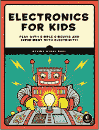
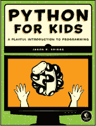
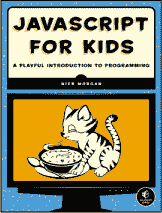
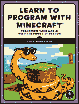
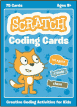
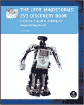

**资源**

访问 *[`www.nostarch.com/iphoneappsforkids/`](https://www.nostarch.com/iphoneappsforkids/)* 获取资源、勘误表以及更多信息。

**更多适合好奇孩子的智能书籍！** 

**儿童电子学**

**玩转简单电路，探索电力！**

*作者* ØYVIND NYDAL DAHL

2016 年 7 月，328 页，$24.95

ISBN 978-1-59327-725-3

*全彩色*

**儿童 Python 编程**

**编程的趣味入门**

*作者* JASON R. BRIGGS

2012 年 12 月，344 页，$34.95

ISBN 978-1-59327-407-8

*全彩色*

**儿童 JavaScript 编程**

**编程的趣味入门**

*作者* NICK MORGAN

2014 年 12 月，336 页，$34.95

ISBN 978-1-59327-408-5

*全彩色*

**与 Minecraft 一起学习编程**

**用 Python 的力量改变你的世界**

*作者* CRAIG RICHARDSON

2015 年 12 月，320 页，$29.95

ISBN 978-1-59327-670-6

*全彩色*

**SCRATCH 编程卡片**

**儿童创意编码活动**

*作者* NATALIE RUSK

2016 年 12 月，75 张卡片，$24.95

ISBN 978-1-59327-774-1

*全彩色，盒装套装*

**LEGO Mindstorms EV[3] 探索书**

**机器人构建与编程初学者指南**

*作者* LAURENS VALK

2014 年 6 月，396 页，$34.95

ISBN 978-1-59327-532-7

*全彩色*

**1.800.420.7240 或 1.415.863.9900 | sales@nostarch.com | [www.nostarch.com](http://www.nostarch.com)**

**更多适合好奇孩子的智能书籍！** 

**儿童电子学**

**玩转简单电路，探索电力！**

*作者* ØYVIND NYDAL DAHL

2016 年 7 月，328 页，$24.95

ISBN 978-1-59327-725-3

*全彩色*

**儿童 Python 编程**

**编程的趣味入门**

*作者* JASON R. BRIGGS

2012 年 12 月，344 页，$34.95

ISBN 978-1-59327-407-8

*全彩色*

**儿童 JavaScript 编程**

**编程的趣味入门**

*作者* NICK MORGAN

2014 年 12 月，336 页，$34.95

ISBN 978-1-59327-408-5

*全彩色*

**与 Minecraft 一起学习编程**

**用 Python 的力量改变你的世界**

*作者* CRAIG RICHARDSON

2015 年 12 月，320 页，$29.95

ISBN 978-1-59327-670-6

*全彩色*

**SCRATCH 编程卡片**

**儿童创意编码活动**

*作者* NATALIE RUSK

2016 年 12 月，75 张卡片，$24.95

ISBN 978-1-59327-774-1

*全彩色，盒装套装*

**LEGO Mindstorms EV[3] 探索书**

**机器人构建与编程初学者指南**

*作者* LAURENS VALK

2014 年 6 月，396 页，$34.95

ISBN 978-1-59327-532-7

*全彩色*

**1.800.420.7240 或 1.415.863.9900 | sales@nostarch.com | [www.nostarch.com](http://www.nostarch.com)**

## 适合 10 岁以上儿童，真正的编程，真的很简单。

苹果的 Swift 是一种强大的、适合初学者的编程语言，任何人都可以使用它为 iPhone 或 iPad 制作酷炫的应用。在《*儿童编程 iPhone 应用*》中，你将学会如何使用 Swift 编写程序，即使你以前从未编程过。

你将使用 Xcode playground，这是一个互动环境，可以在其中玩转你的代码，并立即看到你的工作成果！你还将学习编程的基础知识，如如何在数组中存储数据，如何使用条件语句做决策，以及如何创建函数来组织你的代码——这一切都将通过清晰耐心的讲解来完成。

一旦掌握了基础，你将构建一个生日追踪应用，确保你不会忘记任何人的生日，以及一个名为“学校滑板车手”的平台游戏，包含动画、跳跃等更多功能！

在你开始编程冒险时，你将学会如何：

• 构建节省时间的程序，比如一个只需点击一个按钮就能邀请所有朋友参加派对的程序！

• 编写一个数字猜谜游戏，通过循环让计算机持续猜测，直到猜对为止

• 使用 SpriteKit 制作一个具有图形和音效的真实可玩的游戏

• 通过加快游戏速度和添加高分系统来挑战玩家

为什么认真的成年人应该独享乐趣？《*儿童编程 iPhone 应用*》是你进入激动人心的计算机编程世界的门票。

### 关于作者

**Gloria Winquist**自 2011 年开始沉迷于 iOS 开发，并一直从事专业编程工作。她目前在 LumiraDx 担任 iOS 开发人员。

**Matt McCarthy**与一名团队成员共同发布了 20 多个应用，所属公司为 Tomato Interactive LLC。他目前在 LumiraDx 担任软件工程师。

涵盖 Swift 3.*x* 和 Xcode 8.*x*。要求操作系统为 OS X 10.11 或更高版本。

*最棒的极客娱乐™*

[www.nostarch.com](http://www.nostarch.com)

苹果的 Swift 是一种强大的、适合初学者的编程语言，任何人都可以使用它为 iPhone 或 iPad 制作酷炫的应用。在《*儿童编程 iPhone 应用*》中，你将学会如何使用 Swift 编写程序，即使你以前从未编程过。

你将使用 Xcode playground，这是一个互动环境，可以在其中玩转你的代码，并立即看到你的工作成果！你还将学习编程的基础知识，如如何在数组中存储数据，如何使用条件语句做决策，以及如何创建函数来组织你的代码——这一切都将通过清晰耐心的讲解来完成。

一旦掌握了基础，你将构建一个生日追踪应用，确保你不会忘记任何人的生日，以及一个名为“学校滑板车手”的平台游戏，包含动画、跳跃等更多功能！

在你开始编程冒险时，你将学会如何：

• 构建节省时间的程序，比如一个只需点击一个按钮就能邀请所有朋友参加派对的程序！

• 编写一个数字猜谜游戏，使用循环让计算机不断猜测，直到猜对为止

• 使用 SpriteKit 创建一个真实的、可玩的游戏，带有图形和音效

• 通过加速游戏速度和添加高分系统来挑战玩家

为什么严肃的成年人应该独享所有乐趣？*《为孩子编写 iPhone 应用》*是你进入计算机编程精彩世界的门票。

### 关于作者

**Gloria Winquist** 从 2011 年开始迷上了 iOS 开发，并且从那时起就开始了专业的编程工作。她目前在 LumiraDx 担任 iOS 开发者。

**Matt McCarthy** 曾与他的两人团队 Tomato Interactive LLC 一起发布了超过 20 个应用程序。他目前在 LumiraDx 担任软件工程师。

适用于 Swift 3.*x* 和 Xcode 8.*x* 。需要 OS X 10.11 或更高版本。

*最棒的极客娱乐™*

[www.nostarch.com](http://www.nostarch.com)

Apple 的 Swift 是一种强大且适合初学者的编程语言，任何人都可以使用它来为 iPhone 或 iPad 开发酷炫的应用程序。在 *《为孩子编写 iPhone 应用》* 中，你将学习如何使用 Swift 编写程序，即使你从未接触过编程。

你将使用 Xcode Playground 进行工作，这是一种互动环境，可以让你与代码一起玩耍，并立即看到你工作的结果！你还将学习编程的基本概念，比如如何在数组中存储数据，如何使用条件语句做决策，以及如何创建函数来组织代码——这一切都通过清晰和耐心的解释来帮助你完成。

一旦你掌握了基础，你将构建一个生日提醒应用，确保不会忘记任何人的生日，还会制作一个包含动画、跳跃等元素的名为 Schoolhouse Skateboarder 的平台游戏！

当你开始你的编程冒险时，你将学会如何：

• 构建一些能节省你时间的程序，比如一个可以通过点击按钮邀请所有朋友参加派对的应用！

• 编写一个数字猜谜游戏，使用循环让计算机不断猜测，直到猜对为止

• 使用 SpriteKit 创建一个真实的、可玩的游戏，带有图形和音效

• 通过加速游戏速度和添加高分系统来挑战玩家

为什么严肃的成年人应该独享所有乐趣？*《为孩子编写 iPhone 应用》*是你进入计算机编程精彩世界的门票。

### 关于作者

**Gloria Winquist** 从 2011 年开始迷上了 iOS 开发，并且从那时起就开始了专业的编程工作。她目前在 LumiraDx 担任 iOS 开发者。

**Matt McCarthy** 曾与他的两人团队 Tomato Interactive LLC 一起发布了超过 20 个应用程序。他目前在 LumiraDx 担任软件工程师。

适用于 Swift 3.*x* 和 Xcode 8.*x* 。需要 OS X 10.11 或更高版本。

*最棒的极客娱乐™*

[www.nostarch.com](http://www.nostarch.com)

你将在 Xcode Playground 中进行编程，这是一个互动环境，可以让你与代码互动，并立即查看你工作的结果！你还将学习编程基础，如如何将数据存储在数组中，如何使用条件语句做出决策，以及如何创建函数来组织代码——所有这些都通过清晰而耐心的解释帮助你完成。

一旦你掌握了基础知识，你将开发一个生日追踪应用，这样你就不会忘记任何人的生日，还会做一个名为《学校滑板车手》的平台游戏，包含动画、跳跃等等！

当你开始你的编程冒险时，你将学习如何：

• 编写程序来节省时间，例如一个只需点击按钮就能邀请所有朋友参加派对的程序！

• 编写一个猜数字游戏，使用循环让计算机不断猜测，直到它猜对为止

• 使用 SpriteKit 制作一个真实的、可玩的游戏，包含图形和音效

• 通过加速游戏并增加高分系统来挑战玩家

为什么认真的成年人要独享乐趣？*为孩子们编写 iPhone 应用*是你进入计算机编程激动人心世界的通行证。

### 关于作者

**Gloria Winquist** 于 2011 年迷上了 iOS 开发，并从那时起一直从事专业编程工作。她在 LumiraDx 担任 iOS 开发人员。

**Matt McCarthy** 与搭档组成的两人团队——Tomato Interactive LLC，已经发布了超过 20 个应用。他目前在 LumiraDx 担任软件工程师。

涵盖 Swift 3.*x*和 Xcode 8.*x*，需要 OS X 10.11 或更高版本。

*极致的极客娱乐™*

[www.nostarch.com](http://www.nostarch.com)

一旦你掌握了基础知识，你将开发一个生日追踪应用，这样你就不会忘记任何人的生日，还会做一个名为《学校滑板车手》的平台游戏，包含动画、跳跃等等！

当你开始你的编程冒险时，你将学习如何：

• 编写程序来节省时间，例如一个只需点击按钮就能邀请所有朋友参加派对的程序！

• 编写一个猜数字游戏，使用循环让计算机不断猜测，直到它猜对为止

• 使用 SpriteKit 制作一个真实的、可玩的游戏，包含图形和音效

• 通过加速游戏并增加高分系统来挑战玩家

为什么认真的成年人要独享乐趣？*为孩子们编写 iPhone 应用*是你进入计算机编程激动人心世界的通行证。

### 关于作者

**Gloria Winquist** 于 2011 年迷上了 iOS 开发，并从那时起一直从事专业编程工作。她在 LumiraDx 担任 iOS 开发人员。

**Matt McCarthy** 与搭档组成的两人团队——Tomato Interactive LLC，已经发布了超过 20 个应用。他目前在 LumiraDx 担任软件工程师。

涵盖 Swift 3.*x*和 Xcode 8.*x*，需要 OS X 10.11 或更高版本。

*极致的极客娱乐™*

[www.nostarch.com](http://www.nostarch.com)

当你开始你的编程冒险时，你将学习如何：

• 编写程序来节省时间，比如一个只需点击一个按钮就能邀请所有朋友参加派对的程序！

• 编写一个数字猜测游戏，利用循环让计算机继续猜测直到猜对为止

• 使用 SpriteKit 制作一个真实的、可玩的游戏，并加入图形和音效

• 通过加速游戏并添加高分系统来挑战玩家

为什么只有严肃的成年人可以玩得开心？*《为孩子们编写 iPhone 应用》*是你进入计算机编程精彩世界的通行证。

### 关于作者

**Gloria Winquist** 从 2011 年开始迷上 iOS 开发，并自此开始了职业编程生涯。她目前在 LumiraDx 担任 iOS 开发者。

**Matt McCarthy** 作为一个两人团队 Tomato Interactive LLC 的成员，发布了 20 多个应用程序。他目前在 LumiraDx 担任软件工程师。

涵盖 Swift 3.*x*和 Xcode 8.*x*，需要 OS X 10.11 或更高版本。

*最棒的极客娱乐™*

[www.nostarch.com](http://www.nostarch.com)

• 编写程序来节省时间，比如一个只需点击一个按钮就能邀请所有朋友参加派对的程序！

• 编写一个数字猜测游戏，利用循环让计算机继续猜测直到猜对为止

• 使用 SpriteKit 制作一个真实的、可玩的游戏，并加入图形和音效

• 通过加速游戏并添加高分系统来挑战玩家

为什么只有严肃的成年人可以玩得开心？*《为孩子们编写 iPhone 应用》*是你进入计算机编程精彩世界的通行证。

### 关于作者

**Gloria Winquist** 从 2011 年开始迷上 iOS 开发，并自此开始了职业编程生涯。她目前在 LumiraDx 担任 iOS 开发者。

**Matt McCarthy** 作为一个两人团队 Tomato Interactive LLC 的成员，发布了 20 多个应用程序。他目前在 LumiraDx 担任软件工程师。

涵盖 Swift 3.*x*和 Xcode 8.*x*，需要 OS X 10.11 或更高版本。

*最棒的极客娱乐™*

[www.nostarch.com](http://www.nostarch.com)

• 编写一个数字猜测游戏，利用循环让计算机继续猜测直到猜对为止

• 使用 SpriteKit 制作一个真实的、可玩的游戏，并加入图形和音效

• 通过加速游戏并添加高分系统来挑战玩家

为什么只有严肃的成年人可以玩得开心？*《为孩子们编写 iPhone 应用》*是你进入计算机编程精彩世界的通行证。

### 关于作者

**Gloria Winquist** 从 2011 年开始迷上 iOS 开发，并自此开始了职业编程生涯。她目前在 LumiraDx 担任 iOS 开发者。

**Matt McCarthy** 作为一个两人团队 Tomato Interactive LLC 的成员，发布了 20 多个应用程序。他目前在 LumiraDx 担任软件工程师。

涵盖 Swift 3.*x*和 Xcode 8.*x*，需要 OS X 10.11 或更高版本。

*最棒的极客娱乐™*

[www.nostarch.com](http://www.nostarch.com)

• 使用 SpriteKit 制作一个真实的、可玩的游戏，并加入图形和音效

• 通过加速你的游戏并添加高分系统来挑战玩家

为什么只有认真的大人才能玩得开心？*为孩子编写 iPhone 应用*是你进入计算机编程精彩世界的通行证。

### 关于作者

**Gloria Winquist** 从 2011 年开始迷上 iOS 开发，并从那时起一直在职业编程。她目前在 LumiraDx 担任 iOS 开发人员。

**Matt McCarthy** 已发布超过 20 个应用，是一个两人团队——Tomato Interactive LLC 的成员。他目前在 LumiraDx 担任软件工程师。

涵盖 Swift 3.*x* 和 Xcode 8.*x*，需要 OS X 10.11 或更高版本。

*最棒的极客娱乐™*

[www.nostarch.com](http://www.nostarch.com)

• 通过加速你的游戏并添加高分系统来挑战玩家

为什么只有认真的大人才能玩得开心？*为孩子编写 iPhone 应用*是你进入计算机编程精彩世界的通行证。

### 关于作者

**Gloria Winquist** 从 2011 年开始迷上 iOS 开发，并从那时起一直在职业编程。她目前在 LumiraDx 担任 iOS 开发人员。

**Matt McCarthy** 已发布超过 20 个应用，是一个两人团队——Tomato Interactive LLC 的成员。他目前在 LumiraDx 担任软件工程师。

涵盖 Swift 3.*x* 和 Xcode 8.*x*，需要 OS X 10.11 或更高版本。

*最棒的极客娱乐™*

[www.nostarch.com](http://www.nostarch.com)

为什么只有认真的大人才能玩得开心？*为孩子编写 iPhone 应用*是你进入计算机编程精彩世界的通行证。

### 关于作者

**Gloria Winquist** 从 2011 年开始迷上 iOS 开发，并从那时起一直在职业编程。她目前在 LumiraDx 担任 iOS 开发人员。

**Matt McCarthy** 已发布超过 20 个应用，是一个两人团队——Tomato Interactive LLC 的成员。他目前在 LumiraDx 担任软件工程师。

涵盖 Swift 3.*x* 和 Xcode 8.*x*，需要 OS X 10.11 或更高版本。

*最棒的极客娱乐™*

[www.nostarch.com](http://www.nostarch.com)

### 关于作者

**Gloria Winquist** 从 2011 年开始迷上 iOS 开发，并从那时起一直在职业编程。她目前在 LumiraDx 担任 iOS 开发人员。

**Matt McCarthy** 已发布超过 20 个应用，是一个两人团队——Tomato Interactive LLC 的成员。他目前在 LumiraDx 担任软件工程师。

涵盖 Swift 3.*x* 和 Xcode 8.*x*，需要 OS X 10.11 或更高版本。

*最棒的极客娱乐™*

[www.nostarch.com](http://www.nostarch.com)

**Gloria Winquist** 从 2011 年开始迷上 iOS 开发，并从那时起一直在职业编程。她目前在 LumiraDx 担任 iOS 开发人员。

**Matt McCarthy** 已发布超过 20 个应用，是一个两人团队——Tomato Interactive LLC 的成员。他目前在 LumiraDx 担任软件工程师。

涵盖 Swift 3.*x* 和 Xcode 8.*x*，需要 OS X 10.11 或更高版本。

*最棒的极客娱乐™*

[www.nostarch.com](http://www.nostarch.com)

**Matt McCarthy**曾与两人团队 Tomato Interactive LLC 一起发布了超过 20 个应用。他目前在 LumiraDx 担任软件工程师。

涵盖 Swift 3.*x*和 Xcode 8.*x*。需要 OS X 10.11 或更高版本。

*最顶级的极客娱乐™*

[www.nostarch.com](http://www.nostarch.com)

涵盖 Swift 3.*x*和 Xcode 8.*x*。需要 OS X 10.11 或更高版本。

*最顶级的极客娱乐™*

[www.nostarch.com](http://www.nostarch.com)

*最顶级的极客娱乐™*

[www.nostarch.com](http://www.nostarch.com)

*最顶级的极客娱乐™*

[www.nostarch.com](http://www.nostarch.com)

[www.nostarch.com](http://www.nostarch.com)
