# 凯撒密码

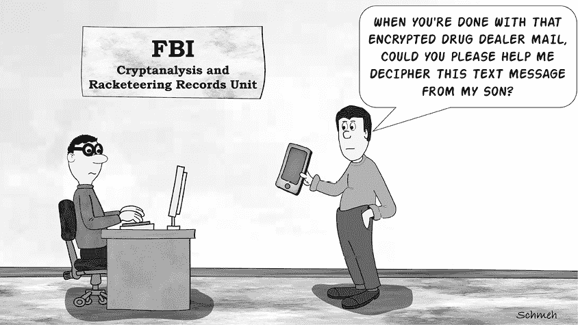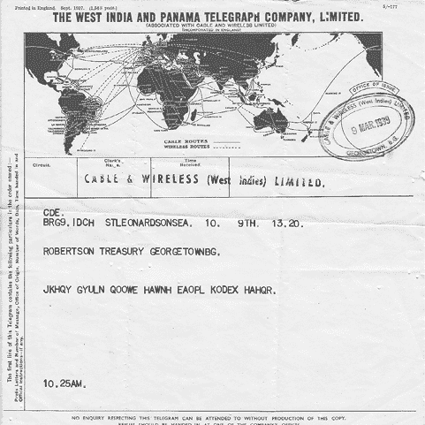

图 2-1：这张 1939 年的电报信息使用凯撒密码加密。

在 图 2-1 中所示的电报（由 Karsten Hansky 提供）是从英国圣利昂纳兹海岸发往英属圭亚那乔治敦的，时间是 1939 年。^(1) 该电报中的信息部分被加密。在以下的逐字稿中，密文以粗体显示在第四行：

`CDE.`

`BRG9.IDCH. STLEONARDSONSEA. 10\. 9th. 13.20.`

`ROBERTSON TREASURY GEORGETOWNBG.`

`JKHQY GYULN QOOWE HAWNH EAOPL KODEX HAHQR.`

`10.25AM.`

这里使用的加密方法，称为凯撒密码，十分简单，因此它将作为我们讨论加密技术的良好起点。我们专门为此章节安排了该内容。

## 凯撒密码的工作原理

凯撒密码将字母表中的每个字母按一定数量的字符进行位移。我们可以将密码的密钥视为确定位移偏移量的数字。

在 图 2-1 中所示的电报中，密钥为 4，具体参见以下表格：

`明文：` `ABCDEFGHIJKLMNOPQRSTUVWXYZ`

`密文： EFGHIJKLMNOPQRSTUVWXYZABCD`

这里有另一种表示密钥的方法。这个图示显示了 `A` 被替换为 `E`，`B` 被替换为 `F`，`C` 被替换为 `G`，`D` 被替换为 `H`，依此类推：

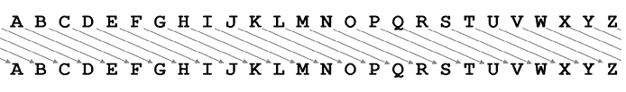

当我们将密钥反向应用于加密的电报行时，得到以下明文：`NOLUC KCYPR USSAI LEARL IESTP OSHIB LELUV`。如果我们将空格放到正确的位置，信息可能会变成：`NO LUCK CYPRUS SAIL EARLIEST POSSIBLE LUV`。

我们仍然不完全知道这个信息的含义。`POSHIBLE` 可能是 `POSSIBLE` 的拼写错误，而 `CYPRUS` 可能指的是一艘同名的船只。`LUV` 可能是发件人姓名首字母的缩写，或者只是 `LOVE` 的缩写。

如果我们使用一个包含二十六个字母的凯撒密码，则会有二十五个（有效的）不同密钥。这是因为零位移不会改变文本，每个字母都会移到它自己的位置。而二十六位移也会产生相同的效果。

要应用凯撒密码，可以使用密码盘或密码滑块（见 图 2-2）。密钥为 13 的凯撒密码，也称为 ROT-13，是一种 *自反式密码*——如果使用两次，你会得到原文。

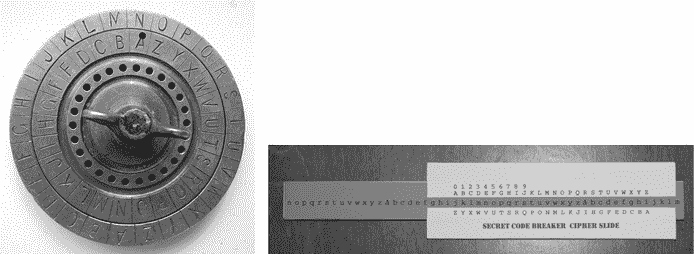

图 2-2：密码盘或密码滑块可以用来应用凯撒密码。

ROT-13 常常用于地理寻宝网站上加密剧透信息。

## 如何检测凯撒密码

如果你想检查某个密码是否使用凯撒密码创建，统计字母（即进行频率分析）会很有帮助。为了理解为什么这样做有用，我们首先来看一下典型英文文本中的字母频率：

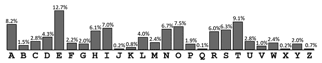

我们看到`E`是出现频率最高的字母，它周围则是一些频率较低的字母。`R`、`S`和`T`是三个连续的高频字母。最后五个字母，`V`、`W`、`X`、`Y`和`Z`，都相当稀有。如果我们对一段英文文本应用凯撒密码，我们会注意到这个图表的条形图会按一定的步数移动。例如，如果`K`是频率最高的字母，我们应该看到它两侧被远不常见的字母包围，表示它对应的是`E`。我们可以利用这个特征来检测凯撒密码。

现在看一下以下两则广告，它们都于 1853 年在伦敦的报纸《泰晤士报》上刊登：^(2)

1853 年 2 月 2 日：

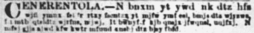

`CENERENTOLA.—N bnxm yt ywd nk dtz hfs wjfi ymnx fsi fr rtxy fscntzx yt mjfw ymfy fsi, bmjs dtz wjyzws, fsi mtb qtsl dtz wjrfns, mjwj. It bwnyj f kjb qnsjx ifwqnsl, uqjfxj. N mfaj gjjs ajwd kfw kwtr mfuud xnshj dtz bjsy fbfd.`

1853 年 2 月 11 日：

`CENERENTOLA.—Zsynq rd mjfwy nx xnhp mfaj n ywnji yt kwfrj fs jcuqfsfynts ktw dtz, gzy hfssty. Xnqjshj nx xfkjxy nk ymj ywzj hfzxj nx sty xzxujhyji: nk ny nx, fqq xytwnjx bnqq gj xnkkyji yt ymj gtyytr. It dtz wjrjrgjw tzw htzxns’x knwxy uwtutxnynts: ymnsp tk ny.`

我们假设这两则广告是以相同的方式加密的。`CENERENTOLA`（意大利语的“灰姑娘”）可能是发件人或收件人的化名。由于它没有被加密，我们可以将其从检查中省略。

一种好的方法是对这两个密文进行频率计数。我们可以手动计数字母，或者使用计算机辅助工具，例如 CrypTool 2，或者使用类似[`dcode.fr/en`](https://dcode.fr/en)的基于网页的工具。以下是我们自己制作的图表：

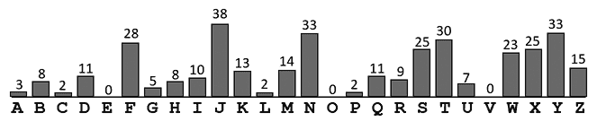

我们在图 2-3 中看到，`j`是最常用的字母，并且它的周围是一些较不常见的字母。字母`w`、`x`和`y`形成了一组三个连续的高频字母。`a`、`b`、`c`、`d`和`e`组成了五个连续的低频字母。

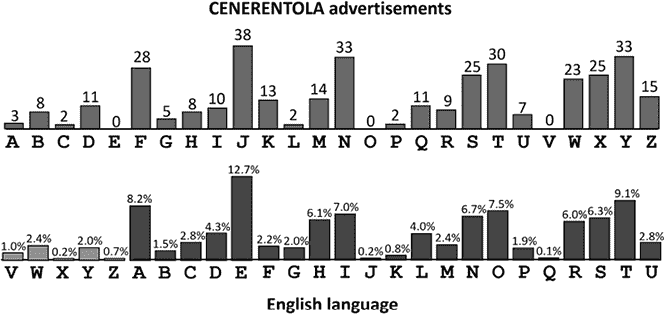

图 2-3：将`CENERENTOLA`广告的字母频率与英语语言的字母频率进行比较，表明我们正在处理凯撒密码。

总的来说，我们的密文的频率分析看起来与英文的字母频率非常相似，唯一的不同是这些条形图都被移动了五个步长（`A` = `F`，`B` = `G`，`C` = `H`……）。这表明我们正在处理凯撒密码。实际上，通过应用这个精确的五步位移，我们可以得出以下的明文：

`CENERENTOLA.—I wish to try if you can read this and am most anxious to hear that and, when you return, and how long you remain, here. Do write a few lines darling, please. I have been very far from happy since you went away.`

CENERENTOLA.—直到我的心感到病痛，我才试图为你编写一个解释，但无能为力。如果真相没有被怀疑，沉默是最安全的：如果被怀疑，所有的故事都会被筛选到最底层。你还记得我们表亲的第一个提议吗？想一想吧。

显然，这两条信息是由一对浪漫的情侣写的。这并不令人惊讶，因为加密的报纸广告曾是维多利亚时代英国情侣之间常用的秘密交流方式。

## 如何破解凯撒密码

如应当显现的那样，一旦识别出凯撒密码，它就容易被破解。如果你知道密文中某个字母代表，例如 `E`，那么你就可以轻松找出密钥。

当然，破解凯撒密码还有其他方法。我们可以尝试所有可能的密钥，检查是否有符合常理的明文。这种方法称为 *暴力破解* 或 *穷举密钥搜索*。由于只有二十五个密钥，对凯撒密码进行暴力破解并不难。我们来对以下广告进行破解，这则广告刊登在 1888 年 5 月 26 日的伦敦 *Standard* 报纸上：^(3)

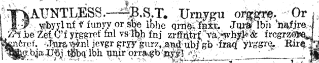

对密文进行频率分析，显示很可能是凯撒密码。为了破解它，让我们将消息的前两个单词写在表格的第一行，然后通过每行将每个字母向后移动一个位置来填充表格。当我们到达`Z`时，回绕到`A`。我们建议按照列的方式书写这个表格：

`0 URNYGU ORGGRE`

`1 VSOZHV PSHHSF`

`2 WTPAIW QTIITG`

`3 XUQBJX RUJJUH`

`4 YVRCKY SVKKVI`

`5 ZWSDLZ TWLLWJ`

`6 AXTEMA UXMMXK`

`7 BYUFNB VYNNYL`

`8 CZVGOC WZOOZM`

`9 DAWHPD XAPPAN`

`10 EBXIQE YBQQBO`

`11 FCYYRF ZCRRCP`

`12 GDZKSG ADSSDQ`

`13 HEALTH BETTER`

`14 IFBMUI CFUUFS`

`. . .`

很明显，第 13 行的 `HEALTH BETTER` 是正确的。这意味着该文本使用了 ROT-13。通常，仅为一个单词创建这样的表格就足够了。

强力破解变得更加容易，如果我们使用 CrypTool 2 来执行二十五次凯撒解密。CrypTool 2 模板“凯撒暴力破解分析”提供了我们所需的功能。我们来应用它解密以下密文，这段密文来自 Elonka 的 *《巨型密码与密码表》*：^(4)

`Devhqfh vkdushqv oryh, suhvhqfh vwuhqjwkhqv lw. Ehqmdplq Iudqnolq`

以下是 CrypTool 2 执行的二十五次解密中的一部分：

`1 Wxoajya odwnlajo hkra, lnaoajya opnajcpdajo ep. Xajfwiej Bnwjghej`

`2 Xypbkzb pexombkp ilsb, mobpbkzb pqobkdqebkp fq. Ybkgxjfk Coxkhifk`

`3 Yzqclac qfypnclq jmtc, npcqclac qrpclerfclq gr. Zclhykgl Dpylijgl`

`4 Zardmbd rgzqodmr knud, oqdrdmbd rsqdmfsgdmr hs. Admizlhm Eqzmjkhm`

`5 Absence sharpens love, presence strengthens it. Benjamin Franklin`

`6 Bctfodf tibsqfot mpwf, qsftfodf tusfohuifot ju. Cfokbnjo Gsbolmjo`

`7 Cdugpeg ujctrgpu nqxg, rtgugpeg uvtgpivjgpu kv. Dgplcokp Htcpmnkp`

`8 Devhqfh vkdushqv oryh, suhvhqfh vwuhqjwkhqv lw. Ehqmdplq Iudqnolq`

`. . .`

很容易看出，第 5 行是正确的：

`缺席加深了爱情，出席则使其更坚固。——本杰明·富兰克林`

## 成功案例

### 一名监狱囚犯的密码

我们的同事加里·克里凡斯（Gary Klivans），一位来自纽约州的退役警察队长，是帮派和监狱囚犯使用的加密方法的著名专家。^(5) 他 2016 年出版的《帮派秘密代码：破解》一书，对于所有对破译密码感兴趣的人来说，都是必读之作。^(6) 截至 2023 年，加里在担任专门研究帮派密码的法医顾问。他还是该领域的常驻写作人和讲座者。加里向我们提供了一条未标明日期的来自监狱囚犯的加密信息，见图 2-4。^(7)

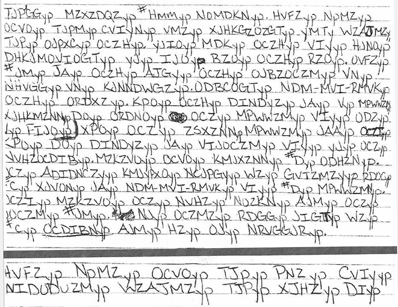

图 2-4：来自监狱囚犯的加密信息。明文非常有趣。

这条信息中的每个单词都以`yp`结尾。加里很清楚，这两个字母的后缀没有意义，目的是为了迷惑破译者。通过频率分析（忽略`yp`），加里发现这个密码很可能是通过凯撒密码加密的。由于`Z`是出现频率最高的字母，破解这个密码非常简单。以下是监狱囚犯使用的替代表（密钥为 21）：

`明文：` `ABCDEFGHIJKLMNOPQRSTUVWXYZ`

`密文：VWXYZABCDEFGHIJKLMNOPQRSTU`

基于这个表，可以恢复出以下明文：

`你将收到# MRR STRIPS，确保`

`确保在处理之前你的手是完全干的`

`你触摸它们。不要撕裂它们，且大多数`

`重要的是不要让它们弄湿。拿起`

`#或它们，将它们一起折叠`

`尽可能小且紧密包裹 SIR-RAN-WRAP`

`再把它们折叠两次。把它们放入橡胶`

`压紧它，拧橡胶并系个结`

`剪掉多余的橡胶，接着`

`再放入另一个，并重复上述步骤`

`同样的事情，重复这个过程# I 次`

`最终的产品应层叠着`

`#H 避孕套的 SIR-RAN-WRAP #I 橡胶`

`然后对接下来的同样步骤重复`

`其他#或这样只有`

`#H 是我需要吞下的东西。`

`确保你使用的是手`

`消毒剂，直到你进来`

这条信息非常有趣。一名监狱囚犯似乎在向收信人（可能是他的妻子）解释如何将毒品（`MRR STRIPS`）装进避孕套和保鲜膜（`SIR-RAN-WRAP`）中。他建议对方在探访时将这些毒品包交给他，以便他能立即将其吞下，把毒品偷运到监狱单间。

### 间谍的加密表

布赖恩·里根（与同名喜剧演员无关）曾在美国空军担任军士长。1999 年，他开始试图将高度机密的文件、录像带和存储介质卖给外国政府，企图获得超过 1000 万美元。2001 年，在他还未得手之前，他被逮捕并被定罪为间谍罪，判处终身监禁。

Regan 在密码学方面受过训练，使用了多种加密方法来隐藏银行代码、地址和其他信息。联邦调查局的破译单位——密码分析与敲诈记录单位（CRRU），通过其首席破译员 Dan Olson 的帮助，成功破解了 Regan 的大部分密文。以下是其中一个较容易破解的例子：

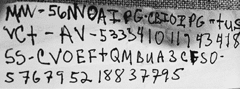

正如 Olson 发现的（可能是通过暴力破解），这份笔记是使用凯撒密码加密的，密钥为 1。数字也被移动了一位。我们可以轻松解密前两行：

`Ciphertext: MM-56NVOAIPG CBIOIPG-TUS VCT-AV-533341011943418`

`Plaintext:` `LL-45MUNZHOF BAHNHOF-STR UBS-ZU-422230900832307`

这条信息指的是瑞士联合银行（UBS），该银行位于瑞士苏黎世巴恩霍夫街 45 号的 Münzhof 大楼。（Regan 显然为这家银行使用了代号`LL`。）数字`422230900832307`是一个银行账户号码。第 3 和第 4 行的加密方式相同：

`Ciphertext: SS-CVOEFTQMBUA3CFSO-576795218837795`

`Plaintext:` `RR-BUNDESPLATZ2BERN-465684107726684`

瑞士伯尔尼的 Bundesplatz 2 是另一家瑞士大银行——瑞士信贷银行（Regan 为其使用了代号`RR`）的地址。同样，`465684107726684`是一个银行账户号码。

如果你想了解更多关于 Brian Regan 间谍案件的信息，你应该阅读 2016 年由 Yudhijit Bhattacharjee 所著的 highly recommended 书籍《The Spy Who Couldn’t Spell》。^(8)

### 来自电影《致命魔术》的加密日记

电影*致命魔术*（2006 年）讲述了 19 世纪末两位伦敦舞台魔术师展开致命竞争的故事。魔术师之一 Alfred Borden 使用密码学保护自己的魔术秘密。电影中多次出现了他日记中的片段。以下是一个例子（大约在影片的八分钟处出现）：

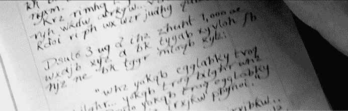

加密爱好者很快发现，这本日志包含了真实的加密文本。^(9) 使用的密码是凯撒密码，密钥为 23，明文包含了大量无意义的词语。例如，这一行...

`Dsulo 3 ug d ihz zhunt 1,000 ae`

...解密为...

`April 3 rd a few werkq 1,000 xb`

我们不知道`werkq`和`xb`究竟是什么意思。

## 挑战

要获取帮助你解决本书中所有挑战的提示及其解决方案，请参阅[`codebreaking-guide.com/challenges/`](https://codebreaking-guide.com/challenges/)。

### Herbert Yardley 的第一个挑战

赫伯特·雅德利（1889–1958）是美国国务院的一位成功破译者。他最著名的是他在 1931 年出版的揭露政府监听活动的书籍，《美国黑房间》*。^(10) 他的另一部较不为人知的书籍是 1932 年的《密码文稿》，它提供了一系列加密谜题（雅德利称之为“密码文稿”），并附带了虚构的背景故事。^(11) 第一个密码文稿（见图 2-5）是使用凯撒密码加密的。*

*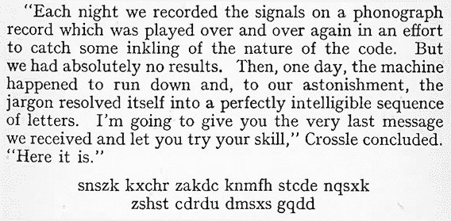

图 2-5：赫伯特·雅德利（Herbert Yardley）的其中一份密码文稿。它是使用凯撒密码加密的。

你能解开这个吗？

### 一系列来自 1900 年的报纸广告

这里有四则我们在《痛苦专栏》*中找到的报纸广告。^(12) 它们最初发表于 1900 年英国的《晚间标准报》。

`ALICE R.P. Qcbufohizohs mci. 我不太确定，但你如果能早点回复，或许我们能约好一起见面。` 1900 年 3 月 27 日，星期二

`ALICE R.P. 你记得真好。一定会见面的。一直想着你。` 1900 年 3 月 29 日，星期四

`ALICE R.P. 我非常期待。Kobhhc gssmci acfs hvob wqob hszzmci. Will zsh ybck in opcih twjs kssyg hwas.` 1900 年 4 月 2 日，星期一

`ALICE R.P. Gvozz kowh dcfhzobr rd ghohwcb hvifgrom twjs qzcqy gvcizr aiqv zwys gssmci.` 1900 年 5 月 17 日，星期四

如图所示，第二则广告完全以明文写成。其他三则则部分使用凯撒密码加密。你能破解这些密码文稿吗？*
