# 第三章：简单的替换密码

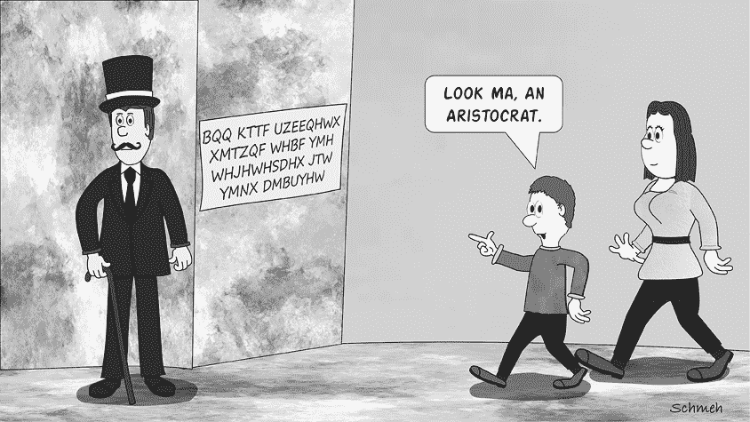

任何对加密和破译感兴趣的人都应该参观密码学博物馆。在美国，最好的博物馆是国家密码学博物馆，它是 NSA 位于马里兰州福特·米德总部的大门。如果你在英国，可以去布莱切利公园，在德国，可以参观帕德博恩的海因茨·尼克斯多夫博物馆论坛或慕尼黑的德国博物馆。这些机构展示了许多迷人的密码机，比如恩尼格玛机（见第十五章），以及其他与密码相关的物品。

现在让我们把注意力转向我们在国家密码学博物馆礼品店找到的一件物品：一只带有加密铭文的杯子（见图 3-1）。

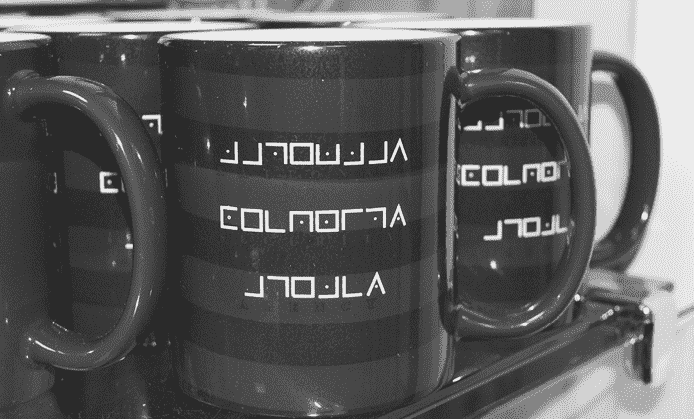

图 3-1：这些 NSA 杯子上的铭文是用猪圈密码加密的。

这里使用的加密算法是所谓的*猪圈密码*的变体。这个密码也被称为自由石匠密码，已经是一个非常古老且广泛使用的加密技术。^(1) 以下图示展示了猪圈密码如何将字母表中的每个字母转化为由线条和点组成的符号：

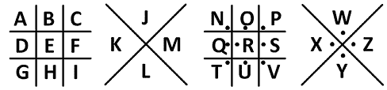

使用这个图示，我们可以清楚地看到，杯子上的铭文解密后是`NATEONAL SECURITY AGENCY`。（是的，第一个词有个错字。这种事即使在 NSA 也会发生！）

猪圈密码还有许多其他变体。例如，以下是 1796 年在纽约市一块墓碑上写的文字^(2)。 . .

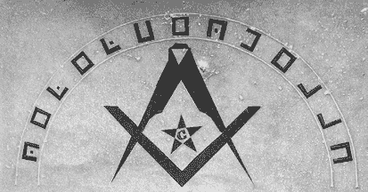

. . . 结果证明它是用以下方案加密的：

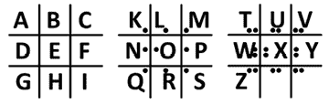

明文是`REMEMBER DEAAH`。

当然，第二个`A`应该是`T`，显然，原本的消息应该是`REMEMBER DEATH`。显然，石匠（或墓碑设计师）打了一个小错字，漏掉了两个点！在密码学中这是常见的现象。想想看，在没有加密的英文文本中，犯错是多么容易。这一问题在密文中变得更加突出，因为密文更难校对。这既会增加，也会减少破解者的难度。

还有许多其他的猪圈密码变体，例如那些改变字母顺序的表格。有关其他变体，请参见本书附录 C 中的词汇表。关于世界各地的密码学博物馆和其他密码学遗址的概述，请查看由 Klaus 和奥地利 IT 专家 Christian Baumann 运营的密码学旅行指南网站，[`cryptologictravelguide.com`](https://cryptologictravelguide.com)。

## 简单的替换密码是如何工作的

豕笔密码和凯撒密码是加密方法的例子，它们将字母表中的每个字母替换为另一个字母或符号。此类密码被称为*简单替换密码*或*单字母替换密码（MASC）*。简单替换密码为每个明文字母提供一个唯一的密文字母。

简单替换密码主要有两种类型：一种是在原字母表内进行替换，另一种则是将明文字母转换为不同字母表中的字符，这些字符可以是任何东西，从如西里尔字母表这样的书写系统，到密码使用者自己发明的字母表，甚至是数字序列或一组不常见的符号。豕笔密码就是一种*不同字母表*类型的简单替换密码。用于以下《Woo 之书》中的文本的密码也是如此，该书在 2013 年由网络漫画《Sandra and Woo》介绍：^(3)^, ^(4)

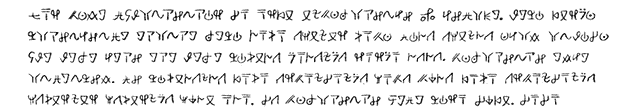

相比之下，图 3-2 的左侧展示了一个*相同字母表*类型的消息。这是一本加密书籍的封面，书籍于 1835 年在伦敦出版。^(5)

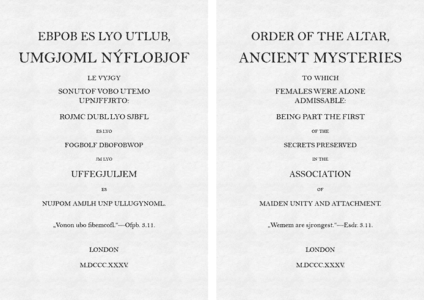

图 3-2：这本书*UMGJOML NÝFLOBJOF*（左侧）是由伦敦的一个女性秘密组织于 1835 年出版的。它使用简单的替换密码进行加密。右侧显示了解密后的版本。

使用以下的解密表格……

`密文: ABCDEFGHIJKLMNOPQRSTUVWXYÝZ`

`明文:` `URGPOSC-JIKTNMEDQBFLAWVXHYZ`

……这个标题解密后的内容显示在图右侧。

还有两种方案的混合。例如，以下这封信（1841 年由 W.B. Tyler 寄给埃德加·爱伦·坡，^(6)我们将在第六章回到这个话题）同时使用了标准字符和非标准字符：

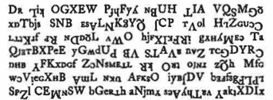

一种不同字母表的简单替换密码可以通过随机将每个非标准字符替换为普通字母表中的一个字母，轻松转换为相同字母表类型的密码。这个过程被称为*转录*，结果文本称为*转录本*。例如，使用一组独特符号（“Voynichese”）的沃伊尼奇手稿（在第五章中有详细介绍），已经被多个研究者以不同方式转录为标准字母表。^(7)

作为转录的一个例子，我们可以使用以下信息，这条信息由一位名为 RetroSA 的用户在 2018 年发布于 Reddit 的未解密码论坛，他表示自己在家人的私人遗物中发现了这条信息。^(8)（顺便说一下，这条信息至今未解开。）

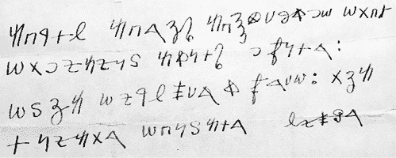

另一位 Reddit 读者 NickSB2013 提供了基于以下表格的转录：

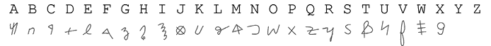

以下是该密码的转录版本：

`ABCDE ABFGH ABIJKLMNO OPBD`

`OPNQAQRS ATRDH NVRDF: OSGA OQCEWKF T VFKO: PGA`

`DRQAPF OBRSADF EQWXF`

不要被转录后的密码以`ABCDE`开头这一点所困惑。这只是因为 Reddit 读者将消息中出现的第一个字母转录为`A`，第二个转录为`B`，以此类推。

经过转录的消息比原始消息更容易分析，尤其是当使用计算机程序时。由于可以将不同字母表的简单替换密码转换为相同字母表的密码，因此密码分析师通常不会区分这两者。破解简单替换密码的方法并不依赖于密文是用标准字母还是替代字母书写的。

美国密码学协会称任何包含空格（即单词之间的边界）的相同字母表简单替换密码为*贵族密码*。其每期新闻通讯《密码学》都包含若干贵族密码供用户解答。其他报纸和杂志也会发布贵族密码，通常与填字游戏和象棋问题一起发布。此外，还有书籍出版，专门收录贵族密码。似乎很多人喜欢解决这种谜题！

## 如何检测简单替换密码

有一个简单而非常实用的经验法则：在绝大多数情况下，如果密文是用非标准字母表写的，则其作者使用了简单替换密码（有时会做一些附加的调整）。例如，我们遇到的所有用猪圈字母表写的文本都是这样加密的——虽然也可以结合其他加密方法使用猪圈字母表。显然，那些足够聪明以避免使用简单替换密码、选择更复杂的加密系统的人，也明白使用非标准字母表并不能增加安全性。

当然，不能保证用非标准字母写的文本一定是简单替换密码。为了做出更准确的诊断，我们需要进行频率分析，可能还需要其他统计方法。我们将在图 3-3 中展示这一过程，该图显示了 1909 年的一张加密明信片。^(9)

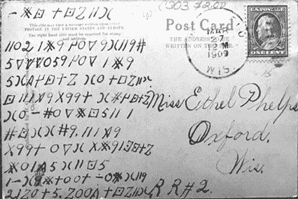

图 3-3：1909 年使用不同字母表类型的简单替换密码加密的明信片

使用下表...

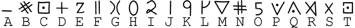

. . . 我们创建了密码的转录版本。请注意，在转录中，字母`U`、`V`、`W`、`X`、`Y`和`Z`没有出现，因为明信片使用的字母表只有十八个字母：

`ABC DCEFG`

`FHI JBK LHM KGFKN`

`OMPPHOK LHM JBK`

`OGQLCDE GH DCEFG`

`C FJRK SKKD GBLCDE`

`GH ANHMBCOF J`

`NCGGNK. FJRK`

`SKKD HMG SBKJTCDE`

`BHJQO GFCO`

`JAGKBDHHD AHB GFK`

`IJEHDO. EHHQ DCEFG`

接下来，我们进行频率分析。以下报告是通过计算机程序 CrypTool 2 生成的，但你也可以手动计算这些频率，或者使用网站[`dcode.fr/en`](https://dcode.fr/en)。在这种情况下，我们只关心百分比频率：

作为对比，这里是普通英语文本的百分比频率分析：

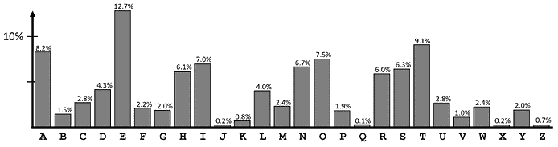

如果我们比较这两段文本中四个最常见和最不常见的字母，我们得到以下结果：

`密文：10.87，10.87，9.42，7.97 / 0.00，0.00，0.00，0.00`

`普通英语：12.7，9.1，8.2，7.5 / 0.75，0.25，0.25，0.25`

如你所见，这里有一些差异。例如，密文中最常见的字母的比例为 10.87%，而普通英语中为 12.7%。不过除此之外，这些数字相当相似。总体来说，这张明信片上的加密文本与应用于英语明文的简单替换密码一致。进一步检查显示，确实如此。这张明信片作为本章末尾的一个挑战题目之一。你能解开它吗？

### 一个不是简单替换密码的密码示例

现在让我们来看一下图 3-4 中的密文。这个信息是著名的*Kryptos*雕塑上加密铭文的前半部分，我们知道它并没有使用简单的替换密码（参见第八章和附录 A）。

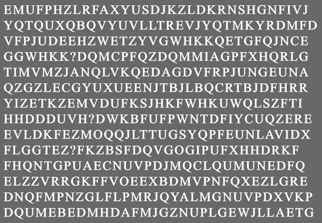

图 3-4：著名的*Kryptos*雕塑的前半部分不具有简单替换密码的统计特征。

为了证明这一点，以下是这个密码文本的百分比频率分析：

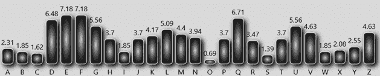

再次，我们观察这四个最常见和最不常见的字母，并将它们的频率与普通英语中的频率进行比较：

`密文：7.18，7.18，6.71，6.48 / 0.69，1.39，1.62，1.85`

`普通英语：12.7，9.1，8.2，7.5 / 0.75，0.25，0.25，0.25`

如你所见，差异现在明显增大。与普通英语相比，这个密码文本中最常见的字母太稀有，而稀有的字母又过于频繁。该密码文本的频率分布比一般英语文本要平坦得多。这表明*Kryptos*铭文的前半部分并没有使用简单替换密码进行加密。我们将在第八章中再次讨论这个著名的密码文本。

### 同字偶合度技术

每当我们可以使用计算机时，我们可以采用另一种统计方法来推测某个密文是否由简单替换密码加密：*同偶指数*（*IC*），它被定义为从文本中随机选取两个字母相同的概率。（其他来源可能对 IC 的描述有所不同。）这个重要的破译工具的详细信息在附录 B 中。暂时知道，使用简单替换密码加密的英文明文的 IC 通常为 6.7%，而纯随机文本的 IC 大约为 3.8%。

由于手动计算同偶指数（IC）是一项繁琐的工作，在这个例子中，我们使用网站[`dcode.fr/en`](https://dcode.fr/en)，它提供了一个 IC 计算器。使用这个工具在明信片消息上进行计算……

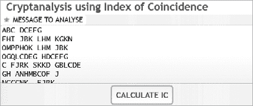

……在*Kryptos*文本上，我们得到了以下值：

1.  明信片消息的同偶指数：6.4%

1.  *Kryptos*文本的同偶指数：4.5%

明信片文本的同偶指数（6.4%）与使用简单替换密码加密的英文文本的预期值（6.7%）非常接近，而*Kryptos*文本的同偶指数（4.5%）则相距较远。这确认了一个（正确的）猜测，即明信片是用简单替换密码加密的，而*Kryptos*加密则不是。

## 如何破解简单替换密码

破解简单替换密码有两个基本工具：猜测单词和频率分析。^(10) 通常，将这两种方法结合起来效果最好，因此我们将在以下示例中这样做。你通常可以猜测频繁出现的单词和具有不寻常字母模式的单词。我们通过图 3-5 中的密文（取自 2015 年发布的电脑游戏*使命召唤：黑色行动 III*）演示这些技巧，密文采用的是猪圈密码变体。

图 3-5：从电脑游戏*使命召唤：黑色行动 III*（2015）中提取的密码谜题

为了转录这条信息，我们使用下图所示的猪圈密码变体：

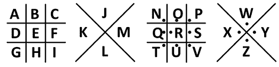

这给我们提供了以下转录。现在我们已经将符号转换为字母，可以更轻松地审阅文本：

`OVSRSVIMQ EXCEVTK 654371979 SRCE KHE GVEAK WAV ERDED WIKH KHE DEFEAK SF KHE ATSKHICSRJ, KHE OEETEVJ AJCERDED KS BECSQE KHE WAVDJ SF APP MRI LEVJEJ. KHE JMVLILIRG ATSKHICSRJ WEVE CAJK SMK, BARIJHED KS KHE DAVO AEKHEV BEREAKH CVEAKISR. AFKEV ESRJ SF EXIPE IR KHE DAVO AEKHEV, KHE ATSKHICSRJ ELSPLED IRKS KWIJKED CVEAKMVEJ KHAK RSW BEAV PIKKPE VEJEQBPARCE KS KHEIV OEETEV BVEKHVER. KHE ATSKHICSRJ CEAJEPEJJ DEJIVE IJ KS VEERKEV CVEAKISR KS CSRJMQE ARD CSVVMTK APP KHE MRILEVJEJ. IK IJ KHE OEETEVJ KHAK GMAVD AGAIRJK KHEJE TEVTEKMAP AKKEQTKJ KS VEERKEV CVEAKISR, ARD GMAVD AGAIRJK ARY BEIRGJ KHAK QAY HALE FAPPER MRDEV KHE IRFPMERCE SF KHE ATSKHICSRJ.`

### 执行频率分析

我们通过数字母开始分析（可以手动进行，也可以使用如 CrypTool 2 等软件）：

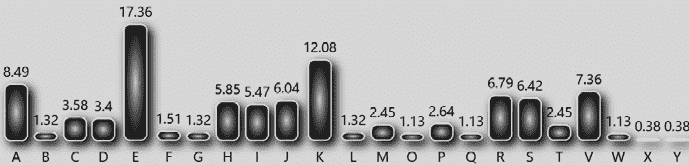

显然，`E` 是密文中最常见的字母。假设明文是英语，`E` 可能代表 `E`。有时候，事情就是这么简单。

### 猜测频繁出现的单词

现在，让我们尝试猜几个单词：

+   单词 `KHE`（我们也可以写成 `KH``E`，因为我们已经知道 `E` 可能代表 `E`）在密文中出现了十四次。它只能代表 `THE`。这意味着我们已经识别出了字母 `E`、`H` 和 `T`。

+   单词 `KHAK` (`TH``A``T`) 必定代表 `THAT`，因为 `THET`、`THIT`、`THOT`、`THUT` 和 `THYT` 没有意义。

+   单词 `KS` (`T``S`) 在文本中出现了五次。由于英语中没有只有两个辅音字母的单词（*拼字游戏*专家可能会对某些古老形式提出异议），这个单词必须是 `TA`、`TE`、`TI`、`TO`、`TU` 或 `TY`。只有 `TO` 有意义。所以，我们现在已经识别出了字母 `A`、`E`、`H`、`O` 和 `T`。

+   `SMK` (`O``M``T`) 可能代表 `OUT`。

+   `AEKHEV` (`AETHE``V`) 显然代表 `AETHER`。

+   `APP` (`A``PP`) 代表 `ALL`。

剩余的字母也可以通过类似的方法轻松找到。我们得到以下明文：

`KRONORIUM EXCERPT 654371979 ONCE THE GREAT WAR ENDED WITH THE DEFEAT OF THE APOTHICONS THE KEEPERS ASCENDED TO BECOME THE WARDS OF ALL UNIVERSES THE SURVIVING APOTHICONS WERE CAST OUT BANISHED TO THE DARK AETHER BENEATH CREATION AFTER EONS OF EXILE IN THE DARK AETHER THE APOTHICONS EVOLVED INTO TWISTED CREATURES THAT NOW BEAR LITTLE RESEMBLANCE TO THEIR KEEPER BRETHREN THE APOTHICONS CEASELESS DESIRE IS TO REENTER CREATION TO CONSUME AND CORRUPT ALL THE UNIVERSES IT IS THE KEEPERS THAT GUARD AGAINST THESE PERPETUAL ATTEMPTS TO REENTER CREATION AND GUARD AGAINST ANY BEINGS THAT MAY HAVE FALLEN UNDER THE INFLUENCE OF THE APOTHICONS.`

利用我们的结果，我们可以重构正在使用的猪圈图。它与应用于 NSA 杯子的图略有不同：

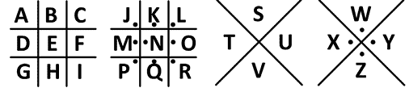

### 猜测具有不寻常字母模式的单词

对于解密简单替换密码的第二种方法，我们可以通过字母模式猜测单词。直到几十年前，破译者必须使用单词模式列表来执行此任务，这非常繁琐，^(11) 但如今，我们可以使用计算机程序快速进行搜索。

首先，我们需要检查密文中具有稀有字母模式的单词。我们的密文中包含单词 `VEERKEV`，它是一个很好的候选词。首尾字母相同；此外，这个单词有三个相同字母的模式。当我们将这个单词输入到 CrypTool 2 的单词模式分析器时，我们得到以下结果，显示了哪些常见单词具有相同的字母模式：

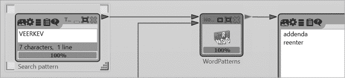

如你所见，在所有英语词典中，只有 `ADDENDA` 和 `REENTER` 符合这个模式。哪个可能是正确的呢？我们可以通过查看上面计算的频率分析来回答这个问题。如果 `ADDENDA` 是正确的，那么 `D` 就是文本中最常出现的字母。而如果是 `REENTER`，那就是 `E`。后者显然更有可能。知道 `VEERKEV` 代表 `REENTER`，这使我们得到了四个字母的潜在明文对应。接下来，我们可以将这些潜在的明文对应替换到密文中，然后继续猜测短单词，如 `THE`、`TO` 和 `OUT`，或者寻找更多稀有字母模式的单词。

## 成功案例

### Gary Klivans 如何破译一名监狱囚犯的密码

我们的同事 Gary Klivans 是加密方法的专家，专门研究黑帮和监狱囚犯使用的加密方法（见 第二章），他是 2016 年引人入胜的书籍 *Gang Secret Codes: Deciphered* 的作者。^(12) Gary 提供了一份有趣的加密便条——一封由新泽西监狱囚犯写给他女朋友的信（见 图 3-6）。^(13) 关于这条信息的背景我们没有更多的资料。

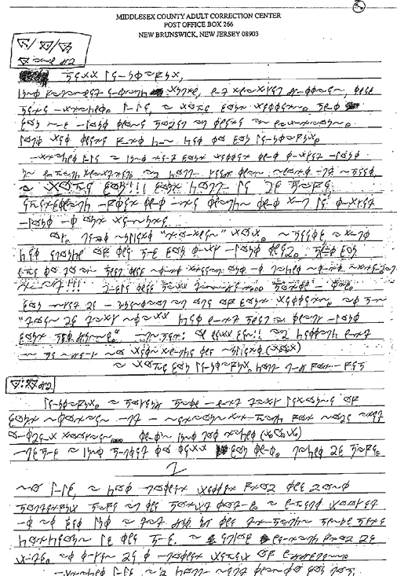

图 3-6：这封由新泽西监狱囚犯写给他女朋友的加密信件，被密码专家 Gary Klivans 破解。

如可以看出，这份便条的发送者使用了一种非标准字母表（可能是他自己发明的）。假设这封信很可能使用了简单的替换密码进行加密，那么转录文本并进行频率分析可能是破解的一个好起点。然而，Gary 通常避免繁琐的转录过程，更喜欢根据字母模式来猜测单词。当他仔细查看密文时，他发现了以下这个词，这个词出现了两次，看起来是一个不错的候选词：

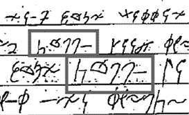

Gary 猜测这些符号代表 `HOLLA`（这是一种类似于“你好”的俚语）。我们会看到，他的怀疑并不完全正确，但无论如何还是起到了帮助作用。根据他的假设，Gary 能够立即识别出不定冠词 `A`，这个词在文本中出现了几次。因为在英语中，只有另一个常见的由一个字母组成的单词——代词 `I`，所以代表它的符号也很容易找出来（见第 1、6 和 9 行的框住符号）：

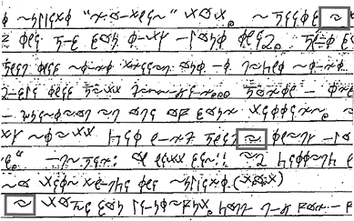

然后，Gary 尝试猜测接下来的这对单词：

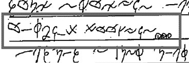

转录后，符号是 `OA***A* *OO****`，这是一个独特的模式。Gary 猜测这些是 `OATMEAL COOKIES`，结果证明是正确的。到此为止，他已经知道了足够的字母，能够轻松破译整个文本（这时他才意识到，他最初尝试解密的单词并不是 `HOLLA`，而是 `GONNA`）。Gary 最终得出了以下替换表：

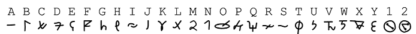

这导致了以下明文（请注意第七行和第八行中两次出现的 GONNA）：

`很好，漂亮，`

`刚吃完午饭，吃了鸡肉饼，他们`

`我们没问题。亲爱的，我喜欢你的信。什么`

`你说的这些女人真是太搞笑了。`

`不要让他们的屁味影响到你，亲爱的。`

`好的，亲爱的，我刚读了你写的信，里面谈到`

`我们有孩子。亲爱的，我要简短点`

`我爱你！！！你将成为我的妻子，`

`. . .`

据我们所知，这是一封普通的情书，没有任何犯罪内容。发送者可能加密它是因为它包含亲密信息——而不是因为他想隐藏任何非法的东西。

### Kent Boklan 如何破译南北战争中的加密日记条目

我们的同事 Kent D. Boklan 是纽约的计算机科学教授，也是一个成功的密码破译专家，专注于解密 19 世纪美国的加密内容。除了几篇 1860 年代的南北战争密文，他还解密了 1812 年战争期间一位医生写的日记中的加密段落。^(14) 这些成功案例都在 Kent 发表在科学期刊《Cryptologia》上的文章中有所描述。2014 年，他报告了另一个破译的密码，再次来自一本日记。^(15) 这本日记是由一位名叫 James Malbone 的南方联盟士兵在美国内战期间写的。尽管 Malbone 的日记大部分是明文，但其中有一些段落是加密的。以下是其中一个加密部分：

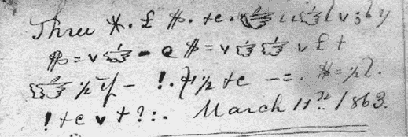

在明文表达`Three`和`1863 年 3 月 11 日`之间，Malbone 写了一些非标准（可能是自创的）字母的密文。Kent 推测 Malbone 使用了一种简单的替换密码。第一个密文单词由三个字母组成：`*.£`。在另一个页面上，Kent 找到了一个类似的单词，位于段落的结尾：`?*.£`。（在下面的图片中，这两行上面的明文是`愿主保佑并与你同在`。）

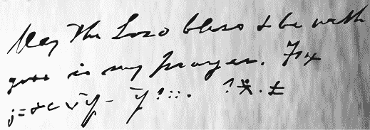

如果我们转录这两个单词（忽略其他密文），我们得到`BCD`和`ABCD`。Kent 意识到`AMEN`可能是一个合适的候选词，用于描述祈祷的段落。如果这个假设正确，那么密文中的第一个明文单词应该是`MEN`，而文本应该以`Three MEN`开头。这是有道理的。

知道字母`A`、`M`、`E`和`N`，Kent 很容易破译剩余的加密内容。上面展示的两个密文解密后是以下明文：

`三个男人在鞭刑处公开鞭打`

`在整个旅团之前的邮局，1863 年 3 月 11 日`

`愿主保佑并与你同在`

`你在我的祈祷中。为了`

`基督的名义，阿门`

### Beatrix Potter 的日记

比阿特丽克斯·波特（1866-1943）是英国作家和插画家，最著名的作品是她 1902 年的经典儿童书籍《彼得兔的故事》。大约在 14 岁时，她开始用自己发明的单字母替换密码记录加密日记。她在这本日记中写了 15 年。

1952 年，即波特去世九年后，她的一个亲戚发现了加密的日记。^(16)由于无法理解内容，该亲戚请教了比阿特丽克斯·波特的粉丝——莱斯利·林德，林德立即产生了兴趣并开始着手解密这本日记。尽管波特的加密方法是纯粹的单字母替换密码，但破译工作却异常困难。波特的字写得很小，有时甚至非常细小，许多页面上挤满了成千上万的单词（见图 3-7）。

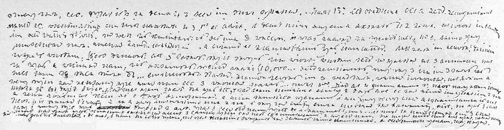

图 3-7：比阿特丽克斯·波特，著名 1902 年儿童书《彼得兔的故事》的作者，保持了一个加密日记。

在一页中，林德发现了两个清晰的未加密的表达式，非常有帮助：罗马数字`XVI`和年份`1793`。在一本历史书中，他读到法国国王路易十六于 1793 年被送上断头台。这使得他能够解密附近的一个单词为`execution`（执行）。林德于是知道了字母表中八个字母的符号，包括四个元音字母。当天结束时，他几乎解出了波特的全部密码字母表。然而，真正的工作才刚刚开始。林德花了十三年才解开了所有的日记。

林德在工作中非常细心，谨慎地确保一切解码正确。如果波特写到一株植物，林德会请教植物学家。如果她描述一件艺术作品，他则通过查阅艺术书籍和展览目录来验证她的想法。此外，他还会在地图上追踪波特的旅行路线，甚至亲自前往那些特定的地方。1966 年，林德的成果以《比阿特丽克斯·波特日记：1881-1897》一书的形式出版。^(17)以下是他推导出的替代表：

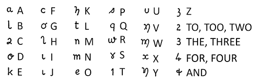

在他的书中，林德写到，图 3-7 中展示的摘录，来自 1886 年 4 月 9 日，解密后的内容如下：

`这里下雪了，雾霾。这样的天气该怎么做才能帮助穷人呢？3 月 13 日星期天——老格拉德斯通感冒了。4 月 1 日关于爱尔兰问题的反思方式很方便。我不认为有人期望它能通过。布赖特先生在伦敦，身体健康，心情愉快。罗思特（他的女婿）加入了改革党，曾担心他进不去，因为布赖特在那儿很不受欢迎。`

波特并不是唯一一个保持加密日记的人。^(18) 对于那些希望破解自己祖先日记的人来说，有一点值得注意的是，使用复杂密码书写大量文本是非常困难的。因此，几乎所有我们知道的加密日记都使用了简单的替代密码，尽管可能会在某些地方增加一些额外的表达方式，以便更容易书写。在波特的案例中，她使用`2`代表`to`和`too`，以及`3`代表`the`。作为经验法则，手写的加密文本越多，破解起来就越容易。

## 挑战

### 一种监狱代码

图 3-8 中显示的一段信息是由一名未知人士于 2013 年 12 月发送给宾夕法尼亚州蒙哥马利监狱的一名囚犯的。^(19) 监狱工作人员没有将这条信息送到预定的收件人手中，而是将其转发给了前面提到的法医破译专家 Gary Klivans，他使用本章中描述的技术，尤其是单词猜测法，解开了这条信息。后来，他明确意识到，这段文字是使用一种著名的*星际大战*书写系统——Aurebesh 写成的。了解这个符号集后，破解过程变得非常直接。

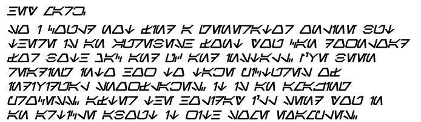

图 3-8：这条信息于 2013 年发送给监狱囚犯，最终证明是使用*星际大战*字体书写的。

你能像 Gary Klivans 一样，仅凭频率分析和单词猜测破解它吗？

### 一张明信片

破解本章前面提到的 1909 年的明信片，图 3-3 中所示。你可以使用我们提供的抄本和频率分析工具。

### 另一张明信片

你能破解图 3-9 中的明信片吗？这张明信片采用了猪圈变体加密（由 Raymond Borges 提供）。^(20)

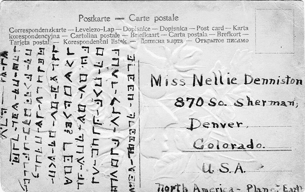

图 3-9：另一张采用猪圈变体加密的明信片

### 弗里德曼夫妇的百年结婚纪念镍币

图 3-10 中所示的“木质镍币”复制品，由 Bill Briere 和 Jew-Lee Lann-Briere 于 2017 年在马里兰州福特米德举办的密码学历史研讨会上发放，以纪念 Elizebeth 和 William Friedman 夫妇的百年结婚纪念。这对传奇夫妇创造了美国密码学领域。该镍币上的铭文采用简单的替代密码加密。

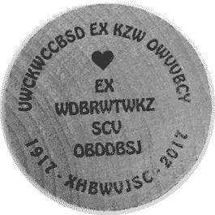

图 3-10：一条加密的信息，写在木质镍币上

这是抄本。镍币的背面有一对婚礼铃铛。

`UWCKWCCBSD EX KZW OWVVBCY`

`EX WDBRWTWKZ SCV OBDDBSJ`

`1917 * XHBWVJSC * 2017`

你能破解它吗？

### 来自 ACA 的《贵族》文章

以下这篇《贵族》文章发表于 2018 年《*密码图表*》期刊，这是美国密码学协会的通讯期刊。^(21)

`WNO ZA JYV YVA YNKHV RAU WNO XKRGUZAX JYV YVA YNKHV RGV JYV HRIV. JYKH, YV MYN NMAH JYV YVA YNKHV IKHJ SV UVRW, SBZAU, NG SNJY.`

## 未解密的密码谜题

许多未解密的密码谜题似乎是通过简单的替代密码创建的（尽管这些仅仅是猜测，因为解决方案尚未知道）。以下是其中一些最有趣的例子。

### 1888 年的一则加密报纸广告

如图 3-11 所示，加密的报纸广告于 1888 年 2 月 13 日发布在伦敦的*每日纪事报*上。^(22)^，^(23)

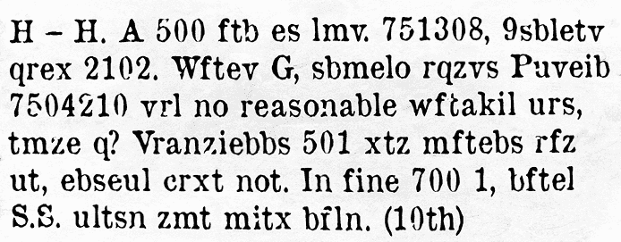

图 3-11：这是 1888 年发布的一则加密报纸广告的复刻版。明文尚未知。

这是一个文字记录：

`H—H. A 500 ftb es lmv. 751308, 9sbletv qrex 2102\. Wftev G, sbmelo rqzvs Puveib 7504210 vrl no reasonable wftakil urs, tmze q? Vranziebbs 501 xtz mftebs rfz ut, ebseul crxt not. In fine 700 1, bftel S.S. ultsn zmt mitx bfln. (10th)`

据我们所知，这个密码谜题从未被破译。你能解开它吗？

### 星座名人密码

1990 年 9 月 25 日，一位未知的人向位于旧金山地区的*瓦列霍时报*发送了图 3-12 所示的明信片。明信片上的信息模仿了星座杀手的风格，星座杀手是上世纪 60 年代末向地区报纸发送加密信件的连环杀手。^(24)（星座杀手案件及相关密码谜题将在第六章中解释。）明信片的作者身份尚不清楚，但不太可能是星座杀手本人。^(25) 这意味着我们在这里处理的是一个星座模仿者的密码谜题（在本书的后续部分，你将看到更多此类谜题）。

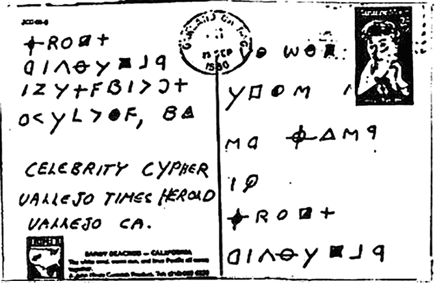

图 3-12：这张明信片是由星座杀手的模仿者所写。

卡片上的三行明文包含了报纸的名称和位置，以及`CELEBRITY CYPHER`这一表达。*名人密码*（今天通常拼写为*celebrity cipher*）是一种密码谜题（通常是贵族式的），一旦破译，结果通常是某位名人的名言。名人密码在美国密码谜题协会的成员和其他谜题爱好者中非常流行。有整本书和网页专门介绍名人密码。埃隆卡的书籍《巨型秘密代码与密码谜题大全》就包含了大量此类密码。^(26)

模仿者的明信片信息（被称为星座名人密码）至今未解开。自然，这有可能是加密了某位名人的名言，但我们并不能确定这一点。

不用说，破译者已经检查过“十二宫名人密码”消息的创造者是否可能使用了在前两个已破解的十二宫密码中找到的加密系统，但未果。有几个网页提供有关十二宫名人密码的信息，其中一些甚至提出了所谓的解密方案。然而，根据我们迄今为止看到的内容，这些都没有道理。

### 弗朗明信片

图 3-13 所示的明信片是由来自英国卢顿的足球官员乔治·弗朗（George Furlong，1843-1911）于 1873 年写给他妹妹莉齐（Lizzie）的。^(27) 与我们所知的当时大多数加密明信片不同，这张至今尚未被破解。

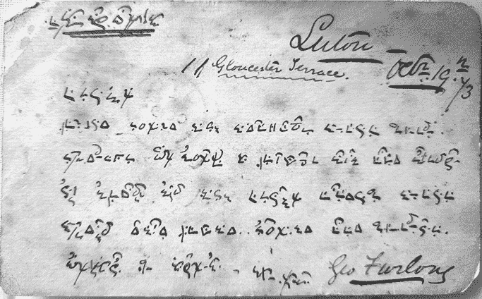

图 3-13：这张 1873 年的英国明信片至今未被破解。

这张明信片的文字书写方式本身就是一个谜。它可能是一种普通但不常用的书写系统，或者是一种发明的秘密文字。它也可能是一种速记方式，除了其中一些字母（例如三角形符号）不太适合快速书写之外。至少我们可以看出，作者写得流利，并且擅长使用这些符号。转录这段密码文本非常困难，因为某些字母是互相叠写的。包括克劳斯博客的粉丝在内的众多熟练的破译者曾尝试破解这条信息，但都未成功。也许有读者能为这个不寻常的秘密提供线索？
