# 4

没有单词间空格的简单替换密码：Patristocrats

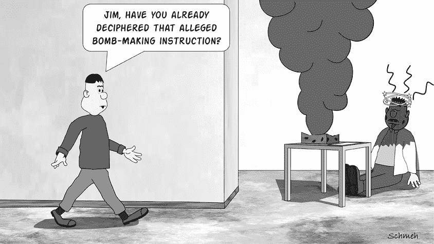

在图 4-1 中显示的消息是由臭名昭著的黄道杀手的模仿者于 1994 年发送给*纽约邮报*的——大约是在杀手最后一条原始信息发布的二十五年后。（参见第六章）该信息使用了同一图中提供的替换表进行加密，并解密为以下明文（包括一些拼写错误）：`THIS IS THE ZODIAC SPEUKING. I AM IN CONTROL. THO’ MASTERY, BE READY FOR MORE. YOURS TRLIY.`

## 一个 Patristocrat 密码，作为一种没有空格的简单替换密码，如何运作

正如你肯定注意到的，这个黄道模仿者密码是用不同字母表类型的单字母替换密码加密的。然而，与我们在第三章中看到的密码不同，这个密码没有单词之间的空格。密码谜题爱好者和美国密码谜语协会的成员通常用*Patristocrat*这个术语来指代没有空格的单字母替换密码，特别是那些使用拉丁字母的密码。

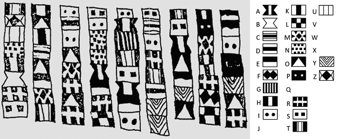

图 4-1：这条疑似凶手的信息使用单字母替换密码进行加密，并且没有空格。

应该很明显，缺少空格使得 Patristocrat 密码比贵族密码更难破译。然而，Patristocrat 密码对合法接收者来说也更难处理，因为在解密消息时，有时很难正确确定单词边界。可能会出现歧义。例如，`YOUDONTGETMEAPARTOFTHEUNION`可能意味着“你不了解我，联合的一部分”，或者“你不了解我，联合之外的一部分”。

正因如此，我们在实际应用中遇到 Patristocrat 密码的频率远低于普通的简单替换密码。然而，这种加密方式并非罕见，因此任何有意研究破译密码的人都应该学习它。

## 如何检测一种 Patristocrat 密码

如果你看到的文本没有单词间的分隔符，或者这种模式过于规律（例如，由五个字符一组组成），那么你可能正在处理一个 Patristocrat 密码。Patristocrat 密码通常具有与其他简单替换密码相同的字母种类，这意味着频率分析和巧合指数是有效的工具来检测它。

例如，来看一下美国国家安全局（NSA）发布的一个密码谜题。如许多读者可能知道，NSA 在社交媒体上非常活跃，在 Facebook（NSAUSGov）和 Twitter（[@NSAUSGov](http://www.twitter.com/@NSAUSGov)）上发布加密谜题。如果你对在该机构的职业生涯感兴趣，解决这些挑战可能是引起他们注意的好方法。图 Figure 4-2 中的密文是 NSA 于 2014 年 5 月通过 Twitter 发布的四个挑战密码中的第一个。因为每个密码都是在周一发布的，所以它们被称为“NSA 周一挑战”^(2)。

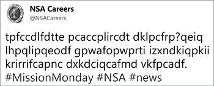

图 4-2：2014 年四个 NSA 周一挑战中的第一个

以下是第一个 NSA 周一挑战的文字记录：

`tpfccdlfdtte pcaccplircdt dklpcfrp?qeiq`

`lhpqlipqeodf gpwafopwprti izxndkiqpkii`

`krirrifcapnc dxkdciqcafmd vkfpcadf.`

不要让空格搞混了视线。它们将字母分成十二个一组，并不对应于明文中的单词分隔。以下是频率分析结果：

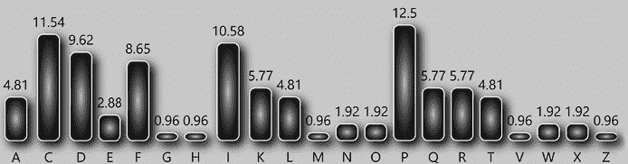

这些频率与简单的替代密码一致。密文的重合指数为 6.7%，这恰好是英语文本的预期值。因此，假设第一个 NSA 周一挑战是一个 Patristocrat 密码是合理的。

## 如何破解一个 Patristocrat 密码

第一个 NSA 周一挑战可以通过计算机在几秒钟内解决，采用的方法如爬山算法（见 第十六章）。为了实现这一点，你可以使用 Tyker Akins 的 Cipher Tools 中提供的密码解密工具，网址为 [`rumkin.com/tools/cipher/`](https://rumkin.com/tools/cipher/) 或 CrypTool 2。如果你更喜欢手动解密密码，接着阅读。

### 使用双字母组合进行的频率分析

显然，频率分析对于破解一个 Patristocrat 密码非常有帮助，但我们可以在分析中使用一些额外的统计数据。第一个涉及到 *双字母组合*，即出现在文本中的连续字母对。以下是第一个 NSA 周一挑战中的双字母组合频率分析：

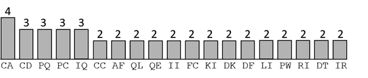

要利用这些统计数据，我们还需要了解一些关于英语语言的额外事实：

+   英语中最常见的双字母组合是 *EN*。

+   双字母组合 *ER* 在两个方向上都很常见：*ER*/*RE*。

+   由重复字母组成的最常见的双字母组合是 *LL*，其次是 *TT* 和 *SS*。

+   双字母组合 *AA* 和 *II* 在英语中非常罕见，尽管 *A* 和 *I* 是常见的独立字母。

你可以在附录 B 中找到更多关于英语双字母（digraphs）的信息。

你可能最初会认为，密文中最频繁的双字母组合对应着英语中最常见的双字母组合。然而，这个假设对于只有大约一百个字母的密文来说效果并不好。尽管如此，了解双字母组合的频率仍然是有帮助的，后面会更加明确。

在我们继续之前，让我们也对密文进行三字母组（trigraph）的分析。这个分析显示，三字母组`PQE`和`PCA`各出现了两次，而其他所有三字母组合的出现频率都为一次。英语中最常见的三字母组合是*THE*，接下来是*AND*、*ING*、*ENT*、*ION*、*HER*、*FOR*和*THA*（更多的三字母组统计见附录 B）。

三字母组的频率可能对破解较长的密文非常有帮助，但在这里并不相关，因为在本挑战中只有两个三字母组出现了多次。出于类似的原因，四字母组、五字母组和六字母组的频率在这个情况下也没有用，尽管不可思议的是，它们曾被密码破译者使用过。一般来说，*n*个字母的组合被称为*n-graph*。

现在，让我们尝试应用我们已经计算出的统计数据。如我们在最初的频率分析中所示，第一个 NSA Monday Challenge 密文中最常见的字母是`P`（12.5%），接着是`C`（11.54%）和`I`（10.58%）。因此，我们假设这些字母分别代表英语中最常见的字母`E`、`T`和`A`。有几种方法可以将`P`、`C`和`I`映射到`E`、`T`和`A`，我们从以下选项开始：

`A B C D E F G H I J K L M N O P Q R S T U V W X Y Z`

`* * T * * * * * A * * * * * * E * * * * * * * * * *`

我们可以通过手动检查或使用现代工具（如 Cipher Tools 或 CrypTool 2）来验证这个假设的可信度，这些工具会生成如下结果：

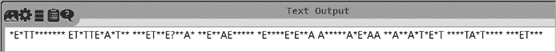

很明显，有些东西看起来不太合理。例如，二字母组`AA`（出现了两次）和二字母组`AE`在英语中并不常见。我们可能走错了方向。

因此我们尝试另一个假设：

`A B C D E F G H I J K L M N O P Q R S T U V W X Y Z`

`* * A * * * * * T * * * * * * E * * * * * * * * * *`

这会生成如下的明文候选：

`*E*AA*******EA*AAE*T*A*****EA**E?**T***E**TE******E****E*E**TT*****T*E*TT**T**T*A*E*A****AT*A*******EA***`

我们再次遇到了两个`AA`，这种情况不太可能。而且，三字母组`AAE`出现在明文中，但在英语中非常罕见。显然，我们的猜测又错了。

现在，让我们尝试第三个假设：

`A B C D E F G H I J K L M N O P Q R S T U V W X Y Z`

`* * T * * * * * E * * * * * * A * * * * * * * * * *`

这会呈现如下结果：

`*A*TT*******AT*TTA*E*T*****AT**A?**E***A**EA******A****A*A**EE*****E*A*EE**E**E*T*A*T****TE*T*******AT***`

这是迄今为止最好的结果，所以我们就坚持这个。

进一步检查结果后，很明显，在`AT*TTA`中的缺失字母（一个密文中的`A`）很可能是一个元音字母。由于`A`和`E`已经被使用，这个字母只能是`I`、`O`、`U`或`Y`。如果`I`是正确的，我们就得到了二字母组`IT`，这是一个常见的英语单词。我们来试试这个：

`A B C D E F G H I J K L M N O P Q R S T U V W X Y Z`

`I * T * * * * * E * * * * * * A * * * * * * * * * *`

这可以转化为以下内容：

`*A*TT*******ATITTA*E*T*****AT**A?**E***A**EA******A*I**A*A**EE*****E*A*EE**E**E*TIA*T****TE*TI******ATI**`

这看起来不错；它可能是英语，且没有什么明显的警告。接下来我们可以尝试什么呢？结尾的字符串`ATI**`可能代表`ATING`，例如`RATING`或`SKATING`。让我们在我们的表格中添加`N`和`G`：

`A B C D E F G H I J K L M N O P Q R S T U V W X Y Z`

`I * T N * G * * E * * * * * * A * * * * * * * * * *`

我们现在得到的是：

`*AGTTN*GN***ATITTA*E*TN*N**ATG*A?**E***A**EA***NG*A*IG*A*A**EE***N*E*A*EE**E**EGTIA*TN**NTE*TIG*N**GATING`

`AGTTN`和`GTIA`在英语文本中不太常见。而且，结尾的单词`GATING`也不太合理。最常见的英语二元组`EN`在这个明文候选中完全没有出现。总体来说，这意味着我们对`N`和`G`的假设可能是错误的。

或许最后五个字母不是`ATING`，而是`ATION`。有很多以这个结尾的单词，例如`STATION`、`RELATION`和`FRUSTRATION`。让我们检查一下这个猜测：

`A B C D E F G H I J K L M N O P Q R S T U V W X Y Z`

`I * T O * N * * E * * * * * * A * * * * * * * * * *`

这是我们的明文候选：

`*ANTTO*NO***ATITTA*E*TO*O**ATN*A?**E***A**EA***ON*A*IN*A*A**EE***O*E*A*EE**E**ENTIA*TO**OTE*TIN*O**NATION`

这看起来不错。`NATION`作为 NSA 加密信息中的最后一个单词是相当合理的。我们预期频繁出现的二元组`EN`出现了一次。而且，我们现在可以猜测出几个额外的单词：`O**NATION`可能表示`OUR NATION`（我们的国家）；`E**ENTIA*`可能代表`ESSENTIAL`（必不可少的）；而`*ANTTO`很可能表示`WANT TO`（想要）。这给我们提供了更多的字母：

`A B C D E F G H I J K L M N O P Q R S T U V W X Y Z`

`I * T O * N * * E * R * * L * A * S * W * U * * * *`

这是我们下一个明文候选：

`WANTTO*NOWW*ATITTA*ESTOWOR*ATNSA?**E***A**EA***ON*A*IN*A*ASWEE**LORE*AREERSESSENTIALTO*ROTE*TIN*OURNATION`

猜测剩余的字母很简单。以下是第一次 NSA 星期一挑战的明文：

`WANT TO KNOW WHAT IT TAKES TO WORK AT NSA? CHECK BACK EACH MONDAY IN MAY AS WE EXPLORE CAREERS ESSENTIAL TO PROTECTING OUR NATION.`

这是替代字母表（用`?`标记的密文字母表示对应的明文字母不存在）：

`明文:` `A B C D E F G H I J K L M N O P Q R S T U V W X Y Z`

`密文: P H Q G I ? M E A ? L N O F D X ? K S C V ? T Z W ?`

### 单词猜测

其他技术可以帮助我们解密"Patristocrats"。让我们再次查看第一次 NSA 星期一挑战（包括频率图）：

`tpfccdlfdtte pcaccplircdt dklpcfrp?qeiq lhpqlipqeodf gpwafopwprti izxndkiqpkii krirrifcapnc dxkdciqcafmd vkfpcadf.`

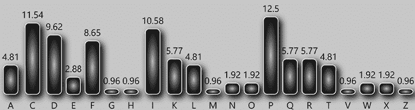

一种可能性是从猜测一个单词开始。如果我们知道空格的位置，这将变得容易得多，但在这里并不是如此。不过，猜单词可能有效。我们知道 NSA 是消息的发送者，因此搜索三字母组合`NSA`似乎是个不错的主意。然而，这个搜索并不起作用，因为这个字母组合在我们需要检查的上百个三字母组合中很难被发现。

假设我们知道某个来源提供的信息，表示单词`CAREER`出现在明文中（毕竟，`CAREER`是 NSA 为吸引有才华的破译者而制作的加密题目中的一个可能单词）。现在我们可以将它作为密码提示。单词`CAREER`包含字符串`REER`，它的字母模式是 1221 型。如果我们在密文中搜索这个模式，就会找到两个类似的字符串：

+   `KIIK`：这看起来是一个不错的候选项。

+   `IRRI`：第一个`I`左边有一个`R`，因此字母模式实际上是 21221 型。这与`CAREER`不匹配。

这意味着`KIIK`是唯一符合的字符串。如果我们的猜测是正确的，`QPKIIK`代表`CAREER`。已识别的字母`A`、`C`、`E`和`R`应该足以确定其余的字母。我们将解密的剩余部分留给读者。

## 成功故事

### 一条监狱消息

如图 4-3 所示，2012 年，一名英国曼彻斯特监狱的囚犯将这张纸条寄给了他的姐姐。^(3) 根据消息的发送者说，数字代表了一个谜题，让他的姐姐来解答。警方当然立即怀疑这是加密信息，于是他们请来了英国法医语言学家 John Olsson 来查看这张纸条。

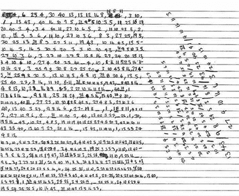

图 4-3：这份由 2012 年英国监狱囚犯发送的加密消息中没有空格。

Olsson 发现加密文本中包含二十三个不同的数字。频率分析显示，这与简单替换加密密文一致。为了破解这个密码，Olsson 首先尝试猜测单词——这是一项艰难的任务，因为消息中没有空格。通过系统地分析 Olsson 分析了密文中 840 种不同长度的字母组合，并检查每个字母组合是否能够代表某个特定的单词。突破口出现在他假设`38`、`9`、`5`、`10`、`3`、`5`代表`PLEASE`时——这个猜测证明是正确的。在知道了五个字母之后，Olsson 便能识别出所有其他字母。以下是明文的前八行。（它包含许多错误和不常见的拼写。）

`KOH C U M M A x I WID SA`

`xY UNCLE PLEASE I`

`RUSH SHUD TAKE 2 DAYS 2`

`A WEK DA TASK IS TO BE`

`COMPLETED BY ANY ME-`

`ANS NECERSSARY PLEASE`

`TASK STATEMENT FROM`

`SHAKA THROUGH INDECEND-`

一种可能的方式来解读这个明文是：

`Kohcumma 和我会说：“叔叔，请别急。应该需要两天到一周。”任务必须通过任何手段完成。请从释迦那里获取任务声明，经过不雅的...`

其余的信息可以在克劳斯的博客上找到。^4

### 切尔滕纳姆数字石

英国政府通信总部（GCHQ）是世界上最强大的监控机构之一，与美国的 NSA 不相上下。它位于英国切尔滕纳姆郊区的一座大型圆形建筑（“甜甜圈”）内。该建筑的一侧出口通向赫斯特公园，公园内展示着由艺术家戈登·杨（Gordon Young）于 2004 年创作的九座石雕——*听石*。^5

每块*听石*上都有一组刻字，包括字母、数字或符号。其中有两块刻字包含加密信息。由于其中一块是由数字组成，而另一块则由字母构成，我们将它们分别称为“数字石”和“字母石”（尽管这不是它们的正式名称）。字母石将在第十六章中介绍。

图 4-4 展示了数字石，它上面刻有大约 1300 个两位数的数字，范围从 01 到 66。

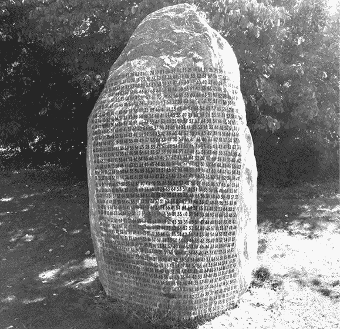

图 4-4：数字石是由英国艺术家戈登·杨（Gordon Young）于 2004 年创作的*听石*之一。上面刻的数字代表了一条加密信息。

这里是信息的前一百个数字：

`23 02 13 22 25 33 02 14 33 25 02 21 16 26 10 03 06 33 04 13 21 16 01 15 26 25 33 47 44 33 26 10 12 15 16 11 10 05 10 33 10 20 13 22 16 33 30 53 46 64 33 46 33 42 51 57 54 37 53 64 33 54 64 33 54 63 33 30 53 51 43 33 40 43 33 64 53 51 33 47 46 60 47 40 40 33 60 46 64 64 54 43 37 33 16 43 33 60 44 33`

2015 年，克劳斯在他的*Cipherbrain*博客上发布了一篇关于这个密码图的文章。^6 仅仅几个小时后，一位名叫罗伯特的博客读者就在评论区发布了解答（正确答案）。事实证明，信息的创建者使用了一种简单的替换密码。我们不知道罗伯特究竟是如何破解这个密文的，但我们猜测他使用了频率分析。考虑到这条信息相当长，仅凭字母出现的频率就能识别出一些字母是完全可能的。此外，替换表也显示出一些规律，因为字母表的顺序是用艺术家戈登·杨的名字作为关键字来排序的。以下是替换表：

`G O R D N Y U A B C E F H I J K L M P Q S T V W X Z`

`01 02 03 04 05 06 07 10 11 12 13 14 15 16 17 20 21 22 23 24 25 26 27 30 31 32`

`_ . , ’`

`33 34 35 36`

`g o r d n y u a b c e f h I j k l m p q s t v w x z`

`37 40 41 42 43 44 45 46 47 50 51 52 53 54 55 56 57 60 61 62 63 64 65 66 67 70`

这里是明文的前几行：

`孤独的快乐诗篇，由`

`立花明美` `真是令人高兴`

`是当在竹席上时`

`在我的草屋里，`

`全凭我自己，我使自己处于`

`轻松。多么令人愉快`

`当，借用稀有的文献`

`来自朋友的，我展开了`

`第一张纸。多么令人愉快`

`它是当，铺开纸张时，`

`我拿起我的画笔，找到我的`

`手 比我想象的要好。`

## 挑战

### 拉迪亚德·吉卜林的加密信息

拉迪亚德·吉卜林是许多著名故事的作者，比如《丛林之书》（1894 年）中的故事。在他丰富的作品中，还有为儿童创作的《恰如其分的故事》（1902 年），其中之一是《如何写下第一个字母》。故事的原版印刷中，包括了在两组符号之间的插图（图 4-5）。这些符号是以父权主义风格加密的信息。你能破解它吗？

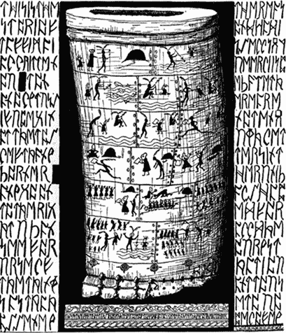

图 4-5：这幅插图中，1902 年拉迪亚德·吉卜林故事左右两边的符号代表了一个用替换密码加密的信息。

提示：这并不像看起来那么难！仔细看，你会发现第一个单词是`THIS`。更多提示，请参考我们的挑战部分，就像所有的内容一样，查看[`codebreaking-guide.com/challenges/`](https://codebreaking-guide.com/challenges/)。

### NSA 第二次星期一挑战

在本章早些时候，我们介绍了 2014 年发布的第一次 NSA 星期一挑战。这里是第二个：

`Rimfinnpeqcnvqauuagcrdokvdisndrdcrpigaisacpsdffaicvhakcfdqfpqdetrk`

`ilfa ecnpqacakqisacpfampoacfimannicfakdumfalddnraprf`

这个密码需要反向读取。除此之外，它是一个普通的无空格替换密码。

## 未解密的密码

几个未解的密码似乎是用无空格替换密码加密的英文文本。我们将介绍其中三个。

### 多拉贝拉密码

多拉贝拉密码是极为著名的。从大卫·卡恩 1967 年的经典著作*《破译者》*（包括 1996 年版）^(7)，到伊隆卡的“著名未解密的代码和密码”页面^(8)，再到克劳斯的“前 50 大未解密码”列表^(9)，都涉及到这个密码。

英国作曲家爱德华·埃尔加（1857–1934 年）不仅创作了著名的音乐作品，比如 20 世纪初的进行曲《荣耀与典礼》，而且还对密码学充满兴趣。1897 年，当他的妻子爱丽丝给佩妮家族寄去感谢信时，他附上了一封加密的便条给他的朋友——23 岁的多拉·佩妮（图 4-6）。^(10) 这段密文被称为多拉贝拉密码，尽管经过了一个多世纪许多人的分析（从业余爱好者到著名的密码破译者），它仍未被破解。

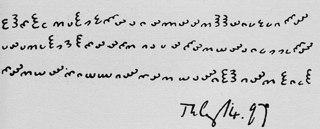

图 4-6：多拉贝拉密码是最著名的未解加密谜团之一。

多拉贝拉密码的频率分布与单字母替换密码非常吻合，但这并没有带来最终的解答。有许多方法可以解释这一点。埃尔加可能故意避免包含字母 E 的词汇。也有观点认为多拉贝拉密码可能加密的是旋律（即音符），而不是文本。也有可能明文使用的语言并非英语。或者，当然，多拉贝拉密码根本就不是一个简单的替换密码。如果你想深入了解，可以看看克雷格·鲍尔（Craig Bauer）2017 年出版的《*未解之谜！*》^(11)，它提供了对多拉贝拉密码的全面分析。

### 中国金条之谜

另一个著名的未解密码刻在七根中国金条上，正如 1996 年在国际密码学研究协会网站上所描述的^(12)。这些金条据称是 1933 年由上海的一位王将军发放的。它们似乎代表与美国银行存款相关的金属证书。金条上刻有图片、中文文字、某种书写形式和拉丁字母密码。中文文字讨论了一笔超过 3 亿美元的交易。密码由十六行加密文字组成，其中有些是重复的：

`SKCDKJCDJCYQSZKTZJPXPWIRN`

`MQOLCSJTLGAJOKBSSBOMUPCE`

`RHZVIYQIYSXVNQXQWIOVWPJO`

`FEWGDRHDDEEUMFFTEEMJXZR`

`XLYPISNANIRUSFTFWMIY`

`HFXPCQYZVATXAWIZPVE`

`YQHUDTABGALLOWLS`

`UGMNCBXCFLDBEY`

`ABRYCTUGVZXUPB`

`JKGFIJPMCWSAEK`

`KOWVRSRKWTMLDH`

`HLMTAHGBGFNIV`

`MVERZRLQDBHQ`

`VIOHIKNNGUAB`

`GKJFHYXODIE`

`ZUQUPNZN`

很难知道如何对这个密码进行分类，因为它仍未解开。我们猜测它可能是一个“教父密码”（Patristocrat），但当然也可能是其他系统。

自本书第一版出版以来，这个谜团有了新的进展：2020 年 12 月 10 日，我们尝试联系金条的所有者，但发现电话号码已被断开。我们联系了列出的律师彼得·比斯诺（Peter Bisno），并取得了一些进展。他确认他曾见过这些金条，且它们“很大”，差不多有电视遥控器的大小。他告诉我们，曾在 1990 年代尝试联系银行了解这些金条，但没有结果，且他已停止了相关研究。他并不知道金条目前的具体所在。

### 詹姆斯·汉普顿的笔记本

另一个难以分类的未解决密码学谜团是由美国业余艺术家詹姆斯·汉普顿（1909-1964 年）创建的。他留下了一件作品，被称为*“第三天堂的宝座”*，在多年的时间里，从 1950 年开始，用纸板、铝箔和其他廉价材料制成了这个大型的、类似祭坛的装置。今天，它展示在华盛顿特区的史密森尼美国艺术博物馆。汉普顿还创作了手工加密的笔记，包括一本有上百页密文的笔记本（图 4-7）。^(13) 他的笔记从未被解密过。所有页面的扫描版已在网上公开。^(14)

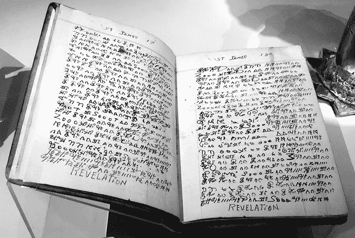

图 4-7：业余艺术家詹姆斯·汉普顿的加密笔记本从未被解密过。
