# 5

非英语语言中的简单替换密码

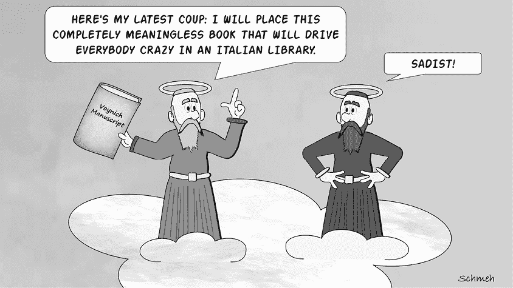

世界上最著名的未解密码——《沃伊尼奇手稿》，是耶鲁大学康涅狄格州贝尼克稀有书籍与手稿图书馆收藏的一本 230 页的文献。从封面到封底，这本可能已有 600 年历史的手写书籍中充满了难以理解的文字。文字看起来像是使用不同字母表类型的简单替换密码，并且明文似乎是用一种未知语言写的（但也有可能是用某种失传的文字书写的普通文本，或者完全是无意义的胡言乱语）。我们将在本章末尾再次提到《沃伊尼奇手稿》。

让我们看看图 5-1 中的明信片（由 Richard SantaColoma 提供给我们），这张明信片是 1912 年寄出的。^(1) 因为我们看到的至少 90%的加密明信片都是用简单替换密码加密的，所以我们可以假设这张明信片也是如此。此外，寄件人使用了非标准字母表，这也通常是简单替换密码的特征。

图 5-1：这张 1912 年加密明信片的明文是葡萄牙语。

然而，这张明信片不太可能是用英语写的。因为这张明信片贴有葡萄牙邮票，且寄给了一个住在葡萄牙的、拥有葡萄牙姓氏的女性，我们可以猜测明文是用葡萄牙语写的。

我们可以尝试使用第 2 至 4 章中讨论的破译方法来破解这张明信片；然而，我们必须将我们的单词猜测、频率分析和词汇模式搜索方法调整为适应葡萄牙语。

不会说葡萄牙语？别犹豫，还是试着破解这个信息吧。经验表明，破解加密信息并不一定需要掌握所使用的语言。字母频率及其他关于非英语语言的信息可以在附录 B 和许多网页上找到。

## 检测所用语言

确定明信片的语言并不困难。然而，事情并不总是如此简单。事实上，检测密码文的明文语言可能是一个重大挑战，这就是为什么了解一个项目的上下文总是一个好主意。在分析密文之前，先弄清楚它的来源以及作者使用了哪些语言。

我们还可以应用统计技术来检测密码文的语言。看看图 5-2 中的明信片，这张明信片写于 1906 年，并由 Tobias Schrödel 提供给我们。^(2) 同样，由于非标准字母表的存在，简单的替换密码很可能是其中的一种。单词之间的空格通过逗号表示。

图 5-2：一张 1906 年寄给芬兰女性的俄罗斯明信片。寄件人可能使用了哪种语言？

可能使用的语言是什么？明信片本身，就像邮票一样，是俄语的。收件人，某位 Inkeri Wink，住在芬兰的瓦萨。那里的主要语言是芬兰语，但瑞典语也很常见。芬兰也能听到其他斯堪的纳维亚和波罗的海语言。Wink 这个姓氏可能是英语或德语的。我们像往常一样从一份抄本开始分析（由 Thomas Bosbach 提供）：

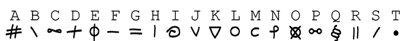

`ABCDB JORB ATOG`

`SBCDBD NCBFBD GHIËDBD`

`FKCBL FBMEAABD STDM`

`IBKPNCHIBD STDM`

`CDJKCS CHI FCD GE`

`JNÖHMNCHI ACR LKBOSCJBA`

`IBKPBD KBCGB CHI DTHI ITOGB`

`CHI MTDD DEHI DCHIR GTJBD QTDD`

`SO FBMEAAGR BKGR DEHI BCDBD FKCB`

`IBKPNCHI GBC JBJKÖGGR ODS`

`JBMÖGGR QED SBCDBA ITDG`

频率分析可能再次帮助我们。以下是明信片信息的字母频率：

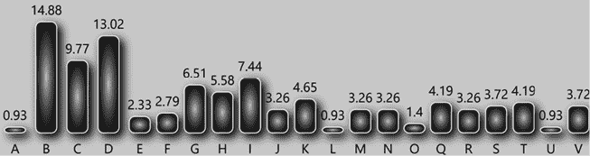

这些频率与明信片上最有可能使用的五种语言（芬兰语、俄语、瑞典语、英语和德语）匹配得如何？以下是每种语言中最常见和第二常见字母：

| **语言** | **最常见字母** | **频率** | **第二常见字母** | **频率** |
| --- | --- | --- | --- | --- |
| 芬兰语 | A | 12% | I | 11% |
| 俄语 | O | 11% | E | 9% |
| 瑞典语 | A | 10% | E | 10% |
| 英语 | E | 12% | T | 9% |
| 德语 | E | 16% | N | 10% |

关于最常见的字母，德语是最匹配的。我们看到明信片中最常见的字母频率为 14.88%，而德语字母表中最常见的字母频率为 16%。但是明信片中第二常见的字母与芬兰语最匹配（分别为 13.02%和 11%）。以下是一些可能有助于检测语言的统计指标（更多信息请参见附录 B）：

+   没有一个字母的单词出现在这个密码中。这与德语和芬兰语一致，因为它们也没有单字母单词。由于英语、瑞典语和俄语中存在单字母单词，因此这些语言的可能性较小。

+   明信片信息的平均单词长度是 5.0 个字母。这与德语（6.0 个字母）和瑞典语（6.0 个字母）最匹配。英语、俄语和芬兰语的平均单词长度分别为 6.2、6.6 和 7.6。

+   如果我们有计算机可用，我们可以计算密码的巧合指数（参见附录 B）。结果为 7.2%。以下是其他语言巧合指数的相关比较值：芬兰语：7.0%，俄语：5.3%，英语：6.7%，瑞典语：6.8%，德语：7.3%。德语再次提供了最好的匹配。

如果我们看发送者使用的字母表，我们会注意到一些有趣的事情：这个字符集包含两个字母...

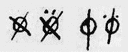

. . . 在某些情况下在顶部都有两个点。我们使用 `E` 和 `O` 转录了这些带点的字母；这些点也出现在转录中。在某些语言中，像 *Ä*, *Ö*, 和 *Ü* 这样的字母有时会有点，如 *A*, *O*, 和 *U*。这些点被称为变音符号。芬兰语、瑞典语和德语（等等）有变音符号，但英语没有。在俄语字母表中，只有一个双点字母。

如图所示，德语在最常见字母、平均词长和巧合指数方面是最合适的选择。此外，德语有变音符号，德语中没有单字母词。总体而言，德语显然是明信片上使用的最可能的语言。考虑到这条信息是从俄罗斯寄往芬兰的，这当然是一个惊喜！

## 如何破解非英语简单替换密码

现在我们已经猜出明信片信息的语言，我们可以根据第三章 中介绍的方法将这些技术应用到德语上。

### 频率分析和猜测单词

频率分析在德语中比在英语中更有效，因为最常见的字母（*E*）由于与第二常见字母的较大差距更容易辨别：*E* 的频率为 16%，其次是 *N*，为 10%（见附录 B）。德语中最常见的双字母组合是 *EN* 和 *ER*。

在这张明信片上，`B` 是最常见的字母，因此很可能代表 `E`，而第二常见的 `D` 可能代表 `N`。这些猜测得到了确认，因为 `BD` 是密文中最常见的字母对，这与 *EN* 是德语中最常见的双字母组合一致。

在德语文本中搜索的好词汇是常用的不定冠词 *EIN*, *EINE*, *EINEN*, *EINER*, 和 *EINES*。这些对于密码破译者很有帮助，因为它们经常出现，由常见的字母组成，并且（除了 *EIN* 以外）包含字母重复。(*EINEN* 中甚至包含两个。) 事实上，剧本倒数第三行的单词 `BCDBD` 很容易识别为 `EINEN`。知道这一点后，我们可以猜测信的第一个单词 `ABCDB` 是 `MEINE`（英语中的 `my`）。有了一些基本的德语知识，其余部分也可以解决。

### 猜测单词模式

另一种解密这张明信片的方法是搜索具有罕见字母模式的单词。CrypTool 2 软件支持这种技术，适用于包括德语在内的多种语言。因此，我们的下一步可能是检查密文中是否存在具有许多字母重复的单词。`JNÖHMNCHI`，其模式为 123452647，看起来是一个很好的候选者。乍一看，CrypTool 2 给出了令人失望的结果，因为它为这个模式提供了 26 个不同的匹配项（参见#figure5-3）。即使我们排除诸如`PIPELINES`，`MACULATURE`和`GOLDBONDS`等不太可能出现在 1906 年明信片上的词语，我们仍然有很多选择。

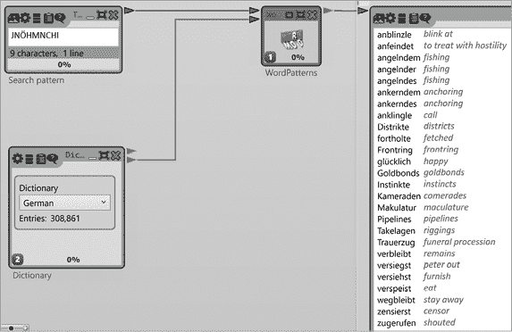

图 5-3：CrypTool 2 可以用来搜索许多不同语言中的单词模式。

然而，有一个词引人注目：`GLÜCKLICH`，意思是“快乐”。首先，这个词似乎很适合一张显然包含爱的信息的明信片。其次，如果我们看看下一个单词。

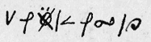

. . .（转录为`JNÖHMNCHI`），我们看到第三个字母上有两个点（即，它有一个变音符，假设我们对变音符的假设是正确的）。单词`GLÜCKLICH`的第三个位置也有一个变音符。

确定了`GLÜCKLICH`之后，我们就有了七个字母，可以猜测出其余的文本：

`Plaintext:` `I CHG KLU`

`Ciphertext: ABCDEFGHIJKLMNOPQRST`

有了对德语的基本了解，猜测更多的词语并不是很困难。例如，我们已经知道密文单词`DCHIR`的中间三个字母代表`*ICH*`。这个表达可以被识别为常见的词语`NICHT`（不）。

如果你不懂德语，可以通过结合单词模式搜索和频率分析来加快进程。我们已经知道的七个字母（I，C，H，G，K，L，U），再加上 B 代表 E（因为它是最频繁的字母）和 D 代表 N（因为它是第二频繁的字母），已经可以走很远了。接下来，寻找不定冠词*EIN*，*EINE*，*EINEN*，*EINER*，*EINES*和*EINES*，如上所述。已经识别了十多个字母后，剩下的解密工作应该很容易。

这个关键词恢复了以下明文：

`MEINE GUTE MAUS`

`DEINEN LIEBEN SCHÖNEN`

`BRIEF BEKOMMEN. DANK`

`HERZLICHEN DANK.`

`INGRID ICH BIN SO`

`GLÜCKLICH. MIT FREUDIGEM`

`HERZEN REISE ICH NACH HAUSE.`

`ICH KANN NOCH NICHT SAGEN WANN.`

`DU BEKOMMST ERST NOCH EINEN BRIE[F.]`

`HERZLICH SEI GEGRÜSST UND`

`GEKÜSST VON DEINEM HANS.`

这翻译成：

`My dear mouse`

`我收到了你美丽而温暖的来信。谢谢，非常感谢。Ingrid，我很开心。我将怀着喜悦的心情回家。我还不能确定具体时间。你会先收到一封信。来自你的 Hans 的诚挚问候和吻。`

## 成功的例子

### 一个女孩的猪圈密码（西班牙语）

图 5-4 中展示的密文出现在 Klaus 经常推荐的一本书里，即 André Langie（1871–1961）于 1922 年出版的《密码学》一书中。^(3) 根据 Langie 的说法，一位富翁在他儿子的课本里发现了这条加密便条。好奇为什么他的孩子会写下或收到这样一条信息，他请来密码学专家 Langie 来破解它。

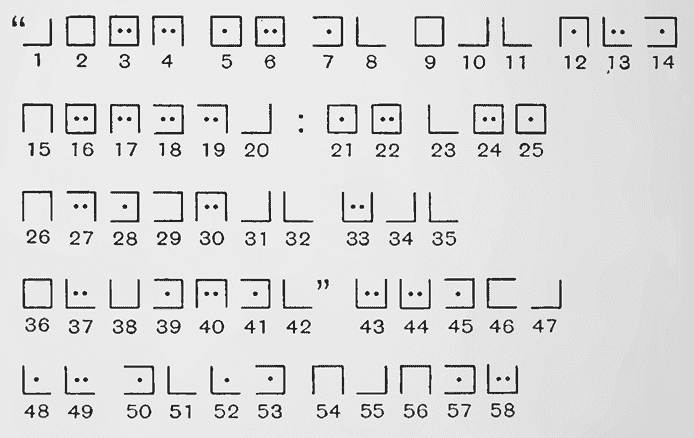

图 5-4：一位富翁在他儿子的课本里发现了这条信息。（这些数字是后来由一位密码分析师添加的。）

Langie 发现这个加密系统是变种的“猪圈密码”。这个便条还包括了单词之间的空格和标点符号，这通常能大大提高猜测单词的难度。正如你所看到的，符号 1 到 42 被引号括起来，符号 20 后面有一个冒号。出现频率最高的符号是符号 7，它出现了九次。

Langie 首先尝试确定明文的语言。由于关于那位富翁和他儿子的故事发生在瑞士的法语区，法语是最可能的选择。然而，从符号 43 开始的单词包含了一个双字母，而法语中几乎不会出现这种情况。Langie 于是猜测，明文可能是西班牙语，这正是那位客户的儿子所讲的语言。在西班牙语中，唯一出现在单词开头的双字母是 *L*（例如，在 *llevar* 或 *llamarse* 中）。

如果这个假设是正确的，那么符号 45，即密码中最常出现的符号，很可能是西班牙语中的 `A` 或 `E`（在西班牙语中，双 *L* 总是跟着元音字母，*A* 和 *E* 是常见的字母）。这两个字母 `L` 和 `A`/`E` 又出现在文本最后一个单词的末尾，但顺序相反。这是一个五个字母的单词，其第一个字母和第三个字母相同，所以它一定是 `PAPEL`（“纸”）。

知道了字母 `A`、`E`、`L` 和 `P`，Langie 很容易猜出更多的字母。最终，他得出了以下的替代图表。在这个优雅的系统中，字母表从左到右按顺序绘制，一次一个网格：

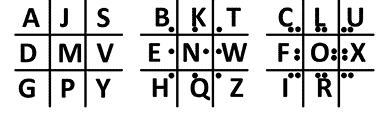

它生成了以下的明文：

`“AMOR NO ES MAS QUE PORFIA:`

`NO SON PIEDRAS LAS MUJERES"`

`LLEVA TU ESTE PAPEL`

这翻译为：

`“Love is nothing more than a squabble:`

`Women are not stones.”`

`Keep this paper.`

显然，这条信息是一个女孩加密的拒绝信。

### La Buse 密码（法语）

法国海盗奥利维尔·莱瓦瑟（Olivier Levasseur，约 1690–1730），也被称为“La Buse”（“秃鹰”），在 18 世纪初期在印度洋劫掠了许多装载丰富的船只。他于 1729 年被捕，并于一年后在法国留尼汪岛（La Réunion）被处决，该岛位于马达加斯加海岸附近。^(4) 传说中，莱瓦瑟在绞刑架上时，脖子上挂着绳索，他将一张写有加密信息的羊皮纸抛向人群，并喊道：“Mon trésor à qui saura le prendre！”（“我的宝藏，赠予那个知道如何取它的人！”）该信息在图 5-5 中有展示。

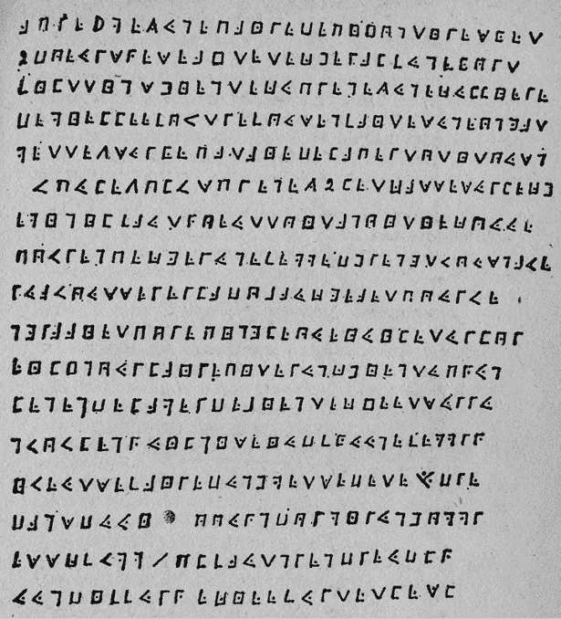

图 5-5：这幅 1730 年的密码，据称是由海盗奥利维尔·莱瓦瑟（Olivier Levasseur）创作的，据信揭示了宝藏的位置。虽然该信息已经被破译，但宝藏至今未被发现。

这段密文使用了猪圈密码（pigpen cipher）。1947 年，一位名叫雷金纳德·克鲁斯-威尔金斯（Reginald Cruise-Wilkins）的英国人破译了这段加密信息（很可能通过频率分析）。

该法语明文于 2013 年在 Nick Pelling 的博客上发布。^(5)

`aprè jmez une paire de pijon tiresket`

`2 doeurs sqeseaj tête cheral funekort`

`filttinshientecu prenez une cullière`

`de mielle ef ovtre fous en faites une ongat`

`mettez sur ke patai de la pertotitousn`

`vpulezolvs prenez 2 let cassé sur le che`

`min il faut qoe ut toit a noitie couue`

`povr en pecger une femme dhrengt vous n ave`

`eua vous serer la dobaucfea et pour ve`

`ngraai et por epingle oueiuileturlor`

`eiljn our la ire piter un chien tupqun`

`lenen de la mer de bien tecjeet sur ru`

`nvovl en quilnise iudf kuue femm rq`

`i veut se faire dun hmetsedete s/u dre`

`dans duui ooun dormir un homm r`

`esscfvmm / pl faut n rendre udlq`

`u un diffur qecieefurtetlesl`

即使你会说法语，这段文字也没有太多意义。到目前为止，似乎没有人能够根据它找到宝藏，但至少这个谜团的加密部分已经被破解。

### 一张带有爱情信息的明信片（德语）

1901 年，一位年轻人从德国伊瑟尔隆（Iserlohn）寄出了一张加密的明信片，寄往附近的阿恩斯贝格（Arnsberg）（见图 5-6）。^(6) 该加密系统看起来像是一个简单的替换密码，类似于猪圈密码，其中空格由冒号表示。最可能的明文语言是德语。明信片地址上的收件人，一位名叫海伦（Helene）的女性，可能是寄信人的爱人。以下是这段密文的转录：

`ABCD:ACEB!`

`ÜDCH:ICBECE:ABCDCE:DHBCJ:KCLH:MCJHCFN.:IF:OFEICKN:IBPL:ÜDCH:QCBEC:RSCKBC:.ICBE:KPLTNU:QFKK:TAACK:VÖEECE:ITQBN:IF:QBN:KCBECE:ACBKNFEMCE:UF=JHBCICE:DBKN.:IBH:HÄFQC:BPL:ITK:HCPLN:CBE:,ITKK:IF:CENUÜPVCEI:ABCDCE:VTEEKN:OBH:DCBIC:VCHKNCLCE:FEK:VSH=NHCJJABPL:.FEKCH:UFKTQQCEKCBE:KSAA:KRÄNCH:CBE:RTHTIBCK:KCBE,:QCBE:KÜKKCH:CEMCA!!!MFKNTV:KTMNC:TQ:KSEENTM:TEEC:VTQC:BE:ETPLKNCE:NTMCE:KPLSE:OBCICH.:VBCA=ACBPLN:KBEI:OBH:KSEENTM:ISHN:.KPLHCBDC:IBH:VSHLCH:QCBE:ABCD:ACECVCE.LCHUABPL:MHFKKN:FEI:VFKKN:IBPL:BQQCH:ICBE:IBPL:NHCF:ABCDCEICH:JHBNUC.`

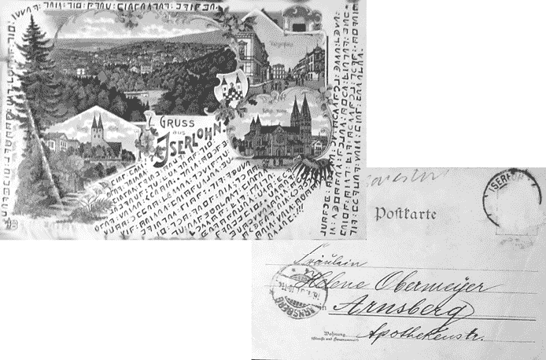

图 5-6：这张来自 1901 年的德国明信片上带有一条加密的情书。

Tobias Schrödel 在 2018 年向 Klaus 提供了这张明信片。Klaus 将明信片的照片发布在他的博客上，而经验丰富的破译者 Thomas Bosbach 很容易就破解了这段密文。由于密文中 `C` 是最常出现的字母，Thomas 推测 `C` 代表明文中的 `E`。密文中 `B` 和 `E` 也出现得很频繁，这使它们成为了明文中的 `N`、`I`、`S` 和 `R` 的候选字母。

经过一番尝试和错误，Thomas 发现第一行（`ABCD:ACEB!`）代表了 `LIEB LENI`。`LIEB` 意为“亲爱的”，而 `LENI` 是女性名字 Helene 的常见缩写。知道了这五个字母后，Thomas 便能推测出剩余的消息。明文竟然是一封甜美的情书。这并不令人惊讶，因为大多数加密的明信片似乎都是年轻男子（有时是年轻女子）寄给他们的情人：

`LIEB LENI,`

`ÜBER DEINEN LIEBEN BRIEF SEHR GEFREUT. DU WUNDE(R)ST DICH ÜBER MEINE POESIE. DEIN SCHATZ MUSS ALLES KÖNNEN DAMIT DU MIT SEINEN LEISTUNGEN ZUFRIEDEN BIST. DIR RÄUME ICH DAS RECHT EIN, DASS DU ENTZÜCKEND LIEBEN KANNST. WIR BEIDE VERSTEHEN UNS VORTREFFLICH. UNSER ZUSAMMENSEIN SOLL SPÄTER EIN PARADIES SEIN, MEIN SÜSSER ENGEL!`

`GUSTAV SAGTE AM SONNTAG, ÄNNE KÄME IN NÄCHSTEN TAGEN SCHON WIEDER. VIELLEICHT SIND WIR SONNTAG DORT. SCHREIBE DIR VORHER, MEIN LIEB LENEKEN.`

`HERZLICH GRÜSST UND KÜSST DICH IMMER DEIN DICH TREU LIEBENDER FRITZE.`

替换一些名字（Leneken 是 Helene 的另一个昵称，Änne 是一个女性名字，Fritze 是发信人的名字），我们可以得出以下翻译：

`亲爱的 Leni，`

`非常高兴收到你的来信。你对我的诗歌感到好奇。你的宝贝需要具备做一切事情的能力，以便让你满意。我允许你以一种令人愉悦的方式去爱。我们俩相处得非常好。我们在一起的日子将是以后的天堂，我亲爱的天使！`

`Gustav 上周日说，Änne 很快就会回来。也许我们周日会在那里。我会提前写信给你，亲爱的 Leneken。`

`衷心的问候和吻，永远忠诚地爱你的 Fritze。`

### 一条黑手党消息（意大利语）

在 2013 年的一次黑手党突袭中，意大利警方发现了一份长达三页的加密文件。图 5-7 显示了一部分。^(7) 调查人员没有可以咨询的密码破译单位，因此他们向几名热衷于填字游戏的警察求助来解开密码。他们成功了，尽管遗憾的是，新闻报道没有透露密码是如何破译的。我们可以假设这些警察使用了频率分析和单词猜测的方法。图中的摘录解密如下：

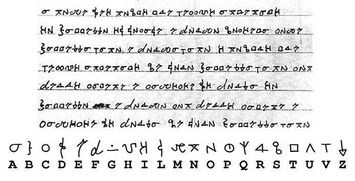

图 5-7：这条信息是由意大利黑手党成员创建的。警方破译了它，并从文本下方推导出密钥。

`A NOME DEI NOSTRI TRE VECCHI ANTENATI, IO BATTEZZO IL LOCALE E FORMO SOCIETÀ COME BATTEZZAVANO E FORMAVANO I NOSTRI TRE VECCHI ANTENATI, SE LORO BATTEZZAVANO CON FERRI, CATENE E CAMICIE DI FORZA IO BATTEZZO E FORMO CON FERRI, CATENE E CAMICIE DI FORZA, SE LORO FORMAVANO`

这段话的翻译如下：

`以我们三位老祖先的名义，我给这个地方施洗并组建公司，正如他们以铁器、锁链和紧身衣给我们三位老祖先施洗并组建的方式，如果他们用铁器、锁链和紧身衣施洗，我也将用铁器、锁链和紧身衣施洗并组建。`

这条信息描述了黑手党的入会仪式。由于没有包含任何有关犯罪行为或人员的参考，其内容对调查官员并没有帮助，但至少解开了一个黑手党的谜团。

## 挑战

### 一张加密的明信片

我们由卡尔斯滕·汉斯基提供的图 5-8 显示了一张加密的法国明信片，使用了凯撒密码。^(8) 明文为法语。你能解密它吗？

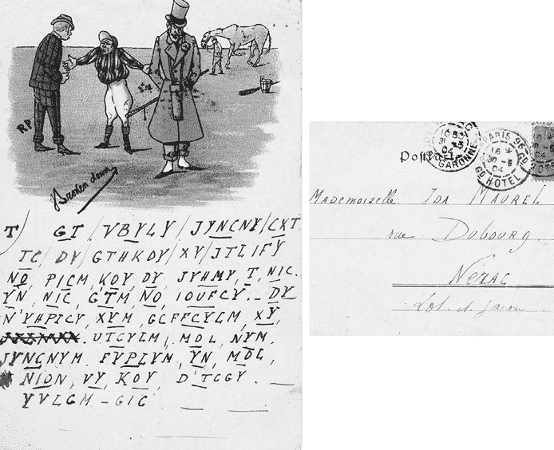

图 5-8：你能解密这张来自 1904 年的法国明信片吗？

### NSA 星期一挑战赛的第三个

如在第四章中提到的，NSA 在 2014 年 5 月通过 Twitter 发布了四个加密挑战：NSA 星期一挑战赛。以下密文是这一系列的第三个：^(9)

`nbylcrhspclbyxrnmlbzevsmlchscrhrhnmbebfs`

`vhcxmxxrmzencmfyvychclcmscgmyimkcncxm`

`xrydsmnrhsbyemfmmefrhxrfdyrfczmtchmscgby`

使用的加密系统原来是一个简单的替换密码，明文是用一种非英语语言写成的。你能解决它吗？

### 克里斯托利布·冯克的挑战密码

1783 年出版的《自然魔法》（*Natürliche Magie*）是德国作者克里斯托利布·本尼迪克特·冯克（1736–1786）的著作，其不同寻常之处在于它对心灵现象持高度怀疑态度。^(10) 书中揭穿了各种所谓的超自然活动，如占卜、水蛭治疗和占星术，与詹姆斯·兰迪、迈克尔·舍默等现代怀疑论者揭露这些做法的方式相似。

*《自然魔法》*中的一章涉及那些在破译加密文本时假装他们的能力来自超自然力量，而不是通过频率分析和单词猜测。作为对读者的挑战，Funk 在图 5-9 中介绍了这一密码谜题。我们将其留给读者，使用传统或超心理的破译技巧来解码它。

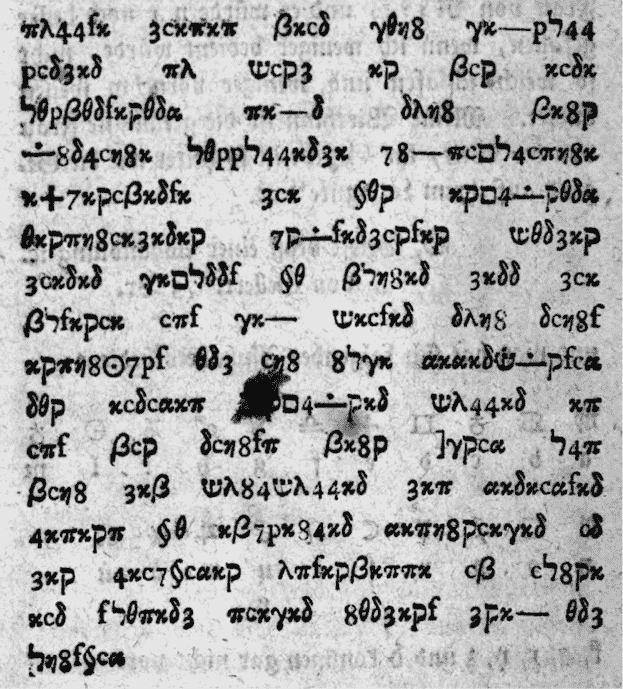

图 5-9：与当时的普遍看法相反，解密 1783 年这份密码谜题不需要任何超自然力量。

## 未解的密码谜题

许多未解的密码谜题看起来像是简单的替代加密文本，而且不太可能有英语明文。接下来的章节中，我们将介绍其中的一些。

### 《沃伊尼奇手稿》

世界上最著名的未解密码谜题之一，几百年历史的《沃伊尼奇手稿》是一本手写的包含未知文本和神秘插图的书籍。手稿以书商 Wilfrid Voynich（1865–1930）的名字命名，据说他于 1912 年从一家意大利耶稣会学院购得该书。如今，该手稿由位于康涅狄格州耶鲁大学的贝内基稀有书籍与手稿图书馆拥有，图书馆将其称为贝内基 MS 408。

该手稿使用由大约二十五个符号组成的字母表。通过放射性碳分析，发现其书写用的羊皮纸（小牛皮）可追溯到十五世纪初。数百位专家和几代业余研究者已对该手稿进行了详细检查，但他们的主要问题仍然没有答案。尽管有放射性碳定年法，我们仍然不知道它是何时、何地以及由谁编写的。手稿的目的也不明确。有人提出它可能是一本草药或宗教文本，一本炼金术书籍，或者是一本关于药膏的销售目录。也有人认为它可能是伪造品或欺诈行为。手稿中描绘的植物无法确定具体身份，大多数看起来像是纯粹的幻想图像，与任何特定的地方、时间、宗教或意识形态没有明确的关系。

在过去的几十年中，至少有六十种关于《沃伊尼奇手稿》的所谓解决方案已被发表，但没有一个被专家接受。研究人员自然而然地运用了我们书中描述的所有破译方法，包括频率分析、单词猜测和巧合指数，但都没有取得进展。至于明文所使用的语言（如果有的话）也不明确。有人主张它可能是意大利语、拉丁语、希腊语、英语、德语，甚至其他多种语言。

Klaus 在他的网站上汇编了一个详细的加密书籍清单。Elonka 鼓励他将这个清单正式化，现在它正式被称为“Klaus Schmeh 的加密书籍清单”，简称 EBL。Klaus 根据数量将 125 本书（还在增加中！）按类别分组，得出了以下结果：^(11)

+   日记

+   秘密社团书籍

+   知识类书籍

+   文学

+   拼图书籍

+   艺术书籍

+   骗局

+   宗教书籍

+   笔记本

+   无法分类

在检查每个分类的特征并将这些特征与福因奇手稿（图 5-10）进行比较后，我们的结论是，假设手稿不是由精神错乱者创作的，它很可能是知识之书，或者是一个恶作剧。

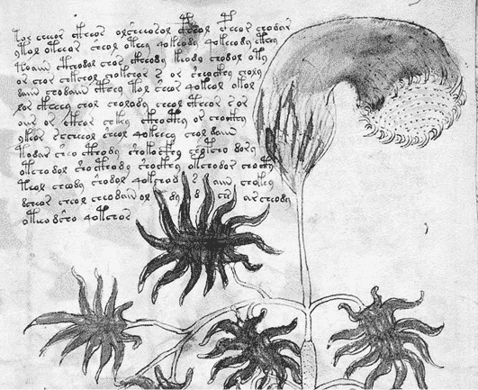

图 5-10：福因奇手稿是世界上最著名的未解密密码文本。

在互联网时代，随着福因奇手稿神秘图像被更广泛地展示给大众，一群名为福因奇学家的亚文化活动变得更加兴盛。2012 年在意大利举办的一次福因奇手稿会议吸引了众多研究者，包括本书的两位作者。^(12) 十年后的另一次（虚拟）会议在马耳他岛举行，作者们在此展示了他们的分类研究成果。^(13)

有许多网站专门致力于该手稿，其中最全面的是由 René Zandbergen 运营的 [`voynich.nu`](https://voynich.nu)。此外，该文本还启发了许多书籍^(14)^, ^(15)^, ^(16)^, ^(17)，以及 [`voynich.ninja`](https://voynich.ninja) 和 [`voynich.net`](https://voynich.net) 上的讨论论坛。后者由 Richard SantaColoma 运营，他还管理着一个福因奇手稿邮件列表。最终提供手稿的可接受破译者将被视为最伟大的密码破译者之一。

### 香烟盒密码

2017 年，我们收到了一位拥有一只带有加密铭文的古老香烟盒的所有者的联系（见 图 5-11）。^(18) 这条消息看起来像是一种普通的简单替换密码，属于不同字母表类型，任何优秀的密码分析家通常都能轻松解密。Klaus 与他在线的热衷于密码破译者社区分享了这个密码，但令人惊讶的是，没有人能够找到解决方案。

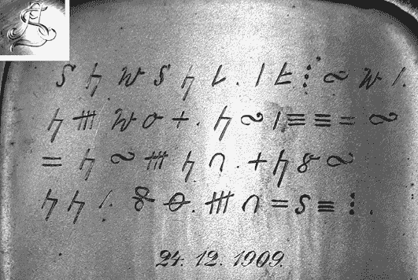

图 5-11：这个刻在德国香烟盒上的铭文至今未能破译。正面刻有 *AS* 字样（左上角）。

香烟盒密码由四行加密文本组成。文本下方有一个以标准德式日期格式（dd.mm.yyyy）书写的日期，标明为 1909 年 12 月 24 日。此日期表明盒子可能是圣诞礼物。（在德国，圣诞礼物通常在 12 月 24 日交换。）盒子的主人说，它已经是家族的传家宝。他从父亲那里继承了它，但对其来源知之甚少。他的祖籍主要来自古代图林根（Thüringen），现为德国中部地区，他的家族一直讲德语。盒子正面有一个符号，描绘了字母*AS*。这些字母很可能是原主人名字的首字母。

香烟盒密码是最著名的未解密密文之一，算是一个相对较新的谜题。如果你是一个雄心勃勃的破译者，你或许会选择研究这个加密谜团。

### NSA 的第四项周一挑战

尽管前面三项 NSA 周一挑战并不算太难（都只是简单的替换密码谜题，且一天内就能解开），但第四项于 2014 年 5 月 26 日发布的挑战则是另一个难题：^(19)

`pjbbfcklerfebjppjjlboumcuppelqpfezbjruoqlerdjbcuddbu`

`kulfjojprfebjbjzfrtmloupraublxpepkurtppdbjcbelfrfebkj`

字母频率和偶合指数（6.7%）与简单的替换密码一致。（记住，英语的偶合指数是 6.7%。）尽管如此，据我们所知，至今仍未找到解决方案。

和所有未解之谜一样，很难确定究竟使用了哪种系统或明文语言是什么。然而，我们将其包含在非英语替换密码章节中，因为我们认为明文很可能不是英语。当然，我们也可能错了！

### 穆斯蒂耶祭坛铭文

穆斯蒂耶是比利时东部弗拉内兹-莱兹-安瓦讷小镇的一个区，这里是一个未解加密谜团的发源地：圣马丁教堂中的两块加密祭坛铭文（见图 5-12）。^(20) 穆斯蒂耶祭坛铭文在 2013 年被 NSA 解密并公开了 136 期内部新闻简报《Cryptolog》后，成为密码历史爱好者关注的焦点。当英国密码研究员 Nick Pelling 阅读这些资料时，他发现了一篇 1974 年的文章介绍了这些密码谜题。^(21) 他之前从未听说过这些密码，于是在他的博客《Cipher Mysteries》中写下了相关内容，向破译社区分享他的发现。^(22)

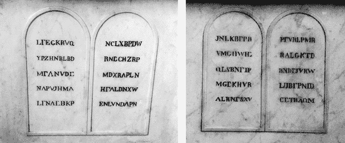

图 5-12：比利时穆斯蒂耶的加密祭坛铭文

第一个穆斯蒂尔神秘文字是在教堂的圣马丁祭坛上，第二个在圣母祭坛上。这些祭坛及其加密铭文可能建于十九世纪上半叶，但我们不知道是谁创造了这些信息，或者创作者有什么意图。与其他密码学谜团（如多拉贝拉密码和北美连环杀手的信息）相比，穆斯蒂尔祭坛铭文受到的密码专家关注较少。它们至今仍未解开。
