# 同音密码

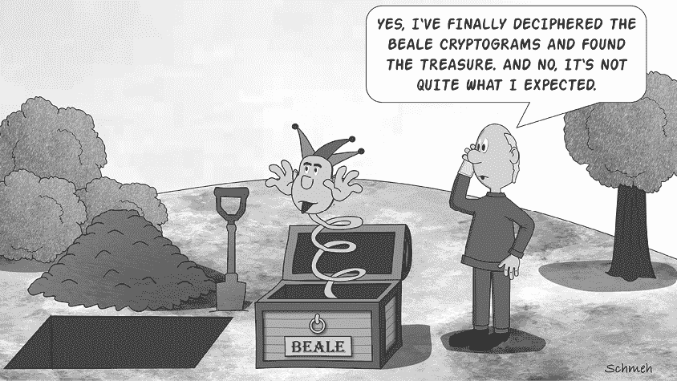

世界上最著名的密码之一是三组密文，它们于 1885 年在一本名为*《比尔文集》*的小册子中发布。^(1) 这些被称为“比尔密码”的密文，据说是由一位名叫托马斯·比尔的弗吉尼亚水牛猎人在 1820 年代创作，用以隐藏一笔埋藏在弗吉尼亚州贝德福德县某地的金矿宝藏的位置。

尽管我们和许多其他加密专家认为整个比尔故事只是一个骗局（托马斯·比尔，更不用说他的宝藏，可能从未存在过），但这三组密文仍然值得研究。消息#1 和#3 尚未破解，因此被包含在本章的“未解密的密码”部分。第二条比尔密文可以通过《独立宣言》进行解密，其中一版已在小册子中重印。

第二条消息的加密版本如下：

`115, 73, 24, 807, 37, 52, 49, 17, 31, 62, 647, 22, 7, 15, 140, 47, 29, 107, 79, 84, 56, 239, 10, 26, 811, 5, 196, 308, 85, 52, 160, 136, 59, 211, 36, 9, 46, 316, 554, 122, 106, 95, 53, 58, 2, 42, 7, 35, 122, 53, 31, 82, 77, 250, 196, 56, 96, 118, 71, 140, 287, 28, 353, 37, 1005, 65, 147, 807, 24, 3, 8, 12, 47, 43, 59, 807, 45, 316, 101, 41, 78, 154, 1005, 122, 138, 191, 16, 77, 49, 102, 57, 72, 34, 73, 85, 35, 371, 59, 196, 81, 92, 191, 106, 273, 60, 394, 620, 270, 220, 106, 388, 287, 63, 3, 6, 191, 122, 43, 234, 400, 106, 290, 314, 47, 48, 81, 96, 26, 115, 92, 158, 191, 110, 77, 85, 197, 46, 10, 113, 140, 353, 48, 120, 106, 2, 607, 61, 420, 811, 29, 125, 14, 20, 37, 105, 28, 248, 16, 159, 7, 35, 19, 301, 125, 110, 486, 287, 98, 117, 511, 62, 51, 220, 37, 113, 140, 807, 138, 540, 8, 44, 287, 388, 117, 18, 79, 344, 34, 20, 59, 511, 548, 107, 603, 220, 7, 66, 154, 41, 20, 50, 6, 575, 122, 154, 248, 110, 61, 52, 33, 30, 5, 38, 8, 14, 84, 57, 540, 217, 115, 71, 29, 84, 63, 43, 131, 29, 138, 47, 73, 239, 540, 52, 53, 79, 118, 51, 44, 63, 196, 12, 239, 112, 3, 49, 79, 353, 105, 56, 371, 557, 211, 505, 125, 360, 133, 143, 101, 15, 284, 540, 252, 14, 205, 140, 344, 26, 811, 138, 115, 48, 73, 34, 205, 316, 607, 63, 220, 7, 52, 150, 44, 52, 16, 40, 37, 158, 807, 37, 121, 12, 95, 10, 15, 35, 12, 131, 62, 115, 102, 807, 49, 53, 135, 138, 30, 31, 62, 67, 41, 85, 63, 10, 106, 807, 138, 8, 113, 20, 32, 33, 37, 353, 287, 140, 47, 85, 50, 37, 49, 47, 64, 6, 7, 71, 33, 4, 43, 47, 63, 1, 27, 600, 208, 230, 15, 191, 246, 85, 94, 511, 2, 270, 20, 39, 7, 33, 44, 22, 40, 7, 10, 3, 811, 106, 44, 486, 230, 353, 211, 200, 31, 10, 38, 140, 297, 61, 603, 320, 302, 666, 287, 2, 44, 33, 32, 511, 548, 10, 6, 250, 557, 246, 53, 37, 52, 83, 47, 320, 38, 33, 807, 7, 44, 30, 31, 250, 10, 15, 35, 106, 160, 113, 31, 102, 406, 230, 540, 320, 29, 66, 33, 101, 807, 138, 301, 316, 353, 320, 220, 37, 52, 28, 540, 320, 33, 8, 48, 107, 50, 811, 7, 2, 113, 73, 16, 125, 11, 110, 67, 102, 807, 33, 59, 81, 158, 38, 43, 581, 138, 19, 85, 400, 38, 43, 77, 14, 27, 8, 47, 138, 63, 140, 44, 35, 22, 177, 106, 250, 314, 217, 2, 10, 7, 1005, 4, 20, 25, 44, 48, 7, 26, 46, 110, 230, 807, 191, 34, 112, 147, 44, 110, 121, 125, 96, 41, 51, 50, 140, 56, 47, 152, 540, 63, 807, 28, 42, 250, 138, 582, 98, 643, 32, 107, 140, 112, 26, 85, 138, 540, 53, 20, 125, 371, 38, 36, 10, 52, 118, 136, 102, 420, 150, 112, 71, 14, 20, 7, 24, 18, 12, 807, 37, 67, 110, 62, 33, 21, 95, 220, 511, 102, 811, 30, 83, 84, 305, 620, 15, 2, 108, 220, 106, 353, 105, 106, 60, 275, 72, 8, 50, 205, 185, 112, 125, 540, 65, 106, 807, 138, 96, 110, 16, 73, 33, 807, 150, 409, 400, 50, 154, 285, 96, 106, 316, 270, 205, 101, 811, 400, 8, 44, 37, 52, 40, 241, 34, 205, 38, 16, 46, 47, 85, 24, 44, 15, 64, 73, 138, 807, 85, 78, 110, 33, 420, 505, 53, 37, 38, 22, 31, 10, 110, 106, 101, 140, 15, 38, 3, 5, 44, 7, 98, 287, 135, 150, 96, 33, 84, 125, 807, 191, 96, 511, 118, 40, 370, 643, 466, 106, 41, 107, 603, 220, 275, 30, 150, 105, 49, 53, 287

如上所示，它由一系列介于`1`和`1005`之间的数字组成。使用的加密方法非常简单：每个数字代表一个特定的字母，多个数字可以代表同一个字母。以下是替代表的一个片段：

`A``: 24, 27, 28, 36, 45, 81, 83 . . .`

`B``: 9, 77, 90 . . .`

`C``: 21, 84, 92, 94 . . .`

`D``: 15, 52, 63 . . .`

使用这个片段，我们可以用多种不同的方式对明文字符串`ABC`进行加密。例如，`24`、`9`、`21`是`ABC`的有效加密方式，`27`、`9`、`92`和`45`、`77`、`21`也是如此。

第二个比尔密码的替代表是用《独立宣言》的一个版本创建的。¹托马斯²比尔（³或者⁴真实⁵作者⁶是⁷谁）⁹给¹⁰每个¹¹单词¹²编号¹³，就像我们在¹⁴这个¹⁵句子中¹⁶所做的¹⁷那样。然后，他使用每个数字作为该数字所指代的单词首字母的潜在替代。例如，消息`WE ARE THE WORLD`可以加密为以下形式：`11 10`、`7 6 10`、`20 17 10`、`4 3 6 15 18`。

当我们按照上述方式使用《独立宣言》时，第二个比尔密码解密后得到如下内容：

`我已将以下物品存放在贝德福德县，距离布福德约四英里处，在一个地下六英尺的挖掘坑或宝库中，这些物品属于第三号中提到的各方，现附带如下：`

`第一次存款由一千一百十四磅黄金和三千八百一十二磅白银组成，存放时间为一八九一年十一月十八日。第二次存款发生在一八二一年十二月十八日，金额为一千九百零七磅黄金和一千二百八十八磅白银；还包括在圣路易斯交换得到的珠宝，以节省运输费用，价值一万三千美元。`

`上述内容被安全地包装在铁锅中，并且有铁盖。宝库大致用石头衬里，容器放置在坚固的石头上，并且被其他容器覆盖。纸张一描述了宝库的准确位置，以便找到它时不会遇到任何困难。`

自从比尔小册子在一八八五年出版以来，成千上万的寻宝者带着铁锹、铲子和推土机纷纷涌向弗吉尼亚州的贝德福德地区。虽然许多洞已经被挖掘，但至今没有发现任何宝藏。尽管我们认为该小册子很可能是一个骗局、一个共济会的故事，或者仅仅是为了一家濒临倒闭的报纸筹集资金，但比尔密码的故事以及他们关于未发现宝藏的设想，依然是世界上最著名的密码谜团之一。

## 同音密码是如何工作的

若干个代表相同明文字母的密文字母、数字或符号被称为 *同音词*。一种替换字母并使用同音词的密码被称为 *同音异文密码*。第二个比尔密码就是使用同音异文密码进行加密的。（它也是一本书密码，正如第十四章所示。）

当然，制作同音异文密码并不需要像《独立宣言》这样的原文。相反，你可以简单地为一个明文字母分配多个密文字母，并将它们列出在一个表格中。这里有一个十七世纪的例子^(2)，其中每个字母可以使用多个符号进行加密，表格的顶部是字母表：

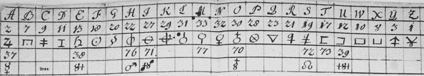

同音异文密码自中世纪以来一直被用来破解频率分析。

同音异文密码中使用的字母表大小可能会有很大差异。有些密码仅对更频繁的字母使用同音词，正如下面这个十八世纪的例子所示：^(3)

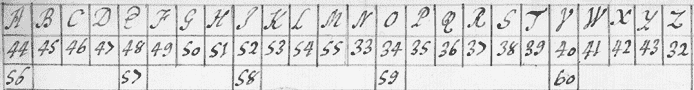

大多数同音异文密码使用的字母表比这个要大。根据我们的经验，同音异文密码通常使用五十到一百个密文字母来加密原始字母表。每个密文字母由字母、数字和符号的组合组成。

理想情况下，分配给字母的同音词数量应与该字母在相应语言中的频率成正比；频率较高的字母，如 *E* 和 *T*，应分配更多的同音词，而频率较低的字母，如 *Q* 和 *X*，则应分配较少的同音词。然而，经验表明，实际使用的大多数同音异文密码并未按照如此复杂的方式构造。

## 如何检测同音异文密码

要识别同音异文密码，通常需要将其与简单替换密码区分开来。如果密文中有空格，它可能仅仅是一个贵族密码（Aristocrat）。如果没有空格，我们需要将其与父系贵族密码（Patristocrat）区分开。

任何简单替换密码和同音异文密码之间有一个明显的区别：后者需要一个更大的密文字母表。如果你遇到一个使用标准字母表或其他包含约二十六个字母的字母表写成的密文，你可以假设它不是同音异文密码（或者，至少可以确定该消息不会包含很多同音词）。如果字母表包含五十个字母，那么同音异文密码的可能性就大大增加。

图 6-1 显示了一条由本杰明·富兰克林等人使用的同音异文密码加密的部分消息^(4)。这里使用的密文字母表由数字组成，本文摘录中的最大数字是 227。这意味着可以为每个字母（`A` 到 `Z`）分配大量的同音词。

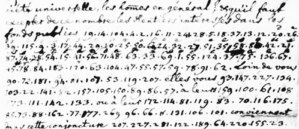

图 6-1：一段使用同音密码加密的消息示例，记录在《*美国大陆会议文献*》中。

我们遇到的某些同音密码使用的字母表既包括普通字母，也包括自创字母。图 6-2 展示了一个例子。这是一段 1969 年通过报纸广告发送给黄道带杀手的挑战性密码消息。^(5)我们将在本章的“挑战”部分回到这个密码。像这样的字母表非常适合具有数十个同音词的同音密码。然而，要以这种方式编写第二个比尔密码是困难的，因为发明几百个不同的符号是一项艰巨的任务。

图 6-2：这张 1969 年的报纸广告，由黄道带专家 Dave Oranchak 提供，展示了一个密文，旨在挑战黄道带杀手。它使用了同音密码加密。

如何区分同音密码和其他非简单替换系统的问题仍然存在。维金纳密码和本书中描述的许多其他加密方法通常使用包含大约二十六个字母的字母表，这使它们与同音密码有所区别。然而，同音密码很容易与*nomenclator*混淆，后者是密码和代码的混合体，由一组名称组成（有关命名符号的详细信息，请参见第七章）。区分这两种方法有时很棘手，因为许多命名符号包含同音词。因此，从某种意义上说，命名符号可以看作是同音密码的一种概括。

然而，同音密码和命名符号之间有一个重要的区别：前者在实际应用中遇到的频率要远高于后者。事实上，在历史上，使用同音密码的情况远不如命名符号常见。如果你检查一个基于大字母表的原始密文（不是伪造的谜题），极有可能你正在处理的是命名符号。

还有一种区分同音密码和命名符号的方法：同音密码很少使用超过 200 个字母的字母表。第二个比尔密码，其字母表超过 1,000 个字母，是一个例外，可能因为它也是一种书本密码（见第十四章）。如果你遇到一个包含 1,000 个或更多不同数字或字母序列的密文，那么很有可能你正在处理一个命名符号或密码。如果字母表较小，同音密码就更可能。

## 如何破解同音密码

今天，解决同音密码的最佳方法——就像许多其他加密系统一样——是基于计算机的、计算密集型的爬山法。几款软件程序支持这一技术；在搜索引擎中输入“同音密码解码器”可以找到相应工具。这些程序可以在几秒钟内破解某些同音密码（见第十六章）。

如果你想在没有计算机支持的情况下破解同音密码，你的成功几率将很大程度上取决于单词之间的空格是否可见。如果不可见，除非你有一段非常长的密文可供分析，否则任务将变得非常困难。然而，如果单词边界清晰可见，只要没有太多同音异义词在其中，你的成功几率相当高。我们将通过以下文本演示如何破解同音密码，这是你在地理寻宝活动中可能遇到的密文：

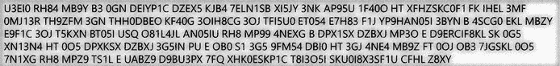

这是一个抄本：

`U3EI0 RH84 MB9Y B3 0GN DEIYP1C DZEX5 KJB4 7ELN1SB XI5JY 3NK AP95U 1F40O HT XFHZSKC0F1 FK IHEL 3MF 0MJ13R TH9ZFM 3GN THH0DBEO KF40G 3OIH8CG 3OJ TFI5U0 ET054 E7H83 F1J YP9HAN05I 3BYN B 4SCG0 EKL MBZY E9F1C 3OJ T5KXN BT05I USQ O81L4JL AN05IU RH8 MP99 4NEXG B DPX1SX DZBXJ MP3O E D9ERCIF8KL SK 0G5 XN13N4 HT 0O5 DPXKSX DZBXJ 3G5IN PU E OB0 S1 3G5 9FM54 DBI0 HT 3GJ 4NE4 MB9Z FT 0OJ OB3 7JGSKL 0O5 7N1XG RH8 MPZ9 TS1L E UABZ9 D9BU3PX 7FQ XHK0ESKP1C T8I3O5I SKU0I8X3SF1U CFHL Z8XY`

这里使用的密文字母表有三十六个字符（`A`–`Z` 和 `0`–`9`）。一种合理的解释是，它使用了一个同音密码，涉及大约十个同音异义词。频率分析 . . .

. . . 显示，没有任何字母在密文中所占比例超过 5.4%，尽管在英语中，某些字母，尤其是*E*、*T*、*A*、*O* 和 *I*，出现的频率远远更高。这可能是因为作者使用了同音异义词来替代最常见的字母，以使它们更难被发现——这正是同音密码的作用所在。

由于我们的密码文本中包含空格（前提是这些空格正确标示了单词之间的边界），我们可以利用每个单词初始字母和最后一个字母的频率分布，而这与文本中所有字母的频率分布是不同的。在深入研究我们的寻宝密码之前，我们需要一些关于英语语言的一般统计数据。 图 6-3 (a) 显示了普通英语文本的字母频率分布。接下来，我们假设在普通英语文本中，每个字母 *A*、*E*、*I*、*O* 和 *T* 都有两种不同的表示方式（即同音字）。我们称这些为 A1 和 A2、E1 和 E2、I1 和 I2、O1 和 O2、T1 和 T2。我们选择专注于 *A*、*E*、*I*、*O* 和 *T*，因为它们是英语中最常见的字母。如果我们将这些字母中的每一个替换为相应的同音字，并大致均等地使用这两种表示方式，那么典型英语文本的字母频率分布将如 图 6-3 (b) 所示。

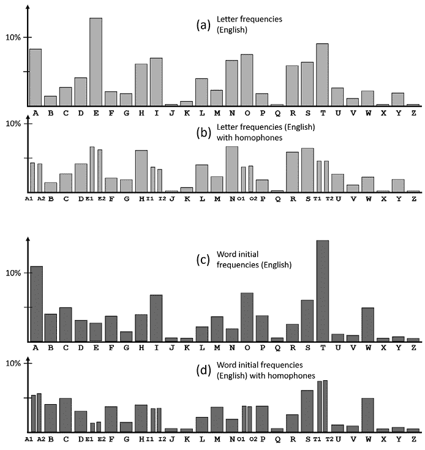

图 6-3：图 (a) 显示了典型英语文本中各字母的出现频率，图 (b) 介绍了同音字，图 (c) 和 (d) 显示了初始字母频率的相同统计数据。

为了生成另一个参考统计数据，让我们单独看看典型英语文本中单词的初始字母。 图 6-3 (c) 显示了没有同音字的初始字母频率，而 图 6-3 (d) 显示了引入与上述相同的 A1/A2、E1/E2 等同音字后的初始字母频率。

同音字（b）中的整体字母频率与同音字初始字母频率（d）之间的许多差异可能对破译者有帮助。然而，对我们来说，了解一个具体的差异就足够了：*T* 是英语中最常见的字母之一（占 9%），如果考虑它作为单词初始字母的出现频率，它的出现频率甚至更高（14%）。由于这一增长，同音字中的 *T* 很可能在英语同音加密文本中具有最高的初始字母频率。这可能帮助我们在此类密码中识别出明文 `T`。

如果我们看每个单词最后一个字母在英语文本中的出现频率，情况也类似。特别是，*I* 是英语中常见的字母，但它几乎从不出现在单词的结尾。这可能帮助我们在同音加密文本中识别出明文 `I`。

有了这些背景信息，我们可以回到地理藏宝的文本。我们需要查看字母的总频率、首字母的频率以及每个单词尾字母的频率。我们已经使用 CrypTool 2 完成了这项工作，CrypTool 2 支持首字母和尾字母的计数，并且我们已经将结果整理在图 6-4 中。（我们不知道有哪个计算机程序能自动完成这项完整工作。）

图 6-4：该图中的条形图展示了所有字母的频率（中间的条形），以及我们正在分析的密文中每个单词的首字母和尾字母的频率。

这里有一些观察结果：

+   密文字母`3`是最常见的首字母。它在文本中的其他地方不太常见。因此，`3`可能是一个同音字，代表字母`T`。

+   必须至少有一个`T`同音字（否则我们会期望密文字母`3`的首字母频率大约为 15%）。`E`似乎是一个合适的候选字母，因为它和`3`一样，尽管整体频率和尾字母频率较低，但首字母频率非常高。

+   密文字母`H`和`S`的整体频率和首字母频率大致相同，但它们并未出现在单词的尾字母位置。它们可能代表字母`I`。

现在我们进行字母对（双字母）频率分析。我们将只考虑没有字母间空格的双字母。以下是所有出现超过一次的双字母。我们使用了网站[`dcode.fr/en`](http://dcode.fr/en)进行此分析：

| **四次出现** | **三次出现** | **两次出现** |
| --- | --- | --- |
| 05 | KL, H8, 3O | FH, 0O, HT, AN, F1, OB, 40, O5, U3, G5, SX, XJ, 1L, YP, ZB, SK, EI, DP |

这里有一些与双字母相关的事实，可能会对你有帮助：

+   英语中最常见的双字母是*TH*、*HE*和*IN*。

+   最常见的反向双字母是*ER*/*RE*。（不幸的是，在我们的密文中，没有反向双字母出现超过一次。）

+   我们的密码本中有两个只包含一个字母的单词：`B`（出现两次）和`E`（出现三次）。常见的英语单字母词只有两个：`A`和`I`。

+   密文中出现的以下双字母词有：`B3`、`HT`（出现三次）、`FK`、`SK`、`BU`、`S1`和`FT`。常见的英语双字母词有`OF`、`TO`、`IN`、`IT`、`IS`、`BE`、`AS`、`AT`和`SO`。

我们该如何继续？我们知道，密文字母`B`和`E`（它们都作为单字母词出现）代表的是`A`或`I`（英语中唯一常见的单字母词）。我们还知道，字母`I`很少作为单词的尾字母出现。从频率图中可以看到，密文字母`B`和`E`都多次出现在单词的结尾。因此，我们可以得出结论，`B`和`E`都不解密为`I`，这意味着它们代表的是`A`。

我们还能发现什么？正如我们所讨论的，密文字母`3`是`T`的一个好候选。如果是这样，加密文本中的第四个单词（`B3`）就是`AT`，这也很合理。注意，我们在密文中找到了`3O`这一对最频繁的字母。`3O`是否代表`TH`，这是英语中最常见的字母对之一？可能是的。

看看这个加密文本，我们看到单词`3OJ`出现了两次。如果我们假设`3O`代表`TH`是正确的，那么`3OJ`就应该代表`THE`，因为没有其他常见的三个字母的单词是以`TH`开头的。这意味着`J`解密为`E`。

密文中包含单词`3GJ`，它解密为`T*E`。很可能`G`，就像`O`一样，代表`H`。

现在我们知道了`A`、`E`、`H`和`T`的密文等价物，我们可以推测其他字母。例如，密文单词`MP3O`，解密后是`**TH`，可能代表`WITH`。单词`MP99`应该是`WILL`。`MPZ9`可能有相同的意思，表明`Z`和`9`是同音字。现在看看`MB9Y`，它必须是`WAL*`。`WALK`是一个合理的猜测。

我们跳过剩下的推测练习，提供明文：

`START YOUR WALK AT THE PARKING PLACE NEAR BADENIA CREEK TEN MILES NORTH OF COOLINGTON ON ROAD TWO TWENTY FOLLOW THE FOOTPATH NORTH THROUGH THE FOREST AFTER ABOUT ONE KILOMETER TAKE A RIGHT AND WALK ALONG THE FENCE AFTER SIX HUNDRED METERS YOU WILL REACH A PICNIC PLACE WITH A PLAYGROUND IN THE CENTER OF THE PICNIC PLACE THERE IS A HAT IN THE LOWER PART OF THE REAR WALL OF THE HAT BEHIND THE BENCH YOU WILL FIND A SMALL PLASTIC BOX CONTAINING FURTHER INSTRUCTIONS GOOD LUCK`

## 成功案例

### 第一个黄道带信息（Z408）

黄道带杀手是一个在 1960 年代末和 1970 年代初活跃在加利福尼亚北部的连环杀手。他至少杀害了五人，并重伤了两人。在一系列发送给当地报纸的挑衅信件中，他嘲笑警察，并宣布他计划进行更多的谋杀和破坏。黄道带杀手的身份仍然未知。这个案件对破译者来说有趣之处在于，杀手的一些信件中包含了加密信息。^(6) 总共可以归属给黄道带杀手的加密信息有四个。

第一个黄道带杀手的加密信息，也叫 Z408，因为它包含的字符数，可以在图 6-5 中看到。它最初分为三部分，每部分都发送给了不同的报纸。警方咨询了专业的破译者，但并没有很快得到回复。由于迫切需要，每家报纸在几天内就发布了这些加密文本。

唐纳德和贝蒂·哈登是一对居住在加利福尼亚州萨利纳斯的谜题爱好者夫妇，他们在报纸上读到了 Z408，并决定尝试解密。贝蒂测试了一个假设，即黄道杀手可能是一个自恋且矫揉造作的人，他可能会用明文词汇`I`开头，而且也许`KILL`这个词也会出现在文本中。她猜测第一组明文词汇是`I LIKE KILLING`，这一猜测成为了突破点。

贝蒂·哈登很快发现，黄道杀手使用了同音加密法来加密这条信息。以下是（相当血腥的）明文，包含拼写错误：

`I LIKE KILLING PEOPLE BECAUSE IT IS SO MUCH FUN IT IS MORE FUN THAN KILLING WILD GAME IN THE FORREST BECAUSE MAN IS THE MOST DANGEROUE ANAMAL OF ALL TO KILL SOMETHING GIVES ME THE MOST THRILLING EXPERENCE IT IS EVEN BETTER THAN GETTING YOUR ROCKS OFF WITH A GIRL THE BEST PART OF IT IS THAE WHEN I DIE I WILL BE REBORN IN PARADICE AND ALL THEI HAVE KILLED WILL BECOME MY SLAVES I WILL NOT GIVE YOU MY NAME BECAUSE YOU WILL TRY TO SLOI DOWN OR ATOP MY COLLECTIOG OF SLAVES FOR MY AFTERLIFE. EBEORIETEMETHHPITI`

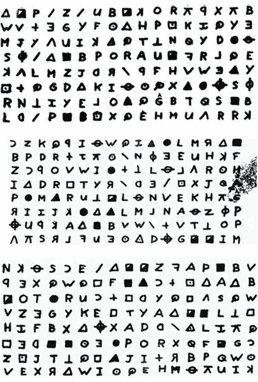

图 6-5：第一条来自黄道杀手的信息被唐纳德和贝蒂·哈登破解。

### 黄道杀手的第二条信息（Z340）

图 6-6 展示了黄道杀手四条信息中的第二条，它被寄送到当地报纸。该信息于 1969 年 11 月 8 日邮寄。这条密码由 340 个字符组成，因此被称为 Z340。与前述的 Z408 不同，这条信息并未立即被破解。几十年来，Z340 足够长，可以进行有意义的频率分析和其他统计检查，成为世界上最著名的未解加密谜题之一。在本书的第一版中，于 2020 年 12 月 10 日发布时，Z340 甚至被列在本章的“未解密的密码”部分。

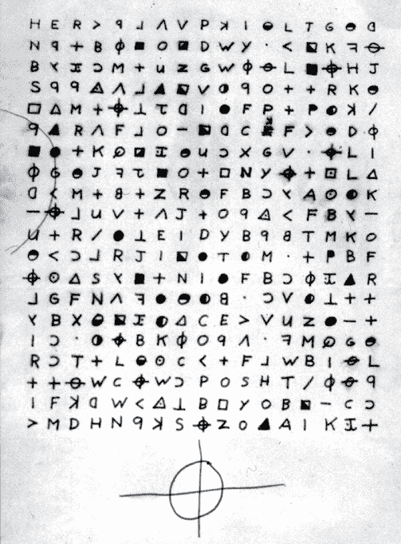

图 6-6：黄道杀手的第二条加密信息长达数十年未解。

然而，在 2020 年 12 月 11 日，仅在第一版出版的第二天，我们收到了来自黄道杀手专家戴夫·奥兰查克的消息。他写的内容让人难以置信：他说 Z340 已被破解！根据他的消息，这一成功是由由戴夫本人、比利时破译专家贾尔·范·埃基和澳大利亚数学家山姆·布莱克三人组成的专家团队实现的（见图 6-7）。

图 6-7：从左到右：戴夫·奥兰查克、贾尔·范·埃基和山姆·布莱克破解了 Z340 信息。

当然，我们当时持怀疑态度，因为之前已经发布了许多关于这个著名密文的伪解密。然而，Dave 发布的一段关于他和同事们找到的解决方案的视频似乎有道理。^(7) 我们书中提到的几位密码学专家，包括 Nils Kopal,^(8) Nick Pelling,^(9) Joachim von zur Gathen,^(10) 和 George Lasry（通过电子邮件），都确认了 Dave、Jarl 和 Sam 解密的正确性。为了彻底确认，FBI 通过 Twitter 发布了官方声明，称：“最近，私人公民破解了一个被归于 Zodiac Killer 的密码。”^(11) 现在毫无疑问：Z340 已经被破译！

Dave 和 Jarl 最初在 2014 年联系上，之后 Jarl 在 2015 年创建了 AZDecrypt 软件，用于破解同音替代密码。随后，Dave 和 Sam 在 2019 年通过 Dave 的 YouTube 频道《Let's Crack Zodiac》联系上。他们共同研究 Z340 数月，怀疑 Zodiac Killer 使用了两种密码的组合：一种类似于 Z408 所用的同音替代密码，另一种是换位密码（见第九章）。^(12)^, ^(13)

由于可以应用于如此长文本的换位方式数量庞大——事实上，这些选项似乎是无限的——三位破译者不得不将他们的检查限制在最可能的选项上。因此，他们假设消息以简单的方式被分割——水平、垂直，或两者兼有。除了其他可能性，他们考虑了以下几种情况：

+   它可能被分成了一个水平部分和两个垂直部分。

+   它可能被分成了两个水平部分和三个垂直部分。

2015 年，Jarl 和一位匿名论坛用户“daikon”已经发现，当每隔十九个符号读取一次时，Z340 的双字母频率具有一些有趣的统计特性。这表明，通过十九步跳跃加密文本是解密过程的一部分，最终得到了明文。

即便在这些限制下，筛选所有可能的替换和换位选项仍然意味着在一个巨大的干草堆里找针。Dave、Jarl 和 Sam 测试了不少于 650,000 种换位变体。当他们最初没有找到接近 Z340 解法的任何内容时，他们决定将注意力转向重新检查 AZDecrypt 评分中排名前 10%的候选换位选项。这一次，他们还给了软件更多的时间进行搜索。

2020 年 12 月 3 日，突破性进展出现了。在无数次解密尝试中，出现了`HOPE YOU ARE, TRYING TO CATCH ME`和`THE GAS CHAMBER`这两个短语。当 Dave 将这些文本片段配置为密码提示时，AZDecrypt 突然生成了有意义的句子。

一个更加激动人心的进展是，这个明文候选包含了短语 `THAT WASNT ME ON THE TV SHOW`，Dave 立刻意识到这是对一个男人的暗示，这个男人曾在 1969 年加密消息发送前两周打电话到一个电视节目，假装自己是犯罪者。这强烈暗示他们已经破解了密文前九行的内容！

然而，将这一技术应用于剩余的部分消息仍然没有得到有意义的明文。团队需要进一步的突破才能揭示整个明文。首先，Dave 发现最后两行中的一些单词是倒写的，且没有使用其他的置换。其次，Jarl 找到了第二部分中的一些错误或被打乱的置换。现在，成功的破译者终于能够确定以下明文（已更正一些错误）：

`I HOPE YOU ARE HAVING LOTS OF FUN IN TRYING TO CATCH ME THAT WASNT ME ON THE TV SHOW WHICH BRINGS UP A POINT ABOUT ME I AM NOT AFRAID OF THE GAS CHAMBER BECAUSE IT WILL SEND ME TO PARADICE ALL THE SOONER BECAUSE I NOW HAVE ENOUGH SLAVES TO WORK FOR ME WHERE EVERYONE ELSE HAS NOTHING WHEN THEY REACH PARADICE SO THEY ARE AFRAID OF DEATH I AM NOT AFRAID BECAUSE I KNOW THAT MY NEW LIFE IS DEATH LIFE WILL BE AN EASY ONE IN PARADICE`

不幸的是，明文并没有包含任何直接暗示 Zodiac Killer 身份的信息。在破译过程中，团队意识到消息被分成了三个部分。这意味着破解者们假设文本是以简单的方式分割的这一猜想是正确的。这正是破解困难密码时所需要的幸运猜测！

图 6-8 展示了 Zodiac Killer 使用的同音加密表。正如预期的那样，每个字母可用的同音字数量大致与字母的频率成正比。*E* 和 *T* 这两个最常见的英文字母，分别可以映射到六个不同的符号。

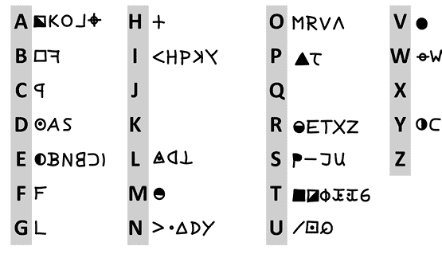

图 6-8：用于 Z340 的替代表代表了一种同音加密法。

Z340 所基于的换位密码在图 6-9 中得到了说明。如图所示，信息需要分为两个大段（每段九行）和一个小段（两行）。解密这两个大段时，从每个段的左上角开始，用骑士走法（右移两步，下移一步）遍历信息。一旦到达段的右边缘，重复这一模式，从第一行的第二个符号开始。当块的右上半部分的所有符号都被访问后，路径将继续在左下半部分进行。请注意，在许多情况下，需要跨越符号（例如，从第一行的第一个符号到第二行的第三个符号），正如“daikon”和 Jarl 所建议的那样。

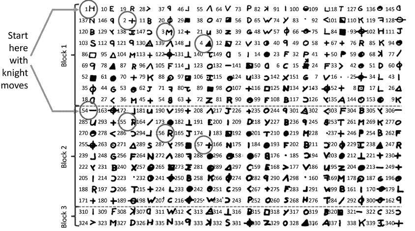

图 6-9：黄道带杀手在 Z340 的前两个区块中使用的换位方法主要基于骑士走法（右移两步，下移一步）。

在第三部分中，未使用骑士走法。相反，信息是从左到右、从上到下书写的，其中一些单词是倒写的。似乎有可能，此外，`LIFE IS`、`LIFE WILL`和`DEATH`这些表达式也需要移动到其他地方。截至目前，已提出了几个可能的建议。^(14)

黄道带杀手是否希望 Z340 被解密？短语`THAT WASN’T ME ON THE TV SHOW`暗示他确实希望这样，因为它包含了他可能希望尽快被人知道的信息。这引出了一个问题：杀手是否低估了他密码的难度。我们能否推测他从未尝试过解决这样的系统？他过去曾尝试解过哪些类型的密码，以至于他认为这个密码可以在当时的技术条件下解开？

不言而喻，Dave、Jarl 和 Sam 在梳理无数潜在的替代表和换位模式，以识别正确的方案方面做了巨大的工作。在我们看来，这证明是几代人中最伟大的非军事密码破译成功之一！

### 费迪南德三世的信件

费迪南德三世（1608–57），来自哈布斯堡家族的神圣罗马帝国皇帝，在欧洲最具破坏性的战争之一——三十年战争中发挥了重要作用。在研究他的生平时，维也纳的历史学家如利奥波德·奥尔遇到了加密信件。费迪南德三世使用的系统基于数字和简单的几何符号，按对排列。如图 6-10 所示，费迪南德的信件是加密和明文段落的混合，但历史学家未能解开这些信件。

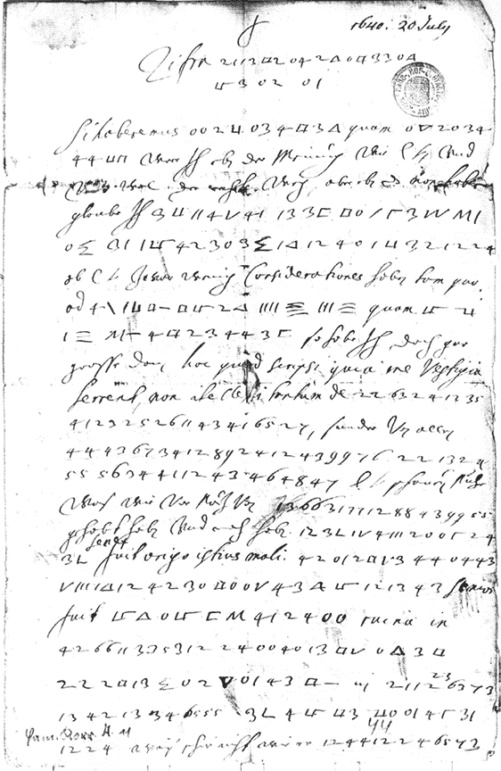

图 6-10：费迪南德三世于 1640 年写给他弟弟利奥波德·威廉的加密信件第一页。德国语言学家和历史学家托马斯·恩斯特破解了它。

托马斯·恩斯特（Thomas Ernst），一位在美国教学的德国科学家，尝试破解这个谜题。^(15) 恩斯特在 1990 年代已在学术界崭露头角，当时他破解了约翰内斯·特里特修（Johannes Trithemius）（1462–1516）所著的《Steganographia》第三卷（参见第十五章）。

费迪南德的信件部分内容已经被转录：包括明文的字母和单词，以及与数字和符号混合的加密部分。

作为一位语言学者和历史学家，恩斯特能够轻松阅读皇帝的明文部分，这些部分是 17 世纪德语和拉丁语的混合体。在剩余的部分，恩斯特测试了几个假设。他的核心发现是每个几何符号代表了它由多少条线或半圆组成。例如，一个方形有四条边，代表数字`4`，一个三角形代表数字`3`，以此类推。使用这些数字，恩斯特构建了以下的记录：

`1640 年，7 月 20 日 /`

`Zifra 21 13 42 04 23 14 33 13 / 43 02 01`

`Si haberemus 00 23 03 44 33 quam 13 20 34 / 44 33 were Ich eben der meinung wie E L vnd / were wol der rechte weg, aber eben das non habere / glaube Ich 33 11 42 41 13 33 41 12 34 41 / 14 31 14 42 30 34 13 12 40 13 32 12 24 / ob E L zwar wenig Considerationes haben tam quo: / ad 41 13 41 44 23 44 33 quam 44 / 13 41 44 23 44 33 / so habe Ich doch gar grosse Dann hoc quod scripsi quia me Vestigia / terrent, non intellexi tantum de 22 63 24 13 35 / 41 23 25 25 11 43 41 65 27, sunder von allen / 44 43 67 34 12 89 24 12 43 99 76 22 13 24 / 55 56 34 41 12 43 46 48 47 E L schauen nuhr / was wir vor nuz von 13 66 31 77 12 88 43 99 55 / gehabt haben Vnd noch haben. 12 32 12 43 20 12 24 / 32 senex fuit origo istius mali. 42 01 24 23 44 04 43 / 23 13 12 42 30 41 12 43 34 12 13 43 / fuit 43 14 34 41 24 00 ruina in / 42 66 11 33 53 12 24 00 40 13 42 13 34 / 22 24 13 41 23 01 43 41 in 21 12 23 63 73 / 13 42 13 34 65 55 32 44 43 41 01 42 31 / 12 24 wais schir nicht wie er 12 44 12 24 65 73`

第二次突破发生在他意识到哈布斯堡家族的座右铭“AEIOU”在密码中起到了作用。这个座右铭的一种解释是“Austria erit in orbe ultima”，意为“奥地利将存在直到世界的尽头”。从“AEIOU”座右铭中，恩斯特推导出了以下在费迪南德密码中的映射：

`A``: 01, 11`

`E``: 02, 12`

`I``: 03, 13`

`O``: 04, 14`

当他查看信件开头的序列`21 13 42 04 23 04 33 03 43 02 01`时，他识别出了以下元音：`I – O – O – I – E A`，其中的破折号代表缺失的辅音。这个元音模式提示了一个形容词，唯一的可能性是`PICOLOMINEA`。奥塔维奥·皮科洛米尼（Octavio Piccolomini）与皇帝的兄弟利奥波德·威廉（Leopold Wilhelm）一起，是当时帝国军队的总指挥。`PICOLOMINEA`在加密时省略了双`C`。`Zifra PICCOLOMINEA`意味着一封以皮科洛米尼为密码名的加密信件。

接下来，恩斯特猜测`fuit` `43 04 34 41 24 00` `ruina`中的缺失词是`NOSTRA`（拉丁语意为`我们`）。然后他能够轻松推导出剩余的字母，构建以下替代表：

| **`A`** | **`B,W,P`** | **`C,K,Z`** | **`E`** | **`F`** | **`G`** | **`H`** | **`I/J`** | **`K`** | **`L`** | **`M`** | **`N`** | **`O`** | **`P`** | **`R`** | **`S`** | **`D,T`** | **`U/V`** | **`Z`** |
| --- | --- | --- | --- | --- | --- | --- | --- | --- | --- | --- | --- | --- | --- | --- | --- | --- | --- | --- |

| `00` `01`

`11` | `20` `21` | `42` | `02` `12` | `22` | `32` | `30` `31` | `03` `13` | `30` | `23` | `33` | `43` | `04` `14` | `21` | `24` | `34` | `40` `41` | `44` | `10` |

以下是根据恩斯特的解密所得出的信件第一部分的明文：

`Zifra PICOLOMINEA`

`Si haberemus ALIUM quam IPS`

`UM were Ich eben der Meinung wie E L Vnd`

`Were Wol der rehte Weg, aber eben das non habere`

`glaube Ich MAC‹H›T IM DEST`

`O HOCHSIEDIGER`

`ob E L zwar wenig Considerationes haben tam quo:`

`ad TITULUM quam U`

`ITULUM so habe Ich doch gar`

`grosse Dann hoc quod scripsi quia me Vestigia`

`terrent, non intellexi tantum de FRI`

`DLANT, sunder Von allen`

`UNSEREN FIR`

`STEN E L schauen Nuhr`

我们之前从 IH‹N›EN 那里知道的

`gehabt haben Vnd noch haben. EGENBER`

`G senex fuit origo istius mali. CARL UON`

`LIECHTENS‹T›EIN senior`

`fuit NOSTRA ruina in`

`CAMERADICIS`

`FRIDLAND in BEL`

`ICIS‹.› GUNDACK`

`[. . .]`

这是以一种难以理解的旧德语和拉丁语混合写成的，包括缩写和拼写错误。以下是恩斯特提供的粗略注释翻译：

`Zifra picolominea`

`如果我们有别人[担任总司令]而不是他[场元帅奥塔维奥·皮科洛莫尼]`

`我会同意你的观点，`

并且这本应是正确的道路，但问题在于没有做到这一点

`其他人[没有其他适合的总司令候选人]，那就使他[皮科洛莫尼]成为唯一选择`

`甚至更加专横。`

尽管你可能对某些方面有些保留意见

`to another title [rewarding Piccolomini with an imperial princicipality],`

`我有不少[保留意见]。`

让我困扰的不仅仅是弗里德兰德

`. . .`

### 一张来自夏威夷的明信片

如图 6-11 所示的密码，写在 1886 年从夏威夷寄出的明信片上。^(16) 它是由马里兰州的国家密码学博物馆提供的，并由我们同事阿尔敏·克劳斯解决，他是一位非常熟练的德国破译者。阿尔敏知道大多数加密的明信片都是用简单的替代密码加密的——但通常包含空格，而这里并没有。这意味着这是一个父权主义密码，而不是贵族密码。因此，阿尔敏怀疑其中一个符号表示空格字符。经过一些分析，阿尔敏意识到，实际上有两个符号表示空格（即同音词）：`T`及其倒置版本。接下来，他确定文本中出现四次的单字词是`I`。

阿尔敏随后试图识别`E`，这是英语中最常见的字母。然而，没有任何符号像预期的那样频繁地出现，表明它们代表`E`，于是他做出了另一个猜测：也许有两个符号代表`E`。这个假设被证明是正确的。通过频率分析和一些猜测，阿尔敏发现`X`和由三条平行的横线组成的符号都代表`E`。剩下的解密过程相对简单。以下是阿尔敏恢复的明文：

`二月二十八日。`

`感谢你的来信`

`我上周收到`

`星期三。我很高兴`

`事实上，丘吉尔有`

`做一些工作，你`

`字母有多个`

`它有一些错误，BU`

`T 我敢说我的 HA`

`S 也是一个数字。我 SH`

`一只大山羊，上面`

`昨天的山脉，W`

`重约一百磅。`

`DRED 和 TMENTY 英镑。`

`不要开始你的信`

`ER “亲爱的”，因为`

`如果有人抓到`

`一个，他们可能猜到一些`

`字母表的。`

`再见。`

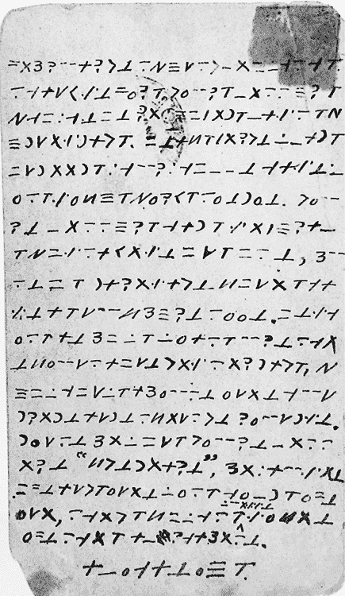

图 6-11：这张 1886 年的夏威夷明信片采用了字母替换密码，其中包括空格符号和`E`的同音字。

## 挑战

### 给黄道带杀手的留言

本章早些时候，我们介绍了一个黄道带风格的加密信息（见图 6-2），它是加利福尼亚警察在 1960 年代末黄道带杀人事件发生时，刊登在报纸广告中的。该信息使用简单的同音替代密码加密，明文中包含了一个电话号码。警方希望杀手能够成功破译该信息，然后打电话给该号码，以展示他的优越性。计划失败了，但至少这个密码谜题提供了一个不错的解密挑战。你能解开它吗？

### 埃德加·爱伦·坡的第二个挑战

美国作家埃德加·爱伦·坡对密码学有着长久的兴趣。他 1843 年的短篇小说《金甲虫》是描述破译密码的最著名小说。（故事中破译的系统是简单的替代密码。）几年前的 1839 年，当坡为《亚历山大周刊》写作时，他发起了一场密码学竞赛，挑战读者发送加密文本给他破译。^(17) 结果，他的读者们发送了简单的替代密码文本，正如我们现在所知，它们相对容易解开。他在 1841 年于《格雷厄姆杂志》上发起了类似的挑战，收到了大约一百个密码谜题，据说他都解开了。为了结束约 1840 年的《信使》竞赛，他发表了两个加密文本（据说是由 W.B. Tyler 提交的），这两个文本保持了超过 150 年的未解状态。

1985 年，达特茅斯学院英语教授路易斯·伦扎提出，W.B.泰勒从未存在，坡自己创造了这些信息。伦扎的著作使这两个挑战性密码重新引起公众注意，1990 年代，这些信息的第一条由特伦斯·沃伦和约翰·霍奇森独立解开（参见第九章）。

第二个密码显示在图 6-12 中。2000 年，加拿大软件工程师吉尔·布罗扎找到了正确的解密方法，结果发现使用了同音密码。^(18) 从密码被解开花了 160 年这一事实中可以推测出，这个密码并不是初学者的挑战！

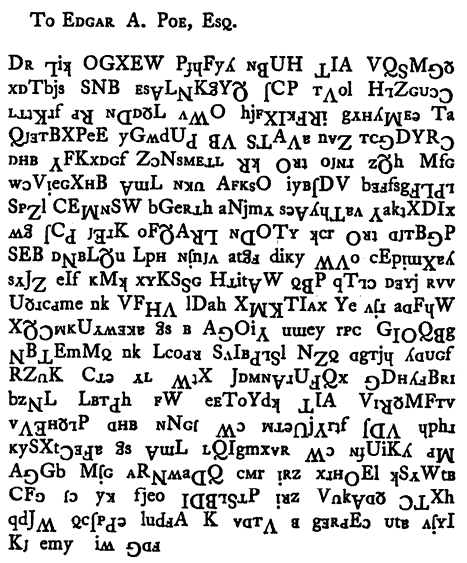

图 6-12：这个由埃德加·爱伦·坡留下的同音密码在创作后 160 年被解开。

欲了解此挑战的逐字稿和一些提示，请查看[`codebreaking-guide.com/challenges/`](http://codebreaking-guide.com/challenges/)。

## 未解密的密码

### 比尔文件第 1 页和第 3 页

正如本章前面讨论的那样，一个名为托马斯·比尔的 19 世纪弗吉尼亚冒险家据称在三份加密笔记中描述了一个宝藏及其位置。这个故事很可能只是虚构，但这些加密笔记值得研究。第二条信息已经被破译，但其他两个密码仍未被解开。据称比尔文件第 1 页包含宝藏的位置，而第 3 页包含比尔及其伙伴及其家人的姓名和住址。

这是比尔文件第 1 页，“宝库的位置”：

`71, 194, 38, 1701, 89, 76, 11, 83, 1629, 48, 94, 63, 132, 16, 111, 95, 84, 341, 975, 14, 40, 64, 27, 81, 139, 213, 63, 90, 1120, 8, 15, 3, 126, 2018, 40, 74, 758, 485, 604, 230, 436, 664, 582, 150, 251, 284, 308, 231, 124, 211, 486, 225, 401, 370, 11, 101, 305, 139, 189, 17, 33, 88, 208, 193, 145, 1, 94, 73, 416, 918, 263, 28, 500, 538, 356, 117, 136, 219, 27, 176, 130, 10, 460, 25, 485, 18, 436, 65, 84, 200, 283, 118, 320, 138, 36, 416, 280, 15, 71, 224, 961, 44, 16, 401, 39, 88, 61, 304, 12, 21, 24, 283, 134, 92, 63, 246, 486, 682, 7, 219, 184, 360, 780, 18, 64, 463, 474, 131, 160, 79, 73, 440, 95, 18, 64, 581, 34, 69, 128, 367, 460, 17, 81, 12, 103, 820, 62, 116, 97, 103, 862, 70, 60, 1317, 471, 540, 208, 121, 890, 346, 36, 150, 59, 568, 614, 13, 120, 63, 219, 812, 2160, 1780, 99, 35, 18, 21, 136, 872, 15, 28, 170, 88, 4, 30, 44, 112, 18, 147, 436, 195, 320, 37, 122, 113, 6, 140, 8, 120, 305, 42, 58, 461, 44, 106, 301, 13, 408, 680, 93, 86, 116, 530, 82, 568, 9, 102, 38, 416, 89, 71, 216, 728, 965, 818, 2, 38, 121, 195, 14, 326, 148, 234, 18, 55, 131, 234, 361, 824, 5, 81, 623, 48, 961, 19, 26, 33, 10, 1101, 365, 92, 88, 181, 275, 346, 201, 206, 86, 36, 219, 324, 829, 840, 64, 326, 19, 48, 122, 85, 216, 284, 919, 861, 326, 985, 233, 64, 68, 232, 431, 960, 50, 29, 81, 216, 321, 603, 14, 612, 81, 360, 36, 51, 62, 194, 78, 60, 200, 314, 676, 112, 4, 28, 18, 61, 136, 247, 819, 921, 1060, 464, 895, 10, 6, 66, 119, 38, 41, 49, 602, 423, 962, 302, 294, 875, 78, 14, 23, 111, 109, 62, 31, 501, 823, 216, 280, 34, 24, 150, 1000, 162, 286, 19, 21, 17, 340, 19, 242, 31, 86, 234, 140, 607, 115, 33, 191, 67, 104, 86, 52, 88, 16, 80, 121, 67, 95, 122, 216, 548, 96, 11, 201, 77, 364, 218, 65, 667, 890, 236, 154, 211, 10, 98, 34, 119, 56,216, 119, 71, 218, 1164, 1496, 1817, 51, 39, 210, 36, 3, 19, 540, 232, 22, 141, 617, 84, 290, 80, 46, 207, 411, 150, 29, 38, 46, 172, 85, 194, 39, 261, 543, 897, 624, 18, 212, 416, 127, 931, 19, 4, 63, 96, 12, 101, 418, 16, 140, 230, 460, 538, 19, 27, 88, 612, 1431, 90, 716, 275, 74, 83, 11, 426, 89, 72, 84, 1300, 1706, 814, 221, 132, 40, 102, 34, 868, 975, 1101, 84, 16, 79, 23, 16, 81, 122, 324, 403, 912, 227, 936, 447, 55, 86, 34, 43, 212, 107, 96, 314, 264, 1065, 323, 428, 601, 203, 124, 95, 216,814, 2906, 654, 820, 2, 301, 112, 176, 213, 71, 87, 96, 202, 35, 10, 2, 41, 17, 84, 221, 736, 820, 214, 11, 60, 760.`

这里是 Beale 论文 #3，“姓名和住址”：

`317, 8, 92, 73, 112, 89, 67, 318, 28, 96, 107, 41, 631, 78, 146, 397, 118, 98, 114, 246, 348, 116, 74, 88, 12, 65, 32, 14, 81, 19, 76, 121, 216, 85, 33, 66, 15, 108, 68, 77, 43, 24, 122, 96, 117, 36, 211, 301, 15, 44, 11, 46, 89, 18, 136, 68, 317, 28, 90, 82, 304, 71, 43, 221, 198, 176, 310, 319, 81, 99, 264, 380, 56, 37, 319, 2, 44, 53, 28, 44, 75, 98, 102, 37, 85, 107, 117, 64, 88, 136, 48, 154, 99, 175, 89, 315, 326,78, 96, 214, 218, 311, 43, 89, 51, 90, 75, 128, 96, 33, 28, 103, 84, 65, 26, 41, 246, 84, 270, 98, 116, 32, 59, 74, 66, 69, 240, 15, 8, 121, 20, 77, 89, 31, 11, 106, 81, 191, 224, 328, 18, 75, 52, 82, 117, 201, 39, 23, 217, 27, 21, 84, 35, 54, 109, 128, 49, 77, 88, 1, 81, 217, 64, 55, 83, 116, 251, 269, 311, 96, 54, 32, 120, 18, 132, 102, 219, 211, 84, 150, 219, 275, 312, 64, 10, 106, 87, 75, 47, 21, 29, 37, 81, 44, 18, 126, 115, 132, 160, 181, 203, 76, 81, 299, 314, 337, 351, 96, 11, 28, 97, 318, 238, 106, 24, 93, 3, 19, 17, 26, 60, 73, 88, 14, 126, 138, 234, 286, 297, 321, 365, 264, 19, 22, 84, 56, 107, 98, 123, 111, 214, 136, 7, 33, 45, 40, 13, 28, 46, 42, 107, 196, 227, 344, 198, 203, 247, 116, 19, 8, 212, 230, 31, 6, 328, 65, 48, 52, 59, 41, 122, 33, 117, 11, 18, 25, 71, 36, 45, 83, 76, 89, 92, 31, 65, 70, 83, 96, 27, 33, 44, 50, 61,24, 112, 136, 149, 176, 180, 194, 143, 171, 205, 296, 87, 12, 44, 51, 89, 98, 34, 41, 208, 173, 66, 9, 35, 16, 95, 8, 113, 175, 90, 56, 203, 19, 177, 183, 206, 157, 200, 218, 260, 291, 305, 618, 951, 320, 18, 124, 78, 65, 19, 32, 124, 48, 53, 57, 84, 96, 207, 244, 66, 82, 119, 71, 11, 86, 77, 213, 54, 82, 316, 245, 303, 86, 97, 106, 212, 18, 37, 15, 81, 89, 16, 7, 81, 39, 96, 14, 43, 216, 118, 29, 55, 109, 136, 172, 213,64, 8, 227, 304, 611, 221, 364, 819, 375, 128, 296, 1, 18, 53, 76, 10, 15, 23, 19, 71, 84, 120, 134, 66, 73, 89, 96, 230, 48, 77, 26, 101, 127, 936, 218, 439, 178, 171, 61, 226, 313, 215, 102, 18, 167, 262, 114, 218, 66, 59, 48, 27, 19, 13, 82, 48, 162, 119, 34, 127, 139, 34, 128, 129, 74, 63, 120, 11, 54, 61, 73, 92, 180, 66, 75, 101, 124, 265, 89, 96, 126, 274, 896, 917, 434, 461, 235, 890, 312, 413, 328, 381, 96, 105, 217, 66, 118, 22, 77, 64, 42, 12, 7, 55, 24, 83, 67, 97, 109, 121, 135, 181, 203, 219, 228, 256, 21, 34, 77, 319, 374, 382, 675, 684, 717, 864, 203, 4, 18, 92, 16, 63, 82, 22, 46, 55, 69, 74, 112, 134, 186, 175, 119, 213, 416, 312, 343, 264, 119, 186, 218, 343, 417, 845, 951, 124, 209, 49, 617, 856, 924, 936, 72, 19, 28, 11, 35, 42, 40, 66, 85, 94, 112, 65, 82, 115, 119, 236, 244, 186, 172, 112, 85, 6, 56, 38, 44, 85, 72, 32, 47, 73, 96, 124, 217, 314, 319, 221, 644, 817, 821, 934, 922, 416, 975, 10, 22,18, 46, 137, 181, 101, 39, 86, 103, 116, 138, 164, 212, 218, 296, 815, 380, 412, 460, 495, 675, 820, 952.`

如果你找到了宝藏，请告诉我们。

### 黄道杀手的第三封信（Z13）

1970 年 4 月 20 日，黄道杀手向一家报纸发送了第三封密码信（如今称为 Z13）。它仅由十三个字母组成。

据说，这段简短的加密文本包含了凶手的名字。它仍然未解。

### 黄道带杀手的第四条信息（Z32）

黄道带杀手的第四条信息（Z32）由三十二个字母组成，并于 1970 年 6 月 26 日发送。与 Z32 一起，杀手还寄送了一张旧金山地区的地图以及以下明文信息：`这张地图和这个密码将告诉你炸弹的放置地点。`^(19)

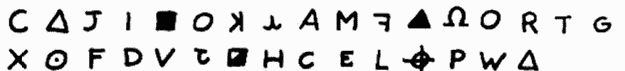

解答仍然未知。

### 蝎子密码

在 1990 年代，约翰·沃尔什，以主持*美国最想要的人*而闻名，收到了一系列签名为 SCORPION 的信件。^(20) 这些信件中有一些包含了加密信息，通常被称为蝎子密码。^(21) 迄今为止，仅有两份加密文本和几页未加密的文本被公开。图 6-13 展示了其中一份公开流传的加密文本。

如图所示，发件人模仿了黄道带杀手。这些蝎子密码的解答仍然未知。

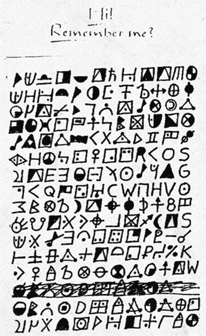

图 6-13：蝎子密码（这里只是其中的一部分）是由一位黄道带杀手的模仿者所创作。

### 亨利·德博斯尼的消息

1882 年，一位名叫亨利·德博斯尼（1836–1883）的人定居在纽约州的埃塞克斯县。^(22) 他很快开始追求一位名叫伊丽莎白·威尔斯的寡妇，仅仅几周后，两人便结婚。几个月后，伊丽莎白被发现被谋杀，德博斯尼被逮捕为嫌疑人。很快就发现，德博斯尼的两任前妻也在相似的奇怪情况下年轻去世。在监狱里，德博斯尼是一个博学且受过良好教育的人，他绘制了画作，写了诗歌，也创作了一些看似加密的文本（见图 6-14）。1883 年，他被判死刑，并随后被绞死。纽约州埃利兹贝斯敦的阿迪朗达克历史博物馆展出了许多关于此执行的有趣展品，以及德博斯尼创作的实际密码。

亨利·德博斯尼的故事由切丽·法恩斯沃思在其 2010 年出版的《阿迪朗达克之谜》一书中进行了详细记录。^(23) 关于此案仍然有许多未解的问题，包括关于他两任前妻死亡的更可靠信息。

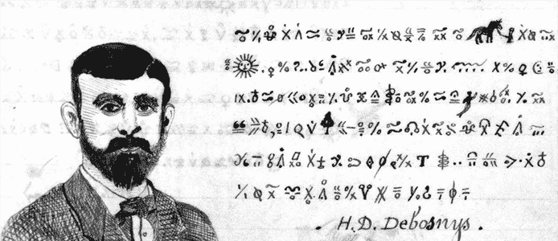

图 6-14：被定罪的妻子杀手亨利·德博斯尼的密码至今未解。

Debosnys 留下的四个已知的密码图可能会为这些问题提供一些线索，但它们从未被破译过。Debosnys，一位技艺高超的艺术家，使用了大量象形风格的符号来编码他的信息，这表明他应用了同音密码。尽管 Debosnys 的密码图是一个引人注目的密码谜团，但在国际密码破译界并没有得到太多关注。也许你，亲爱的读者，能够解决它们！
