# 密码和命名法

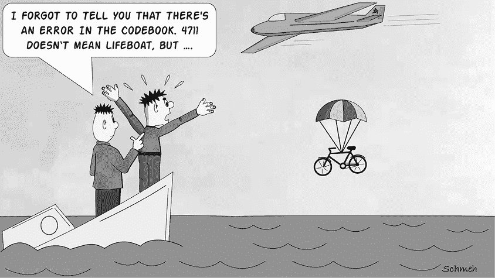

1917 年的齐默尔曼电报（图 7-1），其破解改变了第一次世界大战的进程，是德国国务卿阿图尔·齐默尔曼于 1917 年 1 月发送给墨西哥的一份秘密外交通知。电报提议，在美国参战对抗德国的情况下，德国与墨西哥建立军事同盟。^(1) 该电报在英国被秘密截获并转交给英国密码分析师，后者成功破解了它。内容的披露激怒了美国人，并帮助促使美国（此前一直保持中立）支持对德国宣战。

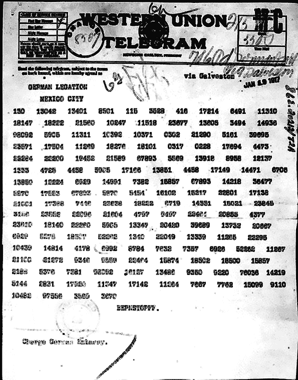

图 7-1：齐默尔曼电报，1917 年由德国国务卿发送的秘密外交通知，采用密码加密。

如所见，齐默尔曼电报的内容由数字组成，其中大部分是五位数。每个数字代表一个单词。例如，`4458`代表`zusammen`（`一起`），`13850`代表`finanziell`（`财务`），`36477`代表`德克萨斯`。为了加密信息，德国人使用了一种字典，其中包含数千个常用词的条目。解密和翻译后，齐默尔曼电报的内容如下：

`我们计划于二月一日开始无限制的潜艇战。尽管如此，我们的意图是尽力保持美国中立。`

`如果此次尝试不成功，我们提议与墨西哥建立以下基础上的同盟：我们将共同作战，并共同达成和平。我们将提供一般的财政支持，且明言墨西哥将重新夺回新墨西哥、德克萨斯和亚利桑那的失地。细节由你来决定……`

`你被指示在确信与美国爆发战争后，尽快以绝对保密的方式通知墨西哥总统上述内容，并建议墨西哥总统主动与日本沟通，建议立即遵守这一计划；同时，提出调解德国与日本之间的争端。`

`请提醒墨西哥总统，现在使用无情的潜艇战有望迫使英国在几个月内达成和平。`

`齐默尔曼（国务卿）`

## 密码

一种将整个单词或短语替换为单一数字、字母组合或符号的加密方法称为*密码*。密码在电报时代尤为流行——正如下面所指出的那样——许多密码不仅用于保密，还用于缩短信息。

在齐默尔曼电报的情况下，保密性，而非简化消息，是主要目标。德国人于 1916 年引入了名为 13040 代码的系统。该系统部分基于早期已经为英国密码分析员所知的代码。通过分析数十个 13040 代码的电报，伦敦的密码破译员能够提升对它的理解，到了 1917 年初，当他们接到破译齐默尔曼电报的命令时，他们已经准备充分。他们能够立刻解开消息的一部分，随后完全破译了该电报。

本书中描述的大多数加密方法在技术上并不是代码，而是*密码*，因为它们作用于单个字母，而非单词。简单的替换密码，如凯撒密码（或 ROT-13）、多字母的维吉尼亚系统以及双字母交换的普雷费尔方法，都是密码。齐默尔曼电报使用的系统，包括字典代码（见第十四章）和纳瓦霍代码（见第十五章），都是代码。换句话说：代码是一种通常作用于单词或短语级别的加密方法，而密码一般加密消息时作用于单个字母级别。

我们必须简要介绍一些附加术语。*代码组*是指在代码中表示一个单词的数字、字母组合或符号。任何旨在加密任意文本的代码都需要为语言中的每个常见单词提供一个代码组。这可能意味着成千上万的条目，因此编写代码通常需要创建一本完整的书，称为*密码本*。因此，本文定义的代码也可以称为*密码本代码*。图 7-2 和 7-3 显示了 1911 年和 1892 年印刷的密码本页面。^(2)^，^(3)

虽然有些代码用于各种消息，但其他一些则提供了专门用于电报的词汇。例如，木材、棉花、铁路、机械和象棋代码。一些公司根据其销售目录创建了代码，为每个产品分配了代码组。股票经纪人的代码提供了如`卖`和`买`等单词的代码组，以及公司名称和编号。这类代码使得基于电报的交易成为可能，它是今天在线交易的前身。

需要区分单部分代码和双部分代码。在*单部分代码*中，明文单元和代码组是根据某种顺序分配的（例如按字母顺序排序：`A` = `1`，`AM` = `2`，`AND` = `3`，`ARMY` = `4`，`AT` = `5`，`AUSTRIA` = `6` ……）。在*双部分代码*中，不可能进行这样的排序（例如：`A` = `1523`，`AM` = `912`，`AND` = `2303`，`ARMY` = `809`，`AT` = `1825`，`AUSTRIA` = `145` ……）。齐默尔曼电报使用的代码 13040 就是一种双部分代码。

一个双重编码通常需要两个替代表——一个按单词和字母排序（用于加密），另一个按编码组排序（用于解密）。没有按编码组排序的表，解密一个双重编码信息是费力的，除非该代码非常简短。同样，代码 13040，虽然填满了一整本书，如果仅有按编码组排序的表，它将几乎无法使用。解密可能很简单，但加密将非常耗时，因为很难找到需要加密的单词。

额外的替代表使得双重编码比单一编码更为复杂。另一方面，双重编码要更加安全，因为密码分析员无法利用相关代码表达式和编码组之间的关系。例如，如果解码员处理一个单一编码，知道`1`代表`A`，`3`代表`AND`，他们可以猜测`2`代表一个位于编码书中`A`和`AND`之间的单词：例如，`AM`。我们稍后会回到这个弱点。

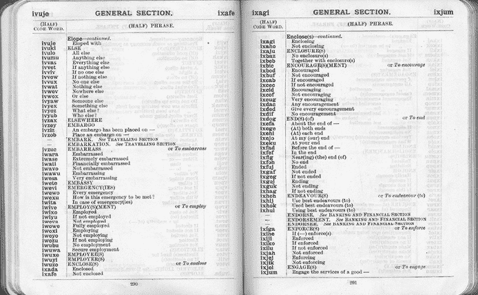

图 7-2：一本 1911 年出版的代码书页面，展示了如何替换单词和短语。在这种情况下，编码组由五个字母组成。

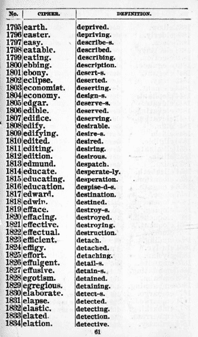

图 7-3：这本 1892 年的作品，*谢翰的电报密码代码*，列出了每个明文单词的数字和有意义的词语作为编码组。

## 命名法

现在让我们来看看一种系统，它是两种系统的混合体：*命名法*。这个系统既包含一种代码，如用数字表示不同的单词；也包含一种密码，使用数字或其他符号表示字母或字母组合。这个术语本身来源于这些系统通常由一组名称构成。在大型活动中，会有一个人被称为命名员，他会宣布到达者的名字。*Nomen*在拉丁语中意味着“名字”——特指一个人的第二个名字，用来指示他们的家族。

无法准确划定代码和命名法之间的边界。大多数人会认为任何拥有 50,000 个条目的代码书都是一个代码，即使它包含字母表的编码组。（大多数代码书都包含，因为列出所有潜在用户可能想要加密的单词和名字是不可能的。）如果一个加密表包含至少几千个单词或短语，大多数作者会使用*代码*这个术语。如果包含的少于这个数量，则该表通常被称为命名法。

命名法加密系统在 14 世纪到 19 世纪之间最为常见。例如，图 7-4 展示了 1670 年威廉·佩尔维奇（William Perwich）写的一封信的摘录。^(4)^, ^(5) 它以约十五个明文单词开头（`But now whilst all the world was in . . .`），后面是以 76 开头的数字行，并被一些更多的明文单词打断。

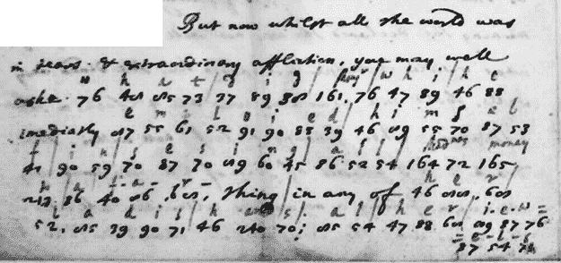

图 7-4：这封来自十七世纪的信件部分通过命名法加密。

我们这里处理的是一条部分加密的信息。一位未知的人（希望是接收者！）在每个数字上方写下了其明文等价物。该信息的内容如下（加粗部分已去除，原本加密的部分已恢复）：

`But now whilst all the world was`

`in tears & extraordinary affliction, you may well`

`aske` `what did Monsieur whi he`

`imediatly` `emploied himsel`

`f in sesing all Madame’s money`

`to a far``thing in any of` `her`

`ladis hands al her Jewels`

在这条信息中，大多数数字（代码组）代表字母，就像密码一样，但有些则替换了完整的单词，就像代码一样。例如，`76`代表`W`，`23`代表`T`，`47`代表`H`。另一方面，`161`等同于`Monsieur`，`164`等同于`Madame`，`165`等同于`money`，`240`等同于`and`。

以下是一个非常简单的命名法示例：

1.  `A` = `1`，`B` = `2`，`C` = `3`，……`Z` = `26`

1.  `London` = `27`，`Paris` = `28`；`Rome` = `29`；`today` = `30`；`tomorrow` = `31`

使用这个命名法，明文`WILL TRAVEL FROM LONDON TO PARIS TOMORROW`会被加密为`23 9 12 12 / 20 18 1 21 5 12 / 6 18 15 13 / 27 / 20 15 / 28 / 31`。

现在已丢失，用于加密 Perwich 信的命名法可能包含了几十个单词。除了`Monsieur`、`Madame`、`money`和`and`外，它可能还包括了名字和地名。信息的发送者可能用一个数字加密了英语中最常用的单词，同时用一个数字逐字加密较不常见的表达。

图 7-5 展示了意大利科学家和军事官员路易吉·马尔西利（Luigi Marsigli，1658–1730）使用的命名法。他从 1691 年起开始使用它，当时他在服务于神圣罗马帝国皇帝期间。^(6)^ 如图所示，这个命名法为每个字母提供了三个可选的数字（同音词）。此外，许多常见字母组合还有两个同音词。最后，还有一组 130 个单词，每个单词都有一个自己的代码组。

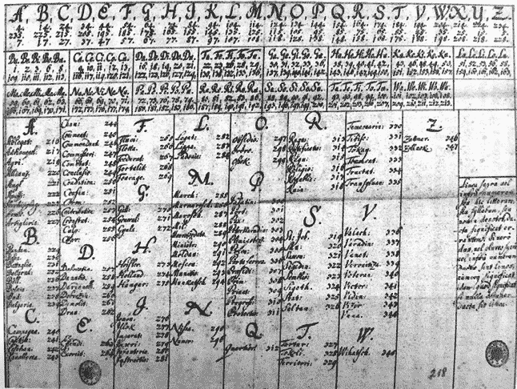

图 7-5：这份由意大利科学家在十七世纪末使用的命名法包含了约 130 个单词。

就像有一部分和两部分代码一样，也有一部分和两部分命名法。在*一部分命名法*中，代码组以及它们所代表的字母、单词或短语是根据某种系统分配的；但在*两部分命名法*中，情况并非如此。上面显示的十七世纪命名法是这两种变体的混合体。虽然字母代码组是无序的，但单词代码组是按字母顺序分配的：`Ablegat` = `216`，`Adrianopol` = `217`，`Agri` = `219`，`Allianz` = `220`，等等。

一部分代码和命名法比两部分的更为常见。这是因为有序的代码组使得代码或命名法更容易设计，也更方便使用。另一方面，一部分方案的安全性较差。举个例子，一旦破译者知道`4523`代表`华盛顿`，他们就能确定`4524`代表另一个以`W`开头的单词。类似地，一旦他们意识到`A` = `44`，`B` = `45`，`C` = `46`，其他字母也会变得容易猜测。

## 术语

命名法和代码是一个活跃的研究领域。近年来，许多有趣的论文已经在《*密码学*》期刊、《HistoCrypt》研讨会论文集中发表，^(7)^, ^(8)^以及其他会议论文集中。^(9)^, ^(10)

在 2018 年 HistoCrypt 会议上，来自荷兰的密码历史专家 Karl de Leeuw 发起了一次关于代码和命名法的研讨会，会议在瑞典乌普萨拉举行，约有五十位密码历史学家参加。^(11)^ 本次会议的一个目标是建立一致的术语，因为有时不同的术语用来表示相同的概念。例如，“nulls”也被称为“非值”或“混合器”。在此研讨会中发展出的术语已在线文档化。^(12)

## 代码和命名法的历史

命名法的出现早于代码的发明。已知最古老的命名法是十四世纪时在梵蒂冈使用的。^(13)^ 它们可能是由密码员引入的，密码员通过为常见单词添加一些符号，扩展了简单的替代密码或简单的同音密码，以节省加密和解密的时间。后来，密码专家系统地创造了命名法。

命名法很快变得非常流行。^(14) 如果你遇到一份 1800 年前写的加密文件，很大概率它是使用命名法加密的。在档案馆做研究的密码学历史专家，如 Anne-Simone Rous、Karl de Leeuw、Beáta Megyesi 和 Paolo Bonavoglia，常常遇到这种类型的加密消息。欧洲档案馆中可能有成千上万这样的文件，主要是贵族、外交官和士兵发送的消息。这些加密文件中只有一小部分曾公开面向大众。图 7-6 展示了詹姆斯·麦迪逊（美国开国元勋之一，并最终成为总统）在十八世纪发送的一封加密消息。^(15)

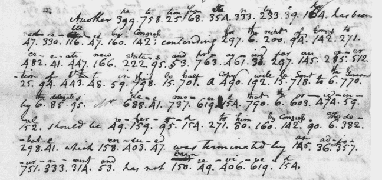

图 7-6：这封 1782 年的詹姆斯·麦迪逊信件展示了一个命名法消息，信中混合了加密字母和单词。

图 7-7 提供了另一个例子。在 2021 年，当我们在英国图书馆进行文献研究时，我们发现了这封来自英格兰查理一世国王的采用命名法加密的消息。这封信是他于 1648 年 8 月 1 日写给儿子的。^(16)^, ^(17)

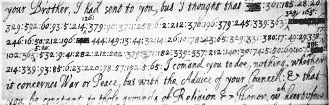

图 7-7：这封 1648 年的查理一世国王信件使用了命名法密码，信中清密文交替出现。

最早的命名法是在中世纪生成的，通常只有几十个代表单词的代码组。其他的则代表字母。^(18) 随着时间的推移，越来越大的命名法表格被构建出来。许多命名法表格包括了*同音词*（不同的代码组代表相同的明文项目）、*空值*（没有意义的代码组）和*无效符号*（使其他附近的代码组失去意义的代码组）。除了字母和单词，字母对、音节和常见短语也进入了命名法。

在图 7-8 中展示的命名法表格是一个简单的例子。^(19) 如图所示，每个字母有两个或三个同音词（例如，`2`、`12` 和 `22` 代表字母 `E`）。数字 `8` 被用作空值（在最后一行中作为“无效符号”（chiffre non-valeur）出现）。此外，它还提供了大约三十五个代表单词的代码组。这个命名法是两部分的，因为代码组没有经过排序。

图 7-8：一张十九世纪重印的命名法表格，原为十六世纪梵蒂冈使用。

图 7-9 中所示的 18 世纪命名符号是部分排序的。例如，字母表的前半部分被分配给以下数字：`A` = `44`，`B` = `45`，`C` = `46`，`D` = `47`……后半部分是`N` = `33`，`O` = `34`，`P` = `35`，`Q` = `36`……单词也进行了排序：`Aquaviva` = `100`，`Abbate` = `101`，`Althann` = `102`，`Antonio` = `103`，`Ascanio` = `104`……

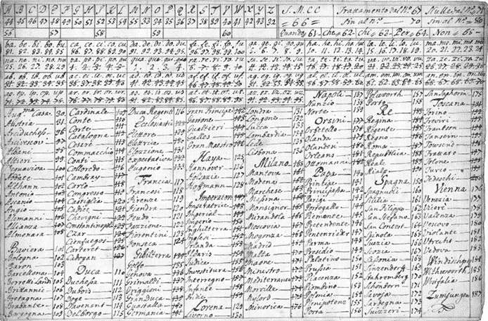

图 7-9：与许多类似的命名符号一样，这个 18 世纪的命名符号是部分排序的。例如，字母表的前半部分被分配给数字`A` = `44`，`B` = `45`，`C` = `46`，`D` = `47`……，`M` = `55`。

随着 19 世纪电报的出现，发送的消息数量大幅增加，这导致了对加密技术和经济高效的长消息发送方式的需求日益增加。由此开始了密码本的时代，这些密码本的条目超过 50,000 个^(21)，其中的代码组通常由五位或六位数字组成。由于电报公司按传输的单词数收费，许多密码本主要用于缩短消息。对于大多数人来说，使文本更难阅读甚至不是目标。为了节省单词和成本，这些代码不仅替换了单个表达式，还将常见短语替换为代码组。电报公司对此做出了反应，对不可读（即加密）消息收取更高的费用，这导致密码本的生产商加入了更多更长的短语。

在第二次世界大战期间，密码仍然在使用，尽管通常不在最高安全级别。随着加密机（它们基于字母工作，应用密码而非代码）的普及，密码本和命名符号的流行在 20 世纪中期结束。自从电子技术和计算机技术的出现以来，密码本和命名符号几乎失去了用途。

尽管密码本和命名符号在约 500 年间是最流行的加密方式，且有成千上万的消息被加密，但这一加密领域并没有像密码那样受到密码历史学家的关注。一些著名的破译书籍，如 Helen Fouché Gaines^(22)和 Abraham Sinkov^(23)的著作，仅简要地涉及这一主题，甚至完全没有提及。命名符号和密码本通常也未在休闲破译中发挥作用，因为破译者必须查看密码本才能有机会破解它们。我们也未见有任何专门设计用于分析和破解密码本和命名符号的计算机程序。大多数密码书、谜题专栏和密码挑战完全忽视了密码本和命名符号。

然而，近年来，这类系统已经成为历史研究的一个活跃领域。历史学家们在档案中发现了大量加密文献，开始与破译专家合作，尝试破解这些文献。（当然，并非所有存档中的加密信息都是通过代码或命名符加密的。）以下章节展示了一些例子。我们有信心，历史学家们将继续发布更多此类密码文，并努力破解它们。

## 代码和命名符的超级加密

一种使代码或命名符更加安全的简单技术是*超级加密*，即在信息已经使用代码、命名符或其他系统加密后，再添加第二步加密。这第二步加密可以非常简单。例如，如果代码组由数字组成，可以将当前日期得出的数字添加到代码组中。例如，在 10 月 16 日，可能会将数字 1016 添加到每个代码组中，这样`1234`就变成了`2250`。虽然收件人——知道所应用的超级加密方法——可以轻松地从密文中的每个数字中减去 1016，但密码分析师的工作就变得更加困难，因为每个代码组在一年中的不同日期有不同的含义。除此之外，如果对不同日期发送的消息应用频率分析，它几乎是无效的。

## 如何检测代码或命名符

在许多情况下，识别通过代码或命名符加密的密文比通过密码系统加密的密文要容易得多。在 1800 年之前，命名符消息通常是手写文本，包含多个数字，常常夹杂着明文内容。1783 年发送的消息，如图 7-10（a）所示，是非常典型的，我们将在本章的“未解密密码”部分再次提到它。当时没有其他常用的加密系统会产生这种类型的密文。图 7-10（b）中的 1702 年示例也是如此。^(24) 虽然诸如书籍密码（参见第十四章）或二重替换（参见第十二章）之类的系统可能会产生类似的密文，但当时它们并不常见。

如果我们看一下 19 世纪或 20 世纪创建的消息，情况就会变得稍微复杂一些。这一时期的一些密码本使用来自不同语言的随机单词作为代码组。图 7-10（c）中的 1898 年密码就是一个例子。像`CRAQUEREZ`或`IMPAZZAVA`这样的单词很可能是代码组，并可能是超级加密的。

图 7-10（d）中的信息是 1911 年通过电报发送的。^(25) 我们可以假设这条信息是通过代码或命名符生成的，因为 20 世纪初使用的其他加密方法很少能产生这种数字序列。

然而，在其他情况下，过去 200 年中的代码和名称法消息很难与通过其他方法（例如，像恩尼格玛这样的加密机器）生成的密文区分开来。如果代码词由五个字母组成，尤其如此；自 20 世纪初以来，所有类型的密文通常都是以五个字母一组的形式写成。例如，下面这条 1940 年的领事消息（由恩尼格玛专家 Frode Weierud 提供给我们）就是一条代码密码，尽管它看起来可能与由加密机器（见第十五章）或其他系统产生的密文相似：^(26)

`BBBTT YIXBA YIVYL OXUAB ARPBO UJTNU ASZAF UKURL YORAY MAXAD EWDKY IBEKY WITOS WIYVU MAMAN REKTI ASTCA EUKIM IVYDE UCHRE CEXLO HUNAL OXUAB ARXPU WIFOH IGAEB`

名称法或代码密码的典型特点是消息的部分内容保持明文形式。本章展示的大多数代码和名称法消息都是这种类型。当然，在使用密码时，也可以将一些词汇保持为明文，但这较为少见，尤其是在使用加密机器的情况下。

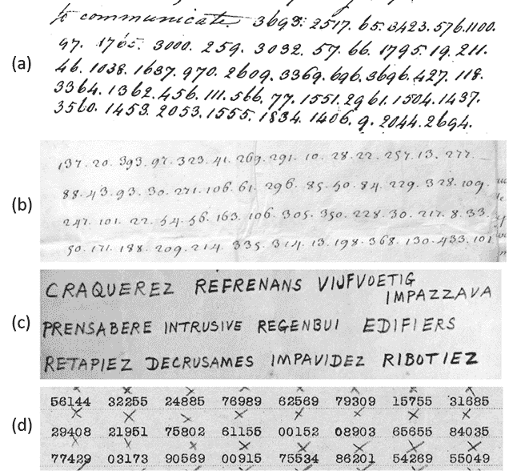

图 7-10：代码和名称法消息通常，尽管不是总是，容易被检测出来。

统计证据也可以用来检测代码或名称法。例如，消息中的字母或数字组之间的重复，例如上述领事消息中第一行和第三行中的`OXUAB`，可能表明要么是较弱的密码（如简单替换密码或维吉尼亚密码），要么是代码或名称法。这是因为由强密码系统（如恩尼格玛）生成的密文在视觉上类似于随机序列，因此非常不可能出现，例如，一个五个字母的组在几百个字符的消息中出现两次，更不用说出现多次了。

## 如何破解代码或名称法

一个构造和使用得当的代码或名称法非常难破解，甚至几乎不可能破解。然而，熟练的破译员已经解开了令人惊讶数量的此类密码谜题。其原因有多个：

+   有时可以找到表格或代码本。

+   一些代码组的含义可能为破译员所知，可以作为破解线索。

+   许多名称法构造得很差。例如，字母/数字组合通常按照易于确定的字母或数字顺序排序。也可能能够区分字母代码组和词语代码组。例如，如果两个数字组往往一个接一个地出现，它们可能是字母组。如果这些字母组可以通过常规的密码分析技术破解，它们可能为破解其他代码组提供线索。

+   历史上，许多密码员并没有正确使用代码和名称法；例如，他们总是选择同一个同音字，而忽视了其他可选项。

这些弱点在我们接下来介绍的破解命名法的方法中扮演着重要角色。

### 寻找命名法表格或密码本

密码或命名法的一个缺点是，更改密钥（即使用的密码本或表格）是一个昂贵的过程。编制一个新的命名法表格是费力的，重新编写整个密码本也是如此。因此，密码和命名法通常会长时间使用相同的表格或密码本，甚至几年而不更改。这一点，当然，对破译者来说是有帮助的。

当尝试破解一个密码或命名法信息时，搜索所使用的密码本或命名法表格是一个不错的主意。对于大约 1850 年以后创建的信息，这种方法尤其有效，当时电报技术正在蓬勃发展。命名法表格开始逐渐不再流行，但加密文本的数量和密码本的规模却大幅增加。今天，成百上千本来自那个时期的旧密码本可以在网上找到。一个很好的起点是查看由日本密码专家富木尾聪史^(27) 和约翰·麦克维（John McVey）^(28) 维护的网站，每个网站上列出了数百本电报密码本，其中许多可以下载。值得记住的是，这些密码本中的许多并非主要用于保密，而是为了简化消息。此类密码本大规模出售，并未保密。

例如，看看图 7-11 中描绘的十九世纪电报，这封电报由博客读者卡斯滕·汉斯基提供。^(29) 这封便条的发送者是美国天文学家约翰·里奇，他于 1896 年 9 月 7 日从马萨诸塞州波士顿发送至科罗拉多州丹佛的钱伯兰天文台。电报中的一些词汇，如`COMET`和`USUAL`，显然是明文。了解天文学的读者可能会知道，`BROOKS`和`GIACOBINI`是彗星的名称，而`LICK`和`HUSSEY`是美国的天文台。其他一些词，如`BOUCHETROU`、`CALIMA`和`FACILENESS`，没有意义，它们可能是密码组。如果是这样，我们正在处理一种基于虚构词汇的密码。

使用传统的破译技术破解这条简短的信息将非常困难，甚至几乎不可能。找到密码本是唯一现实的选择。卡斯滕试了试运气，并且成功了。在互联网档案馆网站上（[`archive.org`](https://archive.org)），他找到了与之匹配的密码本，《科学观察者密码》，该密码本来自 1885 年。^(30) 电报的发送者里奇（Ritchie）是该密码本的作者之一，这使得卡斯滕的搜索变得稍微容易了一些！

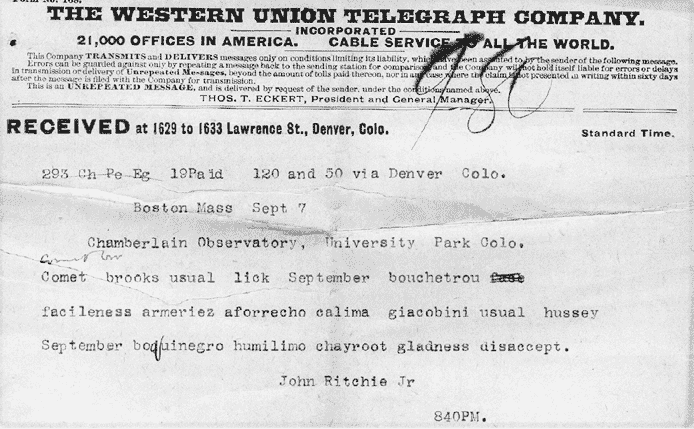

图 7-11：这张 1896 年的电报，由天文学家约翰·里奇发送，包含了一些密码词。通过识别所用的密码本后，信息便可以解读。

图 7-12 展示了这本密码本中的一页——它相当特别。它用于传输明文数字`0`到`39,999`。天文学家可以使用这些密码组来编码位置、轨道和其他天文数据。这个密码可能并不是为了保持消息的机密性，而是为了避免在数字传输中的错误。例如，`BOUCHETROU`代表`6835`。电报中出现的其他密码组含义如下：`FACILENESS` = `20756`，`ARMERIEZ` = `3435`，`AFORRECHO` = `1085`，`CALIMA` = `8085`，`BOQUINEGRO` = `6691`，`HUMILIMO` = `25844`，`CHAYROOT` = `9752`，`GLADNESS` = `23266`，`DISACCEPT` = `16388`。

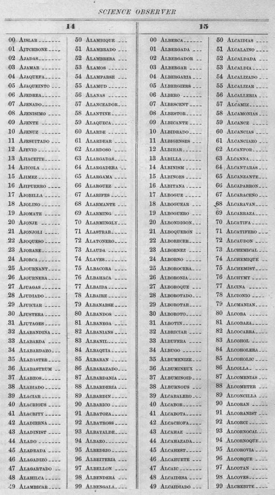

图 7-12：1885 年《科学观察者密码》中的一页。天文学家约翰·里奇（John Ritchie）在他的电报中使用了这个密码。

即便我们知道了这些密码组的含义，电报的内容仍然难以理解。这是因为发件人以一种使消息更简短的方式对日期和天文信息进行了编码。他使用的方法在密码本的介绍中有解释。运用这些方法，卡斯滕重建了以下明文：

`波士顿，马萨诸塞州，9 月 7 日`

`布鲁克斯彗星于 9 月 6.8355 日被利克天文台（Lick Observatory）观测到，位置如下`

`位置：`

`RA: 207° 56' 01" ' 13h 51m 44.1s`

`赤纬：55° 24' 52"`

`贾科比尼彗星于 9 月 6.6916 日被哈塞（Hussey）观测到，位置如下：`

`RA: 258° 44' ' 17h 14m 58.3s`

`赤纬：-7° 52' 26"`

`约翰·里奇（John Ritchie Jr）`

这封电报的目的是通知接收者（科罗拉多州丹佛市的天文台）1896 年 9 月 6 日在波士顿观测到的布鲁克斯和贾科比尼彗星的坐标。

### 利用密码和命名法的弱点

如果我们找不到所使用的替代表格，我们需要采用破译方法来解码密码或命名法消息。如前所述，如果密码或命名法构造得当并正确使用，这将是一个极其困难的任务。执行此类密码分析的计算机算法是一个活跃的研究领域。爬山算法（参见第十六章）是历史上密码破译中看似无所不能的工具，但在这里并不太有用，因为潜在的单词和短语太多了。到目前为止，还没有可用的计算机程序来解决密码和命名法问题。这可能会改变，但目前来说，破解密码或命名法消息主要还是依赖于人类智慧，而非计算机智慧。

幸运的是，许多密码和命名法质量较差。例如，一个单一部分的密码或命名法比两部分的密码或命名法更容易破解。即便在两部分的密码中，我们也能预期密码组的排列方式存在规律性，这使得破解消息变得更加容易。

让我们解析一条由十七世纪在大英帝国的间谍写的命名器消息。这个密码和我们呈现的解密方案由数学家兼密码学历史学家彼得·P·法戈内在《密码学》杂志中描述。^31。以下是消息中的一段摘录：

`. . . 44, 38, 62, 39, 我发送给你我的 34, 74, 58, 44, 38, 62, 与 116, 66, 57, 给他自己 50, 38, 30, 64, 67, 42, 50, 30, 54, 38, 有, 51, 56, 64, 66, 46, 67, 26 &, 我, 42, 30, 68, 38, 125, 这 36, 57, 68, 32, 50, 38, 让他看到我公平交易，什么东西会来, 40, 62, 56, 52, 26, 116, 必须来, 66, 56, 27, 125, 告诉 103, 他必须 70, 62, 46, 66, 39, 54, 56, 38, 52, 57, 63, 38 . . .`

这个密文由（主要是两位数的）数字组成，数字之间用逗号分隔。一些段落是明文写成的。总的来说，消息包含大约一千个数字和一个由九十个不同数字组成的字母表。根据本章前面讨论的标准，我们可以假设这个密码是通过命名器创建的。

作为第一步，我们计算代码组以执行频率分析。这揭示了`30`到`77`之间的数字出现频率远高于其他数字，这引发了一个怀疑：这四十八个数字可能代表字母，而其余的可能编码完整的单词。由于十七世纪使用的字母表包含了二十四个字母（*U*和*V*，以及*I*和*J*没有区分），我们可以适当假设每个字母都有两个数字（同音字）。我们首先尝试以下方案：

`A``: 30/31`

`B``: 32/33`

`C``: 34/35`

`D``: 36/37`

`E``: 38/39`

`. . .`

事实证明，我们得到了一个有意义的文本。命名器的开发者简直为我们提供了便利！

下面是解密后带有字母代码组的摘录：

`. . . 这里我发送给你我的密码 116，给他自己，至少他不会丢失它，26, &, 我给了 125，双倍给他，让他看到我公平交易，什么东西从 26, 116 来，必须来 27, 125，告诉 103，他必须不再写 `c` . . .`

我们能猜出剩下的代码组吗？它们可能代表单词、短语或音节。事实证明，`11`到`30`之间的数字可以直接省略。它们中的大多数或全部可能是空值。`1`到`10`的数字可能代表数字。由于命名器设计得不好，我们可以假设`1` = `1`，`2` = `2`，`3` = `3`，以此类推。三位数的数字很可能代表姓名和地点。没有详细的背景信息，我们无法确定它们的含义。

然而，消息的内容确实确认了有间谍在工作，谈论贿赂和其他隐秘行动。或许这条消息的发送者是英国间谍，活跃于爱尔兰的爱尔兰联邦战争时期（1641–1653）。他们的身份可能永远会保持谜团。

接下来，让我们看看十六世纪的教皇密码。图 7-13 显示了 1573 年梵蒂冈发给一位驻波兰教皇外交官的命名器信息。这条信息最初由密码历史学家阿尔伯特·莱顿于 1969 年破译。^(32)

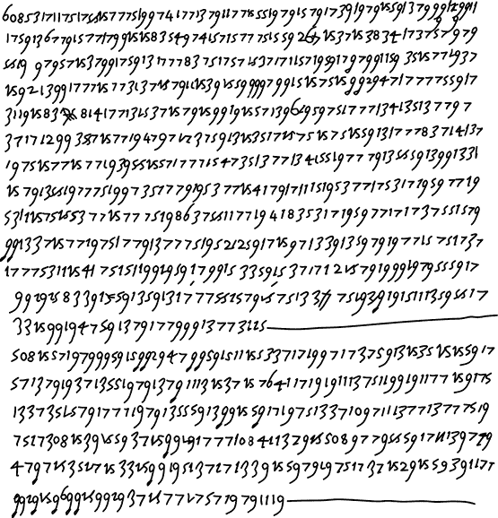

图 7-13：这条十六世纪的命名器信息之所以被破译，是因为使用的命名器非常简单。

密文由一系列不间断的数字组成。更仔细的检查表明，这些数字倾向于成对出现。也有一些例外，例如几个三位数的数字组，以及某些数字对的第一个数字上方有点。这里是前两行的转录。带点的数字被转录为带下划线的数字：

`608 53 17 11 75 17 55 25 77 75 29 97 41 77 13 79 11 77 15 59 19 79 15 79 17 39 19 79 15 59 13 79 99 58 99 11`

`17 59 13` `6``7 79 15 77 17 99 15 15 83` `5``4 97 41 57 15 77 75 15 59 26 99 15 37` `1``5 38 34 17 37 57 19 79`

考虑到写作时期，并且知道梵蒂冈在文艺复兴时期广泛使用命名器，我们可以推测这段文本是使用命名器加密的。如果我们处理的是一个结构不良的命名器，似乎有可能三位数的数字和带点的数字代表的是单词，而所有其他的数字对则代表字母。以下是对假定字母的频率分析：

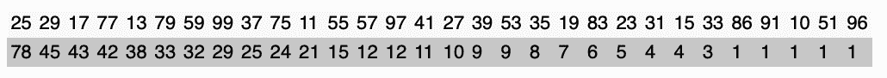

如所见，使用了三十二个两位数。如果它们真的代表字母表的字母，那么有足够的数字可以对字母`A`到`Z`进行编码，并且还可以编码一些空值。五个最常见的数字中有四个以`1`或`2`开头（`25`、`29`、`17`和`13`），这些数字在密文中没有形成更长的序列。它们可能代表元音字母。在意大利语中，元音字母*E*、*A*、*I*和*O*的频率几乎相同（大约在 10%到 12%之间），而*U*（在古文献中通常与*V*相同）仅占文本的约 3%（见附录 B）。因此，可能只有一个代码组代表`U`，并且这是最稀有的元音代码组，即`11`。

最常见的非元音是`77`。这个数字必须代表`N`，它是意大利语中最常见的辅音。接下来的三个辅音是`59`、`79`和`99`。它们可能分别代表字母`R`、`S`和`T`。通过反复试验，确认`59` = `R`、`79` = `S`和`99` = `T`是有效的。知道这些辅音和意大利语中最常见的双字母组合（在附录 B 中也有描述），我们就能推导出元音`25`、`29`、`17`和`13`的含义：`A` = `25`、`E` = `13`、`I` = `17`、`O` = `29`。到目前为止，我们所发现的足以破译大部分信息：

`(608) giudicando che con nessuna cosa si possa restituire piu sanita a questo regno che con mandar costoro a la guerra ricuperation de' beni regii il mosco per smaltire in questo modo i mali umori turbano la religion cattolica et inanz(i) la sua partita ha dato molto indrizzo a questo consiglio et ne ha lassato a me particolar ordine et benche li heretici temano molto che il re abbia da dare in questo sua santita et lo dannano nondimeno cammina molto bene et con sucretezza secondo che bisogna et si va ogni giorno guadagnando qualcuno con questi giorni il castellano di sendomiria que e' persona di lingua et d'autorita' fra li heretici ha sottoscritto a questo parere in casa de' ? dopo averci fatto molto resistenza`

`(508). ha mostrato molto travaglio que il re abbia rimesso le cose sue a la dieta et io ho veduto una lettera del basino secretario del re christianissimo che venendo di (308) ha parlato in (108) con essa (508) che scrive che per molto che abbia fatto non li e parso di lassar punto aquetato l'animo suo`

数字 608、508、308 和 108 不能以相同的方式解码，因为它们可能指的是特定的名字或地方。

这是前几句话的翻译：

`(608) 判断认为，通过其他任何手段无法恢复这个王国的理智，只有派遣一个代表团前往战争[以便]恢复王室财富，IL MOSCO，借此清除扰乱天主教信仰的邪恶荣耀，在出发前，他做了很多工作以实施这一决定，并留下了特别的责任交给我；尽管异端分子害怕国王因此可能会失去圣洁并因此受到指责，然而一切进行得非常顺利，且保密工作做得很好，每天我们都能赢得一些人心。`

许多其他的代码和命名法密码也以类似的方式被解开。

### 使用密钥和命名法解码

有时，了解相关代码或命名法中使用的代码组的含义有助于破解。这些代码在与你试图解密的环境中使用过。你甚至可能拥有一对密文和明文，用来重建相关的代码。Paolo Bonavoglia、George Lasry 和 Luigi Sacco 等人曾发布过关于这类成功破译的报告。此技巧对于许多密码类型也非常有帮助。^(35) 研究密码创造的背景可以是一个非常强大的工具。

## 成功案例

### 发送到特拉维夫的电报

图 7-14 所示的加密电报由我们提供，来自卡尔斯滕·汉斯基^(36)，它于 1948 年 6 月 5 日从纽约经伦敦发送至特拉维夫。电报表格上列出的收件人是`GOVTT MEMISRAEL TEL AVIV`，即以色列政府。由于以色列在 1948 年 5 月 14 日在特拉维夫成立，因此这封电报发送的时间和地点都非常特别。密文中包含几个明文单词，如`VERTICALLY`、`BANK`、`ANGLO`和`PALESTINE`。

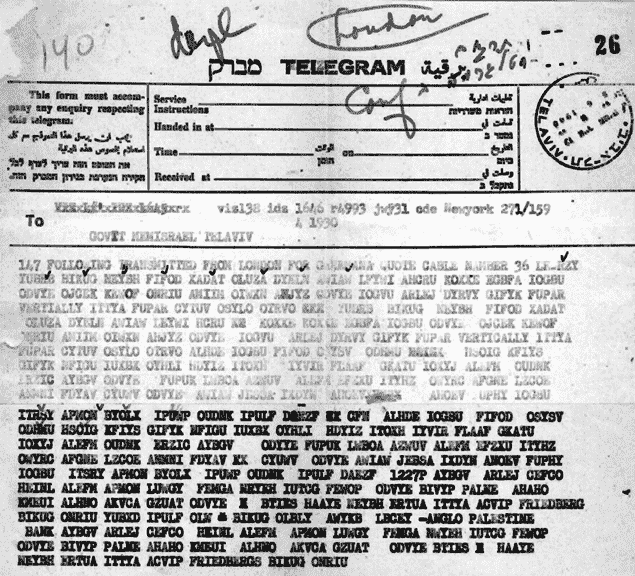

图 7-14：1948 年从纽约发往特拉维夫的加密电报。由于使用的密码本可以在线获得，因此解密该信息并不困难。

以色列政府如果使用了一种精良制作的密码，那么破解者解决这个密码的唯一机会就是找到使用的密码本，事实上，事情正是如此。密码本专家约翰·麦克维发现，密码的作者们使用了*皮特森国际密码*（第三版，1929 年）。^(37) 理查德·范·德·沃乌也得出了相同的结论。汉斯基推导出了以下明文（省略了一些冗余部分）：

`电报从巴勒斯坦海法发出，日期为 5 月 28 日，董事会货币表示遗憾无法同意提案销毁纸币——他们准备接受以下安排——纸币垂直对半切割，一半未经保险交给我们，如果未发行的纸币按序列顺序保留，并且每包纸币上有标签标明序列号和面值，每捆纸币由你保留，且仅在收到第一批货物安全到达的通知后才进行发货——董事会将在收到第一批纸币时根据银行的证书支付其内容的 1127P 捆，之后再核对，并且银行对短缺或伪造负责——电报询问你是否同意此程序，如果同意，涉及的准确金额是多少——此电报是根据 FRIEDBERG 发给 ANGLO PALESTINE BANK 的电报内容发出的副本。`

### 玛丽·斯图尔特女王的加密信息

#### 十六世纪的解决方案

1569 年，英格兰的伊丽莎白一世女王将她的表亲玛丽·斯图尔特（苏格兰女王）囚禁。玛丽以经常与支持者通过密码通信而闻名。

她的盟友中有一群英国天主教徒，他们试图刺杀伊丽莎白一世，目的是让玛丽登上英国王位。玛丽和阴谋者通过藏在啤酒桶塞中的加密信件进行通信。不幸的是，运送这些信件的仆人实际上是为英国间谍头目弗朗西斯·沃尔辛厄姆工作的间谍，沃尔辛厄姆随后将这些加密信件的副本提供给了他的密码破译者托马斯·费利普斯。

费利普斯注意到，玛丽和阴谋者用大约四十个符号组成的字母表写他们的加密信件。他的猜测是，他所面对的是一个由大约二十五个字母符号组成的命名法，其中大约十五个符号代表词语或空白。仅由四十个代码组组成的命名法在十六世纪非常常见，后来这些命名法变得更大。

一个由四十个代码组组成的命名法可以通过频率分析来破解。我们不确切知道费利普斯是如何工作的，但他可能假设最频繁的符号代表英语中最常用的字母，尽管他可能被一些空白符号所困扰。经过一些分析后，费利普斯能够重建整个命名法，如图 7-15 所示。^(38)

图 7-15：十六世纪苏格兰女王玛丽使用的命名法

在加密系统被破解之后，沃尔辛厄姆可以轻松监控玛丽与阴谋者之间的通信，且这些通信变得越来越频繁。最终，沃尔辛厄姆和费利普斯伪造了一条给玛丽的消息，要求她提供阴谋者的名单——这一计划成功了。根据这一证据，玛丽的阴谋者被逮捕、定罪并于 1586 年执行死刑。在另一次单独的审判中，苏格兰女王玛丽于 1587 年 2 月 8 日被斩首。

#### 二十一世纪对另一种玛丽·斯图尔特命名法的解决方案

另一个值得注意的成功故事涉及三位在我们书中多次提到的人：乔治·拉斯里、诺伯特·比尔曼和友田聪清（参见图 7-16）。他们十多年来的兴趣之一就是检查世界各地的档案，寻找任何未知的加密消息，以便记录并破解它们。许多大型档案馆和私人收藏中仍然有无法解读的加密文件，有时甚至无法确定这些文件的归属。这些文件大多数已有数百年历史。这三位无畏的探险者（以及我们的其他同事）发现，通过在线目录搜索数字化的文件，并使用诸如*cipher*之类的标签，往往能找到许多此类加密文件。友田聪清更进一步，有时他会逐一检查文件，看看其中是否有加密内容！

图 7-16：从左到右：乔治·拉斯里（以色列）、诺伯特·比尔曼（德国）和佐藤友清（日本）在翻阅法国国家图书馆的档案时，做出了一个了不起的发现。

2021 年，在梳理法国国家图书馆（BnF）在线收藏的加密文档时，研究小组偶然发现了一大批未标记的文件，所有文件都是加密的，并且使用了相同的图形符号集（见图 7-17）。根据 BnF 目录，这些文档应该是 16 世纪上半叶的，且与意大利事务相关。2021 年 4 月，团队首次尝试破解这些密码，假设语言是意大利语，但未能成功。2022 年 2 月，他们再次尝试，这次假设语言可能是法语，并使用了一个带有模拟退火算法的爬山程序（见第十六章）。这次他们能够获得一些似乎合理的文本片段，比如“catholi”和“persecu”。^(39)

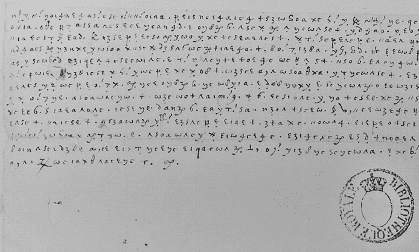

图 7-17：一封 16 世纪的加密信件，直到 2021 年才在档案中被发现

随后，他们使用了手动破译技巧，如猜词（见第四章），逐步恢复了密码钥匙——在这种情况下是一个命名表，结合了同音密码。这种系统比早期的系统复杂得多，如图 7-15 所示。总的来说，团队能够识别出 219 个不同的符号（见图 7-18），其中一些代表音节或单词。当他们开始能够读取文档时，团队意识到这些文本是由一名囚犯写的，文中提到了囚禁、诸如“我的儿子”这样的短语，以及沃尔辛厄姆（Walsingham）这个名字。这个名字非常关键，因为在那个时期，弗朗西斯·沃尔辛厄姆爵士是伊丽莎白一世女王的间谍头目，这引发了信件可能来自玛丽·斯图亚特——伊丽莎白女王的被囚禁的表妹——的怀疑。这个假设在团队在英国档案中发现一些相应的明文副本后得到了证实。随后，团队开始着手转录并破译玛丽的 57 封加密信件，令人震惊。

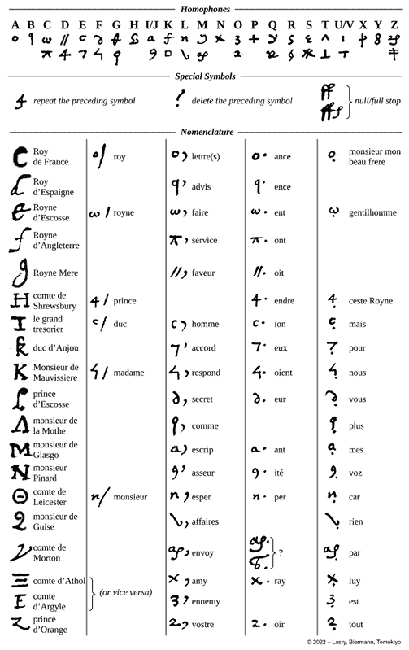

图 7-18：玛丽–卡斯特尔诺命名表的一部分

新解码的信件原来是长期被历史学家认为已经失传的秘密通信的一部分。大部分信件是在 1578 年到 1584 年之间，由玛丽写给法国驻英大使米歇尔·德·卡斯特尔诺（Michel de Castelnau）的。这些信件构成了一大批关于玛丽·斯图亚特的新原始资料——总计约 5 万字。它们突出了英法和苏格兰的政治，玛丽努力争取自己被释放并恢复苏格兰女王的身份，以及众多其他话题。这个发现为现代历史学家打开了一座宝藏。

这一令人震惊的发现，被剑桥大学的历史学专家约翰·盖伊（John Guy）称为“过去 100 年里关于苏格兰玛丽女王的最重要新发现”^(40)，于 2023 年 2 月 8 日（巧合的是，这一天也是玛丽于 1587 年被斩首的纪念日）宣布。此事成为国际头条新闻，并促使我们在最后一刻将这一新发现添加到我们的书中！^(41)

一个值得记住的教训是，密码历史学家的工作还远未完成。还有许多这样的文件等待被发现。在一次 HistoCrypt 大会上，估计仍有数百甚至数千份这样的编码信息未被找到并解码，这些信息能为我们打开一扇通往过去的窗。

### 科林森的搜寻探险

1850 至 1855 年间，几乎五十则加密广告定期发布在伦敦的报纸*The Times*上，显然使用的是相同的密码。以下是其中一则来自 1851 年 10 月 1 日的广告示例：

`No. 16th.-S.lkqo. C. hgo & Tatty. F. kmn at npk1 F. qgli lngk S mhn F. olhi E qkpn. S. niql S mnhq, F. qgli. Austin S pgqn C. kioq 6th F. iqhl. born. 13th F. kipo a F khg. hmip. to E. mlhg by D oi. S. pkqg C omgk B. hkq. qkng F. ioph. to hnio. S. ompi C. mkop F. oiph to Mr. C. nhmg & F. mpkh. nmkq E. lhpq. J. de W.`

一个世纪后，1980 年，*The Times*举办了一次比赛，看看是否有人能解开一条类似的消息，这条消息来自 1852 年 4 月 2 日。尽管没人能够解开，但有人指出，其中一条信息似乎包含了类似于经纬度的内容。

经过数年，才有两位经验丰富的破译员成功独立地解开了这些信息。其一，约翰·拉布森（John Rabson），在 1992 年于科学期刊*Cryptologia*上报道了他的解密方法。^(42)拉布森怀疑这些信息使用了一种带有附加字母加密（超级加密）的密码。在经过一番搜索后，他发现*普遍信号编码*是一个不错的候选者。加密技术被用来将代码中的数字转换成字母序列。他的解码如下：

`No. 16th. your wife and family were all well when I left Bernard & Tatty both at home Captain Penny arrived at from Baffin's Bay early in September without success Captain Austin hourly expected Margarets 6th son born 13th September a box went to Sandwich Isles by Antelope early in January Emily Sophia Thomason go to Wales early in October James goes to Mr. Hawk & lives in Gateshead. J. de W.`

现在这系列广告的背景变得清晰。这些加密信息可能是由英国航海家理查德·科林森（Richard Collinson，1811–1883）的一位家庭成员发布的。科林森于 1850 至 1855 年间领导了一次前往北美北极的探险，试图营救失踪的极地探险家约翰·富兰克林勋爵及其船员，他们在尝试寻找西北航道时未能归来。

这些加密广告不太可能是用于军事或商业机密。更有可能的是，它们只是为了隐私而加密。这些广告是用来告诉 Collinson 他在五年探险期间家人和朋友的情况。看来，这些消息的创作者希望即使在非常偏远的地方，也能获得当时世界上最重要的报纸——《*泰晤士报*》。

即使有密码本，进行精确翻译也可能很棘手。例如，下面是 1853 年 1 月 1 日的另一条消息：

`S lmpi F. npi npil pil pink. C. klmh F. oimg ogq, khq lqkh ikpg ogql, lqoi qoin oing lqkh. hmig C, omgk F, npi npil qmk. C hgo, F, ploi omnl. qoip, C qkin. F oing ihlm, ik, lmhn, C nhgq F, iomn hkom C. okiq F, mqho, olhi. C, iko. F olhi B, nlo, F. pgnq. kipo 17th S lmpi. F mpoh C. ngil B opkg F npi npil qmk ikpg npkl. okgh. P. F, pil. M. mhik lph hqpm oilg qolg. nmkq ikpg npkl C. nkq S lmpi C kgql F, oing ihlm mlgi mkiq qnhi koil lgoq lgqo. olhi B. qnp.`

密钥的数字已经转化为字母：

`0987654321`

`ghiklmnopq`

当 Elonka 处理这条消息时，她渐渐明白，解密这条消息需要大量的猜测，并且要考虑人为错误。例如，`npil`，直接用密码本翻译，得到了`4286`，在密码本中代表`hook`（钩子）。但在上下文中这并没有意义，产生了像“在钩子和其他地方”以及“所有一切都好在钩子”这样的句子。`4286`这个数字出现得很频繁，但有时在相同的上下文中，她会发现`npkl`，即`4276`，它意味着`home`（家）。当她把`hook`换成`home`，得到像“家里一切都很好”这样的短语时，消息开始变得更加合理了！

消息中的其他地方同样模糊不清，使得很难判断是解密错误还是有打字错误。这让事情变成了一个真正的难题。另一个难点是，《*信号通用法典*》的出版商会不时重印这本书，具体作者使用的是哪个版本也不清楚。当然，不能晚于 1855 年。但是，Elonka 只找到 1864 年的版本或更晚的版本，这些版本显然不可能是 1853 年发送的消息所使用的。

她对明文的最佳猜测是：

`家里和其他地方都很好。玛格丽特在圣诞节当天晚上生了另一个男孩，一切顺利。艾米丽回家了。伯纳德也回家过圣诞。夏洛特也要回家，增添了人气。哈丽特和范妮一起待着。来自本杰明的信件已通过皇家号到达，一切安好，喜欢弗雷德里克港。斯托克斯利也回家了，家里热闹非凡。P 和 M 都很好，家里有 12 个孙子孙女。萨拉和简，一切安好。劳伦斯·德拉尼要娶科尔里奇小姐。没有来自 Resolute 号的消息。`

无论如何，在科林森的远征之后，他的兄弟将他的日志编成了一本书，名为《HMS Enterprise 日记》（1889 年），以船的名字命名。根据这本书，科林森确实收到了至少四条信息，当时他到达了印度尼西亚的“班古旺吉”（可能是班尤旺吉镇）（见图 7-19）。^(43)

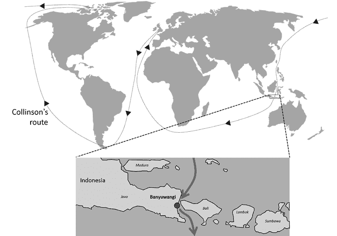

图 7-19：在科林森的环球旅行中，他在船只停靠在印度尼西亚班尤旺吉时能够接收到一些加密信息。

我们可以说这是第一个安全的全球通信系统！

### 日本的 JN-25 密码

在第二次世界大战的太平洋战区，美国军队遇到了许多日本的加密系统。美国和英国的密码破译员在破解这些系统方面取得了相当大的成功。他们最著名的两项成就就是破解了 JN-25——日本主要的海军密码，以及 PURPLE——一种用于日本外交信息的机器加密系统。^(44) 美国陆军的 SIS（信号情报局），由传奇人物威廉·弗里德曼领导，他的团队由弗兰克·罗列特带领，甚至在从未见过该机器的情况下就破解了 PURPLE（见第十五章）。

另一个改变历史的成功是破解了 JN-25。除了加密机器（如 PURPLE）之外，日本还使用了许多手动密码来加密他们的通信。最重要的其中之一就是 JN-25，美国密码学家将其命名为 JN-25，因为这是他们识别出的第 25 个日本海军加密系统。^(45) JN-25 在 1939 年初被引入，就在德国入侵波兰和战争爆发的几个月前。这个加密系统立即被英国和美国的密码分析小组进行了分析。

布莱切利公园的约翰·提尔特曼在 1939 年 9 月首次成功破解 JN-25。美国方面，由“海军密码学第一夫人”阿格尼斯·梅耶·德里斯科尔领导的美国海军 OP-20-G 小组在 1940 年也独立做出了类似的发现。^(46) 两者都发现，JN-25 是一个超级加密密码，生成五位数的组合。这个复杂的系统包含了多达 30,000 个代码组，这些代码组被列在一本密码本中，并且还有数百页其他数字，或者用于超级加密的附加信息。

密码破译员们了解到，JN-25 包含一个他们可以利用的错误检测机制：所有代码组的数字都是 3 的倍数。^(47) 但是，即使知道这一点，他们只能破译大约 10%到 20%的日本信息。进展的一个障碍是，同盟国的密码分析员能拦截和分析的信息流量并不多。^(48)

1941 年 12 月 7 日，日本袭击珍珠港后，美国加入了战争，致力于密码学的资源大幅增加。美国人首先使用 IBM 生产的打孔卡计数机，随后设计了全新的破译机器，以协助进一步的密码分析攻击。日本不时更换密码本和附加物，因此分析人员必须同时破解多个系统，但在珍珠港事件后的几个月内，他们就能读取大约 90%的 JN-25 消息。^(49)

这一发现特别重要，尤其是在 1942 年中期，当时加密的日本无线电消息中提到了攻击一个代号为`AF`的目标。美国海军情报专家知道，以字母`A`开头的代号通常用于夏威夷附近的岛屿（例如，`Oahu`是`AH`），但他们不确定`AF`指的是哪个地点。他们猜测它代表的是中途岛这个小岛。

为了确认这一怀疑，密码分析师贾斯帕·霍尔姆斯和约瑟夫·罗谢福特建议，美国驻中途岛的军事基地广播一条“普通语言”的无线电信息，声明中途岛的水净化系统出现故障，急需新鲜水源。该计划得到了指挥官埃德温·T·莱顿和海军上将切斯特·W·尼米兹的批准，并付诸实施。日本人上当了，在 24 小时内，美国的破译人员接收到了用 JN-25 加密的日本情报报告，内容为：“AF 缺水。” AF 代表中途岛的怀疑得到了证实。

这些信息使得美国人能够正确地定位他们的舰队，在中途岛附近与日本海军交战，^(50) 这场战斗成为战争中的一个重要转折点。密码学历史学家经常引用此案例，认为破解一条信息就可能改变整场战争的走向。

## 挑战

### 珠穆朗玛峰电报

图 7-20 所示的电报，1924 年由英国登山队从珠穆朗玛峰大本营发出，包含以下部分加密信息：^(51) `MALLORY IRVINE NOVE REMAINDER ALCEDO.` 乔治·马洛里（最著名的回答是，“你为什么要攀登珠穆朗玛峰？” “因为它在那里！”）和安德鲁·欧文是此次探险队的成员之一。`NOVE`和`ALCEDO`是代码组。你能找到使用的密码本吗？如果能，你一定能破译这份电报。

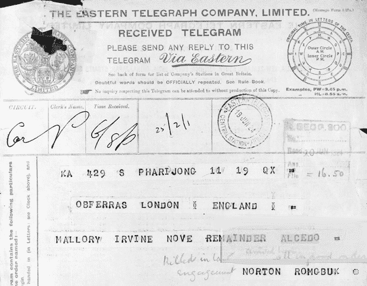

图 7-20：1924 年由英国登山队从珠穆朗玛峰发出的电报

## 未解的密码图案

### 丝绸裙子的密码图案

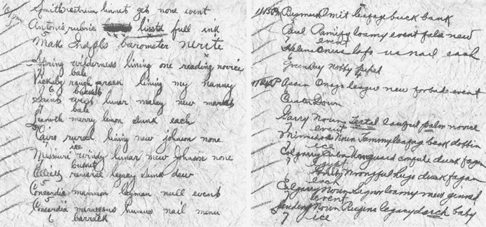

图 7-21：这条加密信息藏在一件 19 世纪末期裙子的隐藏口袋里。

2013 年，古董服饰收藏家萨拉·里弗斯-科菲尔德在她的博客中描述她获得了一件“1880 年代中期的铜色丝绸两件套蓬蓬裙，配有条纹的生锈天鹅绒装饰和蕾丝袖口。”^(52) 当她把裙子翻转过来时，她发现了一个隐藏的口袋，里面有两张纸，纸上都写着加密的文字（图 7-21）。以下是第一张纸的转录：

`史密斯·药方·柳鸟·得到无事件`

`101 PM·安东尼奥·标题·列表·全墨水`

`制作 Snapls 气压计·海螺`

`春季荒野内衬一个阅读新手·干草`

`维克斯堡粗糙架子内衬我的保姆桶`

`圣西·西方·月亮·马来西亚·新·市场·干草`

`西沃斯愉快的柠檬沉没每个`

`开罗乡村内衬新约翰逊无冰`

`密苏里·多风的月亮·新·约翰逊·无·桶`

`塞利特·记住·遗产·敦克·露水`

`康科迪亚·财产·平民·无事件`

`康科迪亚·梅拉克康斯·腐殖质·钉子·菜单·兵营`

这里是第二张纸：

`1113 PM·比斯马克·省略叶子·桶银行`

`保罗·扩展·泥土事件·虚假新事件`

`海伦娜·奥纳斯洛福通常每个`

`格林贝高贵的胡椒`

`1124 P·阿辛·欧内斯·联盟·新·禁止事件`

`库辛·下`

`哈里·诺恩·勒塔尔·劳布尔·棕榈·新手·事件`

`梅梅多斯·诺恩·贾米·叶子·鸟嘴·驮马·冰`

`卡尔加里·杜巴·未防护·反驳·鸭子·塔根·埃及`

`编织错误的拥抱·鸭子·法甘·每个`

`卡尔加里·诺恩·西格诺·泥土·新·金纳特事件`

`兰丁诺恩·鲁金斯·遗产·鸭子·婴儿·冰`

不难看出，这条消息是通过某种密码编写的。与看似随机的文字或数字不同，这些密码组是有意义的单词，比如`开罗`、`格林贝`、`卡尔加里`、`鸭子`和`泥土`。这种密码在 19 世纪下半叶并不罕见。该信息可能是通过电报发送的，因为在每行下方标注了该行包含的单词数。（这些数字在转录中被省略了。）请注意，正如我们的书在印刷时所了解到的，可能已经有人解开了这个谜题！详情见[`codebreaking-guide.com/errata/`](https://codebreaking-guide.com/errata/)。

### 火车站抢劫密码

1916 年 6 月 27 日，一名男子在俄亥俄州利马市的西俄亥俄铁路售票处抢劫。抢劫犯用枪威胁售票员，强迫他交出保险箱的内容。抢劫犯带走了 265 美元（相当于今天约 6000 美元）。几周后，由国家谜题联盟出版的杂志《Enigma》写道：

利马（俄亥俄州）警察局对与西俄亥俄铁路票务代理人抢劫事件相关的加密信息感到非常困惑。信息内容如下：`WAS NVKVAFT BY AAKAT TXPXSCK UPBK TXPHN OHAY YBTX CPT MXHG WAE SXFP ZAVFZ ACK THERE FIRST TXLK WEEK WAYX ZA WITH THX.`

这个有趣的故事由黄道带杀手专家戴夫·奥兰查克（Dave Oranchak）于 2013 年发现，并由英国密码学博客作者尼克·佩林（Nick Pelling）推广。^(53)尼克在《利马时报-民主报》旧期中发现了关于这个密码的两篇文章。那里打印的密文版本与国家谜语联盟发布的版本略有不同。由于《谜题》一书的作者可能是从报纸上复制的，因此我们应当使用《利马时报-民主报》版本。以下是密文：

`Was nvlvaft by aakat txpxsck upbk txphn ohay ybtx cpt mxhg wae sxfp zavfz ack there first txlk week wayx za with thx`

我们遗憾地表示，我们并不清楚这个密码与抢劫案之间的全部关系。最有可能的解释是，这条信息是用密码本加密的电报。发件人似乎将一些不太重要的词（如`WAS`、`BY`、`FIRST`、`THX`……）保持为明文，其他词则查找了一个（尚未发现的）密码本。

如果火车站抢劫案件的密码确实是电报，那么很可能是抢劫犯在事件发生前后立即发送的。也许电报员在电报发送后产生了怀疑，并向警方报告，称他可能处理了一名罪犯。

火车站抢劫案件的密码至今未被解开。

### 波拉基的报纸广告

伊格纳修斯·波拉基（Ignatius Pollaky）（1828–1918）是维多利亚时代英国的一位成功私人侦探，他是亚瑟·柯南·道尔创作《福尔摩斯》角色的灵感来源之一。^(54)波拉基经常使用报纸广告来寻找证人或传递加密信息。他在 1871 年 2 月 20 日的《泰晤士报》（伦敦）上发布了图 7-22 中的广告。^(55)^, ^(56) 这个密文看起来像是用某种密码加密的信息。也许使用了某种超加密技术。维多利亚时代有许多密码书，因此波拉基有很多选择。

迄今为止，还没有人能够解开这个信息的密码。

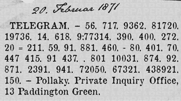

图 7-22：由私人侦探伊格纳修斯·波拉基发布的加密报纸广告

### 曼彻斯特勋爵的信件

图 7-23 中的信件是乔治·曼特古（George Mantagu），曼彻斯特第四公爵和英国驻法大使于 1783 年发送的。^(57)

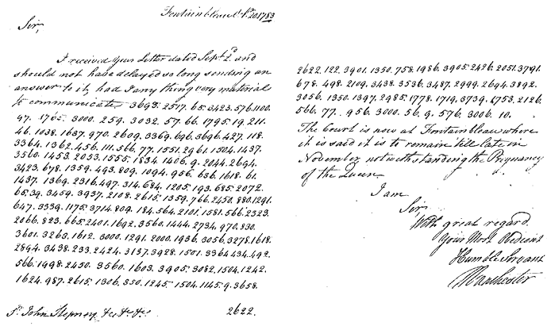

图 7-23：1783 年英国驻法大使的信件页面

以下是抄本：

`Fontainbleau Sep 20, 1783`

`先生，`

`我收到了您 9 月 2 日的信件，`

`我不应该耽搁这么久才发送回信，`

`answer to it, had I anything very material`

`to communicate. 3693.2517.65.3423.576.1100.`

`97.1765.3000.259.3032.57.66.1795.19.211.`

`46.1038.1637.970.2609.3369.696.3696.427.118.`

`3364.1362.456.111.566.77.1551.2961.1504.1437.`

`3560.1453.2053.1555.1834.1406.9.2044.2694.`

`3423.678.1359.493.809.1094.956.636.1618.61.`

`1437.1369.2316.497.314.684.1205.193.685.2072.`

`65.39.3459.3937.2108.2615.1359.766.2450.880.1291.`

`647.3339.1175.3714.809.184.564.2101.1581.566.2323.`

`2066.823.665.2401.1692.3560.1444.2784.970.830.`

`3601.3263.1612.3000.1291.2000.1936.3056.3287.1618.`

`2894.3498.233.2424.3137.3928.1501.3364.434.492.`

`566.1998.2450.3560.1603.3905.3082.1504.1242.`

`1624.987.2615.1306.350.1245.1504.1145.9.3658.`

`S John Stepney 2622.`

`2622.122.3901.1350.758.1986.3905.2426.2051.3791.`

`678.498.2109.3438.3536.3487.2999.2694.3892.`

`3056.1350.1397.2985.1778.1719.3739.1753.2126.`

`566.77.956.3000.56.9.576.3006.10.`

法院现在在枫丹白露

据说它将保持到很晚

11 月，尽管有怀孕的情况

女王的

我是

尊敬的

致以最崇高的敬意

您最忠诚的

谦卑的仆人

曼彻斯特

这封信的高分辨率扫描件以及转录本可以在[`codebreaking-guide.com`](https://codebreaking-guide.com)在线获取。信件似乎是用某种代码加密的。考虑到这个代码可能包含了几千个代码组，而只有两页加密文本供分析，使用常规的破译工具很可能无法破解这条消息。破解它唯一的现实机会是找到密码本。
