# 8

多字母替换密码

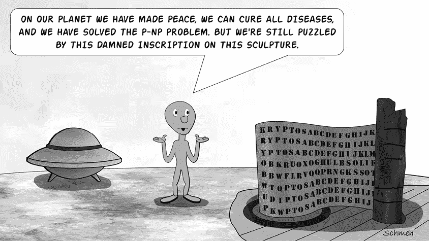

*Kryptos*雕塑的第四条铭文位于位于弗吉尼亚州兰利的中央情报局总部，是过去四十年中最著名的未解之谜。该艺术品上的另外三条密文已经解开。

*Kryptos*和雕塑家吉姆·桑伯恩（Jim Sanborn）创作的至少另外两件艺术作品使用了一种被称为*多字母替换密码*的加密方式，这种加密方法会在不同的替代表之间切换。*Kryptos*的概述请参见附录 A。

## 多字母替换密码的工作原理

为了介绍多字母替换密码，我们从桑伯恩在 1980 年代末期制作的一件迷你雕塑（称为模型）开始，这件模型是他在创作实际雕塑之前制作的（图 8-1）。这个鞋盒大小的模型与原版相似，但传达了完全不同的信息。

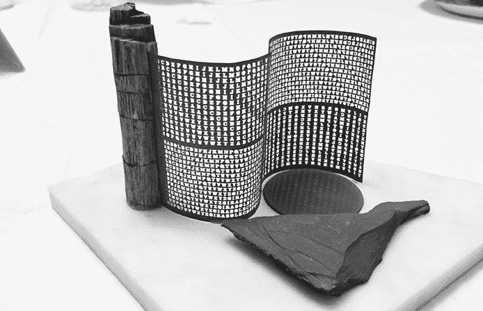

图 8-1：一个类似鞋盒大小的*Kryptos*模型，采用了更简单的加密方式。所用的密码是最常见的多字母替换加密方法：维吉尼亚密码*。*

几十年来，这个模型对公众来说是未知的；但在 2015 年，桑伯恩的密码学顾问埃德·谢伊特（Ed Scheidt）在由埃隆卡（Elonka）组织的*Kryptos*会议上向与会者展示了它。这里是加密的部分：

`TIJVMSRSHVXOMCJVXOENA`

`KQUUCLWYXVHZTFGJMKJHG`

`DYRPMASMZZNAKCUEURRHJ`

`KLGEMVFMOKCUEURKSVVMZ`

`YYZIUTJJUJCZZITRFHVCT`

`XNNVBGIXKJNZFXKTBVYYX`

`NBZYIAKNVEKPYZIUTJYCA`

Jew-Lee Lann-Briere 和 Bill Briere 在晚餐结束后几个小时内，仅用纸和铅笔就破译了这个密码。在发布后，Christoph Tenzer 也找到了答案。结果发现桑伯恩使用了所谓的维吉尼亚密码来加密这条消息。

### 维吉尼亚密码

今天被称为维吉尼亚密码的加密方法最早由乔凡尼·巴蒂斯塔·贝拉索（Giovan Battista Bellaso，1505–?）在 16 世纪描述。后来，在 19 世纪，这项发明被误归功于贝拉索的同代人布莱兹·德·维吉尼尔（Blaise de Vigenère，1523–1596）。我们将通过使用*Kryptos*模型中的密码文本（该文本包含一些拼写错误；最后一个单词是桑伯恩的错误）来解释这种加密方法的工作原理：^(2)

`CODES MAY BE DIVIDED INTU TWO DIFFERENT CLASSES, NAMELY SUBSTITUTIONAL AND TRANSPOSITIONAL TYPES, THE TRANSPOSITIONAL BEING THE HARDEST TO DECHPHER WHTHOUT TPNQJHFCDZDHIU.`

为了使用维吉尼亚密码加密此消息，我们在明文下方反复写下一个关键词，为每个字母分配一个数字值（例如，`A` = `0`，`B` = `1`，`C` = `2`，等等），然后将明文和关键词的字母逐列相加。如果结果大于 25，我们就减去 26。每个数字然后转换回字母。

据报道，Sanborn 原本打算使用关键词`GRU`。然而，他开始使用密钥的第二个字母对明文进行加密，实际上将其更改为`RUG`。为了本演示的目的，我们将关键词视为`RUG`：

`CODES MAY BE DIVIDED INTO TWO DIFFERENT CLASSES NAMELY SUBSTITUTIONAL . . .`

`RUGRU GRU GR UGRUGRU GRUG RUG RUGRUGRUG RUGRUGR UGRUGR UGRUGRUGRUGRUG . . .`

`---------------------------------------------------------------------------`

`TIJVM SRS HV XOMCJVX OENA KQU UCLWYXVHZ TFGJMKJ HGDYRP MASMZZNAKCUEUR . . .`

我们得到的密文与微型雕塑上的密文完全一致。为了解密密文，我们从密文中减去关键词。

很容易看出，维吉尼亚密码实际上由多个凯撒密码组成（见图 8-2）。所以，当使用一个三字母的关键词（`RUG`）时，我们得出如下结果：

+   明文的第一个、第四个、第七个和第十个字母使用凯撒密码加密，密钥是`A` = `R`。

+   对于第二、第五和第八个字母，应用凯撒替代`A` = `U`。

+   第三个凯撒密码的密钥是`A` = `G`。

请注意，Sanborn 定义了方案`A` = `0`，`B` = `1`，`C` = `2`，依此类推。这是今天维吉尼亚密码常用的方式，因为计算机精通的人倾向于从零开始计数。然而，在计算机时代之前，几乎所有的维吉尼亚加密者都使用方案`A` = `1`，`B` = `2`，`C` = `3`，依此类推。

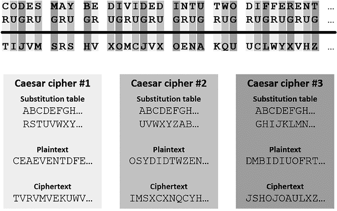

图 8-2：一个具有三字母关键词（这里是`RUG`）的维吉尼亚密码可以被看作由三个凯撒密码组成。

今天，许多计算机程序和常见的工具实现了维吉尼亚密码。

### 其他多字母表密码

维吉尼亚密码源于一个洞察：简单的替代密码容易通过频率分析破解。防止这种情况的显而易见的方法是使用多个替代表而不是一个，并在它们之间切换。例如，如果我们有五个替代表，我们可以用第一个替代表加密明文的第一个字母，第二个替代表加密第二个字母，依此类推。当我们到达第六个明文字母时，我们就返回第一个替代表。

在密码学中，替代表的第二行有时被称为*密码字母表*，或者简化为*字母表*。因为简单的替代密码仅基于一个替代表，所以它被称为*单字母表*。一个在不同的替代表之间切换的密码叫做*多字母表*。维吉尼亚密码是一种多字母表密码，因为它使用的替代表数量等于关键词中的字母数。例如，当使用关键词`RUG`（如在*Kryptos*模型中）时，将应用三个替代表：

`ABCDEFGHIJKLMNOPQRSTUVWXYZ`

`--------------------------`

`RSTUVWXYZABCDEFGHIJKLMNOPQ`

`ABCDEFGHIJKLMNOPQRSTUVWXYZ`

`--------------------------`

`UVWXYZABCDEFGHIJKLMNOPQRST`

`ABCDEFGHIJKLMNOPQRSTUVWXYZ`

`--------------------------`

`GHIJKLMNOPQRSTUVWXYZABCDEF`

我们可以方便地将这三张表合并为一个，称为维吉尼亚表：

`ABCDEFGHIJKLMNOPQRSTUVWXYZ`

`--------------------------`

`1 RSTUVWXYZABCDEFGHIJKLMNOPQ`

`2 UVWXYZABCDEFGHIJKLMNOPQRST`

`3 GHIJKLMNOPQRSTUVWXYZABCDEF`

这张合并表包含三个字母表，分别由标号为 1、2 和 3 的行表示。

除了维吉尼亚密码外，许多其他多表密码也在密码学文献中有所提及。想了解更多，可以查看美国密码协会的网站，该网站在分类加密方法方面做得非常出色。^(3) 在本书中，我们只限于实践中遇到的多表密码。这些都可以看作是维吉尼亚密码的变体。

### 一次性密码本

维吉尼亚密码的安全性随着关键词长度的增加而提高。为了最大安全性，我们甚至可以选择一个与消息长度相等的密钥！这可以通过使用非常长的文本来实现，例如，一首诗或一段小说。

然而，使用一个与明文长度相同的随机字母序列作为密钥要更为常见，例如，随机字符串`LAVBF HJHWQ UIELS KJFLS JFKSA JHFQI UDAJL KX`。现在，明文`I TRAVEL OVER THE SEA AND RIDE THE ROLLING SKY`（摘自 1975 年 Fairport Convention 的歌曲《Rising for the Moon》）的加密结果如下：

`明文：` `ITRA VELOVE RT HESEAAN DRIDE THER OLLINGS KY`

`密钥：LAVB FHJHWQ UI ELSKJFL SJFKS AJHF QIUDAJL KX`

`--------------------------------------------------------------------------`

`密文：TTMB ALUVRU LB LPKOJFY VANNW TQLW ETFLNPD UV`

我们称这种类型的密码为*一次性密码本*。这个名字来源于该密码的早期实现，当时随机字母序列被分发为一叠纸，使用完后可以撕下并销毁。

如果正确使用，意味着密钥是随机的且仅使用一次，那么一次性密码本是一种无法破解的加密方法。因为使用这种方法，任何明文都可以加密为相同长度的所有可能的密文。换句话说，单个密文可以被解密为该长度的任何可能明文，无法区分哪种明文是正确的。

由于其安全性，一次性密码本曾一度非常流行。军队和外交机构在 1950 年代初期的冷战时期广泛使用它。许多间谍通过一次性密码本加密与他们的接头人通信，接头人提供给他们一长串随机字母或数字作为密钥。

密码机也使用了一次性密码本。这些设备大多看起来像打字机，几乎所有设备都使用一种二进制版本的一次性密码本方案，这种方案也被称为维尔南密码（Vernam cipher），以纪念吉尔伯特·S·维尔南（1890–1960）。这意味着每个字符都以一串零和一的序列编码；密钥也通常是从穿孔带中获取的一系列零和一。将明文与密文相加相当于应用*异或操作*（参见附录 C）。

然而，所有使用一次性密码本的用户都面临一个严重问题：他们需要大量的密钥材料，因此需要复杂的过程来分发这些密钥给用户。这是因为，根据定义，每个密钥只能使用一次，而且一次性密码本的密钥长度总是与要加密的消息长度相等。这种繁琐的密钥处理方式是一次性密码本在 20 世纪 60 年代电子技术和计算机技术出现后开始失去其重要性的原因，新的加密方法也随之问世。

## 如何检测多表替换密码

要检测维吉尼亚密码，我们需要对密文进行频率分析并计算重合指数。图 8-3 展示了*Kryptos*模型文本的维吉尼亚加密字母频率，并与典型的英文文本进行对比。注意，在这个维吉尼亚密码文本中，最常见字母的频率为 7.48%，而在普通英文中约为 11.89%。一般来说，维吉尼亚密码的频率分布比简单替换密码加密的文本更加平坦：常见字母变得不那么常见，罕见字母也不再那么稀有。

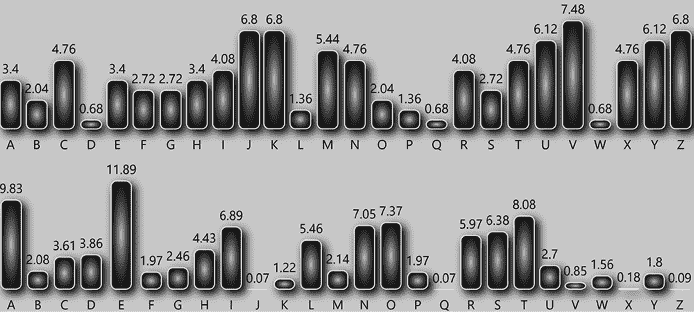

图 8-3：维吉尼亚密码文本（上）和英文明文（下）的字母频率图。如图所示，维吉尼亚密码文本的频率分布较为平坦。（注意，两张图的比例稍有不同。）

记住，英文文本的重合指数（即随机抽取的两个密码字母相同的概率）大约是 6.7%。如果文本使用简单的替换密码加密，这个指数不会发生变化。*Kryptos* 模型文本的重合指数约为 4.3%，明显较低。（我们可以通过[`rumkin.com/tools/cipher/`](https://rumkin.com/tools/cipher/)或[dCode 网站](https://dcode.fr/en)的密码工具来计算此值。）完全随机的文本重合指数大约是 3.8%。一般来说，维吉尼亚密码的重合指数介于普通语言和随机文本之间。一旦使用一次性密码本进行加密，密码文本与随机文本无异，因此其重合指数大约是 3.8%。

需要注意的是，多字母替换密码通常类似于字母对替换。我们将在第十二章中解释如何区分这两种技术。

## 如何破解多字母替换密码

几个世纪以来，维吉尼亚密码和其他多字母替换密码被广泛认为是无法破解的，被称为“无法破解的密码（le chiffre indéchiffrable）”。当然，这种说法并不成立，因为早在十七世纪，就有人提出通过猜测单词来解决此类密码系统的方法。^(4) 在十九世纪，卡西斯基方法（在本节后续部分讨论）被开发出来。如今，有许多方法可以破解多字母替换密码，其中大多数在不涉及一次性密码本的情况下效果很好。这些破译方法中的一些可以手动使用，另一些则需要计算机支持。与本书中许多其他加密算法一样，大多数多字母替换密码可以通过计算机化的爬山法（见第十六章）进行攻击。

在接下来的部分，我们将重点讨论维吉尼亚密码，并介绍多种破解方法。这些方法中的大多数也可以应用于其他多字母替换密码，即使它们可以手动应用，也早已被实现为计算机程序。如果你在搜索引擎中输入“维吉尼亚密码解码器”，你会找到许多网站，使用各种方法破解维吉尼亚密码（有时甚至没有记录所用的方法）。此外，你当然可以使用像 CrypTool 2 或 dCode 这样的工具，使用不同的方法来破解维吉尼亚密码。

### 单词猜测

在 1990 年代，当克劳斯还是德国一所大学的计算机科学学生时，他被布置了一项破解密码的作业——这是他以前从未做过的事情。他知道该密码是维吉尼亚密码，并且文本和关键字是英文。此外，字母与数字的映射按照`A` = `0`，`B` = `1`，`C` = `2`的方案进行。以下是密文的一部分：

`"VMFA CKT ZM, KK ZSSH,", YX QTER, "DCL VYG'P KNB PHS DJCB. MFN ATJ'H QWV BL YNCSH FY RAA PZZCWMSAF NBUXDBJWYSCR." FX PFNSU MM FWYJ VZL CRAG GZRSC YESWQVEW UQH YVVR HNOH BCLEBG'P RT WK.`

`TPMDIW ZRR GG PVJ ALW YGZ GVIVEAAAR FH YBK.`

`"B'I UFAV," AC LWWI, "KV'EJ LAS BVF KSLPG KWILR."`

如可以看到，标点符号和空格是可见的。这使得像贵族密码一样，可以通过猜测单词来进行破解。例如，字母序列`YX QTER`位于两个引号内的段落之间，可能表示直接引语。克劳斯认为`HE SAID`是一个不错的猜测。为了验证这个假设，他将猜测的明文从密文中减去：

`YX QTER`

`HE SAID`

`-------`

`RT YTWO`

对于计算机科学学生来说，其余的密钥并不难猜：它是`FORTYTWO`，这是道格拉斯·亚当斯 1979 年畅销小说《银河系漫游指南》中的“生命、宇宙以及一切问题的终极答案”（见图 8-4）。用这个密钥解密整个文本后，发现明文内容同样来自这本小说。克劳斯解决了这一挑战，激发了他对密码破译的终生兴趣。

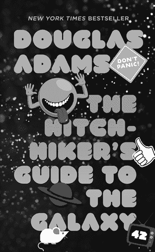

图 8-4：道格拉斯·亚当斯（Douglas Adams）1979 年著名小说中的一段维吉尼亚密码文本，首次由作者克劳斯·施梅（Klaus Schmeh）破译。密钥是`FORTYTWO`。

### 检查重复模式（卡西斯基方法）

如果没有标点符号或空格，破解维吉尼亚密码会变得稍微更困难。然而，一个熟练的密码破译者可以在二十分钟内不借助计算机解决一个简单的维吉尼亚密码。以下是之前例子中更大一段加密文本，省略了标点和空格：

`KWWMC XJGJQ FGBLH OYSIA CPWGT IKHDM DSMCL LCTJR QMZGE BJTWC`

`EMMYW PNUPX JEKKG ICEBH VSWHY TRPWG FRMTL VEBLI GAGLC OWRVG`

`NTPVR FCIPH OGJFN TQTOH MSPLY RKBQM YNKTJ WSCKA CKSCW RJACP`

`WGFQR KZHJP FGVWJ BBSKC IFBXO QJBUX BYNCR OETNX ICWSJ ICVET`

`NQREJ RDSBO JYMKP MKOKT LWOVF PSRYG ZKTFB XBYKF YVVEM VWZHC 5`

`LGABH QZFZH SLHMJ BFNEA PVTIX AFXZW IBKDL HSWYV VPYLW ZXCRW`

`GKAQY ARECE EBJRV LAXJR FBKHD ZABLV ZLIAW BYVFN EAEBY SIOCG`

`EBLUV GCKWH NCELY GZFFQ ZTJFE LNBXA YWOCO IXZJX ZVNGX XLXOH`

`MOKAC AWRSC UBQVA FSWSE CFKBL CCHGW YVFFR VRXNW XHZVQ TJRYV`

`VHLEU JJGKB EXOZJ TKBLF NZUFF LQXNC KVZLK BCVYM RGAXO HWMNX 10`

`PXWDW CEHSG YSIGK HSMJS XGRUM NPHMS KNKTJ RFDIX BBHSH HZHLY`

`KFQWK MJXBI WVRMQ AAKFG SRLHI SFBJT EKAOY KRKPB KFNBW TAMDS`

`BOJTL XNJTI JPMKN WJRDT LMKRF MYXUT ODFFK BANHO WZPGC KRCZG`

`RGBPK FWWVW ZXYOZ GVLMF AHMWE ZFTZU TBVLC KECZG CRUKK BLKZM`

`FAEGO CSPFB YVBOJ MMLAS YVRMY KPVZF UXLMO VTIJX EHPQQ SRKCW 15`

`KIYCW MFXSO DPVYM KAHMS UTWPW GTIKV MFACK TZMKK ZSSHY XQTER`

`DCLVY GPKNB PHSDJ CBMFN ATJHQ WVBLY NCSHF YRAAP ZZCWM SAFNB`

`UXDBJ WYSCR FXPFN SUMMF WYJVZ LCRAG GZRSC YESWQ VEWUQ HYVVR`

`HNOHB CLEBG PRTWK TPMDI WZRRG GPVJA LWYGZ GVIVE AAARF HYBKB`

`IUFAV ACLWW IKVEJ LASBV FKSLP GKWIL RBIOK FRBBR KIWSX HGGCH 20`

`TVROC MKOHQ VIRBP GFWUF PINCX GVKEK EDUWE ZFBOT ZFYTR TJRWC`

`CEGGC WYFFN LWPVJ HFIMY DWXVV TBMDW XPPIY LOVFG XHRMK PJPLB`

`JMWBI WKLEH EBLHF UCUQW QHWBP LPWAS YXYKZ CKWKL YBZOW HYNPP`

`DMXWK ZMBJU YCSXZ NEZYA IIPHO GJFJA MHGVN GWBLZ AFFHY BKYKF`

`FPZMR AABXH FINXZ OSRGN RBPOB OPTET EBBVR MBHUC ZAVTL PDMXW 25`

`KZMMP CGSSN GEPVJ GRBBB PGFPP IYLOM TIMXE HPHTP LBJWX MUOJL`

`CLXMU OJLCL WFJRV OGVAG BVZVF THZTK JHKXL STDCX RHZFN JVYPH`

`IDTWE MYMKD TWEMZ OAFDT RLRPD WQGKH RAAFU SFIJX ZOXVW KMFLC`

`NBKUR HLCNB KTTXN MKOJM NXKDQ SCBTB JUFHG HGGPQ GSZGE TLCNB`

`KWGKA QYZPB LUAHB SVGYK ACKHV GEBRS SHFPM GZSWK YTRLO CLFVT 30`

`RTXCZ HGHGG POYVR MQHIO SMGXM IHSTT GHGGP PFFVL MDASS HFZCM`

`PVJFV TLWSV FHJLM ZNSFH RUMNP DTWEM ZMDOY GFFYG UDJCG ECHBD`

`TWEMY TNSXC BXCGP CLSKM FXNSY VVRMY PSSKZ LFMDO YDVHN EAKTI`

`CWHNO HTBTX YGZTT FREJP KFPCL MUAAF JHYXF XHZYV VRUTJ HJRKH`

`ZXIFU FFLQX NKFBK XBMKP JOKIM BJHID FBLMZ KFGEM YGUKM SIXGG 35`

`LOWHZ VSEWF NHNTQ CQGYO ERAHJ JJBZX LMLCN BKTTX NMQCE ZUTUT`

`WCDIM BJHXO STLWY VJKFN JWDOA SRGGV AZNHK ECVKH YOXXY MLCNB`

`KWUBP VFLVL MOAFY VVWMH NOSRJ ICGZO UZVTQ TJHFA FNLMK TYWDX`

`YMLCN BKXUA EQMKF NJWXS YVVGC TNSXH GNZMK DTWEM BAEGB WWXMY`

`YCZFJ XUTJH JRTEG FXWSU IHQXO PZHYX UTJHJ RRQCL DSIWU GRDJC 40`

`BKYRF XFIXH CBIXZ OCSJA CYHIX VVWFH PZDIE WCKPV JRVKG LEJJU`

`IBLLK TYVV`

这个技巧是首先发现关键词的长度。一旦知道了它，解密一个维吉尼亚密码就变成了解决几个凯撒密码。猜测关键词长度的一个好方法是通过寻找密文中的重复模式，这种技术被称为*卡西斯基方法*。例如，在第 22 行和第 26 行中，我们找到了重复的模式`PPIYLO`：

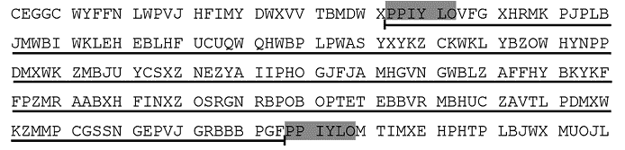

第一个和第二次出现该模式的起始位置之间的距离是 192 个字母。

在第 28 行和第 33 行中，我们找到了另一个重复模式`DTWEMY`：

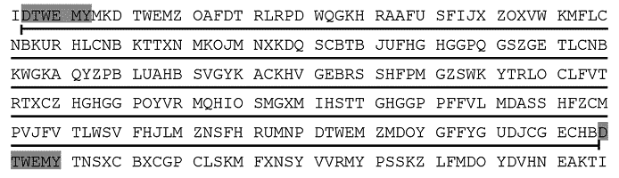

这一次，重复开始之前的字母数是 248。

在第 28 行中，可以找到第三次重复的`DTWEM`：

这里，距离是 8。

我们发现的距离是 192、248 和 8。 这三个数字的最大公约数是 8。 这意味着关键词的长度很可能是 8 或 8 的约数。一个长度为 8 的关键词意味着我们正在处理八个凯撒密码。接下来的步骤，我们需要进行八次频率统计。我们从统计位置 1、9、17、25、33、41 等字母开始。结果如下：

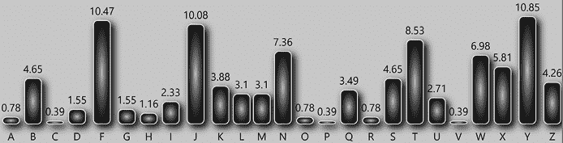

如果我们将这个与普通英语文本的频率进行比较（见附录 B），我们会发现这里使用的凯撒密码是直接的一对一对应关系，`A` = `F`，`B` = `G`，`C` = `H` ……这意味着关键词的第一个字母很可能是`F`。

现在，让我们统计位置 2、10、18 等的字母：

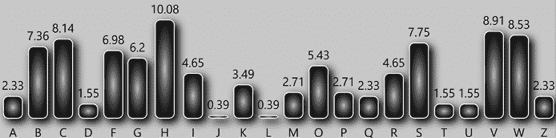

这一次，我们得到`A` = `O`，`B` = `P`，`C` = `Q`……因此，第二个关键词字母很可能是`O`。

如果我们再重复这个过程六次，得到的字母是`F`、`O`、`R`、`T`、`Y`、`T`、`W`和`O`。这表明关键词的长度确实是 8。如果我们得到的关键词是`FORTFORT`，我们就知道四个字母`FORT`是实际的关键词。使用关键词`FORTYTWO`，我们可以轻松解密密文并恢复出《*银河系漫游指南*》的摘录。

### 使用一致性指数

卡西斯基方法通常是通过手工确定维吉尼亚关键字长度的最佳方法。如果有计算机可用，存在更好的方法。通常，重合指数可以帮助我们确定关键字中的字母数量。一种好的方法是假设不同的关键字长度（例如，长度在 3 到 25 之间），并为每个情况计算重合指数。假设是英文明文，重合指数最接近 6.7%的值可能是正确的。

dCode 网站 ([`dcode.fr/en`](https://dcode.fr/en))为我们提供了一个可以进行此类测试的工具。以下是我们为《银河系漫游指南》摘录得到的结果：

1.  长度 = 24: 重合指数 = 6.4%

1.  长度 = 8: 重合指数 = 6.3%

1.  长度 = 16: 重合指数 = 6.2%

1.  长度 = 4: 重合指数 = 4.9%

1.  长度 = 12: 重合指数 = 4.9%

1.  长度 = 20: 重合指数 = 4.8%

1.  长度 = 26: 重合指数 = 4.6%

1.  长度 = 14: 重合指数 = 4.6%

长度为二十四时，重合指数最高，最接近英语的 6.7%。二十四是错误的，但我们可以接受，因为它是 8 的倍数。当我们在下一步解决二十四个凯撒密码时，我们会得到`FORTYTWOFORTYTWOFORTYTWO`作为关键字。第二次猜测（8 个字母的关键字长度）是正确的。

现在我们知道了关键字的长度，我们可以告诉 dCode 工具解密密文。通过为每个字母解决凯撒密码，dCode 给出正确的解答。这在图 8-5 中展示。

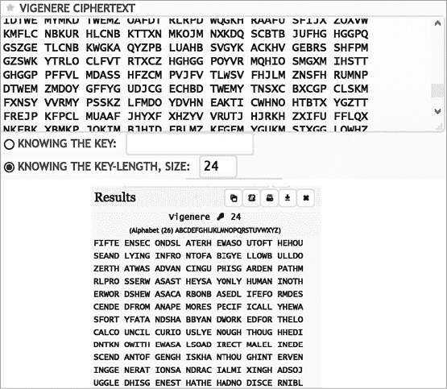

图 8-5：网站 dCode ([`dcode.fr/en`](https://dcode.fr/en))提供逐步解决维吉尼亚密码的工具。

现在我们尝试对*Kryptos*模型上的文本进行相同的操作。以下是 dCode 为我们提供的结果：

1.  长度 = 3: 重合指数 = 6.3%

1.  长度 = 6: 重合指数 = 6.2%

1.  长度 = 9: 重合指数 = 5.9%

1.  长度 = 13: 重合指数 = 5.2%

1.  长度 = 11: 重合指数 = 4.9%

1.  长度 = 12: 重合指数 = 5.5%

1.  长度 = 15: 重合指数 = 5.8%

1.  长度 = 18: 重合指数 = 5.9%

1.  长度 = 8: 重合指数 = 4.3%

1.  长度 = 1: 重合指数 = 4.3%

如图所示，长度为 3 的关键字提供了最佳结果。这是正确的，因为关键字是`RUG`。

威廉·弗里德曼（William Friedman）是将“巧合指数”引入密码破解领域的先驱，他提出了一种利用该指数从密文中估算关键字长度的公式。这个公式被称为*弗里德曼测试*。它比我们刚才演示的巧合指数比较方法需要更少的计算，但也 less 准确，尤其是当明文语言未知时。关于巧合指数方法和弗里德曼测试的详细讨论，我们推荐克雷格·鲍尔（Craig Bauer）的《*秘密历史*》一书。^(5)

### 字典攻击

另一种破解维吉尼亚密码的方法是所谓的字典攻击，这需要使用计算机程序。字典攻击需要一个长长的单词列表，称为*字典*，它存储在一个文件中。各种字典文件在互联网上有大量的可用资源。例如，有包含英语中 20,000 个最常用单词的文件。类似的集合也为其他许多语言、地理名词、名字、缩写等创建了。除此之外，还有一些程序能够为给定单词生成几十种不同的版本（例如，*CALIFORNIA*，*CALIFORNYA*，*CALIF*，*CA*，*AINROFILAC*等）。

执行字典攻击的程序会逐个从这样的源中取出单词，推导出不同版本的该单词，并将每个版本作为可能的密钥来解密密文。然后，它会检查结果是否看起来像是正常的英文（或使用的任何其他语言）。区分有意义文本和无意义文本的方法将在第十六章中介绍。当有意义的语言测试为正时，解密成功；否则，将测试下一个关键字候选。

尝试通过字典攻击破解维吉尼亚密码是可行的，^(6) 但并不常见。这可能是因为有更强大的基于计算机的攻击方法可用于破解维吉尼亚密码，比如爬山法（hill climbing），在第十六章中有讨论。

### 托比亚斯·施罗德尔（Tobias Schrödel）的方法

2008 年，我们的同事、德国密码学专家托比亚斯·施罗德尔在《*Cryptologia*》上发表了一种迄今未知的维吉尼亚密码破解方法。^(7) 该攻击基于消除明文和关键字中的稀有字母组合。它需要一个计算机程序（实际上是 CrypTool 1 的一部分，CrypTool 2 的前身）。托比亚斯的方法在消息长度不比关键字长太多的情况下特别有效（例如，一个十五个字母的明文用一个七个字母的关键字加密）。然而，关键字必须是一个真实的单词，而不是一个随机字母序列——否则，消除稀有字母组合就没有任何意义。

在他的文章中，托比亚斯介绍了密文`IZRUOJVREFLFZKSWSE`，它是用维吉尼亚密码加密的。传统的攻击维吉尼亚密码的方法在这里行不通。例如，无法猜测出任何单词，因为文本中没有空格。此外，密码文本很短，没有可能揭示密钥长度的重复出现。即便我们知道或猜测密钥的长度，进行例如六次频率分析也无济于事，因为字母太少。

然而，托比亚斯的方法可以破解这个密码。通过消除稀有的字母组合，它发现常见的三字母组合*BLA*和*HOR*在一个与另一个加密时会生成`IZR`（密文的前三个字母）。基于频率考虑，该方法接着建议*BLACK*和*HORSE*作为这两个三字母组合的扩展。虽然不清楚哪个是密钥词，哪个是明文，但进一步的测试揭示了密钥词`HORSE`更有意义。当用它来解密密码时，得到的明文是`BLACK CHAMBER IS OPEN`。

### 其他维吉尼亚破解方法

在她 1939 年的书籍《*密码分析*》中，海伦·福什·盖恩斯描述了一种语言学方法来破解维吉尼亚密码。^(8)它需要运气和大量的试验与错误。理查德·海耶斯在 1943 年描述了一种类似但更先进的技术，基于常见的三字母组合。^(9)这两种方法如今已经很少使用，因为随着计算机技术的出现，更强大的替代方法已经问世。

本书不讨论的另一种方法是维特比分析，它基于隐马尔可夫模型。关于这种方法的有趣文章已经发表在科学期刊《*Cryptologia*》上。^(10)^, ^(11)

### 如何破解一次性密码

正如我们提到的，如果密钥是完全随机且没有任何规律，并且只使用一次，那么一次性密钥是无法破解的。然而，在历史的长河中，更多时候这些要求被违反了。最常见的错误之一是重复使用相同的密钥。

接下来，我们将解释如果对两个消息使用相同的密钥，如何破解一次性密码。为了演示这一点，首先让我们用（随机的）密钥`KDFYDVKHAP`加密明文`WASHINGTON`：

`WASHINGTON`

`KDFYDVKHAP`

`----------`

`GDXFLIQAOC`

接下来，我们用相同的密钥加密明文`CALIFORNIA`：

`CALIFORNIA`

`KDFYDVKHAP`

`----------`

`MDQGIJBUIP`

现在，我们用第二个密文解密第一个明文：

`WASHINGTON`

`CALIFORNIA`

`----------`

`UAHZDZPGGN`

如果我们用第二个密文解密第一个密文，我们会得到相同的结果：

`GDXFLIQAOC`

`MDQGIJBUIP`

`----------`

`UAHZDZPGGN`

这意味着，如果密码破译者知道两个密文（`GDXFLIQAOC`和`MDQGIJBUIP`），并且其中一个明文是`WASHINGTON`，他们就能轻松推导出第二个明文`CALIFORNIA`。反过来也一样：如果知道`CALIFORNIA`，就可以推导出`WASHINGTON`。

我们可以很容易地将这种方法推广到更长的消息。如果一位密码分析师知道两个用相同密钥加密的一次性密码密文，并且其中一个密码本中有已知的部分，他们就能轻松推导出另一个明文的部分。如果后半部分是，例如，`E UNITED S`，这可以扩展为`THE UNITED STATES`，这意味着`TH`和`TATES`变成了新的已知部分。使用这种方法，可能会完全推导出两个明文。

## 成功案例

### 戴安娜·多尔斯的消息

英国女演员戴安娜·多尔斯（1931-1984）曾被认为是英国版的玛丽莲·梦露。在数十部电影中，她饰演了一个诱人的金发女郎，并过着一个堪比电影女神的私人生活。在五十二岁因癌症去世之前，她给她的儿子马克·道森留下了一段加密的信息，告诉他这段信息描述了她藏匿的巨额财富：200 万英镑。

该文本的标题使用猪圈密码进行加密：

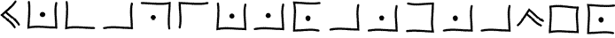

经过一些研究，Dawson 解密出这段文字为`LOCATIONS AND NAMES`。结果发现，他的母亲使用了以下的替代表：

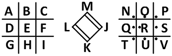

密码的主要部分用普通字母写成：

`EAWVL XEIMO RZTIC SELKM KMRUQ`

`QPYFC ZAOUA TNEYS QOHVQ YPLYS`

`OEOEW TCEFY ZZEPI NYAUD RZUGM`

`SSONV JDAER SZNVS QSHRK XPVCC`

`WUAEJ JTWGC WQRCC NRBKZ VIITF`

`RZLTS VOAIB NQZOK VANJJ TFAJO`

`GYUEB XZHRY UFSDM ZEBRK GIECJ`

`QZHFY QBYVU FNEGD EDIXF YZHOM`

`PMNLQ XFHFO UXAEB HZSNO EAUIL`

`JXIWD KTUDN MCCGC EURDG SRBCW`

`GMNKC RLHER HETVP GWOGC WANVJ`

`NGYTZ RALTM TAYTL UUSKM QIRZH`

由于道森无法解密这段密文，他向一组英国密码学家请教，其中包括安德鲁·克拉克，后者成功破解了这段密码。然而，信息的意义仍然是一个谜。2004 年一部电视纪录片后来记录了该团队的工作。^(12)

一开始，克拉克和他的同事们对密码进行了几项统计分析。结果证明这与维吉尼亚密码一致，他们没有遇到太大困难地破解了它（可能是通过首先确定关键字长度，然后使用本章前面描述的方法）。结果，关键字是`DMARYFLUCK`（可能源自多尔斯的法定名字，戴安娜·玛丽·弗拉克）。

下面是如何解密第一行的方法：

`密文: EAWVL XEIMO RZTIC SELKM KMRUQ . . .`

`密钥: DMARY FLUCK DMARY FLUCK DMARY . . .`

`明文:` `BOWEN STOKE ONTRE NTRIC HARDS . . .`

该文本由一系列姓氏组成，每个姓氏后面跟着一个英格兰或威尔士的城市：

1.  `Bowen, Stoke-on-Trent`

1.  `Richards, Leeds`

1.  `Woodcock, Winchester`

1.  `Wilson, York`

1.  `Downey, Kingston Upon Hull`

1.  `Grant, Nottingham`

1.  `Sebastian, Leicester`

1.  `Leigh, Ipswich`

1.  `Morris, Cardiff`

1.  `Mason, Slough`

1.  `Edmundson, Portsmouth`

1.  `Padwell, London`

1.  `Pyewacket, Brighton`

1.  `McManus, Sunderland`

1.  `Coyle, Bournemouth`

1.  `Humphries, Birmingham`

1.  `Dante, Manchester`

1.  `Bluestone, Liverpool`

1.  `Cooper, Bristol`

这个列表的含义未知，我们不知道这些名字是否指代真实的人。戴安娜·多尔斯的儿子从未找到过母亲 allegedly 留下的数百万英镑，而这个遗产是否真的存在也值得怀疑。尽管多尔斯在早期的职业生涯中做得不错，但她在 1968 年宣布破产，从那以后，她只能通过一些小的演出谋生。

### Kryptos 1 和 2

位于中央情报局总部的*Kryptos*雕塑右侧的两个面板显示了一个 Vigenère 类型的表格，字母顺序如下。单词`KRYPTOS`的字母被移到了开头：

`KRYPTOSABCDEFGHIJLMNQUVWXZ`

左上方面板包含以下密文：

`EMUFPHZLRFAXYUSDJKZLDKRNSHGNFIVJ`

`YQTQUXQBQVYUVLLTREVJYQTMKYRDMFD`

`VFPJUDEEHZWETZYVGWHKKQETGFQJNCE`

`GGWHKK?DQMCPFQZDQMMIAGPFXHQRLG`

`TIMVMZJANQLVKQEDAGDVFRPJUNGEUNA`

`QZGZLECGYUXUEENJTBJLBQCRTBJDFHRR`

`YIZETKZEMVDUFKSJHKFWHKUWQLSZFTI`

`HHDDDUVH?DWKBFUFPWNTDFIYCUQZERE`

`EVLDKFEZMOQQJLTTUGSYQPFEUNLAVIDX`

`FLGGTEZ?FKZBSFDQVGOGIPUFXHHDRKF`

`FHQNTGPUAECNUVPDJMQCLQUMUNEDFQ`

`ELZZVRRGKFFVOEEXBDMVPNFQXEZLGRE`

`DNQFMPNZGLFLPMRJQYALMGNUVPDXVKP`

`DQUMEBEDMHDAFMJGZNUPLGEWJLLAETG`

正如在附录 A 中所述，这个密码本至少被三位互不知情的密码破译者独立破解。在本节中，我们提供了中央情报局员工 David Stein 使用的方法，他是第二个破解此密码的人。他的工作记录在一篇可以在线查阅的论文中。^(13)

斯坦因首先进行了频率分析。他意识到加密信息看起来像是一个 Vigenère 密码。使用弗里德曼方法（基于一致性指数），斯坦因发现最可能的关键字长度是八个字母。这一点通过第四行（Kasiski 方法）中`DQM`三字母组合在八个字母之后的重复得到了验证：

`D Q M` `C P F Q Z` `D Q M`

`1 2 3 4 5 6 7 8`

斯坦因的第一个猜测是，`DQM`三字母组合代表英语中最常见的三字母组合`THE`。在对密文进行的另一次攻击中，他进行了额外的频率分析。知道一个具有八个字母关键字的 Vigenère 密码等同于八个凯撒加密，斯坦因计算了每第八个字母的频率。然而，这两种方法都没有得到解决方案。

他接着猜测，使用了一个包含排列字母表的维吉尼亚加密法——一个以`KRYPTOS`开头的字母表，正如雕塑另一面所示。基于这一假设，他再次尝试通过频率分析破解八个凯撒密码。这一次，他走在了正确的道路上。他找到的维吉尼亚关键字是`ABSCISSA`，一个指代图表中点的*横坐标*的词。`DQM`的密文解密为`THE(Y)`和`THE`。

然而，只有第 3 行到第 13 行的加密信息解密出了有意义的明文，而前两行解密出来的则是乱码。Stein 猜测这两行使用了相同的加密方法，但关键字不同。这个猜测被证实是正确的，Stein 确定这两行的关键字是`PALIMPSEST`。（*palimpsest*是一种手稿页面，其文字被刮掉或冲洗，以便可以重新使用并为另一个文本提供空间，这样可以通过新的文本看到旧文本的部分内容。）以下是用于加密第 1 行和第 2 行的维吉尼亚表（请注意第一列的关键字是`PALIMPSEST`）：

`KRYPTOSABCDEFGHIJLMNQUVWXZ`

`--------------------------`

`PTOSABCDEFGHIJLMNQUVWXZKRY`

`ABCDEFGHIJLMNQUVWXZKRYPTOS`

`LMNQUVWXZKRYPTOSABCDEFGHIJ`

`IJLMNQUVWXZKRYPTOSABCDEFGH`

`MNQUVWXZKRYPTOSABCDEFGHIJL`

`PTOSABCDEFGHIJLMNQUVWXZKRY`

`SABCDEFGHIJLMNQUVWXZKRYPTO`

`EFGHIJLMNQUVWXZKRYPTOSABCD`

`SABCDEFGHIJLMNQUVWXZKRYPTO`

`TOSABCDEFGHIJLMNQUVWXZKRYP`

前两行的明文如下。它包含一个拼写错误：

`在微妙的阴影和光明的缺失之间， lies the nuance of illusion`

对于第 3 行到第 13 行，Sanborn 使用了以下基于关键字`ABSCISSA`的维吉尼亚表：

`KRYPTOSABCDEFGHIJLMNQUVWXZ`

`--------------------------`

`ABCDEFGHIJLMNQUVWXZKRYPTOS`

`BCDEFGHIJLMNQUVWXZKRYPTOSA`

`SABCDEFGHIJLMNQUVWXZKRYPTO`

`CDEFGHIJLMNQUVWXZKRYPTOSAB`

`IJLMNQUVWXZKRYPTOSABCDEFGH`

`SABCDEFGHIJLMNQUVWXZKRYPTO`

`SABCDEFGHIJLMNQUVWXZKRYPTO`

`ABCDEFGHIJLMNQUVWXZKRYPTOS`

这是相应的明文结果（包括另一个拼写错误）：

`完全看不见，这怎么可能？他们使用了地球的磁场，信息被收集并传输到地下的一个未知地点，*兰利*知道这件事吗？他们应该知道，它埋在某个地方。谁知道确切的位置？只有 WW 知道，这是他最后的消息，北纬三十八度五十七分六点五秒，西经七十七度八分四十四秒，ID 按行排列`

2006 年，在解密方案公开几年的时候，*Kryptos*的创造者 Sanborn 指出，明文的最后三个词`ID BY ROWS`是错误的，因为密文的最后一行缺少了一个`S`。明文的原定结尾应为`X LAYER TWO`。之前的解密者没有注意到这个错误，因为巧合的是，表达式`ID BY ROWS`似乎是有意义的。

### 塞里尔投影仪

Sanborn 不仅是*Kryptos*的创造者，还创作了其他几部加密作品。例如，在 1990 年代，他创作了另一座雕塑，刻有加密信息：*西里尔投影仪*。它首先在他的画廊展出，然后在 1997 年搬到了目前的位置——北卡罗来纳大学夏洛特分校的校园。*西里尔投影仪*由一个超过两米高的大铜柱组成，柱身上刻着数百个字母。雕塑中心有一道明亮的光，透过字母投射出它们的影像，覆盖着庭院。

和*Kryptos*一样，*西里尔投影仪*上的字母刻在四块面板上，这些面板组成了柱体。位于图 8-6 中视线之外的两块面板展示了一个维金纳表格（Vigenère-type tableau），使用的是俄语（西里尔字母）字母表，并进行了转置，使得单词ТЕНЬ（俄语中的“影子”）位于开头。需要注意的是，西里尔字母的未转置顺序会因地区而有所不同，而*西里尔投影仪*上使用的字母顺序并不是最常见的那种。

图 8-6：*西里尔投影仪*位于夏洛特北卡罗来纳大学校园，是一座雕塑，雕刻着加密的铭文。右上方的照片显示了 Elonka 作为投影词`MEDUSA`的屏幕（唯一一部分不是用西里尔字母书写的）。

这两块面板上的文字（如图所示）是加密信息。它同样使用了西里尔字母，除了第十四行中的单词`MEDUSA`。在西里尔字母中，通常应拼写为`MEДУЗA`；而使用拉丁字母则暗示了其中一个密钥。

这里是*西里尔投影仪*上的密文：

`ЛTФEЮTФЯЙЯMПXЦФAЧHЩПBБГЖЧCКЬГГЛЗДЭЙП`

`ЪКXCЙPЭAФHФПЩBПEЦPДФAЩШTКCXCЧЫУXXEЮ`

`КУMЛEЧЛЫTOБHEЯЖЖИЬHЭЗЩЦPЛЫБПHФOИИAБЬ`

`ПИКЛEУPЫCMЪШЛЛБXMXЛЖШPAЩPЙЛПEOOЙЙBЦ`

`ИЪЛБXЦPЫЧCКAPCPBЯЭФКЮФPЮMOЯЗOЛOДЭШPЗУ`

`ДXMAЭXOЙГЙЮФMЩXXCBИИЗXAГЙЯЬПCИБPPШOM`

`КTCУЯГXУЬЛEУPЫCMЪШCППЯЯЦШУШAЦЧПИMШH`

`PБЧPЯЫMИУPAДФAИЮЙЫЦЯЛOHУФЖOФШXФЖCБ`

`BЪЧДЦCФБMДЭШPЗУДXУPБШTOКЩЪMXПOTOXOЩЧ`

`ЖAЦДЩPAЮГOЙBPБГЮБЗГEЖPЙЛПEOOЙЙBЦHЗПГФ`

`ЦЗAИBЯЮФЛЪЦXCЧЫШЬБEOMЩШЖTЭДЙOTTФXПP`

`ПЛOДЭЩPЗУДXКПГФOЦБЩЪMMЭКЧEPЛMКЪЦЦЗЩЛ`

`ФЦЧЪЩКBHФAECДПTДФПPЯЙКЮHXBЦБЮEИCЧЯЧЦ`

`XMЖЛCПPЧУЛЭШЖЫИИMEDUSAИHXEЗЛЧЗPЗЙКЛ`

`ППEBЛЧCXЦЫOЙBPБУДXCBЪГЖЧCКAPCPBЯЭФPЩФ`

`ЯЦЩПЪЗЫTФOЙЙУCДTЮTBCБPXCПБЩЛШКУBЙЙГЗ`

`ЙAЧЛЬPЙЭMДЧЧPЬCTHКЙEКДOБЖБЛШИЫЙБЙИДPP`

`ЦXOЩЖBЪКБЧКЖHФПШЦЗУЙДЯГAЧЙКУЗФEЦИЯИ`

`ЙФЭБЛCДTГЗШPЖEДФЩЖЙЯHБOOЬШФПЮКЗЦУДИ`

`HXEOXПOЙAXДЭCБЩЙЖЭШBЪOДЩBУCЛMЩГЖШУД`

`ИГЛEШКПУУEЧДЛCУЦЮTЮHXЪПБУПPЬГИУCБЙЙПЮ`

`ГAФФEШБФБMЙПИMЪЮКЩXXTHФЩШПEЯБЧККЩ`

`BЙЩЗЛЮCBЮЙКУКФCЫTЫCBЛCЛЬЗУЦИКЩДPCУPЗ`

`XPФЙPЭMPXФЛКФAЙЙКУAЛЩГMЙЖШЪЙЬЩКФHФ`

`ИДЙPФГКУКAЯЙOУMATЭTЦКBEЖOЙИДЦДКГЩФEЖ`

`БЮXЛECCЭCHЩЩXПOЬДЖЙЙЗГEИTЙMAШЙЙУMФC`

`ЫTЫCBCИДCДPБФHУOPУШTБЗПЪДЗЯЫAAЧКУMAЯX`

`TMЦPИЦЗЩЛЛEУУПФЖTЭДУXPШЙOPБЭЦЙOПЙЛЪЙ`

`TЧШЙAФHПШФЭMБЩЪЖTПДЛPШБШБЧPЖЫMHЧЗЫ`

`TЙЖЪCMЪЧДXКЛHЦПЗXPФЙPЭMPXФMЫБBЪЧБШEФ`

`БЖTЩBBЪУБЧКЖAЦПЫГШAMИПPЙЪГOЦКЙГPЛЮБУ`

`CПБЮPPXФTЫXЖTГИЙКAФMTHКЙФФHЦЙЫCЧБШE`

在 Sanborn 使雕塑对公众开放后，过去了几年，才有人认真尝试破解这段加密。2003 年，一群由 Elonka 领导的七十位*Kryptos* 爱好者终于开始着手此事。小组成员 Randall Bollig 拍摄了 *Cyrillic Projector* 的多张照片。经过数周的艰苦工作，另外三名小组成员，Elonka、Bill Houck 和 Brian Hill，各自独立地制作了抄本。然后，他们对比了各自的抄本，生成了一个完全准确的版本。（想象一下，从倒影的圆柱形雕塑中读取西里尔字母的难度！）随后，Elonka 在她的网站上发布了修正后的抄本。^(14)

在抄本发布后不久，两位业余破译者，Frank Corr 和 Mike Bales，独立地破解了加密。他们没有发布完整的英文解答，因为他们不懂俄语，而原文就是用俄语写的，无法翻译。当 Elonka 得知他们可能的成功后，她联系了一位俄语母语者，Anatoly Kolker。他是 Elonka 父亲 Stanley Dunin 在世界银行的同事。Anatoly 确认了解答是用俄语写的，并提供了最终的英文翻译。该明文证明由两篇冷战时期的文本组成，内容如下：

`B Ы C O Ч A Й Ъ И M И C К У C C T B O M B T A Й H O Й P A З B E Д К E C П И T A E . . .`

结果证明使用的加密算法是 Vigenère 加密的一个变种，关键词是 `MEДУЗA`（`MEDUSA`），字母表的排列与表格中的方式相同，字母 `T`、`E`、`，`、`H` 和 `Ь` 被移到了最前面。^(15) 为了创建用于加密明文的 Vigenère 表格，我们首先需要以下的表格：``

`` `АБВГДЕЖЗИЙКЛМНОПРСТУФХЦЧШЩЪЫЬЭЮЯ`    `----------------------------------`    `А ТЕНЬАБВГДЖЗИЙКЛМОПРСУФХШЦЧЩЪЫЭЮЯ`    `Б ЕНЬАБВГДЖЗИЙКЛМОПРСУФХШЦЧЩЪЫЭЮЯТ`    `В НЬАБВГДЖЗИЙКЛМОПРСУФХШЦЧЩЪЫЭЮЯТЕ`    `Г ЬАБВГДЖЗИЙКЛМОПРСУФХШЦЧЩЪЫЭЮЯТЕН`    `Д АБВГДЖЗИЙКЛМОПРСУФХШЦЧЩЪЫЭЮЯТЕНЬ`    `Е БВГДЖЗИЙКЛМОПРСУФХШЦЧЩЪЫЭЮЯТЕНЬА`    `Ж ВГДЖЗИЙКЛМОПРСУФХШЦЧЩЪЫЭЮЯТЕНЬАБ`    `З ГДЖЗИЙКЛМОПРСУФХШЦЧЩЪЫЭЮЯТЕНЬАБВ`    `И ДЖЗИЙКЛМОПРСУФХШЦЧЩЪЫЭЮЯТЕНЬАБВГ`    `Й ЖЗИЙКЛМОПРСУФХШЦЧЩЪЫЭЮЯТЕНЬАБВГД`    `К ЗИЙКЛМОПРСУФХШЦЧЩЪЫЭЮЯТЕНЬАБВГДЖ`    `Л ИЙКЛМОПРСУФХШЦЧЩЪЫЭЮЯТЕНЬАБВГДЖЗ`    `М ЙКЛМОПРСУФХШЦЧЩЪЫЭЮЯТЕНЬАБВГДЖЗИ`    `Н КЛМОПРСУФХШЦЧЩЪЫЭЮЯТЕНЬАБВГДЖЗИЙ`    `О ЛМОПРСУФХШЦЧЩЪЫЭЮЯТЕНЬАБВГДЖЗИЙК`    `П МОПРСУФХШЦЧЩЪЫЭЮЯТЕНЬАБВГДЖЗИЙКЛ`    `Р ОПРСУФХШЦЧЩЪЫЭЮЯТЕНЬАБВГДЖЗИЙКЛМ`    `С ПРСУФХШЦЧЩЪЫЭЮЯТЕНЬАБВГДЖЗИЙКЛМО`    `Т РСУФХШЦЧЩЪЫЭЮЯТЕНЬАБВГДЖЗИЙКЛМОП`    `У СУФХШЦЧЩЪЫЭЮЯТЕНЬАБВГДЖЗИЙКЛМОПР`    `Ф УФХШЦЧЩЪЫЭЮЯТЕНЬАБВГДЖЗИЙКЛМОПРС`    `Х ФХШЦЧЩЪЫЭЮЯТЕНЬАБВГДЖЗИЙКЛМОПРСУ`    `Ц ХШЦЧЩЪЫЭЮЯТЕНЬАБВГДЖЗИЙКЛМОПРСУФ`    `Ч ШЦЧЩЪЫЭЮЯТЕНЬАБВГДЖЗИЙКЛМОПРСУФХ`    `Ш ЦЧЩЪЫЭЮЯТЕНЬАБВГДЖЗИЙКЛМОПРСУФХШ`    `Щ ЧЩЪЫЭЮЯТЕНЬАБВГДЖЗИЙКЛМОПРСУФХШЦ`    `Ъ ЩЪЫЭЮЯТЕНЬАБВГДЖЗИЙКЛМОПРСУФХШЦЧ`    `Ы ЪЫЭЮЯТЕНЬАБВГДЖЗИЙКЛМОПРСУФХШЦЧЩ`    `Ь ЫЭЮЯТЕНЬАБВГДЖЗИЙКЛМОПРСУФХШЦЧЩЪ`    `Э ЭЮЯТЕНЬАБВГДЖЗИЙКЛМОПРСУФХШЦЧЩЪЫ`    `Ю ЮЯТЕНЬАБВГДЖЗИЙКЛМОПРСУФХШЦЧЩЪЫЭ`    `Я ЯТЕНЬАБВГДЖЗИЙКЛМОПРСУФХШЦЧЩЪЫЭЮ`    如上所示，使用了**西里尔字母表**（`А`,`Б`,`В`,`Г` ……）来索引表格的行。为了加密此信息，只有行`M`、`E`、`Д`、`У`、`З`和`A`是相关的。我们将它们排列成一个单词`MEДУЗA`：    `АБВГДЕЖЗИЙКЛМНОПРСТУФХЦЧШЩЪЫЬЭЮЯ`    `----------------------------------`    `М ЙКЛМОПРСУФХШЦЧЩЪЫЭЮЯТЕНЬАБВГДЖЗИ`    `Е БВГДЖЗИЙКЛМОПРСУФХШЦЧЩЪЫЭЮЯТЕНЬА`    `Д АБВГДЖЗИЙКЛМОПРСУФХШЦЧЩЪЫЭЮЯТЕНЬ`    `У СУФХШЦЧЩЪЫЭЮЯТЕНЬАБВГДЖЗИЙКЛМОПР`    `З ГДЖЗИЙКЛМОПРСУФХШЦЧЩЪЫЭЮЯТЕНЬАБВ`    `А ТЕНЬАБВГДЖЗИЙКЛМОПРСУФХШЦЧЩЪЫЭЮЯ`    以下行展示了如何使用简化表将明文映射到密文：    `明文:` `BЫCOЧAЙЪИMИ . . .`    `密文: ЛTФEЮTФЯЙЯM . . .`    我们将把完整的解决方案留给那些希望像冷战时期一样破译西里尔字母表信息的读者！    ### **Thouless**的第二个密码谜题    1948 年，英国心理学家兼超心理学家**罗伯特·索尔斯**（1894–1984）开始了一个不寻常的实验。^(16)他取了一段简短的文本，对其进行了加密，并发布了密文，保持了明文和密钥的秘密。他的计划是在死后通过超自然的方式传递密钥。如果有人通过这种超常方法收到正确的密钥，他们将能够解密这个密码。这个实验，如果成功的话，将证明死后有生命，死者能够与活人交流——这无疑会成为科学史上最伟大的发现之一。    据我们所知，**索尔斯**的实验并未成功——没有人曾通过超自然方式获得正确的解密方法。这对于**索尔斯**的同僚、超心理学家**T.E. Wood**（其密码谜题稍后在本章中讨论）也是如此。    为了确保万无一失，**索尔斯**在 1948 年发布了第二个密文，使用了不同的加密方式。然而，他的计划被挫败了，因为仅仅几周后，一位未知的密码破译者解决了他的第一个密文。对此，**索尔斯**创作了第三个密码谜题。由此，他在 1948 年一共留下了三个信息。第一个和第三个密码是使用**Playfair 密码**的变体加密的，相关内容将在第十二章中讲解。    **索尔斯**为第二个信息使用的加密方法非常复杂，但其中有一些与**维吉尼亚密码**相似的元素。它使用了一段短语或文本作为密钥。举个例子：    `TO BE OR NOT TO BE THAT IS THE QUESTION`    从这个短语中，他去除了已经出现的单词（在这个例子中，`TO`和`BE`），从而缩短了文本：    `TO BE OR NOT THAT IS THE QUESTION`    接着，他将每个字母转换为一个数字（即`A`=1，`B`=2，`C`=3 ……）：    `20.15 2.5 15.18 14.15.20 20.8.1
