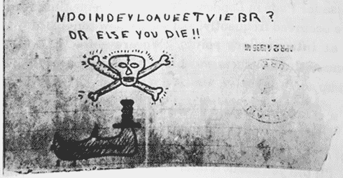
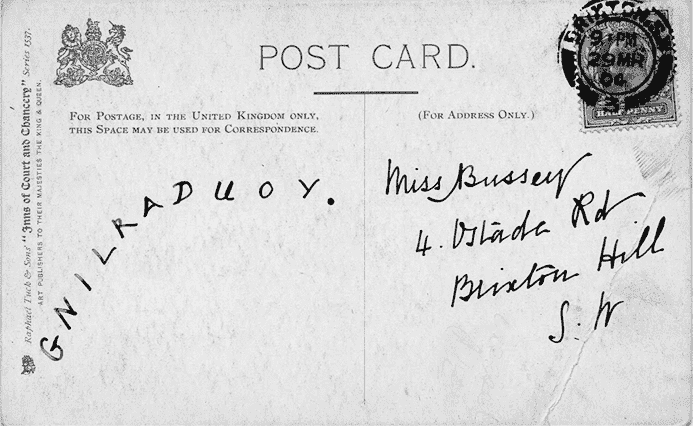
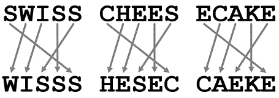
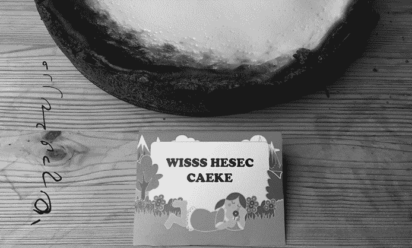
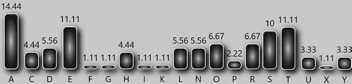
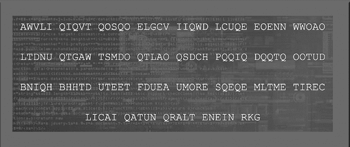
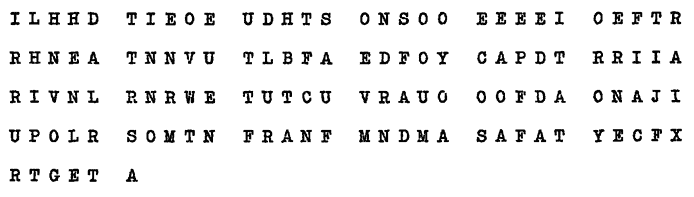
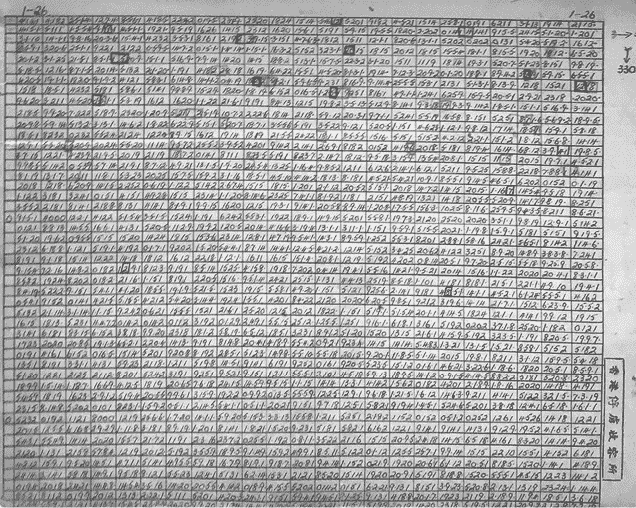
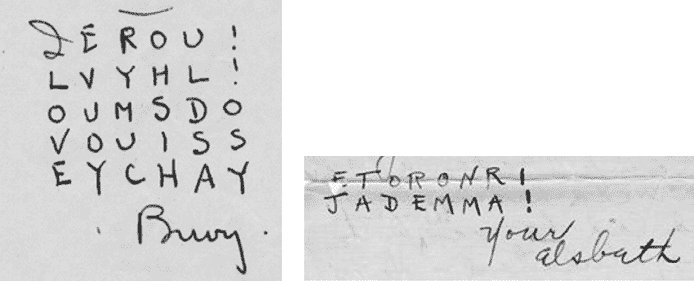
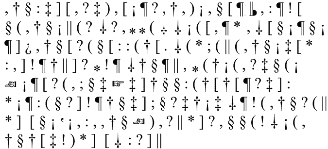

# 第九章：完整的列交换密码

1935 年，某人将图 9-1 中展示的匿名信息发送给富兰克林·D·罗斯福总统。^(1)^, ^(2) 尽管第二行`OR ELSE YOU DIE`是可读的，但第一行显然是加密的。我们可以通过将消息按每行两个字母的方式写下来，恢复明文：

`ND`

`OI`

`MD`

`EY`

`LO`

`AU`

`EE`

`TV`

`IE`

`BR`

图 9-1：1935 年发送给富兰克林·D·罗斯福总统的匿名加密信息

注意，从上到下，第二列是`DIDYOUEVER`。第一列从下往上读是`BITEALEMON`。这两列组合成了预期的明文信息，`DID YOU EVER BITE A LEMON?`

罗斯福患有小儿麻痹症（或当时无法与其他类似疾病区分开来）。根据一个已被驳斥的理论，柠檬汁能够治愈小儿麻痹症。看起来，这条信息的发送者想通过这种不寻常的方式向罗斯福推荐柠檬汁疗法。

这种加密方法的一个特别之处在于，没有对明文中的字母或单词进行替换。相反，只是改变了字母的顺序。具有这一特性的密码被称为*交换密码*。

## 完整的列交换密码是如何工作的

交换密码有很多种，几乎每种改变信息中字母顺序的方式都能形成一种新的交换密码。罗斯福的明文由二十个字母组成，这意味着它可以有 2,432,902,008,176,640,000（超过两千五百亿）种重新排列的方式！一般来说，一个包含*n*个字母的消息可以通过*n*的阶乘（*n*! = 1 × 2 × 3 × 4 × 5 × . . . × *n*）种方式进行交换，且不一定是独特的。然而，使用随机交换方法进行加密并不实用。相反，需要定义一个方便的交换规则。

图 9-2 中的明信片是使用了一种交换规则编写的，这种规则确实方便，但安全性不高。^(3)

图 9-2：这张加密明信片并不难解密。

你稍微看一会儿就会发现，明信片上的信息是倒着写的。这种写法是交换密码的一种特别简单的变体。另一种方法是将明文中的每个单词倒着写。以下这则报纸广告发表于 1888 年 4 月 4 日的*Morning Pos**t*，采用了这种方法：^(4)

`Ma gniyrt ym tseb ot esaelp uoy.`

应该很清楚，从实际隐匿信息的角度来看，为了避免信息被不希望的接收者窃取，转置规则需要更加复杂。此外，基于密钥，转置应当能够变化。例如，我们可以将消息分为五个字母的块，并根据定义的方案重新排列每个块。使用这种方案，明文 `SWISS CHEESECAKE` 可以加密如下：

这解释了在图 9-3 中我们在聚会中遇到的标志是如何加密的。它使用了密钥 `1` = `5`，`2` = `1`，`3` = `2`，`4` = `4`，`5` = `3`，或者简单地表示为 `5`，`1`，`2`，`4`，`3`。

图 9-3：这款蛋糕的名字通过转置密码进行了加密。

这种方法相当于以下方法，使用了关键词 `TABLE`。首先，我们将消息写成如下形式，放在关键词下方：

`TABLE`

`-----`

`SWISS`

`CHEES`

`ECAKE`

然后，我们对列进行排序，使得关键词的字母按字母顺序排列：

`ABELT`

`-----`

`WISSS`

`HESEC`

`CAEKE`

这产生了我们在标志上看到的密文 `WISSS HESEC CAEKE`。

我们可以通过按列转录字母来扩展这种基于行的转置，从而得到以下加密消息：`WHC IEA SSE SEK SCE`。我们还可以从底部向上、从右向左或以其他方式转录消息。

长期以来，人们低估了转置密码的强度。许多密码设计师认为，重新排列字母比替换字母不安全。直到 20 世纪，人们才知道转置密码实际上可以非常安全。

在本章中，我们将仅限于处理明文以相等长度的行编写，按列转置并以任意方向进行转录的情况。此外，我们假设最后一行完全填充，不包含空格。这种转置称为“完全列转置”。本章早些时候展示的罗斯福密码就是一种完全列转置，行长度为二。反向书写的明信片（行长度等于消息长度）也是如此。将每个单词倒写的报纸广告肯定是一种转置，但不是完全列转置，因为它不是基于恒定长度的行。

## 如何检测完全列转置密码

从破解者的角度来看，转置密码（无论哪种类型）的优点是加密后消息的字母频率不会发生变化。因此，频率分析有助于我们检测这种类型的密码。例如，看看 1882 年 6 月 16 日《晚间标准报》上刊登的加密广告：^(5)

`ECALAP Ardnaxela eht ta sekal elpirt eht no strecnoc ocserf la eh tot og syadrutasnda syadsruht syadseut no.`

如果我们进行频率分析 . . .

. . . 我们看到`A`、`E`和`T`的出现频率特别高，而`B`、`Q`、`J`、`M`、`V`、`W`和`Z`完全没有出现。这与一段英文的短文本一致（在较长的文本中，我们预计`E`会比`A`更频繁）。唯一一种常见的加密算法，它能生成这种字母频率的密文，就是换位密码。

就像字母频率一样，偶然指数在应用换位密码时不会改变。使用 CrypTool 2 或[`dcode.fr/en`](http://dcode.fr/en)，我们可以计算 1882 年报纸广告的偶然指数为 7.0%，这与英语的偶然指数 6.7%非常接近。

## 如何破解完整的列换位密码

对于基于行的换位密码（即完整的列换位密码），有多种解密方法。在每种方法中，确定行的长度起着关键作用。

### 排列和读取法

让我们再来看一下发给罗斯福总统的加密便条：`NDOIMDEYLOAUEETVIEBR`。这条信息由二十个字母组成。假设我们面对的是完整的列换位密码，那么只有少数几种可能的行长度，即二十的约数：二、四、五和十。

作为第一次尝试，我们将信息写成十个字符一行：

`NDOIMDEYLO`

`AUEETVIEBR`

现在，让我们尝试以四个方向读取这两行文本：从左到右，反向，从上到下，和从下到上。然而，无论我们如何读取，它都没有意义。所以接下来，我们尝试五字母行：

`NDOIM`

`DEYLO`

`AUEET`

`VIEBR`

仍然没有发现规律。这里是四字母一行的消息：

`NDOI`

`MDEY`

`LOAU`

`EETV`

`IEBR`

再次，我们以四种不同的方式读取这些行；没有什么特别的。接下来，我们尝试两字母的行：

`ND`

`OI`

`MD`

`EY`

`LO`

`AU`

`EE`

`TV`

`IE`

`BR`

现在，从下到上读取的第一列是`BITE A LEMON`。或者，也许更容易先看到第二列，从上到下读取是`DID YOU EVER`。密码被破解了。有时，破解一个完整的列换位密码就这么简单！

让我们来看一个类似的例子。图 9-4 中的密码谜题是英国情报机构 GCHQ 在 2013 年发布的一段挑战性密文。^(6)

图 9-4：英国情报机构 GCHQ 发布的挑战性密码谜题

频率分析揭示字母频率与英文语言非常匹配，除了大量的`Q`之外。因此，我们可以假设这段密文是通过换位密码生成的，而`Q`代表空格字符。

这段密码文本包含 143 个字母。143 只有两个因数，它们都是质数：11 和 13。假设我们处理的是完全的列置换密码，我们应该检查 11 和 13 的行长度。我们先从 11 开始：

`AWVLIQIQVTQ`

`OSQOELGCVII`

`QWDLCUQEEOE`

`NNWWOAOLTDN`

`UQTGAWTSMDO`

`QTLAOQSDCHP`

`QQIQDQQTQOO`

`TUDBNIQHBHH`

`TDUTEETFDUE`

`AUMORESQEQE`

`MLTMETIRECL`

`ICAIQATUNQR`

`ALTENEINRKG`

无论我们如何阅读这一段文字——从左到右、倒着读、从上到下，还是从下到上——它看起来都不像真实的语言。接下来，让我们检查一下十三个字母的变体：

`AWVLIQIQVTQOS`

`QOELGCVIIQWDL`

`CUQEEOENNWWOA`

`OLTDNUQTGAWTS`

`MDOQTLAOQSDCH`

`PQQIQDQQTQOOT`

`UDBNIQHBHHTDU`

`TEETFDUEAUMOR`

`ESQEQEMLTMETI`

`RECLICAIQATUN`

`QRALTENEINRKG`

如果我们从上到下读取第一列，我们得到`AQCOMPUTERQ`。记住，`Q`代表空格，这条消息就变得有意义了。用`Q`替换为空格后，从列出发读，这段文字变成了这样：

`一个计算机如果能够欺骗一个人让他相信它是人类，那它就值得被称为智能的。WWW 点 METRO 点 CO 点 UK 斜杠 TURING`

明文是对“图灵测试”常见定义的总结，图灵测试是以杰出的数学家艾伦·图灵（1912-1954）命名的。

### 元音频率和多次重排

我们刚才介绍的排列和读取方法只适用于如果置换的第二步，即列的排列被省略的情况。如果不是这种情况，我们需要更复杂的破译方法。为了继续，我们需要知道英语中元音和辅音的比例大约是 40：60。连续三个以上的元音或辅音是可能的，但在实际中很少见。

让我们看看以下从《军事密码分析 IV》一书中摘取的密码本（作者：William Friedman，1959 年）：^(7)

频率分析揭示了与英语语言非常相似的分布，表明这个密文可能是用列置换密码生成的。我们先假设它是一个完全的列置换密码。

由于消息由 126 个字母组成，因此可能的行长有：2、3、6、7、9、14、18、21、42 和 63。2、3 和 6 的行长不安全，因为可以转置的内容很少；而 21、42 和 63 的行长不切实际，因为行太长了。因此，这些行长很少被使用。所以我们从检查 7、9、14 和 18 的行长开始。

如果我们以 7 个字母为一行来写密文，我们得到如下表格。（因为我们假设密文是按列读取的，所以我们以列而非行的方式写文本。）

`1 IONTTUM`

`2 LONRCPA`

`3 HEVRUOS`

`4 HEUIVLA`

`5 DETIRRF`

`6 TELAASA`

`7 IIBRUOT`

`8 EOFIOMY`

`9 OEAVOTE`

`10 EFENONC`

`11 UTDLFFF`

`12 DRFRDRX`

`13 HRONAAR`

`14 THYRONT`

`15 SNCWNFG`

`16 OEAEAME`

`17 NAPTJNT`

`18 STDUIDA`

第 12 行和第 15 行仅由辅音组成。由于英语文本中几乎不可能连续有七个辅音字母，我们得出结论，当前的方向可能是错的。现在，我们尝试九个字母的行，再次从上到下按列排列：

`1 ISTBRTATF`

`2 LORFIUONA`

`3 HNRAITNFT`

`4 HSHEACARY`

`5 DONDRUJAE`

`6 TOEFIVINC`

`7 IEAOVRUFF`

`8 EETYNAPMX`

`9 OENCLUONR`

`10 EENAROLDT`

`11 UIVPNORMG`

`12 DOUDROSAE`

`13 HETTWFOST`

`14 TFLREDMAA`

看起来更好一些。每行的元音数是合理的。我们会把九个字母的变体作为一个有前景的候选保持在心里。

下一个候选是十四个字母版本：

`1 IFOFNETNTOUNMC`

`2 LUOTNDRLCFPFAF`

`3 HDERVFRRUDORSX`

`4 HHERUOINVALAAR`

`5 DTEHTYIRRORNFT`

`6 TSENLCAWANSFAG`

`7 IOIEBAREUAOMTE`

`8 ENOAFPITOJMNYT`

`9 OSETADVUOITDEA`

第 7 行中的十个元音虽然不不可能，但还是相当不太可能。所以，这个猜测并不是一个好的初步选择。以下是最后一个候选，十八个字母每行：

`1 IESETTBYRNTAAPTMFX`

`2 LOOERNFCILUUOONNAR`

`3 HENERNAAIRTONLFDTT`

`4 HUSIHVEPANCOARRMYO`

`5 DDOONUDDRRUOJSAAEE`

`6 THOEETFTIWVFIONSCT`

`7 OTEFALORVERDUMFAFA`

这个也看起来不错。

我们现在有两个不错的候选（九个和十八个字母的行），一个不太可能的候选（十四个字母的行），以及一个极不可能的候选（七个字母的行）。我们将继续尝试这两个较好的候选，通过应用一种叫做*多重重排法*的技术。这种方法的步骤是：通过重排一个块的列，直到某一行出现一个有意义的单词。然后，我们检查其他重新排列的行，看看它们是否看起来像从英文文本中提取的。如果是这种情况，我们可能在正确的轨道上；如果不是，我们就尝试另一个单词。

首先，我们看一下是否可以通过重新排列十八字母候选行中的字母，拼出有意义的单词。第四行中，我们看到需要的字母来拼出`ARMY`——这是军事信息中可能出现的一个单词。我们以此为第一步的多重重排尝试。由于第四行中有两个`A`和两个`R`，我们可以用四种方式来构造这个单词：

`9 14 16 17 13 14 16 17 9 15 16 17 13 15 16 17`

`R P M F A P M F R T M F A T M F`

`I O N A O O N A I N N A O N N A`

`I L D T N L D T I F D T N F D T`

`A R M Y A R M Y A R M Y A R M Y`

`R S A E J S A E R A A E J A A E`

`I O S C I O S C I N S C I N S C`

`V M A F U M A F V F A F U F A F`

第一个可能性非常不太可能，因为第一行中的`RPMF`和最后一行中的`VMAF`并不是常见的英语四字组合。第二个块也不太好——看看第一行中的`APMF`和第五行中的`JSAE`。出于类似的原因，第三个和第四个组合也不成立。我们已经走到了死胡同。

我们来找找能拼出来的其他单词。我们很容易找到几个单词，其中一些可以通过不同的方式拼成。例如，第六行的字母`T`、`T`、`T`、`T`、`O`、`O`和`W`可能拼成`TWO`（数字在军事信息中很常见）。以下是拼写这个单词的八种方式：

`1 10 3 6 10 3 8 10 3 18 10 3`

`I  N  S T  N  S Y  N  S  X N  S`

`L  L  O N  L  O C  L  O  R L  O`

`H  R  N N  R  N A  R  N  T R  N`

`H  N  S V  N  S P  N  S  O N  S`

`D  R  O U  R  O D  R  O  E R  O`

`T  W  O T  W  O T  W  O  T W  O`

`I  E  E L  E  E R  E  E  A E  E`

`1 10 14 6 10 14 8 10 14 18 10 14`

`I  N P  T  N P  Y  N P X N P`

`L  L O  N  L O  C  L O R L O`

`H  R N  N  R N  A  R N T R N`

`D  R S  U  R S  D  R S E R S`

`T  W O  T  W O  T  W O T W O`

`I  E M  L  E M  R  E M A E M`

这些八个猜测导致的其他行字母组合在英语文本中并不常见，如`HNR`、`VNR`和`XNP`。看来我们又走错了方向。

接下来，我们可以尝试`AIR FORCE`，它可能出现在第二行。由于这一行有四个`O`和两个`R`，所以有八种拼写方式。其他可能性包括第一行的`BY TRAIN`，第六行的`THOSE`，以及第七行的`OVER`。然而，这些组合在其他行中都导致了不太可能的字母组合。

不情愿地，我们得出结论，十八个字符长的候选行可能不正确，因此我们转向九个字母长的块：

`1 ISTBRTATF`

`2 LORFIUONA`

`3 HNRAITNFT`

`4 HSHEACARY`

`5 DONDRUJAE`

`6 TOEFIVINC`

`7 IEAOVRUFF`

`8 EETYNAPMX`

`9 OENCLUONR`

`10 EENAROLDT`

`11 UIVPNORMG`

`12 DOUDROSAE`

`13 HETTWFOST`

`14 TFLREDMAA`

在寻找可能的候选词时，我们找到了一些与数字相关的单词。第一行提供了我们可能需要的字母来拼成单词`FIRST`。第六行和第七行包含了单词`FIVE`的字母。因为字母`V`是相对不常见的字母，让我们把第六行的`FIVE`作为第一个猜测。这一行有两个`I`，所以有两种拼法：

`4 5 6 3 4 7 6 3`

`B R T T B A T T`

`F I U R F O U R`

`A I T R A N T R`

`E A C H E A C H`

`D R U N D J U N`

`F I V E F I V E`

`O V R A O U R A`

`Y N A T Y P A T`

`C L U N C O U N`

`A R O N A L O N`

`P N O V P R O V`

`D R O U D S O U`

`T W F T T O F T`

`R E D L R M D L`

很明显，第二块看起来非常有希望。除了“FIVE”之外，它还能产生英语单词“FOUR”和“EACH”，并且有一些有前途的单词片段，如“BATT”，“OURA”，“COUN”，“ALON”和“PROV”。只有最后一行“RMDL”不像英语单词，但这可能是因为它是一个缩写。让我们假设这个猜测是正确的。

我们该如何继续？因为我们认为我们已经知道了第 4、7、6 和 3 列，所以最好检查其余五列（1、2、5、8 和 9）中的哪一列在我们选择的块前放置最合适。共有五种选择：

`1 4 7 6 3 2 4 7 6 3 5 4 7 6 3 8 4 7 6 3 9 4 7 6 3`

`I B A T T S B A T T R B A T T T B A T T`

`L F O U R O F O U R I F O U R N F O U R A F O U R`

`H A N T R N A N T R I A N T R F A N T R T A N T R`

`H E A C H S E A C H A E A C H R E A C H Y E A C H`

`D D J U N O D J U N R D J U N A D J U N E D J U N`

`T` `F I V E` `O` `F I V E` `I` `F I V E` `N` `F I V E` `C` `F I V E`

`I O U R A E O U R A V O U R A F O U R A F O U R A`

`E Y P A T E Y P A T N Y P A T M Y P A T X Y P A T`

`O C O U N E C O U N L C O U N N C O U N R C O U N`

`E A L O N E A L O N R A L O N D A L O N T A L O N`

`U P R O V I P R O V N P R O V M P R O V G P R O V`

`D D S O U O D S O U R D S O U A D S O U E D S O U`

`H T O F T E T O F T W T O F T S T O F T T T O F T`

`T R M D L F R M D L E R M D L A R M D L A R M D L`

第四个选项，84763，产生了最佳结果：REACH，NFOUR 和 MYPAT。其他大部分五个字母的组合可以轻松地想象为来源于英语文本。其余的列（1，2，5 和 9）现在也可以以类似的方式轻松添加。我们会在现有的块之前或之后检查每一项的放置，以确定最合理的排列方式。最后，我们得到如下结果：

`FIRSTBATT`

`ALIONFOUR`

`THINFANTR`

`YHASREACH`

`EDROADJUN`

`CTIONFIVE`

`FIVEFOURA`

`XENEMYPAT`

`ROLENCOUN`

`TEREDALON`

`GUNIMPROV`

`EDROADSOU`

`THWESTOFT`

`ATEFARMDL`

这个明文可以按行读取。X 被用作句号：

第一营第四步兵已经到达路口五五四 A。敌军巡逻队在塔特农场西南的未改良道路上遭遇。

我们之前看到的那个辅音四字组合 RMDL，正是单词 FARM 的结尾。我们不确定剩下的字母 DL 可能代表什么，也许是一个签名或填充字母，用来达到特定的消息长度？

如今变得越来越明显，多重变位是一种*非确定性*方法，这意味着可以得出多个解答候选。因此，必须小心、富有创造力并通过试错法来完成。然而，有一些技巧可以简化破译过程：

1.  字母 *Q* 对于多个变位（anagramming）非常有用，因为它通常后面跟着一个 *U*。

1.  字母 *J*、*V* 和 *Z* 几乎总是后面跟着元音。

1.  字母 *A*、*O* 和 *U* 通常后面跟着辅音。

1.  字母 *H* 通常前面是辅音，后面跟着元音。

如果你想了解更多关于多重变位的内容，我们推荐海伦·富歇·盖恩斯的经典 1939 年著作《密码分析》*Cryptanalysis*。^(8)

## 成功故事

### 唐纳德·希尔的日记

唐纳德·希尔（约 1915–1995）是二战期间的英国军事飞行员。他驻扎在香港，被日本军队俘虏并送往战俘营。在囚禁四年后，他被释放。即使在囚禁之前，希尔也一直保留着日记。但由于英国士兵不允许保留私人笔记，他用数字代替字母，并将日记伪装成一本乘法表，标题为*拉塞尔的数学表*。这看起来并不令人怀疑，因为在口袋计算器发明之前，乘法表是非常常见的。希尔在囚禁期间继续写他的日记。

返回英国后，希尔与未婚妻结婚，并再也没有谈论过他的日记或其中的内容。直到 1995 年希尔去世，他的妻子才开始调查他留下的这本小册子中的奇怪数字序列。她请来萨里大学的数学教授菲利普·阿斯顿分析这些数字。阿斯顿成功地推测出了这些数字的含义，并发表了一篇关于解密日记的论文。^(9) 唐纳德·希尔的故事也在安德罗·林克拉特的 2001 年著作《爱的密码》中讲述。^(10)

当阿斯顿第一次检查希尔所谓的数学表时，他看到大多数页面上填满了四位数字的组合（见图 9-5）。这些数字据称是乘法结果，但结果与实际的乘法运算不符。阿斯顿得出结论，这些数字的真正用途是用来编码一段文本。

图 9-5：战俘唐纳德·希尔将他的日记伪装成一本数学表。此外，他还使用了置换密码。

解读这些数字的最明显方法是，每四位数字组编码了两个字母。（换句话说，每一对数字代表一个字母。）当阿斯顿看到几乎所有的数字对都代表介于十到三十五之间的数字时，他确定最明显的编码方式是`A` = `10`，`B` = `11`，`C` = `12`，`D` = `13`，等等。阿斯顿根据这种编码进行了频率分析，发现字母频率几乎完全符合英语语言的字母频率。然而，他得到的字母序列并没有意义。因此，他假设希尔除了使用替换密码外，还使用了置换密码。

更仔细地观察日记中的数字时，阿斯顿注意到偶尔会出现一个由四个零（`0000`）组成的组合。这与编码不符。阿斯顿猜测这些零块是分隔符。事实证明，每两个分隔符之间恰好有 561 个四位数字组（1,122 个字母）。这使得希尔可能对每 1,122 个字母应用了置换密码。

通过排列 1,122 个字母成一个矩形是非常容易的，因为数字 1,122 有很多因子。这表明 Hill 可能使用了一个完整的列转置密码，矩形的大小可能是 66 × 17、11 × 102 或 33 × 34。尽管如此，Aston 并不需要很长时间就能找到最合适的猜测，因为在日记的第一页上写着一个右箭头，旁边是数字`340`，还有一个下箭头，旁边是数字`330`。Aston 认为这些数字中的零是为了迷惑读者，然后他将其中一个 1,122 字母的单位排列成一个包含 33 列 34 行的表格。将文本按行写入表格中，快速生成了列中的有意义单词。遗憾的是，Aston 的论文中没有描述他到底看到了什么，但这个 33 × 34 的表格可能是这样的：

`DMSTIINSKDSEATALDSGMTOOARNRRBUENDE`

`IBABLAWTBAARMRLEETHEOENPTIEESTAOOF`

`WEFLMMESYMBSEALTTWTIASEPWSTTANRTAT`

`AREAADDTTALCRTWEHEENSUPEEIAHMOAUNR`

`KSTZCIAHHGAOTEELEARDHPLANMREOCNNYE`

`EEYIHSSEEEZMCDVYBRSIETARTMYINAOSTP`

`TSANITHBFBEEAFEBLESALNNHYIRRGSMCHR`

`HCNGNUDOTOAONIGUATWNTSEEMNILSUIAIA`

`EODAEROMGTNVCRORZOOTEMIATENETANRNY`

`ORBNSBWBHHOELETNELORRONDNNGWTLORGI`

`TTYDAENETWTRIIWETDPOTKTIUTSIATUEEN`

`HEASROTREAHAPNHDSTDONEANTHUSEISDXG`

`EDMIEEOSRLEGPTIWTHOPTACGEEPGRERWCT`

`RBINBAFPSRRAEOCTOAWSHNTOSLTUUSOEEH`

`OYRKURLATUBIROHTOTNGEDWUOLONITAHPA`

`FOAFRLISHSANIUIHFWOETITRFTSTNOROTT`

`FVCINYGSEADBNRSTIENTRHAWCHAHSPOPTT`

`IELNTAHOBRLOTPPWEAUPEETAOEYEOEFEOH`

`CREAOSTVEEYMHLRORRSAXTTYNRTRNRPAME`

`ETNLUTSEEGDBEAERCEANCWETCEHEESLNAB`

`RHOLTHJRSOATANCEEANITOMHEGATAOADNO`

`SIOYIEUHTNMWFETDATDCTWPENOTSINNWOM`

`ORNTNCSEEEAGTSOHNWPKEATRTEWARNEEUB`

`VTEHCOTAWOGTEWUODAOYMLTERSAMCESTRS`

`EYIELLLDINERHRSTSRUAEROSAMRARLANDW`

`RFSYUONBTEDENGLHHWNNNUPNTYWDAENSEO`

`BIHMDNTUHBLDOTIEETADTSUOESTRFIDPFN`

`RGIATIITBEEOOVTATICRTATTDITUTGNEET`

`EHTKNAMTOEACNETVSHOUHROTAEHSLHICNE`

`ATAEGLEHMSVKBTLYCJNSEEUMTEJHETNTCX`

`KEFOTSTEBTISOHEBOACHYLTETPAFFCETEP`

`FRTFHEOFSENAMESOMPETFETTAAPOTIBHPL`

`ASEFECHIGIGABMOMPANNIFHOCNARBVOEOO`

第一列从上到下包含了信息 `I WAKE THE OTHER OFFICERS`。第二列 `MBERSESCORTEDBYOVE` 看起来并不直接跟随第一列，但显然它是英文的一个片段。很明显，列的顺序需要改变。Donald Hill 是否用了一个关键词进行这种转置呢？同样，Aston 并不需要很长时间就找到了答案。在日记的封面上，他发现了 Hill 和他的未婚妻的全名，这些名字一共包含了 34 个字母：

`DONALD SAMUEL HILL PAMELA SEELY KIRRAGE`

按字母顺序排列，这 34 个字母读作：

`AAAAADDEEEEEGHIIKLLLLLLMMNOPRRSSUY`

为了解密日记，Aston 在表格的第一行写下了这些字母：

`AAAAADDEEEEEGHIIKLLLLLLMMNOPRRSSUY`

`----------------------------------`

`DMSTIINSKDSEATALDSGMTOOARNRRBUENDE`

`IBABLAWTBAARMRLEETHEOENPTIEESTAOOF`

`. . .`

然后他重新排列了列，使得关键词再次出现：

`DONALDSAMUELHILLPAMELASEELYKIRRAGE`

`----------------------------------`

`IRNDSNEMADSGTAMTRSRKOTNDSOEDLBUIAE`

`AETITWABPOTHRLEOEATBEBOAANFEESTLMR`

`MTSWWEREPASTALIATFWYSLTMBEITTANMES`

`DATAEDARENTETWNSHEETUAUALPRHEMOARC`

`IRMKAANSAYHREEDHETNHPZNGALEELOCCIO`

`SYMERSOERTESDVIETYTEIISEZAPBYNAHCM`

`TRITEHMSHHBSFEALRAYFNNCBENRLBGSIAE`

`UINHTDICEIOWIGNTLNMISGAOAEAAUSUNNO`

`RNEEOONOANMOROTEEDIGMARTNIYZRTAECV`

`BGNOLWORDGBOETRRWBNHONRHONIENTLSLE`

`ESTTDNUTIEEPIWOIIYUTKDEWTTNIEHTAIR`

`DUHHTTSENXRDNHONSATEESDAHAGSDEIRPA`

`EPEBHORDGCSOTIPTGMERAIWLECTTWREEPG`

`ATLRAFOBOEPWOCSHUISSNNERRTHOIUSBEA`

`ROLOTLAYUPANOHGENROTDKHUBWAOTITURI`

`LSTFWIRORTSOUIEITAFHTFOSAETFHNORIN`

`YAHFEGOVWTSNRSTRHCCEHIPADATITSPNNB`

`AYETAHFEAOOUPPPEELOBENERLTHEWOETTO`

`STRCRTPRYMVSLRAXRENETAAEYTERONROHM`

`THEEESLTTAEAAENCENCEWLNGDEBCRESUEB`

`HAGRAJAHHNRNNCIIIOESOLDOAMOEEAOTAI`

`ETOSTUNIEOHDEICTSONTWYWNMPMADINIFN`

`CWEOWSERRUEPSOKEANTEATEEATBNHRNNTG`

`OASVATSTERAOWUYMMERWLHIOGTSDOCECET`

`LRMERIAYSDDUESAEAIAIRENNEOWSTRLLRH`

`OWYRWNNFNEBRGLNNDSTTUYSEDPOHHAEUNE`

`NISBITDIOFUAITDTRHEHSMPBLUNEEFIDOD`

`ITLRTINGTETCVTRTUIDBAAEEETTIATGIOO`

`AHEEHMIHINTOETUHSTAORKCEAOESVLHNNC`

`LJEAJENTMCHNTLSEHATMEETSVUXCYETGBK`

`SAPKATEHEEECEEHYFFTBLOTTITPOBFCTOS`

`EPAFPOBRTPFEESIFOTASEFHENTLMOTIHMA`

`CANAAHOSOOINMONTRECGFFEIGHOPMBVEBN`

现在，解码完成了。按列读取，下面是明文内容，这是一篇写于 1941 年 12 月 8 日的日记：

`我被吵醒了，因为殖民地秘书打电话来说与日本的战争迫在眉睫。天啊，睡眠就这样没了，我把其他官员叫醒。早餐时我们得知我们和日本开战了。我们急忙跑向飞机场，正好听到飞机的恐怖轰鸣声，九架轰炸机和三十多架战斗机正飞向我们。没有时间做任何事，除了站好防线。轰炸机飞过头顶，但战斗机突然俯冲下来，集中火力攻击我们的飞机。我们尽力反击，尽管我们的装备十分简陋。部分印度部队慌乱地冲进了掩体，激动之下开火了他们的路易斯机枪。大家纷纷抢着躲避，幸运的是没有人受伤。经过 20 分钟的战斗后，Beeste 轰炸机被击落，两个 Walrus 水上飞机着火并沉没。最终它们撤退了，希望它们也没什么损伤，我们开始检查损失。两个 Walrus 不见了，一架 Beeste 着火，另一架严重受损，只剩下一架完好无损的飞机。我们尽力扑灭火灾，祈祷炸弹不会爆炸。火势太猛，飞机被完全烧毁，废墟中有两个炙热的重型炸弹。剩下了一架飞机，但没有人员伤亡。包括美国水上飞机在内的八架民用飞机被烧毁。下午，轰炸机再次飞来，炸弹投向码头等。`

其余的日记可以在阿斯顿 1997 年的论文和安德罗·林克莱特 2001 年出版的《爱的密码》一书中找到。

### 巴布罗·瓦贝尔斯基间谍案件

在他 1931 年的书《美国黑色密码室》中，赫伯特·雅尔德利（1889–1958）讨论了美国的秘密密码学能力，这本书引起了轰动。雅尔德利在书中描述了一种德国的置换密码。^(11) 据雅尔德利回忆，1918 年 2 月 10 日，在第一次世界大战期间，美国特工在墨西哥边境逮捕了一名自称巴布罗·瓦贝尔斯基的男子。调查人员怀疑，这名被拘留者实际上是名为洛塔尔·维茨克的德国间谍。^(12)^, ^(13) 在嫌疑人外套的左袖里，发现了以下加密信息：^(14)

`SEOFNATUPK ASIHEIHBBN UERSDAUSNN`

`LRSEGGIESN NKLEZNSIMN EHNESHMPPB`

`ASUEASRIHT HTEURMVNSM EAINCOUASI`

`INSNRNVEGD ESNBTNNRCN DTDRZBEMUK`

`KOLSELZDNN AUEBFKBPSA TASECISDGT`

`IHUKTNAEIE TIEBAEUERA THNOIEAEEN`

`HSDAEAIAKN ETHNNNEECD CKDKONESDU`

`ESZADEHPEA BBILSESOOE ETNOUZKDML`

`NEUIIURMRN ZWHNEEGVCR EODHICSIAC`

`NIUSNRDNSO DRGSURRIEC EGRCSUASSP`

`EATGRSHEHO ETRUSEELCA UMTPAATLEE`

`CICXRNPRGA AWSUTEMAIR NASNUTEDEA`

`ERRREOHEIM EAHKTMUHDT COKDTGCEIO`

`EEFIGHIHRE LITFIUEUNL EELSERUNMA`

`ZNAI`

赫伯特·雅尔德利受命破译这一加密信息。他和他的团队进行了频率分析和其他一些统计测试。测试结果表明，字母`E`是最常见的字母，其次是`N`，而`Q`、`X`和`Y`则完全没有出现。这些特点典型地反映了德语的特点（见附录 B），这表明作者可能使用了置换密码。

雅尔德利知道如何利用常见的二字组合（字母对）来破解这种加密。在德语中，字母`C`尤其有帮助，因为它通常出现在`H`之前，有时也会出现在`K`之前，且很少出现在其他字母前面。因此，雅尔德利在文本中标记了所有的`C`，然后寻找`H`。接着，他计算了每个`C`和`H`之间的距离。结果显示，108 个字母的距离非常突出，经常出现。当雅尔德利将信息以 108 个字母为一行进行转录时，他得到了以下字母序列：

`SEOFNATUPK ASIHEIHBBN UERSDAUSNN LRSEGGIESN NKLEZNSIMN . . .`

`CNDTDRZBEM UKKOLSELZD NNAUEBFKBP SATASECISD GTIHUKTNAE . . .`

`HPEABBILSE SOOEETNOUZ KDMLNEUIIU RMRNZWHNEE GVCREODHIC . . .`

`AATLEECICX RNPRGAAWSU TEMAIRNASN UTEDEAERRR EOHEIMEAHK . . .`

从上到下阅读，几乎每一列都产生了一个典型的德语四字序列：第一列是`SCHA`，第十列是`KMEX`，第二十列包含`NDZU`。接下来，雅德利和他的团队将这些列按有意义的顺序组织起来，结果相当简单。例如，`KMEX`后跟`IKOP`组成了单词`MEXIKO`（德语中的`MEXICO`）。最终，雅德利成功地读取到了以下明文：

`AN DIE KAISERLICHEN KONSULARBEHOERDEN IN DER REPUBLIK MEXIKO PUNKT STRENG GEHEIM AUSRUFUNGSZEICHEN DER INHABER DIESES IST EIN REICHSANGEHOERIGER DER UNTER DEM NAMEN PABLO WABERSKI ALS RUSSE REIST PUNKT ER IST DEUTSCHER GEHEIMAGENT PUNKT ABSATZ ICH BITTE IHM AUF ANSUCHEN SCHUTZ UND BEISTAND ZU GEWAEHREN KOMMA IHM AUCH AUF VERLANGEN BIS ZU EINTAUSEND PESOS ORO NACIONAL VORZUSCHIESSEN UND SEINE CODETELEGRAMME AN DIESE GESANDTSCHAFT ALS KONSULARAMTLICHE DEPESCHEN ABZUSENDEN PUNKT`

`VON ECKHARDT`

这是翻译：

`致墨西哥共和国的帝国领事当局。最高机密！此[纸张]的所有者是德国帝国成员，他以俄罗斯人帕布洛·瓦贝尔斯基的名字旅行。他是德国的秘密特工。我恳请您根据要求为他提供保护和支持，按要求提供最高 1000 比索的 Oro Nacional，并将他的加密电报作为外交函件送往此领事馆。`

`Von Eckhardt`

这封信证明了嫌疑人帕布洛·瓦贝尔斯基实际上是德国间谍。他在 1918 年被判死刑。战争结束后，当德美关系改善时，他被特赦，并且他的指控最终在 1923 年被撤销。

## 挑战

### 兰佩杜萨的信息

唐纳德·麦考马克在 1980 年出版的书《加密中的爱》是一本关于恋人使用加密技术的精彩概述。^(15) 它涵盖了数百年的加密情书、日记、报纸广告以及其他由浪漫情侣创造的密码文本，旨在保持他们的通讯私密。在其中一章《战争中的爱》中，麦考马克报道了一个居住在地中海小岛兰佩杜萨的女性，在 1943 年美国军队轰炸该岛时的故事。^(16) 这位女性在一块白布上用粗体字画下了以下信息，并将其放在海滩上让入侵者看到：

`TSURT EM, SYOB. I NEEUQ FO ASUDEPMAL`

解读这个密码比理解它的意义要容易得多。那位女性从未被确认身份，且此信息的目的尚不明确。

### 弗里德曼夫妇的情书

威廉和伊丽莎白·弗里德曼（分别于 1891–1962 和 1892–1980 去世）是破解密码的黄金搭档。两人都曾在军事、警察以及其他机构担任密码分析师，拥有长时间的职业生涯。2017 年，美国作家杰森·法贡写了一本关于伊丽莎白·弗里德曼的迷人书籍，内容不仅涵盖了这对夫妇的密码破解工作，还讲述了他们的追求与婚姻。^(17)（近年来，关于伊丽莎白的传记书籍层出不穷；见 第十七章。^(18)^, ^(19))

威廉和伊丽莎白据称对密码学如此热衷，以至于他们甚至在私人生活中使用加密技术。图 9-6 展示了威廉大约在 1917 年写给伊丽莎白的一封情书，以及伊丽莎白回寄给他的另一封信。这两封信都使用了简单的换位密码加密。威廉的明文是英语，而伊丽莎白的则是法语。你能解开这两组密码吗？

图 9-6：威廉·弗里德曼（签名“Biwy”）大约在 1917 年发给妻子伊丽莎白的消息，以及伊丽莎白回寄给他的另一条消息（签名“Elsbeth”）。两者都使用了简单的换位加密。

### 一则加密的“痛苦”广告

我们已经提到过 *《痛苦专栏的密码与密码学》*，这是让·帕尔默 2005 年出版的一本书，书中列出了超过一千个加密的报纸广告。这些广告中有一些（但并不很多）是用换位密码加密的。以下广告曾于 1882 年发布在英国的《晚间标准报》上：^(20)

`CEM.—我 e g c n e h d n h a o a s s b i s e r c g d h l i h u s a c c b k h e i e 。` 1882 年 7 月 31 日，星期一

`CEM.—钥匙 11. – L k e o i s v s t e s o e e m l d y o d b v e n s e d t p l i a a n a e g l m s l y h b r m n e b e m r s e a o u t f W e y r w o i h o a e u v n l e y e.` 1882 年 8 月 5 日，星期六

第一条信息是德语，第二条是英语。你能解开它们吗？

### 雅德利的第十一组密码

赫伯特·雅德利 1932 年的《*密码学*》第十一章^(21)描述了一条加密信息，信息是通过墨西哥的一个无线电台发送给一名德国间谍，在第一次世界大战期间传送到美国。这个故事，包括信息内容，属于虚构，但破解加密（完全列换位密码）仍然很有趣：

`TSKGL AATYI LTLPA SAHLM DPLGI ENEAI WTUEN N`

提示：数一数！

### 埃德加·爱伦·坡的第一次挑战

1841 年，埃德加·爱伦·坡发布了两个据称由 W·B·泰勒创建的密码图。第二个密码图及其背景故事详见第六章。第一个消息在 1991 年被伊利诺伊大学芝加哥分校的坡专家特伦斯·韦伦解开，尽管他的论文直到 1994 年才出版。与此同时，约翰·霍奇森也于 1993 年独立解密了这个密码。密码原来是一个没有空格的简单替代密码，结合了置换方法。

泰勒的第一个密码图解见图 9-7。

图 9-7：这是埃德加·爱伦·坡 1841 年发布的密码图之一，150 年后才被解开。

可以看出，泰勒使用了非标准字母表。一些密码分析专家认为这是一个没有空格的简单替代密码（Patristocrat），但这一假设并没有产生任何进展。当韦伦研究了泰勒与坡之间的通信时，他发现了一个提示，表明消息中每个单词的字母都被反转了。进一步分析显示，三字母组`,†§`特别频繁。韦伦猜测它代表`EHT`，即`THE`的反转版本，这是英语中最常见的三字母组。

韦伦的猜测被证明是正确的。知道三个字母和密码方法，他能解密消息。你也能做到吗？

### 一条爱尔兰共和军的信息

由于顶尖的密码破译者吉姆·吉洛格利的帮助，这里是一条 20 世纪 20 年代爱尔兰共和军成员发送的信息，使用了完整的列置换系统加密：

`TTSEW UDSEE OOEHS BERTN TCEUG EHYNT CLCER TNMEF KCUFE HDPDE SIDRN EESDT TREDM EIHUS WHRTB DLETI IEERE TAIRF FLABI FOPWV EEROI RTLAC OWNOT ATLAE`

提示：计算字母数量。你能找到任何好的因子吗？
