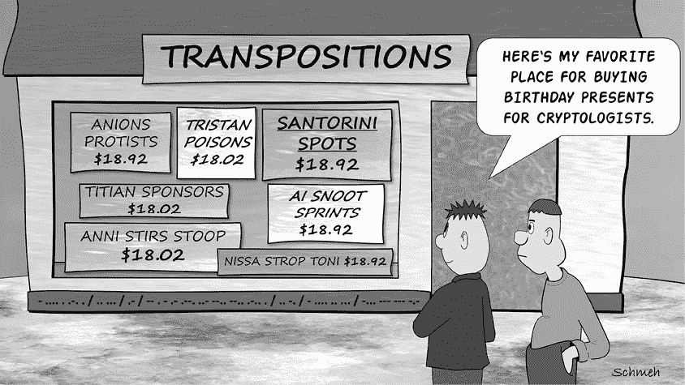
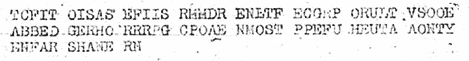
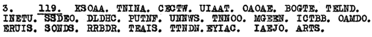
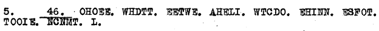
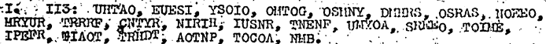
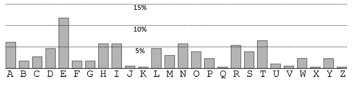
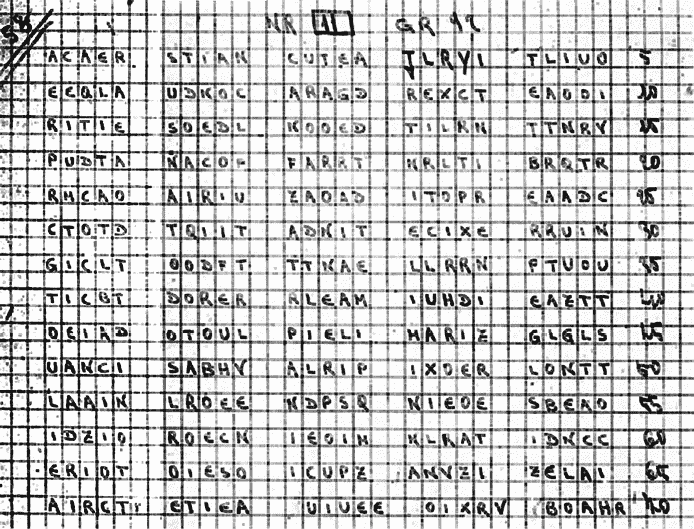
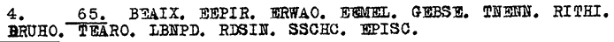

# 不完全列换位密码

在上一章我们已经介绍了完全列换位密码，现在我们将关注更一般的情况：不完全填充矩形的列换位密码，也称为*不完全列换位密码*。这种方法的工作原理几乎与第九章中介绍的相同，唯一的区别是行长度不是消息长度的约数。

## 不完全列换位密码的工作原理

为了解释不完全列换位密码是如何工作的，让我们从以下明文开始，这是一条由爱尔兰共和军（IRA）在 1920 年代加密并发送的原始信息（有关背景信息，请参见第十六章）：

`ARGUMENTS FOR SUCH MATCHES HELPED BY FACT OF TOUR BEING PRIVATE ENTERPRISE AND FOR PERSONAL GAIN OF PROMOTERS`

为了加密这条信息，我们首先根据关键词`CMOPENSATION`进行换位。IRA 确实使用了这个关键词，包括拼写错误。请注意，矩形的最后一行没有完全填充：

`CMOPENSATION`

`------------`

`ARGUMENTSFOR`

`SUCHMATCHESH`

`ELPEDBYFACTO`

`FTOURBEINGPR`

`IVATEENTERPR`

`ISEANDFORPER`

`SONALGAINOFP`

`ROMOTERS`

现在我们像在第九章中一样，对列进行排序，使关键词的字母按字母顺序排列：

`ACEIMNNOOPST`

`------------`

`TAMFRERGOUNS`

`CSMEUAHCSHTH`

`FEDCLBOPTEYA`

`IFRGTBROPUEN`

`TIERVERAPTNE`

`OINPSDREEAFR`

`ISLOOGPNFAAN`

`SRT OE M OR`

如果我们现在按列顺序读取密文，就会得到以下内容：

`TCFITOIS ASEFIISR MMDRENLT FECGRPO RULTVSOO EABBEDGE RHORRRP GCPOAENM OSTPPEF UHEUTAAO NTYENFAR SHANERN`

这是我们同事 Jim Gillogly 在 1920 年代的 IRA 档案中找到的同一条加密信息：^(1)

即使有合法的解密（由知道密钥的接收者执行），这种类型的密码系统解密时需要的工作量也比完全列换位密码要大。接收者首先需要查看消息的长度（这里是九十二个字母）和关键词的长度（这里是十二个字母）。九十二除以十二等于七，余数为八。因此，接收者需要一个包含七行完整数据和一行八列不完全填充数据的十二列表格，并且还需要一行包含关键词的表头：

|  | **`C`** | **`M`** | **`O`** | **`P`** | **`E`** | **`N`** | **`S`** | **`A`** | **`T`** | **`I`** | **`O`** | **`N`** |
| --- | --- | --- | --- | --- | --- | --- | --- | --- | --- | --- | --- | --- |
| 1 |   |  |  |  |  |  |  |  |  |  |  |  |
| 2 |  |  |  |  |  |  |  |  |  |  |  |  |
| 3 |  |  |  |  |  |  |  |  |  |  |  |  |
| 4 |  |  |  |  |  |  |  |  |  |  |  |  |
| 5 |  |  |  |  |  |  |  |  |  |  |  |  |
| 6 |  |  |  |  |  |  |  |  |  |  |  |  |
| 7 |  |  |  |  |  |  |  |  |  |  |  |  |
| 8 |  |  |  |  |  |  |  |  |  |  |  |  |

接下来，接收者按字母顺序将密文逐列填写到表格中，从 `A` 列开始，因为 `A` 是在关键字中出现的第一个字母：

|  | **`C`** | **`M`** | **`O`** | **`P`** | **`E`** | **`N`** | **`S`** | **`A`** | **`T`** | **`I`** | **`O`** | **`N`** |
| --- | --- | --- | --- | --- | --- | --- | --- | --- | --- | --- | --- | --- |
| 1 |  |  |  |  |  |  |  | `T` |  |  |  |  |
| 2 |  |  |  |  |  |  |  | `C` |  |  |  |  |
| 3 |  |  |  |  |  |  |  | `F` |  |  |  |  |
| 4 |  |  |  |  |  |  |  | `I` |  |  |  |  |
| 5 |  |  |  |  |  |  |  | `T` |  |  |  |  |
| 6 |  |  |  |  |  |  |  | `O` |  |  |  |  |
| 7 |  |  |  |  |  |  |  | `I` |  |  |  |  |
| 8 |  |  |  |  |  |  |  | `S` |  |  |  |  |

接下来的关键字字母按字母顺序是 `C`、`E` 和 `I`，因此接收者按此顺序继续（注意 `I` 列只有七个单元格）：

|  | **`C`** | **`M`** | **`O`** | **`P`** | **`E`** | **`N`** | **`S`** | **`A`** | **`T`** | **`I`** | **`O`** | **`N`** |
| --- | --- | --- | --- | --- | --- | --- | --- | --- | --- | --- | --- | --- |
| 1 | `A` |  |  |  | `M` |  |  | `T` |  | `F` |  |  |
| 2 | `S` |  |  |  | `M` |  |  | `C` |  | `E` |  |  |
| 3 | `E` |  |  |  | `D` |  |  | `F` |  | `C` |  |  |
| 4 | `F` |  |  |  | `R` |  |  | `I` |  | `G` |  |  |
| 5 | `I` |  |  |  | `E` |  |  | `T` |  | `R` |  |  |
| 6 | `I` |  |  |  | `N` |  |  | `O` |  | `P` |  |  |
| 7 | `S` |  |  |  | `L` |  |  | `I` |  | `O` |  |  |
| 8 | `R` |  |  |  | `T` |  |  | `S` |  |  |  |  |

然后，接收者将在字母 `M`、`N`、`N`、`O`、`O`、`P`、`S` 和 `T` 下填入列：

|  | **`C`** | **`M`** | **`O`** | **`P`** | **`E`** | **`N`** | **`S`** | **`A`** | **`T`** | **`I`** | **`O`** | **`N`** |
| --- | --- | --- | --- | --- | --- | --- | --- | --- | --- | --- | --- | --- |
| 1 | `A` | `R` | `G` | `U` | `M` | `E` | `N` | `T` | `S` | `F` | `O` | `R` |
| 2 | `S` | `U` | `C` | `H` | `M` | `A` | `T` | `C` | `H` | `E` | `S` | `H` |
| 3 | `E` | `L` | `P` | `E` | `D` | `B` | `Y` | `F` | `A` | `C` | `T` | `O` |
| 4 | `F` | `T` | `O` | `U` | `R` | `B` | `E` | `I` | `N` | `G` | `P` | `R` |
| 5 | `I` | `V` | `A` | `T` | `E` | `E` | `N` | `T` | `E` | `R` | `P` | `R` |
| 6 | `I` | `S` | `E` | `A` | `N` | `D` | `F` | `O` | `R` | `P` | `E` | `R` |
| 7 | `S` | `O` | `N` | `A` | `L` | `G` | `A` | `I` | `N` | `O` | `F` | `P` |
| 8 | `R` | `O` | `M` | `O` | `T` | `E` | `R` | `S` |  |  |  |  |

接收者现在可以逐行阅读明文（`ARGUMENTS FOR SUCH MATCHES`。。。）。

也有可能进行两次连续的不完全列换位，在第一次换位的结果基础上再次进行换位。这种方法被称为*双重列换位密码*，在第二次世界大战期间以及随后冷战时期的 1980 年代被广泛使用。被认为是最好的手动加密方法之一，尤其在情报人员中非常受欢迎。不言而喻，双重列换位密码应该使用两个不同的关键词（最好长度不同）。尽管有这样的建议，当然，这一最佳实践并不总是得到遵循。

## 如何检测不完全列换位密码

如第九章所述，换位密码通常很容易检测。当消息中的字母发生换位时，语言的重合指数或频率分析的特性并不会改变。因此，如果这些值对于密文看起来像某种已知语言——在这种情况下是英语——那么换位密码极有可能是最符合的候选项。

那么，如何确定使用的是哪种换位密码呢？为了简单起见，我们假设已排除其他类型的换位密码（详见第十一章），剩下的选择只有完全列换位或不完全列换位。在这个时候，我们应该检查消息的长度。例如，看看以下这条 1920 年代发出的 IRA 消息（详细内容见第十六章）：

它由 119 个字母组成。由于 119 是一个质数，这条消息不可能用完全填充的矩阵加密（除非矩阵只包含一行，长度为 119，这种情况不太可能）。同样，下面这条来自同一时期的 IRA 消息也...

. . . 有四十六个字母。发送者可能使用了一个 23 × 2 的矩阵，但经验表明，IRA 很少选择二十字母的关键词。无论哪种情况，我们都可能在处理不完全列换位密码。

当我们遇到一条包含例如八十个字母的消息时，情况发生了变化。在这种情况下，完全列换位是可能的，但并不一定。遗憾的是，如果消息的长度允许两种情况，我们目前还没有发现任何简单的方法来区分完全列换位和不完全列换位密码。我们能做的就是检查是否有完全列换位的解法有效（如我们在第九章中所描述的）。如果无效，我们可能正在处理不完全列换位密码或其他类型的密码。

## 如何破解不完全列换位密码

与完全填充矩阵的换位密码相比，带有不完全填充矩阵的换位密码要难破解得多，原因有两个：

1.  猜测行长度要困难得多，因为它在定义上不是消息长度的约数。

1.  多重字谜法在这里效果不好，因为列的长度变化且对密码破译者是未知的。

因此，攻击这些换位密码的最佳方法是使用计算机辅助爬山算法（参见第十六章）。

如果你想在没有计算机支持的情况下解决不完全的列换位密码，还是有一些方法可以做到的。例如，我们可以测试不同的行长度和短行中的各种空格位置，以进行多次字谜解法，但这将非常费力。然而，我们确实会在本章稍后描述一个涉及这种技术的成功案例，用于解密*Kryptos* K3 消息。

一个更有前景的方法是猜测出现在明文中的单词或短语。这一策略需要对明文有所了解，并且需要一些运气，但通常情况下，没有其他选择。

作为示例，我们看一下 1920 年代的另一个 IRA 密码，由 Tom Mahon 和 Jim Gillogly 提供（参见第十六章）：

这是一个摘录，省略了开头的数字：

`UHTAO EUESI YSOIO OMTOG OSMNY DMHRS OSRAS NOEEO MRYUR TRRRF CNTYR NIRIH IUSNR TNENF UMYOA SRREO TOIME IPEFR TIAOT TRHDT AOTNP TOCOA NMB`

频率分析确认我们可能在处理一个换位密码。这一点不足为奇，因为我们的同事 Gillogly 破解的绝大多数 IRA 消息都属于这种类型。该消息包含 113 个字母。由于 113 是一个质数，它不能是完全填充矩形类型的密码。因此，我们假设我们正在处理一个不完全的列换位密码。

为了简化问题，假设我们有一个密码本：明文包含短语`DESTROY ANY AMMUNITION`（二十个字母）。当然，实际中能够知道连续三个明文单词是一个罕见的情况，但没有这样的密码本，手动破解密码将变得非常困难。

假设密钥少于二十个字母，短语会至少扩展到两行。如果密钥有十五个字母，它可能看起来是这样的：

`......DESTROYAN`

`YAMMUNITION....`

在这个例子中，字母对`D`和`I`、`E`和`T`、`S`和`I`、`T`和`O`、`R`和`N`来自不同的行。这意味着，如果我们的猜测是正确的，字母对`DI`、`ET`、`SI`、`TO`和`RN`必须出现在密文中。由于我们在实际密文中没有看到所有这些字母对，我们可以得出结论，我们假定的密钥长度是错误的。

现在让我们以系统化的方式寻找其他可能性。下表列出了密文中以我们密码本的前四个字母开头的字母对：

| **字母** | **以该字母开头的密文字母对** | **字母对在短语中的距离** |
| --- | --- | --- |
| `D` | `DM` | 11, 12 |
|  | `DT` | 3 |
| `E` | `EE` | — |
|  | `EI` | 14, 16 |
|  | `EF` | — |
|  | `EN` | 7, 13, 18 |
|  | `EO` | 4 |
|  | `ES` | 1 |
|  | `EU` | 12 |
| `S` | `SI` | 14, 16 |
|  | `SM` | 9, 10 |
|  | `SN` | 6, 12, 17 |
|  | `SO` | 16 |
|  | `SR` | 2 |
| `T` | `TA` | 4, 7 |
|  | `TI` | 1, 12, 14 |
|  | `TN` | 3, 5, 11, 16 |
|  | `TO` | 2, 15 |
|  | `TR` | 1 |
|  | `TT` | 13 |
|  | `TY` | 3, 6 |

如图所示，每个字母至少出现过一次间距为十二的情况。因此我们可以得出结论，我们正在寻找的关键词由十二个字母组成，并且我们可以设置以下（空的）十二列换位表：

|  | ? | ? | ? | ? | ? | ? | ? | ? | ? | ? | ? | ? |
| --- | --- | --- | --- | --- | --- | --- | --- | --- | --- | --- | --- | --- |
| 1 |  |  |  |  |  |  |  |  |  |  |  |  |
| 2 |  |  |  |  |  |  |  |  |  |  |  |  |
| 3 |  |  |  |  |  |  |  |  |  |  |  |  |
| 4 |  |  |  |  |  |  |  |  |  |  |  |  |
| 5 |  |  |  |  |  |  |  |  |  |  |  |  |
| 6 |  |  |  |  |  |  |  |  |  |  |  |  |
| 7 |  |  |  |  |  |  |  |  |  |  |  |  |
| 8 |  |  |  |  |  |  |  |  |  |  |  |  |
| 9 |  |  |  |  |  |  |  |  |  |  |  |  |
| 10 |  |  |  |  |  |  |  |  |  |  |  |  |

与十二间距的字母对是 `DM`、`EU`、`SN` 和 `TI`。如果我们将密码本按如下方式写入表格，我们就能得到匹配：

| ? |  | `D` | `E` | `S` | `T` | `R` | `O` | `Y` | `A` | `N` | `Y` | `A` |
| --- | --- | --- | --- | --- | --- | --- | --- | --- | --- | --- | --- | --- |
| ? | `M` | `M` | `U` | `N` | `I` | `T` | `I` | `O` | `N` |  |  |  |

字母对 `DM` 仅在密文中出现一次，后面跟着一个 `H`。同样，`EU`（后跟 `E`）、`SN`（后跟 `R`）、`TI`（后跟 `A`）、`YO`（后跟 `A`）和 `AN`（后跟 `M`）也是如此。字母对 `RT` 和 `OI` 出现多次。现在我们可以在表格片段中添加第三行：

| ? |  | `D` | `E` | `S` | `T` | `R` | `O` | `Y` | `A` | `N` | `Y` | `A` |
| --- | --- | --- | --- | --- | --- | --- | --- | --- | --- | --- | --- | --- |
| ? | `M` | `M` | `U` | `N` | `I` | `T` | `I` | `O` | `N` |  |  |  |
| ? |  | `H` | `E` | `R` | `A` | `I/N/R` | `O/M` | `A` | `M` |  |  |  |

现在，我们尝试在已有的三行表格上方和下方添加更多行。当然，我们无法确定这些行是否真的存在；我们可能已经到达了表格的底部或顶部。让我们尝试在表格片段的上方添加一行：

| ? |  | `Y` | `O` | `U` | `R` | `F/N/U` | `S/T` | `M` | `O` |  |  |  |
| --- | --- | --- | --- | --- | --- | --- | --- | --- | --- | --- | --- | --- |
| ? |  | `D` | `E` | `S` | `T` | `R` | `O` | `Y` | `A` | `N` | `Y` | `A` |
| ? | `M` | `M` | `U` | `N` | `I` | `T` | `I` | `O` | `N` |  |  |  |
| ? |  | `H` | `E` | `R` | `A` | `I/N/R` | `O/M` | `A` | `M` |  |  |  |

新的一行包含了单词 `YOUR`。这很有道理，因此我们可以假设这一行确实存在。接下来，看看第六列和第七列的第一行和最后一行。哪个选项（`F/N/U`，`S/T`，`I/N/R`，或 `O/M`）是正确的？第一行中的 `YOURFSMO` 是没有意义的。因为 `S` 和 `T` 是辅音，所以很可能 `U`（在三个选项中唯一的元音）是正确的。

这给我们提供了两个组合的选择：`YOURUSMO`（第 1 行）/ `HERAROAM`（第 4 行）和 `YOURUTMO`（第 1 行）/ `HERARMAM`（第 4 行）。后者更有可能，因为可以从中推导出单词 `UTMOST` 和 `ARMAMENT`。以下是我们表格的新版本：

| ? |  | `Y` | `O` | `U` | `R` | `U` | `T` | `M` | `O` |  |  |  |
| --- | --- | --- | --- | --- | --- | --- | --- | --- | --- | --- | --- | --- |
| ? |  | `D` | `E` | `S` | `T` | `R` | `O` | `Y` | `A` | `N` | `Y` | `A` |
| ? | `M` | `M` | `U` | `N` | `I` | `T` | `I` | `O` | `N` |  |  |  |
| ? |  | `H` | `E` | `R` | `A` | `R` | `M` | `A` | `M` |  |  |  |

现在，我们以类似的方式添加更多行：

| ? |  | `O` | `U` | `R` | `I` | `O` | `R` | `E` | `P` |  |  |  |
| --- | --- | --- | --- | --- | --- | --- | --- | --- | --- | --- | --- | --- |
| ? |  | `S` | `H` | `I` | `P` | `M` | `E` | `N` | `T` |  |  |  |
| ? |  | `M` | `T` | `H` | `E` | `R` | `E` | `F` | `O` |  |  |  |
| ? |  | `N` | `A` | `I` | `F` | `Y` | `O` | `U` |  |  |  |  |
| ? |  | `Y` | `O` | `U` | `R` | `U` | `T` | `M` | `O` |  |  |  |
| ? |  | `D` | `E` | `S` | `T` | `R` | `O` | `Y` | `A` | `N` | `Y` | `A` |
| ? | `M` | `M` | `U` | `N` | `I` | `T` | `I` | `O` | `N` |  |  |  |
| ? |  | `H` | `E` | `R` | `A` | `R` | `M` | `A` | `M` |  |  |  |

由于字符串 `UHTAO`（位于第三列）出现在密文的开头，我们知道在 `OURIO` 上方不会有行……现在我们已经到达表格的顶部，其余部分可以轻松推导出来：

|  | ? | ? | ? | ? | ? | ? | ? | ? | ? | ? | ? | ? |
| --- | --- | --- | --- | --- | --- | --- | --- | --- | --- | --- | --- | --- |
| 1 | `Y` | `O` | `U` | `R` | `I` | `O` | `R` | `E` | `P` | `O` | `R` | `T` |
| 2 | `S` | `S` | `H` | `I` | `P` | `M` | `E` | `N` | `T` | `S` | `F` | `R` |
| 3 | `O` | `M` | `T` | `H` | `E` | `R` | `E` | `F` | `O` | `R` | `C` | `H` |
| 4 | `I` | `N` | `A` | `I` | `F` | `Y` | `O` | `U` | `C` | `A` | `N` | `D` |
| 5 | `O` | `Y` | `O` | `U` | `R` | `U` | `T` | `M` | `O` | `S` | `T` | `T` |
| 6 | `O` | `D` | `E` | `S` | `T` | `R` | `O` | `Y` | `A` | `N` | `Y` | `A` |
| 7 | `M` | `M` | `U` | `N` | `I` | `T` | `I` | `O` | `N` | `O` | `R` | `O` |
| 8 | `T` | `H` | `E` | `R` | `A` | `R` | `M` | `A` | `M` | `E` | `N` | `T` |
| 9 | `O` | `R` | `S` | `T` | `O` | `R` | `E` | `S` | `B` | `E` | `I` | `N` |
| 10 | `G` | `S` | `I` | `N` | `T` |  |  |  |  |  |  |  |

这是明文：

`YOURIOREPORT`

`SSHIPMENTSFR`

`OMTHEREFORCH`

`INAIFYOUCAND`

`OYOURUTMOSTT`

`ODESTROYANYA`

`MMUNITIONORO`

`THERARMAMENT`

`ORSTORESBEIN`

`GSINT`

正如你可能注意到的，我们已经在不重构关键词的情况下破译了这个加密（表格的标题行仅包含问号）。通常，破译者并不特别关心获取关键词，只要他们能够发现明文。

在这种情况下，甚至无法确定地恢复出关键词。我们所知道的是，关键词有十二个字母，并且如果按字母顺序排列这些字母，我们会得到某种置换。使用计算机程序，Gillogly 搜索了具有所需特性的英语单词。他找到的唯一合理候选词是`CHAMPIONSHIP`。很可能这就是 IRA 使用的关键词。这为我们提供了完整的置换表：

|  | **`C`** | **`H`** | **`A`** | **`M`** | **`P`** | **`I`** | **`O`** | **`N`** | **`S`** | **`H`** | **`I`** | **`P`** |
| --- | --- | --- | --- | --- | --- | --- | --- | --- | --- | --- | --- | --- |
| 1 | `Y` | `O` | `U` | `R` | `I` | `O` | `R` | `E` | `P` | `O` | `R` | `T` |
| 2 | `S` | `S` | `H` | `I` | `P` | `M` | `E` | `N` | `T` | `S` | `F` | `R` |
| 3 | `O` | `M` | `T` | `H` | `E` | `R` | `E` | `F` | `O` | `R` | `C` | `H` |
| 4 | `I` | `N` | `A` | `I` | `F` | `Y` | `O` | `U` | `C` | `A` | `N` | `D` |
| 5 | `O` | `Y` | `O` | `U` | `R` | `U` | `T` | `M` | `O` | `S` | `T` | `T` |
| 6 | `O` | `D` | `E` | `S` | `T` | `R` | `O` | `Y` | `A` | `N` | `Y` | `A` |
| 7 | `M` | `M` | `U` | `N` | `I` | `T` | `I` | `O` | `N` | `O` | `R` | `O` |
| 8 | `T` | `H` | `E` | `R` | `A` | `R` | `M` | `A` | `M` | `E` | `N` | `T` |
| 9 | `O` | `R` | `S` | `T` | `O` | `R` | `E` | `S` | `B` | `E` | `I` | `N` |
| 10 | `G` | `S` | `I` | `N` | `T` |  |  |  |  |  |  |  |

## 成功的故事

### Kryptos K3

早期章节讨论了*Kryptos*雕塑的部分内容（见附录 A）。在本节中，我们重点讨论*Kryptos*信息的第三部分，被其爱好者称为 K3。这段 336 个字母的密码被包括 CIA 员工 David Stein 在内的人于 1998 年解开了。^(2) Stein 并没有使用计算机进行破译工作，而是仅依赖铅笔和纸的方法。

*Kryptos*上的完整密文由 869 个字符组成，全部为字母及一些问号。Stein 没有意识到*Kryptos*包含多个加密信息，像大多数破译者一样，他首先从频率计数开始。他的第一次成功是解开了上板上的 K1 和 K2（见第八章）。

当他将目光投向下板的部分时，他注意到它与上板的密文之间存在明显的差异。其他的不同之处包括，位于下板上唯一一个问号前的字母频率与问号后字母的频率不同。（这个问号可以在附录 A 中的*Kryptos*文本完整转录中看到。）从下板开始并以该问号结束的这段文本，最终被称为 K3。其内容如下：

`ENDYAHROHNLSRHEOCPTEOIBIDYSHNAIA`

`CHTNREYULDSLLSLLNOHSNOSMRWXMNE`

`TPRNGATIHNRARPESLNNELEBLPIIACAE`

`WMTWNDITEENRAHCTENEUDRETNHAEOE`

`TFOLSEDTIWENHAEIOYTEYQHEENCTAYCR`

`EIFTBRSPAMHHEWENATAMATEGYEERLB`

`TEEFOASFIOTUETUAEOTOARMAEERTNRTI`

`BSEDDNIAAHTTMSTEWPIEROAGRIEWFEB`

`AECTDDHILCEIHSITEGOEAOSDDRYDLORIT`

`RKLMLEHAGTDHARDPNEOHMGFMFEUHE`

`ECDMRIPFEIMEHNLSSTTRTVDOHW`

斯坦为 K3 确定了以下频率：

这些字母的频率类似于正常的英语，因此他假设使用了置换密码。他的第一个猜测是他处理的是一个完整的列置换。例如，包含十六列和二十一行的表格似乎是可能的，六列和五十六行也有可能。然而，他的进一步检查并未证实这个假设。

斯坦接下来考虑了一个不完整的列置换，例如一个 17 × 20 的表格，其中底部一行只有十三个字母。正如本章前面提到的，手动破译一个不完整的列置换没有字典是非常困难的——而斯坦没有字典。因此，他决定通过艰难的方式，检查所有看似可能的表格大小。因为密文由 336 个字母组成，理论上有不下于 336 种不同的行长度可以测试。即使去掉了特别短和长的行，仍然至少有 200 个选项。

为了简化问题，斯坦假设置换表有四行。这只是一个猜测，但他必须从某个地方开始。这将表格变体的数量限制为二十八个。对于每个变体，斯坦必须检查许多可能的短三字母列（与四字母列相比）的位置。以下是一个例子，行长度为八十八：

`EAHRCODHITYSSOORNRANPNLPAWNEAEUTETSIHOYEAETPHNMGETOIEEAENBDATEEGEBTIHIOSYRKEGANMMHDPMLTD`

`NHNHPIYNANULLHSWENTRENEICMDEHNDNOFEWAYQNYIBAEAAYREAOTORERSDAMWRRWADLITEDDILHTREGFEMFESRO`

`DRLETBSACRLLLSMXTGIASEBIATINCERHEODEETHCCFRMWTTELESTUTMRTENHSPOIFEDCSEADLTMADDOFEEREHSTH`

`YOSOEI HED NN MP HRL L EWTRT EA LTNIEETR SHEAE BFFUAOATI ITTIA ECHE GORORL HPH UCIINTVW`

为了检查某一行的长度和三字母列的位置是否正确，斯坦尝试重新排列列直到出现常见的字母组合，如`EN`、`AS`、`LLY`和`THE`。换句话说，他使用了基于列的多重字谜解法。在上面的示例中，似乎前两列可能是连在一起的，因为`EA`、`NH`、`DR`和`YO`都是常见的英语双字母组合。另一方面，最后两列不太合适，因为字母对`VW`在英语文本中很少出现，无论是在单个词语中还是在连接两个词语时（一个词的结尾和另一个词的开头）。它可能是“Volkswagen”的缩写，但这个术语出现在*Kryptos*中似乎不太可能！

如你所见，斯坦因的方法相当繁琐。不仅仅是通过三个或四个二字母组合来检查两个相邻列的可信度非常困难，而且当其中几个三字母列被移动时，这些列会发生显著变化。然而，斯坦因还是排除了 84 和 85 这两个线长（如果有四行的话，它们是最短的）。

接下来，他测试了八十六个字母的行长。这样，最后一行剩下了七十八个字母。这是他可能尝试的许多布局之一：

`EYOSOEIHANULLHSXTGHRLLPCANEAEDNOODEEIQNYIRMWTTEBFOTUTMRTEITTIEIECHEIOSYRKLGANMFEMFESRO`

`NAHRCODNCRLSLSMMPANPNEIEMDEHNRHELTNOTHCCFSHEAEETAFUAOATIDATERAEBTIITEDDIMETREGEEREHSTH`

`DHNHPIYAHEDLNNRNRTRENBIWTINCEEATSIHYEETRTPHNMGRESIEEAENBDAMWOGWADLHEADLTLHDDOFUCIINTVW`

`RLETBSITYS OOWENIASELA WTRTUTEFEWA YEAEBAEAAYLE OTORERSNHSP RFEDCSGOROR AHPHMHDPMLTD`

在处理这个以及包含八十六个字母的其它组合时，斯坦因意识到这次多重排列的结果更加有希望。二字母组合看起来很合理；然而，他无法确定三字母列的正确位置。

经过一些额外的检查后，斯坦因得出结论，三字母列中的空白字段应该位于顶部行，而不是最低行，这意味着第一行而非最后一行是不完整的。接着，经过无数个小时的手动多重排列（全是在他自己的时间里完成的，而不是作为员工时进行的），斯坦因终于找出了以下组合……

`YOSOEIHANU LHSXTGHRLLP ANEAEDNOODE IQNYIRMWTTEB OTUTMRTEITT EIECHEIOSYR LGANMFEMFESR`

`EAHRCODNCRLLLSMMPANPNEICMDEHNRHELTNETHCCFSHEAEETFFUAOATIDATEIAEBTIITEDDIKETREGEEREHSTO`

`NHNHPIYAHEDSNNRNRTRENBIETINCEEATSIHOEETRTPHNMGREAIEEAENBDAMWRGWADLHEADLTMHDDOFUCIINTVH`

`DRLETBSITYSLOOWENIASELAWWTRTUTEFEWAYYEAEBAEAAYLESOTORERSNHSPORFEDCSGORORLAHPHMHDPMLTDW`

……可以重新排序为以下有意义的文本：

`FLICKERBUTPRESENTLYDETAILSOFTHEROOMWITHINEMERGEDFROMTHEMISTXCANYOUSEEANYTHINGQ`

`OLEALITTLEIINSERTEDTHECANDLEANDPEEREDINTHEHOTAIRESCAPINGFROMTHECHAMBERCAUSEDTHEFLAMETO`

`ASREMOVEDWITHTREMBLINGHANDSIMADEATINYBREACHINTHEUPPERLEFTHANDCORNERANDTHENWIDENINGTHEH`

`SLOWLYDESPARATLYSLOWLYTHEREMAINSOFPASSAGEDEBRISTHATENCUMBEREDTHELOWERPARTOFTHEDOORWAYW`

在寻找列的正确排列时，斯坦因得到了一个帮助，那就是这些列被以规律的方式重新排列。如下图所示，第一列（`END`）被移到了第 79 位置，第二列（`YAHR`）移到了第 72，第三列（`OHNL`）移到了第 65，第四列（`SRHE`）移到了第 58，第五列（`OCPT`）移到了第 51，以此类推。每一步，数字都降低了 7：

`YOSO ... ... DFR``O``MTHEMI``S``TXCANY``O``USEEAN``Y``THINGQ`

`EAHRC ... → ... RES``C``APINGF``R``OMTHEC``H``AMBERC``A``USEDTH``E``FLAMETO`

`NHNHP ... ... EUP``P``ERLEFT``H``ANDCOR``N``ERANDT``H``ENWIDE``N``INGTHEH`

`DRLET ... ... THA``T``ENCUMB``E``REDTHE``L``OWERPA``R``TOFTHE``D``OORWAYW`

最后的解密步骤是将四行文字倒序阅读：

`SLOWLY DESPARATLY SLOWLY THE REMAINS OF PASSAGE DEBRIS THAT ENCUMBERED THE LOWER PART OF THE DOORWAY WAS REMOVED WITH TREMBLING HANDS I MADE A TINY BREACH IN THE UPPER LEFT HAND CORNER AND THEN WIDENING THE HOLE A LITTLE I INSERTED THE CANDLE AND PEERED IN THE HOT AIR ESCAPING FROM THE CHAMBER CAUSED THE FLAME TO FLICKER BUT PRESENTLY DETAILS OF THE ROOM WITHIN EMERGED FROM THE MIST X CAN YOU SEE ANYTHING Q`

这段文字是霍华德·卡特（Howard Carter）的日记摘录，卡特是发现埃及法老图坦卡蒙墓的考古学家，时间是 1922 年 11 月 26 日。

斯坦因花了数百小时破解这个密文，但他的解决方案仍然需要运气，这与许多破译者的成功经验一样。例如，他猜测的一组字母代表单词`THE`，最终被证明是`THEY`。此外，他（相当猜测性地）假设表格中有四行，这一假设也得到了验证。最后，他检查的 28 种可能的行长度中的第三个，恰好是正确的。有时候，运气是勤奋者的伴侣。

### 安东尼奥·马尔齐的无线电信息

安东尼奥·马尔齐（1924–2007）是二战期间在意大利北部乌迪内与德国占领军作斗争的间谍和游击队员。^(3)^, ^(4)^ 每天，马尔齐都会向外部联系人发出一份关于城市当前情况的加密报告，这个人可能是英国情报人员。与通常的防范措施不同，他没有在发送报告后销毁它们——这是一种危险的做法，但也为密码历史学家留下了一笔宝贵的财富！他保存下来的报告集是一本包含 200 页的加密战时日记，其中包含 1944 年至 1945 年间创作的数十条加密条目（图 10-1）。

几十年后，当历史学家开始对马尔齐的报告感兴趣时，马尔齐本人已经无法解密这些报告。他记得自己使用了双列换位密码，并且选择了意大利诗人阿莱亚尔多·阿莱阿尔迪（Aleardo Aleardi，1812–1878）所作诗歌《Un giovinetto pallido e bello》中的关键词。但是每当他尝试以这种方式解密消息时，却无法得到任何有意义的文本。2003 年，马尔齐最终向意大利加密专家菲利波·西纳格拉（Filippo Sinagra）求助。西纳格拉也无法解密这些信息，于是他将其分享给了其他专家。

图 10-1：在第二次世界大战期间，意大利间谍安东尼奥·马尔齐从乌迪内市向外部联系人发送加密报告。七十年后，这些密码被德国密码分析师阿尔敏·克劳斯（Armin Krauß）破解。

2011 年，密码谜题网站 MysteryTwister 将 Antonio Marzi 的无线电消息发布为一个未解的挑战。两年来，该门户网站的许多用户都没有找到解决方案。然后，我们的同事 Armin Krauß（Krauss），当时的得分最高参与者，研究了这个谜题。他从编写一个尝试用双列换位解码的计算机程序开始。通过检查许多配置可能性，他尝试了 Aleardi 诗中出现的单词作为解码的关键词，检查了一到五个单词的所有组合；然而，即使经过 260 万次尝试，程序也只得到了乱码。

突破出现在 Armin 猜测每条信息的第一组和最后一组五个字母的组合可能不属于加密消息，而是提供了一些元信息（也称为 *指示符*）。当 Armin 忽略这两组时，解密程序突然开始返回有意义的单词。他认出的第一句话是 `SITUAZIONE LOCALE TRANQUILLA`（`当地情况安静`）。

到那时，Armin 已经能够解密所有无线电消息，尽管他不断遇到令人惊讶的拼写错误。在进一步调查后，他发现了这个原因：元信息包含在第四组中，而不是第一组。当 Armin 相应地调整他的程序，忽略每条消息的第四组和最后一组时，大多数拼写错误消失了。

最后，Armin 想知道每条消息的第四组和最后一组中给出的元信息意味着什么。最明显的解释是，这些组隐藏了 Marzi 从诗中选择的关键词。这个猜测被证明是正确的；我们将在本节稍后解释这个系统的细节。

让我们加密日记中的一段文字作为示例。1945 年 4 月 28 日，Marzi 写下了下面的消息。消息开头的字母 `ZC` 和结尾的 `SL` 是无意义的空值。罗马数字用来编码数字；单词 `ALT` 作为句号：

`ZC NR LXXXIV DEL XXVIII ORE DICIOTTO`

`ALT`

`QUESTA NOTTE FORZE PARTIGIANE DELLA GARIBALDI ET OSOPPO FRIULI CHE HANNO REALIZZATO ACCORDO COMANDO UNICO TENTERANNO OCCUPAZIONE UDINE`

`ALT`

`PREFETTO MEDIAZIONE RESA COMANDO PIAZZA TEDESCO ANCORA ESITANTE ACCETTAZIONE`

`ALT`

`OGGI PATRIOTI TENTATO INVANO PRESA CIVIDALE`

`ALT`

`TARCENTO ET CISTERNA GIA POSSESSO PATRIOTI`

`ALT`

`TEDESCHI AVVIANO NORD QUANTI AUTOMEZZI POSSIBILE MA PARE ORMAI SICUR O BLOCCAGGIO PATRIOTI`

`ALT`

`TEDESCHI ORDINATO COPRIFUOCO ORE VENTI PERQUISIZIONI STRADE`

`FINE`

`SL`

这是一个翻译：

`28 号 6 点 第 84 号`

`今晚，加里波第和奥索波弗留利的游击队，在达成单一指挥协议后，将尝试占领乌迪内。省长正在调解投降。德国指挥部仍在犹豫是否接受。今天，爱国者试图占领奇维达莱，但未果。塔尔琴托和奇斯特尔纳已被爱国者控制。德国人带着尽可能多的车辆向北进发，但由于有爱国者阻挡，局势看似安全。德国人下令实施宵禁，并在晚上 8 点后巡逻街道。结束。`

Marzi 总是从诗歌中的以下摘录中选择他的关键词。每个单词都被字母标记，字母 `R`、`E`、`N`、`A`、`T` 和 `O` 被跳过。*Renato* 是意大利的常见名字，意味着“重生”。

[B]`UN` [C]`GIOVINETTO` [D]`PALLIDO` [F]`BELLO` [G]`COLLA` [H]`CHIOMA` [I]`DORO` [J]`COL` [K]`VISO` [L]`GENTIL` [M]`DA` [P]`SVENTURATO` [Q]`TOCCO` [S]`SPONDA` [U]`DOPO` [V]`LUNGO` [W]`MESTO` [X]`REMIGAR` [Y]`DELLA` [Z]`FUGA`

英文翻译如下：“一个苍白的美丽男孩，金色的头发，带着不幸者的友好面庞，经过长时间悲伤的划船逃脱后，触及了岸边。”

Marzi 选择了诗歌中的第二个和第十二个词作为当天的密钥：`GIOVINETTO` 和 `SVENTURATO`，生成了关键词 `GIOVINETTOSVENTURATO`。在诗歌中标识这个关键词的两个字母是 `C` 和 `P`，稍后它们会变得很重要。以下是写在关键词下方的明文：

`GIOVINETTOSVENTURATO`

`--------------------`

`ZCNRLXXXIVDELXXVIIIO`

`REDICIOTTOALTQUESTAN`

`OTTEFORZEPARTIGIANED`

`ELLAGARIBALDIETOSOPP`

`OFRIULICHEHANNOREALI`

`ZZATOACCORDOCOMANDOU`

`NICOTENTERANNOOCCUPA`

`ZIONEUDINEALTPREFETT`

`OMEDIAZIONERESACOMAN`

`DOPIAZZATEDESCOANCOR`

`AESITANTEACCETTAZION`

`EALTOGGIPATRIOTITENT`

`ATOINVANOPRESACIVIDA`

`LEALTTARCENTOETCISTE`

`RNAGIAPOSSESSOPATRIO`

`TIALTTEDESCHIAVVIANO`

`NORDQUANTIAUTOMEZZIP`

`OSSIBILEMAPAREORMAIS`

`ICUROBLOCCAGGIOPATRI`

`OTIALTTEDESCHIORDINA`

`TOCOPRIFUOCOOREVENTI`

`PERQUISIZIONISTRADEF`

`INESL`

接下来，按字母顺序对列进行排序：

`AEEGIINNOOORSTTTTUVV`

`--------------------`

`IXLZCLXXNVOIDXIXIVRE`

`TOTRECIQDONSATTUAEIL`

`NRTOTFOITPDAAZEGEIER`

`ORIELGAELAPSLIBTPOAD`

`AINOFULNREIEHCHOLRIA`

`DCCZZOAOARUNDCOMOATO`

`UNNNITEOCRACATEOPCON`

`EDTZIEUPOETFAINRTENL`

`MZEOMIASENNOEIOAACDR`

`CZSDOAZCPERNDATOOAIE`

`INEAETATSANZCTETOAIC`

`EGIEAOGOLATTTIPTNITR`

`IASATNVAOPAVRNOCDIIE`

`SAOLETTEAEEINRCTTCLT`

`RPSRNIAOASOTEOSPIAGS`

`AEITITTAASOICDEVNVLH`

`ZATNOQUORIPZANTMIEDU`

`ALROSBIESASMPEMOIRIA`

`TLGICOBIUCIAAOCORPRG`

`ITHOTLTIIEADSEDONRAC`

`NIOTOPRRCOIECFUETVOO`

`DSIPEUISRIFAOIZTERQN`

`INL E S`

通过列式转录信息，Marzi 推导出了以下中间信息：

`ITNOADUEMCIEISRAZATINDXORRICNDZZNGAAPEALLTISLTTINCNTESEISOSITRGHOI ZROEOZNZODAEALRTNOIOTPICETLFZIIMOEATENIOSCTOENLCFGUOTEIATONTITQBOL PULXIOALAEUAZAGVTATUIBTRIXQIENOOPSCTOAEOAOEIIRSNDTLRACOEPSLOAAARSU ICREVOPAERRENEAAPESSIACEOIONDPIUATNRNTAEOOPSIAIFISASENCFONZTVITIZM ADEADAALHDAAEDCTRNECAPASCOXTZICCTIIATINRODNEOEFIITEBHOENOTEPOCSETM CDUZXUGTOMORAOTTCTPVMOOOETIAEPLOPTAOONDTINIIRNTEVEIORACECAAIICAVER PRVRRIEAITONDIITILGLDIRAOQSELRDAONLRECRETSHUAGCON`

为了得到双列换位，Marzi 现在必须重复之前的步骤。当然，此时使用不同的关键词会是个好主意，但可能由于不明智的选择，Marzi 总是选用与第一次换位时相同的表达式（在本例中为 `GIOVINETTOSVENTURATO`）。

下面是写在关键词下方的中间信息：

`GIOVINETTOSVENTURATO`

`--------------------`

`ITNOADUEMCIEISRAZATI`

`NDXORRICNDZZNGAAPEAL`

`LTISLTTINCNTESEISOSI`

`TRGHOIZROEOZNZODAEAL`

`RTNOIOTPICETLFZIIMOE`

`ATENIOSCTOENLCFGUOTE`

`IATONTITQBOLPULXIOAL`

`AEUAZAGVTATUIBTRIXQI`

`ENOOPSCTOAEOAOEIIRSN`

`DTLRACOEPSLOAAARSUIC`

`REVOPAERRENEAAPESSIA`

`CEOIONDPIUATNRNTAEOO`

`PSIAIFISASENCFONZTVI`

`TIZMADEADAALHDAAEDCT`

`RNECAPASCOXTZICCTIIA`

`TINRODNEOEFIITEBHOEN`

`OTEPOCSETMCDUZXUGTOM`

`ORAOTTCTPVMOOOETIAEP`

`LOPTAOONDTINIIRNTEVE`

`IORACECAAIICAVERPRVR`

`RIEAITONDIITILGLDIRA`

`OQSELRDAONLRECRETSHU`

`AGCON`

按字母顺序排列列之后，表格看起来是这样的：

`AEEGIINNOOORSTTTTUVV`

`--------------------`

`AUIITADSNCEIZIEIMRTA`

`EINNDRRGXDLPZCNAAAOZ`

`OTELTLTSICISNINESIST`

`EZNTROIZGELAOROOADHZ`

`MTLRTIOFNCEIEPIZOIOT`

`OSLATIOCEOECECTFTGNN`

`OIPIANTUTBLIOTQLAXOL`

`XGIAEZABUAIITVTTQRAU`

`RCAENPSOOANIETOESIOO`

`UOADTACALSCILEPAIRRO`

`SEAREPAAVEASNRRPIEOE`

`EDNCEONROUOAAPINOTIT`

`TICPSIFFISIZESAOVNAN`

`DEHTIADDZATEAADACAML`

`IAZRNAPIEOATXSCCICCT`

`ONITIODTNENHFEOEEBRI`

`TSUOTOCZEMMGCETXOUPD`

`ACOORTTOAVPIMTPEETOO`

`EOILOAOIPTETINDRVNTN`

`RCAIOCEVRIRPIAAEVRAC`

`IOIRIITLEIADINDGRLAT`

`SDEOQLRCSNUTLAORHEER`

`AGN C O`

将这个新版本按列逐行转录，Marzi 接着得出了以下密文：

`AEOEMOOXRUSETDIOTAERISUITZTSIGCOEDIEANSCOCODINENLLPIAAANCHZIUOIAIE INLTRAIAEDRCPTRTOOLIROATDTRTTAENTEESINITROOIQGARLOIINZPAPOIAAOOTAC ILNDRTIOOTASCANFDPDCTOETRSGSZFCUBOAARFDITZOIVLCNXIGNETUOLVOIZENEAP RESCCDCECOBAASEUSAOEMVTIINILILEELINCAOITANMPERAUZPSAIUIIISSAZETHGI TPDTIZNOEEOTELNAEAXFCMIIILECIRPCTVTERPSASEETNANAMNNOITQTOPRIADCOTP DADORAEOZFLTEAPNOACEXEREGRTASAOTAQSIIOVCIEOEVVRHAAIDIGXRIRETNACBUT NRLEOOSHONOAOROIAMCRPOTAAEOEZTZTNLUOOETNLTIDONCTR`

在最后一步，Marzi 需要包含他所使用关键词的标识符。如前所述，`GIOVINETTO`和`SVENTURATO`分别通过字母`C`和`P`来表示。Marzi 将这两个字符扩展成五个字母的组`CRPEN`，并加入了空字符`R`、`E`和`N`。（请记住，字母`R`、`E`、`N`、`A`、`T`和`O`在诗歌中并不代表任何词语，因此可以用作无意义的填充物。）然后，他将这些填充物转换为数字，并在此表达式中加上了 44,739。这个数字对所有消息都是相同的。为了执行字母到数字的转换，他使用了以下顺序的字母表：`B`、`C`、`D`、`F`、`G`、`H`、`I`、`J`、`K`、`L`、`M`、`P`、`Q`、`S`、`U`、`V`、`W`、`X`、`Y`、`Z`、`R`、`E`、`N`、`A`、`T`、`O`。完整的操作如下：

`CRPEN`

`44739`

`-----`

`HTYTH`

接下来，Marzi 重复了这个过程，将`CP`与空字符`A`、`T`和`O`扩展为五个字母的块`ATOCP`，然后加上 44739：

`ATOCP`

`44739`

`-----`

`CDIGR`

最后，Marzi 将消息分成五个字母一组，添加了表示第一个关键词（`HTYTH`）的块到第四个位置，并在最后加上表示第二个关键词（`CDIGR`）的块：

`AEOEM OOXRU SETDI` `HTYTH` `OTAER ISUIT ZTSIG COEDI EANSC OCODI NENLL PIAAA NCHZI UOIAI EINLT RAIAE DRCPT RTOOL IROAT DTRTT AENTE ESINI TROOI QGARL OIINZ PAPOI AAOOT ACILN DRTIO OTASC ANFDP DCTOE TRSGS ZFCUB OAARF DITZO IVLCN XIGNE TUOLV OIZEN EAPRE SCCDC ECOBA ASEUS AOEMV TIINI LILEE LINCA OITAN MPERA UZPSA IUIII SSAZE THGIT PDTIZ NOEEO TELNA EAXFC MIIIL ECIRP CTVTE RPSAS EETNA NAMNN OITQT OPRIA DCOTP DADOR AEOZF LTEAP NOACE XEREG RTASA OTAQS IIOVC IEOEV VRHAA IDIGX RIRET NACBU TNRLE OOSHO NOAOR OIAMC RPOTA AEOEZ TZTNL UOOET NLTID ONCTR` `CDIGR`

这正是 Marzi 在 1945 年 4 月 28 日发送的加密无线电消息。

## 挑战

### 又一条 IRA 消息

图 10-2 展示了一条使用不完全列换位加密并由 IRA 在 1920 年代发送的消息。^(5)

图 10-2：使用不完全列换位加密的 IRA 消息

你可以尝试自己解开它。

### 双重列换位加密重载挑战

我们提到过，双重列换位加密（DCT）是已知最好的手工密码之一。在第十六章中，我们将介绍一个相当困难的 DCT 挑战，这个挑战是我们同事、以色列破译专家 George Lasry 在 2013 年通过爬山算法解决的。成功之后，Arno Wacker、Bernhard Esslinger 和 Klaus 决定创建一个全新的、更困难的谜题。

实际上，他们创建了三个新挑战，命名为 DCT Reloaded 1、2 和 3。第一个谜题是最简单的，而最后一个是最难的。这些和其他 DCT 挑战的详细信息可以在加密谜题网站 MysteryTwister 上找到（[`mysterytwister.org`](https://mysterytwister.org)）。

这里，例如，是 DCT Reloaded 2\. 在这个换位中使用的两个关键字都是随机选择的字母字符串，每个字母字符串的长度为二十到二十七个字符：

`NWTDSSHAUIASOOTLDEDNLTHOBENHETCWTHERTPSNTMCTIAYEINNIUIYOPLEIRGHMNU TARFONYMLDSERSAELANNLOSAWALTODOCAHUOTOPAREAEEESPDEYATUENINNCNBDPCO FORETSYHAHANTEDERPERCRSGEANNIHYTTEDNGICOIOLABSRONNWLNTALWLVRIBHKTE TECNPSFHACMIGTYODEONMTOIVUAIAEESKKLAROMBAYKOSRNEEHTHSIMSEOUAWLYAWH SWWSSWLCIYCEONUPNEESURSBETDALHDAHLIOAAETONNDOELTHHNHHDCOTUIITEAYTE RRHOENKEUCTIRANECYQNACTMBWAPDIAEXEUTIATAJLITEALFISIEATATAEOTNEESME UDDADOROEGORPELGPVMETHHSDDRMSNDERMSLEOANENHTCHPHSSEASSEDBHVESNUGON IOLELSUCASELSTEIESYATREEELADIEYOEOKAREEELETCOSDHCSAETSTSFRTSELEITD NHBRINSERHRTLNAXYONAMECAIESATAEERIAOTCEENETFARMRTSREAPAYNIRTNITSRA THIWRIPRTDIIRECSWADSOATUTENMVVOAISISONGGWTH`

毫无疑问，这个挑战是一个极其困难的任务！

## 未解密的密码文案

### Catokwacopa 广告系列

我们所知的最令人困惑的加密报纸广告系列之一是在 1875 年发布的《伦敦晚报》上。像本书中涵盖的其他报纸广告一样，我们在 Jean Palmer 的 2005 年出版的《痛苦栏目密码与密文》一书中发现了这些广告。^(6) 这个特定的广告系列由两则广告组成。第一则广告在 1875 年 5 月 8 日的报纸上发布：

`W. Str 53\. Catokwacopa. Olcabrokorlested. Coomemega. Sesipyyocashostikr. Rep.—Itedconlec mistrl. —Hfsclam 54, 3 caselcluchozamot. 1\. 6\. 9\. Mopredisco. Contoladsemot. Iadfilisat. Qft. Cagap. Balmnopsemsov. Ap. 139.—Hodsam 55, 6\. Iopotonrogfimsecharsenr. Tolshr. Itedjolec. Mistrl.—Ding Declon. Ereflodbr.`

十二天后，也就是 5 月 20 日，同一报纸上发布了类似的广告：

`W.—Umem 18\. Poayatlgerty. Dpeatcnrftin. Nvtinrdn. Dmlurpinrtrcamur. Etd.—Atndngtnsurs. Otenpu.—Eftdorshpxn. 18\. Ndtsfindseseo. Cotegr Tavlysdinlge. Ngtndusdcndo. Edrstneirs. Ui, Ndted. Iolapstedtioc. A. P. 138.—Yxn. 18\. 18\. Wtubrfftrstendinhofsvmnr. Dily.—Atdwtsurs. Oatvpu.—Y Arati. Rileohmae.—这将会是可理解的，如果与我在本栏发布的 8 号日的通讯一起阅读。`

注意，第二则广告的最后一句话没有被加密。如果它是正确的，那么第一则广告可能是解密第二则广告的关键（或反之亦然）。字母频率与普通英语文本一致。这使得我们很可能在处理的是一种换位密码。我们猜测，两个密文需要以某种方式混合（例如，第一则广告的字母 1，第二则广告的字母 1，第一则广告的字母 2，第二则广告的字母 2……）。然而，迄今为止，还没有人找到一个合理的混合规则。读者能够做得更好吗？
