# 11

旋转格子转置密码

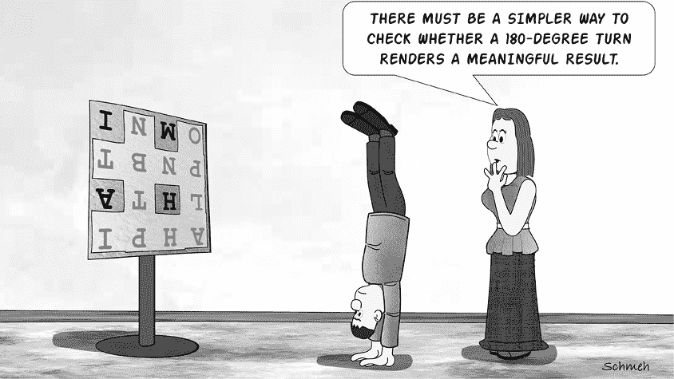

不足为奇的是，除了前几章中讲解的两种密码系统：完全和不完全列转置密码之外，还有其他类型的转置密码。以下是几个例子：

1.  *鲁比克魔方加密*：Douglas W. Mitchell 提出了一种使用鲁比克魔方的转置密码。^(1) 明文写在魔方的各个面上，一系列的操作形成密钥。随后，从魔方中读取密文。使用得当时，这种加密方式很难破解，尽管并非不可能。^(2)

1.  *填字谜加密*：在第二次世界大战期间，德国间谍有时使用填字谜作为转置密码的密钥。^(3) 发信人将信息写入空白格子中，而黑色格子保持为空。之后，收信人按列顺序读取字母。接收者必须用相同的填字谜，并按相反的顺序进行操作。虽然这种方法很巧妙，但我们今天知道，当时敌方的密码分析员已破解了它。

1.  *Rasterschlüssel 44*：德国军队在第二次世界大战期间也使用了这种转置密码。它基于类似填字谜的矩形形式。^(4) 这个系统主要用于较不重要的消息以及作为 Enigma 的替代品。英国人能够破解这种加密，但解密过程繁琐，通常需要几天时间。由于从这些解密中获得的情报通常不重要，他们最终放弃了破解 Rasterschlüssel 44 密码，认为这样做不值得投入精力。

图 11-1 展示了这三种转置类型。

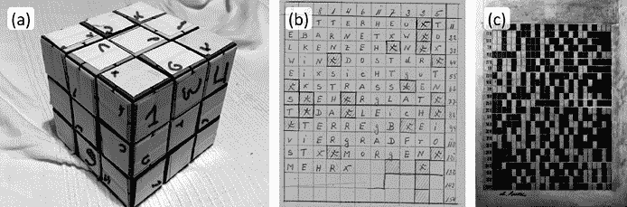

图 11-1：各种转置类型的示例：(a) 使用鲁比克魔方作为密码装置；(b) 基于填字谜的加密方法（第二次世界大战期间一名特工使用）；(c) 德国二战密码 Rasterschlüssel 44 使用的形式

还有许多其他类型的转置密码常在密码学书籍中提到；然而，我们在这里没有包括它们，因为它们通常不会在实际中使用，仅作为密码爱好者的谜题挑战。例如，美国密码谜语协会的竞赛经常包括诸如铁道栅栏密码和路线转置密码等系统。^(5)

除此之外，还有一种转置方法被频繁遇到，值得单独成章讲解：旋转格子加密。

## 旋转格子加密的工作原理

在图 11-2 中的示例圣诞卡片上，可能是 2009 年一位密码爱好者寄给另一位的，上面有一段由三十六个字母组成的加密文字：`TDHOAA PYHPEH UNFYAS MFNROH OLTIII NLMGYT`。

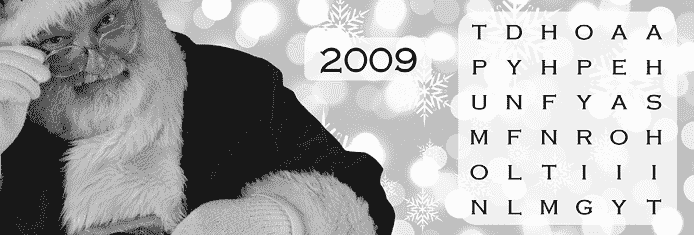

图 11-2：用旋转格栅加密的圣诞卡

这个铭文的明文是 `HAPPY HOLIDAYS FROM THE HUNTINGTON FAMILY`。它是用所谓的旋转格栅加密的，这种加密法也被称为弗莱斯纳格栅（Fleissner grille），以 19 世纪加密书作者爱德华·弗莱斯纳·冯·沃斯特罗维茨（Edouard Fleissner von Wostrowitz，1825–1888）命名。

*旋转格栅* 通常是一个带孔的方形模板，用于四个步骤。在每个步骤中，明文的四分之一会从左到右、从上到下写入孔中。每一步之后，格栅会顺时针旋转九十度。例如，下面是用一个 6 × 6 的格栅加密之前提到的 `HAPPY HOLIDAYS . . .` 消息的步骤：

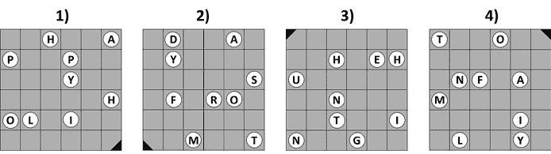

当我们在第四步后移除模板时，我们就得到了圣诞卡上的消息：

`T D H O A A`

`P Y H P E H`

`U N F Y A S`

`M F N R O H`

`O L T I I I`

`N L M G Y T`

旋转格栅加密方法是一种换位密码。格栅可以是任何大小，但必须是方形的。我们遇到的大多数旋转格栅都有偶数行和列，因为如果模板使用奇数行，则会有一个“中心”位置，通常保持空白。

格栅越大，安全性越高。

构建旋转格栅时，可以按照图 11-3 中的步骤进行，如下所示：

1.  从一个矩形矩阵开始，它的大小是最终格栅的四分之一。例如，如果最终格栅是 6 × 6 的，那么它有四个部分，每个部分是 3 × 3 的，就从这些 3 × 3 的部分开始。在这个较小的部分中，有九个位置，随机写上数字 1 到 4，填满这九个位置。（无论你的格栅大小如何，始终使用数字 1 到 4，因为这些数字代表了格栅旋转的四个方向。）

1.  将较小的矩阵放置在较大格栅的左上角，并将 1 标记复制到较大格栅中。接下来，将较小矩阵移动到格栅的右上方，顺时针旋转九十度，然后在较大格栅中标记 2。将较小矩阵移动到格栅的右下角，再次顺时针旋转九十度，然后标记 3。最后，将较小矩阵移动到格栅的左下角，再次旋转九十度，并标记 4。

1.  在较大的矩阵中，任何位置有数字的地方都要打孔或切孔。

图 11-3 中构建的格栅就是用来加密圣诞卡的那个。

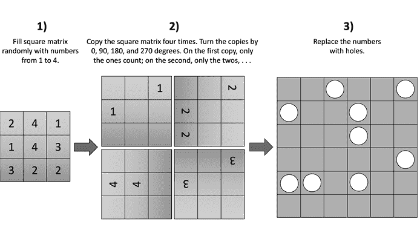

图 11-3：可以通过填充 1 到 4 的随机数字构建一个方形矩阵，从而构建旋转格栅。得到的格栅会是原来的四倍大。

用此模板加密的消息必须恰好有三十六个字母。如果字母少于这个数量，我们需要添加一些空字符。

## 如何检测旋转格栅加密

旋转栅栏密码通常容易被识别。如果一条信息是以正方形形式写成的，并且频率分析表明它是一个换位密码，那么很可能你正在处理的是旋转栅栏密码。当然，将这种信息安排成其他形态也是可能的，但经验表明，许多旋转栅栏用户放弃了这一简单的安全措施。图 11-4 中的信息是荷兰密码学家奥古斯特·凯尔霍夫斯（Auguste Kerckhoffs，1835–1903）在其 1883 年出版的《军事密码学》（*La* *Cryptographie Militaire*）一书中发布的典型示例。^(6)

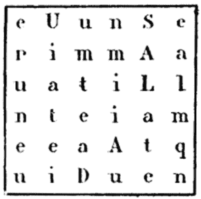

图 11-4：19 世纪奥古斯特·凯尔霍夫斯（Auguste Kerckhoffs）创作的旋转栅栏密码

如果一条信息不是以正方形形式写成的，那么信息长度可能是你正在处理旋转栅栏密码的一个指示。一个行长是偶数的旋转栅栏产生的消息长度是偶数平方数（例如，16、36、64 或 100）。如果行长是奇数且中间的正方形为空，则消息长度是奇数平方数减去一（例如，24 或 48）。当然，这个长度也可以通过添加一些空值来改变。但再次强调，根据我们的经验，大多数旋转栅栏用户并没有采取这种额外步骤来增强他们的系统安全性。

## 如何破解旋转栅栏加密

破解旋转栅栏密码与爬山法密码分析非常契合，这是一种迭代计算机技术，我们将在第十六章中介绍。尽管如此，还是可以手动破解旋转栅栏密码，尽管通常需要一个明文的样本，或者至少需要猜测出一些字母。我们将在图 11-5 中的模拟生日卡片上演示这一策略。

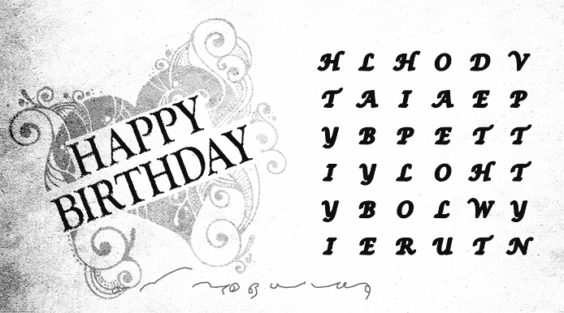

图 11-5：这张生日卡片上的信息（由作者为本书制作）使用了旋转栅栏密码进行加密。

这是信息的抄本：

`H L H O D V`

`T A I A E P`

`Y B P E T T`

`I Y L O H T`

`Y B O L W Y`

`I E R U T N`

这个密码文由 36 个字母组成，排列成一个正方形。分析表明，字母频率与英语语言相似。因此，我们假设这是一个旋转栅栏加密。

我们能猜出一个明文单词吗？考虑到这条信息是一个生日祝福，BIRTHDAY 是一个有前景的候选词。通过字母 B、I、R、T、H、D、A 和 Y 都出现在密码文中，可以确认这一猜测。

每个旋转栅栏信息的固有特性之一是，明文中相邻的两个字母之间的平均距离是四（即它们之间有三个字母），无论网格的大小如何。这是因为栅栏总是有恰好四个不同的位置。

所以，我们的第一步是找到密码中的字母，并记住这个平均字母间隔。如果我们寻找 BIRTHDAY，找到这个词的起始字母很容易，因为消息中只有一个 B。接着向右，我们会在五个单元格后遇到字母 I。接下来的一行中还有字母 R 和 T：

假设我们已经发现了 BIRTHDAY 中的字母 BIRT，现在我们将格栅旋转 180 度，并将其放置在格栅顶部，看看哪些字母是通过孔“看到”的：

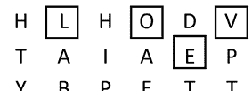

我们已识别出的四个方块展示了字母 LOVE——这是一个在生日卡片上有意义的词。接下来，我们要寻找字母 HDAY，我们预计它会跟在 BIRT 后面。由于 BIRT 中的 T 靠近密码图的末尾，我们需要在其开头寻找 HDAY。有四种不同的可能性（由实线方块表示；虚线方块表示当我们将这个拟议的格栅碎片旋转 180 度时得到的字母序列）：

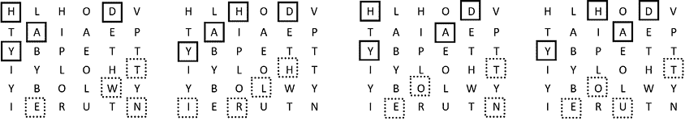

我们在旋转格栅时得到的潜在四字母序列有 TWEN、HLIR、TOEN 和 TOEU。所有这些都可能出现在英文文本中。然而，由于我们处理的是生日卡片，TWEN 最为合适，因为 TWENTY 或 TWENTIETH 可能指的是收信人的年龄。这意味着四个选项中的第一个最为可能。现在，我们已经识别出两个四孔格栅碎片。它们可以与一个五孔碎片连接，如图 11-6 所示。

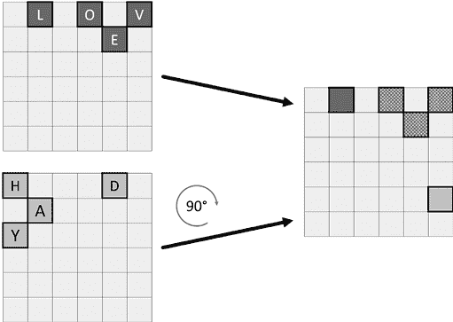

图 11-6：两个可以拼接在一起的格栅碎片

TWEN 中的 N 是最后一行的最后一个字母。如果我们假设下一个字母是 T（如同 TWENTY 或 TWENTIETH），我们需要在格栅的顶部寻找继续的字母。作为辅助工具，我们将五孔格栅碎片旋转九十度。

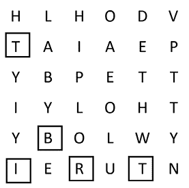

事实上，这个格栅碎片现在在一个合适的位置指示了字母 T。那么 T 和 BIRT 之间可能是什么字母呢？IETH 这个字母序列是合理的，因为它可以组成 TWENTIETH BIRTHDAY。IETH 中的 I 和 H 的位置很清楚。（请注意，第四行开头的 I 不是正确的字母，因为它后面没有 ETH。）有两个 E，但第一个已经使用了。不过，哪个 T 是正确的还不清楚：

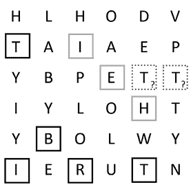

为了确定哪个 T 是正确的，我们再次将格栅碎片旋转 180 度：

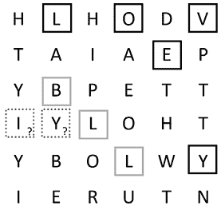

很明显，字母序列 BILLY 比 BYLLY 更可能。这意味着第二个 T 是正确的。

我们现在已经找到了格栅上九个孔中八个的位置。对于剩下的一个孔，有四种选择：I、T、Y 和 L：

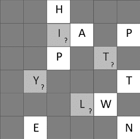

这里只有 Y 有意义，因为它使我们的前九个明文字母变为 HAPPYTWEN。我们完成了。图 11-7 展示了我们推导出的格栅。

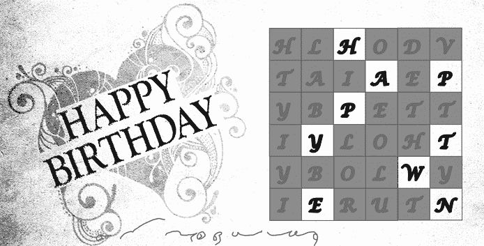

图 11-7：用于加密生日卡的格栅

明文是`HAPPY TWENTIETH BIRTHDAY TO YOU LOVE BILLY`。

## 成功案例

### 保罗·博纳沃利亚的转动格栅解决方案

我们的同事保罗·博纳沃利亚是一位关于意大利密码学历史的多产现代作者，也是路易吉·萨科（1883-1970）的孙子。萨科是一位著名的意大利密码学家，在其他成就中，在第一次世界大战期间为意大利军队建立了一个密码办公室，以破译来自奥地利和德国军队的消息。

在他祖父留下的笔记本中，保罗发现了许多德文密文，包括图 11-8 中所示的密文。^(7)他着手解决这条显然未解开的消息。第一行中出现的字母`Ö`确认给保罗这条消息是德文的。他的眼睛也立即被底部左侧的`X`和`Y`所吸引，因为在德文文本中这两个字母都非常罕见。因此，保罗怀疑这两个字母被用作填充格栅的空白。

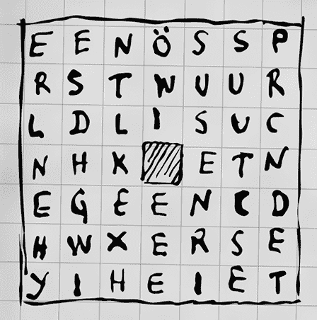

图 11-8：保罗·博纳沃利亚在他祖父路易吉·萨科留下的笔记本中找到的转动格栅密码

另外，保罗猜测密码包含单词 SUCHE（搜索）或 SUCHEN（寻找），起始位置在右侧。文本中的四个 S、三个 U、四个 E 和两个 N 中的任何一个都可以形成这些单词。保罗必须检查几十种组合，但经过多次尝试，他找到了以下解决方案：

ES WURDEN DREI PUNKTE GESEHEN ÖTLLICH WEITESRSSUCHEN XY

单词ÖTLLICH 拼写错误，应为ÖSTLICH（东方）。这条消息翻译为：三点已见，继续在东部寻找 XY。

保罗于 2017 年发布了他的解决方案，不久之后，新西兰的密码学专家巴特·温梅克斯使用基于计算机的爬坡法同样破解了这个密码（见第十六章）。

有趣的是，在我们写作过程中，并请这些杰出的密码破译专家帮助审查我们的工作时，托比亚斯·施雷德尔在 2020 年校对本章时发现了一些以前未知的东西！在检查萨科的笔记本页中转动格栅密码时，他注意到了一个数字序列，从 1、37、25、26、38 开始，以及 2。他意识到这是密文的解决方案：密文中的第一个字母（E）在明文中的位置是 1，第二个字母（E）在明文中的位置是 37，第三个字母（N）在明文中的位置是 25，依此类推。

托比亚斯将这些信息发给了保罗，但保罗没有联系起来；这意味着他的祖父已经解开了这个密文，并留下了一个加密的线索！

### 安德烈·朗吉的转盘格解法

在他那本精彩的 1922 年著作《*密码学*》中，瑞士密码学家安德烈·朗吉（André Langie，1871–1961）讲述了一个绅士的故事，这个绅士在一家名为北极的酒店住下时收到了一个加密的信息。^(8) 发送者是这位绅士认识的人，他们曾约定使用转盘格加密法。然而，这位酒店中的男子丢失了包含格描述的笔记，因此无法解密消息。于是，他联系了朗吉。

这是该消息的 64 字符英文版本。每本书的翻译版本提供了不同的版本：

AITEGFLYTBOEEHREAUWNANOARRDRTEETHOSHFPETAPOTOYHLRETIHENEMGAOARNT

为了解密这个消息，朗吉将它写成了网格格式，并对 64 个方格进行了编号以便于识别（见图 11-9）。朗吉的注意力立刻被字母 A 和 T（第 1 和第 3 个方格）吸引，因为 AT 是英语中常见的词，并且可能是一个消息的开头。因此，他在描图纸上标记了这两个字母的位置，并将转盘格旋转了 180 度。

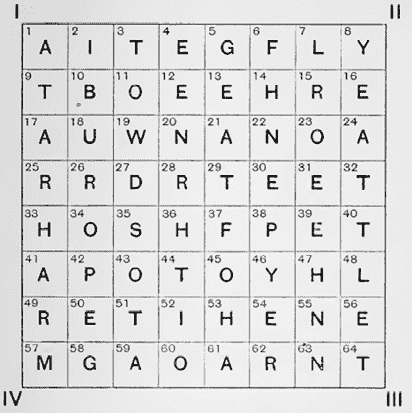

图 11-9：安德烈·朗吉在 20 世纪初解开的转盘格密码

描图纸上的标记与字母 R 和 T（第 62 和第 64 个方格）重合。RT 是常见的词尾，显然从最后两行可以轻松提取出单词 HEART，位于第 53、54（或 56）、59（或 61）、62 和 64 个方格中。标记这些并再次翻转描图纸，朗吉发现，在对应的方格——1、3、4（或 6）、9（或 11）和 12 中——出现了字母 ATE（或 F）、T（或 O）和 E。由于这并不令人满意，他放弃了这个组合，尝试了另一个。

接下来，朗吉把注意力转向了第二行，决定标记 THE（第 9、14 和 16 个方格），这是英语中最常见的三字母组合。将描图纸翻转后，标记移动到了第六行的第 49、51 和 56 个方格，对应字母为 RTE——一个有前景的组合。为了寻找前面的元音，朗吉首先注意到了 O（在第 45 个方格）。再往前三个方格（第 42 个方格）是 P。于是，他得到了组合 PORTE，这似乎需要最后的 R，这个字母出现在最后一行的第 62 个方格。

朗吉再次将纸张旋转了 180 度，揭示了 T（3 号格）和 NO（20 号和 23 号），从而得到序列 TTHENO。这些字母中的第一个无疑是某个单词的最后一个字母，而最后两个则是新单词的开头。

下一步是初步开始构建格栅，Langie 通过在字母 PORTER 周围画出格子来进行（42, 45, 49, 51, 56, 和 62）。然后他在这六个字母上做了小标记。接着，他将描图纸旋转 90 度。这时，他标记的六个格子覆盖了字母 IOUSAG（2, 11, 18, 35, 41, 和 58）。他为这些字母标注了不同的符号。

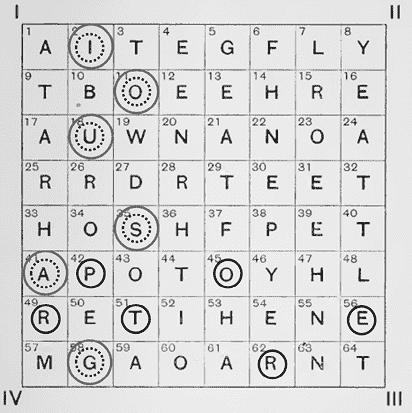

经过进一步旋转，他得到了字母组`TTHENO`（格子 3, 9, 14, 16, 20, 和 23），他也对这些格子进行了标记：

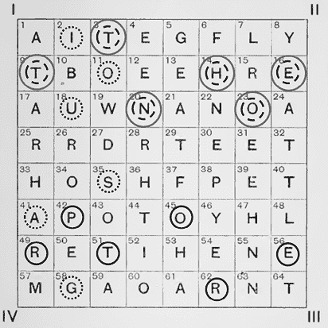

最后的旋转产生了`LAEHEN`（格子 7, 24, 30, 47, 54, 和 63），他以另一种方式标示了这些字母：

Langie 现在已经中和了 64 个格子中的 24 个，从而大大缩小了他的研究范围。回到他最初的字母组`PORTER`，他开始寻找一个可能出现在其前面的词，并倾向于`THE`（32, 36, 39）。在`T`和`E`之间有两个`H`，他实验性地选择了第二个。

标记完这些字母后，Langie 反转描图纸，发现三个对应的字母是`RTH`（26, 29, 和 33）。这将字母组`TTHENO`扩展为`T THE NORTH`，这一结果证明他走在正确的道路上。因此，他用四种颜色标注了四个位置上的对应字母，使得已中和的格子总数达到了 36 个。

随后进展飞速。例如，在仔细检查了“THE NORTH”和其后未标记的字母后，Langie 辨认出 P 和 O，并联想到 POLE。这些字母分别出现在格子 38, 43, 48, 和 50 中。标记了这些字母及其它位置上的对应字母后，他发现只剩下 12 个格子没有被解决。通过一些额外的猜测，他推导出了以下明文：

如果你住在北极酒店，请小心经理和搬运工

### 卡尔·德·李乌的旋转格栅解法

1993 年，密码学专家卡尔·德·李乌（我们的一位同事）和密码学专家汉斯·范·德·梅尔在阿姆斯特丹的一个档案馆里发现了一条加密消息（图 11-10），这条消息是荷兰总督兼橙公爵威廉五世（1748–1806）留下的。[9] 该密码的形状表明，写信人使用了一个 16×16 的旋转格栅。由于消息的长度超出了格栅的 256 个格子，因此有些格子包含了两个字母。

字母频率表明该明文语言为德语。第三行倒数第二个位置的字母Ü，带有独特的双点，证实了这一怀疑。

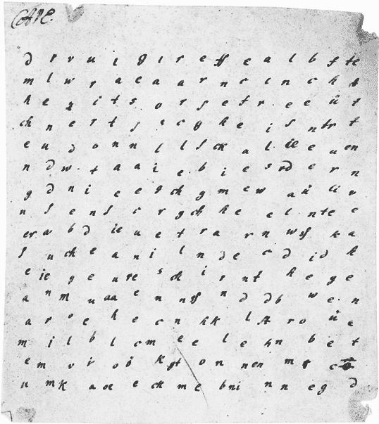

图 11-10：18 世纪的旋转格栅密码，由卡尔·德·李乌和汉斯·范·德·梅尔在 20 世纪解密

在 1993 年，使用计算机支持（如爬山算法）破解旋转格栅密码的技术仍处于起步阶段。因此，卡尔和汉斯尝试用手动方法解密，而当模板像这里使用的那么大的时候，这通常是非常困难的。然而，这两人找到了一种出奇简单的方式来解密这个密码。他们利用了一个事实：作者在把字母放入孔洞时非常马虎。最明显的例子出现在第六行，其中字母 E（位于第 8 位）、I（位于第 10 位）和 N（位于第 16 位）写得比其他字母略低，这表明它们都是在某个特定的位置用模板写的。

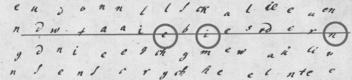

在第七行，同样适用于 G、E、G 和 A：

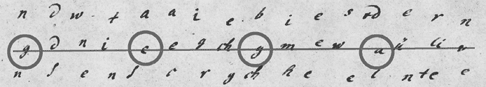

在第八行，虽然不太清楚，N、G、E 和 N 字母的位置略低于其他字母。这些字母合起来形成了“EINGEGANGEN”这个德语单词，意思是“已接收”。

反转模板得到了 BIERWELCHESI，这在德语中也有意义（BIER 意味着 啤酒，WELCHES 意味着 哪种）。根据这些观察，卡尔和汉斯能够重建出十一个位孔的位置，从而得到了总共四十四个字母。然后，借助本章前面描述的技术，他们解开了其余的消息。由此得出的格栅可以在图 11-11 中看到。以下是明文内容：

根据收到的询问和信息，法国人已经离开了坎贝尔。然而，根据传闻，其他人很快会取代他们。也许他们害怕英式啤酒，喝了之后会让他们生病。我希望他们能喝到适量的啤酒。——科尼希

它的翻译如下：

根据收到的询问和消息，法国人已离开坎贝尔。不过，按照传闻，其他人将很快取而代之。也许他们害怕英式啤酒，喝了以后会让他们生病。我希望他们能喝到适量的啤酒。——科尼希

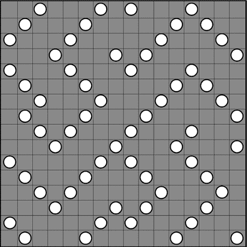

图 11-11：卡尔·德·刘和汉斯·范·德·梅尔在解密荷兰总督威廉五世留下的消息时得出的旋转格栅。这个消息写得有些潦草，这使得它更容易被解开。此外，孔洞的规律性对密码破解者也很有帮助。

显然，这篇笔记的作者是在开玩笑，关于英式啤酒——确实是一个有趣的发现，特别是因为他们花时间对这个笑话进行加密！

### 《Mathias Sandorf》密码谜题

在他那部著名的 1885 年小说《Mathias Sandorf》中，法国作家儒勒·凡尔纳（1828–1905）描述了两个小罪犯，他们发现了一条加密的信息，这条信息挂在一只信鸽的腿上，后来他们找到了一块旋转格栅，并用它解密了这条密码信息（图 11-12）。这条消息内容如下：

`IHNALZ ARNURO ODXHNP AEEEIL SPESDR EEDGNC`

`ZAEMEN TRVREE ESTLEV ENNIOS ERSSUR TOEEDT`

`RUIOPN MTQSSL EEUART NOUPVG OUITSE ERTUEE`

2000 年，德国密码学教授 Klaus Pommerening 发表了一篇文章，解释了如何在不知道格的情况下，密码破译者可以解开消息。^10 Pommerening 描述的密码破译过程太长，无法在我们的书中完全涵盖，因此我们将使用一些捷径。

让我们从 Pommerening 的假设开始，即明文为法语，每行三十六个字母使用一个 6×6 的旋转格来单独加密，并且每行使用相同的格。

对于密码分析师来说，法语中一个好的特点是字母 Q 在短词中相对频繁，比如 QUE、QUOI 和 QUEL，而且和其他许多语言一样，Q 通常后面跟着 U。（词语 CINQ，意为“五”，是唯一的常见例外。）这意味着，在处理法语明文时，寻找 Q 是一个良好的起点。正如我们所见，第三行中第 9 个位置有一个 Q。不幸的是，同一行中有五个 U，这使事情变得更加复杂。

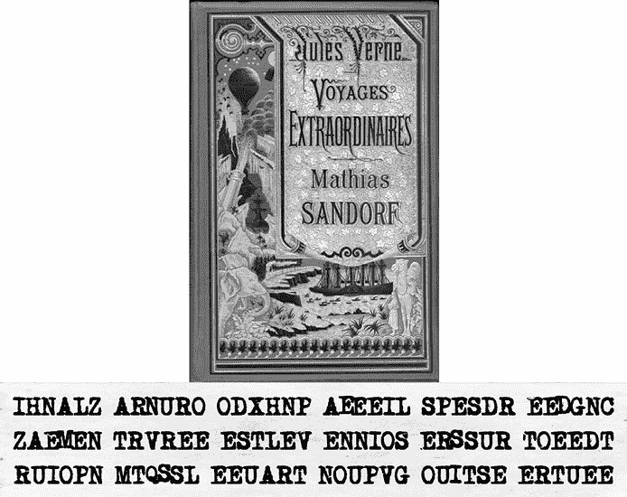

图 11-12：朱尔斯·凡尔纳（Jules Verne）的 1885 年小说《马西亚斯·桑多夫》包含一个用旋转格加密的消息。

Pommerening 知道所有三行使用了同样的格，因此他可以应用多重排列技术（见第九章）来检查最有可能的组合。通过这种方法，在第三行 Q 后面的五个 U 导致第一行和第二行有以下五个选项：

`NH NX NE NP NG`

`VA VT VN VR VE`

`QU QU QU QU QU`

虽然 NH、NX、VT 和 VN 的字母对在法语中很少见，但 NG 和 VE 相当常见。因此，最后一个选项看起来最好，因此 Pommerening 假设这是正确的。由于在法语中，QU 通常后面跟着 E 或 I，他有八种合理的可能性继续：

`NGN NGO NGD NGE NGR NGE NGN NGC`

`VEE VEE VES VES VER VET VED VET`

`QUI QUE QUE QUI QUE QUE QUE QUE`

4、5 和 6 的可能性看起来很有希望。通常，密码破译者需要检查所有三个选项，但为了简化问题，让我们选择第五块（正确的块，这一点很快就会变得清楚）。作为另一个捷径，我们假设根据小说内容，NGR 是单词 HONGRIE 的一部分，法语中意为匈牙利。这一假设得到了支持，因为密码文的第一行也包含字母 H 和 O（甚至每个都有两个），这为 Pommerening 提供了四种可能的排列方式：

`HONGR HONGR HONGR HONGR`

`AEVER AEVER LEVER LEVER`

`ULQUE UEQUE ALQUE AEQUE`

Pommerening 现在选择了第三个块，因为字母序列`LEVER`和`ALQUE`在法语中有意义，而字母组合`AE`相当罕见。他继续在`HONGR`后面添加了一个`I`（记住我们想构造单词`HONGRIE`），产生了两种可能性：

`HONGRI HONGRI`

`LEVERZ LEVERO`

`ALQUER ALQUEV`

第二种可能性看起来更为合理，因为 ERZ 在法语中并不是一个常见的三字母组合。Pommerening 现在需要在 HONGRI 后添加一个 E，从而得出六种变体：

`HONGRIE HONGRIE HONGRIE HONGRIE HONGRIE HONGRIE`

`LEVERON LEVERON LEVEROI LEVEROS LEVEROT LEVEROO`

`ALQUEVO ALQUEVU ALQUEVP ALQUEVI ALQUEVA ALQUEVR`

他在这里认出了单词 LEVERONT（“站起来”），并且最后一个字母缺失。这意味着最初的两个选项是最有可能的。第一个选项看起来是正确的，因为最后一行中的 VO 可以扩展为 VOUS（“你”）。为了形成这个单词，Pommerening 在第二行中添加了一个 U（省略了 S，因为有多个选择）：

`HONGRIEX`

`LEVERONT`

`ALQUEVOU`

X 的使用并不特别合适，但它可能是填充字符。由于单词 LEVERONT 是反身的（完整表达为 SE LEVERONT），Pommerening 现在需要在第二行中 LEVERONT 之前添加一个 E。第二行中的十个 E 已经吸收了两个，但仍有八个选择：

`NHONGRIEX LHONGRIEX RHONGRIEX OHONGRIEX`

`ELEVERONT ELEVERONT ELEVERONT ELEVERONT`

`IALQUEVOU PALQUEVOU SALQUEVOU EALQUEVOU`

`NHONGRIEX AHONGRIEX SHONGRIEX DHONGRIEX`

`ELEVERONT ELEVERONT ELEVERONT ELEVERONT`

`RALQUEVOU NALQUEVOU OALQUEVOU TALQUEVOU`

选项 1、3、5 和 6 看起来最有前景。在真正的破解过程中，必须跟踪所有四条路径以找出正确的路径。然而，这只是一个总结，因此我们只讨论选项 6，这是正确的。为了得到 SE LEVERONT，Pommerening 需要在第二行的开头加一个 S。从四个选项中选择：

`DAHONGRIEX LAHONGRIEX EAHONGRIEX SAHONGRIEX`

`SELEVERONT SELEVERONT SELEVERONT SELEVERONT`

`ENALQUEVOU GNALQUEVOU INALQUEVOU TNALQUEVOU`

第二个选项使得第一行呈现出 LA HONGRIE（“匈牙利”），这看起来不错，因为法语通常在提到国家时使用定冠词。Pommerening 现在在第三行中寻找扩展。他发现 SIGNAL QUE VOUS（“信号你”或“信号你们”）。在第三行的左侧添加一个 I 后，得到了两种可能性：

`NLAHONGRIEX ELAHONGRIEX`

`ESELEVERONT SSELEVERONT`

`IGNALQUEVOU IGNALQUEVOU`

第一个选项没有结果，因此 Pommerening 选择了第二个，并在第三行的左侧添加了一个 S：

`UELAHONGRIEX RELAHONGRIEX DELAHONGRIEX`

`RSSELEVERONT ESSELEVERONT USSELEVERONT`

`SIGNALQUEVOU SIGNALQUEVOU SIGNALQUEVOU`

第三个变体因第一行中的序列 DE LA HONGRIE（“来自匈牙利”）而引人注目。

出于空间考虑，我们将跳过其余的多重重排过程。Pommerening 继续解开剩余的密码，得到以下明文：

`SSEPOURLI NDEPENDAN CEDELAHON GRIEXRZAH`

`SENVERREZ DETRIESTE TOUSSELEV ERONTENMA`

`TOUTESTPR ETAUPREMI ERSIGNALQ UEVOUSNOU`

然而，只有按照先读第三行，再读第二行，最后读第一行的顺序，这条消息才有意义：

`TOUTESTPR ETAUPREMI ERSIGNALQ UEVOUSNOU`

`SENVERREZ DETRIESTE TOUSSELEV ERONTENMA`

`SSEPOURLI NDEPENDAN CEDELAHON GRIEXRZAH`

加上标点后，明文如下：

TOUT EST PRÊT. AU PREMIER SIGNAL QUE VOUS NOUS ENVERREZ DE TRIESTE, TOUS SE LÈVERONT EN MASSE POUR L’INDÉPENDANCE DE LA HONGRIE. XRZAH.

它的翻译如下：

一切准备就绪。你从的里雅斯特发出的第一个信号一到，所有人都会集体站起来支持匈牙利独立。Xrzah

XRZAH 是发件人的代号。

法语明文（TOUT EST PRÊT...）正是儒勒·凡尔纳的法文原版《马提亚斯·桑多尔夫》中的信息。在该小说的英文翻译中（至少是我们在线找到的版本），该信息并未被翻译。

注意，Pommerening 在破译过程中并未使用任何关于旋转格栅的特殊信息。他仅使用了多次的字母重排来确定每行中三十六个字母的顺序。

确定所使用的格栅种类通常很容易，如果已知明文和密文。然而，在这种情况下，没有任何旋转格栅能够使用典型的方法从给定的明文生成密文。然而，如果我们将每行倒着写，就能找到合适的格栅。用于这种转换的旋转格栅可以在 图 11-13 中看到。

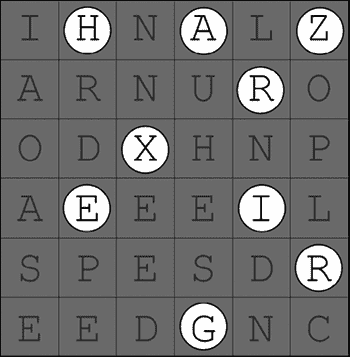

图 11-13：用于《马提亚斯·桑多尔夫》1885 年版中的加密信息的旋转格栅。通过孔洞看到的字母按顺序排列为（从底部开始）（HON）GRIE XRZAH（匈牙利 XRZAH），这是明文的最后部分。

如前所示，明文的第三行需要在第二行和第一行之前读取。此外，每行必须倒着读。这些观察可以通过一个简单的方式来解释：加密者在加密之前，将整个信息倒着写，然后将其分成三十六个字母一组，并使用每个 6 × 6 的旋转格栅加密。

## 挑战

### 弗里德曼夫妇的圣诞卡

图 11-14 中的圣诞卡是世界著名的密码破译专家威廉和伊丽莎白·弗里德曼于 1928 年创作的。^(11)

图 11-14：威廉和伊丽莎白·弗里德曼在 1928 年发送的加密圣诞卡

这是一个抄本。请注意，原文中末尾的数字 28 视为一个字符：

`ABFWORREC`

`U SRIYEPN G`

`CT HARSI OS`

`YMO UTE AWN`

`ETLM AESP`

`OSRQ DUOI`

`GHRO TEOE`

`FTX MTE UAP`

`GI RTASM NH`

`O DGCSAIH E`

`NEETRREE28`

这个密码非常容易解开，可能是为了让弗里德曼夫妇的非密码学朋友们能够更轻松地解密！只需使用卡片左侧展示的旋转格栅。如果你想挑战更高的难度，可以尝试在不使用格栅的情况下解密这个加密信息。

### Jew-Lee 和 Bill 的加密电报

图 11-15 中的“Cryptocablegram”是由现代破译爱好者 Jew-Lee Lann-Briere 和 Bill Briere 为他们在 2017 年 NSA 密码学历史研讨会上的讲座关于 William 和 Elizebeth Friedman 所创作的。

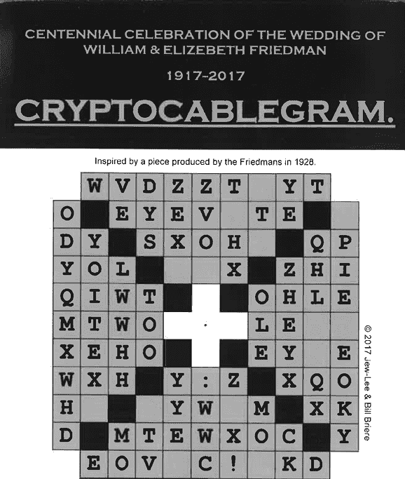

图 11-15：由 Jew-Lee Lann-Briere 和 Bill Briere 创作的挑战密码

Jew-Lee 和 Bill 对明文应用了两步加密。首先，他们使用简单的替换密码加密了它。然后，他们使用了转盘栅栏。以下是逆转替换的表格：  

`ABCDEFGHIJKLMNOPQRSTUVWXYZ`

`HJKLOPQSTUVWXYZFRIEDMANBCG`

这个密码谜题有一种简单的解法，也有一种困难的解法。在没有更多提示的情况下，你能解开这个转盘栅栏加密吗？

### 一个 MysteryTwister 挑战

MysteryTwister ([`mysterytwister.org`](https://mysterytwister.org)) 是一个大型加密谜题网站，拥有数百个挑战，难度从简单到困难不等，还有一个由成千上万的会员组成的社区，他们通过解谜来赚取积分。其众多困难的密码谜题之一涉及转盘栅栏加密（图 11-16）。^(12)

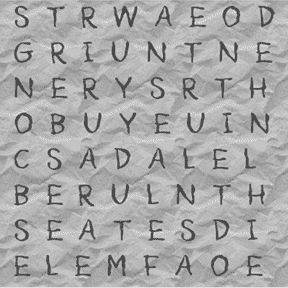

图 11-16：2011 年的转盘栅栏挑战，可在 MysteryTwister 网站上找到

解决方案是一个英语句子。如果你想要提示，可以查看 [`codebreaking-guide.com/challenges/`](https://codebreaking-guide.com/challenges/)。

### 一个 Kerckhoffs 密码

在本章早些时候，我们介绍了 1883 年由 Auguste Kerckhoffs 发布的转盘栅栏密码（图 11-4）。明文是法语。你能解开它吗？
