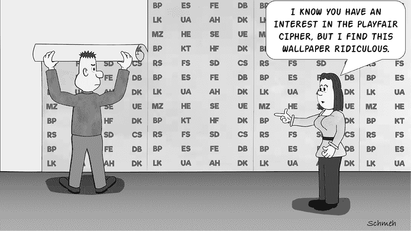
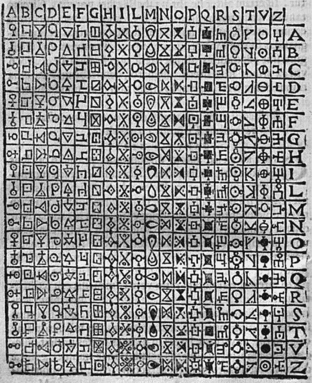
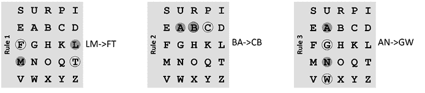
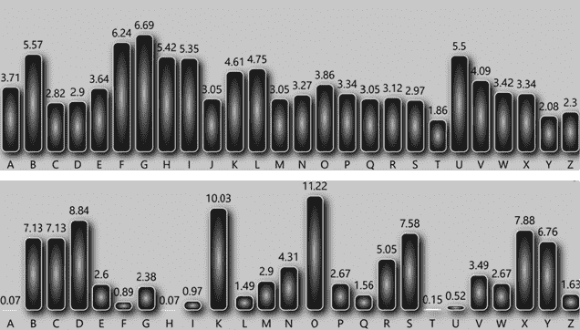
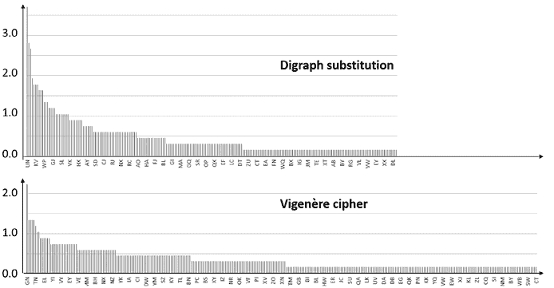
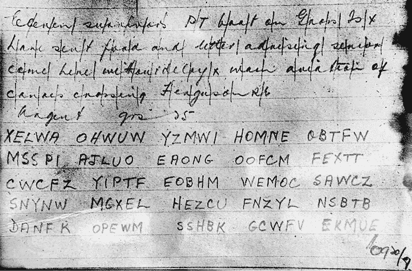
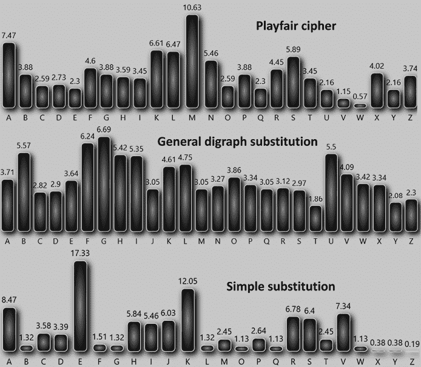
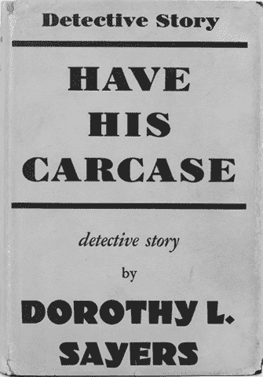
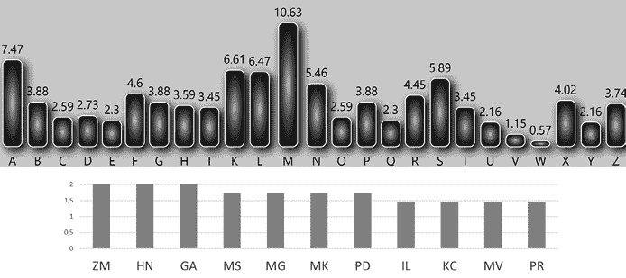
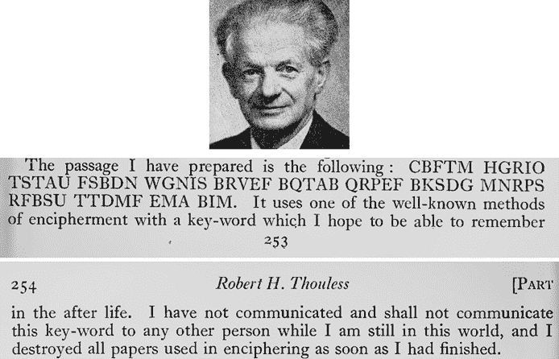

# 第十二章：字母对替换

在他 1563 年的著作《*De Furtivis Literarum Notis*》中，意大利博学家和密码学家 Giambattista della Porta（1535–1615）提出了一种有趣的加密方法。他的系统并非替换单个字母，而是替换字母对（也称为字母二重组合）。在随后的几个世纪中，这种字母对替换法被发展出了不同的变种——包括所谓的 Playfair 密码。在本章中，我们将介绍这两种方法：Playfair 和 Porta 的原始系统。

## 一般字母对替换的工作原理

Giambattista della Porta 提出的加密方法基于一个包含 400 个独特条目的字母对替换表。该表为每一对可能的字母对提供了不同的符号，如图 12-1 所示。^(1)（他使用的字母表包含 20 个字母。）

图 12-1：Giambattista della Porta 提出了这张替换表，为每一对字母提供了不同的符号。

例如，如果我们想使用这个表加密单词`STREET`，我们首先需要将其视为三个字母对：`ST`、`RE`和`ET`。如果我们查找表格中的每对字母（使用表格顶部的第一个字母和右侧的第二个字母），我们会得到如下结果：

然而，Porta 的表格可能从未在实际中使用过，因为处理 400 个不同符号是相当麻烦的。其他密码设计师更倾向于将字母对替换为三位数的替代符号（我们将在第十六章中提供一个示例），但最终证明，替换字母对最方便的方式是使用另一个字母对。以下是一个例子，它替换了每个现有字母对，用一个新的字母对替代，表格的左上角如下所示：

`A B C D E F G H I . . .`

`A` `KF SW JL OO QA CP DA BN CX . . .`

`B` `LH WS WM CO XE YP WW NV CH . . .`

`C` `JX KV AS PI CS PX NU SR LS . . .`

`D` `TR AL FG AD WU QM GH PG JC . . .`

`E` `ND SG RE AT NA TU RX SS OD . . .`

`. . .`

使用这个表时，单词`BEAD`加密后的结果是`SGTR`（假设每对字母的第一个字母来自顶部行）。顶部和左侧的字母表也可以根据关键词的不同进行调整。例如，以下表格就是使用关键词`AMERICA`和`BALL`创建的：

`A M E R I C B D F . . .`

`B` `KF SW JL OO QA CP DA BN CX . . .`

`A` `LH WS WM CO XE YP WW NV CH . . .`

`L` `JX KV AS PI CS PX NU SR LS . . .`

`C` `TR AL FG AD WU QM GH PG JC . . .`

`D` `ND SG RE AT NA TU RX SS OD . . .`

`. . .`

在使用这样的表时，通常保持矩阵中的字母对不变，同时频繁更换两个关键词。

## Playfair 密码的工作原理

即使是一个 26 × 26（或 676）条目的表格，也相当繁琐，既难以构建又不容易使用。因此，虽然双字母替换法使用了一个详尽的表格，虽然合理安全，但它在密码学历史中从未发挥过重要作用。实践中，密码学家们更倾向于使用一些规则来替换双字母，而不是使用庞大的表格。尽管他们可以用多种方式构建这样的规则集，但实际上只有一种方法（具有多种变体）在实践中频繁使用：Playfair 密码。该密码由查尔斯·惠特斯通（1802–1875）于 1854 年发明，后来由莱昂·普雷费尔（1818–1898）推荐给英国军队，因此得名。^(2)

英国心理学家和超心理学家罗伯特·索尔斯（1894–1984），在我们书中多次出现，创作了两种著名的加密文。这些加密文使用了这种类型的双字母密码。还记得在第八章中提到，1948 年，索尔斯开始了一个有趣的实验：为了验证是否可以从死者的领域向活人传递信息，他发布了一段加密文本，保密了明文和关键词。他的计划是死后从另一个世界传递关键词。在 1984 年去世前，索尔斯公开了他三次超心理学实验的结果：两次使用了 Playfair 密码，另一次使用了多表替换系统。他的两次 Playfair 尝试将在本章中讨论。

在他的第一次实验中，索尔斯使用 Playfair 系统加密了一句莎士比亚名言。明文如下：

`伤痛心灵的药膏，伟大自然的第二道菜，生命盛宴中的主要滋养者`

用双字母书写的内容为：

`BA LM OF HU RT MI ND SG RE AT NA TU RE SS EC ON DC OU RS EC HI EF NO UR IS HE RI NL IF ES FE AS T`

通常，Playfair 密码要求没有一对字母相同，因为标准规则集没有加密相同字母对的方法，稍后我们会解释。因此，在这些情况下，索尔斯常常会在两个`S`之间加一个`X`：

`BA LM OF HU RT MI ND SG RE AT NA TU RE SX SE CO ND CO UR SE CH IE FN OU RI SH ER IN LI FE SF EA ST`

如果明文中字母的个数是奇数，他必须在最后一个位置加一个`X`，以确保每个字母都属于一个对，但是在这里并不需要这样做。索尔斯选择了`SURPRISE`作为他的关键词。基于这个词，他使用了以下转置的字母表。它从关键词开始，省略了重复的字母，并且将 I 和 J 视为等同，从而得到了一个包含二十五个字母的字母表：`SURPIEABCDFGHKLMNOQTVWXYZ`。接下来，索尔斯将这个字母表写成一个 5 × 5 的网格（也称为 Playfair 矩阵）：

`S U R P I`

`E A B C D`

`F G H K L`

`M N O Q T`

`V W X Y Z`

从这里，索尔斯根据以下三条最常见的 Playfair 规则替换了明文的双字母（`BA`，`LM`，`OF`，`HU`……），这些规则在图 12-2 中进行了可视化：

规则 1：如果两个字母既不在同一列也不在同一行（这是最常见的情况），找到由这两个字母形成的矩形，并用矩形的另两个角字母替换这两个字母（将上方的明文字母替换为矩形的另一个上方字母，下方的明文字母替换为矩形的另一个下方字母）。在这个例子中，`LM`变为`FT`。

规则 2：如果两个字母位于同一行，将每个字母替换为其右侧的邻居。这里，`BA`变为`CB`。

规则 3：如果两个字母位于同一列，将每个字母替换为其下方的邻居。在我们的示例中，`AN`变为`GW`。

图 12-2：Playfair 密码通过三条规则替换字母对。

当我们将 Playfair 规则应用于上面显示的 5×5 矩阵时，莎士比亚的名言会被加密为以下内容：

`CB FT MH GR IO TS TA UF SB DN WG NI SB RV EF BQ TA BQ RP EF BK SD GM NR PS RF BS UT TD MF EM AB IM`

这是 Robert Thouless 在 1948 年发布的加密信息。他将其写成五个字母一组，最后六个字母除外：

`CBFTM HGRIO TSTAU FSBDN WGNIS BRVEF BQTAB`

`QRPEF BKSDG MNRPS RFBSU TTDMF EMA BIM`

要了解更多关于该实验后续的内容，请参见第八章。

当然，我们描述的 Playfair 方法可以以多种方式进行修改。例如，我们可以使用一个 4×6 或 5×6 的 Playfair 矩阵，而不是 5×5 版本。5×6 矩阵可以提供更多空间，比如用于表示空格、句号或无意义的字母（空字符）。替换规则也可以以多种方式进行更改。例如，可以添加一个规则来替换双字母，或者将字母移到左边而不是右边。

在第二次世界大战中，德国军队实施了 Playfair 密码的一个版本，使用两个 5×5 矩阵而不是一个，每个矩阵使用不同的关键字构造。这个系统被称为 Doppelkasten（“双箱”）方法。^(3) 相关示例可以在《Cryptologia》学术期刊的早期期刊中找到。

## 如何检测一般的双字母替换

Klaus 使用一般的双字母替换而非 Playfair 密码创建了以下密文。他将其作为挑战发布给博客读者，测试这种长度的双字母替换加密信息是否能够被破解。我们将在本章的“挑战”部分回到这个故事。^(4)

`UNGOZIHIJGSLGVWPIVGJSOKEFMAHSDBDGLUBUNZIWPIEBIUNKFVOUNB`

`DSLPPHELVAQBAHEBIFJMHKVFLHXQQEFSLQQBDAQRIBVBIBYGJMOSOZB`

`SDUXZINXUNEQVKUGYHUNVOWPSGSMGEFLFKRUHELFPHGVUXFGHRJYFUH`

`IPBMHUNVOWPSGHXVKRSSGPHPWQXPLKCXGUNFGBICJFGJGCLLCFPNXUN`

`TUUKKIZBKFABEQNHRFWLKCYHDJHJOPBZRLAHQVFTHETGRQRJTDAYDTX`

`TVDBDKFEFZKSDHETUFVIQBIYABDEXZIKCHXRUKQRLGECJAQAOBKZIOB`

`TEFMFRZNZACLWDWAUNEBBISLMREQKWRJRCUGHERGJMXONWGJHIPBEYG`

`DZOHXIXKFOXFLKVRUDWAOBIDLSRRICSICJGKFZBBUMRFMGQKFYBXOHE`

`TGHEOAMUEMWLAYRJWPKIGXUOSKZIHIJGSLHIGIBLFUXXUKUQPHGEGWH`

`IOPZIBDLVBUKQRJSMUGFPWLWPSGPHFIKVYXCJLVULKVQSZIBDLVBUUI`

`SRRUGJAIYXXGLKQXFRPBUOJIBTGHGDTGRCICUNVOWPSGDTLIEMTAVOU`

`NVUQQKCRTLHBDAIUXFGOAKPBTKVFLAHVWRHWAUGKCXGUNFGBIXAGJHE`

`HXGLBIRNGDOEBPUQSGBDIKACVORUBLKVVLZIHIJGSLWPIEUNCEPHFOM`

`KFVMHUGNOPKBGLKCGCLHEXFAYUOMKTAGDZOHEKFLVBWKVPLGXBPHEGI`

`XOTJWURUUNCLSOFMKVWGFMFPIKGJLLJYOGDWFRGLFQQEYDFVCAHYZPJ`

`GKFBIRQHEBAHELFHEFSVUCLWDBWIGJGDRAYVKFPWLZNLQFGGJQAKFBL`

`FUWQPWGJOBSLRIVVBXBDVUMHYIZYBZKFGQLWROZIOBMACTPHSMGECLF`

`GVOSGUNTUJYOGBIHECERCUGWDEMFGKPAYSQKCBWONQVGEKVDHBIDWPH`

`EMGEAQAONOEXZIOBMAUNTUPHFYNXXGUNFGBIFNFMMFOXJBBDCLBIBIF`

`JMHKVFLFJMHXNHXVKUNKFZBTFFMHMFVLVWLYHHEMFOFICOJVUYXMFZN`

`WLLWICLVSDZIFSEBUNNXVUFIHARCXOZKMMFPKVRUUNVOWPSGLCQWUGC`

`ECJTGHIVKWAFLPHAQVKPHHJSGMFHMRLDDHJZUBPTDBOFGVOSGUNTUJY`

`OGXGUNFGBIXAFMWAAQFPAIEQQQKCFIHAQWFIBPGLUBZNNNSOWDXMXGU`

`NFGBIEAHAKCAHAQSGRLMSKFWDBAHEFVMHWGPHFYBIUNTUJYOGAIYXWA`

`ZIFLYNKCRUSOKVLKBOWARIBIHJ`

通过频率分析，很容易区分双字母替换密码和简单替换密码。请看图 12-3 中的两个图表。上半部分显示了密文中字母的频率，下半部分显示了同一明文在简单替换密码加密下的字母频率。可以看出，上图（双字母替换）的频率分布要平坦得多（即，频繁出现的字母不那么频繁，罕见的字母也不那么罕见）。

相同的，重合指数也不同。虽然用简单替换密码加密的英语文本（以及原始的英语文本）的重合指数是 6.7%，我们这里的字母对密码加密文本的重合指数只有 4.3%。

那么，其他不是简单替换的密码呢？它们的频率分布是否相似？

图 12-3：双字母替换加密（上）和简单替换加密（下）的字母频率分布

我们可以对双字母进行频率计数，帮助判断算法是 Playfair 密码、另一种双字母系统、换位密码、多表代换密码，还是其他类型。然而，这里使用的双字母频率计数方法不同于我们在第四章中应用的方法，在第四章中我们计算了重叠对。比如，字符串`ABCDEF`包含五个重叠的双字母对（`AB`，`BC`，`CD`，`DE`，和`EF`）。在双字母替换的情况下，我们只应考虑非重叠的对。`ABCDEF`包含三对非重叠的双字母：`AB`，`CD`，和`EF`。从数学角度来看，如果文本中有偶数个*n*个字母，那么将有*n-1*个重叠的双字母对和*n*/2 个非重叠的双字母对。

图 12-4 展示了我们密码的（非重叠）双字母频率分析，接着是用维吉尼亚密码加密的相同明文的双字母频率分析。我们使用了[`dcode.fr/en`](https://dcode.fr/en)来统计字母对，并用 Excel 绘制了图表。需要注意的是，双字母密码图案中只有大约 220 个不同的字母对，而维吉尼亚密码中有大约 380 个不同的字母对。

图表的下部还显示，只有少数几个字母对在维吉尼亚密码图案中频率超过 1%，而在上部，我们可以看到大约二十五个此类字母对出现在双字母替换密码图案中，其中最常见的一个接近 4%。

值得注意的是，即使在较长的英语文本中，明文也只会展示出大约三百种不同的双字母组合，无论我们是否统计重叠的双字母。这是因为在英语中，许多字母对如*QZ*、*VH*、*II*和*JN*极为罕见。

总的来说，如果将非重叠双字母频率统计与另一种密码进行比较，混淆双字母替换与其他密码的风险并不高。

图 12-4：使用非重叠双字母的两个频率分布图。我们的双字母替换密码图案（上方）与维吉尼亚密码图案（下方）看起来不同，因为出现的双字母较少，而最常见的双字母频率要高得多（超过 3.0）。

## 如何检测 Playfair 密码

我们如何检查某个密码是否是用 Playfair 密码创建的呢？举个例子，考虑一下二战时期发送的消息。在战争期间，美国海军及其盟友频繁使用 Playfair 密码进行太平洋战区的战术通信。有一个故事涉及*PT-109*，一艘由年轻海军军官、后来的总统约翰·F·肯尼迪指挥的巡逻鱼雷艇。^(5) 在更大的日本驱逐舰*天霧*与*PT-109*相撞，将其一分为二并击沉后，美国船员游了好几英里，最终冲上了附近布朗布丁岛的海滩。

澳大利亚海岸观察员阿瑟·雷金纳德·埃文斯中尉目击了坠机事件，并接收并解密了多条 Playfair 密码信息，协调了一个营救行动，派遣了他的所罗门群岛团队之一去寻找机组人员。^(6) 在他的一名团队成员比乌库·加萨的建议下，肯尼迪用他的口袋刀在椰子上刻下了一张便条（用英语写的）。我们将在第十五章回到这个故事。现在，我们只关心一条发送给埃文斯的 Playfair 密码消息（图 12-5），它报告了*PT-109*的失踪。

这份于 1943 年 8 月 7 日上午 9:20 收到的 Playfair 密码文本，发生撞机事故后的第五天，明文记录在纸张的上半部分，并在此复原：

`ELEVEN SURVIVORS PT BOAT ON GROSS IS X HAVE SENT FOOD AND LETTER ADVISING SENIOR COME HERE WITHOUT DELAY X WARN AVIATION OF CANOES CROSSING FERGUSON RE`

如你所见，这条信息有 125 个字母。结尾的`RE`代表 Reginald Evans，而`GROSS IS`表示 Gross Island（也称为 Cross Island 或 Nauru）。`X`表示句号。

图 12-5：澳大利亚海岸观察员 Arthur（“Reg”）Reginald Evans 中尉收到的 Playfair 加密信息，报告了二战期间*PT-109*的失踪。

这个信息使用了密钥`PHYSICAL EXAMINATION`，并采用了几乎与本章早些时候看到的标准 Playfair 加密技术完全相同的加密方法，只有三个小的例外。首先，成对的相同字母不是通过添加额外的字母来避免的；而是简单地保持不变。例如，`LETTER`中的`TT`加密成密文`TT`。其次，`J`在密文中用作`I`的等价字母。第三，由于文本中字母的数量是奇数，消息的最后一个字母`E`（代表“Evans”）未与任何填充字母配对，而是保持不变。

检测 Playfair 密码是相对容易的，因为它会产生一些非常特殊且容易识别的特征：

+   密文中的字母数量是偶数。

+   字母`J`没有出现，因为它由`I`表示。

+   没有双字母是由相同的字母组成的。

然而，所有这些特征都可以很容易地被隐藏，就像上述二战 Playfair 密文所展示的那样。这个信息包含奇数个字母，因为最后一个字母没有加密；其中包括了`J`，它被用作`I`的等价字母；并且包含了相同的双字母，它们是未改变的双字母，而不是通过插入`X`来避免的。然而，在我们实际遇到的大多数情况下，Playfair 密码的加密者并没有采取这些预防措施。

如果这些标准不足以识别 Playfair 密码的使用，我们可以转向统计方法进一步了解。虽然统计不重叠的双字母有助于区分双字母替代法与许多其他密码，但它并不能将 Playfair 密码与基于 26×26 图表的一般双字母替代法区分开。为此，我们可以对单个字母进行普通的频率计数。Playfair 密码文本的频率分布较为平坦——意味着常见字母变得不那么常见，而稀有字母也不再那么稀有——相较于简单替代密码，但仍不如一般的双字母替代法那么平坦（见图 12-6）。

*图 12-6:* Playfair 密码文的频率分布（上）比简单替代密码的分布（下）平坦，但又不如一般双字母替代密码的分布（中）那么平坦。

## 如何破解双字母替代密码

我们可以使用计算机程序，借助爬山算法（见第十六章），有效地破解 Playfair 密码以及一般的双字母替代密码，且无需使用提示词。接下来的几节中，我们将介绍其他几种方法，并着重讨论一种可以手动使用的方法。正如后文所示，一般的双字母替代密码比 Playfair 密码更难破解，需要更多的密文。

### 频率分析

攻击双字母替代密码的一种方法是对不重叠变体进行双字母频率分析。英语中最常见的双字母是*TH*、*HE*、*IN*和*ER*。一个更全面的列表可以在附录 B 中找到。然而，这种方法只适用于长密码文。你大约需要 2,000 个字母才能得到有意义的双字母频率图表。不幸的是，在实际中，双字母替代密码文很少有这么长，因此我们很少单独使用频率分析来攻击双字母替代密码。

### 字典攻击

如果一个密码文是基于关键字（如上所示）使用 Playfair 密码算法创建的，我们可以通过使用计算机程序进行字典攻击，逐一尝试不同的关键字候选，直到解密后的明文候选看起来像是有意义的文本。为了检查字母序列是否有意义，程序可以使用适应度函数，如在第十六章中所述。关键字候选可以从字典文件中获取（即列出某种语言所有常用词的文件）。有许多字典文件包含来自多种语言的数百万个单词，在线可以轻松找到。我们将在本章的“成功案例”部分描述一个对 Playfair 密码文进行字典攻击的示例。

### 手动攻击

确实可以在没有计算机支持的情况下破解 Playfair 密码。然而，这比破解简单替代密码或完全列转置密码要困难得多——尤其是当我们处理的密文长度不超过大约 200 个字母时。我们遇到的大多数 Playfair 密码文都属于这种情况。

手动破解 Playfair 密码文通常需要知道或猜测一些密文双字母对应的明文，并根据这些明文推导出其他的明文，遵循我们将在此介绍的一些规则。这样，我们将重建使用的 Playfair 矩阵。当然，如果我们有提示词，这个方法会更容易。因此，我们的成功依赖于可用的提示词、我们的猜测质量、密文的长度以及运气。

需要注意的是，不同的 Playfair 矩阵可能会实现相同的密码。一般来说，一个 Playfair 矩阵可以在列和行上循环位移，而不改变它所定义的加密方法。例如，以下三个矩阵是等效的：

`S U R P I U R P I S V W X Y Z`

`E A B C D A B C D E S U R P I`

`F G H K L G H K L F E A B C D`

`M N O Q T N O Q T M F G H K L`

`V W X Y Z W X Y Z V M N O Q T`

因此，我们在解码信息时重构的矩阵可能是消息创建者使用的矩阵的列和行循环位移版本。一旦找到一个矩阵，我们可以通过查看哪个位移产生了一个合理的关键词，来发现可能的原始方向。

要破解 Playfair 密码（英文版），我们可以使用一些规则，这些规则是从该系统的弱点中衍生出来的：

1.  我们提到过，双字母频率很难利用，除非密码文本包含成千上万个字母。然而，我们可以利用这样一个事实：在英文文本中，一些字母对，如 *TH*、*HE*、*IN* 和 *ER*，尤其常见，而其他字母对，如 *QG* 和 *JN*，几乎不存在。

1.  英文中最常见的四字母组合（即四个字母的组合）是 *THER*、*TION*、*ATIO* 和 *THAT*。这意味着两个最常见的双字母组合（*TH* 和 *ER*）组成了 *THER*，这是最常见的四字母组合之一。

1.  如果 *<letter1><letter2>* 加密为 *<letter3><letter4>*，那么 *<letter2><letter1>* 将加密为 *<letter4><letter3>*。例如，如果 `AB` 加密为 `XY`，则 `BA` 会加密为 `YX`。

1.  最常见的双字母组合是 *ER*/*RE*，其次是 *ES*/*SE*。

1.  没有字母会被加密为它自身。例如，`AB` 不会变成 `AY` 或 `YB`。

1.  如果 *<letter1><letter2>* 被替换为 *<letter2><letter3>*，则字母 *<letter1><letter2><letter3>* 将按该顺序一起出现在行或列中。如果 *<letter1><letter2>* 被替换为 *<letter3><letter1>*，也会出现相同的情况。例如，如果 `XY` 被替换为 `YZ`，你会发现字母 `XYZ` 会按顺序出现在行或列中，而不是作为一个矩形的一部分。同样，如果 `XY` 被替换为 `ZX`，字母 `XZY` 将按该顺序出现在行或列中。

1.  如果 *<letter1>* 和 *<letter2>* 在 Playfair 矩阵中形成一个矩形（这发生在二十四个中的十六个案例中），则有以下规则：如果 *<letter1><letter2>* 加密为 *<letter3><letter4>*，那么 *<letter3><letter4>* 会加密为 *<letter1><letter2>*。例如，如果 `A` 和 `B` 形成一个矩形，则如果 `AB` 加密为 `XY`，则 `XY` 会加密为 `AB`。

1.  每个字母在任何 Playfair 表格中只能被加密为五个特定的密文字母。

1.  在与频繁出现的字母（尤其是 `E` 和 `T`）在同一行或列中出现的字母，在密文中比其他字母更常见。

1.  如果 Playfair 密码使用上面展示的关键词，那么更频繁的字母可能会出现在方阵的顶部。许多情况下，字母 `VWXYZ` 形成最后一行，因为这些字母的频率较低（因此它们出现在关键词中的概率较低）。`UVWXZ` 这一行也很常见出现在矩阵的底部，因为 `Y` 的频率高于它的邻居。

为了应用这些规则，我们现在将解密 Dorothy L. Sayers 1932 年犯罪小说《*Have His Carcase*》中的 Playfair 密码消息（图 12-7）。

图 12-7：Dorothy L. Sayers 的 1932 年犯罪小说《*Have His Carcase*》中包含了一个 Playfair 密码。

这是加密的消息：

`XNATNX`

`RBEXMG`

`PRBFX ALI MKMG BFFY, MGTSQ IMRRY. ZBZE`

`FLOX P.M. MSIU FKX FLDYPC FKAP RPD KL DONA`

`FMKPC FM NOR ANXP.`

`SOLFA TGMZ DXL LKKZM VXI BWHNZ MBFFY`

`MG. TSQ A NVPD NMM VFYQ. CIU ROGA K.C. RAC`

`RRMTN S.B. IF H.P. HNZ ME? SSPXLZ DFAX LRAEL`

`TLMK. XATL RPX BM AEBF HS MPIKATL TO`

`HOKCCI HNRY. TYM VDSM SUSSX GAMKR. BG AIL`

`AXH NZMLF HVUL KNN RAGY QWMCK. MNQS`

`TOIL AXFA AN IHMZS RPT HO KFLTIM. IF MTGNLU`

`H.M. CLM KLZM AHPE ALF AKMSM, ZULPR FHQ --`

`CMZT SXS RSMKRS GNKS FVMP RACY OSS QESBH`

`NAE UZCK CON MGBNRY RMAL RSH NZM, BKTQAP`

`MSH NZM TO ILG MELMS NAGMIU KC KC.`

`TQKFX BQZ NMEZLI BM ZLFA AYZ MARS UP QOS`

`KMXBP SUE UMIL PRKBG MSK QD.`

`NAP DZMTB N.B. OBE XMG SREFZ DBS AM IMHY`

`GAKY R. MULBY M.S. SZLKO GKG LKL GAW`

`XNTED BHMB XZD NRKZH PSMSKMN A.M. MHIZP`

`DK MIM, XNKSAK C KOK MNRL CFL INXF HDA`

`GAIQ.`

`GATLM Z DLFA A QPHND MV AK MV MAG C.P.R.`

`XNATNX PD GUN MBKL I OLKA GLDAGA KQB`

`FTQO SKMX GPDH NW LX SULMY ILLE MKH`

`BEALF MRSK UFHA AKTS.`

下面是相同文本，按双字母分解：

`XN AT NX RB EX MG PR BF XA LI`

`MK MG BF FY MG TS QI MR RY ZB`

`ZE FL OX PM MS IU FK XF LD YP`

`CF KA PR PD KL DO NA FM KP CF`

`MN OR AN XP SO LF AT GM ZD XL`

`LK KZ MV XI BW HN ZM BF FY MG`

`TS QA NV PD NM MV FY QC IU RO`

`GA KC RA CR RM TN SB IF HP HN`

`ZM ES SP XL ZD FA XL RA EL TL`

`MK XA TL RP XB MA EB FH SM PI`

`KA TL TO HO KC CI HN RY TY MV`

`DS MS US SX GA MK RB GA IL AX`

`HN ZM LF HV UL KN NR AG YQ WM`

`CK MN QS TO IL AX FA AN IH MZ`

`SR PT HO KF LT IM IF MT GN LU`

`HM CL MK LZ MA HP EA LF AK MS`

`MZ UL PR FH QC MZ TS XS RS MK`

`RS GN KS FV MP RA CY OS SQ ES`

`BH NA EU ZC KC ON MG BN RY RM`

`AL RS HN ZM BK TQ AP MS HN ZM`

`TO IL GM EL MS NA GM IU KC KC`

`TQ KF XB QZ NM EZ LI BM ZL FA`

`AY ZM AR SU PQ OS KM XB PS UE`

`UM IL PR KB GM SK QD NA PD ZM`

`TB NB OB EX MG SR EF ZD BS AM`

`IM HY GA KY RM UL BY MS SZ LK`

`OG KG LK LG AW XN TE DB HM BX`

`ZD NR KZ HP SM SK MN AM MH IZ`

`PD KM IM XN KS AK CK OK MN RL`

`CF LI NX FH DA GA IQ GA TL MZ`

`DL FA AQ PH ND MV AK MV MA GC`

`PR XN AT NX PD GU NM BK LI OL`

`KA GL DA GA KQ BF TQ OS KM XG`

`PD HN WL XS UL MY IL LE MK HB`

`EA LF MR SK UF HA AK TS`

在我们开始解码之前，需要做一些统计分析。密文中有 696 个字母。图 12-8 展示了字母和不重叠的字母二重组频率。`M`是密文中最频繁的字符。这表明它位于一行或一列中，与`E`（英语中最频繁的字母）一起。

图 12-8：在多萝西·L·赛尔斯 1932 年犯罪小说《*有尸体*》中描述的普莱菲尔密码中，字母（上）和字母二重组（下）的频率分析

出现在密文中的最频繁的可逆字母对如下：

1.  `ZM`/`MZ`分别出现了七次和四次。

1.  `MK`/`KM`分别出现了六次和三次。

1.  `IL`/`LI`分别出现了五次和四次。

通过仅应用到目前为止提到的规则，我们是有可能解决普莱菲尔密码的。然而，这样做需要大量的反复试验——这是一个过于冗长和复杂的过程，无法在本书中详细记录。为了稍微简化问题，我们假设我们对文本内容有一些信息。研究密码消息创建时的上下文可以成为一个强有力的工具。在这个例子中，我们了解到以下信息：

+   这条信息是从波兰华沙发出的。

+   与波兰签订的条约可能会被提及。

+   消息的接收人通常被称为“他的宁静殿下”。

这些信息给我们提供了一些破解线索。例如，密文的第一行仅由六个字母组成：`XN AT NX`。注意，第三个字母对是第一个字母对的反向，这意味着它的明文表示也是反转的。由于信件是从华沙发出的，因此`WARSAW`（华沙）是一个潜在的匹配。所以，我们将`WARSAW`作为第一个线索。如果我们的猜测正确，我们可以得出以下结论：

`WA` = `XN`

`RS` = `AT`

`AW` = `NX`

此外，通过反转第二个语句中的字母对，我们得到以下内容：

`SR` = `TA`

字母对`XN AT NX`（`WARSAW`）在密文的第 32 行再次出现。在它之前，我们找到了字母对`PR`。`PR`出现了五次，是密文中最频繁的十二个字母对之一。那么它代表什么呢？像`THWARSAW`、`ENWARSAW`、`ERWARSAW`、`ONWARSAW`等可能性，以及一些其他基于字母对频率的猜测，似乎都不太可能。最合理的选择是`TOWARSAW`，这给了我们以下结果：

`TO` = `PR`

再次，我们通过反转字母获得另一个映射：

`OT` = `RP`

根据本章前面列出的破译普莱菲尔信息的第 7 条规则，我们可以假设以下六个语句对最可能是正确的。这些映射结果来自于我们已经知道的语句中交换明文和密文的过程，每个都有 16/24（或 66.6%）的概率是正确的：

`XN` = `WA`

`NX` = `AW`

`AT` = `RS`

`TA` = `SR`

`PR` = `TO`

`RP` = `OT`

为了检查这些映射是否合理，我们可以查看它们的频率。`WA`在密文中没有出现，所以我们不必担心。`AW`出现了一次；目前我们无法确定它是否真正代表`NX`，但`NX`是一个合理的二字母组合，前提是字母`X`用于分隔相同字母对。此外，`AT` = `RS`和`TA` = `SR`是合理的，因为`RS`在密文中出现了三次，正如预期的那样，这符合了常见字母对`AT`的密文等价物。至于`PR` = `TO`和`RP` = `OT`是否有意义，目前很难说，但为了简化起见，我们假设它们是合理的。（在现实生活中，进一步的分析是必要的，以确认这一点。）

总结一下，我们假设所有这些映射都是正确的。现在，我们填入已经猜测出来的字母对：

`XN AT NX RB EX MG PR BF XA LI`

`WA RS AW TO`

`MK MG BF FY MG TS QI MR RY ZB`

`ZE FL OX PM MS IU FK XF LD YP`

`CF KA PR PD KL DO NA FM KP CF`

`TO`

`MN OR AN XP SO LF AT GM ZD XL`

`RS`

`LK KZ MV XI BW HN ZM BF FY MG`

`TS QA NV PD NM MV FY QC IU RO`

`GA KC RA CR RM TN SB IF HP HN`

`ZM ES SP XL ZD FA XL RA EL TL`

`MK XA TL RP XB MA EB FH SM PI`

`OT`

`KA TL TO HO KC CI HN RY TY MV`

`PR`

`DS MS US SX GA MK RB GA IL AX`

`HN ZM LF HV UL KN NR AG YQ WM`

`CK MN QS TO IL AX FA AN IH MZ`

`PR`

`SR PT HO KF LT IM IF MT GN LU`

`TA`

`HM CL MK LZ MA HP EA LF AK MS`

`MZ UL PR FH QC MZ TS XS RS MK`

`TO AT`

`RS GN KS FV MP RA CY OS SQ ES`

`AT`

`BH NA EU ZC KC ON MG BN RY RM`

`AL RS HN ZM BK TQ AP MS HN ZM`

`AT`

`TO IL GM EL MS NA GM IU KC KC`

`PR`

`TQ KF XB QZ NM EZ LI BM ZL FA`

`AY ZM AR SU PQ OS KM XB PS UE`

`UM IL PR KB GM SK QD NA PD ZM`

`TO`

`TB NB OB EX MG SR EF ZD BS AM`

`TA`

`IM HY GA KY RM UL BY MS SZ LK`

`OG KG LK LG AW XN TE DB HM BX`

`NX WA`

`ZD NR KZ HP SM SK MN AM MH IZ`

`PD KM IM XN KS AK CK OK MN RL`

`WA`

`CF LI NX FH DA GA IQ GA TL MZ`

`AW`

`DL FA AQ PH ND MV AK MV MA GC`

`PR XN AT NX PD GU NM BK LI OL`

`TO WA RS AW`

`KA GL DA GA KQ BF TQ OS KM XG`

`PD HN WL XS UL MY IL LE MK HB`

`EA LF MR SK UF HA AK TS`

这些已知的字母对不足以重建完整的单词。需要额外的猜测，坦率说，这不是一件容易的任务。以下的序列（从密文第 17 行开始）可能会有所帮助：`RS MK RS`，解密为`AT**AT`。记住，`MK`是我们密文中一个特别频繁的可逆字母对。它代表的是`RE`，即英语中最常见的可逆字母对吗？如果是这样，我们得到`ATREAT`，可能代表一个`TREATY`。记住，`TREATY`是我们期望在明文中出现的一个单词。新的猜测给了我们这个：

`RE` = `MK` and `ER` = `KM`

假设我们已经识别出了单词 `TREATY`，我们可以合理猜测接下来的短语是 `WITH POLAND`。记住，我们知道明文中可能会提到与波兰的条约。这意味着 `RS MK RS GN KS FV MP RA` 可能代表 `AT RE AT YW IT HP OL AN`，从而得到以下配对（包括它们的反向版本）：

`YW` = `GN` 和 `WY` = `NG`

`IT` = `KS` 和 `TI` = `SK`

`HP` = `FV` 和 `PH` = `VF`

`OL` = `MP` 和 `LO` = `PM`

`AN` = `RA` 和 `NA` = `AR`

最后的替换对 (`AN` = `RA` 和 `NA` = `AR`) 也表明替换表的一行或一列包含字母 `NAR`，按照规则 6。这里是我们对密码文本的下一次查看，并且我们已经知道的明文部分：

`XN AT NX RB EX MG PR BF XA LI`

`WA RS AW TO`

`MK MG BF FY MG TS QI MR RY ZB`

`RE`

`ZE FL OX PM MS IU FK XF LD YP`

`LO`

`CF KA PR PD KL DO NA FM KP CF`

`TO ON`

`MN OR AN XP SO LF AT GM ZD XL`

`NO PA RS`

`LK KZ MV XI BW HN ZM BF FY MG`

`TS QA NV PD NM MV FY QC IU RO`

`GA KC RA CR RM TN SB IF HP HN`

`ED AN`

`ZM ES SP XL ZD FA XL RA EL TL`

`IL AN`

`MK XA TL RP XB MA EB FH SM PI`

`RE OT`

`KA TL TO HO KC CI HN RY TY MV`

`PR ED`

`DS MS US SX GA MK RB GA IL AX`

`RE`

`HN ZM LF HV UL KN NR AG YQ WM`

`CK MN QS TO IL AX FA AN IH MZ`

`SR PT HO KF LT IM IF MT GN LU`

`TA YW`

`HM CL MK LZ MA HP EA LF AK MS`

`RE`

`MZ UL PR FH QC MZ TS XS RS MK`

`TO AT RE`

`RS GN KS FV MP RA CY OS SQ ES`

`AT YW IT HP OL AN`

`BH NA EU ZC KC ON MG BN RY RM`

`AL RS HN ZM BK TQ AP MS HN ZM`

`AT`

`TO IL GM EL MS NA GM IU KC KC`

`PR`

`TQ KF XB QZ NM EZ LI BM ZL FA`

`AY ZM AR SU PQ OS KM XB PS UE`

`NA ER`

`UM IL PR KB GM SK QD NA PD ZM`

`TO TI ON`

`TB NB OB EX MG SR EF ZD BS AM`

`TA`

`IM HY GA KY RM UL BY MS SZ LK`

`OG KG LK LG AW XN TE DB HM BX`

`NX WA`

`ZD NR KZ HP SM SK MN AM MH IZ`

`TI`

`PD KM IM XN KS AK CK OK MN RL`

`ER WA IT`

`CF LI NX FH DA GA IQ GA TL MZ`

`AW`

`DL FA AQ PH ND MV AK MV MA GC`

`PR XN AT NX PD GU NM BK LI OL`

`TO WA RS AW`

`KA GL DA GA KQ BF TQ OS KM XG`

`AP ER`

`PD HN WL XS UL MY IL LE MK HB`

`RE`

`EA LF MR SK UF HA AK TS`

`TI`

现在，我们将 `APER` 扩展为 `PAPER`，这是一个在外交消息中合理的单词。那么，哪个字母出现在 `P` 前面呢？换句话说，`*P` = `TQ` 中的 `*` 是什么？因为 `TQ` 在密码中出现了三次，我们几乎可以确定缺失的字母是 `S`，从而得到 `SP` = `TQ`，因为 `SP` 是以 `P` 结尾的英语中最常见的字母组合。包括反向组合，我们得到以下结果：

`SP` = `TQ` 和 `PS` = `QT`

可能出现在 `SPAPERS` 前面的是什么呢？最佳的选项似乎是 `HIS PAPERS`，这给我们 `HI` = `BF` 和反向 `IH` = `FB`。密码文本第五行的表达式 `PA**RS` 也可能代表 `PAPERS`，这给我们 `PE` = `LF` 和 `EP` = `FL`。

现在，回想一下我们的第三个线索。假设我们知道表达式`HIS SERENE HIGHNESS`通常出现在信件的开头。在这种情况下，它可能跟在第一行的`TO`之后。包括反向版本，这个线索揭示了陈述`SX` = `XA`，`XS` = `AX`，`SE` = `LI`，`ES` = `IL`，`NE` = `MG`，`EN` = `GM`，`GH` = `FY`，和`HG` = `YF`。

根据规则 6，陈述`SX` = `XA`表示字母`SXA`以这种顺序出现在 Playfair 矩阵的一行或一列中，中间没有其他字母。记住，我们还识别出了字母序列`NAR`属于一行或一列。因为这两个三重字母都包含字母`A`，我们可以重构矩阵的以下部分：

`S`

`X`

`NAR`

将其与我们已知的陈述`WA` = `XN` 和 `RS` = `AT`结合，我们得到如下结果：

`ST`

`WX`

`NAR`

现在让我们将新检测到的陈述应用到密文中：

`XN AT NX RB EX MG PR BF XA LI`

`WA RS AW NE TO HI SX SE`

`MK MG BF FY MG TS QI MR RY ZB`

`RE NE HI GH NE`

`ZE FL OX PM MS IU FK XF LD YP`

`EP LO`

`CF KA PR PD KL DO NA FM KP CF`

`TO ON`

`MN OR AN XP SO LF AT GM ZD XL`

`NO PA PE RS EN`

`LK KZ MV XI BW HN ZM BF FY MG`

`HI GH NE`

`TS QA NV PD NM MV FY QC IU RO`

`GH`

`GA KC RA CR RM TN SB IF HP HN`

`ED AN`

`ZM ES SP XL ZD FA XL RA EL TL`

`AN`

`MK XA TL RP XB MA EB FH SM PI`

`RE SX OT`

`KA TL TO HO KC CI HN RY TY MV`

`PR ED`

`DS MS US SX GA MK RB GA IL AX`

`RE ES SX`

`HN ZM LF HV UL KN NR AG YQ WM`

`PE`

`CK MN QS TO IL AX FA AN IH MZ`

`ES SX`

`SR PT HO KF LT IM IF MT GN LU`

`TA YW`

`HM CL MK LZ MA HP EA LF AK MS`

`RE PE`

`MZ UL PR FH QC MZ TS XS RS MK`

`TO AT RE`

`RS GN KS FV MP RA CY OS SQ ES`

`AT YW IT HP OL AN`

`BH NA EU ZC KC ON MG BN RY RM`

`ON NE`

`AL RS HN ZM BK TQ AP MS HN ZM`

`AT SP`

`TO IL GM EL MS NA GM IU KC KC`

`PR ES EN ON EN`

`TQ KF XB QZ NM EZ LI BM ZL FA`

`SP SE`

`AY ZM AR SU PQ OS KM XB PS UE`

`NA ER`

`UM IL PR KB GM SK QD NA PD ZM`

`ES TO EN TI ON`

`TB NB OB EX MG SR EF ZD BS AM`

`EN TA`

`IM HY GA KY RM UL BY MS SZ LK`

`OG KG LK LG AW XN TE DB HM BX`

`NX WA`

`ZD NR KZ HP SM SK MN AM MH IZ`

`TI`

`PD KM IM XN KS AK CK OK MN RL`

`ER WA IT`

`CF LI NX FH DA GA IQ GA TL MZ`

`SE AW`

`DL FA AQ PH ND MV AK MV MA GC`

`PR XN AT NX PD GU NM BK LI OL`

`TO WA RS AW SE`

`KA GL DA GA KQ BF TQ OS KM XG`

`HI SP AP ER`

`PD HN WL XS UL MY IL LE MK HB`

`ES RE`

`EA LF MR SK UF HA AK TS`

`PE TI`

为了简便起见，我们将跳过其余的破译过程。最终，我们得到以下明文：

“华沙致尤恩·托·他的**殿下**大公**帕夫洛·阿列克谢耶维奇**，俄罗斯罗曼诺夫家族王位继承人委托给我们的文件现在已彻底审查完毕，证明您**杰出祖先**与**沙皇尼古拉斯一世**的婚姻无可置疑地得到确认。现在一切准备就绪，您的人民在**残暴的苏维埃压迫下呻吟**，迫切欢迎帝国统治的恢复。与波兰的条约已顺利签订，金钱与武器任由您支配。您的到来便足以，间谍正在行动，请小心行事，销毁所有文件和身份线索。星期四六月，请乘火车到达达尔利车站，向西沿海岸公路步行至平铁石岩，在那里等候来自这些人的骑士，带来您前往华沙的指示。密码是‘帝国’，请随身携带此纸。保持沉默和保密。**鲍里斯**。”

这是完整的 Playfair 矩阵，基于关键字 `MONARCHY`。我们可以通过按矩阵的行列进行循环移动，来重新生成一个有意义的关键字：

`M O N A R`

`C H Y B D`

`E F G I K`

`L P Q S T`

`U V W X Z`

现在我们可能会觉得有趣的是，再次查看我们分析开始时生成的文本统计数据。`M`，作为密码中最常见的字母，出现在与`E`相同的列中——正如我们预期的那样。最常见的二字母组合`ZM`、`HN`和`GA`分别解码为`UR`、`YO`和`IN`。二字母组合`UR`在英语文本中通常不会这么常见；这里，它频繁出现的原因是示例中频繁使用了单词`YOUR`。频繁出现的可逆二字母组合`ZM`/`MZ`、`MK`/`KM`和`IL`/`LI`的明文对应分别是`UR`/`RU`、`RE`/`ER`和`ES`/`SE`。再一次，`UR`/`RU`的出现频率高于预期，但这种情况在破译者的工作中是常有的。总的来说，文本统计数据在破解这个 Playfair 密码时并没有特别大的帮助，尽管在其他情况下它们可能会有用。

现在应该很清楚，手动破解一个 Playfair 密码是非常困难的。尽管我们有几个已知的密码线索（当然，这在实际中并不总是能预料到），我们仍然不得不做出一些相当乐观的猜测。我们也作弊了，只跟随我们知道是正确的猜测。真正的破译过程需要更多的反复试验和错误。然而，在没有计算机的时代，人们确实能通过这里描述的方法破解 Playfair 密码。我们不得不对他们表示敬意。

如果你正在寻找更多详细解释本章介绍的技术的资源，可以查阅*Helen Fouché Gaines*的《Cryptanalysis》（密码分析）中的相关章节^(7)，*Parker Hitt*的《Manual for the Solution of Military Ciphers》（军事密码解法手册）中的章节^(8)，或者*André Langie*的《Cryptography》（密码学）^(9)。在《Solution of a Playfair Cipher》（Playfair 密码的破解）中，Alf Monge 也详细讲解了如何破解一个仅包含三十个字母的 Playfair 密码^(10)。

## 成功案例

### Thouless 的第一条消息

正如本章早些时候提到的，英国的超心理学家罗伯特·Thouless（1894–1984）于 1948 年发布了一条 Playfair 加密消息，意图在去世后通过超感官方式传递其密钥（详情见第八章）。^(11)这条消息在这里以及在图 12-9 中展示：

`CBFTM HGRIO TSTAU FSBDN WGNIS BRVEF BQTAB`

`QRPEF BKSDG MNRPS RFBSU TTDMF EMA BIM`

一位想保持匿名的破译者在这条消息发布仅几周后就解开了它，导致 Thouless 第一次实验的尝试失败。我们不知道这位破译者是如何解开这个密码的——这位破译者在 Thouless 的下一篇论文中只被简短提及——但我们可以做一些合理的推测。

图 12-9：罗伯特·Thouless（如图所示）希望在自己去世后传达这条经过 Playfair 加密的消息，以证明死者可以与活人交流。然而，在 Thouless 去世之前，一位破译者就已经解开了这个密码——并没有依靠超能力。

由于 Thouless 没有透露他使用的加密系统，第一道难题是找出他的加密方法。频率分析清楚表明，Thouless 没有使用简单的替换密码。未知的破译者可能发现，消息中没有`J`，且字母数是偶数，这符合 Playfair 密码的特点。密文中没有任何一个双字母组合由两个相同的字母组成，这一点也与 Playfair 密码一致。考虑到所有这些证据，破译者有足够的理由推测他们正在处理的是一个 Playfair 密码。

但是，一旦他们确定了使用的是 Playfair 加密系统，他们是如何解密的呢？在 2017 年出版的《未解之谜**！**》一书中，我们的同事 Craig Bauer 指出了一些有前景的起点。^(12)我们在本章早些时候提到，基于关键字推导出的 Playfair 矩阵的最后一行通常是`VWXYZ`，因为这五个字母在英语的关键字中不太可能出现。在这个案例中，这个假设是正确的。此外，Craig 写道：

> 我们看到一些双字母组合（`BQ`，`EF`，`SB`，和`TA`）出现了两次。这些可能代表英语中常见的高频双字母组合。正确匹配这些组合可能涉及大量的试错，但密码分析员们很有耐心。

也许还因为 Thouless 的消息包含了`BS`和`SB`这两个反向双字母组合（digraph）。在英语文本中，最常见的反向双字母组合是*ER*/*RE*。那么，`BS`是否代表`ER`，`SB`是否代表`RE`，还是反过来呢？事实证明，`BS` = `ER`和`SB` = `RE`的映射是正确的。

这位未知的破译者可能也采取了完全不同的方法。虽然索尔斯并未透露他使用的密码，但他提到明文是一句莎士比亚的名言。或许破译者通过列出著名的莎士比亚名句，寻找包含与密文相同字母重复的句子。模式`BQTABQ`，由两个相同的二字母组和其中一个不同的字母组成，可能对这个过程有帮助。通过这种方式，确实有可能识别出正确的明文。

无论破译者使用了哪种方法，他们最终得出了以下的 Playfair 矩阵（基于关键词`SURPRISE`）：

`S U R P I`

`E A B C D`

`F G H K L`

`M N O Q T`

`V W X Y Z`

从这个矩阵中，他们推导出了以下明文，来自莎士比亚的*麦克白*，第二幕，第二场，并证明是正确的：`BALM OF HURT MINDS GREAT NATURE’S SECOND COURSE CHIEF NOURISHER IN LIFE’S FEAST.`

### 索尔斯的第三条信息

罗伯特·索尔斯的第三个密码也使用了 Playfair 密码（有关背景故事请参见第八章）。然而，这一次，索尔斯采用了双重加密，使用两个不同的关键词分别进行两次 Playfair 加密，以增强安全性。在两次加密之间，他将相同的字母添加到结果的开始和结束，以增加解密难度。以下是他发布的密码：

`BTYRR OOFLH KCDXK FWPCZ KTADR GFHKA`

`HTYXO ALZUP PYPVF AYMMF SDLR UVUB`

这一次，索尔斯透露了他所使用的密码，但将两个关键词保密。

当他在 1984 年去世时，解法依然未解，而他实验中有趣的部分才刚开始。生存研究基金会，一个研究死后通讯的组织，提供了 1,000 美元的奖励，只要在 1987 年之前提供正确的第二或第三条消息的解答。^(13)

据我们所知，没人从死者的领域得到过这两个关键词，因此奖励也没有发放。所以，索尔斯的信息并没有证明死者能够与活人沟通。或者，也许死者根本记不得关键词了！

1995 年，著名的密码破译者吉姆·吉洛戈利和他的搭档拉里·哈尼什开始了一个旨在解决索尔斯第二条和第三条信息的项目。他们没有解决第二条信息，但成功破译了第三条信息。毫不奇怪的是，他们并没有使用超能力，而是应用了密码破译方法和计算机。

作为第一步，他们的计算机程序尝试使用一个包含 64,000 个关键词候选项的文件解密信息（字典攻击）。但当然，这种反复试探的解密只能完成一半工作，因为索尔斯使用了两次连续的 Playfair 加密。一个问题依然存在：他们如何判断一个关键词是否正确，而又不知另一个关键词是什么？

吉洛格利和哈尼施发现了两种简单的方法来验证这一点。首先，他们利用了瑟尔斯在中间结果的开始和结尾添加了相同字母这一事实。其次，他们知道他们进行的解密需要产生另一个 Playfair 密码文本。如前所述，Playfair 密码文本具有某些可预测的特性，比如没有重复字母。计算机程序可以轻松检查这两个条件。

在吉洛格利和哈尼施检查的 64,000 个关键词候选中，有 1,385 个满足了两个标准（它们的首尾字母相同，且没有重复的双字母组合）。对于这些候选项，他们进行了第二次 Playfair 解密，测试了所有 64,000 个关键词，结果得到了约 8800 万个组合。接着，他们的程序对每个组合进行了检查，分析其三字母频率，验证该明文候选是否像英语文本。

经过 8.5 小时的计算，计算机程序返回了一个潜在的解答。使用`BLACK`作为第一个关键词，`BEAUTY`作为第二个关键词，程序生成了一个可读的英语句子。选择这些关键词看起来合理，因为罗伯特·瑟尔斯（Robert Thouless）显然知道安娜·瑟威尔（Anna Sewell）1877 年出版的著名小说《黑美人》*Black Beauty*。问题得到了最终解决：

`THIS IS A CIPHER WHICH WILL NOT BE READ UNLESS I GIVE THE KEY WORDS X`

吉洛格利和哈尼施在 1996 年发表的《密码学》期刊上，介绍了他们的解决方案，论文标题为《来自地下室的密码》。^(14) 不幸的是，这个解决方案为时已晚，无法赢得 1,000 美元奖金。因此，吉洛格利和哈尼施在文章的结尾写道：“我们的成功计算会议必须是它自己的奖励。”

## 挑战

### 《国家宝藏：秘密书》中的密码文本

让我们尝试一个简单的挑战。在 2007 年电影《国家宝藏：秘密书》中，出现了以下 Playfair 密码文本：

`ME IK QO TX CQ TE ZX CO MW QC TE HN FB IK ME HA KR QC UN GI KM AV`

关键词是`DEATH`。你能解密吗？

## 未解决的密码文本

### 世界纪录双字母挑战

使用一般双字母替换法破译的最短消息长度为 750 个字母。^(15) 我们将在第十六章中讨论这个纪录，特别是当我们讨论爬山法时。

克劳斯在 2020 年 3 月创建了以下更短的密文，以同样的方式加密，鼓励他的博客读者提高纪录：

`UGBZAEHINYQLBPZLNFTLUEBMULTLSLZPBZPZKPOVUGYSQPNYHL`

`RYFHATQKRHTZEHPDQUUGYSUJOVYTUGYVRHAJNFTLUEXFRUEOOJ`

`TZOSLUPZEICVADYMYLCRBZXOUGSVDJOIDYRHTZOSWZROYNKJRM`

`EIXOREOVNFTLUESAMNDJHIIWJGKRYFUBTIQPULBPRMJORECJCY`

`WZZPQRXXVNOSZLBLNYJMPLYNOVLCLKIOGUKUKFSAKAQRSVQXUJ`

`IOANYSWZSDKUKFLNRMEIRJYVEOLXLKMEYKERHXZPBZXOZXQPCR`

`KSYOSVHNTLIXKRYFUBTIMGWIZLOSONRMIDKYNYLCFFOMTTLLJH`

`WTADHLYNRHMZADOGMUKBWZZPPQBZBZNOCRHINYNFTLUEYNOVBZ`

`NOQPGCQMRHTZIDKYNYCRBZXOUGSVTTQPOSDYXOMQKKVNEALUYV`

`RMUFPYNXZAVLRHTZNYQXMFYVUCMZSAJMBZZPXPBZMNVFUCJTNY`

`QXGHEITPPYFWKUZFPZQUDEVLDBOMGRUEKFSCYTVNANLDRMNBYV`

`UTFNUJMUMMEOIXIISDVNZPMNRYRCTFUGZPDNUTLXJNSSVNCRJC`

这个挑战也被称为 Bigram 600 挑战，这条信息由 600 个字母组成，并且截至目前，所有破解尝试都未能成功。

### 世界纪录 Playfair 挑战

尽管一般的双字母替代法看起来能够很好地保护一个 600 字母的明文，如上一部分的密文所示，Playfair 密码却被证明更容易被破解。根据目前的资料，使用随机 Playfair 矩阵（即没有关键词）的最短 Playfair 密文，已经被破解的由 26 个字母组成。我们将在第十六章中讨论这一记录，届时我们将探讨爬山算法。我们之前提到的 1936 年由 Alf Monge 破解的 30 字母 Playfair 密文，是基于一个关键词的，因此不算在此类别中。

2020 年 1 月，Klaus 总是挑战他的博客读者，发布了一个更短的 Playfair 密码，仅包含 24 个字母：^(16)

`VYRSTKSVSDQLARMWTLRZNVUC`

你能解读这条信息吗？如果可以，你可能会创下新纪录！
