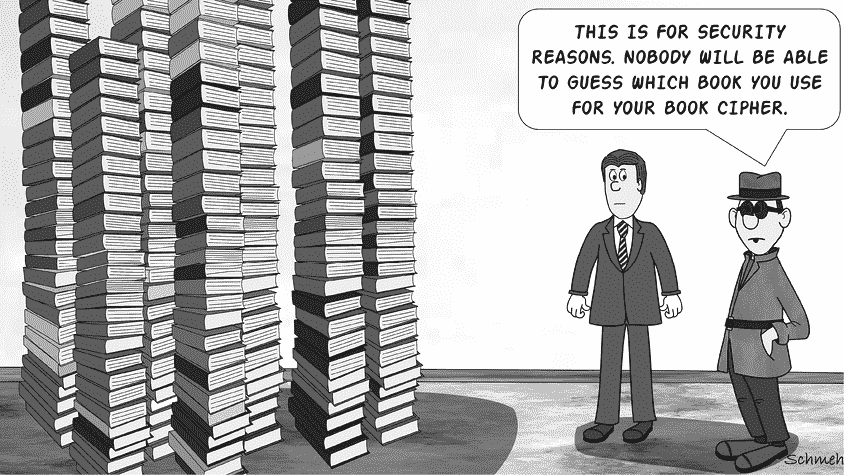
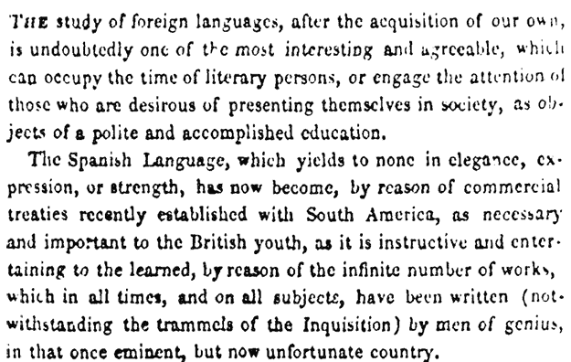
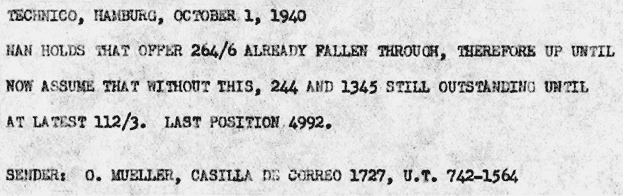
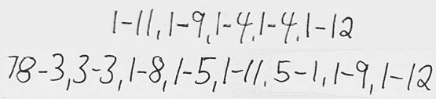
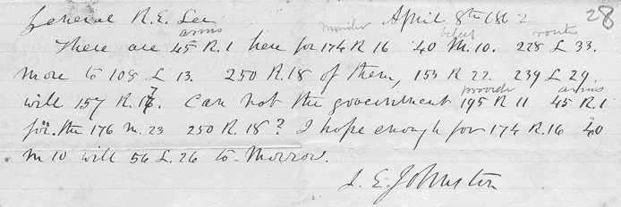
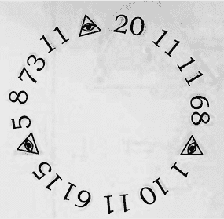

# 14

字典密码和书本密码

1918 年，第一次世界大战接近结束时，一家德国广播电台向墨西哥的接收人发送了以下消息：^(1)

`49138 27141 51336 02062 49140 41345`

`42635 02306 12201 15726 27918 30348`

`53825 46020 40429 37112 48001 38219`

`50015 43827 50015 04628 01315 55331`

`20514 37803 19707 33104 33951 29240`

`02062 42749 33951 40252 38608 14913`

`33446 16329 55936 24909 27143 01158`

`42635 04306 09501 49713 55927 50112`

`13747 24255 27143 02803 24909 15742`

`49513 22810 16733 41362 24909 17256`

`19707 49419 39408 19801 34011 06336`

`15726 47239 29901 37013 42635 19707`

`42022 30334 06733 04156 39501 03237`

`14521 37320 13503 42635 33951 29901`

`49117 46633 02062 16636 19707 01426`

`11511 42635 11239 04156 02914 12201`

`23145 55331 49423 03455 12201 30205`

`33951 30219 50015 04156 43827 06420`

`23309 19707 33104 42635 00308 29240`

`05732 54628 01355 39338 02914 12201`

`06420 11511 24909 27142 33951 49223`

`49618 42022 42635 17212 55320 15726`

`12201 06420 38219 21060 46633 37406`

`43644 33558 22527`

一家美国监听站记录了该消息并将其转发给美国战争期间的密码破译单位 MI-8 进行分析。MI-8 的著名负责人赫伯特·亚德利很快猜测到，这个密码是通过一种所谓的字典密码创建的。

我们将在本章中使用此消息的分析作为示例。

## 字典密码和书本密码的工作原理

*字典密码*，通常使用商业上可用的字典，通过记录单词在书中的页码和位置作为其密文表示。根据亚德利的报告，本章的第一个例子使用了*克利夫顿的法语新词典*的英法部分。例如，五位数字`43827`代表了该字典第 438 页上的第 27 个单词。（正如我们在第七章中讨论的那样，字典密码不是一种密码，因为它加密的是单词，而不是字母。）

以下列表解释了密码文中的第一行五个字母组：

1.  `49138`（第 491 页，第 38 个词）：`电报`

1.  `27141`（第 271 页，第 41 个词）：`1 月`

1.  `51336`（第 513 页，第 36 个词）：`二`

1.  `02062`（第 20 页，第 62 个词）：`和`

1.  `49140`（第 491 页，第 40 个词）：`电报`

1.  `41345`（第 413 页，第 45 个词）：`报告`

因此，明文的开头如下：`电报` `[来自] 1 月 2 日，来自西班牙通过圣安东尼·德尔马的电报报告已接收。`

一种类似的加密方案可以通过任何其他书籍定义，例如小说。我们称这些为*书本密码*。由于通常在小说中找到特定单词非常困难（除非是像`THE`、`AND`或`IF`这样的常用表达），所以书本密码通常引用单个字母而不是整个单词，这也是它成为密码，而不是代码的原因。

使用书籍密码的著名人物是尼古拉斯·特里斯特（Nicholas Trist，1800–1874），他是美国的一位外交官，1848 年由总统詹姆斯·K·波尔克派往墨西哥，正值美墨战争结束之际。特里斯特与墨西哥政府谈判达成了一项条约，导致大量领土被吞并，成为了现代十个州的一部分或全部。^(2)

为了保护往来华盛顿的信件，特里斯特需要一种加密系统。他设计了两种加密方式，都使用书籍密码。请参见本章的“成功案例”部分，了解为找到正确书籍所需的侦查工作。

以下文本是用他的第一个密码（部分）加密的：

`先生，`

`在我最后的信中，我说过：“我认为早日和平的可能性非常大。”随信附上的内容将证明这一点。1,2,3,10—15,13,4,1—39,26,11,31—44,75,121,31—/47,1,6,16/7,3,15,20,24,27,28,29/,,8,1,9/,,9,1/,,2,5/,,1,1/,,1,16,29/69,2,1/,,6,7/,,2,3,2/,,6,4,6,10,8/ 日期为 7 月 29 日：5,33,25,4—30,105,44,45,58—来自一位外国商人的来信 . . .`

特里斯特使用的书是一本 1827 年的西班牙语学习教材：《西班牙语的真正原理》（*True Principles of the Spanish Language*），作者为 José Borras。特里斯特可能认为，在美国旅行者手中，这种书籍在墨西哥不会引起怀疑。

特里斯特第一个密码中的每个数字组，以逗号分隔，代表从《西班牙语的真正原理》一书中提取的一个或多个字母，具体方式如下：页码、行号、字母、字母 . . . 这意味着数字组`1,2,3,10`编码了两个字母，而数字组`7,3,15,20,24,27,28,29`编码了六个字母。

同样，`47,1,6,16`编码了两个字母。如果我们知道第 47 页的第一行是 . . .

`表格第二十五：苍蝇与公牛`

. . . 然后我们可以得出结论，数字`47,1,6,16`代表字母`T`和`H`（空格和破折号不算在内）。如果一个数字组以两个缺失的数字开始（如`,,2,3,2`），则使用前一个数字组的页码和行号。

历史上还存在许多其他书籍密码。我们甚至在第六章中提到过一种：用于加密第二个比尔密码的系统，其中“书籍”是《独立宣言》。与通过三组数字（页码、行号和位置）来识别每个字母不同，比尔的密码仅记录单词的位置。这意味着《独立宣言》中的第一个单词是数字`1`，第二个单词是数字`2`，以此类推。为了编码明文，只使用单词的第一个字母。

尼古拉斯·特里斯特设计了第二种基于贝尔密码概念的密码，并使用与他其他密码相同的书籍。在一封信中，他提到“`一封简短的便条` `[发给]` `121,13,1,2,17,5,9,20`。”我们可以通过查看这本书的第一页来解密这八个字母，这些字母被加密在他的第二种密码中（见图 14-1）。如果你尝试解密，你会发现表达式`121,13,1,2,17,5,9,20`解密为`MR THNTON`。这可能指的是一位名叫 Thornton 先生的人。（特里斯特似乎遗漏了名字中的两个字母。）

图 14-1：尼古拉斯·特里斯特在其书籍密码中使用的《西班牙语言真理原则》一书的首页，*西班牙语言真理原则*。

词典码和书籍密码在美国初期非常流行。在美国独立战争期间，叛徒本尼迪克特·阿诺德使用威廉·布莱克斯通爵士的*《英格兰法律评论》*进行加密，发送了许多书籍密码的信件。^(3) 由于书籍密码显得繁琐，他很快转而使用基于*纳森·贝利词典*的词典码。

亚历山大·汉密尔顿，美国开国元勋之一，也是林-曼努埃尔·米兰达同名百老汇音乐剧的主角，曾由他的岳父菲利普·斯凯勒描述了一个词典码系统，该系统基于 1777 年版的*《恩蒂克拼写词典》*。^(4) 历史没有记录汉密尔顿是否曾使用这个密码，但我们知道英美两国的军队都使用过这个词典进行加密。英国将领查尔斯·康沃利斯和亨利·克林顿在美国独立战争期间使用过它，而且有记录显示，美国副总统亚伦·伯尔——因在 1804 年与汉密尔顿进行决斗并致其死——也曾在他的信件中使用过 1805 年版的同一本词典。^(5)

## 如何检测词典码或书籍密码

检测词典码其实非常简单。例如，看看图 14-2 所示的二战时期的消息。^(6) 这是一个德语电报的英文翻译。^(7)

图 14-2：这份（已翻译的）来自二战时期的电报包含了两个词典码表达式。

数字`244`、`1345`和`4992`可能是来自某个未识别的密码本的密码组，且与此处无关。

值得注意的是，这个密码包含了表达式`264/6`和`112/3`。使用这种斜杠格式的常见加密方法有词典码和书籍密码。如果这个推测正确，`264`中的`264/6`可能代表页码，而`6`则代表单词或字母的位置。事实上，这两个表达式来自于*Langenscheidt 的小型英德词典*；`264/6`代表`PIER`，`112/3`代表`DECEMBER`。

如果页面编号和单词位置之间没有明显的分隔，那么检测字典密码或书籍密码会稍微困难一些。这样的系统，例如，可以很容易与代码或命名法混淆（见第七章）。在这种情况下，以下是一些有用的信息：通常，字典页面上有不到一百个单词，通常甚至不到五十个。所以，如果密码包含以`XXXYY`形式的数字组，应该检查每个实例中`YY`是否小于五十。

当然，代码可能是反转系统，例如`YY-XXX`，或者其他某种混乱的方法。此外，如果数字大于五十，可能使用了书籍密码，其中大量的单词会适合在一页上。例如，Beale 系统从头到尾数过《独立宣言》中的几百个单词。

## 如何破解字典密码或书籍密码

破解字典密码或书籍密码可能非常困难。如果密码使用得当，并且密码分析员不知道所用的书籍，甚至可能不可能破解。然而，书籍有时可以被找到。此外，正如密码学中的常见情况一样，破译者可以利用加密者的失误来获益。

### 确定书籍或字典

破解字典密码或书籍密码最直接的方法是找到其所基于的书籍。我们已经在第六章看到过一个例子（可能是虚构的）：根据 Beale 小册子，一名男子在识别出《独立宣言》被用作加密后破解了第二个 Beale 密码。

另一个（绝对是虚构的）例子出现在亚瑟·柯南·道尔 1915 年的福尔摩斯小说*《恐怖山谷》*中。在这部小说中，福尔摩斯收到了一条来自某个弗雷德·波洛克的加密信息，并怀疑他正在处理一本书籍密码的密码。福尔摩斯推测所用的书籍是广泛可得的，大型（至少有 534 页），每页有两列。大多数年鉴正好符合这些条件。

福尔摩斯首先尝试了他几天前才收到的*《惠特克年鉴》*最新版本，但没有成功。接着，他尝试了同一本书的前一版本——并且成功了。借助这本年鉴，福尔摩斯解读出了信息，并揭示了一个警告，说明“某些恶行”将会发生。当然，最终他解决了案件。

### 重建字典

在他 1922 年的著作*《密码学》*中，瑞士密码学家安德烈·朗吉报告了他被要求破解的下列密码:^(8)

`5761 3922 7642 0001 9219 6448 6016 4570 4368 7159`

`8686 8576 1378 2799 6018 4212 3940 0644 7262 8686`

`7670 4049 3261 4176 6638 4833 4827 0001 3696 6062`

`8686 2137 4049 2485 7948 0300 9712 0300 4212 9576`

`2475 8576 8337 0702 9185`

如上所示，消息由四十五个四位数字组成。乍一看，这不像是字典密码，因为将四位数字分为“页码”和“单词”号码并没有意义，除非所使用的字典大约有一百页，每页大约有一百个条目，这种情况并不太可能。

但是，如果消息的发送者按从头到尾的顺序对字典中的条目进行编号，而没有包含页码呢？当我们考虑到数字`0001`在此文本中出现了两次时，这种情况就变得更加可能。英文词典中的第一个条目通常是词条*A*。由于*A*是一个常见词，因此它在这样一个长度的文本中出现两次是合理的。

假设我们可能正在处理这种类型的字典密码。以下是文本中出现的四位数字的排序列表：

`0001, 0001, 0300, 0300, 0644, 0702, 1378, 2137, 2475, 2485, 2799, 3261, 3696, 3922, 3940, 4049, 4049, 4176, 4212, 4212, 4368, 4570, 4827, 4833, 5761, 6016, 6018, 6062, 6448, 6638, 7159, 7262, 7642, 7670, 7948, 8337, 8576, 8576, 8686, 8686, 8686, 9185, 9219, 9576, 9712`

除了`0001`，我们还可以看到其他组也有重复的情况：`0300`、`4049`、`4212`、`8576`和`8686`。

以下表格可能会有所帮助。它展示了从字母*A*到*Z*的词汇在包含 10000 个最常见英文单词的字典中的分布情况。^(9) 除了单词的起始位置之外，这个表格还展示了对于某些字母来说，条目的页数明显少于其他字母。

`A 0001 – 0643`

`B 0644 – 1178`

`C 1179 – 2160`

`D 2161 – 2755`

`E 2756 – 3177`

`F 3178 – 3599`

`G 3600 – 3926`

`H 3927 – 4295`

`I 4296 – 4717`

`J 4718 – 4800`

`K 4801 – 4877`

`L 4878 – 5216`

`M 5217 – 5710`

`N 5711 – 5871`

`O 5872 – 6109`

`P 6110 – 6960`

`Q 6961 – 7019`

`R 7020 – 7513`

`S 7514 – 8715`

`T 8716 – 9298`

`U 9299 – 9453`

`V 9454 – 9637`

`W 9638 – 9929`

`X 9930 – 9941`

`Y 9442 – 9971`

`Z 9972 – 10000`

现在看看组`0300`，它在密码中出现了两次。如果我们对所使用的加密系统是正确的，那么很可能这个单词以`A`开头，并且第二个字母位于字母表的中间位置。`AND`是一个很好的候选词。

数字`8686`在密码中出现了三次，这使它成为此密文中出现频率最高的数字组。与之接近的是`8576`，它出现了两次。根据我们创建的表格，这些位置的单词应该以`S`开头。但字母表中是否有两个以`S`开头的常见英语单词如此接近呢？`STILL`和`SUCH`可能是候选词，但进一步检查显示它们并不是很好的匹配。

相反，我们假设消息作者所使用的词典中的字母分布与我们表中的略有不同。或许看一下以`T`开头的单词会有帮助。事实上，有两个单词似乎适合：`THE`和`TO`。这个猜测得到了验证，因为在密文中出现了`8686 8576`，而`TO THE`是一个常见的词组。

根据我们的猜测，我们可以绘制出以下内容：

`5761 3922 7642 0001 9219 6448 6016 4570 4368 7159`

`A`

`8686 8576 1378 2799 6018 4212 3940 0644 7262 8686`

`TO``THE``TO`

`7670 4049 3261 4176 6638 4833 4827 0001 3696 6062`

`A`

`8686 2137 4049 2485 7948 0300 9712 0300 4212 9576`

`TO``AND``AND`

`2475 8576 8337 0702 9185`

`THE`

下一步是根据分布表尝试猜测所有其他的起始字母：

`5761 3922 7642 0001 9219 6448 6016 4570 4368 7159`

`N G S A T P O I I R`

`8686 8576 1378 2799 6018 4212 3940 0644 7262 8686`

`TO THE C E O H H B R TO`

`7670 4049 3261 4176 6638 4833 4827 0001 3696 6062`

`S H F H P K K A G O`

`8686 2137 4049 2485 7948 0300 9712 0300 4212 9576`

`TO C H D S AND W AND H Y`

`2475 8576 8337 0702 9185`

`D THE S B T`

毋庸置疑，从这里开始就变得困难了。我们需要猜测更多的单词，但我们只能知道每个单词的（可能的）首字母。

为了让事情稍微简单一点，假设我们知道明文的一小部分（即一个线索）。假设我们已经得知，这条消息是关于军事的，且包含敌人进攻的信息。事实上，第二行中的数字`2799`和`6018`可能代表`ENEMY OFFENSIVE`。如果是这样的话，`1378`，它位于`TO THE`和`ENEMY OFFENSIVE`之间，可能是`COMING`。第一行中的数字`6016`与`6018`（`OFFENSIVE`）非常接近。最可能的解密结果是`OF`。

第二高的数字`9576`可能是一个`W`开头的单词，或许是`WERE`或`WILL`。接下来是`2475`，一个以`D`开头的单词，后面跟着`THE`。这可能是什么呢？按字母顺序，它出现在`COMING`（`1378`）和`ENEMY`（`2799`）之间。这两个词的间隔是`1421`，而`1378`和`2475`之间的差值是`1097`，大约是间隔的四分之三。这将我们引导到了*Dis*和*Dos*。文本中还有另一个数字，它大致占据相同的词典位置：`2485`。`2475`或`2485`可能是`DO`。假设我们将`DO`分配给`2485`，并寻找一个适合我们上下文的、紧接着它的单词。字典文件向我们展示了`DIVULGE`和`DIVIDE`。因此，数字`0300`到`8576`可能代表`AND YOU AND I WILL DIVIDE THE`。

要解开其余的密文，我们可以使用类似的猜测。我们肯定会偶尔犯错，但每一个被确定的单词都会增强我们的立足点。我们猜的单词越多，找到更多单词就会变得更容易。这里是我们最终得到的明文。（第一个单词未知，但很可能是以`M`开头的名字。）

`???? 已经获得了关于即将到来的敌人进攻的宝贵情报。我已被要求送给他五百英镑。这是揭发他的一个好机会。照做，你我将分担这笔钱。`

以这种方式破解字典密码确实不容易。然而，正如本章“成功案例”部分所展示的那样，这是可能的。

### 把书本密码当作简单的替换密码来处理

根据其构造方式，书本密码也可以被看作是一个简单的替换密码、同音密码或命名法。这意味着我们可以使用每种类型的加密破解技术来解决某些书本密码密码。举个例子，看看我们在一本二手书《密码、暗号与密写》中找到的手写献辞，这本书是著名的马丁·加德纳于 1972 年出版的，是一本关于密码学的非常基础的入门书籍（见图 14-3）。^(10)

图 14-3：用书本密码加密的献辞

这是一个抄本：

`1-11,1-9,1-4,1-4,1-12 78-3,3-3,1-8,1-5,1-11,5-1,1-9,1-12`

解决这个密码的方法有很多种，但如果我们仅仅把它看作是一个简单的替换密码，我们可以采用以下策略。首先，让我们用字母替换每一组由连字符分隔的两位数字，从左到右，每次遇到新的数字对时引入一个新的字母。这将把这个密码转录为以下内容：

`ABCCD EFGHAIBD`

在许多符合`ABCCD`模式的单词中，有一个是`HAPPY`。（快速找到这样的单词模式匹配的方法是使用像 CrypTool 2 这样的程序。）如果我们然后根据字母替换，它给出了以下第二个单词：`****H*AY`。从这里猜测，明文很容易是`HAPPY BIRTHDAY`。

作为另一种解决方法（可能是最初意图的方式），如果我们查看加德纳的*《密码、暗号与密写》*第一段……

`密码学，消息的编写和解码……`

……我们看到我们正在处理一个书本密码。在这里，`1-11`代表第一个单词的第十一字母`H`；`1-9`代表第一个单词的第九字母`A`；依此类推。

## 成功案例

### FIDES 广告

在 1862 年到 1866 年之间，伦敦报纸*《泰晤士报》*刊登了 23 条广告。每则广告都以单词`FIDES`开头，大多数广告至少部分加密过。^(11)以下是几个例子：

`1862-10-31`

`FIDES（思考）。——不是神话，而是一个邻近的城市，我将被扣留一段时间。我将在星期一待几个小时，并且必须在 2 点到 3 点之间有机会与你见面。也许我会在这段时间内收到你的消息。请寄到 P.O.。`

`1864-06-22`

`FIDES.–DOCUMENTS will AWAIT your ARRIVAL at No. 3\. on and after Tuesday next. Both of your letters to hand. (58.62) (171.53) (248.74) (152.79) (223.84) (25.21) (222.64) (132.74). James gone to Egypt instead.`

`1864-07-21`

`FIDES.–(218.57) (106.11) (8.93) (17.61) (223.64) (146.7) (244.53) (224.21) (20) (192.5) (160.19) (99.39) (No. 8) (251.70) (1) (223.64) (58.89) (151.79) (226.69) (8.93) (40.12) (149.9) (248.101) (167.12) (252.35) (12.31) (135.100) (149.9) (145.76) (225.53) (212.25) (20) (241.6) (222.22) (78.45) (12.31) (66.28) (252.33) (158.33) (6.65) (20) (2) (11.50) (142.37) (223.87) (12.31) (142.37) (105.33) (142.37) (157.20) (58.62) (133.89) (250.86).`

我们的`FIDES`密码来源，当然是 2005 年由 Jean Palmer（Tony Gaffney 的笔名）所著的《*The Agony Column Codes & Ciphers*》一书，我们在之前的章节中多次引用过该书。^(12) Gaffney 自己解开了书中列出的绝大多数加密广告；然而，在 2005 年这本书出版时，他还未能解开`FIDES`密码。

几年后，Gaffney 再次尝试解密`FIDES`密码，这次他假设自己处理的是一本字典密码，在这种情况下，像`146.7`这样的表达代表第 146 页的第七个单词。通过频率分析和广告中明文部分提供的线索，Gaffney 能够做出一些猜测。然而，为了彻底解决这个谜题，他需要找到所使用的字典。经过多小时在英国图书馆的搜索，他翻阅了至少 48 本 19 世纪的英文词典。第 49 本证明是符合要求的：*Johnson’s Pocket Dictionary of the English Language*，出版于 1862 年。

从那里开始，密码的工作原理变得清晰了。每对数字的第一个数字实际上是页码加一。第二个数字是从页面底部开始的单词编号，从右栏开始，然后继续向下到左栏。此外，`1`代表`I`，`2`代表`YOU`；`20`代表逗号或句号。

日期为“1864-06-22”的广告解密为`DARLING PRECIOUS WEARY OAF THOU BETTER THAN LIFE`。这些词语中的一些可能只有相关人员才会明白！完整的解密内容可以在 Klaus 2014 年的博客文章中找到。^(13)

### Nicholas Trist 的关键著作

在本章前面，我们提到美国外交官 Nicholas Trist 在他驻墨西哥期间使用了两本书密码与美国政府进行通信。^(14) 加密历史学家 Ralph E. Weber 在他 1979 年出版的《*美国外交密码和暗号*》一书中描述了这些密码，但他无法解密 Trist 的所有信息，因为他不知道 Trist 所使用的书籍。^(15) 他只知道 Trist 的两个密码都是基于同一本书。

几年后，当密码学家斯蒂芬·M·马特亚斯读到韦伯的书时，他决定尝试解决这个谜团。马特亚斯注意到特里斯在一封信中提到了他的关键书籍的一些事实，描述它是一本题为“致英国民族”的小册子。他还提到，它至少分为两个部分，是由一位被派往西班牙担任领事的华盛顿人写的。此外，韦伯发现这本书的文本以“外语学习…”开头。

为了确认特里斯的主要作品的作者，马特亚斯编制了一份所有从华盛顿派往西班牙或西班牙殖民地担任领事的人员名单。最终名单包括大约五十人，其中许多人令人惊讶地出版了书籍。经过一番调查，马特亚斯确定了一个名叫何塞·博拉斯的最有希望的候选人。博拉斯是巴塞罗那的美国领事，在 1827 年出版了一本名为《西班牙语的真实原理》的书。这本书符合描述，特别是因为涉及外语。

马特亚斯设法在芝加哥的纽伯瑞图书馆找到了这本书的一本副本，它确实包含了他寻找的致辞和开头词。经过一些工作，谜团解开了，尼古拉斯·特里斯的通信得以解密。详见本章开头的例子。

### 威廉·弗里德曼如何破解印度阴谋加密

第一次世界大战期间，印度的印度教团体开始反抗他们的英国殖民者，这些团体的某些成员从美国运送武器和后勤支持。美国当局将这些印度阴谋者视为违反武器法的罪犯，并计划对友好的英国进行革命。

1917 年，英国苏格兰场的一名代表将从印度阴谋者那里截获的一叠加密信件转发给威廉·弗里德曼。当时，弗里德曼的破译生涯刚刚开始。

代表除了这些信件外，还向弗里德曼提供了一份嫌疑人名单，他可以用作破译的线索。不幸的是，这些信件和嫌疑人的名字从未被公开。关于这个故事的唯一可用信息（据我们所知）来自弗里德曼自己的 1920 年报告和 1996 年戴维·卡恩书籍《密码破译者》的短文。这两者都没有提供关于加密消息内容的详细信息。

根据弗里德曼的报告，密文由一系列按三组数字分组的数字组成，如 `7-11-3`、`8-5-6` 和 `3-9-15`。经过初步研究，弗里德曼得出结论，他正在处理的是一本书的密码。每个数字组似乎指向一本书中的页面、行和字母位置。例如，`7-11-3` 表示第 7 页第 11 行中的第 3 个字母。

弗里德曼不知道阴谋者可能使用了哪本书。然而，他意识到他们没有正确应用加密方法，因为只有消息中较重要的部分被加密了。那些保留为明文的部分给了弗里德曼一些有用的线索，帮助他推测消息内容。密文也以单词间断的方式呈现，揭示了单词的长度，而发送者则反复选择相同的数字组合来代表某些字母，尽管如果选择不同的页面、行和位置来编码相同的字符会更安全。

阴谋者使用的另一种糟糕技术是连续的数字序列，如 `7-11-3`、`7-11-4`、`7-11-5` 和 `7-11-6`，这揭示了某个单词或单词的一部分同时出现在明文和书中。例如，阴谋者可能使用密钥书中的单词 `APPLE` 来加密明文单词 `APPLE`，这意味着密文中的数字会是连续的。此外，发送者通常喜欢选择某一行中某个字母的首次出现，因此频繁出现的字母通常会获得较低的数字，而稀有的字母则用较高的数字表示。

在经过大量研究后，弗里德曼终于在其中一条加密信息中找到了一个片段，看起来是某个嫌疑人的名字。我们并不知道这个名字是什么，但在事件的描述中，卡恩提供了另一个弗里德曼可能猜到的文本片段。请看以下两组加密词（每组在不同的行）：

![83-1-2 83-1-11 83-1-25 83-1-1 83-1-8 83-1-13 83-1-18 83-1-3 83-1-1 83-1-6[line break]83-1-3 83-1-6](image_fi/502727c14/two-line-equation.png)

如果我们根据字母出现的顺序为每个字母编号，那么这两组词的字母组成了 `1234567849 89` 的模式。注意，字符 `4`、`8` 和 `9` 被重复了；如果使用现代的密码分析工具，这个模式可以很快被破解。弗里德曼注意到序列中的第三个字符，在密文中表示为 `83-1-25`，它的编号比其他字符高，表明它可能是书中某一行的第 25 个字母。弗里德曼怀疑这是一个罕见的字母；否则，位置编号会更低。通过坚持不懈的努力、直觉和一点运气，他终于确定这个字母是 `V`，而这两组词是 `REVOLUTION IN`。

弗里德曼后来写道：

> 从中，我们逐步重建了消息的明文，不仅是消息的明文，而且我们可以相当确定地说，某本未知书籍的某页、某行上出现了“德国”一词。在另一页和另一行上，则出现了“政府”，而在其他地方则是“宪法”等类似词汇。凭借这样的证据，我们推断出这本未知书籍的主题是政治经济学。

随着阴谋者的审判临近，司法部告诉弗里德曼，他们认为了解关键书籍的书名将有助于说服陪审团相信消息已经被正确解密。弗里德曼和他的团队联系了美国和英国的书商，询问是否有一本政治经济学的书，书中某些特定位置有特定的词汇。然而，当审判开始时，书籍仍未被确定。

弗里德曼准备在法庭上解释这个密码，而不引用所使用的书籍——然后，在芝加哥的一家酒店里，他正等待安排作证的时间时，偶然走过了芝加哥最大书店 McClurg's。翻阅政治经济学部分时，他发现自己手中拿着他一直在寻找的书：《德国与德国人》，作者 Price Collier（1913 年）。谜团终于在最后时刻解开。

当弗里德曼再次核对他的工作与书籍时，他发现自己 95%以上的结果是正确的。我们的资料没有提到弗里德曼的证词是如何被接受的，但我们知道，许多印度阴谋者被判有罪。这是弗里德曼职业生涯中的第一次重大破译成功，之后他还有许多类似的成就。

### 发送给罗伯特·E·李的字典密码消息

图 14-4 展示了一封 1862 年发送给美国内战将领罗伯特·E·李的加密便条。^(19)（我们在北卡罗来纳大学教堂山分校路易斯·朗德·威尔逊特藏图书馆创建的《美国内战日记》网站上找到了这份文件，^(20) 也在佐藤智清的 Cryptiana 网站上找到了这份文件。^(21))该消息的加密部分由若干单元组成，每个单元由一个数字、一个字母（`L`、`M`或`R`）和另一个数字构成。

图 14-4：这条发送给罗伯特·E·李的消息使用了字典密码加密。

以下是由密码爱好者 David Allen Wilson 和 Thomas Bosbach 提供的加密便条的文字记录：

`2017 年 8 月 31 日`

`罗伯特·E·李将军 1862 年 4 月 8 日`

`这里有 45 个 R 1，对应 174 个 R 16 40 M 10\. 228 L 33\. 更多的是 108 L 13\. 250 R 18，其中 153 R 22 239 L 29\. 将会 157 R 17\. 政府能否为 176 M 23 250 R 18 提供 195 R 11 45 R 1? 我希望 174 R 16 40 M 10 能在明天 56 L 26 之前足够。`

`J.E. Johnston`

这种模式最可能的解释是，这些密文段落使用了字典密码加密，每个单元的第一个数字代表页码，字母代表列（左、中或右），第二个数字代表行。该书可能是一本至少有 250 页，每页有三十三行的英文字典。

在一些单元的上方，已经有人写下了似乎是提议的明文表示。例如，`45 R 1` 被解密为 `ARMS`，而 `228 L 33` 显然代表 `ROUTE`。这些解密正确吗？如果正确，为什么作者只解密了部分单词？那个以 `ROUTE MORE TO` 开头的第二个句子是否有意义？而且，`ARMS` 这个词出现在一本 250 页的字典的第 45 页上是否合理？这本字典可能只有几页是以字母*A*开头的单词。可能这个密码涉及更多技巧，比如将数字加到页码上，但美国内战期间流行的加密系统通常并不复杂到这种程度。

克劳斯在 2017 年于他的*Cipherbrain*博客上发布这段加密信息时，并不知道这些问题的答案。几位读者开始寻找可以解释密文部分的字典。这项搜索被简化了，因为在 1860 年代出版的英文字典并不多，这些字典每页有三列，大约 250 页。最终，一位昵称为 Davidsch 的读者找到了它：1857 年版的*诺亚·韦伯斯特，威廉·格林利夫·韦伯斯特字典*。很快就清楚了，上述一些密文单元所标注的疑似明文表示是错误的。

使用字典后，博客读者托马斯·博斯巴赫很快提供了以下信息的解密（明文解密部分括在括号内）：

`这里有 45R1（汽车）用于 174R16（一个）40M10（旅）。228L33（六个）更多的到 108L13（跟随）。250R18（三个）他们，153R22（长）239L29（街道）将 157R17（行进）。政府不能为 176M23（其他）250R18（三个）购买 45R1（汽车）吗？我希望足够的 174R14（一个）40M10（旅）将 56L26（明天）到来。`

## 挑战

### 丹·布朗的书籍密码挑战

在丹·布朗 2003 年畅销小说*达·芬奇密码*的封底右下角，可以看到一个深色印刷的圆形图案：

下面是转录内容：

`20 11 11 68 • 1 10 11 61 15 • 5 8 73 11 •`

每个数字都对应于小说中相应章节的第一个字母。（对于那些没有这本书的读者，我们提供了此信息 [`codebreaking-guide.com/challenges/`](https://codebreaking-guide.com/challenges/)。）当正确排列时，这些字母拼出了一个拉丁语句子，代表了美国的座右铭。

### 字典密码挑战

2018 年，克劳斯在他的博客上发布了一个字典编码挑战。^(22) 为了创建他的字典，他首先寻找了一份包含 10,000 个最流行的英语单词、缩略语和首字母缩写的文本文件，然后进行了几处修改（比如添加了“ZZTOP”等单词，删除了一些其他的单词等），以防止任何密码破译者猜出他使用的文件。接着，他将单词按字母顺序排列在电子表格中。最终的列表成为了他的密码本，每个单词都有一个位置编号。以下是该列表的开头和结尾：

`0001: A`

`0002: AAA`

`0003: AAAA`

`0004: 亚琛`

`0005: AARON`

`0006: AATEAM`

`0007: AB`

`0008: 废弃`

`0009: ABC`

`0010: 阿伯丁`

`. . .`

`9992: 区域划分`

`9993: 动物园`

`9994: 放大`

`9995: 动物恋`

`9996: ZOPE`

`9997: ZSHOP`

`9998: ZSHOPS`

`9999: ZUT`

`10000: ZZTOP`

该单词列表不仅包含完整的单词和缩写，还包括 26 个字母。这些字母被当作普通单词处理，例如，`E`排在`DYNAMICS`和`EACH`之间。如果想加密的单词不在字典列表中，可以逐字母进行编码。使用这个密码本，克劳斯加密了大约 70 个单词的明文，得到了以下密文：

`8456 0619 8928 6116 9216 5992 9061 1263 0001 5326 2272 2827 5884 1142 8993 4906 8322 6163 8928 6841 6694 3564 8928 7658 6323 8928 1142 0212 0016 6207 4906 8785 0001 5069 0371 9647 0307 8928 9652 0212 8192 4316 5602 9967 9804 7254 0001 5385 4424 8928 1449 6163 4714 8949 4692 0001 8515 2212 6205 8928 7278 8131 6163 4714 9967 9804 3458 0001 9861 1390 2012 0001 2546 8926 9804 4139 9967 9061 2365 8928 5992 5589`

博客读者诺伯特·比尔曼当天就解开了这个谜题。你也能做到吗？

## 未解密的密码谜题

### 1873 年的两则加密报纸广告

1873 年，两则加密的报纸广告在伦敦的*《每日电讯报》*上刊登。^(23)^, ^(24) 它们在此被重现。（请注意，`TOUJOURS BLEU`是法语，意为`ALWAYS BLUE`。）

`1873-02-07`

`TOUJOURS BLEU.–7.64\. 13,141\. 24.24\. 18,299\. 1,317 8,481X–1,274\. 32,561 29,375 13,127 28,801\. 32,561\. 21,8 21,221X 28,59\. 39,629\. 28,59 39,629 29,544 25,138 29,219 7,64X–29,219 17,77 6,582 1,384 16,243 29,219 19,367 8,226 18,176 33,383X–36,547\. 8,39 2,379 2,4 27,609 32,561 9,324 21,367 9,629 28,59 12,361 32,104 6,381 1,268 38,498 25,411 32,561 2,140X–1,268 14,527 33,212 38,616 8,335X–2,495 3,379 20,320 32,561 29,422 1,257 24,24 24,485 40,618 1,268 40,338 15,198\. 21,367X–19,420 2,407X–25,618 11,390 40,629 32,252 27,538X–18,411 10,422 2,185X–27,254 2,221X–40,204 8,347 20,388 8,347 40,325 8,347 36,621 8,347 25,239 32,24 1,268 8,306 1,268 8,306 1,268 5,58 40,629 5,19 5,19 4,386X 22,451 29,329 22,451X–12,262X 15,50 10,66X 13,572 32,561 1,384 12,579 12,194 40,325X 8,347 7,518 12,629 29,219 26,106 1,624 21,556X 40,238 16,438 2,555X.`

`1873-02-27`

`ANTETYPE.–8.347, 20.388X 1.317, 12.269, 20.28, 10.622, 15.50, 2.495 8.481\. 32.561\. 8.501X 1.268, 32,252, 12.455, 1.317, 8.226, 6.630 9.266, 2.4, 7.73X 24.627, 32.561, 27.556, 31.302\. 28.185, 19.31X 25.264, 1.268, 32.252, 12.629, 29.219, 2.555X 21.367, 9.629, 12.361, 15.50, 25.138X 1.268, 13.572, 35.562, 2.555X 1.268, 8.306, 39.558, 11.606, 7.518X 40.204`

两个广告主要由数字组组成，这些数字组通过句点或逗号分为两部分。句点/逗号前的数字小于句点/逗号后的数字，这种模式与书籍密码一致。像`12.269`这样的表达可能代表某本书第十二页的第 269 个字母。某些数字组末尾的`X`可能意味着，该组代表一个完整的单词，而不仅仅是一个字母。目前对于这两个密码的了解并不多。
