# 额外的加密方法

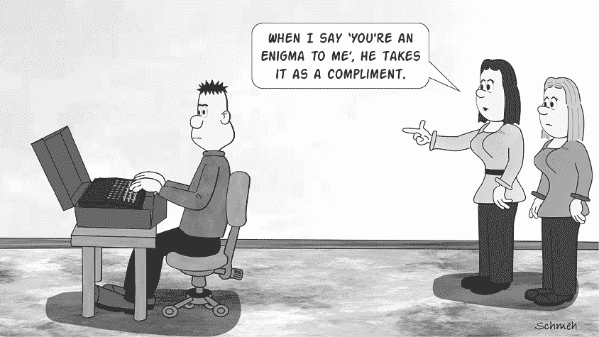

本书至今为止描述的技术包括许多加密算法，这些算法是在密码机和计算机发明之前使用的。如果你遇到的是 1900 年之前创建的密码文献，那么使用的加密方法很可能在本书中有所涉及。如果你处理的是加密信件、明信片或日记，无论它们写于何时，情况也是如此。许多二十世纪的加密文献也使用了本书中提到的某种加密系统，尤其是那些与军事或情报无关的文件。

然而，至今为止，我们尚未在本书中详细介绍许多加密方法。在接下来的章节中，我们将简要介绍其中的一些。^(1)

## 密码工具

如第二章所述，密码盘或滑动盘可以用来应用简单的替代密码或多表替代密码。在密码学的历史中，人们开发了许多种类的密码盘和滑动盘，以及其他许多工具。例如，有的密码盘有多个字母环，有密码圆筒，还有条形密码（见图 15-1），这些都只是其中的一些。尽管大多数这些工具实现的是替代密码，但所谓的*斯凯塔尔*（发音为“ski-ta-li”），即缠绕在棍子上的条形物，也可以用来实现一种简单的换位密码。^(2)

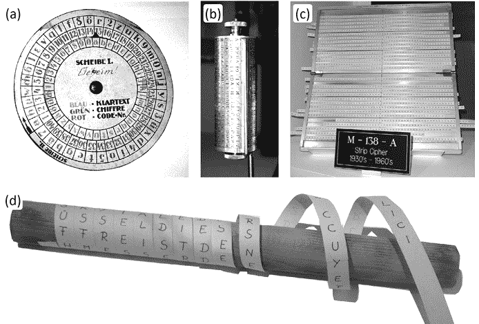

图 15-1：密码工具存在多种变体。密码盘（a）、密码圆筒（b）、条形密码（c）和斯凯塔尔（d）在历史上被广泛使用。

如果你在寻找与密码工具相关的有趣成功故事，我们推荐 Luis Alberto Benthin Sanguino 的 2014 年硕士论文《通过组合组合学和统计方法分析西班牙内战密码》。^(3) 如果你对密码工具挑战感兴趣，可以查看 MysteryTwister 上的 M-138 问题。^(4)

## 语音加密

电话在十九世纪末开始广泛使用，随后几十年后，语音无线电也进入了人们的生活。两种技术都可能被不请自来的第三方窃听。尤其是无线电通信面临较大威胁，因为监听者只需要一根天线和一台无线电设备就能窃听，这就是为什么*语音加密*——也称为“加密语音”（ciphony）——不可避免地成为了一个重要问题。尤其在军事领域，早期采用电话和语音无线电的军方，对安全、便捷的语音加密设备有着迫切需求。

语音加密需要与文本加密完全不同且远为复杂的技术。当工程师在 20 世纪初开始研究语音加密系统时，他们面临着许多严峻的挑战。那时，语音传输是模拟信号，即使到今天，安全地加密模拟信号仍然非常困难。因此，几乎所有第一代语音加密设备都使用了可以轻易破解的算法，这一点也不足为奇。

在第二次世界大战期间，战争中的主要国家都未能设计出既安全又能以合理价格建造的语音加密设备。战争中最著名的语音加密机是 SIGSALY，这是美国人制造的一种设备。它极为复杂，占据了整个房间。SIGSALY 使用一次性密钥方案对数字化语音数据进行加密，密钥存储在黑胶唱片上。SIGSALY 可能是第二次世界大战中唯一安全的语音加密手段。然而，这项技术非常昂贵，导致只有少数几台设备被制造出来。这些设备仅在最高级别的军事层面使用。^(5)

冷战初期，语音通信逐渐取代了摩尔斯电码无线电通信。同时，语音加密技术变得更加重要，并取得了显著进展。这些设备变得更小、更易操作且更便宜，而新的数字化方法结合新的密码算法提供了更高的安全性。在这一时期，数十种甚至数百种加密电话和无线电设备被开发出来，主要用于军事和外交用途。然而，关于这些冷战设备使用的加密方法知之甚少，因为大部分信息至今仍然属于机密。

随着计算机的出现，数字化语音可以作为二进制代码处理，这些二进制代码由一连串的零和一表示，并可以通过与加密文本和图像相同的算法进行加密。当数字手机在 1990 年代开始广泛使用时，许多手机已经配备了加密模块。如今，包括 GSM、UMTS 和 LTE 在内的所有移动电话标准都已包含加密功能——尽管默认情况下，只有手机与基站之间的无线连接是受保护的。

从一方到另一方的语音通信加密（称为*端到端加密*）仍然是军事和外交领域的专有技术。用于此目的的设备通常价格昂贵，并依赖于不公开的加密算法。在普通用户中，端到端语音加密仍然很少被使用，尽管一些支持加密通信的智能手机应用逐渐受到欢迎。

据我们所知，市场上并没有一本关于语音加密历史的全面书籍——尽管这样的作品可能会非常有趣。然而，有一本精彩的 2011 年出版的书籍《如何毁掉一个美丽的海滩》（作者：戴夫·汤普金斯），涵盖了语音数字化的历史。书中包含了许多关于语音加密的迷人信息，包括 SIGSALY。（^(6)）此外，《如何毁掉一个美丽的海滩》还涉及了语音数字化器（通常称为声码器）在音乐和其他领域的应用。（^(7)）

由于语音加密与本书重点介绍的文本加密方法完全不同，破解语音加密需要采用与我们已介绍的破译方法截然不同的技术。在语音加密的早期，密码分析主要是解码模拟信号，这通常并不难。随着冷战初期语音数字化的到来，破解者的任务变得越来越具有挑战性。如今，语音加密密码分析已经不再是一个独立的课题，因为用于此目的的算法与其他基于计算机的加密方法并没有太大区别。

## 密码通话

与其使用机器进行语音加密，不如由人类将信息翻译成鲜为人知的语言。这种方法被称为*密码通话*。大多数读者可能知道，美国在第二次世界大战中成功地应用了这种技术，使用的是纳瓦霍（迪内）密码话务员。（^(8)）2002 年上映的好莱坞电影《风语者》，由尼古拉斯·凯奇主演，讲述的就是这一实践。

然而，纳瓦霍密码话务员并不是唯一使用这种技术的人，甚至也不是最早的。在第一次世界大战中，美国陆军就招募了切诺基、乔克托以及其他美洲原住民作为密码话务员，尽管那时语音无线电技术尚未普及。英国人也雇用了切诺基人，加拿大也使用了美洲原住民密码话务员。

这些努力的规模不断扩大。三十年后，在第二次世界大战期间，电话和语音无线电发挥了更重要的作用。密码通话在更大规模和更系统化的方式下得以应用。在多个项目中，美国军方从超过三十个美洲原住民部落招募了密码话务员。最著名的要数纳瓦霍人，他们在太平洋战区工作，并且有着复杂的密码，包含几百个术语。第二大团体是科曼奇族密码话务员，他们在欧洲参加了战斗。（^(9)）

二战中代码讲解员的工作不仅仅是将信息翻译成他们的母语。他们还应用了一种基于自己语言的代码，通常包括拼写字母表，帮助代码讲解员传输无法翻译的姓名、地理名称和其他词汇。此外，还引入了军事术语的密码词，这些术语在代码讲解员的语言中没有对应的词汇。在许多情况下，`TURTLE`代表`TANK`（坦克），而鸟类名称则代表不同种类的飞机。在投入使用前，每个代码讲解员都会接受代码培训，并熟悉他们将使用的无线电技术。

二战中的美国“代码讲解员”非常成功。应用的语言代码没有已知被破解的情况，代码讲解本身也非常高效。通过代码讲解员加密、传输和解密语音信息，比通过加密的摩尔斯电码传送要快得多，且更不容易出错。

战后，代码讲解员逐渐被淘汰。由于语音信息记录的便利性以及语言学家分析口语语言的新方法的出现，代码讲解变得不再安全。此外，在冷战期间，新型高效的语音加密技术出现，它们更加安全且易于使用。

如今，专家们可能借助语言计算机程序破解几乎所有类型的代码。破解这种信息，当然需要与本书中描述的不同的方法。这更多是语言学的问题，而非密码学问题，解决方案的最佳策略在战时密码书中有所记载。目前，这些资料可以在网上找到。^(10)

## 速记（速记法）

在图 15-2 所示的明信片上，约 1910 年发送的消息使用了所谓的速记。^(11) *速记法*是一种提高书写速度和简洁性的写作方法，通常让经过训练的人能够实时记录口语。有些人也使用速记进行低级加密（例如用于明信片）。

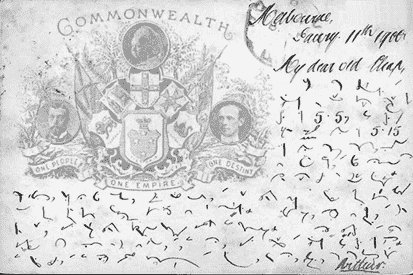

图 15-2：用皮特曼速记法写的明信片，提供者：Dale Speirs

速记的写作技巧被称为*速记法*——不要与隐写术混淆，隐写术将在后面的章节中解释。速记在录音和听写机发明之前被广泛使用。秘书、记者、警察以及许多人都接受过速记训练，并在他们的职业中使用这种技巧。

经过几个世纪，许多速记脚本应运而生。大多数速记系统是为某种特定语言设计（并因此优化）的，因此不同的速记系统在不同国家广泛使用。在英语国家，通常会遇到 Pitman 速记，它在英国最为流行，由艾萨克·皮特曼爵士于 1830 年代开发；或者 Gregg 速记，它在美国最为流行，由约翰·罗伯特·格雷格于 1880 年代开发。^(12) 许多其他速记系统则未能普及。

几乎所有对历史破译感兴趣的人都或多或少会遇到速记文本。计算机时代之前的专业密码破译者也必须处理这种速记，因为他们的客户通常无法区分速记与加密方法——或者根本不在乎。

即使不太了解速记学，通常也不难识别一段速记信息。大多数速记脚本看起来都很相似；以下摘自查尔斯·狄更斯的《*圣诞颂歌*》的一段文字，采用了 Gregg 速记系统（见图 15-3），是一个典型的例子。^(13)

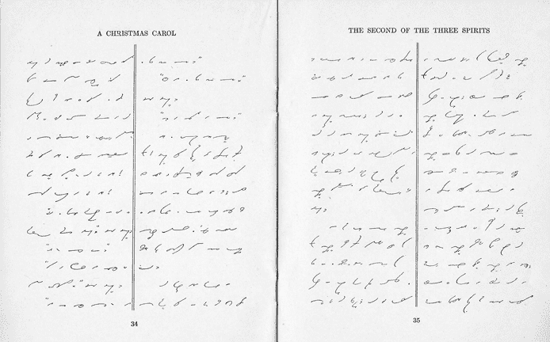

图 15-3：查尔斯·狄更斯 1843 年版《*圣诞颂歌*》中的两页 Gregg 速记文本

几乎所有的速记脚本都是基于简单符号，尤其是简短的线条字符。之所以如此，是因为这些简单符号可以流畅地组合成单词和句子。如果遇到符号更复杂的脚本，它可能就不是速记。

一些字形代表字母，其他的则代表常见的字母组合、单词或短语。以下是一些 Gregg 速记中的常见单词：

一位经验丰富的使用者还可能将多个单词合并写出，而不是分开写。

本节开头展示的明信片采用了 Pitman 速记编码。消息内容如下：

`I was very disappointed and`

`annoyed to find on my arrival at the`

`station at 5.5, that the train which I thought`

`always left at 5.15`

`had left very much earlier`

解码一段速记信息通常不被视为密码破解行为。在大多数情况下，只需识别出使用的速记方法，并请懂得此速记的人解释符号的含义（或使用速记描述自己解码）。现在也有一些网页工具可以接受纯文本并将其转换为 Gregg 或 Pitman 速记。只有在极少数情况下，当处理一种特别陌生的速记时，才需要进行密码分析。在这种情况下，速记信息应被视为一个命名法（nomenclator），因为它可能同时包含字母的密码系统和代表整个单词的符号。

## 隐藏信息（隐写术）

十七世纪的绘画出现在图 15-4 中（由 Gerhard Strasser 提供给我们），展示了一棵苹果树。^(14)^, ^(15)^, ^(16)^ 初看这幅画没有什么可疑之处。然而，通过使用我们添加到原图中的标记（位于图片底边），我们可以将这幅画分成十七列，每列包含一个苹果。最上方的苹果位于`I`列，第二个苹果位于`N`列，第三个苹果位于`D`列，依此类推。如果我们从上到下阅读整幅画，苹果们拼出了以下拉丁语句：`INDE HIC LONGAT IBI SINT TEMPORA PROSPERA FIAT`（`愿你在此长寿并生活幸福`）。

这幅不起眼的画作中隐藏的信息是*隐写术*（steganography）的一例，隐写术是指在图片、文字和其他物体中隐藏信息的做法。它有时被称为密码学的“姐妹”。而密码学是伪装信息，隐写术则是隐匿其存在。这个术语源自希腊语词根*steganos*，意思是“覆盖”或“屋顶”，和*graphein*，意思是“写作”。

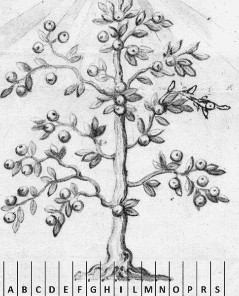

图 15-4：这幅图中的苹果编码了一条信息。

隐写术有着数千年的历史。例如，希腊历史学家希罗多德描述了将信息刺在奴隶头上的隐写术技巧。其他故事包括将信息写在木板上，然后覆盖上一层蜡，或者将信息隐藏在女性珠宝的图案中。还有许多其他隐写术的例子。以下列表列出了一小部分隐写术技巧。如果你想了解更多关于隐写术的内容并且能阅读德语，我们还推荐克劳斯于 2017 年出版的书籍《Versteckte Botschaften》。^(17)

+   古希腊人知道今天所谓的*同情墨水*（sympathetic ink），这是一种无色液体，用来在纸上写下不可见的信息。如果纸张被加热（或以其他方式处理），写的内容便会显现出来。这项技巧已经被无数学生使用，他们通常通过在柠檬汁中写下秘密信息来藏匿消息，但其实还有数百种其他液体也可以作为同情墨水使用。例如，果汁、糖水、尿液和许多其他有机液体都非常适合，因为它们在加热时都会显现出来。更复杂的同情墨水需要用某些化学品处理才能显现。几个世纪以来，同情墨水一直是间谍与其案件主管沟通的最实用方式，在冷战期间，化学家们开发了极为难以被邮件审查员察觉的高科技同情墨水。如果你想了解更多关于同情墨水的内容，可以阅读 Kristie Macrakis 于 2014 年出版的书《Prisoners, Lovers, and Spies》。^(18)

+   隐藏信息的方式有很多。例如，可以通过编写文本使得每行的首字母拼出一条信息（这种技术称为*首字母隐写*）。其他方法包括标记某些字母，或者以某种方式编写文本，比如每隔十个字母就拼出一条秘密信息。这些技术曾被囚犯、士兵和人质用来绕过审查。其他常见的技术包括使用模板从文本中选择特定字母或单词（即所谓的*卡尔丹格里尔*）。一个著名的例子是英国将军亨利·克林顿在 1777 年美国独立战争期间使用的“沙漏密码”（见图 15-5）。^(19)

图 15-5：1777 年，英国将军亨利·克林顿写了一封看似不起眼的信给他的上司威廉·豪。如果在文本上方放置一个沙漏形状的模板，就能看到真正的消息。

+   20 世纪最著名的隐写术使用者之一是一位年轻的美国海军军官，他后来成为了总统：约翰·F·肯尼迪。^(20) 正如我们在第十二章中所讨论的那样，在肯尼迪和他的船员逃脱鱼雷艇*PT-109*号沉没后，^(21) 澳大利亚海岸守望员雷金纳德·埃文斯中尉派遣了五支索罗门群岛人队伍中的一支去寻找他们。在几天的搜寻后，其中一支队伍找到了肯尼迪和他的队员。由于救援者比乌库·加萨和厄罗尼·库马纳不会说英语，加萨用刀具在椰壳上刻下了一条信息，告诉肯尼迪把英文信息刻到椰子上。这样，他们可以将信息带在身上，而不会引起日本人的怀疑。信息内容是：`NAURO ISL COMMANDER . . . NATIVE KNOWS POS’IT . . . HE CAN PILOT . . . 11 ALIVE NEED SMALL BOAT . . . KENNEDY`。这个隐藏的信息最终传达给了埃文斯，他随后协调了一种方法，带领被困的人穿越日本防线，回到盟军基地。后来，约翰·F·肯尼迪将这个椰壳作为桌面压纸器放在椭圆形办公室中（见图 15-6）。

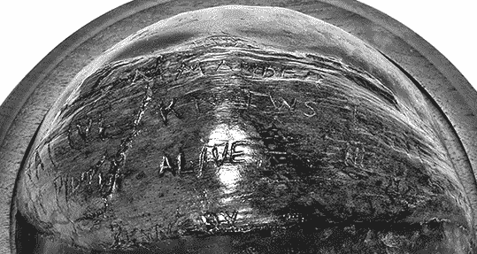

图 15-6：这块椰壳上的信息帮助约翰·F·肯尼迪在二战中获救。在他担任总统期间，他将其作为压纸器使用*。*

+   今天，隐写术可以通过计算机实现。有许多程序可以将信息隐藏在数字图像、视频和其他数据中。

+   最后，这本书中也隐藏了一条隐写信息！如果你需要线索，可以从漫画开始仔细寻找。。。

寻找隐藏的隐写信息被称为*隐写分析*，这类似于密码分析（即破译密码），但在系统化操作上更为困难。就我们所知，关于隐写分析（与隐写术相对）的书籍或全面研究论文至今尚未出版。

### 成功故事：埃隆卡是如何在墓碑上发现隐藏信息的

位于华盛顿特区的阿灵顿国家公墓是美国最著名的公墓。这个国家圣地有超过 40 万个墓碑，其历史可追溯到 19 世纪。作为主要的军事公墓，它安葬了许多著名人物，其中包括著名的密码学家威廉·弗里德曼和伊丽莎白·弗里德曼。伊丽莎白·史密斯·弗里德曼（1892–1980），美国历史上伟大的密码分析师之一，曾为美国海军、海岸警卫队及许多相关机构工作。在 1920 年代禁酒时期，她在海岸警卫队工作时破解了许多走私酒的加密系统。^(22)

伊丽莎白的丈夫威廉（1891–1969），在他们在河岸实验室交往期间，伊丽莎白向他讲解了密码学的知识，他从最初的基因学家转型，成为美国历史上最著名的密码学家。在他长达数十年的美国陆军职业生涯中，他破解了成千上万的密码，领导了许多著名的破译团队，并撰写了几部开创性的密码学著作，甚至创造了“密码分析”和“巧合指数”这两个术语。

弗里德曼夫妇不仅在职业上对密码学感兴趣，他们还喜欢解谜和破解密码。因此，当他们的墓碑在阿灵顿国家公墓上时，隐藏了一个隐写信息（见图 15-7），这一点也不足为奇。墓碑是伊丽莎白在 1969 年丈夫去世后所委托制作的。直到 2017 年，埃隆卡（Elonka）发现这一信息的存在才为人所知。^(23)

2017 年，埃隆卡搬到华盛顿特区后，她的第一次区域探索之一就是参观阿灵顿国家公墓，去看弗里德曼夫妇的墓地，因为埃隆卡非常崇拜他们的工作。她完全预计会在他们的墓碑上发现某种隐藏的信息，但当她看到墓碑时，发现它看起来非常普通。尽管如此，她还是拍了很多照片，并在当天晚上在推特上发布了一条关于她参观的消息。

一位同事、记者杰森·法戈内（Jason Fagone）告诉她，他正在为一本关于伊丽莎白的新书进行研究。他转发了一些他拍摄的伊丽莎白墓碑草图的照片，这些照片是在弗吉尼亚州列克星敦的乔治·C·马歇尔图书馆和博物馆找到的。杰森在马歇尔档案馆花费了大量时间，研究他那本出色的伊丽莎白传记《打破密码的女人》，这本书将在当年晚些时候出版。^(24)

一张照片展示了埃丽莎白于 1969 年手写的便条，便条上画有她为威廉的墓碑设计的铭文草图。草图上包括了威廉的名字和生卒日期，空白处留给埃丽莎白的个人信息，以便她去世后补充。在墓碑底部，是一句话“`KNOWLEDGE IS POWER`”，这句话贯穿了威廉和埃丽莎白一生的主题。埃丽莎白于 1980 年去世时，她的个人生活细节也被加到了墓碑上。

在检查埃丽莎白的草图时，埃隆卡注意到了一种潜在的隐写信息，隐藏在字母使用略有不同字体的方式中。这个信息隐藏在“`KNOWLEDGE IS POWER`”的雕刻中，结果证明它使用了贝肯密码——这是一种弗里德曼夫妇熟知的密码系统。他们以前也使用过这种隐写技术。

*贝肯密码*是由哲学家弗朗西斯·培根在十七世纪初发明的，可以用于在任何文本或图片中隐藏信息（“任何事物都可以代表任何事物”）。^(25)为了将其应用于文本，我们需要两种不同的字体，A 和 B。在以下示例中，我们使用普通字母作为字体 A，粗体斜体字母作为字体 B。通过使用这两种风格，我们可以通过改变粗体斜体字母的位置来对字母表中的所有字母进行编码（培根使用了一个二十四字母的字母表），如在单词*HOUSE*中所示：

`A: HOUSE B: HOUS``E` `C: HOU``S``E D: HOU``SE`

`E: HO``U``SE F: HO``U``S``E` `G: HO``US``E H: HO``USE`

`I: H``O``USE K: H``O``US``E` `L: H``O``U``S``E M: H``O``U``SE`

`N: H``OU``SE O: H``OU``S``E` `P: H``OUS``E Q: H``OUSE`

`R:`  `H``OUSE S:` `H``OUS``E` `T:` `H``OU``S``E U:` `H``OU``SE`

`W:`  `H``O``U``SE X:` `H``O``U``S``E` `Y:` `H``O``US``E Z:` `H``O``USE`

使用这种系统，将单词`WILLY`隐藏在文本`THIS IS AN ORDINARY SHORT TEXT`中，将会呈现如下效果：

`T``H``I``SI S``A``NOR D``I``N``A``R Y``S``H``O``R` `T``T``EX``T`

或者，以保留自然单词边界的方式写成：

`T``H``I``S IS` `A``N ORD``I``N``A``RY` `S``H``O``R``T` `T``EX``T`

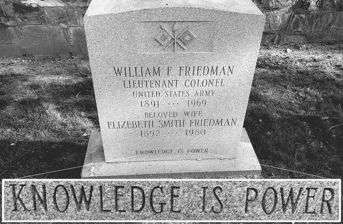

图 15-7：威廉和埃丽莎白·弗里德曼的墓碑上刻着一个隐藏的信息，出现在“`KNOWLEDGE IS POWER`”这句话中*。

贝肯密码是历史上已知的最早的二进制编码之一，比莫尔斯电码早 200 多年，比 ASCII 码早 300 多年。当埃隆卡仔细检查弗里德曼夫妇的墓碑时，她实际上在“`KNOWLEDGE IS POWER`”这句话中发现了一个贝肯密码的信息。构成这句话的一些字母带有衬线（字体 A），而有些则没有（字体 B）。这种差异在`E`字母上最为明显；注意，`KNOWLEDGE`中的`E`与`POWER`中的`E`略有不同。将带有衬线的字母与没有衬线的字母分开，并使用我们常规的普通字母和粗体斜体字母的系统进行转录，得到如下结果：

`K``N``O``WLED``G``E` `I``S P``O``W``E``R`

使用五个一组的贝肯密码，可以轻松破译：

`K``N``O``WL ED``G``E``I` `SP``O``W``E` `R`

这三个组编码了字母`WFF`。这些是威廉·弗雷德里克·弗里德曼的首字母。虽然消息简短，但这非常典型地代表了弗里德曼夫妇的风格。

### 成功故事：破译《Steganographia》

1500 年，德国修道院院长和人文主义者约翰内斯·特里特米乌斯（1462–1516）完成了他的九十多部作品中最为卓越的一部——三卷本《Steganographia》。前两卷描述了超过五十种我们怀疑永远不会成功的通信方法。这些方法要求发送者施放某种魔法咒语，使得一个鬼魂显现出来。然后，这个鬼魂通过其他若干个支持鬼魂的帮助传递信息。接收者需要施放另一种魔法咒语才能接收信息。对于这一过程的每一种变体，特里特米乌斯都提供了详细的参数列表，比如支持鬼魂的数量和名称。

*Steganographia* 一书迅速声名鹊起，因为很快人们就知道，书中描述的魔法通信技巧不过是骗局。其真正目的在于将信息编码在参数中：Trithemius 将信息伪装成魔法过程的描述，这是一种隐写术。实际上，*Steganographia* 这个书名也赋予了隐写术这个科学名称。数百年来，“隐写术”这个词与“密码学”同义使用，直到大卫·卡恩在 1967 年出版的《破译者》一书中普及了本章开头所给出的定义。^(26)

在这里，我们介绍一个*Steganographia* 的通信方法，参考了 Jürgen Hermes 在 2012 年博士论文中提供的描述。^(27) 该方法列出了以下支持“鬼魂”：

Maseriel. B**u**l**a**n. Lamodyn. **C**h**a**r**n**o**t**y. Carmephin*.* **I**a**b**r**u**n. Care. **S**a**t**h**r**o**y**n. Asulroy*.* **B**e**u**e**s**y. Cadumyn*.* **T**u**r**i**e**l. Busan. **S**e**u**e**a**r. Almos. **L**y. Cadusel. **E**r**n**o**t**y. Panier. **I**e**t**h**a**r. Care. **P**h**e**o**r**y. Bulan. **T**h**o**r**t**y. Paron. **V**e**m**o. Fabelrenthusy.

如果只读取每个单词的第二个字母（我们已加粗为便于辨认），则会得到以下的拉丁短语（请注意，我们区分了`U`和`V`，以及`I`和`Y`，它们在历史上曾互换使用）：

`VACANTIBUS TRIBUS TRES VALENT ITA PER TOTUM`

这句话翻译为`AFTER THREE EMPTY ONES, THREE ARE VALID, THUS THROUGHOUT`，它是解密*《隐写术》*同一章节中另一段文本的指令。根据这些指示，读取消息时需要跳过前三个词，取下三个词的首字母，再跳过接下来的三个，以此类推。我们得出了以下结果（有效的首字母已加粗以供澄清）：

全能永恒的上帝**b**onorum **r**emunerator **æ**quissime，您愿意让您的儿子**n**ostri **g**eneris **e**sse 参与其中，以便**r**edimeret，**d**iabolica **i**nuidia 我们最悲惨的：您通过**s**ola **b**enignitate **r**edundans，接受了我们没有腐败的形式，来自**f**lore virginalis uteri，天使**s**ancto **G**abriele **i**nsinuante，告诉你，圣母永远保持贞洁，**i**mmaculata **c**larior **h**ominib。天使和灵魂更加卓越。**G**enuit **r**egem **o**mnipotentem，神和人，**s**antissima **e**t **r**euerendissima 圣母玛利亚，永远不知男人的伴侣，毫无痛苦地生育，**s**ine **t**ristitia **v**agientem 神和人一起迎接，**s**emper ...

加粗的字母拼出以下德语消息：

`BRÆNGER DIS BRIEFS GIBT SICH GROSER CONST US`

这意味着：`THE CARRIER OF THIS LETTER CONSIDERS HIMSELF VERY SKILLED`。与*《隐写术》*中的所有消息一样，这条消息的内容并不如其隐写式的传递方式那么重要，Trithemius 通过实例来展示这一点。

尽管前两本*《隐写术》*的真实目的很快就为人们所知，但*《第三本书》*（或称第三本）的功能仍然是一个谜。从表面上看，它也描述了魔法通信的方法，但这些方法与前两本书中的方法看起来截然不同。在这里，传递信息时据称需要借助行星天使，所需的主要参数是三位数字，这些数字据说是用来计算行星及其主宰者的运动的。提供了这些数字的长列表（见图 15-8）。

几个世纪以来，备受尊敬的学者们尝试弄清楚*《隐写术》*的第三本书到底讲了什么。它是否也在编码信息，还是意味着代表真实的魔法？在 1990 年代，距离*《隐写术》*问世近 500 年之后，曾为 AT&T 工作的数学家吉姆·里德（Jim Reeds）仔细研究了第三本书。当他分析图 15-8 中展示的表格时，他注意到，在第一列中，列出的所有数字都在`626`和`650`之间。第二列中的前十个数字（那些出现在该列唯一书面单词上方的数字）也是如此。这样就得出了以下一个包含`626`到`650`之间的四十个数字的区块：

`644, 650, 629, 650, 645, 635, 646, 636, 632, 646, 639 634, 641, 642, 649, 642, 648, 638, 634, 647, 632, 630, 642, 633, 648, 650, 655, 626, 650, 644, 638, 633, 635, 642, 632, 640, 637, 643, 638, 634`

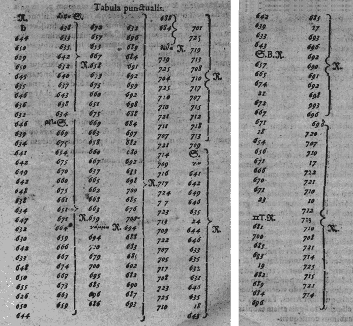

图 15-8：这些来自 1500 年作品*Steganographia*中的数字被认为是占星术参数。实际上，它们编码了一个信息。

这一块后面是一些大于`650`的数字。Reeds 怀疑这四十个数字代表一个加密的信息。频率分析表明，数字`650`不仅是最高的，也是出现最频繁的。这个数字是否代表了在拉丁语中频率最高的字母`A`？如果是这样，以下的替代规则可能是正确的：`650` = `A`，`649` = `B`，`648` = `C`，`647` = `D`，`646` = `E`，等等。一项简短的测试表明，这种替代方案产生了拉丁语单词片段。经过一些实验，Reeds 得出了以下表格：

`650` = `A`, `649` = `B`, `648` = `C`, `647` = `D`, `646` = `E`, `645` = `F`, `644` = `G`, `643` = `H`, `642` = `I`, `641` = `L`, `640` = `M`, `639` = `N`, `638` = `O`, `637` = `P`, `636` = `Q`, `635` = `R`, `634` = `S`, `633` = `T`, `632` = `U`, `631` = `X`, `630` = `Y`, `629` = `Z`, `628` = `TZ`, `627` = `SCH`, `626` = `TH`

这里使用的字母表缺少了`J`（在拉丁语中与`I`相同）、`K`（在拉丁语中很少使用）、`V`（在拉丁语中与`U`相同）和`W`（拉丁语中没有这个字母）。所有这些似乎都表明 Reeds 走在正确的轨道上，前述的四十个字母块解密结果如下：

`GAZA FREQUENS LIBICOS DUXIT CARTHAGO TRIUMPHOS`

这句拉丁语短语的意思是“**迦太基**经常从被打败的**利比亚人**那里获得丰富的战利品”，这最终揭示了*Steganographia*第三卷的真正含义——距离它创作已过 500 年。Reeds 用类似的方法轻松解密了剩下的六张表格。他制作的替代表格看起来与上面的非常相似，唯一的不同是三位数的数字上需要加或减去二十五、五十或七十五。换句话说：相关部分是除以二十五后的余数。以下是 Reeds 发现的明文：

`GAZA FREQUENS LIBICOS DUXIT CARTHAGO TRIUMPHOS` [重复四次]

`LIBER GETRUWER HINTUMB DIE ZWELFE WART UNSER`

`HEIMLICHE EFUR DER PORTEN AMEN`

`NIT LAIS DUHER ZU MIR NOIT GCH ANDEL US ZUDAS ICH LDEN BRENGE AIL WEIS SOCH BEHALT`

`COMMEST NOCH HINTWAN IS DUET HABE EIN GROSEN RICHTEN MIT DIR DIR HAB MIT DIR UND SEHD DIS ALLES GEBEN ZUALS DUNUST UQREBI DIR SERE HAHW`

`BRENGER DIS BRIEFFS IST EIN BOSER SCHALG UND EIN DIEB HUET DICH FUR EME ER WIRT DICH AN`

`MISERERE MEI DEUS SECUNDU MAGNUM DONUM TUUM AMEN ATH`

`GAZA FREQUENS LIBICOS DUXIT CARTHAGO TRIUMPHOS WTZSCH`

`GAZA FREQUENS LIBICOS DU RTHAGO XIT CA TRIUMPHOS SCH`

再次，这些信息的内容并不特别重要。特里特米乌斯可能选择了短语`GAZA FREQUENS LIBICOS DUXIT CARTHAGO TRIUMPHOS`，因为它仅用几个单词就涵盖了拉丁语的所有字母——这使得使用频率分析破解信息变得更加困难。这个句子可以看作是拉丁语版的“快速的棕色狐狸跳过懒狗”，通常用来测试字体、打印机和键盘。

以`BRENGER DIS BRIEFFS`开头的信息是德语，意思是“这封信的携带者是一个坏的恶棍和小偷；小心，他会背叛你。” 以`MISERERE MEI`开头的文本来自《圣经》（诗篇 51）。

1998 年，吉姆·瑞兹（Jim Reeds）在科学期刊《Cryptologia》上发表了他的研究成果。^(28) 然而，在他撰写文章时，偶然发现了 1996 年发表在《Daphnis》文学期刊上的一篇惊人研究论文，作者是我们的同事，德国学者托马斯·埃尔斯特（Thomas Ernst）。^(29) 当瑞兹翻阅这本 200 页的书时，他几乎不敢相信自己的眼睛：显然，埃尔斯特在两年前也解决了《隐写术》第三卷的谜题！

这意味着，距离《隐写术》问世 500 年后，两位研究人员——一位数学家和一位德国学者——几乎在同一时间且独立地解开了第三卷的谜团。这听起来像丹·布朗的小说，但这是真的。

埃尔斯特利用与瑞兹（Reeds）几年后使用的相同初始表格，破解了特里特米乌斯（Trithemius）的隐写密码（见图 15-8）。该表格由希腊字母符号分隔，其中一些字母拼出了希腊字母，例如阿尔法（αλϕα）、贝塔（βητα）、伽马（γαμμα）和德尔塔（δελτα），以及数字。转录过程非常困难，可能存在一些小错误。埃尔斯特假设这些希腊符号是分隔符。以下是《隐写术》1608 年版的简化转录：

| ♄ | αλϕα |  |  |  |  |  |  |
| --- | --- | --- | --- | --- | --- | --- | --- |
| `644` | `638` | `672` | `632` | `688` | `701` | `642` | `685` |
| `650` | `633` | `657` | `696` | `684` | `725` | `639` | `17` |
| `629` | `635` | `655` | `689` | δελτα | `719` | `633` | `693` |
| `650` | `642` | `667` | `684` | `719` | `713` | `643` | `696` |
| `645` | `632` | `658` | `691` | `725` | `708` |  | `692` |
| `635` | `640` | `673` | `692` | `704` | `710` | `657` | `690` |
| `646` | `637` | `675` | `699` | `725` | `717` | `665` | `691` |
| `636` | `643` | `660` | `692` | `720` | `707` | `674` | `692` |
| `632` | `638` | `651` | `698` | `710` | `715` | `21` | `698` |
| `646` | `634` | `675` | `688` | `721` | `712` | `672` | `693` |
| `639` | βητα | `669` | `684` | `711` | `718` | `667` | `696` |
| `634` | `669` | `663` | `697` | `707` | `713` | `671` | `♋` δ |
| `641` | `675` | `658` | `682` | `721` | `709` | `18` | `720` |
| `642` | `654` | `660` | `680` | `714` | `♈` α | `654` | `707` |
| `649` | `675` | `667` | `692` | `709` | `641` | `656` | `710` |
| `642` | `670` | `657` | `683` | `716` | `642` | `671` | `17` |
| `648` | `660` | `665` | `698` | `717` | `649` | `666` | `722` |
| `638` | `671` | `662` | `700` | `724` | `646` | `670` | `721` |
| `634` | `661` | `668` | `685` | `717` | `635` | `671` | `710` |
| `647` | `657` | `663` | `676` | `723` | `24` | `23` | `10` |
| `632` | `671` | `659` | `700` | `713` | `644` | `♊` T | `712` |
| `630` | `664` | γαμμα | `694` | `709` | `646` | `681` | `713` |
| `642` | `659` | `694` | `688` | `722` | `633` | `700` | `710` |
| `633` | `666` | `700` | `683` | `707` | `635` | `685` | `708` |
| `648` | `667` | `679` | `685` | `705` | `632` | `683` | `721` |
| `650` | `674` | `700` | `692` | `717` | `631` | `19` | `714` |
| `635` | `667` | `695` | `682` | `708` | `646` | `682` | `725` |
| `626` | `673` | `685` | `690` | `723` | `635` | `689` | `715` |
| `650` | `663` | `696` | `687` | `725` | `18` | `684` | `721` |
| `644` | `659` | `686` | `693` | `710` | `643` | `696` | `714` |

四个组分别以“alpha (α)”，“beta (β)”，“gamma (γ)”和“delta (δ)”为标题，每个组包含四十个数字，因此恩斯特假设这四列代表相同的文本。每个组的第一个数字与其他组的第一个数字之间相差恰好二十五（它们是`644`，`669`，`694`，和`719`）。每组的第二个、第三个、第四个和所有后续数字也有相同的差异。因为每个组中的每个数字都与其他组中的数字相差二十五，所以这四个组是相同的。

数字`650`，它在字母组的前四个字母中出现了两次，带来了突破。恩斯特猜测`650`代表拉丁字母表中的第一个或最后一个字母，并且特里特海米乌斯使用了这样的替换表：`A` = `650`，`B` = `651`，`C` = `652`，等等，或者`Z` = `650`，`Y` = `651`，`X` = `652`，等等。当他检查第一个假设时，没有得到有意义的结果，但第二个假设似乎有效。他解出的第一个词是`GAZA`，然后他迅速解出了其余文本。

找到解决方案后，恩斯特开始撰写关于他的解密的详细研究论文（用德语），计划在 1996 年发表。他的研究非常全面，最终引导他发现了另一个相关的未解密码：海德尔的密码。

1676 年，沃尔夫冈·恩斯特·海德尔也声称破解了特里特米乌斯的第三卷，但他只发布了自己解决方案的加密版本，使用了多字母密码。海德尔的密文在密码学圈内已为人所知，但接下来的三百年里，没有人能够破解它。因此，恩斯特再次创造了第一个纪录，成功破译了海德尔的密码，并证明特里特米乌斯的第三卷的解法早在十七世纪就已经找到了。汤姆关于自己解决方案的原始论文不断扩展，加入了有关海德尔密码的资料和更多的历史背景。最终，这篇论文的篇幅达到了 200 页，堪比一本书。三年后，汤姆的工作在《达夫尼斯》杂志上发表。

两年后，里兹在撰写自己的《密码学》文章时，偶然发现了汤姆的出版物。在里兹通知《密码学》编辑汤姆的工作后，他们要求恩斯特提供简化版的论文^（30）。因此，在 1998 年 10 月的《密码学》期刊中，发表了两篇关于破译*《隐写学》*第三卷的文章——由两位互不知情的作者撰写。

毫无疑问，*《隐写学》*第三卷的双重破译是密码破解历史上的一个亮点。要了解更多关于这个迷人故事的信息，请参阅 1998 年《纽约时报》文章《谜题解开，二次破解》^（31）。二十年后，这个故事再次通过一些德语出版物引起公众关注，包括托马斯·恩斯特的家乡发表的几篇文章，其中包括尤尔根·赫尔梅斯的综合博客文章^（32）和克劳斯所写的两篇论文^（33），^（34）。

### 成功案例：神秘陌生人信息

图 15-9 中的那些风格化生物图像，是魔术师大卫·布莱恩 2002 年书籍《神秘陌生人》中的许多此类插图之一。图像中隐藏着一条信息，当这些图像组合在一起时，指向了一个隐藏的 10 万美元宝藏的位置（该宝藏已被找到）。这些谜题由获奖游戏开发者克里夫·约翰逊创作。

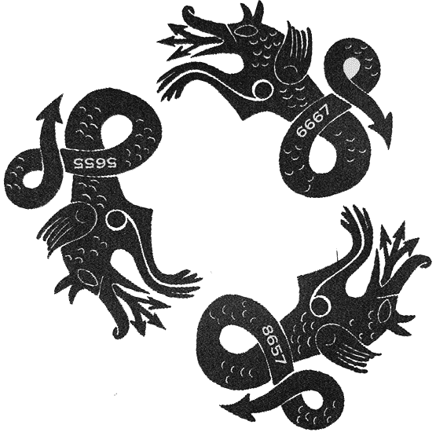

图 15-9：2002 年书籍《神秘陌生人》中的一部分隐写谜题

这张图像是书中几张图像之一，它们解密后得出两句话。一句话通过计算每条蛇身上的鳞片数量来编码，另一句话则通过它们尾巴上的数字编码。密码的密钥是以一个 5×5 的查找表形式呈现的。尾巴或鳞片上的数字成对使用，表示查找表中某个字母的行和列。这个宝藏在 2004 年被找到，距离书籍出版已有十六个月。在 Cliff Johnson 的网站上，Jeff Briden 对这些谜题有详细的解释。^(35)

### 挑战：弗里德曼夫妇的另一个隐写信息

埃尔文·贝肯密码不仅出现在威廉·弗里德曼和伊丽莎白·弗里德曼的墓碑上，也出现在他们所写的一本书中。他们 1957 年的著作《*莎士比亚密码的研究*》评估了若干理论，这些理论声称弗朗西斯·贝肯（1561-1626）才是通常归于威廉·莎士比亚（1564-1616）的作品的真正作者，并且贝肯在这些作品中加入了隐藏的信息，以确认他的作者身份。^(36) 这个故事对弗里德曼夫妇有着个人的意义，因为正是通过这项研究，他们相遇了。在 20 世纪初，伊丽莎白（原姓史密斯）受 eccentric 百万富翁乔治·法比安的雇佣，寻找莎士比亚作品中的隐藏信息。在芝加哥附近的河岸实验室的法比安智库工作时，她遇到了实验室另一部分的年轻遗传学家威廉·弗里德曼。作为一名摄影师，他帮助她进行研究。她教他有关密码学的知识，他们相爱了，后来的事情就成了历史。在他们 1957 年的书中，弗里德曼夫妇花时间详细审视了莎士比亚与贝肯的争议，并明确证明了所有贝肯密码理论都是无稽之谈。

在他们典型的自嘲风格中，在关于为何莎士比亚作品中没有贝肯信息的书中，弗里德曼夫妇用贝肯密码隐藏了一个信息！在这本书的第 257 页，可以读到以下几行：

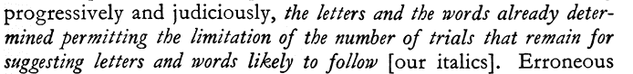

你能找到隐藏的信息吗？如果不清楚，可以访问我们的网站 [`codebreaking-guide.com/challenges/`](https://codebreaking-guide.com/challenges/) 查看该图像的更大版本并获得提示。

## 密码机

加密在第一次世界大战中发挥了重要作用，尤其是在保护无线电消息方面。几乎所有使用的系统都是手动的，或基于简单工具，如密码盘和密码滑片。不幸的是，这些方法大多数很快就被敌方破解了。它们还存在另一个缺点，那就是使用起来非常复杂，特别是在战时条件下。必须在掩体中加密或解密文本的士兵，面临恶劣天气，周围是枪声和爆炸声，已经身心疲惫。不可避免地，许多错误发生。通常，接收者甚至无法解密一条加密的信息，因为加密过程中出现了错误。

基于这些经验，许多新的加密技术在第一次世界大战后的几年里得到了发展。因为显然手动加密不适合高安全性和高容量的无线电通信，更不用说在战时条件下了，于是设计了新的加密机器，旨在比手动密码更安全且更易于使用（参见图 15-10）。加密机的概念并不一定是新的，因为一些设计早已存在了几十年。然而，在第一次世界大战中的密码学失败后，压力大到足以最终将这些想法付诸实践。

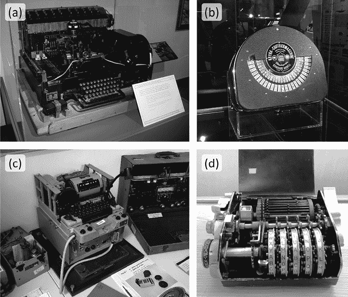

图 15-10：机械和电子加密机的*使用高峰期大约在 1920 到 1970 年之间。图片展示了西门子 & 哈尔斯克 T52* *(a)，Kryha 标准机* (b)，KL-7 (c) 和哈吉林 C-35 (d)。有关这些机器和其他机器的更多信息，请访问[`cryptomuseum.com`](https://cryptomuseum.com)。

最常见的加密设备是所谓的转子密码机。这种设备包括一个类似打字机的键盘、一个输出单元（一些设计使用一组灯，每盏灯表示字母表中的一个字母）、一个电流源和一组转子。图 15-11 中的示意图展示了一个简化的三转子设计，字母表包含六个字母。当然，真实的机器使用的是二十六个或更多字母的字母表。

为了加密一个字母，操作员按下一个键。这完成了一个电气连接，导致一个代表密文字母的灯亮起。在每输入一个字母后，最右侧的转子会转动一个单位。当该转子转动一圈后，下一个转子也会转动一个单位，等这个转子转动完后，最后一个转子也会转动一个单位，就像里程计一样。解密过程与这些机器的加密过程相似：它们需要切换到不同的模式，导致电流通过转子的方向相反。操作员通过按键输入密文字母，然后灯会显示明文字母。

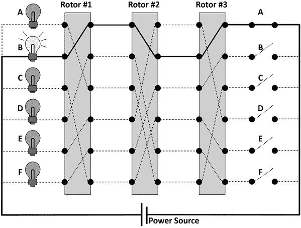

图 15-11：转子加密机使用多个电线连接的转子。按下一个键（明文）完成电气连接，并使字母灯（密文）亮起。

最著名的转子机（也是最著名的加密机器）就是恩尼格玛（见图 15-12），它是在 1920 年代开发的。德国人在二战中使用了约 30,000 台恩尼格玛。

图 15-12：恩尼格玛是德国在二战中使用的最著名的加密机器。

在最常见的配置中，恩尼格玛有三个转子，一个插头板增加了额外的复杂性，还有一个额外的部分叫做*反射器*（见图 15-13）。从 1942 年起，德国潜艇使用了四转子版本的恩尼格玛，也带有反射器。集中营和警察也使用了恩尼格玛。

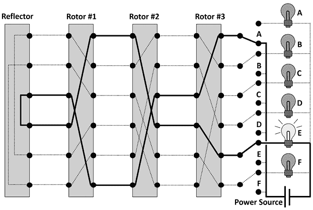

图 15-13：恩尼格玛是一台转子机器。与大多数此类设计不同，它包含了一个额外的部分，称为反射器。

反射器使得电流在转子中运行两次：第一次向前到反射器，然后再返回到转子。由于这种反射，加密和解密的过程完全相同；不需要解密模式。这使得恩尼格玛的操作更加简便，但也成为一个设计上的弱点，帮助盟军破解了恩尼格玛的加密系统。

早在 1930 年代，来自波兹南大学的三位年轻波兰数学家——马里安·雷耶夫斯基及其同事亨里克·齐加尔斯基和耶日·罗日茨基，就发现了恩尼格玛加密算法中的一些弱点，使得他们能够定期破解信息。

他们发明了一种设备，称为“bomba kryptologiczna”（密码学炸弹），这帮助他们的工作。根据他们在布莱切利公园的同事戈登·韦尔奇曼的说法，罗日茨基根据当时流行的一种冰淇淋为这台机器命名为“bomba”，他们在吃这种甜点时，雷耶夫斯基想出了这台机器的构思。^(37)^, ^(38) 其他报告称，这个名字是自发选择的，或者可能是因为机器发出的声音。^(39)

在波兰被德国侵占后，雷耶夫斯基（Rejewski）和他的团队逃脱，并提供了他们的破译方法以及一份波兰版恩尼格码，以帮助盟军在伦敦郊外的布莱奇利公园工作。在那里，成千上万的工作人员在类似工厂的设施中破译恩尼格码信息。英国密码破译者，其中包括著名数学家艾伦·图灵（Alan Turing），开发了自己的机器以协助破译工作。该设计部分基于波兰密码分析师的工作，特别是他们对恩尼格码转子接线方式的推断，但其他方面则有很大不同。英国人将自己的机器称为 Bombe，英国制表机公司为战争努力制造了数百台 Bombe。

全球其他分析师也在攻击恩尼格码密码。英国密码破译者迪尔温·“迪利”·诺克斯在 1930 年代也破译了恩尼格码信息。此外，在英国的启发下，美国人开始了自己的恩尼格码破译工作，研发了一款改进版的 Bombe，专门针对德国潜艇使用的四转子版本恩尼格码。这一计划由约瑟夫·德什（Joseph Desch）在俄亥俄州代顿市领导。今天，约瑟夫的女儿德布（Desch）·安德森（Deb Anderson）是与代顿破译者相关的优秀资源。

无论上述情况如何，伊丽莎白·弗里德曼（Elizebeth Friedman）有自己的一套用铅笔和纸破译恩尼格码信息的方法，因为她在南美系统地攻击纳粹密码。

今天，在波兹南和布莱奇利公园都有博物馆以迷人的方式讲述一些恩尼格码密码分析的故事。此外，还有大量关于此主题的文献；我们特别推荐大卫·卡恩（David Kahn）的*Seizing the Enigma*（1991）^(40)和汤姆·佩雷拉（Tom Perera）与丹·佩雷拉（Dan Perera）的*Inside Enigma*（2019），它们可以在 EnigmaMuseum.com 网站上找到。^(41) 德莫特·图灵（Dermot Turing，艾伦·图灵的侄子）的*Demystifying the Bombe*（2014）可能对密码破译者有趣，因为它以易于理解的方式解释了 Bombe。^(42) 然后是电影《恩尼格码》（2001），凯特·温丝莱特主演；以及《模仿游戏》（2014），本尼迪克特·康伯巴奇主演。我们还推荐纪录片《代顿破译者》（2005）。

除了转子机器外，还有许多其他类型的电气或机械加密机器是在二战和冷战初期的“黄金时代”中发明的。例如，在二战期间，日本外交官使用了一种加密设备，美国的敌对方将其命名为 PURPLE。^(43)^, ^(44)^ 该设备的完整日文名称是“97 式欧文打字机”（九七式欧文印字機，或 97-shiki ōbun injiki）。这个加密系统被美国陆军信号情报局的一个团队破译，团队由弗兰克·罗维特（Frank Rowlett）领导。他们通过寻找日本人频繁使用的有用短语来破解，比如“我荣幸地向阁下报告”，这些短语通常作为开头，提供了破译的线索。

有两个关于术语的小备注：

+   关于 PURPLE 名称的来源存在争议。根据斯蒂芬·布迪安斯基在 2000 年出版的书籍《智慧的较量》中的说法，^(45)^ 美国破译员为早期的两个日本海军加密系统命名为“Red”和“Blue”，因为它们的拷贝本封面是红色和蓝色的。他们还将其他日本加密系统命名为其他颜色，如 JADE 和 CORAL，尽管并不清楚这些名字是否也与容器的颜色有关。

+   有两个完全不同的日本加密系统都被代号为“Red”。其中一个，前文提到的，是一个真正的代码，使用了密码本；另一个则是一个无关的加密系统，其消息是通过机器进行加密和解密的。为了区分这两者，密码本版本通常会正常拼写，如“Red”或“Red Book”，而所有的机器加密系统一般会全部大写，称为 RED、PURPLE 等。但更令人困惑的是，这些加密系统有时（错误地）被称为代码，比如“Purple Code”系统，实际上它是一个加密系统。此外，有时是代码系统，而非加密版本，才会被大写！关于代码与加密术语混淆的更多信息，请参见第七章。

另一种重要的二战时期德国加密机是洛伦茨 SZ40/42，也被英国人称为“Tunny”，意为“金枪鱼”。它于 1940 年推出，作为一种可以直接连接到大型电传打印机的加密附件，因此不像恩尼格玛那样便于携带。它仅在最高军事层级使用，比如希特勒与将军们的直接通信。洛伦茨机有十二个凹槽轮和超过五百个插销，它能对电传的输出文本进行加密，并对输入文本进行解密。

该设备可以通过五位孔纸带的巴多特码或手动输入接收数据。然后，它会迅速将明文翻译成加密版本的巴多特码，并通过无线电或电话线发送给接收方。在接收端，另一个内联的洛伦茨附件会解密消息，并将其发送到接收机的电传打字机，以便打印出明文消息。所有这些比恩尼格玛所需的逐字逐字的繁琐过程要快得多。^(46)

关于洛伦茨的任何提及在二战后几十年内都被保密。直到 1995 年，唐纳德·戴维斯在*Cryptologia*期刊上发表了一篇论文，相关信息才开始浮出水面。^(47) 继这一出版物之后，美国和英国政府逐渐开始解密与其相关的各种文件，持续了好几年。^(48) 现在，随着关于洛伦茨系统的更完整的资料浮出水面，我们知道它是布莱奇利公园破解的另一种加密方法——这次是 1942 年，由包括约翰·蒂尔特曼和威廉·T·“比尔”·塔特在内的团队完成的。这是一项令人印象深刻的成就，考虑到他们甚至从未见过这台机器。^(49) 另一支由托马斯·H·弗劳尔斯领导的五十人团队，设计了一种与博贝机不同的解密机器，协助解密塔尼消息的工作。它被称为科洛索斯，是一台巨大的、房间大小的设备，可以根据需要进行重新配置。伯明翰的一家邮政工厂被征用来制造所需的零件，随着战争的进行，先后建造了十台不同的科洛索斯。

在塔尼系统被破解后，从中获得的战略情报提供了大量信息，既关于德军的动向，也关于德国领导层对盟军计划的理解（或误解）。根据科洛索斯工程师托马斯·弗劳尔斯的说法，1944 年 6 月 5 日，一条解密信息被提供给美国将军德怀特·D·艾森豪威尔，显示出尽管德国人知道诺曼底有计划进行入侵，但他们并不认为这是真实的。他们认为，这只是为了引诱德军远离港口的佯攻。^(50) 因此，这条情报成为盟军决定在诺曼底登陆当天（6 月 6 日）发起全面“霸王行动”入侵法国的关键因素，从而改变了欧洲战场上战争的局势。^(51) 历史学家回顾这一时期时估计，来自布莱奇利的情报，包括塔尼的解密信息，使得欧洲战争的时间缩短了几个月。1954 年，艾森豪威尔将其描述为无价之宝，并表示它拯救了成千上万的英美士兵的生命。^(52)

虽然早期的密码机设计，包括德国的恩尼格玛和日本的 PURPLE，曾被破解，但更先进的密码机，尤其是冷战时期的那些密码机，至今仍被认为是安全的。随着 1970 年左右廉价电子产品和计算机的出现，电气和机械加密机器在接下来的几十年中逐渐被淘汰，尽管它们在一些欠发达国家仍然有所使用。^(53) 今天，尽管这项技术有着迷人的历史，但它在现代通信安全中已不再发挥作用。

利用现代手段（即计算机支持）破解老式加密机器的密码是一个活跃的研究领域。在第十六章中，我们将讨论如何通过爬山算法破解恩尼格玛。如果你想了解更多，可以阅读克雷格·鲍尔（Craig Bauer）2013 年出版的《*秘密历史*》一书（或 2021 年出版的第二版），该书详细介绍了密码机器的数学背景，并介绍了破解其加密的方法。^(54)
