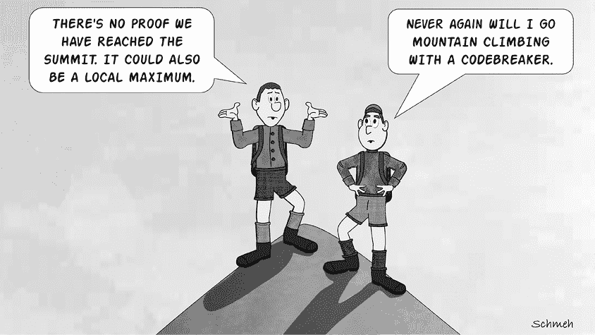
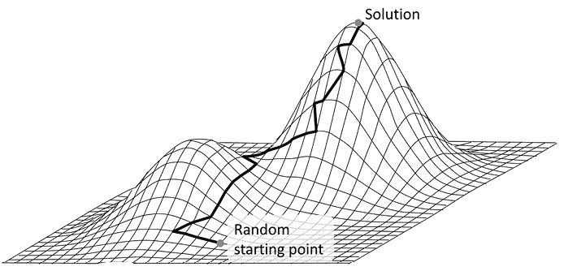
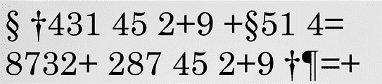
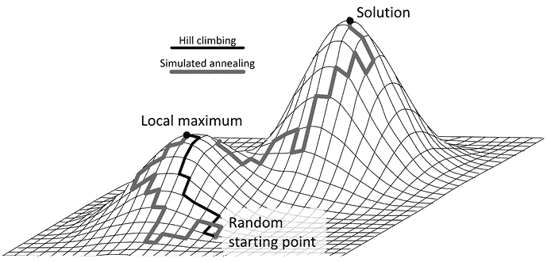
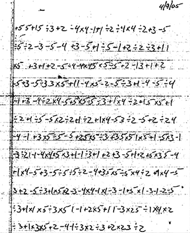
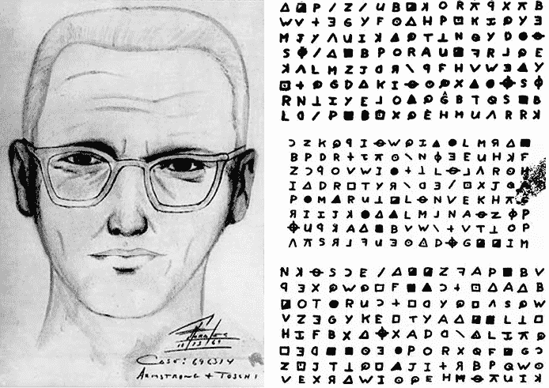
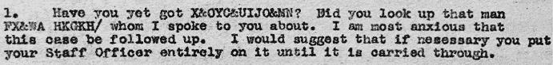
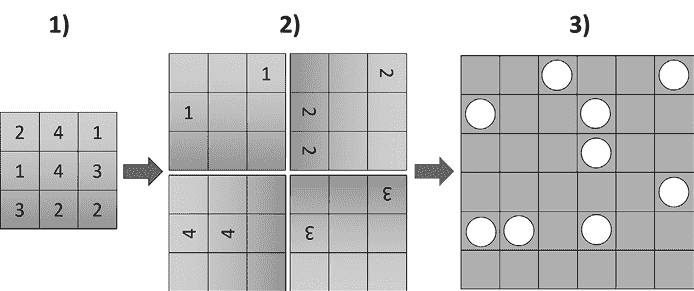
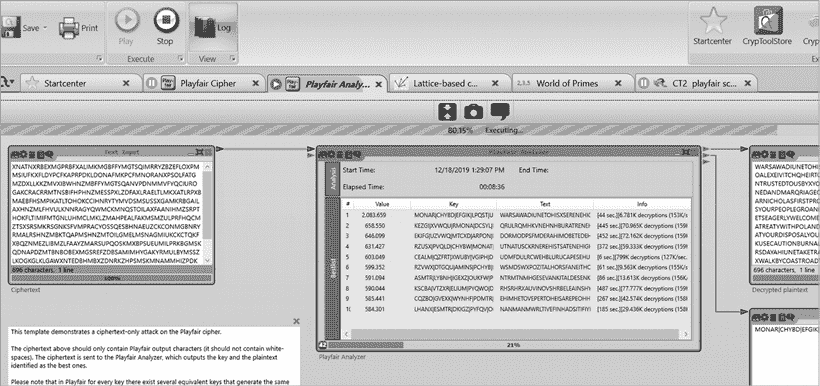
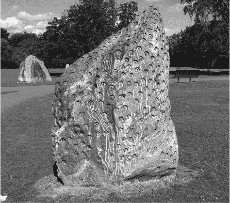

# 第十六章：使用山丘攀登法破解密码

本书中介绍的许多加密方法可以通过一种名为*山丘攀登法*的策略来破解。计算机科学家们开发了这种技术来解决某些类型的优化问题，其中大多数与密码学无关。例如，它非常适合用来寻找包括特定城市的最短路线或确定生产设施的最有效配置。该方法被命名为“山丘攀登”是因为它旨在迭代地改进给定配置，直到达到“山顶”，并且无法进一步改进，正如图 16-1 所示。

图 16-1：一个山丘攀登算法采取一个随机密钥，并检查使用该密钥获得的明文是否像真实语言。通过对密钥进行微小的调整，算法尝试改进结果，直到找不到更好的结果为止。最后的候选密钥通常就是正确的。

山丘攀登法特别适用于那些加密分析师无法检查所有潜在解决方案的问题。它要求问题是“平滑的”，这意味着输入的微小变化可能只会导致输出的微小变化。大多数用于破解经典密码的任务都符合这两个要求。对于这些解码方法，潜在的解决方案数量（即密钥数量）非常庞大。例如，使用二十六个字母创建一个简单的替代表有 403,291,461,126,605,635,584,000,000（大约 400 万亿亿，或 4 × 10²⁶）种方法——即使是最强大的计算机也无法检查每一个。此外，许多经典加密方法中的密钥的小变化只会导致密文的微小变化。例如，如果我们交换一个简单替代表中的两个密文符号，解密结果的变化仅仅是微小的。

山丘攀登法只有在作为计算机程序实现时才可行。破译者成功地使用这种方法破解了广泛的加密算法，包括像“恩尼格玛”使用的那种复杂的机器密码。今天，相当多的计算机程序（例如，CrypTool 2）支持用于破解密码的山丘攀登算法。然而，破解者仍然必须根据他们所攻击的系统来定制山丘攀登法。因此，提供了多种山丘攀登实现方式。

需要注意的是，虽然山丘攀登法是破解具有历史意义的密码的强大工具，但它完全不适合攻击现代加密算法，如 AES 或 DES。这是因为现代加密算法并不平滑，其密钥或明文的微小变化应该会导致密文发生重大变化。

## 使用山丘攀登法破解简单替代密码

在本节中，我们通过将爬山算法应用于一个简单的替换密文来解释这一技术。正如你将在本章后面看到的，我们可以将相同的技术应用于其他类型的密码。看看下面的这个密码挑战，它发布在萨宾·巴林-古尔德（Sabine Baring-Gould）1896 年出版的《古代奇趣》中：^(1)^， ^(2)

让我们首先将这个密码谜题转换成更易于计算机程序处理的版本。我们将第一个出现的符号替换为`A`，第二个符号替换为`B`，第三个替换为`C`，依此类推，同时保持单词之间的间隔：

`A BCDE CF GHI HAFE CJ KLDGH GKL CF GHI BMJH`

#### 第 1 步

我们首先创建一个随机替换表：

`明文:` `ABCDEFGHIJKLMNOPQRSTUVWXYZ`

`密文: SNOIJRGYZLMBPDQWUVHFCTAXEK`

#### 第 2 步

然后，我们使用替换表解密这个密码谜题，得到如下的明文候选文本：

`S NOIJ OR GYZ YSRJ OL MBIGY GMB OR GYZ NPLY`

#### 第 3 步

现在，我们使用所谓的*适应度函数*来评估明文候选文本的正确性。使用适应度函数是爬山攻击中最复杂和关键的部分。有很多方法可以检查某段文本是否更接近真实语言（即它是否像真实语言）。在我们的例子中，我们采用了基于字母频率的简单方法。高级破译者会轻松找到更好的方法。

对于每个字母，我们确定它在明文候选文本中的频率，并将其与相同长度的平均英文文本中的频率距离进行比较。在我们的例子中，密文包含三十三个字符。基于英语语言中，字母 *A* 的频率为 8%，*B* 为 1%，*C* 为 3%，我们将这些字母在明文候选文本中的预期频率设定为三、零和一。其余字母的预期频率则以类似方式得出。

接下来，我们将明文候选文本中的字母频率与预期频率进行比较，并确定距离：

| **字母** | **明文候选文本中的频率** | **预期频率** | **距离** |
| --- | --- | --- | --- |
| `A` | 0 | 3 | 3 |
| `B` | 2 | 0 | 2 |
| `C` | 0 | 1 | 1 |
| `D` | 0 | 1 | 1 |
| `E` | 0 | 4 | 4 |
| `F` | 0 | 1 | 1 |
| `G` | 4 | 1 | 3 |
| `H` | 0 | 2 | 2 |
| `I` | 2 | 2 | 0 |
| `J` | 2 | 0 | 2 |
| `K` | 0 | 0 | 0 |
| `L` | 2 | 1 | 1 |
| `M` | 2 | 1 | 1 |
| `N` | 2 | 2 | 0 |
| `O` | 4 | 3 | 1 |
| `P` | 1 | 1 | 0 |
| `Q` | 0 | 0 | 0 |
| `R` | 3 | 2 | 1 |
| `S` | 2 | 2 | 0 |
| `T` | 0 | 3 | 3 |
| `U` | 0 | 1 | 1 |
| `V` | 0 | 0 | 0 |
| `W` | 0 | 1 | 1 |
| `X` | 0 | 0 | 0 |
| `Y` | 5 | 1 | 4 |
| `Z` | 2 | 0 | 2 |
| 总和: 34 |

距离的总和（这里是三十四）是适应度函数的结果。结果越小，拟合效果越好。

#### 第 4 步

接下来，我们稍微随机化替换表。下面的第二行是旧的替换字母表，第三行是新的替换字母表：

`明文:` `ABCDEFGHIJKLMNOPQRSTUVWXYZ`

`旧密文: SNOIJRGYZLMBPDQWUVHFCTAXEK`

`新密文: SNOIJFGYZLMBPDQWUVHRCTAXEK`

如您所见，我们只做了一个小的调整，交换了`F`和`R`的位置。

#### 第五步

在下一步中，我们使用新的替换字母表解密密文，并得到一个新的明文候选（旧的明文列出以供比较）：

`旧明文:` `S NOIJ OR GYZ YSRJ OL MBIGY GMB OR GYZ NPLY`

`新明文:` `S NOIJ OF GYZ YSFJ OL MBIGY GMB OF GYZ NPLY`

#### 第六步

再次，我们通过适应度函数对明文候选进行正确性评分：

| **字母** | **明文候选中的频率** | **预期频率** | **距离** |
| --- | --- | --- | --- |
| `A` | 0 | 3 | 3 |
| `B` | 2 | 0 | 2 |
| `C` | 0 | 1 | 1 |
| `D` | 0 | 1 | 1 |
| `E` | 0 | 4 | 4 |
| `F` | 3 | 1 | 2 |
| `G` | 4 | 1 | 3 |
| `H` | 0 | 2 | 2 |
| `I` | 2 | 2 | 0 |
| `J` | 2 | 0 | 2 |
| `K` | 0 | 0 | 0 |
| `L` | 2 | 1 | 1 |
| `M` | 2 | 1 | 1 |
| `N` | 2 | 2 | 0 |
| `O` | 4 | 3 | 1 |
| `P` | 1 | 1 | 0 |
| `Q` | 0 | 0 | 0 |
| `R` | 0 | 2 | 2 |
| `S` | 2 | 2 | 0 |
| `T` | 0 | 3 | 3 |
| `U` | 0 | 1 | 1 |
| `V` | 0 | 0 | 0 |
| `W` | 0 | 1 | 1 |
| `X` | 0 | 0 | 0 |
| `Y` | 5 | 1 | 4 |
| `Z` | 2 | 0 | 2 |
| 合计: 36 |

预期字母频率和实际字母频率之间的整体距离变大了，这意味着明文候选的正确性降低了。因此，我们返回到先前的替换字母表。如果有改进，我们会保留当前的替换表。

再次，我们稍微调整替换表。在这里，我们交换了`T`和`J`的位置：

`明文:` `ABCDEFGHIJKLMNOPQRSTUVWXYZ`

`旧密文: SNOIJRGYZLMBPDQWUVHFCTAXEK`

`新密文: SNOITRGYZLMBPDQWUVHFCJAXEK`

#### 第五步（再次）

我们使用更改后的替换表解密密文，并得到一个新的明文候选：

`旧明文:` `S NOIJ OR GYZ YSRJ OL MBIGY GMB OR GYZ NPLY`

`新明文:` `S NOIT OR GYZ YSRT OL MBIGY GMB OR GYZ NPLY`

#### 第六步（再次）

然后，我们通过适应度函数对明文候选进行正确性评分：

| **字母** | **明文候选中的频率** | **预期频率** | **距离** |
| --- | --- | --- | --- |
| `A` | 0 | 3 | 3 |
| `B` | 2 | 0 | 2 |
| `C` | 0 | 1 | 1 |
| `D` | 0 | 1 | 1 |
| `E` | 0 | 4 | 4 |
| `F` | 0 | 1 | 1 |
| `G` | 4 | 1 | 3 |
| `H` | 0 | 2 | 2 |
| `I` | 2 | 2 | 0 |
| `J` | 0 | 0 | 0 |
| `K` | 0 | 0 | 0 |
| `L` | 2 | 1 | 1 |
| `M` | 2 | 1 | 1 |
| `N` | 2 | 2 | 0 |
| `O` | 4 | 3 | 1 |
| `P` | 1 | 1 | 0 |
| `Q` | 0 | 0 | 0 |
| `R` | 3 | 2 | 1 |
| `S` | 2 | 2 | 0 |
| `T` | 2 | 3 | 1 |
| `U` | 0 | 1 | 1 |
| `V` | 0 | 0 | 0 |
| `W` | 0 | 1 | 1 |
| `X` | 0 | 0 | 0 |
| `Y` | 5 | 1 | 4 |
| `Z` | 2 | 0 | 2 |
| 合计: 30 |

适应度函数的结果现在已经降低，这意味着明文候选看起来更像是英语文本。因此，我们保留这个表格。

我们多次重复前述过程。如果新的替换表导致适应度函数的结果更低，我们就保留它。否则，我们恢复之前的表格。我们一直这样做，直到适应度函数的结果在接下来的十步内不再改进。

通常，最后的明文候选是正确的。然而，这并不能保证，因为可能出现一个错误的明文候选比所有测试过的邻近候选获得更好的适应度函数结果，这时我们称之为*局部最大值*。在这种情况下，我们会重新启动算法，使用一个新随机生成的密钥。如果多次爬山算法尝试都未能产生有意义的明文，那么我们假设我们正在处理一个简单替换密码可能就是错误的。

在 Baring-Gould 密码的情况下，正确的明文是`A BIRD IN THE HAND IS WORTH TWO IN THE BUSH`。这是替换表：

`明文:` `ABIRDNTHESWOU`

`密文: ABCDEFGHIJKLM`

请注意，明文只包含十三个不同的字母。

### 模拟退火

为了避免陷入局部最大值，一些密码破译者使用一种叫做*模拟退火*的变种爬山算法。与常规的爬山算法不同，模拟退火算法不仅在适应度函数的结果改善时移动到新的密钥候选，还在某些情况下，当适应度函数结果下降时，也会移动到新的密钥候选。换句话说，从一个密钥候选到另一个密钥候选的路径也可能是下降的。然而，这些下降步骤是例外，确保了我们路径的整体方向是上升的，如图 16-2 所示。

是否采取下降步骤的决定取决于一个随机数和一些可配置的细节。我们可以在过程中基于一个控制参数——*温度*来改变下降步骤的概率。温度越高，下降步骤的可能性越大；温度越低，下降步骤的概率越小。

图 16-2：模拟退火是爬山算法的一个变种。后者只有在适应度函数结果增加时才会移动到新的密钥，而模拟退火则允许下降步骤。

因为模拟退火允许下降步骤，所以算法可以找到一条离开局部最大值的路径。然而，模拟退火通常比爬山算法更慢，因为下降步骤会导致算法花费更多时间。

*模拟退火*这个术语来源于冶金中的退火过程，退火是一种通过加热和控制冷却材料来增加其晶体尺寸并减少缺陷的方法。

### 成功案例：Bart Wenmeckers 解开 Baring-Gould 密码

虽然 CrypTool 2 支持爬山算法，但一些经验丰富的破译者自己编写了爬山代码，这让他们能够轻松调整适应度函数和其他参数。本节考虑了我们的一位同事、新西兰密码学专家 Bart Wenmeckers 编写的程序的输出。^(3)

Bart 的程序使用了比上述更复杂的适应度函数。每当明文候选更接近真实语言时，它会给出更高的评分。这与上述方法相反。每当替换表比前一个版本更好的时候，程序会打印出两行。以下是一个示例：

`AYISLNTHEPFRBDJXMWCQOKZGVU,313`

`一个手中的鸟比丛林中的两只鸟更值钱`

这个输出表示当前的替换表如下 . . .

`明文：` `ABCDEFGHIJKLMNOPQRSTUVWXYZ`

`密文: AYISLNTHEPFRBDJXMWCQOKZGVU`

. . . 并且适应度函数的结果是 313。输出的第二行是明文候选（见下文）。当 Bart 使用 Sabine Baring-Gould 的书中的密码进行程序测试时，他得到了以下顺序结果：

`AYISLNTHEMBUQDVWCGPJZRXKOF,323`

`一个手中的鸟比丛林中的两只鸟更值钱`

`ARISDNTHEMBOUFQWKXCZGPVLYJ,327`

`手中的鸟比丛林中的两只鸟更值钱`

`ARISDNTHEMOBUFQWKXCZGPVLYJ,331`

`手中的鸟比丛林中的两只鸟更值钱`

`ARISDNTHEMOPUFQWKXCZGBVLYJ,333`

`手中的鸟比丛林中的两只鸟更值钱`

`ARISDNTHEGOPZFQWUXVJMBCLYK,334`

`手中的鸟比丛林中的两只鸟更值钱`

`ARISDNTHEGOFZPQWUXVJMBCLYK,343`

`手中的鸟比丛林中的两只鸟更值钱`

`ARISDNTHEMOFZPQWUXVJGBCLYK,347`

`手中的鸟在丛林中的两只鸟更值钱`

`ARISDNTHEMOFCYBKWXZJVLUGQP,348`

`手中的鸟比丛林中的两只鸟更值钱`

`ARISDNTHELOFZUJMBXCKGVQPYW,349`

`手中的鸟比丛林中的两只鸟更值钱`

`ARILDNTHESOFJMXVUWGQCPBKZY,354`

`一只手中的鸟比丛林中的两只鸟更值钱`

`ARILDNTHESOFVUKMXGPYZJWCBQ,355`

`一只手中的鸟比丛林中的两只鸟更值钱`

`AMILDNTHESOFVUJQXGPYZKWCBR,357`

`手中的鸟比丛林中的两只鸟更值钱`

`AMIRDNTHESCOYUBQVXLPWZGJFK,358`

`A MIRD IN THE HAND IS CORTH TCO IN THE MUSH`

`ABIRDNTHESWOYUMXVQCZJLKGPF,365`

`一只手中的鸟比丛林中的两只鸟更值钱`

`ABIRDNTHESPOGUJMQXZYKCWLFV,366`

`一只手中的鸟比丛林中的两只鸟更值钱`

如所见，Bart 的程序找到了正确的解决方案，评分为 365，但它并没有就此停止。它把`一只手中的鸟比丛林中的两只鸟更值钱`评为一个更好的解决方案，得到了 366 分。像这样的事情是有可能发生的。当然，一个观察电脑工作的人的话，很可能比电脑更早地猜到正确的解答，就像他们玩*幸运之轮*一样。

### 成功案例：佛罗里达谋杀案的密码

一些密码和密码谜题与可怕的犯罪案件相关。2004 年，11 岁的卡莉·布鲁西亚在佛罗里达州萨拉索塔的一家洗车店被绑架，随后被杀害。根据监控视频，警方认定汽车修理工约瑟夫·P·史密斯为凶手。2005 年，在监狱等待审判期间，他试图向他的哥哥发送一条加密信息（图 16-3）。

美国联邦调查局（FBI）的密码分析与勒索记录组（CRRU）很快破解了这条密码，但没有公开任何细节。^(4) 2014 年，当克劳斯在一份 2005 年的 FBI 报告中读到这个故事时，^(5) 他在自己的博客上发布了这条加密信息，随后，德国加密专家、CrypTool 2 开发者尼尔斯·科帕尔通过爬山算法迅速破解了它。^(6)

图 16-3：卡莉·布鲁西亚的凶手试图从监狱向他的哥哥发送这条加密信息。

起初，尼尔斯创建了以下的转录：

`+5 5 +1 5 %3 +2 -4 x4 -1 +1 %2 %4 x4 %2 +3 -5`

`%5 %2 -3 -5 -4 +3 -5 +1 %5 -1 +2 %2 %3 +1 1`

`x5 +3 +1 +2 -5 %4 -4 x4 5 x5 -5 +2 -1 3 +1 +2`

`-5 +3 -5 %3 3 x5 +1 1 -4 x5 -2 -5 %3 +1 -4 -5 %4`

`-1 +3 -4 %2 x4 -5 +5 x5 -5 %3 +1 x4 %2 -1 5 x5 +1`

`%2 +1 %5 -5 x2 %2 +1 %2 +1 x4 -5 3 %2 -5 +2 %2 4`

`-4 -1 +3 x5 %5 -5 +2 5 x5 %3 +3 5 x5 1 x5 +1 -5 x3 -1`

`-3 %2 1 -1 -4 x4 x5 x3 +1 -1 %3 +1 +2 +3 -5 +1 +2 +5 x3 5 -4`

`+1 x4 -5 +3 -5 %5 %5 %2 -4 +3 5 x5 %5 x4 %2 +1 x4 -5`

`3 +2 -5 %3 +1 x5 x2 -3 -4 x4 -1 x1 -3 -1 +5 x1 -3 -1 -2 -5`

`%3 +1 x1 x5 %3 x5 1 -1 +2 x5 +1 1 -3 x2 5 %1 x4 x2`

`%3 +1 x3 x5 +2 -4 -1 %3 x2 %3 +2 x2 3 %2`

尼尔斯进行了字母频率、同余指数和其他测试的统计分析。他意识到这条密码看起来像是一个简单的替代密码，但他所有破解的尝试都失败了。于是，他做了一些有根据的猜测，比如检查这段文字是否可能是反向书写的。

当他在 CrypTool 2 中应用简单替代爬山算法处理这个反向书写的密码时，他立即成功，得到了以下令人毛骨悚然的明文（其中包含一些拼写错误）：

`I WLSH L HAD SOMTHLN JULCY TO SAY OH OK THE BACKPACK AND CLOTHES WENT IN FOUR DIFFERENT DUMPSTERS THAT MONDAY I CAME TO YOUR HOUSE FOR ADVISE I WENT IT I LEFT IT OUT IN THE OPEN I DRAGED THE BODY TO WHERE ST WAS FOUND DESTROY THIS AFTER DECIFERING IT AND SHUT UP`

这导致了以下的替代表：

| **`A`** | **`B`** | **`C`** | **`D`** | **`E`** | **`F`** | **`G`** | **`H`** | **`I`** | **`J`** | **`K`** | **`L`** | **`M`** | **`N`** | **`O`** | **`P`** | **`Q`** | **`R`** | **`S`** | **`T`** | **`U`** | **`V`** | **`W`** | **`X`** | **`Y`** | **`Z`** |
| --- | --- | --- | --- | --- | --- | --- | --- | --- | --- | --- | --- | --- | --- | --- | --- | --- | --- | --- | --- | --- | --- | --- | --- | --- | --- |
| -1 | -2 | -3 | -4 | -5 | %5 | %4 | %3 | %2 | %1 | x1 | x2 | x3 | x4 | x5 | +5 | +4 | +3 | +2 | +1 | 5 | 4 | 3 | 2 | 1 |  |

字母`Q`、`X`和`Z`在明文中没有出现。虽然`Q`和`X`的密文对应字符可以很容易猜到（例如，`Q`位于+5 和+3 之间），但是`Z`的字符仍然未知。

在法庭上，一名 CRRU 专家展示了相同的结果。结合其他证据，这导致史密斯被判处死刑。

## 使用模拟退火法解密同音密码

在解密同音密码时，爬山法和模拟退火是显而易见的方法。毕竟，密码替换表中的一个小变化只会导致密文中的小变化。而且，由于同音密码有远比我们可以逐一穷举检查的潜在密钥要多，因此爬山法和模拟退火比暴力破解提供了更高效的方法。由于我们所知道的大多数实现都使用模拟退火来完成这一任务，因此我们将在接下来的内容中仅关注模拟退火法。

使用模拟退火解密同音密码是一个相对较新的研究领域，到目前为止，关于这一主题的论文并不多。2019 年由 Nils Kopal 撰写的文章经常被引用，提供了该主题的介绍。^(7) 然而，世界各地的研究人员正在研究这一领域，并可能在未来几年发布他们的同音-模拟退火项目的研究成果。

我们找到的最佳同音模拟退火软件 AZDecrypt 是由比利时密码破译专家 Jarl Van Eycke 编写的（他在 2023 年发布了 1.21 版本）。AZDecrypt 具有令人印象深刻的配置选项，并实现了强大的适应度函数。该软件可以免费从[`www.zodiackillerciphers.com`](http://www.zodiackillerciphers.com)下载。

### 成功案例：Dhavare、Low 和 Stamp 的黄道杀手解密

我们所知道的关于对同音密码进行爬山攻击的少数几篇研究论文之一是《高效的同音替换密码分析》，该论文由 Amrapali Dhavare、Richard M. Low 和 Mark Stamp 于 2013 年发表。^(8) 作者描述了一种方法，其中包括两个爬山步骤：第一步，称为*外部爬山*，确定每个明文字母映射到的同音字的数量；第二步，称为*内部爬山*，重建替换表。

Dhavare、Low 和 Stamp 最初将他们的方法应用于 Z408，这是黄道杀手写的第一封信（见第六章）。Z408 在 1969 年就已被解密，研究人员希望看看他们的算法是否能够重现这一解密成功。事实上，它确实能够，而且相当容易（见图 16-4）。

接下来，作者们将他们的技术应用于一个同音密码挑战，名为黄道密码，该挑战发布在加密谜题平台 MysteryTwister 上^9。这个挑战模仿了 Z340，这是黄道杀手的第二个信息，与 Z408 不同，它尚未被破解。再次，爬山程序没有任何困难就破解了这个密码。

图 16-4：Dhavare、Low 和 Stamp 的爬山程序轻松破解了（已解决的）第一个黄道杀手信息。

最后，Dhavare、Low 和 Stamp 使用他们的方法攻击了 Z340 本身，这个密码是世界上最著名的未解之谜之一。不幸的是，这次他们没有成功。他们努力的细节可以在他们的文章中看到。至于在 2020 年成功破解 Z340 的解密三人组，见第六章。

## 使用爬山法破解维吉尼尔密码

正如第八章所指出的，破解维吉尼尔密码的方法有很多种：有些方法需要计算机，而有些可以手动完成。计算机破解维吉尼尔密码的方法之一是爬山法。然而，爬山攻击维吉尼尔密码似乎比攻击其他密码算法的受欢迎程度要低，可能是因为有更高效的替代方法。我们并不知道有哪篇研究论文全面涵盖了维吉尼尔密码的爬山法，但至少已有一些实现存在，其中包括在 CrypTool 2 中。

爬山软件可以在爬山过程中发现关键词的长度，或者以其他方式确定信息。大多数工具采用后者的方法。程序要么在开始爬山过程之前，使用弗里德曼方法猜测关键词的长度，要么对每个关键词长度（比如三到二十五之间的长度）进行单独的爬山攻击。

这些实现可以使用与简单替换密码相同的适应度函数。

### 成功案例：吉姆·吉洛格利对 IRA 维吉尼尔密码的破解

2001 年，历史学家汤姆·马洪在都柏林的一处档案馆发现了约 300 份包含加密信息的文件。这些文件来自激进分子莫斯·图梅（1897–1978）的遗产，他曾是爱尔兰共和军（IRA）1926 年至 1936 年的领导人。马洪发现的大多数加密文本是爱尔兰共和军总部与英国群岛或美国的 IRA 激进分子之间交换的电报。总体来说，这些文献包含约 1,300 个独立的密码文。

由于马洪缺乏解密这些信息的专业知识，他向美国密码学协会请求支持。我们的同事、ACA 成员吉姆·吉洛格利对此产生了兴趣，并与马洪开始了富有成效的合作。接下来的几个月，吉姆成功解密了托梅留下的大部分密码，揭示了 1920 年代爱尔兰共和军（IRA）的工作和结构。2008 年，吉姆与马洪将他们的成果出版成书，名为《解码 IRA》*Decoding the IRA*。这本书是一本有趣的爱尔兰历史读物，其中吉姆解释他的解密过程的第一章，对任何对破译密码感兴趣的人来说都是一个极具吸引力的资源。

事实证明，大多数 IRA 的密文是使用基于列的换位密码加密的，这将在本章的下一节中介绍。较小的一部分则是包含许多“&”字符的小段密文，这些字符嵌入在明文句子中。以下消息（日期为 1923 年 5 月 4 日）就是一个典型的例子：

这是前两句话的转录：

`你是否已经获得了 X&OYC&UIJO&MN？你是否查找过我跟你提到过的那个人 FX&WA HKGKH/。`

字母频率和其他一些统计数据表明，作者很可能使用了维吉纳密码。吉姆希望作者在这些密文中使用了相同的密钥，他选择了每个密文的前六个字母。由于他不知道如何处理“&”，所以他忽略了所有包含这个符号的六字母区块。剩下了以下二十二个区块：

`SDRDPX VVQDTY WXGKTX SJMCEK LPMOCG MVLLWK HMNMLJ VDBDFX UMDMWO GGCOCS MMNEYJ KHAKCQ LPQXLI HMHQLT IJMPWG DDMCEX HVQDSU OISOCX DXNXEO IJLWPS IJNBOO OIREAK`

吉姆将这一系列区块输入到他自己设计的爬山程序中，起始时使用了六个字符的关键词长度。尽管这二十二个区块来自不同的密文，但适应度函数所反映的特征仍然有效。事实上，爬山程序很快就找到了一个六个字母的候选关键词，并立刻得到了有希望的结果：

`MISTER PARTIS QCHAIR MONSTE FUNERA FAMBLE BROCAD PICTUR ORECLI ALDERM GROUND EMBARK FURNAC BRIGAN CONFLA XINSTR BARTHO INTERR XCONTI COMMEM COORDI INSUPE`

由于每个六字母区块都代表了一个可能的英文字母序列，吉姆知道他走在了正确的轨道上。

攀登者已输入了关键词`GVZKLG`。吉姆利用它解密了所有的维吉纳密文，并发现“&”符号作为字母`Z`的替代，这也是为什么密文中没有出现`Z`的原因。上述消息解密后的明文如下（`Z`和`X`在`Z XCAMPBELLZ`中用作填充）：

`你是否已经获得了《KEOGH 报告》？你是否查找过我跟你提到过的那个人 ZCAMPBELLX。`

为什么 IRA 使用了关键字 `GVZKLG`？经过一些实验，Jim 发现这是通过简单的替代密码加密的单词 `TEAPOT`，基于以下替代表：

`明文:` `ABCDEFGHIJKLMNOPQRSTUVWXYZ`

`密文： ZYXWVUTSRQPONMLKJIHGFEDCBA`

如你所见，替代法使用了一个易于记忆的倒序字母表。

## 使用爬山算法破解列置换密码

我们可以使用爬山算法来破解完整和不完整的列置换密码，这些内容在第九章和第十章中有介绍。然而，用来破解简单替代密码的适应度函数在这里不适用。一般来说，我们不能用任何基于字母频率的适应度函数来破解置换密码，因为置换字母并不会改变它们的频率。

相反，我们可以依赖字母组合的频率来评估明文候选的正确性。在这个过程中，我们已经遇到过从字母对（双字母组）到八字母组（八字母组）等各种不同的字母组合。

接下来，我们需要一种方法来稍微改变置换密码的密钥。如果我们处理的是十列的列置换密码，我们可以这样写密钥：

`8,4,5,2,9,7,1,10,3,6.`

为了对密钥进行小幅调整，我们可以在这个序列中交换两个随机选择的数字。例如，`8,4,5,2,9,7,1,10,3,6` 可能会变成 `8,4,1,2,9,7,5,10,3,6`。

请注意，用于加密列置换密文的关键字在此过程中并不起作用。即使关键字是随机字符串，比如 `VKWJIDPQFH`，爬山算法依然有效，并能在不重建原始关键字的情况下恢复明文。实际上，确定关键字通常是不可能的，因为可能有多个等效的关键字。

破解不完整的列置换密码，当然，比破解完整的密码更复杂。不过，我们可以把这个过程看作是解决完整列置换密码的一个特例。因为计算机通常使用爬山程序来完成这一任务，复杂度通常不是问题，但任务可能需要更长时间。

如果我们不知道关键字的长度（就像实际情况中通常那样），我们有两种可能的方法。首先，我们可以将关键字长度作为密钥的一部分，并在爬山迭代中稍作调整；然而，这会增加程序的复杂性。通常更好的方法是对不同的关键字长度进行多次爬山攻击。如果我们假设关键字的长度在五到二十个字母之间，那么我们需要进行十六次尝试——对于今天的计算机来说，这并不算问题。

软件 CrypTool 2 包含一个强大的置换爬山算法。CrypTool 项目的负责人 Bernhard Esslinger 已经演示过，即使在 PC 上运行，这个爬山算法也能轻松在两分钟内破解 第十章 中引入的一些 IRA 置换密码。

### 成功案例：吉姆·吉洛格利破解 IRA 换位密码的故事

让我们回到 2008 年吉姆·吉洛格利和汤姆·马洪合著的书籍《解码 IRA》中的内容。以下这段 IRA 密码是马洪这位历史学家最初在 2005 年发送给美国密码协会的六个信息之一，之后它被分享到该协会的邮件列表，并由吉姆解密：

`AEOOA IIIEO AEAEW LFRRD ELBAP RAEEA EIIIE AAAHO IFMFN COUMA`

`FSOSG NEGHS YPITT WUSYA ORDOO ERHNQ EEEVR TTRDI SOSDR ISIEE ISUTI`

`ERRAS TTKAH LFSUG RDLKP UEYDM ERNEO RULDC ERWTE ICNIA T`

这个密码由 151 个字母组成。在分析密文时，吉姆发现`E`是出现频率最高的字母，出现了二十三次，其次是`A`、`R`和`I`。字母`Q`、`B`和`V`则非常罕见。这些频率与英语语言相符，尽管元音的比例（47%）似乎略高（通常是 40%）。吉姆假设自己正在处理一个换位密码。由于 151 是一个质数，它不可能是完全的列换位密码，但不完全的换位密码似乎是可能的。

在他四十年的破译生涯中，吉姆为个人使用编写了大量的密码分析软件。除此之外，他还是最早使用爬山算法进行密码分析的人之一。为了解开这个特定的加密信息，他使用了专门为破解不完全列换位密码定制的爬山算法程序，假设行长度在八到十五之间，并为每个长度启动了不同的运行。当他尝试了长度为十二时，他得到了以下明文候选：

`THEAADDARESSTOWHECIEHYOUWILLOESENDSTUFFFOR . . .`

这个字符串，你可以看出，包含了许多有意义的词。甚至可以从中读出一个有意义的句子（`THE ADDRESS TO WHICH YOU WILL SEND STUFF . . .`）。然而，许多字母似乎是不必要的。

吉姆大约重新启动了他的爬山算法程序一百次，每次都使用不同的初始关键词候选，但始终没有得到更好的结果。他的软件已确定关键词是`FDBJALHCGKEI`—这肯定不是 IRA 最初使用的那个，但等效的。为了进一步分析，他查看了程序生成的换位表：

`FDBJALHCGKEI`

`------------`

`THEAADDARESS`

`TOWHECIEHYOU`

`WILLOESENDST`

`UFFFOROAQMGI`

`SMRSAWSEEENE`

`YFRUITDIERER`

`ANDGIERIENGR`

`OCERIIFIVEHA`

`ROLDECSEROSS`

`DUBLONIATRYT`

`OMAKAIEATUET`

`OAPPEAEARLLK`

`EFRHATI`

吉姆立即意识到为什么他的程序会产生奇怪的结果。加密者在表格中插入了两列（第五列和第八列）无意义的元音。此外，他的爬山算法程序还交换了`L`和`H`列。以下是正确的表格（去掉了多余的元音）：

`FDBJAHLCGKEI`

`------------`

`THEA DD RESS`

`TOWH IC HYOU`

`WILL SE NDST`

`UFFF OR QMGI`

`SMRS SW EENE`

`YFRU DT ERER`

`ANDG RE ENGR`

`OCER FI VEHA`

`ROLD SC ROSS`

`DUBL IN TRYT`

`OMAK EI TUET`

`OAPP EA RLLK`

`EFRH IT`

正确的明文如下：

`THE ADDRESS TO WHICH YOU WILL SEND STUFF FOR QMG IS MRS SWEENEY FRUDTERER AND GREENGROCER FIVE HAROLD’S CROSS DUBLIN TRY TO MAKE IT UP TO APPEAR LIKE FRUIT.`

伊拉使用的实际密钥至今未被确定。

### 成功案例：Richard Bean 解开了最后一个未解的 IRA 密码

正如上一节所述，Jim Gillogly 解开了伊拉（IRA）激进分子 Moss Twomey 留下的数百个换位密码，但有一个他始终无法破解：

`GTHOO RCSNM EOTDE TAEDI NRAHE EBFNS INSGD AILLA YTTSE AOITDE`

在 Twomey 的文件中，每条加密信息都有一个头部，指示其长度。在这个案例中，字母数量被指定为五十二个，尽管密文只包含五十一个字符。显然，出了问题；也许这就是 Jim 没能成功破解该信息的原因。

2018 年，我们的同事 Richard Bean，一位来自澳大利亚布里斯班的数学家，专注于组合学和统计学，在阅读 Jim Gillogly 和 Tom Mahon 的书后对这个密码产生了兴趣。^(11) 他尝试通过爬山算法来破解这个密码，检查不同的密钥长度并迭代改进适应度函数。借鉴 George Lasry 的博士论文^(12)，他意识到六字频率将对区分有意义的文本和胡言乱语特别有帮助。他还注意到，密钥长度为十一时，爬山算法得分最好。当他在密文的各个部分添加字母时，通过在两个 `E`（第 25 和第 26 个字母）之间插入一个字符，他获得了最有意义的结果。

Richard 还观察到，在一些得分最高的密文候选中，出现了字符串 `LIGNIT`。由于伊拉在 1920 年代使用过胶炸药（gelignite，爆炸物），这一发现提供了潜在的线索。当 Richard 强行将字符串 `GELIGNIT` 插入到爬山算法的输出中时，许多其他有意义的单词变得清晰可见，例如 `THEYRAID` 和 `ANDOBTAINED`。额外的字母最终出现在字符串 `SCOT*AND` 中，因此他可以轻松地将其识别为 `L`。最后，Richard 检测到以下明文：

`REGELIGNITSCOTLANDSTAESTHEYRAIDEANDOBTAINEDOMEOFTHLS`

以下是更易读的消息形式：`RE GELIGNIT[E] SCOTLAND STA[T]ES THEY RAIDE[D] AND OBTAINED [S]OME OF THLS`。

请注意，明文中有四个字母（`E`、`T`、`D` 和 `S`）丢失，最后一个单词中存在拼写错误。加上丢失的密文字母`L`，这些错误使得破译消息变得极其困难。经过更多分析，理查德发现，如果假设一个包含十二个字母的关键字和一个包含字母`E`、`T`、`D`、`S`（四个丢失的明文字母）的额外列，他可以得到更好的结果。由于这个额外列的原始位置未知，确定使用的关键字非常困难。正如我们将展示的那样，`BCAFIEHGKDLJ`可以工作，尽管这显然不是爱尔兰共和军使用的关键字。

基于这些信息，我们可以重建消息加密的过程。我们从明文开始，包括字母`E`、`T`、`D`、`S` 和 `L`（这些字母在稍后的时间点丢失），并保持最后一个单词中的拼写错误：

`RE GELIGNITE SCOTLAND STATES THEY RAIDED AND OBTAINED SOME OF THLS`

接下来，我们在关键字下方写下这段文本。（注意，字母`E`、`T`、`D` 和 `S` 出现在倒数第二列。）

`BCAFIEHGKDLJ`

`------------`

`REGELIGNITES`

`COTLANDSTATE`

`STHEYRAIDEDA`

`NDOBTAINEDSO`

`MEOFTHLS`

现在，我们交换列的顺序，使得关键字字母按字母顺序排列：

`ABCDEFGHIJKL`

`------------`

`GRETIENGLSIE`

`TCOANLSDAETT`

`HSTEREIAYADD`

`ONDDABNITOES`

`OME HFSLT`

按列读出文本，我们得到：

`GTHOO RCSNM EOTDE TAEDI NRAHE LEBFN SINSG DAILL AYTTS EAOIT DEETDS`

这条消息由五十六个字母组成。不知为何，最后五个字符后来丢失了（即结尾的`ETDS`和`LEBEN`中的`L`）：

`GTHOO RCSNM EOTDE TAEDI NRAHE LEBFN SINSG DAILL AYTTS EAOIT DEETDS`

2019 年 8 月，理查德·比恩将他找到的这个解决方案告知了克劳斯和吉姆。吉姆能够验证这一结果，确认它是正确的。在最初成功的十多年后，托梅的最后一条信息终于被破译了。

### 成功故事：乔治·拉斯里的双列换位密码挑战解答

1999 年，德国密码学权威机构*Zentralstelle für das Chiffrierwesen*（*ZfCh*，即中央密码事务局）前主席奥托·莱贝里奇在德国科学期刊*Spektrum der Wissenschaft*上发表了一篇文章。^(13) 在这篇文章中，莱贝里奇讨论了双列换位法（见第十章），这是东德特工在冷战期间使用的密码方法。

双列换位法是已知的最好的手动密码之一。莱贝里奇和他的团队在破解这种方法方面做了大量工作，1974 年，他们的一个成果导致了一个重要间谍的揭露：西德总理威利·布兰特的私人秘书，古恩特·吉约姆。吉约姆曾向东德提供情报。他被逮捕、审判并判刑入狱，但在 1981 年作为交换犯人的一部分被释放。

在 1999 年发表的文章中，莱伯里奇鼓励研究人员进一步研究双列换位加密法，因为该技术具有历史价值。他还建议使用这种密码创建一个挑战性密码文。他对这个挑战的建议包括以下几点：

+   两个关键字的长度应该是二十到二十五个字符。

+   两个关键字的长度应该没有除 1 以外的公约数。

+   密文的长度不应为任何一个关键字长度的倍数。

+   密文应该大约有五百个字符（大致为两个关键字长度的乘积）。

莱伯里奇从未自己发布过这种挑战，因此克劳斯决定这样做，因为他一直对挑战读者感兴趣。他选择了拉斐尔·萨巴蒂尼（Rafael Sabatini）1910 年小说《*Mistress Wilding*》中的几个段落，并使用由二十到二十五个字母组成的两个英语短语作为关键字对其进行了加密。^(14) 明文的长度为 599。克劳斯在 2007 年通过一篇在线文章发布了这个挑战密码文本：^(15)

`VESINTNVONMWSFEWNOEALWRNRNCFITEEICRHCODEE`

`AHEACAEOHMYTONTDFIFMDANGTDRVAONRRTORMTDHE`

`OUALTHNFHHWHLESLIIAOETOUTOSCDNRITYEELSOAN`

`GPVSHLRMUGTNUITASETNENASNNANRTTRHGUODAAAR`

`AOEGHEESAODWIDEHUNNTFMUSISCDLEDTRNARTMOOI`

`REEYEIMINFELORWETDANEUTHEEEENENTHEOOEAUEA`

`EAHUHICNCGDTUROUTNAEYLOEINRDHEENMEIAHREED`

`OLNNIRARPNVEAHEOAATGEFITWMYSOTHTHAANIUPTA`

`DLRSRSDNOTGEOSRLAAAURPEETARMFEHIREAQEEOIL`

`SEHERAHAOTNTRDEDRSDOOEGAEFPUOBENADRNLEIAF`

`RHSASHSNAMRLTUNNTPHIOERNESRHAMHIGTAETOHSE`

`NGFTRUANIPARTAORSIHOOAEUTRMERETIDALSDIRUA`

`IEFHRHADRESEDNDOIONITDRSTIEIRHARARRSETOIH`

`OKETHRSRUAODTSCTTAFSTHCAHTSYAOLONDNDWORIW`

`HLENTHHMHTLCVROSTXVDRESDR`

无论是克劳斯还是莱伯里奇都没想到这个密码文能被破解；然而，六年后，即 2013 年，克劳斯收到了当时尚未出名的以色列人乔治·拉斯里（George Lasry）发来的邮件，他声称自己已成功破解了这个双列换位加密挑战。他的解法被证明是正确的：

`THEGIRLHADARRIVEDATLUPTONHOUSEAHALFHOURAH`

`EADOFMISSWESTMACOTTANDUPONHERARRIVALSHEHA`

`DEXPRESSEDSURPRISEEITHERFEIGNEDORREALATFI`

`NDINGRUTHSTILLABSENTDETECTINGTHEALARMTHAT`

`DIANAWASCAREFULTOTHROWINTOHERVOICEANDMANN`

`ERHERMOTHERQUESTIONEDHERANDELICITEDTHESTO`

`RYOFHERFAINTNESSANDOFRUTHSHAVINGRIDDENONA`

`LONETOMRWILDINGSSOOUTRAGEDWASLADYHORTONTH`

`ATFORONCEINAWAYTHISWOMANUSUALLYSOMEEKANDE`

`ASELOVINGWASROUSEDTOANENERGYANDANGERWITHH`

`ERDAUGHTERANDHERNIECETHATTHREATENEDTOREMO`

`VEDIANAATONCEFROMTHEPERNICIOUSATMOSPHEREO`

`FLUPTONHOUSEANDCARRYHERHOMETOTAUNTONRUTHF`

`OUNDHERSTILLATHERREMONSTRANCESARRIVEDINDE`

`EDINTIMEFORHERSHAREOFTHEM`

有趣的是，George 找到了解决这个挑战的两种不同方法。在第一种方法中，他通过字典攻击，计算机程序猜出了两个关键词：`PREPONDERANCEOFEVIDENCE`和`TOSTAYYOUFROMELECTION`。他的第二种方法是基于爬山算法。后来，Jim 提出了第三种方法：使用计算机程序，他检查了所有可以在线访问的十九世纪文本，并找出了 Klaus 选择的那一篇。

对这项巧妙的密码分析技术感兴趣的读者，建议阅读 George 于 2014 年在*Cryptologia*期刊上发表的文章（与 Arno Wacker 和 Nils Kopal 合著）。^(16) 如果你对这种类型的更困难密码感兴趣，可以查看第十章“挑战”部分中的“重载双列换位挑战”。

## 使用爬山算法解密旋转格栅密码

爬山算法已被证明是破解旋转格栅密码的非常有效方法。正如我们所展示的，我们可以使用这种技术解开甚至更大的旋转格栅，包含 20 × 20 个方格或更多。这是因为我们可以轻松构建一个大小为 2*n* × 2*n*的旋转格栅，使用一个*n* × *n*矩阵，如第十一章所描述的那样。举个例子，下面的图示显示了如何将一个 3 × 3 矩阵变成一个 6 × 6 的格栅：

在计算机程序中，3 × 3 矩阵中的数字序列（`2,4,1,1,4,3,3,2,2`）可以表示格栅，它作为此加密方法的密钥。接下来，我们需要一种方法来稍微改变格栅。我们可以通过增加 2 到表示格栅的某个数字来实现这一点，例如下面的例子。如果结果大于 4，我们就减去 4：

`旧密钥: 2,4,1,1,4,3,3,2,2`

`新密钥: 2,4,3,1,4,3,3,2,2`

对于旋转格栅爬山算法，我们还需要修改我们用来评估明文候选正确性的适应度函数。我们不能基于字母的频率，因为这种加密方法不会改变明文中字母的频率。（没有任何换位密码会这样做。）相反，我们可以创建一个基于双字母、三字母组合或其他*n*字母组合的适应度函数。

计算机程序 JCrypTool 提供了一个基于爬山算法的旋转格栅解密器。

### 成功案例：Bart Wenmeckers 解决旋转格栅密码的方案

在第十一章中，我们提到意大利密码历史专家 Paolo Bonavoglia 最近在他著名的祖父 Luigi Sacco（1883–1970）的一本笔记本中发现了一个旋转格栅密码。^(17) 在自己解开这个密码后，Paolo 还将其作为挑战发布在“Cryptograms & Classical Ciphers”Facebook 小组中。我们的同事 Bart Wenmeckers，小组的主持人，接受了这个挑战。^(18)

像许多破解经典密码的专家一样，Bart 经常使用爬山算法，采用他自己编写的修改版程序。该程序返回以一行表示的 grille，其中字母 `C` 代表一个孔，`D` 代表没有孔。它还返回其适应度函数的结果（越高越好）以及每次结果增加时生成的明文候选。以下是 Bart 对 Sacco 旋转 grille 密码攻击日志的最后一部分：

`DDCCCDCDDDDDDDDCDDCDDDDDDCDDDDDDDDDCDDCCCCDDDDDDD, 323`

`NOSPDSEHERSEEUCHNGENDWITRSTWRKECYHEIESULLIUNTEXE`

`DDCCCDCDDDDDDDDCDDCDDDDDDCDDDDDDDDDCCDCCDCDDDDDDD, 329`

`NOSPDSEHWEREESUCHNGENDITRTWURKECYHEIESLLIUNTEXSE`

`DDCCCDCDDDDDDDDDDDCDDDDDDCDDDDDDDCDCCDCCDCDDDDDDD, 334`

`NOSPSECHWEREESCHNGENDXITRTWURDKEYHEIESULLIUNTESE`

`DDCCCDDDDDDDDDDDDDCDDDDDDCDDDDDDDCDCCDCCDCCDDDDDD, 344`

`NOSSECHWEREYEESCHNGENDXIPRTWURDKEHEISULLIUNTESET`

`CDCCCDDDDDDDDDDDDDCDDDDDDCDDDDDDDCDCCDCCDCDDDDDDD, 362`

`ENOSSECHWEREEPSCHNGENDXIRTWURDKEHEITSULLIUNTESYE`

`CDCCCDDDDDDDDDDDDCCDDDDDDDDDDDDDDCDCCDCCDCDDDDDDD, 385`

`ENOSISCHWEREEPSCHENGNDXIRTWURDEEHEITSULLUNKTESYE`

`DDCCCDDDDDDDDDDDDCCDDDDDDDDDDDDDDCDCCDCCDCDDDDDDC, 402`

`NOSISCHWERETESCHENGNDXYIERTWURDEEHEISPULLUNKTESE`

`DDCCDDDDDDDDDDCDCCDDDDDDDDDDDDDDDCDCCDCCDCDDDDDDC, 410`

`NOLLICHWERETESSSCHENGXYIERTWURDENDEISPUUNKTEESHE`

`DDDDDCDDDCCDCCDCDDDDDDDDDDDDDDDCCDCDDDDDDDDDDCCDC, 416`

`STWURDENDEITUUNKTEESEYHEENOLLICHWERIESPRSSCHENGX`

`CDDDDCDDDCCDCCDCDDDDDDDDDDDDDDDCCDCDDDDDDDDDDCCDD, 424`

`ESTWURDENDEIPUUNKTEESEHENOLLICHWERITESRSSCHENGXY`

`CDDDDCDDDCCDCCDCDDDDDDDDDDDDDDDCCDDDDDDDDDDDCCCDD, 425`

`ESTWURDENHEIPULUNKTEESEENOSLICHWERITERSSCHENGDXY`

`CDDDDCDDDCCDCCDCDDDDDDDDDDDDDDCCDDDDDDDDDDDDCCCDD, 428`

`ESTWURDEEHEIPULLUNKTESEENOSISCHWERITERSCHENGNDXY`

`CDDDDCDDDDCDCCDCDDDDDDDDDDDDDDDCCDCDDDDCDDDDDCCDD, 442`

`ESWURDENDREIPUNKTEGESEHENOTLLICHWEITESRSSUCHENXY`

如果你懂德语（原文的语言），你会马上看到单词出现。以下是明文（原文中有错误）：`ES WURDEN DREI PUNKTE GESEHEN OTLLICH WEITESRSSUCHEN XY`。

它的翻译是：`THREE POINTS HAVE BEEN SEEN. KEEP ON SEARCHING IN THE EAST XY.` 最后消息中的 `X` 和 `Y` 几乎肯定是填充符，目的是确保明文恰好有四十八个字母。

### 成功案例：Armin Krauss 解开旋转 grille 挑战的方案

20 × 20 的旋转 grille 密码可以用爬山算法破解吗？由于 Klaus 从未在文献中找到这个问题的答案，他决定为他的博客读者创造一个挑战，测试这个想法。他选取了一段由 400 个字母组成的英文文本，用 20 × 20 旋转 grille 进行了加密，并在 2017 年将密文发布到他的博客上：^(19)

`ENPAIGEZLANEDMTHSENF`

`EIORDEMATANNATMOOFSL`

`AEPLMHOIERITOECDMVNE`

`OXNPBROEDOIETRANEEIU`

`XPNPONRNTAREOMMYDWIT`

`IANHTNEIOODNSOUOTETD`

`MOOVEARPHRIOLAEGNALN`

`INATTFINOREATDNGWDDA`

`UHSIEURININGTTEDASTN`

`ATGHPEESAOMEISEADRMM`

`YANTSOEJOESYTERTHACH`

`BNINCALURDCHLEALLHLA`

`OIFWESTEHENGREERRTHE`

`SAAMSIBEIOVNSAINARLI`

`DTESGIIETTUCNARILYLO`

`ESENRUUISINEADSRANLA`

`COUWNEAUETCPOHRNSDTW`

`BYEOFNINGHERHIVNTOTE`

`MNTBERAEHEUNSPNSUTIX`

`NPOITYPFIKSAVULEATRA`

在 Klaus 发布文章三天后，我们的同事 Armin Krauss 发布了解决方案：^(20)

有人类登月探险计划的起源可以追溯到艾森豪威尔时代，在一系列文章中，Wernher von Braun 推广了月球探险的想法。载人登月面临许多技术挑战，除了导航和重量管理，气象再入大气层而不发生过热是一个主要障碍。在苏联发射了“斯普特尼克”卫星之后，Von Braun 提出了一个计划，建议美国军方在 1965 年之前在月球上建立一个军事前哨站。

Armin 使用了他自己设计的爬山法和模拟退火程序来破解这个密码。他使用的适应度函数基于三字母频率。此外，Armin 使用了一个由 1 到 4 之间的数字组成的序列来表示格子，如本节的介绍中所述。在每一轮中，他随机更改一个数字。

由于原始密文包含错误，Armin 必须进行一些额外的手动破译。在他通过 Google 了解到 Klaus 的明文来自维基百科的一篇文章后，他尽管遇到错误，还是成功解决了这个挑战。

## 使用爬山法解决一般双字母替换问题

爬山法是解决一般双字母替换的完美方法。这种技术类似于破译简单替换密码；我们甚至可以使用一个类似的适应度函数，基于字母或*n*字母组合的频率，来检查明文候选是否像真实语言。然而，我们需要一个更大的替换表（如果是 26 个字母的字母表，则需要 676 列）和一个更大的密文。

### 成功故事：一些双字母挑战

由于研究人员在一般双字母替换领域的研究较少，Klaus 决定挑战他的博客读者，通过双字母密码进行解密。这导致了一系列显著的破译记录：

+   2017 年 2 月，Klaus 在他的博客上发布了两个双字母挑战：“Bigram 5000”和“Bigram 2500”。^(21) *Bigram* 是 *双字母组合* 的另一个词，而 2,500 和 5,000 是挑战密文中包含的字母数量。在三天内，德国破译者 Norbert Biermann 在 Armin Krauß 的支持下，使用 Norbert 自己设计的爬山法程序找出了这两个明文。

+   两年后，即 2019 年 7 月，Klaus 创建了一个全新的、甚至更短的挑战。这次，密文仅包含 1,346 个字母：“Bigram 1346”。^(22) 四周后，Biermann 再次成功破解此挑战，创下了新纪录。^(23)

+   几个月后，即 2019 年 10 月，Klaus 再次向读者发起挑战，提出了一个更短的同类密文，包含恰好 1,000 个字母。^(24) 再次，这个密文被迅速破解，创下了另一个记录。这次，解决方案来自两位博客读者：比利时的 Jarl Van Eycke 和瑞士的 Louie Helm，他们共同合作解决了这个挑战。^(25) 他们使用一个高度复杂的爬山程序解开了挑战，该程序包括一个基于八元组频率的适应度函数。鉴于一个 26 字母的字母表可以生成大约 2000 亿个八字母块，破译者需要大量的文本来生成有用的参考统计数据。他们使用了约两太字节的英语文本，这些文本来自他们创建的一个数据库，该数据库包含了数百万本书籍、维基百科中的所有内容、从 Usenet 帖子中提取的 70 亿个单词等。

+   两个月后，即 2019 年 12 月，Klaus 发布了一个更短的挑战，只包含 750 个字母：“Bigram 750”。^(26) 再次，Van Eycke 和 Helm 在两天内解决了它。^(27)

+   在 Van Eycke 和 Helm 成功之后，Klaus 于 2020 年 3 月发布了“Bigram 600”挑战（见第十二章）。

截至目前，“Bigram 750”密文仍然是已解密的最短通用二元组密文。

## 使用爬山算法解密 Playfair 密码

爬山算法已被证明在破解 Playfair 密文方面非常高效。它比我们在第十二章中介绍的手动破译技术要好得多。它也优于字典攻击，因为它不需要破译者从一个可猜测的关键字推导出 Playfair 矩阵。

为了在 Playfair 矩阵中引入一个小变化，我们所需要做的就是交换两个字母的位置。定义适应度函数也很简单，因为我们可以依赖字母频率来判断一个明文候选是否像真实语言。使用其他 *n*-元组（从二元组到八元组）的频率甚至可以更有助于推断最终的明文。

一台计算机能多快处理这个任务？CrypTool 2 软件具有一个强大的 Playfair 爬山算法，名为 Playfair Analyzer，它包括一个基于六元组频率的适应度函数。CrypTool 项目的负责人 Esslinger 向我们展示了该组件如何在 Dorothy L. Sayers 1932 年的小说《*Have His Carcase*》中的 Playfair 密码中表现。在第十二章中，我们专门用好几页描述了在没有计算机支持的情况下，这个密文是多么难以破解。图 16-5 展示了 Playfair Analyzer 是如何工作的。

图 16-5：CrypTool 2 软件在 PC 上运行，在一分钟内破解了 Dorothy L. Sayers 小说《*Have His Carcase*》中的 Playfair 密文。

当用户将密文复制到左侧窗口并启动爬山算法后，软件会在中间窗口显示每一步的爬升过程。CrypTool 2 大约需要一分钟时间生成密码的密钥和明文。即使是经验丰富的密码破译者，没有计算机支持也需要几个小时才能完成这项任务。

软件在右下窗口显示了以下正确的 Playfair 矩阵，并使用了关键词`MONARCHY`：

`MONAR|CHYBD|EFGIK|LPQST|UVWXZ`

你可以在右上窗口中看到明文，或者在第十二章中查看。

### 成功案例：丹·吉拉尔破解切尔滕纳姆字母石

2005 年，英国艺术家戈登·杨（Gordon Young）在英国切尔滕纳姆创作了*聆听之石*（Listening Stones）（参见第四章）。这十英尺高的石雕中有两块，分别叫做数字石（Number Stone）和字母石（Letter Stone），上面刻有加密铭文。以下是雕塑家提供的字母石上的信息：

`EC KH LO PT OA DL LU AB KW LO YS NA EC BF MZ FA LC NQ XR UT DK`

`SQ KH EC ZK NL CK SQ CB SA SA QU LF MZ IV FA LC OA VB OK CK AV`

`DY SY LO WL KL NI BH BX LO MY VA EK AP LB CW PY OA OK MO AV BL`

`VM PK LC UP BY KQ MK BN AN BF GA YM LO AK NI BP PI HT TI NT CV`

`EC FI LW CQ GL TI KL NI BH RP GZ SU LQ AS YT GA VB FW NM XC UP`

`EB NA WL ID PM ZK LM WL RO VI AO LC IC VI KQ FW OA PA XC UP EQ`

`SO PM QU MB PU CL VA KI OM NE LM BF UP IG BC FR LO CV KI OM VT`

`BF YF IP EQ CQ SX NK MZ CQ YS GZ BF UI XD SQ QK AG KL SQ YF PM`

`RF TV KE CW LW ME VA KN UP FA UI FI KM NQ XR AV TR LO CV EL NL`

`LQ FY UP PN NK IG NO BN EC NP BF GA NE HM IV FY DQ LM YF DQ AM`

`BP NI KF LU BN RY UK NA KI OM WF SO OK KQ OA BL KL QA BL VK CK`

`HL MP TO AG QT PI HL TI NT CV EC IA SL LM YF RL HT IP PS CW CW`

图 16-6 展示了这座雕塑。当克劳斯在 2015 年了解到这个密码时，它仍然没有解开。根据雕塑家的说法，石上的双字母组是用 Playfair 密码加密的。然而，他并不记得加密的详细信息，更不用说密钥了。

图 16-6：字母石，这座雕塑位于切尔滕纳姆的 GCHQ 总部旁，刻有 Playfair 加密铭文、箭头和每个圆圈内的字母对。

克劳斯在 2015 年 9 月在他的博客上发布了关于这个密码的文章。^(28) 几小时后，博客读者丹·吉拉尔（Dan Girard）发布了解答，他用自己的爬山程序破解了它。结果显示，关键词是`LECKHAMPTON`。以下是明文的开头：

`LECKHAMPTON CHIMNEY HAS FALLEN DOWN`

`THE BIRDS OF CRICKLEY HAVE CRIED IT IT IS KNOWN IN THE TOWN`

`THE CLIFXFS HAVE CHANGED WHAT WILL COME NEXT XTO THAT LINE`

`WATCHER OF WEST ENGLAND NOW THAT LANDMARK OAS FALXLEN . . .`

魔鬼烟囱（Devil’s Chimney）是位于切尔滕纳姆附近莱克汉普顿山（Leckhampton Hill）的一个岩石形成物。

### 成功案例：Playfair 世界纪录

在第十二章中，我们提到过 1936 年，美国密码分析师阿尔夫·蒙赫基于关键字破解了一个三十字母的 Playfair 密码。^(29) 2018 年，克劳斯想知道如果 Playfair 密码不基于关键字，也就是说字典攻击无法奏效，那么密码破解者能解出多短的 Playfair 密码。因此，他在自己的博客上发布了一系列越来越难的 Playfair 挑战，并提供了读者提供的相应解法。大部分破解工作依赖于爬山算法和模拟退火。

就我们所知，这些挑战过程中产生的密码分析结果代表了此类实验的最佳结果。这意味着它们创下了世界纪录，最后一个纪录至今仍然有效。我们和挑战解题者在《Cryptologia》杂志上发布了这篇题为《我们如何打破 Playfair 密码文本并创下新世界纪录》的文章。^(30) 接下来，我们将呈现这篇文章的摘要。

2018 年 4 月，克劳斯在他的博客上发布了一个不基于关键字的五十字母 Playfair 消息：^(31)

`MQ VS KP EV IS BA WK TP KP PN AU NU NE GL UZ TY UZ LY GC TZ KN KU ST AG CT NQ`

这个挑战很快就不再是谜题；我们的同事乔治·拉斯里当天就用自己设计的模拟退火程序解决了它。他的适应度函数使用了六边形图的统计数据。以下是明文：

`在巴黎时，我接到命令向福斯特将军报告 X`

2018 年 12 月，克劳斯设计了另一个挑战，基于一个只有四十个字母的明文：^(32)

`OF FC ER VU MW MO OM RU FI WC MA OG FV ZY FX YB HG UX ZV EH`

这一次，德国密码破解者尼尔斯·科帕尔，CrypTool 2 的开发者，在同一天就发布了解法。他应用了乔治编写的相同模拟退火算法，包括基于六字组合的适应度函数。软件给出了以下解法：^(33)

`明天下午四点二十在市场广场见`

接下来，在 2019 年 4 月，克劳斯发布了一个三十二字母的 Playfair 密码，基于一个三十字母的明文：^(34)

`SX CR ED BQ UG VZ RS MN DS IK RK WR SG NS NX VM`

这个挑战比之前的更为困难，因为那一天、那一周，甚至那一个月都没有找到解法。然而，五个月后，在 2019 年 9 月，来自瑞典的马格努斯·埃哈尔用模拟退火破解了信息，并再次创下新纪录。他的适应度函数使用了五个字母组（五字组合）的频率。明文内容如下，并且包括了两个`X`作为填充字符：^(35)

`星期天乘坐最后一班 X 号火车前往约克`

2019 年 9 月，克劳斯设计了一个新的 Playfair 挑战——这次有二十八个字母：^(36)

`ZX LS EW HC HU CE LQ OE PN YR IW YC VQ LS`

再次，Magnus Ekhall 提出了解决方案。然而，这个过程清楚地表明，一个二十八个字母的 Playfair 消息要比一个三十二个字母的更难破解。使用模拟退火算法，Magnus 的程序生成了 100,000 个解候选。然后，Magnus 写了一个额外的程序来确定正确的候选解，这里复现了该解：^(37)

`待在原地，直到星期四`

继续进行实验，Klaus 在 2019 年 11 月发布了一个二十六字母的挑战：^(38)

`DB AQ IH KN RW VB KW NA DQ WR AM OQ IY`

四周后，这个解决方案被一位之前在破译社区中未知的人发布了：来自拉脱维亚里加的 Konstantin Hamidullin。以下是明文：^(39)

`等待进一步指示`

令人惊讶的是，Konstantin（他后来成为了我们的同事）并没有使用爬山算法或模拟退火算法，而是使用了他自己独特的方法，通过对明文的首个词语进行字典攻击。这种攻击需要一个列表或字典，其中包含常见的英语句子开头的词组。例如，`ONCEUPONATIME`或`THEQUESTIONWEWILLDISCUSSTODAY`可能出现在这样的列表中。

由于 Konstantin 找不到现有的适合他需求的词典，他决定创建一个。为此，他转向了 Project Gutenberg，一个收录了成千上万本公共领域书籍的数字图书馆。他编写了一个程序，扫描了大约 3000 本英语书籍，并生成了一个包含所有句子开头最常出现的词组的列表。

Konstantin 的破译软件然后利用这个列表中更频繁的词条作为明文开头的"字典"，接着检查是否存在一个 Playfair 矩阵，能够从这个字典推导出相应的密文。在很多情况下，并非如此：例如，词组`THISIS`不能编码为`DBAQIH`，因为`IS`的重复会导致密文中的重复，而在这里并未出现。如果对于某个字典，存在一个 Playfair 矩阵，软件则会通过另一个可能的词语扩展该词组—例如，`ONCEUPONATIME`可能会变成`ONCEUPONATIMETHERE`—并再次进行测试。

突破出现在 Konstantin 的程序成功识别出词组`WAITFOR`并成功将其扩展为`WAITFORFURTHER`时。当它将`INSTRUCTIONS`作为第四个词加进去并得到正结果时，解决方案终于找到了。

最后，Klaus 发布了一个二十四个字母的挑战，你可以在第十二章找到。截止目前，由 Konstantin 解开的二十六个字母的 Playfair 密码是迄今为止解密过的最短密文。如果你想挑战这个纪录，可以试试二十四个字母的密文。要查看这个挑战是否仍然有效，可以访问[`codebreaking-guide.com/errata/`](https://codebreaking-guide.com/errata/)。

## 使用爬山算法解密机器密码

爬山算法不仅适用于大多数替代法和换位法，还适用于加密机器时代（大约 1920 年至 1970 年）更为复杂的密码（该内容在第十五章中讨论）。最重要的是，爬山算法在破解恩尼格玛消息方面表现极为成功。

### 成功案例：破解原始恩尼格玛消息

确切的数量尚不清楚，但专家估计，在第二次世界大战期间，德国人共传输了约一百万条恩尼格玛消息。^(40) 出于安全原因，无线电操作员通常会在解密后销毁任何密文记录，这也是为什么大多数原始恩尼格玛消息今天已丢失的原因。幸运的是，仍然有一些例外，成千上万的战时恩尼格玛消息被保存在档案馆、博物馆或私人收藏中。当然，研究人员未来可能会发现更多这类消息。

在过去的二十年里，几位恩尼格玛爱好者尝试破解原始的恩尼格玛密文，并取得了相当大的成功。我们了解以下几个项目：

+   *M4 项目*：这是德国小提琴家 Stefan Krah 发起的一个项目，旨在破解三条二战时期的原始德国海军消息，这些消息使用四转子恩尼格玛 M4 加密。^(41) 目标是通过分布式计算找到解决方案。成千上万的人下载了 Krah 为此编写的软件并提供 CPU 资源。M4 项目在 2006 年成功破解了其中两条消息。第三条消息则在七年后，即 2013 年解开。

+   *破解德国国防军密码*：这是一个持续进行的项目，由 Geoff Sullivan 和 Frode Weierud 于 2002 年启动。^(42) Olaf Ostwald 后来加入了这一努力。三人共同破解了数百个原始的恩尼格玛密文，包括来自弗洛森堡集中营和德国俄罗斯战役（巴巴罗萨行动）的无线电消息。

+   *破解德国海军密码*：这是另一个持续进行的项目，旨在破解原始恩尼格玛消息。由德国教师 Michael Hörenberg 于 2012 年发起。^(43) 截至目前，他和他的密码分析伙伴 Dan Girard 已经成功解密了超过六十个恩尼格玛密文。

参与这些项目的人们已经开发出了基于计算机的更强大的恩尼格玛破解技术，这些技术远远超过了英国在二战期间布莱切利公园使用的方法。许多技术都是基于爬山算法的。已知存在的大多数原始恩尼格玛信息都已经被破解。唯一的例外通常是非常短的消息或可能包含错误的密文。
