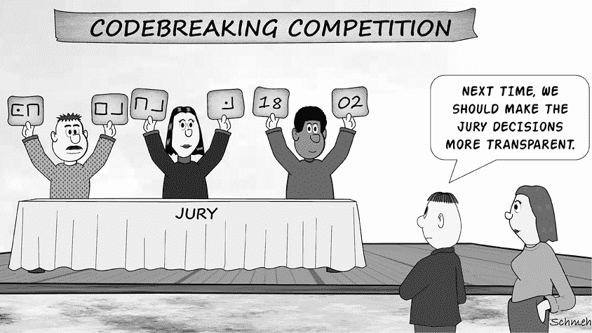
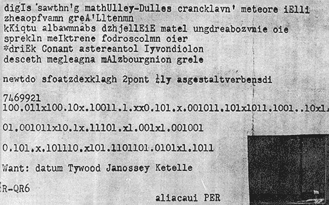
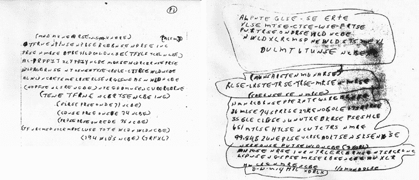
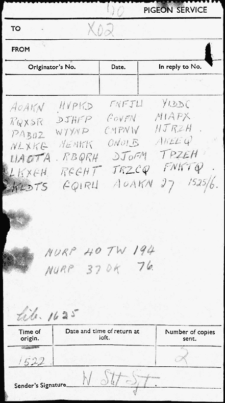
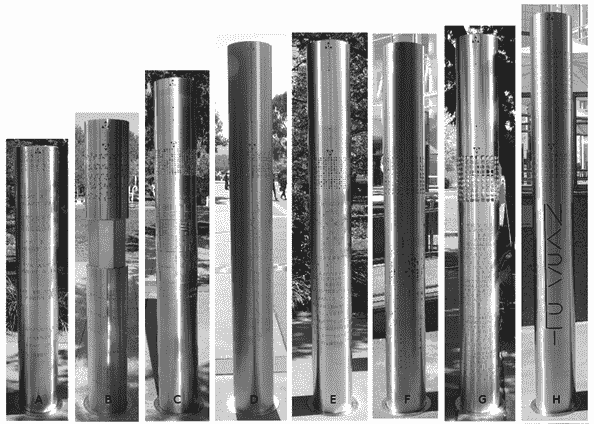
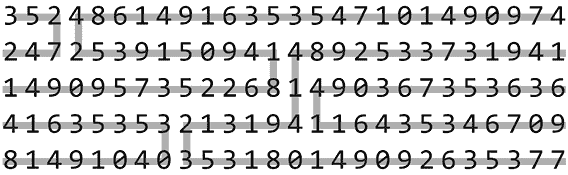
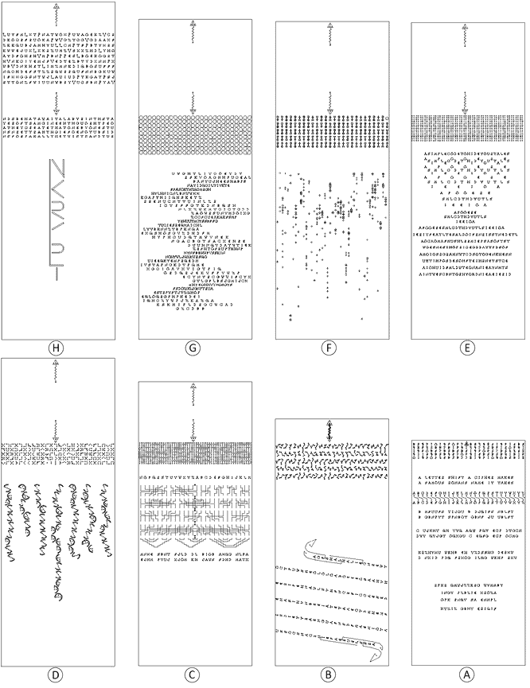
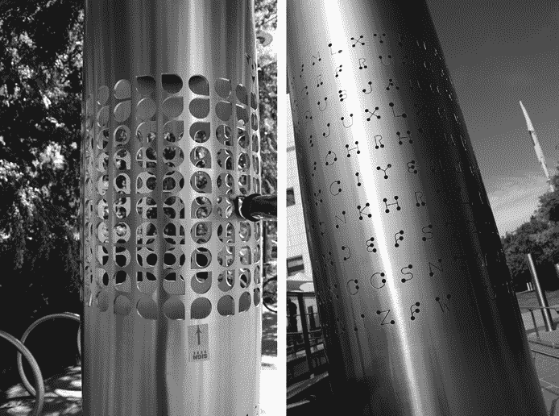

# 接下来呢？

恭喜！如果你已经阅读到这本书的这一部分，并理解我们解释的主要概念，那么你已经学到了很多关于破译密码的内容。你已经在成为一名技术娴熟的密码分析师的道路上走了很远。然而，你还可以学到更多知识，并且还有许多等待解决的密码挑战。在接下来的章节中，我们将告诉你如何从这里继续你的密码破译之旅。

## 更多未解密的密码

在本书的前十六章中，我们介绍了数十个未解密的密码，如文音手稿（第五章）和比尔密码（第六章）。这里还有更多。与我们迄今为止介绍过的不同，这些密码不能明显地归入某种密码类型。毕竟，由于它们未解密，我们甚至不知道它们是如何制作的！

### 第四部 Kryptos 信息（K4）

1990 年创作于弗吉尼亚州兰利中央情报局总部内的雕塑*Kryptos*，带有一个分为四部分的加密铭文（详见附录 A）。虽然前三部分早已解决，第四部分（也称为 K4）仍然是一个谜：

`OBKR`

`UOXOGHULBSOLIFBBWFLRVQQPRNGKSSO`

`TWTQSJQSSEKZZWATJKLUDIAWINFBNYP`

`VTTMZFPKWGDKZXTJCDIGKUHUAUEKCAR`

与此同时，*Kryptos*的创作者吉姆·桑伯恩多年来提供了与 K4 明文相关的四个不同线索。前三个被刊登在*纽约时报*上，第四个则是在本书首次出版前不久通过邮件由雕塑家提供的：

1.  2010 年：K4 的第 64 到 69 位置是`BERLIN`。^(1)

1.  2014 年：在 K4 明文中，单词`CLOCK`跟在`BERLIN`之后。^(2)

1.  2020 年 1 月：单词`NORTHEAST`出现在第 26 到 34 位置。^(3)

1.  2020 年 8 月：另一个单词`EAST`出现在第 22 位置。

下图显示了 K4 及其四个提示。请注意，明文从特定位置开始，并不一定意味着与密文之间有一一对应的映射。据我们所知，可能还涉及一些置换。

`OBKR`

`UOXOGHULBSOLIFBBWFLRVQQPRNGKSSO`

`EASTNORTHEAST`

`TWTQSJQSSEKZZWATJKLUDIAWINFBNYP`

`BER`

`VTTMZFPKWGDKZXTJCDIGKUHUAUEKCAR`

`LINCLOCK`

即使有了这四个线索，截至目前为止，没有人能够破译 K4。

### 鲁宾密码

1953 年 1 月 20 日，十八岁的学生保罗·鲁宾的尸体在费城国际机场附近的一个沟渠里被发现。经调查，确定他的死因是氰化物中毒。目前尚不清楚鲁宾是自杀还是被谋杀，但作为一名化学学生，他显然有机会接触到致死的毒药。当他的尸体被发现时，鲁宾的腹部绑着一个小盒子，里面装有一条加密信息（见图 17-1）。

图 17-1：化学学生保罗·鲁宾在费城被发现死亡时，随身携带着这张纸条。

这个加密信息至今未解开，案件也没有结论。关于鲁宾案件的最佳资料来源是克雷格·鲍尔的书《未解之谜！》^(4)

### 里基·麦考密克的加密纸条

1999 年 6 月 30 日，警方在密苏里州圣路易斯附近的一个玉米地里发现了一具尸体。经过调查，警方确认他是谋杀受害者，并将其身份确定为 41 岁的里基·麦考密克。在他的一只口袋里，调查人员发现了两张含有加密信息的纸条。^(5) FBI 动用了其破译部门 CRRU 来解密，但没有任何专家能够破解这些加密信息，这一点很不寻常，因为 CRRU 声称其破译成功率很高。美国密码学协会的成员也未能破译成功。

2011 年 3 月 30 日，FBI 采取了非常措施，将麦考密克的两条加密信息发布在[`www.fbi.gov`](https://www.fbi.gov)网站的首页，寻求公众帮助解开这些加密信息，或识别任何其他相似的加密文本。加密信息见图 17-2。

图 17-2：谋杀受害者里基·麦考密克留下了两张加密纸条，至今未解开。

麦考密克的加密信息引起了极大兴趣，但至今仍未解开。

### 二战期间的信鸽信息

1982 年，一名居住在英国萨里的人在清理烟囱时发现了一只鸽子的遗骸。^(6) 这只鸟竟然是二战期间使用的信鸽之一，甚至仍然带着一条加密信息（见图 17-3）。

图 17-3：这条信息通过一只信鸽在二战期间传送。在其公布之后，许多人尝试破译，但均未成功。

以下是文字记录：

`AOAKN HVPKD FNFJW YIDDC`

`RQXSR DJHFP GOVFN MIAPX`

`PABUZ WYYNP CMPNW HJRZH`

`NLXKG MEMKK ONOIB AKEEQ`

`UAOTA RBQRH DJOFM TPZEH`

`LKXGH RGGHT JRZCQ FNKTQ`

`KLDTS GQIRW AOAKN 27 1525/6.`

对这只鸽子的旅程知之甚少。二战期间使用信鸽非常普遍，英国皇家空军训练了大约 25 万只信鸽。通常，他们将鸽子用降落伞投放到纳粹占领的欧洲，由特工接收后交给英国军方传递消息。

我们所知的是，这只携带信息的鸽子戴着一只环，标明它是在 1940 年被标记的。这条信息是由两只不同的鸽子携带的，每只鸽子都带有国家赛鸽联盟（NURP）的环：^(7)

NURP 40 TW 194 “40”表示这只鸽子是在 1940 年被标记的。“TW 194”可能意味着它是特威克纳姆的鸽子#194。

NURP 37 DK 76 这表明这只鸽子是在 1937 年被标记的，它的家可能在多金（Dorking）。

这条信息由“W·斯托特中士”签名，可能指的是威廉·斯托特中士，27 岁，曾在侦察任务中跳伞进入诺曼底。这份电报可能是 1944 年 6 月 6 日 D 日（诺曼底登陆）期间传送的无数消息之一。表单上写明其目的地是 X02，这是皇家空军轰炸机指挥部（位于海威科姆）的代号。

对于英国人在特定时间加密载体鸽通信时使用的密码，知之甚少。因此，很难确定这条消息使用了哪种加密方式。许多密码破译者曾尝试解密它，但都没有成功。有些人认为所使用的加密方式是一次性密钥（见第八章），这意味着除非找到密钥，否则这条消息永远无法解开。

### 被加密的 NKRYPT 柱子

*NKRYPT*是一个艺术装置，由八根钢柱组成，位于澳大利亚堪培拉的奎斯塔孔科学技术中心外（见图 17-4）。此装置安装于 2013 年，由科学教育家和奎斯塔孔科学与学习主任斯图尔特·科尔哈根（Stuart Kohlhagen）设计。

每根*NKRYPT*柱子都覆盖着两个激光切割的密文，由字母、数字和符号组成。在每根柱子的底部，有一串数字以圆形模式排列，有人认为这可能代表 DNA 序列。这些密码都是离散的，但相互关联，解开其中一个可能会为解开其他密码提供线索。^(8) 艺术作品周围还有其他挑战，柱子的定位和高度也有其含义。

图 17-4：*NKRYPT*是一个位于澳大利亚堪培拉的艺术装置。它展示了一系列加密信息，其中许多仍未被解密。

根据 Kohlhagen 的说法，大约有六十个谜题与*NKRYPT*相关。其中一些谜题是隐藏的，或者只有在解决其他谜题后才会显现，呈现出元谜题的风格。这些密码并不是基于现代加密系统，如 AES 或 RSA。至少对于那些已被解开的谜题，其难度差异很大。

有两个粉丝网站致力于这座雕塑：由位于墨尔本的计算机科学家 Glenn McIntosh 创作的*NKRYPT*雕塑^(9) 和 Greg Lloyd 创作的 DKRYPT^(10)。由于这些支柱没有官方名称，我们使用 Glenn 的标签 A 到 H。图 17-5 展示了由 Stuart Kohlhagen 提供的艺术作品蓝图。两者中的序列相同，但方向相反。

在十六个明显的*NKRYPT*密码图案中，九个已经由 Glenn McIntosh、Bob Dovenberg 和其他人解开。这些密文大多数由二十六个字符组成的行组成。它们使用了简单的二进制代码、凯撒密码、猪 pen 密码系统、转子密码和蛇形密码加密。在许多情况下，Kohlhagen 还通过不规则的路径转置（或者至少是目前看不出具有可定义规则的路径模式）进行了解密。例如，在支柱 A 上，路径如下所示：

图 17-5：这张由 Kohlhagen 绘制的蓝图展示了八个*NKRYPT*支柱上的密码图案。

明文从左上角开始，`3527421491373 . . .` 这个数字序列表示堪培拉周围地点的纬度和经度坐标，格式如下：S 35.2742, E 149.1373；然后是 S 35.2984, E 149.1312；依此类推。其他支柱上的转置路径看起来类似，但并不完全相同。Kohlhagen 告诉我们，当所有八个支柱的路径完成时，它们将组成雕塑的元谜题的一部分。

作为第一个未解开的*NKRYPT*密文示例，我们将查看支柱 G 上的上方消息（见图 17-6）。它由带有一个角度的圆形图案（称为*squircle*的符号）组成，形成了前面提到的二十六列模式。像所有*NKRYPT*的挑战一样，它没有官方名称，因此我们暂时称之为矩形密码图案。

图 17-6：矩形和 PVL 密码图案仍未解开。

在这组矩形密码图案中，使用的字母表只有四个符号，McIntosh 将其转录为`0`、`1`、`2`和`3`。以下是他对消息的转录：

`01110011011101021231331012`

`02030013322303333000200032`

`21221133103032320102000132`

`23123002121223001301131123`

`10103100010101201201221103`

`30212131033000203011112330`

`30101111212032132012210133`

`13303323023120222333322012`

`00000101022001203231310031`

`30110333202120112302112123`

该 Squircle 密码由 260 个字符组成，但符号种类或双字母组合太少，无法编码二十六个字母。因此，我们猜测 Kohlhagen 使用了四字母组合（即四个字符一组）。一个四字母组合，范围从 0000 到 3333，可以表示 256 个可能的数字。这是编码 ASCII 字符（包括大小写字母、数字、标点符号等）的理想数量。柱上的密文由 65 个四字母组合组成，这意味着（如果我们的猜测正确）它可能会解码出 65 个 ASCII 字符的明文。

Kohlhagen 还向我们指出，Squircle 密码所使用的密码系统包括类似于其他挑战中所用的路径置换。因为所有已知的路径都是基于单字符的网格，无论加密系统使用双字母组合还是四字母组合，可能需要在执行置换后才会形成四字母组合。当然，反过来也可能是对的！

另一段未解的*NKRYPT*密文出现在 H 柱上。每一行包含二十六个字符，总共有十行，并且字母`P`、`V`和`L`的字体较大。这个密文被称为 PVL 密码。以下是 McIntosh 在他的网站上提供的转录内容：

`OX`P`UWAOEKZ`V`CR`L`UYFM`L`XT`P`NATW`

V`GZTCG`V`GDAAXFDKOCRFRUOKA`P`W`

L`CM`P`TF`P`BTYXRSZKKQUBJAMHYU`L

`MZ`V`SXXZHD`L`YHOKWWEJUX`L`XKRZU`

PP`ES`L`BOEKOGRTAYDFOHRH`V`M`P`BN`

`DTEZBTYDXNM`P`XH`V`NKCIYEMJF`V`E`

`MNKDIQBOSUFFFWB`V`DNKHRT`L`IMZ`

`WRRQUFNNBGKUWNQCHDEFSTZZRQ`

`UIUD`P`TKGAT`P`SJIFXXGGSNTWJ`L`A`

`BRY`V`UCSBN`P`YA`V`STTONZFWIUUNW`

Kohlhagen 告诉我们，PVL 密码形成了一个最终的代码，意味着只有在知道其他一些谜题的解法之后，才能解决这个密码。

就加密雕塑而言，*NKRYPT*在加密社区中的关注度远低于著名的*Kryptos*。如果你想尝试破译一个未解的密文，破解其中一个未解的*NKRYPT*密文可能是一个更容易的目标！

### 还有更多未解的密码

还有许多其他未解密的密码谜题你可能想要探索。例如，Rayburn 密码^(11)、纳粹间谍密码^(12)、2010 年电影*公平游戏*中的信息^(13)、Cylob 密码^(14)、D’Agapeyeff 密码^(15)、mLH 密码^(16)、费曼密码^(17)以及 Rilke 密码^(18)都值得研究。还有*Rohonc Codex*，我们仍然将其列为未解密。Gábor Tokai 和 Levente Zoltán Király 在 2018 年提出了一个有趣的解法，但截至目前，这一解法已被其他密码学家提出挑战^(19)^、^(20)^、^(21)。

如果你想了解更多关于未解密密码的世界，可以查看 Elonka 的“著名未解密代码和密码列表”^(22)或 Klaus 的“前 50 大未解密密码”列表^(23)，这两个列表都可以在线查阅。你也可以查看 Craig Bauer 的 2017 年书籍*Unsolved!*，他在书中也提出了自己关于如何破解这些密码的理论^(24)。或者，如果你能阅读德语，可以尝试 Klaus 的 2012 年书籍*Nicht zu knacken*（无法破解）^(25)。另一本关于多个未解密密码的书是 Richard Belfield 的*Can You Crack the Enigma Code?*^(26)。

据我们所知，最全面的（大多数未解密的）历史密文收藏可在由乌普萨拉大学运营的 DECODE 数据库中找到([`de-crypt.org/decrypt-web/RecordsList`](https://de-crypt.org/decrypt-web/RecordsList))。截至 2023 年，该大学的列表包含超过 4,000 条记录。

关于未解密消息的类似信息可以在由斯洛伐克密码学专家 Eugen Antal 运营的“历史密码门户”上的密码库中找到([`cryptograms.hcportal.eu`](https://cryptograms.hcportal.eu))。

另一个网站是 The Cipher Foundation，这是由英国密码学谜题专家和《沃伊尼奇手稿》研究者 Nick Pelling 发起的项目([`cipherfoundation.org`](https://cipherfoundation.org))，该网站提供关于约三十个极具趣味的未解密密码的详细信息。

## 破解工具

在第一章中，我们介绍了破解工具 CrypTool 2 ([`cryptool.org`](https://cryptool.org))、dCode ([`dcode.fr/en`](https://dcode.fr/en))和 Cipher Tools ([`rumkin.com/tools/cipher/`](https://rumkin.com/tools/cipher/))。我们在之前的章节中使用了这些工具来进行频率分析、字母模式搜索和爬山算法。接下来，我们列出了更多提供有用破解功能的软件程序和基于网络的工具（所有工具均免费）：

+   Multi-Dec 网站([`multidec.web-lab.at`](https://multidec.web-lab.at))由 Christian Baumann 运营，提供约 25 个有用的密码破解和解码功能。

+   Bion’s Gadgets ([`williammason.github.io/rec-crypt/Bions_gadgets_on_Github.xhtml`](https://williammason.github.io/rec-crypt/Bions_gadgets_on_Github.xhtml))提供了大量的密码破解工具。

+   Cipher Solving Assistants 由 Mary Ellen 和 John Toebes ([`toebes.com/aca/`](https://toebes.com/aca/))提供，是另一个密码破解工具网站。

+   Quipqiup 是由 Edwin Olson 开发的密码谜解谜工具([`quipqiup.com`](https://quipqiup.com))。

+   CryptoPrograms ([`www.cryptoprograms.com`](https://www.cryptoprograms.com))，由 Phil Pilcrow 操作，提供众多有用的加密和文本统计工具，包括软件 CryptoCrack。

+   Litscape 字词查找工具([`litscape.com/word_tools/pattern_match.php`](https://litscape.com/word_tools/pattern_match.php))允许根据特定的字母模式搜索单词。

+   Design 215 字模式查找器([`design215.com/toolbox/wordpattern.php`](https://design215.com/toolbox/wordpattern.php))由 Robert Giordano 操作，是另一种字母模式搜索工具。

寻找更多工具？在 Dave Oranchak 的 Zodiac Killer Ciphers 维基网站上列出了许多优秀的工具，例如 Jarl Van Eycke 的 AZDecrypt ([`zodiackillerciphers.com/wiki/index.php?title=Software_Tools`](http://zodiackillerciphers.com/wiki/index.php?title=Software_Tools))。

## 其他关于密码破解的书籍

在我们的书中，我们努力介绍了使用手动和计算机方法破解经典密码的最重要技术。我们相信我们的书具有独特性，它针对实践中最常见的经典密码，并介绍了许多已解和未解的密码。我们不知道有另一本书具有类似的范围，当然，市场上还有许多其他优秀的破解密码书籍。

以下这些工具是在数十年前编写的，因此与计算机无关：

+   Helen Fouché Gaines，*Cryptanalysis*（1939 年）：这本书是经典之作，可能是有史以来最成功的密码破解书籍。虽然现在已经过时，因为它是在计算机时代之前编写的，但对于任何对破解技术感兴趣的人来说，仍然充满了宝贵的信息。

+   安德烈·兰吉，*《密码学》*（1922）：这是一本很好的书，以通俗易懂的方式解释了当时的密码和破译方法。

+   威廉·弗里德曼，*《军事密码分析，第一卷至第四卷》*（约 1938）：弗里德曼广泛使用的著作提供了超过一千页的科学方法来进行密码破译。弗里德曼被认为是历史上最著名的密码学家，也是“密码分析”和“巧合指数”这两个术语的创造者。

+   安德烈亚斯·菲格尔，*《解码系统》*（1927）：这本书由第一次世界大战时期的奥地利密码破译者用德语写成，虽然这本书已经过时，但与其姊妹书 *《加密系统》*（1926）一起，它依然是计算机时代之前最好的、最全面的密码破译书籍之一，仅次于盖恩斯的 *《密码分析》*。

+   美国陆军部，*《基础密码分析》*（1990）：这本关于破译简单替代密码、polyalphabetic 密码和换位法的手册可以在互联网上免费获取。^(27)

+   所罗门·库尔巴克，*《密码分析中的统计方法》*（1976）：本书专注于使用统计方法进行密码破译，如频率分析和巧合指数。

+   帕克·希特，*《军事密码解码手册》*（1916）：这本简明的密码破译书由陆军服务学校出版社出版，涵盖了简单替代、 polyalphabetic 密码、换位法和普雷菲尔密码。

+   亚伯拉罕·辛科夫，*《初级密码分析》*（1966）：这本密码破译书采用数学方法。

+   威廉·弗里德曼与伊丽莎白·弗里德曼，*《莎士比亚密码解读》*（1957）：这对著名的密码破译夫妇以轻松幽默的风格回顾他们的根基，彻底揭穿了莎士比亚作品中存在隐藏信息的说法。

+   德莫特·图灵，*《博姆贝机：击败恩尼格玛的机器》*（2021）：本书详细描述了二战期间英国用来破译恩尼格玛信息的机器。

包含计算机技术来解决历史密码的密码破译书籍并不常见：

+   罗伯特·雷纳德，*《秘密密码破译者：密码分析手册》*（1996）：这本九十页的书提供了密码分析的基础介绍，并提到了当时的一些计算机程序，尽管其中很少有仍然相关的程序。

+   乔治·拉斯里，“*使用搜索元启发式算法进行经典密码破译的方法论*”（2018）：这是乔治·拉斯里关于使用爬山法和其他方法破译手动和机器密码的博士论文。^(28)

+   阿尔·斯威加特，*《用 Python 破解密码》*（2018）：本书介绍了许多用于实现和破译手动密码的算法，同时也涉及了现代密码学。^(29)

此外，还有许多书籍涉及现代计算机加密算法，如 DES、AES、RSA 和 Diffie-Hellman，但专注于这些方法的密码分析的书籍则较少。马克·斯坦普和理查德·M·洛所著的《*应用密码分析：破解现实世界中的密码*》（2007 年）和安托万·朱所著的《*算法密码分析*》（2009 年）是任何有意从事现代系统密码分析的人不错的选择。

这里还有一些涉及密码破解的书籍，但并不专注于这一主题：

+   大卫·卡恩，《*密码破解者*》，第二版（1996 年）：这本书首次出版于 1967 年，是关于密码历史的经典之作。正如书名所示，它更侧重于那些作为密码破解者（和密码创造者）的人，而非密码破解本身。尽管如此，它仍然是每个对密码分析和过去 4000 年加密方法感兴趣的人必读的书籍。

+   伯恩哈德·埃斯林格和 CrypTool 团队，《*使用 CrypTool 和 SageMath 学习和体验密码学*》（2018 年）：这本免费的书籍包含了关于经典加密系统以及如何使用免费软件破解它们的有趣信息。

+   克雷格·鲍尔，《*密码学的秘密历史*》，第二版（2021 年）：这本非常有趣的书籍将密码学的历史与历史加密算法的数学描述相结合。它是任何希望理解经典密码数学的人的好书。

+   克雷格·鲍尔，《*未解之谜*》（2017 年）：这本经过深入研究的书籍讲述了著名的未解密码谜题；它包含了大量关于破解这些有趣的密码谜团的潜在方法的信息。

+   西蒙·辛格，《*密码书*》（1999 年）：这是一本关于加密历史的畅销书，书中解释了一些密码破解技术。

+   西蒙·辛格，《*破解密码书*》（2002 年）：基于《密码书》，这本书为入门级读者提供了密码破解的介绍，主要面向儿童。一些版本以《青少年密码书》为标题。

+   弗里德里希·鲍尔，《*解密的秘密*》（2006 年）：这本经典之作首次出版于 1997 年，描述了历史和现代的加密算法以及密码分析。

+   丹尼斯·萨瑟兰和马克·科尔特科-里维拉，《*破解密码与密码谜题*》（2011 年）：尽管书名承诺了很多，但这本书中只有大约 10%的内容是真正关于密码破解的，但它依然值得一读，因为它包含了大量的谜题供解答。

+   A.J.·雅各布斯，《*谜题者*》（2022 年）：另一本畅销书，由多次 TED 演讲者雅各布斯撰写，提供了他娱乐性的视角。他与专家（包括我们！）取得了联系，参加了谜题大会，甚至收到了 CIA 的邀请，参观了他们的加密雕塑*Kryptos*。

+   Liza Mundy, *《密码女孩：美国二战女性破译员的未曾讲述的故事》*（2017 年）：这是一本引人入胜的著作，讲述了成千上万帮助战争努力的年轻女性，她们将自己的破译冒险故事带入了坟墓。我们很高兴终于看到她们的故事得到了应有的讲述。

+   Benedek Láng, *《真实生活中的密码学：早期现代匈牙利的密码与秘密》*（2018 年）：这本书同时以匈牙利语和英语出版，英文版可以免费下载。它涵盖了中世纪欧洲多种类型的密码，使用了多种语言。^(30)

+   John F. Dooley, *《密码学与密码分析史：密码、暗号与它们的算法》*（2018 年）：这是一本关于密码学历史的教科书，涵盖了从古希腊和早期阿拉伯文献到现代计算机密码学的一些内容。虽然它没有专注于计算机，但它包含了比其他同类书籍更多的现代加密信息。

+   Herbert O. Yardley, *《美国黑色密室》*（1931 年）：这是一本关于密码学最著名的书籍之一，出版时颇具争议，因为它描述了一个美国政府密码学组织的内部运作。批评者认为，它可能在二战期间给予了日本某些优势。主要内容讲述了破译故事，尽管没有太多关注密码分析，但其中有一些关于频率分析和破译德国置换密码的有用信息。

+   Tom Mahon 和 James J. Gillogly, *《解码爱尔兰共和军》*（2008 年）：这是一本关于 1920 年代爱尔兰历史的有趣读物，当时爱尔兰共和军，一个准军事组织，正在争取脱离英国统治的独立，并在通信中使用密码。在第一章中，Gillogly 解释了他的解码方法。

最后，尽管她的贡献早该得到关注，但我们很高兴看到密码破译员埃丽兹伯丝·弗里德曼（1892–1980）终于得到了应有的重视。在过去几年里，关于她的纪录片和多本书籍（面向成人和儿童）已相继发布。我们特别推荐以下书籍：

+   Jason Fagone, *《破译密码的女人》*（2017 年）：这是一本经过充分研究并且非常易读的传记/冒险故事，讲述了埃丽兹伯丝·弗里德曼的生平。

+   G. Stuart Smith, *《代码中的一生》*（2017 年）：这本关于埃丽兹伯丝·弗里德曼的传记是由她的曾外甥所写。

+   Amy Butler Greenfield, *《所有间谍都害怕的女人：埃丽兹伯丝·史密斯·弗里德曼及她隐秘的生活》*（2021 年）：这本书面向 8 年级及以上学生，是 Kirkus 年度最佳书籍之一，也是一本非常易读的传记。

+   Laurie Wallmark（作者）和 Brooke Smart（插画师），*《密码破译者，间谍猎人：埃丽兹伯丝·弗里德曼如何改变了两次世界大战的进程》*（2021 年）：这是一本为年轻读者准备的关于埃丽兹伯丝·弗里德曼的插图书。

如果你想了解更多关于手工和机器加密的书籍，可以查看 [`cryptobooks.org`](https://cryptobooks.org)。这个网站由密码破译专家托比亚斯·施罗德尔和尼尔斯·科帕尔运营，描述了过去 600 年间的 500 多本相关书籍。

## 关于密码破译的网站

以下是一些提供更多密码破译信息的网站：

+   Klaus 的 *Cipherbrain* 博客 ([`scienceblogs.de/klausis-krypto-kolumne/`](https://scienceblogs.de/klausis-krypto-kolumne/))：Klaus 的博客成立于 2013 年，最初为德语版本，2017 年扩展为英文翻译。该网站包含了超过一千篇关于密码破译和历史加密的报告，还有一个非常活跃的读者社区，大家热衷于参与每一篇新博客文章的讨论。

+   Elonka 的网站 ([`elonka.com`](https://elonka.com))：这个网站包含了包括埃隆卡（Elonka）列出的著名未解密码和加密的内容。她的网站还被认为是有关 CIA 加密雕塑*Kryptos*的金标准，也包括其他著名解密密码的信息，如弗里德曼墓碑、斯密西密码和*Cyrillic Projector*。此外，还包括一篇教程，讲述埃隆卡如何在 1999 年解决了一个黑客挑战（PhreakNIC v3.0 密码），这也是她密码破译生涯的起点。

+   *Cipher Mysteries* ([`ciphermysteries.com`](https://ciphermysteries.com))：Nick Pelling，一位总部位于伦敦的密码破译专家、多产的作家和研究员，运营着这个详尽的网站，包含了关于沃伊尼奇手稿和其他加密谜题的信息。他的博客有成百上千篇文章，涉及从最新的沃伊尼奇手稿解答到对萨默顿男士和共济会密码研究的分析。

+   MysteryTwister ([`mysterytwister.org`](https://mysterytwister.org))：这个网站由一群德国密码爱好者运营，其中一些人也参与了 CrypTool 工具的开发，网站上有来自世界各地提交的超过 300 个密码谜题挑战。

+   CrypTool Portal ([`cryptool.org`](https://cryptool.org))：这个网站不仅提供 CrypTool 软件的下载，还包含了大量关于密码学和密码破译的有趣信息。此外，还有一个相关的 YouTube 频道，“CRYPTOOL 2: Cryptography for Everybody”，由 CrypTool 开发者尼尔斯·科帕尔运营。

+   Cryptiana ([`cryptiana.web.fc2.com/code/crypto.htm`](http://cryptiana.web.fc2.com/code/crypto.htm))：来自日本东京的田中聪志（Satoshi Tomokiyo）运营这个关于历史加密技术、古老密码和解密方法的精彩网站。

+   密码历史 ([`cipherhistory.com`](https://cipherhistory.com))：这个关于古老密码学的综合网站由密码机收藏家拉尔夫·辛普森运营。

+   美国密码文献协会 ([`cryptogram.org`](https://cryptogram.org)): 成立于 1930 年的美国密码文献协会致力于推广密码破解的兴趣和艺术。其网站提供了大量有趣的信息。该协会每年举办一次大会，并发布双月通讯，内容包括各种密码文献、破解比赛以及破解积分系统。

+   *Kryptos* 讨论组 ([`kryptos.groups.io`](https://kryptos.groups.io)): 由 Elonka 和已故的 Gary Warzin 在 Yahoo! Groups 上创建，后来迁移到[`groups.io`](https://groups.io)，该讨论板由 Elonka、Chris Hanson 和 Larry McElhiney 共同管理。

+   DECODE ([`de-crypt.org/decrypt-web/RecordsList`](https://de-crypt.org/decrypt-web/RecordsList)): 这个关于历史密码的网站由瑞典乌普萨拉大学的科学家运营，包含了大量未解密的密码文献数据库。

+   历史密码门户 ([`hcportal.eu`](https://hcportal.eu)): 这个关于历史密码的网站由斯洛伐克的 Eugen Antal 运营，提供了未解密的密码文献数据库。

+   Cryptograms & Classical Ciphers（Facebook 群组）：该群组由新西兰的破译专家 Bart Wenmeckers 主持。

+   Christos 的*军事与情报角落* ([`chris-intel-corner.blogspot.com`](https://chris-intel-corner.blogspot.com)): 由希腊密码历史与情报专家 Christos Triantafyllopoulos 运营，博客内容涉及历史密码学以及军事和情报话题。

+   Dave Oranchak 的页面 ([`www.zodiackillerciphers.com`](http://www.zodiackillerciphers.com)): 该页面由弗吉尼亚州的 Dave Oranchak 运营，他是三人团队中的一员，曾破解了 Z340 密码。页面主要涉及黄道带杀手及其密码文献。

+   密码博物馆 ([`cryptomuseum.com`](https://cryptomuseum.com)): 这个全面的密码机器与加密设备网站由荷兰专家 Paul Reuvers 和 Marc Simons 运营。

+   *Schneier on Security* ([`schneier.com`](https://schneier.com)): Bruce Schneier 运营着关于现代加密系统的金标准博客，并发布每月通讯《*Crypto-Gram*》。他偶尔还会涉及经典密码的相关信息。

+   全国谜题联盟 ([`puzzlers.org`](http://puzzlers.org)): 成立于 1883 年，是世界上最古老的谜题组织。密码文献是其众多主题之一。

+   La Crittografia da Atbash a RSA ([`www.crittologia.eu/`](http://www.crittologia.eu/)): 该意大利网站由破译专家 Paolo Bonavoglia 运营。

+   Benedek Láng 的网页《Rejtjelek, kódok, titkosírások》 ([`kripto.blog.hu`](https://kripto.blog.hu)): 如果你恰好会讲匈牙利语或能使用 Google 翻译（或使用德文网站 DeepL），这个网站（标题意为“密码、加密和密码学”）提供了许多关于破译密码的有趣信息。

+   Kryptografie ([`kryptografie.de/`](https://kryptografie.de/)): 这是 Oliver Kuhlemann 创建的多语言网站，提供了许多关于加密学和破译密码的有趣信息。网站上的加密学发展时间线做得尤其出色。

+   *Katkryptolog* ([`katkryptolog.blogspot.com`](https://katkryptolog.blogspot.com)): 由 Hans Jahr 撰写，这本有趣的加密历史与破译密码博客采用斯洛伐克语和英语混合写作。

## 期刊与通讯

有两本主要的印刷出版物涵盖了破译密码和相关问题：

+   *Cryptologia*：成立于 1977 年，这本双月刊学术期刊主要关注加密历史，包含了许多关于密码分析的显著研究论文，涵盖历史和现代密码分析以及各种密码谜题的破译。

+   *The Cryptogram*：这本双月刊由美国加密协会于 1932 年创办。每一期由志愿者制作，包含数十个加密谜题，其中绝大多数是由美国加密协会的成员为自己的比赛创作的。该刊物还偶尔报道一些历史上的加密谜题。

## 活动

如果你想结识其他对破译密码感兴趣的人，聆听有关复古加密系统的有趣演讲，自己做个讲座，或者甚至亲自见到本书的作者，你可以尝试参加以下活动：

+   加密学历史研讨会 ([`cryptologicfoundation.org`](https://cryptologicfoundation.org)): 由美国国家安全局主办的这个每两年举办一次的活动是关于历史加密与破译密码的最重要国际会议。它通常在马里兰州的米德堡（NSA 总部所在地）附近举行，距离华盛顿特区不远。

+   ACA 大会 ([`cryptogram.org`](https://cryptogram.org)): 美国加密协会每年举办一次大会，地点不固定。

+   HistoCrypt ([`histocrypt.org`](https://histocrypt.org)): 这个关于密码学历史的欧洲年度会议每年在不同的地点举行。

+   *Kryptos* 会议 ([`groups.io/g/kryptos`](https://groups.io/g/kryptos)): 这个每两年举办一次的活动汇聚了许多对*Kryptos*雕塑及其加密铭文感兴趣的人（见附录 A）。由 Elonka 通过*Kryptos*讨论组组织，活动通常在华盛顿特区附近的加密学历史研讨会后那个星期六举行。

+   国际密码学历史会议（[`www.cryptologichistory.org`](https://www.cryptologichistory.org)）：该会议于 2004 年以“Crypto Collectors”名义创办，是一个讨论密码学历史的电子邮件论坛。大约每月举行两次关于各种密码学主题的在线演讲。

有时涉及密码破解主题的其他活动（你可能会在这些活动中遇到本书的作者）包括 44CON（伦敦）、Awesome Con 或 ShmooCon（华盛顿特区）、DEF CON（拉斯维加斯）、HOPE（纽约）、Dragon Con（亚特兰大）、PhreakNIC（纳什维尔）、HAM Radio（德国弗里德里希港）以及 Worldcon（在不同地点举办）。
