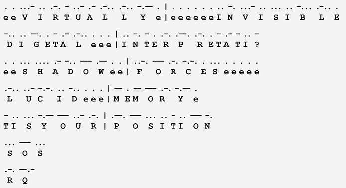
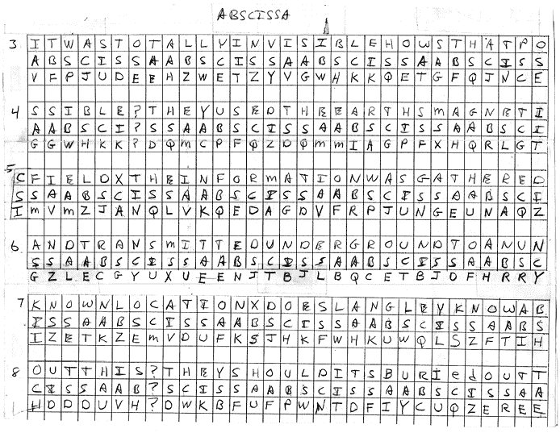

# 第十八章：A

Kryptos

*Kryptos*是位于弗吉尼亚州兰利的中情局总部的一座雕塑^1。它由当地艺术家吉姆·桑博恩（Jim Sanborn）于 1990 年创作。*Kryptos*上刻有加密铭文，这成为了过去四十年里最著名的加密谜题（见图 A-1）。

图 A-1：*Kryptos*，一座位于弗吉尼亚州兰利中情局总部的雕塑，刻有四部分的加密铭文。第四部分仍未解开。

除了*Kryptos*，桑博恩还在中情局大楼内放置了其他艺术作品，比如一些带有摩尔斯电码字母的铜板^2。这些信息及其解码版本可以在图 A-2 中看到。以下是它们的文字记录：

`eeVIRTUALLYe`

`eeeeeeINVISIBLE`

`DIGETALeee`

`INTERPRETATI`

`eeSHADOWee`

`FORCESeeeee`

`LUCIDeee`

`MEMORYe`

`TISYOUR`

`POSITION`

`SOS`

`RQ`

我们不确定这些词语片段的意思，尽管桑博恩（Sanborn）曾表示它们与密文的第二部分有关。注意到`INTERPRETATI`后面有一个额外的破折号，这可能意味着最后一个字母是`U`，即`INTERPRETATU`，或者更可能的是，这个破折号是字母`O`的第一个字符，意味着整个词应该是`INTERPRETATION`。同样，`T IS YOUR POSITION`原本可能是`WHAT IS YOUR POSITION`。桑博恩曾说他在纸张上写有较长的消息，然后要么在消息中途剪断了纸张，要么允许消息在石板之间继续。

图 A-2：桑博恩在新总部大楼的另一侧放置的几块铜板上刻有摩尔斯电码信息。它们的解码版本可以在此看到。

*Kryptos*的铭文被分为四个部分。两部分（从正面看雕塑时是左侧的部分，如图 A-1 所示）展示了维吉尼亚加密表格。另两块板子刻有实际的密文，其中包含至少四个不同加密方式的消息，目前在加密学界被称为 K1、K2、K3 和 K4。在接下来的复现中，我们提供了完整的密文，并标明了每个部分的起始位置。（原文中没有这样的标记。）

`(K1)EMUFPHZLRFAXYUSDJKZLDKRNSHGNFIVJ`

`YQTQUXQBQVYUVLLTREVJYQTMKYRDMFD`

`(K2)VFPJUDEEHZWETZYVGWHKKQETGFQJNCE`

`GGWHKK?DQMCPFQZDQMMIAGPFXHQRLG`

`TIMVMZJANQLVKQEDAGDVFRPJUNGEUNA`

`QZGZLECGYUXUEENJTBJLBQCRTBJDFHRR`

`YIZETKZEMVDUFKSJHKFWHKUWQLSZFTI`

`HHDDDUVH?DWKBFUFPWNTDFIYCUQZERE`

`EVLDKFEZMOQQJLTTUGSYQPFEUNLAVIDX`

`FLGGTEZ?FKZBSFDQVGOGIPUFXHHDRKF`

`FHQNTGPUAECNUVPDJMQCLQUMUNEDFQ`

`ELZZVRRGKFFVOEEXBDMVPNFQXEZLGRE`

`DNQFMPNZGLFLPMRJQYALMGNUVPDXVKP`

`DQUMEBEDMHDAFMJGZNUPLGEWJLLAETG`

`(K3)ENDYAHROHNLSRHEOCPTEOIBIDYSHNAIA`

`CHTNREYULDSLLSLLNOHSNOSMRWXMNE`

`TPRNGATIHNRARPESLNNELEBLPIIACAE`

`WMTWNDITEENRAHCTENEUDRETNHAEOE`

`TFOLSEDTIWENHAEIOYTEYQHEENCTAYCR`

`EIFTBRSPAMHHEWENATAMATEGYEERLB`

`TEEFOASFIOTUETUAEOTOARMAEERTNRTI`

`BSEDDNIAAHTTMSTEWPIEROAGRIEWFEB`

`AECTDDHILCEIHSITEGOEAOSDDRYDLORIT`

`RKLMLEHAGTDHARDPNEOHMGFMFEUHE`

`ECDMRIPFEIMEHNLSSTTRTVDOHW?(K4)OBKR`

`UOXOGHULBSOLIFBBWFLRVQQPRNGKSSO`

`TWTQSJQSSEKZZWATJKLUDIAWINFBNYP`

`VTTMZFPKWGDKZXTJCDIGKUHUAUEKCAR`

所有四个*Kryptos*密文部分在本书中都有详细介绍：K1 和 K2 在第八章，K3 在第十章，K4 在第十七章。K1、K2 和 K3 已经被解开，但 K4 仍然是一个谜。Kryptos 密文的第 1–3 部分是由三位不同的个人或小组独立解开的。这里，我们记录了它们是如何被解开的。

在雕塑在弗吉尼亚州兰利的 CIA 总部揭幕后不久，一支由 12 名 NSA 员工组成的团队被邀请“越过河流”到 CIA，检查*Kryptos*及其相关部分。然后，在 1992 年中期，NSA 局长威廉·“比尔”·O·斯图德曼将成为 CIA 副局长后，他向自己的 NSA 继任者麦克·麦康奈尔发出了挑战：“你们这些高手怎么还没解开*Kryptos*？”

麦康奈尔联系了哈里·胡佛，Z 组织的首任负责人，Z 是一个由密码分析师组成的新组织。胡佛指派肯·米勒担任该项目的负责人。米勒组建了一个由三位“手动密码”专家组成的团队：埃德·哈农，胡佛团队的成员；丹尼·麦克丹尼尔斯，米勒团队的成员；以及兰斯·埃斯特斯，一位来自该机构其他部门的资深密码分析师。哈农取得了首次突破，解开了 K2。埃斯特斯解开了 K1，而麦克丹尼尔斯解开了 K3。在 1992 年底团队放弃了 K4 之后，胡佛表示他们不应该公布结果，直到 K4 被解开。但是，到了 1993 年 6 月，由于这种结果看起来不太可能，胡佛指示米勒写一份备忘录，米勒将其发送给了麦康奈尔，然后又转交给了 CIA 的斯图德曼。所有这些都没有公开宣布。

1998 年，CIA 员工大卫·斯坦因也得出了这三个解决方案。这一消息在 CIA 内部传播，并在媒体上做了简短而模糊的提及，但没有什么实质性的公开揭露。^(3)

1999 年，著名的破译专家、美国密码协会会员吉姆·吉洛戈也解开了这三个密码。由于 NSA 和 CIA 都保持了他们的破译成功的机密，*Kryptos*的加密仍被认为未解开，直到吉洛戈宣布他取得的成就。因此，他被国际间誉为第一个破解前三部分的人。

在 Gillogly 宣布之后不久，CIA 和 NSA 都透露他们早在之前就已解开了这三部分内容，尽管 NSA 像往常一样对谁做的以及何时做的保持谨慎。2004 年，Elonka 获取了 Stein 的 CIA 报告图像，并在她的网站上发布了这些图像。^(4) 2010 年，她向 NSA 提交了信息自由法案请求，要求查看他们的文件。在多次跟进后，这一请求终于在 2013 年获得批准，NSA 发布了文件，显示他们的团队早在 1992 年就已成功解开前三部分内容。随后，CIA 发布了 Stein 论文的编辑版。^(5) 编辑版和未编辑版都可以在 Elonka 的网站上查看：[`elonka.com/kryptos`](https://elonka.com/kryptos)。

所有三位破译者，以及世界各地成千上万的人，都试图破译第四部分*Kryptos*，但都未成功。

## K1

K1 是使用维吉尼尔密码的变体加密的，关键词为`KRYPTOS`和`PALIMPSEST`。*Palimpsest*是一种手稿页，文本已被刮除或清洗，以便可以重新用于其他文本，从而使得部分旧的内容能透过新的文本看到。

这是 Sanborn 使用的维吉尼尔表；请注意顶部一行的关键词`KRYPTOS`和第一列的`PALIMPSEST`：

`KRYPTOSABCDEFGHIJLMNQUVWXZ`

`--------------------------`

`PTOSABCDEFGHIJLMNQUVWXZKRY`

`ABCDEFGHIJLMNQUVWXZKRYPTOS`

`LMNQUVWXZKRYPTOSABCDEFGHIJ`

`IJLMNQUVWXZKRYPTOSABCDEFGH`

`MNQUVWXZKRYPTOSABCDEFGHIJL`

`PTOSABCDEFGHIJLMNQUVWXZKRY`

`SABCDEFGHIJLMNQUVWXZKRYPTO`

`EFGHIJLMNQUVWXZKRYPTOSABCD`

`SABCDEFGHIJLMNQUVWXZKRYPTO`

`TOSABCDEFGHIJLMNQUVWXZKRYP`

K1 的明文如下。你可以看到它包含了一个拼写错误：

`在微妙的阴影与光线缺失之间，隐藏着*IQLUSION*的细微差别`

当被问及该明文的含义时，Sanborn 回答说这是他自己写的一句话，采用了“精心挑选的措辞”。

想了解更多关于 K1 的信息，请查看第八章。

图 A-3：雕塑家 Jim Sanborn 的原始笔记，展示了 K2 明文如何使用关键词`ABSCISSA`加密。*。

## K2

K2 的加密方式与 K1 相同，不过更改了其中一个关键词。这次使用了`KRYPTOS`和`ABSCISSA`（见图 A-3）。*Abscissa*是图表中一个点的*x*坐标。我们可以使用以下的维吉尼尔表解密 K2（也见图 A-3）：

`KRYPTOSABCDEFGHIJLMNQUVWXZ`

`--------------------------`

`ABCDEFGHIJLMNQUVWXZKRYPTOS`

`BCDEFGHIJLMNQUVWXZKRYPTOSA`

`SABCDEFGHIJLMNQUVWXZKRYPTO`

`CDEFGHIJLMNQUVWXZKRYPTOSAB`

`IJLMNQUVWXZKRYPTOSABCDEFGH`

`SABCDEFGHIJLMNQUVWXZKRYPTO`

`SABCDEFGHIJLMNQUVWXZKRYPTO`

`ABCDEFGHIJLMNQUVWXZKRYPTOS`

这是相应的明文，其中包含另一个拼写错误，`UNDERGRUUND`：

`它完全不可见，这怎么可能？他们使用了地球的磁场，信息被收集并通过地下传输到一个未知的位置。兰利知道这件事吗？他们应该知道，它就埋在那里某个地方。谁知道确切位置？只有 WW，这就是他最后的消息：北纬三十八度五十七分六点五秒，西经七十七度八分四十四秒，按行排列。`

消息中的纬度和经度坐标（N38° 57' 6.5" W77° 8' 44"）指向一个大约 150 英尺（45 米）远的地方，位于*Kryptos*本身的东南方向，尽管那里似乎没有任何特别之处；它是靠近机构食堂的一个铺设并绿化的区域。这一位置可能与 Sanborn 的其他部分（摩尔斯电码部分）有某种联系，这些部分位于总部大楼的另一侧。Sanborn 表示，当他安装*Kryptos*时，他特意核对了附近美国地质调查局的标记上的纬度和经度，以确保他的坐标准确。

2006 年，在公开的解密方案发布几年后，Sanborn 表示，解密者错误地解读了 K2 的最后三个词，`ID BY ROWS`。^(6)^, ^(7) 结果发现密文的最后一行缺少了一个字母`S`。Sanborn 原本打算让它以`X LAYER TWO`结束。解密者没有注意到这个错误，因为巧合的是，表达式`ID BY ROWS`似乎是有意义的。所以，实际的明文是以下内容：

`它完全不可见，这怎么可能？他们使用了地球的磁场，信息被收集并通过地下传输到一个未知的位置。兰利知道这件事吗？他们应该知道，它就埋在那里某个地方。谁知道确切位置？只有 WW，这就是他最后的消息：北纬三十八度五十七分六点五秒，西经七十七度八分四十四秒，X LAYER TWO`

关于 K2 的更多信息，请查看第八章。

## K3

K3 使用换位密码进行加密，可以通过多种方式解密。Elonka 提出的一种方法要求将密文按每行四十八个字母的方式排列，最后一个问号除外。解密从第四行最后一个位置的`S`开始：^(8)

`ENDYAHROHNLSRHEOCPTEOIBIDYSHNAIACHTNREYULDSLLSLL`

`NOHSNOSMRWXMNETPRNGATIHNRARPESLNNELEBLPIIACAEWMT`

`WNDITEENRAHCTENEUDRETNHAEOETFOLSEDTIWENHAEIOYTEY`

`QHEENCTAYCREIFTBRSPAMHHEWENATAMATEGYEERLBTEEFOA``S`

`FIOTUETUAEOTOARMAEERTNRTIBSEDDNIAAHTTMSTEWPIEROA`

`GRIEWFEBAECTDDHILCEIHSITEGOEAOSDDRYDLORITRKLMLEH`

`AGTDHARDPNEOHMGFMFEUHEECDMRIPFEIMEHNLSSTTRTVDOHW`

从这里开始，明文可以通过一个简单的规则来读取：从当前位置开始，向下走四行，如果需要超出最后一行，则继续到第一行并向左走一个位置。这个规则为我们提供了 `L` 作为第二个字母：

`ENDYAHROHNLSRHEOCPTEOIBIDYSHNAIACHTNREYULDSLLS``L``L`

`NOHSNOSMRWXMNETPRNGATIHNRARPESLNNELEBLPIIACAEWMT`

`WNDITEENRAHCTENEUDRETNHAEOETFOLSEDTIWENHAEIOYTEY`

`QHEENCTAYCREIFTBRSPAMHHEWENATAMATEGYEERLBTEEFOA``S`

`FIOTUETUAEOTOARMAEERTNRTIBSEDDNIAAHTTMSTEWPIEROA`

`GRIEWFEBAECTDDHILCEIHSITEGOEAOSDDRYDLORITRKLMLEH`

`AGTDHARDPNEOHMGFMFEUHEECDMRIPFEIMEHNLSSTTRTVDOHW`

接下来，`O` 是第三个字母：

`ENDYAHROHNLSRHEOCPTEOIBIDYSHNAIACHTNREYULDSLLS``L``L`

`NOHSNOSMRWXMNETPRNGATIHNRARPESLNNELEBLPIIACAEWMT`

`WNDITEENRAHCTENEUDRETNHAEOETFOLSEDTIWENHAEIOYTEY`

`QHEENCTAYCREIFTBRSPAMHHEWENATAMATEGYEERLBTEEFOA``S`

`FIOTUETUAEOTOARMAEERTNRTIBSEDDNIAAHTTMSTEWPIER``O``A`

`GRIEWFEBAECTDDHILCEIHSITEGOEAOSDDRYDLORITRKLMLEH`

`AGTDHARDPNEOHMGFMFEUHEECDMRIPFEIMEHNLSSTTRTVDOHW`

继续使用此方法，并在适当的时候添加空格，以下明文出现：

`SLOWLY DESPARATLY SLOWLY THE REMAINS OF PASSAGE DEBRIS THAT ENCUMBERED THE LOWER PART OF THE DOORWAY WAS REMOVED WITH TREMBLING HANDS I MADE A TINY BREACH IN THE UPPER LEFTHAND CORNER AND THEN WIDENING THE HOLE A LITTLE I INSERTED THE CANDLE AND PEERED IN THE HOT AIR ESCAPING FROM THE CHAMBER CAUSED THE FLAME TO FLICKER BUT PRESENTLY DETAILS OF THE ROOM WITHIN EMERGED FROM THE MIST X CAN YOU SEE ANYTHING Q`

我们也可以使用由密码学爱好者费尔迪南多·斯特赫尔（Ferdinando Stehle）确定的以下数学公式来推导这个消息，其中 *x* 代表密文的位置，*y* 代表在转置中明文的位置：^(9)

*y* = (192*x* + 191) mod 337

这段文本是来自考古学家霍华德·卡特（Howard Carter）的日记的改写摘录，他于 1922 年 11 月 26 日发现了法老图坦卡蒙（“图王”）的墓。他对“你能看到什么？”这个问题的回答是：“是的，奇妙的东西！”

关于 K3 还有一个有趣的事情是，密文的第一行中的字母 `DYAHR` 对齐不准确，正如这里所看到的：

我们不知道这意味着什么，但艺术家表示这与前三个部分有关。有关 K3 的更多信息，请查阅第十章。

请注意，K3 和 K4 之间出现了一个问号（`?`）。一段时间以来，破译者不确定是否应将其解释为 K3 的最后一部分或 K4 的开头，但桑博恩（Sanborn）表示它不是 K4 的一部分，K4 应该只有 97 个字符长。

关于 *Kryptos* 雕塑，还有三点需要注意：

+   Vigenère 表格中多了一个`L`。这个字符出现在其中一块板的最上面一行。巧合的是（或者也许不是），这正是另一块板上“失对齐”的`DYAHR`字母出现的那一行（我们将字母`Y`、`A`和`R`放大，以表示它们是抬起的）。这一行本该以`J`结尾，而不是`L`。当有人问起此事时，Sanborn 说他加上这个字母只是为了保持平衡，这可能是真的，也可能不是真的，当然，任何事情都有可能发生！一些研究人员指出，额外的`L`可能是为了引导观众的视线集中在这一行，作为一种微妙的提示。不过，考虑到 Sanborn 的风格，很难判断这是否是故意为之。

+   表格中多了一个`ABCD`。通常，Vigenère 表格使用一个包含二十六个字母的字母表，但在*Kryptos*的情况下，Sanborn 提供了额外的字母，总共有三十个。为什么？像往常一样，他没有给出明确的答案。也许只是为了保持平衡，或者是为了将 K3 与其他两块板上的密文对齐。或者，也许另有其他原因？

+   顶部的参考字母表是简单的（未加密的）`A`到`Z`。然而，为了执行 Vigenère 加密，Sanborn 不会使用简单的参考字母表，而是使用了一个带密钥的字母表。所以，这里是反过来的。这一点特别有趣，当我们将他的 Vigenère 加密与*西里尔投影仪*上的加密进行比较时。那里，参考字母表是简单的，但在雕塑上，提供的参考字母表是加密的，所以那里也是反的！换句话说：雕刻在*西里尔投影仪*上的系统就是*Kryptos*上使用的系统，而雕刻在*Kryptos*上的系统就是*西里尔投影仪*上使用的系统。这可能是一个错误，也可能是故意让事情变得更复杂。正如 Sanborn 所说：“这有可能，任何事都有可能！”

## K4

K4 的九十七个字符仍然是一个谜：

`OBKR`

`UOXOGHULBSOLIFBBWFLRVQQPRNGKSSO`

`TWTQSJQSSEKZZWATJKLUDIAWINFBNYP`

`VTTMZFPKWGDKZXTJCDIGKUHUAUEKCAR`

在 2010 年到 2020 年间，*Kryptos* 创造者 Jim Sanborn 提供了四个与 K4 相关的线索（参见第十七章）。

截至本文写作时，这个已持续三十年的谜题依然未解。K4 已成为世界上最著名的未解密码之一，经常与比尔密码、维尼奇手稿和黄道杀手信息一起被提及。一个由 Elonka 共同创办并领导的*Kryptos*爱好者全球社区，主要致力于寻找 K4 的解答。Elonka 的*Kryptos*网站已成为所有关于 K4、雕塑以及其他三个密文的最重要来源。^(10)
