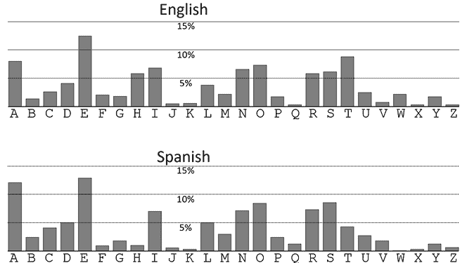

# 第十九章：B

有用的语言统计

## 字母频率

其他语言的字母频率可以在维基百科文章《字母频率》中找到。^(1) 按照频率排序的最常见字母可以通过以下无意义词语记忆：

1.  英语: ETAOIN SHRDLU

1.  西班牙语: EAOSR NIDLT

1.  法语: ESAIT NRUOL

1.  德语: ENISR ATDHU

1.  意大利语: EAION LRTSC

## 最常见的双字母组合

|  | **英语** | **西班牙语** | **法语** | **德语** | **意大利语** |
| --- | --- | --- | --- | --- | --- |
| **1** | 英 | 确 | 放 | 半 | 完 |
| **2** | 见 | 联 | 胶 | 塞 | 全 |
| **3** | 在 | 英 | 德 | 国 | 地 |
| **4** | 设 | 工 | 物 | 觉 | 目 |
| **5** | 查 | 所 | 然 | 总 | 细 |
| **6** | 放 | 再 | 终 | 而 | 其 |
| **7** | 现 | 言 | 现 | 功 | 进 |
| **8** | 技 | 错 | 否 | 过 | 百 |
| **9** | 二 | 图 | 哥 | 日 | 本 |
| **10** | 格 | 核 | 转 | 场 | 先 |
| **11** | 谷 | 巧 | 恰 | 任 | 付 |
| **12** | 高 | 回 | 项 | 封 | 锁 |
| **13** | 共 | 星 | 确 | 不 | 像 |
| **14** | 始 | 确 | 显 | 字 | 考 |
| **15** | 按 | 降 | 放 | 推 | 落 |
| **16** | 然后 | 理 | 问 | 然 | 但 |
| **17** | 它 | 是 | 新 | 的 | 和 |
| **18** | 五 | 专 | 一 | 选 | 标 |
| **19** | 间 | 看 | 凭 | 讲 | 回 |
| **20** | 完 | 说 | 永 | 学 | 看 |
| **21** | 力 | 稳 | 由 | 其 | 稳 |
| **22** | 或 | 对 | 于 | 它 | 完 |
| **23** | 你 | 或 | 对 | 于 | 完 |
| **24** | 短 | 阴 | 共 | 划 | 算 |
| **25** | 推 | 赛 | 测 | 教 | 着 |

## 最常见的重复字母

|  | **英语** | **西班牙语** | **法语** | **德语** | **意大利语** |
| --- | --- | --- | --- | --- | --- |
| **1** | 全 | 结 | 果 | 超 | 终 |
| **2** | 无 | 环 | 是 | 给 | 加 |
| **3** | 斯 | 像 | 与 | 日 | 范 |
| **4** | 全 | 毕 | 量 | 足 | 乎 |
| **5** | 无 | 的 | 动 | 现 | 性 |
| **6** | 表 | 优 | 进 | 可 | 立 |
| **7** | 单 | 笔 | 筛 | 君 | 琳 |
| **8** | 各 | 列 | 提 | 细 | 铝 |
| **9** | 结 | 数 | 阶 | 成 | 表 |
| **10** | 第二 | 日 | 持 | 度 | 持 |

## 最常见的三字母组合

|  | **英语** | **西班牙语** | **法语** | **德语** | **意大利语** |
| --- | --- | --- | --- | --- | --- |
| **1** | 每 | 难 | 识 | 单 | 样 |
| **2** | 和 | 问 | 题 | 终 | 成 |
| **3** | 以 | 负 | 定 | 配 | 于 |
| **4** | 阴 | 得 | 命 | 验 | 全 |
| **5** | 值 | 符 | 响 | 响 | 解 |
| **6** | 非 | 动 | 翻 | 白 | 学 |
| **7** | 结 | 执 | 标 | 德 | 地 |
| **8** | 准 | 张 | 活 | 把 | 黑 |
| **9** | 结 | 件 | 然 | 结 | 束 |
| **10** | 遗 | 行 | 你 | 点 | 说 |

## 最常见的单词

|  | **英语** | **西班牙语** | **法语** | **德语** | **意大利语** |
| --- | --- | --- | --- | --- | --- |
| **1** | 那 | 也 | 答 | 池 | 鳴 |
| **2** | 公 | 蓝 | 转 | 转 | 长 |
| **3** | 适 | 签 | 对 | 项 | 许 |
| **4** | 量 | 事 | 环 | 每 | 生 |
| **5** | 足 | 终 | 确 | 讲 | 对 |
| **6** | 物 | 将 | 操 | 剑 | 外 |
| **7** | 复 | 拉 | 中 | 工 | 圆 |
| **8** | 一 | 占 | 水 | 幸 | 大 |
| **9** | 是 | 为 | 在 | 这 | 个 |
| **10** | I | del | les | es | per |

## 文本中的平均单词长度

1.  芬兰语：7.6 个字母

1.  俄语：6.6 个字母

1.  意大利语：6.5 个字母

1.  英语：6.2 个字母

1.  德语：6.0 个字母

1.  瑞典语：6.0 个字母

1.  法语：6.0 个字母

1.  西班牙语：5.8 个字母

## 重合指数

*重合指数* *(IC**)* 是一种统计技术，可用于提取文本信息或比较两个文本。在频率分析之后，重合指数是破译者的第二重要统计工具。

不幸的是，文献中可以找到几种相关但不同的重合指数定义。因此，在不同来源中阅读时，人们很容易感到困惑。在本书中，我们将重合指数定义为从特定文本中随机选择的两个字母相同的概率。（我们不涉及两个字母来自不同文本的情况。）

作为例子，我们来看一下（相当短的）文本 *AAB*。从中有三种方式可以抽取两个字母：*AA*、*AB* 和 *AB*。由于只有第一个组合包含两个相同的字母，因此重合指数是 1/3，即 0.333，或 33.3%。

如果我们现在看一下文本 *AABC*，我们会得到六组可能的两个随机字母组合：*AA*、*AB*、*AC*、*AB*、*AC* 和 *BC*。其中只有一个组合包含两个相同的字母，因此 *AABC* 的重合指数是 1/6，即 0.166，或 16.6%。

正如容易看出，当每个字母被另一个字母替换时，比如应用简单替换密码时，重合指数并不会改变。*AABC*与*XXYZ*的重合指数是相同的。此外，当字母的顺序发生变化时，重合指数保持不变，这通常发生在有人对其应用了换位密码：*AABC*与*ABCA*的重合指数是相同的。因此，无论是简单替换密码还是换位密码加密的信息，重合指数始终保持不变。

由二十六个字母构成的足够长的完全随机文本的重合指数通常接近 1/26，即 3.8%。用任何自然语言书写的文本（大小写不敏感，不计空格、数字或标点符号）通常有一个介于 5% 到 9% 之间的重合指数。这个指标的一个优点是，每种语言都有其特有的重合指数。这意味着即使在应用了简单替换密码或换位密码后，破译者仍可以通过重合指数来检测文本的语言。

以下列表列出了最常见语言的重合指数：

1.  捷克语：5.1%

1.  俄语：5.3%

1.  波兰语：6.1%

1.  英语：6.7%

1.  丹麦语：6.7%

1.  瑞典语：6.8%

1.  法语：6.9%

1.  芬兰语：7.0%

1.  土耳其语：7.0%

1.  西班牙语：7.2%

1.  德语：7.3%

1.  意大利语：7.4%

1.  葡萄牙语：8.2%

在没有计算机的情况下计算重合指数是相当繁琐的。可以在 dCode 网站上找到一个重合指数计算器：[`dcode.fr/index-coincidence`](https://dcode.fr/index-coincidence)。

除了用于确定文本的语言，信息密度（IC）在破译密码方面还有其他应用。关于这一点，我们推荐威廉·弗里德曼于 1922 年出版的书籍《*信息密度及其在密码学中的应用*》。^(2)

最后，针对我们最为细致的读者，这里有一个例子，可用于测试杜宁-施梅技术：`oottn vnhoc sgrah eertn aaoeo einms rpwtr nwnte tahot pihde aegis pctln edaip eoile snghr dhlwe guaep er`。（提示：从第十一章开始。）
