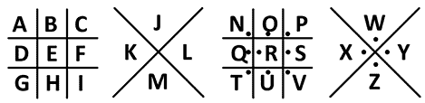

# 第二十章：C

术语表

缩写密码

一种方法，将文本中的每个单词替换为它的首字母或其他缩写形式。

美国密码学协会（ACA）

一个非营利组织，致力于推广解密的爱好和艺术。ACA 每两个月发布一次名为 *《密码报》* 的新闻简报。

贵族

一种简单的替换密码，其中保留了单词的分隔和标点符号。

ASCII 码

美国信息交换标准代码的缩写。ASCII 是一种标准化的方式，用二进制数字表示字母、数字和标点符号，这些二进制数字是计算机能够理解的零和一。例如，小写字母 *a* 的编码为 01100001，大写字母 *A* 的编码为 01000001。我们也可以将这些值以十六进制（基数 16）表示，以便更容易阅读，*a* 为 61，*A* 为 41。尽管 ASCII 被称为代码，但它其实并不是加密；它只是一个值的表格，类似于摩尔斯电码。

包杜代码

另一种“值表”系统，主要用于电传打字机/电传打印机，使用五个比特来表示每个字符。使用这种编码，操作员可以在纸带上打孔以表示每个字母，并迅速将纸带卷送入任何电传打字机，电传打字机随后将包杜代码转换为人类可读的消息。

凯撒密码

一种在罗马时代创建的密码法，它通过一个固定的字符数（最初是三个）将字母表中的每个字母移动。例如：`A`▶`D`，`B`▶`E`，`C`▶`F`，`D`▶`G` …… 一些示例密文：`Pxvlfdo jurxs idprxv iru Olhjh dqg Olhi`。

密码

一种作用于字母或字母组的加密方法。一个构建良好的密码系统可以加密任何类型的明文，因为它作用于单个字母。作为对比，*参见* 密码。

密文

加密结果。

明文

一种未加密的文本，特别是指在其他加密文本中可能显示出来的未加密部分。*另见* 明文。

密码

一种作用于单词或短语的加密方法。代码通常涉及包含预定义单词或单词组的密码本来进行加密。代码不能轻易用于加密任何随机消息。*参见* 密码。

解密

另一个指代密码分析的词。请注意，*解密* 一词指的是破解各种加密方式，包括密码和代码。

代码组

在代码中表示一个单词的数字、字母组或符号。在命名法中，代码组还可以表示一个数字、字母或其他字符。

列转置

一种列转置密码，通常要求将明文写成等长的行，并将列进行打乱。然后按列读取密文。通常，使用一个关键词来执行列转置。关于完整列转置和不完全列转置的区别，请参见第九章和第十章。

提词

代码破解者已知或怀疑在明文中出现的单词或短语。在破解密码谜题时，通常知道或猜测出出现在明文中的单词会很有帮助。

密码分析

一般而言，指在不知道密钥的情况下解密密文的技艺。也称为破解（或尝试破解）密码谜题。需要注意的是，一些密码分析师也可能会审查加密系统或分析信息，以确定使用的系统，而无需尝试恢复原始信息。

密码谜题

代码破解者正在尝试破解的加密信息（即密文）。

密码学

加密信息的科学。源自希腊语 *kryptos* 和 *graphein*，意思是“隐藏的文字”。

密码学

密码学和密码分析的整体研究。

CrypTool

一个开源项目，开发了一套免费的软件程序，实施了超过 400 种加密和破解方法。这些程序包括 CrypTool 1、CrypTool 2、JCrypTool（基于 Java 的工具）和 CrypTool-Online。在本书中的破解任务中，我们主要使用了 CrypTool 2。

DCT

*参见* 双列转置密码。

解密

破解密码，意味着对其进行成功的密码分析。解密可能针对确定密钥，而不是确定明文。

解密

密文的预期接收者执行的过程。解密需要了解使用的加密方法和（通常）密钥。解密应与破译或破解（也称为解决或密码分析）加密信息区分开来，后者意味着密钥和/或加密方法未知。

双字母组

一组由两个字母组成的组合（例如，*SJ*、*IA*、*BD* 或 *GG*）。也称为双字母组或双字母符。

双字母组替换

一种替换密码，替换字母对（双字母组）。Playfair 密码是迄今为止最流行的此类方法。

双列转置密码（DCT）

一种加密方法，由两次连续的列转置组成。被认为是最好的手动密码之一。

Dunin-Schmeh 替换法

一种替换密码，通常用于加密和隐藏密码书中的元谜题。提供类似于双 ROT-13 和 Duran-Fairport 密码的安全性。通常使用 Sheahan 1802 密钥。例如：`Ptmqt jetoq cforq wlqcl updkr tfbcq ylktt fbcqa loqyq ltfbc qaloq yqwlb jqmiu pqwlx`。

恩尼格玛

一种德国加密机，大小类似打字机，曾在第二次世界大战中使用。波兰、法国和英国的密码分析师以及其他情报人员合作破解其密码系统。

异或（XOR）操作

一种二进制算术运算，其中一组 1 和 0 与另一组相加。结果或和被认为是 0，如果两个值相同；如果它们不同，则为 1。例如，如果 1111 与 0000 进行异或运算，结果为 1111。如果 1111 与 0010 进行异或运算，结果为 1101。如果 1010 与 1110 进行异或运算，结果为 0100。在密码学中，单词中的字母有时会被转换为 ASCII 并与预定密钥的 1 和 0 进行异或。结果的二进制流随后被传输给接收者，接收者再将其异或回原始明文。如果二进制密钥是随机的，我们称之为费尔南密码或一次性密码本的特殊情况。

自由石匠密码

*见* 豹文密码。

频率分析

确定信息中字母频率的行为。对密码破译者来说是一个重要工具。

七字图

一组七个字母。

六字图

一组六个字母。

同音字

代表同一明文字母的多个密文字母或字符。*见* 同音密码。

同音密码

一种包括同音字的密码。使用同音替换的人在编码某个字母时可以选择几个替代选项。

相合指数（IC）

从文本中随机选择的两个字母相同的概率。对密码破译者来说是一个重要的分析工具。

密钥

一些只有发送者和接收者应知道的秘密信息。在实践中，大多数加密方法都有密钥，尽管在某些情况下，了解方法本身即为密钥。预定接收者应能轻松解密信息，只要他们知道密钥，而第三方在没有密钥的情况下不应能够破译密文。（注：一些简单系统，如贵族密码，可能导致无需恢复完整密钥即可提取明文。）

关键字

许多密钥的表示方法（例如，`BIRDHOUSE`），比起数字（例如，`844708615`）或大型表格，更容易记住。

手工密码

一种可以通过纸和笔或简单的密码工具应用的加密方法，而不需要复杂的密码机或计算机的帮助。

摩尔斯电码

一种由点和划或短脉冲与长脉冲组成的系统，用于通过电报或无线电传递信息。虽然它被称为编码，但它不是加密系统，而是一种通信方法。（摩尔斯电码表见附录 D。）

命名符

一种结合简单替换或同音密码与编码的加密方法。命名符提供一个或多个数字、字母组或符号，代表字母表中的每个字母和常见单词。这种系统有时也称为命名法。

空值

在密文中包含的无意义符号，用于混淆破译者。它是许多替换密码、编码和命名法的重要组成部分。

八字图

一组八个字母。

一次性密码本

一种替代密码，它将一个随机序列（密钥）添加到明文中。如果使用得当，也就是密钥不可猜测且只使用一次，那么一次性密码本是不可破解的。然而，使用一次性密码本需要大量的密钥材料，这使得它在许多应用中不实际。

圣公会

一种简单的替代密码，其中删除了单词分隔和标点符号。

五字母组

五字母组。英语中最常见的五字母组合是*OFTHE*。

豕字密码

一种简单的替代密码，用符号替换字母，符号取自类似井字游戏的网格。也被称为共济会密码，因为它在 18 世纪在共济会中非常流行。它有许多变体。以下是一个例子：

明文

需要加密的信息。不同于明文，明文是指在其他加密信息中未加密的部分文本。

普雷费尔密码

一种替代加密方法，用其他双字母组合替代双字母组合。基于一个方形表和一些简单的替代规则。

多字母表密码

基于多个替代表的替代密码。每个表的应用遵循某种规则（例如，第一个表可能加密第一个字母，第二个表可能加密第二个字母，依此类推）。可以通过简单的方法构造一个表，例如使用凯撒密码对每个字母表进行位移。

ROT-13

一种凯撒密码，它将每个字母替换为与之相隔十三个位置的字母，使用二十六字母的字母表。ROT-13 的优点是每个字母如果加密两次，会恢复到原来的形式。

速记

一种提高写作速度和简洁性的书写方法。有时也用于（低级别）加密。

简单替代

一种基于固定的、一对一替代表的加密方法。凯撒密码就是一种简单的替代密码，虽然密码字母表也可以是键控的或随机的。

隐写术

隐藏信息的科学。常见的隐写方法包括反应性墨水、标记字母、用单词首字母拼写信息，以及将信息隐藏在其他文件的比特和字节中的各种数字系统。加密使信息变得不可读，而隐写术则隐藏其存在。不要与速记术混淆。

隐写术

速记的另一种说法。

替代密码

一种通过替换字母或字母组进行加密的方法，不同于置换密码，后者是通过打乱信息来加密的。

超级加密

对已经加密的信息执行的加密。超级加密通常用于增强代码的安全性。这些方法有时非常简单；例如，添加当前的日期可以使每个字母发生相应的位移。详见第七章的 JN-25。

四字母组

由四个字母组成的组，也称为四元组或四字组合。英语中最常见的四字组合是*TION*。

置换密码

一种加密方法，通过改变消息中字母的顺序。它有许多变种，其中最流行的是旋转格密码和列置换密码。

三字母组合

由三个字母组成的组，也称为三元组。英语中最常见的三字母组合是*THE*。

旋转格密码

一种加密工具，由一个带有各种孔洞的方形模板组成。加密时，通过将模板旋转九十度四次，在每个方向的孔洞中写入字母。

维吉尼亚密码

一种多字母替换系统，曾被认为是“无法破译的密码”（chiffre indéchiffrable）。今天，凭借现代破译技术，它通常能被迅速解开。
