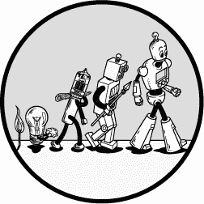
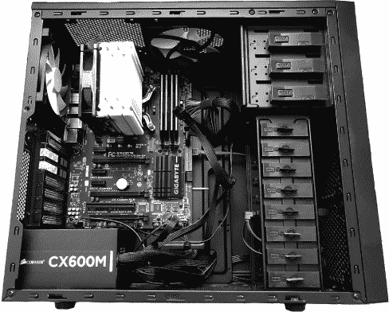
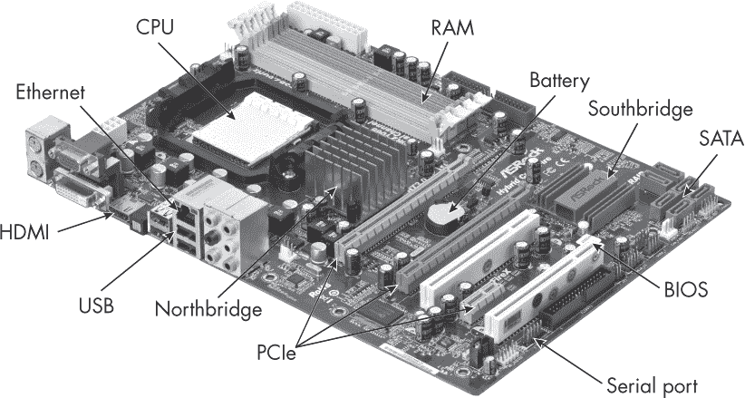
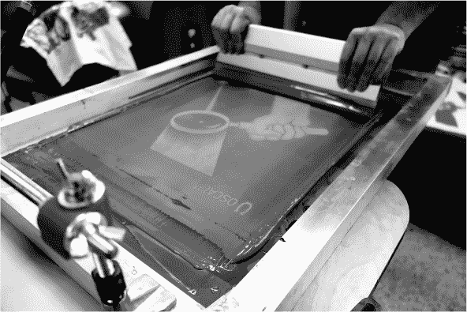
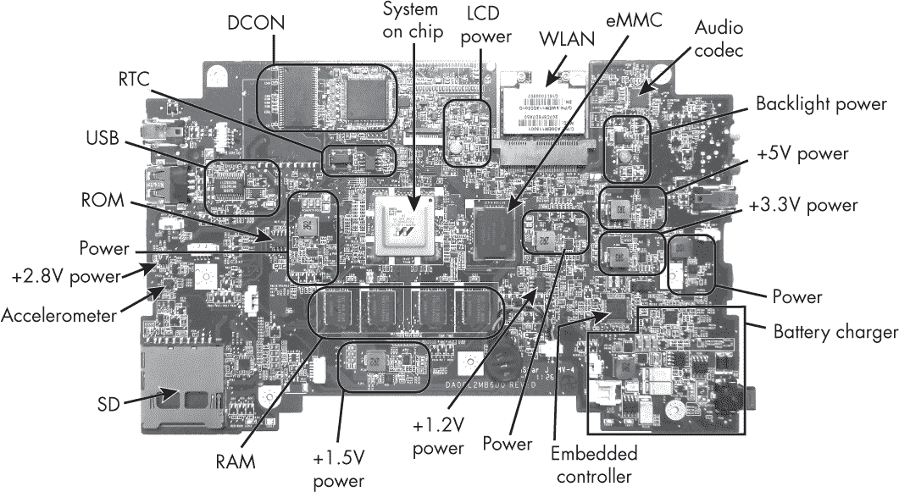
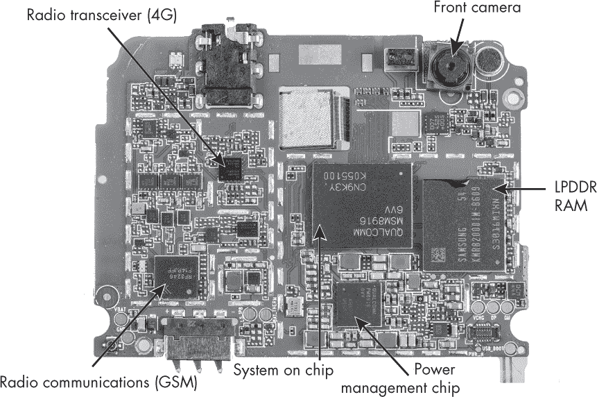
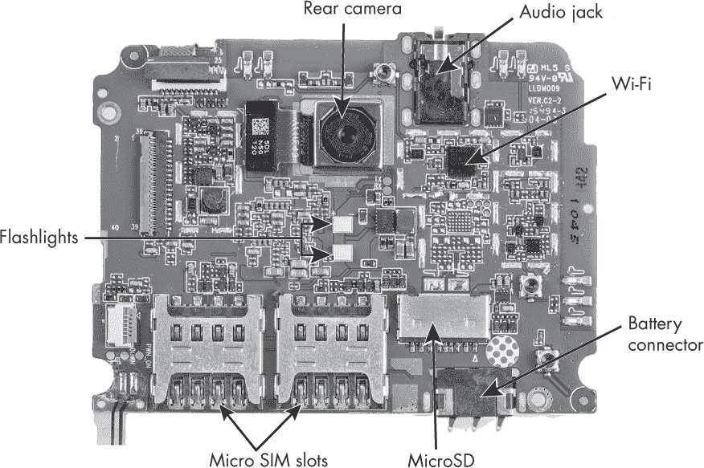
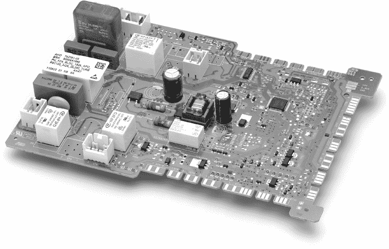

## 前言

本书探讨了*计算机架构*领域，研究计算机硬件的基本原理和设计。该领域涵盖了多个层次的硬件组件和技术，从基本的硅和晶体管，到逻辑门、简单的计算机、汇编语言，再到复杂的处理器和内存。

这本书还追溯了计算历史，从古希腊的机制到二战时期的破译机器，再到复古的 8 位游戏主机、经过高度优化的现代 CPU 和深度学习 GPU、嵌入式物联网设备、云服务器，甚至未来的架构，如量子计算机。计算机架构识别了这些不同机器和组件之间的联系趋势。正如你将看到的，一些计算机原理比你想象的要古老得多。

### 这本书适合谁阅读？

计算机架构是少数几门能将完整的计算机科学家与普通程序员区分开来的学科之一。如果你是计算机科学的本科生，这可能是你学位课程的必修内容。如果你是自学的程序员或黑客，这可能是你希望深入了解的一个学科，既能让你的程序与硬件更和谐地运行，也能作为一种专业身份的象征，许多雇主对此有所关注。本书假设你知道一些基础的高中编程、数学和物理知识，但除此之外，本书是自成一体的。它既可以作为本科计算机架构学位的硬件要求教材，也可以作为独立学习者的第一手资源。

### 为什么要学习计算机架构？

在 1980 年代，我还是一名年轻程序员时，编程和使用计算机与对计算机设计的理解是紧密相连的。例如，在 1980 年代，编写 8 位微型计算机游戏的艺术在很大程度上就是要与家用微型计算机中的特定 CPU 和芯片组融为一体；我们对自己选择的架构有着极高的忠诚度。那时计算机资源非常有限，因此游戏是为了利用架构的特定特性，并最大限度地挤压出计算机的性能。许多那个时代的游戏概念就是根据特定的架构结构和技巧产生的。

今天的编程与以前大不相同。在大多数应用层编程中，有许多软件层次结构将程序员与硬件隔离开来。你可能会在一种与处理器和内存的类型几乎没有关系的语言中编程。这些类型让你不必考虑内存地址——或者至少它们位于一个操作系统上，操作系统将物理内存地址替换为虚拟内存地址，并禁止通过抽象的系统调用接口访问存储在硬件中的程序。因此，当来自 8 位时代的程序员看到今天重建的 Android 和 JavaScript 版本的他们的游戏时，他们可能会觉得这些版本不够真实。游戏失去了与硬件的紧密联系，而这种联系曾经是它们的灵感来源并对其进行约束。

一些人，*系统程序员*，设计和维护介于硬件和软件之间的工具栈，但其他人都处于该栈之上。尽管如此，这些工具仍然将你连接到底层硬件，尽管是间接的，如果你理解硬件的结构，你通常可以更有效地利用各个层次的工具。你还可以更好地衡量工具的表现，并利用这些信息在程序中做出更智能的选择。你可能会使用更高效的算法或改变某个进程的实现方式。

真正关心高性能的程序员，比如游戏引擎和科学金融模拟的作者，可以通过打破一些堆栈层次，直接与“裸金属”硬件进行交互，受益于此种编程方式。这种编程被称为 *汇编语言编程*，在今天已经很少见，因为优化过的编译器通常能够超越大多数手写的汇编语言代码；然而，仍然有一些程序员喜欢接近硬件层次。他们可能会通过从一种内存管理语言切换到一种基于指针的语言，或者从使用符号类型的语言切换到使用机器本身类型的语言来实现这一点。几十年来，C 语言一直是首选的低级语言，尽管 Rust 等新兴语言也在不断涌现。

计算机架构与计算机安全性也直接相关。攻击通常涉及在比假定为安全的层次更低的层次工作。虽然计算机可以在某个层次上被证明是安全的，例如操作系统的用户态，但像 CPU 组件的精确时序和不同内存位置的访问速度等低层次的细节则为利用提供了新的可能性。例如，Spectre 和 Meltdown 漏洞存在于 CPU 层次，但当程序员理解要寻找什么时，用户态代码可以测量并利用这些漏洞。

最后，通过研究计算机架构的历史并观察这一领域如何不仅在几十年间，而且跨越几个世纪的发展，我们可以从过去的错误中汲取教训，并发现旧思想的新用途。历史架构中的一些概念在经过长时间后重新被使用是非常常见的。例如，要处理一个数字，查尔斯·巴贝奇的机械计算机必须将数字从内存中移到处理器中；这意味着数字在任何时候只能存在一个地方，而不是被复制。如今，我们在量子计算的研究中看到了这种结构，巴贝奇为解决该问题而提出的一些思想可能会获得新的生命。架构的历史就像是一个思想的宝库，我们可以根据需要从中汲取灵感。

### 领域变化

直到最近，计算机架构还是一个枯燥、成熟的学科。它起源于 1950 年代和 1960 年代，其基本原理长时间未变。书籍会定期更新，展示最新的产品示例，例如更快的 CPU 和使用更小晶体管的计算机，但架构原理始终未变。然而，自 2010 年以来，这一切发生了变化：这一学科进入了新的“黄金时代”，部分原因是计算领域其他分支需求的变化。最近有一股趋势，传统桌面计算机逐渐被两种截然不同的方向取代。

首先，计算机正在变得*不那么*强大，无论是计算能力还是能耗方面。我们现在希望拥有更多、更小、更便宜、低能耗的计算机来支持我们生活的各个方面。这些设备使得*智能城市*、*智能农业*、*智能交通*和*物联网*成为可能。与此同时，这些设备收集了大量数据——我们现在所称之为*大数据*——而处理这些数据需要一种全新的计算机类型：极为庞大的超级计算机或计算集群，这些计算机通常位于如工厂般的专用场地内。大楼内部没有人，只有一排排闪烁的服务器指示灯。

你可能听说过*深度学习*，这是对 60 年历史的*神经网络*算法的重新包装。可以说，深度学习根本不是机器学习或人工智能理论的一个分支，而是计算机架构的一个分支。毕竟，正是基于大规模硬件并行化、通过 GPU 集群和定制硅芯片的新架构，使得这一古老算法得以快速发展，并能够在比以前大得多的规模上运行。得益于计算机架构的这些进展，我们终于可以利用神经网络解决现实世界中的问题，比如视频中的物体识别和与人类进行自然语言对话的聊天机器人。

另一个架构变革动摇了长期以来的信念。数十年来，程序员们信奉*摩尔定律*，该定律指出，无论你信的是哪一种说法，要么是晶体管的数量，要么是处理器的速度每 18 个月就会翻倍。这使得程序员产生了自满情绪，认为在常规架构上速度会不断增加。然而，最近，能源使用的考量让摩尔定律的速度形式走到了尽头。尽管我们仍然能够构建越来越多的晶体管，但自维多利亚时代以来的第一次，我们现在需要将计算机重新概念化为固有的并行模式，以便利用这些晶体管。

关于未来并行架构是否会对程序员可见，从而要求程序员在日常编程中具备固有的并行思维，仍然是一个悬而未决的问题；或者人们是否会编写新的编译器，在常规串行程序和新型并行架构之间进行翻译。无论哪种方式，都将有令人兴奋的新职业在等待着探索这一问题。我们正在寻找可能来自非常古老的源头（如钟表和水计算机）或非常新的源头（如神经计算、光学计算和量子计算）的新思想。

最后，最近在线协作工具的广泛可用性促进了新一波开源架构系统和工具的兴起。RISC-V、BOOM、Chisel 以及过去、现在和未来机器的模拟器都使得计算机架构的学习变得更加容易、快捷和可获取。在本书中，您将会接触到这些工具中的许多。时隔多年，研究和教授架构变得如此令人兴奋！

### 如何使用本书

架构通常是必修课或专业要求，许多不喜欢这一科目的学生仍然不得不学习——我应该知道，我曾经就是其中之一！为了帮助这些学生更轻松地接受这门课程，我为他们添加了一些“糖”：我会将这门学科与其他你可能更感兴趣的话题联系起来。如果你讨厌硬件，但喜欢音乐、机器人、人工智能、历史，甚至是高级乐高拼装，那么这本书可能适合你。你甚至可能通过这些联系开始喜欢架构；或者，如果你只是需要通过考试，也许这本书会比其他一些书更轻松地帮助你通过考试。

尽管计算机架构的未来新颖且令人兴奋，但了解过去也很重要，因此本书采用了广泛的历史性方法。计算机随着时间的推移变得越来越复杂；通过追溯它们的历史，我们可以逐步建立这种复杂性。例如，你将通过学习如何在蒸汽朋克风格的维多利亚时代分析机上编程，了解 CPU 的基本结构——这些结构至今仍在使用。我将向你展示如何将它的机械部件转化为基于逻辑门的等效物，并且如何构建并编程一个版本的曼彻斯特婴儿，这是最早的电子计算机之一。然后，你将扩展电子计算机到 8 位和 16 位复古游戏计算机，学习编程 Commodore 64 和 Amiga。接下来，我将介绍现代桌面计算机和智能计算机，包括 x86 和 RISC-V 架构，然后讨论云计算和超级计算机。最后，我们将探讨未来技术的理念。

本书将研究许多示例系统，但它们主要是为了阐明一般概念，而不是作为现代产品的具体指南。当你读完本书后，你应该具备足够的理解，例如，能够在面包板上构建一个 8 位微处理器，用汇编语言编写复古的 8 位游戏，编写基本的嵌入式和并行程序，理解历史的发展，并预测架构的未来。你也应该为阅读未来学习和工作所需的经典参考书籍做好准备。

如果你尝试深入研究每一章，你将能从本书中获得最大收获——不要仅仅接受它们的表面内容。例如，可以在 LogiSim 中设计大规模的 CPU，将其烧录到便宜的现场可编程门阵列（FPGA）上，并实际运行。另一个例子是，你可以使用本书中介绍的所有架构和汇编器来编写你自己的视频游戏。本书讨论的 LogiSim 文件和汇编代码片段都可以下载；请参阅本书的网页，* [`nostarch.com/computerarchitecture`](https://nostarch.com/computerarchitecture) *，获取下载链接。我还鼓励你通过使用图书馆、维基百科和更广泛的网络，进一步了解本书的主题，并查看每章末尾列出的参考书目；然后找到它们引用的有趣资源。同样，尝试以新的方式使用本书章节末的练习中展示的工具，并留意网上的其他有趣项目创意。例如，许多 YouTuber 通过从 eBay 上购买 6502 处理器、RAM 芯片和电线，制作了简单的 8 位计算机。架构是一个特别具有视觉性、适合写博客和制作 YouTube 视频的主题，因此，如果你创造了有趣的东西，一定要分享你的成果。

开始学习架构的一个好方法是购买一套小型螺丝刀，打开你的电脑、笔记本电脑和智能手机，甚至一些不太显眼的设备，如路由器、电视和洗衣机，从而使你的产品保修失效。在接下来的部分，我们将看到你可能在这些设备内部发现的一些例子，并学习如何探索它们。

### 常见设备内部

计算机架构的范围从晶体管的原子尺度到互联网格计算的行星尺度。为了尽早感受这个主题，我们将在这里从最接近人的层面开始：当我们打开家用计算机的外壳并看里面时所看到的内容。通常，裸眼能看到的主要组件是排列在印刷电路板上的硅芯片。书中的后面部分，我们将深入探讨芯片、逻辑门和晶体管，并从这些层次向上构建到集群和网格。

#### *台式电脑*

在过去的几十年里，大多数台式电脑都采用了标准化尺寸的组件和外壳，因此你可以从多个竞争厂商生产的组件中组装一台电脑，而无需担心它们是否能够匹配。IBM 在 1980 年代开始了这一趋势。由于这种标准化，如果你卸下螺丝和外壳并打开台式电脑，通常会看到类似于图 1 所示的结构。

*图 1：台式电脑内部*

关键特征是一个叫做*主板*（也叫*母板*或*系统板*）的大型印刷电路板，其他较小的电路板以直角插入主板。主板，如图 2 所示，包含计算机的核心部件，包括*中央处理器 (CPU)*，有时简称为*处理器*，以及主内存；其他电路板是可选的扩展。

你通常可以通过眼睛找到 CPU：它位于系统的中心，看起来像地图上一个国家的首都，所有的道路都通向它。它通常位于一个非常大的风扇下方，以散热 CPU 中所有晶体管产生的热量。内存是下一个最重要的组件。主内存通常是显而易见的，呈现出一些物理上较大但均匀的区域；这是因为主内存在计算上是庞大且均匀的。在台式机中，主内存通常出现在几块板上，每块板上都有多个相同的 RAM 芯片，排列得整整齐齐。

*图 2：一块台式电脑的主板*

*印刷电路板（PCBs）*，例如主板，采用类似于丝网印刷海报或 T 恤的过程制作，如图 3 所示。在丝网印刷中，你为设计选择多个颜色，并为每种颜色购买一罐油漆。然后，使用 CAD 程序将设计分成这些颜色的区域块。你为每种颜色打印出二进制图像到不同的透明片上，标明该颜色油漆的位置，然后为每种颜色制作一个丝网印刷*遮罩*。遮罩起初是一个丝织物片，你在其上涂上一层光敏胶。将你打印出的透明片放在遮罩上，然后照射强光。

*图 3：为了打印这个海报，将丝网遮罩放置在纸张上，通过刮板将油漆推过它。*

光敏胶在透明区域反应，而在黑色区域不反应。然后，你将遮罩放入水中，水洗去反应过的胶层，保留未反应的部分。剩余的胶层不允许油漆通过，而暴露的丝织物区域则允许油漆通过。现在，你可以将遮罩放在一张空白的纸张或 T 恤上，倒上油漆，油漆将仅通过设计中的指定区域。一旦让这层颜色干透后，你就可以对剩余的每种颜色重复整个过程，直到完成设计。

PCB（印刷电路板）的制作过程类似。首先，你从一个防酸的玻璃纤维绝缘板开始，完全覆盖一层铜。你在 CAD 程序中设计电路布局，将其打印到透明片上，然后通过透明片照射光线，选择性地遮蔽板上的光敏化学物质。接着，将板浸入酸中，去除未被遮蔽的铜层部分。剩下的铜形成 PCB 的线路。接下来，你将电子元件焊接到板上的适当位置。焊接以前是手工完成的，但现在是通过机器人完成的，机器人更加精准，且能处理更小的元件。

除了主板，PC 机箱的其他部分包含电力变压器，将家庭电源转换为计算机所需的各种电压，还有大容量存储设备，如硬盘和光盘驱动器——即 CD、DVD 或蓝光驱动器。

在过去的几十年里，个人电脑（PC）有许多扩展卡用于与显示器、音响设备和网络接口，但最近这些标准接口已转移到主板上的芯片上。标准尺寸的 PC 机箱（称为 ATX 外形规格）在现代台式机中通常包含大量空余空间，因为零部件已被微型化并集成到主板上。唯一明显例外的是显卡（图形处理单元，GPU），在高端机器中，显卡可能与主板一样大，甚至更大，以支持快速的 3D 视频游戏和科学计算。玩家喜欢通过 LED 灯照亮显卡，并使用透明 PC 机箱来展示这些显卡。

#### *笔记本电脑*

笔记本电脑的逻辑结构与台式机相同，但它们使用更小、功耗更低的组件，尽管这样牺牲了计算能力并增加了制造成本。图 4 展示了一个笔记本电脑主板的示例。

笔记本电脑主板并不是完全矩形的，而是根据可用空间的形状来设计的。由于没有空间容纳大型连接器，许多组件直接焊接在一起。与台式机不同，这里没有可交换的扩展卡垂直插入主板，而是选择了适合所有部件在键盘下整齐布置的外形规格。笔记本电脑的外形规格和组件标准化程度也低于台式机，每个制造商根据自己的需要选择组件。所有这些特点使得笔记本电脑更加昂贵，并且难以升级或更换部件。

*图 4：笔记本电脑主板*

近年来，笔记本电脑中的安全启动系统为计算机架构带来了安全应用的挑战。过去，拿着雇主的笔记本电脑，卸下某些专有操作系统并替换为开源系统（如 Linux）非常容易。专有操作系统的开发商试图通过支付硬件制造商实施安全启动系统，限制你进行这种操作，甚至声称这是雇主的要求。这些系统在操作系统或引导加载程序有机会加载之前，就会将用户锁定在无法访问硬盘启动扇区的状态。你现在需要在硬件级别绕过安全启动，比如通过将专用芯片上的两个引脚短接来恢复出厂设置。由于这些引脚现在非常小，有时需要显微镜和精密焊接来完成短接。（这纯粹是假设的，因为篡改雇主设备或硬件制造商与操作系统供应商之间的协议可能是非法的。）

#### *智能手机*

在计算领域，*智能*一词如今意味着“是一个计算机”。历史上，消费电子设备如手机和电视都是为单一目的设计的，但近年来的趋势是将完整的计算能力融入其中。曾几何时，这是一种新奇事物，但现在，世界上很大一部分人群都将一台完整的计算机放在口袋里。因此，我们需要像对待传统桌面电脑和笔记本电脑一样，认真看待智能手机和其他智能设备作为计算机。图 5 展示了一款智能手机的主板。

*图 5：Wileyfox Swift 智能手机内部，展示了主板的上下两面*

该设计基于 ARM Cortex CPU。其他一些芯片则专门用于手机特定的功能，包括 Wi-Fi 和蜂窝网络（GSM）无线通信、电池管理以及位置和环境感应（如惯性测量单元、温度和压力传感器）。内存与桌面和笔记本电脑不同——这里使用了低功耗 RAM（LPDDR）。这种内存通过在不需要时清除并关闭内存部分，减少了电池使用。

计算机如今已小型化到几乎所有连接器可能成了占用最多空间的瓶颈，而不是计算机本身。例如，将手机的 3.5 毫米耳机插孔连接器换成更小的端口，一直是一个持续的争论。没有标准耳机插孔可能会带来不便，但拥有耳机插孔却会限制手机的体积。

#### *洗衣机*

如果我们的手机和电视是计算机，那么我们是否也可以考虑现在的洗衣机是计算机呢？图 6 展示了一台典型现代洗衣机的主板。

板上有一个小处理器，可能包含*固件*，即“烧录”到芯片中的一个单一程序，执行单一任务。这是我们将在第十二章讨论的嵌入式系统的一个例子。

*图 6：洗衣机的主板*

像洗衣机和冰箱这样的消费电子设备如今受到关注，因为它们像手机一样，可能会成为下一代“智能”设备——即能够运行任意程序的设备。当“智能家居”完成时，用户将期望能够远程拨入洗衣机，查看其状态并下达命令。智能洗衣机甚至可能配有应用商店，允许用户下载和运行额外功能，如机器学习工具。这些工具可以识别并适当清洗不同的衣物，从而节省金钱和地球的能源与水资源。

这就是我们对一些设备的概览。随着我们进入接下来的计算机架构章节，我们对这些设备如何工作以及如何组织的理解将逐渐加深。在开始之前，这里有本书的简要概述以及一些供你尝试的练习。

### 本书概览

第一部分介绍了所有架构背后的基本概念。

**第一章：历史架构** 描述了计算机发展的历史演变，不仅仅是为了教授历史本身，更因为许多概念随着时间的推移不断重复并增加复杂性；这将帮助你通过先理解它们的简单前身，进而了解复杂的现代系统。

**第二章：数据表示** 讨论了如何使用二进制编码方案表示数据，这些方案稍后将通过数字逻辑实现。

**第三章：基本的基于 CPU 的架构** 探讨了 CPU 是什么，它的基本子组件以及它的机器代码用户界面。

一旦你理解了第一部分中的概念，计算机架构的核心结构从根本上是分层的；第二部分将逐步深入这一层级。

**第四章：开关** 介绍了开关，这是现代计算机的基本构建模块。

**第五章：数字逻辑** 从这些开关中构建逻辑门。

**第六章：简单机器** 将这些逻辑门组合成简单的机器。

**第七章：数字 CPU 设计** 使用这些简单的机器构建 CPU 组件，最终完成一个完整的小型 CPU。

**第八章：高级 CPU 设计** 介绍了更先进的现代 CPU 特性，如流水线和乱序执行。

**第九章：输入/输出** 增加了输入/输出（I/O），这是从 CPU 到完整计算机的又一步。

**第十章：内存** 介绍了内存，这是构建完整计算机的最后一个必要部分。

第三部分由逐渐复杂的实例和应用组成，基本上按照它们的历史顺序展开；这些实例旨在加强你对第二部分所学结构的理解。

**第十一章：复古架构** 从 8 位和 16 位时代相对简单且完整的复古计算机开始，包括向你展示如何在其汇编语言中编写复古视频游戏。

**第十二章：嵌入式架构** 展示了现代低功耗物联网设备如何与复古设备具有相似的结构、功能和编程风格。

**第十三章：桌面架构** 研究了 x86 架构的复杂指令集及其历史，这可能是你主力桌面计算机的基础。这将使你能够在“裸机”上（即不依赖操作系统的情况下）使用汇编语言编程。你还将探索你桌面计算机可能包含的常见 PC I/O 标准和外设。

**第十四章：智能架构** 转向了越来越多的小型智能设备，它们正在取代桌面计算机。这些设备的特点是采用诸如 RISC-V 等 RISC 架构，并结合汇编编程和数字逻辑设计工具。

**第十五章：并行架构** 讨论了并行架构，随着 CPU 运行速度的瓶颈，越来越多的并行架构变得常见。

**第十六章：未来架构** 通过对可能的未来架构进行推测进行总结，包括神经网络、DNA 和量子计算。

**架构、组织还是设计？**

*计算机架构*传统上与*计算机组织*有所区分，前者指的是程序员可见的硬件-软件接口设计，后者则指这些接口的硬件实现，程序员不可见。在这个语境下，程序员被认为是在汇编语言级别工作，汇编语言承担着程序员接口的角色。然而，在现代世界中，程序员很少直接接触到汇编语言级别，因为他们几乎总是使用编译语言工作。编译器，现在的操作系统，甚至像库和游戏引擎这样的更高层结构，都将用户抽象到了比旧有汇编接口更高的层次。因此，传统的架构与组织的区分变得不再那么有意义。

在本书中，我们将*架构*用来指代上述所有内容，并将*指令集架构（ISA）*用来表示更具体的硬件与程序员接口的研究。我们的架构定义还包括对计算机硬件各部分的研究，尤其是 CPU 之外的部分，如内存和 I/O 系统，这有时被称为*计算机设计*。现代计算机越来越多地以集群和云的形式互联，因此现在可能很难或没有意义区分一组紧密连接的计算机和一台大型计算机。因此，我们的架构概念也扩展到这类系统。

*架构*和*层次结构*这两个词都包含词缀*arch*。它们之间的联系并不简单：架构主要涉及层次结构。层次结构是将完整的结构组织成组件和子组件的方式。没有人能够理解芯片上十亿个晶体管的结构，但是如同软件设计一样，我们通过将其分块为多层抽象来理解。我们将晶体管分成大约四到五个一组的逻辑门；然后将逻辑门分成像加法器这样的简单机器；接着将这些机器分成 CPU 的组件，然后再是 CPU 本身。这样，每个层次都可以从数十到数百个可理解的组件设计，设计者只需在他们工作的单一层次上思考。正如前面提到的，本书的第二部分的结构遵循这种层次结构，从晶体管开始逐层构建，引入越来越大和更高的结构。

### 练习

每章末尾都有一些练习，帮助您将所学应用到现实世界的系统中。一些任务标有“挑战”标题，提出额外挑战，因此更难。在“更具挑战性”的标题下的任务非常困难或耗时较长，更多是针对大型个人项目的建议。

#### **在您自己的设备内部**

1.  如果您愿意违反设备的保修条款，购买一组小螺丝刀并打开台式机，查看内部结构。请小心只打开外壳而不要干扰电路板本身。试图识别主要组件，包括电源供应器，主板，CPU，RAM，GPU 和通信设备，就像我们之前讨论的示例一样。如果您对自己的螺丝刀技能不确定，您可能希望在旧的牺牲设备上练习，然后再处理主要设备，或者搜索其他人打开类似设备的互联网视频。

1.  您在内部找到的大多数组件都会有品牌名称和型号编号。搜索互联网获取这些组件的正式产品资料表。使用资料表来识别部分关键属性，例如 CPU 核心数量和速度，RAM 及其缓存的大小，GPU 内存大小，存在的输入和输出设备以及它们的能力和速度。（如果由于散热器而难以访问您的 CPU，您通常可以在主板资料表上找到其品牌和型号。）

#### **软件设备检查**

1.  您还可以使用软件工具检查硬件，而无需在许多机器上违反保修。例如，如果您在运行 Linux，请尝试以下命令：

    lscpu

    cat /proc/cpuinfo

    lshw

    free

    hwinfo

    lspci

    lsusb

    nvidia-smi

    clinfo

    在 Windows 上，从“开始”菜单运行“设置”程序，然后在系统设置中查找类似的信息。

1.  进行一些互联网研究，以解读结果。

1.  如果你实际打开了设备，请检查设备内部的品牌和型号是否与软件报告的相符——它们不匹配是相当常见且有趣的现象，如果你看到这样的例子，研究一下为什么会这样！

#### **具有挑战性**

如果你习惯了打开台式电脑并查看内部，可以购买一些小型螺丝刀，对旧笔记本电脑做同样的操作。

#### **更具挑战性**

如果你习惯了拆解笔记本电脑，可以购买更小的螺丝刀，尝试对你的手机或游戏机做同样的操作。有些手机可以用 Torx 螺丝刀打开，虽然其他手机可能需要你购买一些在线几美元的手机修理工具包。有些日本游戏机使用的是日本标准螺丝，而不是西方标准螺丝。你也可以为这些设备订购修理工具包，同样也只需要几美元。（有些设备并不打算让用户自行打开或维修，因此它们通常使用胶水粘合，导致很难进行拆解。）

### 进一步阅读

本书主要面向那些希望了解架构并成为其*用户*的读者。然而，对于那些希望在架构领域*工作*的人，比如芯片设计师，本书也应该有所帮助。如果你是这样的读者，你可能想至少快速浏览一下专为工作中的建筑师准备的大部头、较为困难的标准教材，以便更好地了解他们的工作内容：

John Hennessy 和 David Patterson，*计算机架构：定量方法*，第 6 版（美国剑桥：摩根·考夫曼出版社，2017）。

这是由 Turing 奖得主、RISC 和 RISC-V 发明者编写的经典权威参考书。目前建议仅快速浏览它。你很可能在完成本书后作为准备工作再回过头来阅读它。
