## 第二章：## **历史建筑**

计算机科学的历史比许多人想象的要悠久得多。本章将从 40,000 年前开始，直到今天为止。现代微芯片乍一看可能显得难以理解且陌生，但如果了解其历史，你就能通过逐渐发展了几千年的结构来理解它的各个小组成部分。

学习该领域历史的原因还有很多。了解计算机科学的悠久历史能为我们作为一个独立于数学或工程等领域的学科增加更多的可信度和权威性。看到思想是如何逐步发展的，通过彼此的积累，也能帮助我们摆脱“孤独天才”的神话，揭示这些人可能和我们一样。最后，追溯“历史的轨迹”不仅能解释我们是如何走到今天的，还能预测我们未来的方向，帮助我们预测或创造未来。

### 什么是计算机？

当我们今天想象“计算机”时，可能会想到台式电脑、游戏机或智能手机等设备。但这些并不是人类唯一用于计算的机器。要追溯计算机的历史，我们首先需要决定什么算作计算机，以及计算机与普通计算器或计算机械有什么不同。这是一个出乎意料的难题，至今仍有争议。我的判断标准是：你能在上面编程 *太空入侵者* 吗？一个简单的计算器做不到这一点，所以它不是计算机；而一个可编程的计算器通常可以，因此它是计算机。

让我们来看一些常常用来定义计算机的概念。一些资料——包括*牛津英语词典*——要求计算机必须是电子设备。但类似的机器也可以用其他材料制造，比如水。考虑一下*MONIAC*，即货币国民收入模拟计算机，这是对稍后我们将在本章中讨论的 ENIAC 计算机的双关语。MONIAC 于 1949 年建成，见图 1-1，它是一台模拟水计算机，用于模拟货币在经济中的流动，并展示经济干预对经济模型的影响。

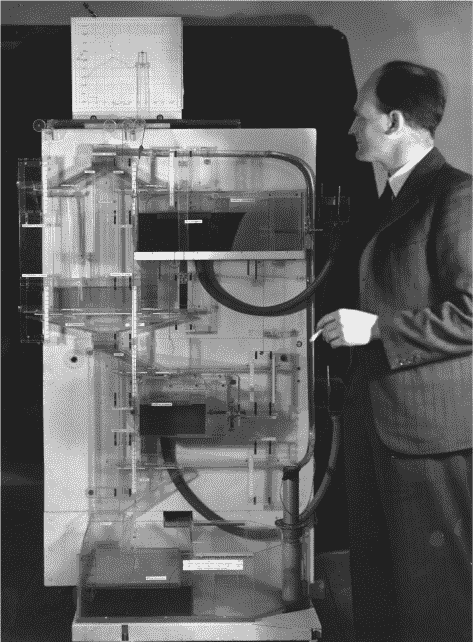

*图 1-1：MONIAC 水计算机及其创造者 Bill Phillips*

MONIAC 让你可以调节利率，并观察其对失业率的影响。水箱展示了经济中各个部门（如中央银行、储蓄和投资）中资金的位置，这是根据机器内置的经济学理论来设计的。

有些人认为计算机必须是*数字*的，而非*模拟*的。数字机器是通过*数字*表示数据的机器，数字是离散的符号集，例如二进制数字 0 和 1。与此相对，模拟机器具有无限、连续的可能状态集，例如 MONIAC 储液池中的水量，这使得 MONIAC 成为一台模拟机器。

MONIAC 在我原本的*太空侵略者*测试中处于什么位置？它只计算单一经济模型的结果，尽管如果我们能重新配置一些管道和储液池，使它们具有不同的尺寸和连接方式，它也许能运行其他经济模型。从这个角度来看，也许 MONIAC 可以通过更为严苛的这种重新配置来实现*任何*计算任务，比如运行*太空侵略者*。但那时我们是否依然会有一台在新配置下的相同计算机，还是会得到一台新的、不同的机器，只能计算另一个不同的任务？换句话说，MONIAC 是*可重新编程*的吗？

我一直在使用*太空侵略者*作为测试程序，但很容易得出结论：为了让某物成为一台计算机，它必须能够重新编程来做*任何事情*。然而，计算理论表明，这不能作为定义。对于任何候选计算机，总是可以找到它无法解决的问题。这些问题通常是关于预测候选计算机自身未来行为的问题，这可能会导致它进入无限循环。

深入一些计算理论，我们可以得到*丘奇命题*，它是对计算机的更严谨的定义，现代计算机科学家普遍认同。它可以这样表述：

计算机是一种可以模拟任何其他机器的机器，只要提供足够的内存。

我们将满足丘奇命题的机器称为*丘奇计算机*。特别地，显然存在能够完成以下任务的机器，因此丘奇计算机也必须能够执行这些任务：

+   读写和处理数据

+   读写并执行程序

+   加法（因此能够进行算术运算）

+   跳转（`goto`语句）

+   分支（`if`语句）

我们现在可以看到，*太空侵略者*的定义在很多情况下是丘奇命题的合理近似：虽然*太空侵略者*是一个简单的电子游戏，但它恰好需要完成所有上述任务，这些任务也是许多其他计算任务和机器的基本组成部分。因此，一台能够*重新编程*（而不是硬接线）来玩*太空侵略者*的机器，通常也足够强大，能够模拟任何其他机器（只要我们提供它所要求的足够内存）。

本章的其余部分按时间顺序追溯计算机及计算机类设备的历史，从石器时代开始。在阅读时，问问自己是谁发明了第一台计算机，并记下你认为计算机发明的时刻。人们常常基于自己对计算机定义的不同，争论应该在什么地方划定这条界限。*你*会在哪里划定这条界限，为什么？

### 工业革命之前

本节我们将探讨各种可能或不可能被视为计算机的前工业机器。在此过程中，我们将看到人类使用类似计算机的机制的历史比我们想象的要长。

#### *石器时代*

我们的解剖学物种*智人*大约有 20 万年的历史，但广泛认为我们在大约公元前 40,000 年的认知革命之前缺乏现代智力。我们并不确切知道这一过程是如何发生的。一种当前的理论认为，FOXP2 基因中的一次单一基因突变发生，并在冰河时期的极端进化压力下被选择。这突然使大脑能够形成任意新的层次化概念，从而催生了语言和技术。根据这一理论，从那时起人类的智力就和我们现在一样。假如他们能接触到现代设施和信息，他们应该能够学习，比如量子计算。

这种转变的一个标志可能是*莱邦博骨*，见于图 1-2—这是一块有刻痕的骨头，可能在公元前 40,000 年左右用作计数棒。在计数中，每一刻痕代表一个物理对象。也许这些刻痕表示动物、食物、某人欠另一个人的恩惠，或者用于记录某次狩猎或社交项目的天数。

*图 1-2：莱邦博骨*

*伊尚戈骨*，见于图 1-3，是另一块含有人类刻画的类似计数标记的骨头，日期大约在冰河时代晚期，公元前 20,000 年左右。与莱邦博骨不同，伊尚戈骨上的标记似乎被分成了以 3 到 19 之间的素数为主的计数簇，并且这些簇被分为三行，分别总和为 60 或 48。

和莱邦博骨一样，伊尚戈骨上的标记可能完全是随机的位置，并且是为了某种物理目的而制作的，比如改善手部抓握。但几位作者研究了伊尚戈骨的模式，认为这些标记起到了计数、辅助计算、农历或月经周期日历的作用，或者更具推测性地，它是一个素数表。60 和 48 的总和是 12 的倍数，而 12 被认为是后期文明中算术的原始基础，直到我们转向了十进制。

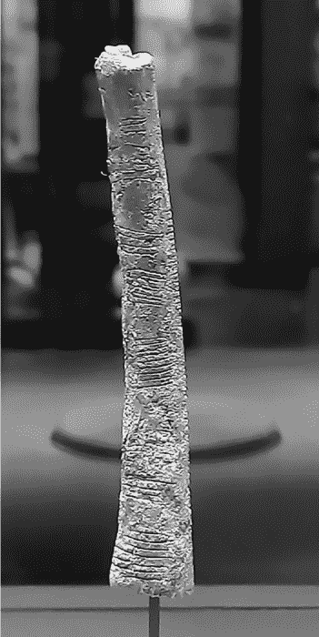

*图 1-3：伊尚戈骨，一些人认为它从计数发展到计算*

莱博姆博骨可能是数据表示的一个例子。可以说，它可能用于一种简单的计算方式，比如每次新刻一个标记时就将总数加一。对伊香戈骨的某些解释表明它可能用于更复杂的计算，也许是互动式的，就像使用钢笔和纸来执行并跟踪数学问题的多个步骤。

你能编程让一根骨头玩 *太空入侵者* 吗？你可以设计一组规则让人类按照这些规则做刻痕来更新游戏角色的表示。游戏进程会非常缓慢，而且人类必须在那里进行更新。没有证据表明人类曾以这种可编程的方式使用过骨头——虽然或许有一天会发现另一根骨头，并将其刻痕解码为供人类操作员遵循的指令。

#### *青铜时代*

大约公元前 4000 年，冰雪融化，促使了第一个城市的诞生。城市的发展需要新的、更大的组织形式，比如记录贸易和税收。为了实现这一点，公元前 3000 年，美索不达米亚的苏美尔城市文化（今伊拉克）开发出了最早的文字系统，公元前 2500 年，它拥有了第一个无可争议的计算工具——算盘（图 1-4）。*算盘* 这个词意为“沙箱”，这表明在此之前，相同的机制可能是使用沙子中的简单石块来实现的。我们在考古学中发现的最古老的算盘是那些由木头和珠子制成的更为先进的版本。

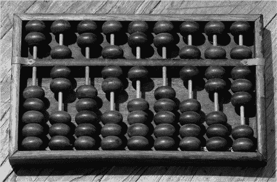

*图 1-4：算盘*

在通常的使用中，图 1-4 中的算盘状态表示（十进制，自然数）070710678。共有九列，每一列代表该数字中的一个数字。每一列被分为下部盒子，里面有五颗珠子，上部盒子里有两颗珠子。下部盒子中珠子的默认位置是下方，而上部盒子中珠子的默认位置是上方。在这种状态下，一列表示数字 0。每颗从下往上推到下部盒子顶部的珠子值为 1。每颗从上往下推到上部盒子底部的珠子值为 5。

要在算盘上加 1（即 *增量*），你需要从最右列的下部盒子中抬起一颗珠子。如果某一列下部盒子中的所有五颗珠子都被抬起，你就把它们都推回去，并通过将同一列上部盒子中的一颗珠子下移来替代它们。如果上部盒子的两颗珠子都被下移，你就把它们推回去，并通过从左边相邻列的下部盒子中抬起一颗珠子来替代它们。将数据从一列移到左边的列称为 *进位* 操作。

要将两个数字 *a* + *b* 相加，你首先设置算盘来表示 *a* 的数字。然后你执行 *b* 次增量操作，如上所述。然后，算盘的状态就代表了结果。

这种计算方式——其中第一个数字“加载”到设备上，第二个数字则“加到”其中，只留下最终结果作为系统的状态——被称为*累加器架构*，直到今天仍然广泛使用。它“累积”一系列计算的结果；例如，我们可以通过依次将每个数字加到状态中，并在每次加法后查看最新的累积总和，从而将一系列数字加在一起。

**注意**

*本例中的算盘使用十进制数字以便理解。原始的苏美尔版本使用的是 12 进制。*

算法的概念可以追溯到这一时期。刻在粘土板上的计算，例如图 1-5 中的那些，显示出当时具备数字识别能力的人们更多是以计算的方式思考，而非数学，被教导执行算术运算的算法并进行实践，而不是进行证明。

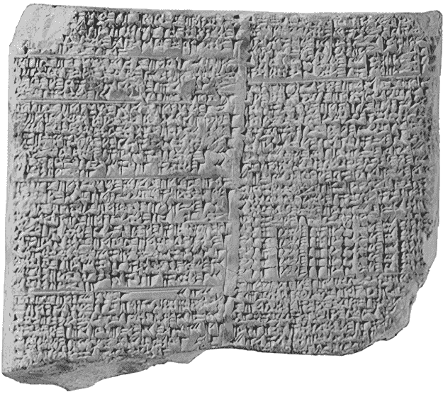

*图 1-5：显示长除法算法步骤的平板*

黏土板上显示了一步步的算术运算，可能是利用这些板子本身作为数据存储来执行的。或者，这些板子可能是用来记载算盘的状态，以便教学使用。

算盘曾经——并且在一些地方仍然——最常用于加法运算，例如求购物车中物品价格的总和，但也已知有其他古代算盘算法，包括减法、乘法和长除法。这些算法的执行方式与现代的笔纸运算类似。现代的爱好者（你可以在 YouTube 上找到他们）也展示了如何用算盘进行更复杂的算法，如求平方根和计算*π*的数字。随着这些算法变得越来越复杂，算盘的记忆往往需要通过增加额外的列来扩展。就像石器时代的骨头一样，如果告诉人类在算盘上执行哪些操作，它可以用作*任何*算法的数据存储。如果你想争辩说它是计算机，可能还需要考虑人类在其中的角色。

#### *铁器时代*

美索不达米亚及其邻国的青铜时代城市文明在公元前 1200 年左右神秘地崩溃。随后进入了一个“黑暗时代”，直到公元前 500 年到公元前 300 年左右古典希腊崛起：这是毕达哥拉斯、柏拉图和亚里士多德的时代。从公元前 300 年到公元 400 年，希腊的力量逐渐被罗马共和国和罗马帝国取代。

安提凯希拉机制（图 1-6）的历史可以追溯到公元前 100 年左右。它是在 1901 年从一艘沉船中被发现的；这艘沉船似乎是从希腊驶往罗马，机制可能是要出售或作为贡品。直到 2008 年，人们才真正理解并逆向工程了这个机制。我们现在知道，它是一个机械的、钟表式的模拟机器，用于预测天文（并且可能是占星）事件，包括五颗行星的位置、月亮的相位、日食的时机以及奥林匹克运动会的时间安排。它由 37 个铜齿轮组成，用户通过转动一个手柄来模拟未来的天体运动。结果通过机械齿轮的比例计算并显示在时钟面上。最近，爱好者们使用乐高重建了一个可以正常工作的版本（图 1-6）。

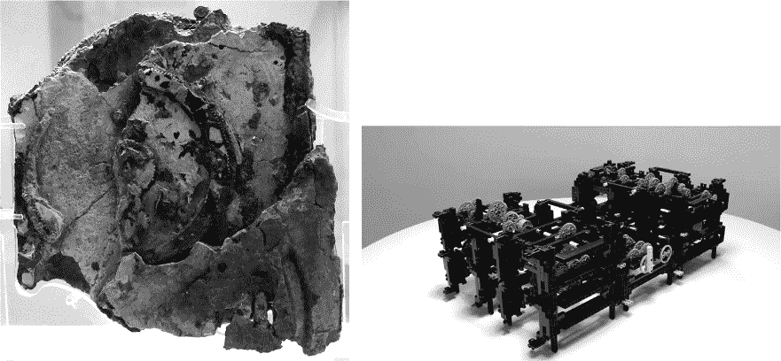

*图 1-6：安提凯希拉机制的遗物，发现于地中海的沉船（左），以及使用乐高重建的安提凯希拉机制（右）*

*里程表*是古希腊和古罗马用来测量远距离的工具，用于勘测和绘制他们的帝国地图。大约公元前 300 年左右有间接证据表明它们被使用，因为存在一些非常精确的距离测量数据，这些数据用其他方法难以获得。图 1-7 中的重建是基于公元 50 年左右的直接考古遗物。

这种里程表的工作原理类似于你在小学可能用过的测量轮，每当推动一定的距离时就会“咔哒”作响，通常是 1 码或 1 米。它也与现代汽车和机器人使用的里程表有关。

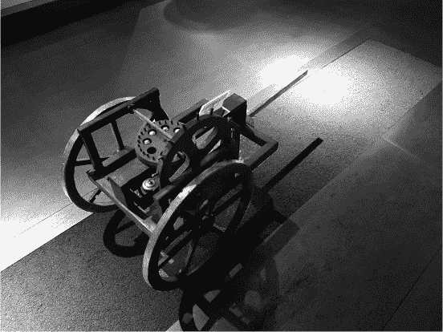

*图 1-7：一辆罗马里程测量车*

里程表由一匹马拉动，就像一辆车。多个金属球存放在一个圆形木齿轮的腔体内。其中一个轮子上有一个插销，轮子每转动一次，插销就会轻轻地碰击并使齿轮转动一个固定的小角度。齿轮下方的一个与球大小相当的孔允许一个球从齿轮的腔体中掉落到下面的收集箱里。这样，旅行结束时，记录的总行程就是通过计数箱中球的数量来统计的。

这些机器是计算机吗？显然它们涉及到用数据表示世界中的物体，并且有自动化和计算的形式。但是，就像 MONIAC 一样，每台机器只能做一件事：预测日食或测量距离。你不可能轻易地重新编程它们来玩*太空入侵者*。

与 MONIAC 类似，安提基特拉机制是一个模拟机器：它的齿轮持续旋转，可以处于任何位置。相比之下，计程器是数字化的，像算盘一样。每次“点击”时，当插销通过时，它的齿轮只会前进一个离散的单位，且收集箱总是保持一个离散数量的球。然而，不同于算盘，计程器是自动的；它不需要人工操作，只需要马作为动力源。

如果允许你完全重新配置所有齿轮，包括添加和移除任意位置和大小的齿轮，你可能能够重新编程安提基特拉机制——并且凭借一些创造力，也许能够重新编程计程器。然后你可以尝试表示和模拟其他物理系统，或者执行其他计算。与 MONIAC 类似，有人认为通过这种方式物理性地重新配置硬件是在作弊。他们会认为这创造了一个新的、不同的机器，而不是在原始机器上运行一个不同的程序。

#### *伊斯兰黄金时代*

罗马帝国在公元 476 年灭亡后，西欧进入了所谓的黑暗时代，持续了千年，西欧的计算机历史在这段时间里几乎没有任何进展。

然而，罗马帝国继续在其新的东部首都拜占庭（今土耳其的伊斯坦布尔）运作。拜占庭、希腊和伊斯兰世界之间有思想交流，后者成为当时新的知识中心。这种文化中的一个特别音乐理念引入了编程这一重要概念。

古希腊人曾拥有一种便携式*水力管风琴*乐器，类似于现代的教堂风琴。它由一组管道组成，通过键盘演奏，并通过仆人抽水的空气储存器提供动力。希腊人显然具备制造自奏版水力管风琴的技术，但没有证据表明他们曾这样做。

是伊斯兰学者穆萨兄弟（Banu Musa）在公元 900 年左右创造了第一台已知的自动化音乐乐器：巴格达自动长笛演奏机，如图 1-8 所示。

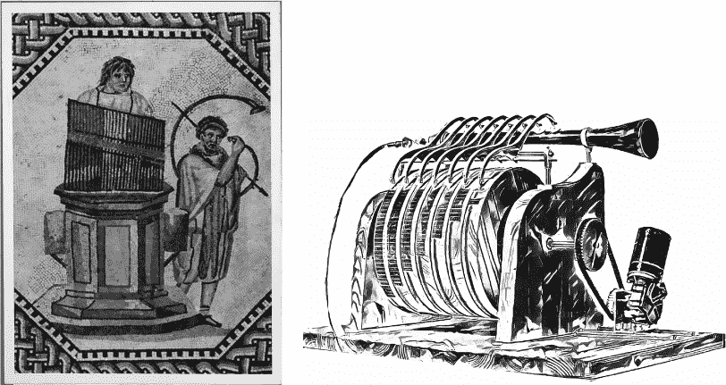

*图 1-8：一台希腊水力管风琴（左）和巴格达自动长笛演奏机的草图（右）*

这一创新是使用一个缓慢旋转的圆筒，其边缘有可移动的钉子，用来指示音符的位置。随着圆筒的旋转，钉子与杠杆接触，允许空气流入乐器以发出音符。钉子的可移动性使得不同的乐曲可以被编程到设备中，这使它成为已知的第一台*可编程*自动化机器。这些钉子今天可以视为二进制代码：在每个时刻和音高处，要么有音符（1），要么没有音符（0）。

这是一台计算机吗？与铁器时代的机器不同，它显然可以运行多个程序。然而，它没有计算或决策的概念：一旦程序开始，它就会按预定方式运行，无法根据任何输入或甚至自身状态改变其行为。

#### *文艺复兴与启蒙时代*

拜占庭帝国在 1453 年灭亡，将许多学者和他们的书籍送回西欧，帮助西欧从黑暗时代觉醒。列奥纳多·达·芬奇是那个时代名副其实的“文艺复兴人”：一位多产的科学家、艺术家和工程师。他拥有许多这些古老的书籍，并以此为灵感。他可能通过这些书籍熟悉了类似安提凯希拉机制的系统。大约在 1502 年，他的一本手稿《马德里法典》包含了一个基于类似安提凯希拉原理的机械模拟计算器设计（图 1-9）。

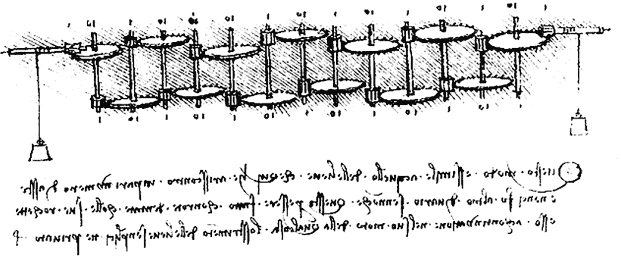

*图 1-9：达·芬奇计算器的原始手稿*

这一设计在 1968 年被重新发现并成功构建。设备有 13 个轮子，每个轮子代表十进制数字的一个列。它们的位置是*连续的*：它们不是突然从一个十进制数字跳到另一个，而是通过齿轮平滑地转动。每对列之间的齿轮比为 1:10，因此每一列的轮子转动速度是其右侧列轮子的十分之一。

像算盘一样，计算器也是一个累加器，其在任何时刻的状态都代表一个数字，再次以列的形式表示数字。一个数字*a*可以加到另一个数字*b*上。第一个数字*a*可以通过将机制调到相应位置来加载到机器中，表示其数字。然后，它将再转动一定的量*b*，使得总数增加到*a* + *b*。

例如，要计算 2,130 + 1,234，我们首先将 2,130 加载到设备上，然后通过 1,234 的转动得到 3,364。由于轮子的持续旋转，计算结束时数字可能不会精确对齐。例如，十位上的 6 几乎位于 6 和 7 之间，因为它后面的数字是 4，几乎到达下一个进位的位置。从某种意义上说，这是一种比罗马里程表更“弱”的机器，因为里程表有通过销钉和球机制将连续轮位转换为离散符号的概念。

达·芬奇的概念在 1642 年由布莱兹·帕斯卡尔扩展。图 1-10 展示了帕斯卡尔的计算器设计和它的现代重建版本。（最近有人提出，帕斯卡尔的计算器实际上是在 1623 年由威廉·席卡德发明的。）

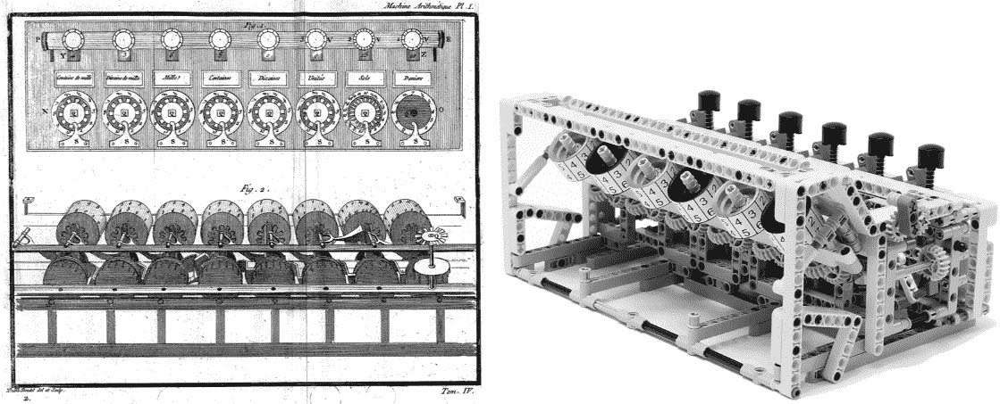

*图 1-10：帕斯卡尔的计算器：原始设计和 2016 年用乐高重建的版本*

帕斯卡的计算器包含一个数字机制，类似于里程表（而不是达芬奇的模拟齿轮机构）来实现进位机制。当一列的数字达到 9 并且再加上一个单位时，它会触发下一列的单位转动，同时将该列的数字归零。

与表示物理（天文）物体状态的安提凯瑟机械不同，达芬奇和帕斯卡的机器操作的是纯粹的数字。你可以说，这使得它们比安提凯瑟机械更具通用性。话虽如此，它们的计算范围仅限于加法，从某种意义上来说，这使得它们比算盘的能力要弱，因为算盘有其他算术运算的算法。另一方面，像安提凯瑟机械一样，这些计算器所需的人力工作比算盘要少。

有些人认为从达芬奇的模拟操作到帕斯卡的数字操作的转变非常重要。数字操作似乎涉及机器做出“决策”的简单概念：在每一步中，进位要么进行，要么不进行。决策在某些任务中确实很重要，但显然对加法而言并不那么重要，因为这两种计算器在加法上表现一样好。

### 蒸汽时代

蒸汽动力在古希腊和古罗马时代被视为一种好奇现象，任何曾用盖子煮水的人都会注意到蒸汽能让盖子动起来。但直到大约 1700 年，英国才开始真正利用蒸汽来推动工业革命。这一变革受到启蒙时代思想的启发，特别是牛顿的物理学，这成为一个积极反馈循环，机器和煤炭被用来制造更多的机器并提取更多的煤。煤被燃烧来加热水并转化为蒸汽，蒸汽最初用于从煤矿抽水。随着时间的推移，蒸汽动力开始驱动许多其他机器，其中一些具有类似计算机的特征。

#### *雅卡尔织机*

纺织品生产是蒸汽时代新机器的一个主要应用。但与简单的棉布衣物不同，传统的织物图案极为复杂。因此，它们被认为更有价值，因为它们更稀有、更昂贵。

1804 年，约瑟夫·雅卡尔（Joseph Jacquard）发明了一种变种的当时织布机，采用可更换的打孔卡片来引导织物中的钩子和针的位置（图 1-11）。

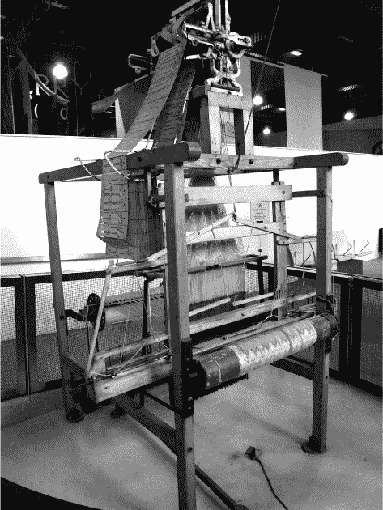

*图 1-11：雅卡尔织机*

打孔卡片可以“链”在一起，形成长条带，以较低的价格制作复杂的可重用图案。

**注意**

*“链”成为了后来电子设备中从磁带加载下一个程序的标准命令，这一命令一直使用到 1990 年代。织布的概念，如“纱线”和“经线”，也被用作现代多线程编程和并行 GPU 中的隐喻。*

#### *维多利亚时期的管风琴和音乐盒*

19 世纪流行的基于桶的音乐器乐，类似于巴格达自动长笛演奏机，如图 1-12 所示。一个“风琴手”的工作是把一个便携的手摇风琴推到主要街道，然后手动转动它的手柄以提供动力。一个旋转的桶上的钉子标记了音符的位置，然后允许空气进入风琴管，就像巴格达的版本一样。

*图 1-12：两台维多利亚风格的手摇风琴（左和中）和音乐盒（右）*

同样的机制在这个时期的音乐盒中（至今仍在使用），其中一个弹簧被卷起来储存能量，然后释放以驱动一个较小的有钉筒，其钉子直接击打小型木琴式金属条，播放一些音乐片段，比如芭蕾舞剧中的著名主题。旋转的桶常常顶着一个小雕塑，如一个芭蕾舞者，随着音乐一起旋转。

查尔斯·巴贝奇讨厌风琴手在他家门外演奏，他发起了一场公开运动，要求从伦敦街头清除他们。但他们的手摇风琴却对他的工作产生了深远的影响。

#### *巴贝奇的差分机*

巴贝奇设计了两台不同的机器，分别是差分机和分析引擎。前者（图 1-13）首先被建造出来，并于 1855 年由乔治·舍茨等人成功商业化，广泛应用于工业直至 1930 年代。最近还有乐高重建版本存在。

差分机的设计用于生成任意多项式函数的数值表。大多数数学函数可以通过泰勒级数展开来很好地近似为多项式，因此这台机器可以用来为任何这样的函数制作数值表。在现代考试中，当不允许使用计算器时，你可能会使用类似的表格查找三角函数或统计函数的值。在巴贝奇的时代，这些表格的杀手级应用是在航海中，用于导航目的。以前的表格是手工计算的，包含许多昂贵的错误，因此通过机器完善它们有着很大的经济需求。

该机器可以通过蒸汽或人工摇曳手柄来驱动。与帕斯卡的计算器类似，差分机通过齿轮的离散旋转来表示十进制数字。数字由这些数字的垂直列表示（类似于帕斯卡的计算器侧倾）。然后，差分机将此扩展为二维平行体系结构，多个垂直列水平排列。每列代表一个不同的数字。

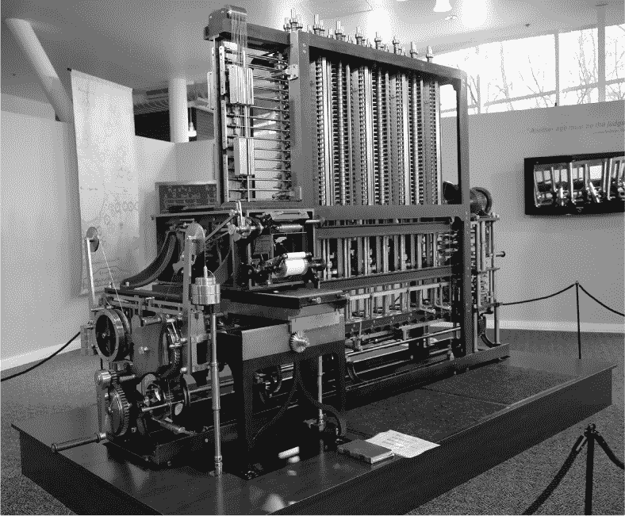

*图 1-13：巴贝奇的差分机的金属重建*

差分机有两个并行化的维度：按数字和按项。按数字加法，例如，是与高中顺序加法方法不同的算法。它不是从最右边的列开始，向左移动并进行进位，而是同时加上每一对数字，然后再处理进位。例如，要加 364 + 152，三个加法 3 + 1、6 + 5 和 4 + 2 会同时进行，结果为 416。然后，6 + 5 = 11 的进位会被加上，得到 516。进位是一个在这种情况下难以正确执行的操作，巴贝奇将大部分工程时间都投入在这上面。差分机在 YouTube 视频中显示的进位效果是信息在机器二维表面上传播的可见波纹。这种波纹在现代并行 GPU 的计算中也可以看到。

差分机算是计算机吗？它可以运行不同的“程序”来计算不同的方程式，但这些方程式没有明显的概念来在计算过程中改变其行为；没有类似 if 语句那样的东西来测试中间结果并根据它们做出不同的操作。它更像是一个现代的媒体流设备，其中数字平滑地通过处理管道流动。

#### *巴贝奇的分析机*

差分机仅限于计算多项式函数的表格，但巴贝奇的第二个项目——分析机（图 1-14）被设计为一台完全通用、可编程的机器。

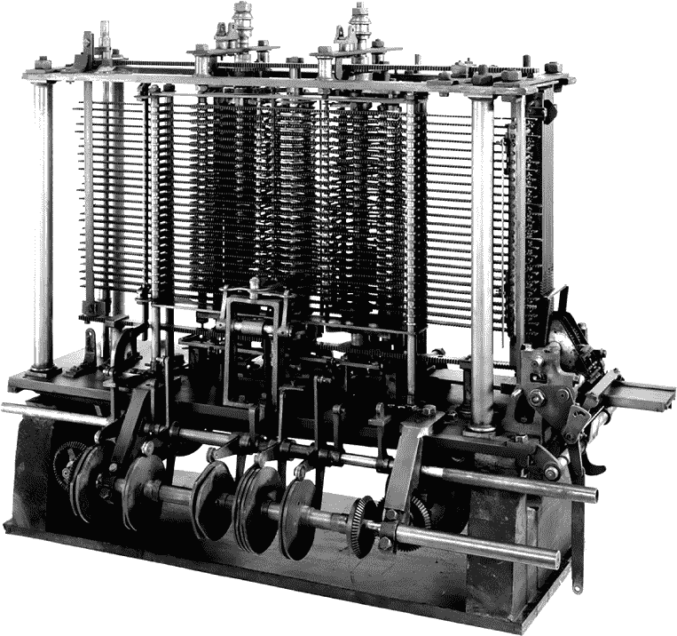

*图 1-14：巴贝奇分析机的现代部分重建*

为了实现这种普适性，分析机提供了一系列算术和其他操作作为简单的机械装置，并配备了用于存储数据的内存以及从打孔卡片读取程序的能力。这些程序规定了内存读取和写入的顺序、算术运算，并允许根据计算状态进行分支——一个 if 语句。

巴贝奇在纸上进行了多次分析机设计的变更，但在他去世前，实际上只建造了其中的一小部分。他在进位机制的细节上走了很多弯路，痴迷于不断重新设计组件，而不是坚持一个版本并将其整合起来使其真正运作。（今天，这种项目管理风格被称为*yak shaving*。）这让当时的研究资金机构很不满，使得巴贝奇很难获得资金来建造任何东西。因此，与差分机不同的是，我们没有分析机的工作版本，甚至没有一份完整的最终设计文档。然而，最近，通过现代制造技术，已经根据巴贝奇的计划重建了一些组件。

分析机拥有比差分机更多的活动部件，因此需要更多的动力；这必须来自蒸汽机，而不是手动曲柄。它还需要更精密加工的齿轮，因为计算需要通过一系列更长的齿轮传递。像当时的工厂机器和蒸汽机车一样，它将散发出油烟、蒸汽的气味，并在抛光的黄铜表面闪闪发光：巴贝奇是最初的蒸汽朋克。

分析机的核心包含许多独立的简单机器，每台机器执行某种功能，例如加法运算和测试一个数字是否等于另一个数字。加法机大致是帕斯卡计算器的复制品，其他简单机器是它的变种。

分析机引入了现代计算机内存的概念。它的“存储”部分将包含大量简单机器的副本，再次类似于帕斯卡计算器，每台机器都可以保留不同的数字。每台机器都会被分配一个数字标识符或“地址”，以指定读取或写入的正确机器。

一系列*指令*将以二进制编码，并通过纸带打孔的方式输入，使用的机制来自于雅卡尔织布机。每条指令将告诉引擎激活其中一台简单机器。通常，在每条指令之后，机器会通过行进方式将打孔的纸带送到下一条（有点像打字机）。然而，机器也具备检查最新简单机器结果的能力，并根据其值跳转到纸带的不同位置。这使得程序能够根据中间结果改变其行为。

通过将打孔纸带的底部粘到顶部，形成一个物理循环，程序也可以无限运行，正如在图 1-15 中所示的（后来的）打孔纸带机。

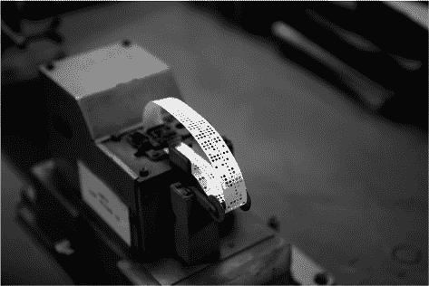

*图 1-15：一个打孔纸带程序循环*

我们没有任何实际为分析机编写的程序示例。相反，巴贝奇和他的合作者阿达·洛夫莱斯记录下了虚拟运行的*状态*和*输出*，以长表格的形式显示程序执行的每一步。这类似于巴比伦人泥板上的标注，展示算法的效果，而不是生成这些效果的指令。从这些执行痕迹中，现代读者可以大致推测出程序和构建它们的机器指令集的内容。

巴贝奇为一些小的、几乎微不足道的数学函数写了这些示例跟踪，粗略展示了正在使用的完整指令集。但巴贝奇是硬件专家，更关心设计机器本身，且从未写过更长的程序，认为编程相对于设计架构来说是相对简单的。洛夫莱斯则是软件专家，她为复杂的函数写了更长的跟踪。她还写了关于更大程序能够实现的推测，包括关于人工智能的想法。如果说巴贝奇是“第一个程序员”，那么洛夫莱斯可能就是“第一个软件工程师”，因为她更认真地考虑了大规模编程。

解析机是丘奇计算机吗？它的设计包含了现代计算机的所有基本特征：CPU、内存、总线、寄存器、控制单元和算术单元。它可以读取、写入和处理数据。它可以进行算术运算。与之前纯粹的计算机器不同，它可以跳转（goto）和分支（if），根据计算的状态跳到程序中的不同指令。

然而，要能够模拟任何其他机器，它需要能够读取、写入和执行程序，并且能够读取、写入和处理数据。但它的程序是固定在穿孔纸上的，而不是像现代 PC 一样存储在内存中。这种数据和程序被分开存储的架构，通常程序是作为固件固定的，叫做*哈佛架构*，与*冯·诺依曼架构*不同，后者将程序和数据存储在一起。

今天，哈佛架构被广泛应用于嵌入式系统，特别是在数字信号处理芯片中。可以建立一个哈佛架构，模拟其他计算机，包括那些能够修改自身程序的计算机。这可以通过在固定程序穿孔卡（或现代固件）上编写一个单一的*虚拟机（VM）*程序来完成。虚拟机读取、执行并在内存中写入更多程序。

洛夫莱斯或巴贝奇本可以为解析机编写一个虚拟机程序，但他们并没有考虑这一点。许多其他机器也可以这样说。例如，如果程序员愿意的话，虚拟机可以为苏美尔算盘编写并在其上执行。丘奇的命题是关于机器模拟任何其他机器的*潜力*，而不是它实际做到这一点的实现。但这取决于我们考虑的是“哪个层次”的机器：底层硬件还是运行在更高软件层次上的虚拟机。

当然，解析机从未完全建造或测试过——要证明“它是计算机”是否需要做到这一点，还是仅凭其基本设计就足够了？

#### *机械差分分析仪*

工业革命主要是通过实践中的“黑客”们根据直觉建造机器，然后测试它们是否有效的过程推进的。但随着时间的推移，数学理论被用来描述和预测许多工程系统的行为，促成了学术工程学的发展。这些理论大多采用了微积分。微积分早期由戈特弗里德·威廉·莱布尼茨和（独立地）艾萨克·牛顿为了不同的目的发展，很快作为一种通用工具，在建模各类系统（包括工业机械）如何随时间变化时，得到了广泛应用，通过诸如以下方程：

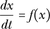

其中 *x* 是被建模的世界状态的一部分，*f* 是它的某个函数，*dx*/*dt* 是 *x* 的变化率。这类方程可以通过迭代计算 *dx*/*dt* 并使用它来更新 *x*，从而数值模拟世界随时间变化的状态。就像制作差分机的多项式表格一样，这是一个高度重复且容易出错的过程，非常适合机械自动化。

1836 年，即解析机被开发的同一年，加斯帕尔-古斯塔夫·科里奥利斯意识到，由于机械设备的行为可以*用微分方程描述*，因此同样的设备可以看作是计算该方程的解。因此，为了解决一个新的方程，可以设计一个与之匹配的物理设备，然后运行该设备一段时间以给出所需的答案。

更一般的微分方程可以涉及加速度、高阶导数以及多个变量。科里奥利斯的想法被其他人扩展，包括 1872 年的凯尔文勋爵和 1876 年的詹姆斯·汤姆森，旨在通过构造匹配这些方程的模拟机械设备来求解这些系统。这些机器的关键部件是球盘积分器（图 1-16），其中一个可移动的球体将旋转盘的运动传递到输出轴。

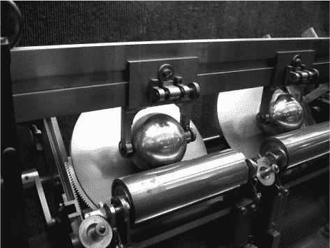

*图 1-16：凯尔文差分分析仪中的球盘积分器*

像差分机一样，这些机器仅仅是为了求解一类特定的问题：微分方程。然而，世界及其问题的大部分，甚至可能是全部，都可以通过微分方程来建模。作为本质上模拟机器，它们可以被视为继续达芬奇类比计算机的传统，而巴贝奇的机器则是基于帕斯卡的数字计算器。

使用世界物理属性来模拟自身的概念，最近在量子计算中得到了复兴，在那里模拟物理和化学量子系统似乎是一个主要应用，特别适合量子计算机的工作方式。

### 柴油时代

在工业革命的纯机械机器和后来的电子机器之间，有一个混合时期，电力与机械运动结合，制造出了电机机械化的机器。

关键的电机机械技术是*继电器*，它是电路中的一个机械开关，其物理位置通过一个磁铁来控制，而磁铁又由另一个电信号来控制。继电器是一种特殊类型的*电磁铁*，它是一种线圈，当电流通过时产生线性磁场。这个磁场可以用来物理移动线圈内的磁铁（称为*铁芯*），这种运动可以用来打开和关闭水管中的阀门，或启动汽车发动机。把水管换成第二个电路，把阀门换成电开关，你就得到了一个继电器。

继电器至今仍在使用中（见图 1-17）。例如，在机器人安全系统中，我们常常需要物理地连接和断开主电池与机器人电机之间的电源。安全监视器检查一切是否正常，如果正常，则建立物理继电器连接；如果发现问题，则断开连接。当电流变化并且铁芯发生物理移动时，你可以听到继电器的点击声。

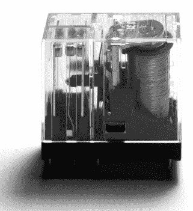

*图 1-17：显示线圈的继电器*

电机机械化的机器比纯机械机器更高效，并在 20 世纪初及两次世界大战期间得到了广泛的商业和军事应用。在下一节中你将看到的一些机器，在 1980 年代仍在使用。而其他机器由于持续的政府保密，命运不明，因为这一时期还包括了第二次世界大战的密码学机器。

#### *IBM 霍勒里斯制表机*

美国宪法要求每十年进行一次人口普查并处理相关数据，到 1890 年时，人口已经增长到人力处理统计数据已不可能的程度。这导致政府出现了尴尬的工作积压，同时也对自动化解决方案产生了强烈需求。

赫尔曼·霍勒里斯设计了一台机器来自动化数据处理，并成功地在 1890 年的人口普查中使用它，对 6200 万公民的信息进行大数据分析。每个公民的数据由人工职员将书面人口普查表格转移到打孔卡片上。这似乎并非受到雅卡尔（Jacquard）和巴贝奇（Babbage）机器的启发，而是受到检票员在火车票上打孔的启发，用以表示不同的行程或时间。人口普查中的每个问题都是多项选择题，并通过打孔卡片上的一个选项来编码。 图 1-18 展示了这个例子。

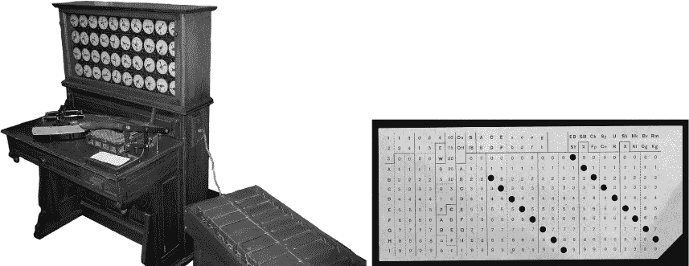

*图 1-18：IBM 霍勒里斯机的复制品（左）和打孔卡片（右）*

一叠叠卡片可以被读取到机器中，机器会检查是否存在某些特征或特征组合，然后使用帕斯卡计算器的电气模拟来累计具有这些特征的卡片总数。正如霍勒里斯（1894 年）所解释的：

仅仅知道男性和女性的数量是不够的，我们必须知道，例如，每个年龄段有多少男性，以及每个年龄段有多少女性；换句话说，我们必须将年龄和性别结合起来计数。通过简单使用著名的电气继电器，我们可以得到这个或任何其他可能的组合。必须理解的是，组合的不仅仅是两项内容；以这种方式，可以将任意数量的项进行组合。我们唯一的限制是计数器和继电器的数量。

这意味着该机器大致能够执行现代 SQL 查询，包括`SELECT, WHERE, GROUP BY`和`ORDER BY`。

在机器在 1890 年人口普查中的广泛成功报道后，霍勒里斯于 1896 年成立了制表机公司。它于 1911 年改名为计算制表记录公司，1924 年更名为国际商业机器公司（IBM）。在 1931 年，《纽约世界报》称 IBM 进行“超级计算”，并在 1936 年前为许多政府和公司提供类似的商业大数据分析服务。它至今仍在继续这一工作。

#### *电机机械差分分析仪*

当可以用电力为模拟机械差分分析仪提供动力时，它们开始得到广泛的实际应用。电气电路也为差分分析仪提供了一个重要的新应用，因为它们通常使用与力学中使用的相同类型的差分方程来描述。哈泽恩和布什于 1928 年在麻省理工学院建造的系统，通常被认为是电机机械差分分析仪普及的推动者，其概念很快传播到英国曼彻斯特和剑桥大学的研究团队（见图 1-19）。一些英国的研究机器使用梅卡诺（类似于结构玩具）建造，预算比美国版本低。

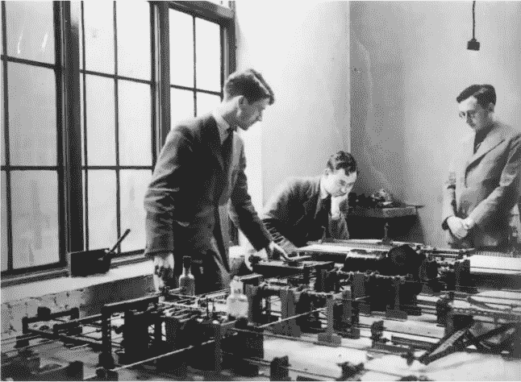

*图 1-19：莫里斯·威尔克斯（右）与机械版剑桥差分分析仪，1937 年*

类似的机器在第二次世界大战期间被大量使用，用于求解差分方程，例如计算炮弹轨迹。通过将钢笔连接到机器的运动部件，一些团队还为机器添加了模拟绘图仪，在纸上绘制图表。这些机器的版本在 1970 年代仍被用作导弹制导系统。

#### *第二次世界大战中的电机机械机器*

许多流行的历史书籍集中于第二次世界大战期间用于*密码学*（传输者和接收者的消息加密和解密）和*密码分析*（破解密码）的机器。合起来，这些领域被称为*密码学*。破解密码比加密和解密它们更为困难。因此，密码分析机器通常是更大、更有趣的那些。是否可以将这两类机器中的任何一类视为“计算机”？它们的历史一直被政府机密掩盖，我们仍在随着文件的公开而继续了解。这种不确定性对一些有偏见的历史学家和电影制片人有利，他们希望自己的国家或社区能被认为是计算机的发明者。

原始的 Enigma（图 1-20）是一款 1923 年推出的机电德国商业密码学产品，销售给多个国家的银行和政府，包括美国和英国。

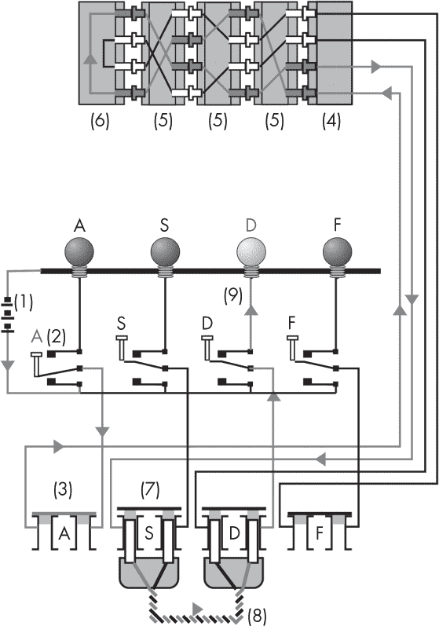

*图 1-20：德国 Enigma 的电路图，显示了四个输入键（2），四个输出灯（9），三个转子（5，5，5），一个插头板（8）和一个反射器（6）*

Enigma 由一个打字机键盘、输出字母灯、三个转子和电线组成。每个转子会将一个字母替换成另一个字母。输入字母*a*依次通过三个转子，然后被“反射”（替换为 26 - *a*），再通过三个转子反向传递。每次执行这一过程时，最后一个转子会向前推进 1 步，转子之间会有进位，类似于帕斯卡计算器的工作方式。每个转子的配置都会产生一组特定的替换。所有 Enigma 操作都是对称的：相同的机器状态会对其加密的文本进行解密。战争中使用了多个版本的 Enigma 机器。

德国军事用 M3 Enigma 在使用插头板时增加了一个阶段，交换字母对。在战争前七年，波兰人在 Marian Rejewski 的领导下，通过设计并使用一台单用途的机电设备——*Bomba*，破解了其加密。这台设备使用了物理的 Enigma 转子，通过强行破解所有已知消息头的可能编码。然后，使用反向索引文件卡数据库查找每日密钥。波兰人将这一系统交给了位于布莱切利公园的英国人（该地后来成为 GCHQ）。

1938 年，德国人改变了协议——而非硬件——移除了已知的消息头。波兰数学家和密码学家 Henryk Zygalski 随后再次破解了 Enigma，使用了光学计算。信息被转存到打孔卡片上，卡片被堆叠起来并对着光线快速找到光穿过整个堆叠的位置。

1939 年，德国将可插入三槽的转子数量从三个增加到五个。这使得破解的复杂性超出了齐加尔斯基方法的能力。为了破解这一版本，英国转而使用 IBM Hollerith 机器，以更高的速度执行类似的计算。

*Dolphin* 是一种更强的 M3 协议，德国 U 型潜艇使用了这一协议，包括更多可交换的转子和不同的头信息。*英国 Bombe* 是基于波兰的 Bomba 设计的，并进行了更新以适应新的任务。额外的密码学工作由艾伦·图灵（Alan Turing）、戈登·韦尔奇曼（Gordon Welchman）等人完成，随后该机器由 IBM 的哈罗德·基恩（Harold Keen）设计并制造。

*Typex* 是英国版的恩尼格玛。像德国人一样，他们对商业版恩尼格玛进行了修改，用于军事通信。Typex 经常被 B-Dienst（德国相当于布莱切利园的组织）破解，B-Dienst 使用了 IBM Hollerith 机器。

1937 年，IBM 总裁托马斯·沃森（Thomas Watson）会见了希特勒，并因 Hollerith 机器对“帝国的贡献”获得了一项奖项。德国集中营后来向 IBM 租借了 Hollerith 机器，用以实施大屠杀的精准化——“时机非常精确，受害者能够直接从货车走进等待的毒气室。”这些机器被用来合并人口普查和医疗记录等大数据源，以生成受害者的姓名和身份状态列表。IBM 提供了 IT 顾问，帮助软件设计，并定期访问现场为机器提供维修服务。

#### *Zuse Z3*

康拉德·祖泽（Konrad Zuse）是德国工程师，1941 年他与纳粹党合作，为其军方制造了 Z3 机器。*Z3* 是一台电子机械计算机，使用了 2000 个电子机械继电器开关和一个机械二进制内存，具有 64 个地址，每个地址 22 位。它每秒能执行最多 10 条指令。

1998 年，Z3 被证明从理论上讲是一个教会计算机，但这一结论仅仅基于一个非常晦涩且不切实际的技术细节。它也有可能非常缓慢地模拟冯·诺依曼机，但实际上并没有用于此目的。

### 电气时代

*真空管*（又称 *电子管*）由约翰·弗莱明（John Fleming）于 1904 年发明，作为继电器的高效替代品。与继电器不同，真空管没有任何活动部件；它们是纯电气的，因此比电子机械继电器切换速度更快。今天它们仍被用于模拟音频放大，例如在管式或电子管吉他放大器中（图 1-21）。

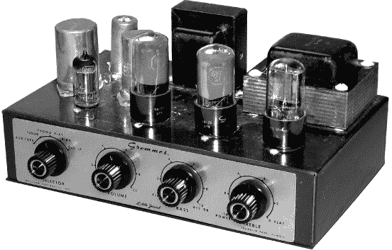

*图 1-21：使用真空管制作的吉他放大器*

真空管外形和工作原理类似于爱迪生的灯泡。在密封的玻璃管内创建了真空。管内有三个组件：阳极、阴极和加热器。阳极和阴极是电路的端子，用于开关电流，因此分别具有正负电压。加热器是开关。当加热器开启时，热量使得电子从阴极逃逸，并通过真空移动到阳极，允许电流流动，从而打开电路。当加热器关闭时，电子没有足够的能量执行这一过程，电路因此关闭。

当我们将加热器限制为开启或关闭时，我们就得到一个数字开关，其功能类似于继电器，构成纯电子计算的基本单元。（另外，为了音频和其他信号的放大，我们可能允许加热器具有连续的热量水平，从而在主电路中产生连续的电流大小，产生模拟放大效应：小的加热器控制电流使主电路中的大电流上下波动。）

#### *第二次世界大战的纯电子密码学*

纯电子机器出现在二战中，比更著名的机电机器晚。它们也一直处于保密状态，但有时被认为是“第一台计算机”。

1942 年，德国海军恩尼格玛（Enigma）升级为使用四个转子槽而不是三个（德国人称之为“M4 型号”；盟军称其通信为“Shark”）。破解这一层次的密码复杂性需要美国的方法，即通过向计算能力投入资金，支付 IBM 生产数百台新的快速全电子真空管*美国炸弹机*。

*Fish*是由另一种德国密码机——洛伦茨 SZ42 产生的密文；这不是一台恩尼格玛（Enigma），但它使用了类似的转子。由于其通信最初仅通过地面电报线路而非无线电发送，因此更难以拦截，盟军直到战争后期才发现它。它是由由马克斯·纽曼（Max Newman）领导的布莱切利团队破译的，使用的是 1944 年由汤米·弗劳尔斯（Tommy Flowers）及其团队设计和建造的*科洛萨斯*机器，见图 1-22。

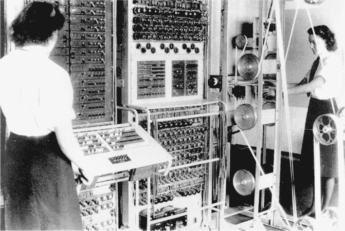

*图 1-22：科洛萨斯，布莱切利公园，1943 年，操作员多萝西·杜·博伊森（Dorothy Du Boisson）和埃尔西·布克（Elsie Booker）*

科洛萨斯是一台完全电子化、基于真空管的机器，类似于美国炸弹机，但如果重新接线，它也能执行不同的功能。英国人一直使用科洛萨斯解密俄国的密码，直到 1960 年代。像 Z3 一样，科洛萨斯最近才被证明理论上是教会计算机（Church computer），但这需要将 10 台机器连接在一起，并用一种新颖的虚拟机（VM）进行编程，这在当时并没有实现。

#### *ENIAC*

*ENIAC（电子数值积分计算机）* 是一台由 John Mauchly 和 J. Presper Eckert 在二战末期开发的美国真空管计算机。它于 1945 年完成，并被美国军方用于弹道计算。战后，它继续用于氢弹计算。

Mauchly 和 Eckert 明确表示，他们的设计是基于 Babbage 的分析机，将其每个机械组件转化为等效的真空管。像分析机一样，这使得 ENIAC 成为一台完全通用的计算机，可以编程执行任意的指令程序。

ENIAC 通过物理连接电缆到面板上的插槽来编程，这种方式今天有时仍用于“编程”电子合成器“补丁”。其程序员以这种方式编写程序的原始照片（见图 1-23）有时被误认为是技术员只是在维护机器或设置它以运行其他人编写的程序。我们现在知道，这就是实际编程的方式，这些照片展示的正是程序员们在工作时的情景。就像 Lovelace 和 Babbage 时代以及 Bletchley 时代一样，人们普遍认为编程是“女性的工作”，而硬件则是“男性的工作”。

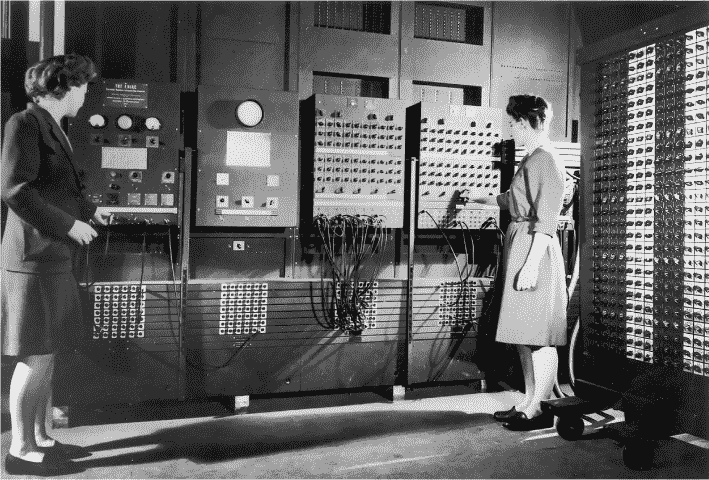

*图 1-23：ENIAC 和程序员 Betty Jean Jennings 及 Frances Bilas 在 1940 年代的工作照*

ENIAC 可以运行任何程序（只要有足够的内存），但像分析机一样，它采用的是哈佛架构；有人可能会争辩，程序需要物理接线这一点限制了它成为第一台计算机的资格。对于许多其他机器，我们可以回应，理论上来说，某人本可以编写一个虚拟机来解决这个问题。直到最近，计算机历史学家才重新发现，实际上有人为 ENIAC 做到了这一点！

#### *虚拟机 ENIAC*

ENIAC 的程序员 Betty Jean Jennings、Marlyn Wescoff、Ruth Lichterman、Betty Snyder、Frances Bilas 和 Kay McNulty 最终厌倦了每次编写新程序时都要物理重新接线。因此，作为一个快速的解决方案，她们设计了一个程序，利用这些电缆使客户端程序能够从开关面板中读取。这创造了一个虚拟机，其中单一的固定硬件程序模拟了一个能够从开关中读取更高级程序的计算机。

有些人认为“第一台计算机”是在这个时刻被创造出来的，作为一种软件而非硬件的创造。这个说法可能是个美丽的故事，但仍然存在一个问题：其架构仍然是哈佛架构，因为用户程序被存储在物理开关中，而不是计算机的主内存里。这意味着程序无法修改自身的代码，而有些人认为这正是“第一台计算机”的必要条件。

程序修改自身代码的能力是一个相当晦涩的需求，除了少数不太正当的安全应用和混淆编码比赛，通常不需要这种能力。从理论上讲，ENIAC 的程序员*本可以*继续创建第二层虚拟机，这层虚拟机可以将高级程序表示为数据而非程序内存。这将创建一种冯·诺依曼架构，程序可以使用程序员已经发明的虚拟机概念来修改自身代码。但他们从未觉得有这个需求。反对者认为，ENIAC 程序员有潜力做到这一点，并不比 Z3 程序员有潜力构建虚拟机更能证明 ENIAC 是“第一台计算机”，因此他们断言虚拟 ENIAC 距离成为第一台计算机仅差一只小飞虫的胡须。

**注意**

*说到小飞虫，世界上第一个计算机“故障”——也是现代“bug”一词的起源——是在 1947 年由另一台机器哈佛 Mark II 的程序员捕捉并记录下来的。那是一只被卡在机器内部的飞蛾，导致了机器的故障。*

#### *曼彻斯特婴儿*

1948 年，弗雷德里克·威廉姆斯、汤姆·基尔本和杰夫·图蒂尔在现今的曼彻斯特大学展示了第一台“电子存储程序计算机”。*存储程序*指的就是我们现在称之为冯·诺依曼架构的东西。这台机器被正式命名为“小规模实验机”，并被昵称为“婴儿机”(图 1-24)。

婴儿计算机的 CPU 使用了大约 500 个真空管，配合二极管和其他组件。它实现了七条指令集。用现代的术语来说，婴儿计算机是一个 32 位的机器，拥有 32 个地址，每个地址存储一个 32 位的字。

婴儿计算机由包括当时已拆解的 Bletchley Colossus 机器的部件构建而成；它很快被报废并自我拆解，为后来的曼彻斯特 Mark I 机器提供了部件。如今，婴儿计算机的复制品可以在曼彻斯特的科学与工业博物馆看到。这个博物馆特别有趣，因为它还包含了来自工业革命时期的纺织加工机器，而工业革命正是在曼彻斯特开始的。这些机器在雅卡尔织机与曼彻斯特计算机之间建立了文化联系。

*图 1-24：曼彻斯特婴儿重新建立在英国曼彻斯特的科学与工业博物馆中。请注意中央的 CRT 存储器，也用作显示器。*

婴儿计算机或许可以被编程来在其绿色 CRT 屏幕上玩*太空入侵者*：自从现代重建以来，类似的游戏已经在仿真和真实机器上演示过，或许这就是复古游戏最极端的例子。

采用冯·诺依曼架构，Baby 也能够运行修改自身代码的程序。因此，当我们到达 Baby 时，我们似乎拥有了一台无可争议的 Church 计算机，只要我们接受它可以“要求多少内存就给多少内存”。不过，如何做到这一点并非 trivial，因为 Baby 的架构是如此特定于 32×32 位内存设计。你*可以*用更大的内存重新设计它，但那样的话，还是同一个 Baby 吗，还是另一台机器？

#### *1950 年代与商业计算*

UNIVAC（通用自动计算机；图 1-25）于 1951 年 3 月交付给第一位客户。它是 Mauchly 和 Eckert 之前 ENIAC 的商业化版本，使其成为第一台*商业*化的通用存储程序计算机。像 ENIAC 一样，UNIVAC 使用的是真空管。CBS 使用它成功地预测了 1952 年美国总统选举的统计结果，带来了名声和销售额。Mauchly 和 Eckert 的公司仍然存在，现为现代的 Unisys 公司。

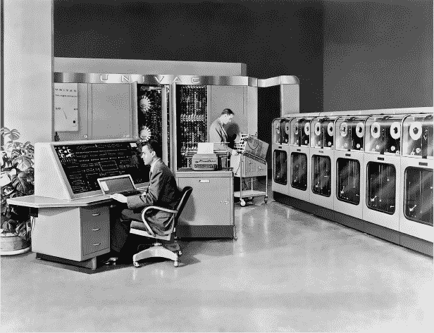

*图 1-25：UNIVAC*

IBM 对 UNIVAC 和其他电子计算机会摧毁他们仍然盈利的制表机业务的认识较慢，CEO Thomas Watson 在 1948 年做出了人类历史上最糟糕的未来预测：“我认为全球市场大约只有五台计算机。”在意识到新技术的重要性后，IBM 于 1952 年生产了自己的第一台商业电子计算机——IBM 701。

### 晶体管时代

*晶体管*执行与真空管相同的功能，但它更小、更快、更便宜，且消耗更少的电力，更加可靠。像真空管一样，晶体管既可以用于模拟任务，也可以用于数字任务（它们出现在诸如晶体管收音机和吉他放大器这样的模拟音频放大器中），但在计算中，它们仅用于其数字特性。

William Shockley、John Bardeen 和 Walter Brattain 于 1947 年发现了晶体管效应，并因此获得了 1956 年的诺贝尔物理学奖。1950 年代，硅谷现在所在的地方开始了晶体管的商业化工作，这项技术在 1960 年代成为主流。晶体管今天依然是计算机的基础技术。

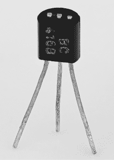

*图 1-26：一个大型晶体管*

#### *1960 年代与大型晶体管*

1960 年代的晶体管“迷你计算机”没有使用微芯片，而是由“大型”晶体管制成，约 1 厘米长，就像你今天会放在面包板电路上的晶体管一样（图 1-26）。仍然可以用这种晶体管制作 CPU，且一些爱好者为了好玩会这么做（例如，Eric Schlaepfer 和 Evil Mad Scientist Laboratories 的 MOnSter 6502 项目）。

这些计算机填满了机架，包括早期人工智能研究中广泛使用的经典 PDP 机器（见图 1-27）。这也是 Seymour Cray 开始建设 Cray 超级计算机的时期，旨在为高端用户制造最大、最快的机器。

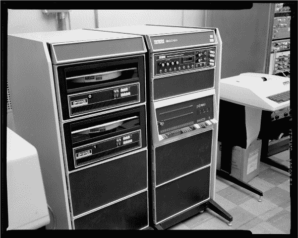

*图 1-27：一台基于晶体管的 1960 年代 PDP-11 迷你计算机*

1960 年代，晶体管计算机的应用包括为 ARPANET 供电，ARPANET 是今天基于 TCP/IP 协议的互联网的前身，还有 1969 年 Margaret Hamilton 编写的阿波罗登月程序，它使用了汇编语言（见图 1-28）。后者是真正的火箭科学，要求她在寻找方法使这一高度关键的代码更准确的同时，创建了现代软件工程领域。

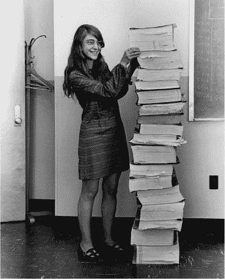

*图 1-28：Hamilton 与她完整的阿波罗 11 号汇编程序打印件*

1965 年，英特尔首席执行官戈登·摩尔提出了一个观察结果，后来被称为摩尔定律。正如你在介绍中看到的，根据不同的人和计算方法，这一定律表示计算机的速度或每单位面积的晶体管数量每 18 个月或每 2 年就会翻倍。

#### *1970 年代与集成电路*

1970 年代见证了*集成电路*（也叫*ICs*，*微芯片*或*芯片*）的广泛商业化。集成电路最早由 Geoffrey Dummer 在 1952 年于英国提出理论，尽管 2000 年诺贝尔物理学奖颁给了 Jack Kilby——他在 1952 年曾听 Dummer 讲解过集成电路——因其在 1958 年于德州仪器公司发明并申请了实用版本的专利。

集成电路技术使基于晶体管的电路得以微型化，从而使得原本需要填满 1960 年代机架柜的同样接线可以装入一个指甲大小的硅“芯片”中。从架构角度来看，芯片并不算特别吸引人——如果你拿一张 1940 年代真空管机器的接线图，然后把它缩小，你就得到了一个芯片。如果你用显微镜看芯片，你会看到类似于 1940 年代、1950 年代或 1960 年代机架背面接线的图案。硅芯片通常被“封装”在一个较大的，通常是黑色的塑料块内，较大的金属引脚将芯片的精细输入输出与外部世界（通常是印刷电路板）连接起来（见图 1-29）。

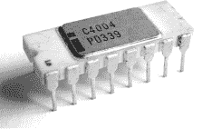

*图 1-29：一颗 Intel 4004 芯片及其封装*

1970 年代诞生了许多今天仍在使用的最古老的软件。UNIX 操作系统由 Kenneth Thompson 和 Dennis Ritchie 在这段时间内开发（见图 1-30），并演变成了当前的 Linux、FreeBSD 和 macOS 系统。

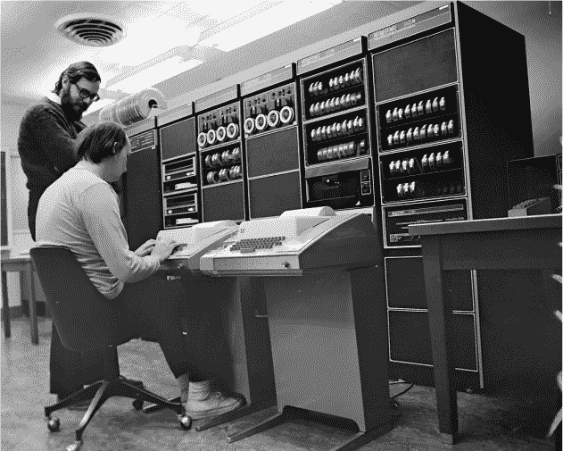

*图 1-30：Thompson 和 Ritchie 在打字机终端上创建 UNIX*

当时的 UNIX 终端使用类似打字机的打印头和纸卷——就像巴贝奇的差分机一样——程序员通过键盘输入命令与机器互动；他们输入的命令会被打印出来，并伴随其结果输出。这种电传打字系统是今天 UNIX 类系统中使用的 x-terminals 的起源。

与基于终端的交互方式不同，施乐公司（Xerox）在其帕洛阿尔托研究中心（Xerox PARC）研究了图形用户界面。这包括开发了第一款鼠标，以及“桌面”隐喻，包含基于物理文件柜的文件和文件夹。

这种将计算机界面建立在中层管理办公室、带有办公桌和文件柜的选择——而不是例如学校、艺术画廊或商店——自那时起便一直伴随着我们，并使计算变得比应有的更为乏味。随着 Android 等手持界面的兴起，以及基于电视的“10 英尺”界面（如 Kodi）的出现，这一现象可能正在开始发生变化，后者提供了基于“应用程序”的可行替代方案。

#### *1980 年代的黄金时代*

任何讲述计算机历史的作者，最终都会遇到故事与自己一生重叠的时刻，从那时起，他们可能会变得有些偏颇。对于本书作者来说，这个时刻就发生在这里，所以你可能希望找到其他人的替代性叙述，以平衡我的观点。

1980 年代是计算机架构的黄金时代：电子计算机首次变得足够便宜且小巧，能够大规模生产并被普通人购买，用于家庭中。如图 1-31 所示，这可能是人类历史上最适合对计算机感兴趣的孩子的时代，因为你能在圣诞节收到一台真正的计算机，直接接触到其架构，那时操作系统还没有将架构隐藏在用户面前。

*图 1-31：1980 年代的家庭计算机：一个开心的孩子与他们的第一台计算机*

这些机器最初基于 8 位 CPU，例如在 Commodore 64 和 Apple II 中使用的 6502，然后基于 16 位 CPU，例如在 Amiga 和 Atari ST 中使用的摩托罗拉 68000。这一时期——尤其是在复古游戏中——被称为 8 位时代，后来是 16 位时代；许多曾经经历过的人以及许多没有经历过的人，都会怀念并带着怀旧之情回顾那个时期。

1981 年推出的 IBM 5150 PC，基于 Intel 8088 芯片。IBM 及其他公司在 1980 年代销售这款及其他 PC，用于商业办公。PC 概念与异构、架构驱动的家庭计算机市场正好相反，原因有两个。首先，它在计算机组件上强制执行标准化架构，以便多个制造商能够生产互相兼容的组件。其次，它将所有硬件封装在严格的操作系统下，操作系统通过标准化接口控制对硬件的所有访问。IBM 能够利用其市场影响力强制执行组件标准，从而可以从最便宜的供应商处购买并通过在组装的 PC 上加盖品牌赚钱。

为了应对在 PC 和大型计算机上安装专有操作系统的情况，GNU（递归代表“GNU 不是 Unix”）项目和自由软件运动在这一十年间由理查德·斯托曼创建——这后来促成了我们今天使用的基于 Linux 的系统和理念。

我们将在第十一章中更详细地研究这一时期。

#### *1990 年代的单调*

1990 年代是一个单调、无聊、米色的十年。这个十年的特点是商业化的行业焦点，从将用户视为程序员和社区成员转变为将用户视为客户和软件产品（如文字处理器和电子表格）的消费者。在此期间，学校停止教授计算机科学，受其创作者的公司游说的重压，转而教授商业办公软件的使用。

计算机架构变得由个人计算机（PC）标准架构主导，这种架构在 1980 年代用于办公计算，但现在被 PC 公司推向各个领域，包括家庭和学校。封闭源代码的操作系统作为 PC 套餐的一部分被推广，使得用户很难看到机器的“内部”。

从外观上看，这些机器几乎是完全相同的“米色盒子”，如图 1-32 所示，这种中层管理风格的计算文化的普遍单调，后来被苹果的“我是 PC”电视广告夸张地讽刺，广告中将 PC 描绘成一个穿着无聊米色套装的普通中层经理。

正如摩尔定律可靠预测的那样，处理器速度每 18 个月翻一番；这是衡量计算机性能的标准，许多人会每隔几年就组装一台新电脑，以利用新的速度提升。

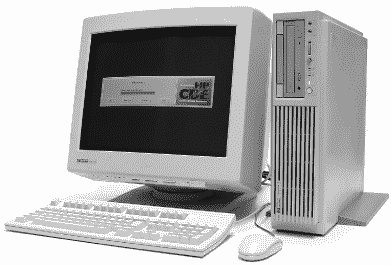

*图 1-32：1990 年代的桌面*

与操作系统的转变相关的是，从汇编语言和解释型语言（如 BASIC）编程到编译语言编程的转变。当语言被编译时，作者可以选择隐藏源代码，使用户无法再查看其工作原理或通过修改代码来学习它们。编译器自 20 世纪 50 年代 Grace Hopper 的工作以来便不断发展，最初应用于高端计算，但这是它们及其生成的代码首次进入普通家庭。

计算机游戏产业同样实现了职业化，将只能购买并玩专用游戏机和游戏的消费者与能够接触到专业编程工具的商业开发者区分开来。游戏有时很有趣，但不像以前那样写起来那么有趣。

万维网于 1990 年在 CERN 上线并逐渐普及，最终引发了 90 年代末的互联网泡沫投资狂潮。随着更多黑客和最终消费者加入互联网，专用的机架式服务器设计逐渐流行，始于 1993 年的 Compaq ProLiant。像曼彻斯特宝宝和 1960 年代的迷你计算机一样，这些设计被构建成可以堆叠在 19 英寸的机架单元中，且必须具备高度的可靠性，始终保持在线状态。

对于早期通过调制解调器连接的精英群体，1993 年也是 Linux 诞生的一年，GNU 启发的国际作者们开始探索如何在架构和系统编程的层面上相互沟通和编写代码。

#### *2000 年代与重建社区*

由通用组件构成的 PC 架构以及操作系统在 2000 年代持续发展。摩尔定律和每隔几年就要购买或组建一台速度翻倍的新计算机的趋势依旧持续。机器使用相同的基本 PC 计算机设计，不同的接口和组件逐步升级以提高速度。互联网速度也在不断提升，推动了视频流媒体以及文本和图像的传输。服务器的体积被缩小成*刀片*，其中许多可以被集中安装在一个机架单元中。

借助这些进展，Linux 逐渐发展成了一个现实的操作系统替代方案，成为了之前与 PC 捆绑的专有操作系统的替代品。许多参与过早期计算机社区的人回归并加入了 Linux 运动。我们意识到，未来的发展必须依赖于操作系统，而非原始架构；对自由软件的倡导者来说，这是一个好事：它消除了我们对任何特定硬件厂商的依赖。现在可以接受这一点，因为操作系统是自由软件，因此没有人会被迫购买任何特定厂商的产品。从这个角度回看，1980 年代或许并不那么美好，因为每个人都被迫在某种非自由的架构平台上开发，完全依赖于这些平台的公司所有者。1990 年代则看到自由度的降低，众多公司和平台被一个主导的 PC 操作系统公司和平台取代，但自那时以来，Linux 的生活比 1980 年代和 1990 年代更加美好，因为我们拥有一个开放的平台，并且许多硬件供应商都在实施它。

我们今天使用的许多其他开源软件也在 Linux 的推动下迅速发展，如 Firefox、Python、MySQL 和 Apache。虽然在许多情况下，这些工具有更早的起源，但它们直到 2000 年代才迎来了开发者和用户的关键群体。

为 Linux 操作系统本身工作的程序员得以看到并处理底层架构，但对其他人来说，架构一般仍然隐藏在幕后，就像在 1990 年代一样。

#### *2010 年代与摩尔定律的终结*

在 1990 年代和 2000 年代，我们愉快地假设处理器的时钟频率每隔几年就会翻倍——而它们确实翻倍了。摩尔定律成为了一个自我实现的预言，硅谷的芯片制造商将其作为目标来追求。

然而，所有这一切在 2010 年代崩溃了。晶体管制造技术虽然依然持续每单位面积翻倍，但时钟频率在 2010 年左右达到了极限，约为 3.5 GHz。突然间，处理器不再变得更快了。这是由于计算速度和热量的物理学基本定律。在摩尔定律时期，处理器的温度随着速度的提升而上升；因此需要更大、更强力的风扇和其他冷却系统，如水冷。晶体管变得更小，但风扇却变得更大。如果这种趋势在 2010 年代继续下去，我们现在的处理器温度可能已经比太阳表面还要高。

一个紧密相关的概念是功耗。随着芯片释放更多的热量，它们消耗的电力也更多，这一年代也见证了向低功耗、更便携的计算转型的开端，特别是在智能手机的形式上。这是我们从仰望天空转向低头看手中屏幕的十年。

如前言所述，摩尔定律的结束催生了图灵奖得主约翰·亨内西和大卫·帕特森所描述的“计算架构的新黄金时代”。在过去的二十年里，计算架构作为一个领域停滞不前，依赖于制造技术的进步来获得稳定的进展，而现在该领域再次对激进的新想法敞开大门。我们不能通过摩尔定律的速度形式使计算机变得更快，但我们仍然可以通过其密度形式将更多的晶体管集成到芯片上。现在我们可以考虑将所有操作都并行执行，一次进行多个操作，而不是一个一个地执行。

正如你可能预期的那样，2010 年代的特征是新想法、架构、硬件和软件的爆炸式增长，所有这些都旨在实现并行化。我们时代的一个关键计算机科学问题是，程序员需要在多大程度上关心这一点。在某种可能的未来，程序员将继续编写顺序程序，而新的并行编译器将能够将逐步指令转化为并行执行。另一个可能的未来是，我们可能发现这种方法不可行，程序员必须自己编写明确的并行程序。这将完全改变编程的性质以及程序员所需的技能和思维方式。

虽然仍有许多并行架构尚待探索——目前有成百上千的大学研究人员和创业公司在尝试探索并利用这些架构——但 2010 年代见证了三种主要的新型并行架构在现实世界中的成功应用。

首先，也是最基本的，*多核*处理器实际上是制造含有多个 CPU 设计副本的芯片。这一十年以双核系统开始，逐步发展到四核、八核，甚至更多的核心。如果你只在这些机器上运行一个程序，那么程序员就需要关心并行性。但大多数当前的计算机运行操作系统程序，这个程序使得许多程序能够并行运行，共享计算机的资源。典型的桌面机器在正常操作时可能同时运行 10 到 20 个进程，通过这种方式安排，因此增加*N*个多核处理器可以提供*N*倍的加速，但仅限于这些数量的进程。如果要求多核处理器运行普通程序，它们的扩展性就不会很好。

其次，集群计算，如图 1-33 所示，是另一种并行处理形式，其中许多传统的单核或多核机器被弱连接在一起。计算工作被分割成许多独立的块，每个块可以分配给一台机器。这要求程序以特定的方式编写，围绕着将任务分割成独立工作进行，并且只适用于某些类型的任务，在这些任务中，分割是可能的。

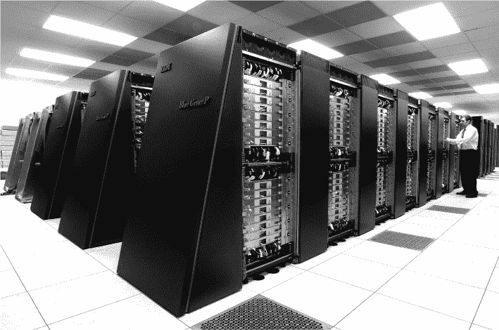

*图 1-33：2010 年代的并行超算集群*

集群计算在“大数据”任务中特别有用，通常我们希望在许多数据项上独立重复相同的处理，然后合并结果（这被称为*map-reduce*）。外星智慧生命搜索项目（SETI@home）在 1990 年代率先采用了这种方法，利用成千上万台用户捐赠的家用计算机的计算时间在后台运行，分析来自射电望远镜的大数据，寻找外星信息。这种方法也被搜索引擎公司采用：例如，一家公司可能会从一个大型仓库中的许多普通戴尔 PC 中，指定一台专门存储包含某个特定词的所有网页位置并处理关于该词的查询。在 2010 年代，Hadoop 和 Spark 项目将基础的 map-reduce 过程进行了抽象并开源，使得每个人都能轻松地设置和使用类似的集群。

第三种方法，最具建筑意义的，是显卡（也称为图形处理单元，或 GPU）演变成通用并行计算设备。这提出了一种全新的硅级设计概念，同时也需要一种新的编程方式，类似于集群编程。由于其图形根基已被抛弃，这一概念不断演变为许多新型架构，例如最近在手机上找到的张量和神经处理单元。

如果这些新的并行架构中的一些变得主导，那么“程序员”这一概念是否还能存续尚不明确；例如，我们可能通过在硬件中创建特定的并行电路来“编程”，在这种情况下，一切同时发生，而不是把“程序”视为一组需要顺序执行的指令。

#### *2020 年代、云计算和物联网*

这是在写作时的当前十年，因此所识别的任何趋势都有些许推测性。话虽如此，我们可以在当前开发实验室中看到的系统表明，当前十年将会看到架构在两种主要类型之间的根本性分裂。

首先，越来越小且廉价的设备将被嵌入到现实世界中的越来越多物体中。这个概念被称为*物联网（IoT）*，预计将在城市、工厂、农场、家庭以及几乎所有其他地方看到智能传感器和计算机。

“智慧城市”将被这些设备覆盖，用于监控每一辆车和行人的动态，使交通管理和城市设施的使用更加高效。“智慧工厂”将为每件库存物品配备微型设备，并在整个制造过程中追踪它们。智慧交通、零售和家庭将追踪同样的物品，贯穿整个供应链，对于食品而言，就是“从农场到餐桌”。例如，你的冰箱会感知到你快没有奶酪了，通过称量奶酪盒的重量或机器视觉识别奶酪，并自动向当地超市下单补充。超市会聚合这些订单，并将需求与来自配送中心的订单进行平衡。小型自动化机器人随后会把奶酪从超市送到你的家门口。

第二个趋势则是朝着相反的方向发展。低功耗物联网设备不会进行大量计算，而是主要用于收集和处理世界上的“大数据”。这些数据将会在专门的计算中心进行大规模处理：这些计算中心是类似仓库大小的建筑，内满了计算能力。

计算中心与*数据中心*相关，数据中心是一些外观相似的建筑，主要用于*存储*数据并通过网络提供数据，而不是进行重计算。这种计算方式最早出现在搜索引擎公司，它们使用许多便宜的商品 PC 联合运行，用来处理网页爬虫和搜索。搜索公司及其在线购物同行发现，他们可以通过租出闲置的机器来为客户提供一般计算服务，从中获得利润。这种计算方式与 1960 年代和 1970 年代的大型机器非常相似，那时的用户通过终端拨号共享计算时间。（也许托马斯·沃森曾猜测全球只需要五台计算机，如果我们把这些云计算中心看作是一台计算机，忽略物联网设备，这个猜测或许最终会成为现实。）

物联网设备引发了对低能耗设计的特别关注，但相关的能源问题同样出现在巨大的云计算中心。这些建筑物的用电量可以与工厂相当，产生大量热量，而且运行成本也相当高。计算中心在 COVID-19 大流行期间为全球的视频通话和协作工具提供了大部分计算支持，使许多工作第一次转向远程工作。一些计算中心由于极端热浪在 2022 年出现了停运的情况。最近，一些计算中心故意建在北极等地方，以利用自然降温。

所以，就像摩西一样，在这个十年里，我们将从云端下载到我们的平板电脑上。 物联网和云的两个趋势在 2020 年代可能会继续并变得更加极端，将架构拉向两个相反的方向。 中型台式计算机看起来可能会在重要性上下降。

我们已经开始习惯在诸如平板计算机和任天堂 Switch 等体积较小的设备上进行计算，这开始让较大的台式机看起来有些愚蠢。“每个桌子上都有一台计算机”是 1990 年代的目标，但现在这些设备正在消失，并被我们口袋里、街上和云中心的计算机所取代。 以前不时提到过类似的设置，包括 1950 年代的拨号主机和 1990 年代的“瘦客户端”，但在 2020 年代，它们似乎通过手机、亚马逊 Echo、Nest 家庭自动化和 Arduino，以及亚马逊网络服务、微软 Azure 和谷歌云平台开始起飞。

### 那么，谁发明了计算机？

现代计算概念由 Church 定义。 20 世纪 50 年代的商业电子设备，从 UNIVAC 开始，到 60 年代的小型计算机和 70 年代的微处理器直至今天，都清晰地可识别为计算机。 但是在它们之前，是否应该认为有什么东西是“第一台计算机”？

如果您愿意，曼彻斯特 Baby 就是 Church 计算机，因为它可以“提供所需的内存”，但如何做到这一点并不十分清楚。 查看后来的商业机器更容易让人感觉到它们可以轻松地通过插入额外的电路板或硬盘进行扩展，例如，通过插入额外的电路板或硬盘。 但原则上它们仍然与 Baby 有相同的问题。

如果以某种虚拟机方式对 ENIAC-初始编程，ENIAC-VM 实际上*是*以这种方式编程的，但仍然是哈佛架构。 它需要另一层未实现的虚拟机才能达到 RAM 程序。 科洛索斯和祖斯 Z3 程序员理论上也可以完成所有这些工作，但他们没有。 分析引擎程序员也是如此。

IBM 自 1890 年代以来一直在描述为“超级计算机”的机器上进行大数据分析，但除非您找到一种方法使任何问题看起来像是 SQL 查询，否则数据分析并不是一般的 Church 计算。

人们可能自 40,000 年前就开始计算了，使用算盘、机械计算器、纸张、笔、粘土板、骨头、岩石、手指和头脑中的自然数。 所有这些理论上都是 Church 计算机，因为如果以某种方式编程，它们可以模拟任何机器。 所以也许我们一直都有计算机——只是 Church 是第一个注意到它们的人。

### 摘要

在本章中，我们快速浏览了计算机历史。从骨头到云计算，我们考虑了一些可能或者不可能被称为计算机的发明。我们还看到了几个关于什么构成计算机的假设。最初，我们提出计算机是任何可以编程来玩*太空入侵者*的设备。然后，我们通过查看丘奇的命题来正式化这一假设，丘奇认为计算机是任何能够模拟其他机器的设备，前提是它拥有足够的内存。

我们对计算机历史的调查简要介绍了架构的重大思想。在接下来的章节中，我们将深入探讨数据表示和 CPU 计算的细节，看看一些历史系统是如何更详细地工作的。这将为我们第二部分研究现代电子层级结构和第三部分中众多现代架构做好铺垫。

### 练习

#### **使用算盘模拟器进行计算**

1.  使用算盘模拟器（如果你有实物算盘，也可以使用）和教程来理解算盘算术。这些操作仍然是一些现代 CPU 操作的基础，学习如何在算盘上进行这些操作将帮助你理解它们在 CPU 中的运作。你可以在这里找到一个模拟器：*[`www.mathematik.uni-marburg.de/~thormae/lectures/ti1/code/abacus/soroban.html`](https://www.mathematik.uni-marburg.de/~thormae/lectures/ti1/code/abacus/soroban.html)*，并在*[`www.wikihow.com/Use-an-Abacus`](https://www.wikihow.com/Use-an-Abacus)*上找到使用它的教程。

1.  将你电话号码的最后三位数字作为一个数字，前面三位数字作为第二个数字，然后在算盘上加起来。

1.  将相同的一对数字进行相减，从较大的数字中减去较小的数字。

1.  将你电话号码的最后两位数字作为一个两位数，前面两位数字作为第二个两位数，然后用算盘进行乘法运算。

#### **推测历史**

1.  你认为如果安提基特拉机制安全到达罗马，并激发罗马帝国使用类似机器，世界历史会有什么不同？

1.  你认为如果分析引擎在大英帝国被完全建造并商业化，世界历史会有什么不同？

#### **具有挑战性**

在互联网上搜索使用算盘进行高级运算的例子，比如平方根或素因数分解，并尝试运行它们。你可能需要使用多个算盘，以提供足够的列来完成某些运算。

#### **更具挑战性**

1.  写一篇基于“推测历史”练习中提出的一个前提的科幻短篇小说或小说。

1.  如何使用算盘实现一台教会计算机？

1.  研究 Hollerith 机器上可用的类似 SQL 的功能。能否用它们制造一台教会计算机？

### 进一步阅读

+   要了解霍勒里斯机的详细信息，请参见 H. Hollerith 的《电动制表机》，*《皇家统计学会杂志》* 57 卷，第 4 期（1894 年）：678–689，*[`www.jstor.org/stable/2979610`](https://www.jstor.org/stable/2979610)*。

+   要了解霍勒里斯机在第二次世界大战中的作用，请参见 Edwin Black 的*《IBM 与大屠杀：纳粹德国与美国最强大公司之间的战略联盟》*（华盛顿特区：Dialog Press，2012 年）。

+   要了解更多关于 2020 年代物联网计算的信息，请参见 S. Madakam, R. Ramaswamy 和 S. Tripathi 的《物联网（IoT）：文献综述》，*《计算机与通讯杂志》* 3 卷，第 5 期（2015 年），*[`dx.doi.org/10.4236/jcc.2015.35021`](http://dx.doi.org/10.4236/jcc.2015.35021)*。

+   要了解更多关于 2020 年代云计算的信息，请参见 I. Hashem, I. Yaqoob, N.B. Anuar 等人的《‘大数据’在云计算中的崛起：综述与开放的研究问题》，*《信息系统》* 47（2015 年）：98–115。

+   若要阅读一部涉及第二次世界大战密码学的柴油朋克小说，请参见 Neal Stephenson 的*《密码帝国》*（纽约：Avon，1999 年）。
