## 第三章：## **数据表示**


计算机是一种表示现实世界中的事物并对这些表示进行操作的设备。我们可能希望表示并进行计算的实体包括物理对象、数字、词语、声音和图片。本章将研究每种实体的表示系统。

我们将从探索物体、数字和文本表示的发展历史开始。然后，我们将研究现代符号系统如何用于表示数字——包括十进制、二进制和十六进制——并利用数字表示法构建进一步的实体表示，例如文本、音频和视频。

本章中，现代表示法是由 0 和 1 构建的，这些 0 和 1 本身作为符号保留。在后续章节中，我们将讨论如何在数字电子学中实例化这些零和一的符号，并在计算中加以利用。

### 数据表示的简史

表示和计算的概念密切相关。人类常常需要表示世界某一部分的状态，作为自己记忆的辅助工具，或者作为向其他人证明某事已经发生或即将发生的证据。一旦有了表示，你也可以利用它进行计算，模拟如果执行某些操作会发生什么，或者从已知信息中推导出结论。

例如，我们常常需要追踪谁拥有什么以及谁欠债。静态表示对于这些目的非常有用，一旦有了这些表示，我们就可以利用它们进行计算，回答例如如果我们买了某样东西，或者还债需要多长时间等问题。因此，表示在计算之前，不论是在概念上还是在历史上，都是先行的。让我们追溯它的发展，从人类的第一次尝试到我们今天使用的符号系统。

#### *刻痕棒和交易代币*

最古老的已知数据表示法是使用*刻痕棒*，例如在第一章中展示的 Lebombo 骨。刻痕棒是简单的棍子，上面有若干标记，每个标记代表一个物体。例如，数字 13 用 13 个标记表示，通常是按顺序排列的，如图 2-1 所示。


*图 2-1：一个简单的计数*

到了苏美尔时代（公元前 4000 年），人们开始使用物理代币来表示物体，如图 2-2 所示。例如，一只小型的泥土动物模型代表了实际的动物，并且可能可以用它交换。这样可以简化交易，你可以从城市乌尔（Ur）带着 10 个动物代币到城市乌鲁克（Uruk），然后用这些代币交换 20 个啤酒代币，实际物品的转移可能会在交易成功后再进行。这些代币也可以在不同的群体间分配，或者作为税收交给国王。

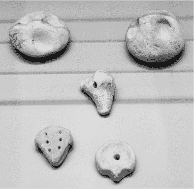

*图 2-2：苏美尔贸易代币*

然而，使用计数棒和代币进行计算是非常缓慢的。要将*m*个计数或代币加到*n*上，你必须逐一地将每个*m*加入到*n*中。如果你研究过复杂性理论，这意味着加法的时间复杂度是 O(*m*)，与被加数字的大小有关。

到公元前 3000 年——仍在算盘之前——苏美尔人通过将多个代币密封在一个称为*bulla*的泥土“信封”中，加速了他们的计算过程，如图 2-3 所示。bulla 既在物理上封闭，通过将泥土粘合在一起以封存内容，也在信息上通过在其上印上复杂且难以伪造的印记来封存。（这就是今天仍在王室和政府文件上使用的仪式印章的起源，比如美国的大印。这也是后来的数字签名的起源。）印章保证，可能是以国王或其他有权威且可信之人的名义，bulla 内部包含了特定数量的代币。这样，你不必再逐个计数 12 个动物代币，而是可以一次性交付包含 12 个动物代币的 bulla。bulla 就像一枚包含 12 个代币的硬币或纸币，但其内部实际包含着 12 个代币。

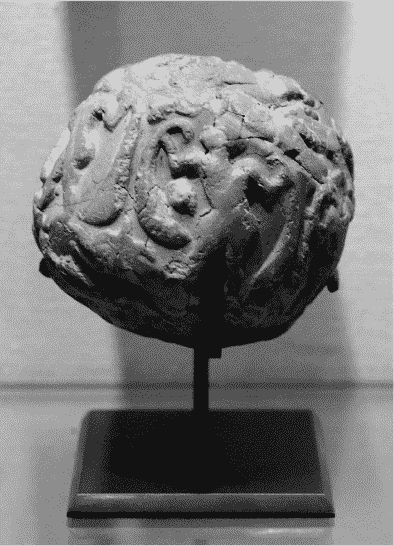

*图 2-3：一枚封印*

与 bulla 的类似发展可以在这一时期的计数棒中找到，那里计数标记开始被分组在一起，如图 2-4 所示。逐个数出*n*个刻痕通常需要*n*次操作，但如果我们将每第五个竖直划线替换为一条穿过前四个的斜线，我们就能快速地数出有多少组五个。


*图 2-4：分组计数*

#### *罗马数字*

在与分组计数密切相关的符号中，我们可以将第五条划线替换为两条较短的斜线，形成 V，第十条则替换为 X，如图 2-5 所示，这标志着*罗马数字*的开始。


*图 2-5：早期罗马数字*

罗马数字进一步发展，以更准确地反映人类对数字的感知。人类似乎能够直接并立刻感知 1、2、3 和 4 个物体的大小。超过这个范围，我们的即时感知是*数量感*或近似大小，而非确切数字，这些数字大致围绕着 5、10、20、50、100 和 1,000。大多数数字符号字母表反映了这一点，埃及、中文和阿拉伯数字都有 1、2、3 和 4 的特殊符号，这些符号显示了相应的笔画数，而对于 5 及以上则使用更抽象的符号。罗马数字系统也使用符号来表示这些“标志性”数字，例如 V = 5，X = 10，L = 50，C = 100，以及 M = 1,000，较小的符号则位于标志性符号之前或之后，以表示对标志性数字的调整，例如 VI = 6 和 IX = 9。

罗马数字的优点在于，它们与人类实际思考数字的方式非常接近，但如果你尝试进行大规模的算术运算，如加法和乘法，你很快就会遇到困难。这是一个经典的例子，说明了表示方法的选择如何显著影响你进行某些类型计算的能力。

#### *分裂记账符号*

*分裂记账符号*是记账棍的一种变体，记账棍上做标记后沿其长度将其分裂成两部分，如图 2-6 所示。


*图 2-6：分裂记账符号*

两个部分包含相同的刻痕，且可以重新结合，证明它们是真正匹配的。它们被用于记录贷款，长短两部分（*原件*和*副本*）分别交给借款人和贷款人，这也成为我们现代金融中*多头*和*空头*头寸的起源。英国政府直到 1836 年左右，现代化其信息技术系统时，才停止使用分裂记账棍，并烧毁了最后一批木制记账符号，那时正是巴贝奇的分析机时期。

#### *阿拉伯数字及其他数字*

其他文明发展了使用符号副本表示大数字的系统，如图 2-7 所示。

例如，古埃及人有 10、100、1,000 和 10,000 的符号。数字 23 会用两个 10 的符号（一个脚跟）和三个 1 的符号（一个记账符）表示。数字 354,000 会用三个 100,000 的符号（一个蝌蚪）、五个 10,000 的符号（一个手指）和四个 1,000 的符号（一个莲花）表示。

东方阿拉伯数字出现在伊斯兰黄金时代，基于公元 500 年左右的早期印度数字系统。该系统引入了我们今天使用的基数方法，并且有固定的列，用于表示 1、10、100、1,000 等数字。重要的是，这一系统引入了“零”的概念和符号，用来填补没有计数的列，这在古埃及和类似的系统中是没有的。这些符号演变成了今天西方使用的阿拉伯数字（1、2、3 等）。

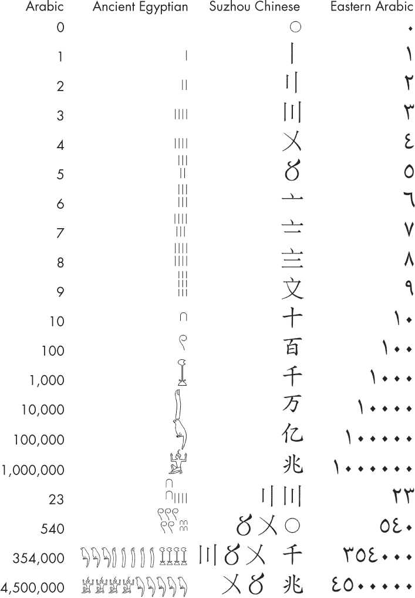

*图 2-7：现代阿拉伯数字、古埃及数字、苏州汉字数字和东阿拉伯数字*

苏州的汉字数字源自与前面在图 1-4 中看到的十进制算盘相关的古代汉字符号，并且至今偶尔仍在使用。你可以看到 1 到 4 的符号基于记数的划痕，而 5 到 9 的符号则是类似的符号放置在一个“珠子”下方，表示 5。对于一些重要的数字，苏州使用一种类似阿拉伯数字的列表示法。然而，对于较大的数字，它采用更先进的表示方式，显示前几个有效数字，然后是一个单独的符号，表示它们乘以的是 10 的多少次方。在英语中，我们有时会写成 *354 thousand* 或 *354k*，而不是 *354,000*。

数字的 *表示* 历史更适合归属于计算机科学，而非数学。我们可以看到，历史上，像“5 头牛加 3 头牛”这样的 *有形* 数量曾被表示和计算，而不是像“5 加 3”这样的抽象数学数字概念。数学通常将数字视为理所当然，并对它们的性质进行证明。相比之下，数字表示的事务，无论是实际物体还是从中推导出来的抽象数字概念，属于计算机科学范畴，如何基于这些表示构建算法和机器也是计算机科学的内容。

### 现代数字系统

我们已经看到，现代数字概念是如何从记号演变为今天日常生活中使用的符号性阿拉伯数字系统的。阿拉伯系统的关键创新在于使用列来表示基数中的数字。正如我们在开始计算时会看到的，这使得算法运算更加简便，也减少了表示的大小。例如，你只需要四个符号就可以表示数字 2,021，而不需要 2,021 个粘土代币。

我们日常使用的阿拉伯数字是十进制的，使用基数 10，但这并不一定是计算机使用的基数。本节将概括基数和指数的概念，并介绍一些在计算机中有用的相关系统。

#### *基数和指数*

在表示数字时，我们将大量使用指数运算。*指数运算* 是基数的重复乘法，例如：

2³ = 2 × 2 × 2

这里，2 是基数，3 是指数。它也可以写作 2³。在某些计算机语言中，它以 `2**3` 的形式出现，或者通过幂函数表示，如 `pow(2,3)`。指数运算有时被称为“提升到某次幂”，例如“2 的三次幂”。

更一般地，我们将基数 *b* 的 *n* 次幂写作

*b^n* = *b* × *b* × *b* × . . . × *b*

这意味着有 *n* 个 *b*。零和负指数定义如下：

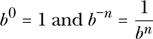

如果我们选择一个基数 *b*，那么可以定义一个 *数字系统*，它是从一组 *数字符号* 到一个 *数字* 的映射。符号是写在纸上的标记或存储系统中的条目；数字是实际的数学对象。

要表示*b*进制的数字，我们需要一个包含*b*个符号的字母表。由*N*个符号组成的字符串可以有*b^N*种不同的状态，用来表示从 0 到*b^N* – 1 的数字。

当我们处理不同进制的符号时，有时会使用下标来表示符号的进制。例如，123[10]表示十进制的 123，而 1001[2]表示在二进制中一个 8，一个 1，没有 4 和 2（即 9[10]）。在其他情况下，如果上下文中已经清楚进制，可能会省略下标。

#### *十进制：Decimal*

日常算术使用的是十进制，其中例如符号串 7、4、3，写作 743，表示数字七百四十三。我们可以通过 10 的指数来数学地理解这一点：

743 = 7 × 10² + 4 × 10¹ + 3 × 10⁰

使用小数点表示法和负指数，我们可以表示分数。例如：

743.29 = 7 × 10² + 4 × 10¹ + 3 × 10⁰ + 2 × 10^(–1) + 9 × 10^(–2)

对于十进制，我们有一个包含 10 个符号的字母表：0、1、2、3、4、5、6、7、8 和 9。由*n*个符号组成的字符串可以指定 10^(*n*)个数字；例如，当*n* = 4 时，总共有 10,000 个数字，从 0 到 9,999（包含）。

#### *二进制：Binary*

二进制（Base 2）被称为*二进制*，几乎所有现代计算机都使用它。它的字母表由两个符号组成，通常写作 0 和 1，有时也用 T 和 F 分别表示*真*和*假*。在电子计算机中，这两个符号通过高电压和低电压来表示。*高*电压通常是系统的正电压，例如 5 V 或 3.3 V，而*低*电压通常是地电压或 0 V。二进制对电气机器很有用，因为真实的电压信号有噪声，而尝试加入像*中*电压这样的额外符号通常会失败。但*高*和*低*可以更容易、更便宜地分成两个清晰的类别。

在二进制中，一个符号叫做*比特*，是*二*进制数位（*bi*nary dig*it*）的缩写。一串*N*个比特可以表示 2^(*N*)个数字，例如从 0 到 2^(*N*) – 1。该字符串的列代表 2 的幂。例如：

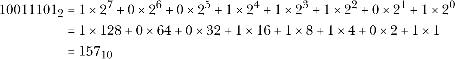

在此计算中出现的 2 的幂（0, 1, 2, 4, 8, 16, 32, 64, 128, 256, 512, 1,024, 2,048 等等）对于任何习惯于计算的人来说都是非常容易识别的。它们常常作为内存容量的大小出现，也常出现在硬件级别数据结构的比特或字节大小中。如果你计划从事或接触硬件工作，你需要记住这些 2 的幂以供日常使用。

要将二进制转换为十进制，计算每一列为 1 的二进制位所对应的 2 的幂之和。要将十进制转换为二进制，每一步尝试从十进制中减去最大的 2 的幂，并记录已减去的 2 的幂。把这些列标记为 1，其他列标记为 0。

在不同进制下，一些数学操作的速度可能会有所不同。在 10 进制中，你可以通过将小数点（基数）向左或向右移动一位来快速乘以或除以 10。在二进制中，你可以使用类似的技巧来快速乘以或除以 2。这被称为*二进制移位*，大多数 CPU 都通过硬件实现了它。例如，在 C 语言中，快速乘以 8（2³）可以通过写成`y=x>>3;`来完成。

在一些书籍和编程语言中，二进制的替代表示法包括 1110[2]、0b1110 和 1110b。

**注意**

*有一个著名的计算机科学笑话说：“有 10 种计算机科学家：那些一无所知的和那些懂二进制的。”*

#### *1,000 进制*

作为引入其他符号表示法（如十六进制和字节码）的方式，让我们从不同的角度来看十进制表示法，我们将其称为*复合表示法*。通常会通过将大数字分成每三位一组并用逗号分隔来使其更易于阅读。例如，数字 123,374,743,125 表示一百二十三*十亿*，三百七十四*百万*，七百四十三*千*，一百二十五。（这里的“一百二十五”指的是*个位*的数目。）

想象一下，这些块是由包含从 0 到 999 共 1,000 个符号的字母表中的个别符号组成。不要把 999 看作三个 9，而是看作一个符号。在这种观点下，我们可以把用逗号分隔的字符串看作是一个由 4 个符号组成的 1,000 进制字符串，而不是 12 个 10 进制符号：

123,374,743,125 = 123 × 1,000³ + 374 × 1,000² + 743 × 1,000¹ + 125 × 1,000⁰

这比将数字想成 10 进制更能准确地反映我们的口语语言：我们有 1,000 的幂次的名称（千、百万、十亿、万亿），但我们没有 10,000、100,000 或 10,000,000 的名称。科学单位也遵循这一 1,000 进制的惯例：千、兆、吉等。

有趣的是，1,000 进制与 10 进制之间有一种特殊的关系。通常，当我们改变进制时，我们会预期在两个进制中符号的外观完全不同。但是，当我们在 10 进制和 1,000 进制之间切换时，书写符号是完全不变的。我们只是从把 123 看作是 10 进制中的三个符号，转变为把它看作是 1,000 进制中的一个符号。这使得在这两个进制之间转换非常简单方便，就像我们在日常生活中看到或听到大数字时会在脑中进行的转换一样。

#### *60 进制：六十进制*

让我们谈谈*六十进制*，也叫做*60 进制*。这个系统与现代计算相关的原因有两个：首先，像 1,000 进制一样，它是我们稍后将要探讨的一种复合符号表示的例子；其次，它今天仍在广泛使用于计算中。

我们相信一些史前人类群体使用的是 12 为基数的计数方法。当我们进入第一个城市的时代（公元前 4000 年）时，苏美尔人为了科学研究（包括天文学和毕达哥拉斯定理的算法版本的发明）改用了 60 为基数的系统。这可能是通过使用 10 和 12 为基数的不同人群之间的融合、碰撞或妥协而形成的，因为 60 可以被 10 和 12 都整除。

苏美尔人并没有发明 60 个不同符号的字母表，这样做将需要大量的学习努力，他们使用了一种混合符号表示法。他们在现有的十进制系统中写下 0 到 59（包括 59）的数字，但将这些复合符号视为 60 进制系统中的独立数字。例如，符号（使用现代阿拉伯数字，复合符号用冒号分隔）11:23:13 表示以下数字：

11 × 60² + 23 × 60¹ + 13 × 10⁰ = 39,889[10]

我们今天仍然使用性别进制系统来表示时间：上面的数字意味着 11 点 23 分 13 秒，即一天中 39,889 秒的时间。因此，现代数据库、数据科学系统和日期时间库需要仔细设计，以处理性别进制、二进制和十进制之间的转换。

#### *基数 16：十六进制*

让我们来谈谈十六进制吧！十六进制是*十六进制*或*十六进制代码*的缩写，是一种以 16 为基数的系统。它的符号是 0 到 9 的数字和字母 a 到`f`（代表十进制的数字 10 到 15）的混合，通常以 0x 为前缀来表示它们是十六进制数。

你可能已经在任何允许直接访问和使用内存的计算机程序中见过十六进制数，包括 C 语言和汇编语言。它们也出现在高级语言中，作为区分具有相同属性的对象副本的一种方式。例如，如果你复制一个`Cat`对象（在面向对象的语言中），它的属性是`numberOfLegs = 4`和`age = 6`，你将得到一个具有相同属性的第二个`Cat`对象，但这两个副本是不同的，因为它们有不同的名称，并且存储在内存中的位置不同。一些调试工具会显示这些内存位置，以便你看到哪个对象是哪个。例如，当你要求 Python 打印一个对象时，你会看到一个十六进制地址，像这样：

```
<< print(cat)
<__main__.Cat at 0x7f475bbf6860>
```

人类与低级计算机架构的接口，例如内存位置，通常使用十六进制作为一种替代、更易于人类阅读的方式来显示二进制信息。上面输出的地址实际上是一串长长的 0 和 1 的二进制数，但人类很难识别它们，例如，在比较两个地址时是否相同。比较十六进制数则要容易得多。

16 进制用于显示二进制，而不是其他系统，因为它与二进制的关系类似于 1,000 与 10 的关系。因为 16 是 2 的幂次，就像 1,000 是 10 的幂次一样，二进制中的列组和 16 进制中的列之间存在一一对应关系。这使得两者之间的转换非常快速和简便。考虑一个将二进制数字按四位一组排列的例子：0010,1111,0100,1101。我们可以将其视为

0010[2] × 2¹² + 1111[2] × 2⁸ + 0100[2] × 2⁴ + 1101[2] × 2⁰

这与以下表达式相同：

2[10] × 16³ + 15[10] × 16² + 4[10] × 16¹ + 13[10] × 16⁰

每个 16 的幂次都对应一个从 0 到 15 的数字，所以如果我们用字母 a[16]到 f[16]表示 10[10]到 15[10]，那么我们可以将数字写成 16 进制的 2f4d[16]。二进制数中的每 4 个比特（有时称为*nybble*）对应一个 16 进制数字：16 进制中的 2 正好对应二进制中的前 4 个比特，即 0010；f 对应 1111；4 对应 0100；d 对应 1101。这种四比特对一位的对应关系使得 16 进制和二进制之间的转换变得容易——比起十进制和二进制之间的转换要简单得多。

**16 进制编辑器**

16 进制编辑器（例如，在 Vim 中使用%！xxd，如下图所示）以字节表示法显示文件或内存的内容，有时还会显示其他翻译内容，如 ASCII 字符。它们允许你直接编辑相应的二进制数据。这对于编辑磁盘上的二进制数据和可执行文件（已编译的程序文件），或在计算机内存中进行“修改”（覆盖程序和数据）非常有用，比如当前运行的程序。这些编辑器有许多与安全相关的有趣应用。例如，你可能会用它来尝试寻找并绕过某个专有程序中检查验证购买的部分，或者覆盖你在计算机游戏中的生命数，将其从 3 改为 255。

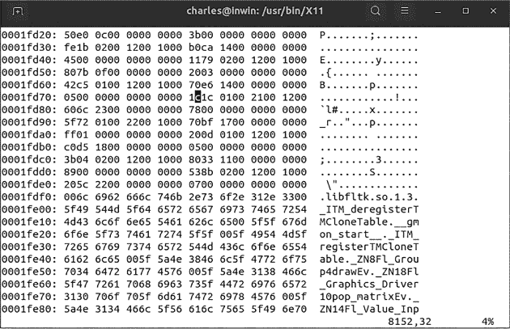

16 进制是人类用来理解计算机中二进制数字的方便工具，但重要的是要认识到，计算机本身并不使用 16 进制作为工具。我们并不是用 16 进制作为基数来构建物理计算机；我们是使用二进制来构建它们的。然后我们将计算机的二进制数字分成四位一组，并将它们转化为 16 进制，这样更适合人类理解。毕竟，16 比 10 稍大，正是人类更容易习惯思考的数字，而不是二进制。

一些书籍和编程语言中用于表示 16 进制的替代符号包括 2F4D[16]、0x2f4d、2F4Dh、&2F4D 和$2F4D。

#### *基数 256：字节*

再次使用千进制技巧，常见的做法是将十六进制代码分为*一对*十六进制数字，例如 2D 4F 13 A7。在这里，每对十六进制数字可以视为 256 个符号字母表中的一个符号，每个符号表示 8 位，称为*字节*。字节是 8 位时代的主要计算单位。四位半字节（nybble）之所以得名，是因为它是一个字节的一半。记住，一个 nybble 是一个十六进制数字；一个字节是两个十六进制数字。

#### *如何在进制之间转换*

要将任何基数*b*表示转换为十进制，可以将每个基数*b*列的十进制值相加：

*x*[*n*]*b*^(*n*) + *x*[*n* – 1]*b*^(*n* – 1) + . . . + *x*[0]*b*⁰

例如，下面是如何将一个数字从 19 进制转换为十进制：

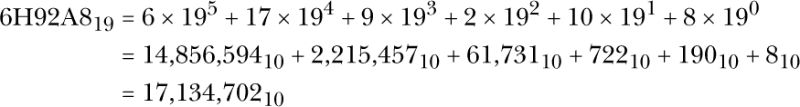

要将十进制转换为基数*b*，可以通过对*b*进行反复的整数除法，并记录余数。表 2-1 显示了将 186[10]转换为二进制的步骤。

**表 2-1：** 将 186 转换为二进制

| **步骤** | **结果** | **余数** |
| --- | --- | --- |
| 186/2 | 93 | 0 |
| 93/2 | 46 | 1 |
| 46/2 | 23 | 0 |
| 23/2 | 11 | 1 |
| 11/2 | 5 | 1 |
| 5/2 | 2 | 1 |
| 2/2 | 1 | 0 |
| 1/2 | 0 | 1 |

这里，186[10]的二进制形式是通过读取余数列得到的：10111010[2]。

大多数编程语言提供了自动执行常见转换的函数，如`bin2hex`和`hex2dec`。

### 数据表示

一旦你为整数建立了基本表示方法，比如我们讨论的任何一种进制系统，你就可以用它作为构建其他事物表示的基础：更复杂的数字类型、文本、多媒体以及任何通用的层次数据结构。这里我们将看到这种表示方法，通常使用我们已定义的系统作为其他更高级系统的组成部分。这可以简单到用一对整数表示一个分数，或者复杂到使用数十亿个浮点数组成时空层次结构，来表示你的视频播放器中的多媒体流，包括视频、多语言音频和字幕。

#### *自然数*

*自然数*（传统上用符号 N 表示）是 0、1、2、3、4 等等的数字。它们通常用来表示世界上物理事物的数量，比如石头或牛。

自然数可以通过多种方式表示，包括计数法和罗马数字。在计算机架构中，最明显的方式是使用我们讨论过的某种基数指数系统。一些计算机使用十进制系统（见“十进制计算机”框），而大多数现代机器使用二进制。例如，通过使用可以开关的灯泡，我们可以表示数字 74 的二进制列（一组 64、8、2），如图 2-8 所示。


*图 2-8：数字 74 的二进制表示*

这里有一些微妙之处，随着更复杂的表示方法的出现，这一点将变得很重要。首先，您需要选择一个读取灯泡的约定。在这种情况下，我们选择将最高位放在左侧，就像人类可读的十进制数字一样。我们本来也可以选择反过来，将最高位放在右侧。其次，我们在示例中假设有八个灯泡可用并正在使用。这意味着我们只能表示 0 到 255 之间的数字。如果我们想表示更大的数字，或者甚至传达我们已经没有足够的灯泡来表示更大的数字，我们就需要一个新方案。

**十进制计算机**

十进制计算机有着悠久的历史，跨越了机械时代和电子时代。以下是它们工作原理的一些细节。

**巴贝奇的分析引擎**

和巴贝奇的差分机一样，他的分析引擎也采用了十进制表示法，齿轮上包含数字 0 到 9。齿轮的朝向表示特定的十进制数字*d*，当该数字朝向固定标记时，如下图所示。与帕斯卡尔的计算器类似（不同于达芬奇的计算器），齿轮不会在数字之间的连续角度上停下；它只有 10 个离散的状态。

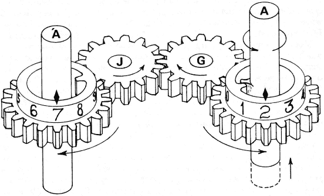

齿轮是空心的，内部有一个轴。这齿轮和轴通过两个凸轮连接，分别附着在它们的圆周上。这些凸轮的排列方式是，如果轴旋转一整圈，凸轮将在圆的一部分区域接触，从而使齿轮旋转的角度等于它的数字值，而不是旋转完整的一圈。要读取表示的数字，您需要将轴旋转一整圈。在旋转的第一部分，凸轮不接触，齿轮不动。在旋转的第二部分，凸轮接触并使旋转的轴带动齿轮旋转，旋转的角度为*n*分之一圈，其中*n*是表示的数字。齿轮的旋转使您能够访问该数字。例如，如果您先将齿轮连接到第二个齿轮，它将使第二个齿轮的数字按*n*的值向前移动。

重要的是，数据在被读取时会从第一个齿轮中丢失，因为凸轮在旋转的第二部分总是将齿轮移动到零位置。因此，读取数据的过程是一个*移动*，而不是*复制*。

许多齿轮可以垂直堆叠起来表示更大的十进制数字。同样，这些垂直堆叠的齿轮会在分析引擎中水平排列，以同时表示多个数字。

**电子十进制机器**

历史上较不为人知的是早期电子时代的十进制机器。上一章讨论的第一台商业计算机 UNIVAC（1951 年）就是其中之一。它的主控制台（见下图）以许多 10 个灯泡的组合为特点，用于显示各种十进制数。


以下图所示的 IBM 650 计算机，诞生于 1953 年，以其使用“二五制”表示法而闻名。与算盘一样，这种表示法涉及将单位和五个组成十进制列。

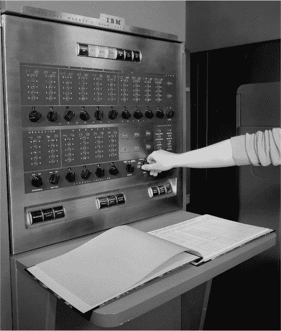

二进制并不是数字系统（如灯泡）表示自然数的唯一方式。有时，一对*N*的表示法更加实用，正如图 2-9 所示。


*图 2-9：在一个一对*N*系统中表示数字 5（最左边的灯泡表示 0）*

在这里，我们假设有*N*个灯泡可用并正在使用，并且任何时候只有一个灯泡亮起。这种方法可能很浪费，因为我们并没有使用灯泡组的绝大多数可能状态。但它也可能很有用：例如，如果我们想在现实世界中为某个物体照明，比如排队中的第五辆车，我们现在有一个专门用于该目的的物理灯泡。这在计算机架构中会非常有用，因为我们经常希望以类似的方式开关*N*个物理电路。与二进制一样，我们需要约定一个从左到右或相反的约定，并且如果数字太大，无法指示灯泡用尽，也没有办法解决。

#### *整数*

*整数*（集合符号 Z）是这些数字：. . . , –3, 2, –1, 0, 1, 2, 3，依此类推。它们可以定义为将自然数与正负符号配对（除了零，+0 = –0）。表 2-2 展示了三种不同的二进制编码方式。

**表 2-2：** 三种可能的整数二进制编码方式

| **整数** | **带符号** | **一的补码** | **二的补码** |
| --- | --- | --- | --- |
|  3 | 011 | 011 | 011 |
|  2 | 010 | 010 | 010 |
|  1 | 001 | 001 | 001 |
|  0 | 000 和 100 | 000 和 111 | 000 |
| –1 | 101 | 110 | 111 |
| –2 | 110 | 101 | 110 |
| –3 | 111 | 100 | 101 |
| –4 | 不适用 | 不适用 | 100 |

表示整数的一种简单方法是使用与其绝对值对应的自然数的二进制编码，再加上一个额外的位来表示符号，就像表 2-2 中的带符号列（最左边的位表示符号）。然而，构建能够正确处理这些表示方式的机器是困难的，因为符号必须单独处理，并且用于选择如何处理剩余的数字。拥有两个不同的 0 表示方式也可能成为一个问题，需要额外的设备来解决。

想一想表中给出的同一整数的反码表示法（虽然很少有人使用，但它能帮助你理解下一个方法）。在这种表示法中，正整数的编码与自然数的编码相同，但负数的编码是通过反转其对应自然数的所有位得到的。例如，要得到 -2 的编码，我们从 +2 的编码 010 开始，将所有位反转得到 101。

现在考虑表格中的二补码表示法。这是通过对负数使用反码并加 1 得到的。例如，-2 变为 110，即 101 + 1。看起来这可能是随机的做法，但正如你稍后会看到的，二补码方法非常有用。它简化了所需的算术操作，这是今天的计算机普遍使用它的原因。

#### *有理数*

*有理数*（集合符号 ℚ）被定义为并可以由整数对 *a*/*b* 表示，其中 *b* ≠ 0。例子包括 1/2、-3/4、50/2、-150/2 和 0/2。许多有理数是等价的，例如 4/2 和 2/1。检测和简化等价关系需要专门的计算工作，如果没有这项工作，有理数往往会扩展到荒谬的规模，比如 1,000,000,000/2,000,000,000 表示的是数字 1/2。

表示有理数是我们首次结合多种现有表示法的例子：我们需要使用一对整数。例如，考虑 图 2-8，我们之前将其解释为一个单一的自然数；这个图像也可以视为表示有理数 4/10 = 2/5，假设前后两组四个灯泡分别表示 4 和 10。

这里有一些微妙之处：我们需要达成一致，前四个灯泡代表第一个整数，后四个灯泡代表第二个整数，并且我们还需要就整数本身的表示方式达成一致（如何表示正负值），正如之前讨论的那样。如果我们想要检查两个有理数是否相等，我们会遇到许多不同的表示方式，例如 4/10 和 2/5，这可能最初会让我们困惑。

#### *定点*

*定点数*，如 4.56、136.78 和 -14.23，是具有有限位数的小数点前后数字的数字。在这些例子中，点后始终有两个数字。严格来说，定点数是有理数的一个子集，因为它们总是可以表示为整数除以 10 的某个幂。只要我们就它们的顺序和大小达成一致，并且就整数本身的表示达成一致，它们就可以很容易地在计算机中表示为一对整数，分别对应小数点前后的两部分数字。

例如，图 2-8 中的灯泡现在可以代表定点二进制数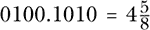，如果我们同意在第四个灯泡后固定小数点。注意，这些灯泡与我们之前用来表示有理数 4/10 和整数 74 的灯泡完全相同；要将数据解释为某种表示方式，我们需要约定使用的是哪种表示系统。

#### *浮动点数*

*浮动点数*，例如 4.56 × 10³⁴和–1.23 × 10^(–2)，是之前在图 2-7 中看到的苏州位值计数法系统的计算版本，由定点尾数（这里是 4.56）和整数指数（这里是 34）组成。它们通过将整数表示和定点表示配对，能够轻松在计算机中表示。

在实践中，为了实现这一点，你需要选择特定的表示方式来表示定点和整数部分，设定具体的比特长度，并指定如何将它们按特定顺序打包成一个对。预留一些比特串用于特殊编码也是很有用的，比如正负无穷（可以用来编码 1/0 和-1/0 的结果）和“非数字”（*NaN*，用于编码诸如计算 0/0.0 时的异常）。*IEEE 754*是一个常用的标准，用于做出这些选择。它包括一组比特顺序，旨在最有效地利用 8、16、32、64、128 或 256 位作为浮动点表示。例如，IEEE 754 的 64 位标准规定，前 53 位应作为带符号编码的定点尾数，其中第一位表示符号；其余 11 位应作为二进制补码整数指数。一些比特模式被保留用于无穷大和 NaN。

**可计算实数**

除了浮动点数，计算机科学还拥有自己对*可计算实数*的定义，有时写作𝕋，它们不同于——并且优于——数学中使用的*实数*，后者用ℝ表示。可计算实数是所有可以通过程序定义的数字。与此相比，数学家们使用的更大的实数集合是无用的，因为它们不能单独定义或用于计算。

想象一个物理乌龟机器人，使用类似 Scratch 的语言控制，沿着数轴左右移动。可计算实数就是你可以为乌龟编写程序使其停在的所有数轴上的位置。具体来说，它们是所有能通过某些有限长度的计算机程序来指定其*n*位数字的数字。

例如，我们可以编写一个函数`pi(n)`，它以整数 n 为输入并返回*π*的第*n*位数字。同样，我们可以通过从程序`a(n)`和`b(n)`形成一个新程序来将两个可计算实数`a(n)` + `b(n)`相加。新程序将以`n`作为输入，并调用`a()`和`b()`一次或多次来生成输出的*n*位数字。

可计算实数具有许多迷人且几乎是自相矛盾的特性，这对计算机和人类算术都有深远的影响。例如，通常无法（不可计算地）知道两个可计算实数是否相等或不同！通过对可计算实数进行一些基本的算术运算形成的程序，很快就会变得庞大且笨拙。如果我们能够通过用更短（或最短）的程序替代它们并得到相同的输出，那将是很好的，但这在理论上是不可能的。可计算实数的数量是“可数”的，这与整数的“大小”相同。这与数学家定义的实数不同，后者具有更大的“大小”，被称为“不可数”。

艾伦·图灵在他的伟大论文《可计算数的论述》中定义了可计算实数，因此使用了字母𝕋。可计算实数是他对计算机科学的真正天才贡献，而不是“发明计算机”（该论文的标题提示它是关于可计算数的，而非计算机）。图灵的理论仍然被低估。如果这一理论得到更广泛的发展和应用，我们可能有一天能够摆脱浮点近似带来的误差，进行完全准确的计算。

#### *数组*

*一维数组*是*R*个值的序列：

{*a*[*r*]}[*r*=0:*R*–1]

*二维数组*是一个*R* × *C*个值的集合（表示行数和列数），其中：

{*a*[*r,c*]}[*r*=0:*R*–1,*c*=0:*C*–1]

*D*维数组是一个具有*D*个索引的值集合，例如具有以下元素的三维*R* × *C* × *D*数组：

{*t[r,c,d]*}[*r*=0:*R*–1,*c*=0:*C*–1,*d*=0:*D*–1]

数组中的值可以是数字（任何我们讨论过的数字类型）或其他类型的数据。

数值数组通常用于表示向量、矩阵和张量。这些是扩展数据结构的数学概念，带有特定的数学操作。例如，*向量*是一个一维数组，具有特定的加法规则、标量乘法规则以及计算点积和范数的规则。*矩阵*是一个二维数组，具有特定的规则，例如乘法和求逆。*张量*是一个*N*维数组，具有特定的协变和逆变坐标变换规则，除了乘法和求逆外。向量和矩阵是张量的特例。（许多计算机科学家错误地使用*张量*一词来仅指*N*维数据结构，而忽略了真正张量的其他数学要求。）

所有类型数组的基本数据表示方法是将它们“打包”成一系列在计算机内存中连续区域中的单个数字。例如，图 2-8 可能表示一个由整数[1,0,2,2]组成的一维数组，如果我们同意一个约定，即每个整数由两个灯泡表示。同样，它也可以表示这个二维整数数组：

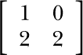

在这种情况下，我们将每个二维数组的行视为一维数组，[1,0] 和 [2,2]。我们使用每个整数两颗灯泡进行编码，并按顺序存储行的编码序列。通过扩展，对于一般的*N*维数组，我们可以做同样的事情：将其分割成一系列的（*N* – 1）维数组，对每个数组进行编码，并按顺序存储编码序列。

优化数据表示和计算架构以处理向量、矩阵和张量已经成为技术行业的主要驱动力。GPU 最初是为实时 3D 游戏中的快速 3D 向量矩阵运算而设计的，最近它们已经被广泛应用于快速张量计算，这在神经网络加速中发挥了重要作用。谷歌的张量处理单元（TPU）就是专为这个任务设计的。

#### *文本*

让我们来谈谈文本。一旦你有了有限的、离散的符号字母表，比如我们用来书写人类可读文本的字符，你可以为每个符号分配一个自然数来表示它。然后，你可以使用一组自然数按顺序表示*文本串*。这个思想已经从长期标准但现在过时的 ASCII 发展到了现代的 Unicode。

**文本的历史**

数字本身并不太有用：我们需要知道*是什么*在被计数。苏美尔的交易代币是“打字的”——三枚牛代币代表三头牛。但当我们从代币转向更抽象的数字时，我们失去了数字所代表的内容。数字需要附加额外的符号来描述类型，比如“3 头牛”。因此，书写是从与数字相同的交易代币中发展出来的，但它分化成了象形符号，然后成为了文本。

第一种书写出现在公元前 4000 年左右的苏美尔。它使用物体的图像（象形符号）来代表这些物体。象形符号在许多文化中出现过，后来逐渐转化为表音符号。表音和语义用途可能会共存一段时间——比如现代汉语——但表音用途通常会变得占主导地位。文本符号也随着时间的推移逐渐简化，变得更容易书写，失去了最初与其物体的图像相似性。在刻写石头上的文字时，符号逐渐演变为由直线构成，这样更容易刻画。最常见的符号最快地演变成了易于书写的形状。因此，它们成了音标转录中最方便使用的符号，经过从图像到声音的转变后，幸存下来的表音字母往往来自最常用的单词。

文本并不总是从左到右书写。阿拉伯语和希伯来语是从右到左书写的，许多东亚语言可以从上到下书写。

摩尔斯电码是在 1836 年左右开发的，旨在让维多利亚时代的互联网——电报的操作员能够快速通讯。塞缪尔·摩尔斯研究了英语中字母的使用频率，以便给常用字母分配最短的表示方式。摩尔斯几乎是二进制代码，因为它使用两个符号的序列来表示字母，但通常与第三个符号——空格一起使用，以表示单词之间的间隔。

布莱叶盲文也是在 1836 年左右由路易·布莱叶开发的。它是一个真正的二进制代码，每个字母由 2×3 网格的二进制状态表示。它最初是为士兵的秘密用途开发的，但后来因其在盲人读者中的广泛使用而流行开来。

#### **ASCII**

*美国信息交换标准代码（ASCII）*，如图 2-10 所示，将每个字符表示为一个独特的 7 位代码，这意味着它可以表示总共 128 个字符。这可以表示大写和小写字母、数字、符号和标点符号，以及历史上的*控制符*，如删除、回车、换行符和响铃。

在旧版电子邮件系统中，ASCII 控制代码有时会作为电子邮件消息的一部分传输和显示，而不是实际执行。尤其是退格控制符容易出现这种效果，因此你会收到类似以下的电子邮件：

团队已识别出计划中几个错误^H^H^H^H^H^H^H 挑战。

今天，老一辈人有时故意打出类似的“退格失败”作为幽默。

一些操作系统使用不同的约定来表示行末，涉及文本文件中的换行符（代码 10）和回车符（代码 13），如果你在系统之间移动文本文件，可能需要修复这些问题。在打字机和电传打字机的时代，这两个符号是两种不同的物理控制，一个用于将纸张向机器中推进一行，另一个用于将打印头的打印架返回到纸张的左侧。

ASCII 代码 0 通常用于表示字符串的结束。如果字符串以某种方式在内存中布局，程序需要一种逐个字符处理字符串的方法。约定是，当程序遇到零时，它就知道该停止了。

作为 1960 年代的美国标准，ASCII 是全球化和互联网之前的产物，现在已经显示出它的年代感。它只能表示拉丁字母中的字符，因此无法直接表示非英语语言所需的字符。例如，许多欧洲语言需要带有重音符号的拉丁字符，而像中文和阿拉伯语这样的语言使用完全不同的字母表。

然而，在计算机史上最具前瞻性的设计决策之一，结合偶然性，ASCII 的设计者们意识到了这一潜在的未来问题，并为此做了规划。偶然性在于，当时的计算机使用的是 8 位组，而英语所需的字符集大小仅略低于 7 位。设计决策是使用 8 位表示 ASCII 字符，但始终将第一个位设为 0。将来，如果需要更多字符，可以将这个第一个位用于其他目的。现在，这一设计已实现，促成了现代 Unicode 标准的出现。

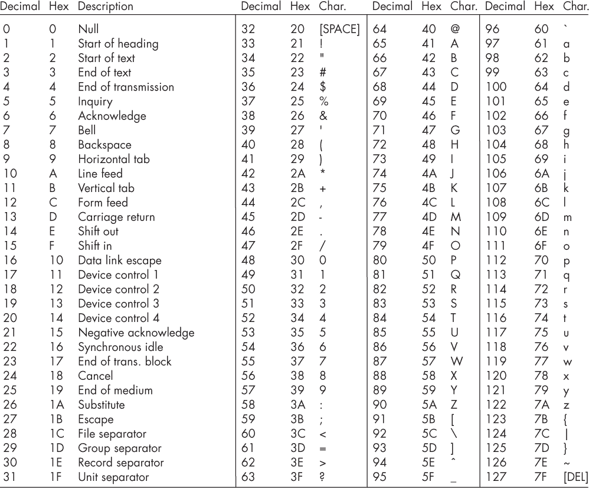

*图 2-10：ASCII 字符表示*

**ASCII 作为 256 进制**

假设你用你最喜欢的语言写了一个程序，比如下面这个 BASIC 程序：

```
10 PRINT "HELLO"
20 GOTO 10
```

然后假设你将这个程序的字符编码为 ASCII 字符并保存在文本文件中。每一个字符都是一个字节。如果你在十六进制编辑器中打开你的程序，而不是普通的文本编辑器，你将看到程序被表示为一系列字节码，例如：

```
31 30 20 50 52 49 4E 54 ... 30
```

想一想我们之前在千进制、六十进制和字节码中使用的复合表示法概念，并将其应用于这整组字节码。将每个字节码视为一个 256 进制数字，将*整个程序*形成一个非常大的单一数字，例如：

31[256] × 256²⁷ + 30[256] × 256²⁶ + 20[256] × 256²⁵ + 50[256] × 256²⁴ . . . + 30[256] × 256⁰

这个计算将得到一个单一的天文数字大小的整数。这意味着我们在程序与整数之间建立了映射关系：我们可以用一个整数来表示任何程序。当你编写程序时，你只是选择要应用的整数。这个视角在计算理论中是有用的，因为它允许通过数字的数学运算来讨论程序。

#### **Unicode**

我们通常所说的*Unicode*实际上指的是 1991 年定义的三种不同但相关的标准：UTF-8、UTF-16 和 UTF-32。*UTF-8*通过利用之前未使用的第八位来扩展 ASCII。如果它是 1，则跟随一个第二个字节来扩大符号空间。如果第二个字节以 1 开头，那么接着还有一个第三个字节。如果第三个字节以 1 开头，则使用最后一个第四个字节。因此，UTF-8 支持超过一百万个不同的字符。其标准并未使用全部字符，但包含了所有主要语言所需的符号映射。现在有这么多字符编码可用，以至于国际社区能够将符号添加到标准中，包括一些使用较少的语言符号、古老语言（如楔形文字）、虚构语言（如克林贡语）、数学和音乐符号，以及大量的表情符号（见图 2-11）。

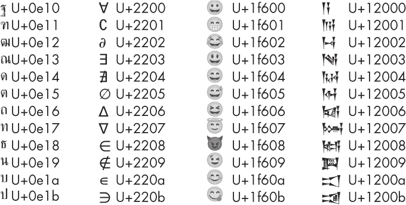

*图 2-11：Unicode 泰语、数学符号、表情符号和楔形文字领域*

为了提高效率，最广泛使用的语言被分配到只需要 2 个字节的符号，而较少使用的符号需要 3 个字节，稀有的符号则需要 4 个字节。有时会进行激烈的辩论，讨论一个新提议的字符集应当分配到哪个类别。下次你发送一条恰到好处的表情符号来表达你的感情时，可以感谢 ASCII 设计者的远见。

*UTF-32* 是一种固定宽度编码，它在*每个*字符中使用所有四个可用字节。从存储的角度来看，这显然是低效的，但对于某些应用程序，它可能加速符号查找的过程。例如，如果你想读取第 123 个符号，你可以直接在字节 123×4 到 123×5 中找到它。

*UTF-16* 类似于 UTF-8，但即使是 ASCII 字符也始终使用至少 2 个字节。这覆盖了全球范围内常用的符号集，因此它通常可以像固定宽度编码一样工作，从而实现快速查找，类似于 UTF-32。它是一种折衷的编码方式。

在不同的 UTF 格式之间转换文件是我们曾经在 ASCII 中遇到的回车和换行问题的现代版。特别是在 CSV 表格文件中，使用错误的 UTF 导入可能会导致本应良好的文件看起来像垃圾。

#### *多媒体数据表示*

数据表示变得更加有趣，当我们处理图像、视频和音频时，可以让我们的计算机“栩栩如生”。这些表示都是建立在我们先前构建的数字数组之上的。

#### **图像数据**

灰度图像可以通过二维数字数组表示，每个元素代表一个像素，其值表示灰度。这个数组中使用的整数表示类型会影响图像的质量：如果使用 1 位整数，那么每个像素只能是黑色（0）或白色（1），而如果使用 8 位整数，则可以在黑色（0）和白色（255）之间获得 256 种灰度。

人眼对三种主要的光频率有反应：红色、绿色和蓝色。这意味着看到彩色图像的体验可以通过从每个像素处发出这些频率的光来再现。为了表示彩色图像，我们可以因此采用三种灰度图像表示；将它们分别表示图像的红色、绿色和蓝色通道；并以某种方式将它们存储在一起。不同的系统可能采用不同的方法来存储这些数据。例如，我们可能先存储完整的红色图像，然后存储绿色图像，再存储蓝色图像。但如果我们*交错*存储通道，某些计算可能会更快，即首先存储左上角像素的红色、绿色和蓝色值，依次存储接下来像素的红色、绿色和蓝色值，依此类推。

对于某些应用，添加一个名为*alpha*的第四通道来表示每个像素的透明度是很有用的。这种表示方式被称为 RGBA。例如，在基于精灵的游戏中，这告诉图形代码如何遮罩每个精灵，保持其形状后面的背景不变。非二进制的 alpha 值也可以用来将图像混合在一起，使它们在不同程度上部分透明。包括 alpha 通道尤其方便，因为拥有四个通道是 2 的幂次方，这与二进制架构兼容。例如，在 32 位机器上，通常使用具有四个 8 位通道的 32 位颜色，而不是使用三个 8 位通道的 24 位颜色。当然，这需要更多的存储，因此像素值可能以 24 位存储，并在加载到内存时转换为 32 位。（由于 24 位 RGB 通常被认为是人类可分辨的最大色深，即使在 64 位机器上，也没有太大意义使用 64 位颜色。）

视频可以最基本地表示为一系列按时间顺序排列的静态图像。

#### **音频数据**

连续的声波可以表示为一系列离散的样本。这些样本需要以信号中最高频率的两倍速率进行采样。人类的听力范围大约是 20 到 20,000 赫兹，因此常见的音频采样率约为 40,000 赫兹。每个样本是一个数字，与色深一样，分配给每个样本的位数选择会影响音质。消费者媒体如蓝光使用 24 位深度，这是人类可区分的最大值，而 32 位深度则可能在内部或音频制作人中使用，因为它是 2 的幂次方，且在编辑操作中提供了更强的鲁棒性。

立体声或多声道音频可以看作是一起播放的声波集合。这些可以在内存中作为一个完整的波形一次性存储，或者随着时间的推移交错存储，每个采样时间从每个通道存储一个样本。

几乎所有的声音表示方式都使用整数或定点表示法来处理每个样本。其结果是，样本有明确的最小值和最大值。如果信号超出了这个“头部空间”范围，它将*被削波*，丢失信息并产生失真。音乐家和配音演员常常抱怨这种数据表示方式，如果他们刚完成完美的录音，但却被削波了，只好重新录制。最近，专业音频系统的一个趋势是转向全浮动点表示，这虽然计算密集，但能够解放艺术家免于削波问题。

处理*多*媒体时，例如包含视频和音频的电影，交错表示的概念通常会被扩展，使得每个时刻的各类媒体数据被一起编码到内存中的一个连续区域——例如，某一视频帧的所有数据，再加上该帧时长的音频段。这些交错方案被称为*容器*。*Ogg*和*MP4*是用于电影的两种知名容器数据表示格式。

#### **压缩**

我们刚才讨论的关于图像、视频和音频的简单媒体表示在计算过程中是有效的，但通常在存储方面并不理想。为了提高效率，我们通常会寻找方法来*压缩*数据，同时不改变人类对其的体验。

自然界通常包含大量冗余——即，某些空间和时间区域由相似的内容组成。例如，在一段投掷红色球的视频中，如果你看到一个属于球的红色像素，那么周围的像素也很可能是红色的，而且这个像素或附近的像素在下一帧中也会是红色的。此外，人类的感官有特定的关注点和盲区，例如对音频频率的振幅敏感，而对其相位不敏感，以及在某些频率存在时，无法听到背景中的其他频率。

信息理论解释了如何通过利用和去除冗余数据以及感知盲点来压缩媒体数据。这样，使用更少的位可以以更复杂的方式表示相同或感知上相似的媒体数据。这对于减少物理存储需求（如蓝光光盘的大小）以及减少流媒体传输时的网络使用非常有用。然而，这也带来了额外的计算成本：我们通常需要将压缩后的表示恢复为原始数据，这可能相当复杂，具体取决于使用的压缩方案。大多数方案依赖于像傅里叶变换这样的数学操作来寻找空间或时间频率。这些操作对传统的 CPU 来说计算成本较高，且已成为推动专用信号处理架构加速计算的主要因素。压缩算法的实现被称为*编解码器*。

#### *数据结构*

任何数据结构，例如大多数编程语言中的结构体和对象，都可以通过*序列化*来表示，序列化是将数据转化为一系列的比特以存储在内存中。序列化可以分层进行：如果一个复杂的结构由多个较小的结构组成，我们首先序列化每个组件，然后将它们的表示按顺序连接起来，形成整体的表示。如果这些组件本身也是复杂的结构，过程会变成递归的，但最终我们总会到达一些简单的元素层级，比如数字或文本，而我们已经讨论过如何将这些表示为一系列比特（也就是对其进行序列化）。

举个例子，假设我们有以下数据结构：

```
class Cat:
  int age
  int legs
  string name
```

这将被序列化为一个比特序列，首先是整数`age`的编码，接着是整数`legs`的编码，然后可能是字符串`name`的 Unicode 序列。

假设一个`Cat`对象被包含在另一个结构中：

```
class Game:
  Cat scratch
  int lives
  int score
```

`Game`对象将被序列化，其第一个比特将是`Cat`对象的编码（它本身是多个组件的序列化），接着是`lives`和`score`整数的编码。我们可以继续以这种方式构建更高层次的结构，这也是现实世界大型程序的工作方式。

### 测量数据

数据的基本单位是*比特（b）*，它可以有两种可能的状态，通常表示为 0 和 1。我们在研究数据时，通常会处理大量的比特，因此我们需要符号和可视化工具来处理这些。

*SI (国际单位制)* 是一个国际科学家和工程师组织，负责设定科学计量单位的通用标准。这包括为千的幂定义标准前缀，如表 2-3 所示。

**表 2-3：** 大型 SI 前缀

| **名称** | **符号** | **数值** |
| --- | --- | --- |
| kilo | k | 10³ = 1,000 |
| mega | M | 10⁶ = 1,000,000 |
| giga | G | 10⁹ = 1,000,000,000 |
| tera | T | 10¹² = 1,000,000,000,000 |
| peta | P | 10¹⁵ = 1,000,000,000,000,000 |
| exa | E | 10¹⁸ = 1,000,000,000,000,000,000 |
| zetta | Z | 10²¹ = 1,000,000,000,000,000,000,000 |

为了形象化 SI 前缀所表示的大规模数据，可以想象基于立方米的三维立方体。也许我们给千的幂特别命名并添加前缀的原因是，1,000 是 10 的三次幂，在三维空间中意味着将物体在三个维度上都按 10 的比例放大。

根据国际单位制（SI）的规定，使用位的 SI 前缀应该是描述数据量的首选标准——例如，5 兆比特表示 5000 位。实际上，网络速度通常以每秒 5 兆比特来衡量。然而，在体系结构层面上，我们更常需要处理的是精确的 2 的幂，而不是 10 的幂。例如，10 位地址空间提供 2¹⁰ = 1,024 个地址，而 16 位地址空间提供 2¹⁶ = 65,536 个地址。在架构师采用 SI 标准之前——例如，在 8 位时代——架构师通常滥用“千”这个前缀来表示 1,024 而不是 1,000。

这自然导致了许多混乱。数据大小变得更大，大多数计算机人员在更高的层次上工作，在那里使用正确的 SI 单位更有意义。作为折衷方案，国际电工委员会在 1998 年定义了一套替代前缀，用以区分二的幂和 SI 前缀。这些前缀包含了词根*bi*，源自*binary*一词。例如，2¹⁰已变为 kibi，2²⁰已变为 mebi，以此类推，如表 2-4 所示。

**表 2-4：** 大型二进制前缀

| **名称** | **符号** | **值** |
| --- | --- | --- |
| kibi | k[2], ki | 2¹⁰ = 1,024 |
| mebi | M[2], Mi | 2²⁰ = 1,048,576 |
| gibi | G[2], Gi | 2³⁰ = 1,073,741,824 |
| tebi | T[2], Ti | 2⁴⁰ = 1,099,511,627,776 |
| pebi | P[2], Pi | 2⁵⁰ = 1,125,899,906,842,624 |
| exbi | E[2], Ei | 2⁶⁰ = 1,152,921,504,606,846,976 |
| zebi | Z[2], Zi | 2⁷⁰ = 1,180,591,620,717,411,303,424 |

二进制前缀稍微大于它们的 SI 对应前缀。并不是所有人都在使用它们，许多老旧的设备和用户仍然使用 SI 单位来表示二进制单位。不道德的硬件制造商经常利用这种模糊性，选择那些能使他们产品上显示出最漂亮数字的 SI 名称解释。

### 总结

计算机通常需要表示各种类型的数字、文本和媒体数据。现代计算机使用二进制来进行这些表示非常方便。十六进制表示将二进制数据组织在一起，使其对人类更具可读性。不同的表示方式使得不同的计算变得更容易进行。

一旦我们有了表示数据的方法，就可以开始构建使用数据进行计算的方法。在下一章，我们将预览一个简单但完整的计算机，它能够完成这个过程。然后，我们将构建一个更详细的现代电子计算机来执行类似的操作。

### 练习

#### **进制系统转换**

1.  将你的电话号码转换为二进制。

1.  将你的电话号码转换为十六进制。使用之前得到的二进制可能会有所帮助。然后再将其转换为字节码，并将字节转换为 ASCII 字符。它们拼写出来的是什么？

1.  取你的电话号码的负数，并将这个负数转换为其二补数。

1.  在你的电话号码中间放置一个小数点，将其转化为浮动点数。按照 IEEE 754 标准以二进制表示。

#### **文本和媒体**

找出如何在您的计算机上输入 Unicode。例如，在许多 Linux 系统上，您可以按下并释放 SHIFT-CTRL-U，然后键入一系列十六进制数字，如 131bc，在命令行或编辑器中输入一个古埃及数字。

#### **测量数据**

获取你熟悉区域的街道、航空和卫星照片，并在上面绘制一个立方米、兆立方米、吉立方米、太立方米、拍立方米、艾克立方米和泽塔立方米，例如，一个立方米的每边长为 10 米。

#### **更具挑战性**

使用十六进制编辑器和互联网来逆向工程和修改一些你喜欢的媒体文件。

### 进一步阅读

+   有关数字心理学模型和讨论，请参阅 Stanislas Dehaene 的*数字感*（牛津：牛津大学出版社，2011 年）以及 Douglas R. Hofstadter 的*流体概念与创造性类比*（纽约：基础书籍，1995 年）中的“Numbo”章节。

+   对于一个充满浮点数细节的先进但经典的论文，请参阅 D. Goldberg 的“每位程序员应知的浮点数算术” (*ACM 计算调查* 23 卷 1 期（1991 年）：5-48)。

+   对于图灵实数的一个极其先进但令人眼花缭乱的美丽书籍，请参阅 Oliver Aberth 的*可计算微积分*（圣地亚哥：学术出版社，2001 年）。
