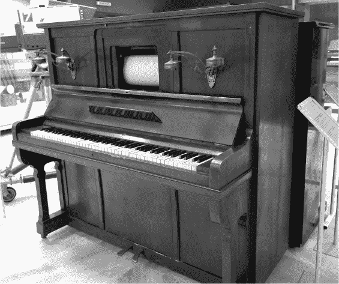
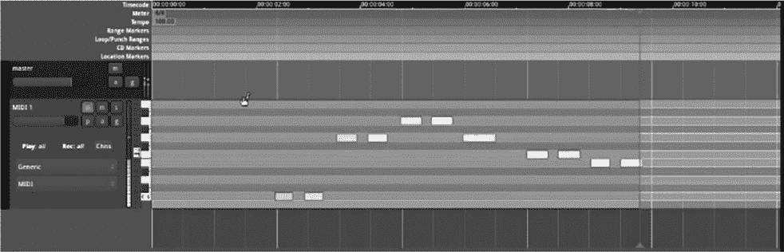
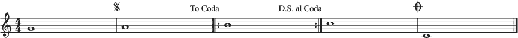
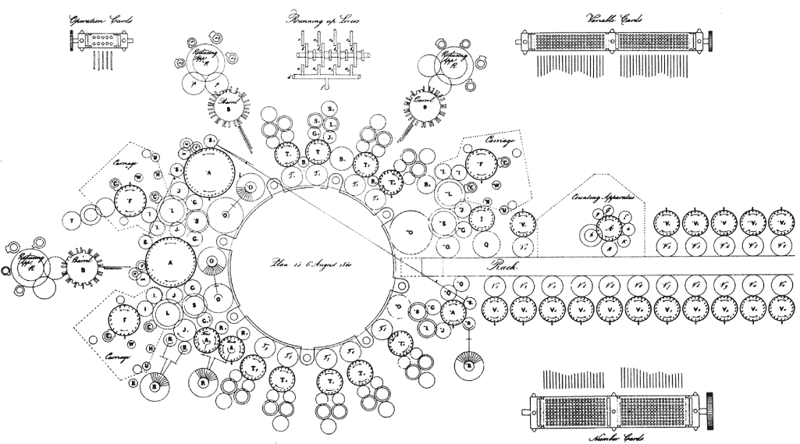
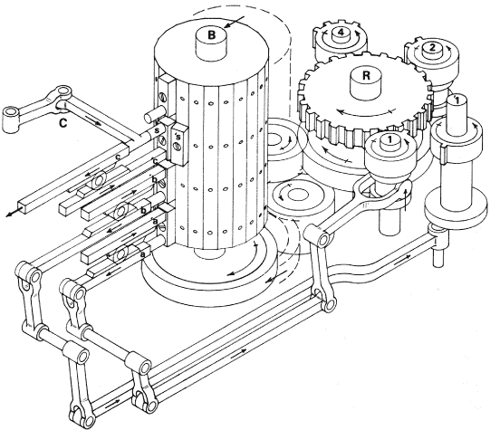

## 第四章：## **基于 CPU 的基本架构**


现代 CPU 是人类已知的最复杂的结构之一，但它们背后的基本概念，如按顺序执行指令或跳转到不同的指令，其实非常简单，并且在过去 150 多年里一直没有变化。为了帮助我们更容易理解 CPU 架构，本章通过研究一个相关但更简单的系统——机械音乐播放器，来介绍这些基本概念。然后，你将看到这些概念与 RAM 一起，如何构成查尔斯·巴贝奇的分析机的基础。研究和编程这个机械系统将使我们在转向电子系统时（见第四章）更容易理解它们的运作。

### 音乐处理单元

为了使一台机器成为计算机，它需要是*通用的*，意味着它必须能够根据用户的要求执行不同的任务。实现这一点的一种方法是让用户编写一系列指令——程序——并让机器执行这些指令。乐谱可以视为一种程序，因此我们可以把一种读取并执行乐谱的机器看作是一种音乐计算机。我们将这种设备称为*音乐处理单元*。

在第一章中，我们简要地看了像风琴和音乐盒这样的音乐处理单元。在巴贝奇之后，音乐自动机及其程序继续发展。大约在 1890 年，“书籍风琴”用连续的、连接的打孔卡片组（“书籍音乐”）代替了滚筒，这样可以容纳任意更长的乐曲，而不受滚筒大小限制。到了 1900 年，这些装置发展成了钢琴自鸣琴或自动钢琴（见图 3-1），它们用打孔的*钢琴卷轴*代替卡片，驱动家用钢琴，而非教堂风琴。自动钢琴至今仍然存在；你可能会在一些中等档次的酒店里听到它提供背景爵士乐，这些酒店能够负担钢琴，但负担不起钢琴家。



*图 3-1：自动钢琴（1900 年）*

让我们考虑一下音乐乐谱中可能出现在这些机器上的指令类型。这些指令与我们稍后需要用来制造计算机的概念相似，但可能更加熟悉。我们这里只考虑单音乐器，这意味着它一次只能演奏一个音符。

我们可以给自动音乐仪器的一组可能指令通常包含每个可用音符一个指令。这可能是一个指令，比如“演奏中音 C”或“演奏中音 C 上方的 G”。自动钢琴的每一行纸卷代表一个时间点，并包含每个音高的一列，指示在该时间点是否打开（打孔）或关闭（未打孔）。现代计算机音乐软件，如 2018 年发布的 Ardour 5，继续使用这种类型的钢琴卷轴符号（旋转侧面供人类观看，使时间从左到右滚动更加直观）来生成电子音乐（图 3-2）。



*图 3-2：2018 年的 Ardour 5 钢琴卷轴界面*

当自动钢琴读取钢琴卷轴时，一次会放入一行到读取设备中。我们称之为*获取*指令。然后，指令会被一些机械设备*解码*，这些设备查看打孔编码并将其转化为激活某些机械设备的物理过程，这些设备会演奏音符，比如通过打开管道让空气流入风管。然后这些机械设备实际上会*执行*音符的演奏。

通常，当人类或机械音乐播放器在演奏音乐程序（乐谱）时，它们会执行（演奏）每个指令（音符），然后继续到下一个指令，通过一个指令一个指令地推进程序的位置。但有时也会有一些特殊的附加指令，告诉它们跳跃到程序中的另一个位置，而不是继续到下一个指令。例如，*重复* 和 *dal segno (D.S.)* 用来跳回早期的指令并从那里继续执行，而 *尾声* 则是跳到一个特殊结束部分的指令。图 3-3 显示了一个音乐程序。



*图 3-3：一个包含 G、A、B、高音 C 和低音 C 音符的音乐程序，并通过重复、dal segno 和 coda 显示跳跃*

你可以通过在打孔卡片中使用额外的非音符列来构建一个管风琴或自动钢琴，编码这些跳跃指令。当其中一列被打孔时，它可能会被解释为一个指令，要求将鼓轮或打孔卡片快进或倒回到之前或之后的某一行。图 3-3 可以用打孔表示类似以下内容：

```
1\.  play note: G
2\.  play note: A
3\.  check if you have been here before
4\.  if so, jump to instruction 10
5\.  play note: B
6\.  check if you haven't been here before
7\.  if so, jump to instruction 5
8\.  play note: high C
9\.  jump to instruction: 2
10\. play note: low C
11\. halt
```

如果你不懂音乐，这个程序会准确地解释乐谱的作用！

#### *从音乐到计算*

从这个音乐处理单元到构建一个执行算术而非音乐操作的机器，只是一个小的概念步骤。

假设你已经制造了几个小型机械装置，每个装置执行某种算术操作。例如，帕斯卡的计算器是一台执行整数加法的机器。经过思考，我们也可以类似地构建像帕斯卡计算器那样的机器，用于执行整数乘法、减法、除法和列移位。然后，我们可以编写一个程序，像音乐乐谱一样，指定我们希望按顺序激活这些简单机器的顺序。

假设你的算术机器都共享一个累加器，用于存储每次操作的结果，你可以将计算描述得像在计算器上按键的指令序列一样，例如：

```
1\. enter 24 into the accumulator
2\. add 8
3\. multiply by 3
4\. subtract 2
5\. halt
```

这个程序将在累加器中停止，结果为 94。该程序可以由人类执行，通过顺序激活简单机器，或者我们可以使用类似于玩家钢琴的打孔卡卷来指定指令的顺序，并使用雅卡尔织机式的机械读取器来读取这些卡片并依次自动激活相应的简单机器。

#### *从计算到计算机*

要制造一台教堂计算机，仅仅运行固定顺序的算术指令程序是不够的。计算理论告诉我们，某些功能只能通过决策和跳转来计算，因此我们需要添加类似于我们音乐处理单元的指令，以便实现重复、尾奏等功能。这将使得以下程序成为可能：

```
1\. enter 24 into the accumulator
2\. add 8
3\. multiply by 3
4\. subtract 2
5\. check if the result is less than 100
6\. if so, jump to instruction 2
7\. halt
```

计算理论还告诉我们，某些计算需要内存来存储中间结果。为了区分这些结果，我们将给每个值一个*地址*，目前它只是一个整数标识符。以这种方式可寻址的内存通常称为*随机访问内存 (RAM)*。（这并不是 RAM 的完全正确定义，但你会在第十章中了解更多。）

拥有 RAM 意味着我们可以添加*加载*（读取）和*存储*（写入）到地址的指令，如下程序所示：

```
1\. store the number 24 into address 1
2\. store the number 3 into address 2
3\. load the number from address 1 into the accumulator
4\. add 8
3\. multiply by the number in address 2
4\. subtract 2
5\. check if the result is less than 100
6\. if so, jump to instruction 4
7\. halt
```

计算理论告诉我们，如果我们拥有我刚才展示的三种指令，我们可以模拟任何机器：那些执行实际算术运算的指令；那些做决策和跳转的指令；以及那些从 RAM 中存储和加载的指令。这正是巴贝奇的分析机的设计方式。

### 巴贝奇的中央处理单元

尽管已经有些年代，巴贝奇的分析机仍然是一个引人注目的现代设计：其基本架构至今仍在所有现代 CPU 中使用。同时，它仅具备最基本的 CPU 功能，因此研究它为我们提供了一个简化的介绍，帮助理解现代 CPU 的基本概念。与今天的电子计算机相比，分析机的机械部件的运动也使得它的工作原理更容易被形象化。

在这一节中，我使用现代术语来描述分析机的各个部分和功能。这些不是巴贝奇使用的术语，但它们在后续将帮助我将概念转移到现代计算机中。（一些巴贝奇的原始术语以括号的形式附在旁边，以防它们对你有兴趣。）巴贝奇和洛夫莱斯从未留下过关于他们指令集的文档，但它们大多是从其他文献中推测或幻想出来的。我假设 Fourmilab 模拟器使用的指令集和汇编语言符号，四米实验室是分析机的在线再现（* [`www.fourmilab.ch/babbage/`](https://www.fourmilab.ch/babbage/)*）。

我的演示和 Fourmilab 模拟器都对历史事实有所修改。这很容易做到，因为原始的文献资料杂乱且常常相互矛盾。并没有一个明确的设计，因此我们可以选择最适合我们叙事的版本。我们在这里的目的实际上是理解*现代* CPU 概念，所以我有时会简化、现代化，或者直白地编造一些关于引擎的细节，以便让这项研究变得更容易。

#### *高级架构*

分析机由三部分组成：一个执行程序的 CPU；一个存储数据并允许 CPU 读写的 RAM；一个连接它们的总线。如果这听起来和现代单核计算机的总体架构类似，那是因为它确实类似！这并不是巧合：分析机的架构在将其机械结构转换为电子后，明确地应用于 ENIAC，ENIAC 随后成为我们现代电子计算机的模板。

从物理结构上看，分析机由 50 个“切片”（巴贝奇称之为“笼子”）组成，如图 3-4 所示，这些切片垂直堆叠，一个接一个，如图 1-14 所示。



*图 3-4：巴贝奇的分析机架构（1836 年）*

圆圈是机械齿轮。CPU、RAM 和总线每个都贯穿所有的切片，我们可以在图 3-4 中看到它们的身影。对于机器中每个结构表示的每个数字，切片显示并处理它的一个数字。所有切片堆叠在一起，共同处理所有的数字。

RAM（“存储轴”）由 100 堆齿轮组成，每堆代表一个 50 位的十进制整数。这些齿轮堆在图 3-4 中的切片上显示为右侧的大型均匀区域。RAM 中的每个位置都有一个地址，编号从 0 到 99，这个地址使得每个位置与其他位置区分开来，并用于识别它。

RAM 的位置都物理上接近，但通常不会接触到机械总线（“机架”）。总线是一个机架齿轮——完全像现代汽车转向机架和乐高技术系列中的齿轮（图 3-5）。


*图 3-5：一组齿轮（线性齿轮）和小齿轮（旋转齿轮）*

这个齿轮架可以*物理*地向左或向右移动。每个 RAM 地址都可以通过杠杆与齿轮架接触。该 RAM 地址中的齿轮就像小齿轮一样运作，从而使得从该位置输出数字时，数据总线会向左移动相应的距离。反之，若从其他地方将数据总线向右移动，则会将数字写入内存位置。

CPU（“磨坊”）是机器的活跃部分。它请求数据并通过总线将数据发送到 RAM，然后以各种方式处理数据。

#### *程序员接口*

与差分引擎不同，分析引擎被设计为通用计算机。这意味着我们可以要求它按不同的顺序执行不同的操作。为了做到这一点，我们需要一种方法来指定这些操作和顺序。

让我澄清一下我之前随意使用的一些术语。一系列按顺序执行的*指令*被称为*程序*。执行程序的行为称为*执行*或*运行*。所有可用指令的集合被称为*指令集*。

程序以代码的形式存储在穿孔卡片上，就像我们之前在图 1-11 中看到的织布机的 Jacquard 卡片那样。每张卡片包含一排孔和非孔，它们共同编码一条指令。通常，指令按顺序执行，卡片按顺序推进，但有些指令会让卡片倒退或快进，以便在程序中跳跃。我们来看看有哪些特定的指令可用。

#### **常量**

一个基本的指令是将某个 RAM 地址设置为给定的整数。例如，“将整数 534 放入 RAM 地址 27。”这将移动第 27 个 RAM 地址所在列的齿轮到（十进制）数字 534，高位的齿轮上将显示零。我们首先用易于理解的符号表示这一点：

```
N27 534
```

这里，`N`（表示*数字*）告诉我们这是一个设置 RAM 整数的指令。接下来的数字（`27`）告诉我们要设置哪个 RAM 地址，最后一个数字（`534`）是我们要设置的值。一个典型的程序开始时，通常会以这种方式将许多 RAM 地址设置为特定的值。例如：

```
N27 534
N15 123
N99 58993254235
N0  10
N2  5387
```

一旦我们有了一些初始值，我们就可以使用进一步的指令进行计算，如下节所示。

#### **加载与存储**

为了处理来自 RAM 的值，它们必须被移入 CPU。要将值从 RAM 加载到 CPU 中，我们写 `L` 表示*加载*，后跟值存储的 RAM 地址。例如，这个程序将第 27 个 RAM 地址设置为 534 的值，然后将该值从这个位置加载到 CPU 中：

```
N27 534
L27
```

为了将 CPU 的最新结果存储到 RAM 地址 35，我们写`S`表示*存储*，后跟所需的地址：

```
S35
```

存储（`S`）与将 RAM 设置为常量（`N`）不同，因为它涉及到 CPU 的累加器。它将累加器中的值转移到 RAM 中，而不是将固定常量放入 RAM。

现在我们可以移动数据了，我们希望对其进行算术运算形式的计算。

#### **算术**

分析引擎能够执行基本的算术运算：加法、减法、乘法和除法，所有运算都基于整数。这些运算分别由指令`+`、`-`、`*`和`/`表示。

要进行算术运算，首先必须设置*模式*，以告诉引擎你想进行哪种运算。例如，要加两个数字，你需要将模式设置为加法模式，然后依次将这两个参数加载到 CPU 中。考虑以下程序：

```
N0 7
N1 3
+
L0
L1
S2
```

该程序首先将整数`7`和`3`分别放入地址 0 和地址 1。然后，它将 CPU 置于加法模式，使用`+`指令并从这些地址加载数字。最后，它将加法的结果存储到地址 2。

现在我们有了算术运算，接下来我们需要通过添加跳转和分支来从计算转向计算机运算。

#### **跳转**

如果你希望程序的一部分永远重复，一种简单的方法是将最后一张打孔卡片的末端粘到第一张卡片的顶部，形成一个物理循环，如图 1-15 所示。然而，这种方法不易推广，因此最好是使用一种指令，可以在需要时将卡片回卷或快进到程序的其他行。我们称这种指令为`C`，表示*控制*。接下来，我们会说明是想要向后（`B`）还是向前（`F`）跳转，跳多少步。我们还会在数字前加上符号`+`（具体原因将在下一节中说明）。将这些组合起来，`CB+4`例如，是一种控制指令，表示向后跳转四张卡片。

以下程序使用`CB+4`实现无限循环：

```
N46 0
N37 1
+
L46
L37
S46
CB+4
```

在这里，我们使用地址 46 作为计数器，每次循环时将其值加 1。

#### **分支**

永远循环通常不是很有用；我们通常希望循环*直到*某些事情发生，然后停止循环并进入程序的下一部分。这是通过条件*分支*实现的，它会检查条件是否成立，只有在条件为真时才跳转。

我们将使用与跳转相同的`CF`和`CB`符号表示法，不过用符号`?`替换`+`，表示跳转是有条件的。例如，`CB?4`是控制指令，表示仅当某个条件为真时，才向后跳转四张卡片。

以下程序结合了条件分支和无条件跳转，用于计算两个数字和的绝对值（始终为正数）。

```
N1 -2
N2 -3
N99 0
+
L1
L2
S3
+
L99
L3
CF?1
CF+4
-
L99
L3
S3
```

这个程序使用`+`指令将 RAM 位置 1 和 2 中的两个数字相加，将结果存储在位置 3 中。然后它将零（从地址 99 加载）加到该结果中，再从位置 3 加载回来。在幕后，这个加法操作还会将一个特殊的*状态标志*设置为 1，如果结果的符号与第一个输入的符号不同（零被认为是正数）。条件指令`(CF?1)`然后使用这个状态标志来决定该做什么。如果标志是 1，我们跳过下一条指令，这样就到了`-`指令，并执行从 0 开始的减法操作以交换符号。如果状态标志是 0，条件跳转不会发生，我们就继续执行下一条指令`(CF+4)`。这是一个无条件跳转，跳过四行减法代码，以避免交换符号。最终结果存储在地址 3 中。

分支完成了分析引擎的指令集，并且（假设始终有足够的内存可用）使其成为一台教堂计算机。你现在可以尝试解决章节末尾的练习并编程分析引擎，或者，如果你有兴趣了解机器内部是如何工作的，可以继续阅读。

#### *内部子组件*

让我们看看 CPU 内部需要执行这些程序的子组件。本节描述了它们的静态结构；我们将在下一节中介绍这些子组件是如何移动并相互作用的。

一个 CPU 由许多独立的简单机器组成，每个简单机器由几个数字表示和操作它们的机械装置组成。简单机器被分为三种类型：寄存器、算术逻辑单元和控制单元。

如图 3-4 所示，这些简单机器被安排成一个圆圈，围绕着一个叫做中央齿轮的大齿轮。就像公交车一样，中央齿轮在组件之间建立和断开任意数据连接，在这里是指 CPU 内部的简单机器之间的连接。这些连接是通过杠杆来完成的，杠杆将小的附加齿轮与中央齿轮和各个机器之间接触。

#### **寄存器**

*寄存器*（巴贝奇称之为“轴”）是位于 CPU 内部的小型存储单元，而不是位于主 RAM 中。CPU 中只有少量寄存器，而 RAM 地址则有很多。

回想一下第二章中提到的，整数在分析引擎中是通过数字十进制齿轮表示的。一个数字*d*是通过旋转轴一整圈来读取的，这样齿轮会旋转*d*十分之一圈。为了表示一个*N*位整数，我们只需将*N*个齿轮垂直堆叠，跨越机器的*N*个舱位。寄存器就是这些齿轮堆叠之一。

输入寄存器（“输入轴”）接收来自 RAM 的输入数据。输出寄存器（“输出轴”）暂时存储（或*缓冲*）来自 CPU 工作的结果，然后将其传输到 RAM。其他寄存器则在计算过程中用于其他目的。

#### **算术逻辑单元**

*算术逻辑单元（ALU）*是由一组独立的简单机器组成，每台机器执行一个单一的算术运算。例如，一台与帕斯卡尔计算器类似的简单机器用于执行加法。通过*m*的乘法可以通过一台机器触发*m*次加法运算。乘法或除法以 10 的*n*次幂为基数，可以通过一台特别简单的机器实现，该机器将所有数字移动*n*列，相当于机械上的“在末尾加个零”。

除了将结果发送到输出寄存器外，一些 ALU 操作还可以设置一个单独的*状态标志*，作为额外的副作用输出。在分析引擎中，状态标志是一个单独的机械杠杆，可以处于上（1）或下（0）位置。它可能上面有一个红色布制旗帜，用来直观地提醒人类和机械观察者，“ALU 中刚刚发生了某个有趣的事情”。

**ALU 机制**

当齿轮*D*通过旋转*D*齿轮的*d*十分之一圈来读取时，一个数字*d*被传递出来。这个数字可以通过将齿轮*A*和齿轮*D*放在一起，使它们的齿相互啮合，从而将数字添加到齿轮*A*上，然后从*D*传递出来。随着齿轮*D*旋转*d*十分之一圈，齿轮*A*也会被带动旋转相同的角度，因此齿轮*A*最终将储存数字*a* + *d*。我们称*A*为*累加器*，因为我们可以继续向其中添加许多数字，并且它会累积这些数字的总和——直到总和超过 9。

大于 9 的整数通过齿轮堆叠表示，就像在寄存器中一样。将它们相加的方法类似于用笔和纸逐列加法：每列中的两个数字需要相加，但我们还需要在数字超过 9 时进行进位，将 1 传递到下一列。帕斯卡尔在他的计算器中已经开发出一种基本的机械进位系统，这使得数字可以加到累加器中，巴贝奇的进位机制就是基于这个系统。下图展示了巴贝奇设计的一部分。


当齿轮达到数字 9 并在加法运算中再旋转一个位置时，例如由传入的进位（c）触发时，凸轮（f）会与另一个凸轮（e）连接。后者连接到一根杆（m），该杆将进位“传送到楼上”的下一个笼子，在那里它作为（c）出现在下一列。准确把握进位长时间波动的时机是非常困难的，这也是巴贝奇在设计中花费最多时间的部分。

#### **控制单元**

*控制单元（CU）*从内存中的程序中读取指令，解码后将控制传递给 ALU 或其他部件以执行指令。然后，它根据正常的顺序执行或跳转来更新程序中的位置。控制单元就像一个指挥家，在正确的时机协调所有其他组件的动作。巴贝奇的控制单元如图 3-6 所示。



*图 3-6：分析引擎控制单元*

一个机械的圆桶，类似于风琴的圆桶，随着时间的推移旋转，圆桶的每一列都有几个插槽，用于放置可能存在或不存在的钉子。这些钉子触发拨片，通过复杂的机械杠杆系统激活 CPU 中的其他简单机械。这使得控制单元的每个工作阶段都能按顺序触发，类似于风琴演奏一系列音符。圆桶的旋转速度可以通过反馈机制控制，直到当前步骤完成，下一步才会开始。

圆桶钉子的配置*不是*用户的程序，而是定义 CPU 本身顺序的较低级别*微程序*：我们接下来将讨论的获取-解码-执行周期。随着微程序的执行，它将用户更高级程序中的单个命令从打孔卡片读取到寄存器中，然后通过 CPU 中的简单机械执行这些命令。

#### *内部操作*

控制单元——在巴贝奇的情况下是旋转的圆桶——触发一个规律的活动周期。这些活动通常分为三个主要阶段：获取、解码和执行。所有控制单元的操作必须精确地按照正确的顺序进行。让我们逐个来看这三个阶段。

#### **获取**

*获取*指的是将下一条指令的机器码读取到 CPU 中。回想一下，像`N37 1`和`CB+4`这样的可读汇编语言指令实际上在打孔卡片上是以二进制机器码表示的。对于分析引擎，获取过程可以像雅卡尔织布机一样进行，通过尝试将一组物理钉子插入卡片上的位置。如果有打孔，钉子可以穿过，但没有孔的位置，钉子会卡在卡片上，无法再移动。然后，这些钉子的物理位置可以通过金属杠杆放大并传送到 CPU 中。

卡片读取器是一个物理设备，类似于打字机，其中有一行电流可供钉子使用。要读取其他行，需要将打孔卡片串通过这个读取器，直到所需的行排到合适位置。打孔卡片的当前物理状态——即当前在读取器中的卡片——因此充当了一种内存形式。我们将这种物理状态称为*程序计数器*。

金属杠杆的物理位置也可以视为一种内存形式，包含 CPU 内当前指令的副本。我们将其称为*指令内存*。

#### **解码**

二进制编码在打孔卡上对人类或机器来说并不立即显现其含义：在此阶段，它们只是 0 和 1 的模式。*解码*意味着弄清楚这些代码的含义。进入 CPU 的卡片读取杠杆可以激活那里的不同机械装置，具体取决于杠杆的*组合*是上还是下。例如，如果加载指令`(L)`表示为二进制 010，则机器可能被设置为仅在三个取回杠杆分别处于下、上、下的位置时响应。同样，指令中包含的数字地址需要解码，从十进制代码转换为它们所表示地址的机械激活。解码器是一组机器，每台机器都会在获取到的信号中寻找特定的模式，并在看到时激活某些功能。

#### **执行：加载和存储**

*执行*是指执行解码后的指令。如何执行取决于指令的类型。每种执行形式由不同的简单机器实现，解码器将选择并激活适当的机器。

当 CPU 需要使用某个值时，可以将其从 RAM 加载到 CPU 寄存器中，例如作为计算的一部分。CPU 的工作结果也会放置在寄存器中，然后通过将其复制到 RAM 地址来进行*存储*。

要加载一个值，控制单元（CU）在 RAM 地址的齿轮和总线之间建立机械连接，并在 CPU 端的总线与输入寄存器之间建立连接。然后，它会触发 RAM 地址上的放电，旋转齿轮一整圈，使得它们使总线物理上向 CPU 移动*n*步，其中*n*是所表示的数字。这是并行发生的，每一列数字都有自己独立的 RAM 齿轮、总线和输入寄存器齿轮。

当需要存储一个值时，控制单元触发一组相反的步骤。存储假设要存储的值已经在输出寄存器中。首先，它通过将所有数字旋转为零来清除目标地址处的 RAM。然后，它将输出寄存器与总线连接起来，并将总线连接到 RAM 中所需的地址。接着，它将输出寄存器旋转一整圈，物理上将总线向 RAM 移动*n*步，进而旋转 RAM 齿轮*n*步，将数字存储在那里。

#### **执行：算术指令**

当需要执行算术指令（例如加法）时，合适的简单机器（例如加法器）会与输入和输出寄存器机械连接并启动。在分析机中，这是通过插入齿轮（齿轮）实现的，齿轮将寄存器与简单机器物理连接，然后传递动力给简单机器使其运转。巴贝奇的加法器类似于帕斯卡计算器，将第一个参数加载进去，再加上第二个参数，然后将结果传输到输出寄存器。当计算完成时，这些齿轮会被拉开，从而禁用简单机器。

除了影响输出寄存器外，ALU 的简单机器还可以在算术过程中如果发生某些有趣的情况时抬高或降低状态标志。ALU 中的不同简单机器有各自对“有趣”事件的定义，并可以根据这些兴趣设置标志：`+` 和 `-` 只有当它们的结果符号与第一个输入符号不同才会将状态标志设置为真，而 `/` 在尝试除以零时会将状态标志设置为真。

#### **执行：程序流**

在每条指令的执行结束时，控制单元（CU）必须完成取指-解码-执行周期，并为下一周期的开始做好准备。如何完成这一过程取决于我们处理的是普通指令（例如加载、存储或算术逻辑单元（ALU）指令），还是用于改变程序流的指令——即跳转和分支指令。

在*正常执行*中，当一条指令完成时，我们希望继续执行程序中的下一条指令，对于巴贝奇来说，这就是通过绳子将当前指令的穿孔卡片底部与下一个指令的穿孔卡片顶部连接起来的那张穿孔卡片。这将为下一次取指做好准备，即下一条新指令。为此，控制单元需要触发并增加程序计数器。在分析机中，这是通过建立机械连接来为穿孔卡片读取器供电，以执行行进送纸操作，将卡片堆通过读取器推送一张卡片。

*跳转指令*意味着按要求快速前进或倒退程序。考虑指令`CF+4`，其意思是向前推进四行。当控制单元看到此指令时，它会再次修改程序计数器，但不是简单地增加它，而是按请求的行数进行推进或倒退。在分析机中，这是通过将动力送到行进送纸装置，并延长时间来完成比单行推进更长的推进，同时机械地切换送纸方向，以便前进或后退。

*分支指令*（例如`CB?4`）的执行方式有所不同，取决于状态标志的状态。例如，这条指令告诉控制单元（CU）跳转，如果状态标志为启用，则将程序计数器减去四，否则指令无效，正常执行用于递增程序计数器并跳转到下一条指令。这种分支是分析引擎与早期的桶式和打孔卡片程序机器（如音乐播放器和贾卡尔织机）的重要区别。除非历史学家发现其他能够实现这一功能的机器，否则这台引擎标志着第一次有机器被设计用来修改其自身程序的执行，而不是始终按照相同的顺序执行。能够查看事物的状态并根据状态做出决策是教会计算机的关键要求。

### 总结

我们在本章中研究了巴贝奇的分析引擎，因为它是所有后继计算机的蓝图，包括现代个人计算机。其高层架构包括一个中央处理单元（CPU）、随机存取存储器（RAM）和连接它们的总线。在 CPU 内部，有算术逻辑单元（ALU）、寄存器和执行获取-解码-执行周期的控制单元（CU）。指令集包括加载和存储、算术运算、跳转和分支指令。还有一个程序计数器，存储当前程序行号，以及一个状态标志，如果最近的算术操作发生了有趣的事情，则会设置该标志。所有这些功能在现代个人计算机中基本保持不变。

作为一个机械系统，分析引擎比电子设备更容易可视化和理解。但电子计算机的基础只是将巴贝奇的每个组件转化为更快、更小的电子开关实现，这些开关被组合成逻辑门。在本书的第二部分，你将看到如何通过从开关到 CPU 逐步构建现代电子层级结构。现在你已经了解了 CPU 需要做什么，你应该对这个电子层级结构的未来发展有更清晰的认识。

### 练习

#### **编程分析引擎**

1.  从 *[`www.fourmilab.ch/babbage`](https://www.fourmilab.ch/babbage)* 安装 Fourmilab 分析引擎模拟器，或者使用其网页界面。

1.  输入并运行本章讨论的分析引擎程序。如果你使用 java aes -t test.card 命令运行程序，那么`-t`选项将打印出每一步机器状态变化的跟踪信息。

#### **洛夫莱斯的阶乘函数**

为分析引擎编写一个阶乘函数。艾达·洛夫莱斯编写了其中一个，它后来成为了每当遇到新架构时都会尝试的标准“Hello, world!”练习。（实际上，打印“Hello, world!”通常更为复杂，因为它涉及到 ASCII 码和屏幕输出——你将在第十一章中看到如何做。）

### 进一步阅读

+   有关分析机的更准确历史描述，请参见 A. Bromley，"查尔斯·巴贝奇的分析机，1838 年"，*计算机历史年鉴* 4，第 3 期（1982 年）：196-217。

+   如需了解更具虚构性的版本，请参见威廉·吉布森和布鲁斯·斯特林，*差异引擎*（伦敦：维克托·戈兰茨，1990 年）。这是原版蒸汽朋克小说，书中有巴贝奇、洛夫莱斯以及一台正在运行的分析机。
