## 第六章：## **开关**

*通过响应另一个信号的状态来开关*一个信号的开关是计算的基本组成部分。这就是为什么像雅卡尔织机这样有限的机器与像巴贝奇的分析引擎这样的一般用途机器之间的区别所在。雅卡尔织机只能执行预定的操作序列，并且不能根据发生的事情来改变该序列，而分析引擎则有能够评估寄存器状态并根据该评估跳转程序的指令。正是开关使得这一切成为可能。

从基本的开关出发，我们可以构建更复杂的设备，如逻辑门、简单的机器和中央处理器。正如我们在第一章中所见，当今计算机中使用的主要开关类型是晶体管。晶体管通过混合方向性和特定实现这些概念的基本物理原理来工作，这些实现依赖于像硅这样的物质的特性。然而，如果我们直接讨论晶体管，这两条线索可能很难分开。

因此，在本章中，我们将首先考虑一个更简单的方向性系统中的基本物理概念：水流通过管道。我们将看到一个阀门如何启动和停止水流，然后将我们所学到的知识转移到使用真空管和半导体制作的电气二极管上。接着我们将构建更复杂的开关，再次从水的类比开始，并将其应用于现代硅中的晶体管。最后，我们将探讨现代硅芯片是如何制造的，让你能深入了解计算机，甚至到它们所用的沙粒。

### 方向性系统

开关是一个方向性系统：它接收输入并执行某些操作，产生输出。这听起来相当直观，但在物理学中，你可以反转任何描述物理系统的方程的时间方向，它仍然是成立的。那么为什么当我们把一个玻璃杯摔掉时，它的原子通常不会跳回去恢复成一个新的玻璃杯呢？答案是*熵*，或者说能量的组织性；玻璃中的化学和势能以微小的热量形式散失到大气中。实际上*确实*有一个小的概率，玻璃杯会重新组合成原状，但能量更可能以热量的形式扩散开来，而不是集中成有组织的结构。在大爆炸初期，宇宙中的所有能量都集中在一个非常有组织的地方，从那时起，它一直在扩散并变得越来越无序。

正是熵使我们能够体验时间的方向性和因果关系的感觉。过去比未来更有组织，因此我们的脑袋更容易存储过去的信息，而不是未来的。因为我们有过去的记忆，我们可以将其与现在看到的事物联系起来，并描述过去的事件是如何导致现在的事件的。

熵也使我们能够制造机器，包括计算机，借此我们能够使事件序列沿着特定方向发生。为了让机器在特定方向上运行的概率非常高，而不是在正反方向之间随机切换，我们将它设计成一个高度有序的能量状态，并设定所需的状态序列，使得每一步都消耗一些有序能量并将其以热量的形式释放出来。这就是为什么计算机必须消耗能量并释放热量——为了让它们的程序随时间按正确的方向运行。

#### *水阀*

日常管道中使用的水阀是一个简单的方向性系统的例子。例如，通常在管道中会有一个阀门，它将水从当地供水系统引入您的家庭。它确保水只能通过管道*进入*您的家庭，而不能*流出*。这可以防止您通过下水道倒入化学物质，从而毒害您街道上的其他人。这个水阀的工作原理如图 4-1 所示。

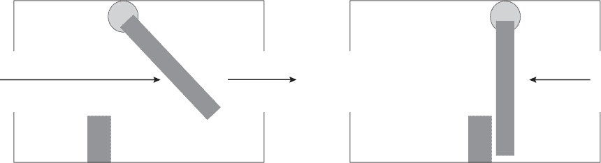

*图 4-1：一个单向水阀。当水流是正向偏置（左）时，水会推开阀门并通过。当是反向偏置（右）时，水会将阀门推入阻挡物，密封住阀门，阻止水流。*

在这里，一个安装在铰链上的闸门可以自由地向右摆动，但无法向左摆动，因为它在这个方向的运动被阻挡了。如果水压从右向左施加，它会使闸门更加紧密地关闭，从而阻止水流。这种流动方向我们称之为*反向偏置*。当水压从左向右施加时，它会推开闸门，让水流通过。我们称这种流动方向为*正向偏置*。

这个阀门并不像它最初看起来的那么简单。想象一下，水由个别的质量粒子组成，它们正推着通过。每当一个粒子撞击闸门时，一些动能就会从粒子转移到闸门上。粒子通过后，闸门依然保持着这部分能量。如果没有任何阻尼作用，闸门会反弹到管道顶部，再反弹到底部的阻挡物上，持续不停地开合。一个更现实的模型包括了阻尼效应，在这个模型中，闸门可能开始振动，但它的动能会迅速被阻挡物吸收，并以热量的形式从系统中散失掉。一个系统必须以发热的形式付出代价，才能实现单向流动。

与此同时，已经通过的粒子在将能量传递给闸门时失去了一部分速度。由于输出粒子的能量低于输入粒子的能量，如果我们想将它们用作第二个阀门的输入，我们就需要为它们做功，重新补充一些能量。添加这部分能量就是为了弥补失去的热量。

如果你*真的*努力推动电流，它可以在反向偏置方向流动。你需要足够用力地推，甚至可能把元件弄坏。这可能会发出一声巨响，并永久损坏设备。接下来我们将看到类似的行为，出现在水阀的电气模拟中。

#### *热二极管*

*二极管*是任何允许电流在一个正向偏置方向流动，而在另一个反向偏置方向不（容易）流动的电气系统。最早的二极管是真空管热二极管，它们诞生于电机时代（“柴油时代”）；与现代二极管相比，它们更容易理解，因此我们从这里开始。

一个真空管二极管（图 4-2）看起来有点像老式的灯丝灯泡。两个外部导线连接到元件：*阴极*（发射电子的部件）和*阳极*（吸收电子的部件）。这里，阴极是一个金属核心，阳极是围绕它的圆柱形包裹物，中间被真空隔开。阴极由外部能源加热。

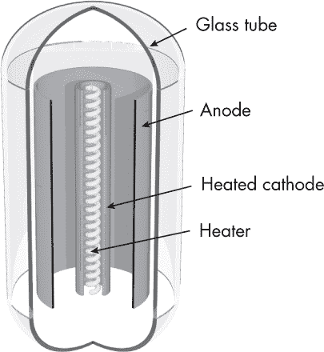

*图 4-2：一个真空管二极管*

当电压施加在正向偏置方向时，电子从外部流入阴极。它们被加热器加热，获得足够的能量飞出金属阴极，穿过真空被阳极吸收。这就是电流通过二极管的过程。

当电压施加在反向偏置方向时，电子从外部流向阳极，但它们没有足够的能量穿出金属并跨越真空，因为阳极没有加热。在这个方向上电流不会流动。

为了在这个系统中创造方向性，我们必须通过加热的方式为其提供能量。这些热能随后会被散发到外部环境中。

如果你*真的*努力推动电流，你可以让它在真空管中反向偏置方向流动。你需要一个非常高的电压才能让电子从阳极上跳出来。这很可能会发出一声巨响并永久损坏设备。

#### *p-n 结二极管*

目前使用的大多数二极管不是真空管，而是由硅上的*p-n 结*构成，其中*p*和*n*分别代表正负电荷区域。为了理解 p-n 结的工作原理，我们需要对半导体化学和物理学做一个简短的速成课程。

#### **半导体速成课程**

基础电子学将材料分为*绝缘体*（不导电）和*导体*（导电）。*半导体*是那些在常态下是绝缘体，但通过非常小的变化可以被诱导成导体的材料。*硅（Si）*，周期表中的第 14 号元素，就是一种半导体。你可以在图 4-3 中看到硅原子的示意图。

*图 4-3：硅（Si）原子有 14 个电子，其中 4 个电子位于外壳，参与相互作用。*

硅原子有 14 个正电质子和 14 个负电电子。电子分布在三个同心壳层中。最内层是一个完整的两电子壳层，中层是一个完整的八电子壳层，最外层是一个半满壳层，包含八个电子中的四个。

量子力学（这是本书范围之外的话题）表明，当原子的最外壳满时，它处于低能状态。非正式地，低能状态称为*幸福*状态，高能状态则称为*不幸福*状态。这种拟人化反映了物理系统“想”从不幸福状态移动到幸福状态的表现。“想要”是统计物理的结果，统计物理显示，幸福状态的可能方式比不幸福状态的方式更多，因此系统更可能找到进入幸福状态的途径。

幸福状态是高度可能的，因为进入这些状态是一个定向系统。当电子从不幸福的状态移动到幸福状态时，它们会将多余的能量以光子的形式释放出来，通常以热的形式丧失。要使电子回到高能状态，你需要找到一个相似或更高能量的光子并将其射回原子，这种情况不太可能发生，除非你付出努力让它发生。这些概率作为化学力作用于电子，推动它们进入具有完整外壳的配置。

一组硅原子的最幸福状态是通过共价键在它们的外壳中共享电子。每个原子通过共享一对电子与四个邻居形成键，表面上为每个原子提供了一个完整的外壳，包含八个电子。这可以在二维中绘制成一个规则的方形原子网格，如图 4-4 所示。

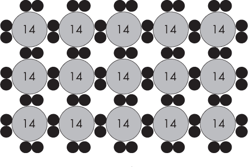

*图 4-4：硅原子形成晶格，分享电子以填充其外壳，形成八个电子。*

然而，在真实的三维世界中，结构是四面体的，四个邻居被安排在不同的三维方向，如图 4-5 所示。这个结构被称为*晶格*，它非常强大且稳定。（对于碳来说，晶体形式被称为钻石。硅晶体具有一些类似的属性，但它更容易加工且价格便宜得多。）

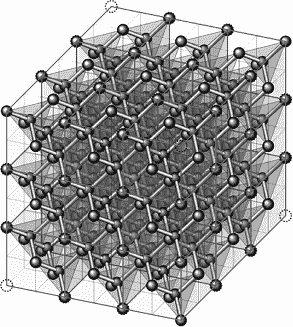

*图 4-5：硅晶格实际上是三维的，并且呈四面体结构。*

硅晶体本身并不导电，因为所有电子都安居在它们当前的位置，不需要移动来降低能量。然而，我们可以通过向硅晶体的晶格中加入少量不同的原子，使其像金属一样导电。这个过程称为*掺杂*。考虑使用硅的邻近元素进行掺杂：铝（Al，元素 13），外层有三个电子，和磷（P，元素 15），外层有五个电子。用铝掺杂会导致晶体中电子的净短缺，称为*p 型掺杂*（*p*表示正）。用磷掺杂则会导致晶体中电子的净过剩，称为*n 型掺杂*（*n*表示负）。掺杂的晶体仍然是电中性的：它们包含相等数量的质子和电子。短缺和过剩仅与原子希望填满外层电子壳的化学状态有关。

在 p 型掺杂中，某些原子会在外层电子壳中出现“空穴”，即缺少电子。在 n 型掺杂中，某些原子会有多余的电子，导致出现一个第四个未满的电子壳，其中只有一个电子（在三个已满的内层电子壳（分别有 2、8、8 个电子）之外）。这两种掺杂的硅表现得像金属。在 n 型掺杂的硅中，多余的电子并没有紧密绑定在稳定的结构中，而是自由地在不同的原子之间流动。这意味着它们可以穿过晶体流动，因此硅变成了导体。类似地，空穴可以在 p 型掺杂的硅中流动，使其变成导体。即使掺杂的原子数量相比于硅原子的数量非常少，这种情况仍然有效。

#### **p-n 结的工作原理**

p-n 结由一个 p 型掺杂区域和一个 n 型掺杂区域相邻组成，正如在图 4-6 中所示。

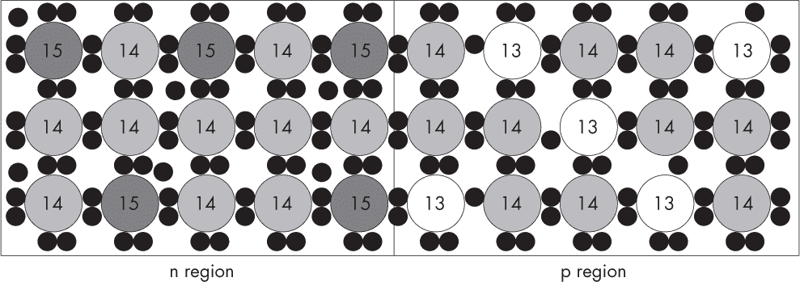

*图 4-6：在高能态下，由两种不同掺杂区域的硅构成的 p-n 结*

在这里，我们看到 n 区中磷原子（元素 15）周围的多余电子，以及 p 区中铝原子（元素 13）周围的电子短缺。在这种状态下，两个区域都是导体，因为它们要么拥有自由电子，要么有空穴，因此电流可以跨越结点流动。

当结点形成时，远离接触边界的晶体部分没有任何影响。但在接近边界的区域——称为*耗尽区*——几乎瞬间就发生了一些有趣的事情。在这个区域，n 型掺杂侧多余的电子受化学力的作用，被吸引跨越边界，填补 p 型掺杂侧外层电子壳，正如在图 4-7 中所示。

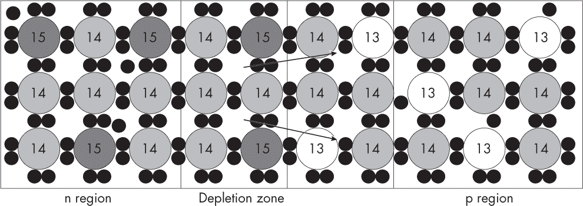

*图 4-7：在低能态下，p-n 结中电子跨越结点时释放能量的过程*

这种化学力足够强大，可以克服一些电力，通常电力会将电子保持在原本与质子配对的附近。化学力和电力在一个点上相互平衡，在这个点上，电子仅仅在耗尽区内穿越。（如果它们穿越得更远，电力将比化学力更强，电子就会被推回去。）化学力足够强大，能够产生一个稳定的低能状态，其中耗尽区内的原子具有完整的外层电子壳。由于原子具有不同数量的质子和电子，它们也被电离了：n 区有净正电荷，p 区有净负电荷。由于这是比起始状态能量更低的状态，光子被发射出来并以热的形式失去，当电子进入它们的新位置时。因为耗尽区内的所有原子都有完整的外层壳，这个区域充当了绝缘体（像纯硅一样），因此电流不能穿过结。

p-n 结的功能就像水阀：在它的高能状态下，它就像一个打开的阀门，允许电流流动；在低能状态下，它就像一个关闭的阀门，阻止电流流动。就像水流推动阀门并使其抗重力升起一样，在正向偏置下流动的电流做了一些功，将能量重新注入系统，并将其推入开放的高能状态。而在反向偏置中，像水流推动阀门紧闭一样，流动的电流将系统推入低能状态，这种状态下不导电。其工作原理如下。

在正向偏置下，额外的电子从外部被注入到 n 区。n 区中耗尽的部分只对接收这些电子*略感不满*，因为它们可以与元素 15 的离子壳结合，这些离子的电子之前已经被丢失到 p 区。它们不再是离子，恢复成普通的原子。现在，随着一个新的电子开始形成新的壳层，它们感到不满，因为它们没有完整的外壳，但这一点几乎被它们变得电中性所弥补。因此，只需要一点点的工作就能克服这种轻微的不满，把电子推入其中。

在 p 区，由于正向偏置，电子被拉出时会发生类似的情况；它略感不满，因为它失去了完整的壳层，但它获得了电中性，这几乎——但不完全——抵消了这种失落感。

总结一下，电子已进入 n 区并从 p 区离开，这意味着它们有效地从 n 区流向了 p 区，形成了电流。现在我们也将系统恢复到原来的高能导电状态，如图 4-6 所示，因为我们回到了每侧电子的原始数量。我们必须做一些小工作来克服原子因被改变而感到不满，这些工作等于我们从高能状态转到低能状态时失去的作为热量的光子。几乎在这一切发生后，系统将再次回到低能状态，并在此过程中释放新的光子作为热量。为了继续推动电子通过系统，我们需要继续对系统做功，并将这些功以光子热的形式释放出来。

在反向偏置下，我们尝试将电子从外部注入到 p 区域一侧。在这种情况下，p 区耗尽区的原子非常强烈地不希望接收电子。它们不仅仅是不太高兴，而是*非常*不高兴接收电子，因为这样做会破坏它们完整的外层电子壳，并且还会将它们双重电离成 13^(2–) 离子。因此，进入的电子不会进入这个区域。相反，p 区未耗尽部分将接收它们，因为该区域包含 13 号元素的原子，这些原子乐于被电离为 13^– 离子，因为这填满了它们的外层电子壳。这样，进入的电子会扩大耗尽区，因为每个新电离的原子由于外壳已满而停止导电。这使得 p 区更加不导电，就像反向偏置的水流压在阀门上使其更加紧闭一样。

在 n 区，也会发生类似的事情，当我们尝试将电子从该区域抽出时。在这里，15^+ 离子*真的*不想放弃电子，因为这会破坏它们完整的外层电子壳，并将它们转化为更加带电的 15^(2+) 离子。因此，我们最终从 n 区未耗尽部分抽取电子。这使得 15 号元素的原子很高兴拥有完整的外层壳，但也使它们变成了绝缘体，并再次使耗尽区变大。

通过施加非常大的力，可以强制电子进入这些非常不开心的状态，然后在反向偏置下越过结区，但这只有在施加非常大的力的情况下才能实现。系统会抵抗这种力一段时间，进入一个非常高能的状态，然后最终会突破，释放出所有的能量，电子越过结区。这很可能会发出巨大的爆炸声，并永久摧毁设备。

在*发光二极管（LED）*中，当电子穿过结并降到较低能级时所发出的光子具有可见的光频率。这里特别明显的是，你必须通过向系统输入能量来做一些小工作，才能让电子穿过结并发出光子。如果你试图将电流反向通过 LED，你还可能看到更多的光、声音和烟雾的释放。

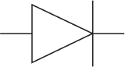

*图 4-8：二极管符号*

请注意，在这段讨论中，我们故意考虑了“电子流”而非“电流”，以便使水流的类比尽可能简单易懂。由于一次非常不幸的历史事故，“电流”被定义为“电子流”的*否定*，并且被认为是从阳极流向阴极，而不是从阴极流向阳极。这一点在二极管符号中有所体现（见图 4-8），其中箭头显示了电流—而非电子—流动的方向。箭头尖端的横杠表示电流在相反方向的流动会被阻止。要将“电流”这一固有定义改为反映电子流动，将与让英国所有人改为在右侧道路行驶一样困难。

### 开关

定向系统是我们下一级建筑结构的基本单元：开关。开关使我们能够通过另一个流自动打开和关闭流动。再次，我们将通过一个简单的水流例子来考虑这一通用原理，然后再将其转移到电子学中。

#### *水流开关*

考虑两个按顺序排列的水阀，每个阀的阻塞部分都被一个弹簧加载的可移动平台替代，如图 4-9 所示。

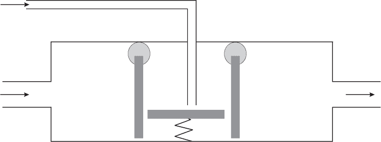

*图 4-9：水压开关*

当平台升起时，左阀门不能向右打开，右阀门也不能向左打开，因此水流无法在任一方向流动。我们将两个阀门之间的区域称为*基础*，从左侧进入的水管称为*发射器*，从右侧排出的水管称为*收集器*。

如果我们将一个额外的小水管连接到基础部分（如图 4-9 所示），我们就可以迫使水流通过这根管道进入基础部分。这将推动弹簧加载平台，使两个阀门打开，从而允许水流在主管道中双向流动。这就创建了一个开关：通过控制连接到基础部分的小管道中的水流，我们可以控制主管道中水流的通断。

考虑一下这个系统中使用的能量。我们必须将能量输入到开关电流中，这些能量最终必须流向某个地方。在这种情况下，能量已经进入了弹簧，当我们停止向基座注入水时，弹簧会弹回并释放热量，直到它逐渐减震。此外，请注意我们注入基座的水也需要流向某个地方：它与来自发射管的主要水流合流，并通过集电管流出。

#### *电管开关*

就像水开关扩展了水阀一样，电管开关通过使用一种电流控制另一种电流的流动来扩展电热二极管。这是通过在阴极和阳极之间的真空中插入金属栅格来实现的，正如 图 4-10 所示。

像热二极管一样，管式开关看起来也像一个灯丝电灯泡。添加的金属栅格连接到一个第三根“基极”导线。如果你将电子推动到这根导线中，进入栅格，它会使栅格带上负电荷。负电荷会排斥负电荷，从而阻止电子从阴极跳跃到阳极。如果你释放基极的电子，那么真空管就会像热二极管一样工作，允许电流从阴极流向阳极。

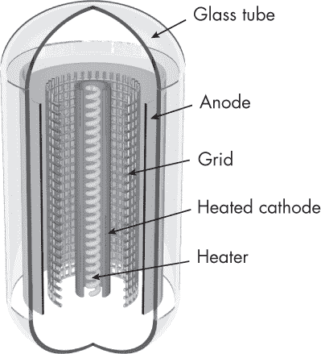

*图 4-10：真空管开关*

电管开关在某些情况下令人困惑地被称为 *阀门*，尽管它们更类似于水流开关，而不是水阀。这些开关曾用于早期的电子计算机，如 ENIAC。然而，它们并不适合实际计算，因为它们需要在脆弱的玻璃泡内保持真空，并且还需要与热量打交道，这可能导致过热并发生爆炸；正如你可以想象的那样，它们需要频繁更换。电管开关出现在电吉他管放大器（或阀门放大器）中，在那里它们主要用于模拟特性，而不是与计算机相关的数字特性。（所以你可以用旧的 Marshall 放大器管来建造一台计算机——这会是一个不错的项目！）

#### *p-n-p 晶体管*

*p-n-p 晶体管* 是一种更好的电开关方式；它避免了真空管的许多实际问题。它的设计基于 p-n 结二极管。就像水流开关可以看作是两个镜像水阀连接在一起，中间附加一个基座管道一样，p-n-p 晶体管也可以看作是两个镜像 p-n 二极管连接在一起，形成一个 p-n-p 序列，并且有一根基极导线连接到中央的 n 区域。晶体管在其高能状态下如 图 4-11 所示。

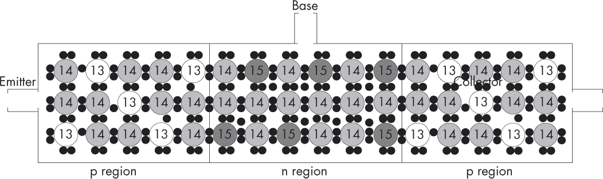

*图 4-11：处于高能状态的 p-n-p 晶体管*

p 区和 n 区之间的两个结点类似于水阀中的阀门。将电流开关接入基区（n 区）之间的边界，就像是将水管接入水阀之间的基区一样。左侧进入的含电流的线是发射极，而右侧输出电流的线是集电极。

就像水注入水阀的基区能推动两只阀门打开一样，注入基区的电子也会打开两个 p-n 结。将电子推入基区所做的工作将系统提升到更高能量的导电状态，使得电子能够从发射极流过晶体管到达集电极。晶体管因此充当了一个电气开关，注入基区的电子控制了从发射极到集电极的电子流动。

**注意**

*像真空管一样，晶体管也具有可以用于音频放大器的模拟特性，例如晶体管收音机和更现代的吉他放大器。与真空管一样，我们这里只关注它们的数字特性。*

与水开关类似，这一过程也有代价。将电流注入基区并激活两个结进入其高能量导电状态需要能量。这部分能量在两个二极管回落至低能量状态时作为光子（热量）释放出来，如图 4-12 所示。

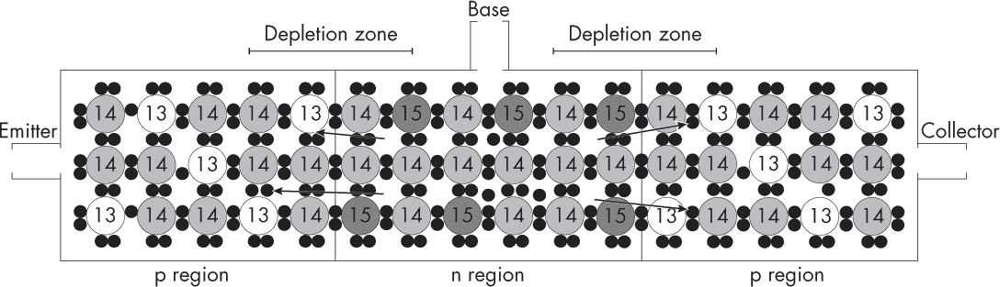

*图 4-12：p-n-p 晶体管在其低能量状态下*

像水开关一样，注入的基区电流也必须流向某个地方，其电子会与从发射极流出的主电流一起流出集电极。

晶体管的标准符号，E、C 和 B 分别代表发射极、集电极和基极，如图 4-13 所示。

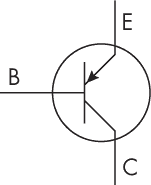

*图 4-13：p-n-p 晶体管符号*

和二极管一样，我们在讨论晶体管时用的是“电子流”而非“电流”，以保持水类比的比喻。实际上，在我们的 p-n-p 晶体管中，电流从集电极流向发射极，而电子则是反方向流动的。

**注意**

*也可以制造 n-p-n 晶体管，其使用的区域方向相反——即它们通过从基区抽取电子来打开阀门。同样，在这种情况下，电流被认为是流入基区以打开 n-p-n 晶体管。*

早期的硅芯片使用 p-n-p 晶体管，但由于基区电子流失到集电极，这种方式效率较低。现代芯片使用一种改进的设备——场效应晶体管，来提高效率。我们将再次通过水类比介绍这一概念，然后将其转换为半导体的形式。

#### *水压效应开关*

在水开关中，基座的水由于被推入开关并加入到从发射极来的主水流中而流失到集电极。我们可以通过在基座管道与基区连接的地方覆盖一个橡胶膜来解决这一效率低下的问题，如图 4-14 所示。

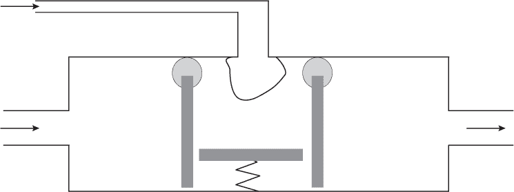

*图 4-14：水压开关*

橡胶膜可以拉伸，但不允许水流通过。当对基座管道进行加压时，产生的压力将使膜被拉伸，扩展到基区中。这将迫使基区中的水通过两个阀门，从而再次使主水流从发射极流向集电极。当基座上的压力被释放时，膜会收缩，释放对阀门的压力，使其关闭并切断主水流。

添加橡胶膜的优点是，泵入基座的水不再流失到集电极。没有水离开基座。基座中的水仅暂时作用于阀门施加压力。较少的活动物体意味着浪费的能量较少，因此系统运行更顺畅、更快速。

需要做功将水推入基座。这转化为潜在能量，用来克服重力提升阀门。然后，当阀门关闭、弹跳并减震时，能量以热的形式损失掉。

#### *场效应晶体管*

*场效应晶体管（FETs）* 是水压开关的精确类比，就像 p-n-p 晶体管是水流开关一样。FET 通过在基座电线与 n 区连接的地方覆盖一个电绝缘体（如二氧化硅 SiO[2]）来改进 p-n-p 晶体管，如图 4-15 所示。

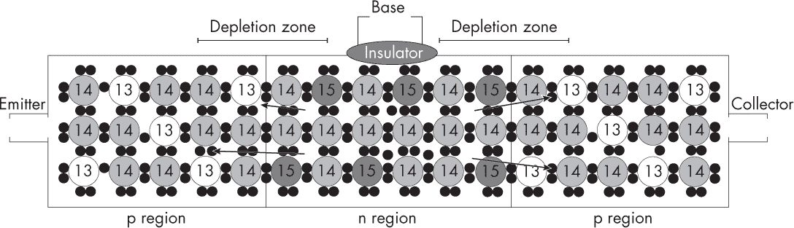

*图 4-15：低能状态下的场效应晶体管*

绝缘体允许电*场*通过，但不允许电子通过它。这意味着一侧的电子可以推开另一侧的电子，而电子本身并没有跨越。当对基座做功将电子推入时，基座积累的负电荷会推开 n 区的电子，迫使它们通过两个 p-n 结，从而再次使电子从发射极流向集电极。当基座上的电压被释放时，绝缘体上的电场会缩小，释放 p-n 结上的电压，使它们关闭并切断主电子流。

添加绝缘体的优点是，泵入基座的电子不再流失到集电极。没有电子离开基座。基座中的电子仅暂时作用于 p-n 结上的电压，而不是电子流。较少的活动物体意味着浪费的能量较少，系统可以运行得更顺畅、更快速。

需要做功将电子推入基极。这会转化为势能，将 p-n 结从低能态提升到高能态。然后，当结从高能态回落到低能态时，能量以热量的形式释放出来，并发出光子。

#### *时钟*

我们常常希望自动地定期开关一个信号。这样的信号被称为*时钟*，它可以是一个二进制输入，随着时间的推移以方波形式振荡，如图 4-16 所示。

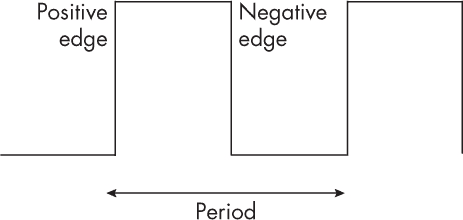

*图 4-16：方波时钟*

快速的电子时钟可以通过具有*压电*特性的材料制作，这意味着它们会对施加在其上的电压产生机械振荡。这些振荡反过来会改变材料的电阻，并产生振荡电压。石英晶体和一些陶瓷具有这种特性，其振荡频率在兆赫（MHz）到千兆赫（GHz）范围内，具体取决于它们的结构和施加的电压。通过添加硬件施加所需电压并将其信号整流为所需的方波时钟信号，可以将其制作成时钟单元。

我们将依赖时钟来驱动第六章中的“顺序逻辑”结构。这些结构的状态可以在固定的时间间隔内更新。顺序逻辑结构又构成了 CPU 的子组件。因此，物理时钟对于计算非常重要，并且可以在现代电子计算机的主板上找到，正如图 4-17 所示。

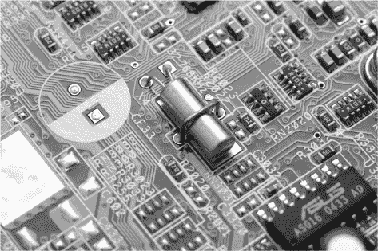

*图 4-17：石英晶体振荡器*

这些时钟可以在 eBay 上以几美元的价格购买，用于在你的项目中将其安装到面包板上（搜索“石英晶体振荡器”等术语）。

### 制造晶体管

现代集成电路使用的是在硅芯片上制造的 FET 晶体管。一个“芯片”是一个小而非常薄的硅片，类似于薯片（在英国称为“脆片”）。硅是一种丰富的元素，可以通过沙子从海滩上获得。经过提纯后，它可以被制成香肠状的块状物，称为铸锭。铸锭像切萨拉米香肠一样被切成大而薄的片，这些薄片称为晶圆。每个晶圆后来会被切割成许多小而薄的方形芯片。

创建晶体管和电线并将它们连接在晶圆上的过程叫做*制造*。晶圆提供了一个二维表面，在上面布置了晶体管。添加微小的金属电线将它们连接在一起。

我们在介绍中讨论过的用于印刷 T 恤和 PCB 的相同掩模概念也用于制造*应用特定集成电路（ASIC）*硅芯片，只不过是微型化的。与 PCB 不同，组件本身——晶体管——是与线路一起制造的。你在 CAD 程序中设计电路布局，使用固定数量的掺杂化学物质来形成每个晶体管的不同区域，使用铜形成连接晶体管的线路。然后你为每种化学物质打印出一个二进制图像，打印在透明膜上，显示其原子将如何分布到二维硅表面上。这个透明膜用于创建物理掩模，允许粒子通过所需区域，并在不需要的区域阻止它们。

你将掩模放在一个空白的硅片上，然后将原子撒在其上。这些原子只会在你设计中允许的区域通过并落到硅片上。你让这个化学层干燥，然后对每种化学物质重复整个过程，以逐步构建设计。通常，晶体管是通过掩模首先铺设的，这些掩模在硅表面上创建掺杂区域。接下来使用更多的掩模来构建金属线，这些金属线连接在硅表面上方的晶体管。图 4-18 展示了一个单一的 FET 晶体管及其在硅芯片上的线路。

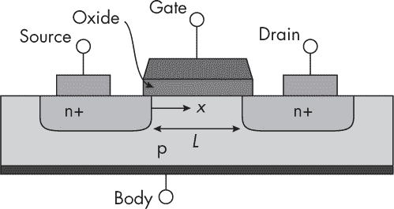

*图 4-18：在芯片上形成的单个 n-p-n FET 晶体管，显示为硅表面的横截面，上面和表面上有化学层*

制造过程既困难又昂贵。与其仅仅“撒”原子到掩模上，它们需要更多的能量才能穿透硅晶格，这可能需要粒子加速器。除了铝和磷外，还有许多其他化学物质用于掺杂，例如锗、硼、砷、镓、锂、铟以及重金属锑和铋。这些化学物质具有与铝和磷相似的性质，但它们更容易处理。与 T 恤印刷不同，制造过程还大量使用减法工艺，这些工艺使用类似的掩模施加去除而非添加层的化学物质。

传统制造要求线路不能交叉；它们必须以二维电路布局进行布置，线路之间需要绕行。这是网络理论算法研究的主要推动力之一，旨在寻找最佳布局。现代制造允许线路有限交叉，例如通过 20 层交替的铜和绝缘体，这些层通过掩模以类似 3D 打印的方式铺设，如图 4-19 所示。

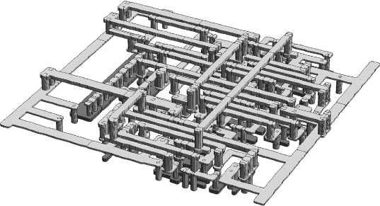

*图 4-19：一些 3D 铜线铺设在硅上的晶体管之上*

大多数系统从特定的化学物质中制造 FET 晶体管，因此这些设备被称为*MOSFETs（金属氧化物半导体场效应晶体管）*。它们通常使用一种称为*CMOS（互补金属氧化物半导体）*的特定掩模序列。现代 CMOS 工艺可能会应用大约 300 个掩模，并按特定的加法和减法层顺序进行处理。2018 年，建造一个制造厂的成本大约为 50 亿美元，而生产一套掩模的成本大约为 500 万美元。你*真的*不希望在将电路设计送往制造厂时发现有任何问题，否则你将需要支付另外 500 万美元来重新制作掩模集。

### 摩尔定律

在晶体管时代，制造技术迅速发展，大约每两年就能使单位面积硅片上能够制造的晶体管数量翻倍。正如你之前看到的，这一经验观察被称为*摩尔定律*，以英特尔的戈登·摩尔命名，他是最早注意到这一点的人。早期的芯片有几千个 MOSFET，如图 4-20 中显示的 4 位英特尔 4004 芯片，其有大约 2,250 个 MOSFET，通过不重叠的铜线连接成电路。现代芯片有数十亿甚至万亿个 MOSFET，通过重叠的 3D 铜线连接。

随着晶体管变得更小，它们也变得更快，时钟速度更高，因此直到 64 位时代，“摩尔定律对于时钟速度”通常被表述为每两年时钟速度翻倍一次。

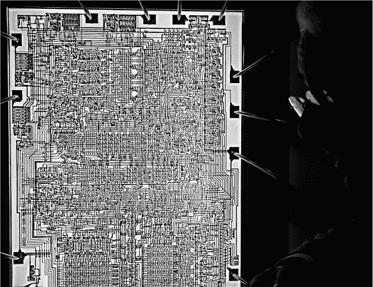

*图 4-20：4 位英特尔 4004 处理器芯片的布局，拍摄时与其设计师 Federico Faggin 一起*

有些人认为摩尔定律在两种形式上会永远持续下去，但正如我们在研究方向系统时看到的那样，开关、计算、功耗和热量之间存在着根本的联系。我们越快地开关晶体管，就会产生更多的热量，因为时钟频率*f*、电容*C*、电压*V*和功率使用*P*之间存在关系：

*P* = *CV*²*f*

因此，摩尔定律的两种形式自 64 位时代开始以来已经发生了分化。这被称为“遇到功率墙”，并且它是你将在第十五章中遇到的架构变化的重要驱动因素。原始定律，即晶体管密度的翻倍，依然成立；尽管需要供电的晶体管更多，但它们也变得更小，因此每个晶体管使用的功率更少，总的功率消耗保持相似。与此同时，时钟频率在大约 3.5 GHz 时趋于平稳。你已经可以在一个 3.5 GHz 的 CPU 上煎个蛋了。但如果摩尔定律在 64 位时代继续适用于时钟速度，那么到 2010 年，CPU 的温度将会达到太阳表面的温度。

### 总结

开关是方向性系统，用来引发所需的计算结果。方向性系统必须消耗有组织的能量并释放热量。现代电子计算机是由场效应晶体管（FET）作为开关组成，通过铜线连接在一起。这些晶体管和电线通过昂贵且复杂的掩膜工艺制造到硅芯片上。在晶体管时代，摩尔定律观察到晶体管密度每两年翻一番，这得益于制造工艺的进步。虽然时钟速度的提升在 64 位时代因能量和热量的限制而停止，但这一现象仍然成立。

为了理解大规模、复杂的晶体管网络，架构师将它们分解成更高层次的结构，从逻辑门开始，我们将在下一章学习这些内容。

### 练习

#### **穷人的与门**

为什么不能将单个晶体管用作与门？（提示：考虑进出的能量、电子和热量。还可以考虑水开关的等效物作为一个简化的案例。）

#### **挑战**

尝试参观一个制造工厂。某些工厂可能提供参观团，尤其是当你作为学生社团等组织团体提出请求时。它们不仅仅位于硅谷；例如，英国就有几个。有关国际名单，请参见*[`en.wikipedia.org/wiki/List_of_semiconductor_fabrication_plants`](https://en.wikipedia.org/wiki/List_of_semiconductor_fabrication_plants)*。

### 进一步阅读

+   如果你想了解关于计算基础物理的美妙书籍，可以参考理查德·费曼的*《费曼计算讲义》*（博卡拉顿：CRC 出版社，2018 年）。这本书详细但直观地讨论了能量、热量、信息和计算之间的联系。它也是量子计算概念的原始来源，量子计算依赖于这些思想。

+   另一本精彩的读物是理查德·费曼的《讲座 46：棘轮和棘爪》，见于*《费曼物理学讲义》*（波士顿：阿迪森-韦斯利，1964 年），*[`www.feynmanlectures.caltech.edu/I_46.html`](https://www.feynmanlectures.caltech.edu/I_46.html)*。这节讲座探讨了方向性系统的一般物理学。

+   想了解芯片是如何制造的，可以观看英特尔的《芯片制造过程》YouTube 视频，时长 2:41，2012 年 5 月 25 日，*[`www.youtube.com/watch?v=d9SWNLZvA8g`](https://www.youtube.com/watch?v=d9SWNLZvA8g)*。

+   如果你对管子和晶体管的模拟特性感兴趣，包括它们在音频放大器和数字开关中的应用，可以参考保罗·霍洛维茨和温菲尔德·希尔的*《电子学艺术》*（剑桥：剑桥大学出版社，1980 年）。
