## 第七章：## **数字逻辑**

如前一章所见，前面提到的半导体晶体管等开关是现代电子计算的最基本构建块。但架构师通常并不以开关的形式思考。相反，他们从开关构建出更复杂的层次结构，最终形成中央处理器（CPU）。这个层次结构的下一层由逻辑门组成：这些设备由少数开关组成的标准电路构成，表示基本的布尔函数，如与（AND）和或（OR）。逻辑门又可以用来构建更大的结构，例如简单的算术和存储机器。

本章中，我们将研究一些常见的逻辑门类型，并了解它们是如何由开关构建的。我们将讨论如何使用像 NAND 这样的通用门来替代其他所有门，并讨论如何利用布尔逻辑来简化由逻辑门组成的电路。但首先，我们先了解一点历史。

### 克劳德·香农与逻辑门

到 1936 年，复杂的电子开关电路在电话交换机中得到广泛应用。这些电路自动化了以前由人工电话接线员完成的工作，通过连接和断开用户的电话线路来实现通话。例如，一个电路可能会计算以下功能：“如果呼叫者发送了一系列脉冲，编码为 024 680 2468，并且从这里到管理 024 号码的交换机有可用线路，那么就将呼叫者连接到该可用线路，并通过该线路以二进制方式传输 680 2468，直到交换机回复连接代码，并开始计费。否则，将呼叫者连接到忙线信号。”随着越来越多的电话、线路、交换机和公司接入网络，这些呼叫路由功能变得越来越复杂。迫切需要减少电路的布线和复杂性，尽可能简化它们。许多临时解决方法存在，用于用看似具有相同功能的更简单开关替换复杂的开关组，但如何可靠或最优地做到这一点仍未被理解。

正如我们在上一章所看到的，开关设备使用能量，因此它们的输出能量低于输入能量；这使得将一个开关的输出重新用于下一个开关的输入变得困难。例如，使用 0 伏和 5 伏代表二进制 0 和 1 作为输入的电气实现会产生类似 0 伏和 4.9999 伏的输出，因为开关机制损失了一部分能量和电压。如果你从许多开关构建一个大型系统，这些电压下降会逐渐积累，直到输出不再能识别为二进制代码。

这一切在伟大的计算年份 1936 年发生了变化，那时克劳德·香农开始在麻省理工学院攻读硕士学位，这篇论文可以说是有史以来最伟大的硕士论文。香农的论文为计算机架构引入了两个创新，解决了开关简化的问题。

首先，它定义了一种方法，将一组开关组织成一种新的、更高层次的抽象——*逻辑门*。逻辑门被定义为接收一个或多个二进制变量的表示作为输入，并使用*相同的表示*产生一个或多个二进制输出的设备。简单的开关*不是*逻辑门，因为它们会损失能量，导致输出表示的能量低于输入表示的能量，因此与输入表示不同。相比之下，逻辑门必须补充开关过程中损失的能量，使得其输出编码与输入编码完全相同。这个特性使得一个门的输出可以干净利落地作为下一个门的输入，因此可以将任意长的逻辑门序列连接起来，而不必担心每一步中能量损失所带来的噪声。

对电路设计师来说，使用逻辑门思考要容易得多，因为他们不再需要关注低层次的能量问题。香农展示了如何利用他那个时代的开关技术（机电继电器）来实现逻辑门，但这些逻辑门也可以通过多种技术来实现，包括水开关和现代金属氧化物半导体场效应晶体管（MOSFET）。

其次，香农证明了任何计算都可以通过组合标准逻辑门的小集合来实现，例如与门、或门和非门。他展示了如何将这些逻辑门及其连接映射到乔治·布尔的数学逻辑上，*布尔代数*，该代数大约在 1836 年由布尔发现。布尔的理论可以用来找到复杂电路的等效表达式，简化它们，并使用更少的门和开关保持相同的功能。

**注意**

*如果说这项工作还不足以填满一生，那么香农还发明了通信理论，这是计算机科学领域的另一个完全独立且同样卓越的贡献。真是个聪明人。*

### 逻辑门

用现代术语来说，逻辑门是任何具有一些二进制输入和一些二进制输出且不包含任何存储器的设备，其中输入和输出使用完全相同的物理表示来表示两个符号，0 和 1。逻辑门的功能可以通过*真值表*完全且确定性地描述，真值表列出了每种输入配置下的输出结果。你很快会看到一些例子。

有可能发明无限多种不同的逻辑门，但今天最常见的、香农研究过的逻辑门，都是只有一个或两个输入、一个输出的逻辑门。这些标准的逻辑门包括与门、或门、非门、异或门、或非门和与非门。图 5-1 至 5-6 展示了这些逻辑门及其真值表。

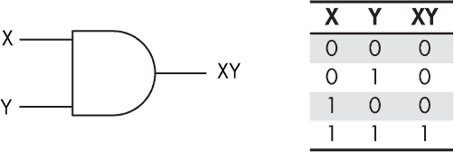

*图 5-1：与门及其真值表*

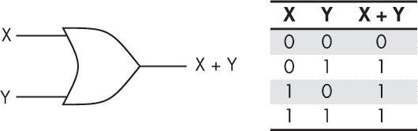

*图 5-2：或门及其真值表*

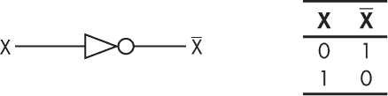

*图 5-3：非门（反向器）及其真值表*

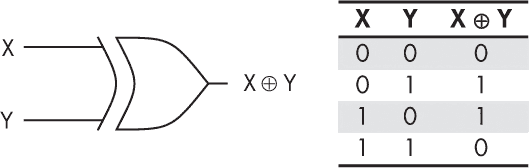

*图 5-4：一个 XOR（排他或）门及其真值表*

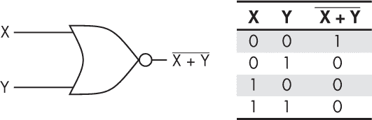

*图 5-5：一个 NOR 门及其真值表*

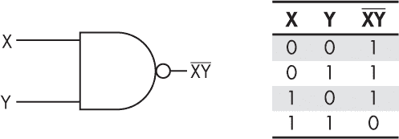

*图 5-6：一个 NAND 门及其真值表*

每个门的真值表列出了左侧列中的所有可能输入组合，并在最右侧列中显示相应的输出。例如，只有当与门的两个输入 X 和 Y 都为 1 时，其输出才为 1；对于任何其他输入组合，输出为 0。

这些逻辑门的名称和功能旨在模仿我们人类对逻辑组合的感知，其中 1 对应于真，0 对应于假。例如，和门（AND）表示 X 和 Y 的与为真，仅当 X 和 Y 都为真时才成立。异或门（XOR），即“排他或”，要求其两个输入中*恰好*有一个为真；如果两个输入都为真，则输出为假。这与普通的或门（OR）不同，后者只要*其中一个或两个*输入为真时，就输出为真。（数字逻辑的学生有时会对类似“你想喝啤酒还是葡萄酒？”这样的问题回答“是”。）NOR 代表“既不是 X 也不是 Y”，只有当两个输入都为假时，输出才为真。NAND 可以解释为“非 X 和 Y”，它的真值表与与门（AND）相反。

逻辑门可以连接成网络，表示更复杂的表达式。例如，图 5-7 表示 X 或（Z 与非 Y），如果 X 为 1，或者如果 Z 为 1 且 Y 为 0，则输出为 1。请注意，这里的“或”是包括的。

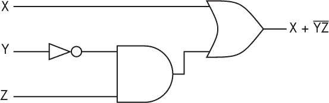

*图 5-7：逻辑门用于 F(X, Y, Z) = X + YZ*

图 5-7 中的逻辑门网络可以用于例如香农的电话交换应用中，其中可能是一个电路，如果接听方在 30 秒内没有接起电话（X），或者如果电话之前已经开始（Z），并且呼叫者没有剩余余额（Y），则断开电话。

#### *识别通用逻辑门*

在他的研究中，香农希望识别一组*通用逻辑门*，这是一组可以重新配置以构建任何硬件级机器的不同类型的逻辑门。他证明了存在多个通用集。例如，如果你有一个抽屉，里面装有无限数量的与门（AND）和非门（NOT），你可以用它们构建任何东西。你也可以使用无限数量的或门（OR）和非门（NOT）来做到这一点，但仅使用与门和或门的抽屉，你无法构建任意函数。最有趣的是，只有 NAND 门或 NOR 门的抽屉是通用的。例如，图 5-8 展示了如何仅通过 NAND 门构建标准的非门、与门和或门。你将在本章末尾的一个练习中有机会进一步探索这个图。

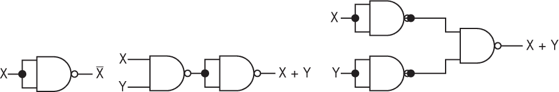

*图 5-8：从通用 NAND 门构建非门、与门和或门*

通用门之所以重要，是因为它们允许我们将所需制造的物理门的类型数量减少到仅剩一个。这正是我们在现代集成电路（IC）中所做的。

#### *用晶体管制造逻辑门*

你可能最初会认为我们可以仅使用一个单独的电气开关，比如晶体管，作为一个 AND 门。毕竟，一个开关接受两个输入：发射极和基极，并且仅当两个输入都打开时，才会将一个输出（集电极）导出，这正是逻辑 AND 的定义。然而，我们已经看到一个开关必须将一些输入能量转换为热量，因此输出的形式与输入不完全相同，不能直接作为下一个逻辑门的输入。为了保持输出与输入相同的形式，我们反而将几个开关组合在一起，同时使用外部电源不断补充它们因热量损失的能量。

有很多不同的方法可以做到这一点。香农的最初设计是针对电磁继电器开关而非晶体管优化的。现代芯片使用所谓的*CMOS（互补金属氧化物半导体）*样式，它由两个正型晶体管和两个负型晶体管组成 NAND 门，如图 5-9 所示。由于 NAND 是一个通用门，你可以用这些 CMOS NAND 门构建所有其他逻辑门。

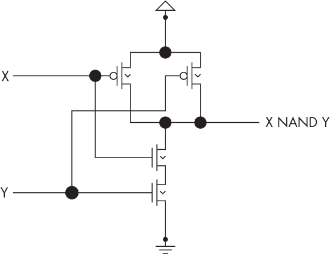

*图 5-9：由 p 型和 n 型晶体管构成的 NAND 门*

电气*电路*是一个存在于晶体管层次上的概念，其中电子从电源流向地面，然后通过电源将其从地面泵回电源，形成一个闭合回路。虽然我们通常非正式地将逻辑门网络称为“数字逻辑电路”，但从技术上讲，这是不正确的，因为在更高层次的抽象下，这些网络通常不会形成闭合电路，反而可能具有任意的网络拓扑结构。如果我们使用非电子的逻辑门实现相同的网络，在更低层次的抽象下甚至可能根本没有电路。因此，当我们绘制图表并构建由逻辑门组成的系统时，应该更准确地称它们为“数字逻辑网络”而不是“数字逻辑电路”。

**用台球制造逻辑门**

逻辑门不一定必须由晶体管或电流构成。例如，台球计算机是一种理论发明，其中计算是在一个复杂的几何迷宫环境中通过台球进行的，像 AND 和 OR 这样的逻辑门版本是通过几何结构和力学实现的。这些门的排列方式是，例如，AND 门检测两个台球的碰撞，并且只有当碰撞发生时，才会将其中一个台球导向正输出，如下图所示。

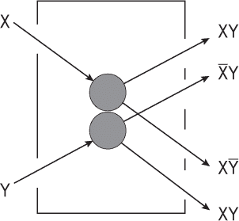

由于能量守恒的机械定律，台球计算机模型可以用来表明，计算需要相同数量的能量，因此也需要相同数量的比特信息来进出。这与普通的与门（AND gate）不同，后者有两个输入和一个输出。模型表明，我们应该为消耗的第二比特添加一个额外的“垃圾”输出。这具有一个有趣的特性，即使得计算在某种意义上是*可逆的*，即如果我们知道输出，就可以重建输入。这使得我们能够反向运行机器。如果这听起来很奇怪，可以考虑到许多编程场景中，拥有一个反向调试器来撤销最近几行代码的效果将是非常有用的。

台球计算机的目的是帮助我们清楚地思考能量使用和热量在计算中的角色。随着依赖小型电池的便携式计算机的兴起，越来越需要节省计算能量，尤其是随着环境问题、燃料资源和成本、碳排放和热污染的关注不断增加，这个话题变得更加重要。传统的与门有两个输入和一个输出，因此每次执行与操作时都会有一个台球的能量作为物理热量损失。台球模型表明，如果我们跟踪门的第二个输出比特——这个比特同样用于使计算可逆——我们可以构建不会浪费能量的电气与门。热量实际上是我们丢失的能量，在这种情况下是通过丢弃信息造成的。这就是为什么你的手机在进行大量计算时会变热，也解释了为什么你的处理器需要一个大风扇。风扇正把废弃的信息以比特的形式从计算机的通风口排出。（从这个意义上说，世界上燃料枯竭不是能源危机，而是信息危机。能量不能被创造或摧毁，但我们可以丢失关于能量去向的信息——这是我们需要的信息，才能让能量为我们做有用的工作。）

#### *将逻辑门放入芯片中*

当你第一次通过显微镜查看芯片时，或者查看任何由逻辑门构建的计算机时，你无法指向单个组件并说：“那是一个逻辑门。”你实际上会看到一堆晶体管，它们被组织成门。例如，看看图 5-10，这张图片展示了一个非常简单的硅芯片的显微镜照片（“die shot”），其中只包含四个 CMOS NAND 门，每个门由四个晶体管构成（正如你在图 5-9 中看到的）。

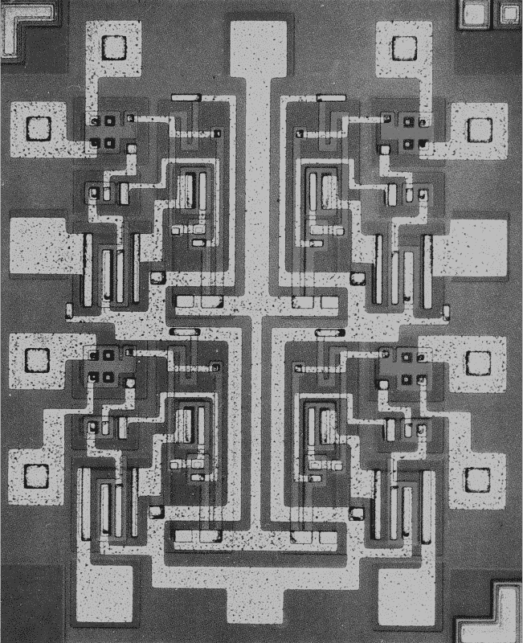

*图 5-10：包含四个 CMOS NAND 门的简单硅芯片的显微镜照片*

图 5-11 是一个单一 CMOS NAND 门的掩模集，展示了如何物理布局 p 型和 n 型掺杂区以及铜线。

现代处理器可能包含数十亿个晶体管，这些晶体管被分组到逻辑门中。但仍然生产包含少量逻辑门的老式集成电路，这些电路对于构建你自己的电路非常有用。7400 TTL 系列就是这样简单芯片的一个著名例子。最初由德州仪器在 1960 年代生产，它们现在已作为通用产品广泛生产。该系列的大多数芯片只包含少量单一类型的逻辑门，例如四个与门、四个与非门或四个或非门，正如图 5-12 所示。

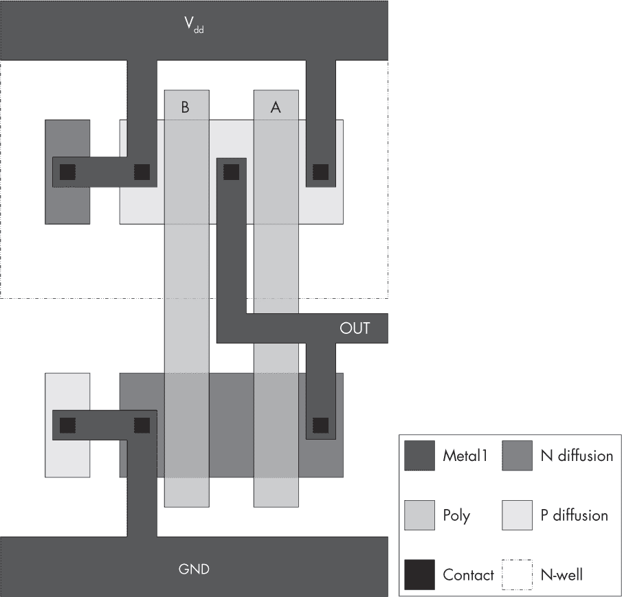

*图 5-11：用晶体管和铜线制作的 CMOS NAND 门芯片布局*

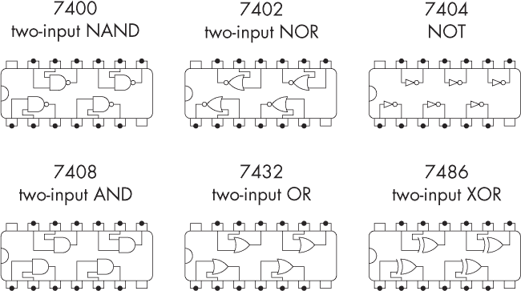

*图 5-12：一些 7400 TTL 系列芯片，每个芯片包含几个逻辑门*

这些图表展示了芯片的物理布局和引脚排列；要连接逻辑门，你需要将物理导线连接到适当的引脚。你可以在 eBay 上花几美元购买这些芯片的袋装，然后在面包板上将它们与 5V 电源和接地连接，就像在图 5-13 中那样，制作你自己的物理数字逻辑网络。

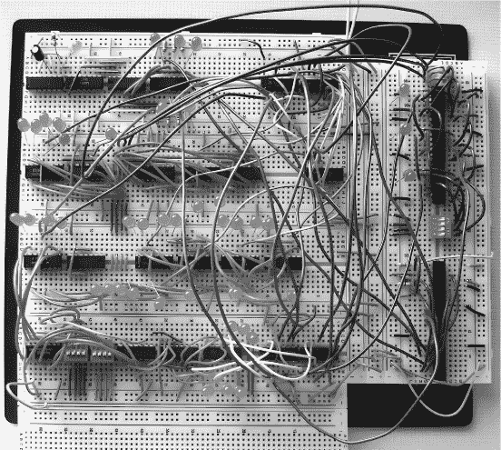

*图 5-13：使用 TTL 7400 系列芯片上的逻辑门在面包板上构建数字逻辑网络（形成一个 4 位 CPU）*

从图 5-13 中你可以看到，数字逻辑网络的接线可能会变得非常复杂。如果我们有一种方法，能够简化网络，使用更少的逻辑门和导线，同时仍然实现相同的功能，那该多好？这正是香农创新的下一部分：如何利用乔治·布尔的逻辑来进行这种简化。

### 布尔逻辑

逻辑允许我们形式化关于真与假的陈述和推理。它由古希腊人发明，并一直保持不变，直到乔治·布尔在 1836 年左右的工作。布尔的工作被香农于 1936 年采纳，他意识到它可以用来建模、简化和验证由他的逻辑门构建的电路。

布尔逻辑使用变量*名称*来表示概念性命题，且这些命题的*值*要么为真，要么为假。接着，它提供了 AND、OR 和 NOT 的连接符号，以及用于给由变量和这些连接符构建的表达式赋予真值的规则。

以以下示例为例。我们有两个变量：X 代表命题“上帝存在”，Y 代表“雪是白色的”。那么我们可以用 X AND Y 来表示“上帝存在且雪是白色的”。或者我们可以用（NOT X AND Y）OR（X AND Y）来表示“要么上帝不存在且雪是白色的，要么上帝存在且雪是白色的”。

现在让我们来看一下如何处理这些陈述。

#### *逻辑即算术*

布尔发现了逻辑与算术之间的结构相似性。以前，这两者是完全不同的学科。逻辑是通过自然语言文本和研究规则来分析论证的“文科科目”。算术是由数字和方程式组成的“STEM 科目”。正如数学家们成功地统一了几何学和代数一样，布尔成功地统一了逻辑和算术。

他通过注意到真值（用符号 T 表示）像数字 1 一样运作，而假值（用符号 F 表示）像数字 0 一样运作，来完成这一点。如果我们将与运算用乘法代替，将或运算用加法代替，将非运算用对 1 的取反代替，就能得出这一结论。

就像在算术中我们用 *x* + *y* 表示加法，用 *xy* 表示乘法一样，我们可以用这些相同的符号表示或运算和与运算。当使用这种符号时，通常也会将 *x* 写作非 *x*，这对应算术运算（1 – *x*）。

这种相似性并不完全相同，因为在算术中 1 + 1 = 2，但在逻辑中我们需要 1 + 1 = 1。布尔通过选择仅使用两个数字 0 和 1 的数字系统，并定义在此系统内 1 加任何数都等于 1，来绕过了这个问题。

使用布尔的系统，逻辑论证可以转化为简单的算术。这样做的优点是我们已经知道很多算术知识，特别是如何使用如结合律、交换律等表 5-1 中列出的规律来简化表达式。

**表 5-1：** 简化布尔逻辑的有用算术定理

| **名称** | **与运算形式** | **或运算形式** |
| --- | --- | --- |
| 恒等律 | 1*A* = *A* | 0 + *A* = *A* |
| 零律 | 0*A* = 0 | 1 + *A* = 1 |
| 幂等律 | *AA* = *A* | *A* + *A* = *A* |
| 反演律 | *AA* = 0 | *A* + *A* = 1 |
| 交换律 | *AB* = *BA* | *A* + *B* = *B* + *A* |
| 结合律 | (*AB*)*C* = *A* (*BC*) | (*A* + *B*) + *C* = *A* + (*B* + *C*) |
| 分配律 | *A* + *BC* = (*A* + *B*)(*A* + *C*) | *A*(*B* + *C*) = *AB* + *AC* |
| 吸收律 | *A*(*A* + *B*) = *A* | *A* + *AB* = *A* |
| 德摩根定律 | *AB* = *A* + *B* | (*A* + *B*) = *AB* |

例如，假设我们想计算以下的真值：

(F AND (T OR F)) OR ((F OR NOT T) AND T)

我们可以通过将逻辑转化为算术，然后使用标准的算术规则来简化表达式：

(0(1) + 0(0)) + ((0)1 + (1 – 1)1)

= (0 + 0) + (0 + (0)1)

= (0) + (0 + 0)

= 0 + 0

= 0

最后，我们将得到的数字 0 转回逻辑值假。

这也适用于使用变量而不是特定值；例如，之前关于上帝和雪的陈述可以写成并以算术方式操作：

((1 – *x*)*y*) + (*xy*)

= (*y* – *xy*) + (*xy*)

= *y* – *xy* + *xy*

= *y*

这样可以将算术数字*y*转换回逻辑值*Y*。这表明命题的真值实际上与上帝的存在(*X*)无关，仅依赖于雪是否是白色(*Y*)。所以假设雪确实是白色的，那么命题就是真的。

**注意**

*现在，往返于逻辑真值和整数 0、1 之间的能力通常在诸如 C 等语言中使用（或者可以说是误用），这些语言在处理这些类型时非常灵活。*

#### *模型检查与证明*

我们经常需要知道两个布尔表达式是否相等。确定这一点有两种主要的方法。

第一个叫做*模型检查*。给定一个潜在的等式，我们只需计算潜在等式左右两边的真值表。如果真值表完全匹配，那么表达式是相等的。例如，我们来检查表 5-1 中的分配律的与形式是否始终成立。首先，我们计算并计算等式左边的表格，即 *A* + *BC*。我们从三列变量开始：*A*、*B* 和 *C*。然后我们为中间项*BC*添加一列，并用此列计算整个表达式在最右边列的值，如表 5-2 所示。

**表 5-2：** *A* + *BC* 的真值表

| ***A*** | ***B*** | ***C*** | ***BC*** | ***A*** + ***BC*** |
| --- | --- | --- | --- | --- |
| 0 | 0 | 0 | 0 | 0 |
| 0 | 0 | 1 | 0 | 0 |
| 0 | 1 | 0 | 0 | 0 |
| 0 | 1 | 1 | 1 | 1 |
| 1 | 0 | 0 | 0 | 1 |
| 1 | 0 | 1 | 0 | 1 |
| 1 | 1 | 0 | 0 | 1 |
| 1 | 1 | 1 | 1 | 1 |

接下来，我们对等式右边的表达式*(A* + *B*)(*A* + *C*)进行相同的操作，见表 5-3。

**表 5-3：** (*A* + *B*)(*A* + *C*) 的真值表

| ***A*** | ***B*** | ***C*** | (***A*** + ***B***) | (***A*** + ***C***) | (***A*** + ***B***)(***A*** + ***C***) |
| --- | --- | --- | --- | --- | --- |
| 0 | 0 | 0 | 0 | 0 | 0 |
| 0 | 0 | 1 | 0 | 1 | 0 |
| 0 | 1 | 0 | 1 | 0 | 0 |
| 0 | 1 | 1 | 1 | 1 | 1 |
| 1 | 0 | 0 | 1 | 1 | 1 |
| 1 | 0 | 1 | 1 | 1 | 1 |
| 1 | 1 | 0 | 1 | 1 | 1 |
| 1 | 1 | 1 | 1 | 1 | 1 |

最后，我们比较这些表格。在这里我们可以看到，对于每种可能的变量值分配，两张表格中的结果值是相同的。因此，通过模型检查，左边等于右边。

模型检查利用了项的*值*。如果通过模型检查已经证明了一个等式，我们就说它已经被*蕴含*，并且它是*真的*，我们写作 ⊧ *A* + *BC* = (*A* + *B*)(*A* + *C*)。

证明等式的第二种方式是通过*证明*。如果一些等式已经建立，如表 5-1 中的法则，我们可以在符号上利用它们的结果，而不必对所有内容逐一进行真值表推导。证明是从第一个表达式到第二个表达式的转换列表，每个转换都通过说明应用了哪条法则来证明。如果通过证明展示了某个等式，我们说它已经被*证明*，并写作 ⊢ *A* + *BC* = (*A* + *B*)(*A* + *C*)。

例如，这里有一种方法可以证明 *A* + *BC* = (*A* + *B*)(*A* + *C*)：

| *A* + *BC* | = (1*A*) + (*BC*) | : 根据与的恒等律 |
| --- | --- | --- |
|  | = (*A*(1 + *B*)) + (*BC*) | : 根据或的空律 |
|  | = (*A*1) + (*AB*) + (*BC*) | : 根据或的分配律 |
|  | = (*A*(1 + *C*)) + (*AB*) + (*BC*) | : 根据或的空律 |
|  | = (*A*(*A* + *C*)) + *B*(*A* + *C*) | : 根据或的分配律 |
|  | = (*A* + *C*)(*A* + *B*) | : 根据或的分配律 |

**注**

*对于布尔逻辑，可以证明任何通过模型检查建立的等式也可以通过证明得出，反之亦然，所以你可以根据个人喜好选择任何一种方法。虽然在布尔逻辑中，模型检查和证明给出的答案看似是一样的，但对于其他逻辑系统，这并不总是成立，正如哥德尔后来发现的那样。*

检查两个表达式是否相等的能力并非纯粹是学术问题。香农认识到它在简化数字逻辑网络中的价值。

**乔治·布尔**

乔治·布尔在巴贝奇的机械计算机问世几年后，出版了他的著作《逻辑的数学分析》（1847 年）和《思想的法则》（1854 年）。布尔在英国林肯成长并形成了他的思想。与大多数历史上来自富裕家庭、能够买通进入剑桥的学术英雄不同，如巴贝奇和图灵，布尔来自一个普通且贫困的家庭。他的父亲是一个鞋匠。布尔没有接受正式教育，而是去了公共图书馆，通过阅读书籍自学，*就像今天你可以做的那样*。

布尔在没有学术体系的约束下创造了许多新的思想。他没有受到该体系对思维的限制。尤其是没有人告诉他，艺术和科学应该分开，因此他会在图书馆的两个部分之间走动，进行比较。虽然他的名字与布尔逻辑和现代编程语言中的布尔或（bool）数据类型密切相关，但他也研究了概率学和其他形式的推理，并且他受到理解和建模人类智能的动机，正如现代的人工智能和认知科学所做的那样。他研究逻辑和其他推理形式的真正动机是为了形式化、分析和检验经典哲学中的许多论证，尤其是关于上帝存在的论证。他想弄明白这些论证是否有效，通过将它们拆解成各个部分并测试每一步，看看哪些结论是真实的，哪些是值得相信的。

例如，这里是布尔关于上帝存在的逻辑（摘自《思维的法则》，第十三章）：

设 *x* = 某物一直存在。

*y* = 曾经存在某个不变且独立的存在。

*z* = 曾经存在一系列可变化且相互依赖的存在。

*p* = 该系列具有外部原因。

*q* = 该系列具有内部原因。

然后我们得到以下方程组，即：1st. *x* = 1;

2nd. *x* = *v*{*y*(1 –*z*) + *z* (1 –*y*)};

3rd. *z* = *v*{*p*(1 –*q*) + (1 –*p*)*q*};

4th. *p* = 0;

5th. *q* = 0;

布尔的短暂一生——现代逻辑的创始人被他妻子用冰冷的毛毯包裹以治疗肺炎的顺势疗法所致死——是巴贝奇的一部分，因此他们很可能会阅读彼此的作品。然而，布尔对计算机科学并不感兴趣。他的最终兴趣是哲学性的，他对理解和建模智能的工作主要是为了为哲学方法做出贡献。尽管如此，他仍然会意识到，创造这样的形式化方法也能够使其机械化为人工智能，正如洛夫莱斯所讨论的那样。很遗憾，二人从未共同合作开发这一思想。

### 使用布尔逻辑简化逻辑电路

香农抛弃了布尔对变量的概念性解释，转而展示了布尔代数可以用来简化由逻辑门组成的物理数字逻辑网络。简化可以包括减少门的数量，以及减少门的*类型*，例如将所有逻辑门简化为 NAND 门。

这是通过将逻辑门网络转换为布尔表达式，使用算术法则简化表达式，然后将结果转换回更小的逻辑门网络来完成的。简化网络是有用的，因为它减少了所需的晶体管数量，从而降低了制造成本和能源使用。如今，已经有了自动执行简化的 CAD 软件：你输入你的数字逻辑网络，点击一个图标，便能得到一个更小、更高效的版本。

例如，假设我们已经设计了图 5-14 左侧的数字逻辑网络。利用布尔理论，这可以转换为算术表达式并简化为*(A* + *B*)(*A* + *C*) = *A* + *BC*。这对应于图 5-14 右侧的较小网络。

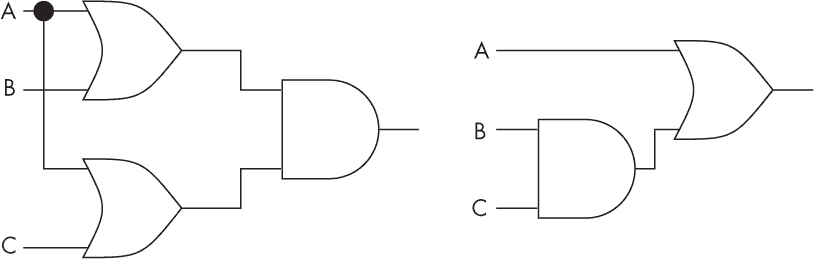

*图 5-14：逻辑网络 (A + B)(A + C)（左图）和简化后的 A + BC 形式（右图）*

我们可以利用布尔逻辑进一步简化逻辑网络，使其仅使用通用的 NAND 门，然后减少 NAND 门的数量，如图 5-15 所示。

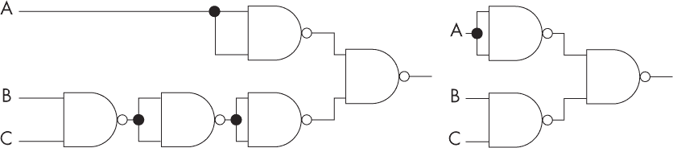

*图 5-15：将 A + BC 转换为 NAND 门（左图）并进行简化（右图）*

这样，我们就能将任何网络转换为一个更容易构建的网络，只需使用一种类型的门电路，并且尽可能少地使用它们。

### 布置数字逻辑

一旦你设计并简化了数字逻辑网络，通常你会希望将其转移到实际硬件上。这里有几种方法，我们将在接下来的部分进行讨论。

#### *7400 芯片*

实现一个简单逻辑网络的方法自 1960 年代以来一直没有变化：将它布置在一堆 7400 芯片上，并用一堆乱七八糟的电线将它们连接起来。

如你之前所见，每个 7400 系列芯片包含多个门电路，通常都是相同类型的。不幸的是，单个芯片通常并不对应电路中的某个特定拓扑区域。你需要考虑电路中的每个门电路，并选择一个特定芯片上的特定门电路来实例化它。你可以完全任意地选择各个元件的位置，电路仍然可以正常工作，但如果你在布局中应用一些巧妙的方法，你将能够显著减少连接所需的电线长度。

例如，假设你想构建图 5-16 左上角所示的网络，并且你有两个 TTL 芯片可用：一个包含四个 XOR 门，另一个包含四个 NAND 门。图 5-16 右上角展示了使用布尔逻辑将网络转换为使用可用门电路的结果，图的下部则显示了如何将其布置到两个 TTL 芯片上的一种可能方式。

你可以购买 TTL 芯片，再加上面包板、开关、LED、9V 电池以及电阻来将电池降至 TTL 芯片使用的 5V（每个 LED 还需要一个电阻以防止它们爆炸），并按照图 5-17 中的示意图连接它们，来实现你的设计。

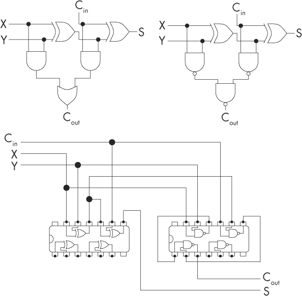

*图 5-16：将网络转换为 NAND 门并使用 TTL 芯片布置的方案*

你确实可以通过这种方式用 TTL 芯片构建整个 CPU，事实上，许多早期的 CPU 就是通过这种方式构建的。

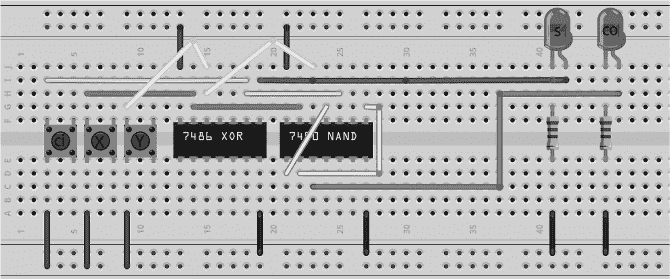

*图 5-17：使用面包板布置的 TTL 方案（使用 Fritzing）*

**注意**

*“巧妙”的布线优化方法在你尝试为更大电路进行优化时，所需的技巧会迅速增加规模。类似的巧妙方法也适用于优化我们接下来要讨论的其他硬件方法的物理布局。设计自动化且大规模执行这些任务的算法是计算机科学的一个主要领域，并且被芯片公司广泛使用、研究和开发。*

#### *光刻技术*

在第四章中描述的 ASIC 工艺是实现数字逻辑网络的最重型方法，制作掩模集的成本为 500 万美元。在这里，准备了包含形成逻辑门所需晶体管布局的掩模。该工艺提供了最小、最快的硬件，但只有在大规模生产时，才能通过其设定成本来证明其经济性。

#### *可编程逻辑阵列*

*可编程逻辑阵列（PLA）* 是一种芯片，具有多个输入和多个输出，通过光刻技术制造，使得每个输入和每个输入的反向信号都通过保险丝与一系列与门和或门相连。图 5-18 展示了一个小型 PLA 结构的例子。图中的平面被多次叠加，每层共享相同的与门和或门。圆圈表示保险丝。

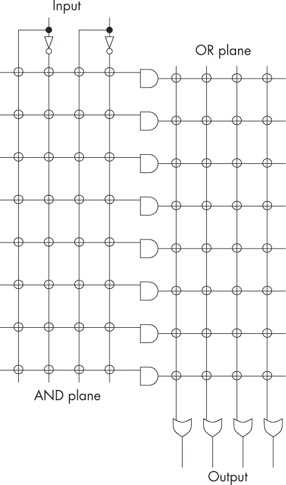

*图 5-18：展示输入和输出互联性的 PLA 原理图*

从这个结构开始，你可以通过断开某些保险丝来制作任何布尔逻辑功能，从而有效地移除那些连接。如果你有一个足够大的 PLA，你可以将任何数字逻辑设计进行一些布尔逻辑变换，以使其达到最佳形式，然后通过熔断保险丝将其“烧录”到 PLA 中。这是很好的，因为你不需要定制设计你的芯片，也不需要花费 500 万美元去制作一套光刻掩模，只需要一套掩模——用于制作通用的 PLA。然后你可以从大规模生产商那里购买通用 PLA，并将它们转化为自己的芯片。

#### *现场可编程门阵列*

*现场可编程门阵列（FPGA）* 类似于 PLA，但你可以随时用新的数字逻辑重写它，而不仅仅是一次性烧录。这是因为，FPGA 并不是通过物理熔断保险丝来实现，而是通过电子方式切换标准逻辑块之间的连接开关。每个逻辑块都可以配置成某种小型的简单机器。图 5-19 展示了这种设计的例子。

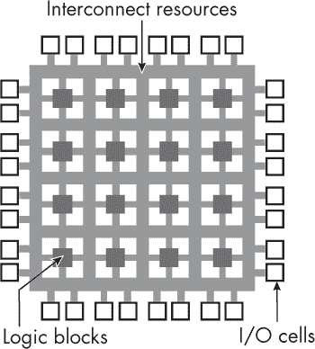

*图 5-19：由可配置模块和它们之间的连接构成的 FPGA 芯片结构*

布尔逻辑再次被用来将任何初始的数字逻辑设计转化为一系列简单的机器及其之间的连接。这几乎是一种软件方法，通过向 FPGA 板上的固件内存发送启用和禁用的连接列表，然后用这些连接来配置电子结构。

FPGAs 通常以开发板的形式出售，FPGA 芯片周围有额外的硬件，用来帮助将其连接到 PC 并进行编程。你可以购买便宜的、适合创客的消费级 FPGA 开发板，价格大约从$30 起。有两家主要的 FPGA 制造商：Xilinx 和 Altera（前者现在是 AMD 的一部分；后者现在是 Intel 的一部分）。另外，面向生产用途的 FPGA 可以在没有任何支持结构的情况下购买，这时需要一个外部编程器。FPGAs 有多种尺寸；其中较大的芯片用于在进行更昂贵的 ASIC 光刻之前对 CPU 设计进行原型验证，而较小的芯片则用于嵌入式系统。

图 5-20 展示了在物理 FPGA 表面上某些数字逻辑的典型布局，以及用于将其放置在该位置的开发板。

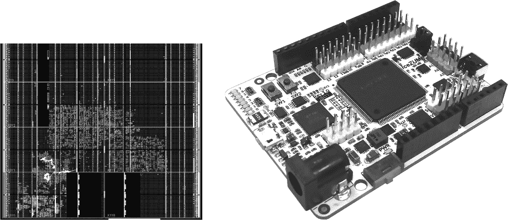

*图 5-20：显示 FPGA 内部逻辑配置（左）和 FPGA（中央的大芯片）在其开发板上的位置（右）*

当人类手动布置数字逻辑时，他们倾向于通过空间布局组织它，使得不同的区域对应不同的结构。而 FPGA 内部看到的自动布局通常视觉上没有结构，因此对于人类来说，往往难以理解甚至不可能理解。

### 总结

逻辑门是抽象概念：它们是将小组开关（如晶体管）组织成功能单元的一种方式。人类设计师倾向于在这一层次上思考，而不是在开关层次上，因此他们使用逻辑门设计电路。每个逻辑门随后被“编译”成小组的开关。（一些专业的芯片设计师确实能“看到”硅片上的逻辑门。他们已经习惯于观察由逻辑门创建的标准晶体管模式，这些模式在他们的感知中会自动跳出来。但对我们大多数人来说，我们只能看到晶体管。）

与简单开关不同，逻辑门具有一个关键特性，即它们的输出保持与输入相同的表示。例如，基于晶体管的逻辑门不会在其输出端产生比输入端更低的电压。这意味着它们可以组合成复杂的逻辑网络。

克劳德·香农向我们展示了我们可以使用乔治·布尔的代数来简化逻辑门电路，通常减少所需的门数量，并将所有其他类型的门替换为仅使用 NAND 门。这减少了我们需要在硅片上放置的晶体管数量，并简化了设计。

### 练习

#### **通用门**

计算 图 5-8 中每个基于 NAND 门的电路的真值表，或者以其他方式证明它们与标准的 NOT、AND 和 OR 门等效。

#### **设置 LogiSim Evolution**

LogiSim Evolution 是一款图形化数字逻辑模拟器。它被用来创建本书中的数字逻辑电路图。它可以模拟你设计的电路，并且稍后将这些电路转移到真实的芯片上。

1.  从 *[`github.com/logisim-evolution/logisim-evolution`](https://github.com/logisim-evolution/logisim-evolution)* 安装并运行 LogiSim Evolution。

1.  创建一个项目，尝试创建一些门并连接它们。组件通过点击一个门的输出然后连接到另一个门的输入来连接。点击组件或电线来激活它。使用 DEL 键删除组件，使用 ESC 删除最新的电线。点击仿真按钮运行仿真。电线上的电压以黑色表示 0，红色表示 1。一些组件可以通过右键点击来编辑其属性。

1.  使用常量输入和 LED 输出构建并测试图 5-14 中的电路。

#### **简化电路**

1.  在 LogiSim 中，仅使用 NAND 门来构建其他所有类型的门。

1.  使用模型检测或证明来展示“使用布尔逻辑简化逻辑电路”一节中的电路为何是等效的。你如何从左侧的形式找到右侧的形式？是否存在一种算法能够保证得到最小的 NAND 形式？

1.  计算布尔函数如 *W*(*YZ* + *XY*) 的真值表，并通过在 LogiSim 中构建并模拟等效电路来检查。

1.  使用布尔恒等式简化前一个问题中的函数，并构建简化版本的新 LogiSim 电路。通过模拟检查真值表是否保持不变。

### 深入阅读

+   要直接了解布尔逻辑（以及神学），请参见 George Boole 的《思想法则》（1854 年），* [`www.gutenberg.org/ebooks/15114`](https://www.gutenberg.org/ebooks/15114)*。

+   对于可能是有史以来最伟大的硕士论文，请参见 Claude Shannon 的《继电器和开关电路的符号分析》（硕士论文，麻省理工学院，1940 年），* [`dspace.mit.edu/handle/1721.1/11173#files-area`](https://dspace.mit.edu/handle/1721.1/11173#files-area)*。
