## 第八章：## **简单机器**


在机械工程中，*简单机器*是一个众所周知的标准设计集，包括杠杆、轴、螺丝和滑轮等，每种都执行一个功能，并且可以组合在一起形成更大的机器。类比地，计算机的简单机器是一些标准设计，通常作为计算机的子组件。例如，现代 CPU 中的算术逻辑单元——正如巴贝奇的分析机一样——由许多这样的简单机器组成，每个机器执行一种算术操作，如加法、乘法或移位。

本章介绍了一系列简单机器，作为逻辑门之上的下一个架构级别。然后，在下一章中，我们将利用这些简单机器作为 CPU 的组成部分。我们将讨论的简单机器分为两大类：*组合机器*，它们可以写成布尔表达式，以及*时序机器*，它们需要反馈和时序逻辑，扩展了布尔逻辑，加入了时间元素。反馈和时序逻辑是创建内存所必需的。

### 组合逻辑

*组合逻辑*指的是那些可以用常规布尔逻辑描述的数字逻辑网络，而无需考虑时间的作用。在这一节中，我们将看到几种组合简单机器的示例，稍后我们将在构建 CPU 结构时依赖它们。

#### *按位逻辑操作*

前一章的单独逻辑门作用于单个数据位：它们通常接收一个或两个单比特输入，并生成一个单比特输出。将多个相同的门并联起来非常简单，从而创建一个*数组操作符*，这是一个简单的机器，可以同时对输入数组的每个位执行相同的操作，生成输出数组，如图 6-1 所示。

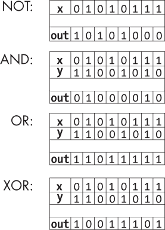

*图 6-1：一些按位逻辑操作*

在这里，输入数组`x`和`y`（或者在 NOT 操作的情况下仅`x`）通过一系列相同的门，生成`z`作为输出。这些数组操作对于低级 C 程序员来说非常熟悉，因为 C 语言中包含了这些操作，并且为它们分配了符号。如果目标 CPU 中存在这样的简单机器，C 编译器最终将使用这种简单机器来执行这些指令。

#### *多输入逻辑操作*

我们可以通过将两个输入版本的与门按层次结构组合来创建多输入版本的与门，如图 6-2 所示的八输入与门。

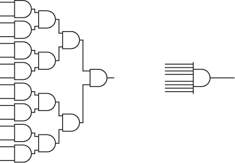

*图 6-2：由两个输入与门（左）组合而成的八输入与门及其符号（右）*

该结构将仅在其所有输入都是 1 时输出 1。相同的结构也适用于创建多输入或门，当其一个或多个输入为 1 时，它将输出 1。

#### *移位器*

在十进制中，有一个快速的技巧来将整数乘以 10：只需在末尾附加一个零。我们还可以通过附加 *n* 个零来乘以更高的自然幂 10^(*^n*)。与其把它看作是附加一个零，不如把它看作是将每一位数字向左移一位。这样，技巧也适用于将非整数乘以 10 的幂。我们也可以通过将数字向右移动，来轻松快速地进行 10 的幂除法。这些技巧消除了传统的慢速手工计算中涉及的多次单数字乘法、加法和进位操作。

相同的技巧也适用于二进制，快速进行整数 2 的幂的乘法和除法。要将数字乘以或除以 2^(*n*)，只需将数字的位移 *n* 位到左边或右边。

图 6-3 展示了一个简单的机器，当它被启用时，会执行左移操作，从而将输入数字乘以 2。该机器通过将 *S*（移位）输入开关设置为 true 来启用。如果 *S* 输入没有启用，机器将输出原始输入而不做任何改变。

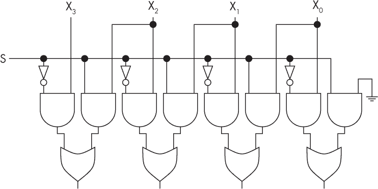

*图 6-3：由逻辑门构成的左移位器*

移位器的设计基于一个子机器，它由两个与门（AND）、一个非门（NOT）和一个或门（OR）组成。数字的每一列（每一位）都有一个此子机器的副本，它要么允许该列的位不变地通过，要么将该列的位替换为右边列的位。

当你在 C 等高级语言中使用类似 `x>>2` 的操作进行乘法时，你的 CPU 可能包含一个专用的移位器，它会被激活，而不是使用通常的乘法数字逻辑。这使得乘法操作比非二的幂的乘法操作更快。这就是了解架构如何帮助你编写更快程序的一个例子。你会经常看到为了利用这个技巧而设计的速度关键代码，比如游戏和媒体编解码器强制将值设为二的幂。

**注意**

*移动超过一位可以通过几种方式来实现。你可以多次重复使用相同的移位网络，这样可以节省晶体管，但运行时间会更长。或者你可以使用更多的晶体管来实现许多不同的开关，这些开关可以请求不同类型的移位，并立即执行它们。决定是否通过这种方式在晶体管和速度之间做出权衡是一个常见的架构难题。*

#### *解码器和编码器*

假设你有一个正整数 *x*，它表示为一个 *M* 位二进制数。计算机通常需要将这种二进制表示转换为另一种 1-of-*N*表示法，其中 *N* = 2*^M* 位，除了 *x* 位是 1 之外，其他位都是 0。例如，一个 *M* = 3 位输入，如 101（编码数字 5[10]），将被转换为 00000100，具有 2³ = 8 位，只有第五位为高电平（从左到右，从 0 开始计数）。一种叫做*解码器*的简单机器可以执行这种转换。图 6-4 展示了一个 3 位解码器的数字逻辑电路。

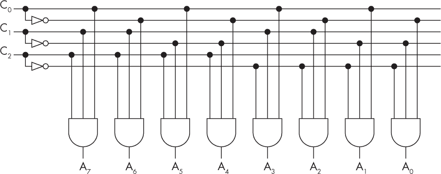

*图 6-4：3 位解码器*

每个输入首先被复制并反转。然后，一组与门被连接到每个输入位的未反转或反转版本，连接模式模拟二进制数字编码的模式。

*编码器*执行反向操作：它将一个 1-of-*N*表示作为输入，并将其转换为一个二进制数字编码。

#### *多路复用器和解多路复用器*

我们已经看到，分析机由许多子组件组成，这些子组件根据需要动态地连接和断开以执行计算。在分析机中，这些连接的建立和断开是机械完成的。例如，当我们想要进行加法时，机制会将齿轮物理地接触在寄存器和算术逻辑单元（ALU）之间。或者当我们从 RAM 加载数据时，机制会物理地将所需的 RAM 位置连接到总线上。这种思想的数字逻辑版本就是多路复用和解多路复用。

*多路复用器*使我们能够选择将多个可能的源中的一个连接到单个输出。例如，我们可能有八个寄存器，并希望选择其中一个连接到 ALU 输入。图 6-5 展示了一个八源多路复用器。它由一个解码器和八个数据输入 D[0]到 D[7]组成，还包括额外的与门和或门。

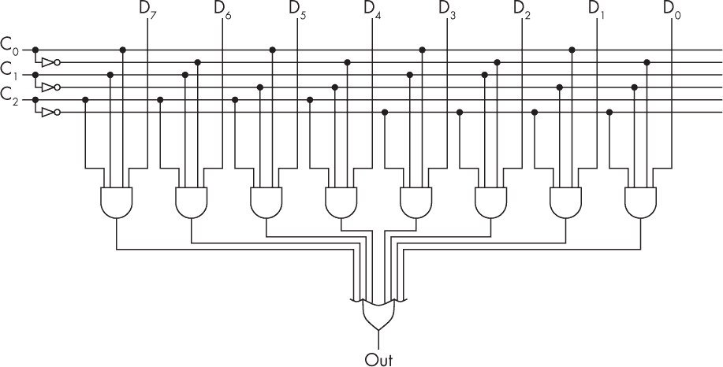

*图 6-5：多路复用器*

如果我们希望将特定源（如 D[3]）连接到输出线，我们将其代码 011[2]（对应 3[10]）放到解码器输入 C[0]到 C[2]。解码器仅将第三行设为高电平，并与 D[3]通过与门进行逻辑与操作作为开关。然后，或门将 D[3]复制到输出线，因为它们的其他输入都是低电平。

*解多路复用器*执行与多路复用器相反的功能。它接受一个输入线和一个代码 *n*，并将输入信号的副本发送到多个输出线中的第 *n* 根。

多路复用器和解多路复用器通常一起使用，因此我们可以选择将多个可能的源中的一个连接到多个可能的目的地中的一个。在这些情况下，共享的线称为*总线*。

#### *加法器*

在 第二章 中，你已经了解了如何在二进制中表示整数。我们可以构建简单的机器，利用这种表示法执行算术运算，例如执行加法的 *加法器*。

这是加法两个二进制数 001100 和 011010 的例子：

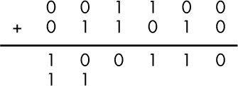

你可以手动执行这个加法，使用与儿童学习十进制加法时相同的算法：从最右边的列开始，计算该列的列和，将结果写在下方作为该列的输出和。如果出现进位，比如 1 + 1 = 10，则将结果的低位（10 的 0）作为和，并将高位（10 的 1）进位到下一列，在下一列中将其作为第三个输入进行加法。在这个例子中，从右数的前三列没有产生进位，但第四列和第五列产生了进位。（进位在最终和的下方显示。）

如果回顾 图 5-1 和 图 5-4 中的与（AND）和异或（XOR）真值表，并将其与二进制加法的过程进行比较，你会发现，只要没有输入进位（如例子中的前四列），XOR 的结果与列加法完全相同，而 AND 的结果则与进位操作完全相同。因此，我们可以使用一个 XOR 和一个 AND 来构建一个简单的机器，称为 *半加法器*，如 图 6-6 所示，当没有进位输入时，它可以计算列的和。

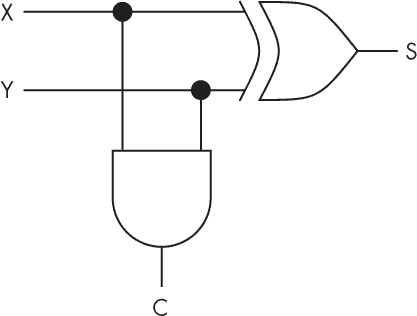

*图 6-6：半加法器*

单独使用半加法器并不非常有用，因为我们通常无法知道是否会有进位输入。然而，如果我们将两个半加法器与一个或门（OR gate）结合，如 图 6-7 所示，就能得到一个更有用的网络，称为 *全加法器*。

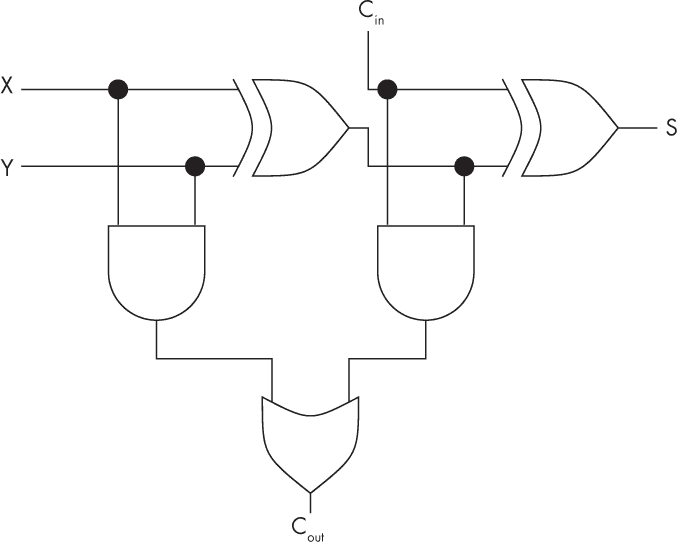

*图 6-7：由两个半加法器和一个或门组成的全加法器*

全加法器的真值表见 表 6-1。

**表 6-1：** 全加法器真值表

| **X** | **Y** | **C[in]** | **和** | **C[out]** |
| --- | --- | --- | --- | --- |
| 0 | 0 | 0 | 0 | 0 |
| 0 | 0 | 1 | 1 | 0 |
| 0 | 1 | 0 | 1 | 0 |
| 0 | 1 | 1 | 0 | 1 |
| 1 | 0 | 0 | 1 | 0 |
| 1 | 0 | 1 | 0 | 1 |
| 1 | 1 | 0 | 0 | 1 |
| 1 | 1 | 1 | 1 | 1 |

完整加法器连续执行两次单比特加法，第一次是对主输入（X 和 Y）的加法，第二次是对主输入加上进位（C[in]）的和进行加法。最终结果是一个单列的和，如下所示：

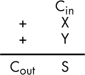

这是正确找到每一列二进制加法的二进制数字和所需的完整过程。除了加上来自两输入数字该列的两个二进制数字，它还会在有进位数字时加上传入的进位。完整加法器的两个输出是该列的和（S）和该列的进位输出（C[out]）。

完整的加法器网络通常由图 6-8 中所示的单个符号表示。

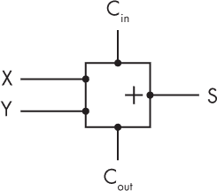

*图 6-8：加法器符号*

一个完整的加法器执行单列的加法，但要将整数加在一起，我们需要加许多列。实现这一目标的一种方法是为每一列创建一个完整的加法器，并将每列的进位输出连接到下一列的进位输入。这就是*波纹进位加法器*。 图 6-9 展示了一个 3 位的例子，计算 Z = X + Y。

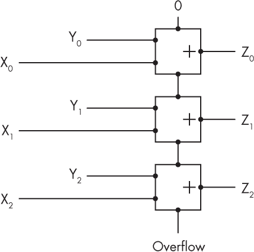

*图 6-9：一个波纹进位加法器计算 Z = X + Y 的 3 位数*

下标表示该列所代表的 2 的幂次；例如，这里 X[0]表示个位（因为 2⁰ = 1），X[1]表示十位（因为 2¹ = 2），X[2]表示百位（因为 2² = 4）。最后的进位输出还会有额外的输出，用来指示是否发生了溢出。在某些情况下，这会被解读为错误。在其他情况下，它可能会连接到其他系统，这些系统可以共同处理更大的数字。

图 6-8 中的加法器符号也可以用于表示多位加法器，例如波纹进位加法器，其中输入和输出线假定表示一组电缆，而不是单根电缆。

**波纹进位加法器与进位保存加法器的比较**

当你在学校学习加法时，你会学习到一种串行加法算法，从右边开始加，并移动到左边，同时将进位数字传递到下一步。波纹进位加法器就是这个思想在数字逻辑中的直接二进制翻译。

想一想这个过程的效率；假设两个输入都是*n*位长，我们可以看到这种加法方法会随着*n*的增加而线性扩展，随着位数的增加，加法的运行时间大约是 *O*(*n*)。

但加法不一定非得像这样进行或教导。试想一下，不是教孩子们分别将数字加起来，而是教他们从一开始就作为一个团队合作，每个人执行加法的一小部分。怎样才能让这些数字尽可能快地并行加起来？你可能会让每个孩子拿到加法中一对列数字，让他们同时进行加法运算，然后让他们将进位传递给左边的人。接着，每个人从右边接过进位，并将其加到自己的结果中进行更新（如果需要的话），有时还会更新他们的进位输出并再次传递给左边，直到每个人都满意为止。这种方式叫做*进位保存加法器*。

估算这种并行加法中需要执行的进位步骤数是相当具有挑战性的。粗略估计，大约四分之一的初始加法会产生进位。但接下来，你需要考虑在后续接收到进位时第二次或第三次进位的概率。

为了正确地进行概率估算，你应该考虑参与加法的数字分布。大多数自然量的高位数字（十进制中的 5+，二进制中的 1）的概率低于低位数字（十进制中的 4 以内，二进制中的 0）。这一现象在物理量和纯数学量中都有发现（例如普朗克常数、*π* 和 *e* 的数字），尽管其原因相当复杂。

进位保存加法器可以在 *O*(log *n*) 时间内进行加法运算。它们仍然进行与波纹进位加法器相同的 *O*(*n*) 总工作量，但通过并行处理更多的工作，使用了更多的硅片。更多的硅片需要更多的空间和成本，但在这种情况下能提供更快的性能。再一次，使用硅片换取时间是一个常见的架构难题。

进位保存加法器被广泛应用于现代算术逻辑单元（ALU）。它们并不是新发明，实际上在分析引擎设计中就有体现。这也是该机器从未被建成的主要原因之一：巴贝奇反复改进进位机制的效率，甚至到了痴迷的程度。如果他坚持某个设计，可能会完成该机器。

#### *取反器和减法器*

如果我们使用二的补码数据表示法表示整数，那么取反一个数字（即将其乘以 -1）可以通过翻转其比特位，然后加 1 来完成。执行此操作的机器称为*取反器*。图 6-10 展示了一个 3 位取反器。

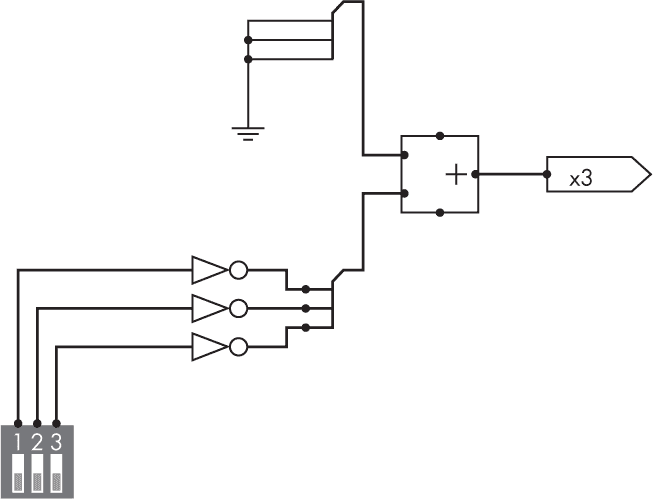

*图 6-10：3 位取反器*

该图中的粗线代表了多个单独导线的束，通常用于表示三根导线的束。 (另一种常见的表示束的符号是画一条斜线并在旁边写上导线数量。) 左下角的开关指定了输入数字，从最低有效位开始。需要加的数字通过电源和地面输入进行编码，同样从最低有效位开始。这里的加法器符号不仅表示一个全加器，还表示一个 3 位加法器，比如一个波纹进位加法器。

一旦我们有了取反器，就可以制作一个*减法器*，即从一个数字中减去另一个数字的机器。单比特和多比特减法器使用图 6-11 中的符号表示。

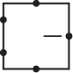

*图 6-11：减法器符号*

我们可以通过将 *b* 传递给取反器，然后使用加法器将结果加到 *a* 上来制作一个二的补码减法器，从而计算 *c* = *a* – *b*。

### 从组合逻辑到时序逻辑

到目前为止，我们看到的组合电路可以看作是瞬时计算的。每个电路都精确对应一个布尔逻辑表达式，该表达式具有一个明确的、数学上的真值，表示电路的输出。这个输出仅依赖于输入值，输入和输出的配对可以列出在真值表中。

我们已经看到，香农的组合逻辑电路可以用来构建许多简单的机器，如多路复用器和加法器。香农在 1936 年提出了他的逻辑门理论，这一年也是丘奇和图灵提出计算的定义的年份。如果你愿意将“程序”视为一组指示如何物理连接一堆逻辑门的指令，那么你也可以把香农的逻辑门视为这一年的另一个竞争性的计算模型，就像在编程虚拟机 ENIAC 之前的那种方式。

然而，丘奇计算机需要能够模拟任何其他机器（前提是有足够的内存），而我们知道一些其他机器有*内存*来存储数据。组合逻辑电路中没有内存的概念，因为内存意味着数据随时间的存储，而这些电路可以看作是瞬时作用的，因此没有时间的概念。丘奇计算机需要有时间和内存，并能够计算不仅依赖于当前输入的输出，还依赖于从先前输入中推导出的状态。

如果我们允许逻辑门网络的输出反馈到它们的输入中，我们就可以扩展香农的逻辑门，加入这些额外的概念。香农的原始组合逻辑中是不允许这样的网络的，因为它们会导致自相矛盾的布尔表达式。例如，图 6-12 中的电路似乎实例化了布尔语句 X = NOT X。这个布尔语句表示，如果 X 为真，那么 X 为假；但如果 X 为假，那么 X 为真。如果你连接这个电路，你觉得它在实践中会发生什么？也许它会振荡或爆炸？


*图 6-12：一个矛盾的电路*

在计算机科学中，反馈常常被认为是邪恶的或自相矛盾的，是需要避免的：逻辑和可计算性理论中的许多定理都在讲如何通过将程序、证明和机器的输出或它们的描述反馈到输入中来摧毁它们。但是，反馈在计算机科学中是一个重要的概念，学会控制它并将其用于正面用途，是我们成功和文化的重要组成部分。创建记忆就是反馈的一个积极且受控的应用。

让我们用吉他手的例子来说明这个概念。吉他手对反馈有一个更实际的担忧，因为他们的吉他弦可能与从放大器发出的声音产生共鸣。这些共鸣反过来又被放大，形成了恶性循环，从而发出一种可怕的（或者从音乐的角度看，可能是美妙的）单频尖叫声。考虑一下这个过程究竟在*什么时候*发生。你可以将同样的吉他放在放大器前的完全相同的位置，却依然保持系统完全安静，如果没有初始的声音的话。反馈只有在有声音—甚至是微小的声音—的情况下才会出现，启动反馈过程。因此，我们可以用这个吉他-放大器系统来存储 1 位信息。我们将吉他小心地靠近放大器，使其不发出任何声音，系统保持安静，代表 0。如果我们稍后想存储 1，我们就拨动琴弦开始反馈，反馈会永远持续下去，代表 1。要将其改回 0，我们可以将放大器关掉再打开。

图 6-13 中的电路是试图将相同的概念做成数字逻辑版本。如果我们尝试将其映射到布尔逻辑，它似乎不像图 6-12 中的电路那样矛盾，而是似乎实现了布尔表达式 Q = G OR Q。（G 代表*吉他*，Q 是传统的*静态*或系统状态符号。）你几乎可以说服自己，当 G = Q = 0 或 G = Q = 1 时，这个系统是稳定的。

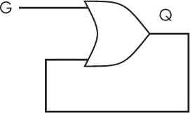

*图 6-13：类似吉他的反馈电路*

然而，这仍然没有给我们带来时间或记忆的概念，因为布尔逻辑本质上是静态的。为了完全捕捉这些概念，我们需要超越布尔逻辑和香农门，考虑一种新的逻辑门，它在不同的*时间*具有不同的状态。我们需要使用*时序逻辑*来区分不同时间的状态，例如写出*Q*[*t*] ≠ Q[*t*-1]来表示时间*t*和时间*t*之前的状态。这对布尔和香农来说是陌生的，事实上，它是他们理论的扩展。它可以用来赋予数字逻辑电路在他们的理论无法处理的意义，例如将图 6-12 映射为*X*[*t*] = NOT X[*t*-1]，并将图 6-13 映射为 Q[*t*] = G OR Q[*t*-1]。后者现在是吉他反馈记忆的准确类比，即使 G 稍后降到 0，Q 也能够保持从 G 复制的 1 值。

这仍然不是一个非常有用的记忆，因为一旦 Q 被设为高电平，就无法将其重新设置为低电平。我们需要添加一个相当于放大器电源开关 A 的部分，如图 6-14 所示。

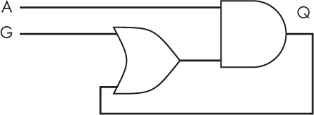

*图 6-14：类似吉他和放大器的反馈电路*

图 6-15 中的*SR 触发器*是由两个 NAND 门构成的变种，NAND 门是最常见的通用逻辑门。

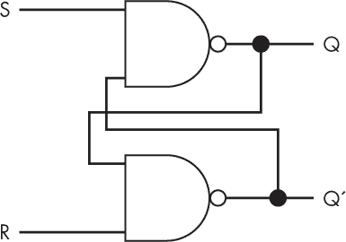

*图 6-15：SR 触发器*

S 和 R 代表*置位*和*重置*。当 S 为高电平时，它将输出 Q 设置为 1；当 R 为高电平时，它将输出 Q 重置为 0。（这也有一个优点，即可以在 Q^′输出端作为副产物获得 NOT Q，这在某些情况下很有用。）

### 时钟逻辑

如果没有一个明确定义的离散信号告诉我们何时*t*已经变为*t* + 1，顺序逻辑行为可能会变得不可预测。这可以通过时钟信号来实现，传统上称为*clk*，它在 0 和 1 之间稳定振荡，如第四章中讨论的那样。

根据传统，clk 的上升沿时刻被用作*t*增加 1 的时刻；这被称为*滴答*。我们随后设计电路的时间部分，以便在每个滴答时更新其状态。clk 的副本可以接入系统的多个点，使它们在每个滴答时同步更新。

与组合逻辑部分类似，我们现在将通过一系列时钟触发逻辑机器进行讲解。

#### *时钟触发触发器*

大多数顺序简单机器可以通过添加与时钟信号相与的门将其转换为时钟触发形式。图 6-16 展示了如何以这种方式扩展一个 SR 触发器。

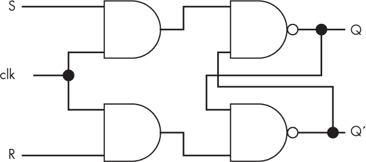

*图 6-16：时钟触发 SR 触发器*

只需要 S 或 R 中的一个高电平脉冲即可翻转存储器的状态，随后该状态将保持，直到接收到新的 S 或 R 信号。变化仅在时钟脉冲期间发生，因为时钟上的与门作用是禁用其他时间的 S 和 R 输入。

时钟触发版的简单机器通过标记为三角形的时钟输入来绘制，如图 6-17 所示。

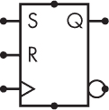

*图 6-17：时钟触发 SR 触发器符号*

SR 是最简单理解的触发器类型，因此通常用于介绍该概念，但 SR 触发器在实践中并不常用。这是因为当两个输入都为 1 时，它们会有不希望出现的未定义行为。*D 型触发器*有一个修改过的设计，解决了这个问题；它在实践中被广泛使用。与 SR 不同，它采用了基于时钟的固有方法。

D 型触发器（D 代表*数据*）只有一个数据输入和一个时钟输入。在时钟周期的某一时刻，例如上升沿，它捕获 D 输入上的数据。在其余的时钟周期中，它将在输出 Q 上输出该值。这只存储一个时钟周期的数据——如果你希望保持更长时间，你需要安排外部连接，使得 D[*t* +1] = Q[*t*]。D 型触发器的多种可能实现方式之一如图 6-18 所示。

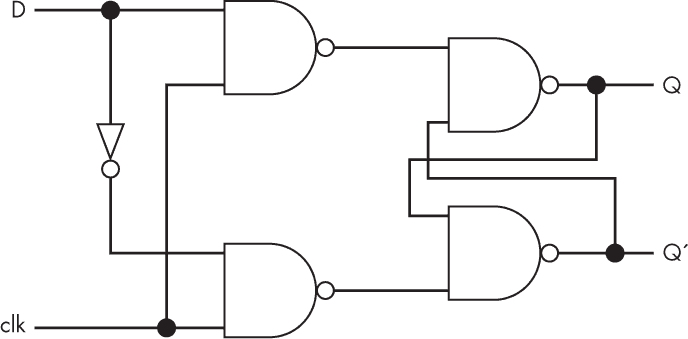

*图 6-18：D 型触发器*

标准的 D 型触发器符号如图 6-19 所示。

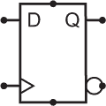

*图 6-19：D 型触发器符号*

在这里，标准的三角形符号用于时钟输入，反相输出通过圆圈表示，正如在 NAND 和 NOR 门符号中所使用的。

#### *计数器*

*计数器* 是帕斯卡计算器的数字逻辑版本。我们使用 D 型触发器来存储每列中的值，并将其输出连接到自己的数据输入（以刷新存储）以及下一个列触发器的时钟输入作为进位。这如图 Figure 6-20 所示。

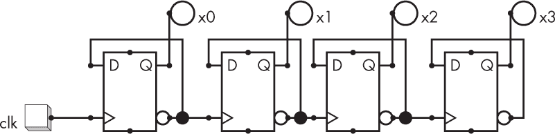

*Figure 6-20: 一个 4 位二进制计数器*

如果第一个列的输入是时钟信号，则计数器将计算已发生的时钟滴答次数。如果你从计数器的某一列取出输出线，你就得到了一个时钟分频器，它将时钟频率降低到二的幂次。这在你拥有一个快速时钟并想从中创建一个慢时钟时非常有用，例如用作较慢硬件部分的时钟。

另外，第一个列的输入可以是任何任意信号，例如来自手动控制开关的线或数字电路中的其他事件，在这种情况下，计数器将计算这些事件发生的次数。

#### *序列发生器*

*序列发生器* 是一种在特定时间触发其他设备的装置。例如，交通灯序列发生器将按照特定的、重复的顺序打开和关闭不同颜色的灯。一个序列发生器可以由计数器和解码器组成，如图 Figure 6-21 所示，它简单地使用计数器的输出作为解码器的输入。

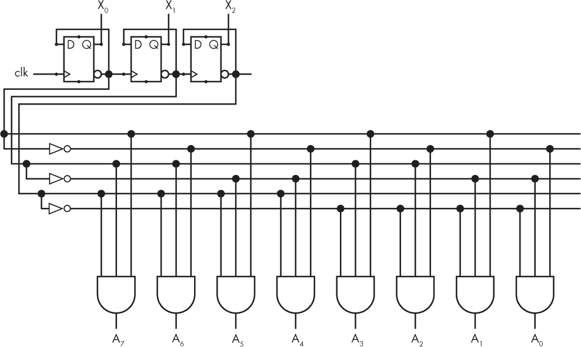

*Figure 6-21: 一个八状态序列发生器，使用 3 位计数器和解码器*

#### *随机存取存储器*

*随机存取存储器 (RAM)* 是由地址组成的存储器，每个地址包含一组数据位，称为 *字*，并且可以在相同的时间成本下读取或写入任何地址。巴贝奇的分析机具有机械式 RAM；让我们看看如何用数字逻辑构建一个简单机器来实现相同的结构。

基本的 RAM 接口有三组线。首先，*N* 个地址线传输一个二进制自然数表示，指定哪个 2^(*N*) 地址是感兴趣的。每个地址存储一个长度为 *M* 的字，因此，第二组 *M* 根数据线传输数据到 RAM 指定地址或从该地址读取数据。最后，一根单独的控制线，称为 *write*，传输一个单比特，控制指定地址是进行读取还是写入操作。

Figure 6-22 显示了一个（玩具大小的）RAM，其中 *N* = 2 且 *M* = 2。地址线标记为 A0 和 A1，数据线为 D0 和 D1。

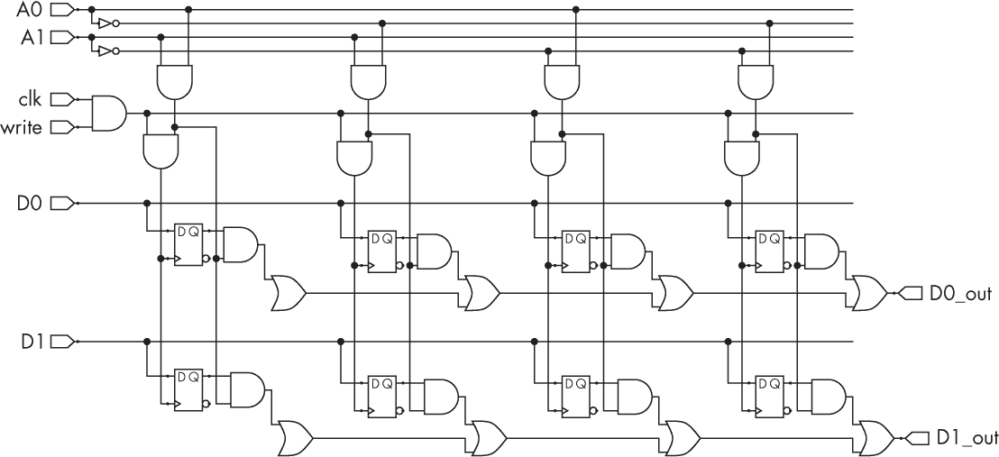

*Figure 6-22: 一个简单的 RAM，地址字通过触发器实现。这个玩具示例有一个 2 位地址空间，存储 2 位字。*

每个 2² = 4 个地址存储一个 2 位字。每个字的每个位由一个 D 型触发器存储。地址选择是通过解码器从地址线中选择的。

**硬件描述语言**

本书使用的工具主要集中在 LogiSim 和仿真上。然而，大规模架构通常是通过一系列基于文本的语言，如网表、Verilog 和 Chisel 来完成的。为了防止你在使用 LogiSim 时受限，接下来我们简要了解这些格式，以便你能够在自己的项目中探索更大、更复杂的设计。

**掩模文件**

*掩模文件*是芯片描述的最低级别，包含了组件如晶体管和导线的物理位置、大小和形状。这些文件用于制造过程中所需的掩模。

**网表文件**

*网表文件*包含了物理组件和导线之间连接的描述，但这种连接是抽象的，而非物理布局。你使用布局引擎程序来*布置和连接*这些连接——也就是将网表文件转化为掩模文件。（这是一个 NP 难度问题，因此布局程序使用复杂的启发式算法，这些算法直到最近还被视为商业机密。）

**Verilog 和 VHDL 文件**

*Verilog*和*VHDL*是基于文本的硬件描述语言，用于设计电子系统。在它们最基本的形式中，它们与 LogiSim 的功能相似，可以实例化并连接各种电子组件。但不同的是，它们使用类似软件编程语言的语法的文本文件，而不是图形界面。与像 C 这样的命令式语言不同，Verilog 和 VHDL 本质上描述的是静态对象及其之间的关系。从这个意义上说，它们的结构更像是 XML 或数据库，包含事实的列表，而不是去*做*某些事情的指令。例如，这里是一个表示全加器的 Verilog 模块：

```
module FullAdder( input io_a,
                  input io_b,
                  input io_cin,
                  output io_sum,
                  output io_cout
                );

  assign io_sum = io_a ^ io_b ^ io_cin;
  assign io_cout = io_a & io_b | io_a & io_cin | io_b & io_cin;
endmodule
```

一旦你编写了 Verilog 或 VHDL 描述，编译器会将其转化为网表。这个编译过程被称为*综合*，因为源代码中表达的逻辑是通过门电路合成的。也有软件模拟器可以用于在不实际制造硬件的情况下测试 Verilog 或 VHDL 硬件设计。

虽然仍有一些人手动编写 Verilog 或 VHDL 来设计数字逻辑，但使用更高层次的工具，如 LogiSim 或 Chisel（接下来会讨论），并将其编译成 Verilog 或 VHDL 的做法变得更加常见。Verilog 还增加了一些高级语言结构，使得一些类似 C 的命令式编程成为可能，并且可以编译成数字逻辑结构。LogiSim Evolution 能够将你的设计导出为 Verilog 或 VHDL，这样你就可以将其编译成网表并用来制造实际的芯片。

**Chisel**

*Chisel*是一种为通用架构设计使用而开发的高级硬件语言。Chisel 使用面向对象的方式描述硬件类别；例如，你可以创建一个`FullAdder`类来表示全加器的类别，该类别可以像通常的面向对象方式那样被抽象化并继承：

```
class FullAdder extends Module {
  val io = IO(new Bundle {
    val a = Input(UInt(2.W))
    val b = Input(UInt(2.W))
    val cin = Input(UInt(2.W))
    val sum = Output(UInt(2.W))
    val cout = Output(UInt(2.W))
  })
  // Generate the sum
  val a_xor_b = io.a ^ io.b
  io.sum := a_xor_b ^ io.cin
  // Generate the carry
  val a_and_b = io.a & io.b
  val b_and_cin = io.b & io.cin
  val a_and_cin = io.a & io.cin
  io.cout := a_and_b | b_and_cin | a_and_cin
}
```

Chisel 类可能有输入和输出线数的参数，例如，可以启用循环生成*N*个全加器，从而构建一个波纹加法器。

Chisel 是一种硬件语言，但它与高级的 Scala 软件语言紧密相关。Scala 又受到λ演算、函数式编程和 Java 的强烈影响；这些语言通常不与硬件设计相关联，因此引入它们使得 Chisel 能够在更高层次上运作，而不再局限于过去必须在 Verilog 中进行硬件设计的时代。在开始使用 Chisel 之前，定期学习 Scala 教程可能会对你有所帮助。

### 总结

逻辑门可以组合成网络以执行更复杂的功能。简单机器是某些著名的网络类型，通常会在架构中反复出现。组合逻辑机器——包括移位器、编码器、多路复用器和加法器——使用香农的原始理论，而不依赖于反馈或时序。当允许反馈和时钟时，还可以创建额外的顺序和时钟逻辑简单机器。这些机器能够在一段时间内保持数据存储。触发器是简单的机器，用于存储 1 位内存。它们可以作为计数器、序列器和 RAM 的子组件来使用。

现在我们已经拥有了一系列简单机器，我们可以在下一章中将它们组合起来，构建一个数字逻辑 CPU。

### 练习

#### **在 LogiSim Evolution 中构建简单机器**

在做以下练习时，请记住，你可以在 LogiSim 中创建子电路的层次结构。例如，你可能会这样做，以便将你的移位器作为一个单一组件，用于更高级别的网络。要创建子电路，点击**+**按钮。然后，为了使用这个新组件，返回到主电路并像添加其他组件一样添加它。如果你希望输入和输出在主电路的外部接口中显示，可以在子电路内使用引脚。

1.  构建本章前面显示的左移器（图 6-3）、解码器（图 6-4）和多路复用器（图 6-5）。

1.  设计并构建一个右移器、编码器和解多路复用器。这些分别执行左移器、解码器和多路复用器的逆向功能。

1.  构建并测试一个 8 位的波纹进位加法器。使用它进行减法和加法运算，采用二补码表示。

1.  构建并测试无时钟和有时钟的 SR 触发器，以及 D 型触发器。

1.  构建并测试一个计数器，使用时钟作为输入。

1.  使用 2 位计数器和解码器构建一个交通灯序列器。使用它按照英国标准顺序点亮红灯、黄灯和绿灯，顺序如下：（1）红灯（停止）；（2）红灯和黄灯一起亮（准备前行）；（3）绿灯（前行）；（4）黄灯（准备停车）。这大致就是 CPU 控制单元的工作方式。

#### **预构建的 LogiSim 模块**

LogiSim 提供了许多简单机器的预构建模块。例如，在菜单中的 Memory 下可以找到一个预构建的 RAM 模块，如 图 6-23 所示。

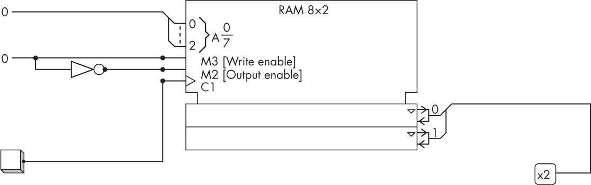

*图 6-23：一个八地址、2 位字长的 RAM*

该版本有两个控制输入，一个用于写使能，另一个用于读使能。图中使用了一个 NOT 门来从单个控制线创建这两个信号。

1.  探索 LogiSim 中的预构建模块，这些模块与您在前面的练习中实现的机器相对应。检查它们是否与您自己的实现结果相同。

1.  探索 图 6-23 中显示的 RAM 模块。使用模块选项指定 RAM 的字长和地址长度。您可以通过右键单击并选择“编辑内容”来手动编辑 RAM 的内容，使用内置的十六进制编辑器。一个分离器（在 Wiring 菜单中）用于捆绑和解捆数据和地址线组。可以使用探针或 LED 来显示输出；常数、DIP 开关或引脚可以用作输入。

#### **具有挑战性**

1.  在 LogiSim 中设计并构建一个自然数乘法器。这可以通过遵循学校里教给您的常规乘法算法来完成，不过是用二进制表示的。您可以使用移位器将其中一个输入乘以所有不同的二的幂，然后使用加法器将第二个数字中存在的幂加起来。使用与门来启用和禁用相关的幂。像在架构设计中经常发生的那样，您可以选择使用多个硅片副本来实现所需结构，或者使用一个副本加上时序逻辑来多次运行它。

1.  扩展您的乘法器，使其能够处理负整数，使用二进制补码数据表示法。

#### **更具挑战性**

在 LogiSim 中设计、构建并测试一个 8 位的进位保存加法器。与传统的波纹进位加法器相比，它效率提高了多少？

### 深入阅读

有关如何使用 LogiSim 的完整细节，包括高级功能，请参阅 George Self 的 *LogiSim Evolution Lab Manual*（2019 年 7 月），* [`www.icochise.com/docs/logisim.pdf`](https://www.icochise.com/docs/logisim.pdf) *。
