## 第九章：## **数字 CPU 设计**


我们一直在构建越来越大的数字电子计算机组件，从晶体管、逻辑门到简单的机器，如解码器和加法器。现在是时候将所有这些组件组合起来，构建数字电子 CPU 了。至少直到最近，CPU 一直是数字电子计算机的核心。

本章的目标是克服你对数字电子 CPU 的恐惧。现代 CPU 可能是人类已知的第二复杂的设备，仅次于人脑。如果你在显微镜下观察 CPU 电路，并看到所有的接线而没有事先准备好自己的思维，你很可能会崩溃。就像开车一样，你不会直接学习现代最先进的机器；你从自行车开始，然后是破旧的老车，随着你对系统的熟悉，你会逐步过渡到更强大、更现代的机器。同样，我们将在本章中使用最初和最简单的数字电子 CPU 系统作为例子：曼彻斯特婴儿。现代的 CPU 复杂得多，可能会偏离或打破这里介绍的许多设计原则，但它们仍然基于经典的理念。通过观察历史机器如婴儿是如何实现这些理念的，我们可以帮助自己理解基本概念。

我们已经了解并理解了来自巴贝奇分析机的 CPU 基本结构，因此这里我们将重点介绍相同总体设计的数字电子实现。像巴贝奇一样，我们会对曼彻斯特婴儿的实际细节和历史稍微有些松散的处理；重点是用它来体验数字 CPU 的基本特征。原始婴儿的数字电子元件是用真空管而非晶体管构建的，并且不一定使用我们今天重新实现其功能时所用的相同结构。尽管如此，我们研究过的简单机器可以用来构建婴儿的现代化实现。我们将在这里构建这样一个实现，能够运行实际程序，使用 LogiSim。但首先，我们将通过将婴儿作为用户进行编程，来了解婴儿需要具备哪些能力。

### 婴儿的程序员接口

与分析机不同，像婴儿这样的冯·诺依曼架构将指令和数据存储在相同的 RAM 空间中。一个程序因此就是一个指令列表，所有指令都会被复制到 RAM 中。每一行都有一个编号，它会被复制到该编号对应的 RAM 地址。像分析机一样，程序由二进制*机器代码*组成，对应着指令集中的一系列指令。

这是婴儿的完整指令集。我们将在接下来的章节中更详细地讨论每一条指令。

HLT 停止婴儿并点亮停止灯

LDN 加载指定地址的取反内容

STO 将最新结果存储到指定地址

SUB 从结果中减去指定地址的内容

JMP 跳转到给定地址中存储的行号

JRP 跳转到给定地址中存储的行数

SKN 比较结果：如果小于 0，则跳过下一条指令

**注意**

*Baby 的设计者们真心希望能有一种像分析引擎和大多数现代计算机中那样的常规加载指令，用于加载存储在某个地址的数据副本。但由于当时的技术限制，他们不得不将其替换为 `LDN`，即“加载取反”，在加载数据时会反转每一位。这是 Baby 的一个著名特性，使得它的编程具有独特的解决问题的风格。*

#### *停止*

`HLT` 指令使机器停止。这会阻止任何进一步指令的执行，并点亮一个灯泡，告诉用户工作已经完成，这样他们就知道何时检查结果。最简单的 Baby 程序就是这样：

```
01: HLT
```

指令左侧的行号 01 也是该指令将存储的 RAM 地址。当这个程序被加载到 Baby 的 RAM 中时，RAM 的地址 1 将包含 `HLT` 的二进制机器码。加载程序后，可以执行该程序。Baby 从地址 1 开始执行（不是从地址 0，因为程序计数器在每次取指之前都会增加 1），所以 `HLT` 指令将会执行，导致 Baby 停止运行。

#### *常量*

带有 `NUM` 的行并不是真正的指令，而是在代码首次加载到 RAM 中时，用来将 *数据* 放置到它们的地址上的。例如，考虑以下代码：

```
01: HLT
02: NUM 10
03: NUM 5
04: NUM 0
```

当这个程序加载到 RAM 中时，常量 10、5 和 0 将分别被放置到地址 2、3 和 4，而 `HLT` 指令则被放置到地址 1。

如果你实际运行这个程序，它将从第 1 行开始，执行 `HLT` 指令，并立即停止。这里的 `HLT` 指令非常重要；CPU 会按照顺序从地址 1 开始读取并执行指令，但我们放入地址 2、3 和 4 的值本意是作为数据使用，而不是指令。`HLT` 指令阻止 CPU 访问地址 2 及之后的地址，从而防止数据值被当作指令执行。

这种将程序和数据写在一起并存储在相同 RAM 中的方法，是冯·诺依曼架构的定义特征。在编程冯·诺依曼机器时，非常重要的一点是，我们只执行指令行，而不要尝试执行数据行。写出试图将数据当作程序的一部分执行的代码是一种编程错误，也就是 bug。

**注意**

*数据的执行可能会导致不可预测和危险的行为。这就是为什么它常常作为一种安全攻击技术被使用：如果你想入侵他人的程序并执行你自己的代码，有时可以通过将代码作为数据输入到该程序中，然后以某种方式欺骗程序执行它。*

#### *加载与存储*

上述代码中的常量从未进入 CPU；相反，整个代码在 CPU 启动之前通过其他机制被加载到给定的 RAM 位置中，位置是由行号指定的。为了在实际计算中使用 RAM 中的数据，我们需要执行加载和存储指令，它们将数据从 RAM 复制到 CPU，再从 CPU 复制回 RAM。

例如，以下 Baby 程序将地址 20 中的（取反后的）数字加载到 CPU，然后将其副本存储到地址 21：

```
01: LDN 20
02: STO 21
03: HLT
20: NUM -10
21: NUM 0
```

在这个例子中，数字–10 最初被放置在地址 20 处，但由于 Baby 的自动数据取反，它被加载到 CPU 时变为+10，即其逆值。然后，这个数字 10 被存储到地址 21，覆盖了最初存放在那里 的 0。请注意，可执行程序存储在地址 01 到 03 之间，并以`HLT`结束；更高的地址则用于数据存储，以避免执行数据的风险。

#### *算术*

Baby 只有一条算术指令：减法。它的工作原理类似于 Pascal 的计算器：首先使用加载指令将一个数字加载到 CPU 中，然后使用`SUB`指令将第二个数字从中减去。例如，以下程序计算 10–3=7：

```
01: LDN 20
02: SUB 21
03: STO 22
04: LDN 22
05: HLT
20: NUM -10
21: NUM 3
22: NUM 0
```

整数–10 和 3 在程序加载到内存时，分别由第 20 行和第 21 行放置到地址 20 和 21 中。第 1 行将（取反后的）整数从地址 20 加载到 CPU。第 2 行从中减去地址 21 中的整数。第 3 行将结果存储到地址 22，覆盖了最初存放在该位置的 0。

#### *跳转*

`JMP`指令使得程序执行跳转到指令中给定地址的地址所存储的数字加一的那一行。这一操作称为*间接跳转*，与*直接跳转*相对，后者会将目标地址本身编码为指令的一部分，而不是像在本例中那样，编码目标地址的*位置*。例如，考虑以下程序：

```
01: LDN 20
02: SUB 21
03: SUB 22
04: STO 20
05: JMP 23
06: HLT
20: NUM 0
21: NUM 0
22: NUM -1
23: NUM 0
```

这里，第 05 行的`JMP 23`指令会导致跳转到第 01 行，因为整数 0 存储在地址 23，而 1 是 0 之后的数字。由于`JMP`指令的存在，该程序会不断循环并永远运行下去。

#### *分支*

Baby 中的分支由`SKN`指令（跳过下一个）执行，该指令没有操作数。`SKN`会检查当前结果是否为负数。如果是，它会跳过下一条指令，继续执行其后的指令。`SKN`通常与下一条指令中的跳转（`JMP`）配合使用，创建类似于 if 语句的功能。如果结果为负数，则`SKN`会跳过下一行的`JMP`指令，程序会从下一行继续执行。如果结果为正数，则会执行跳转，程序会继续在其他地方运行。例如，考虑以下 Baby 程序：

```
01: LDN 20
02: STO 23
03: SKN
04: JMP 21
05: LDN 22
06: SUB 23
07: STO 23
08: HLT
20: NUM -10
21: NUM 6
22: NUM 0
23: NUM 0
```

这个程序计算来自地址 20 的整数输入的绝对值，并将结果存储在地址 23 中。也就是说，如果输入为-10 或 10，输出将是 10；任何负号都会被去掉。第 03 行和第 04 行是`SKN-JMP`指令对。

### 汇编器

我们所看过的宝宝程序——以及之前看到的分析机程序——是使用人类可读的 ASCII 符号编写的，这些符号拼写出了像`LDN`（表示“加载取反”）这样的助记符，并使用十进制或十六进制数字。这些符号被称为*汇编语言*，或简称*汇编*。CPU 并不理解这些符号；它们需要将这些符号转换为二进制编码，即*机器码*。

对于分析机，机器码的形式是打孔卡上的孔位，程序员需要手动将人类可读的助记符转换成这些二进制孔位，然后才能运行程序。类似地，对于冯·诺依曼架构的机器（如宝宝），程序需要先被转换成二进制机器码，然后加载到 RAM 中，CPU 才能执行它们。最初的宝宝程序员必须手动完成这些操作，使用铅笔计算机器码，然后通过一套电子开关系统将机器码复制到 RAM 中，再启动 CPU。

如果你今天正在为宝宝或任何其他计算机编写汇编程序，你不需要手动进行转换；还有其他程序，称为*汇编器*，能够自动化这个过程，将人类可读的汇编程序翻译成机器码给你。一个由 0 和 1 组成的文件，对应机器码，被称为*可执行文件*，因为它可以在复制到 RAM 后直接由 CPU 执行。对于同一目标机器，可以使用多种汇编语言。例如，它们可能使用不同的助记符来表示指令（就像本书中与其他宝宝实现相比所做的那样）。

宝宝机的机器码每条指令使用一个 32 位的字。最低的 13 位被称为*操作数*，用于编码指令使用的数值（对于不带数值的指令，这部分会被忽略）。接下来的 3 位称为*操作码*，用于编码指令类型，直接通过汇编助记符的翻译得到，如表 7-1 所示。剩下的 16 位被忽略。

**表 7-1：** 曼彻斯特宝宝操作码

| **操作码** | **助记符** |
| --- | --- |
| 0 | `JMP` |
| 1 | `JRP` |
| 2 | `LDN` |
| 3 | `STO` |
| 4 | `SUB` |
| 5 | `SUB` |
| 6 | `SKN` |
| 7 | `HLT` |

以下是一个用 Python 编写的宝宝汇编器。如果你懂 Python，你将看到如何使用字典将指令转换为操作码，以及如何对操作数进行十进制、十六进制和二进制之间的转换。

```
import re
f = open("TuringLongDivision.asm")
for_logisim = False #change to True to output hex for logisim RAM
dct_inst = dict()
dct_inst['JMP'] = 0
dct_inst['JRP'] = 1
dct_inst['LDN'] = 2
dct_inst['STO'] = 3
dct_inst['SUB'] = 4
dct_inst['SKN'] = 6
dct_inst['HLT'] = 7
loc = 0
if for_logisim:
  print("v2.0 raw")    #header for logisim RAM image format
def sext(num, width):
    if num < 0:
        return bin((1 << (width + 1)) + num)[3:]
    return bin(num)[2:].zfill(width)
def out(binary):
  if for_logisim:
    print(hex(int(binary,2))[2:].zfill(8))
  else:
    print(binary[::-1]) #Baby convention: show bit 0 on the left
for line in f:
    asm = re.split('\s*--\s*', line.strip())[0]
    parts = asm.split()
    thisloc = int(parts[0][:-1])
    if parts[1] == 'NUM':      #data line
        code2 = sext(int(parts[2], 10), 32)
    else:                      #instruction line
        inst2 = bin(dct_inst[parts[1]]).zfill(3)[2:]
        if len(parts) < 3:
            parts.append('0')
        operand2 = sext(int(parts[2], 10), 13)
        code2 = (inst2 + operand2).zfill(32)
    for addr in range(loc, thisloc):
      out('0'.zfill(32)) #fill in zeros where lines not given
    out(code2)
    loc = thisloc + 1
```

以下是阿兰·图灵在曼彻斯特测试和记录宝宝时编写的长除法宝宝程序：

```
00: NUM 19   -- jump address
01: LDN 31   -- Accumulator := -A
02: STO 31   -- Store as -A
03: LDN 31   -- Accumulator := -(-A) i.e., +A
04: SUB 30   -- Subtract B*2^n ; Accumulator = A - B*2^n
05: SKN      -- Skip if (A-B*2^n) is Negative
06: JMP 0    --   otherwise go to line 20 ( A-B*2^n >= 0 )
07: LDN 31   -- Accumulator := -(-A)
08: STO 31   -- Store as +A
09: LDN 28   -- Accumulator := -Quotient
10: SUB 28   -- Accumulator := -Quotient - Quotient (up-shift)
11: STO 28   -- Store -2*Quotient as Quotient (up-shifted)
12: LDN 31   -- Accumulator := -A
13: SUB 31   -- Accumulator := -A-A (up-shift A)
14: STO 31   -- Store -2*A (up-shifted A)
15: LDN 28   -- Accumulator := -Quotient
16: STO 28   -- Store as +Quotient (restore shifted Quotient)
17: SKN      -- Skip if MSB of Quotient is 1 (at end)
18: JMP 26   --   otherwise go to line 3 (repeat)
19: HLT      -- Stop ; Quotient in line 28
20: STO 31   -- From line 6 - Store A-B*2^n as A
21: LDN 29   -- Routine to set bit d of Quotient
22: SUB 28   --   and up-shift
23: SUB 28   --   Quotient
24: STO 28   -- Store -(2*Quotient)-1 as Quotient
25: JMP 27   -- Go to line 12
26: NUM 2    -- jump address
27: NUM 11   -- jump address
28: NUM 0    -- (Answer appears here, shifted up by d bits)
29: NUM 536870912 -- 2^d where d=31-n, see line 30 for n
30: NUM 20   -- B (Divisor*2^n) (example: 5*2²=20)
31: NUM 36   -- A (initial Dividend) (example: 36/5=7)
```

以下是图灵程序的机器码，由 Python 汇编器生成：

```
11001000000000000000000000000000
11111000000000100000000000000000
11111000000001100000000000000000
11111000000000100000000000000000
01111000000000010000000000000000
00000000000000110000000000000000
00000000000000000000000000000000
11111000000000100000000000000000
11111000000001100000000000000000
00111000000000100000000000000000
00111000000000010000000000000000
00111000000001100000000000000000
11111000000000100000000000000000
11111000000000010000000000000000
11111000000001100000000000000000
00111000000000100000000000000000
00111000000001100000000000000000
00000000000000110000000000000000
01011000000000000000000000000000
00000000000001110000000000000000
11111000000001100000000000000000
10111000000000100000000000000000
00111000000000010000000000000000
00111000000000010000000000000000
00111000000001100000000000000000
11011000000000000000000000000000
01000000000000000000000000000000
11010000000000000000000000000000
00000000000000000000000000000000
00000000000000000000000000000100
00101000000000000000000000000000
00100100000000000000000000000000
```

在这个二进制机器码的显示中，位的位置是按从左到右的顺序打印的第零位（与现代惯例相反），所以操作码出现在每个字的中间偏左的三个位中，操作数在它们的左侧。这是历史上 Baby 使用的格式，因此我们可以使用这种约定输入机器码。

测试程序和机器码各有 32 行，这样它们恰好并且明确地填充了 Baby 的 32 个内存地址。程序员需要将某些内容放入所有 32 个地址，因此未使用的地址需要显式填充为零。请注意，行号并未编码在机器码中；而是指定机器码将放置在哪个地址。另外，请注意，数据行被转换为单个 32 位数字，因为 `NUM` 不是指令，而只是一个注释，告诉汇编器该行包含原始数据。Baby 使用补码表示，因此像 `ffff0000` 这样的十六进制值表示负整数。

**注意**

*直到 1990 年代中期，许多大型应用程序和游戏是由人工程序员使用汇编语言编写的，包括* 街头霸王 II *和 RISC OS 操作系统。大多数现代编程不再使用汇编语言，而是使用像 C、C++ 或 Python 这样的高级语言编写。用这些语言编写的程序首先通过编译器转换为汇编代码，然后由汇编器汇编。*

### Baby 的内部结构

现在我们将讨论 Baby 的内部结构。与分析引擎一样，我们首先介绍数字 CPU 中的子组件，然后考虑它们如何相互作用以执行程序。主要的数字 CPU 子结构与分析引擎完全相同：寄存器、算术逻辑单元（ALU）和控制单元（CU）。它们在功能上与分析引擎中的相同，但它们是由我们在上一章学习的数字逻辑简单机器构建的，而不是由巴贝奇的机械简单机器构建的。

我们在这里不会完全按照原始曼彻斯特 Baby 的实现方式进行，而是展示可以用于更现代风格实现 Baby 程序员接口的通用数字逻辑实现。这些实现由数字逻辑的简单机器构建，而这些简单机器又是由逻辑门构建的，后者可以使用现代晶体管或 Baby 原始的真空管同样很好地实现。

#### *寄存器*

寄存器是快速的字长内存，通常今天由 D 型触发器阵列组成，位于 CPU 内部，控制单元（CU）和算术逻辑单元（ALU）可以读取和写入它们。大多数 CPU 包含几种不同类型的寄存器，用于不同的目的。

CPU 中寄存器的大小通常用来定义 CPU 的字长；例如，8 位机器使用 8 位字，它们存储在 8 位寄存器中，而 32 位机器使用 32 位字，它们存储在 32 位寄存器中。从这个角度看，Baby 是一台 32 位机器。字使用在 第二章 中看到的数据表示方法，需要一个比特数组来存储数字、文本和其他数据。

就像组成寄存器的各个触发器一样，寄存器必须同步时序，以确保读写的正确同步。一个更新信号可以发送到构成寄存器的所有触发器的时钟输入。通常对寄存器的写入是在该信号的上升沿进行的。每个寄存器还会持续输出其最新存储的值，供读取，作为一组并行电线，无论是否有更新。寄存器结构如 图 7-1 所示。写入操作是在按下按钮时触发的。

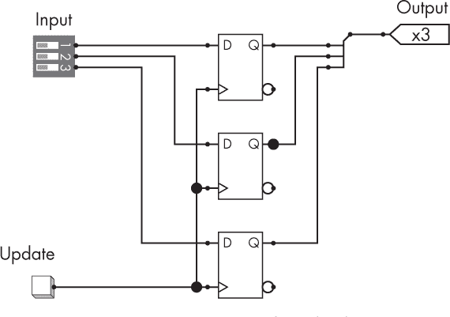

*图 7-1：由触发器组成的 3 位寄存器*

寄存器也可以使用单个符号表示，暗示由触发器堆叠而成，如 图 7-2 所示。

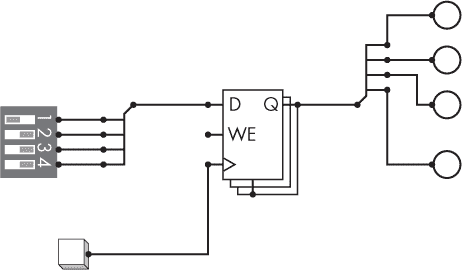

*图 7-2：作为单个符号的 4 位寄存器，连接到输入开关、写入更新按钮和输出 LED*

在这里，D 输入和 Q 输出是各自的一组电线，显示为粗线条，然后分成单根电线。

#### **用户寄存器**

*用户寄存器* 通常是汇编语言程序员可以看到的唯一寄存器，他们可以向其内容发出指令。

*累加器* 是一个既作为输入又用于存储计算结果的用户寄存器。如我们所见，Pascal 的计算器就是一个大型累加器，因为它既存储加法的输入之一，也存储其结果，在此过程中销毁输入的原始表示。你的桌面计算器也是一个累加器：它只存储一个数字，即当前显示在屏幕上的结果，你可以将其加上或乘以，并更新存储结果。例如，如果你输入 2，它会被存储在累加器中。如果你再输入 +3，累加器会存储并显示结果 5。原始值 2 和操作 +3 会丢失，只有累加的结果可用。

*累加器架构* 是指只有一个用户寄存器作为累加器的架构。Baby 就使用这种简单的架构风格。这迫使所有计算都必须在累加器样式中进行，因为没有其他寄存器来将输入与输出分开。相反，更复杂的 CPU 可能除了累加器外，还会有其他用户寄存器。

#### **内部寄存器**

除了用户寄存器外，大多数 CPU 还需要一些额外的寄存器来执行内部操作。这些 *内部寄存器* 可能对用户不可见，因此你无法编写访问或修改它们的汇编程序。相反，它们用于使 CPU 本身工作，并使其能够读取和执行用户程序。让我们来看一下两个最重要的内部寄存器。  

CPU 需要跟踪它当前在程序执行中的位置。在分析引擎中，程序的当前行通过机械的程序卡片读取器状态来存储。就像打字机纸一样，程序通过机械方式快进和倒带，以便将当前行定位到读取器上。在电子 CPU 中，没有机械移动的状态，因此我们必须通过将当前行号存储在一个寄存器中来跟踪程序的位置，这个寄存器被称为 *程序计数器*（在本章的列表中为 *PC*）。正如我们所见，冯·诺依曼架构——例如 Baby 计算机和大多数现代计算机——将程序存储在主存储器中，连同其他数据一起存储，因此这些“行号”实际上是存储程序指令的内存地址。  

*指令寄存器（IR）* 存储当前指令的副本，该副本是从其地址（如程序计数器中保存的地址）在内存中复制过来的。  

#### *算术逻辑单元*  

就像分析引擎的 ALU 一样，基于数字逻辑的 ALU 由一组简单的机器组成，每个机器执行一种算术操作。由于硬件上的一个特殊情况，原始的 Baby 计算机只有一个减法器，但在这里我们将构建一个更通用且强大的 ALU，其中还包括加法、乘法和除法。 图 7-3 展示了一个具有这些操作的 32 位 ALU。  

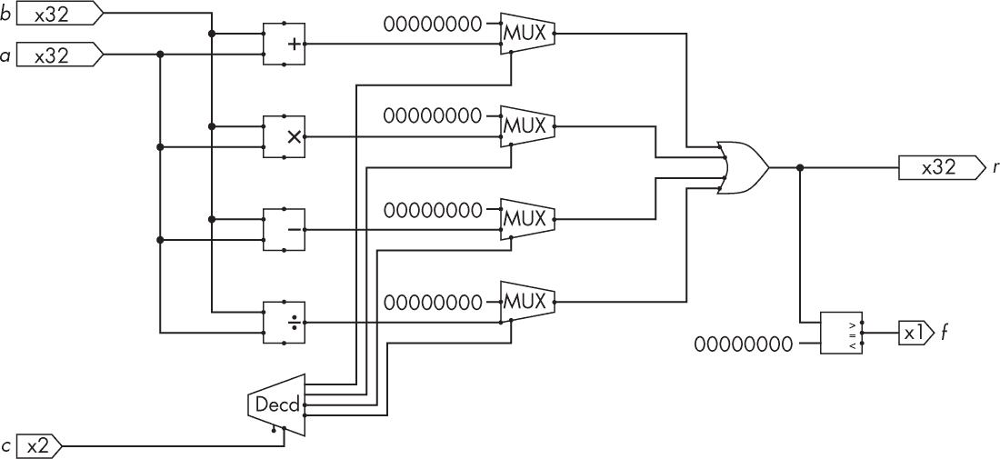  

*图 7-3：一个 32 位的四操作 ALU*  

这里有两个数据输入，*a* 和 *b*，每个输入都包含一个 32 位的二进制补码整数。它们都被发送到四个简单的算术机器——减法器、加法器、乘法器和除法器，每个机器都计算一个输出。然后只选择其中一个输出并将其传递到 ALU 的输出 *r*。要选择你想要执行的算术操作，将其 2 位代码放置在 *c* 输入上。解码器随后激活四个 32 位多路复用器中的一个，使得所需操作的输出可以传递到 32 位的 OR 门阵列中。最终输出从 OR 门阵列传递到 *比较器*，后者测试该数字是否为零，并输出一个带有该布尔值的单一状态标志。

比较器可以通过将数字中的所有位使用 NOR 门连接在一起来简单地实现。更先进的 ALU 通常会测试结果的其他有趣属性，比如是否为正数或负数，是否发生了溢出（可以在简单机器的进位线中看到），或者是否发生了除零错误；然后它们会输出一组标志，而不仅仅是零测试。  

请注意，我们可以通过使用一个具有 2 比特输入的单一多路复用器直接在四个算术机器之间进行选择，从而减少硅的使用。通过在操作之间共享结构，可以减少数字逻辑的重复——例如，使用二补码使得加法器可以作为减法器重复使用。你可能还会担心在每组输入上运行所有算术选项并丢弃所有结果，除了一个结果之外，造成的能量浪费。你可以通过重新设计网络来减少这种能量消耗。然而，我选择了当前的结构是出于教育目的，因为它将帮助你在下一节中更容易理解控制单元。

#### *控制单元*

数字逻辑控制单元（CU）实现了与巴贝奇计时桶相同的概念，像指挥家一样在正确的时间触发所有其他 CPU 组件。实现这一功能的方法有很多种，因此控制单元的设计比寄存器和 ALU 更加多样化。它们通常被认为是 CPU 设计中最难且最核心的部分。为了易于理解，我们在这里选择一种特定风格，而非为了计算或能效。

这种风格基于两个结构：首先是一个计数器，像巴贝奇的计数桶一样定期旋转，其值用于定时所需的事件；其次是一个开关机制，用于确定触发事件的类型，并根据需要在组件之间建立临时连接——例如寄存器、算术逻辑单元（ALU）和随机存取存储器（RAM）。在巴贝奇的机器中，这些连接是通过机械杠杆来实现的。对于我们的数字逻辑版本，我们将使用多路复用器，就像在 ALU 中那样。这些多路复用器有两个数据输入，每个输入的字长为 32 位（对于 Baby 计算机而言）。其中一个接地为零，另一个来自临时输入源。它们有一个单比特开关，用于在将临时输入传送到输出和将全零传送到输出之间进行切换。图 7-4 展示了这一工作原理。

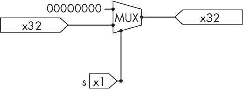

*图 7-4：用于启用或禁用 32 根电缆连接的多路复用器*

如同在 ALU 中，多个源可能连接到同一个目标，它们每个都会有自己的多路复用器。然后，使用一个或门（OR）阵列将这些多路复用器的输出组合起来，允许非零输出通过。

我们将创建一个组件之间的临时连接序列。其中一些连接仅通过计数器上显示的时间来触发。这可以通过解码器来实现，解码器将时间作为输入，并激活一个特定的触发线作为输出。其他连接需要通过时间与其他值的组合来触发，例如当前指令的标识。这些可以通过将适当的触发线与代表其他所需条件的信号进行与门（AND）连接来实现。图 7-5 展示了这种结构的一个示例。


*图 7-5：基于 3 位计数器、解码器和多路复用器开关的最简 CU*

左侧的 3 位计数器和解码器构成了序列发生器。使用 3 位可以给我们 2³ = 8 个时间段，从 0 到 7，每个 7 后循环回 0。图中只显示了在 0、1 和 7 时刻的触发信号。在时刻 0 和 1 的触发信号（来自解码器的上两个输出）仅依赖于时间，并在 32 位电缆组之间建立连接。在时刻 7，有两个可能的触发信号，分别依赖于条件 cond1 和 cond2 是否满足，这些条件由图左下角的两个开关表示。请注意，这些条件（因此触发信号）可能处于激活、未激活或同时激活的状态。这里的 OR 符号代表 32 个 OR 门的阵列。它允许将两个不同的输入连接到不同触发信号上的同一共享输出（SO）。(图中省略了时刻 2 到 6 的触发信号，但你可以想象从解码器出来的电缆连接到类似的触发信号。)

现在我们在此引入一些额外的符号，以帮助使我们的图示更易读。图 7-6 显示了完全相同的最简 CU，但引入了*隧道*，这些隧道是命名的点（t0 到 t7 和 c0 到 c1），取代了电缆。所有具有相同名称的隧道被假定是相互连接的。例如，从解码器出来的 t0 隧道连接到图中右上角靠近多路复用器的 t0 隧道。

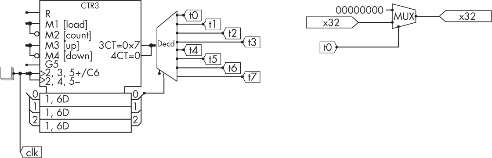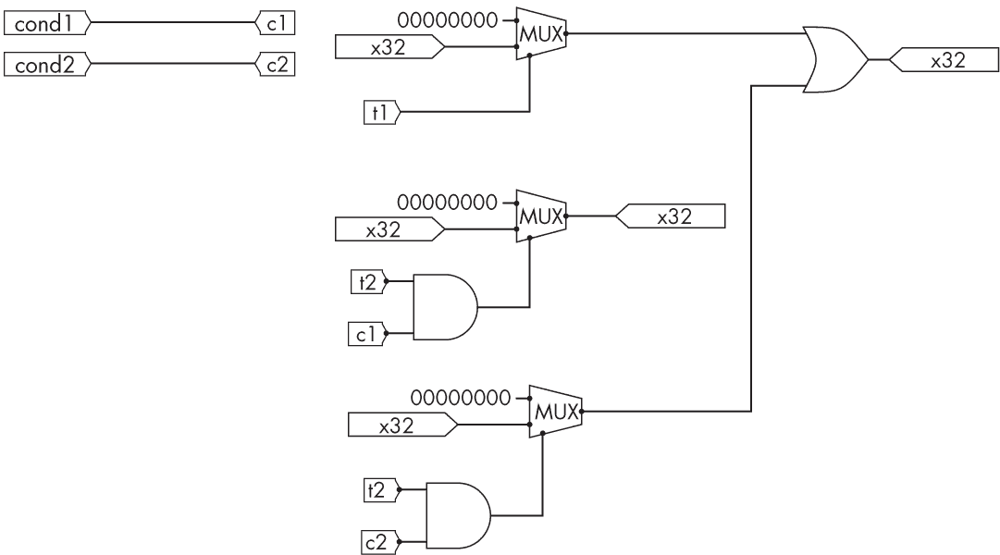

*图 7-6：与图 7-5 相同的最简 CU，使用隧道符号重新绘制*

这种隧道符号避免了绘制复杂的电缆图，避免了 CU 在整个 CPU 中发送触发信号所形成的“鼠巢”电线。我们还将 3 位计数器封装成了一个单独的模块 CTR3，这是 LogiSim 现成提供的。（这个模块有一些额外的输入和功能，在这里我们没有使用。）

### 将所有内容结合起来

现在我们已经看到了 Baby 实现的每个基本组成部分，让我们将它们全部结合起来——并适当安排 CU 的动态——来构建一个完整的、功能齐全的 Baby。我们将依次考虑操作的三个主要阶段——取指、解码和执行，就像我们在第三章讨论分析引擎时所做的那样。

#### *取指*

取指阶段的目的是将下一条指令的副本从 RAM 带入 CPU 的 IR。取指假设下一条指令的地址已经在程序计数器中。当 CPU 首次开启时，程序计数器——像所有寄存器一样——初始化为 0，但立即递增到 1，因此第一条指令必须存储在地址 1，并会被取出。

为了执行取指操作，程序计数器在第 1 个时钟周期暂时连接到 RAM 的地址线。RAM 的数据输出线可以永久连接到 IR 的数据输入，但只有在写使能且在第 2 个时钟周期时，IR 才会从这些线复制字数据。图 7-7 中的网络设置为执行 Baby 的 32×32 RAM 的取指操作（32 = 2⁵个地址，每个地址包含一个 32 位字），通过在其八个计数周期的第 1 和第 2 个时钟周期建立这些连接，并在其他步骤中断开连接。在我们的 Baby 中，程序计数器是一个 5 位寄存器，IR 是一个 32 位寄存器。

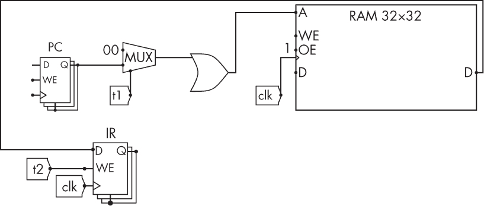

*图 7-7：取指操作，在第 1 和第 2 个时钟周期触发*

我们可以将取指序列写成：

```
t1: RAM_A <- PC
t2: IR <- RAM_Dout
```

这种符号风格是一种*寄存器传输语言（RTL）*。每行冒号前的符号是触发器，在本例中是第 1 和第 2 个时钟周期。箭头表示当触发器处于活动状态时，从源到目的地的临时连接被建立。因此，箭头对应于我们实现风格中使用的多路复用器，而触发器对应于这些多路复用器的切换输入。

**注意**

*RTL 不是汇编语言或机器码。它是 CPU 工作方式的低级描述，其功能最终是执行由用户编写并存储在 RAM 中的机器码程序。*

#### *解码*

我们现在有了下一条指令的副本，它存储在 IR 中。它由一组机器码组成，其中一些位指定了操作码，其他位可能包含一个、零个或多个操作数。在 Baby 中，第 13 至 15 位是操作码，第 0 至 12 位是某些指令的单一操作数，剩下的 16 位未被使用。现在需要对这种编码进行解码。我们需要将操作码和操作数分开，然后将操作码转换为激活信号。图 7-8 展示了我们的实现。

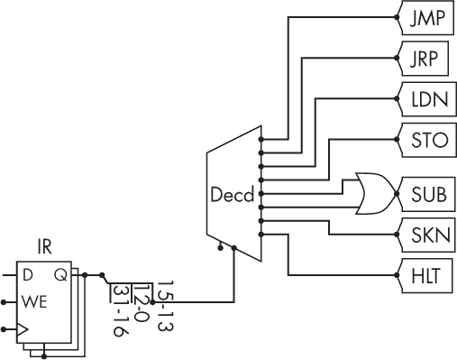

*图 7-8：解码操作，在第 2 个时钟周期触发*

IR 输出首先被分为三组线，分别对应前 13 位、接下来的 3 位和剩余的 16 位。中间的 3 位包含操作码，它们连接到一个 3 位解码器。解码器激活其 2³ = 8 个输出线之一，这些输出线连接到一个隧道，并将作为触发其他步骤中的多路复用器的条件。这些隧道被命名为它们对应的汇编语言助记符。IR 的 13 个操作数字段进一步分为 5 个低位，用于地址选择，并将在稍后连接相应的线路，以及 8 个高位，这些高位没有地址用途，因此会被忽略。

这里没有使用顺序逻辑，因此一旦 IR 内容在第 2 个时钟周期更新，解码过程几乎是瞬间完成的。

#### *执行*

与获取和解码不同，执行阶段发生的事情取决于已获取和解码的指令。不同的指令指定不同结构的激活，这些结构执行不同的操作：加载、存储、算术操作和程序流程控制。我们将依次查看如何执行这些可能的操作。

#### **加载**

要执行加载操作，我们在第 3 时钟周期临时将操作数连接到 RAM 的地址输入，然后在第 4 时钟周期将 RAM 的数据输出临时连接到累加器（Acc）。这些时钟周期被选择在前一个获取和解码操作之后。我们可以将其写成 RTL 风格如下：

```
t3, LDN: RAM_A <- IR[operand]
t4, LDN: Acc <- -RAM_Dout
```

请注意，冒号前的触发条件现在包括时钟周期和 `LDN` 条件。在 `IR[operand]` 中的方括号表示只使用 IR 的操作数字段，而不是整个寄存器内容。

图 7-9 显示了我们 Baby 实现的加载数字逻辑。（由于 Baby 的加载操作还会对加载的值进行取反，因此我们将 RAM 数据通过一个取反器传送到累加器。这在现代计算机中通常不会这样做。）

在像 Baby 这样的累加器架构中，加载操作总是将数据从 RAM 放入累加器寄存器。在具有更多用户寄存器的更复杂架构中，需要一个额外的操作数来指定目标寄存器，并且需要更多的数字逻辑来将正确的寄存器连接到数据线。

#### **存储**

将值从 CPU 存储到内存的过程与加载相似，但相反。在 Baby 中，要存储的值始终来自累加器。

在第 3 个时钟周期，我们临时将 STO 指令的操作数（存储地址）连接到 RAM 的地址线。累加器的输出可以永久连接到 RAM 数据输入，但仅在第 3 个时钟周期时启用写入。该 RTL 为：

```
t3, STO: RAM_A <- IR[operand]
t3, STO: RAM_Din <- Acc
```

图 7-10 显示了实现这一操作的 Baby 数字逻辑。

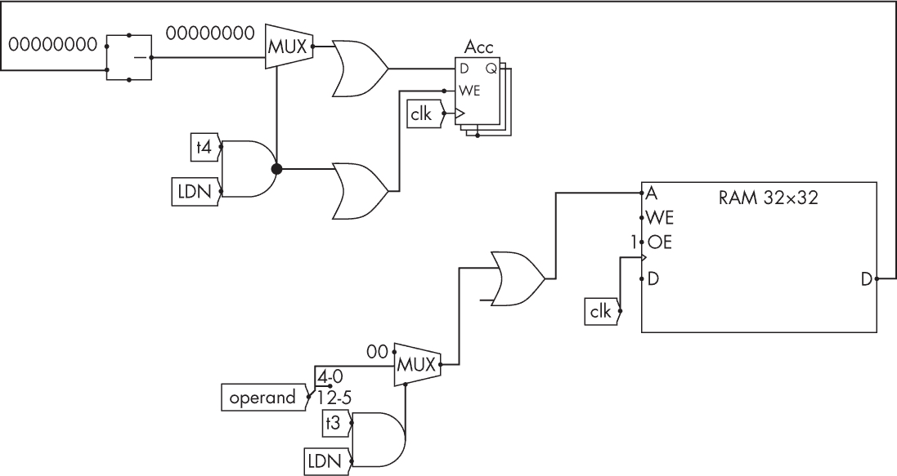

*图 7-9：执行加载操作，在第 3 和第 4 时钟周期触发*

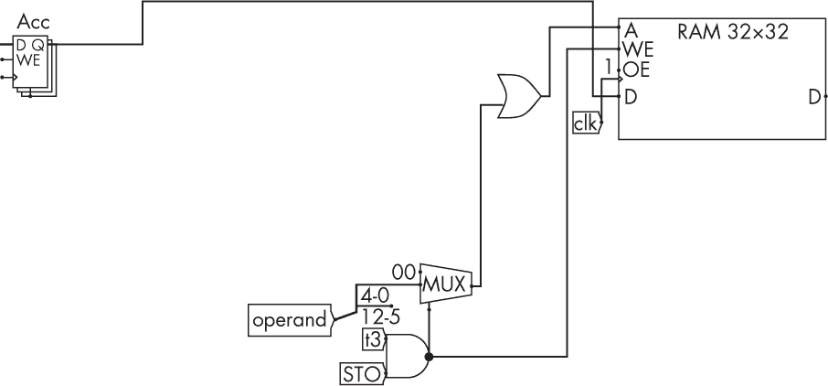

*图 7-10：执行存储操作，在第 3 时钟周期触发*

在具有更多用户寄存器的架构中，可以使用另一个操作数来指定要存储的寄存器内容，然后需要更多的切换逻辑来将正确的寄存器连接到数据线。

#### **算术**

要执行 ALU 操作，CU 会临时连接 CPU 寄存器到 ALU 的输入，并创建并发送 ALU 命令到 ALU 的命令输入。ALU 的输出会临时连接到目标寄存器。

Baby 的算术逻辑单元（ALU）特别简单，因为它只包含一个减法器。`SUB` 指令触发从 RAM 读取数据，类似于加载指令，但 RAM 数据被发送到减法器，而不是累加器。减法器将其另一个输入来自累加器，并将输出写回累加器。

图 7-11 展示了我们的 Baby ALU 实现。RAM 读取在第 3 个时钟周期触发，累加器更新在第 4 个时钟周期触发。减法器位于图的最左侧。


*图 7-11：执行 ALU 操作，在第 3 和第 4 时钟周期触发*

这也可以用 RTL 描述为：

```
t3, SUB: RAM_A <- IR[operand]
t4, SUB: Acc <- Acc - RAM_Dout
```

更复杂的架构，拥有比减法更多的算术操作，会将它们打包成一个单一的 ALU 结构，通过选择线来指定激活哪个操作，就像在图 7-3 中看到的那样。解码器随后需要识别多个不同的算术操作码，并通过某些逻辑将每个操作路由到对应的选择逻辑。

#### **流程控制**

在每条指令开始时，Baby 会移动到程序的下一个地址（行）。这可以通过在第 0 个时钟周期将程序计数器加 1 来实现。

如果当前指令是流程控制指令——即跳转或分支——则其执行步骤也需要更新程序计数器，以便为下一条指令做好准备。

现代（直接）跳转指令的操作数中包含跳转到的行号，因此它们可以通过将操作数直接复制到程序计数器来实现。然而，正如我们所看到的，Baby 使用了间接跳转指令`JMP`，其中操作数包含一个*地址*，该地址进一步包含实际的跳转目标。为了实现这种间接跳转，我们首先在第 4 个时钟周期将操作数附加到 RAM 地址线，然后在第 5 个时钟周期将 RAM 数据线连接到程序计数器。

Baby 还有一个相对跳转`JRP`，其工作方式类似于`JMP`，只不过操作数中的地址包含了一个表示程序计数器应该前进多少行的数字，而不是一个绝对地址。

对于分支指令`SKN`，我们检查其条件，如果为假，则按常规行为执行；如果为真，则额外增加一次程序计数器，以跳过一行代码。（通常跳过的代码行是由程序员选择的，通常是跳转到程序的其他部分。）为了实现这一点，我们将累加器的输出发送到一个比较器，该比较器测试累加器是否小于零。该条件的真假随后（借助布尔代数）作为整数 0 或 1 使用，在分支指令激活时，在第 5 个时钟周期加到程序计数器上。

如果当前指令不是控制流指令（即它是`SUB`、`LDN`或`STO`），则程序计数器不会再发生任何变化。这通过在第 5 个时钟周期将程序计数器的输出直接连接到其输入来实现。

图 7-12 展示了我们 Baby 实现的流程控制。用 RTL 表示法，这对应于：

```
t0: PC <- PC + 1
t4, JMP: RAM_A <- IR[operand]
t4, JRP: RAM_A <- IR[operand]
t5, SKN, (Acc<0): PC <- PC + 1
t5, JMP: PC <- RAM_Dout
t5, JRP: PC <- PC + RAM_Dout
```

一旦程序计数器通过上述任一方式更新，取指-解码-执行周期就完成了，一切准备就绪，下一周期可以开始。

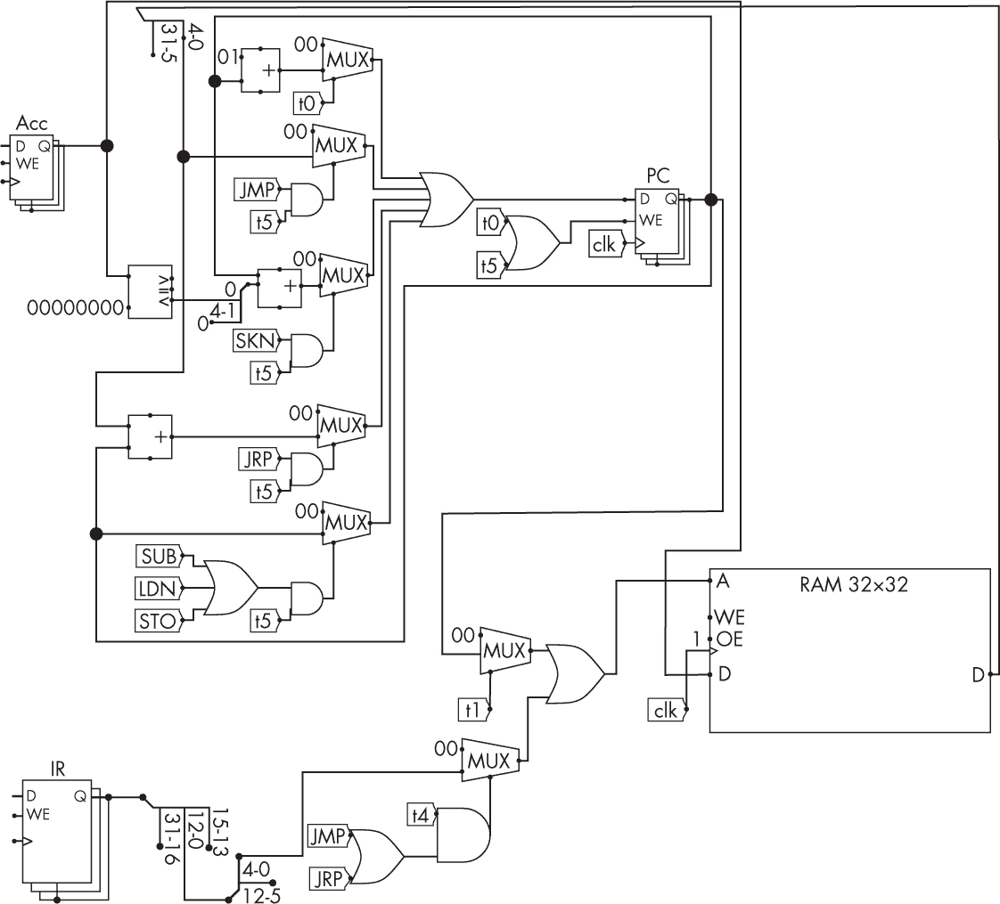

*图 7-12：程序流程控制，触发时刻为 0、4 和 5*

#### *完整的 Baby 实现*

图 7-13 显示了我们完整的、可工作的 Baby CPU，所有上述系统都一同展示。在左下角，它增加了一个寄存器和灯，当 halt 指令被执行时，它们会被激活，防止任何进一步的执行。如果你厌倦了手动触发时钟，它还增加了一个开关，将时钟信号连接到振荡器。

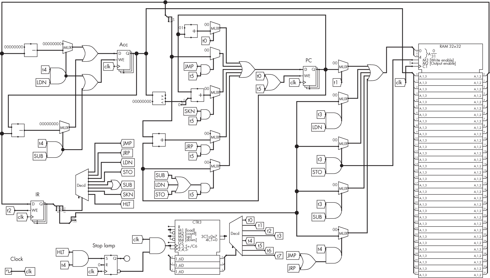

*图 7-13：一个完整、可工作的 Baby 实现，包括序列发生器、取指、解码、执行和控制流逻辑。现在 RAM 内容已完整显示。*

```
t0: PC <- PC + 1
t1: RAM_A <- PC
t2: IR <- RAM_Dout
t3, LDN: RAM_A <- IR[operand]
t3, STO: RAM_A <- IR[operand]
t3, STO: RAM_Din <- Acc
t3, SUB: RAM_A <- IR[operand]
t4, SUB: Acc <- Acc - RAM_Dout
t4, LDN: Acc <- -RAM_Dout
t4, JMP: RAM_A <- IR[operand]
t4, JRP: RAM_A <- IR[operand]
t5, SKN, (Acc<0): PC <- PC + 1
t5, JMP: PC <- RAM_Dout
t5, JRP: PC <- PC + RAM_Dout
```

我们现在已经拥有了一台完整的数字逻辑计算机，能够在 RAM 中执行机器码程序。

### 小结

数字逻辑 CPU 的目的是执行机器码程序，这些程序可以通过人类可读的汇编语言进行组装。这些程序需要在 CPU 开始工作之前被加载到内存中。它们由一系列指令组成，这些指令依次被读取到 CPU 并执行。

CPU 最初可能会让那些试图理解它的人感到害怕。即使像我们的 Baby 这样的最小示例也可能需要成千上万的晶体管；现代的 CPU 芯片则可以包含数十亿个晶体管。但你在本章中已经看到，如果从层次化的角度思考，就不会觉得基本结构那么复杂，像一个建筑师那样思考。从这个角度来看，你已经学会了如何构建多种执行基本任务的简单机器；然后一个基础的 CPU 只是将少数这些简单机器连接起来。

控制单元（CU）可以由一个序列发生器构成，它触发取指、解码和执行阶段。执行阶段是最难实现的，因为它涉及根据解码的指令执行不同的操作。因此，执行阶段的子步骤需要一些额外的逻辑来激活不同的选项。

本章大致展示了曼彻斯特 Baby 是如何被构建的，并且它是如何被拼装的。我们所构建的架构仍然构成了许多现代 CPU 的基本计划。然而，摩尔定律的压力使得这一计划变得更加复杂。它们阻止了现代机器仅仅通过提高时钟速度来提升性能，但却允许它们使用更多的晶体管。在下一章中，你将看到现代 CPU 如何利用这些额外的晶体管进行更复杂的应用。

### 练习

#### **构建一个 Baby**

1.  在 LogiSim Evolution 中构建 图 7-13 中的 Baby 设计。

1.  一旦你开始在这种复杂度的顺序逻辑层面上工作，很容易且常见会在触发定时上产生硬件错误。硬件架构师通常会花费大量时间调试定时问题。硬件调试器的对应工具是*时序图*（图 7-14），它绘制了系统中几条电线随时间变化的状态。LogiSim Evolution 有一个内建的工具来生成这些时序图（**模拟 ▸ 时序图**）。了解如何使用它来测试 Baby 中的一些顺序子电路。回想一下，顺序逻辑——RAM 和寄存器的写使能，RAM 读取地址——通常在时钟信号从 0 上升到 1 的*瞬间*触发，而组合逻辑则始终处于活动状态。也有硬件逻辑分析仪可以捕捉并显示来自面包板的类似数据，无论是独立使用还是将数据发送到你的 PC 进行分析。

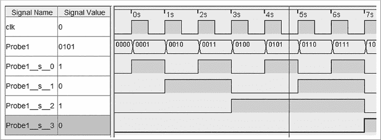

*图 7-14：LogiSim 时序图*

#### **编程 Baby 计算机**

1.  汇编本章讨论的测试程序——包括图灵的除法程序——并在 LogiSim Baby 中运行它们。使用提供的 Python 汇编器，确保第 3 行的 `for_logisim` 标志设置为 True。将输出保存在文本文件中，并通过右键点击 RAM 选择 **加载映像** 将其作为 RAM 映像加载到 LogiSim 中。你可以通过点击时钟手动步进 CPU 循环，或者通过在菜单栏中选择 **模拟 ▸ 自动步进** 来设置时钟自动跳动。图灵的程序将 36 除以 5，结果是 7（111[2]），并将其存储——用零填充——在地址 28，所以它显示为 E000000[16]。尝试编辑第 29 到 31 行执行不同的除法操作。

1.  你能解释一下图灵的代码是如何工作的？记住，Baby 计算机有两个主要特点：加载时会否定值，并且它只有一个减法器，而不是加法器。这些特点导致了一些编程习惯。

#### **具有挑战性**

我们在 CPU 设计中使用了多个层次的符号抽象：将晶体管、门电路和简单的机器打包成盒子。估算一下在我们的最终设计中使用了多少逻辑门，再估算一下使用了多少晶体管。这些晶体管的数量与第一章中实际历史设计使用的数量相比如何？如果我们更倾向于使用较少硅片而非容易理解的教育性设计，如何减少这些数量？

#### **更具挑战性**

Baby 计算机虽然很小，且结构简单，但通过修改我们的设计，它是有可能扩展成一台相当强大的现代计算机的。尝试按照以下步骤进行操作。

1.  增加 RAM 的大小。为此，你需要在整个设计中增加地址的大小。

1.  将宝贝的 LDN 指令替换为更常见的 LOAD 指令，该指令仅加载而不进行取反。或者，如果你想保留与旧代码的向后兼容性，可以保留 LDN 并创建一个新的 LOAD 指令。这会增加更多的复杂性和硅片，但能让现有用户满意，因此这也是架构师面临的典型困境。

1.  将单一的减法模块替换为完整的二进制补码整数 ALU，包括加法、减法、乘法和除法。创建额外的指令以触发这些操作。

1.  查看后来的曼彻斯特 Mark I 和费兰蒂 Mark I 机器，了解原始宝贝计算机如何扩展到商业化。尝试在 LogiSim 中模拟它们。

### 进一步阅读

+   关于我们所拥有的最接近曼彻斯特宝贝的官方现代手册，请参阅曼彻斯特大学当前的网页，* [`curation.cs.manchester.ac.uk/computer50/www.computer50.org/mark1/prog98/ssemref.html`](http://curation.cs.manchester.ac.uk/computer50/www.computer50.org/mark1/prog98/ssemref.html)*。

+   有关描述真正的宝贝计算机的原始文献，请参见 F.C. Williams、T. Kilburn 和 G.C. Tootill 在《*Proceedings of the IEE Part II: Power Engineering*》第 98 卷，第 61 期（1951 年）：第 13–28 页中的“通用高速数字计算机：一种小规模实验机器”一文。

+   有关后期曼彻斯特 Mark I 的详细信息，请参见 R.B.E. Napper 在《*The First Computers: History and Architectures*》一书中的“曼彻斯特 Mark 1 计算机”（编辑 Raúl Rojas 和 Ulf Hashagen，剑桥，马萨诸塞：MIT 出版社，2000 年），第 365–377 页。
