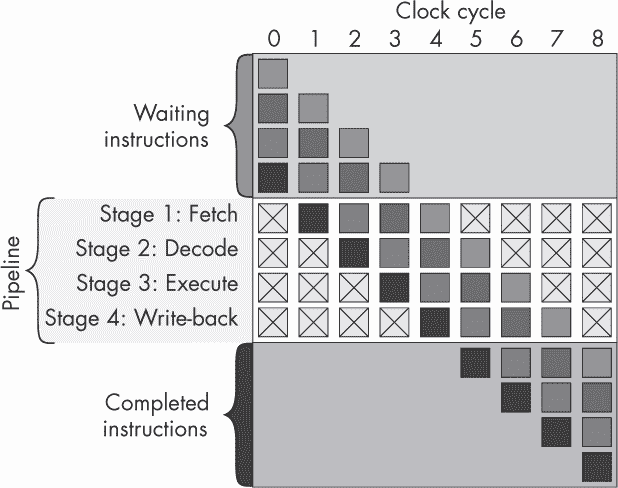
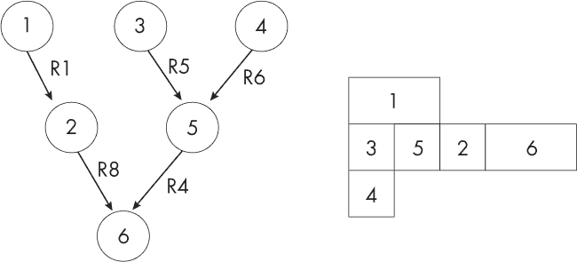

## 第十章：## **高级 CPU 设计**


上一章介绍了数字逻辑中的最小化 CPU 设计。在本章中，我们将探讨如何扩展该基础设计以提高性能。这些扩展包括使用更多寄存器，使用堆栈架构来提高子程序能力和速度，添加中断请求以启用 I/O 和操作系统，浮点硬件，以及流水线和乱序执行以支持“超标量”执行，每个时钟周期执行多个指令。在这种复杂性级别上，我们不会详细介绍如何使用数字逻辑实现这些扩展，但你可以尝试自己动手！

### 用户寄存器的数量

如我们所讨论的，Baby 是一种累加器架构的例子，这意味着它只有一个可供用户访问的寄存器：累加器。所有的加载操作都进入累加器，所有的存储操作都从累加器中取出，当我们进行两个元素的算术运算时，比如减法，第一个元素来自累加器，第二个直接来自 RAM，就像加载操作一样。

累加器架构相对简单实现，并且产生简单的指令集。加载、存储和算术指令每次只需要一个操作数。例如，为了将存储在地址 50A3[16] 和 463F[16] 的数字相加，我们首先将第一个地址的内容加载到累加器中，然后执行“累加加法”(`AADD`) 指令，将第二个地址的内容加到累加器中：

```
LOAD $50A3
AADD $463F
```

一旦这些指令执行完成，累加器将包含加法的结果。

另一方面，累加器架构要求每次需要使用数据时，数据都必须在 CPU 内外移动。这可能会使系统变慢，因为 RAM 通常比 CPU 慢。为了避免这种减速，提供额外的用户寄存器在 CPU 内部可能会有所帮助。这些额外的寄存器允许一次将多个数据载入 CPU，从而使得可以在不需要进一步访问 RAM 的情况下执行多个计算。20 世纪 80 年代的 8 位计算机通常只有少量的额外用户寄存器，而现代计算机可能拥有几十个甚至上百个用户寄存器。

特别是在科学数值计算中，汇编程序员的理想通常是在计算开始时将*所有*相关数据加载到多个寄存器中；这允许在 CPU 内部进行大量繁重的数字运算，而无需进一步访问内存。从某种意义上说，拥有更多寄存器使得汇编编程更加容易，也使得编写更快速运行的程序成为可能。

然而，关于 CPU 应该有多少个用户寄存器总是存在权衡，因为额外的寄存器是有代价的：它们占用了大量额外的硅，这增加了设计和制造的成本。它们还更大，使用更多的能量。然后是指令集的复杂性增加，这反过来要求控制单元（CU）中使用更多的硅，同样增加了成本。同样，指令集的复杂性增加使得汇编程序员的工作变得更加复杂，无论是人类程序员还是编译器。现在，加载、存储和算术指令需要额外的操作数来指定哪些寄存器或寄存器组将被使用，例如：

```
LOAD  X, $50A3    // load into register X from address 50A3
STORE $463F, Y    // store to address 463F from register Y
ADD   Z, $463F, Y // add register Y to data from 463F, store in register Z
```

一些架构让我们两者兼得：它们提供了专用的累加器寄存器和累加算术指令，以及一组常规的用户寄存器。这使得汇编程序员可以利用累加器上的可能更简单、更快速的指令，同时保留与其他寄存器一起工作的灵活性。

### 指令数量

CPU 的可用指令集，被称为其*指令集架构（ISA）*，定义了程序员可以看到和使用的内容与需要由 CPU 设计师实现的内容之间的接口。与任何接口一样，设计 ISA 总是涉及权衡。在这种情况下，存在着在让汇编语言程序员（或如今更常见的编译器编写者）生活变得轻松愉快与让数字逻辑实现者的工作更容易且无错误之间的权衡。一个包含符合人类思维方式的指令的 ISA 更容易编程和编写编译器，但可能很难在数字逻辑中实现。一个反映在数字逻辑中最容易实现的 ISA 则容易构建和测试，但可能不容易编程或编译。而且，也存在着让人类汇编程序员开心与让编译器编写者开心之间的权衡。

CISC 和 RISC 是两种历史上对立的架构哲学。大多数系统实际上以不同的方式模糊了这两者的元素，但 CISC 与 RISC 的区分仍然有助于结构化我们的思维，并考虑哪些实际设计方面更具“CISC”或更具“RISC”特征。

*CISC*，发音为“sisc”，代表*复杂指令集计算*。CISC 强调在 ISA 中创建大量指令。这些指令可以包括对基本指令的多种变体，每个变体都作为新的指令。例如，加载、存储和加法可以通过不同的指令以不同的方式进行。CISC 风格还可能创建执行比我们目前见过的更复杂算术运算的新指令，例如在科学计算器中找到的那类指令，甚至是用于信号处理或加密的特定操作的专用指令。

争论的对立面是*精简指令集计算*（*RISC*），它认为硬件复杂、开发成本高且调试困难，因此我们应该尽量简化处理器，尽可能地精简指令集，然后将更多易出错的工作交给软件，因为软件更易于创建和调试，且成本较低。RISC 的风格是将指令集保持尽可能小，然后专注于让其运行得尽可能快。CISC 中的单条复杂指令可以通过 RISC 使用更长的基础指令序列来执行，借助其简单性，力求使这些基础指令的执行速度与单条 CISC 指令一样快。

### 指令的持续时间

在我们的 Baby 实现中，控制单元（CU）基于一个定期重复的计数器周期，该周期独立于它触发的任何事件运行。一旦启动计数器，它的动作就遵循一个固定的顺序，这个顺序是完全预定的，并且不受 CPU 其余部分的影响。这种结构被称为*开环*架构，因为计数器并没有收到关于 CPU 其他状态的反馈。由于这种独立性，开环架构相对容易设计和调试，这也是我们为 Baby 采用这种风格的原因。分析引擎也采用了这种风格，通过其定期旋转的桶形控制单元（CU）。

与此相对，在*闭环*架构中，触发器的时序不是由中央计数器设置的。相反，每个工作阶段负责在准备好时触发下一阶段。例如，而不是由中央计数器触发解码阶段，可以通过提取阶段激活的线路来触发解码阶段，当提取阶段的工作完成时，解码阶段就会被触发。

闭环方法的优势在于，有些指令可能比其他指令更简单，所需的时钟周期较少。这些指令只使用必要的时钟周期，然后尽快触发下一条指令，而不是无所事事。例如，在我们的 Baby 实现中，一些指令（如 `SUB`、`LDN`）需要在第 4 个时钟周期执行，而其他指令（如 `JMP`）则在该时钟周期内不执行任何操作。

开环风格通常与 RISC 相关，因为 RISC 强调让*所有*指令简单且快速。闭环风格则与 CISC 相关，因为 CISC 可能希望包含执行大量复杂工作的单条指令，并且这些指令需要多个时钟周期来完成，同时也有一些短小、快速的指令。

### 不同的寻址模式

RISC 和 CISC 在如何分配单条指令应完成的工作量，以及应提供多少种不同版本的指令上有不同的看法。特别是，可以创建多个变体指令，将内存访问与算术操作结合在一起。

RISC 的目标是通过保持内存访问指令和算术指令之间的清晰区分，来减少指令集的规模。例如，一段用于将两个数字相加的程序会使用两条指令将这两个数字分别加载到寄存器中，第三条指令执行加法并将结果放入另一个寄存器中，然后使用第四条指令将结果存储到内存中，例如：

```
LOAD  R1 $50A3  // load to register R1 the value from address 50A3
LOAD  R2 $463F  // load to register R2 the value from address 463F
ADD   R3 R1 R2  // put into register R3 the result of adding R1 and R2
STORE $A4B5 R3  // store to address A4B5 the result in register R3
```

这种分离通常被视为 RISC 的主要定义特征。

与此相反，CISC 的目标是提供多种变体的 `ADD` 指令，以使程序员的工作更轻松。除了 `ADD`（将两个寄存器的内容相加）外，我们还可以创建另一条指令，例如 `ADDM`（“从内存加法”），使得这四行的 RISC 风格加法程序可以用单条指令实现：

```
ADDM $A4B5 $50A3 $463F
```

我们可以将其解释为“将存储在内存地址 50A3[16] 和 463F[16] 中的值相加，并将结果存储在 A4B5[16] 中。”这使得汇编程序员的工作更加轻松，但也让架构师的工作变得更加困难，因为他们现在需要在解码器中构建额外的数字逻辑来解码这条额外的指令，并且还需要在控制单元（CU）中增加额外的数字逻辑来安排加载、算术运算和存储操作的顺序，而这些操作在 RISC 版本中已经明确编码。这种设计通常被视为 CISC 的定义特征。

CISC 风格的指令集架构（ISA）可能还包括更多的变体，例如一条指令将一个内存位置（50A3[16]）的内容加到一个寄存器（R1）中的内容，然后将结果存储到另一个寄存器（R3）中。例如：

```
ADDRMR R3 $50A3 R1
```

它同样可能包括一条指令，将一个内存位置（50A3[16]）的内容加到一个寄存器（R1）中的内容，然后将结果存储到一个内存位置（A4B5[16]）中：

```
ADDRMR $A4B5 $50A3 R1
```

另一种常见的变体是增加使用 *间接寻址* 的指令，这意味着指令的操作数包含 *地址的地址*，即将使用的地址。例如：

```
ADDI  $A4B5 $50A3 $463F
```

这意味着“将存储在地址 50A3[16] 的值加到存储在地址 463F[16] 的值，并将结果存储在地址 A4B5[16] 中。”这是一个相当复杂的指令，它要求将 50A3[16] 和 463F[16] 的内容加载到寄存器中，但这些值本身又需要被解释为地址，然后再将这些地址中的值加载到寄存器中，最后执行加法并存储结果。这听起来像是一个相当晦涩的操作，但它在编译高级语言（如 C）时非常常见且有用，因为 C 中有 *指针*。间接寻址操作使得指针指令能够高效地在硬件上实现。

当然，这种间接寻址形式的指令也有一些变体，例如一条指令只对一个操作数进行间接寻址，并将结果加到寄存器的内容中：

```
ADDIR  $A4B5 $50A3 R1
```

我们可以想出更多的变体，例如使用寄存器的内容作为间接寻址的内存地址，执行多于两层的间接寻址，等等。

*偏移寻址*（也叫*索引寻址*）模式是另一种常见的 ISA 功能。这种模式的核心思想是，汇编程序员常常需要多次使用许多变量，而这些变量通常被存储在内存中的相近位置。如果他们可以首先使用一条新指令来指定这个变量存储区域的地址，比如 A7B2[16]，然后通过这个地址与存储区地址的*差值*来引用每个变量，如 0[16]、1[16]、2[16]、3[16]，以此类推，按顺序选取各个变量，那么他们的工作就会变得更轻松。在这里，我们会使用像这样的新偏移指令：

```
SETOFFSET $A7B2
ADDOOO $2 $0 $1
```

这将把地址 A7B2[16] 和 A7B3[16] 的内容相加，并将结果存储在 A7B4[16] 中。

偏移寻址对 1980 年代的汇编程序员来说尤其有用，那时他们在 8 位字长但 16 位地址空间的机器上工作。这是因为，否则他们每次想要表示一个 16 位的地址时，就需要使用两个字和两个寄存器。使用偏移量后，他们可以将内存划分为 256 个*页面*，每个页面包含 256 个地址。然后，他们可以选择一次只处理一个页面，使用页面的起始地址作为偏移量。这样，他们只需要一个字来指定页面内的地址。例如，A7B4[16] 就会被认为是 A7[16] 页面上的位置 B4[16]。

为了实现偏移寻址，通常会在 CPU 设计中添加一个额外的寄存器，并用它来存储偏移量。当需要时，其值可以与新的操作数结合，形成完整的地址，以供后续指令使用。

很容易看出，一旦所有这些变化因素都被考虑进来，指令集的大小会变得非常庞大。我们只考虑了单一指令`ADD`的变体。为了保持一致，ISA（指令集架构）通常必须为*每一个*算术指令类型创建相同的变体，这可能会导致总共新增数百条指令。

### 子程序

*子程序*这个词是许多名称之一——子程序、过程、函数、方法——它们描述的是一个非常相似的概念：一段代码存放在内存中的某个地方，当你的主程序*调用*它时，它会执行某些操作，并在执行完成后*返回*到主程序的同一行。这最后一点区分了子程序与简单的跳转语句（如`goto`语句），后者在执行完后会忘记它被调用的地方。子程序的发明通常归功于莫里斯·威尔克斯（Maurice Wilkes）和他的团队，时间大约在 1950 年左右。

在早期的高级语言中，只有一个子程序调用级别是允许的。你有一个主程序，可以调用子程序，但子程序不能再调用其他子程序。现代的高级语言依赖于子程序能够层次化地调用其他子程序——包括递归（*recursion*）——来封装复杂性。

*子程序* 这个术语通常用于架构和汇编语言层面。其他名称则用于高级语言，并且历史上有着不同的含义，这些含义从未被正式定义或在大多数语言中一致使用。以下列表试图定义这些词*如果它们在语言设计者一致使用时*的含义：

**函数** 这是最容易正式定义的概念，因为它在最正式化的函数式编程语言中使用。函数是（理想情况下）一个数学对象，它接受作为输入的参数，并仅从这些输入中返回一个计算值，而不依赖于任何其他因素。函数不应该有任何其他*副作用*，即它不应影响其他任何事物。

**过程** 这是某些语言中对子程序的称呼，这些子程序可能会或不会接受输入，通常不返回输出，因此它们仅通过副作用起作用。一些较旧的语言只允许一种调用级别，这意味着过程不能调用其他过程。

**方法** 这是面向对象编程中的一个概念，用于命名与对象关联的子程序。方法可以像函数一样返回一个值，也可以像过程一样具有副作用。

所有这些名称在实际编程语言中都被滥用和混淆；例如，语言中常常存在“函数”产生副作用且不返回值的情况。函数式编程语言更有可能执行数学概念，但即使是一些函数式编程语言也允许副作用。

现在让我们看看如何实现子程序。

#### *无堆栈架构*

可以纯粹通过软件实现子程序，而不需要任何额外的硬件或指令。你可以通过编写包含跳转指令的程序，然后采用某种约定来跟踪返回地址。然而，这对程序员来说是困难的，对计算机来说也是缓慢的。

早期具有子程序功能的架构，如 ENIAC，为调用和返回添加了专用的 CPU 指令，并在 CPU 中增加了简单的硬件来执行这些指令。一种方法使用硬件中的单一返回地址位置。可以很容易地在 CPU 中构建一个专用的内部寄存器来存储返回地址。这使得主程序能够一次调用并返回一个子程序；一旦进入子程序，就无法调用并返回另一个子程序，因为这会覆盖单一的返回地址。

为了使子程序能够相互调用（包括递归调用自身），架构可以增加一个硬件堆栈。

#### *堆栈架构*

*堆栈*是一种简单的数据结构，具有两个操作：推送（push）和弹出（pop）。它的行为就像你桌面上的一叠文件。你可以在新文档到达时*推送*它到堆栈的顶部，并且只能通过取下并移除堆栈顶端的文件来*弹出*堆栈中的文件。你不能从堆栈下方取出文件。

使用堆栈，你可以创建一条完整的地址追踪路径，以便在嵌套子程序的情况下进行返回。每次调用子程序时，其返回地址都会被推送到堆栈中。当子程序返回时，这个地址会从堆栈中弹出，并用于设置程序计数器。

通过这种方式跟踪子程序在递归的情况下特别有用。堆栈在递归执行过程中通常会增长得非常大，并且（希望）在程序完成并从堆栈顶部读取和移除数据时会缩小。*堆栈溢出*错误是一个失败条件，表示堆栈空间不足；如果你使用特定的内存块来存储堆栈，并且空间用尽，当你尝试在堆栈边界外写入时，程序将产生堆栈溢出错误。这通常发生在函数无限递归调用或彼此调用时出了问题。在现代计算机中，堆栈的实现比以前资源开销要小得多，因此它们已经成为存储返回地址的标准方式。

*硬件堆栈*存在于大多数现代计算机中，从 8 位时代起就已经有了。它们在控制单元中使用硬件数字逻辑实现堆栈概念，从而以增强的速度和安全性支持任意子程序调用。这些堆栈架构有一个额外的专用*堆栈指针寄存器*，这是一个内部寄存器，包含指向堆栈顶部的指针。堆栈本身可能存储在 RAM 的某个区域内，并且通常在硬件级别限制对该部分 RAM 的访问。例如，某些堆栈架构可能会有专用的数字逻辑，用于测试所有来自用户的加载和存储指令，以确保它们不会尝试访问堆栈的 RAM 部分。这可以防止恶意程序员干扰堆栈。

一些堆栈架构会隐藏其内部工作原理，只在指令集中提供新的调用和返回风格的指令。执行时，调用指令会激活数字逻辑，自动将程序计数器推送到堆栈，递增堆栈指针，并跳转到子程序。同样，返回指令会弹出程序计数器，递减堆栈指针，并跳转回调用函数。

其他堆栈架构允许用户完全访问堆栈的内容，除了或代替调用和返回。例如，一些设计提供了诸如`PHA`（Push Accumulator）和`POPA`（POP Accumulator）之类的指令。前者将累加器中的内容推送到堆栈上并递增堆栈指针，后者将堆栈中的内容弹出到累加器并递减堆栈指针。这种设计提供了一种通过将参数和返回地址一起存储在堆栈上来传递子例程参数的方法。

**调用约定**

无论使用哪种堆栈或无堆栈架构来实现子例程，都需要程序员维持一致的*调用约定*，这样程序的不同部分在传递和接收参数时才能正确理解彼此。这一点尤其重要，当子例程由与调用代码不同的作者编写时，尤其是在提供通用子例程库的情况下。调用约定包括以下内容：

+   参数、返回值和返回地址的位置：在寄存器中、在调用堆栈中、两者的混合，或者在其他内存结构中

+   参数传递的顺序和格式

+   返回值如何从被调用者传递回调用者：通过寄存器、堆栈，或者在 RAM 的其他地方

+   设置和清理函数调用任务的过程如何在调用者和被调用者之间分配

+   是否以及如何传递描述参数的元数据

调用约定不是 CPU 架构的一部分。相反，它们是程序员之间的社会协议。给定的架构通常可以与多种不同的调用约定之一一起使用。在某些情况下，CPU 架构师会建议一种约定，以尽量避免用户之间的碎片化。在其他（或者有时是相同的！）情况下，程序员会创建自己的约定，当他们需要使程序互通时，标准战争就会爆发。

调用约定还定义了现代高级语言和编译器之间的兼容性附加功能。例如，来自两种语言（如 C 和 C++）的编译后可执行代码，可以互相链接并调用对方的子例程，只要它们遵循相同的调用约定。

### 浮点运算单元

我们在第二章中看到，浮点数是通过符号、指数和尾数来表示的。*浮点寄存器*是专门设计的用户寄存器，用于存储浮点数据表示，以便在浮点计算中使用。

对这些表示形式进行算术运算比到目前为止在整数上进行的算术逻辑单元（ALU）操作要复杂。例如，要乘以两个浮点数，我们需要先乘以它们的尾数，再加上它们的指数，最后乘以它们的符号。要加两个浮点数，我们需要先按指数的差异对其中一个进行移位，然后进行加法操作，可能还需要再次移位并更新指数。当一个大数被小数除时，除法可能会出错，还可能产生定义为无穷大或 NaN（不是一个数字）的特殊情况。

这一切都可以通过将简单的 ALU 风格操作组合在一起，并使用数字逻辑的新组件来完成。最终形成的结构被称为*浮点单元（FPU）*。FPU 是复杂的数字逻辑部件，设计起来非常昂贵；它们还占用了大量的硅资源，并且容易出现故障。1994 年，英特尔在其 Pentium 芯片中实现 FPU 时出现了错误，导致了 5 亿美元的召回损失和声誉损害。

FPU 出现在 1980 年代，不是在 CPU 内部，而是作为可选的附加芯片。例如，Intel 8086 CPU 可以搭配一个可选的 FPU 芯片，即鲜为人知的 8087。如今，FPU 已完全移至 CPU 并且与其 ALU 部分类似。

如果你想看看现代 FPU 上的专用寄存器和指令是什么样的，它们占据了大部分的书本内容，具体来说是 amd64 参考手册的第三卷，你将在第十三章中接触到它们。

### 流水线

到目前为止，我们所讨论的内容都涉及用汇编语言编写程序，将其编译为机器码，并从头到尾执行这些机器码，过程中有一些分支和循环。基本上，指令是一次一条地引入，每条指令在下一条指令引入之前都会被执行。大多数现代 CPU 并不是这样工作的。相反，它们会并行处理多条指令的部分内容。我们将在第十五章中看到更多的并行性形式，但在 CPU 层面操作的并行性被称为*指令级并行性*，我们将在这里进行研究。

*流水线*是一种出现在 32 位时代的指令级并行性形式。流水线就像一条生产线，在这里有多个工人同时执行任务，就像亨利·福特 1913 年的汽车工厂一样，如图 8-1 所示。


*图 8-1：福特 1913 年生产线*

福特将每个工人分配一个专门的任务，并将他们安置在传送带上的固定位置。汽车零件沿着传送带移动，每个工人轮流在每个汽车零件上进行工作。

现在，将福特的汽车零件换成你的机器代码程序中的指令，并想象这些指令在生产线上运行。你不再有人工工人，而是由 CPU 的各个部分执行取指、解码和执行等任务。假设你已经编写了 20 行代码，并假设没有跳转或分支。在我们迄今为止看到的 CPU 设计中，一条指令会被放入生产线，并依次通过取指、解码和执行工序。一旦它到达生产线的末端，下一条指令就会放在生产线的起始处。因此，大部分工人在没有轮到自己工作的情况下，通常会处于空闲状态。

我们可以通过保持输送带上始终满载指令，来提高工作效率，而不是等一个指令完成后再开始下一个指令。一个工人可以在执行一条指令的同时，另一个工人解码下一条指令，第三个工人获取之后的指令。

将 CPU 的工作分解成多个阶段有很多不同的方法，这取决于架构类型。经典的划分方法包括取指、解码和执行阶段。我们的 LogiSim Baby 使用了五个时钟周期。现代 CPU 的流水线有更多的细分——现代 Intel 处理器的流水线有大约 37 个阶段！

在数字逻辑层面，流水线可以通过让控制单元（CU）同时触发多个组件来实现，而不是一次触发一个组件。通常会用类似 图 8-2 的示意图来展示流水线。



*图 8-2：展示基本流水线如何处理指令的示意图*

在 图 8-2 中，时钟周期从左到右展示，四条指令（用方框表示）显示通过流水线。这是一个四阶段流水线，因此它一次可以处理多达四条指令（如时钟周期 4 所示），每条指令处于不同的处理阶段。

流水线对于开放式 RISC 架构来说更简单且高效，因为在这种架构中，所有指令的执行时间相等，因此它们可以均匀地沿流水线推进。对于闭环 CISC 架构来说，流水线可能会变得复杂且效率低下，因为必须考虑不同指令的不同执行时间，并且一些流水线的部分会在较短指令和较长指令一起执行时处于空闲状态。

#### *危险*

在流水线执行过程中，有几种广为人知的情形，称为 *危险*，会导致问题发生。让我们来看看这些主要的危险类型，然后讨论如何解决它们。

#### **分支危险**

*分支风险* 发生在管道中的某个地方，当遇到一个 `if` 语句时，其他早期阶段正在努力完成分支的一个结果，但你却需要转到另一个结果。当条件分支被执行时，在分支执行前，你无法知道将遵循哪个条件。

#### **数据风险**

如果两个工人试图访问相同的内存位置——例如进行取值和输出——那么会发生不好的情况。我们可以将这些 *数据风险* 分为三类：

**写后读** 这是指在有两个指令的情况下，第一个尝试写入内存，第二个尝试从相同地址读取。程序的逻辑应该是读取到的值应该与刚刚写入的值相等。但当管道化（pipelining）在使用时，读取的 RAM 访问可能发生在写操作更新 RAM 之前。

**读后写** 这是反过来的情况：这里，两个指令应该首先读取旧的 RAM 值，然后通过写操作更新它。但当它们被管道化交错时，可能会发生写操作中实际更改 RAM 值的部分，发生在读取操作访问 RAM 的部分之前。

**写后写** 这是指两个写入指令在试图写入相同地址时互相干扰。程序的逻辑应该是第一个写入，然后第二个写入，最后地址包含第二个值。但同样，由于管道化的存在，它们的执行阶段可能会交错，在某些情况下，第二个写入操作会先执行，从而在第一个写入之后才执行预期的写操作。

#### **结构风险**

第三种类型的风险是 *结构风险*，即多个阶段同时争夺资源。在生产线示例中，工厂可能在工人们后面的货架上放置一个共享的物理计算器。可能会有某个时刻，两个工人都想同时使用这个计算器。例如，一个工人可能需要检查某个值是否为零，而另一个工人需要执行加法操作。在数字 CPU 中的类似情况是，两个数字逻辑区域正在计算两个流水线状态，它们都需要同时访问算术逻辑单元（ALU）或内存。

#### *风险修正*

管道化通常在所有类型的信号处理（包括音频、视频和广播处理）中表现良好，因为没有太多分支需要处理。预期相同类型的数据会实时通过流水线流动，并始终以相同的方式处理。例如，数字电视或笔记本中的解码器用于解码和显示电影，它们将可靠地处理一帧又一帧的输入视频和音频，执行相同的操作来解码并显示每一帧，顺序一致。它们通常不需要查看信号内容，并根据内容变化调整行为。

当你进行持续检查结果并根据这些状态改变流程的计算时，危害会变得更加严重。一旦程序中有了分支——在某种程度上还有跳转和子程序——你就必须考虑如何解决这些危害。让我们来看一些通用策略。

#### **避免危害的编程**

熟练的汇编程序员如果了解体系结构，可以编写汇编代码来避免许多危害。这通常需要考虑相邻指令组，并思考它们如何在流水线中相互影响，同时调整某些指令的顺序，将它们分得更远，从而减少相互影响的可能性。

如今，大多数编程都是在编译语言中进行的，因此曾经由终端用户程序员使用的一些技巧已经转移到编译器中。一个好的编译器可以检查它生成的汇编代码，并寻找可能导致危害的地方。它可以像人类程序员一样调整这些代码，以减少危害发生的可能性。例如，彼此不影响的指令的顺序可以交换，从而使两次访问同一数据的操作在执行中分得更远。当然，这些优化背后仍然有一个人类在操作：编译器的作者，他们很可能对危害以及如何避免它们产生了浓厚的兴趣。

一些指令集架构（ISA）提供*空操作（NOP）*作为一条额外的指令，表示“什么也不做”。NOP 指令仍然会经过流水线，占用时间槽，因此程序员或编译器可以将它们插入到可能引发危害的指令之间，以将它们分散开来，从而避免危害。这通常比重新排序指令所需的智能要少，但会因为 NOP 指令在流水线中的处理而降低执行速度。

#### **停顿**

*停顿*（有时称为*冒泡*）意味着将流水线的结果暂时挂起，直到某个阶段完成其工作。例如，如果发生结构性危害并且两个阶段同时想使用算术逻辑单元（ALU），我们只让其中一个阶段使用它，告诉其他阶段什么都不做，直到 ALU 空闲。在生产线类比中，这就像工厂中的系统，工人遇到问题时可以按下按钮停止传送带，从而给他们时间来解决问题。

为了实现停顿，可以向 CPU 中添加额外的数字逻辑来检测即将发生的潜在危害——例如，当看到跳转或分支即将发生时，暂时停止触发下一条指令的阶段。这是一种重量级的解决方案，如果频繁使用，会带来较大的时间成本。与 NOP 类似，整个流水线系统实际上在危害发生时被禁用，所以如果我们需要经常这样做，那么我们不如直接使用非流水线 CPU。不过，从硅片和设计时间的角度来看，停顿相对简单且便宜。

#### **重做工作**

*重新做工作*意味着在处理潜在危险指令时，我们允许后续指令正常开始其周期，希望该危险不会真正发生。如果我们稍后完成潜在危险指令的执行，并发现确实发生了危险，那么我们就丢弃在下一条指令上已完成的工作，并重新做一次。

例如，当一个分支指令到达时，我们假设它不会被执行，并在测试分支条件的同时，开始获取和解码后续指令。如果我们发现分支不会被执行，那么已经做的工作是有用的，并且保留这些工作，继续执行。但如果我们发现分支会被执行，我们则丢弃后续指令的工作，开始从分支目标地址获取并解码不同的指令。

这种策略比停滞更高效，因为在每个*潜在*危险发生时，停滞都会带来性能损失，即使有些危险并没有真正发生。假设你的程序中有 100 个分支，其中只有一半会被执行；停滞会导致所有 100 个分支都延迟，而重新做工作只会延迟其中的 50 个。

#### **急切执行**

*急切执行*意味着在短时间内同时执行*两个*可能的分支，然后在我们确定应该选择哪个分支后，后续会丢弃未被执行的那个分支。例如，急切执行的典型应用出现在指令序列中，如（使用 Baby 汇编）：

```
1: SKN 3
2: LDN 10
3: LDN 11
```

这个序列首先询问一个条件是否为真；根据结果，它从地址 10 或地址 11 加载数据。在急切执行中，我们在执行第 1 行的同时，开始获取、解码并执行第 2 行和第 3 行。只有在第 1 行比较结果已知之后，我们才决定是选择第 2 行还是第 3 行。我们保留在所需行上已完成的工作，并丢弃在不需要行上的工作。

实现急切执行需要将我们的物理数字逻辑翻倍，以在不确定期间并行执行更多计算。这可能需要有两个物理副本的算术逻辑单元（ALU）、寄存器和执行逻辑。这可以很好地利用摩尔定律当前提供的额外硅资源，而不需要更快的时钟。

#### **分支预测**

*分支预测*是我们尝试预测一个分支是否会被执行的过程，*在*实际执行之前进行预测。这样的预测最初听起来似乎不可能（毕竟执行的含义就是要找出分支会做什么），但我们通常可以利用先前的知识，至少做出比随机猜测更好的预测。

对于分支风险，重新执行工作的方法可以被视为始终预测分支不会被执行。它开始从下一个数值地址获取和解码指令，同时执行分支指令。分支预测通过尝试更准确地预测分支是否会被执行，从而推广了重新执行工作的方法。然后，可以根据预测的分支开始获取和解码，只有在预测错误时才重新执行工作。

分支预测仍然是一个活跃的研究领域，正在调查多种策略。其中一种是假设所有的分支*都会*被执行——这实际上是重新执行工作方法的对立假设。如果用户只编写那些分支来自`if`语句的程序，那么在没有其他信息的情况下，这些分支有 50/50 的机会被执行。然而，许多或大多数出现在实际机器代码中的分支来自于循环，而不是`if`语句，而且循环的通常目的是重复多次，而不是零次或一次。因此，当分支来自循环时，它们通常*会*被执行，因为用户希望循环几次。

对实际机器代码进行的大规模统计研究已经证实了这一点：它们的估计显示 50%到 90%的分支会被执行。

在某些情况下，另一种策略是由人工程序员或编译器提供关于将会执行哪些分支的提示。这可以包括人工程序员在汇编代码或高级代码中添加特殊注释，或者编译器使用代码分析来生成自己的预测和注释。对于某些编译任务，这很容易做到——例如，如果用户程序中写着“重复 100 次”，那么我们可以做出一个不错的预测。在`while`循环的情况下，预测则更难，甚至是不可计算的。

第三种最先进的方法是使用动态运行时分支预测，这涉及将统计或机器学习分类器构建到 CPU 数字逻辑中，并使用它们进行实时预测。与所有预测系统一样，这需要选择一些程序特征，这些特征可能与时间和空间上邻近的分支行为相关。

简单的情况包括在执行用户程序期间，记录每个分支指令的分支执行频率日志，并使用这些频率作为预测分支会执行哪个方向的概率预测，假如相同的指令再次执行时。

更先进的案例现在包括线性回归甚至神经网络分类器，这些分类器通过数字逻辑构建，并在从实际程序中收集的大规模机器代码库上进行预训练。这些分类器可能会基于机器代码的各种特征进行训练，例如在分支指令前后多行中的操作码和值。

#### **操作数转发**

*操作数转发* 是一种通过添加数字逻辑，直接将指令的结果路由到下一条或附近的指令输入，避免数据危害的技术。例如，考虑以下程序：

```
1: ADD R3 R1 R2
2: ADD R4 R3 R1
```

这计算 R3 = R1 + R2，然后是 R4 = R3 + R1，其中所有操作数都是寄存器。这里，指令 2 需要指令 1 的结果放入 R3 后才能执行指令 2。这对于大多数流水线来说会导致数据危害。然而，实际上，指向 R3 的值可能在指令 1 执行过程中就已经可以通过 ALU 的输出线获得，而不是等到它出现在目标寄存器中。通过直接将一根物理线连接从 ALU 输出到数据需要的地方（例如 ALU 输入），我们可以跳过等待结果存储和重新读取的过程，而是立即开始使用它。

### 乱序执行

*乱序执行（OOOE）* 是比流水线更高级的指令级并行形式。它涉及在指令进入 CPU 时实际交换指令的顺序，使得它们以不同于程序中出现的顺序执行。乱序执行架构最早由 Tomasulo 算法于 1966 年理论上实现，并于 1990 年代在商业上出现。

乱序执行的关键在于认识到串行程序中的指令通常可以交换位置，而不改变它们的结果。例如，如果我们有一些变量需要赋值，我们可以在这些变量下一次使用之前的任何时刻进行赋值，而不会影响最终结果；最终我们会得到相同的状态。这给了我们调整指令顺序的自由，以防止流水线危害的发生，并最大化效率。无论我们是否拥有单个或多个硬件副本的 CPU 子结构，我们都可以选择合适的顺序，尽可能充分利用这些资源，让它们保持尽可能繁忙。

为了了解乱序执行是如何工作的，考虑以下程序：

```
1: DIV R1 R4 R7
2: ADD R8 R1 R2
3: ADD R5 R5 R9
4: SUB R6 R6 R3
5: ADD R4 R5 R6
6: MUL R7 R8 R4
```

这里有六条指令。例如，指令 1 将寄存器 R1 的内容设置为将寄存器 R4 的内容除以寄存器 R7 的内容的结果。我们假设有简单的除法和乘法机器可用，但它们比加法和减法机器更慢。图 8-3 的左侧描绘了指令之间的依赖关系。



*图 8-3：样本程序的数据流图（左）和调度图（右），实现了乱序执行（OOOE）*

以依赖关系为例，假设指令 2 在指令 1 完成之前无法开始执行，因为指令 1 写入寄存器 1，而指令 2 需要该寄存器作为输入。依赖关系图表明，我们不需要按照原始顺序精确执行指令。只要任何指令在图中的所有父指令之后执行，结果将是一样的。我们可以重新排序指令的执行顺序和/或将它们并行执行，只要图中的箭头关系得到尊重。

图 8-3 的右侧显示了指令执行的一种可能顺序。在这里，指令 1、3 和 4 首先并行执行。指令 5 在 3 和 4 之后执行，但仍可以与指令 1 并行执行（因为指令 1 较复杂，执行时间较长）。指令 2 在指令 1 完成后执行，而指令 6（另一个较长的指令，由于乘法操作）必须最后执行，因为它需要指令 2 和指令 5 的结果。根据可用的 ALU 数量，我们可以比原始程序的单一执行序列甚至流水线更快地执行这种或类似的调度。

OOOE 通常由 CPU 中的数字逻辑在程序执行过程中实时完成。通常只考虑程序中当前指令周围的短时间窗口——比如 10 条或 20 条指令——进行重新排序。

**注意**

*如果你将 OOOE 的思想扩展到重新排序和并行化整个程序，你将接触到 GPU 数据流，详情见第十五章。*

### 超线程技术

在基本的 CPU 中，取指阶段只有取指硬件在工作，译码阶段只有译码器在工作，执行阶段只有 ALU 或 CU 在工作。流水线和超越顺序执行（OOOE）是两种更好地利用 CPU 硬件资源的方法，它们通过让多个指令的不同部分同时工作，来避免在取指-译码-执行周期中硬件资源处于空闲状态。

*超线程技术*是另一种利用 CPU 资源的方法，避免它们在周期中空闲。与其处理同一程序中的连续指令，我们将它们汇集在一起，形成第二个虚拟 CPU 核心，操作不同的一组指令。这个虚拟核心的每个组件与主 CPU 核心的使用是错开运行的，通常在主 CPU 核心空闲时运行。通过将所有这些组件汇聚在一起并使它们错开运行，我们就创造了一个额外的 CPU，使所有硅芯片始终处于工作状态。

超线程技术于 1970 年代提出，并在 2000 年代广泛应用于商业 CPU 中。它通过使设备中显现的核心数翻倍，而有效地提高了实际物理核心数，这也是你经常看到计算机报告的核心数是硬件广告中所述的两倍的原因。

超线程相对于流水线的优势在于你不再需要担心危害（hazards），因为两个核心可以完全独立地操作。另一方面，它并不会增加任何单一程序的速度。它还需要额外的数字逻辑来在适当的时刻读取、存储和写入两个虚拟 CPU 的状态，并且需要复制一些硬件组件，以确保一个核心不会影响另一个核心。实际上，流水线和超线程可能会一起使用，特别是当流水线被分解成许多更小的阶段时。如何平衡它们是一个高级问题，超出了本书的范围。

### 总结

除了像 Baby CPU 这样的最小化 CPU 外，架构师还面临着许多决策，必须在速度、可用性、硅片大小和能量成本之间做出权衡。为 CPU 添加更多功能，如更多的寄存器、算术逻辑单元（ALU）和浮点简单机器、栈以及不同的寻址模式，可以使用户程序员或编译器的工作更轻松、更快速，但代价是硅片和能源。同样，添加更多的指令可以让一些程序员和编译器受益，但对于其他必须应对额外复杂性的人员来说，则变得更为困难。使所有指令具有相同固定时长可以让流水线和乱序执行设计师及 CPU 调试员的工作变得更简单，但如果某些复杂指令需要较长的执行时间，则可能效率较低。

RISC 是一种通常旨在保持指令和指令集简单小巧的风格，同时通过更多的寄存器、流水线和乱序执行（OOOE）来利用额外的硅片加速指令。CISC 是相对的风格：它倾向于利用额外的硅片增加更复杂的指令并创建更大的指令集。正如我们将在第十三章和第十四章中看到的，这两种风格往往适用于不同的应用。

即使是最先进的 CPU 设计，如果没有输入、输出和内存，你的计算体验也会非常有限，接下来的两章将探讨如何将这些添加到计算机中。

### 练习

#### **混淆流水线**

设计一个最简单的汇编程序，目的是使基本的流水线混乱，使其运行速度与非流水线系统一样慢。尝试扩展该程序，尽可能多地混淆每种危害处理策略。这类程序在实际中出现的可能性有多大，如何避免它们？

#### **具有挑战性**

尝试在 LogiSim 中构建一个 FPU，基于第二章中看到的浮点数据表示。考虑如何将之前看到的简单机器在加法、减法、乘法和除法的每个算术操作中进行组合。例如，当两个浮点数相乘时，它们的指数会相加。

#### **更具挑战性**

尝试在之前的 LogiSim Baby 设计中加入一些最小化的流水线。例如，你可以尝试在当前指令执行时，递增程序计数器并开始执行下一个取指。困难的部分在于处理分支风险。你可以假设最初分支会被采取，然后添加逻辑以在发现判断错误时清除并重新开始。

### 进一步阅读

+   关于有争议的“冯·诺依曼”架构的起源，参见 John von Neumann 的《EDVAC 报告初稿》，1945 年 6 月 30 日，* [`history-computer.com/Library/edvac.pdf`](https://history-computer.com/Library/edvac.pdf)*。

+   关于子程序的发明，参见 Maurice Wilkes、David Wheeler 和 Stanley Gill 的著作 *The Preparation of Programs for an Electronic Digital Computer: With Special Reference to the EDSAC and the Use of a Library of Subroutines*（剑桥，马萨诸塞州：Addison-Wesley，1951 年）。

+   *Human Resource Machine*、*Shenzen I/O* 和 *TIS-100* 是教育类视频游戏，它们呈现了类似 CPU 的环境，具有不同的指令集和目标供你探索。
