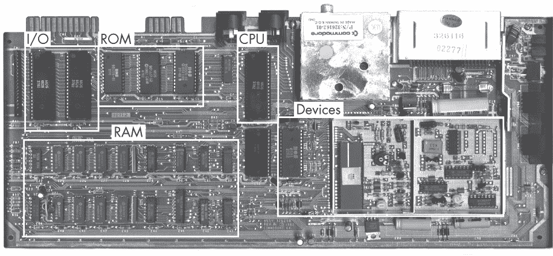
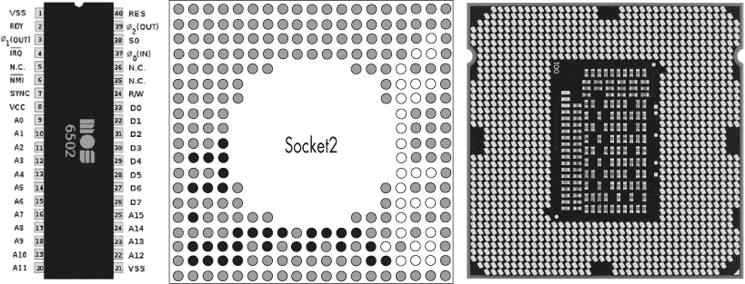
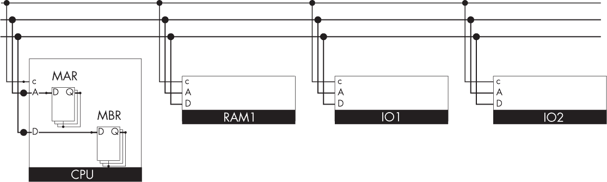
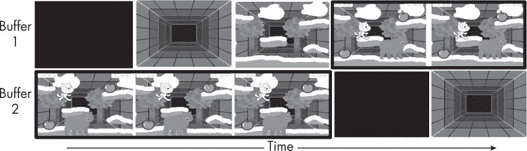

## 第十一章：## **输入/输出**


你已经学会了如何构建一个基本的 CPU 和 RAM，它们可以一起运行程序。CPU 和 RAM 非常适合执行计算，但要让计算机具备图形、声音、操纵杆和与现实世界其他交互的能力，我们还需要输入和输出，统称为*I/O*。在本章中，你将学习如何使用总线、I/O 模块、设备和外设添加 I/O 功能。

### 基本的 I/O 概念

为了详细讨论 I/O，首先让我们定义一些术语。*I/O 模块*是数字电子设备，像 RAM 一样，它们被分配并连接到计算机的*地址空间*中的地址，地址空间是 CPU 可以访问的地址范围。I/O 模块也与*设备*相连接，设备是包括数字和模拟电子学在内的电子系统，这些设备并不直接连接到计算机的地址空间，但可以通过附加的 I/O 模块与其通信。设备可以物理地位于计算机内部，例如控制 CRT 显示器扫描束的模拟电路；也可以在外部，例如打印机内部的电子电路。

*外设*是大多数计算机用户最直观的 I/O 元件：它们是与计算机连接的物理对象，例如鼠标、操纵杆、显示器和打印机。外设被封装在自己的塑料外壳中，通过一根用户可以轻松插拔的电缆连接到计算机的机箱。有些外设，比如打印机，内部包含其设备。其他外设，比如显示器，则依赖于计算机机箱内的设备（例如显示器的 CRT 控制器）。

在 8 位时代，计算机设计意味着通过购买并连接 CPU、内存、设备和逻辑芯片来构建一台完整的计算机，并可能需要定制设计输入/输出（I/O）模块。例如，图 9-1 中显示的 Commodore 64 主板展示了机器中很大一部分是用于 I/O 的。



*图 9-1：C64 主板，显示 CPU、内存（RAM 和 ROM）、I/O 模块和设备*

图中左上方的 I/O 部分包含两个*复杂接口适配器（CIA）*芯片，每个芯片包含多个 I/O 模块。右下角的设备部分包括图形和声音芯片。

如今，类似于 Commodore 64 主板的整体结构已经缩小为手机中的单一系统芯片（SoC），但是当各个部件是以物理分开的集成电路（IC）封装形式存在时，结构更容易理解和学习。请在我们继续阅读本章时牢记这一形象。

对于 CPU 来说，I/O 模块看起来就像是 RAM 的一部分。它们有可以读取和写入的地址，使用与读取和写入 RAM 相同的加载和存储指令。现在，RAM 和 I/O 模块都连接到相同的 CPU 地址和数据线，我们需要一种方式让它们共享这些资源。这可以通过下节中将介绍的总线架构来实现。讨论完总线之后，我们将深入了解 I/O 模块，并详细介绍如何与它们通信。

### 总线

*总线架构*是一种特定类型的网络架构，其中每个参与通信的设备都可以平等地访问一个共享的电线或一组电线，这些电线称为*总线*。就像同名的公共交通工具一样，计算机总线之所以得名是因为它是一个公共场所（它缩写自拉丁语*omnibus*，意思是“为所有人”）。为了说明总线架构的公共性质，可以考虑一个监狱水管窃听系统的例子：监狱中的所有囚犯都有连接到同一管道的水管，因此，任何人敲击一根管道，利用摩尔斯电码传输越狱计划，必然会广播该消息给所有监听管道的人。在总线架构中没有隐私（除非使用加密），如果允许不信任的设备访问总线，可能会带来有趣的安全隐患。

总线是最简单的网络形式，缺乏互联网的分包、错误处理和路由等复杂性。例如，可能有两个囚犯会试图同时窃听同一根管道，造成碰撞，导致他们的消息都被破坏。

一般来说，总线由几个*节点*（即希望互相通信的设备）和它们之间的通信线路（电线）组成。现代总线通常有许多并行使用的线路，但也有只有一根线路的总线。我们可以将这些线路分为控制线、地址线和数据线。

需要一种协议来确保信号不会与其他节点发送的信号发生冲突，因此，节点在向另一个节点发送消息之前，必须首先宣布消息的接收者——即地址，通过地址线传递——并宣布消息的类型——即控制信息，通过控制线传递。然后，它在数据线上广播数据。你可以让其中一个节点负责总线，通过仅在允许时才允许节点写入来强制执行该协议，或者你可以信任节点自行实现协议，并彼此配合良好。

**维多利亚时代的互联网**

巴贝奇和布尔时代的电报系统被称为“维多利亚时代的互联网”。它是一种总线架构，连接着英国、美国和大英帝国的各个站点。当地车站的人工操作员会为顾客敲击莫尔斯电码文本消息（电报），并监听从其他地方发送到其站点的消息。所有消息都通过同一条电缆传输，所有操作员都可以读取和写入这些信息。这些操作员花费了成千上万的小时在电缆上收听和写作，精通莫尔斯电码，并发展出自己独特的莫尔斯“说话”风格，可以用来识别是谁在讲话。他们还会在不为顾客发送消息时相互聊天，进行典型的现代聊天室行为，比如使用简化俚语（短信语言）、谈恋爱，甚至在没有见过面的情况下与其他大陆的操作员结婚。

总线架构的一个优点是，添加新设备到总线非常容易，因为相同的一组共享线路连接所有组件。共享线路还使得总线的实现成本较低。另一方面，总线可能成为瓶颈，限制系统的性能。如果你优化了 CPU 或内存的速度，非常快速，但数据最终还是通过总线传输，导致速度变慢，那就特别令人烦恼。总线性能还可能受到物理因素的限制，如线路长度和连接数量。

#### *总线线路*

总线上的线路与我们之前在 CPU（或其缓存）与 RAM 之间点对点连接的线路相同。它们有三种不同的类型：

**地址线** 这些用于指定数据总线上数据的来源或目的地。地址总线的宽度决定了系统的最大内存容量（即系统可以寻址的内存量）。例如，一个 32 位地址总线的系统可以寻址 2³²（4,294,967,296）个内存位置。如果每个内存位置存储一个 8 位字（字节），则可寻址的内存空间为 4 GiB。对于 64 位地址空间的 64 位字，正好可以使用 1 泽比特（2⁶× 2⁶⁴ = 2⁷⁰）的内存，这足以使搜索引擎大小的数据中心中的所有数据都有自己的 RAM 地址。

**数据线** 这些线路提供了在节点之间实际传输数据的路径。一个关键的性能因素是数据总线的宽度（即数据线的数量）。一个典型的数据总线由 32、64、128 或更多条独立的线路组成。为了发送超过数据线宽度的消息，你需要将它们分拆并通过多个周期传输。例如，如果数据总线宽度是 32 位，每条指令是 64 位长，那么 CPU 在每个指令周期内必须访问内存模块两次。

**控制线** 这些用于控制数据和地址线的访问和使用。例如，在我们讨论 Baby 存储操作时，之前在图 7-10 中使用的写使能线就是一个简单的控制线。更一般地说，由于数据线和地址线被许多组件共享，因此必须有一种方式来控制它们的使用，以避免多个组件同时尝试写入这些线路。进一步的控制线可以用于请求和协商访问权限。

#### *CPU-总线接口*

大多数 CPU 设计为通过 CPU 芯片上的引脚连接到主板上的插座，以便与主板上的外部总线连接。在总线电缆与 CPU 物理连接的地方，这种连接被称为 *前端总线（FSB）*。正如在图 9-2 中的 Commodore 64 的 8 位 6502 CPU 引脚图和 1990 年代的 32 位英特尔 Socket2 引脚图所示，绝大多数 CPU 的引脚都被 FSB 占据。



*图 9-2：8 位 6502（左）和 32 位 Socket2 芯片（中）的引脚图，以及 64 位 LGA1155 插座 CPU 的引脚照片（右）*

这里的 6502 使用 16 位地址和 8 位数据，因此它有 16 个地址（A）引脚和 8 个数据（D）引脚。R/W 引脚用于读/写控制线。总的来说，芯片的 40 个引脚中有超过一半用于总线。Socket2 用于 32 位地址空间和 32 位数据字，因此它有 32 个 A 引脚和 32 个 D 引脚（分别在图中以白色和黑色表示）。同时，64 位 CPU 芯片和插座需要每种引脚数量的两倍，因此它们必须更小且更脆弱。

CPU 需要与总线通信，但总线通常比 CPU 慢。因此，CPU 设计师倾向于使用寄存器来缓存进出 CPU 的数据（如分析机中的输入/输出轴，连接 CPU 和其机械架构总线）。总线是一种稀缺资源，因此我们不希望将其使用时间过长；如果数据被缓存，它可以在总线可用时随时放入或取出。通常，这些缓存机制包括 *内存地址寄存器（MAR）*，它存储我们要读取或写入的地址，以及 *内存缓冲寄存器（MBR）*，它存储正在写入或读取该地址的数据副本，如图 9-3 所示。



*图 9-3：一种总线架构，包括一个 CPU、一个 RAM 模块和两个 I/O 模块*

为了执行加载指令，包含要加载地址的操作数会暂时从其指令寄存器（IR）位连接到 MAR，创建 MAR 中的副本。当副本完成时，MAR 会暂时连接到内存，发出读取请求，并且内存中的数据会暂时连接到 MBR，MBR 获取该数据的副本。然后，控制单元（CU）可以暂时将 MBR 连接到累加器或其他用户寄存器。用寄存器传输语言（RTL）风格表示，这可以写成：

```
t2, LOAD: MAR <- IR[operand]
t3, LOAD: BUS_A <- MAR
t4, LOAD: MBR <- BUS_D
t5, LOAD: ACC <- MBR
```

相同的 MAR 和 MBR 寄存器也可以用来执行存储指令。CU 会暂时将 MAR 连接到 IR 中包含要写入地址的操作数字段；MAR 获取该地址的副本。然后，CU 会暂时将 MBR 连接到包含要写入值的寄存器；MBR 获取该值的副本。现在，MAR 和 MBR 包含描述存储操作所需的所有信息。最后，CU 会暂时将 MAR 连接到 RAM 的地址线，将 MBR 连接到 RAM 的数据线，并将其命令线设置为存储，这样就会在 RAM 中执行存储操作。在 RTL 中，这可以写成：

```
t2, STORE: MAR <- IR[operand]
t3, STORE: MBR <- ACC
t4, STORE: BUS_A <- MAR
t4, STORE: BUS_D <- MBR
t4, STORE: BUS_C <- True
```

拥有 MAR 和 MBR 也简化了设计具有多个用户寄存器而非仅一个累加器的 CPU。它们使得从选择连接到总线的寄存器的逻辑和时序，分离出数据从总线传输到寄存器的逻辑和时序变得容易。

### I/O 模块

设备通常通过 I/O 模块连接到计算机。这是一个芯片，坐落在总线上，位于某些地址；它对 CPU 来说看起来就像 RAM。如果你从本章中学到的唯一一件事，那应该是这一点：I/O 模块对 CPU 和汇编程序员来说，表现得像一个可读写的内存区域，就像主 RAM 一样。与 RAM 不同，I/O 模块的另一侧还连接着通往设备的线路。该模块为 CPU 提供了一个标准化的接口，并将 CPU 的请求转换为通过这些线路传送到特定设备的信号。因此，我们可以在 eBay 上购买任何设备，例如声音芯片，并将其安装在特定类型的计算机中，只要我们制造一个 I/O 模块，提供适当的地址空间，并发送声音芯片所期望的信号。

存储到这些地址可能会向设备发送命令；它可能会写入类似汇编的指令，这些指令是针对模块的，用于进一步转化为设备命令（例如，在现代显卡中使用），或者它可能会向设备发送数据（例如，播放什么音频）。从这些地址加载可能会从设备读取数据，例如键盘按键或麦克风声波，或者读取设备的状态信息，例如是否有打印机卡纸。I/O 模块的设计者可以根据需要解释这些加载和存储命令。

一些 I/O 地址可能由模块内部的实际 RAM 实现（不同于常规 RAM 芯片，因为这种专用 RAM 具有额外的连接与其他 I/O 电路相连）；有时，它也可能只是没有 RAM 的直接数字逻辑。两种方法都向 CPU 提供相同的接口，CPU 并不知道那里是否有真实内存或其他东西。

除了设备通信，I/O 模块通常还会处理控制和时序、数据缓冲以及设备错误。我们现在来谈谈这些内容。

#### *控制和时序*

I/O 模块必须能够协调内部资源和外部设备之间的数据流。外部设备可能较慢，因此模块独立于 CPU 管理它们。这使得 CPU 在等待时可以去做其他事情。这是一种非 CPU 级并行性。

I/O 模块通过使用数据缓冲来实现独立管理，将数据转入或转出主内存或 CPU。*缓冲*意味着使用专用的内存区域，称为 *缓冲区*，作为暂存区。慢速设备可以在独立于 CPU 的情况下，花时间向缓冲区写入或从缓冲区读取数据。快速的 CPU 也可以独立于设备读取或写入同一个缓冲区。

*环形缓冲区*用于音频和类似的实时信号处理 I/O。概念上，环形缓冲区是一个数据区域，其中数据项以圆形排列，每个数据项都有前一个和下一个邻居，如图 9-4 所示。


*图 9-4：一个环形缓冲区。两个指针顺时针移动。字符串 0123456789 已经写入，最初的 01 现在被 89 覆盖。其中，01234 已经被读取。*

两个指针——可以形象地看作时钟指针——跟踪读取点和写入点。当新数据实时到达时，它会被写入到写入点，之后写入点递增指向下一个槽。最终，写入指针会绕环一圈，开始覆盖旧数据。用户程序可以随时请求读取下一个可用项。当发生这种情况时，读取指针的数据会被复制出去，读取指针递增，直到满足请求的项数，或者读取指针与写入指针重合，意味着没有更多的新数据可用。

*双缓冲区*通常用于图形渲染。在这里，维护了两个缓冲区，每个缓冲区代表屏幕的布局，如图 9-5 所示。



*图 9-5：双缓冲*

在任何时刻，一个缓冲区存储着完全渲染的图像，并通过图中显示的粗黑线连接到图形显示硬件，后者负责物理显示该图像。与此同时，另一个缓冲区则用于逐步构建下一张将要显示的图像——例如，先绘制背景，然后在其上添加精灵和覆盖物。只有当新的缓冲区完成时，输出线路才会交换，连接到新图像的显示器上；然后，原来的缓冲区被清空，并用于开始绘制序列中的第三张图像。这种方法确保只有完成的图像才会显示在屏幕上，从而避免了实时构建图像时的闪烁现象。（在某些情况下，也会使用三重缓冲技术，允许 *两个* 未来的帧并行绘制，同时当前帧正在显示。只要提前知道需要显示什么内容，这可以实现更高的帧率。）

#### *错误检测*

I/O 模块的另一个主要功能是设备错误处理。如果 CPU 请求 I/O 模块执行某个操作，但 I/O 模块在执行时发现了设备的错误，应该怎么办？这个错误可能是设备的机械故障或电气故障（例如打印机卡纸或硬盘损坏的磁道），也可能是由于设备与 I/O 模块之间的比特传输发生了无意的变化，这通常是由于外部电缆的噪音干扰。

通常情况下，设备不应直接向 CPU 报告错误，因为 CPU 可能正在忙于其他任务。相反，设备会将错误报告给 I/O 模块，然后 I/O 模块将错误传递给 CPU。

### I/O 模块技术

将数据从外部设备传输到 CPU 需要几个步骤。首先，CPU 向总线写入，要求 I/O 模块检查设备的状态。接下来，I/O 模块回复设备状态，并同样向总线写入。如果设备准备好了，CPU 会再次通过总线写入请求数据传输。然后，I/O 模块从设备中获取一单元数据。最后，这些数据通过总线从 I/O 模块传输到 CPU。

如果该过程需要等待现实世界中的某些事情，它将变得很慢。例如，如果一颗千兆赫兹的 CPU 要求读取 100 个音频样本，但音频样本的到达速率只有 44 kHz，那么它将不得不花费大部分时间什么都不做，等待每一个样本到达并通过 I/O 模块发送到总线上。我们希望 CPU 在等待请求的 I/O 操作时，能做其他事情。这个目标可以通过三种常见的技术来实现。我们将逐一讨论每种技术。

#### *轮询*

假设你的老板需要你完成一份报告。他们可以使用的一种管理策略是 *轮询*，也就是他们每隔一段时间（每小时、每天或每月）就回来看你一次，问你：“你完成那个任务了吗？”

CPU 也可以类似地使用轮询来检查 I/O 请求是否已完成。CPU 通过总线向 I/O 模块请求执行某个操作。I/O 模块开始执行请求的操作，并在过程中设置内部 I/O 模块状态寄存器中的适当位。然后，CPU 定期检查（或轮询）I/O 模块的状态，读取该状态寄存器，直到发现操作已完成。

例如，CPU 可以要求一个网络摄像头的 I/O 模块抓取一帧新的视频数据。然后，它可以进行轮询，直到状态报告完成，再从模块加载数据，知道数据已经准备好。

轮询的优点在于它易于实现，且 CPU 可以直接控制 I/O 操作，几乎不需要硬件支持。缺点——就像人类老板的例子一样——是 CPU 必须定期轮询模块以检查其状态。这占用了 CPU 的时间，造成了长时间的无效工作。CPU 的速度被外设的速度限制，效率低下。就像人类一样，每天都需要记得询问你是否完成工作，并且还要实际进行询问，这非常疲惫。它干扰了管理者和工人的其他任务的思维流程。

#### *中断*

大多数经理更倾向于让你告诉他们何时完成工作，这样他们可以忘记它，直到你主动告诉他们已经完成。这种方法是一个*中断架构*的例子，它使经理能够专注于其他有用的工作。

在计算中断架构中，CPU 通过扩展来实现——例如，添加一个额外的寄存器和一个指令来设置其内容——以使程序员能够告知它一个特殊子程序（称为处理程序）的地址。CPU 还通过增加一个额外的专用物理引脚，称为*中断请求（IRQ）*输入，并在控制单元（CU）中增加数字逻辑以利用该引脚。IRQ 上的高电压通知 CU 通过立即调用处理程序子程序来改变程序流程。

要使用中断架构，IRQ 引脚必须连接到 I/O 模块的专用输出。程序员创建一个处理程序子程序，用于在 I/O 工作完成后执行，并将其地址告诉 CPU。然后，程序员编写主程序，指示 I/O 模块执行某些操作。当命令被发送到 I/O 模块时，CPU 会忘记所有相关内容并继续执行主程序。I/O 模块让设备执行任务，这可能需要一些时间。当设备完成时，I/O 模块通过将 IRQ 线设置为*高*来中断 CPU。这会调用处理程序子程序，处理程序子程序会利用来自设备的新数据，或告诉设备接下来做什么。像所有子程序一样，调用处理程序包括保存并返回中断指令的程序计数器的值，以便主程序在中断处理后能够恢复执行。

中断的优点在于它们快速且高效，无需 CPU 等待或管理轮询请求。中断的缺点在于它们可能很难编写，尤其是当多个 I/O 模块同时工作、并且都在发送中断信号时。*可重入架构*允许中断处理子程序被更高优先级的 IRQ 中断，而*不可重入架构*可能会忽略或延迟这些元中断。可重入架构的代码需要非常仔细地考虑如何正确处理元中断，这是一种并发编程的形式。

CPU 的物理 IRQ 引脚数量是有限的——有时引脚的数量比需要使用它们的设备还要少。引脚是现代 CPU 的一项宝贵且有限的“资源”，因为增加更多引脚会迫使芯片的物理封装尺寸增大。

**IRQ 地狱**

中断在 1990 年代对计算机音乐创作者来说是一个主要的痛点，因为他们需要同时使用大量外部设备，例如多个声卡、MIDI 卡和输入控制器设备。你的 Intel CPU 芯片上会有几个物理 IRQ 线，每条 IRQ 线代表一个连接到计算机的物理设备。如果设备数量超过了可用的 IRQ 引脚，就需要通过黑客手段绕过这一限制。黑客方法包括试图说服不同厂商生产的硬件和驱动程序共享同一条 IRQ 线，或禁用系统硬件使用的 IRQ，将它们释放给音频设备使用。有时，后者可能会产生摧毁系统的副作用。

#### *直接内存访问*

对于涉及将大量数据从设备（例如硬盘）传输到 RAM 的任务，轮询和中断都非常慢。例如，如果我们请求 1Mb 的传输，I/O 模块将去执行这个任务，使 CPU 保持空闲和愉快，但当中断发生时，这将为 CPU 创建一个大而慢的任务，需要将每一位数据加载到寄存器中，然后发送到 RAM。*直接内存访问（DMA）*是一种避免此问题的技术。

DMA 需要一个专用的硬件 DMA 控制器（一个 I/O 模块本身）被放置在系统总线上。到目前为止，我们使用系统总线的所有方式都涉及 CPU 与总线上另一个节点的通信，该节点可能是 RAM 或 I/O 模块，但总线也允许非 CPU 节点之间直接通信，而不需要 CPU 的介入。任何节点都可以将消息发送到总线上的任何其他节点，这在 DMA 中是这样做的：CPU 授权 I/O 模块通过总线直接与 RAM 通信，读取或写入内存而无需任何 CPU 干预。

这使得 CPU 可以做其他事情；就像 IRQ 一样，CPU 可以“设置并忘记”。DMA 通常在任务完成时发送中断，因此 CPU 只在传输的开始和结束时参与。这对于大数据量的移动尤其有用，因为数据不必经过 CPU。

### 无模块的 I/O

I/O 模块是大多数情况下首选的 I/O 架构，但也存在其他没有模块的 I/O 架构，并且它们在某些场合中也有其存在的价值。我们现在将考虑其中的一些。

#### *CPU I/O 引脚*

一些较旧的 CPU，以及一些现代嵌入式 CPU，放弃了 I/O 模块和基于总线的 I/O，直接通过专用引脚与少数特定设备进行通信。这种方法不可扩展，因为引脚是有限且宝贵的 CPU 资源（它们决定了封装的物理大小）。但是，在我们明确知道将来只会连接少数特定设备的情况下，这种方法可以减少架构的复杂性。如果整个 I/O 系统以这种方式设计，它可以去除 IRQ 引脚和控制逻辑的需求。它还腾出了总线用于其他活动。

#### *内存映射*

与其拥有一个可寻址的 I/O 模块，一些架构使用常规 RAM 的区域作为 CPU 与设备之间的接口。在这些架构中，RAM 可以被 CPU 和设备同时读取和写入（因此它需要一些额外的非总线连接线将引脚连接到设备和总线）。通过这种设置，CPU 像往常一样直接写入实际的 RAM，然后设备（或者一个在设备和 RAM 之间进行接口的模块化芯片，但不在总线本身上）从 RAM 中读取并将其转换为类似 I/O 模块的设备命令。对于程序员来说，是否写入的实际上是以这种方式使用的常规 RAM，还是 I/O 模块的一部分，这可能是不可见的。

#### *总线层次结构*

在现代架构中，我们通常有多个总线，形成总线层次结构，如图 9-6 所示。


*图 9-6：总线层次结构*

上层显示的是与图 9-3 中相同的总线。然而，I/O 模块 IO2 是连接到一个较低级别总线的接口，后者承载着三个更低级别的组件。这种结构可以提高可用性和速度。传统上，每个 I/O 模块只连接一个设备，并且在计算机开机时必须安装在地址空间中的特定地址。开机后很难添加或移除（“即插即用”）设备。通过引入一个单一的 I/O 模块，如固定地址的 USB 集线器，我们可以允许多个即插即用设备通过较低级别的协议（如 USB）连接到同一个 I/O 模块。这个安排还解决了 IRQ 困境问题，因为 I/O 模块可以使用一个重要的 IRQ 线路来提醒 CPU 这些设备的中断。较低级别的总线可以使用比系统总线更慢且更便宜的技术，因为它只需要在数据实际可用的速度下运行（例如，可能会受到等待真实世界音频或旋转硬盘的限制）。

### 总结

为了使计算机与外部世界互动，如通过图形和声音，它需要输入和输出。这可以通过 I/O 模块来实现，I/O 模块是数字逻辑组件，在 CPU 看来就像 RAM。发送到它们地址的存储被解释为控制外部设备的命令，而从它们读取的数据则用于发送从外部世界传感器获取的数据。

CPU、内存和 I/O 共享相同的地址空间，并通过一个公共的总线进行通信，该总线包括地址、数据和控制线路。CPU 通过暂存寄存器 MAR 和 MBR 与总线进行接口。

CPU 还可以通过中断线路直接与有限数量的 I/O 模块进行接口，I/O 模块使用这些中断线路请求 CPU 跳转到一个处理子程序。I/O 模块也变得越来越独立于 CPU，并且可以使用诸如 DMA 等方法，通过总线与彼此和 RAM 进行通信，而无需涉及 CPU。

总线和 I/O 的一个重要用途是管理现实世界中的内存，包括多个物理 RAM 和 ROM 模块，以及硬盘和光盘设备。我们将在下一章学习这些内容。

### 习题

#### **挑战**

1.  从图 7-13 中的 LogiSim Baby 开始进行扩展，使得存储到其地址之一时，能够控制模拟 LED 的开关。

1.  再次扩展，使得从另一个地址加载时能够读取模拟开关的状态。你可以通过将 RAM 的大小减少两个地址，然后向总线添加一个新的数字逻辑 I/O 模块，该模块监听这些地址并作出相应的反应。

1.  再次扩展，使得 I/O 模块能够解码存储指令中作为数据发送的多个命令，并利用这些命令让 LED 执行不同的操作，例如以不同的速度闪烁。在这里，LED 和开关代表可以通过这种方式控制的通用设备。

### 进一步阅读

请参阅 Tom Standage 的《*维多利亚时代的互联网*》（伦敦：Weidenfeld & Nicolson，1998），其中对比了 19 世纪的电报与现代互联网。
