## 第十二章：## **内存**

到目前为止，我们已经构建了寄存器和一个小型的、婴儿级别的 RAM 来作为内存。我们使用触发器（flip-flops）制造了这些内存。然而，更大的内存通常不能使用触发器，所以它们通常使用其他技术，如 DRAM 和硬盘。这些其他技术较慢，因此在速度和容量之间形成了一个权衡。在本章中，我们将深入了解更大内存的细节。我们将讨论主内存、缓存、以及二级和离线内存，并从内存层次结构开始。

### 内存层次结构

在任何时刻，通常只有一部分数据是重要的，并且在频繁使用。其他数据偶尔使用，有些数据完全不再使用。我们通常希望将数据安排在快速且易于访问的内存中，以便工作中的数据能够高效访问，而其他数据则保存在较慢且便宜的内存中。这种安排被称为*内存层次结构*。

内存层次结构在数字化之前的生活中也存在。例如，人们过去会将购物清单和重要的电话号码写在纸片上，方便即时和经常使用。在他们的办公桌上，通常会有较大的纸质文件，只有在工作时才会用到。更远的地方是架子和柜子，里面存放着不常用的书籍和文件。更远的地方是阁楼里的存储箱，然后是本地和国家的图书馆和档案馆，访问这些地方需要更多时间。数据可以在这些不同的存储之间进行提升和降级。例如，一本书可能多年未被使用，静静地放在图书馆里，之后在需要时被提升到桌面上使用几周。桌面上不再使用的文件可以降级到文件柜，再到阁楼中。

相同的概念也适用于计算机内存。当同一技术有快速和慢速版本时，快速版本更好，因此它可以要求更高的价格，这意味着与较慢版本相比，你能购买的量较少。在有预算的情况下，你可以在速度和容量之间进行权衡。由于大多数人希望某些数据比其他数据更容易访问，因此购买和使用不同类型的内存（从小而快速的工作数据到大而慢的很少使用的数据）是有经济意义的。图 10-1 展示了本章中将讨论的每个内存层次的大致速度和容量。

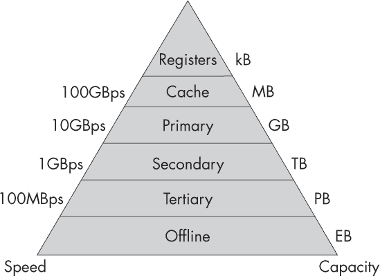

*图 10-1：内存层次结构*

这些层次可以定义如下：

**寄存器** 位于 CPU 内部的内存，如第七章所描述。

**缓存** 位于 CPU 外部但靠近 CPU 的内存，包含主内存的快速副本。

**主内存** 存储在地址空间中，可以通过 CPU 的加载和存储指令直接访问的内存。

**次级内存** 是 CPU 无法通过其寄存器和地址空间直接访问的内存，但可以通过 I/O 传输到主内存中以实现访问。

**三级内存** 是不直接连接到地址空间或 I/O 的内存，但可以通过机械方式连接到 I/O，无需人工干预。

**离线内存** 是只能通过人工干预连接到计算机的内存。

根据丘奇对计算机的定义，任何依赖固定长度地址的机器——比如我们在第七章中构建的曼彻斯特宝宝——都不完全算是计算机。丘奇计算机需要能够模拟任何其他机器，并且为了做到这一点，它必须能够按需请求并获取更多的存储空间。然而，基于固定大小地址的 CPU 和总线构建的机器，无法轻松扩展超出该固定大小的内存。为了绕过这个问题，并支持无限的内存，我们需要使用主内存以下的内存级别，例如在图 10-1 中显示的次级和三级内存。这些较低级别的内存不能直接从 CPU 寻址，而是通过 I/O 模块与 CPU 连接的设备。

### 主内存

*主内存*（也称为*系统内存*）是存储在地址空间中的内存，这些地址空间可以被 CPU 的加载和存储指令直接访问。这包括 RAM 和 ROM。大多数现代计算机使用冯·诺依曼架构；记住，这意味着程序和数据存储在同一主内存中。

在主内存中，每个内存位置都有一个唯一的地址。例如，一个 16 位的地址空间有 2¹⁶ = 65,536[10]个唯一地址，编号从 0000[16]到 FFFF[16]。每个地址存储一个固定大小的位数组，称为*字*。通常，虽然不总是如此，字长被选择为与地址长度相同，例如在现代笔记本电脑的 64 位地址空间中存储 64 位字。你在第六章中看到了实现这种结构的简单方法；在第七章中你看到如何将其直接连接到 CPU，在第九章中则是通过总线间接连接。

#### *字节与字节序*

关于国际单位制（SI）与二进制前缀的争论，涉及到是否应以比特（b）、字节（B）或字（W）来衡量内存。比特是最基本的单位，它与国际单位制单位配合使用效果很好。

在现代使用中，一个字节表示 8 位，这一术语来源于 8 位时代，当时现在所称的字是按定义为 8 位的。一个字节是存储在一个内存地址中的数据，也是被带入 CPU 的一个寄存器进行处理的数据。术语*字节*应该意味着 CPU 从内存中“咬取”最小的一块进行处理。为了避免与*比特*这一术语混淆，它故意拼写错了。“字节”最初是指任何这种自然的 CPU 大小，早期 1950 年代的处理器中，字节的位数范围从 1 到 6 位。直到后来才标准化为 8 位。

在 8 位时代，用字节和现在所谓的千字节（kibibyte）来衡量主存储器是非常自然的。你会计算地址的数量，比如 2¹⁶表示 16 位长的地址，然后在这个数字后加上字“bytes”来得到总的可寻址内存大小。例如，一台“64 千字节”的机器，如 Commodore 64，具有 2¹⁶个地址，每个地址包含 1 个字节。

在现代 64 位时代，字节的意义应该几乎没有，尤其是在现在字长是 64 位而不是 8 位的情况下。如果我们在 2³² = 4 gibi 地址处存储 64 位字，我们将讨论像“4 gibiwords”这样的主存储器大小。

然而，大多数实际的现代计算机*并不*按字存取内存。出于历史原因，它们通常仍然按字节存取内存，就像在 8 位时代那样。这被称为*字节寻址*，意思是，在例如 32 位架构中，一个字被分散存储在 4 个字节中，每个字节有独立的地址。假设我们要存储一个 32 位字，如 12B4A85C[16]。我们可以使用 4 个字节，分别包含 12[16]，B4[16]，A8[16]，和 5C[16]。

关于这些字节应该以何种顺序存储在内存地址中，经历了几十年的标准战争。这个顺序被称为*字节序*。*大端序*认为字节应该按照顺序（12[16]，B4[16]，A8[16]，5C[16]）存储，因为这看起来像人类可读的数字 12B4A85C[16]。大端序认为，这种方式能让看到架构的人，包括架构师和汇编程序员，感到更轻松和更好。

然而，*小端序*认为数字应该按（5C[16]，A8[16]，B4[16]，12[16]）的顺序存储。这最初让大多数西方人觉得很疯狂。特别是，如果你按这个顺序将字节串联起来，你得到的将是没有意义的数字 5CA8B412[16]，而不是期望的 12B4A85C[16]。然而，小端序指出，这样的排序是基于某些文化偏见的。

西方使用的是阿拉伯十进制数字系统，数字从左到右按从高到低的幂次排列。这个系统是从原始的阿拉伯数字中引入的，保持不变。但阿拉伯*文本*是从右到左书写和阅读的，正好与西方的文本相反。在阿拉伯语中，像“24”这样的数字字符串写法是相同的，数值也和西方一样是 24，但它是从右到左读作“four and twenty”。零位列是单位，第一列是十位。这样做在进行算术运算时是有意义的，因为几乎所有的算术算法都是从零位列开始操作，并逐步处理较高的位列。这些列的数字与基础被提升的幂次相对应——例如，零位列是单位，或者说是零次幂。

小端系统分配数值地址，使得第零字节位于字的地址零偏移处，第 *n* 个字节位于 *n* 字节的偏移位置。这在某些情况下可以使机器的算术运算更简便、更快速。例如，如果机器在加法运算中处理两个不同字节长度的字（比如，一个短整型和一个长整型），它就能快速且轻松地找到每个字节的 *n* 位。同样的问题也可能出现在包含可变长度指令的字中：采用小端格式时，你总能确保操作码位于零偏移位置，而无需去寻找它。小端格式在商业架构中现在占主导地位，因此它实际上已经赢得了这场“战争”。

#### *内存模块*

RAM 和 ROM 通常以离散模块的形式出现，可以通过添加和移除来更改可用内存的数量。采用总线架构时，这些模块可以很方便地连接或断开。例如，图 10-2 显示了一个 ROM 模块和两个 RAM 模块与 CPU 共享同一总线的情况。

*图 10-2：包括 CPU、两个 RAM 模块和一个 ROM 模块的总线架构*

一般来说，RAM 和 ROM 都可以有多个模块。所有的 RAM 模块都可以看到沿总线传输的相同信号，但每个模块被配置为与地址空间的不同部分对应，因此只有托管指定地址的单个模块会作出响应。

所有总线模块——包括内存和 I/O 模块——通常都会制造为响应某些默认的地址空间，比如从地址 0 开始。然而，当它们被安装到总线上时，这些地址需要重新映射，以便与其他模块进行比较时具有唯一性。这一重新映射是由称为 *内存控制器* 的数字逻辑组件完成的，它们监听总线上的全局地址，并将其路由到相应的模块，转换为该模块的本地地址。

#### *随机访问存储器*

*随机访问* 意味着可以快速选择并访问内存中的任何位置，而不需要某些区域比其他区域访问更快。相比之下，像磁带或打孔卡片那样的存储方式就不是随机访问，因为在顺序访问数据时，跳到远距离位置的速度通常比快进或倒带要慢。虽然 RAM 代表“随机访问存储器”，但它是一个历史上的误称，并未全面描述其特点。根据现代约定，RAM 指的是不仅具有随机访问能力，还可以读写，并且是 *易失性* 的内存，这意味着机器断电后数据会丢失。许多 ROM 也是随机访问的，但由于它们不符合该术语的其他定义，因此通常不被视为 RAM。

**历史上的 RAM**

我们已经在第三章中讨论了巴贝奇的解析机内存，这也是今天 RAM 架构的基础。在解析机中，每个内存地址对应一堆齿轮的堆叠，其旋转代表一个字。一时间只能有一个地址与总线物理连接。一旦连接，任何齿轮的旋转都会首先传递到总线的线性运动，再传递到 CPU 中寄存器的旋转，反之亦然。现在让我们来看一些其他历史上的 RAM 实例。

#### **声学汞延迟线 RAM**

在《从组合逻辑到顺序逻辑》一节中，第 144 页我们讨论了由电吉他和功放反馈回路产生的音频反馈的有无如何用于存储 1 位信息。事实上，这正是 UNIVAC 时代计算机内存的实现方式，采用了汞延迟线，如下图所示。

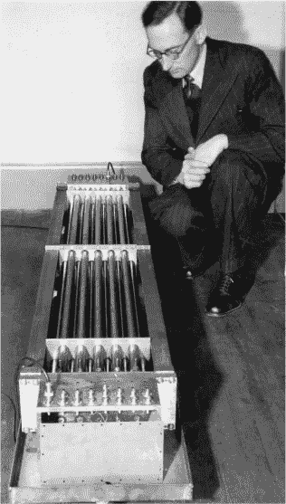

延迟线实际上是将麦克风和扬声器放置在一定距离处，通过反馈来存储一位信息。通过将它们放置在管道的两端，并将管道填充汞，可以延迟声音的传播速度，从而使管道比使用空气的早期版本更短。

在这个时代的机器中，延迟线可以像在解析机中那样组织成地址空间。当 CPU 执行加载或存储操作时，会通过断开和连接电路来实现，将所需的延迟线连接到总线，断开其他线，并将数据的副本放到总线上进行传输。

#### **威廉姆斯管 RAM**

曼彻斯特宝贝机是为研究一种新型 RAM——威廉姆斯管而建造的。该技术如下面所示，诞生于 1946 年，基于旧电视屏幕中使用的阴极射线管（CRT）。

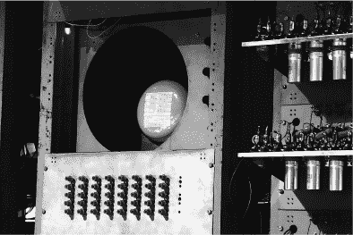

与 CRT 屏幕一样，威廉姆斯管通过电子束发射一束电子流，并利用可调磁铁来偏转电子束，使其一次落在一个像素上，扫描模式覆盖整个屏幕。屏幕由荧光材料制成，这意味着每个像素在吸收电子束时会发光。与 CRT 电视和显示器不同，威廉姆斯管的目的是作为实际的 RAM 存储，而不是供人类读取的显示器。像素在被电子束击中后，会在短时间内保持其电荷和颜色。这意味着它们可以用作反馈系统：我们使用扫描电子束写入满屏像素，快速读取屏幕状态，然后将读取的数据传回扫描电子束，再次写入屏幕。这种方式刷新了屏幕上的数据，使其保持活跃，直到我们希望它保持为止，而不是让像素逐渐消失。

原始的威廉姆斯管屏幕包含 32 个字，每个字为 32 位，每行屏幕为一个字，每列屏幕为字中的一个比特。因此，整个系统存储了 32×32 = 1,024 位。荧光材料采用磷光体，当电子束撞击时，它会发出绿色光。

#### **静态 RAM**

我们之前在图 6-22 中看到的由触发器构成的 RAM 被称为 *静态 RAM* 或 *SRAM*（发音为“es-ram”）。由于 SRAM 是由触发器（与 CPU 寄存器相同的结构）构成的，它既快速又昂贵。触发器通常由大约四到六个晶体管组成（具体取决于触发器类型以及逻辑门的实现方式）。它们具有稳定的内存状态，这意味着它们不需要主动刷新。写入后几乎可以立即读取它们。SRAM 与 CPU 寄存器的不同之处在于，SRAM 是寻址的，而 CPU 寄存器则不是。

SRAM 通常用于实现缓存，如本章后续所讨论的那样。它通常不用于主内存，除非在一些特殊且昂贵的机器中，例如高速路由器，在这些机器中，主内存访问速度至关重要。图 10-3 显示了一个 SRAM 芯片。

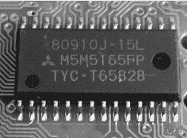

*图 10-3：一个 SRAM 芯片*

类似这样的缓存芯片可以放置在 CPU 和 RAM 之间。或者，类似的 SRAM 缓存也可能与 CPU 在同一硅片上。

#### **动态 RAM**

*动态 RAM (DRAM)* 比 SRAM 更便宜且更紧凑，但速度较慢。它不是由触发器构成，而是使用更便宜且较慢的电容器。*电容器*是用于储存电荷的组件。它由两块金属板和一层绝缘物质隔开。电流不能穿过这两块板，但在其上施加电流会使它们积累电荷，直到它们充满电。电容器通常不会出现在 CPU 设计中，它们是另一种电子元件。一个 DRAM 存储位由一个晶体管和一个电容器组成。电容器可以使用与晶体管制造相似的掩膜工艺在硅上制造。

作为 RAM，DRAM 采用与 SRAM 相同的寻址系统，其电路图与 SRAM 基于存储在地址中的字的总体结构相同。不同之处在于，字是由电容器而非触发器实现的（图 10-4）。

DRAM 结构为一个 2D 数组，由字或字节组成，每个字或字节位于一个“行”和“列”中。请求的地址由内存控制芯片转换为每行和每列的两个较小的地址，这些地址通过一个单一的晶体管在组合地址上进行与门操作。这节省了大量的数字逻辑，但将地址分成两部分所需的工作使得 DRAM 的寻址速度比 SRAM 慢。

由于电容器的特性，读取 DRAM 会使其放电并销毁存储的信息（就像分析引擎的 RAM 一样）。读取和写入电容器状态是一个模拟过程，需要一定的时间来完成。由于电容器是模拟设备，电荷也可能随时间泄漏。为了处理这些相关问题，DRAM 必须定期刷新，例如，在 2018 年版的 DRAM 上，大约每 64 毫秒刷新一次。（不断刷新是“动态”DRAM 的根源。）像水银线路和威廉姆斯管一样，刷新过程会读取当前状态，然后在短时间内重写它。刷新必须小心计时，有时可能与 CPU 的读取或写入发生冲突，导致 CPU 需要等待刷新完成后才能重新尝试。

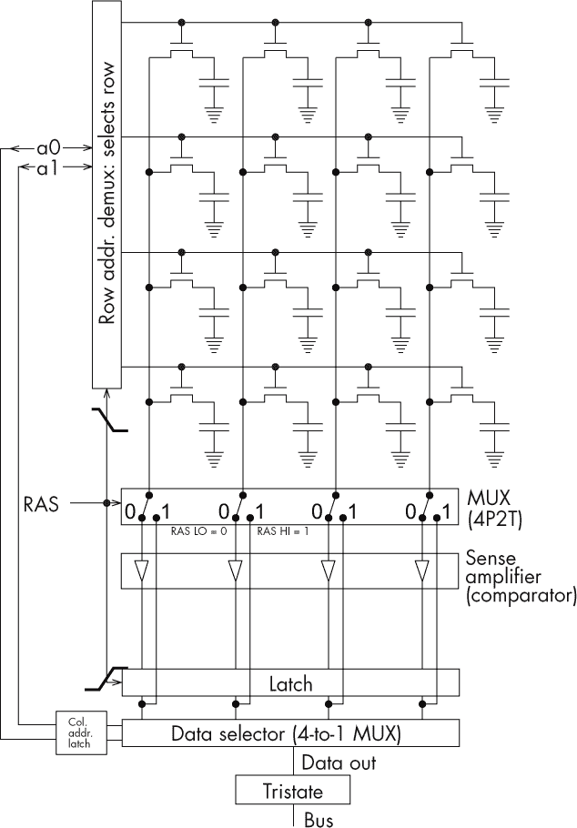

*图 10-4：一个 DRAM 电路，展示了电容器和寻址*

DRAM 受益于*预充电*，这大致是一种在使用之前“预热”的方式；这样可以避免与访问发生冲突的重新充电。因此，现代的 CPU 和内存控制器会协作，尽量预测——提前几个指令——哪些内存在使用前应该被“预热”。

现代的 DRAM 芯片通常被打包在大约八个芯片的印刷电路板模块上，每个芯片共享一部分地址空间，如图 10-5 所示。这些模块通过标准接口连接到主板，如之前在介绍中所见（图 2）。可以通过将更多 DRAM 模块添加到台式机的内存插槽中，来增加额外的内存。

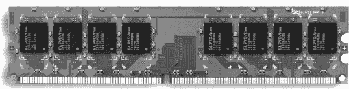

*图 10-5：一个 DRAM 模块*

*单列内存模块(SIMMs)*具有 32 位总线宽度，它们曾是 1990 年代 PC 的标准。双列内存模块(DIMMs)在 2000 年代取代了 SIMMs。它们具有 64 位总线宽度，每个 DIMM 存储多达几千兆字节。双倍数据速率(DDR)DRAM 通过一种使数据能够在时钟的上升沿和下降沿同时传输的技术，使 DRAM 的速度翻倍。这使得带宽翻倍（因为*带宽 = 总线宽度 × 时钟速度 × 数据速率*）。SIMMs 和 DIMMs 经历了几个改进的标准，可以通过不同的缺口位置直观区分，设计目的是使它们只能插入到正确类型的插槽中。

#### **错误更正码 RAM**

RAM 像其他芯片一样，已经被微型化到接近原子尺度。在这些尺度下，量子效应和粒子物理学开始发挥作用。量子效应可能包括各种类型的固有噪声和关于用于内存的粒子位置的不确定性。宇宙射线是最常见的随机粒子，通常包括电子、α粒子和μ子，它们以高速穿越太空，来源可能是太阳或银河系的其他地方。如果宇宙射线与 RAM 的敏感组件发生碰撞，它可以破坏该组件并翻转其布尔状态。

*错误校正码内存 (ECC-RAM)* 在 DIMM 上有额外的芯片，这些芯片存储数据的额外副本或校验和，并利用它们在硬件级别自动修正类似的错误。ECC-RAM 主要应用于太空领域，那里计算机位于地球大气层的保护之外，因此更容易受到宇宙射线的影响。随着价格的下降，ECC-RAM 也可能出现在其他高价值、关键安全系统中。

**ROWHAMMER 漏洞**

*Rowhammer* 指的是当前影响计算机安全的一组内存硬件漏洞。DRAM 电容器现在非常小且密集，以至于它们的电场可能会影响邻近的内存行。安全研究人员已经开始利用这一效应来读取和写入目标程序的内存。研究人员编写新程序，并安排将它们存储在内存中物理上紧邻目标程序的区域，例如存储在线银行密码的地址。然后，他们在自己程序的位置加载并存储数据，方式上可能会触发自己与目标内存中电容器的物理交互。例如，这可能包括将自己的地址置于可能引起目标内存中类似宇宙射线风格错误的状态。或者，他们可能通过观察自己读写中的相似错误或由于目标电容器状态引起的微小时间延迟来推断目标内存的状态。

当前的研究正在进行，以防御 rowhammer 攻击。方法包括使用 ECC-RAM 来修正任何恶意引发的宇宙射线风格错误，使用更高的内存刷新率，以及通过操作系统代码等软件层面的解决方案来随机化程序在内存中的位置，从而防止代码与目标程序的交付性共同定位。

#### *只读存储器*

*只读存储器 (ROM)* 传统上指的是只能读取而不能写入的内存芯片，这些芯片由制造商预先编程，内含永久性的子程序集合，然后被安装在主内存中的固定地址处。ROM 随着时间的推移，已经发展出包括其他类型的内存，这些内存并不完全符合这一传统定义或名称。

首先，ROM 与 RAM 的区别从未真正存在，因为如前所述，ROM 芯片和 RAM 一样是随机访问的：它们被安装在主地址空间中，访问其中的任何地址所需的时间都是一样的。ROM 和 RAM 的区别在于，RAM 是可读写的，而 ROM 传统上只是可读的。

其次，ROM 随着时间的推移发展出了越来越容易重写的特性，存储在 ROM 中的程序现在可以以某种方式被重写，这些程序通常被称为 *固件*。以下部分描述了这一演变的主要步骤，如图 10-6 所示。

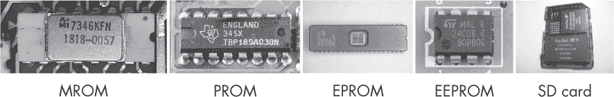

*图 10-6：只读存储器的演变：MROM、PROM、EPROM、EEPROM 和 SD 卡挂载的闪存。请注意，不同寻常的是，EPROM 封装中实际的硅片是可见的，通过一个透明窗口，可以将其暴露在光下。*

让我们来了解一下这些不同类型的只读存储器。

#### **掩膜只读存储器（Mask ROM）**

*掩膜只读存储器（MROM）*是一种由制造商通过光刻技术编程的只读存储器。它永远是只读的，无法覆盖。如果你想更新 MROM 芯片，你必须将其取出、丢弃，然后插入一个包含新内容的全新芯片。光刻技术非常昂贵，因此 MROM 的生产和升级都很困难。

#### **可编程只读存储器（Programmable ROM）**

*可编程只读存储器（PROM）*是对 MROM 的巨大改进。与第五章中讨论的可编程逻辑阵列（PLAs）类似，PROM 是通过光刻技术制造的芯片，包含一个通用电路和多个保险丝。程序员可以选择性地熔断保险丝来创建不同的结构。虽然 PLAs 使得可以以这种方式烧录任意数字逻辑网络，但 PROM 则包含一个固定的地址和字结构，只允许烧录组成字的位来制作只读存储器。通常，每个位在其保险丝完好时包含 1，若其保险丝熔断则变为 0。像 PLAs 一样，PROM 一旦编程后就不能被擦除。

#### **可擦除可编程只读存储器（Erasable Programmable ROM）**

*可擦除可编程只读存储器（EPROM）*类似于 PROM，但该芯片的数据可以通过紫外线照射来擦除。然后可以重新写入新的数据。这个过程可以反复进行很多次。尽管擦除过程相当复杂，需要将芯片从计算机中取出并放入光照盒中，但这仍然是你作为一名熟练的最终用户客户可以做的，无需计算机制造商的帮助。

#### **电可擦可编程只读存储器（Electrically Erasable Programmable ROM）**

*电可擦可编程只读存储器（EEPROM）*类似于 EPROM，你可以擦除整个芯片并重新写入它，但在这里你只需要使用电流来擦除和重新编程。这消除了物理操作 ROM 的需要；它可以保持在计算机内部。今天，EEPROM 被用于那些可以升级固件的 ROM。如果你曾经进行过固件更新，你会看到它完全可以通过软件完成，而无需物理接触任何东西。你不希望每天都更新固件，但可能每年更新一次，或者当发现有 bug 修复时。

#### **闪存（Flash Memory）**

*闪存*是可以按块擦除和重写的 EEPROM，这意味着你可以选择性地擦除和重写内存的一个小部分或块。这样，你就可以保持大部分 ROM 不变，不像常规 EEPROM 那样，每次必须擦除和重写整个 ROM 芯片，如固件更新时的做法。闪存使得在芯片在线时，频繁重写 ROM 的一部分变得更加容易，在某些情况下，它几乎像 RAM 一样起作用。

### 缓存

*缓存*是 CPU 的快速寄存器和较慢的 RAM 之间的内存金字塔中的额外层级。它存储最常用的内存内容的副本，使它们可以快速检索。（*缓存*是一个过时的词，指的是存储食物、武器或海盗宝藏等物品的地方。）没有缓存时，RAM 会直接连接到 CPU，要么是直接连接，如第七章所讨论，要么是通过带有控制（C）、地址（A）和数据（D）线的总线连接，如第九章所讨论，并在图 10-7 中总结。

*图 10-7：基本的 CPU、总线和 RAM 架构*

这种无缓存架构的问题在于，大多数程序需要频繁访问 RAM，但实现 DRAM 的电容器比实现 CPU 寄存器的触发器要慢。因此，RAM 成为系统速度的主要瓶颈。如果 RAM 的速度慢得多，而 CPU 需要等待每次加载和存储操作完成，那么即使有一个快速的千兆赫 CPU 也没有用。为了避免这些瓶颈，在 CPU 和 RAM 之间添加一个基于 SRAM 的缓存（如图 10-8 所示）有助于解决这个问题。

*图 10-8：带有缓存的基本 CPU、总线和 RAM 架构*

当 CPU 需要加载一些数据时，缓存会检查它是否已有该数据，如果有，则快速返回。如果没有，缓存会查阅下一级内存（如图 10-8 所示的 RAM），并从该级别获取数据。缓存也可以发生在*所有*内存层级中，从寄存器到硬盘和自动唱机（关于后者将在“三级存储”部分进一步讨论）。然而，在这里我们主要讨论的是在寄存器和主 DRAM 内存之间的主内存级别的缓存。

初始设计使用了一个由 SRAM 构成的单一缓存。近年来的机器利用摩尔定律中晶体管密度的提升，将硅芯片填充上更大的缓存和更多级别的缓存。如今，至少有三个缓存层级——L1、L2 和 L3——这种设计已经很常见，如图 10-9 所示。

*图 10-9：带有 L1、L2 和 L3 缓存的基本 CPU、总线和 RAM 架构*

所有这些位于 CPU 和 DRAM 内存之间的缓存层通常使用 SRAM 制造，但它们有不同的操作策略，通过不同的数字逻辑实现，权衡了大小和速度。在历史上，缓存通常位于 CPU 外部的专用芯片上。虽然较低级别的缓存仍然如此，但一个主要趋势是将更大、更高级别的缓存直接集成到 CPU 硅片中。

了解你机器的缓存有助于你编写更快的程序。通常，每一级缓存的速度是下一级缓存的 10 倍，因此当你填满某一级缓存时，你会看到内存访问的突然变慢。如果你知道缓存的大小，你可以重新设计代码，将正在使用的数据保持在已知缓存级别的限制内，从而利用缓存的速度。

#### *缓存概念*

缓存基于*局部性原理*，该原理指出，在任何给定时刻，只有少量的内存空间被访问，并且该空间中的值会被反复访问。因此，将最近访问的值及其邻近值从较大、较慢的内存复制到较小、较快的内存是有用的。有多种不同的方式来理解“邻近”和“局部性”。*时间局部性*是指值倾向于在相近的时间内被反复访问。*顺序局部性*是指某些序列倾向于以相同的顺序多次重新访问。*空间局部性*是指内存中相邻的值倾向于一起被访问。这些概念适用于指令和数据，通常由于循环和子程序的存在而产生。

缓存内存由许多*缓存行*组成。每一行包含一个*块*，该块包含多个来自内存的连续字的副本，以及一个*标签*，它是一个地址或其他标识符，描述了哪个内存位置的值被复制到了该块中。每一行还具有一个*脏位*，用于跟踪 CPU 是否已更改缓存中的值，使其与内存中相应的值不同。表 10-1 显示了一些示例缓存行。

**表 10-1：** 缓存行

| **标签** | **块** | **脏位** |
| --- | --- | --- |
| `$08F4` | `01101100 01101100 10011010` | `1` |
| `$2AD5` | `10010101 11100110 00110110` | `0` |

表中显示的每个缓存行包含一个由三个 8 位字组成的块，一个由 16 位地址空间中的完整地址构成的标签，以及一个脏位。第一行的脏位为 1，表示该行已被更新，而第二行的脏位为 0，表示该行未被更新。

我们不是缓存单个地址，而是缓存缓存行，因为移动较大块的内存比单个字更便宜。通过将目标字周围的整行数据带入缓存，我们利用了空间局部性——相邻位置的数据和程序很可能会被接下来使用。这一行已经为此做好准备。

一些缓存系统使用“哈希函数”来选择缓存中存储数据的位置，通常是基于数据在低级内存中的地址。*哈希函数*是一种多对一的函数，它将一个大的输入数字映射到一个较小的输出数字，即*哈希值*。通常无法从哈希值恢复出原始值。例如，取一个十六进制数字的最后两个十六进制数字是一个简单的哈希函数：*hash*(9A8E[16]) = 8E[16]。对数字的所有二进制位执行布尔与运算的函数是另一个哈希函数：*hash*(01101001[2]) = 0&1&1&0&1&0&0 = 0。缓存中常用的哈希函数是计算地址对缓存行数取模的值。

在缓存中找到一个项目叫做*命中*。在缓存中找不到一个项目叫做*未命中*。当发生未命中时，我们必须回到底层内存去查找该项目，通常会在缓存中为将来使用创建一个新的副本。*命中率*是命中次数与尝试次数（命中和未命中）的比率。它衡量了成功的缓存查找的比例。*未命中率*是未命中次数与尝试次数的比率。它衡量了不成功的缓存查找的比例。*命中时间*是访问请求数据所需的时间，如果发生命中的话，*未命中惩罚*是处理未命中所需的时间。

缓存只有有限数量的行，当我们存储从底层内存访问的所有数据副本时，这些行很快就会被填满。一旦缓存满了，我们将继续请求新的地址。初始时，这些请求会错过缓存，但时间局部性表明，这些新地址比缓存中的旧地址更可能被重用。因此，我们应该选择缓存中的某些行进行覆盖，丢弃它们之前缓存的地址，并用新地址替换它们。被覆盖行的内容称为*牺牲品*。

一旦我们有了缓存结构，就需要使用快速数字逻辑实现算法来管理它。我们需要决定如何最好地利用可用的缓存行，以及如何创建和查找标签。与大多数数字逻辑设计一样，简单的方法和快速的方法之间总是存在权衡。后者通常需要更多的硅片，导致它们更加复杂、容易出错且成本更高。让我们来看看一些使用缓存的选项。

#### *缓存读取策略*

从缓存读取比写入缓存要简单，因此我们将首先研究一些缓存读取算法的选项。

#### **直接映射**

*直接映射*是最简单、最容易理解且最便宜的缓存读取策略。它在图 10-10 中有所展示。

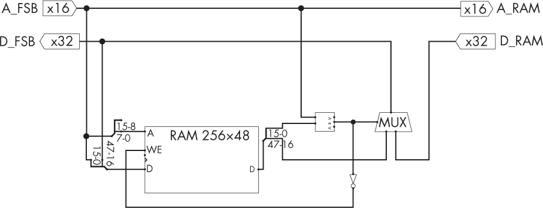

*图 10-10：直接映射缓存读取策略（显示查找和缓存）*

本质上，我们存储或查找标签的行是使用该标签的固定哈希值来寻址的。带有此标签的行将始终只存储在一个位置。如果多个行争夺该位置，新的行将替换旧的行。例如，假设我们从地址 67AB[16]加载数据。我们可能计算出*哈希*(67AB[16]) = 4[16]，这意味着该地址及其内容将缓存到行 4[16]，并覆盖该行之前的任何内容。

缺点是直接映射如果多个地址共享相同的哈希值，无法将它们的多个在用地址保存在缓存中。假设我们的程序有一个紧密的循环，反复读取和写入两个交替的地址 67AB[16]和 12C9[16]。这里的问题是*哈希*(67AB[16]) = *哈希*(12C0[16]) = 4[16]。这两个地址将不断相互竞争，互相覆盖行 4[16]，即使在循环中没有使用其他地址或缓存行的情况下也是如此。在这种情况下，缓存根本不会带来任何好处，因为每次访问都会失败。

#### **完全关联**

为了解决直接映射的问题，我们希望地址能够根据行的使用情况使用不同的缓存行，从而使得最少使用的行受到影响，正如在图 10-11 中的*完全关联缓存*示意图所示。

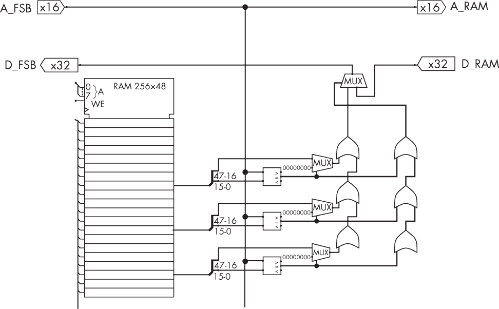

*图 10-11：完全关联缓存示意图*

在这里，每一行缓存 RAM 都有自己的数字逻辑模块，包括比较器、选择器和 OR 阵列。这里只为说明 purposes 展示了三个这样的模块，但对于一个 256 行的缓存，实际上会有 256 个这样的模块，全部并行工作。

我们希望能够在*任何*可用行上存储标签、数据块和脏位，并能快速找到它。缓存是这里的简单部分：我们只需创建一些数字逻辑来统计每一行的使用频率，并选择使用频率最低的行。

缓存查找是更难的部分。在直接映射中，我们只需计算与缓存使用相同的哈希函数，来告诉我们在哪一行找到所需的地址。现在它可能位于缓存中的任何位置，因此我们需要添加大量额外的数字逻辑，以检查每一行的标签是否与所需标签匹配，并在存在匹配时激活该行。以并行方式执行此操作（这是唯一可以让其足够快以便有用的方法）需要*N*个匹配数字逻辑的副本，每个缓存行有一个副本，使得系统变得更大且更耗能。

#### **集合关联**

*集合关联*缓存读取是一种试图同时兼得上述两种方法优点的做法。在这里，我们将*N*行缓存分成几个较小的行集合。我们使用地址哈希来计算一个集合编号，而不是计算行号。在缓存过程中，我们通过这个哈希找到集合编号，类似于直接映射方法，然后选择该集合中使用最少的行作为替换行，类似于完全关联方法。在查找时，我们再次通过哈希找到集合编号，然后在该集合中并行匹配所有项，以快速找到匹配的行。

这种方法意味着我们只需要激活单个集合中的比较器，而不是整个缓存，但我们仍然避免了紧密循环共享哈希值的直接映射问题。实际上，这通常被认为是一种良好的平衡。

#### *缓存写入策略*

当我们进行存储操作时，缓存会变得更加复杂，因为存储操作会改变内存的状态。假设我们最近从地址 540A[16]加载了一个整数 17，并在加载时缓存了一个副本。我们想将这个整数递增到 18，并将结果存回到 540A[16]。由于局部性原则，我们很可能在不久的将来继续从 540A[16]加载和存储，因此与其直接将 18 存储到 540A[16]，不如只将它存储在当前缓存 540A[16]的缓存行中。这样，所有未来的加载和存储操作都可以直接命中缓存，而不需要访问主存。

问题在于，最终这行数据会被替换，我们会丢失对值所做的所有更改；主存中仍然包含旧值 17。为了避免这种情况，在某个时刻我们需要将修改后的值复制回主存。前面在表 10-1 中显示的脏位会跟踪是否需要进行此操作。如果缓存行中的值与内存中的值相同，脏位被设置为 0；如果缓存行中的值已更新，但内存中的值没有变化，脏位则设置为 1。名为*缓存写入策略*的算法利用这个脏位来管理回写到内存。我们来看两种不同的方式：写回和写穿透。

#### **写回**

*写回*是更简单的缓存写入方法：只有当缓存行被替换时，它才会将缓存块的内容复制回 RAM。然而，这相对较慢，因为替换只有在指令急于执行时才会发生。我们被要求在替换被宣布后开始写回，而替换的指令将不得不等待我们进行一次缓慢的 RAM 访问，才能覆盖我们的替换行。

#### **写穿透**

*写直达* 是一种可能比写回更快的替代方案，尽管它使用更多的资源。在写直达中，我们不会等到行被淘汰后才将行的块复制回 RAM；相反，我们会在后台不断地多次执行这个操作，使用附加在缓存行和总线上的数字逻辑。这些逻辑的作用类似于 SyncThing 或 Dropbox 这样的应用程序，不断监视缓存版本中的任何更改，并将其复制回 RAM 中的主版本。由于这些额外的数字逻辑位于缓存本身，因此不会给 CPU 增加额外工作。然而，这会导致总线上的流量增多，因为我们比起写回方式要更多次地发送这些更新。

#### *高级缓存架构*

请考虑缓存如何与第八章中高级 CPU 技术互动。管道化 CPU 需要非常关注缓存未命中，因为它们会形成另一种可能的危险。高效的管道可能会假设内存访问将会被缓存，如果发生未命中，它们将需要停顿或以其他方式处理这种危险。

你在第八章中看到过，分支预测试图猜测程序的执行流程，以便使管道和乱序执行更顺利。这可以与缓存配合使用，*预先* 获取和存储数据——也就是说，在实际的加载和存储指令到达之前就开始进行。这些指令的执行时间远长于 CPU 内部操作，因此提前启动它们是有用的。CPU 可以提前预测程序中哪些主内存的部分可能在后续指令中需要，从而提前开始缓存这些部分，以使 CPU 的获取速度更快。

如前所述，缓存的每一层——L1、L2 和 L3——相较于其下层提供大约十倍的速度提升，因此，预先将数据移到更高层次的内存层次结构中所带来的潜在收益并非微不足道。如果抢占发生错误，缓存可以随时回滚，CPU 会停顿。如果我们把错误的数据带入缓存，并不意味着世界末日：缓存是一个很大的地方，改变其中的内容是可以接受的。

由于 DRAM 地址的行列结构，在一次性读取单个 DRAM 行中的多个项比单独读取更快。（一旦激活一行，读取多个列几乎是免费的，而读取单个列则相对较慢。）因此，现代 DRAM 控制器通常会与缓存协同工作，将大块的 DRAM 行移入缓存行。

如果我们事先知道数据不需要很快再次读取，缓存写入可能会不必要地拖慢系统速度。在这种情况下，写入缓存然后再传输到主内存的速度可能比直接写入主内存要慢。现代 CPU 可能会提供专门的无缓存写入指令，机智的程序员和编译器开发者可以利用这些指令来加速程序执行。

经验表明，L1 缓存如果分为两个独立的并行缓存，一个用于指令，一个用于数据，通常能更平稳地工作。这种分离可以出现在哈佛架构中，其中指令和数据已经在 RAM 中分开存储，也可以出现在冯·诺依曼架构中，在这种架构中，指令和数据可以通过控制单元（CU）请求它们的部分来区分（指令在取指阶段请求，而数据在执行阶段请求）。这种分离只发生在 L1 级别，更低级的缓存共享指令和数据，如图 10-12 所示。

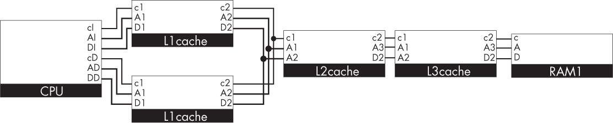

*图 10-12：一种基本的 CPU、总线和 RAM 架构，具有独立的 L1 缓存用于指令和数据，以及共享的 L2 和 L3 缓存*

在 L1 级别分离指令和数据似乎是有效的，因为指令和数据各自都有空间局部性，但它们之间几乎没有局部性。而且，指令通常不会被覆盖，而数据经常会，因此将指令分离出来可以简化缓存写入过程。

### 二级存储和离线存储

*二级存储*是可以通过 I/O 快速加载到地址空间中的存储。二级存储中的数据项在主存地址空间中没有地址。相反，它们是通过 I/O 访问的，通常通过一个*位于*主地址空间中的 I/O 模块，该模块将请求转发到二级存储。二级存储有时被称为*在线存储*，以强调它在计算机开启时有电、处于活动状态并且随时可用。

*离线存储*是指无法在没有*手动*干预的情况下自动加载到主存中的存储。通常这包括物理上可弹出和更换的二级存储介质，如磁带、光盘和 USB 设备。连接到计算机时，这些介质是二级存储，断开时则是离线存储。离线存储通常用于备份和归档，以及运输。将 PB 级数据快速移动到世界各地的最快方法仍然是将其作为离线存储装载到卡车上，然后运输到目的地。

现在，二级存储和离线存储应该用比特和国际单位制（SI 单位）来衡量——例如，描述“8.8 太比特硬盘”而不是“1 tebibyte 硬盘”。这是因为它们不是主存地址空间的一部分，因此不使用主存的字或字节地址进行寻址。与现代主存相比，字节的概念在这里甚至更不相关。然而，由于主存仍然通常按字节寻址并以字节为单位进行测量，大多数人对字节单位的大小感知更好，因此他们选择以相同的单位来度量二级存储。

辅助（以及离线）内存通常的特点是需要一些机械运动来查找数据，而不是随机访问。这包括通过磁带滚动或旋转由各种材料制成的盘片。接下来，我们将详细了解这些技术的一些细节。

#### *磁带*

*磁带* 是一维数据存储设备，必须左右滚动以定位所需的数据。你可以将人类手写的纸卷，如《托拉》经文，视为最初的磁带。磁带不是随机访问的，因为读取设备在磁带的某个位置，且移动磁带（或读取设备）以访问远距离位置所需的时间，比访问附近位置要长。使用磁带存储的快速算法需要考虑这种结构，并优化内存访问，以减少大的地址跳跃。

#### **打孔卡片**

*打孔卡片* 是最初的计算辅助存储设备，如在贾卡尔织机和分析机中使用（见图 1-11）。它们继续在 IBM 霍勒里特机器中使用，并用于存储和读取 20 世纪 60 年代早期电子机器的程序。偶尔的工业使用甚至持续到 1980 年代，且据说至少有一个英国委员会至今仍在使用它们。在打孔卡片中，数据的二进制数字通过在卡片或纸张的系列物理位置上打孔或不打孔来表示。孔的大小通常和你买来为文件存档用的桌面打孔机的孔大小相似。

卡片是二维的，具有行和列。通常每行存储一个字，行号作为地址（在辅助地址空间中，而不是主 RAM 地址）。从概念上讲，有时甚至在物理上，卡片的叠加是*链式*连接的，形成了实际上是二维的磁带。

#### **打孔带**

*打孔带* 是打孔卡片的一种替代品。这种带子曾被英国邮政局使用，构成了图灵机的灵感，并且也曾用于科洛苏斯（见图 1-22）。根据你的视角，磁带在概念上比卡片更简单，因为它只是单一的一维位数组；或者它比卡片更复杂，因为你必须更多地关注对齐和读取单词，而卡片则可以轻松地按行呈现。

#### **磁带**

*磁带* 在 1920 年代为模拟音频录制而开发，1960 年代商业化为家庭使用的 8 轨系统，然后在 1980 年代广泛用于 4 轨的紧凑型磁带中。模拟磁带在 1980 年代也被广泛用于家庭视频录制，伴随了现代数据标准战争中竞争的 VHS 和 Betamax 格式。

在这些系统中，像氧化铁这样的可磁化材料被形成磁带结构，并通过磁带上每个点的磁化水平来存储数据。与打孔纸不同，磁带容易重新磁化，可以反复写入多次。

相同的磁带可以以多种方式用于存储数字信息。例如，0 和 1 可以通过两种不同的可听频率的单个周期进行编码——这是一种对大多数磁带设备添加的重噪声具有较强抗干扰性的技术。为优化打孔带访问开发的算法直接应用于磁带，正如在 1980 年代的图 10-13 中的机器所示。

*图 10-13：1980 年代的紧凑型卡带及播放/录音机，用于模拟音乐和数字文件存储*

磁带今天仍然被用于离线存储，特别是用于公司系统的每周或每日备份。磁带价格便宜、成本效益高，适合大规模存储，且对访问时间要求较低。因此，磁带非常适合用于日常备份任务，因为你希望尽可能长时间保留大量的旧备份。尤其是，如果有人以比单纯删除所有文件更微妙的方式攻击你的公司——例如，逐步对数据库进行小的修改——拥有一系列长期备份非常有用，这样你就可以从不同的日子、周、月、年甚至几十年前恢复系统的状态。你可以每天花几美元购买一卷新的磁带来确保这一点。拥有大量磁带的另一个好处是它们可以存放在比硬盘更多的地点——例如，每天让不同的员工带回一卷磁带，这样即使一半员工的家在同一天着火，你仍然可以拥有许多近期的备份。

当前最流行的磁带存储标准是*线性磁带开放式（LTO）*，见图 10-14。

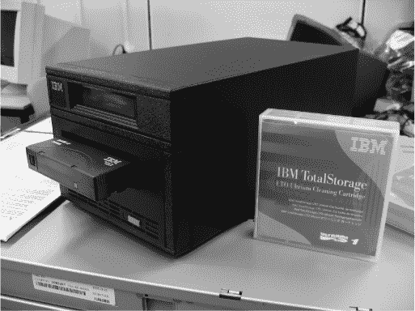

*图 10-14：IBM Ultrium 线性磁带开放式盒和驱动器*

LTO 是一种开源标准，截至 2020 年，在一卷适合放入口袋的磁带中，大约存储了 36TB 的数据，写入过程大约需要 12 小时。这对大多数小型企业来说是一个很好的尺寸和时间；他们可以在一晚之间将整个系统备份到单个磁带中。

#### *磁盘*

音频录制始于 19 世纪 70 年代的蜡筒，见图 10-15。

*图 10-15：蜡筒音频存储设备*

在这里，声波进入声学号角并被集中，振动针头，将声波刻录成旋转的热蜡筒上的螺旋形轨迹，同时蜡筒缓慢地从左向右移动。当蜡筒冷却后，可以再次旋转通过针头，使其以相同的方式振动，并通过号角放大其运动，从而重播声音。

蜡筒唱片曾在商业上使用，直到 1898 年被旋转每分钟 78 转的唱片取代（图 10-16，左）。这些“78”转盘使用了将模拟声音波形直接刻入螺旋槽中的相同思想，它们的乙烯基后代——现在带有电放大——至今仍被 DJ 使用（图 10-16，右）。

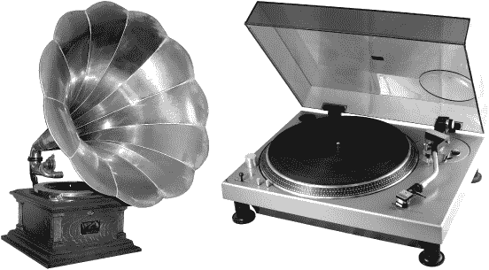

*图 10-16：留声机（左）和现代的 Technics SL-1200 转盘（右）*

与音频光盘不同，音频光盘只有一条从边缘到中心螺旋的轨道，大多数数据磁盘实际上是二维的，因为它们有许多独立的*轨道*，每个轨道在固定的半径上，如图 10-17 所示。

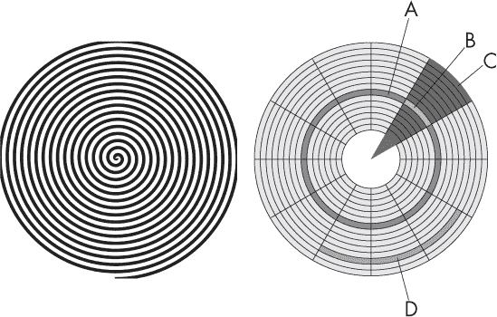

*图 10-17：音频光盘的单轨（左）和数据磁盘的二维轨道（右）。后者展示了轨道（A）、扇区（B）、几何扇区（C）和簇（D）。*

靠近边缘的轨道比中心的轨道更大，因此它们能存储更多的数据。轨道沿着其圆周被划分为固定数据大小的*扇区*。每个扇区都有一个地址，由轨道 ID 和轨道内的位置信息组成。在大多数系统中，扇区会存储一些位来表示它们的位置，这样我们就可以知道正在查看磁盘的哪一部分。它们还可能存储冗余位，用以补偿磁盘的物理损坏，利用香农的通信理论。扇区可以被组合成连续的*簇*，簇是可以一起读取或写入的最小单元。

磁盘上的数据可以以*几乎*随机访问的方式进行访问：各个扇区可以按任意顺序存储或检索，不仅限于顺序访问，但由于磁盘和磁头的运动，访问相邻的扇区和轨道会更快。从同一轨道上依次读取扇区是非常容易且快速的，因为它们在旋转时经过磁头。如果你需要读取同一轨道但与当前扇区不同角度的数据，你必须等待磁盘旋转到该扇区下方。如果需要从不同的轨道读取数据，则需要将磁头沿半径移动，这个过程非常慢，因为它是一个物理装置。因此，控制旋转磁盘的 I/O 模块需要考虑*访问时间*——即读取或写入一个扇区所需的时间。访问时间由两个主要因素组成：*寻道时间*是磁臂定位到轨道上的时间，*旋转延迟*是所需扇区旋转到磁头下方所需的时间。

#### **软盘**

磁盘驱动器使用与磁带相同的技术来表示数据，但它们将磁性材料排列成二维的磁盘，而不是一维的磁带。磁盘通过安装在臂上的磁头进行读取和写入，就像留声机的唱针一样。*软盘*（图 10-18）最早出现在 1960 年代。之所以叫“软盘”，是因为它们在物理上可以弯曲。

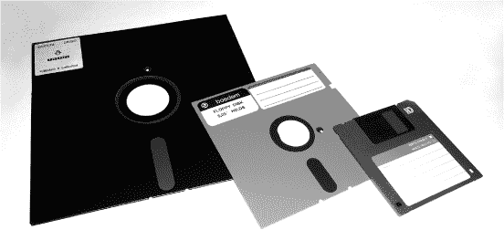

*图 10-18：三代软盘：8 英寸（1970 年代）、5 1/4 英寸（1980 年代）和 3 1/2 英寸（1990 年代）*

软盘容易受到损坏，因此通常被包裹在塑料外壳中，如图所示。

#### **硬盘**

*硬盘*由非柔性材料制成，能够存储比软盘更高的信息密度，并且转速比软盘快。这些设备通常需要将读写头封闭在一个与磁盘一起的封装内，如图 10-19 所示，而不是像软盘那样允许更换磁盘。

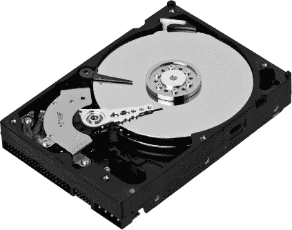

*图 10-19：磁性硬盘的内部结构*

硬盘*驱动器*通常包含多个硬盘磁盘，这些磁盘被包装在一起，每个磁盘都有自己的读写头，并且所有磁盘共享一个地址空间。这有助于减少访问时间，因为各个读写头可以一起进行读写操作。硬盘的转速通常在 90 到 250 Hz 之间，这会使一层空气将读写头抬离表面，从而避免了读写头与盘片的物理接触。这意味着硬盘的头部和盘片都不会受到物理磨损。设计师在技术上投入了大量资金，以便在硬盘处于物理危险中时，自动且迅速地停放读写头，例如在硬盘被撞击或推挤时。如果没有这种技术，读写头会在这种情况下撞到磁盘并将其摧毁。

#### **光盘**

光盘是现代版的巴比伦泥板，如图 1-5 所示。与这些泥板类似，光盘也是实心物体，表面有小的空洞—称为坑—用于表示数据，如图 10-20 所示。和穿孔卡片一样，光盘采用二进制编码，因此每个位置要么包含一个坑，要么不包含坑。这些坑通过激光读取，并且它们的纳米级尺寸与激光光线的波长相当。

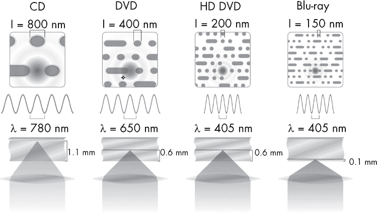

*图 10-20：光盘存储的四个发展阶段*

*激光光盘*（1978 年）是第一种光盘，直径为 12 英寸，像黑胶唱片一样，并且主要用于家庭视频播放。*光盘*，或称*CD*（1982 年），使用约 800 纳米的凹坑，通过激光头读取，用于存储最多 700MB 的音频数据。光盘在 1988 年开始用于一般数据存储，而不仅仅是音频数据存储，随着*CD-ROM*规范的出现。与光盘类似，这些光盘在初始刻录凹坑后变为只读。*CD-R*是简化录制过程的版本，允许用户在家中“刻录”自己的 CD-ROM，且仅能刻录一次。这些光盘在 1990 年代后期被用于复制音频音乐收藏，最初使用 CD 音频格式，后来使用大容量 MP3 存储。它们通常在可刻录面为蓝色，顶部为金色。它们的“刻录”是一个物理过程，涉及激光和热量；这也是现代俚语“刻录”一词的来源，现在被用于写入其他类型的只读存储介质，如闪存或 FPGA。*CD-RW*是改进版的 CD-ROM，可以被多次重写。

*数字多功能光盘（DVD）*（1995 年），是一种数量级的改进，减小了凹坑的大小至 400 纳米，使得光盘容量可达到 4.7GB，且使用与 CD 相同大小的物理光盘。DVD 最初用于视频，但很快也用于一般数据存储。与 CD 类似，开发了可一次写入的 DVD-R 和可重写的 DVD-RW。*蓝光光盘*（如同其短命竞争对手 HD-DVD）再次减小了凹坑的大小，这次减小到 150 纳米，使得同样大小的光盘能够存储最多 25GB 的数据。由于这些凹坑较小，它们需要短波长的蓝色激光光来读取，而不是红外或红色激光，因此得名。

#### *固态硬盘*

对于二级存储，大多数当前计算机已从硬盘驱动器转向*固态硬盘（SSDs）*。这些硬盘的制造方式使其具有与硬盘相同的外形尺寸和 I/O 接口，并且具有相似的存储容量，但没有活动部件。这使得它们更快、更可靠、功耗更低、噪音更小、更小巧，并且在掉落时不易损坏。由于没有活动部件，它们可以实现真正的随机访问。SSDs 是闪存，如我们之前所回顾的。

相同的闪存技术也被用于离线存储，其中 SSD 驱动器是易于移除的，例如通过 USB（称为 USB 闪存）或 SD 卡（称为 SD 卡）连接到 I/O 时。

### 第三存储

*第三存储*是最近提出的内存层级中的一个新层级。它位于二级存储下方，但高于离线存储，旨在描述那些曾经是离线的内存——需要人类手动加载和弹出介质，如光盘和磁带——但现在通过机械过程自动化。例如，自动化的蓝光和 LTO 磁带机器人，正如在图 10-21 中所示，构成了第三存储。

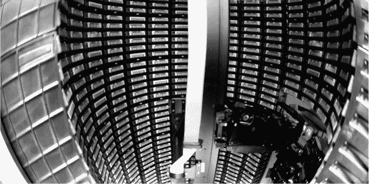

*图 10-21：数据中心中的机器人磁带库*

在图中，使用了机器人臂——就像 1950 年代的黑胶唱片点唱机——来取放磁带并将其放入读写器和存储容器中。类似的机器人系统也可以围绕蓝光光盘构建。如今，驱动硬盘篮子的移动机器人也可以被视为第三层内存。

### 数据中心

当你将成千上万，甚至是数十万或数百万个辅助和第三层内存放在一个仓库大小的建筑物里时，你就得到了一个*数据中心*。搜索引擎、社交网络、在线零售商、媒体流媒体提供商和政府如今都需要以这种规模存储和访问数据。一个典型的数据中心将包含许多不同层次的低级内存结构。例如，磁带比磁盘更耗时进行快进和倒带，因此它们更可能作为长期备份系统而不是用于提供最新的社交媒体帖子。一旦你从较慢的备份系统中访问数据，它将被缓存到内存层次结构中更高的地方，比如 SSD 硬盘，这样下次检索就会更快。

数据中心可能会以极高的安全性和韧性为设计目标。例如，汇丰银行的“数据矿”被广泛认为将其全球金融数据的备份存储在英国的一个废弃煤矿中。你可以通过地面上升的巨大空气管道辨认出它是一个数据中心，这些管道用于散热。该矿据说能抵御核、化学和生物攻击。在核战争爆发时，其他人类可能会被迫回到用伊尚戈骨头进行计算，但这家银行仍然能够追讨你的抵押贷款偿还。

### 总结

内存架构受到经济因素的驱动：你可以购买大而慢、便宜的内存；小而快、昂贵的内存；或者两者的混合。经验表明，大多数程序表现出空间、顺序和时间局部性，其中不同的小部分内存在不同的时间会被频繁和反复使用。因此，内存架构以适应经济和使用模式的层次结构设计，包括各层之间的缓存，以将当前使用的内存提升到更高层级。主内存是由 CPU 直接寻址的内存，通过总线进行访问，而辅助内存则通过 I/O 连接。辅助内存通常以旋转磁盘的形式存在，可以断开并更换，如果涉及到人工操作，则成为离线内存，如果过程由机器人自动化，则为第三层内存。

### 练习

#### **你计算机的内存**

1.  尝试查找自己计算机中每种内存的大小和速度，包括缓存、RAM 和二级存储。如果你能打开电脑，查看内部并找到它们的品牌和型号，然后在网上查找它们的技术规格。大多数操作系统都有可以显示内存有用信息的工具；例如，Linux 可以使用 `lscpu` 或 `cat /proc/cpuinfo` 查看缓存，使用 `free -h` 查看 RAM，使用 `lsblk` 查看二级存储。

#### **在 LogiSim 中构建静态 RAM**

1.  在 LogiSim 中构建 图 6-22 所示的静态随机存取存储器（SRAM）。它应能在四个内存位置存储并读取 2 位字。

1.  扩展你的 LogiSim SRAM，使其具有更长的字长和更多的地址。

#### **挑战**

1.  制作四个 SRAM 副本，表示多个 RAM 芯片。每个副本将具有相同的地址空间，从地址零开始。设计一个内存控制器模块，将来自更大全局地址空间（具有两个额外位）的地址转换为特定 RAM 芯片的部分以及这些 RAM 内部的本地地址。

1.  尝试将该系统连接到曼彻斯特婴儿计算机模型中，替换其原有的 LogiSim RAM。

#### **更具挑战性**

1.  在 LogiSim 中设计并构建一个直接映射缓存，并将其与之前任务中的 LogiSim RAM 连接起来。（这不会加速该 RAM，因为它已经是快速的 SRAM，但它可以让该 SRAM 被更大、更便宜但较慢的 DRAM 所替代。）

1.  如果你觉得有挑战，可以尝试构建其他类型的缓存。使用本章提供的示意图作为起点。

### 延伸阅读

要了解关于内存的最新经典资料，请参考 U. Drepper 的文章《每个程序员应该了解的内存知识》，2007 年 11 月 21 日，* [`people.freebsd.org/~lstewart/articles/cpumemory.pdf`](https://people.freebsd.org/~lstewart/articles/cpumemory.pdf) *。事实上，这篇文章包含了关于内存的知识，远超任何正常人所需了解的内容。
