## 第十四章：## **复古架构**


现在你已经掌握了理论部分，接下来让我们开始一些有趣的实践。第三部分将通过在一系列真实的模拟架构上编程，来巩固你的理论知识。你可以根据自己的兴趣跳过某些章节，但这些章节大致按照复杂性和历史的顺序呈现，因此查看并编程较早的系统，可能有助于你理解后续的系统。

我们之前研究过分析机和曼彻斯特婴儿计算机，而在本章中，我们将进阶到 1980 年代的 8 位系统，然后是 16 位系统。现代嵌入式系统与这些复古系统有些相似，因此我们将在下一章对它们进行研究。接下来，我们将研究 1990 年代的桌面 PC，然后是现代智能和并行架构。在每个阶段，我们将介绍一些在现代设计中依然沿用的新特性。

从 1836 年到 1990 年，经典 CPU 的基本结构变化不大。这个设计伴随我们走过了从分析机到现在所说的 1980 年代黄金时代的架构。在本章中，我们将看两个来自这一黄金时代的设计：著名的 8 位 6502 处理器，曾用于 Commodore 64、任天堂娱乐系统（NES）和 BBC Micro；以及 16 位 68000 处理器，它定义了 16 位机器的一代，包括 Commodore Amiga 和 Sega Megadrive。我们将把这些作为相对简单的经典 CPU 示例进行研究，了解在事物变得复杂之前的样貌。这些示例将帮助你巩固前面章节所学的内容，因此在进行时如果有任何需要查阅的地方，随时可以回头参考。

### 1980 年代黄金时代的编程

1980 年代的编程由架构主导。1980 年代的硬件市场高度异质化，许多竞争公司设计并生产不同且不兼容的机器。图 11-1 展示了十年间发布的几款不同机器。

在没有现代操作系统的情况下，你可以购买满是打印汇编代码的杂志，将其输入以运行简单的游戏和应用程序。这些代码能够读取和写入机器的整个内存空间，因此你可以精确地看到机器中的一切，感受到与其架构的融合。

像 Commodore 这样的计算机设计公司，使用可编程 ROM 或 PLA 比起自己进行光刻，能够以更低的成本生产自定义 ROM，这些技术是大量家庭计算机系统得以实现的关键。用今天的话来说，这些 ROM 是基本输入输出系统（BIOS），它们是一些子例程，举个例子，打印 ASCII 文本到屏幕；绘制点、线和三角形；以及发出声音。程序员也可以通过 I/O 直接执行这些任务——也就是直接加载和存储到 I/O 模块地址——但为了方便起见，提供了子例程来自动化这个过程。你可以通过将必要的参数放入 CPU 寄存器，然后跳转到 ROM 中的子例程地址，来调用 ROM 芯片上的子例程。

ROM 和 RAM 同样重要，它们协同工作。RAM 是用户数据和用户程序的宝贵资源，这些程序频繁调用 ROM 中的子例程。除了记住 ROM 子例程地址，程序员和社区通常还会为不同任务约定 RAM 的常用区域，因此他们通常能够熟悉整个计算机的内存映射。

由于这些约定，用户可以更加直接地访问他们的计算机。地址数量相当小：32,768（32 k[2]B）或 65,536（64 k[2]B），这意味着你可以找到像游戏中的生命数量这样的变量存储位置，然后直接进入内存进行编辑。直接覆盖内存的操作被称为*poke*，成功的 poke 会被收集到*作弊器磁盘*中并传播开来，以修改游戏。

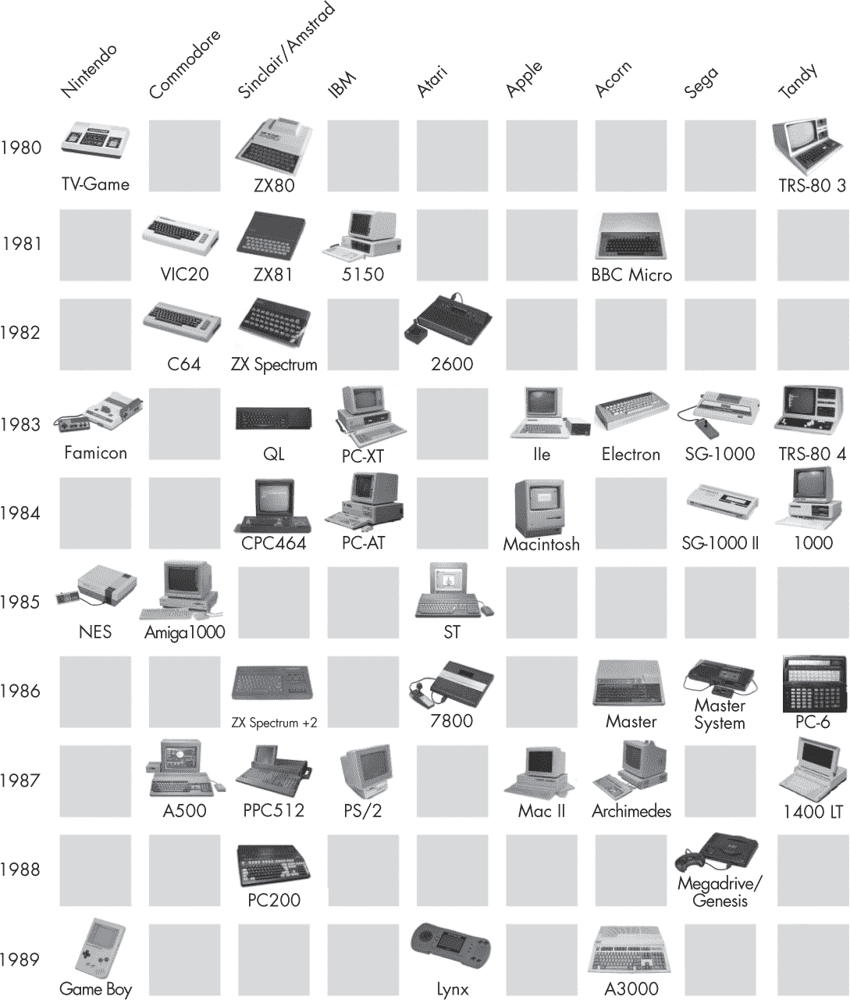

*图 11-1：1980 年代黄金时代的不同计算机*

#### *8 位时代*

1980 年代初期是 8 位时代：这是 Commodore 64 和 Atari 2600 的时代，也是像 Sega Master System 和 Nintendo NES 这样的游戏主机时代，还有英国的 BBC Micro 和 ZX Spectrum。

这些机器共享了一些子组件；例如，6502 处理器被用于 Commodore 64 和 BBC Micro，而 Spectrum 的 Z80 芯片可以作为第二处理器添加到 BBC Micro 中，这样你就可以在这个层面上与朋友分享程序。但这些机器的图形和声音芯片不同，包含不同功能，位于不同的地址上，因此不兼容，通常每台机器都会有自己的朋友、用户组以及围绕它形成的杂志。

这个时代的计算机图形和音乐看起来（参见图 11-2）和听起来*像计算机*，因为它们反映了计算机的架构，创造了一种今天已经失传的计算机文化。你实际上可以感觉到 8 位游戏的“8 位性”，而今天的 64 位游戏中却无法感受到那种“64 位性”。

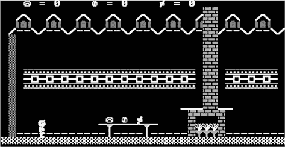

*图 11-2：典型的 8 位游戏图形示例*

即便只是玩游戏——而不是编写——也能潜移默化地学到架构知识。游戏通常是专门为了与架构互动和探索架构而编写的，目的是将其推到极限，并展示编程技巧。例如，8 位架构鼓励游戏使用特定尺寸的精灵和特定布局的关卡。你可以通过覆盖内存中定义字符*A*的区域，将其替换为一个 8×8 像素的外星人，从而轻松地给*Space Invaders*动画，而无需任何图形命令。然后，只需将*A*字符打印到屏幕上，就能移动它。（这样做的缺点是，当你列出程序进行调试时，所有的*A*也会变成外星人了。）

#### *16 位时代*

1980 年代末期推出了 16 位机器，并延续了这种汇编编程风格，但额外的位数和更先进的 I/O 模块使得图像和声音的*采样*成为可能，而不再像 8 位机器那样纯粹由计算机生成。这些发展催生了具有鲜明 16 位美学的精灵式游戏，比如*Sonic*和*Mario*（图 11-3），以及 The Prodigy 等艺术家创作的基于采样的音乐和如*Streets of Rage 2*等游戏的原声带。

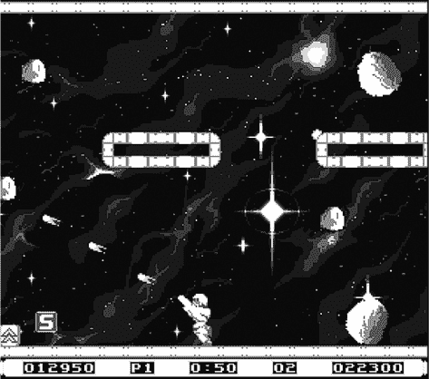

*图 11-3：典型 16 位游戏图形示例*

流行的机器包括 Commodore Amiga、Atari ST、Sega Megadrive 和 Nintendo SNES。像游戏和演示程序等高性能程序仍然主要用汇编语言编写，能够完全访问内存，但它们会更多地使用对额外图形和声音硬件的调用。

各公司继续在 1990 年代初期生产 16 位机器，包括许多如今已经成为经典的游戏。但此时大多数程序员已转向使用 C 语言，它能够编译成多个机器的汇编代码，使得在不同平台间移植软件变得更加容易。程序员们开始更多依赖重量级操作系统，这些操作系统主要通过 C 库进行访问。C 语言和操作系统共同作用，封装并隐藏了硬件架构，提供了更高级且更便携的接口，但也终结了 1980 年代架构编程的黄金时代。

美好的时光！让我们通过在两个经典系统上学习编程来重温这些时光：8 位 6502 架构的 Commodore 64（C64）和 16 位 68000 架构的 Commodore Amiga。对于每个系统，我们首先会独立学习其 CPU，然后研究它的计算机设计。在练习中，我们将编写 C64 动画文本演示和简单的 Amiga 游戏的汇编程序。

### 使用 MOS 6502 8 位 CPU 进行编程

MOS 科技的 MOS 6502 是一个 8 位处理器，由 Chuck Peddle 于 1975 年设计。*MOS*代表*金属氧化物半导体*，指的是公司使用的 MOS 场效应晶体管（MOSFET）。6502 在 1980 年代许多经典的 8 位微型计算机中得到了应用：如 Commodore 64、NES、Atari 2600、Apple II 和 BBC Micro；它还被用于第一代街机游戏机，如*Asteroids*。

在这里，我们将通过与分析引擎（Analytical Engine）和曼彻斯特宝宝（Manchester Baby）相同的步骤来研究 6502。我们将首先检查其结构，包括寄存器、算术逻辑单元（ALU）、解码器和控制单元（CU）。然后我们将研究其指令集，包括内存访问、算术运算和控制流的指令。

#### *内部子组件*

6502 有 3000 个晶体管和连接它们的导线。这些组件的布局是通过透明纸张手工设计并绘制的，使用钢笔和胶带，然后通过光刻技术直接制作成芯片。

**注意**

*“Taping out”*一词仍然用于指代现代计算机化的光刻掩模设计完成过程。对于芯片设计师来说，taping out 标志着他们工作的结束，并交接给制造厂。就像软件公司中的“发布”一样，taping out 也是举办大型派对的理由，直到芯片通过邮寄到达并无法正常工作为止。

物理上，6502 呈现为一个长约 2 厘米的塑料封装集成电路（IC），有 40 个引脚，如图 9-2 所示。这些引脚中有 8 个是数据引脚，标记为 D0 到 D7。这些引脚用于读取和写入 8 位数据字到内存中，也定义了 CPU 为 8 位机器。6502 使用一个 16 位的地址空间，通过在 16 个地址引脚 A0 到 A15 上写入 16 位地址来进行访问。这使得最多可以寻址 64 k[2]B 的内存。R/W 是控制线，指示我们是否要读取或写入地址。封装还具有地线、供电电压、时钟和 IRQ（中断请求）引脚。时钟设定 CPU 的速度，通常为 1 到 3 MHz 之间。

实际的硅芯片比外包装小得多，约为 5 mm²。图 11-4 展示了芯片在显微镜下的照片（称为*晶片图*）。

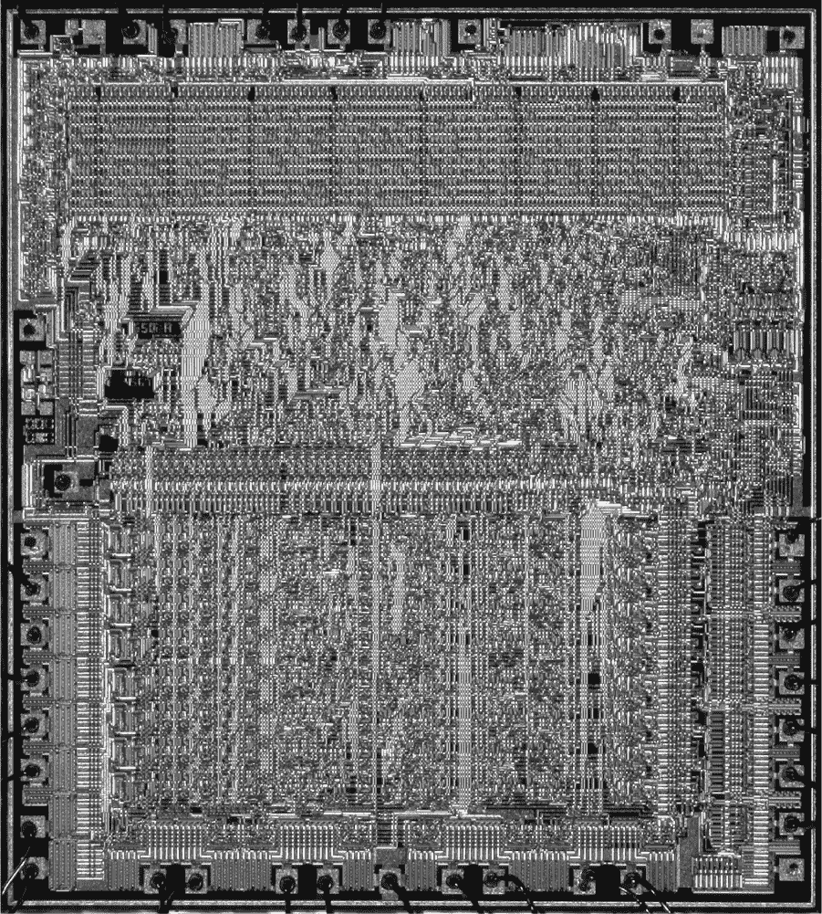

*图 11-4：6502 芯片显微镜照片*

这个芯片的设计细节在几十年间丢失，但最近在 Visual 6502 项目中通过英雄般的努力，成功地在晶体管级别进行了完全的逆向工程 (*[`visual6502.org`](http://visual6502.org)*)。该项目的工作人员通过施加酸性物质溶解部分塑料外壳来暴露硅片，然后拍摄芯片的晶片图像，逆向工程其电路图。

该电路仅包含晶体管和铜线，但一些非常擅长芯片阅读的人已经学会了如何观察这些电路并将它们在脑中分块成逻辑门。从那里，它们被分块成著名的简单机器。通过这项艰苦的工作，借助图 11-5 所示的生还区块图，这整个架构得以反向工程并重建。

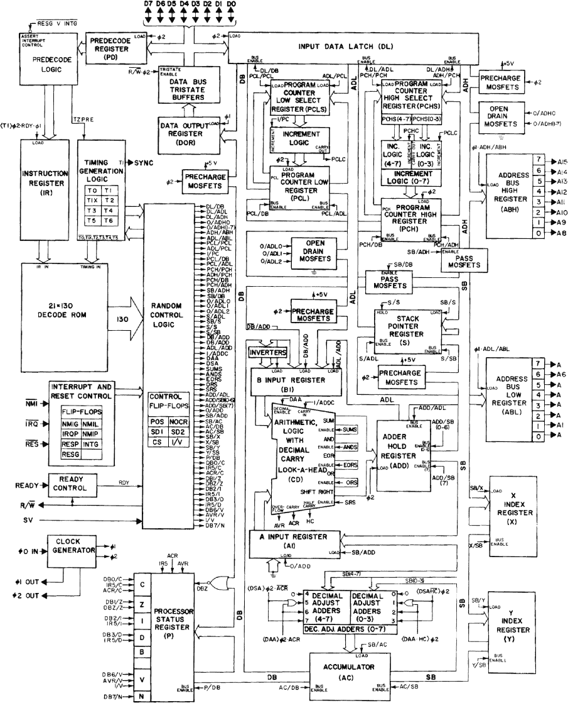

*图 11-5：原始 6502 区块图*

图 11-5 中的电路展示了一些典型的子组件，这些组件在大多数经典设计的芯片中都很常见。每个组件都是一个数字逻辑简单机器。我们将逐一检查这些主要的子组件。

**怪兽 6502**

由于视觉 6502 项目的成果，6502 现在再次被生产出来，用作廉价的嵌入式处理器——例如，在物联网（IoT）设备中——以及用于教育，比如我们目前的研究。该设计还被 Eric Schlaepfer 和 Evil Mad Scientist Laboratories 用来制造一个完全功能性的、但比原版慢的 MOnSter 6502 重建版，这个版本使用了大晶体管而非集成电路（ICs），如下所示。

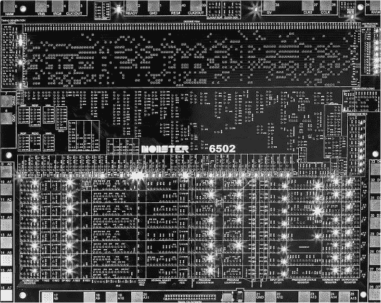

#### **用户寄存器**

在图 11-4 中，寄存器和算术逻辑单元（ALU）位于芯片的下半部分。8 位数据按垂直堆叠排列，类似于巴贝奇的机器。有三个 8 位用户寄存器：两个通用寄存器，分别称为 X 和 Y，以及一个称为 A 的累加器。

X 和 Y 寄存器设计为可以一起使用，表示 16 位地址，其中前 8 位存储在 X 中，后 8 位存储在 Y 中。单独操作这两部分比较困难，因此架构通常提供方法，能够一起操作这两个 8 位部分的 16 位地址。

通常将 8 位内存想象成被划分为 256 页，每页 256 字节。例如，8 位十六进制编辑器可能一次在屏幕上显示一页内存，就像一本书的页面那样。以这种方式看，其中一个字节是页码，另一个字节表示该页上使用的是哪一行。

**注意**

*在 6502 编程实践中，通常使用内存第 0 页的 256 个地址，仿佛它们是额外的寄存器。这样比使用实际寄存器要慢，因此在首选情况下，还是使用 A、X 和 Y 寄存器。*

#### **内部寄存器**

回想一下，程序计数器用于跟踪当前行号。此处，程序计数器存储一个 2 字节地址。它在执行每条指令后，由控制单元（CU）自动递增，除非是流程控制指令。它可以作为两个独立的字节（PCH，PCL）访问，分别存储 16 位地址的高位和低位。在开机时，6502 将 FFFC 和 FFFD 地址的内容（通常是 ROM，并指向一个 ROM 子程序）复制到程序计数器中，指示程序从哪里开始执行。

这里，堆栈指针是一个字节，它被假定为指向内存第 1 页的行；注意这是第二页，紧跟着第 0 页。在大多数编程风格中，堆栈不是由程序员直接访问的，而是由子程序指令内部使用，用于推入和弹出调用行的地址。然而，它也可以通过指令（`PHA` 和 `PLA`）直接访问，这些指令将累加器的内容推入和弹出堆栈。

指令寄存器保存当前指令的副本；在 6502 中，操作码为 8 位，可能需要 0、1 或 2 个字节的操作数。由于数据总线是 8 位的，因此获取指令通常需要多个步骤；操作码和操作数需要逐字节复制。这是 8 位机器速度较慢的原因之一：具有较大字长的机器可以将整个指令（包括操作码和操作数）作为单个字取出。

状态寄存器包含 8 位标志，可以被控制流指令测试和使用。这些标志在 ALU 中设置，我们接下来将讨论它。

#### **算术逻辑单元**

在 6502 中，ALU 的物理结构围绕寄存器构建，使得 8 位数据水平流动，就像巴贝奇的机器一样。寄存器-ALU 区域看起来很像巴贝奇的差分机，并且包含类似的并行传播位和进位。如果你把巴贝奇的金属机器微型化到一块芯片上，它的外观大致就是这样；只是尺度发生了变化。

ALU 提供整数加法和减法简单运算，通过指令（`ADC`、`SBC`）激活，以及专门的增量和减量指令（`INC`、`DEC`）。还有位移和按位布尔运算指令（`ASL`、`ASR`；`AND`、`ORA`、`EOR`）。没有乘法或除法指令——这些必须通过可用的软件来构建。同时也没有浮动点运算。

图 11-6 显示了 ALU 在状态寄存器中分配的位的含义，这些位是作为其操作的副作用写入的。

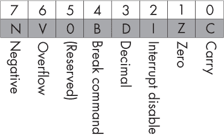

*图 11-6：状态寄存器标志*

ALU 的操作包括标记结果是否为零（Z）或负数（N），是否发生溢出（V），以及是否有进位（C）。

#### **解码器**

在图 11-4 中，解码器位于芯片照片的上五分之一处，呈现为半规则的二进制结构。它看起来像是存储在数组中的大量二进制数字，实际上就是这样。操作码为 8 位，意味着最多可以有 256 条不同的指令。每个操作码都会被解码并用于激活控制线。

#### **控制单元**

在图 11-4 中，CU 形成了芯片的中间区域。它在视觉上呈现为一个非常不规则的区域。这是因为每个操作都不同，因此它是用完全不同的电路实现的。6502 的 CU 通常需要比后来的 16 位机器做更多的工作，因为 6502 使用 16 位地址，并且有时使用 16 位或 24 位指令，CU 必须将它们分解成 8 位的块，并通过 8 位总线传输。

#### *程序员接口*

图 11-7 显示了 6502 的完整指令集。

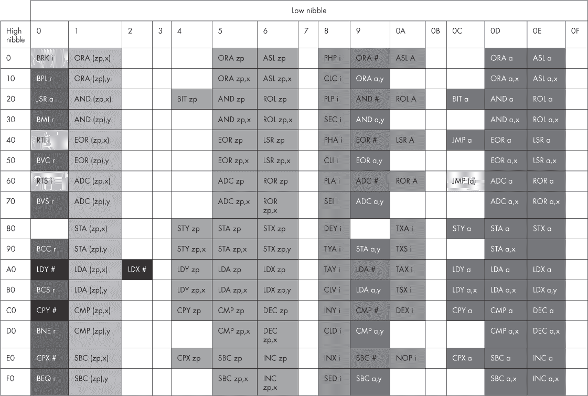

*图 11-7：完整的 6502 指令集。欲了解这些指令的完整定义，请参见* [`en.wikibooks.org/wiki/6502_Assembly`](https://en.wikibooks.org/wiki/6502_Assembly)。

由于操作码是 8 位的，因此有空间容纳 256 条指令；然而，指令集架构实际上包含的指令略少，所以表格中有一些空隙。

#### **加载与存储**

从三个用户寄存器（X、Y 和 A）加载（`LD`）和存储（`ST`）是通过以下指令完成的：

```
LDA #$00  ; load to accumulator the constant 8-bit hex integer 00
STA $0200 ; store accumulator contents to 16-bit hex address 0200
LDX $0200 ; load contents of address 0200 to register X
STX $0201 ; store contents of X into address 0201
LDY #$03  ; load 8-bit constant hex 03 to register Y
STY $0202 ; store contents of Y to address 0202
```

偏移寻址使得用户寄存器的值可以作为偏移量应用到给定的地址。这对于遍历数组非常有用。例如：

```
LDX #$01
STA $0200,X ; store the value of A at memory location $0201
```

间接寻址允许我们指定一个地址，这个地址包含另一个我们实际想要加载或存储的地址：

```
LDA ($c000) ; load to A from the address stored at address C000
```

间接寻址和偏移可以一起使用，例如：

```
LDA ($01),Y
```

*零页* 是 6502 的约定，表示内存的第 0 页功能类似于额外的 256 个寄存器。这要求仅指定并移动 1 字节的地址，如下所示：

```
LDA $12   ; single byte address assumed to be from page 0
```

这比单独移动 2 字节更快。

#### **算术**

`ADC` 指令表示“带进位的加法”。它将地址操作数的整数内容与状态寄存器中的进位位加到累加器中。以下程序应该以累加器中十六进制值 0A[16]（十进制 10）结束：

```
CLC       ; clear content of carry flag in status register
LDA #$07  ; load constant 07 to accumulator
STA $0200 ; store content of accumulator to address 0200
LDA #$03  ; load constant 03 to accumulator
ADC $0200 ; add with carry the content of 0200 into accumulator
```

`CLC` 清除进位标志；在进行任何新的加法之前，清除进位是很重要的，除非你希望将前一个操作的进位也加上。

要添加两个 16 位整数，我们可以利用进位状态标志的状态，而不是将其清除。每次 `ADC` 操作都会读取和写入进位标志，因此我们可以将 16 位加法拆分为两次 8 位加法，并带上进位。这里，两个输入 `num1` 和 `num2` 以及输出 `result` 都被分为低字节和高字节：

```
CLC
LDA num1_low
ADC num2_low
STA result_low
LDA num1_high
ADC num2_high
STA result_high
```

类似地，`SBC` 是“带借位的减法”，所以以下代码计算 7 – 3，结果是累加器中的值为 4：

```
SEC       ; set carry flag to 1 (needed to init subtraction)
LDA #$03  ; load constant 3 to accumulator
STA $0200 ; store constant 3 to address 0200
LDA #$07  ; load constant 7 to accumulator
SBC $0200 ; subtract content of 0200 from accumulator
```

我们可以使用指令，如：`INC` 或 `IN` 来递增地址和寄存器内容，使用 `DEC` 或 `DE` 来递减。

```
LDX #$02
LDY #$04
INX
DEY
LDA #$07
STA $0200
INC $0200
DEC $0200
```

这里，# 表示操作数是常量，其他操作数是地址。

#### **跳转与分支**

`JMP` 是跳转指令。以下程序不断递增寄存器 X，当其超过 FF[16] 时，会回绕至 00[16]：

```
LDX #$02
mylabel:
  INX
  JMP mylabel
```

与当时的 BASIC 程序员可能直接指定跳转的行号不同，这种符号首先用一个*标签*标记目标行——在这个例子中是`mylabel`——然后在跳转指令中指定这个标签的名称。标签行不会被编译成机器码；当汇编器首次看到它时，它会被忽略。但是，当汇编器在跳转指令中再次看到标签时，它会将其替换为标签后面指令的地址。

条件分支可以分为两个阶段。首先，比较指令检查某个条件是否为真，并将结果存储在状态寄存器中。然后，分支指令会查询状态寄存器，以决定何时分支。例如，以下程序使用寄存器 X 从 5 递减到 2，然后停止，通过将 X 与 2 进行比较（`CPX`），如果不相等则跳转（`BNE`）：

```
LDX #$05
mylabel:
  DEX
  CPX #$02
  BNE mylabel
```

你还可以根据比较结果进行分支（`B`），例如如果相等则跳转（`BEQ`），负值（即负数，`BMI`），或正值（即正数，`BPL`）。或者，如果进位标志（`C`）或溢出标志（`V`）为清除（`C`）或设置（`S`）：分别使用`BCC`、`BVC`、`BCS`、`BVS`。

#### **子程序**

`JSR`和`RTS`分别是跳转到子程序和从子程序返回的指令。例如，以下程序使用一种常见约定，将子程序的参数放入内存起始地址中，然后由子程序代码取出。`BRK`是“中断”指令，类似于 6502 的停止指令（实际上是一个中断）。它用于防止主程序执行时超出子程序的代码区域。

```
LDA #$5    ; load first argument to accumulator
STA $0001  ; put it in address 1 for sub to pick up
LDA #$4    ; load second argument to accumulator
STA $0002  ; put it in address 2 for sub to pick up
JSR mysub  ; call the subroutine
STA $0200  ; use subroutine's result, is in accumulator
BRK        ; halt
mysub:
  LDA #$00   ; reset the accumulator
  CLC        ; reset the carry
  ADC $0001  ; add in the first argument
  ADC $0002  ; add in the second argument
  RTS        ; return from subroutine
```

在练习中，你将看到如何在模拟的独立 6502 上运行上述以及类似的示例。单独的 6502 并不是特别激动人心，我们需要设计一个计算机系统来为 CPU 增加内存和 I/O 功能，因此现在让我们从 6502 的视角缩小，来看一看基于 6502 的完整计算机设计——Commodore 64。

### 基于 Commodore 64 的 8 位计算机设计

基于 6502 的 Commodore 64（C64）是有史以来销量最高的计算机型号。它于 1982 年发布，通过将游戏功能与商业和创意应用的潜力结合，定义了全球大部分地区的 8 位家用计算机市场。Commodore 这个名字源于它的创始人、充满传奇的二战幸存者 Jack Tramiel，他原本想取名为“General Computers”，就像“General Electric”一样，但“General”已经被使用。Commodore 比 General 低一级，是一个次选的等级。C64 的电路板在图 9-1 中已经展示过。它的名字来自于它使用了其 16 位地址空间中的 64 k[2]B 可用内存，采用 8 位字（2¹⁶个地址 × 8 位 = 64 k[2]B），与其他一些基于 6502 的机器不同。

#### *理解架构*

MOS 生产了几种 6502 的变体，并为每个变体分配了不同的型号。与 7400 逻辑芯片类似，"6502" 是一个模糊的术语，有时指的是原始的编号 CPU 设计，有时则指所有该家族的成员，每个成员都有相关的编号。用于 Commodore 64 的 6502 家族成员更准确地称为 6510。

除了具有完整的 64 k[2]B 实际 RAM 外，C64 还增加了设备、I/O 模块及其包含与设备通信的子程序库的 ROM（我们现在称之为 BIOS）。正是这种配置使得 C64 在编程平台上与其他基于 6502 的机器有所不同。

物理板布局与 图 11-8 的框图连接。总线——由 16 位寻址和 8 位数据组成——主导了该图，并连接了 CPU、RAM、ROM 和 I/O。

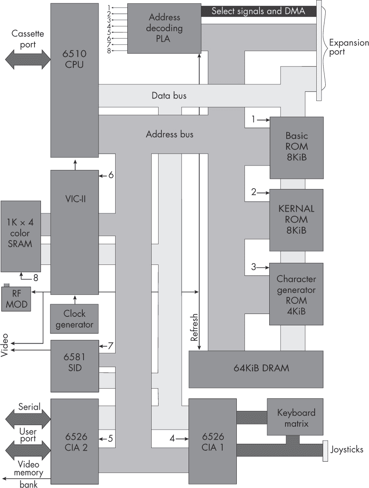

*图 11-8：C64 框图*

图 11-9 显示了 C64 的内存映射。


*图 11-9：C64 内存映射*

在此内存映射中，RAM、ROM 和 I/O 分别在 16 位地址空间内分配了地址范围。I/O 地址空间被划分为各个 I/O 模块和芯片使用的范围。（因为在当时地址空间是稀缺资源，所以 C64 使程序员能够暂时断开 ROM，将额外的 RAM 挂载到其位置。）

**PETSCII 字符**

Commodore 64 以不同于 Unicode 的方式扩展了 ASCII，采用了现在已不再使用的 PETSCII 字符集，通过将第一个数字作为“移位”字符，并定义了第二组类似 ASCII 的符号。它还在未移位区定义了新的视觉符号，代替了控制代码，包括 C64 标志性的扑克牌符号和用于绘图的位图图形元素，如图所示。

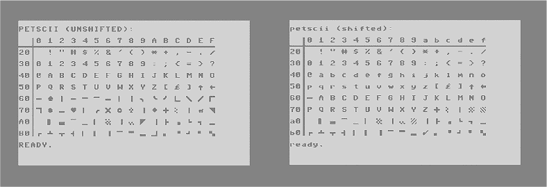

#### *C64 编程*

C64 的编程使用 6502 汇编语言，如在 第 255 页“程序员接口”部分讨论的那样，但它还与特定的 ROM 和 I/O 模块进行交互，这些模块在地址空间中被挂载。ROM 包含 Commodore 自己的子程序库（称为“KERNAL”，带 A）。I/O 包括一个内存映射的屏幕显示，可以在字符模式和像素模式之间切换。字符模式允许通过将 PETSCII 字符的代码直接写入该内存空间，在屏幕位置绘制 PETSCII 字符。可以通过读取键盘的内存映射空间来读取键盘状态，但提供了 ROM 子程序来简化此过程并将其状态解码为 PETSCII 字符代码。

以下程序演示了这些结构。它在彩色屏幕上显示滚动消息，并在按下 A 键时退出。

```
screenbeg = $0400           ; const, beginning of screen memorymap
screenend = $07E7           ; const, end of screen memorymap
screenpos = $8000           ; variable, current position in screen
main:
    LDA #$02                ; black color code
    STA $D020               ; I/O border color
    STA $D021               ; I/O background color
    STA screenpos           ; screen position
loop:                       ; main game loop, once per frame
    JSR $E544               ; ROM routine, clears screen
    JSR drawframe           ; most of the work is done here
    JSR check_keyboard
    INC screenpos           ; increment current screen position
    JMP loop                ; do the loop, forever
drawframe:
    LDX #$00                ; regX tracks idx of char in the string
    LDY screenpos           ; regY keeps scrolling screen position
    CPY #$20                ; compare Y with constant 20
    BCS resetscreenpos      ; branch if Y>20 (stored in carry bit)
drawmsgloop:                ; drop through to here if not branching
    LDA msg,X               ; load the xth char of the message
    BEQ return              ; exit when zero char (end of string)
    AND #$3F                ; convert ASCII to PETSCII
    STA screenbeg,Y         ; VDU: write char in A to memorymap offset Y
    INX                     ; increment idx of char in message
    INY                     ; increment location on screen
    CPY #$20                ; are we trying to write offscreen?
    BCS wraparound_y        ; if so, shift offset by screen width
    JMP drawmsgloop         ; loop (until all chars are done)
resetscreenpos:
    LDY #$00
    STY screenpos           ; reset the screenpos to 0
    JMP drawmsgloop
wraparound_y:               ; if Y trying to write off screen, wrap
    TYA                     ; transfer Y to accumulator
    SBC #$20                ; subtract with carry
    TAY                     ; transfer accumulator to Y
    JMP drawmsgloop
check_keyboard:
    JSR $FF9F               ; ROM SCANKEY IO, writes keybdmatrix to 00CB
    JSR $FFE4               ; ROM GETIN, convert matrix to keycode in acc
    CMP #65                 ; compare accumulator to ASCII 'A'
    BNE return
    BRK                     ; if 'A' pressed, quit
return:
    RTS
msg:
    .byte "HELLO C64!\0"    ; this is data, not an instruction
```

这将创建一个滚动文本效果，如 图 11-10 所示。


*图 11-10：C64 上的 hello 结果，文本滚动穿过屏幕。*

该程序可以作为编写游戏的起点，因为它包含了所有基本的游戏元素：循环、显示、键盘读取和状态更新。

**芯片音乐**

在 8 位时代，声音芯片是真正的合成器，一种通过硬件制作并放入计算机中的实际音乐乐器。

生成音调的最简单方法是使用方波。这是一个非音乐家出身的架构师构建声音芯片时的常见做法，比如德州仪器的 SN76489。方波在给定频率（音乐音高）下在数字 0 和 1 之间交替，因此它们完全可以由数字逻辑构成，而无需其他波形所需的模拟电压。将芯片限制为方波使得那个时代的设备具有了其典型的原始 8 位声音。

由于康莫多尔收购了 MOS，他们在 C64 中使用了 MOS 最新的音调生成器——6581 声音接口设备（SID）。SID 比以前的声音芯片要强大得多。它是由一位音乐合成器设计师设计的，作为一款真正的音乐乐器。它将模拟锯齿波和正弦波加入到音频中，并通过给这些波形添加模拟滤波器，彻底革新了 8 位音频。滤波器能够强调或消除音乐信号中的谐波频段。方波和锯齿波都有无限的谐波，这为滤波器提供了良好的处理原料。滤波器可以以多种方式在音符上滑动，创造出许多不同的效果，这使得 C64 拥有了丰富的音乐表现力。

SID 包含模拟设备和一个 I/O 模块，将其与地址空间连接，因此它附加到总线上。在 C64 中，通过向其分配的地址空间（D400 到 D7FF）写入频率、音量和滤波器截止等参数来控制它，以下示例通过通道 1 播放方波：

```
main:
    LDA #$0F
    STA $D418 ; I/O SID volume
    LDA #$BE  ; attack duration = B, decay duration = E
    STA $D405 ; I/O SID ch1 attack and decay byte
    LDA #$F8  ; sustain level = F, release duration = 8
    STA $D406 ; I/O SID ch1 sustain and release byte
    LDA #$11  ; frequency high byte = 11
    STA $D401 ; I/O SID ch1 frequency high byte
    LDA #$25  ; frequency low byte = 25
    STA $D400 ; I/O SID ch1 frequency low byte
    LDA #$11  ; id for square wave waveform
    STA $D404 ; I/O SID ch1 ctl register
loop:
    JMP loop
```

在 SID 发布后，像 Rob Hubbard 这样的伟大 8 位“芯片音乐”作曲家找到了高度创意的方式，通过黑客技术让它播放样本，并且让它看起来拥有比硬件上实际提供的三个声音更多的音轨。SID 提供了一个有限且受限的音色调色板，促使了极简主义和数学美学的发展。Hubbard 受到了 Philip Glass、Jean-Michel Jarre 和 Kraftwerk 的影响。近年来，像 Max Martin 和 Dr. Luke 这样的音乐制作人在 2010 年代使用 SID 来营造复古游戏音效。

### 与摩托罗拉 68000 16 位 CPU 协同工作

16 位时代有些名不副实：它本应被称为“16/32 位时代”。这是因为这个时代的代表性芯片是摩托罗拉 68000，它被用于 Commodore Amiga、Atari ST、Apple Macintosh、Sega Megadrive 以及街机游戏如*街头霸王 II*。68000 使用 16 位数据字，但也拥有 32 位寄存器和 CPU 内的 ALU。Atari ST 的名字正是来源于 68000 的这种混合“*S*ixteen/*T*hirty-two”特性。68000，也被称为 68k，于 1979 年发布，并在 1980 年代后期的计算机中出现，定义了 16 位时代。

6502 和 68000 都源自早期的摩托罗拉 6800，在不同的进化分支上发展。它们的名字反映了这一点，并共享一些结构和指令。这意味着学习 68000 通常是对我们在 6502 中学到的内容的扩展。如果你不确定如何在 68000 中完成某项任务，通常可以根据 6502 的等效操作做出合理的猜测。

#### *内部子组件*

图 11-11 展示了摩托罗拉 68000 的芯片照。图中可以看到与 6502 相同的基本结构，寄存器和算术逻辑单元（ALU）位于底部，控制逻辑位于中央，解码器位于顶部附近。


*图 11-11：68000 芯片照*

可以看到，寄存器和 ALU 部分现在有更多重复的行，因为它们的位数超过了 8 位。与 6502 不同的是，当整个 CPU 在打印页面上显示时，其数字逻辑现在已经小到无法看到。

有 16 个用户寄存器，都是 32 位，其中 8 个被称为 D0 到 D7，用作“数据寄存器”，其余的被称为 A0 到 A7，用作“地址寄存器”。A7 被用作堆栈指针。还有一个 16 位状态寄存器，包含类似 6502 的状态位，并带有一些额外信息。

总线有 16 条数据线和 24 条地址线。然而，这些地址指向的是字节位置，而不是 16 位字，因此可以寻址的字节数是 2²⁴，即 16M[2]B 的可寻址内存。24 位地址以六个十六进制字符表示，例如 DFF102[16]。

68000 有一个两阶段的流水线，在解码和执行当前指令的同时，预取下一条指令。

#### *程序员接口*

正如我们在其他机器中所做的那样，在了解 68000 的结构之后，我们现在将审视它所启用的指令集——通过内存访问、算术运算和流程控制——这些指令集可以帮助你编写自己的程序。16 位时代在编程中广泛地从使用大写字母转向了小写字母，从此我们也将尊重这一点。

#### **数据移动**

单条`move`指令用于加载、存储和寄存器数据传输：

```
move.l d0, d1         ; copy from register d0 to register d1
move.l #$1a2, d1      ; copy hex constant $1a2 to register d1
move.l $0a3ff24, d1   ; load longword from address 0a3ff24 to d1
move.l d1, $0a3ff24   ; store longword from d1 to address 0a3ff24
```

这里的`l`代表“长字”（longword），每次移动 32 位。这在寄存器之间非常快速。访问内存时，32 位数据必须被 CPU 拆分，并通过 16 位总线分两步发送，由控制单元（CU）按顺序执行。

如果你只想移动 16 位字（`w`）或 8 位字节（`b`），你可以使用 `move` 的变种：

```
move.b d0, d1
move.w $0a3ff24, d1
```

间接寻址通过括号指定：

```
move.l ($0a3ff24), d1  ; load content from addr stored at addr 0a3ff24, to d1
```

偏移寻址包括以下内容：

```
move.l (pc, 2), d1      ; load content from program counter plus 2
move.l (a1, a2), d1     ; load content from addr formed as sum of regs a1+a2
move.l (a1, a2, 2), d1  ; load content from addr formed as sum of regs a1+a2+2
```

更复杂且不常见的 68000 寻址模式将间接寻址与寄存器递增结合使用；这对于遍历存储在连续地址中的数据非常有用：

```
move.l (a1)+, d1        ; load content from addr stored in register a1, to d1,
                        ; then increment a1 by number of bytes in a longword
move.l -(a1), d1        ; decrement a1 by number of bytes in a longword,
                        ; then load content from addr stored in register a1
```

对于 C 程序员：这大致是 `*(a++)` 和 `*(--a)` 编译后的结果。推送和弹出堆栈不需要专门的指令，因为可以使用此模式与堆栈指针寄存器来实现：

```
move.w (sp)+, d0       ; push from register d0 to stack
move.w d0, -(sp)       ; pop from stack to register d0
```

有效地址加载指令（`lea`）是 68000 的相关指令，可以加载间接寻址的地址。例如：

```
lea (pc, 2), a1     ; put address of program counter +2 bytes into a1
lea (a1, 2), a3     ; put address a1+2 into a3
lea (a1, a2, 2), a3 ; put address a1+a2+2 into a3
```

注意，`lea` 加载的是数值地址本身，而不是地址的内容。

#### **流程控制**

由于历史渊源，68000 的跳转、子程序和分支与 6502 相同。例如：

```
start:
   jsr mysub        ; jump to subroutine

   cmp #2, d0       ; compare values
   beq mylabel      ; branch if equal
   ble start        ; branch if less than or equal
   bne start        ; branch if not equal

mylabel:
   jmp mylabel      ; infinite loop

mysub:
   rts              ; return from subroutine
```

话虽如此，堆栈逻辑有所改进：在 68000 上，你可以将一系列参数推送到堆栈，跳转到子程序，然后从子程序内将它们弹出。这使得子程序能够像具有参数的函数一样工作。

#### **算术**

以下是一些算术指令的示例：

```
add.b d0, d4  ; add d0 to d4, store result in d4
sub.w #43, d4 ; subtract constant 43 from d4, store result in d4
muls d0, d4   ; multiply (signed) d0 with d4, store result in d4
mulu d0, d4   ; multiply (unsigned) d0 with d4, store result in d4
divs d0, d4   ; divide (signed) d0 by d4, store result in d4
divu d0, d4   ; divide (unsigned) d0 by d4, store result in d4
and d0, d1    ; bitwise and d0 with d1, store result in d1
asr d0, d1    ; arithmetic shift right d1 by d0 bits, store result in d1
```

加法和减法指令与 6502 类似。但与 6502 不同，68000 可以通过硬件执行乘法和除法。

### 使用 Commodore Amiga 的 16 位计算机设计

*Amiga* 是 *amigo* 的阴性形式，意为 *朋友*，而 Commodore 的 1985 年推出的 Amiga 意在与其用户建立这样的关系。早期版本的 Amiga 旨在作为高端图形工作站，面向自称为“创意人士”的市场——如今 Apple 面向的正是这一市场。然而，现在经典的 A500 型号迅速成为了标准的大众市场游戏平台。这一现象自我实现，因为开发者和玩家群体一同增长。随着（非法）破解和复制游戏磁盘的便利，世界许多城市的酒吧举行“Amiga 之夜”，在其中交换这些磁盘，增长速度进一步加快。在欧洲，Amiga 被“演示场景”（demo scene）接受，这是一群艺术性汇编程序员组成的亚文化，他们聚集在一起竞赛，推动图形和声音的极限，目标不是在游戏中，而是在多媒体演示中。这些场景有交集，破解者将演示加到新破解游戏的启动序列中（那些移除了复制保护的游戏）。Commodore 管理层忽视了这一切，并试图将 Amiga 推向商业市场，最终它和公司都被“米色箱”PC 摧毁了。

#### **理解架构**

经典的 A500 配备了 0.5 M[2]B 的 RAM，尽管它和后续型号可以升级为几个 Mebibyte。（这仍然远小于 CPU 可寻址的 16 M[2]B。）图 11-12 显示了 A500 的主板。

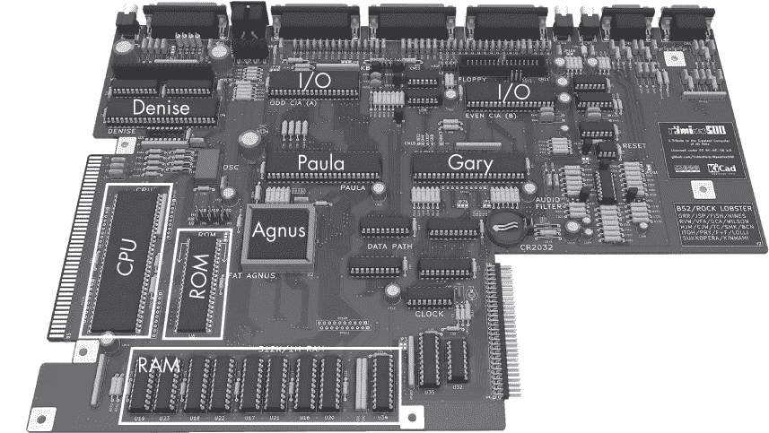

*图 11-12：一块 Amiga A500 主板*

设计基于四个大型定制芯片，赋予它们人类名字：

**Agnus** 这款芯片包含了一个协处理器（“铜处理器”），该协处理器有自己的独立 RAM 和总线，除了主 CPU 系统外，铜处理器负责图形处理。铜处理器的机器码可以作为数据行编写，并通过主 CPU 程序将数据传输给铜处理器。（今天的 GPU 也使用类似的系统。）Agnus 还包含一个基于 DMA 的“blitter”，用于将精灵图像复制到视频内存中，而无需 CPU 介入。

**Paula** 这款芯片包含一个音频设备及其 I/O 模块，此外还有其他多个 I/O 模块，如磁盘和通信端口。它使用 DMA 从 RAM 中读取音频样本和其他 I/O 数据，而无需 CPU 介入。

**Denise** 这款芯片是视频显示单元（VDU）芯片，负责从 RAM 中读取精灵图像和位平面，根据不同的屏幕模式将它们合成在一起，并输出 CRT 显示控制。

**Gary** 这是一款内存控制器，用于将总线上的地址翻译并路由到特定的芯片及其内部地址。

A500 的 BIOS（称为 Kickstart）提供了访问 I/O 的子程序，如图形和声音。它存储在一个芯片中，通常被描述为 ROM，但更准确地说，它应该被视为一个 I/O 模块。这是因为，与 C64 的 BIOS 不同，这些子程序并没有直接映射到地址空间中。相反，它们被存储在芯片的一部分，这部分并没有直接映射到地址空间。当需要子程序的一个子集（库）时，会向芯片的较小、已映射部分发送命令，将子程序复制到 RAM 中的新位置。

整台计算机与电视 CRT 扫描显示的时钟频率同步，这意味着它（以及它的游戏）在英国和美国运行的速度不同，因为它们使用不同的电视标准！

Amiga 被设计为一款多媒体机器，尤其是当时的 16 位游戏，基本要求之一就是能够快速绘制精灵图像——如游戏角色等小图像——这些精灵图像会覆盖在背景上以构建场景。

一种简单的精灵绘制方法是将精灵的主副本存储在 RAM 中的固定位置，然后用汇编语言编写子程序，将每个像素逐一复制到视频内存中的参数化位置。然而，这种方法非常慢，因为精灵中的每个像素都需要加载到 CPU 中，并按顺序重新写入视频内存。

“Blitting” 是 Amiga 铜处理器利用 DMA 更高效地渲染精灵图像的一种著名应用。铜处理器可以通过 CPU 指令启动一个完整的精灵“blit”操作，利用 DMA 将精灵（或 blitter 对象，“bob”）逐像素从常规 RAM 中读取，并复制到视频 RAM 中，无需 CPU 进一步干预。

“硬件精灵”是第二种方法，其中精灵的主副本在游戏开始时被加载到 VDU 中。VDU 包含其专用的数字逻辑，用于内部实现类似的位图命令。VDU 内部存在严格的内存限制，只允许使用八个硬件精灵，这些精灵通常用于游戏中主角的动画帧或鼠标指针符号。

对于 2D 游戏的背景图，“游戏背景”是另一种硬件加速，允许背景图像被存储并滚动。多个背景可以与透明遮罩叠加，以创建视差效果。

#### **Amiga 编程**

以下是一个简单的程序，用于在屏幕上显示一个太空船精灵：

```
custom      equ   $dff000     ; custom chips
bplcon0     equ   $100        ; bitplane control register 0 (misc, control bits)
bplcon1     equ   $102        ; bitplane control register 1 (horizontal, scroll)
bplcon2     equ   $104        ; bitplane control register 2 (priorities, misc)
bpl1mod     equ   $108        ; bitplane modulo
ddfstrt     equ   $092        ; data-fetch start
ddfstop     equ   $094        ; data-fetch stop
diwstrt     equ   $08E        ; display window start
diwstop     equ   $090        ; display window stop
copjmp1     equ   $088        ; copper restart at first location
cop1lc      equ   $080        ; copper list pointer
dmacon      equ   $096        ; DMA controller
sprpt       equ   $120        ; sprite pointer

COLOR00     equ   $180        ; address to store COLOR00 (background)
COLOR01     equ   COLOR00+$02 ; address to store COLOR01 (foreground)
COLOR17     equ   COLOR00+$22 ; etc
COLOR18     equ   COLOR00+$24
COLOR19     equ   COLOR00+$26
BPL1PTH     equ   $0E0        ; bitplane 1 pointer hi byte
BPL1PTL     equ   BPL1PTH+$02 ; bitplane 1 pointer lo byte
SPR0PTH     equ   sprpt+$00   ; sprite0 pointer, hi byte
SPR0PTL     equ   SPR0PTH+$02 ; sprite0 pointer, lo byte
SPR1PTH     equ   sprpt+$04   ; sprite1 etc
SPR1PTL     equ   SPR1PTH+$02
SPR2PTH     equ   sprpt+$08
SPR2PTL     equ   SPR2PTH+$02
SPR3PTH     equ   sprpt+$0C
SPR3PTL     equ   SPR3PTH+$02
SPR4PTH     equ   sprpt+$10
SPR4PTL     equ   SPR4PTH+$02
SPR5PTH     equ   sprpt+$14
SPR5PTL     equ   SPR5PTH+$02
SPR6PTH     equ   sprpt+$18
SPR6PTL     equ   SPR6PTH+$02
SPR7PTH     equ   sprpt+$1C
SPR7PTL     equ   SPR7PTH+$02

SHIPSPRITE equ $25000         ; address to store our ship sprite
DUMMYSPRITE equ $30000        ; address to store our dummy sprite
COPPERLIST equ $20000         ; address to store our copper list
BITPLANE1   equ $21000        ; address to store our bitplane data

; Define bitplane1
        lea     custom,a0               ; a0 := address of custom chips
        move.w  #$1200,bplcon0(a0)      ; 1 bitplane color
        move.w  #$0000,bpl1mod(a0)      ; modulo := 0
        move.w  #$0000,bplcon1(a0)      ; horizontal scroll value := 0
        move.w  #$0024,bplcon2(a0)      ; give sprites priority over playfields
        move.w  #$0038,ddfstrt(a0)      ; data-fetch start
        move.w  #$00D0,ddfstop(a0)      ; data-fetch stop

; Define display window
        move.w  #$3c81,diwstrt(a0)      ; set window start (hi byte = vertical, lo = horiz*2)
        move.w  #$ffc1,diwstop(a0)      ; set window stop (hi byte = vertical, lo = horiz*2)

; Put RGB constants defining colors into the color registers
        move.w  #$000f,COLOR00(a0)      ; set color 00 (background) to blue (00f)
        move.w  #$0000,COLOR01(a0)      ; set color 01 (foreground) to black (000)
        move.w  #$0ff0,COLOR17(a0)      ; Set color 17 to yellow (ff0)
        move.w  #$00ff,COLOR18(a0)      ; Set color 18 to cyan (0ff)
        move.w  #$0f0f,COLOR19(a0)      ; Set color 19 to magenta (f0f)

; Copy copper list data to addresses starting at COPPERLIST
        move.l #COPPERLIST,a1           ; a1 := copper list destination
        lea     copperl(pc),a2          ; a2 := copper list source
cloop:
        move.l  (a2),(a1)+              ; copy DMA command
        cmp.l   #$fffffffe,(a2)+        ; end of list?
        bne     cloop                   ; loop until whole list moved

; Copy sprite to addresses starting at SHIPSPRITE
        move.l  #SHIPSPRITE,a1          ; a1 := sprite destination
        lea     sprite(pc),a2           ; a2 := sprite source
sprloop:
        move.l  (a2),(a1)+              ; copy DMA command
        cmp.l   #$00000000,(a2)+        ; end of sprite?
        bne     sprloop                 ; loop until whole sprite moved

; All eight sprites are activated at the same time but we will only use one
; Write a blank sprite to DUMMYSPRITE, so the other sprites can point to it
        move.l #$00000000,DUMMYSPRITE

; Point copper at our copper list data
        move.l #COPPERLIST,cop1lc(a0)

gameloop:

; Fill bitplane pixels with foreground color (1-bit plane in fore/background colors)
        move.l #BITPLANE1,a1            ; a1 := bitplane
        move.w #1999,d0                 ; 2000-1(for dbf) long words = 8000 bytes
floop:
        move.l #$ffffffff,(a1)+         ; put bit pattern $ffffffff as next row of 16*8 pixels
        dbf    d0,floop                 ; decrement, repeat until false

; start DMA, to blit the sprite onto the bitplane
        move.w  d0,copjmp1(a0)          ; force load to copper program counter
        move.w #$83A0,dmacon(a0)        ; bitplane, copper, and sprite DMA

    ;**your game logic would go here---read keyboard, move sprites**

    jmp gameloop

; Copper list for one bitplane, and eight sprites. Bitplane is at BITPLANE1
; Sprite 0 is at SHIPSPRITE; other (dummy) sprites are at DUMMYSPRITE
copperl:
        dc.w    BPL1PTH,$0002           ; bitplane 1 pointer := BITPLANE1
        dc.w    BPL1PTL,$1000
        dc.w    SPR0PTH,$0002           ; sprite 0 pointer := SHIPSPRITE
        dc.w    SPR0PTL,$5000
        dc.w    SPR1PTH,$0003           ; sprite 1 pointer := DUMMYSPRITE
        dc.w    SPR1PTL,$0000
        dc.w    SPR2PTH,$0003           ; sprite 2 pointer := DUMMYSPRITE
        dc.w    SPR2PTL,$0000
        dc.w    SPR3PTH,$0003           ; sprite 3 pointer := DUMMYSPRITE
        dc.w    SPR3PTL,$0000
        dc.w    SPR4PTH,$0003           ; sprite 4 pointer := DUMMYSPRITE
        dc.w    SPR4PTL,$0000
        dc.w    SPR5PTH,$0003           ; sprite 5 pointer := DUMMYSPRITE
        dc.w    SPR5PTL,$0000
        dc.w    SPR6PTH,$0003           ; sprite 6 pointer := DUMMYSPRITE
        dc.w    SPR6PTL,$0000
        dc.w    SPR7PTH,$0003           ; sprite 7 pointer := DUMMYSPRITE
        dc.w    SPR7PTL,$0000
        dc.w    $ffff,$fffe             ; copper list end

; Sprite data. Stores (x,y) screen coordinate and image data
sprite:
        dc.w    $6da0,$7200             ; 6d = y location; a0 = x location; 72-6d = 5 = height)

        dc.w    $0000,$0ff0             ; image data, 5 rows x 16 cols x 2 bit color
        dc.w    $0000,$33cc             ; each line describes one row of 16 pixels
        dc.w    $ffff,$0ff0             ; each pixel is described by a 2-bit color
        dc.w    $0000,$3c3c             ; the low pixel bits form the first word
        dc.w    $0000,$0ff0             ; the high pixel bits form the second word

        dc.w    $0000,$0000             ; ... all zeros marks end of image data

```

这里，精灵在数据段的末尾定义。Amiga 程序通常涉及大量定义常量，用于调用其图形功能的许多复杂 ROM I/O 子程序。在现实生活中，库文件会被包含进来，以便最大化这些定义的使用，但在这里，它们作为完整程序的示例被展示出来。

结果的截图如图 11-13 所示。请注意，精灵还没有移动，但可以添加更多命令来创建一个游戏循环，循环地读取键盘、更新精灵位置，然后进行绘制。在真实的游戏中，精灵通常不会作为数据行在汇编语言中定义；相反，它们会在著名的像素艺术程序*Deluxe Paint*中绘制，然后从文件加载到类似的内存区域。

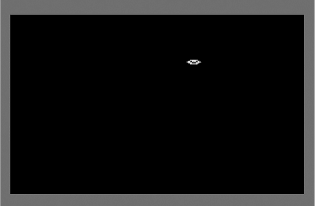

*图 11-13：Amiga 精灵游戏结果*

### 复古外设

8 位和 16 位时代引入了许多外设，这些外设要么至今仍在使用，要么对现代标准产生了强烈影响。让我们在这里看看一些最重要的外设，来完成我们对复古计算的研究。

#### *阴极射线管显示器*

虽然曼彻斯特婴儿机的威廉姆斯管，如第 220 页“历史 RAM”框中所示，最初并非作为人类显示设备设计，但它的程序员迅速意识到它作为显示设备的潜力，并很快开始在屏幕的某些部分编写易于人类阅读的模式作为输出，而屏幕的其余部分则存储内部数据，这些数据表现为随机的开关像素模式。在近几十年中，黑客们编写了简单的复古街机游戏，在婴儿机上播放，展示了*蛇*和*太空侵略者*等游戏，显示在威廉姆斯管的某些部分作为显示。

这些黑底绿字的像素是后来的阴极射线管（CRT）绿色屏幕以及之后的彩色显示器的起源，这些设备在复古时代作为人类显示器使用，如图 1-31 所示。

程序员逐渐习惯了绿色配色方案，在 1980 年代，常通过硬件开关将 RGB 显示器切换到高分辨率的绿底黑字模式，以帮助集中注意力和提高熟悉度。有些人声称，只有使用绿色像素可以提高显示精度，因为红色和蓝色子像素与绿色的距离较远，使用时容易导致像素模糊。今天，当我们将终端模拟器和文本编辑器（如 Vim）设置为绿底黑字模式时，依然遵循这一传统。这种经典的编程方案在电影《攻壳机动队》和《黑客帝国》中以风格化的计算机代码形式得到了庆祝。

为了降低成本，黄金时代的家用计算机通常设计为使用消费级电视 CRT 作为 RGB 显示器。为了在 CRT 显示器或电视上显示，像 C64 这样的 8 位机器首先需要从视频内存中读取所需的像素值，然后安排将其映射到 CRT 束的强度上，在显示器扫描屏幕的列和行时定期进行调整。

CRT 显示器在每个像素周围产生复杂的视觉光晕，这些光晕会与邻近的像素混合，而当时游戏的像素艺术正是为适应这种模糊效果而优化的，这与在现代平面显示器上玩复古游戏的效果完全不同。街机游戏*小行星*极端地利用了这一效果，将子弹的亮度调到最大，导致 CRT 射线像一种死亡射线直射玩家眼睛——这种效果在仿真中是无法捕捉的。

#### *用户输入*

复古时代的键盘通常是内存映射的，每个键都直接连接到内存空间中的一个地址，看起来像 RAM。地址分成一组，每个地址都映射到一个键，加载其中一个地址就可以判断键是按下还是松开。

复古时代的鼠标如图 11-14 所示。

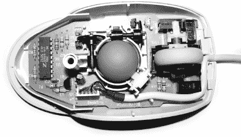

*图 11-14：球形鼠标拆解图*

像图 11-14 中的鼠标一样，通过在桌面上滚动一个拇指大小的橡胶球来工作，这个球会旋转两个滚轮传感器，检测它的水平和垂直旋转。传感器将旋转转换为模拟信号，再转为数字信号，通过电缆传输到计算机。

#### *串口*

串口曾经是，且仍然是，一种简单的通信协议（正式名称为 RS232 标准），曾出现在复古机器中，但在嵌入式系统中仍然非常重要。串口的核心是两根线，分别称为 RX 和 TX，代表*接收*和*发送*。它们通过时间上的数字电压来传输 0 和 1，因此有一根线在一个方向上传输信息，另一根线则在另一个方向上传输信息。历史上的串口还包含许多其他线路，因为在早期它们被用作控制许多设备的信号，但如今我们通常只使用 RX 和 TX。串口连接器仍然保留着这些额外的大多未使用的引脚，正如图 11-15 所示。

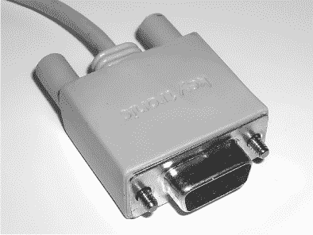

*图 11-15：传统的串口连接器*

串口可以以不同的速度运行。它们可能还使用不同的错误检查约定，这可能会增加额外的冗余位，以及*停止位*，用来标示字符在一串 0 和 1 中的边界。你需要确保线路两端的设备使用相同的速度和约定。

#### *MIDI 接口*

*MIDI（音乐设备接口*，如图 11-16 所示）自 1983 年标准化以来，一直是音乐键盘、合成器、采样器和 1980 年代键琴的标准总线，用于实时传输符号化的音乐输入和输出。它是总线层次结构的早期示例，其中一个可选的 MIDI 接口可以连接到主总线上；它还提供了一个次级 MIDI 总线，使多个音乐设备能够进行通信。

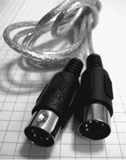

*图 11-16：MIDI 连接器*

MIDI 连接由一对单向总线组成。一条是用于管理器向设备发送消息，另一条是用于设备向管理器发送消息。它们被称为总线，因为所有设备使用相同的物理线缆，并且可以看到这些线上所有的消息，因此设备必须注意哪些消息是发送给它们的，只处理这些消息。

每个方向的总线都有自己的连接器，并通过三根物理线进行传输。（实际上，一个标准的 MIDI 连接器有五个引脚，其中两个备用引脚有助于处理相关工作，比如为设备提供“虚拟”电源。）一根线是 5V，另一根是地线，还有一根是 UART（通用异步接收发送器）数据线。总线性质通过 MIDI 规范可以看出，所有设备都有三个插口：“in”（输入）、“out”（输出）和“thru”（通道），其中“thru”将所有“in”消息转发给下一个设备，采用串联接线方案；其他硬件适配器可以将多个设备的“out”消息合并到一根线中，这种情况相对较少见。作为 1980 年代的标准，所有消息都是 8 位字（称为“MIDI 字节”），以类似串口连接的方式传输，标准传输速率为 31.25Kbps。

MIDI，包括最近的 MIDI 2.0 扩展，至今仍然在使用。

### 概述

对于某个年龄段的读者来说，理解并编程那些黄金时代的机器可以是重温青春并理解当时老旧机器内部运作的美好方式。但对于其他人来说，这些机器依然值得学习，因为它们架起了最简单电子计算机（如 Baby 机）与如今桌面和口袋中的现代计算机之间的桥梁。这些现代机器有许多更多的功能，可能令人应接不暇，因此，通过在越来越强大的旧机器上练习，你可以建立自己的信心。为此，本章研究了一台 8 位系统——Commodore 64 和一台 16 位系统——Commodore Amiga。这两台机器通过它们的 CPU 的共同祖先相关联，意味着它们共享一些指令和风格。这些经典系统所引入的许多理念至今仍在使用，正如我们将在接下来的章节中看到的那样。

### 练习

#### **6502 编程**

1.  Easy6502 是一个开源的 6502 模拟器，可以在浏览器中运行。它由 Nick Morgan 编写，Nick 是《JavaScript for Kids》和《JavaScript Crash Course》的作者，这两本书也由 No Starch Press 出版。可以通过以下链接下载 Easy6502：

    ```
    > git clone [`github.com/charles-fox/easy6502.git`](https://github.com/charles-fox/easy6502.git)
    > cd easy6502
    ```

1.  在浏览器中打开下载的*emulator.html*文件来运行 Easy6502。然后输入并运行本章中的示例 6502 程序。模拟器在右侧显示寄存器的内容。

1.  尝试在 Easy6502 中编写一个 16 位乘法子程序，使用 6502 汇编语言。

1.  Nick 的个人教程可以在下载的*tutorial.html*文件中找到。该教程提供了更多 6502 编程的细节，并逐步介绍如何编写一个复古的*蛇形*游戏。尝试学习足够的内容以理解这个游戏的工作原理，然后尝试以某种方式修改它，既可以改变游戏规则，也可以将其转变为另一个复古游戏，比如*太空侵略者*或*俄罗斯方块*。在这个模拟器中编写的代码可以移植到 C64 或其他基于 6502 的机器上，只需进行一些额外工作来替换图形和 I/O，使用它们特定设计的调用。

#### **C64 编程**

1.  现在，我们可以在现代机器上进行 C64 编程和汇编，然后仅需在 C64 模拟器（如开源的 VICE 模拟器）上运行生成的可执行机器代码，该模拟器可以本地安装。要开始使用，首先安装 *[`dasm-assembler.github.io`](https://dasm-assembler.github.io)* 上的 Dasm 汇编器。

1.  将你的汇编代码放在一个文件中，如 *hello.asm*。Dasm 需要在文件开头添加以下两行，以告诉它生成 C64 的可执行文件，而不是其他机器的可执行文件。它们必须精确地有八个空格的缩进：

    ```
          processor 6502          ; define processor family for das
          org $C000               ; memory location for our code
    ```

1.  使用以下命令将你的代码组装成 C64 程序 (*.prg*)：

    ```
    > dasm hello.asm -ohello.prg
    ```

1.  *.prg* 文件可以导入到 C64 模拟器中，例如基于 JavaScript 的在线模拟器 *[`c64emulator.111mb.de`](https://c64emulator.111mb.de)*，或者 VICE。（对于 SID 程序：某些模拟器，如这里提到的 JavaScript 模拟器，默认情况下禁用了声音，因此你需要手动启用它。）

1.  如果你足够幸运，能拥有一台真实的物理 C64 和磁带驱动器，你还可以尝试使用程序 *tap2wav.py*（可在 *[`github.com/Zibri/C64`](https://github.com/Zibri/C64)* 上找到）将你的 *.prg* 文件转换为磁带镜像 (*.tap*)，然后再转换成声音波形 (*.wav*)。然后将 *.wav* 文件录制到物理磁带上，加载到读取机上。尝试检查 *.tap* 和 *.wav* 文件，看看其中的 0 和 1 是如何表示的。

#### **在 Amiga 上编程基于精灵的游戏**

按照 第 271 页 “编程 Amiga” 部分中的方法，组装并运行飞船代码，步骤如下：

1.  从 *[`sun.hasenbraten.de/vasm`](http://sun.hasenbraten.de/vasm)* 下载 vasm 交叉汇编器。以 Amiga 模式构建它，命令如下：

    ```
    > make CPU=m68k SYNTAX=mot
    ```

1.  使用 vasm 来组装你的汇编程序，命令如下：

    ```
    > ./vasmm68k_mot -kick1hunks -Fhunkexe -o myexe -nosym myprog.asm
    ```

1.  从 *[`pypi.org/project/amitools/`](https://pypi.org/project/amitools/)* 安装 Python 版本的 *amitools*。创建一个磁盘映像并将文件写入其中，使磁盘映像可以启动，命令如下：

    ```
    > xdftool mydisc.adf create
    > xdftool mydisc.adf format "title"
    > xdftool mydisc.adf write myexe
    > xdftool mydisc.adf boot install
    > xdftool mydisc.adf makedir S
    > echo myexe > STARTUP-SEQUENCE
    > xdftool mydisc.adf write STARTUP-SEQUENCE S/
    ```

1.  从 *[`fs-uae.net/download`](https://fs-uae.net/download)* 下载并安装 FS-UAE Amiga 模拟器。运行它并从你的虚拟 *mydisk.adf* 磁盘映像启动。

#### **更具挑战性**

1.  研究如何读取 Amiga 键盘或操纵杆，然后将飞船示例扩展为一个简单的游戏，使用键盘来控制精灵的移动。研究如何添加双缓冲以去除屏幕重绘时的闪烁。

1.  最近，构建自己的基于 6502 的计算机已经成为一种流行的爱好。可以在 YouTube 和 *[`hackaday.com`](https://hackaday.com)* 上查看“6502 面包板计算机”的示例，并了解它们是如何制作的。你可以尝试重建这些现有设计中的一个，或者自己设计一个。

### 进一步阅读

+   要阅读那本教导一代 8 位程序员孩子的书，请参见 Lisa Watts 和 Mike Wharton 的 *《Usborne 初学者机器码入门》*（伦敦：Usborne，1983）。该书现已在网上免费提供，访问 *[`archive.org/details/machine-code-for-beginners`](https://archive.org/details/machine-code-for-beginners)*。

+   要了解 1983 年 C64 系统的导览，请参考 J. Butterfield 主编的《Commodore 64 架构》，*Computer!* 32（1983 年 1 月）：208，* [`www.atarimagazines.com/compute/issue32/112_1_COMMODORE_64_ARCHITECTURE.php`](https://www.atarimagazines.com/compute/issue32/112_1_COMMODORE_64_ARCHITECTURE.php)*。

+   若要获取关于 8 位时代音频编程的信息，请参见 James Vogel 和 Nevin Scrimshaw 的 *《Commodore 64 音乐书》*（波士顿：Birkhauser，1983），* [`archive.org/details/The_Commodore_64_Music_Book/page/n3/mode/2up`](https://archive.org/details/The_Commodore_64_Music_Book/page/n3/mode/2up)*。

+   查看 *[`github.com/emu-russia/breaks`](https://github.com/emu-russia/breaks)* 获取 LogiSim 中的 6502 和 NES 重建。
