## 第十五章：## **嵌入式架构**


计算机现在在汽车、机器人、工厂、艺术画廊和家用电器中非常常见。这些环境给计算带来了特定的约束和挑战，而为这些环境设计的架构被称为*嵌入式系统*。绝大多数生产的处理器—约 98%的处理器—都用于嵌入式系统。这是一个巨大的市场，在 2020 年代初期，其价值约为 2500 亿美元，因此，花时间研究这些系统是值得的。

本章将帮助你理解嵌入式系统，从而能够构建你自己的机器人、家居自动化黑客、电子音乐乐器或艺术装置，以及工业应用。我们将从比较通用计算机和嵌入式系统的主要区别开始，包括典型微控制器的结构及其 I/O 功能。然后，我们将介绍 Arduino，这是计算机科学家最常用的嵌入式系统，并展示如何在仿真和实际中用汇编语言编程，在那里它的架构最为清晰。最后，我们将探索一些 Arduino 的替代品，包括没有 Arduino 的 AVR、PIC、DSP 和 PLC。

### 设计原则

有几个众所周知的设计原则，将嵌入式系统与其他架构区分开来。让我们现在来逐一讲解。

#### *单一用途*

与 PC 不同，嵌入式系统通常是为了单一目的购买和使用的。一个嵌入式系统通过运行一个程序来控制你的机器人或洗衣机，这意味着你不需要操作系统来切换程序，而且你不常—甚至永远—需要更改程序。因此，嵌入式设备可能很难升级。你可以偶尔尝试要求所有用户升级他们电视或音乐播放器上的固件，但要广泛地推广并解释这个概念以使许多用户实际操作，会非常昂贵。相反，大多数用户通常会将这些设备丢弃并购买新的。根据你的角度来看，这可能是对地球资源的巨大浪费，或者是一个高利润的商业模式。

#### *可靠性*

对于嵌入式系统来说，可靠性通常比通用计算更为重要—它甚至可能关乎生死。考虑一下心脏起搏器及其嵌入式系统，这些系统会在手术过程中被植入人体内。你必须非常确定它能正常工作，因为你真的不希望为了修复一个 bug 而重新打开病人，或者将设备关掉再打开。其他嵌入式系统控制着工厂中的重型机械、公共交通信号系统以及核导弹发射，这些系统同样对错误的容忍度非常低。

#### *移动性与功率*

嵌入式系统通常被设计为物理机器的计算部分，这比通用计算机更严格地限制了其物理形态。通常会先设计物理机器，然后根据剩余空间来设计嵌入式系统。有些嵌入式系统也涉及到移动性问题：如果嵌入式系统必须随身携带，比如穿戴设备，它必须足够小巧轻便（并且最好看起来也不错）。

还有电力方面的考虑，尤其是当主机运行在电池上，而不是插入电源时。设计人员必须考虑消耗多少电力以及持续多久，电池需要多大。设计嵌入式处理器时需要尽量减少能量消耗，往往需要付出大量的努力。

#### *封装*

由于它们是为单一目的而设计的，嵌入式系统通常不需要将大部分或任何功能暴露给用户，这个概念被称为*封装*。相反，用户可能会得到一个简单的界面，只有几个按钮和一些 LED 灯，或者根本没有界面，如果系统设计为无需人工干预工作的话。通常，用户甚至不会意识到他们的设备里有一台计算机。

#### *仔细调试*

尽管完成的嵌入式系统通常被设计得非常坚固、安全且容错性强，但作为计算机科学家，你会发现，在开发过程中，它们可能会显得非常脆弱。我们习惯于处理可以快速、安全地进行“黑客攻击”的系统；如果某个功能不起作用，我们会修复它并重新运行，直到它正常工作。但在嵌入式系统的开发中，一次故障可能会物理性地损坏一个组件，这个组件可能难以、更换昂贵，或者耗时，所以你通常需要更加小心和有组织地规划测试。

### 微控制器

*微控制器*（又称为*微控制单元*，*MCU*，或*µC*）是一种包含 CPU 的芯片，专为嵌入式应用而设计和销售。微控制器可能看起来像图 12-1 中的那种。

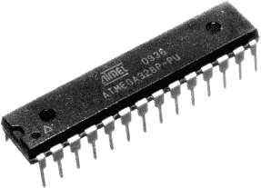

*图 12-1：一款 Atmel ATmega328P 微控制器芯片*

在接下来的几个章节中，我们将介绍一些微控制器的常见特性。

#### *CPU*

微控制器围绕 CPU 构建。与桌面计算机相比，这些 CPU 的计算能力和能耗通常要低得多。它们通常是 8 位的，行为与复古的 8 位架构非常相似，而且通常没有浮点运算——与复古计算机一样，你需要使用整数或定点数进行工作。

微控制器通常还将内存和输入输出（I/O）组件与 CPU 集成在同一块硅片上。这种布局消除了对外部总线的需求，并减少了微控制器上的引脚数量。相比需要分开芯片和总线布线的方式，使用单一的 MCU 芯片构建物理系统更为简单。

#### *内存*

由于微控制器通常用于运行单一、固定的程序，它们通常使用哈佛架构，将程序存储为 ROM 中的固件，而 RAM 仅用于程序数据的工作内存。以这种方式使用 ROM 使得程序在系统断电时仍能保留在内存中，并在重新开机时立即可用。像所有 CPU 一样，微控制器设计时会从上电时的硬件初始化地址获取数据，第一条指令将被放置在 ROM 的这个地址处。

由于需要适应单芯片的限制，微控制器的内存远小于桌面 PC。

#### *定时器和计数器*

由于许多现实世界的控制任务需要基于时间和现实世界中的事件进行操作，因此微控制器中常常包含定时器和计数器。它们通常作为额外的简单机器出现在微控制器的 CPU 中，拥有自己的专用寄存器和指令。

你已经在第六章中学会了如何使用数字逻辑构建计数器。如果你将外部世界的一个线连接到计数器上，你可以使用该计数器来计数某些物理事件的发生次数，比如按钮按下的次数。

*定时器*测量自初始化以来经过的实际时间。在此上下文中，实际时间通常被称为“挂钟时间”，指的是人类观察墙上的物理时钟所报告的时间差。定时器可以通过将电子时钟（用于控制 CPU 的周期）连接到计数器来实现。

*看门狗*是一种特殊的定时器，在发生故障时会自动重置微控制器。这在需要在现实世界中保持可靠性的系统中使用。如果发生故障，你需要一种无需触碰机器的方式来重置系统（想想起搏器的例子）。重置是在数字逻辑层面完成的，不是 CPU 程序的一部分。

### 嵌入式输入输出

嵌入式系统存在的目的是控制物理设备，因此输入输出（I/O）尤为重要。我们通常会发现 I/O 模块、端口和一些非常基础、缓慢的串行通信被集成到芯片本身。由于微控制器不在外部引脚上暴露它们的总线，有限的引脚空间资源可以用来暴露 I/O 连接。一些微控制器放弃了 I/O 模块，而是使用直接 I/O 指令与这些引脚进行通信——类似于你在 Commodore 64 6510 中看到的那样。

输入输出不仅对实时执行很重要；它还提供了一种将程序上传到嵌入式系统的方法。与 PC 不同，通常无法在嵌入式设备上进行开发工作，因为这需要图形界面、键盘、操作系统和编译器都在低功耗设备上运行。相反，我们通常在台式机上进行开发工作，可能还会在台式机上使用仿真或模拟进行测试，然后再将最终的二进制可执行文件传输到嵌入式设备。微控制器有专门的模式来进行此操作：通常它们可以通过 USB、串口或其他方式连接到台式机，然后进入“固件升级”模式，通过这种连接和台式机上的软件设备驱动程序将可执行文件复制到它们的非易失性程序存储器中。

#### *模拟-数字转换*

许多微控制器需要处理进出模拟信号，但在控制器内部，信号必须是数字信号；这需要在两端进行转换。所需的转换器可以位于微控制器外部，通过其引脚连接，或者在某些情况下位于微控制器的芯片上。

模拟-数字转换（ADC）的经典案例是音频处理。来自麦克风的模拟信号被发送到数字处理器，数字处理器对音频进行特效处理后，再将处理过的模拟信号传送回扬声器。这是通过将连续的模拟信号波形量化来完成的，转换为数字信号的过程是通过在固定时间间隔内采样来实现的，如图 12-2 所示。你可以通过更频繁或更不频繁地采样来在不同的分辨率下进行此操作。

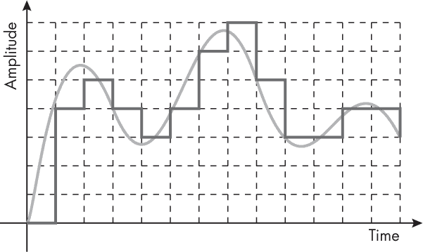

*图 12-2：将模拟信号量化为数字信号*

在进行反向转换时，即数字-模拟转换（DAC），一些设备（如 Arduino Due）可以将数字整数真正转换为模拟电压。较便宜的设备（如 Arduino Uno）则通过脉冲宽度调制（PWM）来近似完成转换。在这种情况下，输出信号只有 0 V 或 5 V。如果需要 3 V，输出会在 0 V 和 5 V 之间迅速振荡，其中三分之五的时间为 5 V，二分之五的时间为 0 V，从而给出一个时间平均值为 3 V。对于一些应用，这不会造成明显的差异，但对于其他应用，它可能会破坏输出结果。

#### *嵌入式串口*

前一章中提到的串行端口由于其简单性和稳定性，今天仍在嵌入式系统中广泛使用。在这里做的项目中，你更可能看到这种协议的虚拟化形式，因为如今现代计算机上不常见物理串行端口。相反，你可以使用类似 USB 的方式来模拟传统的串行端口协议。类似地，*Zigbee*无线协议作为一个虚拟串行端口，在特定的无线频率上运行；它被嵌入式设备如可编程灯泡、交通和农业传感器网络使用。

#### *互集成电路总线*

*互集成电路总线*，读作“eye-two-see”（写作 I²C，有时读作“eye-squared-see”），是连接芯片的标准。它在机器人技术中非常常见。该标准由 NXP（前身为菲利普斯）拥有并授权。

I²C 通信仅通过两根线进行：数据（SDA）和时钟（SCL），如图 12-3 所示。

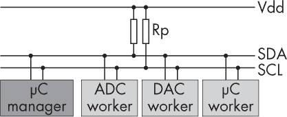

*图 12-3：I²C 架构*

I²C 可以使用 5V 或 3.3V 作为高电压，并且在多种速度模式下运行，从 100Kbps 到 3Mbps 不等。总线上可能有多个设备，每个设备都有一个 7 位的许可设备地址。一个节点必须承担管理者角色，生成时钟并发起通信。其他节点则是工作节点，回复管理者。基本的消息碰撞避免是通过规则“只有在总线空闲时才说话”来实现的。

实际上，I²C 设备可以通过标准的 FTDI（未来技术设备国际有限公司）芯片访问，FTDI 提供硬件和软件接口，通常通过串行连接（通常是通过 USB 端口）。I²C 设备（惯性测量单元传感器）与用于接口的 FTDI 的例子如图 12-4 所示。

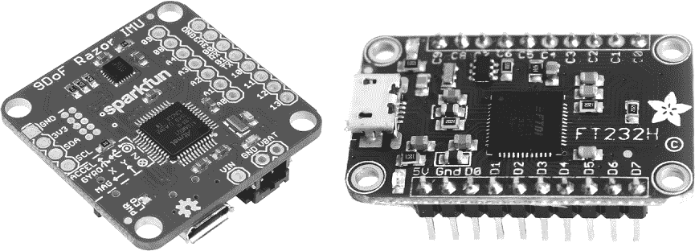

*图 12-4：I²C 设备（左）与 FTDI 接口（右）*

不需要额外的设备驱动程序，FTDI 设备对用户来说表现得像一个串行端口。

#### *控制器局域网总线*

*车载总线*是一个专门的内部通信网络，连接车辆内部的各个组件，如汽车、火车、船舶、飞机或机器人。*控制器局域网(CAN)*总线是一种车载总线，具有所有设备共享的单一公共串行通道。CAN 没有标准连接器，因为它并非面向消费者，而是用于车辆的内部。通常，它的线路直接焊接在车辆中许多设备的印刷电路板(PCB)上。如果你移开汽车副驾驶座前的塑料盖，通常会发现一个布线束，其中包含可接入的 CAN 线路。请查阅你的车辆维修手册以定位和连接这些线路。

CAN 通常有四根内部线，这些线使用差分电压来抵御车辆中预计会出现的强外部电磁场，特别是在电动机和发动机周围。

CAN 安全是当前的一个关注点。由于它是一个总线，所有设备都可以读取和写入数据。当安全关键设备，如防抱死刹车，和非关键设备，如媒体播放器，连接到同一总线上时，这可能会导致问题。担忧的地方在于，媒体和类似设备的安全性通常不如安全设备严格。黑客可能会控制一个非关键设备，并利用它向关键设备发送恶意指令，或通过填充总线垃圾消息来拒绝服务。对于自动驾驶车辆而言，转向和加速也通过 CAN 总线管理，其后果可能特别严重。

现在你已经了解了嵌入式系统的一般概念，接下来让我们探讨这些概念在实际应用中的体现，最著名的例子就是 Arduino。

### Arduino

*Arduino*，如图 12-5 所示，是黑客、创客和机器人研究人员的标准嵌入式系统，因为它将微控制器与所有需要的电源管理和输入输出功能封装在一个 PCB 上，你可以通过 USB 直接将其连接到桌面计算机并开始编程，而无需担心模拟电源或自行设置其 USB 输入输出系统。

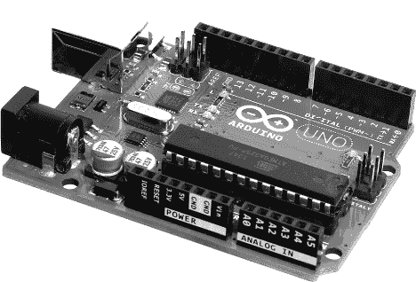

*图 12-5：一个 Arduino 开发板。ATmega328P 微控制器是位于右下角的大芯片。*

Arduino PCB 是一个基于闭源 Atmel AVR 系列微控制器（通常是 ATmega328 型号）的开源硬件设计。微控制器周围是一些额外的硬件，这些硬件使得给其供电和与之接口变得既简单又标准化。这些组件曾是计算机科学家编程微控制器的传统障碍，因为它们需要在每个项目中通过面包板或 PCB 来搭建，需要模拟电子学技能。Arduino 设计的巧妙之处在于选择并标准化了一套通常适用于多种应用的组件，并将其大规模低价生产，这样最终用户就不再需要为此担心。Arduino 提供了开源软件，允许用户通过 USB 轻松地将程序传输到固件中。（这里还有类似 C 的语言和编译器，但由于本书侧重于架构层次，我们这里只研究 Arduino 的汇编级编程。）

你可以单独编程 Arduino——例如，读取从桌面通过 USB 发送给它的数字，对其进行算术运算，并将结果发送回桌面。然而，Arduino 通常用于与其他电子传感器和执行器接口，最初是 LED 和开关。通常你将这些组件布局在面包板上，然后将电线从面包板连接到 Arduino，如图 12-6 所示。

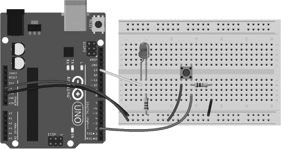

*图 12-6：一个连接 LED 和按钮到 Arduino 的 I/O 电路，使用面包板和电线*

无需焊接，因为组件和电线可以直接插入面包板和 Arduino 的连接器中。

#### *ATmega328 微控制器*

经典的 Arduino 微控制器——Atmel AVR ATmega328，如图 12-1 所示，表现得有些像旧式的 8 位系统，如 6502。它有 32 个 8 位用户寄存器（比 6502 的三个要多）。它有一个算术逻辑单元（ALU），包括整数乘法和除法，但没有浮点运算。类似于 6502，它有一个 8 位状态寄存器，包含告诉你算术计算结果的标志位，以便进行分支。指令集架构（ISA）包括间接寻址和硬件栈。它的时钟频率通常约为 20 MHz。

引脚分配，如图 12-7 所示，与典型的 CPU 不同，因为它没有外部总线。

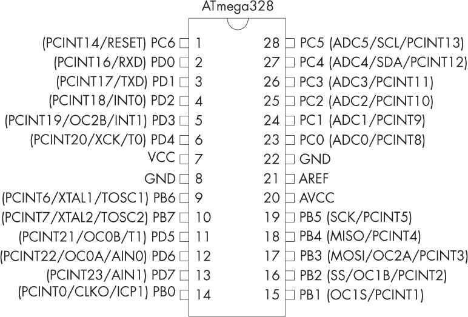

*图 12-7：ATmega328 的引脚分配（注意没有 A 和 D 总线引脚）*

不同于外部总线，14 个 I/O 引脚被直接暴露。引脚会增加芯片封装的尺寸，因此它们是一种稀缺资源。每个 I/O 引脚都可以配置为输入或输出。它们的配置通过专用的数据方向寄存器（DDR）设置并存储。

芯片照片（图 12-8）显示该微控制器不仅仅包含一个 CPU。


*图 12-8：ATmega328 的芯片照片*

除了 CPU 外，该芯片还拥有 2 k[2]B 的 SRAM、32 k[2]B 的闪存和 1 k[2]B 的 EEPROM，所有这些都集成在硅芯片上。从这个意义上来说，这颗芯片更像是一台完整的复古计算机，而不仅仅是一个 CPU。

Arduino 采用哈佛架构。你发送到板上的程序通过主机 PC 上的软件写入闪存，而 RAM 则用于数据存储。（EEPROM 是用户可写的，提供给需要在断电时存储小型配置数据的应用。）哈佛架构使用两条独立的总线：一条 8 位数据总线和一条 16 位程序总线。没有外部内存或总线；所有内存都在芯片上。

微控制器包含串口引脚和 I/O 模块。在上电时，微控制器首先运行一个小的内部 ROM 程序，检查它的串口。如果串口上有等待的数据，则认为这是一个新的用户程序，并将其加载到闪存中。程序计数器被设置为启动用户程序。

#### *Arduino 板的其他部分*

尽管可以直接从 ATmega 的串口引脚编程，但大多数桌面计算机现在没有物理串口了，因此用户使用通过 USB 运行的虚拟串口会更方便。Arduino 板包含一个 USB 连接器和一个专用芯片（实际上是另一个较小的微控制器），它读取 USB 线并将其转换为串口信号，传递到 ATmega 的引脚。

板上的大多数模拟电子元件用于电源管理。微控制器只需要一个简单的 5 V 电源。如果提供一个稳定的 5 V 电源，那么就不需要其他电子元件。然而，Arduino 设计时考虑了多种不同的使用场景。特别是，它可以通过电池供电，也可以通过 USB 电缆获取电源。额外的组件调节这些电源，保护板免受电压波动的影响，并使它能够在它们之间切换。（否则，如果让来自其他地方的电流返回 USB 电缆进入连接的桌面计算机，那会非常糟糕。）

I²C 总线使得可以为 Arduino 插入额外的扩展模块。你可以获取其他物理板（“扩展板”），它们可以以一种整齐、可堆叠的方式插入到 I²C 总线的端口中。

由于它是一个开源平台，Arduino 已经被许多设计师修改过。例如，Ruggeduino 是一个强化版（因此也更贵），它包含了额外的保护措施，以防止你以愚蠢的方式损坏它。Arduino 团队也有官方的变种。Due 是一个用真实 DAC 替代 PWM 的版本，Mega 和 Giga 有更大的 PCB，以支持更多连接，而 Nano 则有更小的尺寸。一些变种使用不同的微控制器，为需要或偏好这些功能的人提供更多的计算能力和不同的指令集。

#### *编程 Arduino*

像所有的 CPU 一样，Atmel AVRs 执行来自指令集的机器码，你可以通过从人类可读的汇编语言中汇编程序来进行编程。Arduino 的汇编器与我们迄今为止看到的其他汇编器没有太大区别。你可以在桌面 PC 上编写、编辑并汇编这些汇编代码。Arduino 的经典 "Hello, world!" 程序是打开其内建的 13 号引脚上的 LED：

```
.global main
main:
  ldi r16,0b00100000   ; load bits describing eight AVR PB pins into r16
  out 0x04,r16         ; set AVR pin PB5 (Arduino pin 13) to output mode
  out 0x05,r16         ; set output on AVR pin PB5 (Arduino pin 13) to ON
.global loop
loop:
  jmp loop
```

全局`main`标签在 Arduino 开机时会自动调用。`ldi`指令是“加载立即数”，它将一个常数加载到寄存器中。这个特定的常数包含 8 位，每一位对应 AVR 的一个数字 I/O 引脚（在图 12-7 中标记为 PB0 到 PB7）。它们的初始值都设为 0，除了 PB5 引脚（从右到左数，从 PB0 开始，沿着二进制位），它被设为 1。AVR 的 PB5 引脚接到 Arduino PCB 的 13 号引脚，进而连接到 LED。第一个`out`指令将 r16 中的位复制到 0x04，即数据方向寄存器，用来配置引脚为 I/O 模式。这会将 PB5 设置为输出，其他七个引脚设置为输入。第二个`out`指令将相同的位从 r16 写入 0x05，即“PortB”寄存器，从而设置 8 个 PB 引脚的输出值。这会将 1 写入 PB5，引发高电压点亮 Arduino 13 号引脚上的 LED。

与许多 CPU 程序不同，`loop`标签和跳转指令很重要，因为它们让程序永远运行下去。如果没有这些，LED 灯只会亮几分之一秒，然后在程序结束时熄灭。嵌入式程序通常需要像这样永远运行。

程序的一个更复杂版本使 LED 灯闪烁：

```
#define DDRB 0x04
#define PINB 0x03
.global main
main:
  sbi   DDRB, 5         ; set bit IO; port b 5th pin (make pin 13 an output)
blink:
  sbi   PINB, 5         ; set bit IO; to toggle PINB
  ldi   r25, hi8(1000)  ; 1,000 ms delay as argument, hi byte
  ldi   r24, lo8(1000)  ; 1,000 ms delay as argument, lo byte
  call  delay_ms
  jmp   blink
delay_ms:               ; delay about (r25:r24)*ms. Clobbers r30, and r31
  ldi   r31, hi8(4000)
  ldi   r30, lo8(4000)
innerloop:
  sbiw    r30, 1        ; subtract immediate value from word
  brne    innerloop     ; branch if not equal to zero status flag
  sbiw    r24, 1
  brne    delay_ms
  ret
```

为了让代码更易读，我在这里定义了 DDRB 和 PINB，分别表示数据方向寄存器和 PortB 寄存器。以 16 MHz 的频率，1 毫秒大约是 16,000 个周期。内循环需要四个周期，因此我们重复执行 3000 次。

**注意**

*AVR 也有一些 16 位指令，像 6502 一样，它们操作一对 8 位寄存器。*

### 其他基于 CPU 的嵌入式系统

Arduino 并不是唯一的基于 CPU 的嵌入式系统。让我们来看看你可能遇到的其他替代方案。

#### *没有 Arduino 的 Atmel AVR*

Arduino 是为计算机科学家设计的，而非工程师。你通常不会将一个完整的 Arduino 板做为产品出售。相反，你会创建一个包含 AVR 芯片以及仅所需电子元件的定制 PCB，这些电子元件既包括 Arduino 板上的组件，也包括你自己设计的部分。

作为一个中间步骤，你可以使用没有 Arduino 的面包板来安装 AVR 和其他电子元件，如图 12-9 所示。

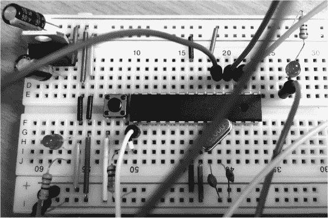

*图 12-9：使用 AVR 微控制器的面包板实现*

一旦你确认设计工作正常，就可以使用像*KiCAD*这样的程序将其转换为 PCB 设计，提交给 PCB 制造公司，并通过他们的网站获得 PCB，几天后通过邮寄收到。现在你不需要自己焊接了，PCB 制造公司有机器人会帮你完成这个工作。

#### *PIC 微控制器*

*PIC*是另一系列微控制器，类似于但又不同于 AVR 系列。与没有 Arduino 的 AVR 一样，PIC 微控制器也需要面包板、PCB 设计和串口。

PIC（可编程接口控制器）由美国公司 Microchip 设计，该公司在 2016 年收购了其竞争对手 Atmel。PIC 广泛应用于许多消费类和工业嵌入式系统中。市场上有多种 PIC 可供选择；你可以根据需求（如速度、功耗、成本和物理尺寸）来决定购买哪一款。由于有广泛的选择，PIC 在生产工程中比 Arduino/AVR 更受欢迎。这种灵活性使得选择的 PIC 版本可以与其应用需求紧密匹配。

#### *数字信号处理器*

*数字信号处理器（DSP）* 是一种专门的微控制器，设计用于处理实时信号，如音频。处理此类信号的嵌入式系统有特定的要求，因为它们基本上处理的是长时间——实际上是无限的——实时数据流，这些数据格式相同且需要以相同方式反复处理。这意味着不会有太多分支；相反，数据会顺畅地流过每个阶段，始终以相同方式处理。

例如，吉他手通常购买并使用数字效果盒，它们连接在吉他和放大器之间，用于修改声音（例如，通过添加压缩、失真、延迟或混响）。这些盒子是嵌入式系统，包含一个或多个 DSP，例如图 12-10 所示的芯片。

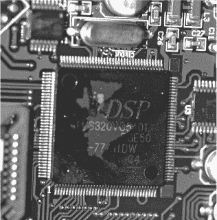

*图 12-10：吉他数字效果单元中的 DSP 芯片*

然而，DSP 不仅仅用于音频信号。还有许多其他类型的信号具有类似的特性，如视频、雷达以及来自各种医疗和科学监测仪器的数据流。在音频和类似音频的数据中，你通常可以通过直接量化的声波表示从 ADC 获取的声音。然而，在视频处理中，数据通常非常庞大，需要在存储和传输过程中进行压缩，这意味着许多 DSP 单元主要用于执行压缩和解压缩。

DSP（数字信号处理器）通常使用定点数表示法（如第二章中讨论的），而不是整数或浮点数。这是因为大多数信号具有明确的、固定的上下限，可以重新缩放到+1.0 和-1.0。例如，音乐音频通常以这种方式录制，任何超出这些范围的信号都会被剪切。定点数比浮点数更便宜、实现更简单，但对于这些类型的信号，能够给出相似的质量结果。

DSP 使用其可用的硅片提供额外的指令，专门用于信号处理。（回想一下第八章，增加这种额外的特定领域指令通常被认为是 CISC 哲学的一部分。）例如，针对快速傅里叶变换和卷积的特殊指令出现在为嵌入式音频设计的 DSP 中，因为这些操作构成了许多标准音频处理算法的基础。它们通常在定点模式下操作。由于 DSP 设计用于处理大量数据流，它们有时会包含额外的指令，加载和存储比单个字更大的数据块。这些指令可能会触发从一系列相邻内存位置到一组寄存器的传输序列。同样，I/O 指令可能会触发一系列的 ADC 与这些寄存器组之间的数据交换。

与标准的微控制器类似，DSP（数字信号处理器）采用哈佛架构，因此固件可以在制造时存储在 ROM 中，然后永远运行。

### 没有 CPU 的嵌入式系统

迄今为止我们看到的嵌入式系统都是基于微控制器的，这意味着它们仍然依赖于一个执行机器代码指令的 CPU。但也存在其他更简单的嵌入式系统，它们没有 CPU、没有程序、没有指令集。只有通过数字逻辑电路布局的硬件，用于计算你需要计算的内容。这些系统包括 PLC 和 FPGA。

#### *可编程逻辑控制器*

*可编程逻辑控制器（PLCs）* 是一种嵌入式系统，旨在执行简单的计算以控制工业环境中的机械设备，具有非常高的可靠性。它们通常出现在充满灰尘、化学品、食物碎片、高低温以及其他极端条件的工厂环境中，这些条件使得普通芯片难以生存。其设计理念是安装一种耐用的设备，能够持续运行 20 年，永不宕机。系统必须几乎不可摧毁，绝对可靠，并且尽可能简化，以避免任何错误的潜入。在这种工业自动化的背景下，嵌入式系统有时被称为*监控控制与数据采集（SCADA）*系统。

你会在这些环境中看到 PLC，通常它们被打包成所谓的 DIN 模块，并安装在标准的 DIN 轨道上，如图 12-11 所示。

在你的家里——通常是在地下室或楼梯下——你可能会有一个 DIN 风格的模块，它充当整个房屋的熔断器或断路器（也称为剩余电流装置，RCD）。同样，它是经过坚固设计的，旨在在任何正常操作情况下都不会失败。DIN 设计在 1970 年代标准化，至今仍然在使用。

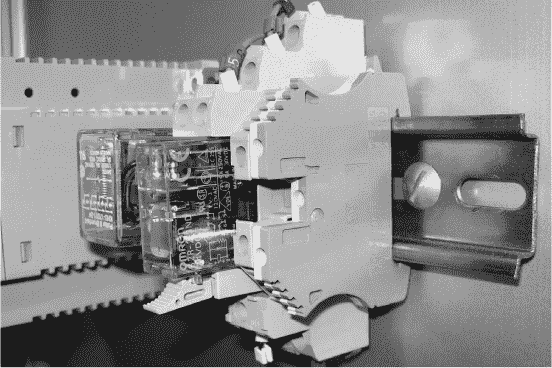

*图 12-11：安装在 DIN 轨道上的 DIN 模块*

PLC 不像运行一系列指令的程序那样运行；相反，它的功能通常是通过一种名为*梯形逻辑*的可视化系统来指定的，如图 12-12 所示。

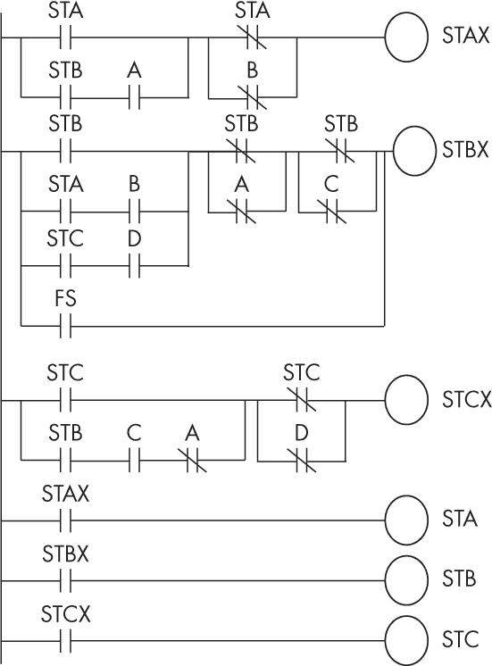

*图 12-12：嵌入式设备的梯形逻辑配置示例*

从本质上讲，梯形逻辑是一组“如果-那么”规则，它表示如果一个输入为高电平，则连接一根线到另一根线。没有程序从顶部开始并通过指令列表进行工作；每个单元都按照周围规则的逻辑运行。它来源于早期通过物理机电继电器构建计算机的时代。

梯形逻辑如此简单，甚至工程师都能使用。但这种简易性也意味着既可以使用正式方法，也可以通过直观检查来验证系统是否确切地做了它们应该做的事。如果在一个操作系统和现代编程语言及编译器中有任何微小的错误，可能导致核燃料棒移到错误的位置，那么你肯定不希望系统那么复杂；一切都必须是绝对可靠和可理解的。

PLC（可编程逻辑控制器）简单、完全透明且可验证。你可能会惊讶地发现，编写这些设备程序的工程师往往赚得比大多数计算机科学程序员还多，但他们也承担着安全责任。这个程序可能存在于一个核电站中，即使程序非常简单，也必须确保它的正确性。你不再需要通过直接配置梯形逻辑来设计 PLC；现在有编译器和汇编器可以将 C 代码转换为这些配置。当然，做到这一点需要信任编译器和汇编器程序，以及你自己的代码。

**嵌入式安全**

SCADA 系统绝不应该连接到公共互联网。在安全审计中，有一个著名的引导性问题，问 SCADA 管理员：“在紧急情况下，当所有工作人员都不在现场，正在家中工作时，你如何远程接入系统，接管控制，以防核燃料棒临界？”令人担忧的是，很多管理员会自豪地解释他们确实有这样的连接，而这些连接当然会被黑客利用。

即使没有互联网连接，系统通过“气隙”与网络隔离，仍然有可能被访问。2010 年的 Stuxnet 蠕虫就是通过在国际学术会议上散发的 USB 闪存驱动器传播的。它通过 USB 闪存驱动器在全球范围内自我复制，直到到达伊朗核武器燃料浓缩离心机的嵌入式系统。Stuxnet 然后只影响它们特定型号和配置的 PLC，微妙且几乎不可察觉地改变离心机的定时，从而摧毁它们并防止燃料浓缩。

#### *嵌入式 FPGAs*

第五章中讨论的 FPGA（现场可编程门阵列）芯片可以用于实现任何数字逻辑设计——不仅限于那些用于或与 CPU 配合使用的设计。这可以包括类似 PLC 的结构和许多其他数字逻辑网络设计。

由于嵌入式系统执行单一功能，能够运行任意指令程序的 CPU 设计可能既过于复杂又低效。相反，特定的算术或其他变换序列可以直接作为一系列简单机器实现，并在 FPGA 中通过流水线连接。例如，可以通过将多个加法器和乘法器按照实现信号处理算法所需的特定顺序连接在一起。此外，这种方式不仅减少了所需的 CPU 风格硬件，还能使系统运行得非常快，因为所有这些算术操作可以并行执行。

硬件描述语言在创建此类设计时尤其有用。例如，它们可以将算术步骤用类似 C 语言的语言表达，然后自动编译成适当的数字逻辑。

**普适计算与有意识计算**

*普适计算*（Ubicomp），即普及计算，是由马克·韦瑟（Marc Weiser）在 1980 年代的施乐帕洛阿尔托研究中心（Xerox PARC）创立的一种嵌入式设计哲学（同一地方发明了鼠标和图形桌面）。马克·韦瑟概述的核心理念是：“计算机的目的是帮助你做其他事情。最好的计算机是一个安静、隐形的仆人。你通过直觉做得越多，你就越聪明；计算机应该扩展你的无意识。技术应该带来宁静。”

普适计算体现在像亚马逊的 Alexa 等产品中。它隐形地存在于你的家中，当你想要什么时，你大声说出来，它就为你完成。你无需坐在计算机前思考如何做。普适计算的理念也在近年来的“普遍计算”和物联网等领域重新出现。

最近出现了一种反对普适计算的运动，我们可以称之为*有意识计算*。它的支持者认为，用户不希望被不确定的、无法理解的公司云端做决定。他们对失去对这些机器的控制感到恐慌。因此，有意识计算做了相反的事情，故意将注意力集中在技术上，迫使用户思考并理解他们正在使用的机器。

根据一种普适计算的哲学，灯光开关可能会消失，因为机器可以自动预测何时应该打开或关闭灯光，而无需用户输入。根据有意识计算的理念，灯光开关应当保留，用户应当在触摸开关时，专注地将自己的意识与开关融为一体。

### 摘要

嵌入式架构构成了世界上大多数计算机的核心，但由于其本质，它们通常对大多数用户来说是隐形的。它们的应用存在于计算与工程之间的交界处，但它们的架构与复古计算机的架构非常相似，而且它们为喜欢这种计算风格的粉丝提供了一个有趣的工作领域。大多数嵌入式系统基于微控制器，这些芯片将低功耗的 CPU 与板载内存、I/O 及其他有用功能结合在一起。Arduino 是一个标准的嵌入式平台，它封装了计算机科学家与硬件（如机器人、工厂、汽车和艺术装置）进行接口所需的大部分工程工作。

### 练习

#### **模拟 Arduino 编程**

1.  使用开源的 Wokwi Arduino 仿真器运行本章中展示的示例 Arduino 程序。要使用汇编器，请访问* [`wokwi.com/arduino/projects/290348681199092237`](https://wokwi.com/arduino/projects/290348681199092237) *中的 blink.S 标签，或在* [`github.com/arcostasi/avr8js-electron-playground`](https://github.com/arcostasi/avr8js-electron-playground) *找到离线版本。

1.  记住，Arduino 的 I/O 引脚可以配置为输入或输出。如果引脚的读写行为不如预期，请首先检查它是否被设置为正确的模式。

1.  与 LED 闪烁程序中使用的嵌套延迟循环相比，使用 AVR 内建的定时器编写闪烁灯光程序是一种更漂亮且更节能的方式。研究实现这种方式所需的寄存器和命令，并实现这种替代版本。

#### **具有挑战性**

1.  有许多价格实惠的 Arduino 入门套件；购买一个并尝试在真实硬件上运行示例程序。当使用真实的 LED 时，记住它们是二极管，有方向性，必须正确连接，并且始终与电阻并联；否则，它们会爆炸！

1.  大多数套件都附带一些用 Arduino C 编写的示例程序；尝试用你自己手写的 AVR 汇编代码来复现它们的功能。（如果遇到困难，可以尝试将 Arduino C 编译成汇编代码，并检查它以获取灵感。）

1.  如果你更喜欢命令行工具而非 Arduino IDE，AVRA 是 AVR 汇编器，而 AVRDUDE 是 AVR 下载/上传工具。

### 进一步阅读

+   有关工程师和计算机科学家在嵌入式设计方面的不同观点的著名寓言，请参见 Do-While Jones 的《早餐食品烹饪器》。网络上可以找到多个版本，最早的版本可追溯到 1990 年。

+   有关 AVR 指令集的完整参考资料，请参阅 Atmel 的《AVR 指令集手册》，2016 年，* [`ww1.microchip.com/downloads/en/DeviceDoc/Atmel-0856-AVR-Instruction-Set-Manual.pdf`](https://ww1.microchip.com/downloads/en/DeviceDoc/Atmel-0856-AVR-Instruction-Set-Manual.pdf) *。

+   有关 Arduino PCB 设计的说明和 CAD 文件，请参见“从零开始的 Arduino”系列，* [`rheingoldheavy.com/arduino-from-scratch-series`](https://rheingoldheavy.com/arduino-from-scratch-series) *。

+   有关 PIC 单片机编程的信息，请参见《PIC 汇编编程》，* [`groups.csail.mit.edu/lbr/stack/pic/pic-prog-assembly.pdf`](https://groups.csail.mit.edu/lbr/stack/pic/pic-prog-assembly.pdf) *。

+   要动手实践 CAN 总线，请参见 Jared Reabow 的《如何利用 CAN 总线和 Arduino 改装和升级你的汽车》，* [`www.instructables.com/How-to-Hack-and-Upgrade-Your-Car-Using-CAN-Bus/`](https://www.instructables.com/How-to-Hack-and-Upgrade-Your-Car-Using-CAN-Bus/) *。本教程包括制作 *回到未来* 风格日期和时间显示的说明。

+   Hackaday (*[`www.hackaday.com`](https://www.hackaday.com)*) 是一个著名的嵌入式项目创意网站。
