## 第十六章：## **桌面架构**


“每个桌面上都有一台计算机”是比尔·盖茨在 1990 年代 32 位时代的愿景，尽管当前的趋势是物联网和云计算，但个人计算机（PC）今天仍然能在许多桌面和膝上看到。PC 并不是单一的计算机设计；它是通过将来自不同制造商的许多不同组件结合在一起，围绕 x86 系列 CPU 构建的一套松散的约定。

由于商业驱动的向后兼容性，现代 PC 保留了许多早期阶段的特性，因此在本章中，我们将研究这些约定是如何形成的，以及它们如何影响 x86 架构和 PC 计算机设计。我们将考察 x86 的 CISC 哲学及其硅谷历史和指令集，然后看一下用于围绕它构建现代 PC 的一些计算机设计元素。

### CISC 设计哲学

大多数桌面计算机使用来自 x86 系列的 CPU，这些 CPU 通常被描述为 CISC 架构。我们已经见过几次 CISC 架构，但让我们更详细地看看出现在 x86 中的一些 CISC 原则。

在 CISC 架构中，你试图在一个大而复杂的芯片上做尽可能多的、巧妙的事情，芯片包含大量的硅。你设计许多不同的小型机器，每个机器都执行不同的专门功能；你还为每个机器提供专门的指令。正如你可以想象的那样，这非常难以设计，最终你不得不支付给你的架构师大量的钱——特别是当所有新的复杂功能需要与其他创新（如流水线和乱序执行（OOOE））良好协作时。使用大量硅通常会消耗大量功率，因此 CISC 处理器通常需要插入电源插座，配备强大的电源变压器和大型冷却系统，如风扇。这些要求在桌面环境中比在嵌入式和智能设备环境中更容易满足。

CISC 哲学的一个经典特征是有大量指令将内存访问与算术逻辑单元（ALU）指令结合，例如“将第一个地址的内容与第二个地址的内容相乘，并将结果存储在第三个地址”，其中地址位于 RAM 中。实际上，这是一个涉及多个步骤的复合指令：我们需要加载这两个地址，乘以它们的值，将结果存入寄存器，然后再次将其存储到内存中。

CISC 还强调在硬件中实现新指令，基本上是在说：“更多的硅解决问题。”例如，如果用户需求大量的视频编解码流媒体，你可以创建专门的指令来执行视频编解码中使用的特定数学运算，并在数字逻辑中构建许多新的简单机器来实现它们。

一个“解码我的视频”指令将需要超过一个时钟周期，并且处理不同指令所需的时间差异是 CISC 架构中面临的主要挑战。特别是，当指令的执行时间不同的时候，流水线和乱序执行（OOOE）就更难正确实现。这个问题可以通过增加更多硅片来解决：你可以在控制单元（CU）中创建更复杂的数字逻辑来识别这些时间差异，并根据它们进行调度。

CISC 架构的一个假定优势是，编译器几乎不需要做任何工作就可以将常见的高级语言语句翻译成汇编语言；这是因为指令集架构（ISA）为诸如“解码我的视频”这样的命令提供了专门的指令，这些指令通常有一个简单的一对一的翻译。但是这些指令让编译器编写者的工作变得更加困难，他们现在需要为*每个*目标后端 CPU 通读五卷指令集；他们现在还需要尝试针对每个特定的 ISA 来优化编译器。对于编译器开发者来说，使用一本指令集并忽略所有高级指令会更容易。实际上，这意味着 CISC 架构更有可能配备由同样开发 CPU 的团队编写的编译器，因为没有其他人愿意为某个特定 CPU 进行优化。这些编译器通常是专有的，并且由于涉及的复杂性，比开源版本运行得更快；只有那些构建系统的人才完全理解所有的特性。

另一个优点是汇编程序可以很短，因为每条指令做了很多工作。在 1980 年代，这一点很重要：RAM 受限，因此较短的程序释放了更多的 RAM 用于数据。今天，这点已经不那么重要了。

CISC 是由一位英国人莫里斯·威尔克斯（Maurice Wilkes）发明的，如前所示在图 1-19，但它是在美国得到商业化的。典型的 CISC 架构师和用户是以商业驱动为主的，CISC 在现实世界的桌面计算中占据主导地位。你今天可能就在使用 CISC 架构的桌面计算机。如果一个 CISC 客户要求添加一个新的指令来加速他们特定的多媒体应用程序，那么 CISC 公司通常会为他们设计并添加这个指令——当然是有成本的。这些新特性通常是以这种方式附加上的，并不一定设计得与之前的系统完美契合。然而，为了避免破坏其他客户的现有系统，旧特性通常会被保留。

### 微程序设计

在硬件中构建新 CPU 既困难又昂贵。制作一个芯片掩膜集的成本大约为 500 万美元，如果某个地方出现错误，就需要新的掩膜。由于 CISC 设计复杂，这个问题尤为严重。*微程序设计*是解决这个问题的一种方法，它使得架构由许多简单的机器组成，这些机器可以通过基本的开关连接和断开。指令则被定义为连接和断开序列。例如，要将两个寄存器相加，你首先将其中一个寄存器连接到 ALU 输入，然后将另一个寄存器连接到另一个 ALU 输入。接着，你将 ALU 连接到一个信号，指示它进行加法运算，最后将 ALU 输出的结果连接到一个寄存器。

这个想法让人想起了巴贝奇的分析机中的旋转桶控制单元（CU）。桶中有触发器，通过它们可以触发一系列简单机器的工作。如果触发器位置发生变化，就可以轻松创建不同的指令和架构。现代电子微程序设计——因此也包括 CISC——被归功于威尔克斯（Wilkes），他研究并教授计算历史，并且非常坦率地承认从巴贝奇的机械桶中获得了这个想法。这是一个典型的例子，说明了研究历史的轨迹如何促成现代架构中的重大、图灵奖获奖的进展。

巴贝奇桶中触发器的电子版本通常是固件，称为*微代码*，它存在于 CPU 内部，包含每条指令中要顺序连接和断开的连接列表。（这不是 CPU 地址空间中的 ROM，而是 CPU 内部一个不可寻址的独立区域。）作为固件，它可以随时进行电子重编程。这大大减少了修复 CPU 硬件故障的成本，因为可以通过固件更新来修正问题，而不必返回并重新制造芯片。

微程序不是机器代码程序；它们存在于更低的层次，定义了机器代码运行的机器。微程序的动作可以使用寄存器传输语言（RTL）进行标注，如在第七章中所示。现代 CISC 芯片可能有成千上万条复杂的指令，这些指令都通过微代码来定义。如果你愿意，你可以重新编写你的 CPU 微程序，实施完全不同的指令集，比如将 x86 转换为复古的 6502！现在的可重配置性已经非常强大，微程序几乎可以像 FPGA 一样运行。

现在我们已经了解了一些设计概念，让我们来看看 x86 的历史。了解这些历史将帮助你理解现代 x86 处理器中仍然存在的、通过这段历史积累的特性。

### x86 历史

x86 架构是迄今为止最具商业成功和韧性的 CPU 架构，2023 年迎来了它的第 45 个周年纪念。x86 是一系列 CISC 架构，其设计和名称来源于英特尔处理器前几代的型号：8086、80286、80386 和 80486。x86 跨越了三代字长：16 位、32 位和 64 位架构。作为一个商业产品，它特别强调与所有前代架构的严格向后兼容性，尽管这增加了设计的复杂性，包括数字逻辑，以确保历史遗留的 bug 得以保留，从而使得那些利用这些 bug 作为特性的旧游戏仍能继续运行。你仍然可以将 1970 年代的可执行机器代码拿到现代 x86 上运行，它会“顺利运行”。（这与商业操作系统中的软件设计方法类似，后者也同样膨胀到巨大的规模，以维护客户兼容性，代价是性能和美观的牺牲。）由于不断添加新的 CISC 指令并保留所有旧指令，最新版本的 x86——*amd64*指令集架构——如今包含超过 3000 条指令，这些指令被记录在五卷的参考书中。

#### *史前时期*

x86 设计的历史是硅谷架构和政治的历史，特别是英特尔和 AMD 两家公司之间的历史。这两家公司使用相同的专有指令集制造处理器，而且它们之间不断进行法律斗争，这些争斗已经持续了几十年。

威廉·肖克利、约翰·巴丁和沃尔特·布拉廷因发明晶体管而获得了 1956 年诺贝尔物理学奖，发明地是在新泽西州的贝尔实验室。肖克利的家族来自加利福尼亚州的帕洛阿尔托，尽管他出生在伦敦。获奖之后，你可以在任何地方生活和工作，因此肖克利决定从新泽西迁往加利福尼亚州的山景城，因为他希望能靠近位于帕洛阿尔托的母亲。他在这里成立了肖克利半导体公司，继续进行晶体管的研究和商业化。

到了 1957 年，由于诺贝尔奖得主的傲慢与对一些被员工认为是边缘话题的痴迷的混合，Shockley 已经成为一个很难合作的人。一群员工，所谓的“背叛的八人组”——包括戈登·摩尔和罗伯特·诺伊斯——离开了 Shockley，成立了竞争公司费尔柴尔德半导体。这在当时的商业文化中几乎被视为亵渎，因为人们普遍认为，员工会加入大公司，并忠诚地为公司服务整个职业生涯。此后，这种做法成为了硅谷创业文化的蓝图，认为员工会并且应该离开大公司，自己创办公司。

飞兆半导体公司（Fairchild）创造了集成电路（芯片）的第一个商业版本。此时，对计算的需求几乎完全来自美国军方，军方利用纳税人的资金资助研究，并购买芯片制造商的产品，为冷战中的导弹和飞机提供动力。这些政府资金推动了硅行业的发展，加速了飞兆半导体的成长，并促使许多竞争对手的崛起，因为飞兆的员工复制了飞兆的模式，离开公司创办了自己的竞争性芯片公司，最终催生了现代硅谷。

1968 年，飞兆半导体的内部政治导致戈登·摩尔和罗伯特·诺伊斯再次辞职——这次他们离开飞兆成立了英特尔（Integrated Electronics 的缩写）。AMD（Advanced Micro Devices）于次年由杰里·桑德斯创立。AMD 早期的目标是复制英特尔的产品，并作为第二来源以更低的成本生产这些产品。在 x86 系列正式推出之前，英特尔于 1971 年生产了 4 位的 4004 芯片，随后 AMD 于 1975 年将其克隆为 Am9080。英特尔在 1974 年通过推出 8 位版本的 8080（3 MHz）抢先一步，随后 AMD 也复制了这一款。

#### *16 位经典时代*

x86 家族的第一个成员——由现代向后兼容性定义——是英特尔于 1978 年推出的 16 位、5 MHz 的 8086 芯片。这是一款采用微程序设计的 CISC 芯片。x86 的名称来源于其最后两位数字。

英特尔与 AMD 之间的竞争在 1982 年通过英特尔、AMD 和 IBM 之间的三方合同正式化，当时 IBM 的业务是制造计算机。IBM 希望购买用于其计算机的 CPU，但不想被单一公司设计的专有技术锁定，因为这样一来，该公司可能通过锁定政策勒索 IBM 并提高价格。作为一个巨大的公司，IBM 拥有足够的购买力来通过与供应商的博弈获取其真正想要的东西——让多家公司竞争生产相同的芯片作为通用商品；这将压低价格并使 IBM 能够长期以低价获得这些芯片。IBM 对英特尔说：“我们想买你们的芯片，但只有在你签署这份合同，允许 AMD 复制它们的情况下我们才会购买。如果你不签署，我们就不从你们任何一方购买。”三家公司达成一致，最终创立了著名的英特尔-AMD 交叉许可协议，允许两家公司设计和销售实现相同 x86 指令集架构（ISA）的芯片。

**注意**

*这是计算机经济学的一般教训：在销售之后，硬件或软件平台的卖方可以通过锁定效应对买方施加极大的控制力。因此，平台的卖方应在初期尽可能免费或大幅折扣地提供其平台，以便让用户锁定在平台上，然后再提高销售条件，一旦他们掌控了买方。但在买方选择平台之前，买方才是拥有所有权力并决定一切的人。因此，买方应当积极谈判，以形成一份合同，从而在以后减轻卖方对他们的控制力。一旦你付了钱，除了合同中约定的内容，你将不再拥有任何权力。*

IBM 的交易将两大芯片制造商推向了商务计算市场，使他们能够快速扩张。交易之后，英特尔用 80186（1982 年；6 MHz）更新了 8086，随后推出了 80286（1982 年；8 MHz），首次增加了操作系统支持的保护模式。AMD 随后快速复制了 80286，推出了 Am286（1982 年；8 MHz）。这些 16 位设备出现在 1980 年代初期，作为高端商务机器，与此同时，8 位的黄金时代也在家庭中到来。

#### *32 位克隆战争时代*

32 位时代始于英特尔的 386（1985 年；16 MHz），它引入了 32 位指令集 x86 IA-32。 在这一时代，两个主要芯片制造商之间的竞争和法律诉讼不断，这一过程在赛瑞克斯和威雅等额外竞争者加入后变得更具娱乐性，这些公司也生产 x86 兼容芯片。表 13-1 总结了这些发展。

**表 13-1：** 32 位时代 x86 发展

| **年份** | **制造商** | **架构** | **特性** |
| --- | --- | --- | --- |
| 1985 | 英特尔 | 386 | 16 MHz |
| 1989 | 英特尔 | 486 | 50 MHz, 流水线设计, FPU |
| 1991 | AMD | Am386 | 386 的克隆 |
| 1993 | 英特尔 | Pentium | 75 MHz, 超标量 |
| 1993 | AMD | Am486 | 486 的克隆（最后一个克隆） |
| 1995 | 英特尔 | P5 | 150 MHz, MMX SIMD “Pentium MMX” |
| 1995 | 英特尔 | P6 (i686) | 200 MHz, SSE SIMD, OOOE, “Pentium Pro” |
| 1996 | AMD | K5 | 133 MHz, 类似 Pentium |
| 1995 | 赛瑞克斯 | Cx5x86 | 140 MHz, 类似 Pentium |
| 1996 | 赛瑞克斯 | 6x86 | 140 MHz, 类似 Pentium |
| 1997 | AMD | K6 | 300 MHz, 3D-NOW, 对抗 SIMD |
| 2001 | VIA | C3 | 500 MHz, 类似 Pentium |
| 2001 | AMD | Athlon | 2 GHz |

英特尔通常是技术领导者，创造了诸如流水线设计和扩展指令等新技术，其他公司在一到两年后跟进以降低价格。在每个阶段，时钟速度都稳定地变得更快，遵循摩尔定律。这就是“乏味的 1990 年代”，当时客户认为他们需要每 18 个月购买一台新的米色台式电脑，以跟上时钟速度的翻倍。

在 486 处理器之后，英特尔厌倦了竞争对手复制无法注册商标的 86 名称，因此他们改用了可注册商标的品牌名称“奔腾”。这一芯片在一段时间内占据主导地位，但后来 AMD 通过其 Athlon 处理器在 2001 年率先达到了 1 GHz 的速度，取得了领先。

#### *64 位品牌化时代*

x86 的 64 位时代在 2000 年到来，当时 AMD 正式定义了 amd64 ISA，随后大多数 CISC 处理器都采用了这一架构。这是一场革命：x86 ISA 家族之前一直由英特尔定义，其他厂商只能将自己的产品与其挂钩。

英特尔曾试图定义自己失败的 64 位竞争对手指令集架构（ISA），名为 IA-64，但该架构在 amd64 发布之后才面世，并未获得广泛认可；如今，大家都使用 amd64。然而，英特尔拒绝承认 amd64 这一名称，而是称其为 x86_64。令人困惑的是，你会看到这两个名称都被用来描述该 ISA 的软件执行文件下载，比如在 Linux 发行版的软件包名称中。

64 位时代的特点是市场营销术语与基础技术的分离，同一市场品牌常常用来标示完全不同的架构。与之前的 32 位奔腾处理器不同，品牌名称不再与特定的设计相联系。你可能已经习惯看到像奔腾、赛扬和至强这样的 64 位产品品牌。你也可能会在品牌名称中看到数字 3、5、7 和 9，如 Core i3、Core i5 等。对于英特尔来说，这些数字除了暗示哪些产品更好之外，并没有其他意义；而 AMD 则用相同的数字来暗示哪些产品与英特尔的产品类似。

表格 13-2 展示了英特尔和 AMD 发布的一些例子及其在 64 位时代的显著特点。

在这一时期，管道阶段数通常在 14 到 20 之间，并且始终使用了超标量执行（OOOE）。AMD 的 Piledriver 架构首次引入了基于神经网络的分支预测硬件。

时钟频率在 64 位时代初期达到了 3.5 GHz，并且自此停滞不前，这是由于摩尔定律对时钟频率的限制。然而，摩尔定律在晶体管大小上的影响仍然存在，并且通常通过晶体管的尺度（单位：纳米）来定义机器，而不是通过时钟频率，以展示技术的持续进步。在 2006 年到 2016 年期间，英特尔采用了“tick-tock”周期，在此周期中，他们的新产品交替采用新的数字逻辑设计（tock）和采用新的晶体管技术使相同设计更小更快（tick）。*Boost*是 Nehalem 架构首次引入的功能，它能在高负载计算的瓶颈处*暂时*提升时钟频率，超越通常的 3.5 GHz 热限制，持续短时间。

**表格 13-2：** 64 位时代 x86 发展历程

| **年份** | **制造商** | **架构** | **晶体管大小（nm）** | **品牌** |
| --- | --- | --- | --- | --- |
| 2003 | AMD | Hammer (K8) | 130 | Opteron |
| 2005 | AMD | Hammer (K8) | 90 | Athlon 64 X2 |
| 2006 | Intel | Core | 65 | Celeron/Pentium/Xeon |
| 2007 | AMD | 10h (K10) | 65 | Opteron |
| 2008 | Intel | Nehalem | 45 | Pentium, Xeon, Core（第一代） |
| 2011 | Intel | Sandy Bridge | 32 | 第二代 Core i3/i5/i9；Xeon |
| 2012 | AMD | Piledriver | 32 | Opteron |
| 2013 | Intel | Haswell | 22 | 第四代 Core i3/5/7；Celeron/Pentium/Xeon |
| 2015 | Intel | Skylake | 14 | 第六代 Core i3/5/7；Celeron/Pentium/Xeon；CoreM |
| 2017 | Intel | Coffee Lake | 14 | 第八代 Core i3/5/7；Celeron/Pentium Gold/Xeon |
| 2017 | AMD | Zen | 14 | Ryzen 3/5/7 1000 系列 |
| 2018 | AMD | Zen+ | 12 | Ryzen 3/5/7 2000 系列 |
| 2019 | AMD | Zen2 | 7 | Ryzen 3/5/7 3000 系列 |
| 2020 | AMD | Zen3 | 7 | Ryzen 5/7/9 5000 系列 |
| 2021 | Intel | Cypress Cove | 14 | 第十一代 Core i5/7/9；Xeon |
| 2021 | Intel | Golden Cove | 7 | 第十二代 Core i5/7/9；Xeon |
| 2022 | AMD | Zen4 | 5 | Ryzen 5/7/9 7000 系列 |

现在我们已经了解了 x86 的演变过程，接下来让我们看看它的指令集，并学习如何编程。这将是一个比我们之前研究过的其他架构更为复杂的过程，但希望通过了解历史，你至少可以明白为什么事情会发展成现在这个样子。

### 编程 x86

x86 架构庞大且复杂，它的代码通常是由编译器生成，而不是手工编写的。不过，如果你想更好地理解你的编译器和计算机是如何工作的，或者如果你想编写编译器或其他系统软件，比如操作系统和引导程序，那么学习 x86 仍然值得花时间。因为 x86 是一种广泛使用的架构，理解它在安全应用中也很有用，例如破解和防护代码，包括游戏的作弊和反作弊系统。

作为一种 CISC 架构，x86 通常会有多种不同的指令变体，它们接受不同类型的操作数，如常量、寄存器和内存位置。不同时间点添加了不同的指令组，这些指令组并不总是遵循相同的约定：例如，整数加法、整数乘法和浮点操作向程序员呈现的接口差异很大。你不会从零开始设计一个使用如此不同接口的 CPU；这种混乱正是架构随着时间发展所带来的结果。

这不会是一次详尽的 x86 特性之旅。相反，我们将通过几个例子，展示 CISC 扩展是如何创建的，以及它们是如何运作的。

#### *寄存器*

由于 x86 随着时间的演变以及其对向后兼容性的需求，它的寄存器集已经发展成一种特定的形式。寄存器大体上分为两类，我们来看看每一类。

#### **通用寄存器**

在 x86 架构中有八个通用用户寄存器。它们的名称反映了它们的传统用途。表 13-3 显示了这些寄存器。

**表 13-3:** x86 通用寄存器

| **寄存器** | **含义** | **用途** |
| --- | --- | --- |
| AX | 累加寄存器 | 算术运算 |
| BX | 基址寄存器 | 指向数据的指针 |
| CX | 计数寄存器 | 移位、旋转和循环指令 |
| DX | 数据寄存器 | 算术运算和 I/O 操作 |
| SP | 栈指针寄存器 | 指向栈顶的指针 |
| BP | 栈基指针寄存器 | 指向栈底的指针 |
| SI | 源索引寄存器 | 指向数据复制的源 |
| DI | 目标索引寄存器 | 指向数据复制的目标 |

在原始的 16 位 8086 中，通用寄存器都具有 16 位。为了与之前的 8 位 8080 保持部分向后兼容，前四个寄存器—AX、BX、CX 和 DX—也可以拆分成两个 8 位寄存器，分别命名为 H 和 L，代表高字节和低字节，可以独立访问。

IA-32 将这八个寄存器扩展为 32 位。为了保持兼容性，它们仍然可以像以前一样以 16 位或 8 位寄存器的形式访问。要以完整的 32 位模式访问它们，我们在它们的名字前加上前缀 E（表示*扩展*）：EAX、EBX、ECX 等。

amd64 再次扩展了这八个寄存器，至 64 位。与之前一样，32 位、16 位和 8 位版本保持不变以保持兼容性。要以 64 位模式访问它们，我们在它们的名字前加上前缀 R：RAX、RBX、RCX 等。amd64 还增加了八个额外的 64 位通用寄存器，命名为 R8 到 R15。

由于 x86 被定义为基于 16 位系统的架构，并且需要保持向后兼容，因此在 x86 中，*字* 仍然表示 16 位数据，而不是现代寄存器的完整大小。*双字* 或 *dword* 表示 32 位，*四字* 或 *qword* 表示 64 位。

图 13-1 总结了通用 x86 寄存器的发展历程。


*图 13-1：x86 寄存器。寄存器名称显示在每个寄存器的左侧，8 位寄存器名称显示在寄存器的中央。*

为了兼容不同的字长，内存寻址始终是*按字节*进行的，即使在现代的 amd64 上也是如此。这与寻址 64 位 *字*（不重叠）的内存有所不同。字以小端字节的方式存储在内存中。

#### **内部寄存器**

程序计数器在 x86 中称为 *指令指针*，在使用其 16 位、32 位或 64 位形式时，分别标识为 IP、EIP 或 RIP。

状态寄存器称为 FLAGS、EFLAGS 或 RFLAGS，取决于其使用的 16 位、32 位或 64 位形式。其结构见 图 13-2。

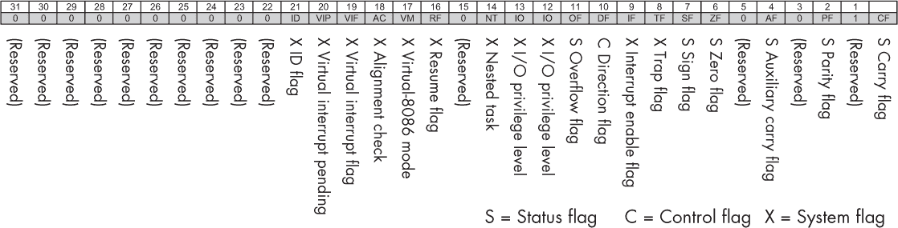

*图 13-2：x86 状态寄存器（与 图 11-6 比较）*

这与 6502 的状态寄存器非常相似，且具有类似的助记符。与 6502 一样，这些标志通过比较指令设置，然后通过单独的分支指令进行查询。也有指令用来清除标志。两个重要的标志，像其他架构一样，是零标志（ZF）和符号标志（SF）。

#### *Netwide Assembler 语法*

由于其悠久的历史，x86 形成了几种不同的汇编语言和语法，它们都能汇编成相同的机器代码。在这里，我们将使用 *Netwide Assembler (NASM)* 风格，它是最不糟糕的一种。

x86 指令通常有两个操作数。在 NASM 语法中，第一个通常是目标操作数，有时也作为输入操作数来更新以存储结果，就像一个累加器；第二个操作数是输入操作数。

和大多数汇编语言一样，NASM 允许我们通过插入文本标签并加上冒号来为程序的每一行标记文本标签，像这样：

```
mylabel:
```

如果在第 5 行插入一个标签，我们可以通过使用其标签名称而不是数字 5 来跳转到或从第 5 行加载数据。

#### **数据移动**

要在寄存器和 RAM 之间复制常量或寄存器内容，可以使用相同的 `mov`（移动）指令。这将加载、存储和移动的操作统一化。提供了几种不同的寻址模式。

*立即寻址*将常量放入寄存器。例如：

```
mov rbx, 123         ; place decimal 123 into register RBX
mov ebx, 4c6h        ; place hex 4c6 into register EBX
mov bh, 01101100b    ; place binary 01101100 into register BH
```

*寄存器寻址*将数据从一个寄存器复制到另一个寄存器内部，例如：

```
mov rax, rbx         ; copy to RAX from RBX
```

*直接寻址*通过指定的地址从内存加载或存储数据。可以使用标签代替数字地址，在这种情况下它们被称为 *变量*。例如：

```
mov rbx, [1000h]      ; load to RBX from hex address 1000
mov [1000h], rbx      ; store to hex address 1000 from RBX
mov rbx, [1000h+20h]  ; load from an address with offset
mov [1000h+20h], rbx  ;  store to an address with offset
mov rbx, myvar        ; load a labeled address (address, not its content)
mov rbx, [myvar]      ; load content of a labeled address
mov [myvar], rbx      ; store to a labeled address from RBX
```

*寄存器间接寻址*使用方括号表示，例如：

```
mov rax, [rdi]         ; copy to RAX, from content of the address in RDI
mov [rdi], rax         ; copy to address in RDI, from RAX
```

在这两条指令中，假设 RDI 包含一个地址，该地址被用来加载或存储来自 RAX 的值。

#### **数据创建**

RAM 中的数据位置可以被赋予名称，并且可以是初始化或未初始化的。为了用一个值初始化一个位置并为其创建一个名称，我们使用以 `d` 开头的命令，表示 *定义*。例如：

```
mybyte: db 15          ; define byte
myword: dw 452         ; define word (2 bytes)
mydword: dd 478569     ; define doubleword (4 bytes)
myqword: dq 100000000  ; define quadword (8 bytes)
```

为了命名一个未初始化的位置，我们使用以 `r` 开头的命令，表示 *保留*：

```
mybyte:  resb 1        ; reserve uninitialized 1 byte
myword:  resw 1        ; reserve uninitialized 1 word
mydword: resw 1        ; reserve uninitialized 1 doubleword
myqword: resw 1        ; reserve uninitialized 1 quadword
```

请注意，这些不是 x86 指令，而只是数据的标记区域，指令告诉 NASM 将它们视为数据区域。

要创建数组，我们只需分配一组连续的地址。例如：

```
myarray:  dq 1, 2, 3, 4 ; define 4 quadwords, myarray addresses first element
myzeros:  times 4 dw 0  ; define 4 doublewords all to 0
mywords:  resw 100      ; reserve uninitialized 100 words
mystring: db "hello", "world", 10, 0    ; define a single 12-char ASCII string
```

NASM 还提供宏指令，允许你定义数值 `(equ)` 和字符串 `(%define)` 常量：

```
SCREEN_WIDTH equ 1920
%define isTrue 1
```

在汇编之前，NASM 会替换这些常量的值。这些宏指令不是 x86 指令集的一部分，但 NASM 提供它们以方便使用。

#### **算术和逻辑**

由于 x86 指令通常设计为接受两个参数，因此大多数算术操作是以累加器风格进行的。虽然没有单一的累加器寄存器，但任何寄存器都可以充当累加器。例如，在这里我们将值 1 放入 RBX 中，并将 2 加到其中，因此最终它存储了结果 3：

```
mov rbx, 1
add rbx, 2
```

作为一种 CISC 架构，算术指令通常有变种，将从内存加载数据与算术操作结合。例如，下面是如何将地址 1000h 和 2000h 中的两个数字相加，并将结果放入 RBX 寄存器：

```
mov rbx, [1000h]
add rbx, [2000h]
```

请注意，x86 *不*包括最极端的 CISC 风格加法，例如 `[3000h] := [1000h]+[2000h]`，它将两个加载、一次加法和一次存储结合在一个指令中。

减法的工作方式与加法相似：

```
sub ax, 5
```

可以使用 `inc` 和 `dec` 指令对 8 位、16 位或 32 位操作数进行增量和减量：

```
dec ax                ; decrement content of register
inc [mybyte]          ; increment content of variable mybyte
```

要对整数操作数进行乘法或除法，x86 提供了 `mul` 和 `div` 指令。与加法和减法不同，这些指令始终使用 A 寄存器作为累加器（因此得名），并作用于给定指令的操作数。例如：

```
; 64-bit multiplication
mov rax, 2
mov rbx, 3
mul rbx      ; result 6 is in accumulator RAX
; 16-bit multiplication
mov ax, 20   ; first operand
mov bx, 4    ; second operand
mul bx       ; result is stored in AX
; 8-bit division
mov al, 10   ; dividend
mov bl, 2    ; divisor
div bl       ; result stored in AL
; 16-bit signed division
mov ax, -48 ; dividend is negative, need signed version
cwd          ; extend AX into DX
mov bx, 5
idiv bx      ; result in AX, remainder in DX
```

在上述最后一个示例中，`div` 指令前缀加上了 `i`，表示使用的是有符号整数。`cwd` 指令通过允许 DX 寄存器作为 AX 的扩展来转换字为双字，以容纳符号信息。

按位逻辑指令包括 `and`、`or`、`not` 和 `xor`。例如：

```
and ax, 01h
or  ax, bx
not ax
```

与加法相同，第一个操作数充当累加器，因此会被结果覆盖。

#### **流程控制**

NASM 提供了两种类型的标签：符号标签和数字标签，两者都可以用于跳转和分支。符号标签由一个标识符后跟冒号（:）组成。它们必须仅定义一次，因为它们具有全局作用域。如果标签标识符以句点（.）开头，则被视为局部标签，仅在当前文件中使用。以下是使用符号标签和跳转的无限循环示例：

```
mylabel:
    jmp mylabel
```

数字标签由一个 0 到 9 范围内的单个数字后跟冒号组成。数字标签被视为局部标签。它们也有有限的作用域，因此可以反复重新定义。当数字标签用作引用（例如作为指令的操作数）时，应在数字标签后添加后缀 `b`（向后）或 `f`（向前）。例如，对于数字标签 `1`，引用 `1b` 指的是定义在引用之前的最近标签 `1`，而引用 `1f` 指的是定义在引用之后的最近标签 `1`。例如：

```
main:
    1:                ; define new numeric label
    ; do something
    jmp 1f            ; jump to first numeric label "1" defined
    1:                ; redefine existing label
    ; do something
    jmp 1b            ; jump to last numeric label "1" defined
```

条件跳转是通过指令对来执行的。首先，我们使用 `cmp` 指令比较两个值。它需要两个操作数来比较，并在状态寄存器中设置适当的标志。接下来，条件跳转指令会检查状态寄存器，以决定是否执行跳转。某些可用的条件跳转类型列出了表 13-4。

**表 13-4:** x86 条件跳转指令

| **指令** | **条件** |
| --- | --- |
| `je` | 如果 `cmp` 相等则跳转 |
| `jne` | 如果 `cmp` 不相等则跳转 |
| `jg` | 有符号 >（大于） |
| `jge` | 有符号 >= |
| `jl` | 有符号 <（小于） |
| `jle` | 有符号 <= |
| `ja` | 无符号 >（以上） |
| `jae` | 无符号大于等于 |
| `jb` | 无符号小于（以下） |
| `jbe` | 无符号小于等于 |
| `jc` | 如果进位则跳转（用于无符号溢出或多精度加法） |
| `jo` | 如果发生带符号溢出则跳转 |

为了说明，程序使用`cmp`和`je`指令在比较的值相等时进行跳转：

```
cmp 15, 10
je equal              ; jump to "equal" label if equal
; continue if jump condition is false
cmp 10,10
je equal
equal:
    ; they are equal
```

子程序的调用和返回方式如下：

```
main:
    call somefunction

somefunction:
    ; some content
    ret
```

`call`指令跳转到带有指定标签的子程序，`ret`则从子程序返回到调用位置。

#### **堆栈**

子程序的调用和返回是通过堆栈内部实现的。如果你只是写简单的调用和返回，如我们刚才看到的例子，你不需要自己处理堆栈。然而，x86 也允许你直接访问堆栈来传递参数或用于其他目的。具体来说，寄存器 SS 和 ESP（或 SP）被提供并用于实现堆栈。堆栈仅限于存储字和双字。其工作方式如下：

```
; save register values
push ax
push bx
; perform whatever you want with these registers
; restore the value
pop bx
pop ax
```

在这里，寄存器 AX 和 BX 的内容被推入堆栈，这意味着这些寄存器可以被覆盖并用于其他目的，之后再通过 pop 指令恢复。

**X86 调用约定**

x86 架构在其历史上曾使用过许多不同的调用约定。由于架构寄存器数量较少，并且历史上注重简化和小的代码体积，许多 x86 调用约定将参数通过堆栈传递。返回值（或指向它的指针）通过寄存器返回。一些约定使用寄存器传递前几个参数，这可能提升性能，尤其是对于那些非常频繁调用的短小简单的*叶子例程*（即不调用其他例程的例程）。

对于 amd64，有两种目前广泛使用的调用约定，一种由 System V UNIX 设计者提出，另一种由微软提出。它们一致认为，堆栈清理应该由调用者而非被调用者负责。它们都要求将前几个参数通过寄存器传递，其余的参数则通过堆栈从右到左传递，尽管它们在使用哪些寄存器以及多少个寄存器上存在分歧。它们在哪些寄存器是*临时的*（即可以被被调用者在函数调用过程中覆盖）上存在分歧。这与那些被认为是*安全的*寄存器相对立，后者在函数调用过程中保证不会被更改。

#### **BIOS 输入输出**

我们可以从 ROM 调用 BIOS 例程与屏幕和键盘进行通信，就像在复古计算机上一样。例如：

```
; BIOS Character display
mov ah, 0eh      ; set mode
mov al, 'H'      ; char 'H' to print
int 10h          ; ask BIOS to display letter on screen
; BIOS Character input
mov ah, 00h
int 16h          ; ask BIOS to read a keypress char to AL
; BIOS Graphics   (only works in 16-bit mode)
mov al, 13h      ; desired graphics mode
mov ah, 0        ; set graphics mode
int 10h          ; ask BIOS to set graphics mode
mov al, 1100b    ; desired pixel RGB color
mov cx, 10       ; desired pixel x coordinate
mov dx, 20       ; desired pixel y coordinate
mov ah, 0ch      ; ask BIOS to light the pixel
int 10h
```

这设置了一个屏幕模式，将一个 ASCII 字符打印到屏幕的某个位置，从键盘读取一个 ASCII 字符，并设置像素颜色。这些都是制作 8 位风格视频游戏所需的基本要素。这里的 `int` 指令生成中断请求，传递控制权给 BIOS，操作数告诉 BIOS 运行它的哪一个子程序。这些子程序假设在中断发生前，相关的参数已被放入特定的寄存器，如 AH 和 AL。

#### **浮点数**

x86 浮点架构源自 8086 的旧协处理器 8087。8087 是一个单独的可选芯片，用于加速数值计算。从 486 开始，FPU 被集成到主 x86 架构中，并且被称为 *x87 扩展*。

x87 扩展增加了专用的浮点寄存器，称为 ST0 到 ST7，它们作为栈使用（因此前缀为 *ST*）；该栈最多可以有八个元素，ST0 是栈顶。新的浮点指令以字母 `F` 开头，并将数据移动到栈中或从栈中移出；它们指示 FPU 使用栈顶的元素进行算术运算。

你可以将浮点数推送到 x87 栈中，对它们进行算术运算，然后将结果弹出，示例如下：

```
a: dw 1.456            ; a word (16-bit) float
b: dd 1.456            ; a doubleword (32-bit) float
c: resq 1              ; reserve for output float
;FP add
fld qword [a]          ; load a (pushed on flt pt stack, st0)
fadd qword [b]         ; floating add b (to st0)
fstp qword [c]         ; store result into c (pop flt pt stack)
;FP multiply
fld qword [a]          ; load a (pushed on flt pt stack, st0)
fmul qword [b]         ; floating multiply by b (to st0)
fstp qword [c]         ; store result into c (pop flt pt stack)
```

在这里，当你将一个浮点数的 ASCII 表示传递给 NASM 时，NASM 会知道将其转换为 IEEE 二进制表示。

#### *分段*

x86 程序可以被写成多个 *段* 的集合，这些段是程序的独立部分，可以存储在内存的不同位置。例如，如果你希望将指令与数据分开存储（就像哈佛架构一样），你可以使用一个单独的代码段和数据段。还可以使用堆栈段，将硬件堆栈数据与其他数据分开存储。所有段都位于相同的全局地址空间中，但通过将每个段的起始地址存储在专用寄存器中，可以仅通过段的偏移量来引用其中的地址。该系统旨在使 16 位 CPU 能够处理超过 64 KB 的内存。它仍然存在，但在现代 64 位 x86 中使用得不多，因为 64 位地址空间已经非常大。六个 *段寄存器*，即 CS、SS、DS、ES、FS 和 GS，被指定用来保存段的起始地址。

如果你使用段系统，NASM 指令 `section` 用于指定代码段和数据段。在某些设置中，一些汇编器仍然会查找段并假设 `section .text` 是只读的，而 `section .data` 是读写的，尽管这些概念在 amd64 硬件层面已经不再使用。如果你尝试访问汇编器不希望你访问的段，将会发生 *段错误*。

#### *向后兼容模式*

x86 标准的一部分是所有 CPU 必须向后兼容最初的 16 位 8086 处理器。这意味着当它们首次启动时，必须以 16 位模式启动，并且行为必须完全像 8086 处理器。

从那里开始，32 位 x86 处理器有指令可以将其切换到 32 位模式，而 64 位 x86 处理器则有进一步的指令可以将 32 位模式切换到 64 位模式。因此，要启动 amd64 处理器，你需要逐步切换到 32 位，然后是 64 位模式，在几分之一秒内重现其架构的历史。

现在我们已经了解了 x86 架构，让我们放眼整个 PC 计算机设计，看看它如何将 x86 作为 CPU 组件。

### PC 计算机设计

台式电脑与我们研究过的其他计算机概念不同：它并不是指定一种特定的计算机设计，而是一个松散的正式与非正式标准的集合。第一台 PC 由 IBM 于 1981 年设计并定义为此，最初的型号为 IBM 5150，如图 11-1 所示；随后，其他厂商也开始使用类似的兼容组件进行复制。

在 1990 年代，任何能够运行 Microsoft DOS 或 Windows 操作系统的 x86 CPU 计算机通常都被视为 PC。微软选择了在其软件中支持哪些计算机设计特性，因此它实际上设定了标准定义。其他操作系统也可以在这些机器上运行，但会做出不同的支持选择。通常，计算机设计特性存在多个竞争标准，决定哪些标准被 PC 社区采纳，成为一个政治性和技术性的问题。

因此，编程和使用 PC 与更标准化的平台感觉不同。例如，为特定机器（如 Commodore 64）创建的游戏可以假定精确的硬件特性，并且可以在任何 Commodore 64 上完美运行。这使得游戏设计师能够像艺术家一样工作，使游戏的外观和感觉完全按照他们的意图呈现。但为 PC 设计的游戏会因为不同 PC 具有不同的特性而表现不同，这就要求游戏设计师实际上要创建一整套类似的游戏，其中有些他们自己永远不会见到，只能猜测如何实现。同样，玩家可能需要更深入地参与配置硬件和软件，以自定义他们想玩的游戏版本。

在这里，我们将具体介绍当前台式 PC 中使用的一些总线、I/O 模块和设备。这些常常成为现代 PC 的瓶颈——如果 CPU 需要花费时间等待系统中的其他部件，那么拥有高度优化的 CPU 也没什么意义。在购买计算机时，不仅要关注 CPU 速度——也要考虑这些支持结构。

#### *总线层次结构*

与 CPU 类似，数据总线也在不断改进和替代，因此 PC 架构随着时间的推移使用了各种标准总线层次结构。总线可以在桌面 PC 中的多个层次找到；每一层有不同的用途和带宽，并且为不同的目的进行了优化。表 13-5 展示了一些近期标准的速度和典型用途。

**表 13-5：PC 总线速度和用途**

| **标准** | **带宽（GBps）** | **用途** |
| --- | --- | --- |
| 千兆以太网 | 1 | 网络 |
| USB3 | 5 | 外围设备 |
| SATA3 | 6 | 辅助存储 |
| NVMe | 32 | 辅助存储 |
| PCI Express 5.0 x16 | 63 | 显卡 |

你可以看到，通过以太网与外界通信是较慢的，地方外围设备和辅助存储位于中间，而显卡经过大量优化，使其能够快速通信。

经典的 PC 架构使用了两个结构，称为北桥和南桥——合称为*芯片组*——作为总线层次结构的主要骨架。这在图 13-3 中有所展示。

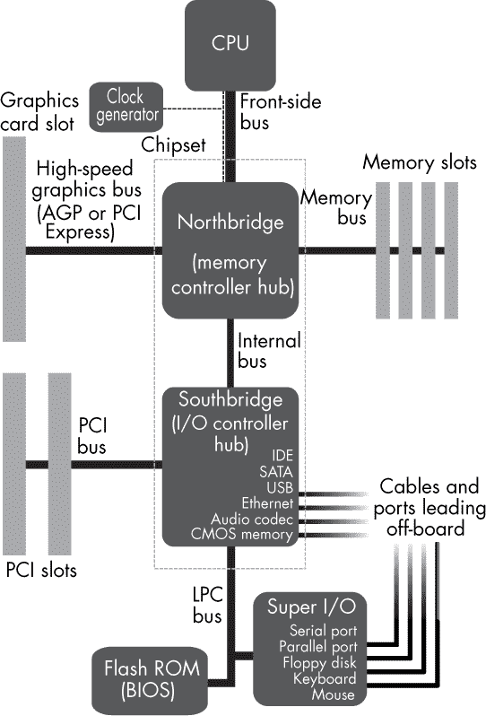

*图 13-3：北桥-南桥总线架构*

*北桥* 直接连接到 CPU 的 FSB（前端总线），并通过 PCIe 总线将其连接到 RAM 和快速的 I/O 模块，使用相同的地址空间。它还连接到南桥。北桥快速且强大。传统上，它是构建在与 CPU 分开的芯片上，并且该芯片还承载了一些内存缓存层次。最近，北桥已经在许多系统中迁移到了 CPU 硅片上。

*南桥* 第二次桥接，从北桥到较慢的 I/O 总线层次。它通常仍然位于自己的专用硅芯片上（即使北桥位于 CPU 芯片上时，它有时也被称为“芯片组”）。南桥包含许多不同的标准 I/O 模块，所有这些模块都印刷在同一个硅片上。在这里，你会看到 USB 控制器、硬盘控制器和较老的 PCI（非 PCIe）总线等结构。

介绍中的图 2 展示了这一设计在 2010 年代 PC 主板上的物理布局。在图中，北桥和南桥都被大型散热片覆盖，显示出它们是主要的功耗和热量源，就像 CPU 一样。与复古计算机相比，主板上剩下的其他芯片很少，因为它们的大多数功能已经迁移到南桥、北桥或 CPU 上。主板的其余部分大多被用于电源管理中使用的物理连接器和模拟组件。

随着北桥现在在许多情况下与 CPU 位于同一个硅片上，它在现代主板上变得更加难以识别。

#### **标准化的输入输出（I/O）**

当前桌面 PC 的趋势是朝着标准化 I/O 发展。在过去的坏时光里，每个设备都有自己的 I/O 模块，一个物理组件连接到总线上。这意味着每个设备都有自己的 IRQ（中断请求）线路连接到处理器。你需要一个特定的 I/O 级别驱动程序来管理该模块，而这可能会让配置变得非常麻烦。

USB 等总线层级结构现在在 PC 中大多解决了这个问题。这些总线使用一个单独的 I/O 模块，如 USB 控制器，该控制器只需配置一次并且只使用一个 IRQ。所有设备随后通过一个低级总线与该控制器连接，并且该总线拥有自己的协议，可以包括向控制器传达设备类型的通信。它们可以轻松共享分配给控制器的单个 IRQ。

#### **快速串行总线**

在黄金时代，总线意味着一堆并行电缆，通常以带状电缆的形式出现，如图 13-4 左侧所示。

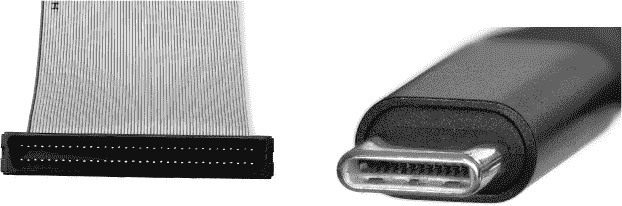

*图 13-4：1980 年代的并行总线带状电缆，电缆上有很多导线（左）与 2020 年代的快速串行连接器，电缆上有较少的导线（右）*

如今很少见到带状电缆，因为大多数总线都是串行的，只使用一条通信线以及几条控制和电源线，如图 13-4 右侧所示。例如，SATA、SSA-SCSI、USB 和 CAN 都是串行总线。

这一变化是由于并行总线在速度超过约 1Gbps 后遇到的技术问题所引起的。并行电缆上的延迟微小差异可能导致不同的信号线不同步，而重新同步这些数据非常困难。另一方面，串行总线由于不需要同步多条电缆，因此可以越来越快。

#### **向层级结构迁移**

随着 I/O 模块变得更快，它们希望向总线层级结构上移，更靠近 CPU。曾经挂在标准化总线（如 USB）上的设备希望直接连接到南桥；曾经挂在南桥上的设备希望升到北桥；曾经挂在北桥上的设备希望升到系统芯片（SoC）硅片上。同时，北桥、南桥和标准化总线都希望提高自己的速度，这意味着希望从南桥迁移到北桥的设备，可能会被一个新的、更快的南桥所超越，这使得其迁移变得不再必要。由于摩尔定律停止了中央 CPU 时钟的进一步加速，所有这些层级的创新推动变得更加重要，这或许使得非 CPU 架构师的工作变得更加光彩照人。

向上迁移到总线层级并进入硅片使计算机设计的经济学和法律结构变得更难理解。在 8 位时代，不同的公司可以制作独立的物理芯片，例如 CPU 和 I/O 模块。计算机制造商购买这些芯片，然后设计和构建 PCB 以将它们集成在一起。如今，由于这些结构需要在同一块硅片上共同制造，CPU 和 I/O 模块公司需要与计算机制造商共享他们的设计，使用类似于 LogiSim 设计的软件文件。制造商随后将设计添加到这些文件中，将它们链接在一起，然后将文件发送给制造公司。每家公司提供的数字逻辑设计单元被称为*IP（知识产权）核心*，这些设计需要由律师和专利代理人严密保护，而不是像物理芯片一样随意买卖。

#### *常见总线*

现在大多数主板上的空间都被连接器而非芯片占据，正如你在图 2 的介绍中看到的那样。该图中看到的连接器是总线层级其他部分的典型代表。接下来，我们将详细检查其中的一些主要连接器。

#### **外设组件互联快速通道总线**

PCIe（不要与较旧的 PCI 混淆）代表外设组件互联快速通道（Peripheral Component Interconnect Express），是一种用于连接图形卡和其他卡的通用总线。PCIe 有多种不同的类型，如图 13-5 所示；这些连接器有不同的物理宽度，因为它们具有不同数量的传输通道。

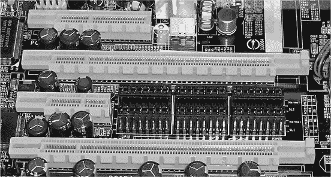

*图 13-5：一些 PCIe 总线连接器*

根据你想要传输的数据量，你可以获得从 1 到 32 条传输通道的不同 2 的幂次方数量。PCIe 也有不同的代际版本，速度从每条通道 250MBps 到 2GBps 不等。

像许多现代“总线”一样，PCIe 最初是一个实际的总线——多个节点共享相同的一组线路，每个节点都有自己的地址——但它已经发展成了一个网状网络，节点现在执行一些路由操作，以避免总线的拥塞。

#### **SCSI 和 SATA 总线**

SCSI 和 SATA 是用于大容量存储设备（例如硬盘）的竞争性总线。小型计算机系统接口（SCSI，发音为“scuzzy”）是一个非常古老、经典、经过充分测试、可靠且昂贵的标准，起源于 1980 年代。它开创了将 I/O 控制的计算工作从 CPU 转移到 I/O 模块中的数字逻辑的做法，从而解放了 CPU，使其能够更快速地处理其他任务。如今它仍在服务器中使用。SCSI 经历了许多版本；最新的更新是串行存储架构（SSA），它是一个串行总线版本。

串行高级技术附件（SATA）比 SCSI 更便宜、更简单。正因为如此，它在大多数消费系统中取代了 SCSI。

#### **统一串行总线**

*通用串行总线（USB）* 是你最熟悉的那种。然而，USB 实际上并不是总线——它甚至不是一个网状网络。它实际上是一个点对点连接器，旨在升级旧式的串行端口。

在 USB 发明之前，每次获得一件新硬件时，你需要花一天时间去使设备驱动程序正常工作并配置 IRQ 线路。而现在，USB 使这一切变得瞬间完成，你可以“即插即用”许多设备。USB 设计使得设备可以在计算机开机的情况下随时连接和断开，并且它的标准部分定义了一种通用的方法，允许设备通过基础的 USB 协议声明其类型和型号，而不需要设备驱动程序。这使得计算机软件能够自动识别已连接的设备，并在许多情况下自动下载并运行相应的驱动程序，而无需人工干预。

USB 还定义了请求和传输电力的标准。一个 USB 电缆有四条线路，其中两条用于传输串行信号，另外两条用于电力供应。电缆内有 5V 电压和接地线，因此你可以使用同一根 USB 电缆为手机充电并与其交换数据。

所有这些操作都是通过一个集中式的 USB 控制器完成的，它是一个单一的 I/O 模块，因此你不再需要担心 IRQ 问题。USB 控制器本身有一个 IRQ，但之后其他一切都通过 USB 网络连接。USB 有多个版本，包括 USB 1，传输速度为 12Mbps，以及 USB 3，传输速度为 5Gbps。

与某些点对点网络不同，USB 连接有一个管理端和一个从属端，管理端负责通信协议。如果你把 USB 存储棒插入计算机，那么计算机就是管理器。作为从属设备的 USB 存储棒不能自行发起请求来复制计算机中的数据。这就是为什么 USB 电缆有不同接口的原因：一端插入管理端，控制它，另一端插入从属端，你不能将它们反过来连接。

*即插即用（OTG）* 是 USB 协议的一部分，允许从属设备通过物理适配器充当管理器。有时候你确实希望它们连接的方式相反。例如，当你将智能手机连接到计算机时，你通常希望手机作为从属设备，像一个 USB 存储棒，而计算机作为管理器。但在其他情况下，你希望手机作为管理器，例如，当你将一个存储棒或声卡连接到手机时。

#### **以太网**

*以太网*，在其最古老和最简单的形式下，是一个真正的总线，局域网中的多个个人电脑都在公共电缆上进行读写。每条消息都被打包成一个“帧”，包含接收方的地址（媒体访问控制地址，或称 MAC 地址）。发送者必须小心避免碰撞——也就是，避免在同一时间有人同时发话——通过观察总线并等待合适的时机进行传输。每个人都可以看到总线上的所有内容，因此很容易“嗅探”总线并监视其他用户。

现代网络在基本的以太网总线结构之上构建了非总线特性。例如，现在不是将建筑物中的所有计算机连接到一个共享的以太网总线，而是每台计算机通常只通过专用以太网电缆连接到一个中心的*交换机*。交换机接收所有发送的消息，但与其将它们像总线那样转发给网络上的所有机器，不如仅将它们转发到预定的目的地。

#### *标准设备*

如果没有其他一些标准设备，你的台式电脑将不完整。为了完成我们对个人电脑的研究，让我们快速了解这些设备是如何发展的。

#### **平面显示器**

现代平面显示器被广泛应用于手机屏幕、电视和大型显示器。它们由晶体管和电容器组成，通过光刻掩膜和气体工艺像芯片一样被布局。许多稀有元素用于生产特定的红、绿、蓝发光像素，包括钇、镧、铽、铈、欧、镝和钆。其中一些元素如此稀有，只有在一两个地方可以开采。许多特定的电子元件和元素组合被用于显示“技术”，其中包括 TFT。写作时，最新的技术是有机 LED（OLED）。

#### **显卡**

在 1980 年代，图形非常简单。会分配一块内存区域来表示屏幕上的像素阵列。用户程序像访问其他内存区域一样写入其中。然后，图形芯片从中读取数据，将其转化为 CRT 扫描命令，并发送给显示器。现在情况更为复杂，因为程序员希望图形硬件提供复杂的 2D 和 3D 图形渲染命令，而不占用 CPU 时间。

为了响应这一需求，现代图形处理单元（GPU）由 1980 年代的视觉显示单元（VDU）演变而来。与其接受点亮像素的命令，GPU 通常接受渲染 3D 三角形并为其添加类似精灵的纹理的命令，并使用复杂的光照模型为其着色。

如果你在过去几十年里玩过视频游戏，你一定看到了图形处理单元（GPU）的视觉能力随着摩尔定律的发展而不断演进，质量翻倍，越来越接近光学逼真、实时渲染的效果。

GPU 传统上位于主板的某个总线上，如 PCI、AGP 或 PCIe。多年来，GPU 一直是计算机架构中唯一一个在物理上不断变大的部件，它最初是一个小芯片，现在大多数可能是一个完整的卡片（图 13-6）。

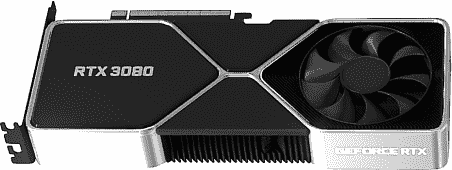

*图 13-6：2022 年 Nvidia RTX 3080 GPU*

然而，最近也有一个趋势是将 GPU 缩小回主板上的单一芯片，或者与 CPU 集成在同一块硅片上。这在一些机器中尤为常见，特别是那些 GPU 不是主要关注点的机器，如图形需求不超过显示桌面的通用商务 PC。

显卡位于系统总线上，作为 I/O 模块。重要的是，它们可以使用直接内存访问（DMA）。例如，图像可以被放置在常规 RAM 中，然后可以给 GPU 发出一个命令，将它从主内存加载到 GPU 中。这种 DMA 操作不经过 CPU，因此从 CPU 的角度来看几乎是瞬时的。（然而，如果总线需要用于其他任务，如从网络摄像头向主内存传输额外的 DMA 数据时，速度会变慢。）

早期的 GPU 旨在通过直接在硬件中实现 OpenGL 3D 图形 API 的命令来加速渲染，最初是从内存映射区域开始，然后使用一个芯片读取该区域并找出如何将该内存块显示在屏幕上。在 2000 年代，除了或代替内存映射图形外，选配的插件显卡作为 I/O 模块位于系统总线上，根据通过系统总线发送的 OpenGL 或 DirectX 等图形语言编译和组装的命令来绘制图形。显卡被标记并作为实现一个或多个这些语言接口的产品出售。

3D 图形语言通常假设 3D 物体由许多小三角形构成。选择三角形是因为它的三个顶点总是位于一个平面上，从而简化了数学计算。它们的实现，无论是在硬件还是软件中，通常分为两个主要部分，称为*着色器*。首先，顶点计算将每个顶点的 3D 坐标转换为 2D 像素坐标。其次，像素计算计算每个显示像素的颜色（阴影）。

后者可以通过多种不同的方式实现，具体取决于表面与光源交互的数学模型。大多数着色器允许三角形具有半透明（部分透明）效果，这通常通过它们的 RGBA 颜色中的 alpha 通道来建模，如第 68 页所述。一些着色器允许为每个三角形描述法线（正交）向量，作为它们是平滑连续表面一部分的提示。

图 13-7 展示了三种早期 OpenGL 实现中内置的传统着色器的结果，它们将相同的三角网格近似渲染成一个球体。

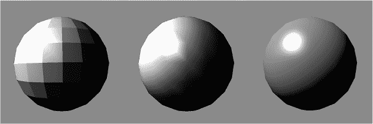

*图 13-7：传统的 OpenGL 着色器：平面着色（左）、Gouraud 着色（中）、和 Phong 着色（右）*

图形用户要求着色器具有更多灵活性。新的着色模型经常在图形研究中提出，用户希望它们能快速应用到自己的系统中。图形语言在后续版本中迅速增加了许多扩展命令，以支持特定的附加着色器，并且图形卡架构师们努力跟上设计新的硬件来实现它们，并确保它们彼此兼容。这些架构师转而开始开放新的、更简单的着色器语言（如 GLSL），以使这些以及其他任意着色器能够在用户程序中实现，并通过它们自己的 ISA 在图形卡——现在称为 GPU——上执行。这使得程序员——特别是游戏设计师和电影工作室——能够创建自定义着色器，赋予他们的创作更具个性化的风格，如图 13-8 中的示例所示。

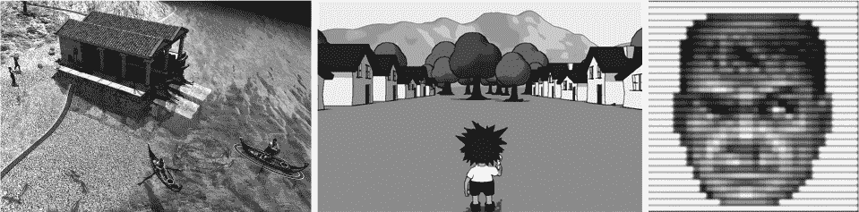

*图 13-8：自定义着色器：来自* 0 A.D. *的水面效果（左）、“卡通”着色（中）、以及复古 CRT 模拟（右）*

今天的图形系统延续了这一架构趋势，GPU 现在作为自己的指令集的高度通用的并行处理器，并且图形专用的着色器已经转移到软件中。以前的硬件接口，包括 OpenGL 和 DirectX，现在都以软件的形式实现，编写在 GPU 自身的汇编和机器代码中。这些代码现在也可以由其他图形工具直接生成，例如 Wayland 合成器和 Vulkan SPIR-V 语言。生成的 GPU 机器代码通过总线发送到图形卡，在 GPU 上运行。我们将在第十五章中更详细地学习这些代码。

#### **声卡**

不像复古的声音芯片，例如 SID，现代的声卡根本不生成信号。相反，它们管理量化的数字声音波形信号的流动。因此，计算机失去了它们特有的音效和音乐文化：现代游戏音乐可以仅仅是普通的交响乐团或摇滚乐队的录音，而不再是任何特定的“计算机音乐”。像图形卡一样，声卡现在总是由操作系统控制，所以用户程序员不太可能看到它们的架构。

现代声卡实际上只是由一组数模转换器（DAC）组成，实际上你可以使用任何 DAC 来制作自己的声卡，比如在 Labjack、软件定义无线电或 Arduino Due 上找到的那种。通常，专业声卡针对低延迟、音质和多个通道进行了优化，而消费级声卡则注重降低成本。人耳的最大听力频率约为 20 kHz，因此需要 40 kHz 的采样率才能准确表示。常见的做法是使用 48 kHz，以留出一些余地，并且因为它几乎是 2 的幂次。专业系统可能会使用更高的采样率，以减少重复处理带来的可听错误的积累。

声卡硬件通常由每个通道的环形缓冲区和 DAC 硬件组成，DAC 硬件用来读取或写入缓冲区。环形缓冲区维护一个指向下一个写入位置的指针，并将存储空间环绕起来，以免空间耗尽。缓冲区的大小提供了延迟和丢失之间的权衡。较小的缓冲区意味着较低的延迟，但也有丢失的风险。我们还可以选择音频的位深度。

声卡像显卡一样连接到系统总线。它们对带宽的需求比视频小，因此通常位于南桥挂接的总线上，例如 PCI 用于内部卡，或 USB 或 Firewire 用于外部卡。

声卡的输入输出协议因制造商而异，像 GPU 一样，它们的细节可能是专有的，只为公司内部的驱动程序编写者所知，然后他们提供软件 API。与 GPU 一样，硬件或软件接口随后被开源驱动程序编写者反向工程化，并通过通用软件 API（如*ALSA*）进行封装。

#### **键盘和鼠标**

现代键盘与 1980 年代的内存映射键盘完全不同。它们现在包含小型的嵌入式计算机（见图 13-9）。

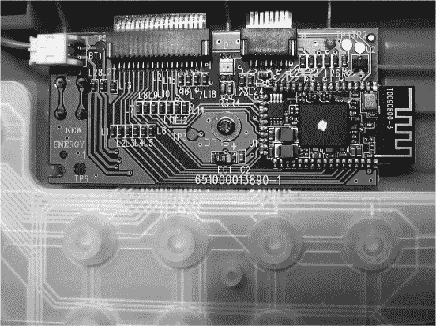

*图 13-9：现代键盘内部的按键压力传感器和嵌入式系统*

键盘的嵌入式计算机实际上做了很多工作，类似于典型的 Arduino 应用。它读取按键矩阵，将其转换为按键码数据表示方案，并通过 USB 协议包装，传输到虚拟串口。

鼠标也发生了类似的变化。现代光学鼠标在一个专用的内嵌系统中执行一些极其复杂的实时机器视觉处理，称为*光流*。如果你尝试在软件中实现光流，会发现很难做到快速。它仍然是一个研究领域，最近的实现出现在像 OpenCV 这样的软件库中。然而，在鼠标中，它是通过低级数字电子元件直接实现的，如图 13-10 所示。

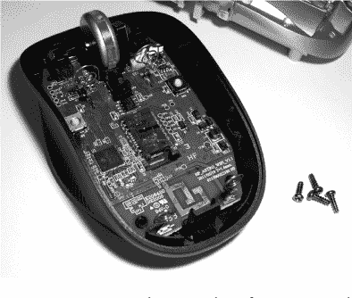

*图 13-10：光学鼠标内部结构*

这种数字逻辑足够简单，你仍然能够看到连接。你可以从整体、相对均匀的结构中看出，它正在处理一个二维空间的区域——鼠标下方的图像。它跟踪图像中的明暗区域如何移动，并据此推断鼠标的运动。

通常设备上还会附加一个 USB 控制器。实际上，这是一个复杂的嵌入式系统——可能是一个独立的计算机——而且它现在只需要几美元就能集成到每个鼠标中，着实令人印象深刻。

**PC 启动过程**

*启动*（booting）这一术语源自自相矛盾的表达“拉自己一把（pulling yourself up by your bootstraps）”。它意味着从无到有，通过执行小程序依次加载稍大一些、功能更强大的程序，从而进入一个复杂的计算机系统。在复古系统和现代 PC 上，这一过程从 CPU 从硬件 ROM 地址获取指令开始。

与复古计算机不同，现代 PC 并非由标准组件构成，而是由许多不同的可选组件组装而成，例如各种类型的 RAM 模块、缓存和 I/O 扩展卡。最初并不明显这些组件的位置、它们应该如何初始化或如何在地址空间中安装。为了解决这个问题，现代 PC 的启动过程分为两个部分。

首先，*启动加载程序*（*coreboot* 等）被烧录到 ROM 固件中，位于 CPU 初始程序计数器的地址。对于 x86，这个地址是 ffff,fff0[16]。这是一个 16 位地址，因为 x86 处理器总是在“传统模式”（英特尔称之为“实模式”）下启动，这使得它们像 1980 年代的 16 位芯片一样工作，以实现向后兼容。在这种模式下，只有 1 MB[2] 的 ROM 和 RAM 内存是可寻址的，而初始程序计数器地址接近内存的顶部。启动加载程序从这里运行，负责检查、初始化并分配可用硬件的地址。启动加载程序不会在屏幕上显示任何内容，因为此时还没有任何可用于输入输出的例程。由于它不可见，所以很难理解启动加载程序正在执行的所有复杂工作。

第二，在完成初始化后，启动程序会跳转到 BIOS 中的代码。BIOS，就像复古计算机一样，包含了基本输入输出的子例程，如 ASCII 字符显示、键盘读取和硬盘访问。在这个阶段，你的 PC 看起来和感觉上都很像一台复古计算机。

通常，从启动加载程序跳转到 BIOS 代码时，BIOS 会在屏幕上打印一些字符串，如 BIOS 的名称和标志。这里展示了一个 PC BIOS ROM 和一个示例的 BIOS 显示 I/O 能力。

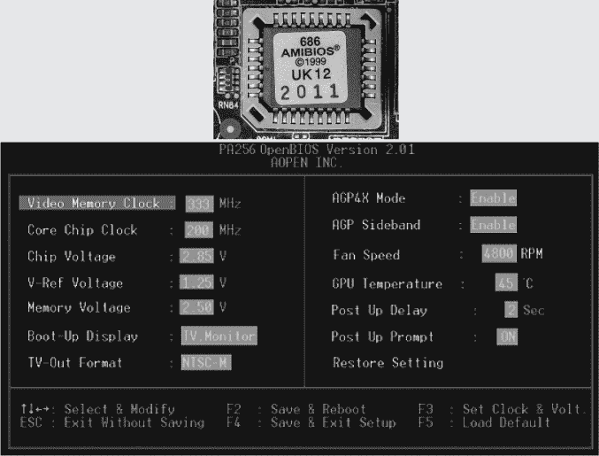

BIOS 通常会首先让用户有机会通过按某个键进入“BIOS”，这时会调用图形例程来设置配置选项。通常，其中的一个选项是指定一个存储设备的名称，该设备的第一个数据包含接下来需要加载并跳转的程序，通常是在地址 7c00[16]。这个程序做什么由你决定——一个常见的第一步是将 x86 切换到 32 位模式，然后是 64 位模式。

曾经，不同的 x86 BIOS 制造商各自开发了不同且不兼容的例程库，但现在它们已趋于两种标准。其一，PCBIOS，是 IBM（他们称之为“BIOS”）在早期的 x86 PC 中定义的。其他制造商进行了克隆，至今许多 x86 机器仍在使用。SeaBIOS 是一个开源实现。另一种标准，UEFI，则是更现代的标准。它假设提供了更先进的图形和输入输出功能，因此它的例程库包括了更高分辨率和更多彩的图形，并且能访问 USB 等额外设备。TianoCore 是一个开源实现。

### 摘要

如果能够从零开始设计，没人会将现代桌面 PC 设计成现在的样子。就像许多成功的商业实际系统一样，PC 随着时间推移不断发展，新的功能被要求并附加上去，而现有用户又要求向后兼容。因此，x86 架构和 PC 计算机设计积累了许多遗留功能。CISC（复杂指令集计算机）理念非常适合这种环境。在单一设计中，通常会支持多个竞争标准，甚至包括多个 x86 汇编器的选择，其中之一就是但不限于 NASM。最近的 x86 进一步扩展了本章所介绍的功能，增加了并行化，我们将在第十五章中进行探讨。但在此之前，我们将稍作休息，下一章将探讨更加简洁、美丽的 RISC 世界。

### 练习

#### **创建可引导的 ISO 镜像**

在这里，你将创建一个简单的 16 位“Hello, world!”程序，使用 NASM 将其汇编成可执行的机器代码，然后将这些机器代码存储到 ISO 文件中，这是物理二级存储设备内容的镜像，可以用来启动真实的 PC 或虚拟机。

1.  创建以下的*hello16bit.asm*文件：

    ```
    bits 16                ; tell NASM we're only using 16-bit x86
    org 0x7c00             ; base address for bootloader to place this code
    section .data          ; this segment is read-write data
    message db 'Hello, World!', 13, 10, 0
    section .text          ; this segment is read-only code
    entry:
      jmp start
    printer:               ; subroutine for printing ASCII strings
      lodsb                ; load SI into AL and increment SI [next char]
      or al, al            ; check if the end of the string
      jz printer_end;
      int 0x10             ; otherwise, call interrupt to print char
      jmp printer          ; loop
    printer_end:
      ret                  ; return flow
    start:
      mov si, message      ; say what we want to print
      mov ah, 0x0e
      call printer         ; print it
                           ; ** add your own code here ... **
      hlt
    times 510-($-$$) db 0  ; zero out rest of 512-byte boot sector
    dw 0xaa55              ; code to mark sector as bootable
    ```

1.  运行以下命令：

    ```
    mkdir -p cd/boot
    nasm hello16bit.asm -o cd/boot/loader.sys
    mkisofs -R -J -c boot/bootcat -b boot/loader.sys -no-emul-boot -o cd.iso cd
    ```

**注意**

*如果你使用的是 Microsoft Windows，可以通过安装并使用 Windows Subsystem for Linux 来运行这些命令。如果你还没有安装 NASM，可以从* [`nasm.us`](https://nasm.us) *下载安装。你可能还需要为系统安装 mkisofs。*

1.  如果一切顺利，你现在应该拥有一个*cd.iso*文件，可以用来启动物理或虚拟的 x86 机器。这将允许你在没有操作系统干扰的情况下在“裸机”上运行 x86。

我们将在接下来的练习中讨论如何从 ISO 文件启动。当你启动时，应该会在屏幕上看到类似图 13-11 的内容。

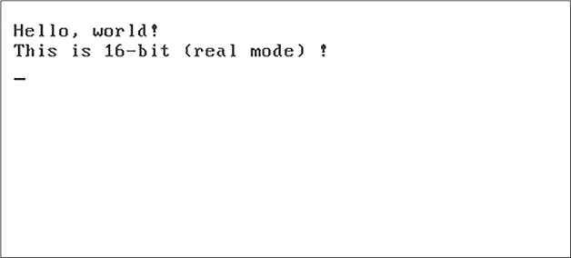

*图 13-11：启动裸机测试程序的结果*

在继续之前，让我们来看一下*hello16bit.asm*究竟做了什么。除了实际的 x86 指令助记符外，NASM 程序通常还包括一些指令，这些指令不是由 NASM 本身汇编的，而是告诉 NASM 以各种方式更改其行为。`section`指令告诉 NASM 改变输出文件的哪个段来写入接下来的汇编指令。在某些文件格式中，段的数量和名称是固定的；而在其他格式中，用户可以根据需要自定义段的数量。Unix 对象文件和 bin 格式都支持标准化的段名称`.text`（包含可执行指令）、`.data`（包含初始化变量）和`.bss`（包含未初始化变量）。ASCII 字符串在可读字符后包含特殊的 ASCII 代码 13、10 和 0。它们是什么？（提示：参见第二章。）

#### **在虚拟 x86 上启动**

这个 ISO 文件可以像物理磁盘一样在虚拟机上启动。按照以下步骤，尝试在 VirtualBox 虚拟机上运行它。（开源 Linux 用户可能更喜欢使用* [`virt-manager.org`](https://virt-manager.org) *来代替。）

1.  访问* [`www.virtualbox.org`](https://www.virtualbox.org) *以获取如何在你的系统上安装 VirtualBox 的说明。

1.  安装完成后，点击**新建**图标创建一个新虚拟机；使用默认设置。

1.  启动你的虚拟机，并在系统提示时通过选择你的*cd.iso*文件来“插入”可启动的虚拟光盘。

#### **在物理 x86 上启动**

如果你首先将 ISO 文件“烧录”到一个物理 USB 闪存盘上，它也可以在物理 x86 机器上启动。操作步骤如下：

1.  使用诸如 Etcher（* [`www.balena.io`](https://www.balena.io) *）等程序，将 ISO 文件烧录到 USB 闪存盘上，适用于你当前的操作系统。

1.  一旦你有了可启动的 USB 闪存盘，你需要告诉你的 PC 从它启动。你的 PC 目前可能配置为从硬盘启动，但它会有某种方法——不同厂商可能会有所不同——通过其 BIOS 配置工具切换到从 USB 启动。编辑这些设置的过程称为“进入 BIOS”。在大多数机器上，你可以在开机时按住某个特定的键几秒钟来进入 BIOS。这通常是 ESC、DEL、F1、F2、F8、F10 或 F11，具体取决于制造商（如果没有明确说明是哪一个，试着把手指在键盘的顶行上滑动，逐一按下）。你通常会看到一些低分辨率的 BIOS 菜单：如果你细心查找，会找到某种方法来指定启动顺序，并将 USB 置于顶部。有些机器可能会有额外的安全功能，需要在从新设备启动之前先禁用它们。

#### **以 64 位模式启动并进行编程**

将现代 x86 切换到 32 位和 64 位模式并不简单。由于历史遗留问题，这需要几屏的指令和数据。它是如何工作的相当晦涩，但幸运的是，现在可以使用下面展示的模板代码来完成这一过程：

```
org 0x7c00          ; base address where this code will be placed (by bootloader)
entry:
    jmp real_to_protected
GDT32:              ; Global Descriptor Table for 32-bit mode
    .Null: equ $ - GDT32
    dq 0            ; defines 32 bits of zeros for the null entry
    .Code: equ $ - GDT32
    dw 0xFFFF       ; segment limit
    dw 0            ; base address
    db 0            ; base address (again)
    db 0b10011010   ; binary flags describing mode
    db 0b11001111   ; binary flags describing mode
    db 0            ; last remaining 8 bits on the base address
    .Data: equ $ - GDT32
    dw 0xFFF        ; --|
    dw 0            ;   | - identical to code segment
    db 0            ; --|
    db 0b10010010
    db 0b11001111
    db 0
    .Pointer:
    dw $ - GDT32 - 1
    dd GDT32
GDT64:                 ; Global Descriptor Table for 64-bit mode
    .Null: equ $ - GDT64
    dw 0xFFFF
    dw 0
    db 0
    db 0
    db 1
    db 0
    .Code: equ $ - GDT64
    dw 0
    dw 0
    db 0
    db 10011010b       ; binary flags describing mode
    db 10101111b       ; binary flags describing mode
    db 0
    .Data: equ $ - GDT64
    dw 0
    dw 0
    db 0
    db 10010010b       ; binary flags describing mode
    db 00000000b       ; binary flags describing mode
    db 0
    .Pointer:
    dw $ - GDT64 - 1
    dq GDT64
bits 16                ; tells NASM the following is 16-bit x86 code
real_to_protected:     ; switch from 16 bits to 32 bits
    mov ax, 0x2401
    int 0x15           ; enable a20 gate
    mov ax, 0x3
    int 0x10           ; change video mode
    cli
    lgdt [GDT32.Pointer]
    mov eax, cr0
    or eax, 1
    mov cr0, eax
    jmp GDT32.Code:protected_to_long    ; perform long jump
bits 32                 ; tells NASM the following is 32-bit x86 code
protected_to_long:      ; switch from 32 bits to 64 bits
    mov ax, GDT32.Data
    mov ds, ax
    mov fs, ax
    mov gs, ax
    mov ss, ax
    ; root table - page-map level-4 table (PM4T)
    mov edi, 0x1000     ; starting address of 0x1000
    mov cr3, edi        ; base address of page entry into control register 3
    xor eax, eax        ; set EAX to 0
    mov ecx, 4096
    rep stosd
    mov edi, cr3        ; restore original starting address
    mov dword [edi], 0x2003
    add edi, 0x1000
    mov dword [edi], 0x3003
    add edi, 0x1000
    mov dword [edi], 0x4003
    add edi, 0x1000
    mov ebx, 0x00000003 ; used to identity map the first 2MiB
    mov ecx, 512
    .set_entry:
        mov dword [edi], ebx
        add ebx, 0x1000
        add edi, 8
        loop .set_entry
    mov eax, cr4
    or eax, 1 << 5
    mov cr4, eax
    mov ecx, 0xC0000080 ; magic value actually refers to the EFER MSR
    rdmsr               ; read model-specific register
    or eax, 1 << 8      ; set long-mode bit (bit 8)
    wrmsr               ; write back to model-specific register
    mov eax, cr0
    or eax, 1 << 31 | 1 << 0   ; set PG bit (31st) & PM bit (0th)
    mov cr0, eax
    lgdt [GDT64.Pointer]
    jmp GDT64.Code:real_long_mode
bits 64                 ; tells NASM the following is 64-bit x86 code
printer:                ; subroutine for printing ASCII strings
    printer_loop:
        lodsb
        or al, al
        jz printer_exit
        or rax, 0x0F00
        mov qword [rbx], rax
        add rbx, 2
        jmp printer_loop
    printer_exit:
        ret
real_long_mode:
    cli
    mov ax, GDT64.Data
    mov ds, ax
    mov fs, ax
    mov gs, ax
    mov ss, ax
    xor rax, rax         ; clears register rax
    mov rsi, boot_msg    ; say what we want to print
    mov rbx, 0xb8000
    call printer         ; print it
    mov rsi, l_mode      ; say what we want to print
    mov rbx, 0xb80A0
    call printer         ; print it
                         ; ** add your own code here ... **
    hlt
boot_msg db "Hello, world!",0
l_mode db "This is 64-bit (long mode) !",0
times 510 - ($-$$) db 0  ; zero out rest of 512-byte boot sector
dw 0xaa55                ; code to mark sector as bootable
```

如果你保存这个文件、汇编它，并像 16 位版本一样放入 ISO，它将启动你的真实或虚拟 x86 到 64 位模式，并打印另一个“Hello, world!”消息。然后，你可以使用这个“Hello, world!”程序作为起点，将其修改成自己的可启动程序，用于以下任务：

1.  编写一个子程序，读取整数并将其转换为 ASCII 字符串。扩展到浮点数。用它打印一些数字和“Hello, world!”消息。

1.  尝试将之前的程序从分析机和曼彻斯特宝宝移植到 x86 上运行。与这些系统相比，现代 x86 在做某些事情时变得更容易或更难了？

1.  调用 BIOS 例程多次点亮屏幕上的像素，绘制一个简单的图形。

#### **更具挑战性**

使用上述 BIOS 调用，在裸机 x86 上编写一个简单的游戏，比如*太空入侵者*。

### 进一步阅读

+   有关官方的 NASM 手册，请参阅《NASM: The Netwide Assembler》，* [`www.nasm.us/xdoc/2.13.03/html/nasmdoc0.html`](https://www.nasm.us/xdoc/2.13.03/html/nasmdoc0.html)*。

+   有关 x86 历史的概述，请参阅 P. Lilly，《*CPU 的简短历史：31 个令人惊叹的 x86 年*》，*Maximum PC*，2009 年 4 月，* [`www.pcgamer.com/a-brief-history-of-cpus-31-awesome-years-of-x86`](https://www.pcgamer.com/a-brief-history-of-cpus-31-awesome-years-of-x86)*。

+   有关完整的五卷 amd64 参考集，请参阅 AMD 技术，《*AMD64 架构程序员手册卷 1-5*》（圣克拉拉：AMD 技术，2023），* [`www.amd.com/en/support/tech-docs/amd64-architecture-programmers-manual-volumes-1-5`](https://www.amd.com/en/support/tech-docs/amd64-architecture-programmers-manual-volumes-1-5)*。

+   有关 3D 图形编程的信息，请参阅 Graham Sellars，《*Vulkan 编程指南*》（波士顿：Addison-Wesley，2017）。

+   有关 x86 启动汇编代码如何工作的详细信息，请参阅 Gregor Brunmar，《*受保护模式的世界*》（* [`www.osdever.net/tutorials/view/the-world-of-protected-mode`](http://www.osdever.net/tutorials/view/the-world-of-protected-mode)*），lame_bootloader GitHub 库（* [`github.com/sedflix/lame_bootloader`](https://github.com/sedflix/lame_bootloader)*），以及《设置长模式》（* [`wiki.osdev.org/Setting_Up_Long_Mode`](https://wiki.osdev.org/Setting_Up_Long_Mode)*）。
