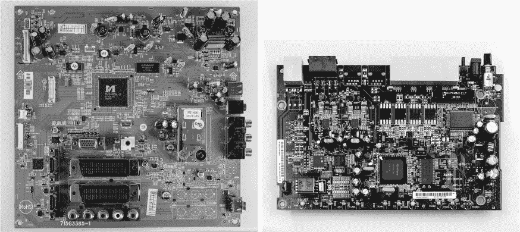
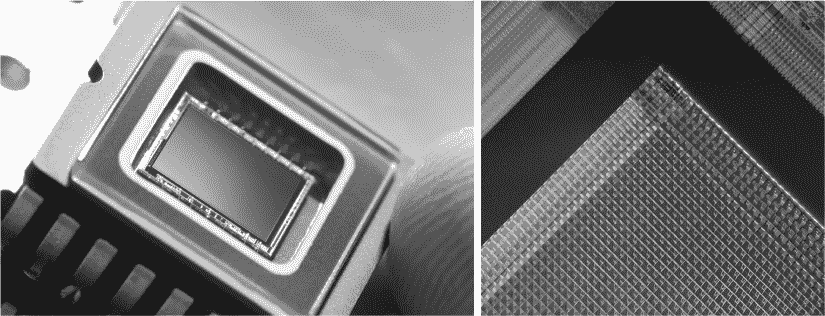
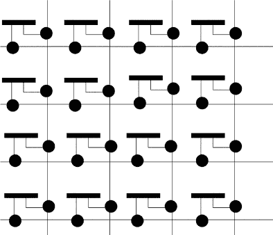

## 第十七章：## **智能架构**


*智能计算*意味着内置于低功耗和/或移动设备中的通用计算机，例如手机、平板电脑、电视、路由器和冰箱。与嵌入式系统不同，它们运行多个易于安装和升级的程序，通常被称为*应用程序*。与桌面系统不同，它们需要减少功耗，因为它们通常依赖电池供电。*精简指令集计算（RISC）*非常适合这些要求，因此 RISC 架构通常出现在智能系统中。本章探讨了 RISC 理念、智能设备以及特定 RISC 架构 RISC-V 的细节。由于 RISC 在设计上比 CISC 更简单，本章比桌面系统的章节要短。

### 智能设备

早期的移动电话是嵌入式系统，其主要目的是作为语音电话使用。它们配备了微控制器，用于管理电话功能和通过按钮与简单数字显示屏进行用户交互。随着时间的推移，这些微处理器和交互设备不断发展，固件也扩展到了包括联系人簿、闹钟和简单游戏，如*蛇*。

现代智能手机现在提供这样的功能，以及更多功能，作为软件应用而非固件。它们已将微控制器替换为完整的通用架构，通常运行操作系统，如 LineageOS、Replicant 或 Android 来托管应用程序，类似于桌面 PC。

*智能*这个前缀最初用于描述这些手机，但现在它被应用于任何曾经是嵌入式系统的设备，但已升级为通用计算机。例如，智能电视（图 14-1 左侧）和智能冰箱已经超越了微控制器和固件，能够轻松安装和运行多个应用程序。

右侧显示的现代消费级互联网连接设备（图 14-1 右侧），通常但错误地被称为“路由器”，是另一个智能计算机的例子。这些设备现在通常包含运行多个服务的操作系统，包括路由、Wi-Fi、防火墙和 Web 服务器（至少用于运行其配置页面）。因此，出于这个原因，它们应该被重新命名为“智能路由器”。



*图 14-1：东芝智能电视内部（左）和 Zyxel 路由器（右）*

“智能家居”是计算机行业多年来的一个目标，指的是将大部分或所有常见家用电器升级为网络化的通用计算机。例如，智能洗衣机和智能中央暖气控制器将使基于机器学习的创新应用竞争，通过传感器监控待洗衣物的状况、房间的温度和使用情况，从而最佳利用能源。将这些系统连接起来将实现自动化链条，比如智能冰箱预测今天晚些时候牛奶会用完，并自动向本地超市下单，可能通过最后一公里的配送机器人和智能投递箱接收货物。或者，在洗衣机开启时，您的加热系统和冰箱可以暂时关闭，从而完全依靠停放的电动汽车电池供电，而电池是通过您的太阳能电池板充电的，无需使用电网电力。

智能设备的架构在可靠性和能效方面与嵌入式系统有相似的要求。然而，它们比嵌入式微控制器需要更多的计算能力。这些需求与 RISC 哲学完美契合，因此让我们更详细地探讨这一哲学。

### RISC 哲学

RISC 概念是由美国人 David Patterson 发明的，但最成功地被英国人商业化。Patterson 对架构的定量方法涉及对 1990 年代处理器上实际使用的指令进行统计分析。他发现，复杂的指令使用非常少，部分原因是编译器后端设计人员不知道或者不愿意学习如何使用这些指令。他确定，大约 90%的工作是由大约 10%的资源完成的。这使他得出 RISC 的核心原则，即占据了很少使用的指令的硅芯片，最好用来让最常用的 10%的指令运行得非常快速，而其他指令则完全移除。Patterson 和他的联合架构师 John Hennessy 因他们利用定量方法指导 RISC 架构设计的研究，获得了 2017 年图灵奖。

RISC 通常旨在让每一条精简指令都能在一个 CPU 周期内执行。由于可用的指令较少，RISC 汇编程序通常会非常冗长，但每条指令都简单、快速且低功耗。用 RISC 汇编编写程序和为 RISC 编写编译器既简单又有趣，因为指令集架构（ISA）小巧、简单且易于理解。

然而，RISC 处理器本身不一定简单。虽然指令集的定义较小，但设计师们找到了其他方法来高效利用可用的硅片。例如，RISC 处理器通常比 CISC 处理器拥有更多的寄存器。额外的寄存器在 RISC 中尤其有用，因为它们有助于将内存访问与算术操作分离。在 RISC 编程和 RISC 编译器中，通常会尝试在子程序开始时将所有相关变量加载到寄存器中，然后在寄存器中完成整个函数的计算，仅将结果存回主内存。这与 CISC 形成对比，CISC 中可能会在整个子程序中持续进行加载和存储操作。

因为 RISC 哲学的一部分是每条指令都应在恰好一个时钟周期内执行，借助流水线、分支预测和乱序执行（OOOE），指令级并行性更容易管理。每条指令的取指-解码-执行步骤持续时间相同，每个阶段都可以在开放环路方式下定期触发。与 CISC 架构相比，CISC 架构中的不同指令步骤可能需要不同的时长，并且必须通过闭环触发相互作用，以便告知何时完成。

RISC 传统上被视为一种非常学术化的哲学，其设计精美、执行高效，并且通常抵制通过新增功能来取悦特定客户、快速赚钱的诱惑。RISC 常与英国及其公司 ARM 相关联，尽管它起源于加利福尼亚大学伯克利分校——该校靠近硅谷但又与之隔开。典型的 RISC 倡导者更关注设计的美观和巧妙，而非实用主义，而长期以来，这些人常常被更具商业头脑的硅谷架构师嘲笑。然而，这种情况现在正在发生变化：RISC 的美学正在得到回报。如今，大多数制造的处理器都是 RISC 架构。这主要得益于智能和嵌入式设备取代桌面电脑的趋势，虽然现在对于云服务器的 RISC 考虑也在逐渐增多。2020 年，苹果公司还将其桌面计算机迁移到了基于 RISC 的 M1 架构。

**从 ACORN 到 ARM**

英国公司 Acorn 在其 BBC Micro（“Beeb”）中使用了 6502 芯片，这是一款经典的英国工程作品，设计精妙，但商业时机不对，市场定位失误。像许多英国技术一样，Micro 是政府资助的，这里是通过国家广播公司 BBC 的资助，他们希望为一档教育电视系列节目提供一款定制设计的大众市场计算机。

如今的黑客们经常尝试购买 6502 处理器，并围绕它在面包板上搭建 8 位计算机，这正是 Beeb 设计师们所做的。Acorn 由一群剑桥大学的人创办，他们利用这一背景说服了 BBC 选择他们的设计。BBC 给出了一个巨大的规范清单，列出了他们为电视系列所需的计算机功能。这个清单受到了强烈的教育和科学影响——而非游戏影响。例如，他们没有包括操控杆端口，但却提供了协处理器和与创客风格电子设备连接的选项。

在 Beeb 发布一年后，Commodore 64 问世，设计目标是“面向大众，而非精英阶层”。它在游戏图像和声音方面表现出色，且价格远低于竞争对手。C64 填满了 64 k[2]B 的可寻址内存，而 Beeb 只有 32 k[2]B。C64 配备了出色的 SID 音频芯片，而 Beeb 则只能发出简单的方波、白噪声和来自较差的 SN76489 的振幅包络。到那时，Commodore 已收购了 MOS，因此它能够直接将 6502 及相关芯片的设计师——包括 Chuck Peddle——融入其计算机设计中，充分发挥这些芯片的先进特性。

C64 迅速让 Beeb 显得配置过高且定价过高。然而，Acorn 在内部使用 Beeb 设计了他们的第一款 RISC 处理器——Acorn RISC Machine (ARM)，用于下一代计算机 Archimedes，这是一台完全 32 位的机器，1987 年发布。Archimedes 在技术上领先其时代十年，尽管从时间和文化角度来看，它仍属于“16/32 位时代”。它再次被遗憾地错营销，配置过高且定价过高——例如，尽管它有八声道音频，而 Amiga 只有四声道，但没有游戏所需的操控杆端口或电视输出。

Acorn 随后成立了一家公司，ARM，专注于其 ARM 芯片的设计。ARM 取得了成功，因为它的芯片现在为全球大多数智能手机提供动力，包括 Apple 平板和桌面电脑中使用的 M1 芯片，以及许多智能设备，如图 14-1 中看到的芯片。

如果 BBC 多等一年，把 C64 引入每所英国学校，计算机历史可能会大不相同。Commodore 的企业管理面临的挑战最终导致了 1994 年破产，但若得到英国官方的支持，或许能够提供必要的稳定性，帮助它度过难关。

一项奇特的遗产是，Acorn 为 Archimedes 开发的操作系统 RISCOS，至今仍与最新的 ARM 指令集架构（ISA）兼容。它是用 ARM 汇编语言手工编码的，以从 1990 年代初的 CPU 中榨取最大性能，因此它现在在现代设备（如树莓派）上运行极为快速。围绕这一点，旧的 Acorn 用户组出现了复兴，有时甚至促成了 30 年未见的老朋友重逢。

### RISC-V

ARM 的 RISC ISA 设计有大量专利，但业内其他公司现在希望有完全开源的 RISC ISA 替代方案。像 IBM-Intel-AMD 许可协议一样，计算机制造商希望将 ISA 泛化，并通过多种实现推动竞争，降低处理器价格。因此，一大批硅谷主要公司现在支持 Patterson 最新的、完全开源的 RISC ISA 系列设计，称为 RISC-V（V 代表 "五" 并发音为“five”），作为 RISC 的下一个标准。请注意，RISC-V 是一系列 ISA，而不是这些 ISA 的硬件实现。公司可以在专有硬件中实现开源 ISA，并通过实现质量进行竞争。Patterson 的团队和其他 RISC-V 运动成员也提供了完全开源的实现。

#### *理解架构*

RISC-V 被设计为一系列指令集架构（ISA），而不是单一的 ISA。这个系列包括适用于嵌入式、移动、桌面和服务器机器的多个版本，其中包括适用于 32 位、64 位和 128 位 ISA 的版本。RISC-V 定义了一种核心 ISA，其中的指令是所有 RISC-V 系统都需要实现的。像 x86 一样，RISC-V 使用逐字节的小端寻址方式。RISC-V 使用 RISC 风格的指令，将内存访问与算术逻辑单元（ALU）操作分离。它不是累加器架构，ALU 指令明确指定输出寄存器，因此通常具有三个参数。

正如我们所讨论的，RISC 哲学的核心是尽可能减少指令的数量。这意味着，如果某些操作可以通过其他方式实现（例如通过以稍微不同的方式调用其他指令），你通常会发现 ISA 中缺少某些操作。当需要这种不寻常的指令使用时，RISC-V 汇编器有时会提供看似经典的*伪指令*。然后，汇编器将它们转换为底层的、有些笨拙的 RISC 指令。到一定程度，某些 CISC 数字逻辑的复杂性被转移到汇编器中，同时保持机器码本身的简洁。

RISC-V 寄存器有标准名称，并且对于其典型用途有标准约定，例如如何通过将参数存储在寄存器中来传递参数给子例程。例如，整型寄存器始终被称为 x0 到 x32（其中 x0 始终包含常数 0）。RISC 设计者为整型寄存器赋予了次要的助记符别名，如表 14-1 所示，以鼓励它们的使用约定。

**表 14-1：** RISC-V 整型寄存器

| **名称** | **助记符** | **预期约定** |
| --- | --- | --- |
| x0 | zero | 值始终为零 |
| x1 | ra | 子例程调用的返回地址 |
| x2 | sp | 栈指针 |
| x3 | gp | 全局指针 |
| x4 | tp | 线程指针 |
| x5–x7 | t0–t2 | 临时寄存器 |
| x8–x9 | s0–s1 | 保存寄存器 |
| x10–x14 | a0–a7 | 子例程调用的参数 |
| x18–x27 | s2–s11 | 保存寄存器 |
| x28–x31 | t3–t6 | 临时 |

与指令和伪指令一样，这样的设计旨在保持底层架构非常简洁，同时也提供了思考和编程的能力，允许采用类似 CISC 的风格，但仅限于程序员希望这样做的情况下。

可能还会有另外 32 个可选的浮点寄存器，同样也有助记符，你可以在表 14-2 中查看。

以*t*和*s*开头的寄存器的调用约定是临时的和安全的——这一概念在第十三章中的 x86 调用约定中也有所体现，但没有那么标准化。

**表 14-2：** RISC-V 浮点寄存器

| **名称** | **助记符** | **预定约定** |
| --- | --- | --- |
| f0–7 | ft0–7 | 浮点暂存器 |
| f8–9 | fs0–1 | 浮点保存寄存器 |
| f10–11 | fa0–1 | 浮点参数/返回值 |
| f12–17 | fa2–7 | 浮点参数 |
| f18–27 | fs2–11 | 浮点保存寄存器 |
| f28–31 | ft8–11 | 浮点暂存器 |

和 x86 一样，用户无法直接访问内部寄存器。这些内部寄存器包括程序计数器和状态寄存器。

#### *编程核心 RISC-V*

现在我们已经看到基本结构，让我们在一些指令中使用它们来编写 RISC-V 程序。与我们学习的其他架构一样，我们将首先介绍数据移动和控制流。然后，RISC-V 有各种可选扩展，包括算术运算，我们也会进行探讨。

#### **数据移动**

作为一个 RISC 系统，涉及主存的数据移动与所有其他操作的清晰分离，其他操作仅在寄存器中的数据上执行。从内存加载到寄存器，以及从寄存器存储到内存，是通过以下指令完成的：

```
lw x5, x6, 0            ; load word to x5, from content at address x6+0
sw x5, x6, 0            ; store value from reg x5 to address x6+0
la x6, mylabel          ; load address of mylabel (not its content) to x6
```

请注意，像 NASM 和 Arduino 汇编一样，RISC-V 汇编首先写目标寄存器，然后是输入寄存器。你可以在`lw`和`sw`指令中看到 RISC 特点，它要求所有三个操作数，即使第三个操作数是 0，因此没有被使用，而不是提供这两条指令的另一种形式，只有两个操作数。

为了方便，提供了一个伪指令来从带标签的地址加载内容：

```
lw x5, mylabel          ; load content at address mylabel to register x5
```

这实际上会被汇编成两条指令。首先，`la`获取标签的地址，然后`lw`加载该地址的内容。

重要的是，与 CISC 不同，这些指令不会被重用来在寄存器之间复制数据。内存访问指令和寄存器间操作的清晰分离通常被认为是 RISC 的一个定义特征。我们将在第 347 页的“算术”部分讨论这如何实现。

#### **控制流**

无条件跳转有两种形式：

```
j mylabel               ; jump to address mylabel
jr x5                   ; jump to address in x5
```

条件跳转包括：

```
beq x1, x2, mylabel     ; branch if x1==x2
bne x1, x2, mylabel     ; branch if not x1==x2
blt x1, x2, mylabel     ; branch if x1<x2
bge x1, x2, mylabel     ; branch if x1>=x2
```

子程序通过“跳转和链接”来调用。这里的“链接”指的是将程序计数器保存在一个寄存器中。例如：

```
jal x1, mylabel         ; store current PC in x1 and jump to mylabel
jalr x1, x2, 0          ; store current PC in x1 and jump to address x2+0
```

这就是为什么 x1 被昵称为 ra，代表返回地址（return address）。

因为可以通过重用跳转指令实现返回，所以没有返回指令，RISC 风格的返回是跳转到之前保存在 x1 中的地址：

```
jalr x0, x1, 0
```

也就是说，`ret` 伪指令可能会被提供并汇编成相应的 `jalr` 指令。

使用 `ret` 允许你从单个子程序调用并返回，返回地址保存在 x1 中。然而，要调用嵌套函数，你还需要一个堆栈。约定是将寄存器 x2（sp）作为堆栈指针。这里我们将一个 4 字节的字推入堆栈：

```
addi sp, sp, -4 ; grow stack
sw   a0, sp, 0 ; store a0 onto stack
```

`addi` 指令表示“加立即数”，在本例中是将常量（–4）加到堆栈指针。“立即数”意味着操作数本身包含值，而不是包含值的地址或寄存器。同样，这里我们从堆栈弹出：

```
lw   a0, sp, 0 ; retrieve data to a0 from stack
addi sp, sp, 4 ; shrink stack
```

请注意，RISC 风格下通过重用现有指令来完成此操作。与 CISC 风格不同，RISC 风格没有像 `push` 和 `pop` 这样的额外堆栈指令。相反，你必须自己管理堆栈，并使用简化的指令集。

#### *扩展 RISC-V*

RISC-V 还定义了许多插件或附加指令库，可以选择性地实现。每个扩展都被赋予一个单字母代码，包括：

**I**     基本整数加/减/移位/位运算逻辑

**M**     整数乘法和除法

**B**     位运算布尔值

**F**     单倍精度浮点数

**D**     双倍精度浮点数

**Q**     四倍精度浮点数

为了指定特定的 ISA，我们写“RV”表示 RISC-V，然后是字长，再然后是使用的扩展。例如，RV64IMF 表示“RISC-V，64 位，带有 I、M 和 F 扩展。”这个设计旨在使 RISC-V 能够涵盖从嵌入式系统（例如 RV8I）到高端科学计算集群的所有应用。可能会提出新的标准扩展，作为新的字母或以 Z 开头的任意字符串，而本地实验性扩展可能会作为以 X 开头的任意字符串提出。

#### **算术运算**

整数运算使用三个操作数。例如：

```
add x6, x7, x8  ; x6 := x7 + x8
sub x6, x7, x8  ; x6 := x7 - x8
mul x6, x7, x8  ; x6 := x7 * x8
div x6, x7, x8  ; x6 := integer of x7 / x8
rem x6, x7, x8  ; x6 := remainder of x7 / x8
```

位运算布尔操作类似：

```
and x6, x7, x8  ; x6 := x7 bitwise-and x8
or x6, x7, x8   ; x6 := x7 bitwise-or x8
xor x6, x7, x8  ; x6 := x7 bitwise-xor x8
not x6, x7      ; x6 := bitwise-not x7
```

类似除以零和溢出等特殊情况会报告在状态寄存器中，后续指令可以查询该寄存器。

在 RISC 架构中，寄存器到寄存器的操作属于算术运算，而不是数据传输，以减少指令和变体的数量。因此，没有额外的指令用于将常量放入寄存器或在寄存器之间复制数据。相反，我们将这些视为加法操作，始终为零的 x0 寄存器作为其中一个操作数。例如：

```
addi x1, x0, 3   ; load immediate integer 3 to x1
add x2, x1, x0   ; copy x1 to x2
```

主流 RISC-V 项目开发的 RISC-V 汇编器包括这些操作的替代伪指令，以方便程序员使用：

```
li x2, 3         ; load integer 3 into x2
mv x2, x1        ; copy x1 to x2
```

这些在后台被汇编成相应的加法指令。

#### **浮点数**

浮点指令以 `f` 开头，作用于浮点寄存器 f0 到 f31，例如：

```
fadd f6, f7, f8  ; f6 := f7 + f8
fsub f6, f7, f8  ; f6 := f7 - f8
fmul f6, f7, f8  ; f6 := f7 * f8
fdiv f6, f7, f8  ; f6 := f7 / f8
fsqrt f6, f7     ; f6 := sqrt(f7)
```

还有一些指令用于加载、存储、比较浮点数，并将它们转换为整数，或从整数转换回来：

```
flw f1, t0, 0    ; load float word to f1 from address t0+0
fsw t0, f1, 0    ; store float word to address t0+0 from f1
flt.s x6, f1, f2 ; x6 := (f1 < f2)
fcvt.w.s x6, f1  ; convert float f1 to int x6
fcvt.s.w f1, x7  ; convert int x7 to float f1
```

这里的 `.s` 和 `.w` 分别代表单精度和字长精度。还有 `d` 代表双精度。这些后缀类似于，甚至可能借鉴自在第十一章中讨论的 68000。与整数一样，RISC 风格可以从明确区分内存访问（加载和存储）与执行的算术操作中看出来。

### 不同的 RISC-V 实现

正如我之前提到的，RISC-V 是一个机器代码接口的 ISA 家族规范，位于程序员与 CPU 之间。它并不规定指令应如何实现。架构师可以自由设计他们自己的 RISC-V 实现作为 CPU，基于数字逻辑（或其他任何方式）。

到目前为止，RISC-V 有三个主要的开源硬件实现。这些实现完全开源，任何人都可以免费下载、编辑并制造描述 CPU 布局的文件，且无需支付费用。具体实现如下：

**伯克利教育核心** 这些是一些有限的 RISC-V ISA 的简化实现，专为教育用途设计，目的是更容易理解和修改。它们包括非流水线版本和简易流水线版本。

**火箭** 这是一系列使用专业质量流水线的 CPU 实现。它是一个系列而非单一 CPU，因为有不同字长和大多数 ISA 扩展的版本。Rocket 芯片生成器程序可以为大多数 RISC-V 描述符生成特定的芯片设计和布局。

**BOOM（伯克利乱序机器）** 这是一种高性能实现，使用最先进的乱序执行（OOOE）。它是进行 OOOE 及其他硬件加速研究的平台。

### RISC-V 工具链与社区

RISC-V 不仅仅是一个架构：它是一个开源社区和生态系统。历史上第一次出现了完全开源的架构和工具链，任何人都可以下载、修改并烧录到廉价的现场可编程门阵列（FPGA）上。这类技术过去是架构公司中一小部分专业人士的专属领域，且是严格保密的。现在，任何人都可以使用与这些大公司相同的工具。由于工具链的开放，再加上摩尔定律的终结带来的压力，迫使人们开发全新的架构，目前硅谷已有超过 700 家架构初创公司，全球更多。Hennessy 和 Patterson 在 2017 年图灵奖讲座中宣布了 2020 年代架构的“新黄金时代”，并鼓励大家加入这个社区。

若要亲自参与，您需要下载 RISC-V 社区的工具和教程。RISC-V 的开发由位于硅谷附近伯克利大学的 Patterson 团队*事实上*主导。该团队已制作了一套标准工具，社区用来从晶体管布局到完整的 CPU 构建设计结构。RISC-V 的开发通常在程序 Chisel 中进行，事实上 Chisel 是由与 RISC-V 相同的一些人开发的。

### 智能计算机设计

对于智能计算应用，通常希望将 RISC CPU 与所有其他组件（如内存和 I/O）放置在同一硅片上，以构建完整的计算机。这样的芯片称为*系统芯片（SoC）*。这与嵌入式微控制器在表面上相似，但设计大且更为强大。SoC 通常被安装在一个非常小的 PCB 上，配有仅用于电源管理和物理 I/O 连接的模拟电子元件。

计算机设计师现在正在将 RISC-V 芯片设计应用到 SoC 和硬件板上。有多个商业和研究系统使用 RISC-V 的硅制造技术，以下是一些例子：

**HiFive** 这款由 SiFive 设计的闭源商业 RISC-V 产品是首个面向公众的实用 RISC-V 硬件。它是一块价值 50 美元的类 Raspberry Pi 风格板，采用 OOOE 实现，能够运行 Linux 进行应用，类似于 Raspberry Pi。

**Mango Pi** 这是一款 RISC-V 板，具有与 Raspberry Pi Zero 类似的小型外形和功能。

**lowRISC** 这是一个正在进行的项目，旨在设计和生产基于 Rocket CPU 的完全开源硬件计算机作为 SoC。为了制造完整的计算机，所有其他非 CPU 组件也需要作为开源硬件进行设计，特别是 I/O 和通信设备，如 USB 和以太网控制器。

**ROMA** 这是基于 RISC-V 的首款笔记本设计。由 Xcalibyte 于 2022 年发布。

除了 RISC CPU，智能计算的需求还推动了内存和 I/O 的相关发展。让我们来看看一些由此产生的常见计算机设计元素。

#### *低功耗 DRAM*

手机和其他移动设备中使用的 DRAM 是一种特殊的低功耗（LP）类型，称为*LP-DRAM*。LP-DRAM 的设计目的是通过减少电池使用来牺牲一定的速度和便利性。这主要是通过关闭不使用的大块内存电源来实现的。这会破坏它们的易失性内容，但大大减少了功耗，因为不需要持续刷新内存。主要的成本是当这些区域再次需要时，重新激活它们的延迟。例如，当你关闭所有不必要的应用时，你手机的电池会在 LP-DRAM 机器上使用更久，因为操作系统会释放它们占用的内存，这些内存可以关闭以节省电力。

与 DRAM 类似，LP-DRAM 也经历了多个标准迭代。除了功率切换外，还包括在降低电压（如 1.8 V）下工作，按照温度调整刷新率以减少不必要的刷新工作，以及多个级别的关机模式。后者可以用于区分用户将手机放入口袋长时间不使用，或者在继续使用手机其他部分时暂时释放某个应用的内存。

#### *摄像头*

摄像头传感器，如图 14-2 所示，是由类似 CMOS 的芯片构成的主动像素传感器。



*图 14-2：左侧为摄像头传感器，右侧为其像素的特写图*

摄像头传感器是由通过光刻工艺创建的二维光传感器阵列（像素）构成的，类似于芯片。通常每个像素包含三个子像素，用于感应红色、绿色和蓝色光，就像显示屏一样。

#### *触摸屏*

手机或平板使用的触摸屏是作为一层透明的独立层，与其下方的显示屏分开生产的。像芯片一样，触摸屏通过光刻工艺生产；不同材料的层被铺设成小半电容的像素网格，正如图 14-3 所示。



*图 14-3：由半电容器阵列构成的触摸屏，具有二维寻址*

当人类皮肤接近这些像素时，皮肤作为电容器的另一半，使得网格具有触摸敏感性。

为了让触摸屏能够作为显示屏上方的一层工作，我们需要用一种既导电（是金属）又对人眼可见的红、绿、蓝光透明的材料来构建这些半电容器及其连接的电线。这是一个非常难的要求，因为金属通常会反射所有光频。氧化铟锡（ITO）是一种非常特殊的化合物，基于稀有元素铟，恰好具有这种所需的性质，因此它被广泛应用于大多数触摸屏。

**最终并没有那么不同吗？**

与 CISC 不同，RISC 并不会添加额外的指令来简化程序员的工作，程序员往往必须利用更基本的、通用的指令序列以及特定的操作数。这可能会使手动编写 RISC 汇编程序比 CISC 程序更不那么有趣，但 RISC 汇编器可以提供伪指令，这些指令的功能类似于 CISC 指令，但会被汇编成多个 RISC 指令的序列。也可以构建类似的 CISC 架构，通过数字逻辑方式获取 CISC 风格的指令，再将其解码成*RISC 指令序列*，然后按 RISC 风格执行。这样的设计在内部看起来与 CISC 微代码结构非常相似，表明 CISC 和 RISC 其实并不需要那么不同。

### 总结

随着通用计算成本和功耗的下降以及电池技术的进步，智能设备正在取代许多应用中的嵌入式系统。RISC 架构非常适合智能计算需求，因为其简单性可以降低物理体积、成本和功耗要求。

RISC 架构使用一小组简单的指令。它们通常在内存访问和算术指令之间做出明确的区分。它们试图使所有指令在相同的时间内执行，从而简化执行并实现更顺畅的流水线和乱序执行（OOOE）。RISC 汇编代码通常以看起来相似的指令列表形式出现，每条指令有三个操作数。

RISC-V 是一个开放源代码的 RISC 指令集架构（ISA）系列，提供开放和闭源的数字逻辑实现以及设计工具链。RISC-V 包括一个核心指令集和各种可选的扩展指令集，因此可以用于小型、廉价的智能设备，一直到更高功率的服务器。

### 练习

#### **RISC-V 编程**

1.  从*[`github.com/andrescv/Jupiter`](https://github.com/andrescv/Jupiter)*安装并运行 Jupiter RISC-V 模拟器。

1.  从本章的示例中输入一些简单的程序。Jupiter 要求定义并使`__start`（带有两个下划线）成为全局标签；当程序运行时，这将作为入口点。例如：

    ```
    .globl __start
    __start:
      li t0,0
    ```

1.  如果你的程序中有数据行，那么默认情况下 Jupiter 假设采用哈佛式分段，这需要`.data`和`.txt`部分，例如：

    ```
    .globl __start
    .data
      mylabel: .word 17
      myfloat: .float 34.56
    .text
    __start:
      lw x5, mylabel ; load word to register x5, from content at address mylabel
      la x6, mylabel ; load address to x6, of mylabel (not its content)
    myloop:
      sw x5, 0(x6)   ; store value from reg x5 to address 0+x6 (= mylabel)
      j myloop
    ```

1.  保存并组装每个程序（**运行 ▸ 组装**），并在模拟器中运行它。你可以随时通过左侧行的勾选框设置断点，并通过右侧的 GUI 查看寄存器和内存。要返回代码，点击左上角的**编辑器**。

#### **具有挑战性**

1.  尝试将之前的程序从分析机和曼彻斯特宝宝移植到 RISC-V 上运行。在现代 RISC-V 系统上与那些系统相比，哪些事情变得更容易或更困难？与 x86 相比感觉如何？

1.  获取一块物理 RISC-V 板，并使用其工具和文档在上面运行相同的程序。

#### **更具挑战性**

想在你的卧室里制作一台真正可工作的 CPU 吗？使用 RISC-V 和 Chisel，你可以做到。

1.  可以在*[`github.com/ucb-bar/chisel-tutorial`](https://github.com/ucb-bar/chisel-tutorial)*找到完整的 Chisel 教程。安装 Chisel 并完成该教程。

1.  Rocket 和 BOOM 中使用的所有微电路——包括 ALU、FPU 和控制单元——都可以作为 Chisel 库使用。下载并构建其中一些，尝试了解它们的工作原理。

1.  Rocket Chip 生成器 (*[`github.com/chipsalliance/rocket-chip`](https://github.com/chipsalliance/rocket-chip)*) 是一个工具，接受 RISC-V CPU 描述代码（如 RV64IMFP）作为输入，并输出所需 CPU 的 Chisel 和 Verilog 文件（或 C++模拟）。安装并运行 Rocket Chip。研究输出结果，找出你在前一个问题中查看的微电路如何在生成的 CPU 中使用。

1.  Torture (*[`github.com/ucb-bar/riscv-torture`](https://github.com/ucb-bar/riscv-torture)*) 是 RISC-V 社区提供的一个工具，用于测试硬件设计中 RISC-V 执行的正确性，并帮助定位错误。安装该工具，故意在 Rocket Chip 设计中引入一个错误，并使用该工具来研究错误。

1.  买一个便宜的 FPGA 开发板，使用 RISC-V 文档和邮件列表档案，弄清楚如何将你的 Rocket Chip 网表烧录到板子上，制作一个真正的物理 CPU。

1.  加入 RISC-V 社区讨论，访问 *[`riscv.org`](https://riscv.org)*，并研究开放的 lowRISC 设计，网址是 *[`github.com/lowrisc`](https://github.com/lowrisc)*。利用这些资源，找到需要完成的有趣工作并为 RISC-V 社区做出贡献。

### 进一步阅读

+   想了解详细的 RISC-V 教程，请参考 Edson Borin 的 *《RISC-V 汇编编程导论》*，网址是 *[`riscv-programming.org/book/riscv-book.html`](https://riscv-programming.org/book/riscv-book.html)*。

+   想要获得权威的 RISC-V 手册，请参考 Andrew Waterman 和 Krste Asanović（编辑），*RISC-V 指令集手册第一卷：用户级 ISA*（伯克利：RISC-V 基金会），*[`riscv.org/wp-content/uploads/2017/05/riscv-spec-v2.2.pdf`](https://riscv.org/wp-content/uploads/2017/05/riscv-spec-v2.2.pdf)*。
