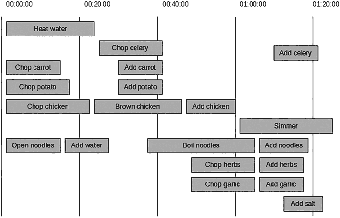
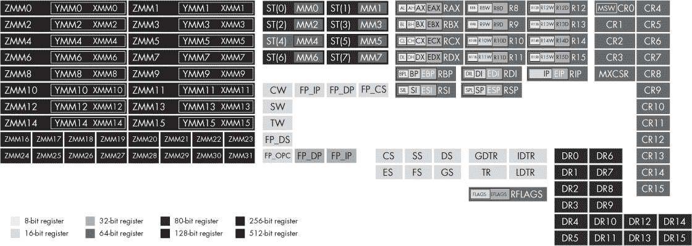
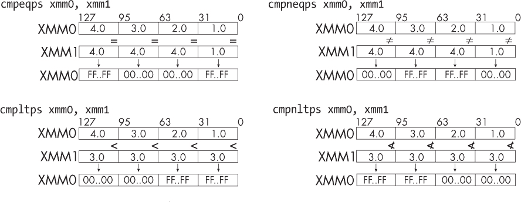
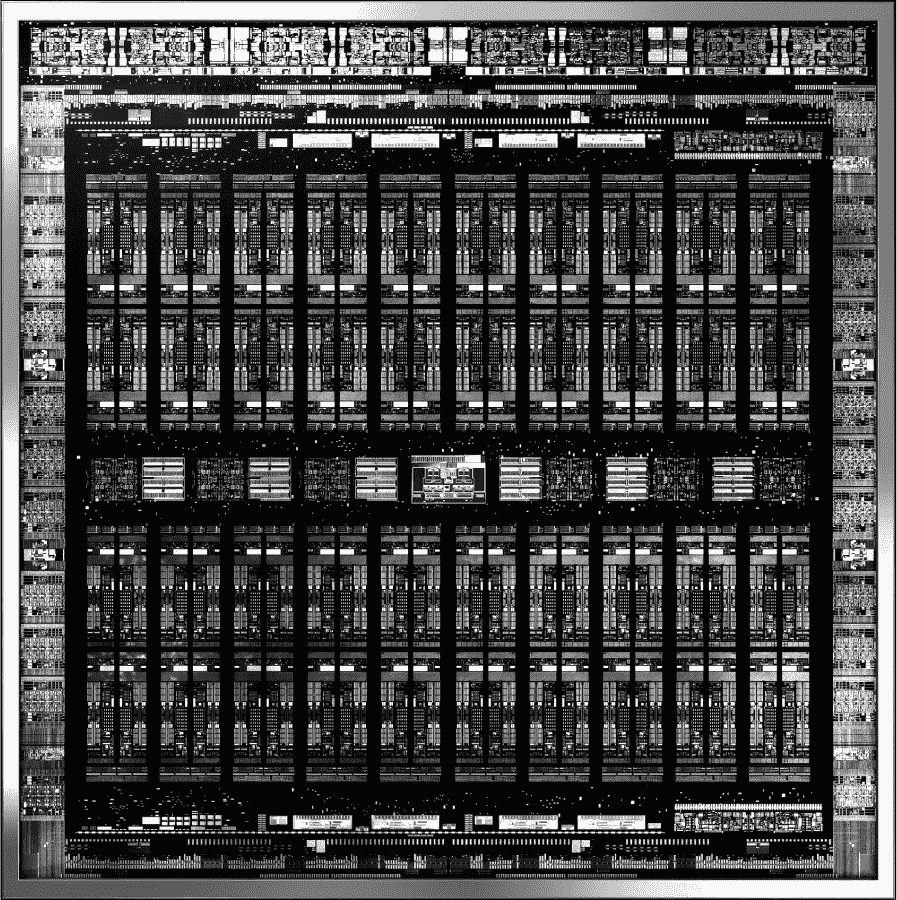
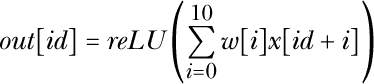
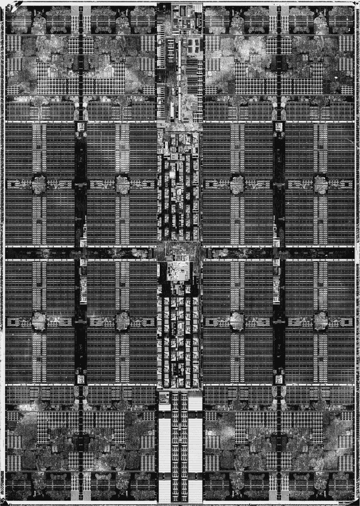
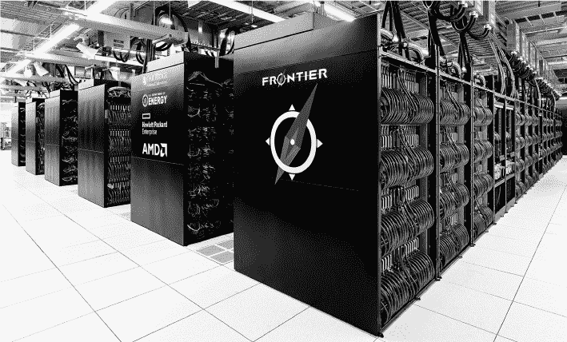
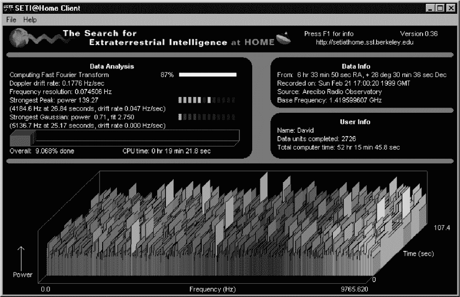
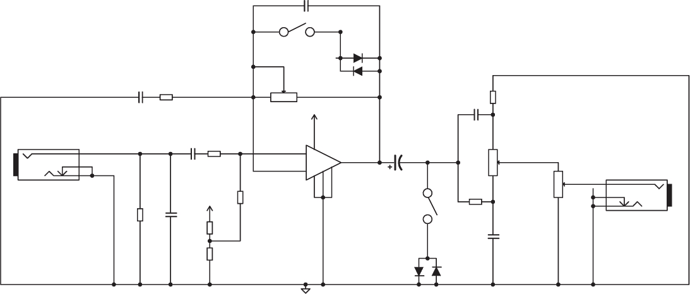
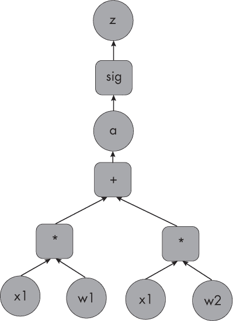

## 第十八章：## **并行架构**


正如我们讨论过的，计算正沿着两条路径发展：低功耗系统，形成物联网；以及高功耗计算中心，形成云计算。在前面的章节中，我们已经看过了物联网这一低功耗系统的分支：嵌入式和智能系统。本章将重点讨论云中存在的高功耗、高性能系统。具体来说，我们将探讨并行性——云计算的骨干。

并行化的兴起与摩尔定律的两条法则有关。摩尔定律中的密度法则表明我们仍然可以在芯片上放置越来越多的晶体管，而关于时钟速度的摩尔定律已经结束，这意味着我们无法再让单个 CPU 的时钟速度更快。每秒的取指-解码-执行周期数不再增加，因此我们需要为额外的可用晶体管找到新的用途，尝试在每个周期内做更多的工作，而不是加快周期速度。

一段时间里，我们通过使用额外的硅来提升传统的串行架构：我们增加了越来越复杂的 CISC 指令，以每条指令获得更多的工作；我们在 CPU 硅片上增加了更多和更大的寄存器级缓存；我们复制了算术逻辑单元（ALU）等结构，以支持分支的同时执行；我们还构建了更复杂的流水线和乱序执行机器。总的来说，这些技术最近实现了指令每周期（IPC）的双位数年增长，而不是每秒周期数的增长。但在这些领域，我们可能已经接近用尽轻松获得进展的空间，因此我们必须更多地思考数字逻辑本身是并行的。幸运的是，它确实是。

我们已经遇到过寄存器级和指令级并行性。寄存器级并行性是指对寄存器位执行数字逻辑的每列同时执行。例如，可以同时对一个字中的所有位进行取反，而不是依次进行。指令级并行性包括流水线、分支预测、急切执行和乱序执行（OOOE）。这些概念在指令集架构（ISA）层面上并不显现；它们对汇编程序员来说是隐形的。从程序员的角度来看，它们只是让串行程序执行得更快。

本章将重点讨论在 ISA 中可见的较高层次的并行性，这些并行性可能需要汇编程序员甚至高级语言程序员的关注。我们将从并行基础开始思考，然后转向两种主要的并行类型：*单指令、多数据（SIMD）*，这种并行性在现代 CPU 和 GPU 中存在，以及*多指令、多数据（MIMD）*，这种并行性出现在多核处理器和云计算中心。最后，我们将通过考虑一些更激进的、无指令的并行形式，来讨论可能将架构推向超越 CPU 和程序概念的方向。

### 串行与并行思维

串行计算中，大部分硅材料用于构建内存，这些内存大部分时间处于空闲状态，直到需要从 CPU 加载或存储数据时才会被调用。从这个角度看，串行计算就像是让 1,000 个人将所有的工作交给一个工人，然后站在那里等待结果。这种现象被称为*串行瓶颈*。

并行计算使得这 1,000 个人可以各自独立工作。每个人都成为一个活跃的计算单元：他们根据需要直接交换数据，从而比站着等待那个唯一工人的时候完成更多的工作。如果我们利用计算机中的所有数字逻辑来不断执行计算，而不是等待 CPU，也可以获得类似的效率提升。

因此，显然并行计算比串行计算要快得多，效果更好。但是至少在 2010 年代之前，计算机科学家们大多仍然停留在“串行思维”中。大多数人都曾在某个阶段学到过用食谱进行编程的概念，假设只有你一个人在厨房工作，你将执行一系列任务，例如：

```
1\. chop vegetables
2\. boil water
3\. chop chicken
4\. brown chicken
5\. add vegetables to pot
6\. add chicken to pot
7\. simmer pot
8\. chop herbs...
```

这在小规模情况下没问题，但如果你是一个负责管理一连串热门餐厅的主厨，你就得负责一个团队，并且必须以最优方式安排工作，才能更高效地制作食物。运筹学就是专门研究如何像这样优化工作调度的领域。

我们如何像鸡汤食谱那样将一系列指令处理完，并在最短时间内完成所有工作呢？有一些著名的算法可以实现这一点。例如，亨利·甘特（Henry Gantt）的甘特图，如图 15-1 所示，常用于展示和分析任务在时间上并行运行的顺序。



*图 15-1：用于烹饪鸡汤的并行甘特图*

存在一些简单的算法，可以根据依赖关系列表（即哪些任务必须在其他任务完成之前才能开始）生成任务的最优时间。可以为任务网络计算出一个关键路径，即需要按时完成的工作序列，因为它们是瓶颈任务。

布莱切利公园（Bletchley Park）大量使用这种计算方式。那里不仅使用了机器作为计算工具，仍然是人类计算的时代，“计算机”这个职称指的是人类的工作。人类计算员会坐在一个计算部门（图 15-2）里，在一位经理的安排下，分工合作并行进行计算。这些程序经理会考虑如何将一个大型的数学计算任务分解成多个组件，分配任务，并将结果汇总。


*图 15-2：一个人类计算部门在并行工作，经理（站立者）安排工作*

鉴于并行工作团队的管理已经存在很长时间，并且其基础是如何设计工作程序以高效完成任务，为什么那么多程序员基本上忽视它，而是转而思考食谱和串行计算呢？如果计算机历史从运筹学的角度开始，而不是从串行算法开始，我们可能会有一个更好的基础。由于摩尔定律对时钟速度的影响已经结束，编程——甚至可能是计算机科学的基础——现在不得不转向并行思维。例如，今天的孩子们可能会在 Scratch 中编写他们的第一个程序，所有的角色（精灵）都在并行运行代码。而专业程序员则越来越需要以 SIMD 和 MIMD 为思维方式进行思考，这就是我们接下来要学习的内容。

### CPU 上的单指令多数据

我们的第一种并行处理类型——单指令多数据——意味着我们将采取单一指令（例如，“加一”）并在多个数据项上同时执行该指令。我们可以将 SIMD 系统分为基于 CPU 和基于 GPU 的实现。这里我们将关注基于 CPU 的实现；在下一部分，我们将探讨基于 GPU 的实现。

#### *SIMD 简介*

CPU 上的 SIMD 是一种非常 CISC 风格的方法：它涉及创建额外的指令和数字逻辑，以便将并行操作作为单个指令执行。SIMD 指令将多个数据项打包到一个字中，然后定义指令对每个数据项并行应用相同的操作。例如，在一个 64 位的机器上，我们可以将一个 64 位寄存器分割成四个 16 位的块，每个块存储一个 16 位的整数。然后我们可以使用理解这种打包方式的指令，同时对四个块进行操作。

在标准的 CPU 中，你可能有一个`ADD`指令，它将寄存器 r1 和 r2 中的整数相加，并将结果存储在 r3 中。然而，在 SIMD 机器中，你将有一个类似`SIMD-ADD`的指令，依然使用相同的三个寄存器，但使用不同的数据表示法同时对来自两个寄存器的 16 位值对进行加法运算；然后将结果以类似的方式存储在第三个寄存器中。

**注意**

*SIMD 指令起源于早期的超级计算机，如著名的 1960 年代 Cray 超级计算机。SIMD 最早是通过英特尔的 MMX 指令从超级计算机引入桌面计算机的。*

SIMD 可以将一个 64 位寄存器分割为两个 32 位块、四个 16 位块或八个 8 位块。四分法对于 3D 游戏特别有用。3D 程序员通常使用*四*维向量表示 3D 坐标，其中第四维作为缩放因子，用于实现*仿射变换*。这些是通过简单的矩阵-向量乘法计算的变换，如平移和旋转。对于游戏来说，通常 16 位精度的数字是可以接受的（虽然对于严肃的科学 3D 模拟可能不够）。我们很幸运生活在一个经过仿射变换后，维度数是 2 的幂的世界！

SIMD 也非常适合图像和视频处理，其中像素颜色通常由四个数字表示，分别代表 RGB 和 alpha 通道（如在第二章中讨论的）。更一般来说，对于大多数类型的多媒体，包括音频，通常需要对信号处理执行许多相同操作的拷贝，因此即使没有明显的 4D 结构，SIMD 也能加速这一过程。

SIMD 指令可以为任何普通寄存器创建，但随着寄存器大小增加到 64 位，它们变得更加有趣。一些架构还包括比其字长更长的额外寄存器，称为*向量*寄存器；这些寄存器可以存储 128、256 或 512 位，主要用于 SIMD 指令。

现在我们理解了 CPU SIMD 的理论，接下来我们来看一个 x86 中如何实现它的具体例子。

#### *x86 上的 SIMD*

我们在第十三章中看到了 64 位时代各种 x86 架构的名称。除了基本的 amd64 指令集之外，这些架构大多数集中在使用不同形式的并行性添加扩展。这些想法大多源自高性能计算和高端服务器，但也已引入到桌面架构中。

经典的 CISC 方法是利用额外的晶体管增加更多简单的机器和指令到 ISA 中，每个指令旨在比常规指令做更多的工作。这导致了成千上万的新 CISC 指令的出现，针对各种特殊情况，如加密、多媒体处理和机器学习。对于这些扩展的标准存在一些争议。每个人都实现了相同的基础 amd64 ISA，但不同的制造商以不同的方式扩展它，添加各自的扩展。它们试图让用户依赖自己的版本，并抛弃竞争对手（这是一种著名的策略，叫做*拥抱-扩展-消灭*）。这给编译器开发者带来了麻烦，因为他们必须为不同的扩展创建多个后端来进行优化。

在 64 位时代，x86 新增的大部分寄存器和指令都与 SIMD 有关。图 15-3 展示了现代 amd64 的完整用户寄存器集。



*图 15-3：amd64 的完整寄存器集*

SIMD 寄存器是那些名称中包含“MM”的寄存器。注意到，随着时间的推移，新的 SIMD 寄存器逐渐出现，通常通过扩展现有的寄存器来增加更多的位数。当进行扩展时，x86 向后兼容性要求原本较短的形式仍然要有名字并且可用，同时也要有扩展后的形式。这就要求提供多种版本的指令。

#### **MMX**

*MMX* 是第一个 x86 SIMD 扩展。至今没有正式定义 MMX 代表什么，事实上，这一直是英特尔和 AMD 之间关于商标的法律争议问题。有人提出的建议包括“矩阵数学扩展”和“多媒体扩展”。

MMX 将之前的 amd64 浮点寄存器扩展到了 64 位，类似于 32 位寄存器（如 EAX）扩展为 64 位的 RAX。新的寄存器命名为 MM0 到 MM7，并且在现代机器上仍然存在。

每个 MMX 寄存器可以作为一个单独的 64 位整数、两个 32 位整数、四个 16 位整数或八个 8 位整数来进行仅整数的 SIMD 操作。整数 SIMD 特别适用于处理图像，包括 2D 精灵游戏和视频编解码器。

MMX 指令以 `p` 表示“打包”，例如 `paddd` 表示“打包加双字”。新的移动指令——`movb`, `movw` 和 `movd`——将字节、字或双字数组复制到单个 MMX 寄存器中。例如，下面定义了两个 32 位双字数组：*a* = [4, 3] 和 *b* = [1, 5]。它将 *a* 作为打包的双字加载到 MM0 中，将 *b* 加载到 MM1 中。然后，它对这些双字进行打包加法运算，最终将 [5, 8] 存储在 MM0 中：

```
a:     dd 4, 3
b:     dd 1, 5
main:
       movd   mm0, [a]
       movd   mm1, [b]
       paddd  mm0, mm1
```

MMX 添加了*大量*的新指令，因为每个算术操作必须在字节、字（word）和双字（double）打包形式中都存在。

#### **SSE**

英特尔的 x86 SIMD 版本自 MMX 以来已经多次扩展，分别为 SSE、SSE2、SSE3、SSE4 和 SSE4.2（其中 SSE 代表流式 SIMD 扩展）。AMD 最新的、不可兼容的竞争版本令人困惑地被称为 SSE4a。与 MMX 不同，SSE 系列不仅支持整数的 SIMD 还支持浮点数。这使得它在加速游戏和其他物理仿真中的 3D 数学计算时特别有用。（根据当时的基准测试，MMX 在 3D 游戏 *Quake* 中的表现并不成功。）

与 MMX 扩展旧的浮点寄存器不同，SSE 添加了完全新的 128 位向量寄存器，命名为 XMM0 到 XMM31。这些寄存器的数量随着 SSE 版本的更新而增加。它们可以被拆分为 8 位、16 位、32 位或 64 位的块，每个块可以表示浮点数或整数。因此，每个算术操作会有多种指令，具体取决于这些选择。

大多数 SSE 指令在助记符的开头或结尾加上字母 `p` 来表示“打包（packed）”。例如，图 15-4 的左上方展示了用于相等比较的 SSE 指令 `cmpeqps`。该名称来自于标准的 x86 指令 `cmpeq`，再加上 `ps` 表示“打包，单精度”。



*图 15-4：两个 SSE 寄存器 XMM0 和 XMM1 中的内容，执行 SSE 指令时，以不同方式比较这两组数据：相等（左上）、不等（右上）、小于（左下）和不小于（右下）*

在图 15-4 的右上角，`compneqps` 指令类似地将 `cmpneq`（不等比较）扩展到 SSE。

以下代码展示了如何将浮点数数组从 SSE 的 XMM 寄存器中读出并写入，并对其执行算术运算：

```
;from en.wikibooks.org/wiki/X86_Assembly/SSE, CC BY 3
section .data
    v1: dd 1.1, 2.2, 3.3, 4.4    ; first set of four numbers
    v2: dd 5.5, 6.6, 7.7, 8.8    ; second set

section .bss
    v3: resd 4    ; result

section .text
    _start:

    movups xmm0, [v1]   ; load v1 into xmm0
    movups xmm1, [v2]   ; load v2 into xmm1

    addps xmm0, xmm1    ; add
    mulps xmm0, xmm1    ; multiply
    subps xmm0, xmm1    ; subtract
    movups [v3], xmm0   ; store result in v3

    ret
```

在这里，`addps` 指令将 XMM1 中的四个数字加到 XMM0 中的四个数字，并将结果存储回 XMM0。对于第一个浮点数，结果将是 1.1 + 5.5 = 6.6。`mulps` 指令将 XMM1 中的四个数字与先前计算的结果（XMM0 中的结果）相乘，并将结果存储回 XMM0。对于第一个浮点数，结果将是 5.5 × 6.6 = 36.3。`subps` 指令将来自 `v2`（仍未改变的 XMM1 中）的四个数字从先前计算的结果（XMM0 中）中减去。对于第一个浮点数，结果将是 36.3 – 5.5 = 30.8。

#### **AVX**

两代 *高级矢量扩展（AVX）* 增加了比 SSE 更长的向量，具有 256 位和 512 位的长度。新的 256 位寄存器称为 YMM0 到 YMM31，新的 512 位寄存器称为 ZMM0 到 ZMM31。

AVX 指令通常与 SSE 指令具有相同的名称，并且行为类似，但它们以 `v` 开头。例如，要使用 AVX-256 对八对 32 位（双精度）浮点数进行加法，我们可以这样做：

```
    v1: dd 0.50, 0.25, 0.125, 0.0625, 0.03125, 0.015625, 0.0078125, 0.00390625
    v2: dd 2.0, 4.0, 8.0, 16.0, 32.0, 64.0, 128.0, 256.0
    v3: dd 0, 0, 0, 0, 0, 0, 0, 0
main:
    vmovups ymm0, [v1]
    vmovups ymm1, [v2]
    vaddpd ymm3, ymm1, ymm2
    vmovups [v3], ymm3
```

注意 AVX 算术的形式与 MMX 和 SSE 的不同，现在加法需要三个操作数，而不是两个。

#### **使用 SIMD 的领域特定指令**

如前所述，SIMD 通常被认为是一种非常 CISC 的方法，因为它涉及向 ISA 添加大量新指令。最初，这些指令来源于许多不同的打包方式、数据类型和算术操作的组合。在简单地跨块复制算术操作的基础上，CISC SIMD 还倾向于创建更复杂的指令。这些指令可能包括 *水平 SIMD*，意味着那些 *合并* 来自同一寄存器中多个块的信息的指令。例如，有一些指令可以找到寄存器中多个块的最小值：SSE 中的 `phminposuw` 或 AVX 中的 `vphminposuw`。

水平 SIMD 指令有时也会将简单的 SIMD 指令串联在一起。例如，“打包双精度浮点值的点积” (`dppd` 在 SSE 上；`vdppd` 在 AVX 上) 是一条执行完整向量点积的单一指令，常用于游戏、3D 仿真和机器学习中。它首先执行 SIMD 相乘一对对的块，然后在寄存器中水平地对结果进行求和。

加密学一直是 CISC SIMD 扩展的一个重要来源。例如，128 位 AES 是 NSA 批准的互联网加密标准。它通过四个步骤计算：ShiftRows、SubBytes、MixColumns 和 AddRoundKey。英特尔为这些步骤中的每一步添加了 CISC 指令，并且还有一个组合它们的单一大指令来执行完整的一轮（SSE 上的`aesenc`；AVX 上的`vaesenc`）。如果像大多数终端用户一样，你的大部分计算时间都用于通过 HTTPS 流式传输视频，那么这种 CISC 方法为你的使用场景提供了有用的加速。但英特尔的扩展一直颇具争议，Linus Torvalds 曾表示，NSA 和英特尔可能已在数字逻辑中留下后门，并建议 Linux 程序员不要使用这些扩展。

机器学习——特别是神经网络——操作已成为最新的 SIMD CISC 目标，借助英特尔的向量神经网络指令（AVX512-VNNI）和大脑浮动点（AVX512-BF16）扩展到 AVX-512，这些扩展出现在 Golden Cove 架构中，并作为*DL Boost*一起推广。例如，“乘法和加法无符号和有符号字节并进行饱和”（`vpdpbusds`）通过单条指令执行整个神经元的类似 Sigmoid 激活操作，包括输入和权重。部分研究人员通过使用这些和类似的 SIMD CISC 指令，能够比在 GPU 上训练神经网络更快，因此现在这已经成为 CPU 和 GPU 架构之间的竞争。

#### **编译器开发者与 SIMD**

唯一理解并关心 x86 SIMD 的编译器开发者是为英特尔和 AMD 工作的人员，因此，专有的 CISC 编译器在 CISC 架构上的数值代码处理速度可能会比开源或第三方编译器（如 gcc）更快。

英特尔发布了各种 C 库，使用其自有编译器实现，将高级数值代码转换为 SIMD 指令。这些库包括集成性能原语（IPP）、数学核心库（MKL）和用于神经网络的 IPEX PyTorch-to-AVX 编译器。

开源编译器的开发者通常对特定的专有硬件扩展和 CISC 不感兴趣，他们一般更愿意将宝贵的时间花费在更具通用性的工作上，旨在造福更广泛的社区，比如生成精美的 RISC 代码，并通过流水线和超指令执行（OOOE）等方法加速。

**SIMD 与 RISC-V**

SIMD 指令本质上是 CISC 的思想——它们增加了大量新的指令和数字逻辑，使得指令集变得更加复杂。然而，SIMD 扩展也已经被提出用于 RISC-V，例如用于并行 SIMD 指令的 P 扩展和用于向量指令的 V 扩展。

现在没有任何现实世界中的架构是纯粹的 RISC 或 CISC，而且没有法律禁止像 RISC-V 这样主要采用 RISC 风格的架构加入一些 CISC 特性，特别是因为 RISC-V 的扩展系统使得这些特性完全是可选的。然而，在开源 RISC-V 社区中确实有一些强烈反对的声音，他们对这种潜在的 CISC 插入感到不满。即使是其创始人也发布了“SIMD 被认为有害”的警告。

好的 RISC 风格实际上是利用额外的可用硅来优化流水线和超出顺序执行（OOOE），例如通过复制 ALU、寄存器和其他组件来支持多个分支的并行执行。SIMD 指令的存在，特别是最极端的 CISC 风格的多步指令，如点积（既进行乘法又进行加法），可能会使这种方法变得更加困难。多核通常更适合 RISC，RISC-V 也有一个用于原子内存指令的 A 扩展，提供了多核事务支持。

### GPU 上的 SIMD

SIMD 在 GPU 中出现的规模要大得多。CPU 上的 SIMD 提供了 2 到 64 倍的加速，具体取决于每个字中打包的块的数量。相比之下，GPU 可以扩展到数千条相同的指令同时在数据上运行。

在 第十三章 中，我们看到显卡是如何发展的，从提供图形命令的硬件实现，到为非图形计算提供自己的并行机器码。最初，这是一项非常困难、极客化的工作，涉及将大规模的计算算法编码成着色器，仿佛它们是图形计算，利用高度并行的 3D 渲染硬件，然后解码生成的图像以获取计算结果。

GPU 制造商迅速意识到这是一个新市场，并重新设计了他们的着色器语言，转变为通用 SIMD 计算的通用 GPU 指令集。这些指令集不仅可以用于实现之前的图形着色器，现在还可以用于实现通用的非图形 SIMD 计算。这一演变迅速发生，形成了不再专为图形设计的 GPU，而是为了通用更高功率的科学计算和机器学习计算，尤其是神经网络。因此，“图形处理单元”现在已经是一个误称；现代 GPU 更像是一个“通用并行单元”。

#### *GPU 架构*

过去，讨论 GPU 架构通常很困难，因为每个 GPU 都由不同的公司根据不同且保密的设计开发。然而，一些制造商联合起来达成了*Khronos*标准，定义了一种思考 GPU 硬件架构的方式，这种方式在大多数厂商的抽象层次上是通用的。这使得大多数 GPU，以及一些其他设备，能够被视为其硬件实现了标准架构，这样程序员就不需要过多关注它们的个别细节。只要新厂商提供将程序从 Khronos 标准转换为其更具体机器代码的软件工具，程序员也可以轻松地将一个 GPU 替换成另一个，甚至是跨厂商的更换。

Khronos 定义了一种命名实体的层次结构。我们有一个单一的*主机*（计算机），它可能包含多个*计算设备*（物理 GPU 卡或芯片）。这些设备中有多个*计算单元（CUs）*，每个计算单元包含*处理元素（PEs）*。

主要结构是 CU，其 PE 包含自己的寄存器和算术逻辑单元（ALU），但共享一个程序计数器、指令寄存器和控制单元。这创建了 SIMD，因为 CU 中的每个处理元素都并行执行来自 PC 的相同指令，但使用其自身寄存器中的数据。CU 还可能包含其他结构，如缓存和共享内存，允许 PE 彼此通信。计算设备通常将多个独立的 CU 打包在一起。SIMD 只存在于单一的 CU 内部。

**注意**

*Khronos 标准旨在具有普适性，不仅适用于多种不同类型的 GPU，还适用于任何实现 SIMD 的技术。例如，在某些情况下，它们也可以在 FPGA 或 SIMD CPU 上实现。这就是为什么使用通用名称“计算设备”来替代“GPU”的原因。*

图 15-5 中的硅片照片展示了 GPU 硅片的实际样子。它显示出硅片的排列比 CPU 的布局更加规律，方形的 CU 均匀分布在各处，中央有一个通用缓存。



*图 15-5：一张来自 Nvidia Pascal GPU 芯片的硅片照片*

#### *Nvidia GPU 汇编编程*

在 CPU 中，SIMD 通过执行单条指令来并行完成固定数量（例如，四个或八个）的相同操作。程序以一系列此类指令编写，每次执行的指令由程序计数器引用。然而，在 GPU 中，SIMD 通常以不同的方式表达：我们希望使大量和任意数量的指令副本并行运行，而不是固定数量。

Khronos 定义了软件级的概念，用来表达 GPU 的 SIMD 程序。*内核*是用户程序员编写的通常较小的函数，目的是让代码中的每一行（汇编后的）作为单个指令在多个数据上运行。*工作项*是内核的一个实例——也就是说，通过在一个处理元素上运行，指令序列应用到单个数据项上。*工作组*是多个工作项实例的集合，它们在多个数据项上并行运行。与 CPU 的 SIMD 不同，内核代码是通过描述其对单个工作项的影响来编写的。当你运行一个内核时，你可以选择并指定要并行启动多少个工作项。

图形着色器通常是小型、简单的程序，它们对每个像素执行一系列固定的操作。因此，它们非常适合 SIMD，每个像素的工作项按照相同的顺序执行相同的指令。然而，其他类型的计算内核可能需要分支。这就会出现一个问题，类似于流水线冒险的情况，不同的工作项需要执行不同的分支。执行不同的分支会破坏 SIMD，因为工作项不再执行相同的指令。处理内核分支有两种方法：屏蔽和子组。

就像 1980 年代的 CPU 设计师一样，现代 GPU 设计师每个人都维护自己的、不兼容的 ISA（指令集架构），这些 ISA 定义了他们的平台。Nvidia 是撰写本文时最流行的 GPU 设计公司，因此我们将以编程 Nvidia 的 ISA 为例，学习如何编程 GPU。与我们在本书中编程的其他系统一样，为了简化学习，我们将略微简化事实。我们假设所有通用的 Nvidia GPU 都实现了一个名为 PTX（并行线程执行）的单一 ISA，我们将学习如何用 PTX 汇编编程。你可以在任何通用的 Nvidia GPU 上汇编和运行 PTX 程序。

#### **数据移动和算术运算**

以下是一个简单的 PTX 内核程序。像所有内核一样，构成工作组的多个副本旨在并行运行，因此这段代码仅描述了单个工作项的操作：

```
       mov.u32          %r1, %tid.x;       // r1 := my threadID
       cvt.rn.f64.s32   %fd1, %r1;         // convert threadID to float
       mul.wide.s32     %rd4, %r1, 8;      // id times 8 = address offset
       add.s64          %rd5, %rd3, %rd4;  // global address to store result
       st.global.f64    [%rd5], %fd1;      // store threadID in result address
       ret;
```

PTX 汇编代码的行尾使用分号，并且用双斜杠表示注释。寄存器名称通常以百分号符号（%）开头。我们将使用四组寄存器：`r`表示 32 位整数寄存器；`rd`表示 64 位（双精度）整数寄存器；`fd`表示 64 位（双精度）浮点寄存器；第四组，`tid`，表示用于存储并行性信息的内部寄存器。

像往常一样，大多数指令使用三个操作数，第一个是目标，其他的是输入。由于我们有多种寄存器可用，大多数指令名称使用类似 Amiga 的后缀，通过句点分隔，用来表示使用的是哪一版本。例如，`add.s64` 表示对 64 位有符号整数的加法运算，而 `mult.wide.f64` 表示对 64 位浮点数进行宽（全）乘法运算。加载 `(ld)` 和存储 `(st)` 指令有后缀，表示是否使用全局内存或本地内存。`cvt` 指令表示转换，通过各种后缀，它可以在不同位大小的有符号和无符号整数与浮点数之间转换。像往常一样，`ret` 表示返回。

上面的程序以及这里展示的其他 PTX 程序都假设开始时寄存器 rd1 到 rd3 包含三个双精度数组的全局内存地址，其中 rd1 和 rd2 是输入，我们将其昵称为 `x` 和 `w`，而 rd3 是输出，我们将其昵称为 `out`。（这些约定的原因稍后会变得清晰，尤其是在我们谈到神经元时。）

该程序的功能非常简单。它完全忽略了两个输入。然后它获取其 threadID，这是分配给工作组中每个工作项的唯一整数。例如，如果我们启动一个包含 5000 个程序副本的工作组，每个副本在启动时都会在其 `tid.x` 寄存器中获得一个唯一的 threadID，范围从 0 到 4999。然后，工作项将其 threadID 的副本写入输出数组的相应元素。例如，第 573 个工作项，threadID 为 573，将浮点数 573.0 写入 `out` 数组的第 573 个元素。如果我们以 SIMD 启动一个包含 5000 个副本的工作组，它们每个都会同时将这样一个数字写入 `out`，因此当它们一起完成时，`out` 数组将包含从 0 到 4999 的数字列表。

尽管 PTX 使用 64 位字（如在示例中所见，它可以限制为 32 位），但它仍然使用字节寻址。这意味着地址加 1 会使内存向前移动 8 位。要按 64 位字进行移动，我们必须将地址加 8。因此，程序的工作原理是获取其 threadID，将其乘以 8，将结果加到 `out` 的地址上，并在该地址存储 threadID 的浮点版本。最终的 `out` 数组因此包含 [0, 1, 2, 3, 4, 5, . . .]。

#### **分支**

SIMD 的定义是内核的并行副本在程序执行时一起执行相同的指令。如果所有副本都走相同的分支，GPU 中的分支在 SIMD 中顺利运行，但如果它们需要走不同的分支，则变得复杂。

例如，下面的 PTX 内核使用了分支：

```
      mov.u32        %r1, %tid.x;    // r1 := my thread ID (an int)
      cvt.rn.f64.s32 %fd4, %r1;      // fd4 := convert threadID to doublefloat

      setp.lt.s32    %p1, %r1, 4;    // set predicate1 to "threadID is less than 4"

      // lines starting @%p1 only execute if predicate1 is true
@%p1 mov.f64         %fd2, 0d4008CCCCCCCCCCCD; // load doublefloat 3.1 to fd2
@%p1 add.f64         %fd1, %fd2, %fd4;         // and add it to the id
      // lines starting @!%p1 only execute if predicate1 is false
@!%p1 mov.f64        %fd3, 0d4024000000000000; // load float 10.0 to fd3
@!%p1 mul.f64        %fd1, %fd3, %fd4;         // and multiply it by thread ID

      mul.wide.s32   %rd4, %r1, 8;     // id times 8 = address offset
      add.s64        %rd5, %rd3, %rd4; // global address to store result
      st.global.f64  [%rd5], %fd1;     // result address := fd1
      ret;
```

前两行和最后四行与之前的程序相同。但在前两行之后，程序测试线程 ID 是否小于 4。如果是，它会将 3.1 加到线程 ID 上。如果不是，它会将线程 ID 乘以 10.0。无论哪个结果被得到，都会像以前一样将其放入 `out` 数组中对应的线程 ID 元素。完成后，`out` 将包含：

```
3.1, 4.1, 5.1, 6.1, 40.0, 50.0, 60.0\. 70.0, 80.0, 90.0 --snip--
```

这里的复杂性在于，我们只希望在某个条件为真或假的情况下，某个工作项执行某些行。在 PTX 中，我们首先测试条件（小于，`lt`），并将一个*谓词*寄存器设置为真或假来存储结果。谓词寄存器是内部寄存器，通常写作`p1, p2`等，可以像我们在分析引擎和其他系统中看到的状态标志一样进行设置和测试。与那些标志不同的是，谓词寄存器有很多，每个寄存器可以长时间存储谓词，而不会覆盖先前的比较结果。一旦我们设置了一个谓词，就可以指示某些行仅在谓词为真或为假时才应执行。这些指示符被称为*谓词保护*，在 PTX 汇编中，通常写作`@%p1`，位于某行的开头。不同的 GPU，包括不同的 Nvidia 型号，可能以两种方式处理谓词保护：掩码或子组。

*掩码*是一种简单的、纯粹的 SIMD 方法，适用于小的分支结构，例如没有跳转的`if...else`语句。内核始终以 SIMD 模式执行，这意味着所有副本共享相同的程序计数器，并同时执行相同的代码行。如果某行被保护，PE 会测试谓词，如果该行不应执行，那么 PE 会用 NOP（无操作指令）替换它，就像 CPU 管道停顿一样。这使得多个工作项能够保持同步，需要执行指令的工作项会执行，而其他工作项则通过这些 NOPs 等待它们。这样会浪费一些时间，PE 会从一个分支执行 NOP，而从另一个分支执行真正的指令，但它使得所有工作项始终保持同步，保持 SIMD 模式。

*子组*（Khronos 术语，也被一些厂商称为“局部组”、“波”或“波前”）是一种更为复杂的解决方案，超越了纯粹的 SIMD 以适应条件跳转。所有工作组中的工作项开始时都是在纯粹的 SIMD 中运行，直到遇到谓词保护。当这种情况发生时，工作组被分成两个子组，一个子组的工作项执行分支，而另一个子组的工作项不执行分支。然后，这些子组被视为两个独立的 SIMD 程序，并独立执行，若有可用的两个计算单元（CU），则在两个 CU 上执行；如果只有一个 CU 可用，则在同一个 CU 上按顺序执行。

程序中的每个分支都会产生一个额外的子组拆分，例如，一个包含四个分支的串行程序可能会导致 2⁴ = 16 个子组。在此时，物理可用的 CUs 数量决定了执行效率，而不是 CU 中的 PEs。显然，对于具有多个分支序列的大型程序来说，这种方式是不可持续的。然而，如果程序员能找到方法，子组可以重新合并（“重新同步”）。通常，当分支由于不同的工作项执行了不同数量的循环重复次数时，可以实现此操作。在这种情况下，程序员可以要求先完成循环的工作项等待，直到其他工作项也完成；这被称为同步*屏障*，并通过汇编和机器代码中的特殊屏障指令来表示。

分支的挑战使得 SIMD 成为一种相对受限的编程方式。它非常适合图形着色器，因为图形着色器通常没有或只有极少的分支，但对于需要并行线程执行多个不同分支的程序来说，这种方式比较棘手。神经网络和物理模拟是两类代码，它们与图形代码类似，具有最小分支结构，因此它们从 GPU 加速中受益匪浅。然而，如果你需要不同的线程做完全不同的事情，那么 SIMD 就不合适了。这时你需要 MIMD，如本章后面所见。

#### **大型工作组**

有时我们需要运行比 CU 中可用的 PEs 更多的内核副本。例如，一个像素着色器需要为 4K 显示器的每一个大约八百万个像素运行，而可用的 PEs 可能只有几千或几万个。

在这些情况下，可以使用类似于分支的子组方法：将工作组拆分为多个较小的子组，使得每个子组在 PEs 上物理地以 SIMD 方式一起运行，多个子组可以在单个 CU 上串行运行，也可以在多个可用的独立 CU 上同时运行。与分支不同，这些子组的选择是为了精确匹配 PEs 的总数。这些最大大小的子组被一些厂商称为*块*，而子组集合被称为*网格*。

每个子组中的工作项将分配相同的线程 ID 集合，表示 PE 在其 CU 中的位置。通常需要在这些线程 ID 和全局“作业 ID”之间进行转换。例如，如果你需要计算八百万个像素，而有 10,000 个 PE，那么第四百万个作业需要知道它应该写入第四百万个像素，而不是它的线程 ID 对应的像素，后者的最大值为 10,000。

这是一个常见的需求，因此 PTX 提供了一些额外的机制来帮助编程，如以下示例所示：

```
mov.u32          %r4, %ctaid.x;      //r4:=which subgroup is this?
mov.u32          %r2, %ntid.x;       //r2:=subgroup size
mov.u32          %r3, %tid.x;        //as well as the usual local thread ID
mad.lo.s32       %r1, %r2, %r4, %r3; //compute the global job ID as
                                     // jobID = r1 := r2 x r4 + r3
cvt.rn.f64.s32   %fd1, %r1;          //fd1 := convert global jobID to float

mul.wide.s32     %rd4, %r1, 8;       //id times 8 = address offset
add.s64          %rd5, %rd3, %rd4;   //global address to store result
st.global.f64    [%rd5], %fd1;       //store threadID in result address
ret;
```

在这里，两个额外的内部寄存器 `ntid.x` 和 `ctaid.x` 在内核启动时自动加载，包含子组大小和一个新 ID，表示当前正在运行的是哪个子组。通过使用专门的 `mad` 指令将它们相乘和相加，我们可以恢复全局作业 ID，并像往常一样继续执行。（程序的其余部分与第一个程序相同，存储此作业 ID 的浮点版本于 `out` 中的 jobID-th 位置。不同之处在于，这现在适用于更大的 `out` 数组——包含数百万个元素。）

#### **GPU 神经元**

现在让我们看一个更大的示例内核，它计算卷积深度神经网络（CNN）的一个神经元。这大致就是 GPU 在机器学习中的使用方式：

```
      mov.u32        %r1, %tid.x;       //r1 := thread ID
      mov.u32        %r2, 0;            //r2 = i = input counter := 0
      mov.f64        %fd1, 0d0000000000000000; //cumsum:=doublefloat(0)
      mul.wide.s32   %rd4, %r1, 8;
  //id x 8 = addr offset from threadID
MYLOOP:
      mul.wide.s32   %rd5, %r2, 8;      //i times 8
                                        //=adr offset from conv iteration
      add.s64        %rd8, %rd1, %rd4;  //rd8:=adr of id-th element of
                                        // x=&x+jobIDoffset
      add.s64        %rd8, %rd8, %rd5;  // + convoffset
      ld.global.f64 %fd3, [%rd8];       //fd3:=x_(job+i)

      add.s64        %rd9, %rd2, %rd4;  //rd9:=adr of id-th element of
                                        // w=&w+convoffset
      ld.global.f64 %fd2, [%rd9];       //fd2:=w_i
      mul.f64       %fd4, %fd3, %fd2;   //fd4:=x_(job+i) * w_i
      add.f64       %fd1, %fd1, %fd4;   //cumsum += fd4

      add.u32       %r2, %r2, 1;        //i++
      setp.ne.s32   %p1, %r2, 10;       //test if i==10
@%p1 bra   MYLOOP;                  //stop if so, else loop, using pred guard
      //reLU
      setp.lt.f64   %p0, %fd1, 0d3DA5FD7FE1796495; //pred0:=(cumsum<double 0)
@%p0 mov.f64        %fd1, 0d3DA5FD7FE1796495;      //predicate guard:
                                                   // if p0, cumsum:=0
      add.s64       %rd5, %rd3, %rd4;    //global address to store result
      st.global.f64 [%rd5], %fd1;        //store cumsum in result address
      ret;
```

在这里，0d3DA5FD7FE1796495 是浮点零。与我们所有的示例一样，我们假设开始时 rd1 到 rd3 寄存器包含三个双精度数组的全局内存地址，其中 rd1 和 rd2 是输入，我们称之为 *x* 和 *w*；rd3 是输出，我们称之为 *out*。我们选择 *x* 和 *w* 作为别名，因为神经元计算如下：



在这里，*reLU(a*) = *a* 如果 *a* > 0，否则为 0（*reLU* 代表修正线性单元）。*x* 是一维信号，如声音波形，而 *w* 是权重，这些权重在神经元工作组中共享并进行卷积。

该程序基于一个循环，该循环遍历上述方程式中的和项。在每次迭代中，*i*，它将 *w*[*i*] 和 *x*[*i*] 载入寄存器并进行相乘。每个 *w*[*i*]*x*[*x*] 项随后被加到累积和 (`cumsum`) 中。谓词 `p1` 用于确定循环的结束。*reLU* 函数特别容易实现且运行速度快，这也是它被使用的原因。我们使用另一个谓词 `p0` 来检查 `cumsum` 是否大于 0。如果是，fd1 中的 *reLU* 输出被设置为 `cumsum`，否则设置为零。

机器学习中最近的“深度学习革命”更多归功于 GPU SIMD 在大规模运行类似模型的能力，而非任何新算法。

#### *SASS 方言*

随着制造商发布新型号，他们可能会修改其 ISA，通常通过扩展额外的指令来实现，但也常常会与旧版本打破向后兼容性（这与 x86 在任何情况下都保持向后兼容的传统不同）。例如，Nvidia 的 ISA 以著名科学家的名字命名，如 Tesla（2006）、Fermi（2010）、Kepler（2012）、Maxwell（2014）、Pascal（2016）、Volta（2017）、Turing（2018）、Ampere（2020）、Lovelace（2022）和 Hopper（2022）。它们共享一组核心的类似指令，但在它们之间存在一些差异。

每个这些 ISA 都有自己的汇编语言方言，称为 SASS，其指令直接对应于机器代码。这些汇编语言仅与其特定架构兼容，因此每隔几年就会变化。它们没有官方文档，也没有为用户程序员提供稳定的平台进行学习。Nvidia 开发了 PTX，作为一个稳定的汇编表示形式，供人类程序员使用，并在汇编期间被翻译成适当的 SASS 方言。

以下代码展示了 Turing SASS 与相应的 Turing 可执行机器代码，作为从前面展示的神经网络 PTX 示例汇编而来，并包含与输入和输出参数接口的包装代码：

```
0000 MOV R1, c[0][28] ;                00000a0000017a02  003fde0000000f00
0010 MOV R2, 160 ;                     0000016000027802  003fde0000000f00
0020 LDC.64 R2, c[0][R2] ;             0000000002027b82  00321e0000000a00
0030 MOV R12, R2 ;                     00000002000c7202  003fde0000000f00
0040 MOV R13, R3 ;                     00000003000d7202  003fde0000000f00
0050 MOV R12, R12 ;                    0000000c000c7202  003fde0000000f00
0060 MOV R13, R13 ;                    0000000d000d7202  003fde0000000f00
0070 MOV R2, 168 ;                     0000016800027802  003fde0000000f00
0080 LDC.64 R2, c[0][R2] ;             0000000002027b82  00321e0000000a00
0090 MOV R10, R2 ;                     00000002000a7202  003fde0000000f00
00a0 MOV R11, R3 ;                     00000003000b7202  003fde0000000f00
00b0 MOV R10, R10 ;                    0000000a000a7202  003fde0000000f00
00c0 MOV R11, R11 ;                    0000000b000b7202  003fde0000000f00
00d0 MOV R2, 170 ;                     0000017000027802  003fde0000000f00
00e0 LDC.64 R2, c[0][R2] ;             0000000002027b82  00321e0000000a00
00f0 MOV R8, R2 ;                      0000000200087202  003fde0000000f00
0100 MOV R9, R3 ;                      0000000300097202  003fde0000000f00
0110 MOV R8, R8 ;                      0000000800087202  003fde0000000f00
0120 MOV R9, R9 ;                      0000000900097202  003fde0000000f00
0130 MOV R12, R12 ;                    0000000c000c7202  003fde0000000f00
0140 MOV R13, R13 ;                    0000000d000d7202  003fde0000000f00
0150 MOV R10, R10 ;                    0000000a000a7202  003fde0000000f00
0160 MOV R11, R11 ;                    0000000b000b7202  003fde0000000f00
0170 MOV R8, R8 ;                      0000000800087202  003fde0000000f00
0180 MOV R9, R9 ;                      0000000900097202  003fde0000000f00
0190 S2R R4, SR_TID.X ;                0000000000047919  00321e0000002100
01a0 MOV R4, R4 ;                      0000000400047202  003fde0000000f00
01b0 MOV R0, RZ ;                      000000ff00007202  003fde0000000f00
01c0 CS2R R2, SRZ ;                    0000000000027805  003fde000001ff00
01d0 IMAD.WIDE R4, R4, 8, RZ ;         0000000804047825  003fde00078e02ff
01e0 MOV R14, R4 ;                     00000004000e7202  003fde0000000f00
01f0 MOV R15, R5 ;                     00000005000f7202  003fde0000000f00
0200 MOV R14, R14 ;                    0000000e000e7202  003fde0000000f00
0210 MOV R15, R15 ;                    0000000f000f7202  003fde0000000f00
0220 MOV R12, R12 ;                    0000000c000c7202  003fde0000000f00
0230 MOV R13, R13 ;                    0000000d000d7202  003fde0000000f00
0240 MOV R10, R10 ;                    0000000a000a7202  003fde0000000f00
0250 MOV R11, R11 ;                    0000000b000b7202  003fde0000000f00
0260 MOV R8, R8 ;                      0000000800087202  003fde0000000f00
0270 MOV R9, R9 ;                      0000000900097202  003fde0000000f00
0280 MOV R0, R0 ;                      0000000000007202  003fde0000000f00
0290 MOV R2, R2 ;                      0000000200027202  003fde0000000f00
02a0 MOV R3, R3 ;                      0000000300037202  003fde0000000f00
02b0 IMAD.WIDE R4, R0, 8, RZ ;         0000000800047825  003fde00078e02ff
02c0 MOV R6, R4 ;                      0000000400067202  003fde0000000f00
02d0 MOV R7, R5 ;                      0000000500077202  003fde0000000f00
02e0 IADD3 R4, P0,R12, R14, RZ;        0000000e0c047210  003fde0007f1e0ff
02f0 IADD3.X R5,R13,R15,RZ,P0,!PT;     0000000f0d057210  003fde00007fe4ff
0300 IADD3 R4, P0, R4, R6, RZ ;        0000000604047210  003fde0007f1e0ff
0310 IADD3.X R5,R5,R7,RZ,P0,!PT;       0000000705057210  003fde00007fe4ff
0320 MOV R4, R4 ;                      0000000400047202  003fde0000000f00
0330 MOV R5, R5 ;                      0000000500057202  003fde0000000f00
0340 MOV R4, R4 ;                      0000000400047202  003fde0000000f00
0350 MOV R5, R5 ;                      0000000500057202  003fde0000000f00
0360 LDG.E.64.SYS R4, [R4] ;           0000000004047381  00321e00001eeb00
0370 IADD3 R6, P0, R10, R14, RZ;       0000000e0a067210  003fde0007f1e0ff
0380 IADD3.X R7,R11,R15,RZ,P0,!PT;     0000000f0b077210  003fde00007fe4ff
0390 MOV R6, R6 ;                      0000000600067202  003fde0000000f00
03a0 MOV R7, R7 ;                      0000000700077202  003fde0000000f00
03b0 MOV R6, R6 ;                      0000000600067202  003fde0000000f00
03c0 MOV R7, R7 ;                      0000000700077202  003fde0000000f00
03d0 LDG.E.64.SYS R6, [R6] ;           0000000006067381  00321e00001eeb00
03e0 DMUL R4, R4, R6 ;                 0000000604047228  00321e0000000000
03f0 DADD R2, R2, R4 ;                 0000000002027229  00321e0000000004
0400 IADD3 R0, R0, 1, RZ ;             0000000100007810  003fde0007ffe0ff
0410 ISETP.NE.AND P0,PT,R0,a,PT;       0000000a0000780c  003fde0003f05270
0420 MOV R2, R2 ;                      0000000200027202  003fde0000000f00
0430 MOV R3, R3 ;                      0000000300037202  003fde0000000f00
0440 MOV R0, R0 ;                      0000000000007202  003fde0000000f00
0450 @P0 BRA 2b0 ;                     fffffe5000000947  003fde000383ffff
0460 DSETP.LT.AND P0,PT,R2,c[2][0],PT; 008000000200762a  00321e0003f01000
0470 MOV R4, e1796495 ;                e179649500047802  003fde0000000f00
0480 MOV R5, 3da5fd7f ;                3da5fd7f00057802  003fde0000000f00
0490 MOV R0, R4 ;                      0000000400007202  003fde0000000f00
04a0 MOV R4, R5 ;                      0000000500047202  003fde0000000f00
04b0 MOV R5, R2 ;                      0000000200057202  003fde0000000f00
04c0 MOV R2, R3 ;                      0000000300027202  003fde0000000f00
04d0 FSEL R0, R0, R5, P0 ;             0000000500007208  003fde0000000000
04e0 FSEL R2, R4, R2, P0 ;             0000000204027208  003fde0000000000
04f0 MOV R3, R2 ;                      0000000200037202  003fde0000000f00
0500 MOV R2, R0 ;                      0000000000027202  003fde0000000f00
0510 IADD3 R4, P0, R8, R14, RZ ;       0000000e08047210  003fde0007f1e0ff
0520 IADD3.X R5,R9,R15,RZ,P0,!PT;      0000000f09057210  003fde00007fe4ff
0530 MOV R4, R4 ;                      0000000400047202  003fde0000000f00
0540 MOV R5, R5 ;                      0000000500057202  003fde0000000f00
0550 MOV R4, R4 ;                      0000000400047202  003fde0000000f00
0560 MOV R5, R5 ;                      0000000500057202  003fde0000000f00
0570 STG.E.64.SYS [R4], R2 ;           0000000204007386  0033de000010eb00
0580 MOV R2, R2 ;                      0000000200027202  003fde0000000f00
0590 MOV R3, R3 ;                      0000000300037202  003fde0000000f00
05a0 EXIT ;                            000000000000794d  003fde0003800000
05b0 BRA 5b0;                          fffffff000007947  000fc0000383ffff
```

这里看到的十六进制是实际的可执行代码，它通过总线传输并在 GPU 上运行，用于神经网络；它是 SASS 汇编的直接翻译。（与第七章中看到的 Baby 机器代码进行对比——其实并没有那么不同！）

SASS 方言没有官方文档，但我们——以及互联网——可以根据我们在相应的 PTX 中看到的内容，猜测一些指令可能的含义。`MOV`是一个移动指令，操作数可以是寄存器或内存位置，例如`c[][]`，用于获取内核调用的输入。`LDG`从全局内存加载数据，`STG`将数据存储到全局内存，并用于返回内核调用的输出。`TID`是线程 ID，告诉我们正在运行哪个工作项。`IADD`和`FADD`分别是整数和浮点数加法。`SHL`和`SHR`分别是左移和右移。`XMAD`是“整数短乘加”。`BRA`是分支，`NOP`是空操作。`@P0`是一个谓词保护，其中`P0`的值在前一行由`ISETP`指令设置。常见的`JMP`、`CALL`和`RET`也用于控制流。

SASS 方言还具有专门用于图形操作的指令。例如，有`SUST`，即表面存储，用于实际写入图形表面，还有用于加载和查询纹理以及屏障同步（`BAR`）的指令。

要将可执行代码传送到 GPU，并指定何时以及多少副本进行启动，主机需要一个 CPU 程序。对于通用计算，您需要自己编写这个程序，使用 GPU 制造商提供的工具。对于图形，像 Vulkan 这样的驱动程序软件将完成这项工作，只要您告诉它您的内核（在此上下文中称为着色器）的位置以及它执行的着色类型（顶点或像素）。

**注意**

*最近的 GPU 可能具有许多额外的功能和优化，包括许多类似 CISC 的专用指令，甚至还有自己的 CPU SIMD 样式指令，将寄存器拆分成多个部分并一起操作。最近的分支处理方法开始完全放弃 SIMD，并为 PEs 分配独立的程序计数器，从而使得该机器更像以下章节中描述的 MIMD 系统，而非传统的 SIMD GPU。*

#### *高级 GPU 编程*

在某些情况下，PTX 和偶尔的 SASS 代码仍由人工编写，借助人的创造力和对底层架构的了解，能够实现速度优化。然而，更常见的是使用高级语言将代码编译为 GPU 汇编语言，以实现不同 GPU 之间的可移植性，并简化编程工作。

*CUDA* 是 Nvidia 专有的类似 C 的语言，编译成 PTX 然后是 SASS，但不能用于其他厂商的 GPU。例如，这个 CUDA 程序逐元素相加两个向量：

```
__global__ void myKernel(double *x, double *w, double *out) {
    int id = threadIdx.x;   //get my ID
    out[id] = x[id] + w[id];
}
```

它可以通过 Nvidia 的 `nvcc` 编译器编译成 PTX：

```
> nvcc -arch=sm_75 -ptx kernel.cu
```

*SPIR-V*（发音为“spear vee”，与 RISC-V 不同，这个 *V* 代表“Vulkan”）是 Khronos 标准，用于表示 GPU 内核的类似汇编语言。由于 PTX 是针对许多 Nvidia 架构的通用化，SPIR-V 旨在对 *所有* 厂商的架构进行通用化。与 PTX 一样，它旨在被转换成每个特定架构的汇编语言。由于不同架构的寄存器数量可能不同，SPIR-V 根本不描述寄存器。相反，每条指令的结果会被赋予一个唯一的 ID 编号，这个编号可以类似于寄存器 ID 使用。当有人为新架构编写转换程序时，他们需要考虑如何最好地利用可用的寄存器来实现以这种方式描述的计算。英特尔也在致力于将 SPIR-V 转换为 x86 SIMD，使其 CPU 能够与 GPU 竞争执行相同的代码。以下展示了一个大致等同于 CUDA 示例中向量加法的 SPIR-V 代码：

```
EntryPoint Kernel 9
MemoryModel Physical64 OpenCL1.2
Name 4 "LocalInvocationId"
Name 9 "add"
Name 10 "in1"
Name 11 "in2"
Name 12 "out"
Name 13 "entry"
Name 15 "call"
Name 16 "arrayidx"
Name 18 "arrayidx1"
Name 20 "add"
Name 21 "arrayidx2"
Decorate 4(LocalInvocationId) Constant
Decorate 4(LocalInvocationId) Built-In LocalInvocationId
Decorate 10(in1) FuncParamAttr 5
Decorate 11(in2) FuncParamAttr 5
Decorate 12(out) FuncParamAttr 5
Decorate 17 Alignment 4
Decorate 19 Alignment 4
Decorate 22 Alignment 4
1: TypeInt 64 0
2: TypeVector 1(int) 3
3: TypePointer UniformConstant 2(ivec3)
5: TypeVoid
6: TypeInt 32 0
7: TypePointer WorkgroupGlobal 6(int)
8: TypeFunction 5 7(ptr) 7(ptr) 7(ptr)
4(LocalInvocationId): 3(ptr) Variable UniformConstant
9(add): 5 Function NoControl 8
10(in1): 7(ptr) FunctionParameter
11(in2): 7(ptr) FunctionParameter
12(out): 7(ptr) FunctionParameter
13(entry): Label
14: 2(ivec3) Load 4(LocalInvocationId)
15(call): 1(int) CompositeExtract 14 0
16(arrayidx): 7(ptr) InBoundsAccessChain 10(in1) 15(call)
17: 6(int) Load 16(arrayidx)
18(arrayidx1): 7(ptr) InBoundsAccessChain 11(in2) 15(call)
19: 6(int) Load 18(arrayidx1)
20(add): 6(int) IAdd 19 17
21(arrayidx2): 7(ptr) InBoundsAccessChain 12(out) 15(call)
Store 22 21(arrayidx2) 20
Return
FunctionEnd
```

在本文写作时，第三方开源项目正在进行中，旨在将 CUDA 编译成 SPIR-V，尽管这些项目并未得到 Nvidia 的支持。然而，Nvidia 确实接受 SPIR-V 作为输入，提供封闭工具通过 PTX 和另一种中间语言 NVVM 将其编译为 SASS。

*OpenCL* 是另一个 Khronos 开放标准，定义了一种类似于 Nvidia CUDA 的语言。OpenCL 到 SPIR-V 的开源编译器可用。以下是一个大致等同于 CUDA 示例的 OpenCL 内核：

```
#pragma OPENCL EXTENSION cl_khr_fp64 : enable
__kernel void vecAdd( __global double *a,
__global double *b,
__global double *c,
const unsigned int n) {
  int id = get_global_id(0);
  if (id < n)
    c[id] = a[id] + b[id];
}
```

*GLSL* 是 Khronos 标准的图形着色语言，它也可以编译成 SPIR-V。这里展示了一个实现 Gouraud 着色的 GLSL 示例（来自 *[`www.learnopengles.com/tag/gouraud-shading/`](https://www.learnopengles.com/tag/gouraud-shading/)*）：

```
precision mediump float;       // default precision to medium
uniform vec3 u_LightPos;       // the position of the light in eye space
varying vec3 v_Position;       // interpolated position for this fragment
varying vec4 v_Color;          // color interpolated across the triangle
varying vec3 v_Normal;         // interpolated normal for this fragment
void main() {
    float distance = length(u_LightPos - v_Position);
    vec3 lightVector = normalize(u_LightPos - v_Position);
    float diffuse = max(dot(v_Normal, lightVector), 0.1);
    diffuse = diffuse*(1.0/(1.0+(0.25*distance*distance))); //attenuation
    gl_FragColor = v_Color * diffuse;
}
```

这里，`lightVector`是从光源到顶点的向量，而`diffuse`是通过光照向量与顶点法线的点积得到的漫反射成分。如果法线和光照向量朝同一方向指向，则会得到最大照明。颜色会与漫反射照明水平相乘，得出最终的显示颜色。

### 多指令、多数据

SIMD 就像是许多人同时执行相同的指令。*多指令多数据（MIMD）*则像是许多人同时执行不同的指令。可以将 SIMD 类比为一个健身课，教练在喊指令，整个班级一起做动作。而 MIMD 更像是一个健身房，每个人都有自己的私人教练，指示他们同时做不同的练习。像 SIMD 一样，MIMD 也有多种不同的类型，我们将在这里探讨。

#### *单处理器上的 MIMD*

最简单的 MIMD 可以在单个 CPU 上实现，这种架构称为*超长指令字（VLIW）*。VLIW 架构与 SIMD 中的向量架构相关。向量架构将多个数据项打包到一个大寄存器中，并且单一的指令作用于寄存器中所有的实体。在 VLIW 中，寄存器中的每个实体执行不同的操作。例如，我们不一定将 1 加到所有数字上，而是可以将 1 加到第一个数字，将第二个数字除以 7，将最后两个数字相乘，并将结果存储到其他位置。

这可能看起来有些反直觉，但有些指令组合往往会反复出现。例如，在编写视频编解码器时，有一些标准的复杂数学操作会在不同数据上反复执行。你可以设计一个单一的长指令字来执行这一特定的操作序列。例如，一个单独的 VLIW 指令`ADDABCFPMDEFINCGSFTH`可能意味着“将寄存器 A 加到寄存器 B，结果存储到 C；浮点数乘法，将寄存器 D 和 E 相乘，结果存储到 F；递增寄存器 G；并对寄存器 H 进行位移操作”——这一切都在一个指令中完成！这可能是一个视频编解码计算中标准但密集的部分。

#### *共享内存 MIMD*

单 CPU MIMD 的上一级是*共享内存 MIMD*，其中多个 CPU 共享一个地址空间。它们可以通过在此空间内加载和存储数据来相互通信。如果 CPU 是相同的，那么这种并行方式称为*对称多处理（SMP）*。如果 CPU 不同，则这种并行方式称为*非对称多处理（AMP）*。当多个 CPU 位于同一块硅片上时，它们被称为*核心*，而这种并行方式被称为*多核*。

AMP 共享内存可以追溯到 1980 年代，当时有时会将独立的协处理器芯片与主 CPU 一起插入，用于执行额外的操作，例如浮点计算。例如，世嘉 Megadrive 使用 Z80 作为第二处理器来负责声音处理，从而释放其主处理器 68000 的负担。

SMP 共享内存计算机设计自 x86 历史以来就一直存在，最早的设计是在主板上放置两个或更多物理 8086 芯片，共享总线和内存。

在共享内存 MIMD 中，我们需要考虑缓存层级应如何共享。通常，L1 和可能的 L2 缓存存储在单个 CPU 内，并且是特定于该 CPU 的，而 L3 和可能的 L2 缓存则在多个 CPU 之间共享。这使得缓存管理变得相当复杂。想象一下，当两个 CPU 正在访问相同的 RAM 地址并独立地缓存它时，第一个 CPU 写入缓存，改变了该地址的值。记住我们在第十章中讨论过的不同缓存写入算法：当 CPU 告诉缓存更新该位置时，缓存会怎么做？它会只更新本地缓存吗？它会直接将更改发送回主内存，还是等到缓存行被淘汰时才这么做？如果第二个 CPU 尝试从主内存中读取相同的地址，我们如何确保它获得最新的更新版本？当有多个 CPU 时，我们必须小心，因为它们都有同等的能力写入共享内存，这需要 CPU 之间进行额外的通信，以便更新值并保持所有 CPU 及其共享缓存的数据同步。

#### **x86 上的多核**

多核硅片现在是最常见的共享内存 MIMD 类型，可能出现在你的桌面电脑、笔记本电脑和手机中。第一款双核 x86 处理器是 AMD Athlon X2，它由两个 Hammer K8 核心组成，位于同一块硅片上。紧接着，英特尔推出了双核 Core 2。两家公司很快推出了 4 核、8 核和 16 核处理器——包括超线程带来的额外核心——到 2020 年，已经能够在高端处理器中制造出 64 核处理器。图 15-6 展示了一个八核 Zen2 芯片的晶片图像。

像这样的*芯片单元*是最近的创新，它将一个大型芯片拆分成几个较小的硅片，并将它们放置在同一个塑料封装中。这是因为如今的芯片非常大且复杂，制造过程中出现错误的统计概率变得相当显著。传统上，如果芯片出现任何错误，整个芯片都会被丢弃。而通过使用芯片单元，只有发生错误的单个芯片单元需要被丢弃。像这里展示的芯片单元可以组合在一起——并与额外的 I/O 芯片单元一起——将更多的 CPU 放入单一封装中，这在过去是无法可靠实现的。

在图 15-6 中，每个核心都有自己的 L1 和 L2 缓存，L3 缓存则由它们共享。注意到核心的子组件布局几乎呈现出一种有机的特质，就像生长的霉菌。这是因为——与我们在切片图中看到的老式 CPU 不同——这些核心的布局不是由人类设计师完成的，而是由自动化布线算法生成的，优先考虑效率而非美观或人类理解。

这些核心独立运行，软件的任务是利用它们进行 MIMD（多指令流多数据流）处理。为了简化这种编程，x86 指令集架构（ISA）增加了一些新的指令，例如 Intel 的事务同步扩展（TSX）。



*图 15-6：AMD Zen2 芯片的切片图，显示了八个核心（四个矩形位于顶部，四个位于底部）和一个 L3 缓存（八个矩形位于垂直中心）*

**循环与映射编程**

顺序和并行思维导致了两种不同的编程方式来处理多份工作：循环和映射。例如，在下面的代码中，我们有一个包含四个元素的数组需要处理。按顺序思考时，你会创建一个循环，并依次处理每个元素：

```
data = [1,2,3,4]
for i in data:
    doSomething(i)
```

使用循环来处理这类工作的问题在于，它混淆了两个概念。首先，它表达了我们希望处理每一个数据元素的需求。但其次，它还指定了处理顺序——在这个例子中，是从最左侧的元素开始，逐个向右处理。第一个概念通常是我们实际想要表达的，如果可以使用并行处理，我们并不关心顺序；相反，我们希望允许机器以最有效的方式安排任务顺序。

一些编程语言现在提供了库，将常规代码并行化到多核处理器上，用于程序的某些部分；这是一个来自 Python 的示例：

```
from multiprocessing import Pool
data = [1,2,3,4]
pool(4).map(doSomething , data)
```

这意味着我们希望有一个包含四个计算的池，这些计算可以按任何顺序进行，以便每个计算都在数据中的一个元素上执行。将数据元素分配给任务的过程称为*映射*，因此这里使用了`map`函数。

如果你的计算机有四个核心，你可以运行这段 Python 代码，并且如果系统设置正确，它会自动知道并行地在四个核心上运行以完成任务。

#### **非统一内存访问**

*非统一内存访问（NUMA）*架构是共享内存设计，其中访问内存的速度取决于访问的是哪一部分内存，以及由哪个 CPU 进行访问。

NUMA（非统一内存访问）要求专业程序员理解其架构，并手动设计程序以充分利用其优势。这包括考虑数据在内存中的位置，并尝试将数据和处理器组合在一起，以便在内存的最快部分执行加载和存储操作。

以 NUMA 为例，假设我们有四个物理机箱（外壳），每个机箱内有多个 CPU 和 RAM。最初，这看起来像四台独立的计算机，但四个机箱的内存被连接在一起，并映射到一个共享地址空间。这些并不是独立的计算机；可以说，它们是单一的多核计算机。然而，与常规的共享内存机器不同，CPU 访问另一个机箱中的内存所需的时间比访问自己机箱中的内存要长。

**注意**

*你可以使用 64 位寻址访问 16 exiwords 的内存，如果使用字节寻址，则为 16 exibytes。这足够大，可以覆盖当前超级计算机的整个共享内存。然而，如果我们希望高效的共享内存计算超过这个范围，我们可能需要转向 128 位架构。*

NUMA 用于高性能计算（HPC），这些设备也被称为*超级计算机*或“大铁”。它们由许多物理封闭的计算机组成，称为*节点*，每个节点包含一个或多个 CPU 以及内存，所有节点通过电缆连接。与常规网络不同，这些*互联*连接和控制它们的数字逻辑设计用于直接访问每台计算机的地址空间。一种互联的可能性是通过电缆延伸一个单一的主总线，连接所有机器，使每个 CPU、RAM 和 I/O 模块共享同一总线。另一种选择是将所有外部地址映射到该机器中的一个单一 I/O 模块，该模块缓存所有对这些地址的加载和存储，并通过与远程机器上的类似 I/O 模块进行通信来安排它们的执行。这种通信还可以包括远程 DMA（RDMA），以在节点之间进行大规模、无 CPU 的批量数据传输。大多数 NUMA 架构包括一个额外的缓存层，用于本地缓存来自远程机器的数据。这被称为*缓存一致性*或 cc-NUMA。

2022 年世界上最强大的公开已知超级计算机是*AMD Frontier*，位于美国能源部的橡树岭国家实验室，如图 15-7 所示。



*图 15-7：AMD Frontier 超级计算机*

Frontier 由 74 个液冷 HPE Cray EX 机柜组成，每个机柜内包含八个机箱，每个机箱有八个计算节点。每个节点配备两颗 AMD CPU 和八个 GPU，总共约有 9,400 个 CPU 和 37,000 个 GPU。其计算能力可以达到每秒执行一千亿次浮点运算，称为*exaFLOP*。它具有 700PB 的存储，使用 Lustre 文件系统进行管理。其核心技术是互连系统，称为 HPE Slingshot，结合了 HyperTransport 协议和超过 90 英里的电缆布线——包括每一对节点之间的直接点对点连接——提供了 NUMA 式的内存架构，使得远程节点上的内存看起来就像本地内存一样。Slingshot 使用的空间、电子设备和电力消耗与计算节点相似。

NUMA 超级计算机用于天气和气候预测、物理模拟和大脑建模等任务，利用这些领域的拓扑特性，并将其与 NUMA 系统的拓扑层级相连接。*拓扑*指的是物理空间中的连接性；在气候预测的上下文中，我们指的是模拟地球大气的三维空间。每个点与相邻点有着强烈的交互，交互的强度随着点与点之间的距离增大而减少。每个点都有自己的数据属性，如风速、温度、湿度和气压。为了预测未来几天或几个月内的情况，我们将空间离散化为小块，并将每块分配给一个处理器来管理，相邻的大气块分配给 NUMA 层级中的相邻处理器。每个处理器计算细节并进行预测，考虑来自其他本地块的数据。

NUMA 有时也在单一物理计算机外壳内实现，常见于高端工作站和服务器。这些系统更可能运行多个小型、相互独立的程序，而非单一的大型科学程序，因此不太需要专业的编程。

#### *MIMD 分布式计算*

*分布式计算*意味着我们有多个 CPU，每个 CPU 有自己的地址空间，且这些地址空间彼此不可直接访问。通常，这些地址空间被分别放置在不同的物理设备中，如服务器或 ATX 机箱。不同地址空间中的 CPU 只能通过 I/O 进行通信。根据对计算机的定义，这些系统可能看起来像是多个独立的计算机，通过网络 I/O 松散连接。但在其他情况下，它们的工作紧密结合，以至于把它们看作一台具有多个地址空间并通过较慢的 I/O 网络连接的单一多核机器（像极端形式的 NUMA）更为合理。

服务器是始终保持开启的计算机，通常用于分布式计算以及提供在线服务，如网站和数据库。任何连接到互联网的计算机都可以作为服务器使用，包括台式电脑和树莓派，但为更好地满足服务器的高可靠性要求，已经发展出了专用的计算机设计。这些设计包括双电源供应、停电后自动开机以减少因电网故障导致的停机时间；高效的散热设计和使用 ECC-RAM（如在第十章所述）以减少内部故障；19 英寸的机架式单元尺寸；以及各种形式的物理安全措施，以减少人为干扰。

让我们来看看几种分布式计算的形式。

#### **集群计算**

集群中的节点之间可能会有大量的持续通信。Beowulf 是构建集群的一个非正式标准，通常由商品计算机（往往是许多旧的回收台式机）组成。集群计算，特别是 Beowulf，往往非常“黑客”式、业余且临时，但可以从低端机器中构建出强大的系统。

#### **网格计算**

*网格计算*，也称为*单程序多数据（SPMD）*编程风格，是指将相同的程序但不同的数据提供给多台相同的计算机。计算机并不会同步执行程序指令；相反，它们可以根据数据的不同而产生不同的分支，运行同一程序的多个副本，并且在执行过程中处于不同的地方。网格计算非常适合应用于数据科学、语音识别、数据挖掘、生物信息学和媒体处理等领域。在这种计算方式下，您可能有多个 TB 的数据，并希望机器能同时处理其中的不同数据块。

这种风格的一个特点是所有机器完全相同，并且由专门的技术人员保持在相同的状态，这些技术人员将它们托管在一个安全的环境中。大量相同规格的高性能服务器被堆叠在机架中，以确保您的程序实例能够以与其他实例完全相同的方式快速运行。

网格计算机不使用共享内存；相反，它们通过 I/O 连接网络。网络容量主要用于计算节点访问存储节点上的硬盘数据，而不是节点之间的通信。通常，工作会被划分为数据块并发送到计算节点，然后计算节点独立地处理各自的数据块——这与超级计算机不同，后者强调处理器之间的密集通信。

由于节点之间的连接相对较弱，网格有时由位于地理位置分散的节点构成。例如，欧洲核子研究组织（CERN）的超大网格将全球多个大学的小型网格连接起来，使它们能够根据需要在分析数百万粒子物理实验的大数据时分摊负载，从而找到希格斯玻色子的微妙统计证据。

#### **去中心化计算**

随着并行计算类型的逐渐松散，我们进入了*去中心化计算*。这有点像多站点网格计算，但设备之间的连接更加脆弱。网格是由相同的机器组成的堆栈，由专业的 IT 技术人员维护，保持运行、健康且操作相同。相比之下，去中心化计算利用大量消费者级别的、非相同的计算机，可能这些计算机属于不同国家、不同人的所有，然后通过公共互联网将它们连接在一起。这些计算机没有共享内存，不能被视为可信，也没有节点间的多余通信。没有专业人员维护这些计算机，也没有购买相同组件的高昂成本。

去中心化计算在 1990 年代因著名的“搜索外星智慧”（SETI）项目而流行起来。SETI 从大型射电望远镜收集来自候选夜空区域的大数据，然后分析这些数据，寻找外星通讯信号。你可以在桌面上下载 SETI 程序，当计算机开机但没有其他任务时，它会作为屏幕保护程序运行（见图 15-8）。



*图 15-8：SETI 软件在家用计算机上分析射电望远镜数据，寻找外星通讯信号*

该程序会连接到主 SETI 服务器进行注册，并接收一个或多个数据块进行分析。分析结果会返回给服务器，服务器将其与其他计算机的结果一起收集。

HTCondor 是现代软件，能够让任意计算任务在常规桌面 PC 上去中心化地在后台运行，例如将办公室或教室中未使用的桌面转化为网格。

与网格计算不同，工作机器不再由中央管理员控制，因此不能假设它们是可信的。管理员可能会将任务分配给一些没有返回答复或者返回虚假结果的工作者。一个标准的应对方法是将相同的任务分配给三个工作者，并检查它们是否返回相同的结果——如果有两个一致，那么第三个可能在作弊。

#### **云计算**

去中心化计算的逻辑发展应该是，或者说仍然可能是，全球的普通计算机用户定期连接在一起，并相互交换他们未使用的 CPU 计算周期。这样，当你需要运行一个巨大的机器学习模型时，你可以在全球范围内的百万个 CPU 上运行这些模型，这些 CPU 原本除了显示屏保外几乎处于空闲状态，而不是必须购买自己的个人计算网格。然后，在其他 99.9%的时间里，你也可以允许其他人在你的 CPU 空闲时使用它来进行他们的大规模计算。这种现象为什么还没有发生，是一个有趣的社会和经济问题。

相反，我们已经看到——就像互联网的其他方面一样——一些大公司通过维护自己松散连接的机器集群，称为*云*或*云计算*，开始主导分布式计算市场。这些公司消除了开放式分布式计算中的一些信任、可靠性和支付问题，但也带来了隐私问题、控制权丧失和自由的担忧。

#### **计算与存储**

在分布式计算中，一个长期存在的争论是，是否更好将数据存储在进行计算的机器上，还是存储在单独的机器上。

将计算与存储分离意味着在分布式网络中拥有两种不同类型的机器：一些专门用于存储数据，另一些专门用于计算。这种做法的优点是任何可用的计算节点都可以用于对任何数据进行计算。通常，存储节点上使用软件文件系统，使其看起来并表现得像是一个单一的、非常大的硬盘。分离使得这两种类型的机器可以更好地专注于各自的任务，并且能够独立升级；它还使得存储与计算能力的比例更容易平衡。当不需要计算时，计算节点可以关闭以节省能源，或者提供给其他用户使用。当存储的数据长时间未被访问时，它可以被转移到内存金字塔中的三级或离线存储中，之后根据需要再调回。该方法的缺点是，它需要大量的网络通信来不断地将数据从存储位置移动到使用位置，这可能会成为瓶颈。

另一方面，联合定位意味着使用一种类型的机器，该机器在本地硬盘上存储部分数据，并且对其进行计算。一个大的数据集可以分割到许多这样的机器中，每台机器在本地进行对其托管的数据的所需计算，网络仅用于传输结果和更新数据。其优势在于最小化了网络通信，但劣势在于数据块的计算只能由托管该数据的单一机器完成，导致机器容易被过度使用或不足使用。

哪种方法最有效取决于网络、存储和计算技术的相对速度与成本，而这些技术会随时间变化，这也为 IT 顾问提供了大量的就业机会，他们在这些技术之间来回切换。传统的集群倾向于使用分离式架构，依赖于快速网络（如 InfiniBand）迅速移动数据。然而，程序员有时会切换到联合定位，将数据从存储中提取本地缓存副本，用于需要快速多次重新读取数据的应用程序。在 2000 年代，联合定位变得更加流行，*map-reduce*算法通过开源软件 Hadoop 和 Spark 被广泛应用于搜索引擎。Map-reduce 使用了之前讨论的替代循环的 map 方式，但采用递归方式，作业递归地将其工作分解并传递给其他机器，然后将其结果汇总和合并（即减少）。

最近，云计算的兴起带来了数据中心网络速度的提升，存储和计算分离带来的更明确的成本节省，以及动态重新分配用户和工作到不同物理机器的需求，这一切使得分离式架构再次变得更加吸引人。一些系统尝试结合两种风格的元素，允许数据通过网络传输到可用的计算节点，但如果可能的话，更倾向于在原始节点上计算数据。未来如果云计算转向去中心化计算（其网络速度低于云数据中心），可能会再次促进联合定位的回归。

### 无指令并行处理

SIMD 和 MIMD 都扩展了经典 CPU 的概念，即提取、解码并执行一系列顺序指令程序。但实际上，有许多方法可以并行使用数字逻辑，而不涉及创建 CPU 和指令程序。我们在这里来看一下其中的一些方法。

#### *数据流架构*

与计算机科学家不同，工程师一开始就没有被图灵机的串行主义所困扰。由于他们处理的是物理世界，工程师倾向于将电子信息处理系统，无论是模拟的还是数字的，视为连接在一起并始终根据物理法则操作的物理设备群体，就像机械机器一样。对于他们来说，这些系统一直都是并行的，并且是通过电路图（如 图 15-9）进行设计的，而不是作为一系列指令的顺序程序。



*图 15-9：显示模拟吉他失真踏板中并行信息处理的示意图*

将 图 15-9 中的结构重写为顺序程序通常会让工程师觉得这是一种荒谬、低效的计算机科学疯狂。这些电路由硬件组件组成，每个组件同时执行各自的任务，数据不断在它们之间的连接处流动。处理数字逻辑时也呈现出类似的世界观，直到我们进入 第七章，在这里我们选择使用这种逻辑来实现串行 CPU。但数字逻辑不必仅用于此目的。它也可以用于以继续设计更高层次并行机器的工程风格，这些机器协同运行，并且它们之间有连接。大多数工程师的电路设计，无论是模拟的还是数字的，都可以转换为这种形式的 LogiSim（或 Verilog、VHDL、Chisel）网络。模拟数据值可以转换为我们已经看到的数字表示之一，模拟操作也可以转换为数字算术简单机器。与 CPU 一样，这些设计可以被烧录到 ASIC 或 FPGA 芯片上。

这种方法对于信号处理计算特别高效，其中需要一系列的处理步骤。例如，一个吉他效果器可能需要压缩、失真、延迟和混响等步骤。与其将这些步骤按顺序实现，不如让它们在一个管道中一起存在，就像吉他手将多个模拟硬件踏板串联在一起，每个踏板实现一个效果一样。

#### *数据流编译器*

*数据流语言*，例如 PyTorch、TensorFlow 和 Theano，以及 MATLAB 的 Simulink，是用于指定并行信息处理的高级语言。这些语言使程序员能够表示符号数学计算的元素及其相互依赖关系，然后使用针对各种类型并行硬件的专用编译器对其进行排序和并行化。例如， 图 15-10 显示了一个神经网络计算的图形数据流描述。



*图 15-10：PyTorch 神经网络计算的数据流*

像硬件描述语言一样，这些不是*编程*语言，而是*声明式*语言，更像是编写 XML 或数据库，而不是编写传统的命令式程序，作为指令序列。(SPIR-V 也可以被认为是一种中级数据流语言，因为它将寄存器抽象为标识符。）从数据流语言到硬件描述语言（如 Verilog 和 VHDL），以及到 GPU、CPU SIMD 或串行 CPU 指令的编译器也可能存在。

一个正在进行的研究领域是如何将常规的串行 C 语言自动编译为数据流语言。OOOE 可能只是冰山一角，它仅在短时间窗口内优化机器代码指令，但我们可以想象，未来某一天，整个程序会通过使用先进的并行算法和复杂性理论，自动地、类似地转化为 Verilog 或 SPIR-V，以提取程序最并行化的形式。现代编译器可以处理一些“简单”的情况，比如将循环转化为映射，当循环的迭代彼此没有明显影响时。然而，一般来说，这项工作是困难的，尤其是因为计算机科学理论大多基于串行机器；可能需要未来的重大创新，才能在并行性作为更基本的起点的框架下重建这个学科。函数式编程语言可能是解决方案的一部分，因为它们限制了可见状态的数量，使得将工作分解为独立且可并行化的部分变得更容易。

#### *硬件神经网络*

数据流架构的一个特定应用是实现反向传播神经网络算法的快速硬件实现。自 20 世纪 60 年代以来，我们就知道这个算法能够识别和分类任何模式，只要提供足够的数据和计算时间。我们还知道它具有高度的并行性，神经网络由许多可以独立计算并向邻居传递信息的“神经元”单元构成。

在 2010 年代，GPU 架构首次使得这些计算能够以低成本并行实现，并且能够成功且准确地识别复杂的模式，如图像中的人脸和语音中的单词。这催生了对更快、更专业化架构的巨大商业需求，以比 GPU 更高效地实现反向传播算法。

当前使用的硬件神经网络主要有两种方法：FPGA 和 NPU。我们现在来讨论一下这两者。

#### **反向传播在 FPGA 上的应用**

研究人员已经在并行 FPGA 上构建反向传播神经网络几十年了。FPGA 设计可能尝试以每个神经元的组件模块物理布局电路，或者可能将布局交给 Chisel 或 Verilog 编译器，这样通常会生成随机外观的电路，虽然它们实现相同的逻辑，有时效率更高。在 2010 年代，这些系统以更大规模进行商业化，特别是由“大型科技”公司用于*训练*神经网络，以便对其大数据进行预测。

#### **神经处理单元上的反向传播**

最近的架构趋势是生产类似的并行神经网络硬件，这些硬件运行速度比 FPGA 更快，通常称为*神经处理单元（NPU）*或*张量处理单元（TPU）*。

这些系统中的一些被设计为高功率系统，用于*训练*神经网络模型，通常在计算中心的机架中以集群形式部署。另一些则被设计为低功耗嵌入式系统，用于*运行*预训练网络进行实时模式识别，并被包括在智能手机和物联网设备中（例如，英特尔神经计算棒和基于 Arduino 的 Genuino）。这些单元可以为应用提供支持，如 Snapchat 的实时面部识别和滤镜。摩尔定律在时钟速度和晶体管尺寸上的差异是推动这些系统的主要因素，手机设计师有大量多余的硅材料可供使用，并寻找利用它的方式。NPU 最初是由制造商推动到手机上的，寻找应用，而不是由消费者需求推动。

### 总结

在之前的章节中，我们已经看到几种形式的并行性，从巴贝奇的并行算术指令和寄存器级并行性（波纹进位加法器），到指令级并行性，如流水线和超出顺序执行（OOOE）。在这些层面，程序员仍然编写串行程序，不需要知道或关心并行性如何加速程序的运行。

相比之下，本章中看到的并行性，SIMD 和 MIMD，*确实*会影响程序员，程序员需要理解它们的细节并编写程序，以充分利用这些并行性。我们按照并行性的紧密程度顺序查看了架构，首先是那些显然是单一计算机的系统，然后逐渐让并行执行变得更加独立，直到系统看起来更像是通过网络连接的多个计算机。

SIMD 是指单条指令在多个不同的数据项上并行执行多次。它可以在 CPU 和 GPU 中找到。通常，CPU 的用户汇编编程需要考虑并行 SIMD 指令，使用固定的、二的幂次的并行副本，而在 GPU 上，指令集架构（ISA）可能以单个线程的指令为结构，允许线程数目更多样化。CPU 风格不容易支持带有分支的程序，而 GPU 风格则通过掩码或串行拆分子组执行来实现这一点。

MIMD 是一种较为松散的并行方式，可以使不同的程序在不同的机器上运行。这包括共享内存系统，其中所有处理器可以在同一地址空间内加载和存储数据。这些系统可以是位于同一物理机箱内的多核 CPU，也可以是大型 NUMA 超级计算机，其中位于物理位置较远的内存访问时间比附近的内存更长。分布式系统则更加松散，因为每个处理器或小组处理器都有自己的地址空间，节点之间的通信仅通过网络 I/O 进行。

单台计算机与多台计算机之间的边界似乎有些模糊。大多数人会认为具有 SIMD 指令的 CPU 是一台单独的计算机。对于 NUMA 超级计算机或网格系统来说，划分就更为困难。像 SETI 和比特币这样的去中心化系统，将来自世界各地的机器资源结合起来，表现得与网格系统相似。今天，几乎每台计算机都曾连接过互联网，在此过程中，它可能与其他计算机进行了通信，甚至成为了全球计算与计算机的一部分。

仍然有许多程序员未接受过并行算法的训练，他们认为这些算法只是研究生学位的奇特内容。传统的并行编程观念是，“等你完成了你那复杂的并行程序，英特尔就会推出一个更快的处理器，使我的串行 C 代码比你的快。”这种观念现在已经不再适用。现在编程必须采用并行方式，因为基于硅的串行架构已经达到了极限。这可能需要计算机科学整体的某些基础性变革。

作为程序员，你是否需要关心并行编程？这里有几个可能的未来。在其中一个未来中，你继续像现在一样编写串行程序，聪明的程序员们编写编译器，将它们转换为并行系统。另一个现在正在发生的场景是，少数程序员创建特定的库来执行并行计算操作，而你则在串行程序中调用单一函数来运行每一个操作。第三种情况是，你将需要自己编写越来越多的 SIMD 程序，这将要求你显著改变编程风格。第四种情况是，你需要成为 MIMD 程序员，这可能是一个更大的风格变化。在这个过程中，你可能会将循环转换为映射，或许会从命令式编程转向函数式编程。或者，也许你会完全停止编程，就像工程师一样，仅仅设计硬件电路，通过声明式语言执行计算。这现在是一个很大的悬而未决的问题，许多程序员通过选择学习哪种编程风格来为自己的职业生涯下注。

### 练习

#### **x86 SIMD**

尝试运行本章中展示的 x86 MMX、SSE 和 AVX 代码。你可以像在第十三章中那样，使用 *.iso* 文件在裸机上运行它们。或者，如果你对操作系统有一些了解，参见附录了解如何在操作系统内部运行它们。这是一种更快速的 x86 汇编开发方式。

#### **Nvidia PTX 编程**

1.  如果你有访问 Nvidia GPU 的权限——无论是你自己 PC 上的，还是通过像 *[`colab.google`](https://colab.google)* 这样的提供 GPU 选项的免费云服务——你可以编译、编辑并运行本章中的 PTX 示例。在示例中，我们假设会有某些人或程序调用内核并将输入传递给它们。为了建立这种关联，创建一个名为 *mykernel.ptx* 的文件，并在其中写入以下代码：

    ```
    // directives to tell the assembler what versions to use
    .version 7.1
    .target sm_75
    .address_size 64
    // this describes how the code will interface with C code on the host
    .visible .entry _Z8myKernelPdS_S_(
        .param .u64 _Z8myKernelPdS_S__param_0,
        .param .u64 _Z8myKernelPdS_S__param_1,
        .param .u64 _Z8myKernelPdS_S__param_2
    )
    {
        // directives to say how many registers we will be using
        .reg .pred %p<2>;     // predicate reg
        .reg .b32   %r<5>;    // regs of 32-bit ints
        .reg .f64   %fd<5>;   // regs of 64-bit (double) floats
        .reg .b64   %rd<10>;  // regs of 64-bit (double) ints
        // generic part to load argument pointers to rd1-3 and jobID to r1
        ld.param.u64 %rd4, [_Z8myKernelPdS_S__param_0]; //rd1:=pointer arg0
        ld.param.u64  %rd5, [_Z8myKernelPdS_S__param_1];
        ld.param.u64  %rd6, [_Z8myKernelPdS_S__param_2];
        // convert address of pointers, generic to global memory
        cvta.to.global.u64  %rd1, %rd4;   // rd1 stores global address of x
        cvta.to.global.u64  %rd2, %rd5;   // re2 stores global address of w
        cvta.to.global.u64  %rd3, %rd6;   // rd3 stores global address of out
        //------put your chosen example code below------
    }
    ```

1.  将下列示例中的代码粘贴到指定行之后，以完成它们。然后使用以下命令将其汇编为 Nvidia 可执行文件（cubin）代码：

    ```
    > ptxas -arch=sm_75 --opt-level 0 "mykernel.ptx" -o "mykernel.cubin"
    ```

    这里，`-arch` 参数是你使用的 Nvidia 模型的代码——例如，`sm_75` 是 Turing 的真实名称。

1.  如果你想查看可执行文件的人类可读的十六进制和 SASS 格式，可以使用以下命令：

    ```
    > cuobjdump -sass -ptx mykernel.cubin
    ```

1.  你现在需要一些代码在主机 CPU 上运行，以管理将此可执行文件发送到 GPU 的过程。你还需要为其运行提供数据输入，并且需要发送命令以启动所需数量的内核并打印出它们的结果。以下代码将完成所有这些操作，并且可以与任何我们讨论过的方式包装的内核一起使用。

    ```
    #include <stdio.h>
    #include <stdlib.h>
    #include <math.h>
    #include "cuda.h"
    int main(int argc, char* argv[]) {
        cuInit(0); CUcontext pctx; CUdevice dev;
        cuDeviceGet(&dev, 0);   cuCtxCreate(&pctx, 0, dev);
        CUmodule module; CUfunction vector_add;
        const char* module_file = "mykernel.cubin"; int err;
        err = cuModuleLoad(&module, module_file); // load cubin executable
        const char* kernel_name = "_Z8myKernelPdS_S_";
        err = cuModuleGetFunction(&vector_add, module, kernel_name);
        int n = 100000;                  // size of vectors
        double *h_x, *h_w, *h_out;       // host in and out vectors
        double *d_x, *d_w, *d_out;       // device in and out vectors
        size_t bytes = n*sizeof(double); // size, in bytes, of each vector
        h_x=(double*)malloc(bytes);      // allocate memory for vectors on host
        h_w=(double*)malloc(bytes);h_out=(double*)malloc(bytes);
        // allocate memory for each vector on GPU
        cudaMalloc(&d_x,bytes);
        cudaMalloc(&d_w, bytes);
        cudaMalloc(&d_out, bytes);
        int i; for(i = 0; i < n; i++) // init host vecs to arbitrary values
            {h_x[i] = sin(i)*sin(i); h_w[i] = cos(i)*cos(i);}
        cudaMemcpy(d_x, h_x, bytes, cudaMemcpyHostToDevice); // device<-host
        cudaMemcpy(d_w, h_w, bytes, cudaMemcpyHostToDevice);
        // set arguments and launch the kernels on the GPU
        int blockSize, gridSize;      // threads in block, blocks in grid
        blockSize = 1024;   gridSize = (int)ceil((float)n/blockSize);
        void *args[3] = { &d_x , &d_w, &d_out };
        cuLaunchKernel(vector_add, gridSize,1,1, blockSize,1,1, 0,0,args,0);
        cudaMemcpy(h_out,d_out,bytes,cudaMemcpyDeviceToHost); // host<-result
        for(i=0; i<10; i++) printf("out: %f\n", h_out[i]);    // print result
        cudaFree(d_x); cudaFree(d_w); cudaFree(d_out);        // free device mem
        free(h_x); free(h_w); free(h_out); return 0;          // free host mem
    }
    ```

1.  使用 Nvidia 的 `nvcc` 工具编译并运行：

    ```
    > nvcc myptxhost.cu -lcuda
    > ./a.out
    ```

    你应该能在主机终端看到打印出的结果。

#### **更具挑战性**

1.  如果你想尝试在 SASS 中编程，甚至是 Nvidia 机器代码，许多 Nvidia 架构都有第三方 SASS 汇编器，并且有文档说明。在*[`github.com/daadaada/turingas`](https://github.com/daadaada/turingas)*网站上，你可以找到适用于 Volta、Turing 和 Ampere 的 SASS 汇编器；该网站还提供了 SASS 汇编代码示例，并链接到 Fermi、Maxwell 和 Kepler 的类似汇编器。Nvidia 提供了一个 SASS 调试工具，地址是*[`docs.nvidia.com/gameworks/content/developertools/desktop/ptx_sass_assembly_debugging.htm`](https://docs.nvidia.com/gameworks/content/developertools/desktop/ptx_sass_assembly_debugging.htm)*，并且提供了一个 GPU 模拟器，地址是*[`github.com/gpgpu-sim/gpgpu-sim_distribution`](https://github.com/gpgpu-sim/gpgpu-sim_distribution)*。Nvidia 在*[`docs.nvidia.com/cuda/cuda-binary-utilities/index.html`](https://docs.nvidia.com/cuda/cuda-binary-utilities/index.html)*列出了 SASS 助记符的含义，但没有提供它们的参数和语义。一些第三方 SASS 汇编器还包括有用的 SASS 程序示例。

1.  如果你可以访问非 Nvidia GPU，找出其品牌和型号，看看是否有类似 PTX 或 SASS 的公开 ISA 和汇编器可用。有时，第三方逆向工程师会为 GPU 制造商未提供或未文档化的 ISA 和汇编器创建并记录相关内容。与您曾见过的 CPU ISA 相比，它是如何的？

1.  通过运行多个 Virtual-Box 实例来模拟一群 PC，就像在第十三章中使用的那样。研究如何在这些实例上安装和运行 SGE、MPI 或 HTCondor。

1.  如果你了解神经网络理论，可以为 GPU 神经元添加反向传播。添加代码以创建并运行多个神经元层，每层包含多个神经元，用于学习并运行某些模式识别任务。

### 进一步阅读

+   若想了解 Nvidia Kepler 架构的逆向工程及第三方开源汇编器，请参阅 X. Zhang 等人的文章，“理解 GPU 微架构以实现裸机性能调优”，该文发表于*第 22 届 ACM SIGPLAN 并行编程原理与实践研讨会论文集*（纽约：计算机协会，2017）。

+   如果你对完全开源的硬件 GPU 架构感兴趣，可以查看 MIAOW，* [`raw.githubusercontent.com/wiki/VerticalResearchGroup/miaow/files/MIAOW_Architecture_Whitepaper.pdf`](https://raw.githubusercontent.com/wiki/VerticalResearchGroup/miaow/files/MIAOW_Architecture_Whitepaper.pdf)*。

+   欲了解更多关于 SPIR-V 的信息，请参考 J. Kessenich 的文章，“SPIR-V 简介”，* [`registry.khronos.org/SPIR-V/papers/WhitePaper.pdf`](https://registry.khronos.org/SPIR-V/papers/WhitePaper.pdf)*。

+   若想了解如何将 Python 编译为无 CPU 的数据流数字逻辑，请参见 K. Jurkans 和 C. Fox 的文章，“Python 子集到数字逻辑数据流编译器，用于机器人和物联网”，该文发表于*国际智能与可信计算、通信与网络研讨会（ITCCN-2023）*（英国埃克塞特：IEEE，2023）。
