## 第十九章：## **未来架构**


从历史上看，研究那些接近转向产业的学术成果，往往能够准确预测未来十年的发展趋势。目前，研究仍然主要集中在基于半导体的技术上，但也有一些研究人员正在寻找替代方案。虽然很难预测十年以外的事情，我们还是会看看一些当前的研究方向，这些方向有可能最终突破当前基于电力的计算时代。我们将大致按不确定性的顺序进行，从一些与当前“新黄金时代”架构密切相关的接近市场的进展开始，然后讨论研究实验室中的光学和 DNA 架构、神经架构和量子计算，最后探讨基于更遥远物理理论的推测性想法。

### 《新黄金时代》

架构再次变得酷炫！在 2010 年代，像是创客、开源和“深思熟虑设计”运动等趋势，推动了人们对架构重新产生兴趣。反叛那些被卖给他们的预包装黑盒接口，艺术家、创新者、嬉皮士和蒸汽朋克们选择通过打开这些盒子，观察和修改里面的内容，从而获得对生活中技术的更深理解、更多控制以及更高的满足感。在专业领域，未来十年的商业架构职业可能会集中在低成本、低功耗的嵌入式和智能系统上，而不是桌面、笔记本和服务器。

2010 年代也是并行化和集中计算的十年，计算从桌面计算转向了“云端”，进入了专用的集中计算和数据中心。普遍预计，计算机演变的下一步将是桌面甚至笔记本电脑的消失，取而代之的是在现实世界中无处不在的小型低功耗设备，这些设备与云端保持持续通信，将数据传输到云端进行处理。智能手机和平板电脑是这种设备的早期版本，但我们预计未来将在现实世界中看到更多更便宜、更小巧的设备，推动智能家居、智能农业和智能城市的发展。

赫内西和帕特森最近发现的一个趋势是对定制化、领域特定架构的需求。在这种观点下，GPU 和 NPU 只是加速特定单一任务的定制硅芯片新潮流的开始。很可能，架构师们将与更大的团队合作，从而推动这些设计的实施——例如，与机器学习工程师和密码学家更紧密地合作，理解并加速他们的算法。这将带来计算机科学的文化转变，重新将架构师带回主流，要求其他所有人像 1980 年代那样理解并与他们的工作互动。

#### *开源架构*

在建筑历史上，开源思维首次扩展到完全开源的硬件和软件工具堆栈的创建——RISC-V、BOOM 和 Chisel——用于专业级、最先进的芯片设计。加上新型廉价的 FPGA，这些使任何人都能获得以前仅限少数保密且精英的架构公司使用的设备。现在几乎任何人都可以成为任何事物的创造者，看到并修改整个技术堆栈，从晶体管级别到操作系统。因此，现在是参与架构设计的最佳时机——甚至比 8 位时代还要好，那时黑客们只能看到指令集架构（ISA），但仍然只是芯片制造商的客户。

开源硬件设计甚至开始出现在整个消费级 PC 上，例如基于 ARM 的 Olimex TERES 笔记本，用户通常通过 PCB 设计软件和 3D 打印进行修改。开源兴趣的推动力也来自终端用户，他们对个别 CPU 的专有架构感到越来越不安，担心其可能在数字逻辑层面上有后门。例如，英特尔曾被指控在其处理器内部隐藏并运行基于 MINIX 的整个操作系统，该操作系统能够与英特尔的服务器通信，可能会泄露机器正在做的任何事情。开源架构可能会成为标准并被广泛期待——这将是一场类似于 2000 年代开源软件革命的架构革命。

尽管大规模生产仅能在昂贵的工厂中实现，但有一些公司足够大，可以定期制作新掩膜并生产实验芯片。这些大公司现在有时允许研究人员和爱好者通过将他们的设计包含在掩膜和晶圆的未使用角落里，免费或低价地制造自己的真实 ASIC（例如，* [`developers.google.com/silicon`](https://developers.google.com/silicon) *）。最近也有进展，允许创客使用开源硬件方法在自家车库中制造更简单的芯片。Sam Zeloof 开创了这一方法，并在 2021 年成功地将 1,200 个晶体管放置并连接到一颗芯片上——大约是英特尔 4004 所使用晶体管数量的一半。

开放性问题在云计算领域也变得日益重要。目前，有关从桌面计算——每个人都拥有自己的计算机——到 2020 年代云计算的转变，存在显著的担忧，云计算的计算机由少数几家大而强的公司拥有。这引发了一些问题：谁将控制这些计算机及其上的数据？用户如何确保他们的计算和数据不会被这些公司或其他方窃取或转售？

这些问题可能推动新的架构趋势。*开放云*概念提议用普通公民家庭中的机器组成的共享、松散、去中心化的联邦网络来取代专门计算中心中的企业云。每个人的家中都会有一个小型、始终在线的服务器，它介于高端路由器、NAS 驱动器和 Intel NUC 之间。这些服务器将使非技术性的家庭互联网用户能够轻松托管自己的网页和媒体流。它们还将使完全开源的搜索引擎（YaCy）、社交媒体（Mastodon）、视频存储和流媒体（PeerTube）、视频会议（Matrix）和实物商品市场（OpenBazaar）通过分散计算并使用加密方法和货币来确保信任，从而取代大型科技公司。这一概念的实际软件分发已经在 FreedomBox 网站上发布，你可以在今天的 Raspberry Pi 上运行来实现其中的一些功能。可能需要新的架构来优化这些使用场景。

虽然黑客和制造者现在可以使用这些很好的工具，但拥有巨大资源的大公司并没有停下脚步。它们继续开发更小、更先进的系统，以保持领先地位，正如我们接下来将看到的那样。

#### *原子尺度晶体管*

我们在第四章中看到，摩尔定律在时钟速度方面已经结束，但摩尔定律在硅晶体管密度方面依然有效。不过，密度法则也不会永远持续下去，因为我们将会遇到一个临界点，届时晶体管将与原子大小相同，而此时半导体的尺寸将无法再缩小。当我们接近这个点时，量子效应也会开始发挥作用，导致关于物体位置和其含义的固有不确定性。摩尔定律关于密度的预示是，这一现象大约将在 2060 年发生。

目前，IBM 可以操控单个原子形成简单的形状。例如，图 16-1 显示了一张电子显微镜图像，图中铜表面的每个点都是一个单独的原子，使用他们的技术进行放置和读取。

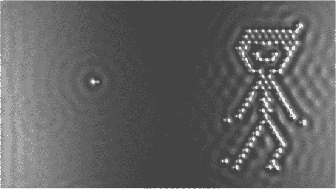

*图 16-1：IBM 操控单个原子创建图像*

这幅图像模糊且呈波浪状的特性源于量子效应。在这个尺度下，原子的位置和它们的运动方式变得固有地不确定。这些原子目前尚未作为晶体管或计算机使用，但它们可以用于数据存储，例如，IBM 最终希望将这项技术发展为基于单个原子的计算。

在我们达到这个尺度之前，但在传统半导体达到基本尺寸限制之后，像碳纳米管和石墨烯这样的纳米技术可能会被用来制造更小的晶体管；这是目前的研究领域之一。2022 年，清华大学的研究人员制造了一种大小相当于单个碳原子的石墨烯晶体管，其运行速度比硅晶体管快上百万倍。

#### *3D 硅架构*

传统的芯片布局是 2D 的，需要大量的图论和复杂性理论来优化设计并最小化布线。正如我们在图 4-19 中看到的，当前的 CPU 可以通过几层*重叠*的铜线制作，其 3D 结构大大减少了布线。现代芯片仍然将晶体管放置在芯片的单层底部，但允许在其上形成几层（通常为 2 到 10 层）导线，导线之间通过填充材料隔离。

今天的基础层叠技术有可能逐步发展，添加越来越多的导线和晶体管层，最终从 2D 硅芯片过渡到完全的 3D 硅立方体。

然而，硅立方体将会在电源供应和热量处理方面产生问题，需要类似大脑血液供应系统的东西，围绕计算元素来输入能量并将热量从密集的 3D 结构中排出。目前我们还不知道该如何实现这一点。芯片设计界一直专注于 2D 布局问题，以至于不清楚如何转向 3D 思维。

RAM 通常比处理器有更低的使用率和热量需求，因为在大多数时间里，它只是在串行计算机中处于空闲状态。因此，制作 3D RAM 比制作 3D CPU 要容易。近期已有商业尝试做 3D RAM，如美光的混合内存立方体。

3D CPU 设计的一个灵感来源可能来自今天的*Minecraft*游戏社区。*Minecraft*可以充当一台强大的计算机，使用其红石元素作为开关。粉丝们已经在其中构建了几个功能齐全的 CPU 组件，类似于图 4-19，甚至还有完整的 CPU，如“ANDROSII”。与以前的世代不同，这些玩家在*Minecraft*的固有三维性中成长，因此他们不再将处理器布局在 2D 电路板或集成电路中，而是本能地发展出固有的 3D 架构来优化布局，完全摆脱了制造限制和硅工业中固有的 2D 思维。

#### *10,000 年记忆*

当你去世后，你的数据会发生什么？会有人能够在数千年后读取你的文件或查看你的录像吗？甚至是在 10 年后？

我们之前看到的 4,000 年前的泥板（图 1-5）至今仍然完全可以阅读。相比于泥板，纸张在速度和容量上是一次进步，但它的保存时间较短。随着存储技术的发展和微型化，它变得更快，容量更大，但也牺牲了耐用性，无论是对物理腐蚀的抵抗力，还是对“位腐化”或其他技术不兼容的抗性。我们看到的所有三级和离线存储选项，在 100 年后都会衰退。商业数据中心通过不断将数据复制到新的物理介质上来保持数据“活着”。旋转硬盘会损坏并被更换；磁带和光盘会退化并被更换。但这依赖于人类维护者的持续关注，这些维护者由一家依然存在且不会破产或被新老板收购的公司雇佣，而新老板又不想继续维护它。

目前的研究工作正在努力寻找像泥板一样耐用，但能够适应现代数据规模的长期存储选项。M-disc 是一种新的光盘格式，向后兼容 Blu-ray，声称可以将 100GB 数据保存 1,000 年。2018 年，Arch Mission Foundation 将一张 DVD 大小的镍盘存放在月球表面，盘中包含了维基百科的完整备份以及其他一些被认为在地球发生全面数据丧失时能够帮助重启人类的文档。他们声称这项存储可以持续至少 10,000 年。南安普顿大学开发的玻璃激光纳米结构技术，可能在 1 英寸立方体的硬玻璃中存储 350TB 数据，且寿命可达 140 亿年。这一概念类似于你在玻璃奖杯中看到的 3D 刻痕，激光深刻地刻入其结构中。

激光也可能被用来进行计算，就像在光学架构中一样；我们现在将讨论这些内容。

### 光学架构

我们大多关注的是基于电子流动的计算机。电子有质量，因此它们的速度必须低于光速。为了赋予电子动量，必须提供能量以使它们能够移动。另一方面，光没有质量，因此它的速度比电子快，以光速（约每秒 3 亿米）传播。由于这是宇宙中所有事物的物理速度极限，自 1960 年代以来，研究人员就一直在探讨我们是否可以用光而非电子进行计算。像电流中的电子一样，光也是以离散的单元——*光子*——存在的，研究如何操控光子的工程学科被称为*光子学*。

#### *光学晶体管*

电流的速度与电子本身的速度不同；电流通常在每个电子只移动少量距离的情况下流动，通过推动下一个电子前进。电子通过导线时，它们处于一个复杂的环境中，经历许多碰撞，随机地来回运动。单个电子在导线中漂移的速度因此非常慢，大约是每小时 1 米，而铜线中电流的速度可以接近光速的 90%。因此，天真的期待光速比电子计算快似乎过于乐观；为了仅仅提高 10%的速度，从 90%到 100%的光速，全盘更换硬件技术似乎并不太有用。

然而，光学系统有不同的优势：由于光传播中的噪声较低，相比电子，光学系统具有更高的吞吐量和更低的能耗。这就是为什么我们已经使用光来进行常规的高带宽、长距离网络通信——即光纤。光学计算似乎并不那么遥不可及，尤其是当你记住你大部分的互联网和电话流量已经通过光纤在全球传输时。

仅仅是信息传输与实际计算的区别在于，计算中，数据元素需要通过某种类似晶体管的设备进行物理互动，从而构建逻辑门和其他架构层级。然而，光学计算的关键问题在于，光子不会自然相互作用。在物理学术语中，光子是玻色子而不是费米子，这意味着如果两个光子“碰撞”，它们会直接穿过彼此，而不是相互反弹。这对于光通信来说是好的，但对于光计算来说就不太合适。

要制造光学晶体管，我们需要某种形式的电光混合技术，其中光子可以与电子相互作用，反之亦然，以执行计算。然而，光子与电子之间的能量传递是缓慢的，而且会消耗能量。目前，这样的设备存在于大型光子实验室中，使用激光和精密设备在光学工作台上搭建。这些系统占据整个房间，仅实现了几个混合的光电晶体管。它们的规模让人想起 20 世纪初的早期电子计算机。但像那些大型电子计算机一样，研究的目标也是在基本原理确定后将它们微型化，可能通过类似于传统电子技术中使用的光刻（芯片掩膜）工艺；目前的计划是使用硅作为电子基板，类似于传统芯片。

#### *光学相关器*

*光学相关器*（或*4f 系统*）是光学计算的一个特殊案例，近年来变得非常实用。与其说它是“强大的教堂计算模型”，不如说光学相关器用于一个单一目的：实现并加速一个单一算法，*离散傅里叶变换（DFT）*。DFT 将空间和时间序列数据流（例如声音和视频编解码器中的数据）转换为基于频率的表示。它使用这个方程：

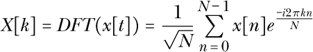

对于音频信号，DFT 的结果大致对应于生成信号的基础频率。对于图像和视频，它们大致对应于在识别和压缩中有用的不同纹理。这是一个如此基础的操作，且使用如此广泛，以至于值得使用专用硬件进行优化，正如目前许多 CISC 和 DSP 指令所做的那样。

DFT（离散傅里叶变换）的一个关键计算特性是它加速了卷积（或滤波）的常见操作。对于一维信号，卷积被定义为：

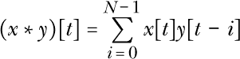

这里，*N* 是信号 *y* 的长度。直接实现这个方程会导致 *O*(*N*²) 算法，尽管基于数学上等效的方程重排，*快速傅里叶变换（FFT）* 是一个更快的 *O*(*N* log *N*) 算法。FFT 是已知的最快的离散傅里叶变换实现方法，适用于串行计算机；它被称为“我们这一代人最重要的数值算法”。

源域中的卷积相当于傅里叶域中的乘法。因此，与其在原始域中卷积两个原始信号，不如同时对它们进行傅里叶变换，乘积这些变换，然后使用最终的 DFT 将其转换回原始域：

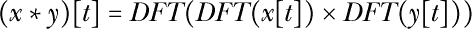

当一束激光光线通过一个微小的孔时，它会被*衍射*，在另一侧产生衍射图样。可以证明，如果这束光信号通过一个透镜，并且透镜位于距离图像焦距 *f* 处，那么在透镜的另一侧同样距离 *f* 处，会形成一个图像，这个图像恰好是原始图像的 DFT。这是衍射和透镜数学的一个意外且巧合的特性，但一旦发现，它提供了一个超快速的、*O*(1) 的物理设备，能够以光速计算 DFT。

一旦我们得到了这个傅里叶图像*X*，就可以通过与滤波器*Y*的离散傅里叶变换（DFT）逐点相乘来实现卷积，时间复杂度为*O*(1)。我们在离线时预计算*Y*并制造一个物理滤波器——就像放置在舞台灯光前的彩色滤光片，用来改变灯光的特性。对于大多数数字信号处理（DSP）应用，如视频处理，我们希望在快速的序列中将相同的滤波器*y*应用于多个图像*x*，因此我们只需计算一次*Y*。通过这个物理滤波器传递光图像*X*的效果，相当于将其乘以*Y*，这在原始领域中等同于卷积*x* ∗ *y*。离散傅里叶变换（DFT）是自反的，因此为了获得最终的卷积结果，我们将图像通过第二个镜头，该镜头具有相同的焦距，再次位于输入和输出距离*f*的地方。最终结果可以视为位于原始输入距离 4*f*的位置（因此称为*4f 系统*）。完整的系统，如图 16-2 所示，以*O*(1)时间计算固定*Y*的整个卷积，速度为光速。

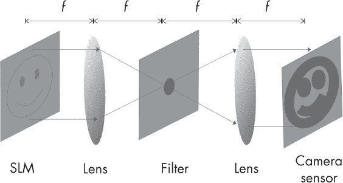

*图 16-2：一个 4f 滤波器结构*

这种结构自 1960 年代以来就已为人所知，但直到最近才通过借助资金充足的商业智能手机屏幕技术变得实际可行。它需要通过非常小且高分辨率的图像来过滤激光光线，既要创建初始输入图像*x*，也要创建可变的滤波器模式*Y*。*空间光调制器（SLMs）*是一种类似于 4K 智能手机显示屏的显示技术，最初是为高端数字幻灯片投影仪设计的。这些投影仪的 SLM 几乎可以直接拿来使用，用于创建快速、高效的输入和滤波显示，适用于 4f 滤波器。为了完成设置，还需要一个图像传感器来读取最终卷积图像。智能手机数字相机 CMOS 传感器的开发几乎与显示技术对称，提供了所需的相似分辨率和帧率，并且也可以直接使用。以本文撰写时的技术水平，这些组件构建的系统可能使用 4 百万像素，并以 15 kHz 的帧率运行。

#### *光学神经网络*

实际的光学相关器与深度学习共同出现，后者彻底改变了商业机器学习。到目前为止，深度学习一直是运行 1970 年代的神经网络算法，依赖于快速的并行 GPU 架构。然而，在许多情况下，使用光学相关器可以大大加速这些过程。这是因为许多问题，尤其是图像和视频中的物体识别，具有空间不变的结构，这意味着图像的特性不会因为观察图像的不同部分而有显著变化；类似的物体会出现在图像的各个位置。这种结构使得*卷积神经网络（CNNs）*可以在网络每一层的所有节点中使用相同的权重。数学上，这种效果是，每一层网络可以看作是用一个单一的权重向量对该层的输入进行卷积。因此，计算这些卷积成为这些神经网络的主要工作操作。

光学卷积神经网络（CNN）首次的实际演示出现在 2018 年，英国公司 Optalysys 目前正在通过生产消费级光学相关器原型来实现这一技术的商业化，如图 16-3 所示。

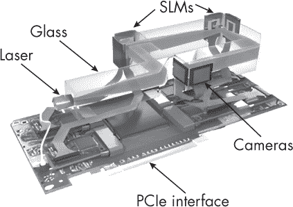

*图 16-3：光学相关器 PCIe 卡*

该设备现在可以插入桌面 PCIe 插槽，替代 GPU 用于深度学习和其他应用。

### DNA 架构

从 2000 年左右开始，实验室开始研究*DNA 计算*，作为通过大规模生物并行性解决复杂计算问题的一种方式。DNA 分子，如同在活细胞中发现的那样，可以被视为（根据对表征的理解）执行计算，并且已经证明它们可以编码并高效地解决计算上 NP 难的难题，例如旅行推销员问题。为了理解 DNA 计算，我们需要一些背景信息。

DNA（脱氧核糖核酸）是地球上生命的“源代码”。在细胞生物体中，每个细胞包含一套完整的整个生物体代码（基因组），并以大分子的双螺旋结构（染色体）存在于细胞核内。

DNA 分子中编码的信息的部分小片段（基因）被复制（转录）到 RNA（核糖核酸）分子上，RNA 分子随后离开细胞核，形成特定蛋白分子构建的工作站。这些蛋白分子构成了生物体的实际形态。这个过程被称为分子生物学的*中心法则*：DNA 制造 RNA；RNA 制造蛋白质。

DNA 双螺旋梯子的每一阶由一对匹配的*核苷酸*构成，这些小型有机分子（大约 20 个原子）有四种类型：A、T、C 和 G。每种类型都有一个配对伙伴：A 和 T 配对；C 和 G 配对。人类有 23 对染色体，共包含大约 30 亿对核苷酸。因此，DNA 使用基数为 4 的数据表示法，符号为 A、T、C 和 G，人类基因组的源代码约为 6 吉比特。这与操作系统的大小相似，而且像操作系统一样，人类基因组已被分发到一张单独的 CD-ROM 上。

DNA 技术曾经非常昂贵；例如，在 2001 年，测序第一个人类基因组花费了 1 亿美元。但近年来，其价格迅速下降，2015 年降至 1,000 美元，2023 年降至 100 美元。这一价格下降意味着现在是考虑将 DNA 作为计算介质的好时机。

#### *合成生物学*

与自然界中使用 DNA 存储用于制造蛋白质的源代码不同，*合成生物学家*可以利用 DNA 来表示、编辑、选择和复制任意数据。这使得可以使用 DNA 数据表示和处理来构建“教堂计算机”。

DNA 的 ATCG 字符串可以通过剪切、拼接和插入符号来编辑，就像在 ASCII 文本编辑器中一样。这是通过使用定制的酶来促进所需的反应来完成的。现在，一小部分这些酶已为人熟知，并且可以常规使用来执行这些操作。

至于 DNA 链本身，现在令人惊讶的是，生产你自己任意序列的 DNA 已经变得异常容易，这些序列可以用来以 ATCG 符号的字符串形式在基数为 4 的系统中存储和计算。现在几乎可以在家中完成这一操作，方法是使用经过改装的消费级喷墨打印机，其中的青色、品红、黄色和黑色（CMYK）墨水被 ATCG 分子溶液取代。DNA 制造也可以在工业化化学规模上进行，制造大量相同或相关的分子，液体的体积可以达到一个游泳池的大小。想象一下，一杯水中大约包含 10²⁴ 个水分子，这比世界上所有数据位还要多。

信息可以通过电泳从物理 DNA 中读取，电泳是用于犯罪现场调查中的 DNA 指纹识别的相同技术。*聚合酶链式反应（PCR）*也提供了一种方法，从大量不同的 DNA 链溶液中选择并复制某一特定 DNA 链，这相当于从字符串中提取子字符串。

#### *DNA 计算*

在计算上，PCR 提供了一种快速搜索算法。如果我们能够制造一种液体，包含数十亿条链，每条链编码计算问题的不同候选答案，那么我们就可以使用 PCR 快速筛选并读取正确答案。

PCR 是一种链式反应，意味着它会持续进行，并且随着时间的推移呈指数级扩展其效果。如果混合物中仅包含一个含有搜索字符串的 DNA 链，那么该链会被复制，然后每个副本也会被复制，依此类推，直到几乎整个液体中充满了数十亿个答案的副本。这意味着，通过电泳分析的液体样本几乎肯定会显示出所需的结果。

1994 年，Leonard Adelman 成功使用 DNA 计算解决了七城市旅行推销员问题。旅行推销员问题是一个经典的 NP-困难问题，要求找到一条最短路线，使得某人可以访问每个 *N* 个城市并返回家中，给定它们之间的距离矩阵。Adelman 用一短 DNA 字符串表示每个城市的身份，然后将这些标识符连接起来表示路线。

与标准旅行推销员问题的表述一样，最短路线问题被重新表述为 *O*

*(n*) 一系列布尔问题，形式为“是否存在一条长度小于 *n* 的路线？”这个问题，以及城市之间的距离度量，被编码为引物，只与表示具有所需属性（即长度小于 *n*）的路线的 DNA 链结合。对于每个 *n*，准备了一种化学溶液，其中包含每条可能路线的多个副本，在一个人类规模的槽中。引物被混合其中，然后应用 PCR 放大任何成功的结果。使用电泳读取结果。这种方法能够为 *N* = 7 个城市找到最短路线。

这并不意味着 DNA 计算机上 *P* = *NP*；随着时间的推移，这是 *O* (*n*)，但仍然需要按分子数量呈指数级的资源。只是 DNA 中有很多分子可用。因此，DNA 能够解决比其他技术更大规模的 NP-困难问题，但像所有技术一样，仍然会有由于 NP-困难的特性而导致问题规模过大的情况。

当前的研究正在尝试将 DNA 计算架构从生物实验室中的槽中转移到微型化的生化芯片上，这些芯片将更像正常的硅计算机运行。DNA 计算似乎不太可能取代电子学来处理日常计算任务，例如运行桌面应用程序，但它可能作为科学计算中的协处理器，在解决大型、困难的计算问题时变得有用。

### 神经架构

神经科学自至少约翰·冯·诺依曼的*EDVAC 草案报告*以来，便对计算机架构产生了重要影响，该报告直接从许多神经学的思想中获得灵感。硬件神经网络已经研究了几十年，但 2010 年代它们随着用于深度学习的 GPU 的出现而快速发展。在 2020 年代，NPUs 开始出现在移动电话和云端，专门用于机器学习。计算神经科学研究仍在继续，可能会激发出根本不同的计算机架构，超越目前深度学习中使用的神经网络。像所有计算机架构一样，我们将在多个层次的层级中考虑大脑的架构，从其晶体管的等效物，到神经元（脑细胞），再到其计算机设计的等效物。

#### *晶体管与离子通道*

回想一下，晶体管是一种数字开关，现代芯片中直径大约为 10 纳米。它有输入和输出，如果你激活开关，电流就会在它们之间流动。我们已经看到，晶体管通过平衡几种化学和物理力来工作，开关通过打破这一平衡来允许电流流动。晶体管（以及一般的芯片）是由以硅为基础的半导体制成的，硅与邻近的原子形成四个化学键。真正理解晶体管需要化学和量子力学的知识。

脑中类似于晶体管的结构不是神经元，而是*离子通道*，它是神经元的一个子组件，如图 16-4 所示。

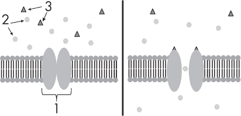

*图 16-4：离子通道的闭合状态（左）和开放状态（右）。配体（3）与通道（1）结合，打开通道，允许离子（2）通过。*

离子通道是单分子数字开关，直径约为 10 纳米，由蛋白质构成，嵌入神经元的膜中。根据其开关状态，它们要么允许某些化学物质在神经元的内外之间流动，要么不允许。它们的开关状态由电力和化学力的平衡决定，当另一个化学物质与离子通道结合，或者当电压施加到通道上时，这一平衡可能被打破。

离子通道（以及大脑整体）是基于碳的，碳与邻近的原子形成四个化学键。与晶体管类似，真正理解离子通道需要化学和量子力学的知识。

#### *逻辑门与神经元*

神经元（图 16-5）通常被认为是大脑中计算的基本单元。

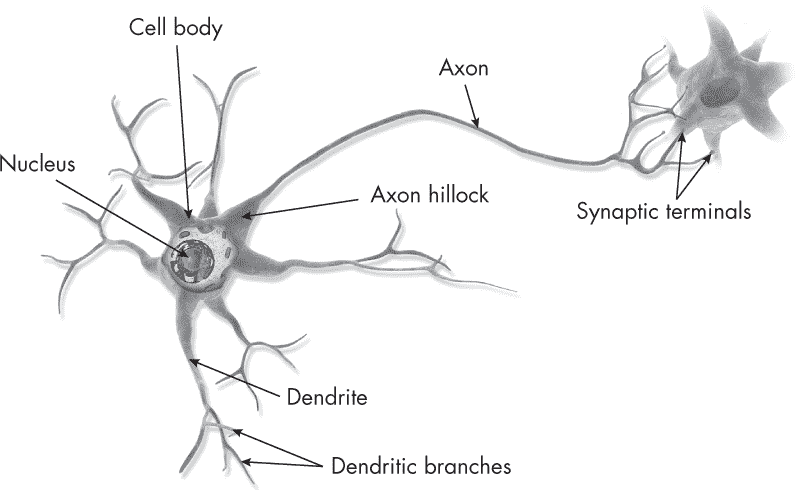

*图 16-5：神经元*

神经元的直径约为 1 微米。从计算角度来看，它们由许多离子通道构成。它们还拥有许多其他支持其存在和能量需求的细胞结构。它们像盒子一样，接收多个数字输入并产生一个数字输出，稍微类似于图 6-2 中看到的多输入与门。多输入与门的功能可以通过布尔代数方程式来数学化表示：

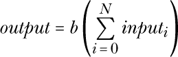

这里，*b* 是布尔“求和压缩函数”：

*b* (*x*) = (*x* ≥ *N*)

诸如多输入与门这样的逻辑门是时钟控制的，因此它们的输入和输出仅在短时间内有效，直到下一个计算开始。

在简单的计算模型中，通常用于当前机器学习神经网络—并像第十五章中的 GPU 内核那样编码—一个单一神经元的功能假定由以下方程给出：

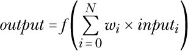

这里的 *w* 是在学习过程中调整的权重值，*f* 是相同的压缩函数：

*f* (*x*) = (*x* ≥ *N*)

这个符号表示法假设其中一个输入被永久设置为 1，而不是包含任何实际数据。这个特殊的输入被称为 *偏置* 或 *附加* 输入；它是大多数神经网络模型正常工作的必要条件。

神经元通常会“激发”短时间，因此它们的输入和输出仅在短时间内有效，直到下一个计算开始。与逻辑门不同，神经元通常会有大量噪声，这可以通过向其输入添加随机数来建模。一些模型认为这些噪声是其计算中的一个重要概率性因素。

这是一个非常简单的神经元功能模型，与其密切相关的模型在当前的机器学习应用中表现良好，比如我们在第十五章中构建的 *f* = *reLU* GPU 神经元。然而，真实的生物神经元有数百种不同的形态和大小，可能具有更复杂的行为，这些行为被认为包括更复杂的计算，如求和、乘法、除法、指数运算、对数、时间记忆和过滤。这个学派强调神经元作为完整的活细胞和计算单元的复杂性，并提醒我们其他单细胞生物如细菌和海绵细胞所执行的复杂计算。

#### *铜线与化学信号*

让我们将大脑的线路与芯片的线路进行比较。在芯片中，我们首先通过光刻技术在二维平面上铺设一层层的晶体管。在现代芯片中，我们接着在晶体管上方铺设几层重叠的铜线，以便它们之间相互连接，正如我们在图 4-19 中看到的那样。通过这些线路的通信非常快速且精确，因为它完全是电气传输。信息是数字化的，这意味着线路的电压要么高，要么低，可以看作代表 1 或 0。

神经元通常是长的延伸细胞，包括一个长长的*轴突*部分，它充当信息传递的电线。人类的轴突长度从 1 微米到 2 米不等——最长的是连接你的脚趾和大脑的轴突。通信过程缓慢且噪声较大，因为信息沿着轴突传递时需要通过复杂的生化过程，这个过程中离子通道的开闭将化学物质带进或带出细胞。当轴突的末端与另一个神经元连接（在一个叫做*突触*的接点处）时，发生第二个生化过程，第一细胞释放的化学物质进入第二个细胞。信息是数字化的：轴突要么放电，要么不放电，这可以看作代表 1 或 0。从架构角度看，一个完整的神经元就像一个逻辑门，只有一根长输出线。

#### *简单机器与皮层柱*

下一个架构层次是简单机器层次。在人工设计的计算机中，简单机器由若干逻辑门组成，共同执行某个单一的有用功能。有许多不同类型的标准简单机器，如加法器、解码器和寄存器，每种机器都专门用于某一特定任务。典型的简单机器可以通过 TTL 芯片布置，就像我们在图 5-13 中看到的那样。

这是大脑架构中理解最少的层次，因此也是科学研究中最激动人心的话题。一些研究者认为，人类的皮层完全由重复的*皮层柱*微电路组成，每个微电路由几百到几千个不同类型的生物神经元实例构成，这些神经元占据直径约 20 微米、深度为 2 毫米的圆柱形结构。

形成皮层柱微电路的神经元排列在六个不同的皮层层次中，并且总是以相同的特定方式连接，正如在图 16-6 中所示。我们了解不同类型的神经元群体之间的连接，但并不了解单个神经元之间的连接方式或这些连接的权重。图 16-6 中的结构与图 6-22 中看到的 RAM 在某种程度上有一些表面上的相似性。

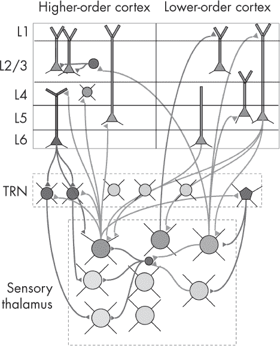

*图 16-6：皮层微电路架构*

一些计算机科学家推测，这些微电路可能作为概率计算或其他计算的构建块。模块电路的精确接线仍不明确，需要脑成像技术的进步，才能运行“调试器”来了解它究竟在做什么。与数字逻辑微电路不同，似乎只有这一种皮层微电路，它在整个皮层中都被使用。逆向工程皮层微电路是 21 世纪最大的科学挑战之一。这需要计算机架构师和他们的经验来帮助建议计算功能，生物神经科学家来收集数据并与生物学知识相结合，物理学家来设计能够看到这些数据的新实验设备。破解其密码的人，可能会获得诺贝尔奖。

#### *芯片与皮层*

在结构的最高层次，皮层与芯片惊人地相似。这是因为它们都布局在二维平面上，并由多个相互独立的模块组成，这些模块之间有连接。对于芯片，我们习惯于看到像图 11-5 这样的二维布局。而对于大脑来说，这一点不太明显，因为皮层的二维薄片像一张废弃的纸一样被揉成三维形状。不过，它可以很容易地被展开，平铺在二维表面上，展示出其真正的结构（图 16-7）。正是这张薄片包含了前面提到的六层微电路。

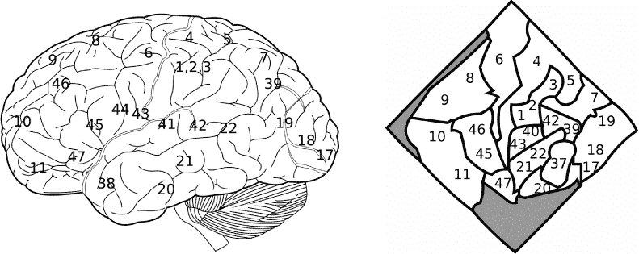

*图 16-7：皮层看起来是三维的（左），但展开后它变成了二维薄片，就像纸页或硅芯片（右）。这些模块，称为布罗德曼区域，用数字标注。*

皮层的模块被称为*区域*，大多数已与特定功能和活动相关联，比如视觉、听觉、触觉和规划。在每个模块内，连接性总是遵循皮层微电路架构，并且（可以说）有柱状结构，（可以说）每一列内的连接性较强，而列与列之间的连接性较弱。大多数模块有大量的轴突束，将输出信息发送到其他模块。投射总是从这些模块的相同层发送并接收，作为微电路的一部分。我们知道哪些模块向其他模块发送输出，但并不清楚它们内部哪些神经元之间有具体的连接。

这与芯片架构非常相似，芯片通常也有数十个模块化组件，每个组件内部有强连接，而组件之间的连接则是有限的束状连接。现代芯片有几层 3D 打印的铜线，将组件连接在一起，共享大脑的基本 2D 布局和 3D 连接，将不同区域联系起来。然而，一个重要的区别在于，大脑的所有组件区域共享相同的层级和柱状结构，而芯片的组件区域通常包含完全不同的设计。

#### *并行计算与串行计算*

想想 CPU 或大脑皮层中模块是如何连接的。CPU 本质上是串行机器，设计用来按顺序执行指令程序。因此，CPU 有一个明确的设计层级“顶端”，即控制单元，作为执行单元，告诉其他模块该做什么以及何时做；我们在图 7-13 中看到过这个。

大脑皮层也有层级结构，额叶区域被认为与执行控制相关，而后部（后方）区域更多与感知和行动的执行有关。每种感觉的感知和行动（如视觉、触觉等）被认为由一系列层级区域组成；例如，低级视觉区域处理边缘和角落，高级区域则识别面孔和命名的人物。这些区域都是并行工作的，并且它们由并行运行的柱状结构组成。额叶区域似乎协调整体活动，但当额叶区域受损时，感知和行动区域仍能独立运作。

这些模块都不会主动工作，除非由*丘脑*触发，丘脑在这个上下文中看起来和作用类似于一个 CPU 控制单元，可以在图 16-6 的下部看到。

虽然模块们直接传递信息，但它们也与丘脑的区域进行通信，丘脑似乎镜像了这些区域的结构，并起到开关它们并解决它们之间冲突的作用。

当你反思自己在计算复杂的高级感知和行动规划问题时的主观经验时，可能会发现你的大脑像一个串行机器一样运作，按顺序想象和测试不同的假设和行动。这一观察可以通过更客观的证据得到支持：在实验室中，其他人执行这些任务时通常需要*O(N)*的时间。然而，从内部来看，我们也认为大脑是一个大规模并行系统，所有神经元可能同时都在工作。这与最初把 CPU 看作一个串行处理器，然后再将其看作一个大规模并行的数字逻辑电路类似，在这个电路中，所有数十亿个晶体管也可能同时工作。大脑和 CPU 外部都拥有外部模块，无论是通过脊髓还是总线连接。

*海马体*是皮层中的一个特殊部分：它位于层次结构的最顶端，其微电路与其他部分稍有不同。海马体没有处理数据并向更高层发送数据的皮层层次，而是有不同的层次，分别称为 DG、CA1 和 CA3，这些层次包含反馈连接，将通常是输出的部分连接回自身。与其将计算结果发送到更抽象的处理层次，不如将其通过*时间*传送到皮层中的同一、功能上最高的区域。基于海马体的计算架构已经被开发出来，假设它作为一种时空记忆的形式。这些架构使机器人能够导航并绘制周围的空间和物体。

在电子时代，建筑师一直被大脑所吸引并受到启发。当前对深度学习的兴趣将这些联系带入了主流架构，例如现在许多手机中都配备的神经处理单元。这些架构大致上基于神经元模型和层次化的皮层区域。但正如我们所看到的，真实的大脑包含了更多复杂性——离子通道、皮层微电路和从并行结构中涌现的串行计算——这些可能为未来的进展提供灵感。哲学家们常常争论，任何基于硅的脑结构模拟是否能够完全复制人类的智能或意识。反对者通常会引用一些物理学特性，这些特性在硅中通常并不出现，比如量子效应。然而，计算机科学家们也开始探索在计算中应用这些效应，我们将在接下来的部分看到。

### 量子架构

量子计算基于量子力学的物理学，而量子力学以其著名的奇异性和反直觉性为人所知。在量子力学中，物体不再具有精确的位置或速度；相反，它们以波动状态存在，涵盖了许多可能的位置和速度。这些状态定义了在你观察物体时，物体出现在某个位置或速度的概率。量子概念真是令人震撼，并且会从根本上改变你对现实、因果关系和时间的整体看法。

量子力学或量子计算的完整介绍超出了本书的范围。在这里，我只能提供一些概念的概述，并简要展示基本方程的样子。然而，值得指出的是，现代量子计算可以在几乎不参考物理学中通常介绍的量子力学的情况下进行研究，这使得该领域相对更易于接触。特别是，计算机科学主要是离散的，处理的是 0 和 1 以及加法，而不是量子力学中典型的连续实数和积分。量子计算中使用的离散化数学只需要高中线性代数、矩阵代数、复数和概率。

#### *量子力学的卡通版*

以下内容*不是量子力学的正确展示*，仅作为卡通形式介绍一些关键概念。

假设世界中的物体不仅仅在某一时刻存在于单一状态。例如，盒子里的猫可能同时既站着活着，也躺着死了。这个著名的例子被称为*叠加态猫*。假设这只猫被锁在盒子里，旁边还有一块放射性物质。放射性物质的衰变是完全随机的：它的行为无法以任何方式预测。在它旁边放置一个辐射衰变探测器，并与一个机制连接，该机制在探测到辐射时释放毒气到盒子里，杀死猫；如果没有探测到辐射，猫则仍然活着。

你将这个实验装置放置一旁，比如说 10 分钟。你可能对辐射的强度有所了解，因此可以说在 10 分钟后，某种概率（比如 20%）下发生了衰变，猫已经死了，另外某种概率（比如 80%）下衰变没有发生，猫还活着。我们可能会用以下分布表示猫的当前“状态”：

*猫* = {*活着* : 0.8, *死了* : 0.2}

按经典物理学的理解——即不考虑量子力学——你通常会认为这个分布是你自己*知识*的属性，而不是*世界*的属性。你会假设猫实际上只处于一个状态，要么活着，要么死了。只是你的大脑不知道是哪种状态，因此*它*（你的大脑）包含一个模型，带有这两种状态和它们的概率。

在量子力学中，情况绝对且明确地*不是*这样。猫的两个版本不仅仅存在于你的脑海中，它们在某种意义上也都真实地存在于这个世界上。大致而言，我们想象有两个现实版本——一个是猫活着，另一个是猫死了——它们共同存在，直到你打开盒子的那一刻。当那个时刻到来时，现实“决定”哪个状态将成为实际状态，随机地但根据概率，另一个状态则永远消失。我们说，你观察猫的行为改变了它的状态，从两个版本的存在转变为单一版本的存在。

现在我们有了基本的概念，让我们来看一下数学版本。你不需要理解本节其余部分中所有的数学符号、技术术语或命令。如果你熟悉线性代数和复数，那么你可以跟随细节，但如果不熟悉也没关系，只需大致浏览一遍，感受一下这个领域的风貌。

#### *量子力学的数学版本*

量子力学的正确表述由四条规则组成：叠加、观察、作用和组合。

#### **叠加规则**

物体存在于状态的*叠加*中，每个状态都有一个复数幅度，其平方模长的总和为 1。例如：

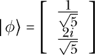

在这里，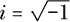和向量的行表示猫死（二维状态 0）和活着（二维状态 1）的幅度，分别是：

#### **观察规则**

当你在某一基底中观察状态时，它们会根据其*平方*幅度的模长随机地坍缩为观察基底中的某个基态。例如：

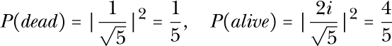

这些结果始终是介于 0 和 1 之间的实数，表示观察每种可能性的概率。

#### **作用规则**

对系统进行的任何物理操作，包括计算—除了观察—都可以通过一个幺正矩阵来建模。该矩阵通过普通的矩阵乘法作用于状态。例如，一个 NOT 门的操作通过一个矩阵来建模，该矩阵交换“死”和“活”状态的幅度：

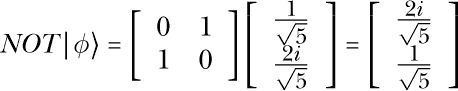

在这里，像所有幺正矩阵一样，NOT 矩阵保持了状态向量的特性，即根据观察规则，它们的概率总和为 1。

#### **组合规则**

将两个物体一起考虑时，它们的状态是由它们的张量积形成的联合状态：


量子力学和量子计算中使用的 |⟩ 符号称为 *Ket 符号*。对于离散计算机科学家而言，这仅仅表示一个列向量，在其他学科中，有时用下划线、箭头或粗体来表示。这个名字来自对单词 *bracket*（括号）的双关语。内积有时写作 ⟨***a***| ***b*** ⟩ = ***a^Tb***，这称为“括积”（braket）。如果我们写 ⟨***a***| = ***a ^T*** 和 |*b*⟩ = ***b***，那么我们可以将这两个新符号称为“bra”和“ket”，它们合起来就是“braket”。

#### *量子寄存器与量子比特*

我们能否利用平行世界中相互作用的平行现实的表面存在，作为一种平行计算的形式？如果我们能像在单一现实中分配多核 CPU 那样，把计算工作分布到平行现实中，并且找到一种方法将这些结果合并到我们自身所在的现实中，那么我们就可以利用这些平行现实中的巨大额外计算资源。我们可以构建一个单一的 CPU，让它在这些平行现实中同时计算许多事情，而不需要构建多个 CPU。这个思想最早由理查德·费曼在 1988 年提出，是量子计算的开端。

考虑叠加态的猫。我们可以利用猫的生死状态作为 1 位数据表示，通过编码 *dead* = 0 和 *alive* = 1 来表示。我们称之为 *量子比特*（*qubit*）。然后，我们可以通过将 *N* 只这种猫放在盒子里排列成一行，来建立一个 *N* 位寄存器，用来存储数据，就像基于触发器的经典寄存器一样。在打开寄存器中的盒子之前，存在多个现实，其中猫可能是生的，也可能是死的。当我们打开盒子时，我们只能看到一个现实版本，并且这成为了我们自己所经历的现实。

类似于经典寄存器，*N* 比特量子寄存器有 2^(*N*) 种可能的状态。整个寄存器的每一种状态都可以同时存在于一个“平行世界”中。这是比单纯的 *N* 只猫更多的状态集合。

你可以通过使用量子计算机模拟器（例如 QCF，量子计算函数）来进行实验。在 QCF 中，你可以从创建非叠加的寄存器状态开始，例如：

```
>> phi_1 = bin2vec('011')
[0 0 0 1 0 0 0 0]
```

结果输出显示了一个 3 位寄存器的状态向量，完全处于 011 状态（表示十进制数字 3）。在零状态 000 中的振幅为零；在第一状态 001 中的振幅为零；在第二状态 010 中的振幅为零；在第三状态 011 中的振幅为 1；其他状态（直到第七个状态 111）中的振幅也为零。

QCF 还具有一个命令，可以直接从表示的十进制数字创建类似的非叠加状态；例如，要创建一个完全处于表示十进制数字 5 的状态的 3 位寄存器，可以使用此命令：

```
>> phi_2 = dec2vec(5, 3)
[0 0 0 0 0 1 0 0]
```

到目前为止，这些只是一个经典 3 位寄存器能够存在的相同单一状态。接下来，我们可以模拟一个寄存器，它同时处于这两种状态的叠加态中，例如：

```
>> psi = [1/sqrt(2)*phi_1 + 1/sqrt(2)*phi_2]
[0 0 0 0.7071 0 0.7071 0 0 ]
```

要模拟对该寄存器的测量（观察），我们可以这样做：

```
>> psi = measure(psi)
```

这将随机产生以下两种输出之一，概率由平方幅度给出：

```
[0 0 0 0 0 1 0 0]
[0 0 0 1 0 0 0 0]
```

各个量子比特的状态不是独立的；它们是*纠缠*的。在我们的 QCF 示例中，前两位观察到的比特必须是 01 或 10；它们不能是 11 或 00。因此，如果你最初查看第一位并看到 0，那么当你稍后查看第二位时，你会看到 1，反之亦然。即使量子比特在两次观察之前被物理地传输到数百万英里远的地方，这种关系仍然成立。

我们示例中的寄存器可以被建模为同时存在于八个（即 2 的 3 次方位，3 位二进制数）状态中，跨越一组八个“平行世界”。随着寄存器大小的增加，世界的数量呈指数增长；例如，一个 64 位量子寄存器有 2⁶⁴ ≈ 2 × 10¹⁹种状态，这与 64 位机器的整个地址空间中地址的数量相同，所有这些状态都同时存在于一个寄存器中。

物理学家通常不喜欢用“平行世界”来讨论问题。相反，他们更喜欢“闭嘴并计算”，以预测特定情境的结果：一旦给定了系统进行分析，这一切都只是数学。然而，为了*创建*新的量子程序，计算机科学家将寄存器的每个状态视为存在于平行世界中是很有用的。以这种方式思考有助于你可视化你正在创建的内容，并为下一步的创造提供灵感。

#### *跨世界计算*

状态的幅度，而不是内容，可以以某些方式相互影响，这些影响在量子力学的规则下是非常有限的，从而使得在计算过程中平行世界之间能够相互作用。量子计算中的亿万富翁问题始终是：我们如何读取回结果？我们只观察*一个*平行世界，且所得到的是随机的，因此我们需要找到机制，确保我们想要看到的结果存在于所有世界中，或者我们观察到的世界恰好是那个包含单一结果副本的世界。

例如，我们可能尝试通过叠加一个寄存器来并行化旅行商问题，以便每个世界都将寄存器的一部分编码为不同可能路线的路径。在每个世界内，我们计算该路径的长度并将其存储在寄存器的另一部分中。然后，我们回答一个问题，比如“这条路径的长度是否小于 5？”并将结果作为一个比特存储在寄存器的第三部分中。但是，我们的任务是回答关于所有可能路径的问题，例如“是否有任何路径的长度小于 5？”这是存储在所有世界中的信息的函数。

找到一种方法，将所有信息集中到一个地方，这样我们就能保证，或者至少有可能，在进行观察时能够看到这些信息，是量子算法设计的难点。根据我们目前的理解，这些方法都会引入巨大的计算复杂度开销。因此（再次强调，根据我们目前的理解），量子计算机无法使*P = NP*，但它们*可以*加速*NP*问题，将其复杂度降低到*NP*内部。大多数量子算法，如*格罗夫算法*，通过逐步更新状态振幅来工作，从而使所有不希望看到的世界互相抵消，只有我们希望看到的世界以较大的概率出现在实际世界中。这与 DNA 计算中的 PCR 方法类似，它也通过时间推移来进行计算，以放大所需的解，牺牲其他的解。一些研究人员认为，量子计算机通过这种方法将提供一个通用的加速效果！图像，但仍需要理论来确认这一点。

一些特定问题，例如破解公钥加密，已知由于其结构特别与量子规律匹配，具有更大的加速效应。找到并分类这些特殊案例是当前的研究课题。

#### *实用量子架构*

小规模量子计算机，只有几个量子比特，已经成功构建并展示了其概念的可行性。更大规模实用量子计算机的主要障碍是*去相干*。这是一个问题，*任何*超叠加系统与外界之间的相互作用都倾向于将超叠加扩展到那个事物上，再扩展到周围的世界。超叠加的量值大致像是一个固定资源，因此一旦它从计算机中泄漏出去，它就消失了，无法再用于计算。量子工程师正在努力设计方法，将量子系统与外界的影响隔离开来。这与核聚变问题有些相似，在核爆炸发生后，我们尝试用磁场来控制和保持它与周围环境的隔离。

*绝热量子计算*有时在媒体中报道——特别是由 D-Wave Systems 公司报道，该公司已成功将设备销售给谷歌和美国政府——成功地使用 1000 个或更多比特进行量子计算。然而，绝热量子计算并不是我们所讨论的那种量子计算。它是一种基于完全不同数学模型的物理过程，假设时间是连续的，而非离散的，因此在任何给定的时间间隔内可以进行无限次观察。与量子计算完全相反，它依赖于观察（或者在某些观点中是退相干）持续进行，而不是试图将系统与观察隔离开；观察本身构成了实际计算的核心部分。许多量子计算研究人员对此类说法持高度怀疑态度，指出在计算机科学的历史上，有许多自称通过类似假设在有限时间内进行无限计算的模型解决了*P = NP*问题的“异端”。

*罗斯定律*被提议作为摩尔定律的量子版本，假设目前在工作中的量子计算机中的量子比特数量每两年翻一番。

### 未来物理架构

除了目前所称的量子计算之外，我们还可以更广泛地转向现代物理学，问问它发现了什么其他内容，也许可以用于构建计算机器。

我们当前最佳的物理学理论——*标准模型*，基于*量子场论（QFT）*，将量子力学与特殊相对论（但非广义相对论）结合起来，将现实世界建模为由一组场组成，每个场覆盖空间并相互作用。每个场大致对应一种类型的粒子，和基础量子力学一样，其幅度表示在我们寻找粒子时，在某个位置发现该粒子的概率。与基础量子力学不同的是，这些场还能够表示在不同位置发现多个粒子的概率，而且这些粒子能够相互作用并以各种方式相互转化。

标准模型规定了特定的场和相互作用，形成了一个含有 17 种粒子的量子场论。（更准确地说：这些场是一个规范量子场，包含了单位积群*SU*(3) × *SU*(2) × *U*(1)的内部对称性，17 种粒子类型则作为这些场中的模式出现。）标准模型自 1960 年代以来就已通过实验验证，并且自那时以来没有改变。CERN 于 2012 年确认了最终的希格斯场。现在已知一些异常现象，提示可能会有更好的模型在未来被发现。

像 CERN 这样的粒子加速器已经完善了不仅能够观察，而且能够控制场中个别粒子的能力。不同类型粒子的束流可以可靠地产生，彼此碰撞或与测试物体碰撞，且可以观察到从碰撞中飞出的单个粒子。

因此，粒子物理学催生了粒子工程，在这一领域，这项技术不再用于做科学，而是用于为其他目的构建实用的工程系统。各国政府已经资助粒子物理学研究了许多年，这并不是因为对世界的组成有固有兴趣，而是因为它的武器化潜力。CERN 周围发射的束流可以摧毁它们路径上的任何东西。美国 1980 年代的 BEAR 实验将一个加速器送入太空，能够产生并发射射程极远的束流，尝试摧毁卫星——最终摧毁地面目标——并精确到激光水平。加速器和探测器也被重新利用于治疗脑癌。通过向大脑发射质子束并检测其速度变化，我们可以比其他方法更准确、更少损伤地推断肿瘤的结构。一旦这些结构被识别出来，束流强度可以调高，用来摧毁肿瘤，再次比其他方法更精确。

既然粒子工程已经开始发展，那么自然会有人问，像机械、电气和电子工程那样，它是否可以用来构建新的计算机硬件。未来可能有一天可以使用标准模型中除了电子和光子以外的粒子来存储和计算数据——例如，创建基于希格斯玻色子的计算机。这些计算机可能通过加速粒子来构建，然后利用它们的相互作用形成计算，或许像第五章中看到的那样，使用微观台球逻辑门。

QFT 不是一个完整的物理理论，因为它忽略了引力，而引力则是由爱因斯坦的*广义相对论 (GR)* 来描述的。GR 与 QFT 不兼容，因为与 QFT 不同，它允许空间和时间发生形状变化，围绕质量弯曲。我们每天都依赖于相对论工程——例如，用于 GPS 卫星之间的时间校正，纠正望远镜图像的扭曲，以及为火星等地的任务校正路径。正如爱因斯坦预测的那样，引力波在 2016 年被观测到，现在它们正成为天文学的新工具。这些效应很小且微妙。相比之下，虽然在理论上可以工程化系统来主动操控和利用弯曲的时空，但它需要天文规模的能量和质量。可能需要几个世纪甚至千年，或者根本无法获得这些能量和质量。哥德尔的“闭合类时曲线”在 GR 中可能会发生，如果时空自我环绕形成一个“虫洞”，成为在时空中的某些点之间的捷径路径，甚至可能实现倒流时间旅行。

在广义相对论（GR）中，观察者可能会看到事件以不同的时间顺序发生，具体取决于他们的位置和运动方式。如果观察者无法就指令执行的顺序达成一致，那么顺序的*程序*概念就变得有问题，后期执行的阶段看似引起了前期的事件。不同的 GR 观察者时间流逝速度不同，因此，如果我们生活在一个大质量物体附近，我们可以通过将计算机远离该物体来加速它的运行。然而，加速和减速的过程会导致时间流逝变慢，这一点需要与可能的收益相平衡。

*超计算*理论家声称存在比丘奇计算机更强大的理论机器，它们可以利用 GR 通过观察自身过去在闭合时间曲线中的行为来预测自己的未来行为，从而解决停机问题。这将需要彻底更新我们对计算的概念。

量子场论（QFT）和广义相对论（GR）显然不兼容，因此我们没有一个有效的“万有统一理论”（GUT）来解释现实的结构。目前的尝试包括“弦理论/M 理论”、“环量子引力”和“扭量理论”，但这些理论都尚未成功。其中一些理论假设存在额外的维度。有些理论试图将“引力子”建模为一种额外的粒子，将引力视为与标准模型中的其他力相似的力。这对于计算可能具有兴趣，因为任何引力子必须是零质量并以光速传播，像光子一样，但它们还必须能够相互作用，这与光子不同。这可以避免光速光子计算机的非交互问题。

与此同时，关于星系和星系超级团结构及运动的发现正挑战着量子场论和相对论。观察结果似乎要求要么发明新的“暗物质”和“暗能量”粒子，比如“轴子”，要么用新的理论取代相对论。如果我们发现世界是由超弦、扭量、引力子或轴子构成的，那么我们也可以寻找利用它们的性质来表示数据和执行计算的方法。

### 总结

一个新的黄金时代的架构正在到来。现在是参与架构的最佳时机，无论是作为用户还是架构师。开源硬件和软件如今使你能够在家设计和构建真正的 CPU，并将其贡献给社区。

从计算机历史的长远视角来看，正如第一章所述，现代集成电路（IC）只是众多计算技术中的一种，它们会不断兴衰。摩尔定律对于时钟速度的终结已经迫使我们转向并行架构，但随着我们达到单个原子和量子效应的尺度，摩尔定律对于晶体管密度的限制也必须结束。这可能迫使我们转向全新的技术。

光学计算受到光子之间不相互作用的限制，尽管在卷积滤波器的特殊情况下，利用其波内的相互作用是可能的，而这些相互作用恰好适合当前的深度学习计算。

DNA 计算似乎不太可能出现在消费者桌面上，但可能在解决大型一次性 NP 难题时找到自己的小众市场。未来，你的大学或公共交通时刻表可能会由一个充满 DNA 的游泳池来优化。

人类大脑继续激发新的架构思想。超越当前的深度学习架构，它可能会带来基于微电路的简单机器的创意，并促使从大规模并行系统中出现串行行为。

量子计算现在已经是一个被充分理解的理论，但关于其艰难实施的研究仍在进行，而且我们对于它能够提供的加速的理解仍然是理论性的。量子计算基于量子力学，量子力学已经被量子场论（QFT）所超越，或许还被大统一理论（GUTs）的尝试所超越。这些理论中的一些仍然是物理学家眼中的闪光点，但正如每一项技术一样，从石块到齿轮到硅芯片，它们也可能有一天成为未来计算机架构的基础。

### 练习

#### **曲柄加速**

如果假设你可以以任意越来越高的速度转动其曲柄，你可以在 1 秒钟的实际时间内解决任何计算问题，使用的是分析引擎。为什么这行不通？这可能告诉我们关于绝热量子计算的哪些声明？

#### **挑战**

1.  从 *[`github.com/charles-fox/qcf`](https://github.com/charles-fox/qcf)* 下载 QCF，并按照“量子架构”部分的示例进行练习，查看 第 414 页。

1.  QCF 提供了一个更长的教程，逐步演示如何运行 Grover 算法；请按照这个教程进行操作。

1.  你认为哪项技术首先会带来实际的新计算机：量子、光学、DNA、神经网络，还是其他？写一篇博客文章阐述你的观点。

### 进一步阅读

+   有关 DIY 制造的信息，请参见 Stephen Cass，"车库制造"，*IEEE Spectrum* 55, no. 1 (2018): 17–18。

+   关于石墨烯晶体管，请参见 F. Wu 等人，"具有小于 1 纳米栅长的垂直 MoS2 晶体管"，*Nature* 603 (2022): 259–264。

+   3D 集成电路的一个例子是 Vasilis Pavlidis、Ioannis Savidis 和 Eby Friedman 的《*三维集成电路设计*》第二版（伯灵顿：摩根·考夫曼出版社，2017 年）。

+   关于 10,000 年存储的详细信息，请参见 J. Zhang 等人，"通过超快激光纳米结构在玻璃中实现 5D 数据存储"，此论文发表于 CLEO: 科学与创新大会，2013 年 6 月，美国圣荷西。

+   关于光学计算的概述，请参见 Jürgen Jahns 和 Sing H. Lee 编，《*光学计算硬件*》（波士顿：学术出版社，1994 年）。

+   欲了解带有光学相关器的深度学习，请参阅 J. Chang 等人，“优化的衍射光学用于图像分类的混合光学-电子卷积神经网络”，*《科学报告》* 8, 第 12324 号（2018 年）。

+   想了解 DNA 计算的科普介绍，请参阅马丁·阿莫斯，*《基因机器：生物计算的新科学》*（伦敦：大西洋书籍，2006 年）。

+   欲了解通过 DNA 计算解决旅行推销员问题的详细信息，请参阅 J. Lee 等人，“利用编码数值值的 DNA 分子解决旅行推销员问题”，*《生物系统》* 781，第 3 期（2004 年）：39-47。

+   欲了解 DNA 喷墨打印的详细信息，请参阅 T. Goldmann 和 J. Gonzalez，“DNA 打印：利用标准喷墨打印机将核酸转移到固体支持物上”，*《生化与生物物理方法杂志》* 42，第 3 期（2000 年）：105-110。

+   量子计算的权威著作是迈克尔·A·尼尔森和艾萨克·L·庄，*《量子计算与量子信息》*（剑桥：剑桥大学出版社，2000 年）。

+   欲了解量子计算的起源，包括计算中与热、能量和信息相关的问题链接，请参阅理查德·费曼，*《费曼计算讲座》*（伦敦：Westview 出版社，1996 年）。

+   欲了解生物神经架构的概览，请参阅拉里·斯旺森，*《大脑架构：理解基本计划》*（牛津：牛津大学出版社，2011 年）。

+   欲了解单个神经元执行的众多复杂计算的权威指南，请参阅 Christof Koch，*《计算的生物物理学》*（牛津：牛津大学出版社，1999 年）。

+   欲了解单细胞生物执行高级计算的例子，请参阅 R. Lahoz-Beltra、J. Navarro、P. Marijuan，“细菌计算：一种自然计算形式及其应用”，*《微生物学前沿》* 5，第 101 号（2014 年）。

+   请参见* [`ai.googleblog.com/2021/06/a-browsable-petascale-reconstruction-of.html`](https://ai.googleblog.com/2021/06/a-browsable-petascale-reconstruction-of.html) *查看人类皮层微电路连接的互动 3D 视图。

+   想了解未来物理学的科普介绍，请参阅布赖恩·格林，*《优雅的宇宙：超弦、隐藏维度与终极理论的探索》*（纽约：Vintage，2000 年）。
