## 第一章：购买和设置电脑

在本课中，你将了解不同类型的电脑、购买电脑时需要注意的事项，以及如何设置你的新电脑。

选择一台电脑

我需要什么样的电脑？

我需要什么规格的电脑？

开箱你的电脑

了解端口

插电

开机

你的主要工具

鼠标

键盘

设置你的电脑

呼，终于完成了！

在本书的 14 个简单教程中，你将学习如何用电脑做一些有用、有趣、令人兴奋的事情，比如如何写邮件并发送；整理照片；与亲人保持联系；在互联网上查找书籍、电影、音乐等。

但在你能充分利用电脑的所有功能之前，你需要选择一台电脑，并学习如何设置它。在接下来的页面中，我们将向你展示不同类型的电脑，并提供一些建议，帮助你选择最适合你的那一款。我们还会演示如何连接和设置你的新电脑。

如果你已经设置好了电脑，并且熟悉使用键盘和鼠标，你可以跳到第 1 课。

### 选择一台电脑

你的旅程的第一步是选择一台电脑。在购买电脑时，了解什么样的电脑适合你的需求非常重要，这样你才能买到最适合你的那一款。

#### 我需要什么样的电脑？

电脑有各种形状和大小！最大的电脑类型是*台式机*，它放在桌子上或桌子下，不便携。你能找到的最小的电脑是*平板电脑*，你可以随身携带它。*笔记本电脑*则介于两者之间。在购买新电脑时，决定选择台式机、笔记本电脑还是平板电脑是第一个重要的选择。让我们来看看这三种类型。

##### *桌面电脑*

台式电脑是设计用于放在桌子上或桌子下的。它通常由一个*主机*组成，负责电脑的所有实际工作，以及一个*显示器*，你用来查看内容的屏幕。台式机的屏幕通常较大，如果你需要屏幕上的项目更大一些，这非常好。

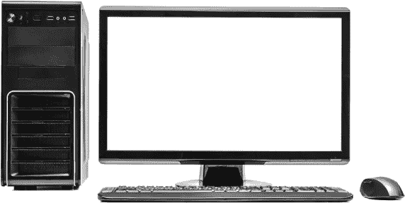

台式电脑很重，需要插入电源插座，因此它们通常只会放在你家里的桌子上，并不打算便携。这意味着你无法把台式机带去度假！它们还占用比其他类型的电脑更多空间，如果你住在一个小公寓里，这可能是一个缺点。

##### *笔记本电脑*

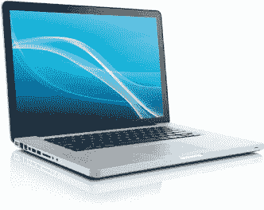

笔记本电脑是较小、轻便的电脑，可以舒适地放在你的膝盖上，如果你喜欢在最爱的椅子上放松时使用电脑，那简直是太棒了。大多数笔记本电脑只有几磅重，所以你可以轻松地将它们从一个房间搬到另一个房间，在餐桌上或电视前工作，甚至带着它们去度假。当笔记本电脑未插电时，电池可以持续使用几小时，因此你可以随时随地使用它。

这种更便携、方便的电脑的折衷之处在于，其屏幕比台式机小，并且同价位的笔记本电脑通常比台式机性能稍弱。稍后我们会讨论什么因素决定了电脑的性能。

##### *平板电脑*

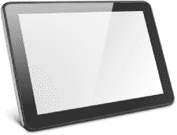

这些小型电脑是最便携的。事实上，整个电脑都集成在小屏幕里。它们非常适合随身携带，使用时也很方便，无论是在火车上、度假时还是在咖啡店里。平板电脑没有键盘，所以你需要触摸屏输入内容。这可能有点不方便，因此许多平板电脑用户购买单独的键盘，但这些键盘笨重，略微影响了便携性。平板电脑的屏幕通常较小，存储照片、音乐和其他文件的空间也相对较少。它们的价格通常比同等性能或存储空间的台式机或笔记本电脑要贵。

***** ***注意：** 本书仅涵盖 Windows 平板电脑。还有其他类型的平板电脑，如苹果 iPad 和安卓平板，它们的工作方式有所不同。*

**你打算在哪些地方使用你的电脑？**

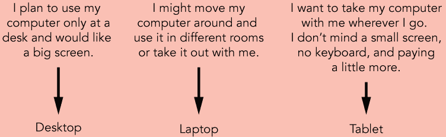

#### 我需要哪些规格？

一旦你决定了想要的电脑类型，就需要选择一个具体的型号。市面上有很多不同的型号，挑选适合自己的电脑可能让人感到困难。但别担心！这一部分将为你提供选择完美电脑所需的信息。

许多公司使用技术术语来宣传他们的产品。这些术语描述了电脑中一些最重要的部件，因此了解它们的含义是很有用的。让我们一起回顾一下这些术语，帮助你决定新电脑需要哪些功能，然后我们会提出一些问题，帮助你选择适合你的电脑。

##### *处理器*

*处理器*就像是电脑的大脑。你的处理器越好，电脑的运行速度和响应能力就越快。当我们说一台电脑很强大时，我们指的是它拥有很强的*处理能力*。一些常见的处理器有英特尔 Pentium、Core i3、Core i5 和 Core i7。英特尔 Pentium 或 Core i3 适合大多数电脑任务，如发送电子邮件和浏览互联网，但 Core i5 或 Core i7 的性能更好，使你的电脑运行更快、响应更灵敏。如果不确定，Core i3 或 Core i5 通常是一个安全的选择！

##### *内存*

*RAM*，即*随机存取内存*，是电脑的短期记忆。你在电脑上做的每一件事都会使用一定的 RAM。就像一个人试图同时记住许多不同的数字、名字和任务一样，如果电脑同时处理太多任务，它就会变得很慢——RAM 越多，电脑就能同时处理更多任务。

RAM 以*吉字节（GB）*为单位来衡量。电脑至少需要 4GB 的 RAM，8GB 的 RAM 更好，但除非你计划进行更高要求的任务，如视频编辑，或者想同时打开多个应用程序，否则并非必须。

**你打算用电脑做什么？**

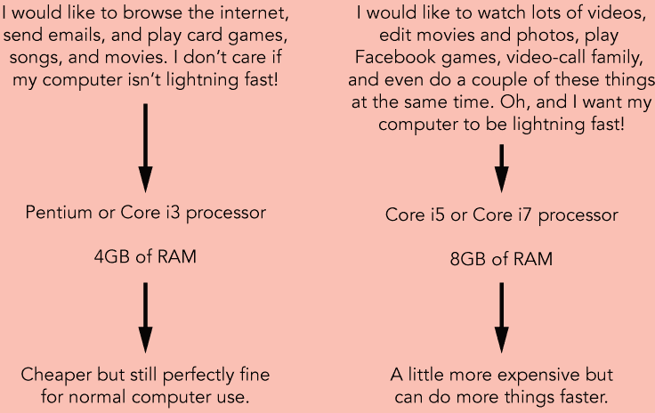

##### *硬盘*

硬盘是电脑的长期记忆。你保存的所有可以再次使用的内容，包括信件、照片、视频、歌曲和程序，都会保存在硬盘上。硬盘越大，你可以存储的内容就越多！和 RAM 一样，硬盘也是以吉字节来衡量的。然而，由于硬盘的容量通常大于 RAM，你可能会看到硬盘以*太字节（TB）*为单位进行宣传，其中 1 太字节等于 1000 吉字节。

如果你不打算存储大量照片、音乐或视频，那么 60GB 或更大的硬盘就足够了。如果你是电影或音乐爱好者，计划在电脑上保存收藏，可以选择至少 500GB 的硬盘。通常，1GB 硬盘空间大约可以存储一个小时的家庭视频，或者大约 200 张照片或歌曲，但请记住，你还需要为应用程序、电子邮件和 Windows 本身预留空间！你可以预计这些会占用你硬盘至少 40GB 的空间。

***** **150GB 硬盘：** 可存储最多 150 小时的家庭视频、40 部电影、30,000 张照片或 40,000 首歌曲。

***** **500GB 硬盘：** 可存储最多 500 小时的家庭视频、120 部电影、100,000 张照片或 125,000 首歌曲。

***** **300GB 硬盘：** 可存储最多 300 小时的家庭视频、80 部电影、60,000 张照片或 80,000 首歌曲。

##### *DVD 驱动器*

DVD 驱动器让你可以插入并播放音乐 CD 和视频 DVD。几乎所有台式电脑和许多笔记本电脑都配备有 DVD 驱动器，但平板电脑则没有。笔记本电脑中 DVD 驱动器的一个缺点是，它会让笔记本电脑变得更重和更厚，因此携带起来不太方便。不过，如果你认为自己可能需要 DVD 驱动器，确保你购买的电脑有这个功能。

##### *屏幕尺寸*

当你使用计算机时，大部分时间都会盯着屏幕看，因此最好确保选择一个足够大的屏幕，能让你舒适地阅读。然而，请记住，屏幕越大，计算机也就越笨重，便携性会差一些。屏幕尺寸是沿对角线测量的，以英寸为单位，就像电视屏幕一样。大多数台式机的屏幕大小在 20" 到 27" 之间。大多数笔记本电脑的屏幕在 11" 到 18" 之间，而大多数平板电脑的屏幕在 7" 到 13" 之间。如果你打算频繁携带笔记本旅行，13" 的屏幕是理想选择。如果你不介意把计算机放在家里，并且想避免眼睛疲劳，选择一个 20" 到 24" 的屏幕会非常舒适。

##### *操作系统*

操作系统就像是计算机中的经理，确保不同的程序能够正常运行。所有计算机都需要操作系统才能正常工作。除了苹果公司销售的计算机，大多数新计算机都已经预装了 Windows 10 操作系统，但最好检查一下以确保无误。本书假设你的计算机已经安装了 Windows 10 操作系统。

Windows 10 有两个版本：家庭版和专业版。专业版包含了一些面向高级用户的附加功能，本书不会涉及这些内容。它价格更高，因此最好选择配备 Windows 10 家庭版的计算机。但如果你有专业版的计算机也不必担心——它能够完成家庭版所能做的一切，你依然可以跟随本书中的课程进行操作。

### 开箱你的计算机

一旦你拿到新的桌面、笔记本或平板电脑，第一步是将它从盒子里取出来并连接好所有的电缆！

#### 端口介绍

你可能首先注意到的是计算机背面或侧面的一些插座。这些插座叫做*端口*，是各种设备的连接点。可以把它们想象成烤面包机的电源线，必须先插入插座才能打开。同样，你也许需要将一些电缆插入计算机才能开始使用它。

让我们来看一下计算机上的重要端口，然后研究如何将电缆插入适当的端口以建立连接！每台计算机都有些许不同，端口的位置也可能有所不同，但你可以看到下面这两张典型计算机上的端口示例。你会发现，并不是所有的端口都出现在每台计算机上，你的计算机可能还有其他没有在这里提到的端口。当然，如果你的计算机已经连接好，你可以跳过这一部分，直接阅读“你的主要工具”位于第 14 页。

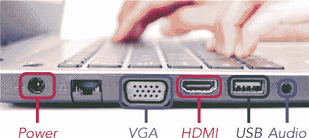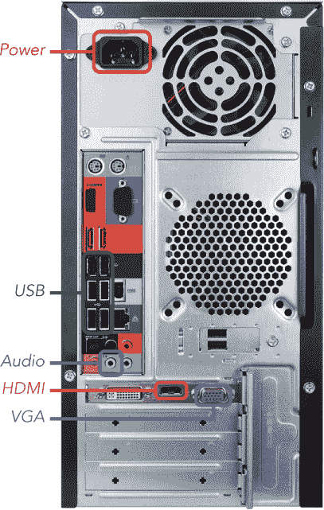

*****   **电源端口：** 电源端口为你的电脑提供运行所需的电力。这个端口也是你用来为笔记本电脑或平板电脑充电的端口。我们将在“连接电源”一节中，详细介绍三种类型电脑的电源端口，见第 10 页。

*****   **USB 端口：** USB 端口允许你将多种不同的设备连接到你的电脑，比如键盘、鼠标、打印机、USB 闪存驱动器和摄像头。有关连接和安装 USB 设备的更多信息，请参阅“连接打印机、扫描仪、摄像头或其他设备”一节，见第 293 页。

*****   **VGA 和 HDMI 端口：** VGA 和 HDMI 端口将你的电脑连接到屏幕或显示器。例如，如果你有一台笔记本电脑，并且想在更大的屏幕上观看电影，你可以使用 VGA 或 HDMI 端口和电缆将其连接到电视。

*****   **音频端口：** 音频端口允许你将扬声器、耳机和麦克风连接到电脑。许多台式机的这些端口都有颜色编码，帮助你轻松识别不同的连接：绿色端口用于扬声器或耳机，粉色端口用于麦克风。笔记本电脑上，你可能会看到一个小耳机符号在扬声器端口旁边，麦克风端口旁边会有一个小麦克风符号。

#### 连接电源

现在你已经熟悉了电脑上的各种端口，是时候开始插入设备了！在本节中，你将学习如何连接电脑，以便启动它。我们将分别介绍每种类型的电脑，你可以跳到你所拥有的电脑的部分。

##### *连接笔记本电脑或平板电脑*

在笔记本电脑或平板电脑上，插电过程非常简单！

1.  将电源线插入笔记本电脑或平板电脑的电源端口。电源线的一端应有一个插头，可以插入电源插座，另一端则是适合电源端口的插头。笔记本电脑或平板电脑的电源端口通常是圆形或矩形的。

    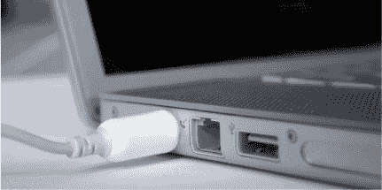

1.  将电源线的一端插入电源插座。

你的笔记本电脑或平板电脑现在应该开始启动。如果你的电脑之前断开了电源并且使用了一些电池电量，或者你现在没有使用它，将其像这样插入电源进行充电。

##### *连接台式机*

要使用台式机，你需要电脑主机、显示器、鼠标和键盘。你将在下一节中学习如何连接这些元素。如果遇到任何问题，你还应该查看购买时随电脑附带的用户手册。这份指南应该包含与你电脑相关的设置步骤。

1.  使用 VGA 或 HDMI 电缆将显示器连接到你的电脑。

    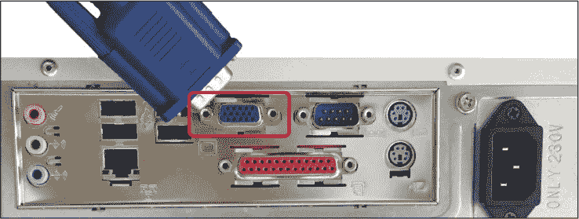

    使用显示器附带的电源线将显示器连接到电源插座。

1.  现在拿起你的鼠标和键盘，它们应该都有一个 USB 电缆。将键盘和鼠标插入桌面计算机上的任何 USB 端口。

    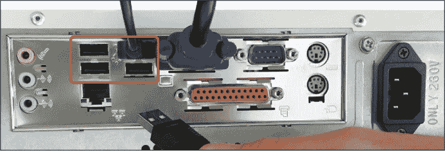

    如果你的键盘或鼠标是*无线的*，也就是没有电缆连接到计算机，它会附带一个小型发射器，连接到 USB 端口。找到带有 USB 连接的小设备并将其插入计算机上的任意 USB 端口。无线键盘或鼠标还需要电池。电池仓通常位于键盘或鼠标的底部。鼠标的底部应该有一个小开关，用于开启鼠标。如果你有其他 USB 设备，如打印机或网络摄像头，也可以将它们连接到计算机上的任何空闲 USB 端口。

1.  如果你的计算机配有独立扬声器，你通常可以将它们连接到计算机的音频端口。否则，它们可能会插入 USB 端口。只需检查电缆末端的连接。

    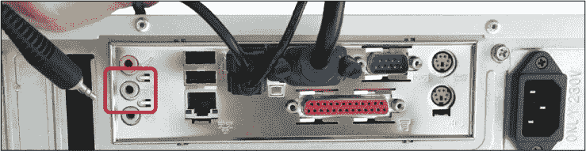

1.  将电源线的一端连接到计算机的电源端口。将电源线的另一端连接到墙上的插座。

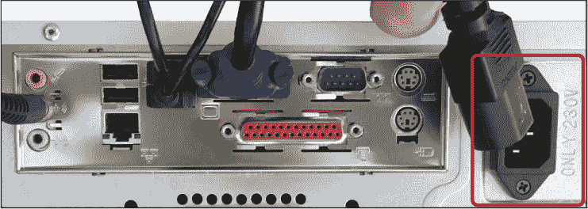

我们稍后会讨论如何开机，但有一点需要知道的是，如果你尝试开机时计算机没有反应，最好检查所有的插头是否正确连接。确保所有插头都牢固地插入插座；有些插头可能需要按得比较紧。

### 开启你的计算机

你的计算机上会有一个电源按钮。电源按钮的大小、形状和位置在不同的计算机之间有所不同，但通常会有一个类似这样的符号：。如果你找不到电源按钮，可以参考计算机的手册或快速启动指南。

在桌面计算机上，电源按钮通常位于机箱的前面。显示器上也应该有另一个电源按钮，需单独开启。这个按钮通常位于显示器屏幕的前面或侧面。

在笔记本电脑上，电源按钮通常位于键盘上方，如下所示。

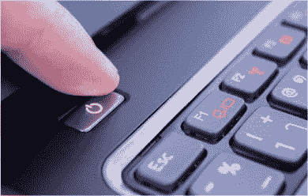

在平板电脑上，电源按钮通常位于平板的侧面或顶部，如图所示。

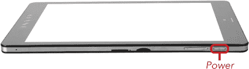

### 你的主要工具

一旦你的计算机开机，你需要学习如何使用键盘和鼠标向计算机发出指令。

#### 鼠标

你的主要工具之一是*鼠标*，如下所示。如果你使用的是桌面计算机，你的鼠标看起来会像左边的那个，应该放在计算机旁边，靠近你的惯用手。笔记本电脑有一个*触控板*，如右图所示，这是内置在键盘上的鼠标，看起来像一个带有两个可点击按钮的垫子。

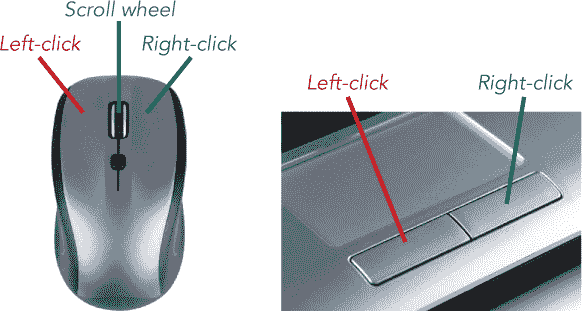

你使用鼠标在屏幕上进行导航。如果你观察屏幕，会发现当你移动鼠标时，一个小箭头  会随着你的手部动作在屏幕上移动。这就是*指针*。它让你能够在屏幕上选择内容，帮助你控制计算机。根据你使用的程序，指针还可能变成手形  或光标 。

使用鼠标给计算机下达命令非常简单！

*****   **左键单击（通常简称为“点击”）：** 用食指按一下左键鼠标按钮，然后立即松开。这种点击方式通常用于选择屏幕上的内容或激活一个按钮，就像你已经看到的那样。

*****   **双击：** 快速连续两次按下鼠标的左键。这种点击方式通常用于打开某个项目，比如程序或文件夹。

*****   **右键单击：** 用鼠标的右键按一下并松开。右键单击某个项目，或者仅仅右键点击屏幕，通常会打开一个小菜单。这个菜单会根据你右键单击的内容有所不同。

*****   **滚轮：** 大多数鼠标在左右点击按钮之间有一个小滚轮。轻轻滚动滚轮可以让你上下滚动屏幕，从而查看更多内容。

平板电脑配备了*触摸屏*，允许你用手指直接与屏幕交互，而不需要像鼠标这样的设备。你只需用手指触摸屏幕，就能控制指针！你需要知道四个重要的操作：

*****   **轻触：** 轻触是指用手指按一下并迅速抬起。这与使用鼠标的左键单击相同。如果你在触控板上跟随本书的操作指引，任何要求点击的地方，你都可以用轻触代替。

*****   **双击：** 这意味着迅速连续两次用手指轻敲屏幕上的一个按钮或区域。这相当于使用鼠标进行双击。

*****   **按住不放：** 按住不放是指在屏幕上的一个按钮或区域上按住手指几秒钟。这与鼠标的右键单击相同。

*****   **拖动：** 拖动是指用手指轻轻按下屏幕，然后将其移动到你想要的位置，同时保持手指按在屏幕上。当你将其移动到目标位置时，抬起手指。这种操作类似于用鼠标滚动。

你也可以在笔记本电脑上使用桌面鼠标，许多人发现这种方式比触控板更容易操作，因此不妨尝试两种方法。要将鼠标连接到笔记本电脑，只需将鼠标连接线插入笔记本的空闲 USB 端口即可。

#### 键盘

在设置计算机之前，了解一些键盘技巧也是很值得的。正如你将在课程中看到的，按下键盘上的字母或数字键，会将该字母或数字显示在光标（ ）所在的位置。下图概述了你需要了解的一些键盘重要部分。

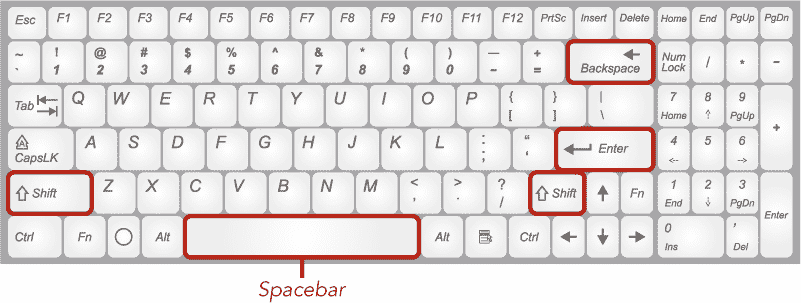

*****   **回车键：** 按下回车键可将光标移动到下一行，或在文本框中输入完信息后结束输入。

*****   **退格键：** 按下退格键可以删除你输入的最后一个字母。按住退格键不放可以删除更多字符！

*****   **Shift 键：** 按住 SHIFT 键并同时按下字母键来输入大写字母。你也可以按住 SHIFT 键并同时点击数字键，输入数字键上的符号。例如，按住 SHIFT 键并按数字 1 键会插入一个感叹号！

*****   **空格键：** 空格键用于插入空格。按下它可以在输入单词时在单词之间插入空格。

在平板电脑上，当你点击允许输入文字的框时，键盘会出现在屏幕上。屏幕上的键盘看起来是这样的：

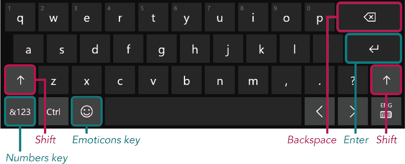

点击数字键会将屏幕上的键盘切换为显示数字和符号，而不是字母。要将键盘切换回显示字母，再次按下数字键即可。你也可以使用表情符号键来插入有趣的图片。

### 设置计算机

现在计算机已经开机，并且你已经了解了如何使用一些主要的工具来操作它，接下来是时候熟悉一下 Windows 10 了！

无论你是购买了新计算机，还是将旧版本的计算机（如 Windows 7 或 Windows 8）升级为 Windows 10，都需要对计算机进行设置。这包括将计算机连接到互联网并设置 Microsoft 帐户，整个过程中你都将用到这个帐户。如果你不太自信能独立完成这些操作，你通常可以请求你购买计算机的商店为你进行设置。

#### 设置互联网连接

首先确保你的计算机已连接到互联网，因为设置你的 Microsoft 帐户时需要互联网。*互联网*是一个庞大的计算机社区，计算机之间可以相互通信。

通过连接互联网，你的计算机可以与其他计算机进行通信，并访问其他用户添加的信息。互联网让你能够给朋友和家人发送消息、查找信息、阅读新闻、观看视频、获取路线、在线购物和银行业务等等，功能非常强大！

在你能够连接互联网之前，你需要注册一个*互联网服务提供商（ISP）*，该公司将帮助你连接互联网，就像你的电话公司帮助你连接其他电话一样。以下是美国一些常见的互联网服务提供商：

*****   Comcast

*****   AT&T

*****   光谱

*****   CenturyLink

*****   Verizon

有两种主要类型的互联网连接。*固定*互联网连接允许您在家中使用互联网，并通常允许以固定月费无限制使用。*移动*互联网连接让您在外出时使用互联网，但每月提供的使用量有限，因此您将无法查看太多页面、邮件和视频。您应该与网络服务提供商讨论您的需求，并准备好寻找合适的价格。

如果您还没有准备好采取这一步骤，您可以随时去拜访有互联网连接的朋友或亲戚，或者去当地图书馆，在那里连接到互联网。

#### 连接到互联网

当您首次打开计算机时，您应该会看到设置屏幕。某些计算机制造商还会添加他们自己的步骤和屏幕，因此您在计算机上看到的选项可能与图片中的不完全相同，但应该是类似的。如果您的计算机已经设置完成，您可以直接跳转到 第一课。

如果在开始设置过程时您还没有连接到互联网，系统会要求您首先进行连接。您将看到附近可用的互联网连接列表。要连接到互联网，请按照以下步骤操作：

1.  单击您想使用的互联网连接。如果您已经注册了互联网服务，您的网络服务提供商将提供您应连接的网络名称。

1.  如果系统询问密码，请输入连接密码。这个密码也应该由您的网络服务提供商提供。通常也会打印在您的调制解调器路由器底部，以便您轻松找到。

1.  单击 **连接**。

#### 选择键盘设置

您的下一步是选择您的地区和键盘设置。

1.  Windows 将选择它认为您所在的地区。如果所选地区正确，请直接单击 **是**。否则，请单击您所在的地区，例如美国，然后再点击是。

    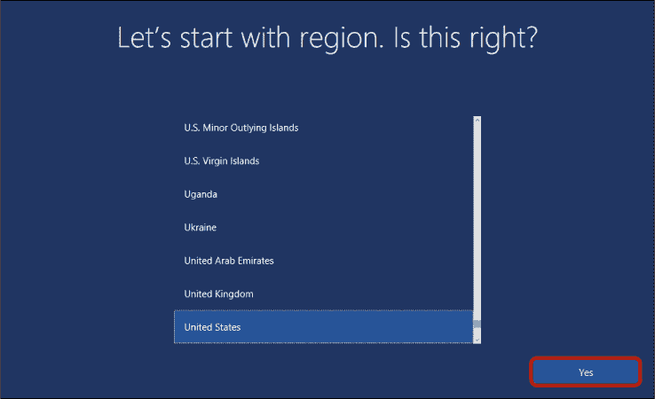

1.  Windows 会询问您正在使用哪种键盘布局，因为不同的国家通常有不同类型的键盘。单击您购买键盘的地区，然后单击 **是**。如果不确定，请直接单击是，不要更改布局。

    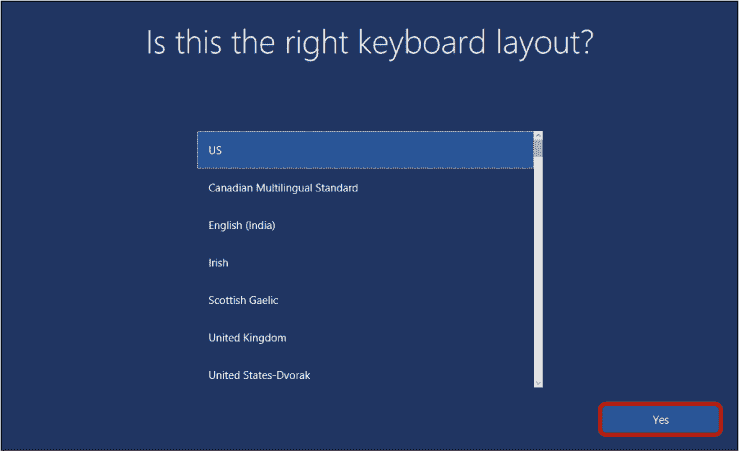

1.  接下来会询问您是否要添加第二种键盘布局。大多数人不需要这样做，所以请单击 **跳过**。

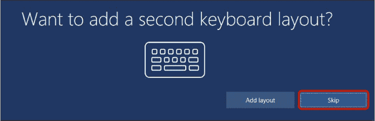

#### 创建微软账户

下一步是创建一个微软账户，它将为您提供一个电子邮件地址，并允许您在计算机上安装应用程序。在本书中，我们将利用这些功能，因此现在设置一个微软账户非常重要。

如果你有一个以*@outlook.com* 或*@hotmail.com* 结尾的电子邮件地址，说明你已经有了一个 Microsoft 账户。在这种情况下，你只需输入你的电子邮件地址和该电子邮件账户的密码，然后点击**登录**。如果你有 Microsoft 账户但忘记了密码，点击**忘记密码？**按钮，然后按照屏幕上的指示重置密码。接下来，跳到“管理广告选项”（第 24 页）。

如果你没有 Microsoft 账户，点击**创建账户**，然后按照接下来的步骤操作。

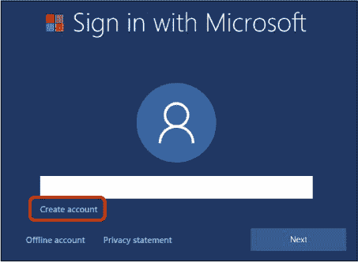

##### *创建电子邮件地址*

你的新 Microsoft 账户首先需要一个电子邮件地址。如果你已经有一个非 Microsoft 的电子邮件地址，如 Gmail 或 Yahoo 地址，你可以在这里输入它，点击**下一步**，然后跳到“创建密码”（第 22 页）。如果你没有电子邮件地址，则需要创建一个。请继续按照以下步骤操作：

1.  点击**获取新电子邮件地址**以创建新地址。

    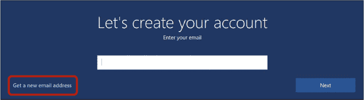

1.  现在你需要为你的新电子邮件地址创建一个独特的名称！这个地址是全世界唯一的，其他人不能使用相同的地址；如果可以使用相同的地址，发送到该地址的邮件将会同时送到你和其他人。你可能需要发挥创造力，找一个还没有被使用过的地址。你可以使用字母和数字的任意组合，但新地址必须以*@outlook.com* 结尾。请务必记录下你的新电子邮件地址，因为你以后会需要它。输入完新电子邮件地址后，点击**下一步**按钮。

##### *创建密码*

无论你是使用了现有的电子邮件地址还是刚刚创建了一个新的电子邮件地址，你都需要选择一个密码。

***** ***注意：** 确保选择一个你能记住的密码——你每次使用电脑时都需要输入它。最好也把它写在一个安全的地方。*

为了确保你的 Microsoft 账户安全，请使用一个唯一的密码，不要在其他地方使用该密码。你的密码必须至少包含八个字符，并且应该包括数字和字母，以增加猜测的难度。好的密码不应该包含别人知道的个人信息（如你的名字或生日），或别人容易猜到的私人细节（如你的宠物或最好朋友的名字）。你还应避免使用常见的短语或字母组合，如“abc123”和“good morning”。

1.  点击**密码**框并输入新密码。

    

1.  点击**下一步**。

##### *输入个人信息*

您需要输入更多个人详细信息以继续。这是为了使微软遵守儿童隐私立法，并且提供这些信息是完全安全的。请注意，如果您位于美国以外的地区，将不会要求您提供出生日期。

1.  点击**位置**框，并从下拉列表中选择您的国家。

1.  点击**出生日期**框，并选择您出生的日期格式：通常是月份，然后是日期，最后是年份。

    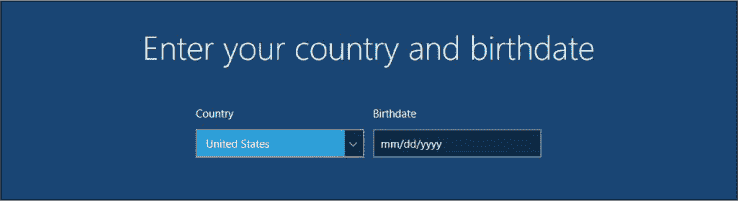

1.  点击**下一步**。

##### *提供电话号码作为安全信息*

如果您忘记密码并需要重置密码，微软可以给您打电话或发送短信，以确保真的是您而不是试图进入您账户的黑客！

1.  从下拉框中选择您的国家。

1.  在下拉框右侧的字段中输入您的电话号码（带区号）。

    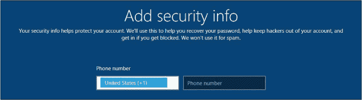

1.  点击**下一步**。

#### 管理您的广告选项

现在，微软应该会征得您的同意，在决定向您展示何种类型广告时使用您的信息。这是非常安全的，但如果您不希望微软这样做，请取消选中**增强我的在线体验...**框。如果您不希望微软通过电子邮件向您发送任何特别优惠，您也可以取消选中**向我发送微软的促销优惠**框。点击**下一步**继续。

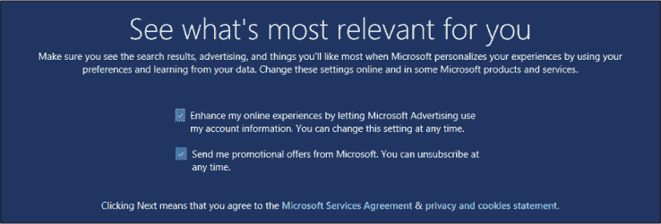

#### 跳过 PIN 设置

微软还鼓励您设置个人识别码（PIN）以及密码，以便用于登录计算机。这可以使您更快地登录计算机，但这也是另一个需要记住的数字。与其将另一个密码添加到您的列表中，不如点击**稍后再做**。

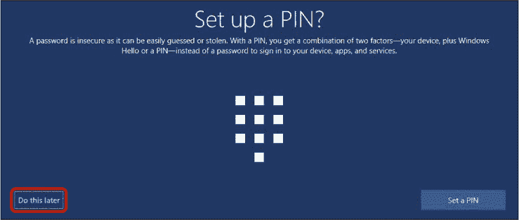

#### 跳过 OneDrive 设置

微软鼓励您将所有文档和图片保存到 OneDrive，这是一个在线存储区域。当我们在第 13 课中设置 OneDrive 时，这可能会很方便，但现在，请点击**否**。

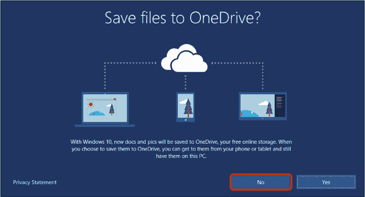

#### 您自己的数字助手：Cortana！

微软希望向您介绍其数字助手 Cortana。Cortana 可以让您对计算机发出口头指令，比如“打开新闻应用”或“搜索猫的图片”。我们不会在本书中涵盖这些口头指令，但拥有 Cortana 也没有坏处，所以请点击**是**。

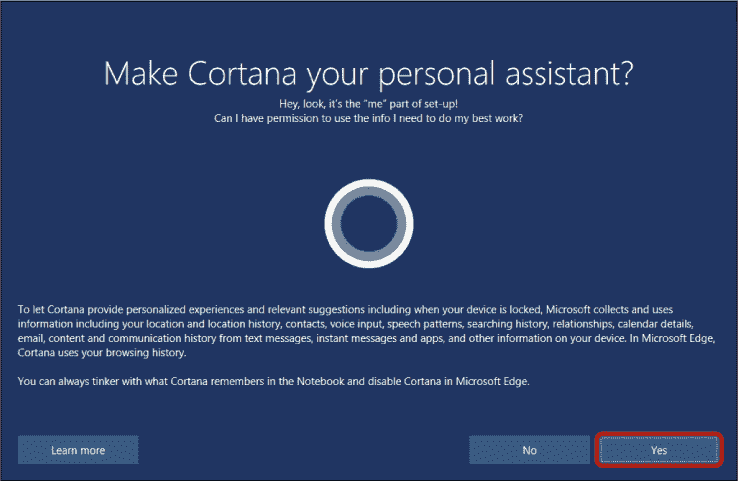

#### 隐私设置

最后，您将被要求选择一些隐私设置，以控制您与微软分享的信息类型。默认设置非常安全，并且允许您充分利用新的 Windows 10 功能，但如果您不愿意与微软分享任何这些信息，您可以点击任何滑块将设置从打开更改为关闭（在诊断情况下，从完整更改为基本）。当您满意隐私设置时，请点击**接受**。

你的电脑可能需要几分钟来完成设置处理，但这标志着设置过程的结束。

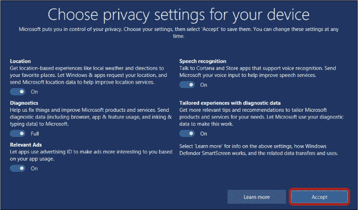

### 呼，我们做到了！

我们已经学习了如何购买和设置电脑，审视了不同类型的电脑及其最重要的规格。我们还了解了不同类型的互联网连接以及如何连接互联网。你学会了以下内容：

*****   选择最适合你的电脑类型

*****   拆开包装并插上新电脑

*****   决定哪种类型的互联网连接最适合你

*****   打开你的电脑

*****   使用键盘和鼠标

*****   在新电脑上设置 Windows 10

*****   连接互联网

干得好！现在你的电脑已设置完成，接下来进入第一课，开始使用它。
