## 第一课

## 开始使用

欢迎使用你的电脑！

启动你的电脑

登录

导航桌面

在 Windows 平板上导航

从开始菜单查找应用程序

完整应用程序列表

流行应用程序的图块

使用搜索框

使用你的第一个应用程序

打开应用程序

最大化应用程序

关闭应用程序

恢复消失的应用程序

关机

呼，完成了！

在本课中，你将开始使用电脑，熟悉它的主屏幕，以便自信地开始使用它。你将学习如何开启电脑并登录，还将练习使用鼠标进行导航，打开和关闭应用程序。最后，你将学会如何关闭电脑。

***** ***注意：** 本课程假设你已经设置好了电脑。如果没有设置，请回到 “设置你的电脑” 在 第 17 页 按照那里的说明操作。*

### 启动你的电脑

要开始使用你的电脑，按下电源按钮打开它。当电脑加载完毕后，首先看到的应该是*锁屏*，就像这里展示的那样。

这是一个安全屏幕，旨在阻止任何人在输入正确密码之前访问你的电脑。因为锁屏不会显示任何个人信息，所以如果有陌生人坐到你的电脑前，他们无法看到任何关于你的私人信息。

#### 登录

你应该已经在 “设置你的电脑” 这一课中创建了一个 Microsoft 账户，现可以使用该账户登录你的电脑。

1.  从锁屏界面，点击左键（以后将称为*点击*），或按下键盘上的任意键。

1.  这时会显示你用来创建账户的名字和下面的空白框。你需要在这里输入密码。将鼠标移到这个空密码框上，并点击一次。

1.  输入你在首次安装 Windows 时创建的密码。你需要小心输入，因为只有输入正确的密码后才能通过锁屏。输入时，字符会显示为圆点，但不用担心：这是为了防止周围的人在你输入时看到你的密码。

    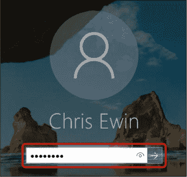

1.  如果你想查看自己输入的内容，确保密码输入正确，可以点击符号以显示字母。

1.  输入密码后，按下键盘上的 ENTER 键，或点击密码框右侧的箭头按钮。

1.  计算机接着会加载几秒钟。如果你输入的密码不正确，你将有机会再次输入。

一旦你成功登录，系统会带你进入你的*桌面*；这是你的“任务控制中心”。桌面是你用来导航到计算机其他区域的主要屏幕。

***** ***注意：** 词语*桌面*目前已被用来表示两种不同的概念。*桌面电脑*，就像我们在 “我需要什么样的电脑？”（第 2 页）中讨论过的那种，是放在你桌子上的计算机。你的*桌面屏幕*，如下一页所示，是主要的起始屏幕。你很快就能掌握它们之间的区别！*

#### 导航桌面

你的计算机现在已经开机，并且应该显示桌面屏幕。在这里，你可以找到并打开各种有用的应用程序，帮助你做很多事情，比如发送电子邮件、玩游戏、查看照片、使用互联网、进行视频通话等等。这里也是你可以找到并使用所有常用工具的地方。

让我们仔细看看桌面屏幕以及其中一些最有用的组成部分。（如果你使用的是 Windows 平板电脑，且屏幕看起来与此不同，请参见 “导航 Windows 平板”（第 36 页）。）

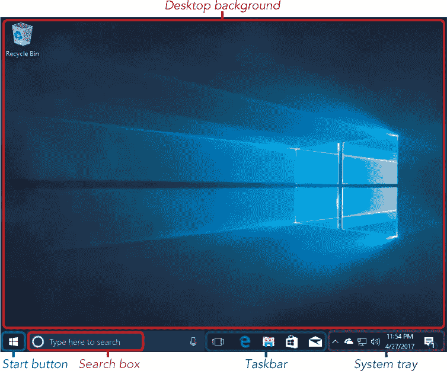

##### *桌面背景*

你在桌面上看到的显眼图片是主屏幕的背景，因此当你计算机上没有其他内容打开时，这就是你将看到的画面。

桌面是一个便捷的地方，可以快速访问你经常使用的应用程序、游戏和文档。你可以通过桌面上的小图标来访问这些内容。你会注意到，在上面的图示中，Windows 10 上的桌面包括了一个回收站图标。回收站保存你从计算机中删除的任何文档（因此它看起来像一个垃圾桶！）。由于你可能经常使用它，回收站的图标就在桌面上，方便快捷地访问。你将在第 13 课中了解更多关于回收站的内容。

##### *开始按钮*

点击开始按钮会打开开始菜单，这是你计算机上存储的所有应用程序的列表。开始菜单可能会成为你查找和打开程序、应用、文档等的主要方式，所以你在本书中会频繁使用它。

##### *搜索框*

搜索框帮助你在计算机或互联网上搜索内容。你输入一个与所要查找的内容相关的单词或短语，Windows 会尝试找到匹配的结果。我们稍后将探讨如何使用搜索框，但如果你在屏幕上看不到搜索框，也不必担心。

##### *任务栏*

任务栏是屏幕底部的深色条，应该在您打开其他应用程序和文档时仍然可见。您可以将一些您最喜欢或最常用的应用程序快捷方式保存到这里，它们会以图标的形式出现。就像桌面图标一样，任务栏上的图标目的是让您快速访问最喜欢的应用程序。要使用任务栏打开程序，只需点击该图标。

##### *系统托盘*

系统托盘提供有关计算机状态的信息，例如您是否连接到互联网。您不需要过多担心系统托盘，但有一些有用的项目可能值得了解。

系统托盘中有音量控制图标 。此图标允许您调节计算机音量。图标旁边的“波浪”数量可以让您了解音量的设置情况。一条波浪表示音量设置较低，而三条波浪则表示音量设置较高，如上图所示。图标旁的 X 表示音量已被静音。要调整音量，请将鼠标移到音量控制图标上，点击一次。会弹出一个滑块，您可以点击滑块并按住左键拖动滑块上下调整音量。

系统托盘还显示有时钟，显示时间和日期。点击时钟一次将显示一个小日历，如这里展示的那样。您可以通过点击小箭头向上或向下，分别向前或向后查看时间。

在系统托盘的最右侧是一个*通知*图标 。它会显示 Windows 认为重要的任何最近消息，例如您收到的新电子邮件（请参见第 4 课）。在此图像中，通知图标旁的小数字 1 告诉我们有一条新的 Windows 消息，如果我们点击该图标，就能查看该消息内容。

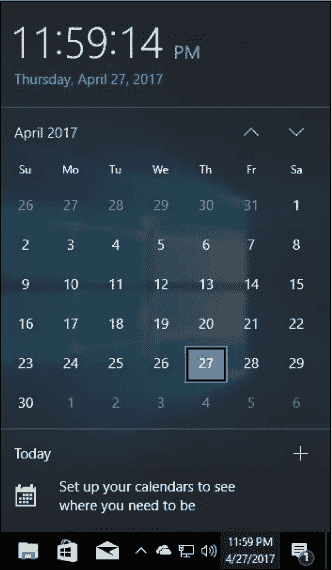

系统托盘中的许多图标是隐藏的。这是因为大多数驻留在系统托盘中的图标都是后台运行的程序，您通常不需要太关注它们。如果您想查看这些隐藏的图标，可以点击系统托盘左侧的小向上箭头 。

要查看这些程序的名称，您可以将鼠标悬停在图标上，无需点击，屏幕上会弹出一个小框，显示程序的名称。

#### 操作 Windows 平板

Windows 平板电脑的操作方式与 Windows 电脑非常相似，只有一些区别。根据不同的制造商，您的平板电脑可能会设置为*平板模式*，这会调整某些按钮的大小和位置，使其更方便用手指点击。我们将在本节的最后告诉您如何打开和关闭平板模式。

##### *开始屏幕*

开始屏幕是你打开平板后看到的第一个屏幕。它是帮助你完成其他操作的启动平台。就像桌面或笔记本电脑上的开始菜单一样，开始屏幕为你提供所有应用程序的列表，并帮助你搜索特定的应用程序。

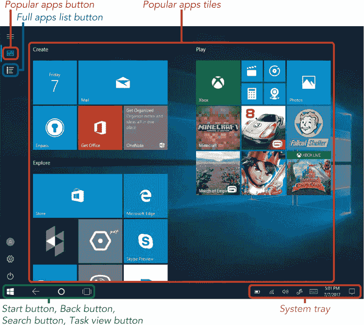

让我们更详细地探索开始屏幕。

*****   **常用应用程序磁贴**：这些应用程序在所有 Windows 10 平板电脑上都有，并且以小磁贴的形式显示在开始屏幕的中间。有关更多信息，请参见第 40 页的“常用应用程序磁贴”。

*****   **完整应用程序列表按钮**：点击此按钮将打开平板上所有应用程序的列表。此列表与桌面或笔记本电脑上的开始菜单中的完整应用程序列表相同。翻到第 39 页的“完整应用程序列表”了解更多内容。

*****   **开始按钮**：点击此按钮将直接带你进入开始屏幕，无论你刚才在做什么。如果你从开始屏幕点击开始按钮，开始屏幕将消失，返回到你之前使用的应用程序。

*****   **返回按钮**：这个按钮将带你回到你上一屏的内容。如果你打开了一个网页、一个应用程序或一个文档，点击此按钮将返回到你之前查看的页面。你可以不断点击此按钮返回，直到你回到开始屏幕。

*****   **搜索按钮**：这个按钮将帮助你在平板上找到应用程序或文件。有关如何搜索应用程序的更多信息，请参见第 41 页的“使用搜索框”。

*****   **任务视图按钮**：这个按钮会显示你当前在平板上打开的所有应用程序、网页和文档。点击此按钮，你将看到所有当前打开项目的小图像，点击图像即可打开相应的应用程序、网页或文档。

*****   **系统托盘**：屏幕右下角显示有关平板电脑重要设置的信息（如你的互联网连接）。在第 34 页的“系统托盘”中了解更多关于系统托盘的信息。

##### *开启与关闭平板模式*

本书中的截图和步骤侧重于计算机而非平板电脑。别担心！通过注意上面提到的几个不同之处，你将很容易在平板模式下跟随操作。幸运的是，你还可以更进一步，通过以下步骤将平板电脑设置为与计算机完全相同。许多厂商出售的平板电脑已预设为类似计算机的模式，因此你可能会发现你的平板电脑已经是这种设置！

1.  点击系统托盘中的**通知中心**图标。

1.  你应该能在左侧看到“平板模式”按钮。如果它是蓝色的，像下面高亮显示的那样，你的设备已设置为平板显示模式。

    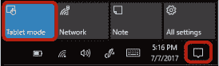

1.  如果你点击**平板模式**按钮，它会变为灰色，平板将像桌面或笔记本电脑一样显示。

1.  再次点击图标即可重新启用平板模式。

如果你决定在关闭平板模式的情况下使用平板电脑，你的屏幕将显示为第 33 页中所示的样子，并且你将使用下文所描述的开始菜单来打开和搜索应用程序。

### 从开始菜单查找应用程序

现在你已经熟悉了桌面，接下来你将学习如何打开应用程序！*应用程序*是一个广泛的术语，指的是用来在电脑上执行特定任务的工具。例如，Microsoft Solitaire Collection 应用程序让你玩纸牌游戏，WordPad 应用程序让你写信。请注意，在旧版本的 Windows 中，你可能听说过这些被称为*程序*。

要打开一个应用程序，请按照以下步骤操作：

1.  点击屏幕左下角的**开始按钮**。

    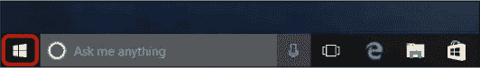

1.  这将打开开始菜单。应用程序以两种方式显示：左侧为列表，右侧为图标块阵列。

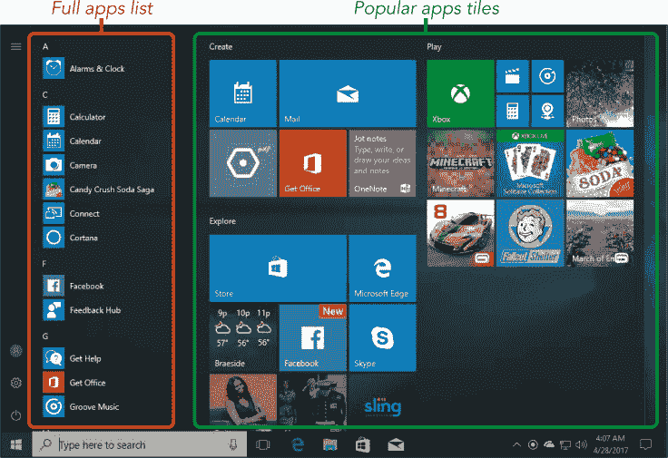

***** ***注意：** 你可以点击开始菜单外的任何地方来关闭它。*

接下来，我们将更详细地查看这两种应用视图。

#### 完整应用程序列表

开始菜单左侧的应用程序列表是你计算机上所有应用程序的图标集合，按字母顺序排列。如果你将鼠标指针移入应用程序列表中，会出现一个灰色条，如下所示。

这个栏（称为*滚动条*）可以让你上下滚动列表，查看更多应用程序。点击滚动条底部的向下箭头并按住鼠标按钮来向下滚动应用程序列表。如果你的鼠标有滚轮，你可以将光标移到列表上，并在不点击的情况下上下滚动滚轮来浏览列表。你可以通过点击应用程序一次来打开它。

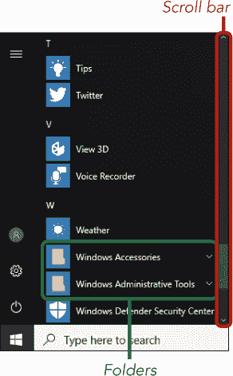

列表中的一些应用程序被分组在*文件夹*中，并用文件夹图标表示。例如，如果你向下滚动应用程序列表至*W*，你应该看到一个名为*Windows 附件*的文件夹。WordPad 应用程序是一个方便的写信程序，它存储在这个*Windows 附件*文件夹内。要找到 WordPad，点击**Windows 附件**文件夹以打开它，然后你应该能看到一个包含 WordPad 图标的应用程序列表。还不要点击它，我们将在第 12 课中学习如何使用它。

#### 流行应用程序图标块

在开始菜单的右侧，你可以看到许多较大的图标块，表示一些流行的应用程序，如日历、邮件、天气和照片。你可以通过点击这些图标块来打开相应的应用程序。

有些应用会实时显示当前信息，所以每次你打开开始菜单时，它们的显示可能会有所不同。例如，天气应用的图标可能会显示你所在位置的当前温度，而照片应用的图标可能会显示你最近放入电脑的照片。但别担心——你仍然可以通过应用的名称和所显示的图像来辨认它！

**活动 #1**

在这个活动中，你将练习通过开始菜单找到一个应用。

1.  打开开始菜单。

1.  在流行应用图块中找到天气应用。但现在不要点击它！我们将在第二课中讨论如何打开和使用这个应用。

1.  在完整应用列表中找到天气应用。

1.  关闭开始菜单。

#### 使用搜索框

通过滚动整个菜单来寻找应用可能会很耗时，如果你要找的应用存储在文件夹中，那可能会很难找到！幸运的是，有一种更快捷的方法可以找到应用。如果你知道你想要的应用名称，你可以将名称输入到屏幕底部的搜索框中，如图所示。根据你的设置，按钮可能会显示为没有文字的圆形。

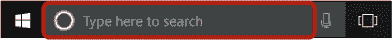

然后你的电脑会帮你搜索该应用！搜索框中的描述可能会根据你的设置有所变化。例如，搜索框可能会显示“向我提问”或“搜索网络和 Windows”，但这对你的搜索没有影响。如果你看不见搜索框，别慌张！你的搜索框可能被隐藏了，当你开始搜索时它会显示出来。

无论你是否看到这个框，按照以下步骤搜索一个应用：

1.  点击搜索框内。这样会弹出一个更大的搜索框，你可以在其中输入你想要打开的应用名称。如果你看不见搜索框，点击开始按钮。这不会立刻显示搜索框，但一旦你输入字母，它就会出现。

1.  输入**calculator**这个词。在你输入时，Windows 会立即开始提供建议，试图自动完成这个单词。

    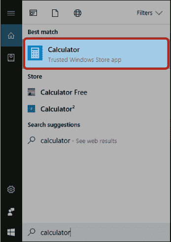

1.  一旦你看到应用名称出现在建议中，你可以停止输入。你应该能在“最佳匹配”下方看到计算器应用。

### 使用你的第一个应用

现在让我们打开刚刚搜索到的计算器应用。计算器应用可以让你轻松地进行加法、减法和其他计算。

#### 打开应用

按照以下步骤打开计算器应用：

1.  从搜索结果列表中点击**计算器应用图标**。你也可以从完整的应用列表中找到计算器应用。

1.  计算器应用应该会出现在你的屏幕上。

1.  点击计算器按钮开始计算。例如，你可以通过点击**1**按钮再点击**0**按钮来输入数字 10。然后点击乘号并输入另一个数字进行计算。当你输入完计算式后，点击**=**以查看计算结果，显示在计算器屏幕的顶部。

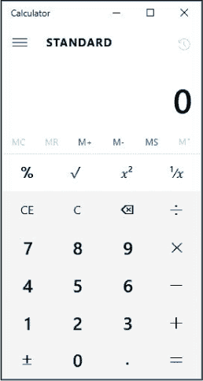

***** ***提示：** 你也可以通过键盘输入数字来使用计算器应用，而不是点击屏幕上的按钮。试试看！*

#### 最大化应用

你可能会发现某个应用太小，无法正确查看，这时你可以*最大化*它。最大化应用可以使它占据整个屏幕。只需点击应用右上角的**最大化按钮**，如图所示。

你的应用现在将占据整个屏幕。请注意，最大化按钮现在看起来是这样的：。再次点击该按钮，应用将恢复到之前的大小。

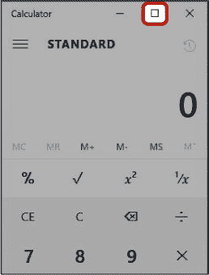

#### 关闭应用

关闭应用将退出应用并返回桌面。你在使用完应用后应该始终关闭它们，因为同时打开太多应用会导致计算机变慢。大多数应用会在右上角有一个带 X 的小按钮。点击这个**关闭按钮**，使应用从屏幕上消失！

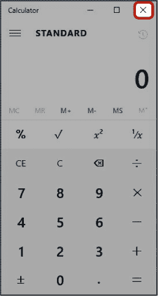

在平板电脑上，你可以通过将手指从屏幕顶部拖到底部来关闭应用。你也可以将手指移动到屏幕右上角，关闭按钮就会出现。

**活动 #2**

在这个活动中，你将练习打开和关闭新闻应用。

1.  打开新闻应用。

1.  选择你的国家加载相关的新闻，然后点击一篇文章来阅读。

1.  最大化新闻应用窗口。

1.  阅读完文章后，关闭新闻应用。

#### 恢复消失的应用

如果你点击了应用外部的某个地方，导致应用消失，别担心！你可能并没有关闭应用，只是*最小化*了它。最小化会把应用从主视图中隐藏起来，以防屏幕杂乱，但你可以轻松地将它带回来！你可以通过点击这里突出显示的最小化按钮来最小化应用。

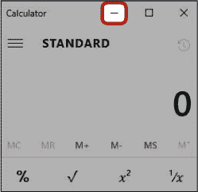

按照以下步骤重新打开你的应用：

1.  找到运行在屏幕底部的任务栏。

1.  在任务栏中，寻找你想要恢复的应用图标。

    例如，计算器应用的图标看起来像一个计算器。你应该能在应用图标下方看到一条小蓝线，表示该应用当前已打开。如果没有这条线，说明应用已经关闭，你可以像之前一样通过开始菜单重新打开它。

1.  点击该图标。

    

1.  计算器应用现在应该可见！

如果你在任务栏中找不到计算器应用图标，很可能是应用已经关闭。要重新打开它，你需要从开始菜单中再次找到它。你还可以通过点击任务视图按钮来显示当前打开的应用列表。找到你想恢复的应用并点击它。

***** ***注意：** 如果你点击当前在屏幕上可见的应用的任务栏图标，它也会将该应用最小化！再次点击图标可以将应用恢复到屏幕上。*

### 关闭你的计算机

关闭计算机时，它将完全关机。使用完计算机后，最好关闭它，这样可以节省电力。不过，在关机之前，重要的是要关闭所有当前打开的应用。如果在没有关闭应用的情况下关机，可能会丢失你正在进行的工作或应用中的信息。要正确关闭计算机，请按照以下步骤操作：

1.  使用关闭按钮，关闭所有打开的应用。

1.  点击左下角的**开始按钮**。

1.  从开始菜单的左侧，点击**电源按钮**，然后点击**关机**，如图所示。

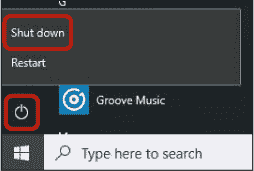

你的计算机现在将关闭。请注意，这可能需要一些时间。

### 呼，完成了！

在本课中，我们学习了如何开始使用计算机。你练习了使用鼠标浏览桌面上的各个组件。我们探讨了打开和关闭应用的不同方法，并以计算器应用为例。在本课中，你学习了以下内容：

*****   登录到你的计算机

*****   探索桌面

*****   使用开始菜单（或开始屏幕）和搜索框打开应用

*****   使用计算器应用

*****   最大化应用

*****   关闭应用

*****   最小化并恢复应用

*****   关闭计算机

在下一课中，你将了解更多关于一些流行应用的信息：纸牌游戏、天气和日历。

**课程回顾**

恭喜！你已完成第 1 课。现在利用这个机会通过完成以下任务复习你所学的内容。如果你能够自信地完成所有这些任务，那么你已准备好迎接第 2 课。如果不能，也不要灰心——继续练习就好！

1.  打开你的计算机。

1.  使用你的密码登录。

1.  找到计算器应用。

1.  打开计算器应用。

1.  使用计算器应用计算 10 + 12 的答案。

1.  关闭计算器应用。
