## 第二课

## 介绍应用

在本课中，你将通过学习如何使用应用来释放你电脑的真正潜力！

什么是应用？

微软纸牌合集应用

玩游戏

关闭游戏

再次打开纸牌游戏

天气应用

日历应用

设置日历应用

了解日历应用

添加事件

删除事件

更多应用，更多乐趣

呼，做到了！

### 什么是应用？

*应用*（*应用程序*的缩写）是你电脑上的一个工具，帮助你完成特定任务，如玩游戏或查看天气。你可能也听说过它被称为*程序*。应用使你在电脑上做事情更容易、更快捷。你的电脑已经有很多很棒的应用，你可以用来做以下事情：

*****   播放音乐

*****   播放电影

*****   管理你的照片

*****   和朋友及家人聊天

*****   跟踪你的约会

*****   玩游戏

*****   阅读最新新闻

*****   以及更多更多

你已经在第一课中见过计算器应用了。接下来，我们将探索一些你电脑上其他流行且实用的应用。首先，你将使用微软纸牌合集应用来玩不同类型的纸牌游戏。然后，你将使用天气应用查看天气预报，并使用日历应用帮助你跟踪约会和事件。到本课结束时，你应该会有信心在空闲时探索你电脑上的其他应用。

***** ***注意：**我们将要探索的一些应用，如天气应用，要求你连接到互联网。如果你还没有在线，请返回到“设置互联网连接”页面 17 了解如何连接。*

**有人说免费吗？**

你电脑上已安装的所有应用都可以免费使用！然而，其中一些可能会提供你购买项目的机会；例如，电影和电视应用会让你免费播放自己的视频，但也会提供购买电视节目和电影的机会。不过不必担心：你不可能在应用中不小心购买东西！如果某个项目需要付费，你会得到充分的提醒，而且你需要输入信用卡信息才能完成支付。在本课中，我们将重点学习完全免费的应用，首先从纸牌游戏开始。

### 微软纸牌合集应用

空当接龙是最受欢迎的免费游戏应用之一，能提供数小时的娱乐。你的 Windows 10 电脑自带了微软纸牌合集应用，其中包含多种纸牌游戏。如果你不是纸牌迷，也不用担心：我们会在第 8 课中介绍如何添加更多游戏。但首先，为了让你习惯使用应用，让我们先来了解一下纸牌合集。

1.  点击屏幕左下角的**开始按钮**，如下所示。

    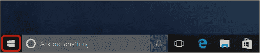

1.  开始菜单将会出现。点击标有**Microsoft Solitaire Collection**的图标，下面高亮显示。

    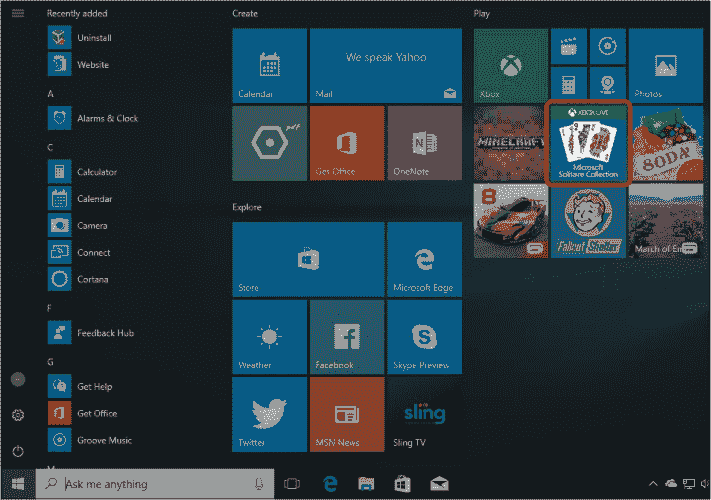

1.  如果你在开始菜单中没有看到这个图标，可以使用搜索功能找到它。点击开始按钮旁边的搜索框，然后输入**solitaire**。从出现的列表中点击**Microsoft Solitaire Collection**。

    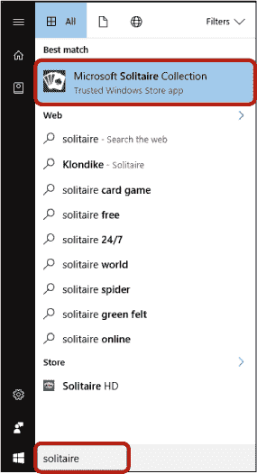

1.  应用程序将会在屏幕上打开！它看起来应该像这样：现在，让我们开始游戏吧！

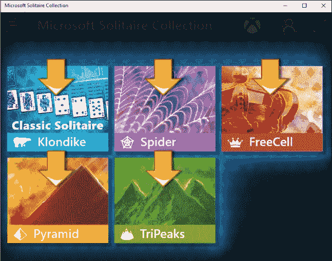

现在，让我们开始游戏吧！

#### 玩游戏

微软纸牌合集包括五种不同版本的纸牌游戏，供你选择：

*****   Klondike（也称经典纸牌）

*****   蜘蛛纸牌

*****   空当接龙

*****   金字塔

*****   三峰

让我们从大家最喜欢的游戏开始… Klondike！

1.  点击**Klondike**按钮。

1.  会出现一个小帮助屏幕，提供如何玩游戏的说明。

    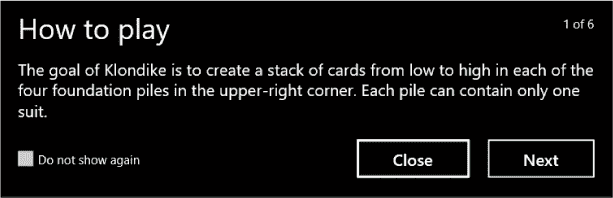

1.  如果你不熟悉 Klondike 游戏，可以通过点击**下一步**按钮阅读“如何玩”指南。阅读完此指南后，点击**开始游戏**来进入游戏！如果你熟悉这个游戏，可以勾选**不再显示**框，然后点击**关闭**，你将直接进入游戏。

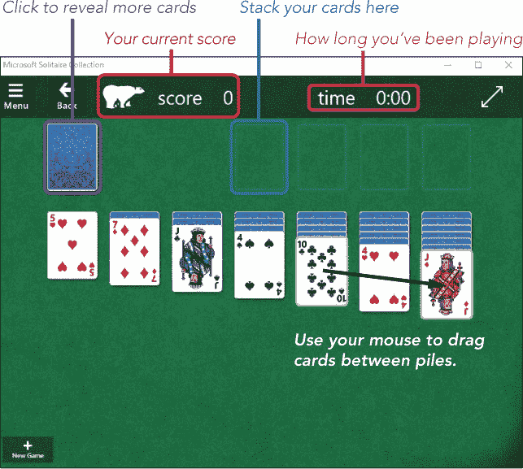

Klondike 游戏的目标是将所有牌按照花色从 Ace 到 King 排列到右上角的空槽中。要将牌移动到堆叠中，将鼠标光标移到一张牌上，点击并按住鼠标左键，将鼠标移动到相应的堆叠上，然后松开鼠标按钮。你可以通过将一张 Ace 移动到任何空槽来开始一个堆叠。

你还可以通过在底部的列之间移动牌来展示新牌。你可以通过按住左键拖动牌到新的堆叠来实现。对于底部的列，牌必须按降序排列，并且红黑交替。例如，在上面的图片中，黑色的 10 可以移到红色的杰克上，但不能放在黑色的杰克上。

点击左上角的牌堆，展示三张新的牌。你只能移动这三张牌中的顶部一张，方法是点击该牌并将其拖动到一列或一堆。

点击右上角的双箭头，使游戏占据整个屏幕。当游戏占据整个屏幕时，你可以再次点击按钮将其缩小。

如果你卡住了并想重新开始一局游戏，点击屏幕左下角的**新游戏**按钮，从一副新牌开始。

#### 结束游戏

你可以像关闭第一课中的计算器应用一样关闭微软纸牌合集。点击右上角的**关闭按钮**，如下所示。这将带你回到桌面。

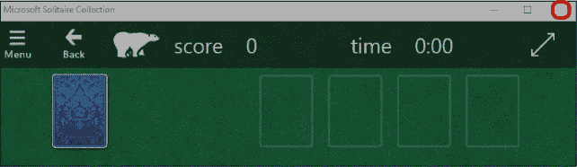

如果你在开始游戏但未完成时关闭此应用，系统会自动保存你的会话。这样，下次打开应用时，游戏会从你上次会话的相同位置继续。这让你可以在下次打开应用时继续完成游戏！

如果你想尝试不同版本的纸牌，只需点击屏幕左上角的**返回**按钮，选择其他游戏。

#### 再次打开纸牌游戏

第一次打开微软纸牌合集时，你可以直接开始游戏。然而，当你第二次打开应用时，可能会被要求创建一个 Xbox 个人资料，如下所示。这样，你可以追踪你的分数并与朋友们在线分享进度。

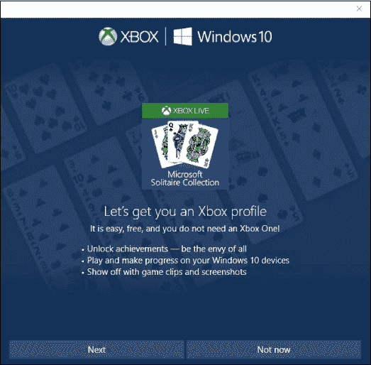

如果你对这个感兴趣，点击**下一步**并按照提示操作。然而，如果你只是想玩游戏，点击**稍后再说**。微软纸牌合集应用会询问你是否确定这样做，所以勾选“**不再显示此内容**”并点击**作为游客玩**。

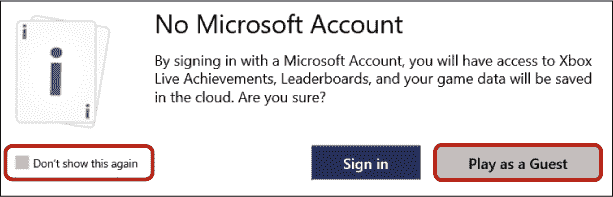

现在你可以像之前一样选择你最喜欢的纸牌类型并开始游戏。

**活动 #3**

在这个活动中，你将尝试微软纸牌合集中的另一款游戏！

1.  通过开始菜单打开**微软纸牌合集**。

1.  打开**蜘蛛纸牌**游戏。

1.  完成一局蜘蛛纸牌游戏。

1.  关闭微软纸牌合集应用。

### 天气应用

现在我们来看看天气应用。天气应用会告诉你任何你选择的位置的当前天气。它还会显示未来几天的天气预报，帮助你做出相应的计划。记住，你需要连接到互联网才能使用天气应用。让我们从打开天气应用开始：

1.  点击屏幕左下角的**开始按钮**。

1.  开始菜单将打开，你应该能看到一个带有白色太阳图标的瓷砖，标注为**天气**，如下所示。（你的天气瓷砖可能会显示当前温度，而不是白色太阳。）点击此瓷砖以打开天气应用。

    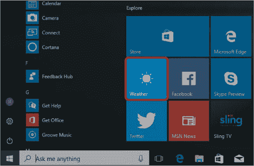

1.  如果你在开始菜单中找不到天气应用，可以使用搜索功能。在开始按钮旁的搜索框中输入**weather**，然后点击出现列表中的**天气**。

    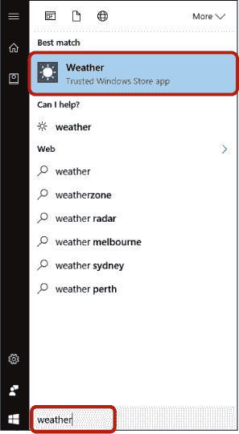

1.  如果这是你第一次打开天气应用，你将看到如下所示的屏幕。

1.  点击华氏或摄氏温度，根据你的偏好选择。

1.  天气应用还会提示您设置默认城市。以后每次打开天气应用时，它会自动为您显示默认城市的天气，因此最好使用您自己的位置。您可以通过让 Windows 检测您的位置或自行选择位置来完成此操作。

    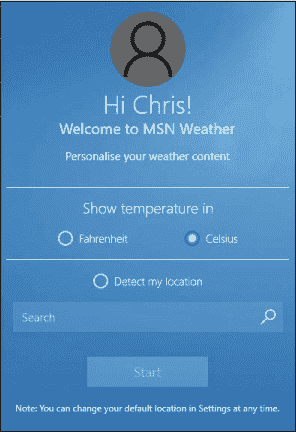

1.  要让 Windows 检测您的位置，请点击**检测我的位置**。接下来，系统会提示您授予天气应用访问您位置的权限。点击**是**。

    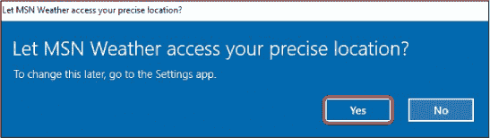

1.  如果您不希望应用访问您的位置信息，可以点击“检测我的位置”按钮下方的搜索框，输入您的城市名称。

1.  点击**开始**以保存此信息。

天气应用现在应该已经打开，并显示您当前城市的天气预报，如下图所示。

天气应用将告诉您当前的温度以及一些关键事实，如风速和湿度。此信息会显示在接下来的几天预报之上。在每日预报下方，您会看到当天剩余时间的小时温度细分，并有一条线显示温度变化趋势。您甚至可以向下滚动查看更多详细信息，例如太阳的升起和落下时间！

### 日历应用

电脑上还有一个方便的应用——日历应用。日历应用帮助您跟踪约会、生日、假期和其他重要事件。它就像是您电脑上的日程规划器。更棒的是，日历应用可以显示一个小通知，提醒您活动或约会即将开始。这样的助手真是值得拥有！

#### 设置日历应用

打开日历应用，请按照以下步骤操作：

1.  点击屏幕左下角的**开始按钮**。

1.  开始菜单将会打开，您应该会看到日历应用的磁贴。它可能会显示“日历”字样或当前日期。点击**日历**磁贴。

    

1.  如果在开始菜单中看不到日历应用，请使用搜索功能。点击开始按钮旁边的搜索框，输入**日历**。从出现的列表中点击**日历**。

    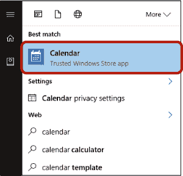

1.  点击**开始使用**。

    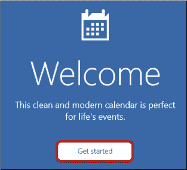

1.  如果这是您第一次使用日历应用，系统会提示您添加一个账户或使用现有账户。日历应用会使用您的账户来为您分配约会和事件。您将使用在“创建 Microsoft 账户”中设置的相同 Microsoft 账户，该页面位于第 20 页。该账户应该会出现在账户列表的顶部，因此只需点击**准备好开始**。

    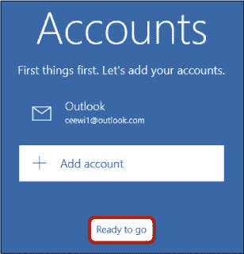

    如果您没有看到您的账户，您可能在使用本地账户而不是微软账户。请参阅“切换到微软账户”第 297 页，了解如何创建微软账户。

这将打开您的个人日历！

#### 认识日历应用

现在日历应用已设置好，接下来是时候开始组织您的日程了。让我们来看一下主日历屏幕。

今天的日期将以蓝色显示。在左侧，您会看到一个迷你日历，提供月份的鸟瞰视图。您可以使用这个来查看未来或过去的月份，同时保持主日历显示今天的日期。

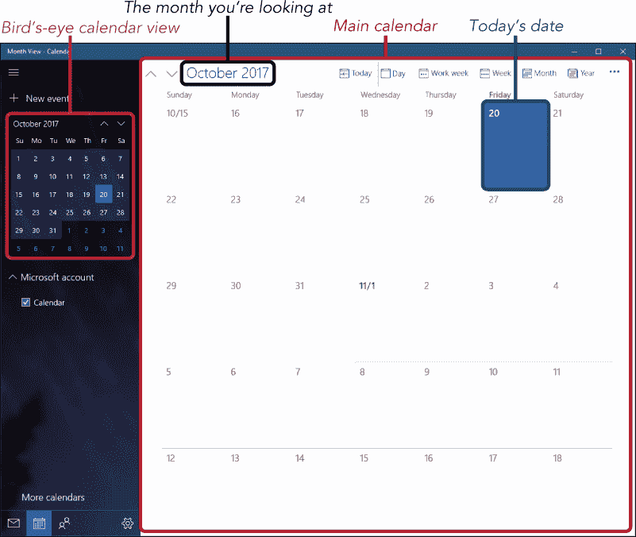

您的日历不限于当前月份；您可以前后移动查看未来和过去的预约和事件。

要在日历中移动，请使用以下按钮：

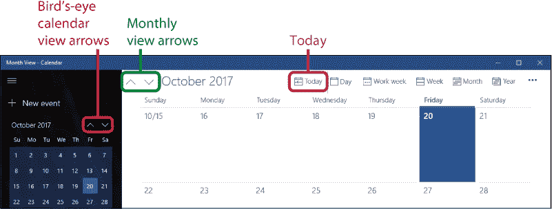

*****   **月视图箭头：** 点击向上箭头返回一个月，点击向下箭头前进一个月。

*****   **今天：** 点击此按钮可快速返回到当前日期。

*****   **鸟瞰日历视图箭头：** 点击这些箭头，通过下图中突出显示的箭头在鸟瞰日历视图中滚动。

一旦您熟悉了如何在日历中移动到不同的日期，就可以开始添加事件了。

#### 添加事件

日历应用是存储您想跟踪的重要事件和预约的绝佳地方。您可以轻松查看所有即将发生的事件，添加新事件，甚至在事件开始前收到提醒。这比墙上的日历方便多了！下面是如何添加事件：

1.  点击**新建事件**按钮，按钮在此处突出显示。

    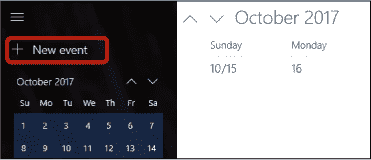

1.  日历应用会打开一个表单，询问有关事件的一些信息，包括事件名称、位置、开始和结束时间以及任何额外的细节。您不必填写所有信息，但至少填写事件名称和开始日期及时间是个不错的主意。

    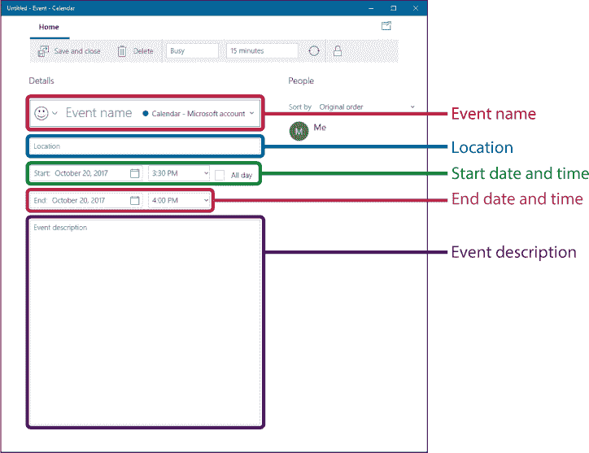

    *****   **事件名称：** 点击包含“事件名称”字样的框（这些字样在您开始输入时会消失）。输入事件的名称（例如，“医生预约”）。保持简短而容易识别，因为这个名称会出现在主日历中相应日期的小框里！

    *****   **位置：** 您可以存储事件的位置，以便它提醒您需要去哪里。点击**位置**框并输入事件的位置。可以是完整的地址，也可以是简单的提醒，例如“玛丽的家”。

    ***** **开始日期和时间：** 选择事件的日期，或者如果您的事件持续超过一天，则选择事件开始的日期。您可以直接输入日期，或者点击日期旁边的小日历符号（下图所示）从列表中选择。记得点击上下箭头切换月份（如果需要）。

    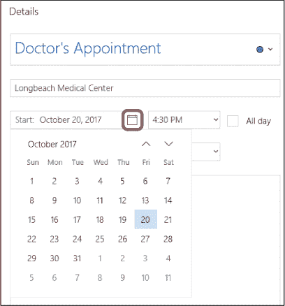

    选择事件的开始时间，点击时间旁边的下拉箭头，并从时间列表中选择。您可能需要向下滚动一些才能找到合适的时间。如果您的事件在某个特定时间开始，而该时间未显示在列表中，您可以手动输入，但请确保输入是否是上午（AM）或下午（PM）。否则，它可能会显示在错误的时间！如果事件将占用整天，您也可以勾选**全天**框，或者如果您不希望指定确切时间，也可以选择此选项。

    ***** **结束日期和时间：** 选择事件结束的日期和时间。如果您没有选择结束日期或时间，日历会自动将事件设置为从开始日期和时间起持续半小时。

    ***** **事件描述：** 如果您有更多的细节想要添加，可以在此字段中输入。

##### *添加提醒*

日历应用可以在事件开始前，在您的计算机屏幕角落弹出一个小框提醒您，并提供事件详情摘要。无论您是否在那个时刻打开了日历应用，都会出现这个框。这样，您就不会在繁忙的日程中忘记重要的约会。

这是如何添加提醒的步骤：

1.  点击**提醒**框，如下图所示。

    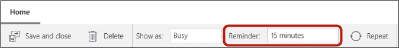

1.  选择您希望何时收到事件的提醒。例如，30 分钟提醒将提前 30 分钟通知您事件开始的时间。

***** ***注意：** 当提醒框弹出时，您可以通过点击**关闭**按钮将其关闭。或者，您可以点击**稍后提醒**按钮，几分钟后再次收到事件提醒。*

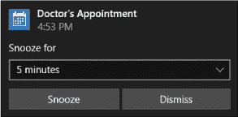

##### *保存您的事件*

在您设置好事件详情后，您可以保存事件。只需点击**保存并关闭**按钮，即可保存您的详情和提醒。

现在，您将返回到主日历屏幕。您的事件应该会出现在适当日期的蓝色条形区域中，如下图所示。此蓝条仅显示事件的部分信息。要查看任何事件的完整详情，只需用鼠标单击它一次。

***** ***提示：** 您也可以通过点击适当的日期框来创建事件；这将弹出一个“新事件”表单的小版本，如下图所示。您可以在此处添加一些细节，或者点击**更多详情**以弹出完整的表单。*

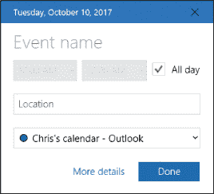

#### 删除事件

如果一个事件被取消，或者你不再需要它出现在日历上，你可以将其删除。以下是删除事件的方法：

1.  在你的日历中找到该事件，并右键点击蓝色的阴影条。

1.  点击下方的**删除**按钮。

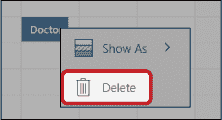

该事件将从你的日历中消失。

**活动 #4**

让我们练习将事件添加到你的日历中：

1.  将你最亲密的朋友和家人的生日添加到日历中。

1.  将下周即将到来的重要事件添加到你的日历中，并确保设置提醒。

1.  关闭日历应用。

### 更多应用，更多乐趣

我们已经了解了一些最受欢迎的应用，但你的电脑中还有许多其他应用。因此，接下来的挑战是去探索！浏览开始菜单左侧的完整应用列表，并查看其中的一些应用：

*****   **新闻：** 跟进你所在地区的最新新闻。

*****   **人脉：** 这是一个数字地址簿，帮助你跟踪你认识的人及其联系方式。

*****   **体育：** 查找最新的体育新闻和比分。

*****   **语音记录器：** 使用你的麦克风录制自己的讲话。这个应用非常适合做快速笔记或录制信息发送给他人。

不要害怕尝试你找到的其他应用。正如本课程开始时提到的，你不会意外花费任何钱，因此没有风险。不过，请记住，某些应用（例如新闻和体育）需要连接到互联网才能正常工作。

### 呼，做到了！

在本课程中，我们学习了一些电脑自带的免费应用。你学会了以下内容：

*****   使用 Microsoft Solitaire Collection 玩纸牌游戏

*****   使用天气应用检查天气

*****   将事件添加到你的日历中

在下一课中，你将开始学习如何将照片放入你的电脑中。

**课程回顾**

恭喜！你已完成课程 2。接下来的活动将帮助你回顾所学内容。如果你能够自信地完成所有这些活动，那么你就准备好学习课程 3 了。如果没有，不要气馁——继续通过尝试不同的应用来练习吧！

1.  打开 Microsoft Solitaire Collection 并赢得一局 FreeCell。

1.  打开天气应用，查看明天你家乡的最高气温。

1.  打开日历并添加一个名为“完成课程 3”的事件，安排在下周某个时间。确保分配至少两个小时！

1.  探索开始菜单中的应用，并尝试任何你感兴趣的应用。
