## 第四章：课程 3

## 照片应用程序

本课程介绍了照片应用程序，并展示了一种简单且实用的方式来享受你的照片。

为什么我要使用照片应用程序？

从胶片照片到数字照片

连接你的相机或手机

导入照片

查看照片

删除不需要的照片

开始编辑！

裁剪和旋转

通过增强提高质量

通过滤镜添加效果

进一步调整

保存你的编辑

打印传统的纸质照片

呼，完成了！

照片应用程序是另一个已预装在你的 Windows 10 电脑上的免费应用程序。我们将首先探讨如何将照片从相机或手机添加到电脑，然后你将了解如何查看和编辑你的图片。我们将以打印照片作为本课的结尾，这样你就可以与朋友分享或将它们放入相框！

### 为什么我要使用照片应用程序？

照片应用程序使得管理数字照片变得容易。数字照片在现代生活中无处不在——而且有充分的理由！与传统的照片相册不同，你可以以有序且易于管理的方式存储数百甚至数千张照片，而无需占用你家里的空间。数字照片意味着没有浪费，而且因为你不再使用胶片，你可以拍摄尽可能多的照片，只要这些照片能存储在相机或手机的内存中——这通常可以存储数千张！你可以拍摄任意数量的照片，然后查看这些照片的数字文件，决定保留哪些，打印哪些，以及删除哪些以腾出空间存储更多的照片。

数字照片还可以做很多胶片照片做不到的事情。通过照片应用程序，你可以改善、修复和编辑你的照片；你可以将照片旋转到正确的方向；还可以裁剪照片去除不需要的物体。当你对照片满意后，你可以打印任意数量的副本与朋友和家人分享，或者发送数字副本让别人立即接收（我们将在第 4 课中讨论如何通过电子邮件发送图片文件）。

### 从胶片照片到数字照片

在本课中，你将学习如何将来自数码相机或手机的照片添加到照片应用中。这非常简单，但仅适用于数码照片，而不适用于使用胶卷拍摄的老旧硬拷贝照片。不过，如果你有大量胶片照片，可以通过扫描将其转化为数字版本，方便在照片应用中使用：你需要使用*扫描仪*，它是一个外部设备，能够创建照片的数字副本。扫描仪价格相对便宜，许多公共图书馆都有提供。如果你想了解如何连接扫描仪，可以参考“连接打印机、扫描仪、网络摄像头或其他设备”，并查看第 293 页。

另一种将打印照片数字化的快速方法是直接使用手机或数码相机拍摄照片。这是与朋友和家人在线分享旧照片的简便方式，尽管照片质量可能不足以进行新的打印。

### 连接你的相机或手机

如果你使用计算机或平板电脑的相机拍摄了照片，这些照片会自动出现在照片应用中，无需手动添加！在这种情况下，你可以跳到“查看照片”，第 80 页进行操作。但如果你是用手机或数码相机拍摄的照片，你需要先将它们添加到计算机中，才能在照片应用中处理它们。

首先，你需要将相机或手机连接到计算机。大多数相机和手机都会附带一根电缆，称为*USB 电缆*，用来进行连接。电缆的一端是小矩形插头，另一端是较大矩形插头，像下图所示。找到适合你手机或相机的电缆后，按照以下步骤操作：

1.  将电缆的较大端插入计算机。如果你使用的是笔记本电脑或平板电脑，请在侧面找到适合电缆的小矩形端口，如下所示。

    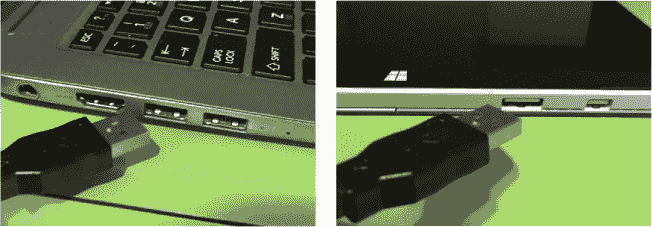

    如果你使用的是台式计算机，端口通常位于主机单元上。通常，主机的前面会有端口，但如果找不到端口，可以查看计算机背面。

1.  将电缆的较小端插入相机或手机，如图所示。

1.  打开相机或手机。大多数相机会自动连接；但有些相机或手机可能需要你按下设备上的按钮来建立连接。例如，在 iPhone 上，你需要按下**信任**按钮，才能在另一设备上访问你的照片。如果你的相机或手机似乎无法连接，查看屏幕上是否有任何提示。请查阅相机手册了解更多细节。

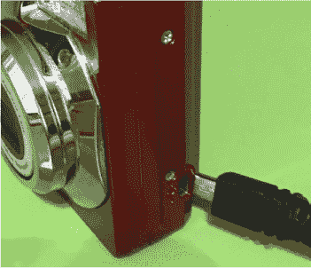

### 导入照片

现在是时候将相机或手机中的照片添加到“照片”应用了！这被称为*导入*照片，这意味着照片将从您的设备复制到计算机上并存储。在您开始之前，重要的是要知道，将照片添加到“照片”应用不会删除相机中的照片。稍后我们会介绍如何从相机中删除照片，这样可以释放存储空间，但此操作不会自动发生。要导入照片，请按照以下步骤操作：

1.  点击屏幕左下角的**开始按钮**。

1.  开始菜单将出现。找到下面突出显示的**照片**磁贴，点击它一次。

    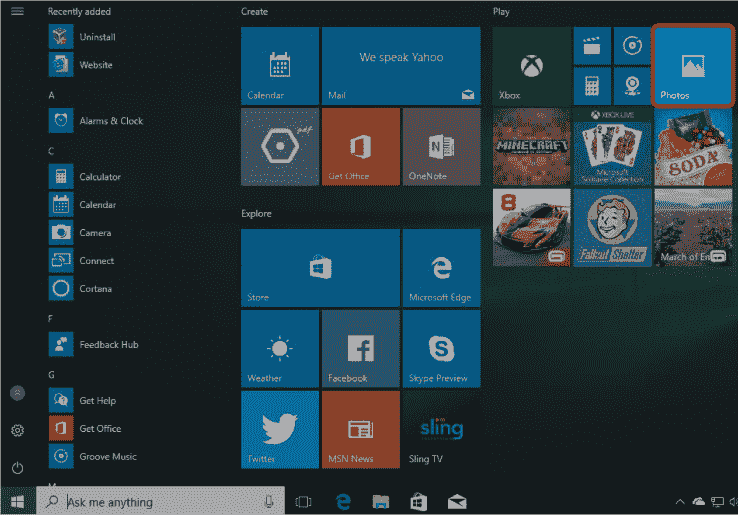

1.  如果在开始菜单中看不到此磁贴，请点击开始按钮旁边的搜索框，然后输入**照片**。从出现的列表中点击**照片**。

1.  这应该会打开“照片”应用。根据您使用的“照片”应用版本，您的屏幕可能会有所不同。

    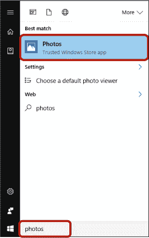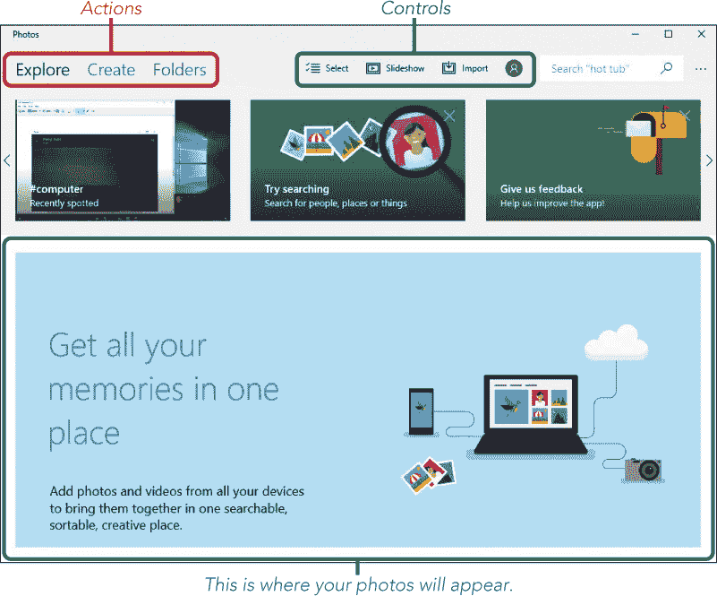

1.  **导入**按钮将从您的相机或手机加载图片到计算机中，以便在“照片”应用中使用。现在点击此按钮。

    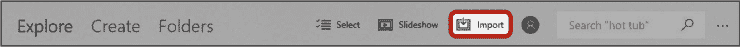

1.  如果您连接了多个相机、手机或其他照片设备，系统会提示您选择要导入的设备。通过点击设备名称一次来选择您刚刚通过电缆连接的设备。如果您只连接了一个设备，应用会自动选择该设备进行导入，您将不会看到此步骤。

1.  如果您收到“没有照片可导入”的消息，或者设备没有出现在列表中，请再次检查您的手机或相机屏幕，看看是否有一个标签为**信任**或**允许**的按钮。如果有，请点击它以允许计算机查看您的照片。否则，请再次检查计算机与设备之间的连接线。

1.  选择设备后，您应该会看到该设备上存储的照片列表。这些照片显示较小，以便高效列出，但一旦导入，您可以查看更大的版本！您会看到一个勾选标记，表示这些照片将被导入，如下图所示。应用程序会默认导入所有照片，除非您通过*取消选择*照片来告诉它不导入某些照片。如果您不希望某些照片被导入，只需点击该照片一次，勾选标记会消失，表示该照片不会被导入。

    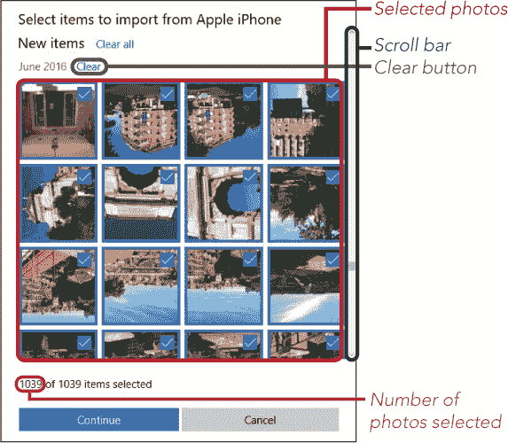

    让我们更仔细地看看您屏幕上看到的内容：

    *****   **已选择的照片：** 照片的小版本将显示在列表中，已选定导入的照片会显示勾选标记。如果您不想导入某张照片，请单击它一次，勾选标记应该会消失。

    *****   **已选择的照片数量：** 这是您设备中已选定导入的照片数量。它可能比您预想的要多！

    *****   **清除：** 如果你只想导入几张照片，但选择了很多照片，点击**清除**按钮一次就可以取消选定某一月份的所有照片，然后滚动并点击你想导入的照片。使用“清除”按钮比逐一取消选择所有照片要更快捷！

    *****   **滚动条：** 如果设备中有很多照片，你需要向下滚动才能看到其余的照片。为此，点击滚动条并按住鼠标按钮，然后像在第 1 课中那样上下拖动鼠标。这会使“照片”应用的屏幕移动，显示更多的照片。

1.  当你对选定的照片满意时，点击前图中显示的**继续**按钮。

1.  将会出现一个类似于下面的窗口，询问你是否确认要导入这些照片。如果你希望在导入后删除设备中的照片，请勾选标有**“导入后从[你的设备]删除导入项”**的复选框。

    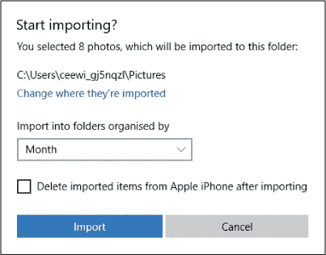

    一旦这些照片被删除，它们将从设备中永久消失。然而，它们此时会被存储在你的计算机上。如果你的设备空间不足，这样做可能是个不错的选择。

1.  点击**导入**按钮。

1.  照片现在开始导入。根据照片的数量，可能需要一两分钟的时间。你可以在屏幕顶部查看进度。一旦进度条填满，导入就完成了。

1.  当导入完成后，你的照片将按拍摄日期分组，如下所示。你可能需要使用滚动条向下滚动页面才能查看所有照片。

    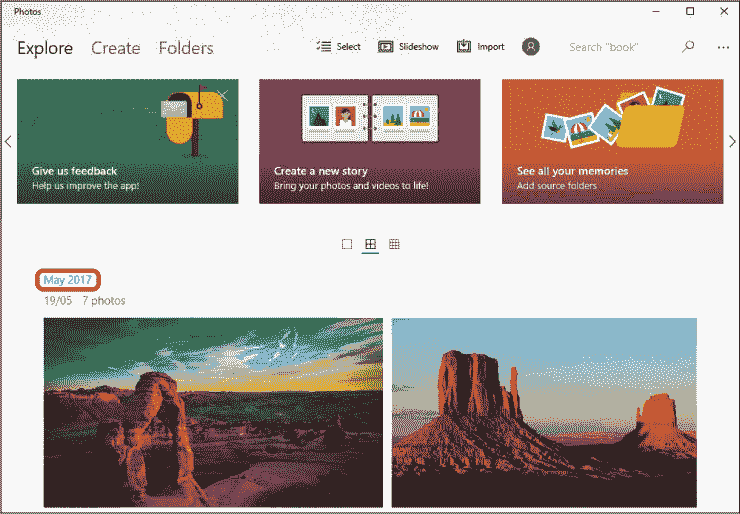

恭喜你——你已经导入了照片！

**活动 #5**

在这个活动中，你将使用相机或手机拍摄并导入一些照片，以便稍后查看或编辑。

1.  使用你的相机拍摄以下照片：

    *****   一张有物体（如植物）位于中央的风景照

    *****   一张倒立的树木照片

    *****   你花园的一个阴暗角落或一个房间

    *****   你家或花园的几张照片

1.  将你的相机或手机通过数据线连接到计算机。

1.  将你的新照片导入“照片”应用，但不要删除相机中的照片。记住，如果你只想添加几张照片，点击**清除**按钮然后选择那些照片来导入可能是最好的选择。

### 查看照片

现在你已经在“照片”应用中有了一些照片，是时候享受它们了！要查看一张照片，请按照以下步骤操作：

1.  点击你想查看的照片。

    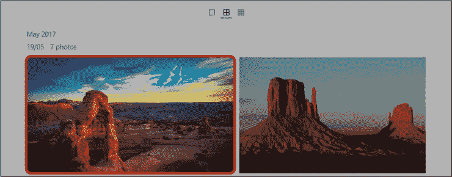

1.  这应该会以更大的尺寸单独显示照片。记得在第 1 课中，你可以通过点击右上角的**最大化按钮**（下图高亮显示）让应用占满整个屏幕，这样你就可以看到更大的照片。你也可以通过双击照片来放大—即快速连续点击两次左键。

    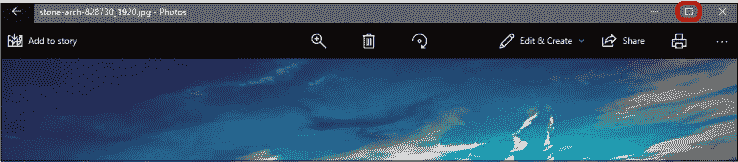

1.  你可以通过点击屏幕左上角的**返回按钮**返回到照片列表（在平板电脑上，这个箭头会出现在左下角）。

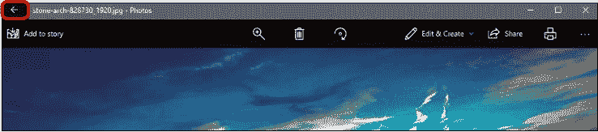

### 删除不需要的照片

现在你已经查看了你的照片，可能会决定删除一些不想保留的照片（例如，如果你不喜欢它们，或者如果你有很多相同内容的照片，只想保留最好的）。幸运的是，照片应用可以轻松删除照片。删除照片的步骤如下：

1.  找到你想删除的照片并点击它，以全尺寸查看。

1.  点击屏幕顶部的**删除按钮**（这里高亮显示）。

    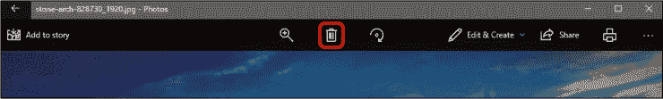

1.  将会出现一个确认框，询问你是否确定要删除这张照片。点击**删除**。

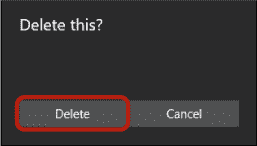

**活动 #6**

在这个活动中，你将删除你在活动 #5 中拍摄的花园或房间照片。

1.  查看你在活动 #5 中拍摄的照片，并找到你花园或房间的照片。

1.  删除你最不喜欢的那张。

### 开始编辑吧！

我们每个人都拍过不完美的照片！也许你拍的照片是倒立的，或者不小心把你的拇指或其他不需要的物体拍进了画面。别担心，照片应用可以帮助你修复和改善照片！试试看：

1.  找到你想编辑的照片并点击它，以全尺寸查看。

1.  点击屏幕顶部的**编辑与创建**按钮。

1.  一个下拉菜单将会出现。点击**编辑**按钮。

    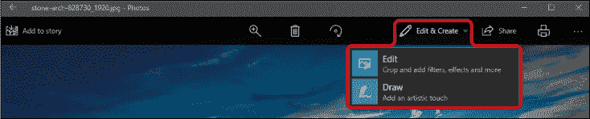

1.  这应该会在屏幕右侧以列的形式显示编辑选项列表，如图所示。

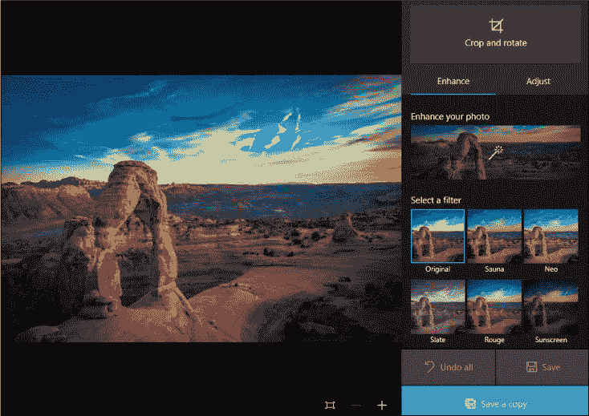

#### 裁剪和旋转

这个工具允许你删除照片中不需要的部分，并旋转照片。

1.  点击**裁剪和旋转**，调出裁剪和旋转屏幕。

1.  照片周围应该会出现一个四个白点的框。点击一个点并向内拖动，选择你想保留的照片区域。框外的区域将被裁剪掉。

1.  点击**旋转**按钮，将图片顺时针旋转 90°。

1.  一旦你对裁剪和旋转满意，点击屏幕底部的**完成**返回编辑界面。

#### 通过增强改善质量

增强工具会使用一些默认设置自动调整照片，试图通过提高对比度和饱和度来修正光线和颜色等方面。

1.  点击**增强你的照片**。

1.  一条白色滑块将出现在“增强你的照片”按钮上方。点击并拖动滑块左右调整增强效果，直到你满意为止。

#### 使用滤镜添加效果

滤镜改变照片的色调或颜色，达到戏剧化效果。使用滤镜是编辑照片的一种流行方式。每个滤镜的名称出现在照片小预览图下方，展示应用该滤镜后照片的效果。

1.  点击滤镜（点击照片的预览图，而不是名称）来应用它。

1.  一条白色滑块应出现在照片下方。拖动滑块左右调整滤镜效果的强度。

#### 进一步调整

还有一些其他调整可以改变图像的光线、颜色或清晰度。

1.  点击**调整**标签。

1.  以下调整选项将出现：

    *****   **亮度：** 使整个照片变亮或变暗。

    *****   **颜色：** 增加或减少颜色的饱和度，使颜色更加或稍微少一些鲜艳。

    *****   **清晰度：** 使图片更清晰（减少模糊）或更柔和（增加模糊）。

    *****   **暗角：** 加深图像的边缘。

    *****   **红眼：** 去除面部的“红眼”效应。

    *****   **修复点：** 修复照片中的瑕疵或其他小缺陷。

1.  点击一个调整选项来应用它，并从左到右拖动白色滑块来改变调整的程度。

#### 保存你的编辑

编辑完成照片后，你会想保存你辛苦编辑的成果！

1.  找到编辑屏幕底部的**保存**按钮并点击它。你的编辑后的照片将被保存！

1.  如果你决定不喜欢编辑结果，并且希望恢复原始照片，点击**撤销所有**。这将删除你所有的编辑。

### 打印老式的纸质副本

在你把照片编辑成杰作后，可能想要打印出来，放入相框或展示给朋友！为了获得最佳打印效果，打印重要图片时，建议使用照片纸，你可以在任何文具店购买。照片纸的价格略高于普通纸，但能呈现出更好看的照片。

***** ***注意：** 要打印照片，你的电脑必须连接到打印机。有关如何将电脑与打印机连接的说明，请参见 “连接打印机、扫描仪、网络摄像头或其他设备” 第 293 页 (page 293)。*

打印照片，按照以下步骤进行：

1.  找到你想要打印的照片，并点击它以查看全尺寸。如果你想进行任何编辑，请在打印前完成编辑。

1.  点击控制区中的**打印按钮**，如下一张图片所示。

    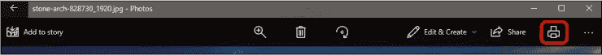

1.  这将打开一个窗口，右侧显示打印预览，左侧显示一些打印选项。让我们来看看一些重要选项：

    *****   **打印机：** 使用此下拉框确保选择了正确的打印机。

    ***** ***提示：** 打印机在“照片”应用中按品牌和型号列出。如果你不确定列表中的哪个打印机是你连接的那个，可以将品牌和型号与打印机上的品牌和型号进行对比。通常可以在打印机的顶部或前面找到这些信息。*

    *****   **副本：** 使用右侧的加号按钮打印多份照片。

    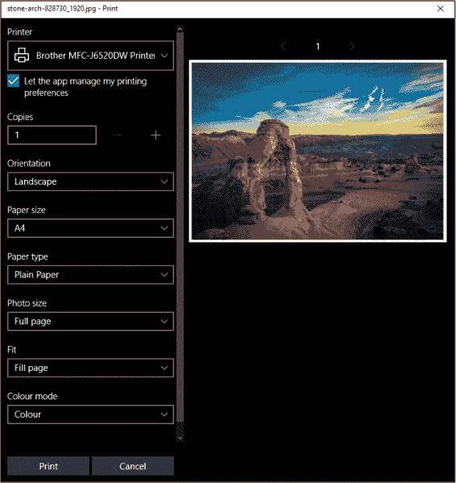

    *****   **方向：** 在这里你可以选择是否希望以横向或纵向模式打印。横向图像比高度宽；纵向图像比宽度高。

    *****   **纸张尺寸：** 确保选择正确的纸张尺寸非常重要，否则你的照片可能无法打印。普通的打印纸一般为信纸大小，但你也可以购买 4“×6”的照片纸和其他各种尺寸。如果你使用的是照片纸，纸张的尺寸通常会列在包装的正面或背面。

    *****   **纸张类型：** 在这里，你需要选择你正在使用的纸张类型。如果你使用的是普通复印纸，保持“普通纸”设置。如果你使用的是照片纸，选择“照片纸”非常重要。

    *****   **照片大小：** 这是打印时照片的尺寸。

    *****   **适应：** 如果照片与纸张尺寸不完全匹配，此选项将改变照片的打印方式。如果设置为**全页**，照片的边缘可能会被裁剪，以便填满整个页面。如果设置为**缩小以适应**，则整张照片会被打印出来，可能会在两侧留下空隙。

    *****   **颜色模式：** 这让你选择是否希望以彩色或黑白打印照片。

1.  选择好打印设置后，点击**打印**按钮。

你的图像现在应该已经打印出来了！

### 呼，终于完成了！

在本课中，我们学习了如何使用“照片”应用程序。我们从相机导入了图片，并讨论了如何编辑照片和打印它们。在本课中，你学会了以下内容：

*****   将相机或手机连接到你的电脑

*****   从你的相机或手机导入照片

*****   在你的电脑上查看和删除照片

*****   对照片进行更改，包括裁剪、旋转和增强

*****   打印你的照片

在下一课中，你将学习如何从电脑发送和接收电子邮件。

**课程回顾**

恭喜！你已经完成了第 3 课。利用这个机会通过完成以下活动回顾你所学的内容。如果你能够自信地完成所有这些活动，那么你已经准备好进入第 4 课。如果没有，那就继续通过导入、查看和编辑照片来练习吧！

1.  使用你的相机或手机拍一些照片。尝试拍摄一些低质量的照片，以便你可以练习编辑和调整它们。

1.  将你的相机连接到电脑。

1.  将这些照片导入到你的电脑中。

1.  编辑图片以改善它们。尝试不同的编辑选项。

1.  删除那些通过编辑无法令人满意地改善的照片。

1.  打印你最喜欢的照片。
