## 第 4 课

## 电子邮件

在本课程中，您将学习如何设置 Windows 邮件应用程序、发送电子邮件、接收和回复电子邮件以及发送照片。

电子邮件到底是什么？

打开邮件应用

设置邮件应用

检查电子邮件

接收电子邮件

打开电子邮件

阅读电子邮件

切换到另一个电子邮件帐户

发送电子邮件

回复电子邮件

发送图片和其他文件

打开附件

删除电子邮件

搜索电子邮件

保持电子邮件安全

呼，完成了！

### 电子邮件到底是什么？

*电子邮件*是您可以使用计算机发送和接收的电子邮件。电子邮件有许多优点：发送和接收都免费，无论消息长度如何；它是即时的；您可以发送图片、视频、链接到有趣的网站等等。全世界有数百万人依赖电子邮件进行日常通信。而且，既然这么多人使用电子邮件，您的朋友和家人很可能已经在使用它，使得电子邮件成为与您认识的人保持联系的简单方式。

许多应用和电子邮件服务将电子邮件称为“消息”，因此，如果您看到“*消息*”一词而不是*电子邮件*，只需知道它们通常是一样的。

就像传统邮件一样，要发送电子邮件，您需要知道*发送到哪里*。这就是电子邮件地址的作用：*电子邮件地址*是一个唯一的地址，确保您的电子邮件准确无误地发送给正确的人。这也意味着人们可以通过您的电子邮件地址与您联系，而不用担心他们的电子邮件发错人。电子邮件地址可能看起来像这样：*chrisewin@outlook.com*。

所有电子邮件地址中间都有一个@符号（发音为“at”）。@符号前的部分是您的唯一地址名称，这是在设置电子邮件帐户时选择的。@符号后的部分是您使用的电子邮件服务提供商。例如，Google 的电子邮件地址以*@gmail.com*结尾，Microsoft 的电子邮件地址以*@outlook.com*结尾。

您需要使用 Microsoft 帐户或您自己的电子邮件地址才能继续本章。如果您按照“设置计算机”中的步骤操作（第 17 页），您将已经拥有一个 Microsoft 帐户，其电子邮件地址以*@outlook.com*结尾。如果没有，请参阅“切换到 Microsoft 帐户”（第 297 页）检查是否拥有 Microsoft 帐户，如果没有，则设置一个帐户。

### 打开邮件应用

Windows 10 包括内置的邮件应用，它使得发送和接收电子邮件变得更加容易。如果您曾使用过较老的 Windows 计算机，您可能对 Windows Live Mail 或 Outlook Express 较为熟悉，它们也是电子邮件程序。邮件应用执行类似的功能，但其布局与 Live Mail 和 Outlook Express 有很大不同。还有其他方法可以使用基于网页的电子邮件管理器（如 Gmail 和 Hotmail），但为了简单起见，我们将重点介绍邮件应用。

打开邮件应用，请按以下步骤操作：

1.  点击屏幕左下角的**开始按钮**。

1.  开始菜单将会出现。找到下图所示的**邮件**磁贴，并单击一次。如果您找不到邮件磁贴，请点击开始按钮旁边的搜索框，输入**mail**，然后从出现的列表中点击**邮件**。

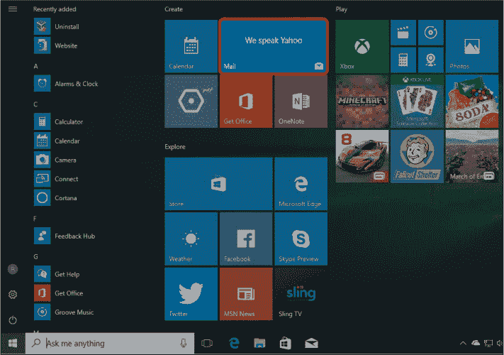

邮件应用将会打开。

### 设置邮件应用

如果这是您第一次使用邮件应用，系统会要求您进行快速设置。这个过程包括将您的电子邮件地址添加到邮件应用中，以便您可以发送和接收邮件。

1.  点击**开始使用**按钮，如下图所示。

    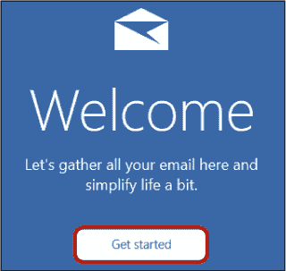

1.  如果您在“设置您的计算机”（第 17 页）中创建的*@outlook.com* 电子邮件账户是您唯一要使用的邮箱地址，请点击**准备就绪**，然后跳至“检查您的电子邮件”（第 96 页）。如果您希望设置更多账户，请继续执行第 3 步。

    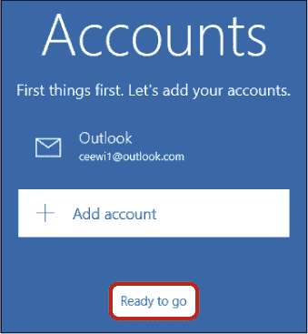

1.  您可以使用邮件管理所有电子邮件账户。要添加第二个电子邮件账户，请点击**添加账户**按钮。

1.  系统会要求您从电子邮件提供商列表中选择您要添加的账户类型。您可以根据电子邮件地址判断您的提供商。例如，如果您的电子邮件地址以*@yahoo.com* 结尾，那么 Yahoo 就是您的提供商，您拥有一个 Yahoo 邮箱账户。以下是一些其他常见的账户类型：

    *****   **Outlook.com:** 使用此类型账户的地址以*@outlook.com* 或 *@hotmail.com* 结尾。

    *****   **Google:** 一个 Google 邮箱地址以*@gmail.com* 结尾。

    *****   **iCloud (Apple):** 使用此类型账户的地址以*@iCloud.com* 结尾。

1.  从列表中选择您的电子邮件提供商。（如果您的电子邮件提供商未列出，请选择**其他账户**。）不同的电子邮件提供商可能会要求提供稍有不同的信息。请输入您的提供商要求的信息。

1.  点击**完成**以确认您的账户已设置好，如下图所示。

    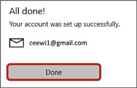

1.  点击**准备就绪**按钮。

恭喜！您的电子邮件已准备好使用。

### 检查您的电子邮件

在设置好电子邮件账户后，邮件应用应该会自动打开。屏幕分为三个区域：

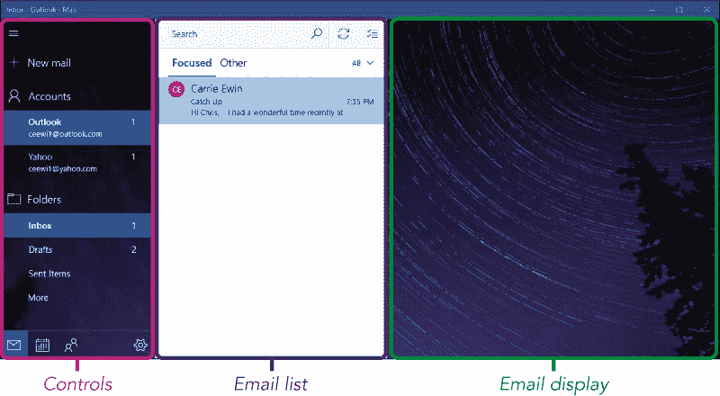

*****   **控制项：** 这个区域包含用于创建新邮件、切换账户、选择不同文件夹等工具。

*****   **邮件列表：** 中间部分显示所选文件夹中的邮件列表——例如收件箱或已发送邮件文件夹。

*****   **邮件显示区域：** 当你在邮件列表中选择一封邮件时，邮件的内容将显示在右侧。如果没有选择邮件，则会显示背景图像。

#### **接收邮件**

所有收到的电子邮件都会出现在你的收件箱中。当选择收件箱时，邮件将以列表的形式显示在屏幕中间。电子邮件列表中的每封邮件包含五个主要信息项，如下图所示。

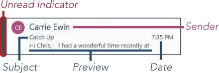

*****   **未读：** 邮件左侧有一条蓝色竖条表示你尚未阅读该邮件。

*****   **发件人：** 这是发送这封邮件的人的名字。

*****   **主题：** 这段蓝色文字描述了邮件的内容；这是由发件人编写的。

*****   **预览：** 这里显示邮件的前几个字。

*****   **日期：** 预览旁边显示的是邮件发送的日期。如果邮件是最近发送的，你将看到它发送的具体时间。

***** ***注意：** 一些（但不是所有）电子邮件账户会将收件箱分成两个部分，分别标为**重点**和**其他**。重点邮件是微软认为你最有可能想阅读的邮件，而其他邮件则包含所有剩余的邮件。如果你的账户采用这种分隔方式，默认情况下你会看到重点邮件，但你可以点击“其他”标题查看其余邮件。*

**活动 #7**

在本活动中，你将使用收件箱中的一封邮件来回答以下问题：

*****   你之前阅读过这封邮件吗？

*****   谁给你发了这封邮件？

*****   这封邮件是什么时候发送的？

#### **打开邮件**

点击一封邮件查看其内容叫做*打开*邮件，就像打开一封信一样。使用你在活动 #7 中查看的那封邮件，按照以下步骤操作：

1.  在收件箱中点击一次你想要阅读的邮件。

1.  这封邮件的内容现在会显示在右侧。

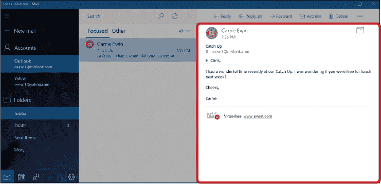

#### **阅读邮件**

有些邮件，比如接下来显示的这封，过长无法在屏幕上完全显示。幸运的是，你可以使用屏幕右侧的*滚动条*查看邮件的其余内容。你可以点击滚动条底部的箭头向下滚动邮件，顶部的箭头则带你返回顶部。如果你有带滚轮的鼠标，你也可以上下滚动滚轮来实现同样的操作。

在邮件顶部，你应该能看到邮件的发件人和发送时间，邮件的主题显示在下面。接下来，邮件会列出收件人（邮件可以同时发送给多人，所以你可能不是唯一的收件人）。然后是邮件的正文内容。

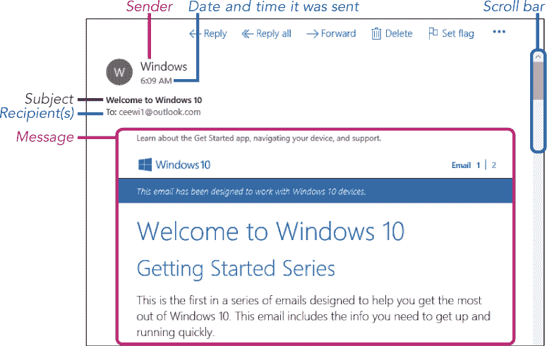

电子邮件的主题和意图因发送者而异。朋友和家人通过电子邮件保持联系，但公司也可以通过电子邮件广告他们的产品或服务。这并不一定是错的。毕竟，你可能也希望偶尔收到你本地商店的特别优惠。但如果你不想接收广告，企业应该允许你选择退出或“取消订阅”他们的邮件。只需点击邮件中标有“取消订阅”的链接。它通常出现在邮件的底部。具体措辞可能不同，但你应该能够在每封邮件中找到该链接。

#### **切换到另一个电子邮件账户**

如果你在邮件应用中设置了第二个电子邮件地址，你需要切换到该账户才能阅读其中的邮件。你应该能在屏幕左侧看到列出的账户。每个账户旁边的数字告诉你该账户目前有多少封未读邮件。要切换到另一个账户，只需点击你想切换的账户，如下所示。

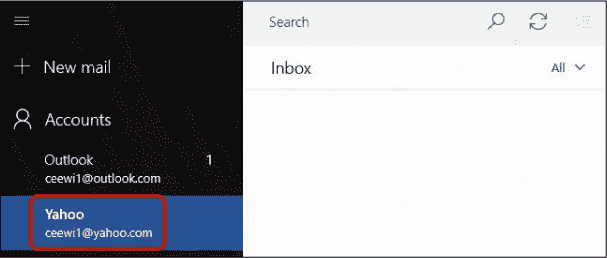

当你切换到另一个账户时，屏幕应该保持不变，但你将看到发送到该电子邮件地址的邮件列表。

### 发送电子邮件

现在你已经知道如何阅读电子邮件，是时候发送你自己的邮件了。记住，只要你知道对方的正确电子邮件地址，你就可以免费向世界上任何人发送邮件。发送电子邮件，请按照以下步骤操作：

1.  在屏幕左侧的控制面板中，点击**新邮件**按钮，如此处突出显示。

1.  新的邮件界面（应如下图所示）将在屏幕右侧出现。

    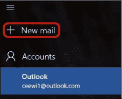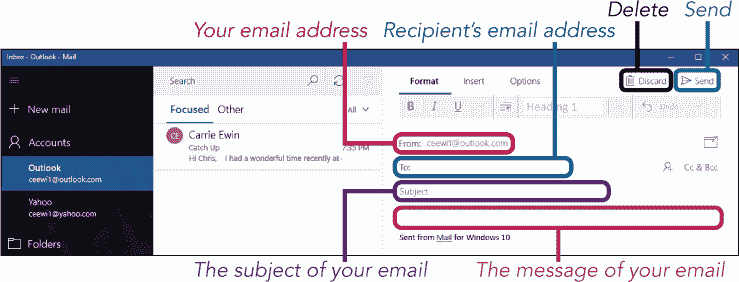

1.  点击**收件人**框，输入你想发送邮件的人的电子邮件地址。确保你正确输入了他们的电子邮件地址。如果你输入错误，请点击电子邮件地址的末尾，将光标放在那里，然后按下退格键删除错误。现在再试一次！

    好消息是，邮件会记住你之前发送过邮件的人的地址。如果你再次开始输入他们的地址，完整的地址应该会显示在下面，如下所示，你可以点击地址自动填充。

    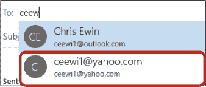

1.  点击**主题**框，将光标放在那里，然后输入几个描述你电子邮件内容的词语。最初会显示“主题”字样，但当你开始输入时，它会消失。

1.  点击主题下方的较大框框，将光标放在其中，然后输入你的电子邮件内容。

    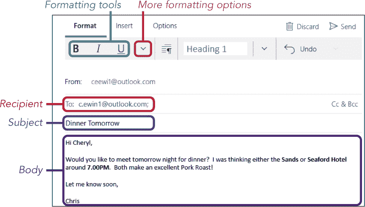

    注意，消息区域可能已经包含了“来自 Windows 10 邮件”的文字。你可以删除这些文字，也可以直接在它上面输入你的消息。你还可以*格式化*邮件中的文字，使用粗体文本和其他选项。要了解更多格式化内容，请翻到第 12 课—WordPad 中的格式化工具与邮件中的非常相似。

1.  当你准备好发送消息时，点击右上角的**发送**按钮。如果你决定不发送消息，点击**丢弃**按钮删除你刚刚输入的消息，并返回收件箱。

### 回复电子邮件

回复收到的邮件的最佳方式是发送一个*回复*。当你点击回复按钮时，邮件会自动创建一封电子邮件，收件人的地址已自动填写。主题框会保留原邮件的主题，并在前面加上“RE:”表示这是一个回复。这为你节省了很多工作，使回复变得非常简单！

原始邮件的内容应该包含在你的新邮件下方，以提醒大家正在讨论的内容。要回复一封电子邮件，请按照以下步骤操作：

1.  和之前一样，点击一封电子邮件将其打开。

1.  点击电子邮件显示区域顶部的**回复**按钮。

    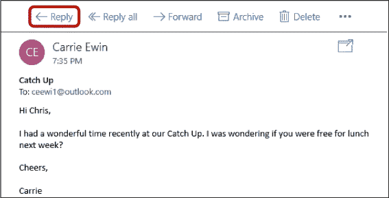

    ***** ***注意：** 如果一封电子邮件有多个收件人，你可以点击**全部回复**而不是仅回复，这样你的回复会发送给所有收件人。如果你想将邮件转发给别人，也可以点击**转发**按钮。*

1.  一封回复邮件将会打开，邮件中有一个空白区域，供你输入回复内容。请注意，收件人框和主题框已经填写好，原始邮件内容会显示在空白区域下方。你的光标应当位于原始邮件上方的空白区域。

1.  输入你的回复。当你准备好时，点击消息右上角的**发送**按钮。

你也可以回复别人回复的邮件。这会创建一个*电子邮件链*或*线程*，可以无限延续。但如果你是讨论新话题，最好开启一个新的电子邮件链。这样更容易管理你的邮件，也能更容易找到你需要的那封邮件。

**活动 #8**

在这个活动中，你将练习发送和回复电子邮件。

1.  给朋友发送一封邮件，要求他们回复——如果你愿意，可以告诉他们你正在做一个练习！

1.  当你收到回复时，阅读对方的消息。

1.  给他们的消息发送回复。

### 发送图片和其他文件

电子邮件的另一个优点是你可以发送电子文件，比如照片或简历，收件人几乎可以立刻收到它们。添加到电子邮件中的电子文件被称为*附件*。这相当于用回形针把照片夹在纸质信件里！要向新邮件添加附件，请按照以下步骤操作：

1.  从屏幕左侧的控制栏中，点击**新邮件**按钮来创建一封新邮件。

1.  像之前一样写一封电子邮件，输入收件人的电子邮件地址、主题和简短的消息。

1.  点击屏幕顶部的**插入**按钮。一个小菜单将会出现，展示你可以插入的不同内容。

1.  在此列表中，点击接下来的**文件**按钮。

    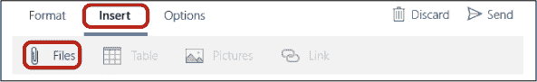

1.  这将弹出一个屏幕，询问你选择要发送的文件。找到屏幕左侧的*图片*文件夹，如下所示。

    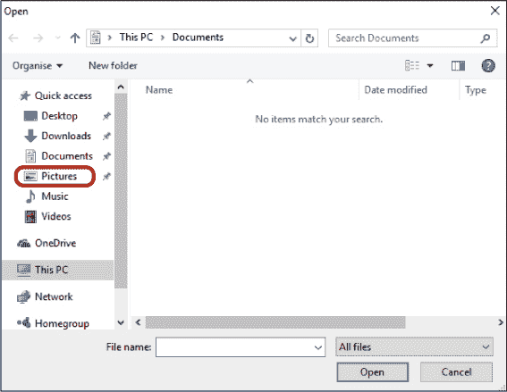

    ***** ***注意：** 你的电脑上的文件是通过文件夹组织和存储的。我们将在第 13 课中更详细地了解文件的存储和查找。现在，我们将专注于附加照片，但你也可以使用相同的过程来附加各种文件。*

1.  点击*图片*文件夹一次打开它。如果你看不到这个文件夹，可能需要滚动查看选项。你可以通过点击滚动条并按住鼠标按钮，拖动鼠标上下移动滚动条来滚动。

1.  屏幕现在应该显示*图片*文件夹的内容。它可能包含其他文件夹，文件夹图标看起来像是文件夹（如下所示）。这样有助于组织你的照片，以便你可以轻松找到它们。如果你已经完成了第 3 课，你应该能在一个标有你导入照片年份和月份的文件夹中找到这些照片。

1.  双击包含你第 3 课照片的文件夹，该文件夹标有你导入照片的年份和月份，如下所示。

    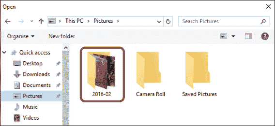

1.  这将打开该文件夹并显示其内容。找到并点击你想要附加到电子邮件中的照片；然后点击**打开**按钮，如下所示。

    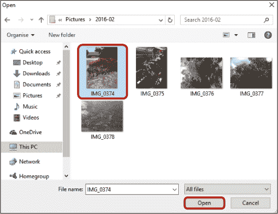

1.  现在你应该能在消息上方看到一张较小版本的附加照片，如下所示。

    ***** ***注意：** 如果你不小心附加了错误的文件并想要删除它，可以通过点击附件右上角的**关闭按钮**来删除它。*

    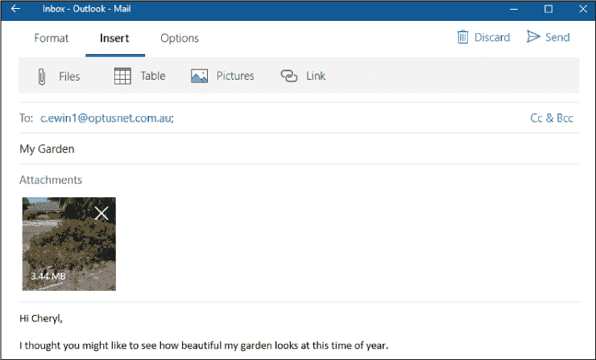

1.  如果要添加多个文件，请重新执行这些步骤，从第 4 步开始。你在每封电子邮件中可以添加的文件数量是有限制的。如果邮件提示你超过了限制，可能需要发送多封电子邮件以容纳所有的图片。

1.  点击**发送**按钮，发送附带照片的电子邮件。

**活动 #9**

在这个活动中，你将把一张照片附加到电子邮件中。

1.  给朋友或家人写一封带有信息的电子邮件。

1.  附上一张与邮件内容相关的照片，或者你认为收件人会喜欢的照片。

1.  发送附带照片的电子邮件。

### 打开附件

就像你可以将附件发送给朋友一样，朋友也可以将附件（如照片）发送给你。如果你收到带附件的邮件，邮件右上角会有一个回形针图标，方便你在收件箱中识别。你需要打开邮件才能查看附件。

1.  查看你的收件箱，找到带有回形针图标的邮件，表示它包含附件。

    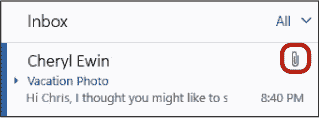

1.  点击邮件以显示邮件内容。

1.  附件应该显示在邮件内容上方，就像你之前添加附件时一样。它应该是一个小图标，周围有一个浅灰色的框，如下图所示。单击附件。

    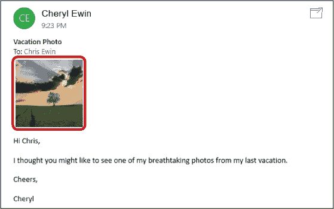

    ***** ***警告：** 请注意，来自未知来源的附件可能包含旨在损害计算机的病毒。除非你信任发送者，否则不要打开任何附件。有关邮件安全的更多提示，请跳到第 14 课。*

1.  附件将在一个单独的窗口中打开，如下所示。要返回收件箱，点击**关闭按钮**。

    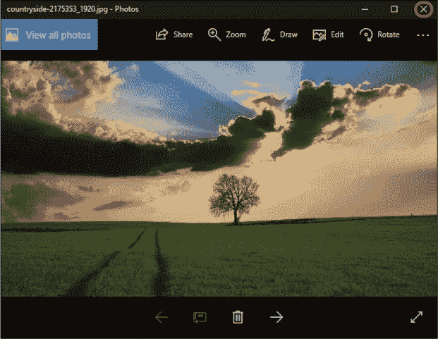

### 删除邮件

删除不需要的邮件总是个好主意，这样能更容易找到你*需要*的邮件。要删除邮件，请按照以下步骤操作：

1.  点击邮件列表中的不需要的邮件。

1.  点击邮件显示区域右上角的**删除**按钮，如下图所示。

    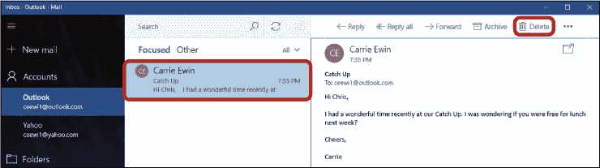

1.  屏幕底部应出现一条红色条形图，提示你邮件已被删除。如果你误删了邮件，或者决定不删除该邮件，你可以点击**撤销**按钮将其恢复。此条形图将在一段时间后消失，所以如果你希望通过这种方式恢复邮件，需要快速操作。

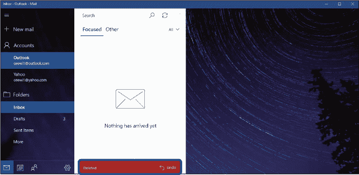

**活动 #10**

在这个活动中，你将练习打开朋友发送给你的附件。

1.  在收件箱中找到一封带附件的邮件。如果你没有带附件的邮件，可以请朋友发一封给你。

1.  打开邮件，然后打开附件。

1.  关闭附件。

1.  删除邮件。

### 搜索邮件

如果你在收件箱中存有大量邮件，找到特定的邮件可能会很困难。幸运的是，邮件应用允许你搜索邮件。你可以搜索发件人、邮件主题，甚至是邮件中的特定词汇。要搜索邮件，请按照以下步骤操作：

1.  点击屏幕顶部的**搜索框**，如图所示。

    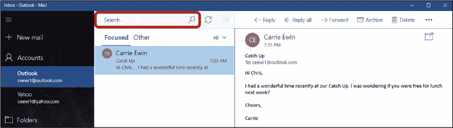

1.  输入你想搜索的词汇，比如发件人的名字或电子邮件地址、邮件主题，或你记得的邮件中的特定词汇。然后按回车键。

1.  应该会出现一系列结果。你搜索的词会以黄色高亮显示。点击你想阅读的邮件，它将在屏幕的右侧显示。

    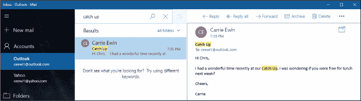

1.  当你完成搜索后，可以点击搜索框旁边的**关闭按钮**（如下图所示）返回到收件箱。

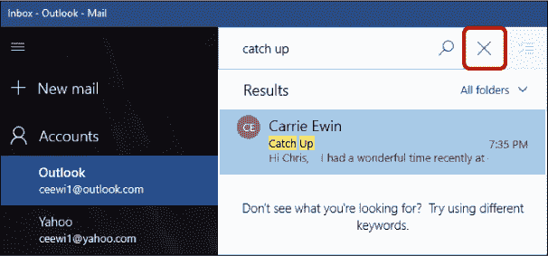

现在你应该能再次看到收件箱。

### 保持电子邮件安全

虽然电子邮件是一种与朋友和家人保持联系的便捷方式，但诈骗者可能会通过电子邮件试图欺骗你提供财务信息或安装病毒。他们可能会假装是银行或合法公司，要求你点击链接或提供个人信息。然而，真正的银行*绝不会*通过电子邮件要求提供信息。如果你担心银行的电子邮件可能是骗局，请直接联系银行（不要使用电子邮件中提供的联系方式）确认。有关保持电子邮件安全的更多信息，请跳转到第 14 课。

### 呼，我们做到了！

在本课中，我们学习了如何使用邮件应用程序来设置和整理电子邮件。你学会了以下内容：

*****   设置邮件应用

*****   添加其他电子邮件账户

*****   阅读、发送和回复邮件

*****   发送图片和文件，并打开其他人发送的附件

*****   删除邮件

*****   搜索邮件

在下一课中，你将学习如何浏览网站和探索互联网。

**课程回顾**

恭喜，你已完成第 4 课。利用这个机会通过完成以下任务复习你所学的内容。如果你能够自信地完成所有任务，你就准备好学习第 5 课了。如果还不行，继续通过发送更多邮件并回复收到的邮件进行练习！

1.  打开**邮件**应用。

1.  给朋友写一封邮件。

1.  请朋友回复你一封邮件。

1.  阅读朋友发送给你的信息。

1.  回复这封邮件，并在回复中附加一个附件。

1.  删除朋友的邮件。
