## 第五课

## 介绍互联网

让我们开始上网吧！

打开 Microsoft Edge

什么是网站？

打开网站

浏览网站

打开链接

使用后退和前进按钮

缩放页面

使用标签页

打印网页

通过收藏夹创建快捷方式

将网站添加到收藏夹

返回到收藏的站点

删除收藏站点

探索网站

呼，做到了！

互联网就像是一个庞大的计算机网络，计算机之间可以相互交流和交换信息。互联网为你提供了无尽的资源，可以用来查找信息、与朋友和家人沟通，或是娱乐自己。以下是你可以在互联网上做的一些有趣的事情：

*****   阅读最新新闻，查看天气预报

*****   查找本地信息，如电影时间、商店和餐馆的营业时间、以及公交时刻表

*****   获取步行、驾车或公共交通的路线指引

*****   阅读关于科技、园艺等的文章

*****   观看有用的视频、操作指南，甚至是电影和电视节目

互联网非常庞大，因此本课内容仅涵盖访问网站、浏览网站以及如何打印网页内容和将常用网站添加到收藏夹的基本知识。在本书的后续章节中，你将学习更多有关使用互联网的技巧。不过，在你开始使用互联网之前，你需要通过互联网服务提供商（ISP），例如 AT&T 或 Comcast，连接到互联网。请翻回“设置互联网连接”一节，在第 17 页了解如何连接。

### 打开 Microsoft Edge

我们将通过*网页浏览器*来访问互联网，它是一款专门的应用程序，可以让你打开并浏览互联网上的不同网站。市面上有许多不同的浏览器，比如 Internet Explorer 和 Google Chrome。总体来说，它们的功能相同——让你能够浏览互联网！我们将使用微软最新的浏览器——*Microsoft Edge*，因为它已经包含在所有 Windows 10 计算机中。

我们从打开 Microsoft Edge 开始：

1.  点击任务栏中的**Microsoft Edge**按钮。

    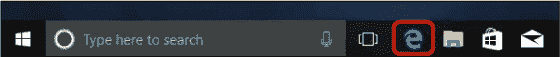

    ***** ***注意：** 如果你在任务栏中看不到 Microsoft Edge 图标，你也可以通过点击**开始按钮**，然后点击**Microsoft Edge**图标来打开该应用程序。*

1.  当你第一次打开 Microsoft Edge 时，你可能会看到类似于此处所示的设置页面。这个欢迎页面让你可以自定义 Microsoft Edge 浏览器，但你现在不需要担心它。如果你看到这个页面，只需点击关闭按钮关闭 Microsoft Edge。

    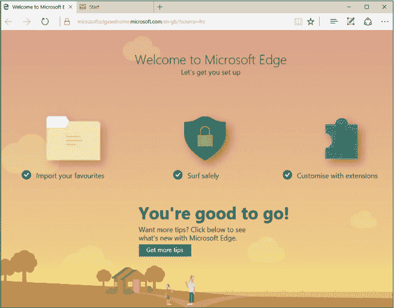

1.  当你点击关闭按钮时，系统会询问你是否要关闭所有标签页。我们将在《使用标签页》的第 126 页中更详细地讲解标签页，但现在点击 **关闭所有** 按钮，接下来会突出显示。

    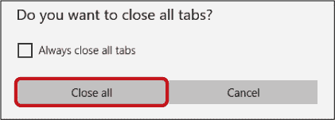

1.  现在你已经看过这个初始的欢迎信息，重新打开 Microsoft Edge。

这一次，你将进入你的 *主页*。主页就是你访问互联网时看到的第一个页面。许多互联网浏览器都提供内置的主页，包含有用且有趣的信息，比如你最近访问的页面。Microsoft Edge 有一个特别实用的主页，如此处所示，叫做 *开始页*。

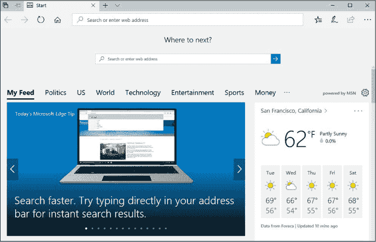

此页面会推荐你可能感兴趣的内容，比如当地新闻和天气。你可以点击任何文章来阅读更多内容。不过，现在我们先关注屏幕顶部的那条栏，接下来会突出显示。这是 *地址栏*，上面写着“搜索或输入网址”。

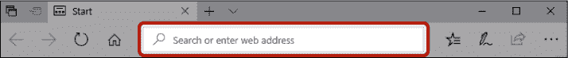

如果你使用的是旧版本的 Microsoft Edge，可能会看到这个栏出现在 *接下来去哪里？* 的标题下。地址栏是 Microsoft Edge 浏览器中最重要的部分之一，因为它让你可以在互联网上搜索任何网站或页面。

### 什么是网站？

互联网上托管着大量由不同公司、组织或个人运营的 *网站*（简称 *站点*）。例如，沃尔玛、Best Buy 和 *纽约时报* 都运营着各自的网站，每个网站的目的和内容都不同。大多数网站将其内容分为多个 *页面*，以便更易于阅读和组织。例如，像 *纽约时报* 这样的新闻网站可能会为每篇新闻报道专门设置一页，而像沃尔玛或 Best Buy 这样的商店可能会为每个销售的产品设置一页。这些网站构成了 *万维网*，或简称 *网络*。要开始浏览网络，我们需要一种方式来导航到这些网站。实现这一点的一种方法是使用网站的唯一地址。

你可能见过各种公司通过网址广告宣传自己的网站，例如 *[www.bestbuy.com](http://www.bestbuy.com)* 或 *[www.gumtree.com.au](http://www.gumtree.com.au)*。一个网址提供了一个简便的方式来找到特定的网站，让你可以直接到达，就像一个街道地址。正如你将在第 6 课中看到的，你也可以不使用网址搜索网站，但使用网址通常更快捷，并能确保你进入正确的网站。

那么这些网址到底是什么意思呢？让我们通过* [www.gumtree.com.au](http://www.gumtree.com.au) *这个例子来了解一下网址的组成部分：

*****   **www：** 这代表*万维网*。在网址中使用*www*是惯例，但在地址栏输入网址时，通常可以省略它和后面的句点（例如，*gumtree.com.au*）。

*****   **.gumtree：** 这是该网站的独特名称。务必正确输入，因为任何拼写错误都可能导致你进入错误的网站！网址中永远不会有空格，并且大小写不重要。

*****   **.com：** 这一部分是用来描述网站类型的。例如，*.com*代表*商业*，通常由企业使用。你还可能看到以*.org*结尾的网站，例如* [www.wikipedia.org](http://www.wikipedia.org) *，表示该网站由一个组织（通常是非营利性）运营。还有*.edu*，表示教育机构，例如* [www.harvard.edu](http://www.harvard.edu) *，以及*.gov*，表示政府网站，例如* [www.usa.gov](http://www.usa.gov) *。不过这些只是指导方针；没有什么可以阻止某人注册一个*.com*网站，即使他们不是公司的一部分。所以，除了正确输入之外，你不需要太关注这一部分。

*****   **.au：** 你可能已经注意到，Gumtree 的网站地址与我们之前讨论的其他网站不同，它在*.com*之后有一些内容。*.au* 是一个国家代码，代表*澳大利亚*。美国以外的站点通常会有这样的代码，告诉你它们的所在地，通常出现在*.com*之后或替代它（例如，* [www.kijiji.ca](http://www.kijiji.ca) *是加拿大的一个热门分类信息网站）。

**活动 #11**

大多数网址的设计目的是让人容易识别，因此它们通常与公司、组织或个人的名称相似。这样，你就可以轻松地猜出地址并访问该网站。在本活动中，你将练习猜测一个公司的网址。

这本书的出版公司是 No Starch，它有一个网站！写下你认为它的网址是什么。

### 打开一个网站

一旦你获得了想访问的网站的网址，就可以打开该网站！按照以下步骤通过网址打开网站：

1.  点击地址栏。

    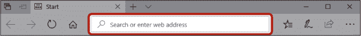

1.  输入你想访问的网站的地址。无需删除“搜索或输入网址”这几个字，因为它们会在你开始输入时自动消失。作为例子，我们使用* [www.nostarch.com](http://www.nostarch.com) *。

    ***** ***注意：** 当你输入时，地址栏下方应该会出现一系列搜索建议。稍后我们会了解它是如何工作的。*

1.  按下 ENTER 键进入该网站。网站加载完成后，你应该能看到如下内容：

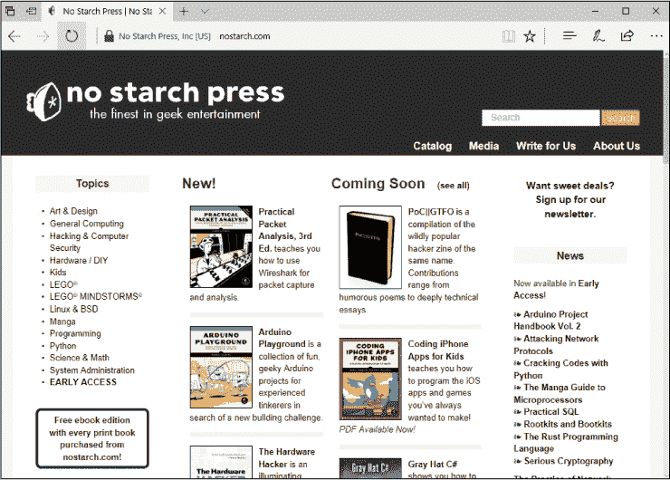

这是 No Starch 的主页！就像你的网页浏览器一样，每个网站都有自己的主页，这是你首次访问该网站主地址时打开的页面。

注意到页面顶部的地址栏仍然存在。如果你决定访问另一个网站，你可以再次点击地址栏，正如下图所示。

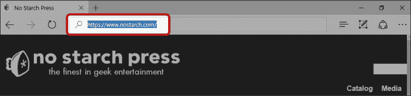

当你点击时，地址应该变成蓝色。这会高亮显示文本，当你开始输入时，输入的内容会替代已高亮的文本。（如果地址没有变成蓝色，你只需点击地址的末尾，按下 BACKSPACE 键删除地址，然后再输入新的地址。）别忘了输入地址后按下 ENTER 键。

**活动 #12**

在此活动中，尝试访问以下流行网站。

1.  使用地址栏访问 *[www.washingtonpost.com](http://www.washingtonpost.com)*。

1.  使用地址栏访问 *[www.nytimes.com](http://www.nytimes.com)*。

1.  再次使用地址栏访问 *[www.nostarch.com](http://www.nostarch.com)*。

### 导航网站

互联网是*庞大的*，要掌握它，首先你需要学习如何在一个网站的不同页面之间找到自己的方向！你可以通过使用链接来做到这一点。一旦你访问了一个网站，你可以通过点击链接浏览该站点的不同页面。*链接*是页面上的文字或图片，点击后会带你到其他页面，通常是同一网站上的页面。大多数网站使用链接将你从一个页面带到另一个页面，使得浏览网站变得轻松。

例如，在 *[www.nostarch.com](http://www.nostarch.com)* 的主页上，诸如艺术与设计、一般计算机、黑客与计算机安全等各个主题都是指向其他页面的链接，书名和封面图片也是如此。当你点击这些链接时，它会带你到一个专门介绍该书或主题的页面。

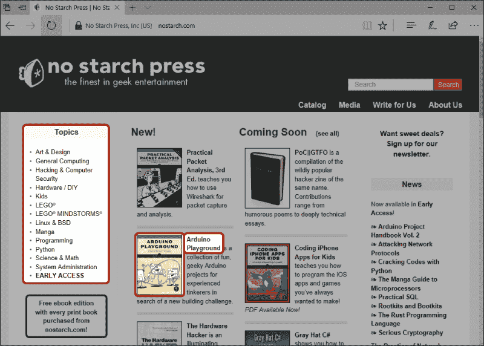

#### **打开链接**

要查看链接指向的页面，你需要打开链接。为此，请按照以下步骤操作：

1.  找到一个可能是链接的标题、词语或图片，将鼠标指针移到它上面。如果它确实是链接，指针应该会变成一个指向手的符号 ()。

1.  点击链接。

链接指向的网页现在应该已经打开。

**活动 #13**

在此活动中，你将练习使用链接访问新页面。

1.  访问 No Starch 网站。

1.  访问某本书的页面。

#### **使用回退和前进按钮**

现在你已经访问了一个页面，接下来该做什么？如果你在该页面上找到一个你想要查看的链接，你可以像之前一样点击它。有时候，你可能想要回到你原来的页面。例如，在 *[www.nostarch.com](http://www.nostarch.com)* 网站上，一旦你阅读完关于某本书的信息，你可能想返回主页并查看其他书籍。幸运的是，这很容易做到！

要返回上一页，只需点击**后退按钮**。每次点击后退按钮，你都会返回上一页。一旦你到达首页，你就无法再返回。

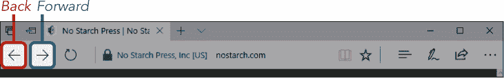

如果你不小心点击了后退按钮太多次，导致返回得比预期更远，只需点击**前进按钮**再次前进。

**活动 #14**

在这个活动中，你将练习使用后退和前进按钮。

1.  访问 No Starch 网站上的其中一本书籍页面，然后点击后退按钮返回到主* [www.nostarch.com](http://www.nostarch.com) *页面。

1.  点击**前进按钮**返回到你刚才浏览的书籍页面。

#### **放大与缩小**

你可能会发现网页上的文字太小，难以阅读。这在使用平板或笔记本电脑时尤其是个问题，因为它们的屏幕较小。幸运的是，你可以通过以下步骤放大页面，以更清楚地查看：

1.  点击页面右上角的**更多操作按钮**。这个按钮，如下图所示，呈现为三个小圆点。

    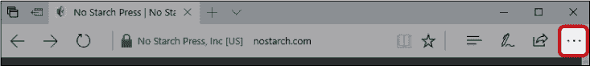

1.  应该会出现一个带有几个不同选项的菜单。找到**缩放**选项并点击**+ 按钮**来放大页面。

    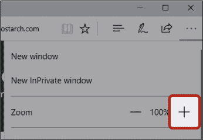

1.  你可以多次点击按钮进一步放大。

1.  点击**– 按钮**缩小并减小页面的大小。

    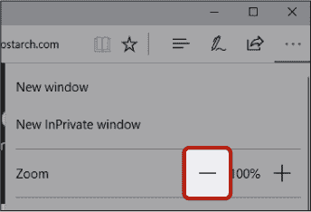

1.  一旦你对文本大小感到满意，可以点击页面上的任何其他地方来关闭更多操作菜单。

**活动 #15**

在这个活动中，你将练习在网站上进行放大和缩小操作。

1.  使用**– 按钮**（缩小）将网站调整为 75%。

1.  使用**+ 按钮**（放大）将网站调整回 100%。

### 使用标签页

标签页允许你在浏览器中同时打开多个网页。这些标签页的名称来源于老式文件夹，这些文件夹是使用纸质标签来组织和标记的。在浏览器中使用标签页的好处是，你可以快速在不同的站点之间切换。有时，标签页可能会很棘手。你可能会发现，当你点击一个链接或无意中点击一个广告时，页面或广告会在一个新的标签页中打开，而你并不想这样。例如，如果你访问* [www.nytimes.com](http://www.nytimes.com) *并点击了一个数字订阅广告，可能会打开一个新的标签页，如下所示。

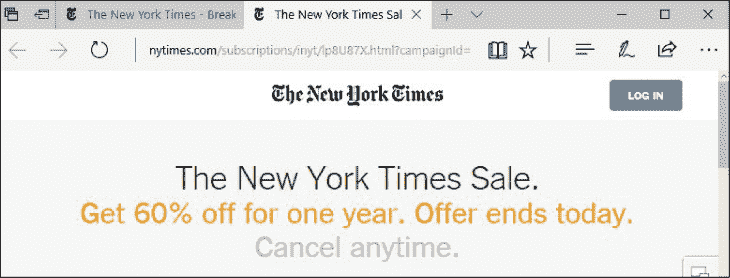

你可以看到后退按钮已被灰色禁用，无法使用，因为一个新标签页已打开。在地址栏上方有两个标签，分别指向*纽约时报*。左侧的标签是我们最初打开的*纽约时报*主页，而右侧是为数字订阅广告打开的新标签。

要关闭新标签页，只需点击标签右侧的关闭按钮。但要小心不要点击旁边的加号（+）！那样会再打开一个新标签页，你还得去关闭它。

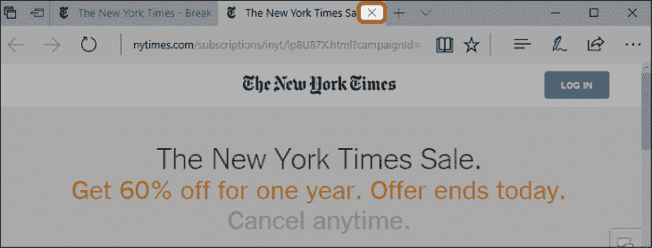

**摆脱突如其来的广告**

在某些网站上，你可能会看到一个弹出广告，提供免费的会员资格，如下图所示，或者是其他类型的广告。这些广告可能会覆盖大部分屏幕，使得你无法阅读下面的文章。这是上网的一个不幸副作用；你经常会遇到不想要的广告弹出。寻找一个关闭按钮并点击它，广告就会消失。有时会出现一个计时器，你得等五秒钟左右才能关闭广告！不幸的是，你无法关闭所有广告。那些通常出现在页面顶部或侧边的小广告是无法关闭的。

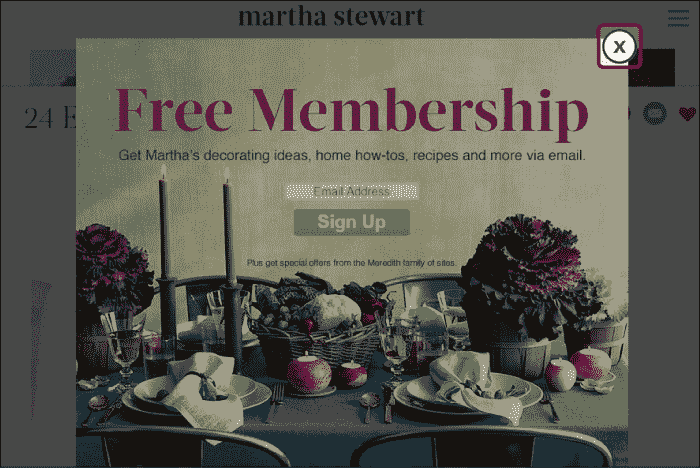

### 打印页面

网络上有这么多信息真是太棒了，但有时你可能需要一份网页的打印副本。也许你发现了一个很棒的食谱或一个优惠券，或者你想打印别人通过电子邮件发给你的路线。要打印页面，你首先需要确保你的计算机已连接到打印机。如果你需要帮助来设置计算机与打印机的连接，请参见第 293 页的“连接打印机、扫描仪、网络摄像头或其他设备”。

打印页面，请按照以下步骤操作：

1.  打开你想要打印的网页。

1.  点击下图中高亮显示的**更多操作按钮**，位于页面右上角。

    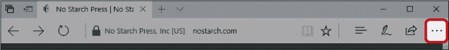

1.  这将调出你用来放大和缩小的相同菜单。

1.  从菜单中，点击**打印**按钮。

    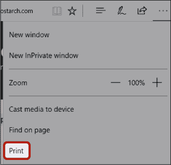

1.  你将看到页面打印效果的预览。确保你的打印机在“打印机”标题下被选中。如果没有选中正确的打印机，点击打印机名称旁的**下拉箭头**，从列表中选择你想要的打印机。你还可以在这里更改其他选项（如果你需要了解这些选项的含义，可以参见第 3 课），但默认选项应该是可以使用的。

1.  点击左下角的**打印**按钮以打印页面。

网页现在应该已经被打印出来了！

### 使用收藏夹创建快捷方式

现在你已经知道如何在互联网上找到方向，你会很快发现自己在浏览许多有趣的网站。当你发现一个喜欢的网站并打算再次访问时，你会想找个方法来记录它。把清单写在电脑旁的纸上是一个选择，但并不高效。幸运的是，Microsoft Edge 提供了一个方便的工具来存储并返回你喜欢的网站，称为*收藏夹*。一旦你将一个网站添加到收藏夹列表中，你可以通过几次点击轻松返回。

#### **将网站添加到收藏夹**

要将网页添加到你的收藏夹列表，请按照以下步骤操作：

1.  打开你想要添加到收藏夹的网页。

1.  网站加载完成后，点击**添加到收藏夹按钮**。它会显示为一个小星星，如图所示。

    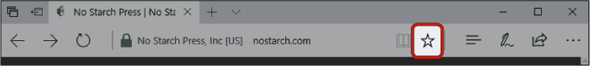

1.  将出现一个菜单，提供创建新收藏的选项。确保在菜单顶部选择了**收藏夹**（而非阅读列表）。它应该显示为蓝色，如图所示。

    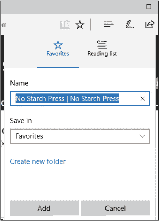

1.  名称框显示你的新收藏将在收藏夹列表中的标签。通常，网站名称会默认填写。如果网站名称非常长或与预期的不同，你可以修改它为你容易识别的名称。名称框中的文本应该会高亮显示为蓝色。如果是，你可以立即开始输入新名称。如果不是，将鼠标光标移到框内，点击当前文本的右端，并使用退格键删除它。

1.  输入你希望用作网站标签的名称。这可能是网站的简称，例如*No Starch*，或者是有助于提醒你保存网站目的的名称，例如*计算机书籍*。

1.  点击**添加**按钮。

1.  你应该能看到“添加到收藏夹”按钮现在变成黄色。这表示页面已经成功保存为收藏。

#### **返回收藏网站**

一旦你将网页添加到你的收藏夹列表中，你就可以使用这个列表再次找到该网站！要返回你在收藏夹中的网站，请按照以下步骤操作：

1.  点击**中心按钮**，如图所示，它看起来像是三条线。

    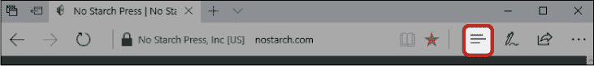

1.  中心菜单将会打开。确保选择了“收藏夹”（菜单顶部的星星），如图所示。它应该会自动被选中，但如果没有，只需点击星形按钮一次。你应该能看到你已添加到收藏夹的所有网站的列表。

    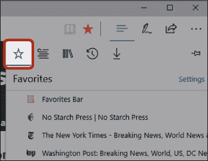

1.  点击你想再次访问的网站（例如，*纽约时报*网站）。

你现在应该可以看到页面，如图所示。

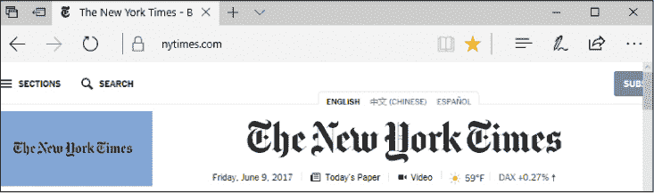

#### **删除收藏网站**

如果你决定不再需要某个网站在你的收藏夹列表中，你可以使用以下步骤轻松将其从列表中删除：

1.  点击**中心按钮**，如下所示，打开中心菜单。

    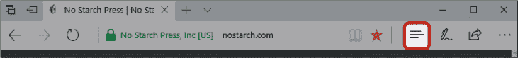

1.  右键点击你想要移除的收藏夹。

1.  点击**删除**按钮，如图所示。

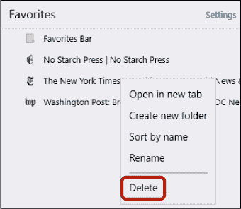

现在，网站应该已从你的收藏夹列表中移除。你仍然可以通过输入地址访问该网站，只是它不会再列在你的收藏夹列表中。

**活动 #16**

在本次活动中，你将练习使用收藏夹轻松访问你最喜欢的网站。

1.  将 *[www.nostarch.com](http://www.nostarch.com)* 添加到你的收藏夹列表中。

1.  将*[www.washingtonpost.com](http://www.washingtonpost.com)*添加到你的收藏夹。

1.  使用收藏夹列表返回到*[www.nostarch.com](http://www.nostarch.com)*。

1.  从你的收藏夹中移除*[www.washingtonpost.com](http://www.washingtonpost.com)*。

### 待探索的网站

现在你已经学会了如何查找一些不同的网站，你已经准备好自己去探索了。你可以从以下一些网站开始你的旅程：

*****   **[www.wikipedia.org](http://www.wikipedia.org):** 一个在线百科全书，涵盖了成千上万的主题。无论你对什么感兴趣，可能都有一个维基百科页面提供相关信息。只需在维基百科的搜索框中输入一个词汇即可开始。

*****   **[www.yellowpages.com](http://www.yellowpages.com):** 这是一个本地商业目录网站。

*****   **[www.aarp.org](http://www.aarp.org):** 该网站包含了为老年人提供的有用新闻、视频和资源。

*****   **[www.skillfulsenior.com](http://www.skillfulsenior.com):** 你可以在这里提升你的鼠标和键盘技能。

*****   **[www.bestforpuzzles.com](http://www.bestforpuzzles.com):** 你可以在这个网站上通过填字游戏、谜题和其他游戏锻炼大脑。

### 呼，终于完成了！

在这一课中，我们学习了如何浏览互联网。你访问了网页地址，打印了一个有趣的网页，并将网站添加到收藏夹中以便于快速访问。在这一课中，你学会了以下内容：

*****   打开 Microsoft Edge

*****   理解网页地址的组成部分

*****   访问一个网站

*****   通过点击链接在页面之间移动

*****   使用后退和前进按钮浏览你访问过的页面

*****   关闭你不想打开的标签页

*****   打印感兴趣的网页

*****   将网站添加到你的收藏夹

在第 6 课中，你将学习如何通过搜索互联网找到网站、信息和图片。

**课后复习**

恭喜！你已完成第 5 课。利用这个时间通过完成以下任务来复习你所学的内容。如果你能够自信地完成所有这些任务，那么你已经准备好进入第 6 课了。如果还没有，不要灰心，继续练习就好！

1.  打开**Microsoft Edge**。

1.  访问*洛杉矶时报*网站（*[www.latimes.com](http://www.latimes.com)*）。

1.  点击一篇文章阅读。

1.  打印这篇文章。

1.  返回到*洛杉矶时报*主页。

1.  将*洛杉矶时报*添加到你的收藏夹。

1.  关闭 Microsoft Edge。

1.  再次打开**Microsoft Edge**，并通过收藏夹列表返回到*洛杉矶时报*页面。
