## 第 6 课

## 探索互联网

现在让我们深入探讨，搜索互联网上满足你所有需求的网站。

使用搜索引擎

创建搜索

查看结果页面

打开搜索结果

找到不同的搜索结果

搜索图片

探索：Google

探索：Facebook

探索：亚马逊

在线购物技巧

呼，做到了！

在第 5 课中，你学到每个网站都有一个唯一的地址，称为网址。但你并不总是知道某个特定网站的地址。例如，你可能想找一个美味的三重巧克力泥蛋糕的新食谱，却不知道包含该食谱的某个网站的地址。

在这种情况下，你需要使用搜索引擎来搜索互联网。搜索是一项非常实用的技能，正如你将看到的那样！在本课中，你将搜索关于自己感兴趣的话题的信息，例如食谱、汽车评测或小狗训练建议。然后，你将学习如何在互联网上寻找图片，我们还将浏览一些你可能想要探索的流行网站。

### 使用搜索引擎

你可以使用*搜索引擎*来搜索互联网，搜索引擎是一个网站（它的地址非常容易记住！），可以帮助你使用描述性词语或短语来查找其他网站。这些描述性词语被称为*关键词*。你可以使用搜索引擎查找与园艺技巧、营养信息、股票价格或任何你能想到的内容相关的网站。

你可能听说过一些不同的搜索引擎，比如 Google 和 Yahoo。本课将重点介绍如何使用微软自家的搜索引擎：Bing。我们将讨论如何进行搜索，如何从结果列表中选择一个网站，以及如何优化搜索！

#### 创建搜索

好消息！你在第 5 课中学到的地址栏就是你用来搜索互联网的工具。在本节中，我们将以蛋糕食谱为例来搜索互联网。只需按照以下步骤操作：

1.  从任务栏或开始菜单打开**Microsoft Edge**。如果你找不到 Microsoft Edge，请回顾一下“打开 Microsoft Edge”，该内容在第 116 页。

1.  在地址栏中输入**蛋糕食谱**。

    

1.  当你输入时，可能会看到一些搜索建议。这些建议会显示你使用这些关键词进行的其他常见搜索，帮助你缩小范围。如果任何建议与你要找的内容匹配，你可以点击它们进行搜索。不过现在，我们先坚持使用“蛋糕食谱”这一搜索。

1.  按下 ENTER 键。

现在你应该能看到一个关于蛋糕食谱的搜索结果列表，如下图所示。

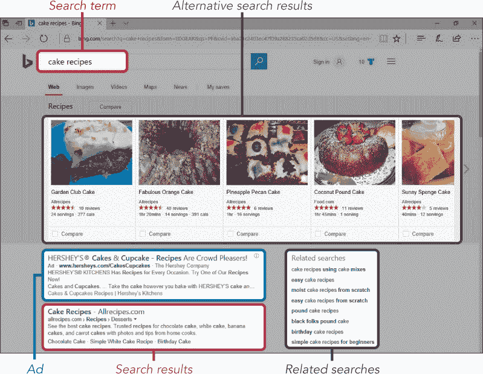

#### 检查结果页面

让我们稍微分解一下这个屏幕，看看各个部分。根据你搜索的词语、位置以及其他因素，你的结果可能看起来有所不同。

##### *替代搜索结果*

在屏幕顶部的灰色区域，你可能会看到一条图片条，展示类似蛋糕的食谱。这些是 Bing 根据其他人搜索过的类似内容提供的建议。点击图片会将你的搜索结果更改为与该图片匹配，但我们现在不这么做，因为我们要坚持我们的“蛋糕食谱”搜索。

这个条形区域并不总是会出现，但当它出现时，图像和结果将取决于你搜索的内容。例如，如果你搜索“动作电影”，你会看到一列受欢迎的动作电影。

##### *广告和相关搜索词*

对于许多热门搜索，你可能会在灰色条下方看到一系列广告。这些是为 Bing 支付了大量费用的站点，目的是在你搜索某些词语时优先显示。这并不意味着它们是糟糕的网站，但它们可能不如页面下方的真实搜索结果相关，且可能试图向你推销一些东西。你可以通过旁边的小灰色文字“广告”来识别广告。

在搜索结果的右侧，你会看到一个相关搜索的列表。这些是 Bing 认为可能是你搜索内容的好替代词，以防你的搜索结果不是你想要的。相关搜索下方可能还会显示更多广告，以及页面底部也可能有广告。

##### *搜索结果*

中间的列表应该是你的搜索结果。这些是 Bing 认为与你的搜索最相关和最有用的网页链接，可能包括文章、图片、视频和与你的搜索词相关的最新新闻。

每个 Bing 页面显示十个结果（加上广告、新闻和灰色条），你可以向下滚动页面查看所有结果。如果你一直滚动到底部，你可以点击**下一页按钮**查看下一页的结果。

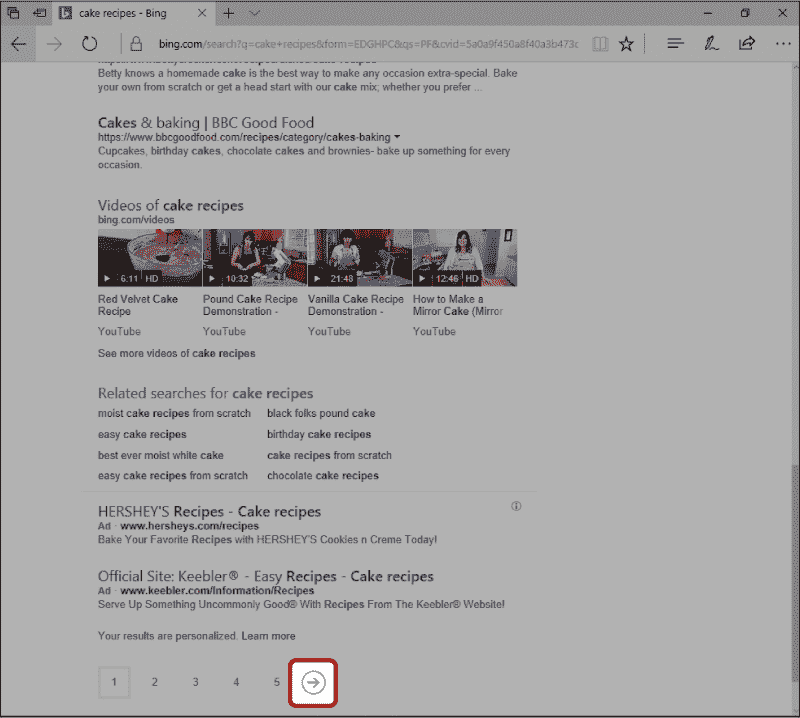

即使是搜索相同的信息，不是每个人看到的结果都是一样的。Bing 会利用诸如你所在的国家和你之前访问过的网站等信息，尝试决定哪些结果最适合你，并按此顺序列出结果。例如，如果一个住在澳大利亚的人搜索有关当地兽医的信息，他们看到的搜索结果与住在德国的人会有很大不同。

#### 打开搜索结果

在你进行搜索后，是时候查看结果并选择你喜欢的站点链接了。接下来让我们更详细地看一下一个单独的搜索结果。

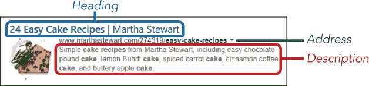

蓝色的大标题是一个链接，你可以点击它，跳转到包含你搜索的食谱页面。蓝色标题下方，用绿色显示的是链接网站的地址。这能为你提供有关 Bing 在搜索中找到的相关网站的线索。在这个例子中，Bing 找到了玛莎·斯图尔特网站上的蛋糕食谱。最后，在绿色文字下方，有页面的描述，可以帮助你判断页面是否符合你的需求。

要打开一个结果，请按照以下步骤操作：

1.  向下滚动搜索页面，直到找到一个听起来很有吸引力的结果。

1.  点击蓝色标题——这是一个链接，点击后会打开网站。在我们的例子中，我们将打开“24 个简单蛋糕食谱 | 玛莎·斯图尔特”（如果这个没有出现在你的列表中，选择另一个结果）。

你应该被带到网站，页面大概会是这样的：

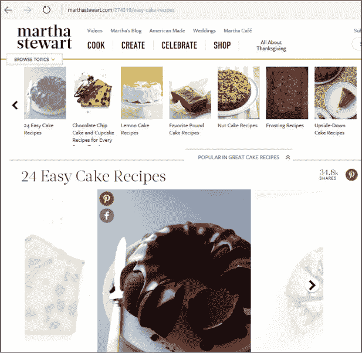

如果网站自我们访问以来有所更新，你可能会看到不同的图片。可以自由浏览页面。

#### 查找不同的搜索结果

浏览你打开页面上的信息，判断它是否符合你的需求。如果它不完全符合你的预期，你可以返回搜索结果并打开不同的结果。下面是操作方法：

1.  点击**返回按钮**（下图突出显示的部分）返回搜索结果列表。

    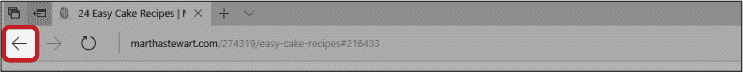

1.  返回结果列表时，你可能会注意到你之前点击的链接现在变成了紫色。这表示该页面已经访问过，这样你就不会不小心再打开相同的链接了！

1.  阅读其他搜索结果中的描述。你可能需要阅读几个结果，直到找到一个你觉得合适的。

1.  点击搜索结果的标题链接，打开另一个页面。阅读页面内容，如果它不是你想要的，重复这些步骤继续搜索符合你需求的结果。

如果没有任何搜索结果包含你想要的信息，可以点击地址栏的返回按钮，输入不同的搜索词。

**活动 #17**

在本次活动中，你将练习制作你自己的 Bing 搜索，寻找以下问题的答案。记住，最好不要使用完整的句子。

*****   澳大利亚最大的城市是哪个？

*****   亚伯拉罕·林肯之前，美国的总统是谁？

*****   我应该喂我的宠物兔子什么？

*****   哪些食物能降低胆固醇？

### 查找图片

你已经了解了如何使用 Bing 查找信息，现在我们来看看如何查找图片。假设你有兴趣装饰一个精美的蛋糕，并且在寻找灵感。找到一些精美装饰蛋糕的图片可能会给你带来一些好点子！

查找图片，请按照以下步骤操作：

1.  打开**Microsoft Edge**。

1.  在地址栏输入搜索词**蛋糕装饰**，就像你之前搜索信息时一样。

    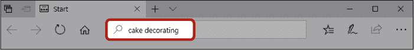

1.  按下 ENTER 键。你现在应该能看到“蛋糕装饰”的搜索结果。

1.  在工具栏中，点击**图片**按钮，如下图所示。

    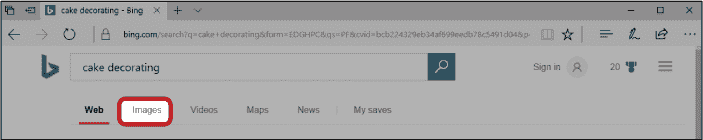

1.  现在，你应该能看到一页展示与你“蛋糕装饰”搜索相关的所有图片。

    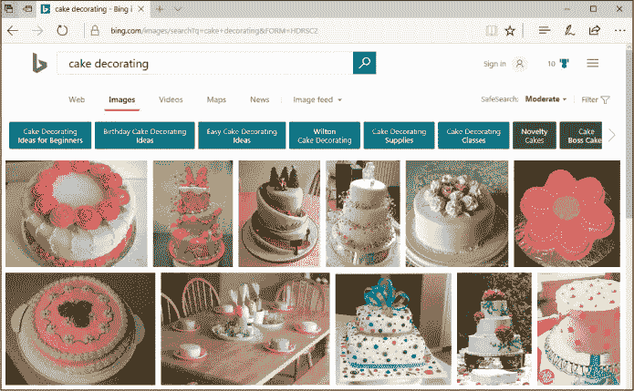

1.  点击图片一次，放大它。

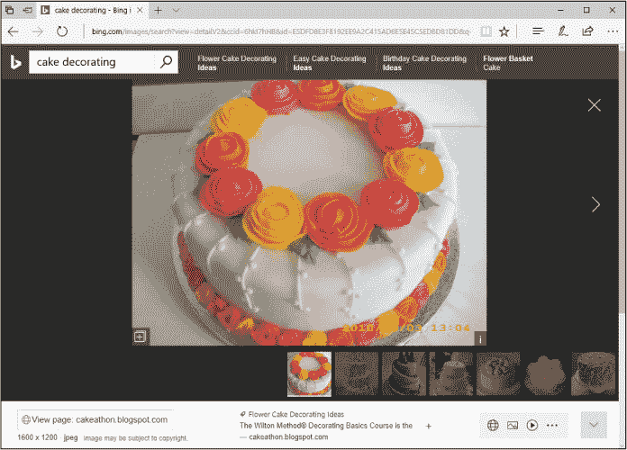

记住，你随时可以通过屏幕左上角的返回按钮返回搜索结果列表。试着改进你的图片搜索，看看还能找到什么其他图片。

**活动 #18**

在这个活动中，你将找到并打印你喜欢的图片。

1.  在必应图片中搜索你喜欢的任何内容（例如，一个形状像汽车的蛋糕）。

1.  选择一张你喜欢的图片，并在新标签页中单独打开它。

1.  打印这张图片。

1.  关闭显示图片的标签页。

1.  使用**查看页面**按钮查看图片来源的网站。

### 探索：谷歌

如前所述，必应只是众多不同搜索引擎中的一个。最流行的搜索引擎是谷歌，所以如果你无法通过必应找到某些内容，或者只是想尝试另一个选择，可以试试谷歌！你可以通过在地址栏输入**[www.google.com](http://www.google.com)**来访问谷歌。你也可以在必应搜索栏中搜索“google”，然后点击匹配该网址的链接。

谷歌搜索的使用方式与必应搜索类似——只需将你要搜索的单词或短语输入到谷歌搜索框中，按下 ENTER 键即可查看结果。尝试进行几次谷歌搜索，熟悉一下。你还会发现，谷歌也有一个图像按钮，就像必应一样。看看谷歌的搜索结果与必应相比如何？你喜欢它展示结果的方式吗？如果你发现自己更喜欢谷歌，以后可以随时使用它。

### 探索：Facebook

Facebook 是一个流行的社交网络网站，旨在帮助你与朋友和家人在线分享信息、照片、视频、新闻等内容。你可以随时与孙子孙女保持联系，重新联系上久未联系的同学，甚至在各种兴趣小组中与陌生人讨论你喜欢的话题。要访问 Facebook，只需在地址栏输入**[www.facebook.com](http://www.facebook.com)**。

Facebook 要求你创建一个免费的账户才能使用，因此你第一次访问 Facebook 时，需要在“创建账户”标题下输入你的信息。完成后，你将能够找到你想要保持联系的朋友和家人。以后每次返回 Facebook 时，你可以通过页面右上角的登录框和按钮登录你的账户。有关设置和使用 Facebook 的帮助，请查看*Facebook for Seniors*，它可以在* [www.nostarch.com](http://www.nostarch.com)*找到。

### 探索：亚马逊

亚马逊是世界上最大的在线商店。你可以在亚马逊上购买各种各样的商品，包括书籍、电子产品、珠宝、家居小物等等。要开始浏览亚马逊，请在地址栏中输入**[www.amazon.com](http://www.amazon.com)**。

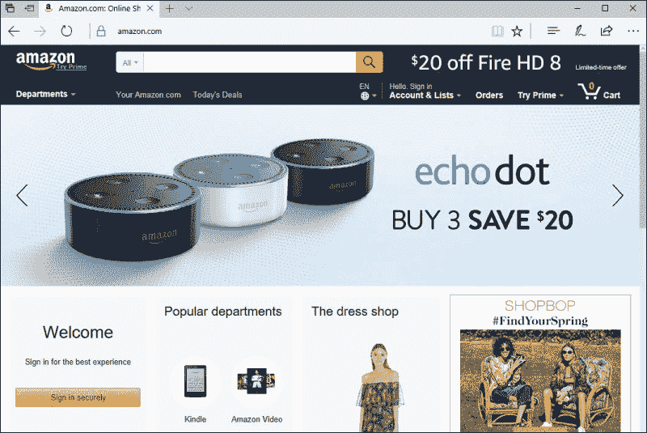

你可以在没有账户的情况下浏览亚马逊，但要想真正购买商品，你需要先注册。通过在页面顶部的搜索框中输入搜索词来查找特定商品，或将鼠标悬停在“部门”标题上浏览各种分类。

一旦你找到喜欢的产品，可以点击它查看更多信息。如果你决定购买，点击**加入购物车**按钮，然后点击**继续结账**。此时，你应该会被要求注册一个账户以继续完成订单，因此请输入所要求的信息。请注意，大多数商品都会收取运费，运费只会在你进入结账页面时才会显示在总金额中。一旦注册完成，你就可以通过提供送货地址和支付信息来完成结账流程。

请记住，在结账前你可以将多个商品添加到购物车中，这样你就可以一次性购买多个商品。

### 网上购物提示

你可能会浏览一些网站，如亚马逊，这些网站涉及到在线支付。通常你需要为该网站创建账户并输入信用卡信息来进行在线支付。虽然在线支付并不需要害怕，但有一些注意事项你应该始终记住，以避免成为诈骗的受害者：

*****   **确保你信任正在使用的网站。** 任何人都可以开设网站并进行在线支付，因此在输入任何支付信息之前，查看评论是很有价值的。你可以通过搜索引擎输入网站的主名称，再加上单词*review*来查看评论。

*****   **查看地址栏中的锁形图标。** 如图所示，锁形图标应出现在你输入密码或信用卡信息的任何页面上。这个图标表示该网站是安全的，你输入的详细信息不太可能被第三方窃取。

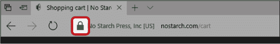

*****   **确保你的计算机没有病毒。** 病毒可以用来窃取你在计算机中输入的支付信息。有关使用防病毒应用程序以保护免受病毒侵害的详细信息，请参阅第 14 课。

*****   **使用强密码来防止他人进入你的账户。** 强密码应至少包含八个字符，并由小写字母、大写字母、数字和其他字符混合组成。强密码的例子可能是*11Horses&Jockeys* 或 *Scarlett4Opera#*。不要使用别人能猜到的信息，比如你的宠物名字或街道名称，*绝对*不要使用“password”这个词！

*****   **定期检查你的信用卡账单。** 如果你发现有不认识的交易，立即联系你的银行。

在这些预防措施的基础上，我们来快速了解一些流行且有趣的网站，这些网站可以接受付款，你可能会喜欢自己探索。

### 呼，终于做到了！

在本课中，我们学习了如何搜索网站并使用 Bing 图片，浏览了互联网上最受欢迎的网站。你学到了以下内容：

*****   如何使用 Bing 搜索网站

*****   寻找有用网站的策略

*****   如何使用 Bing 图片查找图片

*****   一些流行的网站，你可以自己探索

在下一课中，你将学习如何在互联网上观看视频。

**课后复习**

恭喜你！你已经完成了第六课。利用这个机会通过完成以下任务来复习你所学的内容。如果你能自信地完成所有任务，你就准备好进入第七课了。如果还没有，继续练习并寻找新的网站来探索吧！

1.  使用 Bing 查找一些关于如何训练小狗上厕所的技巧。浏览不同的结果。

1.  使用 Bing 查找一些更多的在线安全提示。

1.  使用 Bing 图片查找一些可以放入生日卡片中的图片。

1.  打印你喜欢的图片或页面。
