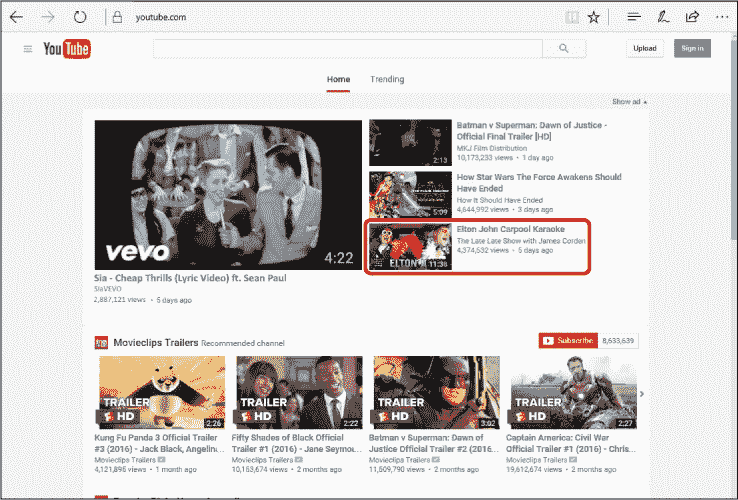
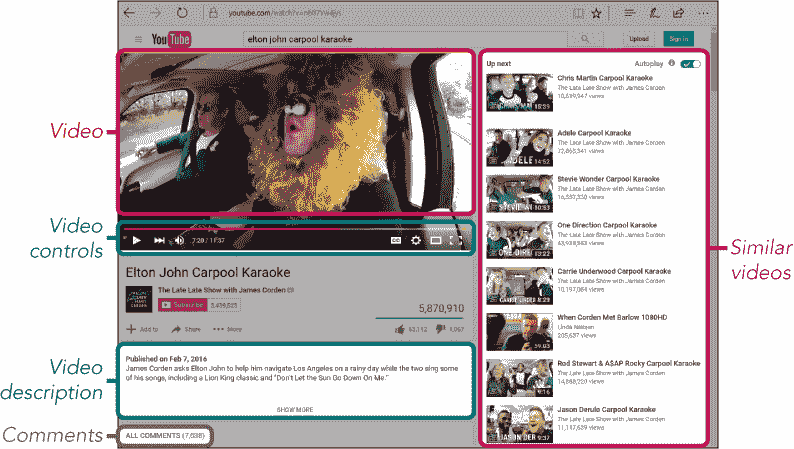
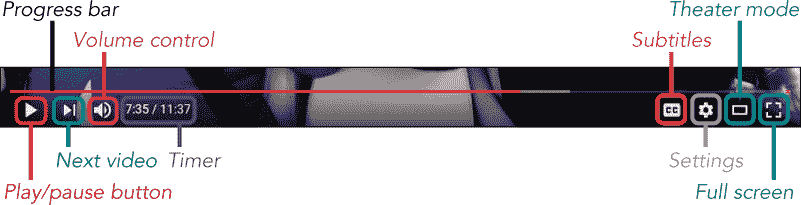
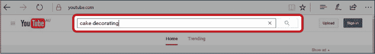
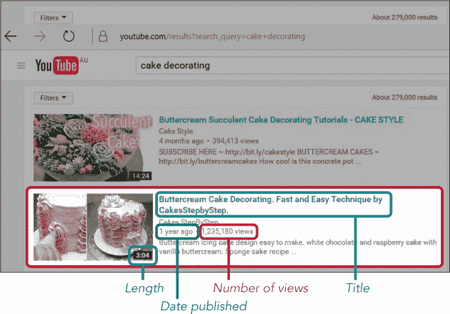
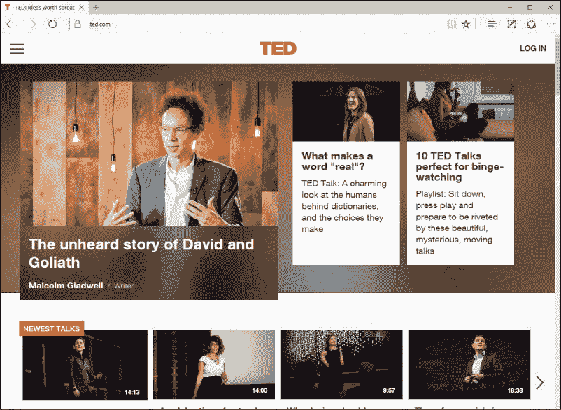
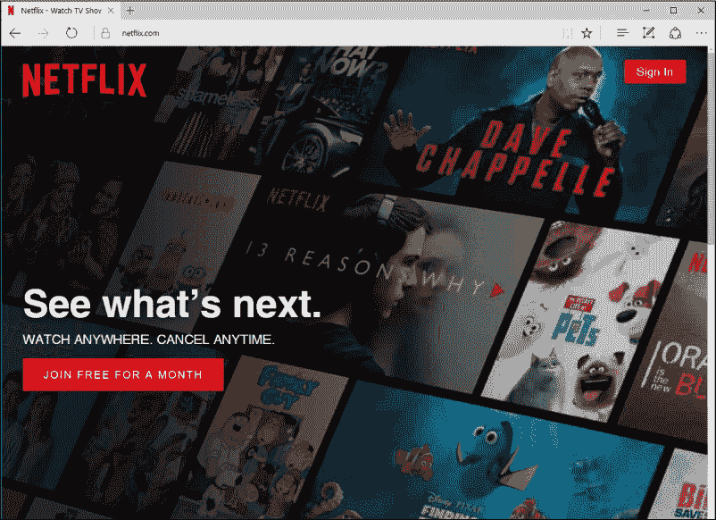
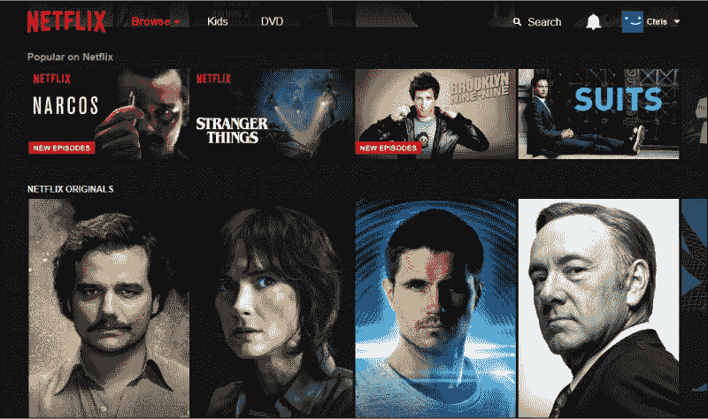
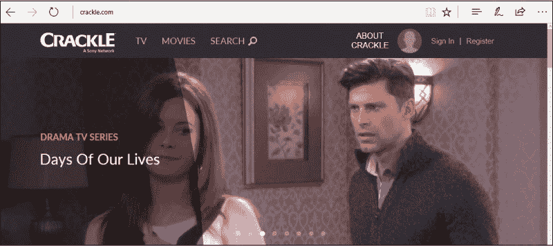

## 第 7 课

## 在线观看电视和视频

现在，你可以通过互联网观看电视节目、电影以及各种娱乐和实用视频！

在 YouTube 上观看视频

播放视频

遇见视频页面

YouTube 视频控制

搜索 YouTube 视频

探索：TED 演讲

探索：Netflix

探索：Crackle

呼，做到了！

在这一课中，你将学习如何在 YouTube 上观看视频，这是一个提供数百万免费视频资源的网站。无论你是想听简·方达讲话，学习如何更换轮胎，还是观看一场喜剧节目，都可以通过你的电脑完成！

### 在 YouTube 上观看视频

YouTube 上有数以百万计的视频是其他人在互联网上上传的。在 YouTube 网站上，你会找到从老电视节目片段到教你如何修车、装饰蛋糕，甚至上传自己视频的教学视频等各种内容！

#### **播放视频**

要开始浏览 YouTube，按照以下步骤操作：

1.  从任务栏或开始菜单打开**Microsoft Edge**。

1.  在地址栏中输入**[www.youtube.com](http://www.youtube.com)**并按回车键。你也可以像在第 6 课中学到的那样，在 Microsoft Edge 的搜索栏中搜索“youtube”，然后点击与该地址匹配的链接。

1.  YouTube 的网站应该会如以下图所示显示出来。你的页面可能看起来不同，因为 YouTube 的主页会根据你之前观看的视频推荐你可能喜欢的视频。如果你还没有观看过任何视频，它可能会显示你所在地区最受欢迎的视频。随着时间的推移，YouTube 的推荐内容应该会反映你的兴趣偏好。

1.  要观看视频，点击 YouTube 主页上看起来有趣的视频。我们将以“Elton John Carpool Karaoke”视频为例，但你页面上的视频可能会不同。

    

1.  此链接会将你带到一个页面，在该页面上你的视频会加载并自动播放。请记住，视频开始播放之前，可能会播放广告。YouTube 通过广告商赚钱，广告商支付费用在视频前播放广告。广告播放几秒钟后，你有时可以通过点击“跳过广告”按钮跳过广告；如果没有这个按钮，你可能需要等广告播放完。

#### **遇见视频页面**

视频应该会自动播放，但你还需要了解视频的其他功能！例如，你可以使用暂停按钮暂停视频，使用音量控制按钮调节视频的音量，使用扩展按钮将视频放大。下图突出显示了视频页面中的重要部分。

以下是屏幕的不同区域：

*****   **视频：** 这是屏幕上的一部分，你的视频应该会自动播放在这里。

*****   **视频控制：** 这些按钮让你播放、暂停并控制视频。（更多内容将在下一部分讲解。）

*****   **视频描述：** 这是视频的总结。如果有更多信息，你可以点击“显示更多”来查看更多内容。

*****   **相似视频：** 这是基于你选择的这个视频，推荐给你的其他视频列表。你可以点击其中任何一个视频，进入该视频页面并开始播放。这个列表顶部的“下一个”视频应该会在当前视频播放完后自动播放。

*****   **评论：** 如果你向下滚动，你应该会看到其他 YouTube 用户对这个视频的评论。

#### **YOUTUBE 视频控制**

视频控制器用于播放、暂停及调整视频。现在让我们来看看它们。

*****   **进度条：** 这个条形图显示视频的总时长。红色部分表示你已经观看的视频时长。

*****   **计时器：** 下方的计时器显示视频的时长（5 分钟 8 秒）和你已经观看的部分（18 秒）。

*****   **播放/暂停按钮：** 这个按钮停止视频播放。按下后，它会变成播放按钮，点击它可以继续播放视频。

*****   **下一个视频：** 这个按钮跳过当前视频，开始播放屏幕右侧“下一个”列表中的下一个视频。

*****   **音量控制：** 这个控制器让你调节音量。将鼠标光标悬停在这个按钮上会弹出一个滑块。你可以点击白色的线并拖动到右边来增加音量，或向左拖动来减少音量。点击音量按钮会将视频静音，再次点击音量按钮可以取消静音。

*****   **字幕：** 如果视频有字幕/隐藏字幕，这个按钮可以开启字幕。如果你听不清楚视频内容，字幕会非常有帮助，但请注意，并非所有视频都有字幕。如果没有字幕，按钮不会出现。

*****   **设置：** 这个选项让你控制视频的画质设置。YouTube 会自动选择最佳设置，所以我们不会详细讨论这个。

*****   **影院模式：** 这个按钮可以让视频屏幕变大。

*****   **全屏：** 这个按钮让你享受影院般的体验！点击这个按钮后，视频将占满整个屏幕，帮助你更清晰地观看。点击后，这个按钮会变成退出全屏按钮。点击它可以将视频恢复到正常大小。你也可以通过按键盘上的 ESC 键回到正常大小的视频。

**活动 #19**

在本活动中，你将练习播放 YouTube 视频并调整其中的一些控制。开始之前，点击**后退按钮**返回 YouTube 主页。

1.  开始观看一个视频。

1.  调整音量至合适的水平。

1.  暂停视频。

1.  继续播放视频。

1.  将视频切换到全屏模式。

1.  将视频恢复到正常大小。

1.  从相关视频列表中观看另一个视频。

1.  返回到 YouTube 主页。

#### **搜索 YouTube 视频**

YouTube 主页上的视频列表非常有限。这个屏幕上最多能显示几十个视频，但 YouTube 上有数十亿个视频可以选择！通过搜索功能，你可以找到特定的视频或关于某个特定话题的多个视频。要搜索视频，请按照以下步骤操作：

1.  点击任何 YouTube 页面顶部的搜索框。

1.  输入几个描述你正在寻找的视频类型的词。在以下示例中，我们使用了“蛋糕装饰”。

    

1.  点击 **搜索按钮** 或按 ENTER 键。

1.  这应该会弹出一个结果列表，如下所示。

    

1.  每个视频旁边，你应该会看到一些有用的信息，包括视频时长、简短的描述、视频发布的日期以及总观看次数。这些信息可以帮助你选择你想要观看的视频！例如，你可能不想花两个小时观看一部纪录片，或者你可能只对今年发布的视频感兴趣。

1.  点击你想观看的视频。

当你看完视频后（或者如果视频不是你想要的），你可以选择从屏幕右侧的相关视频列表中选择另一个视频，或者点击返回按钮返回搜索结果。

**活动 #20**

在这个活动中，你将练习在 YouTube 上搜索并打开一个特定的视频。

1.  搜索如何更换汽车轮胎的视频。

1.  观看视频。现在你知道如何更换轮胎了！

### 探索：TED 演讲

TED（技术、教育、设计）网站展示了许多来自商业、学术、娱乐、政治等领域的创新领导者的演讲。主题各异，但所有的演讲都旨在提供信息、娱乐和启发思考。最棒的是，这些演讲，称为 TED 演讲，完全免费，随时可以观看！

要观看 TED 演讲，输入 **[www.ted.com](http://www.ted.com)** 到地址栏，按下 ENTER 键，然后点击任何看起来有趣的视频播放。

### 探索：Netflix

Netflix 是一个流行的网站，允许你随时在线观看大量电影和电视节目，这种方式被称为 *流媒体*。它如此受欢迎，以至于超过 5000 万美国家庭已经订阅了 Netflix。

不幸的是，与 YouTube 和 TED 演讲不同，Netflix 不是完全免费的；Netflix 需要每月订阅费用，但作为订阅者，你可以观看无限数量的电影和节目。你可以免费试用一个月，如果试用期结束后不想继续使用，可以随时取消订阅，且无需支付任何费用。

使用 Netflix 时，你需要提供支付信息，即使是免费试用，也值得回到 “在线购物小贴士” 查看 第 150 页。

注册 Netflix，请按照以下步骤操作：

1.  在 Microsoft Edge 中，输入 **[www.netflix.com](http://www.netflix.com)** 到地址栏，或者搜索“netflix”并找到正确的链接。

1.  点击 **jOIN FREE FOR A MONTH** 然后输入要求的信息，包括你的支付信息。

创建帐户并登录后，你应该能够看到 Netflix 上可用的所有电影和电视节目。你可以向下滚动以查看不同的类别。使用左右箭头查看更多每个类别中的结果。你还可以使用页面顶部的搜索框查找特定的标题或演员。

### 探索：Crackle

Crackle 是另一个在线视频流媒体网站，由 Sony 运营。像 Netflix 一样，它包含了你可以从电脑观看的一系列电影和电视节目。虽然可用的标题没有那么多，但 Crackle 完全免费使用，并通过广告资助，而不是订阅费用。你可以在无需注册的情况下观看视频，或者你可以创建一个帐户，让 Crackle 推荐它认为你会喜欢的视频。

### 呼，做到了！

在本课中，我们了解了一些你可以用来观看视频的激动人心的网站。特别是，你学到了以下内容：

*****   观看 YouTube 视频

*****   搜索 YouTube 查找特定视频

在下节课中，你将学习如何下载应用程序，让你的计算机变得更加高效。

**课程回顾**

恭喜！你已完成 第 7 课。借此机会通过完成以下任务来回顾你所学的内容。如果你能自信地完成所有任务，你已经为 第 8 课 做好准备。如果不能，继续练习！

1.  从 YouTube 主页面播放一段热门视频。

1.  使用 YouTube 查找并播放你最喜欢的电影预告片或你听说过的即将上映的电影预告片。
