## 第 8 课

## 下载新应用

发现如何添加新应用到你的电脑，让它做更多的事情！

为什么要添加更多应用？

商店

了解商店

查找应用和游戏

使用类别进行搜索

使用搜索框进行搜索

选择应用或游戏

安装应用

重新打开应用

卸载应用

探索：付费应用

尝试应用

呼，完成了！

在第 2 课中，我们学习了使用一些最流行的预装应用，如微软纸牌游戏合集、日历应用和天气应用。在本课中，你将继续探索应用的世界，学习如何查找和添加新的应用，这样你就能独立探索并下载适合你的应用！

### 为什么要添加更多应用？

你电脑上的应用可以既有趣又实用，但它们并不总是专门为你和你的需求设计的。让你的电脑更有用、更有趣的一个重要部分是确保你找到了那些最适合你工作和娱乐的工具。商店里有各种各样的应用，可以满足你和你生活方式的需求。在商店里，你可以找到帮助你进行以下活动的应用：

*****   在电脑上阅读书籍

*****   查找食谱

*****   跟踪你的营养摄入量

*****   整理发票

*****   制作演示文稿和预算

*****   存储密码

*****   学习一门语言

*****   制作贺卡和艺术作品

*****   保持日记

*****   卖房子

*****   玩游戏

### 商店

可以从商店中找到并添加应用到你的电脑。这并不是一个实际的实体商店，而是一个预装在你电脑上的应用，帮助你查找其他应用。

虽然商店里有很多免费应用，但并非所有的内容都是免费的。除了付费应用外，商店还展示了可以购买或租赁的电影、音乐和电视节目。在本课中，我们只关注应用程序，且重点介绍免费的应用程序！

#### **了解商店**

商店是成千上万新应用的家，等待被发现！要访问商店，请按照以下步骤操作：

1.  点击屏幕左下角的**开始按钮**。

1.  点击**商店**，如下面所示（如果你看不到商店应用的图标，可以输入**store**来查找）。

    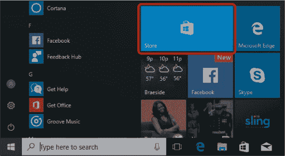

1.  你现在应该能看到商店的主屏幕，下面所示。商店中提供的应用和产品会频繁变化，所以你的屏幕可能会有所不同。

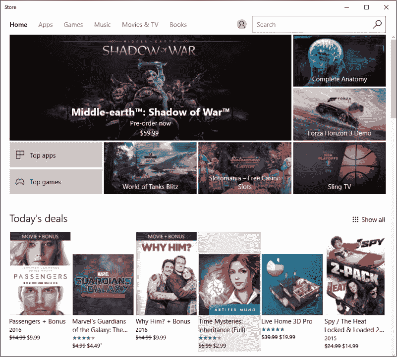

你会注意到屏幕顶部有一系列部分：主页、应用、游戏、音乐、电影与电视、图书。你可以将这些看作商店中的各个部门。在这里，它们将商店划分如下：

*****   **主页：** 这是你首次打开商店时的起始页面；它展示了来自其他部分的最受欢迎的应用、游戏、音乐曲目、电影、电视节目和图书。这里显示的选择会定期更新，因此每次打开商店时你可能会看到不同的内容。

*****   **应用：** 本部分包含你可以在电脑上安装的各种应用，游戏除外，游戏有自己的单独部分。

*****   **游戏：** 由于有许多游戏可以下载，它们有一个单独的部分，区别于应用程序。你可以从这里安装游戏。

*****   **音乐：** 本部分允许你购买音乐曲目和专辑。

*****   **电影与电视：** 在这里，你可以找到大量最新的电影和电视节目供购买。商店甚至允许你租赁许多电影，并提供限定时间观看。

*****   **图书：** 本部分允许你购买电子书。

在继续探索商店时，我们将只查看应用和游戏部门。

#### **查找应用和游戏**

商店有成千上万的应用程序，找到完美的应用可能有点困难！为了简化操作，以下是两种主要的应用查找方式：

*****   **类别：** 如果你不确定你正在寻找的应用名称，或者你只是想浏览并查看可用的内容，可以通过类别查找特定类型的应用。

*****   **搜索：** 如果你知道你想下载的特定应用的名称（例如，Netflix），你可以使用搜索功能轻松找到该应用。

由于商店有许多优秀的游戏，因此它有一个单独的游戏部门，但你可以像搜索应用一样通过类别或搜索特定游戏来查找游戏。

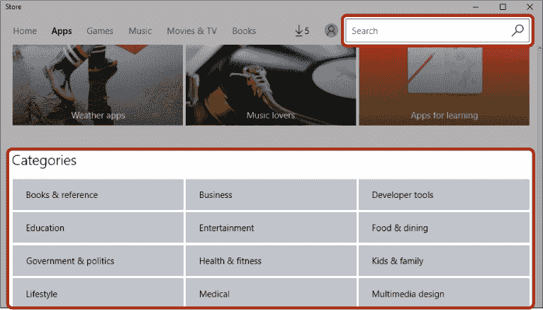

#### **按类别搜索**

按类别搜索应用或游戏是查看可用内容并找到你喜欢的应用或游戏的好方法。在这个例子中，我们将通过类别搜索一个应用（你也可以用相同的方法搜索游戏）。请按以下步骤操作：

1.  从商店顶部的按钮中，点击**应用**。 （如果你是通过类别查找游戏，请点击**游戏**）。

    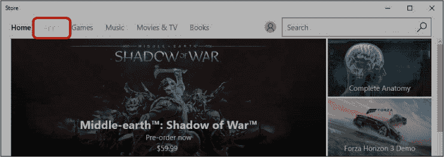

1.  这将打开商店的应用部分，展示许多受欢迎和精选的应用，如下所示。

    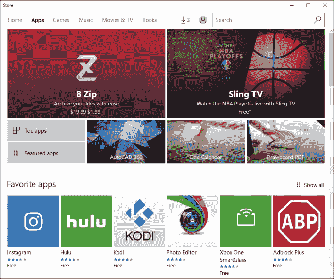

1.  使用滚动条向下滚动页面，找到应用类别列表。这些类别代表了商店中不同类型的应用。

1.  点击你感兴趣的应用类别。以此例为例，点击**食品与餐饮**类别。

    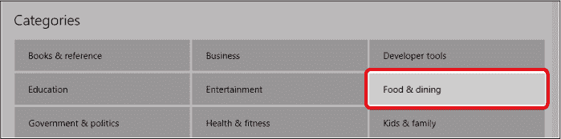

1.  “食品与餐饮”类别的应用现在会出现。您可能会看到与下图示例不同的应用列表。

    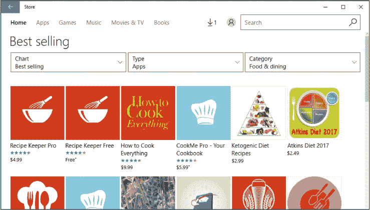

1.  请注意每个应用下方的星级评分。这能让您快速了解其他人对该应用的评价。评分为四星或五星的应用获得了使用者的高度评价；相反，您可能需要避免评分仅为一星或两星的应用。

1.  商店将首先显示最受欢迎的免费应用，但进一步精炼搜索结果，显示高度评价或最新的应用程序将非常有帮助。您可以通过点击屏幕左上角的**Chart**选项来细化选择，里面会列出一些选项。

1.  若要仅浏览免费应用，请点击**Chart**框，然后从出现的列表中点击**Top free**。许多优秀且高质量的应用是免费的，因此不要犹豫去探索这个选项。但也要小心，因为即使应用是免费的，它们也可能包含*应用内购买*，这意味着您在使用时会被提示用真钱购买物品（例如，添加功能或移除广告）。如果一个应用在评分下方标注**Free^+**而不仅仅是**Free**，则意味着它包含应用内购买。我们将在后面的课程中进一步讨论这一话题。

**活动 #21**

在本活动中，我们将练习浏览类别并精炼搜索。

1.  在商店中，浏览教育类应用。

1.  将您的列表精炼为仅显示免费应用。

#### **使用搜索框进行搜索**

如果您知道您想要的应用名称，搜索该名称是最快的方式。例如，如果您想找到在电视上广告宣传过的 TuneIn Radio 应用，您可以在搜索框中搜索“TuneIn Radio”，然后会出现一个类似名称的应用列表。接着您只需选择正确名称的那个应用。

您还可以使用此框搜索关键词；例如，如果您想找一个电台应用，但不知道特定应用的名称，您只需在框中搜索“radio”，就会显示包含*radio*这个词的应用列表，无论是在名称还是描述中。

我们将搜索一个流行的食谱应用，So Cookbook。按照以下步骤操作：

1.  点击屏幕右上角的**Search**框。

    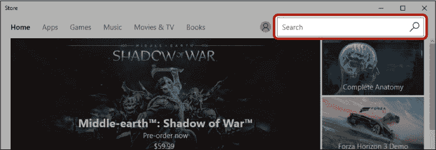

1.  在搜索框中输入您想搜索的应用或游戏名称（在本例中是**So Cookbook**），然后按回车键或点击放大镜图标。

1.  将出现一个符合您搜索条件的应用和游戏列表。您的结果可能与下图略有不同，因为商店中不断有新应用和游戏添加进来。您还可以使用屏幕顶部的**Type**框来缩小结果，仅显示应用或游戏。

    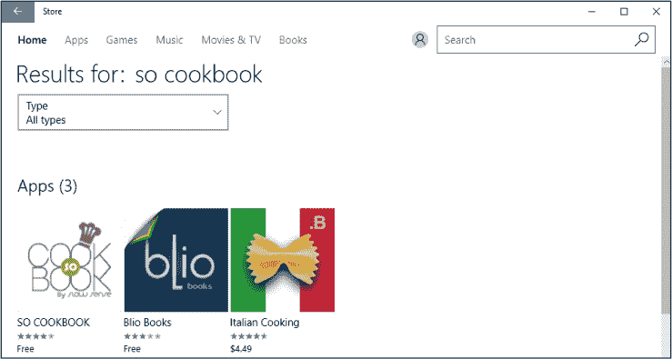

### 选择应用程序或游戏

正如我们的搜索结果所示，商店里有很多很棒的应用和游戏！那么，如何知道哪些适合你呢？在选择是否安装之前，你需要更多关于这个应用的信息。

一旦你完成了“搜寻 So Cookbook”的操作，点击搜索结果中的应用图块，信息会显示在此页面中的图示位置。

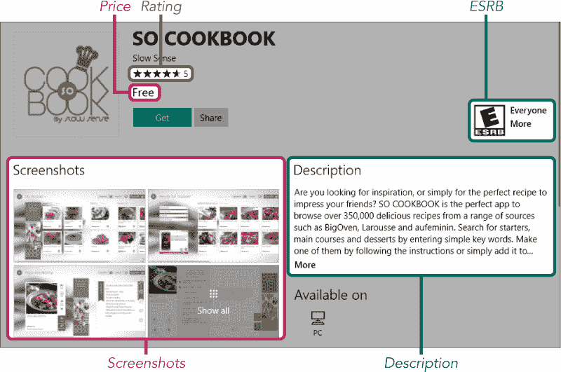

*****   **价格：** 价格会出现在屏幕的顶部，可能会显示*免费*或列出价格，例如$3.99。

*****   **评分：** 了解其他顾客对该应用的评价非常有帮助。评分从一颗星到五颗星不等。星星旁边的数字表示有多少用户给出了评分和评价。如果该应用有很多评论者，那么评分通常比只有一两位评论者的应用更可靠。

*****   **ESRB：** 娱乐软件评级委员会（ESRB）根据内容为应用分配年龄评级。

*****   **截图：** 这些是应用本身的截图，帮助你了解它的外观。

*****   **描述：** 这会告诉你该应用的功能和用途。有时候描述的最后部分会被隐藏；要查看完整描述，你可以点击**更多**。

如果你喜欢这个应用的外观，那么你就准备好安装并享受它了！然而，如果这个应用似乎不太适合你，你可以使用搜索框来寻找其他应用，或者点击返回按钮返回到该类别中的其他应用。

### 安装应用

一旦你找到一个喜欢的应用并阅读了它的描述页面，你就可以安装它。我们以 So Cookbook 应用为例。下面是如何安装一个应用的步骤：

1.  点击下面高亮显示的**获取**按钮。

    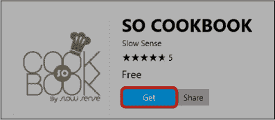

1.  应用将开始下载并安装，获取按钮会变成一个*进度条*，这是一个视觉指示器，显示应用已经安装了多少，剩余多少，从而让你了解需要多长时间。根据你的互联网连接速度，下载和安装可能需要几分钟。一旦进度条完成，你会看到该应用已成功安装的提示，如下图所示。

1.  点击**启动**按钮打开应用。

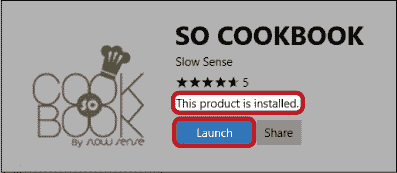

**活动 #22**

在本次活动中，你将找到并安装一个名为 Microsoft Jigsaw 的有趣游戏。

1.  在商店中找到**Microsoft 拼图**游戏。

1.  安装该游戏。

1.  启动应用。

### 重新打开应用

当你第一次安装应用时，商店里会出现一个方便的启动或播放按钮，但这个按钮并不会一直存在。幸运的是，你可以从开始菜单打开已下载的应用，就像打开商店和天气等应用一样。以下是操作步骤：

1.  点击**开始按钮**或点击**开始搜索框**。

1.  输入您想打开的应用名称（在此例中为**so cookbook**）。

1.  点击该应用以打开它。

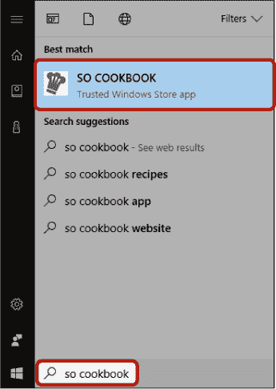

您的应用将出现！如果您不记得应用的准确名称，可以点击**开始按钮**，然后滚动浏览“开始”菜单左侧的完整应用列表，尝试找出它，如下所示。

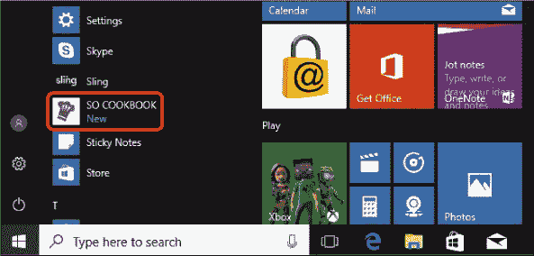

### 移除应用

可惜，即使是最伟大的恋情也会有结束的时候，您可能会发现是时候删除某个应用了。删除不再使用的应用可以释放计算机空间，给您更多空间存储您使用的东西——同时也能清理“开始”菜单中的应用列表，让您更容易找到常用的应用。虽然您的计算机存储空间是有限的，但通常您会有足够的空间存放许多应用和文件。然而，过多的应用程序会使计算机变慢，最糟糕的情况是，限制您添加新文件或安装新应用。

让我们移除 So Cookbook 应用程序。

1.  点击**开始按钮**。

1.  向下滚动应用列表，直到找到 So Cookbook，或者在搜索框中搜索它——但不要点击它！

1.  右键点击**So Cookbook**以弹出小菜单。

1.  点击**卸载**按钮，如下图所示。

    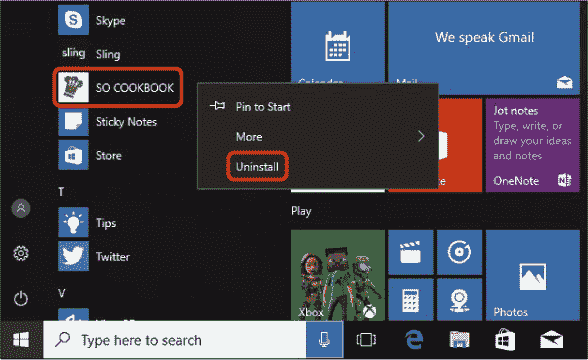

1.  会弹出一个框告诉您该应用将被卸载。

1.  再次点击**卸载**以确认。

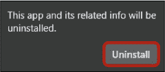

So Cookbook 应用程序将被移除。您将不再在“开始”菜单中找到它，它的所有痕迹也将消失。如果您决定随时重新安装该应用，您总是可以回到商店，并以与第一次安装时相同的方式重新安装它。不过，只有在您完全不再使用这些应用时，才应卸载它们。

### 探索：付费应用

到目前为止，我们关注的是免费的应用程序，但商店中也有很多应用程序，您需要支付一定费用才能安装。如果您找到一个必须付费才能安装的应用，您会看到“购买”按钮替代了“获取”按钮。应用程序的价格会在此处明确显示。某些应用也有“免费试用”按钮，允许您在购买前免费试用一段时间。

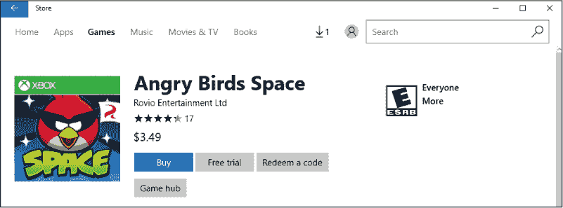

一旦点击“购买”按钮，系统将要求您输入密码。这是一个安全措施，确保是您本人在尝试购买应用。密码将与您第一次开机时用来登录计算机的密码相同。

如果这是您第一次购买应用程序，系统将提示您输入支付信息，如下所示。

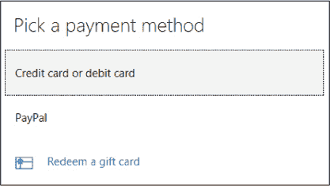

许多人通过输入信用卡或借记卡信息来进行这类支付，但在商店中还有其他方式可以进行支付。如果你不想在电脑上输入信用卡信息，你可以从沃尔玛等零售商那里购买 Windows 商店或 Xbox Live 礼品卡。然后你只需点击 **兑换礼品卡** 按钮，输入卡上打印的代码。如果你有 PayPal 帐户，你也可以使用它来从商店购买。有关如何安全地进行在线支付，请查看第六章中的“在线购物技巧”。

### 尝试的应用

现在你已经学会了如何从商店下载和安装应用，以下是一些你可以自己尝试的应用：

*****   **Adblock Plus**：防止大部分广告在你浏览互联网时显示。与大多数应用不同，Adblock Plus 与 Microsoft Edge 集成，因此你不需要单独打开它。当你在安装了 Adblock Plus 后打开 Edge 时，你应该能看到右上角的红色 ABP 图标，提示你广告已被阻止。

*****   **糖果传奇**：一款非常受欢迎（而且令人上瘾！）的游戏。

*****   **LastPass**：记录你所有的密码。

*****   **翻译器**：将一种语言翻译成另一种语言—如果你要去度假，简直太棒了！

*****   **WatchESPN**：如果你有有线电视订阅，这个应用可以让你在电脑上观看 ESPN。

### 呼，做到了！

在本课中，我们学习了如何从商店中搜索、下载和卸载应用程序和游戏。你学会了如何执行以下操作：

*****   访问商店

*****   查找并安装应用

*****   从电脑中删除不需要的应用

在下一课中，你将学习如何免费在线听音乐。

**课程复习**

恭喜你！你已完成第 8 课。利用这个机会，通过完成以下任务来复习你学到的内容。如果你能够自信地完成所有任务，那么你准备好迎接第 9 课了。如果没有，不要灰心—只需继续练习！

1.  打开商店。

1.  从“益智与 trivia”类别中安装 Microsoft Mahjong 游戏。

1.  玩一局麻将。

1.  卸载 Microsoft Mahjong。
