## 第十章：第 9 课

## 在线听音乐

使用你的电脑听音乐甚至享受广播非常简单！

注册 Spotify

使用 Spotify

搜索音乐

浏览音乐

重新登录 Spotify

探索：购买歌曲

探索：TuneIn 电台

呼，完成了！

在本课中，你将学习如何使用 Spotify 网站在线收听数百万首新歌和老歌。

### 注册 Spotify

Spotify 是一个受欢迎的在线音乐网站。它提供免费的服务，让你可以听特定的歌曲或艺术家的音乐，唯一的妥协是你必须在歌曲之间听到偶尔的广告。你可以选择支付少量的月费来订阅 Spotify 并去除这些偶尔的广告。

与本书中我们使用的大多数应用不同，Spotify 要求你创建一个帐户才能使用其服务。好消息是，注册是完全免费的。前往 Spotify 网站进行注册：

1.  从任务栏或开始菜单中打开**Microsoft Edge**。

1.  在地址栏中输入**play.spotify.com**并按回车键。这将打开 Spotify 播放页面，如下所示。

    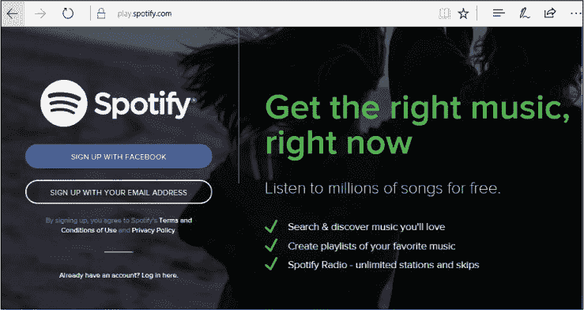

1.  点击**使用电子邮件地址注册**按钮。

1.  这将显示以下注册表格。Spotify 需要一些你的信息来设置个人帐户。这非常有用，因为它可以跟踪你所听的歌曲，从而推荐你可能喜欢的其他歌曲。

    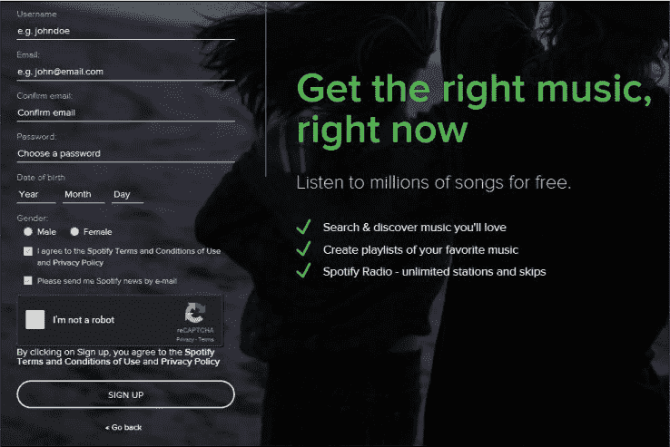

1.  点击**用户名**框并输入你想在 Spotify 上使用的用户名。这个用户名应该是独一无二的，所以像“chris”和“carrie”这样的简单用户名可能已经被占用了。同时，你的用户名应该足够简单，方便记住，因为你每次使用 Spotify 时都需要输入它。你可以尝试使用你名字的缩写和姓氏的组合；如果这不行，再尝试加上一个容易记住的数字。

1.  点击**电子邮件**框并输入你的电子邮件地址。

1.  点击**确认电子邮件**框，再次输入你的电子邮件地址，以确保第一次输入正确。如果你输入的两个电子邮件地址不匹配，系统会提示你检查输入并纠正任何错误。

1.  点击**密码**框并输入一个易于记住的密码（因为你每次想登录 Spotify 时都需要输入），但密码应足够复杂，避免他人猜到，以保护你的帐户安全。理想情况下，密码应包含字母和数字，且至少有八个字符。当你在密码框中输入时，密码将以点表示，以防止附近的人看到。

1.  点击标有**出生年份**的框，从列表中选择你的出生年份，然后对出生月份和日期进行相同操作。

1.  点击“男”或“女”旁边的圆圈选择你的性别。

1.  默认情况下，Spotify 会偶尔通过电子邮件向你发送通知。如果你不想收到这些通知，可以取消勾选**请通过电子邮件向我发送 Spotify 新闻**框。

1.  Spotify 需要确保你是一个人类，而不是自动注册数百个账户的计算机程序，因此请确保勾选**我不是机器人**框。你可能需要完成一个简单的任务，比如点击包含猫咪的图片，以证明你不是在创建虚假账户的自动化程序。

1.  点击**注册**。此时你可能会被要求接受 Spotify 的条款和条件。如果你愿意，可以点击**使用条款**和**隐私政策**链接详细阅读，然后点击下方突出的**同意**按钮继续。

    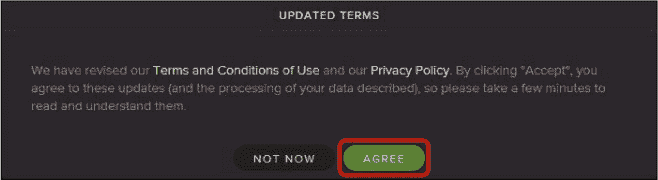

1.  最后，你可能会被要求启用 Flash 以访问 Spotify。Flash 是你有时需要的小程序，用于访问一些在线视频和音频内容。点击**点击此处启用 Flash**链接，如下所示。若系统提示你允许 Flash 始终在 Spotify 上运行，点击**始终允许**。

    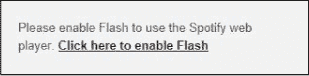

这应该会带你回到 Spotify 的主播放页面。现在你已经有了账户，让我们看看如何找到音乐吧！

### 使用 Spotify

Spotify 提供了两种主要的音乐查找方式。如果你知道你在找什么，可以使用搜索功能查找特定的歌曲、专辑或艺术家。或者，你可以浏览选项列表，从特定类别（如古典音乐或流行歌曲）中播放歌曲。

#### 搜索音乐

要找到特定的歌曲或艺术家，请按照以下步骤操作：

1.  点击页面左侧的**搜索**按钮。

    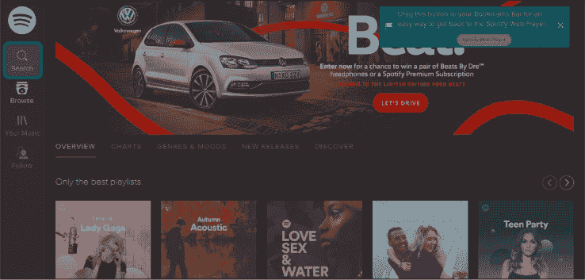

1.  这将会在页面的左侧显示一个搜索框，如图所示。在搜索框中输入你要查找的歌曲或艺术家的名字。

    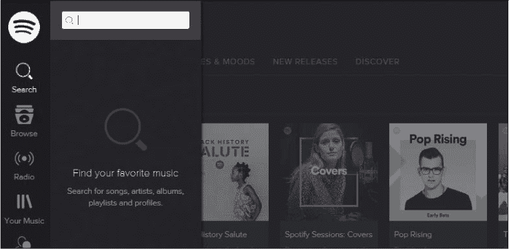

1.  当你开始输入时，搜索框下方将会出现一系列建议。点击你想要的结果，如图所示。

    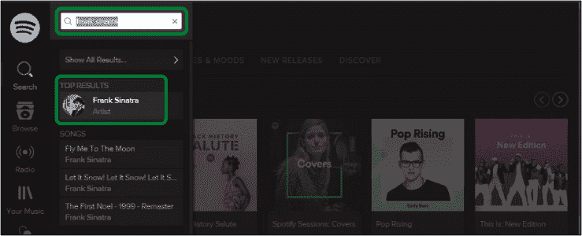

1.  这将会在屏幕右侧打开与你的搜索词相关的结果列表。许多搜索结果可能过长，无法在单一屏幕上显示，届时你可以向下滚动查看更多结果。当你将鼠标移动到某首歌上时，应该会看到一个小的播放按钮出现在歌曲名称的左侧，如下图所示。点击**播放按钮**开始播放歌曲。

    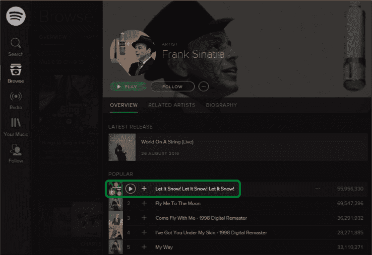

1.  现在歌曲开始播放，右侧将出现一个控制面板，你可以使用其中的按钮暂停和播放歌曲。暂停按钮右侧的箭头是*跳过*按钮。如果你不喜欢当前正在播放的歌曲，可以跳过到下一首。暂停按钮左侧是*上一首*按钮，如果你不小心跳过了喜欢的歌曲，或者想再听一遍某首歌时，可以使用这个按钮。

    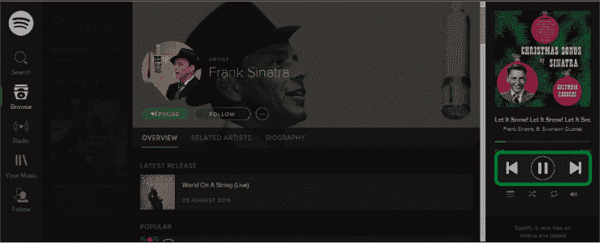

    当一首歌播放完毕后，Spotify 会自动开始播放屏幕中间列表中的下一首歌。为了在做其他事情时继续播放列表，你可以最小化 Spotify。有关最小化的详细信息，请参考“恢复消失的应用”第 45 页。

#### 浏览音乐

浏览不同的音乐类别，按照以下步骤操作：

1.  点击页面左侧的**浏览**按钮。

    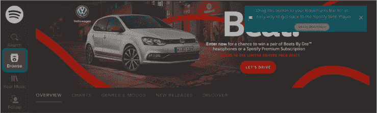

1.  你会看到页面中间有“排行榜”、“类型与心情”、“新发行”和“发现”这些标题，具体操作如下：

    *****   **排行榜：** 让你听到当前最流行的歌曲，可以是全球范围内的，也可以是你所在国家的热门歌曲。

    *****   **类型与心情：** 让你选择特定的音乐类型，如古典、乡村或爵士乐。

    *****   **新发行：** 让你收听最近发行的专辑和单曲。

    *****   **发现：** 让你根据 Spotify 认为你会喜欢的歌曲，听听相关音乐，这些推荐基于你之前听过的歌曲。在你播放了几首歌之后，可以尝试使用此功能，让 Spotify 更了解你喜欢什么类型的音乐。

1.  点击其中一个标题。以本例为例，我们选择**类型与心情**。

1.  这将显示一个音乐类型的列表。你可以向下滚动查看更多类型。点击你想要的类型，如**古典**。

    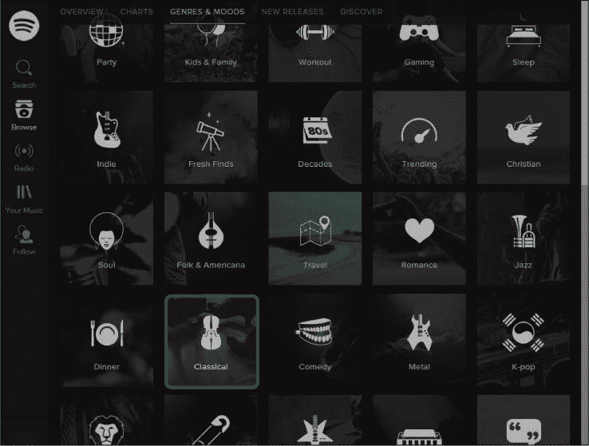

1.  这将显示该类型的*播放列表*。这些播放列表是由 Spotify 或其他 Spotify 用户选择的歌曲集合。点击一个播放列表查看其中包含的歌曲，如下所示。

    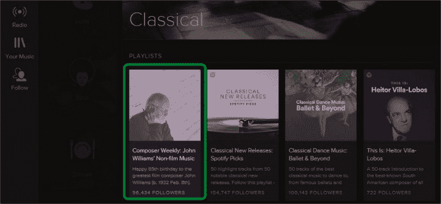

1.  你应该能看到播放列表的简短描述，以及播放列表中的歌曲列表。点击屏幕顶部的绿色**播放**按钮播放整个播放列表，或者将鼠标移动到某一首歌上，点击旁边的**播放按钮**先播放那首歌。

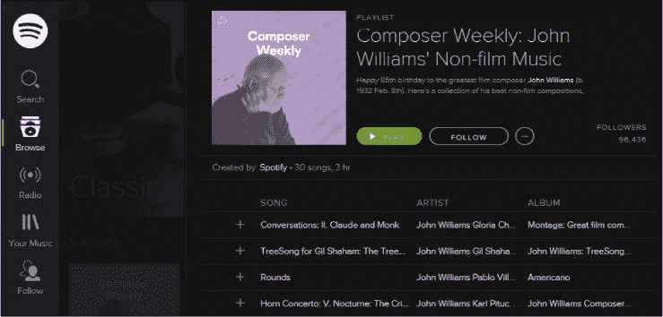

一旦歌曲开始播放，你应该能看到页面右侧出现一组控制按钮，允许你暂停、跳过或重播歌曲。记住，Spotify 会在当前歌曲结束后自动播放下一首。

**活动 #23**

在本次活动中，你将练习如何浏览 Spotify，并在网站上播放一首歌曲。

1.  使用搜索功能查找比利·乔尔（或其他你有兴趣的艺术家）的歌曲，并播放搜索结果中的一首歌曲。

1.  使用浏览功能查找并播放一份爵士乐播放列表。

### 重新登录 Spotify

一旦退出了 Spotify 网站，下次想再次使用时，可能需要重新登录。按照这些步骤再次登录 Spotify。

1.  打开**Microsoft Edge**。

1.  在地址栏中输入**play.spotify.com**并按回车键。

1.  点击页面左下角的**已有账户？点击这里登录**按钮。它很小，但就在那儿！

    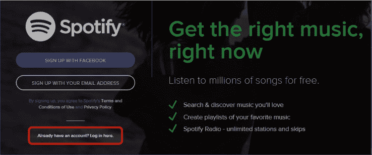

1.  点击**用户名**框并输入你之前创建的 Spotify 用户名。

1.  点击**密码**框并输入你之前创建的 Spotify 密码。

1.  勾选**我不是机器人**按钮。你可能会被要求回答一个简单问题以证明你不是机器人，正如之前所述。

1.  点击**登录**按钮。

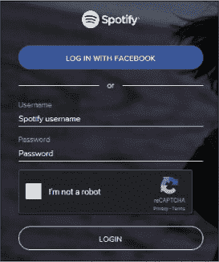

这应该会带你返回 Spotify 的主播放页面，你可以使用“搜索”或“浏览”按钮找到或发现你想听的音乐。

### 探索：购买歌曲

到目前为止，我们已经看过如何免费在线收听音乐。然而，如果你想将特定的歌曲或专辑保存在电脑上，你可以从商店购买它们的数字版本。商店提供了购买歌曲和整张专辑的方式。

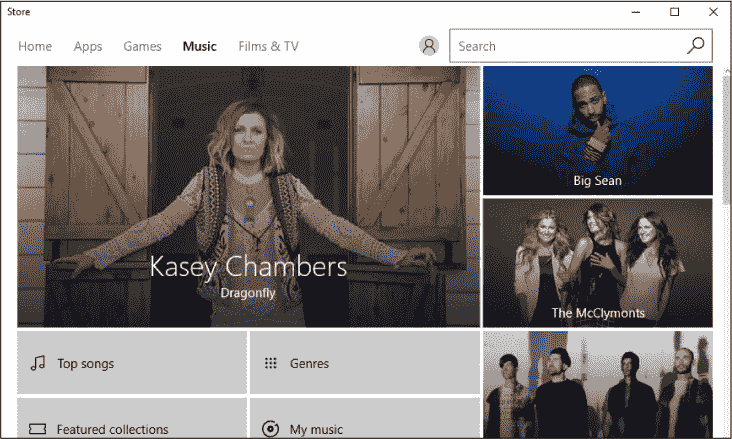

购买过程与购买应用相同，因此如果你已经完成了第 8 课，你应该具备购买歌曲的能力！你需要打开商店并点击屏幕顶部的音乐标签。然后，你可以浏览音乐类型，或者使用右上角的搜索栏搜索歌曲或艺术家。你也可以像浏览应用商店那样浏览商店。

当你找到想购买的歌曲或专辑时，点击旁边的价格标签进行购买。如果你还没有添加支付信息，系统会要求你添加——有关在商店中输入支付信息的更多信息，请参见探索：付费应用，第 179 页。

一旦你购买了某首歌曲，你可以随时使用 Groove Music 应用来收听，使用开始菜单即可进入该应用。只需点击**我的音乐**标题，即可查看你购买的所有歌曲和专辑。

### 探索：TuneIn Radio

TuneIn Radio 让你可以收听你所有喜爱的广播电台，包括本地电台和全球电台。你可以使用 TuneIn Radio 收听：

*****   音乐

*****   体育节目报道

*****   话题广播

*****   预录的访谈和节目，称为 *播客*

*****   外国广播电台

*****   在其他语言中显示

*****   有声书

TuneIn Radio 应用可以从商店免费下载，简单下载后即可开始收听！

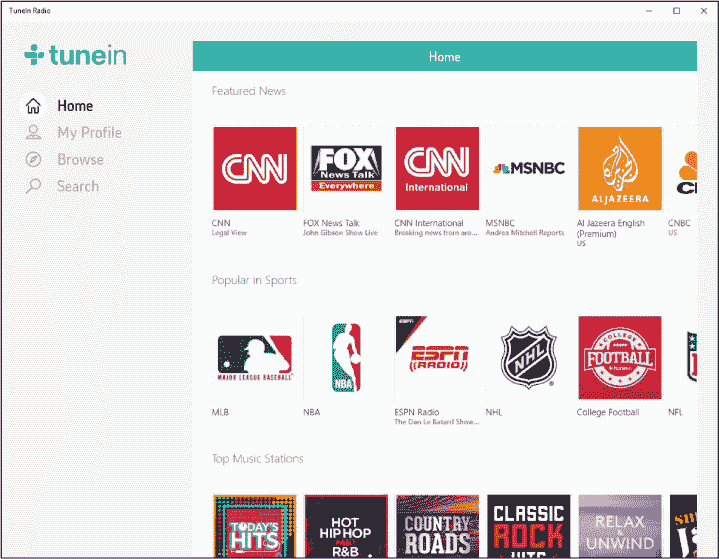

### 呼，终于完成了！

在本课中，我们探索了如何通过 Spotify 网站在线听音乐。在本课中，你学习了如何完成以下操作：

*****   在 Spotify 上搜索你喜欢的歌曲或艺术家

*****   在 Spotify 上浏览不同的音乐类型

*****   重新登录 Spotify

在下一课中，你将学习如何在电脑上免费阅读书籍。

**课后复习**

恭喜你！你已完成第 9 课。利用这个机会，通过完成以下任务来复习本课。如果你能自信地完成这些任务，那么你已经准备好学习第 10 课了。如果没有，别担心：继续练习就好！

1.  在 Spotify 上找到你喜欢的艺术家的音乐。

1.  在 Spotify 上听你喜欢的音乐类型的歌曲。
